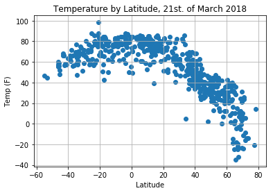
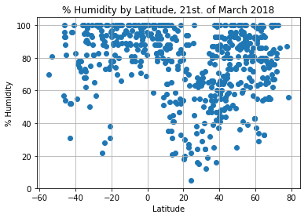
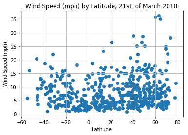

### Observations:

1) There is a correlation between Latitude and Temperature. In generalt the temperature is higher around equator

2) There is no significant correlation attached to wind speed and humidity versus Latitude. In Norwegian this is called a shotgun plot.

3) This is a sample of one day and we can only make general conclusions. It would be interesting to look at data from i.e. the same day for the last 50 years.


```python
# import dependencies
import pandas as pd
import numpy as np
import csv
import matplotlib.pyplot as plt
%matplotlib inline
from citipy import citipy
import requests
import json
from config import api_key
```


```python
# randomly generate lat and long values with numpy
lats = np.random.uniform(low = -90.000, high = 90.000, size = 1500)
lngs = np.random.uniform(low = -180.000, high = 180.000, size = 1500)
```


```python
#save to csv
np.savetxt("lats.csv", lats, delimiter=",", fmt='%s')
np.savetxt("lngs.csv", lngs, delimiter=",", fmt='%s')
```


```python
# build uniformly distributed list of cities
city_list = []
# zip together lats and longs
lat_lngs = zip(lats, lngs)

# obtain city names using citipy
for lat_lng in lat_lngs:
    city = citipy.nearest_city(lat_lng[0], lat_lng[1]).city_name
    
    #build city_list
    if city not in city_list:
        city_list.append(city)
```


```python
#enough?
len(city_list)
```


    617


```python
#save list as csv
city_list_csv = np.savetxt("city_list.csv", city_list, delimiter=",", fmt="%s")
```


```python
import urllib
```


```python
# perform API calls

units = ["imperial"]
for unit in units:
    
# build URL for API call
    url = "http://api.openweathermap.org/data/2.5/weather?" + "APPID=" + api_key +"&units=" + unit
    # create endpoints for performing API calls

url
```


    'http://api.openweathermap.org/data/2.5/weather?APPID=418867c0834049fe7fa056bc7203ed29&units=imperial'


```python
import time
```


```python
city_data =[]
count = 0
for city in city_list:
    
    time.sleep(0.5)
    count += 1
    print(count)
    
 
    print(f"Processing record for {city}")
    
    city_url = url + "&q=" + urllib.request.pathname2url(city)
    print(city_url)
    
    try:
        # API call
        city_weather = requests.get(city_url).json()
#         city_data.append(owm.get_current(city, **settings))

        # parse information to save
        city_lat = city_weather["coord"]["lat"]
        city_lng = city_weather["coord"]["lon"]
        city_wind = city_weather["wind"]["speed"]
        city_cloud = city_weather["clouds"]["all"]
        city_temp = city_weather["main"]["temp_max"]
        city_name = city_weather["name"]
        city_humid = city_weather["main"]["humidity"]

        
        city_data.append({"City": city_name, 
                          "Lat": city_lat, 
                          "Lon": city_lng,
                          "Wind": city_wind,
                          "Cloud": city_cloud,
                          "Humidity": city_humid,
                          "Temp":city_temp})
    
    except Exception as e:
            print(e,city,city_data)
```

    1
    Processing record for bardiyah
    http://api.openweathermap.org/data/2.5/weather?APPID=418867c0834049fe7fa056bc7203ed29&units=imperial&q=bardiyah
    'coord' bardiyah []
    2
    Processing record for tuatapere
    http://api.openweathermap.org/data/2.5/weather?APPID=418867c0834049fe7fa056bc7203ed29&units=imperial&q=tuatapere
    3
    Processing record for dingle
    http://api.openweathermap.org/data/2.5/weather?APPID=418867c0834049fe7fa056bc7203ed29&units=imperial&q=dingle
    4
    Processing record for port elizabeth
    http://api.openweathermap.org/data/2.5/weather?APPID=418867c0834049fe7fa056bc7203ed29&units=imperial&q=port%20elizabeth
    5
    Processing record for qaanaaq
    http://api.openweathermap.org/data/2.5/weather?APPID=418867c0834049fe7fa056bc7203ed29&units=imperial&q=qaanaaq
    6
    Processing record for kenai
    http://api.openweathermap.org/data/2.5/weather?APPID=418867c0834049fe7fa056bc7203ed29&units=imperial&q=kenai
    7
    Processing record for nouadhibou
    http://api.openweathermap.org/data/2.5/weather?APPID=418867c0834049fe7fa056bc7203ed29&units=imperial&q=nouadhibou
    8
    Processing record for kapaa
    http://api.openweathermap.org/data/2.5/weather?APPID=418867c0834049fe7fa056bc7203ed29&units=imperial&q=kapaa
    9
    Processing record for westpunt
    http://api.openweathermap.org/data/2.5/weather?APPID=418867c0834049fe7fa056bc7203ed29&units=imperial&q=westpunt
    'coord' westpunt [{'City': 'Tuatapere', 'Lat': -46.13, 'Lon': 167.69, 'Wind': 9.33, 'Cloud': 64, 'Humidity': 100, 'Temp': 55.09}, {'City': 'Dingle', 'Lat': 11, 'Lon': 122.67, 'Wind': 12.68, 'Cloud': 48, 'Humidity': 64, 'Temp': 84.97}, {'City': 'Port Elizabeth', 'Lat': 39.31, 'Lon': -74.98, 'Wind': 8.05, 'Cloud': 1, 'Humidity': 64, 'Temp': 44.6}, {'City': 'Qaanaaq', 'Lat': 77.48, 'Lon': -69.36, 'Wind': 6.08, 'Cloud': 44, 'Humidity': 87, 'Temp': -20.42}, {'City': 'Kenai', 'Lat': 60.55, 'Lon': -151.26, 'Wind': 10.29, 'Cloud': 1, 'Humidity': 37, 'Temp': 37.4}, {'City': 'Nouadhibou', 'Lat': 20.93, 'Lon': -17.03, 'Wind': 26.4, 'Cloud': 0, 'Humidity': 72, 'Temp': 62.6}, {'City': 'Kapaa', 'Lat': 22.08, 'Lon': -159.32, 'Wind': 12.75, 'Cloud': 90, 'Humidity': 94, 'Temp': 71.6}]
    10
    Processing record for union city
    http://api.openweathermap.org/data/2.5/weather?APPID=418867c0834049fe7fa056bc7203ed29&units=imperial&q=union%20city
    11
    Processing record for mahebourg
    http://api.openweathermap.org/data/2.5/weather?APPID=418867c0834049fe7fa056bc7203ed29&units=imperial&q=mahebourg
    12
    Processing record for upernavik
    http://api.openweathermap.org/data/2.5/weather?APPID=418867c0834049fe7fa056bc7203ed29&units=imperial&q=upernavik
    13
    Processing record for lavumisa
    http://api.openweathermap.org/data/2.5/weather?APPID=418867c0834049fe7fa056bc7203ed29&units=imperial&q=lavumisa
    14
    Processing record for regina
    http://api.openweathermap.org/data/2.5/weather?APPID=418867c0834049fe7fa056bc7203ed29&units=imperial&q=regina
    15
    Processing record for mar del plata
    http://api.openweathermap.org/data/2.5/weather?APPID=418867c0834049fe7fa056bc7203ed29&units=imperial&q=mar%20del%20plata
    16
    Processing record for torbay
    http://api.openweathermap.org/data/2.5/weather?APPID=418867c0834049fe7fa056bc7203ed29&units=imperial&q=torbay
    17
    Processing record for narsaq
    http://api.openweathermap.org/data/2.5/weather?APPID=418867c0834049fe7fa056bc7203ed29&units=imperial&q=narsaq
    18
    Processing record for san joaquin
    http://api.openweathermap.org/data/2.5/weather?APPID=418867c0834049fe7fa056bc7203ed29&units=imperial&q=san%20joaquin
    19
    Processing record for sambava
    http://api.openweathermap.org/data/2.5/weather?APPID=418867c0834049fe7fa056bc7203ed29&units=imperial&q=sambava
    20
    Processing record for hilo
    http://api.openweathermap.org/data/2.5/weather?APPID=418867c0834049fe7fa056bc7203ed29&units=imperial&q=hilo
    21
    Processing record for chokurdakh
    http://api.openweathermap.org/data/2.5/weather?APPID=418867c0834049fe7fa056bc7203ed29&units=imperial&q=chokurdakh
    22
    Processing record for trincomalee
    http://api.openweathermap.org/data/2.5/weather?APPID=418867c0834049fe7fa056bc7203ed29&units=imperial&q=trincomalee
    23
    Processing record for severo-kurilsk
    http://api.openweathermap.org/data/2.5/weather?APPID=418867c0834049fe7fa056bc7203ed29&units=imperial&q=severo-kurilsk
    24
    Processing record for port alfred
    http://api.openweathermap.org/data/2.5/weather?APPID=418867c0834049fe7fa056bc7203ed29&units=imperial&q=port%20alfred
    25
    Processing record for nguiu
    http://api.openweathermap.org/data/2.5/weather?APPID=418867c0834049fe7fa056bc7203ed29&units=imperial&q=nguiu
    'coord' nguiu [{'City': 'Tuatapere', 'Lat': -46.13, 'Lon': 167.69, 'Wind': 9.33, 'Cloud': 64, 'Humidity': 100, 'Temp': 55.09}, {'City': 'Dingle', 'Lat': 11, 'Lon': 122.67, 'Wind': 12.68, 'Cloud': 48, 'Humidity': 64, 'Temp': 84.97}, {'City': 'Port Elizabeth', 'Lat': 39.31, 'Lon': -74.98, 'Wind': 8.05, 'Cloud': 1, 'Humidity': 64, 'Temp': 44.6}, {'City': 'Qaanaaq', 'Lat': 77.48, 'Lon': -69.36, 'Wind': 6.08, 'Cloud': 44, 'Humidity': 87, 'Temp': -20.42}, {'City': 'Kenai', 'Lat': 60.55, 'Lon': -151.26, 'Wind': 10.29, 'Cloud': 1, 'Humidity': 37, 'Temp': 37.4}, {'City': 'Nouadhibou', 'Lat': 20.93, 'Lon': -17.03, 'Wind': 26.4, 'Cloud': 0, 'Humidity': 72, 'Temp': 62.6}, {'City': 'Kapaa', 'Lat': 22.08, 'Lon': -159.32, 'Wind': 12.75, 'Cloud': 90, 'Humidity': 94, 'Temp': 71.6}, {'City': 'Union City', 'Lat': 36.42, 'Lon': -89.06, 'Wind': 2.73, 'Cloud': 1, 'Humidity': 65, 'Temp': 51.8}, {'City': 'Mahebourg', 'Lat': -20.41, 'Lon': 57.7, 'Wind': 10.29, 'Cloud': 20, 'Humidity': 78, 'Temp': 78.8}, {'City': 'Upernavik', 'Lat': 72.79, 'Lon': -56.15, 'Wind': 8.77, 'Cloud': 8, 'Humidity': 100, 'Temp': -14.3}, {'City': 'Lavumisa', 'Lat': -27.31, 'Lon': 31.88, 'Wind': 8.1, 'Cloud': 100, 'Humidity': 99, 'Temp': 61.93}, {'City': 'Regina', 'Lat': 50.45, 'Lon': -104.62, 'Wind': 25.28, 'Cloud': 90, 'Humidity': 86, 'Temp': 32}, {'City': 'Mar del Plata', 'Lat': -46.43, 'Lon': -67.52, 'Wind': 20.29, 'Cloud': 0, 'Humidity': 57, 'Temp': 60.4}, {'City': 'Torbay', 'Lat': 47.66, 'Lon': -52.73, 'Wind': 26.4, 'Cloud': 90, 'Humidity': 100, 'Temp': 30.2}, {'City': 'Narsaq', 'Lat': 60.91, 'Lon': -46.05, 'Wind': 10.29, 'Cloud': 0, 'Humidity': 63, 'Temp': 30.2}, {'City': 'San Joaquin', 'Lat': 10.59, 'Lon': 122.14, 'Wind': 12.68, 'Cloud': 48, 'Humidity': 64, 'Temp': 84.97}, {'City': 'Sambava', 'Lat': -14.27, 'Lon': 50.17, 'Wind': 12.46, 'Cloud': 80, 'Humidity': 100, 'Temp': 79.3}, {'City': 'Hilo', 'Lat': 19.71, 'Lon': -155.08, 'Wind': 5.82, 'Cloud': 90, 'Humidity': 54, 'Temp': 80.6}, {'City': 'Chokurdakh', 'Lat': 70.62, 'Lon': 147.9, 'Wind': 4.74, 'Cloud': 32, 'Humidity': 76, 'Temp': -11.6}, {'City': 'Trincomalee', 'Lat': 8.58, 'Lon': 81.23, 'Wind': 5.97, 'Cloud': 0, 'Humidity': 80, 'Temp': 82.36}, {'City': 'Severo-Kurilsk', 'Lat': 50.68, 'Lon': 156.12, 'Wind': 3.96, 'Cloud': 20, 'Humidity': 100, 'Temp': 26.29}, {'City': 'Port Alfred', 'Lat': -33.59, 'Lon': 26.89, 'Wind': 14.03, 'Cloud': 12, 'Humidity': 95, 'Temp': 65.44}]
    26
    Processing record for vaini
    http://api.openweathermap.org/data/2.5/weather?APPID=418867c0834049fe7fa056bc7203ed29&units=imperial&q=vaini
    27
    Processing record for svetlyy
    http://api.openweathermap.org/data/2.5/weather?APPID=418867c0834049fe7fa056bc7203ed29&units=imperial&q=svetlyy
    'coord' svetlyy [{'City': 'Tuatapere', 'Lat': -46.13, 'Lon': 167.69, 'Wind': 9.33, 'Cloud': 64, 'Humidity': 100, 'Temp': 55.09}, {'City': 'Dingle', 'Lat': 11, 'Lon': 122.67, 'Wind': 12.68, 'Cloud': 48, 'Humidity': 64, 'Temp': 84.97}, {'City': 'Port Elizabeth', 'Lat': 39.31, 'Lon': -74.98, 'Wind': 8.05, 'Cloud': 1, 'Humidity': 64, 'Temp': 44.6}, {'City': 'Qaanaaq', 'Lat': 77.48, 'Lon': -69.36, 'Wind': 6.08, 'Cloud': 44, 'Humidity': 87, 'Temp': -20.42}, {'City': 'Kenai', 'Lat': 60.55, 'Lon': -151.26, 'Wind': 10.29, 'Cloud': 1, 'Humidity': 37, 'Temp': 37.4}, {'City': 'Nouadhibou', 'Lat': 20.93, 'Lon': -17.03, 'Wind': 26.4, 'Cloud': 0, 'Humidity': 72, 'Temp': 62.6}, {'City': 'Kapaa', 'Lat': 22.08, 'Lon': -159.32, 'Wind': 12.75, 'Cloud': 90, 'Humidity': 94, 'Temp': 71.6}, {'City': 'Union City', 'Lat': 36.42, 'Lon': -89.06, 'Wind': 2.73, 'Cloud': 1, 'Humidity': 65, 'Temp': 51.8}, {'City': 'Mahebourg', 'Lat': -20.41, 'Lon': 57.7, 'Wind': 10.29, 'Cloud': 20, 'Humidity': 78, 'Temp': 78.8}, {'City': 'Upernavik', 'Lat': 72.79, 'Lon': -56.15, 'Wind': 8.77, 'Cloud': 8, 'Humidity': 100, 'Temp': -14.3}, {'City': 'Lavumisa', 'Lat': -27.31, 'Lon': 31.88, 'Wind': 8.1, 'Cloud': 100, 'Humidity': 99, 'Temp': 61.93}, {'City': 'Regina', 'Lat': 50.45, 'Lon': -104.62, 'Wind': 25.28, 'Cloud': 90, 'Humidity': 86, 'Temp': 32}, {'City': 'Mar del Plata', 'Lat': -46.43, 'Lon': -67.52, 'Wind': 20.29, 'Cloud': 0, 'Humidity': 57, 'Temp': 60.4}, {'City': 'Torbay', 'Lat': 47.66, 'Lon': -52.73, 'Wind': 26.4, 'Cloud': 90, 'Humidity': 100, 'Temp': 30.2}, {'City': 'Narsaq', 'Lat': 60.91, 'Lon': -46.05, 'Wind': 10.29, 'Cloud': 0, 'Humidity': 63, 'Temp': 30.2}, {'City': 'San Joaquin', 'Lat': 10.59, 'Lon': 122.14, 'Wind': 12.68, 'Cloud': 48, 'Humidity': 64, 'Temp': 84.97}, {'City': 'Sambava', 'Lat': -14.27, 'Lon': 50.17, 'Wind': 12.46, 'Cloud': 80, 'Humidity': 100, 'Temp': 79.3}, {'City': 'Hilo', 'Lat': 19.71, 'Lon': -155.08, 'Wind': 5.82, 'Cloud': 90, 'Humidity': 54, 'Temp': 80.6}, {'City': 'Chokurdakh', 'Lat': 70.62, 'Lon': 147.9, 'Wind': 4.74, 'Cloud': 32, 'Humidity': 76, 'Temp': -11.6}, {'City': 'Trincomalee', 'Lat': 8.58, 'Lon': 81.23, 'Wind': 5.97, 'Cloud': 0, 'Humidity': 80, 'Temp': 82.36}, {'City': 'Severo-Kurilsk', 'Lat': 50.68, 'Lon': 156.12, 'Wind': 3.96, 'Cloud': 20, 'Humidity': 100, 'Temp': 26.29}, {'City': 'Port Alfred', 'Lat': -33.59, 'Lon': 26.89, 'Wind': 14.03, 'Cloud': 12, 'Humidity': 95, 'Temp': 65.44}, {'City': 'Vaini', 'Lat': 15.34, 'Lon': 74.49, 'Wind': 2.17, 'Cloud': 0, 'Humidity': 53, 'Temp': 74.08}]
    28
    Processing record for punta arenas
    http://api.openweathermap.org/data/2.5/weather?APPID=418867c0834049fe7fa056bc7203ed29&units=imperial&q=punta%20arenas
    29
    Processing record for cidreira
    http://api.openweathermap.org/data/2.5/weather?APPID=418867c0834049fe7fa056bc7203ed29&units=imperial&q=cidreira
    30
    Processing record for barrow
    http://api.openweathermap.org/data/2.5/weather?APPID=418867c0834049fe7fa056bc7203ed29&units=imperial&q=barrow
    31
    Processing record for umzimvubu
    http://api.openweathermap.org/data/2.5/weather?APPID=418867c0834049fe7fa056bc7203ed29&units=imperial&q=umzimvubu
    'coord' umzimvubu [{'City': 'Tuatapere', 'Lat': -46.13, 'Lon': 167.69, 'Wind': 9.33, 'Cloud': 64, 'Humidity': 100, 'Temp': 55.09}, {'City': 'Dingle', 'Lat': 11, 'Lon': 122.67, 'Wind': 12.68, 'Cloud': 48, 'Humidity': 64, 'Temp': 84.97}, {'City': 'Port Elizabeth', 'Lat': 39.31, 'Lon': -74.98, 'Wind': 8.05, 'Cloud': 1, 'Humidity': 64, 'Temp': 44.6}, {'City': 'Qaanaaq', 'Lat': 77.48, 'Lon': -69.36, 'Wind': 6.08, 'Cloud': 44, 'Humidity': 87, 'Temp': -20.42}, {'City': 'Kenai', 'Lat': 60.55, 'Lon': -151.26, 'Wind': 10.29, 'Cloud': 1, 'Humidity': 37, 'Temp': 37.4}, {'City': 'Nouadhibou', 'Lat': 20.93, 'Lon': -17.03, 'Wind': 26.4, 'Cloud': 0, 'Humidity': 72, 'Temp': 62.6}, {'City': 'Kapaa', 'Lat': 22.08, 'Lon': -159.32, 'Wind': 12.75, 'Cloud': 90, 'Humidity': 94, 'Temp': 71.6}, {'City': 'Union City', 'Lat': 36.42, 'Lon': -89.06, 'Wind': 2.73, 'Cloud': 1, 'Humidity': 65, 'Temp': 51.8}, {'City': 'Mahebourg', 'Lat': -20.41, 'Lon': 57.7, 'Wind': 10.29, 'Cloud': 20, 'Humidity': 78, 'Temp': 78.8}, {'City': 'Upernavik', 'Lat': 72.79, 'Lon': -56.15, 'Wind': 8.77, 'Cloud': 8, 'Humidity': 100, 'Temp': -14.3}, {'City': 'Lavumisa', 'Lat': -27.31, 'Lon': 31.88, 'Wind': 8.1, 'Cloud': 100, 'Humidity': 99, 'Temp': 61.93}, {'City': 'Regina', 'Lat': 50.45, 'Lon': -104.62, 'Wind': 25.28, 'Cloud': 90, 'Humidity': 86, 'Temp': 32}, {'City': 'Mar del Plata', 'Lat': -46.43, 'Lon': -67.52, 'Wind': 20.29, 'Cloud': 0, 'Humidity': 57, 'Temp': 60.4}, {'City': 'Torbay', 'Lat': 47.66, 'Lon': -52.73, 'Wind': 26.4, 'Cloud': 90, 'Humidity': 100, 'Temp': 30.2}, {'City': 'Narsaq', 'Lat': 60.91, 'Lon': -46.05, 'Wind': 10.29, 'Cloud': 0, 'Humidity': 63, 'Temp': 30.2}, {'City': 'San Joaquin', 'Lat': 10.59, 'Lon': 122.14, 'Wind': 12.68, 'Cloud': 48, 'Humidity': 64, 'Temp': 84.97}, {'City': 'Sambava', 'Lat': -14.27, 'Lon': 50.17, 'Wind': 12.46, 'Cloud': 80, 'Humidity': 100, 'Temp': 79.3}, {'City': 'Hilo', 'Lat': 19.71, 'Lon': -155.08, 'Wind': 5.82, 'Cloud': 90, 'Humidity': 54, 'Temp': 80.6}, {'City': 'Chokurdakh', 'Lat': 70.62, 'Lon': 147.9, 'Wind': 4.74, 'Cloud': 32, 'Humidity': 76, 'Temp': -11.6}, {'City': 'Trincomalee', 'Lat': 8.58, 'Lon': 81.23, 'Wind': 5.97, 'Cloud': 0, 'Humidity': 80, 'Temp': 82.36}, {'City': 'Severo-Kurilsk', 'Lat': 50.68, 'Lon': 156.12, 'Wind': 3.96, 'Cloud': 20, 'Humidity': 100, 'Temp': 26.29}, {'City': 'Port Alfred', 'Lat': -33.59, 'Lon': 26.89, 'Wind': 14.03, 'Cloud': 12, 'Humidity': 95, 'Temp': 65.44}, {'City': 'Vaini', 'Lat': 15.34, 'Lon': 74.49, 'Wind': 2.17, 'Cloud': 0, 'Humidity': 53, 'Temp': 74.08}, {'City': 'Punta Arenas', 'Lat': -53.16, 'Lon': -70.91, 'Wind': 16.11, 'Cloud': 75, 'Humidity': 81, 'Temp': 44.6}, {'City': 'Cidreira', 'Lat': -30.17, 'Lon': -50.22, 'Wind': 12.35, 'Cloud': 20, 'Humidity': 82, 'Temp': 67.69}, {'City': 'Barrow', 'Lat': -38.31, 'Lon': -60.23, 'Wind': 9.78, 'Cloud': 20, 'Humidity': 78, 'Temp': 60.85}]
    32
    Processing record for souillac
    http://api.openweathermap.org/data/2.5/weather?APPID=418867c0834049fe7fa056bc7203ed29&units=imperial&q=souillac
    33
    Processing record for rikitea
    http://api.openweathermap.org/data/2.5/weather?APPID=418867c0834049fe7fa056bc7203ed29&units=imperial&q=rikitea
    34
    Processing record for castro
    http://api.openweathermap.org/data/2.5/weather?APPID=418867c0834049fe7fa056bc7203ed29&units=imperial&q=castro
    35
    Processing record for ushuaia
    http://api.openweathermap.org/data/2.5/weather?APPID=418867c0834049fe7fa056bc7203ed29&units=imperial&q=ushuaia
    36
    Processing record for richards bay
    http://api.openweathermap.org/data/2.5/weather?APPID=418867c0834049fe7fa056bc7203ed29&units=imperial&q=richards%20bay
    37
    Processing record for aksu
    http://api.openweathermap.org/data/2.5/weather?APPID=418867c0834049fe7fa056bc7203ed29&units=imperial&q=aksu
    38
    Processing record for dikson
    http://api.openweathermap.org/data/2.5/weather?APPID=418867c0834049fe7fa056bc7203ed29&units=imperial&q=dikson
    39
    Processing record for lolua
    http://api.openweathermap.org/data/2.5/weather?APPID=418867c0834049fe7fa056bc7203ed29&units=imperial&q=lolua
    'coord' lolua [{'City': 'Tuatapere', 'Lat': -46.13, 'Lon': 167.69, 'Wind': 9.33, 'Cloud': 64, 'Humidity': 100, 'Temp': 55.09}, {'City': 'Dingle', 'Lat': 11, 'Lon': 122.67, 'Wind': 12.68, 'Cloud': 48, 'Humidity': 64, 'Temp': 84.97}, {'City': 'Port Elizabeth', 'Lat': 39.31, 'Lon': -74.98, 'Wind': 8.05, 'Cloud': 1, 'Humidity': 64, 'Temp': 44.6}, {'City': 'Qaanaaq', 'Lat': 77.48, 'Lon': -69.36, 'Wind': 6.08, 'Cloud': 44, 'Humidity': 87, 'Temp': -20.42}, {'City': 'Kenai', 'Lat': 60.55, 'Lon': -151.26, 'Wind': 10.29, 'Cloud': 1, 'Humidity': 37, 'Temp': 37.4}, {'City': 'Nouadhibou', 'Lat': 20.93, 'Lon': -17.03, 'Wind': 26.4, 'Cloud': 0, 'Humidity': 72, 'Temp': 62.6}, {'City': 'Kapaa', 'Lat': 22.08, 'Lon': -159.32, 'Wind': 12.75, 'Cloud': 90, 'Humidity': 94, 'Temp': 71.6}, {'City': 'Union City', 'Lat': 36.42, 'Lon': -89.06, 'Wind': 2.73, 'Cloud': 1, 'Humidity': 65, 'Temp': 51.8}, {'City': 'Mahebourg', 'Lat': -20.41, 'Lon': 57.7, 'Wind': 10.29, 'Cloud': 20, 'Humidity': 78, 'Temp': 78.8}, {'City': 'Upernavik', 'Lat': 72.79, 'Lon': -56.15, 'Wind': 8.77, 'Cloud': 8, 'Humidity': 100, 'Temp': -14.3}, {'City': 'Lavumisa', 'Lat': -27.31, 'Lon': 31.88, 'Wind': 8.1, 'Cloud': 100, 'Humidity': 99, 'Temp': 61.93}, {'City': 'Regina', 'Lat': 50.45, 'Lon': -104.62, 'Wind': 25.28, 'Cloud': 90, 'Humidity': 86, 'Temp': 32}, {'City': 'Mar del Plata', 'Lat': -46.43, 'Lon': -67.52, 'Wind': 20.29, 'Cloud': 0, 'Humidity': 57, 'Temp': 60.4}, {'City': 'Torbay', 'Lat': 47.66, 'Lon': -52.73, 'Wind': 26.4, 'Cloud': 90, 'Humidity': 100, 'Temp': 30.2}, {'City': 'Narsaq', 'Lat': 60.91, 'Lon': -46.05, 'Wind': 10.29, 'Cloud': 0, 'Humidity': 63, 'Temp': 30.2}, {'City': 'San Joaquin', 'Lat': 10.59, 'Lon': 122.14, 'Wind': 12.68, 'Cloud': 48, 'Humidity': 64, 'Temp': 84.97}, {'City': 'Sambava', 'Lat': -14.27, 'Lon': 50.17, 'Wind': 12.46, 'Cloud': 80, 'Humidity': 100, 'Temp': 79.3}, {'City': 'Hilo', 'Lat': 19.71, 'Lon': -155.08, 'Wind': 5.82, 'Cloud': 90, 'Humidity': 54, 'Temp': 80.6}, {'City': 'Chokurdakh', 'Lat': 70.62, 'Lon': 147.9, 'Wind': 4.74, 'Cloud': 32, 'Humidity': 76, 'Temp': -11.6}, {'City': 'Trincomalee', 'Lat': 8.58, 'Lon': 81.23, 'Wind': 5.97, 'Cloud': 0, 'Humidity': 80, 'Temp': 82.36}, {'City': 'Severo-Kurilsk', 'Lat': 50.68, 'Lon': 156.12, 'Wind': 3.96, 'Cloud': 20, 'Humidity': 100, 'Temp': 26.29}, {'City': 'Port Alfred', 'Lat': -33.59, 'Lon': 26.89, 'Wind': 14.03, 'Cloud': 12, 'Humidity': 95, 'Temp': 65.44}, {'City': 'Vaini', 'Lat': 15.34, 'Lon': 74.49, 'Wind': 2.17, 'Cloud': 0, 'Humidity': 53, 'Temp': 74.08}, {'City': 'Punta Arenas', 'Lat': -53.16, 'Lon': -70.91, 'Wind': 16.11, 'Cloud': 75, 'Humidity': 81, 'Temp': 44.6}, {'City': 'Cidreira', 'Lat': -30.17, 'Lon': -50.22, 'Wind': 12.35, 'Cloud': 20, 'Humidity': 82, 'Temp': 67.69}, {'City': 'Barrow', 'Lat': -38.31, 'Lon': -60.23, 'Wind': 9.78, 'Cloud': 20, 'Humidity': 78, 'Temp': 60.85}, {'City': 'Souillac', 'Lat': 45.6, 'Lon': -0.6, 'Wind': 7.99, 'Cloud': 75, 'Humidity': 80, 'Temp': 35.6}, {'City': 'Rikitea', 'Lat': -23.12, 'Lon': -134.97, 'Wind': 11.45, 'Cloud': 76, 'Humidity': 100, 'Temp': 80.02}, {'City': 'Castro', 'Lat': -42.48, 'Lon': -73.76, 'Wind': 9.33, 'Cloud': 92, 'Humidity': 96, 'Temp': 56.89}, {'City': 'Ushuaia', 'Lat': -54.81, 'Lon': -68.31, 'Wind': 5.82, 'Cloud': 20, 'Humidity': 70, 'Temp': 46.4}, {'City': 'Richards Bay', 'Lat': -28.77, 'Lon': 32.06, 'Wind': 5.3, 'Cloud': 92, 'Humidity': 100, 'Temp': 64.99}, {'City': 'Aksu', 'Lat': 52.04, 'Lon': 76.93, 'Wind': 11.18, 'Cloud': 90, 'Humidity': 100, 'Temp': 35.6}, {'City': 'Dikson', 'Lat': 73.51, 'Lon': 80.55, 'Wind': 28.12, 'Cloud': 44, 'Humidity': 86, 'Temp': -14.21}]
    40
    Processing record for barentsburg
    http://api.openweathermap.org/data/2.5/weather?APPID=418867c0834049fe7fa056bc7203ed29&units=imperial&q=barentsburg
    'coord' barentsburg [{'City': 'Tuatapere', 'Lat': -46.13, 'Lon': 167.69, 'Wind': 9.33, 'Cloud': 64, 'Humidity': 100, 'Temp': 55.09}, {'City': 'Dingle', 'Lat': 11, 'Lon': 122.67, 'Wind': 12.68, 'Cloud': 48, 'Humidity': 64, 'Temp': 84.97}, {'City': 'Port Elizabeth', 'Lat': 39.31, 'Lon': -74.98, 'Wind': 8.05, 'Cloud': 1, 'Humidity': 64, 'Temp': 44.6}, {'City': 'Qaanaaq', 'Lat': 77.48, 'Lon': -69.36, 'Wind': 6.08, 'Cloud': 44, 'Humidity': 87, 'Temp': -20.42}, {'City': 'Kenai', 'Lat': 60.55, 'Lon': -151.26, 'Wind': 10.29, 'Cloud': 1, 'Humidity': 37, 'Temp': 37.4}, {'City': 'Nouadhibou', 'Lat': 20.93, 'Lon': -17.03, 'Wind': 26.4, 'Cloud': 0, 'Humidity': 72, 'Temp': 62.6}, {'City': 'Kapaa', 'Lat': 22.08, 'Lon': -159.32, 'Wind': 12.75, 'Cloud': 90, 'Humidity': 94, 'Temp': 71.6}, {'City': 'Union City', 'Lat': 36.42, 'Lon': -89.06, 'Wind': 2.73, 'Cloud': 1, 'Humidity': 65, 'Temp': 51.8}, {'City': 'Mahebourg', 'Lat': -20.41, 'Lon': 57.7, 'Wind': 10.29, 'Cloud': 20, 'Humidity': 78, 'Temp': 78.8}, {'City': 'Upernavik', 'Lat': 72.79, 'Lon': -56.15, 'Wind': 8.77, 'Cloud': 8, 'Humidity': 100, 'Temp': -14.3}, {'City': 'Lavumisa', 'Lat': -27.31, 'Lon': 31.88, 'Wind': 8.1, 'Cloud': 100, 'Humidity': 99, 'Temp': 61.93}, {'City': 'Regina', 'Lat': 50.45, 'Lon': -104.62, 'Wind': 25.28, 'Cloud': 90, 'Humidity': 86, 'Temp': 32}, {'City': 'Mar del Plata', 'Lat': -46.43, 'Lon': -67.52, 'Wind': 20.29, 'Cloud': 0, 'Humidity': 57, 'Temp': 60.4}, {'City': 'Torbay', 'Lat': 47.66, 'Lon': -52.73, 'Wind': 26.4, 'Cloud': 90, 'Humidity': 100, 'Temp': 30.2}, {'City': 'Narsaq', 'Lat': 60.91, 'Lon': -46.05, 'Wind': 10.29, 'Cloud': 0, 'Humidity': 63, 'Temp': 30.2}, {'City': 'San Joaquin', 'Lat': 10.59, 'Lon': 122.14, 'Wind': 12.68, 'Cloud': 48, 'Humidity': 64, 'Temp': 84.97}, {'City': 'Sambava', 'Lat': -14.27, 'Lon': 50.17, 'Wind': 12.46, 'Cloud': 80, 'Humidity': 100, 'Temp': 79.3}, {'City': 'Hilo', 'Lat': 19.71, 'Lon': -155.08, 'Wind': 5.82, 'Cloud': 90, 'Humidity': 54, 'Temp': 80.6}, {'City': 'Chokurdakh', 'Lat': 70.62, 'Lon': 147.9, 'Wind': 4.74, 'Cloud': 32, 'Humidity': 76, 'Temp': -11.6}, {'City': 'Trincomalee', 'Lat': 8.58, 'Lon': 81.23, 'Wind': 5.97, 'Cloud': 0, 'Humidity': 80, 'Temp': 82.36}, {'City': 'Severo-Kurilsk', 'Lat': 50.68, 'Lon': 156.12, 'Wind': 3.96, 'Cloud': 20, 'Humidity': 100, 'Temp': 26.29}, {'City': 'Port Alfred', 'Lat': -33.59, 'Lon': 26.89, 'Wind': 14.03, 'Cloud': 12, 'Humidity': 95, 'Temp': 65.44}, {'City': 'Vaini', 'Lat': 15.34, 'Lon': 74.49, 'Wind': 2.17, 'Cloud': 0, 'Humidity': 53, 'Temp': 74.08}, {'City': 'Punta Arenas', 'Lat': -53.16, 'Lon': -70.91, 'Wind': 16.11, 'Cloud': 75, 'Humidity': 81, 'Temp': 44.6}, {'City': 'Cidreira', 'Lat': -30.17, 'Lon': -50.22, 'Wind': 12.35, 'Cloud': 20, 'Humidity': 82, 'Temp': 67.69}, {'City': 'Barrow', 'Lat': -38.31, 'Lon': -60.23, 'Wind': 9.78, 'Cloud': 20, 'Humidity': 78, 'Temp': 60.85}, {'City': 'Souillac', 'Lat': 45.6, 'Lon': -0.6, 'Wind': 7.99, 'Cloud': 75, 'Humidity': 80, 'Temp': 35.6}, {'City': 'Rikitea', 'Lat': -23.12, 'Lon': -134.97, 'Wind': 11.45, 'Cloud': 76, 'Humidity': 100, 'Temp': 80.02}, {'City': 'Castro', 'Lat': -42.48, 'Lon': -73.76, 'Wind': 9.33, 'Cloud': 92, 'Humidity': 96, 'Temp': 56.89}, {'City': 'Ushuaia', 'Lat': -54.81, 'Lon': -68.31, 'Wind': 5.82, 'Cloud': 20, 'Humidity': 70, 'Temp': 46.4}, {'City': 'Richards Bay', 'Lat': -28.77, 'Lon': 32.06, 'Wind': 5.3, 'Cloud': 92, 'Humidity': 100, 'Temp': 64.99}, {'City': 'Aksu', 'Lat': 52.04, 'Lon': 76.93, 'Wind': 11.18, 'Cloud': 90, 'Humidity': 100, 'Temp': 35.6}, {'City': 'Dikson', 'Lat': 73.51, 'Lon': 80.55, 'Wind': 28.12, 'Cloud': 44, 'Humidity': 86, 'Temp': -14.21}]
    41
    Processing record for milak
    http://api.openweathermap.org/data/2.5/weather?APPID=418867c0834049fe7fa056bc7203ed29&units=imperial&q=milak
    42
    Processing record for busselton
    http://api.openweathermap.org/data/2.5/weather?APPID=418867c0834049fe7fa056bc7203ed29&units=imperial&q=busselton
    43
    Processing record for sampit
    http://api.openweathermap.org/data/2.5/weather?APPID=418867c0834049fe7fa056bc7203ed29&units=imperial&q=sampit
    44
    Processing record for we
    http://api.openweathermap.org/data/2.5/weather?APPID=418867c0834049fe7fa056bc7203ed29&units=imperial&q=we
    'coord' we [{'City': 'Tuatapere', 'Lat': -46.13, 'Lon': 167.69, 'Wind': 9.33, 'Cloud': 64, 'Humidity': 100, 'Temp': 55.09}, {'City': 'Dingle', 'Lat': 11, 'Lon': 122.67, 'Wind': 12.68, 'Cloud': 48, 'Humidity': 64, 'Temp': 84.97}, {'City': 'Port Elizabeth', 'Lat': 39.31, 'Lon': -74.98, 'Wind': 8.05, 'Cloud': 1, 'Humidity': 64, 'Temp': 44.6}, {'City': 'Qaanaaq', 'Lat': 77.48, 'Lon': -69.36, 'Wind': 6.08, 'Cloud': 44, 'Humidity': 87, 'Temp': -20.42}, {'City': 'Kenai', 'Lat': 60.55, 'Lon': -151.26, 'Wind': 10.29, 'Cloud': 1, 'Humidity': 37, 'Temp': 37.4}, {'City': 'Nouadhibou', 'Lat': 20.93, 'Lon': -17.03, 'Wind': 26.4, 'Cloud': 0, 'Humidity': 72, 'Temp': 62.6}, {'City': 'Kapaa', 'Lat': 22.08, 'Lon': -159.32, 'Wind': 12.75, 'Cloud': 90, 'Humidity': 94, 'Temp': 71.6}, {'City': 'Union City', 'Lat': 36.42, 'Lon': -89.06, 'Wind': 2.73, 'Cloud': 1, 'Humidity': 65, 'Temp': 51.8}, {'City': 'Mahebourg', 'Lat': -20.41, 'Lon': 57.7, 'Wind': 10.29, 'Cloud': 20, 'Humidity': 78, 'Temp': 78.8}, {'City': 'Upernavik', 'Lat': 72.79, 'Lon': -56.15, 'Wind': 8.77, 'Cloud': 8, 'Humidity': 100, 'Temp': -14.3}, {'City': 'Lavumisa', 'Lat': -27.31, 'Lon': 31.88, 'Wind': 8.1, 'Cloud': 100, 'Humidity': 99, 'Temp': 61.93}, {'City': 'Regina', 'Lat': 50.45, 'Lon': -104.62, 'Wind': 25.28, 'Cloud': 90, 'Humidity': 86, 'Temp': 32}, {'City': 'Mar del Plata', 'Lat': -46.43, 'Lon': -67.52, 'Wind': 20.29, 'Cloud': 0, 'Humidity': 57, 'Temp': 60.4}, {'City': 'Torbay', 'Lat': 47.66, 'Lon': -52.73, 'Wind': 26.4, 'Cloud': 90, 'Humidity': 100, 'Temp': 30.2}, {'City': 'Narsaq', 'Lat': 60.91, 'Lon': -46.05, 'Wind': 10.29, 'Cloud': 0, 'Humidity': 63, 'Temp': 30.2}, {'City': 'San Joaquin', 'Lat': 10.59, 'Lon': 122.14, 'Wind': 12.68, 'Cloud': 48, 'Humidity': 64, 'Temp': 84.97}, {'City': 'Sambava', 'Lat': -14.27, 'Lon': 50.17, 'Wind': 12.46, 'Cloud': 80, 'Humidity': 100, 'Temp': 79.3}, {'City': 'Hilo', 'Lat': 19.71, 'Lon': -155.08, 'Wind': 5.82, 'Cloud': 90, 'Humidity': 54, 'Temp': 80.6}, {'City': 'Chokurdakh', 'Lat': 70.62, 'Lon': 147.9, 'Wind': 4.74, 'Cloud': 32, 'Humidity': 76, 'Temp': -11.6}, {'City': 'Trincomalee', 'Lat': 8.58, 'Lon': 81.23, 'Wind': 5.97, 'Cloud': 0, 'Humidity': 80, 'Temp': 82.36}, {'City': 'Severo-Kurilsk', 'Lat': 50.68, 'Lon': 156.12, 'Wind': 3.96, 'Cloud': 20, 'Humidity': 100, 'Temp': 26.29}, {'City': 'Port Alfred', 'Lat': -33.59, 'Lon': 26.89, 'Wind': 14.03, 'Cloud': 12, 'Humidity': 95, 'Temp': 65.44}, {'City': 'Vaini', 'Lat': 15.34, 'Lon': 74.49, 'Wind': 2.17, 'Cloud': 0, 'Humidity': 53, 'Temp': 74.08}, {'City': 'Punta Arenas', 'Lat': -53.16, 'Lon': -70.91, 'Wind': 16.11, 'Cloud': 75, 'Humidity': 81, 'Temp': 44.6}, {'City': 'Cidreira', 'Lat': -30.17, 'Lon': -50.22, 'Wind': 12.35, 'Cloud': 20, 'Humidity': 82, 'Temp': 67.69}, {'City': 'Barrow', 'Lat': -38.31, 'Lon': -60.23, 'Wind': 9.78, 'Cloud': 20, 'Humidity': 78, 'Temp': 60.85}, {'City': 'Souillac', 'Lat': 45.6, 'Lon': -0.6, 'Wind': 7.99, 'Cloud': 75, 'Humidity': 80, 'Temp': 35.6}, {'City': 'Rikitea', 'Lat': -23.12, 'Lon': -134.97, 'Wind': 11.45, 'Cloud': 76, 'Humidity': 100, 'Temp': 80.02}, {'City': 'Castro', 'Lat': -42.48, 'Lon': -73.76, 'Wind': 9.33, 'Cloud': 92, 'Humidity': 96, 'Temp': 56.89}, {'City': 'Ushuaia', 'Lat': -54.81, 'Lon': -68.31, 'Wind': 5.82, 'Cloud': 20, 'Humidity': 70, 'Temp': 46.4}, {'City': 'Richards Bay', 'Lat': -28.77, 'Lon': 32.06, 'Wind': 5.3, 'Cloud': 92, 'Humidity': 100, 'Temp': 64.99}, {'City': 'Aksu', 'Lat': 52.04, 'Lon': 76.93, 'Wind': 11.18, 'Cloud': 90, 'Humidity': 100, 'Temp': 35.6}, {'City': 'Dikson', 'Lat': 73.51, 'Lon': 80.55, 'Wind': 28.12, 'Cloud': 44, 'Humidity': 86, 'Temp': -14.21}, {'City': 'Milak', 'Lat': 30.97, 'Lon': 61.81, 'Wind': 9.17, 'Cloud': 0, 'Humidity': 50, 'Temp': 55.4}, {'City': 'Busselton', 'Lat': -33.64, 'Lon': 115.35, 'Wind': 14.14, 'Cloud': 0, 'Humidity': 98, 'Temp': 70.21}, {'City': 'Sampit', 'Lat': -2.54, 'Lon': 112.95, 'Wind': 4.52, 'Cloud': 0, 'Humidity': 84, 'Temp': 86.86}]
    45
    Processing record for bereda
    http://api.openweathermap.org/data/2.5/weather?APPID=418867c0834049fe7fa056bc7203ed29&units=imperial&q=bereda
    46
    Processing record for cururupu
    http://api.openweathermap.org/data/2.5/weather?APPID=418867c0834049fe7fa056bc7203ed29&units=imperial&q=cururupu
    47
    Processing record for cabo san lucas
    http://api.openweathermap.org/data/2.5/weather?APPID=418867c0834049fe7fa056bc7203ed29&units=imperial&q=cabo%20san%20lucas
    48
    Processing record for alice town
    http://api.openweathermap.org/data/2.5/weather?APPID=418867c0834049fe7fa056bc7203ed29&units=imperial&q=alice%20town
    49
    Processing record for ferkessedougou
    http://api.openweathermap.org/data/2.5/weather?APPID=418867c0834049fe7fa056bc7203ed29&units=imperial&q=ferkessedougou
    50
    Processing record for las palmas
    http://api.openweathermap.org/data/2.5/weather?APPID=418867c0834049fe7fa056bc7203ed29&units=imperial&q=las%20palmas
    51
    Processing record for havre-saint-pierre
    http://api.openweathermap.org/data/2.5/weather?APPID=418867c0834049fe7fa056bc7203ed29&units=imperial&q=havre-saint-pierre
    52
    Processing record for poopo
    http://api.openweathermap.org/data/2.5/weather?APPID=418867c0834049fe7fa056bc7203ed29&units=imperial&q=poopo
    53
    Processing record for georgetown
    http://api.openweathermap.org/data/2.5/weather?APPID=418867c0834049fe7fa056bc7203ed29&units=imperial&q=georgetown
    54
    Processing record for poso
    http://api.openweathermap.org/data/2.5/weather?APPID=418867c0834049fe7fa056bc7203ed29&units=imperial&q=poso
    55
    Processing record for denpasar
    http://api.openweathermap.org/data/2.5/weather?APPID=418867c0834049fe7fa056bc7203ed29&units=imperial&q=denpasar
    56
    Processing record for karasjok
    http://api.openweathermap.org/data/2.5/weather?APPID=418867c0834049fe7fa056bc7203ed29&units=imperial&q=karasjok
    57
    Processing record for ondorhaan
    http://api.openweathermap.org/data/2.5/weather?APPID=418867c0834049fe7fa056bc7203ed29&units=imperial&q=ondorhaan
    'coord' ondorhaan [{'City': 'Tuatapere', 'Lat': -46.13, 'Lon': 167.69, 'Wind': 9.33, 'Cloud': 64, 'Humidity': 100, 'Temp': 55.09}, {'City': 'Dingle', 'Lat': 11, 'Lon': 122.67, 'Wind': 12.68, 'Cloud': 48, 'Humidity': 64, 'Temp': 84.97}, {'City': 'Port Elizabeth', 'Lat': 39.31, 'Lon': -74.98, 'Wind': 8.05, 'Cloud': 1, 'Humidity': 64, 'Temp': 44.6}, {'City': 'Qaanaaq', 'Lat': 77.48, 'Lon': -69.36, 'Wind': 6.08, 'Cloud': 44, 'Humidity': 87, 'Temp': -20.42}, {'City': 'Kenai', 'Lat': 60.55, 'Lon': -151.26, 'Wind': 10.29, 'Cloud': 1, 'Humidity': 37, 'Temp': 37.4}, {'City': 'Nouadhibou', 'Lat': 20.93, 'Lon': -17.03, 'Wind': 26.4, 'Cloud': 0, 'Humidity': 72, 'Temp': 62.6}, {'City': 'Kapaa', 'Lat': 22.08, 'Lon': -159.32, 'Wind': 12.75, 'Cloud': 90, 'Humidity': 94, 'Temp': 71.6}, {'City': 'Union City', 'Lat': 36.42, 'Lon': -89.06, 'Wind': 2.73, 'Cloud': 1, 'Humidity': 65, 'Temp': 51.8}, {'City': 'Mahebourg', 'Lat': -20.41, 'Lon': 57.7, 'Wind': 10.29, 'Cloud': 20, 'Humidity': 78, 'Temp': 78.8}, {'City': 'Upernavik', 'Lat': 72.79, 'Lon': -56.15, 'Wind': 8.77, 'Cloud': 8, 'Humidity': 100, 'Temp': -14.3}, {'City': 'Lavumisa', 'Lat': -27.31, 'Lon': 31.88, 'Wind': 8.1, 'Cloud': 100, 'Humidity': 99, 'Temp': 61.93}, {'City': 'Regina', 'Lat': 50.45, 'Lon': -104.62, 'Wind': 25.28, 'Cloud': 90, 'Humidity': 86, 'Temp': 32}, {'City': 'Mar del Plata', 'Lat': -46.43, 'Lon': -67.52, 'Wind': 20.29, 'Cloud': 0, 'Humidity': 57, 'Temp': 60.4}, {'City': 'Torbay', 'Lat': 47.66, 'Lon': -52.73, 'Wind': 26.4, 'Cloud': 90, 'Humidity': 100, 'Temp': 30.2}, {'City': 'Narsaq', 'Lat': 60.91, 'Lon': -46.05, 'Wind': 10.29, 'Cloud': 0, 'Humidity': 63, 'Temp': 30.2}, {'City': 'San Joaquin', 'Lat': 10.59, 'Lon': 122.14, 'Wind': 12.68, 'Cloud': 48, 'Humidity': 64, 'Temp': 84.97}, {'City': 'Sambava', 'Lat': -14.27, 'Lon': 50.17, 'Wind': 12.46, 'Cloud': 80, 'Humidity': 100, 'Temp': 79.3}, {'City': 'Hilo', 'Lat': 19.71, 'Lon': -155.08, 'Wind': 5.82, 'Cloud': 90, 'Humidity': 54, 'Temp': 80.6}, {'City': 'Chokurdakh', 'Lat': 70.62, 'Lon': 147.9, 'Wind': 4.74, 'Cloud': 32, 'Humidity': 76, 'Temp': -11.6}, {'City': 'Trincomalee', 'Lat': 8.58, 'Lon': 81.23, 'Wind': 5.97, 'Cloud': 0, 'Humidity': 80, 'Temp': 82.36}, {'City': 'Severo-Kurilsk', 'Lat': 50.68, 'Lon': 156.12, 'Wind': 3.96, 'Cloud': 20, 'Humidity': 100, 'Temp': 26.29}, {'City': 'Port Alfred', 'Lat': -33.59, 'Lon': 26.89, 'Wind': 14.03, 'Cloud': 12, 'Humidity': 95, 'Temp': 65.44}, {'City': 'Vaini', 'Lat': 15.34, 'Lon': 74.49, 'Wind': 2.17, 'Cloud': 0, 'Humidity': 53, 'Temp': 74.08}, {'City': 'Punta Arenas', 'Lat': -53.16, 'Lon': -70.91, 'Wind': 16.11, 'Cloud': 75, 'Humidity': 81, 'Temp': 44.6}, {'City': 'Cidreira', 'Lat': -30.17, 'Lon': -50.22, 'Wind': 12.35, 'Cloud': 20, 'Humidity': 82, 'Temp': 67.69}, {'City': 'Barrow', 'Lat': -38.31, 'Lon': -60.23, 'Wind': 9.78, 'Cloud': 20, 'Humidity': 78, 'Temp': 60.85}, {'City': 'Souillac', 'Lat': 45.6, 'Lon': -0.6, 'Wind': 7.99, 'Cloud': 75, 'Humidity': 80, 'Temp': 35.6}, {'City': 'Rikitea', 'Lat': -23.12, 'Lon': -134.97, 'Wind': 11.45, 'Cloud': 76, 'Humidity': 100, 'Temp': 80.02}, {'City': 'Castro', 'Lat': -42.48, 'Lon': -73.76, 'Wind': 9.33, 'Cloud': 92, 'Humidity': 96, 'Temp': 56.89}, {'City': 'Ushuaia', 'Lat': -54.81, 'Lon': -68.31, 'Wind': 5.82, 'Cloud': 20, 'Humidity': 70, 'Temp': 46.4}, {'City': 'Richards Bay', 'Lat': -28.77, 'Lon': 32.06, 'Wind': 5.3, 'Cloud': 92, 'Humidity': 100, 'Temp': 64.99}, {'City': 'Aksu', 'Lat': 52.04, 'Lon': 76.93, 'Wind': 11.18, 'Cloud': 90, 'Humidity': 100, 'Temp': 35.6}, {'City': 'Dikson', 'Lat': 73.51, 'Lon': 80.55, 'Wind': 28.12, 'Cloud': 44, 'Humidity': 86, 'Temp': -14.21}, {'City': 'Milak', 'Lat': 30.97, 'Lon': 61.81, 'Wind': 9.17, 'Cloud': 0, 'Humidity': 50, 'Temp': 55.4}, {'City': 'Busselton', 'Lat': -33.64, 'Lon': 115.35, 'Wind': 14.14, 'Cloud': 0, 'Humidity': 98, 'Temp': 70.21}, {'City': 'Sampit', 'Lat': -2.54, 'Lon': 112.95, 'Wind': 4.52, 'Cloud': 0, 'Humidity': 84, 'Temp': 86.86}, {'City': 'Bereda', 'Lat': 43.27, 'Lon': -7.54, 'Wind': 19.46, 'Cloud': 75, 'Humidity': 87, 'Temp': 48.2}, {'City': 'Cururupu', 'Lat': -1.82, 'Lon': -44.87, 'Wind': 4.18, 'Cloud': 68, 'Humidity': 88, 'Temp': 78.94}, {'City': 'Cabo San Lucas', 'Lat': 22.89, 'Lon': -109.91, 'Wind': 9.17, 'Cloud': 75, 'Humidity': 27, 'Temp': 78.8}, {'City': 'Alice Town', 'Lat': 25.72, 'Lon': -79.3, 'Wind': 16.15, 'Cloud': 0, 'Humidity': 100, 'Temp': 68.95}, {'City': 'Ferkessedougou', 'Lat': 9.6, 'Lon': -5.2, 'Wind': 10, 'Cloud': 8, 'Humidity': 77, 'Temp': 71.65}, {'City': 'Las Palmas', 'Lat': -6.53, 'Lon': -76.35, 'Wind': 3.36, 'Cloud': 40, 'Humidity': 88, 'Temp': 77}, {'City': 'Havre-Saint-Pierre', 'Lat': 50.23, 'Lon': -63.6, 'Wind': 14.99, 'Cloud': 20, 'Humidity': 64, 'Temp': 35.6}, {'City': 'Poopo', 'Lat': -18.38, 'Lon': -66.97, 'Wind': 3.62, 'Cloud': 0, 'Humidity': 94, 'Temp': 50.77}, {'City': 'Georgetown', 'Lat': 6.8, 'Lon': -58.16, 'Wind': 6.93, 'Cloud': 0, 'Humidity': 94, 'Temp': 73.4}, {'City': 'Poso', 'Lat': -1.4, 'Lon': 120.75, 'Wind': 2.95, 'Cloud': 76, 'Humidity': 100, 'Temp': 79.3}, {'City': 'Denpasar', 'Lat': -8.65, 'Lon': 115.22, 'Wind': 2.51, 'Cloud': 0, 'Humidity': 78, 'Temp': 83.8}, {'City': 'Karasjok', 'Lat': 69.47, 'Lon': 25.52, 'Wind': 24.16, 'Cloud': 48, 'Humidity': 62, 'Temp': 21.2}]
    58
    Processing record for cape town
    http://api.openweathermap.org/data/2.5/weather?APPID=418867c0834049fe7fa056bc7203ed29&units=imperial&q=cape%20town
    59
    Processing record for gotsu
    http://api.openweathermap.org/data/2.5/weather?APPID=418867c0834049fe7fa056bc7203ed29&units=imperial&q=gotsu
    60
    Processing record for saint-philippe
    http://api.openweathermap.org/data/2.5/weather?APPID=418867c0834049fe7fa056bc7203ed29&units=imperial&q=saint-philippe
    61
    Processing record for alofi
    http://api.openweathermap.org/data/2.5/weather?APPID=418867c0834049fe7fa056bc7203ed29&units=imperial&q=alofi
    62
    Processing record for henties bay
    http://api.openweathermap.org/data/2.5/weather?APPID=418867c0834049fe7fa056bc7203ed29&units=imperial&q=henties%20bay
    63
    Processing record for lebu
    http://api.openweathermap.org/data/2.5/weather?APPID=418867c0834049fe7fa056bc7203ed29&units=imperial&q=lebu
    64
    Processing record for gardanne
    http://api.openweathermap.org/data/2.5/weather?APPID=418867c0834049fe7fa056bc7203ed29&units=imperial&q=gardanne
    65
    Processing record for puerto ayora
    http://api.openweathermap.org/data/2.5/weather?APPID=418867c0834049fe7fa056bc7203ed29&units=imperial&q=puerto%20ayora
    66
    Processing record for beloha
    http://api.openweathermap.org/data/2.5/weather?APPID=418867c0834049fe7fa056bc7203ed29&units=imperial&q=beloha
    67
    Processing record for atuona
    http://api.openweathermap.org/data/2.5/weather?APPID=418867c0834049fe7fa056bc7203ed29&units=imperial&q=atuona
    68
    Processing record for edd
    http://api.openweathermap.org/data/2.5/weather?APPID=418867c0834049fe7fa056bc7203ed29&units=imperial&q=edd
    69
    Processing record for albany
    http://api.openweathermap.org/data/2.5/weather?APPID=418867c0834049fe7fa056bc7203ed29&units=imperial&q=albany
    70
    Processing record for naze
    http://api.openweathermap.org/data/2.5/weather?APPID=418867c0834049fe7fa056bc7203ed29&units=imperial&q=naze
    71
    Processing record for san isidro
    http://api.openweathermap.org/data/2.5/weather?APPID=418867c0834049fe7fa056bc7203ed29&units=imperial&q=san%20isidro
    72
    Processing record for duku
    http://api.openweathermap.org/data/2.5/weather?APPID=418867c0834049fe7fa056bc7203ed29&units=imperial&q=duku
    73
    Processing record for clyde river
    http://api.openweathermap.org/data/2.5/weather?APPID=418867c0834049fe7fa056bc7203ed29&units=imperial&q=clyde%20river
    74
    Processing record for bengkulu
    http://api.openweathermap.org/data/2.5/weather?APPID=418867c0834049fe7fa056bc7203ed29&units=imperial&q=bengkulu
    'coord' bengkulu [{'City': 'Tuatapere', 'Lat': -46.13, 'Lon': 167.69, 'Wind': 9.33, 'Cloud': 64, 'Humidity': 100, 'Temp': 55.09}, {'City': 'Dingle', 'Lat': 11, 'Lon': 122.67, 'Wind': 12.68, 'Cloud': 48, 'Humidity': 64, 'Temp': 84.97}, {'City': 'Port Elizabeth', 'Lat': 39.31, 'Lon': -74.98, 'Wind': 8.05, 'Cloud': 1, 'Humidity': 64, 'Temp': 44.6}, {'City': 'Qaanaaq', 'Lat': 77.48, 'Lon': -69.36, 'Wind': 6.08, 'Cloud': 44, 'Humidity': 87, 'Temp': -20.42}, {'City': 'Kenai', 'Lat': 60.55, 'Lon': -151.26, 'Wind': 10.29, 'Cloud': 1, 'Humidity': 37, 'Temp': 37.4}, {'City': 'Nouadhibou', 'Lat': 20.93, 'Lon': -17.03, 'Wind': 26.4, 'Cloud': 0, 'Humidity': 72, 'Temp': 62.6}, {'City': 'Kapaa', 'Lat': 22.08, 'Lon': -159.32, 'Wind': 12.75, 'Cloud': 90, 'Humidity': 94, 'Temp': 71.6}, {'City': 'Union City', 'Lat': 36.42, 'Lon': -89.06, 'Wind': 2.73, 'Cloud': 1, 'Humidity': 65, 'Temp': 51.8}, {'City': 'Mahebourg', 'Lat': -20.41, 'Lon': 57.7, 'Wind': 10.29, 'Cloud': 20, 'Humidity': 78, 'Temp': 78.8}, {'City': 'Upernavik', 'Lat': 72.79, 'Lon': -56.15, 'Wind': 8.77, 'Cloud': 8, 'Humidity': 100, 'Temp': -14.3}, {'City': 'Lavumisa', 'Lat': -27.31, 'Lon': 31.88, 'Wind': 8.1, 'Cloud': 100, 'Humidity': 99, 'Temp': 61.93}, {'City': 'Regina', 'Lat': 50.45, 'Lon': -104.62, 'Wind': 25.28, 'Cloud': 90, 'Humidity': 86, 'Temp': 32}, {'City': 'Mar del Plata', 'Lat': -46.43, 'Lon': -67.52, 'Wind': 20.29, 'Cloud': 0, 'Humidity': 57, 'Temp': 60.4}, {'City': 'Torbay', 'Lat': 47.66, 'Lon': -52.73, 'Wind': 26.4, 'Cloud': 90, 'Humidity': 100, 'Temp': 30.2}, {'City': 'Narsaq', 'Lat': 60.91, 'Lon': -46.05, 'Wind': 10.29, 'Cloud': 0, 'Humidity': 63, 'Temp': 30.2}, {'City': 'San Joaquin', 'Lat': 10.59, 'Lon': 122.14, 'Wind': 12.68, 'Cloud': 48, 'Humidity': 64, 'Temp': 84.97}, {'City': 'Sambava', 'Lat': -14.27, 'Lon': 50.17, 'Wind': 12.46, 'Cloud': 80, 'Humidity': 100, 'Temp': 79.3}, {'City': 'Hilo', 'Lat': 19.71, 'Lon': -155.08, 'Wind': 5.82, 'Cloud': 90, 'Humidity': 54, 'Temp': 80.6}, {'City': 'Chokurdakh', 'Lat': 70.62, 'Lon': 147.9, 'Wind': 4.74, 'Cloud': 32, 'Humidity': 76, 'Temp': -11.6}, {'City': 'Trincomalee', 'Lat': 8.58, 'Lon': 81.23, 'Wind': 5.97, 'Cloud': 0, 'Humidity': 80, 'Temp': 82.36}, {'City': 'Severo-Kurilsk', 'Lat': 50.68, 'Lon': 156.12, 'Wind': 3.96, 'Cloud': 20, 'Humidity': 100, 'Temp': 26.29}, {'City': 'Port Alfred', 'Lat': -33.59, 'Lon': 26.89, 'Wind': 14.03, 'Cloud': 12, 'Humidity': 95, 'Temp': 65.44}, {'City': 'Vaini', 'Lat': 15.34, 'Lon': 74.49, 'Wind': 2.17, 'Cloud': 0, 'Humidity': 53, 'Temp': 74.08}, {'City': 'Punta Arenas', 'Lat': -53.16, 'Lon': -70.91, 'Wind': 16.11, 'Cloud': 75, 'Humidity': 81, 'Temp': 44.6}, {'City': 'Cidreira', 'Lat': -30.17, 'Lon': -50.22, 'Wind': 12.35, 'Cloud': 20, 'Humidity': 82, 'Temp': 67.69}, {'City': 'Barrow', 'Lat': -38.31, 'Lon': -60.23, 'Wind': 9.78, 'Cloud': 20, 'Humidity': 78, 'Temp': 60.85}, {'City': 'Souillac', 'Lat': 45.6, 'Lon': -0.6, 'Wind': 7.99, 'Cloud': 75, 'Humidity': 80, 'Temp': 35.6}, {'City': 'Rikitea', 'Lat': -23.12, 'Lon': -134.97, 'Wind': 11.45, 'Cloud': 76, 'Humidity': 100, 'Temp': 80.02}, {'City': 'Castro', 'Lat': -42.48, 'Lon': -73.76, 'Wind': 9.33, 'Cloud': 92, 'Humidity': 96, 'Temp': 56.89}, {'City': 'Ushuaia', 'Lat': -54.81, 'Lon': -68.31, 'Wind': 5.82, 'Cloud': 20, 'Humidity': 70, 'Temp': 46.4}, {'City': 'Richards Bay', 'Lat': -28.77, 'Lon': 32.06, 'Wind': 5.3, 'Cloud': 92, 'Humidity': 100, 'Temp': 64.99}, {'City': 'Aksu', 'Lat': 52.04, 'Lon': 76.93, 'Wind': 11.18, 'Cloud': 90, 'Humidity': 100, 'Temp': 35.6}, {'City': 'Dikson', 'Lat': 73.51, 'Lon': 80.55, 'Wind': 28.12, 'Cloud': 44, 'Humidity': 86, 'Temp': -14.21}, {'City': 'Milak', 'Lat': 30.97, 'Lon': 61.81, 'Wind': 9.17, 'Cloud': 0, 'Humidity': 50, 'Temp': 55.4}, {'City': 'Busselton', 'Lat': -33.64, 'Lon': 115.35, 'Wind': 14.14, 'Cloud': 0, 'Humidity': 98, 'Temp': 70.21}, {'City': 'Sampit', 'Lat': -2.54, 'Lon': 112.95, 'Wind': 4.52, 'Cloud': 0, 'Humidity': 84, 'Temp': 86.86}, {'City': 'Bereda', 'Lat': 43.27, 'Lon': -7.54, 'Wind': 19.46, 'Cloud': 75, 'Humidity': 87, 'Temp': 48.2}, {'City': 'Cururupu', 'Lat': -1.82, 'Lon': -44.87, 'Wind': 4.18, 'Cloud': 68, 'Humidity': 88, 'Temp': 78.94}, {'City': 'Cabo San Lucas', 'Lat': 22.89, 'Lon': -109.91, 'Wind': 9.17, 'Cloud': 75, 'Humidity': 27, 'Temp': 78.8}, {'City': 'Alice Town', 'Lat': 25.72, 'Lon': -79.3, 'Wind': 16.15, 'Cloud': 0, 'Humidity': 100, 'Temp': 68.95}, {'City': 'Ferkessedougou', 'Lat': 9.6, 'Lon': -5.2, 'Wind': 10, 'Cloud': 8, 'Humidity': 77, 'Temp': 71.65}, {'City': 'Las Palmas', 'Lat': -6.53, 'Lon': -76.35, 'Wind': 3.36, 'Cloud': 40, 'Humidity': 88, 'Temp': 77}, {'City': 'Havre-Saint-Pierre', 'Lat': 50.23, 'Lon': -63.6, 'Wind': 14.99, 'Cloud': 20, 'Humidity': 64, 'Temp': 35.6}, {'City': 'Poopo', 'Lat': -18.38, 'Lon': -66.97, 'Wind': 3.62, 'Cloud': 0, 'Humidity': 94, 'Temp': 50.77}, {'City': 'Georgetown', 'Lat': 6.8, 'Lon': -58.16, 'Wind': 6.93, 'Cloud': 0, 'Humidity': 94, 'Temp': 73.4}, {'City': 'Poso', 'Lat': -1.4, 'Lon': 120.75, 'Wind': 2.95, 'Cloud': 76, 'Humidity': 100, 'Temp': 79.3}, {'City': 'Denpasar', 'Lat': -8.65, 'Lon': 115.22, 'Wind': 2.51, 'Cloud': 0, 'Humidity': 78, 'Temp': 83.8}, {'City': 'Karasjok', 'Lat': 69.47, 'Lon': 25.52, 'Wind': 24.16, 'Cloud': 48, 'Humidity': 62, 'Temp': 21.2}, {'City': 'Cape Town', 'Lat': -33.93, 'Lon': 18.42, 'Wind': 4.7, 'Cloud': 0, 'Humidity': 82, 'Temp': 57.2}, {'City': 'Gotsu', 'Lat': 35.01, 'Lon': 132.22, 'Wind': 3.36, 'Cloud': 20, 'Humidity': 57, 'Temp': 51.8}, {'City': 'Saint-Philippe', 'Lat': 45.36, 'Lon': -73.48, 'Wind': 4.7, 'Cloud': 40, 'Humidity': 59, 'Temp': 35.6}, {'City': 'Alofi', 'Lat': -19.06, 'Lon': -169.92, 'Wind': 6.93, 'Cloud': 75, 'Humidity': 78, 'Temp': 82.4}, {'City': 'Henties Bay', 'Lat': -22.12, 'Lon': 14.28, 'Wind': 3.18, 'Cloud': 0, 'Humidity': 100, 'Temp': 61.57}, {'City': 'Lebu', 'Lat': 8.96, 'Lon': 38.73, 'Wind': 2.17, 'Cloud': 75, 'Humidity': 51, 'Temp': 59}, {'City': 'Gardanne', 'Lat': 43.45, 'Lon': 5.47, 'Wind': 25.28, 'Cloud': 0, 'Humidity': 56, 'Temp': 50}, {'City': 'Puerto Ayora', 'Lat': -0.74, 'Lon': -90.35, 'Wind': 11.41, 'Cloud': 20, 'Humidity': 69, 'Temp': 82.4}, {'City': 'Beloha', 'Lat': -25.17, 'Lon': 45.06, 'Wind': 13.13, 'Cloud': 56, 'Humidity': 92, 'Temp': 74.62}, {'City': 'Atuona', 'Lat': -9.8, 'Lon': -139.03, 'Wind': 8.21, 'Cloud': 80, 'Humidity': 100, 'Temp': 77.59}, {'City': 'Edd', 'Lat': 13.93, 'Lon': 41.69, 'Wind': 1.16, 'Cloud': 0, 'Humidity': 45, 'Temp': 60.22}, {'City': 'Albany', 'Lat': 42.65, 'Lon': -73.75, 'Wind': 9.17, 'Cloud': 75, 'Humidity': 48, 'Temp': 39.2}, {'City': 'Naze', 'Lat': 5.43, 'Lon': 7.07, 'Wind': 3.74, 'Cloud': 40, 'Humidity': 94, 'Temp': 75.2}, {'City': 'San Isidro', 'Lat': 16.74, 'Lon': 121.63, 'Wind': 4.41, 'Cloud': 88, 'Humidity': 97, 'Temp': 70.93}, {'City': 'Duku', 'Lat': 11.24, 'Lon': 4.91, 'Wind': 7.76, 'Cloud': 76, 'Humidity': 94, 'Temp': 72.1}, {'City': 'Clyde River', 'Lat': 70.47, 'Lon': -68.59, 'Wind': 9.17, 'Cloud': 40, 'Humidity': 67, 'Temp': -23.81}]
    75
    Processing record for mikhaylovka
    http://api.openweathermap.org/data/2.5/weather?APPID=418867c0834049fe7fa056bc7203ed29&units=imperial&q=mikhaylovka
    76
    Processing record for nemuro
    http://api.openweathermap.org/data/2.5/weather?APPID=418867c0834049fe7fa056bc7203ed29&units=imperial&q=nemuro
    77
    Processing record for tooele
    http://api.openweathermap.org/data/2.5/weather?APPID=418867c0834049fe7fa056bc7203ed29&units=imperial&q=tooele
    78
    Processing record for kaitangata
    http://api.openweathermap.org/data/2.5/weather?APPID=418867c0834049fe7fa056bc7203ed29&units=imperial&q=kaitangata
    79
    Processing record for sidi ali
    http://api.openweathermap.org/data/2.5/weather?APPID=418867c0834049fe7fa056bc7203ed29&units=imperial&q=sidi%20ali
    80
    Processing record for mataura
    http://api.openweathermap.org/data/2.5/weather?APPID=418867c0834049fe7fa056bc7203ed29&units=imperial&q=mataura
    81
    Processing record for soverato
    http://api.openweathermap.org/data/2.5/weather?APPID=418867c0834049fe7fa056bc7203ed29&units=imperial&q=soverato
    82
    Processing record for chaumont
    http://api.openweathermap.org/data/2.5/weather?APPID=418867c0834049fe7fa056bc7203ed29&units=imperial&q=chaumont
    83
    Processing record for wattegama
    http://api.openweathermap.org/data/2.5/weather?APPID=418867c0834049fe7fa056bc7203ed29&units=imperial&q=wattegama
    84
    Processing record for aswan
    http://api.openweathermap.org/data/2.5/weather?APPID=418867c0834049fe7fa056bc7203ed29&units=imperial&q=aswan
    85
    Processing record for nishihara
    http://api.openweathermap.org/data/2.5/weather?APPID=418867c0834049fe7fa056bc7203ed29&units=imperial&q=nishihara
    86
    Processing record for tarata
    http://api.openweathermap.org/data/2.5/weather?APPID=418867c0834049fe7fa056bc7203ed29&units=imperial&q=tarata
    87
    Processing record for pevek
    http://api.openweathermap.org/data/2.5/weather?APPID=418867c0834049fe7fa056bc7203ed29&units=imperial&q=pevek
    88
    Processing record for tulun
    http://api.openweathermap.org/data/2.5/weather?APPID=418867c0834049fe7fa056bc7203ed29&units=imperial&q=tulun
    89
    Processing record for salalah
    http://api.openweathermap.org/data/2.5/weather?APPID=418867c0834049fe7fa056bc7203ed29&units=imperial&q=salalah
    90
    Processing record for zharkent
    http://api.openweathermap.org/data/2.5/weather?APPID=418867c0834049fe7fa056bc7203ed29&units=imperial&q=zharkent
    91
    Processing record for hermanus
    http://api.openweathermap.org/data/2.5/weather?APPID=418867c0834049fe7fa056bc7203ed29&units=imperial&q=hermanus
    92
    Processing record for port shepstone
    http://api.openweathermap.org/data/2.5/weather?APPID=418867c0834049fe7fa056bc7203ed29&units=imperial&q=port%20shepstone
    93
    Processing record for jamestown
    http://api.openweathermap.org/data/2.5/weather?APPID=418867c0834049fe7fa056bc7203ed29&units=imperial&q=jamestown
    94
    Processing record for deming
    http://api.openweathermap.org/data/2.5/weather?APPID=418867c0834049fe7fa056bc7203ed29&units=imperial&q=deming
    95
    Processing record for cooma
    http://api.openweathermap.org/data/2.5/weather?APPID=418867c0834049fe7fa056bc7203ed29&units=imperial&q=cooma
    96
    Processing record for college
    http://api.openweathermap.org/data/2.5/weather?APPID=418867c0834049fe7fa056bc7203ed29&units=imperial&q=college
    97
    Processing record for ketchikan
    http://api.openweathermap.org/data/2.5/weather?APPID=418867c0834049fe7fa056bc7203ed29&units=imperial&q=ketchikan
    98
    Processing record for oriximina
    http://api.openweathermap.org/data/2.5/weather?APPID=418867c0834049fe7fa056bc7203ed29&units=imperial&q=oriximina
    99
    Processing record for vardo
    http://api.openweathermap.org/data/2.5/weather?APPID=418867c0834049fe7fa056bc7203ed29&units=imperial&q=vardo
    100
    Processing record for lima
    http://api.openweathermap.org/data/2.5/weather?APPID=418867c0834049fe7fa056bc7203ed29&units=imperial&q=lima
    101
    Processing record for lhokseumawe
    http://api.openweathermap.org/data/2.5/weather?APPID=418867c0834049fe7fa056bc7203ed29&units=imperial&q=lhokseumawe
    102
    Processing record for new norfolk
    http://api.openweathermap.org/data/2.5/weather?APPID=418867c0834049fe7fa056bc7203ed29&units=imperial&q=new%20norfolk
    103
    Processing record for prince rupert
    http://api.openweathermap.org/data/2.5/weather?APPID=418867c0834049fe7fa056bc7203ed29&units=imperial&q=prince%20rupert
    104
    Processing record for qaqortoq
    http://api.openweathermap.org/data/2.5/weather?APPID=418867c0834049fe7fa056bc7203ed29&units=imperial&q=qaqortoq
    105
    Processing record for udachnyy
    http://api.openweathermap.org/data/2.5/weather?APPID=418867c0834049fe7fa056bc7203ed29&units=imperial&q=udachnyy
    106
    Processing record for tuktoyaktuk
    http://api.openweathermap.org/data/2.5/weather?APPID=418867c0834049fe7fa056bc7203ed29&units=imperial&q=tuktoyaktuk
    107
    Processing record for atar
    http://api.openweathermap.org/data/2.5/weather?APPID=418867c0834049fe7fa056bc7203ed29&units=imperial&q=atar
    108
    Processing record for thompson
    http://api.openweathermap.org/data/2.5/weather?APPID=418867c0834049fe7fa056bc7203ed29&units=imperial&q=thompson
    109
    Processing record for westport
    http://api.openweathermap.org/data/2.5/weather?APPID=418867c0834049fe7fa056bc7203ed29&units=imperial&q=westport
    110
    Processing record for hithadhoo
    http://api.openweathermap.org/data/2.5/weather?APPID=418867c0834049fe7fa056bc7203ed29&units=imperial&q=hithadhoo
    111
    Processing record for cherskiy
    http://api.openweathermap.org/data/2.5/weather?APPID=418867c0834049fe7fa056bc7203ed29&units=imperial&q=cherskiy
    112
    Processing record for hobart
    http://api.openweathermap.org/data/2.5/weather?APPID=418867c0834049fe7fa056bc7203ed29&units=imperial&q=hobart
    113
    Processing record for coquimbo
    http://api.openweathermap.org/data/2.5/weather?APPID=418867c0834049fe7fa056bc7203ed29&units=imperial&q=coquimbo
    114
    Processing record for komsomolskiy
    http://api.openweathermap.org/data/2.5/weather?APPID=418867c0834049fe7fa056bc7203ed29&units=imperial&q=komsomolskiy
    115
    Processing record for kavieng
    http://api.openweathermap.org/data/2.5/weather?APPID=418867c0834049fe7fa056bc7203ed29&units=imperial&q=kavieng
    116
    Processing record for cayenne
    http://api.openweathermap.org/data/2.5/weather?APPID=418867c0834049fe7fa056bc7203ed29&units=imperial&q=cayenne
    117
    Processing record for sainte-rose
    http://api.openweathermap.org/data/2.5/weather?APPID=418867c0834049fe7fa056bc7203ed29&units=imperial&q=sainte-rose
    118
    Processing record for illoqqortoormiut
    http://api.openweathermap.org/data/2.5/weather?APPID=418867c0834049fe7fa056bc7203ed29&units=imperial&q=illoqqortoormiut
    'coord' illoqqortoormiut [{'City': 'Tuatapere', 'Lat': -46.13, 'Lon': 167.69, 'Wind': 9.33, 'Cloud': 64, 'Humidity': 100, 'Temp': 55.09}, {'City': 'Dingle', 'Lat': 11, 'Lon': 122.67, 'Wind': 12.68, 'Cloud': 48, 'Humidity': 64, 'Temp': 84.97}, {'City': 'Port Elizabeth', 'Lat': 39.31, 'Lon': -74.98, 'Wind': 8.05, 'Cloud': 1, 'Humidity': 64, 'Temp': 44.6}, {'City': 'Qaanaaq', 'Lat': 77.48, 'Lon': -69.36, 'Wind': 6.08, 'Cloud': 44, 'Humidity': 87, 'Temp': -20.42}, {'City': 'Kenai', 'Lat': 60.55, 'Lon': -151.26, 'Wind': 10.29, 'Cloud': 1, 'Humidity': 37, 'Temp': 37.4}, {'City': 'Nouadhibou', 'Lat': 20.93, 'Lon': -17.03, 'Wind': 26.4, 'Cloud': 0, 'Humidity': 72, 'Temp': 62.6}, {'City': 'Kapaa', 'Lat': 22.08, 'Lon': -159.32, 'Wind': 12.75, 'Cloud': 90, 'Humidity': 94, 'Temp': 71.6}, {'City': 'Union City', 'Lat': 36.42, 'Lon': -89.06, 'Wind': 2.73, 'Cloud': 1, 'Humidity': 65, 'Temp': 51.8}, {'City': 'Mahebourg', 'Lat': -20.41, 'Lon': 57.7, 'Wind': 10.29, 'Cloud': 20, 'Humidity': 78, 'Temp': 78.8}, {'City': 'Upernavik', 'Lat': 72.79, 'Lon': -56.15, 'Wind': 8.77, 'Cloud': 8, 'Humidity': 100, 'Temp': -14.3}, {'City': 'Lavumisa', 'Lat': -27.31, 'Lon': 31.88, 'Wind': 8.1, 'Cloud': 100, 'Humidity': 99, 'Temp': 61.93}, {'City': 'Regina', 'Lat': 50.45, 'Lon': -104.62, 'Wind': 25.28, 'Cloud': 90, 'Humidity': 86, 'Temp': 32}, {'City': 'Mar del Plata', 'Lat': -46.43, 'Lon': -67.52, 'Wind': 20.29, 'Cloud': 0, 'Humidity': 57, 'Temp': 60.4}, {'City': 'Torbay', 'Lat': 47.66, 'Lon': -52.73, 'Wind': 26.4, 'Cloud': 90, 'Humidity': 100, 'Temp': 30.2}, {'City': 'Narsaq', 'Lat': 60.91, 'Lon': -46.05, 'Wind': 10.29, 'Cloud': 0, 'Humidity': 63, 'Temp': 30.2}, {'City': 'San Joaquin', 'Lat': 10.59, 'Lon': 122.14, 'Wind': 12.68, 'Cloud': 48, 'Humidity': 64, 'Temp': 84.97}, {'City': 'Sambava', 'Lat': -14.27, 'Lon': 50.17, 'Wind': 12.46, 'Cloud': 80, 'Humidity': 100, 'Temp': 79.3}, {'City': 'Hilo', 'Lat': 19.71, 'Lon': -155.08, 'Wind': 5.82, 'Cloud': 90, 'Humidity': 54, 'Temp': 80.6}, {'City': 'Chokurdakh', 'Lat': 70.62, 'Lon': 147.9, 'Wind': 4.74, 'Cloud': 32, 'Humidity': 76, 'Temp': -11.6}, {'City': 'Trincomalee', 'Lat': 8.58, 'Lon': 81.23, 'Wind': 5.97, 'Cloud': 0, 'Humidity': 80, 'Temp': 82.36}, {'City': 'Severo-Kurilsk', 'Lat': 50.68, 'Lon': 156.12, 'Wind': 3.96, 'Cloud': 20, 'Humidity': 100, 'Temp': 26.29}, {'City': 'Port Alfred', 'Lat': -33.59, 'Lon': 26.89, 'Wind': 14.03, 'Cloud': 12, 'Humidity': 95, 'Temp': 65.44}, {'City': 'Vaini', 'Lat': 15.34, 'Lon': 74.49, 'Wind': 2.17, 'Cloud': 0, 'Humidity': 53, 'Temp': 74.08}, {'City': 'Punta Arenas', 'Lat': -53.16, 'Lon': -70.91, 'Wind': 16.11, 'Cloud': 75, 'Humidity': 81, 'Temp': 44.6}, {'City': 'Cidreira', 'Lat': -30.17, 'Lon': -50.22, 'Wind': 12.35, 'Cloud': 20, 'Humidity': 82, 'Temp': 67.69}, {'City': 'Barrow', 'Lat': -38.31, 'Lon': -60.23, 'Wind': 9.78, 'Cloud': 20, 'Humidity': 78, 'Temp': 60.85}, {'City': 'Souillac', 'Lat': 45.6, 'Lon': -0.6, 'Wind': 7.99, 'Cloud': 75, 'Humidity': 80, 'Temp': 35.6}, {'City': 'Rikitea', 'Lat': -23.12, 'Lon': -134.97, 'Wind': 11.45, 'Cloud': 76, 'Humidity': 100, 'Temp': 80.02}, {'City': 'Castro', 'Lat': -42.48, 'Lon': -73.76, 'Wind': 9.33, 'Cloud': 92, 'Humidity': 96, 'Temp': 56.89}, {'City': 'Ushuaia', 'Lat': -54.81, 'Lon': -68.31, 'Wind': 5.82, 'Cloud': 20, 'Humidity': 70, 'Temp': 46.4}, {'City': 'Richards Bay', 'Lat': -28.77, 'Lon': 32.06, 'Wind': 5.3, 'Cloud': 92, 'Humidity': 100, 'Temp': 64.99}, {'City': 'Aksu', 'Lat': 52.04, 'Lon': 76.93, 'Wind': 11.18, 'Cloud': 90, 'Humidity': 100, 'Temp': 35.6}, {'City': 'Dikson', 'Lat': 73.51, 'Lon': 80.55, 'Wind': 28.12, 'Cloud': 44, 'Humidity': 86, 'Temp': -14.21}, {'City': 'Milak', 'Lat': 30.97, 'Lon': 61.81, 'Wind': 9.17, 'Cloud': 0, 'Humidity': 50, 'Temp': 55.4}, {'City': 'Busselton', 'Lat': -33.64, 'Lon': 115.35, 'Wind': 14.14, 'Cloud': 0, 'Humidity': 98, 'Temp': 70.21}, {'City': 'Sampit', 'Lat': -2.54, 'Lon': 112.95, 'Wind': 4.52, 'Cloud': 0, 'Humidity': 84, 'Temp': 86.86}, {'City': 'Bereda', 'Lat': 43.27, 'Lon': -7.54, 'Wind': 19.46, 'Cloud': 75, 'Humidity': 87, 'Temp': 48.2}, {'City': 'Cururupu', 'Lat': -1.82, 'Lon': -44.87, 'Wind': 4.18, 'Cloud': 68, 'Humidity': 88, 'Temp': 78.94}, {'City': 'Cabo San Lucas', 'Lat': 22.89, 'Lon': -109.91, 'Wind': 9.17, 'Cloud': 75, 'Humidity': 27, 'Temp': 78.8}, {'City': 'Alice Town', 'Lat': 25.72, 'Lon': -79.3, 'Wind': 16.15, 'Cloud': 0, 'Humidity': 100, 'Temp': 68.95}, {'City': 'Ferkessedougou', 'Lat': 9.6, 'Lon': -5.2, 'Wind': 10, 'Cloud': 8, 'Humidity': 77, 'Temp': 71.65}, {'City': 'Las Palmas', 'Lat': -6.53, 'Lon': -76.35, 'Wind': 3.36, 'Cloud': 40, 'Humidity': 88, 'Temp': 77}, {'City': 'Havre-Saint-Pierre', 'Lat': 50.23, 'Lon': -63.6, 'Wind': 14.99, 'Cloud': 20, 'Humidity': 64, 'Temp': 35.6}, {'City': 'Poopo', 'Lat': -18.38, 'Lon': -66.97, 'Wind': 3.62, 'Cloud': 0, 'Humidity': 94, 'Temp': 50.77}, {'City': 'Georgetown', 'Lat': 6.8, 'Lon': -58.16, 'Wind': 6.93, 'Cloud': 0, 'Humidity': 94, 'Temp': 73.4}, {'City': 'Poso', 'Lat': -1.4, 'Lon': 120.75, 'Wind': 2.95, 'Cloud': 76, 'Humidity': 100, 'Temp': 79.3}, {'City': 'Denpasar', 'Lat': -8.65, 'Lon': 115.22, 'Wind': 2.51, 'Cloud': 0, 'Humidity': 78, 'Temp': 83.8}, {'City': 'Karasjok', 'Lat': 69.47, 'Lon': 25.52, 'Wind': 24.16, 'Cloud': 48, 'Humidity': 62, 'Temp': 21.2}, {'City': 'Cape Town', 'Lat': -33.93, 'Lon': 18.42, 'Wind': 4.7, 'Cloud': 0, 'Humidity': 82, 'Temp': 57.2}, {'City': 'Gotsu', 'Lat': 35.01, 'Lon': 132.22, 'Wind': 3.36, 'Cloud': 20, 'Humidity': 57, 'Temp': 51.8}, {'City': 'Saint-Philippe', 'Lat': 45.36, 'Lon': -73.48, 'Wind': 4.7, 'Cloud': 40, 'Humidity': 59, 'Temp': 35.6}, {'City': 'Alofi', 'Lat': -19.06, 'Lon': -169.92, 'Wind': 6.93, 'Cloud': 75, 'Humidity': 78, 'Temp': 82.4}, {'City': 'Henties Bay', 'Lat': -22.12, 'Lon': 14.28, 'Wind': 3.18, 'Cloud': 0, 'Humidity': 100, 'Temp': 61.57}, {'City': 'Lebu', 'Lat': 8.96, 'Lon': 38.73, 'Wind': 2.17, 'Cloud': 75, 'Humidity': 51, 'Temp': 59}, {'City': 'Gardanne', 'Lat': 43.45, 'Lon': 5.47, 'Wind': 25.28, 'Cloud': 0, 'Humidity': 56, 'Temp': 50}, {'City': 'Puerto Ayora', 'Lat': -0.74, 'Lon': -90.35, 'Wind': 11.41, 'Cloud': 20, 'Humidity': 69, 'Temp': 82.4}, {'City': 'Beloha', 'Lat': -25.17, 'Lon': 45.06, 'Wind': 13.13, 'Cloud': 56, 'Humidity': 92, 'Temp': 74.62}, {'City': 'Atuona', 'Lat': -9.8, 'Lon': -139.03, 'Wind': 8.21, 'Cloud': 80, 'Humidity': 100, 'Temp': 77.59}, {'City': 'Edd', 'Lat': 13.93, 'Lon': 41.69, 'Wind': 1.16, 'Cloud': 0, 'Humidity': 45, 'Temp': 60.22}, {'City': 'Albany', 'Lat': 42.65, 'Lon': -73.75, 'Wind': 9.17, 'Cloud': 75, 'Humidity': 48, 'Temp': 39.2}, {'City': 'Naze', 'Lat': 5.43, 'Lon': 7.07, 'Wind': 3.74, 'Cloud': 40, 'Humidity': 94, 'Temp': 75.2}, {'City': 'San Isidro', 'Lat': 16.74, 'Lon': 121.63, 'Wind': 4.41, 'Cloud': 88, 'Humidity': 97, 'Temp': 70.93}, {'City': 'Duku', 'Lat': 11.24, 'Lon': 4.91, 'Wind': 7.76, 'Cloud': 76, 'Humidity': 94, 'Temp': 72.1}, {'City': 'Clyde River', 'Lat': 70.47, 'Lon': -68.59, 'Wind': 9.17, 'Cloud': 40, 'Humidity': 67, 'Temp': -23.81}, {'City': 'Mikhaylovka', 'Lat': 52.96, 'Lon': 103.29, 'Wind': 3.96, 'Cloud': 0, 'Humidity': 60, 'Temp': 47.08}, {'City': 'Nemuro', 'Lat': 43.32, 'Lon': 145.57, 'Wind': 16.11, 'Cloud': 75, 'Humidity': 100, 'Temp': 32}, {'City': 'Tooele', 'Lat': 40.53, 'Lon': -112.3, 'Wind': 28.86, 'Cloud': 75, 'Humidity': 58, 'Temp': 60.8}, {'City': 'Kaitangata', 'Lat': -46.28, 'Lon': 169.85, 'Wind': 6.2, 'Cloud': 64, 'Humidity': 96, 'Temp': 56.35}, {'City': 'Sidi Ali', 'Lat': 36.1, 'Lon': 0.42, 'Wind': 4.63, 'Cloud': 0, 'Humidity': 87, 'Temp': 33.67}, {'City': 'Mataura', 'Lat': -46.19, 'Lon': 168.86, 'Wind': 5.08, 'Cloud': 68, 'Humidity': 93, 'Temp': 57.25}, {'City': 'Soverato', 'Lat': 38.69, 'Lon': 16.55, 'Wind': 10.29, 'Cloud': 75, 'Humidity': 87, 'Temp': 46.4}, {'City': 'Chaumont', 'Lat': 48.11, 'Lon': 5.14, 'Wind': 3.36, 'Cloud': 90, 'Humidity': 100, 'Temp': 39.2}, {'City': 'Wattegama', 'Lat': 7.35, 'Lon': 80.68, 'Wind': 3.96, 'Cloud': 0, 'Humidity': 92, 'Temp': 76.15}, {'City': 'Aswan', 'Lat': 24.09, 'Lon': 32.9, 'Wind': 3.36, 'Cloud': 0, 'Humidity': 22, 'Temp': 78.8}, {'City': 'Nishihara', 'Lat': 35.74, 'Lon': 139.53, 'Wind': 6.93, 'Cloud': 75, 'Humidity': 47, 'Temp': 55.4}, {'City': 'Tarata', 'Lat': -17.47, 'Lon': -70.03, 'Wind': 0.94, 'Cloud': 8, 'Humidity': 90, 'Temp': 42.49}, {'City': 'Pevek', 'Lat': 69.7, 'Lon': 170.27, 'Wind': 2.28, 'Cloud': 88, 'Humidity': 100, 'Temp': 7.39}, {'City': 'Tulun', 'Lat': 54.56, 'Lon': 100.58, 'Wind': 3.4, 'Cloud': 64, 'Humidity': 77, 'Temp': 38.53}, {'City': 'Salalah', 'Lat': 17.01, 'Lon': 54.1, 'Wind': 2.24, 'Cloud': 20, 'Humidity': 83, 'Temp': 75.2}, {'City': 'Zharkent', 'Lat': 44.17, 'Lon': 80, 'Wind': 1.61, 'Cloud': 64, 'Humidity': 68, 'Temp': 41.32}, {'City': 'Hermanus', 'Lat': -34.42, 'Lon': 19.24, 'Wind': 2.73, 'Cloud': 0, 'Humidity': 90, 'Temp': 47.35}, {'City': 'Port Shepstone', 'Lat': -30.74, 'Lon': 30.45, 'Wind': 4.41, 'Cloud': 92, 'Humidity': 100, 'Temp': 67.06}, {'City': 'Jamestown', 'Lat': -33.21, 'Lon': 138.6, 'Wind': 10.2, 'Cloud': 20, 'Humidity': 89, 'Temp': 67.66}, {'City': 'Deming', 'Lat': 32.27, 'Lon': -107.76, 'Wind': 6.93, 'Cloud': 1, 'Humidity': 12, 'Temp': 80.6}, {'City': 'Cooma', 'Lat': -36.24, 'Lon': 149.13, 'Wind': 3.74, 'Cloud': 92, 'Humidity': 100, 'Temp': 56.98}, {'City': 'College', 'Lat': 64.86, 'Lon': -147.8, 'Wind': 9.17, 'Cloud': 1, 'Humidity': 33, 'Temp': 30.2}, {'City': 'Ketchikan', 'Lat': 55.34, 'Lon': -131.65, 'Wind': 8.05, 'Cloud': 90, 'Humidity': 87, 'Temp': 42.8}, {'City': 'Oriximina', 'Lat': -1.77, 'Lon': -55.87, 'Wind': 2.51, 'Cloud': 36, 'Humidity': 85, 'Temp': 79.21}, {'City': 'Vardo', 'Lat': 39.62, 'Lon': -77.74, 'Wind': 16.11, 'Cloud': 1, 'Humidity': 47, 'Temp': 41}, {'City': 'Lima', 'Lat': -12.06, 'Lon': -77.04, 'Wind': 1.16, 'Cloud': 8, 'Humidity': 89, 'Temp': 60.49}, {'City': 'Lhokseumawe', 'Lat': 5.18, 'Lon': 97.15, 'Wind': 3.29, 'Cloud': 8, 'Humidity': 92, 'Temp': 85.42}, {'City': 'New Norfolk', 'Lat': -42.78, 'Lon': 147.06, 'Wind': 12.75, 'Cloud': 75, 'Humidity': 52, 'Temp': 66.2}, {'City': 'Prince Rupert', 'Lat': 54.32, 'Lon': -130.32, 'Wind': 8.05, 'Cloud': 90, 'Humidity': 93, 'Temp': 39.2}, {'City': 'Qaqortoq', 'Lat': 60.72, 'Lon': -46.03, 'Wind': 10.29, 'Cloud': 0, 'Humidity': 63, 'Temp': 30.2}, {'City': 'Udachnyy', 'Lat': 66.42, 'Lon': 112.4, 'Wind': 3.4, 'Cloud': 0, 'Humidity': 68, 'Temp': 14.68}, {'City': 'Tuktoyaktuk', 'Lat': 69.44, 'Lon': -133.03, 'Wind': 6.93, 'Cloud': 20, 'Humidity': 76, 'Temp': 3.2}, {'City': 'Atar', 'Lat': 20.52, 'Lon': -13.05, 'Wind': 10.67, 'Cloud': 0, 'Humidity': 20, 'Temp': 62.02}, {'City': 'Thompson', 'Lat': 55.74, 'Lon': -97.86, 'Wind': 5.82, 'Cloud': 5, 'Humidity': 39, 'Temp': 12.2}, {'City': 'Westport', 'Lat': 53.8, 'Lon': -9.52, 'Wind': 10.78, 'Cloud': 92, 'Humidity': 100, 'Temp': 42.58}, {'City': 'Hithadhoo', 'Lat': -0.6, 'Lon': 73.08, 'Wind': 14.25, 'Cloud': 80, 'Humidity': 100, 'Temp': 84.43}, {'City': 'Cherskiy', 'Lat': 68.75, 'Lon': 161.3, 'Wind': 6.76, 'Cloud': 92, 'Humidity': 83, 'Temp': -5.48}, {'City': 'Hobart', 'Lat': -42.88, 'Lon': 147.33, 'Wind': 12.75, 'Cloud': 75, 'Humidity': 52, 'Temp': 66.2}, {'City': 'Coquimbo', 'Lat': -29.95, 'Lon': -71.34, 'Wind': 2.24, 'Cloud': 0, 'Humidity': 82, 'Temp': 59}, {'City': 'Komsomolskiy', 'Lat': 67.55, 'Lon': 63.78, 'Wind': 10.45, 'Cloud': 48, 'Humidity': 74, 'Temp': -3.5}, {'City': 'Kavieng', 'Lat': -2.57, 'Lon': 150.8, 'Wind': 12.91, 'Cloud': 36, 'Humidity': 93, 'Temp': 86.5}, {'City': 'Cayenne', 'Lat': 4.94, 'Lon': -52.33, 'Wind': 8.66, 'Cloud': 75, 'Humidity': 83, 'Temp': 77}, {'City': 'Sainte-Rose', 'Lat': 45.61, 'Lon': -73.79, 'Wind': 6.93, 'Cloud': 75, 'Humidity': 64, 'Temp': 35.6}]
    119
    Processing record for vestmannaeyjar
    http://api.openweathermap.org/data/2.5/weather?APPID=418867c0834049fe7fa056bc7203ed29&units=imperial&q=vestmannaeyjar
    120
    Processing record for smithers
    http://api.openweathermap.org/data/2.5/weather?APPID=418867c0834049fe7fa056bc7203ed29&units=imperial&q=smithers
    121
    Processing record for yulara
    http://api.openweathermap.org/data/2.5/weather?APPID=418867c0834049fe7fa056bc7203ed29&units=imperial&q=yulara
    122
    Processing record for siavonga
    http://api.openweathermap.org/data/2.5/weather?APPID=418867c0834049fe7fa056bc7203ed29&units=imperial&q=siavonga
    123
    Processing record for tura
    http://api.openweathermap.org/data/2.5/weather?APPID=418867c0834049fe7fa056bc7203ed29&units=imperial&q=tura
    124
    Processing record for bluff
    http://api.openweathermap.org/data/2.5/weather?APPID=418867c0834049fe7fa056bc7203ed29&units=imperial&q=bluff
    125
    Processing record for hovd
    http://api.openweathermap.org/data/2.5/weather?APPID=418867c0834049fe7fa056bc7203ed29&units=imperial&q=hovd
    126
    Processing record for norman wells
    http://api.openweathermap.org/data/2.5/weather?APPID=418867c0834049fe7fa056bc7203ed29&units=imperial&q=norman%20wells
    127
    Processing record for sernur
    http://api.openweathermap.org/data/2.5/weather?APPID=418867c0834049fe7fa056bc7203ed29&units=imperial&q=sernur
    128
    Processing record for vinh
    http://api.openweathermap.org/data/2.5/weather?APPID=418867c0834049fe7fa056bc7203ed29&units=imperial&q=vinh
    129
    Processing record for ajdabiya
    http://api.openweathermap.org/data/2.5/weather?APPID=418867c0834049fe7fa056bc7203ed29&units=imperial&q=ajdabiya
    130
    Processing record for kristiansund
    http://api.openweathermap.org/data/2.5/weather?APPID=418867c0834049fe7fa056bc7203ed29&units=imperial&q=kristiansund
    131
    Processing record for nikolskoye
    http://api.openweathermap.org/data/2.5/weather?APPID=418867c0834049fe7fa056bc7203ed29&units=imperial&q=nikolskoye
    132
    Processing record for sur
    http://api.openweathermap.org/data/2.5/weather?APPID=418867c0834049fe7fa056bc7203ed29&units=imperial&q=sur
    133
    Processing record for houma
    http://api.openweathermap.org/data/2.5/weather?APPID=418867c0834049fe7fa056bc7203ed29&units=imperial&q=houma
    134
    Processing record for tasiilaq
    http://api.openweathermap.org/data/2.5/weather?APPID=418867c0834049fe7fa056bc7203ed29&units=imperial&q=tasiilaq
    135
    Processing record for butaritari
    http://api.openweathermap.org/data/2.5/weather?APPID=418867c0834049fe7fa056bc7203ed29&units=imperial&q=butaritari
    136
    Processing record for bambous virieux
    http://api.openweathermap.org/data/2.5/weather?APPID=418867c0834049fe7fa056bc7203ed29&units=imperial&q=bambous%20virieux
    137
    Processing record for fortuna
    http://api.openweathermap.org/data/2.5/weather?APPID=418867c0834049fe7fa056bc7203ed29&units=imperial&q=fortuna
    138
    Processing record for yantal
    http://api.openweathermap.org/data/2.5/weather?APPID=418867c0834049fe7fa056bc7203ed29&units=imperial&q=yantal
    139
    Processing record for sentyabrskiy
    http://api.openweathermap.org/data/2.5/weather?APPID=418867c0834049fe7fa056bc7203ed29&units=imperial&q=sentyabrskiy
    'coord' sentyabrskiy [{'City': 'Tuatapere', 'Lat': -46.13, 'Lon': 167.69, 'Wind': 9.33, 'Cloud': 64, 'Humidity': 100, 'Temp': 55.09}, {'City': 'Dingle', 'Lat': 11, 'Lon': 122.67, 'Wind': 12.68, 'Cloud': 48, 'Humidity': 64, 'Temp': 84.97}, {'City': 'Port Elizabeth', 'Lat': 39.31, 'Lon': -74.98, 'Wind': 8.05, 'Cloud': 1, 'Humidity': 64, 'Temp': 44.6}, {'City': 'Qaanaaq', 'Lat': 77.48, 'Lon': -69.36, 'Wind': 6.08, 'Cloud': 44, 'Humidity': 87, 'Temp': -20.42}, {'City': 'Kenai', 'Lat': 60.55, 'Lon': -151.26, 'Wind': 10.29, 'Cloud': 1, 'Humidity': 37, 'Temp': 37.4}, {'City': 'Nouadhibou', 'Lat': 20.93, 'Lon': -17.03, 'Wind': 26.4, 'Cloud': 0, 'Humidity': 72, 'Temp': 62.6}, {'City': 'Kapaa', 'Lat': 22.08, 'Lon': -159.32, 'Wind': 12.75, 'Cloud': 90, 'Humidity': 94, 'Temp': 71.6}, {'City': 'Union City', 'Lat': 36.42, 'Lon': -89.06, 'Wind': 2.73, 'Cloud': 1, 'Humidity': 65, 'Temp': 51.8}, {'City': 'Mahebourg', 'Lat': -20.41, 'Lon': 57.7, 'Wind': 10.29, 'Cloud': 20, 'Humidity': 78, 'Temp': 78.8}, {'City': 'Upernavik', 'Lat': 72.79, 'Lon': -56.15, 'Wind': 8.77, 'Cloud': 8, 'Humidity': 100, 'Temp': -14.3}, {'City': 'Lavumisa', 'Lat': -27.31, 'Lon': 31.88, 'Wind': 8.1, 'Cloud': 100, 'Humidity': 99, 'Temp': 61.93}, {'City': 'Regina', 'Lat': 50.45, 'Lon': -104.62, 'Wind': 25.28, 'Cloud': 90, 'Humidity': 86, 'Temp': 32}, {'City': 'Mar del Plata', 'Lat': -46.43, 'Lon': -67.52, 'Wind': 20.29, 'Cloud': 0, 'Humidity': 57, 'Temp': 60.4}, {'City': 'Torbay', 'Lat': 47.66, 'Lon': -52.73, 'Wind': 26.4, 'Cloud': 90, 'Humidity': 100, 'Temp': 30.2}, {'City': 'Narsaq', 'Lat': 60.91, 'Lon': -46.05, 'Wind': 10.29, 'Cloud': 0, 'Humidity': 63, 'Temp': 30.2}, {'City': 'San Joaquin', 'Lat': 10.59, 'Lon': 122.14, 'Wind': 12.68, 'Cloud': 48, 'Humidity': 64, 'Temp': 84.97}, {'City': 'Sambava', 'Lat': -14.27, 'Lon': 50.17, 'Wind': 12.46, 'Cloud': 80, 'Humidity': 100, 'Temp': 79.3}, {'City': 'Hilo', 'Lat': 19.71, 'Lon': -155.08, 'Wind': 5.82, 'Cloud': 90, 'Humidity': 54, 'Temp': 80.6}, {'City': 'Chokurdakh', 'Lat': 70.62, 'Lon': 147.9, 'Wind': 4.74, 'Cloud': 32, 'Humidity': 76, 'Temp': -11.6}, {'City': 'Trincomalee', 'Lat': 8.58, 'Lon': 81.23, 'Wind': 5.97, 'Cloud': 0, 'Humidity': 80, 'Temp': 82.36}, {'City': 'Severo-Kurilsk', 'Lat': 50.68, 'Lon': 156.12, 'Wind': 3.96, 'Cloud': 20, 'Humidity': 100, 'Temp': 26.29}, {'City': 'Port Alfred', 'Lat': -33.59, 'Lon': 26.89, 'Wind': 14.03, 'Cloud': 12, 'Humidity': 95, 'Temp': 65.44}, {'City': 'Vaini', 'Lat': 15.34, 'Lon': 74.49, 'Wind': 2.17, 'Cloud': 0, 'Humidity': 53, 'Temp': 74.08}, {'City': 'Punta Arenas', 'Lat': -53.16, 'Lon': -70.91, 'Wind': 16.11, 'Cloud': 75, 'Humidity': 81, 'Temp': 44.6}, {'City': 'Cidreira', 'Lat': -30.17, 'Lon': -50.22, 'Wind': 12.35, 'Cloud': 20, 'Humidity': 82, 'Temp': 67.69}, {'City': 'Barrow', 'Lat': -38.31, 'Lon': -60.23, 'Wind': 9.78, 'Cloud': 20, 'Humidity': 78, 'Temp': 60.85}, {'City': 'Souillac', 'Lat': 45.6, 'Lon': -0.6, 'Wind': 7.99, 'Cloud': 75, 'Humidity': 80, 'Temp': 35.6}, {'City': 'Rikitea', 'Lat': -23.12, 'Lon': -134.97, 'Wind': 11.45, 'Cloud': 76, 'Humidity': 100, 'Temp': 80.02}, {'City': 'Castro', 'Lat': -42.48, 'Lon': -73.76, 'Wind': 9.33, 'Cloud': 92, 'Humidity': 96, 'Temp': 56.89}, {'City': 'Ushuaia', 'Lat': -54.81, 'Lon': -68.31, 'Wind': 5.82, 'Cloud': 20, 'Humidity': 70, 'Temp': 46.4}, {'City': 'Richards Bay', 'Lat': -28.77, 'Lon': 32.06, 'Wind': 5.3, 'Cloud': 92, 'Humidity': 100, 'Temp': 64.99}, {'City': 'Aksu', 'Lat': 52.04, 'Lon': 76.93, 'Wind': 11.18, 'Cloud': 90, 'Humidity': 100, 'Temp': 35.6}, {'City': 'Dikson', 'Lat': 73.51, 'Lon': 80.55, 'Wind': 28.12, 'Cloud': 44, 'Humidity': 86, 'Temp': -14.21}, {'City': 'Milak', 'Lat': 30.97, 'Lon': 61.81, 'Wind': 9.17, 'Cloud': 0, 'Humidity': 50, 'Temp': 55.4}, {'City': 'Busselton', 'Lat': -33.64, 'Lon': 115.35, 'Wind': 14.14, 'Cloud': 0, 'Humidity': 98, 'Temp': 70.21}, {'City': 'Sampit', 'Lat': -2.54, 'Lon': 112.95, 'Wind': 4.52, 'Cloud': 0, 'Humidity': 84, 'Temp': 86.86}, {'City': 'Bereda', 'Lat': 43.27, 'Lon': -7.54, 'Wind': 19.46, 'Cloud': 75, 'Humidity': 87, 'Temp': 48.2}, {'City': 'Cururupu', 'Lat': -1.82, 'Lon': -44.87, 'Wind': 4.18, 'Cloud': 68, 'Humidity': 88, 'Temp': 78.94}, {'City': 'Cabo San Lucas', 'Lat': 22.89, 'Lon': -109.91, 'Wind': 9.17, 'Cloud': 75, 'Humidity': 27, 'Temp': 78.8}, {'City': 'Alice Town', 'Lat': 25.72, 'Lon': -79.3, 'Wind': 16.15, 'Cloud': 0, 'Humidity': 100, 'Temp': 68.95}, {'City': 'Ferkessedougou', 'Lat': 9.6, 'Lon': -5.2, 'Wind': 10, 'Cloud': 8, 'Humidity': 77, 'Temp': 71.65}, {'City': 'Las Palmas', 'Lat': -6.53, 'Lon': -76.35, 'Wind': 3.36, 'Cloud': 40, 'Humidity': 88, 'Temp': 77}, {'City': 'Havre-Saint-Pierre', 'Lat': 50.23, 'Lon': -63.6, 'Wind': 14.99, 'Cloud': 20, 'Humidity': 64, 'Temp': 35.6}, {'City': 'Poopo', 'Lat': -18.38, 'Lon': -66.97, 'Wind': 3.62, 'Cloud': 0, 'Humidity': 94, 'Temp': 50.77}, {'City': 'Georgetown', 'Lat': 6.8, 'Lon': -58.16, 'Wind': 6.93, 'Cloud': 0, 'Humidity': 94, 'Temp': 73.4}, {'City': 'Poso', 'Lat': -1.4, 'Lon': 120.75, 'Wind': 2.95, 'Cloud': 76, 'Humidity': 100, 'Temp': 79.3}, {'City': 'Denpasar', 'Lat': -8.65, 'Lon': 115.22, 'Wind': 2.51, 'Cloud': 0, 'Humidity': 78, 'Temp': 83.8}, {'City': 'Karasjok', 'Lat': 69.47, 'Lon': 25.52, 'Wind': 24.16, 'Cloud': 48, 'Humidity': 62, 'Temp': 21.2}, {'City': 'Cape Town', 'Lat': -33.93, 'Lon': 18.42, 'Wind': 4.7, 'Cloud': 0, 'Humidity': 82, 'Temp': 57.2}, {'City': 'Gotsu', 'Lat': 35.01, 'Lon': 132.22, 'Wind': 3.36, 'Cloud': 20, 'Humidity': 57, 'Temp': 51.8}, {'City': 'Saint-Philippe', 'Lat': 45.36, 'Lon': -73.48, 'Wind': 4.7, 'Cloud': 40, 'Humidity': 59, 'Temp': 35.6}, {'City': 'Alofi', 'Lat': -19.06, 'Lon': -169.92, 'Wind': 6.93, 'Cloud': 75, 'Humidity': 78, 'Temp': 82.4}, {'City': 'Henties Bay', 'Lat': -22.12, 'Lon': 14.28, 'Wind': 3.18, 'Cloud': 0, 'Humidity': 100, 'Temp': 61.57}, {'City': 'Lebu', 'Lat': 8.96, 'Lon': 38.73, 'Wind': 2.17, 'Cloud': 75, 'Humidity': 51, 'Temp': 59}, {'City': 'Gardanne', 'Lat': 43.45, 'Lon': 5.47, 'Wind': 25.28, 'Cloud': 0, 'Humidity': 56, 'Temp': 50}, {'City': 'Puerto Ayora', 'Lat': -0.74, 'Lon': -90.35, 'Wind': 11.41, 'Cloud': 20, 'Humidity': 69, 'Temp': 82.4}, {'City': 'Beloha', 'Lat': -25.17, 'Lon': 45.06, 'Wind': 13.13, 'Cloud': 56, 'Humidity': 92, 'Temp': 74.62}, {'City': 'Atuona', 'Lat': -9.8, 'Lon': -139.03, 'Wind': 8.21, 'Cloud': 80, 'Humidity': 100, 'Temp': 77.59}, {'City': 'Edd', 'Lat': 13.93, 'Lon': 41.69, 'Wind': 1.16, 'Cloud': 0, 'Humidity': 45, 'Temp': 60.22}, {'City': 'Albany', 'Lat': 42.65, 'Lon': -73.75, 'Wind': 9.17, 'Cloud': 75, 'Humidity': 48, 'Temp': 39.2}, {'City': 'Naze', 'Lat': 5.43, 'Lon': 7.07, 'Wind': 3.74, 'Cloud': 40, 'Humidity': 94, 'Temp': 75.2}, {'City': 'San Isidro', 'Lat': 16.74, 'Lon': 121.63, 'Wind': 4.41, 'Cloud': 88, 'Humidity': 97, 'Temp': 70.93}, {'City': 'Duku', 'Lat': 11.24, 'Lon': 4.91, 'Wind': 7.76, 'Cloud': 76, 'Humidity': 94, 'Temp': 72.1}, {'City': 'Clyde River', 'Lat': 70.47, 'Lon': -68.59, 'Wind': 9.17, 'Cloud': 40, 'Humidity': 67, 'Temp': -23.81}, {'City': 'Mikhaylovka', 'Lat': 52.96, 'Lon': 103.29, 'Wind': 3.96, 'Cloud': 0, 'Humidity': 60, 'Temp': 47.08}, {'City': 'Nemuro', 'Lat': 43.32, 'Lon': 145.57, 'Wind': 16.11, 'Cloud': 75, 'Humidity': 100, 'Temp': 32}, {'City': 'Tooele', 'Lat': 40.53, 'Lon': -112.3, 'Wind': 28.86, 'Cloud': 75, 'Humidity': 58, 'Temp': 60.8}, {'City': 'Kaitangata', 'Lat': -46.28, 'Lon': 169.85, 'Wind': 6.2, 'Cloud': 64, 'Humidity': 96, 'Temp': 56.35}, {'City': 'Sidi Ali', 'Lat': 36.1, 'Lon': 0.42, 'Wind': 4.63, 'Cloud': 0, 'Humidity': 87, 'Temp': 33.67}, {'City': 'Mataura', 'Lat': -46.19, 'Lon': 168.86, 'Wind': 5.08, 'Cloud': 68, 'Humidity': 93, 'Temp': 57.25}, {'City': 'Soverato', 'Lat': 38.69, 'Lon': 16.55, 'Wind': 10.29, 'Cloud': 75, 'Humidity': 87, 'Temp': 46.4}, {'City': 'Chaumont', 'Lat': 48.11, 'Lon': 5.14, 'Wind': 3.36, 'Cloud': 90, 'Humidity': 100, 'Temp': 39.2}, {'City': 'Wattegama', 'Lat': 7.35, 'Lon': 80.68, 'Wind': 3.96, 'Cloud': 0, 'Humidity': 92, 'Temp': 76.15}, {'City': 'Aswan', 'Lat': 24.09, 'Lon': 32.9, 'Wind': 3.36, 'Cloud': 0, 'Humidity': 22, 'Temp': 78.8}, {'City': 'Nishihara', 'Lat': 35.74, 'Lon': 139.53, 'Wind': 6.93, 'Cloud': 75, 'Humidity': 47, 'Temp': 55.4}, {'City': 'Tarata', 'Lat': -17.47, 'Lon': -70.03, 'Wind': 0.94, 'Cloud': 8, 'Humidity': 90, 'Temp': 42.49}, {'City': 'Pevek', 'Lat': 69.7, 'Lon': 170.27, 'Wind': 2.28, 'Cloud': 88, 'Humidity': 100, 'Temp': 7.39}, {'City': 'Tulun', 'Lat': 54.56, 'Lon': 100.58, 'Wind': 3.4, 'Cloud': 64, 'Humidity': 77, 'Temp': 38.53}, {'City': 'Salalah', 'Lat': 17.01, 'Lon': 54.1, 'Wind': 2.24, 'Cloud': 20, 'Humidity': 83, 'Temp': 75.2}, {'City': 'Zharkent', 'Lat': 44.17, 'Lon': 80, 'Wind': 1.61, 'Cloud': 64, 'Humidity': 68, 'Temp': 41.32}, {'City': 'Hermanus', 'Lat': -34.42, 'Lon': 19.24, 'Wind': 2.73, 'Cloud': 0, 'Humidity': 90, 'Temp': 47.35}, {'City': 'Port Shepstone', 'Lat': -30.74, 'Lon': 30.45, 'Wind': 4.41, 'Cloud': 92, 'Humidity': 100, 'Temp': 67.06}, {'City': 'Jamestown', 'Lat': -33.21, 'Lon': 138.6, 'Wind': 10.2, 'Cloud': 20, 'Humidity': 89, 'Temp': 67.66}, {'City': 'Deming', 'Lat': 32.27, 'Lon': -107.76, 'Wind': 6.93, 'Cloud': 1, 'Humidity': 12, 'Temp': 80.6}, {'City': 'Cooma', 'Lat': -36.24, 'Lon': 149.13, 'Wind': 3.74, 'Cloud': 92, 'Humidity': 100, 'Temp': 56.98}, {'City': 'College', 'Lat': 64.86, 'Lon': -147.8, 'Wind': 9.17, 'Cloud': 1, 'Humidity': 33, 'Temp': 30.2}, {'City': 'Ketchikan', 'Lat': 55.34, 'Lon': -131.65, 'Wind': 8.05, 'Cloud': 90, 'Humidity': 87, 'Temp': 42.8}, {'City': 'Oriximina', 'Lat': -1.77, 'Lon': -55.87, 'Wind': 2.51, 'Cloud': 36, 'Humidity': 85, 'Temp': 79.21}, {'City': 'Vardo', 'Lat': 39.62, 'Lon': -77.74, 'Wind': 16.11, 'Cloud': 1, 'Humidity': 47, 'Temp': 41}, {'City': 'Lima', 'Lat': -12.06, 'Lon': -77.04, 'Wind': 1.16, 'Cloud': 8, 'Humidity': 89, 'Temp': 60.49}, {'City': 'Lhokseumawe', 'Lat': 5.18, 'Lon': 97.15, 'Wind': 3.29, 'Cloud': 8, 'Humidity': 92, 'Temp': 85.42}, {'City': 'New Norfolk', 'Lat': -42.78, 'Lon': 147.06, 'Wind': 12.75, 'Cloud': 75, 'Humidity': 52, 'Temp': 66.2}, {'City': 'Prince Rupert', 'Lat': 54.32, 'Lon': -130.32, 'Wind': 8.05, 'Cloud': 90, 'Humidity': 93, 'Temp': 39.2}, {'City': 'Qaqortoq', 'Lat': 60.72, 'Lon': -46.03, 'Wind': 10.29, 'Cloud': 0, 'Humidity': 63, 'Temp': 30.2}, {'City': 'Udachnyy', 'Lat': 66.42, 'Lon': 112.4, 'Wind': 3.4, 'Cloud': 0, 'Humidity': 68, 'Temp': 14.68}, {'City': 'Tuktoyaktuk', 'Lat': 69.44, 'Lon': -133.03, 'Wind': 6.93, 'Cloud': 20, 'Humidity': 76, 'Temp': 3.2}, {'City': 'Atar', 'Lat': 20.52, 'Lon': -13.05, 'Wind': 10.67, 'Cloud': 0, 'Humidity': 20, 'Temp': 62.02}, {'City': 'Thompson', 'Lat': 55.74, 'Lon': -97.86, 'Wind': 5.82, 'Cloud': 5, 'Humidity': 39, 'Temp': 12.2}, {'City': 'Westport', 'Lat': 53.8, 'Lon': -9.52, 'Wind': 10.78, 'Cloud': 92, 'Humidity': 100, 'Temp': 42.58}, {'City': 'Hithadhoo', 'Lat': -0.6, 'Lon': 73.08, 'Wind': 14.25, 'Cloud': 80, 'Humidity': 100, 'Temp': 84.43}, {'City': 'Cherskiy', 'Lat': 68.75, 'Lon': 161.3, 'Wind': 6.76, 'Cloud': 92, 'Humidity': 83, 'Temp': -5.48}, {'City': 'Hobart', 'Lat': -42.88, 'Lon': 147.33, 'Wind': 12.75, 'Cloud': 75, 'Humidity': 52, 'Temp': 66.2}, {'City': 'Coquimbo', 'Lat': -29.95, 'Lon': -71.34, 'Wind': 2.24, 'Cloud': 0, 'Humidity': 82, 'Temp': 59}, {'City': 'Komsomolskiy', 'Lat': 67.55, 'Lon': 63.78, 'Wind': 10.45, 'Cloud': 48, 'Humidity': 74, 'Temp': -3.5}, {'City': 'Kavieng', 'Lat': -2.57, 'Lon': 150.8, 'Wind': 12.91, 'Cloud': 36, 'Humidity': 93, 'Temp': 86.5}, {'City': 'Cayenne', 'Lat': 4.94, 'Lon': -52.33, 'Wind': 8.66, 'Cloud': 75, 'Humidity': 83, 'Temp': 77}, {'City': 'Sainte-Rose', 'Lat': 45.61, 'Lon': -73.79, 'Wind': 6.93, 'Cloud': 75, 'Humidity': 64, 'Temp': 35.6}, {'City': 'Vestmannaeyjar', 'Lat': 63.44, 'Lon': -20.27, 'Wind': 12.12, 'Cloud': 88, 'Humidity': 93, 'Temp': 39.88}, {'City': 'Smithers', 'Lat': 54.78, 'Lon': -127.17, 'Wind': 6.93, 'Cloud': 90, 'Humidity': 100, 'Temp': 30.2}, {'City': 'Yulara', 'Lat': -25.24, 'Lon': 130.99, 'Wind': 12.75, 'Cloud': 0, 'Humidity': 22, 'Temp': 87.8}, {'City': 'Siavonga', 'Lat': -16.54, 'Lon': 28.71, 'Wind': 4.18, 'Cloud': 32, 'Humidity': 93, 'Temp': 71.2}, {'City': 'Tura', 'Lat': 25.52, 'Lon': 90.21, 'Wind': 4.41, 'Cloud': 0, 'Humidity': 89, 'Temp': 69.85}, {'City': 'Bluff', 'Lat': -23.58, 'Lon': 149.07, 'Wind': 15.82, 'Cloud': 48, 'Humidity': 73, 'Temp': 79.75}, {'City': 'Hovd', 'Lat': 63.83, 'Lon': 10.7, 'Wind': 6.93, 'Cloud': 75, 'Humidity': 80, 'Temp': 37.4}, {'City': 'Norman Wells', 'Lat': 65.28, 'Lon': -126.83, 'Wind': 2.24, 'Cloud': 20, 'Humidity': 55, 'Temp': 10.4}, {'City': 'Sernur', 'Lat': 56.93, 'Lon': 49.15, 'Wind': 2.95, 'Cloud': 32, 'Humidity': 62, 'Temp': 0.37}, {'City': 'Vinh', 'Lat': 18.67, 'Lon': 105.69, 'Wind': 3.96, 'Cloud': 24, 'Humidity': 85, 'Temp': 70.48}, {'City': 'Ajdabiya', 'Lat': 30.75, 'Lon': 20.22, 'Wind': 6.87, 'Cloud': 88, 'Humidity': 68, 'Temp': 56.53}, {'City': 'Kristiansund', 'Lat': 63.12, 'Lon': 7.73, 'Wind': 5.82, 'Cloud': 92, 'Humidity': 100, 'Temp': 35.6}, {'City': 'Nikolskoye', 'Lat': 59.7, 'Lon': 30.79, 'Wind': 17.9, 'Cloud': 90, 'Humidity': 92, 'Temp': 30.2}, {'City': 'Sur', 'Lat': 22.57, 'Lon': 59.53, 'Wind': 5.41, 'Cloud': 0, 'Humidity': 94, 'Temp': 73.99}, {'City': 'Houma', 'Lat': 35.63, 'Lon': 111.36, 'Wind': 3.06, 'Cloud': 92, 'Humidity': 54, 'Temp': 57.52}, {'City': 'Tasiilaq', 'Lat': 65.61, 'Lon': -37.64, 'Wind': 4.7, 'Cloud': 88, 'Humidity': 86, 'Temp': 28.4}, {'City': 'Butaritari', 'Lat': 3.07, 'Lon': 172.79, 'Wind': 18.72, 'Cloud': 64, 'Humidity': 100, 'Temp': 82.54}, {'City': 'Bambous Virieux', 'Lat': -20.34, 'Lon': 57.76, 'Wind': 10.29, 'Cloud': 20, 'Humidity': 78, 'Temp': 78.8}, {'City': 'Fortuna', 'Lat': 38.18, 'Lon': -1.13, 'Wind': 5.82, 'Cloud': 0, 'Humidity': 42, 'Temp': 48.2}, {'City': 'Yantal', 'Lat': 56.85, 'Lon': 105.25, 'Wind': 3.18, 'Cloud': 92, 'Humidity': 81, 'Temp': 30.25}]
    140
    Processing record for banda aceh
    http://api.openweathermap.org/data/2.5/weather?APPID=418867c0834049fe7fa056bc7203ed29&units=imperial&q=banda%20aceh
    141
    Processing record for khatanga
    http://api.openweathermap.org/data/2.5/weather?APPID=418867c0834049fe7fa056bc7203ed29&units=imperial&q=khatanga
    142
    Processing record for lazaro cardenas
    http://api.openweathermap.org/data/2.5/weather?APPID=418867c0834049fe7fa056bc7203ed29&units=imperial&q=lazaro%20cardenas
    143
    Processing record for minas
    http://api.openweathermap.org/data/2.5/weather?APPID=418867c0834049fe7fa056bc7203ed29&units=imperial&q=minas
    144
    Processing record for grand river south east
    http://api.openweathermap.org/data/2.5/weather?APPID=418867c0834049fe7fa056bc7203ed29&units=imperial&q=grand%20river%20south%20east
    'coord' grand river south east [{'City': 'Tuatapere', 'Lat': -46.13, 'Lon': 167.69, 'Wind': 9.33, 'Cloud': 64, 'Humidity': 100, 'Temp': 55.09}, {'City': 'Dingle', 'Lat': 11, 'Lon': 122.67, 'Wind': 12.68, 'Cloud': 48, 'Humidity': 64, 'Temp': 84.97}, {'City': 'Port Elizabeth', 'Lat': 39.31, 'Lon': -74.98, 'Wind': 8.05, 'Cloud': 1, 'Humidity': 64, 'Temp': 44.6}, {'City': 'Qaanaaq', 'Lat': 77.48, 'Lon': -69.36, 'Wind': 6.08, 'Cloud': 44, 'Humidity': 87, 'Temp': -20.42}, {'City': 'Kenai', 'Lat': 60.55, 'Lon': -151.26, 'Wind': 10.29, 'Cloud': 1, 'Humidity': 37, 'Temp': 37.4}, {'City': 'Nouadhibou', 'Lat': 20.93, 'Lon': -17.03, 'Wind': 26.4, 'Cloud': 0, 'Humidity': 72, 'Temp': 62.6}, {'City': 'Kapaa', 'Lat': 22.08, 'Lon': -159.32, 'Wind': 12.75, 'Cloud': 90, 'Humidity': 94, 'Temp': 71.6}, {'City': 'Union City', 'Lat': 36.42, 'Lon': -89.06, 'Wind': 2.73, 'Cloud': 1, 'Humidity': 65, 'Temp': 51.8}, {'City': 'Mahebourg', 'Lat': -20.41, 'Lon': 57.7, 'Wind': 10.29, 'Cloud': 20, 'Humidity': 78, 'Temp': 78.8}, {'City': 'Upernavik', 'Lat': 72.79, 'Lon': -56.15, 'Wind': 8.77, 'Cloud': 8, 'Humidity': 100, 'Temp': -14.3}, {'City': 'Lavumisa', 'Lat': -27.31, 'Lon': 31.88, 'Wind': 8.1, 'Cloud': 100, 'Humidity': 99, 'Temp': 61.93}, {'City': 'Regina', 'Lat': 50.45, 'Lon': -104.62, 'Wind': 25.28, 'Cloud': 90, 'Humidity': 86, 'Temp': 32}, {'City': 'Mar del Plata', 'Lat': -46.43, 'Lon': -67.52, 'Wind': 20.29, 'Cloud': 0, 'Humidity': 57, 'Temp': 60.4}, {'City': 'Torbay', 'Lat': 47.66, 'Lon': -52.73, 'Wind': 26.4, 'Cloud': 90, 'Humidity': 100, 'Temp': 30.2}, {'City': 'Narsaq', 'Lat': 60.91, 'Lon': -46.05, 'Wind': 10.29, 'Cloud': 0, 'Humidity': 63, 'Temp': 30.2}, {'City': 'San Joaquin', 'Lat': 10.59, 'Lon': 122.14, 'Wind': 12.68, 'Cloud': 48, 'Humidity': 64, 'Temp': 84.97}, {'City': 'Sambava', 'Lat': -14.27, 'Lon': 50.17, 'Wind': 12.46, 'Cloud': 80, 'Humidity': 100, 'Temp': 79.3}, {'City': 'Hilo', 'Lat': 19.71, 'Lon': -155.08, 'Wind': 5.82, 'Cloud': 90, 'Humidity': 54, 'Temp': 80.6}, {'City': 'Chokurdakh', 'Lat': 70.62, 'Lon': 147.9, 'Wind': 4.74, 'Cloud': 32, 'Humidity': 76, 'Temp': -11.6}, {'City': 'Trincomalee', 'Lat': 8.58, 'Lon': 81.23, 'Wind': 5.97, 'Cloud': 0, 'Humidity': 80, 'Temp': 82.36}, {'City': 'Severo-Kurilsk', 'Lat': 50.68, 'Lon': 156.12, 'Wind': 3.96, 'Cloud': 20, 'Humidity': 100, 'Temp': 26.29}, {'City': 'Port Alfred', 'Lat': -33.59, 'Lon': 26.89, 'Wind': 14.03, 'Cloud': 12, 'Humidity': 95, 'Temp': 65.44}, {'City': 'Vaini', 'Lat': 15.34, 'Lon': 74.49, 'Wind': 2.17, 'Cloud': 0, 'Humidity': 53, 'Temp': 74.08}, {'City': 'Punta Arenas', 'Lat': -53.16, 'Lon': -70.91, 'Wind': 16.11, 'Cloud': 75, 'Humidity': 81, 'Temp': 44.6}, {'City': 'Cidreira', 'Lat': -30.17, 'Lon': -50.22, 'Wind': 12.35, 'Cloud': 20, 'Humidity': 82, 'Temp': 67.69}, {'City': 'Barrow', 'Lat': -38.31, 'Lon': -60.23, 'Wind': 9.78, 'Cloud': 20, 'Humidity': 78, 'Temp': 60.85}, {'City': 'Souillac', 'Lat': 45.6, 'Lon': -0.6, 'Wind': 7.99, 'Cloud': 75, 'Humidity': 80, 'Temp': 35.6}, {'City': 'Rikitea', 'Lat': -23.12, 'Lon': -134.97, 'Wind': 11.45, 'Cloud': 76, 'Humidity': 100, 'Temp': 80.02}, {'City': 'Castro', 'Lat': -42.48, 'Lon': -73.76, 'Wind': 9.33, 'Cloud': 92, 'Humidity': 96, 'Temp': 56.89}, {'City': 'Ushuaia', 'Lat': -54.81, 'Lon': -68.31, 'Wind': 5.82, 'Cloud': 20, 'Humidity': 70, 'Temp': 46.4}, {'City': 'Richards Bay', 'Lat': -28.77, 'Lon': 32.06, 'Wind': 5.3, 'Cloud': 92, 'Humidity': 100, 'Temp': 64.99}, {'City': 'Aksu', 'Lat': 52.04, 'Lon': 76.93, 'Wind': 11.18, 'Cloud': 90, 'Humidity': 100, 'Temp': 35.6}, {'City': 'Dikson', 'Lat': 73.51, 'Lon': 80.55, 'Wind': 28.12, 'Cloud': 44, 'Humidity': 86, 'Temp': -14.21}, {'City': 'Milak', 'Lat': 30.97, 'Lon': 61.81, 'Wind': 9.17, 'Cloud': 0, 'Humidity': 50, 'Temp': 55.4}, {'City': 'Busselton', 'Lat': -33.64, 'Lon': 115.35, 'Wind': 14.14, 'Cloud': 0, 'Humidity': 98, 'Temp': 70.21}, {'City': 'Sampit', 'Lat': -2.54, 'Lon': 112.95, 'Wind': 4.52, 'Cloud': 0, 'Humidity': 84, 'Temp': 86.86}, {'City': 'Bereda', 'Lat': 43.27, 'Lon': -7.54, 'Wind': 19.46, 'Cloud': 75, 'Humidity': 87, 'Temp': 48.2}, {'City': 'Cururupu', 'Lat': -1.82, 'Lon': -44.87, 'Wind': 4.18, 'Cloud': 68, 'Humidity': 88, 'Temp': 78.94}, {'City': 'Cabo San Lucas', 'Lat': 22.89, 'Lon': -109.91, 'Wind': 9.17, 'Cloud': 75, 'Humidity': 27, 'Temp': 78.8}, {'City': 'Alice Town', 'Lat': 25.72, 'Lon': -79.3, 'Wind': 16.15, 'Cloud': 0, 'Humidity': 100, 'Temp': 68.95}, {'City': 'Ferkessedougou', 'Lat': 9.6, 'Lon': -5.2, 'Wind': 10, 'Cloud': 8, 'Humidity': 77, 'Temp': 71.65}, {'City': 'Las Palmas', 'Lat': -6.53, 'Lon': -76.35, 'Wind': 3.36, 'Cloud': 40, 'Humidity': 88, 'Temp': 77}, {'City': 'Havre-Saint-Pierre', 'Lat': 50.23, 'Lon': -63.6, 'Wind': 14.99, 'Cloud': 20, 'Humidity': 64, 'Temp': 35.6}, {'City': 'Poopo', 'Lat': -18.38, 'Lon': -66.97, 'Wind': 3.62, 'Cloud': 0, 'Humidity': 94, 'Temp': 50.77}, {'City': 'Georgetown', 'Lat': 6.8, 'Lon': -58.16, 'Wind': 6.93, 'Cloud': 0, 'Humidity': 94, 'Temp': 73.4}, {'City': 'Poso', 'Lat': -1.4, 'Lon': 120.75, 'Wind': 2.95, 'Cloud': 76, 'Humidity': 100, 'Temp': 79.3}, {'City': 'Denpasar', 'Lat': -8.65, 'Lon': 115.22, 'Wind': 2.51, 'Cloud': 0, 'Humidity': 78, 'Temp': 83.8}, {'City': 'Karasjok', 'Lat': 69.47, 'Lon': 25.52, 'Wind': 24.16, 'Cloud': 48, 'Humidity': 62, 'Temp': 21.2}, {'City': 'Cape Town', 'Lat': -33.93, 'Lon': 18.42, 'Wind': 4.7, 'Cloud': 0, 'Humidity': 82, 'Temp': 57.2}, {'City': 'Gotsu', 'Lat': 35.01, 'Lon': 132.22, 'Wind': 3.36, 'Cloud': 20, 'Humidity': 57, 'Temp': 51.8}, {'City': 'Saint-Philippe', 'Lat': 45.36, 'Lon': -73.48, 'Wind': 4.7, 'Cloud': 40, 'Humidity': 59, 'Temp': 35.6}, {'City': 'Alofi', 'Lat': -19.06, 'Lon': -169.92, 'Wind': 6.93, 'Cloud': 75, 'Humidity': 78, 'Temp': 82.4}, {'City': 'Henties Bay', 'Lat': -22.12, 'Lon': 14.28, 'Wind': 3.18, 'Cloud': 0, 'Humidity': 100, 'Temp': 61.57}, {'City': 'Lebu', 'Lat': 8.96, 'Lon': 38.73, 'Wind': 2.17, 'Cloud': 75, 'Humidity': 51, 'Temp': 59}, {'City': 'Gardanne', 'Lat': 43.45, 'Lon': 5.47, 'Wind': 25.28, 'Cloud': 0, 'Humidity': 56, 'Temp': 50}, {'City': 'Puerto Ayora', 'Lat': -0.74, 'Lon': -90.35, 'Wind': 11.41, 'Cloud': 20, 'Humidity': 69, 'Temp': 82.4}, {'City': 'Beloha', 'Lat': -25.17, 'Lon': 45.06, 'Wind': 13.13, 'Cloud': 56, 'Humidity': 92, 'Temp': 74.62}, {'City': 'Atuona', 'Lat': -9.8, 'Lon': -139.03, 'Wind': 8.21, 'Cloud': 80, 'Humidity': 100, 'Temp': 77.59}, {'City': 'Edd', 'Lat': 13.93, 'Lon': 41.69, 'Wind': 1.16, 'Cloud': 0, 'Humidity': 45, 'Temp': 60.22}, {'City': 'Albany', 'Lat': 42.65, 'Lon': -73.75, 'Wind': 9.17, 'Cloud': 75, 'Humidity': 48, 'Temp': 39.2}, {'City': 'Naze', 'Lat': 5.43, 'Lon': 7.07, 'Wind': 3.74, 'Cloud': 40, 'Humidity': 94, 'Temp': 75.2}, {'City': 'San Isidro', 'Lat': 16.74, 'Lon': 121.63, 'Wind': 4.41, 'Cloud': 88, 'Humidity': 97, 'Temp': 70.93}, {'City': 'Duku', 'Lat': 11.24, 'Lon': 4.91, 'Wind': 7.76, 'Cloud': 76, 'Humidity': 94, 'Temp': 72.1}, {'City': 'Clyde River', 'Lat': 70.47, 'Lon': -68.59, 'Wind': 9.17, 'Cloud': 40, 'Humidity': 67, 'Temp': -23.81}, {'City': 'Mikhaylovka', 'Lat': 52.96, 'Lon': 103.29, 'Wind': 3.96, 'Cloud': 0, 'Humidity': 60, 'Temp': 47.08}, {'City': 'Nemuro', 'Lat': 43.32, 'Lon': 145.57, 'Wind': 16.11, 'Cloud': 75, 'Humidity': 100, 'Temp': 32}, {'City': 'Tooele', 'Lat': 40.53, 'Lon': -112.3, 'Wind': 28.86, 'Cloud': 75, 'Humidity': 58, 'Temp': 60.8}, {'City': 'Kaitangata', 'Lat': -46.28, 'Lon': 169.85, 'Wind': 6.2, 'Cloud': 64, 'Humidity': 96, 'Temp': 56.35}, {'City': 'Sidi Ali', 'Lat': 36.1, 'Lon': 0.42, 'Wind': 4.63, 'Cloud': 0, 'Humidity': 87, 'Temp': 33.67}, {'City': 'Mataura', 'Lat': -46.19, 'Lon': 168.86, 'Wind': 5.08, 'Cloud': 68, 'Humidity': 93, 'Temp': 57.25}, {'City': 'Soverato', 'Lat': 38.69, 'Lon': 16.55, 'Wind': 10.29, 'Cloud': 75, 'Humidity': 87, 'Temp': 46.4}, {'City': 'Chaumont', 'Lat': 48.11, 'Lon': 5.14, 'Wind': 3.36, 'Cloud': 90, 'Humidity': 100, 'Temp': 39.2}, {'City': 'Wattegama', 'Lat': 7.35, 'Lon': 80.68, 'Wind': 3.96, 'Cloud': 0, 'Humidity': 92, 'Temp': 76.15}, {'City': 'Aswan', 'Lat': 24.09, 'Lon': 32.9, 'Wind': 3.36, 'Cloud': 0, 'Humidity': 22, 'Temp': 78.8}, {'City': 'Nishihara', 'Lat': 35.74, 'Lon': 139.53, 'Wind': 6.93, 'Cloud': 75, 'Humidity': 47, 'Temp': 55.4}, {'City': 'Tarata', 'Lat': -17.47, 'Lon': -70.03, 'Wind': 0.94, 'Cloud': 8, 'Humidity': 90, 'Temp': 42.49}, {'City': 'Pevek', 'Lat': 69.7, 'Lon': 170.27, 'Wind': 2.28, 'Cloud': 88, 'Humidity': 100, 'Temp': 7.39}, {'City': 'Tulun', 'Lat': 54.56, 'Lon': 100.58, 'Wind': 3.4, 'Cloud': 64, 'Humidity': 77, 'Temp': 38.53}, {'City': 'Salalah', 'Lat': 17.01, 'Lon': 54.1, 'Wind': 2.24, 'Cloud': 20, 'Humidity': 83, 'Temp': 75.2}, {'City': 'Zharkent', 'Lat': 44.17, 'Lon': 80, 'Wind': 1.61, 'Cloud': 64, 'Humidity': 68, 'Temp': 41.32}, {'City': 'Hermanus', 'Lat': -34.42, 'Lon': 19.24, 'Wind': 2.73, 'Cloud': 0, 'Humidity': 90, 'Temp': 47.35}, {'City': 'Port Shepstone', 'Lat': -30.74, 'Lon': 30.45, 'Wind': 4.41, 'Cloud': 92, 'Humidity': 100, 'Temp': 67.06}, {'City': 'Jamestown', 'Lat': -33.21, 'Lon': 138.6, 'Wind': 10.2, 'Cloud': 20, 'Humidity': 89, 'Temp': 67.66}, {'City': 'Deming', 'Lat': 32.27, 'Lon': -107.76, 'Wind': 6.93, 'Cloud': 1, 'Humidity': 12, 'Temp': 80.6}, {'City': 'Cooma', 'Lat': -36.24, 'Lon': 149.13, 'Wind': 3.74, 'Cloud': 92, 'Humidity': 100, 'Temp': 56.98}, {'City': 'College', 'Lat': 64.86, 'Lon': -147.8, 'Wind': 9.17, 'Cloud': 1, 'Humidity': 33, 'Temp': 30.2}, {'City': 'Ketchikan', 'Lat': 55.34, 'Lon': -131.65, 'Wind': 8.05, 'Cloud': 90, 'Humidity': 87, 'Temp': 42.8}, {'City': 'Oriximina', 'Lat': -1.77, 'Lon': -55.87, 'Wind': 2.51, 'Cloud': 36, 'Humidity': 85, 'Temp': 79.21}, {'City': 'Vardo', 'Lat': 39.62, 'Lon': -77.74, 'Wind': 16.11, 'Cloud': 1, 'Humidity': 47, 'Temp': 41}, {'City': 'Lima', 'Lat': -12.06, 'Lon': -77.04, 'Wind': 1.16, 'Cloud': 8, 'Humidity': 89, 'Temp': 60.49}, {'City': 'Lhokseumawe', 'Lat': 5.18, 'Lon': 97.15, 'Wind': 3.29, 'Cloud': 8, 'Humidity': 92, 'Temp': 85.42}, {'City': 'New Norfolk', 'Lat': -42.78, 'Lon': 147.06, 'Wind': 12.75, 'Cloud': 75, 'Humidity': 52, 'Temp': 66.2}, {'City': 'Prince Rupert', 'Lat': 54.32, 'Lon': -130.32, 'Wind': 8.05, 'Cloud': 90, 'Humidity': 93, 'Temp': 39.2}, {'City': 'Qaqortoq', 'Lat': 60.72, 'Lon': -46.03, 'Wind': 10.29, 'Cloud': 0, 'Humidity': 63, 'Temp': 30.2}, {'City': 'Udachnyy', 'Lat': 66.42, 'Lon': 112.4, 'Wind': 3.4, 'Cloud': 0, 'Humidity': 68, 'Temp': 14.68}, {'City': 'Tuktoyaktuk', 'Lat': 69.44, 'Lon': -133.03, 'Wind': 6.93, 'Cloud': 20, 'Humidity': 76, 'Temp': 3.2}, {'City': 'Atar', 'Lat': 20.52, 'Lon': -13.05, 'Wind': 10.67, 'Cloud': 0, 'Humidity': 20, 'Temp': 62.02}, {'City': 'Thompson', 'Lat': 55.74, 'Lon': -97.86, 'Wind': 5.82, 'Cloud': 5, 'Humidity': 39, 'Temp': 12.2}, {'City': 'Westport', 'Lat': 53.8, 'Lon': -9.52, 'Wind': 10.78, 'Cloud': 92, 'Humidity': 100, 'Temp': 42.58}, {'City': 'Hithadhoo', 'Lat': -0.6, 'Lon': 73.08, 'Wind': 14.25, 'Cloud': 80, 'Humidity': 100, 'Temp': 84.43}, {'City': 'Cherskiy', 'Lat': 68.75, 'Lon': 161.3, 'Wind': 6.76, 'Cloud': 92, 'Humidity': 83, 'Temp': -5.48}, {'City': 'Hobart', 'Lat': -42.88, 'Lon': 147.33, 'Wind': 12.75, 'Cloud': 75, 'Humidity': 52, 'Temp': 66.2}, {'City': 'Coquimbo', 'Lat': -29.95, 'Lon': -71.34, 'Wind': 2.24, 'Cloud': 0, 'Humidity': 82, 'Temp': 59}, {'City': 'Komsomolskiy', 'Lat': 67.55, 'Lon': 63.78, 'Wind': 10.45, 'Cloud': 48, 'Humidity': 74, 'Temp': -3.5}, {'City': 'Kavieng', 'Lat': -2.57, 'Lon': 150.8, 'Wind': 12.91, 'Cloud': 36, 'Humidity': 93, 'Temp': 86.5}, {'City': 'Cayenne', 'Lat': 4.94, 'Lon': -52.33, 'Wind': 8.66, 'Cloud': 75, 'Humidity': 83, 'Temp': 77}, {'City': 'Sainte-Rose', 'Lat': 45.61, 'Lon': -73.79, 'Wind': 6.93, 'Cloud': 75, 'Humidity': 64, 'Temp': 35.6}, {'City': 'Vestmannaeyjar', 'Lat': 63.44, 'Lon': -20.27, 'Wind': 12.12, 'Cloud': 88, 'Humidity': 93, 'Temp': 39.88}, {'City': 'Smithers', 'Lat': 54.78, 'Lon': -127.17, 'Wind': 6.93, 'Cloud': 90, 'Humidity': 100, 'Temp': 30.2}, {'City': 'Yulara', 'Lat': -25.24, 'Lon': 130.99, 'Wind': 12.75, 'Cloud': 0, 'Humidity': 22, 'Temp': 87.8}, {'City': 'Siavonga', 'Lat': -16.54, 'Lon': 28.71, 'Wind': 4.18, 'Cloud': 32, 'Humidity': 93, 'Temp': 71.2}, {'City': 'Tura', 'Lat': 25.52, 'Lon': 90.21, 'Wind': 4.41, 'Cloud': 0, 'Humidity': 89, 'Temp': 69.85}, {'City': 'Bluff', 'Lat': -23.58, 'Lon': 149.07, 'Wind': 15.82, 'Cloud': 48, 'Humidity': 73, 'Temp': 79.75}, {'City': 'Hovd', 'Lat': 63.83, 'Lon': 10.7, 'Wind': 6.93, 'Cloud': 75, 'Humidity': 80, 'Temp': 37.4}, {'City': 'Norman Wells', 'Lat': 65.28, 'Lon': -126.83, 'Wind': 2.24, 'Cloud': 20, 'Humidity': 55, 'Temp': 10.4}, {'City': 'Sernur', 'Lat': 56.93, 'Lon': 49.15, 'Wind': 2.95, 'Cloud': 32, 'Humidity': 62, 'Temp': 0.37}, {'City': 'Vinh', 'Lat': 18.67, 'Lon': 105.69, 'Wind': 3.96, 'Cloud': 24, 'Humidity': 85, 'Temp': 70.48}, {'City': 'Ajdabiya', 'Lat': 30.75, 'Lon': 20.22, 'Wind': 6.87, 'Cloud': 88, 'Humidity': 68, 'Temp': 56.53}, {'City': 'Kristiansund', 'Lat': 63.12, 'Lon': 7.73, 'Wind': 5.82, 'Cloud': 92, 'Humidity': 100, 'Temp': 35.6}, {'City': 'Nikolskoye', 'Lat': 59.7, 'Lon': 30.79, 'Wind': 17.9, 'Cloud': 90, 'Humidity': 92, 'Temp': 30.2}, {'City': 'Sur', 'Lat': 22.57, 'Lon': 59.53, 'Wind': 5.41, 'Cloud': 0, 'Humidity': 94, 'Temp': 73.99}, {'City': 'Houma', 'Lat': 35.63, 'Lon': 111.36, 'Wind': 3.06, 'Cloud': 92, 'Humidity': 54, 'Temp': 57.52}, {'City': 'Tasiilaq', 'Lat': 65.61, 'Lon': -37.64, 'Wind': 4.7, 'Cloud': 88, 'Humidity': 86, 'Temp': 28.4}, {'City': 'Butaritari', 'Lat': 3.07, 'Lon': 172.79, 'Wind': 18.72, 'Cloud': 64, 'Humidity': 100, 'Temp': 82.54}, {'City': 'Bambous Virieux', 'Lat': -20.34, 'Lon': 57.76, 'Wind': 10.29, 'Cloud': 20, 'Humidity': 78, 'Temp': 78.8}, {'City': 'Fortuna', 'Lat': 38.18, 'Lon': -1.13, 'Wind': 5.82, 'Cloud': 0, 'Humidity': 42, 'Temp': 48.2}, {'City': 'Yantal', 'Lat': 56.85, 'Lon': 105.25, 'Wind': 3.18, 'Cloud': 92, 'Humidity': 81, 'Temp': 30.25}, {'City': 'Banda Aceh', 'Lat': 5.56, 'Lon': 95.32, 'Wind': 3.62, 'Cloud': 12, 'Humidity': 80, 'Temp': 83.26}, {'City': 'Khatanga', 'Lat': 71.98, 'Lon': 102.47, 'Wind': 4.18, 'Cloud': 20, 'Humidity': 72, 'Temp': -16.28}, {'City': 'Lazaro Cardenas', 'Lat': 28.39, 'Lon': -105.62, 'Wind': 6.93, 'Cloud': 75, 'Humidity': 15, 'Temp': 82.4}, {'City': 'Minas', 'Lat': -34.38, 'Lon': -55.24, 'Wind': 9.17, 'Cloud': 0, 'Humidity': 72, 'Temp': 64.4}]
    145
    Processing record for pimenta bueno
    http://api.openweathermap.org/data/2.5/weather?APPID=418867c0834049fe7fa056bc7203ed29&units=imperial&q=pimenta%20bueno
    146
    Processing record for vadso
    http://api.openweathermap.org/data/2.5/weather?APPID=418867c0834049fe7fa056bc7203ed29&units=imperial&q=vadso
    147
    Processing record for buckeye
    http://api.openweathermap.org/data/2.5/weather?APPID=418867c0834049fe7fa056bc7203ed29&units=imperial&q=buckeye
    148
    Processing record for arraial do cabo
    http://api.openweathermap.org/data/2.5/weather?APPID=418867c0834049fe7fa056bc7203ed29&units=imperial&q=arraial%20do%20cabo
    149
    Processing record for avarua
    http://api.openweathermap.org/data/2.5/weather?APPID=418867c0834049fe7fa056bc7203ed29&units=imperial&q=avarua
    150
    Processing record for ancud
    http://api.openweathermap.org/data/2.5/weather?APPID=418867c0834049fe7fa056bc7203ed29&units=imperial&q=ancud
    151
    Processing record for hambantota
    http://api.openweathermap.org/data/2.5/weather?APPID=418867c0834049fe7fa056bc7203ed29&units=imperial&q=hambantota
    152
    Processing record for nerchinskiy zavod
    http://api.openweathermap.org/data/2.5/weather?APPID=418867c0834049fe7fa056bc7203ed29&units=imperial&q=nerchinskiy%20zavod
    153
    Processing record for palabuhanratu
    http://api.openweathermap.org/data/2.5/weather?APPID=418867c0834049fe7fa056bc7203ed29&units=imperial&q=palabuhanratu
    'coord' palabuhanratu [{'City': 'Tuatapere', 'Lat': -46.13, 'Lon': 167.69, 'Wind': 9.33, 'Cloud': 64, 'Humidity': 100, 'Temp': 55.09}, {'City': 'Dingle', 'Lat': 11, 'Lon': 122.67, 'Wind': 12.68, 'Cloud': 48, 'Humidity': 64, 'Temp': 84.97}, {'City': 'Port Elizabeth', 'Lat': 39.31, 'Lon': -74.98, 'Wind': 8.05, 'Cloud': 1, 'Humidity': 64, 'Temp': 44.6}, {'City': 'Qaanaaq', 'Lat': 77.48, 'Lon': -69.36, 'Wind': 6.08, 'Cloud': 44, 'Humidity': 87, 'Temp': -20.42}, {'City': 'Kenai', 'Lat': 60.55, 'Lon': -151.26, 'Wind': 10.29, 'Cloud': 1, 'Humidity': 37, 'Temp': 37.4}, {'City': 'Nouadhibou', 'Lat': 20.93, 'Lon': -17.03, 'Wind': 26.4, 'Cloud': 0, 'Humidity': 72, 'Temp': 62.6}, {'City': 'Kapaa', 'Lat': 22.08, 'Lon': -159.32, 'Wind': 12.75, 'Cloud': 90, 'Humidity': 94, 'Temp': 71.6}, {'City': 'Union City', 'Lat': 36.42, 'Lon': -89.06, 'Wind': 2.73, 'Cloud': 1, 'Humidity': 65, 'Temp': 51.8}, {'City': 'Mahebourg', 'Lat': -20.41, 'Lon': 57.7, 'Wind': 10.29, 'Cloud': 20, 'Humidity': 78, 'Temp': 78.8}, {'City': 'Upernavik', 'Lat': 72.79, 'Lon': -56.15, 'Wind': 8.77, 'Cloud': 8, 'Humidity': 100, 'Temp': -14.3}, {'City': 'Lavumisa', 'Lat': -27.31, 'Lon': 31.88, 'Wind': 8.1, 'Cloud': 100, 'Humidity': 99, 'Temp': 61.93}, {'City': 'Regina', 'Lat': 50.45, 'Lon': -104.62, 'Wind': 25.28, 'Cloud': 90, 'Humidity': 86, 'Temp': 32}, {'City': 'Mar del Plata', 'Lat': -46.43, 'Lon': -67.52, 'Wind': 20.29, 'Cloud': 0, 'Humidity': 57, 'Temp': 60.4}, {'City': 'Torbay', 'Lat': 47.66, 'Lon': -52.73, 'Wind': 26.4, 'Cloud': 90, 'Humidity': 100, 'Temp': 30.2}, {'City': 'Narsaq', 'Lat': 60.91, 'Lon': -46.05, 'Wind': 10.29, 'Cloud': 0, 'Humidity': 63, 'Temp': 30.2}, {'City': 'San Joaquin', 'Lat': 10.59, 'Lon': 122.14, 'Wind': 12.68, 'Cloud': 48, 'Humidity': 64, 'Temp': 84.97}, {'City': 'Sambava', 'Lat': -14.27, 'Lon': 50.17, 'Wind': 12.46, 'Cloud': 80, 'Humidity': 100, 'Temp': 79.3}, {'City': 'Hilo', 'Lat': 19.71, 'Lon': -155.08, 'Wind': 5.82, 'Cloud': 90, 'Humidity': 54, 'Temp': 80.6}, {'City': 'Chokurdakh', 'Lat': 70.62, 'Lon': 147.9, 'Wind': 4.74, 'Cloud': 32, 'Humidity': 76, 'Temp': -11.6}, {'City': 'Trincomalee', 'Lat': 8.58, 'Lon': 81.23, 'Wind': 5.97, 'Cloud': 0, 'Humidity': 80, 'Temp': 82.36}, {'City': 'Severo-Kurilsk', 'Lat': 50.68, 'Lon': 156.12, 'Wind': 3.96, 'Cloud': 20, 'Humidity': 100, 'Temp': 26.29}, {'City': 'Port Alfred', 'Lat': -33.59, 'Lon': 26.89, 'Wind': 14.03, 'Cloud': 12, 'Humidity': 95, 'Temp': 65.44}, {'City': 'Vaini', 'Lat': 15.34, 'Lon': 74.49, 'Wind': 2.17, 'Cloud': 0, 'Humidity': 53, 'Temp': 74.08}, {'City': 'Punta Arenas', 'Lat': -53.16, 'Lon': -70.91, 'Wind': 16.11, 'Cloud': 75, 'Humidity': 81, 'Temp': 44.6}, {'City': 'Cidreira', 'Lat': -30.17, 'Lon': -50.22, 'Wind': 12.35, 'Cloud': 20, 'Humidity': 82, 'Temp': 67.69}, {'City': 'Barrow', 'Lat': -38.31, 'Lon': -60.23, 'Wind': 9.78, 'Cloud': 20, 'Humidity': 78, 'Temp': 60.85}, {'City': 'Souillac', 'Lat': 45.6, 'Lon': -0.6, 'Wind': 7.99, 'Cloud': 75, 'Humidity': 80, 'Temp': 35.6}, {'City': 'Rikitea', 'Lat': -23.12, 'Lon': -134.97, 'Wind': 11.45, 'Cloud': 76, 'Humidity': 100, 'Temp': 80.02}, {'City': 'Castro', 'Lat': -42.48, 'Lon': -73.76, 'Wind': 9.33, 'Cloud': 92, 'Humidity': 96, 'Temp': 56.89}, {'City': 'Ushuaia', 'Lat': -54.81, 'Lon': -68.31, 'Wind': 5.82, 'Cloud': 20, 'Humidity': 70, 'Temp': 46.4}, {'City': 'Richards Bay', 'Lat': -28.77, 'Lon': 32.06, 'Wind': 5.3, 'Cloud': 92, 'Humidity': 100, 'Temp': 64.99}, {'City': 'Aksu', 'Lat': 52.04, 'Lon': 76.93, 'Wind': 11.18, 'Cloud': 90, 'Humidity': 100, 'Temp': 35.6}, {'City': 'Dikson', 'Lat': 73.51, 'Lon': 80.55, 'Wind': 28.12, 'Cloud': 44, 'Humidity': 86, 'Temp': -14.21}, {'City': 'Milak', 'Lat': 30.97, 'Lon': 61.81, 'Wind': 9.17, 'Cloud': 0, 'Humidity': 50, 'Temp': 55.4}, {'City': 'Busselton', 'Lat': -33.64, 'Lon': 115.35, 'Wind': 14.14, 'Cloud': 0, 'Humidity': 98, 'Temp': 70.21}, {'City': 'Sampit', 'Lat': -2.54, 'Lon': 112.95, 'Wind': 4.52, 'Cloud': 0, 'Humidity': 84, 'Temp': 86.86}, {'City': 'Bereda', 'Lat': 43.27, 'Lon': -7.54, 'Wind': 19.46, 'Cloud': 75, 'Humidity': 87, 'Temp': 48.2}, {'City': 'Cururupu', 'Lat': -1.82, 'Lon': -44.87, 'Wind': 4.18, 'Cloud': 68, 'Humidity': 88, 'Temp': 78.94}, {'City': 'Cabo San Lucas', 'Lat': 22.89, 'Lon': -109.91, 'Wind': 9.17, 'Cloud': 75, 'Humidity': 27, 'Temp': 78.8}, {'City': 'Alice Town', 'Lat': 25.72, 'Lon': -79.3, 'Wind': 16.15, 'Cloud': 0, 'Humidity': 100, 'Temp': 68.95}, {'City': 'Ferkessedougou', 'Lat': 9.6, 'Lon': -5.2, 'Wind': 10, 'Cloud': 8, 'Humidity': 77, 'Temp': 71.65}, {'City': 'Las Palmas', 'Lat': -6.53, 'Lon': -76.35, 'Wind': 3.36, 'Cloud': 40, 'Humidity': 88, 'Temp': 77}, {'City': 'Havre-Saint-Pierre', 'Lat': 50.23, 'Lon': -63.6, 'Wind': 14.99, 'Cloud': 20, 'Humidity': 64, 'Temp': 35.6}, {'City': 'Poopo', 'Lat': -18.38, 'Lon': -66.97, 'Wind': 3.62, 'Cloud': 0, 'Humidity': 94, 'Temp': 50.77}, {'City': 'Georgetown', 'Lat': 6.8, 'Lon': -58.16, 'Wind': 6.93, 'Cloud': 0, 'Humidity': 94, 'Temp': 73.4}, {'City': 'Poso', 'Lat': -1.4, 'Lon': 120.75, 'Wind': 2.95, 'Cloud': 76, 'Humidity': 100, 'Temp': 79.3}, {'City': 'Denpasar', 'Lat': -8.65, 'Lon': 115.22, 'Wind': 2.51, 'Cloud': 0, 'Humidity': 78, 'Temp': 83.8}, {'City': 'Karasjok', 'Lat': 69.47, 'Lon': 25.52, 'Wind': 24.16, 'Cloud': 48, 'Humidity': 62, 'Temp': 21.2}, {'City': 'Cape Town', 'Lat': -33.93, 'Lon': 18.42, 'Wind': 4.7, 'Cloud': 0, 'Humidity': 82, 'Temp': 57.2}, {'City': 'Gotsu', 'Lat': 35.01, 'Lon': 132.22, 'Wind': 3.36, 'Cloud': 20, 'Humidity': 57, 'Temp': 51.8}, {'City': 'Saint-Philippe', 'Lat': 45.36, 'Lon': -73.48, 'Wind': 4.7, 'Cloud': 40, 'Humidity': 59, 'Temp': 35.6}, {'City': 'Alofi', 'Lat': -19.06, 'Lon': -169.92, 'Wind': 6.93, 'Cloud': 75, 'Humidity': 78, 'Temp': 82.4}, {'City': 'Henties Bay', 'Lat': -22.12, 'Lon': 14.28, 'Wind': 3.18, 'Cloud': 0, 'Humidity': 100, 'Temp': 61.57}, {'City': 'Lebu', 'Lat': 8.96, 'Lon': 38.73, 'Wind': 2.17, 'Cloud': 75, 'Humidity': 51, 'Temp': 59}, {'City': 'Gardanne', 'Lat': 43.45, 'Lon': 5.47, 'Wind': 25.28, 'Cloud': 0, 'Humidity': 56, 'Temp': 50}, {'City': 'Puerto Ayora', 'Lat': -0.74, 'Lon': -90.35, 'Wind': 11.41, 'Cloud': 20, 'Humidity': 69, 'Temp': 82.4}, {'City': 'Beloha', 'Lat': -25.17, 'Lon': 45.06, 'Wind': 13.13, 'Cloud': 56, 'Humidity': 92, 'Temp': 74.62}, {'City': 'Atuona', 'Lat': -9.8, 'Lon': -139.03, 'Wind': 8.21, 'Cloud': 80, 'Humidity': 100, 'Temp': 77.59}, {'City': 'Edd', 'Lat': 13.93, 'Lon': 41.69, 'Wind': 1.16, 'Cloud': 0, 'Humidity': 45, 'Temp': 60.22}, {'City': 'Albany', 'Lat': 42.65, 'Lon': -73.75, 'Wind': 9.17, 'Cloud': 75, 'Humidity': 48, 'Temp': 39.2}, {'City': 'Naze', 'Lat': 5.43, 'Lon': 7.07, 'Wind': 3.74, 'Cloud': 40, 'Humidity': 94, 'Temp': 75.2}, {'City': 'San Isidro', 'Lat': 16.74, 'Lon': 121.63, 'Wind': 4.41, 'Cloud': 88, 'Humidity': 97, 'Temp': 70.93}, {'City': 'Duku', 'Lat': 11.24, 'Lon': 4.91, 'Wind': 7.76, 'Cloud': 76, 'Humidity': 94, 'Temp': 72.1}, {'City': 'Clyde River', 'Lat': 70.47, 'Lon': -68.59, 'Wind': 9.17, 'Cloud': 40, 'Humidity': 67, 'Temp': -23.81}, {'City': 'Mikhaylovka', 'Lat': 52.96, 'Lon': 103.29, 'Wind': 3.96, 'Cloud': 0, 'Humidity': 60, 'Temp': 47.08}, {'City': 'Nemuro', 'Lat': 43.32, 'Lon': 145.57, 'Wind': 16.11, 'Cloud': 75, 'Humidity': 100, 'Temp': 32}, {'City': 'Tooele', 'Lat': 40.53, 'Lon': -112.3, 'Wind': 28.86, 'Cloud': 75, 'Humidity': 58, 'Temp': 60.8}, {'City': 'Kaitangata', 'Lat': -46.28, 'Lon': 169.85, 'Wind': 6.2, 'Cloud': 64, 'Humidity': 96, 'Temp': 56.35}, {'City': 'Sidi Ali', 'Lat': 36.1, 'Lon': 0.42, 'Wind': 4.63, 'Cloud': 0, 'Humidity': 87, 'Temp': 33.67}, {'City': 'Mataura', 'Lat': -46.19, 'Lon': 168.86, 'Wind': 5.08, 'Cloud': 68, 'Humidity': 93, 'Temp': 57.25}, {'City': 'Soverato', 'Lat': 38.69, 'Lon': 16.55, 'Wind': 10.29, 'Cloud': 75, 'Humidity': 87, 'Temp': 46.4}, {'City': 'Chaumont', 'Lat': 48.11, 'Lon': 5.14, 'Wind': 3.36, 'Cloud': 90, 'Humidity': 100, 'Temp': 39.2}, {'City': 'Wattegama', 'Lat': 7.35, 'Lon': 80.68, 'Wind': 3.96, 'Cloud': 0, 'Humidity': 92, 'Temp': 76.15}, {'City': 'Aswan', 'Lat': 24.09, 'Lon': 32.9, 'Wind': 3.36, 'Cloud': 0, 'Humidity': 22, 'Temp': 78.8}, {'City': 'Nishihara', 'Lat': 35.74, 'Lon': 139.53, 'Wind': 6.93, 'Cloud': 75, 'Humidity': 47, 'Temp': 55.4}, {'City': 'Tarata', 'Lat': -17.47, 'Lon': -70.03, 'Wind': 0.94, 'Cloud': 8, 'Humidity': 90, 'Temp': 42.49}, {'City': 'Pevek', 'Lat': 69.7, 'Lon': 170.27, 'Wind': 2.28, 'Cloud': 88, 'Humidity': 100, 'Temp': 7.39}, {'City': 'Tulun', 'Lat': 54.56, 'Lon': 100.58, 'Wind': 3.4, 'Cloud': 64, 'Humidity': 77, 'Temp': 38.53}, {'City': 'Salalah', 'Lat': 17.01, 'Lon': 54.1, 'Wind': 2.24, 'Cloud': 20, 'Humidity': 83, 'Temp': 75.2}, {'City': 'Zharkent', 'Lat': 44.17, 'Lon': 80, 'Wind': 1.61, 'Cloud': 64, 'Humidity': 68, 'Temp': 41.32}, {'City': 'Hermanus', 'Lat': -34.42, 'Lon': 19.24, 'Wind': 2.73, 'Cloud': 0, 'Humidity': 90, 'Temp': 47.35}, {'City': 'Port Shepstone', 'Lat': -30.74, 'Lon': 30.45, 'Wind': 4.41, 'Cloud': 92, 'Humidity': 100, 'Temp': 67.06}, {'City': 'Jamestown', 'Lat': -33.21, 'Lon': 138.6, 'Wind': 10.2, 'Cloud': 20, 'Humidity': 89, 'Temp': 67.66}, {'City': 'Deming', 'Lat': 32.27, 'Lon': -107.76, 'Wind': 6.93, 'Cloud': 1, 'Humidity': 12, 'Temp': 80.6}, {'City': 'Cooma', 'Lat': -36.24, 'Lon': 149.13, 'Wind': 3.74, 'Cloud': 92, 'Humidity': 100, 'Temp': 56.98}, {'City': 'College', 'Lat': 64.86, 'Lon': -147.8, 'Wind': 9.17, 'Cloud': 1, 'Humidity': 33, 'Temp': 30.2}, {'City': 'Ketchikan', 'Lat': 55.34, 'Lon': -131.65, 'Wind': 8.05, 'Cloud': 90, 'Humidity': 87, 'Temp': 42.8}, {'City': 'Oriximina', 'Lat': -1.77, 'Lon': -55.87, 'Wind': 2.51, 'Cloud': 36, 'Humidity': 85, 'Temp': 79.21}, {'City': 'Vardo', 'Lat': 39.62, 'Lon': -77.74, 'Wind': 16.11, 'Cloud': 1, 'Humidity': 47, 'Temp': 41}, {'City': 'Lima', 'Lat': -12.06, 'Lon': -77.04, 'Wind': 1.16, 'Cloud': 8, 'Humidity': 89, 'Temp': 60.49}, {'City': 'Lhokseumawe', 'Lat': 5.18, 'Lon': 97.15, 'Wind': 3.29, 'Cloud': 8, 'Humidity': 92, 'Temp': 85.42}, {'City': 'New Norfolk', 'Lat': -42.78, 'Lon': 147.06, 'Wind': 12.75, 'Cloud': 75, 'Humidity': 52, 'Temp': 66.2}, {'City': 'Prince Rupert', 'Lat': 54.32, 'Lon': -130.32, 'Wind': 8.05, 'Cloud': 90, 'Humidity': 93, 'Temp': 39.2}, {'City': 'Qaqortoq', 'Lat': 60.72, 'Lon': -46.03, 'Wind': 10.29, 'Cloud': 0, 'Humidity': 63, 'Temp': 30.2}, {'City': 'Udachnyy', 'Lat': 66.42, 'Lon': 112.4, 'Wind': 3.4, 'Cloud': 0, 'Humidity': 68, 'Temp': 14.68}, {'City': 'Tuktoyaktuk', 'Lat': 69.44, 'Lon': -133.03, 'Wind': 6.93, 'Cloud': 20, 'Humidity': 76, 'Temp': 3.2}, {'City': 'Atar', 'Lat': 20.52, 'Lon': -13.05, 'Wind': 10.67, 'Cloud': 0, 'Humidity': 20, 'Temp': 62.02}, {'City': 'Thompson', 'Lat': 55.74, 'Lon': -97.86, 'Wind': 5.82, 'Cloud': 5, 'Humidity': 39, 'Temp': 12.2}, {'City': 'Westport', 'Lat': 53.8, 'Lon': -9.52, 'Wind': 10.78, 'Cloud': 92, 'Humidity': 100, 'Temp': 42.58}, {'City': 'Hithadhoo', 'Lat': -0.6, 'Lon': 73.08, 'Wind': 14.25, 'Cloud': 80, 'Humidity': 100, 'Temp': 84.43}, {'City': 'Cherskiy', 'Lat': 68.75, 'Lon': 161.3, 'Wind': 6.76, 'Cloud': 92, 'Humidity': 83, 'Temp': -5.48}, {'City': 'Hobart', 'Lat': -42.88, 'Lon': 147.33, 'Wind': 12.75, 'Cloud': 75, 'Humidity': 52, 'Temp': 66.2}, {'City': 'Coquimbo', 'Lat': -29.95, 'Lon': -71.34, 'Wind': 2.24, 'Cloud': 0, 'Humidity': 82, 'Temp': 59}, {'City': 'Komsomolskiy', 'Lat': 67.55, 'Lon': 63.78, 'Wind': 10.45, 'Cloud': 48, 'Humidity': 74, 'Temp': -3.5}, {'City': 'Kavieng', 'Lat': -2.57, 'Lon': 150.8, 'Wind': 12.91, 'Cloud': 36, 'Humidity': 93, 'Temp': 86.5}, {'City': 'Cayenne', 'Lat': 4.94, 'Lon': -52.33, 'Wind': 8.66, 'Cloud': 75, 'Humidity': 83, 'Temp': 77}, {'City': 'Sainte-Rose', 'Lat': 45.61, 'Lon': -73.79, 'Wind': 6.93, 'Cloud': 75, 'Humidity': 64, 'Temp': 35.6}, {'City': 'Vestmannaeyjar', 'Lat': 63.44, 'Lon': -20.27, 'Wind': 12.12, 'Cloud': 88, 'Humidity': 93, 'Temp': 39.88}, {'City': 'Smithers', 'Lat': 54.78, 'Lon': -127.17, 'Wind': 6.93, 'Cloud': 90, 'Humidity': 100, 'Temp': 30.2}, {'City': 'Yulara', 'Lat': -25.24, 'Lon': 130.99, 'Wind': 12.75, 'Cloud': 0, 'Humidity': 22, 'Temp': 87.8}, {'City': 'Siavonga', 'Lat': -16.54, 'Lon': 28.71, 'Wind': 4.18, 'Cloud': 32, 'Humidity': 93, 'Temp': 71.2}, {'City': 'Tura', 'Lat': 25.52, 'Lon': 90.21, 'Wind': 4.41, 'Cloud': 0, 'Humidity': 89, 'Temp': 69.85}, {'City': 'Bluff', 'Lat': -23.58, 'Lon': 149.07, 'Wind': 15.82, 'Cloud': 48, 'Humidity': 73, 'Temp': 79.75}, {'City': 'Hovd', 'Lat': 63.83, 'Lon': 10.7, 'Wind': 6.93, 'Cloud': 75, 'Humidity': 80, 'Temp': 37.4}, {'City': 'Norman Wells', 'Lat': 65.28, 'Lon': -126.83, 'Wind': 2.24, 'Cloud': 20, 'Humidity': 55, 'Temp': 10.4}, {'City': 'Sernur', 'Lat': 56.93, 'Lon': 49.15, 'Wind': 2.95, 'Cloud': 32, 'Humidity': 62, 'Temp': 0.37}, {'City': 'Vinh', 'Lat': 18.67, 'Lon': 105.69, 'Wind': 3.96, 'Cloud': 24, 'Humidity': 85, 'Temp': 70.48}, {'City': 'Ajdabiya', 'Lat': 30.75, 'Lon': 20.22, 'Wind': 6.87, 'Cloud': 88, 'Humidity': 68, 'Temp': 56.53}, {'City': 'Kristiansund', 'Lat': 63.12, 'Lon': 7.73, 'Wind': 5.82, 'Cloud': 92, 'Humidity': 100, 'Temp': 35.6}, {'City': 'Nikolskoye', 'Lat': 59.7, 'Lon': 30.79, 'Wind': 17.9, 'Cloud': 90, 'Humidity': 92, 'Temp': 30.2}, {'City': 'Sur', 'Lat': 22.57, 'Lon': 59.53, 'Wind': 5.41, 'Cloud': 0, 'Humidity': 94, 'Temp': 73.99}, {'City': 'Houma', 'Lat': 35.63, 'Lon': 111.36, 'Wind': 3.06, 'Cloud': 92, 'Humidity': 54, 'Temp': 57.52}, {'City': 'Tasiilaq', 'Lat': 65.61, 'Lon': -37.64, 'Wind': 4.7, 'Cloud': 88, 'Humidity': 86, 'Temp': 28.4}, {'City': 'Butaritari', 'Lat': 3.07, 'Lon': 172.79, 'Wind': 18.72, 'Cloud': 64, 'Humidity': 100, 'Temp': 82.54}, {'City': 'Bambous Virieux', 'Lat': -20.34, 'Lon': 57.76, 'Wind': 10.29, 'Cloud': 20, 'Humidity': 78, 'Temp': 78.8}, {'City': 'Fortuna', 'Lat': 38.18, 'Lon': -1.13, 'Wind': 5.82, 'Cloud': 0, 'Humidity': 42, 'Temp': 48.2}, {'City': 'Yantal', 'Lat': 56.85, 'Lon': 105.25, 'Wind': 3.18, 'Cloud': 92, 'Humidity': 81, 'Temp': 30.25}, {'City': 'Banda Aceh', 'Lat': 5.56, 'Lon': 95.32, 'Wind': 3.62, 'Cloud': 12, 'Humidity': 80, 'Temp': 83.26}, {'City': 'Khatanga', 'Lat': 71.98, 'Lon': 102.47, 'Wind': 4.18, 'Cloud': 20, 'Humidity': 72, 'Temp': -16.28}, {'City': 'Lazaro Cardenas', 'Lat': 28.39, 'Lon': -105.62, 'Wind': 6.93, 'Cloud': 75, 'Humidity': 15, 'Temp': 82.4}, {'City': 'Minas', 'Lat': -34.38, 'Lon': -55.24, 'Wind': 9.17, 'Cloud': 0, 'Humidity': 72, 'Temp': 64.4}, {'City': 'Pimenta Bueno', 'Lat': -11.68, 'Lon': -61.19, 'Wind': 2.06, 'Cloud': 0, 'Humidity': 96, 'Temp': 74.71}, {'City': 'Vadso', 'Lat': 70.07, 'Lon': 29.75, 'Wind': 12.75, 'Cloud': 32, 'Humidity': 85, 'Temp': 10.4}, {'City': 'Buckeye', 'Lat': 33.37, 'Lon': -112.58, 'Wind': 10.29, 'Cloud': 1, 'Humidity': 19, 'Temp': 86}, {'City': 'Arraial do Cabo', 'Lat': -22.97, 'Lon': -42.02, 'Wind': 5.82, 'Cloud': 75, 'Humidity': 94, 'Temp': 77}, {'City': 'Avarua', 'Lat': -21.21, 'Lon': -159.78, 'Wind': 11.41, 'Cloud': 40, 'Humidity': 74, 'Temp': 86}, {'City': 'Ancud', 'Lat': -41.87, 'Lon': -73.83, 'Wind': 10.67, 'Cloud': 76, 'Humidity': 96, 'Temp': 57.97}, {'City': 'Hambantota', 'Lat': 6.12, 'Lon': 81.12, 'Wind': 11.79, 'Cloud': 32, 'Humidity': 100, 'Temp': 82.72}, {'City': 'Nerchinskiy Zavod', 'Lat': 51.31, 'Lon': 119.61, 'Wind': 5.64, 'Cloud': 0, 'Humidity': 36, 'Temp': 39.34}]
    154
    Processing record for xanlar
    http://api.openweathermap.org/data/2.5/weather?APPID=418867c0834049fe7fa056bc7203ed29&units=imperial&q=xanlar
    155
    Processing record for polewali
    http://api.openweathermap.org/data/2.5/weather?APPID=418867c0834049fe7fa056bc7203ed29&units=imperial&q=polewali
    156
    Processing record for morehead
    http://api.openweathermap.org/data/2.5/weather?APPID=418867c0834049fe7fa056bc7203ed29&units=imperial&q=morehead
    157
    Processing record for maryborough
    http://api.openweathermap.org/data/2.5/weather?APPID=418867c0834049fe7fa056bc7203ed29&units=imperial&q=maryborough
    158
    Processing record for yeppoon
    http://api.openweathermap.org/data/2.5/weather?APPID=418867c0834049fe7fa056bc7203ed29&units=imperial&q=yeppoon
    159
    Processing record for luderitz
    http://api.openweathermap.org/data/2.5/weather?APPID=418867c0834049fe7fa056bc7203ed29&units=imperial&q=luderitz
    160
    Processing record for ostrovnoy
    http://api.openweathermap.org/data/2.5/weather?APPID=418867c0834049fe7fa056bc7203ed29&units=imperial&q=ostrovnoy
    161
    Processing record for novouzensk
    http://api.openweathermap.org/data/2.5/weather?APPID=418867c0834049fe7fa056bc7203ed29&units=imperial&q=novouzensk
    162
    Processing record for rocha
    http://api.openweathermap.org/data/2.5/weather?APPID=418867c0834049fe7fa056bc7203ed29&units=imperial&q=rocha
    163
    Processing record for ansbach
    http://api.openweathermap.org/data/2.5/weather?APPID=418867c0834049fe7fa056bc7203ed29&units=imperial&q=ansbach
    164
    Processing record for san nicolas
    http://api.openweathermap.org/data/2.5/weather?APPID=418867c0834049fe7fa056bc7203ed29&units=imperial&q=san%20nicolas
    165
    Processing record for murmashi
    http://api.openweathermap.org/data/2.5/weather?APPID=418867c0834049fe7fa056bc7203ed29&units=imperial&q=murmashi
    166
    Processing record for pingliang
    http://api.openweathermap.org/data/2.5/weather?APPID=418867c0834049fe7fa056bc7203ed29&units=imperial&q=pingliang
    167
    Processing record for manggar
    http://api.openweathermap.org/data/2.5/weather?APPID=418867c0834049fe7fa056bc7203ed29&units=imperial&q=manggar
    168
    Processing record for bara
    http://api.openweathermap.org/data/2.5/weather?APPID=418867c0834049fe7fa056bc7203ed29&units=imperial&q=bara
    169
    Processing record for zhangye
    http://api.openweathermap.org/data/2.5/weather?APPID=418867c0834049fe7fa056bc7203ed29&units=imperial&q=zhangye
    170
    Processing record for caucaia
    http://api.openweathermap.org/data/2.5/weather?APPID=418867c0834049fe7fa056bc7203ed29&units=imperial&q=caucaia
    171
    Processing record for taolanaro
    http://api.openweathermap.org/data/2.5/weather?APPID=418867c0834049fe7fa056bc7203ed29&units=imperial&q=taolanaro
    'coord' taolanaro [{'City': 'Tuatapere', 'Lat': -46.13, 'Lon': 167.69, 'Wind': 9.33, 'Cloud': 64, 'Humidity': 100, 'Temp': 55.09}, {'City': 'Dingle', 'Lat': 11, 'Lon': 122.67, 'Wind': 12.68, 'Cloud': 48, 'Humidity': 64, 'Temp': 84.97}, {'City': 'Port Elizabeth', 'Lat': 39.31, 'Lon': -74.98, 'Wind': 8.05, 'Cloud': 1, 'Humidity': 64, 'Temp': 44.6}, {'City': 'Qaanaaq', 'Lat': 77.48, 'Lon': -69.36, 'Wind': 6.08, 'Cloud': 44, 'Humidity': 87, 'Temp': -20.42}, {'City': 'Kenai', 'Lat': 60.55, 'Lon': -151.26, 'Wind': 10.29, 'Cloud': 1, 'Humidity': 37, 'Temp': 37.4}, {'City': 'Nouadhibou', 'Lat': 20.93, 'Lon': -17.03, 'Wind': 26.4, 'Cloud': 0, 'Humidity': 72, 'Temp': 62.6}, {'City': 'Kapaa', 'Lat': 22.08, 'Lon': -159.32, 'Wind': 12.75, 'Cloud': 90, 'Humidity': 94, 'Temp': 71.6}, {'City': 'Union City', 'Lat': 36.42, 'Lon': -89.06, 'Wind': 2.73, 'Cloud': 1, 'Humidity': 65, 'Temp': 51.8}, {'City': 'Mahebourg', 'Lat': -20.41, 'Lon': 57.7, 'Wind': 10.29, 'Cloud': 20, 'Humidity': 78, 'Temp': 78.8}, {'City': 'Upernavik', 'Lat': 72.79, 'Lon': -56.15, 'Wind': 8.77, 'Cloud': 8, 'Humidity': 100, 'Temp': -14.3}, {'City': 'Lavumisa', 'Lat': -27.31, 'Lon': 31.88, 'Wind': 8.1, 'Cloud': 100, 'Humidity': 99, 'Temp': 61.93}, {'City': 'Regina', 'Lat': 50.45, 'Lon': -104.62, 'Wind': 25.28, 'Cloud': 90, 'Humidity': 86, 'Temp': 32}, {'City': 'Mar del Plata', 'Lat': -46.43, 'Lon': -67.52, 'Wind': 20.29, 'Cloud': 0, 'Humidity': 57, 'Temp': 60.4}, {'City': 'Torbay', 'Lat': 47.66, 'Lon': -52.73, 'Wind': 26.4, 'Cloud': 90, 'Humidity': 100, 'Temp': 30.2}, {'City': 'Narsaq', 'Lat': 60.91, 'Lon': -46.05, 'Wind': 10.29, 'Cloud': 0, 'Humidity': 63, 'Temp': 30.2}, {'City': 'San Joaquin', 'Lat': 10.59, 'Lon': 122.14, 'Wind': 12.68, 'Cloud': 48, 'Humidity': 64, 'Temp': 84.97}, {'City': 'Sambava', 'Lat': -14.27, 'Lon': 50.17, 'Wind': 12.46, 'Cloud': 80, 'Humidity': 100, 'Temp': 79.3}, {'City': 'Hilo', 'Lat': 19.71, 'Lon': -155.08, 'Wind': 5.82, 'Cloud': 90, 'Humidity': 54, 'Temp': 80.6}, {'City': 'Chokurdakh', 'Lat': 70.62, 'Lon': 147.9, 'Wind': 4.74, 'Cloud': 32, 'Humidity': 76, 'Temp': -11.6}, {'City': 'Trincomalee', 'Lat': 8.58, 'Lon': 81.23, 'Wind': 5.97, 'Cloud': 0, 'Humidity': 80, 'Temp': 82.36}, {'City': 'Severo-Kurilsk', 'Lat': 50.68, 'Lon': 156.12, 'Wind': 3.96, 'Cloud': 20, 'Humidity': 100, 'Temp': 26.29}, {'City': 'Port Alfred', 'Lat': -33.59, 'Lon': 26.89, 'Wind': 14.03, 'Cloud': 12, 'Humidity': 95, 'Temp': 65.44}, {'City': 'Vaini', 'Lat': 15.34, 'Lon': 74.49, 'Wind': 2.17, 'Cloud': 0, 'Humidity': 53, 'Temp': 74.08}, {'City': 'Punta Arenas', 'Lat': -53.16, 'Lon': -70.91, 'Wind': 16.11, 'Cloud': 75, 'Humidity': 81, 'Temp': 44.6}, {'City': 'Cidreira', 'Lat': -30.17, 'Lon': -50.22, 'Wind': 12.35, 'Cloud': 20, 'Humidity': 82, 'Temp': 67.69}, {'City': 'Barrow', 'Lat': -38.31, 'Lon': -60.23, 'Wind': 9.78, 'Cloud': 20, 'Humidity': 78, 'Temp': 60.85}, {'City': 'Souillac', 'Lat': 45.6, 'Lon': -0.6, 'Wind': 7.99, 'Cloud': 75, 'Humidity': 80, 'Temp': 35.6}, {'City': 'Rikitea', 'Lat': -23.12, 'Lon': -134.97, 'Wind': 11.45, 'Cloud': 76, 'Humidity': 100, 'Temp': 80.02}, {'City': 'Castro', 'Lat': -42.48, 'Lon': -73.76, 'Wind': 9.33, 'Cloud': 92, 'Humidity': 96, 'Temp': 56.89}, {'City': 'Ushuaia', 'Lat': -54.81, 'Lon': -68.31, 'Wind': 5.82, 'Cloud': 20, 'Humidity': 70, 'Temp': 46.4}, {'City': 'Richards Bay', 'Lat': -28.77, 'Lon': 32.06, 'Wind': 5.3, 'Cloud': 92, 'Humidity': 100, 'Temp': 64.99}, {'City': 'Aksu', 'Lat': 52.04, 'Lon': 76.93, 'Wind': 11.18, 'Cloud': 90, 'Humidity': 100, 'Temp': 35.6}, {'City': 'Dikson', 'Lat': 73.51, 'Lon': 80.55, 'Wind': 28.12, 'Cloud': 44, 'Humidity': 86, 'Temp': -14.21}, {'City': 'Milak', 'Lat': 30.97, 'Lon': 61.81, 'Wind': 9.17, 'Cloud': 0, 'Humidity': 50, 'Temp': 55.4}, {'City': 'Busselton', 'Lat': -33.64, 'Lon': 115.35, 'Wind': 14.14, 'Cloud': 0, 'Humidity': 98, 'Temp': 70.21}, {'City': 'Sampit', 'Lat': -2.54, 'Lon': 112.95, 'Wind': 4.52, 'Cloud': 0, 'Humidity': 84, 'Temp': 86.86}, {'City': 'Bereda', 'Lat': 43.27, 'Lon': -7.54, 'Wind': 19.46, 'Cloud': 75, 'Humidity': 87, 'Temp': 48.2}, {'City': 'Cururupu', 'Lat': -1.82, 'Lon': -44.87, 'Wind': 4.18, 'Cloud': 68, 'Humidity': 88, 'Temp': 78.94}, {'City': 'Cabo San Lucas', 'Lat': 22.89, 'Lon': -109.91, 'Wind': 9.17, 'Cloud': 75, 'Humidity': 27, 'Temp': 78.8}, {'City': 'Alice Town', 'Lat': 25.72, 'Lon': -79.3, 'Wind': 16.15, 'Cloud': 0, 'Humidity': 100, 'Temp': 68.95}, {'City': 'Ferkessedougou', 'Lat': 9.6, 'Lon': -5.2, 'Wind': 10, 'Cloud': 8, 'Humidity': 77, 'Temp': 71.65}, {'City': 'Las Palmas', 'Lat': -6.53, 'Lon': -76.35, 'Wind': 3.36, 'Cloud': 40, 'Humidity': 88, 'Temp': 77}, {'City': 'Havre-Saint-Pierre', 'Lat': 50.23, 'Lon': -63.6, 'Wind': 14.99, 'Cloud': 20, 'Humidity': 64, 'Temp': 35.6}, {'City': 'Poopo', 'Lat': -18.38, 'Lon': -66.97, 'Wind': 3.62, 'Cloud': 0, 'Humidity': 94, 'Temp': 50.77}, {'City': 'Georgetown', 'Lat': 6.8, 'Lon': -58.16, 'Wind': 6.93, 'Cloud': 0, 'Humidity': 94, 'Temp': 73.4}, {'City': 'Poso', 'Lat': -1.4, 'Lon': 120.75, 'Wind': 2.95, 'Cloud': 76, 'Humidity': 100, 'Temp': 79.3}, {'City': 'Denpasar', 'Lat': -8.65, 'Lon': 115.22, 'Wind': 2.51, 'Cloud': 0, 'Humidity': 78, 'Temp': 83.8}, {'City': 'Karasjok', 'Lat': 69.47, 'Lon': 25.52, 'Wind': 24.16, 'Cloud': 48, 'Humidity': 62, 'Temp': 21.2}, {'City': 'Cape Town', 'Lat': -33.93, 'Lon': 18.42, 'Wind': 4.7, 'Cloud': 0, 'Humidity': 82, 'Temp': 57.2}, {'City': 'Gotsu', 'Lat': 35.01, 'Lon': 132.22, 'Wind': 3.36, 'Cloud': 20, 'Humidity': 57, 'Temp': 51.8}, {'City': 'Saint-Philippe', 'Lat': 45.36, 'Lon': -73.48, 'Wind': 4.7, 'Cloud': 40, 'Humidity': 59, 'Temp': 35.6}, {'City': 'Alofi', 'Lat': -19.06, 'Lon': -169.92, 'Wind': 6.93, 'Cloud': 75, 'Humidity': 78, 'Temp': 82.4}, {'City': 'Henties Bay', 'Lat': -22.12, 'Lon': 14.28, 'Wind': 3.18, 'Cloud': 0, 'Humidity': 100, 'Temp': 61.57}, {'City': 'Lebu', 'Lat': 8.96, 'Lon': 38.73, 'Wind': 2.17, 'Cloud': 75, 'Humidity': 51, 'Temp': 59}, {'City': 'Gardanne', 'Lat': 43.45, 'Lon': 5.47, 'Wind': 25.28, 'Cloud': 0, 'Humidity': 56, 'Temp': 50}, {'City': 'Puerto Ayora', 'Lat': -0.74, 'Lon': -90.35, 'Wind': 11.41, 'Cloud': 20, 'Humidity': 69, 'Temp': 82.4}, {'City': 'Beloha', 'Lat': -25.17, 'Lon': 45.06, 'Wind': 13.13, 'Cloud': 56, 'Humidity': 92, 'Temp': 74.62}, {'City': 'Atuona', 'Lat': -9.8, 'Lon': -139.03, 'Wind': 8.21, 'Cloud': 80, 'Humidity': 100, 'Temp': 77.59}, {'City': 'Edd', 'Lat': 13.93, 'Lon': 41.69, 'Wind': 1.16, 'Cloud': 0, 'Humidity': 45, 'Temp': 60.22}, {'City': 'Albany', 'Lat': 42.65, 'Lon': -73.75, 'Wind': 9.17, 'Cloud': 75, 'Humidity': 48, 'Temp': 39.2}, {'City': 'Naze', 'Lat': 5.43, 'Lon': 7.07, 'Wind': 3.74, 'Cloud': 40, 'Humidity': 94, 'Temp': 75.2}, {'City': 'San Isidro', 'Lat': 16.74, 'Lon': 121.63, 'Wind': 4.41, 'Cloud': 88, 'Humidity': 97, 'Temp': 70.93}, {'City': 'Duku', 'Lat': 11.24, 'Lon': 4.91, 'Wind': 7.76, 'Cloud': 76, 'Humidity': 94, 'Temp': 72.1}, {'City': 'Clyde River', 'Lat': 70.47, 'Lon': -68.59, 'Wind': 9.17, 'Cloud': 40, 'Humidity': 67, 'Temp': -23.81}, {'City': 'Mikhaylovka', 'Lat': 52.96, 'Lon': 103.29, 'Wind': 3.96, 'Cloud': 0, 'Humidity': 60, 'Temp': 47.08}, {'City': 'Nemuro', 'Lat': 43.32, 'Lon': 145.57, 'Wind': 16.11, 'Cloud': 75, 'Humidity': 100, 'Temp': 32}, {'City': 'Tooele', 'Lat': 40.53, 'Lon': -112.3, 'Wind': 28.86, 'Cloud': 75, 'Humidity': 58, 'Temp': 60.8}, {'City': 'Kaitangata', 'Lat': -46.28, 'Lon': 169.85, 'Wind': 6.2, 'Cloud': 64, 'Humidity': 96, 'Temp': 56.35}, {'City': 'Sidi Ali', 'Lat': 36.1, 'Lon': 0.42, 'Wind': 4.63, 'Cloud': 0, 'Humidity': 87, 'Temp': 33.67}, {'City': 'Mataura', 'Lat': -46.19, 'Lon': 168.86, 'Wind': 5.08, 'Cloud': 68, 'Humidity': 93, 'Temp': 57.25}, {'City': 'Soverato', 'Lat': 38.69, 'Lon': 16.55, 'Wind': 10.29, 'Cloud': 75, 'Humidity': 87, 'Temp': 46.4}, {'City': 'Chaumont', 'Lat': 48.11, 'Lon': 5.14, 'Wind': 3.36, 'Cloud': 90, 'Humidity': 100, 'Temp': 39.2}, {'City': 'Wattegama', 'Lat': 7.35, 'Lon': 80.68, 'Wind': 3.96, 'Cloud': 0, 'Humidity': 92, 'Temp': 76.15}, {'City': 'Aswan', 'Lat': 24.09, 'Lon': 32.9, 'Wind': 3.36, 'Cloud': 0, 'Humidity': 22, 'Temp': 78.8}, {'City': 'Nishihara', 'Lat': 35.74, 'Lon': 139.53, 'Wind': 6.93, 'Cloud': 75, 'Humidity': 47, 'Temp': 55.4}, {'City': 'Tarata', 'Lat': -17.47, 'Lon': -70.03, 'Wind': 0.94, 'Cloud': 8, 'Humidity': 90, 'Temp': 42.49}, {'City': 'Pevek', 'Lat': 69.7, 'Lon': 170.27, 'Wind': 2.28, 'Cloud': 88, 'Humidity': 100, 'Temp': 7.39}, {'City': 'Tulun', 'Lat': 54.56, 'Lon': 100.58, 'Wind': 3.4, 'Cloud': 64, 'Humidity': 77, 'Temp': 38.53}, {'City': 'Salalah', 'Lat': 17.01, 'Lon': 54.1, 'Wind': 2.24, 'Cloud': 20, 'Humidity': 83, 'Temp': 75.2}, {'City': 'Zharkent', 'Lat': 44.17, 'Lon': 80, 'Wind': 1.61, 'Cloud': 64, 'Humidity': 68, 'Temp': 41.32}, {'City': 'Hermanus', 'Lat': -34.42, 'Lon': 19.24, 'Wind': 2.73, 'Cloud': 0, 'Humidity': 90, 'Temp': 47.35}, {'City': 'Port Shepstone', 'Lat': -30.74, 'Lon': 30.45, 'Wind': 4.41, 'Cloud': 92, 'Humidity': 100, 'Temp': 67.06}, {'City': 'Jamestown', 'Lat': -33.21, 'Lon': 138.6, 'Wind': 10.2, 'Cloud': 20, 'Humidity': 89, 'Temp': 67.66}, {'City': 'Deming', 'Lat': 32.27, 'Lon': -107.76, 'Wind': 6.93, 'Cloud': 1, 'Humidity': 12, 'Temp': 80.6}, {'City': 'Cooma', 'Lat': -36.24, 'Lon': 149.13, 'Wind': 3.74, 'Cloud': 92, 'Humidity': 100, 'Temp': 56.98}, {'City': 'College', 'Lat': 64.86, 'Lon': -147.8, 'Wind': 9.17, 'Cloud': 1, 'Humidity': 33, 'Temp': 30.2}, {'City': 'Ketchikan', 'Lat': 55.34, 'Lon': -131.65, 'Wind': 8.05, 'Cloud': 90, 'Humidity': 87, 'Temp': 42.8}, {'City': 'Oriximina', 'Lat': -1.77, 'Lon': -55.87, 'Wind': 2.51, 'Cloud': 36, 'Humidity': 85, 'Temp': 79.21}, {'City': 'Vardo', 'Lat': 39.62, 'Lon': -77.74, 'Wind': 16.11, 'Cloud': 1, 'Humidity': 47, 'Temp': 41}, {'City': 'Lima', 'Lat': -12.06, 'Lon': -77.04, 'Wind': 1.16, 'Cloud': 8, 'Humidity': 89, 'Temp': 60.49}, {'City': 'Lhokseumawe', 'Lat': 5.18, 'Lon': 97.15, 'Wind': 3.29, 'Cloud': 8, 'Humidity': 92, 'Temp': 85.42}, {'City': 'New Norfolk', 'Lat': -42.78, 'Lon': 147.06, 'Wind': 12.75, 'Cloud': 75, 'Humidity': 52, 'Temp': 66.2}, {'City': 'Prince Rupert', 'Lat': 54.32, 'Lon': -130.32, 'Wind': 8.05, 'Cloud': 90, 'Humidity': 93, 'Temp': 39.2}, {'City': 'Qaqortoq', 'Lat': 60.72, 'Lon': -46.03, 'Wind': 10.29, 'Cloud': 0, 'Humidity': 63, 'Temp': 30.2}, {'City': 'Udachnyy', 'Lat': 66.42, 'Lon': 112.4, 'Wind': 3.4, 'Cloud': 0, 'Humidity': 68, 'Temp': 14.68}, {'City': 'Tuktoyaktuk', 'Lat': 69.44, 'Lon': -133.03, 'Wind': 6.93, 'Cloud': 20, 'Humidity': 76, 'Temp': 3.2}, {'City': 'Atar', 'Lat': 20.52, 'Lon': -13.05, 'Wind': 10.67, 'Cloud': 0, 'Humidity': 20, 'Temp': 62.02}, {'City': 'Thompson', 'Lat': 55.74, 'Lon': -97.86, 'Wind': 5.82, 'Cloud': 5, 'Humidity': 39, 'Temp': 12.2}, {'City': 'Westport', 'Lat': 53.8, 'Lon': -9.52, 'Wind': 10.78, 'Cloud': 92, 'Humidity': 100, 'Temp': 42.58}, {'City': 'Hithadhoo', 'Lat': -0.6, 'Lon': 73.08, 'Wind': 14.25, 'Cloud': 80, 'Humidity': 100, 'Temp': 84.43}, {'City': 'Cherskiy', 'Lat': 68.75, 'Lon': 161.3, 'Wind': 6.76, 'Cloud': 92, 'Humidity': 83, 'Temp': -5.48}, {'City': 'Hobart', 'Lat': -42.88, 'Lon': 147.33, 'Wind': 12.75, 'Cloud': 75, 'Humidity': 52, 'Temp': 66.2}, {'City': 'Coquimbo', 'Lat': -29.95, 'Lon': -71.34, 'Wind': 2.24, 'Cloud': 0, 'Humidity': 82, 'Temp': 59}, {'City': 'Komsomolskiy', 'Lat': 67.55, 'Lon': 63.78, 'Wind': 10.45, 'Cloud': 48, 'Humidity': 74, 'Temp': -3.5}, {'City': 'Kavieng', 'Lat': -2.57, 'Lon': 150.8, 'Wind': 12.91, 'Cloud': 36, 'Humidity': 93, 'Temp': 86.5}, {'City': 'Cayenne', 'Lat': 4.94, 'Lon': -52.33, 'Wind': 8.66, 'Cloud': 75, 'Humidity': 83, 'Temp': 77}, {'City': 'Sainte-Rose', 'Lat': 45.61, 'Lon': -73.79, 'Wind': 6.93, 'Cloud': 75, 'Humidity': 64, 'Temp': 35.6}, {'City': 'Vestmannaeyjar', 'Lat': 63.44, 'Lon': -20.27, 'Wind': 12.12, 'Cloud': 88, 'Humidity': 93, 'Temp': 39.88}, {'City': 'Smithers', 'Lat': 54.78, 'Lon': -127.17, 'Wind': 6.93, 'Cloud': 90, 'Humidity': 100, 'Temp': 30.2}, {'City': 'Yulara', 'Lat': -25.24, 'Lon': 130.99, 'Wind': 12.75, 'Cloud': 0, 'Humidity': 22, 'Temp': 87.8}, {'City': 'Siavonga', 'Lat': -16.54, 'Lon': 28.71, 'Wind': 4.18, 'Cloud': 32, 'Humidity': 93, 'Temp': 71.2}, {'City': 'Tura', 'Lat': 25.52, 'Lon': 90.21, 'Wind': 4.41, 'Cloud': 0, 'Humidity': 89, 'Temp': 69.85}, {'City': 'Bluff', 'Lat': -23.58, 'Lon': 149.07, 'Wind': 15.82, 'Cloud': 48, 'Humidity': 73, 'Temp': 79.75}, {'City': 'Hovd', 'Lat': 63.83, 'Lon': 10.7, 'Wind': 6.93, 'Cloud': 75, 'Humidity': 80, 'Temp': 37.4}, {'City': 'Norman Wells', 'Lat': 65.28, 'Lon': -126.83, 'Wind': 2.24, 'Cloud': 20, 'Humidity': 55, 'Temp': 10.4}, {'City': 'Sernur', 'Lat': 56.93, 'Lon': 49.15, 'Wind': 2.95, 'Cloud': 32, 'Humidity': 62, 'Temp': 0.37}, {'City': 'Vinh', 'Lat': 18.67, 'Lon': 105.69, 'Wind': 3.96, 'Cloud': 24, 'Humidity': 85, 'Temp': 70.48}, {'City': 'Ajdabiya', 'Lat': 30.75, 'Lon': 20.22, 'Wind': 6.87, 'Cloud': 88, 'Humidity': 68, 'Temp': 56.53}, {'City': 'Kristiansund', 'Lat': 63.12, 'Lon': 7.73, 'Wind': 5.82, 'Cloud': 92, 'Humidity': 100, 'Temp': 35.6}, {'City': 'Nikolskoye', 'Lat': 59.7, 'Lon': 30.79, 'Wind': 17.9, 'Cloud': 90, 'Humidity': 92, 'Temp': 30.2}, {'City': 'Sur', 'Lat': 22.57, 'Lon': 59.53, 'Wind': 5.41, 'Cloud': 0, 'Humidity': 94, 'Temp': 73.99}, {'City': 'Houma', 'Lat': 35.63, 'Lon': 111.36, 'Wind': 3.06, 'Cloud': 92, 'Humidity': 54, 'Temp': 57.52}, {'City': 'Tasiilaq', 'Lat': 65.61, 'Lon': -37.64, 'Wind': 4.7, 'Cloud': 88, 'Humidity': 86, 'Temp': 28.4}, {'City': 'Butaritari', 'Lat': 3.07, 'Lon': 172.79, 'Wind': 18.72, 'Cloud': 64, 'Humidity': 100, 'Temp': 82.54}, {'City': 'Bambous Virieux', 'Lat': -20.34, 'Lon': 57.76, 'Wind': 10.29, 'Cloud': 20, 'Humidity': 78, 'Temp': 78.8}, {'City': 'Fortuna', 'Lat': 38.18, 'Lon': -1.13, 'Wind': 5.82, 'Cloud': 0, 'Humidity': 42, 'Temp': 48.2}, {'City': 'Yantal', 'Lat': 56.85, 'Lon': 105.25, 'Wind': 3.18, 'Cloud': 92, 'Humidity': 81, 'Temp': 30.25}, {'City': 'Banda Aceh', 'Lat': 5.56, 'Lon': 95.32, 'Wind': 3.62, 'Cloud': 12, 'Humidity': 80, 'Temp': 83.26}, {'City': 'Khatanga', 'Lat': 71.98, 'Lon': 102.47, 'Wind': 4.18, 'Cloud': 20, 'Humidity': 72, 'Temp': -16.28}, {'City': 'Lazaro Cardenas', 'Lat': 28.39, 'Lon': -105.62, 'Wind': 6.93, 'Cloud': 75, 'Humidity': 15, 'Temp': 82.4}, {'City': 'Minas', 'Lat': -34.38, 'Lon': -55.24, 'Wind': 9.17, 'Cloud': 0, 'Humidity': 72, 'Temp': 64.4}, {'City': 'Pimenta Bueno', 'Lat': -11.68, 'Lon': -61.19, 'Wind': 2.06, 'Cloud': 0, 'Humidity': 96, 'Temp': 74.71}, {'City': 'Vadso', 'Lat': 70.07, 'Lon': 29.75, 'Wind': 12.75, 'Cloud': 32, 'Humidity': 85, 'Temp': 10.4}, {'City': 'Buckeye', 'Lat': 33.37, 'Lon': -112.58, 'Wind': 10.29, 'Cloud': 1, 'Humidity': 19, 'Temp': 86}, {'City': 'Arraial do Cabo', 'Lat': -22.97, 'Lon': -42.02, 'Wind': 5.82, 'Cloud': 75, 'Humidity': 94, 'Temp': 77}, {'City': 'Avarua', 'Lat': -21.21, 'Lon': -159.78, 'Wind': 11.41, 'Cloud': 40, 'Humidity': 74, 'Temp': 86}, {'City': 'Ancud', 'Lat': -41.87, 'Lon': -73.83, 'Wind': 10.67, 'Cloud': 76, 'Humidity': 96, 'Temp': 57.97}, {'City': 'Hambantota', 'Lat': 6.12, 'Lon': 81.12, 'Wind': 11.79, 'Cloud': 32, 'Humidity': 100, 'Temp': 82.72}, {'City': 'Nerchinskiy Zavod', 'Lat': 51.31, 'Lon': 119.61, 'Wind': 5.64, 'Cloud': 0, 'Humidity': 36, 'Temp': 39.34}, {'City': 'Xanlar', 'Lat': 40.56, 'Lon': 46.33, 'Wind': 6.93, 'Cloud': 40, 'Humidity': 58, 'Temp': 53.6}, {'City': 'Polewali', 'Lat': -4.03, 'Lon': 119.8, 'Wind': 9.1, 'Cloud': 48, 'Humidity': 75, 'Temp': 85.96}, {'City': 'Morehead', 'Lat': 38.18, 'Lon': -83.43, 'Wind': 6.93, 'Cloud': 1, 'Humidity': 47, 'Temp': 37.4}, {'City': 'Maryborough', 'Lat': -25.54, 'Lon': 152.7, 'Wind': 5.64, 'Cloud': 92, 'Humidity': 97, 'Temp': 69.85}, {'City': 'Yeppoon', 'Lat': -23.13, 'Lon': 150.74, 'Wind': 14.99, 'Cloud': 75, 'Humidity': 83, 'Temp': 77}, {'City': 'Luderitz', 'Lat': -26.65, 'Lon': 15.16, 'Wind': 5.82, 'Cloud': 0, 'Humidity': 100, 'Temp': 57.2}, {'City': 'Ostrovnoy', 'Lat': 68.05, 'Lon': 39.51, 'Wind': 10.78, 'Cloud': 0, 'Humidity': 75, 'Temp': 7.03}, {'City': 'Novouzensk', 'Lat': 50.46, 'Lon': 48.14, 'Wind': 18.05, 'Cloud': 64, 'Humidity': 92, 'Temp': 25.12}, {'City': 'Rocha', 'Lat': -34.48, 'Lon': -54.34, 'Wind': 9.22, 'Cloud': 12, 'Humidity': 62, 'Temp': 58.87}, {'City': 'Ansbach', 'Lat': 49.3, 'Lon': 10.57, 'Wind': 9.17, 'Cloud': 90, 'Humidity': 96, 'Temp': 33.8}, {'City': 'San Nicolas', 'Lat': 14.94, 'Lon': -88.33, 'Wind': 2.17, 'Cloud': 92, 'Humidity': 98, 'Temp': 66.7}, {'City': 'Murmashi', 'Lat': 68.82, 'Lon': 32.82, 'Wind': 6.71, 'Cloud': 40, 'Humidity': 78, 'Temp': 12.2}, {'City': 'Pingliang', 'Lat': 35.54, 'Lon': 106.68, 'Wind': 3.18, 'Cloud': 64, 'Humidity': 66, 'Temp': 53.47}, {'City': 'Manggar', 'Lat': -2.88, 'Lon': 108.27, 'Wind': 3.96, 'Cloud': 0, 'Humidity': 93, 'Temp': 85.51}, {'City': 'Bara', 'Lat': 10.41, 'Lon': 10.6, 'Wind': 13.13, 'Cloud': 0, 'Humidity': 58, 'Temp': 80.56}, {'City': 'Zhangye', 'Lat': 38.94, 'Lon': 100.46, 'Wind': 4.18, 'Cloud': 0, 'Humidity': 85, 'Temp': 47.89}, {'City': 'Caucaia', 'Lat': -3.73, 'Lon': -38.66, 'Wind': 6.93, 'Cloud': 40, 'Humidity': 78, 'Temp': 82.4}]
    172
    Processing record for sinjah
    http://api.openweathermap.org/data/2.5/weather?APPID=418867c0834049fe7fa056bc7203ed29&units=imperial&q=sinjah
    'coord' sinjah [{'City': 'Tuatapere', 'Lat': -46.13, 'Lon': 167.69, 'Wind': 9.33, 'Cloud': 64, 'Humidity': 100, 'Temp': 55.09}, {'City': 'Dingle', 'Lat': 11, 'Lon': 122.67, 'Wind': 12.68, 'Cloud': 48, 'Humidity': 64, 'Temp': 84.97}, {'City': 'Port Elizabeth', 'Lat': 39.31, 'Lon': -74.98, 'Wind': 8.05, 'Cloud': 1, 'Humidity': 64, 'Temp': 44.6}, {'City': 'Qaanaaq', 'Lat': 77.48, 'Lon': -69.36, 'Wind': 6.08, 'Cloud': 44, 'Humidity': 87, 'Temp': -20.42}, {'City': 'Kenai', 'Lat': 60.55, 'Lon': -151.26, 'Wind': 10.29, 'Cloud': 1, 'Humidity': 37, 'Temp': 37.4}, {'City': 'Nouadhibou', 'Lat': 20.93, 'Lon': -17.03, 'Wind': 26.4, 'Cloud': 0, 'Humidity': 72, 'Temp': 62.6}, {'City': 'Kapaa', 'Lat': 22.08, 'Lon': -159.32, 'Wind': 12.75, 'Cloud': 90, 'Humidity': 94, 'Temp': 71.6}, {'City': 'Union City', 'Lat': 36.42, 'Lon': -89.06, 'Wind': 2.73, 'Cloud': 1, 'Humidity': 65, 'Temp': 51.8}, {'City': 'Mahebourg', 'Lat': -20.41, 'Lon': 57.7, 'Wind': 10.29, 'Cloud': 20, 'Humidity': 78, 'Temp': 78.8}, {'City': 'Upernavik', 'Lat': 72.79, 'Lon': -56.15, 'Wind': 8.77, 'Cloud': 8, 'Humidity': 100, 'Temp': -14.3}, {'City': 'Lavumisa', 'Lat': -27.31, 'Lon': 31.88, 'Wind': 8.1, 'Cloud': 100, 'Humidity': 99, 'Temp': 61.93}, {'City': 'Regina', 'Lat': 50.45, 'Lon': -104.62, 'Wind': 25.28, 'Cloud': 90, 'Humidity': 86, 'Temp': 32}, {'City': 'Mar del Plata', 'Lat': -46.43, 'Lon': -67.52, 'Wind': 20.29, 'Cloud': 0, 'Humidity': 57, 'Temp': 60.4}, {'City': 'Torbay', 'Lat': 47.66, 'Lon': -52.73, 'Wind': 26.4, 'Cloud': 90, 'Humidity': 100, 'Temp': 30.2}, {'City': 'Narsaq', 'Lat': 60.91, 'Lon': -46.05, 'Wind': 10.29, 'Cloud': 0, 'Humidity': 63, 'Temp': 30.2}, {'City': 'San Joaquin', 'Lat': 10.59, 'Lon': 122.14, 'Wind': 12.68, 'Cloud': 48, 'Humidity': 64, 'Temp': 84.97}, {'City': 'Sambava', 'Lat': -14.27, 'Lon': 50.17, 'Wind': 12.46, 'Cloud': 80, 'Humidity': 100, 'Temp': 79.3}, {'City': 'Hilo', 'Lat': 19.71, 'Lon': -155.08, 'Wind': 5.82, 'Cloud': 90, 'Humidity': 54, 'Temp': 80.6}, {'City': 'Chokurdakh', 'Lat': 70.62, 'Lon': 147.9, 'Wind': 4.74, 'Cloud': 32, 'Humidity': 76, 'Temp': -11.6}, {'City': 'Trincomalee', 'Lat': 8.58, 'Lon': 81.23, 'Wind': 5.97, 'Cloud': 0, 'Humidity': 80, 'Temp': 82.36}, {'City': 'Severo-Kurilsk', 'Lat': 50.68, 'Lon': 156.12, 'Wind': 3.96, 'Cloud': 20, 'Humidity': 100, 'Temp': 26.29}, {'City': 'Port Alfred', 'Lat': -33.59, 'Lon': 26.89, 'Wind': 14.03, 'Cloud': 12, 'Humidity': 95, 'Temp': 65.44}, {'City': 'Vaini', 'Lat': 15.34, 'Lon': 74.49, 'Wind': 2.17, 'Cloud': 0, 'Humidity': 53, 'Temp': 74.08}, {'City': 'Punta Arenas', 'Lat': -53.16, 'Lon': -70.91, 'Wind': 16.11, 'Cloud': 75, 'Humidity': 81, 'Temp': 44.6}, {'City': 'Cidreira', 'Lat': -30.17, 'Lon': -50.22, 'Wind': 12.35, 'Cloud': 20, 'Humidity': 82, 'Temp': 67.69}, {'City': 'Barrow', 'Lat': -38.31, 'Lon': -60.23, 'Wind': 9.78, 'Cloud': 20, 'Humidity': 78, 'Temp': 60.85}, {'City': 'Souillac', 'Lat': 45.6, 'Lon': -0.6, 'Wind': 7.99, 'Cloud': 75, 'Humidity': 80, 'Temp': 35.6}, {'City': 'Rikitea', 'Lat': -23.12, 'Lon': -134.97, 'Wind': 11.45, 'Cloud': 76, 'Humidity': 100, 'Temp': 80.02}, {'City': 'Castro', 'Lat': -42.48, 'Lon': -73.76, 'Wind': 9.33, 'Cloud': 92, 'Humidity': 96, 'Temp': 56.89}, {'City': 'Ushuaia', 'Lat': -54.81, 'Lon': -68.31, 'Wind': 5.82, 'Cloud': 20, 'Humidity': 70, 'Temp': 46.4}, {'City': 'Richards Bay', 'Lat': -28.77, 'Lon': 32.06, 'Wind': 5.3, 'Cloud': 92, 'Humidity': 100, 'Temp': 64.99}, {'City': 'Aksu', 'Lat': 52.04, 'Lon': 76.93, 'Wind': 11.18, 'Cloud': 90, 'Humidity': 100, 'Temp': 35.6}, {'City': 'Dikson', 'Lat': 73.51, 'Lon': 80.55, 'Wind': 28.12, 'Cloud': 44, 'Humidity': 86, 'Temp': -14.21}, {'City': 'Milak', 'Lat': 30.97, 'Lon': 61.81, 'Wind': 9.17, 'Cloud': 0, 'Humidity': 50, 'Temp': 55.4}, {'City': 'Busselton', 'Lat': -33.64, 'Lon': 115.35, 'Wind': 14.14, 'Cloud': 0, 'Humidity': 98, 'Temp': 70.21}, {'City': 'Sampit', 'Lat': -2.54, 'Lon': 112.95, 'Wind': 4.52, 'Cloud': 0, 'Humidity': 84, 'Temp': 86.86}, {'City': 'Bereda', 'Lat': 43.27, 'Lon': -7.54, 'Wind': 19.46, 'Cloud': 75, 'Humidity': 87, 'Temp': 48.2}, {'City': 'Cururupu', 'Lat': -1.82, 'Lon': -44.87, 'Wind': 4.18, 'Cloud': 68, 'Humidity': 88, 'Temp': 78.94}, {'City': 'Cabo San Lucas', 'Lat': 22.89, 'Lon': -109.91, 'Wind': 9.17, 'Cloud': 75, 'Humidity': 27, 'Temp': 78.8}, {'City': 'Alice Town', 'Lat': 25.72, 'Lon': -79.3, 'Wind': 16.15, 'Cloud': 0, 'Humidity': 100, 'Temp': 68.95}, {'City': 'Ferkessedougou', 'Lat': 9.6, 'Lon': -5.2, 'Wind': 10, 'Cloud': 8, 'Humidity': 77, 'Temp': 71.65}, {'City': 'Las Palmas', 'Lat': -6.53, 'Lon': -76.35, 'Wind': 3.36, 'Cloud': 40, 'Humidity': 88, 'Temp': 77}, {'City': 'Havre-Saint-Pierre', 'Lat': 50.23, 'Lon': -63.6, 'Wind': 14.99, 'Cloud': 20, 'Humidity': 64, 'Temp': 35.6}, {'City': 'Poopo', 'Lat': -18.38, 'Lon': -66.97, 'Wind': 3.62, 'Cloud': 0, 'Humidity': 94, 'Temp': 50.77}, {'City': 'Georgetown', 'Lat': 6.8, 'Lon': -58.16, 'Wind': 6.93, 'Cloud': 0, 'Humidity': 94, 'Temp': 73.4}, {'City': 'Poso', 'Lat': -1.4, 'Lon': 120.75, 'Wind': 2.95, 'Cloud': 76, 'Humidity': 100, 'Temp': 79.3}, {'City': 'Denpasar', 'Lat': -8.65, 'Lon': 115.22, 'Wind': 2.51, 'Cloud': 0, 'Humidity': 78, 'Temp': 83.8}, {'City': 'Karasjok', 'Lat': 69.47, 'Lon': 25.52, 'Wind': 24.16, 'Cloud': 48, 'Humidity': 62, 'Temp': 21.2}, {'City': 'Cape Town', 'Lat': -33.93, 'Lon': 18.42, 'Wind': 4.7, 'Cloud': 0, 'Humidity': 82, 'Temp': 57.2}, {'City': 'Gotsu', 'Lat': 35.01, 'Lon': 132.22, 'Wind': 3.36, 'Cloud': 20, 'Humidity': 57, 'Temp': 51.8}, {'City': 'Saint-Philippe', 'Lat': 45.36, 'Lon': -73.48, 'Wind': 4.7, 'Cloud': 40, 'Humidity': 59, 'Temp': 35.6}, {'City': 'Alofi', 'Lat': -19.06, 'Lon': -169.92, 'Wind': 6.93, 'Cloud': 75, 'Humidity': 78, 'Temp': 82.4}, {'City': 'Henties Bay', 'Lat': -22.12, 'Lon': 14.28, 'Wind': 3.18, 'Cloud': 0, 'Humidity': 100, 'Temp': 61.57}, {'City': 'Lebu', 'Lat': 8.96, 'Lon': 38.73, 'Wind': 2.17, 'Cloud': 75, 'Humidity': 51, 'Temp': 59}, {'City': 'Gardanne', 'Lat': 43.45, 'Lon': 5.47, 'Wind': 25.28, 'Cloud': 0, 'Humidity': 56, 'Temp': 50}, {'City': 'Puerto Ayora', 'Lat': -0.74, 'Lon': -90.35, 'Wind': 11.41, 'Cloud': 20, 'Humidity': 69, 'Temp': 82.4}, {'City': 'Beloha', 'Lat': -25.17, 'Lon': 45.06, 'Wind': 13.13, 'Cloud': 56, 'Humidity': 92, 'Temp': 74.62}, {'City': 'Atuona', 'Lat': -9.8, 'Lon': -139.03, 'Wind': 8.21, 'Cloud': 80, 'Humidity': 100, 'Temp': 77.59}, {'City': 'Edd', 'Lat': 13.93, 'Lon': 41.69, 'Wind': 1.16, 'Cloud': 0, 'Humidity': 45, 'Temp': 60.22}, {'City': 'Albany', 'Lat': 42.65, 'Lon': -73.75, 'Wind': 9.17, 'Cloud': 75, 'Humidity': 48, 'Temp': 39.2}, {'City': 'Naze', 'Lat': 5.43, 'Lon': 7.07, 'Wind': 3.74, 'Cloud': 40, 'Humidity': 94, 'Temp': 75.2}, {'City': 'San Isidro', 'Lat': 16.74, 'Lon': 121.63, 'Wind': 4.41, 'Cloud': 88, 'Humidity': 97, 'Temp': 70.93}, {'City': 'Duku', 'Lat': 11.24, 'Lon': 4.91, 'Wind': 7.76, 'Cloud': 76, 'Humidity': 94, 'Temp': 72.1}, {'City': 'Clyde River', 'Lat': 70.47, 'Lon': -68.59, 'Wind': 9.17, 'Cloud': 40, 'Humidity': 67, 'Temp': -23.81}, {'City': 'Mikhaylovka', 'Lat': 52.96, 'Lon': 103.29, 'Wind': 3.96, 'Cloud': 0, 'Humidity': 60, 'Temp': 47.08}, {'City': 'Nemuro', 'Lat': 43.32, 'Lon': 145.57, 'Wind': 16.11, 'Cloud': 75, 'Humidity': 100, 'Temp': 32}, {'City': 'Tooele', 'Lat': 40.53, 'Lon': -112.3, 'Wind': 28.86, 'Cloud': 75, 'Humidity': 58, 'Temp': 60.8}, {'City': 'Kaitangata', 'Lat': -46.28, 'Lon': 169.85, 'Wind': 6.2, 'Cloud': 64, 'Humidity': 96, 'Temp': 56.35}, {'City': 'Sidi Ali', 'Lat': 36.1, 'Lon': 0.42, 'Wind': 4.63, 'Cloud': 0, 'Humidity': 87, 'Temp': 33.67}, {'City': 'Mataura', 'Lat': -46.19, 'Lon': 168.86, 'Wind': 5.08, 'Cloud': 68, 'Humidity': 93, 'Temp': 57.25}, {'City': 'Soverato', 'Lat': 38.69, 'Lon': 16.55, 'Wind': 10.29, 'Cloud': 75, 'Humidity': 87, 'Temp': 46.4}, {'City': 'Chaumont', 'Lat': 48.11, 'Lon': 5.14, 'Wind': 3.36, 'Cloud': 90, 'Humidity': 100, 'Temp': 39.2}, {'City': 'Wattegama', 'Lat': 7.35, 'Lon': 80.68, 'Wind': 3.96, 'Cloud': 0, 'Humidity': 92, 'Temp': 76.15}, {'City': 'Aswan', 'Lat': 24.09, 'Lon': 32.9, 'Wind': 3.36, 'Cloud': 0, 'Humidity': 22, 'Temp': 78.8}, {'City': 'Nishihara', 'Lat': 35.74, 'Lon': 139.53, 'Wind': 6.93, 'Cloud': 75, 'Humidity': 47, 'Temp': 55.4}, {'City': 'Tarata', 'Lat': -17.47, 'Lon': -70.03, 'Wind': 0.94, 'Cloud': 8, 'Humidity': 90, 'Temp': 42.49}, {'City': 'Pevek', 'Lat': 69.7, 'Lon': 170.27, 'Wind': 2.28, 'Cloud': 88, 'Humidity': 100, 'Temp': 7.39}, {'City': 'Tulun', 'Lat': 54.56, 'Lon': 100.58, 'Wind': 3.4, 'Cloud': 64, 'Humidity': 77, 'Temp': 38.53}, {'City': 'Salalah', 'Lat': 17.01, 'Lon': 54.1, 'Wind': 2.24, 'Cloud': 20, 'Humidity': 83, 'Temp': 75.2}, {'City': 'Zharkent', 'Lat': 44.17, 'Lon': 80, 'Wind': 1.61, 'Cloud': 64, 'Humidity': 68, 'Temp': 41.32}, {'City': 'Hermanus', 'Lat': -34.42, 'Lon': 19.24, 'Wind': 2.73, 'Cloud': 0, 'Humidity': 90, 'Temp': 47.35}, {'City': 'Port Shepstone', 'Lat': -30.74, 'Lon': 30.45, 'Wind': 4.41, 'Cloud': 92, 'Humidity': 100, 'Temp': 67.06}, {'City': 'Jamestown', 'Lat': -33.21, 'Lon': 138.6, 'Wind': 10.2, 'Cloud': 20, 'Humidity': 89, 'Temp': 67.66}, {'City': 'Deming', 'Lat': 32.27, 'Lon': -107.76, 'Wind': 6.93, 'Cloud': 1, 'Humidity': 12, 'Temp': 80.6}, {'City': 'Cooma', 'Lat': -36.24, 'Lon': 149.13, 'Wind': 3.74, 'Cloud': 92, 'Humidity': 100, 'Temp': 56.98}, {'City': 'College', 'Lat': 64.86, 'Lon': -147.8, 'Wind': 9.17, 'Cloud': 1, 'Humidity': 33, 'Temp': 30.2}, {'City': 'Ketchikan', 'Lat': 55.34, 'Lon': -131.65, 'Wind': 8.05, 'Cloud': 90, 'Humidity': 87, 'Temp': 42.8}, {'City': 'Oriximina', 'Lat': -1.77, 'Lon': -55.87, 'Wind': 2.51, 'Cloud': 36, 'Humidity': 85, 'Temp': 79.21}, {'City': 'Vardo', 'Lat': 39.62, 'Lon': -77.74, 'Wind': 16.11, 'Cloud': 1, 'Humidity': 47, 'Temp': 41}, {'City': 'Lima', 'Lat': -12.06, 'Lon': -77.04, 'Wind': 1.16, 'Cloud': 8, 'Humidity': 89, 'Temp': 60.49}, {'City': 'Lhokseumawe', 'Lat': 5.18, 'Lon': 97.15, 'Wind': 3.29, 'Cloud': 8, 'Humidity': 92, 'Temp': 85.42}, {'City': 'New Norfolk', 'Lat': -42.78, 'Lon': 147.06, 'Wind': 12.75, 'Cloud': 75, 'Humidity': 52, 'Temp': 66.2}, {'City': 'Prince Rupert', 'Lat': 54.32, 'Lon': -130.32, 'Wind': 8.05, 'Cloud': 90, 'Humidity': 93, 'Temp': 39.2}, {'City': 'Qaqortoq', 'Lat': 60.72, 'Lon': -46.03, 'Wind': 10.29, 'Cloud': 0, 'Humidity': 63, 'Temp': 30.2}, {'City': 'Udachnyy', 'Lat': 66.42, 'Lon': 112.4, 'Wind': 3.4, 'Cloud': 0, 'Humidity': 68, 'Temp': 14.68}, {'City': 'Tuktoyaktuk', 'Lat': 69.44, 'Lon': -133.03, 'Wind': 6.93, 'Cloud': 20, 'Humidity': 76, 'Temp': 3.2}, {'City': 'Atar', 'Lat': 20.52, 'Lon': -13.05, 'Wind': 10.67, 'Cloud': 0, 'Humidity': 20, 'Temp': 62.02}, {'City': 'Thompson', 'Lat': 55.74, 'Lon': -97.86, 'Wind': 5.82, 'Cloud': 5, 'Humidity': 39, 'Temp': 12.2}, {'City': 'Westport', 'Lat': 53.8, 'Lon': -9.52, 'Wind': 10.78, 'Cloud': 92, 'Humidity': 100, 'Temp': 42.58}, {'City': 'Hithadhoo', 'Lat': -0.6, 'Lon': 73.08, 'Wind': 14.25, 'Cloud': 80, 'Humidity': 100, 'Temp': 84.43}, {'City': 'Cherskiy', 'Lat': 68.75, 'Lon': 161.3, 'Wind': 6.76, 'Cloud': 92, 'Humidity': 83, 'Temp': -5.48}, {'City': 'Hobart', 'Lat': -42.88, 'Lon': 147.33, 'Wind': 12.75, 'Cloud': 75, 'Humidity': 52, 'Temp': 66.2}, {'City': 'Coquimbo', 'Lat': -29.95, 'Lon': -71.34, 'Wind': 2.24, 'Cloud': 0, 'Humidity': 82, 'Temp': 59}, {'City': 'Komsomolskiy', 'Lat': 67.55, 'Lon': 63.78, 'Wind': 10.45, 'Cloud': 48, 'Humidity': 74, 'Temp': -3.5}, {'City': 'Kavieng', 'Lat': -2.57, 'Lon': 150.8, 'Wind': 12.91, 'Cloud': 36, 'Humidity': 93, 'Temp': 86.5}, {'City': 'Cayenne', 'Lat': 4.94, 'Lon': -52.33, 'Wind': 8.66, 'Cloud': 75, 'Humidity': 83, 'Temp': 77}, {'City': 'Sainte-Rose', 'Lat': 45.61, 'Lon': -73.79, 'Wind': 6.93, 'Cloud': 75, 'Humidity': 64, 'Temp': 35.6}, {'City': 'Vestmannaeyjar', 'Lat': 63.44, 'Lon': -20.27, 'Wind': 12.12, 'Cloud': 88, 'Humidity': 93, 'Temp': 39.88}, {'City': 'Smithers', 'Lat': 54.78, 'Lon': -127.17, 'Wind': 6.93, 'Cloud': 90, 'Humidity': 100, 'Temp': 30.2}, {'City': 'Yulara', 'Lat': -25.24, 'Lon': 130.99, 'Wind': 12.75, 'Cloud': 0, 'Humidity': 22, 'Temp': 87.8}, {'City': 'Siavonga', 'Lat': -16.54, 'Lon': 28.71, 'Wind': 4.18, 'Cloud': 32, 'Humidity': 93, 'Temp': 71.2}, {'City': 'Tura', 'Lat': 25.52, 'Lon': 90.21, 'Wind': 4.41, 'Cloud': 0, 'Humidity': 89, 'Temp': 69.85}, {'City': 'Bluff', 'Lat': -23.58, 'Lon': 149.07, 'Wind': 15.82, 'Cloud': 48, 'Humidity': 73, 'Temp': 79.75}, {'City': 'Hovd', 'Lat': 63.83, 'Lon': 10.7, 'Wind': 6.93, 'Cloud': 75, 'Humidity': 80, 'Temp': 37.4}, {'City': 'Norman Wells', 'Lat': 65.28, 'Lon': -126.83, 'Wind': 2.24, 'Cloud': 20, 'Humidity': 55, 'Temp': 10.4}, {'City': 'Sernur', 'Lat': 56.93, 'Lon': 49.15, 'Wind': 2.95, 'Cloud': 32, 'Humidity': 62, 'Temp': 0.37}, {'City': 'Vinh', 'Lat': 18.67, 'Lon': 105.69, 'Wind': 3.96, 'Cloud': 24, 'Humidity': 85, 'Temp': 70.48}, {'City': 'Ajdabiya', 'Lat': 30.75, 'Lon': 20.22, 'Wind': 6.87, 'Cloud': 88, 'Humidity': 68, 'Temp': 56.53}, {'City': 'Kristiansund', 'Lat': 63.12, 'Lon': 7.73, 'Wind': 5.82, 'Cloud': 92, 'Humidity': 100, 'Temp': 35.6}, {'City': 'Nikolskoye', 'Lat': 59.7, 'Lon': 30.79, 'Wind': 17.9, 'Cloud': 90, 'Humidity': 92, 'Temp': 30.2}, {'City': 'Sur', 'Lat': 22.57, 'Lon': 59.53, 'Wind': 5.41, 'Cloud': 0, 'Humidity': 94, 'Temp': 73.99}, {'City': 'Houma', 'Lat': 35.63, 'Lon': 111.36, 'Wind': 3.06, 'Cloud': 92, 'Humidity': 54, 'Temp': 57.52}, {'City': 'Tasiilaq', 'Lat': 65.61, 'Lon': -37.64, 'Wind': 4.7, 'Cloud': 88, 'Humidity': 86, 'Temp': 28.4}, {'City': 'Butaritari', 'Lat': 3.07, 'Lon': 172.79, 'Wind': 18.72, 'Cloud': 64, 'Humidity': 100, 'Temp': 82.54}, {'City': 'Bambous Virieux', 'Lat': -20.34, 'Lon': 57.76, 'Wind': 10.29, 'Cloud': 20, 'Humidity': 78, 'Temp': 78.8}, {'City': 'Fortuna', 'Lat': 38.18, 'Lon': -1.13, 'Wind': 5.82, 'Cloud': 0, 'Humidity': 42, 'Temp': 48.2}, {'City': 'Yantal', 'Lat': 56.85, 'Lon': 105.25, 'Wind': 3.18, 'Cloud': 92, 'Humidity': 81, 'Temp': 30.25}, {'City': 'Banda Aceh', 'Lat': 5.56, 'Lon': 95.32, 'Wind': 3.62, 'Cloud': 12, 'Humidity': 80, 'Temp': 83.26}, {'City': 'Khatanga', 'Lat': 71.98, 'Lon': 102.47, 'Wind': 4.18, 'Cloud': 20, 'Humidity': 72, 'Temp': -16.28}, {'City': 'Lazaro Cardenas', 'Lat': 28.39, 'Lon': -105.62, 'Wind': 6.93, 'Cloud': 75, 'Humidity': 15, 'Temp': 82.4}, {'City': 'Minas', 'Lat': -34.38, 'Lon': -55.24, 'Wind': 9.17, 'Cloud': 0, 'Humidity': 72, 'Temp': 64.4}, {'City': 'Pimenta Bueno', 'Lat': -11.68, 'Lon': -61.19, 'Wind': 2.06, 'Cloud': 0, 'Humidity': 96, 'Temp': 74.71}, {'City': 'Vadso', 'Lat': 70.07, 'Lon': 29.75, 'Wind': 12.75, 'Cloud': 32, 'Humidity': 85, 'Temp': 10.4}, {'City': 'Buckeye', 'Lat': 33.37, 'Lon': -112.58, 'Wind': 10.29, 'Cloud': 1, 'Humidity': 19, 'Temp': 86}, {'City': 'Arraial do Cabo', 'Lat': -22.97, 'Lon': -42.02, 'Wind': 5.82, 'Cloud': 75, 'Humidity': 94, 'Temp': 77}, {'City': 'Avarua', 'Lat': -21.21, 'Lon': -159.78, 'Wind': 11.41, 'Cloud': 40, 'Humidity': 74, 'Temp': 86}, {'City': 'Ancud', 'Lat': -41.87, 'Lon': -73.83, 'Wind': 10.67, 'Cloud': 76, 'Humidity': 96, 'Temp': 57.97}, {'City': 'Hambantota', 'Lat': 6.12, 'Lon': 81.12, 'Wind': 11.79, 'Cloud': 32, 'Humidity': 100, 'Temp': 82.72}, {'City': 'Nerchinskiy Zavod', 'Lat': 51.31, 'Lon': 119.61, 'Wind': 5.64, 'Cloud': 0, 'Humidity': 36, 'Temp': 39.34}, {'City': 'Xanlar', 'Lat': 40.56, 'Lon': 46.33, 'Wind': 6.93, 'Cloud': 40, 'Humidity': 58, 'Temp': 53.6}, {'City': 'Polewali', 'Lat': -4.03, 'Lon': 119.8, 'Wind': 9.1, 'Cloud': 48, 'Humidity': 75, 'Temp': 85.96}, {'City': 'Morehead', 'Lat': 38.18, 'Lon': -83.43, 'Wind': 6.93, 'Cloud': 1, 'Humidity': 47, 'Temp': 37.4}, {'City': 'Maryborough', 'Lat': -25.54, 'Lon': 152.7, 'Wind': 5.64, 'Cloud': 92, 'Humidity': 97, 'Temp': 69.85}, {'City': 'Yeppoon', 'Lat': -23.13, 'Lon': 150.74, 'Wind': 14.99, 'Cloud': 75, 'Humidity': 83, 'Temp': 77}, {'City': 'Luderitz', 'Lat': -26.65, 'Lon': 15.16, 'Wind': 5.82, 'Cloud': 0, 'Humidity': 100, 'Temp': 57.2}, {'City': 'Ostrovnoy', 'Lat': 68.05, 'Lon': 39.51, 'Wind': 10.78, 'Cloud': 0, 'Humidity': 75, 'Temp': 7.03}, {'City': 'Novouzensk', 'Lat': 50.46, 'Lon': 48.14, 'Wind': 18.05, 'Cloud': 64, 'Humidity': 92, 'Temp': 25.12}, {'City': 'Rocha', 'Lat': -34.48, 'Lon': -54.34, 'Wind': 9.22, 'Cloud': 12, 'Humidity': 62, 'Temp': 58.87}, {'City': 'Ansbach', 'Lat': 49.3, 'Lon': 10.57, 'Wind': 9.17, 'Cloud': 90, 'Humidity': 96, 'Temp': 33.8}, {'City': 'San Nicolas', 'Lat': 14.94, 'Lon': -88.33, 'Wind': 2.17, 'Cloud': 92, 'Humidity': 98, 'Temp': 66.7}, {'City': 'Murmashi', 'Lat': 68.82, 'Lon': 32.82, 'Wind': 6.71, 'Cloud': 40, 'Humidity': 78, 'Temp': 12.2}, {'City': 'Pingliang', 'Lat': 35.54, 'Lon': 106.68, 'Wind': 3.18, 'Cloud': 64, 'Humidity': 66, 'Temp': 53.47}, {'City': 'Manggar', 'Lat': -2.88, 'Lon': 108.27, 'Wind': 3.96, 'Cloud': 0, 'Humidity': 93, 'Temp': 85.51}, {'City': 'Bara', 'Lat': 10.41, 'Lon': 10.6, 'Wind': 13.13, 'Cloud': 0, 'Humidity': 58, 'Temp': 80.56}, {'City': 'Zhangye', 'Lat': 38.94, 'Lon': 100.46, 'Wind': 4.18, 'Cloud': 0, 'Humidity': 85, 'Temp': 47.89}, {'City': 'Caucaia', 'Lat': -3.73, 'Lon': -38.66, 'Wind': 6.93, 'Cloud': 40, 'Humidity': 78, 'Temp': 82.4}]
    173
    Processing record for yellowknife
    http://api.openweathermap.org/data/2.5/weather?APPID=418867c0834049fe7fa056bc7203ed29&units=imperial&q=yellowknife
    174
    Processing record for gornyy
    http://api.openweathermap.org/data/2.5/weather?APPID=418867c0834049fe7fa056bc7203ed29&units=imperial&q=gornyy
    175
    Processing record for wahran
    http://api.openweathermap.org/data/2.5/weather?APPID=418867c0834049fe7fa056bc7203ed29&units=imperial&q=wahran
    'coord' wahran [{'City': 'Tuatapere', 'Lat': -46.13, 'Lon': 167.69, 'Wind': 9.33, 'Cloud': 64, 'Humidity': 100, 'Temp': 55.09}, {'City': 'Dingle', 'Lat': 11, 'Lon': 122.67, 'Wind': 12.68, 'Cloud': 48, 'Humidity': 64, 'Temp': 84.97}, {'City': 'Port Elizabeth', 'Lat': 39.31, 'Lon': -74.98, 'Wind': 8.05, 'Cloud': 1, 'Humidity': 64, 'Temp': 44.6}, {'City': 'Qaanaaq', 'Lat': 77.48, 'Lon': -69.36, 'Wind': 6.08, 'Cloud': 44, 'Humidity': 87, 'Temp': -20.42}, {'City': 'Kenai', 'Lat': 60.55, 'Lon': -151.26, 'Wind': 10.29, 'Cloud': 1, 'Humidity': 37, 'Temp': 37.4}, {'City': 'Nouadhibou', 'Lat': 20.93, 'Lon': -17.03, 'Wind': 26.4, 'Cloud': 0, 'Humidity': 72, 'Temp': 62.6}, {'City': 'Kapaa', 'Lat': 22.08, 'Lon': -159.32, 'Wind': 12.75, 'Cloud': 90, 'Humidity': 94, 'Temp': 71.6}, {'City': 'Union City', 'Lat': 36.42, 'Lon': -89.06, 'Wind': 2.73, 'Cloud': 1, 'Humidity': 65, 'Temp': 51.8}, {'City': 'Mahebourg', 'Lat': -20.41, 'Lon': 57.7, 'Wind': 10.29, 'Cloud': 20, 'Humidity': 78, 'Temp': 78.8}, {'City': 'Upernavik', 'Lat': 72.79, 'Lon': -56.15, 'Wind': 8.77, 'Cloud': 8, 'Humidity': 100, 'Temp': -14.3}, {'City': 'Lavumisa', 'Lat': -27.31, 'Lon': 31.88, 'Wind': 8.1, 'Cloud': 100, 'Humidity': 99, 'Temp': 61.93}, {'City': 'Regina', 'Lat': 50.45, 'Lon': -104.62, 'Wind': 25.28, 'Cloud': 90, 'Humidity': 86, 'Temp': 32}, {'City': 'Mar del Plata', 'Lat': -46.43, 'Lon': -67.52, 'Wind': 20.29, 'Cloud': 0, 'Humidity': 57, 'Temp': 60.4}, {'City': 'Torbay', 'Lat': 47.66, 'Lon': -52.73, 'Wind': 26.4, 'Cloud': 90, 'Humidity': 100, 'Temp': 30.2}, {'City': 'Narsaq', 'Lat': 60.91, 'Lon': -46.05, 'Wind': 10.29, 'Cloud': 0, 'Humidity': 63, 'Temp': 30.2}, {'City': 'San Joaquin', 'Lat': 10.59, 'Lon': 122.14, 'Wind': 12.68, 'Cloud': 48, 'Humidity': 64, 'Temp': 84.97}, {'City': 'Sambava', 'Lat': -14.27, 'Lon': 50.17, 'Wind': 12.46, 'Cloud': 80, 'Humidity': 100, 'Temp': 79.3}, {'City': 'Hilo', 'Lat': 19.71, 'Lon': -155.08, 'Wind': 5.82, 'Cloud': 90, 'Humidity': 54, 'Temp': 80.6}, {'City': 'Chokurdakh', 'Lat': 70.62, 'Lon': 147.9, 'Wind': 4.74, 'Cloud': 32, 'Humidity': 76, 'Temp': -11.6}, {'City': 'Trincomalee', 'Lat': 8.58, 'Lon': 81.23, 'Wind': 5.97, 'Cloud': 0, 'Humidity': 80, 'Temp': 82.36}, {'City': 'Severo-Kurilsk', 'Lat': 50.68, 'Lon': 156.12, 'Wind': 3.96, 'Cloud': 20, 'Humidity': 100, 'Temp': 26.29}, {'City': 'Port Alfred', 'Lat': -33.59, 'Lon': 26.89, 'Wind': 14.03, 'Cloud': 12, 'Humidity': 95, 'Temp': 65.44}, {'City': 'Vaini', 'Lat': 15.34, 'Lon': 74.49, 'Wind': 2.17, 'Cloud': 0, 'Humidity': 53, 'Temp': 74.08}, {'City': 'Punta Arenas', 'Lat': -53.16, 'Lon': -70.91, 'Wind': 16.11, 'Cloud': 75, 'Humidity': 81, 'Temp': 44.6}, {'City': 'Cidreira', 'Lat': -30.17, 'Lon': -50.22, 'Wind': 12.35, 'Cloud': 20, 'Humidity': 82, 'Temp': 67.69}, {'City': 'Barrow', 'Lat': -38.31, 'Lon': -60.23, 'Wind': 9.78, 'Cloud': 20, 'Humidity': 78, 'Temp': 60.85}, {'City': 'Souillac', 'Lat': 45.6, 'Lon': -0.6, 'Wind': 7.99, 'Cloud': 75, 'Humidity': 80, 'Temp': 35.6}, {'City': 'Rikitea', 'Lat': -23.12, 'Lon': -134.97, 'Wind': 11.45, 'Cloud': 76, 'Humidity': 100, 'Temp': 80.02}, {'City': 'Castro', 'Lat': -42.48, 'Lon': -73.76, 'Wind': 9.33, 'Cloud': 92, 'Humidity': 96, 'Temp': 56.89}, {'City': 'Ushuaia', 'Lat': -54.81, 'Lon': -68.31, 'Wind': 5.82, 'Cloud': 20, 'Humidity': 70, 'Temp': 46.4}, {'City': 'Richards Bay', 'Lat': -28.77, 'Lon': 32.06, 'Wind': 5.3, 'Cloud': 92, 'Humidity': 100, 'Temp': 64.99}, {'City': 'Aksu', 'Lat': 52.04, 'Lon': 76.93, 'Wind': 11.18, 'Cloud': 90, 'Humidity': 100, 'Temp': 35.6}, {'City': 'Dikson', 'Lat': 73.51, 'Lon': 80.55, 'Wind': 28.12, 'Cloud': 44, 'Humidity': 86, 'Temp': -14.21}, {'City': 'Milak', 'Lat': 30.97, 'Lon': 61.81, 'Wind': 9.17, 'Cloud': 0, 'Humidity': 50, 'Temp': 55.4}, {'City': 'Busselton', 'Lat': -33.64, 'Lon': 115.35, 'Wind': 14.14, 'Cloud': 0, 'Humidity': 98, 'Temp': 70.21}, {'City': 'Sampit', 'Lat': -2.54, 'Lon': 112.95, 'Wind': 4.52, 'Cloud': 0, 'Humidity': 84, 'Temp': 86.86}, {'City': 'Bereda', 'Lat': 43.27, 'Lon': -7.54, 'Wind': 19.46, 'Cloud': 75, 'Humidity': 87, 'Temp': 48.2}, {'City': 'Cururupu', 'Lat': -1.82, 'Lon': -44.87, 'Wind': 4.18, 'Cloud': 68, 'Humidity': 88, 'Temp': 78.94}, {'City': 'Cabo San Lucas', 'Lat': 22.89, 'Lon': -109.91, 'Wind': 9.17, 'Cloud': 75, 'Humidity': 27, 'Temp': 78.8}, {'City': 'Alice Town', 'Lat': 25.72, 'Lon': -79.3, 'Wind': 16.15, 'Cloud': 0, 'Humidity': 100, 'Temp': 68.95}, {'City': 'Ferkessedougou', 'Lat': 9.6, 'Lon': -5.2, 'Wind': 10, 'Cloud': 8, 'Humidity': 77, 'Temp': 71.65}, {'City': 'Las Palmas', 'Lat': -6.53, 'Lon': -76.35, 'Wind': 3.36, 'Cloud': 40, 'Humidity': 88, 'Temp': 77}, {'City': 'Havre-Saint-Pierre', 'Lat': 50.23, 'Lon': -63.6, 'Wind': 14.99, 'Cloud': 20, 'Humidity': 64, 'Temp': 35.6}, {'City': 'Poopo', 'Lat': -18.38, 'Lon': -66.97, 'Wind': 3.62, 'Cloud': 0, 'Humidity': 94, 'Temp': 50.77}, {'City': 'Georgetown', 'Lat': 6.8, 'Lon': -58.16, 'Wind': 6.93, 'Cloud': 0, 'Humidity': 94, 'Temp': 73.4}, {'City': 'Poso', 'Lat': -1.4, 'Lon': 120.75, 'Wind': 2.95, 'Cloud': 76, 'Humidity': 100, 'Temp': 79.3}, {'City': 'Denpasar', 'Lat': -8.65, 'Lon': 115.22, 'Wind': 2.51, 'Cloud': 0, 'Humidity': 78, 'Temp': 83.8}, {'City': 'Karasjok', 'Lat': 69.47, 'Lon': 25.52, 'Wind': 24.16, 'Cloud': 48, 'Humidity': 62, 'Temp': 21.2}, {'City': 'Cape Town', 'Lat': -33.93, 'Lon': 18.42, 'Wind': 4.7, 'Cloud': 0, 'Humidity': 82, 'Temp': 57.2}, {'City': 'Gotsu', 'Lat': 35.01, 'Lon': 132.22, 'Wind': 3.36, 'Cloud': 20, 'Humidity': 57, 'Temp': 51.8}, {'City': 'Saint-Philippe', 'Lat': 45.36, 'Lon': -73.48, 'Wind': 4.7, 'Cloud': 40, 'Humidity': 59, 'Temp': 35.6}, {'City': 'Alofi', 'Lat': -19.06, 'Lon': -169.92, 'Wind': 6.93, 'Cloud': 75, 'Humidity': 78, 'Temp': 82.4}, {'City': 'Henties Bay', 'Lat': -22.12, 'Lon': 14.28, 'Wind': 3.18, 'Cloud': 0, 'Humidity': 100, 'Temp': 61.57}, {'City': 'Lebu', 'Lat': 8.96, 'Lon': 38.73, 'Wind': 2.17, 'Cloud': 75, 'Humidity': 51, 'Temp': 59}, {'City': 'Gardanne', 'Lat': 43.45, 'Lon': 5.47, 'Wind': 25.28, 'Cloud': 0, 'Humidity': 56, 'Temp': 50}, {'City': 'Puerto Ayora', 'Lat': -0.74, 'Lon': -90.35, 'Wind': 11.41, 'Cloud': 20, 'Humidity': 69, 'Temp': 82.4}, {'City': 'Beloha', 'Lat': -25.17, 'Lon': 45.06, 'Wind': 13.13, 'Cloud': 56, 'Humidity': 92, 'Temp': 74.62}, {'City': 'Atuona', 'Lat': -9.8, 'Lon': -139.03, 'Wind': 8.21, 'Cloud': 80, 'Humidity': 100, 'Temp': 77.59}, {'City': 'Edd', 'Lat': 13.93, 'Lon': 41.69, 'Wind': 1.16, 'Cloud': 0, 'Humidity': 45, 'Temp': 60.22}, {'City': 'Albany', 'Lat': 42.65, 'Lon': -73.75, 'Wind': 9.17, 'Cloud': 75, 'Humidity': 48, 'Temp': 39.2}, {'City': 'Naze', 'Lat': 5.43, 'Lon': 7.07, 'Wind': 3.74, 'Cloud': 40, 'Humidity': 94, 'Temp': 75.2}, {'City': 'San Isidro', 'Lat': 16.74, 'Lon': 121.63, 'Wind': 4.41, 'Cloud': 88, 'Humidity': 97, 'Temp': 70.93}, {'City': 'Duku', 'Lat': 11.24, 'Lon': 4.91, 'Wind': 7.76, 'Cloud': 76, 'Humidity': 94, 'Temp': 72.1}, {'City': 'Clyde River', 'Lat': 70.47, 'Lon': -68.59, 'Wind': 9.17, 'Cloud': 40, 'Humidity': 67, 'Temp': -23.81}, {'City': 'Mikhaylovka', 'Lat': 52.96, 'Lon': 103.29, 'Wind': 3.96, 'Cloud': 0, 'Humidity': 60, 'Temp': 47.08}, {'City': 'Nemuro', 'Lat': 43.32, 'Lon': 145.57, 'Wind': 16.11, 'Cloud': 75, 'Humidity': 100, 'Temp': 32}, {'City': 'Tooele', 'Lat': 40.53, 'Lon': -112.3, 'Wind': 28.86, 'Cloud': 75, 'Humidity': 58, 'Temp': 60.8}, {'City': 'Kaitangata', 'Lat': -46.28, 'Lon': 169.85, 'Wind': 6.2, 'Cloud': 64, 'Humidity': 96, 'Temp': 56.35}, {'City': 'Sidi Ali', 'Lat': 36.1, 'Lon': 0.42, 'Wind': 4.63, 'Cloud': 0, 'Humidity': 87, 'Temp': 33.67}, {'City': 'Mataura', 'Lat': -46.19, 'Lon': 168.86, 'Wind': 5.08, 'Cloud': 68, 'Humidity': 93, 'Temp': 57.25}, {'City': 'Soverato', 'Lat': 38.69, 'Lon': 16.55, 'Wind': 10.29, 'Cloud': 75, 'Humidity': 87, 'Temp': 46.4}, {'City': 'Chaumont', 'Lat': 48.11, 'Lon': 5.14, 'Wind': 3.36, 'Cloud': 90, 'Humidity': 100, 'Temp': 39.2}, {'City': 'Wattegama', 'Lat': 7.35, 'Lon': 80.68, 'Wind': 3.96, 'Cloud': 0, 'Humidity': 92, 'Temp': 76.15}, {'City': 'Aswan', 'Lat': 24.09, 'Lon': 32.9, 'Wind': 3.36, 'Cloud': 0, 'Humidity': 22, 'Temp': 78.8}, {'City': 'Nishihara', 'Lat': 35.74, 'Lon': 139.53, 'Wind': 6.93, 'Cloud': 75, 'Humidity': 47, 'Temp': 55.4}, {'City': 'Tarata', 'Lat': -17.47, 'Lon': -70.03, 'Wind': 0.94, 'Cloud': 8, 'Humidity': 90, 'Temp': 42.49}, {'City': 'Pevek', 'Lat': 69.7, 'Lon': 170.27, 'Wind': 2.28, 'Cloud': 88, 'Humidity': 100, 'Temp': 7.39}, {'City': 'Tulun', 'Lat': 54.56, 'Lon': 100.58, 'Wind': 3.4, 'Cloud': 64, 'Humidity': 77, 'Temp': 38.53}, {'City': 'Salalah', 'Lat': 17.01, 'Lon': 54.1, 'Wind': 2.24, 'Cloud': 20, 'Humidity': 83, 'Temp': 75.2}, {'City': 'Zharkent', 'Lat': 44.17, 'Lon': 80, 'Wind': 1.61, 'Cloud': 64, 'Humidity': 68, 'Temp': 41.32}, {'City': 'Hermanus', 'Lat': -34.42, 'Lon': 19.24, 'Wind': 2.73, 'Cloud': 0, 'Humidity': 90, 'Temp': 47.35}, {'City': 'Port Shepstone', 'Lat': -30.74, 'Lon': 30.45, 'Wind': 4.41, 'Cloud': 92, 'Humidity': 100, 'Temp': 67.06}, {'City': 'Jamestown', 'Lat': -33.21, 'Lon': 138.6, 'Wind': 10.2, 'Cloud': 20, 'Humidity': 89, 'Temp': 67.66}, {'City': 'Deming', 'Lat': 32.27, 'Lon': -107.76, 'Wind': 6.93, 'Cloud': 1, 'Humidity': 12, 'Temp': 80.6}, {'City': 'Cooma', 'Lat': -36.24, 'Lon': 149.13, 'Wind': 3.74, 'Cloud': 92, 'Humidity': 100, 'Temp': 56.98}, {'City': 'College', 'Lat': 64.86, 'Lon': -147.8, 'Wind': 9.17, 'Cloud': 1, 'Humidity': 33, 'Temp': 30.2}, {'City': 'Ketchikan', 'Lat': 55.34, 'Lon': -131.65, 'Wind': 8.05, 'Cloud': 90, 'Humidity': 87, 'Temp': 42.8}, {'City': 'Oriximina', 'Lat': -1.77, 'Lon': -55.87, 'Wind': 2.51, 'Cloud': 36, 'Humidity': 85, 'Temp': 79.21}, {'City': 'Vardo', 'Lat': 39.62, 'Lon': -77.74, 'Wind': 16.11, 'Cloud': 1, 'Humidity': 47, 'Temp': 41}, {'City': 'Lima', 'Lat': -12.06, 'Lon': -77.04, 'Wind': 1.16, 'Cloud': 8, 'Humidity': 89, 'Temp': 60.49}, {'City': 'Lhokseumawe', 'Lat': 5.18, 'Lon': 97.15, 'Wind': 3.29, 'Cloud': 8, 'Humidity': 92, 'Temp': 85.42}, {'City': 'New Norfolk', 'Lat': -42.78, 'Lon': 147.06, 'Wind': 12.75, 'Cloud': 75, 'Humidity': 52, 'Temp': 66.2}, {'City': 'Prince Rupert', 'Lat': 54.32, 'Lon': -130.32, 'Wind': 8.05, 'Cloud': 90, 'Humidity': 93, 'Temp': 39.2}, {'City': 'Qaqortoq', 'Lat': 60.72, 'Lon': -46.03, 'Wind': 10.29, 'Cloud': 0, 'Humidity': 63, 'Temp': 30.2}, {'City': 'Udachnyy', 'Lat': 66.42, 'Lon': 112.4, 'Wind': 3.4, 'Cloud': 0, 'Humidity': 68, 'Temp': 14.68}, {'City': 'Tuktoyaktuk', 'Lat': 69.44, 'Lon': -133.03, 'Wind': 6.93, 'Cloud': 20, 'Humidity': 76, 'Temp': 3.2}, {'City': 'Atar', 'Lat': 20.52, 'Lon': -13.05, 'Wind': 10.67, 'Cloud': 0, 'Humidity': 20, 'Temp': 62.02}, {'City': 'Thompson', 'Lat': 55.74, 'Lon': -97.86, 'Wind': 5.82, 'Cloud': 5, 'Humidity': 39, 'Temp': 12.2}, {'City': 'Westport', 'Lat': 53.8, 'Lon': -9.52, 'Wind': 10.78, 'Cloud': 92, 'Humidity': 100, 'Temp': 42.58}, {'City': 'Hithadhoo', 'Lat': -0.6, 'Lon': 73.08, 'Wind': 14.25, 'Cloud': 80, 'Humidity': 100, 'Temp': 84.43}, {'City': 'Cherskiy', 'Lat': 68.75, 'Lon': 161.3, 'Wind': 6.76, 'Cloud': 92, 'Humidity': 83, 'Temp': -5.48}, {'City': 'Hobart', 'Lat': -42.88, 'Lon': 147.33, 'Wind': 12.75, 'Cloud': 75, 'Humidity': 52, 'Temp': 66.2}, {'City': 'Coquimbo', 'Lat': -29.95, 'Lon': -71.34, 'Wind': 2.24, 'Cloud': 0, 'Humidity': 82, 'Temp': 59}, {'City': 'Komsomolskiy', 'Lat': 67.55, 'Lon': 63.78, 'Wind': 10.45, 'Cloud': 48, 'Humidity': 74, 'Temp': -3.5}, {'City': 'Kavieng', 'Lat': -2.57, 'Lon': 150.8, 'Wind': 12.91, 'Cloud': 36, 'Humidity': 93, 'Temp': 86.5}, {'City': 'Cayenne', 'Lat': 4.94, 'Lon': -52.33, 'Wind': 8.66, 'Cloud': 75, 'Humidity': 83, 'Temp': 77}, {'City': 'Sainte-Rose', 'Lat': 45.61, 'Lon': -73.79, 'Wind': 6.93, 'Cloud': 75, 'Humidity': 64, 'Temp': 35.6}, {'City': 'Vestmannaeyjar', 'Lat': 63.44, 'Lon': -20.27, 'Wind': 12.12, 'Cloud': 88, 'Humidity': 93, 'Temp': 39.88}, {'City': 'Smithers', 'Lat': 54.78, 'Lon': -127.17, 'Wind': 6.93, 'Cloud': 90, 'Humidity': 100, 'Temp': 30.2}, {'City': 'Yulara', 'Lat': -25.24, 'Lon': 130.99, 'Wind': 12.75, 'Cloud': 0, 'Humidity': 22, 'Temp': 87.8}, {'City': 'Siavonga', 'Lat': -16.54, 'Lon': 28.71, 'Wind': 4.18, 'Cloud': 32, 'Humidity': 93, 'Temp': 71.2}, {'City': 'Tura', 'Lat': 25.52, 'Lon': 90.21, 'Wind': 4.41, 'Cloud': 0, 'Humidity': 89, 'Temp': 69.85}, {'City': 'Bluff', 'Lat': -23.58, 'Lon': 149.07, 'Wind': 15.82, 'Cloud': 48, 'Humidity': 73, 'Temp': 79.75}, {'City': 'Hovd', 'Lat': 63.83, 'Lon': 10.7, 'Wind': 6.93, 'Cloud': 75, 'Humidity': 80, 'Temp': 37.4}, {'City': 'Norman Wells', 'Lat': 65.28, 'Lon': -126.83, 'Wind': 2.24, 'Cloud': 20, 'Humidity': 55, 'Temp': 10.4}, {'City': 'Sernur', 'Lat': 56.93, 'Lon': 49.15, 'Wind': 2.95, 'Cloud': 32, 'Humidity': 62, 'Temp': 0.37}, {'City': 'Vinh', 'Lat': 18.67, 'Lon': 105.69, 'Wind': 3.96, 'Cloud': 24, 'Humidity': 85, 'Temp': 70.48}, {'City': 'Ajdabiya', 'Lat': 30.75, 'Lon': 20.22, 'Wind': 6.87, 'Cloud': 88, 'Humidity': 68, 'Temp': 56.53}, {'City': 'Kristiansund', 'Lat': 63.12, 'Lon': 7.73, 'Wind': 5.82, 'Cloud': 92, 'Humidity': 100, 'Temp': 35.6}, {'City': 'Nikolskoye', 'Lat': 59.7, 'Lon': 30.79, 'Wind': 17.9, 'Cloud': 90, 'Humidity': 92, 'Temp': 30.2}, {'City': 'Sur', 'Lat': 22.57, 'Lon': 59.53, 'Wind': 5.41, 'Cloud': 0, 'Humidity': 94, 'Temp': 73.99}, {'City': 'Houma', 'Lat': 35.63, 'Lon': 111.36, 'Wind': 3.06, 'Cloud': 92, 'Humidity': 54, 'Temp': 57.52}, {'City': 'Tasiilaq', 'Lat': 65.61, 'Lon': -37.64, 'Wind': 4.7, 'Cloud': 88, 'Humidity': 86, 'Temp': 28.4}, {'City': 'Butaritari', 'Lat': 3.07, 'Lon': 172.79, 'Wind': 18.72, 'Cloud': 64, 'Humidity': 100, 'Temp': 82.54}, {'City': 'Bambous Virieux', 'Lat': -20.34, 'Lon': 57.76, 'Wind': 10.29, 'Cloud': 20, 'Humidity': 78, 'Temp': 78.8}, {'City': 'Fortuna', 'Lat': 38.18, 'Lon': -1.13, 'Wind': 5.82, 'Cloud': 0, 'Humidity': 42, 'Temp': 48.2}, {'City': 'Yantal', 'Lat': 56.85, 'Lon': 105.25, 'Wind': 3.18, 'Cloud': 92, 'Humidity': 81, 'Temp': 30.25}, {'City': 'Banda Aceh', 'Lat': 5.56, 'Lon': 95.32, 'Wind': 3.62, 'Cloud': 12, 'Humidity': 80, 'Temp': 83.26}, {'City': 'Khatanga', 'Lat': 71.98, 'Lon': 102.47, 'Wind': 4.18, 'Cloud': 20, 'Humidity': 72, 'Temp': -16.28}, {'City': 'Lazaro Cardenas', 'Lat': 28.39, 'Lon': -105.62, 'Wind': 6.93, 'Cloud': 75, 'Humidity': 15, 'Temp': 82.4}, {'City': 'Minas', 'Lat': -34.38, 'Lon': -55.24, 'Wind': 9.17, 'Cloud': 0, 'Humidity': 72, 'Temp': 64.4}, {'City': 'Pimenta Bueno', 'Lat': -11.68, 'Lon': -61.19, 'Wind': 2.06, 'Cloud': 0, 'Humidity': 96, 'Temp': 74.71}, {'City': 'Vadso', 'Lat': 70.07, 'Lon': 29.75, 'Wind': 12.75, 'Cloud': 32, 'Humidity': 85, 'Temp': 10.4}, {'City': 'Buckeye', 'Lat': 33.37, 'Lon': -112.58, 'Wind': 10.29, 'Cloud': 1, 'Humidity': 19, 'Temp': 86}, {'City': 'Arraial do Cabo', 'Lat': -22.97, 'Lon': -42.02, 'Wind': 5.82, 'Cloud': 75, 'Humidity': 94, 'Temp': 77}, {'City': 'Avarua', 'Lat': -21.21, 'Lon': -159.78, 'Wind': 11.41, 'Cloud': 40, 'Humidity': 74, 'Temp': 86}, {'City': 'Ancud', 'Lat': -41.87, 'Lon': -73.83, 'Wind': 10.67, 'Cloud': 76, 'Humidity': 96, 'Temp': 57.97}, {'City': 'Hambantota', 'Lat': 6.12, 'Lon': 81.12, 'Wind': 11.79, 'Cloud': 32, 'Humidity': 100, 'Temp': 82.72}, {'City': 'Nerchinskiy Zavod', 'Lat': 51.31, 'Lon': 119.61, 'Wind': 5.64, 'Cloud': 0, 'Humidity': 36, 'Temp': 39.34}, {'City': 'Xanlar', 'Lat': 40.56, 'Lon': 46.33, 'Wind': 6.93, 'Cloud': 40, 'Humidity': 58, 'Temp': 53.6}, {'City': 'Polewali', 'Lat': -4.03, 'Lon': 119.8, 'Wind': 9.1, 'Cloud': 48, 'Humidity': 75, 'Temp': 85.96}, {'City': 'Morehead', 'Lat': 38.18, 'Lon': -83.43, 'Wind': 6.93, 'Cloud': 1, 'Humidity': 47, 'Temp': 37.4}, {'City': 'Maryborough', 'Lat': -25.54, 'Lon': 152.7, 'Wind': 5.64, 'Cloud': 92, 'Humidity': 97, 'Temp': 69.85}, {'City': 'Yeppoon', 'Lat': -23.13, 'Lon': 150.74, 'Wind': 14.99, 'Cloud': 75, 'Humidity': 83, 'Temp': 77}, {'City': 'Luderitz', 'Lat': -26.65, 'Lon': 15.16, 'Wind': 5.82, 'Cloud': 0, 'Humidity': 100, 'Temp': 57.2}, {'City': 'Ostrovnoy', 'Lat': 68.05, 'Lon': 39.51, 'Wind': 10.78, 'Cloud': 0, 'Humidity': 75, 'Temp': 7.03}, {'City': 'Novouzensk', 'Lat': 50.46, 'Lon': 48.14, 'Wind': 18.05, 'Cloud': 64, 'Humidity': 92, 'Temp': 25.12}, {'City': 'Rocha', 'Lat': -34.48, 'Lon': -54.34, 'Wind': 9.22, 'Cloud': 12, 'Humidity': 62, 'Temp': 58.87}, {'City': 'Ansbach', 'Lat': 49.3, 'Lon': 10.57, 'Wind': 9.17, 'Cloud': 90, 'Humidity': 96, 'Temp': 33.8}, {'City': 'San Nicolas', 'Lat': 14.94, 'Lon': -88.33, 'Wind': 2.17, 'Cloud': 92, 'Humidity': 98, 'Temp': 66.7}, {'City': 'Murmashi', 'Lat': 68.82, 'Lon': 32.82, 'Wind': 6.71, 'Cloud': 40, 'Humidity': 78, 'Temp': 12.2}, {'City': 'Pingliang', 'Lat': 35.54, 'Lon': 106.68, 'Wind': 3.18, 'Cloud': 64, 'Humidity': 66, 'Temp': 53.47}, {'City': 'Manggar', 'Lat': -2.88, 'Lon': 108.27, 'Wind': 3.96, 'Cloud': 0, 'Humidity': 93, 'Temp': 85.51}, {'City': 'Bara', 'Lat': 10.41, 'Lon': 10.6, 'Wind': 13.13, 'Cloud': 0, 'Humidity': 58, 'Temp': 80.56}, {'City': 'Zhangye', 'Lat': 38.94, 'Lon': 100.46, 'Wind': 4.18, 'Cloud': 0, 'Humidity': 85, 'Temp': 47.89}, {'City': 'Caucaia', 'Lat': -3.73, 'Lon': -38.66, 'Wind': 6.93, 'Cloud': 40, 'Humidity': 78, 'Temp': 82.4}, {'City': 'Yellowknife', 'Lat': 62.45, 'Lon': -114.38, 'Wind': 3.36, 'Cloud': 75, 'Humidity': 64, 'Temp': 1.4}, {'City': 'Gornyy', 'Lat': 51.76, 'Lon': 48.54, 'Wind': 16.37, 'Cloud': 88, 'Humidity': 88, 'Temp': 23.95}]
    176
    Processing record for autazes
    http://api.openweathermap.org/data/2.5/weather?APPID=418867c0834049fe7fa056bc7203ed29&units=imperial&q=autazes
    177
    Processing record for bargal
    http://api.openweathermap.org/data/2.5/weather?APPID=418867c0834049fe7fa056bc7203ed29&units=imperial&q=bargal
    'coord' bargal [{'City': 'Tuatapere', 'Lat': -46.13, 'Lon': 167.69, 'Wind': 9.33, 'Cloud': 64, 'Humidity': 100, 'Temp': 55.09}, {'City': 'Dingle', 'Lat': 11, 'Lon': 122.67, 'Wind': 12.68, 'Cloud': 48, 'Humidity': 64, 'Temp': 84.97}, {'City': 'Port Elizabeth', 'Lat': 39.31, 'Lon': -74.98, 'Wind': 8.05, 'Cloud': 1, 'Humidity': 64, 'Temp': 44.6}, {'City': 'Qaanaaq', 'Lat': 77.48, 'Lon': -69.36, 'Wind': 6.08, 'Cloud': 44, 'Humidity': 87, 'Temp': -20.42}, {'City': 'Kenai', 'Lat': 60.55, 'Lon': -151.26, 'Wind': 10.29, 'Cloud': 1, 'Humidity': 37, 'Temp': 37.4}, {'City': 'Nouadhibou', 'Lat': 20.93, 'Lon': -17.03, 'Wind': 26.4, 'Cloud': 0, 'Humidity': 72, 'Temp': 62.6}, {'City': 'Kapaa', 'Lat': 22.08, 'Lon': -159.32, 'Wind': 12.75, 'Cloud': 90, 'Humidity': 94, 'Temp': 71.6}, {'City': 'Union City', 'Lat': 36.42, 'Lon': -89.06, 'Wind': 2.73, 'Cloud': 1, 'Humidity': 65, 'Temp': 51.8}, {'City': 'Mahebourg', 'Lat': -20.41, 'Lon': 57.7, 'Wind': 10.29, 'Cloud': 20, 'Humidity': 78, 'Temp': 78.8}, {'City': 'Upernavik', 'Lat': 72.79, 'Lon': -56.15, 'Wind': 8.77, 'Cloud': 8, 'Humidity': 100, 'Temp': -14.3}, {'City': 'Lavumisa', 'Lat': -27.31, 'Lon': 31.88, 'Wind': 8.1, 'Cloud': 100, 'Humidity': 99, 'Temp': 61.93}, {'City': 'Regina', 'Lat': 50.45, 'Lon': -104.62, 'Wind': 25.28, 'Cloud': 90, 'Humidity': 86, 'Temp': 32}, {'City': 'Mar del Plata', 'Lat': -46.43, 'Lon': -67.52, 'Wind': 20.29, 'Cloud': 0, 'Humidity': 57, 'Temp': 60.4}, {'City': 'Torbay', 'Lat': 47.66, 'Lon': -52.73, 'Wind': 26.4, 'Cloud': 90, 'Humidity': 100, 'Temp': 30.2}, {'City': 'Narsaq', 'Lat': 60.91, 'Lon': -46.05, 'Wind': 10.29, 'Cloud': 0, 'Humidity': 63, 'Temp': 30.2}, {'City': 'San Joaquin', 'Lat': 10.59, 'Lon': 122.14, 'Wind': 12.68, 'Cloud': 48, 'Humidity': 64, 'Temp': 84.97}, {'City': 'Sambava', 'Lat': -14.27, 'Lon': 50.17, 'Wind': 12.46, 'Cloud': 80, 'Humidity': 100, 'Temp': 79.3}, {'City': 'Hilo', 'Lat': 19.71, 'Lon': -155.08, 'Wind': 5.82, 'Cloud': 90, 'Humidity': 54, 'Temp': 80.6}, {'City': 'Chokurdakh', 'Lat': 70.62, 'Lon': 147.9, 'Wind': 4.74, 'Cloud': 32, 'Humidity': 76, 'Temp': -11.6}, {'City': 'Trincomalee', 'Lat': 8.58, 'Lon': 81.23, 'Wind': 5.97, 'Cloud': 0, 'Humidity': 80, 'Temp': 82.36}, {'City': 'Severo-Kurilsk', 'Lat': 50.68, 'Lon': 156.12, 'Wind': 3.96, 'Cloud': 20, 'Humidity': 100, 'Temp': 26.29}, {'City': 'Port Alfred', 'Lat': -33.59, 'Lon': 26.89, 'Wind': 14.03, 'Cloud': 12, 'Humidity': 95, 'Temp': 65.44}, {'City': 'Vaini', 'Lat': 15.34, 'Lon': 74.49, 'Wind': 2.17, 'Cloud': 0, 'Humidity': 53, 'Temp': 74.08}, {'City': 'Punta Arenas', 'Lat': -53.16, 'Lon': -70.91, 'Wind': 16.11, 'Cloud': 75, 'Humidity': 81, 'Temp': 44.6}, {'City': 'Cidreira', 'Lat': -30.17, 'Lon': -50.22, 'Wind': 12.35, 'Cloud': 20, 'Humidity': 82, 'Temp': 67.69}, {'City': 'Barrow', 'Lat': -38.31, 'Lon': -60.23, 'Wind': 9.78, 'Cloud': 20, 'Humidity': 78, 'Temp': 60.85}, {'City': 'Souillac', 'Lat': 45.6, 'Lon': -0.6, 'Wind': 7.99, 'Cloud': 75, 'Humidity': 80, 'Temp': 35.6}, {'City': 'Rikitea', 'Lat': -23.12, 'Lon': -134.97, 'Wind': 11.45, 'Cloud': 76, 'Humidity': 100, 'Temp': 80.02}, {'City': 'Castro', 'Lat': -42.48, 'Lon': -73.76, 'Wind': 9.33, 'Cloud': 92, 'Humidity': 96, 'Temp': 56.89}, {'City': 'Ushuaia', 'Lat': -54.81, 'Lon': -68.31, 'Wind': 5.82, 'Cloud': 20, 'Humidity': 70, 'Temp': 46.4}, {'City': 'Richards Bay', 'Lat': -28.77, 'Lon': 32.06, 'Wind': 5.3, 'Cloud': 92, 'Humidity': 100, 'Temp': 64.99}, {'City': 'Aksu', 'Lat': 52.04, 'Lon': 76.93, 'Wind': 11.18, 'Cloud': 90, 'Humidity': 100, 'Temp': 35.6}, {'City': 'Dikson', 'Lat': 73.51, 'Lon': 80.55, 'Wind': 28.12, 'Cloud': 44, 'Humidity': 86, 'Temp': -14.21}, {'City': 'Milak', 'Lat': 30.97, 'Lon': 61.81, 'Wind': 9.17, 'Cloud': 0, 'Humidity': 50, 'Temp': 55.4}, {'City': 'Busselton', 'Lat': -33.64, 'Lon': 115.35, 'Wind': 14.14, 'Cloud': 0, 'Humidity': 98, 'Temp': 70.21}, {'City': 'Sampit', 'Lat': -2.54, 'Lon': 112.95, 'Wind': 4.52, 'Cloud': 0, 'Humidity': 84, 'Temp': 86.86}, {'City': 'Bereda', 'Lat': 43.27, 'Lon': -7.54, 'Wind': 19.46, 'Cloud': 75, 'Humidity': 87, 'Temp': 48.2}, {'City': 'Cururupu', 'Lat': -1.82, 'Lon': -44.87, 'Wind': 4.18, 'Cloud': 68, 'Humidity': 88, 'Temp': 78.94}, {'City': 'Cabo San Lucas', 'Lat': 22.89, 'Lon': -109.91, 'Wind': 9.17, 'Cloud': 75, 'Humidity': 27, 'Temp': 78.8}, {'City': 'Alice Town', 'Lat': 25.72, 'Lon': -79.3, 'Wind': 16.15, 'Cloud': 0, 'Humidity': 100, 'Temp': 68.95}, {'City': 'Ferkessedougou', 'Lat': 9.6, 'Lon': -5.2, 'Wind': 10, 'Cloud': 8, 'Humidity': 77, 'Temp': 71.65}, {'City': 'Las Palmas', 'Lat': -6.53, 'Lon': -76.35, 'Wind': 3.36, 'Cloud': 40, 'Humidity': 88, 'Temp': 77}, {'City': 'Havre-Saint-Pierre', 'Lat': 50.23, 'Lon': -63.6, 'Wind': 14.99, 'Cloud': 20, 'Humidity': 64, 'Temp': 35.6}, {'City': 'Poopo', 'Lat': -18.38, 'Lon': -66.97, 'Wind': 3.62, 'Cloud': 0, 'Humidity': 94, 'Temp': 50.77}, {'City': 'Georgetown', 'Lat': 6.8, 'Lon': -58.16, 'Wind': 6.93, 'Cloud': 0, 'Humidity': 94, 'Temp': 73.4}, {'City': 'Poso', 'Lat': -1.4, 'Lon': 120.75, 'Wind': 2.95, 'Cloud': 76, 'Humidity': 100, 'Temp': 79.3}, {'City': 'Denpasar', 'Lat': -8.65, 'Lon': 115.22, 'Wind': 2.51, 'Cloud': 0, 'Humidity': 78, 'Temp': 83.8}, {'City': 'Karasjok', 'Lat': 69.47, 'Lon': 25.52, 'Wind': 24.16, 'Cloud': 48, 'Humidity': 62, 'Temp': 21.2}, {'City': 'Cape Town', 'Lat': -33.93, 'Lon': 18.42, 'Wind': 4.7, 'Cloud': 0, 'Humidity': 82, 'Temp': 57.2}, {'City': 'Gotsu', 'Lat': 35.01, 'Lon': 132.22, 'Wind': 3.36, 'Cloud': 20, 'Humidity': 57, 'Temp': 51.8}, {'City': 'Saint-Philippe', 'Lat': 45.36, 'Lon': -73.48, 'Wind': 4.7, 'Cloud': 40, 'Humidity': 59, 'Temp': 35.6}, {'City': 'Alofi', 'Lat': -19.06, 'Lon': -169.92, 'Wind': 6.93, 'Cloud': 75, 'Humidity': 78, 'Temp': 82.4}, {'City': 'Henties Bay', 'Lat': -22.12, 'Lon': 14.28, 'Wind': 3.18, 'Cloud': 0, 'Humidity': 100, 'Temp': 61.57}, {'City': 'Lebu', 'Lat': 8.96, 'Lon': 38.73, 'Wind': 2.17, 'Cloud': 75, 'Humidity': 51, 'Temp': 59}, {'City': 'Gardanne', 'Lat': 43.45, 'Lon': 5.47, 'Wind': 25.28, 'Cloud': 0, 'Humidity': 56, 'Temp': 50}, {'City': 'Puerto Ayora', 'Lat': -0.74, 'Lon': -90.35, 'Wind': 11.41, 'Cloud': 20, 'Humidity': 69, 'Temp': 82.4}, {'City': 'Beloha', 'Lat': -25.17, 'Lon': 45.06, 'Wind': 13.13, 'Cloud': 56, 'Humidity': 92, 'Temp': 74.62}, {'City': 'Atuona', 'Lat': -9.8, 'Lon': -139.03, 'Wind': 8.21, 'Cloud': 80, 'Humidity': 100, 'Temp': 77.59}, {'City': 'Edd', 'Lat': 13.93, 'Lon': 41.69, 'Wind': 1.16, 'Cloud': 0, 'Humidity': 45, 'Temp': 60.22}, {'City': 'Albany', 'Lat': 42.65, 'Lon': -73.75, 'Wind': 9.17, 'Cloud': 75, 'Humidity': 48, 'Temp': 39.2}, {'City': 'Naze', 'Lat': 5.43, 'Lon': 7.07, 'Wind': 3.74, 'Cloud': 40, 'Humidity': 94, 'Temp': 75.2}, {'City': 'San Isidro', 'Lat': 16.74, 'Lon': 121.63, 'Wind': 4.41, 'Cloud': 88, 'Humidity': 97, 'Temp': 70.93}, {'City': 'Duku', 'Lat': 11.24, 'Lon': 4.91, 'Wind': 7.76, 'Cloud': 76, 'Humidity': 94, 'Temp': 72.1}, {'City': 'Clyde River', 'Lat': 70.47, 'Lon': -68.59, 'Wind': 9.17, 'Cloud': 40, 'Humidity': 67, 'Temp': -23.81}, {'City': 'Mikhaylovka', 'Lat': 52.96, 'Lon': 103.29, 'Wind': 3.96, 'Cloud': 0, 'Humidity': 60, 'Temp': 47.08}, {'City': 'Nemuro', 'Lat': 43.32, 'Lon': 145.57, 'Wind': 16.11, 'Cloud': 75, 'Humidity': 100, 'Temp': 32}, {'City': 'Tooele', 'Lat': 40.53, 'Lon': -112.3, 'Wind': 28.86, 'Cloud': 75, 'Humidity': 58, 'Temp': 60.8}, {'City': 'Kaitangata', 'Lat': -46.28, 'Lon': 169.85, 'Wind': 6.2, 'Cloud': 64, 'Humidity': 96, 'Temp': 56.35}, {'City': 'Sidi Ali', 'Lat': 36.1, 'Lon': 0.42, 'Wind': 4.63, 'Cloud': 0, 'Humidity': 87, 'Temp': 33.67}, {'City': 'Mataura', 'Lat': -46.19, 'Lon': 168.86, 'Wind': 5.08, 'Cloud': 68, 'Humidity': 93, 'Temp': 57.25}, {'City': 'Soverato', 'Lat': 38.69, 'Lon': 16.55, 'Wind': 10.29, 'Cloud': 75, 'Humidity': 87, 'Temp': 46.4}, {'City': 'Chaumont', 'Lat': 48.11, 'Lon': 5.14, 'Wind': 3.36, 'Cloud': 90, 'Humidity': 100, 'Temp': 39.2}, {'City': 'Wattegama', 'Lat': 7.35, 'Lon': 80.68, 'Wind': 3.96, 'Cloud': 0, 'Humidity': 92, 'Temp': 76.15}, {'City': 'Aswan', 'Lat': 24.09, 'Lon': 32.9, 'Wind': 3.36, 'Cloud': 0, 'Humidity': 22, 'Temp': 78.8}, {'City': 'Nishihara', 'Lat': 35.74, 'Lon': 139.53, 'Wind': 6.93, 'Cloud': 75, 'Humidity': 47, 'Temp': 55.4}, {'City': 'Tarata', 'Lat': -17.47, 'Lon': -70.03, 'Wind': 0.94, 'Cloud': 8, 'Humidity': 90, 'Temp': 42.49}, {'City': 'Pevek', 'Lat': 69.7, 'Lon': 170.27, 'Wind': 2.28, 'Cloud': 88, 'Humidity': 100, 'Temp': 7.39}, {'City': 'Tulun', 'Lat': 54.56, 'Lon': 100.58, 'Wind': 3.4, 'Cloud': 64, 'Humidity': 77, 'Temp': 38.53}, {'City': 'Salalah', 'Lat': 17.01, 'Lon': 54.1, 'Wind': 2.24, 'Cloud': 20, 'Humidity': 83, 'Temp': 75.2}, {'City': 'Zharkent', 'Lat': 44.17, 'Lon': 80, 'Wind': 1.61, 'Cloud': 64, 'Humidity': 68, 'Temp': 41.32}, {'City': 'Hermanus', 'Lat': -34.42, 'Lon': 19.24, 'Wind': 2.73, 'Cloud': 0, 'Humidity': 90, 'Temp': 47.35}, {'City': 'Port Shepstone', 'Lat': -30.74, 'Lon': 30.45, 'Wind': 4.41, 'Cloud': 92, 'Humidity': 100, 'Temp': 67.06}, {'City': 'Jamestown', 'Lat': -33.21, 'Lon': 138.6, 'Wind': 10.2, 'Cloud': 20, 'Humidity': 89, 'Temp': 67.66}, {'City': 'Deming', 'Lat': 32.27, 'Lon': -107.76, 'Wind': 6.93, 'Cloud': 1, 'Humidity': 12, 'Temp': 80.6}, {'City': 'Cooma', 'Lat': -36.24, 'Lon': 149.13, 'Wind': 3.74, 'Cloud': 92, 'Humidity': 100, 'Temp': 56.98}, {'City': 'College', 'Lat': 64.86, 'Lon': -147.8, 'Wind': 9.17, 'Cloud': 1, 'Humidity': 33, 'Temp': 30.2}, {'City': 'Ketchikan', 'Lat': 55.34, 'Lon': -131.65, 'Wind': 8.05, 'Cloud': 90, 'Humidity': 87, 'Temp': 42.8}, {'City': 'Oriximina', 'Lat': -1.77, 'Lon': -55.87, 'Wind': 2.51, 'Cloud': 36, 'Humidity': 85, 'Temp': 79.21}, {'City': 'Vardo', 'Lat': 39.62, 'Lon': -77.74, 'Wind': 16.11, 'Cloud': 1, 'Humidity': 47, 'Temp': 41}, {'City': 'Lima', 'Lat': -12.06, 'Lon': -77.04, 'Wind': 1.16, 'Cloud': 8, 'Humidity': 89, 'Temp': 60.49}, {'City': 'Lhokseumawe', 'Lat': 5.18, 'Lon': 97.15, 'Wind': 3.29, 'Cloud': 8, 'Humidity': 92, 'Temp': 85.42}, {'City': 'New Norfolk', 'Lat': -42.78, 'Lon': 147.06, 'Wind': 12.75, 'Cloud': 75, 'Humidity': 52, 'Temp': 66.2}, {'City': 'Prince Rupert', 'Lat': 54.32, 'Lon': -130.32, 'Wind': 8.05, 'Cloud': 90, 'Humidity': 93, 'Temp': 39.2}, {'City': 'Qaqortoq', 'Lat': 60.72, 'Lon': -46.03, 'Wind': 10.29, 'Cloud': 0, 'Humidity': 63, 'Temp': 30.2}, {'City': 'Udachnyy', 'Lat': 66.42, 'Lon': 112.4, 'Wind': 3.4, 'Cloud': 0, 'Humidity': 68, 'Temp': 14.68}, {'City': 'Tuktoyaktuk', 'Lat': 69.44, 'Lon': -133.03, 'Wind': 6.93, 'Cloud': 20, 'Humidity': 76, 'Temp': 3.2}, {'City': 'Atar', 'Lat': 20.52, 'Lon': -13.05, 'Wind': 10.67, 'Cloud': 0, 'Humidity': 20, 'Temp': 62.02}, {'City': 'Thompson', 'Lat': 55.74, 'Lon': -97.86, 'Wind': 5.82, 'Cloud': 5, 'Humidity': 39, 'Temp': 12.2}, {'City': 'Westport', 'Lat': 53.8, 'Lon': -9.52, 'Wind': 10.78, 'Cloud': 92, 'Humidity': 100, 'Temp': 42.58}, {'City': 'Hithadhoo', 'Lat': -0.6, 'Lon': 73.08, 'Wind': 14.25, 'Cloud': 80, 'Humidity': 100, 'Temp': 84.43}, {'City': 'Cherskiy', 'Lat': 68.75, 'Lon': 161.3, 'Wind': 6.76, 'Cloud': 92, 'Humidity': 83, 'Temp': -5.48}, {'City': 'Hobart', 'Lat': -42.88, 'Lon': 147.33, 'Wind': 12.75, 'Cloud': 75, 'Humidity': 52, 'Temp': 66.2}, {'City': 'Coquimbo', 'Lat': -29.95, 'Lon': -71.34, 'Wind': 2.24, 'Cloud': 0, 'Humidity': 82, 'Temp': 59}, {'City': 'Komsomolskiy', 'Lat': 67.55, 'Lon': 63.78, 'Wind': 10.45, 'Cloud': 48, 'Humidity': 74, 'Temp': -3.5}, {'City': 'Kavieng', 'Lat': -2.57, 'Lon': 150.8, 'Wind': 12.91, 'Cloud': 36, 'Humidity': 93, 'Temp': 86.5}, {'City': 'Cayenne', 'Lat': 4.94, 'Lon': -52.33, 'Wind': 8.66, 'Cloud': 75, 'Humidity': 83, 'Temp': 77}, {'City': 'Sainte-Rose', 'Lat': 45.61, 'Lon': -73.79, 'Wind': 6.93, 'Cloud': 75, 'Humidity': 64, 'Temp': 35.6}, {'City': 'Vestmannaeyjar', 'Lat': 63.44, 'Lon': -20.27, 'Wind': 12.12, 'Cloud': 88, 'Humidity': 93, 'Temp': 39.88}, {'City': 'Smithers', 'Lat': 54.78, 'Lon': -127.17, 'Wind': 6.93, 'Cloud': 90, 'Humidity': 100, 'Temp': 30.2}, {'City': 'Yulara', 'Lat': -25.24, 'Lon': 130.99, 'Wind': 12.75, 'Cloud': 0, 'Humidity': 22, 'Temp': 87.8}, {'City': 'Siavonga', 'Lat': -16.54, 'Lon': 28.71, 'Wind': 4.18, 'Cloud': 32, 'Humidity': 93, 'Temp': 71.2}, {'City': 'Tura', 'Lat': 25.52, 'Lon': 90.21, 'Wind': 4.41, 'Cloud': 0, 'Humidity': 89, 'Temp': 69.85}, {'City': 'Bluff', 'Lat': -23.58, 'Lon': 149.07, 'Wind': 15.82, 'Cloud': 48, 'Humidity': 73, 'Temp': 79.75}, {'City': 'Hovd', 'Lat': 63.83, 'Lon': 10.7, 'Wind': 6.93, 'Cloud': 75, 'Humidity': 80, 'Temp': 37.4}, {'City': 'Norman Wells', 'Lat': 65.28, 'Lon': -126.83, 'Wind': 2.24, 'Cloud': 20, 'Humidity': 55, 'Temp': 10.4}, {'City': 'Sernur', 'Lat': 56.93, 'Lon': 49.15, 'Wind': 2.95, 'Cloud': 32, 'Humidity': 62, 'Temp': 0.37}, {'City': 'Vinh', 'Lat': 18.67, 'Lon': 105.69, 'Wind': 3.96, 'Cloud': 24, 'Humidity': 85, 'Temp': 70.48}, {'City': 'Ajdabiya', 'Lat': 30.75, 'Lon': 20.22, 'Wind': 6.87, 'Cloud': 88, 'Humidity': 68, 'Temp': 56.53}, {'City': 'Kristiansund', 'Lat': 63.12, 'Lon': 7.73, 'Wind': 5.82, 'Cloud': 92, 'Humidity': 100, 'Temp': 35.6}, {'City': 'Nikolskoye', 'Lat': 59.7, 'Lon': 30.79, 'Wind': 17.9, 'Cloud': 90, 'Humidity': 92, 'Temp': 30.2}, {'City': 'Sur', 'Lat': 22.57, 'Lon': 59.53, 'Wind': 5.41, 'Cloud': 0, 'Humidity': 94, 'Temp': 73.99}, {'City': 'Houma', 'Lat': 35.63, 'Lon': 111.36, 'Wind': 3.06, 'Cloud': 92, 'Humidity': 54, 'Temp': 57.52}, {'City': 'Tasiilaq', 'Lat': 65.61, 'Lon': -37.64, 'Wind': 4.7, 'Cloud': 88, 'Humidity': 86, 'Temp': 28.4}, {'City': 'Butaritari', 'Lat': 3.07, 'Lon': 172.79, 'Wind': 18.72, 'Cloud': 64, 'Humidity': 100, 'Temp': 82.54}, {'City': 'Bambous Virieux', 'Lat': -20.34, 'Lon': 57.76, 'Wind': 10.29, 'Cloud': 20, 'Humidity': 78, 'Temp': 78.8}, {'City': 'Fortuna', 'Lat': 38.18, 'Lon': -1.13, 'Wind': 5.82, 'Cloud': 0, 'Humidity': 42, 'Temp': 48.2}, {'City': 'Yantal', 'Lat': 56.85, 'Lon': 105.25, 'Wind': 3.18, 'Cloud': 92, 'Humidity': 81, 'Temp': 30.25}, {'City': 'Banda Aceh', 'Lat': 5.56, 'Lon': 95.32, 'Wind': 3.62, 'Cloud': 12, 'Humidity': 80, 'Temp': 83.26}, {'City': 'Khatanga', 'Lat': 71.98, 'Lon': 102.47, 'Wind': 4.18, 'Cloud': 20, 'Humidity': 72, 'Temp': -16.28}, {'City': 'Lazaro Cardenas', 'Lat': 28.39, 'Lon': -105.62, 'Wind': 6.93, 'Cloud': 75, 'Humidity': 15, 'Temp': 82.4}, {'City': 'Minas', 'Lat': -34.38, 'Lon': -55.24, 'Wind': 9.17, 'Cloud': 0, 'Humidity': 72, 'Temp': 64.4}, {'City': 'Pimenta Bueno', 'Lat': -11.68, 'Lon': -61.19, 'Wind': 2.06, 'Cloud': 0, 'Humidity': 96, 'Temp': 74.71}, {'City': 'Vadso', 'Lat': 70.07, 'Lon': 29.75, 'Wind': 12.75, 'Cloud': 32, 'Humidity': 85, 'Temp': 10.4}, {'City': 'Buckeye', 'Lat': 33.37, 'Lon': -112.58, 'Wind': 10.29, 'Cloud': 1, 'Humidity': 19, 'Temp': 86}, {'City': 'Arraial do Cabo', 'Lat': -22.97, 'Lon': -42.02, 'Wind': 5.82, 'Cloud': 75, 'Humidity': 94, 'Temp': 77}, {'City': 'Avarua', 'Lat': -21.21, 'Lon': -159.78, 'Wind': 11.41, 'Cloud': 40, 'Humidity': 74, 'Temp': 86}, {'City': 'Ancud', 'Lat': -41.87, 'Lon': -73.83, 'Wind': 10.67, 'Cloud': 76, 'Humidity': 96, 'Temp': 57.97}, {'City': 'Hambantota', 'Lat': 6.12, 'Lon': 81.12, 'Wind': 11.79, 'Cloud': 32, 'Humidity': 100, 'Temp': 82.72}, {'City': 'Nerchinskiy Zavod', 'Lat': 51.31, 'Lon': 119.61, 'Wind': 5.64, 'Cloud': 0, 'Humidity': 36, 'Temp': 39.34}, {'City': 'Xanlar', 'Lat': 40.56, 'Lon': 46.33, 'Wind': 6.93, 'Cloud': 40, 'Humidity': 58, 'Temp': 53.6}, {'City': 'Polewali', 'Lat': -4.03, 'Lon': 119.8, 'Wind': 9.1, 'Cloud': 48, 'Humidity': 75, 'Temp': 85.96}, {'City': 'Morehead', 'Lat': 38.18, 'Lon': -83.43, 'Wind': 6.93, 'Cloud': 1, 'Humidity': 47, 'Temp': 37.4}, {'City': 'Maryborough', 'Lat': -25.54, 'Lon': 152.7, 'Wind': 5.64, 'Cloud': 92, 'Humidity': 97, 'Temp': 69.85}, {'City': 'Yeppoon', 'Lat': -23.13, 'Lon': 150.74, 'Wind': 14.99, 'Cloud': 75, 'Humidity': 83, 'Temp': 77}, {'City': 'Luderitz', 'Lat': -26.65, 'Lon': 15.16, 'Wind': 5.82, 'Cloud': 0, 'Humidity': 100, 'Temp': 57.2}, {'City': 'Ostrovnoy', 'Lat': 68.05, 'Lon': 39.51, 'Wind': 10.78, 'Cloud': 0, 'Humidity': 75, 'Temp': 7.03}, {'City': 'Novouzensk', 'Lat': 50.46, 'Lon': 48.14, 'Wind': 18.05, 'Cloud': 64, 'Humidity': 92, 'Temp': 25.12}, {'City': 'Rocha', 'Lat': -34.48, 'Lon': -54.34, 'Wind': 9.22, 'Cloud': 12, 'Humidity': 62, 'Temp': 58.87}, {'City': 'Ansbach', 'Lat': 49.3, 'Lon': 10.57, 'Wind': 9.17, 'Cloud': 90, 'Humidity': 96, 'Temp': 33.8}, {'City': 'San Nicolas', 'Lat': 14.94, 'Lon': -88.33, 'Wind': 2.17, 'Cloud': 92, 'Humidity': 98, 'Temp': 66.7}, {'City': 'Murmashi', 'Lat': 68.82, 'Lon': 32.82, 'Wind': 6.71, 'Cloud': 40, 'Humidity': 78, 'Temp': 12.2}, {'City': 'Pingliang', 'Lat': 35.54, 'Lon': 106.68, 'Wind': 3.18, 'Cloud': 64, 'Humidity': 66, 'Temp': 53.47}, {'City': 'Manggar', 'Lat': -2.88, 'Lon': 108.27, 'Wind': 3.96, 'Cloud': 0, 'Humidity': 93, 'Temp': 85.51}, {'City': 'Bara', 'Lat': 10.41, 'Lon': 10.6, 'Wind': 13.13, 'Cloud': 0, 'Humidity': 58, 'Temp': 80.56}, {'City': 'Zhangye', 'Lat': 38.94, 'Lon': 100.46, 'Wind': 4.18, 'Cloud': 0, 'Humidity': 85, 'Temp': 47.89}, {'City': 'Caucaia', 'Lat': -3.73, 'Lon': -38.66, 'Wind': 6.93, 'Cloud': 40, 'Humidity': 78, 'Temp': 82.4}, {'City': 'Yellowknife', 'Lat': 62.45, 'Lon': -114.38, 'Wind': 3.36, 'Cloud': 75, 'Humidity': 64, 'Temp': 1.4}, {'City': 'Gornyy', 'Lat': 51.76, 'Lon': 48.54, 'Wind': 16.37, 'Cloud': 88, 'Humidity': 88, 'Temp': 23.95}, {'City': 'Autazes', 'Lat': -3.58, 'Lon': -59.13, 'Wind': 2.51, 'Cloud': 32, 'Humidity': 97, 'Temp': 75.97}]
    178
    Processing record for nizhneyansk
    http://api.openweathermap.org/data/2.5/weather?APPID=418867c0834049fe7fa056bc7203ed29&units=imperial&q=nizhneyansk
    'coord' nizhneyansk [{'City': 'Tuatapere', 'Lat': -46.13, 'Lon': 167.69, 'Wind': 9.33, 'Cloud': 64, 'Humidity': 100, 'Temp': 55.09}, {'City': 'Dingle', 'Lat': 11, 'Lon': 122.67, 'Wind': 12.68, 'Cloud': 48, 'Humidity': 64, 'Temp': 84.97}, {'City': 'Port Elizabeth', 'Lat': 39.31, 'Lon': -74.98, 'Wind': 8.05, 'Cloud': 1, 'Humidity': 64, 'Temp': 44.6}, {'City': 'Qaanaaq', 'Lat': 77.48, 'Lon': -69.36, 'Wind': 6.08, 'Cloud': 44, 'Humidity': 87, 'Temp': -20.42}, {'City': 'Kenai', 'Lat': 60.55, 'Lon': -151.26, 'Wind': 10.29, 'Cloud': 1, 'Humidity': 37, 'Temp': 37.4}, {'City': 'Nouadhibou', 'Lat': 20.93, 'Lon': -17.03, 'Wind': 26.4, 'Cloud': 0, 'Humidity': 72, 'Temp': 62.6}, {'City': 'Kapaa', 'Lat': 22.08, 'Lon': -159.32, 'Wind': 12.75, 'Cloud': 90, 'Humidity': 94, 'Temp': 71.6}, {'City': 'Union City', 'Lat': 36.42, 'Lon': -89.06, 'Wind': 2.73, 'Cloud': 1, 'Humidity': 65, 'Temp': 51.8}, {'City': 'Mahebourg', 'Lat': -20.41, 'Lon': 57.7, 'Wind': 10.29, 'Cloud': 20, 'Humidity': 78, 'Temp': 78.8}, {'City': 'Upernavik', 'Lat': 72.79, 'Lon': -56.15, 'Wind': 8.77, 'Cloud': 8, 'Humidity': 100, 'Temp': -14.3}, {'City': 'Lavumisa', 'Lat': -27.31, 'Lon': 31.88, 'Wind': 8.1, 'Cloud': 100, 'Humidity': 99, 'Temp': 61.93}, {'City': 'Regina', 'Lat': 50.45, 'Lon': -104.62, 'Wind': 25.28, 'Cloud': 90, 'Humidity': 86, 'Temp': 32}, {'City': 'Mar del Plata', 'Lat': -46.43, 'Lon': -67.52, 'Wind': 20.29, 'Cloud': 0, 'Humidity': 57, 'Temp': 60.4}, {'City': 'Torbay', 'Lat': 47.66, 'Lon': -52.73, 'Wind': 26.4, 'Cloud': 90, 'Humidity': 100, 'Temp': 30.2}, {'City': 'Narsaq', 'Lat': 60.91, 'Lon': -46.05, 'Wind': 10.29, 'Cloud': 0, 'Humidity': 63, 'Temp': 30.2}, {'City': 'San Joaquin', 'Lat': 10.59, 'Lon': 122.14, 'Wind': 12.68, 'Cloud': 48, 'Humidity': 64, 'Temp': 84.97}, {'City': 'Sambava', 'Lat': -14.27, 'Lon': 50.17, 'Wind': 12.46, 'Cloud': 80, 'Humidity': 100, 'Temp': 79.3}, {'City': 'Hilo', 'Lat': 19.71, 'Lon': -155.08, 'Wind': 5.82, 'Cloud': 90, 'Humidity': 54, 'Temp': 80.6}, {'City': 'Chokurdakh', 'Lat': 70.62, 'Lon': 147.9, 'Wind': 4.74, 'Cloud': 32, 'Humidity': 76, 'Temp': -11.6}, {'City': 'Trincomalee', 'Lat': 8.58, 'Lon': 81.23, 'Wind': 5.97, 'Cloud': 0, 'Humidity': 80, 'Temp': 82.36}, {'City': 'Severo-Kurilsk', 'Lat': 50.68, 'Lon': 156.12, 'Wind': 3.96, 'Cloud': 20, 'Humidity': 100, 'Temp': 26.29}, {'City': 'Port Alfred', 'Lat': -33.59, 'Lon': 26.89, 'Wind': 14.03, 'Cloud': 12, 'Humidity': 95, 'Temp': 65.44}, {'City': 'Vaini', 'Lat': 15.34, 'Lon': 74.49, 'Wind': 2.17, 'Cloud': 0, 'Humidity': 53, 'Temp': 74.08}, {'City': 'Punta Arenas', 'Lat': -53.16, 'Lon': -70.91, 'Wind': 16.11, 'Cloud': 75, 'Humidity': 81, 'Temp': 44.6}, {'City': 'Cidreira', 'Lat': -30.17, 'Lon': -50.22, 'Wind': 12.35, 'Cloud': 20, 'Humidity': 82, 'Temp': 67.69}, {'City': 'Barrow', 'Lat': -38.31, 'Lon': -60.23, 'Wind': 9.78, 'Cloud': 20, 'Humidity': 78, 'Temp': 60.85}, {'City': 'Souillac', 'Lat': 45.6, 'Lon': -0.6, 'Wind': 7.99, 'Cloud': 75, 'Humidity': 80, 'Temp': 35.6}, {'City': 'Rikitea', 'Lat': -23.12, 'Lon': -134.97, 'Wind': 11.45, 'Cloud': 76, 'Humidity': 100, 'Temp': 80.02}, {'City': 'Castro', 'Lat': -42.48, 'Lon': -73.76, 'Wind': 9.33, 'Cloud': 92, 'Humidity': 96, 'Temp': 56.89}, {'City': 'Ushuaia', 'Lat': -54.81, 'Lon': -68.31, 'Wind': 5.82, 'Cloud': 20, 'Humidity': 70, 'Temp': 46.4}, {'City': 'Richards Bay', 'Lat': -28.77, 'Lon': 32.06, 'Wind': 5.3, 'Cloud': 92, 'Humidity': 100, 'Temp': 64.99}, {'City': 'Aksu', 'Lat': 52.04, 'Lon': 76.93, 'Wind': 11.18, 'Cloud': 90, 'Humidity': 100, 'Temp': 35.6}, {'City': 'Dikson', 'Lat': 73.51, 'Lon': 80.55, 'Wind': 28.12, 'Cloud': 44, 'Humidity': 86, 'Temp': -14.21}, {'City': 'Milak', 'Lat': 30.97, 'Lon': 61.81, 'Wind': 9.17, 'Cloud': 0, 'Humidity': 50, 'Temp': 55.4}, {'City': 'Busselton', 'Lat': -33.64, 'Lon': 115.35, 'Wind': 14.14, 'Cloud': 0, 'Humidity': 98, 'Temp': 70.21}, {'City': 'Sampit', 'Lat': -2.54, 'Lon': 112.95, 'Wind': 4.52, 'Cloud': 0, 'Humidity': 84, 'Temp': 86.86}, {'City': 'Bereda', 'Lat': 43.27, 'Lon': -7.54, 'Wind': 19.46, 'Cloud': 75, 'Humidity': 87, 'Temp': 48.2}, {'City': 'Cururupu', 'Lat': -1.82, 'Lon': -44.87, 'Wind': 4.18, 'Cloud': 68, 'Humidity': 88, 'Temp': 78.94}, {'City': 'Cabo San Lucas', 'Lat': 22.89, 'Lon': -109.91, 'Wind': 9.17, 'Cloud': 75, 'Humidity': 27, 'Temp': 78.8}, {'City': 'Alice Town', 'Lat': 25.72, 'Lon': -79.3, 'Wind': 16.15, 'Cloud': 0, 'Humidity': 100, 'Temp': 68.95}, {'City': 'Ferkessedougou', 'Lat': 9.6, 'Lon': -5.2, 'Wind': 10, 'Cloud': 8, 'Humidity': 77, 'Temp': 71.65}, {'City': 'Las Palmas', 'Lat': -6.53, 'Lon': -76.35, 'Wind': 3.36, 'Cloud': 40, 'Humidity': 88, 'Temp': 77}, {'City': 'Havre-Saint-Pierre', 'Lat': 50.23, 'Lon': -63.6, 'Wind': 14.99, 'Cloud': 20, 'Humidity': 64, 'Temp': 35.6}, {'City': 'Poopo', 'Lat': -18.38, 'Lon': -66.97, 'Wind': 3.62, 'Cloud': 0, 'Humidity': 94, 'Temp': 50.77}, {'City': 'Georgetown', 'Lat': 6.8, 'Lon': -58.16, 'Wind': 6.93, 'Cloud': 0, 'Humidity': 94, 'Temp': 73.4}, {'City': 'Poso', 'Lat': -1.4, 'Lon': 120.75, 'Wind': 2.95, 'Cloud': 76, 'Humidity': 100, 'Temp': 79.3}, {'City': 'Denpasar', 'Lat': -8.65, 'Lon': 115.22, 'Wind': 2.51, 'Cloud': 0, 'Humidity': 78, 'Temp': 83.8}, {'City': 'Karasjok', 'Lat': 69.47, 'Lon': 25.52, 'Wind': 24.16, 'Cloud': 48, 'Humidity': 62, 'Temp': 21.2}, {'City': 'Cape Town', 'Lat': -33.93, 'Lon': 18.42, 'Wind': 4.7, 'Cloud': 0, 'Humidity': 82, 'Temp': 57.2}, {'City': 'Gotsu', 'Lat': 35.01, 'Lon': 132.22, 'Wind': 3.36, 'Cloud': 20, 'Humidity': 57, 'Temp': 51.8}, {'City': 'Saint-Philippe', 'Lat': 45.36, 'Lon': -73.48, 'Wind': 4.7, 'Cloud': 40, 'Humidity': 59, 'Temp': 35.6}, {'City': 'Alofi', 'Lat': -19.06, 'Lon': -169.92, 'Wind': 6.93, 'Cloud': 75, 'Humidity': 78, 'Temp': 82.4}, {'City': 'Henties Bay', 'Lat': -22.12, 'Lon': 14.28, 'Wind': 3.18, 'Cloud': 0, 'Humidity': 100, 'Temp': 61.57}, {'City': 'Lebu', 'Lat': 8.96, 'Lon': 38.73, 'Wind': 2.17, 'Cloud': 75, 'Humidity': 51, 'Temp': 59}, {'City': 'Gardanne', 'Lat': 43.45, 'Lon': 5.47, 'Wind': 25.28, 'Cloud': 0, 'Humidity': 56, 'Temp': 50}, {'City': 'Puerto Ayora', 'Lat': -0.74, 'Lon': -90.35, 'Wind': 11.41, 'Cloud': 20, 'Humidity': 69, 'Temp': 82.4}, {'City': 'Beloha', 'Lat': -25.17, 'Lon': 45.06, 'Wind': 13.13, 'Cloud': 56, 'Humidity': 92, 'Temp': 74.62}, {'City': 'Atuona', 'Lat': -9.8, 'Lon': -139.03, 'Wind': 8.21, 'Cloud': 80, 'Humidity': 100, 'Temp': 77.59}, {'City': 'Edd', 'Lat': 13.93, 'Lon': 41.69, 'Wind': 1.16, 'Cloud': 0, 'Humidity': 45, 'Temp': 60.22}, {'City': 'Albany', 'Lat': 42.65, 'Lon': -73.75, 'Wind': 9.17, 'Cloud': 75, 'Humidity': 48, 'Temp': 39.2}, {'City': 'Naze', 'Lat': 5.43, 'Lon': 7.07, 'Wind': 3.74, 'Cloud': 40, 'Humidity': 94, 'Temp': 75.2}, {'City': 'San Isidro', 'Lat': 16.74, 'Lon': 121.63, 'Wind': 4.41, 'Cloud': 88, 'Humidity': 97, 'Temp': 70.93}, {'City': 'Duku', 'Lat': 11.24, 'Lon': 4.91, 'Wind': 7.76, 'Cloud': 76, 'Humidity': 94, 'Temp': 72.1}, {'City': 'Clyde River', 'Lat': 70.47, 'Lon': -68.59, 'Wind': 9.17, 'Cloud': 40, 'Humidity': 67, 'Temp': -23.81}, {'City': 'Mikhaylovka', 'Lat': 52.96, 'Lon': 103.29, 'Wind': 3.96, 'Cloud': 0, 'Humidity': 60, 'Temp': 47.08}, {'City': 'Nemuro', 'Lat': 43.32, 'Lon': 145.57, 'Wind': 16.11, 'Cloud': 75, 'Humidity': 100, 'Temp': 32}, {'City': 'Tooele', 'Lat': 40.53, 'Lon': -112.3, 'Wind': 28.86, 'Cloud': 75, 'Humidity': 58, 'Temp': 60.8}, {'City': 'Kaitangata', 'Lat': -46.28, 'Lon': 169.85, 'Wind': 6.2, 'Cloud': 64, 'Humidity': 96, 'Temp': 56.35}, {'City': 'Sidi Ali', 'Lat': 36.1, 'Lon': 0.42, 'Wind': 4.63, 'Cloud': 0, 'Humidity': 87, 'Temp': 33.67}, {'City': 'Mataura', 'Lat': -46.19, 'Lon': 168.86, 'Wind': 5.08, 'Cloud': 68, 'Humidity': 93, 'Temp': 57.25}, {'City': 'Soverato', 'Lat': 38.69, 'Lon': 16.55, 'Wind': 10.29, 'Cloud': 75, 'Humidity': 87, 'Temp': 46.4}, {'City': 'Chaumont', 'Lat': 48.11, 'Lon': 5.14, 'Wind': 3.36, 'Cloud': 90, 'Humidity': 100, 'Temp': 39.2}, {'City': 'Wattegama', 'Lat': 7.35, 'Lon': 80.68, 'Wind': 3.96, 'Cloud': 0, 'Humidity': 92, 'Temp': 76.15}, {'City': 'Aswan', 'Lat': 24.09, 'Lon': 32.9, 'Wind': 3.36, 'Cloud': 0, 'Humidity': 22, 'Temp': 78.8}, {'City': 'Nishihara', 'Lat': 35.74, 'Lon': 139.53, 'Wind': 6.93, 'Cloud': 75, 'Humidity': 47, 'Temp': 55.4}, {'City': 'Tarata', 'Lat': -17.47, 'Lon': -70.03, 'Wind': 0.94, 'Cloud': 8, 'Humidity': 90, 'Temp': 42.49}, {'City': 'Pevek', 'Lat': 69.7, 'Lon': 170.27, 'Wind': 2.28, 'Cloud': 88, 'Humidity': 100, 'Temp': 7.39}, {'City': 'Tulun', 'Lat': 54.56, 'Lon': 100.58, 'Wind': 3.4, 'Cloud': 64, 'Humidity': 77, 'Temp': 38.53}, {'City': 'Salalah', 'Lat': 17.01, 'Lon': 54.1, 'Wind': 2.24, 'Cloud': 20, 'Humidity': 83, 'Temp': 75.2}, {'City': 'Zharkent', 'Lat': 44.17, 'Lon': 80, 'Wind': 1.61, 'Cloud': 64, 'Humidity': 68, 'Temp': 41.32}, {'City': 'Hermanus', 'Lat': -34.42, 'Lon': 19.24, 'Wind': 2.73, 'Cloud': 0, 'Humidity': 90, 'Temp': 47.35}, {'City': 'Port Shepstone', 'Lat': -30.74, 'Lon': 30.45, 'Wind': 4.41, 'Cloud': 92, 'Humidity': 100, 'Temp': 67.06}, {'City': 'Jamestown', 'Lat': -33.21, 'Lon': 138.6, 'Wind': 10.2, 'Cloud': 20, 'Humidity': 89, 'Temp': 67.66}, {'City': 'Deming', 'Lat': 32.27, 'Lon': -107.76, 'Wind': 6.93, 'Cloud': 1, 'Humidity': 12, 'Temp': 80.6}, {'City': 'Cooma', 'Lat': -36.24, 'Lon': 149.13, 'Wind': 3.74, 'Cloud': 92, 'Humidity': 100, 'Temp': 56.98}, {'City': 'College', 'Lat': 64.86, 'Lon': -147.8, 'Wind': 9.17, 'Cloud': 1, 'Humidity': 33, 'Temp': 30.2}, {'City': 'Ketchikan', 'Lat': 55.34, 'Lon': -131.65, 'Wind': 8.05, 'Cloud': 90, 'Humidity': 87, 'Temp': 42.8}, {'City': 'Oriximina', 'Lat': -1.77, 'Lon': -55.87, 'Wind': 2.51, 'Cloud': 36, 'Humidity': 85, 'Temp': 79.21}, {'City': 'Vardo', 'Lat': 39.62, 'Lon': -77.74, 'Wind': 16.11, 'Cloud': 1, 'Humidity': 47, 'Temp': 41}, {'City': 'Lima', 'Lat': -12.06, 'Lon': -77.04, 'Wind': 1.16, 'Cloud': 8, 'Humidity': 89, 'Temp': 60.49}, {'City': 'Lhokseumawe', 'Lat': 5.18, 'Lon': 97.15, 'Wind': 3.29, 'Cloud': 8, 'Humidity': 92, 'Temp': 85.42}, {'City': 'New Norfolk', 'Lat': -42.78, 'Lon': 147.06, 'Wind': 12.75, 'Cloud': 75, 'Humidity': 52, 'Temp': 66.2}, {'City': 'Prince Rupert', 'Lat': 54.32, 'Lon': -130.32, 'Wind': 8.05, 'Cloud': 90, 'Humidity': 93, 'Temp': 39.2}, {'City': 'Qaqortoq', 'Lat': 60.72, 'Lon': -46.03, 'Wind': 10.29, 'Cloud': 0, 'Humidity': 63, 'Temp': 30.2}, {'City': 'Udachnyy', 'Lat': 66.42, 'Lon': 112.4, 'Wind': 3.4, 'Cloud': 0, 'Humidity': 68, 'Temp': 14.68}, {'City': 'Tuktoyaktuk', 'Lat': 69.44, 'Lon': -133.03, 'Wind': 6.93, 'Cloud': 20, 'Humidity': 76, 'Temp': 3.2}, {'City': 'Atar', 'Lat': 20.52, 'Lon': -13.05, 'Wind': 10.67, 'Cloud': 0, 'Humidity': 20, 'Temp': 62.02}, {'City': 'Thompson', 'Lat': 55.74, 'Lon': -97.86, 'Wind': 5.82, 'Cloud': 5, 'Humidity': 39, 'Temp': 12.2}, {'City': 'Westport', 'Lat': 53.8, 'Lon': -9.52, 'Wind': 10.78, 'Cloud': 92, 'Humidity': 100, 'Temp': 42.58}, {'City': 'Hithadhoo', 'Lat': -0.6, 'Lon': 73.08, 'Wind': 14.25, 'Cloud': 80, 'Humidity': 100, 'Temp': 84.43}, {'City': 'Cherskiy', 'Lat': 68.75, 'Lon': 161.3, 'Wind': 6.76, 'Cloud': 92, 'Humidity': 83, 'Temp': -5.48}, {'City': 'Hobart', 'Lat': -42.88, 'Lon': 147.33, 'Wind': 12.75, 'Cloud': 75, 'Humidity': 52, 'Temp': 66.2}, {'City': 'Coquimbo', 'Lat': -29.95, 'Lon': -71.34, 'Wind': 2.24, 'Cloud': 0, 'Humidity': 82, 'Temp': 59}, {'City': 'Komsomolskiy', 'Lat': 67.55, 'Lon': 63.78, 'Wind': 10.45, 'Cloud': 48, 'Humidity': 74, 'Temp': -3.5}, {'City': 'Kavieng', 'Lat': -2.57, 'Lon': 150.8, 'Wind': 12.91, 'Cloud': 36, 'Humidity': 93, 'Temp': 86.5}, {'City': 'Cayenne', 'Lat': 4.94, 'Lon': -52.33, 'Wind': 8.66, 'Cloud': 75, 'Humidity': 83, 'Temp': 77}, {'City': 'Sainte-Rose', 'Lat': 45.61, 'Lon': -73.79, 'Wind': 6.93, 'Cloud': 75, 'Humidity': 64, 'Temp': 35.6}, {'City': 'Vestmannaeyjar', 'Lat': 63.44, 'Lon': -20.27, 'Wind': 12.12, 'Cloud': 88, 'Humidity': 93, 'Temp': 39.88}, {'City': 'Smithers', 'Lat': 54.78, 'Lon': -127.17, 'Wind': 6.93, 'Cloud': 90, 'Humidity': 100, 'Temp': 30.2}, {'City': 'Yulara', 'Lat': -25.24, 'Lon': 130.99, 'Wind': 12.75, 'Cloud': 0, 'Humidity': 22, 'Temp': 87.8}, {'City': 'Siavonga', 'Lat': -16.54, 'Lon': 28.71, 'Wind': 4.18, 'Cloud': 32, 'Humidity': 93, 'Temp': 71.2}, {'City': 'Tura', 'Lat': 25.52, 'Lon': 90.21, 'Wind': 4.41, 'Cloud': 0, 'Humidity': 89, 'Temp': 69.85}, {'City': 'Bluff', 'Lat': -23.58, 'Lon': 149.07, 'Wind': 15.82, 'Cloud': 48, 'Humidity': 73, 'Temp': 79.75}, {'City': 'Hovd', 'Lat': 63.83, 'Lon': 10.7, 'Wind': 6.93, 'Cloud': 75, 'Humidity': 80, 'Temp': 37.4}, {'City': 'Norman Wells', 'Lat': 65.28, 'Lon': -126.83, 'Wind': 2.24, 'Cloud': 20, 'Humidity': 55, 'Temp': 10.4}, {'City': 'Sernur', 'Lat': 56.93, 'Lon': 49.15, 'Wind': 2.95, 'Cloud': 32, 'Humidity': 62, 'Temp': 0.37}, {'City': 'Vinh', 'Lat': 18.67, 'Lon': 105.69, 'Wind': 3.96, 'Cloud': 24, 'Humidity': 85, 'Temp': 70.48}, {'City': 'Ajdabiya', 'Lat': 30.75, 'Lon': 20.22, 'Wind': 6.87, 'Cloud': 88, 'Humidity': 68, 'Temp': 56.53}, {'City': 'Kristiansund', 'Lat': 63.12, 'Lon': 7.73, 'Wind': 5.82, 'Cloud': 92, 'Humidity': 100, 'Temp': 35.6}, {'City': 'Nikolskoye', 'Lat': 59.7, 'Lon': 30.79, 'Wind': 17.9, 'Cloud': 90, 'Humidity': 92, 'Temp': 30.2}, {'City': 'Sur', 'Lat': 22.57, 'Lon': 59.53, 'Wind': 5.41, 'Cloud': 0, 'Humidity': 94, 'Temp': 73.99}, {'City': 'Houma', 'Lat': 35.63, 'Lon': 111.36, 'Wind': 3.06, 'Cloud': 92, 'Humidity': 54, 'Temp': 57.52}, {'City': 'Tasiilaq', 'Lat': 65.61, 'Lon': -37.64, 'Wind': 4.7, 'Cloud': 88, 'Humidity': 86, 'Temp': 28.4}, {'City': 'Butaritari', 'Lat': 3.07, 'Lon': 172.79, 'Wind': 18.72, 'Cloud': 64, 'Humidity': 100, 'Temp': 82.54}, {'City': 'Bambous Virieux', 'Lat': -20.34, 'Lon': 57.76, 'Wind': 10.29, 'Cloud': 20, 'Humidity': 78, 'Temp': 78.8}, {'City': 'Fortuna', 'Lat': 38.18, 'Lon': -1.13, 'Wind': 5.82, 'Cloud': 0, 'Humidity': 42, 'Temp': 48.2}, {'City': 'Yantal', 'Lat': 56.85, 'Lon': 105.25, 'Wind': 3.18, 'Cloud': 92, 'Humidity': 81, 'Temp': 30.25}, {'City': 'Banda Aceh', 'Lat': 5.56, 'Lon': 95.32, 'Wind': 3.62, 'Cloud': 12, 'Humidity': 80, 'Temp': 83.26}, {'City': 'Khatanga', 'Lat': 71.98, 'Lon': 102.47, 'Wind': 4.18, 'Cloud': 20, 'Humidity': 72, 'Temp': -16.28}, {'City': 'Lazaro Cardenas', 'Lat': 28.39, 'Lon': -105.62, 'Wind': 6.93, 'Cloud': 75, 'Humidity': 15, 'Temp': 82.4}, {'City': 'Minas', 'Lat': -34.38, 'Lon': -55.24, 'Wind': 9.17, 'Cloud': 0, 'Humidity': 72, 'Temp': 64.4}, {'City': 'Pimenta Bueno', 'Lat': -11.68, 'Lon': -61.19, 'Wind': 2.06, 'Cloud': 0, 'Humidity': 96, 'Temp': 74.71}, {'City': 'Vadso', 'Lat': 70.07, 'Lon': 29.75, 'Wind': 12.75, 'Cloud': 32, 'Humidity': 85, 'Temp': 10.4}, {'City': 'Buckeye', 'Lat': 33.37, 'Lon': -112.58, 'Wind': 10.29, 'Cloud': 1, 'Humidity': 19, 'Temp': 86}, {'City': 'Arraial do Cabo', 'Lat': -22.97, 'Lon': -42.02, 'Wind': 5.82, 'Cloud': 75, 'Humidity': 94, 'Temp': 77}, {'City': 'Avarua', 'Lat': -21.21, 'Lon': -159.78, 'Wind': 11.41, 'Cloud': 40, 'Humidity': 74, 'Temp': 86}, {'City': 'Ancud', 'Lat': -41.87, 'Lon': -73.83, 'Wind': 10.67, 'Cloud': 76, 'Humidity': 96, 'Temp': 57.97}, {'City': 'Hambantota', 'Lat': 6.12, 'Lon': 81.12, 'Wind': 11.79, 'Cloud': 32, 'Humidity': 100, 'Temp': 82.72}, {'City': 'Nerchinskiy Zavod', 'Lat': 51.31, 'Lon': 119.61, 'Wind': 5.64, 'Cloud': 0, 'Humidity': 36, 'Temp': 39.34}, {'City': 'Xanlar', 'Lat': 40.56, 'Lon': 46.33, 'Wind': 6.93, 'Cloud': 40, 'Humidity': 58, 'Temp': 53.6}, {'City': 'Polewali', 'Lat': -4.03, 'Lon': 119.8, 'Wind': 9.1, 'Cloud': 48, 'Humidity': 75, 'Temp': 85.96}, {'City': 'Morehead', 'Lat': 38.18, 'Lon': -83.43, 'Wind': 6.93, 'Cloud': 1, 'Humidity': 47, 'Temp': 37.4}, {'City': 'Maryborough', 'Lat': -25.54, 'Lon': 152.7, 'Wind': 5.64, 'Cloud': 92, 'Humidity': 97, 'Temp': 69.85}, {'City': 'Yeppoon', 'Lat': -23.13, 'Lon': 150.74, 'Wind': 14.99, 'Cloud': 75, 'Humidity': 83, 'Temp': 77}, {'City': 'Luderitz', 'Lat': -26.65, 'Lon': 15.16, 'Wind': 5.82, 'Cloud': 0, 'Humidity': 100, 'Temp': 57.2}, {'City': 'Ostrovnoy', 'Lat': 68.05, 'Lon': 39.51, 'Wind': 10.78, 'Cloud': 0, 'Humidity': 75, 'Temp': 7.03}, {'City': 'Novouzensk', 'Lat': 50.46, 'Lon': 48.14, 'Wind': 18.05, 'Cloud': 64, 'Humidity': 92, 'Temp': 25.12}, {'City': 'Rocha', 'Lat': -34.48, 'Lon': -54.34, 'Wind': 9.22, 'Cloud': 12, 'Humidity': 62, 'Temp': 58.87}, {'City': 'Ansbach', 'Lat': 49.3, 'Lon': 10.57, 'Wind': 9.17, 'Cloud': 90, 'Humidity': 96, 'Temp': 33.8}, {'City': 'San Nicolas', 'Lat': 14.94, 'Lon': -88.33, 'Wind': 2.17, 'Cloud': 92, 'Humidity': 98, 'Temp': 66.7}, {'City': 'Murmashi', 'Lat': 68.82, 'Lon': 32.82, 'Wind': 6.71, 'Cloud': 40, 'Humidity': 78, 'Temp': 12.2}, {'City': 'Pingliang', 'Lat': 35.54, 'Lon': 106.68, 'Wind': 3.18, 'Cloud': 64, 'Humidity': 66, 'Temp': 53.47}, {'City': 'Manggar', 'Lat': -2.88, 'Lon': 108.27, 'Wind': 3.96, 'Cloud': 0, 'Humidity': 93, 'Temp': 85.51}, {'City': 'Bara', 'Lat': 10.41, 'Lon': 10.6, 'Wind': 13.13, 'Cloud': 0, 'Humidity': 58, 'Temp': 80.56}, {'City': 'Zhangye', 'Lat': 38.94, 'Lon': 100.46, 'Wind': 4.18, 'Cloud': 0, 'Humidity': 85, 'Temp': 47.89}, {'City': 'Caucaia', 'Lat': -3.73, 'Lon': -38.66, 'Wind': 6.93, 'Cloud': 40, 'Humidity': 78, 'Temp': 82.4}, {'City': 'Yellowknife', 'Lat': 62.45, 'Lon': -114.38, 'Wind': 3.36, 'Cloud': 75, 'Humidity': 64, 'Temp': 1.4}, {'City': 'Gornyy', 'Lat': 51.76, 'Lon': 48.54, 'Wind': 16.37, 'Cloud': 88, 'Humidity': 88, 'Temp': 23.95}, {'City': 'Autazes', 'Lat': -3.58, 'Lon': -59.13, 'Wind': 2.51, 'Cloud': 32, 'Humidity': 97, 'Temp': 75.97}]
    179
    Processing record for magadan
    http://api.openweathermap.org/data/2.5/weather?APPID=418867c0834049fe7fa056bc7203ed29&units=imperial&q=magadan
    180
    Processing record for zyryanskoye
    http://api.openweathermap.org/data/2.5/weather?APPID=418867c0834049fe7fa056bc7203ed29&units=imperial&q=zyryanskoye
    181
    Processing record for akyab
    http://api.openweathermap.org/data/2.5/weather?APPID=418867c0834049fe7fa056bc7203ed29&units=imperial&q=akyab
    'coord' akyab [{'City': 'Tuatapere', 'Lat': -46.13, 'Lon': 167.69, 'Wind': 9.33, 'Cloud': 64, 'Humidity': 100, 'Temp': 55.09}, {'City': 'Dingle', 'Lat': 11, 'Lon': 122.67, 'Wind': 12.68, 'Cloud': 48, 'Humidity': 64, 'Temp': 84.97}, {'City': 'Port Elizabeth', 'Lat': 39.31, 'Lon': -74.98, 'Wind': 8.05, 'Cloud': 1, 'Humidity': 64, 'Temp': 44.6}, {'City': 'Qaanaaq', 'Lat': 77.48, 'Lon': -69.36, 'Wind': 6.08, 'Cloud': 44, 'Humidity': 87, 'Temp': -20.42}, {'City': 'Kenai', 'Lat': 60.55, 'Lon': -151.26, 'Wind': 10.29, 'Cloud': 1, 'Humidity': 37, 'Temp': 37.4}, {'City': 'Nouadhibou', 'Lat': 20.93, 'Lon': -17.03, 'Wind': 26.4, 'Cloud': 0, 'Humidity': 72, 'Temp': 62.6}, {'City': 'Kapaa', 'Lat': 22.08, 'Lon': -159.32, 'Wind': 12.75, 'Cloud': 90, 'Humidity': 94, 'Temp': 71.6}, {'City': 'Union City', 'Lat': 36.42, 'Lon': -89.06, 'Wind': 2.73, 'Cloud': 1, 'Humidity': 65, 'Temp': 51.8}, {'City': 'Mahebourg', 'Lat': -20.41, 'Lon': 57.7, 'Wind': 10.29, 'Cloud': 20, 'Humidity': 78, 'Temp': 78.8}, {'City': 'Upernavik', 'Lat': 72.79, 'Lon': -56.15, 'Wind': 8.77, 'Cloud': 8, 'Humidity': 100, 'Temp': -14.3}, {'City': 'Lavumisa', 'Lat': -27.31, 'Lon': 31.88, 'Wind': 8.1, 'Cloud': 100, 'Humidity': 99, 'Temp': 61.93}, {'City': 'Regina', 'Lat': 50.45, 'Lon': -104.62, 'Wind': 25.28, 'Cloud': 90, 'Humidity': 86, 'Temp': 32}, {'City': 'Mar del Plata', 'Lat': -46.43, 'Lon': -67.52, 'Wind': 20.29, 'Cloud': 0, 'Humidity': 57, 'Temp': 60.4}, {'City': 'Torbay', 'Lat': 47.66, 'Lon': -52.73, 'Wind': 26.4, 'Cloud': 90, 'Humidity': 100, 'Temp': 30.2}, {'City': 'Narsaq', 'Lat': 60.91, 'Lon': -46.05, 'Wind': 10.29, 'Cloud': 0, 'Humidity': 63, 'Temp': 30.2}, {'City': 'San Joaquin', 'Lat': 10.59, 'Lon': 122.14, 'Wind': 12.68, 'Cloud': 48, 'Humidity': 64, 'Temp': 84.97}, {'City': 'Sambava', 'Lat': -14.27, 'Lon': 50.17, 'Wind': 12.46, 'Cloud': 80, 'Humidity': 100, 'Temp': 79.3}, {'City': 'Hilo', 'Lat': 19.71, 'Lon': -155.08, 'Wind': 5.82, 'Cloud': 90, 'Humidity': 54, 'Temp': 80.6}, {'City': 'Chokurdakh', 'Lat': 70.62, 'Lon': 147.9, 'Wind': 4.74, 'Cloud': 32, 'Humidity': 76, 'Temp': -11.6}, {'City': 'Trincomalee', 'Lat': 8.58, 'Lon': 81.23, 'Wind': 5.97, 'Cloud': 0, 'Humidity': 80, 'Temp': 82.36}, {'City': 'Severo-Kurilsk', 'Lat': 50.68, 'Lon': 156.12, 'Wind': 3.96, 'Cloud': 20, 'Humidity': 100, 'Temp': 26.29}, {'City': 'Port Alfred', 'Lat': -33.59, 'Lon': 26.89, 'Wind': 14.03, 'Cloud': 12, 'Humidity': 95, 'Temp': 65.44}, {'City': 'Vaini', 'Lat': 15.34, 'Lon': 74.49, 'Wind': 2.17, 'Cloud': 0, 'Humidity': 53, 'Temp': 74.08}, {'City': 'Punta Arenas', 'Lat': -53.16, 'Lon': -70.91, 'Wind': 16.11, 'Cloud': 75, 'Humidity': 81, 'Temp': 44.6}, {'City': 'Cidreira', 'Lat': -30.17, 'Lon': -50.22, 'Wind': 12.35, 'Cloud': 20, 'Humidity': 82, 'Temp': 67.69}, {'City': 'Barrow', 'Lat': -38.31, 'Lon': -60.23, 'Wind': 9.78, 'Cloud': 20, 'Humidity': 78, 'Temp': 60.85}, {'City': 'Souillac', 'Lat': 45.6, 'Lon': -0.6, 'Wind': 7.99, 'Cloud': 75, 'Humidity': 80, 'Temp': 35.6}, {'City': 'Rikitea', 'Lat': -23.12, 'Lon': -134.97, 'Wind': 11.45, 'Cloud': 76, 'Humidity': 100, 'Temp': 80.02}, {'City': 'Castro', 'Lat': -42.48, 'Lon': -73.76, 'Wind': 9.33, 'Cloud': 92, 'Humidity': 96, 'Temp': 56.89}, {'City': 'Ushuaia', 'Lat': -54.81, 'Lon': -68.31, 'Wind': 5.82, 'Cloud': 20, 'Humidity': 70, 'Temp': 46.4}, {'City': 'Richards Bay', 'Lat': -28.77, 'Lon': 32.06, 'Wind': 5.3, 'Cloud': 92, 'Humidity': 100, 'Temp': 64.99}, {'City': 'Aksu', 'Lat': 52.04, 'Lon': 76.93, 'Wind': 11.18, 'Cloud': 90, 'Humidity': 100, 'Temp': 35.6}, {'City': 'Dikson', 'Lat': 73.51, 'Lon': 80.55, 'Wind': 28.12, 'Cloud': 44, 'Humidity': 86, 'Temp': -14.21}, {'City': 'Milak', 'Lat': 30.97, 'Lon': 61.81, 'Wind': 9.17, 'Cloud': 0, 'Humidity': 50, 'Temp': 55.4}, {'City': 'Busselton', 'Lat': -33.64, 'Lon': 115.35, 'Wind': 14.14, 'Cloud': 0, 'Humidity': 98, 'Temp': 70.21}, {'City': 'Sampit', 'Lat': -2.54, 'Lon': 112.95, 'Wind': 4.52, 'Cloud': 0, 'Humidity': 84, 'Temp': 86.86}, {'City': 'Bereda', 'Lat': 43.27, 'Lon': -7.54, 'Wind': 19.46, 'Cloud': 75, 'Humidity': 87, 'Temp': 48.2}, {'City': 'Cururupu', 'Lat': -1.82, 'Lon': -44.87, 'Wind': 4.18, 'Cloud': 68, 'Humidity': 88, 'Temp': 78.94}, {'City': 'Cabo San Lucas', 'Lat': 22.89, 'Lon': -109.91, 'Wind': 9.17, 'Cloud': 75, 'Humidity': 27, 'Temp': 78.8}, {'City': 'Alice Town', 'Lat': 25.72, 'Lon': -79.3, 'Wind': 16.15, 'Cloud': 0, 'Humidity': 100, 'Temp': 68.95}, {'City': 'Ferkessedougou', 'Lat': 9.6, 'Lon': -5.2, 'Wind': 10, 'Cloud': 8, 'Humidity': 77, 'Temp': 71.65}, {'City': 'Las Palmas', 'Lat': -6.53, 'Lon': -76.35, 'Wind': 3.36, 'Cloud': 40, 'Humidity': 88, 'Temp': 77}, {'City': 'Havre-Saint-Pierre', 'Lat': 50.23, 'Lon': -63.6, 'Wind': 14.99, 'Cloud': 20, 'Humidity': 64, 'Temp': 35.6}, {'City': 'Poopo', 'Lat': -18.38, 'Lon': -66.97, 'Wind': 3.62, 'Cloud': 0, 'Humidity': 94, 'Temp': 50.77}, {'City': 'Georgetown', 'Lat': 6.8, 'Lon': -58.16, 'Wind': 6.93, 'Cloud': 0, 'Humidity': 94, 'Temp': 73.4}, {'City': 'Poso', 'Lat': -1.4, 'Lon': 120.75, 'Wind': 2.95, 'Cloud': 76, 'Humidity': 100, 'Temp': 79.3}, {'City': 'Denpasar', 'Lat': -8.65, 'Lon': 115.22, 'Wind': 2.51, 'Cloud': 0, 'Humidity': 78, 'Temp': 83.8}, {'City': 'Karasjok', 'Lat': 69.47, 'Lon': 25.52, 'Wind': 24.16, 'Cloud': 48, 'Humidity': 62, 'Temp': 21.2}, {'City': 'Cape Town', 'Lat': -33.93, 'Lon': 18.42, 'Wind': 4.7, 'Cloud': 0, 'Humidity': 82, 'Temp': 57.2}, {'City': 'Gotsu', 'Lat': 35.01, 'Lon': 132.22, 'Wind': 3.36, 'Cloud': 20, 'Humidity': 57, 'Temp': 51.8}, {'City': 'Saint-Philippe', 'Lat': 45.36, 'Lon': -73.48, 'Wind': 4.7, 'Cloud': 40, 'Humidity': 59, 'Temp': 35.6}, {'City': 'Alofi', 'Lat': -19.06, 'Lon': -169.92, 'Wind': 6.93, 'Cloud': 75, 'Humidity': 78, 'Temp': 82.4}, {'City': 'Henties Bay', 'Lat': -22.12, 'Lon': 14.28, 'Wind': 3.18, 'Cloud': 0, 'Humidity': 100, 'Temp': 61.57}, {'City': 'Lebu', 'Lat': 8.96, 'Lon': 38.73, 'Wind': 2.17, 'Cloud': 75, 'Humidity': 51, 'Temp': 59}, {'City': 'Gardanne', 'Lat': 43.45, 'Lon': 5.47, 'Wind': 25.28, 'Cloud': 0, 'Humidity': 56, 'Temp': 50}, {'City': 'Puerto Ayora', 'Lat': -0.74, 'Lon': -90.35, 'Wind': 11.41, 'Cloud': 20, 'Humidity': 69, 'Temp': 82.4}, {'City': 'Beloha', 'Lat': -25.17, 'Lon': 45.06, 'Wind': 13.13, 'Cloud': 56, 'Humidity': 92, 'Temp': 74.62}, {'City': 'Atuona', 'Lat': -9.8, 'Lon': -139.03, 'Wind': 8.21, 'Cloud': 80, 'Humidity': 100, 'Temp': 77.59}, {'City': 'Edd', 'Lat': 13.93, 'Lon': 41.69, 'Wind': 1.16, 'Cloud': 0, 'Humidity': 45, 'Temp': 60.22}, {'City': 'Albany', 'Lat': 42.65, 'Lon': -73.75, 'Wind': 9.17, 'Cloud': 75, 'Humidity': 48, 'Temp': 39.2}, {'City': 'Naze', 'Lat': 5.43, 'Lon': 7.07, 'Wind': 3.74, 'Cloud': 40, 'Humidity': 94, 'Temp': 75.2}, {'City': 'San Isidro', 'Lat': 16.74, 'Lon': 121.63, 'Wind': 4.41, 'Cloud': 88, 'Humidity': 97, 'Temp': 70.93}, {'City': 'Duku', 'Lat': 11.24, 'Lon': 4.91, 'Wind': 7.76, 'Cloud': 76, 'Humidity': 94, 'Temp': 72.1}, {'City': 'Clyde River', 'Lat': 70.47, 'Lon': -68.59, 'Wind': 9.17, 'Cloud': 40, 'Humidity': 67, 'Temp': -23.81}, {'City': 'Mikhaylovka', 'Lat': 52.96, 'Lon': 103.29, 'Wind': 3.96, 'Cloud': 0, 'Humidity': 60, 'Temp': 47.08}, {'City': 'Nemuro', 'Lat': 43.32, 'Lon': 145.57, 'Wind': 16.11, 'Cloud': 75, 'Humidity': 100, 'Temp': 32}, {'City': 'Tooele', 'Lat': 40.53, 'Lon': -112.3, 'Wind': 28.86, 'Cloud': 75, 'Humidity': 58, 'Temp': 60.8}, {'City': 'Kaitangata', 'Lat': -46.28, 'Lon': 169.85, 'Wind': 6.2, 'Cloud': 64, 'Humidity': 96, 'Temp': 56.35}, {'City': 'Sidi Ali', 'Lat': 36.1, 'Lon': 0.42, 'Wind': 4.63, 'Cloud': 0, 'Humidity': 87, 'Temp': 33.67}, {'City': 'Mataura', 'Lat': -46.19, 'Lon': 168.86, 'Wind': 5.08, 'Cloud': 68, 'Humidity': 93, 'Temp': 57.25}, {'City': 'Soverato', 'Lat': 38.69, 'Lon': 16.55, 'Wind': 10.29, 'Cloud': 75, 'Humidity': 87, 'Temp': 46.4}, {'City': 'Chaumont', 'Lat': 48.11, 'Lon': 5.14, 'Wind': 3.36, 'Cloud': 90, 'Humidity': 100, 'Temp': 39.2}, {'City': 'Wattegama', 'Lat': 7.35, 'Lon': 80.68, 'Wind': 3.96, 'Cloud': 0, 'Humidity': 92, 'Temp': 76.15}, {'City': 'Aswan', 'Lat': 24.09, 'Lon': 32.9, 'Wind': 3.36, 'Cloud': 0, 'Humidity': 22, 'Temp': 78.8}, {'City': 'Nishihara', 'Lat': 35.74, 'Lon': 139.53, 'Wind': 6.93, 'Cloud': 75, 'Humidity': 47, 'Temp': 55.4}, {'City': 'Tarata', 'Lat': -17.47, 'Lon': -70.03, 'Wind': 0.94, 'Cloud': 8, 'Humidity': 90, 'Temp': 42.49}, {'City': 'Pevek', 'Lat': 69.7, 'Lon': 170.27, 'Wind': 2.28, 'Cloud': 88, 'Humidity': 100, 'Temp': 7.39}, {'City': 'Tulun', 'Lat': 54.56, 'Lon': 100.58, 'Wind': 3.4, 'Cloud': 64, 'Humidity': 77, 'Temp': 38.53}, {'City': 'Salalah', 'Lat': 17.01, 'Lon': 54.1, 'Wind': 2.24, 'Cloud': 20, 'Humidity': 83, 'Temp': 75.2}, {'City': 'Zharkent', 'Lat': 44.17, 'Lon': 80, 'Wind': 1.61, 'Cloud': 64, 'Humidity': 68, 'Temp': 41.32}, {'City': 'Hermanus', 'Lat': -34.42, 'Lon': 19.24, 'Wind': 2.73, 'Cloud': 0, 'Humidity': 90, 'Temp': 47.35}, {'City': 'Port Shepstone', 'Lat': -30.74, 'Lon': 30.45, 'Wind': 4.41, 'Cloud': 92, 'Humidity': 100, 'Temp': 67.06}, {'City': 'Jamestown', 'Lat': -33.21, 'Lon': 138.6, 'Wind': 10.2, 'Cloud': 20, 'Humidity': 89, 'Temp': 67.66}, {'City': 'Deming', 'Lat': 32.27, 'Lon': -107.76, 'Wind': 6.93, 'Cloud': 1, 'Humidity': 12, 'Temp': 80.6}, {'City': 'Cooma', 'Lat': -36.24, 'Lon': 149.13, 'Wind': 3.74, 'Cloud': 92, 'Humidity': 100, 'Temp': 56.98}, {'City': 'College', 'Lat': 64.86, 'Lon': -147.8, 'Wind': 9.17, 'Cloud': 1, 'Humidity': 33, 'Temp': 30.2}, {'City': 'Ketchikan', 'Lat': 55.34, 'Lon': -131.65, 'Wind': 8.05, 'Cloud': 90, 'Humidity': 87, 'Temp': 42.8}, {'City': 'Oriximina', 'Lat': -1.77, 'Lon': -55.87, 'Wind': 2.51, 'Cloud': 36, 'Humidity': 85, 'Temp': 79.21}, {'City': 'Vardo', 'Lat': 39.62, 'Lon': -77.74, 'Wind': 16.11, 'Cloud': 1, 'Humidity': 47, 'Temp': 41}, {'City': 'Lima', 'Lat': -12.06, 'Lon': -77.04, 'Wind': 1.16, 'Cloud': 8, 'Humidity': 89, 'Temp': 60.49}, {'City': 'Lhokseumawe', 'Lat': 5.18, 'Lon': 97.15, 'Wind': 3.29, 'Cloud': 8, 'Humidity': 92, 'Temp': 85.42}, {'City': 'New Norfolk', 'Lat': -42.78, 'Lon': 147.06, 'Wind': 12.75, 'Cloud': 75, 'Humidity': 52, 'Temp': 66.2}, {'City': 'Prince Rupert', 'Lat': 54.32, 'Lon': -130.32, 'Wind': 8.05, 'Cloud': 90, 'Humidity': 93, 'Temp': 39.2}, {'City': 'Qaqortoq', 'Lat': 60.72, 'Lon': -46.03, 'Wind': 10.29, 'Cloud': 0, 'Humidity': 63, 'Temp': 30.2}, {'City': 'Udachnyy', 'Lat': 66.42, 'Lon': 112.4, 'Wind': 3.4, 'Cloud': 0, 'Humidity': 68, 'Temp': 14.68}, {'City': 'Tuktoyaktuk', 'Lat': 69.44, 'Lon': -133.03, 'Wind': 6.93, 'Cloud': 20, 'Humidity': 76, 'Temp': 3.2}, {'City': 'Atar', 'Lat': 20.52, 'Lon': -13.05, 'Wind': 10.67, 'Cloud': 0, 'Humidity': 20, 'Temp': 62.02}, {'City': 'Thompson', 'Lat': 55.74, 'Lon': -97.86, 'Wind': 5.82, 'Cloud': 5, 'Humidity': 39, 'Temp': 12.2}, {'City': 'Westport', 'Lat': 53.8, 'Lon': -9.52, 'Wind': 10.78, 'Cloud': 92, 'Humidity': 100, 'Temp': 42.58}, {'City': 'Hithadhoo', 'Lat': -0.6, 'Lon': 73.08, 'Wind': 14.25, 'Cloud': 80, 'Humidity': 100, 'Temp': 84.43}, {'City': 'Cherskiy', 'Lat': 68.75, 'Lon': 161.3, 'Wind': 6.76, 'Cloud': 92, 'Humidity': 83, 'Temp': -5.48}, {'City': 'Hobart', 'Lat': -42.88, 'Lon': 147.33, 'Wind': 12.75, 'Cloud': 75, 'Humidity': 52, 'Temp': 66.2}, {'City': 'Coquimbo', 'Lat': -29.95, 'Lon': -71.34, 'Wind': 2.24, 'Cloud': 0, 'Humidity': 82, 'Temp': 59}, {'City': 'Komsomolskiy', 'Lat': 67.55, 'Lon': 63.78, 'Wind': 10.45, 'Cloud': 48, 'Humidity': 74, 'Temp': -3.5}, {'City': 'Kavieng', 'Lat': -2.57, 'Lon': 150.8, 'Wind': 12.91, 'Cloud': 36, 'Humidity': 93, 'Temp': 86.5}, {'City': 'Cayenne', 'Lat': 4.94, 'Lon': -52.33, 'Wind': 8.66, 'Cloud': 75, 'Humidity': 83, 'Temp': 77}, {'City': 'Sainte-Rose', 'Lat': 45.61, 'Lon': -73.79, 'Wind': 6.93, 'Cloud': 75, 'Humidity': 64, 'Temp': 35.6}, {'City': 'Vestmannaeyjar', 'Lat': 63.44, 'Lon': -20.27, 'Wind': 12.12, 'Cloud': 88, 'Humidity': 93, 'Temp': 39.88}, {'City': 'Smithers', 'Lat': 54.78, 'Lon': -127.17, 'Wind': 6.93, 'Cloud': 90, 'Humidity': 100, 'Temp': 30.2}, {'City': 'Yulara', 'Lat': -25.24, 'Lon': 130.99, 'Wind': 12.75, 'Cloud': 0, 'Humidity': 22, 'Temp': 87.8}, {'City': 'Siavonga', 'Lat': -16.54, 'Lon': 28.71, 'Wind': 4.18, 'Cloud': 32, 'Humidity': 93, 'Temp': 71.2}, {'City': 'Tura', 'Lat': 25.52, 'Lon': 90.21, 'Wind': 4.41, 'Cloud': 0, 'Humidity': 89, 'Temp': 69.85}, {'City': 'Bluff', 'Lat': -23.58, 'Lon': 149.07, 'Wind': 15.82, 'Cloud': 48, 'Humidity': 73, 'Temp': 79.75}, {'City': 'Hovd', 'Lat': 63.83, 'Lon': 10.7, 'Wind': 6.93, 'Cloud': 75, 'Humidity': 80, 'Temp': 37.4}, {'City': 'Norman Wells', 'Lat': 65.28, 'Lon': -126.83, 'Wind': 2.24, 'Cloud': 20, 'Humidity': 55, 'Temp': 10.4}, {'City': 'Sernur', 'Lat': 56.93, 'Lon': 49.15, 'Wind': 2.95, 'Cloud': 32, 'Humidity': 62, 'Temp': 0.37}, {'City': 'Vinh', 'Lat': 18.67, 'Lon': 105.69, 'Wind': 3.96, 'Cloud': 24, 'Humidity': 85, 'Temp': 70.48}, {'City': 'Ajdabiya', 'Lat': 30.75, 'Lon': 20.22, 'Wind': 6.87, 'Cloud': 88, 'Humidity': 68, 'Temp': 56.53}, {'City': 'Kristiansund', 'Lat': 63.12, 'Lon': 7.73, 'Wind': 5.82, 'Cloud': 92, 'Humidity': 100, 'Temp': 35.6}, {'City': 'Nikolskoye', 'Lat': 59.7, 'Lon': 30.79, 'Wind': 17.9, 'Cloud': 90, 'Humidity': 92, 'Temp': 30.2}, {'City': 'Sur', 'Lat': 22.57, 'Lon': 59.53, 'Wind': 5.41, 'Cloud': 0, 'Humidity': 94, 'Temp': 73.99}, {'City': 'Houma', 'Lat': 35.63, 'Lon': 111.36, 'Wind': 3.06, 'Cloud': 92, 'Humidity': 54, 'Temp': 57.52}, {'City': 'Tasiilaq', 'Lat': 65.61, 'Lon': -37.64, 'Wind': 4.7, 'Cloud': 88, 'Humidity': 86, 'Temp': 28.4}, {'City': 'Butaritari', 'Lat': 3.07, 'Lon': 172.79, 'Wind': 18.72, 'Cloud': 64, 'Humidity': 100, 'Temp': 82.54}, {'City': 'Bambous Virieux', 'Lat': -20.34, 'Lon': 57.76, 'Wind': 10.29, 'Cloud': 20, 'Humidity': 78, 'Temp': 78.8}, {'City': 'Fortuna', 'Lat': 38.18, 'Lon': -1.13, 'Wind': 5.82, 'Cloud': 0, 'Humidity': 42, 'Temp': 48.2}, {'City': 'Yantal', 'Lat': 56.85, 'Lon': 105.25, 'Wind': 3.18, 'Cloud': 92, 'Humidity': 81, 'Temp': 30.25}, {'City': 'Banda Aceh', 'Lat': 5.56, 'Lon': 95.32, 'Wind': 3.62, 'Cloud': 12, 'Humidity': 80, 'Temp': 83.26}, {'City': 'Khatanga', 'Lat': 71.98, 'Lon': 102.47, 'Wind': 4.18, 'Cloud': 20, 'Humidity': 72, 'Temp': -16.28}, {'City': 'Lazaro Cardenas', 'Lat': 28.39, 'Lon': -105.62, 'Wind': 6.93, 'Cloud': 75, 'Humidity': 15, 'Temp': 82.4}, {'City': 'Minas', 'Lat': -34.38, 'Lon': -55.24, 'Wind': 9.17, 'Cloud': 0, 'Humidity': 72, 'Temp': 64.4}, {'City': 'Pimenta Bueno', 'Lat': -11.68, 'Lon': -61.19, 'Wind': 2.06, 'Cloud': 0, 'Humidity': 96, 'Temp': 74.71}, {'City': 'Vadso', 'Lat': 70.07, 'Lon': 29.75, 'Wind': 12.75, 'Cloud': 32, 'Humidity': 85, 'Temp': 10.4}, {'City': 'Buckeye', 'Lat': 33.37, 'Lon': -112.58, 'Wind': 10.29, 'Cloud': 1, 'Humidity': 19, 'Temp': 86}, {'City': 'Arraial do Cabo', 'Lat': -22.97, 'Lon': -42.02, 'Wind': 5.82, 'Cloud': 75, 'Humidity': 94, 'Temp': 77}, {'City': 'Avarua', 'Lat': -21.21, 'Lon': -159.78, 'Wind': 11.41, 'Cloud': 40, 'Humidity': 74, 'Temp': 86}, {'City': 'Ancud', 'Lat': -41.87, 'Lon': -73.83, 'Wind': 10.67, 'Cloud': 76, 'Humidity': 96, 'Temp': 57.97}, {'City': 'Hambantota', 'Lat': 6.12, 'Lon': 81.12, 'Wind': 11.79, 'Cloud': 32, 'Humidity': 100, 'Temp': 82.72}, {'City': 'Nerchinskiy Zavod', 'Lat': 51.31, 'Lon': 119.61, 'Wind': 5.64, 'Cloud': 0, 'Humidity': 36, 'Temp': 39.34}, {'City': 'Xanlar', 'Lat': 40.56, 'Lon': 46.33, 'Wind': 6.93, 'Cloud': 40, 'Humidity': 58, 'Temp': 53.6}, {'City': 'Polewali', 'Lat': -4.03, 'Lon': 119.8, 'Wind': 9.1, 'Cloud': 48, 'Humidity': 75, 'Temp': 85.96}, {'City': 'Morehead', 'Lat': 38.18, 'Lon': -83.43, 'Wind': 6.93, 'Cloud': 1, 'Humidity': 47, 'Temp': 37.4}, {'City': 'Maryborough', 'Lat': -25.54, 'Lon': 152.7, 'Wind': 5.64, 'Cloud': 92, 'Humidity': 97, 'Temp': 69.85}, {'City': 'Yeppoon', 'Lat': -23.13, 'Lon': 150.74, 'Wind': 14.99, 'Cloud': 75, 'Humidity': 83, 'Temp': 77}, {'City': 'Luderitz', 'Lat': -26.65, 'Lon': 15.16, 'Wind': 5.82, 'Cloud': 0, 'Humidity': 100, 'Temp': 57.2}, {'City': 'Ostrovnoy', 'Lat': 68.05, 'Lon': 39.51, 'Wind': 10.78, 'Cloud': 0, 'Humidity': 75, 'Temp': 7.03}, {'City': 'Novouzensk', 'Lat': 50.46, 'Lon': 48.14, 'Wind': 18.05, 'Cloud': 64, 'Humidity': 92, 'Temp': 25.12}, {'City': 'Rocha', 'Lat': -34.48, 'Lon': -54.34, 'Wind': 9.22, 'Cloud': 12, 'Humidity': 62, 'Temp': 58.87}, {'City': 'Ansbach', 'Lat': 49.3, 'Lon': 10.57, 'Wind': 9.17, 'Cloud': 90, 'Humidity': 96, 'Temp': 33.8}, {'City': 'San Nicolas', 'Lat': 14.94, 'Lon': -88.33, 'Wind': 2.17, 'Cloud': 92, 'Humidity': 98, 'Temp': 66.7}, {'City': 'Murmashi', 'Lat': 68.82, 'Lon': 32.82, 'Wind': 6.71, 'Cloud': 40, 'Humidity': 78, 'Temp': 12.2}, {'City': 'Pingliang', 'Lat': 35.54, 'Lon': 106.68, 'Wind': 3.18, 'Cloud': 64, 'Humidity': 66, 'Temp': 53.47}, {'City': 'Manggar', 'Lat': -2.88, 'Lon': 108.27, 'Wind': 3.96, 'Cloud': 0, 'Humidity': 93, 'Temp': 85.51}, {'City': 'Bara', 'Lat': 10.41, 'Lon': 10.6, 'Wind': 13.13, 'Cloud': 0, 'Humidity': 58, 'Temp': 80.56}, {'City': 'Zhangye', 'Lat': 38.94, 'Lon': 100.46, 'Wind': 4.18, 'Cloud': 0, 'Humidity': 85, 'Temp': 47.89}, {'City': 'Caucaia', 'Lat': -3.73, 'Lon': -38.66, 'Wind': 6.93, 'Cloud': 40, 'Humidity': 78, 'Temp': 82.4}, {'City': 'Yellowknife', 'Lat': 62.45, 'Lon': -114.38, 'Wind': 3.36, 'Cloud': 75, 'Humidity': 64, 'Temp': 1.4}, {'City': 'Gornyy', 'Lat': 51.76, 'Lon': 48.54, 'Wind': 16.37, 'Cloud': 88, 'Humidity': 88, 'Temp': 23.95}, {'City': 'Autazes', 'Lat': -3.58, 'Lon': -59.13, 'Wind': 2.51, 'Cloud': 32, 'Humidity': 97, 'Temp': 75.97}, {'City': 'Magadan', 'Lat': 59.56, 'Lon': 150.8, 'Wind': 8.95, 'Cloud': 0, 'Humidity': 43, 'Temp': 12.2}, {'City': 'Zyryanskoye', 'Lat': 56.83, 'Lon': 86.62, 'Wind': 16.82, 'Cloud': 92, 'Humidity': 93, 'Temp': 42.22}]
    182
    Processing record for kruisfontein
    http://api.openweathermap.org/data/2.5/weather?APPID=418867c0834049fe7fa056bc7203ed29&units=imperial&q=kruisfontein
    183
    Processing record for rungata
    http://api.openweathermap.org/data/2.5/weather?APPID=418867c0834049fe7fa056bc7203ed29&units=imperial&q=rungata
    'coord' rungata [{'City': 'Tuatapere', 'Lat': -46.13, 'Lon': 167.69, 'Wind': 9.33, 'Cloud': 64, 'Humidity': 100, 'Temp': 55.09}, {'City': 'Dingle', 'Lat': 11, 'Lon': 122.67, 'Wind': 12.68, 'Cloud': 48, 'Humidity': 64, 'Temp': 84.97}, {'City': 'Port Elizabeth', 'Lat': 39.31, 'Lon': -74.98, 'Wind': 8.05, 'Cloud': 1, 'Humidity': 64, 'Temp': 44.6}, {'City': 'Qaanaaq', 'Lat': 77.48, 'Lon': -69.36, 'Wind': 6.08, 'Cloud': 44, 'Humidity': 87, 'Temp': -20.42}, {'City': 'Kenai', 'Lat': 60.55, 'Lon': -151.26, 'Wind': 10.29, 'Cloud': 1, 'Humidity': 37, 'Temp': 37.4}, {'City': 'Nouadhibou', 'Lat': 20.93, 'Lon': -17.03, 'Wind': 26.4, 'Cloud': 0, 'Humidity': 72, 'Temp': 62.6}, {'City': 'Kapaa', 'Lat': 22.08, 'Lon': -159.32, 'Wind': 12.75, 'Cloud': 90, 'Humidity': 94, 'Temp': 71.6}, {'City': 'Union City', 'Lat': 36.42, 'Lon': -89.06, 'Wind': 2.73, 'Cloud': 1, 'Humidity': 65, 'Temp': 51.8}, {'City': 'Mahebourg', 'Lat': -20.41, 'Lon': 57.7, 'Wind': 10.29, 'Cloud': 20, 'Humidity': 78, 'Temp': 78.8}, {'City': 'Upernavik', 'Lat': 72.79, 'Lon': -56.15, 'Wind': 8.77, 'Cloud': 8, 'Humidity': 100, 'Temp': -14.3}, {'City': 'Lavumisa', 'Lat': -27.31, 'Lon': 31.88, 'Wind': 8.1, 'Cloud': 100, 'Humidity': 99, 'Temp': 61.93}, {'City': 'Regina', 'Lat': 50.45, 'Lon': -104.62, 'Wind': 25.28, 'Cloud': 90, 'Humidity': 86, 'Temp': 32}, {'City': 'Mar del Plata', 'Lat': -46.43, 'Lon': -67.52, 'Wind': 20.29, 'Cloud': 0, 'Humidity': 57, 'Temp': 60.4}, {'City': 'Torbay', 'Lat': 47.66, 'Lon': -52.73, 'Wind': 26.4, 'Cloud': 90, 'Humidity': 100, 'Temp': 30.2}, {'City': 'Narsaq', 'Lat': 60.91, 'Lon': -46.05, 'Wind': 10.29, 'Cloud': 0, 'Humidity': 63, 'Temp': 30.2}, {'City': 'San Joaquin', 'Lat': 10.59, 'Lon': 122.14, 'Wind': 12.68, 'Cloud': 48, 'Humidity': 64, 'Temp': 84.97}, {'City': 'Sambava', 'Lat': -14.27, 'Lon': 50.17, 'Wind': 12.46, 'Cloud': 80, 'Humidity': 100, 'Temp': 79.3}, {'City': 'Hilo', 'Lat': 19.71, 'Lon': -155.08, 'Wind': 5.82, 'Cloud': 90, 'Humidity': 54, 'Temp': 80.6}, {'City': 'Chokurdakh', 'Lat': 70.62, 'Lon': 147.9, 'Wind': 4.74, 'Cloud': 32, 'Humidity': 76, 'Temp': -11.6}, {'City': 'Trincomalee', 'Lat': 8.58, 'Lon': 81.23, 'Wind': 5.97, 'Cloud': 0, 'Humidity': 80, 'Temp': 82.36}, {'City': 'Severo-Kurilsk', 'Lat': 50.68, 'Lon': 156.12, 'Wind': 3.96, 'Cloud': 20, 'Humidity': 100, 'Temp': 26.29}, {'City': 'Port Alfred', 'Lat': -33.59, 'Lon': 26.89, 'Wind': 14.03, 'Cloud': 12, 'Humidity': 95, 'Temp': 65.44}, {'City': 'Vaini', 'Lat': 15.34, 'Lon': 74.49, 'Wind': 2.17, 'Cloud': 0, 'Humidity': 53, 'Temp': 74.08}, {'City': 'Punta Arenas', 'Lat': -53.16, 'Lon': -70.91, 'Wind': 16.11, 'Cloud': 75, 'Humidity': 81, 'Temp': 44.6}, {'City': 'Cidreira', 'Lat': -30.17, 'Lon': -50.22, 'Wind': 12.35, 'Cloud': 20, 'Humidity': 82, 'Temp': 67.69}, {'City': 'Barrow', 'Lat': -38.31, 'Lon': -60.23, 'Wind': 9.78, 'Cloud': 20, 'Humidity': 78, 'Temp': 60.85}, {'City': 'Souillac', 'Lat': 45.6, 'Lon': -0.6, 'Wind': 7.99, 'Cloud': 75, 'Humidity': 80, 'Temp': 35.6}, {'City': 'Rikitea', 'Lat': -23.12, 'Lon': -134.97, 'Wind': 11.45, 'Cloud': 76, 'Humidity': 100, 'Temp': 80.02}, {'City': 'Castro', 'Lat': -42.48, 'Lon': -73.76, 'Wind': 9.33, 'Cloud': 92, 'Humidity': 96, 'Temp': 56.89}, {'City': 'Ushuaia', 'Lat': -54.81, 'Lon': -68.31, 'Wind': 5.82, 'Cloud': 20, 'Humidity': 70, 'Temp': 46.4}, {'City': 'Richards Bay', 'Lat': -28.77, 'Lon': 32.06, 'Wind': 5.3, 'Cloud': 92, 'Humidity': 100, 'Temp': 64.99}, {'City': 'Aksu', 'Lat': 52.04, 'Lon': 76.93, 'Wind': 11.18, 'Cloud': 90, 'Humidity': 100, 'Temp': 35.6}, {'City': 'Dikson', 'Lat': 73.51, 'Lon': 80.55, 'Wind': 28.12, 'Cloud': 44, 'Humidity': 86, 'Temp': -14.21}, {'City': 'Milak', 'Lat': 30.97, 'Lon': 61.81, 'Wind': 9.17, 'Cloud': 0, 'Humidity': 50, 'Temp': 55.4}, {'City': 'Busselton', 'Lat': -33.64, 'Lon': 115.35, 'Wind': 14.14, 'Cloud': 0, 'Humidity': 98, 'Temp': 70.21}, {'City': 'Sampit', 'Lat': -2.54, 'Lon': 112.95, 'Wind': 4.52, 'Cloud': 0, 'Humidity': 84, 'Temp': 86.86}, {'City': 'Bereda', 'Lat': 43.27, 'Lon': -7.54, 'Wind': 19.46, 'Cloud': 75, 'Humidity': 87, 'Temp': 48.2}, {'City': 'Cururupu', 'Lat': -1.82, 'Lon': -44.87, 'Wind': 4.18, 'Cloud': 68, 'Humidity': 88, 'Temp': 78.94}, {'City': 'Cabo San Lucas', 'Lat': 22.89, 'Lon': -109.91, 'Wind': 9.17, 'Cloud': 75, 'Humidity': 27, 'Temp': 78.8}, {'City': 'Alice Town', 'Lat': 25.72, 'Lon': -79.3, 'Wind': 16.15, 'Cloud': 0, 'Humidity': 100, 'Temp': 68.95}, {'City': 'Ferkessedougou', 'Lat': 9.6, 'Lon': -5.2, 'Wind': 10, 'Cloud': 8, 'Humidity': 77, 'Temp': 71.65}, {'City': 'Las Palmas', 'Lat': -6.53, 'Lon': -76.35, 'Wind': 3.36, 'Cloud': 40, 'Humidity': 88, 'Temp': 77}, {'City': 'Havre-Saint-Pierre', 'Lat': 50.23, 'Lon': -63.6, 'Wind': 14.99, 'Cloud': 20, 'Humidity': 64, 'Temp': 35.6}, {'City': 'Poopo', 'Lat': -18.38, 'Lon': -66.97, 'Wind': 3.62, 'Cloud': 0, 'Humidity': 94, 'Temp': 50.77}, {'City': 'Georgetown', 'Lat': 6.8, 'Lon': -58.16, 'Wind': 6.93, 'Cloud': 0, 'Humidity': 94, 'Temp': 73.4}, {'City': 'Poso', 'Lat': -1.4, 'Lon': 120.75, 'Wind': 2.95, 'Cloud': 76, 'Humidity': 100, 'Temp': 79.3}, {'City': 'Denpasar', 'Lat': -8.65, 'Lon': 115.22, 'Wind': 2.51, 'Cloud': 0, 'Humidity': 78, 'Temp': 83.8}, {'City': 'Karasjok', 'Lat': 69.47, 'Lon': 25.52, 'Wind': 24.16, 'Cloud': 48, 'Humidity': 62, 'Temp': 21.2}, {'City': 'Cape Town', 'Lat': -33.93, 'Lon': 18.42, 'Wind': 4.7, 'Cloud': 0, 'Humidity': 82, 'Temp': 57.2}, {'City': 'Gotsu', 'Lat': 35.01, 'Lon': 132.22, 'Wind': 3.36, 'Cloud': 20, 'Humidity': 57, 'Temp': 51.8}, {'City': 'Saint-Philippe', 'Lat': 45.36, 'Lon': -73.48, 'Wind': 4.7, 'Cloud': 40, 'Humidity': 59, 'Temp': 35.6}, {'City': 'Alofi', 'Lat': -19.06, 'Lon': -169.92, 'Wind': 6.93, 'Cloud': 75, 'Humidity': 78, 'Temp': 82.4}, {'City': 'Henties Bay', 'Lat': -22.12, 'Lon': 14.28, 'Wind': 3.18, 'Cloud': 0, 'Humidity': 100, 'Temp': 61.57}, {'City': 'Lebu', 'Lat': 8.96, 'Lon': 38.73, 'Wind': 2.17, 'Cloud': 75, 'Humidity': 51, 'Temp': 59}, {'City': 'Gardanne', 'Lat': 43.45, 'Lon': 5.47, 'Wind': 25.28, 'Cloud': 0, 'Humidity': 56, 'Temp': 50}, {'City': 'Puerto Ayora', 'Lat': -0.74, 'Lon': -90.35, 'Wind': 11.41, 'Cloud': 20, 'Humidity': 69, 'Temp': 82.4}, {'City': 'Beloha', 'Lat': -25.17, 'Lon': 45.06, 'Wind': 13.13, 'Cloud': 56, 'Humidity': 92, 'Temp': 74.62}, {'City': 'Atuona', 'Lat': -9.8, 'Lon': -139.03, 'Wind': 8.21, 'Cloud': 80, 'Humidity': 100, 'Temp': 77.59}, {'City': 'Edd', 'Lat': 13.93, 'Lon': 41.69, 'Wind': 1.16, 'Cloud': 0, 'Humidity': 45, 'Temp': 60.22}, {'City': 'Albany', 'Lat': 42.65, 'Lon': -73.75, 'Wind': 9.17, 'Cloud': 75, 'Humidity': 48, 'Temp': 39.2}, {'City': 'Naze', 'Lat': 5.43, 'Lon': 7.07, 'Wind': 3.74, 'Cloud': 40, 'Humidity': 94, 'Temp': 75.2}, {'City': 'San Isidro', 'Lat': 16.74, 'Lon': 121.63, 'Wind': 4.41, 'Cloud': 88, 'Humidity': 97, 'Temp': 70.93}, {'City': 'Duku', 'Lat': 11.24, 'Lon': 4.91, 'Wind': 7.76, 'Cloud': 76, 'Humidity': 94, 'Temp': 72.1}, {'City': 'Clyde River', 'Lat': 70.47, 'Lon': -68.59, 'Wind': 9.17, 'Cloud': 40, 'Humidity': 67, 'Temp': -23.81}, {'City': 'Mikhaylovka', 'Lat': 52.96, 'Lon': 103.29, 'Wind': 3.96, 'Cloud': 0, 'Humidity': 60, 'Temp': 47.08}, {'City': 'Nemuro', 'Lat': 43.32, 'Lon': 145.57, 'Wind': 16.11, 'Cloud': 75, 'Humidity': 100, 'Temp': 32}, {'City': 'Tooele', 'Lat': 40.53, 'Lon': -112.3, 'Wind': 28.86, 'Cloud': 75, 'Humidity': 58, 'Temp': 60.8}, {'City': 'Kaitangata', 'Lat': -46.28, 'Lon': 169.85, 'Wind': 6.2, 'Cloud': 64, 'Humidity': 96, 'Temp': 56.35}, {'City': 'Sidi Ali', 'Lat': 36.1, 'Lon': 0.42, 'Wind': 4.63, 'Cloud': 0, 'Humidity': 87, 'Temp': 33.67}, {'City': 'Mataura', 'Lat': -46.19, 'Lon': 168.86, 'Wind': 5.08, 'Cloud': 68, 'Humidity': 93, 'Temp': 57.25}, {'City': 'Soverato', 'Lat': 38.69, 'Lon': 16.55, 'Wind': 10.29, 'Cloud': 75, 'Humidity': 87, 'Temp': 46.4}, {'City': 'Chaumont', 'Lat': 48.11, 'Lon': 5.14, 'Wind': 3.36, 'Cloud': 90, 'Humidity': 100, 'Temp': 39.2}, {'City': 'Wattegama', 'Lat': 7.35, 'Lon': 80.68, 'Wind': 3.96, 'Cloud': 0, 'Humidity': 92, 'Temp': 76.15}, {'City': 'Aswan', 'Lat': 24.09, 'Lon': 32.9, 'Wind': 3.36, 'Cloud': 0, 'Humidity': 22, 'Temp': 78.8}, {'City': 'Nishihara', 'Lat': 35.74, 'Lon': 139.53, 'Wind': 6.93, 'Cloud': 75, 'Humidity': 47, 'Temp': 55.4}, {'City': 'Tarata', 'Lat': -17.47, 'Lon': -70.03, 'Wind': 0.94, 'Cloud': 8, 'Humidity': 90, 'Temp': 42.49}, {'City': 'Pevek', 'Lat': 69.7, 'Lon': 170.27, 'Wind': 2.28, 'Cloud': 88, 'Humidity': 100, 'Temp': 7.39}, {'City': 'Tulun', 'Lat': 54.56, 'Lon': 100.58, 'Wind': 3.4, 'Cloud': 64, 'Humidity': 77, 'Temp': 38.53}, {'City': 'Salalah', 'Lat': 17.01, 'Lon': 54.1, 'Wind': 2.24, 'Cloud': 20, 'Humidity': 83, 'Temp': 75.2}, {'City': 'Zharkent', 'Lat': 44.17, 'Lon': 80, 'Wind': 1.61, 'Cloud': 64, 'Humidity': 68, 'Temp': 41.32}, {'City': 'Hermanus', 'Lat': -34.42, 'Lon': 19.24, 'Wind': 2.73, 'Cloud': 0, 'Humidity': 90, 'Temp': 47.35}, {'City': 'Port Shepstone', 'Lat': -30.74, 'Lon': 30.45, 'Wind': 4.41, 'Cloud': 92, 'Humidity': 100, 'Temp': 67.06}, {'City': 'Jamestown', 'Lat': -33.21, 'Lon': 138.6, 'Wind': 10.2, 'Cloud': 20, 'Humidity': 89, 'Temp': 67.66}, {'City': 'Deming', 'Lat': 32.27, 'Lon': -107.76, 'Wind': 6.93, 'Cloud': 1, 'Humidity': 12, 'Temp': 80.6}, {'City': 'Cooma', 'Lat': -36.24, 'Lon': 149.13, 'Wind': 3.74, 'Cloud': 92, 'Humidity': 100, 'Temp': 56.98}, {'City': 'College', 'Lat': 64.86, 'Lon': -147.8, 'Wind': 9.17, 'Cloud': 1, 'Humidity': 33, 'Temp': 30.2}, {'City': 'Ketchikan', 'Lat': 55.34, 'Lon': -131.65, 'Wind': 8.05, 'Cloud': 90, 'Humidity': 87, 'Temp': 42.8}, {'City': 'Oriximina', 'Lat': -1.77, 'Lon': -55.87, 'Wind': 2.51, 'Cloud': 36, 'Humidity': 85, 'Temp': 79.21}, {'City': 'Vardo', 'Lat': 39.62, 'Lon': -77.74, 'Wind': 16.11, 'Cloud': 1, 'Humidity': 47, 'Temp': 41}, {'City': 'Lima', 'Lat': -12.06, 'Lon': -77.04, 'Wind': 1.16, 'Cloud': 8, 'Humidity': 89, 'Temp': 60.49}, {'City': 'Lhokseumawe', 'Lat': 5.18, 'Lon': 97.15, 'Wind': 3.29, 'Cloud': 8, 'Humidity': 92, 'Temp': 85.42}, {'City': 'New Norfolk', 'Lat': -42.78, 'Lon': 147.06, 'Wind': 12.75, 'Cloud': 75, 'Humidity': 52, 'Temp': 66.2}, {'City': 'Prince Rupert', 'Lat': 54.32, 'Lon': -130.32, 'Wind': 8.05, 'Cloud': 90, 'Humidity': 93, 'Temp': 39.2}, {'City': 'Qaqortoq', 'Lat': 60.72, 'Lon': -46.03, 'Wind': 10.29, 'Cloud': 0, 'Humidity': 63, 'Temp': 30.2}, {'City': 'Udachnyy', 'Lat': 66.42, 'Lon': 112.4, 'Wind': 3.4, 'Cloud': 0, 'Humidity': 68, 'Temp': 14.68}, {'City': 'Tuktoyaktuk', 'Lat': 69.44, 'Lon': -133.03, 'Wind': 6.93, 'Cloud': 20, 'Humidity': 76, 'Temp': 3.2}, {'City': 'Atar', 'Lat': 20.52, 'Lon': -13.05, 'Wind': 10.67, 'Cloud': 0, 'Humidity': 20, 'Temp': 62.02}, {'City': 'Thompson', 'Lat': 55.74, 'Lon': -97.86, 'Wind': 5.82, 'Cloud': 5, 'Humidity': 39, 'Temp': 12.2}, {'City': 'Westport', 'Lat': 53.8, 'Lon': -9.52, 'Wind': 10.78, 'Cloud': 92, 'Humidity': 100, 'Temp': 42.58}, {'City': 'Hithadhoo', 'Lat': -0.6, 'Lon': 73.08, 'Wind': 14.25, 'Cloud': 80, 'Humidity': 100, 'Temp': 84.43}, {'City': 'Cherskiy', 'Lat': 68.75, 'Lon': 161.3, 'Wind': 6.76, 'Cloud': 92, 'Humidity': 83, 'Temp': -5.48}, {'City': 'Hobart', 'Lat': -42.88, 'Lon': 147.33, 'Wind': 12.75, 'Cloud': 75, 'Humidity': 52, 'Temp': 66.2}, {'City': 'Coquimbo', 'Lat': -29.95, 'Lon': -71.34, 'Wind': 2.24, 'Cloud': 0, 'Humidity': 82, 'Temp': 59}, {'City': 'Komsomolskiy', 'Lat': 67.55, 'Lon': 63.78, 'Wind': 10.45, 'Cloud': 48, 'Humidity': 74, 'Temp': -3.5}, {'City': 'Kavieng', 'Lat': -2.57, 'Lon': 150.8, 'Wind': 12.91, 'Cloud': 36, 'Humidity': 93, 'Temp': 86.5}, {'City': 'Cayenne', 'Lat': 4.94, 'Lon': -52.33, 'Wind': 8.66, 'Cloud': 75, 'Humidity': 83, 'Temp': 77}, {'City': 'Sainte-Rose', 'Lat': 45.61, 'Lon': -73.79, 'Wind': 6.93, 'Cloud': 75, 'Humidity': 64, 'Temp': 35.6}, {'City': 'Vestmannaeyjar', 'Lat': 63.44, 'Lon': -20.27, 'Wind': 12.12, 'Cloud': 88, 'Humidity': 93, 'Temp': 39.88}, {'City': 'Smithers', 'Lat': 54.78, 'Lon': -127.17, 'Wind': 6.93, 'Cloud': 90, 'Humidity': 100, 'Temp': 30.2}, {'City': 'Yulara', 'Lat': -25.24, 'Lon': 130.99, 'Wind': 12.75, 'Cloud': 0, 'Humidity': 22, 'Temp': 87.8}, {'City': 'Siavonga', 'Lat': -16.54, 'Lon': 28.71, 'Wind': 4.18, 'Cloud': 32, 'Humidity': 93, 'Temp': 71.2}, {'City': 'Tura', 'Lat': 25.52, 'Lon': 90.21, 'Wind': 4.41, 'Cloud': 0, 'Humidity': 89, 'Temp': 69.85}, {'City': 'Bluff', 'Lat': -23.58, 'Lon': 149.07, 'Wind': 15.82, 'Cloud': 48, 'Humidity': 73, 'Temp': 79.75}, {'City': 'Hovd', 'Lat': 63.83, 'Lon': 10.7, 'Wind': 6.93, 'Cloud': 75, 'Humidity': 80, 'Temp': 37.4}, {'City': 'Norman Wells', 'Lat': 65.28, 'Lon': -126.83, 'Wind': 2.24, 'Cloud': 20, 'Humidity': 55, 'Temp': 10.4}, {'City': 'Sernur', 'Lat': 56.93, 'Lon': 49.15, 'Wind': 2.95, 'Cloud': 32, 'Humidity': 62, 'Temp': 0.37}, {'City': 'Vinh', 'Lat': 18.67, 'Lon': 105.69, 'Wind': 3.96, 'Cloud': 24, 'Humidity': 85, 'Temp': 70.48}, {'City': 'Ajdabiya', 'Lat': 30.75, 'Lon': 20.22, 'Wind': 6.87, 'Cloud': 88, 'Humidity': 68, 'Temp': 56.53}, {'City': 'Kristiansund', 'Lat': 63.12, 'Lon': 7.73, 'Wind': 5.82, 'Cloud': 92, 'Humidity': 100, 'Temp': 35.6}, {'City': 'Nikolskoye', 'Lat': 59.7, 'Lon': 30.79, 'Wind': 17.9, 'Cloud': 90, 'Humidity': 92, 'Temp': 30.2}, {'City': 'Sur', 'Lat': 22.57, 'Lon': 59.53, 'Wind': 5.41, 'Cloud': 0, 'Humidity': 94, 'Temp': 73.99}, {'City': 'Houma', 'Lat': 35.63, 'Lon': 111.36, 'Wind': 3.06, 'Cloud': 92, 'Humidity': 54, 'Temp': 57.52}, {'City': 'Tasiilaq', 'Lat': 65.61, 'Lon': -37.64, 'Wind': 4.7, 'Cloud': 88, 'Humidity': 86, 'Temp': 28.4}, {'City': 'Butaritari', 'Lat': 3.07, 'Lon': 172.79, 'Wind': 18.72, 'Cloud': 64, 'Humidity': 100, 'Temp': 82.54}, {'City': 'Bambous Virieux', 'Lat': -20.34, 'Lon': 57.76, 'Wind': 10.29, 'Cloud': 20, 'Humidity': 78, 'Temp': 78.8}, {'City': 'Fortuna', 'Lat': 38.18, 'Lon': -1.13, 'Wind': 5.82, 'Cloud': 0, 'Humidity': 42, 'Temp': 48.2}, {'City': 'Yantal', 'Lat': 56.85, 'Lon': 105.25, 'Wind': 3.18, 'Cloud': 92, 'Humidity': 81, 'Temp': 30.25}, {'City': 'Banda Aceh', 'Lat': 5.56, 'Lon': 95.32, 'Wind': 3.62, 'Cloud': 12, 'Humidity': 80, 'Temp': 83.26}, {'City': 'Khatanga', 'Lat': 71.98, 'Lon': 102.47, 'Wind': 4.18, 'Cloud': 20, 'Humidity': 72, 'Temp': -16.28}, {'City': 'Lazaro Cardenas', 'Lat': 28.39, 'Lon': -105.62, 'Wind': 6.93, 'Cloud': 75, 'Humidity': 15, 'Temp': 82.4}, {'City': 'Minas', 'Lat': -34.38, 'Lon': -55.24, 'Wind': 9.17, 'Cloud': 0, 'Humidity': 72, 'Temp': 64.4}, {'City': 'Pimenta Bueno', 'Lat': -11.68, 'Lon': -61.19, 'Wind': 2.06, 'Cloud': 0, 'Humidity': 96, 'Temp': 74.71}, {'City': 'Vadso', 'Lat': 70.07, 'Lon': 29.75, 'Wind': 12.75, 'Cloud': 32, 'Humidity': 85, 'Temp': 10.4}, {'City': 'Buckeye', 'Lat': 33.37, 'Lon': -112.58, 'Wind': 10.29, 'Cloud': 1, 'Humidity': 19, 'Temp': 86}, {'City': 'Arraial do Cabo', 'Lat': -22.97, 'Lon': -42.02, 'Wind': 5.82, 'Cloud': 75, 'Humidity': 94, 'Temp': 77}, {'City': 'Avarua', 'Lat': -21.21, 'Lon': -159.78, 'Wind': 11.41, 'Cloud': 40, 'Humidity': 74, 'Temp': 86}, {'City': 'Ancud', 'Lat': -41.87, 'Lon': -73.83, 'Wind': 10.67, 'Cloud': 76, 'Humidity': 96, 'Temp': 57.97}, {'City': 'Hambantota', 'Lat': 6.12, 'Lon': 81.12, 'Wind': 11.79, 'Cloud': 32, 'Humidity': 100, 'Temp': 82.72}, {'City': 'Nerchinskiy Zavod', 'Lat': 51.31, 'Lon': 119.61, 'Wind': 5.64, 'Cloud': 0, 'Humidity': 36, 'Temp': 39.34}, {'City': 'Xanlar', 'Lat': 40.56, 'Lon': 46.33, 'Wind': 6.93, 'Cloud': 40, 'Humidity': 58, 'Temp': 53.6}, {'City': 'Polewali', 'Lat': -4.03, 'Lon': 119.8, 'Wind': 9.1, 'Cloud': 48, 'Humidity': 75, 'Temp': 85.96}, {'City': 'Morehead', 'Lat': 38.18, 'Lon': -83.43, 'Wind': 6.93, 'Cloud': 1, 'Humidity': 47, 'Temp': 37.4}, {'City': 'Maryborough', 'Lat': -25.54, 'Lon': 152.7, 'Wind': 5.64, 'Cloud': 92, 'Humidity': 97, 'Temp': 69.85}, {'City': 'Yeppoon', 'Lat': -23.13, 'Lon': 150.74, 'Wind': 14.99, 'Cloud': 75, 'Humidity': 83, 'Temp': 77}, {'City': 'Luderitz', 'Lat': -26.65, 'Lon': 15.16, 'Wind': 5.82, 'Cloud': 0, 'Humidity': 100, 'Temp': 57.2}, {'City': 'Ostrovnoy', 'Lat': 68.05, 'Lon': 39.51, 'Wind': 10.78, 'Cloud': 0, 'Humidity': 75, 'Temp': 7.03}, {'City': 'Novouzensk', 'Lat': 50.46, 'Lon': 48.14, 'Wind': 18.05, 'Cloud': 64, 'Humidity': 92, 'Temp': 25.12}, {'City': 'Rocha', 'Lat': -34.48, 'Lon': -54.34, 'Wind': 9.22, 'Cloud': 12, 'Humidity': 62, 'Temp': 58.87}, {'City': 'Ansbach', 'Lat': 49.3, 'Lon': 10.57, 'Wind': 9.17, 'Cloud': 90, 'Humidity': 96, 'Temp': 33.8}, {'City': 'San Nicolas', 'Lat': 14.94, 'Lon': -88.33, 'Wind': 2.17, 'Cloud': 92, 'Humidity': 98, 'Temp': 66.7}, {'City': 'Murmashi', 'Lat': 68.82, 'Lon': 32.82, 'Wind': 6.71, 'Cloud': 40, 'Humidity': 78, 'Temp': 12.2}, {'City': 'Pingliang', 'Lat': 35.54, 'Lon': 106.68, 'Wind': 3.18, 'Cloud': 64, 'Humidity': 66, 'Temp': 53.47}, {'City': 'Manggar', 'Lat': -2.88, 'Lon': 108.27, 'Wind': 3.96, 'Cloud': 0, 'Humidity': 93, 'Temp': 85.51}, {'City': 'Bara', 'Lat': 10.41, 'Lon': 10.6, 'Wind': 13.13, 'Cloud': 0, 'Humidity': 58, 'Temp': 80.56}, {'City': 'Zhangye', 'Lat': 38.94, 'Lon': 100.46, 'Wind': 4.18, 'Cloud': 0, 'Humidity': 85, 'Temp': 47.89}, {'City': 'Caucaia', 'Lat': -3.73, 'Lon': -38.66, 'Wind': 6.93, 'Cloud': 40, 'Humidity': 78, 'Temp': 82.4}, {'City': 'Yellowknife', 'Lat': 62.45, 'Lon': -114.38, 'Wind': 3.36, 'Cloud': 75, 'Humidity': 64, 'Temp': 1.4}, {'City': 'Gornyy', 'Lat': 51.76, 'Lon': 48.54, 'Wind': 16.37, 'Cloud': 88, 'Humidity': 88, 'Temp': 23.95}, {'City': 'Autazes', 'Lat': -3.58, 'Lon': -59.13, 'Wind': 2.51, 'Cloud': 32, 'Humidity': 97, 'Temp': 75.97}, {'City': 'Magadan', 'Lat': 59.56, 'Lon': 150.8, 'Wind': 8.95, 'Cloud': 0, 'Humidity': 43, 'Temp': 12.2}, {'City': 'Zyryanskoye', 'Lat': 56.83, 'Lon': 86.62, 'Wind': 16.82, 'Cloud': 92, 'Humidity': 93, 'Temp': 42.22}, {'City': 'Kruisfontein', 'Lat': -34, 'Lon': 24.73, 'Wind': 11.12, 'Cloud': 0, 'Humidity': 91, 'Temp': 61.03}]
    184
    Processing record for elk
    http://api.openweathermap.org/data/2.5/weather?APPID=418867c0834049fe7fa056bc7203ed29&units=imperial&q=elk
    185
    Processing record for asyut
    http://api.openweathermap.org/data/2.5/weather?APPID=418867c0834049fe7fa056bc7203ed29&units=imperial&q=asyut
    186
    Processing record for walvis bay
    http://api.openweathermap.org/data/2.5/weather?APPID=418867c0834049fe7fa056bc7203ed29&units=imperial&q=walvis%20bay
    187
    Processing record for lompoc
    http://api.openweathermap.org/data/2.5/weather?APPID=418867c0834049fe7fa056bc7203ed29&units=imperial&q=lompoc
    188
    Processing record for opuwo
    http://api.openweathermap.org/data/2.5/weather?APPID=418867c0834049fe7fa056bc7203ed29&units=imperial&q=opuwo
    189
    Processing record for payo
    http://api.openweathermap.org/data/2.5/weather?APPID=418867c0834049fe7fa056bc7203ed29&units=imperial&q=payo
    190
    Processing record for sinkat
    http://api.openweathermap.org/data/2.5/weather?APPID=418867c0834049fe7fa056bc7203ed29&units=imperial&q=sinkat
    'coord' sinkat [{'City': 'Tuatapere', 'Lat': -46.13, 'Lon': 167.69, 'Wind': 9.33, 'Cloud': 64, 'Humidity': 100, 'Temp': 55.09}, {'City': 'Dingle', 'Lat': 11, 'Lon': 122.67, 'Wind': 12.68, 'Cloud': 48, 'Humidity': 64, 'Temp': 84.97}, {'City': 'Port Elizabeth', 'Lat': 39.31, 'Lon': -74.98, 'Wind': 8.05, 'Cloud': 1, 'Humidity': 64, 'Temp': 44.6}, {'City': 'Qaanaaq', 'Lat': 77.48, 'Lon': -69.36, 'Wind': 6.08, 'Cloud': 44, 'Humidity': 87, 'Temp': -20.42}, {'City': 'Kenai', 'Lat': 60.55, 'Lon': -151.26, 'Wind': 10.29, 'Cloud': 1, 'Humidity': 37, 'Temp': 37.4}, {'City': 'Nouadhibou', 'Lat': 20.93, 'Lon': -17.03, 'Wind': 26.4, 'Cloud': 0, 'Humidity': 72, 'Temp': 62.6}, {'City': 'Kapaa', 'Lat': 22.08, 'Lon': -159.32, 'Wind': 12.75, 'Cloud': 90, 'Humidity': 94, 'Temp': 71.6}, {'City': 'Union City', 'Lat': 36.42, 'Lon': -89.06, 'Wind': 2.73, 'Cloud': 1, 'Humidity': 65, 'Temp': 51.8}, {'City': 'Mahebourg', 'Lat': -20.41, 'Lon': 57.7, 'Wind': 10.29, 'Cloud': 20, 'Humidity': 78, 'Temp': 78.8}, {'City': 'Upernavik', 'Lat': 72.79, 'Lon': -56.15, 'Wind': 8.77, 'Cloud': 8, 'Humidity': 100, 'Temp': -14.3}, {'City': 'Lavumisa', 'Lat': -27.31, 'Lon': 31.88, 'Wind': 8.1, 'Cloud': 100, 'Humidity': 99, 'Temp': 61.93}, {'City': 'Regina', 'Lat': 50.45, 'Lon': -104.62, 'Wind': 25.28, 'Cloud': 90, 'Humidity': 86, 'Temp': 32}, {'City': 'Mar del Plata', 'Lat': -46.43, 'Lon': -67.52, 'Wind': 20.29, 'Cloud': 0, 'Humidity': 57, 'Temp': 60.4}, {'City': 'Torbay', 'Lat': 47.66, 'Lon': -52.73, 'Wind': 26.4, 'Cloud': 90, 'Humidity': 100, 'Temp': 30.2}, {'City': 'Narsaq', 'Lat': 60.91, 'Lon': -46.05, 'Wind': 10.29, 'Cloud': 0, 'Humidity': 63, 'Temp': 30.2}, {'City': 'San Joaquin', 'Lat': 10.59, 'Lon': 122.14, 'Wind': 12.68, 'Cloud': 48, 'Humidity': 64, 'Temp': 84.97}, {'City': 'Sambava', 'Lat': -14.27, 'Lon': 50.17, 'Wind': 12.46, 'Cloud': 80, 'Humidity': 100, 'Temp': 79.3}, {'City': 'Hilo', 'Lat': 19.71, 'Lon': -155.08, 'Wind': 5.82, 'Cloud': 90, 'Humidity': 54, 'Temp': 80.6}, {'City': 'Chokurdakh', 'Lat': 70.62, 'Lon': 147.9, 'Wind': 4.74, 'Cloud': 32, 'Humidity': 76, 'Temp': -11.6}, {'City': 'Trincomalee', 'Lat': 8.58, 'Lon': 81.23, 'Wind': 5.97, 'Cloud': 0, 'Humidity': 80, 'Temp': 82.36}, {'City': 'Severo-Kurilsk', 'Lat': 50.68, 'Lon': 156.12, 'Wind': 3.96, 'Cloud': 20, 'Humidity': 100, 'Temp': 26.29}, {'City': 'Port Alfred', 'Lat': -33.59, 'Lon': 26.89, 'Wind': 14.03, 'Cloud': 12, 'Humidity': 95, 'Temp': 65.44}, {'City': 'Vaini', 'Lat': 15.34, 'Lon': 74.49, 'Wind': 2.17, 'Cloud': 0, 'Humidity': 53, 'Temp': 74.08}, {'City': 'Punta Arenas', 'Lat': -53.16, 'Lon': -70.91, 'Wind': 16.11, 'Cloud': 75, 'Humidity': 81, 'Temp': 44.6}, {'City': 'Cidreira', 'Lat': -30.17, 'Lon': -50.22, 'Wind': 12.35, 'Cloud': 20, 'Humidity': 82, 'Temp': 67.69}, {'City': 'Barrow', 'Lat': -38.31, 'Lon': -60.23, 'Wind': 9.78, 'Cloud': 20, 'Humidity': 78, 'Temp': 60.85}, {'City': 'Souillac', 'Lat': 45.6, 'Lon': -0.6, 'Wind': 7.99, 'Cloud': 75, 'Humidity': 80, 'Temp': 35.6}, {'City': 'Rikitea', 'Lat': -23.12, 'Lon': -134.97, 'Wind': 11.45, 'Cloud': 76, 'Humidity': 100, 'Temp': 80.02}, {'City': 'Castro', 'Lat': -42.48, 'Lon': -73.76, 'Wind': 9.33, 'Cloud': 92, 'Humidity': 96, 'Temp': 56.89}, {'City': 'Ushuaia', 'Lat': -54.81, 'Lon': -68.31, 'Wind': 5.82, 'Cloud': 20, 'Humidity': 70, 'Temp': 46.4}, {'City': 'Richards Bay', 'Lat': -28.77, 'Lon': 32.06, 'Wind': 5.3, 'Cloud': 92, 'Humidity': 100, 'Temp': 64.99}, {'City': 'Aksu', 'Lat': 52.04, 'Lon': 76.93, 'Wind': 11.18, 'Cloud': 90, 'Humidity': 100, 'Temp': 35.6}, {'City': 'Dikson', 'Lat': 73.51, 'Lon': 80.55, 'Wind': 28.12, 'Cloud': 44, 'Humidity': 86, 'Temp': -14.21}, {'City': 'Milak', 'Lat': 30.97, 'Lon': 61.81, 'Wind': 9.17, 'Cloud': 0, 'Humidity': 50, 'Temp': 55.4}, {'City': 'Busselton', 'Lat': -33.64, 'Lon': 115.35, 'Wind': 14.14, 'Cloud': 0, 'Humidity': 98, 'Temp': 70.21}, {'City': 'Sampit', 'Lat': -2.54, 'Lon': 112.95, 'Wind': 4.52, 'Cloud': 0, 'Humidity': 84, 'Temp': 86.86}, {'City': 'Bereda', 'Lat': 43.27, 'Lon': -7.54, 'Wind': 19.46, 'Cloud': 75, 'Humidity': 87, 'Temp': 48.2}, {'City': 'Cururupu', 'Lat': -1.82, 'Lon': -44.87, 'Wind': 4.18, 'Cloud': 68, 'Humidity': 88, 'Temp': 78.94}, {'City': 'Cabo San Lucas', 'Lat': 22.89, 'Lon': -109.91, 'Wind': 9.17, 'Cloud': 75, 'Humidity': 27, 'Temp': 78.8}, {'City': 'Alice Town', 'Lat': 25.72, 'Lon': -79.3, 'Wind': 16.15, 'Cloud': 0, 'Humidity': 100, 'Temp': 68.95}, {'City': 'Ferkessedougou', 'Lat': 9.6, 'Lon': -5.2, 'Wind': 10, 'Cloud': 8, 'Humidity': 77, 'Temp': 71.65}, {'City': 'Las Palmas', 'Lat': -6.53, 'Lon': -76.35, 'Wind': 3.36, 'Cloud': 40, 'Humidity': 88, 'Temp': 77}, {'City': 'Havre-Saint-Pierre', 'Lat': 50.23, 'Lon': -63.6, 'Wind': 14.99, 'Cloud': 20, 'Humidity': 64, 'Temp': 35.6}, {'City': 'Poopo', 'Lat': -18.38, 'Lon': -66.97, 'Wind': 3.62, 'Cloud': 0, 'Humidity': 94, 'Temp': 50.77}, {'City': 'Georgetown', 'Lat': 6.8, 'Lon': -58.16, 'Wind': 6.93, 'Cloud': 0, 'Humidity': 94, 'Temp': 73.4}, {'City': 'Poso', 'Lat': -1.4, 'Lon': 120.75, 'Wind': 2.95, 'Cloud': 76, 'Humidity': 100, 'Temp': 79.3}, {'City': 'Denpasar', 'Lat': -8.65, 'Lon': 115.22, 'Wind': 2.51, 'Cloud': 0, 'Humidity': 78, 'Temp': 83.8}, {'City': 'Karasjok', 'Lat': 69.47, 'Lon': 25.52, 'Wind': 24.16, 'Cloud': 48, 'Humidity': 62, 'Temp': 21.2}, {'City': 'Cape Town', 'Lat': -33.93, 'Lon': 18.42, 'Wind': 4.7, 'Cloud': 0, 'Humidity': 82, 'Temp': 57.2}, {'City': 'Gotsu', 'Lat': 35.01, 'Lon': 132.22, 'Wind': 3.36, 'Cloud': 20, 'Humidity': 57, 'Temp': 51.8}, {'City': 'Saint-Philippe', 'Lat': 45.36, 'Lon': -73.48, 'Wind': 4.7, 'Cloud': 40, 'Humidity': 59, 'Temp': 35.6}, {'City': 'Alofi', 'Lat': -19.06, 'Lon': -169.92, 'Wind': 6.93, 'Cloud': 75, 'Humidity': 78, 'Temp': 82.4}, {'City': 'Henties Bay', 'Lat': -22.12, 'Lon': 14.28, 'Wind': 3.18, 'Cloud': 0, 'Humidity': 100, 'Temp': 61.57}, {'City': 'Lebu', 'Lat': 8.96, 'Lon': 38.73, 'Wind': 2.17, 'Cloud': 75, 'Humidity': 51, 'Temp': 59}, {'City': 'Gardanne', 'Lat': 43.45, 'Lon': 5.47, 'Wind': 25.28, 'Cloud': 0, 'Humidity': 56, 'Temp': 50}, {'City': 'Puerto Ayora', 'Lat': -0.74, 'Lon': -90.35, 'Wind': 11.41, 'Cloud': 20, 'Humidity': 69, 'Temp': 82.4}, {'City': 'Beloha', 'Lat': -25.17, 'Lon': 45.06, 'Wind': 13.13, 'Cloud': 56, 'Humidity': 92, 'Temp': 74.62}, {'City': 'Atuona', 'Lat': -9.8, 'Lon': -139.03, 'Wind': 8.21, 'Cloud': 80, 'Humidity': 100, 'Temp': 77.59}, {'City': 'Edd', 'Lat': 13.93, 'Lon': 41.69, 'Wind': 1.16, 'Cloud': 0, 'Humidity': 45, 'Temp': 60.22}, {'City': 'Albany', 'Lat': 42.65, 'Lon': -73.75, 'Wind': 9.17, 'Cloud': 75, 'Humidity': 48, 'Temp': 39.2}, {'City': 'Naze', 'Lat': 5.43, 'Lon': 7.07, 'Wind': 3.74, 'Cloud': 40, 'Humidity': 94, 'Temp': 75.2}, {'City': 'San Isidro', 'Lat': 16.74, 'Lon': 121.63, 'Wind': 4.41, 'Cloud': 88, 'Humidity': 97, 'Temp': 70.93}, {'City': 'Duku', 'Lat': 11.24, 'Lon': 4.91, 'Wind': 7.76, 'Cloud': 76, 'Humidity': 94, 'Temp': 72.1}, {'City': 'Clyde River', 'Lat': 70.47, 'Lon': -68.59, 'Wind': 9.17, 'Cloud': 40, 'Humidity': 67, 'Temp': -23.81}, {'City': 'Mikhaylovka', 'Lat': 52.96, 'Lon': 103.29, 'Wind': 3.96, 'Cloud': 0, 'Humidity': 60, 'Temp': 47.08}, {'City': 'Nemuro', 'Lat': 43.32, 'Lon': 145.57, 'Wind': 16.11, 'Cloud': 75, 'Humidity': 100, 'Temp': 32}, {'City': 'Tooele', 'Lat': 40.53, 'Lon': -112.3, 'Wind': 28.86, 'Cloud': 75, 'Humidity': 58, 'Temp': 60.8}, {'City': 'Kaitangata', 'Lat': -46.28, 'Lon': 169.85, 'Wind': 6.2, 'Cloud': 64, 'Humidity': 96, 'Temp': 56.35}, {'City': 'Sidi Ali', 'Lat': 36.1, 'Lon': 0.42, 'Wind': 4.63, 'Cloud': 0, 'Humidity': 87, 'Temp': 33.67}, {'City': 'Mataura', 'Lat': -46.19, 'Lon': 168.86, 'Wind': 5.08, 'Cloud': 68, 'Humidity': 93, 'Temp': 57.25}, {'City': 'Soverato', 'Lat': 38.69, 'Lon': 16.55, 'Wind': 10.29, 'Cloud': 75, 'Humidity': 87, 'Temp': 46.4}, {'City': 'Chaumont', 'Lat': 48.11, 'Lon': 5.14, 'Wind': 3.36, 'Cloud': 90, 'Humidity': 100, 'Temp': 39.2}, {'City': 'Wattegama', 'Lat': 7.35, 'Lon': 80.68, 'Wind': 3.96, 'Cloud': 0, 'Humidity': 92, 'Temp': 76.15}, {'City': 'Aswan', 'Lat': 24.09, 'Lon': 32.9, 'Wind': 3.36, 'Cloud': 0, 'Humidity': 22, 'Temp': 78.8}, {'City': 'Nishihara', 'Lat': 35.74, 'Lon': 139.53, 'Wind': 6.93, 'Cloud': 75, 'Humidity': 47, 'Temp': 55.4}, {'City': 'Tarata', 'Lat': -17.47, 'Lon': -70.03, 'Wind': 0.94, 'Cloud': 8, 'Humidity': 90, 'Temp': 42.49}, {'City': 'Pevek', 'Lat': 69.7, 'Lon': 170.27, 'Wind': 2.28, 'Cloud': 88, 'Humidity': 100, 'Temp': 7.39}, {'City': 'Tulun', 'Lat': 54.56, 'Lon': 100.58, 'Wind': 3.4, 'Cloud': 64, 'Humidity': 77, 'Temp': 38.53}, {'City': 'Salalah', 'Lat': 17.01, 'Lon': 54.1, 'Wind': 2.24, 'Cloud': 20, 'Humidity': 83, 'Temp': 75.2}, {'City': 'Zharkent', 'Lat': 44.17, 'Lon': 80, 'Wind': 1.61, 'Cloud': 64, 'Humidity': 68, 'Temp': 41.32}, {'City': 'Hermanus', 'Lat': -34.42, 'Lon': 19.24, 'Wind': 2.73, 'Cloud': 0, 'Humidity': 90, 'Temp': 47.35}, {'City': 'Port Shepstone', 'Lat': -30.74, 'Lon': 30.45, 'Wind': 4.41, 'Cloud': 92, 'Humidity': 100, 'Temp': 67.06}, {'City': 'Jamestown', 'Lat': -33.21, 'Lon': 138.6, 'Wind': 10.2, 'Cloud': 20, 'Humidity': 89, 'Temp': 67.66}, {'City': 'Deming', 'Lat': 32.27, 'Lon': -107.76, 'Wind': 6.93, 'Cloud': 1, 'Humidity': 12, 'Temp': 80.6}, {'City': 'Cooma', 'Lat': -36.24, 'Lon': 149.13, 'Wind': 3.74, 'Cloud': 92, 'Humidity': 100, 'Temp': 56.98}, {'City': 'College', 'Lat': 64.86, 'Lon': -147.8, 'Wind': 9.17, 'Cloud': 1, 'Humidity': 33, 'Temp': 30.2}, {'City': 'Ketchikan', 'Lat': 55.34, 'Lon': -131.65, 'Wind': 8.05, 'Cloud': 90, 'Humidity': 87, 'Temp': 42.8}, {'City': 'Oriximina', 'Lat': -1.77, 'Lon': -55.87, 'Wind': 2.51, 'Cloud': 36, 'Humidity': 85, 'Temp': 79.21}, {'City': 'Vardo', 'Lat': 39.62, 'Lon': -77.74, 'Wind': 16.11, 'Cloud': 1, 'Humidity': 47, 'Temp': 41}, {'City': 'Lima', 'Lat': -12.06, 'Lon': -77.04, 'Wind': 1.16, 'Cloud': 8, 'Humidity': 89, 'Temp': 60.49}, {'City': 'Lhokseumawe', 'Lat': 5.18, 'Lon': 97.15, 'Wind': 3.29, 'Cloud': 8, 'Humidity': 92, 'Temp': 85.42}, {'City': 'New Norfolk', 'Lat': -42.78, 'Lon': 147.06, 'Wind': 12.75, 'Cloud': 75, 'Humidity': 52, 'Temp': 66.2}, {'City': 'Prince Rupert', 'Lat': 54.32, 'Lon': -130.32, 'Wind': 8.05, 'Cloud': 90, 'Humidity': 93, 'Temp': 39.2}, {'City': 'Qaqortoq', 'Lat': 60.72, 'Lon': -46.03, 'Wind': 10.29, 'Cloud': 0, 'Humidity': 63, 'Temp': 30.2}, {'City': 'Udachnyy', 'Lat': 66.42, 'Lon': 112.4, 'Wind': 3.4, 'Cloud': 0, 'Humidity': 68, 'Temp': 14.68}, {'City': 'Tuktoyaktuk', 'Lat': 69.44, 'Lon': -133.03, 'Wind': 6.93, 'Cloud': 20, 'Humidity': 76, 'Temp': 3.2}, {'City': 'Atar', 'Lat': 20.52, 'Lon': -13.05, 'Wind': 10.67, 'Cloud': 0, 'Humidity': 20, 'Temp': 62.02}, {'City': 'Thompson', 'Lat': 55.74, 'Lon': -97.86, 'Wind': 5.82, 'Cloud': 5, 'Humidity': 39, 'Temp': 12.2}, {'City': 'Westport', 'Lat': 53.8, 'Lon': -9.52, 'Wind': 10.78, 'Cloud': 92, 'Humidity': 100, 'Temp': 42.58}, {'City': 'Hithadhoo', 'Lat': -0.6, 'Lon': 73.08, 'Wind': 14.25, 'Cloud': 80, 'Humidity': 100, 'Temp': 84.43}, {'City': 'Cherskiy', 'Lat': 68.75, 'Lon': 161.3, 'Wind': 6.76, 'Cloud': 92, 'Humidity': 83, 'Temp': -5.48}, {'City': 'Hobart', 'Lat': -42.88, 'Lon': 147.33, 'Wind': 12.75, 'Cloud': 75, 'Humidity': 52, 'Temp': 66.2}, {'City': 'Coquimbo', 'Lat': -29.95, 'Lon': -71.34, 'Wind': 2.24, 'Cloud': 0, 'Humidity': 82, 'Temp': 59}, {'City': 'Komsomolskiy', 'Lat': 67.55, 'Lon': 63.78, 'Wind': 10.45, 'Cloud': 48, 'Humidity': 74, 'Temp': -3.5}, {'City': 'Kavieng', 'Lat': -2.57, 'Lon': 150.8, 'Wind': 12.91, 'Cloud': 36, 'Humidity': 93, 'Temp': 86.5}, {'City': 'Cayenne', 'Lat': 4.94, 'Lon': -52.33, 'Wind': 8.66, 'Cloud': 75, 'Humidity': 83, 'Temp': 77}, {'City': 'Sainte-Rose', 'Lat': 45.61, 'Lon': -73.79, 'Wind': 6.93, 'Cloud': 75, 'Humidity': 64, 'Temp': 35.6}, {'City': 'Vestmannaeyjar', 'Lat': 63.44, 'Lon': -20.27, 'Wind': 12.12, 'Cloud': 88, 'Humidity': 93, 'Temp': 39.88}, {'City': 'Smithers', 'Lat': 54.78, 'Lon': -127.17, 'Wind': 6.93, 'Cloud': 90, 'Humidity': 100, 'Temp': 30.2}, {'City': 'Yulara', 'Lat': -25.24, 'Lon': 130.99, 'Wind': 12.75, 'Cloud': 0, 'Humidity': 22, 'Temp': 87.8}, {'City': 'Siavonga', 'Lat': -16.54, 'Lon': 28.71, 'Wind': 4.18, 'Cloud': 32, 'Humidity': 93, 'Temp': 71.2}, {'City': 'Tura', 'Lat': 25.52, 'Lon': 90.21, 'Wind': 4.41, 'Cloud': 0, 'Humidity': 89, 'Temp': 69.85}, {'City': 'Bluff', 'Lat': -23.58, 'Lon': 149.07, 'Wind': 15.82, 'Cloud': 48, 'Humidity': 73, 'Temp': 79.75}, {'City': 'Hovd', 'Lat': 63.83, 'Lon': 10.7, 'Wind': 6.93, 'Cloud': 75, 'Humidity': 80, 'Temp': 37.4}, {'City': 'Norman Wells', 'Lat': 65.28, 'Lon': -126.83, 'Wind': 2.24, 'Cloud': 20, 'Humidity': 55, 'Temp': 10.4}, {'City': 'Sernur', 'Lat': 56.93, 'Lon': 49.15, 'Wind': 2.95, 'Cloud': 32, 'Humidity': 62, 'Temp': 0.37}, {'City': 'Vinh', 'Lat': 18.67, 'Lon': 105.69, 'Wind': 3.96, 'Cloud': 24, 'Humidity': 85, 'Temp': 70.48}, {'City': 'Ajdabiya', 'Lat': 30.75, 'Lon': 20.22, 'Wind': 6.87, 'Cloud': 88, 'Humidity': 68, 'Temp': 56.53}, {'City': 'Kristiansund', 'Lat': 63.12, 'Lon': 7.73, 'Wind': 5.82, 'Cloud': 92, 'Humidity': 100, 'Temp': 35.6}, {'City': 'Nikolskoye', 'Lat': 59.7, 'Lon': 30.79, 'Wind': 17.9, 'Cloud': 90, 'Humidity': 92, 'Temp': 30.2}, {'City': 'Sur', 'Lat': 22.57, 'Lon': 59.53, 'Wind': 5.41, 'Cloud': 0, 'Humidity': 94, 'Temp': 73.99}, {'City': 'Houma', 'Lat': 35.63, 'Lon': 111.36, 'Wind': 3.06, 'Cloud': 92, 'Humidity': 54, 'Temp': 57.52}, {'City': 'Tasiilaq', 'Lat': 65.61, 'Lon': -37.64, 'Wind': 4.7, 'Cloud': 88, 'Humidity': 86, 'Temp': 28.4}, {'City': 'Butaritari', 'Lat': 3.07, 'Lon': 172.79, 'Wind': 18.72, 'Cloud': 64, 'Humidity': 100, 'Temp': 82.54}, {'City': 'Bambous Virieux', 'Lat': -20.34, 'Lon': 57.76, 'Wind': 10.29, 'Cloud': 20, 'Humidity': 78, 'Temp': 78.8}, {'City': 'Fortuna', 'Lat': 38.18, 'Lon': -1.13, 'Wind': 5.82, 'Cloud': 0, 'Humidity': 42, 'Temp': 48.2}, {'City': 'Yantal', 'Lat': 56.85, 'Lon': 105.25, 'Wind': 3.18, 'Cloud': 92, 'Humidity': 81, 'Temp': 30.25}, {'City': 'Banda Aceh', 'Lat': 5.56, 'Lon': 95.32, 'Wind': 3.62, 'Cloud': 12, 'Humidity': 80, 'Temp': 83.26}, {'City': 'Khatanga', 'Lat': 71.98, 'Lon': 102.47, 'Wind': 4.18, 'Cloud': 20, 'Humidity': 72, 'Temp': -16.28}, {'City': 'Lazaro Cardenas', 'Lat': 28.39, 'Lon': -105.62, 'Wind': 6.93, 'Cloud': 75, 'Humidity': 15, 'Temp': 82.4}, {'City': 'Minas', 'Lat': -34.38, 'Lon': -55.24, 'Wind': 9.17, 'Cloud': 0, 'Humidity': 72, 'Temp': 64.4}, {'City': 'Pimenta Bueno', 'Lat': -11.68, 'Lon': -61.19, 'Wind': 2.06, 'Cloud': 0, 'Humidity': 96, 'Temp': 74.71}, {'City': 'Vadso', 'Lat': 70.07, 'Lon': 29.75, 'Wind': 12.75, 'Cloud': 32, 'Humidity': 85, 'Temp': 10.4}, {'City': 'Buckeye', 'Lat': 33.37, 'Lon': -112.58, 'Wind': 10.29, 'Cloud': 1, 'Humidity': 19, 'Temp': 86}, {'City': 'Arraial do Cabo', 'Lat': -22.97, 'Lon': -42.02, 'Wind': 5.82, 'Cloud': 75, 'Humidity': 94, 'Temp': 77}, {'City': 'Avarua', 'Lat': -21.21, 'Lon': -159.78, 'Wind': 11.41, 'Cloud': 40, 'Humidity': 74, 'Temp': 86}, {'City': 'Ancud', 'Lat': -41.87, 'Lon': -73.83, 'Wind': 10.67, 'Cloud': 76, 'Humidity': 96, 'Temp': 57.97}, {'City': 'Hambantota', 'Lat': 6.12, 'Lon': 81.12, 'Wind': 11.79, 'Cloud': 32, 'Humidity': 100, 'Temp': 82.72}, {'City': 'Nerchinskiy Zavod', 'Lat': 51.31, 'Lon': 119.61, 'Wind': 5.64, 'Cloud': 0, 'Humidity': 36, 'Temp': 39.34}, {'City': 'Xanlar', 'Lat': 40.56, 'Lon': 46.33, 'Wind': 6.93, 'Cloud': 40, 'Humidity': 58, 'Temp': 53.6}, {'City': 'Polewali', 'Lat': -4.03, 'Lon': 119.8, 'Wind': 9.1, 'Cloud': 48, 'Humidity': 75, 'Temp': 85.96}, {'City': 'Morehead', 'Lat': 38.18, 'Lon': -83.43, 'Wind': 6.93, 'Cloud': 1, 'Humidity': 47, 'Temp': 37.4}, {'City': 'Maryborough', 'Lat': -25.54, 'Lon': 152.7, 'Wind': 5.64, 'Cloud': 92, 'Humidity': 97, 'Temp': 69.85}, {'City': 'Yeppoon', 'Lat': -23.13, 'Lon': 150.74, 'Wind': 14.99, 'Cloud': 75, 'Humidity': 83, 'Temp': 77}, {'City': 'Luderitz', 'Lat': -26.65, 'Lon': 15.16, 'Wind': 5.82, 'Cloud': 0, 'Humidity': 100, 'Temp': 57.2}, {'City': 'Ostrovnoy', 'Lat': 68.05, 'Lon': 39.51, 'Wind': 10.78, 'Cloud': 0, 'Humidity': 75, 'Temp': 7.03}, {'City': 'Novouzensk', 'Lat': 50.46, 'Lon': 48.14, 'Wind': 18.05, 'Cloud': 64, 'Humidity': 92, 'Temp': 25.12}, {'City': 'Rocha', 'Lat': -34.48, 'Lon': -54.34, 'Wind': 9.22, 'Cloud': 12, 'Humidity': 62, 'Temp': 58.87}, {'City': 'Ansbach', 'Lat': 49.3, 'Lon': 10.57, 'Wind': 9.17, 'Cloud': 90, 'Humidity': 96, 'Temp': 33.8}, {'City': 'San Nicolas', 'Lat': 14.94, 'Lon': -88.33, 'Wind': 2.17, 'Cloud': 92, 'Humidity': 98, 'Temp': 66.7}, {'City': 'Murmashi', 'Lat': 68.82, 'Lon': 32.82, 'Wind': 6.71, 'Cloud': 40, 'Humidity': 78, 'Temp': 12.2}, {'City': 'Pingliang', 'Lat': 35.54, 'Lon': 106.68, 'Wind': 3.18, 'Cloud': 64, 'Humidity': 66, 'Temp': 53.47}, {'City': 'Manggar', 'Lat': -2.88, 'Lon': 108.27, 'Wind': 3.96, 'Cloud': 0, 'Humidity': 93, 'Temp': 85.51}, {'City': 'Bara', 'Lat': 10.41, 'Lon': 10.6, 'Wind': 13.13, 'Cloud': 0, 'Humidity': 58, 'Temp': 80.56}, {'City': 'Zhangye', 'Lat': 38.94, 'Lon': 100.46, 'Wind': 4.18, 'Cloud': 0, 'Humidity': 85, 'Temp': 47.89}, {'City': 'Caucaia', 'Lat': -3.73, 'Lon': -38.66, 'Wind': 6.93, 'Cloud': 40, 'Humidity': 78, 'Temp': 82.4}, {'City': 'Yellowknife', 'Lat': 62.45, 'Lon': -114.38, 'Wind': 3.36, 'Cloud': 75, 'Humidity': 64, 'Temp': 1.4}, {'City': 'Gornyy', 'Lat': 51.76, 'Lon': 48.54, 'Wind': 16.37, 'Cloud': 88, 'Humidity': 88, 'Temp': 23.95}, {'City': 'Autazes', 'Lat': -3.58, 'Lon': -59.13, 'Wind': 2.51, 'Cloud': 32, 'Humidity': 97, 'Temp': 75.97}, {'City': 'Magadan', 'Lat': 59.56, 'Lon': 150.8, 'Wind': 8.95, 'Cloud': 0, 'Humidity': 43, 'Temp': 12.2}, {'City': 'Zyryanskoye', 'Lat': 56.83, 'Lon': 86.62, 'Wind': 16.82, 'Cloud': 92, 'Humidity': 93, 'Temp': 42.22}, {'City': 'Kruisfontein', 'Lat': -34, 'Lon': 24.73, 'Wind': 11.12, 'Cloud': 0, 'Humidity': 91, 'Temp': 61.03}, {'City': 'Elk', 'Lat': 53.83, 'Lon': 22.36, 'Wind': 6.08, 'Cloud': 88, 'Humidity': 94, 'Temp': 28.45}, {'City': 'Asyut', 'Lat': 27.18, 'Lon': 31.19, 'Wind': 9.17, 'Cloud': 0, 'Humidity': 38, 'Temp': 73.4}, {'City': 'Walvis Bay', 'Lat': -22.95, 'Lon': 14.51, 'Wind': 6.93, 'Cloud': 0, 'Humidity': 87, 'Temp': 59}, {'City': 'Lompoc', 'Lat': 34.64, 'Lon': -120.46, 'Wind': 6.93, 'Cloud': 90, 'Humidity': 77, 'Temp': 62.6}, {'City': 'Opuwo', 'Lat': -18.06, 'Lon': 13.84, 'Wind': 3.85, 'Cloud': 12, 'Humidity': 82, 'Temp': 57.52}, {'City': 'Payo', 'Lat': -3.75, 'Lon': 103.64, 'Wind': 4.63, 'Cloud': 36, 'Humidity': 94, 'Temp': 80.65}]
    191
    Processing record for bougouni
    http://api.openweathermap.org/data/2.5/weather?APPID=418867c0834049fe7fa056bc7203ed29&units=imperial&q=bougouni
    192
    Processing record for ust-kut
    http://api.openweathermap.org/data/2.5/weather?APPID=418867c0834049fe7fa056bc7203ed29&units=imperial&q=ust-kut
    193
    Processing record for airai
    http://api.openweathermap.org/data/2.5/weather?APPID=418867c0834049fe7fa056bc7203ed29&units=imperial&q=airai
    194
    Processing record for broken hill
    http://api.openweathermap.org/data/2.5/weather?APPID=418867c0834049fe7fa056bc7203ed29&units=imperial&q=broken%20hill
    195
    Processing record for belushya guba
    http://api.openweathermap.org/data/2.5/weather?APPID=418867c0834049fe7fa056bc7203ed29&units=imperial&q=belushya%20guba
    'coord' belushya guba [{'City': 'Tuatapere', 'Lat': -46.13, 'Lon': 167.69, 'Wind': 9.33, 'Cloud': 64, 'Humidity': 100, 'Temp': 55.09}, {'City': 'Dingle', 'Lat': 11, 'Lon': 122.67, 'Wind': 12.68, 'Cloud': 48, 'Humidity': 64, 'Temp': 84.97}, {'City': 'Port Elizabeth', 'Lat': 39.31, 'Lon': -74.98, 'Wind': 8.05, 'Cloud': 1, 'Humidity': 64, 'Temp': 44.6}, {'City': 'Qaanaaq', 'Lat': 77.48, 'Lon': -69.36, 'Wind': 6.08, 'Cloud': 44, 'Humidity': 87, 'Temp': -20.42}, {'City': 'Kenai', 'Lat': 60.55, 'Lon': -151.26, 'Wind': 10.29, 'Cloud': 1, 'Humidity': 37, 'Temp': 37.4}, {'City': 'Nouadhibou', 'Lat': 20.93, 'Lon': -17.03, 'Wind': 26.4, 'Cloud': 0, 'Humidity': 72, 'Temp': 62.6}, {'City': 'Kapaa', 'Lat': 22.08, 'Lon': -159.32, 'Wind': 12.75, 'Cloud': 90, 'Humidity': 94, 'Temp': 71.6}, {'City': 'Union City', 'Lat': 36.42, 'Lon': -89.06, 'Wind': 2.73, 'Cloud': 1, 'Humidity': 65, 'Temp': 51.8}, {'City': 'Mahebourg', 'Lat': -20.41, 'Lon': 57.7, 'Wind': 10.29, 'Cloud': 20, 'Humidity': 78, 'Temp': 78.8}, {'City': 'Upernavik', 'Lat': 72.79, 'Lon': -56.15, 'Wind': 8.77, 'Cloud': 8, 'Humidity': 100, 'Temp': -14.3}, {'City': 'Lavumisa', 'Lat': -27.31, 'Lon': 31.88, 'Wind': 8.1, 'Cloud': 100, 'Humidity': 99, 'Temp': 61.93}, {'City': 'Regina', 'Lat': 50.45, 'Lon': -104.62, 'Wind': 25.28, 'Cloud': 90, 'Humidity': 86, 'Temp': 32}, {'City': 'Mar del Plata', 'Lat': -46.43, 'Lon': -67.52, 'Wind': 20.29, 'Cloud': 0, 'Humidity': 57, 'Temp': 60.4}, {'City': 'Torbay', 'Lat': 47.66, 'Lon': -52.73, 'Wind': 26.4, 'Cloud': 90, 'Humidity': 100, 'Temp': 30.2}, {'City': 'Narsaq', 'Lat': 60.91, 'Lon': -46.05, 'Wind': 10.29, 'Cloud': 0, 'Humidity': 63, 'Temp': 30.2}, {'City': 'San Joaquin', 'Lat': 10.59, 'Lon': 122.14, 'Wind': 12.68, 'Cloud': 48, 'Humidity': 64, 'Temp': 84.97}, {'City': 'Sambava', 'Lat': -14.27, 'Lon': 50.17, 'Wind': 12.46, 'Cloud': 80, 'Humidity': 100, 'Temp': 79.3}, {'City': 'Hilo', 'Lat': 19.71, 'Lon': -155.08, 'Wind': 5.82, 'Cloud': 90, 'Humidity': 54, 'Temp': 80.6}, {'City': 'Chokurdakh', 'Lat': 70.62, 'Lon': 147.9, 'Wind': 4.74, 'Cloud': 32, 'Humidity': 76, 'Temp': -11.6}, {'City': 'Trincomalee', 'Lat': 8.58, 'Lon': 81.23, 'Wind': 5.97, 'Cloud': 0, 'Humidity': 80, 'Temp': 82.36}, {'City': 'Severo-Kurilsk', 'Lat': 50.68, 'Lon': 156.12, 'Wind': 3.96, 'Cloud': 20, 'Humidity': 100, 'Temp': 26.29}, {'City': 'Port Alfred', 'Lat': -33.59, 'Lon': 26.89, 'Wind': 14.03, 'Cloud': 12, 'Humidity': 95, 'Temp': 65.44}, {'City': 'Vaini', 'Lat': 15.34, 'Lon': 74.49, 'Wind': 2.17, 'Cloud': 0, 'Humidity': 53, 'Temp': 74.08}, {'City': 'Punta Arenas', 'Lat': -53.16, 'Lon': -70.91, 'Wind': 16.11, 'Cloud': 75, 'Humidity': 81, 'Temp': 44.6}, {'City': 'Cidreira', 'Lat': -30.17, 'Lon': -50.22, 'Wind': 12.35, 'Cloud': 20, 'Humidity': 82, 'Temp': 67.69}, {'City': 'Barrow', 'Lat': -38.31, 'Lon': -60.23, 'Wind': 9.78, 'Cloud': 20, 'Humidity': 78, 'Temp': 60.85}, {'City': 'Souillac', 'Lat': 45.6, 'Lon': -0.6, 'Wind': 7.99, 'Cloud': 75, 'Humidity': 80, 'Temp': 35.6}, {'City': 'Rikitea', 'Lat': -23.12, 'Lon': -134.97, 'Wind': 11.45, 'Cloud': 76, 'Humidity': 100, 'Temp': 80.02}, {'City': 'Castro', 'Lat': -42.48, 'Lon': -73.76, 'Wind': 9.33, 'Cloud': 92, 'Humidity': 96, 'Temp': 56.89}, {'City': 'Ushuaia', 'Lat': -54.81, 'Lon': -68.31, 'Wind': 5.82, 'Cloud': 20, 'Humidity': 70, 'Temp': 46.4}, {'City': 'Richards Bay', 'Lat': -28.77, 'Lon': 32.06, 'Wind': 5.3, 'Cloud': 92, 'Humidity': 100, 'Temp': 64.99}, {'City': 'Aksu', 'Lat': 52.04, 'Lon': 76.93, 'Wind': 11.18, 'Cloud': 90, 'Humidity': 100, 'Temp': 35.6}, {'City': 'Dikson', 'Lat': 73.51, 'Lon': 80.55, 'Wind': 28.12, 'Cloud': 44, 'Humidity': 86, 'Temp': -14.21}, {'City': 'Milak', 'Lat': 30.97, 'Lon': 61.81, 'Wind': 9.17, 'Cloud': 0, 'Humidity': 50, 'Temp': 55.4}, {'City': 'Busselton', 'Lat': -33.64, 'Lon': 115.35, 'Wind': 14.14, 'Cloud': 0, 'Humidity': 98, 'Temp': 70.21}, {'City': 'Sampit', 'Lat': -2.54, 'Lon': 112.95, 'Wind': 4.52, 'Cloud': 0, 'Humidity': 84, 'Temp': 86.86}, {'City': 'Bereda', 'Lat': 43.27, 'Lon': -7.54, 'Wind': 19.46, 'Cloud': 75, 'Humidity': 87, 'Temp': 48.2}, {'City': 'Cururupu', 'Lat': -1.82, 'Lon': -44.87, 'Wind': 4.18, 'Cloud': 68, 'Humidity': 88, 'Temp': 78.94}, {'City': 'Cabo San Lucas', 'Lat': 22.89, 'Lon': -109.91, 'Wind': 9.17, 'Cloud': 75, 'Humidity': 27, 'Temp': 78.8}, {'City': 'Alice Town', 'Lat': 25.72, 'Lon': -79.3, 'Wind': 16.15, 'Cloud': 0, 'Humidity': 100, 'Temp': 68.95}, {'City': 'Ferkessedougou', 'Lat': 9.6, 'Lon': -5.2, 'Wind': 10, 'Cloud': 8, 'Humidity': 77, 'Temp': 71.65}, {'City': 'Las Palmas', 'Lat': -6.53, 'Lon': -76.35, 'Wind': 3.36, 'Cloud': 40, 'Humidity': 88, 'Temp': 77}, {'City': 'Havre-Saint-Pierre', 'Lat': 50.23, 'Lon': -63.6, 'Wind': 14.99, 'Cloud': 20, 'Humidity': 64, 'Temp': 35.6}, {'City': 'Poopo', 'Lat': -18.38, 'Lon': -66.97, 'Wind': 3.62, 'Cloud': 0, 'Humidity': 94, 'Temp': 50.77}, {'City': 'Georgetown', 'Lat': 6.8, 'Lon': -58.16, 'Wind': 6.93, 'Cloud': 0, 'Humidity': 94, 'Temp': 73.4}, {'City': 'Poso', 'Lat': -1.4, 'Lon': 120.75, 'Wind': 2.95, 'Cloud': 76, 'Humidity': 100, 'Temp': 79.3}, {'City': 'Denpasar', 'Lat': -8.65, 'Lon': 115.22, 'Wind': 2.51, 'Cloud': 0, 'Humidity': 78, 'Temp': 83.8}, {'City': 'Karasjok', 'Lat': 69.47, 'Lon': 25.52, 'Wind': 24.16, 'Cloud': 48, 'Humidity': 62, 'Temp': 21.2}, {'City': 'Cape Town', 'Lat': -33.93, 'Lon': 18.42, 'Wind': 4.7, 'Cloud': 0, 'Humidity': 82, 'Temp': 57.2}, {'City': 'Gotsu', 'Lat': 35.01, 'Lon': 132.22, 'Wind': 3.36, 'Cloud': 20, 'Humidity': 57, 'Temp': 51.8}, {'City': 'Saint-Philippe', 'Lat': 45.36, 'Lon': -73.48, 'Wind': 4.7, 'Cloud': 40, 'Humidity': 59, 'Temp': 35.6}, {'City': 'Alofi', 'Lat': -19.06, 'Lon': -169.92, 'Wind': 6.93, 'Cloud': 75, 'Humidity': 78, 'Temp': 82.4}, {'City': 'Henties Bay', 'Lat': -22.12, 'Lon': 14.28, 'Wind': 3.18, 'Cloud': 0, 'Humidity': 100, 'Temp': 61.57}, {'City': 'Lebu', 'Lat': 8.96, 'Lon': 38.73, 'Wind': 2.17, 'Cloud': 75, 'Humidity': 51, 'Temp': 59}, {'City': 'Gardanne', 'Lat': 43.45, 'Lon': 5.47, 'Wind': 25.28, 'Cloud': 0, 'Humidity': 56, 'Temp': 50}, {'City': 'Puerto Ayora', 'Lat': -0.74, 'Lon': -90.35, 'Wind': 11.41, 'Cloud': 20, 'Humidity': 69, 'Temp': 82.4}, {'City': 'Beloha', 'Lat': -25.17, 'Lon': 45.06, 'Wind': 13.13, 'Cloud': 56, 'Humidity': 92, 'Temp': 74.62}, {'City': 'Atuona', 'Lat': -9.8, 'Lon': -139.03, 'Wind': 8.21, 'Cloud': 80, 'Humidity': 100, 'Temp': 77.59}, {'City': 'Edd', 'Lat': 13.93, 'Lon': 41.69, 'Wind': 1.16, 'Cloud': 0, 'Humidity': 45, 'Temp': 60.22}, {'City': 'Albany', 'Lat': 42.65, 'Lon': -73.75, 'Wind': 9.17, 'Cloud': 75, 'Humidity': 48, 'Temp': 39.2}, {'City': 'Naze', 'Lat': 5.43, 'Lon': 7.07, 'Wind': 3.74, 'Cloud': 40, 'Humidity': 94, 'Temp': 75.2}, {'City': 'San Isidro', 'Lat': 16.74, 'Lon': 121.63, 'Wind': 4.41, 'Cloud': 88, 'Humidity': 97, 'Temp': 70.93}, {'City': 'Duku', 'Lat': 11.24, 'Lon': 4.91, 'Wind': 7.76, 'Cloud': 76, 'Humidity': 94, 'Temp': 72.1}, {'City': 'Clyde River', 'Lat': 70.47, 'Lon': -68.59, 'Wind': 9.17, 'Cloud': 40, 'Humidity': 67, 'Temp': -23.81}, {'City': 'Mikhaylovka', 'Lat': 52.96, 'Lon': 103.29, 'Wind': 3.96, 'Cloud': 0, 'Humidity': 60, 'Temp': 47.08}, {'City': 'Nemuro', 'Lat': 43.32, 'Lon': 145.57, 'Wind': 16.11, 'Cloud': 75, 'Humidity': 100, 'Temp': 32}, {'City': 'Tooele', 'Lat': 40.53, 'Lon': -112.3, 'Wind': 28.86, 'Cloud': 75, 'Humidity': 58, 'Temp': 60.8}, {'City': 'Kaitangata', 'Lat': -46.28, 'Lon': 169.85, 'Wind': 6.2, 'Cloud': 64, 'Humidity': 96, 'Temp': 56.35}, {'City': 'Sidi Ali', 'Lat': 36.1, 'Lon': 0.42, 'Wind': 4.63, 'Cloud': 0, 'Humidity': 87, 'Temp': 33.67}, {'City': 'Mataura', 'Lat': -46.19, 'Lon': 168.86, 'Wind': 5.08, 'Cloud': 68, 'Humidity': 93, 'Temp': 57.25}, {'City': 'Soverato', 'Lat': 38.69, 'Lon': 16.55, 'Wind': 10.29, 'Cloud': 75, 'Humidity': 87, 'Temp': 46.4}, {'City': 'Chaumont', 'Lat': 48.11, 'Lon': 5.14, 'Wind': 3.36, 'Cloud': 90, 'Humidity': 100, 'Temp': 39.2}, {'City': 'Wattegama', 'Lat': 7.35, 'Lon': 80.68, 'Wind': 3.96, 'Cloud': 0, 'Humidity': 92, 'Temp': 76.15}, {'City': 'Aswan', 'Lat': 24.09, 'Lon': 32.9, 'Wind': 3.36, 'Cloud': 0, 'Humidity': 22, 'Temp': 78.8}, {'City': 'Nishihara', 'Lat': 35.74, 'Lon': 139.53, 'Wind': 6.93, 'Cloud': 75, 'Humidity': 47, 'Temp': 55.4}, {'City': 'Tarata', 'Lat': -17.47, 'Lon': -70.03, 'Wind': 0.94, 'Cloud': 8, 'Humidity': 90, 'Temp': 42.49}, {'City': 'Pevek', 'Lat': 69.7, 'Lon': 170.27, 'Wind': 2.28, 'Cloud': 88, 'Humidity': 100, 'Temp': 7.39}, {'City': 'Tulun', 'Lat': 54.56, 'Lon': 100.58, 'Wind': 3.4, 'Cloud': 64, 'Humidity': 77, 'Temp': 38.53}, {'City': 'Salalah', 'Lat': 17.01, 'Lon': 54.1, 'Wind': 2.24, 'Cloud': 20, 'Humidity': 83, 'Temp': 75.2}, {'City': 'Zharkent', 'Lat': 44.17, 'Lon': 80, 'Wind': 1.61, 'Cloud': 64, 'Humidity': 68, 'Temp': 41.32}, {'City': 'Hermanus', 'Lat': -34.42, 'Lon': 19.24, 'Wind': 2.73, 'Cloud': 0, 'Humidity': 90, 'Temp': 47.35}, {'City': 'Port Shepstone', 'Lat': -30.74, 'Lon': 30.45, 'Wind': 4.41, 'Cloud': 92, 'Humidity': 100, 'Temp': 67.06}, {'City': 'Jamestown', 'Lat': -33.21, 'Lon': 138.6, 'Wind': 10.2, 'Cloud': 20, 'Humidity': 89, 'Temp': 67.66}, {'City': 'Deming', 'Lat': 32.27, 'Lon': -107.76, 'Wind': 6.93, 'Cloud': 1, 'Humidity': 12, 'Temp': 80.6}, {'City': 'Cooma', 'Lat': -36.24, 'Lon': 149.13, 'Wind': 3.74, 'Cloud': 92, 'Humidity': 100, 'Temp': 56.98}, {'City': 'College', 'Lat': 64.86, 'Lon': -147.8, 'Wind': 9.17, 'Cloud': 1, 'Humidity': 33, 'Temp': 30.2}, {'City': 'Ketchikan', 'Lat': 55.34, 'Lon': -131.65, 'Wind': 8.05, 'Cloud': 90, 'Humidity': 87, 'Temp': 42.8}, {'City': 'Oriximina', 'Lat': -1.77, 'Lon': -55.87, 'Wind': 2.51, 'Cloud': 36, 'Humidity': 85, 'Temp': 79.21}, {'City': 'Vardo', 'Lat': 39.62, 'Lon': -77.74, 'Wind': 16.11, 'Cloud': 1, 'Humidity': 47, 'Temp': 41}, {'City': 'Lima', 'Lat': -12.06, 'Lon': -77.04, 'Wind': 1.16, 'Cloud': 8, 'Humidity': 89, 'Temp': 60.49}, {'City': 'Lhokseumawe', 'Lat': 5.18, 'Lon': 97.15, 'Wind': 3.29, 'Cloud': 8, 'Humidity': 92, 'Temp': 85.42}, {'City': 'New Norfolk', 'Lat': -42.78, 'Lon': 147.06, 'Wind': 12.75, 'Cloud': 75, 'Humidity': 52, 'Temp': 66.2}, {'City': 'Prince Rupert', 'Lat': 54.32, 'Lon': -130.32, 'Wind': 8.05, 'Cloud': 90, 'Humidity': 93, 'Temp': 39.2}, {'City': 'Qaqortoq', 'Lat': 60.72, 'Lon': -46.03, 'Wind': 10.29, 'Cloud': 0, 'Humidity': 63, 'Temp': 30.2}, {'City': 'Udachnyy', 'Lat': 66.42, 'Lon': 112.4, 'Wind': 3.4, 'Cloud': 0, 'Humidity': 68, 'Temp': 14.68}, {'City': 'Tuktoyaktuk', 'Lat': 69.44, 'Lon': -133.03, 'Wind': 6.93, 'Cloud': 20, 'Humidity': 76, 'Temp': 3.2}, {'City': 'Atar', 'Lat': 20.52, 'Lon': -13.05, 'Wind': 10.67, 'Cloud': 0, 'Humidity': 20, 'Temp': 62.02}, {'City': 'Thompson', 'Lat': 55.74, 'Lon': -97.86, 'Wind': 5.82, 'Cloud': 5, 'Humidity': 39, 'Temp': 12.2}, {'City': 'Westport', 'Lat': 53.8, 'Lon': -9.52, 'Wind': 10.78, 'Cloud': 92, 'Humidity': 100, 'Temp': 42.58}, {'City': 'Hithadhoo', 'Lat': -0.6, 'Lon': 73.08, 'Wind': 14.25, 'Cloud': 80, 'Humidity': 100, 'Temp': 84.43}, {'City': 'Cherskiy', 'Lat': 68.75, 'Lon': 161.3, 'Wind': 6.76, 'Cloud': 92, 'Humidity': 83, 'Temp': -5.48}, {'City': 'Hobart', 'Lat': -42.88, 'Lon': 147.33, 'Wind': 12.75, 'Cloud': 75, 'Humidity': 52, 'Temp': 66.2}, {'City': 'Coquimbo', 'Lat': -29.95, 'Lon': -71.34, 'Wind': 2.24, 'Cloud': 0, 'Humidity': 82, 'Temp': 59}, {'City': 'Komsomolskiy', 'Lat': 67.55, 'Lon': 63.78, 'Wind': 10.45, 'Cloud': 48, 'Humidity': 74, 'Temp': -3.5}, {'City': 'Kavieng', 'Lat': -2.57, 'Lon': 150.8, 'Wind': 12.91, 'Cloud': 36, 'Humidity': 93, 'Temp': 86.5}, {'City': 'Cayenne', 'Lat': 4.94, 'Lon': -52.33, 'Wind': 8.66, 'Cloud': 75, 'Humidity': 83, 'Temp': 77}, {'City': 'Sainte-Rose', 'Lat': 45.61, 'Lon': -73.79, 'Wind': 6.93, 'Cloud': 75, 'Humidity': 64, 'Temp': 35.6}, {'City': 'Vestmannaeyjar', 'Lat': 63.44, 'Lon': -20.27, 'Wind': 12.12, 'Cloud': 88, 'Humidity': 93, 'Temp': 39.88}, {'City': 'Smithers', 'Lat': 54.78, 'Lon': -127.17, 'Wind': 6.93, 'Cloud': 90, 'Humidity': 100, 'Temp': 30.2}, {'City': 'Yulara', 'Lat': -25.24, 'Lon': 130.99, 'Wind': 12.75, 'Cloud': 0, 'Humidity': 22, 'Temp': 87.8}, {'City': 'Siavonga', 'Lat': -16.54, 'Lon': 28.71, 'Wind': 4.18, 'Cloud': 32, 'Humidity': 93, 'Temp': 71.2}, {'City': 'Tura', 'Lat': 25.52, 'Lon': 90.21, 'Wind': 4.41, 'Cloud': 0, 'Humidity': 89, 'Temp': 69.85}, {'City': 'Bluff', 'Lat': -23.58, 'Lon': 149.07, 'Wind': 15.82, 'Cloud': 48, 'Humidity': 73, 'Temp': 79.75}, {'City': 'Hovd', 'Lat': 63.83, 'Lon': 10.7, 'Wind': 6.93, 'Cloud': 75, 'Humidity': 80, 'Temp': 37.4}, {'City': 'Norman Wells', 'Lat': 65.28, 'Lon': -126.83, 'Wind': 2.24, 'Cloud': 20, 'Humidity': 55, 'Temp': 10.4}, {'City': 'Sernur', 'Lat': 56.93, 'Lon': 49.15, 'Wind': 2.95, 'Cloud': 32, 'Humidity': 62, 'Temp': 0.37}, {'City': 'Vinh', 'Lat': 18.67, 'Lon': 105.69, 'Wind': 3.96, 'Cloud': 24, 'Humidity': 85, 'Temp': 70.48}, {'City': 'Ajdabiya', 'Lat': 30.75, 'Lon': 20.22, 'Wind': 6.87, 'Cloud': 88, 'Humidity': 68, 'Temp': 56.53}, {'City': 'Kristiansund', 'Lat': 63.12, 'Lon': 7.73, 'Wind': 5.82, 'Cloud': 92, 'Humidity': 100, 'Temp': 35.6}, {'City': 'Nikolskoye', 'Lat': 59.7, 'Lon': 30.79, 'Wind': 17.9, 'Cloud': 90, 'Humidity': 92, 'Temp': 30.2}, {'City': 'Sur', 'Lat': 22.57, 'Lon': 59.53, 'Wind': 5.41, 'Cloud': 0, 'Humidity': 94, 'Temp': 73.99}, {'City': 'Houma', 'Lat': 35.63, 'Lon': 111.36, 'Wind': 3.06, 'Cloud': 92, 'Humidity': 54, 'Temp': 57.52}, {'City': 'Tasiilaq', 'Lat': 65.61, 'Lon': -37.64, 'Wind': 4.7, 'Cloud': 88, 'Humidity': 86, 'Temp': 28.4}, {'City': 'Butaritari', 'Lat': 3.07, 'Lon': 172.79, 'Wind': 18.72, 'Cloud': 64, 'Humidity': 100, 'Temp': 82.54}, {'City': 'Bambous Virieux', 'Lat': -20.34, 'Lon': 57.76, 'Wind': 10.29, 'Cloud': 20, 'Humidity': 78, 'Temp': 78.8}, {'City': 'Fortuna', 'Lat': 38.18, 'Lon': -1.13, 'Wind': 5.82, 'Cloud': 0, 'Humidity': 42, 'Temp': 48.2}, {'City': 'Yantal', 'Lat': 56.85, 'Lon': 105.25, 'Wind': 3.18, 'Cloud': 92, 'Humidity': 81, 'Temp': 30.25}, {'City': 'Banda Aceh', 'Lat': 5.56, 'Lon': 95.32, 'Wind': 3.62, 'Cloud': 12, 'Humidity': 80, 'Temp': 83.26}, {'City': 'Khatanga', 'Lat': 71.98, 'Lon': 102.47, 'Wind': 4.18, 'Cloud': 20, 'Humidity': 72, 'Temp': -16.28}, {'City': 'Lazaro Cardenas', 'Lat': 28.39, 'Lon': -105.62, 'Wind': 6.93, 'Cloud': 75, 'Humidity': 15, 'Temp': 82.4}, {'City': 'Minas', 'Lat': -34.38, 'Lon': -55.24, 'Wind': 9.17, 'Cloud': 0, 'Humidity': 72, 'Temp': 64.4}, {'City': 'Pimenta Bueno', 'Lat': -11.68, 'Lon': -61.19, 'Wind': 2.06, 'Cloud': 0, 'Humidity': 96, 'Temp': 74.71}, {'City': 'Vadso', 'Lat': 70.07, 'Lon': 29.75, 'Wind': 12.75, 'Cloud': 32, 'Humidity': 85, 'Temp': 10.4}, {'City': 'Buckeye', 'Lat': 33.37, 'Lon': -112.58, 'Wind': 10.29, 'Cloud': 1, 'Humidity': 19, 'Temp': 86}, {'City': 'Arraial do Cabo', 'Lat': -22.97, 'Lon': -42.02, 'Wind': 5.82, 'Cloud': 75, 'Humidity': 94, 'Temp': 77}, {'City': 'Avarua', 'Lat': -21.21, 'Lon': -159.78, 'Wind': 11.41, 'Cloud': 40, 'Humidity': 74, 'Temp': 86}, {'City': 'Ancud', 'Lat': -41.87, 'Lon': -73.83, 'Wind': 10.67, 'Cloud': 76, 'Humidity': 96, 'Temp': 57.97}, {'City': 'Hambantota', 'Lat': 6.12, 'Lon': 81.12, 'Wind': 11.79, 'Cloud': 32, 'Humidity': 100, 'Temp': 82.72}, {'City': 'Nerchinskiy Zavod', 'Lat': 51.31, 'Lon': 119.61, 'Wind': 5.64, 'Cloud': 0, 'Humidity': 36, 'Temp': 39.34}, {'City': 'Xanlar', 'Lat': 40.56, 'Lon': 46.33, 'Wind': 6.93, 'Cloud': 40, 'Humidity': 58, 'Temp': 53.6}, {'City': 'Polewali', 'Lat': -4.03, 'Lon': 119.8, 'Wind': 9.1, 'Cloud': 48, 'Humidity': 75, 'Temp': 85.96}, {'City': 'Morehead', 'Lat': 38.18, 'Lon': -83.43, 'Wind': 6.93, 'Cloud': 1, 'Humidity': 47, 'Temp': 37.4}, {'City': 'Maryborough', 'Lat': -25.54, 'Lon': 152.7, 'Wind': 5.64, 'Cloud': 92, 'Humidity': 97, 'Temp': 69.85}, {'City': 'Yeppoon', 'Lat': -23.13, 'Lon': 150.74, 'Wind': 14.99, 'Cloud': 75, 'Humidity': 83, 'Temp': 77}, {'City': 'Luderitz', 'Lat': -26.65, 'Lon': 15.16, 'Wind': 5.82, 'Cloud': 0, 'Humidity': 100, 'Temp': 57.2}, {'City': 'Ostrovnoy', 'Lat': 68.05, 'Lon': 39.51, 'Wind': 10.78, 'Cloud': 0, 'Humidity': 75, 'Temp': 7.03}, {'City': 'Novouzensk', 'Lat': 50.46, 'Lon': 48.14, 'Wind': 18.05, 'Cloud': 64, 'Humidity': 92, 'Temp': 25.12}, {'City': 'Rocha', 'Lat': -34.48, 'Lon': -54.34, 'Wind': 9.22, 'Cloud': 12, 'Humidity': 62, 'Temp': 58.87}, {'City': 'Ansbach', 'Lat': 49.3, 'Lon': 10.57, 'Wind': 9.17, 'Cloud': 90, 'Humidity': 96, 'Temp': 33.8}, {'City': 'San Nicolas', 'Lat': 14.94, 'Lon': -88.33, 'Wind': 2.17, 'Cloud': 92, 'Humidity': 98, 'Temp': 66.7}, {'City': 'Murmashi', 'Lat': 68.82, 'Lon': 32.82, 'Wind': 6.71, 'Cloud': 40, 'Humidity': 78, 'Temp': 12.2}, {'City': 'Pingliang', 'Lat': 35.54, 'Lon': 106.68, 'Wind': 3.18, 'Cloud': 64, 'Humidity': 66, 'Temp': 53.47}, {'City': 'Manggar', 'Lat': -2.88, 'Lon': 108.27, 'Wind': 3.96, 'Cloud': 0, 'Humidity': 93, 'Temp': 85.51}, {'City': 'Bara', 'Lat': 10.41, 'Lon': 10.6, 'Wind': 13.13, 'Cloud': 0, 'Humidity': 58, 'Temp': 80.56}, {'City': 'Zhangye', 'Lat': 38.94, 'Lon': 100.46, 'Wind': 4.18, 'Cloud': 0, 'Humidity': 85, 'Temp': 47.89}, {'City': 'Caucaia', 'Lat': -3.73, 'Lon': -38.66, 'Wind': 6.93, 'Cloud': 40, 'Humidity': 78, 'Temp': 82.4}, {'City': 'Yellowknife', 'Lat': 62.45, 'Lon': -114.38, 'Wind': 3.36, 'Cloud': 75, 'Humidity': 64, 'Temp': 1.4}, {'City': 'Gornyy', 'Lat': 51.76, 'Lon': 48.54, 'Wind': 16.37, 'Cloud': 88, 'Humidity': 88, 'Temp': 23.95}, {'City': 'Autazes', 'Lat': -3.58, 'Lon': -59.13, 'Wind': 2.51, 'Cloud': 32, 'Humidity': 97, 'Temp': 75.97}, {'City': 'Magadan', 'Lat': 59.56, 'Lon': 150.8, 'Wind': 8.95, 'Cloud': 0, 'Humidity': 43, 'Temp': 12.2}, {'City': 'Zyryanskoye', 'Lat': 56.83, 'Lon': 86.62, 'Wind': 16.82, 'Cloud': 92, 'Humidity': 93, 'Temp': 42.22}, {'City': 'Kruisfontein', 'Lat': -34, 'Lon': 24.73, 'Wind': 11.12, 'Cloud': 0, 'Humidity': 91, 'Temp': 61.03}, {'City': 'Elk', 'Lat': 53.83, 'Lon': 22.36, 'Wind': 6.08, 'Cloud': 88, 'Humidity': 94, 'Temp': 28.45}, {'City': 'Asyut', 'Lat': 27.18, 'Lon': 31.19, 'Wind': 9.17, 'Cloud': 0, 'Humidity': 38, 'Temp': 73.4}, {'City': 'Walvis Bay', 'Lat': -22.95, 'Lon': 14.51, 'Wind': 6.93, 'Cloud': 0, 'Humidity': 87, 'Temp': 59}, {'City': 'Lompoc', 'Lat': 34.64, 'Lon': -120.46, 'Wind': 6.93, 'Cloud': 90, 'Humidity': 77, 'Temp': 62.6}, {'City': 'Opuwo', 'Lat': -18.06, 'Lon': 13.84, 'Wind': 3.85, 'Cloud': 12, 'Humidity': 82, 'Temp': 57.52}, {'City': 'Payo', 'Lat': -3.75, 'Lon': 103.64, 'Wind': 4.63, 'Cloud': 36, 'Humidity': 94, 'Temp': 80.65}, {'City': 'Bougouni', 'Lat': 11.42, 'Lon': -7.49, 'Wind': 8.66, 'Cloud': 0, 'Humidity': 35, 'Temp': 71.47}, {'City': 'Ust-Kut', 'Lat': 56.78, 'Lon': 105.75, 'Wind': 3.29, 'Cloud': 92, 'Humidity': 73, 'Temp': 30.07}, {'City': 'Airai', 'Lat': -8.93, 'Lon': 125.41, 'Wind': 2.62, 'Cloud': 44, 'Humidity': 70, 'Temp': 81.19}, {'City': 'Broken Hill', 'Lat': -31.97, 'Lon': 141.45, 'Wind': 4.74, 'Cloud': 48, 'Humidity': 75, 'Temp': 73.54}]
    196
    Processing record for baculin
    http://api.openweathermap.org/data/2.5/weather?APPID=418867c0834049fe7fa056bc7203ed29&units=imperial&q=baculin
    197
    Processing record for esperance
    http://api.openweathermap.org/data/2.5/weather?APPID=418867c0834049fe7fa056bc7203ed29&units=imperial&q=esperance
    198
    Processing record for chokwe
    http://api.openweathermap.org/data/2.5/weather?APPID=418867c0834049fe7fa056bc7203ed29&units=imperial&q=chokwe
    'coord' chokwe [{'City': 'Tuatapere', 'Lat': -46.13, 'Lon': 167.69, 'Wind': 9.33, 'Cloud': 64, 'Humidity': 100, 'Temp': 55.09}, {'City': 'Dingle', 'Lat': 11, 'Lon': 122.67, 'Wind': 12.68, 'Cloud': 48, 'Humidity': 64, 'Temp': 84.97}, {'City': 'Port Elizabeth', 'Lat': 39.31, 'Lon': -74.98, 'Wind': 8.05, 'Cloud': 1, 'Humidity': 64, 'Temp': 44.6}, {'City': 'Qaanaaq', 'Lat': 77.48, 'Lon': -69.36, 'Wind': 6.08, 'Cloud': 44, 'Humidity': 87, 'Temp': -20.42}, {'City': 'Kenai', 'Lat': 60.55, 'Lon': -151.26, 'Wind': 10.29, 'Cloud': 1, 'Humidity': 37, 'Temp': 37.4}, {'City': 'Nouadhibou', 'Lat': 20.93, 'Lon': -17.03, 'Wind': 26.4, 'Cloud': 0, 'Humidity': 72, 'Temp': 62.6}, {'City': 'Kapaa', 'Lat': 22.08, 'Lon': -159.32, 'Wind': 12.75, 'Cloud': 90, 'Humidity': 94, 'Temp': 71.6}, {'City': 'Union City', 'Lat': 36.42, 'Lon': -89.06, 'Wind': 2.73, 'Cloud': 1, 'Humidity': 65, 'Temp': 51.8}, {'City': 'Mahebourg', 'Lat': -20.41, 'Lon': 57.7, 'Wind': 10.29, 'Cloud': 20, 'Humidity': 78, 'Temp': 78.8}, {'City': 'Upernavik', 'Lat': 72.79, 'Lon': -56.15, 'Wind': 8.77, 'Cloud': 8, 'Humidity': 100, 'Temp': -14.3}, {'City': 'Lavumisa', 'Lat': -27.31, 'Lon': 31.88, 'Wind': 8.1, 'Cloud': 100, 'Humidity': 99, 'Temp': 61.93}, {'City': 'Regina', 'Lat': 50.45, 'Lon': -104.62, 'Wind': 25.28, 'Cloud': 90, 'Humidity': 86, 'Temp': 32}, {'City': 'Mar del Plata', 'Lat': -46.43, 'Lon': -67.52, 'Wind': 20.29, 'Cloud': 0, 'Humidity': 57, 'Temp': 60.4}, {'City': 'Torbay', 'Lat': 47.66, 'Lon': -52.73, 'Wind': 26.4, 'Cloud': 90, 'Humidity': 100, 'Temp': 30.2}, {'City': 'Narsaq', 'Lat': 60.91, 'Lon': -46.05, 'Wind': 10.29, 'Cloud': 0, 'Humidity': 63, 'Temp': 30.2}, {'City': 'San Joaquin', 'Lat': 10.59, 'Lon': 122.14, 'Wind': 12.68, 'Cloud': 48, 'Humidity': 64, 'Temp': 84.97}, {'City': 'Sambava', 'Lat': -14.27, 'Lon': 50.17, 'Wind': 12.46, 'Cloud': 80, 'Humidity': 100, 'Temp': 79.3}, {'City': 'Hilo', 'Lat': 19.71, 'Lon': -155.08, 'Wind': 5.82, 'Cloud': 90, 'Humidity': 54, 'Temp': 80.6}, {'City': 'Chokurdakh', 'Lat': 70.62, 'Lon': 147.9, 'Wind': 4.74, 'Cloud': 32, 'Humidity': 76, 'Temp': -11.6}, {'City': 'Trincomalee', 'Lat': 8.58, 'Lon': 81.23, 'Wind': 5.97, 'Cloud': 0, 'Humidity': 80, 'Temp': 82.36}, {'City': 'Severo-Kurilsk', 'Lat': 50.68, 'Lon': 156.12, 'Wind': 3.96, 'Cloud': 20, 'Humidity': 100, 'Temp': 26.29}, {'City': 'Port Alfred', 'Lat': -33.59, 'Lon': 26.89, 'Wind': 14.03, 'Cloud': 12, 'Humidity': 95, 'Temp': 65.44}, {'City': 'Vaini', 'Lat': 15.34, 'Lon': 74.49, 'Wind': 2.17, 'Cloud': 0, 'Humidity': 53, 'Temp': 74.08}, {'City': 'Punta Arenas', 'Lat': -53.16, 'Lon': -70.91, 'Wind': 16.11, 'Cloud': 75, 'Humidity': 81, 'Temp': 44.6}, {'City': 'Cidreira', 'Lat': -30.17, 'Lon': -50.22, 'Wind': 12.35, 'Cloud': 20, 'Humidity': 82, 'Temp': 67.69}, {'City': 'Barrow', 'Lat': -38.31, 'Lon': -60.23, 'Wind': 9.78, 'Cloud': 20, 'Humidity': 78, 'Temp': 60.85}, {'City': 'Souillac', 'Lat': 45.6, 'Lon': -0.6, 'Wind': 7.99, 'Cloud': 75, 'Humidity': 80, 'Temp': 35.6}, {'City': 'Rikitea', 'Lat': -23.12, 'Lon': -134.97, 'Wind': 11.45, 'Cloud': 76, 'Humidity': 100, 'Temp': 80.02}, {'City': 'Castro', 'Lat': -42.48, 'Lon': -73.76, 'Wind': 9.33, 'Cloud': 92, 'Humidity': 96, 'Temp': 56.89}, {'City': 'Ushuaia', 'Lat': -54.81, 'Lon': -68.31, 'Wind': 5.82, 'Cloud': 20, 'Humidity': 70, 'Temp': 46.4}, {'City': 'Richards Bay', 'Lat': -28.77, 'Lon': 32.06, 'Wind': 5.3, 'Cloud': 92, 'Humidity': 100, 'Temp': 64.99}, {'City': 'Aksu', 'Lat': 52.04, 'Lon': 76.93, 'Wind': 11.18, 'Cloud': 90, 'Humidity': 100, 'Temp': 35.6}, {'City': 'Dikson', 'Lat': 73.51, 'Lon': 80.55, 'Wind': 28.12, 'Cloud': 44, 'Humidity': 86, 'Temp': -14.21}, {'City': 'Milak', 'Lat': 30.97, 'Lon': 61.81, 'Wind': 9.17, 'Cloud': 0, 'Humidity': 50, 'Temp': 55.4}, {'City': 'Busselton', 'Lat': -33.64, 'Lon': 115.35, 'Wind': 14.14, 'Cloud': 0, 'Humidity': 98, 'Temp': 70.21}, {'City': 'Sampit', 'Lat': -2.54, 'Lon': 112.95, 'Wind': 4.52, 'Cloud': 0, 'Humidity': 84, 'Temp': 86.86}, {'City': 'Bereda', 'Lat': 43.27, 'Lon': -7.54, 'Wind': 19.46, 'Cloud': 75, 'Humidity': 87, 'Temp': 48.2}, {'City': 'Cururupu', 'Lat': -1.82, 'Lon': -44.87, 'Wind': 4.18, 'Cloud': 68, 'Humidity': 88, 'Temp': 78.94}, {'City': 'Cabo San Lucas', 'Lat': 22.89, 'Lon': -109.91, 'Wind': 9.17, 'Cloud': 75, 'Humidity': 27, 'Temp': 78.8}, {'City': 'Alice Town', 'Lat': 25.72, 'Lon': -79.3, 'Wind': 16.15, 'Cloud': 0, 'Humidity': 100, 'Temp': 68.95}, {'City': 'Ferkessedougou', 'Lat': 9.6, 'Lon': -5.2, 'Wind': 10, 'Cloud': 8, 'Humidity': 77, 'Temp': 71.65}, {'City': 'Las Palmas', 'Lat': -6.53, 'Lon': -76.35, 'Wind': 3.36, 'Cloud': 40, 'Humidity': 88, 'Temp': 77}, {'City': 'Havre-Saint-Pierre', 'Lat': 50.23, 'Lon': -63.6, 'Wind': 14.99, 'Cloud': 20, 'Humidity': 64, 'Temp': 35.6}, {'City': 'Poopo', 'Lat': -18.38, 'Lon': -66.97, 'Wind': 3.62, 'Cloud': 0, 'Humidity': 94, 'Temp': 50.77}, {'City': 'Georgetown', 'Lat': 6.8, 'Lon': -58.16, 'Wind': 6.93, 'Cloud': 0, 'Humidity': 94, 'Temp': 73.4}, {'City': 'Poso', 'Lat': -1.4, 'Lon': 120.75, 'Wind': 2.95, 'Cloud': 76, 'Humidity': 100, 'Temp': 79.3}, {'City': 'Denpasar', 'Lat': -8.65, 'Lon': 115.22, 'Wind': 2.51, 'Cloud': 0, 'Humidity': 78, 'Temp': 83.8}, {'City': 'Karasjok', 'Lat': 69.47, 'Lon': 25.52, 'Wind': 24.16, 'Cloud': 48, 'Humidity': 62, 'Temp': 21.2}, {'City': 'Cape Town', 'Lat': -33.93, 'Lon': 18.42, 'Wind': 4.7, 'Cloud': 0, 'Humidity': 82, 'Temp': 57.2}, {'City': 'Gotsu', 'Lat': 35.01, 'Lon': 132.22, 'Wind': 3.36, 'Cloud': 20, 'Humidity': 57, 'Temp': 51.8}, {'City': 'Saint-Philippe', 'Lat': 45.36, 'Lon': -73.48, 'Wind': 4.7, 'Cloud': 40, 'Humidity': 59, 'Temp': 35.6}, {'City': 'Alofi', 'Lat': -19.06, 'Lon': -169.92, 'Wind': 6.93, 'Cloud': 75, 'Humidity': 78, 'Temp': 82.4}, {'City': 'Henties Bay', 'Lat': -22.12, 'Lon': 14.28, 'Wind': 3.18, 'Cloud': 0, 'Humidity': 100, 'Temp': 61.57}, {'City': 'Lebu', 'Lat': 8.96, 'Lon': 38.73, 'Wind': 2.17, 'Cloud': 75, 'Humidity': 51, 'Temp': 59}, {'City': 'Gardanne', 'Lat': 43.45, 'Lon': 5.47, 'Wind': 25.28, 'Cloud': 0, 'Humidity': 56, 'Temp': 50}, {'City': 'Puerto Ayora', 'Lat': -0.74, 'Lon': -90.35, 'Wind': 11.41, 'Cloud': 20, 'Humidity': 69, 'Temp': 82.4}, {'City': 'Beloha', 'Lat': -25.17, 'Lon': 45.06, 'Wind': 13.13, 'Cloud': 56, 'Humidity': 92, 'Temp': 74.62}, {'City': 'Atuona', 'Lat': -9.8, 'Lon': -139.03, 'Wind': 8.21, 'Cloud': 80, 'Humidity': 100, 'Temp': 77.59}, {'City': 'Edd', 'Lat': 13.93, 'Lon': 41.69, 'Wind': 1.16, 'Cloud': 0, 'Humidity': 45, 'Temp': 60.22}, {'City': 'Albany', 'Lat': 42.65, 'Lon': -73.75, 'Wind': 9.17, 'Cloud': 75, 'Humidity': 48, 'Temp': 39.2}, {'City': 'Naze', 'Lat': 5.43, 'Lon': 7.07, 'Wind': 3.74, 'Cloud': 40, 'Humidity': 94, 'Temp': 75.2}, {'City': 'San Isidro', 'Lat': 16.74, 'Lon': 121.63, 'Wind': 4.41, 'Cloud': 88, 'Humidity': 97, 'Temp': 70.93}, {'City': 'Duku', 'Lat': 11.24, 'Lon': 4.91, 'Wind': 7.76, 'Cloud': 76, 'Humidity': 94, 'Temp': 72.1}, {'City': 'Clyde River', 'Lat': 70.47, 'Lon': -68.59, 'Wind': 9.17, 'Cloud': 40, 'Humidity': 67, 'Temp': -23.81}, {'City': 'Mikhaylovka', 'Lat': 52.96, 'Lon': 103.29, 'Wind': 3.96, 'Cloud': 0, 'Humidity': 60, 'Temp': 47.08}, {'City': 'Nemuro', 'Lat': 43.32, 'Lon': 145.57, 'Wind': 16.11, 'Cloud': 75, 'Humidity': 100, 'Temp': 32}, {'City': 'Tooele', 'Lat': 40.53, 'Lon': -112.3, 'Wind': 28.86, 'Cloud': 75, 'Humidity': 58, 'Temp': 60.8}, {'City': 'Kaitangata', 'Lat': -46.28, 'Lon': 169.85, 'Wind': 6.2, 'Cloud': 64, 'Humidity': 96, 'Temp': 56.35}, {'City': 'Sidi Ali', 'Lat': 36.1, 'Lon': 0.42, 'Wind': 4.63, 'Cloud': 0, 'Humidity': 87, 'Temp': 33.67}, {'City': 'Mataura', 'Lat': -46.19, 'Lon': 168.86, 'Wind': 5.08, 'Cloud': 68, 'Humidity': 93, 'Temp': 57.25}, {'City': 'Soverato', 'Lat': 38.69, 'Lon': 16.55, 'Wind': 10.29, 'Cloud': 75, 'Humidity': 87, 'Temp': 46.4}, {'City': 'Chaumont', 'Lat': 48.11, 'Lon': 5.14, 'Wind': 3.36, 'Cloud': 90, 'Humidity': 100, 'Temp': 39.2}, {'City': 'Wattegama', 'Lat': 7.35, 'Lon': 80.68, 'Wind': 3.96, 'Cloud': 0, 'Humidity': 92, 'Temp': 76.15}, {'City': 'Aswan', 'Lat': 24.09, 'Lon': 32.9, 'Wind': 3.36, 'Cloud': 0, 'Humidity': 22, 'Temp': 78.8}, {'City': 'Nishihara', 'Lat': 35.74, 'Lon': 139.53, 'Wind': 6.93, 'Cloud': 75, 'Humidity': 47, 'Temp': 55.4}, {'City': 'Tarata', 'Lat': -17.47, 'Lon': -70.03, 'Wind': 0.94, 'Cloud': 8, 'Humidity': 90, 'Temp': 42.49}, {'City': 'Pevek', 'Lat': 69.7, 'Lon': 170.27, 'Wind': 2.28, 'Cloud': 88, 'Humidity': 100, 'Temp': 7.39}, {'City': 'Tulun', 'Lat': 54.56, 'Lon': 100.58, 'Wind': 3.4, 'Cloud': 64, 'Humidity': 77, 'Temp': 38.53}, {'City': 'Salalah', 'Lat': 17.01, 'Lon': 54.1, 'Wind': 2.24, 'Cloud': 20, 'Humidity': 83, 'Temp': 75.2}, {'City': 'Zharkent', 'Lat': 44.17, 'Lon': 80, 'Wind': 1.61, 'Cloud': 64, 'Humidity': 68, 'Temp': 41.32}, {'City': 'Hermanus', 'Lat': -34.42, 'Lon': 19.24, 'Wind': 2.73, 'Cloud': 0, 'Humidity': 90, 'Temp': 47.35}, {'City': 'Port Shepstone', 'Lat': -30.74, 'Lon': 30.45, 'Wind': 4.41, 'Cloud': 92, 'Humidity': 100, 'Temp': 67.06}, {'City': 'Jamestown', 'Lat': -33.21, 'Lon': 138.6, 'Wind': 10.2, 'Cloud': 20, 'Humidity': 89, 'Temp': 67.66}, {'City': 'Deming', 'Lat': 32.27, 'Lon': -107.76, 'Wind': 6.93, 'Cloud': 1, 'Humidity': 12, 'Temp': 80.6}, {'City': 'Cooma', 'Lat': -36.24, 'Lon': 149.13, 'Wind': 3.74, 'Cloud': 92, 'Humidity': 100, 'Temp': 56.98}, {'City': 'College', 'Lat': 64.86, 'Lon': -147.8, 'Wind': 9.17, 'Cloud': 1, 'Humidity': 33, 'Temp': 30.2}, {'City': 'Ketchikan', 'Lat': 55.34, 'Lon': -131.65, 'Wind': 8.05, 'Cloud': 90, 'Humidity': 87, 'Temp': 42.8}, {'City': 'Oriximina', 'Lat': -1.77, 'Lon': -55.87, 'Wind': 2.51, 'Cloud': 36, 'Humidity': 85, 'Temp': 79.21}, {'City': 'Vardo', 'Lat': 39.62, 'Lon': -77.74, 'Wind': 16.11, 'Cloud': 1, 'Humidity': 47, 'Temp': 41}, {'City': 'Lima', 'Lat': -12.06, 'Lon': -77.04, 'Wind': 1.16, 'Cloud': 8, 'Humidity': 89, 'Temp': 60.49}, {'City': 'Lhokseumawe', 'Lat': 5.18, 'Lon': 97.15, 'Wind': 3.29, 'Cloud': 8, 'Humidity': 92, 'Temp': 85.42}, {'City': 'New Norfolk', 'Lat': -42.78, 'Lon': 147.06, 'Wind': 12.75, 'Cloud': 75, 'Humidity': 52, 'Temp': 66.2}, {'City': 'Prince Rupert', 'Lat': 54.32, 'Lon': -130.32, 'Wind': 8.05, 'Cloud': 90, 'Humidity': 93, 'Temp': 39.2}, {'City': 'Qaqortoq', 'Lat': 60.72, 'Lon': -46.03, 'Wind': 10.29, 'Cloud': 0, 'Humidity': 63, 'Temp': 30.2}, {'City': 'Udachnyy', 'Lat': 66.42, 'Lon': 112.4, 'Wind': 3.4, 'Cloud': 0, 'Humidity': 68, 'Temp': 14.68}, {'City': 'Tuktoyaktuk', 'Lat': 69.44, 'Lon': -133.03, 'Wind': 6.93, 'Cloud': 20, 'Humidity': 76, 'Temp': 3.2}, {'City': 'Atar', 'Lat': 20.52, 'Lon': -13.05, 'Wind': 10.67, 'Cloud': 0, 'Humidity': 20, 'Temp': 62.02}, {'City': 'Thompson', 'Lat': 55.74, 'Lon': -97.86, 'Wind': 5.82, 'Cloud': 5, 'Humidity': 39, 'Temp': 12.2}, {'City': 'Westport', 'Lat': 53.8, 'Lon': -9.52, 'Wind': 10.78, 'Cloud': 92, 'Humidity': 100, 'Temp': 42.58}, {'City': 'Hithadhoo', 'Lat': -0.6, 'Lon': 73.08, 'Wind': 14.25, 'Cloud': 80, 'Humidity': 100, 'Temp': 84.43}, {'City': 'Cherskiy', 'Lat': 68.75, 'Lon': 161.3, 'Wind': 6.76, 'Cloud': 92, 'Humidity': 83, 'Temp': -5.48}, {'City': 'Hobart', 'Lat': -42.88, 'Lon': 147.33, 'Wind': 12.75, 'Cloud': 75, 'Humidity': 52, 'Temp': 66.2}, {'City': 'Coquimbo', 'Lat': -29.95, 'Lon': -71.34, 'Wind': 2.24, 'Cloud': 0, 'Humidity': 82, 'Temp': 59}, {'City': 'Komsomolskiy', 'Lat': 67.55, 'Lon': 63.78, 'Wind': 10.45, 'Cloud': 48, 'Humidity': 74, 'Temp': -3.5}, {'City': 'Kavieng', 'Lat': -2.57, 'Lon': 150.8, 'Wind': 12.91, 'Cloud': 36, 'Humidity': 93, 'Temp': 86.5}, {'City': 'Cayenne', 'Lat': 4.94, 'Lon': -52.33, 'Wind': 8.66, 'Cloud': 75, 'Humidity': 83, 'Temp': 77}, {'City': 'Sainte-Rose', 'Lat': 45.61, 'Lon': -73.79, 'Wind': 6.93, 'Cloud': 75, 'Humidity': 64, 'Temp': 35.6}, {'City': 'Vestmannaeyjar', 'Lat': 63.44, 'Lon': -20.27, 'Wind': 12.12, 'Cloud': 88, 'Humidity': 93, 'Temp': 39.88}, {'City': 'Smithers', 'Lat': 54.78, 'Lon': -127.17, 'Wind': 6.93, 'Cloud': 90, 'Humidity': 100, 'Temp': 30.2}, {'City': 'Yulara', 'Lat': -25.24, 'Lon': 130.99, 'Wind': 12.75, 'Cloud': 0, 'Humidity': 22, 'Temp': 87.8}, {'City': 'Siavonga', 'Lat': -16.54, 'Lon': 28.71, 'Wind': 4.18, 'Cloud': 32, 'Humidity': 93, 'Temp': 71.2}, {'City': 'Tura', 'Lat': 25.52, 'Lon': 90.21, 'Wind': 4.41, 'Cloud': 0, 'Humidity': 89, 'Temp': 69.85}, {'City': 'Bluff', 'Lat': -23.58, 'Lon': 149.07, 'Wind': 15.82, 'Cloud': 48, 'Humidity': 73, 'Temp': 79.75}, {'City': 'Hovd', 'Lat': 63.83, 'Lon': 10.7, 'Wind': 6.93, 'Cloud': 75, 'Humidity': 80, 'Temp': 37.4}, {'City': 'Norman Wells', 'Lat': 65.28, 'Lon': -126.83, 'Wind': 2.24, 'Cloud': 20, 'Humidity': 55, 'Temp': 10.4}, {'City': 'Sernur', 'Lat': 56.93, 'Lon': 49.15, 'Wind': 2.95, 'Cloud': 32, 'Humidity': 62, 'Temp': 0.37}, {'City': 'Vinh', 'Lat': 18.67, 'Lon': 105.69, 'Wind': 3.96, 'Cloud': 24, 'Humidity': 85, 'Temp': 70.48}, {'City': 'Ajdabiya', 'Lat': 30.75, 'Lon': 20.22, 'Wind': 6.87, 'Cloud': 88, 'Humidity': 68, 'Temp': 56.53}, {'City': 'Kristiansund', 'Lat': 63.12, 'Lon': 7.73, 'Wind': 5.82, 'Cloud': 92, 'Humidity': 100, 'Temp': 35.6}, {'City': 'Nikolskoye', 'Lat': 59.7, 'Lon': 30.79, 'Wind': 17.9, 'Cloud': 90, 'Humidity': 92, 'Temp': 30.2}, {'City': 'Sur', 'Lat': 22.57, 'Lon': 59.53, 'Wind': 5.41, 'Cloud': 0, 'Humidity': 94, 'Temp': 73.99}, {'City': 'Houma', 'Lat': 35.63, 'Lon': 111.36, 'Wind': 3.06, 'Cloud': 92, 'Humidity': 54, 'Temp': 57.52}, {'City': 'Tasiilaq', 'Lat': 65.61, 'Lon': -37.64, 'Wind': 4.7, 'Cloud': 88, 'Humidity': 86, 'Temp': 28.4}, {'City': 'Butaritari', 'Lat': 3.07, 'Lon': 172.79, 'Wind': 18.72, 'Cloud': 64, 'Humidity': 100, 'Temp': 82.54}, {'City': 'Bambous Virieux', 'Lat': -20.34, 'Lon': 57.76, 'Wind': 10.29, 'Cloud': 20, 'Humidity': 78, 'Temp': 78.8}, {'City': 'Fortuna', 'Lat': 38.18, 'Lon': -1.13, 'Wind': 5.82, 'Cloud': 0, 'Humidity': 42, 'Temp': 48.2}, {'City': 'Yantal', 'Lat': 56.85, 'Lon': 105.25, 'Wind': 3.18, 'Cloud': 92, 'Humidity': 81, 'Temp': 30.25}, {'City': 'Banda Aceh', 'Lat': 5.56, 'Lon': 95.32, 'Wind': 3.62, 'Cloud': 12, 'Humidity': 80, 'Temp': 83.26}, {'City': 'Khatanga', 'Lat': 71.98, 'Lon': 102.47, 'Wind': 4.18, 'Cloud': 20, 'Humidity': 72, 'Temp': -16.28}, {'City': 'Lazaro Cardenas', 'Lat': 28.39, 'Lon': -105.62, 'Wind': 6.93, 'Cloud': 75, 'Humidity': 15, 'Temp': 82.4}, {'City': 'Minas', 'Lat': -34.38, 'Lon': -55.24, 'Wind': 9.17, 'Cloud': 0, 'Humidity': 72, 'Temp': 64.4}, {'City': 'Pimenta Bueno', 'Lat': -11.68, 'Lon': -61.19, 'Wind': 2.06, 'Cloud': 0, 'Humidity': 96, 'Temp': 74.71}, {'City': 'Vadso', 'Lat': 70.07, 'Lon': 29.75, 'Wind': 12.75, 'Cloud': 32, 'Humidity': 85, 'Temp': 10.4}, {'City': 'Buckeye', 'Lat': 33.37, 'Lon': -112.58, 'Wind': 10.29, 'Cloud': 1, 'Humidity': 19, 'Temp': 86}, {'City': 'Arraial do Cabo', 'Lat': -22.97, 'Lon': -42.02, 'Wind': 5.82, 'Cloud': 75, 'Humidity': 94, 'Temp': 77}, {'City': 'Avarua', 'Lat': -21.21, 'Lon': -159.78, 'Wind': 11.41, 'Cloud': 40, 'Humidity': 74, 'Temp': 86}, {'City': 'Ancud', 'Lat': -41.87, 'Lon': -73.83, 'Wind': 10.67, 'Cloud': 76, 'Humidity': 96, 'Temp': 57.97}, {'City': 'Hambantota', 'Lat': 6.12, 'Lon': 81.12, 'Wind': 11.79, 'Cloud': 32, 'Humidity': 100, 'Temp': 82.72}, {'City': 'Nerchinskiy Zavod', 'Lat': 51.31, 'Lon': 119.61, 'Wind': 5.64, 'Cloud': 0, 'Humidity': 36, 'Temp': 39.34}, {'City': 'Xanlar', 'Lat': 40.56, 'Lon': 46.33, 'Wind': 6.93, 'Cloud': 40, 'Humidity': 58, 'Temp': 53.6}, {'City': 'Polewali', 'Lat': -4.03, 'Lon': 119.8, 'Wind': 9.1, 'Cloud': 48, 'Humidity': 75, 'Temp': 85.96}, {'City': 'Morehead', 'Lat': 38.18, 'Lon': -83.43, 'Wind': 6.93, 'Cloud': 1, 'Humidity': 47, 'Temp': 37.4}, {'City': 'Maryborough', 'Lat': -25.54, 'Lon': 152.7, 'Wind': 5.64, 'Cloud': 92, 'Humidity': 97, 'Temp': 69.85}, {'City': 'Yeppoon', 'Lat': -23.13, 'Lon': 150.74, 'Wind': 14.99, 'Cloud': 75, 'Humidity': 83, 'Temp': 77}, {'City': 'Luderitz', 'Lat': -26.65, 'Lon': 15.16, 'Wind': 5.82, 'Cloud': 0, 'Humidity': 100, 'Temp': 57.2}, {'City': 'Ostrovnoy', 'Lat': 68.05, 'Lon': 39.51, 'Wind': 10.78, 'Cloud': 0, 'Humidity': 75, 'Temp': 7.03}, {'City': 'Novouzensk', 'Lat': 50.46, 'Lon': 48.14, 'Wind': 18.05, 'Cloud': 64, 'Humidity': 92, 'Temp': 25.12}, {'City': 'Rocha', 'Lat': -34.48, 'Lon': -54.34, 'Wind': 9.22, 'Cloud': 12, 'Humidity': 62, 'Temp': 58.87}, {'City': 'Ansbach', 'Lat': 49.3, 'Lon': 10.57, 'Wind': 9.17, 'Cloud': 90, 'Humidity': 96, 'Temp': 33.8}, {'City': 'San Nicolas', 'Lat': 14.94, 'Lon': -88.33, 'Wind': 2.17, 'Cloud': 92, 'Humidity': 98, 'Temp': 66.7}, {'City': 'Murmashi', 'Lat': 68.82, 'Lon': 32.82, 'Wind': 6.71, 'Cloud': 40, 'Humidity': 78, 'Temp': 12.2}, {'City': 'Pingliang', 'Lat': 35.54, 'Lon': 106.68, 'Wind': 3.18, 'Cloud': 64, 'Humidity': 66, 'Temp': 53.47}, {'City': 'Manggar', 'Lat': -2.88, 'Lon': 108.27, 'Wind': 3.96, 'Cloud': 0, 'Humidity': 93, 'Temp': 85.51}, {'City': 'Bara', 'Lat': 10.41, 'Lon': 10.6, 'Wind': 13.13, 'Cloud': 0, 'Humidity': 58, 'Temp': 80.56}, {'City': 'Zhangye', 'Lat': 38.94, 'Lon': 100.46, 'Wind': 4.18, 'Cloud': 0, 'Humidity': 85, 'Temp': 47.89}, {'City': 'Caucaia', 'Lat': -3.73, 'Lon': -38.66, 'Wind': 6.93, 'Cloud': 40, 'Humidity': 78, 'Temp': 82.4}, {'City': 'Yellowknife', 'Lat': 62.45, 'Lon': -114.38, 'Wind': 3.36, 'Cloud': 75, 'Humidity': 64, 'Temp': 1.4}, {'City': 'Gornyy', 'Lat': 51.76, 'Lon': 48.54, 'Wind': 16.37, 'Cloud': 88, 'Humidity': 88, 'Temp': 23.95}, {'City': 'Autazes', 'Lat': -3.58, 'Lon': -59.13, 'Wind': 2.51, 'Cloud': 32, 'Humidity': 97, 'Temp': 75.97}, {'City': 'Magadan', 'Lat': 59.56, 'Lon': 150.8, 'Wind': 8.95, 'Cloud': 0, 'Humidity': 43, 'Temp': 12.2}, {'City': 'Zyryanskoye', 'Lat': 56.83, 'Lon': 86.62, 'Wind': 16.82, 'Cloud': 92, 'Humidity': 93, 'Temp': 42.22}, {'City': 'Kruisfontein', 'Lat': -34, 'Lon': 24.73, 'Wind': 11.12, 'Cloud': 0, 'Humidity': 91, 'Temp': 61.03}, {'City': 'Elk', 'Lat': 53.83, 'Lon': 22.36, 'Wind': 6.08, 'Cloud': 88, 'Humidity': 94, 'Temp': 28.45}, {'City': 'Asyut', 'Lat': 27.18, 'Lon': 31.19, 'Wind': 9.17, 'Cloud': 0, 'Humidity': 38, 'Temp': 73.4}, {'City': 'Walvis Bay', 'Lat': -22.95, 'Lon': 14.51, 'Wind': 6.93, 'Cloud': 0, 'Humidity': 87, 'Temp': 59}, {'City': 'Lompoc', 'Lat': 34.64, 'Lon': -120.46, 'Wind': 6.93, 'Cloud': 90, 'Humidity': 77, 'Temp': 62.6}, {'City': 'Opuwo', 'Lat': -18.06, 'Lon': 13.84, 'Wind': 3.85, 'Cloud': 12, 'Humidity': 82, 'Temp': 57.52}, {'City': 'Payo', 'Lat': -3.75, 'Lon': 103.64, 'Wind': 4.63, 'Cloud': 36, 'Humidity': 94, 'Temp': 80.65}, {'City': 'Bougouni', 'Lat': 11.42, 'Lon': -7.49, 'Wind': 8.66, 'Cloud': 0, 'Humidity': 35, 'Temp': 71.47}, {'City': 'Ust-Kut', 'Lat': 56.78, 'Lon': 105.75, 'Wind': 3.29, 'Cloud': 92, 'Humidity': 73, 'Temp': 30.07}, {'City': 'Airai', 'Lat': -8.93, 'Lon': 125.41, 'Wind': 2.62, 'Cloud': 44, 'Humidity': 70, 'Temp': 81.19}, {'City': 'Broken Hill', 'Lat': -31.97, 'Lon': 141.45, 'Wind': 4.74, 'Cloud': 48, 'Humidity': 75, 'Temp': 73.54}, {'City': 'Baculin', 'Lat': 7.45, 'Lon': 126.58, 'Wind': 6.76, 'Cloud': 24, 'Humidity': 83, 'Temp': 81.82}, {'City': 'Esperance', 'Lat': 10.24, 'Lon': -61.45, 'Wind': 3.36, 'Cloud': 20, 'Humidity': 78, 'Temp': 77}]
    199
    Processing record for adrar
    http://api.openweathermap.org/data/2.5/weather?APPID=418867c0834049fe7fa056bc7203ed29&units=imperial&q=adrar
    200
    Processing record for hereford
    http://api.openweathermap.org/data/2.5/weather?APPID=418867c0834049fe7fa056bc7203ed29&units=imperial&q=hereford
    201
    Processing record for stokmarknes
    http://api.openweathermap.org/data/2.5/weather?APPID=418867c0834049fe7fa056bc7203ed29&units=imperial&q=stokmarknes
    202
    Processing record for salina
    http://api.openweathermap.org/data/2.5/weather?APPID=418867c0834049fe7fa056bc7203ed29&units=imperial&q=salina
    203
    Processing record for fort nelson
    http://api.openweathermap.org/data/2.5/weather?APPID=418867c0834049fe7fa056bc7203ed29&units=imperial&q=fort%20nelson
    204
    Processing record for isangel
    http://api.openweathermap.org/data/2.5/weather?APPID=418867c0834049fe7fa056bc7203ed29&units=imperial&q=isangel
    205
    Processing record for akureyri
    http://api.openweathermap.org/data/2.5/weather?APPID=418867c0834049fe7fa056bc7203ed29&units=imperial&q=akureyri
    206
    Processing record for ambilobe
    http://api.openweathermap.org/data/2.5/weather?APPID=418867c0834049fe7fa056bc7203ed29&units=imperial&q=ambilobe
    207
    Processing record for nioro
    http://api.openweathermap.org/data/2.5/weather?APPID=418867c0834049fe7fa056bc7203ed29&units=imperial&q=nioro
    208
    Processing record for abu kamal
    http://api.openweathermap.org/data/2.5/weather?APPID=418867c0834049fe7fa056bc7203ed29&units=imperial&q=abu%20kamal
    209
    Processing record for muravlenko
    http://api.openweathermap.org/data/2.5/weather?APPID=418867c0834049fe7fa056bc7203ed29&units=imperial&q=muravlenko
    210
    Processing record for mys shmidta
    http://api.openweathermap.org/data/2.5/weather?APPID=418867c0834049fe7fa056bc7203ed29&units=imperial&q=mys%20shmidta
    'coord' mys shmidta [{'City': 'Tuatapere', 'Lat': -46.13, 'Lon': 167.69, 'Wind': 9.33, 'Cloud': 64, 'Humidity': 100, 'Temp': 55.09}, {'City': 'Dingle', 'Lat': 11, 'Lon': 122.67, 'Wind': 12.68, 'Cloud': 48, 'Humidity': 64, 'Temp': 84.97}, {'City': 'Port Elizabeth', 'Lat': 39.31, 'Lon': -74.98, 'Wind': 8.05, 'Cloud': 1, 'Humidity': 64, 'Temp': 44.6}, {'City': 'Qaanaaq', 'Lat': 77.48, 'Lon': -69.36, 'Wind': 6.08, 'Cloud': 44, 'Humidity': 87, 'Temp': -20.42}, {'City': 'Kenai', 'Lat': 60.55, 'Lon': -151.26, 'Wind': 10.29, 'Cloud': 1, 'Humidity': 37, 'Temp': 37.4}, {'City': 'Nouadhibou', 'Lat': 20.93, 'Lon': -17.03, 'Wind': 26.4, 'Cloud': 0, 'Humidity': 72, 'Temp': 62.6}, {'City': 'Kapaa', 'Lat': 22.08, 'Lon': -159.32, 'Wind': 12.75, 'Cloud': 90, 'Humidity': 94, 'Temp': 71.6}, {'City': 'Union City', 'Lat': 36.42, 'Lon': -89.06, 'Wind': 2.73, 'Cloud': 1, 'Humidity': 65, 'Temp': 51.8}, {'City': 'Mahebourg', 'Lat': -20.41, 'Lon': 57.7, 'Wind': 10.29, 'Cloud': 20, 'Humidity': 78, 'Temp': 78.8}, {'City': 'Upernavik', 'Lat': 72.79, 'Lon': -56.15, 'Wind': 8.77, 'Cloud': 8, 'Humidity': 100, 'Temp': -14.3}, {'City': 'Lavumisa', 'Lat': -27.31, 'Lon': 31.88, 'Wind': 8.1, 'Cloud': 100, 'Humidity': 99, 'Temp': 61.93}, {'City': 'Regina', 'Lat': 50.45, 'Lon': -104.62, 'Wind': 25.28, 'Cloud': 90, 'Humidity': 86, 'Temp': 32}, {'City': 'Mar del Plata', 'Lat': -46.43, 'Lon': -67.52, 'Wind': 20.29, 'Cloud': 0, 'Humidity': 57, 'Temp': 60.4}, {'City': 'Torbay', 'Lat': 47.66, 'Lon': -52.73, 'Wind': 26.4, 'Cloud': 90, 'Humidity': 100, 'Temp': 30.2}, {'City': 'Narsaq', 'Lat': 60.91, 'Lon': -46.05, 'Wind': 10.29, 'Cloud': 0, 'Humidity': 63, 'Temp': 30.2}, {'City': 'San Joaquin', 'Lat': 10.59, 'Lon': 122.14, 'Wind': 12.68, 'Cloud': 48, 'Humidity': 64, 'Temp': 84.97}, {'City': 'Sambava', 'Lat': -14.27, 'Lon': 50.17, 'Wind': 12.46, 'Cloud': 80, 'Humidity': 100, 'Temp': 79.3}, {'City': 'Hilo', 'Lat': 19.71, 'Lon': -155.08, 'Wind': 5.82, 'Cloud': 90, 'Humidity': 54, 'Temp': 80.6}, {'City': 'Chokurdakh', 'Lat': 70.62, 'Lon': 147.9, 'Wind': 4.74, 'Cloud': 32, 'Humidity': 76, 'Temp': -11.6}, {'City': 'Trincomalee', 'Lat': 8.58, 'Lon': 81.23, 'Wind': 5.97, 'Cloud': 0, 'Humidity': 80, 'Temp': 82.36}, {'City': 'Severo-Kurilsk', 'Lat': 50.68, 'Lon': 156.12, 'Wind': 3.96, 'Cloud': 20, 'Humidity': 100, 'Temp': 26.29}, {'City': 'Port Alfred', 'Lat': -33.59, 'Lon': 26.89, 'Wind': 14.03, 'Cloud': 12, 'Humidity': 95, 'Temp': 65.44}, {'City': 'Vaini', 'Lat': 15.34, 'Lon': 74.49, 'Wind': 2.17, 'Cloud': 0, 'Humidity': 53, 'Temp': 74.08}, {'City': 'Punta Arenas', 'Lat': -53.16, 'Lon': -70.91, 'Wind': 16.11, 'Cloud': 75, 'Humidity': 81, 'Temp': 44.6}, {'City': 'Cidreira', 'Lat': -30.17, 'Lon': -50.22, 'Wind': 12.35, 'Cloud': 20, 'Humidity': 82, 'Temp': 67.69}, {'City': 'Barrow', 'Lat': -38.31, 'Lon': -60.23, 'Wind': 9.78, 'Cloud': 20, 'Humidity': 78, 'Temp': 60.85}, {'City': 'Souillac', 'Lat': 45.6, 'Lon': -0.6, 'Wind': 7.99, 'Cloud': 75, 'Humidity': 80, 'Temp': 35.6}, {'City': 'Rikitea', 'Lat': -23.12, 'Lon': -134.97, 'Wind': 11.45, 'Cloud': 76, 'Humidity': 100, 'Temp': 80.02}, {'City': 'Castro', 'Lat': -42.48, 'Lon': -73.76, 'Wind': 9.33, 'Cloud': 92, 'Humidity': 96, 'Temp': 56.89}, {'City': 'Ushuaia', 'Lat': -54.81, 'Lon': -68.31, 'Wind': 5.82, 'Cloud': 20, 'Humidity': 70, 'Temp': 46.4}, {'City': 'Richards Bay', 'Lat': -28.77, 'Lon': 32.06, 'Wind': 5.3, 'Cloud': 92, 'Humidity': 100, 'Temp': 64.99}, {'City': 'Aksu', 'Lat': 52.04, 'Lon': 76.93, 'Wind': 11.18, 'Cloud': 90, 'Humidity': 100, 'Temp': 35.6}, {'City': 'Dikson', 'Lat': 73.51, 'Lon': 80.55, 'Wind': 28.12, 'Cloud': 44, 'Humidity': 86, 'Temp': -14.21}, {'City': 'Milak', 'Lat': 30.97, 'Lon': 61.81, 'Wind': 9.17, 'Cloud': 0, 'Humidity': 50, 'Temp': 55.4}, {'City': 'Busselton', 'Lat': -33.64, 'Lon': 115.35, 'Wind': 14.14, 'Cloud': 0, 'Humidity': 98, 'Temp': 70.21}, {'City': 'Sampit', 'Lat': -2.54, 'Lon': 112.95, 'Wind': 4.52, 'Cloud': 0, 'Humidity': 84, 'Temp': 86.86}, {'City': 'Bereda', 'Lat': 43.27, 'Lon': -7.54, 'Wind': 19.46, 'Cloud': 75, 'Humidity': 87, 'Temp': 48.2}, {'City': 'Cururupu', 'Lat': -1.82, 'Lon': -44.87, 'Wind': 4.18, 'Cloud': 68, 'Humidity': 88, 'Temp': 78.94}, {'City': 'Cabo San Lucas', 'Lat': 22.89, 'Lon': -109.91, 'Wind': 9.17, 'Cloud': 75, 'Humidity': 27, 'Temp': 78.8}, {'City': 'Alice Town', 'Lat': 25.72, 'Lon': -79.3, 'Wind': 16.15, 'Cloud': 0, 'Humidity': 100, 'Temp': 68.95}, {'City': 'Ferkessedougou', 'Lat': 9.6, 'Lon': -5.2, 'Wind': 10, 'Cloud': 8, 'Humidity': 77, 'Temp': 71.65}, {'City': 'Las Palmas', 'Lat': -6.53, 'Lon': -76.35, 'Wind': 3.36, 'Cloud': 40, 'Humidity': 88, 'Temp': 77}, {'City': 'Havre-Saint-Pierre', 'Lat': 50.23, 'Lon': -63.6, 'Wind': 14.99, 'Cloud': 20, 'Humidity': 64, 'Temp': 35.6}, {'City': 'Poopo', 'Lat': -18.38, 'Lon': -66.97, 'Wind': 3.62, 'Cloud': 0, 'Humidity': 94, 'Temp': 50.77}, {'City': 'Georgetown', 'Lat': 6.8, 'Lon': -58.16, 'Wind': 6.93, 'Cloud': 0, 'Humidity': 94, 'Temp': 73.4}, {'City': 'Poso', 'Lat': -1.4, 'Lon': 120.75, 'Wind': 2.95, 'Cloud': 76, 'Humidity': 100, 'Temp': 79.3}, {'City': 'Denpasar', 'Lat': -8.65, 'Lon': 115.22, 'Wind': 2.51, 'Cloud': 0, 'Humidity': 78, 'Temp': 83.8}, {'City': 'Karasjok', 'Lat': 69.47, 'Lon': 25.52, 'Wind': 24.16, 'Cloud': 48, 'Humidity': 62, 'Temp': 21.2}, {'City': 'Cape Town', 'Lat': -33.93, 'Lon': 18.42, 'Wind': 4.7, 'Cloud': 0, 'Humidity': 82, 'Temp': 57.2}, {'City': 'Gotsu', 'Lat': 35.01, 'Lon': 132.22, 'Wind': 3.36, 'Cloud': 20, 'Humidity': 57, 'Temp': 51.8}, {'City': 'Saint-Philippe', 'Lat': 45.36, 'Lon': -73.48, 'Wind': 4.7, 'Cloud': 40, 'Humidity': 59, 'Temp': 35.6}, {'City': 'Alofi', 'Lat': -19.06, 'Lon': -169.92, 'Wind': 6.93, 'Cloud': 75, 'Humidity': 78, 'Temp': 82.4}, {'City': 'Henties Bay', 'Lat': -22.12, 'Lon': 14.28, 'Wind': 3.18, 'Cloud': 0, 'Humidity': 100, 'Temp': 61.57}, {'City': 'Lebu', 'Lat': 8.96, 'Lon': 38.73, 'Wind': 2.17, 'Cloud': 75, 'Humidity': 51, 'Temp': 59}, {'City': 'Gardanne', 'Lat': 43.45, 'Lon': 5.47, 'Wind': 25.28, 'Cloud': 0, 'Humidity': 56, 'Temp': 50}, {'City': 'Puerto Ayora', 'Lat': -0.74, 'Lon': -90.35, 'Wind': 11.41, 'Cloud': 20, 'Humidity': 69, 'Temp': 82.4}, {'City': 'Beloha', 'Lat': -25.17, 'Lon': 45.06, 'Wind': 13.13, 'Cloud': 56, 'Humidity': 92, 'Temp': 74.62}, {'City': 'Atuona', 'Lat': -9.8, 'Lon': -139.03, 'Wind': 8.21, 'Cloud': 80, 'Humidity': 100, 'Temp': 77.59}, {'City': 'Edd', 'Lat': 13.93, 'Lon': 41.69, 'Wind': 1.16, 'Cloud': 0, 'Humidity': 45, 'Temp': 60.22}, {'City': 'Albany', 'Lat': 42.65, 'Lon': -73.75, 'Wind': 9.17, 'Cloud': 75, 'Humidity': 48, 'Temp': 39.2}, {'City': 'Naze', 'Lat': 5.43, 'Lon': 7.07, 'Wind': 3.74, 'Cloud': 40, 'Humidity': 94, 'Temp': 75.2}, {'City': 'San Isidro', 'Lat': 16.74, 'Lon': 121.63, 'Wind': 4.41, 'Cloud': 88, 'Humidity': 97, 'Temp': 70.93}, {'City': 'Duku', 'Lat': 11.24, 'Lon': 4.91, 'Wind': 7.76, 'Cloud': 76, 'Humidity': 94, 'Temp': 72.1}, {'City': 'Clyde River', 'Lat': 70.47, 'Lon': -68.59, 'Wind': 9.17, 'Cloud': 40, 'Humidity': 67, 'Temp': -23.81}, {'City': 'Mikhaylovka', 'Lat': 52.96, 'Lon': 103.29, 'Wind': 3.96, 'Cloud': 0, 'Humidity': 60, 'Temp': 47.08}, {'City': 'Nemuro', 'Lat': 43.32, 'Lon': 145.57, 'Wind': 16.11, 'Cloud': 75, 'Humidity': 100, 'Temp': 32}, {'City': 'Tooele', 'Lat': 40.53, 'Lon': -112.3, 'Wind': 28.86, 'Cloud': 75, 'Humidity': 58, 'Temp': 60.8}, {'City': 'Kaitangata', 'Lat': -46.28, 'Lon': 169.85, 'Wind': 6.2, 'Cloud': 64, 'Humidity': 96, 'Temp': 56.35}, {'City': 'Sidi Ali', 'Lat': 36.1, 'Lon': 0.42, 'Wind': 4.63, 'Cloud': 0, 'Humidity': 87, 'Temp': 33.67}, {'City': 'Mataura', 'Lat': -46.19, 'Lon': 168.86, 'Wind': 5.08, 'Cloud': 68, 'Humidity': 93, 'Temp': 57.25}, {'City': 'Soverato', 'Lat': 38.69, 'Lon': 16.55, 'Wind': 10.29, 'Cloud': 75, 'Humidity': 87, 'Temp': 46.4}, {'City': 'Chaumont', 'Lat': 48.11, 'Lon': 5.14, 'Wind': 3.36, 'Cloud': 90, 'Humidity': 100, 'Temp': 39.2}, {'City': 'Wattegama', 'Lat': 7.35, 'Lon': 80.68, 'Wind': 3.96, 'Cloud': 0, 'Humidity': 92, 'Temp': 76.15}, {'City': 'Aswan', 'Lat': 24.09, 'Lon': 32.9, 'Wind': 3.36, 'Cloud': 0, 'Humidity': 22, 'Temp': 78.8}, {'City': 'Nishihara', 'Lat': 35.74, 'Lon': 139.53, 'Wind': 6.93, 'Cloud': 75, 'Humidity': 47, 'Temp': 55.4}, {'City': 'Tarata', 'Lat': -17.47, 'Lon': -70.03, 'Wind': 0.94, 'Cloud': 8, 'Humidity': 90, 'Temp': 42.49}, {'City': 'Pevek', 'Lat': 69.7, 'Lon': 170.27, 'Wind': 2.28, 'Cloud': 88, 'Humidity': 100, 'Temp': 7.39}, {'City': 'Tulun', 'Lat': 54.56, 'Lon': 100.58, 'Wind': 3.4, 'Cloud': 64, 'Humidity': 77, 'Temp': 38.53}, {'City': 'Salalah', 'Lat': 17.01, 'Lon': 54.1, 'Wind': 2.24, 'Cloud': 20, 'Humidity': 83, 'Temp': 75.2}, {'City': 'Zharkent', 'Lat': 44.17, 'Lon': 80, 'Wind': 1.61, 'Cloud': 64, 'Humidity': 68, 'Temp': 41.32}, {'City': 'Hermanus', 'Lat': -34.42, 'Lon': 19.24, 'Wind': 2.73, 'Cloud': 0, 'Humidity': 90, 'Temp': 47.35}, {'City': 'Port Shepstone', 'Lat': -30.74, 'Lon': 30.45, 'Wind': 4.41, 'Cloud': 92, 'Humidity': 100, 'Temp': 67.06}, {'City': 'Jamestown', 'Lat': -33.21, 'Lon': 138.6, 'Wind': 10.2, 'Cloud': 20, 'Humidity': 89, 'Temp': 67.66}, {'City': 'Deming', 'Lat': 32.27, 'Lon': -107.76, 'Wind': 6.93, 'Cloud': 1, 'Humidity': 12, 'Temp': 80.6}, {'City': 'Cooma', 'Lat': -36.24, 'Lon': 149.13, 'Wind': 3.74, 'Cloud': 92, 'Humidity': 100, 'Temp': 56.98}, {'City': 'College', 'Lat': 64.86, 'Lon': -147.8, 'Wind': 9.17, 'Cloud': 1, 'Humidity': 33, 'Temp': 30.2}, {'City': 'Ketchikan', 'Lat': 55.34, 'Lon': -131.65, 'Wind': 8.05, 'Cloud': 90, 'Humidity': 87, 'Temp': 42.8}, {'City': 'Oriximina', 'Lat': -1.77, 'Lon': -55.87, 'Wind': 2.51, 'Cloud': 36, 'Humidity': 85, 'Temp': 79.21}, {'City': 'Vardo', 'Lat': 39.62, 'Lon': -77.74, 'Wind': 16.11, 'Cloud': 1, 'Humidity': 47, 'Temp': 41}, {'City': 'Lima', 'Lat': -12.06, 'Lon': -77.04, 'Wind': 1.16, 'Cloud': 8, 'Humidity': 89, 'Temp': 60.49}, {'City': 'Lhokseumawe', 'Lat': 5.18, 'Lon': 97.15, 'Wind': 3.29, 'Cloud': 8, 'Humidity': 92, 'Temp': 85.42}, {'City': 'New Norfolk', 'Lat': -42.78, 'Lon': 147.06, 'Wind': 12.75, 'Cloud': 75, 'Humidity': 52, 'Temp': 66.2}, {'City': 'Prince Rupert', 'Lat': 54.32, 'Lon': -130.32, 'Wind': 8.05, 'Cloud': 90, 'Humidity': 93, 'Temp': 39.2}, {'City': 'Qaqortoq', 'Lat': 60.72, 'Lon': -46.03, 'Wind': 10.29, 'Cloud': 0, 'Humidity': 63, 'Temp': 30.2}, {'City': 'Udachnyy', 'Lat': 66.42, 'Lon': 112.4, 'Wind': 3.4, 'Cloud': 0, 'Humidity': 68, 'Temp': 14.68}, {'City': 'Tuktoyaktuk', 'Lat': 69.44, 'Lon': -133.03, 'Wind': 6.93, 'Cloud': 20, 'Humidity': 76, 'Temp': 3.2}, {'City': 'Atar', 'Lat': 20.52, 'Lon': -13.05, 'Wind': 10.67, 'Cloud': 0, 'Humidity': 20, 'Temp': 62.02}, {'City': 'Thompson', 'Lat': 55.74, 'Lon': -97.86, 'Wind': 5.82, 'Cloud': 5, 'Humidity': 39, 'Temp': 12.2}, {'City': 'Westport', 'Lat': 53.8, 'Lon': -9.52, 'Wind': 10.78, 'Cloud': 92, 'Humidity': 100, 'Temp': 42.58}, {'City': 'Hithadhoo', 'Lat': -0.6, 'Lon': 73.08, 'Wind': 14.25, 'Cloud': 80, 'Humidity': 100, 'Temp': 84.43}, {'City': 'Cherskiy', 'Lat': 68.75, 'Lon': 161.3, 'Wind': 6.76, 'Cloud': 92, 'Humidity': 83, 'Temp': -5.48}, {'City': 'Hobart', 'Lat': -42.88, 'Lon': 147.33, 'Wind': 12.75, 'Cloud': 75, 'Humidity': 52, 'Temp': 66.2}, {'City': 'Coquimbo', 'Lat': -29.95, 'Lon': -71.34, 'Wind': 2.24, 'Cloud': 0, 'Humidity': 82, 'Temp': 59}, {'City': 'Komsomolskiy', 'Lat': 67.55, 'Lon': 63.78, 'Wind': 10.45, 'Cloud': 48, 'Humidity': 74, 'Temp': -3.5}, {'City': 'Kavieng', 'Lat': -2.57, 'Lon': 150.8, 'Wind': 12.91, 'Cloud': 36, 'Humidity': 93, 'Temp': 86.5}, {'City': 'Cayenne', 'Lat': 4.94, 'Lon': -52.33, 'Wind': 8.66, 'Cloud': 75, 'Humidity': 83, 'Temp': 77}, {'City': 'Sainte-Rose', 'Lat': 45.61, 'Lon': -73.79, 'Wind': 6.93, 'Cloud': 75, 'Humidity': 64, 'Temp': 35.6}, {'City': 'Vestmannaeyjar', 'Lat': 63.44, 'Lon': -20.27, 'Wind': 12.12, 'Cloud': 88, 'Humidity': 93, 'Temp': 39.88}, {'City': 'Smithers', 'Lat': 54.78, 'Lon': -127.17, 'Wind': 6.93, 'Cloud': 90, 'Humidity': 100, 'Temp': 30.2}, {'City': 'Yulara', 'Lat': -25.24, 'Lon': 130.99, 'Wind': 12.75, 'Cloud': 0, 'Humidity': 22, 'Temp': 87.8}, {'City': 'Siavonga', 'Lat': -16.54, 'Lon': 28.71, 'Wind': 4.18, 'Cloud': 32, 'Humidity': 93, 'Temp': 71.2}, {'City': 'Tura', 'Lat': 25.52, 'Lon': 90.21, 'Wind': 4.41, 'Cloud': 0, 'Humidity': 89, 'Temp': 69.85}, {'City': 'Bluff', 'Lat': -23.58, 'Lon': 149.07, 'Wind': 15.82, 'Cloud': 48, 'Humidity': 73, 'Temp': 79.75}, {'City': 'Hovd', 'Lat': 63.83, 'Lon': 10.7, 'Wind': 6.93, 'Cloud': 75, 'Humidity': 80, 'Temp': 37.4}, {'City': 'Norman Wells', 'Lat': 65.28, 'Lon': -126.83, 'Wind': 2.24, 'Cloud': 20, 'Humidity': 55, 'Temp': 10.4}, {'City': 'Sernur', 'Lat': 56.93, 'Lon': 49.15, 'Wind': 2.95, 'Cloud': 32, 'Humidity': 62, 'Temp': 0.37}, {'City': 'Vinh', 'Lat': 18.67, 'Lon': 105.69, 'Wind': 3.96, 'Cloud': 24, 'Humidity': 85, 'Temp': 70.48}, {'City': 'Ajdabiya', 'Lat': 30.75, 'Lon': 20.22, 'Wind': 6.87, 'Cloud': 88, 'Humidity': 68, 'Temp': 56.53}, {'City': 'Kristiansund', 'Lat': 63.12, 'Lon': 7.73, 'Wind': 5.82, 'Cloud': 92, 'Humidity': 100, 'Temp': 35.6}, {'City': 'Nikolskoye', 'Lat': 59.7, 'Lon': 30.79, 'Wind': 17.9, 'Cloud': 90, 'Humidity': 92, 'Temp': 30.2}, {'City': 'Sur', 'Lat': 22.57, 'Lon': 59.53, 'Wind': 5.41, 'Cloud': 0, 'Humidity': 94, 'Temp': 73.99}, {'City': 'Houma', 'Lat': 35.63, 'Lon': 111.36, 'Wind': 3.06, 'Cloud': 92, 'Humidity': 54, 'Temp': 57.52}, {'City': 'Tasiilaq', 'Lat': 65.61, 'Lon': -37.64, 'Wind': 4.7, 'Cloud': 88, 'Humidity': 86, 'Temp': 28.4}, {'City': 'Butaritari', 'Lat': 3.07, 'Lon': 172.79, 'Wind': 18.72, 'Cloud': 64, 'Humidity': 100, 'Temp': 82.54}, {'City': 'Bambous Virieux', 'Lat': -20.34, 'Lon': 57.76, 'Wind': 10.29, 'Cloud': 20, 'Humidity': 78, 'Temp': 78.8}, {'City': 'Fortuna', 'Lat': 38.18, 'Lon': -1.13, 'Wind': 5.82, 'Cloud': 0, 'Humidity': 42, 'Temp': 48.2}, {'City': 'Yantal', 'Lat': 56.85, 'Lon': 105.25, 'Wind': 3.18, 'Cloud': 92, 'Humidity': 81, 'Temp': 30.25}, {'City': 'Banda Aceh', 'Lat': 5.56, 'Lon': 95.32, 'Wind': 3.62, 'Cloud': 12, 'Humidity': 80, 'Temp': 83.26}, {'City': 'Khatanga', 'Lat': 71.98, 'Lon': 102.47, 'Wind': 4.18, 'Cloud': 20, 'Humidity': 72, 'Temp': -16.28}, {'City': 'Lazaro Cardenas', 'Lat': 28.39, 'Lon': -105.62, 'Wind': 6.93, 'Cloud': 75, 'Humidity': 15, 'Temp': 82.4}, {'City': 'Minas', 'Lat': -34.38, 'Lon': -55.24, 'Wind': 9.17, 'Cloud': 0, 'Humidity': 72, 'Temp': 64.4}, {'City': 'Pimenta Bueno', 'Lat': -11.68, 'Lon': -61.19, 'Wind': 2.06, 'Cloud': 0, 'Humidity': 96, 'Temp': 74.71}, {'City': 'Vadso', 'Lat': 70.07, 'Lon': 29.75, 'Wind': 12.75, 'Cloud': 32, 'Humidity': 85, 'Temp': 10.4}, {'City': 'Buckeye', 'Lat': 33.37, 'Lon': -112.58, 'Wind': 10.29, 'Cloud': 1, 'Humidity': 19, 'Temp': 86}, {'City': 'Arraial do Cabo', 'Lat': -22.97, 'Lon': -42.02, 'Wind': 5.82, 'Cloud': 75, 'Humidity': 94, 'Temp': 77}, {'City': 'Avarua', 'Lat': -21.21, 'Lon': -159.78, 'Wind': 11.41, 'Cloud': 40, 'Humidity': 74, 'Temp': 86}, {'City': 'Ancud', 'Lat': -41.87, 'Lon': -73.83, 'Wind': 10.67, 'Cloud': 76, 'Humidity': 96, 'Temp': 57.97}, {'City': 'Hambantota', 'Lat': 6.12, 'Lon': 81.12, 'Wind': 11.79, 'Cloud': 32, 'Humidity': 100, 'Temp': 82.72}, {'City': 'Nerchinskiy Zavod', 'Lat': 51.31, 'Lon': 119.61, 'Wind': 5.64, 'Cloud': 0, 'Humidity': 36, 'Temp': 39.34}, {'City': 'Xanlar', 'Lat': 40.56, 'Lon': 46.33, 'Wind': 6.93, 'Cloud': 40, 'Humidity': 58, 'Temp': 53.6}, {'City': 'Polewali', 'Lat': -4.03, 'Lon': 119.8, 'Wind': 9.1, 'Cloud': 48, 'Humidity': 75, 'Temp': 85.96}, {'City': 'Morehead', 'Lat': 38.18, 'Lon': -83.43, 'Wind': 6.93, 'Cloud': 1, 'Humidity': 47, 'Temp': 37.4}, {'City': 'Maryborough', 'Lat': -25.54, 'Lon': 152.7, 'Wind': 5.64, 'Cloud': 92, 'Humidity': 97, 'Temp': 69.85}, {'City': 'Yeppoon', 'Lat': -23.13, 'Lon': 150.74, 'Wind': 14.99, 'Cloud': 75, 'Humidity': 83, 'Temp': 77}, {'City': 'Luderitz', 'Lat': -26.65, 'Lon': 15.16, 'Wind': 5.82, 'Cloud': 0, 'Humidity': 100, 'Temp': 57.2}, {'City': 'Ostrovnoy', 'Lat': 68.05, 'Lon': 39.51, 'Wind': 10.78, 'Cloud': 0, 'Humidity': 75, 'Temp': 7.03}, {'City': 'Novouzensk', 'Lat': 50.46, 'Lon': 48.14, 'Wind': 18.05, 'Cloud': 64, 'Humidity': 92, 'Temp': 25.12}, {'City': 'Rocha', 'Lat': -34.48, 'Lon': -54.34, 'Wind': 9.22, 'Cloud': 12, 'Humidity': 62, 'Temp': 58.87}, {'City': 'Ansbach', 'Lat': 49.3, 'Lon': 10.57, 'Wind': 9.17, 'Cloud': 90, 'Humidity': 96, 'Temp': 33.8}, {'City': 'San Nicolas', 'Lat': 14.94, 'Lon': -88.33, 'Wind': 2.17, 'Cloud': 92, 'Humidity': 98, 'Temp': 66.7}, {'City': 'Murmashi', 'Lat': 68.82, 'Lon': 32.82, 'Wind': 6.71, 'Cloud': 40, 'Humidity': 78, 'Temp': 12.2}, {'City': 'Pingliang', 'Lat': 35.54, 'Lon': 106.68, 'Wind': 3.18, 'Cloud': 64, 'Humidity': 66, 'Temp': 53.47}, {'City': 'Manggar', 'Lat': -2.88, 'Lon': 108.27, 'Wind': 3.96, 'Cloud': 0, 'Humidity': 93, 'Temp': 85.51}, {'City': 'Bara', 'Lat': 10.41, 'Lon': 10.6, 'Wind': 13.13, 'Cloud': 0, 'Humidity': 58, 'Temp': 80.56}, {'City': 'Zhangye', 'Lat': 38.94, 'Lon': 100.46, 'Wind': 4.18, 'Cloud': 0, 'Humidity': 85, 'Temp': 47.89}, {'City': 'Caucaia', 'Lat': -3.73, 'Lon': -38.66, 'Wind': 6.93, 'Cloud': 40, 'Humidity': 78, 'Temp': 82.4}, {'City': 'Yellowknife', 'Lat': 62.45, 'Lon': -114.38, 'Wind': 3.36, 'Cloud': 75, 'Humidity': 64, 'Temp': 1.4}, {'City': 'Gornyy', 'Lat': 51.76, 'Lon': 48.54, 'Wind': 16.37, 'Cloud': 88, 'Humidity': 88, 'Temp': 23.95}, {'City': 'Autazes', 'Lat': -3.58, 'Lon': -59.13, 'Wind': 2.51, 'Cloud': 32, 'Humidity': 97, 'Temp': 75.97}, {'City': 'Magadan', 'Lat': 59.56, 'Lon': 150.8, 'Wind': 8.95, 'Cloud': 0, 'Humidity': 43, 'Temp': 12.2}, {'City': 'Zyryanskoye', 'Lat': 56.83, 'Lon': 86.62, 'Wind': 16.82, 'Cloud': 92, 'Humidity': 93, 'Temp': 42.22}, {'City': 'Kruisfontein', 'Lat': -34, 'Lon': 24.73, 'Wind': 11.12, 'Cloud': 0, 'Humidity': 91, 'Temp': 61.03}, {'City': 'Elk', 'Lat': 53.83, 'Lon': 22.36, 'Wind': 6.08, 'Cloud': 88, 'Humidity': 94, 'Temp': 28.45}, {'City': 'Asyut', 'Lat': 27.18, 'Lon': 31.19, 'Wind': 9.17, 'Cloud': 0, 'Humidity': 38, 'Temp': 73.4}, {'City': 'Walvis Bay', 'Lat': -22.95, 'Lon': 14.51, 'Wind': 6.93, 'Cloud': 0, 'Humidity': 87, 'Temp': 59}, {'City': 'Lompoc', 'Lat': 34.64, 'Lon': -120.46, 'Wind': 6.93, 'Cloud': 90, 'Humidity': 77, 'Temp': 62.6}, {'City': 'Opuwo', 'Lat': -18.06, 'Lon': 13.84, 'Wind': 3.85, 'Cloud': 12, 'Humidity': 82, 'Temp': 57.52}, {'City': 'Payo', 'Lat': -3.75, 'Lon': 103.64, 'Wind': 4.63, 'Cloud': 36, 'Humidity': 94, 'Temp': 80.65}, {'City': 'Bougouni', 'Lat': 11.42, 'Lon': -7.49, 'Wind': 8.66, 'Cloud': 0, 'Humidity': 35, 'Temp': 71.47}, {'City': 'Ust-Kut', 'Lat': 56.78, 'Lon': 105.75, 'Wind': 3.29, 'Cloud': 92, 'Humidity': 73, 'Temp': 30.07}, {'City': 'Airai', 'Lat': -8.93, 'Lon': 125.41, 'Wind': 2.62, 'Cloud': 44, 'Humidity': 70, 'Temp': 81.19}, {'City': 'Broken Hill', 'Lat': -31.97, 'Lon': 141.45, 'Wind': 4.74, 'Cloud': 48, 'Humidity': 75, 'Temp': 73.54}, {'City': 'Baculin', 'Lat': 7.45, 'Lon': 126.58, 'Wind': 6.76, 'Cloud': 24, 'Humidity': 83, 'Temp': 81.82}, {'City': 'Esperance', 'Lat': 10.24, 'Lon': -61.45, 'Wind': 3.36, 'Cloud': 20, 'Humidity': 78, 'Temp': 77}, {'City': 'Adrar', 'Lat': 27.87, 'Lon': -0.29, 'Wind': 8.05, 'Cloud': 0, 'Humidity': 16, 'Temp': 48.2}, {'City': 'Hereford', 'Lat': 52.06, 'Lon': -2.72, 'Wind': 15.37, 'Cloud': 92, 'Humidity': 95, 'Temp': 43.12}, {'City': 'Stokmarknes', 'Lat': 68.56, 'Lon': 14.91, 'Wind': 8.21, 'Cloud': 0, 'Humidity': 100, 'Temp': 24.31}, {'City': 'Salina', 'Lat': 36.29, 'Lon': -95.15, 'Wind': 8.05, 'Cloud': 1, 'Humidity': 39, 'Temp': 69.8}, {'City': 'Fort Nelson', 'Lat': 58.81, 'Lon': -122.69, 'Wind': 8.05, 'Cloud': 90, 'Humidity': 72, 'Temp': 12.2}, {'City': 'Isangel', 'Lat': -19.55, 'Lon': 169.27, 'Wind': 11.45, 'Cloud': 80, 'Humidity': 100, 'Temp': 79.66}, {'City': 'Akureyri', 'Lat': 65.68, 'Lon': -18.09, 'Wind': 14.99, 'Cloud': 0, 'Humidity': 80, 'Temp': 35.6}, {'City': 'Ambilobe', 'Lat': -13.19, 'Lon': 49.05, 'Wind': 2.62, 'Cloud': 12, 'Humidity': 95, 'Temp': 70.75}, {'City': 'Nioro', 'Lat': 13.79, 'Lon': -15.05, 'Wind': 10.11, 'Cloud': 12, 'Humidity': 31, 'Temp': 71.83}, {'City': 'Abu Kamal', 'Lat': 34.45, 'Lon': 40.92, 'Wind': 7.2, 'Cloud': 0, 'Humidity': 32, 'Temp': 51.49}, {'City': 'Muravlenko', 'Lat': 63.79, 'Lon': 74.5, 'Wind': 11.68, 'Cloud': 20, 'Humidity': 54, 'Temp': -18.98}]
    211
    Processing record for tema
    http://api.openweathermap.org/data/2.5/weather?APPID=418867c0834049fe7fa056bc7203ed29&units=imperial&q=tema
    212
    Processing record for valvedditturai
    http://api.openweathermap.org/data/2.5/weather?APPID=418867c0834049fe7fa056bc7203ed29&units=imperial&q=valvedditturai
    213
    Processing record for bubaque
    http://api.openweathermap.org/data/2.5/weather?APPID=418867c0834049fe7fa056bc7203ed29&units=imperial&q=bubaque
    214
    Processing record for kehtna
    http://api.openweathermap.org/data/2.5/weather?APPID=418867c0834049fe7fa056bc7203ed29&units=imperial&q=kehtna
    215
    Processing record for grindavik
    http://api.openweathermap.org/data/2.5/weather?APPID=418867c0834049fe7fa056bc7203ed29&units=imperial&q=grindavik
    216
    Processing record for general roca
    http://api.openweathermap.org/data/2.5/weather?APPID=418867c0834049fe7fa056bc7203ed29&units=imperial&q=general%20roca
    217
    Processing record for lagoa
    http://api.openweathermap.org/data/2.5/weather?APPID=418867c0834049fe7fa056bc7203ed29&units=imperial&q=lagoa
    218
    Processing record for saint-leu
    http://api.openweathermap.org/data/2.5/weather?APPID=418867c0834049fe7fa056bc7203ed29&units=imperial&q=saint-leu
    219
    Processing record for gillette
    http://api.openweathermap.org/data/2.5/weather?APPID=418867c0834049fe7fa056bc7203ed29&units=imperial&q=gillette
    220
    Processing record for puerto el triunfo
    http://api.openweathermap.org/data/2.5/weather?APPID=418867c0834049fe7fa056bc7203ed29&units=imperial&q=puerto%20el%20triunfo
    221
    Processing record for nyurba
    http://api.openweathermap.org/data/2.5/weather?APPID=418867c0834049fe7fa056bc7203ed29&units=imperial&q=nyurba
    222
    Processing record for zhaoyang
    http://api.openweathermap.org/data/2.5/weather?APPID=418867c0834049fe7fa056bc7203ed29&units=imperial&q=zhaoyang
    223
    Processing record for severnyy
    http://api.openweathermap.org/data/2.5/weather?APPID=418867c0834049fe7fa056bc7203ed29&units=imperial&q=severnyy
    'coord' severnyy [{'City': 'Tuatapere', 'Lat': -46.13, 'Lon': 167.69, 'Wind': 9.33, 'Cloud': 64, 'Humidity': 100, 'Temp': 55.09}, {'City': 'Dingle', 'Lat': 11, 'Lon': 122.67, 'Wind': 12.68, 'Cloud': 48, 'Humidity': 64, 'Temp': 84.97}, {'City': 'Port Elizabeth', 'Lat': 39.31, 'Lon': -74.98, 'Wind': 8.05, 'Cloud': 1, 'Humidity': 64, 'Temp': 44.6}, {'City': 'Qaanaaq', 'Lat': 77.48, 'Lon': -69.36, 'Wind': 6.08, 'Cloud': 44, 'Humidity': 87, 'Temp': -20.42}, {'City': 'Kenai', 'Lat': 60.55, 'Lon': -151.26, 'Wind': 10.29, 'Cloud': 1, 'Humidity': 37, 'Temp': 37.4}, {'City': 'Nouadhibou', 'Lat': 20.93, 'Lon': -17.03, 'Wind': 26.4, 'Cloud': 0, 'Humidity': 72, 'Temp': 62.6}, {'City': 'Kapaa', 'Lat': 22.08, 'Lon': -159.32, 'Wind': 12.75, 'Cloud': 90, 'Humidity': 94, 'Temp': 71.6}, {'City': 'Union City', 'Lat': 36.42, 'Lon': -89.06, 'Wind': 2.73, 'Cloud': 1, 'Humidity': 65, 'Temp': 51.8}, {'City': 'Mahebourg', 'Lat': -20.41, 'Lon': 57.7, 'Wind': 10.29, 'Cloud': 20, 'Humidity': 78, 'Temp': 78.8}, {'City': 'Upernavik', 'Lat': 72.79, 'Lon': -56.15, 'Wind': 8.77, 'Cloud': 8, 'Humidity': 100, 'Temp': -14.3}, {'City': 'Lavumisa', 'Lat': -27.31, 'Lon': 31.88, 'Wind': 8.1, 'Cloud': 100, 'Humidity': 99, 'Temp': 61.93}, {'City': 'Regina', 'Lat': 50.45, 'Lon': -104.62, 'Wind': 25.28, 'Cloud': 90, 'Humidity': 86, 'Temp': 32}, {'City': 'Mar del Plata', 'Lat': -46.43, 'Lon': -67.52, 'Wind': 20.29, 'Cloud': 0, 'Humidity': 57, 'Temp': 60.4}, {'City': 'Torbay', 'Lat': 47.66, 'Lon': -52.73, 'Wind': 26.4, 'Cloud': 90, 'Humidity': 100, 'Temp': 30.2}, {'City': 'Narsaq', 'Lat': 60.91, 'Lon': -46.05, 'Wind': 10.29, 'Cloud': 0, 'Humidity': 63, 'Temp': 30.2}, {'City': 'San Joaquin', 'Lat': 10.59, 'Lon': 122.14, 'Wind': 12.68, 'Cloud': 48, 'Humidity': 64, 'Temp': 84.97}, {'City': 'Sambava', 'Lat': -14.27, 'Lon': 50.17, 'Wind': 12.46, 'Cloud': 80, 'Humidity': 100, 'Temp': 79.3}, {'City': 'Hilo', 'Lat': 19.71, 'Lon': -155.08, 'Wind': 5.82, 'Cloud': 90, 'Humidity': 54, 'Temp': 80.6}, {'City': 'Chokurdakh', 'Lat': 70.62, 'Lon': 147.9, 'Wind': 4.74, 'Cloud': 32, 'Humidity': 76, 'Temp': -11.6}, {'City': 'Trincomalee', 'Lat': 8.58, 'Lon': 81.23, 'Wind': 5.97, 'Cloud': 0, 'Humidity': 80, 'Temp': 82.36}, {'City': 'Severo-Kurilsk', 'Lat': 50.68, 'Lon': 156.12, 'Wind': 3.96, 'Cloud': 20, 'Humidity': 100, 'Temp': 26.29}, {'City': 'Port Alfred', 'Lat': -33.59, 'Lon': 26.89, 'Wind': 14.03, 'Cloud': 12, 'Humidity': 95, 'Temp': 65.44}, {'City': 'Vaini', 'Lat': 15.34, 'Lon': 74.49, 'Wind': 2.17, 'Cloud': 0, 'Humidity': 53, 'Temp': 74.08}, {'City': 'Punta Arenas', 'Lat': -53.16, 'Lon': -70.91, 'Wind': 16.11, 'Cloud': 75, 'Humidity': 81, 'Temp': 44.6}, {'City': 'Cidreira', 'Lat': -30.17, 'Lon': -50.22, 'Wind': 12.35, 'Cloud': 20, 'Humidity': 82, 'Temp': 67.69}, {'City': 'Barrow', 'Lat': -38.31, 'Lon': -60.23, 'Wind': 9.78, 'Cloud': 20, 'Humidity': 78, 'Temp': 60.85}, {'City': 'Souillac', 'Lat': 45.6, 'Lon': -0.6, 'Wind': 7.99, 'Cloud': 75, 'Humidity': 80, 'Temp': 35.6}, {'City': 'Rikitea', 'Lat': -23.12, 'Lon': -134.97, 'Wind': 11.45, 'Cloud': 76, 'Humidity': 100, 'Temp': 80.02}, {'City': 'Castro', 'Lat': -42.48, 'Lon': -73.76, 'Wind': 9.33, 'Cloud': 92, 'Humidity': 96, 'Temp': 56.89}, {'City': 'Ushuaia', 'Lat': -54.81, 'Lon': -68.31, 'Wind': 5.82, 'Cloud': 20, 'Humidity': 70, 'Temp': 46.4}, {'City': 'Richards Bay', 'Lat': -28.77, 'Lon': 32.06, 'Wind': 5.3, 'Cloud': 92, 'Humidity': 100, 'Temp': 64.99}, {'City': 'Aksu', 'Lat': 52.04, 'Lon': 76.93, 'Wind': 11.18, 'Cloud': 90, 'Humidity': 100, 'Temp': 35.6}, {'City': 'Dikson', 'Lat': 73.51, 'Lon': 80.55, 'Wind': 28.12, 'Cloud': 44, 'Humidity': 86, 'Temp': -14.21}, {'City': 'Milak', 'Lat': 30.97, 'Lon': 61.81, 'Wind': 9.17, 'Cloud': 0, 'Humidity': 50, 'Temp': 55.4}, {'City': 'Busselton', 'Lat': -33.64, 'Lon': 115.35, 'Wind': 14.14, 'Cloud': 0, 'Humidity': 98, 'Temp': 70.21}, {'City': 'Sampit', 'Lat': -2.54, 'Lon': 112.95, 'Wind': 4.52, 'Cloud': 0, 'Humidity': 84, 'Temp': 86.86}, {'City': 'Bereda', 'Lat': 43.27, 'Lon': -7.54, 'Wind': 19.46, 'Cloud': 75, 'Humidity': 87, 'Temp': 48.2}, {'City': 'Cururupu', 'Lat': -1.82, 'Lon': -44.87, 'Wind': 4.18, 'Cloud': 68, 'Humidity': 88, 'Temp': 78.94}, {'City': 'Cabo San Lucas', 'Lat': 22.89, 'Lon': -109.91, 'Wind': 9.17, 'Cloud': 75, 'Humidity': 27, 'Temp': 78.8}, {'City': 'Alice Town', 'Lat': 25.72, 'Lon': -79.3, 'Wind': 16.15, 'Cloud': 0, 'Humidity': 100, 'Temp': 68.95}, {'City': 'Ferkessedougou', 'Lat': 9.6, 'Lon': -5.2, 'Wind': 10, 'Cloud': 8, 'Humidity': 77, 'Temp': 71.65}, {'City': 'Las Palmas', 'Lat': -6.53, 'Lon': -76.35, 'Wind': 3.36, 'Cloud': 40, 'Humidity': 88, 'Temp': 77}, {'City': 'Havre-Saint-Pierre', 'Lat': 50.23, 'Lon': -63.6, 'Wind': 14.99, 'Cloud': 20, 'Humidity': 64, 'Temp': 35.6}, {'City': 'Poopo', 'Lat': -18.38, 'Lon': -66.97, 'Wind': 3.62, 'Cloud': 0, 'Humidity': 94, 'Temp': 50.77}, {'City': 'Georgetown', 'Lat': 6.8, 'Lon': -58.16, 'Wind': 6.93, 'Cloud': 0, 'Humidity': 94, 'Temp': 73.4}, {'City': 'Poso', 'Lat': -1.4, 'Lon': 120.75, 'Wind': 2.95, 'Cloud': 76, 'Humidity': 100, 'Temp': 79.3}, {'City': 'Denpasar', 'Lat': -8.65, 'Lon': 115.22, 'Wind': 2.51, 'Cloud': 0, 'Humidity': 78, 'Temp': 83.8}, {'City': 'Karasjok', 'Lat': 69.47, 'Lon': 25.52, 'Wind': 24.16, 'Cloud': 48, 'Humidity': 62, 'Temp': 21.2}, {'City': 'Cape Town', 'Lat': -33.93, 'Lon': 18.42, 'Wind': 4.7, 'Cloud': 0, 'Humidity': 82, 'Temp': 57.2}, {'City': 'Gotsu', 'Lat': 35.01, 'Lon': 132.22, 'Wind': 3.36, 'Cloud': 20, 'Humidity': 57, 'Temp': 51.8}, {'City': 'Saint-Philippe', 'Lat': 45.36, 'Lon': -73.48, 'Wind': 4.7, 'Cloud': 40, 'Humidity': 59, 'Temp': 35.6}, {'City': 'Alofi', 'Lat': -19.06, 'Lon': -169.92, 'Wind': 6.93, 'Cloud': 75, 'Humidity': 78, 'Temp': 82.4}, {'City': 'Henties Bay', 'Lat': -22.12, 'Lon': 14.28, 'Wind': 3.18, 'Cloud': 0, 'Humidity': 100, 'Temp': 61.57}, {'City': 'Lebu', 'Lat': 8.96, 'Lon': 38.73, 'Wind': 2.17, 'Cloud': 75, 'Humidity': 51, 'Temp': 59}, {'City': 'Gardanne', 'Lat': 43.45, 'Lon': 5.47, 'Wind': 25.28, 'Cloud': 0, 'Humidity': 56, 'Temp': 50}, {'City': 'Puerto Ayora', 'Lat': -0.74, 'Lon': -90.35, 'Wind': 11.41, 'Cloud': 20, 'Humidity': 69, 'Temp': 82.4}, {'City': 'Beloha', 'Lat': -25.17, 'Lon': 45.06, 'Wind': 13.13, 'Cloud': 56, 'Humidity': 92, 'Temp': 74.62}, {'City': 'Atuona', 'Lat': -9.8, 'Lon': -139.03, 'Wind': 8.21, 'Cloud': 80, 'Humidity': 100, 'Temp': 77.59}, {'City': 'Edd', 'Lat': 13.93, 'Lon': 41.69, 'Wind': 1.16, 'Cloud': 0, 'Humidity': 45, 'Temp': 60.22}, {'City': 'Albany', 'Lat': 42.65, 'Lon': -73.75, 'Wind': 9.17, 'Cloud': 75, 'Humidity': 48, 'Temp': 39.2}, {'City': 'Naze', 'Lat': 5.43, 'Lon': 7.07, 'Wind': 3.74, 'Cloud': 40, 'Humidity': 94, 'Temp': 75.2}, {'City': 'San Isidro', 'Lat': 16.74, 'Lon': 121.63, 'Wind': 4.41, 'Cloud': 88, 'Humidity': 97, 'Temp': 70.93}, {'City': 'Duku', 'Lat': 11.24, 'Lon': 4.91, 'Wind': 7.76, 'Cloud': 76, 'Humidity': 94, 'Temp': 72.1}, {'City': 'Clyde River', 'Lat': 70.47, 'Lon': -68.59, 'Wind': 9.17, 'Cloud': 40, 'Humidity': 67, 'Temp': -23.81}, {'City': 'Mikhaylovka', 'Lat': 52.96, 'Lon': 103.29, 'Wind': 3.96, 'Cloud': 0, 'Humidity': 60, 'Temp': 47.08}, {'City': 'Nemuro', 'Lat': 43.32, 'Lon': 145.57, 'Wind': 16.11, 'Cloud': 75, 'Humidity': 100, 'Temp': 32}, {'City': 'Tooele', 'Lat': 40.53, 'Lon': -112.3, 'Wind': 28.86, 'Cloud': 75, 'Humidity': 58, 'Temp': 60.8}, {'City': 'Kaitangata', 'Lat': -46.28, 'Lon': 169.85, 'Wind': 6.2, 'Cloud': 64, 'Humidity': 96, 'Temp': 56.35}, {'City': 'Sidi Ali', 'Lat': 36.1, 'Lon': 0.42, 'Wind': 4.63, 'Cloud': 0, 'Humidity': 87, 'Temp': 33.67}, {'City': 'Mataura', 'Lat': -46.19, 'Lon': 168.86, 'Wind': 5.08, 'Cloud': 68, 'Humidity': 93, 'Temp': 57.25}, {'City': 'Soverato', 'Lat': 38.69, 'Lon': 16.55, 'Wind': 10.29, 'Cloud': 75, 'Humidity': 87, 'Temp': 46.4}, {'City': 'Chaumont', 'Lat': 48.11, 'Lon': 5.14, 'Wind': 3.36, 'Cloud': 90, 'Humidity': 100, 'Temp': 39.2}, {'City': 'Wattegama', 'Lat': 7.35, 'Lon': 80.68, 'Wind': 3.96, 'Cloud': 0, 'Humidity': 92, 'Temp': 76.15}, {'City': 'Aswan', 'Lat': 24.09, 'Lon': 32.9, 'Wind': 3.36, 'Cloud': 0, 'Humidity': 22, 'Temp': 78.8}, {'City': 'Nishihara', 'Lat': 35.74, 'Lon': 139.53, 'Wind': 6.93, 'Cloud': 75, 'Humidity': 47, 'Temp': 55.4}, {'City': 'Tarata', 'Lat': -17.47, 'Lon': -70.03, 'Wind': 0.94, 'Cloud': 8, 'Humidity': 90, 'Temp': 42.49}, {'City': 'Pevek', 'Lat': 69.7, 'Lon': 170.27, 'Wind': 2.28, 'Cloud': 88, 'Humidity': 100, 'Temp': 7.39}, {'City': 'Tulun', 'Lat': 54.56, 'Lon': 100.58, 'Wind': 3.4, 'Cloud': 64, 'Humidity': 77, 'Temp': 38.53}, {'City': 'Salalah', 'Lat': 17.01, 'Lon': 54.1, 'Wind': 2.24, 'Cloud': 20, 'Humidity': 83, 'Temp': 75.2}, {'City': 'Zharkent', 'Lat': 44.17, 'Lon': 80, 'Wind': 1.61, 'Cloud': 64, 'Humidity': 68, 'Temp': 41.32}, {'City': 'Hermanus', 'Lat': -34.42, 'Lon': 19.24, 'Wind': 2.73, 'Cloud': 0, 'Humidity': 90, 'Temp': 47.35}, {'City': 'Port Shepstone', 'Lat': -30.74, 'Lon': 30.45, 'Wind': 4.41, 'Cloud': 92, 'Humidity': 100, 'Temp': 67.06}, {'City': 'Jamestown', 'Lat': -33.21, 'Lon': 138.6, 'Wind': 10.2, 'Cloud': 20, 'Humidity': 89, 'Temp': 67.66}, {'City': 'Deming', 'Lat': 32.27, 'Lon': -107.76, 'Wind': 6.93, 'Cloud': 1, 'Humidity': 12, 'Temp': 80.6}, {'City': 'Cooma', 'Lat': -36.24, 'Lon': 149.13, 'Wind': 3.74, 'Cloud': 92, 'Humidity': 100, 'Temp': 56.98}, {'City': 'College', 'Lat': 64.86, 'Lon': -147.8, 'Wind': 9.17, 'Cloud': 1, 'Humidity': 33, 'Temp': 30.2}, {'City': 'Ketchikan', 'Lat': 55.34, 'Lon': -131.65, 'Wind': 8.05, 'Cloud': 90, 'Humidity': 87, 'Temp': 42.8}, {'City': 'Oriximina', 'Lat': -1.77, 'Lon': -55.87, 'Wind': 2.51, 'Cloud': 36, 'Humidity': 85, 'Temp': 79.21}, {'City': 'Vardo', 'Lat': 39.62, 'Lon': -77.74, 'Wind': 16.11, 'Cloud': 1, 'Humidity': 47, 'Temp': 41}, {'City': 'Lima', 'Lat': -12.06, 'Lon': -77.04, 'Wind': 1.16, 'Cloud': 8, 'Humidity': 89, 'Temp': 60.49}, {'City': 'Lhokseumawe', 'Lat': 5.18, 'Lon': 97.15, 'Wind': 3.29, 'Cloud': 8, 'Humidity': 92, 'Temp': 85.42}, {'City': 'New Norfolk', 'Lat': -42.78, 'Lon': 147.06, 'Wind': 12.75, 'Cloud': 75, 'Humidity': 52, 'Temp': 66.2}, {'City': 'Prince Rupert', 'Lat': 54.32, 'Lon': -130.32, 'Wind': 8.05, 'Cloud': 90, 'Humidity': 93, 'Temp': 39.2}, {'City': 'Qaqortoq', 'Lat': 60.72, 'Lon': -46.03, 'Wind': 10.29, 'Cloud': 0, 'Humidity': 63, 'Temp': 30.2}, {'City': 'Udachnyy', 'Lat': 66.42, 'Lon': 112.4, 'Wind': 3.4, 'Cloud': 0, 'Humidity': 68, 'Temp': 14.68}, {'City': 'Tuktoyaktuk', 'Lat': 69.44, 'Lon': -133.03, 'Wind': 6.93, 'Cloud': 20, 'Humidity': 76, 'Temp': 3.2}, {'City': 'Atar', 'Lat': 20.52, 'Lon': -13.05, 'Wind': 10.67, 'Cloud': 0, 'Humidity': 20, 'Temp': 62.02}, {'City': 'Thompson', 'Lat': 55.74, 'Lon': -97.86, 'Wind': 5.82, 'Cloud': 5, 'Humidity': 39, 'Temp': 12.2}, {'City': 'Westport', 'Lat': 53.8, 'Lon': -9.52, 'Wind': 10.78, 'Cloud': 92, 'Humidity': 100, 'Temp': 42.58}, {'City': 'Hithadhoo', 'Lat': -0.6, 'Lon': 73.08, 'Wind': 14.25, 'Cloud': 80, 'Humidity': 100, 'Temp': 84.43}, {'City': 'Cherskiy', 'Lat': 68.75, 'Lon': 161.3, 'Wind': 6.76, 'Cloud': 92, 'Humidity': 83, 'Temp': -5.48}, {'City': 'Hobart', 'Lat': -42.88, 'Lon': 147.33, 'Wind': 12.75, 'Cloud': 75, 'Humidity': 52, 'Temp': 66.2}, {'City': 'Coquimbo', 'Lat': -29.95, 'Lon': -71.34, 'Wind': 2.24, 'Cloud': 0, 'Humidity': 82, 'Temp': 59}, {'City': 'Komsomolskiy', 'Lat': 67.55, 'Lon': 63.78, 'Wind': 10.45, 'Cloud': 48, 'Humidity': 74, 'Temp': -3.5}, {'City': 'Kavieng', 'Lat': -2.57, 'Lon': 150.8, 'Wind': 12.91, 'Cloud': 36, 'Humidity': 93, 'Temp': 86.5}, {'City': 'Cayenne', 'Lat': 4.94, 'Lon': -52.33, 'Wind': 8.66, 'Cloud': 75, 'Humidity': 83, 'Temp': 77}, {'City': 'Sainte-Rose', 'Lat': 45.61, 'Lon': -73.79, 'Wind': 6.93, 'Cloud': 75, 'Humidity': 64, 'Temp': 35.6}, {'City': 'Vestmannaeyjar', 'Lat': 63.44, 'Lon': -20.27, 'Wind': 12.12, 'Cloud': 88, 'Humidity': 93, 'Temp': 39.88}, {'City': 'Smithers', 'Lat': 54.78, 'Lon': -127.17, 'Wind': 6.93, 'Cloud': 90, 'Humidity': 100, 'Temp': 30.2}, {'City': 'Yulara', 'Lat': -25.24, 'Lon': 130.99, 'Wind': 12.75, 'Cloud': 0, 'Humidity': 22, 'Temp': 87.8}, {'City': 'Siavonga', 'Lat': -16.54, 'Lon': 28.71, 'Wind': 4.18, 'Cloud': 32, 'Humidity': 93, 'Temp': 71.2}, {'City': 'Tura', 'Lat': 25.52, 'Lon': 90.21, 'Wind': 4.41, 'Cloud': 0, 'Humidity': 89, 'Temp': 69.85}, {'City': 'Bluff', 'Lat': -23.58, 'Lon': 149.07, 'Wind': 15.82, 'Cloud': 48, 'Humidity': 73, 'Temp': 79.75}, {'City': 'Hovd', 'Lat': 63.83, 'Lon': 10.7, 'Wind': 6.93, 'Cloud': 75, 'Humidity': 80, 'Temp': 37.4}, {'City': 'Norman Wells', 'Lat': 65.28, 'Lon': -126.83, 'Wind': 2.24, 'Cloud': 20, 'Humidity': 55, 'Temp': 10.4}, {'City': 'Sernur', 'Lat': 56.93, 'Lon': 49.15, 'Wind': 2.95, 'Cloud': 32, 'Humidity': 62, 'Temp': 0.37}, {'City': 'Vinh', 'Lat': 18.67, 'Lon': 105.69, 'Wind': 3.96, 'Cloud': 24, 'Humidity': 85, 'Temp': 70.48}, {'City': 'Ajdabiya', 'Lat': 30.75, 'Lon': 20.22, 'Wind': 6.87, 'Cloud': 88, 'Humidity': 68, 'Temp': 56.53}, {'City': 'Kristiansund', 'Lat': 63.12, 'Lon': 7.73, 'Wind': 5.82, 'Cloud': 92, 'Humidity': 100, 'Temp': 35.6}, {'City': 'Nikolskoye', 'Lat': 59.7, 'Lon': 30.79, 'Wind': 17.9, 'Cloud': 90, 'Humidity': 92, 'Temp': 30.2}, {'City': 'Sur', 'Lat': 22.57, 'Lon': 59.53, 'Wind': 5.41, 'Cloud': 0, 'Humidity': 94, 'Temp': 73.99}, {'City': 'Houma', 'Lat': 35.63, 'Lon': 111.36, 'Wind': 3.06, 'Cloud': 92, 'Humidity': 54, 'Temp': 57.52}, {'City': 'Tasiilaq', 'Lat': 65.61, 'Lon': -37.64, 'Wind': 4.7, 'Cloud': 88, 'Humidity': 86, 'Temp': 28.4}, {'City': 'Butaritari', 'Lat': 3.07, 'Lon': 172.79, 'Wind': 18.72, 'Cloud': 64, 'Humidity': 100, 'Temp': 82.54}, {'City': 'Bambous Virieux', 'Lat': -20.34, 'Lon': 57.76, 'Wind': 10.29, 'Cloud': 20, 'Humidity': 78, 'Temp': 78.8}, {'City': 'Fortuna', 'Lat': 38.18, 'Lon': -1.13, 'Wind': 5.82, 'Cloud': 0, 'Humidity': 42, 'Temp': 48.2}, {'City': 'Yantal', 'Lat': 56.85, 'Lon': 105.25, 'Wind': 3.18, 'Cloud': 92, 'Humidity': 81, 'Temp': 30.25}, {'City': 'Banda Aceh', 'Lat': 5.56, 'Lon': 95.32, 'Wind': 3.62, 'Cloud': 12, 'Humidity': 80, 'Temp': 83.26}, {'City': 'Khatanga', 'Lat': 71.98, 'Lon': 102.47, 'Wind': 4.18, 'Cloud': 20, 'Humidity': 72, 'Temp': -16.28}, {'City': 'Lazaro Cardenas', 'Lat': 28.39, 'Lon': -105.62, 'Wind': 6.93, 'Cloud': 75, 'Humidity': 15, 'Temp': 82.4}, {'City': 'Minas', 'Lat': -34.38, 'Lon': -55.24, 'Wind': 9.17, 'Cloud': 0, 'Humidity': 72, 'Temp': 64.4}, {'City': 'Pimenta Bueno', 'Lat': -11.68, 'Lon': -61.19, 'Wind': 2.06, 'Cloud': 0, 'Humidity': 96, 'Temp': 74.71}, {'City': 'Vadso', 'Lat': 70.07, 'Lon': 29.75, 'Wind': 12.75, 'Cloud': 32, 'Humidity': 85, 'Temp': 10.4}, {'City': 'Buckeye', 'Lat': 33.37, 'Lon': -112.58, 'Wind': 10.29, 'Cloud': 1, 'Humidity': 19, 'Temp': 86}, {'City': 'Arraial do Cabo', 'Lat': -22.97, 'Lon': -42.02, 'Wind': 5.82, 'Cloud': 75, 'Humidity': 94, 'Temp': 77}, {'City': 'Avarua', 'Lat': -21.21, 'Lon': -159.78, 'Wind': 11.41, 'Cloud': 40, 'Humidity': 74, 'Temp': 86}, {'City': 'Ancud', 'Lat': -41.87, 'Lon': -73.83, 'Wind': 10.67, 'Cloud': 76, 'Humidity': 96, 'Temp': 57.97}, {'City': 'Hambantota', 'Lat': 6.12, 'Lon': 81.12, 'Wind': 11.79, 'Cloud': 32, 'Humidity': 100, 'Temp': 82.72}, {'City': 'Nerchinskiy Zavod', 'Lat': 51.31, 'Lon': 119.61, 'Wind': 5.64, 'Cloud': 0, 'Humidity': 36, 'Temp': 39.34}, {'City': 'Xanlar', 'Lat': 40.56, 'Lon': 46.33, 'Wind': 6.93, 'Cloud': 40, 'Humidity': 58, 'Temp': 53.6}, {'City': 'Polewali', 'Lat': -4.03, 'Lon': 119.8, 'Wind': 9.1, 'Cloud': 48, 'Humidity': 75, 'Temp': 85.96}, {'City': 'Morehead', 'Lat': 38.18, 'Lon': -83.43, 'Wind': 6.93, 'Cloud': 1, 'Humidity': 47, 'Temp': 37.4}, {'City': 'Maryborough', 'Lat': -25.54, 'Lon': 152.7, 'Wind': 5.64, 'Cloud': 92, 'Humidity': 97, 'Temp': 69.85}, {'City': 'Yeppoon', 'Lat': -23.13, 'Lon': 150.74, 'Wind': 14.99, 'Cloud': 75, 'Humidity': 83, 'Temp': 77}, {'City': 'Luderitz', 'Lat': -26.65, 'Lon': 15.16, 'Wind': 5.82, 'Cloud': 0, 'Humidity': 100, 'Temp': 57.2}, {'City': 'Ostrovnoy', 'Lat': 68.05, 'Lon': 39.51, 'Wind': 10.78, 'Cloud': 0, 'Humidity': 75, 'Temp': 7.03}, {'City': 'Novouzensk', 'Lat': 50.46, 'Lon': 48.14, 'Wind': 18.05, 'Cloud': 64, 'Humidity': 92, 'Temp': 25.12}, {'City': 'Rocha', 'Lat': -34.48, 'Lon': -54.34, 'Wind': 9.22, 'Cloud': 12, 'Humidity': 62, 'Temp': 58.87}, {'City': 'Ansbach', 'Lat': 49.3, 'Lon': 10.57, 'Wind': 9.17, 'Cloud': 90, 'Humidity': 96, 'Temp': 33.8}, {'City': 'San Nicolas', 'Lat': 14.94, 'Lon': -88.33, 'Wind': 2.17, 'Cloud': 92, 'Humidity': 98, 'Temp': 66.7}, {'City': 'Murmashi', 'Lat': 68.82, 'Lon': 32.82, 'Wind': 6.71, 'Cloud': 40, 'Humidity': 78, 'Temp': 12.2}, {'City': 'Pingliang', 'Lat': 35.54, 'Lon': 106.68, 'Wind': 3.18, 'Cloud': 64, 'Humidity': 66, 'Temp': 53.47}, {'City': 'Manggar', 'Lat': -2.88, 'Lon': 108.27, 'Wind': 3.96, 'Cloud': 0, 'Humidity': 93, 'Temp': 85.51}, {'City': 'Bara', 'Lat': 10.41, 'Lon': 10.6, 'Wind': 13.13, 'Cloud': 0, 'Humidity': 58, 'Temp': 80.56}, {'City': 'Zhangye', 'Lat': 38.94, 'Lon': 100.46, 'Wind': 4.18, 'Cloud': 0, 'Humidity': 85, 'Temp': 47.89}, {'City': 'Caucaia', 'Lat': -3.73, 'Lon': -38.66, 'Wind': 6.93, 'Cloud': 40, 'Humidity': 78, 'Temp': 82.4}, {'City': 'Yellowknife', 'Lat': 62.45, 'Lon': -114.38, 'Wind': 3.36, 'Cloud': 75, 'Humidity': 64, 'Temp': 1.4}, {'City': 'Gornyy', 'Lat': 51.76, 'Lon': 48.54, 'Wind': 16.37, 'Cloud': 88, 'Humidity': 88, 'Temp': 23.95}, {'City': 'Autazes', 'Lat': -3.58, 'Lon': -59.13, 'Wind': 2.51, 'Cloud': 32, 'Humidity': 97, 'Temp': 75.97}, {'City': 'Magadan', 'Lat': 59.56, 'Lon': 150.8, 'Wind': 8.95, 'Cloud': 0, 'Humidity': 43, 'Temp': 12.2}, {'City': 'Zyryanskoye', 'Lat': 56.83, 'Lon': 86.62, 'Wind': 16.82, 'Cloud': 92, 'Humidity': 93, 'Temp': 42.22}, {'City': 'Kruisfontein', 'Lat': -34, 'Lon': 24.73, 'Wind': 11.12, 'Cloud': 0, 'Humidity': 91, 'Temp': 61.03}, {'City': 'Elk', 'Lat': 53.83, 'Lon': 22.36, 'Wind': 6.08, 'Cloud': 88, 'Humidity': 94, 'Temp': 28.45}, {'City': 'Asyut', 'Lat': 27.18, 'Lon': 31.19, 'Wind': 9.17, 'Cloud': 0, 'Humidity': 38, 'Temp': 73.4}, {'City': 'Walvis Bay', 'Lat': -22.95, 'Lon': 14.51, 'Wind': 6.93, 'Cloud': 0, 'Humidity': 87, 'Temp': 59}, {'City': 'Lompoc', 'Lat': 34.64, 'Lon': -120.46, 'Wind': 6.93, 'Cloud': 90, 'Humidity': 77, 'Temp': 62.6}, {'City': 'Opuwo', 'Lat': -18.06, 'Lon': 13.84, 'Wind': 3.85, 'Cloud': 12, 'Humidity': 82, 'Temp': 57.52}, {'City': 'Payo', 'Lat': -3.75, 'Lon': 103.64, 'Wind': 4.63, 'Cloud': 36, 'Humidity': 94, 'Temp': 80.65}, {'City': 'Bougouni', 'Lat': 11.42, 'Lon': -7.49, 'Wind': 8.66, 'Cloud': 0, 'Humidity': 35, 'Temp': 71.47}, {'City': 'Ust-Kut', 'Lat': 56.78, 'Lon': 105.75, 'Wind': 3.29, 'Cloud': 92, 'Humidity': 73, 'Temp': 30.07}, {'City': 'Airai', 'Lat': -8.93, 'Lon': 125.41, 'Wind': 2.62, 'Cloud': 44, 'Humidity': 70, 'Temp': 81.19}, {'City': 'Broken Hill', 'Lat': -31.97, 'Lon': 141.45, 'Wind': 4.74, 'Cloud': 48, 'Humidity': 75, 'Temp': 73.54}, {'City': 'Baculin', 'Lat': 7.45, 'Lon': 126.58, 'Wind': 6.76, 'Cloud': 24, 'Humidity': 83, 'Temp': 81.82}, {'City': 'Esperance', 'Lat': 10.24, 'Lon': -61.45, 'Wind': 3.36, 'Cloud': 20, 'Humidity': 78, 'Temp': 77}, {'City': 'Adrar', 'Lat': 27.87, 'Lon': -0.29, 'Wind': 8.05, 'Cloud': 0, 'Humidity': 16, 'Temp': 48.2}, {'City': 'Hereford', 'Lat': 52.06, 'Lon': -2.72, 'Wind': 15.37, 'Cloud': 92, 'Humidity': 95, 'Temp': 43.12}, {'City': 'Stokmarknes', 'Lat': 68.56, 'Lon': 14.91, 'Wind': 8.21, 'Cloud': 0, 'Humidity': 100, 'Temp': 24.31}, {'City': 'Salina', 'Lat': 36.29, 'Lon': -95.15, 'Wind': 8.05, 'Cloud': 1, 'Humidity': 39, 'Temp': 69.8}, {'City': 'Fort Nelson', 'Lat': 58.81, 'Lon': -122.69, 'Wind': 8.05, 'Cloud': 90, 'Humidity': 72, 'Temp': 12.2}, {'City': 'Isangel', 'Lat': -19.55, 'Lon': 169.27, 'Wind': 11.45, 'Cloud': 80, 'Humidity': 100, 'Temp': 79.66}, {'City': 'Akureyri', 'Lat': 65.68, 'Lon': -18.09, 'Wind': 14.99, 'Cloud': 0, 'Humidity': 80, 'Temp': 35.6}, {'City': 'Ambilobe', 'Lat': -13.19, 'Lon': 49.05, 'Wind': 2.62, 'Cloud': 12, 'Humidity': 95, 'Temp': 70.75}, {'City': 'Nioro', 'Lat': 13.79, 'Lon': -15.05, 'Wind': 10.11, 'Cloud': 12, 'Humidity': 31, 'Temp': 71.83}, {'City': 'Abu Kamal', 'Lat': 34.45, 'Lon': 40.92, 'Wind': 7.2, 'Cloud': 0, 'Humidity': 32, 'Temp': 51.49}, {'City': 'Muravlenko', 'Lat': 63.79, 'Lon': 74.5, 'Wind': 11.68, 'Cloud': 20, 'Humidity': 54, 'Temp': -18.98}, {'City': 'Tema', 'Lat': 5.66, 'Lon': -0.01, 'Wind': 11.41, 'Cloud': 20, 'Humidity': 88, 'Temp': 80.6}, {'City': 'Valvedditturai', 'Lat': 9.82, 'Lon': 80.17, 'Wind': 1.39, 'Cloud': 0, 'Humidity': 97, 'Temp': 82.54}, {'City': 'Bubaque', 'Lat': 11.28, 'Lon': -15.83, 'Wind': 6.93, 'Cloud': 0, 'Humidity': 73, 'Temp': 75.2}, {'City': 'Kehtna', 'Lat': 58.92, 'Lon': 24.87, 'Wind': 13.87, 'Cloud': 90, 'Humidity': 86, 'Temp': 30.2}, {'City': 'Grindavik', 'Lat': 63.84, 'Lon': -22.43, 'Wind': 16.11, 'Cloud': 75, 'Humidity': 100, 'Temp': 37.4}, {'City': 'General Roca', 'Lat': -39.03, 'Lon': -67.58, 'Wind': 18.72, 'Cloud': 90, 'Humidity': 55, 'Temp': 66.2}, {'City': 'Lagoa', 'Lat': 37.14, 'Lon': -8.45, 'Wind': 10.29, 'Cloud': 0, 'Humidity': 81, 'Temp': 50}, {'City': 'Saint-Leu', 'Lat': -21.15, 'Lon': 55.28, 'Wind': 6.93, 'Cloud': 0, 'Humidity': 73, 'Temp': 75.2}, {'City': 'Gillette', 'Lat': 44.29, 'Lon': -105.5, 'Wind': 21.92, 'Cloud': 90, 'Humidity': 50, 'Temp': 53.6}, {'City': 'Puerto El Triunfo', 'Lat': 13.27, 'Lon': -88.55, 'Wind': 4.7, 'Cloud': 0, 'Humidity': 65, 'Temp': 80.6}, {'City': 'Nyurba', 'Lat': 63.29, 'Lon': 118.35, 'Wind': 3.74, 'Cloud': 88, 'Humidity': 78, 'Temp': 23.5}, {'City': 'Zhaoyang', 'Lat': 42.68, 'Lon': 126.03, 'Wind': 4.85, 'Cloud': 68, 'Humidity': 80, 'Temp': 46.72}]
    224
    Processing record for iquitos
    http://api.openweathermap.org/data/2.5/weather?APPID=418867c0834049fe7fa056bc7203ed29&units=imperial&q=iquitos
    225
    Processing record for olonets
    http://api.openweathermap.org/data/2.5/weather?APPID=418867c0834049fe7fa056bc7203ed29&units=imperial&q=olonets
    226
    Processing record for morristown
    http://api.openweathermap.org/data/2.5/weather?APPID=418867c0834049fe7fa056bc7203ed29&units=imperial&q=morristown
    227
    Processing record for attawapiskat
    http://api.openweathermap.org/data/2.5/weather?APPID=418867c0834049fe7fa056bc7203ed29&units=imperial&q=attawapiskat
    'coord' attawapiskat [{'City': 'Tuatapere', 'Lat': -46.13, 'Lon': 167.69, 'Wind': 9.33, 'Cloud': 64, 'Humidity': 100, 'Temp': 55.09}, {'City': 'Dingle', 'Lat': 11, 'Lon': 122.67, 'Wind': 12.68, 'Cloud': 48, 'Humidity': 64, 'Temp': 84.97}, {'City': 'Port Elizabeth', 'Lat': 39.31, 'Lon': -74.98, 'Wind': 8.05, 'Cloud': 1, 'Humidity': 64, 'Temp': 44.6}, {'City': 'Qaanaaq', 'Lat': 77.48, 'Lon': -69.36, 'Wind': 6.08, 'Cloud': 44, 'Humidity': 87, 'Temp': -20.42}, {'City': 'Kenai', 'Lat': 60.55, 'Lon': -151.26, 'Wind': 10.29, 'Cloud': 1, 'Humidity': 37, 'Temp': 37.4}, {'City': 'Nouadhibou', 'Lat': 20.93, 'Lon': -17.03, 'Wind': 26.4, 'Cloud': 0, 'Humidity': 72, 'Temp': 62.6}, {'City': 'Kapaa', 'Lat': 22.08, 'Lon': -159.32, 'Wind': 12.75, 'Cloud': 90, 'Humidity': 94, 'Temp': 71.6}, {'City': 'Union City', 'Lat': 36.42, 'Lon': -89.06, 'Wind': 2.73, 'Cloud': 1, 'Humidity': 65, 'Temp': 51.8}, {'City': 'Mahebourg', 'Lat': -20.41, 'Lon': 57.7, 'Wind': 10.29, 'Cloud': 20, 'Humidity': 78, 'Temp': 78.8}, {'City': 'Upernavik', 'Lat': 72.79, 'Lon': -56.15, 'Wind': 8.77, 'Cloud': 8, 'Humidity': 100, 'Temp': -14.3}, {'City': 'Lavumisa', 'Lat': -27.31, 'Lon': 31.88, 'Wind': 8.1, 'Cloud': 100, 'Humidity': 99, 'Temp': 61.93}, {'City': 'Regina', 'Lat': 50.45, 'Lon': -104.62, 'Wind': 25.28, 'Cloud': 90, 'Humidity': 86, 'Temp': 32}, {'City': 'Mar del Plata', 'Lat': -46.43, 'Lon': -67.52, 'Wind': 20.29, 'Cloud': 0, 'Humidity': 57, 'Temp': 60.4}, {'City': 'Torbay', 'Lat': 47.66, 'Lon': -52.73, 'Wind': 26.4, 'Cloud': 90, 'Humidity': 100, 'Temp': 30.2}, {'City': 'Narsaq', 'Lat': 60.91, 'Lon': -46.05, 'Wind': 10.29, 'Cloud': 0, 'Humidity': 63, 'Temp': 30.2}, {'City': 'San Joaquin', 'Lat': 10.59, 'Lon': 122.14, 'Wind': 12.68, 'Cloud': 48, 'Humidity': 64, 'Temp': 84.97}, {'City': 'Sambava', 'Lat': -14.27, 'Lon': 50.17, 'Wind': 12.46, 'Cloud': 80, 'Humidity': 100, 'Temp': 79.3}, {'City': 'Hilo', 'Lat': 19.71, 'Lon': -155.08, 'Wind': 5.82, 'Cloud': 90, 'Humidity': 54, 'Temp': 80.6}, {'City': 'Chokurdakh', 'Lat': 70.62, 'Lon': 147.9, 'Wind': 4.74, 'Cloud': 32, 'Humidity': 76, 'Temp': -11.6}, {'City': 'Trincomalee', 'Lat': 8.58, 'Lon': 81.23, 'Wind': 5.97, 'Cloud': 0, 'Humidity': 80, 'Temp': 82.36}, {'City': 'Severo-Kurilsk', 'Lat': 50.68, 'Lon': 156.12, 'Wind': 3.96, 'Cloud': 20, 'Humidity': 100, 'Temp': 26.29}, {'City': 'Port Alfred', 'Lat': -33.59, 'Lon': 26.89, 'Wind': 14.03, 'Cloud': 12, 'Humidity': 95, 'Temp': 65.44}, {'City': 'Vaini', 'Lat': 15.34, 'Lon': 74.49, 'Wind': 2.17, 'Cloud': 0, 'Humidity': 53, 'Temp': 74.08}, {'City': 'Punta Arenas', 'Lat': -53.16, 'Lon': -70.91, 'Wind': 16.11, 'Cloud': 75, 'Humidity': 81, 'Temp': 44.6}, {'City': 'Cidreira', 'Lat': -30.17, 'Lon': -50.22, 'Wind': 12.35, 'Cloud': 20, 'Humidity': 82, 'Temp': 67.69}, {'City': 'Barrow', 'Lat': -38.31, 'Lon': -60.23, 'Wind': 9.78, 'Cloud': 20, 'Humidity': 78, 'Temp': 60.85}, {'City': 'Souillac', 'Lat': 45.6, 'Lon': -0.6, 'Wind': 7.99, 'Cloud': 75, 'Humidity': 80, 'Temp': 35.6}, {'City': 'Rikitea', 'Lat': -23.12, 'Lon': -134.97, 'Wind': 11.45, 'Cloud': 76, 'Humidity': 100, 'Temp': 80.02}, {'City': 'Castro', 'Lat': -42.48, 'Lon': -73.76, 'Wind': 9.33, 'Cloud': 92, 'Humidity': 96, 'Temp': 56.89}, {'City': 'Ushuaia', 'Lat': -54.81, 'Lon': -68.31, 'Wind': 5.82, 'Cloud': 20, 'Humidity': 70, 'Temp': 46.4}, {'City': 'Richards Bay', 'Lat': -28.77, 'Lon': 32.06, 'Wind': 5.3, 'Cloud': 92, 'Humidity': 100, 'Temp': 64.99}, {'City': 'Aksu', 'Lat': 52.04, 'Lon': 76.93, 'Wind': 11.18, 'Cloud': 90, 'Humidity': 100, 'Temp': 35.6}, {'City': 'Dikson', 'Lat': 73.51, 'Lon': 80.55, 'Wind': 28.12, 'Cloud': 44, 'Humidity': 86, 'Temp': -14.21}, {'City': 'Milak', 'Lat': 30.97, 'Lon': 61.81, 'Wind': 9.17, 'Cloud': 0, 'Humidity': 50, 'Temp': 55.4}, {'City': 'Busselton', 'Lat': -33.64, 'Lon': 115.35, 'Wind': 14.14, 'Cloud': 0, 'Humidity': 98, 'Temp': 70.21}, {'City': 'Sampit', 'Lat': -2.54, 'Lon': 112.95, 'Wind': 4.52, 'Cloud': 0, 'Humidity': 84, 'Temp': 86.86}, {'City': 'Bereda', 'Lat': 43.27, 'Lon': -7.54, 'Wind': 19.46, 'Cloud': 75, 'Humidity': 87, 'Temp': 48.2}, {'City': 'Cururupu', 'Lat': -1.82, 'Lon': -44.87, 'Wind': 4.18, 'Cloud': 68, 'Humidity': 88, 'Temp': 78.94}, {'City': 'Cabo San Lucas', 'Lat': 22.89, 'Lon': -109.91, 'Wind': 9.17, 'Cloud': 75, 'Humidity': 27, 'Temp': 78.8}, {'City': 'Alice Town', 'Lat': 25.72, 'Lon': -79.3, 'Wind': 16.15, 'Cloud': 0, 'Humidity': 100, 'Temp': 68.95}, {'City': 'Ferkessedougou', 'Lat': 9.6, 'Lon': -5.2, 'Wind': 10, 'Cloud': 8, 'Humidity': 77, 'Temp': 71.65}, {'City': 'Las Palmas', 'Lat': -6.53, 'Lon': -76.35, 'Wind': 3.36, 'Cloud': 40, 'Humidity': 88, 'Temp': 77}, {'City': 'Havre-Saint-Pierre', 'Lat': 50.23, 'Lon': -63.6, 'Wind': 14.99, 'Cloud': 20, 'Humidity': 64, 'Temp': 35.6}, {'City': 'Poopo', 'Lat': -18.38, 'Lon': -66.97, 'Wind': 3.62, 'Cloud': 0, 'Humidity': 94, 'Temp': 50.77}, {'City': 'Georgetown', 'Lat': 6.8, 'Lon': -58.16, 'Wind': 6.93, 'Cloud': 0, 'Humidity': 94, 'Temp': 73.4}, {'City': 'Poso', 'Lat': -1.4, 'Lon': 120.75, 'Wind': 2.95, 'Cloud': 76, 'Humidity': 100, 'Temp': 79.3}, {'City': 'Denpasar', 'Lat': -8.65, 'Lon': 115.22, 'Wind': 2.51, 'Cloud': 0, 'Humidity': 78, 'Temp': 83.8}, {'City': 'Karasjok', 'Lat': 69.47, 'Lon': 25.52, 'Wind': 24.16, 'Cloud': 48, 'Humidity': 62, 'Temp': 21.2}, {'City': 'Cape Town', 'Lat': -33.93, 'Lon': 18.42, 'Wind': 4.7, 'Cloud': 0, 'Humidity': 82, 'Temp': 57.2}, {'City': 'Gotsu', 'Lat': 35.01, 'Lon': 132.22, 'Wind': 3.36, 'Cloud': 20, 'Humidity': 57, 'Temp': 51.8}, {'City': 'Saint-Philippe', 'Lat': 45.36, 'Lon': -73.48, 'Wind': 4.7, 'Cloud': 40, 'Humidity': 59, 'Temp': 35.6}, {'City': 'Alofi', 'Lat': -19.06, 'Lon': -169.92, 'Wind': 6.93, 'Cloud': 75, 'Humidity': 78, 'Temp': 82.4}, {'City': 'Henties Bay', 'Lat': -22.12, 'Lon': 14.28, 'Wind': 3.18, 'Cloud': 0, 'Humidity': 100, 'Temp': 61.57}, {'City': 'Lebu', 'Lat': 8.96, 'Lon': 38.73, 'Wind': 2.17, 'Cloud': 75, 'Humidity': 51, 'Temp': 59}, {'City': 'Gardanne', 'Lat': 43.45, 'Lon': 5.47, 'Wind': 25.28, 'Cloud': 0, 'Humidity': 56, 'Temp': 50}, {'City': 'Puerto Ayora', 'Lat': -0.74, 'Lon': -90.35, 'Wind': 11.41, 'Cloud': 20, 'Humidity': 69, 'Temp': 82.4}, {'City': 'Beloha', 'Lat': -25.17, 'Lon': 45.06, 'Wind': 13.13, 'Cloud': 56, 'Humidity': 92, 'Temp': 74.62}, {'City': 'Atuona', 'Lat': -9.8, 'Lon': -139.03, 'Wind': 8.21, 'Cloud': 80, 'Humidity': 100, 'Temp': 77.59}, {'City': 'Edd', 'Lat': 13.93, 'Lon': 41.69, 'Wind': 1.16, 'Cloud': 0, 'Humidity': 45, 'Temp': 60.22}, {'City': 'Albany', 'Lat': 42.65, 'Lon': -73.75, 'Wind': 9.17, 'Cloud': 75, 'Humidity': 48, 'Temp': 39.2}, {'City': 'Naze', 'Lat': 5.43, 'Lon': 7.07, 'Wind': 3.74, 'Cloud': 40, 'Humidity': 94, 'Temp': 75.2}, {'City': 'San Isidro', 'Lat': 16.74, 'Lon': 121.63, 'Wind': 4.41, 'Cloud': 88, 'Humidity': 97, 'Temp': 70.93}, {'City': 'Duku', 'Lat': 11.24, 'Lon': 4.91, 'Wind': 7.76, 'Cloud': 76, 'Humidity': 94, 'Temp': 72.1}, {'City': 'Clyde River', 'Lat': 70.47, 'Lon': -68.59, 'Wind': 9.17, 'Cloud': 40, 'Humidity': 67, 'Temp': -23.81}, {'City': 'Mikhaylovka', 'Lat': 52.96, 'Lon': 103.29, 'Wind': 3.96, 'Cloud': 0, 'Humidity': 60, 'Temp': 47.08}, {'City': 'Nemuro', 'Lat': 43.32, 'Lon': 145.57, 'Wind': 16.11, 'Cloud': 75, 'Humidity': 100, 'Temp': 32}, {'City': 'Tooele', 'Lat': 40.53, 'Lon': -112.3, 'Wind': 28.86, 'Cloud': 75, 'Humidity': 58, 'Temp': 60.8}, {'City': 'Kaitangata', 'Lat': -46.28, 'Lon': 169.85, 'Wind': 6.2, 'Cloud': 64, 'Humidity': 96, 'Temp': 56.35}, {'City': 'Sidi Ali', 'Lat': 36.1, 'Lon': 0.42, 'Wind': 4.63, 'Cloud': 0, 'Humidity': 87, 'Temp': 33.67}, {'City': 'Mataura', 'Lat': -46.19, 'Lon': 168.86, 'Wind': 5.08, 'Cloud': 68, 'Humidity': 93, 'Temp': 57.25}, {'City': 'Soverato', 'Lat': 38.69, 'Lon': 16.55, 'Wind': 10.29, 'Cloud': 75, 'Humidity': 87, 'Temp': 46.4}, {'City': 'Chaumont', 'Lat': 48.11, 'Lon': 5.14, 'Wind': 3.36, 'Cloud': 90, 'Humidity': 100, 'Temp': 39.2}, {'City': 'Wattegama', 'Lat': 7.35, 'Lon': 80.68, 'Wind': 3.96, 'Cloud': 0, 'Humidity': 92, 'Temp': 76.15}, {'City': 'Aswan', 'Lat': 24.09, 'Lon': 32.9, 'Wind': 3.36, 'Cloud': 0, 'Humidity': 22, 'Temp': 78.8}, {'City': 'Nishihara', 'Lat': 35.74, 'Lon': 139.53, 'Wind': 6.93, 'Cloud': 75, 'Humidity': 47, 'Temp': 55.4}, {'City': 'Tarata', 'Lat': -17.47, 'Lon': -70.03, 'Wind': 0.94, 'Cloud': 8, 'Humidity': 90, 'Temp': 42.49}, {'City': 'Pevek', 'Lat': 69.7, 'Lon': 170.27, 'Wind': 2.28, 'Cloud': 88, 'Humidity': 100, 'Temp': 7.39}, {'City': 'Tulun', 'Lat': 54.56, 'Lon': 100.58, 'Wind': 3.4, 'Cloud': 64, 'Humidity': 77, 'Temp': 38.53}, {'City': 'Salalah', 'Lat': 17.01, 'Lon': 54.1, 'Wind': 2.24, 'Cloud': 20, 'Humidity': 83, 'Temp': 75.2}, {'City': 'Zharkent', 'Lat': 44.17, 'Lon': 80, 'Wind': 1.61, 'Cloud': 64, 'Humidity': 68, 'Temp': 41.32}, {'City': 'Hermanus', 'Lat': -34.42, 'Lon': 19.24, 'Wind': 2.73, 'Cloud': 0, 'Humidity': 90, 'Temp': 47.35}, {'City': 'Port Shepstone', 'Lat': -30.74, 'Lon': 30.45, 'Wind': 4.41, 'Cloud': 92, 'Humidity': 100, 'Temp': 67.06}, {'City': 'Jamestown', 'Lat': -33.21, 'Lon': 138.6, 'Wind': 10.2, 'Cloud': 20, 'Humidity': 89, 'Temp': 67.66}, {'City': 'Deming', 'Lat': 32.27, 'Lon': -107.76, 'Wind': 6.93, 'Cloud': 1, 'Humidity': 12, 'Temp': 80.6}, {'City': 'Cooma', 'Lat': -36.24, 'Lon': 149.13, 'Wind': 3.74, 'Cloud': 92, 'Humidity': 100, 'Temp': 56.98}, {'City': 'College', 'Lat': 64.86, 'Lon': -147.8, 'Wind': 9.17, 'Cloud': 1, 'Humidity': 33, 'Temp': 30.2}, {'City': 'Ketchikan', 'Lat': 55.34, 'Lon': -131.65, 'Wind': 8.05, 'Cloud': 90, 'Humidity': 87, 'Temp': 42.8}, {'City': 'Oriximina', 'Lat': -1.77, 'Lon': -55.87, 'Wind': 2.51, 'Cloud': 36, 'Humidity': 85, 'Temp': 79.21}, {'City': 'Vardo', 'Lat': 39.62, 'Lon': -77.74, 'Wind': 16.11, 'Cloud': 1, 'Humidity': 47, 'Temp': 41}, {'City': 'Lima', 'Lat': -12.06, 'Lon': -77.04, 'Wind': 1.16, 'Cloud': 8, 'Humidity': 89, 'Temp': 60.49}, {'City': 'Lhokseumawe', 'Lat': 5.18, 'Lon': 97.15, 'Wind': 3.29, 'Cloud': 8, 'Humidity': 92, 'Temp': 85.42}, {'City': 'New Norfolk', 'Lat': -42.78, 'Lon': 147.06, 'Wind': 12.75, 'Cloud': 75, 'Humidity': 52, 'Temp': 66.2}, {'City': 'Prince Rupert', 'Lat': 54.32, 'Lon': -130.32, 'Wind': 8.05, 'Cloud': 90, 'Humidity': 93, 'Temp': 39.2}, {'City': 'Qaqortoq', 'Lat': 60.72, 'Lon': -46.03, 'Wind': 10.29, 'Cloud': 0, 'Humidity': 63, 'Temp': 30.2}, {'City': 'Udachnyy', 'Lat': 66.42, 'Lon': 112.4, 'Wind': 3.4, 'Cloud': 0, 'Humidity': 68, 'Temp': 14.68}, {'City': 'Tuktoyaktuk', 'Lat': 69.44, 'Lon': -133.03, 'Wind': 6.93, 'Cloud': 20, 'Humidity': 76, 'Temp': 3.2}, {'City': 'Atar', 'Lat': 20.52, 'Lon': -13.05, 'Wind': 10.67, 'Cloud': 0, 'Humidity': 20, 'Temp': 62.02}, {'City': 'Thompson', 'Lat': 55.74, 'Lon': -97.86, 'Wind': 5.82, 'Cloud': 5, 'Humidity': 39, 'Temp': 12.2}, {'City': 'Westport', 'Lat': 53.8, 'Lon': -9.52, 'Wind': 10.78, 'Cloud': 92, 'Humidity': 100, 'Temp': 42.58}, {'City': 'Hithadhoo', 'Lat': -0.6, 'Lon': 73.08, 'Wind': 14.25, 'Cloud': 80, 'Humidity': 100, 'Temp': 84.43}, {'City': 'Cherskiy', 'Lat': 68.75, 'Lon': 161.3, 'Wind': 6.76, 'Cloud': 92, 'Humidity': 83, 'Temp': -5.48}, {'City': 'Hobart', 'Lat': -42.88, 'Lon': 147.33, 'Wind': 12.75, 'Cloud': 75, 'Humidity': 52, 'Temp': 66.2}, {'City': 'Coquimbo', 'Lat': -29.95, 'Lon': -71.34, 'Wind': 2.24, 'Cloud': 0, 'Humidity': 82, 'Temp': 59}, {'City': 'Komsomolskiy', 'Lat': 67.55, 'Lon': 63.78, 'Wind': 10.45, 'Cloud': 48, 'Humidity': 74, 'Temp': -3.5}, {'City': 'Kavieng', 'Lat': -2.57, 'Lon': 150.8, 'Wind': 12.91, 'Cloud': 36, 'Humidity': 93, 'Temp': 86.5}, {'City': 'Cayenne', 'Lat': 4.94, 'Lon': -52.33, 'Wind': 8.66, 'Cloud': 75, 'Humidity': 83, 'Temp': 77}, {'City': 'Sainte-Rose', 'Lat': 45.61, 'Lon': -73.79, 'Wind': 6.93, 'Cloud': 75, 'Humidity': 64, 'Temp': 35.6}, {'City': 'Vestmannaeyjar', 'Lat': 63.44, 'Lon': -20.27, 'Wind': 12.12, 'Cloud': 88, 'Humidity': 93, 'Temp': 39.88}, {'City': 'Smithers', 'Lat': 54.78, 'Lon': -127.17, 'Wind': 6.93, 'Cloud': 90, 'Humidity': 100, 'Temp': 30.2}, {'City': 'Yulara', 'Lat': -25.24, 'Lon': 130.99, 'Wind': 12.75, 'Cloud': 0, 'Humidity': 22, 'Temp': 87.8}, {'City': 'Siavonga', 'Lat': -16.54, 'Lon': 28.71, 'Wind': 4.18, 'Cloud': 32, 'Humidity': 93, 'Temp': 71.2}, {'City': 'Tura', 'Lat': 25.52, 'Lon': 90.21, 'Wind': 4.41, 'Cloud': 0, 'Humidity': 89, 'Temp': 69.85}, {'City': 'Bluff', 'Lat': -23.58, 'Lon': 149.07, 'Wind': 15.82, 'Cloud': 48, 'Humidity': 73, 'Temp': 79.75}, {'City': 'Hovd', 'Lat': 63.83, 'Lon': 10.7, 'Wind': 6.93, 'Cloud': 75, 'Humidity': 80, 'Temp': 37.4}, {'City': 'Norman Wells', 'Lat': 65.28, 'Lon': -126.83, 'Wind': 2.24, 'Cloud': 20, 'Humidity': 55, 'Temp': 10.4}, {'City': 'Sernur', 'Lat': 56.93, 'Lon': 49.15, 'Wind': 2.95, 'Cloud': 32, 'Humidity': 62, 'Temp': 0.37}, {'City': 'Vinh', 'Lat': 18.67, 'Lon': 105.69, 'Wind': 3.96, 'Cloud': 24, 'Humidity': 85, 'Temp': 70.48}, {'City': 'Ajdabiya', 'Lat': 30.75, 'Lon': 20.22, 'Wind': 6.87, 'Cloud': 88, 'Humidity': 68, 'Temp': 56.53}, {'City': 'Kristiansund', 'Lat': 63.12, 'Lon': 7.73, 'Wind': 5.82, 'Cloud': 92, 'Humidity': 100, 'Temp': 35.6}, {'City': 'Nikolskoye', 'Lat': 59.7, 'Lon': 30.79, 'Wind': 17.9, 'Cloud': 90, 'Humidity': 92, 'Temp': 30.2}, {'City': 'Sur', 'Lat': 22.57, 'Lon': 59.53, 'Wind': 5.41, 'Cloud': 0, 'Humidity': 94, 'Temp': 73.99}, {'City': 'Houma', 'Lat': 35.63, 'Lon': 111.36, 'Wind': 3.06, 'Cloud': 92, 'Humidity': 54, 'Temp': 57.52}, {'City': 'Tasiilaq', 'Lat': 65.61, 'Lon': -37.64, 'Wind': 4.7, 'Cloud': 88, 'Humidity': 86, 'Temp': 28.4}, {'City': 'Butaritari', 'Lat': 3.07, 'Lon': 172.79, 'Wind': 18.72, 'Cloud': 64, 'Humidity': 100, 'Temp': 82.54}, {'City': 'Bambous Virieux', 'Lat': -20.34, 'Lon': 57.76, 'Wind': 10.29, 'Cloud': 20, 'Humidity': 78, 'Temp': 78.8}, {'City': 'Fortuna', 'Lat': 38.18, 'Lon': -1.13, 'Wind': 5.82, 'Cloud': 0, 'Humidity': 42, 'Temp': 48.2}, {'City': 'Yantal', 'Lat': 56.85, 'Lon': 105.25, 'Wind': 3.18, 'Cloud': 92, 'Humidity': 81, 'Temp': 30.25}, {'City': 'Banda Aceh', 'Lat': 5.56, 'Lon': 95.32, 'Wind': 3.62, 'Cloud': 12, 'Humidity': 80, 'Temp': 83.26}, {'City': 'Khatanga', 'Lat': 71.98, 'Lon': 102.47, 'Wind': 4.18, 'Cloud': 20, 'Humidity': 72, 'Temp': -16.28}, {'City': 'Lazaro Cardenas', 'Lat': 28.39, 'Lon': -105.62, 'Wind': 6.93, 'Cloud': 75, 'Humidity': 15, 'Temp': 82.4}, {'City': 'Minas', 'Lat': -34.38, 'Lon': -55.24, 'Wind': 9.17, 'Cloud': 0, 'Humidity': 72, 'Temp': 64.4}, {'City': 'Pimenta Bueno', 'Lat': -11.68, 'Lon': -61.19, 'Wind': 2.06, 'Cloud': 0, 'Humidity': 96, 'Temp': 74.71}, {'City': 'Vadso', 'Lat': 70.07, 'Lon': 29.75, 'Wind': 12.75, 'Cloud': 32, 'Humidity': 85, 'Temp': 10.4}, {'City': 'Buckeye', 'Lat': 33.37, 'Lon': -112.58, 'Wind': 10.29, 'Cloud': 1, 'Humidity': 19, 'Temp': 86}, {'City': 'Arraial do Cabo', 'Lat': -22.97, 'Lon': -42.02, 'Wind': 5.82, 'Cloud': 75, 'Humidity': 94, 'Temp': 77}, {'City': 'Avarua', 'Lat': -21.21, 'Lon': -159.78, 'Wind': 11.41, 'Cloud': 40, 'Humidity': 74, 'Temp': 86}, {'City': 'Ancud', 'Lat': -41.87, 'Lon': -73.83, 'Wind': 10.67, 'Cloud': 76, 'Humidity': 96, 'Temp': 57.97}, {'City': 'Hambantota', 'Lat': 6.12, 'Lon': 81.12, 'Wind': 11.79, 'Cloud': 32, 'Humidity': 100, 'Temp': 82.72}, {'City': 'Nerchinskiy Zavod', 'Lat': 51.31, 'Lon': 119.61, 'Wind': 5.64, 'Cloud': 0, 'Humidity': 36, 'Temp': 39.34}, {'City': 'Xanlar', 'Lat': 40.56, 'Lon': 46.33, 'Wind': 6.93, 'Cloud': 40, 'Humidity': 58, 'Temp': 53.6}, {'City': 'Polewali', 'Lat': -4.03, 'Lon': 119.8, 'Wind': 9.1, 'Cloud': 48, 'Humidity': 75, 'Temp': 85.96}, {'City': 'Morehead', 'Lat': 38.18, 'Lon': -83.43, 'Wind': 6.93, 'Cloud': 1, 'Humidity': 47, 'Temp': 37.4}, {'City': 'Maryborough', 'Lat': -25.54, 'Lon': 152.7, 'Wind': 5.64, 'Cloud': 92, 'Humidity': 97, 'Temp': 69.85}, {'City': 'Yeppoon', 'Lat': -23.13, 'Lon': 150.74, 'Wind': 14.99, 'Cloud': 75, 'Humidity': 83, 'Temp': 77}, {'City': 'Luderitz', 'Lat': -26.65, 'Lon': 15.16, 'Wind': 5.82, 'Cloud': 0, 'Humidity': 100, 'Temp': 57.2}, {'City': 'Ostrovnoy', 'Lat': 68.05, 'Lon': 39.51, 'Wind': 10.78, 'Cloud': 0, 'Humidity': 75, 'Temp': 7.03}, {'City': 'Novouzensk', 'Lat': 50.46, 'Lon': 48.14, 'Wind': 18.05, 'Cloud': 64, 'Humidity': 92, 'Temp': 25.12}, {'City': 'Rocha', 'Lat': -34.48, 'Lon': -54.34, 'Wind': 9.22, 'Cloud': 12, 'Humidity': 62, 'Temp': 58.87}, {'City': 'Ansbach', 'Lat': 49.3, 'Lon': 10.57, 'Wind': 9.17, 'Cloud': 90, 'Humidity': 96, 'Temp': 33.8}, {'City': 'San Nicolas', 'Lat': 14.94, 'Lon': -88.33, 'Wind': 2.17, 'Cloud': 92, 'Humidity': 98, 'Temp': 66.7}, {'City': 'Murmashi', 'Lat': 68.82, 'Lon': 32.82, 'Wind': 6.71, 'Cloud': 40, 'Humidity': 78, 'Temp': 12.2}, {'City': 'Pingliang', 'Lat': 35.54, 'Lon': 106.68, 'Wind': 3.18, 'Cloud': 64, 'Humidity': 66, 'Temp': 53.47}, {'City': 'Manggar', 'Lat': -2.88, 'Lon': 108.27, 'Wind': 3.96, 'Cloud': 0, 'Humidity': 93, 'Temp': 85.51}, {'City': 'Bara', 'Lat': 10.41, 'Lon': 10.6, 'Wind': 13.13, 'Cloud': 0, 'Humidity': 58, 'Temp': 80.56}, {'City': 'Zhangye', 'Lat': 38.94, 'Lon': 100.46, 'Wind': 4.18, 'Cloud': 0, 'Humidity': 85, 'Temp': 47.89}, {'City': 'Caucaia', 'Lat': -3.73, 'Lon': -38.66, 'Wind': 6.93, 'Cloud': 40, 'Humidity': 78, 'Temp': 82.4}, {'City': 'Yellowknife', 'Lat': 62.45, 'Lon': -114.38, 'Wind': 3.36, 'Cloud': 75, 'Humidity': 64, 'Temp': 1.4}, {'City': 'Gornyy', 'Lat': 51.76, 'Lon': 48.54, 'Wind': 16.37, 'Cloud': 88, 'Humidity': 88, 'Temp': 23.95}, {'City': 'Autazes', 'Lat': -3.58, 'Lon': -59.13, 'Wind': 2.51, 'Cloud': 32, 'Humidity': 97, 'Temp': 75.97}, {'City': 'Magadan', 'Lat': 59.56, 'Lon': 150.8, 'Wind': 8.95, 'Cloud': 0, 'Humidity': 43, 'Temp': 12.2}, {'City': 'Zyryanskoye', 'Lat': 56.83, 'Lon': 86.62, 'Wind': 16.82, 'Cloud': 92, 'Humidity': 93, 'Temp': 42.22}, {'City': 'Kruisfontein', 'Lat': -34, 'Lon': 24.73, 'Wind': 11.12, 'Cloud': 0, 'Humidity': 91, 'Temp': 61.03}, {'City': 'Elk', 'Lat': 53.83, 'Lon': 22.36, 'Wind': 6.08, 'Cloud': 88, 'Humidity': 94, 'Temp': 28.45}, {'City': 'Asyut', 'Lat': 27.18, 'Lon': 31.19, 'Wind': 9.17, 'Cloud': 0, 'Humidity': 38, 'Temp': 73.4}, {'City': 'Walvis Bay', 'Lat': -22.95, 'Lon': 14.51, 'Wind': 6.93, 'Cloud': 0, 'Humidity': 87, 'Temp': 59}, {'City': 'Lompoc', 'Lat': 34.64, 'Lon': -120.46, 'Wind': 6.93, 'Cloud': 90, 'Humidity': 77, 'Temp': 62.6}, {'City': 'Opuwo', 'Lat': -18.06, 'Lon': 13.84, 'Wind': 3.85, 'Cloud': 12, 'Humidity': 82, 'Temp': 57.52}, {'City': 'Payo', 'Lat': -3.75, 'Lon': 103.64, 'Wind': 4.63, 'Cloud': 36, 'Humidity': 94, 'Temp': 80.65}, {'City': 'Bougouni', 'Lat': 11.42, 'Lon': -7.49, 'Wind': 8.66, 'Cloud': 0, 'Humidity': 35, 'Temp': 71.47}, {'City': 'Ust-Kut', 'Lat': 56.78, 'Lon': 105.75, 'Wind': 3.29, 'Cloud': 92, 'Humidity': 73, 'Temp': 30.07}, {'City': 'Airai', 'Lat': -8.93, 'Lon': 125.41, 'Wind': 2.62, 'Cloud': 44, 'Humidity': 70, 'Temp': 81.19}, {'City': 'Broken Hill', 'Lat': -31.97, 'Lon': 141.45, 'Wind': 4.74, 'Cloud': 48, 'Humidity': 75, 'Temp': 73.54}, {'City': 'Baculin', 'Lat': 7.45, 'Lon': 126.58, 'Wind': 6.76, 'Cloud': 24, 'Humidity': 83, 'Temp': 81.82}, {'City': 'Esperance', 'Lat': 10.24, 'Lon': -61.45, 'Wind': 3.36, 'Cloud': 20, 'Humidity': 78, 'Temp': 77}, {'City': 'Adrar', 'Lat': 27.87, 'Lon': -0.29, 'Wind': 8.05, 'Cloud': 0, 'Humidity': 16, 'Temp': 48.2}, {'City': 'Hereford', 'Lat': 52.06, 'Lon': -2.72, 'Wind': 15.37, 'Cloud': 92, 'Humidity': 95, 'Temp': 43.12}, {'City': 'Stokmarknes', 'Lat': 68.56, 'Lon': 14.91, 'Wind': 8.21, 'Cloud': 0, 'Humidity': 100, 'Temp': 24.31}, {'City': 'Salina', 'Lat': 36.29, 'Lon': -95.15, 'Wind': 8.05, 'Cloud': 1, 'Humidity': 39, 'Temp': 69.8}, {'City': 'Fort Nelson', 'Lat': 58.81, 'Lon': -122.69, 'Wind': 8.05, 'Cloud': 90, 'Humidity': 72, 'Temp': 12.2}, {'City': 'Isangel', 'Lat': -19.55, 'Lon': 169.27, 'Wind': 11.45, 'Cloud': 80, 'Humidity': 100, 'Temp': 79.66}, {'City': 'Akureyri', 'Lat': 65.68, 'Lon': -18.09, 'Wind': 14.99, 'Cloud': 0, 'Humidity': 80, 'Temp': 35.6}, {'City': 'Ambilobe', 'Lat': -13.19, 'Lon': 49.05, 'Wind': 2.62, 'Cloud': 12, 'Humidity': 95, 'Temp': 70.75}, {'City': 'Nioro', 'Lat': 13.79, 'Lon': -15.05, 'Wind': 10.11, 'Cloud': 12, 'Humidity': 31, 'Temp': 71.83}, {'City': 'Abu Kamal', 'Lat': 34.45, 'Lon': 40.92, 'Wind': 7.2, 'Cloud': 0, 'Humidity': 32, 'Temp': 51.49}, {'City': 'Muravlenko', 'Lat': 63.79, 'Lon': 74.5, 'Wind': 11.68, 'Cloud': 20, 'Humidity': 54, 'Temp': -18.98}, {'City': 'Tema', 'Lat': 5.66, 'Lon': -0.01, 'Wind': 11.41, 'Cloud': 20, 'Humidity': 88, 'Temp': 80.6}, {'City': 'Valvedditturai', 'Lat': 9.82, 'Lon': 80.17, 'Wind': 1.39, 'Cloud': 0, 'Humidity': 97, 'Temp': 82.54}, {'City': 'Bubaque', 'Lat': 11.28, 'Lon': -15.83, 'Wind': 6.93, 'Cloud': 0, 'Humidity': 73, 'Temp': 75.2}, {'City': 'Kehtna', 'Lat': 58.92, 'Lon': 24.87, 'Wind': 13.87, 'Cloud': 90, 'Humidity': 86, 'Temp': 30.2}, {'City': 'Grindavik', 'Lat': 63.84, 'Lon': -22.43, 'Wind': 16.11, 'Cloud': 75, 'Humidity': 100, 'Temp': 37.4}, {'City': 'General Roca', 'Lat': -39.03, 'Lon': -67.58, 'Wind': 18.72, 'Cloud': 90, 'Humidity': 55, 'Temp': 66.2}, {'City': 'Lagoa', 'Lat': 37.14, 'Lon': -8.45, 'Wind': 10.29, 'Cloud': 0, 'Humidity': 81, 'Temp': 50}, {'City': 'Saint-Leu', 'Lat': -21.15, 'Lon': 55.28, 'Wind': 6.93, 'Cloud': 0, 'Humidity': 73, 'Temp': 75.2}, {'City': 'Gillette', 'Lat': 44.29, 'Lon': -105.5, 'Wind': 21.92, 'Cloud': 90, 'Humidity': 50, 'Temp': 53.6}, {'City': 'Puerto El Triunfo', 'Lat': 13.27, 'Lon': -88.55, 'Wind': 4.7, 'Cloud': 0, 'Humidity': 65, 'Temp': 80.6}, {'City': 'Nyurba', 'Lat': 63.29, 'Lon': 118.35, 'Wind': 3.74, 'Cloud': 88, 'Humidity': 78, 'Temp': 23.5}, {'City': 'Zhaoyang', 'Lat': 42.68, 'Lon': 126.03, 'Wind': 4.85, 'Cloud': 68, 'Humidity': 80, 'Temp': 46.72}, {'City': 'Iquitos', 'Lat': -3.75, 'Lon': -73.25, 'Wind': 6.93, 'Cloud': 75, 'Humidity': 88, 'Temp': 78.8}, {'City': 'Olonets', 'Lat': 60.98, 'Lon': 32.97, 'Wind': 7.2, 'Cloud': 88, 'Humidity': 98, 'Temp': 27.37}, {'City': 'Morristown', 'Lat': 36.21, 'Lon': -83.29, 'Wind': 3.36, 'Cloud': 1, 'Humidity': 51, 'Temp': 39.2}]
    228
    Processing record for ariquemes
    http://api.openweathermap.org/data/2.5/weather?APPID=418867c0834049fe7fa056bc7203ed29&units=imperial&q=ariquemes
    229
    Processing record for tsihombe
    http://api.openweathermap.org/data/2.5/weather?APPID=418867c0834049fe7fa056bc7203ed29&units=imperial&q=tsihombe
    'coord' tsihombe [{'City': 'Tuatapere', 'Lat': -46.13, 'Lon': 167.69, 'Wind': 9.33, 'Cloud': 64, 'Humidity': 100, 'Temp': 55.09}, {'City': 'Dingle', 'Lat': 11, 'Lon': 122.67, 'Wind': 12.68, 'Cloud': 48, 'Humidity': 64, 'Temp': 84.97}, {'City': 'Port Elizabeth', 'Lat': 39.31, 'Lon': -74.98, 'Wind': 8.05, 'Cloud': 1, 'Humidity': 64, 'Temp': 44.6}, {'City': 'Qaanaaq', 'Lat': 77.48, 'Lon': -69.36, 'Wind': 6.08, 'Cloud': 44, 'Humidity': 87, 'Temp': -20.42}, {'City': 'Kenai', 'Lat': 60.55, 'Lon': -151.26, 'Wind': 10.29, 'Cloud': 1, 'Humidity': 37, 'Temp': 37.4}, {'City': 'Nouadhibou', 'Lat': 20.93, 'Lon': -17.03, 'Wind': 26.4, 'Cloud': 0, 'Humidity': 72, 'Temp': 62.6}, {'City': 'Kapaa', 'Lat': 22.08, 'Lon': -159.32, 'Wind': 12.75, 'Cloud': 90, 'Humidity': 94, 'Temp': 71.6}, {'City': 'Union City', 'Lat': 36.42, 'Lon': -89.06, 'Wind': 2.73, 'Cloud': 1, 'Humidity': 65, 'Temp': 51.8}, {'City': 'Mahebourg', 'Lat': -20.41, 'Lon': 57.7, 'Wind': 10.29, 'Cloud': 20, 'Humidity': 78, 'Temp': 78.8}, {'City': 'Upernavik', 'Lat': 72.79, 'Lon': -56.15, 'Wind': 8.77, 'Cloud': 8, 'Humidity': 100, 'Temp': -14.3}, {'City': 'Lavumisa', 'Lat': -27.31, 'Lon': 31.88, 'Wind': 8.1, 'Cloud': 100, 'Humidity': 99, 'Temp': 61.93}, {'City': 'Regina', 'Lat': 50.45, 'Lon': -104.62, 'Wind': 25.28, 'Cloud': 90, 'Humidity': 86, 'Temp': 32}, {'City': 'Mar del Plata', 'Lat': -46.43, 'Lon': -67.52, 'Wind': 20.29, 'Cloud': 0, 'Humidity': 57, 'Temp': 60.4}, {'City': 'Torbay', 'Lat': 47.66, 'Lon': -52.73, 'Wind': 26.4, 'Cloud': 90, 'Humidity': 100, 'Temp': 30.2}, {'City': 'Narsaq', 'Lat': 60.91, 'Lon': -46.05, 'Wind': 10.29, 'Cloud': 0, 'Humidity': 63, 'Temp': 30.2}, {'City': 'San Joaquin', 'Lat': 10.59, 'Lon': 122.14, 'Wind': 12.68, 'Cloud': 48, 'Humidity': 64, 'Temp': 84.97}, {'City': 'Sambava', 'Lat': -14.27, 'Lon': 50.17, 'Wind': 12.46, 'Cloud': 80, 'Humidity': 100, 'Temp': 79.3}, {'City': 'Hilo', 'Lat': 19.71, 'Lon': -155.08, 'Wind': 5.82, 'Cloud': 90, 'Humidity': 54, 'Temp': 80.6}, {'City': 'Chokurdakh', 'Lat': 70.62, 'Lon': 147.9, 'Wind': 4.74, 'Cloud': 32, 'Humidity': 76, 'Temp': -11.6}, {'City': 'Trincomalee', 'Lat': 8.58, 'Lon': 81.23, 'Wind': 5.97, 'Cloud': 0, 'Humidity': 80, 'Temp': 82.36}, {'City': 'Severo-Kurilsk', 'Lat': 50.68, 'Lon': 156.12, 'Wind': 3.96, 'Cloud': 20, 'Humidity': 100, 'Temp': 26.29}, {'City': 'Port Alfred', 'Lat': -33.59, 'Lon': 26.89, 'Wind': 14.03, 'Cloud': 12, 'Humidity': 95, 'Temp': 65.44}, {'City': 'Vaini', 'Lat': 15.34, 'Lon': 74.49, 'Wind': 2.17, 'Cloud': 0, 'Humidity': 53, 'Temp': 74.08}, {'City': 'Punta Arenas', 'Lat': -53.16, 'Lon': -70.91, 'Wind': 16.11, 'Cloud': 75, 'Humidity': 81, 'Temp': 44.6}, {'City': 'Cidreira', 'Lat': -30.17, 'Lon': -50.22, 'Wind': 12.35, 'Cloud': 20, 'Humidity': 82, 'Temp': 67.69}, {'City': 'Barrow', 'Lat': -38.31, 'Lon': -60.23, 'Wind': 9.78, 'Cloud': 20, 'Humidity': 78, 'Temp': 60.85}, {'City': 'Souillac', 'Lat': 45.6, 'Lon': -0.6, 'Wind': 7.99, 'Cloud': 75, 'Humidity': 80, 'Temp': 35.6}, {'City': 'Rikitea', 'Lat': -23.12, 'Lon': -134.97, 'Wind': 11.45, 'Cloud': 76, 'Humidity': 100, 'Temp': 80.02}, {'City': 'Castro', 'Lat': -42.48, 'Lon': -73.76, 'Wind': 9.33, 'Cloud': 92, 'Humidity': 96, 'Temp': 56.89}, {'City': 'Ushuaia', 'Lat': -54.81, 'Lon': -68.31, 'Wind': 5.82, 'Cloud': 20, 'Humidity': 70, 'Temp': 46.4}, {'City': 'Richards Bay', 'Lat': -28.77, 'Lon': 32.06, 'Wind': 5.3, 'Cloud': 92, 'Humidity': 100, 'Temp': 64.99}, {'City': 'Aksu', 'Lat': 52.04, 'Lon': 76.93, 'Wind': 11.18, 'Cloud': 90, 'Humidity': 100, 'Temp': 35.6}, {'City': 'Dikson', 'Lat': 73.51, 'Lon': 80.55, 'Wind': 28.12, 'Cloud': 44, 'Humidity': 86, 'Temp': -14.21}, {'City': 'Milak', 'Lat': 30.97, 'Lon': 61.81, 'Wind': 9.17, 'Cloud': 0, 'Humidity': 50, 'Temp': 55.4}, {'City': 'Busselton', 'Lat': -33.64, 'Lon': 115.35, 'Wind': 14.14, 'Cloud': 0, 'Humidity': 98, 'Temp': 70.21}, {'City': 'Sampit', 'Lat': -2.54, 'Lon': 112.95, 'Wind': 4.52, 'Cloud': 0, 'Humidity': 84, 'Temp': 86.86}, {'City': 'Bereda', 'Lat': 43.27, 'Lon': -7.54, 'Wind': 19.46, 'Cloud': 75, 'Humidity': 87, 'Temp': 48.2}, {'City': 'Cururupu', 'Lat': -1.82, 'Lon': -44.87, 'Wind': 4.18, 'Cloud': 68, 'Humidity': 88, 'Temp': 78.94}, {'City': 'Cabo San Lucas', 'Lat': 22.89, 'Lon': -109.91, 'Wind': 9.17, 'Cloud': 75, 'Humidity': 27, 'Temp': 78.8}, {'City': 'Alice Town', 'Lat': 25.72, 'Lon': -79.3, 'Wind': 16.15, 'Cloud': 0, 'Humidity': 100, 'Temp': 68.95}, {'City': 'Ferkessedougou', 'Lat': 9.6, 'Lon': -5.2, 'Wind': 10, 'Cloud': 8, 'Humidity': 77, 'Temp': 71.65}, {'City': 'Las Palmas', 'Lat': -6.53, 'Lon': -76.35, 'Wind': 3.36, 'Cloud': 40, 'Humidity': 88, 'Temp': 77}, {'City': 'Havre-Saint-Pierre', 'Lat': 50.23, 'Lon': -63.6, 'Wind': 14.99, 'Cloud': 20, 'Humidity': 64, 'Temp': 35.6}, {'City': 'Poopo', 'Lat': -18.38, 'Lon': -66.97, 'Wind': 3.62, 'Cloud': 0, 'Humidity': 94, 'Temp': 50.77}, {'City': 'Georgetown', 'Lat': 6.8, 'Lon': -58.16, 'Wind': 6.93, 'Cloud': 0, 'Humidity': 94, 'Temp': 73.4}, {'City': 'Poso', 'Lat': -1.4, 'Lon': 120.75, 'Wind': 2.95, 'Cloud': 76, 'Humidity': 100, 'Temp': 79.3}, {'City': 'Denpasar', 'Lat': -8.65, 'Lon': 115.22, 'Wind': 2.51, 'Cloud': 0, 'Humidity': 78, 'Temp': 83.8}, {'City': 'Karasjok', 'Lat': 69.47, 'Lon': 25.52, 'Wind': 24.16, 'Cloud': 48, 'Humidity': 62, 'Temp': 21.2}, {'City': 'Cape Town', 'Lat': -33.93, 'Lon': 18.42, 'Wind': 4.7, 'Cloud': 0, 'Humidity': 82, 'Temp': 57.2}, {'City': 'Gotsu', 'Lat': 35.01, 'Lon': 132.22, 'Wind': 3.36, 'Cloud': 20, 'Humidity': 57, 'Temp': 51.8}, {'City': 'Saint-Philippe', 'Lat': 45.36, 'Lon': -73.48, 'Wind': 4.7, 'Cloud': 40, 'Humidity': 59, 'Temp': 35.6}, {'City': 'Alofi', 'Lat': -19.06, 'Lon': -169.92, 'Wind': 6.93, 'Cloud': 75, 'Humidity': 78, 'Temp': 82.4}, {'City': 'Henties Bay', 'Lat': -22.12, 'Lon': 14.28, 'Wind': 3.18, 'Cloud': 0, 'Humidity': 100, 'Temp': 61.57}, {'City': 'Lebu', 'Lat': 8.96, 'Lon': 38.73, 'Wind': 2.17, 'Cloud': 75, 'Humidity': 51, 'Temp': 59}, {'City': 'Gardanne', 'Lat': 43.45, 'Lon': 5.47, 'Wind': 25.28, 'Cloud': 0, 'Humidity': 56, 'Temp': 50}, {'City': 'Puerto Ayora', 'Lat': -0.74, 'Lon': -90.35, 'Wind': 11.41, 'Cloud': 20, 'Humidity': 69, 'Temp': 82.4}, {'City': 'Beloha', 'Lat': -25.17, 'Lon': 45.06, 'Wind': 13.13, 'Cloud': 56, 'Humidity': 92, 'Temp': 74.62}, {'City': 'Atuona', 'Lat': -9.8, 'Lon': -139.03, 'Wind': 8.21, 'Cloud': 80, 'Humidity': 100, 'Temp': 77.59}, {'City': 'Edd', 'Lat': 13.93, 'Lon': 41.69, 'Wind': 1.16, 'Cloud': 0, 'Humidity': 45, 'Temp': 60.22}, {'City': 'Albany', 'Lat': 42.65, 'Lon': -73.75, 'Wind': 9.17, 'Cloud': 75, 'Humidity': 48, 'Temp': 39.2}, {'City': 'Naze', 'Lat': 5.43, 'Lon': 7.07, 'Wind': 3.74, 'Cloud': 40, 'Humidity': 94, 'Temp': 75.2}, {'City': 'San Isidro', 'Lat': 16.74, 'Lon': 121.63, 'Wind': 4.41, 'Cloud': 88, 'Humidity': 97, 'Temp': 70.93}, {'City': 'Duku', 'Lat': 11.24, 'Lon': 4.91, 'Wind': 7.76, 'Cloud': 76, 'Humidity': 94, 'Temp': 72.1}, {'City': 'Clyde River', 'Lat': 70.47, 'Lon': -68.59, 'Wind': 9.17, 'Cloud': 40, 'Humidity': 67, 'Temp': -23.81}, {'City': 'Mikhaylovka', 'Lat': 52.96, 'Lon': 103.29, 'Wind': 3.96, 'Cloud': 0, 'Humidity': 60, 'Temp': 47.08}, {'City': 'Nemuro', 'Lat': 43.32, 'Lon': 145.57, 'Wind': 16.11, 'Cloud': 75, 'Humidity': 100, 'Temp': 32}, {'City': 'Tooele', 'Lat': 40.53, 'Lon': -112.3, 'Wind': 28.86, 'Cloud': 75, 'Humidity': 58, 'Temp': 60.8}, {'City': 'Kaitangata', 'Lat': -46.28, 'Lon': 169.85, 'Wind': 6.2, 'Cloud': 64, 'Humidity': 96, 'Temp': 56.35}, {'City': 'Sidi Ali', 'Lat': 36.1, 'Lon': 0.42, 'Wind': 4.63, 'Cloud': 0, 'Humidity': 87, 'Temp': 33.67}, {'City': 'Mataura', 'Lat': -46.19, 'Lon': 168.86, 'Wind': 5.08, 'Cloud': 68, 'Humidity': 93, 'Temp': 57.25}, {'City': 'Soverato', 'Lat': 38.69, 'Lon': 16.55, 'Wind': 10.29, 'Cloud': 75, 'Humidity': 87, 'Temp': 46.4}, {'City': 'Chaumont', 'Lat': 48.11, 'Lon': 5.14, 'Wind': 3.36, 'Cloud': 90, 'Humidity': 100, 'Temp': 39.2}, {'City': 'Wattegama', 'Lat': 7.35, 'Lon': 80.68, 'Wind': 3.96, 'Cloud': 0, 'Humidity': 92, 'Temp': 76.15}, {'City': 'Aswan', 'Lat': 24.09, 'Lon': 32.9, 'Wind': 3.36, 'Cloud': 0, 'Humidity': 22, 'Temp': 78.8}, {'City': 'Nishihara', 'Lat': 35.74, 'Lon': 139.53, 'Wind': 6.93, 'Cloud': 75, 'Humidity': 47, 'Temp': 55.4}, {'City': 'Tarata', 'Lat': -17.47, 'Lon': -70.03, 'Wind': 0.94, 'Cloud': 8, 'Humidity': 90, 'Temp': 42.49}, {'City': 'Pevek', 'Lat': 69.7, 'Lon': 170.27, 'Wind': 2.28, 'Cloud': 88, 'Humidity': 100, 'Temp': 7.39}, {'City': 'Tulun', 'Lat': 54.56, 'Lon': 100.58, 'Wind': 3.4, 'Cloud': 64, 'Humidity': 77, 'Temp': 38.53}, {'City': 'Salalah', 'Lat': 17.01, 'Lon': 54.1, 'Wind': 2.24, 'Cloud': 20, 'Humidity': 83, 'Temp': 75.2}, {'City': 'Zharkent', 'Lat': 44.17, 'Lon': 80, 'Wind': 1.61, 'Cloud': 64, 'Humidity': 68, 'Temp': 41.32}, {'City': 'Hermanus', 'Lat': -34.42, 'Lon': 19.24, 'Wind': 2.73, 'Cloud': 0, 'Humidity': 90, 'Temp': 47.35}, {'City': 'Port Shepstone', 'Lat': -30.74, 'Lon': 30.45, 'Wind': 4.41, 'Cloud': 92, 'Humidity': 100, 'Temp': 67.06}, {'City': 'Jamestown', 'Lat': -33.21, 'Lon': 138.6, 'Wind': 10.2, 'Cloud': 20, 'Humidity': 89, 'Temp': 67.66}, {'City': 'Deming', 'Lat': 32.27, 'Lon': -107.76, 'Wind': 6.93, 'Cloud': 1, 'Humidity': 12, 'Temp': 80.6}, {'City': 'Cooma', 'Lat': -36.24, 'Lon': 149.13, 'Wind': 3.74, 'Cloud': 92, 'Humidity': 100, 'Temp': 56.98}, {'City': 'College', 'Lat': 64.86, 'Lon': -147.8, 'Wind': 9.17, 'Cloud': 1, 'Humidity': 33, 'Temp': 30.2}, {'City': 'Ketchikan', 'Lat': 55.34, 'Lon': -131.65, 'Wind': 8.05, 'Cloud': 90, 'Humidity': 87, 'Temp': 42.8}, {'City': 'Oriximina', 'Lat': -1.77, 'Lon': -55.87, 'Wind': 2.51, 'Cloud': 36, 'Humidity': 85, 'Temp': 79.21}, {'City': 'Vardo', 'Lat': 39.62, 'Lon': -77.74, 'Wind': 16.11, 'Cloud': 1, 'Humidity': 47, 'Temp': 41}, {'City': 'Lima', 'Lat': -12.06, 'Lon': -77.04, 'Wind': 1.16, 'Cloud': 8, 'Humidity': 89, 'Temp': 60.49}, {'City': 'Lhokseumawe', 'Lat': 5.18, 'Lon': 97.15, 'Wind': 3.29, 'Cloud': 8, 'Humidity': 92, 'Temp': 85.42}, {'City': 'New Norfolk', 'Lat': -42.78, 'Lon': 147.06, 'Wind': 12.75, 'Cloud': 75, 'Humidity': 52, 'Temp': 66.2}, {'City': 'Prince Rupert', 'Lat': 54.32, 'Lon': -130.32, 'Wind': 8.05, 'Cloud': 90, 'Humidity': 93, 'Temp': 39.2}, {'City': 'Qaqortoq', 'Lat': 60.72, 'Lon': -46.03, 'Wind': 10.29, 'Cloud': 0, 'Humidity': 63, 'Temp': 30.2}, {'City': 'Udachnyy', 'Lat': 66.42, 'Lon': 112.4, 'Wind': 3.4, 'Cloud': 0, 'Humidity': 68, 'Temp': 14.68}, {'City': 'Tuktoyaktuk', 'Lat': 69.44, 'Lon': -133.03, 'Wind': 6.93, 'Cloud': 20, 'Humidity': 76, 'Temp': 3.2}, {'City': 'Atar', 'Lat': 20.52, 'Lon': -13.05, 'Wind': 10.67, 'Cloud': 0, 'Humidity': 20, 'Temp': 62.02}, {'City': 'Thompson', 'Lat': 55.74, 'Lon': -97.86, 'Wind': 5.82, 'Cloud': 5, 'Humidity': 39, 'Temp': 12.2}, {'City': 'Westport', 'Lat': 53.8, 'Lon': -9.52, 'Wind': 10.78, 'Cloud': 92, 'Humidity': 100, 'Temp': 42.58}, {'City': 'Hithadhoo', 'Lat': -0.6, 'Lon': 73.08, 'Wind': 14.25, 'Cloud': 80, 'Humidity': 100, 'Temp': 84.43}, {'City': 'Cherskiy', 'Lat': 68.75, 'Lon': 161.3, 'Wind': 6.76, 'Cloud': 92, 'Humidity': 83, 'Temp': -5.48}, {'City': 'Hobart', 'Lat': -42.88, 'Lon': 147.33, 'Wind': 12.75, 'Cloud': 75, 'Humidity': 52, 'Temp': 66.2}, {'City': 'Coquimbo', 'Lat': -29.95, 'Lon': -71.34, 'Wind': 2.24, 'Cloud': 0, 'Humidity': 82, 'Temp': 59}, {'City': 'Komsomolskiy', 'Lat': 67.55, 'Lon': 63.78, 'Wind': 10.45, 'Cloud': 48, 'Humidity': 74, 'Temp': -3.5}, {'City': 'Kavieng', 'Lat': -2.57, 'Lon': 150.8, 'Wind': 12.91, 'Cloud': 36, 'Humidity': 93, 'Temp': 86.5}, {'City': 'Cayenne', 'Lat': 4.94, 'Lon': -52.33, 'Wind': 8.66, 'Cloud': 75, 'Humidity': 83, 'Temp': 77}, {'City': 'Sainte-Rose', 'Lat': 45.61, 'Lon': -73.79, 'Wind': 6.93, 'Cloud': 75, 'Humidity': 64, 'Temp': 35.6}, {'City': 'Vestmannaeyjar', 'Lat': 63.44, 'Lon': -20.27, 'Wind': 12.12, 'Cloud': 88, 'Humidity': 93, 'Temp': 39.88}, {'City': 'Smithers', 'Lat': 54.78, 'Lon': -127.17, 'Wind': 6.93, 'Cloud': 90, 'Humidity': 100, 'Temp': 30.2}, {'City': 'Yulara', 'Lat': -25.24, 'Lon': 130.99, 'Wind': 12.75, 'Cloud': 0, 'Humidity': 22, 'Temp': 87.8}, {'City': 'Siavonga', 'Lat': -16.54, 'Lon': 28.71, 'Wind': 4.18, 'Cloud': 32, 'Humidity': 93, 'Temp': 71.2}, {'City': 'Tura', 'Lat': 25.52, 'Lon': 90.21, 'Wind': 4.41, 'Cloud': 0, 'Humidity': 89, 'Temp': 69.85}, {'City': 'Bluff', 'Lat': -23.58, 'Lon': 149.07, 'Wind': 15.82, 'Cloud': 48, 'Humidity': 73, 'Temp': 79.75}, {'City': 'Hovd', 'Lat': 63.83, 'Lon': 10.7, 'Wind': 6.93, 'Cloud': 75, 'Humidity': 80, 'Temp': 37.4}, {'City': 'Norman Wells', 'Lat': 65.28, 'Lon': -126.83, 'Wind': 2.24, 'Cloud': 20, 'Humidity': 55, 'Temp': 10.4}, {'City': 'Sernur', 'Lat': 56.93, 'Lon': 49.15, 'Wind': 2.95, 'Cloud': 32, 'Humidity': 62, 'Temp': 0.37}, {'City': 'Vinh', 'Lat': 18.67, 'Lon': 105.69, 'Wind': 3.96, 'Cloud': 24, 'Humidity': 85, 'Temp': 70.48}, {'City': 'Ajdabiya', 'Lat': 30.75, 'Lon': 20.22, 'Wind': 6.87, 'Cloud': 88, 'Humidity': 68, 'Temp': 56.53}, {'City': 'Kristiansund', 'Lat': 63.12, 'Lon': 7.73, 'Wind': 5.82, 'Cloud': 92, 'Humidity': 100, 'Temp': 35.6}, {'City': 'Nikolskoye', 'Lat': 59.7, 'Lon': 30.79, 'Wind': 17.9, 'Cloud': 90, 'Humidity': 92, 'Temp': 30.2}, {'City': 'Sur', 'Lat': 22.57, 'Lon': 59.53, 'Wind': 5.41, 'Cloud': 0, 'Humidity': 94, 'Temp': 73.99}, {'City': 'Houma', 'Lat': 35.63, 'Lon': 111.36, 'Wind': 3.06, 'Cloud': 92, 'Humidity': 54, 'Temp': 57.52}, {'City': 'Tasiilaq', 'Lat': 65.61, 'Lon': -37.64, 'Wind': 4.7, 'Cloud': 88, 'Humidity': 86, 'Temp': 28.4}, {'City': 'Butaritari', 'Lat': 3.07, 'Lon': 172.79, 'Wind': 18.72, 'Cloud': 64, 'Humidity': 100, 'Temp': 82.54}, {'City': 'Bambous Virieux', 'Lat': -20.34, 'Lon': 57.76, 'Wind': 10.29, 'Cloud': 20, 'Humidity': 78, 'Temp': 78.8}, {'City': 'Fortuna', 'Lat': 38.18, 'Lon': -1.13, 'Wind': 5.82, 'Cloud': 0, 'Humidity': 42, 'Temp': 48.2}, {'City': 'Yantal', 'Lat': 56.85, 'Lon': 105.25, 'Wind': 3.18, 'Cloud': 92, 'Humidity': 81, 'Temp': 30.25}, {'City': 'Banda Aceh', 'Lat': 5.56, 'Lon': 95.32, 'Wind': 3.62, 'Cloud': 12, 'Humidity': 80, 'Temp': 83.26}, {'City': 'Khatanga', 'Lat': 71.98, 'Lon': 102.47, 'Wind': 4.18, 'Cloud': 20, 'Humidity': 72, 'Temp': -16.28}, {'City': 'Lazaro Cardenas', 'Lat': 28.39, 'Lon': -105.62, 'Wind': 6.93, 'Cloud': 75, 'Humidity': 15, 'Temp': 82.4}, {'City': 'Minas', 'Lat': -34.38, 'Lon': -55.24, 'Wind': 9.17, 'Cloud': 0, 'Humidity': 72, 'Temp': 64.4}, {'City': 'Pimenta Bueno', 'Lat': -11.68, 'Lon': -61.19, 'Wind': 2.06, 'Cloud': 0, 'Humidity': 96, 'Temp': 74.71}, {'City': 'Vadso', 'Lat': 70.07, 'Lon': 29.75, 'Wind': 12.75, 'Cloud': 32, 'Humidity': 85, 'Temp': 10.4}, {'City': 'Buckeye', 'Lat': 33.37, 'Lon': -112.58, 'Wind': 10.29, 'Cloud': 1, 'Humidity': 19, 'Temp': 86}, {'City': 'Arraial do Cabo', 'Lat': -22.97, 'Lon': -42.02, 'Wind': 5.82, 'Cloud': 75, 'Humidity': 94, 'Temp': 77}, {'City': 'Avarua', 'Lat': -21.21, 'Lon': -159.78, 'Wind': 11.41, 'Cloud': 40, 'Humidity': 74, 'Temp': 86}, {'City': 'Ancud', 'Lat': -41.87, 'Lon': -73.83, 'Wind': 10.67, 'Cloud': 76, 'Humidity': 96, 'Temp': 57.97}, {'City': 'Hambantota', 'Lat': 6.12, 'Lon': 81.12, 'Wind': 11.79, 'Cloud': 32, 'Humidity': 100, 'Temp': 82.72}, {'City': 'Nerchinskiy Zavod', 'Lat': 51.31, 'Lon': 119.61, 'Wind': 5.64, 'Cloud': 0, 'Humidity': 36, 'Temp': 39.34}, {'City': 'Xanlar', 'Lat': 40.56, 'Lon': 46.33, 'Wind': 6.93, 'Cloud': 40, 'Humidity': 58, 'Temp': 53.6}, {'City': 'Polewali', 'Lat': -4.03, 'Lon': 119.8, 'Wind': 9.1, 'Cloud': 48, 'Humidity': 75, 'Temp': 85.96}, {'City': 'Morehead', 'Lat': 38.18, 'Lon': -83.43, 'Wind': 6.93, 'Cloud': 1, 'Humidity': 47, 'Temp': 37.4}, {'City': 'Maryborough', 'Lat': -25.54, 'Lon': 152.7, 'Wind': 5.64, 'Cloud': 92, 'Humidity': 97, 'Temp': 69.85}, {'City': 'Yeppoon', 'Lat': -23.13, 'Lon': 150.74, 'Wind': 14.99, 'Cloud': 75, 'Humidity': 83, 'Temp': 77}, {'City': 'Luderitz', 'Lat': -26.65, 'Lon': 15.16, 'Wind': 5.82, 'Cloud': 0, 'Humidity': 100, 'Temp': 57.2}, {'City': 'Ostrovnoy', 'Lat': 68.05, 'Lon': 39.51, 'Wind': 10.78, 'Cloud': 0, 'Humidity': 75, 'Temp': 7.03}, {'City': 'Novouzensk', 'Lat': 50.46, 'Lon': 48.14, 'Wind': 18.05, 'Cloud': 64, 'Humidity': 92, 'Temp': 25.12}, {'City': 'Rocha', 'Lat': -34.48, 'Lon': -54.34, 'Wind': 9.22, 'Cloud': 12, 'Humidity': 62, 'Temp': 58.87}, {'City': 'Ansbach', 'Lat': 49.3, 'Lon': 10.57, 'Wind': 9.17, 'Cloud': 90, 'Humidity': 96, 'Temp': 33.8}, {'City': 'San Nicolas', 'Lat': 14.94, 'Lon': -88.33, 'Wind': 2.17, 'Cloud': 92, 'Humidity': 98, 'Temp': 66.7}, {'City': 'Murmashi', 'Lat': 68.82, 'Lon': 32.82, 'Wind': 6.71, 'Cloud': 40, 'Humidity': 78, 'Temp': 12.2}, {'City': 'Pingliang', 'Lat': 35.54, 'Lon': 106.68, 'Wind': 3.18, 'Cloud': 64, 'Humidity': 66, 'Temp': 53.47}, {'City': 'Manggar', 'Lat': -2.88, 'Lon': 108.27, 'Wind': 3.96, 'Cloud': 0, 'Humidity': 93, 'Temp': 85.51}, {'City': 'Bara', 'Lat': 10.41, 'Lon': 10.6, 'Wind': 13.13, 'Cloud': 0, 'Humidity': 58, 'Temp': 80.56}, {'City': 'Zhangye', 'Lat': 38.94, 'Lon': 100.46, 'Wind': 4.18, 'Cloud': 0, 'Humidity': 85, 'Temp': 47.89}, {'City': 'Caucaia', 'Lat': -3.73, 'Lon': -38.66, 'Wind': 6.93, 'Cloud': 40, 'Humidity': 78, 'Temp': 82.4}, {'City': 'Yellowknife', 'Lat': 62.45, 'Lon': -114.38, 'Wind': 3.36, 'Cloud': 75, 'Humidity': 64, 'Temp': 1.4}, {'City': 'Gornyy', 'Lat': 51.76, 'Lon': 48.54, 'Wind': 16.37, 'Cloud': 88, 'Humidity': 88, 'Temp': 23.95}, {'City': 'Autazes', 'Lat': -3.58, 'Lon': -59.13, 'Wind': 2.51, 'Cloud': 32, 'Humidity': 97, 'Temp': 75.97}, {'City': 'Magadan', 'Lat': 59.56, 'Lon': 150.8, 'Wind': 8.95, 'Cloud': 0, 'Humidity': 43, 'Temp': 12.2}, {'City': 'Zyryanskoye', 'Lat': 56.83, 'Lon': 86.62, 'Wind': 16.82, 'Cloud': 92, 'Humidity': 93, 'Temp': 42.22}, {'City': 'Kruisfontein', 'Lat': -34, 'Lon': 24.73, 'Wind': 11.12, 'Cloud': 0, 'Humidity': 91, 'Temp': 61.03}, {'City': 'Elk', 'Lat': 53.83, 'Lon': 22.36, 'Wind': 6.08, 'Cloud': 88, 'Humidity': 94, 'Temp': 28.45}, {'City': 'Asyut', 'Lat': 27.18, 'Lon': 31.19, 'Wind': 9.17, 'Cloud': 0, 'Humidity': 38, 'Temp': 73.4}, {'City': 'Walvis Bay', 'Lat': -22.95, 'Lon': 14.51, 'Wind': 6.93, 'Cloud': 0, 'Humidity': 87, 'Temp': 59}, {'City': 'Lompoc', 'Lat': 34.64, 'Lon': -120.46, 'Wind': 6.93, 'Cloud': 90, 'Humidity': 77, 'Temp': 62.6}, {'City': 'Opuwo', 'Lat': -18.06, 'Lon': 13.84, 'Wind': 3.85, 'Cloud': 12, 'Humidity': 82, 'Temp': 57.52}, {'City': 'Payo', 'Lat': -3.75, 'Lon': 103.64, 'Wind': 4.63, 'Cloud': 36, 'Humidity': 94, 'Temp': 80.65}, {'City': 'Bougouni', 'Lat': 11.42, 'Lon': -7.49, 'Wind': 8.66, 'Cloud': 0, 'Humidity': 35, 'Temp': 71.47}, {'City': 'Ust-Kut', 'Lat': 56.78, 'Lon': 105.75, 'Wind': 3.29, 'Cloud': 92, 'Humidity': 73, 'Temp': 30.07}, {'City': 'Airai', 'Lat': -8.93, 'Lon': 125.41, 'Wind': 2.62, 'Cloud': 44, 'Humidity': 70, 'Temp': 81.19}, {'City': 'Broken Hill', 'Lat': -31.97, 'Lon': 141.45, 'Wind': 4.74, 'Cloud': 48, 'Humidity': 75, 'Temp': 73.54}, {'City': 'Baculin', 'Lat': 7.45, 'Lon': 126.58, 'Wind': 6.76, 'Cloud': 24, 'Humidity': 83, 'Temp': 81.82}, {'City': 'Esperance', 'Lat': 10.24, 'Lon': -61.45, 'Wind': 3.36, 'Cloud': 20, 'Humidity': 78, 'Temp': 77}, {'City': 'Adrar', 'Lat': 27.87, 'Lon': -0.29, 'Wind': 8.05, 'Cloud': 0, 'Humidity': 16, 'Temp': 48.2}, {'City': 'Hereford', 'Lat': 52.06, 'Lon': -2.72, 'Wind': 15.37, 'Cloud': 92, 'Humidity': 95, 'Temp': 43.12}, {'City': 'Stokmarknes', 'Lat': 68.56, 'Lon': 14.91, 'Wind': 8.21, 'Cloud': 0, 'Humidity': 100, 'Temp': 24.31}, {'City': 'Salina', 'Lat': 36.29, 'Lon': -95.15, 'Wind': 8.05, 'Cloud': 1, 'Humidity': 39, 'Temp': 69.8}, {'City': 'Fort Nelson', 'Lat': 58.81, 'Lon': -122.69, 'Wind': 8.05, 'Cloud': 90, 'Humidity': 72, 'Temp': 12.2}, {'City': 'Isangel', 'Lat': -19.55, 'Lon': 169.27, 'Wind': 11.45, 'Cloud': 80, 'Humidity': 100, 'Temp': 79.66}, {'City': 'Akureyri', 'Lat': 65.68, 'Lon': -18.09, 'Wind': 14.99, 'Cloud': 0, 'Humidity': 80, 'Temp': 35.6}, {'City': 'Ambilobe', 'Lat': -13.19, 'Lon': 49.05, 'Wind': 2.62, 'Cloud': 12, 'Humidity': 95, 'Temp': 70.75}, {'City': 'Nioro', 'Lat': 13.79, 'Lon': -15.05, 'Wind': 10.11, 'Cloud': 12, 'Humidity': 31, 'Temp': 71.83}, {'City': 'Abu Kamal', 'Lat': 34.45, 'Lon': 40.92, 'Wind': 7.2, 'Cloud': 0, 'Humidity': 32, 'Temp': 51.49}, {'City': 'Muravlenko', 'Lat': 63.79, 'Lon': 74.5, 'Wind': 11.68, 'Cloud': 20, 'Humidity': 54, 'Temp': -18.98}, {'City': 'Tema', 'Lat': 5.66, 'Lon': -0.01, 'Wind': 11.41, 'Cloud': 20, 'Humidity': 88, 'Temp': 80.6}, {'City': 'Valvedditturai', 'Lat': 9.82, 'Lon': 80.17, 'Wind': 1.39, 'Cloud': 0, 'Humidity': 97, 'Temp': 82.54}, {'City': 'Bubaque', 'Lat': 11.28, 'Lon': -15.83, 'Wind': 6.93, 'Cloud': 0, 'Humidity': 73, 'Temp': 75.2}, {'City': 'Kehtna', 'Lat': 58.92, 'Lon': 24.87, 'Wind': 13.87, 'Cloud': 90, 'Humidity': 86, 'Temp': 30.2}, {'City': 'Grindavik', 'Lat': 63.84, 'Lon': -22.43, 'Wind': 16.11, 'Cloud': 75, 'Humidity': 100, 'Temp': 37.4}, {'City': 'General Roca', 'Lat': -39.03, 'Lon': -67.58, 'Wind': 18.72, 'Cloud': 90, 'Humidity': 55, 'Temp': 66.2}, {'City': 'Lagoa', 'Lat': 37.14, 'Lon': -8.45, 'Wind': 10.29, 'Cloud': 0, 'Humidity': 81, 'Temp': 50}, {'City': 'Saint-Leu', 'Lat': -21.15, 'Lon': 55.28, 'Wind': 6.93, 'Cloud': 0, 'Humidity': 73, 'Temp': 75.2}, {'City': 'Gillette', 'Lat': 44.29, 'Lon': -105.5, 'Wind': 21.92, 'Cloud': 90, 'Humidity': 50, 'Temp': 53.6}, {'City': 'Puerto El Triunfo', 'Lat': 13.27, 'Lon': -88.55, 'Wind': 4.7, 'Cloud': 0, 'Humidity': 65, 'Temp': 80.6}, {'City': 'Nyurba', 'Lat': 63.29, 'Lon': 118.35, 'Wind': 3.74, 'Cloud': 88, 'Humidity': 78, 'Temp': 23.5}, {'City': 'Zhaoyang', 'Lat': 42.68, 'Lon': 126.03, 'Wind': 4.85, 'Cloud': 68, 'Humidity': 80, 'Temp': 46.72}, {'City': 'Iquitos', 'Lat': -3.75, 'Lon': -73.25, 'Wind': 6.93, 'Cloud': 75, 'Humidity': 88, 'Temp': 78.8}, {'City': 'Olonets', 'Lat': 60.98, 'Lon': 32.97, 'Wind': 7.2, 'Cloud': 88, 'Humidity': 98, 'Temp': 27.37}, {'City': 'Morristown', 'Lat': 36.21, 'Lon': -83.29, 'Wind': 3.36, 'Cloud': 1, 'Humidity': 51, 'Temp': 39.2}, {'City': 'Ariquemes', 'Lat': -9.91, 'Lon': -63.03, 'Wind': 1.83, 'Cloud': 12, 'Humidity': 89, 'Temp': 77.05}]
    230
    Processing record for bathsheba
    http://api.openweathermap.org/data/2.5/weather?APPID=418867c0834049fe7fa056bc7203ed29&units=imperial&q=bathsheba
    231
    Processing record for lahad datu
    http://api.openweathermap.org/data/2.5/weather?APPID=418867c0834049fe7fa056bc7203ed29&units=imperial&q=lahad%20datu
    232
    Processing record for uulu
    http://api.openweathermap.org/data/2.5/weather?APPID=418867c0834049fe7fa056bc7203ed29&units=imperial&q=uulu
    233
    Processing record for hobyo
    http://api.openweathermap.org/data/2.5/weather?APPID=418867c0834049fe7fa056bc7203ed29&units=imperial&q=hobyo
    234
    Processing record for wanning
    http://api.openweathermap.org/data/2.5/weather?APPID=418867c0834049fe7fa056bc7203ed29&units=imperial&q=wanning
    235
    Processing record for bredasdorp
    http://api.openweathermap.org/data/2.5/weather?APPID=418867c0834049fe7fa056bc7203ed29&units=imperial&q=bredasdorp
    236
    Processing record for katsuura
    http://api.openweathermap.org/data/2.5/weather?APPID=418867c0834049fe7fa056bc7203ed29&units=imperial&q=katsuura
    237
    Processing record for hofn
    http://api.openweathermap.org/data/2.5/weather?APPID=418867c0834049fe7fa056bc7203ed29&units=imperial&q=hofn
    238
    Processing record for nago
    http://api.openweathermap.org/data/2.5/weather?APPID=418867c0834049fe7fa056bc7203ed29&units=imperial&q=nago
    239
    Processing record for huangpi
    http://api.openweathermap.org/data/2.5/weather?APPID=418867c0834049fe7fa056bc7203ed29&units=imperial&q=huangpi
    240
    Processing record for constitucion
    http://api.openweathermap.org/data/2.5/weather?APPID=418867c0834049fe7fa056bc7203ed29&units=imperial&q=constitucion
    241
    Processing record for buzmeyin
    http://api.openweathermap.org/data/2.5/weather?APPID=418867c0834049fe7fa056bc7203ed29&units=imperial&q=buzmeyin
    242
    Processing record for saskylakh
    http://api.openweathermap.org/data/2.5/weather?APPID=418867c0834049fe7fa056bc7203ed29&units=imperial&q=saskylakh
    243
    Processing record for chuy
    http://api.openweathermap.org/data/2.5/weather?APPID=418867c0834049fe7fa056bc7203ed29&units=imperial&q=chuy
    244
    Processing record for fenoarivo
    http://api.openweathermap.org/data/2.5/weather?APPID=418867c0834049fe7fa056bc7203ed29&units=imperial&q=fenoarivo
    245
    Processing record for vostok
    http://api.openweathermap.org/data/2.5/weather?APPID=418867c0834049fe7fa056bc7203ed29&units=imperial&q=vostok
    246
    Processing record for satitoa
    http://api.openweathermap.org/data/2.5/weather?APPID=418867c0834049fe7fa056bc7203ed29&units=imperial&q=satitoa
    'coord' satitoa [{'City': 'Tuatapere', 'Lat': -46.13, 'Lon': 167.69, 'Wind': 9.33, 'Cloud': 64, 'Humidity': 100, 'Temp': 55.09}, {'City': 'Dingle', 'Lat': 11, 'Lon': 122.67, 'Wind': 12.68, 'Cloud': 48, 'Humidity': 64, 'Temp': 84.97}, {'City': 'Port Elizabeth', 'Lat': 39.31, 'Lon': -74.98, 'Wind': 8.05, 'Cloud': 1, 'Humidity': 64, 'Temp': 44.6}, {'City': 'Qaanaaq', 'Lat': 77.48, 'Lon': -69.36, 'Wind': 6.08, 'Cloud': 44, 'Humidity': 87, 'Temp': -20.42}, {'City': 'Kenai', 'Lat': 60.55, 'Lon': -151.26, 'Wind': 10.29, 'Cloud': 1, 'Humidity': 37, 'Temp': 37.4}, {'City': 'Nouadhibou', 'Lat': 20.93, 'Lon': -17.03, 'Wind': 26.4, 'Cloud': 0, 'Humidity': 72, 'Temp': 62.6}, {'City': 'Kapaa', 'Lat': 22.08, 'Lon': -159.32, 'Wind': 12.75, 'Cloud': 90, 'Humidity': 94, 'Temp': 71.6}, {'City': 'Union City', 'Lat': 36.42, 'Lon': -89.06, 'Wind': 2.73, 'Cloud': 1, 'Humidity': 65, 'Temp': 51.8}, {'City': 'Mahebourg', 'Lat': -20.41, 'Lon': 57.7, 'Wind': 10.29, 'Cloud': 20, 'Humidity': 78, 'Temp': 78.8}, {'City': 'Upernavik', 'Lat': 72.79, 'Lon': -56.15, 'Wind': 8.77, 'Cloud': 8, 'Humidity': 100, 'Temp': -14.3}, {'City': 'Lavumisa', 'Lat': -27.31, 'Lon': 31.88, 'Wind': 8.1, 'Cloud': 100, 'Humidity': 99, 'Temp': 61.93}, {'City': 'Regina', 'Lat': 50.45, 'Lon': -104.62, 'Wind': 25.28, 'Cloud': 90, 'Humidity': 86, 'Temp': 32}, {'City': 'Mar del Plata', 'Lat': -46.43, 'Lon': -67.52, 'Wind': 20.29, 'Cloud': 0, 'Humidity': 57, 'Temp': 60.4}, {'City': 'Torbay', 'Lat': 47.66, 'Lon': -52.73, 'Wind': 26.4, 'Cloud': 90, 'Humidity': 100, 'Temp': 30.2}, {'City': 'Narsaq', 'Lat': 60.91, 'Lon': -46.05, 'Wind': 10.29, 'Cloud': 0, 'Humidity': 63, 'Temp': 30.2}, {'City': 'San Joaquin', 'Lat': 10.59, 'Lon': 122.14, 'Wind': 12.68, 'Cloud': 48, 'Humidity': 64, 'Temp': 84.97}, {'City': 'Sambava', 'Lat': -14.27, 'Lon': 50.17, 'Wind': 12.46, 'Cloud': 80, 'Humidity': 100, 'Temp': 79.3}, {'City': 'Hilo', 'Lat': 19.71, 'Lon': -155.08, 'Wind': 5.82, 'Cloud': 90, 'Humidity': 54, 'Temp': 80.6}, {'City': 'Chokurdakh', 'Lat': 70.62, 'Lon': 147.9, 'Wind': 4.74, 'Cloud': 32, 'Humidity': 76, 'Temp': -11.6}, {'City': 'Trincomalee', 'Lat': 8.58, 'Lon': 81.23, 'Wind': 5.97, 'Cloud': 0, 'Humidity': 80, 'Temp': 82.36}, {'City': 'Severo-Kurilsk', 'Lat': 50.68, 'Lon': 156.12, 'Wind': 3.96, 'Cloud': 20, 'Humidity': 100, 'Temp': 26.29}, {'City': 'Port Alfred', 'Lat': -33.59, 'Lon': 26.89, 'Wind': 14.03, 'Cloud': 12, 'Humidity': 95, 'Temp': 65.44}, {'City': 'Vaini', 'Lat': 15.34, 'Lon': 74.49, 'Wind': 2.17, 'Cloud': 0, 'Humidity': 53, 'Temp': 74.08}, {'City': 'Punta Arenas', 'Lat': -53.16, 'Lon': -70.91, 'Wind': 16.11, 'Cloud': 75, 'Humidity': 81, 'Temp': 44.6}, {'City': 'Cidreira', 'Lat': -30.17, 'Lon': -50.22, 'Wind': 12.35, 'Cloud': 20, 'Humidity': 82, 'Temp': 67.69}, {'City': 'Barrow', 'Lat': -38.31, 'Lon': -60.23, 'Wind': 9.78, 'Cloud': 20, 'Humidity': 78, 'Temp': 60.85}, {'City': 'Souillac', 'Lat': 45.6, 'Lon': -0.6, 'Wind': 7.99, 'Cloud': 75, 'Humidity': 80, 'Temp': 35.6}, {'City': 'Rikitea', 'Lat': -23.12, 'Lon': -134.97, 'Wind': 11.45, 'Cloud': 76, 'Humidity': 100, 'Temp': 80.02}, {'City': 'Castro', 'Lat': -42.48, 'Lon': -73.76, 'Wind': 9.33, 'Cloud': 92, 'Humidity': 96, 'Temp': 56.89}, {'City': 'Ushuaia', 'Lat': -54.81, 'Lon': -68.31, 'Wind': 5.82, 'Cloud': 20, 'Humidity': 70, 'Temp': 46.4}, {'City': 'Richards Bay', 'Lat': -28.77, 'Lon': 32.06, 'Wind': 5.3, 'Cloud': 92, 'Humidity': 100, 'Temp': 64.99}, {'City': 'Aksu', 'Lat': 52.04, 'Lon': 76.93, 'Wind': 11.18, 'Cloud': 90, 'Humidity': 100, 'Temp': 35.6}, {'City': 'Dikson', 'Lat': 73.51, 'Lon': 80.55, 'Wind': 28.12, 'Cloud': 44, 'Humidity': 86, 'Temp': -14.21}, {'City': 'Milak', 'Lat': 30.97, 'Lon': 61.81, 'Wind': 9.17, 'Cloud': 0, 'Humidity': 50, 'Temp': 55.4}, {'City': 'Busselton', 'Lat': -33.64, 'Lon': 115.35, 'Wind': 14.14, 'Cloud': 0, 'Humidity': 98, 'Temp': 70.21}, {'City': 'Sampit', 'Lat': -2.54, 'Lon': 112.95, 'Wind': 4.52, 'Cloud': 0, 'Humidity': 84, 'Temp': 86.86}, {'City': 'Bereda', 'Lat': 43.27, 'Lon': -7.54, 'Wind': 19.46, 'Cloud': 75, 'Humidity': 87, 'Temp': 48.2}, {'City': 'Cururupu', 'Lat': -1.82, 'Lon': -44.87, 'Wind': 4.18, 'Cloud': 68, 'Humidity': 88, 'Temp': 78.94}, {'City': 'Cabo San Lucas', 'Lat': 22.89, 'Lon': -109.91, 'Wind': 9.17, 'Cloud': 75, 'Humidity': 27, 'Temp': 78.8}, {'City': 'Alice Town', 'Lat': 25.72, 'Lon': -79.3, 'Wind': 16.15, 'Cloud': 0, 'Humidity': 100, 'Temp': 68.95}, {'City': 'Ferkessedougou', 'Lat': 9.6, 'Lon': -5.2, 'Wind': 10, 'Cloud': 8, 'Humidity': 77, 'Temp': 71.65}, {'City': 'Las Palmas', 'Lat': -6.53, 'Lon': -76.35, 'Wind': 3.36, 'Cloud': 40, 'Humidity': 88, 'Temp': 77}, {'City': 'Havre-Saint-Pierre', 'Lat': 50.23, 'Lon': -63.6, 'Wind': 14.99, 'Cloud': 20, 'Humidity': 64, 'Temp': 35.6}, {'City': 'Poopo', 'Lat': -18.38, 'Lon': -66.97, 'Wind': 3.62, 'Cloud': 0, 'Humidity': 94, 'Temp': 50.77}, {'City': 'Georgetown', 'Lat': 6.8, 'Lon': -58.16, 'Wind': 6.93, 'Cloud': 0, 'Humidity': 94, 'Temp': 73.4}, {'City': 'Poso', 'Lat': -1.4, 'Lon': 120.75, 'Wind': 2.95, 'Cloud': 76, 'Humidity': 100, 'Temp': 79.3}, {'City': 'Denpasar', 'Lat': -8.65, 'Lon': 115.22, 'Wind': 2.51, 'Cloud': 0, 'Humidity': 78, 'Temp': 83.8}, {'City': 'Karasjok', 'Lat': 69.47, 'Lon': 25.52, 'Wind': 24.16, 'Cloud': 48, 'Humidity': 62, 'Temp': 21.2}, {'City': 'Cape Town', 'Lat': -33.93, 'Lon': 18.42, 'Wind': 4.7, 'Cloud': 0, 'Humidity': 82, 'Temp': 57.2}, {'City': 'Gotsu', 'Lat': 35.01, 'Lon': 132.22, 'Wind': 3.36, 'Cloud': 20, 'Humidity': 57, 'Temp': 51.8}, {'City': 'Saint-Philippe', 'Lat': 45.36, 'Lon': -73.48, 'Wind': 4.7, 'Cloud': 40, 'Humidity': 59, 'Temp': 35.6}, {'City': 'Alofi', 'Lat': -19.06, 'Lon': -169.92, 'Wind': 6.93, 'Cloud': 75, 'Humidity': 78, 'Temp': 82.4}, {'City': 'Henties Bay', 'Lat': -22.12, 'Lon': 14.28, 'Wind': 3.18, 'Cloud': 0, 'Humidity': 100, 'Temp': 61.57}, {'City': 'Lebu', 'Lat': 8.96, 'Lon': 38.73, 'Wind': 2.17, 'Cloud': 75, 'Humidity': 51, 'Temp': 59}, {'City': 'Gardanne', 'Lat': 43.45, 'Lon': 5.47, 'Wind': 25.28, 'Cloud': 0, 'Humidity': 56, 'Temp': 50}, {'City': 'Puerto Ayora', 'Lat': -0.74, 'Lon': -90.35, 'Wind': 11.41, 'Cloud': 20, 'Humidity': 69, 'Temp': 82.4}, {'City': 'Beloha', 'Lat': -25.17, 'Lon': 45.06, 'Wind': 13.13, 'Cloud': 56, 'Humidity': 92, 'Temp': 74.62}, {'City': 'Atuona', 'Lat': -9.8, 'Lon': -139.03, 'Wind': 8.21, 'Cloud': 80, 'Humidity': 100, 'Temp': 77.59}, {'City': 'Edd', 'Lat': 13.93, 'Lon': 41.69, 'Wind': 1.16, 'Cloud': 0, 'Humidity': 45, 'Temp': 60.22}, {'City': 'Albany', 'Lat': 42.65, 'Lon': -73.75, 'Wind': 9.17, 'Cloud': 75, 'Humidity': 48, 'Temp': 39.2}, {'City': 'Naze', 'Lat': 5.43, 'Lon': 7.07, 'Wind': 3.74, 'Cloud': 40, 'Humidity': 94, 'Temp': 75.2}, {'City': 'San Isidro', 'Lat': 16.74, 'Lon': 121.63, 'Wind': 4.41, 'Cloud': 88, 'Humidity': 97, 'Temp': 70.93}, {'City': 'Duku', 'Lat': 11.24, 'Lon': 4.91, 'Wind': 7.76, 'Cloud': 76, 'Humidity': 94, 'Temp': 72.1}, {'City': 'Clyde River', 'Lat': 70.47, 'Lon': -68.59, 'Wind': 9.17, 'Cloud': 40, 'Humidity': 67, 'Temp': -23.81}, {'City': 'Mikhaylovka', 'Lat': 52.96, 'Lon': 103.29, 'Wind': 3.96, 'Cloud': 0, 'Humidity': 60, 'Temp': 47.08}, {'City': 'Nemuro', 'Lat': 43.32, 'Lon': 145.57, 'Wind': 16.11, 'Cloud': 75, 'Humidity': 100, 'Temp': 32}, {'City': 'Tooele', 'Lat': 40.53, 'Lon': -112.3, 'Wind': 28.86, 'Cloud': 75, 'Humidity': 58, 'Temp': 60.8}, {'City': 'Kaitangata', 'Lat': -46.28, 'Lon': 169.85, 'Wind': 6.2, 'Cloud': 64, 'Humidity': 96, 'Temp': 56.35}, {'City': 'Sidi Ali', 'Lat': 36.1, 'Lon': 0.42, 'Wind': 4.63, 'Cloud': 0, 'Humidity': 87, 'Temp': 33.67}, {'City': 'Mataura', 'Lat': -46.19, 'Lon': 168.86, 'Wind': 5.08, 'Cloud': 68, 'Humidity': 93, 'Temp': 57.25}, {'City': 'Soverato', 'Lat': 38.69, 'Lon': 16.55, 'Wind': 10.29, 'Cloud': 75, 'Humidity': 87, 'Temp': 46.4}, {'City': 'Chaumont', 'Lat': 48.11, 'Lon': 5.14, 'Wind': 3.36, 'Cloud': 90, 'Humidity': 100, 'Temp': 39.2}, {'City': 'Wattegama', 'Lat': 7.35, 'Lon': 80.68, 'Wind': 3.96, 'Cloud': 0, 'Humidity': 92, 'Temp': 76.15}, {'City': 'Aswan', 'Lat': 24.09, 'Lon': 32.9, 'Wind': 3.36, 'Cloud': 0, 'Humidity': 22, 'Temp': 78.8}, {'City': 'Nishihara', 'Lat': 35.74, 'Lon': 139.53, 'Wind': 6.93, 'Cloud': 75, 'Humidity': 47, 'Temp': 55.4}, {'City': 'Tarata', 'Lat': -17.47, 'Lon': -70.03, 'Wind': 0.94, 'Cloud': 8, 'Humidity': 90, 'Temp': 42.49}, {'City': 'Pevek', 'Lat': 69.7, 'Lon': 170.27, 'Wind': 2.28, 'Cloud': 88, 'Humidity': 100, 'Temp': 7.39}, {'City': 'Tulun', 'Lat': 54.56, 'Lon': 100.58, 'Wind': 3.4, 'Cloud': 64, 'Humidity': 77, 'Temp': 38.53}, {'City': 'Salalah', 'Lat': 17.01, 'Lon': 54.1, 'Wind': 2.24, 'Cloud': 20, 'Humidity': 83, 'Temp': 75.2}, {'City': 'Zharkent', 'Lat': 44.17, 'Lon': 80, 'Wind': 1.61, 'Cloud': 64, 'Humidity': 68, 'Temp': 41.32}, {'City': 'Hermanus', 'Lat': -34.42, 'Lon': 19.24, 'Wind': 2.73, 'Cloud': 0, 'Humidity': 90, 'Temp': 47.35}, {'City': 'Port Shepstone', 'Lat': -30.74, 'Lon': 30.45, 'Wind': 4.41, 'Cloud': 92, 'Humidity': 100, 'Temp': 67.06}, {'City': 'Jamestown', 'Lat': -33.21, 'Lon': 138.6, 'Wind': 10.2, 'Cloud': 20, 'Humidity': 89, 'Temp': 67.66}, {'City': 'Deming', 'Lat': 32.27, 'Lon': -107.76, 'Wind': 6.93, 'Cloud': 1, 'Humidity': 12, 'Temp': 80.6}, {'City': 'Cooma', 'Lat': -36.24, 'Lon': 149.13, 'Wind': 3.74, 'Cloud': 92, 'Humidity': 100, 'Temp': 56.98}, {'City': 'College', 'Lat': 64.86, 'Lon': -147.8, 'Wind': 9.17, 'Cloud': 1, 'Humidity': 33, 'Temp': 30.2}, {'City': 'Ketchikan', 'Lat': 55.34, 'Lon': -131.65, 'Wind': 8.05, 'Cloud': 90, 'Humidity': 87, 'Temp': 42.8}, {'City': 'Oriximina', 'Lat': -1.77, 'Lon': -55.87, 'Wind': 2.51, 'Cloud': 36, 'Humidity': 85, 'Temp': 79.21}, {'City': 'Vardo', 'Lat': 39.62, 'Lon': -77.74, 'Wind': 16.11, 'Cloud': 1, 'Humidity': 47, 'Temp': 41}, {'City': 'Lima', 'Lat': -12.06, 'Lon': -77.04, 'Wind': 1.16, 'Cloud': 8, 'Humidity': 89, 'Temp': 60.49}, {'City': 'Lhokseumawe', 'Lat': 5.18, 'Lon': 97.15, 'Wind': 3.29, 'Cloud': 8, 'Humidity': 92, 'Temp': 85.42}, {'City': 'New Norfolk', 'Lat': -42.78, 'Lon': 147.06, 'Wind': 12.75, 'Cloud': 75, 'Humidity': 52, 'Temp': 66.2}, {'City': 'Prince Rupert', 'Lat': 54.32, 'Lon': -130.32, 'Wind': 8.05, 'Cloud': 90, 'Humidity': 93, 'Temp': 39.2}, {'City': 'Qaqortoq', 'Lat': 60.72, 'Lon': -46.03, 'Wind': 10.29, 'Cloud': 0, 'Humidity': 63, 'Temp': 30.2}, {'City': 'Udachnyy', 'Lat': 66.42, 'Lon': 112.4, 'Wind': 3.4, 'Cloud': 0, 'Humidity': 68, 'Temp': 14.68}, {'City': 'Tuktoyaktuk', 'Lat': 69.44, 'Lon': -133.03, 'Wind': 6.93, 'Cloud': 20, 'Humidity': 76, 'Temp': 3.2}, {'City': 'Atar', 'Lat': 20.52, 'Lon': -13.05, 'Wind': 10.67, 'Cloud': 0, 'Humidity': 20, 'Temp': 62.02}, {'City': 'Thompson', 'Lat': 55.74, 'Lon': -97.86, 'Wind': 5.82, 'Cloud': 5, 'Humidity': 39, 'Temp': 12.2}, {'City': 'Westport', 'Lat': 53.8, 'Lon': -9.52, 'Wind': 10.78, 'Cloud': 92, 'Humidity': 100, 'Temp': 42.58}, {'City': 'Hithadhoo', 'Lat': -0.6, 'Lon': 73.08, 'Wind': 14.25, 'Cloud': 80, 'Humidity': 100, 'Temp': 84.43}, {'City': 'Cherskiy', 'Lat': 68.75, 'Lon': 161.3, 'Wind': 6.76, 'Cloud': 92, 'Humidity': 83, 'Temp': -5.48}, {'City': 'Hobart', 'Lat': -42.88, 'Lon': 147.33, 'Wind': 12.75, 'Cloud': 75, 'Humidity': 52, 'Temp': 66.2}, {'City': 'Coquimbo', 'Lat': -29.95, 'Lon': -71.34, 'Wind': 2.24, 'Cloud': 0, 'Humidity': 82, 'Temp': 59}, {'City': 'Komsomolskiy', 'Lat': 67.55, 'Lon': 63.78, 'Wind': 10.45, 'Cloud': 48, 'Humidity': 74, 'Temp': -3.5}, {'City': 'Kavieng', 'Lat': -2.57, 'Lon': 150.8, 'Wind': 12.91, 'Cloud': 36, 'Humidity': 93, 'Temp': 86.5}, {'City': 'Cayenne', 'Lat': 4.94, 'Lon': -52.33, 'Wind': 8.66, 'Cloud': 75, 'Humidity': 83, 'Temp': 77}, {'City': 'Sainte-Rose', 'Lat': 45.61, 'Lon': -73.79, 'Wind': 6.93, 'Cloud': 75, 'Humidity': 64, 'Temp': 35.6}, {'City': 'Vestmannaeyjar', 'Lat': 63.44, 'Lon': -20.27, 'Wind': 12.12, 'Cloud': 88, 'Humidity': 93, 'Temp': 39.88}, {'City': 'Smithers', 'Lat': 54.78, 'Lon': -127.17, 'Wind': 6.93, 'Cloud': 90, 'Humidity': 100, 'Temp': 30.2}, {'City': 'Yulara', 'Lat': -25.24, 'Lon': 130.99, 'Wind': 12.75, 'Cloud': 0, 'Humidity': 22, 'Temp': 87.8}, {'City': 'Siavonga', 'Lat': -16.54, 'Lon': 28.71, 'Wind': 4.18, 'Cloud': 32, 'Humidity': 93, 'Temp': 71.2}, {'City': 'Tura', 'Lat': 25.52, 'Lon': 90.21, 'Wind': 4.41, 'Cloud': 0, 'Humidity': 89, 'Temp': 69.85}, {'City': 'Bluff', 'Lat': -23.58, 'Lon': 149.07, 'Wind': 15.82, 'Cloud': 48, 'Humidity': 73, 'Temp': 79.75}, {'City': 'Hovd', 'Lat': 63.83, 'Lon': 10.7, 'Wind': 6.93, 'Cloud': 75, 'Humidity': 80, 'Temp': 37.4}, {'City': 'Norman Wells', 'Lat': 65.28, 'Lon': -126.83, 'Wind': 2.24, 'Cloud': 20, 'Humidity': 55, 'Temp': 10.4}, {'City': 'Sernur', 'Lat': 56.93, 'Lon': 49.15, 'Wind': 2.95, 'Cloud': 32, 'Humidity': 62, 'Temp': 0.37}, {'City': 'Vinh', 'Lat': 18.67, 'Lon': 105.69, 'Wind': 3.96, 'Cloud': 24, 'Humidity': 85, 'Temp': 70.48}, {'City': 'Ajdabiya', 'Lat': 30.75, 'Lon': 20.22, 'Wind': 6.87, 'Cloud': 88, 'Humidity': 68, 'Temp': 56.53}, {'City': 'Kristiansund', 'Lat': 63.12, 'Lon': 7.73, 'Wind': 5.82, 'Cloud': 92, 'Humidity': 100, 'Temp': 35.6}, {'City': 'Nikolskoye', 'Lat': 59.7, 'Lon': 30.79, 'Wind': 17.9, 'Cloud': 90, 'Humidity': 92, 'Temp': 30.2}, {'City': 'Sur', 'Lat': 22.57, 'Lon': 59.53, 'Wind': 5.41, 'Cloud': 0, 'Humidity': 94, 'Temp': 73.99}, {'City': 'Houma', 'Lat': 35.63, 'Lon': 111.36, 'Wind': 3.06, 'Cloud': 92, 'Humidity': 54, 'Temp': 57.52}, {'City': 'Tasiilaq', 'Lat': 65.61, 'Lon': -37.64, 'Wind': 4.7, 'Cloud': 88, 'Humidity': 86, 'Temp': 28.4}, {'City': 'Butaritari', 'Lat': 3.07, 'Lon': 172.79, 'Wind': 18.72, 'Cloud': 64, 'Humidity': 100, 'Temp': 82.54}, {'City': 'Bambous Virieux', 'Lat': -20.34, 'Lon': 57.76, 'Wind': 10.29, 'Cloud': 20, 'Humidity': 78, 'Temp': 78.8}, {'City': 'Fortuna', 'Lat': 38.18, 'Lon': -1.13, 'Wind': 5.82, 'Cloud': 0, 'Humidity': 42, 'Temp': 48.2}, {'City': 'Yantal', 'Lat': 56.85, 'Lon': 105.25, 'Wind': 3.18, 'Cloud': 92, 'Humidity': 81, 'Temp': 30.25}, {'City': 'Banda Aceh', 'Lat': 5.56, 'Lon': 95.32, 'Wind': 3.62, 'Cloud': 12, 'Humidity': 80, 'Temp': 83.26}, {'City': 'Khatanga', 'Lat': 71.98, 'Lon': 102.47, 'Wind': 4.18, 'Cloud': 20, 'Humidity': 72, 'Temp': -16.28}, {'City': 'Lazaro Cardenas', 'Lat': 28.39, 'Lon': -105.62, 'Wind': 6.93, 'Cloud': 75, 'Humidity': 15, 'Temp': 82.4}, {'City': 'Minas', 'Lat': -34.38, 'Lon': -55.24, 'Wind': 9.17, 'Cloud': 0, 'Humidity': 72, 'Temp': 64.4}, {'City': 'Pimenta Bueno', 'Lat': -11.68, 'Lon': -61.19, 'Wind': 2.06, 'Cloud': 0, 'Humidity': 96, 'Temp': 74.71}, {'City': 'Vadso', 'Lat': 70.07, 'Lon': 29.75, 'Wind': 12.75, 'Cloud': 32, 'Humidity': 85, 'Temp': 10.4}, {'City': 'Buckeye', 'Lat': 33.37, 'Lon': -112.58, 'Wind': 10.29, 'Cloud': 1, 'Humidity': 19, 'Temp': 86}, {'City': 'Arraial do Cabo', 'Lat': -22.97, 'Lon': -42.02, 'Wind': 5.82, 'Cloud': 75, 'Humidity': 94, 'Temp': 77}, {'City': 'Avarua', 'Lat': -21.21, 'Lon': -159.78, 'Wind': 11.41, 'Cloud': 40, 'Humidity': 74, 'Temp': 86}, {'City': 'Ancud', 'Lat': -41.87, 'Lon': -73.83, 'Wind': 10.67, 'Cloud': 76, 'Humidity': 96, 'Temp': 57.97}, {'City': 'Hambantota', 'Lat': 6.12, 'Lon': 81.12, 'Wind': 11.79, 'Cloud': 32, 'Humidity': 100, 'Temp': 82.72}, {'City': 'Nerchinskiy Zavod', 'Lat': 51.31, 'Lon': 119.61, 'Wind': 5.64, 'Cloud': 0, 'Humidity': 36, 'Temp': 39.34}, {'City': 'Xanlar', 'Lat': 40.56, 'Lon': 46.33, 'Wind': 6.93, 'Cloud': 40, 'Humidity': 58, 'Temp': 53.6}, {'City': 'Polewali', 'Lat': -4.03, 'Lon': 119.8, 'Wind': 9.1, 'Cloud': 48, 'Humidity': 75, 'Temp': 85.96}, {'City': 'Morehead', 'Lat': 38.18, 'Lon': -83.43, 'Wind': 6.93, 'Cloud': 1, 'Humidity': 47, 'Temp': 37.4}, {'City': 'Maryborough', 'Lat': -25.54, 'Lon': 152.7, 'Wind': 5.64, 'Cloud': 92, 'Humidity': 97, 'Temp': 69.85}, {'City': 'Yeppoon', 'Lat': -23.13, 'Lon': 150.74, 'Wind': 14.99, 'Cloud': 75, 'Humidity': 83, 'Temp': 77}, {'City': 'Luderitz', 'Lat': -26.65, 'Lon': 15.16, 'Wind': 5.82, 'Cloud': 0, 'Humidity': 100, 'Temp': 57.2}, {'City': 'Ostrovnoy', 'Lat': 68.05, 'Lon': 39.51, 'Wind': 10.78, 'Cloud': 0, 'Humidity': 75, 'Temp': 7.03}, {'City': 'Novouzensk', 'Lat': 50.46, 'Lon': 48.14, 'Wind': 18.05, 'Cloud': 64, 'Humidity': 92, 'Temp': 25.12}, {'City': 'Rocha', 'Lat': -34.48, 'Lon': -54.34, 'Wind': 9.22, 'Cloud': 12, 'Humidity': 62, 'Temp': 58.87}, {'City': 'Ansbach', 'Lat': 49.3, 'Lon': 10.57, 'Wind': 9.17, 'Cloud': 90, 'Humidity': 96, 'Temp': 33.8}, {'City': 'San Nicolas', 'Lat': 14.94, 'Lon': -88.33, 'Wind': 2.17, 'Cloud': 92, 'Humidity': 98, 'Temp': 66.7}, {'City': 'Murmashi', 'Lat': 68.82, 'Lon': 32.82, 'Wind': 6.71, 'Cloud': 40, 'Humidity': 78, 'Temp': 12.2}, {'City': 'Pingliang', 'Lat': 35.54, 'Lon': 106.68, 'Wind': 3.18, 'Cloud': 64, 'Humidity': 66, 'Temp': 53.47}, {'City': 'Manggar', 'Lat': -2.88, 'Lon': 108.27, 'Wind': 3.96, 'Cloud': 0, 'Humidity': 93, 'Temp': 85.51}, {'City': 'Bara', 'Lat': 10.41, 'Lon': 10.6, 'Wind': 13.13, 'Cloud': 0, 'Humidity': 58, 'Temp': 80.56}, {'City': 'Zhangye', 'Lat': 38.94, 'Lon': 100.46, 'Wind': 4.18, 'Cloud': 0, 'Humidity': 85, 'Temp': 47.89}, {'City': 'Caucaia', 'Lat': -3.73, 'Lon': -38.66, 'Wind': 6.93, 'Cloud': 40, 'Humidity': 78, 'Temp': 82.4}, {'City': 'Yellowknife', 'Lat': 62.45, 'Lon': -114.38, 'Wind': 3.36, 'Cloud': 75, 'Humidity': 64, 'Temp': 1.4}, {'City': 'Gornyy', 'Lat': 51.76, 'Lon': 48.54, 'Wind': 16.37, 'Cloud': 88, 'Humidity': 88, 'Temp': 23.95}, {'City': 'Autazes', 'Lat': -3.58, 'Lon': -59.13, 'Wind': 2.51, 'Cloud': 32, 'Humidity': 97, 'Temp': 75.97}, {'City': 'Magadan', 'Lat': 59.56, 'Lon': 150.8, 'Wind': 8.95, 'Cloud': 0, 'Humidity': 43, 'Temp': 12.2}, {'City': 'Zyryanskoye', 'Lat': 56.83, 'Lon': 86.62, 'Wind': 16.82, 'Cloud': 92, 'Humidity': 93, 'Temp': 42.22}, {'City': 'Kruisfontein', 'Lat': -34, 'Lon': 24.73, 'Wind': 11.12, 'Cloud': 0, 'Humidity': 91, 'Temp': 61.03}, {'City': 'Elk', 'Lat': 53.83, 'Lon': 22.36, 'Wind': 6.08, 'Cloud': 88, 'Humidity': 94, 'Temp': 28.45}, {'City': 'Asyut', 'Lat': 27.18, 'Lon': 31.19, 'Wind': 9.17, 'Cloud': 0, 'Humidity': 38, 'Temp': 73.4}, {'City': 'Walvis Bay', 'Lat': -22.95, 'Lon': 14.51, 'Wind': 6.93, 'Cloud': 0, 'Humidity': 87, 'Temp': 59}, {'City': 'Lompoc', 'Lat': 34.64, 'Lon': -120.46, 'Wind': 6.93, 'Cloud': 90, 'Humidity': 77, 'Temp': 62.6}, {'City': 'Opuwo', 'Lat': -18.06, 'Lon': 13.84, 'Wind': 3.85, 'Cloud': 12, 'Humidity': 82, 'Temp': 57.52}, {'City': 'Payo', 'Lat': -3.75, 'Lon': 103.64, 'Wind': 4.63, 'Cloud': 36, 'Humidity': 94, 'Temp': 80.65}, {'City': 'Bougouni', 'Lat': 11.42, 'Lon': -7.49, 'Wind': 8.66, 'Cloud': 0, 'Humidity': 35, 'Temp': 71.47}, {'City': 'Ust-Kut', 'Lat': 56.78, 'Lon': 105.75, 'Wind': 3.29, 'Cloud': 92, 'Humidity': 73, 'Temp': 30.07}, {'City': 'Airai', 'Lat': -8.93, 'Lon': 125.41, 'Wind': 2.62, 'Cloud': 44, 'Humidity': 70, 'Temp': 81.19}, {'City': 'Broken Hill', 'Lat': -31.97, 'Lon': 141.45, 'Wind': 4.74, 'Cloud': 48, 'Humidity': 75, 'Temp': 73.54}, {'City': 'Baculin', 'Lat': 7.45, 'Lon': 126.58, 'Wind': 6.76, 'Cloud': 24, 'Humidity': 83, 'Temp': 81.82}, {'City': 'Esperance', 'Lat': 10.24, 'Lon': -61.45, 'Wind': 3.36, 'Cloud': 20, 'Humidity': 78, 'Temp': 77}, {'City': 'Adrar', 'Lat': 27.87, 'Lon': -0.29, 'Wind': 8.05, 'Cloud': 0, 'Humidity': 16, 'Temp': 48.2}, {'City': 'Hereford', 'Lat': 52.06, 'Lon': -2.72, 'Wind': 15.37, 'Cloud': 92, 'Humidity': 95, 'Temp': 43.12}, {'City': 'Stokmarknes', 'Lat': 68.56, 'Lon': 14.91, 'Wind': 8.21, 'Cloud': 0, 'Humidity': 100, 'Temp': 24.31}, {'City': 'Salina', 'Lat': 36.29, 'Lon': -95.15, 'Wind': 8.05, 'Cloud': 1, 'Humidity': 39, 'Temp': 69.8}, {'City': 'Fort Nelson', 'Lat': 58.81, 'Lon': -122.69, 'Wind': 8.05, 'Cloud': 90, 'Humidity': 72, 'Temp': 12.2}, {'City': 'Isangel', 'Lat': -19.55, 'Lon': 169.27, 'Wind': 11.45, 'Cloud': 80, 'Humidity': 100, 'Temp': 79.66}, {'City': 'Akureyri', 'Lat': 65.68, 'Lon': -18.09, 'Wind': 14.99, 'Cloud': 0, 'Humidity': 80, 'Temp': 35.6}, {'City': 'Ambilobe', 'Lat': -13.19, 'Lon': 49.05, 'Wind': 2.62, 'Cloud': 12, 'Humidity': 95, 'Temp': 70.75}, {'City': 'Nioro', 'Lat': 13.79, 'Lon': -15.05, 'Wind': 10.11, 'Cloud': 12, 'Humidity': 31, 'Temp': 71.83}, {'City': 'Abu Kamal', 'Lat': 34.45, 'Lon': 40.92, 'Wind': 7.2, 'Cloud': 0, 'Humidity': 32, 'Temp': 51.49}, {'City': 'Muravlenko', 'Lat': 63.79, 'Lon': 74.5, 'Wind': 11.68, 'Cloud': 20, 'Humidity': 54, 'Temp': -18.98}, {'City': 'Tema', 'Lat': 5.66, 'Lon': -0.01, 'Wind': 11.41, 'Cloud': 20, 'Humidity': 88, 'Temp': 80.6}, {'City': 'Valvedditturai', 'Lat': 9.82, 'Lon': 80.17, 'Wind': 1.39, 'Cloud': 0, 'Humidity': 97, 'Temp': 82.54}, {'City': 'Bubaque', 'Lat': 11.28, 'Lon': -15.83, 'Wind': 6.93, 'Cloud': 0, 'Humidity': 73, 'Temp': 75.2}, {'City': 'Kehtna', 'Lat': 58.92, 'Lon': 24.87, 'Wind': 13.87, 'Cloud': 90, 'Humidity': 86, 'Temp': 30.2}, {'City': 'Grindavik', 'Lat': 63.84, 'Lon': -22.43, 'Wind': 16.11, 'Cloud': 75, 'Humidity': 100, 'Temp': 37.4}, {'City': 'General Roca', 'Lat': -39.03, 'Lon': -67.58, 'Wind': 18.72, 'Cloud': 90, 'Humidity': 55, 'Temp': 66.2}, {'City': 'Lagoa', 'Lat': 37.14, 'Lon': -8.45, 'Wind': 10.29, 'Cloud': 0, 'Humidity': 81, 'Temp': 50}, {'City': 'Saint-Leu', 'Lat': -21.15, 'Lon': 55.28, 'Wind': 6.93, 'Cloud': 0, 'Humidity': 73, 'Temp': 75.2}, {'City': 'Gillette', 'Lat': 44.29, 'Lon': -105.5, 'Wind': 21.92, 'Cloud': 90, 'Humidity': 50, 'Temp': 53.6}, {'City': 'Puerto El Triunfo', 'Lat': 13.27, 'Lon': -88.55, 'Wind': 4.7, 'Cloud': 0, 'Humidity': 65, 'Temp': 80.6}, {'City': 'Nyurba', 'Lat': 63.29, 'Lon': 118.35, 'Wind': 3.74, 'Cloud': 88, 'Humidity': 78, 'Temp': 23.5}, {'City': 'Zhaoyang', 'Lat': 42.68, 'Lon': 126.03, 'Wind': 4.85, 'Cloud': 68, 'Humidity': 80, 'Temp': 46.72}, {'City': 'Iquitos', 'Lat': -3.75, 'Lon': -73.25, 'Wind': 6.93, 'Cloud': 75, 'Humidity': 88, 'Temp': 78.8}, {'City': 'Olonets', 'Lat': 60.98, 'Lon': 32.97, 'Wind': 7.2, 'Cloud': 88, 'Humidity': 98, 'Temp': 27.37}, {'City': 'Morristown', 'Lat': 36.21, 'Lon': -83.29, 'Wind': 3.36, 'Cloud': 1, 'Humidity': 51, 'Temp': 39.2}, {'City': 'Ariquemes', 'Lat': -9.91, 'Lon': -63.03, 'Wind': 1.83, 'Cloud': 12, 'Humidity': 89, 'Temp': 77.05}, {'City': 'Bathsheba', 'Lat': 13.22, 'Lon': -59.52, 'Wind': 14.99, 'Cloud': 20, 'Humidity': 78, 'Temp': 78.8}, {'City': 'Lahad Datu', 'Lat': 5.02, 'Lon': 118.33, 'Wind': 3.62, 'Cloud': 64, 'Humidity': 83, 'Temp': 83.08}, {'City': 'Uulu', 'Lat': 58.28, 'Lon': 24.58, 'Wind': 10.45, 'Cloud': 0, 'Humidity': 78, 'Temp': 22.6}, {'City': 'Hobyo', 'Lat': 5.35, 'Lon': 48.53, 'Wind': 5.19, 'Cloud': 0, 'Humidity': 92, 'Temp': 77.77}, {'City': 'Wanning', 'Lat': 48.64, 'Lon': 13.53, 'Wind': 4.7, 'Cloud': 75, 'Humidity': 94, 'Temp': 32}, {'City': 'Bredasdorp', 'Lat': -34.53, 'Lon': 20.04, 'Wind': 17.49, 'Cloud': 0, 'Humidity': 96, 'Temp': 63.91}, {'City': 'Katsuura', 'Lat': 33.93, 'Lon': 134.5, 'Wind': 11.41, 'Cloud': 40, 'Humidity': 65, 'Temp': 46.4}, {'City': 'Hofn', 'Lat': 64.25, 'Lon': -15.21, 'Wind': 7.54, 'Cloud': 0, 'Humidity': 99, 'Temp': 37.99}, {'City': 'Nago', 'Lat': 45.88, 'Lon': 10.89, 'Wind': 1.12, 'Cloud': 20, 'Humidity': 80, 'Temp': 33.8}, {'City': 'Huangpi', 'Lat': 30.88, 'Lon': 114.37, 'Wind': 11.18, 'Cloud': 0, 'Humidity': 71, 'Temp': 57.2}, {'City': 'Constitucion', 'Lat': 23.99, 'Lon': -104.67, 'Wind': 2.24, 'Cloud': 40, 'Humidity': 5, 'Temp': 84.2}, {'City': 'Buzmeyin', 'Lat': 38.05, 'Lon': 58.21, 'Wind': 2.24, 'Cloud': 40, 'Humidity': 81, 'Temp': 51.8}, {'City': 'Saskylakh', 'Lat': 71.97, 'Lon': 114.09, 'Wind': 9.78, 'Cloud': 48, 'Humidity': 80, 'Temp': -8.36}, {'City': 'Chuy', 'Lat': -33.69, 'Lon': -53.46, 'Wind': 8.43, 'Cloud': 12, 'Humidity': 90, 'Temp': 60.76}, {'City': 'Fenoarivo', 'Lat': -18.93, 'Lon': 47.44, 'Wind': 4.7, 'Cloud': 75, 'Humidity': 88, 'Temp': 66.2}, {'City': 'Vostok', 'Lat': 46.45, 'Lon': 135.83, 'Wind': 2.95, 'Cloud': 0, 'Humidity': 63, 'Temp': 39.7}]
    247
    Processing record for kalmunai
    http://api.openweathermap.org/data/2.5/weather?APPID=418867c0834049fe7fa056bc7203ed29&units=imperial&q=kalmunai
    248
    Processing record for tautira
    http://api.openweathermap.org/data/2.5/weather?APPID=418867c0834049fe7fa056bc7203ed29&units=imperial&q=tautira
    249
    Processing record for saint-pierre
    http://api.openweathermap.org/data/2.5/weather?APPID=418867c0834049fe7fa056bc7203ed29&units=imperial&q=saint-pierre
    250
    Processing record for carnarvon
    http://api.openweathermap.org/data/2.5/weather?APPID=418867c0834049fe7fa056bc7203ed29&units=imperial&q=carnarvon
    251
    Processing record for cabedelo
    http://api.openweathermap.org/data/2.5/weather?APPID=418867c0834049fe7fa056bc7203ed29&units=imperial&q=cabedelo
    252
    Processing record for igurubi
    http://api.openweathermap.org/data/2.5/weather?APPID=418867c0834049fe7fa056bc7203ed29&units=imperial&q=igurubi
    253
    Processing record for mount vernon
    http://api.openweathermap.org/data/2.5/weather?APPID=418867c0834049fe7fa056bc7203ed29&units=imperial&q=mount%20vernon
    254
    Processing record for izumo
    http://api.openweathermap.org/data/2.5/weather?APPID=418867c0834049fe7fa056bc7203ed29&units=imperial&q=izumo
    255
    Processing record for beringovskiy
    http://api.openweathermap.org/data/2.5/weather?APPID=418867c0834049fe7fa056bc7203ed29&units=imperial&q=beringovskiy
    256
    Processing record for sisimiut
    http://api.openweathermap.org/data/2.5/weather?APPID=418867c0834049fe7fa056bc7203ed29&units=imperial&q=sisimiut
    257
    Processing record for vestmanna
    http://api.openweathermap.org/data/2.5/weather?APPID=418867c0834049fe7fa056bc7203ed29&units=imperial&q=vestmanna
    258
    Processing record for chon daen
    http://api.openweathermap.org/data/2.5/weather?APPID=418867c0834049fe7fa056bc7203ed29&units=imperial&q=chon%20daen
    259
    Processing record for byron bay
    http://api.openweathermap.org/data/2.5/weather?APPID=418867c0834049fe7fa056bc7203ed29&units=imperial&q=byron%20bay
    260
    Processing record for iqaluit
    http://api.openweathermap.org/data/2.5/weather?APPID=418867c0834049fe7fa056bc7203ed29&units=imperial&q=iqaluit
    261
    Processing record for vaitupu
    http://api.openweathermap.org/data/2.5/weather?APPID=418867c0834049fe7fa056bc7203ed29&units=imperial&q=vaitupu
    'coord' vaitupu [{'City': 'Tuatapere', 'Lat': -46.13, 'Lon': 167.69, 'Wind': 9.33, 'Cloud': 64, 'Humidity': 100, 'Temp': 55.09}, {'City': 'Dingle', 'Lat': 11, 'Lon': 122.67, 'Wind': 12.68, 'Cloud': 48, 'Humidity': 64, 'Temp': 84.97}, {'City': 'Port Elizabeth', 'Lat': 39.31, 'Lon': -74.98, 'Wind': 8.05, 'Cloud': 1, 'Humidity': 64, 'Temp': 44.6}, {'City': 'Qaanaaq', 'Lat': 77.48, 'Lon': -69.36, 'Wind': 6.08, 'Cloud': 44, 'Humidity': 87, 'Temp': -20.42}, {'City': 'Kenai', 'Lat': 60.55, 'Lon': -151.26, 'Wind': 10.29, 'Cloud': 1, 'Humidity': 37, 'Temp': 37.4}, {'City': 'Nouadhibou', 'Lat': 20.93, 'Lon': -17.03, 'Wind': 26.4, 'Cloud': 0, 'Humidity': 72, 'Temp': 62.6}, {'City': 'Kapaa', 'Lat': 22.08, 'Lon': -159.32, 'Wind': 12.75, 'Cloud': 90, 'Humidity': 94, 'Temp': 71.6}, {'City': 'Union City', 'Lat': 36.42, 'Lon': -89.06, 'Wind': 2.73, 'Cloud': 1, 'Humidity': 65, 'Temp': 51.8}, {'City': 'Mahebourg', 'Lat': -20.41, 'Lon': 57.7, 'Wind': 10.29, 'Cloud': 20, 'Humidity': 78, 'Temp': 78.8}, {'City': 'Upernavik', 'Lat': 72.79, 'Lon': -56.15, 'Wind': 8.77, 'Cloud': 8, 'Humidity': 100, 'Temp': -14.3}, {'City': 'Lavumisa', 'Lat': -27.31, 'Lon': 31.88, 'Wind': 8.1, 'Cloud': 100, 'Humidity': 99, 'Temp': 61.93}, {'City': 'Regina', 'Lat': 50.45, 'Lon': -104.62, 'Wind': 25.28, 'Cloud': 90, 'Humidity': 86, 'Temp': 32}, {'City': 'Mar del Plata', 'Lat': -46.43, 'Lon': -67.52, 'Wind': 20.29, 'Cloud': 0, 'Humidity': 57, 'Temp': 60.4}, {'City': 'Torbay', 'Lat': 47.66, 'Lon': -52.73, 'Wind': 26.4, 'Cloud': 90, 'Humidity': 100, 'Temp': 30.2}, {'City': 'Narsaq', 'Lat': 60.91, 'Lon': -46.05, 'Wind': 10.29, 'Cloud': 0, 'Humidity': 63, 'Temp': 30.2}, {'City': 'San Joaquin', 'Lat': 10.59, 'Lon': 122.14, 'Wind': 12.68, 'Cloud': 48, 'Humidity': 64, 'Temp': 84.97}, {'City': 'Sambava', 'Lat': -14.27, 'Lon': 50.17, 'Wind': 12.46, 'Cloud': 80, 'Humidity': 100, 'Temp': 79.3}, {'City': 'Hilo', 'Lat': 19.71, 'Lon': -155.08, 'Wind': 5.82, 'Cloud': 90, 'Humidity': 54, 'Temp': 80.6}, {'City': 'Chokurdakh', 'Lat': 70.62, 'Lon': 147.9, 'Wind': 4.74, 'Cloud': 32, 'Humidity': 76, 'Temp': -11.6}, {'City': 'Trincomalee', 'Lat': 8.58, 'Lon': 81.23, 'Wind': 5.97, 'Cloud': 0, 'Humidity': 80, 'Temp': 82.36}, {'City': 'Severo-Kurilsk', 'Lat': 50.68, 'Lon': 156.12, 'Wind': 3.96, 'Cloud': 20, 'Humidity': 100, 'Temp': 26.29}, {'City': 'Port Alfred', 'Lat': -33.59, 'Lon': 26.89, 'Wind': 14.03, 'Cloud': 12, 'Humidity': 95, 'Temp': 65.44}, {'City': 'Vaini', 'Lat': 15.34, 'Lon': 74.49, 'Wind': 2.17, 'Cloud': 0, 'Humidity': 53, 'Temp': 74.08}, {'City': 'Punta Arenas', 'Lat': -53.16, 'Lon': -70.91, 'Wind': 16.11, 'Cloud': 75, 'Humidity': 81, 'Temp': 44.6}, {'City': 'Cidreira', 'Lat': -30.17, 'Lon': -50.22, 'Wind': 12.35, 'Cloud': 20, 'Humidity': 82, 'Temp': 67.69}, {'City': 'Barrow', 'Lat': -38.31, 'Lon': -60.23, 'Wind': 9.78, 'Cloud': 20, 'Humidity': 78, 'Temp': 60.85}, {'City': 'Souillac', 'Lat': 45.6, 'Lon': -0.6, 'Wind': 7.99, 'Cloud': 75, 'Humidity': 80, 'Temp': 35.6}, {'City': 'Rikitea', 'Lat': -23.12, 'Lon': -134.97, 'Wind': 11.45, 'Cloud': 76, 'Humidity': 100, 'Temp': 80.02}, {'City': 'Castro', 'Lat': -42.48, 'Lon': -73.76, 'Wind': 9.33, 'Cloud': 92, 'Humidity': 96, 'Temp': 56.89}, {'City': 'Ushuaia', 'Lat': -54.81, 'Lon': -68.31, 'Wind': 5.82, 'Cloud': 20, 'Humidity': 70, 'Temp': 46.4}, {'City': 'Richards Bay', 'Lat': -28.77, 'Lon': 32.06, 'Wind': 5.3, 'Cloud': 92, 'Humidity': 100, 'Temp': 64.99}, {'City': 'Aksu', 'Lat': 52.04, 'Lon': 76.93, 'Wind': 11.18, 'Cloud': 90, 'Humidity': 100, 'Temp': 35.6}, {'City': 'Dikson', 'Lat': 73.51, 'Lon': 80.55, 'Wind': 28.12, 'Cloud': 44, 'Humidity': 86, 'Temp': -14.21}, {'City': 'Milak', 'Lat': 30.97, 'Lon': 61.81, 'Wind': 9.17, 'Cloud': 0, 'Humidity': 50, 'Temp': 55.4}, {'City': 'Busselton', 'Lat': -33.64, 'Lon': 115.35, 'Wind': 14.14, 'Cloud': 0, 'Humidity': 98, 'Temp': 70.21}, {'City': 'Sampit', 'Lat': -2.54, 'Lon': 112.95, 'Wind': 4.52, 'Cloud': 0, 'Humidity': 84, 'Temp': 86.86}, {'City': 'Bereda', 'Lat': 43.27, 'Lon': -7.54, 'Wind': 19.46, 'Cloud': 75, 'Humidity': 87, 'Temp': 48.2}, {'City': 'Cururupu', 'Lat': -1.82, 'Lon': -44.87, 'Wind': 4.18, 'Cloud': 68, 'Humidity': 88, 'Temp': 78.94}, {'City': 'Cabo San Lucas', 'Lat': 22.89, 'Lon': -109.91, 'Wind': 9.17, 'Cloud': 75, 'Humidity': 27, 'Temp': 78.8}, {'City': 'Alice Town', 'Lat': 25.72, 'Lon': -79.3, 'Wind': 16.15, 'Cloud': 0, 'Humidity': 100, 'Temp': 68.95}, {'City': 'Ferkessedougou', 'Lat': 9.6, 'Lon': -5.2, 'Wind': 10, 'Cloud': 8, 'Humidity': 77, 'Temp': 71.65}, {'City': 'Las Palmas', 'Lat': -6.53, 'Lon': -76.35, 'Wind': 3.36, 'Cloud': 40, 'Humidity': 88, 'Temp': 77}, {'City': 'Havre-Saint-Pierre', 'Lat': 50.23, 'Lon': -63.6, 'Wind': 14.99, 'Cloud': 20, 'Humidity': 64, 'Temp': 35.6}, {'City': 'Poopo', 'Lat': -18.38, 'Lon': -66.97, 'Wind': 3.62, 'Cloud': 0, 'Humidity': 94, 'Temp': 50.77}, {'City': 'Georgetown', 'Lat': 6.8, 'Lon': -58.16, 'Wind': 6.93, 'Cloud': 0, 'Humidity': 94, 'Temp': 73.4}, {'City': 'Poso', 'Lat': -1.4, 'Lon': 120.75, 'Wind': 2.95, 'Cloud': 76, 'Humidity': 100, 'Temp': 79.3}, {'City': 'Denpasar', 'Lat': -8.65, 'Lon': 115.22, 'Wind': 2.51, 'Cloud': 0, 'Humidity': 78, 'Temp': 83.8}, {'City': 'Karasjok', 'Lat': 69.47, 'Lon': 25.52, 'Wind': 24.16, 'Cloud': 48, 'Humidity': 62, 'Temp': 21.2}, {'City': 'Cape Town', 'Lat': -33.93, 'Lon': 18.42, 'Wind': 4.7, 'Cloud': 0, 'Humidity': 82, 'Temp': 57.2}, {'City': 'Gotsu', 'Lat': 35.01, 'Lon': 132.22, 'Wind': 3.36, 'Cloud': 20, 'Humidity': 57, 'Temp': 51.8}, {'City': 'Saint-Philippe', 'Lat': 45.36, 'Lon': -73.48, 'Wind': 4.7, 'Cloud': 40, 'Humidity': 59, 'Temp': 35.6}, {'City': 'Alofi', 'Lat': -19.06, 'Lon': -169.92, 'Wind': 6.93, 'Cloud': 75, 'Humidity': 78, 'Temp': 82.4}, {'City': 'Henties Bay', 'Lat': -22.12, 'Lon': 14.28, 'Wind': 3.18, 'Cloud': 0, 'Humidity': 100, 'Temp': 61.57}, {'City': 'Lebu', 'Lat': 8.96, 'Lon': 38.73, 'Wind': 2.17, 'Cloud': 75, 'Humidity': 51, 'Temp': 59}, {'City': 'Gardanne', 'Lat': 43.45, 'Lon': 5.47, 'Wind': 25.28, 'Cloud': 0, 'Humidity': 56, 'Temp': 50}, {'City': 'Puerto Ayora', 'Lat': -0.74, 'Lon': -90.35, 'Wind': 11.41, 'Cloud': 20, 'Humidity': 69, 'Temp': 82.4}, {'City': 'Beloha', 'Lat': -25.17, 'Lon': 45.06, 'Wind': 13.13, 'Cloud': 56, 'Humidity': 92, 'Temp': 74.62}, {'City': 'Atuona', 'Lat': -9.8, 'Lon': -139.03, 'Wind': 8.21, 'Cloud': 80, 'Humidity': 100, 'Temp': 77.59}, {'City': 'Edd', 'Lat': 13.93, 'Lon': 41.69, 'Wind': 1.16, 'Cloud': 0, 'Humidity': 45, 'Temp': 60.22}, {'City': 'Albany', 'Lat': 42.65, 'Lon': -73.75, 'Wind': 9.17, 'Cloud': 75, 'Humidity': 48, 'Temp': 39.2}, {'City': 'Naze', 'Lat': 5.43, 'Lon': 7.07, 'Wind': 3.74, 'Cloud': 40, 'Humidity': 94, 'Temp': 75.2}, {'City': 'San Isidro', 'Lat': 16.74, 'Lon': 121.63, 'Wind': 4.41, 'Cloud': 88, 'Humidity': 97, 'Temp': 70.93}, {'City': 'Duku', 'Lat': 11.24, 'Lon': 4.91, 'Wind': 7.76, 'Cloud': 76, 'Humidity': 94, 'Temp': 72.1}, {'City': 'Clyde River', 'Lat': 70.47, 'Lon': -68.59, 'Wind': 9.17, 'Cloud': 40, 'Humidity': 67, 'Temp': -23.81}, {'City': 'Mikhaylovka', 'Lat': 52.96, 'Lon': 103.29, 'Wind': 3.96, 'Cloud': 0, 'Humidity': 60, 'Temp': 47.08}, {'City': 'Nemuro', 'Lat': 43.32, 'Lon': 145.57, 'Wind': 16.11, 'Cloud': 75, 'Humidity': 100, 'Temp': 32}, {'City': 'Tooele', 'Lat': 40.53, 'Lon': -112.3, 'Wind': 28.86, 'Cloud': 75, 'Humidity': 58, 'Temp': 60.8}, {'City': 'Kaitangata', 'Lat': -46.28, 'Lon': 169.85, 'Wind': 6.2, 'Cloud': 64, 'Humidity': 96, 'Temp': 56.35}, {'City': 'Sidi Ali', 'Lat': 36.1, 'Lon': 0.42, 'Wind': 4.63, 'Cloud': 0, 'Humidity': 87, 'Temp': 33.67}, {'City': 'Mataura', 'Lat': -46.19, 'Lon': 168.86, 'Wind': 5.08, 'Cloud': 68, 'Humidity': 93, 'Temp': 57.25}, {'City': 'Soverato', 'Lat': 38.69, 'Lon': 16.55, 'Wind': 10.29, 'Cloud': 75, 'Humidity': 87, 'Temp': 46.4}, {'City': 'Chaumont', 'Lat': 48.11, 'Lon': 5.14, 'Wind': 3.36, 'Cloud': 90, 'Humidity': 100, 'Temp': 39.2}, {'City': 'Wattegama', 'Lat': 7.35, 'Lon': 80.68, 'Wind': 3.96, 'Cloud': 0, 'Humidity': 92, 'Temp': 76.15}, {'City': 'Aswan', 'Lat': 24.09, 'Lon': 32.9, 'Wind': 3.36, 'Cloud': 0, 'Humidity': 22, 'Temp': 78.8}, {'City': 'Nishihara', 'Lat': 35.74, 'Lon': 139.53, 'Wind': 6.93, 'Cloud': 75, 'Humidity': 47, 'Temp': 55.4}, {'City': 'Tarata', 'Lat': -17.47, 'Lon': -70.03, 'Wind': 0.94, 'Cloud': 8, 'Humidity': 90, 'Temp': 42.49}, {'City': 'Pevek', 'Lat': 69.7, 'Lon': 170.27, 'Wind': 2.28, 'Cloud': 88, 'Humidity': 100, 'Temp': 7.39}, {'City': 'Tulun', 'Lat': 54.56, 'Lon': 100.58, 'Wind': 3.4, 'Cloud': 64, 'Humidity': 77, 'Temp': 38.53}, {'City': 'Salalah', 'Lat': 17.01, 'Lon': 54.1, 'Wind': 2.24, 'Cloud': 20, 'Humidity': 83, 'Temp': 75.2}, {'City': 'Zharkent', 'Lat': 44.17, 'Lon': 80, 'Wind': 1.61, 'Cloud': 64, 'Humidity': 68, 'Temp': 41.32}, {'City': 'Hermanus', 'Lat': -34.42, 'Lon': 19.24, 'Wind': 2.73, 'Cloud': 0, 'Humidity': 90, 'Temp': 47.35}, {'City': 'Port Shepstone', 'Lat': -30.74, 'Lon': 30.45, 'Wind': 4.41, 'Cloud': 92, 'Humidity': 100, 'Temp': 67.06}, {'City': 'Jamestown', 'Lat': -33.21, 'Lon': 138.6, 'Wind': 10.2, 'Cloud': 20, 'Humidity': 89, 'Temp': 67.66}, {'City': 'Deming', 'Lat': 32.27, 'Lon': -107.76, 'Wind': 6.93, 'Cloud': 1, 'Humidity': 12, 'Temp': 80.6}, {'City': 'Cooma', 'Lat': -36.24, 'Lon': 149.13, 'Wind': 3.74, 'Cloud': 92, 'Humidity': 100, 'Temp': 56.98}, {'City': 'College', 'Lat': 64.86, 'Lon': -147.8, 'Wind': 9.17, 'Cloud': 1, 'Humidity': 33, 'Temp': 30.2}, {'City': 'Ketchikan', 'Lat': 55.34, 'Lon': -131.65, 'Wind': 8.05, 'Cloud': 90, 'Humidity': 87, 'Temp': 42.8}, {'City': 'Oriximina', 'Lat': -1.77, 'Lon': -55.87, 'Wind': 2.51, 'Cloud': 36, 'Humidity': 85, 'Temp': 79.21}, {'City': 'Vardo', 'Lat': 39.62, 'Lon': -77.74, 'Wind': 16.11, 'Cloud': 1, 'Humidity': 47, 'Temp': 41}, {'City': 'Lima', 'Lat': -12.06, 'Lon': -77.04, 'Wind': 1.16, 'Cloud': 8, 'Humidity': 89, 'Temp': 60.49}, {'City': 'Lhokseumawe', 'Lat': 5.18, 'Lon': 97.15, 'Wind': 3.29, 'Cloud': 8, 'Humidity': 92, 'Temp': 85.42}, {'City': 'New Norfolk', 'Lat': -42.78, 'Lon': 147.06, 'Wind': 12.75, 'Cloud': 75, 'Humidity': 52, 'Temp': 66.2}, {'City': 'Prince Rupert', 'Lat': 54.32, 'Lon': -130.32, 'Wind': 8.05, 'Cloud': 90, 'Humidity': 93, 'Temp': 39.2}, {'City': 'Qaqortoq', 'Lat': 60.72, 'Lon': -46.03, 'Wind': 10.29, 'Cloud': 0, 'Humidity': 63, 'Temp': 30.2}, {'City': 'Udachnyy', 'Lat': 66.42, 'Lon': 112.4, 'Wind': 3.4, 'Cloud': 0, 'Humidity': 68, 'Temp': 14.68}, {'City': 'Tuktoyaktuk', 'Lat': 69.44, 'Lon': -133.03, 'Wind': 6.93, 'Cloud': 20, 'Humidity': 76, 'Temp': 3.2}, {'City': 'Atar', 'Lat': 20.52, 'Lon': -13.05, 'Wind': 10.67, 'Cloud': 0, 'Humidity': 20, 'Temp': 62.02}, {'City': 'Thompson', 'Lat': 55.74, 'Lon': -97.86, 'Wind': 5.82, 'Cloud': 5, 'Humidity': 39, 'Temp': 12.2}, {'City': 'Westport', 'Lat': 53.8, 'Lon': -9.52, 'Wind': 10.78, 'Cloud': 92, 'Humidity': 100, 'Temp': 42.58}, {'City': 'Hithadhoo', 'Lat': -0.6, 'Lon': 73.08, 'Wind': 14.25, 'Cloud': 80, 'Humidity': 100, 'Temp': 84.43}, {'City': 'Cherskiy', 'Lat': 68.75, 'Lon': 161.3, 'Wind': 6.76, 'Cloud': 92, 'Humidity': 83, 'Temp': -5.48}, {'City': 'Hobart', 'Lat': -42.88, 'Lon': 147.33, 'Wind': 12.75, 'Cloud': 75, 'Humidity': 52, 'Temp': 66.2}, {'City': 'Coquimbo', 'Lat': -29.95, 'Lon': -71.34, 'Wind': 2.24, 'Cloud': 0, 'Humidity': 82, 'Temp': 59}, {'City': 'Komsomolskiy', 'Lat': 67.55, 'Lon': 63.78, 'Wind': 10.45, 'Cloud': 48, 'Humidity': 74, 'Temp': -3.5}, {'City': 'Kavieng', 'Lat': -2.57, 'Lon': 150.8, 'Wind': 12.91, 'Cloud': 36, 'Humidity': 93, 'Temp': 86.5}, {'City': 'Cayenne', 'Lat': 4.94, 'Lon': -52.33, 'Wind': 8.66, 'Cloud': 75, 'Humidity': 83, 'Temp': 77}, {'City': 'Sainte-Rose', 'Lat': 45.61, 'Lon': -73.79, 'Wind': 6.93, 'Cloud': 75, 'Humidity': 64, 'Temp': 35.6}, {'City': 'Vestmannaeyjar', 'Lat': 63.44, 'Lon': -20.27, 'Wind': 12.12, 'Cloud': 88, 'Humidity': 93, 'Temp': 39.88}, {'City': 'Smithers', 'Lat': 54.78, 'Lon': -127.17, 'Wind': 6.93, 'Cloud': 90, 'Humidity': 100, 'Temp': 30.2}, {'City': 'Yulara', 'Lat': -25.24, 'Lon': 130.99, 'Wind': 12.75, 'Cloud': 0, 'Humidity': 22, 'Temp': 87.8}, {'City': 'Siavonga', 'Lat': -16.54, 'Lon': 28.71, 'Wind': 4.18, 'Cloud': 32, 'Humidity': 93, 'Temp': 71.2}, {'City': 'Tura', 'Lat': 25.52, 'Lon': 90.21, 'Wind': 4.41, 'Cloud': 0, 'Humidity': 89, 'Temp': 69.85}, {'City': 'Bluff', 'Lat': -23.58, 'Lon': 149.07, 'Wind': 15.82, 'Cloud': 48, 'Humidity': 73, 'Temp': 79.75}, {'City': 'Hovd', 'Lat': 63.83, 'Lon': 10.7, 'Wind': 6.93, 'Cloud': 75, 'Humidity': 80, 'Temp': 37.4}, {'City': 'Norman Wells', 'Lat': 65.28, 'Lon': -126.83, 'Wind': 2.24, 'Cloud': 20, 'Humidity': 55, 'Temp': 10.4}, {'City': 'Sernur', 'Lat': 56.93, 'Lon': 49.15, 'Wind': 2.95, 'Cloud': 32, 'Humidity': 62, 'Temp': 0.37}, {'City': 'Vinh', 'Lat': 18.67, 'Lon': 105.69, 'Wind': 3.96, 'Cloud': 24, 'Humidity': 85, 'Temp': 70.48}, {'City': 'Ajdabiya', 'Lat': 30.75, 'Lon': 20.22, 'Wind': 6.87, 'Cloud': 88, 'Humidity': 68, 'Temp': 56.53}, {'City': 'Kristiansund', 'Lat': 63.12, 'Lon': 7.73, 'Wind': 5.82, 'Cloud': 92, 'Humidity': 100, 'Temp': 35.6}, {'City': 'Nikolskoye', 'Lat': 59.7, 'Lon': 30.79, 'Wind': 17.9, 'Cloud': 90, 'Humidity': 92, 'Temp': 30.2}, {'City': 'Sur', 'Lat': 22.57, 'Lon': 59.53, 'Wind': 5.41, 'Cloud': 0, 'Humidity': 94, 'Temp': 73.99}, {'City': 'Houma', 'Lat': 35.63, 'Lon': 111.36, 'Wind': 3.06, 'Cloud': 92, 'Humidity': 54, 'Temp': 57.52}, {'City': 'Tasiilaq', 'Lat': 65.61, 'Lon': -37.64, 'Wind': 4.7, 'Cloud': 88, 'Humidity': 86, 'Temp': 28.4}, {'City': 'Butaritari', 'Lat': 3.07, 'Lon': 172.79, 'Wind': 18.72, 'Cloud': 64, 'Humidity': 100, 'Temp': 82.54}, {'City': 'Bambous Virieux', 'Lat': -20.34, 'Lon': 57.76, 'Wind': 10.29, 'Cloud': 20, 'Humidity': 78, 'Temp': 78.8}, {'City': 'Fortuna', 'Lat': 38.18, 'Lon': -1.13, 'Wind': 5.82, 'Cloud': 0, 'Humidity': 42, 'Temp': 48.2}, {'City': 'Yantal', 'Lat': 56.85, 'Lon': 105.25, 'Wind': 3.18, 'Cloud': 92, 'Humidity': 81, 'Temp': 30.25}, {'City': 'Banda Aceh', 'Lat': 5.56, 'Lon': 95.32, 'Wind': 3.62, 'Cloud': 12, 'Humidity': 80, 'Temp': 83.26}, {'City': 'Khatanga', 'Lat': 71.98, 'Lon': 102.47, 'Wind': 4.18, 'Cloud': 20, 'Humidity': 72, 'Temp': -16.28}, {'City': 'Lazaro Cardenas', 'Lat': 28.39, 'Lon': -105.62, 'Wind': 6.93, 'Cloud': 75, 'Humidity': 15, 'Temp': 82.4}, {'City': 'Minas', 'Lat': -34.38, 'Lon': -55.24, 'Wind': 9.17, 'Cloud': 0, 'Humidity': 72, 'Temp': 64.4}, {'City': 'Pimenta Bueno', 'Lat': -11.68, 'Lon': -61.19, 'Wind': 2.06, 'Cloud': 0, 'Humidity': 96, 'Temp': 74.71}, {'City': 'Vadso', 'Lat': 70.07, 'Lon': 29.75, 'Wind': 12.75, 'Cloud': 32, 'Humidity': 85, 'Temp': 10.4}, {'City': 'Buckeye', 'Lat': 33.37, 'Lon': -112.58, 'Wind': 10.29, 'Cloud': 1, 'Humidity': 19, 'Temp': 86}, {'City': 'Arraial do Cabo', 'Lat': -22.97, 'Lon': -42.02, 'Wind': 5.82, 'Cloud': 75, 'Humidity': 94, 'Temp': 77}, {'City': 'Avarua', 'Lat': -21.21, 'Lon': -159.78, 'Wind': 11.41, 'Cloud': 40, 'Humidity': 74, 'Temp': 86}, {'City': 'Ancud', 'Lat': -41.87, 'Lon': -73.83, 'Wind': 10.67, 'Cloud': 76, 'Humidity': 96, 'Temp': 57.97}, {'City': 'Hambantota', 'Lat': 6.12, 'Lon': 81.12, 'Wind': 11.79, 'Cloud': 32, 'Humidity': 100, 'Temp': 82.72}, {'City': 'Nerchinskiy Zavod', 'Lat': 51.31, 'Lon': 119.61, 'Wind': 5.64, 'Cloud': 0, 'Humidity': 36, 'Temp': 39.34}, {'City': 'Xanlar', 'Lat': 40.56, 'Lon': 46.33, 'Wind': 6.93, 'Cloud': 40, 'Humidity': 58, 'Temp': 53.6}, {'City': 'Polewali', 'Lat': -4.03, 'Lon': 119.8, 'Wind': 9.1, 'Cloud': 48, 'Humidity': 75, 'Temp': 85.96}, {'City': 'Morehead', 'Lat': 38.18, 'Lon': -83.43, 'Wind': 6.93, 'Cloud': 1, 'Humidity': 47, 'Temp': 37.4}, {'City': 'Maryborough', 'Lat': -25.54, 'Lon': 152.7, 'Wind': 5.64, 'Cloud': 92, 'Humidity': 97, 'Temp': 69.85}, {'City': 'Yeppoon', 'Lat': -23.13, 'Lon': 150.74, 'Wind': 14.99, 'Cloud': 75, 'Humidity': 83, 'Temp': 77}, {'City': 'Luderitz', 'Lat': -26.65, 'Lon': 15.16, 'Wind': 5.82, 'Cloud': 0, 'Humidity': 100, 'Temp': 57.2}, {'City': 'Ostrovnoy', 'Lat': 68.05, 'Lon': 39.51, 'Wind': 10.78, 'Cloud': 0, 'Humidity': 75, 'Temp': 7.03}, {'City': 'Novouzensk', 'Lat': 50.46, 'Lon': 48.14, 'Wind': 18.05, 'Cloud': 64, 'Humidity': 92, 'Temp': 25.12}, {'City': 'Rocha', 'Lat': -34.48, 'Lon': -54.34, 'Wind': 9.22, 'Cloud': 12, 'Humidity': 62, 'Temp': 58.87}, {'City': 'Ansbach', 'Lat': 49.3, 'Lon': 10.57, 'Wind': 9.17, 'Cloud': 90, 'Humidity': 96, 'Temp': 33.8}, {'City': 'San Nicolas', 'Lat': 14.94, 'Lon': -88.33, 'Wind': 2.17, 'Cloud': 92, 'Humidity': 98, 'Temp': 66.7}, {'City': 'Murmashi', 'Lat': 68.82, 'Lon': 32.82, 'Wind': 6.71, 'Cloud': 40, 'Humidity': 78, 'Temp': 12.2}, {'City': 'Pingliang', 'Lat': 35.54, 'Lon': 106.68, 'Wind': 3.18, 'Cloud': 64, 'Humidity': 66, 'Temp': 53.47}, {'City': 'Manggar', 'Lat': -2.88, 'Lon': 108.27, 'Wind': 3.96, 'Cloud': 0, 'Humidity': 93, 'Temp': 85.51}, {'City': 'Bara', 'Lat': 10.41, 'Lon': 10.6, 'Wind': 13.13, 'Cloud': 0, 'Humidity': 58, 'Temp': 80.56}, {'City': 'Zhangye', 'Lat': 38.94, 'Lon': 100.46, 'Wind': 4.18, 'Cloud': 0, 'Humidity': 85, 'Temp': 47.89}, {'City': 'Caucaia', 'Lat': -3.73, 'Lon': -38.66, 'Wind': 6.93, 'Cloud': 40, 'Humidity': 78, 'Temp': 82.4}, {'City': 'Yellowknife', 'Lat': 62.45, 'Lon': -114.38, 'Wind': 3.36, 'Cloud': 75, 'Humidity': 64, 'Temp': 1.4}, {'City': 'Gornyy', 'Lat': 51.76, 'Lon': 48.54, 'Wind': 16.37, 'Cloud': 88, 'Humidity': 88, 'Temp': 23.95}, {'City': 'Autazes', 'Lat': -3.58, 'Lon': -59.13, 'Wind': 2.51, 'Cloud': 32, 'Humidity': 97, 'Temp': 75.97}, {'City': 'Magadan', 'Lat': 59.56, 'Lon': 150.8, 'Wind': 8.95, 'Cloud': 0, 'Humidity': 43, 'Temp': 12.2}, {'City': 'Zyryanskoye', 'Lat': 56.83, 'Lon': 86.62, 'Wind': 16.82, 'Cloud': 92, 'Humidity': 93, 'Temp': 42.22}, {'City': 'Kruisfontein', 'Lat': -34, 'Lon': 24.73, 'Wind': 11.12, 'Cloud': 0, 'Humidity': 91, 'Temp': 61.03}, {'City': 'Elk', 'Lat': 53.83, 'Lon': 22.36, 'Wind': 6.08, 'Cloud': 88, 'Humidity': 94, 'Temp': 28.45}, {'City': 'Asyut', 'Lat': 27.18, 'Lon': 31.19, 'Wind': 9.17, 'Cloud': 0, 'Humidity': 38, 'Temp': 73.4}, {'City': 'Walvis Bay', 'Lat': -22.95, 'Lon': 14.51, 'Wind': 6.93, 'Cloud': 0, 'Humidity': 87, 'Temp': 59}, {'City': 'Lompoc', 'Lat': 34.64, 'Lon': -120.46, 'Wind': 6.93, 'Cloud': 90, 'Humidity': 77, 'Temp': 62.6}, {'City': 'Opuwo', 'Lat': -18.06, 'Lon': 13.84, 'Wind': 3.85, 'Cloud': 12, 'Humidity': 82, 'Temp': 57.52}, {'City': 'Payo', 'Lat': -3.75, 'Lon': 103.64, 'Wind': 4.63, 'Cloud': 36, 'Humidity': 94, 'Temp': 80.65}, {'City': 'Bougouni', 'Lat': 11.42, 'Lon': -7.49, 'Wind': 8.66, 'Cloud': 0, 'Humidity': 35, 'Temp': 71.47}, {'City': 'Ust-Kut', 'Lat': 56.78, 'Lon': 105.75, 'Wind': 3.29, 'Cloud': 92, 'Humidity': 73, 'Temp': 30.07}, {'City': 'Airai', 'Lat': -8.93, 'Lon': 125.41, 'Wind': 2.62, 'Cloud': 44, 'Humidity': 70, 'Temp': 81.19}, {'City': 'Broken Hill', 'Lat': -31.97, 'Lon': 141.45, 'Wind': 4.74, 'Cloud': 48, 'Humidity': 75, 'Temp': 73.54}, {'City': 'Baculin', 'Lat': 7.45, 'Lon': 126.58, 'Wind': 6.76, 'Cloud': 24, 'Humidity': 83, 'Temp': 81.82}, {'City': 'Esperance', 'Lat': 10.24, 'Lon': -61.45, 'Wind': 3.36, 'Cloud': 20, 'Humidity': 78, 'Temp': 77}, {'City': 'Adrar', 'Lat': 27.87, 'Lon': -0.29, 'Wind': 8.05, 'Cloud': 0, 'Humidity': 16, 'Temp': 48.2}, {'City': 'Hereford', 'Lat': 52.06, 'Lon': -2.72, 'Wind': 15.37, 'Cloud': 92, 'Humidity': 95, 'Temp': 43.12}, {'City': 'Stokmarknes', 'Lat': 68.56, 'Lon': 14.91, 'Wind': 8.21, 'Cloud': 0, 'Humidity': 100, 'Temp': 24.31}, {'City': 'Salina', 'Lat': 36.29, 'Lon': -95.15, 'Wind': 8.05, 'Cloud': 1, 'Humidity': 39, 'Temp': 69.8}, {'City': 'Fort Nelson', 'Lat': 58.81, 'Lon': -122.69, 'Wind': 8.05, 'Cloud': 90, 'Humidity': 72, 'Temp': 12.2}, {'City': 'Isangel', 'Lat': -19.55, 'Lon': 169.27, 'Wind': 11.45, 'Cloud': 80, 'Humidity': 100, 'Temp': 79.66}, {'City': 'Akureyri', 'Lat': 65.68, 'Lon': -18.09, 'Wind': 14.99, 'Cloud': 0, 'Humidity': 80, 'Temp': 35.6}, {'City': 'Ambilobe', 'Lat': -13.19, 'Lon': 49.05, 'Wind': 2.62, 'Cloud': 12, 'Humidity': 95, 'Temp': 70.75}, {'City': 'Nioro', 'Lat': 13.79, 'Lon': -15.05, 'Wind': 10.11, 'Cloud': 12, 'Humidity': 31, 'Temp': 71.83}, {'City': 'Abu Kamal', 'Lat': 34.45, 'Lon': 40.92, 'Wind': 7.2, 'Cloud': 0, 'Humidity': 32, 'Temp': 51.49}, {'City': 'Muravlenko', 'Lat': 63.79, 'Lon': 74.5, 'Wind': 11.68, 'Cloud': 20, 'Humidity': 54, 'Temp': -18.98}, {'City': 'Tema', 'Lat': 5.66, 'Lon': -0.01, 'Wind': 11.41, 'Cloud': 20, 'Humidity': 88, 'Temp': 80.6}, {'City': 'Valvedditturai', 'Lat': 9.82, 'Lon': 80.17, 'Wind': 1.39, 'Cloud': 0, 'Humidity': 97, 'Temp': 82.54}, {'City': 'Bubaque', 'Lat': 11.28, 'Lon': -15.83, 'Wind': 6.93, 'Cloud': 0, 'Humidity': 73, 'Temp': 75.2}, {'City': 'Kehtna', 'Lat': 58.92, 'Lon': 24.87, 'Wind': 13.87, 'Cloud': 90, 'Humidity': 86, 'Temp': 30.2}, {'City': 'Grindavik', 'Lat': 63.84, 'Lon': -22.43, 'Wind': 16.11, 'Cloud': 75, 'Humidity': 100, 'Temp': 37.4}, {'City': 'General Roca', 'Lat': -39.03, 'Lon': -67.58, 'Wind': 18.72, 'Cloud': 90, 'Humidity': 55, 'Temp': 66.2}, {'City': 'Lagoa', 'Lat': 37.14, 'Lon': -8.45, 'Wind': 10.29, 'Cloud': 0, 'Humidity': 81, 'Temp': 50}, {'City': 'Saint-Leu', 'Lat': -21.15, 'Lon': 55.28, 'Wind': 6.93, 'Cloud': 0, 'Humidity': 73, 'Temp': 75.2}, {'City': 'Gillette', 'Lat': 44.29, 'Lon': -105.5, 'Wind': 21.92, 'Cloud': 90, 'Humidity': 50, 'Temp': 53.6}, {'City': 'Puerto El Triunfo', 'Lat': 13.27, 'Lon': -88.55, 'Wind': 4.7, 'Cloud': 0, 'Humidity': 65, 'Temp': 80.6}, {'City': 'Nyurba', 'Lat': 63.29, 'Lon': 118.35, 'Wind': 3.74, 'Cloud': 88, 'Humidity': 78, 'Temp': 23.5}, {'City': 'Zhaoyang', 'Lat': 42.68, 'Lon': 126.03, 'Wind': 4.85, 'Cloud': 68, 'Humidity': 80, 'Temp': 46.72}, {'City': 'Iquitos', 'Lat': -3.75, 'Lon': -73.25, 'Wind': 6.93, 'Cloud': 75, 'Humidity': 88, 'Temp': 78.8}, {'City': 'Olonets', 'Lat': 60.98, 'Lon': 32.97, 'Wind': 7.2, 'Cloud': 88, 'Humidity': 98, 'Temp': 27.37}, {'City': 'Morristown', 'Lat': 36.21, 'Lon': -83.29, 'Wind': 3.36, 'Cloud': 1, 'Humidity': 51, 'Temp': 39.2}, {'City': 'Ariquemes', 'Lat': -9.91, 'Lon': -63.03, 'Wind': 1.83, 'Cloud': 12, 'Humidity': 89, 'Temp': 77.05}, {'City': 'Bathsheba', 'Lat': 13.22, 'Lon': -59.52, 'Wind': 14.99, 'Cloud': 20, 'Humidity': 78, 'Temp': 78.8}, {'City': 'Lahad Datu', 'Lat': 5.02, 'Lon': 118.33, 'Wind': 3.62, 'Cloud': 64, 'Humidity': 83, 'Temp': 83.08}, {'City': 'Uulu', 'Lat': 58.28, 'Lon': 24.58, 'Wind': 10.45, 'Cloud': 0, 'Humidity': 78, 'Temp': 22.6}, {'City': 'Hobyo', 'Lat': 5.35, 'Lon': 48.53, 'Wind': 5.19, 'Cloud': 0, 'Humidity': 92, 'Temp': 77.77}, {'City': 'Wanning', 'Lat': 48.64, 'Lon': 13.53, 'Wind': 4.7, 'Cloud': 75, 'Humidity': 94, 'Temp': 32}, {'City': 'Bredasdorp', 'Lat': -34.53, 'Lon': 20.04, 'Wind': 17.49, 'Cloud': 0, 'Humidity': 96, 'Temp': 63.91}, {'City': 'Katsuura', 'Lat': 33.93, 'Lon': 134.5, 'Wind': 11.41, 'Cloud': 40, 'Humidity': 65, 'Temp': 46.4}, {'City': 'Hofn', 'Lat': 64.25, 'Lon': -15.21, 'Wind': 7.54, 'Cloud': 0, 'Humidity': 99, 'Temp': 37.99}, {'City': 'Nago', 'Lat': 45.88, 'Lon': 10.89, 'Wind': 1.12, 'Cloud': 20, 'Humidity': 80, 'Temp': 33.8}, {'City': 'Huangpi', 'Lat': 30.88, 'Lon': 114.37, 'Wind': 11.18, 'Cloud': 0, 'Humidity': 71, 'Temp': 57.2}, {'City': 'Constitucion', 'Lat': 23.99, 'Lon': -104.67, 'Wind': 2.24, 'Cloud': 40, 'Humidity': 5, 'Temp': 84.2}, {'City': 'Buzmeyin', 'Lat': 38.05, 'Lon': 58.21, 'Wind': 2.24, 'Cloud': 40, 'Humidity': 81, 'Temp': 51.8}, {'City': 'Saskylakh', 'Lat': 71.97, 'Lon': 114.09, 'Wind': 9.78, 'Cloud': 48, 'Humidity': 80, 'Temp': -8.36}, {'City': 'Chuy', 'Lat': -33.69, 'Lon': -53.46, 'Wind': 8.43, 'Cloud': 12, 'Humidity': 90, 'Temp': 60.76}, {'City': 'Fenoarivo', 'Lat': -18.93, 'Lon': 47.44, 'Wind': 4.7, 'Cloud': 75, 'Humidity': 88, 'Temp': 66.2}, {'City': 'Vostok', 'Lat': 46.45, 'Lon': 135.83, 'Wind': 2.95, 'Cloud': 0, 'Humidity': 63, 'Temp': 39.7}, {'City': 'Kalmunai', 'Lat': 7.42, 'Lon': 81.82, 'Wind': 4.63, 'Cloud': 48, 'Humidity': 84, 'Temp': 79.12}, {'City': 'Tautira', 'Lat': -17.73, 'Lon': -149.15, 'Wind': 8.05, 'Cloud': 40, 'Humidity': 74, 'Temp': 84.2}, {'City': 'Saint-Pierre', 'Lat': 48.95, 'Lon': 4.24, 'Wind': 4.7, 'Cloud': 90, 'Humidity': 93, 'Temp': 39.2}, {'City': 'Carnarvon', 'Lat': -30.97, 'Lon': 22.13, 'Wind': 6.53, 'Cloud': 0, 'Humidity': 93, 'Temp': 51.22}, {'City': 'Cabedelo', 'Lat': -6.97, 'Lon': -34.84, 'Wind': 4.7, 'Cloud': 20, 'Humidity': 78, 'Temp': 78.8}, {'City': 'Igurubi', 'Lat': -4, 'Lon': 33.71, 'Wind': 2.95, 'Cloud': 32, 'Humidity': 96, 'Temp': 58.6}, {'City': 'Mount Vernon', 'Lat': 48.42, 'Lon': -122.33, 'Wind': 4.7, 'Cloud': 75, 'Humidity': 93, 'Temp': 44.6}, {'City': 'Izumo', 'Lat': 35.37, 'Lon': 132.75, 'Wind': 2.24, 'Cloud': 20, 'Humidity': 66, 'Temp': 48.2}, {'City': 'Beringovskiy', 'Lat': 63.05, 'Lon': 179.32, 'Wind': 36.28, 'Cloud': 64, 'Humidity': 97, 'Temp': 31.87}, {'City': 'Sisimiut', 'Lat': 66.94, 'Lon': -53.67, 'Wind': 1.61, 'Cloud': 0, 'Humidity': 55, 'Temp': -19.52}, {'City': 'Vestmanna', 'Lat': 62.16, 'Lon': -7.17, 'Wind': 6.76, 'Cloud': 92, 'Humidity': 86, 'Temp': 39.2}, {'City': 'Chon Daen', 'Lat': 16.19, 'Lon': 100.86, 'Wind': 4.97, 'Cloud': 0, 'Humidity': 52, 'Temp': 85.87}, {'City': 'Byron Bay', 'Lat': -28.65, 'Lon': 153.62, 'Wind': 14.99, 'Cloud': 40, 'Humidity': 57, 'Temp': 80.6}, {'City': 'Iqaluit', 'Lat': 63.75, 'Lon': -68.52, 'Wind': 9.17, 'Cloud': 20, 'Humidity': 68, 'Temp': -14.81}]
    262
    Processing record for awjilah
    http://api.openweathermap.org/data/2.5/weather?APPID=418867c0834049fe7fa056bc7203ed29&units=imperial&q=awjilah
    263
    Processing record for te anau
    http://api.openweathermap.org/data/2.5/weather?APPID=418867c0834049fe7fa056bc7203ed29&units=imperial&q=te%20anau
    264
    Processing record for batagay-alyta
    http://api.openweathermap.org/data/2.5/weather?APPID=418867c0834049fe7fa056bc7203ed29&units=imperial&q=batagay-alyta
    265
    Processing record for chernyshevskiy
    http://api.openweathermap.org/data/2.5/weather?APPID=418867c0834049fe7fa056bc7203ed29&units=imperial&q=chernyshevskiy
    266
    Processing record for aztec
    http://api.openweathermap.org/data/2.5/weather?APPID=418867c0834049fe7fa056bc7203ed29&units=imperial&q=aztec
    267
    Processing record for angul
    http://api.openweathermap.org/data/2.5/weather?APPID=418867c0834049fe7fa056bc7203ed29&units=imperial&q=angul
    268
    Processing record for wasilla
    http://api.openweathermap.org/data/2.5/weather?APPID=418867c0834049fe7fa056bc7203ed29&units=imperial&q=wasilla
    269
    Processing record for sola
    http://api.openweathermap.org/data/2.5/weather?APPID=418867c0834049fe7fa056bc7203ed29&units=imperial&q=sola
    270
    Processing record for sao filipe
    http://api.openweathermap.org/data/2.5/weather?APPID=418867c0834049fe7fa056bc7203ed29&units=imperial&q=sao%20filipe
    271
    Processing record for erdenet
    http://api.openweathermap.org/data/2.5/weather?APPID=418867c0834049fe7fa056bc7203ed29&units=imperial&q=erdenet
    272
    Processing record for kirensk
    http://api.openweathermap.org/data/2.5/weather?APPID=418867c0834049fe7fa056bc7203ed29&units=imperial&q=kirensk
    273
    Processing record for lewistown
    http://api.openweathermap.org/data/2.5/weather?APPID=418867c0834049fe7fa056bc7203ed29&units=imperial&q=lewistown
    274
    Processing record for flin flon
    http://api.openweathermap.org/data/2.5/weather?APPID=418867c0834049fe7fa056bc7203ed29&units=imperial&q=flin%20flon
    275
    Processing record for kodiak
    http://api.openweathermap.org/data/2.5/weather?APPID=418867c0834049fe7fa056bc7203ed29&units=imperial&q=kodiak
    276
    Processing record for petauke
    http://api.openweathermap.org/data/2.5/weather?APPID=418867c0834049fe7fa056bc7203ed29&units=imperial&q=petauke
    277
    Processing record for ponta do sol
    http://api.openweathermap.org/data/2.5/weather?APPID=418867c0834049fe7fa056bc7203ed29&units=imperial&q=ponta%20do%20sol
    278
    Processing record for qandala
    http://api.openweathermap.org/data/2.5/weather?APPID=418867c0834049fe7fa056bc7203ed29&units=imperial&q=qandala
    279
    Processing record for marawi
    http://api.openweathermap.org/data/2.5/weather?APPID=418867c0834049fe7fa056bc7203ed29&units=imperial&q=marawi
    280
    Processing record for damghan
    http://api.openweathermap.org/data/2.5/weather?APPID=418867c0834049fe7fa056bc7203ed29&units=imperial&q=damghan
    281
    Processing record for malindi
    http://api.openweathermap.org/data/2.5/weather?APPID=418867c0834049fe7fa056bc7203ed29&units=imperial&q=malindi
    282
    Processing record for vao
    http://api.openweathermap.org/data/2.5/weather?APPID=418867c0834049fe7fa056bc7203ed29&units=imperial&q=vao
    283
    Processing record for pierre
    http://api.openweathermap.org/data/2.5/weather?APPID=418867c0834049fe7fa056bc7203ed29&units=imperial&q=pierre
    284
    Processing record for muros
    http://api.openweathermap.org/data/2.5/weather?APPID=418867c0834049fe7fa056bc7203ed29&units=imperial&q=muros
    285
    Processing record for makakilo city
    http://api.openweathermap.org/data/2.5/weather?APPID=418867c0834049fe7fa056bc7203ed29&units=imperial&q=makakilo%20city
    286
    Processing record for leningradskiy
    http://api.openweathermap.org/data/2.5/weather?APPID=418867c0834049fe7fa056bc7203ed29&units=imperial&q=leningradskiy
    287
    Processing record for mezhova
    http://api.openweathermap.org/data/2.5/weather?APPID=418867c0834049fe7fa056bc7203ed29&units=imperial&q=mezhova
    288
    Processing record for omurtag
    http://api.openweathermap.org/data/2.5/weather?APPID=418867c0834049fe7fa056bc7203ed29&units=imperial&q=omurtag
    289
    Processing record for doctor pedro p. pena
    http://api.openweathermap.org/data/2.5/weather?APPID=418867c0834049fe7fa056bc7203ed29&units=imperial&q=doctor%20pedro%20p.%20pena
    'coord' doctor pedro p. pena [{'City': 'Tuatapere', 'Lat': -46.13, 'Lon': 167.69, 'Wind': 9.33, 'Cloud': 64, 'Humidity': 100, 'Temp': 55.09}, {'City': 'Dingle', 'Lat': 11, 'Lon': 122.67, 'Wind': 12.68, 'Cloud': 48, 'Humidity': 64, 'Temp': 84.97}, {'City': 'Port Elizabeth', 'Lat': 39.31, 'Lon': -74.98, 'Wind': 8.05, 'Cloud': 1, 'Humidity': 64, 'Temp': 44.6}, {'City': 'Qaanaaq', 'Lat': 77.48, 'Lon': -69.36, 'Wind': 6.08, 'Cloud': 44, 'Humidity': 87, 'Temp': -20.42}, {'City': 'Kenai', 'Lat': 60.55, 'Lon': -151.26, 'Wind': 10.29, 'Cloud': 1, 'Humidity': 37, 'Temp': 37.4}, {'City': 'Nouadhibou', 'Lat': 20.93, 'Lon': -17.03, 'Wind': 26.4, 'Cloud': 0, 'Humidity': 72, 'Temp': 62.6}, {'City': 'Kapaa', 'Lat': 22.08, 'Lon': -159.32, 'Wind': 12.75, 'Cloud': 90, 'Humidity': 94, 'Temp': 71.6}, {'City': 'Union City', 'Lat': 36.42, 'Lon': -89.06, 'Wind': 2.73, 'Cloud': 1, 'Humidity': 65, 'Temp': 51.8}, {'City': 'Mahebourg', 'Lat': -20.41, 'Lon': 57.7, 'Wind': 10.29, 'Cloud': 20, 'Humidity': 78, 'Temp': 78.8}, {'City': 'Upernavik', 'Lat': 72.79, 'Lon': -56.15, 'Wind': 8.77, 'Cloud': 8, 'Humidity': 100, 'Temp': -14.3}, {'City': 'Lavumisa', 'Lat': -27.31, 'Lon': 31.88, 'Wind': 8.1, 'Cloud': 100, 'Humidity': 99, 'Temp': 61.93}, {'City': 'Regina', 'Lat': 50.45, 'Lon': -104.62, 'Wind': 25.28, 'Cloud': 90, 'Humidity': 86, 'Temp': 32}, {'City': 'Mar del Plata', 'Lat': -46.43, 'Lon': -67.52, 'Wind': 20.29, 'Cloud': 0, 'Humidity': 57, 'Temp': 60.4}, {'City': 'Torbay', 'Lat': 47.66, 'Lon': -52.73, 'Wind': 26.4, 'Cloud': 90, 'Humidity': 100, 'Temp': 30.2}, {'City': 'Narsaq', 'Lat': 60.91, 'Lon': -46.05, 'Wind': 10.29, 'Cloud': 0, 'Humidity': 63, 'Temp': 30.2}, {'City': 'San Joaquin', 'Lat': 10.59, 'Lon': 122.14, 'Wind': 12.68, 'Cloud': 48, 'Humidity': 64, 'Temp': 84.97}, {'City': 'Sambava', 'Lat': -14.27, 'Lon': 50.17, 'Wind': 12.46, 'Cloud': 80, 'Humidity': 100, 'Temp': 79.3}, {'City': 'Hilo', 'Lat': 19.71, 'Lon': -155.08, 'Wind': 5.82, 'Cloud': 90, 'Humidity': 54, 'Temp': 80.6}, {'City': 'Chokurdakh', 'Lat': 70.62, 'Lon': 147.9, 'Wind': 4.74, 'Cloud': 32, 'Humidity': 76, 'Temp': -11.6}, {'City': 'Trincomalee', 'Lat': 8.58, 'Lon': 81.23, 'Wind': 5.97, 'Cloud': 0, 'Humidity': 80, 'Temp': 82.36}, {'City': 'Severo-Kurilsk', 'Lat': 50.68, 'Lon': 156.12, 'Wind': 3.96, 'Cloud': 20, 'Humidity': 100, 'Temp': 26.29}, {'City': 'Port Alfred', 'Lat': -33.59, 'Lon': 26.89, 'Wind': 14.03, 'Cloud': 12, 'Humidity': 95, 'Temp': 65.44}, {'City': 'Vaini', 'Lat': 15.34, 'Lon': 74.49, 'Wind': 2.17, 'Cloud': 0, 'Humidity': 53, 'Temp': 74.08}, {'City': 'Punta Arenas', 'Lat': -53.16, 'Lon': -70.91, 'Wind': 16.11, 'Cloud': 75, 'Humidity': 81, 'Temp': 44.6}, {'City': 'Cidreira', 'Lat': -30.17, 'Lon': -50.22, 'Wind': 12.35, 'Cloud': 20, 'Humidity': 82, 'Temp': 67.69}, {'City': 'Barrow', 'Lat': -38.31, 'Lon': -60.23, 'Wind': 9.78, 'Cloud': 20, 'Humidity': 78, 'Temp': 60.85}, {'City': 'Souillac', 'Lat': 45.6, 'Lon': -0.6, 'Wind': 7.99, 'Cloud': 75, 'Humidity': 80, 'Temp': 35.6}, {'City': 'Rikitea', 'Lat': -23.12, 'Lon': -134.97, 'Wind': 11.45, 'Cloud': 76, 'Humidity': 100, 'Temp': 80.02}, {'City': 'Castro', 'Lat': -42.48, 'Lon': -73.76, 'Wind': 9.33, 'Cloud': 92, 'Humidity': 96, 'Temp': 56.89}, {'City': 'Ushuaia', 'Lat': -54.81, 'Lon': -68.31, 'Wind': 5.82, 'Cloud': 20, 'Humidity': 70, 'Temp': 46.4}, {'City': 'Richards Bay', 'Lat': -28.77, 'Lon': 32.06, 'Wind': 5.3, 'Cloud': 92, 'Humidity': 100, 'Temp': 64.99}, {'City': 'Aksu', 'Lat': 52.04, 'Lon': 76.93, 'Wind': 11.18, 'Cloud': 90, 'Humidity': 100, 'Temp': 35.6}, {'City': 'Dikson', 'Lat': 73.51, 'Lon': 80.55, 'Wind': 28.12, 'Cloud': 44, 'Humidity': 86, 'Temp': -14.21}, {'City': 'Milak', 'Lat': 30.97, 'Lon': 61.81, 'Wind': 9.17, 'Cloud': 0, 'Humidity': 50, 'Temp': 55.4}, {'City': 'Busselton', 'Lat': -33.64, 'Lon': 115.35, 'Wind': 14.14, 'Cloud': 0, 'Humidity': 98, 'Temp': 70.21}, {'City': 'Sampit', 'Lat': -2.54, 'Lon': 112.95, 'Wind': 4.52, 'Cloud': 0, 'Humidity': 84, 'Temp': 86.86}, {'City': 'Bereda', 'Lat': 43.27, 'Lon': -7.54, 'Wind': 19.46, 'Cloud': 75, 'Humidity': 87, 'Temp': 48.2}, {'City': 'Cururupu', 'Lat': -1.82, 'Lon': -44.87, 'Wind': 4.18, 'Cloud': 68, 'Humidity': 88, 'Temp': 78.94}, {'City': 'Cabo San Lucas', 'Lat': 22.89, 'Lon': -109.91, 'Wind': 9.17, 'Cloud': 75, 'Humidity': 27, 'Temp': 78.8}, {'City': 'Alice Town', 'Lat': 25.72, 'Lon': -79.3, 'Wind': 16.15, 'Cloud': 0, 'Humidity': 100, 'Temp': 68.95}, {'City': 'Ferkessedougou', 'Lat': 9.6, 'Lon': -5.2, 'Wind': 10, 'Cloud': 8, 'Humidity': 77, 'Temp': 71.65}, {'City': 'Las Palmas', 'Lat': -6.53, 'Lon': -76.35, 'Wind': 3.36, 'Cloud': 40, 'Humidity': 88, 'Temp': 77}, {'City': 'Havre-Saint-Pierre', 'Lat': 50.23, 'Lon': -63.6, 'Wind': 14.99, 'Cloud': 20, 'Humidity': 64, 'Temp': 35.6}, {'City': 'Poopo', 'Lat': -18.38, 'Lon': -66.97, 'Wind': 3.62, 'Cloud': 0, 'Humidity': 94, 'Temp': 50.77}, {'City': 'Georgetown', 'Lat': 6.8, 'Lon': -58.16, 'Wind': 6.93, 'Cloud': 0, 'Humidity': 94, 'Temp': 73.4}, {'City': 'Poso', 'Lat': -1.4, 'Lon': 120.75, 'Wind': 2.95, 'Cloud': 76, 'Humidity': 100, 'Temp': 79.3}, {'City': 'Denpasar', 'Lat': -8.65, 'Lon': 115.22, 'Wind': 2.51, 'Cloud': 0, 'Humidity': 78, 'Temp': 83.8}, {'City': 'Karasjok', 'Lat': 69.47, 'Lon': 25.52, 'Wind': 24.16, 'Cloud': 48, 'Humidity': 62, 'Temp': 21.2}, {'City': 'Cape Town', 'Lat': -33.93, 'Lon': 18.42, 'Wind': 4.7, 'Cloud': 0, 'Humidity': 82, 'Temp': 57.2}, {'City': 'Gotsu', 'Lat': 35.01, 'Lon': 132.22, 'Wind': 3.36, 'Cloud': 20, 'Humidity': 57, 'Temp': 51.8}, {'City': 'Saint-Philippe', 'Lat': 45.36, 'Lon': -73.48, 'Wind': 4.7, 'Cloud': 40, 'Humidity': 59, 'Temp': 35.6}, {'City': 'Alofi', 'Lat': -19.06, 'Lon': -169.92, 'Wind': 6.93, 'Cloud': 75, 'Humidity': 78, 'Temp': 82.4}, {'City': 'Henties Bay', 'Lat': -22.12, 'Lon': 14.28, 'Wind': 3.18, 'Cloud': 0, 'Humidity': 100, 'Temp': 61.57}, {'City': 'Lebu', 'Lat': 8.96, 'Lon': 38.73, 'Wind': 2.17, 'Cloud': 75, 'Humidity': 51, 'Temp': 59}, {'City': 'Gardanne', 'Lat': 43.45, 'Lon': 5.47, 'Wind': 25.28, 'Cloud': 0, 'Humidity': 56, 'Temp': 50}, {'City': 'Puerto Ayora', 'Lat': -0.74, 'Lon': -90.35, 'Wind': 11.41, 'Cloud': 20, 'Humidity': 69, 'Temp': 82.4}, {'City': 'Beloha', 'Lat': -25.17, 'Lon': 45.06, 'Wind': 13.13, 'Cloud': 56, 'Humidity': 92, 'Temp': 74.62}, {'City': 'Atuona', 'Lat': -9.8, 'Lon': -139.03, 'Wind': 8.21, 'Cloud': 80, 'Humidity': 100, 'Temp': 77.59}, {'City': 'Edd', 'Lat': 13.93, 'Lon': 41.69, 'Wind': 1.16, 'Cloud': 0, 'Humidity': 45, 'Temp': 60.22}, {'City': 'Albany', 'Lat': 42.65, 'Lon': -73.75, 'Wind': 9.17, 'Cloud': 75, 'Humidity': 48, 'Temp': 39.2}, {'City': 'Naze', 'Lat': 5.43, 'Lon': 7.07, 'Wind': 3.74, 'Cloud': 40, 'Humidity': 94, 'Temp': 75.2}, {'City': 'San Isidro', 'Lat': 16.74, 'Lon': 121.63, 'Wind': 4.41, 'Cloud': 88, 'Humidity': 97, 'Temp': 70.93}, {'City': 'Duku', 'Lat': 11.24, 'Lon': 4.91, 'Wind': 7.76, 'Cloud': 76, 'Humidity': 94, 'Temp': 72.1}, {'City': 'Clyde River', 'Lat': 70.47, 'Lon': -68.59, 'Wind': 9.17, 'Cloud': 40, 'Humidity': 67, 'Temp': -23.81}, {'City': 'Mikhaylovka', 'Lat': 52.96, 'Lon': 103.29, 'Wind': 3.96, 'Cloud': 0, 'Humidity': 60, 'Temp': 47.08}, {'City': 'Nemuro', 'Lat': 43.32, 'Lon': 145.57, 'Wind': 16.11, 'Cloud': 75, 'Humidity': 100, 'Temp': 32}, {'City': 'Tooele', 'Lat': 40.53, 'Lon': -112.3, 'Wind': 28.86, 'Cloud': 75, 'Humidity': 58, 'Temp': 60.8}, {'City': 'Kaitangata', 'Lat': -46.28, 'Lon': 169.85, 'Wind': 6.2, 'Cloud': 64, 'Humidity': 96, 'Temp': 56.35}, {'City': 'Sidi Ali', 'Lat': 36.1, 'Lon': 0.42, 'Wind': 4.63, 'Cloud': 0, 'Humidity': 87, 'Temp': 33.67}, {'City': 'Mataura', 'Lat': -46.19, 'Lon': 168.86, 'Wind': 5.08, 'Cloud': 68, 'Humidity': 93, 'Temp': 57.25}, {'City': 'Soverato', 'Lat': 38.69, 'Lon': 16.55, 'Wind': 10.29, 'Cloud': 75, 'Humidity': 87, 'Temp': 46.4}, {'City': 'Chaumont', 'Lat': 48.11, 'Lon': 5.14, 'Wind': 3.36, 'Cloud': 90, 'Humidity': 100, 'Temp': 39.2}, {'City': 'Wattegama', 'Lat': 7.35, 'Lon': 80.68, 'Wind': 3.96, 'Cloud': 0, 'Humidity': 92, 'Temp': 76.15}, {'City': 'Aswan', 'Lat': 24.09, 'Lon': 32.9, 'Wind': 3.36, 'Cloud': 0, 'Humidity': 22, 'Temp': 78.8}, {'City': 'Nishihara', 'Lat': 35.74, 'Lon': 139.53, 'Wind': 6.93, 'Cloud': 75, 'Humidity': 47, 'Temp': 55.4}, {'City': 'Tarata', 'Lat': -17.47, 'Lon': -70.03, 'Wind': 0.94, 'Cloud': 8, 'Humidity': 90, 'Temp': 42.49}, {'City': 'Pevek', 'Lat': 69.7, 'Lon': 170.27, 'Wind': 2.28, 'Cloud': 88, 'Humidity': 100, 'Temp': 7.39}, {'City': 'Tulun', 'Lat': 54.56, 'Lon': 100.58, 'Wind': 3.4, 'Cloud': 64, 'Humidity': 77, 'Temp': 38.53}, {'City': 'Salalah', 'Lat': 17.01, 'Lon': 54.1, 'Wind': 2.24, 'Cloud': 20, 'Humidity': 83, 'Temp': 75.2}, {'City': 'Zharkent', 'Lat': 44.17, 'Lon': 80, 'Wind': 1.61, 'Cloud': 64, 'Humidity': 68, 'Temp': 41.32}, {'City': 'Hermanus', 'Lat': -34.42, 'Lon': 19.24, 'Wind': 2.73, 'Cloud': 0, 'Humidity': 90, 'Temp': 47.35}, {'City': 'Port Shepstone', 'Lat': -30.74, 'Lon': 30.45, 'Wind': 4.41, 'Cloud': 92, 'Humidity': 100, 'Temp': 67.06}, {'City': 'Jamestown', 'Lat': -33.21, 'Lon': 138.6, 'Wind': 10.2, 'Cloud': 20, 'Humidity': 89, 'Temp': 67.66}, {'City': 'Deming', 'Lat': 32.27, 'Lon': -107.76, 'Wind': 6.93, 'Cloud': 1, 'Humidity': 12, 'Temp': 80.6}, {'City': 'Cooma', 'Lat': -36.24, 'Lon': 149.13, 'Wind': 3.74, 'Cloud': 92, 'Humidity': 100, 'Temp': 56.98}, {'City': 'College', 'Lat': 64.86, 'Lon': -147.8, 'Wind': 9.17, 'Cloud': 1, 'Humidity': 33, 'Temp': 30.2}, {'City': 'Ketchikan', 'Lat': 55.34, 'Lon': -131.65, 'Wind': 8.05, 'Cloud': 90, 'Humidity': 87, 'Temp': 42.8}, {'City': 'Oriximina', 'Lat': -1.77, 'Lon': -55.87, 'Wind': 2.51, 'Cloud': 36, 'Humidity': 85, 'Temp': 79.21}, {'City': 'Vardo', 'Lat': 39.62, 'Lon': -77.74, 'Wind': 16.11, 'Cloud': 1, 'Humidity': 47, 'Temp': 41}, {'City': 'Lima', 'Lat': -12.06, 'Lon': -77.04, 'Wind': 1.16, 'Cloud': 8, 'Humidity': 89, 'Temp': 60.49}, {'City': 'Lhokseumawe', 'Lat': 5.18, 'Lon': 97.15, 'Wind': 3.29, 'Cloud': 8, 'Humidity': 92, 'Temp': 85.42}, {'City': 'New Norfolk', 'Lat': -42.78, 'Lon': 147.06, 'Wind': 12.75, 'Cloud': 75, 'Humidity': 52, 'Temp': 66.2}, {'City': 'Prince Rupert', 'Lat': 54.32, 'Lon': -130.32, 'Wind': 8.05, 'Cloud': 90, 'Humidity': 93, 'Temp': 39.2}, {'City': 'Qaqortoq', 'Lat': 60.72, 'Lon': -46.03, 'Wind': 10.29, 'Cloud': 0, 'Humidity': 63, 'Temp': 30.2}, {'City': 'Udachnyy', 'Lat': 66.42, 'Lon': 112.4, 'Wind': 3.4, 'Cloud': 0, 'Humidity': 68, 'Temp': 14.68}, {'City': 'Tuktoyaktuk', 'Lat': 69.44, 'Lon': -133.03, 'Wind': 6.93, 'Cloud': 20, 'Humidity': 76, 'Temp': 3.2}, {'City': 'Atar', 'Lat': 20.52, 'Lon': -13.05, 'Wind': 10.67, 'Cloud': 0, 'Humidity': 20, 'Temp': 62.02}, {'City': 'Thompson', 'Lat': 55.74, 'Lon': -97.86, 'Wind': 5.82, 'Cloud': 5, 'Humidity': 39, 'Temp': 12.2}, {'City': 'Westport', 'Lat': 53.8, 'Lon': -9.52, 'Wind': 10.78, 'Cloud': 92, 'Humidity': 100, 'Temp': 42.58}, {'City': 'Hithadhoo', 'Lat': -0.6, 'Lon': 73.08, 'Wind': 14.25, 'Cloud': 80, 'Humidity': 100, 'Temp': 84.43}, {'City': 'Cherskiy', 'Lat': 68.75, 'Lon': 161.3, 'Wind': 6.76, 'Cloud': 92, 'Humidity': 83, 'Temp': -5.48}, {'City': 'Hobart', 'Lat': -42.88, 'Lon': 147.33, 'Wind': 12.75, 'Cloud': 75, 'Humidity': 52, 'Temp': 66.2}, {'City': 'Coquimbo', 'Lat': -29.95, 'Lon': -71.34, 'Wind': 2.24, 'Cloud': 0, 'Humidity': 82, 'Temp': 59}, {'City': 'Komsomolskiy', 'Lat': 67.55, 'Lon': 63.78, 'Wind': 10.45, 'Cloud': 48, 'Humidity': 74, 'Temp': -3.5}, {'City': 'Kavieng', 'Lat': -2.57, 'Lon': 150.8, 'Wind': 12.91, 'Cloud': 36, 'Humidity': 93, 'Temp': 86.5}, {'City': 'Cayenne', 'Lat': 4.94, 'Lon': -52.33, 'Wind': 8.66, 'Cloud': 75, 'Humidity': 83, 'Temp': 77}, {'City': 'Sainte-Rose', 'Lat': 45.61, 'Lon': -73.79, 'Wind': 6.93, 'Cloud': 75, 'Humidity': 64, 'Temp': 35.6}, {'City': 'Vestmannaeyjar', 'Lat': 63.44, 'Lon': -20.27, 'Wind': 12.12, 'Cloud': 88, 'Humidity': 93, 'Temp': 39.88}, {'City': 'Smithers', 'Lat': 54.78, 'Lon': -127.17, 'Wind': 6.93, 'Cloud': 90, 'Humidity': 100, 'Temp': 30.2}, {'City': 'Yulara', 'Lat': -25.24, 'Lon': 130.99, 'Wind': 12.75, 'Cloud': 0, 'Humidity': 22, 'Temp': 87.8}, {'City': 'Siavonga', 'Lat': -16.54, 'Lon': 28.71, 'Wind': 4.18, 'Cloud': 32, 'Humidity': 93, 'Temp': 71.2}, {'City': 'Tura', 'Lat': 25.52, 'Lon': 90.21, 'Wind': 4.41, 'Cloud': 0, 'Humidity': 89, 'Temp': 69.85}, {'City': 'Bluff', 'Lat': -23.58, 'Lon': 149.07, 'Wind': 15.82, 'Cloud': 48, 'Humidity': 73, 'Temp': 79.75}, {'City': 'Hovd', 'Lat': 63.83, 'Lon': 10.7, 'Wind': 6.93, 'Cloud': 75, 'Humidity': 80, 'Temp': 37.4}, {'City': 'Norman Wells', 'Lat': 65.28, 'Lon': -126.83, 'Wind': 2.24, 'Cloud': 20, 'Humidity': 55, 'Temp': 10.4}, {'City': 'Sernur', 'Lat': 56.93, 'Lon': 49.15, 'Wind': 2.95, 'Cloud': 32, 'Humidity': 62, 'Temp': 0.37}, {'City': 'Vinh', 'Lat': 18.67, 'Lon': 105.69, 'Wind': 3.96, 'Cloud': 24, 'Humidity': 85, 'Temp': 70.48}, {'City': 'Ajdabiya', 'Lat': 30.75, 'Lon': 20.22, 'Wind': 6.87, 'Cloud': 88, 'Humidity': 68, 'Temp': 56.53}, {'City': 'Kristiansund', 'Lat': 63.12, 'Lon': 7.73, 'Wind': 5.82, 'Cloud': 92, 'Humidity': 100, 'Temp': 35.6}, {'City': 'Nikolskoye', 'Lat': 59.7, 'Lon': 30.79, 'Wind': 17.9, 'Cloud': 90, 'Humidity': 92, 'Temp': 30.2}, {'City': 'Sur', 'Lat': 22.57, 'Lon': 59.53, 'Wind': 5.41, 'Cloud': 0, 'Humidity': 94, 'Temp': 73.99}, {'City': 'Houma', 'Lat': 35.63, 'Lon': 111.36, 'Wind': 3.06, 'Cloud': 92, 'Humidity': 54, 'Temp': 57.52}, {'City': 'Tasiilaq', 'Lat': 65.61, 'Lon': -37.64, 'Wind': 4.7, 'Cloud': 88, 'Humidity': 86, 'Temp': 28.4}, {'City': 'Butaritari', 'Lat': 3.07, 'Lon': 172.79, 'Wind': 18.72, 'Cloud': 64, 'Humidity': 100, 'Temp': 82.54}, {'City': 'Bambous Virieux', 'Lat': -20.34, 'Lon': 57.76, 'Wind': 10.29, 'Cloud': 20, 'Humidity': 78, 'Temp': 78.8}, {'City': 'Fortuna', 'Lat': 38.18, 'Lon': -1.13, 'Wind': 5.82, 'Cloud': 0, 'Humidity': 42, 'Temp': 48.2}, {'City': 'Yantal', 'Lat': 56.85, 'Lon': 105.25, 'Wind': 3.18, 'Cloud': 92, 'Humidity': 81, 'Temp': 30.25}, {'City': 'Banda Aceh', 'Lat': 5.56, 'Lon': 95.32, 'Wind': 3.62, 'Cloud': 12, 'Humidity': 80, 'Temp': 83.26}, {'City': 'Khatanga', 'Lat': 71.98, 'Lon': 102.47, 'Wind': 4.18, 'Cloud': 20, 'Humidity': 72, 'Temp': -16.28}, {'City': 'Lazaro Cardenas', 'Lat': 28.39, 'Lon': -105.62, 'Wind': 6.93, 'Cloud': 75, 'Humidity': 15, 'Temp': 82.4}, {'City': 'Minas', 'Lat': -34.38, 'Lon': -55.24, 'Wind': 9.17, 'Cloud': 0, 'Humidity': 72, 'Temp': 64.4}, {'City': 'Pimenta Bueno', 'Lat': -11.68, 'Lon': -61.19, 'Wind': 2.06, 'Cloud': 0, 'Humidity': 96, 'Temp': 74.71}, {'City': 'Vadso', 'Lat': 70.07, 'Lon': 29.75, 'Wind': 12.75, 'Cloud': 32, 'Humidity': 85, 'Temp': 10.4}, {'City': 'Buckeye', 'Lat': 33.37, 'Lon': -112.58, 'Wind': 10.29, 'Cloud': 1, 'Humidity': 19, 'Temp': 86}, {'City': 'Arraial do Cabo', 'Lat': -22.97, 'Lon': -42.02, 'Wind': 5.82, 'Cloud': 75, 'Humidity': 94, 'Temp': 77}, {'City': 'Avarua', 'Lat': -21.21, 'Lon': -159.78, 'Wind': 11.41, 'Cloud': 40, 'Humidity': 74, 'Temp': 86}, {'City': 'Ancud', 'Lat': -41.87, 'Lon': -73.83, 'Wind': 10.67, 'Cloud': 76, 'Humidity': 96, 'Temp': 57.97}, {'City': 'Hambantota', 'Lat': 6.12, 'Lon': 81.12, 'Wind': 11.79, 'Cloud': 32, 'Humidity': 100, 'Temp': 82.72}, {'City': 'Nerchinskiy Zavod', 'Lat': 51.31, 'Lon': 119.61, 'Wind': 5.64, 'Cloud': 0, 'Humidity': 36, 'Temp': 39.34}, {'City': 'Xanlar', 'Lat': 40.56, 'Lon': 46.33, 'Wind': 6.93, 'Cloud': 40, 'Humidity': 58, 'Temp': 53.6}, {'City': 'Polewali', 'Lat': -4.03, 'Lon': 119.8, 'Wind': 9.1, 'Cloud': 48, 'Humidity': 75, 'Temp': 85.96}, {'City': 'Morehead', 'Lat': 38.18, 'Lon': -83.43, 'Wind': 6.93, 'Cloud': 1, 'Humidity': 47, 'Temp': 37.4}, {'City': 'Maryborough', 'Lat': -25.54, 'Lon': 152.7, 'Wind': 5.64, 'Cloud': 92, 'Humidity': 97, 'Temp': 69.85}, {'City': 'Yeppoon', 'Lat': -23.13, 'Lon': 150.74, 'Wind': 14.99, 'Cloud': 75, 'Humidity': 83, 'Temp': 77}, {'City': 'Luderitz', 'Lat': -26.65, 'Lon': 15.16, 'Wind': 5.82, 'Cloud': 0, 'Humidity': 100, 'Temp': 57.2}, {'City': 'Ostrovnoy', 'Lat': 68.05, 'Lon': 39.51, 'Wind': 10.78, 'Cloud': 0, 'Humidity': 75, 'Temp': 7.03}, {'City': 'Novouzensk', 'Lat': 50.46, 'Lon': 48.14, 'Wind': 18.05, 'Cloud': 64, 'Humidity': 92, 'Temp': 25.12}, {'City': 'Rocha', 'Lat': -34.48, 'Lon': -54.34, 'Wind': 9.22, 'Cloud': 12, 'Humidity': 62, 'Temp': 58.87}, {'City': 'Ansbach', 'Lat': 49.3, 'Lon': 10.57, 'Wind': 9.17, 'Cloud': 90, 'Humidity': 96, 'Temp': 33.8}, {'City': 'San Nicolas', 'Lat': 14.94, 'Lon': -88.33, 'Wind': 2.17, 'Cloud': 92, 'Humidity': 98, 'Temp': 66.7}, {'City': 'Murmashi', 'Lat': 68.82, 'Lon': 32.82, 'Wind': 6.71, 'Cloud': 40, 'Humidity': 78, 'Temp': 12.2}, {'City': 'Pingliang', 'Lat': 35.54, 'Lon': 106.68, 'Wind': 3.18, 'Cloud': 64, 'Humidity': 66, 'Temp': 53.47}, {'City': 'Manggar', 'Lat': -2.88, 'Lon': 108.27, 'Wind': 3.96, 'Cloud': 0, 'Humidity': 93, 'Temp': 85.51}, {'City': 'Bara', 'Lat': 10.41, 'Lon': 10.6, 'Wind': 13.13, 'Cloud': 0, 'Humidity': 58, 'Temp': 80.56}, {'City': 'Zhangye', 'Lat': 38.94, 'Lon': 100.46, 'Wind': 4.18, 'Cloud': 0, 'Humidity': 85, 'Temp': 47.89}, {'City': 'Caucaia', 'Lat': -3.73, 'Lon': -38.66, 'Wind': 6.93, 'Cloud': 40, 'Humidity': 78, 'Temp': 82.4}, {'City': 'Yellowknife', 'Lat': 62.45, 'Lon': -114.38, 'Wind': 3.36, 'Cloud': 75, 'Humidity': 64, 'Temp': 1.4}, {'City': 'Gornyy', 'Lat': 51.76, 'Lon': 48.54, 'Wind': 16.37, 'Cloud': 88, 'Humidity': 88, 'Temp': 23.95}, {'City': 'Autazes', 'Lat': -3.58, 'Lon': -59.13, 'Wind': 2.51, 'Cloud': 32, 'Humidity': 97, 'Temp': 75.97}, {'City': 'Magadan', 'Lat': 59.56, 'Lon': 150.8, 'Wind': 8.95, 'Cloud': 0, 'Humidity': 43, 'Temp': 12.2}, {'City': 'Zyryanskoye', 'Lat': 56.83, 'Lon': 86.62, 'Wind': 16.82, 'Cloud': 92, 'Humidity': 93, 'Temp': 42.22}, {'City': 'Kruisfontein', 'Lat': -34, 'Lon': 24.73, 'Wind': 11.12, 'Cloud': 0, 'Humidity': 91, 'Temp': 61.03}, {'City': 'Elk', 'Lat': 53.83, 'Lon': 22.36, 'Wind': 6.08, 'Cloud': 88, 'Humidity': 94, 'Temp': 28.45}, {'City': 'Asyut', 'Lat': 27.18, 'Lon': 31.19, 'Wind': 9.17, 'Cloud': 0, 'Humidity': 38, 'Temp': 73.4}, {'City': 'Walvis Bay', 'Lat': -22.95, 'Lon': 14.51, 'Wind': 6.93, 'Cloud': 0, 'Humidity': 87, 'Temp': 59}, {'City': 'Lompoc', 'Lat': 34.64, 'Lon': -120.46, 'Wind': 6.93, 'Cloud': 90, 'Humidity': 77, 'Temp': 62.6}, {'City': 'Opuwo', 'Lat': -18.06, 'Lon': 13.84, 'Wind': 3.85, 'Cloud': 12, 'Humidity': 82, 'Temp': 57.52}, {'City': 'Payo', 'Lat': -3.75, 'Lon': 103.64, 'Wind': 4.63, 'Cloud': 36, 'Humidity': 94, 'Temp': 80.65}, {'City': 'Bougouni', 'Lat': 11.42, 'Lon': -7.49, 'Wind': 8.66, 'Cloud': 0, 'Humidity': 35, 'Temp': 71.47}, {'City': 'Ust-Kut', 'Lat': 56.78, 'Lon': 105.75, 'Wind': 3.29, 'Cloud': 92, 'Humidity': 73, 'Temp': 30.07}, {'City': 'Airai', 'Lat': -8.93, 'Lon': 125.41, 'Wind': 2.62, 'Cloud': 44, 'Humidity': 70, 'Temp': 81.19}, {'City': 'Broken Hill', 'Lat': -31.97, 'Lon': 141.45, 'Wind': 4.74, 'Cloud': 48, 'Humidity': 75, 'Temp': 73.54}, {'City': 'Baculin', 'Lat': 7.45, 'Lon': 126.58, 'Wind': 6.76, 'Cloud': 24, 'Humidity': 83, 'Temp': 81.82}, {'City': 'Esperance', 'Lat': 10.24, 'Lon': -61.45, 'Wind': 3.36, 'Cloud': 20, 'Humidity': 78, 'Temp': 77}, {'City': 'Adrar', 'Lat': 27.87, 'Lon': -0.29, 'Wind': 8.05, 'Cloud': 0, 'Humidity': 16, 'Temp': 48.2}, {'City': 'Hereford', 'Lat': 52.06, 'Lon': -2.72, 'Wind': 15.37, 'Cloud': 92, 'Humidity': 95, 'Temp': 43.12}, {'City': 'Stokmarknes', 'Lat': 68.56, 'Lon': 14.91, 'Wind': 8.21, 'Cloud': 0, 'Humidity': 100, 'Temp': 24.31}, {'City': 'Salina', 'Lat': 36.29, 'Lon': -95.15, 'Wind': 8.05, 'Cloud': 1, 'Humidity': 39, 'Temp': 69.8}, {'City': 'Fort Nelson', 'Lat': 58.81, 'Lon': -122.69, 'Wind': 8.05, 'Cloud': 90, 'Humidity': 72, 'Temp': 12.2}, {'City': 'Isangel', 'Lat': -19.55, 'Lon': 169.27, 'Wind': 11.45, 'Cloud': 80, 'Humidity': 100, 'Temp': 79.66}, {'City': 'Akureyri', 'Lat': 65.68, 'Lon': -18.09, 'Wind': 14.99, 'Cloud': 0, 'Humidity': 80, 'Temp': 35.6}, {'City': 'Ambilobe', 'Lat': -13.19, 'Lon': 49.05, 'Wind': 2.62, 'Cloud': 12, 'Humidity': 95, 'Temp': 70.75}, {'City': 'Nioro', 'Lat': 13.79, 'Lon': -15.05, 'Wind': 10.11, 'Cloud': 12, 'Humidity': 31, 'Temp': 71.83}, {'City': 'Abu Kamal', 'Lat': 34.45, 'Lon': 40.92, 'Wind': 7.2, 'Cloud': 0, 'Humidity': 32, 'Temp': 51.49}, {'City': 'Muravlenko', 'Lat': 63.79, 'Lon': 74.5, 'Wind': 11.68, 'Cloud': 20, 'Humidity': 54, 'Temp': -18.98}, {'City': 'Tema', 'Lat': 5.66, 'Lon': -0.01, 'Wind': 11.41, 'Cloud': 20, 'Humidity': 88, 'Temp': 80.6}, {'City': 'Valvedditturai', 'Lat': 9.82, 'Lon': 80.17, 'Wind': 1.39, 'Cloud': 0, 'Humidity': 97, 'Temp': 82.54}, {'City': 'Bubaque', 'Lat': 11.28, 'Lon': -15.83, 'Wind': 6.93, 'Cloud': 0, 'Humidity': 73, 'Temp': 75.2}, {'City': 'Kehtna', 'Lat': 58.92, 'Lon': 24.87, 'Wind': 13.87, 'Cloud': 90, 'Humidity': 86, 'Temp': 30.2}, {'City': 'Grindavik', 'Lat': 63.84, 'Lon': -22.43, 'Wind': 16.11, 'Cloud': 75, 'Humidity': 100, 'Temp': 37.4}, {'City': 'General Roca', 'Lat': -39.03, 'Lon': -67.58, 'Wind': 18.72, 'Cloud': 90, 'Humidity': 55, 'Temp': 66.2}, {'City': 'Lagoa', 'Lat': 37.14, 'Lon': -8.45, 'Wind': 10.29, 'Cloud': 0, 'Humidity': 81, 'Temp': 50}, {'City': 'Saint-Leu', 'Lat': -21.15, 'Lon': 55.28, 'Wind': 6.93, 'Cloud': 0, 'Humidity': 73, 'Temp': 75.2}, {'City': 'Gillette', 'Lat': 44.29, 'Lon': -105.5, 'Wind': 21.92, 'Cloud': 90, 'Humidity': 50, 'Temp': 53.6}, {'City': 'Puerto El Triunfo', 'Lat': 13.27, 'Lon': -88.55, 'Wind': 4.7, 'Cloud': 0, 'Humidity': 65, 'Temp': 80.6}, {'City': 'Nyurba', 'Lat': 63.29, 'Lon': 118.35, 'Wind': 3.74, 'Cloud': 88, 'Humidity': 78, 'Temp': 23.5}, {'City': 'Zhaoyang', 'Lat': 42.68, 'Lon': 126.03, 'Wind': 4.85, 'Cloud': 68, 'Humidity': 80, 'Temp': 46.72}, {'City': 'Iquitos', 'Lat': -3.75, 'Lon': -73.25, 'Wind': 6.93, 'Cloud': 75, 'Humidity': 88, 'Temp': 78.8}, {'City': 'Olonets', 'Lat': 60.98, 'Lon': 32.97, 'Wind': 7.2, 'Cloud': 88, 'Humidity': 98, 'Temp': 27.37}, {'City': 'Morristown', 'Lat': 36.21, 'Lon': -83.29, 'Wind': 3.36, 'Cloud': 1, 'Humidity': 51, 'Temp': 39.2}, {'City': 'Ariquemes', 'Lat': -9.91, 'Lon': -63.03, 'Wind': 1.83, 'Cloud': 12, 'Humidity': 89, 'Temp': 77.05}, {'City': 'Bathsheba', 'Lat': 13.22, 'Lon': -59.52, 'Wind': 14.99, 'Cloud': 20, 'Humidity': 78, 'Temp': 78.8}, {'City': 'Lahad Datu', 'Lat': 5.02, 'Lon': 118.33, 'Wind': 3.62, 'Cloud': 64, 'Humidity': 83, 'Temp': 83.08}, {'City': 'Uulu', 'Lat': 58.28, 'Lon': 24.58, 'Wind': 10.45, 'Cloud': 0, 'Humidity': 78, 'Temp': 22.6}, {'City': 'Hobyo', 'Lat': 5.35, 'Lon': 48.53, 'Wind': 5.19, 'Cloud': 0, 'Humidity': 92, 'Temp': 77.77}, {'City': 'Wanning', 'Lat': 48.64, 'Lon': 13.53, 'Wind': 4.7, 'Cloud': 75, 'Humidity': 94, 'Temp': 32}, {'City': 'Bredasdorp', 'Lat': -34.53, 'Lon': 20.04, 'Wind': 17.49, 'Cloud': 0, 'Humidity': 96, 'Temp': 63.91}, {'City': 'Katsuura', 'Lat': 33.93, 'Lon': 134.5, 'Wind': 11.41, 'Cloud': 40, 'Humidity': 65, 'Temp': 46.4}, {'City': 'Hofn', 'Lat': 64.25, 'Lon': -15.21, 'Wind': 7.54, 'Cloud': 0, 'Humidity': 99, 'Temp': 37.99}, {'City': 'Nago', 'Lat': 45.88, 'Lon': 10.89, 'Wind': 1.12, 'Cloud': 20, 'Humidity': 80, 'Temp': 33.8}, {'City': 'Huangpi', 'Lat': 30.88, 'Lon': 114.37, 'Wind': 11.18, 'Cloud': 0, 'Humidity': 71, 'Temp': 57.2}, {'City': 'Constitucion', 'Lat': 23.99, 'Lon': -104.67, 'Wind': 2.24, 'Cloud': 40, 'Humidity': 5, 'Temp': 84.2}, {'City': 'Buzmeyin', 'Lat': 38.05, 'Lon': 58.21, 'Wind': 2.24, 'Cloud': 40, 'Humidity': 81, 'Temp': 51.8}, {'City': 'Saskylakh', 'Lat': 71.97, 'Lon': 114.09, 'Wind': 9.78, 'Cloud': 48, 'Humidity': 80, 'Temp': -8.36}, {'City': 'Chuy', 'Lat': -33.69, 'Lon': -53.46, 'Wind': 8.43, 'Cloud': 12, 'Humidity': 90, 'Temp': 60.76}, {'City': 'Fenoarivo', 'Lat': -18.93, 'Lon': 47.44, 'Wind': 4.7, 'Cloud': 75, 'Humidity': 88, 'Temp': 66.2}, {'City': 'Vostok', 'Lat': 46.45, 'Lon': 135.83, 'Wind': 2.95, 'Cloud': 0, 'Humidity': 63, 'Temp': 39.7}, {'City': 'Kalmunai', 'Lat': 7.42, 'Lon': 81.82, 'Wind': 4.63, 'Cloud': 48, 'Humidity': 84, 'Temp': 79.12}, {'City': 'Tautira', 'Lat': -17.73, 'Lon': -149.15, 'Wind': 8.05, 'Cloud': 40, 'Humidity': 74, 'Temp': 84.2}, {'City': 'Saint-Pierre', 'Lat': 48.95, 'Lon': 4.24, 'Wind': 4.7, 'Cloud': 90, 'Humidity': 93, 'Temp': 39.2}, {'City': 'Carnarvon', 'Lat': -30.97, 'Lon': 22.13, 'Wind': 6.53, 'Cloud': 0, 'Humidity': 93, 'Temp': 51.22}, {'City': 'Cabedelo', 'Lat': -6.97, 'Lon': -34.84, 'Wind': 4.7, 'Cloud': 20, 'Humidity': 78, 'Temp': 78.8}, {'City': 'Igurubi', 'Lat': -4, 'Lon': 33.71, 'Wind': 2.95, 'Cloud': 32, 'Humidity': 96, 'Temp': 58.6}, {'City': 'Mount Vernon', 'Lat': 48.42, 'Lon': -122.33, 'Wind': 4.7, 'Cloud': 75, 'Humidity': 93, 'Temp': 44.6}, {'City': 'Izumo', 'Lat': 35.37, 'Lon': 132.75, 'Wind': 2.24, 'Cloud': 20, 'Humidity': 66, 'Temp': 48.2}, {'City': 'Beringovskiy', 'Lat': 63.05, 'Lon': 179.32, 'Wind': 36.28, 'Cloud': 64, 'Humidity': 97, 'Temp': 31.87}, {'City': 'Sisimiut', 'Lat': 66.94, 'Lon': -53.67, 'Wind': 1.61, 'Cloud': 0, 'Humidity': 55, 'Temp': -19.52}, {'City': 'Vestmanna', 'Lat': 62.16, 'Lon': -7.17, 'Wind': 6.76, 'Cloud': 92, 'Humidity': 86, 'Temp': 39.2}, {'City': 'Chon Daen', 'Lat': 16.19, 'Lon': 100.86, 'Wind': 4.97, 'Cloud': 0, 'Humidity': 52, 'Temp': 85.87}, {'City': 'Byron Bay', 'Lat': -28.65, 'Lon': 153.62, 'Wind': 14.99, 'Cloud': 40, 'Humidity': 57, 'Temp': 80.6}, {'City': 'Iqaluit', 'Lat': 63.75, 'Lon': -68.52, 'Wind': 9.17, 'Cloud': 20, 'Humidity': 68, 'Temp': -14.81}, {'City': 'Awjilah', 'Lat': 29.14, 'Lon': 21.3, 'Wind': 15.37, 'Cloud': 92, 'Humidity': 55, 'Temp': 62.11}, {'City': 'Te Anau', 'Lat': -45.41, 'Lon': 167.72, 'Wind': 3.51, 'Cloud': 36, 'Humidity': 82, 'Temp': 52.12}, {'City': 'Batagay-Alyta', 'Lat': 67.8, 'Lon': 130.41, 'Wind': 3.4, 'Cloud': 44, 'Humidity': 83, 'Temp': 10.99}, {'City': 'Chernyshevskiy', 'Lat': 63.01, 'Lon': 112.47, 'Wind': 3.51, 'Cloud': 8, 'Humidity': 80, 'Temp': 22.6}, {'City': 'Aztec', 'Lat': 36.82, 'Lon': -107.99, 'Wind': 3.36, 'Cloud': 90, 'Humidity': 25, 'Temp': 66.2}, {'City': 'Angul', 'Lat': 20.84, 'Lon': 85.1, 'Wind': 4.41, 'Cloud': 0, 'Humidity': 67, 'Temp': 82.36}, {'City': 'Wasilla', 'Lat': 61.58, 'Lon': -149.44, 'Wind': 8.05, 'Cloud': 1, 'Humidity': 29, 'Temp': 37.4}, {'City': 'Sola', 'Lat': 58.89, 'Lon': 5.65, 'Wind': 5.82, 'Cloud': 90, 'Humidity': 100, 'Temp': 35.6}, {'City': 'Sao Filipe', 'Lat': 14.9, 'Lon': -24.5, 'Wind': 17.38, 'Cloud': 0, 'Humidity': 93, 'Temp': 70.93}, {'City': 'Erdenet', 'Lat': 49.03, 'Lon': 104.04, 'Wind': 3.96, 'Cloud': 0, 'Humidity': 49, 'Temp': 45.28}, {'City': 'Kirensk', 'Lat': 57.78, 'Lon': 108.12, 'Wind': 5.53, 'Cloud': 56, 'Humidity': 66, 'Temp': 32.14}, {'City': 'Lewistown', 'Lat': 40.39, 'Lon': -90.15, 'Wind': 5.82, 'Cloud': 90, 'Humidity': 64, 'Temp': 48.2}, {'City': 'Flin Flon', 'Lat': 54.77, 'Lon': -101.88, 'Wind': 9.22, 'Cloud': 80, 'Humidity': 79, 'Temp': 23.5}, {'City': 'Kodiak', 'Lat': 39.95, 'Lon': -94.76, 'Wind': 12.75, 'Cloud': 1, 'Humidity': 44, 'Temp': 57.2}, {'City': 'Petauke', 'Lat': -14.25, 'Lon': 31.33, 'Wind': 7.76, 'Cloud': 32, 'Humidity': 89, 'Temp': 70.12}, {'City': 'Ponta do Sol', 'Lat': -20.63, 'Lon': -46, 'Wind': 2.84, 'Cloud': 44, 'Humidity': 96, 'Temp': 66.52}, {'City': 'Qandala', 'Lat': 11.47, 'Lon': 49.87, 'Wind': 2.39, 'Cloud': 0, 'Humidity': 79, 'Temp': 57.43}, {'City': 'Marawi', 'Lat': 8, 'Lon': 124.29, 'Wind': 1.72, 'Cloud': 92, 'Humidity': 100, 'Temp': 70.21}, {'City': 'Damghan', 'Lat': 36.17, 'Lon': 54.34, 'Wind': 2.73, 'Cloud': 0, 'Humidity': 80, 'Temp': 42.4}, {'City': 'Malindi', 'Lat': -3.22, 'Lon': 40.12, 'Wind': 1.28, 'Cloud': 8, 'Humidity': 95, 'Temp': 75.79}, {'City': 'Vao', 'Lat': 59.1, 'Lon': 26.19, 'Wind': 11.9, 'Cloud': 80, 'Humidity': 81, 'Temp': 27.01}, {'City': 'Pierre', 'Lat': 44.37, 'Lon': -100.35, 'Wind': 12.75, 'Cloud': 1, 'Humidity': 70, 'Temp': 46.4}, {'City': 'Muros', 'Lat': 42.77, 'Lon': -9.06, 'Wind': 3.36, 'Cloud': 90, 'Humidity': 100, 'Temp': 42.8}, {'City': 'Makakilo City', 'Lat': 21.35, 'Lon': -158.09, 'Wind': 3.36, 'Cloud': 90, 'Humidity': 94, 'Temp': 73.4}, {'City': 'Leningradskiy', 'Lat': 69.38, 'Lon': 178.42, 'Wind': 24.99, 'Cloud': 92, 'Humidity': 99, 'Temp': 30.97}, {'City': 'Mezhova', 'Lat': 48.26, 'Lon': 36.73, 'Wind': 2.95, 'Cloud': 8, 'Humidity': 58, 'Temp': 2.17}, {'City': 'Omurtag', 'Lat': 43.1, 'Lon': 26.42, 'Wind': 6.93, 'Cloud': 92, 'Humidity': 92, 'Temp': 30.2}]
    290
    Processing record for port macquarie
    http://api.openweathermap.org/data/2.5/weather?APPID=418867c0834049fe7fa056bc7203ed29&units=imperial&q=port%20macquarie
    291
    Processing record for guangzhou
    http://api.openweathermap.org/data/2.5/weather?APPID=418867c0834049fe7fa056bc7203ed29&units=imperial&q=guangzhou
    292
    Processing record for ribeira grande
    http://api.openweathermap.org/data/2.5/weather?APPID=418867c0834049fe7fa056bc7203ed29&units=imperial&q=ribeira%20grande
    293
    Processing record for aljezur
    http://api.openweathermap.org/data/2.5/weather?APPID=418867c0834049fe7fa056bc7203ed29&units=imperial&q=aljezur
    294
    Processing record for slobozia-ciorasti
    http://api.openweathermap.org/data/2.5/weather?APPID=418867c0834049fe7fa056bc7203ed29&units=imperial&q=slobozia-ciorasti
    295
    Processing record for kiama
    http://api.openweathermap.org/data/2.5/weather?APPID=418867c0834049fe7fa056bc7203ed29&units=imperial&q=kiama
    296
    Processing record for hamilton
    http://api.openweathermap.org/data/2.5/weather?APPID=418867c0834049fe7fa056bc7203ed29&units=imperial&q=hamilton
    297
    Processing record for hasaki
    http://api.openweathermap.org/data/2.5/weather?APPID=418867c0834049fe7fa056bc7203ed29&units=imperial&q=hasaki
    298
    Processing record for sabha
    http://api.openweathermap.org/data/2.5/weather?APPID=418867c0834049fe7fa056bc7203ed29&units=imperial&q=sabha
    299
    Processing record for shieli
    http://api.openweathermap.org/data/2.5/weather?APPID=418867c0834049fe7fa056bc7203ed29&units=imperial&q=shieli
    300
    Processing record for longyearbyen
    http://api.openweathermap.org/data/2.5/weather?APPID=418867c0834049fe7fa056bc7203ed29&units=imperial&q=longyearbyen
    301
    Processing record for klaksvik
    http://api.openweathermap.org/data/2.5/weather?APPID=418867c0834049fe7fa056bc7203ed29&units=imperial&q=klaksvik
    302
    Processing record for tomatlan
    http://api.openweathermap.org/data/2.5/weather?APPID=418867c0834049fe7fa056bc7203ed29&units=imperial&q=tomatlan
    303
    Processing record for bonavista
    http://api.openweathermap.org/data/2.5/weather?APPID=418867c0834049fe7fa056bc7203ed29&units=imperial&q=bonavista
    304
    Processing record for khonuu
    http://api.openweathermap.org/data/2.5/weather?APPID=418867c0834049fe7fa056bc7203ed29&units=imperial&q=khonuu
    'coord' khonuu [{'City': 'Tuatapere', 'Lat': -46.13, 'Lon': 167.69, 'Wind': 9.33, 'Cloud': 64, 'Humidity': 100, 'Temp': 55.09}, {'City': 'Dingle', 'Lat': 11, 'Lon': 122.67, 'Wind': 12.68, 'Cloud': 48, 'Humidity': 64, 'Temp': 84.97}, {'City': 'Port Elizabeth', 'Lat': 39.31, 'Lon': -74.98, 'Wind': 8.05, 'Cloud': 1, 'Humidity': 64, 'Temp': 44.6}, {'City': 'Qaanaaq', 'Lat': 77.48, 'Lon': -69.36, 'Wind': 6.08, 'Cloud': 44, 'Humidity': 87, 'Temp': -20.42}, {'City': 'Kenai', 'Lat': 60.55, 'Lon': -151.26, 'Wind': 10.29, 'Cloud': 1, 'Humidity': 37, 'Temp': 37.4}, {'City': 'Nouadhibou', 'Lat': 20.93, 'Lon': -17.03, 'Wind': 26.4, 'Cloud': 0, 'Humidity': 72, 'Temp': 62.6}, {'City': 'Kapaa', 'Lat': 22.08, 'Lon': -159.32, 'Wind': 12.75, 'Cloud': 90, 'Humidity': 94, 'Temp': 71.6}, {'City': 'Union City', 'Lat': 36.42, 'Lon': -89.06, 'Wind': 2.73, 'Cloud': 1, 'Humidity': 65, 'Temp': 51.8}, {'City': 'Mahebourg', 'Lat': -20.41, 'Lon': 57.7, 'Wind': 10.29, 'Cloud': 20, 'Humidity': 78, 'Temp': 78.8}, {'City': 'Upernavik', 'Lat': 72.79, 'Lon': -56.15, 'Wind': 8.77, 'Cloud': 8, 'Humidity': 100, 'Temp': -14.3}, {'City': 'Lavumisa', 'Lat': -27.31, 'Lon': 31.88, 'Wind': 8.1, 'Cloud': 100, 'Humidity': 99, 'Temp': 61.93}, {'City': 'Regina', 'Lat': 50.45, 'Lon': -104.62, 'Wind': 25.28, 'Cloud': 90, 'Humidity': 86, 'Temp': 32}, {'City': 'Mar del Plata', 'Lat': -46.43, 'Lon': -67.52, 'Wind': 20.29, 'Cloud': 0, 'Humidity': 57, 'Temp': 60.4}, {'City': 'Torbay', 'Lat': 47.66, 'Lon': -52.73, 'Wind': 26.4, 'Cloud': 90, 'Humidity': 100, 'Temp': 30.2}, {'City': 'Narsaq', 'Lat': 60.91, 'Lon': -46.05, 'Wind': 10.29, 'Cloud': 0, 'Humidity': 63, 'Temp': 30.2}, {'City': 'San Joaquin', 'Lat': 10.59, 'Lon': 122.14, 'Wind': 12.68, 'Cloud': 48, 'Humidity': 64, 'Temp': 84.97}, {'City': 'Sambava', 'Lat': -14.27, 'Lon': 50.17, 'Wind': 12.46, 'Cloud': 80, 'Humidity': 100, 'Temp': 79.3}, {'City': 'Hilo', 'Lat': 19.71, 'Lon': -155.08, 'Wind': 5.82, 'Cloud': 90, 'Humidity': 54, 'Temp': 80.6}, {'City': 'Chokurdakh', 'Lat': 70.62, 'Lon': 147.9, 'Wind': 4.74, 'Cloud': 32, 'Humidity': 76, 'Temp': -11.6}, {'City': 'Trincomalee', 'Lat': 8.58, 'Lon': 81.23, 'Wind': 5.97, 'Cloud': 0, 'Humidity': 80, 'Temp': 82.36}, {'City': 'Severo-Kurilsk', 'Lat': 50.68, 'Lon': 156.12, 'Wind': 3.96, 'Cloud': 20, 'Humidity': 100, 'Temp': 26.29}, {'City': 'Port Alfred', 'Lat': -33.59, 'Lon': 26.89, 'Wind': 14.03, 'Cloud': 12, 'Humidity': 95, 'Temp': 65.44}, {'City': 'Vaini', 'Lat': 15.34, 'Lon': 74.49, 'Wind': 2.17, 'Cloud': 0, 'Humidity': 53, 'Temp': 74.08}, {'City': 'Punta Arenas', 'Lat': -53.16, 'Lon': -70.91, 'Wind': 16.11, 'Cloud': 75, 'Humidity': 81, 'Temp': 44.6}, {'City': 'Cidreira', 'Lat': -30.17, 'Lon': -50.22, 'Wind': 12.35, 'Cloud': 20, 'Humidity': 82, 'Temp': 67.69}, {'City': 'Barrow', 'Lat': -38.31, 'Lon': -60.23, 'Wind': 9.78, 'Cloud': 20, 'Humidity': 78, 'Temp': 60.85}, {'City': 'Souillac', 'Lat': 45.6, 'Lon': -0.6, 'Wind': 7.99, 'Cloud': 75, 'Humidity': 80, 'Temp': 35.6}, {'City': 'Rikitea', 'Lat': -23.12, 'Lon': -134.97, 'Wind': 11.45, 'Cloud': 76, 'Humidity': 100, 'Temp': 80.02}, {'City': 'Castro', 'Lat': -42.48, 'Lon': -73.76, 'Wind': 9.33, 'Cloud': 92, 'Humidity': 96, 'Temp': 56.89}, {'City': 'Ushuaia', 'Lat': -54.81, 'Lon': -68.31, 'Wind': 5.82, 'Cloud': 20, 'Humidity': 70, 'Temp': 46.4}, {'City': 'Richards Bay', 'Lat': -28.77, 'Lon': 32.06, 'Wind': 5.3, 'Cloud': 92, 'Humidity': 100, 'Temp': 64.99}, {'City': 'Aksu', 'Lat': 52.04, 'Lon': 76.93, 'Wind': 11.18, 'Cloud': 90, 'Humidity': 100, 'Temp': 35.6}, {'City': 'Dikson', 'Lat': 73.51, 'Lon': 80.55, 'Wind': 28.12, 'Cloud': 44, 'Humidity': 86, 'Temp': -14.21}, {'City': 'Milak', 'Lat': 30.97, 'Lon': 61.81, 'Wind': 9.17, 'Cloud': 0, 'Humidity': 50, 'Temp': 55.4}, {'City': 'Busselton', 'Lat': -33.64, 'Lon': 115.35, 'Wind': 14.14, 'Cloud': 0, 'Humidity': 98, 'Temp': 70.21}, {'City': 'Sampit', 'Lat': -2.54, 'Lon': 112.95, 'Wind': 4.52, 'Cloud': 0, 'Humidity': 84, 'Temp': 86.86}, {'City': 'Bereda', 'Lat': 43.27, 'Lon': -7.54, 'Wind': 19.46, 'Cloud': 75, 'Humidity': 87, 'Temp': 48.2}, {'City': 'Cururupu', 'Lat': -1.82, 'Lon': -44.87, 'Wind': 4.18, 'Cloud': 68, 'Humidity': 88, 'Temp': 78.94}, {'City': 'Cabo San Lucas', 'Lat': 22.89, 'Lon': -109.91, 'Wind': 9.17, 'Cloud': 75, 'Humidity': 27, 'Temp': 78.8}, {'City': 'Alice Town', 'Lat': 25.72, 'Lon': -79.3, 'Wind': 16.15, 'Cloud': 0, 'Humidity': 100, 'Temp': 68.95}, {'City': 'Ferkessedougou', 'Lat': 9.6, 'Lon': -5.2, 'Wind': 10, 'Cloud': 8, 'Humidity': 77, 'Temp': 71.65}, {'City': 'Las Palmas', 'Lat': -6.53, 'Lon': -76.35, 'Wind': 3.36, 'Cloud': 40, 'Humidity': 88, 'Temp': 77}, {'City': 'Havre-Saint-Pierre', 'Lat': 50.23, 'Lon': -63.6, 'Wind': 14.99, 'Cloud': 20, 'Humidity': 64, 'Temp': 35.6}, {'City': 'Poopo', 'Lat': -18.38, 'Lon': -66.97, 'Wind': 3.62, 'Cloud': 0, 'Humidity': 94, 'Temp': 50.77}, {'City': 'Georgetown', 'Lat': 6.8, 'Lon': -58.16, 'Wind': 6.93, 'Cloud': 0, 'Humidity': 94, 'Temp': 73.4}, {'City': 'Poso', 'Lat': -1.4, 'Lon': 120.75, 'Wind': 2.95, 'Cloud': 76, 'Humidity': 100, 'Temp': 79.3}, {'City': 'Denpasar', 'Lat': -8.65, 'Lon': 115.22, 'Wind': 2.51, 'Cloud': 0, 'Humidity': 78, 'Temp': 83.8}, {'City': 'Karasjok', 'Lat': 69.47, 'Lon': 25.52, 'Wind': 24.16, 'Cloud': 48, 'Humidity': 62, 'Temp': 21.2}, {'City': 'Cape Town', 'Lat': -33.93, 'Lon': 18.42, 'Wind': 4.7, 'Cloud': 0, 'Humidity': 82, 'Temp': 57.2}, {'City': 'Gotsu', 'Lat': 35.01, 'Lon': 132.22, 'Wind': 3.36, 'Cloud': 20, 'Humidity': 57, 'Temp': 51.8}, {'City': 'Saint-Philippe', 'Lat': 45.36, 'Lon': -73.48, 'Wind': 4.7, 'Cloud': 40, 'Humidity': 59, 'Temp': 35.6}, {'City': 'Alofi', 'Lat': -19.06, 'Lon': -169.92, 'Wind': 6.93, 'Cloud': 75, 'Humidity': 78, 'Temp': 82.4}, {'City': 'Henties Bay', 'Lat': -22.12, 'Lon': 14.28, 'Wind': 3.18, 'Cloud': 0, 'Humidity': 100, 'Temp': 61.57}, {'City': 'Lebu', 'Lat': 8.96, 'Lon': 38.73, 'Wind': 2.17, 'Cloud': 75, 'Humidity': 51, 'Temp': 59}, {'City': 'Gardanne', 'Lat': 43.45, 'Lon': 5.47, 'Wind': 25.28, 'Cloud': 0, 'Humidity': 56, 'Temp': 50}, {'City': 'Puerto Ayora', 'Lat': -0.74, 'Lon': -90.35, 'Wind': 11.41, 'Cloud': 20, 'Humidity': 69, 'Temp': 82.4}, {'City': 'Beloha', 'Lat': -25.17, 'Lon': 45.06, 'Wind': 13.13, 'Cloud': 56, 'Humidity': 92, 'Temp': 74.62}, {'City': 'Atuona', 'Lat': -9.8, 'Lon': -139.03, 'Wind': 8.21, 'Cloud': 80, 'Humidity': 100, 'Temp': 77.59}, {'City': 'Edd', 'Lat': 13.93, 'Lon': 41.69, 'Wind': 1.16, 'Cloud': 0, 'Humidity': 45, 'Temp': 60.22}, {'City': 'Albany', 'Lat': 42.65, 'Lon': -73.75, 'Wind': 9.17, 'Cloud': 75, 'Humidity': 48, 'Temp': 39.2}, {'City': 'Naze', 'Lat': 5.43, 'Lon': 7.07, 'Wind': 3.74, 'Cloud': 40, 'Humidity': 94, 'Temp': 75.2}, {'City': 'San Isidro', 'Lat': 16.74, 'Lon': 121.63, 'Wind': 4.41, 'Cloud': 88, 'Humidity': 97, 'Temp': 70.93}, {'City': 'Duku', 'Lat': 11.24, 'Lon': 4.91, 'Wind': 7.76, 'Cloud': 76, 'Humidity': 94, 'Temp': 72.1}, {'City': 'Clyde River', 'Lat': 70.47, 'Lon': -68.59, 'Wind': 9.17, 'Cloud': 40, 'Humidity': 67, 'Temp': -23.81}, {'City': 'Mikhaylovka', 'Lat': 52.96, 'Lon': 103.29, 'Wind': 3.96, 'Cloud': 0, 'Humidity': 60, 'Temp': 47.08}, {'City': 'Nemuro', 'Lat': 43.32, 'Lon': 145.57, 'Wind': 16.11, 'Cloud': 75, 'Humidity': 100, 'Temp': 32}, {'City': 'Tooele', 'Lat': 40.53, 'Lon': -112.3, 'Wind': 28.86, 'Cloud': 75, 'Humidity': 58, 'Temp': 60.8}, {'City': 'Kaitangata', 'Lat': -46.28, 'Lon': 169.85, 'Wind': 6.2, 'Cloud': 64, 'Humidity': 96, 'Temp': 56.35}, {'City': 'Sidi Ali', 'Lat': 36.1, 'Lon': 0.42, 'Wind': 4.63, 'Cloud': 0, 'Humidity': 87, 'Temp': 33.67}, {'City': 'Mataura', 'Lat': -46.19, 'Lon': 168.86, 'Wind': 5.08, 'Cloud': 68, 'Humidity': 93, 'Temp': 57.25}, {'City': 'Soverato', 'Lat': 38.69, 'Lon': 16.55, 'Wind': 10.29, 'Cloud': 75, 'Humidity': 87, 'Temp': 46.4}, {'City': 'Chaumont', 'Lat': 48.11, 'Lon': 5.14, 'Wind': 3.36, 'Cloud': 90, 'Humidity': 100, 'Temp': 39.2}, {'City': 'Wattegama', 'Lat': 7.35, 'Lon': 80.68, 'Wind': 3.96, 'Cloud': 0, 'Humidity': 92, 'Temp': 76.15}, {'City': 'Aswan', 'Lat': 24.09, 'Lon': 32.9, 'Wind': 3.36, 'Cloud': 0, 'Humidity': 22, 'Temp': 78.8}, {'City': 'Nishihara', 'Lat': 35.74, 'Lon': 139.53, 'Wind': 6.93, 'Cloud': 75, 'Humidity': 47, 'Temp': 55.4}, {'City': 'Tarata', 'Lat': -17.47, 'Lon': -70.03, 'Wind': 0.94, 'Cloud': 8, 'Humidity': 90, 'Temp': 42.49}, {'City': 'Pevek', 'Lat': 69.7, 'Lon': 170.27, 'Wind': 2.28, 'Cloud': 88, 'Humidity': 100, 'Temp': 7.39}, {'City': 'Tulun', 'Lat': 54.56, 'Lon': 100.58, 'Wind': 3.4, 'Cloud': 64, 'Humidity': 77, 'Temp': 38.53}, {'City': 'Salalah', 'Lat': 17.01, 'Lon': 54.1, 'Wind': 2.24, 'Cloud': 20, 'Humidity': 83, 'Temp': 75.2}, {'City': 'Zharkent', 'Lat': 44.17, 'Lon': 80, 'Wind': 1.61, 'Cloud': 64, 'Humidity': 68, 'Temp': 41.32}, {'City': 'Hermanus', 'Lat': -34.42, 'Lon': 19.24, 'Wind': 2.73, 'Cloud': 0, 'Humidity': 90, 'Temp': 47.35}, {'City': 'Port Shepstone', 'Lat': -30.74, 'Lon': 30.45, 'Wind': 4.41, 'Cloud': 92, 'Humidity': 100, 'Temp': 67.06}, {'City': 'Jamestown', 'Lat': -33.21, 'Lon': 138.6, 'Wind': 10.2, 'Cloud': 20, 'Humidity': 89, 'Temp': 67.66}, {'City': 'Deming', 'Lat': 32.27, 'Lon': -107.76, 'Wind': 6.93, 'Cloud': 1, 'Humidity': 12, 'Temp': 80.6}, {'City': 'Cooma', 'Lat': -36.24, 'Lon': 149.13, 'Wind': 3.74, 'Cloud': 92, 'Humidity': 100, 'Temp': 56.98}, {'City': 'College', 'Lat': 64.86, 'Lon': -147.8, 'Wind': 9.17, 'Cloud': 1, 'Humidity': 33, 'Temp': 30.2}, {'City': 'Ketchikan', 'Lat': 55.34, 'Lon': -131.65, 'Wind': 8.05, 'Cloud': 90, 'Humidity': 87, 'Temp': 42.8}, {'City': 'Oriximina', 'Lat': -1.77, 'Lon': -55.87, 'Wind': 2.51, 'Cloud': 36, 'Humidity': 85, 'Temp': 79.21}, {'City': 'Vardo', 'Lat': 39.62, 'Lon': -77.74, 'Wind': 16.11, 'Cloud': 1, 'Humidity': 47, 'Temp': 41}, {'City': 'Lima', 'Lat': -12.06, 'Lon': -77.04, 'Wind': 1.16, 'Cloud': 8, 'Humidity': 89, 'Temp': 60.49}, {'City': 'Lhokseumawe', 'Lat': 5.18, 'Lon': 97.15, 'Wind': 3.29, 'Cloud': 8, 'Humidity': 92, 'Temp': 85.42}, {'City': 'New Norfolk', 'Lat': -42.78, 'Lon': 147.06, 'Wind': 12.75, 'Cloud': 75, 'Humidity': 52, 'Temp': 66.2}, {'City': 'Prince Rupert', 'Lat': 54.32, 'Lon': -130.32, 'Wind': 8.05, 'Cloud': 90, 'Humidity': 93, 'Temp': 39.2}, {'City': 'Qaqortoq', 'Lat': 60.72, 'Lon': -46.03, 'Wind': 10.29, 'Cloud': 0, 'Humidity': 63, 'Temp': 30.2}, {'City': 'Udachnyy', 'Lat': 66.42, 'Lon': 112.4, 'Wind': 3.4, 'Cloud': 0, 'Humidity': 68, 'Temp': 14.68}, {'City': 'Tuktoyaktuk', 'Lat': 69.44, 'Lon': -133.03, 'Wind': 6.93, 'Cloud': 20, 'Humidity': 76, 'Temp': 3.2}, {'City': 'Atar', 'Lat': 20.52, 'Lon': -13.05, 'Wind': 10.67, 'Cloud': 0, 'Humidity': 20, 'Temp': 62.02}, {'City': 'Thompson', 'Lat': 55.74, 'Lon': -97.86, 'Wind': 5.82, 'Cloud': 5, 'Humidity': 39, 'Temp': 12.2}, {'City': 'Westport', 'Lat': 53.8, 'Lon': -9.52, 'Wind': 10.78, 'Cloud': 92, 'Humidity': 100, 'Temp': 42.58}, {'City': 'Hithadhoo', 'Lat': -0.6, 'Lon': 73.08, 'Wind': 14.25, 'Cloud': 80, 'Humidity': 100, 'Temp': 84.43}, {'City': 'Cherskiy', 'Lat': 68.75, 'Lon': 161.3, 'Wind': 6.76, 'Cloud': 92, 'Humidity': 83, 'Temp': -5.48}, {'City': 'Hobart', 'Lat': -42.88, 'Lon': 147.33, 'Wind': 12.75, 'Cloud': 75, 'Humidity': 52, 'Temp': 66.2}, {'City': 'Coquimbo', 'Lat': -29.95, 'Lon': -71.34, 'Wind': 2.24, 'Cloud': 0, 'Humidity': 82, 'Temp': 59}, {'City': 'Komsomolskiy', 'Lat': 67.55, 'Lon': 63.78, 'Wind': 10.45, 'Cloud': 48, 'Humidity': 74, 'Temp': -3.5}, {'City': 'Kavieng', 'Lat': -2.57, 'Lon': 150.8, 'Wind': 12.91, 'Cloud': 36, 'Humidity': 93, 'Temp': 86.5}, {'City': 'Cayenne', 'Lat': 4.94, 'Lon': -52.33, 'Wind': 8.66, 'Cloud': 75, 'Humidity': 83, 'Temp': 77}, {'City': 'Sainte-Rose', 'Lat': 45.61, 'Lon': -73.79, 'Wind': 6.93, 'Cloud': 75, 'Humidity': 64, 'Temp': 35.6}, {'City': 'Vestmannaeyjar', 'Lat': 63.44, 'Lon': -20.27, 'Wind': 12.12, 'Cloud': 88, 'Humidity': 93, 'Temp': 39.88}, {'City': 'Smithers', 'Lat': 54.78, 'Lon': -127.17, 'Wind': 6.93, 'Cloud': 90, 'Humidity': 100, 'Temp': 30.2}, {'City': 'Yulara', 'Lat': -25.24, 'Lon': 130.99, 'Wind': 12.75, 'Cloud': 0, 'Humidity': 22, 'Temp': 87.8}, {'City': 'Siavonga', 'Lat': -16.54, 'Lon': 28.71, 'Wind': 4.18, 'Cloud': 32, 'Humidity': 93, 'Temp': 71.2}, {'City': 'Tura', 'Lat': 25.52, 'Lon': 90.21, 'Wind': 4.41, 'Cloud': 0, 'Humidity': 89, 'Temp': 69.85}, {'City': 'Bluff', 'Lat': -23.58, 'Lon': 149.07, 'Wind': 15.82, 'Cloud': 48, 'Humidity': 73, 'Temp': 79.75}, {'City': 'Hovd', 'Lat': 63.83, 'Lon': 10.7, 'Wind': 6.93, 'Cloud': 75, 'Humidity': 80, 'Temp': 37.4}, {'City': 'Norman Wells', 'Lat': 65.28, 'Lon': -126.83, 'Wind': 2.24, 'Cloud': 20, 'Humidity': 55, 'Temp': 10.4}, {'City': 'Sernur', 'Lat': 56.93, 'Lon': 49.15, 'Wind': 2.95, 'Cloud': 32, 'Humidity': 62, 'Temp': 0.37}, {'City': 'Vinh', 'Lat': 18.67, 'Lon': 105.69, 'Wind': 3.96, 'Cloud': 24, 'Humidity': 85, 'Temp': 70.48}, {'City': 'Ajdabiya', 'Lat': 30.75, 'Lon': 20.22, 'Wind': 6.87, 'Cloud': 88, 'Humidity': 68, 'Temp': 56.53}, {'City': 'Kristiansund', 'Lat': 63.12, 'Lon': 7.73, 'Wind': 5.82, 'Cloud': 92, 'Humidity': 100, 'Temp': 35.6}, {'City': 'Nikolskoye', 'Lat': 59.7, 'Lon': 30.79, 'Wind': 17.9, 'Cloud': 90, 'Humidity': 92, 'Temp': 30.2}, {'City': 'Sur', 'Lat': 22.57, 'Lon': 59.53, 'Wind': 5.41, 'Cloud': 0, 'Humidity': 94, 'Temp': 73.99}, {'City': 'Houma', 'Lat': 35.63, 'Lon': 111.36, 'Wind': 3.06, 'Cloud': 92, 'Humidity': 54, 'Temp': 57.52}, {'City': 'Tasiilaq', 'Lat': 65.61, 'Lon': -37.64, 'Wind': 4.7, 'Cloud': 88, 'Humidity': 86, 'Temp': 28.4}, {'City': 'Butaritari', 'Lat': 3.07, 'Lon': 172.79, 'Wind': 18.72, 'Cloud': 64, 'Humidity': 100, 'Temp': 82.54}, {'City': 'Bambous Virieux', 'Lat': -20.34, 'Lon': 57.76, 'Wind': 10.29, 'Cloud': 20, 'Humidity': 78, 'Temp': 78.8}, {'City': 'Fortuna', 'Lat': 38.18, 'Lon': -1.13, 'Wind': 5.82, 'Cloud': 0, 'Humidity': 42, 'Temp': 48.2}, {'City': 'Yantal', 'Lat': 56.85, 'Lon': 105.25, 'Wind': 3.18, 'Cloud': 92, 'Humidity': 81, 'Temp': 30.25}, {'City': 'Banda Aceh', 'Lat': 5.56, 'Lon': 95.32, 'Wind': 3.62, 'Cloud': 12, 'Humidity': 80, 'Temp': 83.26}, {'City': 'Khatanga', 'Lat': 71.98, 'Lon': 102.47, 'Wind': 4.18, 'Cloud': 20, 'Humidity': 72, 'Temp': -16.28}, {'City': 'Lazaro Cardenas', 'Lat': 28.39, 'Lon': -105.62, 'Wind': 6.93, 'Cloud': 75, 'Humidity': 15, 'Temp': 82.4}, {'City': 'Minas', 'Lat': -34.38, 'Lon': -55.24, 'Wind': 9.17, 'Cloud': 0, 'Humidity': 72, 'Temp': 64.4}, {'City': 'Pimenta Bueno', 'Lat': -11.68, 'Lon': -61.19, 'Wind': 2.06, 'Cloud': 0, 'Humidity': 96, 'Temp': 74.71}, {'City': 'Vadso', 'Lat': 70.07, 'Lon': 29.75, 'Wind': 12.75, 'Cloud': 32, 'Humidity': 85, 'Temp': 10.4}, {'City': 'Buckeye', 'Lat': 33.37, 'Lon': -112.58, 'Wind': 10.29, 'Cloud': 1, 'Humidity': 19, 'Temp': 86}, {'City': 'Arraial do Cabo', 'Lat': -22.97, 'Lon': -42.02, 'Wind': 5.82, 'Cloud': 75, 'Humidity': 94, 'Temp': 77}, {'City': 'Avarua', 'Lat': -21.21, 'Lon': -159.78, 'Wind': 11.41, 'Cloud': 40, 'Humidity': 74, 'Temp': 86}, {'City': 'Ancud', 'Lat': -41.87, 'Lon': -73.83, 'Wind': 10.67, 'Cloud': 76, 'Humidity': 96, 'Temp': 57.97}, {'City': 'Hambantota', 'Lat': 6.12, 'Lon': 81.12, 'Wind': 11.79, 'Cloud': 32, 'Humidity': 100, 'Temp': 82.72}, {'City': 'Nerchinskiy Zavod', 'Lat': 51.31, 'Lon': 119.61, 'Wind': 5.64, 'Cloud': 0, 'Humidity': 36, 'Temp': 39.34}, {'City': 'Xanlar', 'Lat': 40.56, 'Lon': 46.33, 'Wind': 6.93, 'Cloud': 40, 'Humidity': 58, 'Temp': 53.6}, {'City': 'Polewali', 'Lat': -4.03, 'Lon': 119.8, 'Wind': 9.1, 'Cloud': 48, 'Humidity': 75, 'Temp': 85.96}, {'City': 'Morehead', 'Lat': 38.18, 'Lon': -83.43, 'Wind': 6.93, 'Cloud': 1, 'Humidity': 47, 'Temp': 37.4}, {'City': 'Maryborough', 'Lat': -25.54, 'Lon': 152.7, 'Wind': 5.64, 'Cloud': 92, 'Humidity': 97, 'Temp': 69.85}, {'City': 'Yeppoon', 'Lat': -23.13, 'Lon': 150.74, 'Wind': 14.99, 'Cloud': 75, 'Humidity': 83, 'Temp': 77}, {'City': 'Luderitz', 'Lat': -26.65, 'Lon': 15.16, 'Wind': 5.82, 'Cloud': 0, 'Humidity': 100, 'Temp': 57.2}, {'City': 'Ostrovnoy', 'Lat': 68.05, 'Lon': 39.51, 'Wind': 10.78, 'Cloud': 0, 'Humidity': 75, 'Temp': 7.03}, {'City': 'Novouzensk', 'Lat': 50.46, 'Lon': 48.14, 'Wind': 18.05, 'Cloud': 64, 'Humidity': 92, 'Temp': 25.12}, {'City': 'Rocha', 'Lat': -34.48, 'Lon': -54.34, 'Wind': 9.22, 'Cloud': 12, 'Humidity': 62, 'Temp': 58.87}, {'City': 'Ansbach', 'Lat': 49.3, 'Lon': 10.57, 'Wind': 9.17, 'Cloud': 90, 'Humidity': 96, 'Temp': 33.8}, {'City': 'San Nicolas', 'Lat': 14.94, 'Lon': -88.33, 'Wind': 2.17, 'Cloud': 92, 'Humidity': 98, 'Temp': 66.7}, {'City': 'Murmashi', 'Lat': 68.82, 'Lon': 32.82, 'Wind': 6.71, 'Cloud': 40, 'Humidity': 78, 'Temp': 12.2}, {'City': 'Pingliang', 'Lat': 35.54, 'Lon': 106.68, 'Wind': 3.18, 'Cloud': 64, 'Humidity': 66, 'Temp': 53.47}, {'City': 'Manggar', 'Lat': -2.88, 'Lon': 108.27, 'Wind': 3.96, 'Cloud': 0, 'Humidity': 93, 'Temp': 85.51}, {'City': 'Bara', 'Lat': 10.41, 'Lon': 10.6, 'Wind': 13.13, 'Cloud': 0, 'Humidity': 58, 'Temp': 80.56}, {'City': 'Zhangye', 'Lat': 38.94, 'Lon': 100.46, 'Wind': 4.18, 'Cloud': 0, 'Humidity': 85, 'Temp': 47.89}, {'City': 'Caucaia', 'Lat': -3.73, 'Lon': -38.66, 'Wind': 6.93, 'Cloud': 40, 'Humidity': 78, 'Temp': 82.4}, {'City': 'Yellowknife', 'Lat': 62.45, 'Lon': -114.38, 'Wind': 3.36, 'Cloud': 75, 'Humidity': 64, 'Temp': 1.4}, {'City': 'Gornyy', 'Lat': 51.76, 'Lon': 48.54, 'Wind': 16.37, 'Cloud': 88, 'Humidity': 88, 'Temp': 23.95}, {'City': 'Autazes', 'Lat': -3.58, 'Lon': -59.13, 'Wind': 2.51, 'Cloud': 32, 'Humidity': 97, 'Temp': 75.97}, {'City': 'Magadan', 'Lat': 59.56, 'Lon': 150.8, 'Wind': 8.95, 'Cloud': 0, 'Humidity': 43, 'Temp': 12.2}, {'City': 'Zyryanskoye', 'Lat': 56.83, 'Lon': 86.62, 'Wind': 16.82, 'Cloud': 92, 'Humidity': 93, 'Temp': 42.22}, {'City': 'Kruisfontein', 'Lat': -34, 'Lon': 24.73, 'Wind': 11.12, 'Cloud': 0, 'Humidity': 91, 'Temp': 61.03}, {'City': 'Elk', 'Lat': 53.83, 'Lon': 22.36, 'Wind': 6.08, 'Cloud': 88, 'Humidity': 94, 'Temp': 28.45}, {'City': 'Asyut', 'Lat': 27.18, 'Lon': 31.19, 'Wind': 9.17, 'Cloud': 0, 'Humidity': 38, 'Temp': 73.4}, {'City': 'Walvis Bay', 'Lat': -22.95, 'Lon': 14.51, 'Wind': 6.93, 'Cloud': 0, 'Humidity': 87, 'Temp': 59}, {'City': 'Lompoc', 'Lat': 34.64, 'Lon': -120.46, 'Wind': 6.93, 'Cloud': 90, 'Humidity': 77, 'Temp': 62.6}, {'City': 'Opuwo', 'Lat': -18.06, 'Lon': 13.84, 'Wind': 3.85, 'Cloud': 12, 'Humidity': 82, 'Temp': 57.52}, {'City': 'Payo', 'Lat': -3.75, 'Lon': 103.64, 'Wind': 4.63, 'Cloud': 36, 'Humidity': 94, 'Temp': 80.65}, {'City': 'Bougouni', 'Lat': 11.42, 'Lon': -7.49, 'Wind': 8.66, 'Cloud': 0, 'Humidity': 35, 'Temp': 71.47}, {'City': 'Ust-Kut', 'Lat': 56.78, 'Lon': 105.75, 'Wind': 3.29, 'Cloud': 92, 'Humidity': 73, 'Temp': 30.07}, {'City': 'Airai', 'Lat': -8.93, 'Lon': 125.41, 'Wind': 2.62, 'Cloud': 44, 'Humidity': 70, 'Temp': 81.19}, {'City': 'Broken Hill', 'Lat': -31.97, 'Lon': 141.45, 'Wind': 4.74, 'Cloud': 48, 'Humidity': 75, 'Temp': 73.54}, {'City': 'Baculin', 'Lat': 7.45, 'Lon': 126.58, 'Wind': 6.76, 'Cloud': 24, 'Humidity': 83, 'Temp': 81.82}, {'City': 'Esperance', 'Lat': 10.24, 'Lon': -61.45, 'Wind': 3.36, 'Cloud': 20, 'Humidity': 78, 'Temp': 77}, {'City': 'Adrar', 'Lat': 27.87, 'Lon': -0.29, 'Wind': 8.05, 'Cloud': 0, 'Humidity': 16, 'Temp': 48.2}, {'City': 'Hereford', 'Lat': 52.06, 'Lon': -2.72, 'Wind': 15.37, 'Cloud': 92, 'Humidity': 95, 'Temp': 43.12}, {'City': 'Stokmarknes', 'Lat': 68.56, 'Lon': 14.91, 'Wind': 8.21, 'Cloud': 0, 'Humidity': 100, 'Temp': 24.31}, {'City': 'Salina', 'Lat': 36.29, 'Lon': -95.15, 'Wind': 8.05, 'Cloud': 1, 'Humidity': 39, 'Temp': 69.8}, {'City': 'Fort Nelson', 'Lat': 58.81, 'Lon': -122.69, 'Wind': 8.05, 'Cloud': 90, 'Humidity': 72, 'Temp': 12.2}, {'City': 'Isangel', 'Lat': -19.55, 'Lon': 169.27, 'Wind': 11.45, 'Cloud': 80, 'Humidity': 100, 'Temp': 79.66}, {'City': 'Akureyri', 'Lat': 65.68, 'Lon': -18.09, 'Wind': 14.99, 'Cloud': 0, 'Humidity': 80, 'Temp': 35.6}, {'City': 'Ambilobe', 'Lat': -13.19, 'Lon': 49.05, 'Wind': 2.62, 'Cloud': 12, 'Humidity': 95, 'Temp': 70.75}, {'City': 'Nioro', 'Lat': 13.79, 'Lon': -15.05, 'Wind': 10.11, 'Cloud': 12, 'Humidity': 31, 'Temp': 71.83}, {'City': 'Abu Kamal', 'Lat': 34.45, 'Lon': 40.92, 'Wind': 7.2, 'Cloud': 0, 'Humidity': 32, 'Temp': 51.49}, {'City': 'Muravlenko', 'Lat': 63.79, 'Lon': 74.5, 'Wind': 11.68, 'Cloud': 20, 'Humidity': 54, 'Temp': -18.98}, {'City': 'Tema', 'Lat': 5.66, 'Lon': -0.01, 'Wind': 11.41, 'Cloud': 20, 'Humidity': 88, 'Temp': 80.6}, {'City': 'Valvedditturai', 'Lat': 9.82, 'Lon': 80.17, 'Wind': 1.39, 'Cloud': 0, 'Humidity': 97, 'Temp': 82.54}, {'City': 'Bubaque', 'Lat': 11.28, 'Lon': -15.83, 'Wind': 6.93, 'Cloud': 0, 'Humidity': 73, 'Temp': 75.2}, {'City': 'Kehtna', 'Lat': 58.92, 'Lon': 24.87, 'Wind': 13.87, 'Cloud': 90, 'Humidity': 86, 'Temp': 30.2}, {'City': 'Grindavik', 'Lat': 63.84, 'Lon': -22.43, 'Wind': 16.11, 'Cloud': 75, 'Humidity': 100, 'Temp': 37.4}, {'City': 'General Roca', 'Lat': -39.03, 'Lon': -67.58, 'Wind': 18.72, 'Cloud': 90, 'Humidity': 55, 'Temp': 66.2}, {'City': 'Lagoa', 'Lat': 37.14, 'Lon': -8.45, 'Wind': 10.29, 'Cloud': 0, 'Humidity': 81, 'Temp': 50}, {'City': 'Saint-Leu', 'Lat': -21.15, 'Lon': 55.28, 'Wind': 6.93, 'Cloud': 0, 'Humidity': 73, 'Temp': 75.2}, {'City': 'Gillette', 'Lat': 44.29, 'Lon': -105.5, 'Wind': 21.92, 'Cloud': 90, 'Humidity': 50, 'Temp': 53.6}, {'City': 'Puerto El Triunfo', 'Lat': 13.27, 'Lon': -88.55, 'Wind': 4.7, 'Cloud': 0, 'Humidity': 65, 'Temp': 80.6}, {'City': 'Nyurba', 'Lat': 63.29, 'Lon': 118.35, 'Wind': 3.74, 'Cloud': 88, 'Humidity': 78, 'Temp': 23.5}, {'City': 'Zhaoyang', 'Lat': 42.68, 'Lon': 126.03, 'Wind': 4.85, 'Cloud': 68, 'Humidity': 80, 'Temp': 46.72}, {'City': 'Iquitos', 'Lat': -3.75, 'Lon': -73.25, 'Wind': 6.93, 'Cloud': 75, 'Humidity': 88, 'Temp': 78.8}, {'City': 'Olonets', 'Lat': 60.98, 'Lon': 32.97, 'Wind': 7.2, 'Cloud': 88, 'Humidity': 98, 'Temp': 27.37}, {'City': 'Morristown', 'Lat': 36.21, 'Lon': -83.29, 'Wind': 3.36, 'Cloud': 1, 'Humidity': 51, 'Temp': 39.2}, {'City': 'Ariquemes', 'Lat': -9.91, 'Lon': -63.03, 'Wind': 1.83, 'Cloud': 12, 'Humidity': 89, 'Temp': 77.05}, {'City': 'Bathsheba', 'Lat': 13.22, 'Lon': -59.52, 'Wind': 14.99, 'Cloud': 20, 'Humidity': 78, 'Temp': 78.8}, {'City': 'Lahad Datu', 'Lat': 5.02, 'Lon': 118.33, 'Wind': 3.62, 'Cloud': 64, 'Humidity': 83, 'Temp': 83.08}, {'City': 'Uulu', 'Lat': 58.28, 'Lon': 24.58, 'Wind': 10.45, 'Cloud': 0, 'Humidity': 78, 'Temp': 22.6}, {'City': 'Hobyo', 'Lat': 5.35, 'Lon': 48.53, 'Wind': 5.19, 'Cloud': 0, 'Humidity': 92, 'Temp': 77.77}, {'City': 'Wanning', 'Lat': 48.64, 'Lon': 13.53, 'Wind': 4.7, 'Cloud': 75, 'Humidity': 94, 'Temp': 32}, {'City': 'Bredasdorp', 'Lat': -34.53, 'Lon': 20.04, 'Wind': 17.49, 'Cloud': 0, 'Humidity': 96, 'Temp': 63.91}, {'City': 'Katsuura', 'Lat': 33.93, 'Lon': 134.5, 'Wind': 11.41, 'Cloud': 40, 'Humidity': 65, 'Temp': 46.4}, {'City': 'Hofn', 'Lat': 64.25, 'Lon': -15.21, 'Wind': 7.54, 'Cloud': 0, 'Humidity': 99, 'Temp': 37.99}, {'City': 'Nago', 'Lat': 45.88, 'Lon': 10.89, 'Wind': 1.12, 'Cloud': 20, 'Humidity': 80, 'Temp': 33.8}, {'City': 'Huangpi', 'Lat': 30.88, 'Lon': 114.37, 'Wind': 11.18, 'Cloud': 0, 'Humidity': 71, 'Temp': 57.2}, {'City': 'Constitucion', 'Lat': 23.99, 'Lon': -104.67, 'Wind': 2.24, 'Cloud': 40, 'Humidity': 5, 'Temp': 84.2}, {'City': 'Buzmeyin', 'Lat': 38.05, 'Lon': 58.21, 'Wind': 2.24, 'Cloud': 40, 'Humidity': 81, 'Temp': 51.8}, {'City': 'Saskylakh', 'Lat': 71.97, 'Lon': 114.09, 'Wind': 9.78, 'Cloud': 48, 'Humidity': 80, 'Temp': -8.36}, {'City': 'Chuy', 'Lat': -33.69, 'Lon': -53.46, 'Wind': 8.43, 'Cloud': 12, 'Humidity': 90, 'Temp': 60.76}, {'City': 'Fenoarivo', 'Lat': -18.93, 'Lon': 47.44, 'Wind': 4.7, 'Cloud': 75, 'Humidity': 88, 'Temp': 66.2}, {'City': 'Vostok', 'Lat': 46.45, 'Lon': 135.83, 'Wind': 2.95, 'Cloud': 0, 'Humidity': 63, 'Temp': 39.7}, {'City': 'Kalmunai', 'Lat': 7.42, 'Lon': 81.82, 'Wind': 4.63, 'Cloud': 48, 'Humidity': 84, 'Temp': 79.12}, {'City': 'Tautira', 'Lat': -17.73, 'Lon': -149.15, 'Wind': 8.05, 'Cloud': 40, 'Humidity': 74, 'Temp': 84.2}, {'City': 'Saint-Pierre', 'Lat': 48.95, 'Lon': 4.24, 'Wind': 4.7, 'Cloud': 90, 'Humidity': 93, 'Temp': 39.2}, {'City': 'Carnarvon', 'Lat': -30.97, 'Lon': 22.13, 'Wind': 6.53, 'Cloud': 0, 'Humidity': 93, 'Temp': 51.22}, {'City': 'Cabedelo', 'Lat': -6.97, 'Lon': -34.84, 'Wind': 4.7, 'Cloud': 20, 'Humidity': 78, 'Temp': 78.8}, {'City': 'Igurubi', 'Lat': -4, 'Lon': 33.71, 'Wind': 2.95, 'Cloud': 32, 'Humidity': 96, 'Temp': 58.6}, {'City': 'Mount Vernon', 'Lat': 48.42, 'Lon': -122.33, 'Wind': 4.7, 'Cloud': 75, 'Humidity': 93, 'Temp': 44.6}, {'City': 'Izumo', 'Lat': 35.37, 'Lon': 132.75, 'Wind': 2.24, 'Cloud': 20, 'Humidity': 66, 'Temp': 48.2}, {'City': 'Beringovskiy', 'Lat': 63.05, 'Lon': 179.32, 'Wind': 36.28, 'Cloud': 64, 'Humidity': 97, 'Temp': 31.87}, {'City': 'Sisimiut', 'Lat': 66.94, 'Lon': -53.67, 'Wind': 1.61, 'Cloud': 0, 'Humidity': 55, 'Temp': -19.52}, {'City': 'Vestmanna', 'Lat': 62.16, 'Lon': -7.17, 'Wind': 6.76, 'Cloud': 92, 'Humidity': 86, 'Temp': 39.2}, {'City': 'Chon Daen', 'Lat': 16.19, 'Lon': 100.86, 'Wind': 4.97, 'Cloud': 0, 'Humidity': 52, 'Temp': 85.87}, {'City': 'Byron Bay', 'Lat': -28.65, 'Lon': 153.62, 'Wind': 14.99, 'Cloud': 40, 'Humidity': 57, 'Temp': 80.6}, {'City': 'Iqaluit', 'Lat': 63.75, 'Lon': -68.52, 'Wind': 9.17, 'Cloud': 20, 'Humidity': 68, 'Temp': -14.81}, {'City': 'Awjilah', 'Lat': 29.14, 'Lon': 21.3, 'Wind': 15.37, 'Cloud': 92, 'Humidity': 55, 'Temp': 62.11}, {'City': 'Te Anau', 'Lat': -45.41, 'Lon': 167.72, 'Wind': 3.51, 'Cloud': 36, 'Humidity': 82, 'Temp': 52.12}, {'City': 'Batagay-Alyta', 'Lat': 67.8, 'Lon': 130.41, 'Wind': 3.4, 'Cloud': 44, 'Humidity': 83, 'Temp': 10.99}, {'City': 'Chernyshevskiy', 'Lat': 63.01, 'Lon': 112.47, 'Wind': 3.51, 'Cloud': 8, 'Humidity': 80, 'Temp': 22.6}, {'City': 'Aztec', 'Lat': 36.82, 'Lon': -107.99, 'Wind': 3.36, 'Cloud': 90, 'Humidity': 25, 'Temp': 66.2}, {'City': 'Angul', 'Lat': 20.84, 'Lon': 85.1, 'Wind': 4.41, 'Cloud': 0, 'Humidity': 67, 'Temp': 82.36}, {'City': 'Wasilla', 'Lat': 61.58, 'Lon': -149.44, 'Wind': 8.05, 'Cloud': 1, 'Humidity': 29, 'Temp': 37.4}, {'City': 'Sola', 'Lat': 58.89, 'Lon': 5.65, 'Wind': 5.82, 'Cloud': 90, 'Humidity': 100, 'Temp': 35.6}, {'City': 'Sao Filipe', 'Lat': 14.9, 'Lon': -24.5, 'Wind': 17.38, 'Cloud': 0, 'Humidity': 93, 'Temp': 70.93}, {'City': 'Erdenet', 'Lat': 49.03, 'Lon': 104.04, 'Wind': 3.96, 'Cloud': 0, 'Humidity': 49, 'Temp': 45.28}, {'City': 'Kirensk', 'Lat': 57.78, 'Lon': 108.12, 'Wind': 5.53, 'Cloud': 56, 'Humidity': 66, 'Temp': 32.14}, {'City': 'Lewistown', 'Lat': 40.39, 'Lon': -90.15, 'Wind': 5.82, 'Cloud': 90, 'Humidity': 64, 'Temp': 48.2}, {'City': 'Flin Flon', 'Lat': 54.77, 'Lon': -101.88, 'Wind': 9.22, 'Cloud': 80, 'Humidity': 79, 'Temp': 23.5}, {'City': 'Kodiak', 'Lat': 39.95, 'Lon': -94.76, 'Wind': 12.75, 'Cloud': 1, 'Humidity': 44, 'Temp': 57.2}, {'City': 'Petauke', 'Lat': -14.25, 'Lon': 31.33, 'Wind': 7.76, 'Cloud': 32, 'Humidity': 89, 'Temp': 70.12}, {'City': 'Ponta do Sol', 'Lat': -20.63, 'Lon': -46, 'Wind': 2.84, 'Cloud': 44, 'Humidity': 96, 'Temp': 66.52}, {'City': 'Qandala', 'Lat': 11.47, 'Lon': 49.87, 'Wind': 2.39, 'Cloud': 0, 'Humidity': 79, 'Temp': 57.43}, {'City': 'Marawi', 'Lat': 8, 'Lon': 124.29, 'Wind': 1.72, 'Cloud': 92, 'Humidity': 100, 'Temp': 70.21}, {'City': 'Damghan', 'Lat': 36.17, 'Lon': 54.34, 'Wind': 2.73, 'Cloud': 0, 'Humidity': 80, 'Temp': 42.4}, {'City': 'Malindi', 'Lat': -3.22, 'Lon': 40.12, 'Wind': 1.28, 'Cloud': 8, 'Humidity': 95, 'Temp': 75.79}, {'City': 'Vao', 'Lat': 59.1, 'Lon': 26.19, 'Wind': 11.9, 'Cloud': 80, 'Humidity': 81, 'Temp': 27.01}, {'City': 'Pierre', 'Lat': 44.37, 'Lon': -100.35, 'Wind': 12.75, 'Cloud': 1, 'Humidity': 70, 'Temp': 46.4}, {'City': 'Muros', 'Lat': 42.77, 'Lon': -9.06, 'Wind': 3.36, 'Cloud': 90, 'Humidity': 100, 'Temp': 42.8}, {'City': 'Makakilo City', 'Lat': 21.35, 'Lon': -158.09, 'Wind': 3.36, 'Cloud': 90, 'Humidity': 94, 'Temp': 73.4}, {'City': 'Leningradskiy', 'Lat': 69.38, 'Lon': 178.42, 'Wind': 24.99, 'Cloud': 92, 'Humidity': 99, 'Temp': 30.97}, {'City': 'Mezhova', 'Lat': 48.26, 'Lon': 36.73, 'Wind': 2.95, 'Cloud': 8, 'Humidity': 58, 'Temp': 2.17}, {'City': 'Omurtag', 'Lat': 43.1, 'Lon': 26.42, 'Wind': 6.93, 'Cloud': 92, 'Humidity': 92, 'Temp': 30.2}, {'City': 'Port Macquarie', 'Lat': -31.43, 'Lon': 152.91, 'Wind': 4.7, 'Cloud': 75, 'Humidity': 94, 'Temp': 68}, {'City': 'Guangzhou', 'Lat': 23.13, 'Lon': 113.26, 'Wind': 4.47, 'Cloud': 0, 'Humidity': 63, 'Temp': 64.4}, {'City': 'Ribeira Grande', 'Lat': 38.52, 'Lon': -28.7, 'Wind': 14.92, 'Cloud': 92, 'Humidity': 99, 'Temp': 62.29}, {'City': 'Aljezur', 'Lat': 37.31, 'Lon': -8.8, 'Wind': 11.9, 'Cloud': 76, 'Humidity': 100, 'Temp': 54.73}, {'City': 'Slobozia-Ciorasti', 'Lat': 45.62, 'Lon': 27.2, 'Wind': 7.99, 'Cloud': 92, 'Humidity': 90, 'Temp': 24.85}, {'City': 'Kiama', 'Lat': -34.67, 'Lon': 150.86, 'Wind': 5.82, 'Cloud': 75, 'Humidity': 68, 'Temp': 69.8}, {'City': 'Hamilton', 'Lat': 43.26, 'Lon': -79.87, 'Wind': 10.29, 'Cloud': 20, 'Humidity': 68, 'Temp': 33.8}, {'City': 'Hasaki', 'Lat': 35.73, 'Lon': 140.83, 'Wind': 8.05, 'Cloud': 75, 'Humidity': 62, 'Temp': 53.6}, {'City': 'Sabha', 'Lat': 27.03, 'Lon': 14.43, 'Wind': 14.03, 'Cloud': 0, 'Humidity': 34, 'Temp': 50.32}, {'City': 'Shieli', 'Lat': 44.18, 'Lon': 66.74, 'Wind': 9.78, 'Cloud': 0, 'Humidity': 83, 'Temp': 39.43}, {'City': 'Longyearbyen', 'Lat': 78.22, 'Lon': 15.63, 'Wind': 11.41, 'Cloud': 40, 'Humidity': 56, 'Temp': 14}, {'City': 'Klaksvik', 'Lat': 62.23, 'Lon': -6.59, 'Wind': 7.09, 'Cloud': 92, 'Humidity': 86, 'Temp': 39.2}, {'City': 'Tomatlan', 'Lat': 19.93, 'Lon': -105.25, 'Wind': 2.95, 'Cloud': 0, 'Humidity': 79, 'Temp': 70.48}, {'City': 'Bonavista', 'Lat': 48.65, 'Lon': -53.11, 'Wind': 28.68, 'Cloud': 92, 'Humidity': 93, 'Temp': 31.42}]
    305
    Processing record for amderma
    http://api.openweathermap.org/data/2.5/weather?APPID=418867c0834049fe7fa056bc7203ed29&units=imperial&q=amderma
    'coord' amderma [{'City': 'Tuatapere', 'Lat': -46.13, 'Lon': 167.69, 'Wind': 9.33, 'Cloud': 64, 'Humidity': 100, 'Temp': 55.09}, {'City': 'Dingle', 'Lat': 11, 'Lon': 122.67, 'Wind': 12.68, 'Cloud': 48, 'Humidity': 64, 'Temp': 84.97}, {'City': 'Port Elizabeth', 'Lat': 39.31, 'Lon': -74.98, 'Wind': 8.05, 'Cloud': 1, 'Humidity': 64, 'Temp': 44.6}, {'City': 'Qaanaaq', 'Lat': 77.48, 'Lon': -69.36, 'Wind': 6.08, 'Cloud': 44, 'Humidity': 87, 'Temp': -20.42}, {'City': 'Kenai', 'Lat': 60.55, 'Lon': -151.26, 'Wind': 10.29, 'Cloud': 1, 'Humidity': 37, 'Temp': 37.4}, {'City': 'Nouadhibou', 'Lat': 20.93, 'Lon': -17.03, 'Wind': 26.4, 'Cloud': 0, 'Humidity': 72, 'Temp': 62.6}, {'City': 'Kapaa', 'Lat': 22.08, 'Lon': -159.32, 'Wind': 12.75, 'Cloud': 90, 'Humidity': 94, 'Temp': 71.6}, {'City': 'Union City', 'Lat': 36.42, 'Lon': -89.06, 'Wind': 2.73, 'Cloud': 1, 'Humidity': 65, 'Temp': 51.8}, {'City': 'Mahebourg', 'Lat': -20.41, 'Lon': 57.7, 'Wind': 10.29, 'Cloud': 20, 'Humidity': 78, 'Temp': 78.8}, {'City': 'Upernavik', 'Lat': 72.79, 'Lon': -56.15, 'Wind': 8.77, 'Cloud': 8, 'Humidity': 100, 'Temp': -14.3}, {'City': 'Lavumisa', 'Lat': -27.31, 'Lon': 31.88, 'Wind': 8.1, 'Cloud': 100, 'Humidity': 99, 'Temp': 61.93}, {'City': 'Regina', 'Lat': 50.45, 'Lon': -104.62, 'Wind': 25.28, 'Cloud': 90, 'Humidity': 86, 'Temp': 32}, {'City': 'Mar del Plata', 'Lat': -46.43, 'Lon': -67.52, 'Wind': 20.29, 'Cloud': 0, 'Humidity': 57, 'Temp': 60.4}, {'City': 'Torbay', 'Lat': 47.66, 'Lon': -52.73, 'Wind': 26.4, 'Cloud': 90, 'Humidity': 100, 'Temp': 30.2}, {'City': 'Narsaq', 'Lat': 60.91, 'Lon': -46.05, 'Wind': 10.29, 'Cloud': 0, 'Humidity': 63, 'Temp': 30.2}, {'City': 'San Joaquin', 'Lat': 10.59, 'Lon': 122.14, 'Wind': 12.68, 'Cloud': 48, 'Humidity': 64, 'Temp': 84.97}, {'City': 'Sambava', 'Lat': -14.27, 'Lon': 50.17, 'Wind': 12.46, 'Cloud': 80, 'Humidity': 100, 'Temp': 79.3}, {'City': 'Hilo', 'Lat': 19.71, 'Lon': -155.08, 'Wind': 5.82, 'Cloud': 90, 'Humidity': 54, 'Temp': 80.6}, {'City': 'Chokurdakh', 'Lat': 70.62, 'Lon': 147.9, 'Wind': 4.74, 'Cloud': 32, 'Humidity': 76, 'Temp': -11.6}, {'City': 'Trincomalee', 'Lat': 8.58, 'Lon': 81.23, 'Wind': 5.97, 'Cloud': 0, 'Humidity': 80, 'Temp': 82.36}, {'City': 'Severo-Kurilsk', 'Lat': 50.68, 'Lon': 156.12, 'Wind': 3.96, 'Cloud': 20, 'Humidity': 100, 'Temp': 26.29}, {'City': 'Port Alfred', 'Lat': -33.59, 'Lon': 26.89, 'Wind': 14.03, 'Cloud': 12, 'Humidity': 95, 'Temp': 65.44}, {'City': 'Vaini', 'Lat': 15.34, 'Lon': 74.49, 'Wind': 2.17, 'Cloud': 0, 'Humidity': 53, 'Temp': 74.08}, {'City': 'Punta Arenas', 'Lat': -53.16, 'Lon': -70.91, 'Wind': 16.11, 'Cloud': 75, 'Humidity': 81, 'Temp': 44.6}, {'City': 'Cidreira', 'Lat': -30.17, 'Lon': -50.22, 'Wind': 12.35, 'Cloud': 20, 'Humidity': 82, 'Temp': 67.69}, {'City': 'Barrow', 'Lat': -38.31, 'Lon': -60.23, 'Wind': 9.78, 'Cloud': 20, 'Humidity': 78, 'Temp': 60.85}, {'City': 'Souillac', 'Lat': 45.6, 'Lon': -0.6, 'Wind': 7.99, 'Cloud': 75, 'Humidity': 80, 'Temp': 35.6}, {'City': 'Rikitea', 'Lat': -23.12, 'Lon': -134.97, 'Wind': 11.45, 'Cloud': 76, 'Humidity': 100, 'Temp': 80.02}, {'City': 'Castro', 'Lat': -42.48, 'Lon': -73.76, 'Wind': 9.33, 'Cloud': 92, 'Humidity': 96, 'Temp': 56.89}, {'City': 'Ushuaia', 'Lat': -54.81, 'Lon': -68.31, 'Wind': 5.82, 'Cloud': 20, 'Humidity': 70, 'Temp': 46.4}, {'City': 'Richards Bay', 'Lat': -28.77, 'Lon': 32.06, 'Wind': 5.3, 'Cloud': 92, 'Humidity': 100, 'Temp': 64.99}, {'City': 'Aksu', 'Lat': 52.04, 'Lon': 76.93, 'Wind': 11.18, 'Cloud': 90, 'Humidity': 100, 'Temp': 35.6}, {'City': 'Dikson', 'Lat': 73.51, 'Lon': 80.55, 'Wind': 28.12, 'Cloud': 44, 'Humidity': 86, 'Temp': -14.21}, {'City': 'Milak', 'Lat': 30.97, 'Lon': 61.81, 'Wind': 9.17, 'Cloud': 0, 'Humidity': 50, 'Temp': 55.4}, {'City': 'Busselton', 'Lat': -33.64, 'Lon': 115.35, 'Wind': 14.14, 'Cloud': 0, 'Humidity': 98, 'Temp': 70.21}, {'City': 'Sampit', 'Lat': -2.54, 'Lon': 112.95, 'Wind': 4.52, 'Cloud': 0, 'Humidity': 84, 'Temp': 86.86}, {'City': 'Bereda', 'Lat': 43.27, 'Lon': -7.54, 'Wind': 19.46, 'Cloud': 75, 'Humidity': 87, 'Temp': 48.2}, {'City': 'Cururupu', 'Lat': -1.82, 'Lon': -44.87, 'Wind': 4.18, 'Cloud': 68, 'Humidity': 88, 'Temp': 78.94}, {'City': 'Cabo San Lucas', 'Lat': 22.89, 'Lon': -109.91, 'Wind': 9.17, 'Cloud': 75, 'Humidity': 27, 'Temp': 78.8}, {'City': 'Alice Town', 'Lat': 25.72, 'Lon': -79.3, 'Wind': 16.15, 'Cloud': 0, 'Humidity': 100, 'Temp': 68.95}, {'City': 'Ferkessedougou', 'Lat': 9.6, 'Lon': -5.2, 'Wind': 10, 'Cloud': 8, 'Humidity': 77, 'Temp': 71.65}, {'City': 'Las Palmas', 'Lat': -6.53, 'Lon': -76.35, 'Wind': 3.36, 'Cloud': 40, 'Humidity': 88, 'Temp': 77}, {'City': 'Havre-Saint-Pierre', 'Lat': 50.23, 'Lon': -63.6, 'Wind': 14.99, 'Cloud': 20, 'Humidity': 64, 'Temp': 35.6}, {'City': 'Poopo', 'Lat': -18.38, 'Lon': -66.97, 'Wind': 3.62, 'Cloud': 0, 'Humidity': 94, 'Temp': 50.77}, {'City': 'Georgetown', 'Lat': 6.8, 'Lon': -58.16, 'Wind': 6.93, 'Cloud': 0, 'Humidity': 94, 'Temp': 73.4}, {'City': 'Poso', 'Lat': -1.4, 'Lon': 120.75, 'Wind': 2.95, 'Cloud': 76, 'Humidity': 100, 'Temp': 79.3}, {'City': 'Denpasar', 'Lat': -8.65, 'Lon': 115.22, 'Wind': 2.51, 'Cloud': 0, 'Humidity': 78, 'Temp': 83.8}, {'City': 'Karasjok', 'Lat': 69.47, 'Lon': 25.52, 'Wind': 24.16, 'Cloud': 48, 'Humidity': 62, 'Temp': 21.2}, {'City': 'Cape Town', 'Lat': -33.93, 'Lon': 18.42, 'Wind': 4.7, 'Cloud': 0, 'Humidity': 82, 'Temp': 57.2}, {'City': 'Gotsu', 'Lat': 35.01, 'Lon': 132.22, 'Wind': 3.36, 'Cloud': 20, 'Humidity': 57, 'Temp': 51.8}, {'City': 'Saint-Philippe', 'Lat': 45.36, 'Lon': -73.48, 'Wind': 4.7, 'Cloud': 40, 'Humidity': 59, 'Temp': 35.6}, {'City': 'Alofi', 'Lat': -19.06, 'Lon': -169.92, 'Wind': 6.93, 'Cloud': 75, 'Humidity': 78, 'Temp': 82.4}, {'City': 'Henties Bay', 'Lat': -22.12, 'Lon': 14.28, 'Wind': 3.18, 'Cloud': 0, 'Humidity': 100, 'Temp': 61.57}, {'City': 'Lebu', 'Lat': 8.96, 'Lon': 38.73, 'Wind': 2.17, 'Cloud': 75, 'Humidity': 51, 'Temp': 59}, {'City': 'Gardanne', 'Lat': 43.45, 'Lon': 5.47, 'Wind': 25.28, 'Cloud': 0, 'Humidity': 56, 'Temp': 50}, {'City': 'Puerto Ayora', 'Lat': -0.74, 'Lon': -90.35, 'Wind': 11.41, 'Cloud': 20, 'Humidity': 69, 'Temp': 82.4}, {'City': 'Beloha', 'Lat': -25.17, 'Lon': 45.06, 'Wind': 13.13, 'Cloud': 56, 'Humidity': 92, 'Temp': 74.62}, {'City': 'Atuona', 'Lat': -9.8, 'Lon': -139.03, 'Wind': 8.21, 'Cloud': 80, 'Humidity': 100, 'Temp': 77.59}, {'City': 'Edd', 'Lat': 13.93, 'Lon': 41.69, 'Wind': 1.16, 'Cloud': 0, 'Humidity': 45, 'Temp': 60.22}, {'City': 'Albany', 'Lat': 42.65, 'Lon': -73.75, 'Wind': 9.17, 'Cloud': 75, 'Humidity': 48, 'Temp': 39.2}, {'City': 'Naze', 'Lat': 5.43, 'Lon': 7.07, 'Wind': 3.74, 'Cloud': 40, 'Humidity': 94, 'Temp': 75.2}, {'City': 'San Isidro', 'Lat': 16.74, 'Lon': 121.63, 'Wind': 4.41, 'Cloud': 88, 'Humidity': 97, 'Temp': 70.93}, {'City': 'Duku', 'Lat': 11.24, 'Lon': 4.91, 'Wind': 7.76, 'Cloud': 76, 'Humidity': 94, 'Temp': 72.1}, {'City': 'Clyde River', 'Lat': 70.47, 'Lon': -68.59, 'Wind': 9.17, 'Cloud': 40, 'Humidity': 67, 'Temp': -23.81}, {'City': 'Mikhaylovka', 'Lat': 52.96, 'Lon': 103.29, 'Wind': 3.96, 'Cloud': 0, 'Humidity': 60, 'Temp': 47.08}, {'City': 'Nemuro', 'Lat': 43.32, 'Lon': 145.57, 'Wind': 16.11, 'Cloud': 75, 'Humidity': 100, 'Temp': 32}, {'City': 'Tooele', 'Lat': 40.53, 'Lon': -112.3, 'Wind': 28.86, 'Cloud': 75, 'Humidity': 58, 'Temp': 60.8}, {'City': 'Kaitangata', 'Lat': -46.28, 'Lon': 169.85, 'Wind': 6.2, 'Cloud': 64, 'Humidity': 96, 'Temp': 56.35}, {'City': 'Sidi Ali', 'Lat': 36.1, 'Lon': 0.42, 'Wind': 4.63, 'Cloud': 0, 'Humidity': 87, 'Temp': 33.67}, {'City': 'Mataura', 'Lat': -46.19, 'Lon': 168.86, 'Wind': 5.08, 'Cloud': 68, 'Humidity': 93, 'Temp': 57.25}, {'City': 'Soverato', 'Lat': 38.69, 'Lon': 16.55, 'Wind': 10.29, 'Cloud': 75, 'Humidity': 87, 'Temp': 46.4}, {'City': 'Chaumont', 'Lat': 48.11, 'Lon': 5.14, 'Wind': 3.36, 'Cloud': 90, 'Humidity': 100, 'Temp': 39.2}, {'City': 'Wattegama', 'Lat': 7.35, 'Lon': 80.68, 'Wind': 3.96, 'Cloud': 0, 'Humidity': 92, 'Temp': 76.15}, {'City': 'Aswan', 'Lat': 24.09, 'Lon': 32.9, 'Wind': 3.36, 'Cloud': 0, 'Humidity': 22, 'Temp': 78.8}, {'City': 'Nishihara', 'Lat': 35.74, 'Lon': 139.53, 'Wind': 6.93, 'Cloud': 75, 'Humidity': 47, 'Temp': 55.4}, {'City': 'Tarata', 'Lat': -17.47, 'Lon': -70.03, 'Wind': 0.94, 'Cloud': 8, 'Humidity': 90, 'Temp': 42.49}, {'City': 'Pevek', 'Lat': 69.7, 'Lon': 170.27, 'Wind': 2.28, 'Cloud': 88, 'Humidity': 100, 'Temp': 7.39}, {'City': 'Tulun', 'Lat': 54.56, 'Lon': 100.58, 'Wind': 3.4, 'Cloud': 64, 'Humidity': 77, 'Temp': 38.53}, {'City': 'Salalah', 'Lat': 17.01, 'Lon': 54.1, 'Wind': 2.24, 'Cloud': 20, 'Humidity': 83, 'Temp': 75.2}, {'City': 'Zharkent', 'Lat': 44.17, 'Lon': 80, 'Wind': 1.61, 'Cloud': 64, 'Humidity': 68, 'Temp': 41.32}, {'City': 'Hermanus', 'Lat': -34.42, 'Lon': 19.24, 'Wind': 2.73, 'Cloud': 0, 'Humidity': 90, 'Temp': 47.35}, {'City': 'Port Shepstone', 'Lat': -30.74, 'Lon': 30.45, 'Wind': 4.41, 'Cloud': 92, 'Humidity': 100, 'Temp': 67.06}, {'City': 'Jamestown', 'Lat': -33.21, 'Lon': 138.6, 'Wind': 10.2, 'Cloud': 20, 'Humidity': 89, 'Temp': 67.66}, {'City': 'Deming', 'Lat': 32.27, 'Lon': -107.76, 'Wind': 6.93, 'Cloud': 1, 'Humidity': 12, 'Temp': 80.6}, {'City': 'Cooma', 'Lat': -36.24, 'Lon': 149.13, 'Wind': 3.74, 'Cloud': 92, 'Humidity': 100, 'Temp': 56.98}, {'City': 'College', 'Lat': 64.86, 'Lon': -147.8, 'Wind': 9.17, 'Cloud': 1, 'Humidity': 33, 'Temp': 30.2}, {'City': 'Ketchikan', 'Lat': 55.34, 'Lon': -131.65, 'Wind': 8.05, 'Cloud': 90, 'Humidity': 87, 'Temp': 42.8}, {'City': 'Oriximina', 'Lat': -1.77, 'Lon': -55.87, 'Wind': 2.51, 'Cloud': 36, 'Humidity': 85, 'Temp': 79.21}, {'City': 'Vardo', 'Lat': 39.62, 'Lon': -77.74, 'Wind': 16.11, 'Cloud': 1, 'Humidity': 47, 'Temp': 41}, {'City': 'Lima', 'Lat': -12.06, 'Lon': -77.04, 'Wind': 1.16, 'Cloud': 8, 'Humidity': 89, 'Temp': 60.49}, {'City': 'Lhokseumawe', 'Lat': 5.18, 'Lon': 97.15, 'Wind': 3.29, 'Cloud': 8, 'Humidity': 92, 'Temp': 85.42}, {'City': 'New Norfolk', 'Lat': -42.78, 'Lon': 147.06, 'Wind': 12.75, 'Cloud': 75, 'Humidity': 52, 'Temp': 66.2}, {'City': 'Prince Rupert', 'Lat': 54.32, 'Lon': -130.32, 'Wind': 8.05, 'Cloud': 90, 'Humidity': 93, 'Temp': 39.2}, {'City': 'Qaqortoq', 'Lat': 60.72, 'Lon': -46.03, 'Wind': 10.29, 'Cloud': 0, 'Humidity': 63, 'Temp': 30.2}, {'City': 'Udachnyy', 'Lat': 66.42, 'Lon': 112.4, 'Wind': 3.4, 'Cloud': 0, 'Humidity': 68, 'Temp': 14.68}, {'City': 'Tuktoyaktuk', 'Lat': 69.44, 'Lon': -133.03, 'Wind': 6.93, 'Cloud': 20, 'Humidity': 76, 'Temp': 3.2}, {'City': 'Atar', 'Lat': 20.52, 'Lon': -13.05, 'Wind': 10.67, 'Cloud': 0, 'Humidity': 20, 'Temp': 62.02}, {'City': 'Thompson', 'Lat': 55.74, 'Lon': -97.86, 'Wind': 5.82, 'Cloud': 5, 'Humidity': 39, 'Temp': 12.2}, {'City': 'Westport', 'Lat': 53.8, 'Lon': -9.52, 'Wind': 10.78, 'Cloud': 92, 'Humidity': 100, 'Temp': 42.58}, {'City': 'Hithadhoo', 'Lat': -0.6, 'Lon': 73.08, 'Wind': 14.25, 'Cloud': 80, 'Humidity': 100, 'Temp': 84.43}, {'City': 'Cherskiy', 'Lat': 68.75, 'Lon': 161.3, 'Wind': 6.76, 'Cloud': 92, 'Humidity': 83, 'Temp': -5.48}, {'City': 'Hobart', 'Lat': -42.88, 'Lon': 147.33, 'Wind': 12.75, 'Cloud': 75, 'Humidity': 52, 'Temp': 66.2}, {'City': 'Coquimbo', 'Lat': -29.95, 'Lon': -71.34, 'Wind': 2.24, 'Cloud': 0, 'Humidity': 82, 'Temp': 59}, {'City': 'Komsomolskiy', 'Lat': 67.55, 'Lon': 63.78, 'Wind': 10.45, 'Cloud': 48, 'Humidity': 74, 'Temp': -3.5}, {'City': 'Kavieng', 'Lat': -2.57, 'Lon': 150.8, 'Wind': 12.91, 'Cloud': 36, 'Humidity': 93, 'Temp': 86.5}, {'City': 'Cayenne', 'Lat': 4.94, 'Lon': -52.33, 'Wind': 8.66, 'Cloud': 75, 'Humidity': 83, 'Temp': 77}, {'City': 'Sainte-Rose', 'Lat': 45.61, 'Lon': -73.79, 'Wind': 6.93, 'Cloud': 75, 'Humidity': 64, 'Temp': 35.6}, {'City': 'Vestmannaeyjar', 'Lat': 63.44, 'Lon': -20.27, 'Wind': 12.12, 'Cloud': 88, 'Humidity': 93, 'Temp': 39.88}, {'City': 'Smithers', 'Lat': 54.78, 'Lon': -127.17, 'Wind': 6.93, 'Cloud': 90, 'Humidity': 100, 'Temp': 30.2}, {'City': 'Yulara', 'Lat': -25.24, 'Lon': 130.99, 'Wind': 12.75, 'Cloud': 0, 'Humidity': 22, 'Temp': 87.8}, {'City': 'Siavonga', 'Lat': -16.54, 'Lon': 28.71, 'Wind': 4.18, 'Cloud': 32, 'Humidity': 93, 'Temp': 71.2}, {'City': 'Tura', 'Lat': 25.52, 'Lon': 90.21, 'Wind': 4.41, 'Cloud': 0, 'Humidity': 89, 'Temp': 69.85}, {'City': 'Bluff', 'Lat': -23.58, 'Lon': 149.07, 'Wind': 15.82, 'Cloud': 48, 'Humidity': 73, 'Temp': 79.75}, {'City': 'Hovd', 'Lat': 63.83, 'Lon': 10.7, 'Wind': 6.93, 'Cloud': 75, 'Humidity': 80, 'Temp': 37.4}, {'City': 'Norman Wells', 'Lat': 65.28, 'Lon': -126.83, 'Wind': 2.24, 'Cloud': 20, 'Humidity': 55, 'Temp': 10.4}, {'City': 'Sernur', 'Lat': 56.93, 'Lon': 49.15, 'Wind': 2.95, 'Cloud': 32, 'Humidity': 62, 'Temp': 0.37}, {'City': 'Vinh', 'Lat': 18.67, 'Lon': 105.69, 'Wind': 3.96, 'Cloud': 24, 'Humidity': 85, 'Temp': 70.48}, {'City': 'Ajdabiya', 'Lat': 30.75, 'Lon': 20.22, 'Wind': 6.87, 'Cloud': 88, 'Humidity': 68, 'Temp': 56.53}, {'City': 'Kristiansund', 'Lat': 63.12, 'Lon': 7.73, 'Wind': 5.82, 'Cloud': 92, 'Humidity': 100, 'Temp': 35.6}, {'City': 'Nikolskoye', 'Lat': 59.7, 'Lon': 30.79, 'Wind': 17.9, 'Cloud': 90, 'Humidity': 92, 'Temp': 30.2}, {'City': 'Sur', 'Lat': 22.57, 'Lon': 59.53, 'Wind': 5.41, 'Cloud': 0, 'Humidity': 94, 'Temp': 73.99}, {'City': 'Houma', 'Lat': 35.63, 'Lon': 111.36, 'Wind': 3.06, 'Cloud': 92, 'Humidity': 54, 'Temp': 57.52}, {'City': 'Tasiilaq', 'Lat': 65.61, 'Lon': -37.64, 'Wind': 4.7, 'Cloud': 88, 'Humidity': 86, 'Temp': 28.4}, {'City': 'Butaritari', 'Lat': 3.07, 'Lon': 172.79, 'Wind': 18.72, 'Cloud': 64, 'Humidity': 100, 'Temp': 82.54}, {'City': 'Bambous Virieux', 'Lat': -20.34, 'Lon': 57.76, 'Wind': 10.29, 'Cloud': 20, 'Humidity': 78, 'Temp': 78.8}, {'City': 'Fortuna', 'Lat': 38.18, 'Lon': -1.13, 'Wind': 5.82, 'Cloud': 0, 'Humidity': 42, 'Temp': 48.2}, {'City': 'Yantal', 'Lat': 56.85, 'Lon': 105.25, 'Wind': 3.18, 'Cloud': 92, 'Humidity': 81, 'Temp': 30.25}, {'City': 'Banda Aceh', 'Lat': 5.56, 'Lon': 95.32, 'Wind': 3.62, 'Cloud': 12, 'Humidity': 80, 'Temp': 83.26}, {'City': 'Khatanga', 'Lat': 71.98, 'Lon': 102.47, 'Wind': 4.18, 'Cloud': 20, 'Humidity': 72, 'Temp': -16.28}, {'City': 'Lazaro Cardenas', 'Lat': 28.39, 'Lon': -105.62, 'Wind': 6.93, 'Cloud': 75, 'Humidity': 15, 'Temp': 82.4}, {'City': 'Minas', 'Lat': -34.38, 'Lon': -55.24, 'Wind': 9.17, 'Cloud': 0, 'Humidity': 72, 'Temp': 64.4}, {'City': 'Pimenta Bueno', 'Lat': -11.68, 'Lon': -61.19, 'Wind': 2.06, 'Cloud': 0, 'Humidity': 96, 'Temp': 74.71}, {'City': 'Vadso', 'Lat': 70.07, 'Lon': 29.75, 'Wind': 12.75, 'Cloud': 32, 'Humidity': 85, 'Temp': 10.4}, {'City': 'Buckeye', 'Lat': 33.37, 'Lon': -112.58, 'Wind': 10.29, 'Cloud': 1, 'Humidity': 19, 'Temp': 86}, {'City': 'Arraial do Cabo', 'Lat': -22.97, 'Lon': -42.02, 'Wind': 5.82, 'Cloud': 75, 'Humidity': 94, 'Temp': 77}, {'City': 'Avarua', 'Lat': -21.21, 'Lon': -159.78, 'Wind': 11.41, 'Cloud': 40, 'Humidity': 74, 'Temp': 86}, {'City': 'Ancud', 'Lat': -41.87, 'Lon': -73.83, 'Wind': 10.67, 'Cloud': 76, 'Humidity': 96, 'Temp': 57.97}, {'City': 'Hambantota', 'Lat': 6.12, 'Lon': 81.12, 'Wind': 11.79, 'Cloud': 32, 'Humidity': 100, 'Temp': 82.72}, {'City': 'Nerchinskiy Zavod', 'Lat': 51.31, 'Lon': 119.61, 'Wind': 5.64, 'Cloud': 0, 'Humidity': 36, 'Temp': 39.34}, {'City': 'Xanlar', 'Lat': 40.56, 'Lon': 46.33, 'Wind': 6.93, 'Cloud': 40, 'Humidity': 58, 'Temp': 53.6}, {'City': 'Polewali', 'Lat': -4.03, 'Lon': 119.8, 'Wind': 9.1, 'Cloud': 48, 'Humidity': 75, 'Temp': 85.96}, {'City': 'Morehead', 'Lat': 38.18, 'Lon': -83.43, 'Wind': 6.93, 'Cloud': 1, 'Humidity': 47, 'Temp': 37.4}, {'City': 'Maryborough', 'Lat': -25.54, 'Lon': 152.7, 'Wind': 5.64, 'Cloud': 92, 'Humidity': 97, 'Temp': 69.85}, {'City': 'Yeppoon', 'Lat': -23.13, 'Lon': 150.74, 'Wind': 14.99, 'Cloud': 75, 'Humidity': 83, 'Temp': 77}, {'City': 'Luderitz', 'Lat': -26.65, 'Lon': 15.16, 'Wind': 5.82, 'Cloud': 0, 'Humidity': 100, 'Temp': 57.2}, {'City': 'Ostrovnoy', 'Lat': 68.05, 'Lon': 39.51, 'Wind': 10.78, 'Cloud': 0, 'Humidity': 75, 'Temp': 7.03}, {'City': 'Novouzensk', 'Lat': 50.46, 'Lon': 48.14, 'Wind': 18.05, 'Cloud': 64, 'Humidity': 92, 'Temp': 25.12}, {'City': 'Rocha', 'Lat': -34.48, 'Lon': -54.34, 'Wind': 9.22, 'Cloud': 12, 'Humidity': 62, 'Temp': 58.87}, {'City': 'Ansbach', 'Lat': 49.3, 'Lon': 10.57, 'Wind': 9.17, 'Cloud': 90, 'Humidity': 96, 'Temp': 33.8}, {'City': 'San Nicolas', 'Lat': 14.94, 'Lon': -88.33, 'Wind': 2.17, 'Cloud': 92, 'Humidity': 98, 'Temp': 66.7}, {'City': 'Murmashi', 'Lat': 68.82, 'Lon': 32.82, 'Wind': 6.71, 'Cloud': 40, 'Humidity': 78, 'Temp': 12.2}, {'City': 'Pingliang', 'Lat': 35.54, 'Lon': 106.68, 'Wind': 3.18, 'Cloud': 64, 'Humidity': 66, 'Temp': 53.47}, {'City': 'Manggar', 'Lat': -2.88, 'Lon': 108.27, 'Wind': 3.96, 'Cloud': 0, 'Humidity': 93, 'Temp': 85.51}, {'City': 'Bara', 'Lat': 10.41, 'Lon': 10.6, 'Wind': 13.13, 'Cloud': 0, 'Humidity': 58, 'Temp': 80.56}, {'City': 'Zhangye', 'Lat': 38.94, 'Lon': 100.46, 'Wind': 4.18, 'Cloud': 0, 'Humidity': 85, 'Temp': 47.89}, {'City': 'Caucaia', 'Lat': -3.73, 'Lon': -38.66, 'Wind': 6.93, 'Cloud': 40, 'Humidity': 78, 'Temp': 82.4}, {'City': 'Yellowknife', 'Lat': 62.45, 'Lon': -114.38, 'Wind': 3.36, 'Cloud': 75, 'Humidity': 64, 'Temp': 1.4}, {'City': 'Gornyy', 'Lat': 51.76, 'Lon': 48.54, 'Wind': 16.37, 'Cloud': 88, 'Humidity': 88, 'Temp': 23.95}, {'City': 'Autazes', 'Lat': -3.58, 'Lon': -59.13, 'Wind': 2.51, 'Cloud': 32, 'Humidity': 97, 'Temp': 75.97}, {'City': 'Magadan', 'Lat': 59.56, 'Lon': 150.8, 'Wind': 8.95, 'Cloud': 0, 'Humidity': 43, 'Temp': 12.2}, {'City': 'Zyryanskoye', 'Lat': 56.83, 'Lon': 86.62, 'Wind': 16.82, 'Cloud': 92, 'Humidity': 93, 'Temp': 42.22}, {'City': 'Kruisfontein', 'Lat': -34, 'Lon': 24.73, 'Wind': 11.12, 'Cloud': 0, 'Humidity': 91, 'Temp': 61.03}, {'City': 'Elk', 'Lat': 53.83, 'Lon': 22.36, 'Wind': 6.08, 'Cloud': 88, 'Humidity': 94, 'Temp': 28.45}, {'City': 'Asyut', 'Lat': 27.18, 'Lon': 31.19, 'Wind': 9.17, 'Cloud': 0, 'Humidity': 38, 'Temp': 73.4}, {'City': 'Walvis Bay', 'Lat': -22.95, 'Lon': 14.51, 'Wind': 6.93, 'Cloud': 0, 'Humidity': 87, 'Temp': 59}, {'City': 'Lompoc', 'Lat': 34.64, 'Lon': -120.46, 'Wind': 6.93, 'Cloud': 90, 'Humidity': 77, 'Temp': 62.6}, {'City': 'Opuwo', 'Lat': -18.06, 'Lon': 13.84, 'Wind': 3.85, 'Cloud': 12, 'Humidity': 82, 'Temp': 57.52}, {'City': 'Payo', 'Lat': -3.75, 'Lon': 103.64, 'Wind': 4.63, 'Cloud': 36, 'Humidity': 94, 'Temp': 80.65}, {'City': 'Bougouni', 'Lat': 11.42, 'Lon': -7.49, 'Wind': 8.66, 'Cloud': 0, 'Humidity': 35, 'Temp': 71.47}, {'City': 'Ust-Kut', 'Lat': 56.78, 'Lon': 105.75, 'Wind': 3.29, 'Cloud': 92, 'Humidity': 73, 'Temp': 30.07}, {'City': 'Airai', 'Lat': -8.93, 'Lon': 125.41, 'Wind': 2.62, 'Cloud': 44, 'Humidity': 70, 'Temp': 81.19}, {'City': 'Broken Hill', 'Lat': -31.97, 'Lon': 141.45, 'Wind': 4.74, 'Cloud': 48, 'Humidity': 75, 'Temp': 73.54}, {'City': 'Baculin', 'Lat': 7.45, 'Lon': 126.58, 'Wind': 6.76, 'Cloud': 24, 'Humidity': 83, 'Temp': 81.82}, {'City': 'Esperance', 'Lat': 10.24, 'Lon': -61.45, 'Wind': 3.36, 'Cloud': 20, 'Humidity': 78, 'Temp': 77}, {'City': 'Adrar', 'Lat': 27.87, 'Lon': -0.29, 'Wind': 8.05, 'Cloud': 0, 'Humidity': 16, 'Temp': 48.2}, {'City': 'Hereford', 'Lat': 52.06, 'Lon': -2.72, 'Wind': 15.37, 'Cloud': 92, 'Humidity': 95, 'Temp': 43.12}, {'City': 'Stokmarknes', 'Lat': 68.56, 'Lon': 14.91, 'Wind': 8.21, 'Cloud': 0, 'Humidity': 100, 'Temp': 24.31}, {'City': 'Salina', 'Lat': 36.29, 'Lon': -95.15, 'Wind': 8.05, 'Cloud': 1, 'Humidity': 39, 'Temp': 69.8}, {'City': 'Fort Nelson', 'Lat': 58.81, 'Lon': -122.69, 'Wind': 8.05, 'Cloud': 90, 'Humidity': 72, 'Temp': 12.2}, {'City': 'Isangel', 'Lat': -19.55, 'Lon': 169.27, 'Wind': 11.45, 'Cloud': 80, 'Humidity': 100, 'Temp': 79.66}, {'City': 'Akureyri', 'Lat': 65.68, 'Lon': -18.09, 'Wind': 14.99, 'Cloud': 0, 'Humidity': 80, 'Temp': 35.6}, {'City': 'Ambilobe', 'Lat': -13.19, 'Lon': 49.05, 'Wind': 2.62, 'Cloud': 12, 'Humidity': 95, 'Temp': 70.75}, {'City': 'Nioro', 'Lat': 13.79, 'Lon': -15.05, 'Wind': 10.11, 'Cloud': 12, 'Humidity': 31, 'Temp': 71.83}, {'City': 'Abu Kamal', 'Lat': 34.45, 'Lon': 40.92, 'Wind': 7.2, 'Cloud': 0, 'Humidity': 32, 'Temp': 51.49}, {'City': 'Muravlenko', 'Lat': 63.79, 'Lon': 74.5, 'Wind': 11.68, 'Cloud': 20, 'Humidity': 54, 'Temp': -18.98}, {'City': 'Tema', 'Lat': 5.66, 'Lon': -0.01, 'Wind': 11.41, 'Cloud': 20, 'Humidity': 88, 'Temp': 80.6}, {'City': 'Valvedditturai', 'Lat': 9.82, 'Lon': 80.17, 'Wind': 1.39, 'Cloud': 0, 'Humidity': 97, 'Temp': 82.54}, {'City': 'Bubaque', 'Lat': 11.28, 'Lon': -15.83, 'Wind': 6.93, 'Cloud': 0, 'Humidity': 73, 'Temp': 75.2}, {'City': 'Kehtna', 'Lat': 58.92, 'Lon': 24.87, 'Wind': 13.87, 'Cloud': 90, 'Humidity': 86, 'Temp': 30.2}, {'City': 'Grindavik', 'Lat': 63.84, 'Lon': -22.43, 'Wind': 16.11, 'Cloud': 75, 'Humidity': 100, 'Temp': 37.4}, {'City': 'General Roca', 'Lat': -39.03, 'Lon': -67.58, 'Wind': 18.72, 'Cloud': 90, 'Humidity': 55, 'Temp': 66.2}, {'City': 'Lagoa', 'Lat': 37.14, 'Lon': -8.45, 'Wind': 10.29, 'Cloud': 0, 'Humidity': 81, 'Temp': 50}, {'City': 'Saint-Leu', 'Lat': -21.15, 'Lon': 55.28, 'Wind': 6.93, 'Cloud': 0, 'Humidity': 73, 'Temp': 75.2}, {'City': 'Gillette', 'Lat': 44.29, 'Lon': -105.5, 'Wind': 21.92, 'Cloud': 90, 'Humidity': 50, 'Temp': 53.6}, {'City': 'Puerto El Triunfo', 'Lat': 13.27, 'Lon': -88.55, 'Wind': 4.7, 'Cloud': 0, 'Humidity': 65, 'Temp': 80.6}, {'City': 'Nyurba', 'Lat': 63.29, 'Lon': 118.35, 'Wind': 3.74, 'Cloud': 88, 'Humidity': 78, 'Temp': 23.5}, {'City': 'Zhaoyang', 'Lat': 42.68, 'Lon': 126.03, 'Wind': 4.85, 'Cloud': 68, 'Humidity': 80, 'Temp': 46.72}, {'City': 'Iquitos', 'Lat': -3.75, 'Lon': -73.25, 'Wind': 6.93, 'Cloud': 75, 'Humidity': 88, 'Temp': 78.8}, {'City': 'Olonets', 'Lat': 60.98, 'Lon': 32.97, 'Wind': 7.2, 'Cloud': 88, 'Humidity': 98, 'Temp': 27.37}, {'City': 'Morristown', 'Lat': 36.21, 'Lon': -83.29, 'Wind': 3.36, 'Cloud': 1, 'Humidity': 51, 'Temp': 39.2}, {'City': 'Ariquemes', 'Lat': -9.91, 'Lon': -63.03, 'Wind': 1.83, 'Cloud': 12, 'Humidity': 89, 'Temp': 77.05}, {'City': 'Bathsheba', 'Lat': 13.22, 'Lon': -59.52, 'Wind': 14.99, 'Cloud': 20, 'Humidity': 78, 'Temp': 78.8}, {'City': 'Lahad Datu', 'Lat': 5.02, 'Lon': 118.33, 'Wind': 3.62, 'Cloud': 64, 'Humidity': 83, 'Temp': 83.08}, {'City': 'Uulu', 'Lat': 58.28, 'Lon': 24.58, 'Wind': 10.45, 'Cloud': 0, 'Humidity': 78, 'Temp': 22.6}, {'City': 'Hobyo', 'Lat': 5.35, 'Lon': 48.53, 'Wind': 5.19, 'Cloud': 0, 'Humidity': 92, 'Temp': 77.77}, {'City': 'Wanning', 'Lat': 48.64, 'Lon': 13.53, 'Wind': 4.7, 'Cloud': 75, 'Humidity': 94, 'Temp': 32}, {'City': 'Bredasdorp', 'Lat': -34.53, 'Lon': 20.04, 'Wind': 17.49, 'Cloud': 0, 'Humidity': 96, 'Temp': 63.91}, {'City': 'Katsuura', 'Lat': 33.93, 'Lon': 134.5, 'Wind': 11.41, 'Cloud': 40, 'Humidity': 65, 'Temp': 46.4}, {'City': 'Hofn', 'Lat': 64.25, 'Lon': -15.21, 'Wind': 7.54, 'Cloud': 0, 'Humidity': 99, 'Temp': 37.99}, {'City': 'Nago', 'Lat': 45.88, 'Lon': 10.89, 'Wind': 1.12, 'Cloud': 20, 'Humidity': 80, 'Temp': 33.8}, {'City': 'Huangpi', 'Lat': 30.88, 'Lon': 114.37, 'Wind': 11.18, 'Cloud': 0, 'Humidity': 71, 'Temp': 57.2}, {'City': 'Constitucion', 'Lat': 23.99, 'Lon': -104.67, 'Wind': 2.24, 'Cloud': 40, 'Humidity': 5, 'Temp': 84.2}, {'City': 'Buzmeyin', 'Lat': 38.05, 'Lon': 58.21, 'Wind': 2.24, 'Cloud': 40, 'Humidity': 81, 'Temp': 51.8}, {'City': 'Saskylakh', 'Lat': 71.97, 'Lon': 114.09, 'Wind': 9.78, 'Cloud': 48, 'Humidity': 80, 'Temp': -8.36}, {'City': 'Chuy', 'Lat': -33.69, 'Lon': -53.46, 'Wind': 8.43, 'Cloud': 12, 'Humidity': 90, 'Temp': 60.76}, {'City': 'Fenoarivo', 'Lat': -18.93, 'Lon': 47.44, 'Wind': 4.7, 'Cloud': 75, 'Humidity': 88, 'Temp': 66.2}, {'City': 'Vostok', 'Lat': 46.45, 'Lon': 135.83, 'Wind': 2.95, 'Cloud': 0, 'Humidity': 63, 'Temp': 39.7}, {'City': 'Kalmunai', 'Lat': 7.42, 'Lon': 81.82, 'Wind': 4.63, 'Cloud': 48, 'Humidity': 84, 'Temp': 79.12}, {'City': 'Tautira', 'Lat': -17.73, 'Lon': -149.15, 'Wind': 8.05, 'Cloud': 40, 'Humidity': 74, 'Temp': 84.2}, {'City': 'Saint-Pierre', 'Lat': 48.95, 'Lon': 4.24, 'Wind': 4.7, 'Cloud': 90, 'Humidity': 93, 'Temp': 39.2}, {'City': 'Carnarvon', 'Lat': -30.97, 'Lon': 22.13, 'Wind': 6.53, 'Cloud': 0, 'Humidity': 93, 'Temp': 51.22}, {'City': 'Cabedelo', 'Lat': -6.97, 'Lon': -34.84, 'Wind': 4.7, 'Cloud': 20, 'Humidity': 78, 'Temp': 78.8}, {'City': 'Igurubi', 'Lat': -4, 'Lon': 33.71, 'Wind': 2.95, 'Cloud': 32, 'Humidity': 96, 'Temp': 58.6}, {'City': 'Mount Vernon', 'Lat': 48.42, 'Lon': -122.33, 'Wind': 4.7, 'Cloud': 75, 'Humidity': 93, 'Temp': 44.6}, {'City': 'Izumo', 'Lat': 35.37, 'Lon': 132.75, 'Wind': 2.24, 'Cloud': 20, 'Humidity': 66, 'Temp': 48.2}, {'City': 'Beringovskiy', 'Lat': 63.05, 'Lon': 179.32, 'Wind': 36.28, 'Cloud': 64, 'Humidity': 97, 'Temp': 31.87}, {'City': 'Sisimiut', 'Lat': 66.94, 'Lon': -53.67, 'Wind': 1.61, 'Cloud': 0, 'Humidity': 55, 'Temp': -19.52}, {'City': 'Vestmanna', 'Lat': 62.16, 'Lon': -7.17, 'Wind': 6.76, 'Cloud': 92, 'Humidity': 86, 'Temp': 39.2}, {'City': 'Chon Daen', 'Lat': 16.19, 'Lon': 100.86, 'Wind': 4.97, 'Cloud': 0, 'Humidity': 52, 'Temp': 85.87}, {'City': 'Byron Bay', 'Lat': -28.65, 'Lon': 153.62, 'Wind': 14.99, 'Cloud': 40, 'Humidity': 57, 'Temp': 80.6}, {'City': 'Iqaluit', 'Lat': 63.75, 'Lon': -68.52, 'Wind': 9.17, 'Cloud': 20, 'Humidity': 68, 'Temp': -14.81}, {'City': 'Awjilah', 'Lat': 29.14, 'Lon': 21.3, 'Wind': 15.37, 'Cloud': 92, 'Humidity': 55, 'Temp': 62.11}, {'City': 'Te Anau', 'Lat': -45.41, 'Lon': 167.72, 'Wind': 3.51, 'Cloud': 36, 'Humidity': 82, 'Temp': 52.12}, {'City': 'Batagay-Alyta', 'Lat': 67.8, 'Lon': 130.41, 'Wind': 3.4, 'Cloud': 44, 'Humidity': 83, 'Temp': 10.99}, {'City': 'Chernyshevskiy', 'Lat': 63.01, 'Lon': 112.47, 'Wind': 3.51, 'Cloud': 8, 'Humidity': 80, 'Temp': 22.6}, {'City': 'Aztec', 'Lat': 36.82, 'Lon': -107.99, 'Wind': 3.36, 'Cloud': 90, 'Humidity': 25, 'Temp': 66.2}, {'City': 'Angul', 'Lat': 20.84, 'Lon': 85.1, 'Wind': 4.41, 'Cloud': 0, 'Humidity': 67, 'Temp': 82.36}, {'City': 'Wasilla', 'Lat': 61.58, 'Lon': -149.44, 'Wind': 8.05, 'Cloud': 1, 'Humidity': 29, 'Temp': 37.4}, {'City': 'Sola', 'Lat': 58.89, 'Lon': 5.65, 'Wind': 5.82, 'Cloud': 90, 'Humidity': 100, 'Temp': 35.6}, {'City': 'Sao Filipe', 'Lat': 14.9, 'Lon': -24.5, 'Wind': 17.38, 'Cloud': 0, 'Humidity': 93, 'Temp': 70.93}, {'City': 'Erdenet', 'Lat': 49.03, 'Lon': 104.04, 'Wind': 3.96, 'Cloud': 0, 'Humidity': 49, 'Temp': 45.28}, {'City': 'Kirensk', 'Lat': 57.78, 'Lon': 108.12, 'Wind': 5.53, 'Cloud': 56, 'Humidity': 66, 'Temp': 32.14}, {'City': 'Lewistown', 'Lat': 40.39, 'Lon': -90.15, 'Wind': 5.82, 'Cloud': 90, 'Humidity': 64, 'Temp': 48.2}, {'City': 'Flin Flon', 'Lat': 54.77, 'Lon': -101.88, 'Wind': 9.22, 'Cloud': 80, 'Humidity': 79, 'Temp': 23.5}, {'City': 'Kodiak', 'Lat': 39.95, 'Lon': -94.76, 'Wind': 12.75, 'Cloud': 1, 'Humidity': 44, 'Temp': 57.2}, {'City': 'Petauke', 'Lat': -14.25, 'Lon': 31.33, 'Wind': 7.76, 'Cloud': 32, 'Humidity': 89, 'Temp': 70.12}, {'City': 'Ponta do Sol', 'Lat': -20.63, 'Lon': -46, 'Wind': 2.84, 'Cloud': 44, 'Humidity': 96, 'Temp': 66.52}, {'City': 'Qandala', 'Lat': 11.47, 'Lon': 49.87, 'Wind': 2.39, 'Cloud': 0, 'Humidity': 79, 'Temp': 57.43}, {'City': 'Marawi', 'Lat': 8, 'Lon': 124.29, 'Wind': 1.72, 'Cloud': 92, 'Humidity': 100, 'Temp': 70.21}, {'City': 'Damghan', 'Lat': 36.17, 'Lon': 54.34, 'Wind': 2.73, 'Cloud': 0, 'Humidity': 80, 'Temp': 42.4}, {'City': 'Malindi', 'Lat': -3.22, 'Lon': 40.12, 'Wind': 1.28, 'Cloud': 8, 'Humidity': 95, 'Temp': 75.79}, {'City': 'Vao', 'Lat': 59.1, 'Lon': 26.19, 'Wind': 11.9, 'Cloud': 80, 'Humidity': 81, 'Temp': 27.01}, {'City': 'Pierre', 'Lat': 44.37, 'Lon': -100.35, 'Wind': 12.75, 'Cloud': 1, 'Humidity': 70, 'Temp': 46.4}, {'City': 'Muros', 'Lat': 42.77, 'Lon': -9.06, 'Wind': 3.36, 'Cloud': 90, 'Humidity': 100, 'Temp': 42.8}, {'City': 'Makakilo City', 'Lat': 21.35, 'Lon': -158.09, 'Wind': 3.36, 'Cloud': 90, 'Humidity': 94, 'Temp': 73.4}, {'City': 'Leningradskiy', 'Lat': 69.38, 'Lon': 178.42, 'Wind': 24.99, 'Cloud': 92, 'Humidity': 99, 'Temp': 30.97}, {'City': 'Mezhova', 'Lat': 48.26, 'Lon': 36.73, 'Wind': 2.95, 'Cloud': 8, 'Humidity': 58, 'Temp': 2.17}, {'City': 'Omurtag', 'Lat': 43.1, 'Lon': 26.42, 'Wind': 6.93, 'Cloud': 92, 'Humidity': 92, 'Temp': 30.2}, {'City': 'Port Macquarie', 'Lat': -31.43, 'Lon': 152.91, 'Wind': 4.7, 'Cloud': 75, 'Humidity': 94, 'Temp': 68}, {'City': 'Guangzhou', 'Lat': 23.13, 'Lon': 113.26, 'Wind': 4.47, 'Cloud': 0, 'Humidity': 63, 'Temp': 64.4}, {'City': 'Ribeira Grande', 'Lat': 38.52, 'Lon': -28.7, 'Wind': 14.92, 'Cloud': 92, 'Humidity': 99, 'Temp': 62.29}, {'City': 'Aljezur', 'Lat': 37.31, 'Lon': -8.8, 'Wind': 11.9, 'Cloud': 76, 'Humidity': 100, 'Temp': 54.73}, {'City': 'Slobozia-Ciorasti', 'Lat': 45.62, 'Lon': 27.2, 'Wind': 7.99, 'Cloud': 92, 'Humidity': 90, 'Temp': 24.85}, {'City': 'Kiama', 'Lat': -34.67, 'Lon': 150.86, 'Wind': 5.82, 'Cloud': 75, 'Humidity': 68, 'Temp': 69.8}, {'City': 'Hamilton', 'Lat': 43.26, 'Lon': -79.87, 'Wind': 10.29, 'Cloud': 20, 'Humidity': 68, 'Temp': 33.8}, {'City': 'Hasaki', 'Lat': 35.73, 'Lon': 140.83, 'Wind': 8.05, 'Cloud': 75, 'Humidity': 62, 'Temp': 53.6}, {'City': 'Sabha', 'Lat': 27.03, 'Lon': 14.43, 'Wind': 14.03, 'Cloud': 0, 'Humidity': 34, 'Temp': 50.32}, {'City': 'Shieli', 'Lat': 44.18, 'Lon': 66.74, 'Wind': 9.78, 'Cloud': 0, 'Humidity': 83, 'Temp': 39.43}, {'City': 'Longyearbyen', 'Lat': 78.22, 'Lon': 15.63, 'Wind': 11.41, 'Cloud': 40, 'Humidity': 56, 'Temp': 14}, {'City': 'Klaksvik', 'Lat': 62.23, 'Lon': -6.59, 'Wind': 7.09, 'Cloud': 92, 'Humidity': 86, 'Temp': 39.2}, {'City': 'Tomatlan', 'Lat': 19.93, 'Lon': -105.25, 'Wind': 2.95, 'Cloud': 0, 'Humidity': 79, 'Temp': 70.48}, {'City': 'Bonavista', 'Lat': 48.65, 'Lon': -53.11, 'Wind': 28.68, 'Cloud': 92, 'Humidity': 93, 'Temp': 31.42}]
    306
    Processing record for hukuntsi
    http://api.openweathermap.org/data/2.5/weather?APPID=418867c0834049fe7fa056bc7203ed29&units=imperial&q=hukuntsi
    307
    Processing record for namibe
    http://api.openweathermap.org/data/2.5/weather?APPID=418867c0834049fe7fa056bc7203ed29&units=imperial&q=namibe
    308
    Processing record for sulangan
    http://api.openweathermap.org/data/2.5/weather?APPID=418867c0834049fe7fa056bc7203ed29&units=imperial&q=sulangan
    309
    Processing record for kailua
    http://api.openweathermap.org/data/2.5/weather?APPID=418867c0834049fe7fa056bc7203ed29&units=imperial&q=kailua
    310
    Processing record for tarpon springs
    http://api.openweathermap.org/data/2.5/weather?APPID=418867c0834049fe7fa056bc7203ed29&units=imperial&q=tarpon%20springs
    311
    Processing record for gat
    http://api.openweathermap.org/data/2.5/weather?APPID=418867c0834049fe7fa056bc7203ed29&units=imperial&q=gat
    312
    Processing record for praia da vitoria
    http://api.openweathermap.org/data/2.5/weather?APPID=418867c0834049fe7fa056bc7203ed29&units=imperial&q=praia%20da%20vitoria
    313
    Processing record for dunedin
    http://api.openweathermap.org/data/2.5/weather?APPID=418867c0834049fe7fa056bc7203ed29&units=imperial&q=dunedin
    314
    Processing record for liverpool
    http://api.openweathermap.org/data/2.5/weather?APPID=418867c0834049fe7fa056bc7203ed29&units=imperial&q=liverpool
    315
    Processing record for kisangani
    http://api.openweathermap.org/data/2.5/weather?APPID=418867c0834049fe7fa056bc7203ed29&units=imperial&q=kisangani
    316
    Processing record for klyuchi
    http://api.openweathermap.org/data/2.5/weather?APPID=418867c0834049fe7fa056bc7203ed29&units=imperial&q=klyuchi
    317
    Processing record for lasa
    http://api.openweathermap.org/data/2.5/weather?APPID=418867c0834049fe7fa056bc7203ed29&units=imperial&q=lasa
    318
    Processing record for koumac
    http://api.openweathermap.org/data/2.5/weather?APPID=418867c0834049fe7fa056bc7203ed29&units=imperial&q=koumac
    319
    Processing record for novobiryusinskiy
    http://api.openweathermap.org/data/2.5/weather?APPID=418867c0834049fe7fa056bc7203ed29&units=imperial&q=novobiryusinskiy
    320
    Processing record for ola
    http://api.openweathermap.org/data/2.5/weather?APPID=418867c0834049fe7fa056bc7203ed29&units=imperial&q=ola
    321
    Processing record for faya
    http://api.openweathermap.org/data/2.5/weather?APPID=418867c0834049fe7fa056bc7203ed29&units=imperial&q=faya
    322
    Processing record for tabalosos
    http://api.openweathermap.org/data/2.5/weather?APPID=418867c0834049fe7fa056bc7203ed29&units=imperial&q=tabalosos
    323
    Processing record for putina
    http://api.openweathermap.org/data/2.5/weather?APPID=418867c0834049fe7fa056bc7203ed29&units=imperial&q=putina
    324
    Processing record for pangnirtung
    http://api.openweathermap.org/data/2.5/weather?APPID=418867c0834049fe7fa056bc7203ed29&units=imperial&q=pangnirtung
    325
    Processing record for tari
    http://api.openweathermap.org/data/2.5/weather?APPID=418867c0834049fe7fa056bc7203ed29&units=imperial&q=tari
    326
    Processing record for san quintin
    http://api.openweathermap.org/data/2.5/weather?APPID=418867c0834049fe7fa056bc7203ed29&units=imperial&q=san%20quintin
    327
    Processing record for alta floresta
    http://api.openweathermap.org/data/2.5/weather?APPID=418867c0834049fe7fa056bc7203ed29&units=imperial&q=alta%20floresta
    328
    Processing record for victoria
    http://api.openweathermap.org/data/2.5/weather?APPID=418867c0834049fe7fa056bc7203ed29&units=imperial&q=victoria
    329
    Processing record for saldanha
    http://api.openweathermap.org/data/2.5/weather?APPID=418867c0834049fe7fa056bc7203ed29&units=imperial&q=saldanha
    330
    Processing record for chumikan
    http://api.openweathermap.org/data/2.5/weather?APPID=418867c0834049fe7fa056bc7203ed29&units=imperial&q=chumikan
    331
    Processing record for harrisburg
    http://api.openweathermap.org/data/2.5/weather?APPID=418867c0834049fe7fa056bc7203ed29&units=imperial&q=harrisburg
    332
    Processing record for tiksi
    http://api.openweathermap.org/data/2.5/weather?APPID=418867c0834049fe7fa056bc7203ed29&units=imperial&q=tiksi
    333
    Processing record for calvia
    http://api.openweathermap.org/data/2.5/weather?APPID=418867c0834049fe7fa056bc7203ed29&units=imperial&q=calvia
    334
    Processing record for saint-joseph
    http://api.openweathermap.org/data/2.5/weather?APPID=418867c0834049fe7fa056bc7203ed29&units=imperial&q=saint-joseph
    335
    Processing record for voyinka
    http://api.openweathermap.org/data/2.5/weather?APPID=418867c0834049fe7fa056bc7203ed29&units=imperial&q=voyinka
    336
    Processing record for san jose de guanipa
    http://api.openweathermap.org/data/2.5/weather?APPID=418867c0834049fe7fa056bc7203ed29&units=imperial&q=san%20jose%20de%20guanipa
    337
    Processing record for geraldton
    http://api.openweathermap.org/data/2.5/weather?APPID=418867c0834049fe7fa056bc7203ed29&units=imperial&q=geraldton
    338
    Processing record for warqla
    http://api.openweathermap.org/data/2.5/weather?APPID=418867c0834049fe7fa056bc7203ed29&units=imperial&q=warqla
    'coord' warqla [{'City': 'Tuatapere', 'Lat': -46.13, 'Lon': 167.69, 'Wind': 9.33, 'Cloud': 64, 'Humidity': 100, 'Temp': 55.09}, {'City': 'Dingle', 'Lat': 11, 'Lon': 122.67, 'Wind': 12.68, 'Cloud': 48, 'Humidity': 64, 'Temp': 84.97}, {'City': 'Port Elizabeth', 'Lat': 39.31, 'Lon': -74.98, 'Wind': 8.05, 'Cloud': 1, 'Humidity': 64, 'Temp': 44.6}, {'City': 'Qaanaaq', 'Lat': 77.48, 'Lon': -69.36, 'Wind': 6.08, 'Cloud': 44, 'Humidity': 87, 'Temp': -20.42}, {'City': 'Kenai', 'Lat': 60.55, 'Lon': -151.26, 'Wind': 10.29, 'Cloud': 1, 'Humidity': 37, 'Temp': 37.4}, {'City': 'Nouadhibou', 'Lat': 20.93, 'Lon': -17.03, 'Wind': 26.4, 'Cloud': 0, 'Humidity': 72, 'Temp': 62.6}, {'City': 'Kapaa', 'Lat': 22.08, 'Lon': -159.32, 'Wind': 12.75, 'Cloud': 90, 'Humidity': 94, 'Temp': 71.6}, {'City': 'Union City', 'Lat': 36.42, 'Lon': -89.06, 'Wind': 2.73, 'Cloud': 1, 'Humidity': 65, 'Temp': 51.8}, {'City': 'Mahebourg', 'Lat': -20.41, 'Lon': 57.7, 'Wind': 10.29, 'Cloud': 20, 'Humidity': 78, 'Temp': 78.8}, {'City': 'Upernavik', 'Lat': 72.79, 'Lon': -56.15, 'Wind': 8.77, 'Cloud': 8, 'Humidity': 100, 'Temp': -14.3}, {'City': 'Lavumisa', 'Lat': -27.31, 'Lon': 31.88, 'Wind': 8.1, 'Cloud': 100, 'Humidity': 99, 'Temp': 61.93}, {'City': 'Regina', 'Lat': 50.45, 'Lon': -104.62, 'Wind': 25.28, 'Cloud': 90, 'Humidity': 86, 'Temp': 32}, {'City': 'Mar del Plata', 'Lat': -46.43, 'Lon': -67.52, 'Wind': 20.29, 'Cloud': 0, 'Humidity': 57, 'Temp': 60.4}, {'City': 'Torbay', 'Lat': 47.66, 'Lon': -52.73, 'Wind': 26.4, 'Cloud': 90, 'Humidity': 100, 'Temp': 30.2}, {'City': 'Narsaq', 'Lat': 60.91, 'Lon': -46.05, 'Wind': 10.29, 'Cloud': 0, 'Humidity': 63, 'Temp': 30.2}, {'City': 'San Joaquin', 'Lat': 10.59, 'Lon': 122.14, 'Wind': 12.68, 'Cloud': 48, 'Humidity': 64, 'Temp': 84.97}, {'City': 'Sambava', 'Lat': -14.27, 'Lon': 50.17, 'Wind': 12.46, 'Cloud': 80, 'Humidity': 100, 'Temp': 79.3}, {'City': 'Hilo', 'Lat': 19.71, 'Lon': -155.08, 'Wind': 5.82, 'Cloud': 90, 'Humidity': 54, 'Temp': 80.6}, {'City': 'Chokurdakh', 'Lat': 70.62, 'Lon': 147.9, 'Wind': 4.74, 'Cloud': 32, 'Humidity': 76, 'Temp': -11.6}, {'City': 'Trincomalee', 'Lat': 8.58, 'Lon': 81.23, 'Wind': 5.97, 'Cloud': 0, 'Humidity': 80, 'Temp': 82.36}, {'City': 'Severo-Kurilsk', 'Lat': 50.68, 'Lon': 156.12, 'Wind': 3.96, 'Cloud': 20, 'Humidity': 100, 'Temp': 26.29}, {'City': 'Port Alfred', 'Lat': -33.59, 'Lon': 26.89, 'Wind': 14.03, 'Cloud': 12, 'Humidity': 95, 'Temp': 65.44}, {'City': 'Vaini', 'Lat': 15.34, 'Lon': 74.49, 'Wind': 2.17, 'Cloud': 0, 'Humidity': 53, 'Temp': 74.08}, {'City': 'Punta Arenas', 'Lat': -53.16, 'Lon': -70.91, 'Wind': 16.11, 'Cloud': 75, 'Humidity': 81, 'Temp': 44.6}, {'City': 'Cidreira', 'Lat': -30.17, 'Lon': -50.22, 'Wind': 12.35, 'Cloud': 20, 'Humidity': 82, 'Temp': 67.69}, {'City': 'Barrow', 'Lat': -38.31, 'Lon': -60.23, 'Wind': 9.78, 'Cloud': 20, 'Humidity': 78, 'Temp': 60.85}, {'City': 'Souillac', 'Lat': 45.6, 'Lon': -0.6, 'Wind': 7.99, 'Cloud': 75, 'Humidity': 80, 'Temp': 35.6}, {'City': 'Rikitea', 'Lat': -23.12, 'Lon': -134.97, 'Wind': 11.45, 'Cloud': 76, 'Humidity': 100, 'Temp': 80.02}, {'City': 'Castro', 'Lat': -42.48, 'Lon': -73.76, 'Wind': 9.33, 'Cloud': 92, 'Humidity': 96, 'Temp': 56.89}, {'City': 'Ushuaia', 'Lat': -54.81, 'Lon': -68.31, 'Wind': 5.82, 'Cloud': 20, 'Humidity': 70, 'Temp': 46.4}, {'City': 'Richards Bay', 'Lat': -28.77, 'Lon': 32.06, 'Wind': 5.3, 'Cloud': 92, 'Humidity': 100, 'Temp': 64.99}, {'City': 'Aksu', 'Lat': 52.04, 'Lon': 76.93, 'Wind': 11.18, 'Cloud': 90, 'Humidity': 100, 'Temp': 35.6}, {'City': 'Dikson', 'Lat': 73.51, 'Lon': 80.55, 'Wind': 28.12, 'Cloud': 44, 'Humidity': 86, 'Temp': -14.21}, {'City': 'Milak', 'Lat': 30.97, 'Lon': 61.81, 'Wind': 9.17, 'Cloud': 0, 'Humidity': 50, 'Temp': 55.4}, {'City': 'Busselton', 'Lat': -33.64, 'Lon': 115.35, 'Wind': 14.14, 'Cloud': 0, 'Humidity': 98, 'Temp': 70.21}, {'City': 'Sampit', 'Lat': -2.54, 'Lon': 112.95, 'Wind': 4.52, 'Cloud': 0, 'Humidity': 84, 'Temp': 86.86}, {'City': 'Bereda', 'Lat': 43.27, 'Lon': -7.54, 'Wind': 19.46, 'Cloud': 75, 'Humidity': 87, 'Temp': 48.2}, {'City': 'Cururupu', 'Lat': -1.82, 'Lon': -44.87, 'Wind': 4.18, 'Cloud': 68, 'Humidity': 88, 'Temp': 78.94}, {'City': 'Cabo San Lucas', 'Lat': 22.89, 'Lon': -109.91, 'Wind': 9.17, 'Cloud': 75, 'Humidity': 27, 'Temp': 78.8}, {'City': 'Alice Town', 'Lat': 25.72, 'Lon': -79.3, 'Wind': 16.15, 'Cloud': 0, 'Humidity': 100, 'Temp': 68.95}, {'City': 'Ferkessedougou', 'Lat': 9.6, 'Lon': -5.2, 'Wind': 10, 'Cloud': 8, 'Humidity': 77, 'Temp': 71.65}, {'City': 'Las Palmas', 'Lat': -6.53, 'Lon': -76.35, 'Wind': 3.36, 'Cloud': 40, 'Humidity': 88, 'Temp': 77}, {'City': 'Havre-Saint-Pierre', 'Lat': 50.23, 'Lon': -63.6, 'Wind': 14.99, 'Cloud': 20, 'Humidity': 64, 'Temp': 35.6}, {'City': 'Poopo', 'Lat': -18.38, 'Lon': -66.97, 'Wind': 3.62, 'Cloud': 0, 'Humidity': 94, 'Temp': 50.77}, {'City': 'Georgetown', 'Lat': 6.8, 'Lon': -58.16, 'Wind': 6.93, 'Cloud': 0, 'Humidity': 94, 'Temp': 73.4}, {'City': 'Poso', 'Lat': -1.4, 'Lon': 120.75, 'Wind': 2.95, 'Cloud': 76, 'Humidity': 100, 'Temp': 79.3}, {'City': 'Denpasar', 'Lat': -8.65, 'Lon': 115.22, 'Wind': 2.51, 'Cloud': 0, 'Humidity': 78, 'Temp': 83.8}, {'City': 'Karasjok', 'Lat': 69.47, 'Lon': 25.52, 'Wind': 24.16, 'Cloud': 48, 'Humidity': 62, 'Temp': 21.2}, {'City': 'Cape Town', 'Lat': -33.93, 'Lon': 18.42, 'Wind': 4.7, 'Cloud': 0, 'Humidity': 82, 'Temp': 57.2}, {'City': 'Gotsu', 'Lat': 35.01, 'Lon': 132.22, 'Wind': 3.36, 'Cloud': 20, 'Humidity': 57, 'Temp': 51.8}, {'City': 'Saint-Philippe', 'Lat': 45.36, 'Lon': -73.48, 'Wind': 4.7, 'Cloud': 40, 'Humidity': 59, 'Temp': 35.6}, {'City': 'Alofi', 'Lat': -19.06, 'Lon': -169.92, 'Wind': 6.93, 'Cloud': 75, 'Humidity': 78, 'Temp': 82.4}, {'City': 'Henties Bay', 'Lat': -22.12, 'Lon': 14.28, 'Wind': 3.18, 'Cloud': 0, 'Humidity': 100, 'Temp': 61.57}, {'City': 'Lebu', 'Lat': 8.96, 'Lon': 38.73, 'Wind': 2.17, 'Cloud': 75, 'Humidity': 51, 'Temp': 59}, {'City': 'Gardanne', 'Lat': 43.45, 'Lon': 5.47, 'Wind': 25.28, 'Cloud': 0, 'Humidity': 56, 'Temp': 50}, {'City': 'Puerto Ayora', 'Lat': -0.74, 'Lon': -90.35, 'Wind': 11.41, 'Cloud': 20, 'Humidity': 69, 'Temp': 82.4}, {'City': 'Beloha', 'Lat': -25.17, 'Lon': 45.06, 'Wind': 13.13, 'Cloud': 56, 'Humidity': 92, 'Temp': 74.62}, {'City': 'Atuona', 'Lat': -9.8, 'Lon': -139.03, 'Wind': 8.21, 'Cloud': 80, 'Humidity': 100, 'Temp': 77.59}, {'City': 'Edd', 'Lat': 13.93, 'Lon': 41.69, 'Wind': 1.16, 'Cloud': 0, 'Humidity': 45, 'Temp': 60.22}, {'City': 'Albany', 'Lat': 42.65, 'Lon': -73.75, 'Wind': 9.17, 'Cloud': 75, 'Humidity': 48, 'Temp': 39.2}, {'City': 'Naze', 'Lat': 5.43, 'Lon': 7.07, 'Wind': 3.74, 'Cloud': 40, 'Humidity': 94, 'Temp': 75.2}, {'City': 'San Isidro', 'Lat': 16.74, 'Lon': 121.63, 'Wind': 4.41, 'Cloud': 88, 'Humidity': 97, 'Temp': 70.93}, {'City': 'Duku', 'Lat': 11.24, 'Lon': 4.91, 'Wind': 7.76, 'Cloud': 76, 'Humidity': 94, 'Temp': 72.1}, {'City': 'Clyde River', 'Lat': 70.47, 'Lon': -68.59, 'Wind': 9.17, 'Cloud': 40, 'Humidity': 67, 'Temp': -23.81}, {'City': 'Mikhaylovka', 'Lat': 52.96, 'Lon': 103.29, 'Wind': 3.96, 'Cloud': 0, 'Humidity': 60, 'Temp': 47.08}, {'City': 'Nemuro', 'Lat': 43.32, 'Lon': 145.57, 'Wind': 16.11, 'Cloud': 75, 'Humidity': 100, 'Temp': 32}, {'City': 'Tooele', 'Lat': 40.53, 'Lon': -112.3, 'Wind': 28.86, 'Cloud': 75, 'Humidity': 58, 'Temp': 60.8}, {'City': 'Kaitangata', 'Lat': -46.28, 'Lon': 169.85, 'Wind': 6.2, 'Cloud': 64, 'Humidity': 96, 'Temp': 56.35}, {'City': 'Sidi Ali', 'Lat': 36.1, 'Lon': 0.42, 'Wind': 4.63, 'Cloud': 0, 'Humidity': 87, 'Temp': 33.67}, {'City': 'Mataura', 'Lat': -46.19, 'Lon': 168.86, 'Wind': 5.08, 'Cloud': 68, 'Humidity': 93, 'Temp': 57.25}, {'City': 'Soverato', 'Lat': 38.69, 'Lon': 16.55, 'Wind': 10.29, 'Cloud': 75, 'Humidity': 87, 'Temp': 46.4}, {'City': 'Chaumont', 'Lat': 48.11, 'Lon': 5.14, 'Wind': 3.36, 'Cloud': 90, 'Humidity': 100, 'Temp': 39.2}, {'City': 'Wattegama', 'Lat': 7.35, 'Lon': 80.68, 'Wind': 3.96, 'Cloud': 0, 'Humidity': 92, 'Temp': 76.15}, {'City': 'Aswan', 'Lat': 24.09, 'Lon': 32.9, 'Wind': 3.36, 'Cloud': 0, 'Humidity': 22, 'Temp': 78.8}, {'City': 'Nishihara', 'Lat': 35.74, 'Lon': 139.53, 'Wind': 6.93, 'Cloud': 75, 'Humidity': 47, 'Temp': 55.4}, {'City': 'Tarata', 'Lat': -17.47, 'Lon': -70.03, 'Wind': 0.94, 'Cloud': 8, 'Humidity': 90, 'Temp': 42.49}, {'City': 'Pevek', 'Lat': 69.7, 'Lon': 170.27, 'Wind': 2.28, 'Cloud': 88, 'Humidity': 100, 'Temp': 7.39}, {'City': 'Tulun', 'Lat': 54.56, 'Lon': 100.58, 'Wind': 3.4, 'Cloud': 64, 'Humidity': 77, 'Temp': 38.53}, {'City': 'Salalah', 'Lat': 17.01, 'Lon': 54.1, 'Wind': 2.24, 'Cloud': 20, 'Humidity': 83, 'Temp': 75.2}, {'City': 'Zharkent', 'Lat': 44.17, 'Lon': 80, 'Wind': 1.61, 'Cloud': 64, 'Humidity': 68, 'Temp': 41.32}, {'City': 'Hermanus', 'Lat': -34.42, 'Lon': 19.24, 'Wind': 2.73, 'Cloud': 0, 'Humidity': 90, 'Temp': 47.35}, {'City': 'Port Shepstone', 'Lat': -30.74, 'Lon': 30.45, 'Wind': 4.41, 'Cloud': 92, 'Humidity': 100, 'Temp': 67.06}, {'City': 'Jamestown', 'Lat': -33.21, 'Lon': 138.6, 'Wind': 10.2, 'Cloud': 20, 'Humidity': 89, 'Temp': 67.66}, {'City': 'Deming', 'Lat': 32.27, 'Lon': -107.76, 'Wind': 6.93, 'Cloud': 1, 'Humidity': 12, 'Temp': 80.6}, {'City': 'Cooma', 'Lat': -36.24, 'Lon': 149.13, 'Wind': 3.74, 'Cloud': 92, 'Humidity': 100, 'Temp': 56.98}, {'City': 'College', 'Lat': 64.86, 'Lon': -147.8, 'Wind': 9.17, 'Cloud': 1, 'Humidity': 33, 'Temp': 30.2}, {'City': 'Ketchikan', 'Lat': 55.34, 'Lon': -131.65, 'Wind': 8.05, 'Cloud': 90, 'Humidity': 87, 'Temp': 42.8}, {'City': 'Oriximina', 'Lat': -1.77, 'Lon': -55.87, 'Wind': 2.51, 'Cloud': 36, 'Humidity': 85, 'Temp': 79.21}, {'City': 'Vardo', 'Lat': 39.62, 'Lon': -77.74, 'Wind': 16.11, 'Cloud': 1, 'Humidity': 47, 'Temp': 41}, {'City': 'Lima', 'Lat': -12.06, 'Lon': -77.04, 'Wind': 1.16, 'Cloud': 8, 'Humidity': 89, 'Temp': 60.49}, {'City': 'Lhokseumawe', 'Lat': 5.18, 'Lon': 97.15, 'Wind': 3.29, 'Cloud': 8, 'Humidity': 92, 'Temp': 85.42}, {'City': 'New Norfolk', 'Lat': -42.78, 'Lon': 147.06, 'Wind': 12.75, 'Cloud': 75, 'Humidity': 52, 'Temp': 66.2}, {'City': 'Prince Rupert', 'Lat': 54.32, 'Lon': -130.32, 'Wind': 8.05, 'Cloud': 90, 'Humidity': 93, 'Temp': 39.2}, {'City': 'Qaqortoq', 'Lat': 60.72, 'Lon': -46.03, 'Wind': 10.29, 'Cloud': 0, 'Humidity': 63, 'Temp': 30.2}, {'City': 'Udachnyy', 'Lat': 66.42, 'Lon': 112.4, 'Wind': 3.4, 'Cloud': 0, 'Humidity': 68, 'Temp': 14.68}, {'City': 'Tuktoyaktuk', 'Lat': 69.44, 'Lon': -133.03, 'Wind': 6.93, 'Cloud': 20, 'Humidity': 76, 'Temp': 3.2}, {'City': 'Atar', 'Lat': 20.52, 'Lon': -13.05, 'Wind': 10.67, 'Cloud': 0, 'Humidity': 20, 'Temp': 62.02}, {'City': 'Thompson', 'Lat': 55.74, 'Lon': -97.86, 'Wind': 5.82, 'Cloud': 5, 'Humidity': 39, 'Temp': 12.2}, {'City': 'Westport', 'Lat': 53.8, 'Lon': -9.52, 'Wind': 10.78, 'Cloud': 92, 'Humidity': 100, 'Temp': 42.58}, {'City': 'Hithadhoo', 'Lat': -0.6, 'Lon': 73.08, 'Wind': 14.25, 'Cloud': 80, 'Humidity': 100, 'Temp': 84.43}, {'City': 'Cherskiy', 'Lat': 68.75, 'Lon': 161.3, 'Wind': 6.76, 'Cloud': 92, 'Humidity': 83, 'Temp': -5.48}, {'City': 'Hobart', 'Lat': -42.88, 'Lon': 147.33, 'Wind': 12.75, 'Cloud': 75, 'Humidity': 52, 'Temp': 66.2}, {'City': 'Coquimbo', 'Lat': -29.95, 'Lon': -71.34, 'Wind': 2.24, 'Cloud': 0, 'Humidity': 82, 'Temp': 59}, {'City': 'Komsomolskiy', 'Lat': 67.55, 'Lon': 63.78, 'Wind': 10.45, 'Cloud': 48, 'Humidity': 74, 'Temp': -3.5}, {'City': 'Kavieng', 'Lat': -2.57, 'Lon': 150.8, 'Wind': 12.91, 'Cloud': 36, 'Humidity': 93, 'Temp': 86.5}, {'City': 'Cayenne', 'Lat': 4.94, 'Lon': -52.33, 'Wind': 8.66, 'Cloud': 75, 'Humidity': 83, 'Temp': 77}, {'City': 'Sainte-Rose', 'Lat': 45.61, 'Lon': -73.79, 'Wind': 6.93, 'Cloud': 75, 'Humidity': 64, 'Temp': 35.6}, {'City': 'Vestmannaeyjar', 'Lat': 63.44, 'Lon': -20.27, 'Wind': 12.12, 'Cloud': 88, 'Humidity': 93, 'Temp': 39.88}, {'City': 'Smithers', 'Lat': 54.78, 'Lon': -127.17, 'Wind': 6.93, 'Cloud': 90, 'Humidity': 100, 'Temp': 30.2}, {'City': 'Yulara', 'Lat': -25.24, 'Lon': 130.99, 'Wind': 12.75, 'Cloud': 0, 'Humidity': 22, 'Temp': 87.8}, {'City': 'Siavonga', 'Lat': -16.54, 'Lon': 28.71, 'Wind': 4.18, 'Cloud': 32, 'Humidity': 93, 'Temp': 71.2}, {'City': 'Tura', 'Lat': 25.52, 'Lon': 90.21, 'Wind': 4.41, 'Cloud': 0, 'Humidity': 89, 'Temp': 69.85}, {'City': 'Bluff', 'Lat': -23.58, 'Lon': 149.07, 'Wind': 15.82, 'Cloud': 48, 'Humidity': 73, 'Temp': 79.75}, {'City': 'Hovd', 'Lat': 63.83, 'Lon': 10.7, 'Wind': 6.93, 'Cloud': 75, 'Humidity': 80, 'Temp': 37.4}, {'City': 'Norman Wells', 'Lat': 65.28, 'Lon': -126.83, 'Wind': 2.24, 'Cloud': 20, 'Humidity': 55, 'Temp': 10.4}, {'City': 'Sernur', 'Lat': 56.93, 'Lon': 49.15, 'Wind': 2.95, 'Cloud': 32, 'Humidity': 62, 'Temp': 0.37}, {'City': 'Vinh', 'Lat': 18.67, 'Lon': 105.69, 'Wind': 3.96, 'Cloud': 24, 'Humidity': 85, 'Temp': 70.48}, {'City': 'Ajdabiya', 'Lat': 30.75, 'Lon': 20.22, 'Wind': 6.87, 'Cloud': 88, 'Humidity': 68, 'Temp': 56.53}, {'City': 'Kristiansund', 'Lat': 63.12, 'Lon': 7.73, 'Wind': 5.82, 'Cloud': 92, 'Humidity': 100, 'Temp': 35.6}, {'City': 'Nikolskoye', 'Lat': 59.7, 'Lon': 30.79, 'Wind': 17.9, 'Cloud': 90, 'Humidity': 92, 'Temp': 30.2}, {'City': 'Sur', 'Lat': 22.57, 'Lon': 59.53, 'Wind': 5.41, 'Cloud': 0, 'Humidity': 94, 'Temp': 73.99}, {'City': 'Houma', 'Lat': 35.63, 'Lon': 111.36, 'Wind': 3.06, 'Cloud': 92, 'Humidity': 54, 'Temp': 57.52}, {'City': 'Tasiilaq', 'Lat': 65.61, 'Lon': -37.64, 'Wind': 4.7, 'Cloud': 88, 'Humidity': 86, 'Temp': 28.4}, {'City': 'Butaritari', 'Lat': 3.07, 'Lon': 172.79, 'Wind': 18.72, 'Cloud': 64, 'Humidity': 100, 'Temp': 82.54}, {'City': 'Bambous Virieux', 'Lat': -20.34, 'Lon': 57.76, 'Wind': 10.29, 'Cloud': 20, 'Humidity': 78, 'Temp': 78.8}, {'City': 'Fortuna', 'Lat': 38.18, 'Lon': -1.13, 'Wind': 5.82, 'Cloud': 0, 'Humidity': 42, 'Temp': 48.2}, {'City': 'Yantal', 'Lat': 56.85, 'Lon': 105.25, 'Wind': 3.18, 'Cloud': 92, 'Humidity': 81, 'Temp': 30.25}, {'City': 'Banda Aceh', 'Lat': 5.56, 'Lon': 95.32, 'Wind': 3.62, 'Cloud': 12, 'Humidity': 80, 'Temp': 83.26}, {'City': 'Khatanga', 'Lat': 71.98, 'Lon': 102.47, 'Wind': 4.18, 'Cloud': 20, 'Humidity': 72, 'Temp': -16.28}, {'City': 'Lazaro Cardenas', 'Lat': 28.39, 'Lon': -105.62, 'Wind': 6.93, 'Cloud': 75, 'Humidity': 15, 'Temp': 82.4}, {'City': 'Minas', 'Lat': -34.38, 'Lon': -55.24, 'Wind': 9.17, 'Cloud': 0, 'Humidity': 72, 'Temp': 64.4}, {'City': 'Pimenta Bueno', 'Lat': -11.68, 'Lon': -61.19, 'Wind': 2.06, 'Cloud': 0, 'Humidity': 96, 'Temp': 74.71}, {'City': 'Vadso', 'Lat': 70.07, 'Lon': 29.75, 'Wind': 12.75, 'Cloud': 32, 'Humidity': 85, 'Temp': 10.4}, {'City': 'Buckeye', 'Lat': 33.37, 'Lon': -112.58, 'Wind': 10.29, 'Cloud': 1, 'Humidity': 19, 'Temp': 86}, {'City': 'Arraial do Cabo', 'Lat': -22.97, 'Lon': -42.02, 'Wind': 5.82, 'Cloud': 75, 'Humidity': 94, 'Temp': 77}, {'City': 'Avarua', 'Lat': -21.21, 'Lon': -159.78, 'Wind': 11.41, 'Cloud': 40, 'Humidity': 74, 'Temp': 86}, {'City': 'Ancud', 'Lat': -41.87, 'Lon': -73.83, 'Wind': 10.67, 'Cloud': 76, 'Humidity': 96, 'Temp': 57.97}, {'City': 'Hambantota', 'Lat': 6.12, 'Lon': 81.12, 'Wind': 11.79, 'Cloud': 32, 'Humidity': 100, 'Temp': 82.72}, {'City': 'Nerchinskiy Zavod', 'Lat': 51.31, 'Lon': 119.61, 'Wind': 5.64, 'Cloud': 0, 'Humidity': 36, 'Temp': 39.34}, {'City': 'Xanlar', 'Lat': 40.56, 'Lon': 46.33, 'Wind': 6.93, 'Cloud': 40, 'Humidity': 58, 'Temp': 53.6}, {'City': 'Polewali', 'Lat': -4.03, 'Lon': 119.8, 'Wind': 9.1, 'Cloud': 48, 'Humidity': 75, 'Temp': 85.96}, {'City': 'Morehead', 'Lat': 38.18, 'Lon': -83.43, 'Wind': 6.93, 'Cloud': 1, 'Humidity': 47, 'Temp': 37.4}, {'City': 'Maryborough', 'Lat': -25.54, 'Lon': 152.7, 'Wind': 5.64, 'Cloud': 92, 'Humidity': 97, 'Temp': 69.85}, {'City': 'Yeppoon', 'Lat': -23.13, 'Lon': 150.74, 'Wind': 14.99, 'Cloud': 75, 'Humidity': 83, 'Temp': 77}, {'City': 'Luderitz', 'Lat': -26.65, 'Lon': 15.16, 'Wind': 5.82, 'Cloud': 0, 'Humidity': 100, 'Temp': 57.2}, {'City': 'Ostrovnoy', 'Lat': 68.05, 'Lon': 39.51, 'Wind': 10.78, 'Cloud': 0, 'Humidity': 75, 'Temp': 7.03}, {'City': 'Novouzensk', 'Lat': 50.46, 'Lon': 48.14, 'Wind': 18.05, 'Cloud': 64, 'Humidity': 92, 'Temp': 25.12}, {'City': 'Rocha', 'Lat': -34.48, 'Lon': -54.34, 'Wind': 9.22, 'Cloud': 12, 'Humidity': 62, 'Temp': 58.87}, {'City': 'Ansbach', 'Lat': 49.3, 'Lon': 10.57, 'Wind': 9.17, 'Cloud': 90, 'Humidity': 96, 'Temp': 33.8}, {'City': 'San Nicolas', 'Lat': 14.94, 'Lon': -88.33, 'Wind': 2.17, 'Cloud': 92, 'Humidity': 98, 'Temp': 66.7}, {'City': 'Murmashi', 'Lat': 68.82, 'Lon': 32.82, 'Wind': 6.71, 'Cloud': 40, 'Humidity': 78, 'Temp': 12.2}, {'City': 'Pingliang', 'Lat': 35.54, 'Lon': 106.68, 'Wind': 3.18, 'Cloud': 64, 'Humidity': 66, 'Temp': 53.47}, {'City': 'Manggar', 'Lat': -2.88, 'Lon': 108.27, 'Wind': 3.96, 'Cloud': 0, 'Humidity': 93, 'Temp': 85.51}, {'City': 'Bara', 'Lat': 10.41, 'Lon': 10.6, 'Wind': 13.13, 'Cloud': 0, 'Humidity': 58, 'Temp': 80.56}, {'City': 'Zhangye', 'Lat': 38.94, 'Lon': 100.46, 'Wind': 4.18, 'Cloud': 0, 'Humidity': 85, 'Temp': 47.89}, {'City': 'Caucaia', 'Lat': -3.73, 'Lon': -38.66, 'Wind': 6.93, 'Cloud': 40, 'Humidity': 78, 'Temp': 82.4}, {'City': 'Yellowknife', 'Lat': 62.45, 'Lon': -114.38, 'Wind': 3.36, 'Cloud': 75, 'Humidity': 64, 'Temp': 1.4}, {'City': 'Gornyy', 'Lat': 51.76, 'Lon': 48.54, 'Wind': 16.37, 'Cloud': 88, 'Humidity': 88, 'Temp': 23.95}, {'City': 'Autazes', 'Lat': -3.58, 'Lon': -59.13, 'Wind': 2.51, 'Cloud': 32, 'Humidity': 97, 'Temp': 75.97}, {'City': 'Magadan', 'Lat': 59.56, 'Lon': 150.8, 'Wind': 8.95, 'Cloud': 0, 'Humidity': 43, 'Temp': 12.2}, {'City': 'Zyryanskoye', 'Lat': 56.83, 'Lon': 86.62, 'Wind': 16.82, 'Cloud': 92, 'Humidity': 93, 'Temp': 42.22}, {'City': 'Kruisfontein', 'Lat': -34, 'Lon': 24.73, 'Wind': 11.12, 'Cloud': 0, 'Humidity': 91, 'Temp': 61.03}, {'City': 'Elk', 'Lat': 53.83, 'Lon': 22.36, 'Wind': 6.08, 'Cloud': 88, 'Humidity': 94, 'Temp': 28.45}, {'City': 'Asyut', 'Lat': 27.18, 'Lon': 31.19, 'Wind': 9.17, 'Cloud': 0, 'Humidity': 38, 'Temp': 73.4}, {'City': 'Walvis Bay', 'Lat': -22.95, 'Lon': 14.51, 'Wind': 6.93, 'Cloud': 0, 'Humidity': 87, 'Temp': 59}, {'City': 'Lompoc', 'Lat': 34.64, 'Lon': -120.46, 'Wind': 6.93, 'Cloud': 90, 'Humidity': 77, 'Temp': 62.6}, {'City': 'Opuwo', 'Lat': -18.06, 'Lon': 13.84, 'Wind': 3.85, 'Cloud': 12, 'Humidity': 82, 'Temp': 57.52}, {'City': 'Payo', 'Lat': -3.75, 'Lon': 103.64, 'Wind': 4.63, 'Cloud': 36, 'Humidity': 94, 'Temp': 80.65}, {'City': 'Bougouni', 'Lat': 11.42, 'Lon': -7.49, 'Wind': 8.66, 'Cloud': 0, 'Humidity': 35, 'Temp': 71.47}, {'City': 'Ust-Kut', 'Lat': 56.78, 'Lon': 105.75, 'Wind': 3.29, 'Cloud': 92, 'Humidity': 73, 'Temp': 30.07}, {'City': 'Airai', 'Lat': -8.93, 'Lon': 125.41, 'Wind': 2.62, 'Cloud': 44, 'Humidity': 70, 'Temp': 81.19}, {'City': 'Broken Hill', 'Lat': -31.97, 'Lon': 141.45, 'Wind': 4.74, 'Cloud': 48, 'Humidity': 75, 'Temp': 73.54}, {'City': 'Baculin', 'Lat': 7.45, 'Lon': 126.58, 'Wind': 6.76, 'Cloud': 24, 'Humidity': 83, 'Temp': 81.82}, {'City': 'Esperance', 'Lat': 10.24, 'Lon': -61.45, 'Wind': 3.36, 'Cloud': 20, 'Humidity': 78, 'Temp': 77}, {'City': 'Adrar', 'Lat': 27.87, 'Lon': -0.29, 'Wind': 8.05, 'Cloud': 0, 'Humidity': 16, 'Temp': 48.2}, {'City': 'Hereford', 'Lat': 52.06, 'Lon': -2.72, 'Wind': 15.37, 'Cloud': 92, 'Humidity': 95, 'Temp': 43.12}, {'City': 'Stokmarknes', 'Lat': 68.56, 'Lon': 14.91, 'Wind': 8.21, 'Cloud': 0, 'Humidity': 100, 'Temp': 24.31}, {'City': 'Salina', 'Lat': 36.29, 'Lon': -95.15, 'Wind': 8.05, 'Cloud': 1, 'Humidity': 39, 'Temp': 69.8}, {'City': 'Fort Nelson', 'Lat': 58.81, 'Lon': -122.69, 'Wind': 8.05, 'Cloud': 90, 'Humidity': 72, 'Temp': 12.2}, {'City': 'Isangel', 'Lat': -19.55, 'Lon': 169.27, 'Wind': 11.45, 'Cloud': 80, 'Humidity': 100, 'Temp': 79.66}, {'City': 'Akureyri', 'Lat': 65.68, 'Lon': -18.09, 'Wind': 14.99, 'Cloud': 0, 'Humidity': 80, 'Temp': 35.6}, {'City': 'Ambilobe', 'Lat': -13.19, 'Lon': 49.05, 'Wind': 2.62, 'Cloud': 12, 'Humidity': 95, 'Temp': 70.75}, {'City': 'Nioro', 'Lat': 13.79, 'Lon': -15.05, 'Wind': 10.11, 'Cloud': 12, 'Humidity': 31, 'Temp': 71.83}, {'City': 'Abu Kamal', 'Lat': 34.45, 'Lon': 40.92, 'Wind': 7.2, 'Cloud': 0, 'Humidity': 32, 'Temp': 51.49}, {'City': 'Muravlenko', 'Lat': 63.79, 'Lon': 74.5, 'Wind': 11.68, 'Cloud': 20, 'Humidity': 54, 'Temp': -18.98}, {'City': 'Tema', 'Lat': 5.66, 'Lon': -0.01, 'Wind': 11.41, 'Cloud': 20, 'Humidity': 88, 'Temp': 80.6}, {'City': 'Valvedditturai', 'Lat': 9.82, 'Lon': 80.17, 'Wind': 1.39, 'Cloud': 0, 'Humidity': 97, 'Temp': 82.54}, {'City': 'Bubaque', 'Lat': 11.28, 'Lon': -15.83, 'Wind': 6.93, 'Cloud': 0, 'Humidity': 73, 'Temp': 75.2}, {'City': 'Kehtna', 'Lat': 58.92, 'Lon': 24.87, 'Wind': 13.87, 'Cloud': 90, 'Humidity': 86, 'Temp': 30.2}, {'City': 'Grindavik', 'Lat': 63.84, 'Lon': -22.43, 'Wind': 16.11, 'Cloud': 75, 'Humidity': 100, 'Temp': 37.4}, {'City': 'General Roca', 'Lat': -39.03, 'Lon': -67.58, 'Wind': 18.72, 'Cloud': 90, 'Humidity': 55, 'Temp': 66.2}, {'City': 'Lagoa', 'Lat': 37.14, 'Lon': -8.45, 'Wind': 10.29, 'Cloud': 0, 'Humidity': 81, 'Temp': 50}, {'City': 'Saint-Leu', 'Lat': -21.15, 'Lon': 55.28, 'Wind': 6.93, 'Cloud': 0, 'Humidity': 73, 'Temp': 75.2}, {'City': 'Gillette', 'Lat': 44.29, 'Lon': -105.5, 'Wind': 21.92, 'Cloud': 90, 'Humidity': 50, 'Temp': 53.6}, {'City': 'Puerto El Triunfo', 'Lat': 13.27, 'Lon': -88.55, 'Wind': 4.7, 'Cloud': 0, 'Humidity': 65, 'Temp': 80.6}, {'City': 'Nyurba', 'Lat': 63.29, 'Lon': 118.35, 'Wind': 3.74, 'Cloud': 88, 'Humidity': 78, 'Temp': 23.5}, {'City': 'Zhaoyang', 'Lat': 42.68, 'Lon': 126.03, 'Wind': 4.85, 'Cloud': 68, 'Humidity': 80, 'Temp': 46.72}, {'City': 'Iquitos', 'Lat': -3.75, 'Lon': -73.25, 'Wind': 6.93, 'Cloud': 75, 'Humidity': 88, 'Temp': 78.8}, {'City': 'Olonets', 'Lat': 60.98, 'Lon': 32.97, 'Wind': 7.2, 'Cloud': 88, 'Humidity': 98, 'Temp': 27.37}, {'City': 'Morristown', 'Lat': 36.21, 'Lon': -83.29, 'Wind': 3.36, 'Cloud': 1, 'Humidity': 51, 'Temp': 39.2}, {'City': 'Ariquemes', 'Lat': -9.91, 'Lon': -63.03, 'Wind': 1.83, 'Cloud': 12, 'Humidity': 89, 'Temp': 77.05}, {'City': 'Bathsheba', 'Lat': 13.22, 'Lon': -59.52, 'Wind': 14.99, 'Cloud': 20, 'Humidity': 78, 'Temp': 78.8}, {'City': 'Lahad Datu', 'Lat': 5.02, 'Lon': 118.33, 'Wind': 3.62, 'Cloud': 64, 'Humidity': 83, 'Temp': 83.08}, {'City': 'Uulu', 'Lat': 58.28, 'Lon': 24.58, 'Wind': 10.45, 'Cloud': 0, 'Humidity': 78, 'Temp': 22.6}, {'City': 'Hobyo', 'Lat': 5.35, 'Lon': 48.53, 'Wind': 5.19, 'Cloud': 0, 'Humidity': 92, 'Temp': 77.77}, {'City': 'Wanning', 'Lat': 48.64, 'Lon': 13.53, 'Wind': 4.7, 'Cloud': 75, 'Humidity': 94, 'Temp': 32}, {'City': 'Bredasdorp', 'Lat': -34.53, 'Lon': 20.04, 'Wind': 17.49, 'Cloud': 0, 'Humidity': 96, 'Temp': 63.91}, {'City': 'Katsuura', 'Lat': 33.93, 'Lon': 134.5, 'Wind': 11.41, 'Cloud': 40, 'Humidity': 65, 'Temp': 46.4}, {'City': 'Hofn', 'Lat': 64.25, 'Lon': -15.21, 'Wind': 7.54, 'Cloud': 0, 'Humidity': 99, 'Temp': 37.99}, {'City': 'Nago', 'Lat': 45.88, 'Lon': 10.89, 'Wind': 1.12, 'Cloud': 20, 'Humidity': 80, 'Temp': 33.8}, {'City': 'Huangpi', 'Lat': 30.88, 'Lon': 114.37, 'Wind': 11.18, 'Cloud': 0, 'Humidity': 71, 'Temp': 57.2}, {'City': 'Constitucion', 'Lat': 23.99, 'Lon': -104.67, 'Wind': 2.24, 'Cloud': 40, 'Humidity': 5, 'Temp': 84.2}, {'City': 'Buzmeyin', 'Lat': 38.05, 'Lon': 58.21, 'Wind': 2.24, 'Cloud': 40, 'Humidity': 81, 'Temp': 51.8}, {'City': 'Saskylakh', 'Lat': 71.97, 'Lon': 114.09, 'Wind': 9.78, 'Cloud': 48, 'Humidity': 80, 'Temp': -8.36}, {'City': 'Chuy', 'Lat': -33.69, 'Lon': -53.46, 'Wind': 8.43, 'Cloud': 12, 'Humidity': 90, 'Temp': 60.76}, {'City': 'Fenoarivo', 'Lat': -18.93, 'Lon': 47.44, 'Wind': 4.7, 'Cloud': 75, 'Humidity': 88, 'Temp': 66.2}, {'City': 'Vostok', 'Lat': 46.45, 'Lon': 135.83, 'Wind': 2.95, 'Cloud': 0, 'Humidity': 63, 'Temp': 39.7}, {'City': 'Kalmunai', 'Lat': 7.42, 'Lon': 81.82, 'Wind': 4.63, 'Cloud': 48, 'Humidity': 84, 'Temp': 79.12}, {'City': 'Tautira', 'Lat': -17.73, 'Lon': -149.15, 'Wind': 8.05, 'Cloud': 40, 'Humidity': 74, 'Temp': 84.2}, {'City': 'Saint-Pierre', 'Lat': 48.95, 'Lon': 4.24, 'Wind': 4.7, 'Cloud': 90, 'Humidity': 93, 'Temp': 39.2}, {'City': 'Carnarvon', 'Lat': -30.97, 'Lon': 22.13, 'Wind': 6.53, 'Cloud': 0, 'Humidity': 93, 'Temp': 51.22}, {'City': 'Cabedelo', 'Lat': -6.97, 'Lon': -34.84, 'Wind': 4.7, 'Cloud': 20, 'Humidity': 78, 'Temp': 78.8}, {'City': 'Igurubi', 'Lat': -4, 'Lon': 33.71, 'Wind': 2.95, 'Cloud': 32, 'Humidity': 96, 'Temp': 58.6}, {'City': 'Mount Vernon', 'Lat': 48.42, 'Lon': -122.33, 'Wind': 4.7, 'Cloud': 75, 'Humidity': 93, 'Temp': 44.6}, {'City': 'Izumo', 'Lat': 35.37, 'Lon': 132.75, 'Wind': 2.24, 'Cloud': 20, 'Humidity': 66, 'Temp': 48.2}, {'City': 'Beringovskiy', 'Lat': 63.05, 'Lon': 179.32, 'Wind': 36.28, 'Cloud': 64, 'Humidity': 97, 'Temp': 31.87}, {'City': 'Sisimiut', 'Lat': 66.94, 'Lon': -53.67, 'Wind': 1.61, 'Cloud': 0, 'Humidity': 55, 'Temp': -19.52}, {'City': 'Vestmanna', 'Lat': 62.16, 'Lon': -7.17, 'Wind': 6.76, 'Cloud': 92, 'Humidity': 86, 'Temp': 39.2}, {'City': 'Chon Daen', 'Lat': 16.19, 'Lon': 100.86, 'Wind': 4.97, 'Cloud': 0, 'Humidity': 52, 'Temp': 85.87}, {'City': 'Byron Bay', 'Lat': -28.65, 'Lon': 153.62, 'Wind': 14.99, 'Cloud': 40, 'Humidity': 57, 'Temp': 80.6}, {'City': 'Iqaluit', 'Lat': 63.75, 'Lon': -68.52, 'Wind': 9.17, 'Cloud': 20, 'Humidity': 68, 'Temp': -14.81}, {'City': 'Awjilah', 'Lat': 29.14, 'Lon': 21.3, 'Wind': 15.37, 'Cloud': 92, 'Humidity': 55, 'Temp': 62.11}, {'City': 'Te Anau', 'Lat': -45.41, 'Lon': 167.72, 'Wind': 3.51, 'Cloud': 36, 'Humidity': 82, 'Temp': 52.12}, {'City': 'Batagay-Alyta', 'Lat': 67.8, 'Lon': 130.41, 'Wind': 3.4, 'Cloud': 44, 'Humidity': 83, 'Temp': 10.99}, {'City': 'Chernyshevskiy', 'Lat': 63.01, 'Lon': 112.47, 'Wind': 3.51, 'Cloud': 8, 'Humidity': 80, 'Temp': 22.6}, {'City': 'Aztec', 'Lat': 36.82, 'Lon': -107.99, 'Wind': 3.36, 'Cloud': 90, 'Humidity': 25, 'Temp': 66.2}, {'City': 'Angul', 'Lat': 20.84, 'Lon': 85.1, 'Wind': 4.41, 'Cloud': 0, 'Humidity': 67, 'Temp': 82.36}, {'City': 'Wasilla', 'Lat': 61.58, 'Lon': -149.44, 'Wind': 8.05, 'Cloud': 1, 'Humidity': 29, 'Temp': 37.4}, {'City': 'Sola', 'Lat': 58.89, 'Lon': 5.65, 'Wind': 5.82, 'Cloud': 90, 'Humidity': 100, 'Temp': 35.6}, {'City': 'Sao Filipe', 'Lat': 14.9, 'Lon': -24.5, 'Wind': 17.38, 'Cloud': 0, 'Humidity': 93, 'Temp': 70.93}, {'City': 'Erdenet', 'Lat': 49.03, 'Lon': 104.04, 'Wind': 3.96, 'Cloud': 0, 'Humidity': 49, 'Temp': 45.28}, {'City': 'Kirensk', 'Lat': 57.78, 'Lon': 108.12, 'Wind': 5.53, 'Cloud': 56, 'Humidity': 66, 'Temp': 32.14}, {'City': 'Lewistown', 'Lat': 40.39, 'Lon': -90.15, 'Wind': 5.82, 'Cloud': 90, 'Humidity': 64, 'Temp': 48.2}, {'City': 'Flin Flon', 'Lat': 54.77, 'Lon': -101.88, 'Wind': 9.22, 'Cloud': 80, 'Humidity': 79, 'Temp': 23.5}, {'City': 'Kodiak', 'Lat': 39.95, 'Lon': -94.76, 'Wind': 12.75, 'Cloud': 1, 'Humidity': 44, 'Temp': 57.2}, {'City': 'Petauke', 'Lat': -14.25, 'Lon': 31.33, 'Wind': 7.76, 'Cloud': 32, 'Humidity': 89, 'Temp': 70.12}, {'City': 'Ponta do Sol', 'Lat': -20.63, 'Lon': -46, 'Wind': 2.84, 'Cloud': 44, 'Humidity': 96, 'Temp': 66.52}, {'City': 'Qandala', 'Lat': 11.47, 'Lon': 49.87, 'Wind': 2.39, 'Cloud': 0, 'Humidity': 79, 'Temp': 57.43}, {'City': 'Marawi', 'Lat': 8, 'Lon': 124.29, 'Wind': 1.72, 'Cloud': 92, 'Humidity': 100, 'Temp': 70.21}, {'City': 'Damghan', 'Lat': 36.17, 'Lon': 54.34, 'Wind': 2.73, 'Cloud': 0, 'Humidity': 80, 'Temp': 42.4}, {'City': 'Malindi', 'Lat': -3.22, 'Lon': 40.12, 'Wind': 1.28, 'Cloud': 8, 'Humidity': 95, 'Temp': 75.79}, {'City': 'Vao', 'Lat': 59.1, 'Lon': 26.19, 'Wind': 11.9, 'Cloud': 80, 'Humidity': 81, 'Temp': 27.01}, {'City': 'Pierre', 'Lat': 44.37, 'Lon': -100.35, 'Wind': 12.75, 'Cloud': 1, 'Humidity': 70, 'Temp': 46.4}, {'City': 'Muros', 'Lat': 42.77, 'Lon': -9.06, 'Wind': 3.36, 'Cloud': 90, 'Humidity': 100, 'Temp': 42.8}, {'City': 'Makakilo City', 'Lat': 21.35, 'Lon': -158.09, 'Wind': 3.36, 'Cloud': 90, 'Humidity': 94, 'Temp': 73.4}, {'City': 'Leningradskiy', 'Lat': 69.38, 'Lon': 178.42, 'Wind': 24.99, 'Cloud': 92, 'Humidity': 99, 'Temp': 30.97}, {'City': 'Mezhova', 'Lat': 48.26, 'Lon': 36.73, 'Wind': 2.95, 'Cloud': 8, 'Humidity': 58, 'Temp': 2.17}, {'City': 'Omurtag', 'Lat': 43.1, 'Lon': 26.42, 'Wind': 6.93, 'Cloud': 92, 'Humidity': 92, 'Temp': 30.2}, {'City': 'Port Macquarie', 'Lat': -31.43, 'Lon': 152.91, 'Wind': 4.7, 'Cloud': 75, 'Humidity': 94, 'Temp': 68}, {'City': 'Guangzhou', 'Lat': 23.13, 'Lon': 113.26, 'Wind': 4.47, 'Cloud': 0, 'Humidity': 63, 'Temp': 64.4}, {'City': 'Ribeira Grande', 'Lat': 38.52, 'Lon': -28.7, 'Wind': 14.92, 'Cloud': 92, 'Humidity': 99, 'Temp': 62.29}, {'City': 'Aljezur', 'Lat': 37.31, 'Lon': -8.8, 'Wind': 11.9, 'Cloud': 76, 'Humidity': 100, 'Temp': 54.73}, {'City': 'Slobozia-Ciorasti', 'Lat': 45.62, 'Lon': 27.2, 'Wind': 7.99, 'Cloud': 92, 'Humidity': 90, 'Temp': 24.85}, {'City': 'Kiama', 'Lat': -34.67, 'Lon': 150.86, 'Wind': 5.82, 'Cloud': 75, 'Humidity': 68, 'Temp': 69.8}, {'City': 'Hamilton', 'Lat': 43.26, 'Lon': -79.87, 'Wind': 10.29, 'Cloud': 20, 'Humidity': 68, 'Temp': 33.8}, {'City': 'Hasaki', 'Lat': 35.73, 'Lon': 140.83, 'Wind': 8.05, 'Cloud': 75, 'Humidity': 62, 'Temp': 53.6}, {'City': 'Sabha', 'Lat': 27.03, 'Lon': 14.43, 'Wind': 14.03, 'Cloud': 0, 'Humidity': 34, 'Temp': 50.32}, {'City': 'Shieli', 'Lat': 44.18, 'Lon': 66.74, 'Wind': 9.78, 'Cloud': 0, 'Humidity': 83, 'Temp': 39.43}, {'City': 'Longyearbyen', 'Lat': 78.22, 'Lon': 15.63, 'Wind': 11.41, 'Cloud': 40, 'Humidity': 56, 'Temp': 14}, {'City': 'Klaksvik', 'Lat': 62.23, 'Lon': -6.59, 'Wind': 7.09, 'Cloud': 92, 'Humidity': 86, 'Temp': 39.2}, {'City': 'Tomatlan', 'Lat': 19.93, 'Lon': -105.25, 'Wind': 2.95, 'Cloud': 0, 'Humidity': 79, 'Temp': 70.48}, {'City': 'Bonavista', 'Lat': 48.65, 'Lon': -53.11, 'Wind': 28.68, 'Cloud': 92, 'Humidity': 93, 'Temp': 31.42}, {'City': 'Hukuntsi', 'Lat': -23.98, 'Lon': 21.76, 'Wind': 2.95, 'Cloud': 20, 'Humidity': 90, 'Temp': 56.8}, {'City': 'Namibe', 'Lat': -15.19, 'Lon': 12.15, 'Wind': 9.22, 'Cloud': 56, 'Humidity': 100, 'Temp': 77.41}, {'City': 'Sulangan', 'Lat': 11.14, 'Lon': 123.72, 'Wind': 12.24, 'Cloud': 32, 'Humidity': 100, 'Temp': 81.82}, {'City': 'Kailua', 'Lat': 21.39, 'Lon': -157.74, 'Wind': 4.7, 'Cloud': 90, 'Humidity': 73, 'Temp': 73.4}, {'City': 'Tarpon Springs', 'Lat': 28.15, 'Lon': -82.76, 'Wind': 4.7, 'Cloud': 1, 'Humidity': 62, 'Temp': 57.2}, {'City': 'Gat', 'Lat': 14.69, 'Lon': -16.54, 'Wind': 4.7, 'Cloud': 0, 'Humidity': 41, 'Temp': 75.2}, {'City': 'Praia da Vitoria', 'Lat': 38.73, 'Lon': -27.07, 'Wind': 15.03, 'Cloud': 12, 'Humidity': 100, 'Temp': 62.02}, {'City': 'Dunedin', 'Lat': -45.87, 'Lon': 170.5, 'Wind': 3.51, 'Cloud': 80, 'Humidity': 88, 'Temp': 55.72}, {'City': 'Liverpool', 'Lat': 53.41, 'Lon': -2.98, 'Wind': 17.22, 'Cloud': 75, 'Humidity': 87, 'Temp': 44.6}, {'City': 'Kisangani', 'Lat': 0.52, 'Lon': 25.21, 'Wind': 2.06, 'Cloud': 68, 'Humidity': 100, 'Temp': 70.3}, {'City': 'Klyuchi', 'Lat': 52.25, 'Lon': 79.17, 'Wind': 14.14, 'Cloud': 92, 'Humidity': 97, 'Temp': 38.8}, {'City': 'Lasa', 'Lat': 34.92, 'Lon': 32.53, 'Wind': 10.29, 'Cloud': 88, 'Humidity': 49, 'Temp': 68}, {'City': 'Koumac', 'Lat': -20.56, 'Lon': 164.28, 'Wind': 10.45, 'Cloud': 80, 'Humidity': 75, 'Temp': 82.99}, {'City': 'Novobiryusinskiy', 'Lat': 56.96, 'Lon': 97.71, 'Wind': 4.63, 'Cloud': 48, 'Humidity': 89, 'Temp': 31.6}, {'City': 'Ola', 'Lat': 59.58, 'Lon': 151.3, 'Wind': 8.95, 'Cloud': 0, 'Humidity': 43, 'Temp': 12.2}, {'City': 'Faya', 'Lat': 18.39, 'Lon': 42.45, 'Wind': 6.76, 'Cloud': 0, 'Humidity': 33, 'Temp': 60.8}, {'City': 'Tabalosos', 'Lat': -6.39, 'Lon': -76.63, 'Wind': 3.36, 'Cloud': 40, 'Humidity': 88, 'Temp': 77}, {'City': 'Putina', 'Lat': -14.91, 'Lon': -69.87, 'Wind': 5.82, 'Cloud': 40, 'Humidity': 66, 'Temp': 50}, {'City': 'Pangnirtung', 'Lat': 66.15, 'Lon': -65.72, 'Wind': 10.22, 'Cloud': 20, 'Humidity': 78, 'Temp': -17.9}, {'City': 'Tari', 'Lat': 12.41, 'Lon': 4.49, 'Wind': 5.64, 'Cloud': 88, 'Humidity': 88, 'Temp': 72.82}, {'City': 'San Quintin', 'Lat': 17.54, 'Lon': 120.52, 'Wind': 2.24, 'Cloud': 20, 'Humidity': 47, 'Temp': 78.8}, {'City': 'Alta Floresta', 'Lat': -9.87, 'Lon': -56.08, 'Wind': 2.06, 'Cloud': 0, 'Humidity': 94, 'Temp': 75.25}, {'City': 'Victoria', 'Lat': 5.28, 'Lon': 115.24, 'Wind': 3.36, 'Cloud': 75, 'Humidity': 88, 'Temp': 82.4}, {'City': 'Saldanha', 'Lat': 41.42, 'Lon': -6.55, 'Wind': 4.07, 'Cloud': 36, 'Humidity': 84, 'Temp': 38.35}, {'City': 'Chumikan', 'Lat': 54.72, 'Lon': 135.31, 'Wind': 4.63, 'Cloud': 44, 'Humidity': 63, 'Temp': 26.47}, {'City': 'Harrisburg', 'Lat': 40.27, 'Lon': -76.89, 'Wind': 13.87, 'Cloud': 1, 'Humidity': 41, 'Temp': 42.8}, {'City': 'Tiksi', 'Lat': 71.64, 'Lon': 128.87, 'Wind': 3.74, 'Cloud': 68, 'Humidity': 83, 'Temp': 5.23}, {'City': 'Calvia', 'Lat': 39.57, 'Lon': 2.51, 'Wind': 11.41, 'Cloud': 20, 'Humidity': 71, 'Temp': 51.8}, {'City': 'Saint-Joseph', 'Lat': 43.56, 'Lon': 6.97, 'Wind': 4.7, 'Cloud': 0, 'Humidity': 67, 'Temp': 46.4}, {'City': 'Voyinka', 'Lat': 45.87, 'Lon': 33.99, 'Wind': 13.8, 'Cloud': 92, 'Humidity': 93, 'Temp': 29.98}, {'City': 'San Jose de Guanipa', 'Lat': 8.89, 'Lon': -64.17, 'Wind': 15.03, 'Cloud': 48, 'Humidity': 56, 'Temp': 78.85}, {'City': 'Geraldton', 'Lat': 49.72, 'Lon': -86.95, 'Wind': 5.82, 'Cloud': 20, 'Humidity': 25, 'Temp': 28.4}]
    339
    Processing record for east london
    http://api.openweathermap.org/data/2.5/weather?APPID=418867c0834049fe7fa056bc7203ed29&units=imperial&q=east%20london
    340
    Processing record for longlac
    http://api.openweathermap.org/data/2.5/weather?APPID=418867c0834049fe7fa056bc7203ed29&units=imperial&q=longlac
    'coord' longlac [{'City': 'Tuatapere', 'Lat': -46.13, 'Lon': 167.69, 'Wind': 9.33, 'Cloud': 64, 'Humidity': 100, 'Temp': 55.09}, {'City': 'Dingle', 'Lat': 11, 'Lon': 122.67, 'Wind': 12.68, 'Cloud': 48, 'Humidity': 64, 'Temp': 84.97}, {'City': 'Port Elizabeth', 'Lat': 39.31, 'Lon': -74.98, 'Wind': 8.05, 'Cloud': 1, 'Humidity': 64, 'Temp': 44.6}, {'City': 'Qaanaaq', 'Lat': 77.48, 'Lon': -69.36, 'Wind': 6.08, 'Cloud': 44, 'Humidity': 87, 'Temp': -20.42}, {'City': 'Kenai', 'Lat': 60.55, 'Lon': -151.26, 'Wind': 10.29, 'Cloud': 1, 'Humidity': 37, 'Temp': 37.4}, {'City': 'Nouadhibou', 'Lat': 20.93, 'Lon': -17.03, 'Wind': 26.4, 'Cloud': 0, 'Humidity': 72, 'Temp': 62.6}, {'City': 'Kapaa', 'Lat': 22.08, 'Lon': -159.32, 'Wind': 12.75, 'Cloud': 90, 'Humidity': 94, 'Temp': 71.6}, {'City': 'Union City', 'Lat': 36.42, 'Lon': -89.06, 'Wind': 2.73, 'Cloud': 1, 'Humidity': 65, 'Temp': 51.8}, {'City': 'Mahebourg', 'Lat': -20.41, 'Lon': 57.7, 'Wind': 10.29, 'Cloud': 20, 'Humidity': 78, 'Temp': 78.8}, {'City': 'Upernavik', 'Lat': 72.79, 'Lon': -56.15, 'Wind': 8.77, 'Cloud': 8, 'Humidity': 100, 'Temp': -14.3}, {'City': 'Lavumisa', 'Lat': -27.31, 'Lon': 31.88, 'Wind': 8.1, 'Cloud': 100, 'Humidity': 99, 'Temp': 61.93}, {'City': 'Regina', 'Lat': 50.45, 'Lon': -104.62, 'Wind': 25.28, 'Cloud': 90, 'Humidity': 86, 'Temp': 32}, {'City': 'Mar del Plata', 'Lat': -46.43, 'Lon': -67.52, 'Wind': 20.29, 'Cloud': 0, 'Humidity': 57, 'Temp': 60.4}, {'City': 'Torbay', 'Lat': 47.66, 'Lon': -52.73, 'Wind': 26.4, 'Cloud': 90, 'Humidity': 100, 'Temp': 30.2}, {'City': 'Narsaq', 'Lat': 60.91, 'Lon': -46.05, 'Wind': 10.29, 'Cloud': 0, 'Humidity': 63, 'Temp': 30.2}, {'City': 'San Joaquin', 'Lat': 10.59, 'Lon': 122.14, 'Wind': 12.68, 'Cloud': 48, 'Humidity': 64, 'Temp': 84.97}, {'City': 'Sambava', 'Lat': -14.27, 'Lon': 50.17, 'Wind': 12.46, 'Cloud': 80, 'Humidity': 100, 'Temp': 79.3}, {'City': 'Hilo', 'Lat': 19.71, 'Lon': -155.08, 'Wind': 5.82, 'Cloud': 90, 'Humidity': 54, 'Temp': 80.6}, {'City': 'Chokurdakh', 'Lat': 70.62, 'Lon': 147.9, 'Wind': 4.74, 'Cloud': 32, 'Humidity': 76, 'Temp': -11.6}, {'City': 'Trincomalee', 'Lat': 8.58, 'Lon': 81.23, 'Wind': 5.97, 'Cloud': 0, 'Humidity': 80, 'Temp': 82.36}, {'City': 'Severo-Kurilsk', 'Lat': 50.68, 'Lon': 156.12, 'Wind': 3.96, 'Cloud': 20, 'Humidity': 100, 'Temp': 26.29}, {'City': 'Port Alfred', 'Lat': -33.59, 'Lon': 26.89, 'Wind': 14.03, 'Cloud': 12, 'Humidity': 95, 'Temp': 65.44}, {'City': 'Vaini', 'Lat': 15.34, 'Lon': 74.49, 'Wind': 2.17, 'Cloud': 0, 'Humidity': 53, 'Temp': 74.08}, {'City': 'Punta Arenas', 'Lat': -53.16, 'Lon': -70.91, 'Wind': 16.11, 'Cloud': 75, 'Humidity': 81, 'Temp': 44.6}, {'City': 'Cidreira', 'Lat': -30.17, 'Lon': -50.22, 'Wind': 12.35, 'Cloud': 20, 'Humidity': 82, 'Temp': 67.69}, {'City': 'Barrow', 'Lat': -38.31, 'Lon': -60.23, 'Wind': 9.78, 'Cloud': 20, 'Humidity': 78, 'Temp': 60.85}, {'City': 'Souillac', 'Lat': 45.6, 'Lon': -0.6, 'Wind': 7.99, 'Cloud': 75, 'Humidity': 80, 'Temp': 35.6}, {'City': 'Rikitea', 'Lat': -23.12, 'Lon': -134.97, 'Wind': 11.45, 'Cloud': 76, 'Humidity': 100, 'Temp': 80.02}, {'City': 'Castro', 'Lat': -42.48, 'Lon': -73.76, 'Wind': 9.33, 'Cloud': 92, 'Humidity': 96, 'Temp': 56.89}, {'City': 'Ushuaia', 'Lat': -54.81, 'Lon': -68.31, 'Wind': 5.82, 'Cloud': 20, 'Humidity': 70, 'Temp': 46.4}, {'City': 'Richards Bay', 'Lat': -28.77, 'Lon': 32.06, 'Wind': 5.3, 'Cloud': 92, 'Humidity': 100, 'Temp': 64.99}, {'City': 'Aksu', 'Lat': 52.04, 'Lon': 76.93, 'Wind': 11.18, 'Cloud': 90, 'Humidity': 100, 'Temp': 35.6}, {'City': 'Dikson', 'Lat': 73.51, 'Lon': 80.55, 'Wind': 28.12, 'Cloud': 44, 'Humidity': 86, 'Temp': -14.21}, {'City': 'Milak', 'Lat': 30.97, 'Lon': 61.81, 'Wind': 9.17, 'Cloud': 0, 'Humidity': 50, 'Temp': 55.4}, {'City': 'Busselton', 'Lat': -33.64, 'Lon': 115.35, 'Wind': 14.14, 'Cloud': 0, 'Humidity': 98, 'Temp': 70.21}, {'City': 'Sampit', 'Lat': -2.54, 'Lon': 112.95, 'Wind': 4.52, 'Cloud': 0, 'Humidity': 84, 'Temp': 86.86}, {'City': 'Bereda', 'Lat': 43.27, 'Lon': -7.54, 'Wind': 19.46, 'Cloud': 75, 'Humidity': 87, 'Temp': 48.2}, {'City': 'Cururupu', 'Lat': -1.82, 'Lon': -44.87, 'Wind': 4.18, 'Cloud': 68, 'Humidity': 88, 'Temp': 78.94}, {'City': 'Cabo San Lucas', 'Lat': 22.89, 'Lon': -109.91, 'Wind': 9.17, 'Cloud': 75, 'Humidity': 27, 'Temp': 78.8}, {'City': 'Alice Town', 'Lat': 25.72, 'Lon': -79.3, 'Wind': 16.15, 'Cloud': 0, 'Humidity': 100, 'Temp': 68.95}, {'City': 'Ferkessedougou', 'Lat': 9.6, 'Lon': -5.2, 'Wind': 10, 'Cloud': 8, 'Humidity': 77, 'Temp': 71.65}, {'City': 'Las Palmas', 'Lat': -6.53, 'Lon': -76.35, 'Wind': 3.36, 'Cloud': 40, 'Humidity': 88, 'Temp': 77}, {'City': 'Havre-Saint-Pierre', 'Lat': 50.23, 'Lon': -63.6, 'Wind': 14.99, 'Cloud': 20, 'Humidity': 64, 'Temp': 35.6}, {'City': 'Poopo', 'Lat': -18.38, 'Lon': -66.97, 'Wind': 3.62, 'Cloud': 0, 'Humidity': 94, 'Temp': 50.77}, {'City': 'Georgetown', 'Lat': 6.8, 'Lon': -58.16, 'Wind': 6.93, 'Cloud': 0, 'Humidity': 94, 'Temp': 73.4}, {'City': 'Poso', 'Lat': -1.4, 'Lon': 120.75, 'Wind': 2.95, 'Cloud': 76, 'Humidity': 100, 'Temp': 79.3}, {'City': 'Denpasar', 'Lat': -8.65, 'Lon': 115.22, 'Wind': 2.51, 'Cloud': 0, 'Humidity': 78, 'Temp': 83.8}, {'City': 'Karasjok', 'Lat': 69.47, 'Lon': 25.52, 'Wind': 24.16, 'Cloud': 48, 'Humidity': 62, 'Temp': 21.2}, {'City': 'Cape Town', 'Lat': -33.93, 'Lon': 18.42, 'Wind': 4.7, 'Cloud': 0, 'Humidity': 82, 'Temp': 57.2}, {'City': 'Gotsu', 'Lat': 35.01, 'Lon': 132.22, 'Wind': 3.36, 'Cloud': 20, 'Humidity': 57, 'Temp': 51.8}, {'City': 'Saint-Philippe', 'Lat': 45.36, 'Lon': -73.48, 'Wind': 4.7, 'Cloud': 40, 'Humidity': 59, 'Temp': 35.6}, {'City': 'Alofi', 'Lat': -19.06, 'Lon': -169.92, 'Wind': 6.93, 'Cloud': 75, 'Humidity': 78, 'Temp': 82.4}, {'City': 'Henties Bay', 'Lat': -22.12, 'Lon': 14.28, 'Wind': 3.18, 'Cloud': 0, 'Humidity': 100, 'Temp': 61.57}, {'City': 'Lebu', 'Lat': 8.96, 'Lon': 38.73, 'Wind': 2.17, 'Cloud': 75, 'Humidity': 51, 'Temp': 59}, {'City': 'Gardanne', 'Lat': 43.45, 'Lon': 5.47, 'Wind': 25.28, 'Cloud': 0, 'Humidity': 56, 'Temp': 50}, {'City': 'Puerto Ayora', 'Lat': -0.74, 'Lon': -90.35, 'Wind': 11.41, 'Cloud': 20, 'Humidity': 69, 'Temp': 82.4}, {'City': 'Beloha', 'Lat': -25.17, 'Lon': 45.06, 'Wind': 13.13, 'Cloud': 56, 'Humidity': 92, 'Temp': 74.62}, {'City': 'Atuona', 'Lat': -9.8, 'Lon': -139.03, 'Wind': 8.21, 'Cloud': 80, 'Humidity': 100, 'Temp': 77.59}, {'City': 'Edd', 'Lat': 13.93, 'Lon': 41.69, 'Wind': 1.16, 'Cloud': 0, 'Humidity': 45, 'Temp': 60.22}, {'City': 'Albany', 'Lat': 42.65, 'Lon': -73.75, 'Wind': 9.17, 'Cloud': 75, 'Humidity': 48, 'Temp': 39.2}, {'City': 'Naze', 'Lat': 5.43, 'Lon': 7.07, 'Wind': 3.74, 'Cloud': 40, 'Humidity': 94, 'Temp': 75.2}, {'City': 'San Isidro', 'Lat': 16.74, 'Lon': 121.63, 'Wind': 4.41, 'Cloud': 88, 'Humidity': 97, 'Temp': 70.93}, {'City': 'Duku', 'Lat': 11.24, 'Lon': 4.91, 'Wind': 7.76, 'Cloud': 76, 'Humidity': 94, 'Temp': 72.1}, {'City': 'Clyde River', 'Lat': 70.47, 'Lon': -68.59, 'Wind': 9.17, 'Cloud': 40, 'Humidity': 67, 'Temp': -23.81}, {'City': 'Mikhaylovka', 'Lat': 52.96, 'Lon': 103.29, 'Wind': 3.96, 'Cloud': 0, 'Humidity': 60, 'Temp': 47.08}, {'City': 'Nemuro', 'Lat': 43.32, 'Lon': 145.57, 'Wind': 16.11, 'Cloud': 75, 'Humidity': 100, 'Temp': 32}, {'City': 'Tooele', 'Lat': 40.53, 'Lon': -112.3, 'Wind': 28.86, 'Cloud': 75, 'Humidity': 58, 'Temp': 60.8}, {'City': 'Kaitangata', 'Lat': -46.28, 'Lon': 169.85, 'Wind': 6.2, 'Cloud': 64, 'Humidity': 96, 'Temp': 56.35}, {'City': 'Sidi Ali', 'Lat': 36.1, 'Lon': 0.42, 'Wind': 4.63, 'Cloud': 0, 'Humidity': 87, 'Temp': 33.67}, {'City': 'Mataura', 'Lat': -46.19, 'Lon': 168.86, 'Wind': 5.08, 'Cloud': 68, 'Humidity': 93, 'Temp': 57.25}, {'City': 'Soverato', 'Lat': 38.69, 'Lon': 16.55, 'Wind': 10.29, 'Cloud': 75, 'Humidity': 87, 'Temp': 46.4}, {'City': 'Chaumont', 'Lat': 48.11, 'Lon': 5.14, 'Wind': 3.36, 'Cloud': 90, 'Humidity': 100, 'Temp': 39.2}, {'City': 'Wattegama', 'Lat': 7.35, 'Lon': 80.68, 'Wind': 3.96, 'Cloud': 0, 'Humidity': 92, 'Temp': 76.15}, {'City': 'Aswan', 'Lat': 24.09, 'Lon': 32.9, 'Wind': 3.36, 'Cloud': 0, 'Humidity': 22, 'Temp': 78.8}, {'City': 'Nishihara', 'Lat': 35.74, 'Lon': 139.53, 'Wind': 6.93, 'Cloud': 75, 'Humidity': 47, 'Temp': 55.4}, {'City': 'Tarata', 'Lat': -17.47, 'Lon': -70.03, 'Wind': 0.94, 'Cloud': 8, 'Humidity': 90, 'Temp': 42.49}, {'City': 'Pevek', 'Lat': 69.7, 'Lon': 170.27, 'Wind': 2.28, 'Cloud': 88, 'Humidity': 100, 'Temp': 7.39}, {'City': 'Tulun', 'Lat': 54.56, 'Lon': 100.58, 'Wind': 3.4, 'Cloud': 64, 'Humidity': 77, 'Temp': 38.53}, {'City': 'Salalah', 'Lat': 17.01, 'Lon': 54.1, 'Wind': 2.24, 'Cloud': 20, 'Humidity': 83, 'Temp': 75.2}, {'City': 'Zharkent', 'Lat': 44.17, 'Lon': 80, 'Wind': 1.61, 'Cloud': 64, 'Humidity': 68, 'Temp': 41.32}, {'City': 'Hermanus', 'Lat': -34.42, 'Lon': 19.24, 'Wind': 2.73, 'Cloud': 0, 'Humidity': 90, 'Temp': 47.35}, {'City': 'Port Shepstone', 'Lat': -30.74, 'Lon': 30.45, 'Wind': 4.41, 'Cloud': 92, 'Humidity': 100, 'Temp': 67.06}, {'City': 'Jamestown', 'Lat': -33.21, 'Lon': 138.6, 'Wind': 10.2, 'Cloud': 20, 'Humidity': 89, 'Temp': 67.66}, {'City': 'Deming', 'Lat': 32.27, 'Lon': -107.76, 'Wind': 6.93, 'Cloud': 1, 'Humidity': 12, 'Temp': 80.6}, {'City': 'Cooma', 'Lat': -36.24, 'Lon': 149.13, 'Wind': 3.74, 'Cloud': 92, 'Humidity': 100, 'Temp': 56.98}, {'City': 'College', 'Lat': 64.86, 'Lon': -147.8, 'Wind': 9.17, 'Cloud': 1, 'Humidity': 33, 'Temp': 30.2}, {'City': 'Ketchikan', 'Lat': 55.34, 'Lon': -131.65, 'Wind': 8.05, 'Cloud': 90, 'Humidity': 87, 'Temp': 42.8}, {'City': 'Oriximina', 'Lat': -1.77, 'Lon': -55.87, 'Wind': 2.51, 'Cloud': 36, 'Humidity': 85, 'Temp': 79.21}, {'City': 'Vardo', 'Lat': 39.62, 'Lon': -77.74, 'Wind': 16.11, 'Cloud': 1, 'Humidity': 47, 'Temp': 41}, {'City': 'Lima', 'Lat': -12.06, 'Lon': -77.04, 'Wind': 1.16, 'Cloud': 8, 'Humidity': 89, 'Temp': 60.49}, {'City': 'Lhokseumawe', 'Lat': 5.18, 'Lon': 97.15, 'Wind': 3.29, 'Cloud': 8, 'Humidity': 92, 'Temp': 85.42}, {'City': 'New Norfolk', 'Lat': -42.78, 'Lon': 147.06, 'Wind': 12.75, 'Cloud': 75, 'Humidity': 52, 'Temp': 66.2}, {'City': 'Prince Rupert', 'Lat': 54.32, 'Lon': -130.32, 'Wind': 8.05, 'Cloud': 90, 'Humidity': 93, 'Temp': 39.2}, {'City': 'Qaqortoq', 'Lat': 60.72, 'Lon': -46.03, 'Wind': 10.29, 'Cloud': 0, 'Humidity': 63, 'Temp': 30.2}, {'City': 'Udachnyy', 'Lat': 66.42, 'Lon': 112.4, 'Wind': 3.4, 'Cloud': 0, 'Humidity': 68, 'Temp': 14.68}, {'City': 'Tuktoyaktuk', 'Lat': 69.44, 'Lon': -133.03, 'Wind': 6.93, 'Cloud': 20, 'Humidity': 76, 'Temp': 3.2}, {'City': 'Atar', 'Lat': 20.52, 'Lon': -13.05, 'Wind': 10.67, 'Cloud': 0, 'Humidity': 20, 'Temp': 62.02}, {'City': 'Thompson', 'Lat': 55.74, 'Lon': -97.86, 'Wind': 5.82, 'Cloud': 5, 'Humidity': 39, 'Temp': 12.2}, {'City': 'Westport', 'Lat': 53.8, 'Lon': -9.52, 'Wind': 10.78, 'Cloud': 92, 'Humidity': 100, 'Temp': 42.58}, {'City': 'Hithadhoo', 'Lat': -0.6, 'Lon': 73.08, 'Wind': 14.25, 'Cloud': 80, 'Humidity': 100, 'Temp': 84.43}, {'City': 'Cherskiy', 'Lat': 68.75, 'Lon': 161.3, 'Wind': 6.76, 'Cloud': 92, 'Humidity': 83, 'Temp': -5.48}, {'City': 'Hobart', 'Lat': -42.88, 'Lon': 147.33, 'Wind': 12.75, 'Cloud': 75, 'Humidity': 52, 'Temp': 66.2}, {'City': 'Coquimbo', 'Lat': -29.95, 'Lon': -71.34, 'Wind': 2.24, 'Cloud': 0, 'Humidity': 82, 'Temp': 59}, {'City': 'Komsomolskiy', 'Lat': 67.55, 'Lon': 63.78, 'Wind': 10.45, 'Cloud': 48, 'Humidity': 74, 'Temp': -3.5}, {'City': 'Kavieng', 'Lat': -2.57, 'Lon': 150.8, 'Wind': 12.91, 'Cloud': 36, 'Humidity': 93, 'Temp': 86.5}, {'City': 'Cayenne', 'Lat': 4.94, 'Lon': -52.33, 'Wind': 8.66, 'Cloud': 75, 'Humidity': 83, 'Temp': 77}, {'City': 'Sainte-Rose', 'Lat': 45.61, 'Lon': -73.79, 'Wind': 6.93, 'Cloud': 75, 'Humidity': 64, 'Temp': 35.6}, {'City': 'Vestmannaeyjar', 'Lat': 63.44, 'Lon': -20.27, 'Wind': 12.12, 'Cloud': 88, 'Humidity': 93, 'Temp': 39.88}, {'City': 'Smithers', 'Lat': 54.78, 'Lon': -127.17, 'Wind': 6.93, 'Cloud': 90, 'Humidity': 100, 'Temp': 30.2}, {'City': 'Yulara', 'Lat': -25.24, 'Lon': 130.99, 'Wind': 12.75, 'Cloud': 0, 'Humidity': 22, 'Temp': 87.8}, {'City': 'Siavonga', 'Lat': -16.54, 'Lon': 28.71, 'Wind': 4.18, 'Cloud': 32, 'Humidity': 93, 'Temp': 71.2}, {'City': 'Tura', 'Lat': 25.52, 'Lon': 90.21, 'Wind': 4.41, 'Cloud': 0, 'Humidity': 89, 'Temp': 69.85}, {'City': 'Bluff', 'Lat': -23.58, 'Lon': 149.07, 'Wind': 15.82, 'Cloud': 48, 'Humidity': 73, 'Temp': 79.75}, {'City': 'Hovd', 'Lat': 63.83, 'Lon': 10.7, 'Wind': 6.93, 'Cloud': 75, 'Humidity': 80, 'Temp': 37.4}, {'City': 'Norman Wells', 'Lat': 65.28, 'Lon': -126.83, 'Wind': 2.24, 'Cloud': 20, 'Humidity': 55, 'Temp': 10.4}, {'City': 'Sernur', 'Lat': 56.93, 'Lon': 49.15, 'Wind': 2.95, 'Cloud': 32, 'Humidity': 62, 'Temp': 0.37}, {'City': 'Vinh', 'Lat': 18.67, 'Lon': 105.69, 'Wind': 3.96, 'Cloud': 24, 'Humidity': 85, 'Temp': 70.48}, {'City': 'Ajdabiya', 'Lat': 30.75, 'Lon': 20.22, 'Wind': 6.87, 'Cloud': 88, 'Humidity': 68, 'Temp': 56.53}, {'City': 'Kristiansund', 'Lat': 63.12, 'Lon': 7.73, 'Wind': 5.82, 'Cloud': 92, 'Humidity': 100, 'Temp': 35.6}, {'City': 'Nikolskoye', 'Lat': 59.7, 'Lon': 30.79, 'Wind': 17.9, 'Cloud': 90, 'Humidity': 92, 'Temp': 30.2}, {'City': 'Sur', 'Lat': 22.57, 'Lon': 59.53, 'Wind': 5.41, 'Cloud': 0, 'Humidity': 94, 'Temp': 73.99}, {'City': 'Houma', 'Lat': 35.63, 'Lon': 111.36, 'Wind': 3.06, 'Cloud': 92, 'Humidity': 54, 'Temp': 57.52}, {'City': 'Tasiilaq', 'Lat': 65.61, 'Lon': -37.64, 'Wind': 4.7, 'Cloud': 88, 'Humidity': 86, 'Temp': 28.4}, {'City': 'Butaritari', 'Lat': 3.07, 'Lon': 172.79, 'Wind': 18.72, 'Cloud': 64, 'Humidity': 100, 'Temp': 82.54}, {'City': 'Bambous Virieux', 'Lat': -20.34, 'Lon': 57.76, 'Wind': 10.29, 'Cloud': 20, 'Humidity': 78, 'Temp': 78.8}, {'City': 'Fortuna', 'Lat': 38.18, 'Lon': -1.13, 'Wind': 5.82, 'Cloud': 0, 'Humidity': 42, 'Temp': 48.2}, {'City': 'Yantal', 'Lat': 56.85, 'Lon': 105.25, 'Wind': 3.18, 'Cloud': 92, 'Humidity': 81, 'Temp': 30.25}, {'City': 'Banda Aceh', 'Lat': 5.56, 'Lon': 95.32, 'Wind': 3.62, 'Cloud': 12, 'Humidity': 80, 'Temp': 83.26}, {'City': 'Khatanga', 'Lat': 71.98, 'Lon': 102.47, 'Wind': 4.18, 'Cloud': 20, 'Humidity': 72, 'Temp': -16.28}, {'City': 'Lazaro Cardenas', 'Lat': 28.39, 'Lon': -105.62, 'Wind': 6.93, 'Cloud': 75, 'Humidity': 15, 'Temp': 82.4}, {'City': 'Minas', 'Lat': -34.38, 'Lon': -55.24, 'Wind': 9.17, 'Cloud': 0, 'Humidity': 72, 'Temp': 64.4}, {'City': 'Pimenta Bueno', 'Lat': -11.68, 'Lon': -61.19, 'Wind': 2.06, 'Cloud': 0, 'Humidity': 96, 'Temp': 74.71}, {'City': 'Vadso', 'Lat': 70.07, 'Lon': 29.75, 'Wind': 12.75, 'Cloud': 32, 'Humidity': 85, 'Temp': 10.4}, {'City': 'Buckeye', 'Lat': 33.37, 'Lon': -112.58, 'Wind': 10.29, 'Cloud': 1, 'Humidity': 19, 'Temp': 86}, {'City': 'Arraial do Cabo', 'Lat': -22.97, 'Lon': -42.02, 'Wind': 5.82, 'Cloud': 75, 'Humidity': 94, 'Temp': 77}, {'City': 'Avarua', 'Lat': -21.21, 'Lon': -159.78, 'Wind': 11.41, 'Cloud': 40, 'Humidity': 74, 'Temp': 86}, {'City': 'Ancud', 'Lat': -41.87, 'Lon': -73.83, 'Wind': 10.67, 'Cloud': 76, 'Humidity': 96, 'Temp': 57.97}, {'City': 'Hambantota', 'Lat': 6.12, 'Lon': 81.12, 'Wind': 11.79, 'Cloud': 32, 'Humidity': 100, 'Temp': 82.72}, {'City': 'Nerchinskiy Zavod', 'Lat': 51.31, 'Lon': 119.61, 'Wind': 5.64, 'Cloud': 0, 'Humidity': 36, 'Temp': 39.34}, {'City': 'Xanlar', 'Lat': 40.56, 'Lon': 46.33, 'Wind': 6.93, 'Cloud': 40, 'Humidity': 58, 'Temp': 53.6}, {'City': 'Polewali', 'Lat': -4.03, 'Lon': 119.8, 'Wind': 9.1, 'Cloud': 48, 'Humidity': 75, 'Temp': 85.96}, {'City': 'Morehead', 'Lat': 38.18, 'Lon': -83.43, 'Wind': 6.93, 'Cloud': 1, 'Humidity': 47, 'Temp': 37.4}, {'City': 'Maryborough', 'Lat': -25.54, 'Lon': 152.7, 'Wind': 5.64, 'Cloud': 92, 'Humidity': 97, 'Temp': 69.85}, {'City': 'Yeppoon', 'Lat': -23.13, 'Lon': 150.74, 'Wind': 14.99, 'Cloud': 75, 'Humidity': 83, 'Temp': 77}, {'City': 'Luderitz', 'Lat': -26.65, 'Lon': 15.16, 'Wind': 5.82, 'Cloud': 0, 'Humidity': 100, 'Temp': 57.2}, {'City': 'Ostrovnoy', 'Lat': 68.05, 'Lon': 39.51, 'Wind': 10.78, 'Cloud': 0, 'Humidity': 75, 'Temp': 7.03}, {'City': 'Novouzensk', 'Lat': 50.46, 'Lon': 48.14, 'Wind': 18.05, 'Cloud': 64, 'Humidity': 92, 'Temp': 25.12}, {'City': 'Rocha', 'Lat': -34.48, 'Lon': -54.34, 'Wind': 9.22, 'Cloud': 12, 'Humidity': 62, 'Temp': 58.87}, {'City': 'Ansbach', 'Lat': 49.3, 'Lon': 10.57, 'Wind': 9.17, 'Cloud': 90, 'Humidity': 96, 'Temp': 33.8}, {'City': 'San Nicolas', 'Lat': 14.94, 'Lon': -88.33, 'Wind': 2.17, 'Cloud': 92, 'Humidity': 98, 'Temp': 66.7}, {'City': 'Murmashi', 'Lat': 68.82, 'Lon': 32.82, 'Wind': 6.71, 'Cloud': 40, 'Humidity': 78, 'Temp': 12.2}, {'City': 'Pingliang', 'Lat': 35.54, 'Lon': 106.68, 'Wind': 3.18, 'Cloud': 64, 'Humidity': 66, 'Temp': 53.47}, {'City': 'Manggar', 'Lat': -2.88, 'Lon': 108.27, 'Wind': 3.96, 'Cloud': 0, 'Humidity': 93, 'Temp': 85.51}, {'City': 'Bara', 'Lat': 10.41, 'Lon': 10.6, 'Wind': 13.13, 'Cloud': 0, 'Humidity': 58, 'Temp': 80.56}, {'City': 'Zhangye', 'Lat': 38.94, 'Lon': 100.46, 'Wind': 4.18, 'Cloud': 0, 'Humidity': 85, 'Temp': 47.89}, {'City': 'Caucaia', 'Lat': -3.73, 'Lon': -38.66, 'Wind': 6.93, 'Cloud': 40, 'Humidity': 78, 'Temp': 82.4}, {'City': 'Yellowknife', 'Lat': 62.45, 'Lon': -114.38, 'Wind': 3.36, 'Cloud': 75, 'Humidity': 64, 'Temp': 1.4}, {'City': 'Gornyy', 'Lat': 51.76, 'Lon': 48.54, 'Wind': 16.37, 'Cloud': 88, 'Humidity': 88, 'Temp': 23.95}, {'City': 'Autazes', 'Lat': -3.58, 'Lon': -59.13, 'Wind': 2.51, 'Cloud': 32, 'Humidity': 97, 'Temp': 75.97}, {'City': 'Magadan', 'Lat': 59.56, 'Lon': 150.8, 'Wind': 8.95, 'Cloud': 0, 'Humidity': 43, 'Temp': 12.2}, {'City': 'Zyryanskoye', 'Lat': 56.83, 'Lon': 86.62, 'Wind': 16.82, 'Cloud': 92, 'Humidity': 93, 'Temp': 42.22}, {'City': 'Kruisfontein', 'Lat': -34, 'Lon': 24.73, 'Wind': 11.12, 'Cloud': 0, 'Humidity': 91, 'Temp': 61.03}, {'City': 'Elk', 'Lat': 53.83, 'Lon': 22.36, 'Wind': 6.08, 'Cloud': 88, 'Humidity': 94, 'Temp': 28.45}, {'City': 'Asyut', 'Lat': 27.18, 'Lon': 31.19, 'Wind': 9.17, 'Cloud': 0, 'Humidity': 38, 'Temp': 73.4}, {'City': 'Walvis Bay', 'Lat': -22.95, 'Lon': 14.51, 'Wind': 6.93, 'Cloud': 0, 'Humidity': 87, 'Temp': 59}, {'City': 'Lompoc', 'Lat': 34.64, 'Lon': -120.46, 'Wind': 6.93, 'Cloud': 90, 'Humidity': 77, 'Temp': 62.6}, {'City': 'Opuwo', 'Lat': -18.06, 'Lon': 13.84, 'Wind': 3.85, 'Cloud': 12, 'Humidity': 82, 'Temp': 57.52}, {'City': 'Payo', 'Lat': -3.75, 'Lon': 103.64, 'Wind': 4.63, 'Cloud': 36, 'Humidity': 94, 'Temp': 80.65}, {'City': 'Bougouni', 'Lat': 11.42, 'Lon': -7.49, 'Wind': 8.66, 'Cloud': 0, 'Humidity': 35, 'Temp': 71.47}, {'City': 'Ust-Kut', 'Lat': 56.78, 'Lon': 105.75, 'Wind': 3.29, 'Cloud': 92, 'Humidity': 73, 'Temp': 30.07}, {'City': 'Airai', 'Lat': -8.93, 'Lon': 125.41, 'Wind': 2.62, 'Cloud': 44, 'Humidity': 70, 'Temp': 81.19}, {'City': 'Broken Hill', 'Lat': -31.97, 'Lon': 141.45, 'Wind': 4.74, 'Cloud': 48, 'Humidity': 75, 'Temp': 73.54}, {'City': 'Baculin', 'Lat': 7.45, 'Lon': 126.58, 'Wind': 6.76, 'Cloud': 24, 'Humidity': 83, 'Temp': 81.82}, {'City': 'Esperance', 'Lat': 10.24, 'Lon': -61.45, 'Wind': 3.36, 'Cloud': 20, 'Humidity': 78, 'Temp': 77}, {'City': 'Adrar', 'Lat': 27.87, 'Lon': -0.29, 'Wind': 8.05, 'Cloud': 0, 'Humidity': 16, 'Temp': 48.2}, {'City': 'Hereford', 'Lat': 52.06, 'Lon': -2.72, 'Wind': 15.37, 'Cloud': 92, 'Humidity': 95, 'Temp': 43.12}, {'City': 'Stokmarknes', 'Lat': 68.56, 'Lon': 14.91, 'Wind': 8.21, 'Cloud': 0, 'Humidity': 100, 'Temp': 24.31}, {'City': 'Salina', 'Lat': 36.29, 'Lon': -95.15, 'Wind': 8.05, 'Cloud': 1, 'Humidity': 39, 'Temp': 69.8}, {'City': 'Fort Nelson', 'Lat': 58.81, 'Lon': -122.69, 'Wind': 8.05, 'Cloud': 90, 'Humidity': 72, 'Temp': 12.2}, {'City': 'Isangel', 'Lat': -19.55, 'Lon': 169.27, 'Wind': 11.45, 'Cloud': 80, 'Humidity': 100, 'Temp': 79.66}, {'City': 'Akureyri', 'Lat': 65.68, 'Lon': -18.09, 'Wind': 14.99, 'Cloud': 0, 'Humidity': 80, 'Temp': 35.6}, {'City': 'Ambilobe', 'Lat': -13.19, 'Lon': 49.05, 'Wind': 2.62, 'Cloud': 12, 'Humidity': 95, 'Temp': 70.75}, {'City': 'Nioro', 'Lat': 13.79, 'Lon': -15.05, 'Wind': 10.11, 'Cloud': 12, 'Humidity': 31, 'Temp': 71.83}, {'City': 'Abu Kamal', 'Lat': 34.45, 'Lon': 40.92, 'Wind': 7.2, 'Cloud': 0, 'Humidity': 32, 'Temp': 51.49}, {'City': 'Muravlenko', 'Lat': 63.79, 'Lon': 74.5, 'Wind': 11.68, 'Cloud': 20, 'Humidity': 54, 'Temp': -18.98}, {'City': 'Tema', 'Lat': 5.66, 'Lon': -0.01, 'Wind': 11.41, 'Cloud': 20, 'Humidity': 88, 'Temp': 80.6}, {'City': 'Valvedditturai', 'Lat': 9.82, 'Lon': 80.17, 'Wind': 1.39, 'Cloud': 0, 'Humidity': 97, 'Temp': 82.54}, {'City': 'Bubaque', 'Lat': 11.28, 'Lon': -15.83, 'Wind': 6.93, 'Cloud': 0, 'Humidity': 73, 'Temp': 75.2}, {'City': 'Kehtna', 'Lat': 58.92, 'Lon': 24.87, 'Wind': 13.87, 'Cloud': 90, 'Humidity': 86, 'Temp': 30.2}, {'City': 'Grindavik', 'Lat': 63.84, 'Lon': -22.43, 'Wind': 16.11, 'Cloud': 75, 'Humidity': 100, 'Temp': 37.4}, {'City': 'General Roca', 'Lat': -39.03, 'Lon': -67.58, 'Wind': 18.72, 'Cloud': 90, 'Humidity': 55, 'Temp': 66.2}, {'City': 'Lagoa', 'Lat': 37.14, 'Lon': -8.45, 'Wind': 10.29, 'Cloud': 0, 'Humidity': 81, 'Temp': 50}, {'City': 'Saint-Leu', 'Lat': -21.15, 'Lon': 55.28, 'Wind': 6.93, 'Cloud': 0, 'Humidity': 73, 'Temp': 75.2}, {'City': 'Gillette', 'Lat': 44.29, 'Lon': -105.5, 'Wind': 21.92, 'Cloud': 90, 'Humidity': 50, 'Temp': 53.6}, {'City': 'Puerto El Triunfo', 'Lat': 13.27, 'Lon': -88.55, 'Wind': 4.7, 'Cloud': 0, 'Humidity': 65, 'Temp': 80.6}, {'City': 'Nyurba', 'Lat': 63.29, 'Lon': 118.35, 'Wind': 3.74, 'Cloud': 88, 'Humidity': 78, 'Temp': 23.5}, {'City': 'Zhaoyang', 'Lat': 42.68, 'Lon': 126.03, 'Wind': 4.85, 'Cloud': 68, 'Humidity': 80, 'Temp': 46.72}, {'City': 'Iquitos', 'Lat': -3.75, 'Lon': -73.25, 'Wind': 6.93, 'Cloud': 75, 'Humidity': 88, 'Temp': 78.8}, {'City': 'Olonets', 'Lat': 60.98, 'Lon': 32.97, 'Wind': 7.2, 'Cloud': 88, 'Humidity': 98, 'Temp': 27.37}, {'City': 'Morristown', 'Lat': 36.21, 'Lon': -83.29, 'Wind': 3.36, 'Cloud': 1, 'Humidity': 51, 'Temp': 39.2}, {'City': 'Ariquemes', 'Lat': -9.91, 'Lon': -63.03, 'Wind': 1.83, 'Cloud': 12, 'Humidity': 89, 'Temp': 77.05}, {'City': 'Bathsheba', 'Lat': 13.22, 'Lon': -59.52, 'Wind': 14.99, 'Cloud': 20, 'Humidity': 78, 'Temp': 78.8}, {'City': 'Lahad Datu', 'Lat': 5.02, 'Lon': 118.33, 'Wind': 3.62, 'Cloud': 64, 'Humidity': 83, 'Temp': 83.08}, {'City': 'Uulu', 'Lat': 58.28, 'Lon': 24.58, 'Wind': 10.45, 'Cloud': 0, 'Humidity': 78, 'Temp': 22.6}, {'City': 'Hobyo', 'Lat': 5.35, 'Lon': 48.53, 'Wind': 5.19, 'Cloud': 0, 'Humidity': 92, 'Temp': 77.77}, {'City': 'Wanning', 'Lat': 48.64, 'Lon': 13.53, 'Wind': 4.7, 'Cloud': 75, 'Humidity': 94, 'Temp': 32}, {'City': 'Bredasdorp', 'Lat': -34.53, 'Lon': 20.04, 'Wind': 17.49, 'Cloud': 0, 'Humidity': 96, 'Temp': 63.91}, {'City': 'Katsuura', 'Lat': 33.93, 'Lon': 134.5, 'Wind': 11.41, 'Cloud': 40, 'Humidity': 65, 'Temp': 46.4}, {'City': 'Hofn', 'Lat': 64.25, 'Lon': -15.21, 'Wind': 7.54, 'Cloud': 0, 'Humidity': 99, 'Temp': 37.99}, {'City': 'Nago', 'Lat': 45.88, 'Lon': 10.89, 'Wind': 1.12, 'Cloud': 20, 'Humidity': 80, 'Temp': 33.8}, {'City': 'Huangpi', 'Lat': 30.88, 'Lon': 114.37, 'Wind': 11.18, 'Cloud': 0, 'Humidity': 71, 'Temp': 57.2}, {'City': 'Constitucion', 'Lat': 23.99, 'Lon': -104.67, 'Wind': 2.24, 'Cloud': 40, 'Humidity': 5, 'Temp': 84.2}, {'City': 'Buzmeyin', 'Lat': 38.05, 'Lon': 58.21, 'Wind': 2.24, 'Cloud': 40, 'Humidity': 81, 'Temp': 51.8}, {'City': 'Saskylakh', 'Lat': 71.97, 'Lon': 114.09, 'Wind': 9.78, 'Cloud': 48, 'Humidity': 80, 'Temp': -8.36}, {'City': 'Chuy', 'Lat': -33.69, 'Lon': -53.46, 'Wind': 8.43, 'Cloud': 12, 'Humidity': 90, 'Temp': 60.76}, {'City': 'Fenoarivo', 'Lat': -18.93, 'Lon': 47.44, 'Wind': 4.7, 'Cloud': 75, 'Humidity': 88, 'Temp': 66.2}, {'City': 'Vostok', 'Lat': 46.45, 'Lon': 135.83, 'Wind': 2.95, 'Cloud': 0, 'Humidity': 63, 'Temp': 39.7}, {'City': 'Kalmunai', 'Lat': 7.42, 'Lon': 81.82, 'Wind': 4.63, 'Cloud': 48, 'Humidity': 84, 'Temp': 79.12}, {'City': 'Tautira', 'Lat': -17.73, 'Lon': -149.15, 'Wind': 8.05, 'Cloud': 40, 'Humidity': 74, 'Temp': 84.2}, {'City': 'Saint-Pierre', 'Lat': 48.95, 'Lon': 4.24, 'Wind': 4.7, 'Cloud': 90, 'Humidity': 93, 'Temp': 39.2}, {'City': 'Carnarvon', 'Lat': -30.97, 'Lon': 22.13, 'Wind': 6.53, 'Cloud': 0, 'Humidity': 93, 'Temp': 51.22}, {'City': 'Cabedelo', 'Lat': -6.97, 'Lon': -34.84, 'Wind': 4.7, 'Cloud': 20, 'Humidity': 78, 'Temp': 78.8}, {'City': 'Igurubi', 'Lat': -4, 'Lon': 33.71, 'Wind': 2.95, 'Cloud': 32, 'Humidity': 96, 'Temp': 58.6}, {'City': 'Mount Vernon', 'Lat': 48.42, 'Lon': -122.33, 'Wind': 4.7, 'Cloud': 75, 'Humidity': 93, 'Temp': 44.6}, {'City': 'Izumo', 'Lat': 35.37, 'Lon': 132.75, 'Wind': 2.24, 'Cloud': 20, 'Humidity': 66, 'Temp': 48.2}, {'City': 'Beringovskiy', 'Lat': 63.05, 'Lon': 179.32, 'Wind': 36.28, 'Cloud': 64, 'Humidity': 97, 'Temp': 31.87}, {'City': 'Sisimiut', 'Lat': 66.94, 'Lon': -53.67, 'Wind': 1.61, 'Cloud': 0, 'Humidity': 55, 'Temp': -19.52}, {'City': 'Vestmanna', 'Lat': 62.16, 'Lon': -7.17, 'Wind': 6.76, 'Cloud': 92, 'Humidity': 86, 'Temp': 39.2}, {'City': 'Chon Daen', 'Lat': 16.19, 'Lon': 100.86, 'Wind': 4.97, 'Cloud': 0, 'Humidity': 52, 'Temp': 85.87}, {'City': 'Byron Bay', 'Lat': -28.65, 'Lon': 153.62, 'Wind': 14.99, 'Cloud': 40, 'Humidity': 57, 'Temp': 80.6}, {'City': 'Iqaluit', 'Lat': 63.75, 'Lon': -68.52, 'Wind': 9.17, 'Cloud': 20, 'Humidity': 68, 'Temp': -14.81}, {'City': 'Awjilah', 'Lat': 29.14, 'Lon': 21.3, 'Wind': 15.37, 'Cloud': 92, 'Humidity': 55, 'Temp': 62.11}, {'City': 'Te Anau', 'Lat': -45.41, 'Lon': 167.72, 'Wind': 3.51, 'Cloud': 36, 'Humidity': 82, 'Temp': 52.12}, {'City': 'Batagay-Alyta', 'Lat': 67.8, 'Lon': 130.41, 'Wind': 3.4, 'Cloud': 44, 'Humidity': 83, 'Temp': 10.99}, {'City': 'Chernyshevskiy', 'Lat': 63.01, 'Lon': 112.47, 'Wind': 3.51, 'Cloud': 8, 'Humidity': 80, 'Temp': 22.6}, {'City': 'Aztec', 'Lat': 36.82, 'Lon': -107.99, 'Wind': 3.36, 'Cloud': 90, 'Humidity': 25, 'Temp': 66.2}, {'City': 'Angul', 'Lat': 20.84, 'Lon': 85.1, 'Wind': 4.41, 'Cloud': 0, 'Humidity': 67, 'Temp': 82.36}, {'City': 'Wasilla', 'Lat': 61.58, 'Lon': -149.44, 'Wind': 8.05, 'Cloud': 1, 'Humidity': 29, 'Temp': 37.4}, {'City': 'Sola', 'Lat': 58.89, 'Lon': 5.65, 'Wind': 5.82, 'Cloud': 90, 'Humidity': 100, 'Temp': 35.6}, {'City': 'Sao Filipe', 'Lat': 14.9, 'Lon': -24.5, 'Wind': 17.38, 'Cloud': 0, 'Humidity': 93, 'Temp': 70.93}, {'City': 'Erdenet', 'Lat': 49.03, 'Lon': 104.04, 'Wind': 3.96, 'Cloud': 0, 'Humidity': 49, 'Temp': 45.28}, {'City': 'Kirensk', 'Lat': 57.78, 'Lon': 108.12, 'Wind': 5.53, 'Cloud': 56, 'Humidity': 66, 'Temp': 32.14}, {'City': 'Lewistown', 'Lat': 40.39, 'Lon': -90.15, 'Wind': 5.82, 'Cloud': 90, 'Humidity': 64, 'Temp': 48.2}, {'City': 'Flin Flon', 'Lat': 54.77, 'Lon': -101.88, 'Wind': 9.22, 'Cloud': 80, 'Humidity': 79, 'Temp': 23.5}, {'City': 'Kodiak', 'Lat': 39.95, 'Lon': -94.76, 'Wind': 12.75, 'Cloud': 1, 'Humidity': 44, 'Temp': 57.2}, {'City': 'Petauke', 'Lat': -14.25, 'Lon': 31.33, 'Wind': 7.76, 'Cloud': 32, 'Humidity': 89, 'Temp': 70.12}, {'City': 'Ponta do Sol', 'Lat': -20.63, 'Lon': -46, 'Wind': 2.84, 'Cloud': 44, 'Humidity': 96, 'Temp': 66.52}, {'City': 'Qandala', 'Lat': 11.47, 'Lon': 49.87, 'Wind': 2.39, 'Cloud': 0, 'Humidity': 79, 'Temp': 57.43}, {'City': 'Marawi', 'Lat': 8, 'Lon': 124.29, 'Wind': 1.72, 'Cloud': 92, 'Humidity': 100, 'Temp': 70.21}, {'City': 'Damghan', 'Lat': 36.17, 'Lon': 54.34, 'Wind': 2.73, 'Cloud': 0, 'Humidity': 80, 'Temp': 42.4}, {'City': 'Malindi', 'Lat': -3.22, 'Lon': 40.12, 'Wind': 1.28, 'Cloud': 8, 'Humidity': 95, 'Temp': 75.79}, {'City': 'Vao', 'Lat': 59.1, 'Lon': 26.19, 'Wind': 11.9, 'Cloud': 80, 'Humidity': 81, 'Temp': 27.01}, {'City': 'Pierre', 'Lat': 44.37, 'Lon': -100.35, 'Wind': 12.75, 'Cloud': 1, 'Humidity': 70, 'Temp': 46.4}, {'City': 'Muros', 'Lat': 42.77, 'Lon': -9.06, 'Wind': 3.36, 'Cloud': 90, 'Humidity': 100, 'Temp': 42.8}, {'City': 'Makakilo City', 'Lat': 21.35, 'Lon': -158.09, 'Wind': 3.36, 'Cloud': 90, 'Humidity': 94, 'Temp': 73.4}, {'City': 'Leningradskiy', 'Lat': 69.38, 'Lon': 178.42, 'Wind': 24.99, 'Cloud': 92, 'Humidity': 99, 'Temp': 30.97}, {'City': 'Mezhova', 'Lat': 48.26, 'Lon': 36.73, 'Wind': 2.95, 'Cloud': 8, 'Humidity': 58, 'Temp': 2.17}, {'City': 'Omurtag', 'Lat': 43.1, 'Lon': 26.42, 'Wind': 6.93, 'Cloud': 92, 'Humidity': 92, 'Temp': 30.2}, {'City': 'Port Macquarie', 'Lat': -31.43, 'Lon': 152.91, 'Wind': 4.7, 'Cloud': 75, 'Humidity': 94, 'Temp': 68}, {'City': 'Guangzhou', 'Lat': 23.13, 'Lon': 113.26, 'Wind': 4.47, 'Cloud': 0, 'Humidity': 63, 'Temp': 64.4}, {'City': 'Ribeira Grande', 'Lat': 38.52, 'Lon': -28.7, 'Wind': 14.92, 'Cloud': 92, 'Humidity': 99, 'Temp': 62.29}, {'City': 'Aljezur', 'Lat': 37.31, 'Lon': -8.8, 'Wind': 11.9, 'Cloud': 76, 'Humidity': 100, 'Temp': 54.73}, {'City': 'Slobozia-Ciorasti', 'Lat': 45.62, 'Lon': 27.2, 'Wind': 7.99, 'Cloud': 92, 'Humidity': 90, 'Temp': 24.85}, {'City': 'Kiama', 'Lat': -34.67, 'Lon': 150.86, 'Wind': 5.82, 'Cloud': 75, 'Humidity': 68, 'Temp': 69.8}, {'City': 'Hamilton', 'Lat': 43.26, 'Lon': -79.87, 'Wind': 10.29, 'Cloud': 20, 'Humidity': 68, 'Temp': 33.8}, {'City': 'Hasaki', 'Lat': 35.73, 'Lon': 140.83, 'Wind': 8.05, 'Cloud': 75, 'Humidity': 62, 'Temp': 53.6}, {'City': 'Sabha', 'Lat': 27.03, 'Lon': 14.43, 'Wind': 14.03, 'Cloud': 0, 'Humidity': 34, 'Temp': 50.32}, {'City': 'Shieli', 'Lat': 44.18, 'Lon': 66.74, 'Wind': 9.78, 'Cloud': 0, 'Humidity': 83, 'Temp': 39.43}, {'City': 'Longyearbyen', 'Lat': 78.22, 'Lon': 15.63, 'Wind': 11.41, 'Cloud': 40, 'Humidity': 56, 'Temp': 14}, {'City': 'Klaksvik', 'Lat': 62.23, 'Lon': -6.59, 'Wind': 7.09, 'Cloud': 92, 'Humidity': 86, 'Temp': 39.2}, {'City': 'Tomatlan', 'Lat': 19.93, 'Lon': -105.25, 'Wind': 2.95, 'Cloud': 0, 'Humidity': 79, 'Temp': 70.48}, {'City': 'Bonavista', 'Lat': 48.65, 'Lon': -53.11, 'Wind': 28.68, 'Cloud': 92, 'Humidity': 93, 'Temp': 31.42}, {'City': 'Hukuntsi', 'Lat': -23.98, 'Lon': 21.76, 'Wind': 2.95, 'Cloud': 20, 'Humidity': 90, 'Temp': 56.8}, {'City': 'Namibe', 'Lat': -15.19, 'Lon': 12.15, 'Wind': 9.22, 'Cloud': 56, 'Humidity': 100, 'Temp': 77.41}, {'City': 'Sulangan', 'Lat': 11.14, 'Lon': 123.72, 'Wind': 12.24, 'Cloud': 32, 'Humidity': 100, 'Temp': 81.82}, {'City': 'Kailua', 'Lat': 21.39, 'Lon': -157.74, 'Wind': 4.7, 'Cloud': 90, 'Humidity': 73, 'Temp': 73.4}, {'City': 'Tarpon Springs', 'Lat': 28.15, 'Lon': -82.76, 'Wind': 4.7, 'Cloud': 1, 'Humidity': 62, 'Temp': 57.2}, {'City': 'Gat', 'Lat': 14.69, 'Lon': -16.54, 'Wind': 4.7, 'Cloud': 0, 'Humidity': 41, 'Temp': 75.2}, {'City': 'Praia da Vitoria', 'Lat': 38.73, 'Lon': -27.07, 'Wind': 15.03, 'Cloud': 12, 'Humidity': 100, 'Temp': 62.02}, {'City': 'Dunedin', 'Lat': -45.87, 'Lon': 170.5, 'Wind': 3.51, 'Cloud': 80, 'Humidity': 88, 'Temp': 55.72}, {'City': 'Liverpool', 'Lat': 53.41, 'Lon': -2.98, 'Wind': 17.22, 'Cloud': 75, 'Humidity': 87, 'Temp': 44.6}, {'City': 'Kisangani', 'Lat': 0.52, 'Lon': 25.21, 'Wind': 2.06, 'Cloud': 68, 'Humidity': 100, 'Temp': 70.3}, {'City': 'Klyuchi', 'Lat': 52.25, 'Lon': 79.17, 'Wind': 14.14, 'Cloud': 92, 'Humidity': 97, 'Temp': 38.8}, {'City': 'Lasa', 'Lat': 34.92, 'Lon': 32.53, 'Wind': 10.29, 'Cloud': 88, 'Humidity': 49, 'Temp': 68}, {'City': 'Koumac', 'Lat': -20.56, 'Lon': 164.28, 'Wind': 10.45, 'Cloud': 80, 'Humidity': 75, 'Temp': 82.99}, {'City': 'Novobiryusinskiy', 'Lat': 56.96, 'Lon': 97.71, 'Wind': 4.63, 'Cloud': 48, 'Humidity': 89, 'Temp': 31.6}, {'City': 'Ola', 'Lat': 59.58, 'Lon': 151.3, 'Wind': 8.95, 'Cloud': 0, 'Humidity': 43, 'Temp': 12.2}, {'City': 'Faya', 'Lat': 18.39, 'Lon': 42.45, 'Wind': 6.76, 'Cloud': 0, 'Humidity': 33, 'Temp': 60.8}, {'City': 'Tabalosos', 'Lat': -6.39, 'Lon': -76.63, 'Wind': 3.36, 'Cloud': 40, 'Humidity': 88, 'Temp': 77}, {'City': 'Putina', 'Lat': -14.91, 'Lon': -69.87, 'Wind': 5.82, 'Cloud': 40, 'Humidity': 66, 'Temp': 50}, {'City': 'Pangnirtung', 'Lat': 66.15, 'Lon': -65.72, 'Wind': 10.22, 'Cloud': 20, 'Humidity': 78, 'Temp': -17.9}, {'City': 'Tari', 'Lat': 12.41, 'Lon': 4.49, 'Wind': 5.64, 'Cloud': 88, 'Humidity': 88, 'Temp': 72.82}, {'City': 'San Quintin', 'Lat': 17.54, 'Lon': 120.52, 'Wind': 2.24, 'Cloud': 20, 'Humidity': 47, 'Temp': 78.8}, {'City': 'Alta Floresta', 'Lat': -9.87, 'Lon': -56.08, 'Wind': 2.06, 'Cloud': 0, 'Humidity': 94, 'Temp': 75.25}, {'City': 'Victoria', 'Lat': 5.28, 'Lon': 115.24, 'Wind': 3.36, 'Cloud': 75, 'Humidity': 88, 'Temp': 82.4}, {'City': 'Saldanha', 'Lat': 41.42, 'Lon': -6.55, 'Wind': 4.07, 'Cloud': 36, 'Humidity': 84, 'Temp': 38.35}, {'City': 'Chumikan', 'Lat': 54.72, 'Lon': 135.31, 'Wind': 4.63, 'Cloud': 44, 'Humidity': 63, 'Temp': 26.47}, {'City': 'Harrisburg', 'Lat': 40.27, 'Lon': -76.89, 'Wind': 13.87, 'Cloud': 1, 'Humidity': 41, 'Temp': 42.8}, {'City': 'Tiksi', 'Lat': 71.64, 'Lon': 128.87, 'Wind': 3.74, 'Cloud': 68, 'Humidity': 83, 'Temp': 5.23}, {'City': 'Calvia', 'Lat': 39.57, 'Lon': 2.51, 'Wind': 11.41, 'Cloud': 20, 'Humidity': 71, 'Temp': 51.8}, {'City': 'Saint-Joseph', 'Lat': 43.56, 'Lon': 6.97, 'Wind': 4.7, 'Cloud': 0, 'Humidity': 67, 'Temp': 46.4}, {'City': 'Voyinka', 'Lat': 45.87, 'Lon': 33.99, 'Wind': 13.8, 'Cloud': 92, 'Humidity': 93, 'Temp': 29.98}, {'City': 'San Jose de Guanipa', 'Lat': 8.89, 'Lon': -64.17, 'Wind': 15.03, 'Cloud': 48, 'Humidity': 56, 'Temp': 78.85}, {'City': 'Geraldton', 'Lat': 49.72, 'Lon': -86.95, 'Wind': 5.82, 'Cloud': 20, 'Humidity': 25, 'Temp': 28.4}, {'City': 'East London', 'Lat': -33.02, 'Lon': 27.91, 'Wind': 16.82, 'Cloud': 88, 'Humidity': 100, 'Temp': 69.22}]
    341
    Processing record for george
    http://api.openweathermap.org/data/2.5/weather?APPID=418867c0834049fe7fa056bc7203ed29&units=imperial&q=george
    342
    Processing record for arman
    http://api.openweathermap.org/data/2.5/weather?APPID=418867c0834049fe7fa056bc7203ed29&units=imperial&q=arman
    343
    Processing record for taoudenni
    http://api.openweathermap.org/data/2.5/weather?APPID=418867c0834049fe7fa056bc7203ed29&units=imperial&q=taoudenni
    344
    Processing record for berlevag
    http://api.openweathermap.org/data/2.5/weather?APPID=418867c0834049fe7fa056bc7203ed29&units=imperial&q=berlevag
    345
    Processing record for portland
    http://api.openweathermap.org/data/2.5/weather?APPID=418867c0834049fe7fa056bc7203ed29&units=imperial&q=portland
    346
    Processing record for umm kaddadah
    http://api.openweathermap.org/data/2.5/weather?APPID=418867c0834049fe7fa056bc7203ed29&units=imperial&q=umm%20kaddadah
    347
    Processing record for talakan
    http://api.openweathermap.org/data/2.5/weather?APPID=418867c0834049fe7fa056bc7203ed29&units=imperial&q=talakan
    348
    Processing record for provideniya
    http://api.openweathermap.org/data/2.5/weather?APPID=418867c0834049fe7fa056bc7203ed29&units=imperial&q=provideniya
    349
    Processing record for honningsvag
    http://api.openweathermap.org/data/2.5/weather?APPID=418867c0834049fe7fa056bc7203ed29&units=imperial&q=honningsvag
    350
    Processing record for wiarton
    http://api.openweathermap.org/data/2.5/weather?APPID=418867c0834049fe7fa056bc7203ed29&units=imperial&q=wiarton
    351
    Processing record for karratha
    http://api.openweathermap.org/data/2.5/weather?APPID=418867c0834049fe7fa056bc7203ed29&units=imperial&q=karratha
    352
    Processing record for pangody
    http://api.openweathermap.org/data/2.5/weather?APPID=418867c0834049fe7fa056bc7203ed29&units=imperial&q=pangody
    353
    Processing record for nanortalik
    http://api.openweathermap.org/data/2.5/weather?APPID=418867c0834049fe7fa056bc7203ed29&units=imperial&q=nanortalik
    354
    Processing record for oistins
    http://api.openweathermap.org/data/2.5/weather?APPID=418867c0834049fe7fa056bc7203ed29&units=imperial&q=oistins
    355
    Processing record for diffa
    http://api.openweathermap.org/data/2.5/weather?APPID=418867c0834049fe7fa056bc7203ed29&units=imperial&q=diffa
    356
    Processing record for petropavlovsk-kamchatskiy
    http://api.openweathermap.org/data/2.5/weather?APPID=418867c0834049fe7fa056bc7203ed29&units=imperial&q=petropavlovsk-kamchatskiy
    357
    Processing record for santa cruz cabralia
    http://api.openweathermap.org/data/2.5/weather?APPID=418867c0834049fe7fa056bc7203ed29&units=imperial&q=santa%20cruz%20cabralia
    358
    Processing record for kampot
    http://api.openweathermap.org/data/2.5/weather?APPID=418867c0834049fe7fa056bc7203ed29&units=imperial&q=kampot
    359
    Processing record for kaeo
    http://api.openweathermap.org/data/2.5/weather?APPID=418867c0834049fe7fa056bc7203ed29&units=imperial&q=kaeo
    360
    Processing record for abalak
    http://api.openweathermap.org/data/2.5/weather?APPID=418867c0834049fe7fa056bc7203ed29&units=imperial&q=abalak
    361
    Processing record for rabo de peixe
    http://api.openweathermap.org/data/2.5/weather?APPID=418867c0834049fe7fa056bc7203ed29&units=imperial&q=rabo%20de%20peixe
    362
    Processing record for tramandai
    http://api.openweathermap.org/data/2.5/weather?APPID=418867c0834049fe7fa056bc7203ed29&units=imperial&q=tramandai
    363
    Processing record for maceio
    http://api.openweathermap.org/data/2.5/weather?APPID=418867c0834049fe7fa056bc7203ed29&units=imperial&q=maceio
    364
    Processing record for sobolevo
    http://api.openweathermap.org/data/2.5/weather?APPID=418867c0834049fe7fa056bc7203ed29&units=imperial&q=sobolevo
    365
    Processing record for tsotilion
    http://api.openweathermap.org/data/2.5/weather?APPID=418867c0834049fe7fa056bc7203ed29&units=imperial&q=tsotilion
    366
    Processing record for midland
    http://api.openweathermap.org/data/2.5/weather?APPID=418867c0834049fe7fa056bc7203ed29&units=imperial&q=midland
    367
    Processing record for yakeshi
    http://api.openweathermap.org/data/2.5/weather?APPID=418867c0834049fe7fa056bc7203ed29&units=imperial&q=yakeshi
    368
    Processing record for pafos
    http://api.openweathermap.org/data/2.5/weather?APPID=418867c0834049fe7fa056bc7203ed29&units=imperial&q=pafos
    'coord' pafos [{'City': 'Tuatapere', 'Lat': -46.13, 'Lon': 167.69, 'Wind': 9.33, 'Cloud': 64, 'Humidity': 100, 'Temp': 55.09}, {'City': 'Dingle', 'Lat': 11, 'Lon': 122.67, 'Wind': 12.68, 'Cloud': 48, 'Humidity': 64, 'Temp': 84.97}, {'City': 'Port Elizabeth', 'Lat': 39.31, 'Lon': -74.98, 'Wind': 8.05, 'Cloud': 1, 'Humidity': 64, 'Temp': 44.6}, {'City': 'Qaanaaq', 'Lat': 77.48, 'Lon': -69.36, 'Wind': 6.08, 'Cloud': 44, 'Humidity': 87, 'Temp': -20.42}, {'City': 'Kenai', 'Lat': 60.55, 'Lon': -151.26, 'Wind': 10.29, 'Cloud': 1, 'Humidity': 37, 'Temp': 37.4}, {'City': 'Nouadhibou', 'Lat': 20.93, 'Lon': -17.03, 'Wind': 26.4, 'Cloud': 0, 'Humidity': 72, 'Temp': 62.6}, {'City': 'Kapaa', 'Lat': 22.08, 'Lon': -159.32, 'Wind': 12.75, 'Cloud': 90, 'Humidity': 94, 'Temp': 71.6}, {'City': 'Union City', 'Lat': 36.42, 'Lon': -89.06, 'Wind': 2.73, 'Cloud': 1, 'Humidity': 65, 'Temp': 51.8}, {'City': 'Mahebourg', 'Lat': -20.41, 'Lon': 57.7, 'Wind': 10.29, 'Cloud': 20, 'Humidity': 78, 'Temp': 78.8}, {'City': 'Upernavik', 'Lat': 72.79, 'Lon': -56.15, 'Wind': 8.77, 'Cloud': 8, 'Humidity': 100, 'Temp': -14.3}, {'City': 'Lavumisa', 'Lat': -27.31, 'Lon': 31.88, 'Wind': 8.1, 'Cloud': 100, 'Humidity': 99, 'Temp': 61.93}, {'City': 'Regina', 'Lat': 50.45, 'Lon': -104.62, 'Wind': 25.28, 'Cloud': 90, 'Humidity': 86, 'Temp': 32}, {'City': 'Mar del Plata', 'Lat': -46.43, 'Lon': -67.52, 'Wind': 20.29, 'Cloud': 0, 'Humidity': 57, 'Temp': 60.4}, {'City': 'Torbay', 'Lat': 47.66, 'Lon': -52.73, 'Wind': 26.4, 'Cloud': 90, 'Humidity': 100, 'Temp': 30.2}, {'City': 'Narsaq', 'Lat': 60.91, 'Lon': -46.05, 'Wind': 10.29, 'Cloud': 0, 'Humidity': 63, 'Temp': 30.2}, {'City': 'San Joaquin', 'Lat': 10.59, 'Lon': 122.14, 'Wind': 12.68, 'Cloud': 48, 'Humidity': 64, 'Temp': 84.97}, {'City': 'Sambava', 'Lat': -14.27, 'Lon': 50.17, 'Wind': 12.46, 'Cloud': 80, 'Humidity': 100, 'Temp': 79.3}, {'City': 'Hilo', 'Lat': 19.71, 'Lon': -155.08, 'Wind': 5.82, 'Cloud': 90, 'Humidity': 54, 'Temp': 80.6}, {'City': 'Chokurdakh', 'Lat': 70.62, 'Lon': 147.9, 'Wind': 4.74, 'Cloud': 32, 'Humidity': 76, 'Temp': -11.6}, {'City': 'Trincomalee', 'Lat': 8.58, 'Lon': 81.23, 'Wind': 5.97, 'Cloud': 0, 'Humidity': 80, 'Temp': 82.36}, {'City': 'Severo-Kurilsk', 'Lat': 50.68, 'Lon': 156.12, 'Wind': 3.96, 'Cloud': 20, 'Humidity': 100, 'Temp': 26.29}, {'City': 'Port Alfred', 'Lat': -33.59, 'Lon': 26.89, 'Wind': 14.03, 'Cloud': 12, 'Humidity': 95, 'Temp': 65.44}, {'City': 'Vaini', 'Lat': 15.34, 'Lon': 74.49, 'Wind': 2.17, 'Cloud': 0, 'Humidity': 53, 'Temp': 74.08}, {'City': 'Punta Arenas', 'Lat': -53.16, 'Lon': -70.91, 'Wind': 16.11, 'Cloud': 75, 'Humidity': 81, 'Temp': 44.6}, {'City': 'Cidreira', 'Lat': -30.17, 'Lon': -50.22, 'Wind': 12.35, 'Cloud': 20, 'Humidity': 82, 'Temp': 67.69}, {'City': 'Barrow', 'Lat': -38.31, 'Lon': -60.23, 'Wind': 9.78, 'Cloud': 20, 'Humidity': 78, 'Temp': 60.85}, {'City': 'Souillac', 'Lat': 45.6, 'Lon': -0.6, 'Wind': 7.99, 'Cloud': 75, 'Humidity': 80, 'Temp': 35.6}, {'City': 'Rikitea', 'Lat': -23.12, 'Lon': -134.97, 'Wind': 11.45, 'Cloud': 76, 'Humidity': 100, 'Temp': 80.02}, {'City': 'Castro', 'Lat': -42.48, 'Lon': -73.76, 'Wind': 9.33, 'Cloud': 92, 'Humidity': 96, 'Temp': 56.89}, {'City': 'Ushuaia', 'Lat': -54.81, 'Lon': -68.31, 'Wind': 5.82, 'Cloud': 20, 'Humidity': 70, 'Temp': 46.4}, {'City': 'Richards Bay', 'Lat': -28.77, 'Lon': 32.06, 'Wind': 5.3, 'Cloud': 92, 'Humidity': 100, 'Temp': 64.99}, {'City': 'Aksu', 'Lat': 52.04, 'Lon': 76.93, 'Wind': 11.18, 'Cloud': 90, 'Humidity': 100, 'Temp': 35.6}, {'City': 'Dikson', 'Lat': 73.51, 'Lon': 80.55, 'Wind': 28.12, 'Cloud': 44, 'Humidity': 86, 'Temp': -14.21}, {'City': 'Milak', 'Lat': 30.97, 'Lon': 61.81, 'Wind': 9.17, 'Cloud': 0, 'Humidity': 50, 'Temp': 55.4}, {'City': 'Busselton', 'Lat': -33.64, 'Lon': 115.35, 'Wind': 14.14, 'Cloud': 0, 'Humidity': 98, 'Temp': 70.21}, {'City': 'Sampit', 'Lat': -2.54, 'Lon': 112.95, 'Wind': 4.52, 'Cloud': 0, 'Humidity': 84, 'Temp': 86.86}, {'City': 'Bereda', 'Lat': 43.27, 'Lon': -7.54, 'Wind': 19.46, 'Cloud': 75, 'Humidity': 87, 'Temp': 48.2}, {'City': 'Cururupu', 'Lat': -1.82, 'Lon': -44.87, 'Wind': 4.18, 'Cloud': 68, 'Humidity': 88, 'Temp': 78.94}, {'City': 'Cabo San Lucas', 'Lat': 22.89, 'Lon': -109.91, 'Wind': 9.17, 'Cloud': 75, 'Humidity': 27, 'Temp': 78.8}, {'City': 'Alice Town', 'Lat': 25.72, 'Lon': -79.3, 'Wind': 16.15, 'Cloud': 0, 'Humidity': 100, 'Temp': 68.95}, {'City': 'Ferkessedougou', 'Lat': 9.6, 'Lon': -5.2, 'Wind': 10, 'Cloud': 8, 'Humidity': 77, 'Temp': 71.65}, {'City': 'Las Palmas', 'Lat': -6.53, 'Lon': -76.35, 'Wind': 3.36, 'Cloud': 40, 'Humidity': 88, 'Temp': 77}, {'City': 'Havre-Saint-Pierre', 'Lat': 50.23, 'Lon': -63.6, 'Wind': 14.99, 'Cloud': 20, 'Humidity': 64, 'Temp': 35.6}, {'City': 'Poopo', 'Lat': -18.38, 'Lon': -66.97, 'Wind': 3.62, 'Cloud': 0, 'Humidity': 94, 'Temp': 50.77}, {'City': 'Georgetown', 'Lat': 6.8, 'Lon': -58.16, 'Wind': 6.93, 'Cloud': 0, 'Humidity': 94, 'Temp': 73.4}, {'City': 'Poso', 'Lat': -1.4, 'Lon': 120.75, 'Wind': 2.95, 'Cloud': 76, 'Humidity': 100, 'Temp': 79.3}, {'City': 'Denpasar', 'Lat': -8.65, 'Lon': 115.22, 'Wind': 2.51, 'Cloud': 0, 'Humidity': 78, 'Temp': 83.8}, {'City': 'Karasjok', 'Lat': 69.47, 'Lon': 25.52, 'Wind': 24.16, 'Cloud': 48, 'Humidity': 62, 'Temp': 21.2}, {'City': 'Cape Town', 'Lat': -33.93, 'Lon': 18.42, 'Wind': 4.7, 'Cloud': 0, 'Humidity': 82, 'Temp': 57.2}, {'City': 'Gotsu', 'Lat': 35.01, 'Lon': 132.22, 'Wind': 3.36, 'Cloud': 20, 'Humidity': 57, 'Temp': 51.8}, {'City': 'Saint-Philippe', 'Lat': 45.36, 'Lon': -73.48, 'Wind': 4.7, 'Cloud': 40, 'Humidity': 59, 'Temp': 35.6}, {'City': 'Alofi', 'Lat': -19.06, 'Lon': -169.92, 'Wind': 6.93, 'Cloud': 75, 'Humidity': 78, 'Temp': 82.4}, {'City': 'Henties Bay', 'Lat': -22.12, 'Lon': 14.28, 'Wind': 3.18, 'Cloud': 0, 'Humidity': 100, 'Temp': 61.57}, {'City': 'Lebu', 'Lat': 8.96, 'Lon': 38.73, 'Wind': 2.17, 'Cloud': 75, 'Humidity': 51, 'Temp': 59}, {'City': 'Gardanne', 'Lat': 43.45, 'Lon': 5.47, 'Wind': 25.28, 'Cloud': 0, 'Humidity': 56, 'Temp': 50}, {'City': 'Puerto Ayora', 'Lat': -0.74, 'Lon': -90.35, 'Wind': 11.41, 'Cloud': 20, 'Humidity': 69, 'Temp': 82.4}, {'City': 'Beloha', 'Lat': -25.17, 'Lon': 45.06, 'Wind': 13.13, 'Cloud': 56, 'Humidity': 92, 'Temp': 74.62}, {'City': 'Atuona', 'Lat': -9.8, 'Lon': -139.03, 'Wind': 8.21, 'Cloud': 80, 'Humidity': 100, 'Temp': 77.59}, {'City': 'Edd', 'Lat': 13.93, 'Lon': 41.69, 'Wind': 1.16, 'Cloud': 0, 'Humidity': 45, 'Temp': 60.22}, {'City': 'Albany', 'Lat': 42.65, 'Lon': -73.75, 'Wind': 9.17, 'Cloud': 75, 'Humidity': 48, 'Temp': 39.2}, {'City': 'Naze', 'Lat': 5.43, 'Lon': 7.07, 'Wind': 3.74, 'Cloud': 40, 'Humidity': 94, 'Temp': 75.2}, {'City': 'San Isidro', 'Lat': 16.74, 'Lon': 121.63, 'Wind': 4.41, 'Cloud': 88, 'Humidity': 97, 'Temp': 70.93}, {'City': 'Duku', 'Lat': 11.24, 'Lon': 4.91, 'Wind': 7.76, 'Cloud': 76, 'Humidity': 94, 'Temp': 72.1}, {'City': 'Clyde River', 'Lat': 70.47, 'Lon': -68.59, 'Wind': 9.17, 'Cloud': 40, 'Humidity': 67, 'Temp': -23.81}, {'City': 'Mikhaylovka', 'Lat': 52.96, 'Lon': 103.29, 'Wind': 3.96, 'Cloud': 0, 'Humidity': 60, 'Temp': 47.08}, {'City': 'Nemuro', 'Lat': 43.32, 'Lon': 145.57, 'Wind': 16.11, 'Cloud': 75, 'Humidity': 100, 'Temp': 32}, {'City': 'Tooele', 'Lat': 40.53, 'Lon': -112.3, 'Wind': 28.86, 'Cloud': 75, 'Humidity': 58, 'Temp': 60.8}, {'City': 'Kaitangata', 'Lat': -46.28, 'Lon': 169.85, 'Wind': 6.2, 'Cloud': 64, 'Humidity': 96, 'Temp': 56.35}, {'City': 'Sidi Ali', 'Lat': 36.1, 'Lon': 0.42, 'Wind': 4.63, 'Cloud': 0, 'Humidity': 87, 'Temp': 33.67}, {'City': 'Mataura', 'Lat': -46.19, 'Lon': 168.86, 'Wind': 5.08, 'Cloud': 68, 'Humidity': 93, 'Temp': 57.25}, {'City': 'Soverato', 'Lat': 38.69, 'Lon': 16.55, 'Wind': 10.29, 'Cloud': 75, 'Humidity': 87, 'Temp': 46.4}, {'City': 'Chaumont', 'Lat': 48.11, 'Lon': 5.14, 'Wind': 3.36, 'Cloud': 90, 'Humidity': 100, 'Temp': 39.2}, {'City': 'Wattegama', 'Lat': 7.35, 'Lon': 80.68, 'Wind': 3.96, 'Cloud': 0, 'Humidity': 92, 'Temp': 76.15}, {'City': 'Aswan', 'Lat': 24.09, 'Lon': 32.9, 'Wind': 3.36, 'Cloud': 0, 'Humidity': 22, 'Temp': 78.8}, {'City': 'Nishihara', 'Lat': 35.74, 'Lon': 139.53, 'Wind': 6.93, 'Cloud': 75, 'Humidity': 47, 'Temp': 55.4}, {'City': 'Tarata', 'Lat': -17.47, 'Lon': -70.03, 'Wind': 0.94, 'Cloud': 8, 'Humidity': 90, 'Temp': 42.49}, {'City': 'Pevek', 'Lat': 69.7, 'Lon': 170.27, 'Wind': 2.28, 'Cloud': 88, 'Humidity': 100, 'Temp': 7.39}, {'City': 'Tulun', 'Lat': 54.56, 'Lon': 100.58, 'Wind': 3.4, 'Cloud': 64, 'Humidity': 77, 'Temp': 38.53}, {'City': 'Salalah', 'Lat': 17.01, 'Lon': 54.1, 'Wind': 2.24, 'Cloud': 20, 'Humidity': 83, 'Temp': 75.2}, {'City': 'Zharkent', 'Lat': 44.17, 'Lon': 80, 'Wind': 1.61, 'Cloud': 64, 'Humidity': 68, 'Temp': 41.32}, {'City': 'Hermanus', 'Lat': -34.42, 'Lon': 19.24, 'Wind': 2.73, 'Cloud': 0, 'Humidity': 90, 'Temp': 47.35}, {'City': 'Port Shepstone', 'Lat': -30.74, 'Lon': 30.45, 'Wind': 4.41, 'Cloud': 92, 'Humidity': 100, 'Temp': 67.06}, {'City': 'Jamestown', 'Lat': -33.21, 'Lon': 138.6, 'Wind': 10.2, 'Cloud': 20, 'Humidity': 89, 'Temp': 67.66}, {'City': 'Deming', 'Lat': 32.27, 'Lon': -107.76, 'Wind': 6.93, 'Cloud': 1, 'Humidity': 12, 'Temp': 80.6}, {'City': 'Cooma', 'Lat': -36.24, 'Lon': 149.13, 'Wind': 3.74, 'Cloud': 92, 'Humidity': 100, 'Temp': 56.98}, {'City': 'College', 'Lat': 64.86, 'Lon': -147.8, 'Wind': 9.17, 'Cloud': 1, 'Humidity': 33, 'Temp': 30.2}, {'City': 'Ketchikan', 'Lat': 55.34, 'Lon': -131.65, 'Wind': 8.05, 'Cloud': 90, 'Humidity': 87, 'Temp': 42.8}, {'City': 'Oriximina', 'Lat': -1.77, 'Lon': -55.87, 'Wind': 2.51, 'Cloud': 36, 'Humidity': 85, 'Temp': 79.21}, {'City': 'Vardo', 'Lat': 39.62, 'Lon': -77.74, 'Wind': 16.11, 'Cloud': 1, 'Humidity': 47, 'Temp': 41}, {'City': 'Lima', 'Lat': -12.06, 'Lon': -77.04, 'Wind': 1.16, 'Cloud': 8, 'Humidity': 89, 'Temp': 60.49}, {'City': 'Lhokseumawe', 'Lat': 5.18, 'Lon': 97.15, 'Wind': 3.29, 'Cloud': 8, 'Humidity': 92, 'Temp': 85.42}, {'City': 'New Norfolk', 'Lat': -42.78, 'Lon': 147.06, 'Wind': 12.75, 'Cloud': 75, 'Humidity': 52, 'Temp': 66.2}, {'City': 'Prince Rupert', 'Lat': 54.32, 'Lon': -130.32, 'Wind': 8.05, 'Cloud': 90, 'Humidity': 93, 'Temp': 39.2}, {'City': 'Qaqortoq', 'Lat': 60.72, 'Lon': -46.03, 'Wind': 10.29, 'Cloud': 0, 'Humidity': 63, 'Temp': 30.2}, {'City': 'Udachnyy', 'Lat': 66.42, 'Lon': 112.4, 'Wind': 3.4, 'Cloud': 0, 'Humidity': 68, 'Temp': 14.68}, {'City': 'Tuktoyaktuk', 'Lat': 69.44, 'Lon': -133.03, 'Wind': 6.93, 'Cloud': 20, 'Humidity': 76, 'Temp': 3.2}, {'City': 'Atar', 'Lat': 20.52, 'Lon': -13.05, 'Wind': 10.67, 'Cloud': 0, 'Humidity': 20, 'Temp': 62.02}, {'City': 'Thompson', 'Lat': 55.74, 'Lon': -97.86, 'Wind': 5.82, 'Cloud': 5, 'Humidity': 39, 'Temp': 12.2}, {'City': 'Westport', 'Lat': 53.8, 'Lon': -9.52, 'Wind': 10.78, 'Cloud': 92, 'Humidity': 100, 'Temp': 42.58}, {'City': 'Hithadhoo', 'Lat': -0.6, 'Lon': 73.08, 'Wind': 14.25, 'Cloud': 80, 'Humidity': 100, 'Temp': 84.43}, {'City': 'Cherskiy', 'Lat': 68.75, 'Lon': 161.3, 'Wind': 6.76, 'Cloud': 92, 'Humidity': 83, 'Temp': -5.48}, {'City': 'Hobart', 'Lat': -42.88, 'Lon': 147.33, 'Wind': 12.75, 'Cloud': 75, 'Humidity': 52, 'Temp': 66.2}, {'City': 'Coquimbo', 'Lat': -29.95, 'Lon': -71.34, 'Wind': 2.24, 'Cloud': 0, 'Humidity': 82, 'Temp': 59}, {'City': 'Komsomolskiy', 'Lat': 67.55, 'Lon': 63.78, 'Wind': 10.45, 'Cloud': 48, 'Humidity': 74, 'Temp': -3.5}, {'City': 'Kavieng', 'Lat': -2.57, 'Lon': 150.8, 'Wind': 12.91, 'Cloud': 36, 'Humidity': 93, 'Temp': 86.5}, {'City': 'Cayenne', 'Lat': 4.94, 'Lon': -52.33, 'Wind': 8.66, 'Cloud': 75, 'Humidity': 83, 'Temp': 77}, {'City': 'Sainte-Rose', 'Lat': 45.61, 'Lon': -73.79, 'Wind': 6.93, 'Cloud': 75, 'Humidity': 64, 'Temp': 35.6}, {'City': 'Vestmannaeyjar', 'Lat': 63.44, 'Lon': -20.27, 'Wind': 12.12, 'Cloud': 88, 'Humidity': 93, 'Temp': 39.88}, {'City': 'Smithers', 'Lat': 54.78, 'Lon': -127.17, 'Wind': 6.93, 'Cloud': 90, 'Humidity': 100, 'Temp': 30.2}, {'City': 'Yulara', 'Lat': -25.24, 'Lon': 130.99, 'Wind': 12.75, 'Cloud': 0, 'Humidity': 22, 'Temp': 87.8}, {'City': 'Siavonga', 'Lat': -16.54, 'Lon': 28.71, 'Wind': 4.18, 'Cloud': 32, 'Humidity': 93, 'Temp': 71.2}, {'City': 'Tura', 'Lat': 25.52, 'Lon': 90.21, 'Wind': 4.41, 'Cloud': 0, 'Humidity': 89, 'Temp': 69.85}, {'City': 'Bluff', 'Lat': -23.58, 'Lon': 149.07, 'Wind': 15.82, 'Cloud': 48, 'Humidity': 73, 'Temp': 79.75}, {'City': 'Hovd', 'Lat': 63.83, 'Lon': 10.7, 'Wind': 6.93, 'Cloud': 75, 'Humidity': 80, 'Temp': 37.4}, {'City': 'Norman Wells', 'Lat': 65.28, 'Lon': -126.83, 'Wind': 2.24, 'Cloud': 20, 'Humidity': 55, 'Temp': 10.4}, {'City': 'Sernur', 'Lat': 56.93, 'Lon': 49.15, 'Wind': 2.95, 'Cloud': 32, 'Humidity': 62, 'Temp': 0.37}, {'City': 'Vinh', 'Lat': 18.67, 'Lon': 105.69, 'Wind': 3.96, 'Cloud': 24, 'Humidity': 85, 'Temp': 70.48}, {'City': 'Ajdabiya', 'Lat': 30.75, 'Lon': 20.22, 'Wind': 6.87, 'Cloud': 88, 'Humidity': 68, 'Temp': 56.53}, {'City': 'Kristiansund', 'Lat': 63.12, 'Lon': 7.73, 'Wind': 5.82, 'Cloud': 92, 'Humidity': 100, 'Temp': 35.6}, {'City': 'Nikolskoye', 'Lat': 59.7, 'Lon': 30.79, 'Wind': 17.9, 'Cloud': 90, 'Humidity': 92, 'Temp': 30.2}, {'City': 'Sur', 'Lat': 22.57, 'Lon': 59.53, 'Wind': 5.41, 'Cloud': 0, 'Humidity': 94, 'Temp': 73.99}, {'City': 'Houma', 'Lat': 35.63, 'Lon': 111.36, 'Wind': 3.06, 'Cloud': 92, 'Humidity': 54, 'Temp': 57.52}, {'City': 'Tasiilaq', 'Lat': 65.61, 'Lon': -37.64, 'Wind': 4.7, 'Cloud': 88, 'Humidity': 86, 'Temp': 28.4}, {'City': 'Butaritari', 'Lat': 3.07, 'Lon': 172.79, 'Wind': 18.72, 'Cloud': 64, 'Humidity': 100, 'Temp': 82.54}, {'City': 'Bambous Virieux', 'Lat': -20.34, 'Lon': 57.76, 'Wind': 10.29, 'Cloud': 20, 'Humidity': 78, 'Temp': 78.8}, {'City': 'Fortuna', 'Lat': 38.18, 'Lon': -1.13, 'Wind': 5.82, 'Cloud': 0, 'Humidity': 42, 'Temp': 48.2}, {'City': 'Yantal', 'Lat': 56.85, 'Lon': 105.25, 'Wind': 3.18, 'Cloud': 92, 'Humidity': 81, 'Temp': 30.25}, {'City': 'Banda Aceh', 'Lat': 5.56, 'Lon': 95.32, 'Wind': 3.62, 'Cloud': 12, 'Humidity': 80, 'Temp': 83.26}, {'City': 'Khatanga', 'Lat': 71.98, 'Lon': 102.47, 'Wind': 4.18, 'Cloud': 20, 'Humidity': 72, 'Temp': -16.28}, {'City': 'Lazaro Cardenas', 'Lat': 28.39, 'Lon': -105.62, 'Wind': 6.93, 'Cloud': 75, 'Humidity': 15, 'Temp': 82.4}, {'City': 'Minas', 'Lat': -34.38, 'Lon': -55.24, 'Wind': 9.17, 'Cloud': 0, 'Humidity': 72, 'Temp': 64.4}, {'City': 'Pimenta Bueno', 'Lat': -11.68, 'Lon': -61.19, 'Wind': 2.06, 'Cloud': 0, 'Humidity': 96, 'Temp': 74.71}, {'City': 'Vadso', 'Lat': 70.07, 'Lon': 29.75, 'Wind': 12.75, 'Cloud': 32, 'Humidity': 85, 'Temp': 10.4}, {'City': 'Buckeye', 'Lat': 33.37, 'Lon': -112.58, 'Wind': 10.29, 'Cloud': 1, 'Humidity': 19, 'Temp': 86}, {'City': 'Arraial do Cabo', 'Lat': -22.97, 'Lon': -42.02, 'Wind': 5.82, 'Cloud': 75, 'Humidity': 94, 'Temp': 77}, {'City': 'Avarua', 'Lat': -21.21, 'Lon': -159.78, 'Wind': 11.41, 'Cloud': 40, 'Humidity': 74, 'Temp': 86}, {'City': 'Ancud', 'Lat': -41.87, 'Lon': -73.83, 'Wind': 10.67, 'Cloud': 76, 'Humidity': 96, 'Temp': 57.97}, {'City': 'Hambantota', 'Lat': 6.12, 'Lon': 81.12, 'Wind': 11.79, 'Cloud': 32, 'Humidity': 100, 'Temp': 82.72}, {'City': 'Nerchinskiy Zavod', 'Lat': 51.31, 'Lon': 119.61, 'Wind': 5.64, 'Cloud': 0, 'Humidity': 36, 'Temp': 39.34}, {'City': 'Xanlar', 'Lat': 40.56, 'Lon': 46.33, 'Wind': 6.93, 'Cloud': 40, 'Humidity': 58, 'Temp': 53.6}, {'City': 'Polewali', 'Lat': -4.03, 'Lon': 119.8, 'Wind': 9.1, 'Cloud': 48, 'Humidity': 75, 'Temp': 85.96}, {'City': 'Morehead', 'Lat': 38.18, 'Lon': -83.43, 'Wind': 6.93, 'Cloud': 1, 'Humidity': 47, 'Temp': 37.4}, {'City': 'Maryborough', 'Lat': -25.54, 'Lon': 152.7, 'Wind': 5.64, 'Cloud': 92, 'Humidity': 97, 'Temp': 69.85}, {'City': 'Yeppoon', 'Lat': -23.13, 'Lon': 150.74, 'Wind': 14.99, 'Cloud': 75, 'Humidity': 83, 'Temp': 77}, {'City': 'Luderitz', 'Lat': -26.65, 'Lon': 15.16, 'Wind': 5.82, 'Cloud': 0, 'Humidity': 100, 'Temp': 57.2}, {'City': 'Ostrovnoy', 'Lat': 68.05, 'Lon': 39.51, 'Wind': 10.78, 'Cloud': 0, 'Humidity': 75, 'Temp': 7.03}, {'City': 'Novouzensk', 'Lat': 50.46, 'Lon': 48.14, 'Wind': 18.05, 'Cloud': 64, 'Humidity': 92, 'Temp': 25.12}, {'City': 'Rocha', 'Lat': -34.48, 'Lon': -54.34, 'Wind': 9.22, 'Cloud': 12, 'Humidity': 62, 'Temp': 58.87}, {'City': 'Ansbach', 'Lat': 49.3, 'Lon': 10.57, 'Wind': 9.17, 'Cloud': 90, 'Humidity': 96, 'Temp': 33.8}, {'City': 'San Nicolas', 'Lat': 14.94, 'Lon': -88.33, 'Wind': 2.17, 'Cloud': 92, 'Humidity': 98, 'Temp': 66.7}, {'City': 'Murmashi', 'Lat': 68.82, 'Lon': 32.82, 'Wind': 6.71, 'Cloud': 40, 'Humidity': 78, 'Temp': 12.2}, {'City': 'Pingliang', 'Lat': 35.54, 'Lon': 106.68, 'Wind': 3.18, 'Cloud': 64, 'Humidity': 66, 'Temp': 53.47}, {'City': 'Manggar', 'Lat': -2.88, 'Lon': 108.27, 'Wind': 3.96, 'Cloud': 0, 'Humidity': 93, 'Temp': 85.51}, {'City': 'Bara', 'Lat': 10.41, 'Lon': 10.6, 'Wind': 13.13, 'Cloud': 0, 'Humidity': 58, 'Temp': 80.56}, {'City': 'Zhangye', 'Lat': 38.94, 'Lon': 100.46, 'Wind': 4.18, 'Cloud': 0, 'Humidity': 85, 'Temp': 47.89}, {'City': 'Caucaia', 'Lat': -3.73, 'Lon': -38.66, 'Wind': 6.93, 'Cloud': 40, 'Humidity': 78, 'Temp': 82.4}, {'City': 'Yellowknife', 'Lat': 62.45, 'Lon': -114.38, 'Wind': 3.36, 'Cloud': 75, 'Humidity': 64, 'Temp': 1.4}, {'City': 'Gornyy', 'Lat': 51.76, 'Lon': 48.54, 'Wind': 16.37, 'Cloud': 88, 'Humidity': 88, 'Temp': 23.95}, {'City': 'Autazes', 'Lat': -3.58, 'Lon': -59.13, 'Wind': 2.51, 'Cloud': 32, 'Humidity': 97, 'Temp': 75.97}, {'City': 'Magadan', 'Lat': 59.56, 'Lon': 150.8, 'Wind': 8.95, 'Cloud': 0, 'Humidity': 43, 'Temp': 12.2}, {'City': 'Zyryanskoye', 'Lat': 56.83, 'Lon': 86.62, 'Wind': 16.82, 'Cloud': 92, 'Humidity': 93, 'Temp': 42.22}, {'City': 'Kruisfontein', 'Lat': -34, 'Lon': 24.73, 'Wind': 11.12, 'Cloud': 0, 'Humidity': 91, 'Temp': 61.03}, {'City': 'Elk', 'Lat': 53.83, 'Lon': 22.36, 'Wind': 6.08, 'Cloud': 88, 'Humidity': 94, 'Temp': 28.45}, {'City': 'Asyut', 'Lat': 27.18, 'Lon': 31.19, 'Wind': 9.17, 'Cloud': 0, 'Humidity': 38, 'Temp': 73.4}, {'City': 'Walvis Bay', 'Lat': -22.95, 'Lon': 14.51, 'Wind': 6.93, 'Cloud': 0, 'Humidity': 87, 'Temp': 59}, {'City': 'Lompoc', 'Lat': 34.64, 'Lon': -120.46, 'Wind': 6.93, 'Cloud': 90, 'Humidity': 77, 'Temp': 62.6}, {'City': 'Opuwo', 'Lat': -18.06, 'Lon': 13.84, 'Wind': 3.85, 'Cloud': 12, 'Humidity': 82, 'Temp': 57.52}, {'City': 'Payo', 'Lat': -3.75, 'Lon': 103.64, 'Wind': 4.63, 'Cloud': 36, 'Humidity': 94, 'Temp': 80.65}, {'City': 'Bougouni', 'Lat': 11.42, 'Lon': -7.49, 'Wind': 8.66, 'Cloud': 0, 'Humidity': 35, 'Temp': 71.47}, {'City': 'Ust-Kut', 'Lat': 56.78, 'Lon': 105.75, 'Wind': 3.29, 'Cloud': 92, 'Humidity': 73, 'Temp': 30.07}, {'City': 'Airai', 'Lat': -8.93, 'Lon': 125.41, 'Wind': 2.62, 'Cloud': 44, 'Humidity': 70, 'Temp': 81.19}, {'City': 'Broken Hill', 'Lat': -31.97, 'Lon': 141.45, 'Wind': 4.74, 'Cloud': 48, 'Humidity': 75, 'Temp': 73.54}, {'City': 'Baculin', 'Lat': 7.45, 'Lon': 126.58, 'Wind': 6.76, 'Cloud': 24, 'Humidity': 83, 'Temp': 81.82}, {'City': 'Esperance', 'Lat': 10.24, 'Lon': -61.45, 'Wind': 3.36, 'Cloud': 20, 'Humidity': 78, 'Temp': 77}, {'City': 'Adrar', 'Lat': 27.87, 'Lon': -0.29, 'Wind': 8.05, 'Cloud': 0, 'Humidity': 16, 'Temp': 48.2}, {'City': 'Hereford', 'Lat': 52.06, 'Lon': -2.72, 'Wind': 15.37, 'Cloud': 92, 'Humidity': 95, 'Temp': 43.12}, {'City': 'Stokmarknes', 'Lat': 68.56, 'Lon': 14.91, 'Wind': 8.21, 'Cloud': 0, 'Humidity': 100, 'Temp': 24.31}, {'City': 'Salina', 'Lat': 36.29, 'Lon': -95.15, 'Wind': 8.05, 'Cloud': 1, 'Humidity': 39, 'Temp': 69.8}, {'City': 'Fort Nelson', 'Lat': 58.81, 'Lon': -122.69, 'Wind': 8.05, 'Cloud': 90, 'Humidity': 72, 'Temp': 12.2}, {'City': 'Isangel', 'Lat': -19.55, 'Lon': 169.27, 'Wind': 11.45, 'Cloud': 80, 'Humidity': 100, 'Temp': 79.66}, {'City': 'Akureyri', 'Lat': 65.68, 'Lon': -18.09, 'Wind': 14.99, 'Cloud': 0, 'Humidity': 80, 'Temp': 35.6}, {'City': 'Ambilobe', 'Lat': -13.19, 'Lon': 49.05, 'Wind': 2.62, 'Cloud': 12, 'Humidity': 95, 'Temp': 70.75}, {'City': 'Nioro', 'Lat': 13.79, 'Lon': -15.05, 'Wind': 10.11, 'Cloud': 12, 'Humidity': 31, 'Temp': 71.83}, {'City': 'Abu Kamal', 'Lat': 34.45, 'Lon': 40.92, 'Wind': 7.2, 'Cloud': 0, 'Humidity': 32, 'Temp': 51.49}, {'City': 'Muravlenko', 'Lat': 63.79, 'Lon': 74.5, 'Wind': 11.68, 'Cloud': 20, 'Humidity': 54, 'Temp': -18.98}, {'City': 'Tema', 'Lat': 5.66, 'Lon': -0.01, 'Wind': 11.41, 'Cloud': 20, 'Humidity': 88, 'Temp': 80.6}, {'City': 'Valvedditturai', 'Lat': 9.82, 'Lon': 80.17, 'Wind': 1.39, 'Cloud': 0, 'Humidity': 97, 'Temp': 82.54}, {'City': 'Bubaque', 'Lat': 11.28, 'Lon': -15.83, 'Wind': 6.93, 'Cloud': 0, 'Humidity': 73, 'Temp': 75.2}, {'City': 'Kehtna', 'Lat': 58.92, 'Lon': 24.87, 'Wind': 13.87, 'Cloud': 90, 'Humidity': 86, 'Temp': 30.2}, {'City': 'Grindavik', 'Lat': 63.84, 'Lon': -22.43, 'Wind': 16.11, 'Cloud': 75, 'Humidity': 100, 'Temp': 37.4}, {'City': 'General Roca', 'Lat': -39.03, 'Lon': -67.58, 'Wind': 18.72, 'Cloud': 90, 'Humidity': 55, 'Temp': 66.2}, {'City': 'Lagoa', 'Lat': 37.14, 'Lon': -8.45, 'Wind': 10.29, 'Cloud': 0, 'Humidity': 81, 'Temp': 50}, {'City': 'Saint-Leu', 'Lat': -21.15, 'Lon': 55.28, 'Wind': 6.93, 'Cloud': 0, 'Humidity': 73, 'Temp': 75.2}, {'City': 'Gillette', 'Lat': 44.29, 'Lon': -105.5, 'Wind': 21.92, 'Cloud': 90, 'Humidity': 50, 'Temp': 53.6}, {'City': 'Puerto El Triunfo', 'Lat': 13.27, 'Lon': -88.55, 'Wind': 4.7, 'Cloud': 0, 'Humidity': 65, 'Temp': 80.6}, {'City': 'Nyurba', 'Lat': 63.29, 'Lon': 118.35, 'Wind': 3.74, 'Cloud': 88, 'Humidity': 78, 'Temp': 23.5}, {'City': 'Zhaoyang', 'Lat': 42.68, 'Lon': 126.03, 'Wind': 4.85, 'Cloud': 68, 'Humidity': 80, 'Temp': 46.72}, {'City': 'Iquitos', 'Lat': -3.75, 'Lon': -73.25, 'Wind': 6.93, 'Cloud': 75, 'Humidity': 88, 'Temp': 78.8}, {'City': 'Olonets', 'Lat': 60.98, 'Lon': 32.97, 'Wind': 7.2, 'Cloud': 88, 'Humidity': 98, 'Temp': 27.37}, {'City': 'Morristown', 'Lat': 36.21, 'Lon': -83.29, 'Wind': 3.36, 'Cloud': 1, 'Humidity': 51, 'Temp': 39.2}, {'City': 'Ariquemes', 'Lat': -9.91, 'Lon': -63.03, 'Wind': 1.83, 'Cloud': 12, 'Humidity': 89, 'Temp': 77.05}, {'City': 'Bathsheba', 'Lat': 13.22, 'Lon': -59.52, 'Wind': 14.99, 'Cloud': 20, 'Humidity': 78, 'Temp': 78.8}, {'City': 'Lahad Datu', 'Lat': 5.02, 'Lon': 118.33, 'Wind': 3.62, 'Cloud': 64, 'Humidity': 83, 'Temp': 83.08}, {'City': 'Uulu', 'Lat': 58.28, 'Lon': 24.58, 'Wind': 10.45, 'Cloud': 0, 'Humidity': 78, 'Temp': 22.6}, {'City': 'Hobyo', 'Lat': 5.35, 'Lon': 48.53, 'Wind': 5.19, 'Cloud': 0, 'Humidity': 92, 'Temp': 77.77}, {'City': 'Wanning', 'Lat': 48.64, 'Lon': 13.53, 'Wind': 4.7, 'Cloud': 75, 'Humidity': 94, 'Temp': 32}, {'City': 'Bredasdorp', 'Lat': -34.53, 'Lon': 20.04, 'Wind': 17.49, 'Cloud': 0, 'Humidity': 96, 'Temp': 63.91}, {'City': 'Katsuura', 'Lat': 33.93, 'Lon': 134.5, 'Wind': 11.41, 'Cloud': 40, 'Humidity': 65, 'Temp': 46.4}, {'City': 'Hofn', 'Lat': 64.25, 'Lon': -15.21, 'Wind': 7.54, 'Cloud': 0, 'Humidity': 99, 'Temp': 37.99}, {'City': 'Nago', 'Lat': 45.88, 'Lon': 10.89, 'Wind': 1.12, 'Cloud': 20, 'Humidity': 80, 'Temp': 33.8}, {'City': 'Huangpi', 'Lat': 30.88, 'Lon': 114.37, 'Wind': 11.18, 'Cloud': 0, 'Humidity': 71, 'Temp': 57.2}, {'City': 'Constitucion', 'Lat': 23.99, 'Lon': -104.67, 'Wind': 2.24, 'Cloud': 40, 'Humidity': 5, 'Temp': 84.2}, {'City': 'Buzmeyin', 'Lat': 38.05, 'Lon': 58.21, 'Wind': 2.24, 'Cloud': 40, 'Humidity': 81, 'Temp': 51.8}, {'City': 'Saskylakh', 'Lat': 71.97, 'Lon': 114.09, 'Wind': 9.78, 'Cloud': 48, 'Humidity': 80, 'Temp': -8.36}, {'City': 'Chuy', 'Lat': -33.69, 'Lon': -53.46, 'Wind': 8.43, 'Cloud': 12, 'Humidity': 90, 'Temp': 60.76}, {'City': 'Fenoarivo', 'Lat': -18.93, 'Lon': 47.44, 'Wind': 4.7, 'Cloud': 75, 'Humidity': 88, 'Temp': 66.2}, {'City': 'Vostok', 'Lat': 46.45, 'Lon': 135.83, 'Wind': 2.95, 'Cloud': 0, 'Humidity': 63, 'Temp': 39.7}, {'City': 'Kalmunai', 'Lat': 7.42, 'Lon': 81.82, 'Wind': 4.63, 'Cloud': 48, 'Humidity': 84, 'Temp': 79.12}, {'City': 'Tautira', 'Lat': -17.73, 'Lon': -149.15, 'Wind': 8.05, 'Cloud': 40, 'Humidity': 74, 'Temp': 84.2}, {'City': 'Saint-Pierre', 'Lat': 48.95, 'Lon': 4.24, 'Wind': 4.7, 'Cloud': 90, 'Humidity': 93, 'Temp': 39.2}, {'City': 'Carnarvon', 'Lat': -30.97, 'Lon': 22.13, 'Wind': 6.53, 'Cloud': 0, 'Humidity': 93, 'Temp': 51.22}, {'City': 'Cabedelo', 'Lat': -6.97, 'Lon': -34.84, 'Wind': 4.7, 'Cloud': 20, 'Humidity': 78, 'Temp': 78.8}, {'City': 'Igurubi', 'Lat': -4, 'Lon': 33.71, 'Wind': 2.95, 'Cloud': 32, 'Humidity': 96, 'Temp': 58.6}, {'City': 'Mount Vernon', 'Lat': 48.42, 'Lon': -122.33, 'Wind': 4.7, 'Cloud': 75, 'Humidity': 93, 'Temp': 44.6}, {'City': 'Izumo', 'Lat': 35.37, 'Lon': 132.75, 'Wind': 2.24, 'Cloud': 20, 'Humidity': 66, 'Temp': 48.2}, {'City': 'Beringovskiy', 'Lat': 63.05, 'Lon': 179.32, 'Wind': 36.28, 'Cloud': 64, 'Humidity': 97, 'Temp': 31.87}, {'City': 'Sisimiut', 'Lat': 66.94, 'Lon': -53.67, 'Wind': 1.61, 'Cloud': 0, 'Humidity': 55, 'Temp': -19.52}, {'City': 'Vestmanna', 'Lat': 62.16, 'Lon': -7.17, 'Wind': 6.76, 'Cloud': 92, 'Humidity': 86, 'Temp': 39.2}, {'City': 'Chon Daen', 'Lat': 16.19, 'Lon': 100.86, 'Wind': 4.97, 'Cloud': 0, 'Humidity': 52, 'Temp': 85.87}, {'City': 'Byron Bay', 'Lat': -28.65, 'Lon': 153.62, 'Wind': 14.99, 'Cloud': 40, 'Humidity': 57, 'Temp': 80.6}, {'City': 'Iqaluit', 'Lat': 63.75, 'Lon': -68.52, 'Wind': 9.17, 'Cloud': 20, 'Humidity': 68, 'Temp': -14.81}, {'City': 'Awjilah', 'Lat': 29.14, 'Lon': 21.3, 'Wind': 15.37, 'Cloud': 92, 'Humidity': 55, 'Temp': 62.11}, {'City': 'Te Anau', 'Lat': -45.41, 'Lon': 167.72, 'Wind': 3.51, 'Cloud': 36, 'Humidity': 82, 'Temp': 52.12}, {'City': 'Batagay-Alyta', 'Lat': 67.8, 'Lon': 130.41, 'Wind': 3.4, 'Cloud': 44, 'Humidity': 83, 'Temp': 10.99}, {'City': 'Chernyshevskiy', 'Lat': 63.01, 'Lon': 112.47, 'Wind': 3.51, 'Cloud': 8, 'Humidity': 80, 'Temp': 22.6}, {'City': 'Aztec', 'Lat': 36.82, 'Lon': -107.99, 'Wind': 3.36, 'Cloud': 90, 'Humidity': 25, 'Temp': 66.2}, {'City': 'Angul', 'Lat': 20.84, 'Lon': 85.1, 'Wind': 4.41, 'Cloud': 0, 'Humidity': 67, 'Temp': 82.36}, {'City': 'Wasilla', 'Lat': 61.58, 'Lon': -149.44, 'Wind': 8.05, 'Cloud': 1, 'Humidity': 29, 'Temp': 37.4}, {'City': 'Sola', 'Lat': 58.89, 'Lon': 5.65, 'Wind': 5.82, 'Cloud': 90, 'Humidity': 100, 'Temp': 35.6}, {'City': 'Sao Filipe', 'Lat': 14.9, 'Lon': -24.5, 'Wind': 17.38, 'Cloud': 0, 'Humidity': 93, 'Temp': 70.93}, {'City': 'Erdenet', 'Lat': 49.03, 'Lon': 104.04, 'Wind': 3.96, 'Cloud': 0, 'Humidity': 49, 'Temp': 45.28}, {'City': 'Kirensk', 'Lat': 57.78, 'Lon': 108.12, 'Wind': 5.53, 'Cloud': 56, 'Humidity': 66, 'Temp': 32.14}, {'City': 'Lewistown', 'Lat': 40.39, 'Lon': -90.15, 'Wind': 5.82, 'Cloud': 90, 'Humidity': 64, 'Temp': 48.2}, {'City': 'Flin Flon', 'Lat': 54.77, 'Lon': -101.88, 'Wind': 9.22, 'Cloud': 80, 'Humidity': 79, 'Temp': 23.5}, {'City': 'Kodiak', 'Lat': 39.95, 'Lon': -94.76, 'Wind': 12.75, 'Cloud': 1, 'Humidity': 44, 'Temp': 57.2}, {'City': 'Petauke', 'Lat': -14.25, 'Lon': 31.33, 'Wind': 7.76, 'Cloud': 32, 'Humidity': 89, 'Temp': 70.12}, {'City': 'Ponta do Sol', 'Lat': -20.63, 'Lon': -46, 'Wind': 2.84, 'Cloud': 44, 'Humidity': 96, 'Temp': 66.52}, {'City': 'Qandala', 'Lat': 11.47, 'Lon': 49.87, 'Wind': 2.39, 'Cloud': 0, 'Humidity': 79, 'Temp': 57.43}, {'City': 'Marawi', 'Lat': 8, 'Lon': 124.29, 'Wind': 1.72, 'Cloud': 92, 'Humidity': 100, 'Temp': 70.21}, {'City': 'Damghan', 'Lat': 36.17, 'Lon': 54.34, 'Wind': 2.73, 'Cloud': 0, 'Humidity': 80, 'Temp': 42.4}, {'City': 'Malindi', 'Lat': -3.22, 'Lon': 40.12, 'Wind': 1.28, 'Cloud': 8, 'Humidity': 95, 'Temp': 75.79}, {'City': 'Vao', 'Lat': 59.1, 'Lon': 26.19, 'Wind': 11.9, 'Cloud': 80, 'Humidity': 81, 'Temp': 27.01}, {'City': 'Pierre', 'Lat': 44.37, 'Lon': -100.35, 'Wind': 12.75, 'Cloud': 1, 'Humidity': 70, 'Temp': 46.4}, {'City': 'Muros', 'Lat': 42.77, 'Lon': -9.06, 'Wind': 3.36, 'Cloud': 90, 'Humidity': 100, 'Temp': 42.8}, {'City': 'Makakilo City', 'Lat': 21.35, 'Lon': -158.09, 'Wind': 3.36, 'Cloud': 90, 'Humidity': 94, 'Temp': 73.4}, {'City': 'Leningradskiy', 'Lat': 69.38, 'Lon': 178.42, 'Wind': 24.99, 'Cloud': 92, 'Humidity': 99, 'Temp': 30.97}, {'City': 'Mezhova', 'Lat': 48.26, 'Lon': 36.73, 'Wind': 2.95, 'Cloud': 8, 'Humidity': 58, 'Temp': 2.17}, {'City': 'Omurtag', 'Lat': 43.1, 'Lon': 26.42, 'Wind': 6.93, 'Cloud': 92, 'Humidity': 92, 'Temp': 30.2}, {'City': 'Port Macquarie', 'Lat': -31.43, 'Lon': 152.91, 'Wind': 4.7, 'Cloud': 75, 'Humidity': 94, 'Temp': 68}, {'City': 'Guangzhou', 'Lat': 23.13, 'Lon': 113.26, 'Wind': 4.47, 'Cloud': 0, 'Humidity': 63, 'Temp': 64.4}, {'City': 'Ribeira Grande', 'Lat': 38.52, 'Lon': -28.7, 'Wind': 14.92, 'Cloud': 92, 'Humidity': 99, 'Temp': 62.29}, {'City': 'Aljezur', 'Lat': 37.31, 'Lon': -8.8, 'Wind': 11.9, 'Cloud': 76, 'Humidity': 100, 'Temp': 54.73}, {'City': 'Slobozia-Ciorasti', 'Lat': 45.62, 'Lon': 27.2, 'Wind': 7.99, 'Cloud': 92, 'Humidity': 90, 'Temp': 24.85}, {'City': 'Kiama', 'Lat': -34.67, 'Lon': 150.86, 'Wind': 5.82, 'Cloud': 75, 'Humidity': 68, 'Temp': 69.8}, {'City': 'Hamilton', 'Lat': 43.26, 'Lon': -79.87, 'Wind': 10.29, 'Cloud': 20, 'Humidity': 68, 'Temp': 33.8}, {'City': 'Hasaki', 'Lat': 35.73, 'Lon': 140.83, 'Wind': 8.05, 'Cloud': 75, 'Humidity': 62, 'Temp': 53.6}, {'City': 'Sabha', 'Lat': 27.03, 'Lon': 14.43, 'Wind': 14.03, 'Cloud': 0, 'Humidity': 34, 'Temp': 50.32}, {'City': 'Shieli', 'Lat': 44.18, 'Lon': 66.74, 'Wind': 9.78, 'Cloud': 0, 'Humidity': 83, 'Temp': 39.43}, {'City': 'Longyearbyen', 'Lat': 78.22, 'Lon': 15.63, 'Wind': 11.41, 'Cloud': 40, 'Humidity': 56, 'Temp': 14}, {'City': 'Klaksvik', 'Lat': 62.23, 'Lon': -6.59, 'Wind': 7.09, 'Cloud': 92, 'Humidity': 86, 'Temp': 39.2}, {'City': 'Tomatlan', 'Lat': 19.93, 'Lon': -105.25, 'Wind': 2.95, 'Cloud': 0, 'Humidity': 79, 'Temp': 70.48}, {'City': 'Bonavista', 'Lat': 48.65, 'Lon': -53.11, 'Wind': 28.68, 'Cloud': 92, 'Humidity': 93, 'Temp': 31.42}, {'City': 'Hukuntsi', 'Lat': -23.98, 'Lon': 21.76, 'Wind': 2.95, 'Cloud': 20, 'Humidity': 90, 'Temp': 56.8}, {'City': 'Namibe', 'Lat': -15.19, 'Lon': 12.15, 'Wind': 9.22, 'Cloud': 56, 'Humidity': 100, 'Temp': 77.41}, {'City': 'Sulangan', 'Lat': 11.14, 'Lon': 123.72, 'Wind': 12.24, 'Cloud': 32, 'Humidity': 100, 'Temp': 81.82}, {'City': 'Kailua', 'Lat': 21.39, 'Lon': -157.74, 'Wind': 4.7, 'Cloud': 90, 'Humidity': 73, 'Temp': 73.4}, {'City': 'Tarpon Springs', 'Lat': 28.15, 'Lon': -82.76, 'Wind': 4.7, 'Cloud': 1, 'Humidity': 62, 'Temp': 57.2}, {'City': 'Gat', 'Lat': 14.69, 'Lon': -16.54, 'Wind': 4.7, 'Cloud': 0, 'Humidity': 41, 'Temp': 75.2}, {'City': 'Praia da Vitoria', 'Lat': 38.73, 'Lon': -27.07, 'Wind': 15.03, 'Cloud': 12, 'Humidity': 100, 'Temp': 62.02}, {'City': 'Dunedin', 'Lat': -45.87, 'Lon': 170.5, 'Wind': 3.51, 'Cloud': 80, 'Humidity': 88, 'Temp': 55.72}, {'City': 'Liverpool', 'Lat': 53.41, 'Lon': -2.98, 'Wind': 17.22, 'Cloud': 75, 'Humidity': 87, 'Temp': 44.6}, {'City': 'Kisangani', 'Lat': 0.52, 'Lon': 25.21, 'Wind': 2.06, 'Cloud': 68, 'Humidity': 100, 'Temp': 70.3}, {'City': 'Klyuchi', 'Lat': 52.25, 'Lon': 79.17, 'Wind': 14.14, 'Cloud': 92, 'Humidity': 97, 'Temp': 38.8}, {'City': 'Lasa', 'Lat': 34.92, 'Lon': 32.53, 'Wind': 10.29, 'Cloud': 88, 'Humidity': 49, 'Temp': 68}, {'City': 'Koumac', 'Lat': -20.56, 'Lon': 164.28, 'Wind': 10.45, 'Cloud': 80, 'Humidity': 75, 'Temp': 82.99}, {'City': 'Novobiryusinskiy', 'Lat': 56.96, 'Lon': 97.71, 'Wind': 4.63, 'Cloud': 48, 'Humidity': 89, 'Temp': 31.6}, {'City': 'Ola', 'Lat': 59.58, 'Lon': 151.3, 'Wind': 8.95, 'Cloud': 0, 'Humidity': 43, 'Temp': 12.2}, {'City': 'Faya', 'Lat': 18.39, 'Lon': 42.45, 'Wind': 6.76, 'Cloud': 0, 'Humidity': 33, 'Temp': 60.8}, {'City': 'Tabalosos', 'Lat': -6.39, 'Lon': -76.63, 'Wind': 3.36, 'Cloud': 40, 'Humidity': 88, 'Temp': 77}, {'City': 'Putina', 'Lat': -14.91, 'Lon': -69.87, 'Wind': 5.82, 'Cloud': 40, 'Humidity': 66, 'Temp': 50}, {'City': 'Pangnirtung', 'Lat': 66.15, 'Lon': -65.72, 'Wind': 10.22, 'Cloud': 20, 'Humidity': 78, 'Temp': -17.9}, {'City': 'Tari', 'Lat': 12.41, 'Lon': 4.49, 'Wind': 5.64, 'Cloud': 88, 'Humidity': 88, 'Temp': 72.82}, {'City': 'San Quintin', 'Lat': 17.54, 'Lon': 120.52, 'Wind': 2.24, 'Cloud': 20, 'Humidity': 47, 'Temp': 78.8}, {'City': 'Alta Floresta', 'Lat': -9.87, 'Lon': -56.08, 'Wind': 2.06, 'Cloud': 0, 'Humidity': 94, 'Temp': 75.25}, {'City': 'Victoria', 'Lat': 5.28, 'Lon': 115.24, 'Wind': 3.36, 'Cloud': 75, 'Humidity': 88, 'Temp': 82.4}, {'City': 'Saldanha', 'Lat': 41.42, 'Lon': -6.55, 'Wind': 4.07, 'Cloud': 36, 'Humidity': 84, 'Temp': 38.35}, {'City': 'Chumikan', 'Lat': 54.72, 'Lon': 135.31, 'Wind': 4.63, 'Cloud': 44, 'Humidity': 63, 'Temp': 26.47}, {'City': 'Harrisburg', 'Lat': 40.27, 'Lon': -76.89, 'Wind': 13.87, 'Cloud': 1, 'Humidity': 41, 'Temp': 42.8}, {'City': 'Tiksi', 'Lat': 71.64, 'Lon': 128.87, 'Wind': 3.74, 'Cloud': 68, 'Humidity': 83, 'Temp': 5.23}, {'City': 'Calvia', 'Lat': 39.57, 'Lon': 2.51, 'Wind': 11.41, 'Cloud': 20, 'Humidity': 71, 'Temp': 51.8}, {'City': 'Saint-Joseph', 'Lat': 43.56, 'Lon': 6.97, 'Wind': 4.7, 'Cloud': 0, 'Humidity': 67, 'Temp': 46.4}, {'City': 'Voyinka', 'Lat': 45.87, 'Lon': 33.99, 'Wind': 13.8, 'Cloud': 92, 'Humidity': 93, 'Temp': 29.98}, {'City': 'San Jose de Guanipa', 'Lat': 8.89, 'Lon': -64.17, 'Wind': 15.03, 'Cloud': 48, 'Humidity': 56, 'Temp': 78.85}, {'City': 'Geraldton', 'Lat': 49.72, 'Lon': -86.95, 'Wind': 5.82, 'Cloud': 20, 'Humidity': 25, 'Temp': 28.4}, {'City': 'East London', 'Lat': -33.02, 'Lon': 27.91, 'Wind': 16.82, 'Cloud': 88, 'Humidity': 100, 'Temp': 69.22}, {'City': 'George', 'Lat': 6.63, 'Lon': 3.35, 'Wind': 2.24, 'Cloud': 20, 'Humidity': 88, 'Temp': 80.6}, {'City': 'Arman', 'Lat': 59.7, 'Lon': 150.17, 'Wind': 8.95, 'Cloud': 0, 'Humidity': 43, 'Temp': 12.2}, {'City': 'Taoudenni', 'Lat': 22.68, 'Lon': -3.98, 'Wind': 8.99, 'Cloud': 0, 'Humidity': 25, 'Temp': 49.87}, {'City': 'Berlevag', 'Lat': 70.86, 'Lon': 29.09, 'Wind': 19.17, 'Cloud': 76, 'Humidity': 100, 'Temp': 24.04}, {'City': 'Portland', 'Lat': 45.52, 'Lon': -122.67, 'Wind': 17.22, 'Cloud': 75, 'Humidity': 49, 'Temp': 48.2}, {'City': 'Umm Kaddadah', 'Lat': 13.6, 'Lon': 26.69, 'Wind': 4.18, 'Cloud': 0, 'Humidity': 21, 'Temp': 59.95}, {'City': 'Talakan', 'Lat': 50.29, 'Lon': 130.28, 'Wind': 6.42, 'Cloud': 88, 'Humidity': 76, 'Temp': 38.44}, {'City': 'Provideniya', 'Lat': 64.42, 'Lon': -173.23, 'Wind': 35.05, 'Cloud': 88, 'Humidity': 94, 'Temp': 32.05}, {'City': 'Honningsvag', 'Lat': 70.98, 'Lon': 25.97, 'Wind': 22.19, 'Cloud': 76, 'Humidity': 100, 'Temp': 25.75}, {'City': 'Wiarton', 'Lat': 44.74, 'Lon': -81.13, 'Wind': 12.57, 'Cloud': 5, 'Humidity': 73, 'Temp': 26.6}, {'City': 'Karratha', 'Lat': -20.74, 'Lon': 116.85, 'Wind': 4.63, 'Cloud': 32, 'Humidity': 31, 'Temp': 98.29}, {'City': 'Pangody', 'Lat': 65.85, 'Lon': 74.49, 'Wind': 3.96, 'Cloud': 0, 'Humidity': 64, 'Temp': -34.82}, {'City': 'Nanortalik', 'Lat': 60.14, 'Lon': -45.24, 'Wind': 35.84, 'Cloud': 0, 'Humidity': 99, 'Temp': 24.04}, {'City': 'Oistins', 'Lat': 13.07, 'Lon': -59.53, 'Wind': 14.99, 'Cloud': 20, 'Humidity': 78, 'Temp': 78.8}, {'City': 'Diffa', 'Lat': 13.32, 'Lon': 12.61, 'Wind': 6.2, 'Cloud': 0, 'Humidity': 35, 'Temp': 70.75}, {'City': 'Petropavlovsk-Kamchatskiy', 'Lat': 53.05, 'Lon': 158.65, 'Wind': 13.42, 'Cloud': 0, 'Humidity': 41, 'Temp': 24.8}, {'City': 'Santa Cruz Cabralia', 'Lat': -16.28, 'Lon': -39.02, 'Wind': 5.82, 'Cloud': 20, 'Humidity': 88, 'Temp': 78.8}, {'City': 'Kampot', 'Lat': 10.62, 'Lon': 104.18, 'Wind': 6.64, 'Cloud': 64, 'Humidity': 85, 'Temp': 80.38}, {'City': 'Kaeo', 'Lat': -35.1, 'Lon': 173.78, 'Wind': 10.33, 'Cloud': 92, 'Humidity': 95, 'Temp': 68.32}, {'City': 'Abalak', 'Lat': 15.46, 'Lon': 6.28, 'Wind': 13.8, 'Cloud': 24, 'Humidity': 22, 'Temp': 70.66}, {'City': 'Rabo de Peixe', 'Lat': 37.8, 'Lon': -25.58, 'Wind': 13.87, 'Cloud': 40, 'Humidity': 93, 'Temp': 60.8}, {'City': 'Tramandai', 'Lat': -29.98, 'Lon': -50.13, 'Wind': 12.35, 'Cloud': 20, 'Humidity': 82, 'Temp': 67.69}, {'City': 'Maceio', 'Lat': -9.67, 'Lon': -35.74, 'Wind': 4.7, 'Cloud': 0, 'Humidity': 88, 'Temp': 77}, {'City': 'Sobolevo', 'Lat': 54.43, 'Lon': 31.9, 'Wind': 18.28, 'Cloud': 92, 'Humidity': 91, 'Temp': 30.52}, {'City': 'Tsotilion', 'Lat': 40.27, 'Lon': 21.32, 'Wind': 2.06, 'Cloud': 80, 'Humidity': 100, 'Temp': 37.72}, {'City': 'Midland', 'Lat': 32, 'Lon': -102.08, 'Wind': 17.22, 'Cloud': 0, 'Humidity': 24, 'Temp': 82.4}, {'City': 'Yakeshi', 'Lat': 49.28, 'Lon': 120.73, 'Wind': 8.66, 'Cloud': 0, 'Humidity': 73, 'Temp': 35.29}]
    369
    Processing record for tazovskiy
    http://api.openweathermap.org/data/2.5/weather?APPID=418867c0834049fe7fa056bc7203ed29&units=imperial&q=tazovskiy
    370
    Processing record for fairbanks
    http://api.openweathermap.org/data/2.5/weather?APPID=418867c0834049fe7fa056bc7203ed29&units=imperial&q=fairbanks
    371
    Processing record for abaza
    http://api.openweathermap.org/data/2.5/weather?APPID=418867c0834049fe7fa056bc7203ed29&units=imperial&q=abaza
    372
    Processing record for bandarbeyla
    http://api.openweathermap.org/data/2.5/weather?APPID=418867c0834049fe7fa056bc7203ed29&units=imperial&q=bandarbeyla
    373
    Processing record for sheridan
    http://api.openweathermap.org/data/2.5/weather?APPID=418867c0834049fe7fa056bc7203ed29&units=imperial&q=sheridan
    374
    Processing record for tumannyy
    http://api.openweathermap.org/data/2.5/weather?APPID=418867c0834049fe7fa056bc7203ed29&units=imperial&q=tumannyy
    'coord' tumannyy [{'City': 'Tuatapere', 'Lat': -46.13, 'Lon': 167.69, 'Wind': 9.33, 'Cloud': 64, 'Humidity': 100, 'Temp': 55.09}, {'City': 'Dingle', 'Lat': 11, 'Lon': 122.67, 'Wind': 12.68, 'Cloud': 48, 'Humidity': 64, 'Temp': 84.97}, {'City': 'Port Elizabeth', 'Lat': 39.31, 'Lon': -74.98, 'Wind': 8.05, 'Cloud': 1, 'Humidity': 64, 'Temp': 44.6}, {'City': 'Qaanaaq', 'Lat': 77.48, 'Lon': -69.36, 'Wind': 6.08, 'Cloud': 44, 'Humidity': 87, 'Temp': -20.42}, {'City': 'Kenai', 'Lat': 60.55, 'Lon': -151.26, 'Wind': 10.29, 'Cloud': 1, 'Humidity': 37, 'Temp': 37.4}, {'City': 'Nouadhibou', 'Lat': 20.93, 'Lon': -17.03, 'Wind': 26.4, 'Cloud': 0, 'Humidity': 72, 'Temp': 62.6}, {'City': 'Kapaa', 'Lat': 22.08, 'Lon': -159.32, 'Wind': 12.75, 'Cloud': 90, 'Humidity': 94, 'Temp': 71.6}, {'City': 'Union City', 'Lat': 36.42, 'Lon': -89.06, 'Wind': 2.73, 'Cloud': 1, 'Humidity': 65, 'Temp': 51.8}, {'City': 'Mahebourg', 'Lat': -20.41, 'Lon': 57.7, 'Wind': 10.29, 'Cloud': 20, 'Humidity': 78, 'Temp': 78.8}, {'City': 'Upernavik', 'Lat': 72.79, 'Lon': -56.15, 'Wind': 8.77, 'Cloud': 8, 'Humidity': 100, 'Temp': -14.3}, {'City': 'Lavumisa', 'Lat': -27.31, 'Lon': 31.88, 'Wind': 8.1, 'Cloud': 100, 'Humidity': 99, 'Temp': 61.93}, {'City': 'Regina', 'Lat': 50.45, 'Lon': -104.62, 'Wind': 25.28, 'Cloud': 90, 'Humidity': 86, 'Temp': 32}, {'City': 'Mar del Plata', 'Lat': -46.43, 'Lon': -67.52, 'Wind': 20.29, 'Cloud': 0, 'Humidity': 57, 'Temp': 60.4}, {'City': 'Torbay', 'Lat': 47.66, 'Lon': -52.73, 'Wind': 26.4, 'Cloud': 90, 'Humidity': 100, 'Temp': 30.2}, {'City': 'Narsaq', 'Lat': 60.91, 'Lon': -46.05, 'Wind': 10.29, 'Cloud': 0, 'Humidity': 63, 'Temp': 30.2}, {'City': 'San Joaquin', 'Lat': 10.59, 'Lon': 122.14, 'Wind': 12.68, 'Cloud': 48, 'Humidity': 64, 'Temp': 84.97}, {'City': 'Sambava', 'Lat': -14.27, 'Lon': 50.17, 'Wind': 12.46, 'Cloud': 80, 'Humidity': 100, 'Temp': 79.3}, {'City': 'Hilo', 'Lat': 19.71, 'Lon': -155.08, 'Wind': 5.82, 'Cloud': 90, 'Humidity': 54, 'Temp': 80.6}, {'City': 'Chokurdakh', 'Lat': 70.62, 'Lon': 147.9, 'Wind': 4.74, 'Cloud': 32, 'Humidity': 76, 'Temp': -11.6}, {'City': 'Trincomalee', 'Lat': 8.58, 'Lon': 81.23, 'Wind': 5.97, 'Cloud': 0, 'Humidity': 80, 'Temp': 82.36}, {'City': 'Severo-Kurilsk', 'Lat': 50.68, 'Lon': 156.12, 'Wind': 3.96, 'Cloud': 20, 'Humidity': 100, 'Temp': 26.29}, {'City': 'Port Alfred', 'Lat': -33.59, 'Lon': 26.89, 'Wind': 14.03, 'Cloud': 12, 'Humidity': 95, 'Temp': 65.44}, {'City': 'Vaini', 'Lat': 15.34, 'Lon': 74.49, 'Wind': 2.17, 'Cloud': 0, 'Humidity': 53, 'Temp': 74.08}, {'City': 'Punta Arenas', 'Lat': -53.16, 'Lon': -70.91, 'Wind': 16.11, 'Cloud': 75, 'Humidity': 81, 'Temp': 44.6}, {'City': 'Cidreira', 'Lat': -30.17, 'Lon': -50.22, 'Wind': 12.35, 'Cloud': 20, 'Humidity': 82, 'Temp': 67.69}, {'City': 'Barrow', 'Lat': -38.31, 'Lon': -60.23, 'Wind': 9.78, 'Cloud': 20, 'Humidity': 78, 'Temp': 60.85}, {'City': 'Souillac', 'Lat': 45.6, 'Lon': -0.6, 'Wind': 7.99, 'Cloud': 75, 'Humidity': 80, 'Temp': 35.6}, {'City': 'Rikitea', 'Lat': -23.12, 'Lon': -134.97, 'Wind': 11.45, 'Cloud': 76, 'Humidity': 100, 'Temp': 80.02}, {'City': 'Castro', 'Lat': -42.48, 'Lon': -73.76, 'Wind': 9.33, 'Cloud': 92, 'Humidity': 96, 'Temp': 56.89}, {'City': 'Ushuaia', 'Lat': -54.81, 'Lon': -68.31, 'Wind': 5.82, 'Cloud': 20, 'Humidity': 70, 'Temp': 46.4}, {'City': 'Richards Bay', 'Lat': -28.77, 'Lon': 32.06, 'Wind': 5.3, 'Cloud': 92, 'Humidity': 100, 'Temp': 64.99}, {'City': 'Aksu', 'Lat': 52.04, 'Lon': 76.93, 'Wind': 11.18, 'Cloud': 90, 'Humidity': 100, 'Temp': 35.6}, {'City': 'Dikson', 'Lat': 73.51, 'Lon': 80.55, 'Wind': 28.12, 'Cloud': 44, 'Humidity': 86, 'Temp': -14.21}, {'City': 'Milak', 'Lat': 30.97, 'Lon': 61.81, 'Wind': 9.17, 'Cloud': 0, 'Humidity': 50, 'Temp': 55.4}, {'City': 'Busselton', 'Lat': -33.64, 'Lon': 115.35, 'Wind': 14.14, 'Cloud': 0, 'Humidity': 98, 'Temp': 70.21}, {'City': 'Sampit', 'Lat': -2.54, 'Lon': 112.95, 'Wind': 4.52, 'Cloud': 0, 'Humidity': 84, 'Temp': 86.86}, {'City': 'Bereda', 'Lat': 43.27, 'Lon': -7.54, 'Wind': 19.46, 'Cloud': 75, 'Humidity': 87, 'Temp': 48.2}, {'City': 'Cururupu', 'Lat': -1.82, 'Lon': -44.87, 'Wind': 4.18, 'Cloud': 68, 'Humidity': 88, 'Temp': 78.94}, {'City': 'Cabo San Lucas', 'Lat': 22.89, 'Lon': -109.91, 'Wind': 9.17, 'Cloud': 75, 'Humidity': 27, 'Temp': 78.8}, {'City': 'Alice Town', 'Lat': 25.72, 'Lon': -79.3, 'Wind': 16.15, 'Cloud': 0, 'Humidity': 100, 'Temp': 68.95}, {'City': 'Ferkessedougou', 'Lat': 9.6, 'Lon': -5.2, 'Wind': 10, 'Cloud': 8, 'Humidity': 77, 'Temp': 71.65}, {'City': 'Las Palmas', 'Lat': -6.53, 'Lon': -76.35, 'Wind': 3.36, 'Cloud': 40, 'Humidity': 88, 'Temp': 77}, {'City': 'Havre-Saint-Pierre', 'Lat': 50.23, 'Lon': -63.6, 'Wind': 14.99, 'Cloud': 20, 'Humidity': 64, 'Temp': 35.6}, {'City': 'Poopo', 'Lat': -18.38, 'Lon': -66.97, 'Wind': 3.62, 'Cloud': 0, 'Humidity': 94, 'Temp': 50.77}, {'City': 'Georgetown', 'Lat': 6.8, 'Lon': -58.16, 'Wind': 6.93, 'Cloud': 0, 'Humidity': 94, 'Temp': 73.4}, {'City': 'Poso', 'Lat': -1.4, 'Lon': 120.75, 'Wind': 2.95, 'Cloud': 76, 'Humidity': 100, 'Temp': 79.3}, {'City': 'Denpasar', 'Lat': -8.65, 'Lon': 115.22, 'Wind': 2.51, 'Cloud': 0, 'Humidity': 78, 'Temp': 83.8}, {'City': 'Karasjok', 'Lat': 69.47, 'Lon': 25.52, 'Wind': 24.16, 'Cloud': 48, 'Humidity': 62, 'Temp': 21.2}, {'City': 'Cape Town', 'Lat': -33.93, 'Lon': 18.42, 'Wind': 4.7, 'Cloud': 0, 'Humidity': 82, 'Temp': 57.2}, {'City': 'Gotsu', 'Lat': 35.01, 'Lon': 132.22, 'Wind': 3.36, 'Cloud': 20, 'Humidity': 57, 'Temp': 51.8}, {'City': 'Saint-Philippe', 'Lat': 45.36, 'Lon': -73.48, 'Wind': 4.7, 'Cloud': 40, 'Humidity': 59, 'Temp': 35.6}, {'City': 'Alofi', 'Lat': -19.06, 'Lon': -169.92, 'Wind': 6.93, 'Cloud': 75, 'Humidity': 78, 'Temp': 82.4}, {'City': 'Henties Bay', 'Lat': -22.12, 'Lon': 14.28, 'Wind': 3.18, 'Cloud': 0, 'Humidity': 100, 'Temp': 61.57}, {'City': 'Lebu', 'Lat': 8.96, 'Lon': 38.73, 'Wind': 2.17, 'Cloud': 75, 'Humidity': 51, 'Temp': 59}, {'City': 'Gardanne', 'Lat': 43.45, 'Lon': 5.47, 'Wind': 25.28, 'Cloud': 0, 'Humidity': 56, 'Temp': 50}, {'City': 'Puerto Ayora', 'Lat': -0.74, 'Lon': -90.35, 'Wind': 11.41, 'Cloud': 20, 'Humidity': 69, 'Temp': 82.4}, {'City': 'Beloha', 'Lat': -25.17, 'Lon': 45.06, 'Wind': 13.13, 'Cloud': 56, 'Humidity': 92, 'Temp': 74.62}, {'City': 'Atuona', 'Lat': -9.8, 'Lon': -139.03, 'Wind': 8.21, 'Cloud': 80, 'Humidity': 100, 'Temp': 77.59}, {'City': 'Edd', 'Lat': 13.93, 'Lon': 41.69, 'Wind': 1.16, 'Cloud': 0, 'Humidity': 45, 'Temp': 60.22}, {'City': 'Albany', 'Lat': 42.65, 'Lon': -73.75, 'Wind': 9.17, 'Cloud': 75, 'Humidity': 48, 'Temp': 39.2}, {'City': 'Naze', 'Lat': 5.43, 'Lon': 7.07, 'Wind': 3.74, 'Cloud': 40, 'Humidity': 94, 'Temp': 75.2}, {'City': 'San Isidro', 'Lat': 16.74, 'Lon': 121.63, 'Wind': 4.41, 'Cloud': 88, 'Humidity': 97, 'Temp': 70.93}, {'City': 'Duku', 'Lat': 11.24, 'Lon': 4.91, 'Wind': 7.76, 'Cloud': 76, 'Humidity': 94, 'Temp': 72.1}, {'City': 'Clyde River', 'Lat': 70.47, 'Lon': -68.59, 'Wind': 9.17, 'Cloud': 40, 'Humidity': 67, 'Temp': -23.81}, {'City': 'Mikhaylovka', 'Lat': 52.96, 'Lon': 103.29, 'Wind': 3.96, 'Cloud': 0, 'Humidity': 60, 'Temp': 47.08}, {'City': 'Nemuro', 'Lat': 43.32, 'Lon': 145.57, 'Wind': 16.11, 'Cloud': 75, 'Humidity': 100, 'Temp': 32}, {'City': 'Tooele', 'Lat': 40.53, 'Lon': -112.3, 'Wind': 28.86, 'Cloud': 75, 'Humidity': 58, 'Temp': 60.8}, {'City': 'Kaitangata', 'Lat': -46.28, 'Lon': 169.85, 'Wind': 6.2, 'Cloud': 64, 'Humidity': 96, 'Temp': 56.35}, {'City': 'Sidi Ali', 'Lat': 36.1, 'Lon': 0.42, 'Wind': 4.63, 'Cloud': 0, 'Humidity': 87, 'Temp': 33.67}, {'City': 'Mataura', 'Lat': -46.19, 'Lon': 168.86, 'Wind': 5.08, 'Cloud': 68, 'Humidity': 93, 'Temp': 57.25}, {'City': 'Soverato', 'Lat': 38.69, 'Lon': 16.55, 'Wind': 10.29, 'Cloud': 75, 'Humidity': 87, 'Temp': 46.4}, {'City': 'Chaumont', 'Lat': 48.11, 'Lon': 5.14, 'Wind': 3.36, 'Cloud': 90, 'Humidity': 100, 'Temp': 39.2}, {'City': 'Wattegama', 'Lat': 7.35, 'Lon': 80.68, 'Wind': 3.96, 'Cloud': 0, 'Humidity': 92, 'Temp': 76.15}, {'City': 'Aswan', 'Lat': 24.09, 'Lon': 32.9, 'Wind': 3.36, 'Cloud': 0, 'Humidity': 22, 'Temp': 78.8}, {'City': 'Nishihara', 'Lat': 35.74, 'Lon': 139.53, 'Wind': 6.93, 'Cloud': 75, 'Humidity': 47, 'Temp': 55.4}, {'City': 'Tarata', 'Lat': -17.47, 'Lon': -70.03, 'Wind': 0.94, 'Cloud': 8, 'Humidity': 90, 'Temp': 42.49}, {'City': 'Pevek', 'Lat': 69.7, 'Lon': 170.27, 'Wind': 2.28, 'Cloud': 88, 'Humidity': 100, 'Temp': 7.39}, {'City': 'Tulun', 'Lat': 54.56, 'Lon': 100.58, 'Wind': 3.4, 'Cloud': 64, 'Humidity': 77, 'Temp': 38.53}, {'City': 'Salalah', 'Lat': 17.01, 'Lon': 54.1, 'Wind': 2.24, 'Cloud': 20, 'Humidity': 83, 'Temp': 75.2}, {'City': 'Zharkent', 'Lat': 44.17, 'Lon': 80, 'Wind': 1.61, 'Cloud': 64, 'Humidity': 68, 'Temp': 41.32}, {'City': 'Hermanus', 'Lat': -34.42, 'Lon': 19.24, 'Wind': 2.73, 'Cloud': 0, 'Humidity': 90, 'Temp': 47.35}, {'City': 'Port Shepstone', 'Lat': -30.74, 'Lon': 30.45, 'Wind': 4.41, 'Cloud': 92, 'Humidity': 100, 'Temp': 67.06}, {'City': 'Jamestown', 'Lat': -33.21, 'Lon': 138.6, 'Wind': 10.2, 'Cloud': 20, 'Humidity': 89, 'Temp': 67.66}, {'City': 'Deming', 'Lat': 32.27, 'Lon': -107.76, 'Wind': 6.93, 'Cloud': 1, 'Humidity': 12, 'Temp': 80.6}, {'City': 'Cooma', 'Lat': -36.24, 'Lon': 149.13, 'Wind': 3.74, 'Cloud': 92, 'Humidity': 100, 'Temp': 56.98}, {'City': 'College', 'Lat': 64.86, 'Lon': -147.8, 'Wind': 9.17, 'Cloud': 1, 'Humidity': 33, 'Temp': 30.2}, {'City': 'Ketchikan', 'Lat': 55.34, 'Lon': -131.65, 'Wind': 8.05, 'Cloud': 90, 'Humidity': 87, 'Temp': 42.8}, {'City': 'Oriximina', 'Lat': -1.77, 'Lon': -55.87, 'Wind': 2.51, 'Cloud': 36, 'Humidity': 85, 'Temp': 79.21}, {'City': 'Vardo', 'Lat': 39.62, 'Lon': -77.74, 'Wind': 16.11, 'Cloud': 1, 'Humidity': 47, 'Temp': 41}, {'City': 'Lima', 'Lat': -12.06, 'Lon': -77.04, 'Wind': 1.16, 'Cloud': 8, 'Humidity': 89, 'Temp': 60.49}, {'City': 'Lhokseumawe', 'Lat': 5.18, 'Lon': 97.15, 'Wind': 3.29, 'Cloud': 8, 'Humidity': 92, 'Temp': 85.42}, {'City': 'New Norfolk', 'Lat': -42.78, 'Lon': 147.06, 'Wind': 12.75, 'Cloud': 75, 'Humidity': 52, 'Temp': 66.2}, {'City': 'Prince Rupert', 'Lat': 54.32, 'Lon': -130.32, 'Wind': 8.05, 'Cloud': 90, 'Humidity': 93, 'Temp': 39.2}, {'City': 'Qaqortoq', 'Lat': 60.72, 'Lon': -46.03, 'Wind': 10.29, 'Cloud': 0, 'Humidity': 63, 'Temp': 30.2}, {'City': 'Udachnyy', 'Lat': 66.42, 'Lon': 112.4, 'Wind': 3.4, 'Cloud': 0, 'Humidity': 68, 'Temp': 14.68}, {'City': 'Tuktoyaktuk', 'Lat': 69.44, 'Lon': -133.03, 'Wind': 6.93, 'Cloud': 20, 'Humidity': 76, 'Temp': 3.2}, {'City': 'Atar', 'Lat': 20.52, 'Lon': -13.05, 'Wind': 10.67, 'Cloud': 0, 'Humidity': 20, 'Temp': 62.02}, {'City': 'Thompson', 'Lat': 55.74, 'Lon': -97.86, 'Wind': 5.82, 'Cloud': 5, 'Humidity': 39, 'Temp': 12.2}, {'City': 'Westport', 'Lat': 53.8, 'Lon': -9.52, 'Wind': 10.78, 'Cloud': 92, 'Humidity': 100, 'Temp': 42.58}, {'City': 'Hithadhoo', 'Lat': -0.6, 'Lon': 73.08, 'Wind': 14.25, 'Cloud': 80, 'Humidity': 100, 'Temp': 84.43}, {'City': 'Cherskiy', 'Lat': 68.75, 'Lon': 161.3, 'Wind': 6.76, 'Cloud': 92, 'Humidity': 83, 'Temp': -5.48}, {'City': 'Hobart', 'Lat': -42.88, 'Lon': 147.33, 'Wind': 12.75, 'Cloud': 75, 'Humidity': 52, 'Temp': 66.2}, {'City': 'Coquimbo', 'Lat': -29.95, 'Lon': -71.34, 'Wind': 2.24, 'Cloud': 0, 'Humidity': 82, 'Temp': 59}, {'City': 'Komsomolskiy', 'Lat': 67.55, 'Lon': 63.78, 'Wind': 10.45, 'Cloud': 48, 'Humidity': 74, 'Temp': -3.5}, {'City': 'Kavieng', 'Lat': -2.57, 'Lon': 150.8, 'Wind': 12.91, 'Cloud': 36, 'Humidity': 93, 'Temp': 86.5}, {'City': 'Cayenne', 'Lat': 4.94, 'Lon': -52.33, 'Wind': 8.66, 'Cloud': 75, 'Humidity': 83, 'Temp': 77}, {'City': 'Sainte-Rose', 'Lat': 45.61, 'Lon': -73.79, 'Wind': 6.93, 'Cloud': 75, 'Humidity': 64, 'Temp': 35.6}, {'City': 'Vestmannaeyjar', 'Lat': 63.44, 'Lon': -20.27, 'Wind': 12.12, 'Cloud': 88, 'Humidity': 93, 'Temp': 39.88}, {'City': 'Smithers', 'Lat': 54.78, 'Lon': -127.17, 'Wind': 6.93, 'Cloud': 90, 'Humidity': 100, 'Temp': 30.2}, {'City': 'Yulara', 'Lat': -25.24, 'Lon': 130.99, 'Wind': 12.75, 'Cloud': 0, 'Humidity': 22, 'Temp': 87.8}, {'City': 'Siavonga', 'Lat': -16.54, 'Lon': 28.71, 'Wind': 4.18, 'Cloud': 32, 'Humidity': 93, 'Temp': 71.2}, {'City': 'Tura', 'Lat': 25.52, 'Lon': 90.21, 'Wind': 4.41, 'Cloud': 0, 'Humidity': 89, 'Temp': 69.85}, {'City': 'Bluff', 'Lat': -23.58, 'Lon': 149.07, 'Wind': 15.82, 'Cloud': 48, 'Humidity': 73, 'Temp': 79.75}, {'City': 'Hovd', 'Lat': 63.83, 'Lon': 10.7, 'Wind': 6.93, 'Cloud': 75, 'Humidity': 80, 'Temp': 37.4}, {'City': 'Norman Wells', 'Lat': 65.28, 'Lon': -126.83, 'Wind': 2.24, 'Cloud': 20, 'Humidity': 55, 'Temp': 10.4}, {'City': 'Sernur', 'Lat': 56.93, 'Lon': 49.15, 'Wind': 2.95, 'Cloud': 32, 'Humidity': 62, 'Temp': 0.37}, {'City': 'Vinh', 'Lat': 18.67, 'Lon': 105.69, 'Wind': 3.96, 'Cloud': 24, 'Humidity': 85, 'Temp': 70.48}, {'City': 'Ajdabiya', 'Lat': 30.75, 'Lon': 20.22, 'Wind': 6.87, 'Cloud': 88, 'Humidity': 68, 'Temp': 56.53}, {'City': 'Kristiansund', 'Lat': 63.12, 'Lon': 7.73, 'Wind': 5.82, 'Cloud': 92, 'Humidity': 100, 'Temp': 35.6}, {'City': 'Nikolskoye', 'Lat': 59.7, 'Lon': 30.79, 'Wind': 17.9, 'Cloud': 90, 'Humidity': 92, 'Temp': 30.2}, {'City': 'Sur', 'Lat': 22.57, 'Lon': 59.53, 'Wind': 5.41, 'Cloud': 0, 'Humidity': 94, 'Temp': 73.99}, {'City': 'Houma', 'Lat': 35.63, 'Lon': 111.36, 'Wind': 3.06, 'Cloud': 92, 'Humidity': 54, 'Temp': 57.52}, {'City': 'Tasiilaq', 'Lat': 65.61, 'Lon': -37.64, 'Wind': 4.7, 'Cloud': 88, 'Humidity': 86, 'Temp': 28.4}, {'City': 'Butaritari', 'Lat': 3.07, 'Lon': 172.79, 'Wind': 18.72, 'Cloud': 64, 'Humidity': 100, 'Temp': 82.54}, {'City': 'Bambous Virieux', 'Lat': -20.34, 'Lon': 57.76, 'Wind': 10.29, 'Cloud': 20, 'Humidity': 78, 'Temp': 78.8}, {'City': 'Fortuna', 'Lat': 38.18, 'Lon': -1.13, 'Wind': 5.82, 'Cloud': 0, 'Humidity': 42, 'Temp': 48.2}, {'City': 'Yantal', 'Lat': 56.85, 'Lon': 105.25, 'Wind': 3.18, 'Cloud': 92, 'Humidity': 81, 'Temp': 30.25}, {'City': 'Banda Aceh', 'Lat': 5.56, 'Lon': 95.32, 'Wind': 3.62, 'Cloud': 12, 'Humidity': 80, 'Temp': 83.26}, {'City': 'Khatanga', 'Lat': 71.98, 'Lon': 102.47, 'Wind': 4.18, 'Cloud': 20, 'Humidity': 72, 'Temp': -16.28}, {'City': 'Lazaro Cardenas', 'Lat': 28.39, 'Lon': -105.62, 'Wind': 6.93, 'Cloud': 75, 'Humidity': 15, 'Temp': 82.4}, {'City': 'Minas', 'Lat': -34.38, 'Lon': -55.24, 'Wind': 9.17, 'Cloud': 0, 'Humidity': 72, 'Temp': 64.4}, {'City': 'Pimenta Bueno', 'Lat': -11.68, 'Lon': -61.19, 'Wind': 2.06, 'Cloud': 0, 'Humidity': 96, 'Temp': 74.71}, {'City': 'Vadso', 'Lat': 70.07, 'Lon': 29.75, 'Wind': 12.75, 'Cloud': 32, 'Humidity': 85, 'Temp': 10.4}, {'City': 'Buckeye', 'Lat': 33.37, 'Lon': -112.58, 'Wind': 10.29, 'Cloud': 1, 'Humidity': 19, 'Temp': 86}, {'City': 'Arraial do Cabo', 'Lat': -22.97, 'Lon': -42.02, 'Wind': 5.82, 'Cloud': 75, 'Humidity': 94, 'Temp': 77}, {'City': 'Avarua', 'Lat': -21.21, 'Lon': -159.78, 'Wind': 11.41, 'Cloud': 40, 'Humidity': 74, 'Temp': 86}, {'City': 'Ancud', 'Lat': -41.87, 'Lon': -73.83, 'Wind': 10.67, 'Cloud': 76, 'Humidity': 96, 'Temp': 57.97}, {'City': 'Hambantota', 'Lat': 6.12, 'Lon': 81.12, 'Wind': 11.79, 'Cloud': 32, 'Humidity': 100, 'Temp': 82.72}, {'City': 'Nerchinskiy Zavod', 'Lat': 51.31, 'Lon': 119.61, 'Wind': 5.64, 'Cloud': 0, 'Humidity': 36, 'Temp': 39.34}, {'City': 'Xanlar', 'Lat': 40.56, 'Lon': 46.33, 'Wind': 6.93, 'Cloud': 40, 'Humidity': 58, 'Temp': 53.6}, {'City': 'Polewali', 'Lat': -4.03, 'Lon': 119.8, 'Wind': 9.1, 'Cloud': 48, 'Humidity': 75, 'Temp': 85.96}, {'City': 'Morehead', 'Lat': 38.18, 'Lon': -83.43, 'Wind': 6.93, 'Cloud': 1, 'Humidity': 47, 'Temp': 37.4}, {'City': 'Maryborough', 'Lat': -25.54, 'Lon': 152.7, 'Wind': 5.64, 'Cloud': 92, 'Humidity': 97, 'Temp': 69.85}, {'City': 'Yeppoon', 'Lat': -23.13, 'Lon': 150.74, 'Wind': 14.99, 'Cloud': 75, 'Humidity': 83, 'Temp': 77}, {'City': 'Luderitz', 'Lat': -26.65, 'Lon': 15.16, 'Wind': 5.82, 'Cloud': 0, 'Humidity': 100, 'Temp': 57.2}, {'City': 'Ostrovnoy', 'Lat': 68.05, 'Lon': 39.51, 'Wind': 10.78, 'Cloud': 0, 'Humidity': 75, 'Temp': 7.03}, {'City': 'Novouzensk', 'Lat': 50.46, 'Lon': 48.14, 'Wind': 18.05, 'Cloud': 64, 'Humidity': 92, 'Temp': 25.12}, {'City': 'Rocha', 'Lat': -34.48, 'Lon': -54.34, 'Wind': 9.22, 'Cloud': 12, 'Humidity': 62, 'Temp': 58.87}, {'City': 'Ansbach', 'Lat': 49.3, 'Lon': 10.57, 'Wind': 9.17, 'Cloud': 90, 'Humidity': 96, 'Temp': 33.8}, {'City': 'San Nicolas', 'Lat': 14.94, 'Lon': -88.33, 'Wind': 2.17, 'Cloud': 92, 'Humidity': 98, 'Temp': 66.7}, {'City': 'Murmashi', 'Lat': 68.82, 'Lon': 32.82, 'Wind': 6.71, 'Cloud': 40, 'Humidity': 78, 'Temp': 12.2}, {'City': 'Pingliang', 'Lat': 35.54, 'Lon': 106.68, 'Wind': 3.18, 'Cloud': 64, 'Humidity': 66, 'Temp': 53.47}, {'City': 'Manggar', 'Lat': -2.88, 'Lon': 108.27, 'Wind': 3.96, 'Cloud': 0, 'Humidity': 93, 'Temp': 85.51}, {'City': 'Bara', 'Lat': 10.41, 'Lon': 10.6, 'Wind': 13.13, 'Cloud': 0, 'Humidity': 58, 'Temp': 80.56}, {'City': 'Zhangye', 'Lat': 38.94, 'Lon': 100.46, 'Wind': 4.18, 'Cloud': 0, 'Humidity': 85, 'Temp': 47.89}, {'City': 'Caucaia', 'Lat': -3.73, 'Lon': -38.66, 'Wind': 6.93, 'Cloud': 40, 'Humidity': 78, 'Temp': 82.4}, {'City': 'Yellowknife', 'Lat': 62.45, 'Lon': -114.38, 'Wind': 3.36, 'Cloud': 75, 'Humidity': 64, 'Temp': 1.4}, {'City': 'Gornyy', 'Lat': 51.76, 'Lon': 48.54, 'Wind': 16.37, 'Cloud': 88, 'Humidity': 88, 'Temp': 23.95}, {'City': 'Autazes', 'Lat': -3.58, 'Lon': -59.13, 'Wind': 2.51, 'Cloud': 32, 'Humidity': 97, 'Temp': 75.97}, {'City': 'Magadan', 'Lat': 59.56, 'Lon': 150.8, 'Wind': 8.95, 'Cloud': 0, 'Humidity': 43, 'Temp': 12.2}, {'City': 'Zyryanskoye', 'Lat': 56.83, 'Lon': 86.62, 'Wind': 16.82, 'Cloud': 92, 'Humidity': 93, 'Temp': 42.22}, {'City': 'Kruisfontein', 'Lat': -34, 'Lon': 24.73, 'Wind': 11.12, 'Cloud': 0, 'Humidity': 91, 'Temp': 61.03}, {'City': 'Elk', 'Lat': 53.83, 'Lon': 22.36, 'Wind': 6.08, 'Cloud': 88, 'Humidity': 94, 'Temp': 28.45}, {'City': 'Asyut', 'Lat': 27.18, 'Lon': 31.19, 'Wind': 9.17, 'Cloud': 0, 'Humidity': 38, 'Temp': 73.4}, {'City': 'Walvis Bay', 'Lat': -22.95, 'Lon': 14.51, 'Wind': 6.93, 'Cloud': 0, 'Humidity': 87, 'Temp': 59}, {'City': 'Lompoc', 'Lat': 34.64, 'Lon': -120.46, 'Wind': 6.93, 'Cloud': 90, 'Humidity': 77, 'Temp': 62.6}, {'City': 'Opuwo', 'Lat': -18.06, 'Lon': 13.84, 'Wind': 3.85, 'Cloud': 12, 'Humidity': 82, 'Temp': 57.52}, {'City': 'Payo', 'Lat': -3.75, 'Lon': 103.64, 'Wind': 4.63, 'Cloud': 36, 'Humidity': 94, 'Temp': 80.65}, {'City': 'Bougouni', 'Lat': 11.42, 'Lon': -7.49, 'Wind': 8.66, 'Cloud': 0, 'Humidity': 35, 'Temp': 71.47}, {'City': 'Ust-Kut', 'Lat': 56.78, 'Lon': 105.75, 'Wind': 3.29, 'Cloud': 92, 'Humidity': 73, 'Temp': 30.07}, {'City': 'Airai', 'Lat': -8.93, 'Lon': 125.41, 'Wind': 2.62, 'Cloud': 44, 'Humidity': 70, 'Temp': 81.19}, {'City': 'Broken Hill', 'Lat': -31.97, 'Lon': 141.45, 'Wind': 4.74, 'Cloud': 48, 'Humidity': 75, 'Temp': 73.54}, {'City': 'Baculin', 'Lat': 7.45, 'Lon': 126.58, 'Wind': 6.76, 'Cloud': 24, 'Humidity': 83, 'Temp': 81.82}, {'City': 'Esperance', 'Lat': 10.24, 'Lon': -61.45, 'Wind': 3.36, 'Cloud': 20, 'Humidity': 78, 'Temp': 77}, {'City': 'Adrar', 'Lat': 27.87, 'Lon': -0.29, 'Wind': 8.05, 'Cloud': 0, 'Humidity': 16, 'Temp': 48.2}, {'City': 'Hereford', 'Lat': 52.06, 'Lon': -2.72, 'Wind': 15.37, 'Cloud': 92, 'Humidity': 95, 'Temp': 43.12}, {'City': 'Stokmarknes', 'Lat': 68.56, 'Lon': 14.91, 'Wind': 8.21, 'Cloud': 0, 'Humidity': 100, 'Temp': 24.31}, {'City': 'Salina', 'Lat': 36.29, 'Lon': -95.15, 'Wind': 8.05, 'Cloud': 1, 'Humidity': 39, 'Temp': 69.8}, {'City': 'Fort Nelson', 'Lat': 58.81, 'Lon': -122.69, 'Wind': 8.05, 'Cloud': 90, 'Humidity': 72, 'Temp': 12.2}, {'City': 'Isangel', 'Lat': -19.55, 'Lon': 169.27, 'Wind': 11.45, 'Cloud': 80, 'Humidity': 100, 'Temp': 79.66}, {'City': 'Akureyri', 'Lat': 65.68, 'Lon': -18.09, 'Wind': 14.99, 'Cloud': 0, 'Humidity': 80, 'Temp': 35.6}, {'City': 'Ambilobe', 'Lat': -13.19, 'Lon': 49.05, 'Wind': 2.62, 'Cloud': 12, 'Humidity': 95, 'Temp': 70.75}, {'City': 'Nioro', 'Lat': 13.79, 'Lon': -15.05, 'Wind': 10.11, 'Cloud': 12, 'Humidity': 31, 'Temp': 71.83}, {'City': 'Abu Kamal', 'Lat': 34.45, 'Lon': 40.92, 'Wind': 7.2, 'Cloud': 0, 'Humidity': 32, 'Temp': 51.49}, {'City': 'Muravlenko', 'Lat': 63.79, 'Lon': 74.5, 'Wind': 11.68, 'Cloud': 20, 'Humidity': 54, 'Temp': -18.98}, {'City': 'Tema', 'Lat': 5.66, 'Lon': -0.01, 'Wind': 11.41, 'Cloud': 20, 'Humidity': 88, 'Temp': 80.6}, {'City': 'Valvedditturai', 'Lat': 9.82, 'Lon': 80.17, 'Wind': 1.39, 'Cloud': 0, 'Humidity': 97, 'Temp': 82.54}, {'City': 'Bubaque', 'Lat': 11.28, 'Lon': -15.83, 'Wind': 6.93, 'Cloud': 0, 'Humidity': 73, 'Temp': 75.2}, {'City': 'Kehtna', 'Lat': 58.92, 'Lon': 24.87, 'Wind': 13.87, 'Cloud': 90, 'Humidity': 86, 'Temp': 30.2}, {'City': 'Grindavik', 'Lat': 63.84, 'Lon': -22.43, 'Wind': 16.11, 'Cloud': 75, 'Humidity': 100, 'Temp': 37.4}, {'City': 'General Roca', 'Lat': -39.03, 'Lon': -67.58, 'Wind': 18.72, 'Cloud': 90, 'Humidity': 55, 'Temp': 66.2}, {'City': 'Lagoa', 'Lat': 37.14, 'Lon': -8.45, 'Wind': 10.29, 'Cloud': 0, 'Humidity': 81, 'Temp': 50}, {'City': 'Saint-Leu', 'Lat': -21.15, 'Lon': 55.28, 'Wind': 6.93, 'Cloud': 0, 'Humidity': 73, 'Temp': 75.2}, {'City': 'Gillette', 'Lat': 44.29, 'Lon': -105.5, 'Wind': 21.92, 'Cloud': 90, 'Humidity': 50, 'Temp': 53.6}, {'City': 'Puerto El Triunfo', 'Lat': 13.27, 'Lon': -88.55, 'Wind': 4.7, 'Cloud': 0, 'Humidity': 65, 'Temp': 80.6}, {'City': 'Nyurba', 'Lat': 63.29, 'Lon': 118.35, 'Wind': 3.74, 'Cloud': 88, 'Humidity': 78, 'Temp': 23.5}, {'City': 'Zhaoyang', 'Lat': 42.68, 'Lon': 126.03, 'Wind': 4.85, 'Cloud': 68, 'Humidity': 80, 'Temp': 46.72}, {'City': 'Iquitos', 'Lat': -3.75, 'Lon': -73.25, 'Wind': 6.93, 'Cloud': 75, 'Humidity': 88, 'Temp': 78.8}, {'City': 'Olonets', 'Lat': 60.98, 'Lon': 32.97, 'Wind': 7.2, 'Cloud': 88, 'Humidity': 98, 'Temp': 27.37}, {'City': 'Morristown', 'Lat': 36.21, 'Lon': -83.29, 'Wind': 3.36, 'Cloud': 1, 'Humidity': 51, 'Temp': 39.2}, {'City': 'Ariquemes', 'Lat': -9.91, 'Lon': -63.03, 'Wind': 1.83, 'Cloud': 12, 'Humidity': 89, 'Temp': 77.05}, {'City': 'Bathsheba', 'Lat': 13.22, 'Lon': -59.52, 'Wind': 14.99, 'Cloud': 20, 'Humidity': 78, 'Temp': 78.8}, {'City': 'Lahad Datu', 'Lat': 5.02, 'Lon': 118.33, 'Wind': 3.62, 'Cloud': 64, 'Humidity': 83, 'Temp': 83.08}, {'City': 'Uulu', 'Lat': 58.28, 'Lon': 24.58, 'Wind': 10.45, 'Cloud': 0, 'Humidity': 78, 'Temp': 22.6}, {'City': 'Hobyo', 'Lat': 5.35, 'Lon': 48.53, 'Wind': 5.19, 'Cloud': 0, 'Humidity': 92, 'Temp': 77.77}, {'City': 'Wanning', 'Lat': 48.64, 'Lon': 13.53, 'Wind': 4.7, 'Cloud': 75, 'Humidity': 94, 'Temp': 32}, {'City': 'Bredasdorp', 'Lat': -34.53, 'Lon': 20.04, 'Wind': 17.49, 'Cloud': 0, 'Humidity': 96, 'Temp': 63.91}, {'City': 'Katsuura', 'Lat': 33.93, 'Lon': 134.5, 'Wind': 11.41, 'Cloud': 40, 'Humidity': 65, 'Temp': 46.4}, {'City': 'Hofn', 'Lat': 64.25, 'Lon': -15.21, 'Wind': 7.54, 'Cloud': 0, 'Humidity': 99, 'Temp': 37.99}, {'City': 'Nago', 'Lat': 45.88, 'Lon': 10.89, 'Wind': 1.12, 'Cloud': 20, 'Humidity': 80, 'Temp': 33.8}, {'City': 'Huangpi', 'Lat': 30.88, 'Lon': 114.37, 'Wind': 11.18, 'Cloud': 0, 'Humidity': 71, 'Temp': 57.2}, {'City': 'Constitucion', 'Lat': 23.99, 'Lon': -104.67, 'Wind': 2.24, 'Cloud': 40, 'Humidity': 5, 'Temp': 84.2}, {'City': 'Buzmeyin', 'Lat': 38.05, 'Lon': 58.21, 'Wind': 2.24, 'Cloud': 40, 'Humidity': 81, 'Temp': 51.8}, {'City': 'Saskylakh', 'Lat': 71.97, 'Lon': 114.09, 'Wind': 9.78, 'Cloud': 48, 'Humidity': 80, 'Temp': -8.36}, {'City': 'Chuy', 'Lat': -33.69, 'Lon': -53.46, 'Wind': 8.43, 'Cloud': 12, 'Humidity': 90, 'Temp': 60.76}, {'City': 'Fenoarivo', 'Lat': -18.93, 'Lon': 47.44, 'Wind': 4.7, 'Cloud': 75, 'Humidity': 88, 'Temp': 66.2}, {'City': 'Vostok', 'Lat': 46.45, 'Lon': 135.83, 'Wind': 2.95, 'Cloud': 0, 'Humidity': 63, 'Temp': 39.7}, {'City': 'Kalmunai', 'Lat': 7.42, 'Lon': 81.82, 'Wind': 4.63, 'Cloud': 48, 'Humidity': 84, 'Temp': 79.12}, {'City': 'Tautira', 'Lat': -17.73, 'Lon': -149.15, 'Wind': 8.05, 'Cloud': 40, 'Humidity': 74, 'Temp': 84.2}, {'City': 'Saint-Pierre', 'Lat': 48.95, 'Lon': 4.24, 'Wind': 4.7, 'Cloud': 90, 'Humidity': 93, 'Temp': 39.2}, {'City': 'Carnarvon', 'Lat': -30.97, 'Lon': 22.13, 'Wind': 6.53, 'Cloud': 0, 'Humidity': 93, 'Temp': 51.22}, {'City': 'Cabedelo', 'Lat': -6.97, 'Lon': -34.84, 'Wind': 4.7, 'Cloud': 20, 'Humidity': 78, 'Temp': 78.8}, {'City': 'Igurubi', 'Lat': -4, 'Lon': 33.71, 'Wind': 2.95, 'Cloud': 32, 'Humidity': 96, 'Temp': 58.6}, {'City': 'Mount Vernon', 'Lat': 48.42, 'Lon': -122.33, 'Wind': 4.7, 'Cloud': 75, 'Humidity': 93, 'Temp': 44.6}, {'City': 'Izumo', 'Lat': 35.37, 'Lon': 132.75, 'Wind': 2.24, 'Cloud': 20, 'Humidity': 66, 'Temp': 48.2}, {'City': 'Beringovskiy', 'Lat': 63.05, 'Lon': 179.32, 'Wind': 36.28, 'Cloud': 64, 'Humidity': 97, 'Temp': 31.87}, {'City': 'Sisimiut', 'Lat': 66.94, 'Lon': -53.67, 'Wind': 1.61, 'Cloud': 0, 'Humidity': 55, 'Temp': -19.52}, {'City': 'Vestmanna', 'Lat': 62.16, 'Lon': -7.17, 'Wind': 6.76, 'Cloud': 92, 'Humidity': 86, 'Temp': 39.2}, {'City': 'Chon Daen', 'Lat': 16.19, 'Lon': 100.86, 'Wind': 4.97, 'Cloud': 0, 'Humidity': 52, 'Temp': 85.87}, {'City': 'Byron Bay', 'Lat': -28.65, 'Lon': 153.62, 'Wind': 14.99, 'Cloud': 40, 'Humidity': 57, 'Temp': 80.6}, {'City': 'Iqaluit', 'Lat': 63.75, 'Lon': -68.52, 'Wind': 9.17, 'Cloud': 20, 'Humidity': 68, 'Temp': -14.81}, {'City': 'Awjilah', 'Lat': 29.14, 'Lon': 21.3, 'Wind': 15.37, 'Cloud': 92, 'Humidity': 55, 'Temp': 62.11}, {'City': 'Te Anau', 'Lat': -45.41, 'Lon': 167.72, 'Wind': 3.51, 'Cloud': 36, 'Humidity': 82, 'Temp': 52.12}, {'City': 'Batagay-Alyta', 'Lat': 67.8, 'Lon': 130.41, 'Wind': 3.4, 'Cloud': 44, 'Humidity': 83, 'Temp': 10.99}, {'City': 'Chernyshevskiy', 'Lat': 63.01, 'Lon': 112.47, 'Wind': 3.51, 'Cloud': 8, 'Humidity': 80, 'Temp': 22.6}, {'City': 'Aztec', 'Lat': 36.82, 'Lon': -107.99, 'Wind': 3.36, 'Cloud': 90, 'Humidity': 25, 'Temp': 66.2}, {'City': 'Angul', 'Lat': 20.84, 'Lon': 85.1, 'Wind': 4.41, 'Cloud': 0, 'Humidity': 67, 'Temp': 82.36}, {'City': 'Wasilla', 'Lat': 61.58, 'Lon': -149.44, 'Wind': 8.05, 'Cloud': 1, 'Humidity': 29, 'Temp': 37.4}, {'City': 'Sola', 'Lat': 58.89, 'Lon': 5.65, 'Wind': 5.82, 'Cloud': 90, 'Humidity': 100, 'Temp': 35.6}, {'City': 'Sao Filipe', 'Lat': 14.9, 'Lon': -24.5, 'Wind': 17.38, 'Cloud': 0, 'Humidity': 93, 'Temp': 70.93}, {'City': 'Erdenet', 'Lat': 49.03, 'Lon': 104.04, 'Wind': 3.96, 'Cloud': 0, 'Humidity': 49, 'Temp': 45.28}, {'City': 'Kirensk', 'Lat': 57.78, 'Lon': 108.12, 'Wind': 5.53, 'Cloud': 56, 'Humidity': 66, 'Temp': 32.14}, {'City': 'Lewistown', 'Lat': 40.39, 'Lon': -90.15, 'Wind': 5.82, 'Cloud': 90, 'Humidity': 64, 'Temp': 48.2}, {'City': 'Flin Flon', 'Lat': 54.77, 'Lon': -101.88, 'Wind': 9.22, 'Cloud': 80, 'Humidity': 79, 'Temp': 23.5}, {'City': 'Kodiak', 'Lat': 39.95, 'Lon': -94.76, 'Wind': 12.75, 'Cloud': 1, 'Humidity': 44, 'Temp': 57.2}, {'City': 'Petauke', 'Lat': -14.25, 'Lon': 31.33, 'Wind': 7.76, 'Cloud': 32, 'Humidity': 89, 'Temp': 70.12}, {'City': 'Ponta do Sol', 'Lat': -20.63, 'Lon': -46, 'Wind': 2.84, 'Cloud': 44, 'Humidity': 96, 'Temp': 66.52}, {'City': 'Qandala', 'Lat': 11.47, 'Lon': 49.87, 'Wind': 2.39, 'Cloud': 0, 'Humidity': 79, 'Temp': 57.43}, {'City': 'Marawi', 'Lat': 8, 'Lon': 124.29, 'Wind': 1.72, 'Cloud': 92, 'Humidity': 100, 'Temp': 70.21}, {'City': 'Damghan', 'Lat': 36.17, 'Lon': 54.34, 'Wind': 2.73, 'Cloud': 0, 'Humidity': 80, 'Temp': 42.4}, {'City': 'Malindi', 'Lat': -3.22, 'Lon': 40.12, 'Wind': 1.28, 'Cloud': 8, 'Humidity': 95, 'Temp': 75.79}, {'City': 'Vao', 'Lat': 59.1, 'Lon': 26.19, 'Wind': 11.9, 'Cloud': 80, 'Humidity': 81, 'Temp': 27.01}, {'City': 'Pierre', 'Lat': 44.37, 'Lon': -100.35, 'Wind': 12.75, 'Cloud': 1, 'Humidity': 70, 'Temp': 46.4}, {'City': 'Muros', 'Lat': 42.77, 'Lon': -9.06, 'Wind': 3.36, 'Cloud': 90, 'Humidity': 100, 'Temp': 42.8}, {'City': 'Makakilo City', 'Lat': 21.35, 'Lon': -158.09, 'Wind': 3.36, 'Cloud': 90, 'Humidity': 94, 'Temp': 73.4}, {'City': 'Leningradskiy', 'Lat': 69.38, 'Lon': 178.42, 'Wind': 24.99, 'Cloud': 92, 'Humidity': 99, 'Temp': 30.97}, {'City': 'Mezhova', 'Lat': 48.26, 'Lon': 36.73, 'Wind': 2.95, 'Cloud': 8, 'Humidity': 58, 'Temp': 2.17}, {'City': 'Omurtag', 'Lat': 43.1, 'Lon': 26.42, 'Wind': 6.93, 'Cloud': 92, 'Humidity': 92, 'Temp': 30.2}, {'City': 'Port Macquarie', 'Lat': -31.43, 'Lon': 152.91, 'Wind': 4.7, 'Cloud': 75, 'Humidity': 94, 'Temp': 68}, {'City': 'Guangzhou', 'Lat': 23.13, 'Lon': 113.26, 'Wind': 4.47, 'Cloud': 0, 'Humidity': 63, 'Temp': 64.4}, {'City': 'Ribeira Grande', 'Lat': 38.52, 'Lon': -28.7, 'Wind': 14.92, 'Cloud': 92, 'Humidity': 99, 'Temp': 62.29}, {'City': 'Aljezur', 'Lat': 37.31, 'Lon': -8.8, 'Wind': 11.9, 'Cloud': 76, 'Humidity': 100, 'Temp': 54.73}, {'City': 'Slobozia-Ciorasti', 'Lat': 45.62, 'Lon': 27.2, 'Wind': 7.99, 'Cloud': 92, 'Humidity': 90, 'Temp': 24.85}, {'City': 'Kiama', 'Lat': -34.67, 'Lon': 150.86, 'Wind': 5.82, 'Cloud': 75, 'Humidity': 68, 'Temp': 69.8}, {'City': 'Hamilton', 'Lat': 43.26, 'Lon': -79.87, 'Wind': 10.29, 'Cloud': 20, 'Humidity': 68, 'Temp': 33.8}, {'City': 'Hasaki', 'Lat': 35.73, 'Lon': 140.83, 'Wind': 8.05, 'Cloud': 75, 'Humidity': 62, 'Temp': 53.6}, {'City': 'Sabha', 'Lat': 27.03, 'Lon': 14.43, 'Wind': 14.03, 'Cloud': 0, 'Humidity': 34, 'Temp': 50.32}, {'City': 'Shieli', 'Lat': 44.18, 'Lon': 66.74, 'Wind': 9.78, 'Cloud': 0, 'Humidity': 83, 'Temp': 39.43}, {'City': 'Longyearbyen', 'Lat': 78.22, 'Lon': 15.63, 'Wind': 11.41, 'Cloud': 40, 'Humidity': 56, 'Temp': 14}, {'City': 'Klaksvik', 'Lat': 62.23, 'Lon': -6.59, 'Wind': 7.09, 'Cloud': 92, 'Humidity': 86, 'Temp': 39.2}, {'City': 'Tomatlan', 'Lat': 19.93, 'Lon': -105.25, 'Wind': 2.95, 'Cloud': 0, 'Humidity': 79, 'Temp': 70.48}, {'City': 'Bonavista', 'Lat': 48.65, 'Lon': -53.11, 'Wind': 28.68, 'Cloud': 92, 'Humidity': 93, 'Temp': 31.42}, {'City': 'Hukuntsi', 'Lat': -23.98, 'Lon': 21.76, 'Wind': 2.95, 'Cloud': 20, 'Humidity': 90, 'Temp': 56.8}, {'City': 'Namibe', 'Lat': -15.19, 'Lon': 12.15, 'Wind': 9.22, 'Cloud': 56, 'Humidity': 100, 'Temp': 77.41}, {'City': 'Sulangan', 'Lat': 11.14, 'Lon': 123.72, 'Wind': 12.24, 'Cloud': 32, 'Humidity': 100, 'Temp': 81.82}, {'City': 'Kailua', 'Lat': 21.39, 'Lon': -157.74, 'Wind': 4.7, 'Cloud': 90, 'Humidity': 73, 'Temp': 73.4}, {'City': 'Tarpon Springs', 'Lat': 28.15, 'Lon': -82.76, 'Wind': 4.7, 'Cloud': 1, 'Humidity': 62, 'Temp': 57.2}, {'City': 'Gat', 'Lat': 14.69, 'Lon': -16.54, 'Wind': 4.7, 'Cloud': 0, 'Humidity': 41, 'Temp': 75.2}, {'City': 'Praia da Vitoria', 'Lat': 38.73, 'Lon': -27.07, 'Wind': 15.03, 'Cloud': 12, 'Humidity': 100, 'Temp': 62.02}, {'City': 'Dunedin', 'Lat': -45.87, 'Lon': 170.5, 'Wind': 3.51, 'Cloud': 80, 'Humidity': 88, 'Temp': 55.72}, {'City': 'Liverpool', 'Lat': 53.41, 'Lon': -2.98, 'Wind': 17.22, 'Cloud': 75, 'Humidity': 87, 'Temp': 44.6}, {'City': 'Kisangani', 'Lat': 0.52, 'Lon': 25.21, 'Wind': 2.06, 'Cloud': 68, 'Humidity': 100, 'Temp': 70.3}, {'City': 'Klyuchi', 'Lat': 52.25, 'Lon': 79.17, 'Wind': 14.14, 'Cloud': 92, 'Humidity': 97, 'Temp': 38.8}, {'City': 'Lasa', 'Lat': 34.92, 'Lon': 32.53, 'Wind': 10.29, 'Cloud': 88, 'Humidity': 49, 'Temp': 68}, {'City': 'Koumac', 'Lat': -20.56, 'Lon': 164.28, 'Wind': 10.45, 'Cloud': 80, 'Humidity': 75, 'Temp': 82.99}, {'City': 'Novobiryusinskiy', 'Lat': 56.96, 'Lon': 97.71, 'Wind': 4.63, 'Cloud': 48, 'Humidity': 89, 'Temp': 31.6}, {'City': 'Ola', 'Lat': 59.58, 'Lon': 151.3, 'Wind': 8.95, 'Cloud': 0, 'Humidity': 43, 'Temp': 12.2}, {'City': 'Faya', 'Lat': 18.39, 'Lon': 42.45, 'Wind': 6.76, 'Cloud': 0, 'Humidity': 33, 'Temp': 60.8}, {'City': 'Tabalosos', 'Lat': -6.39, 'Lon': -76.63, 'Wind': 3.36, 'Cloud': 40, 'Humidity': 88, 'Temp': 77}, {'City': 'Putina', 'Lat': -14.91, 'Lon': -69.87, 'Wind': 5.82, 'Cloud': 40, 'Humidity': 66, 'Temp': 50}, {'City': 'Pangnirtung', 'Lat': 66.15, 'Lon': -65.72, 'Wind': 10.22, 'Cloud': 20, 'Humidity': 78, 'Temp': -17.9}, {'City': 'Tari', 'Lat': 12.41, 'Lon': 4.49, 'Wind': 5.64, 'Cloud': 88, 'Humidity': 88, 'Temp': 72.82}, {'City': 'San Quintin', 'Lat': 17.54, 'Lon': 120.52, 'Wind': 2.24, 'Cloud': 20, 'Humidity': 47, 'Temp': 78.8}, {'City': 'Alta Floresta', 'Lat': -9.87, 'Lon': -56.08, 'Wind': 2.06, 'Cloud': 0, 'Humidity': 94, 'Temp': 75.25}, {'City': 'Victoria', 'Lat': 5.28, 'Lon': 115.24, 'Wind': 3.36, 'Cloud': 75, 'Humidity': 88, 'Temp': 82.4}, {'City': 'Saldanha', 'Lat': 41.42, 'Lon': -6.55, 'Wind': 4.07, 'Cloud': 36, 'Humidity': 84, 'Temp': 38.35}, {'City': 'Chumikan', 'Lat': 54.72, 'Lon': 135.31, 'Wind': 4.63, 'Cloud': 44, 'Humidity': 63, 'Temp': 26.47}, {'City': 'Harrisburg', 'Lat': 40.27, 'Lon': -76.89, 'Wind': 13.87, 'Cloud': 1, 'Humidity': 41, 'Temp': 42.8}, {'City': 'Tiksi', 'Lat': 71.64, 'Lon': 128.87, 'Wind': 3.74, 'Cloud': 68, 'Humidity': 83, 'Temp': 5.23}, {'City': 'Calvia', 'Lat': 39.57, 'Lon': 2.51, 'Wind': 11.41, 'Cloud': 20, 'Humidity': 71, 'Temp': 51.8}, {'City': 'Saint-Joseph', 'Lat': 43.56, 'Lon': 6.97, 'Wind': 4.7, 'Cloud': 0, 'Humidity': 67, 'Temp': 46.4}, {'City': 'Voyinka', 'Lat': 45.87, 'Lon': 33.99, 'Wind': 13.8, 'Cloud': 92, 'Humidity': 93, 'Temp': 29.98}, {'City': 'San Jose de Guanipa', 'Lat': 8.89, 'Lon': -64.17, 'Wind': 15.03, 'Cloud': 48, 'Humidity': 56, 'Temp': 78.85}, {'City': 'Geraldton', 'Lat': 49.72, 'Lon': -86.95, 'Wind': 5.82, 'Cloud': 20, 'Humidity': 25, 'Temp': 28.4}, {'City': 'East London', 'Lat': -33.02, 'Lon': 27.91, 'Wind': 16.82, 'Cloud': 88, 'Humidity': 100, 'Temp': 69.22}, {'City': 'George', 'Lat': 6.63, 'Lon': 3.35, 'Wind': 2.24, 'Cloud': 20, 'Humidity': 88, 'Temp': 80.6}, {'City': 'Arman', 'Lat': 59.7, 'Lon': 150.17, 'Wind': 8.95, 'Cloud': 0, 'Humidity': 43, 'Temp': 12.2}, {'City': 'Taoudenni', 'Lat': 22.68, 'Lon': -3.98, 'Wind': 8.99, 'Cloud': 0, 'Humidity': 25, 'Temp': 49.87}, {'City': 'Berlevag', 'Lat': 70.86, 'Lon': 29.09, 'Wind': 19.17, 'Cloud': 76, 'Humidity': 100, 'Temp': 24.04}, {'City': 'Portland', 'Lat': 45.52, 'Lon': -122.67, 'Wind': 17.22, 'Cloud': 75, 'Humidity': 49, 'Temp': 48.2}, {'City': 'Umm Kaddadah', 'Lat': 13.6, 'Lon': 26.69, 'Wind': 4.18, 'Cloud': 0, 'Humidity': 21, 'Temp': 59.95}, {'City': 'Talakan', 'Lat': 50.29, 'Lon': 130.28, 'Wind': 6.42, 'Cloud': 88, 'Humidity': 76, 'Temp': 38.44}, {'City': 'Provideniya', 'Lat': 64.42, 'Lon': -173.23, 'Wind': 35.05, 'Cloud': 88, 'Humidity': 94, 'Temp': 32.05}, {'City': 'Honningsvag', 'Lat': 70.98, 'Lon': 25.97, 'Wind': 22.19, 'Cloud': 76, 'Humidity': 100, 'Temp': 25.75}, {'City': 'Wiarton', 'Lat': 44.74, 'Lon': -81.13, 'Wind': 12.57, 'Cloud': 5, 'Humidity': 73, 'Temp': 26.6}, {'City': 'Karratha', 'Lat': -20.74, 'Lon': 116.85, 'Wind': 4.63, 'Cloud': 32, 'Humidity': 31, 'Temp': 98.29}, {'City': 'Pangody', 'Lat': 65.85, 'Lon': 74.49, 'Wind': 3.96, 'Cloud': 0, 'Humidity': 64, 'Temp': -34.82}, {'City': 'Nanortalik', 'Lat': 60.14, 'Lon': -45.24, 'Wind': 35.84, 'Cloud': 0, 'Humidity': 99, 'Temp': 24.04}, {'City': 'Oistins', 'Lat': 13.07, 'Lon': -59.53, 'Wind': 14.99, 'Cloud': 20, 'Humidity': 78, 'Temp': 78.8}, {'City': 'Diffa', 'Lat': 13.32, 'Lon': 12.61, 'Wind': 6.2, 'Cloud': 0, 'Humidity': 35, 'Temp': 70.75}, {'City': 'Petropavlovsk-Kamchatskiy', 'Lat': 53.05, 'Lon': 158.65, 'Wind': 13.42, 'Cloud': 0, 'Humidity': 41, 'Temp': 24.8}, {'City': 'Santa Cruz Cabralia', 'Lat': -16.28, 'Lon': -39.02, 'Wind': 5.82, 'Cloud': 20, 'Humidity': 88, 'Temp': 78.8}, {'City': 'Kampot', 'Lat': 10.62, 'Lon': 104.18, 'Wind': 6.64, 'Cloud': 64, 'Humidity': 85, 'Temp': 80.38}, {'City': 'Kaeo', 'Lat': -35.1, 'Lon': 173.78, 'Wind': 10.33, 'Cloud': 92, 'Humidity': 95, 'Temp': 68.32}, {'City': 'Abalak', 'Lat': 15.46, 'Lon': 6.28, 'Wind': 13.8, 'Cloud': 24, 'Humidity': 22, 'Temp': 70.66}, {'City': 'Rabo de Peixe', 'Lat': 37.8, 'Lon': -25.58, 'Wind': 13.87, 'Cloud': 40, 'Humidity': 93, 'Temp': 60.8}, {'City': 'Tramandai', 'Lat': -29.98, 'Lon': -50.13, 'Wind': 12.35, 'Cloud': 20, 'Humidity': 82, 'Temp': 67.69}, {'City': 'Maceio', 'Lat': -9.67, 'Lon': -35.74, 'Wind': 4.7, 'Cloud': 0, 'Humidity': 88, 'Temp': 77}, {'City': 'Sobolevo', 'Lat': 54.43, 'Lon': 31.9, 'Wind': 18.28, 'Cloud': 92, 'Humidity': 91, 'Temp': 30.52}, {'City': 'Tsotilion', 'Lat': 40.27, 'Lon': 21.32, 'Wind': 2.06, 'Cloud': 80, 'Humidity': 100, 'Temp': 37.72}, {'City': 'Midland', 'Lat': 32, 'Lon': -102.08, 'Wind': 17.22, 'Cloud': 0, 'Humidity': 24, 'Temp': 82.4}, {'City': 'Yakeshi', 'Lat': 49.28, 'Lon': 120.73, 'Wind': 8.66, 'Cloud': 0, 'Humidity': 73, 'Temp': 35.29}, {'City': 'Tazovskiy', 'Lat': 67.47, 'Lon': 78.7, 'Wind': 3.18, 'Cloud': 0, 'Humidity': 56, 'Temp': -32.21}, {'City': 'Fairbanks', 'Lat': 64.84, 'Lon': -147.72, 'Wind': 9.17, 'Cloud': 1, 'Humidity': 33, 'Temp': 30.2}, {'City': 'Abaza', 'Lat': 52.65, 'Lon': 90.1, 'Wind': 3.4, 'Cloud': 8, 'Humidity': 59, 'Temp': 44.92}, {'City': 'Bandarbeyla', 'Lat': 9.49, 'Lon': 50.81, 'Wind': 2.17, 'Cloud': 92, 'Humidity': 100, 'Temp': 77.77}, {'City': 'Sheridan', 'Lat': 39.65, 'Lon': -105.03, 'Wind': 8.66, 'Cloud': 75, 'Humidity': 37, 'Temp': 68}]
    375
    Processing record for verkhnyaya inta
    http://api.openweathermap.org/data/2.5/weather?APPID=418867c0834049fe7fa056bc7203ed29&units=imperial&q=verkhnyaya%20inta
    376
    Processing record for hami
    http://api.openweathermap.org/data/2.5/weather?APPID=418867c0834049fe7fa056bc7203ed29&units=imperial&q=hami
    377
    Processing record for nome
    http://api.openweathermap.org/data/2.5/weather?APPID=418867c0834049fe7fa056bc7203ed29&units=imperial&q=nome
    378
    Processing record for nanakuli
    http://api.openweathermap.org/data/2.5/weather?APPID=418867c0834049fe7fa056bc7203ed29&units=imperial&q=nanakuli
    379
    Processing record for kattivakkam
    http://api.openweathermap.org/data/2.5/weather?APPID=418867c0834049fe7fa056bc7203ed29&units=imperial&q=kattivakkam
    380
    Processing record for odessa
    http://api.openweathermap.org/data/2.5/weather?APPID=418867c0834049fe7fa056bc7203ed29&units=imperial&q=odessa
    381
    Processing record for faanui
    http://api.openweathermap.org/data/2.5/weather?APPID=418867c0834049fe7fa056bc7203ed29&units=imperial&q=faanui
    382
    Processing record for deputatskiy
    http://api.openweathermap.org/data/2.5/weather?APPID=418867c0834049fe7fa056bc7203ed29&units=imperial&q=deputatskiy
    383
    Processing record for khasan
    http://api.openweathermap.org/data/2.5/weather?APPID=418867c0834049fe7fa056bc7203ed29&units=imperial&q=khasan
    384
    Processing record for butterworth
    http://api.openweathermap.org/data/2.5/weather?APPID=418867c0834049fe7fa056bc7203ed29&units=imperial&q=butterworth
    385
    Processing record for potam
    http://api.openweathermap.org/data/2.5/weather?APPID=418867c0834049fe7fa056bc7203ed29&units=imperial&q=potam
    386
    Processing record for husavik
    http://api.openweathermap.org/data/2.5/weather?APPID=418867c0834049fe7fa056bc7203ed29&units=imperial&q=husavik
    387
    Processing record for eenhana
    http://api.openweathermap.org/data/2.5/weather?APPID=418867c0834049fe7fa056bc7203ed29&units=imperial&q=eenhana
    388
    Processing record for banyo
    http://api.openweathermap.org/data/2.5/weather?APPID=418867c0834049fe7fa056bc7203ed29&units=imperial&q=banyo
    389
    Processing record for high level
    http://api.openweathermap.org/data/2.5/weather?APPID=418867c0834049fe7fa056bc7203ed29&units=imperial&q=high%20level
    390
    Processing record for mount isa
    http://api.openweathermap.org/data/2.5/weather?APPID=418867c0834049fe7fa056bc7203ed29&units=imperial&q=mount%20isa
    391
    Processing record for mlimba
    http://api.openweathermap.org/data/2.5/weather?APPID=418867c0834049fe7fa056bc7203ed29&units=imperial&q=mlimba
    392
    Processing record for lethem
    http://api.openweathermap.org/data/2.5/weather?APPID=418867c0834049fe7fa056bc7203ed29&units=imperial&q=lethem
    393
    Processing record for pacific grove
    http://api.openweathermap.org/data/2.5/weather?APPID=418867c0834049fe7fa056bc7203ed29&units=imperial&q=pacific%20grove
    394
    Processing record for tarko-sale
    http://api.openweathermap.org/data/2.5/weather?APPID=418867c0834049fe7fa056bc7203ed29&units=imperial&q=tarko-sale
    395
    Processing record for san cristobal
    http://api.openweathermap.org/data/2.5/weather?APPID=418867c0834049fe7fa056bc7203ed29&units=imperial&q=san%20cristobal
    396
    Processing record for ahipara
    http://api.openweathermap.org/data/2.5/weather?APPID=418867c0834049fe7fa056bc7203ed29&units=imperial&q=ahipara
    397
    Processing record for indiaroba
    http://api.openweathermap.org/data/2.5/weather?APPID=418867c0834049fe7fa056bc7203ed29&units=imperial&q=indiaroba
    398
    Processing record for vrangel
    http://api.openweathermap.org/data/2.5/weather?APPID=418867c0834049fe7fa056bc7203ed29&units=imperial&q=vrangel
    399
    Processing record for phan rang
    http://api.openweathermap.org/data/2.5/weather?APPID=418867c0834049fe7fa056bc7203ed29&units=imperial&q=phan%20rang
    'coord' phan rang [{'City': 'Tuatapere', 'Lat': -46.13, 'Lon': 167.69, 'Wind': 9.33, 'Cloud': 64, 'Humidity': 100, 'Temp': 55.09}, {'City': 'Dingle', 'Lat': 11, 'Lon': 122.67, 'Wind': 12.68, 'Cloud': 48, 'Humidity': 64, 'Temp': 84.97}, {'City': 'Port Elizabeth', 'Lat': 39.31, 'Lon': -74.98, 'Wind': 8.05, 'Cloud': 1, 'Humidity': 64, 'Temp': 44.6}, {'City': 'Qaanaaq', 'Lat': 77.48, 'Lon': -69.36, 'Wind': 6.08, 'Cloud': 44, 'Humidity': 87, 'Temp': -20.42}, {'City': 'Kenai', 'Lat': 60.55, 'Lon': -151.26, 'Wind': 10.29, 'Cloud': 1, 'Humidity': 37, 'Temp': 37.4}, {'City': 'Nouadhibou', 'Lat': 20.93, 'Lon': -17.03, 'Wind': 26.4, 'Cloud': 0, 'Humidity': 72, 'Temp': 62.6}, {'City': 'Kapaa', 'Lat': 22.08, 'Lon': -159.32, 'Wind': 12.75, 'Cloud': 90, 'Humidity': 94, 'Temp': 71.6}, {'City': 'Union City', 'Lat': 36.42, 'Lon': -89.06, 'Wind': 2.73, 'Cloud': 1, 'Humidity': 65, 'Temp': 51.8}, {'City': 'Mahebourg', 'Lat': -20.41, 'Lon': 57.7, 'Wind': 10.29, 'Cloud': 20, 'Humidity': 78, 'Temp': 78.8}, {'City': 'Upernavik', 'Lat': 72.79, 'Lon': -56.15, 'Wind': 8.77, 'Cloud': 8, 'Humidity': 100, 'Temp': -14.3}, {'City': 'Lavumisa', 'Lat': -27.31, 'Lon': 31.88, 'Wind': 8.1, 'Cloud': 100, 'Humidity': 99, 'Temp': 61.93}, {'City': 'Regina', 'Lat': 50.45, 'Lon': -104.62, 'Wind': 25.28, 'Cloud': 90, 'Humidity': 86, 'Temp': 32}, {'City': 'Mar del Plata', 'Lat': -46.43, 'Lon': -67.52, 'Wind': 20.29, 'Cloud': 0, 'Humidity': 57, 'Temp': 60.4}, {'City': 'Torbay', 'Lat': 47.66, 'Lon': -52.73, 'Wind': 26.4, 'Cloud': 90, 'Humidity': 100, 'Temp': 30.2}, {'City': 'Narsaq', 'Lat': 60.91, 'Lon': -46.05, 'Wind': 10.29, 'Cloud': 0, 'Humidity': 63, 'Temp': 30.2}, {'City': 'San Joaquin', 'Lat': 10.59, 'Lon': 122.14, 'Wind': 12.68, 'Cloud': 48, 'Humidity': 64, 'Temp': 84.97}, {'City': 'Sambava', 'Lat': -14.27, 'Lon': 50.17, 'Wind': 12.46, 'Cloud': 80, 'Humidity': 100, 'Temp': 79.3}, {'City': 'Hilo', 'Lat': 19.71, 'Lon': -155.08, 'Wind': 5.82, 'Cloud': 90, 'Humidity': 54, 'Temp': 80.6}, {'City': 'Chokurdakh', 'Lat': 70.62, 'Lon': 147.9, 'Wind': 4.74, 'Cloud': 32, 'Humidity': 76, 'Temp': -11.6}, {'City': 'Trincomalee', 'Lat': 8.58, 'Lon': 81.23, 'Wind': 5.97, 'Cloud': 0, 'Humidity': 80, 'Temp': 82.36}, {'City': 'Severo-Kurilsk', 'Lat': 50.68, 'Lon': 156.12, 'Wind': 3.96, 'Cloud': 20, 'Humidity': 100, 'Temp': 26.29}, {'City': 'Port Alfred', 'Lat': -33.59, 'Lon': 26.89, 'Wind': 14.03, 'Cloud': 12, 'Humidity': 95, 'Temp': 65.44}, {'City': 'Vaini', 'Lat': 15.34, 'Lon': 74.49, 'Wind': 2.17, 'Cloud': 0, 'Humidity': 53, 'Temp': 74.08}, {'City': 'Punta Arenas', 'Lat': -53.16, 'Lon': -70.91, 'Wind': 16.11, 'Cloud': 75, 'Humidity': 81, 'Temp': 44.6}, {'City': 'Cidreira', 'Lat': -30.17, 'Lon': -50.22, 'Wind': 12.35, 'Cloud': 20, 'Humidity': 82, 'Temp': 67.69}, {'City': 'Barrow', 'Lat': -38.31, 'Lon': -60.23, 'Wind': 9.78, 'Cloud': 20, 'Humidity': 78, 'Temp': 60.85}, {'City': 'Souillac', 'Lat': 45.6, 'Lon': -0.6, 'Wind': 7.99, 'Cloud': 75, 'Humidity': 80, 'Temp': 35.6}, {'City': 'Rikitea', 'Lat': -23.12, 'Lon': -134.97, 'Wind': 11.45, 'Cloud': 76, 'Humidity': 100, 'Temp': 80.02}, {'City': 'Castro', 'Lat': -42.48, 'Lon': -73.76, 'Wind': 9.33, 'Cloud': 92, 'Humidity': 96, 'Temp': 56.89}, {'City': 'Ushuaia', 'Lat': -54.81, 'Lon': -68.31, 'Wind': 5.82, 'Cloud': 20, 'Humidity': 70, 'Temp': 46.4}, {'City': 'Richards Bay', 'Lat': -28.77, 'Lon': 32.06, 'Wind': 5.3, 'Cloud': 92, 'Humidity': 100, 'Temp': 64.99}, {'City': 'Aksu', 'Lat': 52.04, 'Lon': 76.93, 'Wind': 11.18, 'Cloud': 90, 'Humidity': 100, 'Temp': 35.6}, {'City': 'Dikson', 'Lat': 73.51, 'Lon': 80.55, 'Wind': 28.12, 'Cloud': 44, 'Humidity': 86, 'Temp': -14.21}, {'City': 'Milak', 'Lat': 30.97, 'Lon': 61.81, 'Wind': 9.17, 'Cloud': 0, 'Humidity': 50, 'Temp': 55.4}, {'City': 'Busselton', 'Lat': -33.64, 'Lon': 115.35, 'Wind': 14.14, 'Cloud': 0, 'Humidity': 98, 'Temp': 70.21}, {'City': 'Sampit', 'Lat': -2.54, 'Lon': 112.95, 'Wind': 4.52, 'Cloud': 0, 'Humidity': 84, 'Temp': 86.86}, {'City': 'Bereda', 'Lat': 43.27, 'Lon': -7.54, 'Wind': 19.46, 'Cloud': 75, 'Humidity': 87, 'Temp': 48.2}, {'City': 'Cururupu', 'Lat': -1.82, 'Lon': -44.87, 'Wind': 4.18, 'Cloud': 68, 'Humidity': 88, 'Temp': 78.94}, {'City': 'Cabo San Lucas', 'Lat': 22.89, 'Lon': -109.91, 'Wind': 9.17, 'Cloud': 75, 'Humidity': 27, 'Temp': 78.8}, {'City': 'Alice Town', 'Lat': 25.72, 'Lon': -79.3, 'Wind': 16.15, 'Cloud': 0, 'Humidity': 100, 'Temp': 68.95}, {'City': 'Ferkessedougou', 'Lat': 9.6, 'Lon': -5.2, 'Wind': 10, 'Cloud': 8, 'Humidity': 77, 'Temp': 71.65}, {'City': 'Las Palmas', 'Lat': -6.53, 'Lon': -76.35, 'Wind': 3.36, 'Cloud': 40, 'Humidity': 88, 'Temp': 77}, {'City': 'Havre-Saint-Pierre', 'Lat': 50.23, 'Lon': -63.6, 'Wind': 14.99, 'Cloud': 20, 'Humidity': 64, 'Temp': 35.6}, {'City': 'Poopo', 'Lat': -18.38, 'Lon': -66.97, 'Wind': 3.62, 'Cloud': 0, 'Humidity': 94, 'Temp': 50.77}, {'City': 'Georgetown', 'Lat': 6.8, 'Lon': -58.16, 'Wind': 6.93, 'Cloud': 0, 'Humidity': 94, 'Temp': 73.4}, {'City': 'Poso', 'Lat': -1.4, 'Lon': 120.75, 'Wind': 2.95, 'Cloud': 76, 'Humidity': 100, 'Temp': 79.3}, {'City': 'Denpasar', 'Lat': -8.65, 'Lon': 115.22, 'Wind': 2.51, 'Cloud': 0, 'Humidity': 78, 'Temp': 83.8}, {'City': 'Karasjok', 'Lat': 69.47, 'Lon': 25.52, 'Wind': 24.16, 'Cloud': 48, 'Humidity': 62, 'Temp': 21.2}, {'City': 'Cape Town', 'Lat': -33.93, 'Lon': 18.42, 'Wind': 4.7, 'Cloud': 0, 'Humidity': 82, 'Temp': 57.2}, {'City': 'Gotsu', 'Lat': 35.01, 'Lon': 132.22, 'Wind': 3.36, 'Cloud': 20, 'Humidity': 57, 'Temp': 51.8}, {'City': 'Saint-Philippe', 'Lat': 45.36, 'Lon': -73.48, 'Wind': 4.7, 'Cloud': 40, 'Humidity': 59, 'Temp': 35.6}, {'City': 'Alofi', 'Lat': -19.06, 'Lon': -169.92, 'Wind': 6.93, 'Cloud': 75, 'Humidity': 78, 'Temp': 82.4}, {'City': 'Henties Bay', 'Lat': -22.12, 'Lon': 14.28, 'Wind': 3.18, 'Cloud': 0, 'Humidity': 100, 'Temp': 61.57}, {'City': 'Lebu', 'Lat': 8.96, 'Lon': 38.73, 'Wind': 2.17, 'Cloud': 75, 'Humidity': 51, 'Temp': 59}, {'City': 'Gardanne', 'Lat': 43.45, 'Lon': 5.47, 'Wind': 25.28, 'Cloud': 0, 'Humidity': 56, 'Temp': 50}, {'City': 'Puerto Ayora', 'Lat': -0.74, 'Lon': -90.35, 'Wind': 11.41, 'Cloud': 20, 'Humidity': 69, 'Temp': 82.4}, {'City': 'Beloha', 'Lat': -25.17, 'Lon': 45.06, 'Wind': 13.13, 'Cloud': 56, 'Humidity': 92, 'Temp': 74.62}, {'City': 'Atuona', 'Lat': -9.8, 'Lon': -139.03, 'Wind': 8.21, 'Cloud': 80, 'Humidity': 100, 'Temp': 77.59}, {'City': 'Edd', 'Lat': 13.93, 'Lon': 41.69, 'Wind': 1.16, 'Cloud': 0, 'Humidity': 45, 'Temp': 60.22}, {'City': 'Albany', 'Lat': 42.65, 'Lon': -73.75, 'Wind': 9.17, 'Cloud': 75, 'Humidity': 48, 'Temp': 39.2}, {'City': 'Naze', 'Lat': 5.43, 'Lon': 7.07, 'Wind': 3.74, 'Cloud': 40, 'Humidity': 94, 'Temp': 75.2}, {'City': 'San Isidro', 'Lat': 16.74, 'Lon': 121.63, 'Wind': 4.41, 'Cloud': 88, 'Humidity': 97, 'Temp': 70.93}, {'City': 'Duku', 'Lat': 11.24, 'Lon': 4.91, 'Wind': 7.76, 'Cloud': 76, 'Humidity': 94, 'Temp': 72.1}, {'City': 'Clyde River', 'Lat': 70.47, 'Lon': -68.59, 'Wind': 9.17, 'Cloud': 40, 'Humidity': 67, 'Temp': -23.81}, {'City': 'Mikhaylovka', 'Lat': 52.96, 'Lon': 103.29, 'Wind': 3.96, 'Cloud': 0, 'Humidity': 60, 'Temp': 47.08}, {'City': 'Nemuro', 'Lat': 43.32, 'Lon': 145.57, 'Wind': 16.11, 'Cloud': 75, 'Humidity': 100, 'Temp': 32}, {'City': 'Tooele', 'Lat': 40.53, 'Lon': -112.3, 'Wind': 28.86, 'Cloud': 75, 'Humidity': 58, 'Temp': 60.8}, {'City': 'Kaitangata', 'Lat': -46.28, 'Lon': 169.85, 'Wind': 6.2, 'Cloud': 64, 'Humidity': 96, 'Temp': 56.35}, {'City': 'Sidi Ali', 'Lat': 36.1, 'Lon': 0.42, 'Wind': 4.63, 'Cloud': 0, 'Humidity': 87, 'Temp': 33.67}, {'City': 'Mataura', 'Lat': -46.19, 'Lon': 168.86, 'Wind': 5.08, 'Cloud': 68, 'Humidity': 93, 'Temp': 57.25}, {'City': 'Soverato', 'Lat': 38.69, 'Lon': 16.55, 'Wind': 10.29, 'Cloud': 75, 'Humidity': 87, 'Temp': 46.4}, {'City': 'Chaumont', 'Lat': 48.11, 'Lon': 5.14, 'Wind': 3.36, 'Cloud': 90, 'Humidity': 100, 'Temp': 39.2}, {'City': 'Wattegama', 'Lat': 7.35, 'Lon': 80.68, 'Wind': 3.96, 'Cloud': 0, 'Humidity': 92, 'Temp': 76.15}, {'City': 'Aswan', 'Lat': 24.09, 'Lon': 32.9, 'Wind': 3.36, 'Cloud': 0, 'Humidity': 22, 'Temp': 78.8}, {'City': 'Nishihara', 'Lat': 35.74, 'Lon': 139.53, 'Wind': 6.93, 'Cloud': 75, 'Humidity': 47, 'Temp': 55.4}, {'City': 'Tarata', 'Lat': -17.47, 'Lon': -70.03, 'Wind': 0.94, 'Cloud': 8, 'Humidity': 90, 'Temp': 42.49}, {'City': 'Pevek', 'Lat': 69.7, 'Lon': 170.27, 'Wind': 2.28, 'Cloud': 88, 'Humidity': 100, 'Temp': 7.39}, {'City': 'Tulun', 'Lat': 54.56, 'Lon': 100.58, 'Wind': 3.4, 'Cloud': 64, 'Humidity': 77, 'Temp': 38.53}, {'City': 'Salalah', 'Lat': 17.01, 'Lon': 54.1, 'Wind': 2.24, 'Cloud': 20, 'Humidity': 83, 'Temp': 75.2}, {'City': 'Zharkent', 'Lat': 44.17, 'Lon': 80, 'Wind': 1.61, 'Cloud': 64, 'Humidity': 68, 'Temp': 41.32}, {'City': 'Hermanus', 'Lat': -34.42, 'Lon': 19.24, 'Wind': 2.73, 'Cloud': 0, 'Humidity': 90, 'Temp': 47.35}, {'City': 'Port Shepstone', 'Lat': -30.74, 'Lon': 30.45, 'Wind': 4.41, 'Cloud': 92, 'Humidity': 100, 'Temp': 67.06}, {'City': 'Jamestown', 'Lat': -33.21, 'Lon': 138.6, 'Wind': 10.2, 'Cloud': 20, 'Humidity': 89, 'Temp': 67.66}, {'City': 'Deming', 'Lat': 32.27, 'Lon': -107.76, 'Wind': 6.93, 'Cloud': 1, 'Humidity': 12, 'Temp': 80.6}, {'City': 'Cooma', 'Lat': -36.24, 'Lon': 149.13, 'Wind': 3.74, 'Cloud': 92, 'Humidity': 100, 'Temp': 56.98}, {'City': 'College', 'Lat': 64.86, 'Lon': -147.8, 'Wind': 9.17, 'Cloud': 1, 'Humidity': 33, 'Temp': 30.2}, {'City': 'Ketchikan', 'Lat': 55.34, 'Lon': -131.65, 'Wind': 8.05, 'Cloud': 90, 'Humidity': 87, 'Temp': 42.8}, {'City': 'Oriximina', 'Lat': -1.77, 'Lon': -55.87, 'Wind': 2.51, 'Cloud': 36, 'Humidity': 85, 'Temp': 79.21}, {'City': 'Vardo', 'Lat': 39.62, 'Lon': -77.74, 'Wind': 16.11, 'Cloud': 1, 'Humidity': 47, 'Temp': 41}, {'City': 'Lima', 'Lat': -12.06, 'Lon': -77.04, 'Wind': 1.16, 'Cloud': 8, 'Humidity': 89, 'Temp': 60.49}, {'City': 'Lhokseumawe', 'Lat': 5.18, 'Lon': 97.15, 'Wind': 3.29, 'Cloud': 8, 'Humidity': 92, 'Temp': 85.42}, {'City': 'New Norfolk', 'Lat': -42.78, 'Lon': 147.06, 'Wind': 12.75, 'Cloud': 75, 'Humidity': 52, 'Temp': 66.2}, {'City': 'Prince Rupert', 'Lat': 54.32, 'Lon': -130.32, 'Wind': 8.05, 'Cloud': 90, 'Humidity': 93, 'Temp': 39.2}, {'City': 'Qaqortoq', 'Lat': 60.72, 'Lon': -46.03, 'Wind': 10.29, 'Cloud': 0, 'Humidity': 63, 'Temp': 30.2}, {'City': 'Udachnyy', 'Lat': 66.42, 'Lon': 112.4, 'Wind': 3.4, 'Cloud': 0, 'Humidity': 68, 'Temp': 14.68}, {'City': 'Tuktoyaktuk', 'Lat': 69.44, 'Lon': -133.03, 'Wind': 6.93, 'Cloud': 20, 'Humidity': 76, 'Temp': 3.2}, {'City': 'Atar', 'Lat': 20.52, 'Lon': -13.05, 'Wind': 10.67, 'Cloud': 0, 'Humidity': 20, 'Temp': 62.02}, {'City': 'Thompson', 'Lat': 55.74, 'Lon': -97.86, 'Wind': 5.82, 'Cloud': 5, 'Humidity': 39, 'Temp': 12.2}, {'City': 'Westport', 'Lat': 53.8, 'Lon': -9.52, 'Wind': 10.78, 'Cloud': 92, 'Humidity': 100, 'Temp': 42.58}, {'City': 'Hithadhoo', 'Lat': -0.6, 'Lon': 73.08, 'Wind': 14.25, 'Cloud': 80, 'Humidity': 100, 'Temp': 84.43}, {'City': 'Cherskiy', 'Lat': 68.75, 'Lon': 161.3, 'Wind': 6.76, 'Cloud': 92, 'Humidity': 83, 'Temp': -5.48}, {'City': 'Hobart', 'Lat': -42.88, 'Lon': 147.33, 'Wind': 12.75, 'Cloud': 75, 'Humidity': 52, 'Temp': 66.2}, {'City': 'Coquimbo', 'Lat': -29.95, 'Lon': -71.34, 'Wind': 2.24, 'Cloud': 0, 'Humidity': 82, 'Temp': 59}, {'City': 'Komsomolskiy', 'Lat': 67.55, 'Lon': 63.78, 'Wind': 10.45, 'Cloud': 48, 'Humidity': 74, 'Temp': -3.5}, {'City': 'Kavieng', 'Lat': -2.57, 'Lon': 150.8, 'Wind': 12.91, 'Cloud': 36, 'Humidity': 93, 'Temp': 86.5}, {'City': 'Cayenne', 'Lat': 4.94, 'Lon': -52.33, 'Wind': 8.66, 'Cloud': 75, 'Humidity': 83, 'Temp': 77}, {'City': 'Sainte-Rose', 'Lat': 45.61, 'Lon': -73.79, 'Wind': 6.93, 'Cloud': 75, 'Humidity': 64, 'Temp': 35.6}, {'City': 'Vestmannaeyjar', 'Lat': 63.44, 'Lon': -20.27, 'Wind': 12.12, 'Cloud': 88, 'Humidity': 93, 'Temp': 39.88}, {'City': 'Smithers', 'Lat': 54.78, 'Lon': -127.17, 'Wind': 6.93, 'Cloud': 90, 'Humidity': 100, 'Temp': 30.2}, {'City': 'Yulara', 'Lat': -25.24, 'Lon': 130.99, 'Wind': 12.75, 'Cloud': 0, 'Humidity': 22, 'Temp': 87.8}, {'City': 'Siavonga', 'Lat': -16.54, 'Lon': 28.71, 'Wind': 4.18, 'Cloud': 32, 'Humidity': 93, 'Temp': 71.2}, {'City': 'Tura', 'Lat': 25.52, 'Lon': 90.21, 'Wind': 4.41, 'Cloud': 0, 'Humidity': 89, 'Temp': 69.85}, {'City': 'Bluff', 'Lat': -23.58, 'Lon': 149.07, 'Wind': 15.82, 'Cloud': 48, 'Humidity': 73, 'Temp': 79.75}, {'City': 'Hovd', 'Lat': 63.83, 'Lon': 10.7, 'Wind': 6.93, 'Cloud': 75, 'Humidity': 80, 'Temp': 37.4}, {'City': 'Norman Wells', 'Lat': 65.28, 'Lon': -126.83, 'Wind': 2.24, 'Cloud': 20, 'Humidity': 55, 'Temp': 10.4}, {'City': 'Sernur', 'Lat': 56.93, 'Lon': 49.15, 'Wind': 2.95, 'Cloud': 32, 'Humidity': 62, 'Temp': 0.37}, {'City': 'Vinh', 'Lat': 18.67, 'Lon': 105.69, 'Wind': 3.96, 'Cloud': 24, 'Humidity': 85, 'Temp': 70.48}, {'City': 'Ajdabiya', 'Lat': 30.75, 'Lon': 20.22, 'Wind': 6.87, 'Cloud': 88, 'Humidity': 68, 'Temp': 56.53}, {'City': 'Kristiansund', 'Lat': 63.12, 'Lon': 7.73, 'Wind': 5.82, 'Cloud': 92, 'Humidity': 100, 'Temp': 35.6}, {'City': 'Nikolskoye', 'Lat': 59.7, 'Lon': 30.79, 'Wind': 17.9, 'Cloud': 90, 'Humidity': 92, 'Temp': 30.2}, {'City': 'Sur', 'Lat': 22.57, 'Lon': 59.53, 'Wind': 5.41, 'Cloud': 0, 'Humidity': 94, 'Temp': 73.99}, {'City': 'Houma', 'Lat': 35.63, 'Lon': 111.36, 'Wind': 3.06, 'Cloud': 92, 'Humidity': 54, 'Temp': 57.52}, {'City': 'Tasiilaq', 'Lat': 65.61, 'Lon': -37.64, 'Wind': 4.7, 'Cloud': 88, 'Humidity': 86, 'Temp': 28.4}, {'City': 'Butaritari', 'Lat': 3.07, 'Lon': 172.79, 'Wind': 18.72, 'Cloud': 64, 'Humidity': 100, 'Temp': 82.54}, {'City': 'Bambous Virieux', 'Lat': -20.34, 'Lon': 57.76, 'Wind': 10.29, 'Cloud': 20, 'Humidity': 78, 'Temp': 78.8}, {'City': 'Fortuna', 'Lat': 38.18, 'Lon': -1.13, 'Wind': 5.82, 'Cloud': 0, 'Humidity': 42, 'Temp': 48.2}, {'City': 'Yantal', 'Lat': 56.85, 'Lon': 105.25, 'Wind': 3.18, 'Cloud': 92, 'Humidity': 81, 'Temp': 30.25}, {'City': 'Banda Aceh', 'Lat': 5.56, 'Lon': 95.32, 'Wind': 3.62, 'Cloud': 12, 'Humidity': 80, 'Temp': 83.26}, {'City': 'Khatanga', 'Lat': 71.98, 'Lon': 102.47, 'Wind': 4.18, 'Cloud': 20, 'Humidity': 72, 'Temp': -16.28}, {'City': 'Lazaro Cardenas', 'Lat': 28.39, 'Lon': -105.62, 'Wind': 6.93, 'Cloud': 75, 'Humidity': 15, 'Temp': 82.4}, {'City': 'Minas', 'Lat': -34.38, 'Lon': -55.24, 'Wind': 9.17, 'Cloud': 0, 'Humidity': 72, 'Temp': 64.4}, {'City': 'Pimenta Bueno', 'Lat': -11.68, 'Lon': -61.19, 'Wind': 2.06, 'Cloud': 0, 'Humidity': 96, 'Temp': 74.71}, {'City': 'Vadso', 'Lat': 70.07, 'Lon': 29.75, 'Wind': 12.75, 'Cloud': 32, 'Humidity': 85, 'Temp': 10.4}, {'City': 'Buckeye', 'Lat': 33.37, 'Lon': -112.58, 'Wind': 10.29, 'Cloud': 1, 'Humidity': 19, 'Temp': 86}, {'City': 'Arraial do Cabo', 'Lat': -22.97, 'Lon': -42.02, 'Wind': 5.82, 'Cloud': 75, 'Humidity': 94, 'Temp': 77}, {'City': 'Avarua', 'Lat': -21.21, 'Lon': -159.78, 'Wind': 11.41, 'Cloud': 40, 'Humidity': 74, 'Temp': 86}, {'City': 'Ancud', 'Lat': -41.87, 'Lon': -73.83, 'Wind': 10.67, 'Cloud': 76, 'Humidity': 96, 'Temp': 57.97}, {'City': 'Hambantota', 'Lat': 6.12, 'Lon': 81.12, 'Wind': 11.79, 'Cloud': 32, 'Humidity': 100, 'Temp': 82.72}, {'City': 'Nerchinskiy Zavod', 'Lat': 51.31, 'Lon': 119.61, 'Wind': 5.64, 'Cloud': 0, 'Humidity': 36, 'Temp': 39.34}, {'City': 'Xanlar', 'Lat': 40.56, 'Lon': 46.33, 'Wind': 6.93, 'Cloud': 40, 'Humidity': 58, 'Temp': 53.6}, {'City': 'Polewali', 'Lat': -4.03, 'Lon': 119.8, 'Wind': 9.1, 'Cloud': 48, 'Humidity': 75, 'Temp': 85.96}, {'City': 'Morehead', 'Lat': 38.18, 'Lon': -83.43, 'Wind': 6.93, 'Cloud': 1, 'Humidity': 47, 'Temp': 37.4}, {'City': 'Maryborough', 'Lat': -25.54, 'Lon': 152.7, 'Wind': 5.64, 'Cloud': 92, 'Humidity': 97, 'Temp': 69.85}, {'City': 'Yeppoon', 'Lat': -23.13, 'Lon': 150.74, 'Wind': 14.99, 'Cloud': 75, 'Humidity': 83, 'Temp': 77}, {'City': 'Luderitz', 'Lat': -26.65, 'Lon': 15.16, 'Wind': 5.82, 'Cloud': 0, 'Humidity': 100, 'Temp': 57.2}, {'City': 'Ostrovnoy', 'Lat': 68.05, 'Lon': 39.51, 'Wind': 10.78, 'Cloud': 0, 'Humidity': 75, 'Temp': 7.03}, {'City': 'Novouzensk', 'Lat': 50.46, 'Lon': 48.14, 'Wind': 18.05, 'Cloud': 64, 'Humidity': 92, 'Temp': 25.12}, {'City': 'Rocha', 'Lat': -34.48, 'Lon': -54.34, 'Wind': 9.22, 'Cloud': 12, 'Humidity': 62, 'Temp': 58.87}, {'City': 'Ansbach', 'Lat': 49.3, 'Lon': 10.57, 'Wind': 9.17, 'Cloud': 90, 'Humidity': 96, 'Temp': 33.8}, {'City': 'San Nicolas', 'Lat': 14.94, 'Lon': -88.33, 'Wind': 2.17, 'Cloud': 92, 'Humidity': 98, 'Temp': 66.7}, {'City': 'Murmashi', 'Lat': 68.82, 'Lon': 32.82, 'Wind': 6.71, 'Cloud': 40, 'Humidity': 78, 'Temp': 12.2}, {'City': 'Pingliang', 'Lat': 35.54, 'Lon': 106.68, 'Wind': 3.18, 'Cloud': 64, 'Humidity': 66, 'Temp': 53.47}, {'City': 'Manggar', 'Lat': -2.88, 'Lon': 108.27, 'Wind': 3.96, 'Cloud': 0, 'Humidity': 93, 'Temp': 85.51}, {'City': 'Bara', 'Lat': 10.41, 'Lon': 10.6, 'Wind': 13.13, 'Cloud': 0, 'Humidity': 58, 'Temp': 80.56}, {'City': 'Zhangye', 'Lat': 38.94, 'Lon': 100.46, 'Wind': 4.18, 'Cloud': 0, 'Humidity': 85, 'Temp': 47.89}, {'City': 'Caucaia', 'Lat': -3.73, 'Lon': -38.66, 'Wind': 6.93, 'Cloud': 40, 'Humidity': 78, 'Temp': 82.4}, {'City': 'Yellowknife', 'Lat': 62.45, 'Lon': -114.38, 'Wind': 3.36, 'Cloud': 75, 'Humidity': 64, 'Temp': 1.4}, {'City': 'Gornyy', 'Lat': 51.76, 'Lon': 48.54, 'Wind': 16.37, 'Cloud': 88, 'Humidity': 88, 'Temp': 23.95}, {'City': 'Autazes', 'Lat': -3.58, 'Lon': -59.13, 'Wind': 2.51, 'Cloud': 32, 'Humidity': 97, 'Temp': 75.97}, {'City': 'Magadan', 'Lat': 59.56, 'Lon': 150.8, 'Wind': 8.95, 'Cloud': 0, 'Humidity': 43, 'Temp': 12.2}, {'City': 'Zyryanskoye', 'Lat': 56.83, 'Lon': 86.62, 'Wind': 16.82, 'Cloud': 92, 'Humidity': 93, 'Temp': 42.22}, {'City': 'Kruisfontein', 'Lat': -34, 'Lon': 24.73, 'Wind': 11.12, 'Cloud': 0, 'Humidity': 91, 'Temp': 61.03}, {'City': 'Elk', 'Lat': 53.83, 'Lon': 22.36, 'Wind': 6.08, 'Cloud': 88, 'Humidity': 94, 'Temp': 28.45}, {'City': 'Asyut', 'Lat': 27.18, 'Lon': 31.19, 'Wind': 9.17, 'Cloud': 0, 'Humidity': 38, 'Temp': 73.4}, {'City': 'Walvis Bay', 'Lat': -22.95, 'Lon': 14.51, 'Wind': 6.93, 'Cloud': 0, 'Humidity': 87, 'Temp': 59}, {'City': 'Lompoc', 'Lat': 34.64, 'Lon': -120.46, 'Wind': 6.93, 'Cloud': 90, 'Humidity': 77, 'Temp': 62.6}, {'City': 'Opuwo', 'Lat': -18.06, 'Lon': 13.84, 'Wind': 3.85, 'Cloud': 12, 'Humidity': 82, 'Temp': 57.52}, {'City': 'Payo', 'Lat': -3.75, 'Lon': 103.64, 'Wind': 4.63, 'Cloud': 36, 'Humidity': 94, 'Temp': 80.65}, {'City': 'Bougouni', 'Lat': 11.42, 'Lon': -7.49, 'Wind': 8.66, 'Cloud': 0, 'Humidity': 35, 'Temp': 71.47}, {'City': 'Ust-Kut', 'Lat': 56.78, 'Lon': 105.75, 'Wind': 3.29, 'Cloud': 92, 'Humidity': 73, 'Temp': 30.07}, {'City': 'Airai', 'Lat': -8.93, 'Lon': 125.41, 'Wind': 2.62, 'Cloud': 44, 'Humidity': 70, 'Temp': 81.19}, {'City': 'Broken Hill', 'Lat': -31.97, 'Lon': 141.45, 'Wind': 4.74, 'Cloud': 48, 'Humidity': 75, 'Temp': 73.54}, {'City': 'Baculin', 'Lat': 7.45, 'Lon': 126.58, 'Wind': 6.76, 'Cloud': 24, 'Humidity': 83, 'Temp': 81.82}, {'City': 'Esperance', 'Lat': 10.24, 'Lon': -61.45, 'Wind': 3.36, 'Cloud': 20, 'Humidity': 78, 'Temp': 77}, {'City': 'Adrar', 'Lat': 27.87, 'Lon': -0.29, 'Wind': 8.05, 'Cloud': 0, 'Humidity': 16, 'Temp': 48.2}, {'City': 'Hereford', 'Lat': 52.06, 'Lon': -2.72, 'Wind': 15.37, 'Cloud': 92, 'Humidity': 95, 'Temp': 43.12}, {'City': 'Stokmarknes', 'Lat': 68.56, 'Lon': 14.91, 'Wind': 8.21, 'Cloud': 0, 'Humidity': 100, 'Temp': 24.31}, {'City': 'Salina', 'Lat': 36.29, 'Lon': -95.15, 'Wind': 8.05, 'Cloud': 1, 'Humidity': 39, 'Temp': 69.8}, {'City': 'Fort Nelson', 'Lat': 58.81, 'Lon': -122.69, 'Wind': 8.05, 'Cloud': 90, 'Humidity': 72, 'Temp': 12.2}, {'City': 'Isangel', 'Lat': -19.55, 'Lon': 169.27, 'Wind': 11.45, 'Cloud': 80, 'Humidity': 100, 'Temp': 79.66}, {'City': 'Akureyri', 'Lat': 65.68, 'Lon': -18.09, 'Wind': 14.99, 'Cloud': 0, 'Humidity': 80, 'Temp': 35.6}, {'City': 'Ambilobe', 'Lat': -13.19, 'Lon': 49.05, 'Wind': 2.62, 'Cloud': 12, 'Humidity': 95, 'Temp': 70.75}, {'City': 'Nioro', 'Lat': 13.79, 'Lon': -15.05, 'Wind': 10.11, 'Cloud': 12, 'Humidity': 31, 'Temp': 71.83}, {'City': 'Abu Kamal', 'Lat': 34.45, 'Lon': 40.92, 'Wind': 7.2, 'Cloud': 0, 'Humidity': 32, 'Temp': 51.49}, {'City': 'Muravlenko', 'Lat': 63.79, 'Lon': 74.5, 'Wind': 11.68, 'Cloud': 20, 'Humidity': 54, 'Temp': -18.98}, {'City': 'Tema', 'Lat': 5.66, 'Lon': -0.01, 'Wind': 11.41, 'Cloud': 20, 'Humidity': 88, 'Temp': 80.6}, {'City': 'Valvedditturai', 'Lat': 9.82, 'Lon': 80.17, 'Wind': 1.39, 'Cloud': 0, 'Humidity': 97, 'Temp': 82.54}, {'City': 'Bubaque', 'Lat': 11.28, 'Lon': -15.83, 'Wind': 6.93, 'Cloud': 0, 'Humidity': 73, 'Temp': 75.2}, {'City': 'Kehtna', 'Lat': 58.92, 'Lon': 24.87, 'Wind': 13.87, 'Cloud': 90, 'Humidity': 86, 'Temp': 30.2}, {'City': 'Grindavik', 'Lat': 63.84, 'Lon': -22.43, 'Wind': 16.11, 'Cloud': 75, 'Humidity': 100, 'Temp': 37.4}, {'City': 'General Roca', 'Lat': -39.03, 'Lon': -67.58, 'Wind': 18.72, 'Cloud': 90, 'Humidity': 55, 'Temp': 66.2}, {'City': 'Lagoa', 'Lat': 37.14, 'Lon': -8.45, 'Wind': 10.29, 'Cloud': 0, 'Humidity': 81, 'Temp': 50}, {'City': 'Saint-Leu', 'Lat': -21.15, 'Lon': 55.28, 'Wind': 6.93, 'Cloud': 0, 'Humidity': 73, 'Temp': 75.2}, {'City': 'Gillette', 'Lat': 44.29, 'Lon': -105.5, 'Wind': 21.92, 'Cloud': 90, 'Humidity': 50, 'Temp': 53.6}, {'City': 'Puerto El Triunfo', 'Lat': 13.27, 'Lon': -88.55, 'Wind': 4.7, 'Cloud': 0, 'Humidity': 65, 'Temp': 80.6}, {'City': 'Nyurba', 'Lat': 63.29, 'Lon': 118.35, 'Wind': 3.74, 'Cloud': 88, 'Humidity': 78, 'Temp': 23.5}, {'City': 'Zhaoyang', 'Lat': 42.68, 'Lon': 126.03, 'Wind': 4.85, 'Cloud': 68, 'Humidity': 80, 'Temp': 46.72}, {'City': 'Iquitos', 'Lat': -3.75, 'Lon': -73.25, 'Wind': 6.93, 'Cloud': 75, 'Humidity': 88, 'Temp': 78.8}, {'City': 'Olonets', 'Lat': 60.98, 'Lon': 32.97, 'Wind': 7.2, 'Cloud': 88, 'Humidity': 98, 'Temp': 27.37}, {'City': 'Morristown', 'Lat': 36.21, 'Lon': -83.29, 'Wind': 3.36, 'Cloud': 1, 'Humidity': 51, 'Temp': 39.2}, {'City': 'Ariquemes', 'Lat': -9.91, 'Lon': -63.03, 'Wind': 1.83, 'Cloud': 12, 'Humidity': 89, 'Temp': 77.05}, {'City': 'Bathsheba', 'Lat': 13.22, 'Lon': -59.52, 'Wind': 14.99, 'Cloud': 20, 'Humidity': 78, 'Temp': 78.8}, {'City': 'Lahad Datu', 'Lat': 5.02, 'Lon': 118.33, 'Wind': 3.62, 'Cloud': 64, 'Humidity': 83, 'Temp': 83.08}, {'City': 'Uulu', 'Lat': 58.28, 'Lon': 24.58, 'Wind': 10.45, 'Cloud': 0, 'Humidity': 78, 'Temp': 22.6}, {'City': 'Hobyo', 'Lat': 5.35, 'Lon': 48.53, 'Wind': 5.19, 'Cloud': 0, 'Humidity': 92, 'Temp': 77.77}, {'City': 'Wanning', 'Lat': 48.64, 'Lon': 13.53, 'Wind': 4.7, 'Cloud': 75, 'Humidity': 94, 'Temp': 32}, {'City': 'Bredasdorp', 'Lat': -34.53, 'Lon': 20.04, 'Wind': 17.49, 'Cloud': 0, 'Humidity': 96, 'Temp': 63.91}, {'City': 'Katsuura', 'Lat': 33.93, 'Lon': 134.5, 'Wind': 11.41, 'Cloud': 40, 'Humidity': 65, 'Temp': 46.4}, {'City': 'Hofn', 'Lat': 64.25, 'Lon': -15.21, 'Wind': 7.54, 'Cloud': 0, 'Humidity': 99, 'Temp': 37.99}, {'City': 'Nago', 'Lat': 45.88, 'Lon': 10.89, 'Wind': 1.12, 'Cloud': 20, 'Humidity': 80, 'Temp': 33.8}, {'City': 'Huangpi', 'Lat': 30.88, 'Lon': 114.37, 'Wind': 11.18, 'Cloud': 0, 'Humidity': 71, 'Temp': 57.2}, {'City': 'Constitucion', 'Lat': 23.99, 'Lon': -104.67, 'Wind': 2.24, 'Cloud': 40, 'Humidity': 5, 'Temp': 84.2}, {'City': 'Buzmeyin', 'Lat': 38.05, 'Lon': 58.21, 'Wind': 2.24, 'Cloud': 40, 'Humidity': 81, 'Temp': 51.8}, {'City': 'Saskylakh', 'Lat': 71.97, 'Lon': 114.09, 'Wind': 9.78, 'Cloud': 48, 'Humidity': 80, 'Temp': -8.36}, {'City': 'Chuy', 'Lat': -33.69, 'Lon': -53.46, 'Wind': 8.43, 'Cloud': 12, 'Humidity': 90, 'Temp': 60.76}, {'City': 'Fenoarivo', 'Lat': -18.93, 'Lon': 47.44, 'Wind': 4.7, 'Cloud': 75, 'Humidity': 88, 'Temp': 66.2}, {'City': 'Vostok', 'Lat': 46.45, 'Lon': 135.83, 'Wind': 2.95, 'Cloud': 0, 'Humidity': 63, 'Temp': 39.7}, {'City': 'Kalmunai', 'Lat': 7.42, 'Lon': 81.82, 'Wind': 4.63, 'Cloud': 48, 'Humidity': 84, 'Temp': 79.12}, {'City': 'Tautira', 'Lat': -17.73, 'Lon': -149.15, 'Wind': 8.05, 'Cloud': 40, 'Humidity': 74, 'Temp': 84.2}, {'City': 'Saint-Pierre', 'Lat': 48.95, 'Lon': 4.24, 'Wind': 4.7, 'Cloud': 90, 'Humidity': 93, 'Temp': 39.2}, {'City': 'Carnarvon', 'Lat': -30.97, 'Lon': 22.13, 'Wind': 6.53, 'Cloud': 0, 'Humidity': 93, 'Temp': 51.22}, {'City': 'Cabedelo', 'Lat': -6.97, 'Lon': -34.84, 'Wind': 4.7, 'Cloud': 20, 'Humidity': 78, 'Temp': 78.8}, {'City': 'Igurubi', 'Lat': -4, 'Lon': 33.71, 'Wind': 2.95, 'Cloud': 32, 'Humidity': 96, 'Temp': 58.6}, {'City': 'Mount Vernon', 'Lat': 48.42, 'Lon': -122.33, 'Wind': 4.7, 'Cloud': 75, 'Humidity': 93, 'Temp': 44.6}, {'City': 'Izumo', 'Lat': 35.37, 'Lon': 132.75, 'Wind': 2.24, 'Cloud': 20, 'Humidity': 66, 'Temp': 48.2}, {'City': 'Beringovskiy', 'Lat': 63.05, 'Lon': 179.32, 'Wind': 36.28, 'Cloud': 64, 'Humidity': 97, 'Temp': 31.87}, {'City': 'Sisimiut', 'Lat': 66.94, 'Lon': -53.67, 'Wind': 1.61, 'Cloud': 0, 'Humidity': 55, 'Temp': -19.52}, {'City': 'Vestmanna', 'Lat': 62.16, 'Lon': -7.17, 'Wind': 6.76, 'Cloud': 92, 'Humidity': 86, 'Temp': 39.2}, {'City': 'Chon Daen', 'Lat': 16.19, 'Lon': 100.86, 'Wind': 4.97, 'Cloud': 0, 'Humidity': 52, 'Temp': 85.87}, {'City': 'Byron Bay', 'Lat': -28.65, 'Lon': 153.62, 'Wind': 14.99, 'Cloud': 40, 'Humidity': 57, 'Temp': 80.6}, {'City': 'Iqaluit', 'Lat': 63.75, 'Lon': -68.52, 'Wind': 9.17, 'Cloud': 20, 'Humidity': 68, 'Temp': -14.81}, {'City': 'Awjilah', 'Lat': 29.14, 'Lon': 21.3, 'Wind': 15.37, 'Cloud': 92, 'Humidity': 55, 'Temp': 62.11}, {'City': 'Te Anau', 'Lat': -45.41, 'Lon': 167.72, 'Wind': 3.51, 'Cloud': 36, 'Humidity': 82, 'Temp': 52.12}, {'City': 'Batagay-Alyta', 'Lat': 67.8, 'Lon': 130.41, 'Wind': 3.4, 'Cloud': 44, 'Humidity': 83, 'Temp': 10.99}, {'City': 'Chernyshevskiy', 'Lat': 63.01, 'Lon': 112.47, 'Wind': 3.51, 'Cloud': 8, 'Humidity': 80, 'Temp': 22.6}, {'City': 'Aztec', 'Lat': 36.82, 'Lon': -107.99, 'Wind': 3.36, 'Cloud': 90, 'Humidity': 25, 'Temp': 66.2}, {'City': 'Angul', 'Lat': 20.84, 'Lon': 85.1, 'Wind': 4.41, 'Cloud': 0, 'Humidity': 67, 'Temp': 82.36}, {'City': 'Wasilla', 'Lat': 61.58, 'Lon': -149.44, 'Wind': 8.05, 'Cloud': 1, 'Humidity': 29, 'Temp': 37.4}, {'City': 'Sola', 'Lat': 58.89, 'Lon': 5.65, 'Wind': 5.82, 'Cloud': 90, 'Humidity': 100, 'Temp': 35.6}, {'City': 'Sao Filipe', 'Lat': 14.9, 'Lon': -24.5, 'Wind': 17.38, 'Cloud': 0, 'Humidity': 93, 'Temp': 70.93}, {'City': 'Erdenet', 'Lat': 49.03, 'Lon': 104.04, 'Wind': 3.96, 'Cloud': 0, 'Humidity': 49, 'Temp': 45.28}, {'City': 'Kirensk', 'Lat': 57.78, 'Lon': 108.12, 'Wind': 5.53, 'Cloud': 56, 'Humidity': 66, 'Temp': 32.14}, {'City': 'Lewistown', 'Lat': 40.39, 'Lon': -90.15, 'Wind': 5.82, 'Cloud': 90, 'Humidity': 64, 'Temp': 48.2}, {'City': 'Flin Flon', 'Lat': 54.77, 'Lon': -101.88, 'Wind': 9.22, 'Cloud': 80, 'Humidity': 79, 'Temp': 23.5}, {'City': 'Kodiak', 'Lat': 39.95, 'Lon': -94.76, 'Wind': 12.75, 'Cloud': 1, 'Humidity': 44, 'Temp': 57.2}, {'City': 'Petauke', 'Lat': -14.25, 'Lon': 31.33, 'Wind': 7.76, 'Cloud': 32, 'Humidity': 89, 'Temp': 70.12}, {'City': 'Ponta do Sol', 'Lat': -20.63, 'Lon': -46, 'Wind': 2.84, 'Cloud': 44, 'Humidity': 96, 'Temp': 66.52}, {'City': 'Qandala', 'Lat': 11.47, 'Lon': 49.87, 'Wind': 2.39, 'Cloud': 0, 'Humidity': 79, 'Temp': 57.43}, {'City': 'Marawi', 'Lat': 8, 'Lon': 124.29, 'Wind': 1.72, 'Cloud': 92, 'Humidity': 100, 'Temp': 70.21}, {'City': 'Damghan', 'Lat': 36.17, 'Lon': 54.34, 'Wind': 2.73, 'Cloud': 0, 'Humidity': 80, 'Temp': 42.4}, {'City': 'Malindi', 'Lat': -3.22, 'Lon': 40.12, 'Wind': 1.28, 'Cloud': 8, 'Humidity': 95, 'Temp': 75.79}, {'City': 'Vao', 'Lat': 59.1, 'Lon': 26.19, 'Wind': 11.9, 'Cloud': 80, 'Humidity': 81, 'Temp': 27.01}, {'City': 'Pierre', 'Lat': 44.37, 'Lon': -100.35, 'Wind': 12.75, 'Cloud': 1, 'Humidity': 70, 'Temp': 46.4}, {'City': 'Muros', 'Lat': 42.77, 'Lon': -9.06, 'Wind': 3.36, 'Cloud': 90, 'Humidity': 100, 'Temp': 42.8}, {'City': 'Makakilo City', 'Lat': 21.35, 'Lon': -158.09, 'Wind': 3.36, 'Cloud': 90, 'Humidity': 94, 'Temp': 73.4}, {'City': 'Leningradskiy', 'Lat': 69.38, 'Lon': 178.42, 'Wind': 24.99, 'Cloud': 92, 'Humidity': 99, 'Temp': 30.97}, {'City': 'Mezhova', 'Lat': 48.26, 'Lon': 36.73, 'Wind': 2.95, 'Cloud': 8, 'Humidity': 58, 'Temp': 2.17}, {'City': 'Omurtag', 'Lat': 43.1, 'Lon': 26.42, 'Wind': 6.93, 'Cloud': 92, 'Humidity': 92, 'Temp': 30.2}, {'City': 'Port Macquarie', 'Lat': -31.43, 'Lon': 152.91, 'Wind': 4.7, 'Cloud': 75, 'Humidity': 94, 'Temp': 68}, {'City': 'Guangzhou', 'Lat': 23.13, 'Lon': 113.26, 'Wind': 4.47, 'Cloud': 0, 'Humidity': 63, 'Temp': 64.4}, {'City': 'Ribeira Grande', 'Lat': 38.52, 'Lon': -28.7, 'Wind': 14.92, 'Cloud': 92, 'Humidity': 99, 'Temp': 62.29}, {'City': 'Aljezur', 'Lat': 37.31, 'Lon': -8.8, 'Wind': 11.9, 'Cloud': 76, 'Humidity': 100, 'Temp': 54.73}, {'City': 'Slobozia-Ciorasti', 'Lat': 45.62, 'Lon': 27.2, 'Wind': 7.99, 'Cloud': 92, 'Humidity': 90, 'Temp': 24.85}, {'City': 'Kiama', 'Lat': -34.67, 'Lon': 150.86, 'Wind': 5.82, 'Cloud': 75, 'Humidity': 68, 'Temp': 69.8}, {'City': 'Hamilton', 'Lat': 43.26, 'Lon': -79.87, 'Wind': 10.29, 'Cloud': 20, 'Humidity': 68, 'Temp': 33.8}, {'City': 'Hasaki', 'Lat': 35.73, 'Lon': 140.83, 'Wind': 8.05, 'Cloud': 75, 'Humidity': 62, 'Temp': 53.6}, {'City': 'Sabha', 'Lat': 27.03, 'Lon': 14.43, 'Wind': 14.03, 'Cloud': 0, 'Humidity': 34, 'Temp': 50.32}, {'City': 'Shieli', 'Lat': 44.18, 'Lon': 66.74, 'Wind': 9.78, 'Cloud': 0, 'Humidity': 83, 'Temp': 39.43}, {'City': 'Longyearbyen', 'Lat': 78.22, 'Lon': 15.63, 'Wind': 11.41, 'Cloud': 40, 'Humidity': 56, 'Temp': 14}, {'City': 'Klaksvik', 'Lat': 62.23, 'Lon': -6.59, 'Wind': 7.09, 'Cloud': 92, 'Humidity': 86, 'Temp': 39.2}, {'City': 'Tomatlan', 'Lat': 19.93, 'Lon': -105.25, 'Wind': 2.95, 'Cloud': 0, 'Humidity': 79, 'Temp': 70.48}, {'City': 'Bonavista', 'Lat': 48.65, 'Lon': -53.11, 'Wind': 28.68, 'Cloud': 92, 'Humidity': 93, 'Temp': 31.42}, {'City': 'Hukuntsi', 'Lat': -23.98, 'Lon': 21.76, 'Wind': 2.95, 'Cloud': 20, 'Humidity': 90, 'Temp': 56.8}, {'City': 'Namibe', 'Lat': -15.19, 'Lon': 12.15, 'Wind': 9.22, 'Cloud': 56, 'Humidity': 100, 'Temp': 77.41}, {'City': 'Sulangan', 'Lat': 11.14, 'Lon': 123.72, 'Wind': 12.24, 'Cloud': 32, 'Humidity': 100, 'Temp': 81.82}, {'City': 'Kailua', 'Lat': 21.39, 'Lon': -157.74, 'Wind': 4.7, 'Cloud': 90, 'Humidity': 73, 'Temp': 73.4}, {'City': 'Tarpon Springs', 'Lat': 28.15, 'Lon': -82.76, 'Wind': 4.7, 'Cloud': 1, 'Humidity': 62, 'Temp': 57.2}, {'City': 'Gat', 'Lat': 14.69, 'Lon': -16.54, 'Wind': 4.7, 'Cloud': 0, 'Humidity': 41, 'Temp': 75.2}, {'City': 'Praia da Vitoria', 'Lat': 38.73, 'Lon': -27.07, 'Wind': 15.03, 'Cloud': 12, 'Humidity': 100, 'Temp': 62.02}, {'City': 'Dunedin', 'Lat': -45.87, 'Lon': 170.5, 'Wind': 3.51, 'Cloud': 80, 'Humidity': 88, 'Temp': 55.72}, {'City': 'Liverpool', 'Lat': 53.41, 'Lon': -2.98, 'Wind': 17.22, 'Cloud': 75, 'Humidity': 87, 'Temp': 44.6}, {'City': 'Kisangani', 'Lat': 0.52, 'Lon': 25.21, 'Wind': 2.06, 'Cloud': 68, 'Humidity': 100, 'Temp': 70.3}, {'City': 'Klyuchi', 'Lat': 52.25, 'Lon': 79.17, 'Wind': 14.14, 'Cloud': 92, 'Humidity': 97, 'Temp': 38.8}, {'City': 'Lasa', 'Lat': 34.92, 'Lon': 32.53, 'Wind': 10.29, 'Cloud': 88, 'Humidity': 49, 'Temp': 68}, {'City': 'Koumac', 'Lat': -20.56, 'Lon': 164.28, 'Wind': 10.45, 'Cloud': 80, 'Humidity': 75, 'Temp': 82.99}, {'City': 'Novobiryusinskiy', 'Lat': 56.96, 'Lon': 97.71, 'Wind': 4.63, 'Cloud': 48, 'Humidity': 89, 'Temp': 31.6}, {'City': 'Ola', 'Lat': 59.58, 'Lon': 151.3, 'Wind': 8.95, 'Cloud': 0, 'Humidity': 43, 'Temp': 12.2}, {'City': 'Faya', 'Lat': 18.39, 'Lon': 42.45, 'Wind': 6.76, 'Cloud': 0, 'Humidity': 33, 'Temp': 60.8}, {'City': 'Tabalosos', 'Lat': -6.39, 'Lon': -76.63, 'Wind': 3.36, 'Cloud': 40, 'Humidity': 88, 'Temp': 77}, {'City': 'Putina', 'Lat': -14.91, 'Lon': -69.87, 'Wind': 5.82, 'Cloud': 40, 'Humidity': 66, 'Temp': 50}, {'City': 'Pangnirtung', 'Lat': 66.15, 'Lon': -65.72, 'Wind': 10.22, 'Cloud': 20, 'Humidity': 78, 'Temp': -17.9}, {'City': 'Tari', 'Lat': 12.41, 'Lon': 4.49, 'Wind': 5.64, 'Cloud': 88, 'Humidity': 88, 'Temp': 72.82}, {'City': 'San Quintin', 'Lat': 17.54, 'Lon': 120.52, 'Wind': 2.24, 'Cloud': 20, 'Humidity': 47, 'Temp': 78.8}, {'City': 'Alta Floresta', 'Lat': -9.87, 'Lon': -56.08, 'Wind': 2.06, 'Cloud': 0, 'Humidity': 94, 'Temp': 75.25}, {'City': 'Victoria', 'Lat': 5.28, 'Lon': 115.24, 'Wind': 3.36, 'Cloud': 75, 'Humidity': 88, 'Temp': 82.4}, {'City': 'Saldanha', 'Lat': 41.42, 'Lon': -6.55, 'Wind': 4.07, 'Cloud': 36, 'Humidity': 84, 'Temp': 38.35}, {'City': 'Chumikan', 'Lat': 54.72, 'Lon': 135.31, 'Wind': 4.63, 'Cloud': 44, 'Humidity': 63, 'Temp': 26.47}, {'City': 'Harrisburg', 'Lat': 40.27, 'Lon': -76.89, 'Wind': 13.87, 'Cloud': 1, 'Humidity': 41, 'Temp': 42.8}, {'City': 'Tiksi', 'Lat': 71.64, 'Lon': 128.87, 'Wind': 3.74, 'Cloud': 68, 'Humidity': 83, 'Temp': 5.23}, {'City': 'Calvia', 'Lat': 39.57, 'Lon': 2.51, 'Wind': 11.41, 'Cloud': 20, 'Humidity': 71, 'Temp': 51.8}, {'City': 'Saint-Joseph', 'Lat': 43.56, 'Lon': 6.97, 'Wind': 4.7, 'Cloud': 0, 'Humidity': 67, 'Temp': 46.4}, {'City': 'Voyinka', 'Lat': 45.87, 'Lon': 33.99, 'Wind': 13.8, 'Cloud': 92, 'Humidity': 93, 'Temp': 29.98}, {'City': 'San Jose de Guanipa', 'Lat': 8.89, 'Lon': -64.17, 'Wind': 15.03, 'Cloud': 48, 'Humidity': 56, 'Temp': 78.85}, {'City': 'Geraldton', 'Lat': 49.72, 'Lon': -86.95, 'Wind': 5.82, 'Cloud': 20, 'Humidity': 25, 'Temp': 28.4}, {'City': 'East London', 'Lat': -33.02, 'Lon': 27.91, 'Wind': 16.82, 'Cloud': 88, 'Humidity': 100, 'Temp': 69.22}, {'City': 'George', 'Lat': 6.63, 'Lon': 3.35, 'Wind': 2.24, 'Cloud': 20, 'Humidity': 88, 'Temp': 80.6}, {'City': 'Arman', 'Lat': 59.7, 'Lon': 150.17, 'Wind': 8.95, 'Cloud': 0, 'Humidity': 43, 'Temp': 12.2}, {'City': 'Taoudenni', 'Lat': 22.68, 'Lon': -3.98, 'Wind': 8.99, 'Cloud': 0, 'Humidity': 25, 'Temp': 49.87}, {'City': 'Berlevag', 'Lat': 70.86, 'Lon': 29.09, 'Wind': 19.17, 'Cloud': 76, 'Humidity': 100, 'Temp': 24.04}, {'City': 'Portland', 'Lat': 45.52, 'Lon': -122.67, 'Wind': 17.22, 'Cloud': 75, 'Humidity': 49, 'Temp': 48.2}, {'City': 'Umm Kaddadah', 'Lat': 13.6, 'Lon': 26.69, 'Wind': 4.18, 'Cloud': 0, 'Humidity': 21, 'Temp': 59.95}, {'City': 'Talakan', 'Lat': 50.29, 'Lon': 130.28, 'Wind': 6.42, 'Cloud': 88, 'Humidity': 76, 'Temp': 38.44}, {'City': 'Provideniya', 'Lat': 64.42, 'Lon': -173.23, 'Wind': 35.05, 'Cloud': 88, 'Humidity': 94, 'Temp': 32.05}, {'City': 'Honningsvag', 'Lat': 70.98, 'Lon': 25.97, 'Wind': 22.19, 'Cloud': 76, 'Humidity': 100, 'Temp': 25.75}, {'City': 'Wiarton', 'Lat': 44.74, 'Lon': -81.13, 'Wind': 12.57, 'Cloud': 5, 'Humidity': 73, 'Temp': 26.6}, {'City': 'Karratha', 'Lat': -20.74, 'Lon': 116.85, 'Wind': 4.63, 'Cloud': 32, 'Humidity': 31, 'Temp': 98.29}, {'City': 'Pangody', 'Lat': 65.85, 'Lon': 74.49, 'Wind': 3.96, 'Cloud': 0, 'Humidity': 64, 'Temp': -34.82}, {'City': 'Nanortalik', 'Lat': 60.14, 'Lon': -45.24, 'Wind': 35.84, 'Cloud': 0, 'Humidity': 99, 'Temp': 24.04}, {'City': 'Oistins', 'Lat': 13.07, 'Lon': -59.53, 'Wind': 14.99, 'Cloud': 20, 'Humidity': 78, 'Temp': 78.8}, {'City': 'Diffa', 'Lat': 13.32, 'Lon': 12.61, 'Wind': 6.2, 'Cloud': 0, 'Humidity': 35, 'Temp': 70.75}, {'City': 'Petropavlovsk-Kamchatskiy', 'Lat': 53.05, 'Lon': 158.65, 'Wind': 13.42, 'Cloud': 0, 'Humidity': 41, 'Temp': 24.8}, {'City': 'Santa Cruz Cabralia', 'Lat': -16.28, 'Lon': -39.02, 'Wind': 5.82, 'Cloud': 20, 'Humidity': 88, 'Temp': 78.8}, {'City': 'Kampot', 'Lat': 10.62, 'Lon': 104.18, 'Wind': 6.64, 'Cloud': 64, 'Humidity': 85, 'Temp': 80.38}, {'City': 'Kaeo', 'Lat': -35.1, 'Lon': 173.78, 'Wind': 10.33, 'Cloud': 92, 'Humidity': 95, 'Temp': 68.32}, {'City': 'Abalak', 'Lat': 15.46, 'Lon': 6.28, 'Wind': 13.8, 'Cloud': 24, 'Humidity': 22, 'Temp': 70.66}, {'City': 'Rabo de Peixe', 'Lat': 37.8, 'Lon': -25.58, 'Wind': 13.87, 'Cloud': 40, 'Humidity': 93, 'Temp': 60.8}, {'City': 'Tramandai', 'Lat': -29.98, 'Lon': -50.13, 'Wind': 12.35, 'Cloud': 20, 'Humidity': 82, 'Temp': 67.69}, {'City': 'Maceio', 'Lat': -9.67, 'Lon': -35.74, 'Wind': 4.7, 'Cloud': 0, 'Humidity': 88, 'Temp': 77}, {'City': 'Sobolevo', 'Lat': 54.43, 'Lon': 31.9, 'Wind': 18.28, 'Cloud': 92, 'Humidity': 91, 'Temp': 30.52}, {'City': 'Tsotilion', 'Lat': 40.27, 'Lon': 21.32, 'Wind': 2.06, 'Cloud': 80, 'Humidity': 100, 'Temp': 37.72}, {'City': 'Midland', 'Lat': 32, 'Lon': -102.08, 'Wind': 17.22, 'Cloud': 0, 'Humidity': 24, 'Temp': 82.4}, {'City': 'Yakeshi', 'Lat': 49.28, 'Lon': 120.73, 'Wind': 8.66, 'Cloud': 0, 'Humidity': 73, 'Temp': 35.29}, {'City': 'Tazovskiy', 'Lat': 67.47, 'Lon': 78.7, 'Wind': 3.18, 'Cloud': 0, 'Humidity': 56, 'Temp': -32.21}, {'City': 'Fairbanks', 'Lat': 64.84, 'Lon': -147.72, 'Wind': 9.17, 'Cloud': 1, 'Humidity': 33, 'Temp': 30.2}, {'City': 'Abaza', 'Lat': 52.65, 'Lon': 90.1, 'Wind': 3.4, 'Cloud': 8, 'Humidity': 59, 'Temp': 44.92}, {'City': 'Bandarbeyla', 'Lat': 9.49, 'Lon': 50.81, 'Wind': 2.17, 'Cloud': 92, 'Humidity': 100, 'Temp': 77.77}, {'City': 'Sheridan', 'Lat': 39.65, 'Lon': -105.03, 'Wind': 8.66, 'Cloud': 75, 'Humidity': 37, 'Temp': 68}, {'City': 'Verkhnyaya Inta', 'Lat': 65.99, 'Lon': 60.32, 'Wind': 2.95, 'Cloud': 64, 'Humidity': 66, 'Temp': -4.85}, {'City': 'Hami', 'Lat': 42.84, 'Lon': 93.51, 'Wind': 10, 'Cloud': 0, 'Humidity': 49, 'Temp': 62.65}, {'City': 'Nome', 'Lat': 30.04, 'Lon': -94.42, 'Wind': 5.82, 'Cloud': 1, 'Humidity': 63, 'Temp': 62.6}, {'City': 'Nanakuli', 'Lat': 21.39, 'Lon': -158.15, 'Wind': 5.82, 'Cloud': 40, 'Humidity': 88, 'Temp': 73.4}, {'City': 'Kattivakkam', 'Lat': 13.22, 'Lon': 80.32, 'Wind': 4.7, 'Cloud': 75, 'Humidity': 78, 'Temp': 80.6}, {'City': 'Odessa', 'Lat': 31.85, 'Lon': -102.37, 'Wind': 17.22, 'Cloud': 0, 'Humidity': 24, 'Temp': 82.4}, {'City': 'Faanui', 'Lat': -16.48, 'Lon': -151.75, 'Wind': 9.89, 'Cloud': 20, 'Humidity': 100, 'Temp': 82.99}, {'City': 'Deputatskiy', 'Lat': 69.3, 'Lon': 139.9, 'Wind': 3.96, 'Cloud': 56, 'Humidity': 84, 'Temp': 3.97}, {'City': 'Khasan', 'Lat': 42.43, 'Lon': 130.64, 'Wind': 5.41, 'Cloud': 0, 'Humidity': 65, 'Temp': 40.42}, {'City': 'Butterworth', 'Lat': 5.4, 'Lon': 100.37, 'Wind': 4.7, 'Cloud': 75, 'Humidity': 78, 'Temp': 84.2}, {'City': 'Potam', 'Lat': 27.6, 'Lon': -110.38, 'Wind': 2.24, 'Cloud': 90, 'Humidity': 24, 'Temp': 78.8}, {'City': 'Husavik', 'Lat': 50.56, 'Lon': -96.99, 'Wind': 7.76, 'Cloud': 0, 'Humidity': 81, 'Temp': 21.79}, {'City': 'Eenhana', 'Lat': -17.48, 'Lon': 16.34, 'Wind': 6.42, 'Cloud': 20, 'Humidity': 98, 'Temp': 65.62}, {'City': 'Banyo', 'Lat': 6.75, 'Lon': 11.81, 'Wind': 2.84, 'Cloud': 8, 'Humidity': 84, 'Temp': 60.76}, {'City': 'High Level', 'Lat': 58.52, 'Lon': -117.13, 'Wind': 5.82, 'Cloud': 75, 'Humidity': 57, 'Temp': 19.4}, {'City': 'Mount Isa', 'Lat': -20.73, 'Lon': 139.49, 'Wind': 16.11, 'Cloud': 0, 'Humidity': 38, 'Temp': 87.8}, {'City': 'Mlimba', 'Lat': -8.78, 'Lon': 35.81, 'Wind': 1.61, 'Cloud': 80, 'Humidity': 97, 'Temp': 68.86}, {'City': 'Lethem', 'Lat': 3.38, 'Lon': -59.8, 'Wind': 14.81, 'Cloud': 8, 'Humidity': 59, 'Temp': 81.55}, {'City': 'Pacific Grove', 'Lat': 36.62, 'Lon': -121.92, 'Wind': 12.75, 'Cloud': 75, 'Humidity': 66, 'Temp': 57.2}, {'City': 'Tarko-Sale', 'Lat': 64.92, 'Lon': 77.78, 'Wind': 6.31, 'Cloud': 0, 'Humidity': 73, 'Temp': -24.56}, {'City': 'San Cristobal', 'Lat': -0.39, 'Lon': -78.55, 'Wind': 9.17, 'Cloud': 75, 'Humidity': 82, 'Temp': 55.4}, {'City': 'Ahipara', 'Lat': -35.17, 'Lon': 173.16, 'Wind': 3.29, 'Cloud': 64, 'Humidity': 100, 'Temp': 66.07}, {'City': 'Indiaroba', 'Lat': -11.53, 'Lon': -37.51, 'Wind': 7.2, 'Cloud': 80, 'Humidity': 85, 'Temp': 76.87}, {'City': 'Vrangel', 'Lat': 42.73, 'Lon': 133.08, 'Wind': 5.3, 'Cloud': 0, 'Humidity': 92, 'Temp': 34.57}]
    400
    Processing record for caravelas
    http://api.openweathermap.org/data/2.5/weather?APPID=418867c0834049fe7fa056bc7203ed29&units=imperial&q=caravelas
    401
    Processing record for kavaratti
    http://api.openweathermap.org/data/2.5/weather?APPID=418867c0834049fe7fa056bc7203ed29&units=imperial&q=kavaratti
    402
    Processing record for ust-nera
    http://api.openweathermap.org/data/2.5/weather?APPID=418867c0834049fe7fa056bc7203ed29&units=imperial&q=ust-nera
    403
    Processing record for ocean springs
    http://api.openweathermap.org/data/2.5/weather?APPID=418867c0834049fe7fa056bc7203ed29&units=imperial&q=ocean%20springs
    404
    Processing record for sabang
    http://api.openweathermap.org/data/2.5/weather?APPID=418867c0834049fe7fa056bc7203ed29&units=imperial&q=sabang
    405
    Processing record for dubbo
    http://api.openweathermap.org/data/2.5/weather?APPID=418867c0834049fe7fa056bc7203ed29&units=imperial&q=dubbo
    406
    Processing record for saint george
    http://api.openweathermap.org/data/2.5/weather?APPID=418867c0834049fe7fa056bc7203ed29&units=imperial&q=saint%20george
    407
    Processing record for polovinnoye
    http://api.openweathermap.org/data/2.5/weather?APPID=418867c0834049fe7fa056bc7203ed29&units=imperial&q=polovinnoye
    408
    Processing record for matinhos
    http://api.openweathermap.org/data/2.5/weather?APPID=418867c0834049fe7fa056bc7203ed29&units=imperial&q=matinhos
    409
    Processing record for evanston
    http://api.openweathermap.org/data/2.5/weather?APPID=418867c0834049fe7fa056bc7203ed29&units=imperial&q=evanston
    410
    Processing record for sibolga
    http://api.openweathermap.org/data/2.5/weather?APPID=418867c0834049fe7fa056bc7203ed29&units=imperial&q=sibolga
    411
    Processing record for ferrol
    http://api.openweathermap.org/data/2.5/weather?APPID=418867c0834049fe7fa056bc7203ed29&units=imperial&q=ferrol
    412
    Processing record for garden city
    http://api.openweathermap.org/data/2.5/weather?APPID=418867c0834049fe7fa056bc7203ed29&units=imperial&q=garden%20city
    413
    Processing record for ayan
    http://api.openweathermap.org/data/2.5/weather?APPID=418867c0834049fe7fa056bc7203ed29&units=imperial&q=ayan
    414
    Processing record for ayna
    http://api.openweathermap.org/data/2.5/weather?APPID=418867c0834049fe7fa056bc7203ed29&units=imperial&q=ayna
    415
    Processing record for kieta
    http://api.openweathermap.org/data/2.5/weather?APPID=418867c0834049fe7fa056bc7203ed29&units=imperial&q=kieta
    416
    Processing record for road town
    http://api.openweathermap.org/data/2.5/weather?APPID=418867c0834049fe7fa056bc7203ed29&units=imperial&q=road%20town
    417
    Processing record for kem
    http://api.openweathermap.org/data/2.5/weather?APPID=418867c0834049fe7fa056bc7203ed29&units=imperial&q=kem
    418
    Processing record for guantanamo
    http://api.openweathermap.org/data/2.5/weather?APPID=418867c0834049fe7fa056bc7203ed29&units=imperial&q=guantanamo
    419
    Processing record for port lincoln
    http://api.openweathermap.org/data/2.5/weather?APPID=418867c0834049fe7fa056bc7203ed29&units=imperial&q=port%20lincoln
    420
    Processing record for castro-urdiales
    http://api.openweathermap.org/data/2.5/weather?APPID=418867c0834049fe7fa056bc7203ed29&units=imperial&q=castro-urdiales
    421
    Processing record for antalaha
    http://api.openweathermap.org/data/2.5/weather?APPID=418867c0834049fe7fa056bc7203ed29&units=imperial&q=antalaha
    422
    Processing record for waipawa
    http://api.openweathermap.org/data/2.5/weather?APPID=418867c0834049fe7fa056bc7203ed29&units=imperial&q=waipawa
    423
    Processing record for coffs harbour
    http://api.openweathermap.org/data/2.5/weather?APPID=418867c0834049fe7fa056bc7203ed29&units=imperial&q=coffs%20harbour
    424
    Processing record for mhlume
    http://api.openweathermap.org/data/2.5/weather?APPID=418867c0834049fe7fa056bc7203ed29&units=imperial&q=mhlume
    425
    Processing record for buariki
    http://api.openweathermap.org/data/2.5/weather?APPID=418867c0834049fe7fa056bc7203ed29&units=imperial&q=buariki
    'coord' buariki [{'City': 'Tuatapere', 'Lat': -46.13, 'Lon': 167.69, 'Wind': 9.33, 'Cloud': 64, 'Humidity': 100, 'Temp': 55.09}, {'City': 'Dingle', 'Lat': 11, 'Lon': 122.67, 'Wind': 12.68, 'Cloud': 48, 'Humidity': 64, 'Temp': 84.97}, {'City': 'Port Elizabeth', 'Lat': 39.31, 'Lon': -74.98, 'Wind': 8.05, 'Cloud': 1, 'Humidity': 64, 'Temp': 44.6}, {'City': 'Qaanaaq', 'Lat': 77.48, 'Lon': -69.36, 'Wind': 6.08, 'Cloud': 44, 'Humidity': 87, 'Temp': -20.42}, {'City': 'Kenai', 'Lat': 60.55, 'Lon': -151.26, 'Wind': 10.29, 'Cloud': 1, 'Humidity': 37, 'Temp': 37.4}, {'City': 'Nouadhibou', 'Lat': 20.93, 'Lon': -17.03, 'Wind': 26.4, 'Cloud': 0, 'Humidity': 72, 'Temp': 62.6}, {'City': 'Kapaa', 'Lat': 22.08, 'Lon': -159.32, 'Wind': 12.75, 'Cloud': 90, 'Humidity': 94, 'Temp': 71.6}, {'City': 'Union City', 'Lat': 36.42, 'Lon': -89.06, 'Wind': 2.73, 'Cloud': 1, 'Humidity': 65, 'Temp': 51.8}, {'City': 'Mahebourg', 'Lat': -20.41, 'Lon': 57.7, 'Wind': 10.29, 'Cloud': 20, 'Humidity': 78, 'Temp': 78.8}, {'City': 'Upernavik', 'Lat': 72.79, 'Lon': -56.15, 'Wind': 8.77, 'Cloud': 8, 'Humidity': 100, 'Temp': -14.3}, {'City': 'Lavumisa', 'Lat': -27.31, 'Lon': 31.88, 'Wind': 8.1, 'Cloud': 100, 'Humidity': 99, 'Temp': 61.93}, {'City': 'Regina', 'Lat': 50.45, 'Lon': -104.62, 'Wind': 25.28, 'Cloud': 90, 'Humidity': 86, 'Temp': 32}, {'City': 'Mar del Plata', 'Lat': -46.43, 'Lon': -67.52, 'Wind': 20.29, 'Cloud': 0, 'Humidity': 57, 'Temp': 60.4}, {'City': 'Torbay', 'Lat': 47.66, 'Lon': -52.73, 'Wind': 26.4, 'Cloud': 90, 'Humidity': 100, 'Temp': 30.2}, {'City': 'Narsaq', 'Lat': 60.91, 'Lon': -46.05, 'Wind': 10.29, 'Cloud': 0, 'Humidity': 63, 'Temp': 30.2}, {'City': 'San Joaquin', 'Lat': 10.59, 'Lon': 122.14, 'Wind': 12.68, 'Cloud': 48, 'Humidity': 64, 'Temp': 84.97}, {'City': 'Sambava', 'Lat': -14.27, 'Lon': 50.17, 'Wind': 12.46, 'Cloud': 80, 'Humidity': 100, 'Temp': 79.3}, {'City': 'Hilo', 'Lat': 19.71, 'Lon': -155.08, 'Wind': 5.82, 'Cloud': 90, 'Humidity': 54, 'Temp': 80.6}, {'City': 'Chokurdakh', 'Lat': 70.62, 'Lon': 147.9, 'Wind': 4.74, 'Cloud': 32, 'Humidity': 76, 'Temp': -11.6}, {'City': 'Trincomalee', 'Lat': 8.58, 'Lon': 81.23, 'Wind': 5.97, 'Cloud': 0, 'Humidity': 80, 'Temp': 82.36}, {'City': 'Severo-Kurilsk', 'Lat': 50.68, 'Lon': 156.12, 'Wind': 3.96, 'Cloud': 20, 'Humidity': 100, 'Temp': 26.29}, {'City': 'Port Alfred', 'Lat': -33.59, 'Lon': 26.89, 'Wind': 14.03, 'Cloud': 12, 'Humidity': 95, 'Temp': 65.44}, {'City': 'Vaini', 'Lat': 15.34, 'Lon': 74.49, 'Wind': 2.17, 'Cloud': 0, 'Humidity': 53, 'Temp': 74.08}, {'City': 'Punta Arenas', 'Lat': -53.16, 'Lon': -70.91, 'Wind': 16.11, 'Cloud': 75, 'Humidity': 81, 'Temp': 44.6}, {'City': 'Cidreira', 'Lat': -30.17, 'Lon': -50.22, 'Wind': 12.35, 'Cloud': 20, 'Humidity': 82, 'Temp': 67.69}, {'City': 'Barrow', 'Lat': -38.31, 'Lon': -60.23, 'Wind': 9.78, 'Cloud': 20, 'Humidity': 78, 'Temp': 60.85}, {'City': 'Souillac', 'Lat': 45.6, 'Lon': -0.6, 'Wind': 7.99, 'Cloud': 75, 'Humidity': 80, 'Temp': 35.6}, {'City': 'Rikitea', 'Lat': -23.12, 'Lon': -134.97, 'Wind': 11.45, 'Cloud': 76, 'Humidity': 100, 'Temp': 80.02}, {'City': 'Castro', 'Lat': -42.48, 'Lon': -73.76, 'Wind': 9.33, 'Cloud': 92, 'Humidity': 96, 'Temp': 56.89}, {'City': 'Ushuaia', 'Lat': -54.81, 'Lon': -68.31, 'Wind': 5.82, 'Cloud': 20, 'Humidity': 70, 'Temp': 46.4}, {'City': 'Richards Bay', 'Lat': -28.77, 'Lon': 32.06, 'Wind': 5.3, 'Cloud': 92, 'Humidity': 100, 'Temp': 64.99}, {'City': 'Aksu', 'Lat': 52.04, 'Lon': 76.93, 'Wind': 11.18, 'Cloud': 90, 'Humidity': 100, 'Temp': 35.6}, {'City': 'Dikson', 'Lat': 73.51, 'Lon': 80.55, 'Wind': 28.12, 'Cloud': 44, 'Humidity': 86, 'Temp': -14.21}, {'City': 'Milak', 'Lat': 30.97, 'Lon': 61.81, 'Wind': 9.17, 'Cloud': 0, 'Humidity': 50, 'Temp': 55.4}, {'City': 'Busselton', 'Lat': -33.64, 'Lon': 115.35, 'Wind': 14.14, 'Cloud': 0, 'Humidity': 98, 'Temp': 70.21}, {'City': 'Sampit', 'Lat': -2.54, 'Lon': 112.95, 'Wind': 4.52, 'Cloud': 0, 'Humidity': 84, 'Temp': 86.86}, {'City': 'Bereda', 'Lat': 43.27, 'Lon': -7.54, 'Wind': 19.46, 'Cloud': 75, 'Humidity': 87, 'Temp': 48.2}, {'City': 'Cururupu', 'Lat': -1.82, 'Lon': -44.87, 'Wind': 4.18, 'Cloud': 68, 'Humidity': 88, 'Temp': 78.94}, {'City': 'Cabo San Lucas', 'Lat': 22.89, 'Lon': -109.91, 'Wind': 9.17, 'Cloud': 75, 'Humidity': 27, 'Temp': 78.8}, {'City': 'Alice Town', 'Lat': 25.72, 'Lon': -79.3, 'Wind': 16.15, 'Cloud': 0, 'Humidity': 100, 'Temp': 68.95}, {'City': 'Ferkessedougou', 'Lat': 9.6, 'Lon': -5.2, 'Wind': 10, 'Cloud': 8, 'Humidity': 77, 'Temp': 71.65}, {'City': 'Las Palmas', 'Lat': -6.53, 'Lon': -76.35, 'Wind': 3.36, 'Cloud': 40, 'Humidity': 88, 'Temp': 77}, {'City': 'Havre-Saint-Pierre', 'Lat': 50.23, 'Lon': -63.6, 'Wind': 14.99, 'Cloud': 20, 'Humidity': 64, 'Temp': 35.6}, {'City': 'Poopo', 'Lat': -18.38, 'Lon': -66.97, 'Wind': 3.62, 'Cloud': 0, 'Humidity': 94, 'Temp': 50.77}, {'City': 'Georgetown', 'Lat': 6.8, 'Lon': -58.16, 'Wind': 6.93, 'Cloud': 0, 'Humidity': 94, 'Temp': 73.4}, {'City': 'Poso', 'Lat': -1.4, 'Lon': 120.75, 'Wind': 2.95, 'Cloud': 76, 'Humidity': 100, 'Temp': 79.3}, {'City': 'Denpasar', 'Lat': -8.65, 'Lon': 115.22, 'Wind': 2.51, 'Cloud': 0, 'Humidity': 78, 'Temp': 83.8}, {'City': 'Karasjok', 'Lat': 69.47, 'Lon': 25.52, 'Wind': 24.16, 'Cloud': 48, 'Humidity': 62, 'Temp': 21.2}, {'City': 'Cape Town', 'Lat': -33.93, 'Lon': 18.42, 'Wind': 4.7, 'Cloud': 0, 'Humidity': 82, 'Temp': 57.2}, {'City': 'Gotsu', 'Lat': 35.01, 'Lon': 132.22, 'Wind': 3.36, 'Cloud': 20, 'Humidity': 57, 'Temp': 51.8}, {'City': 'Saint-Philippe', 'Lat': 45.36, 'Lon': -73.48, 'Wind': 4.7, 'Cloud': 40, 'Humidity': 59, 'Temp': 35.6}, {'City': 'Alofi', 'Lat': -19.06, 'Lon': -169.92, 'Wind': 6.93, 'Cloud': 75, 'Humidity': 78, 'Temp': 82.4}, {'City': 'Henties Bay', 'Lat': -22.12, 'Lon': 14.28, 'Wind': 3.18, 'Cloud': 0, 'Humidity': 100, 'Temp': 61.57}, {'City': 'Lebu', 'Lat': 8.96, 'Lon': 38.73, 'Wind': 2.17, 'Cloud': 75, 'Humidity': 51, 'Temp': 59}, {'City': 'Gardanne', 'Lat': 43.45, 'Lon': 5.47, 'Wind': 25.28, 'Cloud': 0, 'Humidity': 56, 'Temp': 50}, {'City': 'Puerto Ayora', 'Lat': -0.74, 'Lon': -90.35, 'Wind': 11.41, 'Cloud': 20, 'Humidity': 69, 'Temp': 82.4}, {'City': 'Beloha', 'Lat': -25.17, 'Lon': 45.06, 'Wind': 13.13, 'Cloud': 56, 'Humidity': 92, 'Temp': 74.62}, {'City': 'Atuona', 'Lat': -9.8, 'Lon': -139.03, 'Wind': 8.21, 'Cloud': 80, 'Humidity': 100, 'Temp': 77.59}, {'City': 'Edd', 'Lat': 13.93, 'Lon': 41.69, 'Wind': 1.16, 'Cloud': 0, 'Humidity': 45, 'Temp': 60.22}, {'City': 'Albany', 'Lat': 42.65, 'Lon': -73.75, 'Wind': 9.17, 'Cloud': 75, 'Humidity': 48, 'Temp': 39.2}, {'City': 'Naze', 'Lat': 5.43, 'Lon': 7.07, 'Wind': 3.74, 'Cloud': 40, 'Humidity': 94, 'Temp': 75.2}, {'City': 'San Isidro', 'Lat': 16.74, 'Lon': 121.63, 'Wind': 4.41, 'Cloud': 88, 'Humidity': 97, 'Temp': 70.93}, {'City': 'Duku', 'Lat': 11.24, 'Lon': 4.91, 'Wind': 7.76, 'Cloud': 76, 'Humidity': 94, 'Temp': 72.1}, {'City': 'Clyde River', 'Lat': 70.47, 'Lon': -68.59, 'Wind': 9.17, 'Cloud': 40, 'Humidity': 67, 'Temp': -23.81}, {'City': 'Mikhaylovka', 'Lat': 52.96, 'Lon': 103.29, 'Wind': 3.96, 'Cloud': 0, 'Humidity': 60, 'Temp': 47.08}, {'City': 'Nemuro', 'Lat': 43.32, 'Lon': 145.57, 'Wind': 16.11, 'Cloud': 75, 'Humidity': 100, 'Temp': 32}, {'City': 'Tooele', 'Lat': 40.53, 'Lon': -112.3, 'Wind': 28.86, 'Cloud': 75, 'Humidity': 58, 'Temp': 60.8}, {'City': 'Kaitangata', 'Lat': -46.28, 'Lon': 169.85, 'Wind': 6.2, 'Cloud': 64, 'Humidity': 96, 'Temp': 56.35}, {'City': 'Sidi Ali', 'Lat': 36.1, 'Lon': 0.42, 'Wind': 4.63, 'Cloud': 0, 'Humidity': 87, 'Temp': 33.67}, {'City': 'Mataura', 'Lat': -46.19, 'Lon': 168.86, 'Wind': 5.08, 'Cloud': 68, 'Humidity': 93, 'Temp': 57.25}, {'City': 'Soverato', 'Lat': 38.69, 'Lon': 16.55, 'Wind': 10.29, 'Cloud': 75, 'Humidity': 87, 'Temp': 46.4}, {'City': 'Chaumont', 'Lat': 48.11, 'Lon': 5.14, 'Wind': 3.36, 'Cloud': 90, 'Humidity': 100, 'Temp': 39.2}, {'City': 'Wattegama', 'Lat': 7.35, 'Lon': 80.68, 'Wind': 3.96, 'Cloud': 0, 'Humidity': 92, 'Temp': 76.15}, {'City': 'Aswan', 'Lat': 24.09, 'Lon': 32.9, 'Wind': 3.36, 'Cloud': 0, 'Humidity': 22, 'Temp': 78.8}, {'City': 'Nishihara', 'Lat': 35.74, 'Lon': 139.53, 'Wind': 6.93, 'Cloud': 75, 'Humidity': 47, 'Temp': 55.4}, {'City': 'Tarata', 'Lat': -17.47, 'Lon': -70.03, 'Wind': 0.94, 'Cloud': 8, 'Humidity': 90, 'Temp': 42.49}, {'City': 'Pevek', 'Lat': 69.7, 'Lon': 170.27, 'Wind': 2.28, 'Cloud': 88, 'Humidity': 100, 'Temp': 7.39}, {'City': 'Tulun', 'Lat': 54.56, 'Lon': 100.58, 'Wind': 3.4, 'Cloud': 64, 'Humidity': 77, 'Temp': 38.53}, {'City': 'Salalah', 'Lat': 17.01, 'Lon': 54.1, 'Wind': 2.24, 'Cloud': 20, 'Humidity': 83, 'Temp': 75.2}, {'City': 'Zharkent', 'Lat': 44.17, 'Lon': 80, 'Wind': 1.61, 'Cloud': 64, 'Humidity': 68, 'Temp': 41.32}, {'City': 'Hermanus', 'Lat': -34.42, 'Lon': 19.24, 'Wind': 2.73, 'Cloud': 0, 'Humidity': 90, 'Temp': 47.35}, {'City': 'Port Shepstone', 'Lat': -30.74, 'Lon': 30.45, 'Wind': 4.41, 'Cloud': 92, 'Humidity': 100, 'Temp': 67.06}, {'City': 'Jamestown', 'Lat': -33.21, 'Lon': 138.6, 'Wind': 10.2, 'Cloud': 20, 'Humidity': 89, 'Temp': 67.66}, {'City': 'Deming', 'Lat': 32.27, 'Lon': -107.76, 'Wind': 6.93, 'Cloud': 1, 'Humidity': 12, 'Temp': 80.6}, {'City': 'Cooma', 'Lat': -36.24, 'Lon': 149.13, 'Wind': 3.74, 'Cloud': 92, 'Humidity': 100, 'Temp': 56.98}, {'City': 'College', 'Lat': 64.86, 'Lon': -147.8, 'Wind': 9.17, 'Cloud': 1, 'Humidity': 33, 'Temp': 30.2}, {'City': 'Ketchikan', 'Lat': 55.34, 'Lon': -131.65, 'Wind': 8.05, 'Cloud': 90, 'Humidity': 87, 'Temp': 42.8}, {'City': 'Oriximina', 'Lat': -1.77, 'Lon': -55.87, 'Wind': 2.51, 'Cloud': 36, 'Humidity': 85, 'Temp': 79.21}, {'City': 'Vardo', 'Lat': 39.62, 'Lon': -77.74, 'Wind': 16.11, 'Cloud': 1, 'Humidity': 47, 'Temp': 41}, {'City': 'Lima', 'Lat': -12.06, 'Lon': -77.04, 'Wind': 1.16, 'Cloud': 8, 'Humidity': 89, 'Temp': 60.49}, {'City': 'Lhokseumawe', 'Lat': 5.18, 'Lon': 97.15, 'Wind': 3.29, 'Cloud': 8, 'Humidity': 92, 'Temp': 85.42}, {'City': 'New Norfolk', 'Lat': -42.78, 'Lon': 147.06, 'Wind': 12.75, 'Cloud': 75, 'Humidity': 52, 'Temp': 66.2}, {'City': 'Prince Rupert', 'Lat': 54.32, 'Lon': -130.32, 'Wind': 8.05, 'Cloud': 90, 'Humidity': 93, 'Temp': 39.2}, {'City': 'Qaqortoq', 'Lat': 60.72, 'Lon': -46.03, 'Wind': 10.29, 'Cloud': 0, 'Humidity': 63, 'Temp': 30.2}, {'City': 'Udachnyy', 'Lat': 66.42, 'Lon': 112.4, 'Wind': 3.4, 'Cloud': 0, 'Humidity': 68, 'Temp': 14.68}, {'City': 'Tuktoyaktuk', 'Lat': 69.44, 'Lon': -133.03, 'Wind': 6.93, 'Cloud': 20, 'Humidity': 76, 'Temp': 3.2}, {'City': 'Atar', 'Lat': 20.52, 'Lon': -13.05, 'Wind': 10.67, 'Cloud': 0, 'Humidity': 20, 'Temp': 62.02}, {'City': 'Thompson', 'Lat': 55.74, 'Lon': -97.86, 'Wind': 5.82, 'Cloud': 5, 'Humidity': 39, 'Temp': 12.2}, {'City': 'Westport', 'Lat': 53.8, 'Lon': -9.52, 'Wind': 10.78, 'Cloud': 92, 'Humidity': 100, 'Temp': 42.58}, {'City': 'Hithadhoo', 'Lat': -0.6, 'Lon': 73.08, 'Wind': 14.25, 'Cloud': 80, 'Humidity': 100, 'Temp': 84.43}, {'City': 'Cherskiy', 'Lat': 68.75, 'Lon': 161.3, 'Wind': 6.76, 'Cloud': 92, 'Humidity': 83, 'Temp': -5.48}, {'City': 'Hobart', 'Lat': -42.88, 'Lon': 147.33, 'Wind': 12.75, 'Cloud': 75, 'Humidity': 52, 'Temp': 66.2}, {'City': 'Coquimbo', 'Lat': -29.95, 'Lon': -71.34, 'Wind': 2.24, 'Cloud': 0, 'Humidity': 82, 'Temp': 59}, {'City': 'Komsomolskiy', 'Lat': 67.55, 'Lon': 63.78, 'Wind': 10.45, 'Cloud': 48, 'Humidity': 74, 'Temp': -3.5}, {'City': 'Kavieng', 'Lat': -2.57, 'Lon': 150.8, 'Wind': 12.91, 'Cloud': 36, 'Humidity': 93, 'Temp': 86.5}, {'City': 'Cayenne', 'Lat': 4.94, 'Lon': -52.33, 'Wind': 8.66, 'Cloud': 75, 'Humidity': 83, 'Temp': 77}, {'City': 'Sainte-Rose', 'Lat': 45.61, 'Lon': -73.79, 'Wind': 6.93, 'Cloud': 75, 'Humidity': 64, 'Temp': 35.6}, {'City': 'Vestmannaeyjar', 'Lat': 63.44, 'Lon': -20.27, 'Wind': 12.12, 'Cloud': 88, 'Humidity': 93, 'Temp': 39.88}, {'City': 'Smithers', 'Lat': 54.78, 'Lon': -127.17, 'Wind': 6.93, 'Cloud': 90, 'Humidity': 100, 'Temp': 30.2}, {'City': 'Yulara', 'Lat': -25.24, 'Lon': 130.99, 'Wind': 12.75, 'Cloud': 0, 'Humidity': 22, 'Temp': 87.8}, {'City': 'Siavonga', 'Lat': -16.54, 'Lon': 28.71, 'Wind': 4.18, 'Cloud': 32, 'Humidity': 93, 'Temp': 71.2}, {'City': 'Tura', 'Lat': 25.52, 'Lon': 90.21, 'Wind': 4.41, 'Cloud': 0, 'Humidity': 89, 'Temp': 69.85}, {'City': 'Bluff', 'Lat': -23.58, 'Lon': 149.07, 'Wind': 15.82, 'Cloud': 48, 'Humidity': 73, 'Temp': 79.75}, {'City': 'Hovd', 'Lat': 63.83, 'Lon': 10.7, 'Wind': 6.93, 'Cloud': 75, 'Humidity': 80, 'Temp': 37.4}, {'City': 'Norman Wells', 'Lat': 65.28, 'Lon': -126.83, 'Wind': 2.24, 'Cloud': 20, 'Humidity': 55, 'Temp': 10.4}, {'City': 'Sernur', 'Lat': 56.93, 'Lon': 49.15, 'Wind': 2.95, 'Cloud': 32, 'Humidity': 62, 'Temp': 0.37}, {'City': 'Vinh', 'Lat': 18.67, 'Lon': 105.69, 'Wind': 3.96, 'Cloud': 24, 'Humidity': 85, 'Temp': 70.48}, {'City': 'Ajdabiya', 'Lat': 30.75, 'Lon': 20.22, 'Wind': 6.87, 'Cloud': 88, 'Humidity': 68, 'Temp': 56.53}, {'City': 'Kristiansund', 'Lat': 63.12, 'Lon': 7.73, 'Wind': 5.82, 'Cloud': 92, 'Humidity': 100, 'Temp': 35.6}, {'City': 'Nikolskoye', 'Lat': 59.7, 'Lon': 30.79, 'Wind': 17.9, 'Cloud': 90, 'Humidity': 92, 'Temp': 30.2}, {'City': 'Sur', 'Lat': 22.57, 'Lon': 59.53, 'Wind': 5.41, 'Cloud': 0, 'Humidity': 94, 'Temp': 73.99}, {'City': 'Houma', 'Lat': 35.63, 'Lon': 111.36, 'Wind': 3.06, 'Cloud': 92, 'Humidity': 54, 'Temp': 57.52}, {'City': 'Tasiilaq', 'Lat': 65.61, 'Lon': -37.64, 'Wind': 4.7, 'Cloud': 88, 'Humidity': 86, 'Temp': 28.4}, {'City': 'Butaritari', 'Lat': 3.07, 'Lon': 172.79, 'Wind': 18.72, 'Cloud': 64, 'Humidity': 100, 'Temp': 82.54}, {'City': 'Bambous Virieux', 'Lat': -20.34, 'Lon': 57.76, 'Wind': 10.29, 'Cloud': 20, 'Humidity': 78, 'Temp': 78.8}, {'City': 'Fortuna', 'Lat': 38.18, 'Lon': -1.13, 'Wind': 5.82, 'Cloud': 0, 'Humidity': 42, 'Temp': 48.2}, {'City': 'Yantal', 'Lat': 56.85, 'Lon': 105.25, 'Wind': 3.18, 'Cloud': 92, 'Humidity': 81, 'Temp': 30.25}, {'City': 'Banda Aceh', 'Lat': 5.56, 'Lon': 95.32, 'Wind': 3.62, 'Cloud': 12, 'Humidity': 80, 'Temp': 83.26}, {'City': 'Khatanga', 'Lat': 71.98, 'Lon': 102.47, 'Wind': 4.18, 'Cloud': 20, 'Humidity': 72, 'Temp': -16.28}, {'City': 'Lazaro Cardenas', 'Lat': 28.39, 'Lon': -105.62, 'Wind': 6.93, 'Cloud': 75, 'Humidity': 15, 'Temp': 82.4}, {'City': 'Minas', 'Lat': -34.38, 'Lon': -55.24, 'Wind': 9.17, 'Cloud': 0, 'Humidity': 72, 'Temp': 64.4}, {'City': 'Pimenta Bueno', 'Lat': -11.68, 'Lon': -61.19, 'Wind': 2.06, 'Cloud': 0, 'Humidity': 96, 'Temp': 74.71}, {'City': 'Vadso', 'Lat': 70.07, 'Lon': 29.75, 'Wind': 12.75, 'Cloud': 32, 'Humidity': 85, 'Temp': 10.4}, {'City': 'Buckeye', 'Lat': 33.37, 'Lon': -112.58, 'Wind': 10.29, 'Cloud': 1, 'Humidity': 19, 'Temp': 86}, {'City': 'Arraial do Cabo', 'Lat': -22.97, 'Lon': -42.02, 'Wind': 5.82, 'Cloud': 75, 'Humidity': 94, 'Temp': 77}, {'City': 'Avarua', 'Lat': -21.21, 'Lon': -159.78, 'Wind': 11.41, 'Cloud': 40, 'Humidity': 74, 'Temp': 86}, {'City': 'Ancud', 'Lat': -41.87, 'Lon': -73.83, 'Wind': 10.67, 'Cloud': 76, 'Humidity': 96, 'Temp': 57.97}, {'City': 'Hambantota', 'Lat': 6.12, 'Lon': 81.12, 'Wind': 11.79, 'Cloud': 32, 'Humidity': 100, 'Temp': 82.72}, {'City': 'Nerchinskiy Zavod', 'Lat': 51.31, 'Lon': 119.61, 'Wind': 5.64, 'Cloud': 0, 'Humidity': 36, 'Temp': 39.34}, {'City': 'Xanlar', 'Lat': 40.56, 'Lon': 46.33, 'Wind': 6.93, 'Cloud': 40, 'Humidity': 58, 'Temp': 53.6}, {'City': 'Polewali', 'Lat': -4.03, 'Lon': 119.8, 'Wind': 9.1, 'Cloud': 48, 'Humidity': 75, 'Temp': 85.96}, {'City': 'Morehead', 'Lat': 38.18, 'Lon': -83.43, 'Wind': 6.93, 'Cloud': 1, 'Humidity': 47, 'Temp': 37.4}, {'City': 'Maryborough', 'Lat': -25.54, 'Lon': 152.7, 'Wind': 5.64, 'Cloud': 92, 'Humidity': 97, 'Temp': 69.85}, {'City': 'Yeppoon', 'Lat': -23.13, 'Lon': 150.74, 'Wind': 14.99, 'Cloud': 75, 'Humidity': 83, 'Temp': 77}, {'City': 'Luderitz', 'Lat': -26.65, 'Lon': 15.16, 'Wind': 5.82, 'Cloud': 0, 'Humidity': 100, 'Temp': 57.2}, {'City': 'Ostrovnoy', 'Lat': 68.05, 'Lon': 39.51, 'Wind': 10.78, 'Cloud': 0, 'Humidity': 75, 'Temp': 7.03}, {'City': 'Novouzensk', 'Lat': 50.46, 'Lon': 48.14, 'Wind': 18.05, 'Cloud': 64, 'Humidity': 92, 'Temp': 25.12}, {'City': 'Rocha', 'Lat': -34.48, 'Lon': -54.34, 'Wind': 9.22, 'Cloud': 12, 'Humidity': 62, 'Temp': 58.87}, {'City': 'Ansbach', 'Lat': 49.3, 'Lon': 10.57, 'Wind': 9.17, 'Cloud': 90, 'Humidity': 96, 'Temp': 33.8}, {'City': 'San Nicolas', 'Lat': 14.94, 'Lon': -88.33, 'Wind': 2.17, 'Cloud': 92, 'Humidity': 98, 'Temp': 66.7}, {'City': 'Murmashi', 'Lat': 68.82, 'Lon': 32.82, 'Wind': 6.71, 'Cloud': 40, 'Humidity': 78, 'Temp': 12.2}, {'City': 'Pingliang', 'Lat': 35.54, 'Lon': 106.68, 'Wind': 3.18, 'Cloud': 64, 'Humidity': 66, 'Temp': 53.47}, {'City': 'Manggar', 'Lat': -2.88, 'Lon': 108.27, 'Wind': 3.96, 'Cloud': 0, 'Humidity': 93, 'Temp': 85.51}, {'City': 'Bara', 'Lat': 10.41, 'Lon': 10.6, 'Wind': 13.13, 'Cloud': 0, 'Humidity': 58, 'Temp': 80.56}, {'City': 'Zhangye', 'Lat': 38.94, 'Lon': 100.46, 'Wind': 4.18, 'Cloud': 0, 'Humidity': 85, 'Temp': 47.89}, {'City': 'Caucaia', 'Lat': -3.73, 'Lon': -38.66, 'Wind': 6.93, 'Cloud': 40, 'Humidity': 78, 'Temp': 82.4}, {'City': 'Yellowknife', 'Lat': 62.45, 'Lon': -114.38, 'Wind': 3.36, 'Cloud': 75, 'Humidity': 64, 'Temp': 1.4}, {'City': 'Gornyy', 'Lat': 51.76, 'Lon': 48.54, 'Wind': 16.37, 'Cloud': 88, 'Humidity': 88, 'Temp': 23.95}, {'City': 'Autazes', 'Lat': -3.58, 'Lon': -59.13, 'Wind': 2.51, 'Cloud': 32, 'Humidity': 97, 'Temp': 75.97}, {'City': 'Magadan', 'Lat': 59.56, 'Lon': 150.8, 'Wind': 8.95, 'Cloud': 0, 'Humidity': 43, 'Temp': 12.2}, {'City': 'Zyryanskoye', 'Lat': 56.83, 'Lon': 86.62, 'Wind': 16.82, 'Cloud': 92, 'Humidity': 93, 'Temp': 42.22}, {'City': 'Kruisfontein', 'Lat': -34, 'Lon': 24.73, 'Wind': 11.12, 'Cloud': 0, 'Humidity': 91, 'Temp': 61.03}, {'City': 'Elk', 'Lat': 53.83, 'Lon': 22.36, 'Wind': 6.08, 'Cloud': 88, 'Humidity': 94, 'Temp': 28.45}, {'City': 'Asyut', 'Lat': 27.18, 'Lon': 31.19, 'Wind': 9.17, 'Cloud': 0, 'Humidity': 38, 'Temp': 73.4}, {'City': 'Walvis Bay', 'Lat': -22.95, 'Lon': 14.51, 'Wind': 6.93, 'Cloud': 0, 'Humidity': 87, 'Temp': 59}, {'City': 'Lompoc', 'Lat': 34.64, 'Lon': -120.46, 'Wind': 6.93, 'Cloud': 90, 'Humidity': 77, 'Temp': 62.6}, {'City': 'Opuwo', 'Lat': -18.06, 'Lon': 13.84, 'Wind': 3.85, 'Cloud': 12, 'Humidity': 82, 'Temp': 57.52}, {'City': 'Payo', 'Lat': -3.75, 'Lon': 103.64, 'Wind': 4.63, 'Cloud': 36, 'Humidity': 94, 'Temp': 80.65}, {'City': 'Bougouni', 'Lat': 11.42, 'Lon': -7.49, 'Wind': 8.66, 'Cloud': 0, 'Humidity': 35, 'Temp': 71.47}, {'City': 'Ust-Kut', 'Lat': 56.78, 'Lon': 105.75, 'Wind': 3.29, 'Cloud': 92, 'Humidity': 73, 'Temp': 30.07}, {'City': 'Airai', 'Lat': -8.93, 'Lon': 125.41, 'Wind': 2.62, 'Cloud': 44, 'Humidity': 70, 'Temp': 81.19}, {'City': 'Broken Hill', 'Lat': -31.97, 'Lon': 141.45, 'Wind': 4.74, 'Cloud': 48, 'Humidity': 75, 'Temp': 73.54}, {'City': 'Baculin', 'Lat': 7.45, 'Lon': 126.58, 'Wind': 6.76, 'Cloud': 24, 'Humidity': 83, 'Temp': 81.82}, {'City': 'Esperance', 'Lat': 10.24, 'Lon': -61.45, 'Wind': 3.36, 'Cloud': 20, 'Humidity': 78, 'Temp': 77}, {'City': 'Adrar', 'Lat': 27.87, 'Lon': -0.29, 'Wind': 8.05, 'Cloud': 0, 'Humidity': 16, 'Temp': 48.2}, {'City': 'Hereford', 'Lat': 52.06, 'Lon': -2.72, 'Wind': 15.37, 'Cloud': 92, 'Humidity': 95, 'Temp': 43.12}, {'City': 'Stokmarknes', 'Lat': 68.56, 'Lon': 14.91, 'Wind': 8.21, 'Cloud': 0, 'Humidity': 100, 'Temp': 24.31}, {'City': 'Salina', 'Lat': 36.29, 'Lon': -95.15, 'Wind': 8.05, 'Cloud': 1, 'Humidity': 39, 'Temp': 69.8}, {'City': 'Fort Nelson', 'Lat': 58.81, 'Lon': -122.69, 'Wind': 8.05, 'Cloud': 90, 'Humidity': 72, 'Temp': 12.2}, {'City': 'Isangel', 'Lat': -19.55, 'Lon': 169.27, 'Wind': 11.45, 'Cloud': 80, 'Humidity': 100, 'Temp': 79.66}, {'City': 'Akureyri', 'Lat': 65.68, 'Lon': -18.09, 'Wind': 14.99, 'Cloud': 0, 'Humidity': 80, 'Temp': 35.6}, {'City': 'Ambilobe', 'Lat': -13.19, 'Lon': 49.05, 'Wind': 2.62, 'Cloud': 12, 'Humidity': 95, 'Temp': 70.75}, {'City': 'Nioro', 'Lat': 13.79, 'Lon': -15.05, 'Wind': 10.11, 'Cloud': 12, 'Humidity': 31, 'Temp': 71.83}, {'City': 'Abu Kamal', 'Lat': 34.45, 'Lon': 40.92, 'Wind': 7.2, 'Cloud': 0, 'Humidity': 32, 'Temp': 51.49}, {'City': 'Muravlenko', 'Lat': 63.79, 'Lon': 74.5, 'Wind': 11.68, 'Cloud': 20, 'Humidity': 54, 'Temp': -18.98}, {'City': 'Tema', 'Lat': 5.66, 'Lon': -0.01, 'Wind': 11.41, 'Cloud': 20, 'Humidity': 88, 'Temp': 80.6}, {'City': 'Valvedditturai', 'Lat': 9.82, 'Lon': 80.17, 'Wind': 1.39, 'Cloud': 0, 'Humidity': 97, 'Temp': 82.54}, {'City': 'Bubaque', 'Lat': 11.28, 'Lon': -15.83, 'Wind': 6.93, 'Cloud': 0, 'Humidity': 73, 'Temp': 75.2}, {'City': 'Kehtna', 'Lat': 58.92, 'Lon': 24.87, 'Wind': 13.87, 'Cloud': 90, 'Humidity': 86, 'Temp': 30.2}, {'City': 'Grindavik', 'Lat': 63.84, 'Lon': -22.43, 'Wind': 16.11, 'Cloud': 75, 'Humidity': 100, 'Temp': 37.4}, {'City': 'General Roca', 'Lat': -39.03, 'Lon': -67.58, 'Wind': 18.72, 'Cloud': 90, 'Humidity': 55, 'Temp': 66.2}, {'City': 'Lagoa', 'Lat': 37.14, 'Lon': -8.45, 'Wind': 10.29, 'Cloud': 0, 'Humidity': 81, 'Temp': 50}, {'City': 'Saint-Leu', 'Lat': -21.15, 'Lon': 55.28, 'Wind': 6.93, 'Cloud': 0, 'Humidity': 73, 'Temp': 75.2}, {'City': 'Gillette', 'Lat': 44.29, 'Lon': -105.5, 'Wind': 21.92, 'Cloud': 90, 'Humidity': 50, 'Temp': 53.6}, {'City': 'Puerto El Triunfo', 'Lat': 13.27, 'Lon': -88.55, 'Wind': 4.7, 'Cloud': 0, 'Humidity': 65, 'Temp': 80.6}, {'City': 'Nyurba', 'Lat': 63.29, 'Lon': 118.35, 'Wind': 3.74, 'Cloud': 88, 'Humidity': 78, 'Temp': 23.5}, {'City': 'Zhaoyang', 'Lat': 42.68, 'Lon': 126.03, 'Wind': 4.85, 'Cloud': 68, 'Humidity': 80, 'Temp': 46.72}, {'City': 'Iquitos', 'Lat': -3.75, 'Lon': -73.25, 'Wind': 6.93, 'Cloud': 75, 'Humidity': 88, 'Temp': 78.8}, {'City': 'Olonets', 'Lat': 60.98, 'Lon': 32.97, 'Wind': 7.2, 'Cloud': 88, 'Humidity': 98, 'Temp': 27.37}, {'City': 'Morristown', 'Lat': 36.21, 'Lon': -83.29, 'Wind': 3.36, 'Cloud': 1, 'Humidity': 51, 'Temp': 39.2}, {'City': 'Ariquemes', 'Lat': -9.91, 'Lon': -63.03, 'Wind': 1.83, 'Cloud': 12, 'Humidity': 89, 'Temp': 77.05}, {'City': 'Bathsheba', 'Lat': 13.22, 'Lon': -59.52, 'Wind': 14.99, 'Cloud': 20, 'Humidity': 78, 'Temp': 78.8}, {'City': 'Lahad Datu', 'Lat': 5.02, 'Lon': 118.33, 'Wind': 3.62, 'Cloud': 64, 'Humidity': 83, 'Temp': 83.08}, {'City': 'Uulu', 'Lat': 58.28, 'Lon': 24.58, 'Wind': 10.45, 'Cloud': 0, 'Humidity': 78, 'Temp': 22.6}, {'City': 'Hobyo', 'Lat': 5.35, 'Lon': 48.53, 'Wind': 5.19, 'Cloud': 0, 'Humidity': 92, 'Temp': 77.77}, {'City': 'Wanning', 'Lat': 48.64, 'Lon': 13.53, 'Wind': 4.7, 'Cloud': 75, 'Humidity': 94, 'Temp': 32}, {'City': 'Bredasdorp', 'Lat': -34.53, 'Lon': 20.04, 'Wind': 17.49, 'Cloud': 0, 'Humidity': 96, 'Temp': 63.91}, {'City': 'Katsuura', 'Lat': 33.93, 'Lon': 134.5, 'Wind': 11.41, 'Cloud': 40, 'Humidity': 65, 'Temp': 46.4}, {'City': 'Hofn', 'Lat': 64.25, 'Lon': -15.21, 'Wind': 7.54, 'Cloud': 0, 'Humidity': 99, 'Temp': 37.99}, {'City': 'Nago', 'Lat': 45.88, 'Lon': 10.89, 'Wind': 1.12, 'Cloud': 20, 'Humidity': 80, 'Temp': 33.8}, {'City': 'Huangpi', 'Lat': 30.88, 'Lon': 114.37, 'Wind': 11.18, 'Cloud': 0, 'Humidity': 71, 'Temp': 57.2}, {'City': 'Constitucion', 'Lat': 23.99, 'Lon': -104.67, 'Wind': 2.24, 'Cloud': 40, 'Humidity': 5, 'Temp': 84.2}, {'City': 'Buzmeyin', 'Lat': 38.05, 'Lon': 58.21, 'Wind': 2.24, 'Cloud': 40, 'Humidity': 81, 'Temp': 51.8}, {'City': 'Saskylakh', 'Lat': 71.97, 'Lon': 114.09, 'Wind': 9.78, 'Cloud': 48, 'Humidity': 80, 'Temp': -8.36}, {'City': 'Chuy', 'Lat': -33.69, 'Lon': -53.46, 'Wind': 8.43, 'Cloud': 12, 'Humidity': 90, 'Temp': 60.76}, {'City': 'Fenoarivo', 'Lat': -18.93, 'Lon': 47.44, 'Wind': 4.7, 'Cloud': 75, 'Humidity': 88, 'Temp': 66.2}, {'City': 'Vostok', 'Lat': 46.45, 'Lon': 135.83, 'Wind': 2.95, 'Cloud': 0, 'Humidity': 63, 'Temp': 39.7}, {'City': 'Kalmunai', 'Lat': 7.42, 'Lon': 81.82, 'Wind': 4.63, 'Cloud': 48, 'Humidity': 84, 'Temp': 79.12}, {'City': 'Tautira', 'Lat': -17.73, 'Lon': -149.15, 'Wind': 8.05, 'Cloud': 40, 'Humidity': 74, 'Temp': 84.2}, {'City': 'Saint-Pierre', 'Lat': 48.95, 'Lon': 4.24, 'Wind': 4.7, 'Cloud': 90, 'Humidity': 93, 'Temp': 39.2}, {'City': 'Carnarvon', 'Lat': -30.97, 'Lon': 22.13, 'Wind': 6.53, 'Cloud': 0, 'Humidity': 93, 'Temp': 51.22}, {'City': 'Cabedelo', 'Lat': -6.97, 'Lon': -34.84, 'Wind': 4.7, 'Cloud': 20, 'Humidity': 78, 'Temp': 78.8}, {'City': 'Igurubi', 'Lat': -4, 'Lon': 33.71, 'Wind': 2.95, 'Cloud': 32, 'Humidity': 96, 'Temp': 58.6}, {'City': 'Mount Vernon', 'Lat': 48.42, 'Lon': -122.33, 'Wind': 4.7, 'Cloud': 75, 'Humidity': 93, 'Temp': 44.6}, {'City': 'Izumo', 'Lat': 35.37, 'Lon': 132.75, 'Wind': 2.24, 'Cloud': 20, 'Humidity': 66, 'Temp': 48.2}, {'City': 'Beringovskiy', 'Lat': 63.05, 'Lon': 179.32, 'Wind': 36.28, 'Cloud': 64, 'Humidity': 97, 'Temp': 31.87}, {'City': 'Sisimiut', 'Lat': 66.94, 'Lon': -53.67, 'Wind': 1.61, 'Cloud': 0, 'Humidity': 55, 'Temp': -19.52}, {'City': 'Vestmanna', 'Lat': 62.16, 'Lon': -7.17, 'Wind': 6.76, 'Cloud': 92, 'Humidity': 86, 'Temp': 39.2}, {'City': 'Chon Daen', 'Lat': 16.19, 'Lon': 100.86, 'Wind': 4.97, 'Cloud': 0, 'Humidity': 52, 'Temp': 85.87}, {'City': 'Byron Bay', 'Lat': -28.65, 'Lon': 153.62, 'Wind': 14.99, 'Cloud': 40, 'Humidity': 57, 'Temp': 80.6}, {'City': 'Iqaluit', 'Lat': 63.75, 'Lon': -68.52, 'Wind': 9.17, 'Cloud': 20, 'Humidity': 68, 'Temp': -14.81}, {'City': 'Awjilah', 'Lat': 29.14, 'Lon': 21.3, 'Wind': 15.37, 'Cloud': 92, 'Humidity': 55, 'Temp': 62.11}, {'City': 'Te Anau', 'Lat': -45.41, 'Lon': 167.72, 'Wind': 3.51, 'Cloud': 36, 'Humidity': 82, 'Temp': 52.12}, {'City': 'Batagay-Alyta', 'Lat': 67.8, 'Lon': 130.41, 'Wind': 3.4, 'Cloud': 44, 'Humidity': 83, 'Temp': 10.99}, {'City': 'Chernyshevskiy', 'Lat': 63.01, 'Lon': 112.47, 'Wind': 3.51, 'Cloud': 8, 'Humidity': 80, 'Temp': 22.6}, {'City': 'Aztec', 'Lat': 36.82, 'Lon': -107.99, 'Wind': 3.36, 'Cloud': 90, 'Humidity': 25, 'Temp': 66.2}, {'City': 'Angul', 'Lat': 20.84, 'Lon': 85.1, 'Wind': 4.41, 'Cloud': 0, 'Humidity': 67, 'Temp': 82.36}, {'City': 'Wasilla', 'Lat': 61.58, 'Lon': -149.44, 'Wind': 8.05, 'Cloud': 1, 'Humidity': 29, 'Temp': 37.4}, {'City': 'Sola', 'Lat': 58.89, 'Lon': 5.65, 'Wind': 5.82, 'Cloud': 90, 'Humidity': 100, 'Temp': 35.6}, {'City': 'Sao Filipe', 'Lat': 14.9, 'Lon': -24.5, 'Wind': 17.38, 'Cloud': 0, 'Humidity': 93, 'Temp': 70.93}, {'City': 'Erdenet', 'Lat': 49.03, 'Lon': 104.04, 'Wind': 3.96, 'Cloud': 0, 'Humidity': 49, 'Temp': 45.28}, {'City': 'Kirensk', 'Lat': 57.78, 'Lon': 108.12, 'Wind': 5.53, 'Cloud': 56, 'Humidity': 66, 'Temp': 32.14}, {'City': 'Lewistown', 'Lat': 40.39, 'Lon': -90.15, 'Wind': 5.82, 'Cloud': 90, 'Humidity': 64, 'Temp': 48.2}, {'City': 'Flin Flon', 'Lat': 54.77, 'Lon': -101.88, 'Wind': 9.22, 'Cloud': 80, 'Humidity': 79, 'Temp': 23.5}, {'City': 'Kodiak', 'Lat': 39.95, 'Lon': -94.76, 'Wind': 12.75, 'Cloud': 1, 'Humidity': 44, 'Temp': 57.2}, {'City': 'Petauke', 'Lat': -14.25, 'Lon': 31.33, 'Wind': 7.76, 'Cloud': 32, 'Humidity': 89, 'Temp': 70.12}, {'City': 'Ponta do Sol', 'Lat': -20.63, 'Lon': -46, 'Wind': 2.84, 'Cloud': 44, 'Humidity': 96, 'Temp': 66.52}, {'City': 'Qandala', 'Lat': 11.47, 'Lon': 49.87, 'Wind': 2.39, 'Cloud': 0, 'Humidity': 79, 'Temp': 57.43}, {'City': 'Marawi', 'Lat': 8, 'Lon': 124.29, 'Wind': 1.72, 'Cloud': 92, 'Humidity': 100, 'Temp': 70.21}, {'City': 'Damghan', 'Lat': 36.17, 'Lon': 54.34, 'Wind': 2.73, 'Cloud': 0, 'Humidity': 80, 'Temp': 42.4}, {'City': 'Malindi', 'Lat': -3.22, 'Lon': 40.12, 'Wind': 1.28, 'Cloud': 8, 'Humidity': 95, 'Temp': 75.79}, {'City': 'Vao', 'Lat': 59.1, 'Lon': 26.19, 'Wind': 11.9, 'Cloud': 80, 'Humidity': 81, 'Temp': 27.01}, {'City': 'Pierre', 'Lat': 44.37, 'Lon': -100.35, 'Wind': 12.75, 'Cloud': 1, 'Humidity': 70, 'Temp': 46.4}, {'City': 'Muros', 'Lat': 42.77, 'Lon': -9.06, 'Wind': 3.36, 'Cloud': 90, 'Humidity': 100, 'Temp': 42.8}, {'City': 'Makakilo City', 'Lat': 21.35, 'Lon': -158.09, 'Wind': 3.36, 'Cloud': 90, 'Humidity': 94, 'Temp': 73.4}, {'City': 'Leningradskiy', 'Lat': 69.38, 'Lon': 178.42, 'Wind': 24.99, 'Cloud': 92, 'Humidity': 99, 'Temp': 30.97}, {'City': 'Mezhova', 'Lat': 48.26, 'Lon': 36.73, 'Wind': 2.95, 'Cloud': 8, 'Humidity': 58, 'Temp': 2.17}, {'City': 'Omurtag', 'Lat': 43.1, 'Lon': 26.42, 'Wind': 6.93, 'Cloud': 92, 'Humidity': 92, 'Temp': 30.2}, {'City': 'Port Macquarie', 'Lat': -31.43, 'Lon': 152.91, 'Wind': 4.7, 'Cloud': 75, 'Humidity': 94, 'Temp': 68}, {'City': 'Guangzhou', 'Lat': 23.13, 'Lon': 113.26, 'Wind': 4.47, 'Cloud': 0, 'Humidity': 63, 'Temp': 64.4}, {'City': 'Ribeira Grande', 'Lat': 38.52, 'Lon': -28.7, 'Wind': 14.92, 'Cloud': 92, 'Humidity': 99, 'Temp': 62.29}, {'City': 'Aljezur', 'Lat': 37.31, 'Lon': -8.8, 'Wind': 11.9, 'Cloud': 76, 'Humidity': 100, 'Temp': 54.73}, {'City': 'Slobozia-Ciorasti', 'Lat': 45.62, 'Lon': 27.2, 'Wind': 7.99, 'Cloud': 92, 'Humidity': 90, 'Temp': 24.85}, {'City': 'Kiama', 'Lat': -34.67, 'Lon': 150.86, 'Wind': 5.82, 'Cloud': 75, 'Humidity': 68, 'Temp': 69.8}, {'City': 'Hamilton', 'Lat': 43.26, 'Lon': -79.87, 'Wind': 10.29, 'Cloud': 20, 'Humidity': 68, 'Temp': 33.8}, {'City': 'Hasaki', 'Lat': 35.73, 'Lon': 140.83, 'Wind': 8.05, 'Cloud': 75, 'Humidity': 62, 'Temp': 53.6}, {'City': 'Sabha', 'Lat': 27.03, 'Lon': 14.43, 'Wind': 14.03, 'Cloud': 0, 'Humidity': 34, 'Temp': 50.32}, {'City': 'Shieli', 'Lat': 44.18, 'Lon': 66.74, 'Wind': 9.78, 'Cloud': 0, 'Humidity': 83, 'Temp': 39.43}, {'City': 'Longyearbyen', 'Lat': 78.22, 'Lon': 15.63, 'Wind': 11.41, 'Cloud': 40, 'Humidity': 56, 'Temp': 14}, {'City': 'Klaksvik', 'Lat': 62.23, 'Lon': -6.59, 'Wind': 7.09, 'Cloud': 92, 'Humidity': 86, 'Temp': 39.2}, {'City': 'Tomatlan', 'Lat': 19.93, 'Lon': -105.25, 'Wind': 2.95, 'Cloud': 0, 'Humidity': 79, 'Temp': 70.48}, {'City': 'Bonavista', 'Lat': 48.65, 'Lon': -53.11, 'Wind': 28.68, 'Cloud': 92, 'Humidity': 93, 'Temp': 31.42}, {'City': 'Hukuntsi', 'Lat': -23.98, 'Lon': 21.76, 'Wind': 2.95, 'Cloud': 20, 'Humidity': 90, 'Temp': 56.8}, {'City': 'Namibe', 'Lat': -15.19, 'Lon': 12.15, 'Wind': 9.22, 'Cloud': 56, 'Humidity': 100, 'Temp': 77.41}, {'City': 'Sulangan', 'Lat': 11.14, 'Lon': 123.72, 'Wind': 12.24, 'Cloud': 32, 'Humidity': 100, 'Temp': 81.82}, {'City': 'Kailua', 'Lat': 21.39, 'Lon': -157.74, 'Wind': 4.7, 'Cloud': 90, 'Humidity': 73, 'Temp': 73.4}, {'City': 'Tarpon Springs', 'Lat': 28.15, 'Lon': -82.76, 'Wind': 4.7, 'Cloud': 1, 'Humidity': 62, 'Temp': 57.2}, {'City': 'Gat', 'Lat': 14.69, 'Lon': -16.54, 'Wind': 4.7, 'Cloud': 0, 'Humidity': 41, 'Temp': 75.2}, {'City': 'Praia da Vitoria', 'Lat': 38.73, 'Lon': -27.07, 'Wind': 15.03, 'Cloud': 12, 'Humidity': 100, 'Temp': 62.02}, {'City': 'Dunedin', 'Lat': -45.87, 'Lon': 170.5, 'Wind': 3.51, 'Cloud': 80, 'Humidity': 88, 'Temp': 55.72}, {'City': 'Liverpool', 'Lat': 53.41, 'Lon': -2.98, 'Wind': 17.22, 'Cloud': 75, 'Humidity': 87, 'Temp': 44.6}, {'City': 'Kisangani', 'Lat': 0.52, 'Lon': 25.21, 'Wind': 2.06, 'Cloud': 68, 'Humidity': 100, 'Temp': 70.3}, {'City': 'Klyuchi', 'Lat': 52.25, 'Lon': 79.17, 'Wind': 14.14, 'Cloud': 92, 'Humidity': 97, 'Temp': 38.8}, {'City': 'Lasa', 'Lat': 34.92, 'Lon': 32.53, 'Wind': 10.29, 'Cloud': 88, 'Humidity': 49, 'Temp': 68}, {'City': 'Koumac', 'Lat': -20.56, 'Lon': 164.28, 'Wind': 10.45, 'Cloud': 80, 'Humidity': 75, 'Temp': 82.99}, {'City': 'Novobiryusinskiy', 'Lat': 56.96, 'Lon': 97.71, 'Wind': 4.63, 'Cloud': 48, 'Humidity': 89, 'Temp': 31.6}, {'City': 'Ola', 'Lat': 59.58, 'Lon': 151.3, 'Wind': 8.95, 'Cloud': 0, 'Humidity': 43, 'Temp': 12.2}, {'City': 'Faya', 'Lat': 18.39, 'Lon': 42.45, 'Wind': 6.76, 'Cloud': 0, 'Humidity': 33, 'Temp': 60.8}, {'City': 'Tabalosos', 'Lat': -6.39, 'Lon': -76.63, 'Wind': 3.36, 'Cloud': 40, 'Humidity': 88, 'Temp': 77}, {'City': 'Putina', 'Lat': -14.91, 'Lon': -69.87, 'Wind': 5.82, 'Cloud': 40, 'Humidity': 66, 'Temp': 50}, {'City': 'Pangnirtung', 'Lat': 66.15, 'Lon': -65.72, 'Wind': 10.22, 'Cloud': 20, 'Humidity': 78, 'Temp': -17.9}, {'City': 'Tari', 'Lat': 12.41, 'Lon': 4.49, 'Wind': 5.64, 'Cloud': 88, 'Humidity': 88, 'Temp': 72.82}, {'City': 'San Quintin', 'Lat': 17.54, 'Lon': 120.52, 'Wind': 2.24, 'Cloud': 20, 'Humidity': 47, 'Temp': 78.8}, {'City': 'Alta Floresta', 'Lat': -9.87, 'Lon': -56.08, 'Wind': 2.06, 'Cloud': 0, 'Humidity': 94, 'Temp': 75.25}, {'City': 'Victoria', 'Lat': 5.28, 'Lon': 115.24, 'Wind': 3.36, 'Cloud': 75, 'Humidity': 88, 'Temp': 82.4}, {'City': 'Saldanha', 'Lat': 41.42, 'Lon': -6.55, 'Wind': 4.07, 'Cloud': 36, 'Humidity': 84, 'Temp': 38.35}, {'City': 'Chumikan', 'Lat': 54.72, 'Lon': 135.31, 'Wind': 4.63, 'Cloud': 44, 'Humidity': 63, 'Temp': 26.47}, {'City': 'Harrisburg', 'Lat': 40.27, 'Lon': -76.89, 'Wind': 13.87, 'Cloud': 1, 'Humidity': 41, 'Temp': 42.8}, {'City': 'Tiksi', 'Lat': 71.64, 'Lon': 128.87, 'Wind': 3.74, 'Cloud': 68, 'Humidity': 83, 'Temp': 5.23}, {'City': 'Calvia', 'Lat': 39.57, 'Lon': 2.51, 'Wind': 11.41, 'Cloud': 20, 'Humidity': 71, 'Temp': 51.8}, {'City': 'Saint-Joseph', 'Lat': 43.56, 'Lon': 6.97, 'Wind': 4.7, 'Cloud': 0, 'Humidity': 67, 'Temp': 46.4}, {'City': 'Voyinka', 'Lat': 45.87, 'Lon': 33.99, 'Wind': 13.8, 'Cloud': 92, 'Humidity': 93, 'Temp': 29.98}, {'City': 'San Jose de Guanipa', 'Lat': 8.89, 'Lon': -64.17, 'Wind': 15.03, 'Cloud': 48, 'Humidity': 56, 'Temp': 78.85}, {'City': 'Geraldton', 'Lat': 49.72, 'Lon': -86.95, 'Wind': 5.82, 'Cloud': 20, 'Humidity': 25, 'Temp': 28.4}, {'City': 'East London', 'Lat': -33.02, 'Lon': 27.91, 'Wind': 16.82, 'Cloud': 88, 'Humidity': 100, 'Temp': 69.22}, {'City': 'George', 'Lat': 6.63, 'Lon': 3.35, 'Wind': 2.24, 'Cloud': 20, 'Humidity': 88, 'Temp': 80.6}, {'City': 'Arman', 'Lat': 59.7, 'Lon': 150.17, 'Wind': 8.95, 'Cloud': 0, 'Humidity': 43, 'Temp': 12.2}, {'City': 'Taoudenni', 'Lat': 22.68, 'Lon': -3.98, 'Wind': 8.99, 'Cloud': 0, 'Humidity': 25, 'Temp': 49.87}, {'City': 'Berlevag', 'Lat': 70.86, 'Lon': 29.09, 'Wind': 19.17, 'Cloud': 76, 'Humidity': 100, 'Temp': 24.04}, {'City': 'Portland', 'Lat': 45.52, 'Lon': -122.67, 'Wind': 17.22, 'Cloud': 75, 'Humidity': 49, 'Temp': 48.2}, {'City': 'Umm Kaddadah', 'Lat': 13.6, 'Lon': 26.69, 'Wind': 4.18, 'Cloud': 0, 'Humidity': 21, 'Temp': 59.95}, {'City': 'Talakan', 'Lat': 50.29, 'Lon': 130.28, 'Wind': 6.42, 'Cloud': 88, 'Humidity': 76, 'Temp': 38.44}, {'City': 'Provideniya', 'Lat': 64.42, 'Lon': -173.23, 'Wind': 35.05, 'Cloud': 88, 'Humidity': 94, 'Temp': 32.05}, {'City': 'Honningsvag', 'Lat': 70.98, 'Lon': 25.97, 'Wind': 22.19, 'Cloud': 76, 'Humidity': 100, 'Temp': 25.75}, {'City': 'Wiarton', 'Lat': 44.74, 'Lon': -81.13, 'Wind': 12.57, 'Cloud': 5, 'Humidity': 73, 'Temp': 26.6}, {'City': 'Karratha', 'Lat': -20.74, 'Lon': 116.85, 'Wind': 4.63, 'Cloud': 32, 'Humidity': 31, 'Temp': 98.29}, {'City': 'Pangody', 'Lat': 65.85, 'Lon': 74.49, 'Wind': 3.96, 'Cloud': 0, 'Humidity': 64, 'Temp': -34.82}, {'City': 'Nanortalik', 'Lat': 60.14, 'Lon': -45.24, 'Wind': 35.84, 'Cloud': 0, 'Humidity': 99, 'Temp': 24.04}, {'City': 'Oistins', 'Lat': 13.07, 'Lon': -59.53, 'Wind': 14.99, 'Cloud': 20, 'Humidity': 78, 'Temp': 78.8}, {'City': 'Diffa', 'Lat': 13.32, 'Lon': 12.61, 'Wind': 6.2, 'Cloud': 0, 'Humidity': 35, 'Temp': 70.75}, {'City': 'Petropavlovsk-Kamchatskiy', 'Lat': 53.05, 'Lon': 158.65, 'Wind': 13.42, 'Cloud': 0, 'Humidity': 41, 'Temp': 24.8}, {'City': 'Santa Cruz Cabralia', 'Lat': -16.28, 'Lon': -39.02, 'Wind': 5.82, 'Cloud': 20, 'Humidity': 88, 'Temp': 78.8}, {'City': 'Kampot', 'Lat': 10.62, 'Lon': 104.18, 'Wind': 6.64, 'Cloud': 64, 'Humidity': 85, 'Temp': 80.38}, {'City': 'Kaeo', 'Lat': -35.1, 'Lon': 173.78, 'Wind': 10.33, 'Cloud': 92, 'Humidity': 95, 'Temp': 68.32}, {'City': 'Abalak', 'Lat': 15.46, 'Lon': 6.28, 'Wind': 13.8, 'Cloud': 24, 'Humidity': 22, 'Temp': 70.66}, {'City': 'Rabo de Peixe', 'Lat': 37.8, 'Lon': -25.58, 'Wind': 13.87, 'Cloud': 40, 'Humidity': 93, 'Temp': 60.8}, {'City': 'Tramandai', 'Lat': -29.98, 'Lon': -50.13, 'Wind': 12.35, 'Cloud': 20, 'Humidity': 82, 'Temp': 67.69}, {'City': 'Maceio', 'Lat': -9.67, 'Lon': -35.74, 'Wind': 4.7, 'Cloud': 0, 'Humidity': 88, 'Temp': 77}, {'City': 'Sobolevo', 'Lat': 54.43, 'Lon': 31.9, 'Wind': 18.28, 'Cloud': 92, 'Humidity': 91, 'Temp': 30.52}, {'City': 'Tsotilion', 'Lat': 40.27, 'Lon': 21.32, 'Wind': 2.06, 'Cloud': 80, 'Humidity': 100, 'Temp': 37.72}, {'City': 'Midland', 'Lat': 32, 'Lon': -102.08, 'Wind': 17.22, 'Cloud': 0, 'Humidity': 24, 'Temp': 82.4}, {'City': 'Yakeshi', 'Lat': 49.28, 'Lon': 120.73, 'Wind': 8.66, 'Cloud': 0, 'Humidity': 73, 'Temp': 35.29}, {'City': 'Tazovskiy', 'Lat': 67.47, 'Lon': 78.7, 'Wind': 3.18, 'Cloud': 0, 'Humidity': 56, 'Temp': -32.21}, {'City': 'Fairbanks', 'Lat': 64.84, 'Lon': -147.72, 'Wind': 9.17, 'Cloud': 1, 'Humidity': 33, 'Temp': 30.2}, {'City': 'Abaza', 'Lat': 52.65, 'Lon': 90.1, 'Wind': 3.4, 'Cloud': 8, 'Humidity': 59, 'Temp': 44.92}, {'City': 'Bandarbeyla', 'Lat': 9.49, 'Lon': 50.81, 'Wind': 2.17, 'Cloud': 92, 'Humidity': 100, 'Temp': 77.77}, {'City': 'Sheridan', 'Lat': 39.65, 'Lon': -105.03, 'Wind': 8.66, 'Cloud': 75, 'Humidity': 37, 'Temp': 68}, {'City': 'Verkhnyaya Inta', 'Lat': 65.99, 'Lon': 60.32, 'Wind': 2.95, 'Cloud': 64, 'Humidity': 66, 'Temp': -4.85}, {'City': 'Hami', 'Lat': 42.84, 'Lon': 93.51, 'Wind': 10, 'Cloud': 0, 'Humidity': 49, 'Temp': 62.65}, {'City': 'Nome', 'Lat': 30.04, 'Lon': -94.42, 'Wind': 5.82, 'Cloud': 1, 'Humidity': 63, 'Temp': 62.6}, {'City': 'Nanakuli', 'Lat': 21.39, 'Lon': -158.15, 'Wind': 5.82, 'Cloud': 40, 'Humidity': 88, 'Temp': 73.4}, {'City': 'Kattivakkam', 'Lat': 13.22, 'Lon': 80.32, 'Wind': 4.7, 'Cloud': 75, 'Humidity': 78, 'Temp': 80.6}, {'City': 'Odessa', 'Lat': 31.85, 'Lon': -102.37, 'Wind': 17.22, 'Cloud': 0, 'Humidity': 24, 'Temp': 82.4}, {'City': 'Faanui', 'Lat': -16.48, 'Lon': -151.75, 'Wind': 9.89, 'Cloud': 20, 'Humidity': 100, 'Temp': 82.99}, {'City': 'Deputatskiy', 'Lat': 69.3, 'Lon': 139.9, 'Wind': 3.96, 'Cloud': 56, 'Humidity': 84, 'Temp': 3.97}, {'City': 'Khasan', 'Lat': 42.43, 'Lon': 130.64, 'Wind': 5.41, 'Cloud': 0, 'Humidity': 65, 'Temp': 40.42}, {'City': 'Butterworth', 'Lat': 5.4, 'Lon': 100.37, 'Wind': 4.7, 'Cloud': 75, 'Humidity': 78, 'Temp': 84.2}, {'City': 'Potam', 'Lat': 27.6, 'Lon': -110.38, 'Wind': 2.24, 'Cloud': 90, 'Humidity': 24, 'Temp': 78.8}, {'City': 'Husavik', 'Lat': 50.56, 'Lon': -96.99, 'Wind': 7.76, 'Cloud': 0, 'Humidity': 81, 'Temp': 21.79}, {'City': 'Eenhana', 'Lat': -17.48, 'Lon': 16.34, 'Wind': 6.42, 'Cloud': 20, 'Humidity': 98, 'Temp': 65.62}, {'City': 'Banyo', 'Lat': 6.75, 'Lon': 11.81, 'Wind': 2.84, 'Cloud': 8, 'Humidity': 84, 'Temp': 60.76}, {'City': 'High Level', 'Lat': 58.52, 'Lon': -117.13, 'Wind': 5.82, 'Cloud': 75, 'Humidity': 57, 'Temp': 19.4}, {'City': 'Mount Isa', 'Lat': -20.73, 'Lon': 139.49, 'Wind': 16.11, 'Cloud': 0, 'Humidity': 38, 'Temp': 87.8}, {'City': 'Mlimba', 'Lat': -8.78, 'Lon': 35.81, 'Wind': 1.61, 'Cloud': 80, 'Humidity': 97, 'Temp': 68.86}, {'City': 'Lethem', 'Lat': 3.38, 'Lon': -59.8, 'Wind': 14.81, 'Cloud': 8, 'Humidity': 59, 'Temp': 81.55}, {'City': 'Pacific Grove', 'Lat': 36.62, 'Lon': -121.92, 'Wind': 12.75, 'Cloud': 75, 'Humidity': 66, 'Temp': 57.2}, {'City': 'Tarko-Sale', 'Lat': 64.92, 'Lon': 77.78, 'Wind': 6.31, 'Cloud': 0, 'Humidity': 73, 'Temp': -24.56}, {'City': 'San Cristobal', 'Lat': -0.39, 'Lon': -78.55, 'Wind': 9.17, 'Cloud': 75, 'Humidity': 82, 'Temp': 55.4}, {'City': 'Ahipara', 'Lat': -35.17, 'Lon': 173.16, 'Wind': 3.29, 'Cloud': 64, 'Humidity': 100, 'Temp': 66.07}, {'City': 'Indiaroba', 'Lat': -11.53, 'Lon': -37.51, 'Wind': 7.2, 'Cloud': 80, 'Humidity': 85, 'Temp': 76.87}, {'City': 'Vrangel', 'Lat': 42.73, 'Lon': 133.08, 'Wind': 5.3, 'Cloud': 0, 'Humidity': 92, 'Temp': 34.57}, {'City': 'Caravelas', 'Lat': -17.73, 'Lon': -39.27, 'Wind': 14.25, 'Cloud': 68, 'Humidity': 100, 'Temp': 81.37}, {'City': 'Kavaratti', 'Lat': 10.57, 'Lon': 72.64, 'Wind': 11.01, 'Cloud': 0, 'Humidity': 100, 'Temp': 83.35}, {'City': 'Ust-Nera', 'Lat': 64.57, 'Lon': 143.24, 'Wind': 2.62, 'Cloud': 0, 'Humidity': 74, 'Temp': 0.46}, {'City': 'Ocean Springs', 'Lat': 30.41, 'Lon': -88.83, 'Wind': 4.7, 'Cloud': 1, 'Humidity': 71, 'Temp': 60.8}, {'City': 'Sabang', 'Lat': 13.72, 'Lon': 123.58, 'Wind': 16.37, 'Cloud': 92, 'Humidity': 92, 'Temp': 78.67}, {'City': 'Dubbo', 'Lat': -32.25, 'Lon': 148.6, 'Wind': 21.92, 'Cloud': 40, 'Humidity': 50, 'Temp': 75.2}, {'City': 'Saint George', 'Lat': 39.45, 'Lon': 22.34, 'Wind': 5.82, 'Cloud': 90, 'Humidity': 93, 'Temp': 50}, {'City': 'Polovinnoye', 'Lat': 54.79, 'Lon': 65.99, 'Wind': 9.33, 'Cloud': 88, 'Humidity': 91, 'Temp': 24.76}, {'City': 'Matinhos', 'Lat': -25.82, 'Lon': -48.53, 'Wind': 3.36, 'Cloud': 75, 'Humidity': 94, 'Temp': 71.6}, {'City': 'Evanston', 'Lat': 42.04, 'Lon': -87.69, 'Wind': 6.93, 'Cloud': 90, 'Humidity': 69, 'Temp': 39.2}, {'City': 'Sibolga', 'Lat': 1.74, 'Lon': 98.78, 'Wind': 2.39, 'Cloud': 48, 'Humidity': 95, 'Temp': 75.07}, {'City': 'Ferrol', 'Lat': 43.48, 'Lon': -8.23, 'Wind': 19.46, 'Cloud': 75, 'Humidity': 87, 'Temp': 48.2}, {'City': 'Garden City', 'Lat': 40.73, 'Lon': -73.63, 'Wind': 5.82, 'Cloud': 1, 'Humidity': 48, 'Temp': 46.4}, {'City': 'Ayan', 'Lat': 40.67, 'Lon': 33.6, 'Wind': 11.01, 'Cloud': 92, 'Humidity': 55, 'Temp': 50.5}, {'City': 'Ayna', 'Lat': 38.55, 'Lon': -2.07, 'Wind': 14.99, 'Cloud': 0, 'Humidity': 60, 'Temp': 41}, {'City': 'Kieta', 'Lat': -6.22, 'Lon': 155.63, 'Wind': 5.64, 'Cloud': 68, 'Humidity': 93, 'Temp': 84.25}, {'City': 'Road Town', 'Lat': 18.42, 'Lon': -64.62, 'Wind': 10.29, 'Cloud': 40, 'Humidity': 100, 'Temp': 73.4}, {'City': 'Kem', 'Lat': 2.68, 'Lon': 33.77, 'Wind': 3.96, 'Cloud': 0, 'Humidity': 92, 'Temp': 62.2}, {'City': 'Guantanamo', 'Lat': -16.14, 'Lon': -62.05, 'Wind': 5.64, 'Cloud': 0, 'Humidity': 80, 'Temp': 76.87}, {'City': 'Port Lincoln', 'Lat': -34.72, 'Lon': 135.86, 'Wind': 8.43, 'Cloud': 0, 'Humidity': 73, 'Temp': 76.6}, {'City': 'Castro-Urdiales', 'Lat': 43.38, 'Lon': -3.22, 'Wind': 3.36, 'Cloud': 80, 'Humidity': 87, 'Temp': 42.8}, {'City': 'Antalaha', 'Lat': -14.9, 'Lon': 50.28, 'Wind': 7.65, 'Cloud': 76, 'Humidity': 93, 'Temp': 75.61}, {'City': 'Waipawa', 'Lat': -39.94, 'Lon': 176.59, 'Wind': 11.9, 'Cloud': 12, 'Humidity': 83, 'Temp': 63.37}, {'City': 'Coffs Harbour', 'Lat': -30.3, 'Lon': 153.13, 'Wind': 10.29, 'Cloud': 75, 'Humidity': 88, 'Temp': 71.6}, {'City': 'Mhlume', 'Lat': -26.03, 'Lon': 31.81, 'Wind': 3.36, 'Cloud': 100, 'Humidity': 100, 'Temp': 59}]
    426
    Processing record for sault sainte marie
    http://api.openweathermap.org/data/2.5/weather?APPID=418867c0834049fe7fa056bc7203ed29&units=imperial&q=sault%20sainte%20marie
    427
    Processing record for arnedo
    http://api.openweathermap.org/data/2.5/weather?APPID=418867c0834049fe7fa056bc7203ed29&units=imperial&q=arnedo
    428
    Processing record for la vista
    http://api.openweathermap.org/data/2.5/weather?APPID=418867c0834049fe7fa056bc7203ed29&units=imperial&q=la%20vista
    429
    Processing record for chara
    http://api.openweathermap.org/data/2.5/weather?APPID=418867c0834049fe7fa056bc7203ed29&units=imperial&q=chara
    430
    Processing record for kinablangan
    http://api.openweathermap.org/data/2.5/weather?APPID=418867c0834049fe7fa056bc7203ed29&units=imperial&q=kinablangan
    431
    Processing record for rolim de moura
    http://api.openweathermap.org/data/2.5/weather?APPID=418867c0834049fe7fa056bc7203ed29&units=imperial&q=rolim%20de%20moura
    'coord' rolim de moura [{'City': 'Tuatapere', 'Lat': -46.13, 'Lon': 167.69, 'Wind': 9.33, 'Cloud': 64, 'Humidity': 100, 'Temp': 55.09}, {'City': 'Dingle', 'Lat': 11, 'Lon': 122.67, 'Wind': 12.68, 'Cloud': 48, 'Humidity': 64, 'Temp': 84.97}, {'City': 'Port Elizabeth', 'Lat': 39.31, 'Lon': -74.98, 'Wind': 8.05, 'Cloud': 1, 'Humidity': 64, 'Temp': 44.6}, {'City': 'Qaanaaq', 'Lat': 77.48, 'Lon': -69.36, 'Wind': 6.08, 'Cloud': 44, 'Humidity': 87, 'Temp': -20.42}, {'City': 'Kenai', 'Lat': 60.55, 'Lon': -151.26, 'Wind': 10.29, 'Cloud': 1, 'Humidity': 37, 'Temp': 37.4}, {'City': 'Nouadhibou', 'Lat': 20.93, 'Lon': -17.03, 'Wind': 26.4, 'Cloud': 0, 'Humidity': 72, 'Temp': 62.6}, {'City': 'Kapaa', 'Lat': 22.08, 'Lon': -159.32, 'Wind': 12.75, 'Cloud': 90, 'Humidity': 94, 'Temp': 71.6}, {'City': 'Union City', 'Lat': 36.42, 'Lon': -89.06, 'Wind': 2.73, 'Cloud': 1, 'Humidity': 65, 'Temp': 51.8}, {'City': 'Mahebourg', 'Lat': -20.41, 'Lon': 57.7, 'Wind': 10.29, 'Cloud': 20, 'Humidity': 78, 'Temp': 78.8}, {'City': 'Upernavik', 'Lat': 72.79, 'Lon': -56.15, 'Wind': 8.77, 'Cloud': 8, 'Humidity': 100, 'Temp': -14.3}, {'City': 'Lavumisa', 'Lat': -27.31, 'Lon': 31.88, 'Wind': 8.1, 'Cloud': 100, 'Humidity': 99, 'Temp': 61.93}, {'City': 'Regina', 'Lat': 50.45, 'Lon': -104.62, 'Wind': 25.28, 'Cloud': 90, 'Humidity': 86, 'Temp': 32}, {'City': 'Mar del Plata', 'Lat': -46.43, 'Lon': -67.52, 'Wind': 20.29, 'Cloud': 0, 'Humidity': 57, 'Temp': 60.4}, {'City': 'Torbay', 'Lat': 47.66, 'Lon': -52.73, 'Wind': 26.4, 'Cloud': 90, 'Humidity': 100, 'Temp': 30.2}, {'City': 'Narsaq', 'Lat': 60.91, 'Lon': -46.05, 'Wind': 10.29, 'Cloud': 0, 'Humidity': 63, 'Temp': 30.2}, {'City': 'San Joaquin', 'Lat': 10.59, 'Lon': 122.14, 'Wind': 12.68, 'Cloud': 48, 'Humidity': 64, 'Temp': 84.97}, {'City': 'Sambava', 'Lat': -14.27, 'Lon': 50.17, 'Wind': 12.46, 'Cloud': 80, 'Humidity': 100, 'Temp': 79.3}, {'City': 'Hilo', 'Lat': 19.71, 'Lon': -155.08, 'Wind': 5.82, 'Cloud': 90, 'Humidity': 54, 'Temp': 80.6}, {'City': 'Chokurdakh', 'Lat': 70.62, 'Lon': 147.9, 'Wind': 4.74, 'Cloud': 32, 'Humidity': 76, 'Temp': -11.6}, {'City': 'Trincomalee', 'Lat': 8.58, 'Lon': 81.23, 'Wind': 5.97, 'Cloud': 0, 'Humidity': 80, 'Temp': 82.36}, {'City': 'Severo-Kurilsk', 'Lat': 50.68, 'Lon': 156.12, 'Wind': 3.96, 'Cloud': 20, 'Humidity': 100, 'Temp': 26.29}, {'City': 'Port Alfred', 'Lat': -33.59, 'Lon': 26.89, 'Wind': 14.03, 'Cloud': 12, 'Humidity': 95, 'Temp': 65.44}, {'City': 'Vaini', 'Lat': 15.34, 'Lon': 74.49, 'Wind': 2.17, 'Cloud': 0, 'Humidity': 53, 'Temp': 74.08}, {'City': 'Punta Arenas', 'Lat': -53.16, 'Lon': -70.91, 'Wind': 16.11, 'Cloud': 75, 'Humidity': 81, 'Temp': 44.6}, {'City': 'Cidreira', 'Lat': -30.17, 'Lon': -50.22, 'Wind': 12.35, 'Cloud': 20, 'Humidity': 82, 'Temp': 67.69}, {'City': 'Barrow', 'Lat': -38.31, 'Lon': -60.23, 'Wind': 9.78, 'Cloud': 20, 'Humidity': 78, 'Temp': 60.85}, {'City': 'Souillac', 'Lat': 45.6, 'Lon': -0.6, 'Wind': 7.99, 'Cloud': 75, 'Humidity': 80, 'Temp': 35.6}, {'City': 'Rikitea', 'Lat': -23.12, 'Lon': -134.97, 'Wind': 11.45, 'Cloud': 76, 'Humidity': 100, 'Temp': 80.02}, {'City': 'Castro', 'Lat': -42.48, 'Lon': -73.76, 'Wind': 9.33, 'Cloud': 92, 'Humidity': 96, 'Temp': 56.89}, {'City': 'Ushuaia', 'Lat': -54.81, 'Lon': -68.31, 'Wind': 5.82, 'Cloud': 20, 'Humidity': 70, 'Temp': 46.4}, {'City': 'Richards Bay', 'Lat': -28.77, 'Lon': 32.06, 'Wind': 5.3, 'Cloud': 92, 'Humidity': 100, 'Temp': 64.99}, {'City': 'Aksu', 'Lat': 52.04, 'Lon': 76.93, 'Wind': 11.18, 'Cloud': 90, 'Humidity': 100, 'Temp': 35.6}, {'City': 'Dikson', 'Lat': 73.51, 'Lon': 80.55, 'Wind': 28.12, 'Cloud': 44, 'Humidity': 86, 'Temp': -14.21}, {'City': 'Milak', 'Lat': 30.97, 'Lon': 61.81, 'Wind': 9.17, 'Cloud': 0, 'Humidity': 50, 'Temp': 55.4}, {'City': 'Busselton', 'Lat': -33.64, 'Lon': 115.35, 'Wind': 14.14, 'Cloud': 0, 'Humidity': 98, 'Temp': 70.21}, {'City': 'Sampit', 'Lat': -2.54, 'Lon': 112.95, 'Wind': 4.52, 'Cloud': 0, 'Humidity': 84, 'Temp': 86.86}, {'City': 'Bereda', 'Lat': 43.27, 'Lon': -7.54, 'Wind': 19.46, 'Cloud': 75, 'Humidity': 87, 'Temp': 48.2}, {'City': 'Cururupu', 'Lat': -1.82, 'Lon': -44.87, 'Wind': 4.18, 'Cloud': 68, 'Humidity': 88, 'Temp': 78.94}, {'City': 'Cabo San Lucas', 'Lat': 22.89, 'Lon': -109.91, 'Wind': 9.17, 'Cloud': 75, 'Humidity': 27, 'Temp': 78.8}, {'City': 'Alice Town', 'Lat': 25.72, 'Lon': -79.3, 'Wind': 16.15, 'Cloud': 0, 'Humidity': 100, 'Temp': 68.95}, {'City': 'Ferkessedougou', 'Lat': 9.6, 'Lon': -5.2, 'Wind': 10, 'Cloud': 8, 'Humidity': 77, 'Temp': 71.65}, {'City': 'Las Palmas', 'Lat': -6.53, 'Lon': -76.35, 'Wind': 3.36, 'Cloud': 40, 'Humidity': 88, 'Temp': 77}, {'City': 'Havre-Saint-Pierre', 'Lat': 50.23, 'Lon': -63.6, 'Wind': 14.99, 'Cloud': 20, 'Humidity': 64, 'Temp': 35.6}, {'City': 'Poopo', 'Lat': -18.38, 'Lon': -66.97, 'Wind': 3.62, 'Cloud': 0, 'Humidity': 94, 'Temp': 50.77}, {'City': 'Georgetown', 'Lat': 6.8, 'Lon': -58.16, 'Wind': 6.93, 'Cloud': 0, 'Humidity': 94, 'Temp': 73.4}, {'City': 'Poso', 'Lat': -1.4, 'Lon': 120.75, 'Wind': 2.95, 'Cloud': 76, 'Humidity': 100, 'Temp': 79.3}, {'City': 'Denpasar', 'Lat': -8.65, 'Lon': 115.22, 'Wind': 2.51, 'Cloud': 0, 'Humidity': 78, 'Temp': 83.8}, {'City': 'Karasjok', 'Lat': 69.47, 'Lon': 25.52, 'Wind': 24.16, 'Cloud': 48, 'Humidity': 62, 'Temp': 21.2}, {'City': 'Cape Town', 'Lat': -33.93, 'Lon': 18.42, 'Wind': 4.7, 'Cloud': 0, 'Humidity': 82, 'Temp': 57.2}, {'City': 'Gotsu', 'Lat': 35.01, 'Lon': 132.22, 'Wind': 3.36, 'Cloud': 20, 'Humidity': 57, 'Temp': 51.8}, {'City': 'Saint-Philippe', 'Lat': 45.36, 'Lon': -73.48, 'Wind': 4.7, 'Cloud': 40, 'Humidity': 59, 'Temp': 35.6}, {'City': 'Alofi', 'Lat': -19.06, 'Lon': -169.92, 'Wind': 6.93, 'Cloud': 75, 'Humidity': 78, 'Temp': 82.4}, {'City': 'Henties Bay', 'Lat': -22.12, 'Lon': 14.28, 'Wind': 3.18, 'Cloud': 0, 'Humidity': 100, 'Temp': 61.57}, {'City': 'Lebu', 'Lat': 8.96, 'Lon': 38.73, 'Wind': 2.17, 'Cloud': 75, 'Humidity': 51, 'Temp': 59}, {'City': 'Gardanne', 'Lat': 43.45, 'Lon': 5.47, 'Wind': 25.28, 'Cloud': 0, 'Humidity': 56, 'Temp': 50}, {'City': 'Puerto Ayora', 'Lat': -0.74, 'Lon': -90.35, 'Wind': 11.41, 'Cloud': 20, 'Humidity': 69, 'Temp': 82.4}, {'City': 'Beloha', 'Lat': -25.17, 'Lon': 45.06, 'Wind': 13.13, 'Cloud': 56, 'Humidity': 92, 'Temp': 74.62}, {'City': 'Atuona', 'Lat': -9.8, 'Lon': -139.03, 'Wind': 8.21, 'Cloud': 80, 'Humidity': 100, 'Temp': 77.59}, {'City': 'Edd', 'Lat': 13.93, 'Lon': 41.69, 'Wind': 1.16, 'Cloud': 0, 'Humidity': 45, 'Temp': 60.22}, {'City': 'Albany', 'Lat': 42.65, 'Lon': -73.75, 'Wind': 9.17, 'Cloud': 75, 'Humidity': 48, 'Temp': 39.2}, {'City': 'Naze', 'Lat': 5.43, 'Lon': 7.07, 'Wind': 3.74, 'Cloud': 40, 'Humidity': 94, 'Temp': 75.2}, {'City': 'San Isidro', 'Lat': 16.74, 'Lon': 121.63, 'Wind': 4.41, 'Cloud': 88, 'Humidity': 97, 'Temp': 70.93}, {'City': 'Duku', 'Lat': 11.24, 'Lon': 4.91, 'Wind': 7.76, 'Cloud': 76, 'Humidity': 94, 'Temp': 72.1}, {'City': 'Clyde River', 'Lat': 70.47, 'Lon': -68.59, 'Wind': 9.17, 'Cloud': 40, 'Humidity': 67, 'Temp': -23.81}, {'City': 'Mikhaylovka', 'Lat': 52.96, 'Lon': 103.29, 'Wind': 3.96, 'Cloud': 0, 'Humidity': 60, 'Temp': 47.08}, {'City': 'Nemuro', 'Lat': 43.32, 'Lon': 145.57, 'Wind': 16.11, 'Cloud': 75, 'Humidity': 100, 'Temp': 32}, {'City': 'Tooele', 'Lat': 40.53, 'Lon': -112.3, 'Wind': 28.86, 'Cloud': 75, 'Humidity': 58, 'Temp': 60.8}, {'City': 'Kaitangata', 'Lat': -46.28, 'Lon': 169.85, 'Wind': 6.2, 'Cloud': 64, 'Humidity': 96, 'Temp': 56.35}, {'City': 'Sidi Ali', 'Lat': 36.1, 'Lon': 0.42, 'Wind': 4.63, 'Cloud': 0, 'Humidity': 87, 'Temp': 33.67}, {'City': 'Mataura', 'Lat': -46.19, 'Lon': 168.86, 'Wind': 5.08, 'Cloud': 68, 'Humidity': 93, 'Temp': 57.25}, {'City': 'Soverato', 'Lat': 38.69, 'Lon': 16.55, 'Wind': 10.29, 'Cloud': 75, 'Humidity': 87, 'Temp': 46.4}, {'City': 'Chaumont', 'Lat': 48.11, 'Lon': 5.14, 'Wind': 3.36, 'Cloud': 90, 'Humidity': 100, 'Temp': 39.2}, {'City': 'Wattegama', 'Lat': 7.35, 'Lon': 80.68, 'Wind': 3.96, 'Cloud': 0, 'Humidity': 92, 'Temp': 76.15}, {'City': 'Aswan', 'Lat': 24.09, 'Lon': 32.9, 'Wind': 3.36, 'Cloud': 0, 'Humidity': 22, 'Temp': 78.8}, {'City': 'Nishihara', 'Lat': 35.74, 'Lon': 139.53, 'Wind': 6.93, 'Cloud': 75, 'Humidity': 47, 'Temp': 55.4}, {'City': 'Tarata', 'Lat': -17.47, 'Lon': -70.03, 'Wind': 0.94, 'Cloud': 8, 'Humidity': 90, 'Temp': 42.49}, {'City': 'Pevek', 'Lat': 69.7, 'Lon': 170.27, 'Wind': 2.28, 'Cloud': 88, 'Humidity': 100, 'Temp': 7.39}, {'City': 'Tulun', 'Lat': 54.56, 'Lon': 100.58, 'Wind': 3.4, 'Cloud': 64, 'Humidity': 77, 'Temp': 38.53}, {'City': 'Salalah', 'Lat': 17.01, 'Lon': 54.1, 'Wind': 2.24, 'Cloud': 20, 'Humidity': 83, 'Temp': 75.2}, {'City': 'Zharkent', 'Lat': 44.17, 'Lon': 80, 'Wind': 1.61, 'Cloud': 64, 'Humidity': 68, 'Temp': 41.32}, {'City': 'Hermanus', 'Lat': -34.42, 'Lon': 19.24, 'Wind': 2.73, 'Cloud': 0, 'Humidity': 90, 'Temp': 47.35}, {'City': 'Port Shepstone', 'Lat': -30.74, 'Lon': 30.45, 'Wind': 4.41, 'Cloud': 92, 'Humidity': 100, 'Temp': 67.06}, {'City': 'Jamestown', 'Lat': -33.21, 'Lon': 138.6, 'Wind': 10.2, 'Cloud': 20, 'Humidity': 89, 'Temp': 67.66}, {'City': 'Deming', 'Lat': 32.27, 'Lon': -107.76, 'Wind': 6.93, 'Cloud': 1, 'Humidity': 12, 'Temp': 80.6}, {'City': 'Cooma', 'Lat': -36.24, 'Lon': 149.13, 'Wind': 3.74, 'Cloud': 92, 'Humidity': 100, 'Temp': 56.98}, {'City': 'College', 'Lat': 64.86, 'Lon': -147.8, 'Wind': 9.17, 'Cloud': 1, 'Humidity': 33, 'Temp': 30.2}, {'City': 'Ketchikan', 'Lat': 55.34, 'Lon': -131.65, 'Wind': 8.05, 'Cloud': 90, 'Humidity': 87, 'Temp': 42.8}, {'City': 'Oriximina', 'Lat': -1.77, 'Lon': -55.87, 'Wind': 2.51, 'Cloud': 36, 'Humidity': 85, 'Temp': 79.21}, {'City': 'Vardo', 'Lat': 39.62, 'Lon': -77.74, 'Wind': 16.11, 'Cloud': 1, 'Humidity': 47, 'Temp': 41}, {'City': 'Lima', 'Lat': -12.06, 'Lon': -77.04, 'Wind': 1.16, 'Cloud': 8, 'Humidity': 89, 'Temp': 60.49}, {'City': 'Lhokseumawe', 'Lat': 5.18, 'Lon': 97.15, 'Wind': 3.29, 'Cloud': 8, 'Humidity': 92, 'Temp': 85.42}, {'City': 'New Norfolk', 'Lat': -42.78, 'Lon': 147.06, 'Wind': 12.75, 'Cloud': 75, 'Humidity': 52, 'Temp': 66.2}, {'City': 'Prince Rupert', 'Lat': 54.32, 'Lon': -130.32, 'Wind': 8.05, 'Cloud': 90, 'Humidity': 93, 'Temp': 39.2}, {'City': 'Qaqortoq', 'Lat': 60.72, 'Lon': -46.03, 'Wind': 10.29, 'Cloud': 0, 'Humidity': 63, 'Temp': 30.2}, {'City': 'Udachnyy', 'Lat': 66.42, 'Lon': 112.4, 'Wind': 3.4, 'Cloud': 0, 'Humidity': 68, 'Temp': 14.68}, {'City': 'Tuktoyaktuk', 'Lat': 69.44, 'Lon': -133.03, 'Wind': 6.93, 'Cloud': 20, 'Humidity': 76, 'Temp': 3.2}, {'City': 'Atar', 'Lat': 20.52, 'Lon': -13.05, 'Wind': 10.67, 'Cloud': 0, 'Humidity': 20, 'Temp': 62.02}, {'City': 'Thompson', 'Lat': 55.74, 'Lon': -97.86, 'Wind': 5.82, 'Cloud': 5, 'Humidity': 39, 'Temp': 12.2}, {'City': 'Westport', 'Lat': 53.8, 'Lon': -9.52, 'Wind': 10.78, 'Cloud': 92, 'Humidity': 100, 'Temp': 42.58}, {'City': 'Hithadhoo', 'Lat': -0.6, 'Lon': 73.08, 'Wind': 14.25, 'Cloud': 80, 'Humidity': 100, 'Temp': 84.43}, {'City': 'Cherskiy', 'Lat': 68.75, 'Lon': 161.3, 'Wind': 6.76, 'Cloud': 92, 'Humidity': 83, 'Temp': -5.48}, {'City': 'Hobart', 'Lat': -42.88, 'Lon': 147.33, 'Wind': 12.75, 'Cloud': 75, 'Humidity': 52, 'Temp': 66.2}, {'City': 'Coquimbo', 'Lat': -29.95, 'Lon': -71.34, 'Wind': 2.24, 'Cloud': 0, 'Humidity': 82, 'Temp': 59}, {'City': 'Komsomolskiy', 'Lat': 67.55, 'Lon': 63.78, 'Wind': 10.45, 'Cloud': 48, 'Humidity': 74, 'Temp': -3.5}, {'City': 'Kavieng', 'Lat': -2.57, 'Lon': 150.8, 'Wind': 12.91, 'Cloud': 36, 'Humidity': 93, 'Temp': 86.5}, {'City': 'Cayenne', 'Lat': 4.94, 'Lon': -52.33, 'Wind': 8.66, 'Cloud': 75, 'Humidity': 83, 'Temp': 77}, {'City': 'Sainte-Rose', 'Lat': 45.61, 'Lon': -73.79, 'Wind': 6.93, 'Cloud': 75, 'Humidity': 64, 'Temp': 35.6}, {'City': 'Vestmannaeyjar', 'Lat': 63.44, 'Lon': -20.27, 'Wind': 12.12, 'Cloud': 88, 'Humidity': 93, 'Temp': 39.88}, {'City': 'Smithers', 'Lat': 54.78, 'Lon': -127.17, 'Wind': 6.93, 'Cloud': 90, 'Humidity': 100, 'Temp': 30.2}, {'City': 'Yulara', 'Lat': -25.24, 'Lon': 130.99, 'Wind': 12.75, 'Cloud': 0, 'Humidity': 22, 'Temp': 87.8}, {'City': 'Siavonga', 'Lat': -16.54, 'Lon': 28.71, 'Wind': 4.18, 'Cloud': 32, 'Humidity': 93, 'Temp': 71.2}, {'City': 'Tura', 'Lat': 25.52, 'Lon': 90.21, 'Wind': 4.41, 'Cloud': 0, 'Humidity': 89, 'Temp': 69.85}, {'City': 'Bluff', 'Lat': -23.58, 'Lon': 149.07, 'Wind': 15.82, 'Cloud': 48, 'Humidity': 73, 'Temp': 79.75}, {'City': 'Hovd', 'Lat': 63.83, 'Lon': 10.7, 'Wind': 6.93, 'Cloud': 75, 'Humidity': 80, 'Temp': 37.4}, {'City': 'Norman Wells', 'Lat': 65.28, 'Lon': -126.83, 'Wind': 2.24, 'Cloud': 20, 'Humidity': 55, 'Temp': 10.4}, {'City': 'Sernur', 'Lat': 56.93, 'Lon': 49.15, 'Wind': 2.95, 'Cloud': 32, 'Humidity': 62, 'Temp': 0.37}, {'City': 'Vinh', 'Lat': 18.67, 'Lon': 105.69, 'Wind': 3.96, 'Cloud': 24, 'Humidity': 85, 'Temp': 70.48}, {'City': 'Ajdabiya', 'Lat': 30.75, 'Lon': 20.22, 'Wind': 6.87, 'Cloud': 88, 'Humidity': 68, 'Temp': 56.53}, {'City': 'Kristiansund', 'Lat': 63.12, 'Lon': 7.73, 'Wind': 5.82, 'Cloud': 92, 'Humidity': 100, 'Temp': 35.6}, {'City': 'Nikolskoye', 'Lat': 59.7, 'Lon': 30.79, 'Wind': 17.9, 'Cloud': 90, 'Humidity': 92, 'Temp': 30.2}, {'City': 'Sur', 'Lat': 22.57, 'Lon': 59.53, 'Wind': 5.41, 'Cloud': 0, 'Humidity': 94, 'Temp': 73.99}, {'City': 'Houma', 'Lat': 35.63, 'Lon': 111.36, 'Wind': 3.06, 'Cloud': 92, 'Humidity': 54, 'Temp': 57.52}, {'City': 'Tasiilaq', 'Lat': 65.61, 'Lon': -37.64, 'Wind': 4.7, 'Cloud': 88, 'Humidity': 86, 'Temp': 28.4}, {'City': 'Butaritari', 'Lat': 3.07, 'Lon': 172.79, 'Wind': 18.72, 'Cloud': 64, 'Humidity': 100, 'Temp': 82.54}, {'City': 'Bambous Virieux', 'Lat': -20.34, 'Lon': 57.76, 'Wind': 10.29, 'Cloud': 20, 'Humidity': 78, 'Temp': 78.8}, {'City': 'Fortuna', 'Lat': 38.18, 'Lon': -1.13, 'Wind': 5.82, 'Cloud': 0, 'Humidity': 42, 'Temp': 48.2}, {'City': 'Yantal', 'Lat': 56.85, 'Lon': 105.25, 'Wind': 3.18, 'Cloud': 92, 'Humidity': 81, 'Temp': 30.25}, {'City': 'Banda Aceh', 'Lat': 5.56, 'Lon': 95.32, 'Wind': 3.62, 'Cloud': 12, 'Humidity': 80, 'Temp': 83.26}, {'City': 'Khatanga', 'Lat': 71.98, 'Lon': 102.47, 'Wind': 4.18, 'Cloud': 20, 'Humidity': 72, 'Temp': -16.28}, {'City': 'Lazaro Cardenas', 'Lat': 28.39, 'Lon': -105.62, 'Wind': 6.93, 'Cloud': 75, 'Humidity': 15, 'Temp': 82.4}, {'City': 'Minas', 'Lat': -34.38, 'Lon': -55.24, 'Wind': 9.17, 'Cloud': 0, 'Humidity': 72, 'Temp': 64.4}, {'City': 'Pimenta Bueno', 'Lat': -11.68, 'Lon': -61.19, 'Wind': 2.06, 'Cloud': 0, 'Humidity': 96, 'Temp': 74.71}, {'City': 'Vadso', 'Lat': 70.07, 'Lon': 29.75, 'Wind': 12.75, 'Cloud': 32, 'Humidity': 85, 'Temp': 10.4}, {'City': 'Buckeye', 'Lat': 33.37, 'Lon': -112.58, 'Wind': 10.29, 'Cloud': 1, 'Humidity': 19, 'Temp': 86}, {'City': 'Arraial do Cabo', 'Lat': -22.97, 'Lon': -42.02, 'Wind': 5.82, 'Cloud': 75, 'Humidity': 94, 'Temp': 77}, {'City': 'Avarua', 'Lat': -21.21, 'Lon': -159.78, 'Wind': 11.41, 'Cloud': 40, 'Humidity': 74, 'Temp': 86}, {'City': 'Ancud', 'Lat': -41.87, 'Lon': -73.83, 'Wind': 10.67, 'Cloud': 76, 'Humidity': 96, 'Temp': 57.97}, {'City': 'Hambantota', 'Lat': 6.12, 'Lon': 81.12, 'Wind': 11.79, 'Cloud': 32, 'Humidity': 100, 'Temp': 82.72}, {'City': 'Nerchinskiy Zavod', 'Lat': 51.31, 'Lon': 119.61, 'Wind': 5.64, 'Cloud': 0, 'Humidity': 36, 'Temp': 39.34}, {'City': 'Xanlar', 'Lat': 40.56, 'Lon': 46.33, 'Wind': 6.93, 'Cloud': 40, 'Humidity': 58, 'Temp': 53.6}, {'City': 'Polewali', 'Lat': -4.03, 'Lon': 119.8, 'Wind': 9.1, 'Cloud': 48, 'Humidity': 75, 'Temp': 85.96}, {'City': 'Morehead', 'Lat': 38.18, 'Lon': -83.43, 'Wind': 6.93, 'Cloud': 1, 'Humidity': 47, 'Temp': 37.4}, {'City': 'Maryborough', 'Lat': -25.54, 'Lon': 152.7, 'Wind': 5.64, 'Cloud': 92, 'Humidity': 97, 'Temp': 69.85}, {'City': 'Yeppoon', 'Lat': -23.13, 'Lon': 150.74, 'Wind': 14.99, 'Cloud': 75, 'Humidity': 83, 'Temp': 77}, {'City': 'Luderitz', 'Lat': -26.65, 'Lon': 15.16, 'Wind': 5.82, 'Cloud': 0, 'Humidity': 100, 'Temp': 57.2}, {'City': 'Ostrovnoy', 'Lat': 68.05, 'Lon': 39.51, 'Wind': 10.78, 'Cloud': 0, 'Humidity': 75, 'Temp': 7.03}, {'City': 'Novouzensk', 'Lat': 50.46, 'Lon': 48.14, 'Wind': 18.05, 'Cloud': 64, 'Humidity': 92, 'Temp': 25.12}, {'City': 'Rocha', 'Lat': -34.48, 'Lon': -54.34, 'Wind': 9.22, 'Cloud': 12, 'Humidity': 62, 'Temp': 58.87}, {'City': 'Ansbach', 'Lat': 49.3, 'Lon': 10.57, 'Wind': 9.17, 'Cloud': 90, 'Humidity': 96, 'Temp': 33.8}, {'City': 'San Nicolas', 'Lat': 14.94, 'Lon': -88.33, 'Wind': 2.17, 'Cloud': 92, 'Humidity': 98, 'Temp': 66.7}, {'City': 'Murmashi', 'Lat': 68.82, 'Lon': 32.82, 'Wind': 6.71, 'Cloud': 40, 'Humidity': 78, 'Temp': 12.2}, {'City': 'Pingliang', 'Lat': 35.54, 'Lon': 106.68, 'Wind': 3.18, 'Cloud': 64, 'Humidity': 66, 'Temp': 53.47}, {'City': 'Manggar', 'Lat': -2.88, 'Lon': 108.27, 'Wind': 3.96, 'Cloud': 0, 'Humidity': 93, 'Temp': 85.51}, {'City': 'Bara', 'Lat': 10.41, 'Lon': 10.6, 'Wind': 13.13, 'Cloud': 0, 'Humidity': 58, 'Temp': 80.56}, {'City': 'Zhangye', 'Lat': 38.94, 'Lon': 100.46, 'Wind': 4.18, 'Cloud': 0, 'Humidity': 85, 'Temp': 47.89}, {'City': 'Caucaia', 'Lat': -3.73, 'Lon': -38.66, 'Wind': 6.93, 'Cloud': 40, 'Humidity': 78, 'Temp': 82.4}, {'City': 'Yellowknife', 'Lat': 62.45, 'Lon': -114.38, 'Wind': 3.36, 'Cloud': 75, 'Humidity': 64, 'Temp': 1.4}, {'City': 'Gornyy', 'Lat': 51.76, 'Lon': 48.54, 'Wind': 16.37, 'Cloud': 88, 'Humidity': 88, 'Temp': 23.95}, {'City': 'Autazes', 'Lat': -3.58, 'Lon': -59.13, 'Wind': 2.51, 'Cloud': 32, 'Humidity': 97, 'Temp': 75.97}, {'City': 'Magadan', 'Lat': 59.56, 'Lon': 150.8, 'Wind': 8.95, 'Cloud': 0, 'Humidity': 43, 'Temp': 12.2}, {'City': 'Zyryanskoye', 'Lat': 56.83, 'Lon': 86.62, 'Wind': 16.82, 'Cloud': 92, 'Humidity': 93, 'Temp': 42.22}, {'City': 'Kruisfontein', 'Lat': -34, 'Lon': 24.73, 'Wind': 11.12, 'Cloud': 0, 'Humidity': 91, 'Temp': 61.03}, {'City': 'Elk', 'Lat': 53.83, 'Lon': 22.36, 'Wind': 6.08, 'Cloud': 88, 'Humidity': 94, 'Temp': 28.45}, {'City': 'Asyut', 'Lat': 27.18, 'Lon': 31.19, 'Wind': 9.17, 'Cloud': 0, 'Humidity': 38, 'Temp': 73.4}, {'City': 'Walvis Bay', 'Lat': -22.95, 'Lon': 14.51, 'Wind': 6.93, 'Cloud': 0, 'Humidity': 87, 'Temp': 59}, {'City': 'Lompoc', 'Lat': 34.64, 'Lon': -120.46, 'Wind': 6.93, 'Cloud': 90, 'Humidity': 77, 'Temp': 62.6}, {'City': 'Opuwo', 'Lat': -18.06, 'Lon': 13.84, 'Wind': 3.85, 'Cloud': 12, 'Humidity': 82, 'Temp': 57.52}, {'City': 'Payo', 'Lat': -3.75, 'Lon': 103.64, 'Wind': 4.63, 'Cloud': 36, 'Humidity': 94, 'Temp': 80.65}, {'City': 'Bougouni', 'Lat': 11.42, 'Lon': -7.49, 'Wind': 8.66, 'Cloud': 0, 'Humidity': 35, 'Temp': 71.47}, {'City': 'Ust-Kut', 'Lat': 56.78, 'Lon': 105.75, 'Wind': 3.29, 'Cloud': 92, 'Humidity': 73, 'Temp': 30.07}, {'City': 'Airai', 'Lat': -8.93, 'Lon': 125.41, 'Wind': 2.62, 'Cloud': 44, 'Humidity': 70, 'Temp': 81.19}, {'City': 'Broken Hill', 'Lat': -31.97, 'Lon': 141.45, 'Wind': 4.74, 'Cloud': 48, 'Humidity': 75, 'Temp': 73.54}, {'City': 'Baculin', 'Lat': 7.45, 'Lon': 126.58, 'Wind': 6.76, 'Cloud': 24, 'Humidity': 83, 'Temp': 81.82}, {'City': 'Esperance', 'Lat': 10.24, 'Lon': -61.45, 'Wind': 3.36, 'Cloud': 20, 'Humidity': 78, 'Temp': 77}, {'City': 'Adrar', 'Lat': 27.87, 'Lon': -0.29, 'Wind': 8.05, 'Cloud': 0, 'Humidity': 16, 'Temp': 48.2}, {'City': 'Hereford', 'Lat': 52.06, 'Lon': -2.72, 'Wind': 15.37, 'Cloud': 92, 'Humidity': 95, 'Temp': 43.12}, {'City': 'Stokmarknes', 'Lat': 68.56, 'Lon': 14.91, 'Wind': 8.21, 'Cloud': 0, 'Humidity': 100, 'Temp': 24.31}, {'City': 'Salina', 'Lat': 36.29, 'Lon': -95.15, 'Wind': 8.05, 'Cloud': 1, 'Humidity': 39, 'Temp': 69.8}, {'City': 'Fort Nelson', 'Lat': 58.81, 'Lon': -122.69, 'Wind': 8.05, 'Cloud': 90, 'Humidity': 72, 'Temp': 12.2}, {'City': 'Isangel', 'Lat': -19.55, 'Lon': 169.27, 'Wind': 11.45, 'Cloud': 80, 'Humidity': 100, 'Temp': 79.66}, {'City': 'Akureyri', 'Lat': 65.68, 'Lon': -18.09, 'Wind': 14.99, 'Cloud': 0, 'Humidity': 80, 'Temp': 35.6}, {'City': 'Ambilobe', 'Lat': -13.19, 'Lon': 49.05, 'Wind': 2.62, 'Cloud': 12, 'Humidity': 95, 'Temp': 70.75}, {'City': 'Nioro', 'Lat': 13.79, 'Lon': -15.05, 'Wind': 10.11, 'Cloud': 12, 'Humidity': 31, 'Temp': 71.83}, {'City': 'Abu Kamal', 'Lat': 34.45, 'Lon': 40.92, 'Wind': 7.2, 'Cloud': 0, 'Humidity': 32, 'Temp': 51.49}, {'City': 'Muravlenko', 'Lat': 63.79, 'Lon': 74.5, 'Wind': 11.68, 'Cloud': 20, 'Humidity': 54, 'Temp': -18.98}, {'City': 'Tema', 'Lat': 5.66, 'Lon': -0.01, 'Wind': 11.41, 'Cloud': 20, 'Humidity': 88, 'Temp': 80.6}, {'City': 'Valvedditturai', 'Lat': 9.82, 'Lon': 80.17, 'Wind': 1.39, 'Cloud': 0, 'Humidity': 97, 'Temp': 82.54}, {'City': 'Bubaque', 'Lat': 11.28, 'Lon': -15.83, 'Wind': 6.93, 'Cloud': 0, 'Humidity': 73, 'Temp': 75.2}, {'City': 'Kehtna', 'Lat': 58.92, 'Lon': 24.87, 'Wind': 13.87, 'Cloud': 90, 'Humidity': 86, 'Temp': 30.2}, {'City': 'Grindavik', 'Lat': 63.84, 'Lon': -22.43, 'Wind': 16.11, 'Cloud': 75, 'Humidity': 100, 'Temp': 37.4}, {'City': 'General Roca', 'Lat': -39.03, 'Lon': -67.58, 'Wind': 18.72, 'Cloud': 90, 'Humidity': 55, 'Temp': 66.2}, {'City': 'Lagoa', 'Lat': 37.14, 'Lon': -8.45, 'Wind': 10.29, 'Cloud': 0, 'Humidity': 81, 'Temp': 50}, {'City': 'Saint-Leu', 'Lat': -21.15, 'Lon': 55.28, 'Wind': 6.93, 'Cloud': 0, 'Humidity': 73, 'Temp': 75.2}, {'City': 'Gillette', 'Lat': 44.29, 'Lon': -105.5, 'Wind': 21.92, 'Cloud': 90, 'Humidity': 50, 'Temp': 53.6}, {'City': 'Puerto El Triunfo', 'Lat': 13.27, 'Lon': -88.55, 'Wind': 4.7, 'Cloud': 0, 'Humidity': 65, 'Temp': 80.6}, {'City': 'Nyurba', 'Lat': 63.29, 'Lon': 118.35, 'Wind': 3.74, 'Cloud': 88, 'Humidity': 78, 'Temp': 23.5}, {'City': 'Zhaoyang', 'Lat': 42.68, 'Lon': 126.03, 'Wind': 4.85, 'Cloud': 68, 'Humidity': 80, 'Temp': 46.72}, {'City': 'Iquitos', 'Lat': -3.75, 'Lon': -73.25, 'Wind': 6.93, 'Cloud': 75, 'Humidity': 88, 'Temp': 78.8}, {'City': 'Olonets', 'Lat': 60.98, 'Lon': 32.97, 'Wind': 7.2, 'Cloud': 88, 'Humidity': 98, 'Temp': 27.37}, {'City': 'Morristown', 'Lat': 36.21, 'Lon': -83.29, 'Wind': 3.36, 'Cloud': 1, 'Humidity': 51, 'Temp': 39.2}, {'City': 'Ariquemes', 'Lat': -9.91, 'Lon': -63.03, 'Wind': 1.83, 'Cloud': 12, 'Humidity': 89, 'Temp': 77.05}, {'City': 'Bathsheba', 'Lat': 13.22, 'Lon': -59.52, 'Wind': 14.99, 'Cloud': 20, 'Humidity': 78, 'Temp': 78.8}, {'City': 'Lahad Datu', 'Lat': 5.02, 'Lon': 118.33, 'Wind': 3.62, 'Cloud': 64, 'Humidity': 83, 'Temp': 83.08}, {'City': 'Uulu', 'Lat': 58.28, 'Lon': 24.58, 'Wind': 10.45, 'Cloud': 0, 'Humidity': 78, 'Temp': 22.6}, {'City': 'Hobyo', 'Lat': 5.35, 'Lon': 48.53, 'Wind': 5.19, 'Cloud': 0, 'Humidity': 92, 'Temp': 77.77}, {'City': 'Wanning', 'Lat': 48.64, 'Lon': 13.53, 'Wind': 4.7, 'Cloud': 75, 'Humidity': 94, 'Temp': 32}, {'City': 'Bredasdorp', 'Lat': -34.53, 'Lon': 20.04, 'Wind': 17.49, 'Cloud': 0, 'Humidity': 96, 'Temp': 63.91}, {'City': 'Katsuura', 'Lat': 33.93, 'Lon': 134.5, 'Wind': 11.41, 'Cloud': 40, 'Humidity': 65, 'Temp': 46.4}, {'City': 'Hofn', 'Lat': 64.25, 'Lon': -15.21, 'Wind': 7.54, 'Cloud': 0, 'Humidity': 99, 'Temp': 37.99}, {'City': 'Nago', 'Lat': 45.88, 'Lon': 10.89, 'Wind': 1.12, 'Cloud': 20, 'Humidity': 80, 'Temp': 33.8}, {'City': 'Huangpi', 'Lat': 30.88, 'Lon': 114.37, 'Wind': 11.18, 'Cloud': 0, 'Humidity': 71, 'Temp': 57.2}, {'City': 'Constitucion', 'Lat': 23.99, 'Lon': -104.67, 'Wind': 2.24, 'Cloud': 40, 'Humidity': 5, 'Temp': 84.2}, {'City': 'Buzmeyin', 'Lat': 38.05, 'Lon': 58.21, 'Wind': 2.24, 'Cloud': 40, 'Humidity': 81, 'Temp': 51.8}, {'City': 'Saskylakh', 'Lat': 71.97, 'Lon': 114.09, 'Wind': 9.78, 'Cloud': 48, 'Humidity': 80, 'Temp': -8.36}, {'City': 'Chuy', 'Lat': -33.69, 'Lon': -53.46, 'Wind': 8.43, 'Cloud': 12, 'Humidity': 90, 'Temp': 60.76}, {'City': 'Fenoarivo', 'Lat': -18.93, 'Lon': 47.44, 'Wind': 4.7, 'Cloud': 75, 'Humidity': 88, 'Temp': 66.2}, {'City': 'Vostok', 'Lat': 46.45, 'Lon': 135.83, 'Wind': 2.95, 'Cloud': 0, 'Humidity': 63, 'Temp': 39.7}, {'City': 'Kalmunai', 'Lat': 7.42, 'Lon': 81.82, 'Wind': 4.63, 'Cloud': 48, 'Humidity': 84, 'Temp': 79.12}, {'City': 'Tautira', 'Lat': -17.73, 'Lon': -149.15, 'Wind': 8.05, 'Cloud': 40, 'Humidity': 74, 'Temp': 84.2}, {'City': 'Saint-Pierre', 'Lat': 48.95, 'Lon': 4.24, 'Wind': 4.7, 'Cloud': 90, 'Humidity': 93, 'Temp': 39.2}, {'City': 'Carnarvon', 'Lat': -30.97, 'Lon': 22.13, 'Wind': 6.53, 'Cloud': 0, 'Humidity': 93, 'Temp': 51.22}, {'City': 'Cabedelo', 'Lat': -6.97, 'Lon': -34.84, 'Wind': 4.7, 'Cloud': 20, 'Humidity': 78, 'Temp': 78.8}, {'City': 'Igurubi', 'Lat': -4, 'Lon': 33.71, 'Wind': 2.95, 'Cloud': 32, 'Humidity': 96, 'Temp': 58.6}, {'City': 'Mount Vernon', 'Lat': 48.42, 'Lon': -122.33, 'Wind': 4.7, 'Cloud': 75, 'Humidity': 93, 'Temp': 44.6}, {'City': 'Izumo', 'Lat': 35.37, 'Lon': 132.75, 'Wind': 2.24, 'Cloud': 20, 'Humidity': 66, 'Temp': 48.2}, {'City': 'Beringovskiy', 'Lat': 63.05, 'Lon': 179.32, 'Wind': 36.28, 'Cloud': 64, 'Humidity': 97, 'Temp': 31.87}, {'City': 'Sisimiut', 'Lat': 66.94, 'Lon': -53.67, 'Wind': 1.61, 'Cloud': 0, 'Humidity': 55, 'Temp': -19.52}, {'City': 'Vestmanna', 'Lat': 62.16, 'Lon': -7.17, 'Wind': 6.76, 'Cloud': 92, 'Humidity': 86, 'Temp': 39.2}, {'City': 'Chon Daen', 'Lat': 16.19, 'Lon': 100.86, 'Wind': 4.97, 'Cloud': 0, 'Humidity': 52, 'Temp': 85.87}, {'City': 'Byron Bay', 'Lat': -28.65, 'Lon': 153.62, 'Wind': 14.99, 'Cloud': 40, 'Humidity': 57, 'Temp': 80.6}, {'City': 'Iqaluit', 'Lat': 63.75, 'Lon': -68.52, 'Wind': 9.17, 'Cloud': 20, 'Humidity': 68, 'Temp': -14.81}, {'City': 'Awjilah', 'Lat': 29.14, 'Lon': 21.3, 'Wind': 15.37, 'Cloud': 92, 'Humidity': 55, 'Temp': 62.11}, {'City': 'Te Anau', 'Lat': -45.41, 'Lon': 167.72, 'Wind': 3.51, 'Cloud': 36, 'Humidity': 82, 'Temp': 52.12}, {'City': 'Batagay-Alyta', 'Lat': 67.8, 'Lon': 130.41, 'Wind': 3.4, 'Cloud': 44, 'Humidity': 83, 'Temp': 10.99}, {'City': 'Chernyshevskiy', 'Lat': 63.01, 'Lon': 112.47, 'Wind': 3.51, 'Cloud': 8, 'Humidity': 80, 'Temp': 22.6}, {'City': 'Aztec', 'Lat': 36.82, 'Lon': -107.99, 'Wind': 3.36, 'Cloud': 90, 'Humidity': 25, 'Temp': 66.2}, {'City': 'Angul', 'Lat': 20.84, 'Lon': 85.1, 'Wind': 4.41, 'Cloud': 0, 'Humidity': 67, 'Temp': 82.36}, {'City': 'Wasilla', 'Lat': 61.58, 'Lon': -149.44, 'Wind': 8.05, 'Cloud': 1, 'Humidity': 29, 'Temp': 37.4}, {'City': 'Sola', 'Lat': 58.89, 'Lon': 5.65, 'Wind': 5.82, 'Cloud': 90, 'Humidity': 100, 'Temp': 35.6}, {'City': 'Sao Filipe', 'Lat': 14.9, 'Lon': -24.5, 'Wind': 17.38, 'Cloud': 0, 'Humidity': 93, 'Temp': 70.93}, {'City': 'Erdenet', 'Lat': 49.03, 'Lon': 104.04, 'Wind': 3.96, 'Cloud': 0, 'Humidity': 49, 'Temp': 45.28}, {'City': 'Kirensk', 'Lat': 57.78, 'Lon': 108.12, 'Wind': 5.53, 'Cloud': 56, 'Humidity': 66, 'Temp': 32.14}, {'City': 'Lewistown', 'Lat': 40.39, 'Lon': -90.15, 'Wind': 5.82, 'Cloud': 90, 'Humidity': 64, 'Temp': 48.2}, {'City': 'Flin Flon', 'Lat': 54.77, 'Lon': -101.88, 'Wind': 9.22, 'Cloud': 80, 'Humidity': 79, 'Temp': 23.5}, {'City': 'Kodiak', 'Lat': 39.95, 'Lon': -94.76, 'Wind': 12.75, 'Cloud': 1, 'Humidity': 44, 'Temp': 57.2}, {'City': 'Petauke', 'Lat': -14.25, 'Lon': 31.33, 'Wind': 7.76, 'Cloud': 32, 'Humidity': 89, 'Temp': 70.12}, {'City': 'Ponta do Sol', 'Lat': -20.63, 'Lon': -46, 'Wind': 2.84, 'Cloud': 44, 'Humidity': 96, 'Temp': 66.52}, {'City': 'Qandala', 'Lat': 11.47, 'Lon': 49.87, 'Wind': 2.39, 'Cloud': 0, 'Humidity': 79, 'Temp': 57.43}, {'City': 'Marawi', 'Lat': 8, 'Lon': 124.29, 'Wind': 1.72, 'Cloud': 92, 'Humidity': 100, 'Temp': 70.21}, {'City': 'Damghan', 'Lat': 36.17, 'Lon': 54.34, 'Wind': 2.73, 'Cloud': 0, 'Humidity': 80, 'Temp': 42.4}, {'City': 'Malindi', 'Lat': -3.22, 'Lon': 40.12, 'Wind': 1.28, 'Cloud': 8, 'Humidity': 95, 'Temp': 75.79}, {'City': 'Vao', 'Lat': 59.1, 'Lon': 26.19, 'Wind': 11.9, 'Cloud': 80, 'Humidity': 81, 'Temp': 27.01}, {'City': 'Pierre', 'Lat': 44.37, 'Lon': -100.35, 'Wind': 12.75, 'Cloud': 1, 'Humidity': 70, 'Temp': 46.4}, {'City': 'Muros', 'Lat': 42.77, 'Lon': -9.06, 'Wind': 3.36, 'Cloud': 90, 'Humidity': 100, 'Temp': 42.8}, {'City': 'Makakilo City', 'Lat': 21.35, 'Lon': -158.09, 'Wind': 3.36, 'Cloud': 90, 'Humidity': 94, 'Temp': 73.4}, {'City': 'Leningradskiy', 'Lat': 69.38, 'Lon': 178.42, 'Wind': 24.99, 'Cloud': 92, 'Humidity': 99, 'Temp': 30.97}, {'City': 'Mezhova', 'Lat': 48.26, 'Lon': 36.73, 'Wind': 2.95, 'Cloud': 8, 'Humidity': 58, 'Temp': 2.17}, {'City': 'Omurtag', 'Lat': 43.1, 'Lon': 26.42, 'Wind': 6.93, 'Cloud': 92, 'Humidity': 92, 'Temp': 30.2}, {'City': 'Port Macquarie', 'Lat': -31.43, 'Lon': 152.91, 'Wind': 4.7, 'Cloud': 75, 'Humidity': 94, 'Temp': 68}, {'City': 'Guangzhou', 'Lat': 23.13, 'Lon': 113.26, 'Wind': 4.47, 'Cloud': 0, 'Humidity': 63, 'Temp': 64.4}, {'City': 'Ribeira Grande', 'Lat': 38.52, 'Lon': -28.7, 'Wind': 14.92, 'Cloud': 92, 'Humidity': 99, 'Temp': 62.29}, {'City': 'Aljezur', 'Lat': 37.31, 'Lon': -8.8, 'Wind': 11.9, 'Cloud': 76, 'Humidity': 100, 'Temp': 54.73}, {'City': 'Slobozia-Ciorasti', 'Lat': 45.62, 'Lon': 27.2, 'Wind': 7.99, 'Cloud': 92, 'Humidity': 90, 'Temp': 24.85}, {'City': 'Kiama', 'Lat': -34.67, 'Lon': 150.86, 'Wind': 5.82, 'Cloud': 75, 'Humidity': 68, 'Temp': 69.8}, {'City': 'Hamilton', 'Lat': 43.26, 'Lon': -79.87, 'Wind': 10.29, 'Cloud': 20, 'Humidity': 68, 'Temp': 33.8}, {'City': 'Hasaki', 'Lat': 35.73, 'Lon': 140.83, 'Wind': 8.05, 'Cloud': 75, 'Humidity': 62, 'Temp': 53.6}, {'City': 'Sabha', 'Lat': 27.03, 'Lon': 14.43, 'Wind': 14.03, 'Cloud': 0, 'Humidity': 34, 'Temp': 50.32}, {'City': 'Shieli', 'Lat': 44.18, 'Lon': 66.74, 'Wind': 9.78, 'Cloud': 0, 'Humidity': 83, 'Temp': 39.43}, {'City': 'Longyearbyen', 'Lat': 78.22, 'Lon': 15.63, 'Wind': 11.41, 'Cloud': 40, 'Humidity': 56, 'Temp': 14}, {'City': 'Klaksvik', 'Lat': 62.23, 'Lon': -6.59, 'Wind': 7.09, 'Cloud': 92, 'Humidity': 86, 'Temp': 39.2}, {'City': 'Tomatlan', 'Lat': 19.93, 'Lon': -105.25, 'Wind': 2.95, 'Cloud': 0, 'Humidity': 79, 'Temp': 70.48}, {'City': 'Bonavista', 'Lat': 48.65, 'Lon': -53.11, 'Wind': 28.68, 'Cloud': 92, 'Humidity': 93, 'Temp': 31.42}, {'City': 'Hukuntsi', 'Lat': -23.98, 'Lon': 21.76, 'Wind': 2.95, 'Cloud': 20, 'Humidity': 90, 'Temp': 56.8}, {'City': 'Namibe', 'Lat': -15.19, 'Lon': 12.15, 'Wind': 9.22, 'Cloud': 56, 'Humidity': 100, 'Temp': 77.41}, {'City': 'Sulangan', 'Lat': 11.14, 'Lon': 123.72, 'Wind': 12.24, 'Cloud': 32, 'Humidity': 100, 'Temp': 81.82}, {'City': 'Kailua', 'Lat': 21.39, 'Lon': -157.74, 'Wind': 4.7, 'Cloud': 90, 'Humidity': 73, 'Temp': 73.4}, {'City': 'Tarpon Springs', 'Lat': 28.15, 'Lon': -82.76, 'Wind': 4.7, 'Cloud': 1, 'Humidity': 62, 'Temp': 57.2}, {'City': 'Gat', 'Lat': 14.69, 'Lon': -16.54, 'Wind': 4.7, 'Cloud': 0, 'Humidity': 41, 'Temp': 75.2}, {'City': 'Praia da Vitoria', 'Lat': 38.73, 'Lon': -27.07, 'Wind': 15.03, 'Cloud': 12, 'Humidity': 100, 'Temp': 62.02}, {'City': 'Dunedin', 'Lat': -45.87, 'Lon': 170.5, 'Wind': 3.51, 'Cloud': 80, 'Humidity': 88, 'Temp': 55.72}, {'City': 'Liverpool', 'Lat': 53.41, 'Lon': -2.98, 'Wind': 17.22, 'Cloud': 75, 'Humidity': 87, 'Temp': 44.6}, {'City': 'Kisangani', 'Lat': 0.52, 'Lon': 25.21, 'Wind': 2.06, 'Cloud': 68, 'Humidity': 100, 'Temp': 70.3}, {'City': 'Klyuchi', 'Lat': 52.25, 'Lon': 79.17, 'Wind': 14.14, 'Cloud': 92, 'Humidity': 97, 'Temp': 38.8}, {'City': 'Lasa', 'Lat': 34.92, 'Lon': 32.53, 'Wind': 10.29, 'Cloud': 88, 'Humidity': 49, 'Temp': 68}, {'City': 'Koumac', 'Lat': -20.56, 'Lon': 164.28, 'Wind': 10.45, 'Cloud': 80, 'Humidity': 75, 'Temp': 82.99}, {'City': 'Novobiryusinskiy', 'Lat': 56.96, 'Lon': 97.71, 'Wind': 4.63, 'Cloud': 48, 'Humidity': 89, 'Temp': 31.6}, {'City': 'Ola', 'Lat': 59.58, 'Lon': 151.3, 'Wind': 8.95, 'Cloud': 0, 'Humidity': 43, 'Temp': 12.2}, {'City': 'Faya', 'Lat': 18.39, 'Lon': 42.45, 'Wind': 6.76, 'Cloud': 0, 'Humidity': 33, 'Temp': 60.8}, {'City': 'Tabalosos', 'Lat': -6.39, 'Lon': -76.63, 'Wind': 3.36, 'Cloud': 40, 'Humidity': 88, 'Temp': 77}, {'City': 'Putina', 'Lat': -14.91, 'Lon': -69.87, 'Wind': 5.82, 'Cloud': 40, 'Humidity': 66, 'Temp': 50}, {'City': 'Pangnirtung', 'Lat': 66.15, 'Lon': -65.72, 'Wind': 10.22, 'Cloud': 20, 'Humidity': 78, 'Temp': -17.9}, {'City': 'Tari', 'Lat': 12.41, 'Lon': 4.49, 'Wind': 5.64, 'Cloud': 88, 'Humidity': 88, 'Temp': 72.82}, {'City': 'San Quintin', 'Lat': 17.54, 'Lon': 120.52, 'Wind': 2.24, 'Cloud': 20, 'Humidity': 47, 'Temp': 78.8}, {'City': 'Alta Floresta', 'Lat': -9.87, 'Lon': -56.08, 'Wind': 2.06, 'Cloud': 0, 'Humidity': 94, 'Temp': 75.25}, {'City': 'Victoria', 'Lat': 5.28, 'Lon': 115.24, 'Wind': 3.36, 'Cloud': 75, 'Humidity': 88, 'Temp': 82.4}, {'City': 'Saldanha', 'Lat': 41.42, 'Lon': -6.55, 'Wind': 4.07, 'Cloud': 36, 'Humidity': 84, 'Temp': 38.35}, {'City': 'Chumikan', 'Lat': 54.72, 'Lon': 135.31, 'Wind': 4.63, 'Cloud': 44, 'Humidity': 63, 'Temp': 26.47}, {'City': 'Harrisburg', 'Lat': 40.27, 'Lon': -76.89, 'Wind': 13.87, 'Cloud': 1, 'Humidity': 41, 'Temp': 42.8}, {'City': 'Tiksi', 'Lat': 71.64, 'Lon': 128.87, 'Wind': 3.74, 'Cloud': 68, 'Humidity': 83, 'Temp': 5.23}, {'City': 'Calvia', 'Lat': 39.57, 'Lon': 2.51, 'Wind': 11.41, 'Cloud': 20, 'Humidity': 71, 'Temp': 51.8}, {'City': 'Saint-Joseph', 'Lat': 43.56, 'Lon': 6.97, 'Wind': 4.7, 'Cloud': 0, 'Humidity': 67, 'Temp': 46.4}, {'City': 'Voyinka', 'Lat': 45.87, 'Lon': 33.99, 'Wind': 13.8, 'Cloud': 92, 'Humidity': 93, 'Temp': 29.98}, {'City': 'San Jose de Guanipa', 'Lat': 8.89, 'Lon': -64.17, 'Wind': 15.03, 'Cloud': 48, 'Humidity': 56, 'Temp': 78.85}, {'City': 'Geraldton', 'Lat': 49.72, 'Lon': -86.95, 'Wind': 5.82, 'Cloud': 20, 'Humidity': 25, 'Temp': 28.4}, {'City': 'East London', 'Lat': -33.02, 'Lon': 27.91, 'Wind': 16.82, 'Cloud': 88, 'Humidity': 100, 'Temp': 69.22}, {'City': 'George', 'Lat': 6.63, 'Lon': 3.35, 'Wind': 2.24, 'Cloud': 20, 'Humidity': 88, 'Temp': 80.6}, {'City': 'Arman', 'Lat': 59.7, 'Lon': 150.17, 'Wind': 8.95, 'Cloud': 0, 'Humidity': 43, 'Temp': 12.2}, {'City': 'Taoudenni', 'Lat': 22.68, 'Lon': -3.98, 'Wind': 8.99, 'Cloud': 0, 'Humidity': 25, 'Temp': 49.87}, {'City': 'Berlevag', 'Lat': 70.86, 'Lon': 29.09, 'Wind': 19.17, 'Cloud': 76, 'Humidity': 100, 'Temp': 24.04}, {'City': 'Portland', 'Lat': 45.52, 'Lon': -122.67, 'Wind': 17.22, 'Cloud': 75, 'Humidity': 49, 'Temp': 48.2}, {'City': 'Umm Kaddadah', 'Lat': 13.6, 'Lon': 26.69, 'Wind': 4.18, 'Cloud': 0, 'Humidity': 21, 'Temp': 59.95}, {'City': 'Talakan', 'Lat': 50.29, 'Lon': 130.28, 'Wind': 6.42, 'Cloud': 88, 'Humidity': 76, 'Temp': 38.44}, {'City': 'Provideniya', 'Lat': 64.42, 'Lon': -173.23, 'Wind': 35.05, 'Cloud': 88, 'Humidity': 94, 'Temp': 32.05}, {'City': 'Honningsvag', 'Lat': 70.98, 'Lon': 25.97, 'Wind': 22.19, 'Cloud': 76, 'Humidity': 100, 'Temp': 25.75}, {'City': 'Wiarton', 'Lat': 44.74, 'Lon': -81.13, 'Wind': 12.57, 'Cloud': 5, 'Humidity': 73, 'Temp': 26.6}, {'City': 'Karratha', 'Lat': -20.74, 'Lon': 116.85, 'Wind': 4.63, 'Cloud': 32, 'Humidity': 31, 'Temp': 98.29}, {'City': 'Pangody', 'Lat': 65.85, 'Lon': 74.49, 'Wind': 3.96, 'Cloud': 0, 'Humidity': 64, 'Temp': -34.82}, {'City': 'Nanortalik', 'Lat': 60.14, 'Lon': -45.24, 'Wind': 35.84, 'Cloud': 0, 'Humidity': 99, 'Temp': 24.04}, {'City': 'Oistins', 'Lat': 13.07, 'Lon': -59.53, 'Wind': 14.99, 'Cloud': 20, 'Humidity': 78, 'Temp': 78.8}, {'City': 'Diffa', 'Lat': 13.32, 'Lon': 12.61, 'Wind': 6.2, 'Cloud': 0, 'Humidity': 35, 'Temp': 70.75}, {'City': 'Petropavlovsk-Kamchatskiy', 'Lat': 53.05, 'Lon': 158.65, 'Wind': 13.42, 'Cloud': 0, 'Humidity': 41, 'Temp': 24.8}, {'City': 'Santa Cruz Cabralia', 'Lat': -16.28, 'Lon': -39.02, 'Wind': 5.82, 'Cloud': 20, 'Humidity': 88, 'Temp': 78.8}, {'City': 'Kampot', 'Lat': 10.62, 'Lon': 104.18, 'Wind': 6.64, 'Cloud': 64, 'Humidity': 85, 'Temp': 80.38}, {'City': 'Kaeo', 'Lat': -35.1, 'Lon': 173.78, 'Wind': 10.33, 'Cloud': 92, 'Humidity': 95, 'Temp': 68.32}, {'City': 'Abalak', 'Lat': 15.46, 'Lon': 6.28, 'Wind': 13.8, 'Cloud': 24, 'Humidity': 22, 'Temp': 70.66}, {'City': 'Rabo de Peixe', 'Lat': 37.8, 'Lon': -25.58, 'Wind': 13.87, 'Cloud': 40, 'Humidity': 93, 'Temp': 60.8}, {'City': 'Tramandai', 'Lat': -29.98, 'Lon': -50.13, 'Wind': 12.35, 'Cloud': 20, 'Humidity': 82, 'Temp': 67.69}, {'City': 'Maceio', 'Lat': -9.67, 'Lon': -35.74, 'Wind': 4.7, 'Cloud': 0, 'Humidity': 88, 'Temp': 77}, {'City': 'Sobolevo', 'Lat': 54.43, 'Lon': 31.9, 'Wind': 18.28, 'Cloud': 92, 'Humidity': 91, 'Temp': 30.52}, {'City': 'Tsotilion', 'Lat': 40.27, 'Lon': 21.32, 'Wind': 2.06, 'Cloud': 80, 'Humidity': 100, 'Temp': 37.72}, {'City': 'Midland', 'Lat': 32, 'Lon': -102.08, 'Wind': 17.22, 'Cloud': 0, 'Humidity': 24, 'Temp': 82.4}, {'City': 'Yakeshi', 'Lat': 49.28, 'Lon': 120.73, 'Wind': 8.66, 'Cloud': 0, 'Humidity': 73, 'Temp': 35.29}, {'City': 'Tazovskiy', 'Lat': 67.47, 'Lon': 78.7, 'Wind': 3.18, 'Cloud': 0, 'Humidity': 56, 'Temp': -32.21}, {'City': 'Fairbanks', 'Lat': 64.84, 'Lon': -147.72, 'Wind': 9.17, 'Cloud': 1, 'Humidity': 33, 'Temp': 30.2}, {'City': 'Abaza', 'Lat': 52.65, 'Lon': 90.1, 'Wind': 3.4, 'Cloud': 8, 'Humidity': 59, 'Temp': 44.92}, {'City': 'Bandarbeyla', 'Lat': 9.49, 'Lon': 50.81, 'Wind': 2.17, 'Cloud': 92, 'Humidity': 100, 'Temp': 77.77}, {'City': 'Sheridan', 'Lat': 39.65, 'Lon': -105.03, 'Wind': 8.66, 'Cloud': 75, 'Humidity': 37, 'Temp': 68}, {'City': 'Verkhnyaya Inta', 'Lat': 65.99, 'Lon': 60.32, 'Wind': 2.95, 'Cloud': 64, 'Humidity': 66, 'Temp': -4.85}, {'City': 'Hami', 'Lat': 42.84, 'Lon': 93.51, 'Wind': 10, 'Cloud': 0, 'Humidity': 49, 'Temp': 62.65}, {'City': 'Nome', 'Lat': 30.04, 'Lon': -94.42, 'Wind': 5.82, 'Cloud': 1, 'Humidity': 63, 'Temp': 62.6}, {'City': 'Nanakuli', 'Lat': 21.39, 'Lon': -158.15, 'Wind': 5.82, 'Cloud': 40, 'Humidity': 88, 'Temp': 73.4}, {'City': 'Kattivakkam', 'Lat': 13.22, 'Lon': 80.32, 'Wind': 4.7, 'Cloud': 75, 'Humidity': 78, 'Temp': 80.6}, {'City': 'Odessa', 'Lat': 31.85, 'Lon': -102.37, 'Wind': 17.22, 'Cloud': 0, 'Humidity': 24, 'Temp': 82.4}, {'City': 'Faanui', 'Lat': -16.48, 'Lon': -151.75, 'Wind': 9.89, 'Cloud': 20, 'Humidity': 100, 'Temp': 82.99}, {'City': 'Deputatskiy', 'Lat': 69.3, 'Lon': 139.9, 'Wind': 3.96, 'Cloud': 56, 'Humidity': 84, 'Temp': 3.97}, {'City': 'Khasan', 'Lat': 42.43, 'Lon': 130.64, 'Wind': 5.41, 'Cloud': 0, 'Humidity': 65, 'Temp': 40.42}, {'City': 'Butterworth', 'Lat': 5.4, 'Lon': 100.37, 'Wind': 4.7, 'Cloud': 75, 'Humidity': 78, 'Temp': 84.2}, {'City': 'Potam', 'Lat': 27.6, 'Lon': -110.38, 'Wind': 2.24, 'Cloud': 90, 'Humidity': 24, 'Temp': 78.8}, {'City': 'Husavik', 'Lat': 50.56, 'Lon': -96.99, 'Wind': 7.76, 'Cloud': 0, 'Humidity': 81, 'Temp': 21.79}, {'City': 'Eenhana', 'Lat': -17.48, 'Lon': 16.34, 'Wind': 6.42, 'Cloud': 20, 'Humidity': 98, 'Temp': 65.62}, {'City': 'Banyo', 'Lat': 6.75, 'Lon': 11.81, 'Wind': 2.84, 'Cloud': 8, 'Humidity': 84, 'Temp': 60.76}, {'City': 'High Level', 'Lat': 58.52, 'Lon': -117.13, 'Wind': 5.82, 'Cloud': 75, 'Humidity': 57, 'Temp': 19.4}, {'City': 'Mount Isa', 'Lat': -20.73, 'Lon': 139.49, 'Wind': 16.11, 'Cloud': 0, 'Humidity': 38, 'Temp': 87.8}, {'City': 'Mlimba', 'Lat': -8.78, 'Lon': 35.81, 'Wind': 1.61, 'Cloud': 80, 'Humidity': 97, 'Temp': 68.86}, {'City': 'Lethem', 'Lat': 3.38, 'Lon': -59.8, 'Wind': 14.81, 'Cloud': 8, 'Humidity': 59, 'Temp': 81.55}, {'City': 'Pacific Grove', 'Lat': 36.62, 'Lon': -121.92, 'Wind': 12.75, 'Cloud': 75, 'Humidity': 66, 'Temp': 57.2}, {'City': 'Tarko-Sale', 'Lat': 64.92, 'Lon': 77.78, 'Wind': 6.31, 'Cloud': 0, 'Humidity': 73, 'Temp': -24.56}, {'City': 'San Cristobal', 'Lat': -0.39, 'Lon': -78.55, 'Wind': 9.17, 'Cloud': 75, 'Humidity': 82, 'Temp': 55.4}, {'City': 'Ahipara', 'Lat': -35.17, 'Lon': 173.16, 'Wind': 3.29, 'Cloud': 64, 'Humidity': 100, 'Temp': 66.07}, {'City': 'Indiaroba', 'Lat': -11.53, 'Lon': -37.51, 'Wind': 7.2, 'Cloud': 80, 'Humidity': 85, 'Temp': 76.87}, {'City': 'Vrangel', 'Lat': 42.73, 'Lon': 133.08, 'Wind': 5.3, 'Cloud': 0, 'Humidity': 92, 'Temp': 34.57}, {'City': 'Caravelas', 'Lat': -17.73, 'Lon': -39.27, 'Wind': 14.25, 'Cloud': 68, 'Humidity': 100, 'Temp': 81.37}, {'City': 'Kavaratti', 'Lat': 10.57, 'Lon': 72.64, 'Wind': 11.01, 'Cloud': 0, 'Humidity': 100, 'Temp': 83.35}, {'City': 'Ust-Nera', 'Lat': 64.57, 'Lon': 143.24, 'Wind': 2.62, 'Cloud': 0, 'Humidity': 74, 'Temp': 0.46}, {'City': 'Ocean Springs', 'Lat': 30.41, 'Lon': -88.83, 'Wind': 4.7, 'Cloud': 1, 'Humidity': 71, 'Temp': 60.8}, {'City': 'Sabang', 'Lat': 13.72, 'Lon': 123.58, 'Wind': 16.37, 'Cloud': 92, 'Humidity': 92, 'Temp': 78.67}, {'City': 'Dubbo', 'Lat': -32.25, 'Lon': 148.6, 'Wind': 21.92, 'Cloud': 40, 'Humidity': 50, 'Temp': 75.2}, {'City': 'Saint George', 'Lat': 39.45, 'Lon': 22.34, 'Wind': 5.82, 'Cloud': 90, 'Humidity': 93, 'Temp': 50}, {'City': 'Polovinnoye', 'Lat': 54.79, 'Lon': 65.99, 'Wind': 9.33, 'Cloud': 88, 'Humidity': 91, 'Temp': 24.76}, {'City': 'Matinhos', 'Lat': -25.82, 'Lon': -48.53, 'Wind': 3.36, 'Cloud': 75, 'Humidity': 94, 'Temp': 71.6}, {'City': 'Evanston', 'Lat': 42.04, 'Lon': -87.69, 'Wind': 6.93, 'Cloud': 90, 'Humidity': 69, 'Temp': 39.2}, {'City': 'Sibolga', 'Lat': 1.74, 'Lon': 98.78, 'Wind': 2.39, 'Cloud': 48, 'Humidity': 95, 'Temp': 75.07}, {'City': 'Ferrol', 'Lat': 43.48, 'Lon': -8.23, 'Wind': 19.46, 'Cloud': 75, 'Humidity': 87, 'Temp': 48.2}, {'City': 'Garden City', 'Lat': 40.73, 'Lon': -73.63, 'Wind': 5.82, 'Cloud': 1, 'Humidity': 48, 'Temp': 46.4}, {'City': 'Ayan', 'Lat': 40.67, 'Lon': 33.6, 'Wind': 11.01, 'Cloud': 92, 'Humidity': 55, 'Temp': 50.5}, {'City': 'Ayna', 'Lat': 38.55, 'Lon': -2.07, 'Wind': 14.99, 'Cloud': 0, 'Humidity': 60, 'Temp': 41}, {'City': 'Kieta', 'Lat': -6.22, 'Lon': 155.63, 'Wind': 5.64, 'Cloud': 68, 'Humidity': 93, 'Temp': 84.25}, {'City': 'Road Town', 'Lat': 18.42, 'Lon': -64.62, 'Wind': 10.29, 'Cloud': 40, 'Humidity': 100, 'Temp': 73.4}, {'City': 'Kem', 'Lat': 2.68, 'Lon': 33.77, 'Wind': 3.96, 'Cloud': 0, 'Humidity': 92, 'Temp': 62.2}, {'City': 'Guantanamo', 'Lat': -16.14, 'Lon': -62.05, 'Wind': 5.64, 'Cloud': 0, 'Humidity': 80, 'Temp': 76.87}, {'City': 'Port Lincoln', 'Lat': -34.72, 'Lon': 135.86, 'Wind': 8.43, 'Cloud': 0, 'Humidity': 73, 'Temp': 76.6}, {'City': 'Castro-Urdiales', 'Lat': 43.38, 'Lon': -3.22, 'Wind': 3.36, 'Cloud': 80, 'Humidity': 87, 'Temp': 42.8}, {'City': 'Antalaha', 'Lat': -14.9, 'Lon': 50.28, 'Wind': 7.65, 'Cloud': 76, 'Humidity': 93, 'Temp': 75.61}, {'City': 'Waipawa', 'Lat': -39.94, 'Lon': 176.59, 'Wind': 11.9, 'Cloud': 12, 'Humidity': 83, 'Temp': 63.37}, {'City': 'Coffs Harbour', 'Lat': -30.3, 'Lon': 153.13, 'Wind': 10.29, 'Cloud': 75, 'Humidity': 88, 'Temp': 71.6}, {'City': 'Mhlume', 'Lat': -26.03, 'Lon': 31.81, 'Wind': 3.36, 'Cloud': 100, 'Humidity': 100, 'Temp': 59}, {'City': 'Sault Sainte Marie', 'Lat': 46.49, 'Lon': -84.36, 'Wind': 8.05, 'Cloud': 1, 'Humidity': 73, 'Temp': 26.6}, {'City': 'Arnedo', 'Lat': 42.23, 'Lon': -2.1, 'Wind': 5.82, 'Cloud': 48, 'Humidity': 64, 'Temp': 37.4}, {'City': 'La Vista', 'Lat': 41.18, 'Lon': -96.03, 'Wind': 10.29, 'Cloud': 1, 'Humidity': 44, 'Temp': 57.2}, {'City': 'Chara', 'Lat': 39.42, 'Lon': 22.43, 'Wind': 5.82, 'Cloud': 90, 'Humidity': 93, 'Temp': 50}, {'City': 'Kinablangan', 'Lat': 7.69, 'Lon': 126.55, 'Wind': 7.43, 'Cloud': 56, 'Humidity': 100, 'Temp': 79.03}]
    432
    Processing record for tallahassee
    http://api.openweathermap.org/data/2.5/weather?APPID=418867c0834049fe7fa056bc7203ed29&units=imperial&q=tallahassee
    433
    Processing record for novosheshminsk
    http://api.openweathermap.org/data/2.5/weather?APPID=418867c0834049fe7fa056bc7203ed29&units=imperial&q=novosheshminsk
    434
    Processing record for glenwood springs
    http://api.openweathermap.org/data/2.5/weather?APPID=418867c0834049fe7fa056bc7203ed29&units=imperial&q=glenwood%20springs
    435
    Processing record for saint-augustin
    http://api.openweathermap.org/data/2.5/weather?APPID=418867c0834049fe7fa056bc7203ed29&units=imperial&q=saint-augustin
    436
    Processing record for gravdal
    http://api.openweathermap.org/data/2.5/weather?APPID=418867c0834049fe7fa056bc7203ed29&units=imperial&q=gravdal
    437
    Processing record for elko
    http://api.openweathermap.org/data/2.5/weather?APPID=418867c0834049fe7fa056bc7203ed29&units=imperial&q=elko
    438
    Processing record for marabba
    http://api.openweathermap.org/data/2.5/weather?APPID=418867c0834049fe7fa056bc7203ed29&units=imperial&q=marabba
    439
    Processing record for boralday
    http://api.openweathermap.org/data/2.5/weather?APPID=418867c0834049fe7fa056bc7203ed29&units=imperial&q=boralday
    440
    Processing record for nantucket
    http://api.openweathermap.org/data/2.5/weather?APPID=418867c0834049fe7fa056bc7203ed29&units=imperial&q=nantucket
    441
    Processing record for keshan
    http://api.openweathermap.org/data/2.5/weather?APPID=418867c0834049fe7fa056bc7203ed29&units=imperial&q=keshan
    'coord' keshan [{'City': 'Tuatapere', 'Lat': -46.13, 'Lon': 167.69, 'Wind': 9.33, 'Cloud': 64, 'Humidity': 100, 'Temp': 55.09}, {'City': 'Dingle', 'Lat': 11, 'Lon': 122.67, 'Wind': 12.68, 'Cloud': 48, 'Humidity': 64, 'Temp': 84.97}, {'City': 'Port Elizabeth', 'Lat': 39.31, 'Lon': -74.98, 'Wind': 8.05, 'Cloud': 1, 'Humidity': 64, 'Temp': 44.6}, {'City': 'Qaanaaq', 'Lat': 77.48, 'Lon': -69.36, 'Wind': 6.08, 'Cloud': 44, 'Humidity': 87, 'Temp': -20.42}, {'City': 'Kenai', 'Lat': 60.55, 'Lon': -151.26, 'Wind': 10.29, 'Cloud': 1, 'Humidity': 37, 'Temp': 37.4}, {'City': 'Nouadhibou', 'Lat': 20.93, 'Lon': -17.03, 'Wind': 26.4, 'Cloud': 0, 'Humidity': 72, 'Temp': 62.6}, {'City': 'Kapaa', 'Lat': 22.08, 'Lon': -159.32, 'Wind': 12.75, 'Cloud': 90, 'Humidity': 94, 'Temp': 71.6}, {'City': 'Union City', 'Lat': 36.42, 'Lon': -89.06, 'Wind': 2.73, 'Cloud': 1, 'Humidity': 65, 'Temp': 51.8}, {'City': 'Mahebourg', 'Lat': -20.41, 'Lon': 57.7, 'Wind': 10.29, 'Cloud': 20, 'Humidity': 78, 'Temp': 78.8}, {'City': 'Upernavik', 'Lat': 72.79, 'Lon': -56.15, 'Wind': 8.77, 'Cloud': 8, 'Humidity': 100, 'Temp': -14.3}, {'City': 'Lavumisa', 'Lat': -27.31, 'Lon': 31.88, 'Wind': 8.1, 'Cloud': 100, 'Humidity': 99, 'Temp': 61.93}, {'City': 'Regina', 'Lat': 50.45, 'Lon': -104.62, 'Wind': 25.28, 'Cloud': 90, 'Humidity': 86, 'Temp': 32}, {'City': 'Mar del Plata', 'Lat': -46.43, 'Lon': -67.52, 'Wind': 20.29, 'Cloud': 0, 'Humidity': 57, 'Temp': 60.4}, {'City': 'Torbay', 'Lat': 47.66, 'Lon': -52.73, 'Wind': 26.4, 'Cloud': 90, 'Humidity': 100, 'Temp': 30.2}, {'City': 'Narsaq', 'Lat': 60.91, 'Lon': -46.05, 'Wind': 10.29, 'Cloud': 0, 'Humidity': 63, 'Temp': 30.2}, {'City': 'San Joaquin', 'Lat': 10.59, 'Lon': 122.14, 'Wind': 12.68, 'Cloud': 48, 'Humidity': 64, 'Temp': 84.97}, {'City': 'Sambava', 'Lat': -14.27, 'Lon': 50.17, 'Wind': 12.46, 'Cloud': 80, 'Humidity': 100, 'Temp': 79.3}, {'City': 'Hilo', 'Lat': 19.71, 'Lon': -155.08, 'Wind': 5.82, 'Cloud': 90, 'Humidity': 54, 'Temp': 80.6}, {'City': 'Chokurdakh', 'Lat': 70.62, 'Lon': 147.9, 'Wind': 4.74, 'Cloud': 32, 'Humidity': 76, 'Temp': -11.6}, {'City': 'Trincomalee', 'Lat': 8.58, 'Lon': 81.23, 'Wind': 5.97, 'Cloud': 0, 'Humidity': 80, 'Temp': 82.36}, {'City': 'Severo-Kurilsk', 'Lat': 50.68, 'Lon': 156.12, 'Wind': 3.96, 'Cloud': 20, 'Humidity': 100, 'Temp': 26.29}, {'City': 'Port Alfred', 'Lat': -33.59, 'Lon': 26.89, 'Wind': 14.03, 'Cloud': 12, 'Humidity': 95, 'Temp': 65.44}, {'City': 'Vaini', 'Lat': 15.34, 'Lon': 74.49, 'Wind': 2.17, 'Cloud': 0, 'Humidity': 53, 'Temp': 74.08}, {'City': 'Punta Arenas', 'Lat': -53.16, 'Lon': -70.91, 'Wind': 16.11, 'Cloud': 75, 'Humidity': 81, 'Temp': 44.6}, {'City': 'Cidreira', 'Lat': -30.17, 'Lon': -50.22, 'Wind': 12.35, 'Cloud': 20, 'Humidity': 82, 'Temp': 67.69}, {'City': 'Barrow', 'Lat': -38.31, 'Lon': -60.23, 'Wind': 9.78, 'Cloud': 20, 'Humidity': 78, 'Temp': 60.85}, {'City': 'Souillac', 'Lat': 45.6, 'Lon': -0.6, 'Wind': 7.99, 'Cloud': 75, 'Humidity': 80, 'Temp': 35.6}, {'City': 'Rikitea', 'Lat': -23.12, 'Lon': -134.97, 'Wind': 11.45, 'Cloud': 76, 'Humidity': 100, 'Temp': 80.02}, {'City': 'Castro', 'Lat': -42.48, 'Lon': -73.76, 'Wind': 9.33, 'Cloud': 92, 'Humidity': 96, 'Temp': 56.89}, {'City': 'Ushuaia', 'Lat': -54.81, 'Lon': -68.31, 'Wind': 5.82, 'Cloud': 20, 'Humidity': 70, 'Temp': 46.4}, {'City': 'Richards Bay', 'Lat': -28.77, 'Lon': 32.06, 'Wind': 5.3, 'Cloud': 92, 'Humidity': 100, 'Temp': 64.99}, {'City': 'Aksu', 'Lat': 52.04, 'Lon': 76.93, 'Wind': 11.18, 'Cloud': 90, 'Humidity': 100, 'Temp': 35.6}, {'City': 'Dikson', 'Lat': 73.51, 'Lon': 80.55, 'Wind': 28.12, 'Cloud': 44, 'Humidity': 86, 'Temp': -14.21}, {'City': 'Milak', 'Lat': 30.97, 'Lon': 61.81, 'Wind': 9.17, 'Cloud': 0, 'Humidity': 50, 'Temp': 55.4}, {'City': 'Busselton', 'Lat': -33.64, 'Lon': 115.35, 'Wind': 14.14, 'Cloud': 0, 'Humidity': 98, 'Temp': 70.21}, {'City': 'Sampit', 'Lat': -2.54, 'Lon': 112.95, 'Wind': 4.52, 'Cloud': 0, 'Humidity': 84, 'Temp': 86.86}, {'City': 'Bereda', 'Lat': 43.27, 'Lon': -7.54, 'Wind': 19.46, 'Cloud': 75, 'Humidity': 87, 'Temp': 48.2}, {'City': 'Cururupu', 'Lat': -1.82, 'Lon': -44.87, 'Wind': 4.18, 'Cloud': 68, 'Humidity': 88, 'Temp': 78.94}, {'City': 'Cabo San Lucas', 'Lat': 22.89, 'Lon': -109.91, 'Wind': 9.17, 'Cloud': 75, 'Humidity': 27, 'Temp': 78.8}, {'City': 'Alice Town', 'Lat': 25.72, 'Lon': -79.3, 'Wind': 16.15, 'Cloud': 0, 'Humidity': 100, 'Temp': 68.95}, {'City': 'Ferkessedougou', 'Lat': 9.6, 'Lon': -5.2, 'Wind': 10, 'Cloud': 8, 'Humidity': 77, 'Temp': 71.65}, {'City': 'Las Palmas', 'Lat': -6.53, 'Lon': -76.35, 'Wind': 3.36, 'Cloud': 40, 'Humidity': 88, 'Temp': 77}, {'City': 'Havre-Saint-Pierre', 'Lat': 50.23, 'Lon': -63.6, 'Wind': 14.99, 'Cloud': 20, 'Humidity': 64, 'Temp': 35.6}, {'City': 'Poopo', 'Lat': -18.38, 'Lon': -66.97, 'Wind': 3.62, 'Cloud': 0, 'Humidity': 94, 'Temp': 50.77}, {'City': 'Georgetown', 'Lat': 6.8, 'Lon': -58.16, 'Wind': 6.93, 'Cloud': 0, 'Humidity': 94, 'Temp': 73.4}, {'City': 'Poso', 'Lat': -1.4, 'Lon': 120.75, 'Wind': 2.95, 'Cloud': 76, 'Humidity': 100, 'Temp': 79.3}, {'City': 'Denpasar', 'Lat': -8.65, 'Lon': 115.22, 'Wind': 2.51, 'Cloud': 0, 'Humidity': 78, 'Temp': 83.8}, {'City': 'Karasjok', 'Lat': 69.47, 'Lon': 25.52, 'Wind': 24.16, 'Cloud': 48, 'Humidity': 62, 'Temp': 21.2}, {'City': 'Cape Town', 'Lat': -33.93, 'Lon': 18.42, 'Wind': 4.7, 'Cloud': 0, 'Humidity': 82, 'Temp': 57.2}, {'City': 'Gotsu', 'Lat': 35.01, 'Lon': 132.22, 'Wind': 3.36, 'Cloud': 20, 'Humidity': 57, 'Temp': 51.8}, {'City': 'Saint-Philippe', 'Lat': 45.36, 'Lon': -73.48, 'Wind': 4.7, 'Cloud': 40, 'Humidity': 59, 'Temp': 35.6}, {'City': 'Alofi', 'Lat': -19.06, 'Lon': -169.92, 'Wind': 6.93, 'Cloud': 75, 'Humidity': 78, 'Temp': 82.4}, {'City': 'Henties Bay', 'Lat': -22.12, 'Lon': 14.28, 'Wind': 3.18, 'Cloud': 0, 'Humidity': 100, 'Temp': 61.57}, {'City': 'Lebu', 'Lat': 8.96, 'Lon': 38.73, 'Wind': 2.17, 'Cloud': 75, 'Humidity': 51, 'Temp': 59}, {'City': 'Gardanne', 'Lat': 43.45, 'Lon': 5.47, 'Wind': 25.28, 'Cloud': 0, 'Humidity': 56, 'Temp': 50}, {'City': 'Puerto Ayora', 'Lat': -0.74, 'Lon': -90.35, 'Wind': 11.41, 'Cloud': 20, 'Humidity': 69, 'Temp': 82.4}, {'City': 'Beloha', 'Lat': -25.17, 'Lon': 45.06, 'Wind': 13.13, 'Cloud': 56, 'Humidity': 92, 'Temp': 74.62}, {'City': 'Atuona', 'Lat': -9.8, 'Lon': -139.03, 'Wind': 8.21, 'Cloud': 80, 'Humidity': 100, 'Temp': 77.59}, {'City': 'Edd', 'Lat': 13.93, 'Lon': 41.69, 'Wind': 1.16, 'Cloud': 0, 'Humidity': 45, 'Temp': 60.22}, {'City': 'Albany', 'Lat': 42.65, 'Lon': -73.75, 'Wind': 9.17, 'Cloud': 75, 'Humidity': 48, 'Temp': 39.2}, {'City': 'Naze', 'Lat': 5.43, 'Lon': 7.07, 'Wind': 3.74, 'Cloud': 40, 'Humidity': 94, 'Temp': 75.2}, {'City': 'San Isidro', 'Lat': 16.74, 'Lon': 121.63, 'Wind': 4.41, 'Cloud': 88, 'Humidity': 97, 'Temp': 70.93}, {'City': 'Duku', 'Lat': 11.24, 'Lon': 4.91, 'Wind': 7.76, 'Cloud': 76, 'Humidity': 94, 'Temp': 72.1}, {'City': 'Clyde River', 'Lat': 70.47, 'Lon': -68.59, 'Wind': 9.17, 'Cloud': 40, 'Humidity': 67, 'Temp': -23.81}, {'City': 'Mikhaylovka', 'Lat': 52.96, 'Lon': 103.29, 'Wind': 3.96, 'Cloud': 0, 'Humidity': 60, 'Temp': 47.08}, {'City': 'Nemuro', 'Lat': 43.32, 'Lon': 145.57, 'Wind': 16.11, 'Cloud': 75, 'Humidity': 100, 'Temp': 32}, {'City': 'Tooele', 'Lat': 40.53, 'Lon': -112.3, 'Wind': 28.86, 'Cloud': 75, 'Humidity': 58, 'Temp': 60.8}, {'City': 'Kaitangata', 'Lat': -46.28, 'Lon': 169.85, 'Wind': 6.2, 'Cloud': 64, 'Humidity': 96, 'Temp': 56.35}, {'City': 'Sidi Ali', 'Lat': 36.1, 'Lon': 0.42, 'Wind': 4.63, 'Cloud': 0, 'Humidity': 87, 'Temp': 33.67}, {'City': 'Mataura', 'Lat': -46.19, 'Lon': 168.86, 'Wind': 5.08, 'Cloud': 68, 'Humidity': 93, 'Temp': 57.25}, {'City': 'Soverato', 'Lat': 38.69, 'Lon': 16.55, 'Wind': 10.29, 'Cloud': 75, 'Humidity': 87, 'Temp': 46.4}, {'City': 'Chaumont', 'Lat': 48.11, 'Lon': 5.14, 'Wind': 3.36, 'Cloud': 90, 'Humidity': 100, 'Temp': 39.2}, {'City': 'Wattegama', 'Lat': 7.35, 'Lon': 80.68, 'Wind': 3.96, 'Cloud': 0, 'Humidity': 92, 'Temp': 76.15}, {'City': 'Aswan', 'Lat': 24.09, 'Lon': 32.9, 'Wind': 3.36, 'Cloud': 0, 'Humidity': 22, 'Temp': 78.8}, {'City': 'Nishihara', 'Lat': 35.74, 'Lon': 139.53, 'Wind': 6.93, 'Cloud': 75, 'Humidity': 47, 'Temp': 55.4}, {'City': 'Tarata', 'Lat': -17.47, 'Lon': -70.03, 'Wind': 0.94, 'Cloud': 8, 'Humidity': 90, 'Temp': 42.49}, {'City': 'Pevek', 'Lat': 69.7, 'Lon': 170.27, 'Wind': 2.28, 'Cloud': 88, 'Humidity': 100, 'Temp': 7.39}, {'City': 'Tulun', 'Lat': 54.56, 'Lon': 100.58, 'Wind': 3.4, 'Cloud': 64, 'Humidity': 77, 'Temp': 38.53}, {'City': 'Salalah', 'Lat': 17.01, 'Lon': 54.1, 'Wind': 2.24, 'Cloud': 20, 'Humidity': 83, 'Temp': 75.2}, {'City': 'Zharkent', 'Lat': 44.17, 'Lon': 80, 'Wind': 1.61, 'Cloud': 64, 'Humidity': 68, 'Temp': 41.32}, {'City': 'Hermanus', 'Lat': -34.42, 'Lon': 19.24, 'Wind': 2.73, 'Cloud': 0, 'Humidity': 90, 'Temp': 47.35}, {'City': 'Port Shepstone', 'Lat': -30.74, 'Lon': 30.45, 'Wind': 4.41, 'Cloud': 92, 'Humidity': 100, 'Temp': 67.06}, {'City': 'Jamestown', 'Lat': -33.21, 'Lon': 138.6, 'Wind': 10.2, 'Cloud': 20, 'Humidity': 89, 'Temp': 67.66}, {'City': 'Deming', 'Lat': 32.27, 'Lon': -107.76, 'Wind': 6.93, 'Cloud': 1, 'Humidity': 12, 'Temp': 80.6}, {'City': 'Cooma', 'Lat': -36.24, 'Lon': 149.13, 'Wind': 3.74, 'Cloud': 92, 'Humidity': 100, 'Temp': 56.98}, {'City': 'College', 'Lat': 64.86, 'Lon': -147.8, 'Wind': 9.17, 'Cloud': 1, 'Humidity': 33, 'Temp': 30.2}, {'City': 'Ketchikan', 'Lat': 55.34, 'Lon': -131.65, 'Wind': 8.05, 'Cloud': 90, 'Humidity': 87, 'Temp': 42.8}, {'City': 'Oriximina', 'Lat': -1.77, 'Lon': -55.87, 'Wind': 2.51, 'Cloud': 36, 'Humidity': 85, 'Temp': 79.21}, {'City': 'Vardo', 'Lat': 39.62, 'Lon': -77.74, 'Wind': 16.11, 'Cloud': 1, 'Humidity': 47, 'Temp': 41}, {'City': 'Lima', 'Lat': -12.06, 'Lon': -77.04, 'Wind': 1.16, 'Cloud': 8, 'Humidity': 89, 'Temp': 60.49}, {'City': 'Lhokseumawe', 'Lat': 5.18, 'Lon': 97.15, 'Wind': 3.29, 'Cloud': 8, 'Humidity': 92, 'Temp': 85.42}, {'City': 'New Norfolk', 'Lat': -42.78, 'Lon': 147.06, 'Wind': 12.75, 'Cloud': 75, 'Humidity': 52, 'Temp': 66.2}, {'City': 'Prince Rupert', 'Lat': 54.32, 'Lon': -130.32, 'Wind': 8.05, 'Cloud': 90, 'Humidity': 93, 'Temp': 39.2}, {'City': 'Qaqortoq', 'Lat': 60.72, 'Lon': -46.03, 'Wind': 10.29, 'Cloud': 0, 'Humidity': 63, 'Temp': 30.2}, {'City': 'Udachnyy', 'Lat': 66.42, 'Lon': 112.4, 'Wind': 3.4, 'Cloud': 0, 'Humidity': 68, 'Temp': 14.68}, {'City': 'Tuktoyaktuk', 'Lat': 69.44, 'Lon': -133.03, 'Wind': 6.93, 'Cloud': 20, 'Humidity': 76, 'Temp': 3.2}, {'City': 'Atar', 'Lat': 20.52, 'Lon': -13.05, 'Wind': 10.67, 'Cloud': 0, 'Humidity': 20, 'Temp': 62.02}, {'City': 'Thompson', 'Lat': 55.74, 'Lon': -97.86, 'Wind': 5.82, 'Cloud': 5, 'Humidity': 39, 'Temp': 12.2}, {'City': 'Westport', 'Lat': 53.8, 'Lon': -9.52, 'Wind': 10.78, 'Cloud': 92, 'Humidity': 100, 'Temp': 42.58}, {'City': 'Hithadhoo', 'Lat': -0.6, 'Lon': 73.08, 'Wind': 14.25, 'Cloud': 80, 'Humidity': 100, 'Temp': 84.43}, {'City': 'Cherskiy', 'Lat': 68.75, 'Lon': 161.3, 'Wind': 6.76, 'Cloud': 92, 'Humidity': 83, 'Temp': -5.48}, {'City': 'Hobart', 'Lat': -42.88, 'Lon': 147.33, 'Wind': 12.75, 'Cloud': 75, 'Humidity': 52, 'Temp': 66.2}, {'City': 'Coquimbo', 'Lat': -29.95, 'Lon': -71.34, 'Wind': 2.24, 'Cloud': 0, 'Humidity': 82, 'Temp': 59}, {'City': 'Komsomolskiy', 'Lat': 67.55, 'Lon': 63.78, 'Wind': 10.45, 'Cloud': 48, 'Humidity': 74, 'Temp': -3.5}, {'City': 'Kavieng', 'Lat': -2.57, 'Lon': 150.8, 'Wind': 12.91, 'Cloud': 36, 'Humidity': 93, 'Temp': 86.5}, {'City': 'Cayenne', 'Lat': 4.94, 'Lon': -52.33, 'Wind': 8.66, 'Cloud': 75, 'Humidity': 83, 'Temp': 77}, {'City': 'Sainte-Rose', 'Lat': 45.61, 'Lon': -73.79, 'Wind': 6.93, 'Cloud': 75, 'Humidity': 64, 'Temp': 35.6}, {'City': 'Vestmannaeyjar', 'Lat': 63.44, 'Lon': -20.27, 'Wind': 12.12, 'Cloud': 88, 'Humidity': 93, 'Temp': 39.88}, {'City': 'Smithers', 'Lat': 54.78, 'Lon': -127.17, 'Wind': 6.93, 'Cloud': 90, 'Humidity': 100, 'Temp': 30.2}, {'City': 'Yulara', 'Lat': -25.24, 'Lon': 130.99, 'Wind': 12.75, 'Cloud': 0, 'Humidity': 22, 'Temp': 87.8}, {'City': 'Siavonga', 'Lat': -16.54, 'Lon': 28.71, 'Wind': 4.18, 'Cloud': 32, 'Humidity': 93, 'Temp': 71.2}, {'City': 'Tura', 'Lat': 25.52, 'Lon': 90.21, 'Wind': 4.41, 'Cloud': 0, 'Humidity': 89, 'Temp': 69.85}, {'City': 'Bluff', 'Lat': -23.58, 'Lon': 149.07, 'Wind': 15.82, 'Cloud': 48, 'Humidity': 73, 'Temp': 79.75}, {'City': 'Hovd', 'Lat': 63.83, 'Lon': 10.7, 'Wind': 6.93, 'Cloud': 75, 'Humidity': 80, 'Temp': 37.4}, {'City': 'Norman Wells', 'Lat': 65.28, 'Lon': -126.83, 'Wind': 2.24, 'Cloud': 20, 'Humidity': 55, 'Temp': 10.4}, {'City': 'Sernur', 'Lat': 56.93, 'Lon': 49.15, 'Wind': 2.95, 'Cloud': 32, 'Humidity': 62, 'Temp': 0.37}, {'City': 'Vinh', 'Lat': 18.67, 'Lon': 105.69, 'Wind': 3.96, 'Cloud': 24, 'Humidity': 85, 'Temp': 70.48}, {'City': 'Ajdabiya', 'Lat': 30.75, 'Lon': 20.22, 'Wind': 6.87, 'Cloud': 88, 'Humidity': 68, 'Temp': 56.53}, {'City': 'Kristiansund', 'Lat': 63.12, 'Lon': 7.73, 'Wind': 5.82, 'Cloud': 92, 'Humidity': 100, 'Temp': 35.6}, {'City': 'Nikolskoye', 'Lat': 59.7, 'Lon': 30.79, 'Wind': 17.9, 'Cloud': 90, 'Humidity': 92, 'Temp': 30.2}, {'City': 'Sur', 'Lat': 22.57, 'Lon': 59.53, 'Wind': 5.41, 'Cloud': 0, 'Humidity': 94, 'Temp': 73.99}, {'City': 'Houma', 'Lat': 35.63, 'Lon': 111.36, 'Wind': 3.06, 'Cloud': 92, 'Humidity': 54, 'Temp': 57.52}, {'City': 'Tasiilaq', 'Lat': 65.61, 'Lon': -37.64, 'Wind': 4.7, 'Cloud': 88, 'Humidity': 86, 'Temp': 28.4}, {'City': 'Butaritari', 'Lat': 3.07, 'Lon': 172.79, 'Wind': 18.72, 'Cloud': 64, 'Humidity': 100, 'Temp': 82.54}, {'City': 'Bambous Virieux', 'Lat': -20.34, 'Lon': 57.76, 'Wind': 10.29, 'Cloud': 20, 'Humidity': 78, 'Temp': 78.8}, {'City': 'Fortuna', 'Lat': 38.18, 'Lon': -1.13, 'Wind': 5.82, 'Cloud': 0, 'Humidity': 42, 'Temp': 48.2}, {'City': 'Yantal', 'Lat': 56.85, 'Lon': 105.25, 'Wind': 3.18, 'Cloud': 92, 'Humidity': 81, 'Temp': 30.25}, {'City': 'Banda Aceh', 'Lat': 5.56, 'Lon': 95.32, 'Wind': 3.62, 'Cloud': 12, 'Humidity': 80, 'Temp': 83.26}, {'City': 'Khatanga', 'Lat': 71.98, 'Lon': 102.47, 'Wind': 4.18, 'Cloud': 20, 'Humidity': 72, 'Temp': -16.28}, {'City': 'Lazaro Cardenas', 'Lat': 28.39, 'Lon': -105.62, 'Wind': 6.93, 'Cloud': 75, 'Humidity': 15, 'Temp': 82.4}, {'City': 'Minas', 'Lat': -34.38, 'Lon': -55.24, 'Wind': 9.17, 'Cloud': 0, 'Humidity': 72, 'Temp': 64.4}, {'City': 'Pimenta Bueno', 'Lat': -11.68, 'Lon': -61.19, 'Wind': 2.06, 'Cloud': 0, 'Humidity': 96, 'Temp': 74.71}, {'City': 'Vadso', 'Lat': 70.07, 'Lon': 29.75, 'Wind': 12.75, 'Cloud': 32, 'Humidity': 85, 'Temp': 10.4}, {'City': 'Buckeye', 'Lat': 33.37, 'Lon': -112.58, 'Wind': 10.29, 'Cloud': 1, 'Humidity': 19, 'Temp': 86}, {'City': 'Arraial do Cabo', 'Lat': -22.97, 'Lon': -42.02, 'Wind': 5.82, 'Cloud': 75, 'Humidity': 94, 'Temp': 77}, {'City': 'Avarua', 'Lat': -21.21, 'Lon': -159.78, 'Wind': 11.41, 'Cloud': 40, 'Humidity': 74, 'Temp': 86}, {'City': 'Ancud', 'Lat': -41.87, 'Lon': -73.83, 'Wind': 10.67, 'Cloud': 76, 'Humidity': 96, 'Temp': 57.97}, {'City': 'Hambantota', 'Lat': 6.12, 'Lon': 81.12, 'Wind': 11.79, 'Cloud': 32, 'Humidity': 100, 'Temp': 82.72}, {'City': 'Nerchinskiy Zavod', 'Lat': 51.31, 'Lon': 119.61, 'Wind': 5.64, 'Cloud': 0, 'Humidity': 36, 'Temp': 39.34}, {'City': 'Xanlar', 'Lat': 40.56, 'Lon': 46.33, 'Wind': 6.93, 'Cloud': 40, 'Humidity': 58, 'Temp': 53.6}, {'City': 'Polewali', 'Lat': -4.03, 'Lon': 119.8, 'Wind': 9.1, 'Cloud': 48, 'Humidity': 75, 'Temp': 85.96}, {'City': 'Morehead', 'Lat': 38.18, 'Lon': -83.43, 'Wind': 6.93, 'Cloud': 1, 'Humidity': 47, 'Temp': 37.4}, {'City': 'Maryborough', 'Lat': -25.54, 'Lon': 152.7, 'Wind': 5.64, 'Cloud': 92, 'Humidity': 97, 'Temp': 69.85}, {'City': 'Yeppoon', 'Lat': -23.13, 'Lon': 150.74, 'Wind': 14.99, 'Cloud': 75, 'Humidity': 83, 'Temp': 77}, {'City': 'Luderitz', 'Lat': -26.65, 'Lon': 15.16, 'Wind': 5.82, 'Cloud': 0, 'Humidity': 100, 'Temp': 57.2}, {'City': 'Ostrovnoy', 'Lat': 68.05, 'Lon': 39.51, 'Wind': 10.78, 'Cloud': 0, 'Humidity': 75, 'Temp': 7.03}, {'City': 'Novouzensk', 'Lat': 50.46, 'Lon': 48.14, 'Wind': 18.05, 'Cloud': 64, 'Humidity': 92, 'Temp': 25.12}, {'City': 'Rocha', 'Lat': -34.48, 'Lon': -54.34, 'Wind': 9.22, 'Cloud': 12, 'Humidity': 62, 'Temp': 58.87}, {'City': 'Ansbach', 'Lat': 49.3, 'Lon': 10.57, 'Wind': 9.17, 'Cloud': 90, 'Humidity': 96, 'Temp': 33.8}, {'City': 'San Nicolas', 'Lat': 14.94, 'Lon': -88.33, 'Wind': 2.17, 'Cloud': 92, 'Humidity': 98, 'Temp': 66.7}, {'City': 'Murmashi', 'Lat': 68.82, 'Lon': 32.82, 'Wind': 6.71, 'Cloud': 40, 'Humidity': 78, 'Temp': 12.2}, {'City': 'Pingliang', 'Lat': 35.54, 'Lon': 106.68, 'Wind': 3.18, 'Cloud': 64, 'Humidity': 66, 'Temp': 53.47}, {'City': 'Manggar', 'Lat': -2.88, 'Lon': 108.27, 'Wind': 3.96, 'Cloud': 0, 'Humidity': 93, 'Temp': 85.51}, {'City': 'Bara', 'Lat': 10.41, 'Lon': 10.6, 'Wind': 13.13, 'Cloud': 0, 'Humidity': 58, 'Temp': 80.56}, {'City': 'Zhangye', 'Lat': 38.94, 'Lon': 100.46, 'Wind': 4.18, 'Cloud': 0, 'Humidity': 85, 'Temp': 47.89}, {'City': 'Caucaia', 'Lat': -3.73, 'Lon': -38.66, 'Wind': 6.93, 'Cloud': 40, 'Humidity': 78, 'Temp': 82.4}, {'City': 'Yellowknife', 'Lat': 62.45, 'Lon': -114.38, 'Wind': 3.36, 'Cloud': 75, 'Humidity': 64, 'Temp': 1.4}, {'City': 'Gornyy', 'Lat': 51.76, 'Lon': 48.54, 'Wind': 16.37, 'Cloud': 88, 'Humidity': 88, 'Temp': 23.95}, {'City': 'Autazes', 'Lat': -3.58, 'Lon': -59.13, 'Wind': 2.51, 'Cloud': 32, 'Humidity': 97, 'Temp': 75.97}, {'City': 'Magadan', 'Lat': 59.56, 'Lon': 150.8, 'Wind': 8.95, 'Cloud': 0, 'Humidity': 43, 'Temp': 12.2}, {'City': 'Zyryanskoye', 'Lat': 56.83, 'Lon': 86.62, 'Wind': 16.82, 'Cloud': 92, 'Humidity': 93, 'Temp': 42.22}, {'City': 'Kruisfontein', 'Lat': -34, 'Lon': 24.73, 'Wind': 11.12, 'Cloud': 0, 'Humidity': 91, 'Temp': 61.03}, {'City': 'Elk', 'Lat': 53.83, 'Lon': 22.36, 'Wind': 6.08, 'Cloud': 88, 'Humidity': 94, 'Temp': 28.45}, {'City': 'Asyut', 'Lat': 27.18, 'Lon': 31.19, 'Wind': 9.17, 'Cloud': 0, 'Humidity': 38, 'Temp': 73.4}, {'City': 'Walvis Bay', 'Lat': -22.95, 'Lon': 14.51, 'Wind': 6.93, 'Cloud': 0, 'Humidity': 87, 'Temp': 59}, {'City': 'Lompoc', 'Lat': 34.64, 'Lon': -120.46, 'Wind': 6.93, 'Cloud': 90, 'Humidity': 77, 'Temp': 62.6}, {'City': 'Opuwo', 'Lat': -18.06, 'Lon': 13.84, 'Wind': 3.85, 'Cloud': 12, 'Humidity': 82, 'Temp': 57.52}, {'City': 'Payo', 'Lat': -3.75, 'Lon': 103.64, 'Wind': 4.63, 'Cloud': 36, 'Humidity': 94, 'Temp': 80.65}, {'City': 'Bougouni', 'Lat': 11.42, 'Lon': -7.49, 'Wind': 8.66, 'Cloud': 0, 'Humidity': 35, 'Temp': 71.47}, {'City': 'Ust-Kut', 'Lat': 56.78, 'Lon': 105.75, 'Wind': 3.29, 'Cloud': 92, 'Humidity': 73, 'Temp': 30.07}, {'City': 'Airai', 'Lat': -8.93, 'Lon': 125.41, 'Wind': 2.62, 'Cloud': 44, 'Humidity': 70, 'Temp': 81.19}, {'City': 'Broken Hill', 'Lat': -31.97, 'Lon': 141.45, 'Wind': 4.74, 'Cloud': 48, 'Humidity': 75, 'Temp': 73.54}, {'City': 'Baculin', 'Lat': 7.45, 'Lon': 126.58, 'Wind': 6.76, 'Cloud': 24, 'Humidity': 83, 'Temp': 81.82}, {'City': 'Esperance', 'Lat': 10.24, 'Lon': -61.45, 'Wind': 3.36, 'Cloud': 20, 'Humidity': 78, 'Temp': 77}, {'City': 'Adrar', 'Lat': 27.87, 'Lon': -0.29, 'Wind': 8.05, 'Cloud': 0, 'Humidity': 16, 'Temp': 48.2}, {'City': 'Hereford', 'Lat': 52.06, 'Lon': -2.72, 'Wind': 15.37, 'Cloud': 92, 'Humidity': 95, 'Temp': 43.12}, {'City': 'Stokmarknes', 'Lat': 68.56, 'Lon': 14.91, 'Wind': 8.21, 'Cloud': 0, 'Humidity': 100, 'Temp': 24.31}, {'City': 'Salina', 'Lat': 36.29, 'Lon': -95.15, 'Wind': 8.05, 'Cloud': 1, 'Humidity': 39, 'Temp': 69.8}, {'City': 'Fort Nelson', 'Lat': 58.81, 'Lon': -122.69, 'Wind': 8.05, 'Cloud': 90, 'Humidity': 72, 'Temp': 12.2}, {'City': 'Isangel', 'Lat': -19.55, 'Lon': 169.27, 'Wind': 11.45, 'Cloud': 80, 'Humidity': 100, 'Temp': 79.66}, {'City': 'Akureyri', 'Lat': 65.68, 'Lon': -18.09, 'Wind': 14.99, 'Cloud': 0, 'Humidity': 80, 'Temp': 35.6}, {'City': 'Ambilobe', 'Lat': -13.19, 'Lon': 49.05, 'Wind': 2.62, 'Cloud': 12, 'Humidity': 95, 'Temp': 70.75}, {'City': 'Nioro', 'Lat': 13.79, 'Lon': -15.05, 'Wind': 10.11, 'Cloud': 12, 'Humidity': 31, 'Temp': 71.83}, {'City': 'Abu Kamal', 'Lat': 34.45, 'Lon': 40.92, 'Wind': 7.2, 'Cloud': 0, 'Humidity': 32, 'Temp': 51.49}, {'City': 'Muravlenko', 'Lat': 63.79, 'Lon': 74.5, 'Wind': 11.68, 'Cloud': 20, 'Humidity': 54, 'Temp': -18.98}, {'City': 'Tema', 'Lat': 5.66, 'Lon': -0.01, 'Wind': 11.41, 'Cloud': 20, 'Humidity': 88, 'Temp': 80.6}, {'City': 'Valvedditturai', 'Lat': 9.82, 'Lon': 80.17, 'Wind': 1.39, 'Cloud': 0, 'Humidity': 97, 'Temp': 82.54}, {'City': 'Bubaque', 'Lat': 11.28, 'Lon': -15.83, 'Wind': 6.93, 'Cloud': 0, 'Humidity': 73, 'Temp': 75.2}, {'City': 'Kehtna', 'Lat': 58.92, 'Lon': 24.87, 'Wind': 13.87, 'Cloud': 90, 'Humidity': 86, 'Temp': 30.2}, {'City': 'Grindavik', 'Lat': 63.84, 'Lon': -22.43, 'Wind': 16.11, 'Cloud': 75, 'Humidity': 100, 'Temp': 37.4}, {'City': 'General Roca', 'Lat': -39.03, 'Lon': -67.58, 'Wind': 18.72, 'Cloud': 90, 'Humidity': 55, 'Temp': 66.2}, {'City': 'Lagoa', 'Lat': 37.14, 'Lon': -8.45, 'Wind': 10.29, 'Cloud': 0, 'Humidity': 81, 'Temp': 50}, {'City': 'Saint-Leu', 'Lat': -21.15, 'Lon': 55.28, 'Wind': 6.93, 'Cloud': 0, 'Humidity': 73, 'Temp': 75.2}, {'City': 'Gillette', 'Lat': 44.29, 'Lon': -105.5, 'Wind': 21.92, 'Cloud': 90, 'Humidity': 50, 'Temp': 53.6}, {'City': 'Puerto El Triunfo', 'Lat': 13.27, 'Lon': -88.55, 'Wind': 4.7, 'Cloud': 0, 'Humidity': 65, 'Temp': 80.6}, {'City': 'Nyurba', 'Lat': 63.29, 'Lon': 118.35, 'Wind': 3.74, 'Cloud': 88, 'Humidity': 78, 'Temp': 23.5}, {'City': 'Zhaoyang', 'Lat': 42.68, 'Lon': 126.03, 'Wind': 4.85, 'Cloud': 68, 'Humidity': 80, 'Temp': 46.72}, {'City': 'Iquitos', 'Lat': -3.75, 'Lon': -73.25, 'Wind': 6.93, 'Cloud': 75, 'Humidity': 88, 'Temp': 78.8}, {'City': 'Olonets', 'Lat': 60.98, 'Lon': 32.97, 'Wind': 7.2, 'Cloud': 88, 'Humidity': 98, 'Temp': 27.37}, {'City': 'Morristown', 'Lat': 36.21, 'Lon': -83.29, 'Wind': 3.36, 'Cloud': 1, 'Humidity': 51, 'Temp': 39.2}, {'City': 'Ariquemes', 'Lat': -9.91, 'Lon': -63.03, 'Wind': 1.83, 'Cloud': 12, 'Humidity': 89, 'Temp': 77.05}, {'City': 'Bathsheba', 'Lat': 13.22, 'Lon': -59.52, 'Wind': 14.99, 'Cloud': 20, 'Humidity': 78, 'Temp': 78.8}, {'City': 'Lahad Datu', 'Lat': 5.02, 'Lon': 118.33, 'Wind': 3.62, 'Cloud': 64, 'Humidity': 83, 'Temp': 83.08}, {'City': 'Uulu', 'Lat': 58.28, 'Lon': 24.58, 'Wind': 10.45, 'Cloud': 0, 'Humidity': 78, 'Temp': 22.6}, {'City': 'Hobyo', 'Lat': 5.35, 'Lon': 48.53, 'Wind': 5.19, 'Cloud': 0, 'Humidity': 92, 'Temp': 77.77}, {'City': 'Wanning', 'Lat': 48.64, 'Lon': 13.53, 'Wind': 4.7, 'Cloud': 75, 'Humidity': 94, 'Temp': 32}, {'City': 'Bredasdorp', 'Lat': -34.53, 'Lon': 20.04, 'Wind': 17.49, 'Cloud': 0, 'Humidity': 96, 'Temp': 63.91}, {'City': 'Katsuura', 'Lat': 33.93, 'Lon': 134.5, 'Wind': 11.41, 'Cloud': 40, 'Humidity': 65, 'Temp': 46.4}, {'City': 'Hofn', 'Lat': 64.25, 'Lon': -15.21, 'Wind': 7.54, 'Cloud': 0, 'Humidity': 99, 'Temp': 37.99}, {'City': 'Nago', 'Lat': 45.88, 'Lon': 10.89, 'Wind': 1.12, 'Cloud': 20, 'Humidity': 80, 'Temp': 33.8}, {'City': 'Huangpi', 'Lat': 30.88, 'Lon': 114.37, 'Wind': 11.18, 'Cloud': 0, 'Humidity': 71, 'Temp': 57.2}, {'City': 'Constitucion', 'Lat': 23.99, 'Lon': -104.67, 'Wind': 2.24, 'Cloud': 40, 'Humidity': 5, 'Temp': 84.2}, {'City': 'Buzmeyin', 'Lat': 38.05, 'Lon': 58.21, 'Wind': 2.24, 'Cloud': 40, 'Humidity': 81, 'Temp': 51.8}, {'City': 'Saskylakh', 'Lat': 71.97, 'Lon': 114.09, 'Wind': 9.78, 'Cloud': 48, 'Humidity': 80, 'Temp': -8.36}, {'City': 'Chuy', 'Lat': -33.69, 'Lon': -53.46, 'Wind': 8.43, 'Cloud': 12, 'Humidity': 90, 'Temp': 60.76}, {'City': 'Fenoarivo', 'Lat': -18.93, 'Lon': 47.44, 'Wind': 4.7, 'Cloud': 75, 'Humidity': 88, 'Temp': 66.2}, {'City': 'Vostok', 'Lat': 46.45, 'Lon': 135.83, 'Wind': 2.95, 'Cloud': 0, 'Humidity': 63, 'Temp': 39.7}, {'City': 'Kalmunai', 'Lat': 7.42, 'Lon': 81.82, 'Wind': 4.63, 'Cloud': 48, 'Humidity': 84, 'Temp': 79.12}, {'City': 'Tautira', 'Lat': -17.73, 'Lon': -149.15, 'Wind': 8.05, 'Cloud': 40, 'Humidity': 74, 'Temp': 84.2}, {'City': 'Saint-Pierre', 'Lat': 48.95, 'Lon': 4.24, 'Wind': 4.7, 'Cloud': 90, 'Humidity': 93, 'Temp': 39.2}, {'City': 'Carnarvon', 'Lat': -30.97, 'Lon': 22.13, 'Wind': 6.53, 'Cloud': 0, 'Humidity': 93, 'Temp': 51.22}, {'City': 'Cabedelo', 'Lat': -6.97, 'Lon': -34.84, 'Wind': 4.7, 'Cloud': 20, 'Humidity': 78, 'Temp': 78.8}, {'City': 'Igurubi', 'Lat': -4, 'Lon': 33.71, 'Wind': 2.95, 'Cloud': 32, 'Humidity': 96, 'Temp': 58.6}, {'City': 'Mount Vernon', 'Lat': 48.42, 'Lon': -122.33, 'Wind': 4.7, 'Cloud': 75, 'Humidity': 93, 'Temp': 44.6}, {'City': 'Izumo', 'Lat': 35.37, 'Lon': 132.75, 'Wind': 2.24, 'Cloud': 20, 'Humidity': 66, 'Temp': 48.2}, {'City': 'Beringovskiy', 'Lat': 63.05, 'Lon': 179.32, 'Wind': 36.28, 'Cloud': 64, 'Humidity': 97, 'Temp': 31.87}, {'City': 'Sisimiut', 'Lat': 66.94, 'Lon': -53.67, 'Wind': 1.61, 'Cloud': 0, 'Humidity': 55, 'Temp': -19.52}, {'City': 'Vestmanna', 'Lat': 62.16, 'Lon': -7.17, 'Wind': 6.76, 'Cloud': 92, 'Humidity': 86, 'Temp': 39.2}, {'City': 'Chon Daen', 'Lat': 16.19, 'Lon': 100.86, 'Wind': 4.97, 'Cloud': 0, 'Humidity': 52, 'Temp': 85.87}, {'City': 'Byron Bay', 'Lat': -28.65, 'Lon': 153.62, 'Wind': 14.99, 'Cloud': 40, 'Humidity': 57, 'Temp': 80.6}, {'City': 'Iqaluit', 'Lat': 63.75, 'Lon': -68.52, 'Wind': 9.17, 'Cloud': 20, 'Humidity': 68, 'Temp': -14.81}, {'City': 'Awjilah', 'Lat': 29.14, 'Lon': 21.3, 'Wind': 15.37, 'Cloud': 92, 'Humidity': 55, 'Temp': 62.11}, {'City': 'Te Anau', 'Lat': -45.41, 'Lon': 167.72, 'Wind': 3.51, 'Cloud': 36, 'Humidity': 82, 'Temp': 52.12}, {'City': 'Batagay-Alyta', 'Lat': 67.8, 'Lon': 130.41, 'Wind': 3.4, 'Cloud': 44, 'Humidity': 83, 'Temp': 10.99}, {'City': 'Chernyshevskiy', 'Lat': 63.01, 'Lon': 112.47, 'Wind': 3.51, 'Cloud': 8, 'Humidity': 80, 'Temp': 22.6}, {'City': 'Aztec', 'Lat': 36.82, 'Lon': -107.99, 'Wind': 3.36, 'Cloud': 90, 'Humidity': 25, 'Temp': 66.2}, {'City': 'Angul', 'Lat': 20.84, 'Lon': 85.1, 'Wind': 4.41, 'Cloud': 0, 'Humidity': 67, 'Temp': 82.36}, {'City': 'Wasilla', 'Lat': 61.58, 'Lon': -149.44, 'Wind': 8.05, 'Cloud': 1, 'Humidity': 29, 'Temp': 37.4}, {'City': 'Sola', 'Lat': 58.89, 'Lon': 5.65, 'Wind': 5.82, 'Cloud': 90, 'Humidity': 100, 'Temp': 35.6}, {'City': 'Sao Filipe', 'Lat': 14.9, 'Lon': -24.5, 'Wind': 17.38, 'Cloud': 0, 'Humidity': 93, 'Temp': 70.93}, {'City': 'Erdenet', 'Lat': 49.03, 'Lon': 104.04, 'Wind': 3.96, 'Cloud': 0, 'Humidity': 49, 'Temp': 45.28}, {'City': 'Kirensk', 'Lat': 57.78, 'Lon': 108.12, 'Wind': 5.53, 'Cloud': 56, 'Humidity': 66, 'Temp': 32.14}, {'City': 'Lewistown', 'Lat': 40.39, 'Lon': -90.15, 'Wind': 5.82, 'Cloud': 90, 'Humidity': 64, 'Temp': 48.2}, {'City': 'Flin Flon', 'Lat': 54.77, 'Lon': -101.88, 'Wind': 9.22, 'Cloud': 80, 'Humidity': 79, 'Temp': 23.5}, {'City': 'Kodiak', 'Lat': 39.95, 'Lon': -94.76, 'Wind': 12.75, 'Cloud': 1, 'Humidity': 44, 'Temp': 57.2}, {'City': 'Petauke', 'Lat': -14.25, 'Lon': 31.33, 'Wind': 7.76, 'Cloud': 32, 'Humidity': 89, 'Temp': 70.12}, {'City': 'Ponta do Sol', 'Lat': -20.63, 'Lon': -46, 'Wind': 2.84, 'Cloud': 44, 'Humidity': 96, 'Temp': 66.52}, {'City': 'Qandala', 'Lat': 11.47, 'Lon': 49.87, 'Wind': 2.39, 'Cloud': 0, 'Humidity': 79, 'Temp': 57.43}, {'City': 'Marawi', 'Lat': 8, 'Lon': 124.29, 'Wind': 1.72, 'Cloud': 92, 'Humidity': 100, 'Temp': 70.21}, {'City': 'Damghan', 'Lat': 36.17, 'Lon': 54.34, 'Wind': 2.73, 'Cloud': 0, 'Humidity': 80, 'Temp': 42.4}, {'City': 'Malindi', 'Lat': -3.22, 'Lon': 40.12, 'Wind': 1.28, 'Cloud': 8, 'Humidity': 95, 'Temp': 75.79}, {'City': 'Vao', 'Lat': 59.1, 'Lon': 26.19, 'Wind': 11.9, 'Cloud': 80, 'Humidity': 81, 'Temp': 27.01}, {'City': 'Pierre', 'Lat': 44.37, 'Lon': -100.35, 'Wind': 12.75, 'Cloud': 1, 'Humidity': 70, 'Temp': 46.4}, {'City': 'Muros', 'Lat': 42.77, 'Lon': -9.06, 'Wind': 3.36, 'Cloud': 90, 'Humidity': 100, 'Temp': 42.8}, {'City': 'Makakilo City', 'Lat': 21.35, 'Lon': -158.09, 'Wind': 3.36, 'Cloud': 90, 'Humidity': 94, 'Temp': 73.4}, {'City': 'Leningradskiy', 'Lat': 69.38, 'Lon': 178.42, 'Wind': 24.99, 'Cloud': 92, 'Humidity': 99, 'Temp': 30.97}, {'City': 'Mezhova', 'Lat': 48.26, 'Lon': 36.73, 'Wind': 2.95, 'Cloud': 8, 'Humidity': 58, 'Temp': 2.17}, {'City': 'Omurtag', 'Lat': 43.1, 'Lon': 26.42, 'Wind': 6.93, 'Cloud': 92, 'Humidity': 92, 'Temp': 30.2}, {'City': 'Port Macquarie', 'Lat': -31.43, 'Lon': 152.91, 'Wind': 4.7, 'Cloud': 75, 'Humidity': 94, 'Temp': 68}, {'City': 'Guangzhou', 'Lat': 23.13, 'Lon': 113.26, 'Wind': 4.47, 'Cloud': 0, 'Humidity': 63, 'Temp': 64.4}, {'City': 'Ribeira Grande', 'Lat': 38.52, 'Lon': -28.7, 'Wind': 14.92, 'Cloud': 92, 'Humidity': 99, 'Temp': 62.29}, {'City': 'Aljezur', 'Lat': 37.31, 'Lon': -8.8, 'Wind': 11.9, 'Cloud': 76, 'Humidity': 100, 'Temp': 54.73}, {'City': 'Slobozia-Ciorasti', 'Lat': 45.62, 'Lon': 27.2, 'Wind': 7.99, 'Cloud': 92, 'Humidity': 90, 'Temp': 24.85}, {'City': 'Kiama', 'Lat': -34.67, 'Lon': 150.86, 'Wind': 5.82, 'Cloud': 75, 'Humidity': 68, 'Temp': 69.8}, {'City': 'Hamilton', 'Lat': 43.26, 'Lon': -79.87, 'Wind': 10.29, 'Cloud': 20, 'Humidity': 68, 'Temp': 33.8}, {'City': 'Hasaki', 'Lat': 35.73, 'Lon': 140.83, 'Wind': 8.05, 'Cloud': 75, 'Humidity': 62, 'Temp': 53.6}, {'City': 'Sabha', 'Lat': 27.03, 'Lon': 14.43, 'Wind': 14.03, 'Cloud': 0, 'Humidity': 34, 'Temp': 50.32}, {'City': 'Shieli', 'Lat': 44.18, 'Lon': 66.74, 'Wind': 9.78, 'Cloud': 0, 'Humidity': 83, 'Temp': 39.43}, {'City': 'Longyearbyen', 'Lat': 78.22, 'Lon': 15.63, 'Wind': 11.41, 'Cloud': 40, 'Humidity': 56, 'Temp': 14}, {'City': 'Klaksvik', 'Lat': 62.23, 'Lon': -6.59, 'Wind': 7.09, 'Cloud': 92, 'Humidity': 86, 'Temp': 39.2}, {'City': 'Tomatlan', 'Lat': 19.93, 'Lon': -105.25, 'Wind': 2.95, 'Cloud': 0, 'Humidity': 79, 'Temp': 70.48}, {'City': 'Bonavista', 'Lat': 48.65, 'Lon': -53.11, 'Wind': 28.68, 'Cloud': 92, 'Humidity': 93, 'Temp': 31.42}, {'City': 'Hukuntsi', 'Lat': -23.98, 'Lon': 21.76, 'Wind': 2.95, 'Cloud': 20, 'Humidity': 90, 'Temp': 56.8}, {'City': 'Namibe', 'Lat': -15.19, 'Lon': 12.15, 'Wind': 9.22, 'Cloud': 56, 'Humidity': 100, 'Temp': 77.41}, {'City': 'Sulangan', 'Lat': 11.14, 'Lon': 123.72, 'Wind': 12.24, 'Cloud': 32, 'Humidity': 100, 'Temp': 81.82}, {'City': 'Kailua', 'Lat': 21.39, 'Lon': -157.74, 'Wind': 4.7, 'Cloud': 90, 'Humidity': 73, 'Temp': 73.4}, {'City': 'Tarpon Springs', 'Lat': 28.15, 'Lon': -82.76, 'Wind': 4.7, 'Cloud': 1, 'Humidity': 62, 'Temp': 57.2}, {'City': 'Gat', 'Lat': 14.69, 'Lon': -16.54, 'Wind': 4.7, 'Cloud': 0, 'Humidity': 41, 'Temp': 75.2}, {'City': 'Praia da Vitoria', 'Lat': 38.73, 'Lon': -27.07, 'Wind': 15.03, 'Cloud': 12, 'Humidity': 100, 'Temp': 62.02}, {'City': 'Dunedin', 'Lat': -45.87, 'Lon': 170.5, 'Wind': 3.51, 'Cloud': 80, 'Humidity': 88, 'Temp': 55.72}, {'City': 'Liverpool', 'Lat': 53.41, 'Lon': -2.98, 'Wind': 17.22, 'Cloud': 75, 'Humidity': 87, 'Temp': 44.6}, {'City': 'Kisangani', 'Lat': 0.52, 'Lon': 25.21, 'Wind': 2.06, 'Cloud': 68, 'Humidity': 100, 'Temp': 70.3}, {'City': 'Klyuchi', 'Lat': 52.25, 'Lon': 79.17, 'Wind': 14.14, 'Cloud': 92, 'Humidity': 97, 'Temp': 38.8}, {'City': 'Lasa', 'Lat': 34.92, 'Lon': 32.53, 'Wind': 10.29, 'Cloud': 88, 'Humidity': 49, 'Temp': 68}, {'City': 'Koumac', 'Lat': -20.56, 'Lon': 164.28, 'Wind': 10.45, 'Cloud': 80, 'Humidity': 75, 'Temp': 82.99}, {'City': 'Novobiryusinskiy', 'Lat': 56.96, 'Lon': 97.71, 'Wind': 4.63, 'Cloud': 48, 'Humidity': 89, 'Temp': 31.6}, {'City': 'Ola', 'Lat': 59.58, 'Lon': 151.3, 'Wind': 8.95, 'Cloud': 0, 'Humidity': 43, 'Temp': 12.2}, {'City': 'Faya', 'Lat': 18.39, 'Lon': 42.45, 'Wind': 6.76, 'Cloud': 0, 'Humidity': 33, 'Temp': 60.8}, {'City': 'Tabalosos', 'Lat': -6.39, 'Lon': -76.63, 'Wind': 3.36, 'Cloud': 40, 'Humidity': 88, 'Temp': 77}, {'City': 'Putina', 'Lat': -14.91, 'Lon': -69.87, 'Wind': 5.82, 'Cloud': 40, 'Humidity': 66, 'Temp': 50}, {'City': 'Pangnirtung', 'Lat': 66.15, 'Lon': -65.72, 'Wind': 10.22, 'Cloud': 20, 'Humidity': 78, 'Temp': -17.9}, {'City': 'Tari', 'Lat': 12.41, 'Lon': 4.49, 'Wind': 5.64, 'Cloud': 88, 'Humidity': 88, 'Temp': 72.82}, {'City': 'San Quintin', 'Lat': 17.54, 'Lon': 120.52, 'Wind': 2.24, 'Cloud': 20, 'Humidity': 47, 'Temp': 78.8}, {'City': 'Alta Floresta', 'Lat': -9.87, 'Lon': -56.08, 'Wind': 2.06, 'Cloud': 0, 'Humidity': 94, 'Temp': 75.25}, {'City': 'Victoria', 'Lat': 5.28, 'Lon': 115.24, 'Wind': 3.36, 'Cloud': 75, 'Humidity': 88, 'Temp': 82.4}, {'City': 'Saldanha', 'Lat': 41.42, 'Lon': -6.55, 'Wind': 4.07, 'Cloud': 36, 'Humidity': 84, 'Temp': 38.35}, {'City': 'Chumikan', 'Lat': 54.72, 'Lon': 135.31, 'Wind': 4.63, 'Cloud': 44, 'Humidity': 63, 'Temp': 26.47}, {'City': 'Harrisburg', 'Lat': 40.27, 'Lon': -76.89, 'Wind': 13.87, 'Cloud': 1, 'Humidity': 41, 'Temp': 42.8}, {'City': 'Tiksi', 'Lat': 71.64, 'Lon': 128.87, 'Wind': 3.74, 'Cloud': 68, 'Humidity': 83, 'Temp': 5.23}, {'City': 'Calvia', 'Lat': 39.57, 'Lon': 2.51, 'Wind': 11.41, 'Cloud': 20, 'Humidity': 71, 'Temp': 51.8}, {'City': 'Saint-Joseph', 'Lat': 43.56, 'Lon': 6.97, 'Wind': 4.7, 'Cloud': 0, 'Humidity': 67, 'Temp': 46.4}, {'City': 'Voyinka', 'Lat': 45.87, 'Lon': 33.99, 'Wind': 13.8, 'Cloud': 92, 'Humidity': 93, 'Temp': 29.98}, {'City': 'San Jose de Guanipa', 'Lat': 8.89, 'Lon': -64.17, 'Wind': 15.03, 'Cloud': 48, 'Humidity': 56, 'Temp': 78.85}, {'City': 'Geraldton', 'Lat': 49.72, 'Lon': -86.95, 'Wind': 5.82, 'Cloud': 20, 'Humidity': 25, 'Temp': 28.4}, {'City': 'East London', 'Lat': -33.02, 'Lon': 27.91, 'Wind': 16.82, 'Cloud': 88, 'Humidity': 100, 'Temp': 69.22}, {'City': 'George', 'Lat': 6.63, 'Lon': 3.35, 'Wind': 2.24, 'Cloud': 20, 'Humidity': 88, 'Temp': 80.6}, {'City': 'Arman', 'Lat': 59.7, 'Lon': 150.17, 'Wind': 8.95, 'Cloud': 0, 'Humidity': 43, 'Temp': 12.2}, {'City': 'Taoudenni', 'Lat': 22.68, 'Lon': -3.98, 'Wind': 8.99, 'Cloud': 0, 'Humidity': 25, 'Temp': 49.87}, {'City': 'Berlevag', 'Lat': 70.86, 'Lon': 29.09, 'Wind': 19.17, 'Cloud': 76, 'Humidity': 100, 'Temp': 24.04}, {'City': 'Portland', 'Lat': 45.52, 'Lon': -122.67, 'Wind': 17.22, 'Cloud': 75, 'Humidity': 49, 'Temp': 48.2}, {'City': 'Umm Kaddadah', 'Lat': 13.6, 'Lon': 26.69, 'Wind': 4.18, 'Cloud': 0, 'Humidity': 21, 'Temp': 59.95}, {'City': 'Talakan', 'Lat': 50.29, 'Lon': 130.28, 'Wind': 6.42, 'Cloud': 88, 'Humidity': 76, 'Temp': 38.44}, {'City': 'Provideniya', 'Lat': 64.42, 'Lon': -173.23, 'Wind': 35.05, 'Cloud': 88, 'Humidity': 94, 'Temp': 32.05}, {'City': 'Honningsvag', 'Lat': 70.98, 'Lon': 25.97, 'Wind': 22.19, 'Cloud': 76, 'Humidity': 100, 'Temp': 25.75}, {'City': 'Wiarton', 'Lat': 44.74, 'Lon': -81.13, 'Wind': 12.57, 'Cloud': 5, 'Humidity': 73, 'Temp': 26.6}, {'City': 'Karratha', 'Lat': -20.74, 'Lon': 116.85, 'Wind': 4.63, 'Cloud': 32, 'Humidity': 31, 'Temp': 98.29}, {'City': 'Pangody', 'Lat': 65.85, 'Lon': 74.49, 'Wind': 3.96, 'Cloud': 0, 'Humidity': 64, 'Temp': -34.82}, {'City': 'Nanortalik', 'Lat': 60.14, 'Lon': -45.24, 'Wind': 35.84, 'Cloud': 0, 'Humidity': 99, 'Temp': 24.04}, {'City': 'Oistins', 'Lat': 13.07, 'Lon': -59.53, 'Wind': 14.99, 'Cloud': 20, 'Humidity': 78, 'Temp': 78.8}, {'City': 'Diffa', 'Lat': 13.32, 'Lon': 12.61, 'Wind': 6.2, 'Cloud': 0, 'Humidity': 35, 'Temp': 70.75}, {'City': 'Petropavlovsk-Kamchatskiy', 'Lat': 53.05, 'Lon': 158.65, 'Wind': 13.42, 'Cloud': 0, 'Humidity': 41, 'Temp': 24.8}, {'City': 'Santa Cruz Cabralia', 'Lat': -16.28, 'Lon': -39.02, 'Wind': 5.82, 'Cloud': 20, 'Humidity': 88, 'Temp': 78.8}, {'City': 'Kampot', 'Lat': 10.62, 'Lon': 104.18, 'Wind': 6.64, 'Cloud': 64, 'Humidity': 85, 'Temp': 80.38}, {'City': 'Kaeo', 'Lat': -35.1, 'Lon': 173.78, 'Wind': 10.33, 'Cloud': 92, 'Humidity': 95, 'Temp': 68.32}, {'City': 'Abalak', 'Lat': 15.46, 'Lon': 6.28, 'Wind': 13.8, 'Cloud': 24, 'Humidity': 22, 'Temp': 70.66}, {'City': 'Rabo de Peixe', 'Lat': 37.8, 'Lon': -25.58, 'Wind': 13.87, 'Cloud': 40, 'Humidity': 93, 'Temp': 60.8}, {'City': 'Tramandai', 'Lat': -29.98, 'Lon': -50.13, 'Wind': 12.35, 'Cloud': 20, 'Humidity': 82, 'Temp': 67.69}, {'City': 'Maceio', 'Lat': -9.67, 'Lon': -35.74, 'Wind': 4.7, 'Cloud': 0, 'Humidity': 88, 'Temp': 77}, {'City': 'Sobolevo', 'Lat': 54.43, 'Lon': 31.9, 'Wind': 18.28, 'Cloud': 92, 'Humidity': 91, 'Temp': 30.52}, {'City': 'Tsotilion', 'Lat': 40.27, 'Lon': 21.32, 'Wind': 2.06, 'Cloud': 80, 'Humidity': 100, 'Temp': 37.72}, {'City': 'Midland', 'Lat': 32, 'Lon': -102.08, 'Wind': 17.22, 'Cloud': 0, 'Humidity': 24, 'Temp': 82.4}, {'City': 'Yakeshi', 'Lat': 49.28, 'Lon': 120.73, 'Wind': 8.66, 'Cloud': 0, 'Humidity': 73, 'Temp': 35.29}, {'City': 'Tazovskiy', 'Lat': 67.47, 'Lon': 78.7, 'Wind': 3.18, 'Cloud': 0, 'Humidity': 56, 'Temp': -32.21}, {'City': 'Fairbanks', 'Lat': 64.84, 'Lon': -147.72, 'Wind': 9.17, 'Cloud': 1, 'Humidity': 33, 'Temp': 30.2}, {'City': 'Abaza', 'Lat': 52.65, 'Lon': 90.1, 'Wind': 3.4, 'Cloud': 8, 'Humidity': 59, 'Temp': 44.92}, {'City': 'Bandarbeyla', 'Lat': 9.49, 'Lon': 50.81, 'Wind': 2.17, 'Cloud': 92, 'Humidity': 100, 'Temp': 77.77}, {'City': 'Sheridan', 'Lat': 39.65, 'Lon': -105.03, 'Wind': 8.66, 'Cloud': 75, 'Humidity': 37, 'Temp': 68}, {'City': 'Verkhnyaya Inta', 'Lat': 65.99, 'Lon': 60.32, 'Wind': 2.95, 'Cloud': 64, 'Humidity': 66, 'Temp': -4.85}, {'City': 'Hami', 'Lat': 42.84, 'Lon': 93.51, 'Wind': 10, 'Cloud': 0, 'Humidity': 49, 'Temp': 62.65}, {'City': 'Nome', 'Lat': 30.04, 'Lon': -94.42, 'Wind': 5.82, 'Cloud': 1, 'Humidity': 63, 'Temp': 62.6}, {'City': 'Nanakuli', 'Lat': 21.39, 'Lon': -158.15, 'Wind': 5.82, 'Cloud': 40, 'Humidity': 88, 'Temp': 73.4}, {'City': 'Kattivakkam', 'Lat': 13.22, 'Lon': 80.32, 'Wind': 4.7, 'Cloud': 75, 'Humidity': 78, 'Temp': 80.6}, {'City': 'Odessa', 'Lat': 31.85, 'Lon': -102.37, 'Wind': 17.22, 'Cloud': 0, 'Humidity': 24, 'Temp': 82.4}, {'City': 'Faanui', 'Lat': -16.48, 'Lon': -151.75, 'Wind': 9.89, 'Cloud': 20, 'Humidity': 100, 'Temp': 82.99}, {'City': 'Deputatskiy', 'Lat': 69.3, 'Lon': 139.9, 'Wind': 3.96, 'Cloud': 56, 'Humidity': 84, 'Temp': 3.97}, {'City': 'Khasan', 'Lat': 42.43, 'Lon': 130.64, 'Wind': 5.41, 'Cloud': 0, 'Humidity': 65, 'Temp': 40.42}, {'City': 'Butterworth', 'Lat': 5.4, 'Lon': 100.37, 'Wind': 4.7, 'Cloud': 75, 'Humidity': 78, 'Temp': 84.2}, {'City': 'Potam', 'Lat': 27.6, 'Lon': -110.38, 'Wind': 2.24, 'Cloud': 90, 'Humidity': 24, 'Temp': 78.8}, {'City': 'Husavik', 'Lat': 50.56, 'Lon': -96.99, 'Wind': 7.76, 'Cloud': 0, 'Humidity': 81, 'Temp': 21.79}, {'City': 'Eenhana', 'Lat': -17.48, 'Lon': 16.34, 'Wind': 6.42, 'Cloud': 20, 'Humidity': 98, 'Temp': 65.62}, {'City': 'Banyo', 'Lat': 6.75, 'Lon': 11.81, 'Wind': 2.84, 'Cloud': 8, 'Humidity': 84, 'Temp': 60.76}, {'City': 'High Level', 'Lat': 58.52, 'Lon': -117.13, 'Wind': 5.82, 'Cloud': 75, 'Humidity': 57, 'Temp': 19.4}, {'City': 'Mount Isa', 'Lat': -20.73, 'Lon': 139.49, 'Wind': 16.11, 'Cloud': 0, 'Humidity': 38, 'Temp': 87.8}, {'City': 'Mlimba', 'Lat': -8.78, 'Lon': 35.81, 'Wind': 1.61, 'Cloud': 80, 'Humidity': 97, 'Temp': 68.86}, {'City': 'Lethem', 'Lat': 3.38, 'Lon': -59.8, 'Wind': 14.81, 'Cloud': 8, 'Humidity': 59, 'Temp': 81.55}, {'City': 'Pacific Grove', 'Lat': 36.62, 'Lon': -121.92, 'Wind': 12.75, 'Cloud': 75, 'Humidity': 66, 'Temp': 57.2}, {'City': 'Tarko-Sale', 'Lat': 64.92, 'Lon': 77.78, 'Wind': 6.31, 'Cloud': 0, 'Humidity': 73, 'Temp': -24.56}, {'City': 'San Cristobal', 'Lat': -0.39, 'Lon': -78.55, 'Wind': 9.17, 'Cloud': 75, 'Humidity': 82, 'Temp': 55.4}, {'City': 'Ahipara', 'Lat': -35.17, 'Lon': 173.16, 'Wind': 3.29, 'Cloud': 64, 'Humidity': 100, 'Temp': 66.07}, {'City': 'Indiaroba', 'Lat': -11.53, 'Lon': -37.51, 'Wind': 7.2, 'Cloud': 80, 'Humidity': 85, 'Temp': 76.87}, {'City': 'Vrangel', 'Lat': 42.73, 'Lon': 133.08, 'Wind': 5.3, 'Cloud': 0, 'Humidity': 92, 'Temp': 34.57}, {'City': 'Caravelas', 'Lat': -17.73, 'Lon': -39.27, 'Wind': 14.25, 'Cloud': 68, 'Humidity': 100, 'Temp': 81.37}, {'City': 'Kavaratti', 'Lat': 10.57, 'Lon': 72.64, 'Wind': 11.01, 'Cloud': 0, 'Humidity': 100, 'Temp': 83.35}, {'City': 'Ust-Nera', 'Lat': 64.57, 'Lon': 143.24, 'Wind': 2.62, 'Cloud': 0, 'Humidity': 74, 'Temp': 0.46}, {'City': 'Ocean Springs', 'Lat': 30.41, 'Lon': -88.83, 'Wind': 4.7, 'Cloud': 1, 'Humidity': 71, 'Temp': 60.8}, {'City': 'Sabang', 'Lat': 13.72, 'Lon': 123.58, 'Wind': 16.37, 'Cloud': 92, 'Humidity': 92, 'Temp': 78.67}, {'City': 'Dubbo', 'Lat': -32.25, 'Lon': 148.6, 'Wind': 21.92, 'Cloud': 40, 'Humidity': 50, 'Temp': 75.2}, {'City': 'Saint George', 'Lat': 39.45, 'Lon': 22.34, 'Wind': 5.82, 'Cloud': 90, 'Humidity': 93, 'Temp': 50}, {'City': 'Polovinnoye', 'Lat': 54.79, 'Lon': 65.99, 'Wind': 9.33, 'Cloud': 88, 'Humidity': 91, 'Temp': 24.76}, {'City': 'Matinhos', 'Lat': -25.82, 'Lon': -48.53, 'Wind': 3.36, 'Cloud': 75, 'Humidity': 94, 'Temp': 71.6}, {'City': 'Evanston', 'Lat': 42.04, 'Lon': -87.69, 'Wind': 6.93, 'Cloud': 90, 'Humidity': 69, 'Temp': 39.2}, {'City': 'Sibolga', 'Lat': 1.74, 'Lon': 98.78, 'Wind': 2.39, 'Cloud': 48, 'Humidity': 95, 'Temp': 75.07}, {'City': 'Ferrol', 'Lat': 43.48, 'Lon': -8.23, 'Wind': 19.46, 'Cloud': 75, 'Humidity': 87, 'Temp': 48.2}, {'City': 'Garden City', 'Lat': 40.73, 'Lon': -73.63, 'Wind': 5.82, 'Cloud': 1, 'Humidity': 48, 'Temp': 46.4}, {'City': 'Ayan', 'Lat': 40.67, 'Lon': 33.6, 'Wind': 11.01, 'Cloud': 92, 'Humidity': 55, 'Temp': 50.5}, {'City': 'Ayna', 'Lat': 38.55, 'Lon': -2.07, 'Wind': 14.99, 'Cloud': 0, 'Humidity': 60, 'Temp': 41}, {'City': 'Kieta', 'Lat': -6.22, 'Lon': 155.63, 'Wind': 5.64, 'Cloud': 68, 'Humidity': 93, 'Temp': 84.25}, {'City': 'Road Town', 'Lat': 18.42, 'Lon': -64.62, 'Wind': 10.29, 'Cloud': 40, 'Humidity': 100, 'Temp': 73.4}, {'City': 'Kem', 'Lat': 2.68, 'Lon': 33.77, 'Wind': 3.96, 'Cloud': 0, 'Humidity': 92, 'Temp': 62.2}, {'City': 'Guantanamo', 'Lat': -16.14, 'Lon': -62.05, 'Wind': 5.64, 'Cloud': 0, 'Humidity': 80, 'Temp': 76.87}, {'City': 'Port Lincoln', 'Lat': -34.72, 'Lon': 135.86, 'Wind': 8.43, 'Cloud': 0, 'Humidity': 73, 'Temp': 76.6}, {'City': 'Castro-Urdiales', 'Lat': 43.38, 'Lon': -3.22, 'Wind': 3.36, 'Cloud': 80, 'Humidity': 87, 'Temp': 42.8}, {'City': 'Antalaha', 'Lat': -14.9, 'Lon': 50.28, 'Wind': 7.65, 'Cloud': 76, 'Humidity': 93, 'Temp': 75.61}, {'City': 'Waipawa', 'Lat': -39.94, 'Lon': 176.59, 'Wind': 11.9, 'Cloud': 12, 'Humidity': 83, 'Temp': 63.37}, {'City': 'Coffs Harbour', 'Lat': -30.3, 'Lon': 153.13, 'Wind': 10.29, 'Cloud': 75, 'Humidity': 88, 'Temp': 71.6}, {'City': 'Mhlume', 'Lat': -26.03, 'Lon': 31.81, 'Wind': 3.36, 'Cloud': 100, 'Humidity': 100, 'Temp': 59}, {'City': 'Sault Sainte Marie', 'Lat': 46.49, 'Lon': -84.36, 'Wind': 8.05, 'Cloud': 1, 'Humidity': 73, 'Temp': 26.6}, {'City': 'Arnedo', 'Lat': 42.23, 'Lon': -2.1, 'Wind': 5.82, 'Cloud': 48, 'Humidity': 64, 'Temp': 37.4}, {'City': 'La Vista', 'Lat': 41.18, 'Lon': -96.03, 'Wind': 10.29, 'Cloud': 1, 'Humidity': 44, 'Temp': 57.2}, {'City': 'Chara', 'Lat': 39.42, 'Lon': 22.43, 'Wind': 5.82, 'Cloud': 90, 'Humidity': 93, 'Temp': 50}, {'City': 'Kinablangan', 'Lat': 7.69, 'Lon': 126.55, 'Wind': 7.43, 'Cloud': 56, 'Humidity': 100, 'Temp': 79.03}, {'City': 'Tallahassee', 'Lat': 30.44, 'Lon': -84.28, 'Wind': 3.36, 'Cloud': 1, 'Humidity': 35, 'Temp': 57.2}, {'City': 'Novosheshminsk', 'Lat': 55.06, 'Lon': 51.22, 'Wind': 8.32, 'Cloud': 64, 'Humidity': 85, 'Temp': 15.22}, {'City': 'Glenwood Springs', 'Lat': 39.55, 'Lon': -107.33, 'Wind': 17.22, 'Cloud': 90, 'Humidity': 64, 'Temp': 57.2}, {'City': 'Saint-Augustin', 'Lat': 44.83, 'Lon': -0.61, 'Wind': 2.24, 'Cloud': 75, 'Humidity': 86, 'Temp': 33.8}, {'City': 'Gravdal', 'Lat': 59.79, 'Lon': 5.78, 'Wind': 14.99, 'Cloud': 68, 'Humidity': 93, 'Temp': 35.6}, {'City': 'Elko', 'Lat': 40.83, 'Lon': -115.76, 'Wind': 9.17, 'Cloud': 90, 'Humidity': 87, 'Temp': 44.6}, {'City': 'Marabba', 'Lat': 12.35, 'Lon': 32.18, 'Wind': 3.74, 'Cloud': 0, 'Humidity': 44, 'Temp': 65.35}, {'City': 'Boralday', 'Lat': 43.36, 'Lon': 76.86, 'Wind': 8.95, 'Cloud': 90, 'Humidity': 54, 'Temp': 57.2}, {'City': 'Nantucket', 'Lat': 41.28, 'Lon': -70.1, 'Wind': 9.17, 'Cloud': 90, 'Humidity': 93, 'Temp': 39.2}]
    442
    Processing record for pangoa
    http://api.openweathermap.org/data/2.5/weather?APPID=418867c0834049fe7fa056bc7203ed29&units=imperial&q=pangoa
    443
    Processing record for albania
    http://api.openweathermap.org/data/2.5/weather?APPID=418867c0834049fe7fa056bc7203ed29&units=imperial&q=albania
    444
    Processing record for salta
    http://api.openweathermap.org/data/2.5/weather?APPID=418867c0834049fe7fa056bc7203ed29&units=imperial&q=salta
    445
    Processing record for thornaby
    http://api.openweathermap.org/data/2.5/weather?APPID=418867c0834049fe7fa056bc7203ed29&units=imperial&q=thornaby
    446
    Processing record for flinders
    http://api.openweathermap.org/data/2.5/weather?APPID=418867c0834049fe7fa056bc7203ed29&units=imperial&q=flinders
    447
    Processing record for cam ranh
    http://api.openweathermap.org/data/2.5/weather?APPID=418867c0834049fe7fa056bc7203ed29&units=imperial&q=cam%20ranh
    448
    Processing record for kharp
    http://api.openweathermap.org/data/2.5/weather?APPID=418867c0834049fe7fa056bc7203ed29&units=imperial&q=kharp
    449
    Processing record for booue
    http://api.openweathermap.org/data/2.5/weather?APPID=418867c0834049fe7fa056bc7203ed29&units=imperial&q=booue
    450
    Processing record for beruwala
    http://api.openweathermap.org/data/2.5/weather?APPID=418867c0834049fe7fa056bc7203ed29&units=imperial&q=beruwala
    451
    Processing record for halalo
    http://api.openweathermap.org/data/2.5/weather?APPID=418867c0834049fe7fa056bc7203ed29&units=imperial&q=halalo
    'coord' halalo [{'City': 'Tuatapere', 'Lat': -46.13, 'Lon': 167.69, 'Wind': 9.33, 'Cloud': 64, 'Humidity': 100, 'Temp': 55.09}, {'City': 'Dingle', 'Lat': 11, 'Lon': 122.67, 'Wind': 12.68, 'Cloud': 48, 'Humidity': 64, 'Temp': 84.97}, {'City': 'Port Elizabeth', 'Lat': 39.31, 'Lon': -74.98, 'Wind': 8.05, 'Cloud': 1, 'Humidity': 64, 'Temp': 44.6}, {'City': 'Qaanaaq', 'Lat': 77.48, 'Lon': -69.36, 'Wind': 6.08, 'Cloud': 44, 'Humidity': 87, 'Temp': -20.42}, {'City': 'Kenai', 'Lat': 60.55, 'Lon': -151.26, 'Wind': 10.29, 'Cloud': 1, 'Humidity': 37, 'Temp': 37.4}, {'City': 'Nouadhibou', 'Lat': 20.93, 'Lon': -17.03, 'Wind': 26.4, 'Cloud': 0, 'Humidity': 72, 'Temp': 62.6}, {'City': 'Kapaa', 'Lat': 22.08, 'Lon': -159.32, 'Wind': 12.75, 'Cloud': 90, 'Humidity': 94, 'Temp': 71.6}, {'City': 'Union City', 'Lat': 36.42, 'Lon': -89.06, 'Wind': 2.73, 'Cloud': 1, 'Humidity': 65, 'Temp': 51.8}, {'City': 'Mahebourg', 'Lat': -20.41, 'Lon': 57.7, 'Wind': 10.29, 'Cloud': 20, 'Humidity': 78, 'Temp': 78.8}, {'City': 'Upernavik', 'Lat': 72.79, 'Lon': -56.15, 'Wind': 8.77, 'Cloud': 8, 'Humidity': 100, 'Temp': -14.3}, {'City': 'Lavumisa', 'Lat': -27.31, 'Lon': 31.88, 'Wind': 8.1, 'Cloud': 100, 'Humidity': 99, 'Temp': 61.93}, {'City': 'Regina', 'Lat': 50.45, 'Lon': -104.62, 'Wind': 25.28, 'Cloud': 90, 'Humidity': 86, 'Temp': 32}, {'City': 'Mar del Plata', 'Lat': -46.43, 'Lon': -67.52, 'Wind': 20.29, 'Cloud': 0, 'Humidity': 57, 'Temp': 60.4}, {'City': 'Torbay', 'Lat': 47.66, 'Lon': -52.73, 'Wind': 26.4, 'Cloud': 90, 'Humidity': 100, 'Temp': 30.2}, {'City': 'Narsaq', 'Lat': 60.91, 'Lon': -46.05, 'Wind': 10.29, 'Cloud': 0, 'Humidity': 63, 'Temp': 30.2}, {'City': 'San Joaquin', 'Lat': 10.59, 'Lon': 122.14, 'Wind': 12.68, 'Cloud': 48, 'Humidity': 64, 'Temp': 84.97}, {'City': 'Sambava', 'Lat': -14.27, 'Lon': 50.17, 'Wind': 12.46, 'Cloud': 80, 'Humidity': 100, 'Temp': 79.3}, {'City': 'Hilo', 'Lat': 19.71, 'Lon': -155.08, 'Wind': 5.82, 'Cloud': 90, 'Humidity': 54, 'Temp': 80.6}, {'City': 'Chokurdakh', 'Lat': 70.62, 'Lon': 147.9, 'Wind': 4.74, 'Cloud': 32, 'Humidity': 76, 'Temp': -11.6}, {'City': 'Trincomalee', 'Lat': 8.58, 'Lon': 81.23, 'Wind': 5.97, 'Cloud': 0, 'Humidity': 80, 'Temp': 82.36}, {'City': 'Severo-Kurilsk', 'Lat': 50.68, 'Lon': 156.12, 'Wind': 3.96, 'Cloud': 20, 'Humidity': 100, 'Temp': 26.29}, {'City': 'Port Alfred', 'Lat': -33.59, 'Lon': 26.89, 'Wind': 14.03, 'Cloud': 12, 'Humidity': 95, 'Temp': 65.44}, {'City': 'Vaini', 'Lat': 15.34, 'Lon': 74.49, 'Wind': 2.17, 'Cloud': 0, 'Humidity': 53, 'Temp': 74.08}, {'City': 'Punta Arenas', 'Lat': -53.16, 'Lon': -70.91, 'Wind': 16.11, 'Cloud': 75, 'Humidity': 81, 'Temp': 44.6}, {'City': 'Cidreira', 'Lat': -30.17, 'Lon': -50.22, 'Wind': 12.35, 'Cloud': 20, 'Humidity': 82, 'Temp': 67.69}, {'City': 'Barrow', 'Lat': -38.31, 'Lon': -60.23, 'Wind': 9.78, 'Cloud': 20, 'Humidity': 78, 'Temp': 60.85}, {'City': 'Souillac', 'Lat': 45.6, 'Lon': -0.6, 'Wind': 7.99, 'Cloud': 75, 'Humidity': 80, 'Temp': 35.6}, {'City': 'Rikitea', 'Lat': -23.12, 'Lon': -134.97, 'Wind': 11.45, 'Cloud': 76, 'Humidity': 100, 'Temp': 80.02}, {'City': 'Castro', 'Lat': -42.48, 'Lon': -73.76, 'Wind': 9.33, 'Cloud': 92, 'Humidity': 96, 'Temp': 56.89}, {'City': 'Ushuaia', 'Lat': -54.81, 'Lon': -68.31, 'Wind': 5.82, 'Cloud': 20, 'Humidity': 70, 'Temp': 46.4}, {'City': 'Richards Bay', 'Lat': -28.77, 'Lon': 32.06, 'Wind': 5.3, 'Cloud': 92, 'Humidity': 100, 'Temp': 64.99}, {'City': 'Aksu', 'Lat': 52.04, 'Lon': 76.93, 'Wind': 11.18, 'Cloud': 90, 'Humidity': 100, 'Temp': 35.6}, {'City': 'Dikson', 'Lat': 73.51, 'Lon': 80.55, 'Wind': 28.12, 'Cloud': 44, 'Humidity': 86, 'Temp': -14.21}, {'City': 'Milak', 'Lat': 30.97, 'Lon': 61.81, 'Wind': 9.17, 'Cloud': 0, 'Humidity': 50, 'Temp': 55.4}, {'City': 'Busselton', 'Lat': -33.64, 'Lon': 115.35, 'Wind': 14.14, 'Cloud': 0, 'Humidity': 98, 'Temp': 70.21}, {'City': 'Sampit', 'Lat': -2.54, 'Lon': 112.95, 'Wind': 4.52, 'Cloud': 0, 'Humidity': 84, 'Temp': 86.86}, {'City': 'Bereda', 'Lat': 43.27, 'Lon': -7.54, 'Wind': 19.46, 'Cloud': 75, 'Humidity': 87, 'Temp': 48.2}, {'City': 'Cururupu', 'Lat': -1.82, 'Lon': -44.87, 'Wind': 4.18, 'Cloud': 68, 'Humidity': 88, 'Temp': 78.94}, {'City': 'Cabo San Lucas', 'Lat': 22.89, 'Lon': -109.91, 'Wind': 9.17, 'Cloud': 75, 'Humidity': 27, 'Temp': 78.8}, {'City': 'Alice Town', 'Lat': 25.72, 'Lon': -79.3, 'Wind': 16.15, 'Cloud': 0, 'Humidity': 100, 'Temp': 68.95}, {'City': 'Ferkessedougou', 'Lat': 9.6, 'Lon': -5.2, 'Wind': 10, 'Cloud': 8, 'Humidity': 77, 'Temp': 71.65}, {'City': 'Las Palmas', 'Lat': -6.53, 'Lon': -76.35, 'Wind': 3.36, 'Cloud': 40, 'Humidity': 88, 'Temp': 77}, {'City': 'Havre-Saint-Pierre', 'Lat': 50.23, 'Lon': -63.6, 'Wind': 14.99, 'Cloud': 20, 'Humidity': 64, 'Temp': 35.6}, {'City': 'Poopo', 'Lat': -18.38, 'Lon': -66.97, 'Wind': 3.62, 'Cloud': 0, 'Humidity': 94, 'Temp': 50.77}, {'City': 'Georgetown', 'Lat': 6.8, 'Lon': -58.16, 'Wind': 6.93, 'Cloud': 0, 'Humidity': 94, 'Temp': 73.4}, {'City': 'Poso', 'Lat': -1.4, 'Lon': 120.75, 'Wind': 2.95, 'Cloud': 76, 'Humidity': 100, 'Temp': 79.3}, {'City': 'Denpasar', 'Lat': -8.65, 'Lon': 115.22, 'Wind': 2.51, 'Cloud': 0, 'Humidity': 78, 'Temp': 83.8}, {'City': 'Karasjok', 'Lat': 69.47, 'Lon': 25.52, 'Wind': 24.16, 'Cloud': 48, 'Humidity': 62, 'Temp': 21.2}, {'City': 'Cape Town', 'Lat': -33.93, 'Lon': 18.42, 'Wind': 4.7, 'Cloud': 0, 'Humidity': 82, 'Temp': 57.2}, {'City': 'Gotsu', 'Lat': 35.01, 'Lon': 132.22, 'Wind': 3.36, 'Cloud': 20, 'Humidity': 57, 'Temp': 51.8}, {'City': 'Saint-Philippe', 'Lat': 45.36, 'Lon': -73.48, 'Wind': 4.7, 'Cloud': 40, 'Humidity': 59, 'Temp': 35.6}, {'City': 'Alofi', 'Lat': -19.06, 'Lon': -169.92, 'Wind': 6.93, 'Cloud': 75, 'Humidity': 78, 'Temp': 82.4}, {'City': 'Henties Bay', 'Lat': -22.12, 'Lon': 14.28, 'Wind': 3.18, 'Cloud': 0, 'Humidity': 100, 'Temp': 61.57}, {'City': 'Lebu', 'Lat': 8.96, 'Lon': 38.73, 'Wind': 2.17, 'Cloud': 75, 'Humidity': 51, 'Temp': 59}, {'City': 'Gardanne', 'Lat': 43.45, 'Lon': 5.47, 'Wind': 25.28, 'Cloud': 0, 'Humidity': 56, 'Temp': 50}, {'City': 'Puerto Ayora', 'Lat': -0.74, 'Lon': -90.35, 'Wind': 11.41, 'Cloud': 20, 'Humidity': 69, 'Temp': 82.4}, {'City': 'Beloha', 'Lat': -25.17, 'Lon': 45.06, 'Wind': 13.13, 'Cloud': 56, 'Humidity': 92, 'Temp': 74.62}, {'City': 'Atuona', 'Lat': -9.8, 'Lon': -139.03, 'Wind': 8.21, 'Cloud': 80, 'Humidity': 100, 'Temp': 77.59}, {'City': 'Edd', 'Lat': 13.93, 'Lon': 41.69, 'Wind': 1.16, 'Cloud': 0, 'Humidity': 45, 'Temp': 60.22}, {'City': 'Albany', 'Lat': 42.65, 'Lon': -73.75, 'Wind': 9.17, 'Cloud': 75, 'Humidity': 48, 'Temp': 39.2}, {'City': 'Naze', 'Lat': 5.43, 'Lon': 7.07, 'Wind': 3.74, 'Cloud': 40, 'Humidity': 94, 'Temp': 75.2}, {'City': 'San Isidro', 'Lat': 16.74, 'Lon': 121.63, 'Wind': 4.41, 'Cloud': 88, 'Humidity': 97, 'Temp': 70.93}, {'City': 'Duku', 'Lat': 11.24, 'Lon': 4.91, 'Wind': 7.76, 'Cloud': 76, 'Humidity': 94, 'Temp': 72.1}, {'City': 'Clyde River', 'Lat': 70.47, 'Lon': -68.59, 'Wind': 9.17, 'Cloud': 40, 'Humidity': 67, 'Temp': -23.81}, {'City': 'Mikhaylovka', 'Lat': 52.96, 'Lon': 103.29, 'Wind': 3.96, 'Cloud': 0, 'Humidity': 60, 'Temp': 47.08}, {'City': 'Nemuro', 'Lat': 43.32, 'Lon': 145.57, 'Wind': 16.11, 'Cloud': 75, 'Humidity': 100, 'Temp': 32}, {'City': 'Tooele', 'Lat': 40.53, 'Lon': -112.3, 'Wind': 28.86, 'Cloud': 75, 'Humidity': 58, 'Temp': 60.8}, {'City': 'Kaitangata', 'Lat': -46.28, 'Lon': 169.85, 'Wind': 6.2, 'Cloud': 64, 'Humidity': 96, 'Temp': 56.35}, {'City': 'Sidi Ali', 'Lat': 36.1, 'Lon': 0.42, 'Wind': 4.63, 'Cloud': 0, 'Humidity': 87, 'Temp': 33.67}, {'City': 'Mataura', 'Lat': -46.19, 'Lon': 168.86, 'Wind': 5.08, 'Cloud': 68, 'Humidity': 93, 'Temp': 57.25}, {'City': 'Soverato', 'Lat': 38.69, 'Lon': 16.55, 'Wind': 10.29, 'Cloud': 75, 'Humidity': 87, 'Temp': 46.4}, {'City': 'Chaumont', 'Lat': 48.11, 'Lon': 5.14, 'Wind': 3.36, 'Cloud': 90, 'Humidity': 100, 'Temp': 39.2}, {'City': 'Wattegama', 'Lat': 7.35, 'Lon': 80.68, 'Wind': 3.96, 'Cloud': 0, 'Humidity': 92, 'Temp': 76.15}, {'City': 'Aswan', 'Lat': 24.09, 'Lon': 32.9, 'Wind': 3.36, 'Cloud': 0, 'Humidity': 22, 'Temp': 78.8}, {'City': 'Nishihara', 'Lat': 35.74, 'Lon': 139.53, 'Wind': 6.93, 'Cloud': 75, 'Humidity': 47, 'Temp': 55.4}, {'City': 'Tarata', 'Lat': -17.47, 'Lon': -70.03, 'Wind': 0.94, 'Cloud': 8, 'Humidity': 90, 'Temp': 42.49}, {'City': 'Pevek', 'Lat': 69.7, 'Lon': 170.27, 'Wind': 2.28, 'Cloud': 88, 'Humidity': 100, 'Temp': 7.39}, {'City': 'Tulun', 'Lat': 54.56, 'Lon': 100.58, 'Wind': 3.4, 'Cloud': 64, 'Humidity': 77, 'Temp': 38.53}, {'City': 'Salalah', 'Lat': 17.01, 'Lon': 54.1, 'Wind': 2.24, 'Cloud': 20, 'Humidity': 83, 'Temp': 75.2}, {'City': 'Zharkent', 'Lat': 44.17, 'Lon': 80, 'Wind': 1.61, 'Cloud': 64, 'Humidity': 68, 'Temp': 41.32}, {'City': 'Hermanus', 'Lat': -34.42, 'Lon': 19.24, 'Wind': 2.73, 'Cloud': 0, 'Humidity': 90, 'Temp': 47.35}, {'City': 'Port Shepstone', 'Lat': -30.74, 'Lon': 30.45, 'Wind': 4.41, 'Cloud': 92, 'Humidity': 100, 'Temp': 67.06}, {'City': 'Jamestown', 'Lat': -33.21, 'Lon': 138.6, 'Wind': 10.2, 'Cloud': 20, 'Humidity': 89, 'Temp': 67.66}, {'City': 'Deming', 'Lat': 32.27, 'Lon': -107.76, 'Wind': 6.93, 'Cloud': 1, 'Humidity': 12, 'Temp': 80.6}, {'City': 'Cooma', 'Lat': -36.24, 'Lon': 149.13, 'Wind': 3.74, 'Cloud': 92, 'Humidity': 100, 'Temp': 56.98}, {'City': 'College', 'Lat': 64.86, 'Lon': -147.8, 'Wind': 9.17, 'Cloud': 1, 'Humidity': 33, 'Temp': 30.2}, {'City': 'Ketchikan', 'Lat': 55.34, 'Lon': -131.65, 'Wind': 8.05, 'Cloud': 90, 'Humidity': 87, 'Temp': 42.8}, {'City': 'Oriximina', 'Lat': -1.77, 'Lon': -55.87, 'Wind': 2.51, 'Cloud': 36, 'Humidity': 85, 'Temp': 79.21}, {'City': 'Vardo', 'Lat': 39.62, 'Lon': -77.74, 'Wind': 16.11, 'Cloud': 1, 'Humidity': 47, 'Temp': 41}, {'City': 'Lima', 'Lat': -12.06, 'Lon': -77.04, 'Wind': 1.16, 'Cloud': 8, 'Humidity': 89, 'Temp': 60.49}, {'City': 'Lhokseumawe', 'Lat': 5.18, 'Lon': 97.15, 'Wind': 3.29, 'Cloud': 8, 'Humidity': 92, 'Temp': 85.42}, {'City': 'New Norfolk', 'Lat': -42.78, 'Lon': 147.06, 'Wind': 12.75, 'Cloud': 75, 'Humidity': 52, 'Temp': 66.2}, {'City': 'Prince Rupert', 'Lat': 54.32, 'Lon': -130.32, 'Wind': 8.05, 'Cloud': 90, 'Humidity': 93, 'Temp': 39.2}, {'City': 'Qaqortoq', 'Lat': 60.72, 'Lon': -46.03, 'Wind': 10.29, 'Cloud': 0, 'Humidity': 63, 'Temp': 30.2}, {'City': 'Udachnyy', 'Lat': 66.42, 'Lon': 112.4, 'Wind': 3.4, 'Cloud': 0, 'Humidity': 68, 'Temp': 14.68}, {'City': 'Tuktoyaktuk', 'Lat': 69.44, 'Lon': -133.03, 'Wind': 6.93, 'Cloud': 20, 'Humidity': 76, 'Temp': 3.2}, {'City': 'Atar', 'Lat': 20.52, 'Lon': -13.05, 'Wind': 10.67, 'Cloud': 0, 'Humidity': 20, 'Temp': 62.02}, {'City': 'Thompson', 'Lat': 55.74, 'Lon': -97.86, 'Wind': 5.82, 'Cloud': 5, 'Humidity': 39, 'Temp': 12.2}, {'City': 'Westport', 'Lat': 53.8, 'Lon': -9.52, 'Wind': 10.78, 'Cloud': 92, 'Humidity': 100, 'Temp': 42.58}, {'City': 'Hithadhoo', 'Lat': -0.6, 'Lon': 73.08, 'Wind': 14.25, 'Cloud': 80, 'Humidity': 100, 'Temp': 84.43}, {'City': 'Cherskiy', 'Lat': 68.75, 'Lon': 161.3, 'Wind': 6.76, 'Cloud': 92, 'Humidity': 83, 'Temp': -5.48}, {'City': 'Hobart', 'Lat': -42.88, 'Lon': 147.33, 'Wind': 12.75, 'Cloud': 75, 'Humidity': 52, 'Temp': 66.2}, {'City': 'Coquimbo', 'Lat': -29.95, 'Lon': -71.34, 'Wind': 2.24, 'Cloud': 0, 'Humidity': 82, 'Temp': 59}, {'City': 'Komsomolskiy', 'Lat': 67.55, 'Lon': 63.78, 'Wind': 10.45, 'Cloud': 48, 'Humidity': 74, 'Temp': -3.5}, {'City': 'Kavieng', 'Lat': -2.57, 'Lon': 150.8, 'Wind': 12.91, 'Cloud': 36, 'Humidity': 93, 'Temp': 86.5}, {'City': 'Cayenne', 'Lat': 4.94, 'Lon': -52.33, 'Wind': 8.66, 'Cloud': 75, 'Humidity': 83, 'Temp': 77}, {'City': 'Sainte-Rose', 'Lat': 45.61, 'Lon': -73.79, 'Wind': 6.93, 'Cloud': 75, 'Humidity': 64, 'Temp': 35.6}, {'City': 'Vestmannaeyjar', 'Lat': 63.44, 'Lon': -20.27, 'Wind': 12.12, 'Cloud': 88, 'Humidity': 93, 'Temp': 39.88}, {'City': 'Smithers', 'Lat': 54.78, 'Lon': -127.17, 'Wind': 6.93, 'Cloud': 90, 'Humidity': 100, 'Temp': 30.2}, {'City': 'Yulara', 'Lat': -25.24, 'Lon': 130.99, 'Wind': 12.75, 'Cloud': 0, 'Humidity': 22, 'Temp': 87.8}, {'City': 'Siavonga', 'Lat': -16.54, 'Lon': 28.71, 'Wind': 4.18, 'Cloud': 32, 'Humidity': 93, 'Temp': 71.2}, {'City': 'Tura', 'Lat': 25.52, 'Lon': 90.21, 'Wind': 4.41, 'Cloud': 0, 'Humidity': 89, 'Temp': 69.85}, {'City': 'Bluff', 'Lat': -23.58, 'Lon': 149.07, 'Wind': 15.82, 'Cloud': 48, 'Humidity': 73, 'Temp': 79.75}, {'City': 'Hovd', 'Lat': 63.83, 'Lon': 10.7, 'Wind': 6.93, 'Cloud': 75, 'Humidity': 80, 'Temp': 37.4}, {'City': 'Norman Wells', 'Lat': 65.28, 'Lon': -126.83, 'Wind': 2.24, 'Cloud': 20, 'Humidity': 55, 'Temp': 10.4}, {'City': 'Sernur', 'Lat': 56.93, 'Lon': 49.15, 'Wind': 2.95, 'Cloud': 32, 'Humidity': 62, 'Temp': 0.37}, {'City': 'Vinh', 'Lat': 18.67, 'Lon': 105.69, 'Wind': 3.96, 'Cloud': 24, 'Humidity': 85, 'Temp': 70.48}, {'City': 'Ajdabiya', 'Lat': 30.75, 'Lon': 20.22, 'Wind': 6.87, 'Cloud': 88, 'Humidity': 68, 'Temp': 56.53}, {'City': 'Kristiansund', 'Lat': 63.12, 'Lon': 7.73, 'Wind': 5.82, 'Cloud': 92, 'Humidity': 100, 'Temp': 35.6}, {'City': 'Nikolskoye', 'Lat': 59.7, 'Lon': 30.79, 'Wind': 17.9, 'Cloud': 90, 'Humidity': 92, 'Temp': 30.2}, {'City': 'Sur', 'Lat': 22.57, 'Lon': 59.53, 'Wind': 5.41, 'Cloud': 0, 'Humidity': 94, 'Temp': 73.99}, {'City': 'Houma', 'Lat': 35.63, 'Lon': 111.36, 'Wind': 3.06, 'Cloud': 92, 'Humidity': 54, 'Temp': 57.52}, {'City': 'Tasiilaq', 'Lat': 65.61, 'Lon': -37.64, 'Wind': 4.7, 'Cloud': 88, 'Humidity': 86, 'Temp': 28.4}, {'City': 'Butaritari', 'Lat': 3.07, 'Lon': 172.79, 'Wind': 18.72, 'Cloud': 64, 'Humidity': 100, 'Temp': 82.54}, {'City': 'Bambous Virieux', 'Lat': -20.34, 'Lon': 57.76, 'Wind': 10.29, 'Cloud': 20, 'Humidity': 78, 'Temp': 78.8}, {'City': 'Fortuna', 'Lat': 38.18, 'Lon': -1.13, 'Wind': 5.82, 'Cloud': 0, 'Humidity': 42, 'Temp': 48.2}, {'City': 'Yantal', 'Lat': 56.85, 'Lon': 105.25, 'Wind': 3.18, 'Cloud': 92, 'Humidity': 81, 'Temp': 30.25}, {'City': 'Banda Aceh', 'Lat': 5.56, 'Lon': 95.32, 'Wind': 3.62, 'Cloud': 12, 'Humidity': 80, 'Temp': 83.26}, {'City': 'Khatanga', 'Lat': 71.98, 'Lon': 102.47, 'Wind': 4.18, 'Cloud': 20, 'Humidity': 72, 'Temp': -16.28}, {'City': 'Lazaro Cardenas', 'Lat': 28.39, 'Lon': -105.62, 'Wind': 6.93, 'Cloud': 75, 'Humidity': 15, 'Temp': 82.4}, {'City': 'Minas', 'Lat': -34.38, 'Lon': -55.24, 'Wind': 9.17, 'Cloud': 0, 'Humidity': 72, 'Temp': 64.4}, {'City': 'Pimenta Bueno', 'Lat': -11.68, 'Lon': -61.19, 'Wind': 2.06, 'Cloud': 0, 'Humidity': 96, 'Temp': 74.71}, {'City': 'Vadso', 'Lat': 70.07, 'Lon': 29.75, 'Wind': 12.75, 'Cloud': 32, 'Humidity': 85, 'Temp': 10.4}, {'City': 'Buckeye', 'Lat': 33.37, 'Lon': -112.58, 'Wind': 10.29, 'Cloud': 1, 'Humidity': 19, 'Temp': 86}, {'City': 'Arraial do Cabo', 'Lat': -22.97, 'Lon': -42.02, 'Wind': 5.82, 'Cloud': 75, 'Humidity': 94, 'Temp': 77}, {'City': 'Avarua', 'Lat': -21.21, 'Lon': -159.78, 'Wind': 11.41, 'Cloud': 40, 'Humidity': 74, 'Temp': 86}, {'City': 'Ancud', 'Lat': -41.87, 'Lon': -73.83, 'Wind': 10.67, 'Cloud': 76, 'Humidity': 96, 'Temp': 57.97}, {'City': 'Hambantota', 'Lat': 6.12, 'Lon': 81.12, 'Wind': 11.79, 'Cloud': 32, 'Humidity': 100, 'Temp': 82.72}, {'City': 'Nerchinskiy Zavod', 'Lat': 51.31, 'Lon': 119.61, 'Wind': 5.64, 'Cloud': 0, 'Humidity': 36, 'Temp': 39.34}, {'City': 'Xanlar', 'Lat': 40.56, 'Lon': 46.33, 'Wind': 6.93, 'Cloud': 40, 'Humidity': 58, 'Temp': 53.6}, {'City': 'Polewali', 'Lat': -4.03, 'Lon': 119.8, 'Wind': 9.1, 'Cloud': 48, 'Humidity': 75, 'Temp': 85.96}, {'City': 'Morehead', 'Lat': 38.18, 'Lon': -83.43, 'Wind': 6.93, 'Cloud': 1, 'Humidity': 47, 'Temp': 37.4}, {'City': 'Maryborough', 'Lat': -25.54, 'Lon': 152.7, 'Wind': 5.64, 'Cloud': 92, 'Humidity': 97, 'Temp': 69.85}, {'City': 'Yeppoon', 'Lat': -23.13, 'Lon': 150.74, 'Wind': 14.99, 'Cloud': 75, 'Humidity': 83, 'Temp': 77}, {'City': 'Luderitz', 'Lat': -26.65, 'Lon': 15.16, 'Wind': 5.82, 'Cloud': 0, 'Humidity': 100, 'Temp': 57.2}, {'City': 'Ostrovnoy', 'Lat': 68.05, 'Lon': 39.51, 'Wind': 10.78, 'Cloud': 0, 'Humidity': 75, 'Temp': 7.03}, {'City': 'Novouzensk', 'Lat': 50.46, 'Lon': 48.14, 'Wind': 18.05, 'Cloud': 64, 'Humidity': 92, 'Temp': 25.12}, {'City': 'Rocha', 'Lat': -34.48, 'Lon': -54.34, 'Wind': 9.22, 'Cloud': 12, 'Humidity': 62, 'Temp': 58.87}, {'City': 'Ansbach', 'Lat': 49.3, 'Lon': 10.57, 'Wind': 9.17, 'Cloud': 90, 'Humidity': 96, 'Temp': 33.8}, {'City': 'San Nicolas', 'Lat': 14.94, 'Lon': -88.33, 'Wind': 2.17, 'Cloud': 92, 'Humidity': 98, 'Temp': 66.7}, {'City': 'Murmashi', 'Lat': 68.82, 'Lon': 32.82, 'Wind': 6.71, 'Cloud': 40, 'Humidity': 78, 'Temp': 12.2}, {'City': 'Pingliang', 'Lat': 35.54, 'Lon': 106.68, 'Wind': 3.18, 'Cloud': 64, 'Humidity': 66, 'Temp': 53.47}, {'City': 'Manggar', 'Lat': -2.88, 'Lon': 108.27, 'Wind': 3.96, 'Cloud': 0, 'Humidity': 93, 'Temp': 85.51}, {'City': 'Bara', 'Lat': 10.41, 'Lon': 10.6, 'Wind': 13.13, 'Cloud': 0, 'Humidity': 58, 'Temp': 80.56}, {'City': 'Zhangye', 'Lat': 38.94, 'Lon': 100.46, 'Wind': 4.18, 'Cloud': 0, 'Humidity': 85, 'Temp': 47.89}, {'City': 'Caucaia', 'Lat': -3.73, 'Lon': -38.66, 'Wind': 6.93, 'Cloud': 40, 'Humidity': 78, 'Temp': 82.4}, {'City': 'Yellowknife', 'Lat': 62.45, 'Lon': -114.38, 'Wind': 3.36, 'Cloud': 75, 'Humidity': 64, 'Temp': 1.4}, {'City': 'Gornyy', 'Lat': 51.76, 'Lon': 48.54, 'Wind': 16.37, 'Cloud': 88, 'Humidity': 88, 'Temp': 23.95}, {'City': 'Autazes', 'Lat': -3.58, 'Lon': -59.13, 'Wind': 2.51, 'Cloud': 32, 'Humidity': 97, 'Temp': 75.97}, {'City': 'Magadan', 'Lat': 59.56, 'Lon': 150.8, 'Wind': 8.95, 'Cloud': 0, 'Humidity': 43, 'Temp': 12.2}, {'City': 'Zyryanskoye', 'Lat': 56.83, 'Lon': 86.62, 'Wind': 16.82, 'Cloud': 92, 'Humidity': 93, 'Temp': 42.22}, {'City': 'Kruisfontein', 'Lat': -34, 'Lon': 24.73, 'Wind': 11.12, 'Cloud': 0, 'Humidity': 91, 'Temp': 61.03}, {'City': 'Elk', 'Lat': 53.83, 'Lon': 22.36, 'Wind': 6.08, 'Cloud': 88, 'Humidity': 94, 'Temp': 28.45}, {'City': 'Asyut', 'Lat': 27.18, 'Lon': 31.19, 'Wind': 9.17, 'Cloud': 0, 'Humidity': 38, 'Temp': 73.4}, {'City': 'Walvis Bay', 'Lat': -22.95, 'Lon': 14.51, 'Wind': 6.93, 'Cloud': 0, 'Humidity': 87, 'Temp': 59}, {'City': 'Lompoc', 'Lat': 34.64, 'Lon': -120.46, 'Wind': 6.93, 'Cloud': 90, 'Humidity': 77, 'Temp': 62.6}, {'City': 'Opuwo', 'Lat': -18.06, 'Lon': 13.84, 'Wind': 3.85, 'Cloud': 12, 'Humidity': 82, 'Temp': 57.52}, {'City': 'Payo', 'Lat': -3.75, 'Lon': 103.64, 'Wind': 4.63, 'Cloud': 36, 'Humidity': 94, 'Temp': 80.65}, {'City': 'Bougouni', 'Lat': 11.42, 'Lon': -7.49, 'Wind': 8.66, 'Cloud': 0, 'Humidity': 35, 'Temp': 71.47}, {'City': 'Ust-Kut', 'Lat': 56.78, 'Lon': 105.75, 'Wind': 3.29, 'Cloud': 92, 'Humidity': 73, 'Temp': 30.07}, {'City': 'Airai', 'Lat': -8.93, 'Lon': 125.41, 'Wind': 2.62, 'Cloud': 44, 'Humidity': 70, 'Temp': 81.19}, {'City': 'Broken Hill', 'Lat': -31.97, 'Lon': 141.45, 'Wind': 4.74, 'Cloud': 48, 'Humidity': 75, 'Temp': 73.54}, {'City': 'Baculin', 'Lat': 7.45, 'Lon': 126.58, 'Wind': 6.76, 'Cloud': 24, 'Humidity': 83, 'Temp': 81.82}, {'City': 'Esperance', 'Lat': 10.24, 'Lon': -61.45, 'Wind': 3.36, 'Cloud': 20, 'Humidity': 78, 'Temp': 77}, {'City': 'Adrar', 'Lat': 27.87, 'Lon': -0.29, 'Wind': 8.05, 'Cloud': 0, 'Humidity': 16, 'Temp': 48.2}, {'City': 'Hereford', 'Lat': 52.06, 'Lon': -2.72, 'Wind': 15.37, 'Cloud': 92, 'Humidity': 95, 'Temp': 43.12}, {'City': 'Stokmarknes', 'Lat': 68.56, 'Lon': 14.91, 'Wind': 8.21, 'Cloud': 0, 'Humidity': 100, 'Temp': 24.31}, {'City': 'Salina', 'Lat': 36.29, 'Lon': -95.15, 'Wind': 8.05, 'Cloud': 1, 'Humidity': 39, 'Temp': 69.8}, {'City': 'Fort Nelson', 'Lat': 58.81, 'Lon': -122.69, 'Wind': 8.05, 'Cloud': 90, 'Humidity': 72, 'Temp': 12.2}, {'City': 'Isangel', 'Lat': -19.55, 'Lon': 169.27, 'Wind': 11.45, 'Cloud': 80, 'Humidity': 100, 'Temp': 79.66}, {'City': 'Akureyri', 'Lat': 65.68, 'Lon': -18.09, 'Wind': 14.99, 'Cloud': 0, 'Humidity': 80, 'Temp': 35.6}, {'City': 'Ambilobe', 'Lat': -13.19, 'Lon': 49.05, 'Wind': 2.62, 'Cloud': 12, 'Humidity': 95, 'Temp': 70.75}, {'City': 'Nioro', 'Lat': 13.79, 'Lon': -15.05, 'Wind': 10.11, 'Cloud': 12, 'Humidity': 31, 'Temp': 71.83}, {'City': 'Abu Kamal', 'Lat': 34.45, 'Lon': 40.92, 'Wind': 7.2, 'Cloud': 0, 'Humidity': 32, 'Temp': 51.49}, {'City': 'Muravlenko', 'Lat': 63.79, 'Lon': 74.5, 'Wind': 11.68, 'Cloud': 20, 'Humidity': 54, 'Temp': -18.98}, {'City': 'Tema', 'Lat': 5.66, 'Lon': -0.01, 'Wind': 11.41, 'Cloud': 20, 'Humidity': 88, 'Temp': 80.6}, {'City': 'Valvedditturai', 'Lat': 9.82, 'Lon': 80.17, 'Wind': 1.39, 'Cloud': 0, 'Humidity': 97, 'Temp': 82.54}, {'City': 'Bubaque', 'Lat': 11.28, 'Lon': -15.83, 'Wind': 6.93, 'Cloud': 0, 'Humidity': 73, 'Temp': 75.2}, {'City': 'Kehtna', 'Lat': 58.92, 'Lon': 24.87, 'Wind': 13.87, 'Cloud': 90, 'Humidity': 86, 'Temp': 30.2}, {'City': 'Grindavik', 'Lat': 63.84, 'Lon': -22.43, 'Wind': 16.11, 'Cloud': 75, 'Humidity': 100, 'Temp': 37.4}, {'City': 'General Roca', 'Lat': -39.03, 'Lon': -67.58, 'Wind': 18.72, 'Cloud': 90, 'Humidity': 55, 'Temp': 66.2}, {'City': 'Lagoa', 'Lat': 37.14, 'Lon': -8.45, 'Wind': 10.29, 'Cloud': 0, 'Humidity': 81, 'Temp': 50}, {'City': 'Saint-Leu', 'Lat': -21.15, 'Lon': 55.28, 'Wind': 6.93, 'Cloud': 0, 'Humidity': 73, 'Temp': 75.2}, {'City': 'Gillette', 'Lat': 44.29, 'Lon': -105.5, 'Wind': 21.92, 'Cloud': 90, 'Humidity': 50, 'Temp': 53.6}, {'City': 'Puerto El Triunfo', 'Lat': 13.27, 'Lon': -88.55, 'Wind': 4.7, 'Cloud': 0, 'Humidity': 65, 'Temp': 80.6}, {'City': 'Nyurba', 'Lat': 63.29, 'Lon': 118.35, 'Wind': 3.74, 'Cloud': 88, 'Humidity': 78, 'Temp': 23.5}, {'City': 'Zhaoyang', 'Lat': 42.68, 'Lon': 126.03, 'Wind': 4.85, 'Cloud': 68, 'Humidity': 80, 'Temp': 46.72}, {'City': 'Iquitos', 'Lat': -3.75, 'Lon': -73.25, 'Wind': 6.93, 'Cloud': 75, 'Humidity': 88, 'Temp': 78.8}, {'City': 'Olonets', 'Lat': 60.98, 'Lon': 32.97, 'Wind': 7.2, 'Cloud': 88, 'Humidity': 98, 'Temp': 27.37}, {'City': 'Morristown', 'Lat': 36.21, 'Lon': -83.29, 'Wind': 3.36, 'Cloud': 1, 'Humidity': 51, 'Temp': 39.2}, {'City': 'Ariquemes', 'Lat': -9.91, 'Lon': -63.03, 'Wind': 1.83, 'Cloud': 12, 'Humidity': 89, 'Temp': 77.05}, {'City': 'Bathsheba', 'Lat': 13.22, 'Lon': -59.52, 'Wind': 14.99, 'Cloud': 20, 'Humidity': 78, 'Temp': 78.8}, {'City': 'Lahad Datu', 'Lat': 5.02, 'Lon': 118.33, 'Wind': 3.62, 'Cloud': 64, 'Humidity': 83, 'Temp': 83.08}, {'City': 'Uulu', 'Lat': 58.28, 'Lon': 24.58, 'Wind': 10.45, 'Cloud': 0, 'Humidity': 78, 'Temp': 22.6}, {'City': 'Hobyo', 'Lat': 5.35, 'Lon': 48.53, 'Wind': 5.19, 'Cloud': 0, 'Humidity': 92, 'Temp': 77.77}, {'City': 'Wanning', 'Lat': 48.64, 'Lon': 13.53, 'Wind': 4.7, 'Cloud': 75, 'Humidity': 94, 'Temp': 32}, {'City': 'Bredasdorp', 'Lat': -34.53, 'Lon': 20.04, 'Wind': 17.49, 'Cloud': 0, 'Humidity': 96, 'Temp': 63.91}, {'City': 'Katsuura', 'Lat': 33.93, 'Lon': 134.5, 'Wind': 11.41, 'Cloud': 40, 'Humidity': 65, 'Temp': 46.4}, {'City': 'Hofn', 'Lat': 64.25, 'Lon': -15.21, 'Wind': 7.54, 'Cloud': 0, 'Humidity': 99, 'Temp': 37.99}, {'City': 'Nago', 'Lat': 45.88, 'Lon': 10.89, 'Wind': 1.12, 'Cloud': 20, 'Humidity': 80, 'Temp': 33.8}, {'City': 'Huangpi', 'Lat': 30.88, 'Lon': 114.37, 'Wind': 11.18, 'Cloud': 0, 'Humidity': 71, 'Temp': 57.2}, {'City': 'Constitucion', 'Lat': 23.99, 'Lon': -104.67, 'Wind': 2.24, 'Cloud': 40, 'Humidity': 5, 'Temp': 84.2}, {'City': 'Buzmeyin', 'Lat': 38.05, 'Lon': 58.21, 'Wind': 2.24, 'Cloud': 40, 'Humidity': 81, 'Temp': 51.8}, {'City': 'Saskylakh', 'Lat': 71.97, 'Lon': 114.09, 'Wind': 9.78, 'Cloud': 48, 'Humidity': 80, 'Temp': -8.36}, {'City': 'Chuy', 'Lat': -33.69, 'Lon': -53.46, 'Wind': 8.43, 'Cloud': 12, 'Humidity': 90, 'Temp': 60.76}, {'City': 'Fenoarivo', 'Lat': -18.93, 'Lon': 47.44, 'Wind': 4.7, 'Cloud': 75, 'Humidity': 88, 'Temp': 66.2}, {'City': 'Vostok', 'Lat': 46.45, 'Lon': 135.83, 'Wind': 2.95, 'Cloud': 0, 'Humidity': 63, 'Temp': 39.7}, {'City': 'Kalmunai', 'Lat': 7.42, 'Lon': 81.82, 'Wind': 4.63, 'Cloud': 48, 'Humidity': 84, 'Temp': 79.12}, {'City': 'Tautira', 'Lat': -17.73, 'Lon': -149.15, 'Wind': 8.05, 'Cloud': 40, 'Humidity': 74, 'Temp': 84.2}, {'City': 'Saint-Pierre', 'Lat': 48.95, 'Lon': 4.24, 'Wind': 4.7, 'Cloud': 90, 'Humidity': 93, 'Temp': 39.2}, {'City': 'Carnarvon', 'Lat': -30.97, 'Lon': 22.13, 'Wind': 6.53, 'Cloud': 0, 'Humidity': 93, 'Temp': 51.22}, {'City': 'Cabedelo', 'Lat': -6.97, 'Lon': -34.84, 'Wind': 4.7, 'Cloud': 20, 'Humidity': 78, 'Temp': 78.8}, {'City': 'Igurubi', 'Lat': -4, 'Lon': 33.71, 'Wind': 2.95, 'Cloud': 32, 'Humidity': 96, 'Temp': 58.6}, {'City': 'Mount Vernon', 'Lat': 48.42, 'Lon': -122.33, 'Wind': 4.7, 'Cloud': 75, 'Humidity': 93, 'Temp': 44.6}, {'City': 'Izumo', 'Lat': 35.37, 'Lon': 132.75, 'Wind': 2.24, 'Cloud': 20, 'Humidity': 66, 'Temp': 48.2}, {'City': 'Beringovskiy', 'Lat': 63.05, 'Lon': 179.32, 'Wind': 36.28, 'Cloud': 64, 'Humidity': 97, 'Temp': 31.87}, {'City': 'Sisimiut', 'Lat': 66.94, 'Lon': -53.67, 'Wind': 1.61, 'Cloud': 0, 'Humidity': 55, 'Temp': -19.52}, {'City': 'Vestmanna', 'Lat': 62.16, 'Lon': -7.17, 'Wind': 6.76, 'Cloud': 92, 'Humidity': 86, 'Temp': 39.2}, {'City': 'Chon Daen', 'Lat': 16.19, 'Lon': 100.86, 'Wind': 4.97, 'Cloud': 0, 'Humidity': 52, 'Temp': 85.87}, {'City': 'Byron Bay', 'Lat': -28.65, 'Lon': 153.62, 'Wind': 14.99, 'Cloud': 40, 'Humidity': 57, 'Temp': 80.6}, {'City': 'Iqaluit', 'Lat': 63.75, 'Lon': -68.52, 'Wind': 9.17, 'Cloud': 20, 'Humidity': 68, 'Temp': -14.81}, {'City': 'Awjilah', 'Lat': 29.14, 'Lon': 21.3, 'Wind': 15.37, 'Cloud': 92, 'Humidity': 55, 'Temp': 62.11}, {'City': 'Te Anau', 'Lat': -45.41, 'Lon': 167.72, 'Wind': 3.51, 'Cloud': 36, 'Humidity': 82, 'Temp': 52.12}, {'City': 'Batagay-Alyta', 'Lat': 67.8, 'Lon': 130.41, 'Wind': 3.4, 'Cloud': 44, 'Humidity': 83, 'Temp': 10.99}, {'City': 'Chernyshevskiy', 'Lat': 63.01, 'Lon': 112.47, 'Wind': 3.51, 'Cloud': 8, 'Humidity': 80, 'Temp': 22.6}, {'City': 'Aztec', 'Lat': 36.82, 'Lon': -107.99, 'Wind': 3.36, 'Cloud': 90, 'Humidity': 25, 'Temp': 66.2}, {'City': 'Angul', 'Lat': 20.84, 'Lon': 85.1, 'Wind': 4.41, 'Cloud': 0, 'Humidity': 67, 'Temp': 82.36}, {'City': 'Wasilla', 'Lat': 61.58, 'Lon': -149.44, 'Wind': 8.05, 'Cloud': 1, 'Humidity': 29, 'Temp': 37.4}, {'City': 'Sola', 'Lat': 58.89, 'Lon': 5.65, 'Wind': 5.82, 'Cloud': 90, 'Humidity': 100, 'Temp': 35.6}, {'City': 'Sao Filipe', 'Lat': 14.9, 'Lon': -24.5, 'Wind': 17.38, 'Cloud': 0, 'Humidity': 93, 'Temp': 70.93}, {'City': 'Erdenet', 'Lat': 49.03, 'Lon': 104.04, 'Wind': 3.96, 'Cloud': 0, 'Humidity': 49, 'Temp': 45.28}, {'City': 'Kirensk', 'Lat': 57.78, 'Lon': 108.12, 'Wind': 5.53, 'Cloud': 56, 'Humidity': 66, 'Temp': 32.14}, {'City': 'Lewistown', 'Lat': 40.39, 'Lon': -90.15, 'Wind': 5.82, 'Cloud': 90, 'Humidity': 64, 'Temp': 48.2}, {'City': 'Flin Flon', 'Lat': 54.77, 'Lon': -101.88, 'Wind': 9.22, 'Cloud': 80, 'Humidity': 79, 'Temp': 23.5}, {'City': 'Kodiak', 'Lat': 39.95, 'Lon': -94.76, 'Wind': 12.75, 'Cloud': 1, 'Humidity': 44, 'Temp': 57.2}, {'City': 'Petauke', 'Lat': -14.25, 'Lon': 31.33, 'Wind': 7.76, 'Cloud': 32, 'Humidity': 89, 'Temp': 70.12}, {'City': 'Ponta do Sol', 'Lat': -20.63, 'Lon': -46, 'Wind': 2.84, 'Cloud': 44, 'Humidity': 96, 'Temp': 66.52}, {'City': 'Qandala', 'Lat': 11.47, 'Lon': 49.87, 'Wind': 2.39, 'Cloud': 0, 'Humidity': 79, 'Temp': 57.43}, {'City': 'Marawi', 'Lat': 8, 'Lon': 124.29, 'Wind': 1.72, 'Cloud': 92, 'Humidity': 100, 'Temp': 70.21}, {'City': 'Damghan', 'Lat': 36.17, 'Lon': 54.34, 'Wind': 2.73, 'Cloud': 0, 'Humidity': 80, 'Temp': 42.4}, {'City': 'Malindi', 'Lat': -3.22, 'Lon': 40.12, 'Wind': 1.28, 'Cloud': 8, 'Humidity': 95, 'Temp': 75.79}, {'City': 'Vao', 'Lat': 59.1, 'Lon': 26.19, 'Wind': 11.9, 'Cloud': 80, 'Humidity': 81, 'Temp': 27.01}, {'City': 'Pierre', 'Lat': 44.37, 'Lon': -100.35, 'Wind': 12.75, 'Cloud': 1, 'Humidity': 70, 'Temp': 46.4}, {'City': 'Muros', 'Lat': 42.77, 'Lon': -9.06, 'Wind': 3.36, 'Cloud': 90, 'Humidity': 100, 'Temp': 42.8}, {'City': 'Makakilo City', 'Lat': 21.35, 'Lon': -158.09, 'Wind': 3.36, 'Cloud': 90, 'Humidity': 94, 'Temp': 73.4}, {'City': 'Leningradskiy', 'Lat': 69.38, 'Lon': 178.42, 'Wind': 24.99, 'Cloud': 92, 'Humidity': 99, 'Temp': 30.97}, {'City': 'Mezhova', 'Lat': 48.26, 'Lon': 36.73, 'Wind': 2.95, 'Cloud': 8, 'Humidity': 58, 'Temp': 2.17}, {'City': 'Omurtag', 'Lat': 43.1, 'Lon': 26.42, 'Wind': 6.93, 'Cloud': 92, 'Humidity': 92, 'Temp': 30.2}, {'City': 'Port Macquarie', 'Lat': -31.43, 'Lon': 152.91, 'Wind': 4.7, 'Cloud': 75, 'Humidity': 94, 'Temp': 68}, {'City': 'Guangzhou', 'Lat': 23.13, 'Lon': 113.26, 'Wind': 4.47, 'Cloud': 0, 'Humidity': 63, 'Temp': 64.4}, {'City': 'Ribeira Grande', 'Lat': 38.52, 'Lon': -28.7, 'Wind': 14.92, 'Cloud': 92, 'Humidity': 99, 'Temp': 62.29}, {'City': 'Aljezur', 'Lat': 37.31, 'Lon': -8.8, 'Wind': 11.9, 'Cloud': 76, 'Humidity': 100, 'Temp': 54.73}, {'City': 'Slobozia-Ciorasti', 'Lat': 45.62, 'Lon': 27.2, 'Wind': 7.99, 'Cloud': 92, 'Humidity': 90, 'Temp': 24.85}, {'City': 'Kiama', 'Lat': -34.67, 'Lon': 150.86, 'Wind': 5.82, 'Cloud': 75, 'Humidity': 68, 'Temp': 69.8}, {'City': 'Hamilton', 'Lat': 43.26, 'Lon': -79.87, 'Wind': 10.29, 'Cloud': 20, 'Humidity': 68, 'Temp': 33.8}, {'City': 'Hasaki', 'Lat': 35.73, 'Lon': 140.83, 'Wind': 8.05, 'Cloud': 75, 'Humidity': 62, 'Temp': 53.6}, {'City': 'Sabha', 'Lat': 27.03, 'Lon': 14.43, 'Wind': 14.03, 'Cloud': 0, 'Humidity': 34, 'Temp': 50.32}, {'City': 'Shieli', 'Lat': 44.18, 'Lon': 66.74, 'Wind': 9.78, 'Cloud': 0, 'Humidity': 83, 'Temp': 39.43}, {'City': 'Longyearbyen', 'Lat': 78.22, 'Lon': 15.63, 'Wind': 11.41, 'Cloud': 40, 'Humidity': 56, 'Temp': 14}, {'City': 'Klaksvik', 'Lat': 62.23, 'Lon': -6.59, 'Wind': 7.09, 'Cloud': 92, 'Humidity': 86, 'Temp': 39.2}, {'City': 'Tomatlan', 'Lat': 19.93, 'Lon': -105.25, 'Wind': 2.95, 'Cloud': 0, 'Humidity': 79, 'Temp': 70.48}, {'City': 'Bonavista', 'Lat': 48.65, 'Lon': -53.11, 'Wind': 28.68, 'Cloud': 92, 'Humidity': 93, 'Temp': 31.42}, {'City': 'Hukuntsi', 'Lat': -23.98, 'Lon': 21.76, 'Wind': 2.95, 'Cloud': 20, 'Humidity': 90, 'Temp': 56.8}, {'City': 'Namibe', 'Lat': -15.19, 'Lon': 12.15, 'Wind': 9.22, 'Cloud': 56, 'Humidity': 100, 'Temp': 77.41}, {'City': 'Sulangan', 'Lat': 11.14, 'Lon': 123.72, 'Wind': 12.24, 'Cloud': 32, 'Humidity': 100, 'Temp': 81.82}, {'City': 'Kailua', 'Lat': 21.39, 'Lon': -157.74, 'Wind': 4.7, 'Cloud': 90, 'Humidity': 73, 'Temp': 73.4}, {'City': 'Tarpon Springs', 'Lat': 28.15, 'Lon': -82.76, 'Wind': 4.7, 'Cloud': 1, 'Humidity': 62, 'Temp': 57.2}, {'City': 'Gat', 'Lat': 14.69, 'Lon': -16.54, 'Wind': 4.7, 'Cloud': 0, 'Humidity': 41, 'Temp': 75.2}, {'City': 'Praia da Vitoria', 'Lat': 38.73, 'Lon': -27.07, 'Wind': 15.03, 'Cloud': 12, 'Humidity': 100, 'Temp': 62.02}, {'City': 'Dunedin', 'Lat': -45.87, 'Lon': 170.5, 'Wind': 3.51, 'Cloud': 80, 'Humidity': 88, 'Temp': 55.72}, {'City': 'Liverpool', 'Lat': 53.41, 'Lon': -2.98, 'Wind': 17.22, 'Cloud': 75, 'Humidity': 87, 'Temp': 44.6}, {'City': 'Kisangani', 'Lat': 0.52, 'Lon': 25.21, 'Wind': 2.06, 'Cloud': 68, 'Humidity': 100, 'Temp': 70.3}, {'City': 'Klyuchi', 'Lat': 52.25, 'Lon': 79.17, 'Wind': 14.14, 'Cloud': 92, 'Humidity': 97, 'Temp': 38.8}, {'City': 'Lasa', 'Lat': 34.92, 'Lon': 32.53, 'Wind': 10.29, 'Cloud': 88, 'Humidity': 49, 'Temp': 68}, {'City': 'Koumac', 'Lat': -20.56, 'Lon': 164.28, 'Wind': 10.45, 'Cloud': 80, 'Humidity': 75, 'Temp': 82.99}, {'City': 'Novobiryusinskiy', 'Lat': 56.96, 'Lon': 97.71, 'Wind': 4.63, 'Cloud': 48, 'Humidity': 89, 'Temp': 31.6}, {'City': 'Ola', 'Lat': 59.58, 'Lon': 151.3, 'Wind': 8.95, 'Cloud': 0, 'Humidity': 43, 'Temp': 12.2}, {'City': 'Faya', 'Lat': 18.39, 'Lon': 42.45, 'Wind': 6.76, 'Cloud': 0, 'Humidity': 33, 'Temp': 60.8}, {'City': 'Tabalosos', 'Lat': -6.39, 'Lon': -76.63, 'Wind': 3.36, 'Cloud': 40, 'Humidity': 88, 'Temp': 77}, {'City': 'Putina', 'Lat': -14.91, 'Lon': -69.87, 'Wind': 5.82, 'Cloud': 40, 'Humidity': 66, 'Temp': 50}, {'City': 'Pangnirtung', 'Lat': 66.15, 'Lon': -65.72, 'Wind': 10.22, 'Cloud': 20, 'Humidity': 78, 'Temp': -17.9}, {'City': 'Tari', 'Lat': 12.41, 'Lon': 4.49, 'Wind': 5.64, 'Cloud': 88, 'Humidity': 88, 'Temp': 72.82}, {'City': 'San Quintin', 'Lat': 17.54, 'Lon': 120.52, 'Wind': 2.24, 'Cloud': 20, 'Humidity': 47, 'Temp': 78.8}, {'City': 'Alta Floresta', 'Lat': -9.87, 'Lon': -56.08, 'Wind': 2.06, 'Cloud': 0, 'Humidity': 94, 'Temp': 75.25}, {'City': 'Victoria', 'Lat': 5.28, 'Lon': 115.24, 'Wind': 3.36, 'Cloud': 75, 'Humidity': 88, 'Temp': 82.4}, {'City': 'Saldanha', 'Lat': 41.42, 'Lon': -6.55, 'Wind': 4.07, 'Cloud': 36, 'Humidity': 84, 'Temp': 38.35}, {'City': 'Chumikan', 'Lat': 54.72, 'Lon': 135.31, 'Wind': 4.63, 'Cloud': 44, 'Humidity': 63, 'Temp': 26.47}, {'City': 'Harrisburg', 'Lat': 40.27, 'Lon': -76.89, 'Wind': 13.87, 'Cloud': 1, 'Humidity': 41, 'Temp': 42.8}, {'City': 'Tiksi', 'Lat': 71.64, 'Lon': 128.87, 'Wind': 3.74, 'Cloud': 68, 'Humidity': 83, 'Temp': 5.23}, {'City': 'Calvia', 'Lat': 39.57, 'Lon': 2.51, 'Wind': 11.41, 'Cloud': 20, 'Humidity': 71, 'Temp': 51.8}, {'City': 'Saint-Joseph', 'Lat': 43.56, 'Lon': 6.97, 'Wind': 4.7, 'Cloud': 0, 'Humidity': 67, 'Temp': 46.4}, {'City': 'Voyinka', 'Lat': 45.87, 'Lon': 33.99, 'Wind': 13.8, 'Cloud': 92, 'Humidity': 93, 'Temp': 29.98}, {'City': 'San Jose de Guanipa', 'Lat': 8.89, 'Lon': -64.17, 'Wind': 15.03, 'Cloud': 48, 'Humidity': 56, 'Temp': 78.85}, {'City': 'Geraldton', 'Lat': 49.72, 'Lon': -86.95, 'Wind': 5.82, 'Cloud': 20, 'Humidity': 25, 'Temp': 28.4}, {'City': 'East London', 'Lat': -33.02, 'Lon': 27.91, 'Wind': 16.82, 'Cloud': 88, 'Humidity': 100, 'Temp': 69.22}, {'City': 'George', 'Lat': 6.63, 'Lon': 3.35, 'Wind': 2.24, 'Cloud': 20, 'Humidity': 88, 'Temp': 80.6}, {'City': 'Arman', 'Lat': 59.7, 'Lon': 150.17, 'Wind': 8.95, 'Cloud': 0, 'Humidity': 43, 'Temp': 12.2}, {'City': 'Taoudenni', 'Lat': 22.68, 'Lon': -3.98, 'Wind': 8.99, 'Cloud': 0, 'Humidity': 25, 'Temp': 49.87}, {'City': 'Berlevag', 'Lat': 70.86, 'Lon': 29.09, 'Wind': 19.17, 'Cloud': 76, 'Humidity': 100, 'Temp': 24.04}, {'City': 'Portland', 'Lat': 45.52, 'Lon': -122.67, 'Wind': 17.22, 'Cloud': 75, 'Humidity': 49, 'Temp': 48.2}, {'City': 'Umm Kaddadah', 'Lat': 13.6, 'Lon': 26.69, 'Wind': 4.18, 'Cloud': 0, 'Humidity': 21, 'Temp': 59.95}, {'City': 'Talakan', 'Lat': 50.29, 'Lon': 130.28, 'Wind': 6.42, 'Cloud': 88, 'Humidity': 76, 'Temp': 38.44}, {'City': 'Provideniya', 'Lat': 64.42, 'Lon': -173.23, 'Wind': 35.05, 'Cloud': 88, 'Humidity': 94, 'Temp': 32.05}, {'City': 'Honningsvag', 'Lat': 70.98, 'Lon': 25.97, 'Wind': 22.19, 'Cloud': 76, 'Humidity': 100, 'Temp': 25.75}, {'City': 'Wiarton', 'Lat': 44.74, 'Lon': -81.13, 'Wind': 12.57, 'Cloud': 5, 'Humidity': 73, 'Temp': 26.6}, {'City': 'Karratha', 'Lat': -20.74, 'Lon': 116.85, 'Wind': 4.63, 'Cloud': 32, 'Humidity': 31, 'Temp': 98.29}, {'City': 'Pangody', 'Lat': 65.85, 'Lon': 74.49, 'Wind': 3.96, 'Cloud': 0, 'Humidity': 64, 'Temp': -34.82}, {'City': 'Nanortalik', 'Lat': 60.14, 'Lon': -45.24, 'Wind': 35.84, 'Cloud': 0, 'Humidity': 99, 'Temp': 24.04}, {'City': 'Oistins', 'Lat': 13.07, 'Lon': -59.53, 'Wind': 14.99, 'Cloud': 20, 'Humidity': 78, 'Temp': 78.8}, {'City': 'Diffa', 'Lat': 13.32, 'Lon': 12.61, 'Wind': 6.2, 'Cloud': 0, 'Humidity': 35, 'Temp': 70.75}, {'City': 'Petropavlovsk-Kamchatskiy', 'Lat': 53.05, 'Lon': 158.65, 'Wind': 13.42, 'Cloud': 0, 'Humidity': 41, 'Temp': 24.8}, {'City': 'Santa Cruz Cabralia', 'Lat': -16.28, 'Lon': -39.02, 'Wind': 5.82, 'Cloud': 20, 'Humidity': 88, 'Temp': 78.8}, {'City': 'Kampot', 'Lat': 10.62, 'Lon': 104.18, 'Wind': 6.64, 'Cloud': 64, 'Humidity': 85, 'Temp': 80.38}, {'City': 'Kaeo', 'Lat': -35.1, 'Lon': 173.78, 'Wind': 10.33, 'Cloud': 92, 'Humidity': 95, 'Temp': 68.32}, {'City': 'Abalak', 'Lat': 15.46, 'Lon': 6.28, 'Wind': 13.8, 'Cloud': 24, 'Humidity': 22, 'Temp': 70.66}, {'City': 'Rabo de Peixe', 'Lat': 37.8, 'Lon': -25.58, 'Wind': 13.87, 'Cloud': 40, 'Humidity': 93, 'Temp': 60.8}, {'City': 'Tramandai', 'Lat': -29.98, 'Lon': -50.13, 'Wind': 12.35, 'Cloud': 20, 'Humidity': 82, 'Temp': 67.69}, {'City': 'Maceio', 'Lat': -9.67, 'Lon': -35.74, 'Wind': 4.7, 'Cloud': 0, 'Humidity': 88, 'Temp': 77}, {'City': 'Sobolevo', 'Lat': 54.43, 'Lon': 31.9, 'Wind': 18.28, 'Cloud': 92, 'Humidity': 91, 'Temp': 30.52}, {'City': 'Tsotilion', 'Lat': 40.27, 'Lon': 21.32, 'Wind': 2.06, 'Cloud': 80, 'Humidity': 100, 'Temp': 37.72}, {'City': 'Midland', 'Lat': 32, 'Lon': -102.08, 'Wind': 17.22, 'Cloud': 0, 'Humidity': 24, 'Temp': 82.4}, {'City': 'Yakeshi', 'Lat': 49.28, 'Lon': 120.73, 'Wind': 8.66, 'Cloud': 0, 'Humidity': 73, 'Temp': 35.29}, {'City': 'Tazovskiy', 'Lat': 67.47, 'Lon': 78.7, 'Wind': 3.18, 'Cloud': 0, 'Humidity': 56, 'Temp': -32.21}, {'City': 'Fairbanks', 'Lat': 64.84, 'Lon': -147.72, 'Wind': 9.17, 'Cloud': 1, 'Humidity': 33, 'Temp': 30.2}, {'City': 'Abaza', 'Lat': 52.65, 'Lon': 90.1, 'Wind': 3.4, 'Cloud': 8, 'Humidity': 59, 'Temp': 44.92}, {'City': 'Bandarbeyla', 'Lat': 9.49, 'Lon': 50.81, 'Wind': 2.17, 'Cloud': 92, 'Humidity': 100, 'Temp': 77.77}, {'City': 'Sheridan', 'Lat': 39.65, 'Lon': -105.03, 'Wind': 8.66, 'Cloud': 75, 'Humidity': 37, 'Temp': 68}, {'City': 'Verkhnyaya Inta', 'Lat': 65.99, 'Lon': 60.32, 'Wind': 2.95, 'Cloud': 64, 'Humidity': 66, 'Temp': -4.85}, {'City': 'Hami', 'Lat': 42.84, 'Lon': 93.51, 'Wind': 10, 'Cloud': 0, 'Humidity': 49, 'Temp': 62.65}, {'City': 'Nome', 'Lat': 30.04, 'Lon': -94.42, 'Wind': 5.82, 'Cloud': 1, 'Humidity': 63, 'Temp': 62.6}, {'City': 'Nanakuli', 'Lat': 21.39, 'Lon': -158.15, 'Wind': 5.82, 'Cloud': 40, 'Humidity': 88, 'Temp': 73.4}, {'City': 'Kattivakkam', 'Lat': 13.22, 'Lon': 80.32, 'Wind': 4.7, 'Cloud': 75, 'Humidity': 78, 'Temp': 80.6}, {'City': 'Odessa', 'Lat': 31.85, 'Lon': -102.37, 'Wind': 17.22, 'Cloud': 0, 'Humidity': 24, 'Temp': 82.4}, {'City': 'Faanui', 'Lat': -16.48, 'Lon': -151.75, 'Wind': 9.89, 'Cloud': 20, 'Humidity': 100, 'Temp': 82.99}, {'City': 'Deputatskiy', 'Lat': 69.3, 'Lon': 139.9, 'Wind': 3.96, 'Cloud': 56, 'Humidity': 84, 'Temp': 3.97}, {'City': 'Khasan', 'Lat': 42.43, 'Lon': 130.64, 'Wind': 5.41, 'Cloud': 0, 'Humidity': 65, 'Temp': 40.42}, {'City': 'Butterworth', 'Lat': 5.4, 'Lon': 100.37, 'Wind': 4.7, 'Cloud': 75, 'Humidity': 78, 'Temp': 84.2}, {'City': 'Potam', 'Lat': 27.6, 'Lon': -110.38, 'Wind': 2.24, 'Cloud': 90, 'Humidity': 24, 'Temp': 78.8}, {'City': 'Husavik', 'Lat': 50.56, 'Lon': -96.99, 'Wind': 7.76, 'Cloud': 0, 'Humidity': 81, 'Temp': 21.79}, {'City': 'Eenhana', 'Lat': -17.48, 'Lon': 16.34, 'Wind': 6.42, 'Cloud': 20, 'Humidity': 98, 'Temp': 65.62}, {'City': 'Banyo', 'Lat': 6.75, 'Lon': 11.81, 'Wind': 2.84, 'Cloud': 8, 'Humidity': 84, 'Temp': 60.76}, {'City': 'High Level', 'Lat': 58.52, 'Lon': -117.13, 'Wind': 5.82, 'Cloud': 75, 'Humidity': 57, 'Temp': 19.4}, {'City': 'Mount Isa', 'Lat': -20.73, 'Lon': 139.49, 'Wind': 16.11, 'Cloud': 0, 'Humidity': 38, 'Temp': 87.8}, {'City': 'Mlimba', 'Lat': -8.78, 'Lon': 35.81, 'Wind': 1.61, 'Cloud': 80, 'Humidity': 97, 'Temp': 68.86}, {'City': 'Lethem', 'Lat': 3.38, 'Lon': -59.8, 'Wind': 14.81, 'Cloud': 8, 'Humidity': 59, 'Temp': 81.55}, {'City': 'Pacific Grove', 'Lat': 36.62, 'Lon': -121.92, 'Wind': 12.75, 'Cloud': 75, 'Humidity': 66, 'Temp': 57.2}, {'City': 'Tarko-Sale', 'Lat': 64.92, 'Lon': 77.78, 'Wind': 6.31, 'Cloud': 0, 'Humidity': 73, 'Temp': -24.56}, {'City': 'San Cristobal', 'Lat': -0.39, 'Lon': -78.55, 'Wind': 9.17, 'Cloud': 75, 'Humidity': 82, 'Temp': 55.4}, {'City': 'Ahipara', 'Lat': -35.17, 'Lon': 173.16, 'Wind': 3.29, 'Cloud': 64, 'Humidity': 100, 'Temp': 66.07}, {'City': 'Indiaroba', 'Lat': -11.53, 'Lon': -37.51, 'Wind': 7.2, 'Cloud': 80, 'Humidity': 85, 'Temp': 76.87}, {'City': 'Vrangel', 'Lat': 42.73, 'Lon': 133.08, 'Wind': 5.3, 'Cloud': 0, 'Humidity': 92, 'Temp': 34.57}, {'City': 'Caravelas', 'Lat': -17.73, 'Lon': -39.27, 'Wind': 14.25, 'Cloud': 68, 'Humidity': 100, 'Temp': 81.37}, {'City': 'Kavaratti', 'Lat': 10.57, 'Lon': 72.64, 'Wind': 11.01, 'Cloud': 0, 'Humidity': 100, 'Temp': 83.35}, {'City': 'Ust-Nera', 'Lat': 64.57, 'Lon': 143.24, 'Wind': 2.62, 'Cloud': 0, 'Humidity': 74, 'Temp': 0.46}, {'City': 'Ocean Springs', 'Lat': 30.41, 'Lon': -88.83, 'Wind': 4.7, 'Cloud': 1, 'Humidity': 71, 'Temp': 60.8}, {'City': 'Sabang', 'Lat': 13.72, 'Lon': 123.58, 'Wind': 16.37, 'Cloud': 92, 'Humidity': 92, 'Temp': 78.67}, {'City': 'Dubbo', 'Lat': -32.25, 'Lon': 148.6, 'Wind': 21.92, 'Cloud': 40, 'Humidity': 50, 'Temp': 75.2}, {'City': 'Saint George', 'Lat': 39.45, 'Lon': 22.34, 'Wind': 5.82, 'Cloud': 90, 'Humidity': 93, 'Temp': 50}, {'City': 'Polovinnoye', 'Lat': 54.79, 'Lon': 65.99, 'Wind': 9.33, 'Cloud': 88, 'Humidity': 91, 'Temp': 24.76}, {'City': 'Matinhos', 'Lat': -25.82, 'Lon': -48.53, 'Wind': 3.36, 'Cloud': 75, 'Humidity': 94, 'Temp': 71.6}, {'City': 'Evanston', 'Lat': 42.04, 'Lon': -87.69, 'Wind': 6.93, 'Cloud': 90, 'Humidity': 69, 'Temp': 39.2}, {'City': 'Sibolga', 'Lat': 1.74, 'Lon': 98.78, 'Wind': 2.39, 'Cloud': 48, 'Humidity': 95, 'Temp': 75.07}, {'City': 'Ferrol', 'Lat': 43.48, 'Lon': -8.23, 'Wind': 19.46, 'Cloud': 75, 'Humidity': 87, 'Temp': 48.2}, {'City': 'Garden City', 'Lat': 40.73, 'Lon': -73.63, 'Wind': 5.82, 'Cloud': 1, 'Humidity': 48, 'Temp': 46.4}, {'City': 'Ayan', 'Lat': 40.67, 'Lon': 33.6, 'Wind': 11.01, 'Cloud': 92, 'Humidity': 55, 'Temp': 50.5}, {'City': 'Ayna', 'Lat': 38.55, 'Lon': -2.07, 'Wind': 14.99, 'Cloud': 0, 'Humidity': 60, 'Temp': 41}, {'City': 'Kieta', 'Lat': -6.22, 'Lon': 155.63, 'Wind': 5.64, 'Cloud': 68, 'Humidity': 93, 'Temp': 84.25}, {'City': 'Road Town', 'Lat': 18.42, 'Lon': -64.62, 'Wind': 10.29, 'Cloud': 40, 'Humidity': 100, 'Temp': 73.4}, {'City': 'Kem', 'Lat': 2.68, 'Lon': 33.77, 'Wind': 3.96, 'Cloud': 0, 'Humidity': 92, 'Temp': 62.2}, {'City': 'Guantanamo', 'Lat': -16.14, 'Lon': -62.05, 'Wind': 5.64, 'Cloud': 0, 'Humidity': 80, 'Temp': 76.87}, {'City': 'Port Lincoln', 'Lat': -34.72, 'Lon': 135.86, 'Wind': 8.43, 'Cloud': 0, 'Humidity': 73, 'Temp': 76.6}, {'City': 'Castro-Urdiales', 'Lat': 43.38, 'Lon': -3.22, 'Wind': 3.36, 'Cloud': 80, 'Humidity': 87, 'Temp': 42.8}, {'City': 'Antalaha', 'Lat': -14.9, 'Lon': 50.28, 'Wind': 7.65, 'Cloud': 76, 'Humidity': 93, 'Temp': 75.61}, {'City': 'Waipawa', 'Lat': -39.94, 'Lon': 176.59, 'Wind': 11.9, 'Cloud': 12, 'Humidity': 83, 'Temp': 63.37}, {'City': 'Coffs Harbour', 'Lat': -30.3, 'Lon': 153.13, 'Wind': 10.29, 'Cloud': 75, 'Humidity': 88, 'Temp': 71.6}, {'City': 'Mhlume', 'Lat': -26.03, 'Lon': 31.81, 'Wind': 3.36, 'Cloud': 100, 'Humidity': 100, 'Temp': 59}, {'City': 'Sault Sainte Marie', 'Lat': 46.49, 'Lon': -84.36, 'Wind': 8.05, 'Cloud': 1, 'Humidity': 73, 'Temp': 26.6}, {'City': 'Arnedo', 'Lat': 42.23, 'Lon': -2.1, 'Wind': 5.82, 'Cloud': 48, 'Humidity': 64, 'Temp': 37.4}, {'City': 'La Vista', 'Lat': 41.18, 'Lon': -96.03, 'Wind': 10.29, 'Cloud': 1, 'Humidity': 44, 'Temp': 57.2}, {'City': 'Chara', 'Lat': 39.42, 'Lon': 22.43, 'Wind': 5.82, 'Cloud': 90, 'Humidity': 93, 'Temp': 50}, {'City': 'Kinablangan', 'Lat': 7.69, 'Lon': 126.55, 'Wind': 7.43, 'Cloud': 56, 'Humidity': 100, 'Temp': 79.03}, {'City': 'Tallahassee', 'Lat': 30.44, 'Lon': -84.28, 'Wind': 3.36, 'Cloud': 1, 'Humidity': 35, 'Temp': 57.2}, {'City': 'Novosheshminsk', 'Lat': 55.06, 'Lon': 51.22, 'Wind': 8.32, 'Cloud': 64, 'Humidity': 85, 'Temp': 15.22}, {'City': 'Glenwood Springs', 'Lat': 39.55, 'Lon': -107.33, 'Wind': 17.22, 'Cloud': 90, 'Humidity': 64, 'Temp': 57.2}, {'City': 'Saint-Augustin', 'Lat': 44.83, 'Lon': -0.61, 'Wind': 2.24, 'Cloud': 75, 'Humidity': 86, 'Temp': 33.8}, {'City': 'Gravdal', 'Lat': 59.79, 'Lon': 5.78, 'Wind': 14.99, 'Cloud': 68, 'Humidity': 93, 'Temp': 35.6}, {'City': 'Elko', 'Lat': 40.83, 'Lon': -115.76, 'Wind': 9.17, 'Cloud': 90, 'Humidity': 87, 'Temp': 44.6}, {'City': 'Marabba', 'Lat': 12.35, 'Lon': 32.18, 'Wind': 3.74, 'Cloud': 0, 'Humidity': 44, 'Temp': 65.35}, {'City': 'Boralday', 'Lat': 43.36, 'Lon': 76.86, 'Wind': 8.95, 'Cloud': 90, 'Humidity': 54, 'Temp': 57.2}, {'City': 'Nantucket', 'Lat': 41.28, 'Lon': -70.1, 'Wind': 9.17, 'Cloud': 90, 'Humidity': 93, 'Temp': 39.2}, {'City': 'Pangoa', 'Lat': -12.12, 'Lon': -73, 'Wind': 2.06, 'Cloud': 8, 'Humidity': 97, 'Temp': 65.08}, {'City': 'Albania', 'Lat': 5.76, 'Lon': -73.91, 'Wind': 3.74, 'Cloud': 20, 'Humidity': 96, 'Temp': 60.58}, {'City': 'Salta', 'Lat': -24.79, 'Lon': -65.41, 'Wind': 6.93, 'Cloud': 0, 'Humidity': 88, 'Temp': 62.6}, {'City': 'Thornaby', 'Lat': 54.54, 'Lon': -1.29, 'Wind': 10.29, 'Cloud': 64, 'Humidity': 81, 'Temp': 44.6}, {'City': 'Flinders', 'Lat': -34.58, 'Lon': 150.85, 'Wind': 5.82, 'Cloud': 75, 'Humidity': 68, 'Temp': 69.8}, {'City': 'Cam Ranh', 'Lat': 11.92, 'Lon': 109.15, 'Wind': 13.13, 'Cloud': 32, 'Humidity': 86, 'Temp': 76.96}, {'City': 'Kharp', 'Lat': 66.82, 'Lon': 65.8, 'Wind': 2.84, 'Cloud': 64, 'Humidity': 65, 'Temp': -22.31}, {'City': 'Booue', 'Lat': -0.09, 'Lon': 11.94, 'Wind': 2.62, 'Cloud': 88, 'Humidity': 96, 'Temp': 73.63}, {'City': 'Beruwala', 'Lat': 6.48, 'Lon': 79.98, 'Wind': 10.89, 'Cloud': 0, 'Humidity': 92, 'Temp': 84.79}]
    452
    Processing record for zabid
    http://api.openweathermap.org/data/2.5/weather?APPID=418867c0834049fe7fa056bc7203ed29&units=imperial&q=zabid
    453
    Processing record for kirakira
    http://api.openweathermap.org/data/2.5/weather?APPID=418867c0834049fe7fa056bc7203ed29&units=imperial&q=kirakira
    454
    Processing record for brae
    http://api.openweathermap.org/data/2.5/weather?APPID=418867c0834049fe7fa056bc7203ed29&units=imperial&q=brae
    455
    Processing record for maniitsoq
    http://api.openweathermap.org/data/2.5/weather?APPID=418867c0834049fe7fa056bc7203ed29&units=imperial&q=maniitsoq
    456
    Processing record for ilula
    http://api.openweathermap.org/data/2.5/weather?APPID=418867c0834049fe7fa056bc7203ed29&units=imperial&q=ilula
    457
    Processing record for panjwin
    http://api.openweathermap.org/data/2.5/weather?APPID=418867c0834049fe7fa056bc7203ed29&units=imperial&q=panjwin
    'coord' panjwin [{'City': 'Tuatapere', 'Lat': -46.13, 'Lon': 167.69, 'Wind': 9.33, 'Cloud': 64, 'Humidity': 100, 'Temp': 55.09}, {'City': 'Dingle', 'Lat': 11, 'Lon': 122.67, 'Wind': 12.68, 'Cloud': 48, 'Humidity': 64, 'Temp': 84.97}, {'City': 'Port Elizabeth', 'Lat': 39.31, 'Lon': -74.98, 'Wind': 8.05, 'Cloud': 1, 'Humidity': 64, 'Temp': 44.6}, {'City': 'Qaanaaq', 'Lat': 77.48, 'Lon': -69.36, 'Wind': 6.08, 'Cloud': 44, 'Humidity': 87, 'Temp': -20.42}, {'City': 'Kenai', 'Lat': 60.55, 'Lon': -151.26, 'Wind': 10.29, 'Cloud': 1, 'Humidity': 37, 'Temp': 37.4}, {'City': 'Nouadhibou', 'Lat': 20.93, 'Lon': -17.03, 'Wind': 26.4, 'Cloud': 0, 'Humidity': 72, 'Temp': 62.6}, {'City': 'Kapaa', 'Lat': 22.08, 'Lon': -159.32, 'Wind': 12.75, 'Cloud': 90, 'Humidity': 94, 'Temp': 71.6}, {'City': 'Union City', 'Lat': 36.42, 'Lon': -89.06, 'Wind': 2.73, 'Cloud': 1, 'Humidity': 65, 'Temp': 51.8}, {'City': 'Mahebourg', 'Lat': -20.41, 'Lon': 57.7, 'Wind': 10.29, 'Cloud': 20, 'Humidity': 78, 'Temp': 78.8}, {'City': 'Upernavik', 'Lat': 72.79, 'Lon': -56.15, 'Wind': 8.77, 'Cloud': 8, 'Humidity': 100, 'Temp': -14.3}, {'City': 'Lavumisa', 'Lat': -27.31, 'Lon': 31.88, 'Wind': 8.1, 'Cloud': 100, 'Humidity': 99, 'Temp': 61.93}, {'City': 'Regina', 'Lat': 50.45, 'Lon': -104.62, 'Wind': 25.28, 'Cloud': 90, 'Humidity': 86, 'Temp': 32}, {'City': 'Mar del Plata', 'Lat': -46.43, 'Lon': -67.52, 'Wind': 20.29, 'Cloud': 0, 'Humidity': 57, 'Temp': 60.4}, {'City': 'Torbay', 'Lat': 47.66, 'Lon': -52.73, 'Wind': 26.4, 'Cloud': 90, 'Humidity': 100, 'Temp': 30.2}, {'City': 'Narsaq', 'Lat': 60.91, 'Lon': -46.05, 'Wind': 10.29, 'Cloud': 0, 'Humidity': 63, 'Temp': 30.2}, {'City': 'San Joaquin', 'Lat': 10.59, 'Lon': 122.14, 'Wind': 12.68, 'Cloud': 48, 'Humidity': 64, 'Temp': 84.97}, {'City': 'Sambava', 'Lat': -14.27, 'Lon': 50.17, 'Wind': 12.46, 'Cloud': 80, 'Humidity': 100, 'Temp': 79.3}, {'City': 'Hilo', 'Lat': 19.71, 'Lon': -155.08, 'Wind': 5.82, 'Cloud': 90, 'Humidity': 54, 'Temp': 80.6}, {'City': 'Chokurdakh', 'Lat': 70.62, 'Lon': 147.9, 'Wind': 4.74, 'Cloud': 32, 'Humidity': 76, 'Temp': -11.6}, {'City': 'Trincomalee', 'Lat': 8.58, 'Lon': 81.23, 'Wind': 5.97, 'Cloud': 0, 'Humidity': 80, 'Temp': 82.36}, {'City': 'Severo-Kurilsk', 'Lat': 50.68, 'Lon': 156.12, 'Wind': 3.96, 'Cloud': 20, 'Humidity': 100, 'Temp': 26.29}, {'City': 'Port Alfred', 'Lat': -33.59, 'Lon': 26.89, 'Wind': 14.03, 'Cloud': 12, 'Humidity': 95, 'Temp': 65.44}, {'City': 'Vaini', 'Lat': 15.34, 'Lon': 74.49, 'Wind': 2.17, 'Cloud': 0, 'Humidity': 53, 'Temp': 74.08}, {'City': 'Punta Arenas', 'Lat': -53.16, 'Lon': -70.91, 'Wind': 16.11, 'Cloud': 75, 'Humidity': 81, 'Temp': 44.6}, {'City': 'Cidreira', 'Lat': -30.17, 'Lon': -50.22, 'Wind': 12.35, 'Cloud': 20, 'Humidity': 82, 'Temp': 67.69}, {'City': 'Barrow', 'Lat': -38.31, 'Lon': -60.23, 'Wind': 9.78, 'Cloud': 20, 'Humidity': 78, 'Temp': 60.85}, {'City': 'Souillac', 'Lat': 45.6, 'Lon': -0.6, 'Wind': 7.99, 'Cloud': 75, 'Humidity': 80, 'Temp': 35.6}, {'City': 'Rikitea', 'Lat': -23.12, 'Lon': -134.97, 'Wind': 11.45, 'Cloud': 76, 'Humidity': 100, 'Temp': 80.02}, {'City': 'Castro', 'Lat': -42.48, 'Lon': -73.76, 'Wind': 9.33, 'Cloud': 92, 'Humidity': 96, 'Temp': 56.89}, {'City': 'Ushuaia', 'Lat': -54.81, 'Lon': -68.31, 'Wind': 5.82, 'Cloud': 20, 'Humidity': 70, 'Temp': 46.4}, {'City': 'Richards Bay', 'Lat': -28.77, 'Lon': 32.06, 'Wind': 5.3, 'Cloud': 92, 'Humidity': 100, 'Temp': 64.99}, {'City': 'Aksu', 'Lat': 52.04, 'Lon': 76.93, 'Wind': 11.18, 'Cloud': 90, 'Humidity': 100, 'Temp': 35.6}, {'City': 'Dikson', 'Lat': 73.51, 'Lon': 80.55, 'Wind': 28.12, 'Cloud': 44, 'Humidity': 86, 'Temp': -14.21}, {'City': 'Milak', 'Lat': 30.97, 'Lon': 61.81, 'Wind': 9.17, 'Cloud': 0, 'Humidity': 50, 'Temp': 55.4}, {'City': 'Busselton', 'Lat': -33.64, 'Lon': 115.35, 'Wind': 14.14, 'Cloud': 0, 'Humidity': 98, 'Temp': 70.21}, {'City': 'Sampit', 'Lat': -2.54, 'Lon': 112.95, 'Wind': 4.52, 'Cloud': 0, 'Humidity': 84, 'Temp': 86.86}, {'City': 'Bereda', 'Lat': 43.27, 'Lon': -7.54, 'Wind': 19.46, 'Cloud': 75, 'Humidity': 87, 'Temp': 48.2}, {'City': 'Cururupu', 'Lat': -1.82, 'Lon': -44.87, 'Wind': 4.18, 'Cloud': 68, 'Humidity': 88, 'Temp': 78.94}, {'City': 'Cabo San Lucas', 'Lat': 22.89, 'Lon': -109.91, 'Wind': 9.17, 'Cloud': 75, 'Humidity': 27, 'Temp': 78.8}, {'City': 'Alice Town', 'Lat': 25.72, 'Lon': -79.3, 'Wind': 16.15, 'Cloud': 0, 'Humidity': 100, 'Temp': 68.95}, {'City': 'Ferkessedougou', 'Lat': 9.6, 'Lon': -5.2, 'Wind': 10, 'Cloud': 8, 'Humidity': 77, 'Temp': 71.65}, {'City': 'Las Palmas', 'Lat': -6.53, 'Lon': -76.35, 'Wind': 3.36, 'Cloud': 40, 'Humidity': 88, 'Temp': 77}, {'City': 'Havre-Saint-Pierre', 'Lat': 50.23, 'Lon': -63.6, 'Wind': 14.99, 'Cloud': 20, 'Humidity': 64, 'Temp': 35.6}, {'City': 'Poopo', 'Lat': -18.38, 'Lon': -66.97, 'Wind': 3.62, 'Cloud': 0, 'Humidity': 94, 'Temp': 50.77}, {'City': 'Georgetown', 'Lat': 6.8, 'Lon': -58.16, 'Wind': 6.93, 'Cloud': 0, 'Humidity': 94, 'Temp': 73.4}, {'City': 'Poso', 'Lat': -1.4, 'Lon': 120.75, 'Wind': 2.95, 'Cloud': 76, 'Humidity': 100, 'Temp': 79.3}, {'City': 'Denpasar', 'Lat': -8.65, 'Lon': 115.22, 'Wind': 2.51, 'Cloud': 0, 'Humidity': 78, 'Temp': 83.8}, {'City': 'Karasjok', 'Lat': 69.47, 'Lon': 25.52, 'Wind': 24.16, 'Cloud': 48, 'Humidity': 62, 'Temp': 21.2}, {'City': 'Cape Town', 'Lat': -33.93, 'Lon': 18.42, 'Wind': 4.7, 'Cloud': 0, 'Humidity': 82, 'Temp': 57.2}, {'City': 'Gotsu', 'Lat': 35.01, 'Lon': 132.22, 'Wind': 3.36, 'Cloud': 20, 'Humidity': 57, 'Temp': 51.8}, {'City': 'Saint-Philippe', 'Lat': 45.36, 'Lon': -73.48, 'Wind': 4.7, 'Cloud': 40, 'Humidity': 59, 'Temp': 35.6}, {'City': 'Alofi', 'Lat': -19.06, 'Lon': -169.92, 'Wind': 6.93, 'Cloud': 75, 'Humidity': 78, 'Temp': 82.4}, {'City': 'Henties Bay', 'Lat': -22.12, 'Lon': 14.28, 'Wind': 3.18, 'Cloud': 0, 'Humidity': 100, 'Temp': 61.57}, {'City': 'Lebu', 'Lat': 8.96, 'Lon': 38.73, 'Wind': 2.17, 'Cloud': 75, 'Humidity': 51, 'Temp': 59}, {'City': 'Gardanne', 'Lat': 43.45, 'Lon': 5.47, 'Wind': 25.28, 'Cloud': 0, 'Humidity': 56, 'Temp': 50}, {'City': 'Puerto Ayora', 'Lat': -0.74, 'Lon': -90.35, 'Wind': 11.41, 'Cloud': 20, 'Humidity': 69, 'Temp': 82.4}, {'City': 'Beloha', 'Lat': -25.17, 'Lon': 45.06, 'Wind': 13.13, 'Cloud': 56, 'Humidity': 92, 'Temp': 74.62}, {'City': 'Atuona', 'Lat': -9.8, 'Lon': -139.03, 'Wind': 8.21, 'Cloud': 80, 'Humidity': 100, 'Temp': 77.59}, {'City': 'Edd', 'Lat': 13.93, 'Lon': 41.69, 'Wind': 1.16, 'Cloud': 0, 'Humidity': 45, 'Temp': 60.22}, {'City': 'Albany', 'Lat': 42.65, 'Lon': -73.75, 'Wind': 9.17, 'Cloud': 75, 'Humidity': 48, 'Temp': 39.2}, {'City': 'Naze', 'Lat': 5.43, 'Lon': 7.07, 'Wind': 3.74, 'Cloud': 40, 'Humidity': 94, 'Temp': 75.2}, {'City': 'San Isidro', 'Lat': 16.74, 'Lon': 121.63, 'Wind': 4.41, 'Cloud': 88, 'Humidity': 97, 'Temp': 70.93}, {'City': 'Duku', 'Lat': 11.24, 'Lon': 4.91, 'Wind': 7.76, 'Cloud': 76, 'Humidity': 94, 'Temp': 72.1}, {'City': 'Clyde River', 'Lat': 70.47, 'Lon': -68.59, 'Wind': 9.17, 'Cloud': 40, 'Humidity': 67, 'Temp': -23.81}, {'City': 'Mikhaylovka', 'Lat': 52.96, 'Lon': 103.29, 'Wind': 3.96, 'Cloud': 0, 'Humidity': 60, 'Temp': 47.08}, {'City': 'Nemuro', 'Lat': 43.32, 'Lon': 145.57, 'Wind': 16.11, 'Cloud': 75, 'Humidity': 100, 'Temp': 32}, {'City': 'Tooele', 'Lat': 40.53, 'Lon': -112.3, 'Wind': 28.86, 'Cloud': 75, 'Humidity': 58, 'Temp': 60.8}, {'City': 'Kaitangata', 'Lat': -46.28, 'Lon': 169.85, 'Wind': 6.2, 'Cloud': 64, 'Humidity': 96, 'Temp': 56.35}, {'City': 'Sidi Ali', 'Lat': 36.1, 'Lon': 0.42, 'Wind': 4.63, 'Cloud': 0, 'Humidity': 87, 'Temp': 33.67}, {'City': 'Mataura', 'Lat': -46.19, 'Lon': 168.86, 'Wind': 5.08, 'Cloud': 68, 'Humidity': 93, 'Temp': 57.25}, {'City': 'Soverato', 'Lat': 38.69, 'Lon': 16.55, 'Wind': 10.29, 'Cloud': 75, 'Humidity': 87, 'Temp': 46.4}, {'City': 'Chaumont', 'Lat': 48.11, 'Lon': 5.14, 'Wind': 3.36, 'Cloud': 90, 'Humidity': 100, 'Temp': 39.2}, {'City': 'Wattegama', 'Lat': 7.35, 'Lon': 80.68, 'Wind': 3.96, 'Cloud': 0, 'Humidity': 92, 'Temp': 76.15}, {'City': 'Aswan', 'Lat': 24.09, 'Lon': 32.9, 'Wind': 3.36, 'Cloud': 0, 'Humidity': 22, 'Temp': 78.8}, {'City': 'Nishihara', 'Lat': 35.74, 'Lon': 139.53, 'Wind': 6.93, 'Cloud': 75, 'Humidity': 47, 'Temp': 55.4}, {'City': 'Tarata', 'Lat': -17.47, 'Lon': -70.03, 'Wind': 0.94, 'Cloud': 8, 'Humidity': 90, 'Temp': 42.49}, {'City': 'Pevek', 'Lat': 69.7, 'Lon': 170.27, 'Wind': 2.28, 'Cloud': 88, 'Humidity': 100, 'Temp': 7.39}, {'City': 'Tulun', 'Lat': 54.56, 'Lon': 100.58, 'Wind': 3.4, 'Cloud': 64, 'Humidity': 77, 'Temp': 38.53}, {'City': 'Salalah', 'Lat': 17.01, 'Lon': 54.1, 'Wind': 2.24, 'Cloud': 20, 'Humidity': 83, 'Temp': 75.2}, {'City': 'Zharkent', 'Lat': 44.17, 'Lon': 80, 'Wind': 1.61, 'Cloud': 64, 'Humidity': 68, 'Temp': 41.32}, {'City': 'Hermanus', 'Lat': -34.42, 'Lon': 19.24, 'Wind': 2.73, 'Cloud': 0, 'Humidity': 90, 'Temp': 47.35}, {'City': 'Port Shepstone', 'Lat': -30.74, 'Lon': 30.45, 'Wind': 4.41, 'Cloud': 92, 'Humidity': 100, 'Temp': 67.06}, {'City': 'Jamestown', 'Lat': -33.21, 'Lon': 138.6, 'Wind': 10.2, 'Cloud': 20, 'Humidity': 89, 'Temp': 67.66}, {'City': 'Deming', 'Lat': 32.27, 'Lon': -107.76, 'Wind': 6.93, 'Cloud': 1, 'Humidity': 12, 'Temp': 80.6}, {'City': 'Cooma', 'Lat': -36.24, 'Lon': 149.13, 'Wind': 3.74, 'Cloud': 92, 'Humidity': 100, 'Temp': 56.98}, {'City': 'College', 'Lat': 64.86, 'Lon': -147.8, 'Wind': 9.17, 'Cloud': 1, 'Humidity': 33, 'Temp': 30.2}, {'City': 'Ketchikan', 'Lat': 55.34, 'Lon': -131.65, 'Wind': 8.05, 'Cloud': 90, 'Humidity': 87, 'Temp': 42.8}, {'City': 'Oriximina', 'Lat': -1.77, 'Lon': -55.87, 'Wind': 2.51, 'Cloud': 36, 'Humidity': 85, 'Temp': 79.21}, {'City': 'Vardo', 'Lat': 39.62, 'Lon': -77.74, 'Wind': 16.11, 'Cloud': 1, 'Humidity': 47, 'Temp': 41}, {'City': 'Lima', 'Lat': -12.06, 'Lon': -77.04, 'Wind': 1.16, 'Cloud': 8, 'Humidity': 89, 'Temp': 60.49}, {'City': 'Lhokseumawe', 'Lat': 5.18, 'Lon': 97.15, 'Wind': 3.29, 'Cloud': 8, 'Humidity': 92, 'Temp': 85.42}, {'City': 'New Norfolk', 'Lat': -42.78, 'Lon': 147.06, 'Wind': 12.75, 'Cloud': 75, 'Humidity': 52, 'Temp': 66.2}, {'City': 'Prince Rupert', 'Lat': 54.32, 'Lon': -130.32, 'Wind': 8.05, 'Cloud': 90, 'Humidity': 93, 'Temp': 39.2}, {'City': 'Qaqortoq', 'Lat': 60.72, 'Lon': -46.03, 'Wind': 10.29, 'Cloud': 0, 'Humidity': 63, 'Temp': 30.2}, {'City': 'Udachnyy', 'Lat': 66.42, 'Lon': 112.4, 'Wind': 3.4, 'Cloud': 0, 'Humidity': 68, 'Temp': 14.68}, {'City': 'Tuktoyaktuk', 'Lat': 69.44, 'Lon': -133.03, 'Wind': 6.93, 'Cloud': 20, 'Humidity': 76, 'Temp': 3.2}, {'City': 'Atar', 'Lat': 20.52, 'Lon': -13.05, 'Wind': 10.67, 'Cloud': 0, 'Humidity': 20, 'Temp': 62.02}, {'City': 'Thompson', 'Lat': 55.74, 'Lon': -97.86, 'Wind': 5.82, 'Cloud': 5, 'Humidity': 39, 'Temp': 12.2}, {'City': 'Westport', 'Lat': 53.8, 'Lon': -9.52, 'Wind': 10.78, 'Cloud': 92, 'Humidity': 100, 'Temp': 42.58}, {'City': 'Hithadhoo', 'Lat': -0.6, 'Lon': 73.08, 'Wind': 14.25, 'Cloud': 80, 'Humidity': 100, 'Temp': 84.43}, {'City': 'Cherskiy', 'Lat': 68.75, 'Lon': 161.3, 'Wind': 6.76, 'Cloud': 92, 'Humidity': 83, 'Temp': -5.48}, {'City': 'Hobart', 'Lat': -42.88, 'Lon': 147.33, 'Wind': 12.75, 'Cloud': 75, 'Humidity': 52, 'Temp': 66.2}, {'City': 'Coquimbo', 'Lat': -29.95, 'Lon': -71.34, 'Wind': 2.24, 'Cloud': 0, 'Humidity': 82, 'Temp': 59}, {'City': 'Komsomolskiy', 'Lat': 67.55, 'Lon': 63.78, 'Wind': 10.45, 'Cloud': 48, 'Humidity': 74, 'Temp': -3.5}, {'City': 'Kavieng', 'Lat': -2.57, 'Lon': 150.8, 'Wind': 12.91, 'Cloud': 36, 'Humidity': 93, 'Temp': 86.5}, {'City': 'Cayenne', 'Lat': 4.94, 'Lon': -52.33, 'Wind': 8.66, 'Cloud': 75, 'Humidity': 83, 'Temp': 77}, {'City': 'Sainte-Rose', 'Lat': 45.61, 'Lon': -73.79, 'Wind': 6.93, 'Cloud': 75, 'Humidity': 64, 'Temp': 35.6}, {'City': 'Vestmannaeyjar', 'Lat': 63.44, 'Lon': -20.27, 'Wind': 12.12, 'Cloud': 88, 'Humidity': 93, 'Temp': 39.88}, {'City': 'Smithers', 'Lat': 54.78, 'Lon': -127.17, 'Wind': 6.93, 'Cloud': 90, 'Humidity': 100, 'Temp': 30.2}, {'City': 'Yulara', 'Lat': -25.24, 'Lon': 130.99, 'Wind': 12.75, 'Cloud': 0, 'Humidity': 22, 'Temp': 87.8}, {'City': 'Siavonga', 'Lat': -16.54, 'Lon': 28.71, 'Wind': 4.18, 'Cloud': 32, 'Humidity': 93, 'Temp': 71.2}, {'City': 'Tura', 'Lat': 25.52, 'Lon': 90.21, 'Wind': 4.41, 'Cloud': 0, 'Humidity': 89, 'Temp': 69.85}, {'City': 'Bluff', 'Lat': -23.58, 'Lon': 149.07, 'Wind': 15.82, 'Cloud': 48, 'Humidity': 73, 'Temp': 79.75}, {'City': 'Hovd', 'Lat': 63.83, 'Lon': 10.7, 'Wind': 6.93, 'Cloud': 75, 'Humidity': 80, 'Temp': 37.4}, {'City': 'Norman Wells', 'Lat': 65.28, 'Lon': -126.83, 'Wind': 2.24, 'Cloud': 20, 'Humidity': 55, 'Temp': 10.4}, {'City': 'Sernur', 'Lat': 56.93, 'Lon': 49.15, 'Wind': 2.95, 'Cloud': 32, 'Humidity': 62, 'Temp': 0.37}, {'City': 'Vinh', 'Lat': 18.67, 'Lon': 105.69, 'Wind': 3.96, 'Cloud': 24, 'Humidity': 85, 'Temp': 70.48}, {'City': 'Ajdabiya', 'Lat': 30.75, 'Lon': 20.22, 'Wind': 6.87, 'Cloud': 88, 'Humidity': 68, 'Temp': 56.53}, {'City': 'Kristiansund', 'Lat': 63.12, 'Lon': 7.73, 'Wind': 5.82, 'Cloud': 92, 'Humidity': 100, 'Temp': 35.6}, {'City': 'Nikolskoye', 'Lat': 59.7, 'Lon': 30.79, 'Wind': 17.9, 'Cloud': 90, 'Humidity': 92, 'Temp': 30.2}, {'City': 'Sur', 'Lat': 22.57, 'Lon': 59.53, 'Wind': 5.41, 'Cloud': 0, 'Humidity': 94, 'Temp': 73.99}, {'City': 'Houma', 'Lat': 35.63, 'Lon': 111.36, 'Wind': 3.06, 'Cloud': 92, 'Humidity': 54, 'Temp': 57.52}, {'City': 'Tasiilaq', 'Lat': 65.61, 'Lon': -37.64, 'Wind': 4.7, 'Cloud': 88, 'Humidity': 86, 'Temp': 28.4}, {'City': 'Butaritari', 'Lat': 3.07, 'Lon': 172.79, 'Wind': 18.72, 'Cloud': 64, 'Humidity': 100, 'Temp': 82.54}, {'City': 'Bambous Virieux', 'Lat': -20.34, 'Lon': 57.76, 'Wind': 10.29, 'Cloud': 20, 'Humidity': 78, 'Temp': 78.8}, {'City': 'Fortuna', 'Lat': 38.18, 'Lon': -1.13, 'Wind': 5.82, 'Cloud': 0, 'Humidity': 42, 'Temp': 48.2}, {'City': 'Yantal', 'Lat': 56.85, 'Lon': 105.25, 'Wind': 3.18, 'Cloud': 92, 'Humidity': 81, 'Temp': 30.25}, {'City': 'Banda Aceh', 'Lat': 5.56, 'Lon': 95.32, 'Wind': 3.62, 'Cloud': 12, 'Humidity': 80, 'Temp': 83.26}, {'City': 'Khatanga', 'Lat': 71.98, 'Lon': 102.47, 'Wind': 4.18, 'Cloud': 20, 'Humidity': 72, 'Temp': -16.28}, {'City': 'Lazaro Cardenas', 'Lat': 28.39, 'Lon': -105.62, 'Wind': 6.93, 'Cloud': 75, 'Humidity': 15, 'Temp': 82.4}, {'City': 'Minas', 'Lat': -34.38, 'Lon': -55.24, 'Wind': 9.17, 'Cloud': 0, 'Humidity': 72, 'Temp': 64.4}, {'City': 'Pimenta Bueno', 'Lat': -11.68, 'Lon': -61.19, 'Wind': 2.06, 'Cloud': 0, 'Humidity': 96, 'Temp': 74.71}, {'City': 'Vadso', 'Lat': 70.07, 'Lon': 29.75, 'Wind': 12.75, 'Cloud': 32, 'Humidity': 85, 'Temp': 10.4}, {'City': 'Buckeye', 'Lat': 33.37, 'Lon': -112.58, 'Wind': 10.29, 'Cloud': 1, 'Humidity': 19, 'Temp': 86}, {'City': 'Arraial do Cabo', 'Lat': -22.97, 'Lon': -42.02, 'Wind': 5.82, 'Cloud': 75, 'Humidity': 94, 'Temp': 77}, {'City': 'Avarua', 'Lat': -21.21, 'Lon': -159.78, 'Wind': 11.41, 'Cloud': 40, 'Humidity': 74, 'Temp': 86}, {'City': 'Ancud', 'Lat': -41.87, 'Lon': -73.83, 'Wind': 10.67, 'Cloud': 76, 'Humidity': 96, 'Temp': 57.97}, {'City': 'Hambantota', 'Lat': 6.12, 'Lon': 81.12, 'Wind': 11.79, 'Cloud': 32, 'Humidity': 100, 'Temp': 82.72}, {'City': 'Nerchinskiy Zavod', 'Lat': 51.31, 'Lon': 119.61, 'Wind': 5.64, 'Cloud': 0, 'Humidity': 36, 'Temp': 39.34}, {'City': 'Xanlar', 'Lat': 40.56, 'Lon': 46.33, 'Wind': 6.93, 'Cloud': 40, 'Humidity': 58, 'Temp': 53.6}, {'City': 'Polewali', 'Lat': -4.03, 'Lon': 119.8, 'Wind': 9.1, 'Cloud': 48, 'Humidity': 75, 'Temp': 85.96}, {'City': 'Morehead', 'Lat': 38.18, 'Lon': -83.43, 'Wind': 6.93, 'Cloud': 1, 'Humidity': 47, 'Temp': 37.4}, {'City': 'Maryborough', 'Lat': -25.54, 'Lon': 152.7, 'Wind': 5.64, 'Cloud': 92, 'Humidity': 97, 'Temp': 69.85}, {'City': 'Yeppoon', 'Lat': -23.13, 'Lon': 150.74, 'Wind': 14.99, 'Cloud': 75, 'Humidity': 83, 'Temp': 77}, {'City': 'Luderitz', 'Lat': -26.65, 'Lon': 15.16, 'Wind': 5.82, 'Cloud': 0, 'Humidity': 100, 'Temp': 57.2}, {'City': 'Ostrovnoy', 'Lat': 68.05, 'Lon': 39.51, 'Wind': 10.78, 'Cloud': 0, 'Humidity': 75, 'Temp': 7.03}, {'City': 'Novouzensk', 'Lat': 50.46, 'Lon': 48.14, 'Wind': 18.05, 'Cloud': 64, 'Humidity': 92, 'Temp': 25.12}, {'City': 'Rocha', 'Lat': -34.48, 'Lon': -54.34, 'Wind': 9.22, 'Cloud': 12, 'Humidity': 62, 'Temp': 58.87}, {'City': 'Ansbach', 'Lat': 49.3, 'Lon': 10.57, 'Wind': 9.17, 'Cloud': 90, 'Humidity': 96, 'Temp': 33.8}, {'City': 'San Nicolas', 'Lat': 14.94, 'Lon': -88.33, 'Wind': 2.17, 'Cloud': 92, 'Humidity': 98, 'Temp': 66.7}, {'City': 'Murmashi', 'Lat': 68.82, 'Lon': 32.82, 'Wind': 6.71, 'Cloud': 40, 'Humidity': 78, 'Temp': 12.2}, {'City': 'Pingliang', 'Lat': 35.54, 'Lon': 106.68, 'Wind': 3.18, 'Cloud': 64, 'Humidity': 66, 'Temp': 53.47}, {'City': 'Manggar', 'Lat': -2.88, 'Lon': 108.27, 'Wind': 3.96, 'Cloud': 0, 'Humidity': 93, 'Temp': 85.51}, {'City': 'Bara', 'Lat': 10.41, 'Lon': 10.6, 'Wind': 13.13, 'Cloud': 0, 'Humidity': 58, 'Temp': 80.56}, {'City': 'Zhangye', 'Lat': 38.94, 'Lon': 100.46, 'Wind': 4.18, 'Cloud': 0, 'Humidity': 85, 'Temp': 47.89}, {'City': 'Caucaia', 'Lat': -3.73, 'Lon': -38.66, 'Wind': 6.93, 'Cloud': 40, 'Humidity': 78, 'Temp': 82.4}, {'City': 'Yellowknife', 'Lat': 62.45, 'Lon': -114.38, 'Wind': 3.36, 'Cloud': 75, 'Humidity': 64, 'Temp': 1.4}, {'City': 'Gornyy', 'Lat': 51.76, 'Lon': 48.54, 'Wind': 16.37, 'Cloud': 88, 'Humidity': 88, 'Temp': 23.95}, {'City': 'Autazes', 'Lat': -3.58, 'Lon': -59.13, 'Wind': 2.51, 'Cloud': 32, 'Humidity': 97, 'Temp': 75.97}, {'City': 'Magadan', 'Lat': 59.56, 'Lon': 150.8, 'Wind': 8.95, 'Cloud': 0, 'Humidity': 43, 'Temp': 12.2}, {'City': 'Zyryanskoye', 'Lat': 56.83, 'Lon': 86.62, 'Wind': 16.82, 'Cloud': 92, 'Humidity': 93, 'Temp': 42.22}, {'City': 'Kruisfontein', 'Lat': -34, 'Lon': 24.73, 'Wind': 11.12, 'Cloud': 0, 'Humidity': 91, 'Temp': 61.03}, {'City': 'Elk', 'Lat': 53.83, 'Lon': 22.36, 'Wind': 6.08, 'Cloud': 88, 'Humidity': 94, 'Temp': 28.45}, {'City': 'Asyut', 'Lat': 27.18, 'Lon': 31.19, 'Wind': 9.17, 'Cloud': 0, 'Humidity': 38, 'Temp': 73.4}, {'City': 'Walvis Bay', 'Lat': -22.95, 'Lon': 14.51, 'Wind': 6.93, 'Cloud': 0, 'Humidity': 87, 'Temp': 59}, {'City': 'Lompoc', 'Lat': 34.64, 'Lon': -120.46, 'Wind': 6.93, 'Cloud': 90, 'Humidity': 77, 'Temp': 62.6}, {'City': 'Opuwo', 'Lat': -18.06, 'Lon': 13.84, 'Wind': 3.85, 'Cloud': 12, 'Humidity': 82, 'Temp': 57.52}, {'City': 'Payo', 'Lat': -3.75, 'Lon': 103.64, 'Wind': 4.63, 'Cloud': 36, 'Humidity': 94, 'Temp': 80.65}, {'City': 'Bougouni', 'Lat': 11.42, 'Lon': -7.49, 'Wind': 8.66, 'Cloud': 0, 'Humidity': 35, 'Temp': 71.47}, {'City': 'Ust-Kut', 'Lat': 56.78, 'Lon': 105.75, 'Wind': 3.29, 'Cloud': 92, 'Humidity': 73, 'Temp': 30.07}, {'City': 'Airai', 'Lat': -8.93, 'Lon': 125.41, 'Wind': 2.62, 'Cloud': 44, 'Humidity': 70, 'Temp': 81.19}, {'City': 'Broken Hill', 'Lat': -31.97, 'Lon': 141.45, 'Wind': 4.74, 'Cloud': 48, 'Humidity': 75, 'Temp': 73.54}, {'City': 'Baculin', 'Lat': 7.45, 'Lon': 126.58, 'Wind': 6.76, 'Cloud': 24, 'Humidity': 83, 'Temp': 81.82}, {'City': 'Esperance', 'Lat': 10.24, 'Lon': -61.45, 'Wind': 3.36, 'Cloud': 20, 'Humidity': 78, 'Temp': 77}, {'City': 'Adrar', 'Lat': 27.87, 'Lon': -0.29, 'Wind': 8.05, 'Cloud': 0, 'Humidity': 16, 'Temp': 48.2}, {'City': 'Hereford', 'Lat': 52.06, 'Lon': -2.72, 'Wind': 15.37, 'Cloud': 92, 'Humidity': 95, 'Temp': 43.12}, {'City': 'Stokmarknes', 'Lat': 68.56, 'Lon': 14.91, 'Wind': 8.21, 'Cloud': 0, 'Humidity': 100, 'Temp': 24.31}, {'City': 'Salina', 'Lat': 36.29, 'Lon': -95.15, 'Wind': 8.05, 'Cloud': 1, 'Humidity': 39, 'Temp': 69.8}, {'City': 'Fort Nelson', 'Lat': 58.81, 'Lon': -122.69, 'Wind': 8.05, 'Cloud': 90, 'Humidity': 72, 'Temp': 12.2}, {'City': 'Isangel', 'Lat': -19.55, 'Lon': 169.27, 'Wind': 11.45, 'Cloud': 80, 'Humidity': 100, 'Temp': 79.66}, {'City': 'Akureyri', 'Lat': 65.68, 'Lon': -18.09, 'Wind': 14.99, 'Cloud': 0, 'Humidity': 80, 'Temp': 35.6}, {'City': 'Ambilobe', 'Lat': -13.19, 'Lon': 49.05, 'Wind': 2.62, 'Cloud': 12, 'Humidity': 95, 'Temp': 70.75}, {'City': 'Nioro', 'Lat': 13.79, 'Lon': -15.05, 'Wind': 10.11, 'Cloud': 12, 'Humidity': 31, 'Temp': 71.83}, {'City': 'Abu Kamal', 'Lat': 34.45, 'Lon': 40.92, 'Wind': 7.2, 'Cloud': 0, 'Humidity': 32, 'Temp': 51.49}, {'City': 'Muravlenko', 'Lat': 63.79, 'Lon': 74.5, 'Wind': 11.68, 'Cloud': 20, 'Humidity': 54, 'Temp': -18.98}, {'City': 'Tema', 'Lat': 5.66, 'Lon': -0.01, 'Wind': 11.41, 'Cloud': 20, 'Humidity': 88, 'Temp': 80.6}, {'City': 'Valvedditturai', 'Lat': 9.82, 'Lon': 80.17, 'Wind': 1.39, 'Cloud': 0, 'Humidity': 97, 'Temp': 82.54}, {'City': 'Bubaque', 'Lat': 11.28, 'Lon': -15.83, 'Wind': 6.93, 'Cloud': 0, 'Humidity': 73, 'Temp': 75.2}, {'City': 'Kehtna', 'Lat': 58.92, 'Lon': 24.87, 'Wind': 13.87, 'Cloud': 90, 'Humidity': 86, 'Temp': 30.2}, {'City': 'Grindavik', 'Lat': 63.84, 'Lon': -22.43, 'Wind': 16.11, 'Cloud': 75, 'Humidity': 100, 'Temp': 37.4}, {'City': 'General Roca', 'Lat': -39.03, 'Lon': -67.58, 'Wind': 18.72, 'Cloud': 90, 'Humidity': 55, 'Temp': 66.2}, {'City': 'Lagoa', 'Lat': 37.14, 'Lon': -8.45, 'Wind': 10.29, 'Cloud': 0, 'Humidity': 81, 'Temp': 50}, {'City': 'Saint-Leu', 'Lat': -21.15, 'Lon': 55.28, 'Wind': 6.93, 'Cloud': 0, 'Humidity': 73, 'Temp': 75.2}, {'City': 'Gillette', 'Lat': 44.29, 'Lon': -105.5, 'Wind': 21.92, 'Cloud': 90, 'Humidity': 50, 'Temp': 53.6}, {'City': 'Puerto El Triunfo', 'Lat': 13.27, 'Lon': -88.55, 'Wind': 4.7, 'Cloud': 0, 'Humidity': 65, 'Temp': 80.6}, {'City': 'Nyurba', 'Lat': 63.29, 'Lon': 118.35, 'Wind': 3.74, 'Cloud': 88, 'Humidity': 78, 'Temp': 23.5}, {'City': 'Zhaoyang', 'Lat': 42.68, 'Lon': 126.03, 'Wind': 4.85, 'Cloud': 68, 'Humidity': 80, 'Temp': 46.72}, {'City': 'Iquitos', 'Lat': -3.75, 'Lon': -73.25, 'Wind': 6.93, 'Cloud': 75, 'Humidity': 88, 'Temp': 78.8}, {'City': 'Olonets', 'Lat': 60.98, 'Lon': 32.97, 'Wind': 7.2, 'Cloud': 88, 'Humidity': 98, 'Temp': 27.37}, {'City': 'Morristown', 'Lat': 36.21, 'Lon': -83.29, 'Wind': 3.36, 'Cloud': 1, 'Humidity': 51, 'Temp': 39.2}, {'City': 'Ariquemes', 'Lat': -9.91, 'Lon': -63.03, 'Wind': 1.83, 'Cloud': 12, 'Humidity': 89, 'Temp': 77.05}, {'City': 'Bathsheba', 'Lat': 13.22, 'Lon': -59.52, 'Wind': 14.99, 'Cloud': 20, 'Humidity': 78, 'Temp': 78.8}, {'City': 'Lahad Datu', 'Lat': 5.02, 'Lon': 118.33, 'Wind': 3.62, 'Cloud': 64, 'Humidity': 83, 'Temp': 83.08}, {'City': 'Uulu', 'Lat': 58.28, 'Lon': 24.58, 'Wind': 10.45, 'Cloud': 0, 'Humidity': 78, 'Temp': 22.6}, {'City': 'Hobyo', 'Lat': 5.35, 'Lon': 48.53, 'Wind': 5.19, 'Cloud': 0, 'Humidity': 92, 'Temp': 77.77}, {'City': 'Wanning', 'Lat': 48.64, 'Lon': 13.53, 'Wind': 4.7, 'Cloud': 75, 'Humidity': 94, 'Temp': 32}, {'City': 'Bredasdorp', 'Lat': -34.53, 'Lon': 20.04, 'Wind': 17.49, 'Cloud': 0, 'Humidity': 96, 'Temp': 63.91}, {'City': 'Katsuura', 'Lat': 33.93, 'Lon': 134.5, 'Wind': 11.41, 'Cloud': 40, 'Humidity': 65, 'Temp': 46.4}, {'City': 'Hofn', 'Lat': 64.25, 'Lon': -15.21, 'Wind': 7.54, 'Cloud': 0, 'Humidity': 99, 'Temp': 37.99}, {'City': 'Nago', 'Lat': 45.88, 'Lon': 10.89, 'Wind': 1.12, 'Cloud': 20, 'Humidity': 80, 'Temp': 33.8}, {'City': 'Huangpi', 'Lat': 30.88, 'Lon': 114.37, 'Wind': 11.18, 'Cloud': 0, 'Humidity': 71, 'Temp': 57.2}, {'City': 'Constitucion', 'Lat': 23.99, 'Lon': -104.67, 'Wind': 2.24, 'Cloud': 40, 'Humidity': 5, 'Temp': 84.2}, {'City': 'Buzmeyin', 'Lat': 38.05, 'Lon': 58.21, 'Wind': 2.24, 'Cloud': 40, 'Humidity': 81, 'Temp': 51.8}, {'City': 'Saskylakh', 'Lat': 71.97, 'Lon': 114.09, 'Wind': 9.78, 'Cloud': 48, 'Humidity': 80, 'Temp': -8.36}, {'City': 'Chuy', 'Lat': -33.69, 'Lon': -53.46, 'Wind': 8.43, 'Cloud': 12, 'Humidity': 90, 'Temp': 60.76}, {'City': 'Fenoarivo', 'Lat': -18.93, 'Lon': 47.44, 'Wind': 4.7, 'Cloud': 75, 'Humidity': 88, 'Temp': 66.2}, {'City': 'Vostok', 'Lat': 46.45, 'Lon': 135.83, 'Wind': 2.95, 'Cloud': 0, 'Humidity': 63, 'Temp': 39.7}, {'City': 'Kalmunai', 'Lat': 7.42, 'Lon': 81.82, 'Wind': 4.63, 'Cloud': 48, 'Humidity': 84, 'Temp': 79.12}, {'City': 'Tautira', 'Lat': -17.73, 'Lon': -149.15, 'Wind': 8.05, 'Cloud': 40, 'Humidity': 74, 'Temp': 84.2}, {'City': 'Saint-Pierre', 'Lat': 48.95, 'Lon': 4.24, 'Wind': 4.7, 'Cloud': 90, 'Humidity': 93, 'Temp': 39.2}, {'City': 'Carnarvon', 'Lat': -30.97, 'Lon': 22.13, 'Wind': 6.53, 'Cloud': 0, 'Humidity': 93, 'Temp': 51.22}, {'City': 'Cabedelo', 'Lat': -6.97, 'Lon': -34.84, 'Wind': 4.7, 'Cloud': 20, 'Humidity': 78, 'Temp': 78.8}, {'City': 'Igurubi', 'Lat': -4, 'Lon': 33.71, 'Wind': 2.95, 'Cloud': 32, 'Humidity': 96, 'Temp': 58.6}, {'City': 'Mount Vernon', 'Lat': 48.42, 'Lon': -122.33, 'Wind': 4.7, 'Cloud': 75, 'Humidity': 93, 'Temp': 44.6}, {'City': 'Izumo', 'Lat': 35.37, 'Lon': 132.75, 'Wind': 2.24, 'Cloud': 20, 'Humidity': 66, 'Temp': 48.2}, {'City': 'Beringovskiy', 'Lat': 63.05, 'Lon': 179.32, 'Wind': 36.28, 'Cloud': 64, 'Humidity': 97, 'Temp': 31.87}, {'City': 'Sisimiut', 'Lat': 66.94, 'Lon': -53.67, 'Wind': 1.61, 'Cloud': 0, 'Humidity': 55, 'Temp': -19.52}, {'City': 'Vestmanna', 'Lat': 62.16, 'Lon': -7.17, 'Wind': 6.76, 'Cloud': 92, 'Humidity': 86, 'Temp': 39.2}, {'City': 'Chon Daen', 'Lat': 16.19, 'Lon': 100.86, 'Wind': 4.97, 'Cloud': 0, 'Humidity': 52, 'Temp': 85.87}, {'City': 'Byron Bay', 'Lat': -28.65, 'Lon': 153.62, 'Wind': 14.99, 'Cloud': 40, 'Humidity': 57, 'Temp': 80.6}, {'City': 'Iqaluit', 'Lat': 63.75, 'Lon': -68.52, 'Wind': 9.17, 'Cloud': 20, 'Humidity': 68, 'Temp': -14.81}, {'City': 'Awjilah', 'Lat': 29.14, 'Lon': 21.3, 'Wind': 15.37, 'Cloud': 92, 'Humidity': 55, 'Temp': 62.11}, {'City': 'Te Anau', 'Lat': -45.41, 'Lon': 167.72, 'Wind': 3.51, 'Cloud': 36, 'Humidity': 82, 'Temp': 52.12}, {'City': 'Batagay-Alyta', 'Lat': 67.8, 'Lon': 130.41, 'Wind': 3.4, 'Cloud': 44, 'Humidity': 83, 'Temp': 10.99}, {'City': 'Chernyshevskiy', 'Lat': 63.01, 'Lon': 112.47, 'Wind': 3.51, 'Cloud': 8, 'Humidity': 80, 'Temp': 22.6}, {'City': 'Aztec', 'Lat': 36.82, 'Lon': -107.99, 'Wind': 3.36, 'Cloud': 90, 'Humidity': 25, 'Temp': 66.2}, {'City': 'Angul', 'Lat': 20.84, 'Lon': 85.1, 'Wind': 4.41, 'Cloud': 0, 'Humidity': 67, 'Temp': 82.36}, {'City': 'Wasilla', 'Lat': 61.58, 'Lon': -149.44, 'Wind': 8.05, 'Cloud': 1, 'Humidity': 29, 'Temp': 37.4}, {'City': 'Sola', 'Lat': 58.89, 'Lon': 5.65, 'Wind': 5.82, 'Cloud': 90, 'Humidity': 100, 'Temp': 35.6}, {'City': 'Sao Filipe', 'Lat': 14.9, 'Lon': -24.5, 'Wind': 17.38, 'Cloud': 0, 'Humidity': 93, 'Temp': 70.93}, {'City': 'Erdenet', 'Lat': 49.03, 'Lon': 104.04, 'Wind': 3.96, 'Cloud': 0, 'Humidity': 49, 'Temp': 45.28}, {'City': 'Kirensk', 'Lat': 57.78, 'Lon': 108.12, 'Wind': 5.53, 'Cloud': 56, 'Humidity': 66, 'Temp': 32.14}, {'City': 'Lewistown', 'Lat': 40.39, 'Lon': -90.15, 'Wind': 5.82, 'Cloud': 90, 'Humidity': 64, 'Temp': 48.2}, {'City': 'Flin Flon', 'Lat': 54.77, 'Lon': -101.88, 'Wind': 9.22, 'Cloud': 80, 'Humidity': 79, 'Temp': 23.5}, {'City': 'Kodiak', 'Lat': 39.95, 'Lon': -94.76, 'Wind': 12.75, 'Cloud': 1, 'Humidity': 44, 'Temp': 57.2}, {'City': 'Petauke', 'Lat': -14.25, 'Lon': 31.33, 'Wind': 7.76, 'Cloud': 32, 'Humidity': 89, 'Temp': 70.12}, {'City': 'Ponta do Sol', 'Lat': -20.63, 'Lon': -46, 'Wind': 2.84, 'Cloud': 44, 'Humidity': 96, 'Temp': 66.52}, {'City': 'Qandala', 'Lat': 11.47, 'Lon': 49.87, 'Wind': 2.39, 'Cloud': 0, 'Humidity': 79, 'Temp': 57.43}, {'City': 'Marawi', 'Lat': 8, 'Lon': 124.29, 'Wind': 1.72, 'Cloud': 92, 'Humidity': 100, 'Temp': 70.21}, {'City': 'Damghan', 'Lat': 36.17, 'Lon': 54.34, 'Wind': 2.73, 'Cloud': 0, 'Humidity': 80, 'Temp': 42.4}, {'City': 'Malindi', 'Lat': -3.22, 'Lon': 40.12, 'Wind': 1.28, 'Cloud': 8, 'Humidity': 95, 'Temp': 75.79}, {'City': 'Vao', 'Lat': 59.1, 'Lon': 26.19, 'Wind': 11.9, 'Cloud': 80, 'Humidity': 81, 'Temp': 27.01}, {'City': 'Pierre', 'Lat': 44.37, 'Lon': -100.35, 'Wind': 12.75, 'Cloud': 1, 'Humidity': 70, 'Temp': 46.4}, {'City': 'Muros', 'Lat': 42.77, 'Lon': -9.06, 'Wind': 3.36, 'Cloud': 90, 'Humidity': 100, 'Temp': 42.8}, {'City': 'Makakilo City', 'Lat': 21.35, 'Lon': -158.09, 'Wind': 3.36, 'Cloud': 90, 'Humidity': 94, 'Temp': 73.4}, {'City': 'Leningradskiy', 'Lat': 69.38, 'Lon': 178.42, 'Wind': 24.99, 'Cloud': 92, 'Humidity': 99, 'Temp': 30.97}, {'City': 'Mezhova', 'Lat': 48.26, 'Lon': 36.73, 'Wind': 2.95, 'Cloud': 8, 'Humidity': 58, 'Temp': 2.17}, {'City': 'Omurtag', 'Lat': 43.1, 'Lon': 26.42, 'Wind': 6.93, 'Cloud': 92, 'Humidity': 92, 'Temp': 30.2}, {'City': 'Port Macquarie', 'Lat': -31.43, 'Lon': 152.91, 'Wind': 4.7, 'Cloud': 75, 'Humidity': 94, 'Temp': 68}, {'City': 'Guangzhou', 'Lat': 23.13, 'Lon': 113.26, 'Wind': 4.47, 'Cloud': 0, 'Humidity': 63, 'Temp': 64.4}, {'City': 'Ribeira Grande', 'Lat': 38.52, 'Lon': -28.7, 'Wind': 14.92, 'Cloud': 92, 'Humidity': 99, 'Temp': 62.29}, {'City': 'Aljezur', 'Lat': 37.31, 'Lon': -8.8, 'Wind': 11.9, 'Cloud': 76, 'Humidity': 100, 'Temp': 54.73}, {'City': 'Slobozia-Ciorasti', 'Lat': 45.62, 'Lon': 27.2, 'Wind': 7.99, 'Cloud': 92, 'Humidity': 90, 'Temp': 24.85}, {'City': 'Kiama', 'Lat': -34.67, 'Lon': 150.86, 'Wind': 5.82, 'Cloud': 75, 'Humidity': 68, 'Temp': 69.8}, {'City': 'Hamilton', 'Lat': 43.26, 'Lon': -79.87, 'Wind': 10.29, 'Cloud': 20, 'Humidity': 68, 'Temp': 33.8}, {'City': 'Hasaki', 'Lat': 35.73, 'Lon': 140.83, 'Wind': 8.05, 'Cloud': 75, 'Humidity': 62, 'Temp': 53.6}, {'City': 'Sabha', 'Lat': 27.03, 'Lon': 14.43, 'Wind': 14.03, 'Cloud': 0, 'Humidity': 34, 'Temp': 50.32}, {'City': 'Shieli', 'Lat': 44.18, 'Lon': 66.74, 'Wind': 9.78, 'Cloud': 0, 'Humidity': 83, 'Temp': 39.43}, {'City': 'Longyearbyen', 'Lat': 78.22, 'Lon': 15.63, 'Wind': 11.41, 'Cloud': 40, 'Humidity': 56, 'Temp': 14}, {'City': 'Klaksvik', 'Lat': 62.23, 'Lon': -6.59, 'Wind': 7.09, 'Cloud': 92, 'Humidity': 86, 'Temp': 39.2}, {'City': 'Tomatlan', 'Lat': 19.93, 'Lon': -105.25, 'Wind': 2.95, 'Cloud': 0, 'Humidity': 79, 'Temp': 70.48}, {'City': 'Bonavista', 'Lat': 48.65, 'Lon': -53.11, 'Wind': 28.68, 'Cloud': 92, 'Humidity': 93, 'Temp': 31.42}, {'City': 'Hukuntsi', 'Lat': -23.98, 'Lon': 21.76, 'Wind': 2.95, 'Cloud': 20, 'Humidity': 90, 'Temp': 56.8}, {'City': 'Namibe', 'Lat': -15.19, 'Lon': 12.15, 'Wind': 9.22, 'Cloud': 56, 'Humidity': 100, 'Temp': 77.41}, {'City': 'Sulangan', 'Lat': 11.14, 'Lon': 123.72, 'Wind': 12.24, 'Cloud': 32, 'Humidity': 100, 'Temp': 81.82}, {'City': 'Kailua', 'Lat': 21.39, 'Lon': -157.74, 'Wind': 4.7, 'Cloud': 90, 'Humidity': 73, 'Temp': 73.4}, {'City': 'Tarpon Springs', 'Lat': 28.15, 'Lon': -82.76, 'Wind': 4.7, 'Cloud': 1, 'Humidity': 62, 'Temp': 57.2}, {'City': 'Gat', 'Lat': 14.69, 'Lon': -16.54, 'Wind': 4.7, 'Cloud': 0, 'Humidity': 41, 'Temp': 75.2}, {'City': 'Praia da Vitoria', 'Lat': 38.73, 'Lon': -27.07, 'Wind': 15.03, 'Cloud': 12, 'Humidity': 100, 'Temp': 62.02}, {'City': 'Dunedin', 'Lat': -45.87, 'Lon': 170.5, 'Wind': 3.51, 'Cloud': 80, 'Humidity': 88, 'Temp': 55.72}, {'City': 'Liverpool', 'Lat': 53.41, 'Lon': -2.98, 'Wind': 17.22, 'Cloud': 75, 'Humidity': 87, 'Temp': 44.6}, {'City': 'Kisangani', 'Lat': 0.52, 'Lon': 25.21, 'Wind': 2.06, 'Cloud': 68, 'Humidity': 100, 'Temp': 70.3}, {'City': 'Klyuchi', 'Lat': 52.25, 'Lon': 79.17, 'Wind': 14.14, 'Cloud': 92, 'Humidity': 97, 'Temp': 38.8}, {'City': 'Lasa', 'Lat': 34.92, 'Lon': 32.53, 'Wind': 10.29, 'Cloud': 88, 'Humidity': 49, 'Temp': 68}, {'City': 'Koumac', 'Lat': -20.56, 'Lon': 164.28, 'Wind': 10.45, 'Cloud': 80, 'Humidity': 75, 'Temp': 82.99}, {'City': 'Novobiryusinskiy', 'Lat': 56.96, 'Lon': 97.71, 'Wind': 4.63, 'Cloud': 48, 'Humidity': 89, 'Temp': 31.6}, {'City': 'Ola', 'Lat': 59.58, 'Lon': 151.3, 'Wind': 8.95, 'Cloud': 0, 'Humidity': 43, 'Temp': 12.2}, {'City': 'Faya', 'Lat': 18.39, 'Lon': 42.45, 'Wind': 6.76, 'Cloud': 0, 'Humidity': 33, 'Temp': 60.8}, {'City': 'Tabalosos', 'Lat': -6.39, 'Lon': -76.63, 'Wind': 3.36, 'Cloud': 40, 'Humidity': 88, 'Temp': 77}, {'City': 'Putina', 'Lat': -14.91, 'Lon': -69.87, 'Wind': 5.82, 'Cloud': 40, 'Humidity': 66, 'Temp': 50}, {'City': 'Pangnirtung', 'Lat': 66.15, 'Lon': -65.72, 'Wind': 10.22, 'Cloud': 20, 'Humidity': 78, 'Temp': -17.9}, {'City': 'Tari', 'Lat': 12.41, 'Lon': 4.49, 'Wind': 5.64, 'Cloud': 88, 'Humidity': 88, 'Temp': 72.82}, {'City': 'San Quintin', 'Lat': 17.54, 'Lon': 120.52, 'Wind': 2.24, 'Cloud': 20, 'Humidity': 47, 'Temp': 78.8}, {'City': 'Alta Floresta', 'Lat': -9.87, 'Lon': -56.08, 'Wind': 2.06, 'Cloud': 0, 'Humidity': 94, 'Temp': 75.25}, {'City': 'Victoria', 'Lat': 5.28, 'Lon': 115.24, 'Wind': 3.36, 'Cloud': 75, 'Humidity': 88, 'Temp': 82.4}, {'City': 'Saldanha', 'Lat': 41.42, 'Lon': -6.55, 'Wind': 4.07, 'Cloud': 36, 'Humidity': 84, 'Temp': 38.35}, {'City': 'Chumikan', 'Lat': 54.72, 'Lon': 135.31, 'Wind': 4.63, 'Cloud': 44, 'Humidity': 63, 'Temp': 26.47}, {'City': 'Harrisburg', 'Lat': 40.27, 'Lon': -76.89, 'Wind': 13.87, 'Cloud': 1, 'Humidity': 41, 'Temp': 42.8}, {'City': 'Tiksi', 'Lat': 71.64, 'Lon': 128.87, 'Wind': 3.74, 'Cloud': 68, 'Humidity': 83, 'Temp': 5.23}, {'City': 'Calvia', 'Lat': 39.57, 'Lon': 2.51, 'Wind': 11.41, 'Cloud': 20, 'Humidity': 71, 'Temp': 51.8}, {'City': 'Saint-Joseph', 'Lat': 43.56, 'Lon': 6.97, 'Wind': 4.7, 'Cloud': 0, 'Humidity': 67, 'Temp': 46.4}, {'City': 'Voyinka', 'Lat': 45.87, 'Lon': 33.99, 'Wind': 13.8, 'Cloud': 92, 'Humidity': 93, 'Temp': 29.98}, {'City': 'San Jose de Guanipa', 'Lat': 8.89, 'Lon': -64.17, 'Wind': 15.03, 'Cloud': 48, 'Humidity': 56, 'Temp': 78.85}, {'City': 'Geraldton', 'Lat': 49.72, 'Lon': -86.95, 'Wind': 5.82, 'Cloud': 20, 'Humidity': 25, 'Temp': 28.4}, {'City': 'East London', 'Lat': -33.02, 'Lon': 27.91, 'Wind': 16.82, 'Cloud': 88, 'Humidity': 100, 'Temp': 69.22}, {'City': 'George', 'Lat': 6.63, 'Lon': 3.35, 'Wind': 2.24, 'Cloud': 20, 'Humidity': 88, 'Temp': 80.6}, {'City': 'Arman', 'Lat': 59.7, 'Lon': 150.17, 'Wind': 8.95, 'Cloud': 0, 'Humidity': 43, 'Temp': 12.2}, {'City': 'Taoudenni', 'Lat': 22.68, 'Lon': -3.98, 'Wind': 8.99, 'Cloud': 0, 'Humidity': 25, 'Temp': 49.87}, {'City': 'Berlevag', 'Lat': 70.86, 'Lon': 29.09, 'Wind': 19.17, 'Cloud': 76, 'Humidity': 100, 'Temp': 24.04}, {'City': 'Portland', 'Lat': 45.52, 'Lon': -122.67, 'Wind': 17.22, 'Cloud': 75, 'Humidity': 49, 'Temp': 48.2}, {'City': 'Umm Kaddadah', 'Lat': 13.6, 'Lon': 26.69, 'Wind': 4.18, 'Cloud': 0, 'Humidity': 21, 'Temp': 59.95}, {'City': 'Talakan', 'Lat': 50.29, 'Lon': 130.28, 'Wind': 6.42, 'Cloud': 88, 'Humidity': 76, 'Temp': 38.44}, {'City': 'Provideniya', 'Lat': 64.42, 'Lon': -173.23, 'Wind': 35.05, 'Cloud': 88, 'Humidity': 94, 'Temp': 32.05}, {'City': 'Honningsvag', 'Lat': 70.98, 'Lon': 25.97, 'Wind': 22.19, 'Cloud': 76, 'Humidity': 100, 'Temp': 25.75}, {'City': 'Wiarton', 'Lat': 44.74, 'Lon': -81.13, 'Wind': 12.57, 'Cloud': 5, 'Humidity': 73, 'Temp': 26.6}, {'City': 'Karratha', 'Lat': -20.74, 'Lon': 116.85, 'Wind': 4.63, 'Cloud': 32, 'Humidity': 31, 'Temp': 98.29}, {'City': 'Pangody', 'Lat': 65.85, 'Lon': 74.49, 'Wind': 3.96, 'Cloud': 0, 'Humidity': 64, 'Temp': -34.82}, {'City': 'Nanortalik', 'Lat': 60.14, 'Lon': -45.24, 'Wind': 35.84, 'Cloud': 0, 'Humidity': 99, 'Temp': 24.04}, {'City': 'Oistins', 'Lat': 13.07, 'Lon': -59.53, 'Wind': 14.99, 'Cloud': 20, 'Humidity': 78, 'Temp': 78.8}, {'City': 'Diffa', 'Lat': 13.32, 'Lon': 12.61, 'Wind': 6.2, 'Cloud': 0, 'Humidity': 35, 'Temp': 70.75}, {'City': 'Petropavlovsk-Kamchatskiy', 'Lat': 53.05, 'Lon': 158.65, 'Wind': 13.42, 'Cloud': 0, 'Humidity': 41, 'Temp': 24.8}, {'City': 'Santa Cruz Cabralia', 'Lat': -16.28, 'Lon': -39.02, 'Wind': 5.82, 'Cloud': 20, 'Humidity': 88, 'Temp': 78.8}, {'City': 'Kampot', 'Lat': 10.62, 'Lon': 104.18, 'Wind': 6.64, 'Cloud': 64, 'Humidity': 85, 'Temp': 80.38}, {'City': 'Kaeo', 'Lat': -35.1, 'Lon': 173.78, 'Wind': 10.33, 'Cloud': 92, 'Humidity': 95, 'Temp': 68.32}, {'City': 'Abalak', 'Lat': 15.46, 'Lon': 6.28, 'Wind': 13.8, 'Cloud': 24, 'Humidity': 22, 'Temp': 70.66}, {'City': 'Rabo de Peixe', 'Lat': 37.8, 'Lon': -25.58, 'Wind': 13.87, 'Cloud': 40, 'Humidity': 93, 'Temp': 60.8}, {'City': 'Tramandai', 'Lat': -29.98, 'Lon': -50.13, 'Wind': 12.35, 'Cloud': 20, 'Humidity': 82, 'Temp': 67.69}, {'City': 'Maceio', 'Lat': -9.67, 'Lon': -35.74, 'Wind': 4.7, 'Cloud': 0, 'Humidity': 88, 'Temp': 77}, {'City': 'Sobolevo', 'Lat': 54.43, 'Lon': 31.9, 'Wind': 18.28, 'Cloud': 92, 'Humidity': 91, 'Temp': 30.52}, {'City': 'Tsotilion', 'Lat': 40.27, 'Lon': 21.32, 'Wind': 2.06, 'Cloud': 80, 'Humidity': 100, 'Temp': 37.72}, {'City': 'Midland', 'Lat': 32, 'Lon': -102.08, 'Wind': 17.22, 'Cloud': 0, 'Humidity': 24, 'Temp': 82.4}, {'City': 'Yakeshi', 'Lat': 49.28, 'Lon': 120.73, 'Wind': 8.66, 'Cloud': 0, 'Humidity': 73, 'Temp': 35.29}, {'City': 'Tazovskiy', 'Lat': 67.47, 'Lon': 78.7, 'Wind': 3.18, 'Cloud': 0, 'Humidity': 56, 'Temp': -32.21}, {'City': 'Fairbanks', 'Lat': 64.84, 'Lon': -147.72, 'Wind': 9.17, 'Cloud': 1, 'Humidity': 33, 'Temp': 30.2}, {'City': 'Abaza', 'Lat': 52.65, 'Lon': 90.1, 'Wind': 3.4, 'Cloud': 8, 'Humidity': 59, 'Temp': 44.92}, {'City': 'Bandarbeyla', 'Lat': 9.49, 'Lon': 50.81, 'Wind': 2.17, 'Cloud': 92, 'Humidity': 100, 'Temp': 77.77}, {'City': 'Sheridan', 'Lat': 39.65, 'Lon': -105.03, 'Wind': 8.66, 'Cloud': 75, 'Humidity': 37, 'Temp': 68}, {'City': 'Verkhnyaya Inta', 'Lat': 65.99, 'Lon': 60.32, 'Wind': 2.95, 'Cloud': 64, 'Humidity': 66, 'Temp': -4.85}, {'City': 'Hami', 'Lat': 42.84, 'Lon': 93.51, 'Wind': 10, 'Cloud': 0, 'Humidity': 49, 'Temp': 62.65}, {'City': 'Nome', 'Lat': 30.04, 'Lon': -94.42, 'Wind': 5.82, 'Cloud': 1, 'Humidity': 63, 'Temp': 62.6}, {'City': 'Nanakuli', 'Lat': 21.39, 'Lon': -158.15, 'Wind': 5.82, 'Cloud': 40, 'Humidity': 88, 'Temp': 73.4}, {'City': 'Kattivakkam', 'Lat': 13.22, 'Lon': 80.32, 'Wind': 4.7, 'Cloud': 75, 'Humidity': 78, 'Temp': 80.6}, {'City': 'Odessa', 'Lat': 31.85, 'Lon': -102.37, 'Wind': 17.22, 'Cloud': 0, 'Humidity': 24, 'Temp': 82.4}, {'City': 'Faanui', 'Lat': -16.48, 'Lon': -151.75, 'Wind': 9.89, 'Cloud': 20, 'Humidity': 100, 'Temp': 82.99}, {'City': 'Deputatskiy', 'Lat': 69.3, 'Lon': 139.9, 'Wind': 3.96, 'Cloud': 56, 'Humidity': 84, 'Temp': 3.97}, {'City': 'Khasan', 'Lat': 42.43, 'Lon': 130.64, 'Wind': 5.41, 'Cloud': 0, 'Humidity': 65, 'Temp': 40.42}, {'City': 'Butterworth', 'Lat': 5.4, 'Lon': 100.37, 'Wind': 4.7, 'Cloud': 75, 'Humidity': 78, 'Temp': 84.2}, {'City': 'Potam', 'Lat': 27.6, 'Lon': -110.38, 'Wind': 2.24, 'Cloud': 90, 'Humidity': 24, 'Temp': 78.8}, {'City': 'Husavik', 'Lat': 50.56, 'Lon': -96.99, 'Wind': 7.76, 'Cloud': 0, 'Humidity': 81, 'Temp': 21.79}, {'City': 'Eenhana', 'Lat': -17.48, 'Lon': 16.34, 'Wind': 6.42, 'Cloud': 20, 'Humidity': 98, 'Temp': 65.62}, {'City': 'Banyo', 'Lat': 6.75, 'Lon': 11.81, 'Wind': 2.84, 'Cloud': 8, 'Humidity': 84, 'Temp': 60.76}, {'City': 'High Level', 'Lat': 58.52, 'Lon': -117.13, 'Wind': 5.82, 'Cloud': 75, 'Humidity': 57, 'Temp': 19.4}, {'City': 'Mount Isa', 'Lat': -20.73, 'Lon': 139.49, 'Wind': 16.11, 'Cloud': 0, 'Humidity': 38, 'Temp': 87.8}, {'City': 'Mlimba', 'Lat': -8.78, 'Lon': 35.81, 'Wind': 1.61, 'Cloud': 80, 'Humidity': 97, 'Temp': 68.86}, {'City': 'Lethem', 'Lat': 3.38, 'Lon': -59.8, 'Wind': 14.81, 'Cloud': 8, 'Humidity': 59, 'Temp': 81.55}, {'City': 'Pacific Grove', 'Lat': 36.62, 'Lon': -121.92, 'Wind': 12.75, 'Cloud': 75, 'Humidity': 66, 'Temp': 57.2}, {'City': 'Tarko-Sale', 'Lat': 64.92, 'Lon': 77.78, 'Wind': 6.31, 'Cloud': 0, 'Humidity': 73, 'Temp': -24.56}, {'City': 'San Cristobal', 'Lat': -0.39, 'Lon': -78.55, 'Wind': 9.17, 'Cloud': 75, 'Humidity': 82, 'Temp': 55.4}, {'City': 'Ahipara', 'Lat': -35.17, 'Lon': 173.16, 'Wind': 3.29, 'Cloud': 64, 'Humidity': 100, 'Temp': 66.07}, {'City': 'Indiaroba', 'Lat': -11.53, 'Lon': -37.51, 'Wind': 7.2, 'Cloud': 80, 'Humidity': 85, 'Temp': 76.87}, {'City': 'Vrangel', 'Lat': 42.73, 'Lon': 133.08, 'Wind': 5.3, 'Cloud': 0, 'Humidity': 92, 'Temp': 34.57}, {'City': 'Caravelas', 'Lat': -17.73, 'Lon': -39.27, 'Wind': 14.25, 'Cloud': 68, 'Humidity': 100, 'Temp': 81.37}, {'City': 'Kavaratti', 'Lat': 10.57, 'Lon': 72.64, 'Wind': 11.01, 'Cloud': 0, 'Humidity': 100, 'Temp': 83.35}, {'City': 'Ust-Nera', 'Lat': 64.57, 'Lon': 143.24, 'Wind': 2.62, 'Cloud': 0, 'Humidity': 74, 'Temp': 0.46}, {'City': 'Ocean Springs', 'Lat': 30.41, 'Lon': -88.83, 'Wind': 4.7, 'Cloud': 1, 'Humidity': 71, 'Temp': 60.8}, {'City': 'Sabang', 'Lat': 13.72, 'Lon': 123.58, 'Wind': 16.37, 'Cloud': 92, 'Humidity': 92, 'Temp': 78.67}, {'City': 'Dubbo', 'Lat': -32.25, 'Lon': 148.6, 'Wind': 21.92, 'Cloud': 40, 'Humidity': 50, 'Temp': 75.2}, {'City': 'Saint George', 'Lat': 39.45, 'Lon': 22.34, 'Wind': 5.82, 'Cloud': 90, 'Humidity': 93, 'Temp': 50}, {'City': 'Polovinnoye', 'Lat': 54.79, 'Lon': 65.99, 'Wind': 9.33, 'Cloud': 88, 'Humidity': 91, 'Temp': 24.76}, {'City': 'Matinhos', 'Lat': -25.82, 'Lon': -48.53, 'Wind': 3.36, 'Cloud': 75, 'Humidity': 94, 'Temp': 71.6}, {'City': 'Evanston', 'Lat': 42.04, 'Lon': -87.69, 'Wind': 6.93, 'Cloud': 90, 'Humidity': 69, 'Temp': 39.2}, {'City': 'Sibolga', 'Lat': 1.74, 'Lon': 98.78, 'Wind': 2.39, 'Cloud': 48, 'Humidity': 95, 'Temp': 75.07}, {'City': 'Ferrol', 'Lat': 43.48, 'Lon': -8.23, 'Wind': 19.46, 'Cloud': 75, 'Humidity': 87, 'Temp': 48.2}, {'City': 'Garden City', 'Lat': 40.73, 'Lon': -73.63, 'Wind': 5.82, 'Cloud': 1, 'Humidity': 48, 'Temp': 46.4}, {'City': 'Ayan', 'Lat': 40.67, 'Lon': 33.6, 'Wind': 11.01, 'Cloud': 92, 'Humidity': 55, 'Temp': 50.5}, {'City': 'Ayna', 'Lat': 38.55, 'Lon': -2.07, 'Wind': 14.99, 'Cloud': 0, 'Humidity': 60, 'Temp': 41}, {'City': 'Kieta', 'Lat': -6.22, 'Lon': 155.63, 'Wind': 5.64, 'Cloud': 68, 'Humidity': 93, 'Temp': 84.25}, {'City': 'Road Town', 'Lat': 18.42, 'Lon': -64.62, 'Wind': 10.29, 'Cloud': 40, 'Humidity': 100, 'Temp': 73.4}, {'City': 'Kem', 'Lat': 2.68, 'Lon': 33.77, 'Wind': 3.96, 'Cloud': 0, 'Humidity': 92, 'Temp': 62.2}, {'City': 'Guantanamo', 'Lat': -16.14, 'Lon': -62.05, 'Wind': 5.64, 'Cloud': 0, 'Humidity': 80, 'Temp': 76.87}, {'City': 'Port Lincoln', 'Lat': -34.72, 'Lon': 135.86, 'Wind': 8.43, 'Cloud': 0, 'Humidity': 73, 'Temp': 76.6}, {'City': 'Castro-Urdiales', 'Lat': 43.38, 'Lon': -3.22, 'Wind': 3.36, 'Cloud': 80, 'Humidity': 87, 'Temp': 42.8}, {'City': 'Antalaha', 'Lat': -14.9, 'Lon': 50.28, 'Wind': 7.65, 'Cloud': 76, 'Humidity': 93, 'Temp': 75.61}, {'City': 'Waipawa', 'Lat': -39.94, 'Lon': 176.59, 'Wind': 11.9, 'Cloud': 12, 'Humidity': 83, 'Temp': 63.37}, {'City': 'Coffs Harbour', 'Lat': -30.3, 'Lon': 153.13, 'Wind': 10.29, 'Cloud': 75, 'Humidity': 88, 'Temp': 71.6}, {'City': 'Mhlume', 'Lat': -26.03, 'Lon': 31.81, 'Wind': 3.36, 'Cloud': 100, 'Humidity': 100, 'Temp': 59}, {'City': 'Sault Sainte Marie', 'Lat': 46.49, 'Lon': -84.36, 'Wind': 8.05, 'Cloud': 1, 'Humidity': 73, 'Temp': 26.6}, {'City': 'Arnedo', 'Lat': 42.23, 'Lon': -2.1, 'Wind': 5.82, 'Cloud': 48, 'Humidity': 64, 'Temp': 37.4}, {'City': 'La Vista', 'Lat': 41.18, 'Lon': -96.03, 'Wind': 10.29, 'Cloud': 1, 'Humidity': 44, 'Temp': 57.2}, {'City': 'Chara', 'Lat': 39.42, 'Lon': 22.43, 'Wind': 5.82, 'Cloud': 90, 'Humidity': 93, 'Temp': 50}, {'City': 'Kinablangan', 'Lat': 7.69, 'Lon': 126.55, 'Wind': 7.43, 'Cloud': 56, 'Humidity': 100, 'Temp': 79.03}, {'City': 'Tallahassee', 'Lat': 30.44, 'Lon': -84.28, 'Wind': 3.36, 'Cloud': 1, 'Humidity': 35, 'Temp': 57.2}, {'City': 'Novosheshminsk', 'Lat': 55.06, 'Lon': 51.22, 'Wind': 8.32, 'Cloud': 64, 'Humidity': 85, 'Temp': 15.22}, {'City': 'Glenwood Springs', 'Lat': 39.55, 'Lon': -107.33, 'Wind': 17.22, 'Cloud': 90, 'Humidity': 64, 'Temp': 57.2}, {'City': 'Saint-Augustin', 'Lat': 44.83, 'Lon': -0.61, 'Wind': 2.24, 'Cloud': 75, 'Humidity': 86, 'Temp': 33.8}, {'City': 'Gravdal', 'Lat': 59.79, 'Lon': 5.78, 'Wind': 14.99, 'Cloud': 68, 'Humidity': 93, 'Temp': 35.6}, {'City': 'Elko', 'Lat': 40.83, 'Lon': -115.76, 'Wind': 9.17, 'Cloud': 90, 'Humidity': 87, 'Temp': 44.6}, {'City': 'Marabba', 'Lat': 12.35, 'Lon': 32.18, 'Wind': 3.74, 'Cloud': 0, 'Humidity': 44, 'Temp': 65.35}, {'City': 'Boralday', 'Lat': 43.36, 'Lon': 76.86, 'Wind': 8.95, 'Cloud': 90, 'Humidity': 54, 'Temp': 57.2}, {'City': 'Nantucket', 'Lat': 41.28, 'Lon': -70.1, 'Wind': 9.17, 'Cloud': 90, 'Humidity': 93, 'Temp': 39.2}, {'City': 'Pangoa', 'Lat': -12.12, 'Lon': -73, 'Wind': 2.06, 'Cloud': 8, 'Humidity': 97, 'Temp': 65.08}, {'City': 'Albania', 'Lat': 5.76, 'Lon': -73.91, 'Wind': 3.74, 'Cloud': 20, 'Humidity': 96, 'Temp': 60.58}, {'City': 'Salta', 'Lat': -24.79, 'Lon': -65.41, 'Wind': 6.93, 'Cloud': 0, 'Humidity': 88, 'Temp': 62.6}, {'City': 'Thornaby', 'Lat': 54.54, 'Lon': -1.29, 'Wind': 10.29, 'Cloud': 64, 'Humidity': 81, 'Temp': 44.6}, {'City': 'Flinders', 'Lat': -34.58, 'Lon': 150.85, 'Wind': 5.82, 'Cloud': 75, 'Humidity': 68, 'Temp': 69.8}, {'City': 'Cam Ranh', 'Lat': 11.92, 'Lon': 109.15, 'Wind': 13.13, 'Cloud': 32, 'Humidity': 86, 'Temp': 76.96}, {'City': 'Kharp', 'Lat': 66.82, 'Lon': 65.8, 'Wind': 2.84, 'Cloud': 64, 'Humidity': 65, 'Temp': -22.31}, {'City': 'Booue', 'Lat': -0.09, 'Lon': 11.94, 'Wind': 2.62, 'Cloud': 88, 'Humidity': 96, 'Temp': 73.63}, {'City': 'Beruwala', 'Lat': 6.48, 'Lon': 79.98, 'Wind': 10.89, 'Cloud': 0, 'Humidity': 92, 'Temp': 84.79}, {'City': 'Zabid', 'Lat': 14.2, 'Lon': 44.5, 'Wind': 2.51, 'Cloud': 0, 'Humidity': 41, 'Temp': 39.25}, {'City': 'Kirakira', 'Lat': -10.46, 'Lon': 161.92, 'Wind': 18.28, 'Cloud': 80, 'Humidity': 100, 'Temp': 81.1}, {'City': 'Brae', 'Lat': 60.4, 'Lon': -1.35, 'Wind': 9.17, 'Cloud': 88, 'Humidity': 93, 'Temp': 42.8}, {'City': 'Maniitsoq', 'Lat': 65.42, 'Lon': -52.9, 'Wind': 7.99, 'Cloud': 24, 'Humidity': 93, 'Temp': 2.98}, {'City': 'Ilula', 'Lat': -7.68, 'Lon': 36.04, 'Wind': 1.72, 'Cloud': 88, 'Humidity': 100, 'Temp': 61.66}]
    458
    Processing record for bethel
    http://api.openweathermap.org/data/2.5/weather?APPID=418867c0834049fe7fa056bc7203ed29&units=imperial&q=bethel
    459
    Processing record for voznesenye
    http://api.openweathermap.org/data/2.5/weather?APPID=418867c0834049fe7fa056bc7203ed29&units=imperial&q=voznesenye
    460
    Processing record for erechim
    http://api.openweathermap.org/data/2.5/weather?APPID=418867c0834049fe7fa056bc7203ed29&units=imperial&q=erechim
    461
    Processing record for baryatino
    http://api.openweathermap.org/data/2.5/weather?APPID=418867c0834049fe7fa056bc7203ed29&units=imperial&q=baryatino
    462
    Processing record for kudahuvadhoo
    http://api.openweathermap.org/data/2.5/weather?APPID=418867c0834049fe7fa056bc7203ed29&units=imperial&q=kudahuvadhoo
    463
    Processing record for bolshoy uluy
    http://api.openweathermap.org/data/2.5/weather?APPID=418867c0834049fe7fa056bc7203ed29&units=imperial&q=bolshoy%20uluy
    'coord' bolshoy uluy [{'City': 'Tuatapere', 'Lat': -46.13, 'Lon': 167.69, 'Wind': 9.33, 'Cloud': 64, 'Humidity': 100, 'Temp': 55.09}, {'City': 'Dingle', 'Lat': 11, 'Lon': 122.67, 'Wind': 12.68, 'Cloud': 48, 'Humidity': 64, 'Temp': 84.97}, {'City': 'Port Elizabeth', 'Lat': 39.31, 'Lon': -74.98, 'Wind': 8.05, 'Cloud': 1, 'Humidity': 64, 'Temp': 44.6}, {'City': 'Qaanaaq', 'Lat': 77.48, 'Lon': -69.36, 'Wind': 6.08, 'Cloud': 44, 'Humidity': 87, 'Temp': -20.42}, {'City': 'Kenai', 'Lat': 60.55, 'Lon': -151.26, 'Wind': 10.29, 'Cloud': 1, 'Humidity': 37, 'Temp': 37.4}, {'City': 'Nouadhibou', 'Lat': 20.93, 'Lon': -17.03, 'Wind': 26.4, 'Cloud': 0, 'Humidity': 72, 'Temp': 62.6}, {'City': 'Kapaa', 'Lat': 22.08, 'Lon': -159.32, 'Wind': 12.75, 'Cloud': 90, 'Humidity': 94, 'Temp': 71.6}, {'City': 'Union City', 'Lat': 36.42, 'Lon': -89.06, 'Wind': 2.73, 'Cloud': 1, 'Humidity': 65, 'Temp': 51.8}, {'City': 'Mahebourg', 'Lat': -20.41, 'Lon': 57.7, 'Wind': 10.29, 'Cloud': 20, 'Humidity': 78, 'Temp': 78.8}, {'City': 'Upernavik', 'Lat': 72.79, 'Lon': -56.15, 'Wind': 8.77, 'Cloud': 8, 'Humidity': 100, 'Temp': -14.3}, {'City': 'Lavumisa', 'Lat': -27.31, 'Lon': 31.88, 'Wind': 8.1, 'Cloud': 100, 'Humidity': 99, 'Temp': 61.93}, {'City': 'Regina', 'Lat': 50.45, 'Lon': -104.62, 'Wind': 25.28, 'Cloud': 90, 'Humidity': 86, 'Temp': 32}, {'City': 'Mar del Plata', 'Lat': -46.43, 'Lon': -67.52, 'Wind': 20.29, 'Cloud': 0, 'Humidity': 57, 'Temp': 60.4}, {'City': 'Torbay', 'Lat': 47.66, 'Lon': -52.73, 'Wind': 26.4, 'Cloud': 90, 'Humidity': 100, 'Temp': 30.2}, {'City': 'Narsaq', 'Lat': 60.91, 'Lon': -46.05, 'Wind': 10.29, 'Cloud': 0, 'Humidity': 63, 'Temp': 30.2}, {'City': 'San Joaquin', 'Lat': 10.59, 'Lon': 122.14, 'Wind': 12.68, 'Cloud': 48, 'Humidity': 64, 'Temp': 84.97}, {'City': 'Sambava', 'Lat': -14.27, 'Lon': 50.17, 'Wind': 12.46, 'Cloud': 80, 'Humidity': 100, 'Temp': 79.3}, {'City': 'Hilo', 'Lat': 19.71, 'Lon': -155.08, 'Wind': 5.82, 'Cloud': 90, 'Humidity': 54, 'Temp': 80.6}, {'City': 'Chokurdakh', 'Lat': 70.62, 'Lon': 147.9, 'Wind': 4.74, 'Cloud': 32, 'Humidity': 76, 'Temp': -11.6}, {'City': 'Trincomalee', 'Lat': 8.58, 'Lon': 81.23, 'Wind': 5.97, 'Cloud': 0, 'Humidity': 80, 'Temp': 82.36}, {'City': 'Severo-Kurilsk', 'Lat': 50.68, 'Lon': 156.12, 'Wind': 3.96, 'Cloud': 20, 'Humidity': 100, 'Temp': 26.29}, {'City': 'Port Alfred', 'Lat': -33.59, 'Lon': 26.89, 'Wind': 14.03, 'Cloud': 12, 'Humidity': 95, 'Temp': 65.44}, {'City': 'Vaini', 'Lat': 15.34, 'Lon': 74.49, 'Wind': 2.17, 'Cloud': 0, 'Humidity': 53, 'Temp': 74.08}, {'City': 'Punta Arenas', 'Lat': -53.16, 'Lon': -70.91, 'Wind': 16.11, 'Cloud': 75, 'Humidity': 81, 'Temp': 44.6}, {'City': 'Cidreira', 'Lat': -30.17, 'Lon': -50.22, 'Wind': 12.35, 'Cloud': 20, 'Humidity': 82, 'Temp': 67.69}, {'City': 'Barrow', 'Lat': -38.31, 'Lon': -60.23, 'Wind': 9.78, 'Cloud': 20, 'Humidity': 78, 'Temp': 60.85}, {'City': 'Souillac', 'Lat': 45.6, 'Lon': -0.6, 'Wind': 7.99, 'Cloud': 75, 'Humidity': 80, 'Temp': 35.6}, {'City': 'Rikitea', 'Lat': -23.12, 'Lon': -134.97, 'Wind': 11.45, 'Cloud': 76, 'Humidity': 100, 'Temp': 80.02}, {'City': 'Castro', 'Lat': -42.48, 'Lon': -73.76, 'Wind': 9.33, 'Cloud': 92, 'Humidity': 96, 'Temp': 56.89}, {'City': 'Ushuaia', 'Lat': -54.81, 'Lon': -68.31, 'Wind': 5.82, 'Cloud': 20, 'Humidity': 70, 'Temp': 46.4}, {'City': 'Richards Bay', 'Lat': -28.77, 'Lon': 32.06, 'Wind': 5.3, 'Cloud': 92, 'Humidity': 100, 'Temp': 64.99}, {'City': 'Aksu', 'Lat': 52.04, 'Lon': 76.93, 'Wind': 11.18, 'Cloud': 90, 'Humidity': 100, 'Temp': 35.6}, {'City': 'Dikson', 'Lat': 73.51, 'Lon': 80.55, 'Wind': 28.12, 'Cloud': 44, 'Humidity': 86, 'Temp': -14.21}, {'City': 'Milak', 'Lat': 30.97, 'Lon': 61.81, 'Wind': 9.17, 'Cloud': 0, 'Humidity': 50, 'Temp': 55.4}, {'City': 'Busselton', 'Lat': -33.64, 'Lon': 115.35, 'Wind': 14.14, 'Cloud': 0, 'Humidity': 98, 'Temp': 70.21}, {'City': 'Sampit', 'Lat': -2.54, 'Lon': 112.95, 'Wind': 4.52, 'Cloud': 0, 'Humidity': 84, 'Temp': 86.86}, {'City': 'Bereda', 'Lat': 43.27, 'Lon': -7.54, 'Wind': 19.46, 'Cloud': 75, 'Humidity': 87, 'Temp': 48.2}, {'City': 'Cururupu', 'Lat': -1.82, 'Lon': -44.87, 'Wind': 4.18, 'Cloud': 68, 'Humidity': 88, 'Temp': 78.94}, {'City': 'Cabo San Lucas', 'Lat': 22.89, 'Lon': -109.91, 'Wind': 9.17, 'Cloud': 75, 'Humidity': 27, 'Temp': 78.8}, {'City': 'Alice Town', 'Lat': 25.72, 'Lon': -79.3, 'Wind': 16.15, 'Cloud': 0, 'Humidity': 100, 'Temp': 68.95}, {'City': 'Ferkessedougou', 'Lat': 9.6, 'Lon': -5.2, 'Wind': 10, 'Cloud': 8, 'Humidity': 77, 'Temp': 71.65}, {'City': 'Las Palmas', 'Lat': -6.53, 'Lon': -76.35, 'Wind': 3.36, 'Cloud': 40, 'Humidity': 88, 'Temp': 77}, {'City': 'Havre-Saint-Pierre', 'Lat': 50.23, 'Lon': -63.6, 'Wind': 14.99, 'Cloud': 20, 'Humidity': 64, 'Temp': 35.6}, {'City': 'Poopo', 'Lat': -18.38, 'Lon': -66.97, 'Wind': 3.62, 'Cloud': 0, 'Humidity': 94, 'Temp': 50.77}, {'City': 'Georgetown', 'Lat': 6.8, 'Lon': -58.16, 'Wind': 6.93, 'Cloud': 0, 'Humidity': 94, 'Temp': 73.4}, {'City': 'Poso', 'Lat': -1.4, 'Lon': 120.75, 'Wind': 2.95, 'Cloud': 76, 'Humidity': 100, 'Temp': 79.3}, {'City': 'Denpasar', 'Lat': -8.65, 'Lon': 115.22, 'Wind': 2.51, 'Cloud': 0, 'Humidity': 78, 'Temp': 83.8}, {'City': 'Karasjok', 'Lat': 69.47, 'Lon': 25.52, 'Wind': 24.16, 'Cloud': 48, 'Humidity': 62, 'Temp': 21.2}, {'City': 'Cape Town', 'Lat': -33.93, 'Lon': 18.42, 'Wind': 4.7, 'Cloud': 0, 'Humidity': 82, 'Temp': 57.2}, {'City': 'Gotsu', 'Lat': 35.01, 'Lon': 132.22, 'Wind': 3.36, 'Cloud': 20, 'Humidity': 57, 'Temp': 51.8}, {'City': 'Saint-Philippe', 'Lat': 45.36, 'Lon': -73.48, 'Wind': 4.7, 'Cloud': 40, 'Humidity': 59, 'Temp': 35.6}, {'City': 'Alofi', 'Lat': -19.06, 'Lon': -169.92, 'Wind': 6.93, 'Cloud': 75, 'Humidity': 78, 'Temp': 82.4}, {'City': 'Henties Bay', 'Lat': -22.12, 'Lon': 14.28, 'Wind': 3.18, 'Cloud': 0, 'Humidity': 100, 'Temp': 61.57}, {'City': 'Lebu', 'Lat': 8.96, 'Lon': 38.73, 'Wind': 2.17, 'Cloud': 75, 'Humidity': 51, 'Temp': 59}, {'City': 'Gardanne', 'Lat': 43.45, 'Lon': 5.47, 'Wind': 25.28, 'Cloud': 0, 'Humidity': 56, 'Temp': 50}, {'City': 'Puerto Ayora', 'Lat': -0.74, 'Lon': -90.35, 'Wind': 11.41, 'Cloud': 20, 'Humidity': 69, 'Temp': 82.4}, {'City': 'Beloha', 'Lat': -25.17, 'Lon': 45.06, 'Wind': 13.13, 'Cloud': 56, 'Humidity': 92, 'Temp': 74.62}, {'City': 'Atuona', 'Lat': -9.8, 'Lon': -139.03, 'Wind': 8.21, 'Cloud': 80, 'Humidity': 100, 'Temp': 77.59}, {'City': 'Edd', 'Lat': 13.93, 'Lon': 41.69, 'Wind': 1.16, 'Cloud': 0, 'Humidity': 45, 'Temp': 60.22}, {'City': 'Albany', 'Lat': 42.65, 'Lon': -73.75, 'Wind': 9.17, 'Cloud': 75, 'Humidity': 48, 'Temp': 39.2}, {'City': 'Naze', 'Lat': 5.43, 'Lon': 7.07, 'Wind': 3.74, 'Cloud': 40, 'Humidity': 94, 'Temp': 75.2}, {'City': 'San Isidro', 'Lat': 16.74, 'Lon': 121.63, 'Wind': 4.41, 'Cloud': 88, 'Humidity': 97, 'Temp': 70.93}, {'City': 'Duku', 'Lat': 11.24, 'Lon': 4.91, 'Wind': 7.76, 'Cloud': 76, 'Humidity': 94, 'Temp': 72.1}, {'City': 'Clyde River', 'Lat': 70.47, 'Lon': -68.59, 'Wind': 9.17, 'Cloud': 40, 'Humidity': 67, 'Temp': -23.81}, {'City': 'Mikhaylovka', 'Lat': 52.96, 'Lon': 103.29, 'Wind': 3.96, 'Cloud': 0, 'Humidity': 60, 'Temp': 47.08}, {'City': 'Nemuro', 'Lat': 43.32, 'Lon': 145.57, 'Wind': 16.11, 'Cloud': 75, 'Humidity': 100, 'Temp': 32}, {'City': 'Tooele', 'Lat': 40.53, 'Lon': -112.3, 'Wind': 28.86, 'Cloud': 75, 'Humidity': 58, 'Temp': 60.8}, {'City': 'Kaitangata', 'Lat': -46.28, 'Lon': 169.85, 'Wind': 6.2, 'Cloud': 64, 'Humidity': 96, 'Temp': 56.35}, {'City': 'Sidi Ali', 'Lat': 36.1, 'Lon': 0.42, 'Wind': 4.63, 'Cloud': 0, 'Humidity': 87, 'Temp': 33.67}, {'City': 'Mataura', 'Lat': -46.19, 'Lon': 168.86, 'Wind': 5.08, 'Cloud': 68, 'Humidity': 93, 'Temp': 57.25}, {'City': 'Soverato', 'Lat': 38.69, 'Lon': 16.55, 'Wind': 10.29, 'Cloud': 75, 'Humidity': 87, 'Temp': 46.4}, {'City': 'Chaumont', 'Lat': 48.11, 'Lon': 5.14, 'Wind': 3.36, 'Cloud': 90, 'Humidity': 100, 'Temp': 39.2}, {'City': 'Wattegama', 'Lat': 7.35, 'Lon': 80.68, 'Wind': 3.96, 'Cloud': 0, 'Humidity': 92, 'Temp': 76.15}, {'City': 'Aswan', 'Lat': 24.09, 'Lon': 32.9, 'Wind': 3.36, 'Cloud': 0, 'Humidity': 22, 'Temp': 78.8}, {'City': 'Nishihara', 'Lat': 35.74, 'Lon': 139.53, 'Wind': 6.93, 'Cloud': 75, 'Humidity': 47, 'Temp': 55.4}, {'City': 'Tarata', 'Lat': -17.47, 'Lon': -70.03, 'Wind': 0.94, 'Cloud': 8, 'Humidity': 90, 'Temp': 42.49}, {'City': 'Pevek', 'Lat': 69.7, 'Lon': 170.27, 'Wind': 2.28, 'Cloud': 88, 'Humidity': 100, 'Temp': 7.39}, {'City': 'Tulun', 'Lat': 54.56, 'Lon': 100.58, 'Wind': 3.4, 'Cloud': 64, 'Humidity': 77, 'Temp': 38.53}, {'City': 'Salalah', 'Lat': 17.01, 'Lon': 54.1, 'Wind': 2.24, 'Cloud': 20, 'Humidity': 83, 'Temp': 75.2}, {'City': 'Zharkent', 'Lat': 44.17, 'Lon': 80, 'Wind': 1.61, 'Cloud': 64, 'Humidity': 68, 'Temp': 41.32}, {'City': 'Hermanus', 'Lat': -34.42, 'Lon': 19.24, 'Wind': 2.73, 'Cloud': 0, 'Humidity': 90, 'Temp': 47.35}, {'City': 'Port Shepstone', 'Lat': -30.74, 'Lon': 30.45, 'Wind': 4.41, 'Cloud': 92, 'Humidity': 100, 'Temp': 67.06}, {'City': 'Jamestown', 'Lat': -33.21, 'Lon': 138.6, 'Wind': 10.2, 'Cloud': 20, 'Humidity': 89, 'Temp': 67.66}, {'City': 'Deming', 'Lat': 32.27, 'Lon': -107.76, 'Wind': 6.93, 'Cloud': 1, 'Humidity': 12, 'Temp': 80.6}, {'City': 'Cooma', 'Lat': -36.24, 'Lon': 149.13, 'Wind': 3.74, 'Cloud': 92, 'Humidity': 100, 'Temp': 56.98}, {'City': 'College', 'Lat': 64.86, 'Lon': -147.8, 'Wind': 9.17, 'Cloud': 1, 'Humidity': 33, 'Temp': 30.2}, {'City': 'Ketchikan', 'Lat': 55.34, 'Lon': -131.65, 'Wind': 8.05, 'Cloud': 90, 'Humidity': 87, 'Temp': 42.8}, {'City': 'Oriximina', 'Lat': -1.77, 'Lon': -55.87, 'Wind': 2.51, 'Cloud': 36, 'Humidity': 85, 'Temp': 79.21}, {'City': 'Vardo', 'Lat': 39.62, 'Lon': -77.74, 'Wind': 16.11, 'Cloud': 1, 'Humidity': 47, 'Temp': 41}, {'City': 'Lima', 'Lat': -12.06, 'Lon': -77.04, 'Wind': 1.16, 'Cloud': 8, 'Humidity': 89, 'Temp': 60.49}, {'City': 'Lhokseumawe', 'Lat': 5.18, 'Lon': 97.15, 'Wind': 3.29, 'Cloud': 8, 'Humidity': 92, 'Temp': 85.42}, {'City': 'New Norfolk', 'Lat': -42.78, 'Lon': 147.06, 'Wind': 12.75, 'Cloud': 75, 'Humidity': 52, 'Temp': 66.2}, {'City': 'Prince Rupert', 'Lat': 54.32, 'Lon': -130.32, 'Wind': 8.05, 'Cloud': 90, 'Humidity': 93, 'Temp': 39.2}, {'City': 'Qaqortoq', 'Lat': 60.72, 'Lon': -46.03, 'Wind': 10.29, 'Cloud': 0, 'Humidity': 63, 'Temp': 30.2}, {'City': 'Udachnyy', 'Lat': 66.42, 'Lon': 112.4, 'Wind': 3.4, 'Cloud': 0, 'Humidity': 68, 'Temp': 14.68}, {'City': 'Tuktoyaktuk', 'Lat': 69.44, 'Lon': -133.03, 'Wind': 6.93, 'Cloud': 20, 'Humidity': 76, 'Temp': 3.2}, {'City': 'Atar', 'Lat': 20.52, 'Lon': -13.05, 'Wind': 10.67, 'Cloud': 0, 'Humidity': 20, 'Temp': 62.02}, {'City': 'Thompson', 'Lat': 55.74, 'Lon': -97.86, 'Wind': 5.82, 'Cloud': 5, 'Humidity': 39, 'Temp': 12.2}, {'City': 'Westport', 'Lat': 53.8, 'Lon': -9.52, 'Wind': 10.78, 'Cloud': 92, 'Humidity': 100, 'Temp': 42.58}, {'City': 'Hithadhoo', 'Lat': -0.6, 'Lon': 73.08, 'Wind': 14.25, 'Cloud': 80, 'Humidity': 100, 'Temp': 84.43}, {'City': 'Cherskiy', 'Lat': 68.75, 'Lon': 161.3, 'Wind': 6.76, 'Cloud': 92, 'Humidity': 83, 'Temp': -5.48}, {'City': 'Hobart', 'Lat': -42.88, 'Lon': 147.33, 'Wind': 12.75, 'Cloud': 75, 'Humidity': 52, 'Temp': 66.2}, {'City': 'Coquimbo', 'Lat': -29.95, 'Lon': -71.34, 'Wind': 2.24, 'Cloud': 0, 'Humidity': 82, 'Temp': 59}, {'City': 'Komsomolskiy', 'Lat': 67.55, 'Lon': 63.78, 'Wind': 10.45, 'Cloud': 48, 'Humidity': 74, 'Temp': -3.5}, {'City': 'Kavieng', 'Lat': -2.57, 'Lon': 150.8, 'Wind': 12.91, 'Cloud': 36, 'Humidity': 93, 'Temp': 86.5}, {'City': 'Cayenne', 'Lat': 4.94, 'Lon': -52.33, 'Wind': 8.66, 'Cloud': 75, 'Humidity': 83, 'Temp': 77}, {'City': 'Sainte-Rose', 'Lat': 45.61, 'Lon': -73.79, 'Wind': 6.93, 'Cloud': 75, 'Humidity': 64, 'Temp': 35.6}, {'City': 'Vestmannaeyjar', 'Lat': 63.44, 'Lon': -20.27, 'Wind': 12.12, 'Cloud': 88, 'Humidity': 93, 'Temp': 39.88}, {'City': 'Smithers', 'Lat': 54.78, 'Lon': -127.17, 'Wind': 6.93, 'Cloud': 90, 'Humidity': 100, 'Temp': 30.2}, {'City': 'Yulara', 'Lat': -25.24, 'Lon': 130.99, 'Wind': 12.75, 'Cloud': 0, 'Humidity': 22, 'Temp': 87.8}, {'City': 'Siavonga', 'Lat': -16.54, 'Lon': 28.71, 'Wind': 4.18, 'Cloud': 32, 'Humidity': 93, 'Temp': 71.2}, {'City': 'Tura', 'Lat': 25.52, 'Lon': 90.21, 'Wind': 4.41, 'Cloud': 0, 'Humidity': 89, 'Temp': 69.85}, {'City': 'Bluff', 'Lat': -23.58, 'Lon': 149.07, 'Wind': 15.82, 'Cloud': 48, 'Humidity': 73, 'Temp': 79.75}, {'City': 'Hovd', 'Lat': 63.83, 'Lon': 10.7, 'Wind': 6.93, 'Cloud': 75, 'Humidity': 80, 'Temp': 37.4}, {'City': 'Norman Wells', 'Lat': 65.28, 'Lon': -126.83, 'Wind': 2.24, 'Cloud': 20, 'Humidity': 55, 'Temp': 10.4}, {'City': 'Sernur', 'Lat': 56.93, 'Lon': 49.15, 'Wind': 2.95, 'Cloud': 32, 'Humidity': 62, 'Temp': 0.37}, {'City': 'Vinh', 'Lat': 18.67, 'Lon': 105.69, 'Wind': 3.96, 'Cloud': 24, 'Humidity': 85, 'Temp': 70.48}, {'City': 'Ajdabiya', 'Lat': 30.75, 'Lon': 20.22, 'Wind': 6.87, 'Cloud': 88, 'Humidity': 68, 'Temp': 56.53}, {'City': 'Kristiansund', 'Lat': 63.12, 'Lon': 7.73, 'Wind': 5.82, 'Cloud': 92, 'Humidity': 100, 'Temp': 35.6}, {'City': 'Nikolskoye', 'Lat': 59.7, 'Lon': 30.79, 'Wind': 17.9, 'Cloud': 90, 'Humidity': 92, 'Temp': 30.2}, {'City': 'Sur', 'Lat': 22.57, 'Lon': 59.53, 'Wind': 5.41, 'Cloud': 0, 'Humidity': 94, 'Temp': 73.99}, {'City': 'Houma', 'Lat': 35.63, 'Lon': 111.36, 'Wind': 3.06, 'Cloud': 92, 'Humidity': 54, 'Temp': 57.52}, {'City': 'Tasiilaq', 'Lat': 65.61, 'Lon': -37.64, 'Wind': 4.7, 'Cloud': 88, 'Humidity': 86, 'Temp': 28.4}, {'City': 'Butaritari', 'Lat': 3.07, 'Lon': 172.79, 'Wind': 18.72, 'Cloud': 64, 'Humidity': 100, 'Temp': 82.54}, {'City': 'Bambous Virieux', 'Lat': -20.34, 'Lon': 57.76, 'Wind': 10.29, 'Cloud': 20, 'Humidity': 78, 'Temp': 78.8}, {'City': 'Fortuna', 'Lat': 38.18, 'Lon': -1.13, 'Wind': 5.82, 'Cloud': 0, 'Humidity': 42, 'Temp': 48.2}, {'City': 'Yantal', 'Lat': 56.85, 'Lon': 105.25, 'Wind': 3.18, 'Cloud': 92, 'Humidity': 81, 'Temp': 30.25}, {'City': 'Banda Aceh', 'Lat': 5.56, 'Lon': 95.32, 'Wind': 3.62, 'Cloud': 12, 'Humidity': 80, 'Temp': 83.26}, {'City': 'Khatanga', 'Lat': 71.98, 'Lon': 102.47, 'Wind': 4.18, 'Cloud': 20, 'Humidity': 72, 'Temp': -16.28}, {'City': 'Lazaro Cardenas', 'Lat': 28.39, 'Lon': -105.62, 'Wind': 6.93, 'Cloud': 75, 'Humidity': 15, 'Temp': 82.4}, {'City': 'Minas', 'Lat': -34.38, 'Lon': -55.24, 'Wind': 9.17, 'Cloud': 0, 'Humidity': 72, 'Temp': 64.4}, {'City': 'Pimenta Bueno', 'Lat': -11.68, 'Lon': -61.19, 'Wind': 2.06, 'Cloud': 0, 'Humidity': 96, 'Temp': 74.71}, {'City': 'Vadso', 'Lat': 70.07, 'Lon': 29.75, 'Wind': 12.75, 'Cloud': 32, 'Humidity': 85, 'Temp': 10.4}, {'City': 'Buckeye', 'Lat': 33.37, 'Lon': -112.58, 'Wind': 10.29, 'Cloud': 1, 'Humidity': 19, 'Temp': 86}, {'City': 'Arraial do Cabo', 'Lat': -22.97, 'Lon': -42.02, 'Wind': 5.82, 'Cloud': 75, 'Humidity': 94, 'Temp': 77}, {'City': 'Avarua', 'Lat': -21.21, 'Lon': -159.78, 'Wind': 11.41, 'Cloud': 40, 'Humidity': 74, 'Temp': 86}, {'City': 'Ancud', 'Lat': -41.87, 'Lon': -73.83, 'Wind': 10.67, 'Cloud': 76, 'Humidity': 96, 'Temp': 57.97}, {'City': 'Hambantota', 'Lat': 6.12, 'Lon': 81.12, 'Wind': 11.79, 'Cloud': 32, 'Humidity': 100, 'Temp': 82.72}, {'City': 'Nerchinskiy Zavod', 'Lat': 51.31, 'Lon': 119.61, 'Wind': 5.64, 'Cloud': 0, 'Humidity': 36, 'Temp': 39.34}, {'City': 'Xanlar', 'Lat': 40.56, 'Lon': 46.33, 'Wind': 6.93, 'Cloud': 40, 'Humidity': 58, 'Temp': 53.6}, {'City': 'Polewali', 'Lat': -4.03, 'Lon': 119.8, 'Wind': 9.1, 'Cloud': 48, 'Humidity': 75, 'Temp': 85.96}, {'City': 'Morehead', 'Lat': 38.18, 'Lon': -83.43, 'Wind': 6.93, 'Cloud': 1, 'Humidity': 47, 'Temp': 37.4}, {'City': 'Maryborough', 'Lat': -25.54, 'Lon': 152.7, 'Wind': 5.64, 'Cloud': 92, 'Humidity': 97, 'Temp': 69.85}, {'City': 'Yeppoon', 'Lat': -23.13, 'Lon': 150.74, 'Wind': 14.99, 'Cloud': 75, 'Humidity': 83, 'Temp': 77}, {'City': 'Luderitz', 'Lat': -26.65, 'Lon': 15.16, 'Wind': 5.82, 'Cloud': 0, 'Humidity': 100, 'Temp': 57.2}, {'City': 'Ostrovnoy', 'Lat': 68.05, 'Lon': 39.51, 'Wind': 10.78, 'Cloud': 0, 'Humidity': 75, 'Temp': 7.03}, {'City': 'Novouzensk', 'Lat': 50.46, 'Lon': 48.14, 'Wind': 18.05, 'Cloud': 64, 'Humidity': 92, 'Temp': 25.12}, {'City': 'Rocha', 'Lat': -34.48, 'Lon': -54.34, 'Wind': 9.22, 'Cloud': 12, 'Humidity': 62, 'Temp': 58.87}, {'City': 'Ansbach', 'Lat': 49.3, 'Lon': 10.57, 'Wind': 9.17, 'Cloud': 90, 'Humidity': 96, 'Temp': 33.8}, {'City': 'San Nicolas', 'Lat': 14.94, 'Lon': -88.33, 'Wind': 2.17, 'Cloud': 92, 'Humidity': 98, 'Temp': 66.7}, {'City': 'Murmashi', 'Lat': 68.82, 'Lon': 32.82, 'Wind': 6.71, 'Cloud': 40, 'Humidity': 78, 'Temp': 12.2}, {'City': 'Pingliang', 'Lat': 35.54, 'Lon': 106.68, 'Wind': 3.18, 'Cloud': 64, 'Humidity': 66, 'Temp': 53.47}, {'City': 'Manggar', 'Lat': -2.88, 'Lon': 108.27, 'Wind': 3.96, 'Cloud': 0, 'Humidity': 93, 'Temp': 85.51}, {'City': 'Bara', 'Lat': 10.41, 'Lon': 10.6, 'Wind': 13.13, 'Cloud': 0, 'Humidity': 58, 'Temp': 80.56}, {'City': 'Zhangye', 'Lat': 38.94, 'Lon': 100.46, 'Wind': 4.18, 'Cloud': 0, 'Humidity': 85, 'Temp': 47.89}, {'City': 'Caucaia', 'Lat': -3.73, 'Lon': -38.66, 'Wind': 6.93, 'Cloud': 40, 'Humidity': 78, 'Temp': 82.4}, {'City': 'Yellowknife', 'Lat': 62.45, 'Lon': -114.38, 'Wind': 3.36, 'Cloud': 75, 'Humidity': 64, 'Temp': 1.4}, {'City': 'Gornyy', 'Lat': 51.76, 'Lon': 48.54, 'Wind': 16.37, 'Cloud': 88, 'Humidity': 88, 'Temp': 23.95}, {'City': 'Autazes', 'Lat': -3.58, 'Lon': -59.13, 'Wind': 2.51, 'Cloud': 32, 'Humidity': 97, 'Temp': 75.97}, {'City': 'Magadan', 'Lat': 59.56, 'Lon': 150.8, 'Wind': 8.95, 'Cloud': 0, 'Humidity': 43, 'Temp': 12.2}, {'City': 'Zyryanskoye', 'Lat': 56.83, 'Lon': 86.62, 'Wind': 16.82, 'Cloud': 92, 'Humidity': 93, 'Temp': 42.22}, {'City': 'Kruisfontein', 'Lat': -34, 'Lon': 24.73, 'Wind': 11.12, 'Cloud': 0, 'Humidity': 91, 'Temp': 61.03}, {'City': 'Elk', 'Lat': 53.83, 'Lon': 22.36, 'Wind': 6.08, 'Cloud': 88, 'Humidity': 94, 'Temp': 28.45}, {'City': 'Asyut', 'Lat': 27.18, 'Lon': 31.19, 'Wind': 9.17, 'Cloud': 0, 'Humidity': 38, 'Temp': 73.4}, {'City': 'Walvis Bay', 'Lat': -22.95, 'Lon': 14.51, 'Wind': 6.93, 'Cloud': 0, 'Humidity': 87, 'Temp': 59}, {'City': 'Lompoc', 'Lat': 34.64, 'Lon': -120.46, 'Wind': 6.93, 'Cloud': 90, 'Humidity': 77, 'Temp': 62.6}, {'City': 'Opuwo', 'Lat': -18.06, 'Lon': 13.84, 'Wind': 3.85, 'Cloud': 12, 'Humidity': 82, 'Temp': 57.52}, {'City': 'Payo', 'Lat': -3.75, 'Lon': 103.64, 'Wind': 4.63, 'Cloud': 36, 'Humidity': 94, 'Temp': 80.65}, {'City': 'Bougouni', 'Lat': 11.42, 'Lon': -7.49, 'Wind': 8.66, 'Cloud': 0, 'Humidity': 35, 'Temp': 71.47}, {'City': 'Ust-Kut', 'Lat': 56.78, 'Lon': 105.75, 'Wind': 3.29, 'Cloud': 92, 'Humidity': 73, 'Temp': 30.07}, {'City': 'Airai', 'Lat': -8.93, 'Lon': 125.41, 'Wind': 2.62, 'Cloud': 44, 'Humidity': 70, 'Temp': 81.19}, {'City': 'Broken Hill', 'Lat': -31.97, 'Lon': 141.45, 'Wind': 4.74, 'Cloud': 48, 'Humidity': 75, 'Temp': 73.54}, {'City': 'Baculin', 'Lat': 7.45, 'Lon': 126.58, 'Wind': 6.76, 'Cloud': 24, 'Humidity': 83, 'Temp': 81.82}, {'City': 'Esperance', 'Lat': 10.24, 'Lon': -61.45, 'Wind': 3.36, 'Cloud': 20, 'Humidity': 78, 'Temp': 77}, {'City': 'Adrar', 'Lat': 27.87, 'Lon': -0.29, 'Wind': 8.05, 'Cloud': 0, 'Humidity': 16, 'Temp': 48.2}, {'City': 'Hereford', 'Lat': 52.06, 'Lon': -2.72, 'Wind': 15.37, 'Cloud': 92, 'Humidity': 95, 'Temp': 43.12}, {'City': 'Stokmarknes', 'Lat': 68.56, 'Lon': 14.91, 'Wind': 8.21, 'Cloud': 0, 'Humidity': 100, 'Temp': 24.31}, {'City': 'Salina', 'Lat': 36.29, 'Lon': -95.15, 'Wind': 8.05, 'Cloud': 1, 'Humidity': 39, 'Temp': 69.8}, {'City': 'Fort Nelson', 'Lat': 58.81, 'Lon': -122.69, 'Wind': 8.05, 'Cloud': 90, 'Humidity': 72, 'Temp': 12.2}, {'City': 'Isangel', 'Lat': -19.55, 'Lon': 169.27, 'Wind': 11.45, 'Cloud': 80, 'Humidity': 100, 'Temp': 79.66}, {'City': 'Akureyri', 'Lat': 65.68, 'Lon': -18.09, 'Wind': 14.99, 'Cloud': 0, 'Humidity': 80, 'Temp': 35.6}, {'City': 'Ambilobe', 'Lat': -13.19, 'Lon': 49.05, 'Wind': 2.62, 'Cloud': 12, 'Humidity': 95, 'Temp': 70.75}, {'City': 'Nioro', 'Lat': 13.79, 'Lon': -15.05, 'Wind': 10.11, 'Cloud': 12, 'Humidity': 31, 'Temp': 71.83}, {'City': 'Abu Kamal', 'Lat': 34.45, 'Lon': 40.92, 'Wind': 7.2, 'Cloud': 0, 'Humidity': 32, 'Temp': 51.49}, {'City': 'Muravlenko', 'Lat': 63.79, 'Lon': 74.5, 'Wind': 11.68, 'Cloud': 20, 'Humidity': 54, 'Temp': -18.98}, {'City': 'Tema', 'Lat': 5.66, 'Lon': -0.01, 'Wind': 11.41, 'Cloud': 20, 'Humidity': 88, 'Temp': 80.6}, {'City': 'Valvedditturai', 'Lat': 9.82, 'Lon': 80.17, 'Wind': 1.39, 'Cloud': 0, 'Humidity': 97, 'Temp': 82.54}, {'City': 'Bubaque', 'Lat': 11.28, 'Lon': -15.83, 'Wind': 6.93, 'Cloud': 0, 'Humidity': 73, 'Temp': 75.2}, {'City': 'Kehtna', 'Lat': 58.92, 'Lon': 24.87, 'Wind': 13.87, 'Cloud': 90, 'Humidity': 86, 'Temp': 30.2}, {'City': 'Grindavik', 'Lat': 63.84, 'Lon': -22.43, 'Wind': 16.11, 'Cloud': 75, 'Humidity': 100, 'Temp': 37.4}, {'City': 'General Roca', 'Lat': -39.03, 'Lon': -67.58, 'Wind': 18.72, 'Cloud': 90, 'Humidity': 55, 'Temp': 66.2}, {'City': 'Lagoa', 'Lat': 37.14, 'Lon': -8.45, 'Wind': 10.29, 'Cloud': 0, 'Humidity': 81, 'Temp': 50}, {'City': 'Saint-Leu', 'Lat': -21.15, 'Lon': 55.28, 'Wind': 6.93, 'Cloud': 0, 'Humidity': 73, 'Temp': 75.2}, {'City': 'Gillette', 'Lat': 44.29, 'Lon': -105.5, 'Wind': 21.92, 'Cloud': 90, 'Humidity': 50, 'Temp': 53.6}, {'City': 'Puerto El Triunfo', 'Lat': 13.27, 'Lon': -88.55, 'Wind': 4.7, 'Cloud': 0, 'Humidity': 65, 'Temp': 80.6}, {'City': 'Nyurba', 'Lat': 63.29, 'Lon': 118.35, 'Wind': 3.74, 'Cloud': 88, 'Humidity': 78, 'Temp': 23.5}, {'City': 'Zhaoyang', 'Lat': 42.68, 'Lon': 126.03, 'Wind': 4.85, 'Cloud': 68, 'Humidity': 80, 'Temp': 46.72}, {'City': 'Iquitos', 'Lat': -3.75, 'Lon': -73.25, 'Wind': 6.93, 'Cloud': 75, 'Humidity': 88, 'Temp': 78.8}, {'City': 'Olonets', 'Lat': 60.98, 'Lon': 32.97, 'Wind': 7.2, 'Cloud': 88, 'Humidity': 98, 'Temp': 27.37}, {'City': 'Morristown', 'Lat': 36.21, 'Lon': -83.29, 'Wind': 3.36, 'Cloud': 1, 'Humidity': 51, 'Temp': 39.2}, {'City': 'Ariquemes', 'Lat': -9.91, 'Lon': -63.03, 'Wind': 1.83, 'Cloud': 12, 'Humidity': 89, 'Temp': 77.05}, {'City': 'Bathsheba', 'Lat': 13.22, 'Lon': -59.52, 'Wind': 14.99, 'Cloud': 20, 'Humidity': 78, 'Temp': 78.8}, {'City': 'Lahad Datu', 'Lat': 5.02, 'Lon': 118.33, 'Wind': 3.62, 'Cloud': 64, 'Humidity': 83, 'Temp': 83.08}, {'City': 'Uulu', 'Lat': 58.28, 'Lon': 24.58, 'Wind': 10.45, 'Cloud': 0, 'Humidity': 78, 'Temp': 22.6}, {'City': 'Hobyo', 'Lat': 5.35, 'Lon': 48.53, 'Wind': 5.19, 'Cloud': 0, 'Humidity': 92, 'Temp': 77.77}, {'City': 'Wanning', 'Lat': 48.64, 'Lon': 13.53, 'Wind': 4.7, 'Cloud': 75, 'Humidity': 94, 'Temp': 32}, {'City': 'Bredasdorp', 'Lat': -34.53, 'Lon': 20.04, 'Wind': 17.49, 'Cloud': 0, 'Humidity': 96, 'Temp': 63.91}, {'City': 'Katsuura', 'Lat': 33.93, 'Lon': 134.5, 'Wind': 11.41, 'Cloud': 40, 'Humidity': 65, 'Temp': 46.4}, {'City': 'Hofn', 'Lat': 64.25, 'Lon': -15.21, 'Wind': 7.54, 'Cloud': 0, 'Humidity': 99, 'Temp': 37.99}, {'City': 'Nago', 'Lat': 45.88, 'Lon': 10.89, 'Wind': 1.12, 'Cloud': 20, 'Humidity': 80, 'Temp': 33.8}, {'City': 'Huangpi', 'Lat': 30.88, 'Lon': 114.37, 'Wind': 11.18, 'Cloud': 0, 'Humidity': 71, 'Temp': 57.2}, {'City': 'Constitucion', 'Lat': 23.99, 'Lon': -104.67, 'Wind': 2.24, 'Cloud': 40, 'Humidity': 5, 'Temp': 84.2}, {'City': 'Buzmeyin', 'Lat': 38.05, 'Lon': 58.21, 'Wind': 2.24, 'Cloud': 40, 'Humidity': 81, 'Temp': 51.8}, {'City': 'Saskylakh', 'Lat': 71.97, 'Lon': 114.09, 'Wind': 9.78, 'Cloud': 48, 'Humidity': 80, 'Temp': -8.36}, {'City': 'Chuy', 'Lat': -33.69, 'Lon': -53.46, 'Wind': 8.43, 'Cloud': 12, 'Humidity': 90, 'Temp': 60.76}, {'City': 'Fenoarivo', 'Lat': -18.93, 'Lon': 47.44, 'Wind': 4.7, 'Cloud': 75, 'Humidity': 88, 'Temp': 66.2}, {'City': 'Vostok', 'Lat': 46.45, 'Lon': 135.83, 'Wind': 2.95, 'Cloud': 0, 'Humidity': 63, 'Temp': 39.7}, {'City': 'Kalmunai', 'Lat': 7.42, 'Lon': 81.82, 'Wind': 4.63, 'Cloud': 48, 'Humidity': 84, 'Temp': 79.12}, {'City': 'Tautira', 'Lat': -17.73, 'Lon': -149.15, 'Wind': 8.05, 'Cloud': 40, 'Humidity': 74, 'Temp': 84.2}, {'City': 'Saint-Pierre', 'Lat': 48.95, 'Lon': 4.24, 'Wind': 4.7, 'Cloud': 90, 'Humidity': 93, 'Temp': 39.2}, {'City': 'Carnarvon', 'Lat': -30.97, 'Lon': 22.13, 'Wind': 6.53, 'Cloud': 0, 'Humidity': 93, 'Temp': 51.22}, {'City': 'Cabedelo', 'Lat': -6.97, 'Lon': -34.84, 'Wind': 4.7, 'Cloud': 20, 'Humidity': 78, 'Temp': 78.8}, {'City': 'Igurubi', 'Lat': -4, 'Lon': 33.71, 'Wind': 2.95, 'Cloud': 32, 'Humidity': 96, 'Temp': 58.6}, {'City': 'Mount Vernon', 'Lat': 48.42, 'Lon': -122.33, 'Wind': 4.7, 'Cloud': 75, 'Humidity': 93, 'Temp': 44.6}, {'City': 'Izumo', 'Lat': 35.37, 'Lon': 132.75, 'Wind': 2.24, 'Cloud': 20, 'Humidity': 66, 'Temp': 48.2}, {'City': 'Beringovskiy', 'Lat': 63.05, 'Lon': 179.32, 'Wind': 36.28, 'Cloud': 64, 'Humidity': 97, 'Temp': 31.87}, {'City': 'Sisimiut', 'Lat': 66.94, 'Lon': -53.67, 'Wind': 1.61, 'Cloud': 0, 'Humidity': 55, 'Temp': -19.52}, {'City': 'Vestmanna', 'Lat': 62.16, 'Lon': -7.17, 'Wind': 6.76, 'Cloud': 92, 'Humidity': 86, 'Temp': 39.2}, {'City': 'Chon Daen', 'Lat': 16.19, 'Lon': 100.86, 'Wind': 4.97, 'Cloud': 0, 'Humidity': 52, 'Temp': 85.87}, {'City': 'Byron Bay', 'Lat': -28.65, 'Lon': 153.62, 'Wind': 14.99, 'Cloud': 40, 'Humidity': 57, 'Temp': 80.6}, {'City': 'Iqaluit', 'Lat': 63.75, 'Lon': -68.52, 'Wind': 9.17, 'Cloud': 20, 'Humidity': 68, 'Temp': -14.81}, {'City': 'Awjilah', 'Lat': 29.14, 'Lon': 21.3, 'Wind': 15.37, 'Cloud': 92, 'Humidity': 55, 'Temp': 62.11}, {'City': 'Te Anau', 'Lat': -45.41, 'Lon': 167.72, 'Wind': 3.51, 'Cloud': 36, 'Humidity': 82, 'Temp': 52.12}, {'City': 'Batagay-Alyta', 'Lat': 67.8, 'Lon': 130.41, 'Wind': 3.4, 'Cloud': 44, 'Humidity': 83, 'Temp': 10.99}, {'City': 'Chernyshevskiy', 'Lat': 63.01, 'Lon': 112.47, 'Wind': 3.51, 'Cloud': 8, 'Humidity': 80, 'Temp': 22.6}, {'City': 'Aztec', 'Lat': 36.82, 'Lon': -107.99, 'Wind': 3.36, 'Cloud': 90, 'Humidity': 25, 'Temp': 66.2}, {'City': 'Angul', 'Lat': 20.84, 'Lon': 85.1, 'Wind': 4.41, 'Cloud': 0, 'Humidity': 67, 'Temp': 82.36}, {'City': 'Wasilla', 'Lat': 61.58, 'Lon': -149.44, 'Wind': 8.05, 'Cloud': 1, 'Humidity': 29, 'Temp': 37.4}, {'City': 'Sola', 'Lat': 58.89, 'Lon': 5.65, 'Wind': 5.82, 'Cloud': 90, 'Humidity': 100, 'Temp': 35.6}, {'City': 'Sao Filipe', 'Lat': 14.9, 'Lon': -24.5, 'Wind': 17.38, 'Cloud': 0, 'Humidity': 93, 'Temp': 70.93}, {'City': 'Erdenet', 'Lat': 49.03, 'Lon': 104.04, 'Wind': 3.96, 'Cloud': 0, 'Humidity': 49, 'Temp': 45.28}, {'City': 'Kirensk', 'Lat': 57.78, 'Lon': 108.12, 'Wind': 5.53, 'Cloud': 56, 'Humidity': 66, 'Temp': 32.14}, {'City': 'Lewistown', 'Lat': 40.39, 'Lon': -90.15, 'Wind': 5.82, 'Cloud': 90, 'Humidity': 64, 'Temp': 48.2}, {'City': 'Flin Flon', 'Lat': 54.77, 'Lon': -101.88, 'Wind': 9.22, 'Cloud': 80, 'Humidity': 79, 'Temp': 23.5}, {'City': 'Kodiak', 'Lat': 39.95, 'Lon': -94.76, 'Wind': 12.75, 'Cloud': 1, 'Humidity': 44, 'Temp': 57.2}, {'City': 'Petauke', 'Lat': -14.25, 'Lon': 31.33, 'Wind': 7.76, 'Cloud': 32, 'Humidity': 89, 'Temp': 70.12}, {'City': 'Ponta do Sol', 'Lat': -20.63, 'Lon': -46, 'Wind': 2.84, 'Cloud': 44, 'Humidity': 96, 'Temp': 66.52}, {'City': 'Qandala', 'Lat': 11.47, 'Lon': 49.87, 'Wind': 2.39, 'Cloud': 0, 'Humidity': 79, 'Temp': 57.43}, {'City': 'Marawi', 'Lat': 8, 'Lon': 124.29, 'Wind': 1.72, 'Cloud': 92, 'Humidity': 100, 'Temp': 70.21}, {'City': 'Damghan', 'Lat': 36.17, 'Lon': 54.34, 'Wind': 2.73, 'Cloud': 0, 'Humidity': 80, 'Temp': 42.4}, {'City': 'Malindi', 'Lat': -3.22, 'Lon': 40.12, 'Wind': 1.28, 'Cloud': 8, 'Humidity': 95, 'Temp': 75.79}, {'City': 'Vao', 'Lat': 59.1, 'Lon': 26.19, 'Wind': 11.9, 'Cloud': 80, 'Humidity': 81, 'Temp': 27.01}, {'City': 'Pierre', 'Lat': 44.37, 'Lon': -100.35, 'Wind': 12.75, 'Cloud': 1, 'Humidity': 70, 'Temp': 46.4}, {'City': 'Muros', 'Lat': 42.77, 'Lon': -9.06, 'Wind': 3.36, 'Cloud': 90, 'Humidity': 100, 'Temp': 42.8}, {'City': 'Makakilo City', 'Lat': 21.35, 'Lon': -158.09, 'Wind': 3.36, 'Cloud': 90, 'Humidity': 94, 'Temp': 73.4}, {'City': 'Leningradskiy', 'Lat': 69.38, 'Lon': 178.42, 'Wind': 24.99, 'Cloud': 92, 'Humidity': 99, 'Temp': 30.97}, {'City': 'Mezhova', 'Lat': 48.26, 'Lon': 36.73, 'Wind': 2.95, 'Cloud': 8, 'Humidity': 58, 'Temp': 2.17}, {'City': 'Omurtag', 'Lat': 43.1, 'Lon': 26.42, 'Wind': 6.93, 'Cloud': 92, 'Humidity': 92, 'Temp': 30.2}, {'City': 'Port Macquarie', 'Lat': -31.43, 'Lon': 152.91, 'Wind': 4.7, 'Cloud': 75, 'Humidity': 94, 'Temp': 68}, {'City': 'Guangzhou', 'Lat': 23.13, 'Lon': 113.26, 'Wind': 4.47, 'Cloud': 0, 'Humidity': 63, 'Temp': 64.4}, {'City': 'Ribeira Grande', 'Lat': 38.52, 'Lon': -28.7, 'Wind': 14.92, 'Cloud': 92, 'Humidity': 99, 'Temp': 62.29}, {'City': 'Aljezur', 'Lat': 37.31, 'Lon': -8.8, 'Wind': 11.9, 'Cloud': 76, 'Humidity': 100, 'Temp': 54.73}, {'City': 'Slobozia-Ciorasti', 'Lat': 45.62, 'Lon': 27.2, 'Wind': 7.99, 'Cloud': 92, 'Humidity': 90, 'Temp': 24.85}, {'City': 'Kiama', 'Lat': -34.67, 'Lon': 150.86, 'Wind': 5.82, 'Cloud': 75, 'Humidity': 68, 'Temp': 69.8}, {'City': 'Hamilton', 'Lat': 43.26, 'Lon': -79.87, 'Wind': 10.29, 'Cloud': 20, 'Humidity': 68, 'Temp': 33.8}, {'City': 'Hasaki', 'Lat': 35.73, 'Lon': 140.83, 'Wind': 8.05, 'Cloud': 75, 'Humidity': 62, 'Temp': 53.6}, {'City': 'Sabha', 'Lat': 27.03, 'Lon': 14.43, 'Wind': 14.03, 'Cloud': 0, 'Humidity': 34, 'Temp': 50.32}, {'City': 'Shieli', 'Lat': 44.18, 'Lon': 66.74, 'Wind': 9.78, 'Cloud': 0, 'Humidity': 83, 'Temp': 39.43}, {'City': 'Longyearbyen', 'Lat': 78.22, 'Lon': 15.63, 'Wind': 11.41, 'Cloud': 40, 'Humidity': 56, 'Temp': 14}, {'City': 'Klaksvik', 'Lat': 62.23, 'Lon': -6.59, 'Wind': 7.09, 'Cloud': 92, 'Humidity': 86, 'Temp': 39.2}, {'City': 'Tomatlan', 'Lat': 19.93, 'Lon': -105.25, 'Wind': 2.95, 'Cloud': 0, 'Humidity': 79, 'Temp': 70.48}, {'City': 'Bonavista', 'Lat': 48.65, 'Lon': -53.11, 'Wind': 28.68, 'Cloud': 92, 'Humidity': 93, 'Temp': 31.42}, {'City': 'Hukuntsi', 'Lat': -23.98, 'Lon': 21.76, 'Wind': 2.95, 'Cloud': 20, 'Humidity': 90, 'Temp': 56.8}, {'City': 'Namibe', 'Lat': -15.19, 'Lon': 12.15, 'Wind': 9.22, 'Cloud': 56, 'Humidity': 100, 'Temp': 77.41}, {'City': 'Sulangan', 'Lat': 11.14, 'Lon': 123.72, 'Wind': 12.24, 'Cloud': 32, 'Humidity': 100, 'Temp': 81.82}, {'City': 'Kailua', 'Lat': 21.39, 'Lon': -157.74, 'Wind': 4.7, 'Cloud': 90, 'Humidity': 73, 'Temp': 73.4}, {'City': 'Tarpon Springs', 'Lat': 28.15, 'Lon': -82.76, 'Wind': 4.7, 'Cloud': 1, 'Humidity': 62, 'Temp': 57.2}, {'City': 'Gat', 'Lat': 14.69, 'Lon': -16.54, 'Wind': 4.7, 'Cloud': 0, 'Humidity': 41, 'Temp': 75.2}, {'City': 'Praia da Vitoria', 'Lat': 38.73, 'Lon': -27.07, 'Wind': 15.03, 'Cloud': 12, 'Humidity': 100, 'Temp': 62.02}, {'City': 'Dunedin', 'Lat': -45.87, 'Lon': 170.5, 'Wind': 3.51, 'Cloud': 80, 'Humidity': 88, 'Temp': 55.72}, {'City': 'Liverpool', 'Lat': 53.41, 'Lon': -2.98, 'Wind': 17.22, 'Cloud': 75, 'Humidity': 87, 'Temp': 44.6}, {'City': 'Kisangani', 'Lat': 0.52, 'Lon': 25.21, 'Wind': 2.06, 'Cloud': 68, 'Humidity': 100, 'Temp': 70.3}, {'City': 'Klyuchi', 'Lat': 52.25, 'Lon': 79.17, 'Wind': 14.14, 'Cloud': 92, 'Humidity': 97, 'Temp': 38.8}, {'City': 'Lasa', 'Lat': 34.92, 'Lon': 32.53, 'Wind': 10.29, 'Cloud': 88, 'Humidity': 49, 'Temp': 68}, {'City': 'Koumac', 'Lat': -20.56, 'Lon': 164.28, 'Wind': 10.45, 'Cloud': 80, 'Humidity': 75, 'Temp': 82.99}, {'City': 'Novobiryusinskiy', 'Lat': 56.96, 'Lon': 97.71, 'Wind': 4.63, 'Cloud': 48, 'Humidity': 89, 'Temp': 31.6}, {'City': 'Ola', 'Lat': 59.58, 'Lon': 151.3, 'Wind': 8.95, 'Cloud': 0, 'Humidity': 43, 'Temp': 12.2}, {'City': 'Faya', 'Lat': 18.39, 'Lon': 42.45, 'Wind': 6.76, 'Cloud': 0, 'Humidity': 33, 'Temp': 60.8}, {'City': 'Tabalosos', 'Lat': -6.39, 'Lon': -76.63, 'Wind': 3.36, 'Cloud': 40, 'Humidity': 88, 'Temp': 77}, {'City': 'Putina', 'Lat': -14.91, 'Lon': -69.87, 'Wind': 5.82, 'Cloud': 40, 'Humidity': 66, 'Temp': 50}, {'City': 'Pangnirtung', 'Lat': 66.15, 'Lon': -65.72, 'Wind': 10.22, 'Cloud': 20, 'Humidity': 78, 'Temp': -17.9}, {'City': 'Tari', 'Lat': 12.41, 'Lon': 4.49, 'Wind': 5.64, 'Cloud': 88, 'Humidity': 88, 'Temp': 72.82}, {'City': 'San Quintin', 'Lat': 17.54, 'Lon': 120.52, 'Wind': 2.24, 'Cloud': 20, 'Humidity': 47, 'Temp': 78.8}, {'City': 'Alta Floresta', 'Lat': -9.87, 'Lon': -56.08, 'Wind': 2.06, 'Cloud': 0, 'Humidity': 94, 'Temp': 75.25}, {'City': 'Victoria', 'Lat': 5.28, 'Lon': 115.24, 'Wind': 3.36, 'Cloud': 75, 'Humidity': 88, 'Temp': 82.4}, {'City': 'Saldanha', 'Lat': 41.42, 'Lon': -6.55, 'Wind': 4.07, 'Cloud': 36, 'Humidity': 84, 'Temp': 38.35}, {'City': 'Chumikan', 'Lat': 54.72, 'Lon': 135.31, 'Wind': 4.63, 'Cloud': 44, 'Humidity': 63, 'Temp': 26.47}, {'City': 'Harrisburg', 'Lat': 40.27, 'Lon': -76.89, 'Wind': 13.87, 'Cloud': 1, 'Humidity': 41, 'Temp': 42.8}, {'City': 'Tiksi', 'Lat': 71.64, 'Lon': 128.87, 'Wind': 3.74, 'Cloud': 68, 'Humidity': 83, 'Temp': 5.23}, {'City': 'Calvia', 'Lat': 39.57, 'Lon': 2.51, 'Wind': 11.41, 'Cloud': 20, 'Humidity': 71, 'Temp': 51.8}, {'City': 'Saint-Joseph', 'Lat': 43.56, 'Lon': 6.97, 'Wind': 4.7, 'Cloud': 0, 'Humidity': 67, 'Temp': 46.4}, {'City': 'Voyinka', 'Lat': 45.87, 'Lon': 33.99, 'Wind': 13.8, 'Cloud': 92, 'Humidity': 93, 'Temp': 29.98}, {'City': 'San Jose de Guanipa', 'Lat': 8.89, 'Lon': -64.17, 'Wind': 15.03, 'Cloud': 48, 'Humidity': 56, 'Temp': 78.85}, {'City': 'Geraldton', 'Lat': 49.72, 'Lon': -86.95, 'Wind': 5.82, 'Cloud': 20, 'Humidity': 25, 'Temp': 28.4}, {'City': 'East London', 'Lat': -33.02, 'Lon': 27.91, 'Wind': 16.82, 'Cloud': 88, 'Humidity': 100, 'Temp': 69.22}, {'City': 'George', 'Lat': 6.63, 'Lon': 3.35, 'Wind': 2.24, 'Cloud': 20, 'Humidity': 88, 'Temp': 80.6}, {'City': 'Arman', 'Lat': 59.7, 'Lon': 150.17, 'Wind': 8.95, 'Cloud': 0, 'Humidity': 43, 'Temp': 12.2}, {'City': 'Taoudenni', 'Lat': 22.68, 'Lon': -3.98, 'Wind': 8.99, 'Cloud': 0, 'Humidity': 25, 'Temp': 49.87}, {'City': 'Berlevag', 'Lat': 70.86, 'Lon': 29.09, 'Wind': 19.17, 'Cloud': 76, 'Humidity': 100, 'Temp': 24.04}, {'City': 'Portland', 'Lat': 45.52, 'Lon': -122.67, 'Wind': 17.22, 'Cloud': 75, 'Humidity': 49, 'Temp': 48.2}, {'City': 'Umm Kaddadah', 'Lat': 13.6, 'Lon': 26.69, 'Wind': 4.18, 'Cloud': 0, 'Humidity': 21, 'Temp': 59.95}, {'City': 'Talakan', 'Lat': 50.29, 'Lon': 130.28, 'Wind': 6.42, 'Cloud': 88, 'Humidity': 76, 'Temp': 38.44}, {'City': 'Provideniya', 'Lat': 64.42, 'Lon': -173.23, 'Wind': 35.05, 'Cloud': 88, 'Humidity': 94, 'Temp': 32.05}, {'City': 'Honningsvag', 'Lat': 70.98, 'Lon': 25.97, 'Wind': 22.19, 'Cloud': 76, 'Humidity': 100, 'Temp': 25.75}, {'City': 'Wiarton', 'Lat': 44.74, 'Lon': -81.13, 'Wind': 12.57, 'Cloud': 5, 'Humidity': 73, 'Temp': 26.6}, {'City': 'Karratha', 'Lat': -20.74, 'Lon': 116.85, 'Wind': 4.63, 'Cloud': 32, 'Humidity': 31, 'Temp': 98.29}, {'City': 'Pangody', 'Lat': 65.85, 'Lon': 74.49, 'Wind': 3.96, 'Cloud': 0, 'Humidity': 64, 'Temp': -34.82}, {'City': 'Nanortalik', 'Lat': 60.14, 'Lon': -45.24, 'Wind': 35.84, 'Cloud': 0, 'Humidity': 99, 'Temp': 24.04}, {'City': 'Oistins', 'Lat': 13.07, 'Lon': -59.53, 'Wind': 14.99, 'Cloud': 20, 'Humidity': 78, 'Temp': 78.8}, {'City': 'Diffa', 'Lat': 13.32, 'Lon': 12.61, 'Wind': 6.2, 'Cloud': 0, 'Humidity': 35, 'Temp': 70.75}, {'City': 'Petropavlovsk-Kamchatskiy', 'Lat': 53.05, 'Lon': 158.65, 'Wind': 13.42, 'Cloud': 0, 'Humidity': 41, 'Temp': 24.8}, {'City': 'Santa Cruz Cabralia', 'Lat': -16.28, 'Lon': -39.02, 'Wind': 5.82, 'Cloud': 20, 'Humidity': 88, 'Temp': 78.8}, {'City': 'Kampot', 'Lat': 10.62, 'Lon': 104.18, 'Wind': 6.64, 'Cloud': 64, 'Humidity': 85, 'Temp': 80.38}, {'City': 'Kaeo', 'Lat': -35.1, 'Lon': 173.78, 'Wind': 10.33, 'Cloud': 92, 'Humidity': 95, 'Temp': 68.32}, {'City': 'Abalak', 'Lat': 15.46, 'Lon': 6.28, 'Wind': 13.8, 'Cloud': 24, 'Humidity': 22, 'Temp': 70.66}, {'City': 'Rabo de Peixe', 'Lat': 37.8, 'Lon': -25.58, 'Wind': 13.87, 'Cloud': 40, 'Humidity': 93, 'Temp': 60.8}, {'City': 'Tramandai', 'Lat': -29.98, 'Lon': -50.13, 'Wind': 12.35, 'Cloud': 20, 'Humidity': 82, 'Temp': 67.69}, {'City': 'Maceio', 'Lat': -9.67, 'Lon': -35.74, 'Wind': 4.7, 'Cloud': 0, 'Humidity': 88, 'Temp': 77}, {'City': 'Sobolevo', 'Lat': 54.43, 'Lon': 31.9, 'Wind': 18.28, 'Cloud': 92, 'Humidity': 91, 'Temp': 30.52}, {'City': 'Tsotilion', 'Lat': 40.27, 'Lon': 21.32, 'Wind': 2.06, 'Cloud': 80, 'Humidity': 100, 'Temp': 37.72}, {'City': 'Midland', 'Lat': 32, 'Lon': -102.08, 'Wind': 17.22, 'Cloud': 0, 'Humidity': 24, 'Temp': 82.4}, {'City': 'Yakeshi', 'Lat': 49.28, 'Lon': 120.73, 'Wind': 8.66, 'Cloud': 0, 'Humidity': 73, 'Temp': 35.29}, {'City': 'Tazovskiy', 'Lat': 67.47, 'Lon': 78.7, 'Wind': 3.18, 'Cloud': 0, 'Humidity': 56, 'Temp': -32.21}, {'City': 'Fairbanks', 'Lat': 64.84, 'Lon': -147.72, 'Wind': 9.17, 'Cloud': 1, 'Humidity': 33, 'Temp': 30.2}, {'City': 'Abaza', 'Lat': 52.65, 'Lon': 90.1, 'Wind': 3.4, 'Cloud': 8, 'Humidity': 59, 'Temp': 44.92}, {'City': 'Bandarbeyla', 'Lat': 9.49, 'Lon': 50.81, 'Wind': 2.17, 'Cloud': 92, 'Humidity': 100, 'Temp': 77.77}, {'City': 'Sheridan', 'Lat': 39.65, 'Lon': -105.03, 'Wind': 8.66, 'Cloud': 75, 'Humidity': 37, 'Temp': 68}, {'City': 'Verkhnyaya Inta', 'Lat': 65.99, 'Lon': 60.32, 'Wind': 2.95, 'Cloud': 64, 'Humidity': 66, 'Temp': -4.85}, {'City': 'Hami', 'Lat': 42.84, 'Lon': 93.51, 'Wind': 10, 'Cloud': 0, 'Humidity': 49, 'Temp': 62.65}, {'City': 'Nome', 'Lat': 30.04, 'Lon': -94.42, 'Wind': 5.82, 'Cloud': 1, 'Humidity': 63, 'Temp': 62.6}, {'City': 'Nanakuli', 'Lat': 21.39, 'Lon': -158.15, 'Wind': 5.82, 'Cloud': 40, 'Humidity': 88, 'Temp': 73.4}, {'City': 'Kattivakkam', 'Lat': 13.22, 'Lon': 80.32, 'Wind': 4.7, 'Cloud': 75, 'Humidity': 78, 'Temp': 80.6}, {'City': 'Odessa', 'Lat': 31.85, 'Lon': -102.37, 'Wind': 17.22, 'Cloud': 0, 'Humidity': 24, 'Temp': 82.4}, {'City': 'Faanui', 'Lat': -16.48, 'Lon': -151.75, 'Wind': 9.89, 'Cloud': 20, 'Humidity': 100, 'Temp': 82.99}, {'City': 'Deputatskiy', 'Lat': 69.3, 'Lon': 139.9, 'Wind': 3.96, 'Cloud': 56, 'Humidity': 84, 'Temp': 3.97}, {'City': 'Khasan', 'Lat': 42.43, 'Lon': 130.64, 'Wind': 5.41, 'Cloud': 0, 'Humidity': 65, 'Temp': 40.42}, {'City': 'Butterworth', 'Lat': 5.4, 'Lon': 100.37, 'Wind': 4.7, 'Cloud': 75, 'Humidity': 78, 'Temp': 84.2}, {'City': 'Potam', 'Lat': 27.6, 'Lon': -110.38, 'Wind': 2.24, 'Cloud': 90, 'Humidity': 24, 'Temp': 78.8}, {'City': 'Husavik', 'Lat': 50.56, 'Lon': -96.99, 'Wind': 7.76, 'Cloud': 0, 'Humidity': 81, 'Temp': 21.79}, {'City': 'Eenhana', 'Lat': -17.48, 'Lon': 16.34, 'Wind': 6.42, 'Cloud': 20, 'Humidity': 98, 'Temp': 65.62}, {'City': 'Banyo', 'Lat': 6.75, 'Lon': 11.81, 'Wind': 2.84, 'Cloud': 8, 'Humidity': 84, 'Temp': 60.76}, {'City': 'High Level', 'Lat': 58.52, 'Lon': -117.13, 'Wind': 5.82, 'Cloud': 75, 'Humidity': 57, 'Temp': 19.4}, {'City': 'Mount Isa', 'Lat': -20.73, 'Lon': 139.49, 'Wind': 16.11, 'Cloud': 0, 'Humidity': 38, 'Temp': 87.8}, {'City': 'Mlimba', 'Lat': -8.78, 'Lon': 35.81, 'Wind': 1.61, 'Cloud': 80, 'Humidity': 97, 'Temp': 68.86}, {'City': 'Lethem', 'Lat': 3.38, 'Lon': -59.8, 'Wind': 14.81, 'Cloud': 8, 'Humidity': 59, 'Temp': 81.55}, {'City': 'Pacific Grove', 'Lat': 36.62, 'Lon': -121.92, 'Wind': 12.75, 'Cloud': 75, 'Humidity': 66, 'Temp': 57.2}, {'City': 'Tarko-Sale', 'Lat': 64.92, 'Lon': 77.78, 'Wind': 6.31, 'Cloud': 0, 'Humidity': 73, 'Temp': -24.56}, {'City': 'San Cristobal', 'Lat': -0.39, 'Lon': -78.55, 'Wind': 9.17, 'Cloud': 75, 'Humidity': 82, 'Temp': 55.4}, {'City': 'Ahipara', 'Lat': -35.17, 'Lon': 173.16, 'Wind': 3.29, 'Cloud': 64, 'Humidity': 100, 'Temp': 66.07}, {'City': 'Indiaroba', 'Lat': -11.53, 'Lon': -37.51, 'Wind': 7.2, 'Cloud': 80, 'Humidity': 85, 'Temp': 76.87}, {'City': 'Vrangel', 'Lat': 42.73, 'Lon': 133.08, 'Wind': 5.3, 'Cloud': 0, 'Humidity': 92, 'Temp': 34.57}, {'City': 'Caravelas', 'Lat': -17.73, 'Lon': -39.27, 'Wind': 14.25, 'Cloud': 68, 'Humidity': 100, 'Temp': 81.37}, {'City': 'Kavaratti', 'Lat': 10.57, 'Lon': 72.64, 'Wind': 11.01, 'Cloud': 0, 'Humidity': 100, 'Temp': 83.35}, {'City': 'Ust-Nera', 'Lat': 64.57, 'Lon': 143.24, 'Wind': 2.62, 'Cloud': 0, 'Humidity': 74, 'Temp': 0.46}, {'City': 'Ocean Springs', 'Lat': 30.41, 'Lon': -88.83, 'Wind': 4.7, 'Cloud': 1, 'Humidity': 71, 'Temp': 60.8}, {'City': 'Sabang', 'Lat': 13.72, 'Lon': 123.58, 'Wind': 16.37, 'Cloud': 92, 'Humidity': 92, 'Temp': 78.67}, {'City': 'Dubbo', 'Lat': -32.25, 'Lon': 148.6, 'Wind': 21.92, 'Cloud': 40, 'Humidity': 50, 'Temp': 75.2}, {'City': 'Saint George', 'Lat': 39.45, 'Lon': 22.34, 'Wind': 5.82, 'Cloud': 90, 'Humidity': 93, 'Temp': 50}, {'City': 'Polovinnoye', 'Lat': 54.79, 'Lon': 65.99, 'Wind': 9.33, 'Cloud': 88, 'Humidity': 91, 'Temp': 24.76}, {'City': 'Matinhos', 'Lat': -25.82, 'Lon': -48.53, 'Wind': 3.36, 'Cloud': 75, 'Humidity': 94, 'Temp': 71.6}, {'City': 'Evanston', 'Lat': 42.04, 'Lon': -87.69, 'Wind': 6.93, 'Cloud': 90, 'Humidity': 69, 'Temp': 39.2}, {'City': 'Sibolga', 'Lat': 1.74, 'Lon': 98.78, 'Wind': 2.39, 'Cloud': 48, 'Humidity': 95, 'Temp': 75.07}, {'City': 'Ferrol', 'Lat': 43.48, 'Lon': -8.23, 'Wind': 19.46, 'Cloud': 75, 'Humidity': 87, 'Temp': 48.2}, {'City': 'Garden City', 'Lat': 40.73, 'Lon': -73.63, 'Wind': 5.82, 'Cloud': 1, 'Humidity': 48, 'Temp': 46.4}, {'City': 'Ayan', 'Lat': 40.67, 'Lon': 33.6, 'Wind': 11.01, 'Cloud': 92, 'Humidity': 55, 'Temp': 50.5}, {'City': 'Ayna', 'Lat': 38.55, 'Lon': -2.07, 'Wind': 14.99, 'Cloud': 0, 'Humidity': 60, 'Temp': 41}, {'City': 'Kieta', 'Lat': -6.22, 'Lon': 155.63, 'Wind': 5.64, 'Cloud': 68, 'Humidity': 93, 'Temp': 84.25}, {'City': 'Road Town', 'Lat': 18.42, 'Lon': -64.62, 'Wind': 10.29, 'Cloud': 40, 'Humidity': 100, 'Temp': 73.4}, {'City': 'Kem', 'Lat': 2.68, 'Lon': 33.77, 'Wind': 3.96, 'Cloud': 0, 'Humidity': 92, 'Temp': 62.2}, {'City': 'Guantanamo', 'Lat': -16.14, 'Lon': -62.05, 'Wind': 5.64, 'Cloud': 0, 'Humidity': 80, 'Temp': 76.87}, {'City': 'Port Lincoln', 'Lat': -34.72, 'Lon': 135.86, 'Wind': 8.43, 'Cloud': 0, 'Humidity': 73, 'Temp': 76.6}, {'City': 'Castro-Urdiales', 'Lat': 43.38, 'Lon': -3.22, 'Wind': 3.36, 'Cloud': 80, 'Humidity': 87, 'Temp': 42.8}, {'City': 'Antalaha', 'Lat': -14.9, 'Lon': 50.28, 'Wind': 7.65, 'Cloud': 76, 'Humidity': 93, 'Temp': 75.61}, {'City': 'Waipawa', 'Lat': -39.94, 'Lon': 176.59, 'Wind': 11.9, 'Cloud': 12, 'Humidity': 83, 'Temp': 63.37}, {'City': 'Coffs Harbour', 'Lat': -30.3, 'Lon': 153.13, 'Wind': 10.29, 'Cloud': 75, 'Humidity': 88, 'Temp': 71.6}, {'City': 'Mhlume', 'Lat': -26.03, 'Lon': 31.81, 'Wind': 3.36, 'Cloud': 100, 'Humidity': 100, 'Temp': 59}, {'City': 'Sault Sainte Marie', 'Lat': 46.49, 'Lon': -84.36, 'Wind': 8.05, 'Cloud': 1, 'Humidity': 73, 'Temp': 26.6}, {'City': 'Arnedo', 'Lat': 42.23, 'Lon': -2.1, 'Wind': 5.82, 'Cloud': 48, 'Humidity': 64, 'Temp': 37.4}, {'City': 'La Vista', 'Lat': 41.18, 'Lon': -96.03, 'Wind': 10.29, 'Cloud': 1, 'Humidity': 44, 'Temp': 57.2}, {'City': 'Chara', 'Lat': 39.42, 'Lon': 22.43, 'Wind': 5.82, 'Cloud': 90, 'Humidity': 93, 'Temp': 50}, {'City': 'Kinablangan', 'Lat': 7.69, 'Lon': 126.55, 'Wind': 7.43, 'Cloud': 56, 'Humidity': 100, 'Temp': 79.03}, {'City': 'Tallahassee', 'Lat': 30.44, 'Lon': -84.28, 'Wind': 3.36, 'Cloud': 1, 'Humidity': 35, 'Temp': 57.2}, {'City': 'Novosheshminsk', 'Lat': 55.06, 'Lon': 51.22, 'Wind': 8.32, 'Cloud': 64, 'Humidity': 85, 'Temp': 15.22}, {'City': 'Glenwood Springs', 'Lat': 39.55, 'Lon': -107.33, 'Wind': 17.22, 'Cloud': 90, 'Humidity': 64, 'Temp': 57.2}, {'City': 'Saint-Augustin', 'Lat': 44.83, 'Lon': -0.61, 'Wind': 2.24, 'Cloud': 75, 'Humidity': 86, 'Temp': 33.8}, {'City': 'Gravdal', 'Lat': 59.79, 'Lon': 5.78, 'Wind': 14.99, 'Cloud': 68, 'Humidity': 93, 'Temp': 35.6}, {'City': 'Elko', 'Lat': 40.83, 'Lon': -115.76, 'Wind': 9.17, 'Cloud': 90, 'Humidity': 87, 'Temp': 44.6}, {'City': 'Marabba', 'Lat': 12.35, 'Lon': 32.18, 'Wind': 3.74, 'Cloud': 0, 'Humidity': 44, 'Temp': 65.35}, {'City': 'Boralday', 'Lat': 43.36, 'Lon': 76.86, 'Wind': 8.95, 'Cloud': 90, 'Humidity': 54, 'Temp': 57.2}, {'City': 'Nantucket', 'Lat': 41.28, 'Lon': -70.1, 'Wind': 9.17, 'Cloud': 90, 'Humidity': 93, 'Temp': 39.2}, {'City': 'Pangoa', 'Lat': -12.12, 'Lon': -73, 'Wind': 2.06, 'Cloud': 8, 'Humidity': 97, 'Temp': 65.08}, {'City': 'Albania', 'Lat': 5.76, 'Lon': -73.91, 'Wind': 3.74, 'Cloud': 20, 'Humidity': 96, 'Temp': 60.58}, {'City': 'Salta', 'Lat': -24.79, 'Lon': -65.41, 'Wind': 6.93, 'Cloud': 0, 'Humidity': 88, 'Temp': 62.6}, {'City': 'Thornaby', 'Lat': 54.54, 'Lon': -1.29, 'Wind': 10.29, 'Cloud': 64, 'Humidity': 81, 'Temp': 44.6}, {'City': 'Flinders', 'Lat': -34.58, 'Lon': 150.85, 'Wind': 5.82, 'Cloud': 75, 'Humidity': 68, 'Temp': 69.8}, {'City': 'Cam Ranh', 'Lat': 11.92, 'Lon': 109.15, 'Wind': 13.13, 'Cloud': 32, 'Humidity': 86, 'Temp': 76.96}, {'City': 'Kharp', 'Lat': 66.82, 'Lon': 65.8, 'Wind': 2.84, 'Cloud': 64, 'Humidity': 65, 'Temp': -22.31}, {'City': 'Booue', 'Lat': -0.09, 'Lon': 11.94, 'Wind': 2.62, 'Cloud': 88, 'Humidity': 96, 'Temp': 73.63}, {'City': 'Beruwala', 'Lat': 6.48, 'Lon': 79.98, 'Wind': 10.89, 'Cloud': 0, 'Humidity': 92, 'Temp': 84.79}, {'City': 'Zabid', 'Lat': 14.2, 'Lon': 44.5, 'Wind': 2.51, 'Cloud': 0, 'Humidity': 41, 'Temp': 39.25}, {'City': 'Kirakira', 'Lat': -10.46, 'Lon': 161.92, 'Wind': 18.28, 'Cloud': 80, 'Humidity': 100, 'Temp': 81.1}, {'City': 'Brae', 'Lat': 60.4, 'Lon': -1.35, 'Wind': 9.17, 'Cloud': 88, 'Humidity': 93, 'Temp': 42.8}, {'City': 'Maniitsoq', 'Lat': 65.42, 'Lon': -52.9, 'Wind': 7.99, 'Cloud': 24, 'Humidity': 93, 'Temp': 2.98}, {'City': 'Ilula', 'Lat': -7.68, 'Lon': 36.04, 'Wind': 1.72, 'Cloud': 88, 'Humidity': 100, 'Temp': 61.66}, {'City': 'Bethel', 'Lat': 60.79, 'Lon': -161.76, 'Wind': 8.05, 'Cloud': 75, 'Humidity': 55, 'Temp': 35.6}, {'City': 'Voznesenye', 'Lat': 61.02, 'Lon': 35.48, 'Wind': 2.51, 'Cloud': 88, 'Humidity': 91, 'Temp': 25.66}, {'City': 'Erechim', 'Lat': -27.64, 'Lon': -52.27, 'Wind': 13.87, 'Cloud': 75, 'Humidity': 100, 'Temp': 69.8}, {'City': 'Baryatino', 'Lat': 54.31, 'Lon': 34.52, 'Wind': 11.56, 'Cloud': 88, 'Humidity': 90, 'Temp': 30.07}, {'City': 'Kudahuvadhoo', 'Lat': 2.67, 'Lon': 72.89, 'Wind': 9.89, 'Cloud': 0, 'Humidity': 100, 'Temp': 83.8}]
    464
    Processing record for khabary
    http://api.openweathermap.org/data/2.5/weather?APPID=418867c0834049fe7fa056bc7203ed29&units=imperial&q=khabary
    465
    Processing record for soyo
    http://api.openweathermap.org/data/2.5/weather?APPID=418867c0834049fe7fa056bc7203ed29&units=imperial&q=soyo
    466
    Processing record for mana
    http://api.openweathermap.org/data/2.5/weather?APPID=418867c0834049fe7fa056bc7203ed29&units=imperial&q=mana
    467
    Processing record for samarai
    http://api.openweathermap.org/data/2.5/weather?APPID=418867c0834049fe7fa056bc7203ed29&units=imperial&q=samarai
    468
    Processing record for inderborskiy
    http://api.openweathermap.org/data/2.5/weather?APPID=418867c0834049fe7fa056bc7203ed29&units=imperial&q=inderborskiy
    'coord' inderborskiy [{'City': 'Tuatapere', 'Lat': -46.13, 'Lon': 167.69, 'Wind': 9.33, 'Cloud': 64, 'Humidity': 100, 'Temp': 55.09}, {'City': 'Dingle', 'Lat': 11, 'Lon': 122.67, 'Wind': 12.68, 'Cloud': 48, 'Humidity': 64, 'Temp': 84.97}, {'City': 'Port Elizabeth', 'Lat': 39.31, 'Lon': -74.98, 'Wind': 8.05, 'Cloud': 1, 'Humidity': 64, 'Temp': 44.6}, {'City': 'Qaanaaq', 'Lat': 77.48, 'Lon': -69.36, 'Wind': 6.08, 'Cloud': 44, 'Humidity': 87, 'Temp': -20.42}, {'City': 'Kenai', 'Lat': 60.55, 'Lon': -151.26, 'Wind': 10.29, 'Cloud': 1, 'Humidity': 37, 'Temp': 37.4}, {'City': 'Nouadhibou', 'Lat': 20.93, 'Lon': -17.03, 'Wind': 26.4, 'Cloud': 0, 'Humidity': 72, 'Temp': 62.6}, {'City': 'Kapaa', 'Lat': 22.08, 'Lon': -159.32, 'Wind': 12.75, 'Cloud': 90, 'Humidity': 94, 'Temp': 71.6}, {'City': 'Union City', 'Lat': 36.42, 'Lon': -89.06, 'Wind': 2.73, 'Cloud': 1, 'Humidity': 65, 'Temp': 51.8}, {'City': 'Mahebourg', 'Lat': -20.41, 'Lon': 57.7, 'Wind': 10.29, 'Cloud': 20, 'Humidity': 78, 'Temp': 78.8}, {'City': 'Upernavik', 'Lat': 72.79, 'Lon': -56.15, 'Wind': 8.77, 'Cloud': 8, 'Humidity': 100, 'Temp': -14.3}, {'City': 'Lavumisa', 'Lat': -27.31, 'Lon': 31.88, 'Wind': 8.1, 'Cloud': 100, 'Humidity': 99, 'Temp': 61.93}, {'City': 'Regina', 'Lat': 50.45, 'Lon': -104.62, 'Wind': 25.28, 'Cloud': 90, 'Humidity': 86, 'Temp': 32}, {'City': 'Mar del Plata', 'Lat': -46.43, 'Lon': -67.52, 'Wind': 20.29, 'Cloud': 0, 'Humidity': 57, 'Temp': 60.4}, {'City': 'Torbay', 'Lat': 47.66, 'Lon': -52.73, 'Wind': 26.4, 'Cloud': 90, 'Humidity': 100, 'Temp': 30.2}, {'City': 'Narsaq', 'Lat': 60.91, 'Lon': -46.05, 'Wind': 10.29, 'Cloud': 0, 'Humidity': 63, 'Temp': 30.2}, {'City': 'San Joaquin', 'Lat': 10.59, 'Lon': 122.14, 'Wind': 12.68, 'Cloud': 48, 'Humidity': 64, 'Temp': 84.97}, {'City': 'Sambava', 'Lat': -14.27, 'Lon': 50.17, 'Wind': 12.46, 'Cloud': 80, 'Humidity': 100, 'Temp': 79.3}, {'City': 'Hilo', 'Lat': 19.71, 'Lon': -155.08, 'Wind': 5.82, 'Cloud': 90, 'Humidity': 54, 'Temp': 80.6}, {'City': 'Chokurdakh', 'Lat': 70.62, 'Lon': 147.9, 'Wind': 4.74, 'Cloud': 32, 'Humidity': 76, 'Temp': -11.6}, {'City': 'Trincomalee', 'Lat': 8.58, 'Lon': 81.23, 'Wind': 5.97, 'Cloud': 0, 'Humidity': 80, 'Temp': 82.36}, {'City': 'Severo-Kurilsk', 'Lat': 50.68, 'Lon': 156.12, 'Wind': 3.96, 'Cloud': 20, 'Humidity': 100, 'Temp': 26.29}, {'City': 'Port Alfred', 'Lat': -33.59, 'Lon': 26.89, 'Wind': 14.03, 'Cloud': 12, 'Humidity': 95, 'Temp': 65.44}, {'City': 'Vaini', 'Lat': 15.34, 'Lon': 74.49, 'Wind': 2.17, 'Cloud': 0, 'Humidity': 53, 'Temp': 74.08}, {'City': 'Punta Arenas', 'Lat': -53.16, 'Lon': -70.91, 'Wind': 16.11, 'Cloud': 75, 'Humidity': 81, 'Temp': 44.6}, {'City': 'Cidreira', 'Lat': -30.17, 'Lon': -50.22, 'Wind': 12.35, 'Cloud': 20, 'Humidity': 82, 'Temp': 67.69}, {'City': 'Barrow', 'Lat': -38.31, 'Lon': -60.23, 'Wind': 9.78, 'Cloud': 20, 'Humidity': 78, 'Temp': 60.85}, {'City': 'Souillac', 'Lat': 45.6, 'Lon': -0.6, 'Wind': 7.99, 'Cloud': 75, 'Humidity': 80, 'Temp': 35.6}, {'City': 'Rikitea', 'Lat': -23.12, 'Lon': -134.97, 'Wind': 11.45, 'Cloud': 76, 'Humidity': 100, 'Temp': 80.02}, {'City': 'Castro', 'Lat': -42.48, 'Lon': -73.76, 'Wind': 9.33, 'Cloud': 92, 'Humidity': 96, 'Temp': 56.89}, {'City': 'Ushuaia', 'Lat': -54.81, 'Lon': -68.31, 'Wind': 5.82, 'Cloud': 20, 'Humidity': 70, 'Temp': 46.4}, {'City': 'Richards Bay', 'Lat': -28.77, 'Lon': 32.06, 'Wind': 5.3, 'Cloud': 92, 'Humidity': 100, 'Temp': 64.99}, {'City': 'Aksu', 'Lat': 52.04, 'Lon': 76.93, 'Wind': 11.18, 'Cloud': 90, 'Humidity': 100, 'Temp': 35.6}, {'City': 'Dikson', 'Lat': 73.51, 'Lon': 80.55, 'Wind': 28.12, 'Cloud': 44, 'Humidity': 86, 'Temp': -14.21}, {'City': 'Milak', 'Lat': 30.97, 'Lon': 61.81, 'Wind': 9.17, 'Cloud': 0, 'Humidity': 50, 'Temp': 55.4}, {'City': 'Busselton', 'Lat': -33.64, 'Lon': 115.35, 'Wind': 14.14, 'Cloud': 0, 'Humidity': 98, 'Temp': 70.21}, {'City': 'Sampit', 'Lat': -2.54, 'Lon': 112.95, 'Wind': 4.52, 'Cloud': 0, 'Humidity': 84, 'Temp': 86.86}, {'City': 'Bereda', 'Lat': 43.27, 'Lon': -7.54, 'Wind': 19.46, 'Cloud': 75, 'Humidity': 87, 'Temp': 48.2}, {'City': 'Cururupu', 'Lat': -1.82, 'Lon': -44.87, 'Wind': 4.18, 'Cloud': 68, 'Humidity': 88, 'Temp': 78.94}, {'City': 'Cabo San Lucas', 'Lat': 22.89, 'Lon': -109.91, 'Wind': 9.17, 'Cloud': 75, 'Humidity': 27, 'Temp': 78.8}, {'City': 'Alice Town', 'Lat': 25.72, 'Lon': -79.3, 'Wind': 16.15, 'Cloud': 0, 'Humidity': 100, 'Temp': 68.95}, {'City': 'Ferkessedougou', 'Lat': 9.6, 'Lon': -5.2, 'Wind': 10, 'Cloud': 8, 'Humidity': 77, 'Temp': 71.65}, {'City': 'Las Palmas', 'Lat': -6.53, 'Lon': -76.35, 'Wind': 3.36, 'Cloud': 40, 'Humidity': 88, 'Temp': 77}, {'City': 'Havre-Saint-Pierre', 'Lat': 50.23, 'Lon': -63.6, 'Wind': 14.99, 'Cloud': 20, 'Humidity': 64, 'Temp': 35.6}, {'City': 'Poopo', 'Lat': -18.38, 'Lon': -66.97, 'Wind': 3.62, 'Cloud': 0, 'Humidity': 94, 'Temp': 50.77}, {'City': 'Georgetown', 'Lat': 6.8, 'Lon': -58.16, 'Wind': 6.93, 'Cloud': 0, 'Humidity': 94, 'Temp': 73.4}, {'City': 'Poso', 'Lat': -1.4, 'Lon': 120.75, 'Wind': 2.95, 'Cloud': 76, 'Humidity': 100, 'Temp': 79.3}, {'City': 'Denpasar', 'Lat': -8.65, 'Lon': 115.22, 'Wind': 2.51, 'Cloud': 0, 'Humidity': 78, 'Temp': 83.8}, {'City': 'Karasjok', 'Lat': 69.47, 'Lon': 25.52, 'Wind': 24.16, 'Cloud': 48, 'Humidity': 62, 'Temp': 21.2}, {'City': 'Cape Town', 'Lat': -33.93, 'Lon': 18.42, 'Wind': 4.7, 'Cloud': 0, 'Humidity': 82, 'Temp': 57.2}, {'City': 'Gotsu', 'Lat': 35.01, 'Lon': 132.22, 'Wind': 3.36, 'Cloud': 20, 'Humidity': 57, 'Temp': 51.8}, {'City': 'Saint-Philippe', 'Lat': 45.36, 'Lon': -73.48, 'Wind': 4.7, 'Cloud': 40, 'Humidity': 59, 'Temp': 35.6}, {'City': 'Alofi', 'Lat': -19.06, 'Lon': -169.92, 'Wind': 6.93, 'Cloud': 75, 'Humidity': 78, 'Temp': 82.4}, {'City': 'Henties Bay', 'Lat': -22.12, 'Lon': 14.28, 'Wind': 3.18, 'Cloud': 0, 'Humidity': 100, 'Temp': 61.57}, {'City': 'Lebu', 'Lat': 8.96, 'Lon': 38.73, 'Wind': 2.17, 'Cloud': 75, 'Humidity': 51, 'Temp': 59}, {'City': 'Gardanne', 'Lat': 43.45, 'Lon': 5.47, 'Wind': 25.28, 'Cloud': 0, 'Humidity': 56, 'Temp': 50}, {'City': 'Puerto Ayora', 'Lat': -0.74, 'Lon': -90.35, 'Wind': 11.41, 'Cloud': 20, 'Humidity': 69, 'Temp': 82.4}, {'City': 'Beloha', 'Lat': -25.17, 'Lon': 45.06, 'Wind': 13.13, 'Cloud': 56, 'Humidity': 92, 'Temp': 74.62}, {'City': 'Atuona', 'Lat': -9.8, 'Lon': -139.03, 'Wind': 8.21, 'Cloud': 80, 'Humidity': 100, 'Temp': 77.59}, {'City': 'Edd', 'Lat': 13.93, 'Lon': 41.69, 'Wind': 1.16, 'Cloud': 0, 'Humidity': 45, 'Temp': 60.22}, {'City': 'Albany', 'Lat': 42.65, 'Lon': -73.75, 'Wind': 9.17, 'Cloud': 75, 'Humidity': 48, 'Temp': 39.2}, {'City': 'Naze', 'Lat': 5.43, 'Lon': 7.07, 'Wind': 3.74, 'Cloud': 40, 'Humidity': 94, 'Temp': 75.2}, {'City': 'San Isidro', 'Lat': 16.74, 'Lon': 121.63, 'Wind': 4.41, 'Cloud': 88, 'Humidity': 97, 'Temp': 70.93}, {'City': 'Duku', 'Lat': 11.24, 'Lon': 4.91, 'Wind': 7.76, 'Cloud': 76, 'Humidity': 94, 'Temp': 72.1}, {'City': 'Clyde River', 'Lat': 70.47, 'Lon': -68.59, 'Wind': 9.17, 'Cloud': 40, 'Humidity': 67, 'Temp': -23.81}, {'City': 'Mikhaylovka', 'Lat': 52.96, 'Lon': 103.29, 'Wind': 3.96, 'Cloud': 0, 'Humidity': 60, 'Temp': 47.08}, {'City': 'Nemuro', 'Lat': 43.32, 'Lon': 145.57, 'Wind': 16.11, 'Cloud': 75, 'Humidity': 100, 'Temp': 32}, {'City': 'Tooele', 'Lat': 40.53, 'Lon': -112.3, 'Wind': 28.86, 'Cloud': 75, 'Humidity': 58, 'Temp': 60.8}, {'City': 'Kaitangata', 'Lat': -46.28, 'Lon': 169.85, 'Wind': 6.2, 'Cloud': 64, 'Humidity': 96, 'Temp': 56.35}, {'City': 'Sidi Ali', 'Lat': 36.1, 'Lon': 0.42, 'Wind': 4.63, 'Cloud': 0, 'Humidity': 87, 'Temp': 33.67}, {'City': 'Mataura', 'Lat': -46.19, 'Lon': 168.86, 'Wind': 5.08, 'Cloud': 68, 'Humidity': 93, 'Temp': 57.25}, {'City': 'Soverato', 'Lat': 38.69, 'Lon': 16.55, 'Wind': 10.29, 'Cloud': 75, 'Humidity': 87, 'Temp': 46.4}, {'City': 'Chaumont', 'Lat': 48.11, 'Lon': 5.14, 'Wind': 3.36, 'Cloud': 90, 'Humidity': 100, 'Temp': 39.2}, {'City': 'Wattegama', 'Lat': 7.35, 'Lon': 80.68, 'Wind': 3.96, 'Cloud': 0, 'Humidity': 92, 'Temp': 76.15}, {'City': 'Aswan', 'Lat': 24.09, 'Lon': 32.9, 'Wind': 3.36, 'Cloud': 0, 'Humidity': 22, 'Temp': 78.8}, {'City': 'Nishihara', 'Lat': 35.74, 'Lon': 139.53, 'Wind': 6.93, 'Cloud': 75, 'Humidity': 47, 'Temp': 55.4}, {'City': 'Tarata', 'Lat': -17.47, 'Lon': -70.03, 'Wind': 0.94, 'Cloud': 8, 'Humidity': 90, 'Temp': 42.49}, {'City': 'Pevek', 'Lat': 69.7, 'Lon': 170.27, 'Wind': 2.28, 'Cloud': 88, 'Humidity': 100, 'Temp': 7.39}, {'City': 'Tulun', 'Lat': 54.56, 'Lon': 100.58, 'Wind': 3.4, 'Cloud': 64, 'Humidity': 77, 'Temp': 38.53}, {'City': 'Salalah', 'Lat': 17.01, 'Lon': 54.1, 'Wind': 2.24, 'Cloud': 20, 'Humidity': 83, 'Temp': 75.2}, {'City': 'Zharkent', 'Lat': 44.17, 'Lon': 80, 'Wind': 1.61, 'Cloud': 64, 'Humidity': 68, 'Temp': 41.32}, {'City': 'Hermanus', 'Lat': -34.42, 'Lon': 19.24, 'Wind': 2.73, 'Cloud': 0, 'Humidity': 90, 'Temp': 47.35}, {'City': 'Port Shepstone', 'Lat': -30.74, 'Lon': 30.45, 'Wind': 4.41, 'Cloud': 92, 'Humidity': 100, 'Temp': 67.06}, {'City': 'Jamestown', 'Lat': -33.21, 'Lon': 138.6, 'Wind': 10.2, 'Cloud': 20, 'Humidity': 89, 'Temp': 67.66}, {'City': 'Deming', 'Lat': 32.27, 'Lon': -107.76, 'Wind': 6.93, 'Cloud': 1, 'Humidity': 12, 'Temp': 80.6}, {'City': 'Cooma', 'Lat': -36.24, 'Lon': 149.13, 'Wind': 3.74, 'Cloud': 92, 'Humidity': 100, 'Temp': 56.98}, {'City': 'College', 'Lat': 64.86, 'Lon': -147.8, 'Wind': 9.17, 'Cloud': 1, 'Humidity': 33, 'Temp': 30.2}, {'City': 'Ketchikan', 'Lat': 55.34, 'Lon': -131.65, 'Wind': 8.05, 'Cloud': 90, 'Humidity': 87, 'Temp': 42.8}, {'City': 'Oriximina', 'Lat': -1.77, 'Lon': -55.87, 'Wind': 2.51, 'Cloud': 36, 'Humidity': 85, 'Temp': 79.21}, {'City': 'Vardo', 'Lat': 39.62, 'Lon': -77.74, 'Wind': 16.11, 'Cloud': 1, 'Humidity': 47, 'Temp': 41}, {'City': 'Lima', 'Lat': -12.06, 'Lon': -77.04, 'Wind': 1.16, 'Cloud': 8, 'Humidity': 89, 'Temp': 60.49}, {'City': 'Lhokseumawe', 'Lat': 5.18, 'Lon': 97.15, 'Wind': 3.29, 'Cloud': 8, 'Humidity': 92, 'Temp': 85.42}, {'City': 'New Norfolk', 'Lat': -42.78, 'Lon': 147.06, 'Wind': 12.75, 'Cloud': 75, 'Humidity': 52, 'Temp': 66.2}, {'City': 'Prince Rupert', 'Lat': 54.32, 'Lon': -130.32, 'Wind': 8.05, 'Cloud': 90, 'Humidity': 93, 'Temp': 39.2}, {'City': 'Qaqortoq', 'Lat': 60.72, 'Lon': -46.03, 'Wind': 10.29, 'Cloud': 0, 'Humidity': 63, 'Temp': 30.2}, {'City': 'Udachnyy', 'Lat': 66.42, 'Lon': 112.4, 'Wind': 3.4, 'Cloud': 0, 'Humidity': 68, 'Temp': 14.68}, {'City': 'Tuktoyaktuk', 'Lat': 69.44, 'Lon': -133.03, 'Wind': 6.93, 'Cloud': 20, 'Humidity': 76, 'Temp': 3.2}, {'City': 'Atar', 'Lat': 20.52, 'Lon': -13.05, 'Wind': 10.67, 'Cloud': 0, 'Humidity': 20, 'Temp': 62.02}, {'City': 'Thompson', 'Lat': 55.74, 'Lon': -97.86, 'Wind': 5.82, 'Cloud': 5, 'Humidity': 39, 'Temp': 12.2}, {'City': 'Westport', 'Lat': 53.8, 'Lon': -9.52, 'Wind': 10.78, 'Cloud': 92, 'Humidity': 100, 'Temp': 42.58}, {'City': 'Hithadhoo', 'Lat': -0.6, 'Lon': 73.08, 'Wind': 14.25, 'Cloud': 80, 'Humidity': 100, 'Temp': 84.43}, {'City': 'Cherskiy', 'Lat': 68.75, 'Lon': 161.3, 'Wind': 6.76, 'Cloud': 92, 'Humidity': 83, 'Temp': -5.48}, {'City': 'Hobart', 'Lat': -42.88, 'Lon': 147.33, 'Wind': 12.75, 'Cloud': 75, 'Humidity': 52, 'Temp': 66.2}, {'City': 'Coquimbo', 'Lat': -29.95, 'Lon': -71.34, 'Wind': 2.24, 'Cloud': 0, 'Humidity': 82, 'Temp': 59}, {'City': 'Komsomolskiy', 'Lat': 67.55, 'Lon': 63.78, 'Wind': 10.45, 'Cloud': 48, 'Humidity': 74, 'Temp': -3.5}, {'City': 'Kavieng', 'Lat': -2.57, 'Lon': 150.8, 'Wind': 12.91, 'Cloud': 36, 'Humidity': 93, 'Temp': 86.5}, {'City': 'Cayenne', 'Lat': 4.94, 'Lon': -52.33, 'Wind': 8.66, 'Cloud': 75, 'Humidity': 83, 'Temp': 77}, {'City': 'Sainte-Rose', 'Lat': 45.61, 'Lon': -73.79, 'Wind': 6.93, 'Cloud': 75, 'Humidity': 64, 'Temp': 35.6}, {'City': 'Vestmannaeyjar', 'Lat': 63.44, 'Lon': -20.27, 'Wind': 12.12, 'Cloud': 88, 'Humidity': 93, 'Temp': 39.88}, {'City': 'Smithers', 'Lat': 54.78, 'Lon': -127.17, 'Wind': 6.93, 'Cloud': 90, 'Humidity': 100, 'Temp': 30.2}, {'City': 'Yulara', 'Lat': -25.24, 'Lon': 130.99, 'Wind': 12.75, 'Cloud': 0, 'Humidity': 22, 'Temp': 87.8}, {'City': 'Siavonga', 'Lat': -16.54, 'Lon': 28.71, 'Wind': 4.18, 'Cloud': 32, 'Humidity': 93, 'Temp': 71.2}, {'City': 'Tura', 'Lat': 25.52, 'Lon': 90.21, 'Wind': 4.41, 'Cloud': 0, 'Humidity': 89, 'Temp': 69.85}, {'City': 'Bluff', 'Lat': -23.58, 'Lon': 149.07, 'Wind': 15.82, 'Cloud': 48, 'Humidity': 73, 'Temp': 79.75}, {'City': 'Hovd', 'Lat': 63.83, 'Lon': 10.7, 'Wind': 6.93, 'Cloud': 75, 'Humidity': 80, 'Temp': 37.4}, {'City': 'Norman Wells', 'Lat': 65.28, 'Lon': -126.83, 'Wind': 2.24, 'Cloud': 20, 'Humidity': 55, 'Temp': 10.4}, {'City': 'Sernur', 'Lat': 56.93, 'Lon': 49.15, 'Wind': 2.95, 'Cloud': 32, 'Humidity': 62, 'Temp': 0.37}, {'City': 'Vinh', 'Lat': 18.67, 'Lon': 105.69, 'Wind': 3.96, 'Cloud': 24, 'Humidity': 85, 'Temp': 70.48}, {'City': 'Ajdabiya', 'Lat': 30.75, 'Lon': 20.22, 'Wind': 6.87, 'Cloud': 88, 'Humidity': 68, 'Temp': 56.53}, {'City': 'Kristiansund', 'Lat': 63.12, 'Lon': 7.73, 'Wind': 5.82, 'Cloud': 92, 'Humidity': 100, 'Temp': 35.6}, {'City': 'Nikolskoye', 'Lat': 59.7, 'Lon': 30.79, 'Wind': 17.9, 'Cloud': 90, 'Humidity': 92, 'Temp': 30.2}, {'City': 'Sur', 'Lat': 22.57, 'Lon': 59.53, 'Wind': 5.41, 'Cloud': 0, 'Humidity': 94, 'Temp': 73.99}, {'City': 'Houma', 'Lat': 35.63, 'Lon': 111.36, 'Wind': 3.06, 'Cloud': 92, 'Humidity': 54, 'Temp': 57.52}, {'City': 'Tasiilaq', 'Lat': 65.61, 'Lon': -37.64, 'Wind': 4.7, 'Cloud': 88, 'Humidity': 86, 'Temp': 28.4}, {'City': 'Butaritari', 'Lat': 3.07, 'Lon': 172.79, 'Wind': 18.72, 'Cloud': 64, 'Humidity': 100, 'Temp': 82.54}, {'City': 'Bambous Virieux', 'Lat': -20.34, 'Lon': 57.76, 'Wind': 10.29, 'Cloud': 20, 'Humidity': 78, 'Temp': 78.8}, {'City': 'Fortuna', 'Lat': 38.18, 'Lon': -1.13, 'Wind': 5.82, 'Cloud': 0, 'Humidity': 42, 'Temp': 48.2}, {'City': 'Yantal', 'Lat': 56.85, 'Lon': 105.25, 'Wind': 3.18, 'Cloud': 92, 'Humidity': 81, 'Temp': 30.25}, {'City': 'Banda Aceh', 'Lat': 5.56, 'Lon': 95.32, 'Wind': 3.62, 'Cloud': 12, 'Humidity': 80, 'Temp': 83.26}, {'City': 'Khatanga', 'Lat': 71.98, 'Lon': 102.47, 'Wind': 4.18, 'Cloud': 20, 'Humidity': 72, 'Temp': -16.28}, {'City': 'Lazaro Cardenas', 'Lat': 28.39, 'Lon': -105.62, 'Wind': 6.93, 'Cloud': 75, 'Humidity': 15, 'Temp': 82.4}, {'City': 'Minas', 'Lat': -34.38, 'Lon': -55.24, 'Wind': 9.17, 'Cloud': 0, 'Humidity': 72, 'Temp': 64.4}, {'City': 'Pimenta Bueno', 'Lat': -11.68, 'Lon': -61.19, 'Wind': 2.06, 'Cloud': 0, 'Humidity': 96, 'Temp': 74.71}, {'City': 'Vadso', 'Lat': 70.07, 'Lon': 29.75, 'Wind': 12.75, 'Cloud': 32, 'Humidity': 85, 'Temp': 10.4}, {'City': 'Buckeye', 'Lat': 33.37, 'Lon': -112.58, 'Wind': 10.29, 'Cloud': 1, 'Humidity': 19, 'Temp': 86}, {'City': 'Arraial do Cabo', 'Lat': -22.97, 'Lon': -42.02, 'Wind': 5.82, 'Cloud': 75, 'Humidity': 94, 'Temp': 77}, {'City': 'Avarua', 'Lat': -21.21, 'Lon': -159.78, 'Wind': 11.41, 'Cloud': 40, 'Humidity': 74, 'Temp': 86}, {'City': 'Ancud', 'Lat': -41.87, 'Lon': -73.83, 'Wind': 10.67, 'Cloud': 76, 'Humidity': 96, 'Temp': 57.97}, {'City': 'Hambantota', 'Lat': 6.12, 'Lon': 81.12, 'Wind': 11.79, 'Cloud': 32, 'Humidity': 100, 'Temp': 82.72}, {'City': 'Nerchinskiy Zavod', 'Lat': 51.31, 'Lon': 119.61, 'Wind': 5.64, 'Cloud': 0, 'Humidity': 36, 'Temp': 39.34}, {'City': 'Xanlar', 'Lat': 40.56, 'Lon': 46.33, 'Wind': 6.93, 'Cloud': 40, 'Humidity': 58, 'Temp': 53.6}, {'City': 'Polewali', 'Lat': -4.03, 'Lon': 119.8, 'Wind': 9.1, 'Cloud': 48, 'Humidity': 75, 'Temp': 85.96}, {'City': 'Morehead', 'Lat': 38.18, 'Lon': -83.43, 'Wind': 6.93, 'Cloud': 1, 'Humidity': 47, 'Temp': 37.4}, {'City': 'Maryborough', 'Lat': -25.54, 'Lon': 152.7, 'Wind': 5.64, 'Cloud': 92, 'Humidity': 97, 'Temp': 69.85}, {'City': 'Yeppoon', 'Lat': -23.13, 'Lon': 150.74, 'Wind': 14.99, 'Cloud': 75, 'Humidity': 83, 'Temp': 77}, {'City': 'Luderitz', 'Lat': -26.65, 'Lon': 15.16, 'Wind': 5.82, 'Cloud': 0, 'Humidity': 100, 'Temp': 57.2}, {'City': 'Ostrovnoy', 'Lat': 68.05, 'Lon': 39.51, 'Wind': 10.78, 'Cloud': 0, 'Humidity': 75, 'Temp': 7.03}, {'City': 'Novouzensk', 'Lat': 50.46, 'Lon': 48.14, 'Wind': 18.05, 'Cloud': 64, 'Humidity': 92, 'Temp': 25.12}, {'City': 'Rocha', 'Lat': -34.48, 'Lon': -54.34, 'Wind': 9.22, 'Cloud': 12, 'Humidity': 62, 'Temp': 58.87}, {'City': 'Ansbach', 'Lat': 49.3, 'Lon': 10.57, 'Wind': 9.17, 'Cloud': 90, 'Humidity': 96, 'Temp': 33.8}, {'City': 'San Nicolas', 'Lat': 14.94, 'Lon': -88.33, 'Wind': 2.17, 'Cloud': 92, 'Humidity': 98, 'Temp': 66.7}, {'City': 'Murmashi', 'Lat': 68.82, 'Lon': 32.82, 'Wind': 6.71, 'Cloud': 40, 'Humidity': 78, 'Temp': 12.2}, {'City': 'Pingliang', 'Lat': 35.54, 'Lon': 106.68, 'Wind': 3.18, 'Cloud': 64, 'Humidity': 66, 'Temp': 53.47}, {'City': 'Manggar', 'Lat': -2.88, 'Lon': 108.27, 'Wind': 3.96, 'Cloud': 0, 'Humidity': 93, 'Temp': 85.51}, {'City': 'Bara', 'Lat': 10.41, 'Lon': 10.6, 'Wind': 13.13, 'Cloud': 0, 'Humidity': 58, 'Temp': 80.56}, {'City': 'Zhangye', 'Lat': 38.94, 'Lon': 100.46, 'Wind': 4.18, 'Cloud': 0, 'Humidity': 85, 'Temp': 47.89}, {'City': 'Caucaia', 'Lat': -3.73, 'Lon': -38.66, 'Wind': 6.93, 'Cloud': 40, 'Humidity': 78, 'Temp': 82.4}, {'City': 'Yellowknife', 'Lat': 62.45, 'Lon': -114.38, 'Wind': 3.36, 'Cloud': 75, 'Humidity': 64, 'Temp': 1.4}, {'City': 'Gornyy', 'Lat': 51.76, 'Lon': 48.54, 'Wind': 16.37, 'Cloud': 88, 'Humidity': 88, 'Temp': 23.95}, {'City': 'Autazes', 'Lat': -3.58, 'Lon': -59.13, 'Wind': 2.51, 'Cloud': 32, 'Humidity': 97, 'Temp': 75.97}, {'City': 'Magadan', 'Lat': 59.56, 'Lon': 150.8, 'Wind': 8.95, 'Cloud': 0, 'Humidity': 43, 'Temp': 12.2}, {'City': 'Zyryanskoye', 'Lat': 56.83, 'Lon': 86.62, 'Wind': 16.82, 'Cloud': 92, 'Humidity': 93, 'Temp': 42.22}, {'City': 'Kruisfontein', 'Lat': -34, 'Lon': 24.73, 'Wind': 11.12, 'Cloud': 0, 'Humidity': 91, 'Temp': 61.03}, {'City': 'Elk', 'Lat': 53.83, 'Lon': 22.36, 'Wind': 6.08, 'Cloud': 88, 'Humidity': 94, 'Temp': 28.45}, {'City': 'Asyut', 'Lat': 27.18, 'Lon': 31.19, 'Wind': 9.17, 'Cloud': 0, 'Humidity': 38, 'Temp': 73.4}, {'City': 'Walvis Bay', 'Lat': -22.95, 'Lon': 14.51, 'Wind': 6.93, 'Cloud': 0, 'Humidity': 87, 'Temp': 59}, {'City': 'Lompoc', 'Lat': 34.64, 'Lon': -120.46, 'Wind': 6.93, 'Cloud': 90, 'Humidity': 77, 'Temp': 62.6}, {'City': 'Opuwo', 'Lat': -18.06, 'Lon': 13.84, 'Wind': 3.85, 'Cloud': 12, 'Humidity': 82, 'Temp': 57.52}, {'City': 'Payo', 'Lat': -3.75, 'Lon': 103.64, 'Wind': 4.63, 'Cloud': 36, 'Humidity': 94, 'Temp': 80.65}, {'City': 'Bougouni', 'Lat': 11.42, 'Lon': -7.49, 'Wind': 8.66, 'Cloud': 0, 'Humidity': 35, 'Temp': 71.47}, {'City': 'Ust-Kut', 'Lat': 56.78, 'Lon': 105.75, 'Wind': 3.29, 'Cloud': 92, 'Humidity': 73, 'Temp': 30.07}, {'City': 'Airai', 'Lat': -8.93, 'Lon': 125.41, 'Wind': 2.62, 'Cloud': 44, 'Humidity': 70, 'Temp': 81.19}, {'City': 'Broken Hill', 'Lat': -31.97, 'Lon': 141.45, 'Wind': 4.74, 'Cloud': 48, 'Humidity': 75, 'Temp': 73.54}, {'City': 'Baculin', 'Lat': 7.45, 'Lon': 126.58, 'Wind': 6.76, 'Cloud': 24, 'Humidity': 83, 'Temp': 81.82}, {'City': 'Esperance', 'Lat': 10.24, 'Lon': -61.45, 'Wind': 3.36, 'Cloud': 20, 'Humidity': 78, 'Temp': 77}, {'City': 'Adrar', 'Lat': 27.87, 'Lon': -0.29, 'Wind': 8.05, 'Cloud': 0, 'Humidity': 16, 'Temp': 48.2}, {'City': 'Hereford', 'Lat': 52.06, 'Lon': -2.72, 'Wind': 15.37, 'Cloud': 92, 'Humidity': 95, 'Temp': 43.12}, {'City': 'Stokmarknes', 'Lat': 68.56, 'Lon': 14.91, 'Wind': 8.21, 'Cloud': 0, 'Humidity': 100, 'Temp': 24.31}, {'City': 'Salina', 'Lat': 36.29, 'Lon': -95.15, 'Wind': 8.05, 'Cloud': 1, 'Humidity': 39, 'Temp': 69.8}, {'City': 'Fort Nelson', 'Lat': 58.81, 'Lon': -122.69, 'Wind': 8.05, 'Cloud': 90, 'Humidity': 72, 'Temp': 12.2}, {'City': 'Isangel', 'Lat': -19.55, 'Lon': 169.27, 'Wind': 11.45, 'Cloud': 80, 'Humidity': 100, 'Temp': 79.66}, {'City': 'Akureyri', 'Lat': 65.68, 'Lon': -18.09, 'Wind': 14.99, 'Cloud': 0, 'Humidity': 80, 'Temp': 35.6}, {'City': 'Ambilobe', 'Lat': -13.19, 'Lon': 49.05, 'Wind': 2.62, 'Cloud': 12, 'Humidity': 95, 'Temp': 70.75}, {'City': 'Nioro', 'Lat': 13.79, 'Lon': -15.05, 'Wind': 10.11, 'Cloud': 12, 'Humidity': 31, 'Temp': 71.83}, {'City': 'Abu Kamal', 'Lat': 34.45, 'Lon': 40.92, 'Wind': 7.2, 'Cloud': 0, 'Humidity': 32, 'Temp': 51.49}, {'City': 'Muravlenko', 'Lat': 63.79, 'Lon': 74.5, 'Wind': 11.68, 'Cloud': 20, 'Humidity': 54, 'Temp': -18.98}, {'City': 'Tema', 'Lat': 5.66, 'Lon': -0.01, 'Wind': 11.41, 'Cloud': 20, 'Humidity': 88, 'Temp': 80.6}, {'City': 'Valvedditturai', 'Lat': 9.82, 'Lon': 80.17, 'Wind': 1.39, 'Cloud': 0, 'Humidity': 97, 'Temp': 82.54}, {'City': 'Bubaque', 'Lat': 11.28, 'Lon': -15.83, 'Wind': 6.93, 'Cloud': 0, 'Humidity': 73, 'Temp': 75.2}, {'City': 'Kehtna', 'Lat': 58.92, 'Lon': 24.87, 'Wind': 13.87, 'Cloud': 90, 'Humidity': 86, 'Temp': 30.2}, {'City': 'Grindavik', 'Lat': 63.84, 'Lon': -22.43, 'Wind': 16.11, 'Cloud': 75, 'Humidity': 100, 'Temp': 37.4}, {'City': 'General Roca', 'Lat': -39.03, 'Lon': -67.58, 'Wind': 18.72, 'Cloud': 90, 'Humidity': 55, 'Temp': 66.2}, {'City': 'Lagoa', 'Lat': 37.14, 'Lon': -8.45, 'Wind': 10.29, 'Cloud': 0, 'Humidity': 81, 'Temp': 50}, {'City': 'Saint-Leu', 'Lat': -21.15, 'Lon': 55.28, 'Wind': 6.93, 'Cloud': 0, 'Humidity': 73, 'Temp': 75.2}, {'City': 'Gillette', 'Lat': 44.29, 'Lon': -105.5, 'Wind': 21.92, 'Cloud': 90, 'Humidity': 50, 'Temp': 53.6}, {'City': 'Puerto El Triunfo', 'Lat': 13.27, 'Lon': -88.55, 'Wind': 4.7, 'Cloud': 0, 'Humidity': 65, 'Temp': 80.6}, {'City': 'Nyurba', 'Lat': 63.29, 'Lon': 118.35, 'Wind': 3.74, 'Cloud': 88, 'Humidity': 78, 'Temp': 23.5}, {'City': 'Zhaoyang', 'Lat': 42.68, 'Lon': 126.03, 'Wind': 4.85, 'Cloud': 68, 'Humidity': 80, 'Temp': 46.72}, {'City': 'Iquitos', 'Lat': -3.75, 'Lon': -73.25, 'Wind': 6.93, 'Cloud': 75, 'Humidity': 88, 'Temp': 78.8}, {'City': 'Olonets', 'Lat': 60.98, 'Lon': 32.97, 'Wind': 7.2, 'Cloud': 88, 'Humidity': 98, 'Temp': 27.37}, {'City': 'Morristown', 'Lat': 36.21, 'Lon': -83.29, 'Wind': 3.36, 'Cloud': 1, 'Humidity': 51, 'Temp': 39.2}, {'City': 'Ariquemes', 'Lat': -9.91, 'Lon': -63.03, 'Wind': 1.83, 'Cloud': 12, 'Humidity': 89, 'Temp': 77.05}, {'City': 'Bathsheba', 'Lat': 13.22, 'Lon': -59.52, 'Wind': 14.99, 'Cloud': 20, 'Humidity': 78, 'Temp': 78.8}, {'City': 'Lahad Datu', 'Lat': 5.02, 'Lon': 118.33, 'Wind': 3.62, 'Cloud': 64, 'Humidity': 83, 'Temp': 83.08}, {'City': 'Uulu', 'Lat': 58.28, 'Lon': 24.58, 'Wind': 10.45, 'Cloud': 0, 'Humidity': 78, 'Temp': 22.6}, {'City': 'Hobyo', 'Lat': 5.35, 'Lon': 48.53, 'Wind': 5.19, 'Cloud': 0, 'Humidity': 92, 'Temp': 77.77}, {'City': 'Wanning', 'Lat': 48.64, 'Lon': 13.53, 'Wind': 4.7, 'Cloud': 75, 'Humidity': 94, 'Temp': 32}, {'City': 'Bredasdorp', 'Lat': -34.53, 'Lon': 20.04, 'Wind': 17.49, 'Cloud': 0, 'Humidity': 96, 'Temp': 63.91}, {'City': 'Katsuura', 'Lat': 33.93, 'Lon': 134.5, 'Wind': 11.41, 'Cloud': 40, 'Humidity': 65, 'Temp': 46.4}, {'City': 'Hofn', 'Lat': 64.25, 'Lon': -15.21, 'Wind': 7.54, 'Cloud': 0, 'Humidity': 99, 'Temp': 37.99}, {'City': 'Nago', 'Lat': 45.88, 'Lon': 10.89, 'Wind': 1.12, 'Cloud': 20, 'Humidity': 80, 'Temp': 33.8}, {'City': 'Huangpi', 'Lat': 30.88, 'Lon': 114.37, 'Wind': 11.18, 'Cloud': 0, 'Humidity': 71, 'Temp': 57.2}, {'City': 'Constitucion', 'Lat': 23.99, 'Lon': -104.67, 'Wind': 2.24, 'Cloud': 40, 'Humidity': 5, 'Temp': 84.2}, {'City': 'Buzmeyin', 'Lat': 38.05, 'Lon': 58.21, 'Wind': 2.24, 'Cloud': 40, 'Humidity': 81, 'Temp': 51.8}, {'City': 'Saskylakh', 'Lat': 71.97, 'Lon': 114.09, 'Wind': 9.78, 'Cloud': 48, 'Humidity': 80, 'Temp': -8.36}, {'City': 'Chuy', 'Lat': -33.69, 'Lon': -53.46, 'Wind': 8.43, 'Cloud': 12, 'Humidity': 90, 'Temp': 60.76}, {'City': 'Fenoarivo', 'Lat': -18.93, 'Lon': 47.44, 'Wind': 4.7, 'Cloud': 75, 'Humidity': 88, 'Temp': 66.2}, {'City': 'Vostok', 'Lat': 46.45, 'Lon': 135.83, 'Wind': 2.95, 'Cloud': 0, 'Humidity': 63, 'Temp': 39.7}, {'City': 'Kalmunai', 'Lat': 7.42, 'Lon': 81.82, 'Wind': 4.63, 'Cloud': 48, 'Humidity': 84, 'Temp': 79.12}, {'City': 'Tautira', 'Lat': -17.73, 'Lon': -149.15, 'Wind': 8.05, 'Cloud': 40, 'Humidity': 74, 'Temp': 84.2}, {'City': 'Saint-Pierre', 'Lat': 48.95, 'Lon': 4.24, 'Wind': 4.7, 'Cloud': 90, 'Humidity': 93, 'Temp': 39.2}, {'City': 'Carnarvon', 'Lat': -30.97, 'Lon': 22.13, 'Wind': 6.53, 'Cloud': 0, 'Humidity': 93, 'Temp': 51.22}, {'City': 'Cabedelo', 'Lat': -6.97, 'Lon': -34.84, 'Wind': 4.7, 'Cloud': 20, 'Humidity': 78, 'Temp': 78.8}, {'City': 'Igurubi', 'Lat': -4, 'Lon': 33.71, 'Wind': 2.95, 'Cloud': 32, 'Humidity': 96, 'Temp': 58.6}, {'City': 'Mount Vernon', 'Lat': 48.42, 'Lon': -122.33, 'Wind': 4.7, 'Cloud': 75, 'Humidity': 93, 'Temp': 44.6}, {'City': 'Izumo', 'Lat': 35.37, 'Lon': 132.75, 'Wind': 2.24, 'Cloud': 20, 'Humidity': 66, 'Temp': 48.2}, {'City': 'Beringovskiy', 'Lat': 63.05, 'Lon': 179.32, 'Wind': 36.28, 'Cloud': 64, 'Humidity': 97, 'Temp': 31.87}, {'City': 'Sisimiut', 'Lat': 66.94, 'Lon': -53.67, 'Wind': 1.61, 'Cloud': 0, 'Humidity': 55, 'Temp': -19.52}, {'City': 'Vestmanna', 'Lat': 62.16, 'Lon': -7.17, 'Wind': 6.76, 'Cloud': 92, 'Humidity': 86, 'Temp': 39.2}, {'City': 'Chon Daen', 'Lat': 16.19, 'Lon': 100.86, 'Wind': 4.97, 'Cloud': 0, 'Humidity': 52, 'Temp': 85.87}, {'City': 'Byron Bay', 'Lat': -28.65, 'Lon': 153.62, 'Wind': 14.99, 'Cloud': 40, 'Humidity': 57, 'Temp': 80.6}, {'City': 'Iqaluit', 'Lat': 63.75, 'Lon': -68.52, 'Wind': 9.17, 'Cloud': 20, 'Humidity': 68, 'Temp': -14.81}, {'City': 'Awjilah', 'Lat': 29.14, 'Lon': 21.3, 'Wind': 15.37, 'Cloud': 92, 'Humidity': 55, 'Temp': 62.11}, {'City': 'Te Anau', 'Lat': -45.41, 'Lon': 167.72, 'Wind': 3.51, 'Cloud': 36, 'Humidity': 82, 'Temp': 52.12}, {'City': 'Batagay-Alyta', 'Lat': 67.8, 'Lon': 130.41, 'Wind': 3.4, 'Cloud': 44, 'Humidity': 83, 'Temp': 10.99}, {'City': 'Chernyshevskiy', 'Lat': 63.01, 'Lon': 112.47, 'Wind': 3.51, 'Cloud': 8, 'Humidity': 80, 'Temp': 22.6}, {'City': 'Aztec', 'Lat': 36.82, 'Lon': -107.99, 'Wind': 3.36, 'Cloud': 90, 'Humidity': 25, 'Temp': 66.2}, {'City': 'Angul', 'Lat': 20.84, 'Lon': 85.1, 'Wind': 4.41, 'Cloud': 0, 'Humidity': 67, 'Temp': 82.36}, {'City': 'Wasilla', 'Lat': 61.58, 'Lon': -149.44, 'Wind': 8.05, 'Cloud': 1, 'Humidity': 29, 'Temp': 37.4}, {'City': 'Sola', 'Lat': 58.89, 'Lon': 5.65, 'Wind': 5.82, 'Cloud': 90, 'Humidity': 100, 'Temp': 35.6}, {'City': 'Sao Filipe', 'Lat': 14.9, 'Lon': -24.5, 'Wind': 17.38, 'Cloud': 0, 'Humidity': 93, 'Temp': 70.93}, {'City': 'Erdenet', 'Lat': 49.03, 'Lon': 104.04, 'Wind': 3.96, 'Cloud': 0, 'Humidity': 49, 'Temp': 45.28}, {'City': 'Kirensk', 'Lat': 57.78, 'Lon': 108.12, 'Wind': 5.53, 'Cloud': 56, 'Humidity': 66, 'Temp': 32.14}, {'City': 'Lewistown', 'Lat': 40.39, 'Lon': -90.15, 'Wind': 5.82, 'Cloud': 90, 'Humidity': 64, 'Temp': 48.2}, {'City': 'Flin Flon', 'Lat': 54.77, 'Lon': -101.88, 'Wind': 9.22, 'Cloud': 80, 'Humidity': 79, 'Temp': 23.5}, {'City': 'Kodiak', 'Lat': 39.95, 'Lon': -94.76, 'Wind': 12.75, 'Cloud': 1, 'Humidity': 44, 'Temp': 57.2}, {'City': 'Petauke', 'Lat': -14.25, 'Lon': 31.33, 'Wind': 7.76, 'Cloud': 32, 'Humidity': 89, 'Temp': 70.12}, {'City': 'Ponta do Sol', 'Lat': -20.63, 'Lon': -46, 'Wind': 2.84, 'Cloud': 44, 'Humidity': 96, 'Temp': 66.52}, {'City': 'Qandala', 'Lat': 11.47, 'Lon': 49.87, 'Wind': 2.39, 'Cloud': 0, 'Humidity': 79, 'Temp': 57.43}, {'City': 'Marawi', 'Lat': 8, 'Lon': 124.29, 'Wind': 1.72, 'Cloud': 92, 'Humidity': 100, 'Temp': 70.21}, {'City': 'Damghan', 'Lat': 36.17, 'Lon': 54.34, 'Wind': 2.73, 'Cloud': 0, 'Humidity': 80, 'Temp': 42.4}, {'City': 'Malindi', 'Lat': -3.22, 'Lon': 40.12, 'Wind': 1.28, 'Cloud': 8, 'Humidity': 95, 'Temp': 75.79}, {'City': 'Vao', 'Lat': 59.1, 'Lon': 26.19, 'Wind': 11.9, 'Cloud': 80, 'Humidity': 81, 'Temp': 27.01}, {'City': 'Pierre', 'Lat': 44.37, 'Lon': -100.35, 'Wind': 12.75, 'Cloud': 1, 'Humidity': 70, 'Temp': 46.4}, {'City': 'Muros', 'Lat': 42.77, 'Lon': -9.06, 'Wind': 3.36, 'Cloud': 90, 'Humidity': 100, 'Temp': 42.8}, {'City': 'Makakilo City', 'Lat': 21.35, 'Lon': -158.09, 'Wind': 3.36, 'Cloud': 90, 'Humidity': 94, 'Temp': 73.4}, {'City': 'Leningradskiy', 'Lat': 69.38, 'Lon': 178.42, 'Wind': 24.99, 'Cloud': 92, 'Humidity': 99, 'Temp': 30.97}, {'City': 'Mezhova', 'Lat': 48.26, 'Lon': 36.73, 'Wind': 2.95, 'Cloud': 8, 'Humidity': 58, 'Temp': 2.17}, {'City': 'Omurtag', 'Lat': 43.1, 'Lon': 26.42, 'Wind': 6.93, 'Cloud': 92, 'Humidity': 92, 'Temp': 30.2}, {'City': 'Port Macquarie', 'Lat': -31.43, 'Lon': 152.91, 'Wind': 4.7, 'Cloud': 75, 'Humidity': 94, 'Temp': 68}, {'City': 'Guangzhou', 'Lat': 23.13, 'Lon': 113.26, 'Wind': 4.47, 'Cloud': 0, 'Humidity': 63, 'Temp': 64.4}, {'City': 'Ribeira Grande', 'Lat': 38.52, 'Lon': -28.7, 'Wind': 14.92, 'Cloud': 92, 'Humidity': 99, 'Temp': 62.29}, {'City': 'Aljezur', 'Lat': 37.31, 'Lon': -8.8, 'Wind': 11.9, 'Cloud': 76, 'Humidity': 100, 'Temp': 54.73}, {'City': 'Slobozia-Ciorasti', 'Lat': 45.62, 'Lon': 27.2, 'Wind': 7.99, 'Cloud': 92, 'Humidity': 90, 'Temp': 24.85}, {'City': 'Kiama', 'Lat': -34.67, 'Lon': 150.86, 'Wind': 5.82, 'Cloud': 75, 'Humidity': 68, 'Temp': 69.8}, {'City': 'Hamilton', 'Lat': 43.26, 'Lon': -79.87, 'Wind': 10.29, 'Cloud': 20, 'Humidity': 68, 'Temp': 33.8}, {'City': 'Hasaki', 'Lat': 35.73, 'Lon': 140.83, 'Wind': 8.05, 'Cloud': 75, 'Humidity': 62, 'Temp': 53.6}, {'City': 'Sabha', 'Lat': 27.03, 'Lon': 14.43, 'Wind': 14.03, 'Cloud': 0, 'Humidity': 34, 'Temp': 50.32}, {'City': 'Shieli', 'Lat': 44.18, 'Lon': 66.74, 'Wind': 9.78, 'Cloud': 0, 'Humidity': 83, 'Temp': 39.43}, {'City': 'Longyearbyen', 'Lat': 78.22, 'Lon': 15.63, 'Wind': 11.41, 'Cloud': 40, 'Humidity': 56, 'Temp': 14}, {'City': 'Klaksvik', 'Lat': 62.23, 'Lon': -6.59, 'Wind': 7.09, 'Cloud': 92, 'Humidity': 86, 'Temp': 39.2}, {'City': 'Tomatlan', 'Lat': 19.93, 'Lon': -105.25, 'Wind': 2.95, 'Cloud': 0, 'Humidity': 79, 'Temp': 70.48}, {'City': 'Bonavista', 'Lat': 48.65, 'Lon': -53.11, 'Wind': 28.68, 'Cloud': 92, 'Humidity': 93, 'Temp': 31.42}, {'City': 'Hukuntsi', 'Lat': -23.98, 'Lon': 21.76, 'Wind': 2.95, 'Cloud': 20, 'Humidity': 90, 'Temp': 56.8}, {'City': 'Namibe', 'Lat': -15.19, 'Lon': 12.15, 'Wind': 9.22, 'Cloud': 56, 'Humidity': 100, 'Temp': 77.41}, {'City': 'Sulangan', 'Lat': 11.14, 'Lon': 123.72, 'Wind': 12.24, 'Cloud': 32, 'Humidity': 100, 'Temp': 81.82}, {'City': 'Kailua', 'Lat': 21.39, 'Lon': -157.74, 'Wind': 4.7, 'Cloud': 90, 'Humidity': 73, 'Temp': 73.4}, {'City': 'Tarpon Springs', 'Lat': 28.15, 'Lon': -82.76, 'Wind': 4.7, 'Cloud': 1, 'Humidity': 62, 'Temp': 57.2}, {'City': 'Gat', 'Lat': 14.69, 'Lon': -16.54, 'Wind': 4.7, 'Cloud': 0, 'Humidity': 41, 'Temp': 75.2}, {'City': 'Praia da Vitoria', 'Lat': 38.73, 'Lon': -27.07, 'Wind': 15.03, 'Cloud': 12, 'Humidity': 100, 'Temp': 62.02}, {'City': 'Dunedin', 'Lat': -45.87, 'Lon': 170.5, 'Wind': 3.51, 'Cloud': 80, 'Humidity': 88, 'Temp': 55.72}, {'City': 'Liverpool', 'Lat': 53.41, 'Lon': -2.98, 'Wind': 17.22, 'Cloud': 75, 'Humidity': 87, 'Temp': 44.6}, {'City': 'Kisangani', 'Lat': 0.52, 'Lon': 25.21, 'Wind': 2.06, 'Cloud': 68, 'Humidity': 100, 'Temp': 70.3}, {'City': 'Klyuchi', 'Lat': 52.25, 'Lon': 79.17, 'Wind': 14.14, 'Cloud': 92, 'Humidity': 97, 'Temp': 38.8}, {'City': 'Lasa', 'Lat': 34.92, 'Lon': 32.53, 'Wind': 10.29, 'Cloud': 88, 'Humidity': 49, 'Temp': 68}, {'City': 'Koumac', 'Lat': -20.56, 'Lon': 164.28, 'Wind': 10.45, 'Cloud': 80, 'Humidity': 75, 'Temp': 82.99}, {'City': 'Novobiryusinskiy', 'Lat': 56.96, 'Lon': 97.71, 'Wind': 4.63, 'Cloud': 48, 'Humidity': 89, 'Temp': 31.6}, {'City': 'Ola', 'Lat': 59.58, 'Lon': 151.3, 'Wind': 8.95, 'Cloud': 0, 'Humidity': 43, 'Temp': 12.2}, {'City': 'Faya', 'Lat': 18.39, 'Lon': 42.45, 'Wind': 6.76, 'Cloud': 0, 'Humidity': 33, 'Temp': 60.8}, {'City': 'Tabalosos', 'Lat': -6.39, 'Lon': -76.63, 'Wind': 3.36, 'Cloud': 40, 'Humidity': 88, 'Temp': 77}, {'City': 'Putina', 'Lat': -14.91, 'Lon': -69.87, 'Wind': 5.82, 'Cloud': 40, 'Humidity': 66, 'Temp': 50}, {'City': 'Pangnirtung', 'Lat': 66.15, 'Lon': -65.72, 'Wind': 10.22, 'Cloud': 20, 'Humidity': 78, 'Temp': -17.9}, {'City': 'Tari', 'Lat': 12.41, 'Lon': 4.49, 'Wind': 5.64, 'Cloud': 88, 'Humidity': 88, 'Temp': 72.82}, {'City': 'San Quintin', 'Lat': 17.54, 'Lon': 120.52, 'Wind': 2.24, 'Cloud': 20, 'Humidity': 47, 'Temp': 78.8}, {'City': 'Alta Floresta', 'Lat': -9.87, 'Lon': -56.08, 'Wind': 2.06, 'Cloud': 0, 'Humidity': 94, 'Temp': 75.25}, {'City': 'Victoria', 'Lat': 5.28, 'Lon': 115.24, 'Wind': 3.36, 'Cloud': 75, 'Humidity': 88, 'Temp': 82.4}, {'City': 'Saldanha', 'Lat': 41.42, 'Lon': -6.55, 'Wind': 4.07, 'Cloud': 36, 'Humidity': 84, 'Temp': 38.35}, {'City': 'Chumikan', 'Lat': 54.72, 'Lon': 135.31, 'Wind': 4.63, 'Cloud': 44, 'Humidity': 63, 'Temp': 26.47}, {'City': 'Harrisburg', 'Lat': 40.27, 'Lon': -76.89, 'Wind': 13.87, 'Cloud': 1, 'Humidity': 41, 'Temp': 42.8}, {'City': 'Tiksi', 'Lat': 71.64, 'Lon': 128.87, 'Wind': 3.74, 'Cloud': 68, 'Humidity': 83, 'Temp': 5.23}, {'City': 'Calvia', 'Lat': 39.57, 'Lon': 2.51, 'Wind': 11.41, 'Cloud': 20, 'Humidity': 71, 'Temp': 51.8}, {'City': 'Saint-Joseph', 'Lat': 43.56, 'Lon': 6.97, 'Wind': 4.7, 'Cloud': 0, 'Humidity': 67, 'Temp': 46.4}, {'City': 'Voyinka', 'Lat': 45.87, 'Lon': 33.99, 'Wind': 13.8, 'Cloud': 92, 'Humidity': 93, 'Temp': 29.98}, {'City': 'San Jose de Guanipa', 'Lat': 8.89, 'Lon': -64.17, 'Wind': 15.03, 'Cloud': 48, 'Humidity': 56, 'Temp': 78.85}, {'City': 'Geraldton', 'Lat': 49.72, 'Lon': -86.95, 'Wind': 5.82, 'Cloud': 20, 'Humidity': 25, 'Temp': 28.4}, {'City': 'East London', 'Lat': -33.02, 'Lon': 27.91, 'Wind': 16.82, 'Cloud': 88, 'Humidity': 100, 'Temp': 69.22}, {'City': 'George', 'Lat': 6.63, 'Lon': 3.35, 'Wind': 2.24, 'Cloud': 20, 'Humidity': 88, 'Temp': 80.6}, {'City': 'Arman', 'Lat': 59.7, 'Lon': 150.17, 'Wind': 8.95, 'Cloud': 0, 'Humidity': 43, 'Temp': 12.2}, {'City': 'Taoudenni', 'Lat': 22.68, 'Lon': -3.98, 'Wind': 8.99, 'Cloud': 0, 'Humidity': 25, 'Temp': 49.87}, {'City': 'Berlevag', 'Lat': 70.86, 'Lon': 29.09, 'Wind': 19.17, 'Cloud': 76, 'Humidity': 100, 'Temp': 24.04}, {'City': 'Portland', 'Lat': 45.52, 'Lon': -122.67, 'Wind': 17.22, 'Cloud': 75, 'Humidity': 49, 'Temp': 48.2}, {'City': 'Umm Kaddadah', 'Lat': 13.6, 'Lon': 26.69, 'Wind': 4.18, 'Cloud': 0, 'Humidity': 21, 'Temp': 59.95}, {'City': 'Talakan', 'Lat': 50.29, 'Lon': 130.28, 'Wind': 6.42, 'Cloud': 88, 'Humidity': 76, 'Temp': 38.44}, {'City': 'Provideniya', 'Lat': 64.42, 'Lon': -173.23, 'Wind': 35.05, 'Cloud': 88, 'Humidity': 94, 'Temp': 32.05}, {'City': 'Honningsvag', 'Lat': 70.98, 'Lon': 25.97, 'Wind': 22.19, 'Cloud': 76, 'Humidity': 100, 'Temp': 25.75}, {'City': 'Wiarton', 'Lat': 44.74, 'Lon': -81.13, 'Wind': 12.57, 'Cloud': 5, 'Humidity': 73, 'Temp': 26.6}, {'City': 'Karratha', 'Lat': -20.74, 'Lon': 116.85, 'Wind': 4.63, 'Cloud': 32, 'Humidity': 31, 'Temp': 98.29}, {'City': 'Pangody', 'Lat': 65.85, 'Lon': 74.49, 'Wind': 3.96, 'Cloud': 0, 'Humidity': 64, 'Temp': -34.82}, {'City': 'Nanortalik', 'Lat': 60.14, 'Lon': -45.24, 'Wind': 35.84, 'Cloud': 0, 'Humidity': 99, 'Temp': 24.04}, {'City': 'Oistins', 'Lat': 13.07, 'Lon': -59.53, 'Wind': 14.99, 'Cloud': 20, 'Humidity': 78, 'Temp': 78.8}, {'City': 'Diffa', 'Lat': 13.32, 'Lon': 12.61, 'Wind': 6.2, 'Cloud': 0, 'Humidity': 35, 'Temp': 70.75}, {'City': 'Petropavlovsk-Kamchatskiy', 'Lat': 53.05, 'Lon': 158.65, 'Wind': 13.42, 'Cloud': 0, 'Humidity': 41, 'Temp': 24.8}, {'City': 'Santa Cruz Cabralia', 'Lat': -16.28, 'Lon': -39.02, 'Wind': 5.82, 'Cloud': 20, 'Humidity': 88, 'Temp': 78.8}, {'City': 'Kampot', 'Lat': 10.62, 'Lon': 104.18, 'Wind': 6.64, 'Cloud': 64, 'Humidity': 85, 'Temp': 80.38}, {'City': 'Kaeo', 'Lat': -35.1, 'Lon': 173.78, 'Wind': 10.33, 'Cloud': 92, 'Humidity': 95, 'Temp': 68.32}, {'City': 'Abalak', 'Lat': 15.46, 'Lon': 6.28, 'Wind': 13.8, 'Cloud': 24, 'Humidity': 22, 'Temp': 70.66}, {'City': 'Rabo de Peixe', 'Lat': 37.8, 'Lon': -25.58, 'Wind': 13.87, 'Cloud': 40, 'Humidity': 93, 'Temp': 60.8}, {'City': 'Tramandai', 'Lat': -29.98, 'Lon': -50.13, 'Wind': 12.35, 'Cloud': 20, 'Humidity': 82, 'Temp': 67.69}, {'City': 'Maceio', 'Lat': -9.67, 'Lon': -35.74, 'Wind': 4.7, 'Cloud': 0, 'Humidity': 88, 'Temp': 77}, {'City': 'Sobolevo', 'Lat': 54.43, 'Lon': 31.9, 'Wind': 18.28, 'Cloud': 92, 'Humidity': 91, 'Temp': 30.52}, {'City': 'Tsotilion', 'Lat': 40.27, 'Lon': 21.32, 'Wind': 2.06, 'Cloud': 80, 'Humidity': 100, 'Temp': 37.72}, {'City': 'Midland', 'Lat': 32, 'Lon': -102.08, 'Wind': 17.22, 'Cloud': 0, 'Humidity': 24, 'Temp': 82.4}, {'City': 'Yakeshi', 'Lat': 49.28, 'Lon': 120.73, 'Wind': 8.66, 'Cloud': 0, 'Humidity': 73, 'Temp': 35.29}, {'City': 'Tazovskiy', 'Lat': 67.47, 'Lon': 78.7, 'Wind': 3.18, 'Cloud': 0, 'Humidity': 56, 'Temp': -32.21}, {'City': 'Fairbanks', 'Lat': 64.84, 'Lon': -147.72, 'Wind': 9.17, 'Cloud': 1, 'Humidity': 33, 'Temp': 30.2}, {'City': 'Abaza', 'Lat': 52.65, 'Lon': 90.1, 'Wind': 3.4, 'Cloud': 8, 'Humidity': 59, 'Temp': 44.92}, {'City': 'Bandarbeyla', 'Lat': 9.49, 'Lon': 50.81, 'Wind': 2.17, 'Cloud': 92, 'Humidity': 100, 'Temp': 77.77}, {'City': 'Sheridan', 'Lat': 39.65, 'Lon': -105.03, 'Wind': 8.66, 'Cloud': 75, 'Humidity': 37, 'Temp': 68}, {'City': 'Verkhnyaya Inta', 'Lat': 65.99, 'Lon': 60.32, 'Wind': 2.95, 'Cloud': 64, 'Humidity': 66, 'Temp': -4.85}, {'City': 'Hami', 'Lat': 42.84, 'Lon': 93.51, 'Wind': 10, 'Cloud': 0, 'Humidity': 49, 'Temp': 62.65}, {'City': 'Nome', 'Lat': 30.04, 'Lon': -94.42, 'Wind': 5.82, 'Cloud': 1, 'Humidity': 63, 'Temp': 62.6}, {'City': 'Nanakuli', 'Lat': 21.39, 'Lon': -158.15, 'Wind': 5.82, 'Cloud': 40, 'Humidity': 88, 'Temp': 73.4}, {'City': 'Kattivakkam', 'Lat': 13.22, 'Lon': 80.32, 'Wind': 4.7, 'Cloud': 75, 'Humidity': 78, 'Temp': 80.6}, {'City': 'Odessa', 'Lat': 31.85, 'Lon': -102.37, 'Wind': 17.22, 'Cloud': 0, 'Humidity': 24, 'Temp': 82.4}, {'City': 'Faanui', 'Lat': -16.48, 'Lon': -151.75, 'Wind': 9.89, 'Cloud': 20, 'Humidity': 100, 'Temp': 82.99}, {'City': 'Deputatskiy', 'Lat': 69.3, 'Lon': 139.9, 'Wind': 3.96, 'Cloud': 56, 'Humidity': 84, 'Temp': 3.97}, {'City': 'Khasan', 'Lat': 42.43, 'Lon': 130.64, 'Wind': 5.41, 'Cloud': 0, 'Humidity': 65, 'Temp': 40.42}, {'City': 'Butterworth', 'Lat': 5.4, 'Lon': 100.37, 'Wind': 4.7, 'Cloud': 75, 'Humidity': 78, 'Temp': 84.2}, {'City': 'Potam', 'Lat': 27.6, 'Lon': -110.38, 'Wind': 2.24, 'Cloud': 90, 'Humidity': 24, 'Temp': 78.8}, {'City': 'Husavik', 'Lat': 50.56, 'Lon': -96.99, 'Wind': 7.76, 'Cloud': 0, 'Humidity': 81, 'Temp': 21.79}, {'City': 'Eenhana', 'Lat': -17.48, 'Lon': 16.34, 'Wind': 6.42, 'Cloud': 20, 'Humidity': 98, 'Temp': 65.62}, {'City': 'Banyo', 'Lat': 6.75, 'Lon': 11.81, 'Wind': 2.84, 'Cloud': 8, 'Humidity': 84, 'Temp': 60.76}, {'City': 'High Level', 'Lat': 58.52, 'Lon': -117.13, 'Wind': 5.82, 'Cloud': 75, 'Humidity': 57, 'Temp': 19.4}, {'City': 'Mount Isa', 'Lat': -20.73, 'Lon': 139.49, 'Wind': 16.11, 'Cloud': 0, 'Humidity': 38, 'Temp': 87.8}, {'City': 'Mlimba', 'Lat': -8.78, 'Lon': 35.81, 'Wind': 1.61, 'Cloud': 80, 'Humidity': 97, 'Temp': 68.86}, {'City': 'Lethem', 'Lat': 3.38, 'Lon': -59.8, 'Wind': 14.81, 'Cloud': 8, 'Humidity': 59, 'Temp': 81.55}, {'City': 'Pacific Grove', 'Lat': 36.62, 'Lon': -121.92, 'Wind': 12.75, 'Cloud': 75, 'Humidity': 66, 'Temp': 57.2}, {'City': 'Tarko-Sale', 'Lat': 64.92, 'Lon': 77.78, 'Wind': 6.31, 'Cloud': 0, 'Humidity': 73, 'Temp': -24.56}, {'City': 'San Cristobal', 'Lat': -0.39, 'Lon': -78.55, 'Wind': 9.17, 'Cloud': 75, 'Humidity': 82, 'Temp': 55.4}, {'City': 'Ahipara', 'Lat': -35.17, 'Lon': 173.16, 'Wind': 3.29, 'Cloud': 64, 'Humidity': 100, 'Temp': 66.07}, {'City': 'Indiaroba', 'Lat': -11.53, 'Lon': -37.51, 'Wind': 7.2, 'Cloud': 80, 'Humidity': 85, 'Temp': 76.87}, {'City': 'Vrangel', 'Lat': 42.73, 'Lon': 133.08, 'Wind': 5.3, 'Cloud': 0, 'Humidity': 92, 'Temp': 34.57}, {'City': 'Caravelas', 'Lat': -17.73, 'Lon': -39.27, 'Wind': 14.25, 'Cloud': 68, 'Humidity': 100, 'Temp': 81.37}, {'City': 'Kavaratti', 'Lat': 10.57, 'Lon': 72.64, 'Wind': 11.01, 'Cloud': 0, 'Humidity': 100, 'Temp': 83.35}, {'City': 'Ust-Nera', 'Lat': 64.57, 'Lon': 143.24, 'Wind': 2.62, 'Cloud': 0, 'Humidity': 74, 'Temp': 0.46}, {'City': 'Ocean Springs', 'Lat': 30.41, 'Lon': -88.83, 'Wind': 4.7, 'Cloud': 1, 'Humidity': 71, 'Temp': 60.8}, {'City': 'Sabang', 'Lat': 13.72, 'Lon': 123.58, 'Wind': 16.37, 'Cloud': 92, 'Humidity': 92, 'Temp': 78.67}, {'City': 'Dubbo', 'Lat': -32.25, 'Lon': 148.6, 'Wind': 21.92, 'Cloud': 40, 'Humidity': 50, 'Temp': 75.2}, {'City': 'Saint George', 'Lat': 39.45, 'Lon': 22.34, 'Wind': 5.82, 'Cloud': 90, 'Humidity': 93, 'Temp': 50}, {'City': 'Polovinnoye', 'Lat': 54.79, 'Lon': 65.99, 'Wind': 9.33, 'Cloud': 88, 'Humidity': 91, 'Temp': 24.76}, {'City': 'Matinhos', 'Lat': -25.82, 'Lon': -48.53, 'Wind': 3.36, 'Cloud': 75, 'Humidity': 94, 'Temp': 71.6}, {'City': 'Evanston', 'Lat': 42.04, 'Lon': -87.69, 'Wind': 6.93, 'Cloud': 90, 'Humidity': 69, 'Temp': 39.2}, {'City': 'Sibolga', 'Lat': 1.74, 'Lon': 98.78, 'Wind': 2.39, 'Cloud': 48, 'Humidity': 95, 'Temp': 75.07}, {'City': 'Ferrol', 'Lat': 43.48, 'Lon': -8.23, 'Wind': 19.46, 'Cloud': 75, 'Humidity': 87, 'Temp': 48.2}, {'City': 'Garden City', 'Lat': 40.73, 'Lon': -73.63, 'Wind': 5.82, 'Cloud': 1, 'Humidity': 48, 'Temp': 46.4}, {'City': 'Ayan', 'Lat': 40.67, 'Lon': 33.6, 'Wind': 11.01, 'Cloud': 92, 'Humidity': 55, 'Temp': 50.5}, {'City': 'Ayna', 'Lat': 38.55, 'Lon': -2.07, 'Wind': 14.99, 'Cloud': 0, 'Humidity': 60, 'Temp': 41}, {'City': 'Kieta', 'Lat': -6.22, 'Lon': 155.63, 'Wind': 5.64, 'Cloud': 68, 'Humidity': 93, 'Temp': 84.25}, {'City': 'Road Town', 'Lat': 18.42, 'Lon': -64.62, 'Wind': 10.29, 'Cloud': 40, 'Humidity': 100, 'Temp': 73.4}, {'City': 'Kem', 'Lat': 2.68, 'Lon': 33.77, 'Wind': 3.96, 'Cloud': 0, 'Humidity': 92, 'Temp': 62.2}, {'City': 'Guantanamo', 'Lat': -16.14, 'Lon': -62.05, 'Wind': 5.64, 'Cloud': 0, 'Humidity': 80, 'Temp': 76.87}, {'City': 'Port Lincoln', 'Lat': -34.72, 'Lon': 135.86, 'Wind': 8.43, 'Cloud': 0, 'Humidity': 73, 'Temp': 76.6}, {'City': 'Castro-Urdiales', 'Lat': 43.38, 'Lon': -3.22, 'Wind': 3.36, 'Cloud': 80, 'Humidity': 87, 'Temp': 42.8}, {'City': 'Antalaha', 'Lat': -14.9, 'Lon': 50.28, 'Wind': 7.65, 'Cloud': 76, 'Humidity': 93, 'Temp': 75.61}, {'City': 'Waipawa', 'Lat': -39.94, 'Lon': 176.59, 'Wind': 11.9, 'Cloud': 12, 'Humidity': 83, 'Temp': 63.37}, {'City': 'Coffs Harbour', 'Lat': -30.3, 'Lon': 153.13, 'Wind': 10.29, 'Cloud': 75, 'Humidity': 88, 'Temp': 71.6}, {'City': 'Mhlume', 'Lat': -26.03, 'Lon': 31.81, 'Wind': 3.36, 'Cloud': 100, 'Humidity': 100, 'Temp': 59}, {'City': 'Sault Sainte Marie', 'Lat': 46.49, 'Lon': -84.36, 'Wind': 8.05, 'Cloud': 1, 'Humidity': 73, 'Temp': 26.6}, {'City': 'Arnedo', 'Lat': 42.23, 'Lon': -2.1, 'Wind': 5.82, 'Cloud': 48, 'Humidity': 64, 'Temp': 37.4}, {'City': 'La Vista', 'Lat': 41.18, 'Lon': -96.03, 'Wind': 10.29, 'Cloud': 1, 'Humidity': 44, 'Temp': 57.2}, {'City': 'Chara', 'Lat': 39.42, 'Lon': 22.43, 'Wind': 5.82, 'Cloud': 90, 'Humidity': 93, 'Temp': 50}, {'City': 'Kinablangan', 'Lat': 7.69, 'Lon': 126.55, 'Wind': 7.43, 'Cloud': 56, 'Humidity': 100, 'Temp': 79.03}, {'City': 'Tallahassee', 'Lat': 30.44, 'Lon': -84.28, 'Wind': 3.36, 'Cloud': 1, 'Humidity': 35, 'Temp': 57.2}, {'City': 'Novosheshminsk', 'Lat': 55.06, 'Lon': 51.22, 'Wind': 8.32, 'Cloud': 64, 'Humidity': 85, 'Temp': 15.22}, {'City': 'Glenwood Springs', 'Lat': 39.55, 'Lon': -107.33, 'Wind': 17.22, 'Cloud': 90, 'Humidity': 64, 'Temp': 57.2}, {'City': 'Saint-Augustin', 'Lat': 44.83, 'Lon': -0.61, 'Wind': 2.24, 'Cloud': 75, 'Humidity': 86, 'Temp': 33.8}, {'City': 'Gravdal', 'Lat': 59.79, 'Lon': 5.78, 'Wind': 14.99, 'Cloud': 68, 'Humidity': 93, 'Temp': 35.6}, {'City': 'Elko', 'Lat': 40.83, 'Lon': -115.76, 'Wind': 9.17, 'Cloud': 90, 'Humidity': 87, 'Temp': 44.6}, {'City': 'Marabba', 'Lat': 12.35, 'Lon': 32.18, 'Wind': 3.74, 'Cloud': 0, 'Humidity': 44, 'Temp': 65.35}, {'City': 'Boralday', 'Lat': 43.36, 'Lon': 76.86, 'Wind': 8.95, 'Cloud': 90, 'Humidity': 54, 'Temp': 57.2}, {'City': 'Nantucket', 'Lat': 41.28, 'Lon': -70.1, 'Wind': 9.17, 'Cloud': 90, 'Humidity': 93, 'Temp': 39.2}, {'City': 'Pangoa', 'Lat': -12.12, 'Lon': -73, 'Wind': 2.06, 'Cloud': 8, 'Humidity': 97, 'Temp': 65.08}, {'City': 'Albania', 'Lat': 5.76, 'Lon': -73.91, 'Wind': 3.74, 'Cloud': 20, 'Humidity': 96, 'Temp': 60.58}, {'City': 'Salta', 'Lat': -24.79, 'Lon': -65.41, 'Wind': 6.93, 'Cloud': 0, 'Humidity': 88, 'Temp': 62.6}, {'City': 'Thornaby', 'Lat': 54.54, 'Lon': -1.29, 'Wind': 10.29, 'Cloud': 64, 'Humidity': 81, 'Temp': 44.6}, {'City': 'Flinders', 'Lat': -34.58, 'Lon': 150.85, 'Wind': 5.82, 'Cloud': 75, 'Humidity': 68, 'Temp': 69.8}, {'City': 'Cam Ranh', 'Lat': 11.92, 'Lon': 109.15, 'Wind': 13.13, 'Cloud': 32, 'Humidity': 86, 'Temp': 76.96}, {'City': 'Kharp', 'Lat': 66.82, 'Lon': 65.8, 'Wind': 2.84, 'Cloud': 64, 'Humidity': 65, 'Temp': -22.31}, {'City': 'Booue', 'Lat': -0.09, 'Lon': 11.94, 'Wind': 2.62, 'Cloud': 88, 'Humidity': 96, 'Temp': 73.63}, {'City': 'Beruwala', 'Lat': 6.48, 'Lon': 79.98, 'Wind': 10.89, 'Cloud': 0, 'Humidity': 92, 'Temp': 84.79}, {'City': 'Zabid', 'Lat': 14.2, 'Lon': 44.5, 'Wind': 2.51, 'Cloud': 0, 'Humidity': 41, 'Temp': 39.25}, {'City': 'Kirakira', 'Lat': -10.46, 'Lon': 161.92, 'Wind': 18.28, 'Cloud': 80, 'Humidity': 100, 'Temp': 81.1}, {'City': 'Brae', 'Lat': 60.4, 'Lon': -1.35, 'Wind': 9.17, 'Cloud': 88, 'Humidity': 93, 'Temp': 42.8}, {'City': 'Maniitsoq', 'Lat': 65.42, 'Lon': -52.9, 'Wind': 7.99, 'Cloud': 24, 'Humidity': 93, 'Temp': 2.98}, {'City': 'Ilula', 'Lat': -7.68, 'Lon': 36.04, 'Wind': 1.72, 'Cloud': 88, 'Humidity': 100, 'Temp': 61.66}, {'City': 'Bethel', 'Lat': 60.79, 'Lon': -161.76, 'Wind': 8.05, 'Cloud': 75, 'Humidity': 55, 'Temp': 35.6}, {'City': 'Voznesenye', 'Lat': 61.02, 'Lon': 35.48, 'Wind': 2.51, 'Cloud': 88, 'Humidity': 91, 'Temp': 25.66}, {'City': 'Erechim', 'Lat': -27.64, 'Lon': -52.27, 'Wind': 13.87, 'Cloud': 75, 'Humidity': 100, 'Temp': 69.8}, {'City': 'Baryatino', 'Lat': 54.31, 'Lon': 34.52, 'Wind': 11.56, 'Cloud': 88, 'Humidity': 90, 'Temp': 30.07}, {'City': 'Kudahuvadhoo', 'Lat': 2.67, 'Lon': 72.89, 'Wind': 9.89, 'Cloud': 0, 'Humidity': 100, 'Temp': 83.8}, {'City': 'Khabary', 'Lat': 53.63, 'Lon': 79.53, 'Wind': 13.47, 'Cloud': 92, 'Humidity': 96, 'Temp': 35.65}, {'City': 'Soyo', 'Lat': -6.13, 'Lon': 12.37, 'Wind': 3.06, 'Cloud': 100, 'Humidity': 95, 'Temp': 77.05}, {'City': 'Mana', 'Lat': 43.52, 'Lon': 20.24, 'Wind': 2.24, 'Cloud': 90, 'Humidity': 86, 'Temp': 26.6}, {'City': 'Samarai', 'Lat': -10.62, 'Lon': 150.67, 'Wind': 6.31, 'Cloud': 32, 'Humidity': 100, 'Temp': 82.9}]
    469
    Processing record for wawa
    http://api.openweathermap.org/data/2.5/weather?APPID=418867c0834049fe7fa056bc7203ed29&units=imperial&q=wawa
    470
    Processing record for itoman
    http://api.openweathermap.org/data/2.5/weather?APPID=418867c0834049fe7fa056bc7203ed29&units=imperial&q=itoman
    471
    Processing record for sedelnikovo
    http://api.openweathermap.org/data/2.5/weather?APPID=418867c0834049fe7fa056bc7203ed29&units=imperial&q=sedelnikovo
    'coord' sedelnikovo [{'City': 'Tuatapere', 'Lat': -46.13, 'Lon': 167.69, 'Wind': 9.33, 'Cloud': 64, 'Humidity': 100, 'Temp': 55.09}, {'City': 'Dingle', 'Lat': 11, 'Lon': 122.67, 'Wind': 12.68, 'Cloud': 48, 'Humidity': 64, 'Temp': 84.97}, {'City': 'Port Elizabeth', 'Lat': 39.31, 'Lon': -74.98, 'Wind': 8.05, 'Cloud': 1, 'Humidity': 64, 'Temp': 44.6}, {'City': 'Qaanaaq', 'Lat': 77.48, 'Lon': -69.36, 'Wind': 6.08, 'Cloud': 44, 'Humidity': 87, 'Temp': -20.42}, {'City': 'Kenai', 'Lat': 60.55, 'Lon': -151.26, 'Wind': 10.29, 'Cloud': 1, 'Humidity': 37, 'Temp': 37.4}, {'City': 'Nouadhibou', 'Lat': 20.93, 'Lon': -17.03, 'Wind': 26.4, 'Cloud': 0, 'Humidity': 72, 'Temp': 62.6}, {'City': 'Kapaa', 'Lat': 22.08, 'Lon': -159.32, 'Wind': 12.75, 'Cloud': 90, 'Humidity': 94, 'Temp': 71.6}, {'City': 'Union City', 'Lat': 36.42, 'Lon': -89.06, 'Wind': 2.73, 'Cloud': 1, 'Humidity': 65, 'Temp': 51.8}, {'City': 'Mahebourg', 'Lat': -20.41, 'Lon': 57.7, 'Wind': 10.29, 'Cloud': 20, 'Humidity': 78, 'Temp': 78.8}, {'City': 'Upernavik', 'Lat': 72.79, 'Lon': -56.15, 'Wind': 8.77, 'Cloud': 8, 'Humidity': 100, 'Temp': -14.3}, {'City': 'Lavumisa', 'Lat': -27.31, 'Lon': 31.88, 'Wind': 8.1, 'Cloud': 100, 'Humidity': 99, 'Temp': 61.93}, {'City': 'Regina', 'Lat': 50.45, 'Lon': -104.62, 'Wind': 25.28, 'Cloud': 90, 'Humidity': 86, 'Temp': 32}, {'City': 'Mar del Plata', 'Lat': -46.43, 'Lon': -67.52, 'Wind': 20.29, 'Cloud': 0, 'Humidity': 57, 'Temp': 60.4}, {'City': 'Torbay', 'Lat': 47.66, 'Lon': -52.73, 'Wind': 26.4, 'Cloud': 90, 'Humidity': 100, 'Temp': 30.2}, {'City': 'Narsaq', 'Lat': 60.91, 'Lon': -46.05, 'Wind': 10.29, 'Cloud': 0, 'Humidity': 63, 'Temp': 30.2}, {'City': 'San Joaquin', 'Lat': 10.59, 'Lon': 122.14, 'Wind': 12.68, 'Cloud': 48, 'Humidity': 64, 'Temp': 84.97}, {'City': 'Sambava', 'Lat': -14.27, 'Lon': 50.17, 'Wind': 12.46, 'Cloud': 80, 'Humidity': 100, 'Temp': 79.3}, {'City': 'Hilo', 'Lat': 19.71, 'Lon': -155.08, 'Wind': 5.82, 'Cloud': 90, 'Humidity': 54, 'Temp': 80.6}, {'City': 'Chokurdakh', 'Lat': 70.62, 'Lon': 147.9, 'Wind': 4.74, 'Cloud': 32, 'Humidity': 76, 'Temp': -11.6}, {'City': 'Trincomalee', 'Lat': 8.58, 'Lon': 81.23, 'Wind': 5.97, 'Cloud': 0, 'Humidity': 80, 'Temp': 82.36}, {'City': 'Severo-Kurilsk', 'Lat': 50.68, 'Lon': 156.12, 'Wind': 3.96, 'Cloud': 20, 'Humidity': 100, 'Temp': 26.29}, {'City': 'Port Alfred', 'Lat': -33.59, 'Lon': 26.89, 'Wind': 14.03, 'Cloud': 12, 'Humidity': 95, 'Temp': 65.44}, {'City': 'Vaini', 'Lat': 15.34, 'Lon': 74.49, 'Wind': 2.17, 'Cloud': 0, 'Humidity': 53, 'Temp': 74.08}, {'City': 'Punta Arenas', 'Lat': -53.16, 'Lon': -70.91, 'Wind': 16.11, 'Cloud': 75, 'Humidity': 81, 'Temp': 44.6}, {'City': 'Cidreira', 'Lat': -30.17, 'Lon': -50.22, 'Wind': 12.35, 'Cloud': 20, 'Humidity': 82, 'Temp': 67.69}, {'City': 'Barrow', 'Lat': -38.31, 'Lon': -60.23, 'Wind': 9.78, 'Cloud': 20, 'Humidity': 78, 'Temp': 60.85}, {'City': 'Souillac', 'Lat': 45.6, 'Lon': -0.6, 'Wind': 7.99, 'Cloud': 75, 'Humidity': 80, 'Temp': 35.6}, {'City': 'Rikitea', 'Lat': -23.12, 'Lon': -134.97, 'Wind': 11.45, 'Cloud': 76, 'Humidity': 100, 'Temp': 80.02}, {'City': 'Castro', 'Lat': -42.48, 'Lon': -73.76, 'Wind': 9.33, 'Cloud': 92, 'Humidity': 96, 'Temp': 56.89}, {'City': 'Ushuaia', 'Lat': -54.81, 'Lon': -68.31, 'Wind': 5.82, 'Cloud': 20, 'Humidity': 70, 'Temp': 46.4}, {'City': 'Richards Bay', 'Lat': -28.77, 'Lon': 32.06, 'Wind': 5.3, 'Cloud': 92, 'Humidity': 100, 'Temp': 64.99}, {'City': 'Aksu', 'Lat': 52.04, 'Lon': 76.93, 'Wind': 11.18, 'Cloud': 90, 'Humidity': 100, 'Temp': 35.6}, {'City': 'Dikson', 'Lat': 73.51, 'Lon': 80.55, 'Wind': 28.12, 'Cloud': 44, 'Humidity': 86, 'Temp': -14.21}, {'City': 'Milak', 'Lat': 30.97, 'Lon': 61.81, 'Wind': 9.17, 'Cloud': 0, 'Humidity': 50, 'Temp': 55.4}, {'City': 'Busselton', 'Lat': -33.64, 'Lon': 115.35, 'Wind': 14.14, 'Cloud': 0, 'Humidity': 98, 'Temp': 70.21}, {'City': 'Sampit', 'Lat': -2.54, 'Lon': 112.95, 'Wind': 4.52, 'Cloud': 0, 'Humidity': 84, 'Temp': 86.86}, {'City': 'Bereda', 'Lat': 43.27, 'Lon': -7.54, 'Wind': 19.46, 'Cloud': 75, 'Humidity': 87, 'Temp': 48.2}, {'City': 'Cururupu', 'Lat': -1.82, 'Lon': -44.87, 'Wind': 4.18, 'Cloud': 68, 'Humidity': 88, 'Temp': 78.94}, {'City': 'Cabo San Lucas', 'Lat': 22.89, 'Lon': -109.91, 'Wind': 9.17, 'Cloud': 75, 'Humidity': 27, 'Temp': 78.8}, {'City': 'Alice Town', 'Lat': 25.72, 'Lon': -79.3, 'Wind': 16.15, 'Cloud': 0, 'Humidity': 100, 'Temp': 68.95}, {'City': 'Ferkessedougou', 'Lat': 9.6, 'Lon': -5.2, 'Wind': 10, 'Cloud': 8, 'Humidity': 77, 'Temp': 71.65}, {'City': 'Las Palmas', 'Lat': -6.53, 'Lon': -76.35, 'Wind': 3.36, 'Cloud': 40, 'Humidity': 88, 'Temp': 77}, {'City': 'Havre-Saint-Pierre', 'Lat': 50.23, 'Lon': -63.6, 'Wind': 14.99, 'Cloud': 20, 'Humidity': 64, 'Temp': 35.6}, {'City': 'Poopo', 'Lat': -18.38, 'Lon': -66.97, 'Wind': 3.62, 'Cloud': 0, 'Humidity': 94, 'Temp': 50.77}, {'City': 'Georgetown', 'Lat': 6.8, 'Lon': -58.16, 'Wind': 6.93, 'Cloud': 0, 'Humidity': 94, 'Temp': 73.4}, {'City': 'Poso', 'Lat': -1.4, 'Lon': 120.75, 'Wind': 2.95, 'Cloud': 76, 'Humidity': 100, 'Temp': 79.3}, {'City': 'Denpasar', 'Lat': -8.65, 'Lon': 115.22, 'Wind': 2.51, 'Cloud': 0, 'Humidity': 78, 'Temp': 83.8}, {'City': 'Karasjok', 'Lat': 69.47, 'Lon': 25.52, 'Wind': 24.16, 'Cloud': 48, 'Humidity': 62, 'Temp': 21.2}, {'City': 'Cape Town', 'Lat': -33.93, 'Lon': 18.42, 'Wind': 4.7, 'Cloud': 0, 'Humidity': 82, 'Temp': 57.2}, {'City': 'Gotsu', 'Lat': 35.01, 'Lon': 132.22, 'Wind': 3.36, 'Cloud': 20, 'Humidity': 57, 'Temp': 51.8}, {'City': 'Saint-Philippe', 'Lat': 45.36, 'Lon': -73.48, 'Wind': 4.7, 'Cloud': 40, 'Humidity': 59, 'Temp': 35.6}, {'City': 'Alofi', 'Lat': -19.06, 'Lon': -169.92, 'Wind': 6.93, 'Cloud': 75, 'Humidity': 78, 'Temp': 82.4}, {'City': 'Henties Bay', 'Lat': -22.12, 'Lon': 14.28, 'Wind': 3.18, 'Cloud': 0, 'Humidity': 100, 'Temp': 61.57}, {'City': 'Lebu', 'Lat': 8.96, 'Lon': 38.73, 'Wind': 2.17, 'Cloud': 75, 'Humidity': 51, 'Temp': 59}, {'City': 'Gardanne', 'Lat': 43.45, 'Lon': 5.47, 'Wind': 25.28, 'Cloud': 0, 'Humidity': 56, 'Temp': 50}, {'City': 'Puerto Ayora', 'Lat': -0.74, 'Lon': -90.35, 'Wind': 11.41, 'Cloud': 20, 'Humidity': 69, 'Temp': 82.4}, {'City': 'Beloha', 'Lat': -25.17, 'Lon': 45.06, 'Wind': 13.13, 'Cloud': 56, 'Humidity': 92, 'Temp': 74.62}, {'City': 'Atuona', 'Lat': -9.8, 'Lon': -139.03, 'Wind': 8.21, 'Cloud': 80, 'Humidity': 100, 'Temp': 77.59}, {'City': 'Edd', 'Lat': 13.93, 'Lon': 41.69, 'Wind': 1.16, 'Cloud': 0, 'Humidity': 45, 'Temp': 60.22}, {'City': 'Albany', 'Lat': 42.65, 'Lon': -73.75, 'Wind': 9.17, 'Cloud': 75, 'Humidity': 48, 'Temp': 39.2}, {'City': 'Naze', 'Lat': 5.43, 'Lon': 7.07, 'Wind': 3.74, 'Cloud': 40, 'Humidity': 94, 'Temp': 75.2}, {'City': 'San Isidro', 'Lat': 16.74, 'Lon': 121.63, 'Wind': 4.41, 'Cloud': 88, 'Humidity': 97, 'Temp': 70.93}, {'City': 'Duku', 'Lat': 11.24, 'Lon': 4.91, 'Wind': 7.76, 'Cloud': 76, 'Humidity': 94, 'Temp': 72.1}, {'City': 'Clyde River', 'Lat': 70.47, 'Lon': -68.59, 'Wind': 9.17, 'Cloud': 40, 'Humidity': 67, 'Temp': -23.81}, {'City': 'Mikhaylovka', 'Lat': 52.96, 'Lon': 103.29, 'Wind': 3.96, 'Cloud': 0, 'Humidity': 60, 'Temp': 47.08}, {'City': 'Nemuro', 'Lat': 43.32, 'Lon': 145.57, 'Wind': 16.11, 'Cloud': 75, 'Humidity': 100, 'Temp': 32}, {'City': 'Tooele', 'Lat': 40.53, 'Lon': -112.3, 'Wind': 28.86, 'Cloud': 75, 'Humidity': 58, 'Temp': 60.8}, {'City': 'Kaitangata', 'Lat': -46.28, 'Lon': 169.85, 'Wind': 6.2, 'Cloud': 64, 'Humidity': 96, 'Temp': 56.35}, {'City': 'Sidi Ali', 'Lat': 36.1, 'Lon': 0.42, 'Wind': 4.63, 'Cloud': 0, 'Humidity': 87, 'Temp': 33.67}, {'City': 'Mataura', 'Lat': -46.19, 'Lon': 168.86, 'Wind': 5.08, 'Cloud': 68, 'Humidity': 93, 'Temp': 57.25}, {'City': 'Soverato', 'Lat': 38.69, 'Lon': 16.55, 'Wind': 10.29, 'Cloud': 75, 'Humidity': 87, 'Temp': 46.4}, {'City': 'Chaumont', 'Lat': 48.11, 'Lon': 5.14, 'Wind': 3.36, 'Cloud': 90, 'Humidity': 100, 'Temp': 39.2}, {'City': 'Wattegama', 'Lat': 7.35, 'Lon': 80.68, 'Wind': 3.96, 'Cloud': 0, 'Humidity': 92, 'Temp': 76.15}, {'City': 'Aswan', 'Lat': 24.09, 'Lon': 32.9, 'Wind': 3.36, 'Cloud': 0, 'Humidity': 22, 'Temp': 78.8}, {'City': 'Nishihara', 'Lat': 35.74, 'Lon': 139.53, 'Wind': 6.93, 'Cloud': 75, 'Humidity': 47, 'Temp': 55.4}, {'City': 'Tarata', 'Lat': -17.47, 'Lon': -70.03, 'Wind': 0.94, 'Cloud': 8, 'Humidity': 90, 'Temp': 42.49}, {'City': 'Pevek', 'Lat': 69.7, 'Lon': 170.27, 'Wind': 2.28, 'Cloud': 88, 'Humidity': 100, 'Temp': 7.39}, {'City': 'Tulun', 'Lat': 54.56, 'Lon': 100.58, 'Wind': 3.4, 'Cloud': 64, 'Humidity': 77, 'Temp': 38.53}, {'City': 'Salalah', 'Lat': 17.01, 'Lon': 54.1, 'Wind': 2.24, 'Cloud': 20, 'Humidity': 83, 'Temp': 75.2}, {'City': 'Zharkent', 'Lat': 44.17, 'Lon': 80, 'Wind': 1.61, 'Cloud': 64, 'Humidity': 68, 'Temp': 41.32}, {'City': 'Hermanus', 'Lat': -34.42, 'Lon': 19.24, 'Wind': 2.73, 'Cloud': 0, 'Humidity': 90, 'Temp': 47.35}, {'City': 'Port Shepstone', 'Lat': -30.74, 'Lon': 30.45, 'Wind': 4.41, 'Cloud': 92, 'Humidity': 100, 'Temp': 67.06}, {'City': 'Jamestown', 'Lat': -33.21, 'Lon': 138.6, 'Wind': 10.2, 'Cloud': 20, 'Humidity': 89, 'Temp': 67.66}, {'City': 'Deming', 'Lat': 32.27, 'Lon': -107.76, 'Wind': 6.93, 'Cloud': 1, 'Humidity': 12, 'Temp': 80.6}, {'City': 'Cooma', 'Lat': -36.24, 'Lon': 149.13, 'Wind': 3.74, 'Cloud': 92, 'Humidity': 100, 'Temp': 56.98}, {'City': 'College', 'Lat': 64.86, 'Lon': -147.8, 'Wind': 9.17, 'Cloud': 1, 'Humidity': 33, 'Temp': 30.2}, {'City': 'Ketchikan', 'Lat': 55.34, 'Lon': -131.65, 'Wind': 8.05, 'Cloud': 90, 'Humidity': 87, 'Temp': 42.8}, {'City': 'Oriximina', 'Lat': -1.77, 'Lon': -55.87, 'Wind': 2.51, 'Cloud': 36, 'Humidity': 85, 'Temp': 79.21}, {'City': 'Vardo', 'Lat': 39.62, 'Lon': -77.74, 'Wind': 16.11, 'Cloud': 1, 'Humidity': 47, 'Temp': 41}, {'City': 'Lima', 'Lat': -12.06, 'Lon': -77.04, 'Wind': 1.16, 'Cloud': 8, 'Humidity': 89, 'Temp': 60.49}, {'City': 'Lhokseumawe', 'Lat': 5.18, 'Lon': 97.15, 'Wind': 3.29, 'Cloud': 8, 'Humidity': 92, 'Temp': 85.42}, {'City': 'New Norfolk', 'Lat': -42.78, 'Lon': 147.06, 'Wind': 12.75, 'Cloud': 75, 'Humidity': 52, 'Temp': 66.2}, {'City': 'Prince Rupert', 'Lat': 54.32, 'Lon': -130.32, 'Wind': 8.05, 'Cloud': 90, 'Humidity': 93, 'Temp': 39.2}, {'City': 'Qaqortoq', 'Lat': 60.72, 'Lon': -46.03, 'Wind': 10.29, 'Cloud': 0, 'Humidity': 63, 'Temp': 30.2}, {'City': 'Udachnyy', 'Lat': 66.42, 'Lon': 112.4, 'Wind': 3.4, 'Cloud': 0, 'Humidity': 68, 'Temp': 14.68}, {'City': 'Tuktoyaktuk', 'Lat': 69.44, 'Lon': -133.03, 'Wind': 6.93, 'Cloud': 20, 'Humidity': 76, 'Temp': 3.2}, {'City': 'Atar', 'Lat': 20.52, 'Lon': -13.05, 'Wind': 10.67, 'Cloud': 0, 'Humidity': 20, 'Temp': 62.02}, {'City': 'Thompson', 'Lat': 55.74, 'Lon': -97.86, 'Wind': 5.82, 'Cloud': 5, 'Humidity': 39, 'Temp': 12.2}, {'City': 'Westport', 'Lat': 53.8, 'Lon': -9.52, 'Wind': 10.78, 'Cloud': 92, 'Humidity': 100, 'Temp': 42.58}, {'City': 'Hithadhoo', 'Lat': -0.6, 'Lon': 73.08, 'Wind': 14.25, 'Cloud': 80, 'Humidity': 100, 'Temp': 84.43}, {'City': 'Cherskiy', 'Lat': 68.75, 'Lon': 161.3, 'Wind': 6.76, 'Cloud': 92, 'Humidity': 83, 'Temp': -5.48}, {'City': 'Hobart', 'Lat': -42.88, 'Lon': 147.33, 'Wind': 12.75, 'Cloud': 75, 'Humidity': 52, 'Temp': 66.2}, {'City': 'Coquimbo', 'Lat': -29.95, 'Lon': -71.34, 'Wind': 2.24, 'Cloud': 0, 'Humidity': 82, 'Temp': 59}, {'City': 'Komsomolskiy', 'Lat': 67.55, 'Lon': 63.78, 'Wind': 10.45, 'Cloud': 48, 'Humidity': 74, 'Temp': -3.5}, {'City': 'Kavieng', 'Lat': -2.57, 'Lon': 150.8, 'Wind': 12.91, 'Cloud': 36, 'Humidity': 93, 'Temp': 86.5}, {'City': 'Cayenne', 'Lat': 4.94, 'Lon': -52.33, 'Wind': 8.66, 'Cloud': 75, 'Humidity': 83, 'Temp': 77}, {'City': 'Sainte-Rose', 'Lat': 45.61, 'Lon': -73.79, 'Wind': 6.93, 'Cloud': 75, 'Humidity': 64, 'Temp': 35.6}, {'City': 'Vestmannaeyjar', 'Lat': 63.44, 'Lon': -20.27, 'Wind': 12.12, 'Cloud': 88, 'Humidity': 93, 'Temp': 39.88}, {'City': 'Smithers', 'Lat': 54.78, 'Lon': -127.17, 'Wind': 6.93, 'Cloud': 90, 'Humidity': 100, 'Temp': 30.2}, {'City': 'Yulara', 'Lat': -25.24, 'Lon': 130.99, 'Wind': 12.75, 'Cloud': 0, 'Humidity': 22, 'Temp': 87.8}, {'City': 'Siavonga', 'Lat': -16.54, 'Lon': 28.71, 'Wind': 4.18, 'Cloud': 32, 'Humidity': 93, 'Temp': 71.2}, {'City': 'Tura', 'Lat': 25.52, 'Lon': 90.21, 'Wind': 4.41, 'Cloud': 0, 'Humidity': 89, 'Temp': 69.85}, {'City': 'Bluff', 'Lat': -23.58, 'Lon': 149.07, 'Wind': 15.82, 'Cloud': 48, 'Humidity': 73, 'Temp': 79.75}, {'City': 'Hovd', 'Lat': 63.83, 'Lon': 10.7, 'Wind': 6.93, 'Cloud': 75, 'Humidity': 80, 'Temp': 37.4}, {'City': 'Norman Wells', 'Lat': 65.28, 'Lon': -126.83, 'Wind': 2.24, 'Cloud': 20, 'Humidity': 55, 'Temp': 10.4}, {'City': 'Sernur', 'Lat': 56.93, 'Lon': 49.15, 'Wind': 2.95, 'Cloud': 32, 'Humidity': 62, 'Temp': 0.37}, {'City': 'Vinh', 'Lat': 18.67, 'Lon': 105.69, 'Wind': 3.96, 'Cloud': 24, 'Humidity': 85, 'Temp': 70.48}, {'City': 'Ajdabiya', 'Lat': 30.75, 'Lon': 20.22, 'Wind': 6.87, 'Cloud': 88, 'Humidity': 68, 'Temp': 56.53}, {'City': 'Kristiansund', 'Lat': 63.12, 'Lon': 7.73, 'Wind': 5.82, 'Cloud': 92, 'Humidity': 100, 'Temp': 35.6}, {'City': 'Nikolskoye', 'Lat': 59.7, 'Lon': 30.79, 'Wind': 17.9, 'Cloud': 90, 'Humidity': 92, 'Temp': 30.2}, {'City': 'Sur', 'Lat': 22.57, 'Lon': 59.53, 'Wind': 5.41, 'Cloud': 0, 'Humidity': 94, 'Temp': 73.99}, {'City': 'Houma', 'Lat': 35.63, 'Lon': 111.36, 'Wind': 3.06, 'Cloud': 92, 'Humidity': 54, 'Temp': 57.52}, {'City': 'Tasiilaq', 'Lat': 65.61, 'Lon': -37.64, 'Wind': 4.7, 'Cloud': 88, 'Humidity': 86, 'Temp': 28.4}, {'City': 'Butaritari', 'Lat': 3.07, 'Lon': 172.79, 'Wind': 18.72, 'Cloud': 64, 'Humidity': 100, 'Temp': 82.54}, {'City': 'Bambous Virieux', 'Lat': -20.34, 'Lon': 57.76, 'Wind': 10.29, 'Cloud': 20, 'Humidity': 78, 'Temp': 78.8}, {'City': 'Fortuna', 'Lat': 38.18, 'Lon': -1.13, 'Wind': 5.82, 'Cloud': 0, 'Humidity': 42, 'Temp': 48.2}, {'City': 'Yantal', 'Lat': 56.85, 'Lon': 105.25, 'Wind': 3.18, 'Cloud': 92, 'Humidity': 81, 'Temp': 30.25}, {'City': 'Banda Aceh', 'Lat': 5.56, 'Lon': 95.32, 'Wind': 3.62, 'Cloud': 12, 'Humidity': 80, 'Temp': 83.26}, {'City': 'Khatanga', 'Lat': 71.98, 'Lon': 102.47, 'Wind': 4.18, 'Cloud': 20, 'Humidity': 72, 'Temp': -16.28}, {'City': 'Lazaro Cardenas', 'Lat': 28.39, 'Lon': -105.62, 'Wind': 6.93, 'Cloud': 75, 'Humidity': 15, 'Temp': 82.4}, {'City': 'Minas', 'Lat': -34.38, 'Lon': -55.24, 'Wind': 9.17, 'Cloud': 0, 'Humidity': 72, 'Temp': 64.4}, {'City': 'Pimenta Bueno', 'Lat': -11.68, 'Lon': -61.19, 'Wind': 2.06, 'Cloud': 0, 'Humidity': 96, 'Temp': 74.71}, {'City': 'Vadso', 'Lat': 70.07, 'Lon': 29.75, 'Wind': 12.75, 'Cloud': 32, 'Humidity': 85, 'Temp': 10.4}, {'City': 'Buckeye', 'Lat': 33.37, 'Lon': -112.58, 'Wind': 10.29, 'Cloud': 1, 'Humidity': 19, 'Temp': 86}, {'City': 'Arraial do Cabo', 'Lat': -22.97, 'Lon': -42.02, 'Wind': 5.82, 'Cloud': 75, 'Humidity': 94, 'Temp': 77}, {'City': 'Avarua', 'Lat': -21.21, 'Lon': -159.78, 'Wind': 11.41, 'Cloud': 40, 'Humidity': 74, 'Temp': 86}, {'City': 'Ancud', 'Lat': -41.87, 'Lon': -73.83, 'Wind': 10.67, 'Cloud': 76, 'Humidity': 96, 'Temp': 57.97}, {'City': 'Hambantota', 'Lat': 6.12, 'Lon': 81.12, 'Wind': 11.79, 'Cloud': 32, 'Humidity': 100, 'Temp': 82.72}, {'City': 'Nerchinskiy Zavod', 'Lat': 51.31, 'Lon': 119.61, 'Wind': 5.64, 'Cloud': 0, 'Humidity': 36, 'Temp': 39.34}, {'City': 'Xanlar', 'Lat': 40.56, 'Lon': 46.33, 'Wind': 6.93, 'Cloud': 40, 'Humidity': 58, 'Temp': 53.6}, {'City': 'Polewali', 'Lat': -4.03, 'Lon': 119.8, 'Wind': 9.1, 'Cloud': 48, 'Humidity': 75, 'Temp': 85.96}, {'City': 'Morehead', 'Lat': 38.18, 'Lon': -83.43, 'Wind': 6.93, 'Cloud': 1, 'Humidity': 47, 'Temp': 37.4}, {'City': 'Maryborough', 'Lat': -25.54, 'Lon': 152.7, 'Wind': 5.64, 'Cloud': 92, 'Humidity': 97, 'Temp': 69.85}, {'City': 'Yeppoon', 'Lat': -23.13, 'Lon': 150.74, 'Wind': 14.99, 'Cloud': 75, 'Humidity': 83, 'Temp': 77}, {'City': 'Luderitz', 'Lat': -26.65, 'Lon': 15.16, 'Wind': 5.82, 'Cloud': 0, 'Humidity': 100, 'Temp': 57.2}, {'City': 'Ostrovnoy', 'Lat': 68.05, 'Lon': 39.51, 'Wind': 10.78, 'Cloud': 0, 'Humidity': 75, 'Temp': 7.03}, {'City': 'Novouzensk', 'Lat': 50.46, 'Lon': 48.14, 'Wind': 18.05, 'Cloud': 64, 'Humidity': 92, 'Temp': 25.12}, {'City': 'Rocha', 'Lat': -34.48, 'Lon': -54.34, 'Wind': 9.22, 'Cloud': 12, 'Humidity': 62, 'Temp': 58.87}, {'City': 'Ansbach', 'Lat': 49.3, 'Lon': 10.57, 'Wind': 9.17, 'Cloud': 90, 'Humidity': 96, 'Temp': 33.8}, {'City': 'San Nicolas', 'Lat': 14.94, 'Lon': -88.33, 'Wind': 2.17, 'Cloud': 92, 'Humidity': 98, 'Temp': 66.7}, {'City': 'Murmashi', 'Lat': 68.82, 'Lon': 32.82, 'Wind': 6.71, 'Cloud': 40, 'Humidity': 78, 'Temp': 12.2}, {'City': 'Pingliang', 'Lat': 35.54, 'Lon': 106.68, 'Wind': 3.18, 'Cloud': 64, 'Humidity': 66, 'Temp': 53.47}, {'City': 'Manggar', 'Lat': -2.88, 'Lon': 108.27, 'Wind': 3.96, 'Cloud': 0, 'Humidity': 93, 'Temp': 85.51}, {'City': 'Bara', 'Lat': 10.41, 'Lon': 10.6, 'Wind': 13.13, 'Cloud': 0, 'Humidity': 58, 'Temp': 80.56}, {'City': 'Zhangye', 'Lat': 38.94, 'Lon': 100.46, 'Wind': 4.18, 'Cloud': 0, 'Humidity': 85, 'Temp': 47.89}, {'City': 'Caucaia', 'Lat': -3.73, 'Lon': -38.66, 'Wind': 6.93, 'Cloud': 40, 'Humidity': 78, 'Temp': 82.4}, {'City': 'Yellowknife', 'Lat': 62.45, 'Lon': -114.38, 'Wind': 3.36, 'Cloud': 75, 'Humidity': 64, 'Temp': 1.4}, {'City': 'Gornyy', 'Lat': 51.76, 'Lon': 48.54, 'Wind': 16.37, 'Cloud': 88, 'Humidity': 88, 'Temp': 23.95}, {'City': 'Autazes', 'Lat': -3.58, 'Lon': -59.13, 'Wind': 2.51, 'Cloud': 32, 'Humidity': 97, 'Temp': 75.97}, {'City': 'Magadan', 'Lat': 59.56, 'Lon': 150.8, 'Wind': 8.95, 'Cloud': 0, 'Humidity': 43, 'Temp': 12.2}, {'City': 'Zyryanskoye', 'Lat': 56.83, 'Lon': 86.62, 'Wind': 16.82, 'Cloud': 92, 'Humidity': 93, 'Temp': 42.22}, {'City': 'Kruisfontein', 'Lat': -34, 'Lon': 24.73, 'Wind': 11.12, 'Cloud': 0, 'Humidity': 91, 'Temp': 61.03}, {'City': 'Elk', 'Lat': 53.83, 'Lon': 22.36, 'Wind': 6.08, 'Cloud': 88, 'Humidity': 94, 'Temp': 28.45}, {'City': 'Asyut', 'Lat': 27.18, 'Lon': 31.19, 'Wind': 9.17, 'Cloud': 0, 'Humidity': 38, 'Temp': 73.4}, {'City': 'Walvis Bay', 'Lat': -22.95, 'Lon': 14.51, 'Wind': 6.93, 'Cloud': 0, 'Humidity': 87, 'Temp': 59}, {'City': 'Lompoc', 'Lat': 34.64, 'Lon': -120.46, 'Wind': 6.93, 'Cloud': 90, 'Humidity': 77, 'Temp': 62.6}, {'City': 'Opuwo', 'Lat': -18.06, 'Lon': 13.84, 'Wind': 3.85, 'Cloud': 12, 'Humidity': 82, 'Temp': 57.52}, {'City': 'Payo', 'Lat': -3.75, 'Lon': 103.64, 'Wind': 4.63, 'Cloud': 36, 'Humidity': 94, 'Temp': 80.65}, {'City': 'Bougouni', 'Lat': 11.42, 'Lon': -7.49, 'Wind': 8.66, 'Cloud': 0, 'Humidity': 35, 'Temp': 71.47}, {'City': 'Ust-Kut', 'Lat': 56.78, 'Lon': 105.75, 'Wind': 3.29, 'Cloud': 92, 'Humidity': 73, 'Temp': 30.07}, {'City': 'Airai', 'Lat': -8.93, 'Lon': 125.41, 'Wind': 2.62, 'Cloud': 44, 'Humidity': 70, 'Temp': 81.19}, {'City': 'Broken Hill', 'Lat': -31.97, 'Lon': 141.45, 'Wind': 4.74, 'Cloud': 48, 'Humidity': 75, 'Temp': 73.54}, {'City': 'Baculin', 'Lat': 7.45, 'Lon': 126.58, 'Wind': 6.76, 'Cloud': 24, 'Humidity': 83, 'Temp': 81.82}, {'City': 'Esperance', 'Lat': 10.24, 'Lon': -61.45, 'Wind': 3.36, 'Cloud': 20, 'Humidity': 78, 'Temp': 77}, {'City': 'Adrar', 'Lat': 27.87, 'Lon': -0.29, 'Wind': 8.05, 'Cloud': 0, 'Humidity': 16, 'Temp': 48.2}, {'City': 'Hereford', 'Lat': 52.06, 'Lon': -2.72, 'Wind': 15.37, 'Cloud': 92, 'Humidity': 95, 'Temp': 43.12}, {'City': 'Stokmarknes', 'Lat': 68.56, 'Lon': 14.91, 'Wind': 8.21, 'Cloud': 0, 'Humidity': 100, 'Temp': 24.31}, {'City': 'Salina', 'Lat': 36.29, 'Lon': -95.15, 'Wind': 8.05, 'Cloud': 1, 'Humidity': 39, 'Temp': 69.8}, {'City': 'Fort Nelson', 'Lat': 58.81, 'Lon': -122.69, 'Wind': 8.05, 'Cloud': 90, 'Humidity': 72, 'Temp': 12.2}, {'City': 'Isangel', 'Lat': -19.55, 'Lon': 169.27, 'Wind': 11.45, 'Cloud': 80, 'Humidity': 100, 'Temp': 79.66}, {'City': 'Akureyri', 'Lat': 65.68, 'Lon': -18.09, 'Wind': 14.99, 'Cloud': 0, 'Humidity': 80, 'Temp': 35.6}, {'City': 'Ambilobe', 'Lat': -13.19, 'Lon': 49.05, 'Wind': 2.62, 'Cloud': 12, 'Humidity': 95, 'Temp': 70.75}, {'City': 'Nioro', 'Lat': 13.79, 'Lon': -15.05, 'Wind': 10.11, 'Cloud': 12, 'Humidity': 31, 'Temp': 71.83}, {'City': 'Abu Kamal', 'Lat': 34.45, 'Lon': 40.92, 'Wind': 7.2, 'Cloud': 0, 'Humidity': 32, 'Temp': 51.49}, {'City': 'Muravlenko', 'Lat': 63.79, 'Lon': 74.5, 'Wind': 11.68, 'Cloud': 20, 'Humidity': 54, 'Temp': -18.98}, {'City': 'Tema', 'Lat': 5.66, 'Lon': -0.01, 'Wind': 11.41, 'Cloud': 20, 'Humidity': 88, 'Temp': 80.6}, {'City': 'Valvedditturai', 'Lat': 9.82, 'Lon': 80.17, 'Wind': 1.39, 'Cloud': 0, 'Humidity': 97, 'Temp': 82.54}, {'City': 'Bubaque', 'Lat': 11.28, 'Lon': -15.83, 'Wind': 6.93, 'Cloud': 0, 'Humidity': 73, 'Temp': 75.2}, {'City': 'Kehtna', 'Lat': 58.92, 'Lon': 24.87, 'Wind': 13.87, 'Cloud': 90, 'Humidity': 86, 'Temp': 30.2}, {'City': 'Grindavik', 'Lat': 63.84, 'Lon': -22.43, 'Wind': 16.11, 'Cloud': 75, 'Humidity': 100, 'Temp': 37.4}, {'City': 'General Roca', 'Lat': -39.03, 'Lon': -67.58, 'Wind': 18.72, 'Cloud': 90, 'Humidity': 55, 'Temp': 66.2}, {'City': 'Lagoa', 'Lat': 37.14, 'Lon': -8.45, 'Wind': 10.29, 'Cloud': 0, 'Humidity': 81, 'Temp': 50}, {'City': 'Saint-Leu', 'Lat': -21.15, 'Lon': 55.28, 'Wind': 6.93, 'Cloud': 0, 'Humidity': 73, 'Temp': 75.2}, {'City': 'Gillette', 'Lat': 44.29, 'Lon': -105.5, 'Wind': 21.92, 'Cloud': 90, 'Humidity': 50, 'Temp': 53.6}, {'City': 'Puerto El Triunfo', 'Lat': 13.27, 'Lon': -88.55, 'Wind': 4.7, 'Cloud': 0, 'Humidity': 65, 'Temp': 80.6}, {'City': 'Nyurba', 'Lat': 63.29, 'Lon': 118.35, 'Wind': 3.74, 'Cloud': 88, 'Humidity': 78, 'Temp': 23.5}, {'City': 'Zhaoyang', 'Lat': 42.68, 'Lon': 126.03, 'Wind': 4.85, 'Cloud': 68, 'Humidity': 80, 'Temp': 46.72}, {'City': 'Iquitos', 'Lat': -3.75, 'Lon': -73.25, 'Wind': 6.93, 'Cloud': 75, 'Humidity': 88, 'Temp': 78.8}, {'City': 'Olonets', 'Lat': 60.98, 'Lon': 32.97, 'Wind': 7.2, 'Cloud': 88, 'Humidity': 98, 'Temp': 27.37}, {'City': 'Morristown', 'Lat': 36.21, 'Lon': -83.29, 'Wind': 3.36, 'Cloud': 1, 'Humidity': 51, 'Temp': 39.2}, {'City': 'Ariquemes', 'Lat': -9.91, 'Lon': -63.03, 'Wind': 1.83, 'Cloud': 12, 'Humidity': 89, 'Temp': 77.05}, {'City': 'Bathsheba', 'Lat': 13.22, 'Lon': -59.52, 'Wind': 14.99, 'Cloud': 20, 'Humidity': 78, 'Temp': 78.8}, {'City': 'Lahad Datu', 'Lat': 5.02, 'Lon': 118.33, 'Wind': 3.62, 'Cloud': 64, 'Humidity': 83, 'Temp': 83.08}, {'City': 'Uulu', 'Lat': 58.28, 'Lon': 24.58, 'Wind': 10.45, 'Cloud': 0, 'Humidity': 78, 'Temp': 22.6}, {'City': 'Hobyo', 'Lat': 5.35, 'Lon': 48.53, 'Wind': 5.19, 'Cloud': 0, 'Humidity': 92, 'Temp': 77.77}, {'City': 'Wanning', 'Lat': 48.64, 'Lon': 13.53, 'Wind': 4.7, 'Cloud': 75, 'Humidity': 94, 'Temp': 32}, {'City': 'Bredasdorp', 'Lat': -34.53, 'Lon': 20.04, 'Wind': 17.49, 'Cloud': 0, 'Humidity': 96, 'Temp': 63.91}, {'City': 'Katsuura', 'Lat': 33.93, 'Lon': 134.5, 'Wind': 11.41, 'Cloud': 40, 'Humidity': 65, 'Temp': 46.4}, {'City': 'Hofn', 'Lat': 64.25, 'Lon': -15.21, 'Wind': 7.54, 'Cloud': 0, 'Humidity': 99, 'Temp': 37.99}, {'City': 'Nago', 'Lat': 45.88, 'Lon': 10.89, 'Wind': 1.12, 'Cloud': 20, 'Humidity': 80, 'Temp': 33.8}, {'City': 'Huangpi', 'Lat': 30.88, 'Lon': 114.37, 'Wind': 11.18, 'Cloud': 0, 'Humidity': 71, 'Temp': 57.2}, {'City': 'Constitucion', 'Lat': 23.99, 'Lon': -104.67, 'Wind': 2.24, 'Cloud': 40, 'Humidity': 5, 'Temp': 84.2}, {'City': 'Buzmeyin', 'Lat': 38.05, 'Lon': 58.21, 'Wind': 2.24, 'Cloud': 40, 'Humidity': 81, 'Temp': 51.8}, {'City': 'Saskylakh', 'Lat': 71.97, 'Lon': 114.09, 'Wind': 9.78, 'Cloud': 48, 'Humidity': 80, 'Temp': -8.36}, {'City': 'Chuy', 'Lat': -33.69, 'Lon': -53.46, 'Wind': 8.43, 'Cloud': 12, 'Humidity': 90, 'Temp': 60.76}, {'City': 'Fenoarivo', 'Lat': -18.93, 'Lon': 47.44, 'Wind': 4.7, 'Cloud': 75, 'Humidity': 88, 'Temp': 66.2}, {'City': 'Vostok', 'Lat': 46.45, 'Lon': 135.83, 'Wind': 2.95, 'Cloud': 0, 'Humidity': 63, 'Temp': 39.7}, {'City': 'Kalmunai', 'Lat': 7.42, 'Lon': 81.82, 'Wind': 4.63, 'Cloud': 48, 'Humidity': 84, 'Temp': 79.12}, {'City': 'Tautira', 'Lat': -17.73, 'Lon': -149.15, 'Wind': 8.05, 'Cloud': 40, 'Humidity': 74, 'Temp': 84.2}, {'City': 'Saint-Pierre', 'Lat': 48.95, 'Lon': 4.24, 'Wind': 4.7, 'Cloud': 90, 'Humidity': 93, 'Temp': 39.2}, {'City': 'Carnarvon', 'Lat': -30.97, 'Lon': 22.13, 'Wind': 6.53, 'Cloud': 0, 'Humidity': 93, 'Temp': 51.22}, {'City': 'Cabedelo', 'Lat': -6.97, 'Lon': -34.84, 'Wind': 4.7, 'Cloud': 20, 'Humidity': 78, 'Temp': 78.8}, {'City': 'Igurubi', 'Lat': -4, 'Lon': 33.71, 'Wind': 2.95, 'Cloud': 32, 'Humidity': 96, 'Temp': 58.6}, {'City': 'Mount Vernon', 'Lat': 48.42, 'Lon': -122.33, 'Wind': 4.7, 'Cloud': 75, 'Humidity': 93, 'Temp': 44.6}, {'City': 'Izumo', 'Lat': 35.37, 'Lon': 132.75, 'Wind': 2.24, 'Cloud': 20, 'Humidity': 66, 'Temp': 48.2}, {'City': 'Beringovskiy', 'Lat': 63.05, 'Lon': 179.32, 'Wind': 36.28, 'Cloud': 64, 'Humidity': 97, 'Temp': 31.87}, {'City': 'Sisimiut', 'Lat': 66.94, 'Lon': -53.67, 'Wind': 1.61, 'Cloud': 0, 'Humidity': 55, 'Temp': -19.52}, {'City': 'Vestmanna', 'Lat': 62.16, 'Lon': -7.17, 'Wind': 6.76, 'Cloud': 92, 'Humidity': 86, 'Temp': 39.2}, {'City': 'Chon Daen', 'Lat': 16.19, 'Lon': 100.86, 'Wind': 4.97, 'Cloud': 0, 'Humidity': 52, 'Temp': 85.87}, {'City': 'Byron Bay', 'Lat': -28.65, 'Lon': 153.62, 'Wind': 14.99, 'Cloud': 40, 'Humidity': 57, 'Temp': 80.6}, {'City': 'Iqaluit', 'Lat': 63.75, 'Lon': -68.52, 'Wind': 9.17, 'Cloud': 20, 'Humidity': 68, 'Temp': -14.81}, {'City': 'Awjilah', 'Lat': 29.14, 'Lon': 21.3, 'Wind': 15.37, 'Cloud': 92, 'Humidity': 55, 'Temp': 62.11}, {'City': 'Te Anau', 'Lat': -45.41, 'Lon': 167.72, 'Wind': 3.51, 'Cloud': 36, 'Humidity': 82, 'Temp': 52.12}, {'City': 'Batagay-Alyta', 'Lat': 67.8, 'Lon': 130.41, 'Wind': 3.4, 'Cloud': 44, 'Humidity': 83, 'Temp': 10.99}, {'City': 'Chernyshevskiy', 'Lat': 63.01, 'Lon': 112.47, 'Wind': 3.51, 'Cloud': 8, 'Humidity': 80, 'Temp': 22.6}, {'City': 'Aztec', 'Lat': 36.82, 'Lon': -107.99, 'Wind': 3.36, 'Cloud': 90, 'Humidity': 25, 'Temp': 66.2}, {'City': 'Angul', 'Lat': 20.84, 'Lon': 85.1, 'Wind': 4.41, 'Cloud': 0, 'Humidity': 67, 'Temp': 82.36}, {'City': 'Wasilla', 'Lat': 61.58, 'Lon': -149.44, 'Wind': 8.05, 'Cloud': 1, 'Humidity': 29, 'Temp': 37.4}, {'City': 'Sola', 'Lat': 58.89, 'Lon': 5.65, 'Wind': 5.82, 'Cloud': 90, 'Humidity': 100, 'Temp': 35.6}, {'City': 'Sao Filipe', 'Lat': 14.9, 'Lon': -24.5, 'Wind': 17.38, 'Cloud': 0, 'Humidity': 93, 'Temp': 70.93}, {'City': 'Erdenet', 'Lat': 49.03, 'Lon': 104.04, 'Wind': 3.96, 'Cloud': 0, 'Humidity': 49, 'Temp': 45.28}, {'City': 'Kirensk', 'Lat': 57.78, 'Lon': 108.12, 'Wind': 5.53, 'Cloud': 56, 'Humidity': 66, 'Temp': 32.14}, {'City': 'Lewistown', 'Lat': 40.39, 'Lon': -90.15, 'Wind': 5.82, 'Cloud': 90, 'Humidity': 64, 'Temp': 48.2}, {'City': 'Flin Flon', 'Lat': 54.77, 'Lon': -101.88, 'Wind': 9.22, 'Cloud': 80, 'Humidity': 79, 'Temp': 23.5}, {'City': 'Kodiak', 'Lat': 39.95, 'Lon': -94.76, 'Wind': 12.75, 'Cloud': 1, 'Humidity': 44, 'Temp': 57.2}, {'City': 'Petauke', 'Lat': -14.25, 'Lon': 31.33, 'Wind': 7.76, 'Cloud': 32, 'Humidity': 89, 'Temp': 70.12}, {'City': 'Ponta do Sol', 'Lat': -20.63, 'Lon': -46, 'Wind': 2.84, 'Cloud': 44, 'Humidity': 96, 'Temp': 66.52}, {'City': 'Qandala', 'Lat': 11.47, 'Lon': 49.87, 'Wind': 2.39, 'Cloud': 0, 'Humidity': 79, 'Temp': 57.43}, {'City': 'Marawi', 'Lat': 8, 'Lon': 124.29, 'Wind': 1.72, 'Cloud': 92, 'Humidity': 100, 'Temp': 70.21}, {'City': 'Damghan', 'Lat': 36.17, 'Lon': 54.34, 'Wind': 2.73, 'Cloud': 0, 'Humidity': 80, 'Temp': 42.4}, {'City': 'Malindi', 'Lat': -3.22, 'Lon': 40.12, 'Wind': 1.28, 'Cloud': 8, 'Humidity': 95, 'Temp': 75.79}, {'City': 'Vao', 'Lat': 59.1, 'Lon': 26.19, 'Wind': 11.9, 'Cloud': 80, 'Humidity': 81, 'Temp': 27.01}, {'City': 'Pierre', 'Lat': 44.37, 'Lon': -100.35, 'Wind': 12.75, 'Cloud': 1, 'Humidity': 70, 'Temp': 46.4}, {'City': 'Muros', 'Lat': 42.77, 'Lon': -9.06, 'Wind': 3.36, 'Cloud': 90, 'Humidity': 100, 'Temp': 42.8}, {'City': 'Makakilo City', 'Lat': 21.35, 'Lon': -158.09, 'Wind': 3.36, 'Cloud': 90, 'Humidity': 94, 'Temp': 73.4}, {'City': 'Leningradskiy', 'Lat': 69.38, 'Lon': 178.42, 'Wind': 24.99, 'Cloud': 92, 'Humidity': 99, 'Temp': 30.97}, {'City': 'Mezhova', 'Lat': 48.26, 'Lon': 36.73, 'Wind': 2.95, 'Cloud': 8, 'Humidity': 58, 'Temp': 2.17}, {'City': 'Omurtag', 'Lat': 43.1, 'Lon': 26.42, 'Wind': 6.93, 'Cloud': 92, 'Humidity': 92, 'Temp': 30.2}, {'City': 'Port Macquarie', 'Lat': -31.43, 'Lon': 152.91, 'Wind': 4.7, 'Cloud': 75, 'Humidity': 94, 'Temp': 68}, {'City': 'Guangzhou', 'Lat': 23.13, 'Lon': 113.26, 'Wind': 4.47, 'Cloud': 0, 'Humidity': 63, 'Temp': 64.4}, {'City': 'Ribeira Grande', 'Lat': 38.52, 'Lon': -28.7, 'Wind': 14.92, 'Cloud': 92, 'Humidity': 99, 'Temp': 62.29}, {'City': 'Aljezur', 'Lat': 37.31, 'Lon': -8.8, 'Wind': 11.9, 'Cloud': 76, 'Humidity': 100, 'Temp': 54.73}, {'City': 'Slobozia-Ciorasti', 'Lat': 45.62, 'Lon': 27.2, 'Wind': 7.99, 'Cloud': 92, 'Humidity': 90, 'Temp': 24.85}, {'City': 'Kiama', 'Lat': -34.67, 'Lon': 150.86, 'Wind': 5.82, 'Cloud': 75, 'Humidity': 68, 'Temp': 69.8}, {'City': 'Hamilton', 'Lat': 43.26, 'Lon': -79.87, 'Wind': 10.29, 'Cloud': 20, 'Humidity': 68, 'Temp': 33.8}, {'City': 'Hasaki', 'Lat': 35.73, 'Lon': 140.83, 'Wind': 8.05, 'Cloud': 75, 'Humidity': 62, 'Temp': 53.6}, {'City': 'Sabha', 'Lat': 27.03, 'Lon': 14.43, 'Wind': 14.03, 'Cloud': 0, 'Humidity': 34, 'Temp': 50.32}, {'City': 'Shieli', 'Lat': 44.18, 'Lon': 66.74, 'Wind': 9.78, 'Cloud': 0, 'Humidity': 83, 'Temp': 39.43}, {'City': 'Longyearbyen', 'Lat': 78.22, 'Lon': 15.63, 'Wind': 11.41, 'Cloud': 40, 'Humidity': 56, 'Temp': 14}, {'City': 'Klaksvik', 'Lat': 62.23, 'Lon': -6.59, 'Wind': 7.09, 'Cloud': 92, 'Humidity': 86, 'Temp': 39.2}, {'City': 'Tomatlan', 'Lat': 19.93, 'Lon': -105.25, 'Wind': 2.95, 'Cloud': 0, 'Humidity': 79, 'Temp': 70.48}, {'City': 'Bonavista', 'Lat': 48.65, 'Lon': -53.11, 'Wind': 28.68, 'Cloud': 92, 'Humidity': 93, 'Temp': 31.42}, {'City': 'Hukuntsi', 'Lat': -23.98, 'Lon': 21.76, 'Wind': 2.95, 'Cloud': 20, 'Humidity': 90, 'Temp': 56.8}, {'City': 'Namibe', 'Lat': -15.19, 'Lon': 12.15, 'Wind': 9.22, 'Cloud': 56, 'Humidity': 100, 'Temp': 77.41}, {'City': 'Sulangan', 'Lat': 11.14, 'Lon': 123.72, 'Wind': 12.24, 'Cloud': 32, 'Humidity': 100, 'Temp': 81.82}, {'City': 'Kailua', 'Lat': 21.39, 'Lon': -157.74, 'Wind': 4.7, 'Cloud': 90, 'Humidity': 73, 'Temp': 73.4}, {'City': 'Tarpon Springs', 'Lat': 28.15, 'Lon': -82.76, 'Wind': 4.7, 'Cloud': 1, 'Humidity': 62, 'Temp': 57.2}, {'City': 'Gat', 'Lat': 14.69, 'Lon': -16.54, 'Wind': 4.7, 'Cloud': 0, 'Humidity': 41, 'Temp': 75.2}, {'City': 'Praia da Vitoria', 'Lat': 38.73, 'Lon': -27.07, 'Wind': 15.03, 'Cloud': 12, 'Humidity': 100, 'Temp': 62.02}, {'City': 'Dunedin', 'Lat': -45.87, 'Lon': 170.5, 'Wind': 3.51, 'Cloud': 80, 'Humidity': 88, 'Temp': 55.72}, {'City': 'Liverpool', 'Lat': 53.41, 'Lon': -2.98, 'Wind': 17.22, 'Cloud': 75, 'Humidity': 87, 'Temp': 44.6}, {'City': 'Kisangani', 'Lat': 0.52, 'Lon': 25.21, 'Wind': 2.06, 'Cloud': 68, 'Humidity': 100, 'Temp': 70.3}, {'City': 'Klyuchi', 'Lat': 52.25, 'Lon': 79.17, 'Wind': 14.14, 'Cloud': 92, 'Humidity': 97, 'Temp': 38.8}, {'City': 'Lasa', 'Lat': 34.92, 'Lon': 32.53, 'Wind': 10.29, 'Cloud': 88, 'Humidity': 49, 'Temp': 68}, {'City': 'Koumac', 'Lat': -20.56, 'Lon': 164.28, 'Wind': 10.45, 'Cloud': 80, 'Humidity': 75, 'Temp': 82.99}, {'City': 'Novobiryusinskiy', 'Lat': 56.96, 'Lon': 97.71, 'Wind': 4.63, 'Cloud': 48, 'Humidity': 89, 'Temp': 31.6}, {'City': 'Ola', 'Lat': 59.58, 'Lon': 151.3, 'Wind': 8.95, 'Cloud': 0, 'Humidity': 43, 'Temp': 12.2}, {'City': 'Faya', 'Lat': 18.39, 'Lon': 42.45, 'Wind': 6.76, 'Cloud': 0, 'Humidity': 33, 'Temp': 60.8}, {'City': 'Tabalosos', 'Lat': -6.39, 'Lon': -76.63, 'Wind': 3.36, 'Cloud': 40, 'Humidity': 88, 'Temp': 77}, {'City': 'Putina', 'Lat': -14.91, 'Lon': -69.87, 'Wind': 5.82, 'Cloud': 40, 'Humidity': 66, 'Temp': 50}, {'City': 'Pangnirtung', 'Lat': 66.15, 'Lon': -65.72, 'Wind': 10.22, 'Cloud': 20, 'Humidity': 78, 'Temp': -17.9}, {'City': 'Tari', 'Lat': 12.41, 'Lon': 4.49, 'Wind': 5.64, 'Cloud': 88, 'Humidity': 88, 'Temp': 72.82}, {'City': 'San Quintin', 'Lat': 17.54, 'Lon': 120.52, 'Wind': 2.24, 'Cloud': 20, 'Humidity': 47, 'Temp': 78.8}, {'City': 'Alta Floresta', 'Lat': -9.87, 'Lon': -56.08, 'Wind': 2.06, 'Cloud': 0, 'Humidity': 94, 'Temp': 75.25}, {'City': 'Victoria', 'Lat': 5.28, 'Lon': 115.24, 'Wind': 3.36, 'Cloud': 75, 'Humidity': 88, 'Temp': 82.4}, {'City': 'Saldanha', 'Lat': 41.42, 'Lon': -6.55, 'Wind': 4.07, 'Cloud': 36, 'Humidity': 84, 'Temp': 38.35}, {'City': 'Chumikan', 'Lat': 54.72, 'Lon': 135.31, 'Wind': 4.63, 'Cloud': 44, 'Humidity': 63, 'Temp': 26.47}, {'City': 'Harrisburg', 'Lat': 40.27, 'Lon': -76.89, 'Wind': 13.87, 'Cloud': 1, 'Humidity': 41, 'Temp': 42.8}, {'City': 'Tiksi', 'Lat': 71.64, 'Lon': 128.87, 'Wind': 3.74, 'Cloud': 68, 'Humidity': 83, 'Temp': 5.23}, {'City': 'Calvia', 'Lat': 39.57, 'Lon': 2.51, 'Wind': 11.41, 'Cloud': 20, 'Humidity': 71, 'Temp': 51.8}, {'City': 'Saint-Joseph', 'Lat': 43.56, 'Lon': 6.97, 'Wind': 4.7, 'Cloud': 0, 'Humidity': 67, 'Temp': 46.4}, {'City': 'Voyinka', 'Lat': 45.87, 'Lon': 33.99, 'Wind': 13.8, 'Cloud': 92, 'Humidity': 93, 'Temp': 29.98}, {'City': 'San Jose de Guanipa', 'Lat': 8.89, 'Lon': -64.17, 'Wind': 15.03, 'Cloud': 48, 'Humidity': 56, 'Temp': 78.85}, {'City': 'Geraldton', 'Lat': 49.72, 'Lon': -86.95, 'Wind': 5.82, 'Cloud': 20, 'Humidity': 25, 'Temp': 28.4}, {'City': 'East London', 'Lat': -33.02, 'Lon': 27.91, 'Wind': 16.82, 'Cloud': 88, 'Humidity': 100, 'Temp': 69.22}, {'City': 'George', 'Lat': 6.63, 'Lon': 3.35, 'Wind': 2.24, 'Cloud': 20, 'Humidity': 88, 'Temp': 80.6}, {'City': 'Arman', 'Lat': 59.7, 'Lon': 150.17, 'Wind': 8.95, 'Cloud': 0, 'Humidity': 43, 'Temp': 12.2}, {'City': 'Taoudenni', 'Lat': 22.68, 'Lon': -3.98, 'Wind': 8.99, 'Cloud': 0, 'Humidity': 25, 'Temp': 49.87}, {'City': 'Berlevag', 'Lat': 70.86, 'Lon': 29.09, 'Wind': 19.17, 'Cloud': 76, 'Humidity': 100, 'Temp': 24.04}, {'City': 'Portland', 'Lat': 45.52, 'Lon': -122.67, 'Wind': 17.22, 'Cloud': 75, 'Humidity': 49, 'Temp': 48.2}, {'City': 'Umm Kaddadah', 'Lat': 13.6, 'Lon': 26.69, 'Wind': 4.18, 'Cloud': 0, 'Humidity': 21, 'Temp': 59.95}, {'City': 'Talakan', 'Lat': 50.29, 'Lon': 130.28, 'Wind': 6.42, 'Cloud': 88, 'Humidity': 76, 'Temp': 38.44}, {'City': 'Provideniya', 'Lat': 64.42, 'Lon': -173.23, 'Wind': 35.05, 'Cloud': 88, 'Humidity': 94, 'Temp': 32.05}, {'City': 'Honningsvag', 'Lat': 70.98, 'Lon': 25.97, 'Wind': 22.19, 'Cloud': 76, 'Humidity': 100, 'Temp': 25.75}, {'City': 'Wiarton', 'Lat': 44.74, 'Lon': -81.13, 'Wind': 12.57, 'Cloud': 5, 'Humidity': 73, 'Temp': 26.6}, {'City': 'Karratha', 'Lat': -20.74, 'Lon': 116.85, 'Wind': 4.63, 'Cloud': 32, 'Humidity': 31, 'Temp': 98.29}, {'City': 'Pangody', 'Lat': 65.85, 'Lon': 74.49, 'Wind': 3.96, 'Cloud': 0, 'Humidity': 64, 'Temp': -34.82}, {'City': 'Nanortalik', 'Lat': 60.14, 'Lon': -45.24, 'Wind': 35.84, 'Cloud': 0, 'Humidity': 99, 'Temp': 24.04}, {'City': 'Oistins', 'Lat': 13.07, 'Lon': -59.53, 'Wind': 14.99, 'Cloud': 20, 'Humidity': 78, 'Temp': 78.8}, {'City': 'Diffa', 'Lat': 13.32, 'Lon': 12.61, 'Wind': 6.2, 'Cloud': 0, 'Humidity': 35, 'Temp': 70.75}, {'City': 'Petropavlovsk-Kamchatskiy', 'Lat': 53.05, 'Lon': 158.65, 'Wind': 13.42, 'Cloud': 0, 'Humidity': 41, 'Temp': 24.8}, {'City': 'Santa Cruz Cabralia', 'Lat': -16.28, 'Lon': -39.02, 'Wind': 5.82, 'Cloud': 20, 'Humidity': 88, 'Temp': 78.8}, {'City': 'Kampot', 'Lat': 10.62, 'Lon': 104.18, 'Wind': 6.64, 'Cloud': 64, 'Humidity': 85, 'Temp': 80.38}, {'City': 'Kaeo', 'Lat': -35.1, 'Lon': 173.78, 'Wind': 10.33, 'Cloud': 92, 'Humidity': 95, 'Temp': 68.32}, {'City': 'Abalak', 'Lat': 15.46, 'Lon': 6.28, 'Wind': 13.8, 'Cloud': 24, 'Humidity': 22, 'Temp': 70.66}, {'City': 'Rabo de Peixe', 'Lat': 37.8, 'Lon': -25.58, 'Wind': 13.87, 'Cloud': 40, 'Humidity': 93, 'Temp': 60.8}, {'City': 'Tramandai', 'Lat': -29.98, 'Lon': -50.13, 'Wind': 12.35, 'Cloud': 20, 'Humidity': 82, 'Temp': 67.69}, {'City': 'Maceio', 'Lat': -9.67, 'Lon': -35.74, 'Wind': 4.7, 'Cloud': 0, 'Humidity': 88, 'Temp': 77}, {'City': 'Sobolevo', 'Lat': 54.43, 'Lon': 31.9, 'Wind': 18.28, 'Cloud': 92, 'Humidity': 91, 'Temp': 30.52}, {'City': 'Tsotilion', 'Lat': 40.27, 'Lon': 21.32, 'Wind': 2.06, 'Cloud': 80, 'Humidity': 100, 'Temp': 37.72}, {'City': 'Midland', 'Lat': 32, 'Lon': -102.08, 'Wind': 17.22, 'Cloud': 0, 'Humidity': 24, 'Temp': 82.4}, {'City': 'Yakeshi', 'Lat': 49.28, 'Lon': 120.73, 'Wind': 8.66, 'Cloud': 0, 'Humidity': 73, 'Temp': 35.29}, {'City': 'Tazovskiy', 'Lat': 67.47, 'Lon': 78.7, 'Wind': 3.18, 'Cloud': 0, 'Humidity': 56, 'Temp': -32.21}, {'City': 'Fairbanks', 'Lat': 64.84, 'Lon': -147.72, 'Wind': 9.17, 'Cloud': 1, 'Humidity': 33, 'Temp': 30.2}, {'City': 'Abaza', 'Lat': 52.65, 'Lon': 90.1, 'Wind': 3.4, 'Cloud': 8, 'Humidity': 59, 'Temp': 44.92}, {'City': 'Bandarbeyla', 'Lat': 9.49, 'Lon': 50.81, 'Wind': 2.17, 'Cloud': 92, 'Humidity': 100, 'Temp': 77.77}, {'City': 'Sheridan', 'Lat': 39.65, 'Lon': -105.03, 'Wind': 8.66, 'Cloud': 75, 'Humidity': 37, 'Temp': 68}, {'City': 'Verkhnyaya Inta', 'Lat': 65.99, 'Lon': 60.32, 'Wind': 2.95, 'Cloud': 64, 'Humidity': 66, 'Temp': -4.85}, {'City': 'Hami', 'Lat': 42.84, 'Lon': 93.51, 'Wind': 10, 'Cloud': 0, 'Humidity': 49, 'Temp': 62.65}, {'City': 'Nome', 'Lat': 30.04, 'Lon': -94.42, 'Wind': 5.82, 'Cloud': 1, 'Humidity': 63, 'Temp': 62.6}, {'City': 'Nanakuli', 'Lat': 21.39, 'Lon': -158.15, 'Wind': 5.82, 'Cloud': 40, 'Humidity': 88, 'Temp': 73.4}, {'City': 'Kattivakkam', 'Lat': 13.22, 'Lon': 80.32, 'Wind': 4.7, 'Cloud': 75, 'Humidity': 78, 'Temp': 80.6}, {'City': 'Odessa', 'Lat': 31.85, 'Lon': -102.37, 'Wind': 17.22, 'Cloud': 0, 'Humidity': 24, 'Temp': 82.4}, {'City': 'Faanui', 'Lat': -16.48, 'Lon': -151.75, 'Wind': 9.89, 'Cloud': 20, 'Humidity': 100, 'Temp': 82.99}, {'City': 'Deputatskiy', 'Lat': 69.3, 'Lon': 139.9, 'Wind': 3.96, 'Cloud': 56, 'Humidity': 84, 'Temp': 3.97}, {'City': 'Khasan', 'Lat': 42.43, 'Lon': 130.64, 'Wind': 5.41, 'Cloud': 0, 'Humidity': 65, 'Temp': 40.42}, {'City': 'Butterworth', 'Lat': 5.4, 'Lon': 100.37, 'Wind': 4.7, 'Cloud': 75, 'Humidity': 78, 'Temp': 84.2}, {'City': 'Potam', 'Lat': 27.6, 'Lon': -110.38, 'Wind': 2.24, 'Cloud': 90, 'Humidity': 24, 'Temp': 78.8}, {'City': 'Husavik', 'Lat': 50.56, 'Lon': -96.99, 'Wind': 7.76, 'Cloud': 0, 'Humidity': 81, 'Temp': 21.79}, {'City': 'Eenhana', 'Lat': -17.48, 'Lon': 16.34, 'Wind': 6.42, 'Cloud': 20, 'Humidity': 98, 'Temp': 65.62}, {'City': 'Banyo', 'Lat': 6.75, 'Lon': 11.81, 'Wind': 2.84, 'Cloud': 8, 'Humidity': 84, 'Temp': 60.76}, {'City': 'High Level', 'Lat': 58.52, 'Lon': -117.13, 'Wind': 5.82, 'Cloud': 75, 'Humidity': 57, 'Temp': 19.4}, {'City': 'Mount Isa', 'Lat': -20.73, 'Lon': 139.49, 'Wind': 16.11, 'Cloud': 0, 'Humidity': 38, 'Temp': 87.8}, {'City': 'Mlimba', 'Lat': -8.78, 'Lon': 35.81, 'Wind': 1.61, 'Cloud': 80, 'Humidity': 97, 'Temp': 68.86}, {'City': 'Lethem', 'Lat': 3.38, 'Lon': -59.8, 'Wind': 14.81, 'Cloud': 8, 'Humidity': 59, 'Temp': 81.55}, {'City': 'Pacific Grove', 'Lat': 36.62, 'Lon': -121.92, 'Wind': 12.75, 'Cloud': 75, 'Humidity': 66, 'Temp': 57.2}, {'City': 'Tarko-Sale', 'Lat': 64.92, 'Lon': 77.78, 'Wind': 6.31, 'Cloud': 0, 'Humidity': 73, 'Temp': -24.56}, {'City': 'San Cristobal', 'Lat': -0.39, 'Lon': -78.55, 'Wind': 9.17, 'Cloud': 75, 'Humidity': 82, 'Temp': 55.4}, {'City': 'Ahipara', 'Lat': -35.17, 'Lon': 173.16, 'Wind': 3.29, 'Cloud': 64, 'Humidity': 100, 'Temp': 66.07}, {'City': 'Indiaroba', 'Lat': -11.53, 'Lon': -37.51, 'Wind': 7.2, 'Cloud': 80, 'Humidity': 85, 'Temp': 76.87}, {'City': 'Vrangel', 'Lat': 42.73, 'Lon': 133.08, 'Wind': 5.3, 'Cloud': 0, 'Humidity': 92, 'Temp': 34.57}, {'City': 'Caravelas', 'Lat': -17.73, 'Lon': -39.27, 'Wind': 14.25, 'Cloud': 68, 'Humidity': 100, 'Temp': 81.37}, {'City': 'Kavaratti', 'Lat': 10.57, 'Lon': 72.64, 'Wind': 11.01, 'Cloud': 0, 'Humidity': 100, 'Temp': 83.35}, {'City': 'Ust-Nera', 'Lat': 64.57, 'Lon': 143.24, 'Wind': 2.62, 'Cloud': 0, 'Humidity': 74, 'Temp': 0.46}, {'City': 'Ocean Springs', 'Lat': 30.41, 'Lon': -88.83, 'Wind': 4.7, 'Cloud': 1, 'Humidity': 71, 'Temp': 60.8}, {'City': 'Sabang', 'Lat': 13.72, 'Lon': 123.58, 'Wind': 16.37, 'Cloud': 92, 'Humidity': 92, 'Temp': 78.67}, {'City': 'Dubbo', 'Lat': -32.25, 'Lon': 148.6, 'Wind': 21.92, 'Cloud': 40, 'Humidity': 50, 'Temp': 75.2}, {'City': 'Saint George', 'Lat': 39.45, 'Lon': 22.34, 'Wind': 5.82, 'Cloud': 90, 'Humidity': 93, 'Temp': 50}, {'City': 'Polovinnoye', 'Lat': 54.79, 'Lon': 65.99, 'Wind': 9.33, 'Cloud': 88, 'Humidity': 91, 'Temp': 24.76}, {'City': 'Matinhos', 'Lat': -25.82, 'Lon': -48.53, 'Wind': 3.36, 'Cloud': 75, 'Humidity': 94, 'Temp': 71.6}, {'City': 'Evanston', 'Lat': 42.04, 'Lon': -87.69, 'Wind': 6.93, 'Cloud': 90, 'Humidity': 69, 'Temp': 39.2}, {'City': 'Sibolga', 'Lat': 1.74, 'Lon': 98.78, 'Wind': 2.39, 'Cloud': 48, 'Humidity': 95, 'Temp': 75.07}, {'City': 'Ferrol', 'Lat': 43.48, 'Lon': -8.23, 'Wind': 19.46, 'Cloud': 75, 'Humidity': 87, 'Temp': 48.2}, {'City': 'Garden City', 'Lat': 40.73, 'Lon': -73.63, 'Wind': 5.82, 'Cloud': 1, 'Humidity': 48, 'Temp': 46.4}, {'City': 'Ayan', 'Lat': 40.67, 'Lon': 33.6, 'Wind': 11.01, 'Cloud': 92, 'Humidity': 55, 'Temp': 50.5}, {'City': 'Ayna', 'Lat': 38.55, 'Lon': -2.07, 'Wind': 14.99, 'Cloud': 0, 'Humidity': 60, 'Temp': 41}, {'City': 'Kieta', 'Lat': -6.22, 'Lon': 155.63, 'Wind': 5.64, 'Cloud': 68, 'Humidity': 93, 'Temp': 84.25}, {'City': 'Road Town', 'Lat': 18.42, 'Lon': -64.62, 'Wind': 10.29, 'Cloud': 40, 'Humidity': 100, 'Temp': 73.4}, {'City': 'Kem', 'Lat': 2.68, 'Lon': 33.77, 'Wind': 3.96, 'Cloud': 0, 'Humidity': 92, 'Temp': 62.2}, {'City': 'Guantanamo', 'Lat': -16.14, 'Lon': -62.05, 'Wind': 5.64, 'Cloud': 0, 'Humidity': 80, 'Temp': 76.87}, {'City': 'Port Lincoln', 'Lat': -34.72, 'Lon': 135.86, 'Wind': 8.43, 'Cloud': 0, 'Humidity': 73, 'Temp': 76.6}, {'City': 'Castro-Urdiales', 'Lat': 43.38, 'Lon': -3.22, 'Wind': 3.36, 'Cloud': 80, 'Humidity': 87, 'Temp': 42.8}, {'City': 'Antalaha', 'Lat': -14.9, 'Lon': 50.28, 'Wind': 7.65, 'Cloud': 76, 'Humidity': 93, 'Temp': 75.61}, {'City': 'Waipawa', 'Lat': -39.94, 'Lon': 176.59, 'Wind': 11.9, 'Cloud': 12, 'Humidity': 83, 'Temp': 63.37}, {'City': 'Coffs Harbour', 'Lat': -30.3, 'Lon': 153.13, 'Wind': 10.29, 'Cloud': 75, 'Humidity': 88, 'Temp': 71.6}, {'City': 'Mhlume', 'Lat': -26.03, 'Lon': 31.81, 'Wind': 3.36, 'Cloud': 100, 'Humidity': 100, 'Temp': 59}, {'City': 'Sault Sainte Marie', 'Lat': 46.49, 'Lon': -84.36, 'Wind': 8.05, 'Cloud': 1, 'Humidity': 73, 'Temp': 26.6}, {'City': 'Arnedo', 'Lat': 42.23, 'Lon': -2.1, 'Wind': 5.82, 'Cloud': 48, 'Humidity': 64, 'Temp': 37.4}, {'City': 'La Vista', 'Lat': 41.18, 'Lon': -96.03, 'Wind': 10.29, 'Cloud': 1, 'Humidity': 44, 'Temp': 57.2}, {'City': 'Chara', 'Lat': 39.42, 'Lon': 22.43, 'Wind': 5.82, 'Cloud': 90, 'Humidity': 93, 'Temp': 50}, {'City': 'Kinablangan', 'Lat': 7.69, 'Lon': 126.55, 'Wind': 7.43, 'Cloud': 56, 'Humidity': 100, 'Temp': 79.03}, {'City': 'Tallahassee', 'Lat': 30.44, 'Lon': -84.28, 'Wind': 3.36, 'Cloud': 1, 'Humidity': 35, 'Temp': 57.2}, {'City': 'Novosheshminsk', 'Lat': 55.06, 'Lon': 51.22, 'Wind': 8.32, 'Cloud': 64, 'Humidity': 85, 'Temp': 15.22}, {'City': 'Glenwood Springs', 'Lat': 39.55, 'Lon': -107.33, 'Wind': 17.22, 'Cloud': 90, 'Humidity': 64, 'Temp': 57.2}, {'City': 'Saint-Augustin', 'Lat': 44.83, 'Lon': -0.61, 'Wind': 2.24, 'Cloud': 75, 'Humidity': 86, 'Temp': 33.8}, {'City': 'Gravdal', 'Lat': 59.79, 'Lon': 5.78, 'Wind': 14.99, 'Cloud': 68, 'Humidity': 93, 'Temp': 35.6}, {'City': 'Elko', 'Lat': 40.83, 'Lon': -115.76, 'Wind': 9.17, 'Cloud': 90, 'Humidity': 87, 'Temp': 44.6}, {'City': 'Marabba', 'Lat': 12.35, 'Lon': 32.18, 'Wind': 3.74, 'Cloud': 0, 'Humidity': 44, 'Temp': 65.35}, {'City': 'Boralday', 'Lat': 43.36, 'Lon': 76.86, 'Wind': 8.95, 'Cloud': 90, 'Humidity': 54, 'Temp': 57.2}, {'City': 'Nantucket', 'Lat': 41.28, 'Lon': -70.1, 'Wind': 9.17, 'Cloud': 90, 'Humidity': 93, 'Temp': 39.2}, {'City': 'Pangoa', 'Lat': -12.12, 'Lon': -73, 'Wind': 2.06, 'Cloud': 8, 'Humidity': 97, 'Temp': 65.08}, {'City': 'Albania', 'Lat': 5.76, 'Lon': -73.91, 'Wind': 3.74, 'Cloud': 20, 'Humidity': 96, 'Temp': 60.58}, {'City': 'Salta', 'Lat': -24.79, 'Lon': -65.41, 'Wind': 6.93, 'Cloud': 0, 'Humidity': 88, 'Temp': 62.6}, {'City': 'Thornaby', 'Lat': 54.54, 'Lon': -1.29, 'Wind': 10.29, 'Cloud': 64, 'Humidity': 81, 'Temp': 44.6}, {'City': 'Flinders', 'Lat': -34.58, 'Lon': 150.85, 'Wind': 5.82, 'Cloud': 75, 'Humidity': 68, 'Temp': 69.8}, {'City': 'Cam Ranh', 'Lat': 11.92, 'Lon': 109.15, 'Wind': 13.13, 'Cloud': 32, 'Humidity': 86, 'Temp': 76.96}, {'City': 'Kharp', 'Lat': 66.82, 'Lon': 65.8, 'Wind': 2.84, 'Cloud': 64, 'Humidity': 65, 'Temp': -22.31}, {'City': 'Booue', 'Lat': -0.09, 'Lon': 11.94, 'Wind': 2.62, 'Cloud': 88, 'Humidity': 96, 'Temp': 73.63}, {'City': 'Beruwala', 'Lat': 6.48, 'Lon': 79.98, 'Wind': 10.89, 'Cloud': 0, 'Humidity': 92, 'Temp': 84.79}, {'City': 'Zabid', 'Lat': 14.2, 'Lon': 44.5, 'Wind': 2.51, 'Cloud': 0, 'Humidity': 41, 'Temp': 39.25}, {'City': 'Kirakira', 'Lat': -10.46, 'Lon': 161.92, 'Wind': 18.28, 'Cloud': 80, 'Humidity': 100, 'Temp': 81.1}, {'City': 'Brae', 'Lat': 60.4, 'Lon': -1.35, 'Wind': 9.17, 'Cloud': 88, 'Humidity': 93, 'Temp': 42.8}, {'City': 'Maniitsoq', 'Lat': 65.42, 'Lon': -52.9, 'Wind': 7.99, 'Cloud': 24, 'Humidity': 93, 'Temp': 2.98}, {'City': 'Ilula', 'Lat': -7.68, 'Lon': 36.04, 'Wind': 1.72, 'Cloud': 88, 'Humidity': 100, 'Temp': 61.66}, {'City': 'Bethel', 'Lat': 60.79, 'Lon': -161.76, 'Wind': 8.05, 'Cloud': 75, 'Humidity': 55, 'Temp': 35.6}, {'City': 'Voznesenye', 'Lat': 61.02, 'Lon': 35.48, 'Wind': 2.51, 'Cloud': 88, 'Humidity': 91, 'Temp': 25.66}, {'City': 'Erechim', 'Lat': -27.64, 'Lon': -52.27, 'Wind': 13.87, 'Cloud': 75, 'Humidity': 100, 'Temp': 69.8}, {'City': 'Baryatino', 'Lat': 54.31, 'Lon': 34.52, 'Wind': 11.56, 'Cloud': 88, 'Humidity': 90, 'Temp': 30.07}, {'City': 'Kudahuvadhoo', 'Lat': 2.67, 'Lon': 72.89, 'Wind': 9.89, 'Cloud': 0, 'Humidity': 100, 'Temp': 83.8}, {'City': 'Khabary', 'Lat': 53.63, 'Lon': 79.53, 'Wind': 13.47, 'Cloud': 92, 'Humidity': 96, 'Temp': 35.65}, {'City': 'Soyo', 'Lat': -6.13, 'Lon': 12.37, 'Wind': 3.06, 'Cloud': 100, 'Humidity': 95, 'Temp': 77.05}, {'City': 'Mana', 'Lat': 43.52, 'Lon': 20.24, 'Wind': 2.24, 'Cloud': 90, 'Humidity': 86, 'Temp': 26.6}, {'City': 'Samarai', 'Lat': -10.62, 'Lon': 150.67, 'Wind': 6.31, 'Cloud': 32, 'Humidity': 100, 'Temp': 82.9}, {'City': 'Wawa', 'Lat': 9.9, 'Lon': 4.41, 'Wind': 8.77, 'Cloud': 76, 'Humidity': 97, 'Temp': 71.47}, {'City': 'Itoman', 'Lat': 26.12, 'Lon': 127.67, 'Wind': 11.41, 'Cloud': 40, 'Humidity': 45, 'Temp': 64.4}]
    472
    Processing record for cap malheureux
    http://api.openweathermap.org/data/2.5/weather?APPID=418867c0834049fe7fa056bc7203ed29&units=imperial&q=cap%20malheureux
    473
    Processing record for vytegra
    http://api.openweathermap.org/data/2.5/weather?APPID=418867c0834049fe7fa056bc7203ed29&units=imperial&q=vytegra
    474
    Processing record for wlodawa
    http://api.openweathermap.org/data/2.5/weather?APPID=418867c0834049fe7fa056bc7203ed29&units=imperial&q=wlodawa
    475
    Processing record for tairua
    http://api.openweathermap.org/data/2.5/weather?APPID=418867c0834049fe7fa056bc7203ed29&units=imperial&q=tairua
    476
    Processing record for lamar
    http://api.openweathermap.org/data/2.5/weather?APPID=418867c0834049fe7fa056bc7203ed29&units=imperial&q=lamar
    477
    Processing record for asau
    http://api.openweathermap.org/data/2.5/weather?APPID=418867c0834049fe7fa056bc7203ed29&units=imperial&q=asau
    'coord' asau [{'City': 'Tuatapere', 'Lat': -46.13, 'Lon': 167.69, 'Wind': 9.33, 'Cloud': 64, 'Humidity': 100, 'Temp': 55.09}, {'City': 'Dingle', 'Lat': 11, 'Lon': 122.67, 'Wind': 12.68, 'Cloud': 48, 'Humidity': 64, 'Temp': 84.97}, {'City': 'Port Elizabeth', 'Lat': 39.31, 'Lon': -74.98, 'Wind': 8.05, 'Cloud': 1, 'Humidity': 64, 'Temp': 44.6}, {'City': 'Qaanaaq', 'Lat': 77.48, 'Lon': -69.36, 'Wind': 6.08, 'Cloud': 44, 'Humidity': 87, 'Temp': -20.42}, {'City': 'Kenai', 'Lat': 60.55, 'Lon': -151.26, 'Wind': 10.29, 'Cloud': 1, 'Humidity': 37, 'Temp': 37.4}, {'City': 'Nouadhibou', 'Lat': 20.93, 'Lon': -17.03, 'Wind': 26.4, 'Cloud': 0, 'Humidity': 72, 'Temp': 62.6}, {'City': 'Kapaa', 'Lat': 22.08, 'Lon': -159.32, 'Wind': 12.75, 'Cloud': 90, 'Humidity': 94, 'Temp': 71.6}, {'City': 'Union City', 'Lat': 36.42, 'Lon': -89.06, 'Wind': 2.73, 'Cloud': 1, 'Humidity': 65, 'Temp': 51.8}, {'City': 'Mahebourg', 'Lat': -20.41, 'Lon': 57.7, 'Wind': 10.29, 'Cloud': 20, 'Humidity': 78, 'Temp': 78.8}, {'City': 'Upernavik', 'Lat': 72.79, 'Lon': -56.15, 'Wind': 8.77, 'Cloud': 8, 'Humidity': 100, 'Temp': -14.3}, {'City': 'Lavumisa', 'Lat': -27.31, 'Lon': 31.88, 'Wind': 8.1, 'Cloud': 100, 'Humidity': 99, 'Temp': 61.93}, {'City': 'Regina', 'Lat': 50.45, 'Lon': -104.62, 'Wind': 25.28, 'Cloud': 90, 'Humidity': 86, 'Temp': 32}, {'City': 'Mar del Plata', 'Lat': -46.43, 'Lon': -67.52, 'Wind': 20.29, 'Cloud': 0, 'Humidity': 57, 'Temp': 60.4}, {'City': 'Torbay', 'Lat': 47.66, 'Lon': -52.73, 'Wind': 26.4, 'Cloud': 90, 'Humidity': 100, 'Temp': 30.2}, {'City': 'Narsaq', 'Lat': 60.91, 'Lon': -46.05, 'Wind': 10.29, 'Cloud': 0, 'Humidity': 63, 'Temp': 30.2}, {'City': 'San Joaquin', 'Lat': 10.59, 'Lon': 122.14, 'Wind': 12.68, 'Cloud': 48, 'Humidity': 64, 'Temp': 84.97}, {'City': 'Sambava', 'Lat': -14.27, 'Lon': 50.17, 'Wind': 12.46, 'Cloud': 80, 'Humidity': 100, 'Temp': 79.3}, {'City': 'Hilo', 'Lat': 19.71, 'Lon': -155.08, 'Wind': 5.82, 'Cloud': 90, 'Humidity': 54, 'Temp': 80.6}, {'City': 'Chokurdakh', 'Lat': 70.62, 'Lon': 147.9, 'Wind': 4.74, 'Cloud': 32, 'Humidity': 76, 'Temp': -11.6}, {'City': 'Trincomalee', 'Lat': 8.58, 'Lon': 81.23, 'Wind': 5.97, 'Cloud': 0, 'Humidity': 80, 'Temp': 82.36}, {'City': 'Severo-Kurilsk', 'Lat': 50.68, 'Lon': 156.12, 'Wind': 3.96, 'Cloud': 20, 'Humidity': 100, 'Temp': 26.29}, {'City': 'Port Alfred', 'Lat': -33.59, 'Lon': 26.89, 'Wind': 14.03, 'Cloud': 12, 'Humidity': 95, 'Temp': 65.44}, {'City': 'Vaini', 'Lat': 15.34, 'Lon': 74.49, 'Wind': 2.17, 'Cloud': 0, 'Humidity': 53, 'Temp': 74.08}, {'City': 'Punta Arenas', 'Lat': -53.16, 'Lon': -70.91, 'Wind': 16.11, 'Cloud': 75, 'Humidity': 81, 'Temp': 44.6}, {'City': 'Cidreira', 'Lat': -30.17, 'Lon': -50.22, 'Wind': 12.35, 'Cloud': 20, 'Humidity': 82, 'Temp': 67.69}, {'City': 'Barrow', 'Lat': -38.31, 'Lon': -60.23, 'Wind': 9.78, 'Cloud': 20, 'Humidity': 78, 'Temp': 60.85}, {'City': 'Souillac', 'Lat': 45.6, 'Lon': -0.6, 'Wind': 7.99, 'Cloud': 75, 'Humidity': 80, 'Temp': 35.6}, {'City': 'Rikitea', 'Lat': -23.12, 'Lon': -134.97, 'Wind': 11.45, 'Cloud': 76, 'Humidity': 100, 'Temp': 80.02}, {'City': 'Castro', 'Lat': -42.48, 'Lon': -73.76, 'Wind': 9.33, 'Cloud': 92, 'Humidity': 96, 'Temp': 56.89}, {'City': 'Ushuaia', 'Lat': -54.81, 'Lon': -68.31, 'Wind': 5.82, 'Cloud': 20, 'Humidity': 70, 'Temp': 46.4}, {'City': 'Richards Bay', 'Lat': -28.77, 'Lon': 32.06, 'Wind': 5.3, 'Cloud': 92, 'Humidity': 100, 'Temp': 64.99}, {'City': 'Aksu', 'Lat': 52.04, 'Lon': 76.93, 'Wind': 11.18, 'Cloud': 90, 'Humidity': 100, 'Temp': 35.6}, {'City': 'Dikson', 'Lat': 73.51, 'Lon': 80.55, 'Wind': 28.12, 'Cloud': 44, 'Humidity': 86, 'Temp': -14.21}, {'City': 'Milak', 'Lat': 30.97, 'Lon': 61.81, 'Wind': 9.17, 'Cloud': 0, 'Humidity': 50, 'Temp': 55.4}, {'City': 'Busselton', 'Lat': -33.64, 'Lon': 115.35, 'Wind': 14.14, 'Cloud': 0, 'Humidity': 98, 'Temp': 70.21}, {'City': 'Sampit', 'Lat': -2.54, 'Lon': 112.95, 'Wind': 4.52, 'Cloud': 0, 'Humidity': 84, 'Temp': 86.86}, {'City': 'Bereda', 'Lat': 43.27, 'Lon': -7.54, 'Wind': 19.46, 'Cloud': 75, 'Humidity': 87, 'Temp': 48.2}, {'City': 'Cururupu', 'Lat': -1.82, 'Lon': -44.87, 'Wind': 4.18, 'Cloud': 68, 'Humidity': 88, 'Temp': 78.94}, {'City': 'Cabo San Lucas', 'Lat': 22.89, 'Lon': -109.91, 'Wind': 9.17, 'Cloud': 75, 'Humidity': 27, 'Temp': 78.8}, {'City': 'Alice Town', 'Lat': 25.72, 'Lon': -79.3, 'Wind': 16.15, 'Cloud': 0, 'Humidity': 100, 'Temp': 68.95}, {'City': 'Ferkessedougou', 'Lat': 9.6, 'Lon': -5.2, 'Wind': 10, 'Cloud': 8, 'Humidity': 77, 'Temp': 71.65}, {'City': 'Las Palmas', 'Lat': -6.53, 'Lon': -76.35, 'Wind': 3.36, 'Cloud': 40, 'Humidity': 88, 'Temp': 77}, {'City': 'Havre-Saint-Pierre', 'Lat': 50.23, 'Lon': -63.6, 'Wind': 14.99, 'Cloud': 20, 'Humidity': 64, 'Temp': 35.6}, {'City': 'Poopo', 'Lat': -18.38, 'Lon': -66.97, 'Wind': 3.62, 'Cloud': 0, 'Humidity': 94, 'Temp': 50.77}, {'City': 'Georgetown', 'Lat': 6.8, 'Lon': -58.16, 'Wind': 6.93, 'Cloud': 0, 'Humidity': 94, 'Temp': 73.4}, {'City': 'Poso', 'Lat': -1.4, 'Lon': 120.75, 'Wind': 2.95, 'Cloud': 76, 'Humidity': 100, 'Temp': 79.3}, {'City': 'Denpasar', 'Lat': -8.65, 'Lon': 115.22, 'Wind': 2.51, 'Cloud': 0, 'Humidity': 78, 'Temp': 83.8}, {'City': 'Karasjok', 'Lat': 69.47, 'Lon': 25.52, 'Wind': 24.16, 'Cloud': 48, 'Humidity': 62, 'Temp': 21.2}, {'City': 'Cape Town', 'Lat': -33.93, 'Lon': 18.42, 'Wind': 4.7, 'Cloud': 0, 'Humidity': 82, 'Temp': 57.2}, {'City': 'Gotsu', 'Lat': 35.01, 'Lon': 132.22, 'Wind': 3.36, 'Cloud': 20, 'Humidity': 57, 'Temp': 51.8}, {'City': 'Saint-Philippe', 'Lat': 45.36, 'Lon': -73.48, 'Wind': 4.7, 'Cloud': 40, 'Humidity': 59, 'Temp': 35.6}, {'City': 'Alofi', 'Lat': -19.06, 'Lon': -169.92, 'Wind': 6.93, 'Cloud': 75, 'Humidity': 78, 'Temp': 82.4}, {'City': 'Henties Bay', 'Lat': -22.12, 'Lon': 14.28, 'Wind': 3.18, 'Cloud': 0, 'Humidity': 100, 'Temp': 61.57}, {'City': 'Lebu', 'Lat': 8.96, 'Lon': 38.73, 'Wind': 2.17, 'Cloud': 75, 'Humidity': 51, 'Temp': 59}, {'City': 'Gardanne', 'Lat': 43.45, 'Lon': 5.47, 'Wind': 25.28, 'Cloud': 0, 'Humidity': 56, 'Temp': 50}, {'City': 'Puerto Ayora', 'Lat': -0.74, 'Lon': -90.35, 'Wind': 11.41, 'Cloud': 20, 'Humidity': 69, 'Temp': 82.4}, {'City': 'Beloha', 'Lat': -25.17, 'Lon': 45.06, 'Wind': 13.13, 'Cloud': 56, 'Humidity': 92, 'Temp': 74.62}, {'City': 'Atuona', 'Lat': -9.8, 'Lon': -139.03, 'Wind': 8.21, 'Cloud': 80, 'Humidity': 100, 'Temp': 77.59}, {'City': 'Edd', 'Lat': 13.93, 'Lon': 41.69, 'Wind': 1.16, 'Cloud': 0, 'Humidity': 45, 'Temp': 60.22}, {'City': 'Albany', 'Lat': 42.65, 'Lon': -73.75, 'Wind': 9.17, 'Cloud': 75, 'Humidity': 48, 'Temp': 39.2}, {'City': 'Naze', 'Lat': 5.43, 'Lon': 7.07, 'Wind': 3.74, 'Cloud': 40, 'Humidity': 94, 'Temp': 75.2}, {'City': 'San Isidro', 'Lat': 16.74, 'Lon': 121.63, 'Wind': 4.41, 'Cloud': 88, 'Humidity': 97, 'Temp': 70.93}, {'City': 'Duku', 'Lat': 11.24, 'Lon': 4.91, 'Wind': 7.76, 'Cloud': 76, 'Humidity': 94, 'Temp': 72.1}, {'City': 'Clyde River', 'Lat': 70.47, 'Lon': -68.59, 'Wind': 9.17, 'Cloud': 40, 'Humidity': 67, 'Temp': -23.81}, {'City': 'Mikhaylovka', 'Lat': 52.96, 'Lon': 103.29, 'Wind': 3.96, 'Cloud': 0, 'Humidity': 60, 'Temp': 47.08}, {'City': 'Nemuro', 'Lat': 43.32, 'Lon': 145.57, 'Wind': 16.11, 'Cloud': 75, 'Humidity': 100, 'Temp': 32}, {'City': 'Tooele', 'Lat': 40.53, 'Lon': -112.3, 'Wind': 28.86, 'Cloud': 75, 'Humidity': 58, 'Temp': 60.8}, {'City': 'Kaitangata', 'Lat': -46.28, 'Lon': 169.85, 'Wind': 6.2, 'Cloud': 64, 'Humidity': 96, 'Temp': 56.35}, {'City': 'Sidi Ali', 'Lat': 36.1, 'Lon': 0.42, 'Wind': 4.63, 'Cloud': 0, 'Humidity': 87, 'Temp': 33.67}, {'City': 'Mataura', 'Lat': -46.19, 'Lon': 168.86, 'Wind': 5.08, 'Cloud': 68, 'Humidity': 93, 'Temp': 57.25}, {'City': 'Soverato', 'Lat': 38.69, 'Lon': 16.55, 'Wind': 10.29, 'Cloud': 75, 'Humidity': 87, 'Temp': 46.4}, {'City': 'Chaumont', 'Lat': 48.11, 'Lon': 5.14, 'Wind': 3.36, 'Cloud': 90, 'Humidity': 100, 'Temp': 39.2}, {'City': 'Wattegama', 'Lat': 7.35, 'Lon': 80.68, 'Wind': 3.96, 'Cloud': 0, 'Humidity': 92, 'Temp': 76.15}, {'City': 'Aswan', 'Lat': 24.09, 'Lon': 32.9, 'Wind': 3.36, 'Cloud': 0, 'Humidity': 22, 'Temp': 78.8}, {'City': 'Nishihara', 'Lat': 35.74, 'Lon': 139.53, 'Wind': 6.93, 'Cloud': 75, 'Humidity': 47, 'Temp': 55.4}, {'City': 'Tarata', 'Lat': -17.47, 'Lon': -70.03, 'Wind': 0.94, 'Cloud': 8, 'Humidity': 90, 'Temp': 42.49}, {'City': 'Pevek', 'Lat': 69.7, 'Lon': 170.27, 'Wind': 2.28, 'Cloud': 88, 'Humidity': 100, 'Temp': 7.39}, {'City': 'Tulun', 'Lat': 54.56, 'Lon': 100.58, 'Wind': 3.4, 'Cloud': 64, 'Humidity': 77, 'Temp': 38.53}, {'City': 'Salalah', 'Lat': 17.01, 'Lon': 54.1, 'Wind': 2.24, 'Cloud': 20, 'Humidity': 83, 'Temp': 75.2}, {'City': 'Zharkent', 'Lat': 44.17, 'Lon': 80, 'Wind': 1.61, 'Cloud': 64, 'Humidity': 68, 'Temp': 41.32}, {'City': 'Hermanus', 'Lat': -34.42, 'Lon': 19.24, 'Wind': 2.73, 'Cloud': 0, 'Humidity': 90, 'Temp': 47.35}, {'City': 'Port Shepstone', 'Lat': -30.74, 'Lon': 30.45, 'Wind': 4.41, 'Cloud': 92, 'Humidity': 100, 'Temp': 67.06}, {'City': 'Jamestown', 'Lat': -33.21, 'Lon': 138.6, 'Wind': 10.2, 'Cloud': 20, 'Humidity': 89, 'Temp': 67.66}, {'City': 'Deming', 'Lat': 32.27, 'Lon': -107.76, 'Wind': 6.93, 'Cloud': 1, 'Humidity': 12, 'Temp': 80.6}, {'City': 'Cooma', 'Lat': -36.24, 'Lon': 149.13, 'Wind': 3.74, 'Cloud': 92, 'Humidity': 100, 'Temp': 56.98}, {'City': 'College', 'Lat': 64.86, 'Lon': -147.8, 'Wind': 9.17, 'Cloud': 1, 'Humidity': 33, 'Temp': 30.2}, {'City': 'Ketchikan', 'Lat': 55.34, 'Lon': -131.65, 'Wind': 8.05, 'Cloud': 90, 'Humidity': 87, 'Temp': 42.8}, {'City': 'Oriximina', 'Lat': -1.77, 'Lon': -55.87, 'Wind': 2.51, 'Cloud': 36, 'Humidity': 85, 'Temp': 79.21}, {'City': 'Vardo', 'Lat': 39.62, 'Lon': -77.74, 'Wind': 16.11, 'Cloud': 1, 'Humidity': 47, 'Temp': 41}, {'City': 'Lima', 'Lat': -12.06, 'Lon': -77.04, 'Wind': 1.16, 'Cloud': 8, 'Humidity': 89, 'Temp': 60.49}, {'City': 'Lhokseumawe', 'Lat': 5.18, 'Lon': 97.15, 'Wind': 3.29, 'Cloud': 8, 'Humidity': 92, 'Temp': 85.42}, {'City': 'New Norfolk', 'Lat': -42.78, 'Lon': 147.06, 'Wind': 12.75, 'Cloud': 75, 'Humidity': 52, 'Temp': 66.2}, {'City': 'Prince Rupert', 'Lat': 54.32, 'Lon': -130.32, 'Wind': 8.05, 'Cloud': 90, 'Humidity': 93, 'Temp': 39.2}, {'City': 'Qaqortoq', 'Lat': 60.72, 'Lon': -46.03, 'Wind': 10.29, 'Cloud': 0, 'Humidity': 63, 'Temp': 30.2}, {'City': 'Udachnyy', 'Lat': 66.42, 'Lon': 112.4, 'Wind': 3.4, 'Cloud': 0, 'Humidity': 68, 'Temp': 14.68}, {'City': 'Tuktoyaktuk', 'Lat': 69.44, 'Lon': -133.03, 'Wind': 6.93, 'Cloud': 20, 'Humidity': 76, 'Temp': 3.2}, {'City': 'Atar', 'Lat': 20.52, 'Lon': -13.05, 'Wind': 10.67, 'Cloud': 0, 'Humidity': 20, 'Temp': 62.02}, {'City': 'Thompson', 'Lat': 55.74, 'Lon': -97.86, 'Wind': 5.82, 'Cloud': 5, 'Humidity': 39, 'Temp': 12.2}, {'City': 'Westport', 'Lat': 53.8, 'Lon': -9.52, 'Wind': 10.78, 'Cloud': 92, 'Humidity': 100, 'Temp': 42.58}, {'City': 'Hithadhoo', 'Lat': -0.6, 'Lon': 73.08, 'Wind': 14.25, 'Cloud': 80, 'Humidity': 100, 'Temp': 84.43}, {'City': 'Cherskiy', 'Lat': 68.75, 'Lon': 161.3, 'Wind': 6.76, 'Cloud': 92, 'Humidity': 83, 'Temp': -5.48}, {'City': 'Hobart', 'Lat': -42.88, 'Lon': 147.33, 'Wind': 12.75, 'Cloud': 75, 'Humidity': 52, 'Temp': 66.2}, {'City': 'Coquimbo', 'Lat': -29.95, 'Lon': -71.34, 'Wind': 2.24, 'Cloud': 0, 'Humidity': 82, 'Temp': 59}, {'City': 'Komsomolskiy', 'Lat': 67.55, 'Lon': 63.78, 'Wind': 10.45, 'Cloud': 48, 'Humidity': 74, 'Temp': -3.5}, {'City': 'Kavieng', 'Lat': -2.57, 'Lon': 150.8, 'Wind': 12.91, 'Cloud': 36, 'Humidity': 93, 'Temp': 86.5}, {'City': 'Cayenne', 'Lat': 4.94, 'Lon': -52.33, 'Wind': 8.66, 'Cloud': 75, 'Humidity': 83, 'Temp': 77}, {'City': 'Sainte-Rose', 'Lat': 45.61, 'Lon': -73.79, 'Wind': 6.93, 'Cloud': 75, 'Humidity': 64, 'Temp': 35.6}, {'City': 'Vestmannaeyjar', 'Lat': 63.44, 'Lon': -20.27, 'Wind': 12.12, 'Cloud': 88, 'Humidity': 93, 'Temp': 39.88}, {'City': 'Smithers', 'Lat': 54.78, 'Lon': -127.17, 'Wind': 6.93, 'Cloud': 90, 'Humidity': 100, 'Temp': 30.2}, {'City': 'Yulara', 'Lat': -25.24, 'Lon': 130.99, 'Wind': 12.75, 'Cloud': 0, 'Humidity': 22, 'Temp': 87.8}, {'City': 'Siavonga', 'Lat': -16.54, 'Lon': 28.71, 'Wind': 4.18, 'Cloud': 32, 'Humidity': 93, 'Temp': 71.2}, {'City': 'Tura', 'Lat': 25.52, 'Lon': 90.21, 'Wind': 4.41, 'Cloud': 0, 'Humidity': 89, 'Temp': 69.85}, {'City': 'Bluff', 'Lat': -23.58, 'Lon': 149.07, 'Wind': 15.82, 'Cloud': 48, 'Humidity': 73, 'Temp': 79.75}, {'City': 'Hovd', 'Lat': 63.83, 'Lon': 10.7, 'Wind': 6.93, 'Cloud': 75, 'Humidity': 80, 'Temp': 37.4}, {'City': 'Norman Wells', 'Lat': 65.28, 'Lon': -126.83, 'Wind': 2.24, 'Cloud': 20, 'Humidity': 55, 'Temp': 10.4}, {'City': 'Sernur', 'Lat': 56.93, 'Lon': 49.15, 'Wind': 2.95, 'Cloud': 32, 'Humidity': 62, 'Temp': 0.37}, {'City': 'Vinh', 'Lat': 18.67, 'Lon': 105.69, 'Wind': 3.96, 'Cloud': 24, 'Humidity': 85, 'Temp': 70.48}, {'City': 'Ajdabiya', 'Lat': 30.75, 'Lon': 20.22, 'Wind': 6.87, 'Cloud': 88, 'Humidity': 68, 'Temp': 56.53}, {'City': 'Kristiansund', 'Lat': 63.12, 'Lon': 7.73, 'Wind': 5.82, 'Cloud': 92, 'Humidity': 100, 'Temp': 35.6}, {'City': 'Nikolskoye', 'Lat': 59.7, 'Lon': 30.79, 'Wind': 17.9, 'Cloud': 90, 'Humidity': 92, 'Temp': 30.2}, {'City': 'Sur', 'Lat': 22.57, 'Lon': 59.53, 'Wind': 5.41, 'Cloud': 0, 'Humidity': 94, 'Temp': 73.99}, {'City': 'Houma', 'Lat': 35.63, 'Lon': 111.36, 'Wind': 3.06, 'Cloud': 92, 'Humidity': 54, 'Temp': 57.52}, {'City': 'Tasiilaq', 'Lat': 65.61, 'Lon': -37.64, 'Wind': 4.7, 'Cloud': 88, 'Humidity': 86, 'Temp': 28.4}, {'City': 'Butaritari', 'Lat': 3.07, 'Lon': 172.79, 'Wind': 18.72, 'Cloud': 64, 'Humidity': 100, 'Temp': 82.54}, {'City': 'Bambous Virieux', 'Lat': -20.34, 'Lon': 57.76, 'Wind': 10.29, 'Cloud': 20, 'Humidity': 78, 'Temp': 78.8}, {'City': 'Fortuna', 'Lat': 38.18, 'Lon': -1.13, 'Wind': 5.82, 'Cloud': 0, 'Humidity': 42, 'Temp': 48.2}, {'City': 'Yantal', 'Lat': 56.85, 'Lon': 105.25, 'Wind': 3.18, 'Cloud': 92, 'Humidity': 81, 'Temp': 30.25}, {'City': 'Banda Aceh', 'Lat': 5.56, 'Lon': 95.32, 'Wind': 3.62, 'Cloud': 12, 'Humidity': 80, 'Temp': 83.26}, {'City': 'Khatanga', 'Lat': 71.98, 'Lon': 102.47, 'Wind': 4.18, 'Cloud': 20, 'Humidity': 72, 'Temp': -16.28}, {'City': 'Lazaro Cardenas', 'Lat': 28.39, 'Lon': -105.62, 'Wind': 6.93, 'Cloud': 75, 'Humidity': 15, 'Temp': 82.4}, {'City': 'Minas', 'Lat': -34.38, 'Lon': -55.24, 'Wind': 9.17, 'Cloud': 0, 'Humidity': 72, 'Temp': 64.4}, {'City': 'Pimenta Bueno', 'Lat': -11.68, 'Lon': -61.19, 'Wind': 2.06, 'Cloud': 0, 'Humidity': 96, 'Temp': 74.71}, {'City': 'Vadso', 'Lat': 70.07, 'Lon': 29.75, 'Wind': 12.75, 'Cloud': 32, 'Humidity': 85, 'Temp': 10.4}, {'City': 'Buckeye', 'Lat': 33.37, 'Lon': -112.58, 'Wind': 10.29, 'Cloud': 1, 'Humidity': 19, 'Temp': 86}, {'City': 'Arraial do Cabo', 'Lat': -22.97, 'Lon': -42.02, 'Wind': 5.82, 'Cloud': 75, 'Humidity': 94, 'Temp': 77}, {'City': 'Avarua', 'Lat': -21.21, 'Lon': -159.78, 'Wind': 11.41, 'Cloud': 40, 'Humidity': 74, 'Temp': 86}, {'City': 'Ancud', 'Lat': -41.87, 'Lon': -73.83, 'Wind': 10.67, 'Cloud': 76, 'Humidity': 96, 'Temp': 57.97}, {'City': 'Hambantota', 'Lat': 6.12, 'Lon': 81.12, 'Wind': 11.79, 'Cloud': 32, 'Humidity': 100, 'Temp': 82.72}, {'City': 'Nerchinskiy Zavod', 'Lat': 51.31, 'Lon': 119.61, 'Wind': 5.64, 'Cloud': 0, 'Humidity': 36, 'Temp': 39.34}, {'City': 'Xanlar', 'Lat': 40.56, 'Lon': 46.33, 'Wind': 6.93, 'Cloud': 40, 'Humidity': 58, 'Temp': 53.6}, {'City': 'Polewali', 'Lat': -4.03, 'Lon': 119.8, 'Wind': 9.1, 'Cloud': 48, 'Humidity': 75, 'Temp': 85.96}, {'City': 'Morehead', 'Lat': 38.18, 'Lon': -83.43, 'Wind': 6.93, 'Cloud': 1, 'Humidity': 47, 'Temp': 37.4}, {'City': 'Maryborough', 'Lat': -25.54, 'Lon': 152.7, 'Wind': 5.64, 'Cloud': 92, 'Humidity': 97, 'Temp': 69.85}, {'City': 'Yeppoon', 'Lat': -23.13, 'Lon': 150.74, 'Wind': 14.99, 'Cloud': 75, 'Humidity': 83, 'Temp': 77}, {'City': 'Luderitz', 'Lat': -26.65, 'Lon': 15.16, 'Wind': 5.82, 'Cloud': 0, 'Humidity': 100, 'Temp': 57.2}, {'City': 'Ostrovnoy', 'Lat': 68.05, 'Lon': 39.51, 'Wind': 10.78, 'Cloud': 0, 'Humidity': 75, 'Temp': 7.03}, {'City': 'Novouzensk', 'Lat': 50.46, 'Lon': 48.14, 'Wind': 18.05, 'Cloud': 64, 'Humidity': 92, 'Temp': 25.12}, {'City': 'Rocha', 'Lat': -34.48, 'Lon': -54.34, 'Wind': 9.22, 'Cloud': 12, 'Humidity': 62, 'Temp': 58.87}, {'City': 'Ansbach', 'Lat': 49.3, 'Lon': 10.57, 'Wind': 9.17, 'Cloud': 90, 'Humidity': 96, 'Temp': 33.8}, {'City': 'San Nicolas', 'Lat': 14.94, 'Lon': -88.33, 'Wind': 2.17, 'Cloud': 92, 'Humidity': 98, 'Temp': 66.7}, {'City': 'Murmashi', 'Lat': 68.82, 'Lon': 32.82, 'Wind': 6.71, 'Cloud': 40, 'Humidity': 78, 'Temp': 12.2}, {'City': 'Pingliang', 'Lat': 35.54, 'Lon': 106.68, 'Wind': 3.18, 'Cloud': 64, 'Humidity': 66, 'Temp': 53.47}, {'City': 'Manggar', 'Lat': -2.88, 'Lon': 108.27, 'Wind': 3.96, 'Cloud': 0, 'Humidity': 93, 'Temp': 85.51}, {'City': 'Bara', 'Lat': 10.41, 'Lon': 10.6, 'Wind': 13.13, 'Cloud': 0, 'Humidity': 58, 'Temp': 80.56}, {'City': 'Zhangye', 'Lat': 38.94, 'Lon': 100.46, 'Wind': 4.18, 'Cloud': 0, 'Humidity': 85, 'Temp': 47.89}, {'City': 'Caucaia', 'Lat': -3.73, 'Lon': -38.66, 'Wind': 6.93, 'Cloud': 40, 'Humidity': 78, 'Temp': 82.4}, {'City': 'Yellowknife', 'Lat': 62.45, 'Lon': -114.38, 'Wind': 3.36, 'Cloud': 75, 'Humidity': 64, 'Temp': 1.4}, {'City': 'Gornyy', 'Lat': 51.76, 'Lon': 48.54, 'Wind': 16.37, 'Cloud': 88, 'Humidity': 88, 'Temp': 23.95}, {'City': 'Autazes', 'Lat': -3.58, 'Lon': -59.13, 'Wind': 2.51, 'Cloud': 32, 'Humidity': 97, 'Temp': 75.97}, {'City': 'Magadan', 'Lat': 59.56, 'Lon': 150.8, 'Wind': 8.95, 'Cloud': 0, 'Humidity': 43, 'Temp': 12.2}, {'City': 'Zyryanskoye', 'Lat': 56.83, 'Lon': 86.62, 'Wind': 16.82, 'Cloud': 92, 'Humidity': 93, 'Temp': 42.22}, {'City': 'Kruisfontein', 'Lat': -34, 'Lon': 24.73, 'Wind': 11.12, 'Cloud': 0, 'Humidity': 91, 'Temp': 61.03}, {'City': 'Elk', 'Lat': 53.83, 'Lon': 22.36, 'Wind': 6.08, 'Cloud': 88, 'Humidity': 94, 'Temp': 28.45}, {'City': 'Asyut', 'Lat': 27.18, 'Lon': 31.19, 'Wind': 9.17, 'Cloud': 0, 'Humidity': 38, 'Temp': 73.4}, {'City': 'Walvis Bay', 'Lat': -22.95, 'Lon': 14.51, 'Wind': 6.93, 'Cloud': 0, 'Humidity': 87, 'Temp': 59}, {'City': 'Lompoc', 'Lat': 34.64, 'Lon': -120.46, 'Wind': 6.93, 'Cloud': 90, 'Humidity': 77, 'Temp': 62.6}, {'City': 'Opuwo', 'Lat': -18.06, 'Lon': 13.84, 'Wind': 3.85, 'Cloud': 12, 'Humidity': 82, 'Temp': 57.52}, {'City': 'Payo', 'Lat': -3.75, 'Lon': 103.64, 'Wind': 4.63, 'Cloud': 36, 'Humidity': 94, 'Temp': 80.65}, {'City': 'Bougouni', 'Lat': 11.42, 'Lon': -7.49, 'Wind': 8.66, 'Cloud': 0, 'Humidity': 35, 'Temp': 71.47}, {'City': 'Ust-Kut', 'Lat': 56.78, 'Lon': 105.75, 'Wind': 3.29, 'Cloud': 92, 'Humidity': 73, 'Temp': 30.07}, {'City': 'Airai', 'Lat': -8.93, 'Lon': 125.41, 'Wind': 2.62, 'Cloud': 44, 'Humidity': 70, 'Temp': 81.19}, {'City': 'Broken Hill', 'Lat': -31.97, 'Lon': 141.45, 'Wind': 4.74, 'Cloud': 48, 'Humidity': 75, 'Temp': 73.54}, {'City': 'Baculin', 'Lat': 7.45, 'Lon': 126.58, 'Wind': 6.76, 'Cloud': 24, 'Humidity': 83, 'Temp': 81.82}, {'City': 'Esperance', 'Lat': 10.24, 'Lon': -61.45, 'Wind': 3.36, 'Cloud': 20, 'Humidity': 78, 'Temp': 77}, {'City': 'Adrar', 'Lat': 27.87, 'Lon': -0.29, 'Wind': 8.05, 'Cloud': 0, 'Humidity': 16, 'Temp': 48.2}, {'City': 'Hereford', 'Lat': 52.06, 'Lon': -2.72, 'Wind': 15.37, 'Cloud': 92, 'Humidity': 95, 'Temp': 43.12}, {'City': 'Stokmarknes', 'Lat': 68.56, 'Lon': 14.91, 'Wind': 8.21, 'Cloud': 0, 'Humidity': 100, 'Temp': 24.31}, {'City': 'Salina', 'Lat': 36.29, 'Lon': -95.15, 'Wind': 8.05, 'Cloud': 1, 'Humidity': 39, 'Temp': 69.8}, {'City': 'Fort Nelson', 'Lat': 58.81, 'Lon': -122.69, 'Wind': 8.05, 'Cloud': 90, 'Humidity': 72, 'Temp': 12.2}, {'City': 'Isangel', 'Lat': -19.55, 'Lon': 169.27, 'Wind': 11.45, 'Cloud': 80, 'Humidity': 100, 'Temp': 79.66}, {'City': 'Akureyri', 'Lat': 65.68, 'Lon': -18.09, 'Wind': 14.99, 'Cloud': 0, 'Humidity': 80, 'Temp': 35.6}, {'City': 'Ambilobe', 'Lat': -13.19, 'Lon': 49.05, 'Wind': 2.62, 'Cloud': 12, 'Humidity': 95, 'Temp': 70.75}, {'City': 'Nioro', 'Lat': 13.79, 'Lon': -15.05, 'Wind': 10.11, 'Cloud': 12, 'Humidity': 31, 'Temp': 71.83}, {'City': 'Abu Kamal', 'Lat': 34.45, 'Lon': 40.92, 'Wind': 7.2, 'Cloud': 0, 'Humidity': 32, 'Temp': 51.49}, {'City': 'Muravlenko', 'Lat': 63.79, 'Lon': 74.5, 'Wind': 11.68, 'Cloud': 20, 'Humidity': 54, 'Temp': -18.98}, {'City': 'Tema', 'Lat': 5.66, 'Lon': -0.01, 'Wind': 11.41, 'Cloud': 20, 'Humidity': 88, 'Temp': 80.6}, {'City': 'Valvedditturai', 'Lat': 9.82, 'Lon': 80.17, 'Wind': 1.39, 'Cloud': 0, 'Humidity': 97, 'Temp': 82.54}, {'City': 'Bubaque', 'Lat': 11.28, 'Lon': -15.83, 'Wind': 6.93, 'Cloud': 0, 'Humidity': 73, 'Temp': 75.2}, {'City': 'Kehtna', 'Lat': 58.92, 'Lon': 24.87, 'Wind': 13.87, 'Cloud': 90, 'Humidity': 86, 'Temp': 30.2}, {'City': 'Grindavik', 'Lat': 63.84, 'Lon': -22.43, 'Wind': 16.11, 'Cloud': 75, 'Humidity': 100, 'Temp': 37.4}, {'City': 'General Roca', 'Lat': -39.03, 'Lon': -67.58, 'Wind': 18.72, 'Cloud': 90, 'Humidity': 55, 'Temp': 66.2}, {'City': 'Lagoa', 'Lat': 37.14, 'Lon': -8.45, 'Wind': 10.29, 'Cloud': 0, 'Humidity': 81, 'Temp': 50}, {'City': 'Saint-Leu', 'Lat': -21.15, 'Lon': 55.28, 'Wind': 6.93, 'Cloud': 0, 'Humidity': 73, 'Temp': 75.2}, {'City': 'Gillette', 'Lat': 44.29, 'Lon': -105.5, 'Wind': 21.92, 'Cloud': 90, 'Humidity': 50, 'Temp': 53.6}, {'City': 'Puerto El Triunfo', 'Lat': 13.27, 'Lon': -88.55, 'Wind': 4.7, 'Cloud': 0, 'Humidity': 65, 'Temp': 80.6}, {'City': 'Nyurba', 'Lat': 63.29, 'Lon': 118.35, 'Wind': 3.74, 'Cloud': 88, 'Humidity': 78, 'Temp': 23.5}, {'City': 'Zhaoyang', 'Lat': 42.68, 'Lon': 126.03, 'Wind': 4.85, 'Cloud': 68, 'Humidity': 80, 'Temp': 46.72}, {'City': 'Iquitos', 'Lat': -3.75, 'Lon': -73.25, 'Wind': 6.93, 'Cloud': 75, 'Humidity': 88, 'Temp': 78.8}, {'City': 'Olonets', 'Lat': 60.98, 'Lon': 32.97, 'Wind': 7.2, 'Cloud': 88, 'Humidity': 98, 'Temp': 27.37}, {'City': 'Morristown', 'Lat': 36.21, 'Lon': -83.29, 'Wind': 3.36, 'Cloud': 1, 'Humidity': 51, 'Temp': 39.2}, {'City': 'Ariquemes', 'Lat': -9.91, 'Lon': -63.03, 'Wind': 1.83, 'Cloud': 12, 'Humidity': 89, 'Temp': 77.05}, {'City': 'Bathsheba', 'Lat': 13.22, 'Lon': -59.52, 'Wind': 14.99, 'Cloud': 20, 'Humidity': 78, 'Temp': 78.8}, {'City': 'Lahad Datu', 'Lat': 5.02, 'Lon': 118.33, 'Wind': 3.62, 'Cloud': 64, 'Humidity': 83, 'Temp': 83.08}, {'City': 'Uulu', 'Lat': 58.28, 'Lon': 24.58, 'Wind': 10.45, 'Cloud': 0, 'Humidity': 78, 'Temp': 22.6}, {'City': 'Hobyo', 'Lat': 5.35, 'Lon': 48.53, 'Wind': 5.19, 'Cloud': 0, 'Humidity': 92, 'Temp': 77.77}, {'City': 'Wanning', 'Lat': 48.64, 'Lon': 13.53, 'Wind': 4.7, 'Cloud': 75, 'Humidity': 94, 'Temp': 32}, {'City': 'Bredasdorp', 'Lat': -34.53, 'Lon': 20.04, 'Wind': 17.49, 'Cloud': 0, 'Humidity': 96, 'Temp': 63.91}, {'City': 'Katsuura', 'Lat': 33.93, 'Lon': 134.5, 'Wind': 11.41, 'Cloud': 40, 'Humidity': 65, 'Temp': 46.4}, {'City': 'Hofn', 'Lat': 64.25, 'Lon': -15.21, 'Wind': 7.54, 'Cloud': 0, 'Humidity': 99, 'Temp': 37.99}, {'City': 'Nago', 'Lat': 45.88, 'Lon': 10.89, 'Wind': 1.12, 'Cloud': 20, 'Humidity': 80, 'Temp': 33.8}, {'City': 'Huangpi', 'Lat': 30.88, 'Lon': 114.37, 'Wind': 11.18, 'Cloud': 0, 'Humidity': 71, 'Temp': 57.2}, {'City': 'Constitucion', 'Lat': 23.99, 'Lon': -104.67, 'Wind': 2.24, 'Cloud': 40, 'Humidity': 5, 'Temp': 84.2}, {'City': 'Buzmeyin', 'Lat': 38.05, 'Lon': 58.21, 'Wind': 2.24, 'Cloud': 40, 'Humidity': 81, 'Temp': 51.8}, {'City': 'Saskylakh', 'Lat': 71.97, 'Lon': 114.09, 'Wind': 9.78, 'Cloud': 48, 'Humidity': 80, 'Temp': -8.36}, {'City': 'Chuy', 'Lat': -33.69, 'Lon': -53.46, 'Wind': 8.43, 'Cloud': 12, 'Humidity': 90, 'Temp': 60.76}, {'City': 'Fenoarivo', 'Lat': -18.93, 'Lon': 47.44, 'Wind': 4.7, 'Cloud': 75, 'Humidity': 88, 'Temp': 66.2}, {'City': 'Vostok', 'Lat': 46.45, 'Lon': 135.83, 'Wind': 2.95, 'Cloud': 0, 'Humidity': 63, 'Temp': 39.7}, {'City': 'Kalmunai', 'Lat': 7.42, 'Lon': 81.82, 'Wind': 4.63, 'Cloud': 48, 'Humidity': 84, 'Temp': 79.12}, {'City': 'Tautira', 'Lat': -17.73, 'Lon': -149.15, 'Wind': 8.05, 'Cloud': 40, 'Humidity': 74, 'Temp': 84.2}, {'City': 'Saint-Pierre', 'Lat': 48.95, 'Lon': 4.24, 'Wind': 4.7, 'Cloud': 90, 'Humidity': 93, 'Temp': 39.2}, {'City': 'Carnarvon', 'Lat': -30.97, 'Lon': 22.13, 'Wind': 6.53, 'Cloud': 0, 'Humidity': 93, 'Temp': 51.22}, {'City': 'Cabedelo', 'Lat': -6.97, 'Lon': -34.84, 'Wind': 4.7, 'Cloud': 20, 'Humidity': 78, 'Temp': 78.8}, {'City': 'Igurubi', 'Lat': -4, 'Lon': 33.71, 'Wind': 2.95, 'Cloud': 32, 'Humidity': 96, 'Temp': 58.6}, {'City': 'Mount Vernon', 'Lat': 48.42, 'Lon': -122.33, 'Wind': 4.7, 'Cloud': 75, 'Humidity': 93, 'Temp': 44.6}, {'City': 'Izumo', 'Lat': 35.37, 'Lon': 132.75, 'Wind': 2.24, 'Cloud': 20, 'Humidity': 66, 'Temp': 48.2}, {'City': 'Beringovskiy', 'Lat': 63.05, 'Lon': 179.32, 'Wind': 36.28, 'Cloud': 64, 'Humidity': 97, 'Temp': 31.87}, {'City': 'Sisimiut', 'Lat': 66.94, 'Lon': -53.67, 'Wind': 1.61, 'Cloud': 0, 'Humidity': 55, 'Temp': -19.52}, {'City': 'Vestmanna', 'Lat': 62.16, 'Lon': -7.17, 'Wind': 6.76, 'Cloud': 92, 'Humidity': 86, 'Temp': 39.2}, {'City': 'Chon Daen', 'Lat': 16.19, 'Lon': 100.86, 'Wind': 4.97, 'Cloud': 0, 'Humidity': 52, 'Temp': 85.87}, {'City': 'Byron Bay', 'Lat': -28.65, 'Lon': 153.62, 'Wind': 14.99, 'Cloud': 40, 'Humidity': 57, 'Temp': 80.6}, {'City': 'Iqaluit', 'Lat': 63.75, 'Lon': -68.52, 'Wind': 9.17, 'Cloud': 20, 'Humidity': 68, 'Temp': -14.81}, {'City': 'Awjilah', 'Lat': 29.14, 'Lon': 21.3, 'Wind': 15.37, 'Cloud': 92, 'Humidity': 55, 'Temp': 62.11}, {'City': 'Te Anau', 'Lat': -45.41, 'Lon': 167.72, 'Wind': 3.51, 'Cloud': 36, 'Humidity': 82, 'Temp': 52.12}, {'City': 'Batagay-Alyta', 'Lat': 67.8, 'Lon': 130.41, 'Wind': 3.4, 'Cloud': 44, 'Humidity': 83, 'Temp': 10.99}, {'City': 'Chernyshevskiy', 'Lat': 63.01, 'Lon': 112.47, 'Wind': 3.51, 'Cloud': 8, 'Humidity': 80, 'Temp': 22.6}, {'City': 'Aztec', 'Lat': 36.82, 'Lon': -107.99, 'Wind': 3.36, 'Cloud': 90, 'Humidity': 25, 'Temp': 66.2}, {'City': 'Angul', 'Lat': 20.84, 'Lon': 85.1, 'Wind': 4.41, 'Cloud': 0, 'Humidity': 67, 'Temp': 82.36}, {'City': 'Wasilla', 'Lat': 61.58, 'Lon': -149.44, 'Wind': 8.05, 'Cloud': 1, 'Humidity': 29, 'Temp': 37.4}, {'City': 'Sola', 'Lat': 58.89, 'Lon': 5.65, 'Wind': 5.82, 'Cloud': 90, 'Humidity': 100, 'Temp': 35.6}, {'City': 'Sao Filipe', 'Lat': 14.9, 'Lon': -24.5, 'Wind': 17.38, 'Cloud': 0, 'Humidity': 93, 'Temp': 70.93}, {'City': 'Erdenet', 'Lat': 49.03, 'Lon': 104.04, 'Wind': 3.96, 'Cloud': 0, 'Humidity': 49, 'Temp': 45.28}, {'City': 'Kirensk', 'Lat': 57.78, 'Lon': 108.12, 'Wind': 5.53, 'Cloud': 56, 'Humidity': 66, 'Temp': 32.14}, {'City': 'Lewistown', 'Lat': 40.39, 'Lon': -90.15, 'Wind': 5.82, 'Cloud': 90, 'Humidity': 64, 'Temp': 48.2}, {'City': 'Flin Flon', 'Lat': 54.77, 'Lon': -101.88, 'Wind': 9.22, 'Cloud': 80, 'Humidity': 79, 'Temp': 23.5}, {'City': 'Kodiak', 'Lat': 39.95, 'Lon': -94.76, 'Wind': 12.75, 'Cloud': 1, 'Humidity': 44, 'Temp': 57.2}, {'City': 'Petauke', 'Lat': -14.25, 'Lon': 31.33, 'Wind': 7.76, 'Cloud': 32, 'Humidity': 89, 'Temp': 70.12}, {'City': 'Ponta do Sol', 'Lat': -20.63, 'Lon': -46, 'Wind': 2.84, 'Cloud': 44, 'Humidity': 96, 'Temp': 66.52}, {'City': 'Qandala', 'Lat': 11.47, 'Lon': 49.87, 'Wind': 2.39, 'Cloud': 0, 'Humidity': 79, 'Temp': 57.43}, {'City': 'Marawi', 'Lat': 8, 'Lon': 124.29, 'Wind': 1.72, 'Cloud': 92, 'Humidity': 100, 'Temp': 70.21}, {'City': 'Damghan', 'Lat': 36.17, 'Lon': 54.34, 'Wind': 2.73, 'Cloud': 0, 'Humidity': 80, 'Temp': 42.4}, {'City': 'Malindi', 'Lat': -3.22, 'Lon': 40.12, 'Wind': 1.28, 'Cloud': 8, 'Humidity': 95, 'Temp': 75.79}, {'City': 'Vao', 'Lat': 59.1, 'Lon': 26.19, 'Wind': 11.9, 'Cloud': 80, 'Humidity': 81, 'Temp': 27.01}, {'City': 'Pierre', 'Lat': 44.37, 'Lon': -100.35, 'Wind': 12.75, 'Cloud': 1, 'Humidity': 70, 'Temp': 46.4}, {'City': 'Muros', 'Lat': 42.77, 'Lon': -9.06, 'Wind': 3.36, 'Cloud': 90, 'Humidity': 100, 'Temp': 42.8}, {'City': 'Makakilo City', 'Lat': 21.35, 'Lon': -158.09, 'Wind': 3.36, 'Cloud': 90, 'Humidity': 94, 'Temp': 73.4}, {'City': 'Leningradskiy', 'Lat': 69.38, 'Lon': 178.42, 'Wind': 24.99, 'Cloud': 92, 'Humidity': 99, 'Temp': 30.97}, {'City': 'Mezhova', 'Lat': 48.26, 'Lon': 36.73, 'Wind': 2.95, 'Cloud': 8, 'Humidity': 58, 'Temp': 2.17}, {'City': 'Omurtag', 'Lat': 43.1, 'Lon': 26.42, 'Wind': 6.93, 'Cloud': 92, 'Humidity': 92, 'Temp': 30.2}, {'City': 'Port Macquarie', 'Lat': -31.43, 'Lon': 152.91, 'Wind': 4.7, 'Cloud': 75, 'Humidity': 94, 'Temp': 68}, {'City': 'Guangzhou', 'Lat': 23.13, 'Lon': 113.26, 'Wind': 4.47, 'Cloud': 0, 'Humidity': 63, 'Temp': 64.4}, {'City': 'Ribeira Grande', 'Lat': 38.52, 'Lon': -28.7, 'Wind': 14.92, 'Cloud': 92, 'Humidity': 99, 'Temp': 62.29}, {'City': 'Aljezur', 'Lat': 37.31, 'Lon': -8.8, 'Wind': 11.9, 'Cloud': 76, 'Humidity': 100, 'Temp': 54.73}, {'City': 'Slobozia-Ciorasti', 'Lat': 45.62, 'Lon': 27.2, 'Wind': 7.99, 'Cloud': 92, 'Humidity': 90, 'Temp': 24.85}, {'City': 'Kiama', 'Lat': -34.67, 'Lon': 150.86, 'Wind': 5.82, 'Cloud': 75, 'Humidity': 68, 'Temp': 69.8}, {'City': 'Hamilton', 'Lat': 43.26, 'Lon': -79.87, 'Wind': 10.29, 'Cloud': 20, 'Humidity': 68, 'Temp': 33.8}, {'City': 'Hasaki', 'Lat': 35.73, 'Lon': 140.83, 'Wind': 8.05, 'Cloud': 75, 'Humidity': 62, 'Temp': 53.6}, {'City': 'Sabha', 'Lat': 27.03, 'Lon': 14.43, 'Wind': 14.03, 'Cloud': 0, 'Humidity': 34, 'Temp': 50.32}, {'City': 'Shieli', 'Lat': 44.18, 'Lon': 66.74, 'Wind': 9.78, 'Cloud': 0, 'Humidity': 83, 'Temp': 39.43}, {'City': 'Longyearbyen', 'Lat': 78.22, 'Lon': 15.63, 'Wind': 11.41, 'Cloud': 40, 'Humidity': 56, 'Temp': 14}, {'City': 'Klaksvik', 'Lat': 62.23, 'Lon': -6.59, 'Wind': 7.09, 'Cloud': 92, 'Humidity': 86, 'Temp': 39.2}, {'City': 'Tomatlan', 'Lat': 19.93, 'Lon': -105.25, 'Wind': 2.95, 'Cloud': 0, 'Humidity': 79, 'Temp': 70.48}, {'City': 'Bonavista', 'Lat': 48.65, 'Lon': -53.11, 'Wind': 28.68, 'Cloud': 92, 'Humidity': 93, 'Temp': 31.42}, {'City': 'Hukuntsi', 'Lat': -23.98, 'Lon': 21.76, 'Wind': 2.95, 'Cloud': 20, 'Humidity': 90, 'Temp': 56.8}, {'City': 'Namibe', 'Lat': -15.19, 'Lon': 12.15, 'Wind': 9.22, 'Cloud': 56, 'Humidity': 100, 'Temp': 77.41}, {'City': 'Sulangan', 'Lat': 11.14, 'Lon': 123.72, 'Wind': 12.24, 'Cloud': 32, 'Humidity': 100, 'Temp': 81.82}, {'City': 'Kailua', 'Lat': 21.39, 'Lon': -157.74, 'Wind': 4.7, 'Cloud': 90, 'Humidity': 73, 'Temp': 73.4}, {'City': 'Tarpon Springs', 'Lat': 28.15, 'Lon': -82.76, 'Wind': 4.7, 'Cloud': 1, 'Humidity': 62, 'Temp': 57.2}, {'City': 'Gat', 'Lat': 14.69, 'Lon': -16.54, 'Wind': 4.7, 'Cloud': 0, 'Humidity': 41, 'Temp': 75.2}, {'City': 'Praia da Vitoria', 'Lat': 38.73, 'Lon': -27.07, 'Wind': 15.03, 'Cloud': 12, 'Humidity': 100, 'Temp': 62.02}, {'City': 'Dunedin', 'Lat': -45.87, 'Lon': 170.5, 'Wind': 3.51, 'Cloud': 80, 'Humidity': 88, 'Temp': 55.72}, {'City': 'Liverpool', 'Lat': 53.41, 'Lon': -2.98, 'Wind': 17.22, 'Cloud': 75, 'Humidity': 87, 'Temp': 44.6}, {'City': 'Kisangani', 'Lat': 0.52, 'Lon': 25.21, 'Wind': 2.06, 'Cloud': 68, 'Humidity': 100, 'Temp': 70.3}, {'City': 'Klyuchi', 'Lat': 52.25, 'Lon': 79.17, 'Wind': 14.14, 'Cloud': 92, 'Humidity': 97, 'Temp': 38.8}, {'City': 'Lasa', 'Lat': 34.92, 'Lon': 32.53, 'Wind': 10.29, 'Cloud': 88, 'Humidity': 49, 'Temp': 68}, {'City': 'Koumac', 'Lat': -20.56, 'Lon': 164.28, 'Wind': 10.45, 'Cloud': 80, 'Humidity': 75, 'Temp': 82.99}, {'City': 'Novobiryusinskiy', 'Lat': 56.96, 'Lon': 97.71, 'Wind': 4.63, 'Cloud': 48, 'Humidity': 89, 'Temp': 31.6}, {'City': 'Ola', 'Lat': 59.58, 'Lon': 151.3, 'Wind': 8.95, 'Cloud': 0, 'Humidity': 43, 'Temp': 12.2}, {'City': 'Faya', 'Lat': 18.39, 'Lon': 42.45, 'Wind': 6.76, 'Cloud': 0, 'Humidity': 33, 'Temp': 60.8}, {'City': 'Tabalosos', 'Lat': -6.39, 'Lon': -76.63, 'Wind': 3.36, 'Cloud': 40, 'Humidity': 88, 'Temp': 77}, {'City': 'Putina', 'Lat': -14.91, 'Lon': -69.87, 'Wind': 5.82, 'Cloud': 40, 'Humidity': 66, 'Temp': 50}, {'City': 'Pangnirtung', 'Lat': 66.15, 'Lon': -65.72, 'Wind': 10.22, 'Cloud': 20, 'Humidity': 78, 'Temp': -17.9}, {'City': 'Tari', 'Lat': 12.41, 'Lon': 4.49, 'Wind': 5.64, 'Cloud': 88, 'Humidity': 88, 'Temp': 72.82}, {'City': 'San Quintin', 'Lat': 17.54, 'Lon': 120.52, 'Wind': 2.24, 'Cloud': 20, 'Humidity': 47, 'Temp': 78.8}, {'City': 'Alta Floresta', 'Lat': -9.87, 'Lon': -56.08, 'Wind': 2.06, 'Cloud': 0, 'Humidity': 94, 'Temp': 75.25}, {'City': 'Victoria', 'Lat': 5.28, 'Lon': 115.24, 'Wind': 3.36, 'Cloud': 75, 'Humidity': 88, 'Temp': 82.4}, {'City': 'Saldanha', 'Lat': 41.42, 'Lon': -6.55, 'Wind': 4.07, 'Cloud': 36, 'Humidity': 84, 'Temp': 38.35}, {'City': 'Chumikan', 'Lat': 54.72, 'Lon': 135.31, 'Wind': 4.63, 'Cloud': 44, 'Humidity': 63, 'Temp': 26.47}, {'City': 'Harrisburg', 'Lat': 40.27, 'Lon': -76.89, 'Wind': 13.87, 'Cloud': 1, 'Humidity': 41, 'Temp': 42.8}, {'City': 'Tiksi', 'Lat': 71.64, 'Lon': 128.87, 'Wind': 3.74, 'Cloud': 68, 'Humidity': 83, 'Temp': 5.23}, {'City': 'Calvia', 'Lat': 39.57, 'Lon': 2.51, 'Wind': 11.41, 'Cloud': 20, 'Humidity': 71, 'Temp': 51.8}, {'City': 'Saint-Joseph', 'Lat': 43.56, 'Lon': 6.97, 'Wind': 4.7, 'Cloud': 0, 'Humidity': 67, 'Temp': 46.4}, {'City': 'Voyinka', 'Lat': 45.87, 'Lon': 33.99, 'Wind': 13.8, 'Cloud': 92, 'Humidity': 93, 'Temp': 29.98}, {'City': 'San Jose de Guanipa', 'Lat': 8.89, 'Lon': -64.17, 'Wind': 15.03, 'Cloud': 48, 'Humidity': 56, 'Temp': 78.85}, {'City': 'Geraldton', 'Lat': 49.72, 'Lon': -86.95, 'Wind': 5.82, 'Cloud': 20, 'Humidity': 25, 'Temp': 28.4}, {'City': 'East London', 'Lat': -33.02, 'Lon': 27.91, 'Wind': 16.82, 'Cloud': 88, 'Humidity': 100, 'Temp': 69.22}, {'City': 'George', 'Lat': 6.63, 'Lon': 3.35, 'Wind': 2.24, 'Cloud': 20, 'Humidity': 88, 'Temp': 80.6}, {'City': 'Arman', 'Lat': 59.7, 'Lon': 150.17, 'Wind': 8.95, 'Cloud': 0, 'Humidity': 43, 'Temp': 12.2}, {'City': 'Taoudenni', 'Lat': 22.68, 'Lon': -3.98, 'Wind': 8.99, 'Cloud': 0, 'Humidity': 25, 'Temp': 49.87}, {'City': 'Berlevag', 'Lat': 70.86, 'Lon': 29.09, 'Wind': 19.17, 'Cloud': 76, 'Humidity': 100, 'Temp': 24.04}, {'City': 'Portland', 'Lat': 45.52, 'Lon': -122.67, 'Wind': 17.22, 'Cloud': 75, 'Humidity': 49, 'Temp': 48.2}, {'City': 'Umm Kaddadah', 'Lat': 13.6, 'Lon': 26.69, 'Wind': 4.18, 'Cloud': 0, 'Humidity': 21, 'Temp': 59.95}, {'City': 'Talakan', 'Lat': 50.29, 'Lon': 130.28, 'Wind': 6.42, 'Cloud': 88, 'Humidity': 76, 'Temp': 38.44}, {'City': 'Provideniya', 'Lat': 64.42, 'Lon': -173.23, 'Wind': 35.05, 'Cloud': 88, 'Humidity': 94, 'Temp': 32.05}, {'City': 'Honningsvag', 'Lat': 70.98, 'Lon': 25.97, 'Wind': 22.19, 'Cloud': 76, 'Humidity': 100, 'Temp': 25.75}, {'City': 'Wiarton', 'Lat': 44.74, 'Lon': -81.13, 'Wind': 12.57, 'Cloud': 5, 'Humidity': 73, 'Temp': 26.6}, {'City': 'Karratha', 'Lat': -20.74, 'Lon': 116.85, 'Wind': 4.63, 'Cloud': 32, 'Humidity': 31, 'Temp': 98.29}, {'City': 'Pangody', 'Lat': 65.85, 'Lon': 74.49, 'Wind': 3.96, 'Cloud': 0, 'Humidity': 64, 'Temp': -34.82}, {'City': 'Nanortalik', 'Lat': 60.14, 'Lon': -45.24, 'Wind': 35.84, 'Cloud': 0, 'Humidity': 99, 'Temp': 24.04}, {'City': 'Oistins', 'Lat': 13.07, 'Lon': -59.53, 'Wind': 14.99, 'Cloud': 20, 'Humidity': 78, 'Temp': 78.8}, {'City': 'Diffa', 'Lat': 13.32, 'Lon': 12.61, 'Wind': 6.2, 'Cloud': 0, 'Humidity': 35, 'Temp': 70.75}, {'City': 'Petropavlovsk-Kamchatskiy', 'Lat': 53.05, 'Lon': 158.65, 'Wind': 13.42, 'Cloud': 0, 'Humidity': 41, 'Temp': 24.8}, {'City': 'Santa Cruz Cabralia', 'Lat': -16.28, 'Lon': -39.02, 'Wind': 5.82, 'Cloud': 20, 'Humidity': 88, 'Temp': 78.8}, {'City': 'Kampot', 'Lat': 10.62, 'Lon': 104.18, 'Wind': 6.64, 'Cloud': 64, 'Humidity': 85, 'Temp': 80.38}, {'City': 'Kaeo', 'Lat': -35.1, 'Lon': 173.78, 'Wind': 10.33, 'Cloud': 92, 'Humidity': 95, 'Temp': 68.32}, {'City': 'Abalak', 'Lat': 15.46, 'Lon': 6.28, 'Wind': 13.8, 'Cloud': 24, 'Humidity': 22, 'Temp': 70.66}, {'City': 'Rabo de Peixe', 'Lat': 37.8, 'Lon': -25.58, 'Wind': 13.87, 'Cloud': 40, 'Humidity': 93, 'Temp': 60.8}, {'City': 'Tramandai', 'Lat': -29.98, 'Lon': -50.13, 'Wind': 12.35, 'Cloud': 20, 'Humidity': 82, 'Temp': 67.69}, {'City': 'Maceio', 'Lat': -9.67, 'Lon': -35.74, 'Wind': 4.7, 'Cloud': 0, 'Humidity': 88, 'Temp': 77}, {'City': 'Sobolevo', 'Lat': 54.43, 'Lon': 31.9, 'Wind': 18.28, 'Cloud': 92, 'Humidity': 91, 'Temp': 30.52}, {'City': 'Tsotilion', 'Lat': 40.27, 'Lon': 21.32, 'Wind': 2.06, 'Cloud': 80, 'Humidity': 100, 'Temp': 37.72}, {'City': 'Midland', 'Lat': 32, 'Lon': -102.08, 'Wind': 17.22, 'Cloud': 0, 'Humidity': 24, 'Temp': 82.4}, {'City': 'Yakeshi', 'Lat': 49.28, 'Lon': 120.73, 'Wind': 8.66, 'Cloud': 0, 'Humidity': 73, 'Temp': 35.29}, {'City': 'Tazovskiy', 'Lat': 67.47, 'Lon': 78.7, 'Wind': 3.18, 'Cloud': 0, 'Humidity': 56, 'Temp': -32.21}, {'City': 'Fairbanks', 'Lat': 64.84, 'Lon': -147.72, 'Wind': 9.17, 'Cloud': 1, 'Humidity': 33, 'Temp': 30.2}, {'City': 'Abaza', 'Lat': 52.65, 'Lon': 90.1, 'Wind': 3.4, 'Cloud': 8, 'Humidity': 59, 'Temp': 44.92}, {'City': 'Bandarbeyla', 'Lat': 9.49, 'Lon': 50.81, 'Wind': 2.17, 'Cloud': 92, 'Humidity': 100, 'Temp': 77.77}, {'City': 'Sheridan', 'Lat': 39.65, 'Lon': -105.03, 'Wind': 8.66, 'Cloud': 75, 'Humidity': 37, 'Temp': 68}, {'City': 'Verkhnyaya Inta', 'Lat': 65.99, 'Lon': 60.32, 'Wind': 2.95, 'Cloud': 64, 'Humidity': 66, 'Temp': -4.85}, {'City': 'Hami', 'Lat': 42.84, 'Lon': 93.51, 'Wind': 10, 'Cloud': 0, 'Humidity': 49, 'Temp': 62.65}, {'City': 'Nome', 'Lat': 30.04, 'Lon': -94.42, 'Wind': 5.82, 'Cloud': 1, 'Humidity': 63, 'Temp': 62.6}, {'City': 'Nanakuli', 'Lat': 21.39, 'Lon': -158.15, 'Wind': 5.82, 'Cloud': 40, 'Humidity': 88, 'Temp': 73.4}, {'City': 'Kattivakkam', 'Lat': 13.22, 'Lon': 80.32, 'Wind': 4.7, 'Cloud': 75, 'Humidity': 78, 'Temp': 80.6}, {'City': 'Odessa', 'Lat': 31.85, 'Lon': -102.37, 'Wind': 17.22, 'Cloud': 0, 'Humidity': 24, 'Temp': 82.4}, {'City': 'Faanui', 'Lat': -16.48, 'Lon': -151.75, 'Wind': 9.89, 'Cloud': 20, 'Humidity': 100, 'Temp': 82.99}, {'City': 'Deputatskiy', 'Lat': 69.3, 'Lon': 139.9, 'Wind': 3.96, 'Cloud': 56, 'Humidity': 84, 'Temp': 3.97}, {'City': 'Khasan', 'Lat': 42.43, 'Lon': 130.64, 'Wind': 5.41, 'Cloud': 0, 'Humidity': 65, 'Temp': 40.42}, {'City': 'Butterworth', 'Lat': 5.4, 'Lon': 100.37, 'Wind': 4.7, 'Cloud': 75, 'Humidity': 78, 'Temp': 84.2}, {'City': 'Potam', 'Lat': 27.6, 'Lon': -110.38, 'Wind': 2.24, 'Cloud': 90, 'Humidity': 24, 'Temp': 78.8}, {'City': 'Husavik', 'Lat': 50.56, 'Lon': -96.99, 'Wind': 7.76, 'Cloud': 0, 'Humidity': 81, 'Temp': 21.79}, {'City': 'Eenhana', 'Lat': -17.48, 'Lon': 16.34, 'Wind': 6.42, 'Cloud': 20, 'Humidity': 98, 'Temp': 65.62}, {'City': 'Banyo', 'Lat': 6.75, 'Lon': 11.81, 'Wind': 2.84, 'Cloud': 8, 'Humidity': 84, 'Temp': 60.76}, {'City': 'High Level', 'Lat': 58.52, 'Lon': -117.13, 'Wind': 5.82, 'Cloud': 75, 'Humidity': 57, 'Temp': 19.4}, {'City': 'Mount Isa', 'Lat': -20.73, 'Lon': 139.49, 'Wind': 16.11, 'Cloud': 0, 'Humidity': 38, 'Temp': 87.8}, {'City': 'Mlimba', 'Lat': -8.78, 'Lon': 35.81, 'Wind': 1.61, 'Cloud': 80, 'Humidity': 97, 'Temp': 68.86}, {'City': 'Lethem', 'Lat': 3.38, 'Lon': -59.8, 'Wind': 14.81, 'Cloud': 8, 'Humidity': 59, 'Temp': 81.55}, {'City': 'Pacific Grove', 'Lat': 36.62, 'Lon': -121.92, 'Wind': 12.75, 'Cloud': 75, 'Humidity': 66, 'Temp': 57.2}, {'City': 'Tarko-Sale', 'Lat': 64.92, 'Lon': 77.78, 'Wind': 6.31, 'Cloud': 0, 'Humidity': 73, 'Temp': -24.56}, {'City': 'San Cristobal', 'Lat': -0.39, 'Lon': -78.55, 'Wind': 9.17, 'Cloud': 75, 'Humidity': 82, 'Temp': 55.4}, {'City': 'Ahipara', 'Lat': -35.17, 'Lon': 173.16, 'Wind': 3.29, 'Cloud': 64, 'Humidity': 100, 'Temp': 66.07}, {'City': 'Indiaroba', 'Lat': -11.53, 'Lon': -37.51, 'Wind': 7.2, 'Cloud': 80, 'Humidity': 85, 'Temp': 76.87}, {'City': 'Vrangel', 'Lat': 42.73, 'Lon': 133.08, 'Wind': 5.3, 'Cloud': 0, 'Humidity': 92, 'Temp': 34.57}, {'City': 'Caravelas', 'Lat': -17.73, 'Lon': -39.27, 'Wind': 14.25, 'Cloud': 68, 'Humidity': 100, 'Temp': 81.37}, {'City': 'Kavaratti', 'Lat': 10.57, 'Lon': 72.64, 'Wind': 11.01, 'Cloud': 0, 'Humidity': 100, 'Temp': 83.35}, {'City': 'Ust-Nera', 'Lat': 64.57, 'Lon': 143.24, 'Wind': 2.62, 'Cloud': 0, 'Humidity': 74, 'Temp': 0.46}, {'City': 'Ocean Springs', 'Lat': 30.41, 'Lon': -88.83, 'Wind': 4.7, 'Cloud': 1, 'Humidity': 71, 'Temp': 60.8}, {'City': 'Sabang', 'Lat': 13.72, 'Lon': 123.58, 'Wind': 16.37, 'Cloud': 92, 'Humidity': 92, 'Temp': 78.67}, {'City': 'Dubbo', 'Lat': -32.25, 'Lon': 148.6, 'Wind': 21.92, 'Cloud': 40, 'Humidity': 50, 'Temp': 75.2}, {'City': 'Saint George', 'Lat': 39.45, 'Lon': 22.34, 'Wind': 5.82, 'Cloud': 90, 'Humidity': 93, 'Temp': 50}, {'City': 'Polovinnoye', 'Lat': 54.79, 'Lon': 65.99, 'Wind': 9.33, 'Cloud': 88, 'Humidity': 91, 'Temp': 24.76}, {'City': 'Matinhos', 'Lat': -25.82, 'Lon': -48.53, 'Wind': 3.36, 'Cloud': 75, 'Humidity': 94, 'Temp': 71.6}, {'City': 'Evanston', 'Lat': 42.04, 'Lon': -87.69, 'Wind': 6.93, 'Cloud': 90, 'Humidity': 69, 'Temp': 39.2}, {'City': 'Sibolga', 'Lat': 1.74, 'Lon': 98.78, 'Wind': 2.39, 'Cloud': 48, 'Humidity': 95, 'Temp': 75.07}, {'City': 'Ferrol', 'Lat': 43.48, 'Lon': -8.23, 'Wind': 19.46, 'Cloud': 75, 'Humidity': 87, 'Temp': 48.2}, {'City': 'Garden City', 'Lat': 40.73, 'Lon': -73.63, 'Wind': 5.82, 'Cloud': 1, 'Humidity': 48, 'Temp': 46.4}, {'City': 'Ayan', 'Lat': 40.67, 'Lon': 33.6, 'Wind': 11.01, 'Cloud': 92, 'Humidity': 55, 'Temp': 50.5}, {'City': 'Ayna', 'Lat': 38.55, 'Lon': -2.07, 'Wind': 14.99, 'Cloud': 0, 'Humidity': 60, 'Temp': 41}, {'City': 'Kieta', 'Lat': -6.22, 'Lon': 155.63, 'Wind': 5.64, 'Cloud': 68, 'Humidity': 93, 'Temp': 84.25}, {'City': 'Road Town', 'Lat': 18.42, 'Lon': -64.62, 'Wind': 10.29, 'Cloud': 40, 'Humidity': 100, 'Temp': 73.4}, {'City': 'Kem', 'Lat': 2.68, 'Lon': 33.77, 'Wind': 3.96, 'Cloud': 0, 'Humidity': 92, 'Temp': 62.2}, {'City': 'Guantanamo', 'Lat': -16.14, 'Lon': -62.05, 'Wind': 5.64, 'Cloud': 0, 'Humidity': 80, 'Temp': 76.87}, {'City': 'Port Lincoln', 'Lat': -34.72, 'Lon': 135.86, 'Wind': 8.43, 'Cloud': 0, 'Humidity': 73, 'Temp': 76.6}, {'City': 'Castro-Urdiales', 'Lat': 43.38, 'Lon': -3.22, 'Wind': 3.36, 'Cloud': 80, 'Humidity': 87, 'Temp': 42.8}, {'City': 'Antalaha', 'Lat': -14.9, 'Lon': 50.28, 'Wind': 7.65, 'Cloud': 76, 'Humidity': 93, 'Temp': 75.61}, {'City': 'Waipawa', 'Lat': -39.94, 'Lon': 176.59, 'Wind': 11.9, 'Cloud': 12, 'Humidity': 83, 'Temp': 63.37}, {'City': 'Coffs Harbour', 'Lat': -30.3, 'Lon': 153.13, 'Wind': 10.29, 'Cloud': 75, 'Humidity': 88, 'Temp': 71.6}, {'City': 'Mhlume', 'Lat': -26.03, 'Lon': 31.81, 'Wind': 3.36, 'Cloud': 100, 'Humidity': 100, 'Temp': 59}, {'City': 'Sault Sainte Marie', 'Lat': 46.49, 'Lon': -84.36, 'Wind': 8.05, 'Cloud': 1, 'Humidity': 73, 'Temp': 26.6}, {'City': 'Arnedo', 'Lat': 42.23, 'Lon': -2.1, 'Wind': 5.82, 'Cloud': 48, 'Humidity': 64, 'Temp': 37.4}, {'City': 'La Vista', 'Lat': 41.18, 'Lon': -96.03, 'Wind': 10.29, 'Cloud': 1, 'Humidity': 44, 'Temp': 57.2}, {'City': 'Chara', 'Lat': 39.42, 'Lon': 22.43, 'Wind': 5.82, 'Cloud': 90, 'Humidity': 93, 'Temp': 50}, {'City': 'Kinablangan', 'Lat': 7.69, 'Lon': 126.55, 'Wind': 7.43, 'Cloud': 56, 'Humidity': 100, 'Temp': 79.03}, {'City': 'Tallahassee', 'Lat': 30.44, 'Lon': -84.28, 'Wind': 3.36, 'Cloud': 1, 'Humidity': 35, 'Temp': 57.2}, {'City': 'Novosheshminsk', 'Lat': 55.06, 'Lon': 51.22, 'Wind': 8.32, 'Cloud': 64, 'Humidity': 85, 'Temp': 15.22}, {'City': 'Glenwood Springs', 'Lat': 39.55, 'Lon': -107.33, 'Wind': 17.22, 'Cloud': 90, 'Humidity': 64, 'Temp': 57.2}, {'City': 'Saint-Augustin', 'Lat': 44.83, 'Lon': -0.61, 'Wind': 2.24, 'Cloud': 75, 'Humidity': 86, 'Temp': 33.8}, {'City': 'Gravdal', 'Lat': 59.79, 'Lon': 5.78, 'Wind': 14.99, 'Cloud': 68, 'Humidity': 93, 'Temp': 35.6}, {'City': 'Elko', 'Lat': 40.83, 'Lon': -115.76, 'Wind': 9.17, 'Cloud': 90, 'Humidity': 87, 'Temp': 44.6}, {'City': 'Marabba', 'Lat': 12.35, 'Lon': 32.18, 'Wind': 3.74, 'Cloud': 0, 'Humidity': 44, 'Temp': 65.35}, {'City': 'Boralday', 'Lat': 43.36, 'Lon': 76.86, 'Wind': 8.95, 'Cloud': 90, 'Humidity': 54, 'Temp': 57.2}, {'City': 'Nantucket', 'Lat': 41.28, 'Lon': -70.1, 'Wind': 9.17, 'Cloud': 90, 'Humidity': 93, 'Temp': 39.2}, {'City': 'Pangoa', 'Lat': -12.12, 'Lon': -73, 'Wind': 2.06, 'Cloud': 8, 'Humidity': 97, 'Temp': 65.08}, {'City': 'Albania', 'Lat': 5.76, 'Lon': -73.91, 'Wind': 3.74, 'Cloud': 20, 'Humidity': 96, 'Temp': 60.58}, {'City': 'Salta', 'Lat': -24.79, 'Lon': -65.41, 'Wind': 6.93, 'Cloud': 0, 'Humidity': 88, 'Temp': 62.6}, {'City': 'Thornaby', 'Lat': 54.54, 'Lon': -1.29, 'Wind': 10.29, 'Cloud': 64, 'Humidity': 81, 'Temp': 44.6}, {'City': 'Flinders', 'Lat': -34.58, 'Lon': 150.85, 'Wind': 5.82, 'Cloud': 75, 'Humidity': 68, 'Temp': 69.8}, {'City': 'Cam Ranh', 'Lat': 11.92, 'Lon': 109.15, 'Wind': 13.13, 'Cloud': 32, 'Humidity': 86, 'Temp': 76.96}, {'City': 'Kharp', 'Lat': 66.82, 'Lon': 65.8, 'Wind': 2.84, 'Cloud': 64, 'Humidity': 65, 'Temp': -22.31}, {'City': 'Booue', 'Lat': -0.09, 'Lon': 11.94, 'Wind': 2.62, 'Cloud': 88, 'Humidity': 96, 'Temp': 73.63}, {'City': 'Beruwala', 'Lat': 6.48, 'Lon': 79.98, 'Wind': 10.89, 'Cloud': 0, 'Humidity': 92, 'Temp': 84.79}, {'City': 'Zabid', 'Lat': 14.2, 'Lon': 44.5, 'Wind': 2.51, 'Cloud': 0, 'Humidity': 41, 'Temp': 39.25}, {'City': 'Kirakira', 'Lat': -10.46, 'Lon': 161.92, 'Wind': 18.28, 'Cloud': 80, 'Humidity': 100, 'Temp': 81.1}, {'City': 'Brae', 'Lat': 60.4, 'Lon': -1.35, 'Wind': 9.17, 'Cloud': 88, 'Humidity': 93, 'Temp': 42.8}, {'City': 'Maniitsoq', 'Lat': 65.42, 'Lon': -52.9, 'Wind': 7.99, 'Cloud': 24, 'Humidity': 93, 'Temp': 2.98}, {'City': 'Ilula', 'Lat': -7.68, 'Lon': 36.04, 'Wind': 1.72, 'Cloud': 88, 'Humidity': 100, 'Temp': 61.66}, {'City': 'Bethel', 'Lat': 60.79, 'Lon': -161.76, 'Wind': 8.05, 'Cloud': 75, 'Humidity': 55, 'Temp': 35.6}, {'City': 'Voznesenye', 'Lat': 61.02, 'Lon': 35.48, 'Wind': 2.51, 'Cloud': 88, 'Humidity': 91, 'Temp': 25.66}, {'City': 'Erechim', 'Lat': -27.64, 'Lon': -52.27, 'Wind': 13.87, 'Cloud': 75, 'Humidity': 100, 'Temp': 69.8}, {'City': 'Baryatino', 'Lat': 54.31, 'Lon': 34.52, 'Wind': 11.56, 'Cloud': 88, 'Humidity': 90, 'Temp': 30.07}, {'City': 'Kudahuvadhoo', 'Lat': 2.67, 'Lon': 72.89, 'Wind': 9.89, 'Cloud': 0, 'Humidity': 100, 'Temp': 83.8}, {'City': 'Khabary', 'Lat': 53.63, 'Lon': 79.53, 'Wind': 13.47, 'Cloud': 92, 'Humidity': 96, 'Temp': 35.65}, {'City': 'Soyo', 'Lat': -6.13, 'Lon': 12.37, 'Wind': 3.06, 'Cloud': 100, 'Humidity': 95, 'Temp': 77.05}, {'City': 'Mana', 'Lat': 43.52, 'Lon': 20.24, 'Wind': 2.24, 'Cloud': 90, 'Humidity': 86, 'Temp': 26.6}, {'City': 'Samarai', 'Lat': -10.62, 'Lon': 150.67, 'Wind': 6.31, 'Cloud': 32, 'Humidity': 100, 'Temp': 82.9}, {'City': 'Wawa', 'Lat': 9.9, 'Lon': 4.41, 'Wind': 8.77, 'Cloud': 76, 'Humidity': 97, 'Temp': 71.47}, {'City': 'Itoman', 'Lat': 26.12, 'Lon': 127.67, 'Wind': 11.41, 'Cloud': 40, 'Humidity': 45, 'Temp': 64.4}, {'City': 'Cap Malheureux', 'Lat': -19.98, 'Lon': 57.61, 'Wind': 10.29, 'Cloud': 20, 'Humidity': 78, 'Temp': 78.8}, {'City': 'Vytegra', 'Lat': 61.01, 'Lon': 36.45, 'Wind': 5.75, 'Cloud': 80, 'Humidity': 91, 'Temp': 25.57}, {'City': 'Wlodawa', 'Lat': 51.55, 'Lon': 23.55, 'Wind': 4.74, 'Cloud': 0, 'Humidity': 65, 'Temp': 12.79}, {'City': 'Tairua', 'Lat': -37.02, 'Lon': 175.85, 'Wind': 7.76, 'Cloud': 100, 'Humidity': 78, 'Temp': 66.43}, {'City': 'Lamar', 'Lat': 38.09, 'Lon': -102.62, 'Wind': 10.29, 'Cloud': 1, 'Humidity': 16, 'Temp': 69.8}]
    478
    Processing record for kodinsk
    http://api.openweathermap.org/data/2.5/weather?APPID=418867c0834049fe7fa056bc7203ed29&units=imperial&q=kodinsk
    479
    Processing record for balad
    http://api.openweathermap.org/data/2.5/weather?APPID=418867c0834049fe7fa056bc7203ed29&units=imperial&q=balad
    480
    Processing record for naples
    http://api.openweathermap.org/data/2.5/weather?APPID=418867c0834049fe7fa056bc7203ed29&units=imperial&q=naples
    481
    Processing record for andenes
    http://api.openweathermap.org/data/2.5/weather?APPID=418867c0834049fe7fa056bc7203ed29&units=imperial&q=andenes
    'coord' andenes [{'City': 'Tuatapere', 'Lat': -46.13, 'Lon': 167.69, 'Wind': 9.33, 'Cloud': 64, 'Humidity': 100, 'Temp': 55.09}, {'City': 'Dingle', 'Lat': 11, 'Lon': 122.67, 'Wind': 12.68, 'Cloud': 48, 'Humidity': 64, 'Temp': 84.97}, {'City': 'Port Elizabeth', 'Lat': 39.31, 'Lon': -74.98, 'Wind': 8.05, 'Cloud': 1, 'Humidity': 64, 'Temp': 44.6}, {'City': 'Qaanaaq', 'Lat': 77.48, 'Lon': -69.36, 'Wind': 6.08, 'Cloud': 44, 'Humidity': 87, 'Temp': -20.42}, {'City': 'Kenai', 'Lat': 60.55, 'Lon': -151.26, 'Wind': 10.29, 'Cloud': 1, 'Humidity': 37, 'Temp': 37.4}, {'City': 'Nouadhibou', 'Lat': 20.93, 'Lon': -17.03, 'Wind': 26.4, 'Cloud': 0, 'Humidity': 72, 'Temp': 62.6}, {'City': 'Kapaa', 'Lat': 22.08, 'Lon': -159.32, 'Wind': 12.75, 'Cloud': 90, 'Humidity': 94, 'Temp': 71.6}, {'City': 'Union City', 'Lat': 36.42, 'Lon': -89.06, 'Wind': 2.73, 'Cloud': 1, 'Humidity': 65, 'Temp': 51.8}, {'City': 'Mahebourg', 'Lat': -20.41, 'Lon': 57.7, 'Wind': 10.29, 'Cloud': 20, 'Humidity': 78, 'Temp': 78.8}, {'City': 'Upernavik', 'Lat': 72.79, 'Lon': -56.15, 'Wind': 8.77, 'Cloud': 8, 'Humidity': 100, 'Temp': -14.3}, {'City': 'Lavumisa', 'Lat': -27.31, 'Lon': 31.88, 'Wind': 8.1, 'Cloud': 100, 'Humidity': 99, 'Temp': 61.93}, {'City': 'Regina', 'Lat': 50.45, 'Lon': -104.62, 'Wind': 25.28, 'Cloud': 90, 'Humidity': 86, 'Temp': 32}, {'City': 'Mar del Plata', 'Lat': -46.43, 'Lon': -67.52, 'Wind': 20.29, 'Cloud': 0, 'Humidity': 57, 'Temp': 60.4}, {'City': 'Torbay', 'Lat': 47.66, 'Lon': -52.73, 'Wind': 26.4, 'Cloud': 90, 'Humidity': 100, 'Temp': 30.2}, {'City': 'Narsaq', 'Lat': 60.91, 'Lon': -46.05, 'Wind': 10.29, 'Cloud': 0, 'Humidity': 63, 'Temp': 30.2}, {'City': 'San Joaquin', 'Lat': 10.59, 'Lon': 122.14, 'Wind': 12.68, 'Cloud': 48, 'Humidity': 64, 'Temp': 84.97}, {'City': 'Sambava', 'Lat': -14.27, 'Lon': 50.17, 'Wind': 12.46, 'Cloud': 80, 'Humidity': 100, 'Temp': 79.3}, {'City': 'Hilo', 'Lat': 19.71, 'Lon': -155.08, 'Wind': 5.82, 'Cloud': 90, 'Humidity': 54, 'Temp': 80.6}, {'City': 'Chokurdakh', 'Lat': 70.62, 'Lon': 147.9, 'Wind': 4.74, 'Cloud': 32, 'Humidity': 76, 'Temp': -11.6}, {'City': 'Trincomalee', 'Lat': 8.58, 'Lon': 81.23, 'Wind': 5.97, 'Cloud': 0, 'Humidity': 80, 'Temp': 82.36}, {'City': 'Severo-Kurilsk', 'Lat': 50.68, 'Lon': 156.12, 'Wind': 3.96, 'Cloud': 20, 'Humidity': 100, 'Temp': 26.29}, {'City': 'Port Alfred', 'Lat': -33.59, 'Lon': 26.89, 'Wind': 14.03, 'Cloud': 12, 'Humidity': 95, 'Temp': 65.44}, {'City': 'Vaini', 'Lat': 15.34, 'Lon': 74.49, 'Wind': 2.17, 'Cloud': 0, 'Humidity': 53, 'Temp': 74.08}, {'City': 'Punta Arenas', 'Lat': -53.16, 'Lon': -70.91, 'Wind': 16.11, 'Cloud': 75, 'Humidity': 81, 'Temp': 44.6}, {'City': 'Cidreira', 'Lat': -30.17, 'Lon': -50.22, 'Wind': 12.35, 'Cloud': 20, 'Humidity': 82, 'Temp': 67.69}, {'City': 'Barrow', 'Lat': -38.31, 'Lon': -60.23, 'Wind': 9.78, 'Cloud': 20, 'Humidity': 78, 'Temp': 60.85}, {'City': 'Souillac', 'Lat': 45.6, 'Lon': -0.6, 'Wind': 7.99, 'Cloud': 75, 'Humidity': 80, 'Temp': 35.6}, {'City': 'Rikitea', 'Lat': -23.12, 'Lon': -134.97, 'Wind': 11.45, 'Cloud': 76, 'Humidity': 100, 'Temp': 80.02}, {'City': 'Castro', 'Lat': -42.48, 'Lon': -73.76, 'Wind': 9.33, 'Cloud': 92, 'Humidity': 96, 'Temp': 56.89}, {'City': 'Ushuaia', 'Lat': -54.81, 'Lon': -68.31, 'Wind': 5.82, 'Cloud': 20, 'Humidity': 70, 'Temp': 46.4}, {'City': 'Richards Bay', 'Lat': -28.77, 'Lon': 32.06, 'Wind': 5.3, 'Cloud': 92, 'Humidity': 100, 'Temp': 64.99}, {'City': 'Aksu', 'Lat': 52.04, 'Lon': 76.93, 'Wind': 11.18, 'Cloud': 90, 'Humidity': 100, 'Temp': 35.6}, {'City': 'Dikson', 'Lat': 73.51, 'Lon': 80.55, 'Wind': 28.12, 'Cloud': 44, 'Humidity': 86, 'Temp': -14.21}, {'City': 'Milak', 'Lat': 30.97, 'Lon': 61.81, 'Wind': 9.17, 'Cloud': 0, 'Humidity': 50, 'Temp': 55.4}, {'City': 'Busselton', 'Lat': -33.64, 'Lon': 115.35, 'Wind': 14.14, 'Cloud': 0, 'Humidity': 98, 'Temp': 70.21}, {'City': 'Sampit', 'Lat': -2.54, 'Lon': 112.95, 'Wind': 4.52, 'Cloud': 0, 'Humidity': 84, 'Temp': 86.86}, {'City': 'Bereda', 'Lat': 43.27, 'Lon': -7.54, 'Wind': 19.46, 'Cloud': 75, 'Humidity': 87, 'Temp': 48.2}, {'City': 'Cururupu', 'Lat': -1.82, 'Lon': -44.87, 'Wind': 4.18, 'Cloud': 68, 'Humidity': 88, 'Temp': 78.94}, {'City': 'Cabo San Lucas', 'Lat': 22.89, 'Lon': -109.91, 'Wind': 9.17, 'Cloud': 75, 'Humidity': 27, 'Temp': 78.8}, {'City': 'Alice Town', 'Lat': 25.72, 'Lon': -79.3, 'Wind': 16.15, 'Cloud': 0, 'Humidity': 100, 'Temp': 68.95}, {'City': 'Ferkessedougou', 'Lat': 9.6, 'Lon': -5.2, 'Wind': 10, 'Cloud': 8, 'Humidity': 77, 'Temp': 71.65}, {'City': 'Las Palmas', 'Lat': -6.53, 'Lon': -76.35, 'Wind': 3.36, 'Cloud': 40, 'Humidity': 88, 'Temp': 77}, {'City': 'Havre-Saint-Pierre', 'Lat': 50.23, 'Lon': -63.6, 'Wind': 14.99, 'Cloud': 20, 'Humidity': 64, 'Temp': 35.6}, {'City': 'Poopo', 'Lat': -18.38, 'Lon': -66.97, 'Wind': 3.62, 'Cloud': 0, 'Humidity': 94, 'Temp': 50.77}, {'City': 'Georgetown', 'Lat': 6.8, 'Lon': -58.16, 'Wind': 6.93, 'Cloud': 0, 'Humidity': 94, 'Temp': 73.4}, {'City': 'Poso', 'Lat': -1.4, 'Lon': 120.75, 'Wind': 2.95, 'Cloud': 76, 'Humidity': 100, 'Temp': 79.3}, {'City': 'Denpasar', 'Lat': -8.65, 'Lon': 115.22, 'Wind': 2.51, 'Cloud': 0, 'Humidity': 78, 'Temp': 83.8}, {'City': 'Karasjok', 'Lat': 69.47, 'Lon': 25.52, 'Wind': 24.16, 'Cloud': 48, 'Humidity': 62, 'Temp': 21.2}, {'City': 'Cape Town', 'Lat': -33.93, 'Lon': 18.42, 'Wind': 4.7, 'Cloud': 0, 'Humidity': 82, 'Temp': 57.2}, {'City': 'Gotsu', 'Lat': 35.01, 'Lon': 132.22, 'Wind': 3.36, 'Cloud': 20, 'Humidity': 57, 'Temp': 51.8}, {'City': 'Saint-Philippe', 'Lat': 45.36, 'Lon': -73.48, 'Wind': 4.7, 'Cloud': 40, 'Humidity': 59, 'Temp': 35.6}, {'City': 'Alofi', 'Lat': -19.06, 'Lon': -169.92, 'Wind': 6.93, 'Cloud': 75, 'Humidity': 78, 'Temp': 82.4}, {'City': 'Henties Bay', 'Lat': -22.12, 'Lon': 14.28, 'Wind': 3.18, 'Cloud': 0, 'Humidity': 100, 'Temp': 61.57}, {'City': 'Lebu', 'Lat': 8.96, 'Lon': 38.73, 'Wind': 2.17, 'Cloud': 75, 'Humidity': 51, 'Temp': 59}, {'City': 'Gardanne', 'Lat': 43.45, 'Lon': 5.47, 'Wind': 25.28, 'Cloud': 0, 'Humidity': 56, 'Temp': 50}, {'City': 'Puerto Ayora', 'Lat': -0.74, 'Lon': -90.35, 'Wind': 11.41, 'Cloud': 20, 'Humidity': 69, 'Temp': 82.4}, {'City': 'Beloha', 'Lat': -25.17, 'Lon': 45.06, 'Wind': 13.13, 'Cloud': 56, 'Humidity': 92, 'Temp': 74.62}, {'City': 'Atuona', 'Lat': -9.8, 'Lon': -139.03, 'Wind': 8.21, 'Cloud': 80, 'Humidity': 100, 'Temp': 77.59}, {'City': 'Edd', 'Lat': 13.93, 'Lon': 41.69, 'Wind': 1.16, 'Cloud': 0, 'Humidity': 45, 'Temp': 60.22}, {'City': 'Albany', 'Lat': 42.65, 'Lon': -73.75, 'Wind': 9.17, 'Cloud': 75, 'Humidity': 48, 'Temp': 39.2}, {'City': 'Naze', 'Lat': 5.43, 'Lon': 7.07, 'Wind': 3.74, 'Cloud': 40, 'Humidity': 94, 'Temp': 75.2}, {'City': 'San Isidro', 'Lat': 16.74, 'Lon': 121.63, 'Wind': 4.41, 'Cloud': 88, 'Humidity': 97, 'Temp': 70.93}, {'City': 'Duku', 'Lat': 11.24, 'Lon': 4.91, 'Wind': 7.76, 'Cloud': 76, 'Humidity': 94, 'Temp': 72.1}, {'City': 'Clyde River', 'Lat': 70.47, 'Lon': -68.59, 'Wind': 9.17, 'Cloud': 40, 'Humidity': 67, 'Temp': -23.81}, {'City': 'Mikhaylovka', 'Lat': 52.96, 'Lon': 103.29, 'Wind': 3.96, 'Cloud': 0, 'Humidity': 60, 'Temp': 47.08}, {'City': 'Nemuro', 'Lat': 43.32, 'Lon': 145.57, 'Wind': 16.11, 'Cloud': 75, 'Humidity': 100, 'Temp': 32}, {'City': 'Tooele', 'Lat': 40.53, 'Lon': -112.3, 'Wind': 28.86, 'Cloud': 75, 'Humidity': 58, 'Temp': 60.8}, {'City': 'Kaitangata', 'Lat': -46.28, 'Lon': 169.85, 'Wind': 6.2, 'Cloud': 64, 'Humidity': 96, 'Temp': 56.35}, {'City': 'Sidi Ali', 'Lat': 36.1, 'Lon': 0.42, 'Wind': 4.63, 'Cloud': 0, 'Humidity': 87, 'Temp': 33.67}, {'City': 'Mataura', 'Lat': -46.19, 'Lon': 168.86, 'Wind': 5.08, 'Cloud': 68, 'Humidity': 93, 'Temp': 57.25}, {'City': 'Soverato', 'Lat': 38.69, 'Lon': 16.55, 'Wind': 10.29, 'Cloud': 75, 'Humidity': 87, 'Temp': 46.4}, {'City': 'Chaumont', 'Lat': 48.11, 'Lon': 5.14, 'Wind': 3.36, 'Cloud': 90, 'Humidity': 100, 'Temp': 39.2}, {'City': 'Wattegama', 'Lat': 7.35, 'Lon': 80.68, 'Wind': 3.96, 'Cloud': 0, 'Humidity': 92, 'Temp': 76.15}, {'City': 'Aswan', 'Lat': 24.09, 'Lon': 32.9, 'Wind': 3.36, 'Cloud': 0, 'Humidity': 22, 'Temp': 78.8}, {'City': 'Nishihara', 'Lat': 35.74, 'Lon': 139.53, 'Wind': 6.93, 'Cloud': 75, 'Humidity': 47, 'Temp': 55.4}, {'City': 'Tarata', 'Lat': -17.47, 'Lon': -70.03, 'Wind': 0.94, 'Cloud': 8, 'Humidity': 90, 'Temp': 42.49}, {'City': 'Pevek', 'Lat': 69.7, 'Lon': 170.27, 'Wind': 2.28, 'Cloud': 88, 'Humidity': 100, 'Temp': 7.39}, {'City': 'Tulun', 'Lat': 54.56, 'Lon': 100.58, 'Wind': 3.4, 'Cloud': 64, 'Humidity': 77, 'Temp': 38.53}, {'City': 'Salalah', 'Lat': 17.01, 'Lon': 54.1, 'Wind': 2.24, 'Cloud': 20, 'Humidity': 83, 'Temp': 75.2}, {'City': 'Zharkent', 'Lat': 44.17, 'Lon': 80, 'Wind': 1.61, 'Cloud': 64, 'Humidity': 68, 'Temp': 41.32}, {'City': 'Hermanus', 'Lat': -34.42, 'Lon': 19.24, 'Wind': 2.73, 'Cloud': 0, 'Humidity': 90, 'Temp': 47.35}, {'City': 'Port Shepstone', 'Lat': -30.74, 'Lon': 30.45, 'Wind': 4.41, 'Cloud': 92, 'Humidity': 100, 'Temp': 67.06}, {'City': 'Jamestown', 'Lat': -33.21, 'Lon': 138.6, 'Wind': 10.2, 'Cloud': 20, 'Humidity': 89, 'Temp': 67.66}, {'City': 'Deming', 'Lat': 32.27, 'Lon': -107.76, 'Wind': 6.93, 'Cloud': 1, 'Humidity': 12, 'Temp': 80.6}, {'City': 'Cooma', 'Lat': -36.24, 'Lon': 149.13, 'Wind': 3.74, 'Cloud': 92, 'Humidity': 100, 'Temp': 56.98}, {'City': 'College', 'Lat': 64.86, 'Lon': -147.8, 'Wind': 9.17, 'Cloud': 1, 'Humidity': 33, 'Temp': 30.2}, {'City': 'Ketchikan', 'Lat': 55.34, 'Lon': -131.65, 'Wind': 8.05, 'Cloud': 90, 'Humidity': 87, 'Temp': 42.8}, {'City': 'Oriximina', 'Lat': -1.77, 'Lon': -55.87, 'Wind': 2.51, 'Cloud': 36, 'Humidity': 85, 'Temp': 79.21}, {'City': 'Vardo', 'Lat': 39.62, 'Lon': -77.74, 'Wind': 16.11, 'Cloud': 1, 'Humidity': 47, 'Temp': 41}, {'City': 'Lima', 'Lat': -12.06, 'Lon': -77.04, 'Wind': 1.16, 'Cloud': 8, 'Humidity': 89, 'Temp': 60.49}, {'City': 'Lhokseumawe', 'Lat': 5.18, 'Lon': 97.15, 'Wind': 3.29, 'Cloud': 8, 'Humidity': 92, 'Temp': 85.42}, {'City': 'New Norfolk', 'Lat': -42.78, 'Lon': 147.06, 'Wind': 12.75, 'Cloud': 75, 'Humidity': 52, 'Temp': 66.2}, {'City': 'Prince Rupert', 'Lat': 54.32, 'Lon': -130.32, 'Wind': 8.05, 'Cloud': 90, 'Humidity': 93, 'Temp': 39.2}, {'City': 'Qaqortoq', 'Lat': 60.72, 'Lon': -46.03, 'Wind': 10.29, 'Cloud': 0, 'Humidity': 63, 'Temp': 30.2}, {'City': 'Udachnyy', 'Lat': 66.42, 'Lon': 112.4, 'Wind': 3.4, 'Cloud': 0, 'Humidity': 68, 'Temp': 14.68}, {'City': 'Tuktoyaktuk', 'Lat': 69.44, 'Lon': -133.03, 'Wind': 6.93, 'Cloud': 20, 'Humidity': 76, 'Temp': 3.2}, {'City': 'Atar', 'Lat': 20.52, 'Lon': -13.05, 'Wind': 10.67, 'Cloud': 0, 'Humidity': 20, 'Temp': 62.02}, {'City': 'Thompson', 'Lat': 55.74, 'Lon': -97.86, 'Wind': 5.82, 'Cloud': 5, 'Humidity': 39, 'Temp': 12.2}, {'City': 'Westport', 'Lat': 53.8, 'Lon': -9.52, 'Wind': 10.78, 'Cloud': 92, 'Humidity': 100, 'Temp': 42.58}, {'City': 'Hithadhoo', 'Lat': -0.6, 'Lon': 73.08, 'Wind': 14.25, 'Cloud': 80, 'Humidity': 100, 'Temp': 84.43}, {'City': 'Cherskiy', 'Lat': 68.75, 'Lon': 161.3, 'Wind': 6.76, 'Cloud': 92, 'Humidity': 83, 'Temp': -5.48}, {'City': 'Hobart', 'Lat': -42.88, 'Lon': 147.33, 'Wind': 12.75, 'Cloud': 75, 'Humidity': 52, 'Temp': 66.2}, {'City': 'Coquimbo', 'Lat': -29.95, 'Lon': -71.34, 'Wind': 2.24, 'Cloud': 0, 'Humidity': 82, 'Temp': 59}, {'City': 'Komsomolskiy', 'Lat': 67.55, 'Lon': 63.78, 'Wind': 10.45, 'Cloud': 48, 'Humidity': 74, 'Temp': -3.5}, {'City': 'Kavieng', 'Lat': -2.57, 'Lon': 150.8, 'Wind': 12.91, 'Cloud': 36, 'Humidity': 93, 'Temp': 86.5}, {'City': 'Cayenne', 'Lat': 4.94, 'Lon': -52.33, 'Wind': 8.66, 'Cloud': 75, 'Humidity': 83, 'Temp': 77}, {'City': 'Sainte-Rose', 'Lat': 45.61, 'Lon': -73.79, 'Wind': 6.93, 'Cloud': 75, 'Humidity': 64, 'Temp': 35.6}, {'City': 'Vestmannaeyjar', 'Lat': 63.44, 'Lon': -20.27, 'Wind': 12.12, 'Cloud': 88, 'Humidity': 93, 'Temp': 39.88}, {'City': 'Smithers', 'Lat': 54.78, 'Lon': -127.17, 'Wind': 6.93, 'Cloud': 90, 'Humidity': 100, 'Temp': 30.2}, {'City': 'Yulara', 'Lat': -25.24, 'Lon': 130.99, 'Wind': 12.75, 'Cloud': 0, 'Humidity': 22, 'Temp': 87.8}, {'City': 'Siavonga', 'Lat': -16.54, 'Lon': 28.71, 'Wind': 4.18, 'Cloud': 32, 'Humidity': 93, 'Temp': 71.2}, {'City': 'Tura', 'Lat': 25.52, 'Lon': 90.21, 'Wind': 4.41, 'Cloud': 0, 'Humidity': 89, 'Temp': 69.85}, {'City': 'Bluff', 'Lat': -23.58, 'Lon': 149.07, 'Wind': 15.82, 'Cloud': 48, 'Humidity': 73, 'Temp': 79.75}, {'City': 'Hovd', 'Lat': 63.83, 'Lon': 10.7, 'Wind': 6.93, 'Cloud': 75, 'Humidity': 80, 'Temp': 37.4}, {'City': 'Norman Wells', 'Lat': 65.28, 'Lon': -126.83, 'Wind': 2.24, 'Cloud': 20, 'Humidity': 55, 'Temp': 10.4}, {'City': 'Sernur', 'Lat': 56.93, 'Lon': 49.15, 'Wind': 2.95, 'Cloud': 32, 'Humidity': 62, 'Temp': 0.37}, {'City': 'Vinh', 'Lat': 18.67, 'Lon': 105.69, 'Wind': 3.96, 'Cloud': 24, 'Humidity': 85, 'Temp': 70.48}, {'City': 'Ajdabiya', 'Lat': 30.75, 'Lon': 20.22, 'Wind': 6.87, 'Cloud': 88, 'Humidity': 68, 'Temp': 56.53}, {'City': 'Kristiansund', 'Lat': 63.12, 'Lon': 7.73, 'Wind': 5.82, 'Cloud': 92, 'Humidity': 100, 'Temp': 35.6}, {'City': 'Nikolskoye', 'Lat': 59.7, 'Lon': 30.79, 'Wind': 17.9, 'Cloud': 90, 'Humidity': 92, 'Temp': 30.2}, {'City': 'Sur', 'Lat': 22.57, 'Lon': 59.53, 'Wind': 5.41, 'Cloud': 0, 'Humidity': 94, 'Temp': 73.99}, {'City': 'Houma', 'Lat': 35.63, 'Lon': 111.36, 'Wind': 3.06, 'Cloud': 92, 'Humidity': 54, 'Temp': 57.52}, {'City': 'Tasiilaq', 'Lat': 65.61, 'Lon': -37.64, 'Wind': 4.7, 'Cloud': 88, 'Humidity': 86, 'Temp': 28.4}, {'City': 'Butaritari', 'Lat': 3.07, 'Lon': 172.79, 'Wind': 18.72, 'Cloud': 64, 'Humidity': 100, 'Temp': 82.54}, {'City': 'Bambous Virieux', 'Lat': -20.34, 'Lon': 57.76, 'Wind': 10.29, 'Cloud': 20, 'Humidity': 78, 'Temp': 78.8}, {'City': 'Fortuna', 'Lat': 38.18, 'Lon': -1.13, 'Wind': 5.82, 'Cloud': 0, 'Humidity': 42, 'Temp': 48.2}, {'City': 'Yantal', 'Lat': 56.85, 'Lon': 105.25, 'Wind': 3.18, 'Cloud': 92, 'Humidity': 81, 'Temp': 30.25}, {'City': 'Banda Aceh', 'Lat': 5.56, 'Lon': 95.32, 'Wind': 3.62, 'Cloud': 12, 'Humidity': 80, 'Temp': 83.26}, {'City': 'Khatanga', 'Lat': 71.98, 'Lon': 102.47, 'Wind': 4.18, 'Cloud': 20, 'Humidity': 72, 'Temp': -16.28}, {'City': 'Lazaro Cardenas', 'Lat': 28.39, 'Lon': -105.62, 'Wind': 6.93, 'Cloud': 75, 'Humidity': 15, 'Temp': 82.4}, {'City': 'Minas', 'Lat': -34.38, 'Lon': -55.24, 'Wind': 9.17, 'Cloud': 0, 'Humidity': 72, 'Temp': 64.4}, {'City': 'Pimenta Bueno', 'Lat': -11.68, 'Lon': -61.19, 'Wind': 2.06, 'Cloud': 0, 'Humidity': 96, 'Temp': 74.71}, {'City': 'Vadso', 'Lat': 70.07, 'Lon': 29.75, 'Wind': 12.75, 'Cloud': 32, 'Humidity': 85, 'Temp': 10.4}, {'City': 'Buckeye', 'Lat': 33.37, 'Lon': -112.58, 'Wind': 10.29, 'Cloud': 1, 'Humidity': 19, 'Temp': 86}, {'City': 'Arraial do Cabo', 'Lat': -22.97, 'Lon': -42.02, 'Wind': 5.82, 'Cloud': 75, 'Humidity': 94, 'Temp': 77}, {'City': 'Avarua', 'Lat': -21.21, 'Lon': -159.78, 'Wind': 11.41, 'Cloud': 40, 'Humidity': 74, 'Temp': 86}, {'City': 'Ancud', 'Lat': -41.87, 'Lon': -73.83, 'Wind': 10.67, 'Cloud': 76, 'Humidity': 96, 'Temp': 57.97}, {'City': 'Hambantota', 'Lat': 6.12, 'Lon': 81.12, 'Wind': 11.79, 'Cloud': 32, 'Humidity': 100, 'Temp': 82.72}, {'City': 'Nerchinskiy Zavod', 'Lat': 51.31, 'Lon': 119.61, 'Wind': 5.64, 'Cloud': 0, 'Humidity': 36, 'Temp': 39.34}, {'City': 'Xanlar', 'Lat': 40.56, 'Lon': 46.33, 'Wind': 6.93, 'Cloud': 40, 'Humidity': 58, 'Temp': 53.6}, {'City': 'Polewali', 'Lat': -4.03, 'Lon': 119.8, 'Wind': 9.1, 'Cloud': 48, 'Humidity': 75, 'Temp': 85.96}, {'City': 'Morehead', 'Lat': 38.18, 'Lon': -83.43, 'Wind': 6.93, 'Cloud': 1, 'Humidity': 47, 'Temp': 37.4}, {'City': 'Maryborough', 'Lat': -25.54, 'Lon': 152.7, 'Wind': 5.64, 'Cloud': 92, 'Humidity': 97, 'Temp': 69.85}, {'City': 'Yeppoon', 'Lat': -23.13, 'Lon': 150.74, 'Wind': 14.99, 'Cloud': 75, 'Humidity': 83, 'Temp': 77}, {'City': 'Luderitz', 'Lat': -26.65, 'Lon': 15.16, 'Wind': 5.82, 'Cloud': 0, 'Humidity': 100, 'Temp': 57.2}, {'City': 'Ostrovnoy', 'Lat': 68.05, 'Lon': 39.51, 'Wind': 10.78, 'Cloud': 0, 'Humidity': 75, 'Temp': 7.03}, {'City': 'Novouzensk', 'Lat': 50.46, 'Lon': 48.14, 'Wind': 18.05, 'Cloud': 64, 'Humidity': 92, 'Temp': 25.12}, {'City': 'Rocha', 'Lat': -34.48, 'Lon': -54.34, 'Wind': 9.22, 'Cloud': 12, 'Humidity': 62, 'Temp': 58.87}, {'City': 'Ansbach', 'Lat': 49.3, 'Lon': 10.57, 'Wind': 9.17, 'Cloud': 90, 'Humidity': 96, 'Temp': 33.8}, {'City': 'San Nicolas', 'Lat': 14.94, 'Lon': -88.33, 'Wind': 2.17, 'Cloud': 92, 'Humidity': 98, 'Temp': 66.7}, {'City': 'Murmashi', 'Lat': 68.82, 'Lon': 32.82, 'Wind': 6.71, 'Cloud': 40, 'Humidity': 78, 'Temp': 12.2}, {'City': 'Pingliang', 'Lat': 35.54, 'Lon': 106.68, 'Wind': 3.18, 'Cloud': 64, 'Humidity': 66, 'Temp': 53.47}, {'City': 'Manggar', 'Lat': -2.88, 'Lon': 108.27, 'Wind': 3.96, 'Cloud': 0, 'Humidity': 93, 'Temp': 85.51}, {'City': 'Bara', 'Lat': 10.41, 'Lon': 10.6, 'Wind': 13.13, 'Cloud': 0, 'Humidity': 58, 'Temp': 80.56}, {'City': 'Zhangye', 'Lat': 38.94, 'Lon': 100.46, 'Wind': 4.18, 'Cloud': 0, 'Humidity': 85, 'Temp': 47.89}, {'City': 'Caucaia', 'Lat': -3.73, 'Lon': -38.66, 'Wind': 6.93, 'Cloud': 40, 'Humidity': 78, 'Temp': 82.4}, {'City': 'Yellowknife', 'Lat': 62.45, 'Lon': -114.38, 'Wind': 3.36, 'Cloud': 75, 'Humidity': 64, 'Temp': 1.4}, {'City': 'Gornyy', 'Lat': 51.76, 'Lon': 48.54, 'Wind': 16.37, 'Cloud': 88, 'Humidity': 88, 'Temp': 23.95}, {'City': 'Autazes', 'Lat': -3.58, 'Lon': -59.13, 'Wind': 2.51, 'Cloud': 32, 'Humidity': 97, 'Temp': 75.97}, {'City': 'Magadan', 'Lat': 59.56, 'Lon': 150.8, 'Wind': 8.95, 'Cloud': 0, 'Humidity': 43, 'Temp': 12.2}, {'City': 'Zyryanskoye', 'Lat': 56.83, 'Lon': 86.62, 'Wind': 16.82, 'Cloud': 92, 'Humidity': 93, 'Temp': 42.22}, {'City': 'Kruisfontein', 'Lat': -34, 'Lon': 24.73, 'Wind': 11.12, 'Cloud': 0, 'Humidity': 91, 'Temp': 61.03}, {'City': 'Elk', 'Lat': 53.83, 'Lon': 22.36, 'Wind': 6.08, 'Cloud': 88, 'Humidity': 94, 'Temp': 28.45}, {'City': 'Asyut', 'Lat': 27.18, 'Lon': 31.19, 'Wind': 9.17, 'Cloud': 0, 'Humidity': 38, 'Temp': 73.4}, {'City': 'Walvis Bay', 'Lat': -22.95, 'Lon': 14.51, 'Wind': 6.93, 'Cloud': 0, 'Humidity': 87, 'Temp': 59}, {'City': 'Lompoc', 'Lat': 34.64, 'Lon': -120.46, 'Wind': 6.93, 'Cloud': 90, 'Humidity': 77, 'Temp': 62.6}, {'City': 'Opuwo', 'Lat': -18.06, 'Lon': 13.84, 'Wind': 3.85, 'Cloud': 12, 'Humidity': 82, 'Temp': 57.52}, {'City': 'Payo', 'Lat': -3.75, 'Lon': 103.64, 'Wind': 4.63, 'Cloud': 36, 'Humidity': 94, 'Temp': 80.65}, {'City': 'Bougouni', 'Lat': 11.42, 'Lon': -7.49, 'Wind': 8.66, 'Cloud': 0, 'Humidity': 35, 'Temp': 71.47}, {'City': 'Ust-Kut', 'Lat': 56.78, 'Lon': 105.75, 'Wind': 3.29, 'Cloud': 92, 'Humidity': 73, 'Temp': 30.07}, {'City': 'Airai', 'Lat': -8.93, 'Lon': 125.41, 'Wind': 2.62, 'Cloud': 44, 'Humidity': 70, 'Temp': 81.19}, {'City': 'Broken Hill', 'Lat': -31.97, 'Lon': 141.45, 'Wind': 4.74, 'Cloud': 48, 'Humidity': 75, 'Temp': 73.54}, {'City': 'Baculin', 'Lat': 7.45, 'Lon': 126.58, 'Wind': 6.76, 'Cloud': 24, 'Humidity': 83, 'Temp': 81.82}, {'City': 'Esperance', 'Lat': 10.24, 'Lon': -61.45, 'Wind': 3.36, 'Cloud': 20, 'Humidity': 78, 'Temp': 77}, {'City': 'Adrar', 'Lat': 27.87, 'Lon': -0.29, 'Wind': 8.05, 'Cloud': 0, 'Humidity': 16, 'Temp': 48.2}, {'City': 'Hereford', 'Lat': 52.06, 'Lon': -2.72, 'Wind': 15.37, 'Cloud': 92, 'Humidity': 95, 'Temp': 43.12}, {'City': 'Stokmarknes', 'Lat': 68.56, 'Lon': 14.91, 'Wind': 8.21, 'Cloud': 0, 'Humidity': 100, 'Temp': 24.31}, {'City': 'Salina', 'Lat': 36.29, 'Lon': -95.15, 'Wind': 8.05, 'Cloud': 1, 'Humidity': 39, 'Temp': 69.8}, {'City': 'Fort Nelson', 'Lat': 58.81, 'Lon': -122.69, 'Wind': 8.05, 'Cloud': 90, 'Humidity': 72, 'Temp': 12.2}, {'City': 'Isangel', 'Lat': -19.55, 'Lon': 169.27, 'Wind': 11.45, 'Cloud': 80, 'Humidity': 100, 'Temp': 79.66}, {'City': 'Akureyri', 'Lat': 65.68, 'Lon': -18.09, 'Wind': 14.99, 'Cloud': 0, 'Humidity': 80, 'Temp': 35.6}, {'City': 'Ambilobe', 'Lat': -13.19, 'Lon': 49.05, 'Wind': 2.62, 'Cloud': 12, 'Humidity': 95, 'Temp': 70.75}, {'City': 'Nioro', 'Lat': 13.79, 'Lon': -15.05, 'Wind': 10.11, 'Cloud': 12, 'Humidity': 31, 'Temp': 71.83}, {'City': 'Abu Kamal', 'Lat': 34.45, 'Lon': 40.92, 'Wind': 7.2, 'Cloud': 0, 'Humidity': 32, 'Temp': 51.49}, {'City': 'Muravlenko', 'Lat': 63.79, 'Lon': 74.5, 'Wind': 11.68, 'Cloud': 20, 'Humidity': 54, 'Temp': -18.98}, {'City': 'Tema', 'Lat': 5.66, 'Lon': -0.01, 'Wind': 11.41, 'Cloud': 20, 'Humidity': 88, 'Temp': 80.6}, {'City': 'Valvedditturai', 'Lat': 9.82, 'Lon': 80.17, 'Wind': 1.39, 'Cloud': 0, 'Humidity': 97, 'Temp': 82.54}, {'City': 'Bubaque', 'Lat': 11.28, 'Lon': -15.83, 'Wind': 6.93, 'Cloud': 0, 'Humidity': 73, 'Temp': 75.2}, {'City': 'Kehtna', 'Lat': 58.92, 'Lon': 24.87, 'Wind': 13.87, 'Cloud': 90, 'Humidity': 86, 'Temp': 30.2}, {'City': 'Grindavik', 'Lat': 63.84, 'Lon': -22.43, 'Wind': 16.11, 'Cloud': 75, 'Humidity': 100, 'Temp': 37.4}, {'City': 'General Roca', 'Lat': -39.03, 'Lon': -67.58, 'Wind': 18.72, 'Cloud': 90, 'Humidity': 55, 'Temp': 66.2}, {'City': 'Lagoa', 'Lat': 37.14, 'Lon': -8.45, 'Wind': 10.29, 'Cloud': 0, 'Humidity': 81, 'Temp': 50}, {'City': 'Saint-Leu', 'Lat': -21.15, 'Lon': 55.28, 'Wind': 6.93, 'Cloud': 0, 'Humidity': 73, 'Temp': 75.2}, {'City': 'Gillette', 'Lat': 44.29, 'Lon': -105.5, 'Wind': 21.92, 'Cloud': 90, 'Humidity': 50, 'Temp': 53.6}, {'City': 'Puerto El Triunfo', 'Lat': 13.27, 'Lon': -88.55, 'Wind': 4.7, 'Cloud': 0, 'Humidity': 65, 'Temp': 80.6}, {'City': 'Nyurba', 'Lat': 63.29, 'Lon': 118.35, 'Wind': 3.74, 'Cloud': 88, 'Humidity': 78, 'Temp': 23.5}, {'City': 'Zhaoyang', 'Lat': 42.68, 'Lon': 126.03, 'Wind': 4.85, 'Cloud': 68, 'Humidity': 80, 'Temp': 46.72}, {'City': 'Iquitos', 'Lat': -3.75, 'Lon': -73.25, 'Wind': 6.93, 'Cloud': 75, 'Humidity': 88, 'Temp': 78.8}, {'City': 'Olonets', 'Lat': 60.98, 'Lon': 32.97, 'Wind': 7.2, 'Cloud': 88, 'Humidity': 98, 'Temp': 27.37}, {'City': 'Morristown', 'Lat': 36.21, 'Lon': -83.29, 'Wind': 3.36, 'Cloud': 1, 'Humidity': 51, 'Temp': 39.2}, {'City': 'Ariquemes', 'Lat': -9.91, 'Lon': -63.03, 'Wind': 1.83, 'Cloud': 12, 'Humidity': 89, 'Temp': 77.05}, {'City': 'Bathsheba', 'Lat': 13.22, 'Lon': -59.52, 'Wind': 14.99, 'Cloud': 20, 'Humidity': 78, 'Temp': 78.8}, {'City': 'Lahad Datu', 'Lat': 5.02, 'Lon': 118.33, 'Wind': 3.62, 'Cloud': 64, 'Humidity': 83, 'Temp': 83.08}, {'City': 'Uulu', 'Lat': 58.28, 'Lon': 24.58, 'Wind': 10.45, 'Cloud': 0, 'Humidity': 78, 'Temp': 22.6}, {'City': 'Hobyo', 'Lat': 5.35, 'Lon': 48.53, 'Wind': 5.19, 'Cloud': 0, 'Humidity': 92, 'Temp': 77.77}, {'City': 'Wanning', 'Lat': 48.64, 'Lon': 13.53, 'Wind': 4.7, 'Cloud': 75, 'Humidity': 94, 'Temp': 32}, {'City': 'Bredasdorp', 'Lat': -34.53, 'Lon': 20.04, 'Wind': 17.49, 'Cloud': 0, 'Humidity': 96, 'Temp': 63.91}, {'City': 'Katsuura', 'Lat': 33.93, 'Lon': 134.5, 'Wind': 11.41, 'Cloud': 40, 'Humidity': 65, 'Temp': 46.4}, {'City': 'Hofn', 'Lat': 64.25, 'Lon': -15.21, 'Wind': 7.54, 'Cloud': 0, 'Humidity': 99, 'Temp': 37.99}, {'City': 'Nago', 'Lat': 45.88, 'Lon': 10.89, 'Wind': 1.12, 'Cloud': 20, 'Humidity': 80, 'Temp': 33.8}, {'City': 'Huangpi', 'Lat': 30.88, 'Lon': 114.37, 'Wind': 11.18, 'Cloud': 0, 'Humidity': 71, 'Temp': 57.2}, {'City': 'Constitucion', 'Lat': 23.99, 'Lon': -104.67, 'Wind': 2.24, 'Cloud': 40, 'Humidity': 5, 'Temp': 84.2}, {'City': 'Buzmeyin', 'Lat': 38.05, 'Lon': 58.21, 'Wind': 2.24, 'Cloud': 40, 'Humidity': 81, 'Temp': 51.8}, {'City': 'Saskylakh', 'Lat': 71.97, 'Lon': 114.09, 'Wind': 9.78, 'Cloud': 48, 'Humidity': 80, 'Temp': -8.36}, {'City': 'Chuy', 'Lat': -33.69, 'Lon': -53.46, 'Wind': 8.43, 'Cloud': 12, 'Humidity': 90, 'Temp': 60.76}, {'City': 'Fenoarivo', 'Lat': -18.93, 'Lon': 47.44, 'Wind': 4.7, 'Cloud': 75, 'Humidity': 88, 'Temp': 66.2}, {'City': 'Vostok', 'Lat': 46.45, 'Lon': 135.83, 'Wind': 2.95, 'Cloud': 0, 'Humidity': 63, 'Temp': 39.7}, {'City': 'Kalmunai', 'Lat': 7.42, 'Lon': 81.82, 'Wind': 4.63, 'Cloud': 48, 'Humidity': 84, 'Temp': 79.12}, {'City': 'Tautira', 'Lat': -17.73, 'Lon': -149.15, 'Wind': 8.05, 'Cloud': 40, 'Humidity': 74, 'Temp': 84.2}, {'City': 'Saint-Pierre', 'Lat': 48.95, 'Lon': 4.24, 'Wind': 4.7, 'Cloud': 90, 'Humidity': 93, 'Temp': 39.2}, {'City': 'Carnarvon', 'Lat': -30.97, 'Lon': 22.13, 'Wind': 6.53, 'Cloud': 0, 'Humidity': 93, 'Temp': 51.22}, {'City': 'Cabedelo', 'Lat': -6.97, 'Lon': -34.84, 'Wind': 4.7, 'Cloud': 20, 'Humidity': 78, 'Temp': 78.8}, {'City': 'Igurubi', 'Lat': -4, 'Lon': 33.71, 'Wind': 2.95, 'Cloud': 32, 'Humidity': 96, 'Temp': 58.6}, {'City': 'Mount Vernon', 'Lat': 48.42, 'Lon': -122.33, 'Wind': 4.7, 'Cloud': 75, 'Humidity': 93, 'Temp': 44.6}, {'City': 'Izumo', 'Lat': 35.37, 'Lon': 132.75, 'Wind': 2.24, 'Cloud': 20, 'Humidity': 66, 'Temp': 48.2}, {'City': 'Beringovskiy', 'Lat': 63.05, 'Lon': 179.32, 'Wind': 36.28, 'Cloud': 64, 'Humidity': 97, 'Temp': 31.87}, {'City': 'Sisimiut', 'Lat': 66.94, 'Lon': -53.67, 'Wind': 1.61, 'Cloud': 0, 'Humidity': 55, 'Temp': -19.52}, {'City': 'Vestmanna', 'Lat': 62.16, 'Lon': -7.17, 'Wind': 6.76, 'Cloud': 92, 'Humidity': 86, 'Temp': 39.2}, {'City': 'Chon Daen', 'Lat': 16.19, 'Lon': 100.86, 'Wind': 4.97, 'Cloud': 0, 'Humidity': 52, 'Temp': 85.87}, {'City': 'Byron Bay', 'Lat': -28.65, 'Lon': 153.62, 'Wind': 14.99, 'Cloud': 40, 'Humidity': 57, 'Temp': 80.6}, {'City': 'Iqaluit', 'Lat': 63.75, 'Lon': -68.52, 'Wind': 9.17, 'Cloud': 20, 'Humidity': 68, 'Temp': -14.81}, {'City': 'Awjilah', 'Lat': 29.14, 'Lon': 21.3, 'Wind': 15.37, 'Cloud': 92, 'Humidity': 55, 'Temp': 62.11}, {'City': 'Te Anau', 'Lat': -45.41, 'Lon': 167.72, 'Wind': 3.51, 'Cloud': 36, 'Humidity': 82, 'Temp': 52.12}, {'City': 'Batagay-Alyta', 'Lat': 67.8, 'Lon': 130.41, 'Wind': 3.4, 'Cloud': 44, 'Humidity': 83, 'Temp': 10.99}, {'City': 'Chernyshevskiy', 'Lat': 63.01, 'Lon': 112.47, 'Wind': 3.51, 'Cloud': 8, 'Humidity': 80, 'Temp': 22.6}, {'City': 'Aztec', 'Lat': 36.82, 'Lon': -107.99, 'Wind': 3.36, 'Cloud': 90, 'Humidity': 25, 'Temp': 66.2}, {'City': 'Angul', 'Lat': 20.84, 'Lon': 85.1, 'Wind': 4.41, 'Cloud': 0, 'Humidity': 67, 'Temp': 82.36}, {'City': 'Wasilla', 'Lat': 61.58, 'Lon': -149.44, 'Wind': 8.05, 'Cloud': 1, 'Humidity': 29, 'Temp': 37.4}, {'City': 'Sola', 'Lat': 58.89, 'Lon': 5.65, 'Wind': 5.82, 'Cloud': 90, 'Humidity': 100, 'Temp': 35.6}, {'City': 'Sao Filipe', 'Lat': 14.9, 'Lon': -24.5, 'Wind': 17.38, 'Cloud': 0, 'Humidity': 93, 'Temp': 70.93}, {'City': 'Erdenet', 'Lat': 49.03, 'Lon': 104.04, 'Wind': 3.96, 'Cloud': 0, 'Humidity': 49, 'Temp': 45.28}, {'City': 'Kirensk', 'Lat': 57.78, 'Lon': 108.12, 'Wind': 5.53, 'Cloud': 56, 'Humidity': 66, 'Temp': 32.14}, {'City': 'Lewistown', 'Lat': 40.39, 'Lon': -90.15, 'Wind': 5.82, 'Cloud': 90, 'Humidity': 64, 'Temp': 48.2}, {'City': 'Flin Flon', 'Lat': 54.77, 'Lon': -101.88, 'Wind': 9.22, 'Cloud': 80, 'Humidity': 79, 'Temp': 23.5}, {'City': 'Kodiak', 'Lat': 39.95, 'Lon': -94.76, 'Wind': 12.75, 'Cloud': 1, 'Humidity': 44, 'Temp': 57.2}, {'City': 'Petauke', 'Lat': -14.25, 'Lon': 31.33, 'Wind': 7.76, 'Cloud': 32, 'Humidity': 89, 'Temp': 70.12}, {'City': 'Ponta do Sol', 'Lat': -20.63, 'Lon': -46, 'Wind': 2.84, 'Cloud': 44, 'Humidity': 96, 'Temp': 66.52}, {'City': 'Qandala', 'Lat': 11.47, 'Lon': 49.87, 'Wind': 2.39, 'Cloud': 0, 'Humidity': 79, 'Temp': 57.43}, {'City': 'Marawi', 'Lat': 8, 'Lon': 124.29, 'Wind': 1.72, 'Cloud': 92, 'Humidity': 100, 'Temp': 70.21}, {'City': 'Damghan', 'Lat': 36.17, 'Lon': 54.34, 'Wind': 2.73, 'Cloud': 0, 'Humidity': 80, 'Temp': 42.4}, {'City': 'Malindi', 'Lat': -3.22, 'Lon': 40.12, 'Wind': 1.28, 'Cloud': 8, 'Humidity': 95, 'Temp': 75.79}, {'City': 'Vao', 'Lat': 59.1, 'Lon': 26.19, 'Wind': 11.9, 'Cloud': 80, 'Humidity': 81, 'Temp': 27.01}, {'City': 'Pierre', 'Lat': 44.37, 'Lon': -100.35, 'Wind': 12.75, 'Cloud': 1, 'Humidity': 70, 'Temp': 46.4}, {'City': 'Muros', 'Lat': 42.77, 'Lon': -9.06, 'Wind': 3.36, 'Cloud': 90, 'Humidity': 100, 'Temp': 42.8}, {'City': 'Makakilo City', 'Lat': 21.35, 'Lon': -158.09, 'Wind': 3.36, 'Cloud': 90, 'Humidity': 94, 'Temp': 73.4}, {'City': 'Leningradskiy', 'Lat': 69.38, 'Lon': 178.42, 'Wind': 24.99, 'Cloud': 92, 'Humidity': 99, 'Temp': 30.97}, {'City': 'Mezhova', 'Lat': 48.26, 'Lon': 36.73, 'Wind': 2.95, 'Cloud': 8, 'Humidity': 58, 'Temp': 2.17}, {'City': 'Omurtag', 'Lat': 43.1, 'Lon': 26.42, 'Wind': 6.93, 'Cloud': 92, 'Humidity': 92, 'Temp': 30.2}, {'City': 'Port Macquarie', 'Lat': -31.43, 'Lon': 152.91, 'Wind': 4.7, 'Cloud': 75, 'Humidity': 94, 'Temp': 68}, {'City': 'Guangzhou', 'Lat': 23.13, 'Lon': 113.26, 'Wind': 4.47, 'Cloud': 0, 'Humidity': 63, 'Temp': 64.4}, {'City': 'Ribeira Grande', 'Lat': 38.52, 'Lon': -28.7, 'Wind': 14.92, 'Cloud': 92, 'Humidity': 99, 'Temp': 62.29}, {'City': 'Aljezur', 'Lat': 37.31, 'Lon': -8.8, 'Wind': 11.9, 'Cloud': 76, 'Humidity': 100, 'Temp': 54.73}, {'City': 'Slobozia-Ciorasti', 'Lat': 45.62, 'Lon': 27.2, 'Wind': 7.99, 'Cloud': 92, 'Humidity': 90, 'Temp': 24.85}, {'City': 'Kiama', 'Lat': -34.67, 'Lon': 150.86, 'Wind': 5.82, 'Cloud': 75, 'Humidity': 68, 'Temp': 69.8}, {'City': 'Hamilton', 'Lat': 43.26, 'Lon': -79.87, 'Wind': 10.29, 'Cloud': 20, 'Humidity': 68, 'Temp': 33.8}, {'City': 'Hasaki', 'Lat': 35.73, 'Lon': 140.83, 'Wind': 8.05, 'Cloud': 75, 'Humidity': 62, 'Temp': 53.6}, {'City': 'Sabha', 'Lat': 27.03, 'Lon': 14.43, 'Wind': 14.03, 'Cloud': 0, 'Humidity': 34, 'Temp': 50.32}, {'City': 'Shieli', 'Lat': 44.18, 'Lon': 66.74, 'Wind': 9.78, 'Cloud': 0, 'Humidity': 83, 'Temp': 39.43}, {'City': 'Longyearbyen', 'Lat': 78.22, 'Lon': 15.63, 'Wind': 11.41, 'Cloud': 40, 'Humidity': 56, 'Temp': 14}, {'City': 'Klaksvik', 'Lat': 62.23, 'Lon': -6.59, 'Wind': 7.09, 'Cloud': 92, 'Humidity': 86, 'Temp': 39.2}, {'City': 'Tomatlan', 'Lat': 19.93, 'Lon': -105.25, 'Wind': 2.95, 'Cloud': 0, 'Humidity': 79, 'Temp': 70.48}, {'City': 'Bonavista', 'Lat': 48.65, 'Lon': -53.11, 'Wind': 28.68, 'Cloud': 92, 'Humidity': 93, 'Temp': 31.42}, {'City': 'Hukuntsi', 'Lat': -23.98, 'Lon': 21.76, 'Wind': 2.95, 'Cloud': 20, 'Humidity': 90, 'Temp': 56.8}, {'City': 'Namibe', 'Lat': -15.19, 'Lon': 12.15, 'Wind': 9.22, 'Cloud': 56, 'Humidity': 100, 'Temp': 77.41}, {'City': 'Sulangan', 'Lat': 11.14, 'Lon': 123.72, 'Wind': 12.24, 'Cloud': 32, 'Humidity': 100, 'Temp': 81.82}, {'City': 'Kailua', 'Lat': 21.39, 'Lon': -157.74, 'Wind': 4.7, 'Cloud': 90, 'Humidity': 73, 'Temp': 73.4}, {'City': 'Tarpon Springs', 'Lat': 28.15, 'Lon': -82.76, 'Wind': 4.7, 'Cloud': 1, 'Humidity': 62, 'Temp': 57.2}, {'City': 'Gat', 'Lat': 14.69, 'Lon': -16.54, 'Wind': 4.7, 'Cloud': 0, 'Humidity': 41, 'Temp': 75.2}, {'City': 'Praia da Vitoria', 'Lat': 38.73, 'Lon': -27.07, 'Wind': 15.03, 'Cloud': 12, 'Humidity': 100, 'Temp': 62.02}, {'City': 'Dunedin', 'Lat': -45.87, 'Lon': 170.5, 'Wind': 3.51, 'Cloud': 80, 'Humidity': 88, 'Temp': 55.72}, {'City': 'Liverpool', 'Lat': 53.41, 'Lon': -2.98, 'Wind': 17.22, 'Cloud': 75, 'Humidity': 87, 'Temp': 44.6}, {'City': 'Kisangani', 'Lat': 0.52, 'Lon': 25.21, 'Wind': 2.06, 'Cloud': 68, 'Humidity': 100, 'Temp': 70.3}, {'City': 'Klyuchi', 'Lat': 52.25, 'Lon': 79.17, 'Wind': 14.14, 'Cloud': 92, 'Humidity': 97, 'Temp': 38.8}, {'City': 'Lasa', 'Lat': 34.92, 'Lon': 32.53, 'Wind': 10.29, 'Cloud': 88, 'Humidity': 49, 'Temp': 68}, {'City': 'Koumac', 'Lat': -20.56, 'Lon': 164.28, 'Wind': 10.45, 'Cloud': 80, 'Humidity': 75, 'Temp': 82.99}, {'City': 'Novobiryusinskiy', 'Lat': 56.96, 'Lon': 97.71, 'Wind': 4.63, 'Cloud': 48, 'Humidity': 89, 'Temp': 31.6}, {'City': 'Ola', 'Lat': 59.58, 'Lon': 151.3, 'Wind': 8.95, 'Cloud': 0, 'Humidity': 43, 'Temp': 12.2}, {'City': 'Faya', 'Lat': 18.39, 'Lon': 42.45, 'Wind': 6.76, 'Cloud': 0, 'Humidity': 33, 'Temp': 60.8}, {'City': 'Tabalosos', 'Lat': -6.39, 'Lon': -76.63, 'Wind': 3.36, 'Cloud': 40, 'Humidity': 88, 'Temp': 77}, {'City': 'Putina', 'Lat': -14.91, 'Lon': -69.87, 'Wind': 5.82, 'Cloud': 40, 'Humidity': 66, 'Temp': 50}, {'City': 'Pangnirtung', 'Lat': 66.15, 'Lon': -65.72, 'Wind': 10.22, 'Cloud': 20, 'Humidity': 78, 'Temp': -17.9}, {'City': 'Tari', 'Lat': 12.41, 'Lon': 4.49, 'Wind': 5.64, 'Cloud': 88, 'Humidity': 88, 'Temp': 72.82}, {'City': 'San Quintin', 'Lat': 17.54, 'Lon': 120.52, 'Wind': 2.24, 'Cloud': 20, 'Humidity': 47, 'Temp': 78.8}, {'City': 'Alta Floresta', 'Lat': -9.87, 'Lon': -56.08, 'Wind': 2.06, 'Cloud': 0, 'Humidity': 94, 'Temp': 75.25}, {'City': 'Victoria', 'Lat': 5.28, 'Lon': 115.24, 'Wind': 3.36, 'Cloud': 75, 'Humidity': 88, 'Temp': 82.4}, {'City': 'Saldanha', 'Lat': 41.42, 'Lon': -6.55, 'Wind': 4.07, 'Cloud': 36, 'Humidity': 84, 'Temp': 38.35}, {'City': 'Chumikan', 'Lat': 54.72, 'Lon': 135.31, 'Wind': 4.63, 'Cloud': 44, 'Humidity': 63, 'Temp': 26.47}, {'City': 'Harrisburg', 'Lat': 40.27, 'Lon': -76.89, 'Wind': 13.87, 'Cloud': 1, 'Humidity': 41, 'Temp': 42.8}, {'City': 'Tiksi', 'Lat': 71.64, 'Lon': 128.87, 'Wind': 3.74, 'Cloud': 68, 'Humidity': 83, 'Temp': 5.23}, {'City': 'Calvia', 'Lat': 39.57, 'Lon': 2.51, 'Wind': 11.41, 'Cloud': 20, 'Humidity': 71, 'Temp': 51.8}, {'City': 'Saint-Joseph', 'Lat': 43.56, 'Lon': 6.97, 'Wind': 4.7, 'Cloud': 0, 'Humidity': 67, 'Temp': 46.4}, {'City': 'Voyinka', 'Lat': 45.87, 'Lon': 33.99, 'Wind': 13.8, 'Cloud': 92, 'Humidity': 93, 'Temp': 29.98}, {'City': 'San Jose de Guanipa', 'Lat': 8.89, 'Lon': -64.17, 'Wind': 15.03, 'Cloud': 48, 'Humidity': 56, 'Temp': 78.85}, {'City': 'Geraldton', 'Lat': 49.72, 'Lon': -86.95, 'Wind': 5.82, 'Cloud': 20, 'Humidity': 25, 'Temp': 28.4}, {'City': 'East London', 'Lat': -33.02, 'Lon': 27.91, 'Wind': 16.82, 'Cloud': 88, 'Humidity': 100, 'Temp': 69.22}, {'City': 'George', 'Lat': 6.63, 'Lon': 3.35, 'Wind': 2.24, 'Cloud': 20, 'Humidity': 88, 'Temp': 80.6}, {'City': 'Arman', 'Lat': 59.7, 'Lon': 150.17, 'Wind': 8.95, 'Cloud': 0, 'Humidity': 43, 'Temp': 12.2}, {'City': 'Taoudenni', 'Lat': 22.68, 'Lon': -3.98, 'Wind': 8.99, 'Cloud': 0, 'Humidity': 25, 'Temp': 49.87}, {'City': 'Berlevag', 'Lat': 70.86, 'Lon': 29.09, 'Wind': 19.17, 'Cloud': 76, 'Humidity': 100, 'Temp': 24.04}, {'City': 'Portland', 'Lat': 45.52, 'Lon': -122.67, 'Wind': 17.22, 'Cloud': 75, 'Humidity': 49, 'Temp': 48.2}, {'City': 'Umm Kaddadah', 'Lat': 13.6, 'Lon': 26.69, 'Wind': 4.18, 'Cloud': 0, 'Humidity': 21, 'Temp': 59.95}, {'City': 'Talakan', 'Lat': 50.29, 'Lon': 130.28, 'Wind': 6.42, 'Cloud': 88, 'Humidity': 76, 'Temp': 38.44}, {'City': 'Provideniya', 'Lat': 64.42, 'Lon': -173.23, 'Wind': 35.05, 'Cloud': 88, 'Humidity': 94, 'Temp': 32.05}, {'City': 'Honningsvag', 'Lat': 70.98, 'Lon': 25.97, 'Wind': 22.19, 'Cloud': 76, 'Humidity': 100, 'Temp': 25.75}, {'City': 'Wiarton', 'Lat': 44.74, 'Lon': -81.13, 'Wind': 12.57, 'Cloud': 5, 'Humidity': 73, 'Temp': 26.6}, {'City': 'Karratha', 'Lat': -20.74, 'Lon': 116.85, 'Wind': 4.63, 'Cloud': 32, 'Humidity': 31, 'Temp': 98.29}, {'City': 'Pangody', 'Lat': 65.85, 'Lon': 74.49, 'Wind': 3.96, 'Cloud': 0, 'Humidity': 64, 'Temp': -34.82}, {'City': 'Nanortalik', 'Lat': 60.14, 'Lon': -45.24, 'Wind': 35.84, 'Cloud': 0, 'Humidity': 99, 'Temp': 24.04}, {'City': 'Oistins', 'Lat': 13.07, 'Lon': -59.53, 'Wind': 14.99, 'Cloud': 20, 'Humidity': 78, 'Temp': 78.8}, {'City': 'Diffa', 'Lat': 13.32, 'Lon': 12.61, 'Wind': 6.2, 'Cloud': 0, 'Humidity': 35, 'Temp': 70.75}, {'City': 'Petropavlovsk-Kamchatskiy', 'Lat': 53.05, 'Lon': 158.65, 'Wind': 13.42, 'Cloud': 0, 'Humidity': 41, 'Temp': 24.8}, {'City': 'Santa Cruz Cabralia', 'Lat': -16.28, 'Lon': -39.02, 'Wind': 5.82, 'Cloud': 20, 'Humidity': 88, 'Temp': 78.8}, {'City': 'Kampot', 'Lat': 10.62, 'Lon': 104.18, 'Wind': 6.64, 'Cloud': 64, 'Humidity': 85, 'Temp': 80.38}, {'City': 'Kaeo', 'Lat': -35.1, 'Lon': 173.78, 'Wind': 10.33, 'Cloud': 92, 'Humidity': 95, 'Temp': 68.32}, {'City': 'Abalak', 'Lat': 15.46, 'Lon': 6.28, 'Wind': 13.8, 'Cloud': 24, 'Humidity': 22, 'Temp': 70.66}, {'City': 'Rabo de Peixe', 'Lat': 37.8, 'Lon': -25.58, 'Wind': 13.87, 'Cloud': 40, 'Humidity': 93, 'Temp': 60.8}, {'City': 'Tramandai', 'Lat': -29.98, 'Lon': -50.13, 'Wind': 12.35, 'Cloud': 20, 'Humidity': 82, 'Temp': 67.69}, {'City': 'Maceio', 'Lat': -9.67, 'Lon': -35.74, 'Wind': 4.7, 'Cloud': 0, 'Humidity': 88, 'Temp': 77}, {'City': 'Sobolevo', 'Lat': 54.43, 'Lon': 31.9, 'Wind': 18.28, 'Cloud': 92, 'Humidity': 91, 'Temp': 30.52}, {'City': 'Tsotilion', 'Lat': 40.27, 'Lon': 21.32, 'Wind': 2.06, 'Cloud': 80, 'Humidity': 100, 'Temp': 37.72}, {'City': 'Midland', 'Lat': 32, 'Lon': -102.08, 'Wind': 17.22, 'Cloud': 0, 'Humidity': 24, 'Temp': 82.4}, {'City': 'Yakeshi', 'Lat': 49.28, 'Lon': 120.73, 'Wind': 8.66, 'Cloud': 0, 'Humidity': 73, 'Temp': 35.29}, {'City': 'Tazovskiy', 'Lat': 67.47, 'Lon': 78.7, 'Wind': 3.18, 'Cloud': 0, 'Humidity': 56, 'Temp': -32.21}, {'City': 'Fairbanks', 'Lat': 64.84, 'Lon': -147.72, 'Wind': 9.17, 'Cloud': 1, 'Humidity': 33, 'Temp': 30.2}, {'City': 'Abaza', 'Lat': 52.65, 'Lon': 90.1, 'Wind': 3.4, 'Cloud': 8, 'Humidity': 59, 'Temp': 44.92}, {'City': 'Bandarbeyla', 'Lat': 9.49, 'Lon': 50.81, 'Wind': 2.17, 'Cloud': 92, 'Humidity': 100, 'Temp': 77.77}, {'City': 'Sheridan', 'Lat': 39.65, 'Lon': -105.03, 'Wind': 8.66, 'Cloud': 75, 'Humidity': 37, 'Temp': 68}, {'City': 'Verkhnyaya Inta', 'Lat': 65.99, 'Lon': 60.32, 'Wind': 2.95, 'Cloud': 64, 'Humidity': 66, 'Temp': -4.85}, {'City': 'Hami', 'Lat': 42.84, 'Lon': 93.51, 'Wind': 10, 'Cloud': 0, 'Humidity': 49, 'Temp': 62.65}, {'City': 'Nome', 'Lat': 30.04, 'Lon': -94.42, 'Wind': 5.82, 'Cloud': 1, 'Humidity': 63, 'Temp': 62.6}, {'City': 'Nanakuli', 'Lat': 21.39, 'Lon': -158.15, 'Wind': 5.82, 'Cloud': 40, 'Humidity': 88, 'Temp': 73.4}, {'City': 'Kattivakkam', 'Lat': 13.22, 'Lon': 80.32, 'Wind': 4.7, 'Cloud': 75, 'Humidity': 78, 'Temp': 80.6}, {'City': 'Odessa', 'Lat': 31.85, 'Lon': -102.37, 'Wind': 17.22, 'Cloud': 0, 'Humidity': 24, 'Temp': 82.4}, {'City': 'Faanui', 'Lat': -16.48, 'Lon': -151.75, 'Wind': 9.89, 'Cloud': 20, 'Humidity': 100, 'Temp': 82.99}, {'City': 'Deputatskiy', 'Lat': 69.3, 'Lon': 139.9, 'Wind': 3.96, 'Cloud': 56, 'Humidity': 84, 'Temp': 3.97}, {'City': 'Khasan', 'Lat': 42.43, 'Lon': 130.64, 'Wind': 5.41, 'Cloud': 0, 'Humidity': 65, 'Temp': 40.42}, {'City': 'Butterworth', 'Lat': 5.4, 'Lon': 100.37, 'Wind': 4.7, 'Cloud': 75, 'Humidity': 78, 'Temp': 84.2}, {'City': 'Potam', 'Lat': 27.6, 'Lon': -110.38, 'Wind': 2.24, 'Cloud': 90, 'Humidity': 24, 'Temp': 78.8}, {'City': 'Husavik', 'Lat': 50.56, 'Lon': -96.99, 'Wind': 7.76, 'Cloud': 0, 'Humidity': 81, 'Temp': 21.79}, {'City': 'Eenhana', 'Lat': -17.48, 'Lon': 16.34, 'Wind': 6.42, 'Cloud': 20, 'Humidity': 98, 'Temp': 65.62}, {'City': 'Banyo', 'Lat': 6.75, 'Lon': 11.81, 'Wind': 2.84, 'Cloud': 8, 'Humidity': 84, 'Temp': 60.76}, {'City': 'High Level', 'Lat': 58.52, 'Lon': -117.13, 'Wind': 5.82, 'Cloud': 75, 'Humidity': 57, 'Temp': 19.4}, {'City': 'Mount Isa', 'Lat': -20.73, 'Lon': 139.49, 'Wind': 16.11, 'Cloud': 0, 'Humidity': 38, 'Temp': 87.8}, {'City': 'Mlimba', 'Lat': -8.78, 'Lon': 35.81, 'Wind': 1.61, 'Cloud': 80, 'Humidity': 97, 'Temp': 68.86}, {'City': 'Lethem', 'Lat': 3.38, 'Lon': -59.8, 'Wind': 14.81, 'Cloud': 8, 'Humidity': 59, 'Temp': 81.55}, {'City': 'Pacific Grove', 'Lat': 36.62, 'Lon': -121.92, 'Wind': 12.75, 'Cloud': 75, 'Humidity': 66, 'Temp': 57.2}, {'City': 'Tarko-Sale', 'Lat': 64.92, 'Lon': 77.78, 'Wind': 6.31, 'Cloud': 0, 'Humidity': 73, 'Temp': -24.56}, {'City': 'San Cristobal', 'Lat': -0.39, 'Lon': -78.55, 'Wind': 9.17, 'Cloud': 75, 'Humidity': 82, 'Temp': 55.4}, {'City': 'Ahipara', 'Lat': -35.17, 'Lon': 173.16, 'Wind': 3.29, 'Cloud': 64, 'Humidity': 100, 'Temp': 66.07}, {'City': 'Indiaroba', 'Lat': -11.53, 'Lon': -37.51, 'Wind': 7.2, 'Cloud': 80, 'Humidity': 85, 'Temp': 76.87}, {'City': 'Vrangel', 'Lat': 42.73, 'Lon': 133.08, 'Wind': 5.3, 'Cloud': 0, 'Humidity': 92, 'Temp': 34.57}, {'City': 'Caravelas', 'Lat': -17.73, 'Lon': -39.27, 'Wind': 14.25, 'Cloud': 68, 'Humidity': 100, 'Temp': 81.37}, {'City': 'Kavaratti', 'Lat': 10.57, 'Lon': 72.64, 'Wind': 11.01, 'Cloud': 0, 'Humidity': 100, 'Temp': 83.35}, {'City': 'Ust-Nera', 'Lat': 64.57, 'Lon': 143.24, 'Wind': 2.62, 'Cloud': 0, 'Humidity': 74, 'Temp': 0.46}, {'City': 'Ocean Springs', 'Lat': 30.41, 'Lon': -88.83, 'Wind': 4.7, 'Cloud': 1, 'Humidity': 71, 'Temp': 60.8}, {'City': 'Sabang', 'Lat': 13.72, 'Lon': 123.58, 'Wind': 16.37, 'Cloud': 92, 'Humidity': 92, 'Temp': 78.67}, {'City': 'Dubbo', 'Lat': -32.25, 'Lon': 148.6, 'Wind': 21.92, 'Cloud': 40, 'Humidity': 50, 'Temp': 75.2}, {'City': 'Saint George', 'Lat': 39.45, 'Lon': 22.34, 'Wind': 5.82, 'Cloud': 90, 'Humidity': 93, 'Temp': 50}, {'City': 'Polovinnoye', 'Lat': 54.79, 'Lon': 65.99, 'Wind': 9.33, 'Cloud': 88, 'Humidity': 91, 'Temp': 24.76}, {'City': 'Matinhos', 'Lat': -25.82, 'Lon': -48.53, 'Wind': 3.36, 'Cloud': 75, 'Humidity': 94, 'Temp': 71.6}, {'City': 'Evanston', 'Lat': 42.04, 'Lon': -87.69, 'Wind': 6.93, 'Cloud': 90, 'Humidity': 69, 'Temp': 39.2}, {'City': 'Sibolga', 'Lat': 1.74, 'Lon': 98.78, 'Wind': 2.39, 'Cloud': 48, 'Humidity': 95, 'Temp': 75.07}, {'City': 'Ferrol', 'Lat': 43.48, 'Lon': -8.23, 'Wind': 19.46, 'Cloud': 75, 'Humidity': 87, 'Temp': 48.2}, {'City': 'Garden City', 'Lat': 40.73, 'Lon': -73.63, 'Wind': 5.82, 'Cloud': 1, 'Humidity': 48, 'Temp': 46.4}, {'City': 'Ayan', 'Lat': 40.67, 'Lon': 33.6, 'Wind': 11.01, 'Cloud': 92, 'Humidity': 55, 'Temp': 50.5}, {'City': 'Ayna', 'Lat': 38.55, 'Lon': -2.07, 'Wind': 14.99, 'Cloud': 0, 'Humidity': 60, 'Temp': 41}, {'City': 'Kieta', 'Lat': -6.22, 'Lon': 155.63, 'Wind': 5.64, 'Cloud': 68, 'Humidity': 93, 'Temp': 84.25}, {'City': 'Road Town', 'Lat': 18.42, 'Lon': -64.62, 'Wind': 10.29, 'Cloud': 40, 'Humidity': 100, 'Temp': 73.4}, {'City': 'Kem', 'Lat': 2.68, 'Lon': 33.77, 'Wind': 3.96, 'Cloud': 0, 'Humidity': 92, 'Temp': 62.2}, {'City': 'Guantanamo', 'Lat': -16.14, 'Lon': -62.05, 'Wind': 5.64, 'Cloud': 0, 'Humidity': 80, 'Temp': 76.87}, {'City': 'Port Lincoln', 'Lat': -34.72, 'Lon': 135.86, 'Wind': 8.43, 'Cloud': 0, 'Humidity': 73, 'Temp': 76.6}, {'City': 'Castro-Urdiales', 'Lat': 43.38, 'Lon': -3.22, 'Wind': 3.36, 'Cloud': 80, 'Humidity': 87, 'Temp': 42.8}, {'City': 'Antalaha', 'Lat': -14.9, 'Lon': 50.28, 'Wind': 7.65, 'Cloud': 76, 'Humidity': 93, 'Temp': 75.61}, {'City': 'Waipawa', 'Lat': -39.94, 'Lon': 176.59, 'Wind': 11.9, 'Cloud': 12, 'Humidity': 83, 'Temp': 63.37}, {'City': 'Coffs Harbour', 'Lat': -30.3, 'Lon': 153.13, 'Wind': 10.29, 'Cloud': 75, 'Humidity': 88, 'Temp': 71.6}, {'City': 'Mhlume', 'Lat': -26.03, 'Lon': 31.81, 'Wind': 3.36, 'Cloud': 100, 'Humidity': 100, 'Temp': 59}, {'City': 'Sault Sainte Marie', 'Lat': 46.49, 'Lon': -84.36, 'Wind': 8.05, 'Cloud': 1, 'Humidity': 73, 'Temp': 26.6}, {'City': 'Arnedo', 'Lat': 42.23, 'Lon': -2.1, 'Wind': 5.82, 'Cloud': 48, 'Humidity': 64, 'Temp': 37.4}, {'City': 'La Vista', 'Lat': 41.18, 'Lon': -96.03, 'Wind': 10.29, 'Cloud': 1, 'Humidity': 44, 'Temp': 57.2}, {'City': 'Chara', 'Lat': 39.42, 'Lon': 22.43, 'Wind': 5.82, 'Cloud': 90, 'Humidity': 93, 'Temp': 50}, {'City': 'Kinablangan', 'Lat': 7.69, 'Lon': 126.55, 'Wind': 7.43, 'Cloud': 56, 'Humidity': 100, 'Temp': 79.03}, {'City': 'Tallahassee', 'Lat': 30.44, 'Lon': -84.28, 'Wind': 3.36, 'Cloud': 1, 'Humidity': 35, 'Temp': 57.2}, {'City': 'Novosheshminsk', 'Lat': 55.06, 'Lon': 51.22, 'Wind': 8.32, 'Cloud': 64, 'Humidity': 85, 'Temp': 15.22}, {'City': 'Glenwood Springs', 'Lat': 39.55, 'Lon': -107.33, 'Wind': 17.22, 'Cloud': 90, 'Humidity': 64, 'Temp': 57.2}, {'City': 'Saint-Augustin', 'Lat': 44.83, 'Lon': -0.61, 'Wind': 2.24, 'Cloud': 75, 'Humidity': 86, 'Temp': 33.8}, {'City': 'Gravdal', 'Lat': 59.79, 'Lon': 5.78, 'Wind': 14.99, 'Cloud': 68, 'Humidity': 93, 'Temp': 35.6}, {'City': 'Elko', 'Lat': 40.83, 'Lon': -115.76, 'Wind': 9.17, 'Cloud': 90, 'Humidity': 87, 'Temp': 44.6}, {'City': 'Marabba', 'Lat': 12.35, 'Lon': 32.18, 'Wind': 3.74, 'Cloud': 0, 'Humidity': 44, 'Temp': 65.35}, {'City': 'Boralday', 'Lat': 43.36, 'Lon': 76.86, 'Wind': 8.95, 'Cloud': 90, 'Humidity': 54, 'Temp': 57.2}, {'City': 'Nantucket', 'Lat': 41.28, 'Lon': -70.1, 'Wind': 9.17, 'Cloud': 90, 'Humidity': 93, 'Temp': 39.2}, {'City': 'Pangoa', 'Lat': -12.12, 'Lon': -73, 'Wind': 2.06, 'Cloud': 8, 'Humidity': 97, 'Temp': 65.08}, {'City': 'Albania', 'Lat': 5.76, 'Lon': -73.91, 'Wind': 3.74, 'Cloud': 20, 'Humidity': 96, 'Temp': 60.58}, {'City': 'Salta', 'Lat': -24.79, 'Lon': -65.41, 'Wind': 6.93, 'Cloud': 0, 'Humidity': 88, 'Temp': 62.6}, {'City': 'Thornaby', 'Lat': 54.54, 'Lon': -1.29, 'Wind': 10.29, 'Cloud': 64, 'Humidity': 81, 'Temp': 44.6}, {'City': 'Flinders', 'Lat': -34.58, 'Lon': 150.85, 'Wind': 5.82, 'Cloud': 75, 'Humidity': 68, 'Temp': 69.8}, {'City': 'Cam Ranh', 'Lat': 11.92, 'Lon': 109.15, 'Wind': 13.13, 'Cloud': 32, 'Humidity': 86, 'Temp': 76.96}, {'City': 'Kharp', 'Lat': 66.82, 'Lon': 65.8, 'Wind': 2.84, 'Cloud': 64, 'Humidity': 65, 'Temp': -22.31}, {'City': 'Booue', 'Lat': -0.09, 'Lon': 11.94, 'Wind': 2.62, 'Cloud': 88, 'Humidity': 96, 'Temp': 73.63}, {'City': 'Beruwala', 'Lat': 6.48, 'Lon': 79.98, 'Wind': 10.89, 'Cloud': 0, 'Humidity': 92, 'Temp': 84.79}, {'City': 'Zabid', 'Lat': 14.2, 'Lon': 44.5, 'Wind': 2.51, 'Cloud': 0, 'Humidity': 41, 'Temp': 39.25}, {'City': 'Kirakira', 'Lat': -10.46, 'Lon': 161.92, 'Wind': 18.28, 'Cloud': 80, 'Humidity': 100, 'Temp': 81.1}, {'City': 'Brae', 'Lat': 60.4, 'Lon': -1.35, 'Wind': 9.17, 'Cloud': 88, 'Humidity': 93, 'Temp': 42.8}, {'City': 'Maniitsoq', 'Lat': 65.42, 'Lon': -52.9, 'Wind': 7.99, 'Cloud': 24, 'Humidity': 93, 'Temp': 2.98}, {'City': 'Ilula', 'Lat': -7.68, 'Lon': 36.04, 'Wind': 1.72, 'Cloud': 88, 'Humidity': 100, 'Temp': 61.66}, {'City': 'Bethel', 'Lat': 60.79, 'Lon': -161.76, 'Wind': 8.05, 'Cloud': 75, 'Humidity': 55, 'Temp': 35.6}, {'City': 'Voznesenye', 'Lat': 61.02, 'Lon': 35.48, 'Wind': 2.51, 'Cloud': 88, 'Humidity': 91, 'Temp': 25.66}, {'City': 'Erechim', 'Lat': -27.64, 'Lon': -52.27, 'Wind': 13.87, 'Cloud': 75, 'Humidity': 100, 'Temp': 69.8}, {'City': 'Baryatino', 'Lat': 54.31, 'Lon': 34.52, 'Wind': 11.56, 'Cloud': 88, 'Humidity': 90, 'Temp': 30.07}, {'City': 'Kudahuvadhoo', 'Lat': 2.67, 'Lon': 72.89, 'Wind': 9.89, 'Cloud': 0, 'Humidity': 100, 'Temp': 83.8}, {'City': 'Khabary', 'Lat': 53.63, 'Lon': 79.53, 'Wind': 13.47, 'Cloud': 92, 'Humidity': 96, 'Temp': 35.65}, {'City': 'Soyo', 'Lat': -6.13, 'Lon': 12.37, 'Wind': 3.06, 'Cloud': 100, 'Humidity': 95, 'Temp': 77.05}, {'City': 'Mana', 'Lat': 43.52, 'Lon': 20.24, 'Wind': 2.24, 'Cloud': 90, 'Humidity': 86, 'Temp': 26.6}, {'City': 'Samarai', 'Lat': -10.62, 'Lon': 150.67, 'Wind': 6.31, 'Cloud': 32, 'Humidity': 100, 'Temp': 82.9}, {'City': 'Wawa', 'Lat': 9.9, 'Lon': 4.41, 'Wind': 8.77, 'Cloud': 76, 'Humidity': 97, 'Temp': 71.47}, {'City': 'Itoman', 'Lat': 26.12, 'Lon': 127.67, 'Wind': 11.41, 'Cloud': 40, 'Humidity': 45, 'Temp': 64.4}, {'City': 'Cap Malheureux', 'Lat': -19.98, 'Lon': 57.61, 'Wind': 10.29, 'Cloud': 20, 'Humidity': 78, 'Temp': 78.8}, {'City': 'Vytegra', 'Lat': 61.01, 'Lon': 36.45, 'Wind': 5.75, 'Cloud': 80, 'Humidity': 91, 'Temp': 25.57}, {'City': 'Wlodawa', 'Lat': 51.55, 'Lon': 23.55, 'Wind': 4.74, 'Cloud': 0, 'Humidity': 65, 'Temp': 12.79}, {'City': 'Tairua', 'Lat': -37.02, 'Lon': 175.85, 'Wind': 7.76, 'Cloud': 100, 'Humidity': 78, 'Temp': 66.43}, {'City': 'Lamar', 'Lat': 38.09, 'Lon': -102.62, 'Wind': 10.29, 'Cloud': 1, 'Humidity': 16, 'Temp': 69.8}, {'City': 'Kodinsk', 'Lat': 58.6, 'Lon': 99.18, 'Wind': 3.51, 'Cloud': 76, 'Humidity': 72, 'Temp': 26.29}, {'City': 'Balad', 'Lat': -6.76, 'Lon': 108.42, 'Wind': 1.28, 'Cloud': 0, 'Humidity': 100, 'Temp': 84.25}, {'City': 'Naples', 'Lat': 26.14, 'Lon': -81.79, 'Wind': 9.17, 'Cloud': 1, 'Humidity': 55, 'Temp': 62.6}]
    482
    Processing record for samusu
    http://api.openweathermap.org/data/2.5/weather?APPID=418867c0834049fe7fa056bc7203ed29&units=imperial&q=samusu
    'coord' samusu [{'City': 'Tuatapere', 'Lat': -46.13, 'Lon': 167.69, 'Wind': 9.33, 'Cloud': 64, 'Humidity': 100, 'Temp': 55.09}, {'City': 'Dingle', 'Lat': 11, 'Lon': 122.67, 'Wind': 12.68, 'Cloud': 48, 'Humidity': 64, 'Temp': 84.97}, {'City': 'Port Elizabeth', 'Lat': 39.31, 'Lon': -74.98, 'Wind': 8.05, 'Cloud': 1, 'Humidity': 64, 'Temp': 44.6}, {'City': 'Qaanaaq', 'Lat': 77.48, 'Lon': -69.36, 'Wind': 6.08, 'Cloud': 44, 'Humidity': 87, 'Temp': -20.42}, {'City': 'Kenai', 'Lat': 60.55, 'Lon': -151.26, 'Wind': 10.29, 'Cloud': 1, 'Humidity': 37, 'Temp': 37.4}, {'City': 'Nouadhibou', 'Lat': 20.93, 'Lon': -17.03, 'Wind': 26.4, 'Cloud': 0, 'Humidity': 72, 'Temp': 62.6}, {'City': 'Kapaa', 'Lat': 22.08, 'Lon': -159.32, 'Wind': 12.75, 'Cloud': 90, 'Humidity': 94, 'Temp': 71.6}, {'City': 'Union City', 'Lat': 36.42, 'Lon': -89.06, 'Wind': 2.73, 'Cloud': 1, 'Humidity': 65, 'Temp': 51.8}, {'City': 'Mahebourg', 'Lat': -20.41, 'Lon': 57.7, 'Wind': 10.29, 'Cloud': 20, 'Humidity': 78, 'Temp': 78.8}, {'City': 'Upernavik', 'Lat': 72.79, 'Lon': -56.15, 'Wind': 8.77, 'Cloud': 8, 'Humidity': 100, 'Temp': -14.3}, {'City': 'Lavumisa', 'Lat': -27.31, 'Lon': 31.88, 'Wind': 8.1, 'Cloud': 100, 'Humidity': 99, 'Temp': 61.93}, {'City': 'Regina', 'Lat': 50.45, 'Lon': -104.62, 'Wind': 25.28, 'Cloud': 90, 'Humidity': 86, 'Temp': 32}, {'City': 'Mar del Plata', 'Lat': -46.43, 'Lon': -67.52, 'Wind': 20.29, 'Cloud': 0, 'Humidity': 57, 'Temp': 60.4}, {'City': 'Torbay', 'Lat': 47.66, 'Lon': -52.73, 'Wind': 26.4, 'Cloud': 90, 'Humidity': 100, 'Temp': 30.2}, {'City': 'Narsaq', 'Lat': 60.91, 'Lon': -46.05, 'Wind': 10.29, 'Cloud': 0, 'Humidity': 63, 'Temp': 30.2}, {'City': 'San Joaquin', 'Lat': 10.59, 'Lon': 122.14, 'Wind': 12.68, 'Cloud': 48, 'Humidity': 64, 'Temp': 84.97}, {'City': 'Sambava', 'Lat': -14.27, 'Lon': 50.17, 'Wind': 12.46, 'Cloud': 80, 'Humidity': 100, 'Temp': 79.3}, {'City': 'Hilo', 'Lat': 19.71, 'Lon': -155.08, 'Wind': 5.82, 'Cloud': 90, 'Humidity': 54, 'Temp': 80.6}, {'City': 'Chokurdakh', 'Lat': 70.62, 'Lon': 147.9, 'Wind': 4.74, 'Cloud': 32, 'Humidity': 76, 'Temp': -11.6}, {'City': 'Trincomalee', 'Lat': 8.58, 'Lon': 81.23, 'Wind': 5.97, 'Cloud': 0, 'Humidity': 80, 'Temp': 82.36}, {'City': 'Severo-Kurilsk', 'Lat': 50.68, 'Lon': 156.12, 'Wind': 3.96, 'Cloud': 20, 'Humidity': 100, 'Temp': 26.29}, {'City': 'Port Alfred', 'Lat': -33.59, 'Lon': 26.89, 'Wind': 14.03, 'Cloud': 12, 'Humidity': 95, 'Temp': 65.44}, {'City': 'Vaini', 'Lat': 15.34, 'Lon': 74.49, 'Wind': 2.17, 'Cloud': 0, 'Humidity': 53, 'Temp': 74.08}, {'City': 'Punta Arenas', 'Lat': -53.16, 'Lon': -70.91, 'Wind': 16.11, 'Cloud': 75, 'Humidity': 81, 'Temp': 44.6}, {'City': 'Cidreira', 'Lat': -30.17, 'Lon': -50.22, 'Wind': 12.35, 'Cloud': 20, 'Humidity': 82, 'Temp': 67.69}, {'City': 'Barrow', 'Lat': -38.31, 'Lon': -60.23, 'Wind': 9.78, 'Cloud': 20, 'Humidity': 78, 'Temp': 60.85}, {'City': 'Souillac', 'Lat': 45.6, 'Lon': -0.6, 'Wind': 7.99, 'Cloud': 75, 'Humidity': 80, 'Temp': 35.6}, {'City': 'Rikitea', 'Lat': -23.12, 'Lon': -134.97, 'Wind': 11.45, 'Cloud': 76, 'Humidity': 100, 'Temp': 80.02}, {'City': 'Castro', 'Lat': -42.48, 'Lon': -73.76, 'Wind': 9.33, 'Cloud': 92, 'Humidity': 96, 'Temp': 56.89}, {'City': 'Ushuaia', 'Lat': -54.81, 'Lon': -68.31, 'Wind': 5.82, 'Cloud': 20, 'Humidity': 70, 'Temp': 46.4}, {'City': 'Richards Bay', 'Lat': -28.77, 'Lon': 32.06, 'Wind': 5.3, 'Cloud': 92, 'Humidity': 100, 'Temp': 64.99}, {'City': 'Aksu', 'Lat': 52.04, 'Lon': 76.93, 'Wind': 11.18, 'Cloud': 90, 'Humidity': 100, 'Temp': 35.6}, {'City': 'Dikson', 'Lat': 73.51, 'Lon': 80.55, 'Wind': 28.12, 'Cloud': 44, 'Humidity': 86, 'Temp': -14.21}, {'City': 'Milak', 'Lat': 30.97, 'Lon': 61.81, 'Wind': 9.17, 'Cloud': 0, 'Humidity': 50, 'Temp': 55.4}, {'City': 'Busselton', 'Lat': -33.64, 'Lon': 115.35, 'Wind': 14.14, 'Cloud': 0, 'Humidity': 98, 'Temp': 70.21}, {'City': 'Sampit', 'Lat': -2.54, 'Lon': 112.95, 'Wind': 4.52, 'Cloud': 0, 'Humidity': 84, 'Temp': 86.86}, {'City': 'Bereda', 'Lat': 43.27, 'Lon': -7.54, 'Wind': 19.46, 'Cloud': 75, 'Humidity': 87, 'Temp': 48.2}, {'City': 'Cururupu', 'Lat': -1.82, 'Lon': -44.87, 'Wind': 4.18, 'Cloud': 68, 'Humidity': 88, 'Temp': 78.94}, {'City': 'Cabo San Lucas', 'Lat': 22.89, 'Lon': -109.91, 'Wind': 9.17, 'Cloud': 75, 'Humidity': 27, 'Temp': 78.8}, {'City': 'Alice Town', 'Lat': 25.72, 'Lon': -79.3, 'Wind': 16.15, 'Cloud': 0, 'Humidity': 100, 'Temp': 68.95}, {'City': 'Ferkessedougou', 'Lat': 9.6, 'Lon': -5.2, 'Wind': 10, 'Cloud': 8, 'Humidity': 77, 'Temp': 71.65}, {'City': 'Las Palmas', 'Lat': -6.53, 'Lon': -76.35, 'Wind': 3.36, 'Cloud': 40, 'Humidity': 88, 'Temp': 77}, {'City': 'Havre-Saint-Pierre', 'Lat': 50.23, 'Lon': -63.6, 'Wind': 14.99, 'Cloud': 20, 'Humidity': 64, 'Temp': 35.6}, {'City': 'Poopo', 'Lat': -18.38, 'Lon': -66.97, 'Wind': 3.62, 'Cloud': 0, 'Humidity': 94, 'Temp': 50.77}, {'City': 'Georgetown', 'Lat': 6.8, 'Lon': -58.16, 'Wind': 6.93, 'Cloud': 0, 'Humidity': 94, 'Temp': 73.4}, {'City': 'Poso', 'Lat': -1.4, 'Lon': 120.75, 'Wind': 2.95, 'Cloud': 76, 'Humidity': 100, 'Temp': 79.3}, {'City': 'Denpasar', 'Lat': -8.65, 'Lon': 115.22, 'Wind': 2.51, 'Cloud': 0, 'Humidity': 78, 'Temp': 83.8}, {'City': 'Karasjok', 'Lat': 69.47, 'Lon': 25.52, 'Wind': 24.16, 'Cloud': 48, 'Humidity': 62, 'Temp': 21.2}, {'City': 'Cape Town', 'Lat': -33.93, 'Lon': 18.42, 'Wind': 4.7, 'Cloud': 0, 'Humidity': 82, 'Temp': 57.2}, {'City': 'Gotsu', 'Lat': 35.01, 'Lon': 132.22, 'Wind': 3.36, 'Cloud': 20, 'Humidity': 57, 'Temp': 51.8}, {'City': 'Saint-Philippe', 'Lat': 45.36, 'Lon': -73.48, 'Wind': 4.7, 'Cloud': 40, 'Humidity': 59, 'Temp': 35.6}, {'City': 'Alofi', 'Lat': -19.06, 'Lon': -169.92, 'Wind': 6.93, 'Cloud': 75, 'Humidity': 78, 'Temp': 82.4}, {'City': 'Henties Bay', 'Lat': -22.12, 'Lon': 14.28, 'Wind': 3.18, 'Cloud': 0, 'Humidity': 100, 'Temp': 61.57}, {'City': 'Lebu', 'Lat': 8.96, 'Lon': 38.73, 'Wind': 2.17, 'Cloud': 75, 'Humidity': 51, 'Temp': 59}, {'City': 'Gardanne', 'Lat': 43.45, 'Lon': 5.47, 'Wind': 25.28, 'Cloud': 0, 'Humidity': 56, 'Temp': 50}, {'City': 'Puerto Ayora', 'Lat': -0.74, 'Lon': -90.35, 'Wind': 11.41, 'Cloud': 20, 'Humidity': 69, 'Temp': 82.4}, {'City': 'Beloha', 'Lat': -25.17, 'Lon': 45.06, 'Wind': 13.13, 'Cloud': 56, 'Humidity': 92, 'Temp': 74.62}, {'City': 'Atuona', 'Lat': -9.8, 'Lon': -139.03, 'Wind': 8.21, 'Cloud': 80, 'Humidity': 100, 'Temp': 77.59}, {'City': 'Edd', 'Lat': 13.93, 'Lon': 41.69, 'Wind': 1.16, 'Cloud': 0, 'Humidity': 45, 'Temp': 60.22}, {'City': 'Albany', 'Lat': 42.65, 'Lon': -73.75, 'Wind': 9.17, 'Cloud': 75, 'Humidity': 48, 'Temp': 39.2}, {'City': 'Naze', 'Lat': 5.43, 'Lon': 7.07, 'Wind': 3.74, 'Cloud': 40, 'Humidity': 94, 'Temp': 75.2}, {'City': 'San Isidro', 'Lat': 16.74, 'Lon': 121.63, 'Wind': 4.41, 'Cloud': 88, 'Humidity': 97, 'Temp': 70.93}, {'City': 'Duku', 'Lat': 11.24, 'Lon': 4.91, 'Wind': 7.76, 'Cloud': 76, 'Humidity': 94, 'Temp': 72.1}, {'City': 'Clyde River', 'Lat': 70.47, 'Lon': -68.59, 'Wind': 9.17, 'Cloud': 40, 'Humidity': 67, 'Temp': -23.81}, {'City': 'Mikhaylovka', 'Lat': 52.96, 'Lon': 103.29, 'Wind': 3.96, 'Cloud': 0, 'Humidity': 60, 'Temp': 47.08}, {'City': 'Nemuro', 'Lat': 43.32, 'Lon': 145.57, 'Wind': 16.11, 'Cloud': 75, 'Humidity': 100, 'Temp': 32}, {'City': 'Tooele', 'Lat': 40.53, 'Lon': -112.3, 'Wind': 28.86, 'Cloud': 75, 'Humidity': 58, 'Temp': 60.8}, {'City': 'Kaitangata', 'Lat': -46.28, 'Lon': 169.85, 'Wind': 6.2, 'Cloud': 64, 'Humidity': 96, 'Temp': 56.35}, {'City': 'Sidi Ali', 'Lat': 36.1, 'Lon': 0.42, 'Wind': 4.63, 'Cloud': 0, 'Humidity': 87, 'Temp': 33.67}, {'City': 'Mataura', 'Lat': -46.19, 'Lon': 168.86, 'Wind': 5.08, 'Cloud': 68, 'Humidity': 93, 'Temp': 57.25}, {'City': 'Soverato', 'Lat': 38.69, 'Lon': 16.55, 'Wind': 10.29, 'Cloud': 75, 'Humidity': 87, 'Temp': 46.4}, {'City': 'Chaumont', 'Lat': 48.11, 'Lon': 5.14, 'Wind': 3.36, 'Cloud': 90, 'Humidity': 100, 'Temp': 39.2}, {'City': 'Wattegama', 'Lat': 7.35, 'Lon': 80.68, 'Wind': 3.96, 'Cloud': 0, 'Humidity': 92, 'Temp': 76.15}, {'City': 'Aswan', 'Lat': 24.09, 'Lon': 32.9, 'Wind': 3.36, 'Cloud': 0, 'Humidity': 22, 'Temp': 78.8}, {'City': 'Nishihara', 'Lat': 35.74, 'Lon': 139.53, 'Wind': 6.93, 'Cloud': 75, 'Humidity': 47, 'Temp': 55.4}, {'City': 'Tarata', 'Lat': -17.47, 'Lon': -70.03, 'Wind': 0.94, 'Cloud': 8, 'Humidity': 90, 'Temp': 42.49}, {'City': 'Pevek', 'Lat': 69.7, 'Lon': 170.27, 'Wind': 2.28, 'Cloud': 88, 'Humidity': 100, 'Temp': 7.39}, {'City': 'Tulun', 'Lat': 54.56, 'Lon': 100.58, 'Wind': 3.4, 'Cloud': 64, 'Humidity': 77, 'Temp': 38.53}, {'City': 'Salalah', 'Lat': 17.01, 'Lon': 54.1, 'Wind': 2.24, 'Cloud': 20, 'Humidity': 83, 'Temp': 75.2}, {'City': 'Zharkent', 'Lat': 44.17, 'Lon': 80, 'Wind': 1.61, 'Cloud': 64, 'Humidity': 68, 'Temp': 41.32}, {'City': 'Hermanus', 'Lat': -34.42, 'Lon': 19.24, 'Wind': 2.73, 'Cloud': 0, 'Humidity': 90, 'Temp': 47.35}, {'City': 'Port Shepstone', 'Lat': -30.74, 'Lon': 30.45, 'Wind': 4.41, 'Cloud': 92, 'Humidity': 100, 'Temp': 67.06}, {'City': 'Jamestown', 'Lat': -33.21, 'Lon': 138.6, 'Wind': 10.2, 'Cloud': 20, 'Humidity': 89, 'Temp': 67.66}, {'City': 'Deming', 'Lat': 32.27, 'Lon': -107.76, 'Wind': 6.93, 'Cloud': 1, 'Humidity': 12, 'Temp': 80.6}, {'City': 'Cooma', 'Lat': -36.24, 'Lon': 149.13, 'Wind': 3.74, 'Cloud': 92, 'Humidity': 100, 'Temp': 56.98}, {'City': 'College', 'Lat': 64.86, 'Lon': -147.8, 'Wind': 9.17, 'Cloud': 1, 'Humidity': 33, 'Temp': 30.2}, {'City': 'Ketchikan', 'Lat': 55.34, 'Lon': -131.65, 'Wind': 8.05, 'Cloud': 90, 'Humidity': 87, 'Temp': 42.8}, {'City': 'Oriximina', 'Lat': -1.77, 'Lon': -55.87, 'Wind': 2.51, 'Cloud': 36, 'Humidity': 85, 'Temp': 79.21}, {'City': 'Vardo', 'Lat': 39.62, 'Lon': -77.74, 'Wind': 16.11, 'Cloud': 1, 'Humidity': 47, 'Temp': 41}, {'City': 'Lima', 'Lat': -12.06, 'Lon': -77.04, 'Wind': 1.16, 'Cloud': 8, 'Humidity': 89, 'Temp': 60.49}, {'City': 'Lhokseumawe', 'Lat': 5.18, 'Lon': 97.15, 'Wind': 3.29, 'Cloud': 8, 'Humidity': 92, 'Temp': 85.42}, {'City': 'New Norfolk', 'Lat': -42.78, 'Lon': 147.06, 'Wind': 12.75, 'Cloud': 75, 'Humidity': 52, 'Temp': 66.2}, {'City': 'Prince Rupert', 'Lat': 54.32, 'Lon': -130.32, 'Wind': 8.05, 'Cloud': 90, 'Humidity': 93, 'Temp': 39.2}, {'City': 'Qaqortoq', 'Lat': 60.72, 'Lon': -46.03, 'Wind': 10.29, 'Cloud': 0, 'Humidity': 63, 'Temp': 30.2}, {'City': 'Udachnyy', 'Lat': 66.42, 'Lon': 112.4, 'Wind': 3.4, 'Cloud': 0, 'Humidity': 68, 'Temp': 14.68}, {'City': 'Tuktoyaktuk', 'Lat': 69.44, 'Lon': -133.03, 'Wind': 6.93, 'Cloud': 20, 'Humidity': 76, 'Temp': 3.2}, {'City': 'Atar', 'Lat': 20.52, 'Lon': -13.05, 'Wind': 10.67, 'Cloud': 0, 'Humidity': 20, 'Temp': 62.02}, {'City': 'Thompson', 'Lat': 55.74, 'Lon': -97.86, 'Wind': 5.82, 'Cloud': 5, 'Humidity': 39, 'Temp': 12.2}, {'City': 'Westport', 'Lat': 53.8, 'Lon': -9.52, 'Wind': 10.78, 'Cloud': 92, 'Humidity': 100, 'Temp': 42.58}, {'City': 'Hithadhoo', 'Lat': -0.6, 'Lon': 73.08, 'Wind': 14.25, 'Cloud': 80, 'Humidity': 100, 'Temp': 84.43}, {'City': 'Cherskiy', 'Lat': 68.75, 'Lon': 161.3, 'Wind': 6.76, 'Cloud': 92, 'Humidity': 83, 'Temp': -5.48}, {'City': 'Hobart', 'Lat': -42.88, 'Lon': 147.33, 'Wind': 12.75, 'Cloud': 75, 'Humidity': 52, 'Temp': 66.2}, {'City': 'Coquimbo', 'Lat': -29.95, 'Lon': -71.34, 'Wind': 2.24, 'Cloud': 0, 'Humidity': 82, 'Temp': 59}, {'City': 'Komsomolskiy', 'Lat': 67.55, 'Lon': 63.78, 'Wind': 10.45, 'Cloud': 48, 'Humidity': 74, 'Temp': -3.5}, {'City': 'Kavieng', 'Lat': -2.57, 'Lon': 150.8, 'Wind': 12.91, 'Cloud': 36, 'Humidity': 93, 'Temp': 86.5}, {'City': 'Cayenne', 'Lat': 4.94, 'Lon': -52.33, 'Wind': 8.66, 'Cloud': 75, 'Humidity': 83, 'Temp': 77}, {'City': 'Sainte-Rose', 'Lat': 45.61, 'Lon': -73.79, 'Wind': 6.93, 'Cloud': 75, 'Humidity': 64, 'Temp': 35.6}, {'City': 'Vestmannaeyjar', 'Lat': 63.44, 'Lon': -20.27, 'Wind': 12.12, 'Cloud': 88, 'Humidity': 93, 'Temp': 39.88}, {'City': 'Smithers', 'Lat': 54.78, 'Lon': -127.17, 'Wind': 6.93, 'Cloud': 90, 'Humidity': 100, 'Temp': 30.2}, {'City': 'Yulara', 'Lat': -25.24, 'Lon': 130.99, 'Wind': 12.75, 'Cloud': 0, 'Humidity': 22, 'Temp': 87.8}, {'City': 'Siavonga', 'Lat': -16.54, 'Lon': 28.71, 'Wind': 4.18, 'Cloud': 32, 'Humidity': 93, 'Temp': 71.2}, {'City': 'Tura', 'Lat': 25.52, 'Lon': 90.21, 'Wind': 4.41, 'Cloud': 0, 'Humidity': 89, 'Temp': 69.85}, {'City': 'Bluff', 'Lat': -23.58, 'Lon': 149.07, 'Wind': 15.82, 'Cloud': 48, 'Humidity': 73, 'Temp': 79.75}, {'City': 'Hovd', 'Lat': 63.83, 'Lon': 10.7, 'Wind': 6.93, 'Cloud': 75, 'Humidity': 80, 'Temp': 37.4}, {'City': 'Norman Wells', 'Lat': 65.28, 'Lon': -126.83, 'Wind': 2.24, 'Cloud': 20, 'Humidity': 55, 'Temp': 10.4}, {'City': 'Sernur', 'Lat': 56.93, 'Lon': 49.15, 'Wind': 2.95, 'Cloud': 32, 'Humidity': 62, 'Temp': 0.37}, {'City': 'Vinh', 'Lat': 18.67, 'Lon': 105.69, 'Wind': 3.96, 'Cloud': 24, 'Humidity': 85, 'Temp': 70.48}, {'City': 'Ajdabiya', 'Lat': 30.75, 'Lon': 20.22, 'Wind': 6.87, 'Cloud': 88, 'Humidity': 68, 'Temp': 56.53}, {'City': 'Kristiansund', 'Lat': 63.12, 'Lon': 7.73, 'Wind': 5.82, 'Cloud': 92, 'Humidity': 100, 'Temp': 35.6}, {'City': 'Nikolskoye', 'Lat': 59.7, 'Lon': 30.79, 'Wind': 17.9, 'Cloud': 90, 'Humidity': 92, 'Temp': 30.2}, {'City': 'Sur', 'Lat': 22.57, 'Lon': 59.53, 'Wind': 5.41, 'Cloud': 0, 'Humidity': 94, 'Temp': 73.99}, {'City': 'Houma', 'Lat': 35.63, 'Lon': 111.36, 'Wind': 3.06, 'Cloud': 92, 'Humidity': 54, 'Temp': 57.52}, {'City': 'Tasiilaq', 'Lat': 65.61, 'Lon': -37.64, 'Wind': 4.7, 'Cloud': 88, 'Humidity': 86, 'Temp': 28.4}, {'City': 'Butaritari', 'Lat': 3.07, 'Lon': 172.79, 'Wind': 18.72, 'Cloud': 64, 'Humidity': 100, 'Temp': 82.54}, {'City': 'Bambous Virieux', 'Lat': -20.34, 'Lon': 57.76, 'Wind': 10.29, 'Cloud': 20, 'Humidity': 78, 'Temp': 78.8}, {'City': 'Fortuna', 'Lat': 38.18, 'Lon': -1.13, 'Wind': 5.82, 'Cloud': 0, 'Humidity': 42, 'Temp': 48.2}, {'City': 'Yantal', 'Lat': 56.85, 'Lon': 105.25, 'Wind': 3.18, 'Cloud': 92, 'Humidity': 81, 'Temp': 30.25}, {'City': 'Banda Aceh', 'Lat': 5.56, 'Lon': 95.32, 'Wind': 3.62, 'Cloud': 12, 'Humidity': 80, 'Temp': 83.26}, {'City': 'Khatanga', 'Lat': 71.98, 'Lon': 102.47, 'Wind': 4.18, 'Cloud': 20, 'Humidity': 72, 'Temp': -16.28}, {'City': 'Lazaro Cardenas', 'Lat': 28.39, 'Lon': -105.62, 'Wind': 6.93, 'Cloud': 75, 'Humidity': 15, 'Temp': 82.4}, {'City': 'Minas', 'Lat': -34.38, 'Lon': -55.24, 'Wind': 9.17, 'Cloud': 0, 'Humidity': 72, 'Temp': 64.4}, {'City': 'Pimenta Bueno', 'Lat': -11.68, 'Lon': -61.19, 'Wind': 2.06, 'Cloud': 0, 'Humidity': 96, 'Temp': 74.71}, {'City': 'Vadso', 'Lat': 70.07, 'Lon': 29.75, 'Wind': 12.75, 'Cloud': 32, 'Humidity': 85, 'Temp': 10.4}, {'City': 'Buckeye', 'Lat': 33.37, 'Lon': -112.58, 'Wind': 10.29, 'Cloud': 1, 'Humidity': 19, 'Temp': 86}, {'City': 'Arraial do Cabo', 'Lat': -22.97, 'Lon': -42.02, 'Wind': 5.82, 'Cloud': 75, 'Humidity': 94, 'Temp': 77}, {'City': 'Avarua', 'Lat': -21.21, 'Lon': -159.78, 'Wind': 11.41, 'Cloud': 40, 'Humidity': 74, 'Temp': 86}, {'City': 'Ancud', 'Lat': -41.87, 'Lon': -73.83, 'Wind': 10.67, 'Cloud': 76, 'Humidity': 96, 'Temp': 57.97}, {'City': 'Hambantota', 'Lat': 6.12, 'Lon': 81.12, 'Wind': 11.79, 'Cloud': 32, 'Humidity': 100, 'Temp': 82.72}, {'City': 'Nerchinskiy Zavod', 'Lat': 51.31, 'Lon': 119.61, 'Wind': 5.64, 'Cloud': 0, 'Humidity': 36, 'Temp': 39.34}, {'City': 'Xanlar', 'Lat': 40.56, 'Lon': 46.33, 'Wind': 6.93, 'Cloud': 40, 'Humidity': 58, 'Temp': 53.6}, {'City': 'Polewali', 'Lat': -4.03, 'Lon': 119.8, 'Wind': 9.1, 'Cloud': 48, 'Humidity': 75, 'Temp': 85.96}, {'City': 'Morehead', 'Lat': 38.18, 'Lon': -83.43, 'Wind': 6.93, 'Cloud': 1, 'Humidity': 47, 'Temp': 37.4}, {'City': 'Maryborough', 'Lat': -25.54, 'Lon': 152.7, 'Wind': 5.64, 'Cloud': 92, 'Humidity': 97, 'Temp': 69.85}, {'City': 'Yeppoon', 'Lat': -23.13, 'Lon': 150.74, 'Wind': 14.99, 'Cloud': 75, 'Humidity': 83, 'Temp': 77}, {'City': 'Luderitz', 'Lat': -26.65, 'Lon': 15.16, 'Wind': 5.82, 'Cloud': 0, 'Humidity': 100, 'Temp': 57.2}, {'City': 'Ostrovnoy', 'Lat': 68.05, 'Lon': 39.51, 'Wind': 10.78, 'Cloud': 0, 'Humidity': 75, 'Temp': 7.03}, {'City': 'Novouzensk', 'Lat': 50.46, 'Lon': 48.14, 'Wind': 18.05, 'Cloud': 64, 'Humidity': 92, 'Temp': 25.12}, {'City': 'Rocha', 'Lat': -34.48, 'Lon': -54.34, 'Wind': 9.22, 'Cloud': 12, 'Humidity': 62, 'Temp': 58.87}, {'City': 'Ansbach', 'Lat': 49.3, 'Lon': 10.57, 'Wind': 9.17, 'Cloud': 90, 'Humidity': 96, 'Temp': 33.8}, {'City': 'San Nicolas', 'Lat': 14.94, 'Lon': -88.33, 'Wind': 2.17, 'Cloud': 92, 'Humidity': 98, 'Temp': 66.7}, {'City': 'Murmashi', 'Lat': 68.82, 'Lon': 32.82, 'Wind': 6.71, 'Cloud': 40, 'Humidity': 78, 'Temp': 12.2}, {'City': 'Pingliang', 'Lat': 35.54, 'Lon': 106.68, 'Wind': 3.18, 'Cloud': 64, 'Humidity': 66, 'Temp': 53.47}, {'City': 'Manggar', 'Lat': -2.88, 'Lon': 108.27, 'Wind': 3.96, 'Cloud': 0, 'Humidity': 93, 'Temp': 85.51}, {'City': 'Bara', 'Lat': 10.41, 'Lon': 10.6, 'Wind': 13.13, 'Cloud': 0, 'Humidity': 58, 'Temp': 80.56}, {'City': 'Zhangye', 'Lat': 38.94, 'Lon': 100.46, 'Wind': 4.18, 'Cloud': 0, 'Humidity': 85, 'Temp': 47.89}, {'City': 'Caucaia', 'Lat': -3.73, 'Lon': -38.66, 'Wind': 6.93, 'Cloud': 40, 'Humidity': 78, 'Temp': 82.4}, {'City': 'Yellowknife', 'Lat': 62.45, 'Lon': -114.38, 'Wind': 3.36, 'Cloud': 75, 'Humidity': 64, 'Temp': 1.4}, {'City': 'Gornyy', 'Lat': 51.76, 'Lon': 48.54, 'Wind': 16.37, 'Cloud': 88, 'Humidity': 88, 'Temp': 23.95}, {'City': 'Autazes', 'Lat': -3.58, 'Lon': -59.13, 'Wind': 2.51, 'Cloud': 32, 'Humidity': 97, 'Temp': 75.97}, {'City': 'Magadan', 'Lat': 59.56, 'Lon': 150.8, 'Wind': 8.95, 'Cloud': 0, 'Humidity': 43, 'Temp': 12.2}, {'City': 'Zyryanskoye', 'Lat': 56.83, 'Lon': 86.62, 'Wind': 16.82, 'Cloud': 92, 'Humidity': 93, 'Temp': 42.22}, {'City': 'Kruisfontein', 'Lat': -34, 'Lon': 24.73, 'Wind': 11.12, 'Cloud': 0, 'Humidity': 91, 'Temp': 61.03}, {'City': 'Elk', 'Lat': 53.83, 'Lon': 22.36, 'Wind': 6.08, 'Cloud': 88, 'Humidity': 94, 'Temp': 28.45}, {'City': 'Asyut', 'Lat': 27.18, 'Lon': 31.19, 'Wind': 9.17, 'Cloud': 0, 'Humidity': 38, 'Temp': 73.4}, {'City': 'Walvis Bay', 'Lat': -22.95, 'Lon': 14.51, 'Wind': 6.93, 'Cloud': 0, 'Humidity': 87, 'Temp': 59}, {'City': 'Lompoc', 'Lat': 34.64, 'Lon': -120.46, 'Wind': 6.93, 'Cloud': 90, 'Humidity': 77, 'Temp': 62.6}, {'City': 'Opuwo', 'Lat': -18.06, 'Lon': 13.84, 'Wind': 3.85, 'Cloud': 12, 'Humidity': 82, 'Temp': 57.52}, {'City': 'Payo', 'Lat': -3.75, 'Lon': 103.64, 'Wind': 4.63, 'Cloud': 36, 'Humidity': 94, 'Temp': 80.65}, {'City': 'Bougouni', 'Lat': 11.42, 'Lon': -7.49, 'Wind': 8.66, 'Cloud': 0, 'Humidity': 35, 'Temp': 71.47}, {'City': 'Ust-Kut', 'Lat': 56.78, 'Lon': 105.75, 'Wind': 3.29, 'Cloud': 92, 'Humidity': 73, 'Temp': 30.07}, {'City': 'Airai', 'Lat': -8.93, 'Lon': 125.41, 'Wind': 2.62, 'Cloud': 44, 'Humidity': 70, 'Temp': 81.19}, {'City': 'Broken Hill', 'Lat': -31.97, 'Lon': 141.45, 'Wind': 4.74, 'Cloud': 48, 'Humidity': 75, 'Temp': 73.54}, {'City': 'Baculin', 'Lat': 7.45, 'Lon': 126.58, 'Wind': 6.76, 'Cloud': 24, 'Humidity': 83, 'Temp': 81.82}, {'City': 'Esperance', 'Lat': 10.24, 'Lon': -61.45, 'Wind': 3.36, 'Cloud': 20, 'Humidity': 78, 'Temp': 77}, {'City': 'Adrar', 'Lat': 27.87, 'Lon': -0.29, 'Wind': 8.05, 'Cloud': 0, 'Humidity': 16, 'Temp': 48.2}, {'City': 'Hereford', 'Lat': 52.06, 'Lon': -2.72, 'Wind': 15.37, 'Cloud': 92, 'Humidity': 95, 'Temp': 43.12}, {'City': 'Stokmarknes', 'Lat': 68.56, 'Lon': 14.91, 'Wind': 8.21, 'Cloud': 0, 'Humidity': 100, 'Temp': 24.31}, {'City': 'Salina', 'Lat': 36.29, 'Lon': -95.15, 'Wind': 8.05, 'Cloud': 1, 'Humidity': 39, 'Temp': 69.8}, {'City': 'Fort Nelson', 'Lat': 58.81, 'Lon': -122.69, 'Wind': 8.05, 'Cloud': 90, 'Humidity': 72, 'Temp': 12.2}, {'City': 'Isangel', 'Lat': -19.55, 'Lon': 169.27, 'Wind': 11.45, 'Cloud': 80, 'Humidity': 100, 'Temp': 79.66}, {'City': 'Akureyri', 'Lat': 65.68, 'Lon': -18.09, 'Wind': 14.99, 'Cloud': 0, 'Humidity': 80, 'Temp': 35.6}, {'City': 'Ambilobe', 'Lat': -13.19, 'Lon': 49.05, 'Wind': 2.62, 'Cloud': 12, 'Humidity': 95, 'Temp': 70.75}, {'City': 'Nioro', 'Lat': 13.79, 'Lon': -15.05, 'Wind': 10.11, 'Cloud': 12, 'Humidity': 31, 'Temp': 71.83}, {'City': 'Abu Kamal', 'Lat': 34.45, 'Lon': 40.92, 'Wind': 7.2, 'Cloud': 0, 'Humidity': 32, 'Temp': 51.49}, {'City': 'Muravlenko', 'Lat': 63.79, 'Lon': 74.5, 'Wind': 11.68, 'Cloud': 20, 'Humidity': 54, 'Temp': -18.98}, {'City': 'Tema', 'Lat': 5.66, 'Lon': -0.01, 'Wind': 11.41, 'Cloud': 20, 'Humidity': 88, 'Temp': 80.6}, {'City': 'Valvedditturai', 'Lat': 9.82, 'Lon': 80.17, 'Wind': 1.39, 'Cloud': 0, 'Humidity': 97, 'Temp': 82.54}, {'City': 'Bubaque', 'Lat': 11.28, 'Lon': -15.83, 'Wind': 6.93, 'Cloud': 0, 'Humidity': 73, 'Temp': 75.2}, {'City': 'Kehtna', 'Lat': 58.92, 'Lon': 24.87, 'Wind': 13.87, 'Cloud': 90, 'Humidity': 86, 'Temp': 30.2}, {'City': 'Grindavik', 'Lat': 63.84, 'Lon': -22.43, 'Wind': 16.11, 'Cloud': 75, 'Humidity': 100, 'Temp': 37.4}, {'City': 'General Roca', 'Lat': -39.03, 'Lon': -67.58, 'Wind': 18.72, 'Cloud': 90, 'Humidity': 55, 'Temp': 66.2}, {'City': 'Lagoa', 'Lat': 37.14, 'Lon': -8.45, 'Wind': 10.29, 'Cloud': 0, 'Humidity': 81, 'Temp': 50}, {'City': 'Saint-Leu', 'Lat': -21.15, 'Lon': 55.28, 'Wind': 6.93, 'Cloud': 0, 'Humidity': 73, 'Temp': 75.2}, {'City': 'Gillette', 'Lat': 44.29, 'Lon': -105.5, 'Wind': 21.92, 'Cloud': 90, 'Humidity': 50, 'Temp': 53.6}, {'City': 'Puerto El Triunfo', 'Lat': 13.27, 'Lon': -88.55, 'Wind': 4.7, 'Cloud': 0, 'Humidity': 65, 'Temp': 80.6}, {'City': 'Nyurba', 'Lat': 63.29, 'Lon': 118.35, 'Wind': 3.74, 'Cloud': 88, 'Humidity': 78, 'Temp': 23.5}, {'City': 'Zhaoyang', 'Lat': 42.68, 'Lon': 126.03, 'Wind': 4.85, 'Cloud': 68, 'Humidity': 80, 'Temp': 46.72}, {'City': 'Iquitos', 'Lat': -3.75, 'Lon': -73.25, 'Wind': 6.93, 'Cloud': 75, 'Humidity': 88, 'Temp': 78.8}, {'City': 'Olonets', 'Lat': 60.98, 'Lon': 32.97, 'Wind': 7.2, 'Cloud': 88, 'Humidity': 98, 'Temp': 27.37}, {'City': 'Morristown', 'Lat': 36.21, 'Lon': -83.29, 'Wind': 3.36, 'Cloud': 1, 'Humidity': 51, 'Temp': 39.2}, {'City': 'Ariquemes', 'Lat': -9.91, 'Lon': -63.03, 'Wind': 1.83, 'Cloud': 12, 'Humidity': 89, 'Temp': 77.05}, {'City': 'Bathsheba', 'Lat': 13.22, 'Lon': -59.52, 'Wind': 14.99, 'Cloud': 20, 'Humidity': 78, 'Temp': 78.8}, {'City': 'Lahad Datu', 'Lat': 5.02, 'Lon': 118.33, 'Wind': 3.62, 'Cloud': 64, 'Humidity': 83, 'Temp': 83.08}, {'City': 'Uulu', 'Lat': 58.28, 'Lon': 24.58, 'Wind': 10.45, 'Cloud': 0, 'Humidity': 78, 'Temp': 22.6}, {'City': 'Hobyo', 'Lat': 5.35, 'Lon': 48.53, 'Wind': 5.19, 'Cloud': 0, 'Humidity': 92, 'Temp': 77.77}, {'City': 'Wanning', 'Lat': 48.64, 'Lon': 13.53, 'Wind': 4.7, 'Cloud': 75, 'Humidity': 94, 'Temp': 32}, {'City': 'Bredasdorp', 'Lat': -34.53, 'Lon': 20.04, 'Wind': 17.49, 'Cloud': 0, 'Humidity': 96, 'Temp': 63.91}, {'City': 'Katsuura', 'Lat': 33.93, 'Lon': 134.5, 'Wind': 11.41, 'Cloud': 40, 'Humidity': 65, 'Temp': 46.4}, {'City': 'Hofn', 'Lat': 64.25, 'Lon': -15.21, 'Wind': 7.54, 'Cloud': 0, 'Humidity': 99, 'Temp': 37.99}, {'City': 'Nago', 'Lat': 45.88, 'Lon': 10.89, 'Wind': 1.12, 'Cloud': 20, 'Humidity': 80, 'Temp': 33.8}, {'City': 'Huangpi', 'Lat': 30.88, 'Lon': 114.37, 'Wind': 11.18, 'Cloud': 0, 'Humidity': 71, 'Temp': 57.2}, {'City': 'Constitucion', 'Lat': 23.99, 'Lon': -104.67, 'Wind': 2.24, 'Cloud': 40, 'Humidity': 5, 'Temp': 84.2}, {'City': 'Buzmeyin', 'Lat': 38.05, 'Lon': 58.21, 'Wind': 2.24, 'Cloud': 40, 'Humidity': 81, 'Temp': 51.8}, {'City': 'Saskylakh', 'Lat': 71.97, 'Lon': 114.09, 'Wind': 9.78, 'Cloud': 48, 'Humidity': 80, 'Temp': -8.36}, {'City': 'Chuy', 'Lat': -33.69, 'Lon': -53.46, 'Wind': 8.43, 'Cloud': 12, 'Humidity': 90, 'Temp': 60.76}, {'City': 'Fenoarivo', 'Lat': -18.93, 'Lon': 47.44, 'Wind': 4.7, 'Cloud': 75, 'Humidity': 88, 'Temp': 66.2}, {'City': 'Vostok', 'Lat': 46.45, 'Lon': 135.83, 'Wind': 2.95, 'Cloud': 0, 'Humidity': 63, 'Temp': 39.7}, {'City': 'Kalmunai', 'Lat': 7.42, 'Lon': 81.82, 'Wind': 4.63, 'Cloud': 48, 'Humidity': 84, 'Temp': 79.12}, {'City': 'Tautira', 'Lat': -17.73, 'Lon': -149.15, 'Wind': 8.05, 'Cloud': 40, 'Humidity': 74, 'Temp': 84.2}, {'City': 'Saint-Pierre', 'Lat': 48.95, 'Lon': 4.24, 'Wind': 4.7, 'Cloud': 90, 'Humidity': 93, 'Temp': 39.2}, {'City': 'Carnarvon', 'Lat': -30.97, 'Lon': 22.13, 'Wind': 6.53, 'Cloud': 0, 'Humidity': 93, 'Temp': 51.22}, {'City': 'Cabedelo', 'Lat': -6.97, 'Lon': -34.84, 'Wind': 4.7, 'Cloud': 20, 'Humidity': 78, 'Temp': 78.8}, {'City': 'Igurubi', 'Lat': -4, 'Lon': 33.71, 'Wind': 2.95, 'Cloud': 32, 'Humidity': 96, 'Temp': 58.6}, {'City': 'Mount Vernon', 'Lat': 48.42, 'Lon': -122.33, 'Wind': 4.7, 'Cloud': 75, 'Humidity': 93, 'Temp': 44.6}, {'City': 'Izumo', 'Lat': 35.37, 'Lon': 132.75, 'Wind': 2.24, 'Cloud': 20, 'Humidity': 66, 'Temp': 48.2}, {'City': 'Beringovskiy', 'Lat': 63.05, 'Lon': 179.32, 'Wind': 36.28, 'Cloud': 64, 'Humidity': 97, 'Temp': 31.87}, {'City': 'Sisimiut', 'Lat': 66.94, 'Lon': -53.67, 'Wind': 1.61, 'Cloud': 0, 'Humidity': 55, 'Temp': -19.52}, {'City': 'Vestmanna', 'Lat': 62.16, 'Lon': -7.17, 'Wind': 6.76, 'Cloud': 92, 'Humidity': 86, 'Temp': 39.2}, {'City': 'Chon Daen', 'Lat': 16.19, 'Lon': 100.86, 'Wind': 4.97, 'Cloud': 0, 'Humidity': 52, 'Temp': 85.87}, {'City': 'Byron Bay', 'Lat': -28.65, 'Lon': 153.62, 'Wind': 14.99, 'Cloud': 40, 'Humidity': 57, 'Temp': 80.6}, {'City': 'Iqaluit', 'Lat': 63.75, 'Lon': -68.52, 'Wind': 9.17, 'Cloud': 20, 'Humidity': 68, 'Temp': -14.81}, {'City': 'Awjilah', 'Lat': 29.14, 'Lon': 21.3, 'Wind': 15.37, 'Cloud': 92, 'Humidity': 55, 'Temp': 62.11}, {'City': 'Te Anau', 'Lat': -45.41, 'Lon': 167.72, 'Wind': 3.51, 'Cloud': 36, 'Humidity': 82, 'Temp': 52.12}, {'City': 'Batagay-Alyta', 'Lat': 67.8, 'Lon': 130.41, 'Wind': 3.4, 'Cloud': 44, 'Humidity': 83, 'Temp': 10.99}, {'City': 'Chernyshevskiy', 'Lat': 63.01, 'Lon': 112.47, 'Wind': 3.51, 'Cloud': 8, 'Humidity': 80, 'Temp': 22.6}, {'City': 'Aztec', 'Lat': 36.82, 'Lon': -107.99, 'Wind': 3.36, 'Cloud': 90, 'Humidity': 25, 'Temp': 66.2}, {'City': 'Angul', 'Lat': 20.84, 'Lon': 85.1, 'Wind': 4.41, 'Cloud': 0, 'Humidity': 67, 'Temp': 82.36}, {'City': 'Wasilla', 'Lat': 61.58, 'Lon': -149.44, 'Wind': 8.05, 'Cloud': 1, 'Humidity': 29, 'Temp': 37.4}, {'City': 'Sola', 'Lat': 58.89, 'Lon': 5.65, 'Wind': 5.82, 'Cloud': 90, 'Humidity': 100, 'Temp': 35.6}, {'City': 'Sao Filipe', 'Lat': 14.9, 'Lon': -24.5, 'Wind': 17.38, 'Cloud': 0, 'Humidity': 93, 'Temp': 70.93}, {'City': 'Erdenet', 'Lat': 49.03, 'Lon': 104.04, 'Wind': 3.96, 'Cloud': 0, 'Humidity': 49, 'Temp': 45.28}, {'City': 'Kirensk', 'Lat': 57.78, 'Lon': 108.12, 'Wind': 5.53, 'Cloud': 56, 'Humidity': 66, 'Temp': 32.14}, {'City': 'Lewistown', 'Lat': 40.39, 'Lon': -90.15, 'Wind': 5.82, 'Cloud': 90, 'Humidity': 64, 'Temp': 48.2}, {'City': 'Flin Flon', 'Lat': 54.77, 'Lon': -101.88, 'Wind': 9.22, 'Cloud': 80, 'Humidity': 79, 'Temp': 23.5}, {'City': 'Kodiak', 'Lat': 39.95, 'Lon': -94.76, 'Wind': 12.75, 'Cloud': 1, 'Humidity': 44, 'Temp': 57.2}, {'City': 'Petauke', 'Lat': -14.25, 'Lon': 31.33, 'Wind': 7.76, 'Cloud': 32, 'Humidity': 89, 'Temp': 70.12}, {'City': 'Ponta do Sol', 'Lat': -20.63, 'Lon': -46, 'Wind': 2.84, 'Cloud': 44, 'Humidity': 96, 'Temp': 66.52}, {'City': 'Qandala', 'Lat': 11.47, 'Lon': 49.87, 'Wind': 2.39, 'Cloud': 0, 'Humidity': 79, 'Temp': 57.43}, {'City': 'Marawi', 'Lat': 8, 'Lon': 124.29, 'Wind': 1.72, 'Cloud': 92, 'Humidity': 100, 'Temp': 70.21}, {'City': 'Damghan', 'Lat': 36.17, 'Lon': 54.34, 'Wind': 2.73, 'Cloud': 0, 'Humidity': 80, 'Temp': 42.4}, {'City': 'Malindi', 'Lat': -3.22, 'Lon': 40.12, 'Wind': 1.28, 'Cloud': 8, 'Humidity': 95, 'Temp': 75.79}, {'City': 'Vao', 'Lat': 59.1, 'Lon': 26.19, 'Wind': 11.9, 'Cloud': 80, 'Humidity': 81, 'Temp': 27.01}, {'City': 'Pierre', 'Lat': 44.37, 'Lon': -100.35, 'Wind': 12.75, 'Cloud': 1, 'Humidity': 70, 'Temp': 46.4}, {'City': 'Muros', 'Lat': 42.77, 'Lon': -9.06, 'Wind': 3.36, 'Cloud': 90, 'Humidity': 100, 'Temp': 42.8}, {'City': 'Makakilo City', 'Lat': 21.35, 'Lon': -158.09, 'Wind': 3.36, 'Cloud': 90, 'Humidity': 94, 'Temp': 73.4}, {'City': 'Leningradskiy', 'Lat': 69.38, 'Lon': 178.42, 'Wind': 24.99, 'Cloud': 92, 'Humidity': 99, 'Temp': 30.97}, {'City': 'Mezhova', 'Lat': 48.26, 'Lon': 36.73, 'Wind': 2.95, 'Cloud': 8, 'Humidity': 58, 'Temp': 2.17}, {'City': 'Omurtag', 'Lat': 43.1, 'Lon': 26.42, 'Wind': 6.93, 'Cloud': 92, 'Humidity': 92, 'Temp': 30.2}, {'City': 'Port Macquarie', 'Lat': -31.43, 'Lon': 152.91, 'Wind': 4.7, 'Cloud': 75, 'Humidity': 94, 'Temp': 68}, {'City': 'Guangzhou', 'Lat': 23.13, 'Lon': 113.26, 'Wind': 4.47, 'Cloud': 0, 'Humidity': 63, 'Temp': 64.4}, {'City': 'Ribeira Grande', 'Lat': 38.52, 'Lon': -28.7, 'Wind': 14.92, 'Cloud': 92, 'Humidity': 99, 'Temp': 62.29}, {'City': 'Aljezur', 'Lat': 37.31, 'Lon': -8.8, 'Wind': 11.9, 'Cloud': 76, 'Humidity': 100, 'Temp': 54.73}, {'City': 'Slobozia-Ciorasti', 'Lat': 45.62, 'Lon': 27.2, 'Wind': 7.99, 'Cloud': 92, 'Humidity': 90, 'Temp': 24.85}, {'City': 'Kiama', 'Lat': -34.67, 'Lon': 150.86, 'Wind': 5.82, 'Cloud': 75, 'Humidity': 68, 'Temp': 69.8}, {'City': 'Hamilton', 'Lat': 43.26, 'Lon': -79.87, 'Wind': 10.29, 'Cloud': 20, 'Humidity': 68, 'Temp': 33.8}, {'City': 'Hasaki', 'Lat': 35.73, 'Lon': 140.83, 'Wind': 8.05, 'Cloud': 75, 'Humidity': 62, 'Temp': 53.6}, {'City': 'Sabha', 'Lat': 27.03, 'Lon': 14.43, 'Wind': 14.03, 'Cloud': 0, 'Humidity': 34, 'Temp': 50.32}, {'City': 'Shieli', 'Lat': 44.18, 'Lon': 66.74, 'Wind': 9.78, 'Cloud': 0, 'Humidity': 83, 'Temp': 39.43}, {'City': 'Longyearbyen', 'Lat': 78.22, 'Lon': 15.63, 'Wind': 11.41, 'Cloud': 40, 'Humidity': 56, 'Temp': 14}, {'City': 'Klaksvik', 'Lat': 62.23, 'Lon': -6.59, 'Wind': 7.09, 'Cloud': 92, 'Humidity': 86, 'Temp': 39.2}, {'City': 'Tomatlan', 'Lat': 19.93, 'Lon': -105.25, 'Wind': 2.95, 'Cloud': 0, 'Humidity': 79, 'Temp': 70.48}, {'City': 'Bonavista', 'Lat': 48.65, 'Lon': -53.11, 'Wind': 28.68, 'Cloud': 92, 'Humidity': 93, 'Temp': 31.42}, {'City': 'Hukuntsi', 'Lat': -23.98, 'Lon': 21.76, 'Wind': 2.95, 'Cloud': 20, 'Humidity': 90, 'Temp': 56.8}, {'City': 'Namibe', 'Lat': -15.19, 'Lon': 12.15, 'Wind': 9.22, 'Cloud': 56, 'Humidity': 100, 'Temp': 77.41}, {'City': 'Sulangan', 'Lat': 11.14, 'Lon': 123.72, 'Wind': 12.24, 'Cloud': 32, 'Humidity': 100, 'Temp': 81.82}, {'City': 'Kailua', 'Lat': 21.39, 'Lon': -157.74, 'Wind': 4.7, 'Cloud': 90, 'Humidity': 73, 'Temp': 73.4}, {'City': 'Tarpon Springs', 'Lat': 28.15, 'Lon': -82.76, 'Wind': 4.7, 'Cloud': 1, 'Humidity': 62, 'Temp': 57.2}, {'City': 'Gat', 'Lat': 14.69, 'Lon': -16.54, 'Wind': 4.7, 'Cloud': 0, 'Humidity': 41, 'Temp': 75.2}, {'City': 'Praia da Vitoria', 'Lat': 38.73, 'Lon': -27.07, 'Wind': 15.03, 'Cloud': 12, 'Humidity': 100, 'Temp': 62.02}, {'City': 'Dunedin', 'Lat': -45.87, 'Lon': 170.5, 'Wind': 3.51, 'Cloud': 80, 'Humidity': 88, 'Temp': 55.72}, {'City': 'Liverpool', 'Lat': 53.41, 'Lon': -2.98, 'Wind': 17.22, 'Cloud': 75, 'Humidity': 87, 'Temp': 44.6}, {'City': 'Kisangani', 'Lat': 0.52, 'Lon': 25.21, 'Wind': 2.06, 'Cloud': 68, 'Humidity': 100, 'Temp': 70.3}, {'City': 'Klyuchi', 'Lat': 52.25, 'Lon': 79.17, 'Wind': 14.14, 'Cloud': 92, 'Humidity': 97, 'Temp': 38.8}, {'City': 'Lasa', 'Lat': 34.92, 'Lon': 32.53, 'Wind': 10.29, 'Cloud': 88, 'Humidity': 49, 'Temp': 68}, {'City': 'Koumac', 'Lat': -20.56, 'Lon': 164.28, 'Wind': 10.45, 'Cloud': 80, 'Humidity': 75, 'Temp': 82.99}, {'City': 'Novobiryusinskiy', 'Lat': 56.96, 'Lon': 97.71, 'Wind': 4.63, 'Cloud': 48, 'Humidity': 89, 'Temp': 31.6}, {'City': 'Ola', 'Lat': 59.58, 'Lon': 151.3, 'Wind': 8.95, 'Cloud': 0, 'Humidity': 43, 'Temp': 12.2}, {'City': 'Faya', 'Lat': 18.39, 'Lon': 42.45, 'Wind': 6.76, 'Cloud': 0, 'Humidity': 33, 'Temp': 60.8}, {'City': 'Tabalosos', 'Lat': -6.39, 'Lon': -76.63, 'Wind': 3.36, 'Cloud': 40, 'Humidity': 88, 'Temp': 77}, {'City': 'Putina', 'Lat': -14.91, 'Lon': -69.87, 'Wind': 5.82, 'Cloud': 40, 'Humidity': 66, 'Temp': 50}, {'City': 'Pangnirtung', 'Lat': 66.15, 'Lon': -65.72, 'Wind': 10.22, 'Cloud': 20, 'Humidity': 78, 'Temp': -17.9}, {'City': 'Tari', 'Lat': 12.41, 'Lon': 4.49, 'Wind': 5.64, 'Cloud': 88, 'Humidity': 88, 'Temp': 72.82}, {'City': 'San Quintin', 'Lat': 17.54, 'Lon': 120.52, 'Wind': 2.24, 'Cloud': 20, 'Humidity': 47, 'Temp': 78.8}, {'City': 'Alta Floresta', 'Lat': -9.87, 'Lon': -56.08, 'Wind': 2.06, 'Cloud': 0, 'Humidity': 94, 'Temp': 75.25}, {'City': 'Victoria', 'Lat': 5.28, 'Lon': 115.24, 'Wind': 3.36, 'Cloud': 75, 'Humidity': 88, 'Temp': 82.4}, {'City': 'Saldanha', 'Lat': 41.42, 'Lon': -6.55, 'Wind': 4.07, 'Cloud': 36, 'Humidity': 84, 'Temp': 38.35}, {'City': 'Chumikan', 'Lat': 54.72, 'Lon': 135.31, 'Wind': 4.63, 'Cloud': 44, 'Humidity': 63, 'Temp': 26.47}, {'City': 'Harrisburg', 'Lat': 40.27, 'Lon': -76.89, 'Wind': 13.87, 'Cloud': 1, 'Humidity': 41, 'Temp': 42.8}, {'City': 'Tiksi', 'Lat': 71.64, 'Lon': 128.87, 'Wind': 3.74, 'Cloud': 68, 'Humidity': 83, 'Temp': 5.23}, {'City': 'Calvia', 'Lat': 39.57, 'Lon': 2.51, 'Wind': 11.41, 'Cloud': 20, 'Humidity': 71, 'Temp': 51.8}, {'City': 'Saint-Joseph', 'Lat': 43.56, 'Lon': 6.97, 'Wind': 4.7, 'Cloud': 0, 'Humidity': 67, 'Temp': 46.4}, {'City': 'Voyinka', 'Lat': 45.87, 'Lon': 33.99, 'Wind': 13.8, 'Cloud': 92, 'Humidity': 93, 'Temp': 29.98}, {'City': 'San Jose de Guanipa', 'Lat': 8.89, 'Lon': -64.17, 'Wind': 15.03, 'Cloud': 48, 'Humidity': 56, 'Temp': 78.85}, {'City': 'Geraldton', 'Lat': 49.72, 'Lon': -86.95, 'Wind': 5.82, 'Cloud': 20, 'Humidity': 25, 'Temp': 28.4}, {'City': 'East London', 'Lat': -33.02, 'Lon': 27.91, 'Wind': 16.82, 'Cloud': 88, 'Humidity': 100, 'Temp': 69.22}, {'City': 'George', 'Lat': 6.63, 'Lon': 3.35, 'Wind': 2.24, 'Cloud': 20, 'Humidity': 88, 'Temp': 80.6}, {'City': 'Arman', 'Lat': 59.7, 'Lon': 150.17, 'Wind': 8.95, 'Cloud': 0, 'Humidity': 43, 'Temp': 12.2}, {'City': 'Taoudenni', 'Lat': 22.68, 'Lon': -3.98, 'Wind': 8.99, 'Cloud': 0, 'Humidity': 25, 'Temp': 49.87}, {'City': 'Berlevag', 'Lat': 70.86, 'Lon': 29.09, 'Wind': 19.17, 'Cloud': 76, 'Humidity': 100, 'Temp': 24.04}, {'City': 'Portland', 'Lat': 45.52, 'Lon': -122.67, 'Wind': 17.22, 'Cloud': 75, 'Humidity': 49, 'Temp': 48.2}, {'City': 'Umm Kaddadah', 'Lat': 13.6, 'Lon': 26.69, 'Wind': 4.18, 'Cloud': 0, 'Humidity': 21, 'Temp': 59.95}, {'City': 'Talakan', 'Lat': 50.29, 'Lon': 130.28, 'Wind': 6.42, 'Cloud': 88, 'Humidity': 76, 'Temp': 38.44}, {'City': 'Provideniya', 'Lat': 64.42, 'Lon': -173.23, 'Wind': 35.05, 'Cloud': 88, 'Humidity': 94, 'Temp': 32.05}, {'City': 'Honningsvag', 'Lat': 70.98, 'Lon': 25.97, 'Wind': 22.19, 'Cloud': 76, 'Humidity': 100, 'Temp': 25.75}, {'City': 'Wiarton', 'Lat': 44.74, 'Lon': -81.13, 'Wind': 12.57, 'Cloud': 5, 'Humidity': 73, 'Temp': 26.6}, {'City': 'Karratha', 'Lat': -20.74, 'Lon': 116.85, 'Wind': 4.63, 'Cloud': 32, 'Humidity': 31, 'Temp': 98.29}, {'City': 'Pangody', 'Lat': 65.85, 'Lon': 74.49, 'Wind': 3.96, 'Cloud': 0, 'Humidity': 64, 'Temp': -34.82}, {'City': 'Nanortalik', 'Lat': 60.14, 'Lon': -45.24, 'Wind': 35.84, 'Cloud': 0, 'Humidity': 99, 'Temp': 24.04}, {'City': 'Oistins', 'Lat': 13.07, 'Lon': -59.53, 'Wind': 14.99, 'Cloud': 20, 'Humidity': 78, 'Temp': 78.8}, {'City': 'Diffa', 'Lat': 13.32, 'Lon': 12.61, 'Wind': 6.2, 'Cloud': 0, 'Humidity': 35, 'Temp': 70.75}, {'City': 'Petropavlovsk-Kamchatskiy', 'Lat': 53.05, 'Lon': 158.65, 'Wind': 13.42, 'Cloud': 0, 'Humidity': 41, 'Temp': 24.8}, {'City': 'Santa Cruz Cabralia', 'Lat': -16.28, 'Lon': -39.02, 'Wind': 5.82, 'Cloud': 20, 'Humidity': 88, 'Temp': 78.8}, {'City': 'Kampot', 'Lat': 10.62, 'Lon': 104.18, 'Wind': 6.64, 'Cloud': 64, 'Humidity': 85, 'Temp': 80.38}, {'City': 'Kaeo', 'Lat': -35.1, 'Lon': 173.78, 'Wind': 10.33, 'Cloud': 92, 'Humidity': 95, 'Temp': 68.32}, {'City': 'Abalak', 'Lat': 15.46, 'Lon': 6.28, 'Wind': 13.8, 'Cloud': 24, 'Humidity': 22, 'Temp': 70.66}, {'City': 'Rabo de Peixe', 'Lat': 37.8, 'Lon': -25.58, 'Wind': 13.87, 'Cloud': 40, 'Humidity': 93, 'Temp': 60.8}, {'City': 'Tramandai', 'Lat': -29.98, 'Lon': -50.13, 'Wind': 12.35, 'Cloud': 20, 'Humidity': 82, 'Temp': 67.69}, {'City': 'Maceio', 'Lat': -9.67, 'Lon': -35.74, 'Wind': 4.7, 'Cloud': 0, 'Humidity': 88, 'Temp': 77}, {'City': 'Sobolevo', 'Lat': 54.43, 'Lon': 31.9, 'Wind': 18.28, 'Cloud': 92, 'Humidity': 91, 'Temp': 30.52}, {'City': 'Tsotilion', 'Lat': 40.27, 'Lon': 21.32, 'Wind': 2.06, 'Cloud': 80, 'Humidity': 100, 'Temp': 37.72}, {'City': 'Midland', 'Lat': 32, 'Lon': -102.08, 'Wind': 17.22, 'Cloud': 0, 'Humidity': 24, 'Temp': 82.4}, {'City': 'Yakeshi', 'Lat': 49.28, 'Lon': 120.73, 'Wind': 8.66, 'Cloud': 0, 'Humidity': 73, 'Temp': 35.29}, {'City': 'Tazovskiy', 'Lat': 67.47, 'Lon': 78.7, 'Wind': 3.18, 'Cloud': 0, 'Humidity': 56, 'Temp': -32.21}, {'City': 'Fairbanks', 'Lat': 64.84, 'Lon': -147.72, 'Wind': 9.17, 'Cloud': 1, 'Humidity': 33, 'Temp': 30.2}, {'City': 'Abaza', 'Lat': 52.65, 'Lon': 90.1, 'Wind': 3.4, 'Cloud': 8, 'Humidity': 59, 'Temp': 44.92}, {'City': 'Bandarbeyla', 'Lat': 9.49, 'Lon': 50.81, 'Wind': 2.17, 'Cloud': 92, 'Humidity': 100, 'Temp': 77.77}, {'City': 'Sheridan', 'Lat': 39.65, 'Lon': -105.03, 'Wind': 8.66, 'Cloud': 75, 'Humidity': 37, 'Temp': 68}, {'City': 'Verkhnyaya Inta', 'Lat': 65.99, 'Lon': 60.32, 'Wind': 2.95, 'Cloud': 64, 'Humidity': 66, 'Temp': -4.85}, {'City': 'Hami', 'Lat': 42.84, 'Lon': 93.51, 'Wind': 10, 'Cloud': 0, 'Humidity': 49, 'Temp': 62.65}, {'City': 'Nome', 'Lat': 30.04, 'Lon': -94.42, 'Wind': 5.82, 'Cloud': 1, 'Humidity': 63, 'Temp': 62.6}, {'City': 'Nanakuli', 'Lat': 21.39, 'Lon': -158.15, 'Wind': 5.82, 'Cloud': 40, 'Humidity': 88, 'Temp': 73.4}, {'City': 'Kattivakkam', 'Lat': 13.22, 'Lon': 80.32, 'Wind': 4.7, 'Cloud': 75, 'Humidity': 78, 'Temp': 80.6}, {'City': 'Odessa', 'Lat': 31.85, 'Lon': -102.37, 'Wind': 17.22, 'Cloud': 0, 'Humidity': 24, 'Temp': 82.4}, {'City': 'Faanui', 'Lat': -16.48, 'Lon': -151.75, 'Wind': 9.89, 'Cloud': 20, 'Humidity': 100, 'Temp': 82.99}, {'City': 'Deputatskiy', 'Lat': 69.3, 'Lon': 139.9, 'Wind': 3.96, 'Cloud': 56, 'Humidity': 84, 'Temp': 3.97}, {'City': 'Khasan', 'Lat': 42.43, 'Lon': 130.64, 'Wind': 5.41, 'Cloud': 0, 'Humidity': 65, 'Temp': 40.42}, {'City': 'Butterworth', 'Lat': 5.4, 'Lon': 100.37, 'Wind': 4.7, 'Cloud': 75, 'Humidity': 78, 'Temp': 84.2}, {'City': 'Potam', 'Lat': 27.6, 'Lon': -110.38, 'Wind': 2.24, 'Cloud': 90, 'Humidity': 24, 'Temp': 78.8}, {'City': 'Husavik', 'Lat': 50.56, 'Lon': -96.99, 'Wind': 7.76, 'Cloud': 0, 'Humidity': 81, 'Temp': 21.79}, {'City': 'Eenhana', 'Lat': -17.48, 'Lon': 16.34, 'Wind': 6.42, 'Cloud': 20, 'Humidity': 98, 'Temp': 65.62}, {'City': 'Banyo', 'Lat': 6.75, 'Lon': 11.81, 'Wind': 2.84, 'Cloud': 8, 'Humidity': 84, 'Temp': 60.76}, {'City': 'High Level', 'Lat': 58.52, 'Lon': -117.13, 'Wind': 5.82, 'Cloud': 75, 'Humidity': 57, 'Temp': 19.4}, {'City': 'Mount Isa', 'Lat': -20.73, 'Lon': 139.49, 'Wind': 16.11, 'Cloud': 0, 'Humidity': 38, 'Temp': 87.8}, {'City': 'Mlimba', 'Lat': -8.78, 'Lon': 35.81, 'Wind': 1.61, 'Cloud': 80, 'Humidity': 97, 'Temp': 68.86}, {'City': 'Lethem', 'Lat': 3.38, 'Lon': -59.8, 'Wind': 14.81, 'Cloud': 8, 'Humidity': 59, 'Temp': 81.55}, {'City': 'Pacific Grove', 'Lat': 36.62, 'Lon': -121.92, 'Wind': 12.75, 'Cloud': 75, 'Humidity': 66, 'Temp': 57.2}, {'City': 'Tarko-Sale', 'Lat': 64.92, 'Lon': 77.78, 'Wind': 6.31, 'Cloud': 0, 'Humidity': 73, 'Temp': -24.56}, {'City': 'San Cristobal', 'Lat': -0.39, 'Lon': -78.55, 'Wind': 9.17, 'Cloud': 75, 'Humidity': 82, 'Temp': 55.4}, {'City': 'Ahipara', 'Lat': -35.17, 'Lon': 173.16, 'Wind': 3.29, 'Cloud': 64, 'Humidity': 100, 'Temp': 66.07}, {'City': 'Indiaroba', 'Lat': -11.53, 'Lon': -37.51, 'Wind': 7.2, 'Cloud': 80, 'Humidity': 85, 'Temp': 76.87}, {'City': 'Vrangel', 'Lat': 42.73, 'Lon': 133.08, 'Wind': 5.3, 'Cloud': 0, 'Humidity': 92, 'Temp': 34.57}, {'City': 'Caravelas', 'Lat': -17.73, 'Lon': -39.27, 'Wind': 14.25, 'Cloud': 68, 'Humidity': 100, 'Temp': 81.37}, {'City': 'Kavaratti', 'Lat': 10.57, 'Lon': 72.64, 'Wind': 11.01, 'Cloud': 0, 'Humidity': 100, 'Temp': 83.35}, {'City': 'Ust-Nera', 'Lat': 64.57, 'Lon': 143.24, 'Wind': 2.62, 'Cloud': 0, 'Humidity': 74, 'Temp': 0.46}, {'City': 'Ocean Springs', 'Lat': 30.41, 'Lon': -88.83, 'Wind': 4.7, 'Cloud': 1, 'Humidity': 71, 'Temp': 60.8}, {'City': 'Sabang', 'Lat': 13.72, 'Lon': 123.58, 'Wind': 16.37, 'Cloud': 92, 'Humidity': 92, 'Temp': 78.67}, {'City': 'Dubbo', 'Lat': -32.25, 'Lon': 148.6, 'Wind': 21.92, 'Cloud': 40, 'Humidity': 50, 'Temp': 75.2}, {'City': 'Saint George', 'Lat': 39.45, 'Lon': 22.34, 'Wind': 5.82, 'Cloud': 90, 'Humidity': 93, 'Temp': 50}, {'City': 'Polovinnoye', 'Lat': 54.79, 'Lon': 65.99, 'Wind': 9.33, 'Cloud': 88, 'Humidity': 91, 'Temp': 24.76}, {'City': 'Matinhos', 'Lat': -25.82, 'Lon': -48.53, 'Wind': 3.36, 'Cloud': 75, 'Humidity': 94, 'Temp': 71.6}, {'City': 'Evanston', 'Lat': 42.04, 'Lon': -87.69, 'Wind': 6.93, 'Cloud': 90, 'Humidity': 69, 'Temp': 39.2}, {'City': 'Sibolga', 'Lat': 1.74, 'Lon': 98.78, 'Wind': 2.39, 'Cloud': 48, 'Humidity': 95, 'Temp': 75.07}, {'City': 'Ferrol', 'Lat': 43.48, 'Lon': -8.23, 'Wind': 19.46, 'Cloud': 75, 'Humidity': 87, 'Temp': 48.2}, {'City': 'Garden City', 'Lat': 40.73, 'Lon': -73.63, 'Wind': 5.82, 'Cloud': 1, 'Humidity': 48, 'Temp': 46.4}, {'City': 'Ayan', 'Lat': 40.67, 'Lon': 33.6, 'Wind': 11.01, 'Cloud': 92, 'Humidity': 55, 'Temp': 50.5}, {'City': 'Ayna', 'Lat': 38.55, 'Lon': -2.07, 'Wind': 14.99, 'Cloud': 0, 'Humidity': 60, 'Temp': 41}, {'City': 'Kieta', 'Lat': -6.22, 'Lon': 155.63, 'Wind': 5.64, 'Cloud': 68, 'Humidity': 93, 'Temp': 84.25}, {'City': 'Road Town', 'Lat': 18.42, 'Lon': -64.62, 'Wind': 10.29, 'Cloud': 40, 'Humidity': 100, 'Temp': 73.4}, {'City': 'Kem', 'Lat': 2.68, 'Lon': 33.77, 'Wind': 3.96, 'Cloud': 0, 'Humidity': 92, 'Temp': 62.2}, {'City': 'Guantanamo', 'Lat': -16.14, 'Lon': -62.05, 'Wind': 5.64, 'Cloud': 0, 'Humidity': 80, 'Temp': 76.87}, {'City': 'Port Lincoln', 'Lat': -34.72, 'Lon': 135.86, 'Wind': 8.43, 'Cloud': 0, 'Humidity': 73, 'Temp': 76.6}, {'City': 'Castro-Urdiales', 'Lat': 43.38, 'Lon': -3.22, 'Wind': 3.36, 'Cloud': 80, 'Humidity': 87, 'Temp': 42.8}, {'City': 'Antalaha', 'Lat': -14.9, 'Lon': 50.28, 'Wind': 7.65, 'Cloud': 76, 'Humidity': 93, 'Temp': 75.61}, {'City': 'Waipawa', 'Lat': -39.94, 'Lon': 176.59, 'Wind': 11.9, 'Cloud': 12, 'Humidity': 83, 'Temp': 63.37}, {'City': 'Coffs Harbour', 'Lat': -30.3, 'Lon': 153.13, 'Wind': 10.29, 'Cloud': 75, 'Humidity': 88, 'Temp': 71.6}, {'City': 'Mhlume', 'Lat': -26.03, 'Lon': 31.81, 'Wind': 3.36, 'Cloud': 100, 'Humidity': 100, 'Temp': 59}, {'City': 'Sault Sainte Marie', 'Lat': 46.49, 'Lon': -84.36, 'Wind': 8.05, 'Cloud': 1, 'Humidity': 73, 'Temp': 26.6}, {'City': 'Arnedo', 'Lat': 42.23, 'Lon': -2.1, 'Wind': 5.82, 'Cloud': 48, 'Humidity': 64, 'Temp': 37.4}, {'City': 'La Vista', 'Lat': 41.18, 'Lon': -96.03, 'Wind': 10.29, 'Cloud': 1, 'Humidity': 44, 'Temp': 57.2}, {'City': 'Chara', 'Lat': 39.42, 'Lon': 22.43, 'Wind': 5.82, 'Cloud': 90, 'Humidity': 93, 'Temp': 50}, {'City': 'Kinablangan', 'Lat': 7.69, 'Lon': 126.55, 'Wind': 7.43, 'Cloud': 56, 'Humidity': 100, 'Temp': 79.03}, {'City': 'Tallahassee', 'Lat': 30.44, 'Lon': -84.28, 'Wind': 3.36, 'Cloud': 1, 'Humidity': 35, 'Temp': 57.2}, {'City': 'Novosheshminsk', 'Lat': 55.06, 'Lon': 51.22, 'Wind': 8.32, 'Cloud': 64, 'Humidity': 85, 'Temp': 15.22}, {'City': 'Glenwood Springs', 'Lat': 39.55, 'Lon': -107.33, 'Wind': 17.22, 'Cloud': 90, 'Humidity': 64, 'Temp': 57.2}, {'City': 'Saint-Augustin', 'Lat': 44.83, 'Lon': -0.61, 'Wind': 2.24, 'Cloud': 75, 'Humidity': 86, 'Temp': 33.8}, {'City': 'Gravdal', 'Lat': 59.79, 'Lon': 5.78, 'Wind': 14.99, 'Cloud': 68, 'Humidity': 93, 'Temp': 35.6}, {'City': 'Elko', 'Lat': 40.83, 'Lon': -115.76, 'Wind': 9.17, 'Cloud': 90, 'Humidity': 87, 'Temp': 44.6}, {'City': 'Marabba', 'Lat': 12.35, 'Lon': 32.18, 'Wind': 3.74, 'Cloud': 0, 'Humidity': 44, 'Temp': 65.35}, {'City': 'Boralday', 'Lat': 43.36, 'Lon': 76.86, 'Wind': 8.95, 'Cloud': 90, 'Humidity': 54, 'Temp': 57.2}, {'City': 'Nantucket', 'Lat': 41.28, 'Lon': -70.1, 'Wind': 9.17, 'Cloud': 90, 'Humidity': 93, 'Temp': 39.2}, {'City': 'Pangoa', 'Lat': -12.12, 'Lon': -73, 'Wind': 2.06, 'Cloud': 8, 'Humidity': 97, 'Temp': 65.08}, {'City': 'Albania', 'Lat': 5.76, 'Lon': -73.91, 'Wind': 3.74, 'Cloud': 20, 'Humidity': 96, 'Temp': 60.58}, {'City': 'Salta', 'Lat': -24.79, 'Lon': -65.41, 'Wind': 6.93, 'Cloud': 0, 'Humidity': 88, 'Temp': 62.6}, {'City': 'Thornaby', 'Lat': 54.54, 'Lon': -1.29, 'Wind': 10.29, 'Cloud': 64, 'Humidity': 81, 'Temp': 44.6}, {'City': 'Flinders', 'Lat': -34.58, 'Lon': 150.85, 'Wind': 5.82, 'Cloud': 75, 'Humidity': 68, 'Temp': 69.8}, {'City': 'Cam Ranh', 'Lat': 11.92, 'Lon': 109.15, 'Wind': 13.13, 'Cloud': 32, 'Humidity': 86, 'Temp': 76.96}, {'City': 'Kharp', 'Lat': 66.82, 'Lon': 65.8, 'Wind': 2.84, 'Cloud': 64, 'Humidity': 65, 'Temp': -22.31}, {'City': 'Booue', 'Lat': -0.09, 'Lon': 11.94, 'Wind': 2.62, 'Cloud': 88, 'Humidity': 96, 'Temp': 73.63}, {'City': 'Beruwala', 'Lat': 6.48, 'Lon': 79.98, 'Wind': 10.89, 'Cloud': 0, 'Humidity': 92, 'Temp': 84.79}, {'City': 'Zabid', 'Lat': 14.2, 'Lon': 44.5, 'Wind': 2.51, 'Cloud': 0, 'Humidity': 41, 'Temp': 39.25}, {'City': 'Kirakira', 'Lat': -10.46, 'Lon': 161.92, 'Wind': 18.28, 'Cloud': 80, 'Humidity': 100, 'Temp': 81.1}, {'City': 'Brae', 'Lat': 60.4, 'Lon': -1.35, 'Wind': 9.17, 'Cloud': 88, 'Humidity': 93, 'Temp': 42.8}, {'City': 'Maniitsoq', 'Lat': 65.42, 'Lon': -52.9, 'Wind': 7.99, 'Cloud': 24, 'Humidity': 93, 'Temp': 2.98}, {'City': 'Ilula', 'Lat': -7.68, 'Lon': 36.04, 'Wind': 1.72, 'Cloud': 88, 'Humidity': 100, 'Temp': 61.66}, {'City': 'Bethel', 'Lat': 60.79, 'Lon': -161.76, 'Wind': 8.05, 'Cloud': 75, 'Humidity': 55, 'Temp': 35.6}, {'City': 'Voznesenye', 'Lat': 61.02, 'Lon': 35.48, 'Wind': 2.51, 'Cloud': 88, 'Humidity': 91, 'Temp': 25.66}, {'City': 'Erechim', 'Lat': -27.64, 'Lon': -52.27, 'Wind': 13.87, 'Cloud': 75, 'Humidity': 100, 'Temp': 69.8}, {'City': 'Baryatino', 'Lat': 54.31, 'Lon': 34.52, 'Wind': 11.56, 'Cloud': 88, 'Humidity': 90, 'Temp': 30.07}, {'City': 'Kudahuvadhoo', 'Lat': 2.67, 'Lon': 72.89, 'Wind': 9.89, 'Cloud': 0, 'Humidity': 100, 'Temp': 83.8}, {'City': 'Khabary', 'Lat': 53.63, 'Lon': 79.53, 'Wind': 13.47, 'Cloud': 92, 'Humidity': 96, 'Temp': 35.65}, {'City': 'Soyo', 'Lat': -6.13, 'Lon': 12.37, 'Wind': 3.06, 'Cloud': 100, 'Humidity': 95, 'Temp': 77.05}, {'City': 'Mana', 'Lat': 43.52, 'Lon': 20.24, 'Wind': 2.24, 'Cloud': 90, 'Humidity': 86, 'Temp': 26.6}, {'City': 'Samarai', 'Lat': -10.62, 'Lon': 150.67, 'Wind': 6.31, 'Cloud': 32, 'Humidity': 100, 'Temp': 82.9}, {'City': 'Wawa', 'Lat': 9.9, 'Lon': 4.41, 'Wind': 8.77, 'Cloud': 76, 'Humidity': 97, 'Temp': 71.47}, {'City': 'Itoman', 'Lat': 26.12, 'Lon': 127.67, 'Wind': 11.41, 'Cloud': 40, 'Humidity': 45, 'Temp': 64.4}, {'City': 'Cap Malheureux', 'Lat': -19.98, 'Lon': 57.61, 'Wind': 10.29, 'Cloud': 20, 'Humidity': 78, 'Temp': 78.8}, {'City': 'Vytegra', 'Lat': 61.01, 'Lon': 36.45, 'Wind': 5.75, 'Cloud': 80, 'Humidity': 91, 'Temp': 25.57}, {'City': 'Wlodawa', 'Lat': 51.55, 'Lon': 23.55, 'Wind': 4.74, 'Cloud': 0, 'Humidity': 65, 'Temp': 12.79}, {'City': 'Tairua', 'Lat': -37.02, 'Lon': 175.85, 'Wind': 7.76, 'Cloud': 100, 'Humidity': 78, 'Temp': 66.43}, {'City': 'Lamar', 'Lat': 38.09, 'Lon': -102.62, 'Wind': 10.29, 'Cloud': 1, 'Humidity': 16, 'Temp': 69.8}, {'City': 'Kodinsk', 'Lat': 58.6, 'Lon': 99.18, 'Wind': 3.51, 'Cloud': 76, 'Humidity': 72, 'Temp': 26.29}, {'City': 'Balad', 'Lat': -6.76, 'Lon': 108.42, 'Wind': 1.28, 'Cloud': 0, 'Humidity': 100, 'Temp': 84.25}, {'City': 'Naples', 'Lat': 26.14, 'Lon': -81.79, 'Wind': 9.17, 'Cloud': 1, 'Humidity': 55, 'Temp': 62.6}]
    483
    Processing record for nichinan
    http://api.openweathermap.org/data/2.5/weather?APPID=418867c0834049fe7fa056bc7203ed29&units=imperial&q=nichinan
    484
    Processing record for bani
    http://api.openweathermap.org/data/2.5/weather?APPID=418867c0834049fe7fa056bc7203ed29&units=imperial&q=bani
    485
    Processing record for tchibanga
    http://api.openweathermap.org/data/2.5/weather?APPID=418867c0834049fe7fa056bc7203ed29&units=imperial&q=tchibanga
    486
    Processing record for bud
    http://api.openweathermap.org/data/2.5/weather?APPID=418867c0834049fe7fa056bc7203ed29&units=imperial&q=bud
    487
    Processing record for weiser
    http://api.openweathermap.org/data/2.5/weather?APPID=418867c0834049fe7fa056bc7203ed29&units=imperial&q=weiser
    488
    Processing record for comodoro rivadavia
    http://api.openweathermap.org/data/2.5/weather?APPID=418867c0834049fe7fa056bc7203ed29&units=imperial&q=comodoro%20rivadavia
    489
    Processing record for roald
    http://api.openweathermap.org/data/2.5/weather?APPID=418867c0834049fe7fa056bc7203ed29&units=imperial&q=roald
    490
    Processing record for grand gaube
    http://api.openweathermap.org/data/2.5/weather?APPID=418867c0834049fe7fa056bc7203ed29&units=imperial&q=grand%20gaube
    491
    Processing record for muisne
    http://api.openweathermap.org/data/2.5/weather?APPID=418867c0834049fe7fa056bc7203ed29&units=imperial&q=muisne
    492
    Processing record for jiddah
    http://api.openweathermap.org/data/2.5/weather?APPID=418867c0834049fe7fa056bc7203ed29&units=imperial&q=jiddah
    'coord' jiddah [{'City': 'Tuatapere', 'Lat': -46.13, 'Lon': 167.69, 'Wind': 9.33, 'Cloud': 64, 'Humidity': 100, 'Temp': 55.09}, {'City': 'Dingle', 'Lat': 11, 'Lon': 122.67, 'Wind': 12.68, 'Cloud': 48, 'Humidity': 64, 'Temp': 84.97}, {'City': 'Port Elizabeth', 'Lat': 39.31, 'Lon': -74.98, 'Wind': 8.05, 'Cloud': 1, 'Humidity': 64, 'Temp': 44.6}, {'City': 'Qaanaaq', 'Lat': 77.48, 'Lon': -69.36, 'Wind': 6.08, 'Cloud': 44, 'Humidity': 87, 'Temp': -20.42}, {'City': 'Kenai', 'Lat': 60.55, 'Lon': -151.26, 'Wind': 10.29, 'Cloud': 1, 'Humidity': 37, 'Temp': 37.4}, {'City': 'Nouadhibou', 'Lat': 20.93, 'Lon': -17.03, 'Wind': 26.4, 'Cloud': 0, 'Humidity': 72, 'Temp': 62.6}, {'City': 'Kapaa', 'Lat': 22.08, 'Lon': -159.32, 'Wind': 12.75, 'Cloud': 90, 'Humidity': 94, 'Temp': 71.6}, {'City': 'Union City', 'Lat': 36.42, 'Lon': -89.06, 'Wind': 2.73, 'Cloud': 1, 'Humidity': 65, 'Temp': 51.8}, {'City': 'Mahebourg', 'Lat': -20.41, 'Lon': 57.7, 'Wind': 10.29, 'Cloud': 20, 'Humidity': 78, 'Temp': 78.8}, {'City': 'Upernavik', 'Lat': 72.79, 'Lon': -56.15, 'Wind': 8.77, 'Cloud': 8, 'Humidity': 100, 'Temp': -14.3}, {'City': 'Lavumisa', 'Lat': -27.31, 'Lon': 31.88, 'Wind': 8.1, 'Cloud': 100, 'Humidity': 99, 'Temp': 61.93}, {'City': 'Regina', 'Lat': 50.45, 'Lon': -104.62, 'Wind': 25.28, 'Cloud': 90, 'Humidity': 86, 'Temp': 32}, {'City': 'Mar del Plata', 'Lat': -46.43, 'Lon': -67.52, 'Wind': 20.29, 'Cloud': 0, 'Humidity': 57, 'Temp': 60.4}, {'City': 'Torbay', 'Lat': 47.66, 'Lon': -52.73, 'Wind': 26.4, 'Cloud': 90, 'Humidity': 100, 'Temp': 30.2}, {'City': 'Narsaq', 'Lat': 60.91, 'Lon': -46.05, 'Wind': 10.29, 'Cloud': 0, 'Humidity': 63, 'Temp': 30.2}, {'City': 'San Joaquin', 'Lat': 10.59, 'Lon': 122.14, 'Wind': 12.68, 'Cloud': 48, 'Humidity': 64, 'Temp': 84.97}, {'City': 'Sambava', 'Lat': -14.27, 'Lon': 50.17, 'Wind': 12.46, 'Cloud': 80, 'Humidity': 100, 'Temp': 79.3}, {'City': 'Hilo', 'Lat': 19.71, 'Lon': -155.08, 'Wind': 5.82, 'Cloud': 90, 'Humidity': 54, 'Temp': 80.6}, {'City': 'Chokurdakh', 'Lat': 70.62, 'Lon': 147.9, 'Wind': 4.74, 'Cloud': 32, 'Humidity': 76, 'Temp': -11.6}, {'City': 'Trincomalee', 'Lat': 8.58, 'Lon': 81.23, 'Wind': 5.97, 'Cloud': 0, 'Humidity': 80, 'Temp': 82.36}, {'City': 'Severo-Kurilsk', 'Lat': 50.68, 'Lon': 156.12, 'Wind': 3.96, 'Cloud': 20, 'Humidity': 100, 'Temp': 26.29}, {'City': 'Port Alfred', 'Lat': -33.59, 'Lon': 26.89, 'Wind': 14.03, 'Cloud': 12, 'Humidity': 95, 'Temp': 65.44}, {'City': 'Vaini', 'Lat': 15.34, 'Lon': 74.49, 'Wind': 2.17, 'Cloud': 0, 'Humidity': 53, 'Temp': 74.08}, {'City': 'Punta Arenas', 'Lat': -53.16, 'Lon': -70.91, 'Wind': 16.11, 'Cloud': 75, 'Humidity': 81, 'Temp': 44.6}, {'City': 'Cidreira', 'Lat': -30.17, 'Lon': -50.22, 'Wind': 12.35, 'Cloud': 20, 'Humidity': 82, 'Temp': 67.69}, {'City': 'Barrow', 'Lat': -38.31, 'Lon': -60.23, 'Wind': 9.78, 'Cloud': 20, 'Humidity': 78, 'Temp': 60.85}, {'City': 'Souillac', 'Lat': 45.6, 'Lon': -0.6, 'Wind': 7.99, 'Cloud': 75, 'Humidity': 80, 'Temp': 35.6}, {'City': 'Rikitea', 'Lat': -23.12, 'Lon': -134.97, 'Wind': 11.45, 'Cloud': 76, 'Humidity': 100, 'Temp': 80.02}, {'City': 'Castro', 'Lat': -42.48, 'Lon': -73.76, 'Wind': 9.33, 'Cloud': 92, 'Humidity': 96, 'Temp': 56.89}, {'City': 'Ushuaia', 'Lat': -54.81, 'Lon': -68.31, 'Wind': 5.82, 'Cloud': 20, 'Humidity': 70, 'Temp': 46.4}, {'City': 'Richards Bay', 'Lat': -28.77, 'Lon': 32.06, 'Wind': 5.3, 'Cloud': 92, 'Humidity': 100, 'Temp': 64.99}, {'City': 'Aksu', 'Lat': 52.04, 'Lon': 76.93, 'Wind': 11.18, 'Cloud': 90, 'Humidity': 100, 'Temp': 35.6}, {'City': 'Dikson', 'Lat': 73.51, 'Lon': 80.55, 'Wind': 28.12, 'Cloud': 44, 'Humidity': 86, 'Temp': -14.21}, {'City': 'Milak', 'Lat': 30.97, 'Lon': 61.81, 'Wind': 9.17, 'Cloud': 0, 'Humidity': 50, 'Temp': 55.4}, {'City': 'Busselton', 'Lat': -33.64, 'Lon': 115.35, 'Wind': 14.14, 'Cloud': 0, 'Humidity': 98, 'Temp': 70.21}, {'City': 'Sampit', 'Lat': -2.54, 'Lon': 112.95, 'Wind': 4.52, 'Cloud': 0, 'Humidity': 84, 'Temp': 86.86}, {'City': 'Bereda', 'Lat': 43.27, 'Lon': -7.54, 'Wind': 19.46, 'Cloud': 75, 'Humidity': 87, 'Temp': 48.2}, {'City': 'Cururupu', 'Lat': -1.82, 'Lon': -44.87, 'Wind': 4.18, 'Cloud': 68, 'Humidity': 88, 'Temp': 78.94}, {'City': 'Cabo San Lucas', 'Lat': 22.89, 'Lon': -109.91, 'Wind': 9.17, 'Cloud': 75, 'Humidity': 27, 'Temp': 78.8}, {'City': 'Alice Town', 'Lat': 25.72, 'Lon': -79.3, 'Wind': 16.15, 'Cloud': 0, 'Humidity': 100, 'Temp': 68.95}, {'City': 'Ferkessedougou', 'Lat': 9.6, 'Lon': -5.2, 'Wind': 10, 'Cloud': 8, 'Humidity': 77, 'Temp': 71.65}, {'City': 'Las Palmas', 'Lat': -6.53, 'Lon': -76.35, 'Wind': 3.36, 'Cloud': 40, 'Humidity': 88, 'Temp': 77}, {'City': 'Havre-Saint-Pierre', 'Lat': 50.23, 'Lon': -63.6, 'Wind': 14.99, 'Cloud': 20, 'Humidity': 64, 'Temp': 35.6}, {'City': 'Poopo', 'Lat': -18.38, 'Lon': -66.97, 'Wind': 3.62, 'Cloud': 0, 'Humidity': 94, 'Temp': 50.77}, {'City': 'Georgetown', 'Lat': 6.8, 'Lon': -58.16, 'Wind': 6.93, 'Cloud': 0, 'Humidity': 94, 'Temp': 73.4}, {'City': 'Poso', 'Lat': -1.4, 'Lon': 120.75, 'Wind': 2.95, 'Cloud': 76, 'Humidity': 100, 'Temp': 79.3}, {'City': 'Denpasar', 'Lat': -8.65, 'Lon': 115.22, 'Wind': 2.51, 'Cloud': 0, 'Humidity': 78, 'Temp': 83.8}, {'City': 'Karasjok', 'Lat': 69.47, 'Lon': 25.52, 'Wind': 24.16, 'Cloud': 48, 'Humidity': 62, 'Temp': 21.2}, {'City': 'Cape Town', 'Lat': -33.93, 'Lon': 18.42, 'Wind': 4.7, 'Cloud': 0, 'Humidity': 82, 'Temp': 57.2}, {'City': 'Gotsu', 'Lat': 35.01, 'Lon': 132.22, 'Wind': 3.36, 'Cloud': 20, 'Humidity': 57, 'Temp': 51.8}, {'City': 'Saint-Philippe', 'Lat': 45.36, 'Lon': -73.48, 'Wind': 4.7, 'Cloud': 40, 'Humidity': 59, 'Temp': 35.6}, {'City': 'Alofi', 'Lat': -19.06, 'Lon': -169.92, 'Wind': 6.93, 'Cloud': 75, 'Humidity': 78, 'Temp': 82.4}, {'City': 'Henties Bay', 'Lat': -22.12, 'Lon': 14.28, 'Wind': 3.18, 'Cloud': 0, 'Humidity': 100, 'Temp': 61.57}, {'City': 'Lebu', 'Lat': 8.96, 'Lon': 38.73, 'Wind': 2.17, 'Cloud': 75, 'Humidity': 51, 'Temp': 59}, {'City': 'Gardanne', 'Lat': 43.45, 'Lon': 5.47, 'Wind': 25.28, 'Cloud': 0, 'Humidity': 56, 'Temp': 50}, {'City': 'Puerto Ayora', 'Lat': -0.74, 'Lon': -90.35, 'Wind': 11.41, 'Cloud': 20, 'Humidity': 69, 'Temp': 82.4}, {'City': 'Beloha', 'Lat': -25.17, 'Lon': 45.06, 'Wind': 13.13, 'Cloud': 56, 'Humidity': 92, 'Temp': 74.62}, {'City': 'Atuona', 'Lat': -9.8, 'Lon': -139.03, 'Wind': 8.21, 'Cloud': 80, 'Humidity': 100, 'Temp': 77.59}, {'City': 'Edd', 'Lat': 13.93, 'Lon': 41.69, 'Wind': 1.16, 'Cloud': 0, 'Humidity': 45, 'Temp': 60.22}, {'City': 'Albany', 'Lat': 42.65, 'Lon': -73.75, 'Wind': 9.17, 'Cloud': 75, 'Humidity': 48, 'Temp': 39.2}, {'City': 'Naze', 'Lat': 5.43, 'Lon': 7.07, 'Wind': 3.74, 'Cloud': 40, 'Humidity': 94, 'Temp': 75.2}, {'City': 'San Isidro', 'Lat': 16.74, 'Lon': 121.63, 'Wind': 4.41, 'Cloud': 88, 'Humidity': 97, 'Temp': 70.93}, {'City': 'Duku', 'Lat': 11.24, 'Lon': 4.91, 'Wind': 7.76, 'Cloud': 76, 'Humidity': 94, 'Temp': 72.1}, {'City': 'Clyde River', 'Lat': 70.47, 'Lon': -68.59, 'Wind': 9.17, 'Cloud': 40, 'Humidity': 67, 'Temp': -23.81}, {'City': 'Mikhaylovka', 'Lat': 52.96, 'Lon': 103.29, 'Wind': 3.96, 'Cloud': 0, 'Humidity': 60, 'Temp': 47.08}, {'City': 'Nemuro', 'Lat': 43.32, 'Lon': 145.57, 'Wind': 16.11, 'Cloud': 75, 'Humidity': 100, 'Temp': 32}, {'City': 'Tooele', 'Lat': 40.53, 'Lon': -112.3, 'Wind': 28.86, 'Cloud': 75, 'Humidity': 58, 'Temp': 60.8}, {'City': 'Kaitangata', 'Lat': -46.28, 'Lon': 169.85, 'Wind': 6.2, 'Cloud': 64, 'Humidity': 96, 'Temp': 56.35}, {'City': 'Sidi Ali', 'Lat': 36.1, 'Lon': 0.42, 'Wind': 4.63, 'Cloud': 0, 'Humidity': 87, 'Temp': 33.67}, {'City': 'Mataura', 'Lat': -46.19, 'Lon': 168.86, 'Wind': 5.08, 'Cloud': 68, 'Humidity': 93, 'Temp': 57.25}, {'City': 'Soverato', 'Lat': 38.69, 'Lon': 16.55, 'Wind': 10.29, 'Cloud': 75, 'Humidity': 87, 'Temp': 46.4}, {'City': 'Chaumont', 'Lat': 48.11, 'Lon': 5.14, 'Wind': 3.36, 'Cloud': 90, 'Humidity': 100, 'Temp': 39.2}, {'City': 'Wattegama', 'Lat': 7.35, 'Lon': 80.68, 'Wind': 3.96, 'Cloud': 0, 'Humidity': 92, 'Temp': 76.15}, {'City': 'Aswan', 'Lat': 24.09, 'Lon': 32.9, 'Wind': 3.36, 'Cloud': 0, 'Humidity': 22, 'Temp': 78.8}, {'City': 'Nishihara', 'Lat': 35.74, 'Lon': 139.53, 'Wind': 6.93, 'Cloud': 75, 'Humidity': 47, 'Temp': 55.4}, {'City': 'Tarata', 'Lat': -17.47, 'Lon': -70.03, 'Wind': 0.94, 'Cloud': 8, 'Humidity': 90, 'Temp': 42.49}, {'City': 'Pevek', 'Lat': 69.7, 'Lon': 170.27, 'Wind': 2.28, 'Cloud': 88, 'Humidity': 100, 'Temp': 7.39}, {'City': 'Tulun', 'Lat': 54.56, 'Lon': 100.58, 'Wind': 3.4, 'Cloud': 64, 'Humidity': 77, 'Temp': 38.53}, {'City': 'Salalah', 'Lat': 17.01, 'Lon': 54.1, 'Wind': 2.24, 'Cloud': 20, 'Humidity': 83, 'Temp': 75.2}, {'City': 'Zharkent', 'Lat': 44.17, 'Lon': 80, 'Wind': 1.61, 'Cloud': 64, 'Humidity': 68, 'Temp': 41.32}, {'City': 'Hermanus', 'Lat': -34.42, 'Lon': 19.24, 'Wind': 2.73, 'Cloud': 0, 'Humidity': 90, 'Temp': 47.35}, {'City': 'Port Shepstone', 'Lat': -30.74, 'Lon': 30.45, 'Wind': 4.41, 'Cloud': 92, 'Humidity': 100, 'Temp': 67.06}, {'City': 'Jamestown', 'Lat': -33.21, 'Lon': 138.6, 'Wind': 10.2, 'Cloud': 20, 'Humidity': 89, 'Temp': 67.66}, {'City': 'Deming', 'Lat': 32.27, 'Lon': -107.76, 'Wind': 6.93, 'Cloud': 1, 'Humidity': 12, 'Temp': 80.6}, {'City': 'Cooma', 'Lat': -36.24, 'Lon': 149.13, 'Wind': 3.74, 'Cloud': 92, 'Humidity': 100, 'Temp': 56.98}, {'City': 'College', 'Lat': 64.86, 'Lon': -147.8, 'Wind': 9.17, 'Cloud': 1, 'Humidity': 33, 'Temp': 30.2}, {'City': 'Ketchikan', 'Lat': 55.34, 'Lon': -131.65, 'Wind': 8.05, 'Cloud': 90, 'Humidity': 87, 'Temp': 42.8}, {'City': 'Oriximina', 'Lat': -1.77, 'Lon': -55.87, 'Wind': 2.51, 'Cloud': 36, 'Humidity': 85, 'Temp': 79.21}, {'City': 'Vardo', 'Lat': 39.62, 'Lon': -77.74, 'Wind': 16.11, 'Cloud': 1, 'Humidity': 47, 'Temp': 41}, {'City': 'Lima', 'Lat': -12.06, 'Lon': -77.04, 'Wind': 1.16, 'Cloud': 8, 'Humidity': 89, 'Temp': 60.49}, {'City': 'Lhokseumawe', 'Lat': 5.18, 'Lon': 97.15, 'Wind': 3.29, 'Cloud': 8, 'Humidity': 92, 'Temp': 85.42}, {'City': 'New Norfolk', 'Lat': -42.78, 'Lon': 147.06, 'Wind': 12.75, 'Cloud': 75, 'Humidity': 52, 'Temp': 66.2}, {'City': 'Prince Rupert', 'Lat': 54.32, 'Lon': -130.32, 'Wind': 8.05, 'Cloud': 90, 'Humidity': 93, 'Temp': 39.2}, {'City': 'Qaqortoq', 'Lat': 60.72, 'Lon': -46.03, 'Wind': 10.29, 'Cloud': 0, 'Humidity': 63, 'Temp': 30.2}, {'City': 'Udachnyy', 'Lat': 66.42, 'Lon': 112.4, 'Wind': 3.4, 'Cloud': 0, 'Humidity': 68, 'Temp': 14.68}, {'City': 'Tuktoyaktuk', 'Lat': 69.44, 'Lon': -133.03, 'Wind': 6.93, 'Cloud': 20, 'Humidity': 76, 'Temp': 3.2}, {'City': 'Atar', 'Lat': 20.52, 'Lon': -13.05, 'Wind': 10.67, 'Cloud': 0, 'Humidity': 20, 'Temp': 62.02}, {'City': 'Thompson', 'Lat': 55.74, 'Lon': -97.86, 'Wind': 5.82, 'Cloud': 5, 'Humidity': 39, 'Temp': 12.2}, {'City': 'Westport', 'Lat': 53.8, 'Lon': -9.52, 'Wind': 10.78, 'Cloud': 92, 'Humidity': 100, 'Temp': 42.58}, {'City': 'Hithadhoo', 'Lat': -0.6, 'Lon': 73.08, 'Wind': 14.25, 'Cloud': 80, 'Humidity': 100, 'Temp': 84.43}, {'City': 'Cherskiy', 'Lat': 68.75, 'Lon': 161.3, 'Wind': 6.76, 'Cloud': 92, 'Humidity': 83, 'Temp': -5.48}, {'City': 'Hobart', 'Lat': -42.88, 'Lon': 147.33, 'Wind': 12.75, 'Cloud': 75, 'Humidity': 52, 'Temp': 66.2}, {'City': 'Coquimbo', 'Lat': -29.95, 'Lon': -71.34, 'Wind': 2.24, 'Cloud': 0, 'Humidity': 82, 'Temp': 59}, {'City': 'Komsomolskiy', 'Lat': 67.55, 'Lon': 63.78, 'Wind': 10.45, 'Cloud': 48, 'Humidity': 74, 'Temp': -3.5}, {'City': 'Kavieng', 'Lat': -2.57, 'Lon': 150.8, 'Wind': 12.91, 'Cloud': 36, 'Humidity': 93, 'Temp': 86.5}, {'City': 'Cayenne', 'Lat': 4.94, 'Lon': -52.33, 'Wind': 8.66, 'Cloud': 75, 'Humidity': 83, 'Temp': 77}, {'City': 'Sainte-Rose', 'Lat': 45.61, 'Lon': -73.79, 'Wind': 6.93, 'Cloud': 75, 'Humidity': 64, 'Temp': 35.6}, {'City': 'Vestmannaeyjar', 'Lat': 63.44, 'Lon': -20.27, 'Wind': 12.12, 'Cloud': 88, 'Humidity': 93, 'Temp': 39.88}, {'City': 'Smithers', 'Lat': 54.78, 'Lon': -127.17, 'Wind': 6.93, 'Cloud': 90, 'Humidity': 100, 'Temp': 30.2}, {'City': 'Yulara', 'Lat': -25.24, 'Lon': 130.99, 'Wind': 12.75, 'Cloud': 0, 'Humidity': 22, 'Temp': 87.8}, {'City': 'Siavonga', 'Lat': -16.54, 'Lon': 28.71, 'Wind': 4.18, 'Cloud': 32, 'Humidity': 93, 'Temp': 71.2}, {'City': 'Tura', 'Lat': 25.52, 'Lon': 90.21, 'Wind': 4.41, 'Cloud': 0, 'Humidity': 89, 'Temp': 69.85}, {'City': 'Bluff', 'Lat': -23.58, 'Lon': 149.07, 'Wind': 15.82, 'Cloud': 48, 'Humidity': 73, 'Temp': 79.75}, {'City': 'Hovd', 'Lat': 63.83, 'Lon': 10.7, 'Wind': 6.93, 'Cloud': 75, 'Humidity': 80, 'Temp': 37.4}, {'City': 'Norman Wells', 'Lat': 65.28, 'Lon': -126.83, 'Wind': 2.24, 'Cloud': 20, 'Humidity': 55, 'Temp': 10.4}, {'City': 'Sernur', 'Lat': 56.93, 'Lon': 49.15, 'Wind': 2.95, 'Cloud': 32, 'Humidity': 62, 'Temp': 0.37}, {'City': 'Vinh', 'Lat': 18.67, 'Lon': 105.69, 'Wind': 3.96, 'Cloud': 24, 'Humidity': 85, 'Temp': 70.48}, {'City': 'Ajdabiya', 'Lat': 30.75, 'Lon': 20.22, 'Wind': 6.87, 'Cloud': 88, 'Humidity': 68, 'Temp': 56.53}, {'City': 'Kristiansund', 'Lat': 63.12, 'Lon': 7.73, 'Wind': 5.82, 'Cloud': 92, 'Humidity': 100, 'Temp': 35.6}, {'City': 'Nikolskoye', 'Lat': 59.7, 'Lon': 30.79, 'Wind': 17.9, 'Cloud': 90, 'Humidity': 92, 'Temp': 30.2}, {'City': 'Sur', 'Lat': 22.57, 'Lon': 59.53, 'Wind': 5.41, 'Cloud': 0, 'Humidity': 94, 'Temp': 73.99}, {'City': 'Houma', 'Lat': 35.63, 'Lon': 111.36, 'Wind': 3.06, 'Cloud': 92, 'Humidity': 54, 'Temp': 57.52}, {'City': 'Tasiilaq', 'Lat': 65.61, 'Lon': -37.64, 'Wind': 4.7, 'Cloud': 88, 'Humidity': 86, 'Temp': 28.4}, {'City': 'Butaritari', 'Lat': 3.07, 'Lon': 172.79, 'Wind': 18.72, 'Cloud': 64, 'Humidity': 100, 'Temp': 82.54}, {'City': 'Bambous Virieux', 'Lat': -20.34, 'Lon': 57.76, 'Wind': 10.29, 'Cloud': 20, 'Humidity': 78, 'Temp': 78.8}, {'City': 'Fortuna', 'Lat': 38.18, 'Lon': -1.13, 'Wind': 5.82, 'Cloud': 0, 'Humidity': 42, 'Temp': 48.2}, {'City': 'Yantal', 'Lat': 56.85, 'Lon': 105.25, 'Wind': 3.18, 'Cloud': 92, 'Humidity': 81, 'Temp': 30.25}, {'City': 'Banda Aceh', 'Lat': 5.56, 'Lon': 95.32, 'Wind': 3.62, 'Cloud': 12, 'Humidity': 80, 'Temp': 83.26}, {'City': 'Khatanga', 'Lat': 71.98, 'Lon': 102.47, 'Wind': 4.18, 'Cloud': 20, 'Humidity': 72, 'Temp': -16.28}, {'City': 'Lazaro Cardenas', 'Lat': 28.39, 'Lon': -105.62, 'Wind': 6.93, 'Cloud': 75, 'Humidity': 15, 'Temp': 82.4}, {'City': 'Minas', 'Lat': -34.38, 'Lon': -55.24, 'Wind': 9.17, 'Cloud': 0, 'Humidity': 72, 'Temp': 64.4}, {'City': 'Pimenta Bueno', 'Lat': -11.68, 'Lon': -61.19, 'Wind': 2.06, 'Cloud': 0, 'Humidity': 96, 'Temp': 74.71}, {'City': 'Vadso', 'Lat': 70.07, 'Lon': 29.75, 'Wind': 12.75, 'Cloud': 32, 'Humidity': 85, 'Temp': 10.4}, {'City': 'Buckeye', 'Lat': 33.37, 'Lon': -112.58, 'Wind': 10.29, 'Cloud': 1, 'Humidity': 19, 'Temp': 86}, {'City': 'Arraial do Cabo', 'Lat': -22.97, 'Lon': -42.02, 'Wind': 5.82, 'Cloud': 75, 'Humidity': 94, 'Temp': 77}, {'City': 'Avarua', 'Lat': -21.21, 'Lon': -159.78, 'Wind': 11.41, 'Cloud': 40, 'Humidity': 74, 'Temp': 86}, {'City': 'Ancud', 'Lat': -41.87, 'Lon': -73.83, 'Wind': 10.67, 'Cloud': 76, 'Humidity': 96, 'Temp': 57.97}, {'City': 'Hambantota', 'Lat': 6.12, 'Lon': 81.12, 'Wind': 11.79, 'Cloud': 32, 'Humidity': 100, 'Temp': 82.72}, {'City': 'Nerchinskiy Zavod', 'Lat': 51.31, 'Lon': 119.61, 'Wind': 5.64, 'Cloud': 0, 'Humidity': 36, 'Temp': 39.34}, {'City': 'Xanlar', 'Lat': 40.56, 'Lon': 46.33, 'Wind': 6.93, 'Cloud': 40, 'Humidity': 58, 'Temp': 53.6}, {'City': 'Polewali', 'Lat': -4.03, 'Lon': 119.8, 'Wind': 9.1, 'Cloud': 48, 'Humidity': 75, 'Temp': 85.96}, {'City': 'Morehead', 'Lat': 38.18, 'Lon': -83.43, 'Wind': 6.93, 'Cloud': 1, 'Humidity': 47, 'Temp': 37.4}, {'City': 'Maryborough', 'Lat': -25.54, 'Lon': 152.7, 'Wind': 5.64, 'Cloud': 92, 'Humidity': 97, 'Temp': 69.85}, {'City': 'Yeppoon', 'Lat': -23.13, 'Lon': 150.74, 'Wind': 14.99, 'Cloud': 75, 'Humidity': 83, 'Temp': 77}, {'City': 'Luderitz', 'Lat': -26.65, 'Lon': 15.16, 'Wind': 5.82, 'Cloud': 0, 'Humidity': 100, 'Temp': 57.2}, {'City': 'Ostrovnoy', 'Lat': 68.05, 'Lon': 39.51, 'Wind': 10.78, 'Cloud': 0, 'Humidity': 75, 'Temp': 7.03}, {'City': 'Novouzensk', 'Lat': 50.46, 'Lon': 48.14, 'Wind': 18.05, 'Cloud': 64, 'Humidity': 92, 'Temp': 25.12}, {'City': 'Rocha', 'Lat': -34.48, 'Lon': -54.34, 'Wind': 9.22, 'Cloud': 12, 'Humidity': 62, 'Temp': 58.87}, {'City': 'Ansbach', 'Lat': 49.3, 'Lon': 10.57, 'Wind': 9.17, 'Cloud': 90, 'Humidity': 96, 'Temp': 33.8}, {'City': 'San Nicolas', 'Lat': 14.94, 'Lon': -88.33, 'Wind': 2.17, 'Cloud': 92, 'Humidity': 98, 'Temp': 66.7}, {'City': 'Murmashi', 'Lat': 68.82, 'Lon': 32.82, 'Wind': 6.71, 'Cloud': 40, 'Humidity': 78, 'Temp': 12.2}, {'City': 'Pingliang', 'Lat': 35.54, 'Lon': 106.68, 'Wind': 3.18, 'Cloud': 64, 'Humidity': 66, 'Temp': 53.47}, {'City': 'Manggar', 'Lat': -2.88, 'Lon': 108.27, 'Wind': 3.96, 'Cloud': 0, 'Humidity': 93, 'Temp': 85.51}, {'City': 'Bara', 'Lat': 10.41, 'Lon': 10.6, 'Wind': 13.13, 'Cloud': 0, 'Humidity': 58, 'Temp': 80.56}, {'City': 'Zhangye', 'Lat': 38.94, 'Lon': 100.46, 'Wind': 4.18, 'Cloud': 0, 'Humidity': 85, 'Temp': 47.89}, {'City': 'Caucaia', 'Lat': -3.73, 'Lon': -38.66, 'Wind': 6.93, 'Cloud': 40, 'Humidity': 78, 'Temp': 82.4}, {'City': 'Yellowknife', 'Lat': 62.45, 'Lon': -114.38, 'Wind': 3.36, 'Cloud': 75, 'Humidity': 64, 'Temp': 1.4}, {'City': 'Gornyy', 'Lat': 51.76, 'Lon': 48.54, 'Wind': 16.37, 'Cloud': 88, 'Humidity': 88, 'Temp': 23.95}, {'City': 'Autazes', 'Lat': -3.58, 'Lon': -59.13, 'Wind': 2.51, 'Cloud': 32, 'Humidity': 97, 'Temp': 75.97}, {'City': 'Magadan', 'Lat': 59.56, 'Lon': 150.8, 'Wind': 8.95, 'Cloud': 0, 'Humidity': 43, 'Temp': 12.2}, {'City': 'Zyryanskoye', 'Lat': 56.83, 'Lon': 86.62, 'Wind': 16.82, 'Cloud': 92, 'Humidity': 93, 'Temp': 42.22}, {'City': 'Kruisfontein', 'Lat': -34, 'Lon': 24.73, 'Wind': 11.12, 'Cloud': 0, 'Humidity': 91, 'Temp': 61.03}, {'City': 'Elk', 'Lat': 53.83, 'Lon': 22.36, 'Wind': 6.08, 'Cloud': 88, 'Humidity': 94, 'Temp': 28.45}, {'City': 'Asyut', 'Lat': 27.18, 'Lon': 31.19, 'Wind': 9.17, 'Cloud': 0, 'Humidity': 38, 'Temp': 73.4}, {'City': 'Walvis Bay', 'Lat': -22.95, 'Lon': 14.51, 'Wind': 6.93, 'Cloud': 0, 'Humidity': 87, 'Temp': 59}, {'City': 'Lompoc', 'Lat': 34.64, 'Lon': -120.46, 'Wind': 6.93, 'Cloud': 90, 'Humidity': 77, 'Temp': 62.6}, {'City': 'Opuwo', 'Lat': -18.06, 'Lon': 13.84, 'Wind': 3.85, 'Cloud': 12, 'Humidity': 82, 'Temp': 57.52}, {'City': 'Payo', 'Lat': -3.75, 'Lon': 103.64, 'Wind': 4.63, 'Cloud': 36, 'Humidity': 94, 'Temp': 80.65}, {'City': 'Bougouni', 'Lat': 11.42, 'Lon': -7.49, 'Wind': 8.66, 'Cloud': 0, 'Humidity': 35, 'Temp': 71.47}, {'City': 'Ust-Kut', 'Lat': 56.78, 'Lon': 105.75, 'Wind': 3.29, 'Cloud': 92, 'Humidity': 73, 'Temp': 30.07}, {'City': 'Airai', 'Lat': -8.93, 'Lon': 125.41, 'Wind': 2.62, 'Cloud': 44, 'Humidity': 70, 'Temp': 81.19}, {'City': 'Broken Hill', 'Lat': -31.97, 'Lon': 141.45, 'Wind': 4.74, 'Cloud': 48, 'Humidity': 75, 'Temp': 73.54}, {'City': 'Baculin', 'Lat': 7.45, 'Lon': 126.58, 'Wind': 6.76, 'Cloud': 24, 'Humidity': 83, 'Temp': 81.82}, {'City': 'Esperance', 'Lat': 10.24, 'Lon': -61.45, 'Wind': 3.36, 'Cloud': 20, 'Humidity': 78, 'Temp': 77}, {'City': 'Adrar', 'Lat': 27.87, 'Lon': -0.29, 'Wind': 8.05, 'Cloud': 0, 'Humidity': 16, 'Temp': 48.2}, {'City': 'Hereford', 'Lat': 52.06, 'Lon': -2.72, 'Wind': 15.37, 'Cloud': 92, 'Humidity': 95, 'Temp': 43.12}, {'City': 'Stokmarknes', 'Lat': 68.56, 'Lon': 14.91, 'Wind': 8.21, 'Cloud': 0, 'Humidity': 100, 'Temp': 24.31}, {'City': 'Salina', 'Lat': 36.29, 'Lon': -95.15, 'Wind': 8.05, 'Cloud': 1, 'Humidity': 39, 'Temp': 69.8}, {'City': 'Fort Nelson', 'Lat': 58.81, 'Lon': -122.69, 'Wind': 8.05, 'Cloud': 90, 'Humidity': 72, 'Temp': 12.2}, {'City': 'Isangel', 'Lat': -19.55, 'Lon': 169.27, 'Wind': 11.45, 'Cloud': 80, 'Humidity': 100, 'Temp': 79.66}, {'City': 'Akureyri', 'Lat': 65.68, 'Lon': -18.09, 'Wind': 14.99, 'Cloud': 0, 'Humidity': 80, 'Temp': 35.6}, {'City': 'Ambilobe', 'Lat': -13.19, 'Lon': 49.05, 'Wind': 2.62, 'Cloud': 12, 'Humidity': 95, 'Temp': 70.75}, {'City': 'Nioro', 'Lat': 13.79, 'Lon': -15.05, 'Wind': 10.11, 'Cloud': 12, 'Humidity': 31, 'Temp': 71.83}, {'City': 'Abu Kamal', 'Lat': 34.45, 'Lon': 40.92, 'Wind': 7.2, 'Cloud': 0, 'Humidity': 32, 'Temp': 51.49}, {'City': 'Muravlenko', 'Lat': 63.79, 'Lon': 74.5, 'Wind': 11.68, 'Cloud': 20, 'Humidity': 54, 'Temp': -18.98}, {'City': 'Tema', 'Lat': 5.66, 'Lon': -0.01, 'Wind': 11.41, 'Cloud': 20, 'Humidity': 88, 'Temp': 80.6}, {'City': 'Valvedditturai', 'Lat': 9.82, 'Lon': 80.17, 'Wind': 1.39, 'Cloud': 0, 'Humidity': 97, 'Temp': 82.54}, {'City': 'Bubaque', 'Lat': 11.28, 'Lon': -15.83, 'Wind': 6.93, 'Cloud': 0, 'Humidity': 73, 'Temp': 75.2}, {'City': 'Kehtna', 'Lat': 58.92, 'Lon': 24.87, 'Wind': 13.87, 'Cloud': 90, 'Humidity': 86, 'Temp': 30.2}, {'City': 'Grindavik', 'Lat': 63.84, 'Lon': -22.43, 'Wind': 16.11, 'Cloud': 75, 'Humidity': 100, 'Temp': 37.4}, {'City': 'General Roca', 'Lat': -39.03, 'Lon': -67.58, 'Wind': 18.72, 'Cloud': 90, 'Humidity': 55, 'Temp': 66.2}, {'City': 'Lagoa', 'Lat': 37.14, 'Lon': -8.45, 'Wind': 10.29, 'Cloud': 0, 'Humidity': 81, 'Temp': 50}, {'City': 'Saint-Leu', 'Lat': -21.15, 'Lon': 55.28, 'Wind': 6.93, 'Cloud': 0, 'Humidity': 73, 'Temp': 75.2}, {'City': 'Gillette', 'Lat': 44.29, 'Lon': -105.5, 'Wind': 21.92, 'Cloud': 90, 'Humidity': 50, 'Temp': 53.6}, {'City': 'Puerto El Triunfo', 'Lat': 13.27, 'Lon': -88.55, 'Wind': 4.7, 'Cloud': 0, 'Humidity': 65, 'Temp': 80.6}, {'City': 'Nyurba', 'Lat': 63.29, 'Lon': 118.35, 'Wind': 3.74, 'Cloud': 88, 'Humidity': 78, 'Temp': 23.5}, {'City': 'Zhaoyang', 'Lat': 42.68, 'Lon': 126.03, 'Wind': 4.85, 'Cloud': 68, 'Humidity': 80, 'Temp': 46.72}, {'City': 'Iquitos', 'Lat': -3.75, 'Lon': -73.25, 'Wind': 6.93, 'Cloud': 75, 'Humidity': 88, 'Temp': 78.8}, {'City': 'Olonets', 'Lat': 60.98, 'Lon': 32.97, 'Wind': 7.2, 'Cloud': 88, 'Humidity': 98, 'Temp': 27.37}, {'City': 'Morristown', 'Lat': 36.21, 'Lon': -83.29, 'Wind': 3.36, 'Cloud': 1, 'Humidity': 51, 'Temp': 39.2}, {'City': 'Ariquemes', 'Lat': -9.91, 'Lon': -63.03, 'Wind': 1.83, 'Cloud': 12, 'Humidity': 89, 'Temp': 77.05}, {'City': 'Bathsheba', 'Lat': 13.22, 'Lon': -59.52, 'Wind': 14.99, 'Cloud': 20, 'Humidity': 78, 'Temp': 78.8}, {'City': 'Lahad Datu', 'Lat': 5.02, 'Lon': 118.33, 'Wind': 3.62, 'Cloud': 64, 'Humidity': 83, 'Temp': 83.08}, {'City': 'Uulu', 'Lat': 58.28, 'Lon': 24.58, 'Wind': 10.45, 'Cloud': 0, 'Humidity': 78, 'Temp': 22.6}, {'City': 'Hobyo', 'Lat': 5.35, 'Lon': 48.53, 'Wind': 5.19, 'Cloud': 0, 'Humidity': 92, 'Temp': 77.77}, {'City': 'Wanning', 'Lat': 48.64, 'Lon': 13.53, 'Wind': 4.7, 'Cloud': 75, 'Humidity': 94, 'Temp': 32}, {'City': 'Bredasdorp', 'Lat': -34.53, 'Lon': 20.04, 'Wind': 17.49, 'Cloud': 0, 'Humidity': 96, 'Temp': 63.91}, {'City': 'Katsuura', 'Lat': 33.93, 'Lon': 134.5, 'Wind': 11.41, 'Cloud': 40, 'Humidity': 65, 'Temp': 46.4}, {'City': 'Hofn', 'Lat': 64.25, 'Lon': -15.21, 'Wind': 7.54, 'Cloud': 0, 'Humidity': 99, 'Temp': 37.99}, {'City': 'Nago', 'Lat': 45.88, 'Lon': 10.89, 'Wind': 1.12, 'Cloud': 20, 'Humidity': 80, 'Temp': 33.8}, {'City': 'Huangpi', 'Lat': 30.88, 'Lon': 114.37, 'Wind': 11.18, 'Cloud': 0, 'Humidity': 71, 'Temp': 57.2}, {'City': 'Constitucion', 'Lat': 23.99, 'Lon': -104.67, 'Wind': 2.24, 'Cloud': 40, 'Humidity': 5, 'Temp': 84.2}, {'City': 'Buzmeyin', 'Lat': 38.05, 'Lon': 58.21, 'Wind': 2.24, 'Cloud': 40, 'Humidity': 81, 'Temp': 51.8}, {'City': 'Saskylakh', 'Lat': 71.97, 'Lon': 114.09, 'Wind': 9.78, 'Cloud': 48, 'Humidity': 80, 'Temp': -8.36}, {'City': 'Chuy', 'Lat': -33.69, 'Lon': -53.46, 'Wind': 8.43, 'Cloud': 12, 'Humidity': 90, 'Temp': 60.76}, {'City': 'Fenoarivo', 'Lat': -18.93, 'Lon': 47.44, 'Wind': 4.7, 'Cloud': 75, 'Humidity': 88, 'Temp': 66.2}, {'City': 'Vostok', 'Lat': 46.45, 'Lon': 135.83, 'Wind': 2.95, 'Cloud': 0, 'Humidity': 63, 'Temp': 39.7}, {'City': 'Kalmunai', 'Lat': 7.42, 'Lon': 81.82, 'Wind': 4.63, 'Cloud': 48, 'Humidity': 84, 'Temp': 79.12}, {'City': 'Tautira', 'Lat': -17.73, 'Lon': -149.15, 'Wind': 8.05, 'Cloud': 40, 'Humidity': 74, 'Temp': 84.2}, {'City': 'Saint-Pierre', 'Lat': 48.95, 'Lon': 4.24, 'Wind': 4.7, 'Cloud': 90, 'Humidity': 93, 'Temp': 39.2}, {'City': 'Carnarvon', 'Lat': -30.97, 'Lon': 22.13, 'Wind': 6.53, 'Cloud': 0, 'Humidity': 93, 'Temp': 51.22}, {'City': 'Cabedelo', 'Lat': -6.97, 'Lon': -34.84, 'Wind': 4.7, 'Cloud': 20, 'Humidity': 78, 'Temp': 78.8}, {'City': 'Igurubi', 'Lat': -4, 'Lon': 33.71, 'Wind': 2.95, 'Cloud': 32, 'Humidity': 96, 'Temp': 58.6}, {'City': 'Mount Vernon', 'Lat': 48.42, 'Lon': -122.33, 'Wind': 4.7, 'Cloud': 75, 'Humidity': 93, 'Temp': 44.6}, {'City': 'Izumo', 'Lat': 35.37, 'Lon': 132.75, 'Wind': 2.24, 'Cloud': 20, 'Humidity': 66, 'Temp': 48.2}, {'City': 'Beringovskiy', 'Lat': 63.05, 'Lon': 179.32, 'Wind': 36.28, 'Cloud': 64, 'Humidity': 97, 'Temp': 31.87}, {'City': 'Sisimiut', 'Lat': 66.94, 'Lon': -53.67, 'Wind': 1.61, 'Cloud': 0, 'Humidity': 55, 'Temp': -19.52}, {'City': 'Vestmanna', 'Lat': 62.16, 'Lon': -7.17, 'Wind': 6.76, 'Cloud': 92, 'Humidity': 86, 'Temp': 39.2}, {'City': 'Chon Daen', 'Lat': 16.19, 'Lon': 100.86, 'Wind': 4.97, 'Cloud': 0, 'Humidity': 52, 'Temp': 85.87}, {'City': 'Byron Bay', 'Lat': -28.65, 'Lon': 153.62, 'Wind': 14.99, 'Cloud': 40, 'Humidity': 57, 'Temp': 80.6}, {'City': 'Iqaluit', 'Lat': 63.75, 'Lon': -68.52, 'Wind': 9.17, 'Cloud': 20, 'Humidity': 68, 'Temp': -14.81}, {'City': 'Awjilah', 'Lat': 29.14, 'Lon': 21.3, 'Wind': 15.37, 'Cloud': 92, 'Humidity': 55, 'Temp': 62.11}, {'City': 'Te Anau', 'Lat': -45.41, 'Lon': 167.72, 'Wind': 3.51, 'Cloud': 36, 'Humidity': 82, 'Temp': 52.12}, {'City': 'Batagay-Alyta', 'Lat': 67.8, 'Lon': 130.41, 'Wind': 3.4, 'Cloud': 44, 'Humidity': 83, 'Temp': 10.99}, {'City': 'Chernyshevskiy', 'Lat': 63.01, 'Lon': 112.47, 'Wind': 3.51, 'Cloud': 8, 'Humidity': 80, 'Temp': 22.6}, {'City': 'Aztec', 'Lat': 36.82, 'Lon': -107.99, 'Wind': 3.36, 'Cloud': 90, 'Humidity': 25, 'Temp': 66.2}, {'City': 'Angul', 'Lat': 20.84, 'Lon': 85.1, 'Wind': 4.41, 'Cloud': 0, 'Humidity': 67, 'Temp': 82.36}, {'City': 'Wasilla', 'Lat': 61.58, 'Lon': -149.44, 'Wind': 8.05, 'Cloud': 1, 'Humidity': 29, 'Temp': 37.4}, {'City': 'Sola', 'Lat': 58.89, 'Lon': 5.65, 'Wind': 5.82, 'Cloud': 90, 'Humidity': 100, 'Temp': 35.6}, {'City': 'Sao Filipe', 'Lat': 14.9, 'Lon': -24.5, 'Wind': 17.38, 'Cloud': 0, 'Humidity': 93, 'Temp': 70.93}, {'City': 'Erdenet', 'Lat': 49.03, 'Lon': 104.04, 'Wind': 3.96, 'Cloud': 0, 'Humidity': 49, 'Temp': 45.28}, {'City': 'Kirensk', 'Lat': 57.78, 'Lon': 108.12, 'Wind': 5.53, 'Cloud': 56, 'Humidity': 66, 'Temp': 32.14}, {'City': 'Lewistown', 'Lat': 40.39, 'Lon': -90.15, 'Wind': 5.82, 'Cloud': 90, 'Humidity': 64, 'Temp': 48.2}, {'City': 'Flin Flon', 'Lat': 54.77, 'Lon': -101.88, 'Wind': 9.22, 'Cloud': 80, 'Humidity': 79, 'Temp': 23.5}, {'City': 'Kodiak', 'Lat': 39.95, 'Lon': -94.76, 'Wind': 12.75, 'Cloud': 1, 'Humidity': 44, 'Temp': 57.2}, {'City': 'Petauke', 'Lat': -14.25, 'Lon': 31.33, 'Wind': 7.76, 'Cloud': 32, 'Humidity': 89, 'Temp': 70.12}, {'City': 'Ponta do Sol', 'Lat': -20.63, 'Lon': -46, 'Wind': 2.84, 'Cloud': 44, 'Humidity': 96, 'Temp': 66.52}, {'City': 'Qandala', 'Lat': 11.47, 'Lon': 49.87, 'Wind': 2.39, 'Cloud': 0, 'Humidity': 79, 'Temp': 57.43}, {'City': 'Marawi', 'Lat': 8, 'Lon': 124.29, 'Wind': 1.72, 'Cloud': 92, 'Humidity': 100, 'Temp': 70.21}, {'City': 'Damghan', 'Lat': 36.17, 'Lon': 54.34, 'Wind': 2.73, 'Cloud': 0, 'Humidity': 80, 'Temp': 42.4}, {'City': 'Malindi', 'Lat': -3.22, 'Lon': 40.12, 'Wind': 1.28, 'Cloud': 8, 'Humidity': 95, 'Temp': 75.79}, {'City': 'Vao', 'Lat': 59.1, 'Lon': 26.19, 'Wind': 11.9, 'Cloud': 80, 'Humidity': 81, 'Temp': 27.01}, {'City': 'Pierre', 'Lat': 44.37, 'Lon': -100.35, 'Wind': 12.75, 'Cloud': 1, 'Humidity': 70, 'Temp': 46.4}, {'City': 'Muros', 'Lat': 42.77, 'Lon': -9.06, 'Wind': 3.36, 'Cloud': 90, 'Humidity': 100, 'Temp': 42.8}, {'City': 'Makakilo City', 'Lat': 21.35, 'Lon': -158.09, 'Wind': 3.36, 'Cloud': 90, 'Humidity': 94, 'Temp': 73.4}, {'City': 'Leningradskiy', 'Lat': 69.38, 'Lon': 178.42, 'Wind': 24.99, 'Cloud': 92, 'Humidity': 99, 'Temp': 30.97}, {'City': 'Mezhova', 'Lat': 48.26, 'Lon': 36.73, 'Wind': 2.95, 'Cloud': 8, 'Humidity': 58, 'Temp': 2.17}, {'City': 'Omurtag', 'Lat': 43.1, 'Lon': 26.42, 'Wind': 6.93, 'Cloud': 92, 'Humidity': 92, 'Temp': 30.2}, {'City': 'Port Macquarie', 'Lat': -31.43, 'Lon': 152.91, 'Wind': 4.7, 'Cloud': 75, 'Humidity': 94, 'Temp': 68}, {'City': 'Guangzhou', 'Lat': 23.13, 'Lon': 113.26, 'Wind': 4.47, 'Cloud': 0, 'Humidity': 63, 'Temp': 64.4}, {'City': 'Ribeira Grande', 'Lat': 38.52, 'Lon': -28.7, 'Wind': 14.92, 'Cloud': 92, 'Humidity': 99, 'Temp': 62.29}, {'City': 'Aljezur', 'Lat': 37.31, 'Lon': -8.8, 'Wind': 11.9, 'Cloud': 76, 'Humidity': 100, 'Temp': 54.73}, {'City': 'Slobozia-Ciorasti', 'Lat': 45.62, 'Lon': 27.2, 'Wind': 7.99, 'Cloud': 92, 'Humidity': 90, 'Temp': 24.85}, {'City': 'Kiama', 'Lat': -34.67, 'Lon': 150.86, 'Wind': 5.82, 'Cloud': 75, 'Humidity': 68, 'Temp': 69.8}, {'City': 'Hamilton', 'Lat': 43.26, 'Lon': -79.87, 'Wind': 10.29, 'Cloud': 20, 'Humidity': 68, 'Temp': 33.8}, {'City': 'Hasaki', 'Lat': 35.73, 'Lon': 140.83, 'Wind': 8.05, 'Cloud': 75, 'Humidity': 62, 'Temp': 53.6}, {'City': 'Sabha', 'Lat': 27.03, 'Lon': 14.43, 'Wind': 14.03, 'Cloud': 0, 'Humidity': 34, 'Temp': 50.32}, {'City': 'Shieli', 'Lat': 44.18, 'Lon': 66.74, 'Wind': 9.78, 'Cloud': 0, 'Humidity': 83, 'Temp': 39.43}, {'City': 'Longyearbyen', 'Lat': 78.22, 'Lon': 15.63, 'Wind': 11.41, 'Cloud': 40, 'Humidity': 56, 'Temp': 14}, {'City': 'Klaksvik', 'Lat': 62.23, 'Lon': -6.59, 'Wind': 7.09, 'Cloud': 92, 'Humidity': 86, 'Temp': 39.2}, {'City': 'Tomatlan', 'Lat': 19.93, 'Lon': -105.25, 'Wind': 2.95, 'Cloud': 0, 'Humidity': 79, 'Temp': 70.48}, {'City': 'Bonavista', 'Lat': 48.65, 'Lon': -53.11, 'Wind': 28.68, 'Cloud': 92, 'Humidity': 93, 'Temp': 31.42}, {'City': 'Hukuntsi', 'Lat': -23.98, 'Lon': 21.76, 'Wind': 2.95, 'Cloud': 20, 'Humidity': 90, 'Temp': 56.8}, {'City': 'Namibe', 'Lat': -15.19, 'Lon': 12.15, 'Wind': 9.22, 'Cloud': 56, 'Humidity': 100, 'Temp': 77.41}, {'City': 'Sulangan', 'Lat': 11.14, 'Lon': 123.72, 'Wind': 12.24, 'Cloud': 32, 'Humidity': 100, 'Temp': 81.82}, {'City': 'Kailua', 'Lat': 21.39, 'Lon': -157.74, 'Wind': 4.7, 'Cloud': 90, 'Humidity': 73, 'Temp': 73.4}, {'City': 'Tarpon Springs', 'Lat': 28.15, 'Lon': -82.76, 'Wind': 4.7, 'Cloud': 1, 'Humidity': 62, 'Temp': 57.2}, {'City': 'Gat', 'Lat': 14.69, 'Lon': -16.54, 'Wind': 4.7, 'Cloud': 0, 'Humidity': 41, 'Temp': 75.2}, {'City': 'Praia da Vitoria', 'Lat': 38.73, 'Lon': -27.07, 'Wind': 15.03, 'Cloud': 12, 'Humidity': 100, 'Temp': 62.02}, {'City': 'Dunedin', 'Lat': -45.87, 'Lon': 170.5, 'Wind': 3.51, 'Cloud': 80, 'Humidity': 88, 'Temp': 55.72}, {'City': 'Liverpool', 'Lat': 53.41, 'Lon': -2.98, 'Wind': 17.22, 'Cloud': 75, 'Humidity': 87, 'Temp': 44.6}, {'City': 'Kisangani', 'Lat': 0.52, 'Lon': 25.21, 'Wind': 2.06, 'Cloud': 68, 'Humidity': 100, 'Temp': 70.3}, {'City': 'Klyuchi', 'Lat': 52.25, 'Lon': 79.17, 'Wind': 14.14, 'Cloud': 92, 'Humidity': 97, 'Temp': 38.8}, {'City': 'Lasa', 'Lat': 34.92, 'Lon': 32.53, 'Wind': 10.29, 'Cloud': 88, 'Humidity': 49, 'Temp': 68}, {'City': 'Koumac', 'Lat': -20.56, 'Lon': 164.28, 'Wind': 10.45, 'Cloud': 80, 'Humidity': 75, 'Temp': 82.99}, {'City': 'Novobiryusinskiy', 'Lat': 56.96, 'Lon': 97.71, 'Wind': 4.63, 'Cloud': 48, 'Humidity': 89, 'Temp': 31.6}, {'City': 'Ola', 'Lat': 59.58, 'Lon': 151.3, 'Wind': 8.95, 'Cloud': 0, 'Humidity': 43, 'Temp': 12.2}, {'City': 'Faya', 'Lat': 18.39, 'Lon': 42.45, 'Wind': 6.76, 'Cloud': 0, 'Humidity': 33, 'Temp': 60.8}, {'City': 'Tabalosos', 'Lat': -6.39, 'Lon': -76.63, 'Wind': 3.36, 'Cloud': 40, 'Humidity': 88, 'Temp': 77}, {'City': 'Putina', 'Lat': -14.91, 'Lon': -69.87, 'Wind': 5.82, 'Cloud': 40, 'Humidity': 66, 'Temp': 50}, {'City': 'Pangnirtung', 'Lat': 66.15, 'Lon': -65.72, 'Wind': 10.22, 'Cloud': 20, 'Humidity': 78, 'Temp': -17.9}, {'City': 'Tari', 'Lat': 12.41, 'Lon': 4.49, 'Wind': 5.64, 'Cloud': 88, 'Humidity': 88, 'Temp': 72.82}, {'City': 'San Quintin', 'Lat': 17.54, 'Lon': 120.52, 'Wind': 2.24, 'Cloud': 20, 'Humidity': 47, 'Temp': 78.8}, {'City': 'Alta Floresta', 'Lat': -9.87, 'Lon': -56.08, 'Wind': 2.06, 'Cloud': 0, 'Humidity': 94, 'Temp': 75.25}, {'City': 'Victoria', 'Lat': 5.28, 'Lon': 115.24, 'Wind': 3.36, 'Cloud': 75, 'Humidity': 88, 'Temp': 82.4}, {'City': 'Saldanha', 'Lat': 41.42, 'Lon': -6.55, 'Wind': 4.07, 'Cloud': 36, 'Humidity': 84, 'Temp': 38.35}, {'City': 'Chumikan', 'Lat': 54.72, 'Lon': 135.31, 'Wind': 4.63, 'Cloud': 44, 'Humidity': 63, 'Temp': 26.47}, {'City': 'Harrisburg', 'Lat': 40.27, 'Lon': -76.89, 'Wind': 13.87, 'Cloud': 1, 'Humidity': 41, 'Temp': 42.8}, {'City': 'Tiksi', 'Lat': 71.64, 'Lon': 128.87, 'Wind': 3.74, 'Cloud': 68, 'Humidity': 83, 'Temp': 5.23}, {'City': 'Calvia', 'Lat': 39.57, 'Lon': 2.51, 'Wind': 11.41, 'Cloud': 20, 'Humidity': 71, 'Temp': 51.8}, {'City': 'Saint-Joseph', 'Lat': 43.56, 'Lon': 6.97, 'Wind': 4.7, 'Cloud': 0, 'Humidity': 67, 'Temp': 46.4}, {'City': 'Voyinka', 'Lat': 45.87, 'Lon': 33.99, 'Wind': 13.8, 'Cloud': 92, 'Humidity': 93, 'Temp': 29.98}, {'City': 'San Jose de Guanipa', 'Lat': 8.89, 'Lon': -64.17, 'Wind': 15.03, 'Cloud': 48, 'Humidity': 56, 'Temp': 78.85}, {'City': 'Geraldton', 'Lat': 49.72, 'Lon': -86.95, 'Wind': 5.82, 'Cloud': 20, 'Humidity': 25, 'Temp': 28.4}, {'City': 'East London', 'Lat': -33.02, 'Lon': 27.91, 'Wind': 16.82, 'Cloud': 88, 'Humidity': 100, 'Temp': 69.22}, {'City': 'George', 'Lat': 6.63, 'Lon': 3.35, 'Wind': 2.24, 'Cloud': 20, 'Humidity': 88, 'Temp': 80.6}, {'City': 'Arman', 'Lat': 59.7, 'Lon': 150.17, 'Wind': 8.95, 'Cloud': 0, 'Humidity': 43, 'Temp': 12.2}, {'City': 'Taoudenni', 'Lat': 22.68, 'Lon': -3.98, 'Wind': 8.99, 'Cloud': 0, 'Humidity': 25, 'Temp': 49.87}, {'City': 'Berlevag', 'Lat': 70.86, 'Lon': 29.09, 'Wind': 19.17, 'Cloud': 76, 'Humidity': 100, 'Temp': 24.04}, {'City': 'Portland', 'Lat': 45.52, 'Lon': -122.67, 'Wind': 17.22, 'Cloud': 75, 'Humidity': 49, 'Temp': 48.2}, {'City': 'Umm Kaddadah', 'Lat': 13.6, 'Lon': 26.69, 'Wind': 4.18, 'Cloud': 0, 'Humidity': 21, 'Temp': 59.95}, {'City': 'Talakan', 'Lat': 50.29, 'Lon': 130.28, 'Wind': 6.42, 'Cloud': 88, 'Humidity': 76, 'Temp': 38.44}, {'City': 'Provideniya', 'Lat': 64.42, 'Lon': -173.23, 'Wind': 35.05, 'Cloud': 88, 'Humidity': 94, 'Temp': 32.05}, {'City': 'Honningsvag', 'Lat': 70.98, 'Lon': 25.97, 'Wind': 22.19, 'Cloud': 76, 'Humidity': 100, 'Temp': 25.75}, {'City': 'Wiarton', 'Lat': 44.74, 'Lon': -81.13, 'Wind': 12.57, 'Cloud': 5, 'Humidity': 73, 'Temp': 26.6}, {'City': 'Karratha', 'Lat': -20.74, 'Lon': 116.85, 'Wind': 4.63, 'Cloud': 32, 'Humidity': 31, 'Temp': 98.29}, {'City': 'Pangody', 'Lat': 65.85, 'Lon': 74.49, 'Wind': 3.96, 'Cloud': 0, 'Humidity': 64, 'Temp': -34.82}, {'City': 'Nanortalik', 'Lat': 60.14, 'Lon': -45.24, 'Wind': 35.84, 'Cloud': 0, 'Humidity': 99, 'Temp': 24.04}, {'City': 'Oistins', 'Lat': 13.07, 'Lon': -59.53, 'Wind': 14.99, 'Cloud': 20, 'Humidity': 78, 'Temp': 78.8}, {'City': 'Diffa', 'Lat': 13.32, 'Lon': 12.61, 'Wind': 6.2, 'Cloud': 0, 'Humidity': 35, 'Temp': 70.75}, {'City': 'Petropavlovsk-Kamchatskiy', 'Lat': 53.05, 'Lon': 158.65, 'Wind': 13.42, 'Cloud': 0, 'Humidity': 41, 'Temp': 24.8}, {'City': 'Santa Cruz Cabralia', 'Lat': -16.28, 'Lon': -39.02, 'Wind': 5.82, 'Cloud': 20, 'Humidity': 88, 'Temp': 78.8}, {'City': 'Kampot', 'Lat': 10.62, 'Lon': 104.18, 'Wind': 6.64, 'Cloud': 64, 'Humidity': 85, 'Temp': 80.38}, {'City': 'Kaeo', 'Lat': -35.1, 'Lon': 173.78, 'Wind': 10.33, 'Cloud': 92, 'Humidity': 95, 'Temp': 68.32}, {'City': 'Abalak', 'Lat': 15.46, 'Lon': 6.28, 'Wind': 13.8, 'Cloud': 24, 'Humidity': 22, 'Temp': 70.66}, {'City': 'Rabo de Peixe', 'Lat': 37.8, 'Lon': -25.58, 'Wind': 13.87, 'Cloud': 40, 'Humidity': 93, 'Temp': 60.8}, {'City': 'Tramandai', 'Lat': -29.98, 'Lon': -50.13, 'Wind': 12.35, 'Cloud': 20, 'Humidity': 82, 'Temp': 67.69}, {'City': 'Maceio', 'Lat': -9.67, 'Lon': -35.74, 'Wind': 4.7, 'Cloud': 0, 'Humidity': 88, 'Temp': 77}, {'City': 'Sobolevo', 'Lat': 54.43, 'Lon': 31.9, 'Wind': 18.28, 'Cloud': 92, 'Humidity': 91, 'Temp': 30.52}, {'City': 'Tsotilion', 'Lat': 40.27, 'Lon': 21.32, 'Wind': 2.06, 'Cloud': 80, 'Humidity': 100, 'Temp': 37.72}, {'City': 'Midland', 'Lat': 32, 'Lon': -102.08, 'Wind': 17.22, 'Cloud': 0, 'Humidity': 24, 'Temp': 82.4}, {'City': 'Yakeshi', 'Lat': 49.28, 'Lon': 120.73, 'Wind': 8.66, 'Cloud': 0, 'Humidity': 73, 'Temp': 35.29}, {'City': 'Tazovskiy', 'Lat': 67.47, 'Lon': 78.7, 'Wind': 3.18, 'Cloud': 0, 'Humidity': 56, 'Temp': -32.21}, {'City': 'Fairbanks', 'Lat': 64.84, 'Lon': -147.72, 'Wind': 9.17, 'Cloud': 1, 'Humidity': 33, 'Temp': 30.2}, {'City': 'Abaza', 'Lat': 52.65, 'Lon': 90.1, 'Wind': 3.4, 'Cloud': 8, 'Humidity': 59, 'Temp': 44.92}, {'City': 'Bandarbeyla', 'Lat': 9.49, 'Lon': 50.81, 'Wind': 2.17, 'Cloud': 92, 'Humidity': 100, 'Temp': 77.77}, {'City': 'Sheridan', 'Lat': 39.65, 'Lon': -105.03, 'Wind': 8.66, 'Cloud': 75, 'Humidity': 37, 'Temp': 68}, {'City': 'Verkhnyaya Inta', 'Lat': 65.99, 'Lon': 60.32, 'Wind': 2.95, 'Cloud': 64, 'Humidity': 66, 'Temp': -4.85}, {'City': 'Hami', 'Lat': 42.84, 'Lon': 93.51, 'Wind': 10, 'Cloud': 0, 'Humidity': 49, 'Temp': 62.65}, {'City': 'Nome', 'Lat': 30.04, 'Lon': -94.42, 'Wind': 5.82, 'Cloud': 1, 'Humidity': 63, 'Temp': 62.6}, {'City': 'Nanakuli', 'Lat': 21.39, 'Lon': -158.15, 'Wind': 5.82, 'Cloud': 40, 'Humidity': 88, 'Temp': 73.4}, {'City': 'Kattivakkam', 'Lat': 13.22, 'Lon': 80.32, 'Wind': 4.7, 'Cloud': 75, 'Humidity': 78, 'Temp': 80.6}, {'City': 'Odessa', 'Lat': 31.85, 'Lon': -102.37, 'Wind': 17.22, 'Cloud': 0, 'Humidity': 24, 'Temp': 82.4}, {'City': 'Faanui', 'Lat': -16.48, 'Lon': -151.75, 'Wind': 9.89, 'Cloud': 20, 'Humidity': 100, 'Temp': 82.99}, {'City': 'Deputatskiy', 'Lat': 69.3, 'Lon': 139.9, 'Wind': 3.96, 'Cloud': 56, 'Humidity': 84, 'Temp': 3.97}, {'City': 'Khasan', 'Lat': 42.43, 'Lon': 130.64, 'Wind': 5.41, 'Cloud': 0, 'Humidity': 65, 'Temp': 40.42}, {'City': 'Butterworth', 'Lat': 5.4, 'Lon': 100.37, 'Wind': 4.7, 'Cloud': 75, 'Humidity': 78, 'Temp': 84.2}, {'City': 'Potam', 'Lat': 27.6, 'Lon': -110.38, 'Wind': 2.24, 'Cloud': 90, 'Humidity': 24, 'Temp': 78.8}, {'City': 'Husavik', 'Lat': 50.56, 'Lon': -96.99, 'Wind': 7.76, 'Cloud': 0, 'Humidity': 81, 'Temp': 21.79}, {'City': 'Eenhana', 'Lat': -17.48, 'Lon': 16.34, 'Wind': 6.42, 'Cloud': 20, 'Humidity': 98, 'Temp': 65.62}, {'City': 'Banyo', 'Lat': 6.75, 'Lon': 11.81, 'Wind': 2.84, 'Cloud': 8, 'Humidity': 84, 'Temp': 60.76}, {'City': 'High Level', 'Lat': 58.52, 'Lon': -117.13, 'Wind': 5.82, 'Cloud': 75, 'Humidity': 57, 'Temp': 19.4}, {'City': 'Mount Isa', 'Lat': -20.73, 'Lon': 139.49, 'Wind': 16.11, 'Cloud': 0, 'Humidity': 38, 'Temp': 87.8}, {'City': 'Mlimba', 'Lat': -8.78, 'Lon': 35.81, 'Wind': 1.61, 'Cloud': 80, 'Humidity': 97, 'Temp': 68.86}, {'City': 'Lethem', 'Lat': 3.38, 'Lon': -59.8, 'Wind': 14.81, 'Cloud': 8, 'Humidity': 59, 'Temp': 81.55}, {'City': 'Pacific Grove', 'Lat': 36.62, 'Lon': -121.92, 'Wind': 12.75, 'Cloud': 75, 'Humidity': 66, 'Temp': 57.2}, {'City': 'Tarko-Sale', 'Lat': 64.92, 'Lon': 77.78, 'Wind': 6.31, 'Cloud': 0, 'Humidity': 73, 'Temp': -24.56}, {'City': 'San Cristobal', 'Lat': -0.39, 'Lon': -78.55, 'Wind': 9.17, 'Cloud': 75, 'Humidity': 82, 'Temp': 55.4}, {'City': 'Ahipara', 'Lat': -35.17, 'Lon': 173.16, 'Wind': 3.29, 'Cloud': 64, 'Humidity': 100, 'Temp': 66.07}, {'City': 'Indiaroba', 'Lat': -11.53, 'Lon': -37.51, 'Wind': 7.2, 'Cloud': 80, 'Humidity': 85, 'Temp': 76.87}, {'City': 'Vrangel', 'Lat': 42.73, 'Lon': 133.08, 'Wind': 5.3, 'Cloud': 0, 'Humidity': 92, 'Temp': 34.57}, {'City': 'Caravelas', 'Lat': -17.73, 'Lon': -39.27, 'Wind': 14.25, 'Cloud': 68, 'Humidity': 100, 'Temp': 81.37}, {'City': 'Kavaratti', 'Lat': 10.57, 'Lon': 72.64, 'Wind': 11.01, 'Cloud': 0, 'Humidity': 100, 'Temp': 83.35}, {'City': 'Ust-Nera', 'Lat': 64.57, 'Lon': 143.24, 'Wind': 2.62, 'Cloud': 0, 'Humidity': 74, 'Temp': 0.46}, {'City': 'Ocean Springs', 'Lat': 30.41, 'Lon': -88.83, 'Wind': 4.7, 'Cloud': 1, 'Humidity': 71, 'Temp': 60.8}, {'City': 'Sabang', 'Lat': 13.72, 'Lon': 123.58, 'Wind': 16.37, 'Cloud': 92, 'Humidity': 92, 'Temp': 78.67}, {'City': 'Dubbo', 'Lat': -32.25, 'Lon': 148.6, 'Wind': 21.92, 'Cloud': 40, 'Humidity': 50, 'Temp': 75.2}, {'City': 'Saint George', 'Lat': 39.45, 'Lon': 22.34, 'Wind': 5.82, 'Cloud': 90, 'Humidity': 93, 'Temp': 50}, {'City': 'Polovinnoye', 'Lat': 54.79, 'Lon': 65.99, 'Wind': 9.33, 'Cloud': 88, 'Humidity': 91, 'Temp': 24.76}, {'City': 'Matinhos', 'Lat': -25.82, 'Lon': -48.53, 'Wind': 3.36, 'Cloud': 75, 'Humidity': 94, 'Temp': 71.6}, {'City': 'Evanston', 'Lat': 42.04, 'Lon': -87.69, 'Wind': 6.93, 'Cloud': 90, 'Humidity': 69, 'Temp': 39.2}, {'City': 'Sibolga', 'Lat': 1.74, 'Lon': 98.78, 'Wind': 2.39, 'Cloud': 48, 'Humidity': 95, 'Temp': 75.07}, {'City': 'Ferrol', 'Lat': 43.48, 'Lon': -8.23, 'Wind': 19.46, 'Cloud': 75, 'Humidity': 87, 'Temp': 48.2}, {'City': 'Garden City', 'Lat': 40.73, 'Lon': -73.63, 'Wind': 5.82, 'Cloud': 1, 'Humidity': 48, 'Temp': 46.4}, {'City': 'Ayan', 'Lat': 40.67, 'Lon': 33.6, 'Wind': 11.01, 'Cloud': 92, 'Humidity': 55, 'Temp': 50.5}, {'City': 'Ayna', 'Lat': 38.55, 'Lon': -2.07, 'Wind': 14.99, 'Cloud': 0, 'Humidity': 60, 'Temp': 41}, {'City': 'Kieta', 'Lat': -6.22, 'Lon': 155.63, 'Wind': 5.64, 'Cloud': 68, 'Humidity': 93, 'Temp': 84.25}, {'City': 'Road Town', 'Lat': 18.42, 'Lon': -64.62, 'Wind': 10.29, 'Cloud': 40, 'Humidity': 100, 'Temp': 73.4}, {'City': 'Kem', 'Lat': 2.68, 'Lon': 33.77, 'Wind': 3.96, 'Cloud': 0, 'Humidity': 92, 'Temp': 62.2}, {'City': 'Guantanamo', 'Lat': -16.14, 'Lon': -62.05, 'Wind': 5.64, 'Cloud': 0, 'Humidity': 80, 'Temp': 76.87}, {'City': 'Port Lincoln', 'Lat': -34.72, 'Lon': 135.86, 'Wind': 8.43, 'Cloud': 0, 'Humidity': 73, 'Temp': 76.6}, {'City': 'Castro-Urdiales', 'Lat': 43.38, 'Lon': -3.22, 'Wind': 3.36, 'Cloud': 80, 'Humidity': 87, 'Temp': 42.8}, {'City': 'Antalaha', 'Lat': -14.9, 'Lon': 50.28, 'Wind': 7.65, 'Cloud': 76, 'Humidity': 93, 'Temp': 75.61}, {'City': 'Waipawa', 'Lat': -39.94, 'Lon': 176.59, 'Wind': 11.9, 'Cloud': 12, 'Humidity': 83, 'Temp': 63.37}, {'City': 'Coffs Harbour', 'Lat': -30.3, 'Lon': 153.13, 'Wind': 10.29, 'Cloud': 75, 'Humidity': 88, 'Temp': 71.6}, {'City': 'Mhlume', 'Lat': -26.03, 'Lon': 31.81, 'Wind': 3.36, 'Cloud': 100, 'Humidity': 100, 'Temp': 59}, {'City': 'Sault Sainte Marie', 'Lat': 46.49, 'Lon': -84.36, 'Wind': 8.05, 'Cloud': 1, 'Humidity': 73, 'Temp': 26.6}, {'City': 'Arnedo', 'Lat': 42.23, 'Lon': -2.1, 'Wind': 5.82, 'Cloud': 48, 'Humidity': 64, 'Temp': 37.4}, {'City': 'La Vista', 'Lat': 41.18, 'Lon': -96.03, 'Wind': 10.29, 'Cloud': 1, 'Humidity': 44, 'Temp': 57.2}, {'City': 'Chara', 'Lat': 39.42, 'Lon': 22.43, 'Wind': 5.82, 'Cloud': 90, 'Humidity': 93, 'Temp': 50}, {'City': 'Kinablangan', 'Lat': 7.69, 'Lon': 126.55, 'Wind': 7.43, 'Cloud': 56, 'Humidity': 100, 'Temp': 79.03}, {'City': 'Tallahassee', 'Lat': 30.44, 'Lon': -84.28, 'Wind': 3.36, 'Cloud': 1, 'Humidity': 35, 'Temp': 57.2}, {'City': 'Novosheshminsk', 'Lat': 55.06, 'Lon': 51.22, 'Wind': 8.32, 'Cloud': 64, 'Humidity': 85, 'Temp': 15.22}, {'City': 'Glenwood Springs', 'Lat': 39.55, 'Lon': -107.33, 'Wind': 17.22, 'Cloud': 90, 'Humidity': 64, 'Temp': 57.2}, {'City': 'Saint-Augustin', 'Lat': 44.83, 'Lon': -0.61, 'Wind': 2.24, 'Cloud': 75, 'Humidity': 86, 'Temp': 33.8}, {'City': 'Gravdal', 'Lat': 59.79, 'Lon': 5.78, 'Wind': 14.99, 'Cloud': 68, 'Humidity': 93, 'Temp': 35.6}, {'City': 'Elko', 'Lat': 40.83, 'Lon': -115.76, 'Wind': 9.17, 'Cloud': 90, 'Humidity': 87, 'Temp': 44.6}, {'City': 'Marabba', 'Lat': 12.35, 'Lon': 32.18, 'Wind': 3.74, 'Cloud': 0, 'Humidity': 44, 'Temp': 65.35}, {'City': 'Boralday', 'Lat': 43.36, 'Lon': 76.86, 'Wind': 8.95, 'Cloud': 90, 'Humidity': 54, 'Temp': 57.2}, {'City': 'Nantucket', 'Lat': 41.28, 'Lon': -70.1, 'Wind': 9.17, 'Cloud': 90, 'Humidity': 93, 'Temp': 39.2}, {'City': 'Pangoa', 'Lat': -12.12, 'Lon': -73, 'Wind': 2.06, 'Cloud': 8, 'Humidity': 97, 'Temp': 65.08}, {'City': 'Albania', 'Lat': 5.76, 'Lon': -73.91, 'Wind': 3.74, 'Cloud': 20, 'Humidity': 96, 'Temp': 60.58}, {'City': 'Salta', 'Lat': -24.79, 'Lon': -65.41, 'Wind': 6.93, 'Cloud': 0, 'Humidity': 88, 'Temp': 62.6}, {'City': 'Thornaby', 'Lat': 54.54, 'Lon': -1.29, 'Wind': 10.29, 'Cloud': 64, 'Humidity': 81, 'Temp': 44.6}, {'City': 'Flinders', 'Lat': -34.58, 'Lon': 150.85, 'Wind': 5.82, 'Cloud': 75, 'Humidity': 68, 'Temp': 69.8}, {'City': 'Cam Ranh', 'Lat': 11.92, 'Lon': 109.15, 'Wind': 13.13, 'Cloud': 32, 'Humidity': 86, 'Temp': 76.96}, {'City': 'Kharp', 'Lat': 66.82, 'Lon': 65.8, 'Wind': 2.84, 'Cloud': 64, 'Humidity': 65, 'Temp': -22.31}, {'City': 'Booue', 'Lat': -0.09, 'Lon': 11.94, 'Wind': 2.62, 'Cloud': 88, 'Humidity': 96, 'Temp': 73.63}, {'City': 'Beruwala', 'Lat': 6.48, 'Lon': 79.98, 'Wind': 10.89, 'Cloud': 0, 'Humidity': 92, 'Temp': 84.79}, {'City': 'Zabid', 'Lat': 14.2, 'Lon': 44.5, 'Wind': 2.51, 'Cloud': 0, 'Humidity': 41, 'Temp': 39.25}, {'City': 'Kirakira', 'Lat': -10.46, 'Lon': 161.92, 'Wind': 18.28, 'Cloud': 80, 'Humidity': 100, 'Temp': 81.1}, {'City': 'Brae', 'Lat': 60.4, 'Lon': -1.35, 'Wind': 9.17, 'Cloud': 88, 'Humidity': 93, 'Temp': 42.8}, {'City': 'Maniitsoq', 'Lat': 65.42, 'Lon': -52.9, 'Wind': 7.99, 'Cloud': 24, 'Humidity': 93, 'Temp': 2.98}, {'City': 'Ilula', 'Lat': -7.68, 'Lon': 36.04, 'Wind': 1.72, 'Cloud': 88, 'Humidity': 100, 'Temp': 61.66}, {'City': 'Bethel', 'Lat': 60.79, 'Lon': -161.76, 'Wind': 8.05, 'Cloud': 75, 'Humidity': 55, 'Temp': 35.6}, {'City': 'Voznesenye', 'Lat': 61.02, 'Lon': 35.48, 'Wind': 2.51, 'Cloud': 88, 'Humidity': 91, 'Temp': 25.66}, {'City': 'Erechim', 'Lat': -27.64, 'Lon': -52.27, 'Wind': 13.87, 'Cloud': 75, 'Humidity': 100, 'Temp': 69.8}, {'City': 'Baryatino', 'Lat': 54.31, 'Lon': 34.52, 'Wind': 11.56, 'Cloud': 88, 'Humidity': 90, 'Temp': 30.07}, {'City': 'Kudahuvadhoo', 'Lat': 2.67, 'Lon': 72.89, 'Wind': 9.89, 'Cloud': 0, 'Humidity': 100, 'Temp': 83.8}, {'City': 'Khabary', 'Lat': 53.63, 'Lon': 79.53, 'Wind': 13.47, 'Cloud': 92, 'Humidity': 96, 'Temp': 35.65}, {'City': 'Soyo', 'Lat': -6.13, 'Lon': 12.37, 'Wind': 3.06, 'Cloud': 100, 'Humidity': 95, 'Temp': 77.05}, {'City': 'Mana', 'Lat': 43.52, 'Lon': 20.24, 'Wind': 2.24, 'Cloud': 90, 'Humidity': 86, 'Temp': 26.6}, {'City': 'Samarai', 'Lat': -10.62, 'Lon': 150.67, 'Wind': 6.31, 'Cloud': 32, 'Humidity': 100, 'Temp': 82.9}, {'City': 'Wawa', 'Lat': 9.9, 'Lon': 4.41, 'Wind': 8.77, 'Cloud': 76, 'Humidity': 97, 'Temp': 71.47}, {'City': 'Itoman', 'Lat': 26.12, 'Lon': 127.67, 'Wind': 11.41, 'Cloud': 40, 'Humidity': 45, 'Temp': 64.4}, {'City': 'Cap Malheureux', 'Lat': -19.98, 'Lon': 57.61, 'Wind': 10.29, 'Cloud': 20, 'Humidity': 78, 'Temp': 78.8}, {'City': 'Vytegra', 'Lat': 61.01, 'Lon': 36.45, 'Wind': 5.75, 'Cloud': 80, 'Humidity': 91, 'Temp': 25.57}, {'City': 'Wlodawa', 'Lat': 51.55, 'Lon': 23.55, 'Wind': 4.74, 'Cloud': 0, 'Humidity': 65, 'Temp': 12.79}, {'City': 'Tairua', 'Lat': -37.02, 'Lon': 175.85, 'Wind': 7.76, 'Cloud': 100, 'Humidity': 78, 'Temp': 66.43}, {'City': 'Lamar', 'Lat': 38.09, 'Lon': -102.62, 'Wind': 10.29, 'Cloud': 1, 'Humidity': 16, 'Temp': 69.8}, {'City': 'Kodinsk', 'Lat': 58.6, 'Lon': 99.18, 'Wind': 3.51, 'Cloud': 76, 'Humidity': 72, 'Temp': 26.29}, {'City': 'Balad', 'Lat': -6.76, 'Lon': 108.42, 'Wind': 1.28, 'Cloud': 0, 'Humidity': 100, 'Temp': 84.25}, {'City': 'Naples', 'Lat': 26.14, 'Lon': -81.79, 'Wind': 9.17, 'Cloud': 1, 'Humidity': 55, 'Temp': 62.6}, {'City': 'Nichinan', 'Lat': 31.65, 'Lon': 131.31, 'Wind': 6.93, 'Cloud': 40, 'Humidity': 40, 'Temp': 53.6}, {'City': 'Bani', 'Lat': 15.89, 'Lon': 120.27, 'Wind': 2.73, 'Cloud': 8, 'Humidity': 91, 'Temp': 78.13}, {'City': 'Tchibanga', 'Lat': -2.92, 'Lon': 11, 'Wind': 2.62, 'Cloud': 88, 'Humidity': 100, 'Temp': 74.35}, {'City': 'Bud', 'Lat': 62.91, 'Lon': 6.91, 'Wind': 5.82, 'Cloud': 92, 'Humidity': 93, 'Temp': 35.6}, {'City': 'Weiser', 'Lat': 44.25, 'Lon': -116.97, 'Wind': 21.92, 'Cloud': 90, 'Humidity': 58, 'Temp': 53.6}, {'City': 'Comodoro Rivadavia', 'Lat': -45.87, 'Lon': -67.48, 'Wind': 6.93, 'Cloud': 0, 'Humidity': 54, 'Temp': 59}, {'City': 'Roald', 'Lat': 62.58, 'Lon': 6.12, 'Wind': 3.36, 'Cloud': 88, 'Humidity': 100, 'Temp': 35.6}, {'City': 'Grand Gaube', 'Lat': -20.01, 'Lon': 57.66, 'Wind': 10.29, 'Cloud': 20, 'Humidity': 78, 'Temp': 78.8}, {'City': 'Muisne', 'Lat': 0.61, 'Lon': -80.02, 'Wind': 2.73, 'Cloud': 24, 'Humidity': 94, 'Temp': 70.3}]
    493
    Processing record for cairns
    http://api.openweathermap.org/data/2.5/weather?APPID=418867c0834049fe7fa056bc7203ed29&units=imperial&q=cairns
    494
    Processing record for louisbourg
    http://api.openweathermap.org/data/2.5/weather?APPID=418867c0834049fe7fa056bc7203ed29&units=imperial&q=louisbourg
    'coord' louisbourg [{'City': 'Tuatapere', 'Lat': -46.13, 'Lon': 167.69, 'Wind': 9.33, 'Cloud': 64, 'Humidity': 100, 'Temp': 55.09}, {'City': 'Dingle', 'Lat': 11, 'Lon': 122.67, 'Wind': 12.68, 'Cloud': 48, 'Humidity': 64, 'Temp': 84.97}, {'City': 'Port Elizabeth', 'Lat': 39.31, 'Lon': -74.98, 'Wind': 8.05, 'Cloud': 1, 'Humidity': 64, 'Temp': 44.6}, {'City': 'Qaanaaq', 'Lat': 77.48, 'Lon': -69.36, 'Wind': 6.08, 'Cloud': 44, 'Humidity': 87, 'Temp': -20.42}, {'City': 'Kenai', 'Lat': 60.55, 'Lon': -151.26, 'Wind': 10.29, 'Cloud': 1, 'Humidity': 37, 'Temp': 37.4}, {'City': 'Nouadhibou', 'Lat': 20.93, 'Lon': -17.03, 'Wind': 26.4, 'Cloud': 0, 'Humidity': 72, 'Temp': 62.6}, {'City': 'Kapaa', 'Lat': 22.08, 'Lon': -159.32, 'Wind': 12.75, 'Cloud': 90, 'Humidity': 94, 'Temp': 71.6}, {'City': 'Union City', 'Lat': 36.42, 'Lon': -89.06, 'Wind': 2.73, 'Cloud': 1, 'Humidity': 65, 'Temp': 51.8}, {'City': 'Mahebourg', 'Lat': -20.41, 'Lon': 57.7, 'Wind': 10.29, 'Cloud': 20, 'Humidity': 78, 'Temp': 78.8}, {'City': 'Upernavik', 'Lat': 72.79, 'Lon': -56.15, 'Wind': 8.77, 'Cloud': 8, 'Humidity': 100, 'Temp': -14.3}, {'City': 'Lavumisa', 'Lat': -27.31, 'Lon': 31.88, 'Wind': 8.1, 'Cloud': 100, 'Humidity': 99, 'Temp': 61.93}, {'City': 'Regina', 'Lat': 50.45, 'Lon': -104.62, 'Wind': 25.28, 'Cloud': 90, 'Humidity': 86, 'Temp': 32}, {'City': 'Mar del Plata', 'Lat': -46.43, 'Lon': -67.52, 'Wind': 20.29, 'Cloud': 0, 'Humidity': 57, 'Temp': 60.4}, {'City': 'Torbay', 'Lat': 47.66, 'Lon': -52.73, 'Wind': 26.4, 'Cloud': 90, 'Humidity': 100, 'Temp': 30.2}, {'City': 'Narsaq', 'Lat': 60.91, 'Lon': -46.05, 'Wind': 10.29, 'Cloud': 0, 'Humidity': 63, 'Temp': 30.2}, {'City': 'San Joaquin', 'Lat': 10.59, 'Lon': 122.14, 'Wind': 12.68, 'Cloud': 48, 'Humidity': 64, 'Temp': 84.97}, {'City': 'Sambava', 'Lat': -14.27, 'Lon': 50.17, 'Wind': 12.46, 'Cloud': 80, 'Humidity': 100, 'Temp': 79.3}, {'City': 'Hilo', 'Lat': 19.71, 'Lon': -155.08, 'Wind': 5.82, 'Cloud': 90, 'Humidity': 54, 'Temp': 80.6}, {'City': 'Chokurdakh', 'Lat': 70.62, 'Lon': 147.9, 'Wind': 4.74, 'Cloud': 32, 'Humidity': 76, 'Temp': -11.6}, {'City': 'Trincomalee', 'Lat': 8.58, 'Lon': 81.23, 'Wind': 5.97, 'Cloud': 0, 'Humidity': 80, 'Temp': 82.36}, {'City': 'Severo-Kurilsk', 'Lat': 50.68, 'Lon': 156.12, 'Wind': 3.96, 'Cloud': 20, 'Humidity': 100, 'Temp': 26.29}, {'City': 'Port Alfred', 'Lat': -33.59, 'Lon': 26.89, 'Wind': 14.03, 'Cloud': 12, 'Humidity': 95, 'Temp': 65.44}, {'City': 'Vaini', 'Lat': 15.34, 'Lon': 74.49, 'Wind': 2.17, 'Cloud': 0, 'Humidity': 53, 'Temp': 74.08}, {'City': 'Punta Arenas', 'Lat': -53.16, 'Lon': -70.91, 'Wind': 16.11, 'Cloud': 75, 'Humidity': 81, 'Temp': 44.6}, {'City': 'Cidreira', 'Lat': -30.17, 'Lon': -50.22, 'Wind': 12.35, 'Cloud': 20, 'Humidity': 82, 'Temp': 67.69}, {'City': 'Barrow', 'Lat': -38.31, 'Lon': -60.23, 'Wind': 9.78, 'Cloud': 20, 'Humidity': 78, 'Temp': 60.85}, {'City': 'Souillac', 'Lat': 45.6, 'Lon': -0.6, 'Wind': 7.99, 'Cloud': 75, 'Humidity': 80, 'Temp': 35.6}, {'City': 'Rikitea', 'Lat': -23.12, 'Lon': -134.97, 'Wind': 11.45, 'Cloud': 76, 'Humidity': 100, 'Temp': 80.02}, {'City': 'Castro', 'Lat': -42.48, 'Lon': -73.76, 'Wind': 9.33, 'Cloud': 92, 'Humidity': 96, 'Temp': 56.89}, {'City': 'Ushuaia', 'Lat': -54.81, 'Lon': -68.31, 'Wind': 5.82, 'Cloud': 20, 'Humidity': 70, 'Temp': 46.4}, {'City': 'Richards Bay', 'Lat': -28.77, 'Lon': 32.06, 'Wind': 5.3, 'Cloud': 92, 'Humidity': 100, 'Temp': 64.99}, {'City': 'Aksu', 'Lat': 52.04, 'Lon': 76.93, 'Wind': 11.18, 'Cloud': 90, 'Humidity': 100, 'Temp': 35.6}, {'City': 'Dikson', 'Lat': 73.51, 'Lon': 80.55, 'Wind': 28.12, 'Cloud': 44, 'Humidity': 86, 'Temp': -14.21}, {'City': 'Milak', 'Lat': 30.97, 'Lon': 61.81, 'Wind': 9.17, 'Cloud': 0, 'Humidity': 50, 'Temp': 55.4}, {'City': 'Busselton', 'Lat': -33.64, 'Lon': 115.35, 'Wind': 14.14, 'Cloud': 0, 'Humidity': 98, 'Temp': 70.21}, {'City': 'Sampit', 'Lat': -2.54, 'Lon': 112.95, 'Wind': 4.52, 'Cloud': 0, 'Humidity': 84, 'Temp': 86.86}, {'City': 'Bereda', 'Lat': 43.27, 'Lon': -7.54, 'Wind': 19.46, 'Cloud': 75, 'Humidity': 87, 'Temp': 48.2}, {'City': 'Cururupu', 'Lat': -1.82, 'Lon': -44.87, 'Wind': 4.18, 'Cloud': 68, 'Humidity': 88, 'Temp': 78.94}, {'City': 'Cabo San Lucas', 'Lat': 22.89, 'Lon': -109.91, 'Wind': 9.17, 'Cloud': 75, 'Humidity': 27, 'Temp': 78.8}, {'City': 'Alice Town', 'Lat': 25.72, 'Lon': -79.3, 'Wind': 16.15, 'Cloud': 0, 'Humidity': 100, 'Temp': 68.95}, {'City': 'Ferkessedougou', 'Lat': 9.6, 'Lon': -5.2, 'Wind': 10, 'Cloud': 8, 'Humidity': 77, 'Temp': 71.65}, {'City': 'Las Palmas', 'Lat': -6.53, 'Lon': -76.35, 'Wind': 3.36, 'Cloud': 40, 'Humidity': 88, 'Temp': 77}, {'City': 'Havre-Saint-Pierre', 'Lat': 50.23, 'Lon': -63.6, 'Wind': 14.99, 'Cloud': 20, 'Humidity': 64, 'Temp': 35.6}, {'City': 'Poopo', 'Lat': -18.38, 'Lon': -66.97, 'Wind': 3.62, 'Cloud': 0, 'Humidity': 94, 'Temp': 50.77}, {'City': 'Georgetown', 'Lat': 6.8, 'Lon': -58.16, 'Wind': 6.93, 'Cloud': 0, 'Humidity': 94, 'Temp': 73.4}, {'City': 'Poso', 'Lat': -1.4, 'Lon': 120.75, 'Wind': 2.95, 'Cloud': 76, 'Humidity': 100, 'Temp': 79.3}, {'City': 'Denpasar', 'Lat': -8.65, 'Lon': 115.22, 'Wind': 2.51, 'Cloud': 0, 'Humidity': 78, 'Temp': 83.8}, {'City': 'Karasjok', 'Lat': 69.47, 'Lon': 25.52, 'Wind': 24.16, 'Cloud': 48, 'Humidity': 62, 'Temp': 21.2}, {'City': 'Cape Town', 'Lat': -33.93, 'Lon': 18.42, 'Wind': 4.7, 'Cloud': 0, 'Humidity': 82, 'Temp': 57.2}, {'City': 'Gotsu', 'Lat': 35.01, 'Lon': 132.22, 'Wind': 3.36, 'Cloud': 20, 'Humidity': 57, 'Temp': 51.8}, {'City': 'Saint-Philippe', 'Lat': 45.36, 'Lon': -73.48, 'Wind': 4.7, 'Cloud': 40, 'Humidity': 59, 'Temp': 35.6}, {'City': 'Alofi', 'Lat': -19.06, 'Lon': -169.92, 'Wind': 6.93, 'Cloud': 75, 'Humidity': 78, 'Temp': 82.4}, {'City': 'Henties Bay', 'Lat': -22.12, 'Lon': 14.28, 'Wind': 3.18, 'Cloud': 0, 'Humidity': 100, 'Temp': 61.57}, {'City': 'Lebu', 'Lat': 8.96, 'Lon': 38.73, 'Wind': 2.17, 'Cloud': 75, 'Humidity': 51, 'Temp': 59}, {'City': 'Gardanne', 'Lat': 43.45, 'Lon': 5.47, 'Wind': 25.28, 'Cloud': 0, 'Humidity': 56, 'Temp': 50}, {'City': 'Puerto Ayora', 'Lat': -0.74, 'Lon': -90.35, 'Wind': 11.41, 'Cloud': 20, 'Humidity': 69, 'Temp': 82.4}, {'City': 'Beloha', 'Lat': -25.17, 'Lon': 45.06, 'Wind': 13.13, 'Cloud': 56, 'Humidity': 92, 'Temp': 74.62}, {'City': 'Atuona', 'Lat': -9.8, 'Lon': -139.03, 'Wind': 8.21, 'Cloud': 80, 'Humidity': 100, 'Temp': 77.59}, {'City': 'Edd', 'Lat': 13.93, 'Lon': 41.69, 'Wind': 1.16, 'Cloud': 0, 'Humidity': 45, 'Temp': 60.22}, {'City': 'Albany', 'Lat': 42.65, 'Lon': -73.75, 'Wind': 9.17, 'Cloud': 75, 'Humidity': 48, 'Temp': 39.2}, {'City': 'Naze', 'Lat': 5.43, 'Lon': 7.07, 'Wind': 3.74, 'Cloud': 40, 'Humidity': 94, 'Temp': 75.2}, {'City': 'San Isidro', 'Lat': 16.74, 'Lon': 121.63, 'Wind': 4.41, 'Cloud': 88, 'Humidity': 97, 'Temp': 70.93}, {'City': 'Duku', 'Lat': 11.24, 'Lon': 4.91, 'Wind': 7.76, 'Cloud': 76, 'Humidity': 94, 'Temp': 72.1}, {'City': 'Clyde River', 'Lat': 70.47, 'Lon': -68.59, 'Wind': 9.17, 'Cloud': 40, 'Humidity': 67, 'Temp': -23.81}, {'City': 'Mikhaylovka', 'Lat': 52.96, 'Lon': 103.29, 'Wind': 3.96, 'Cloud': 0, 'Humidity': 60, 'Temp': 47.08}, {'City': 'Nemuro', 'Lat': 43.32, 'Lon': 145.57, 'Wind': 16.11, 'Cloud': 75, 'Humidity': 100, 'Temp': 32}, {'City': 'Tooele', 'Lat': 40.53, 'Lon': -112.3, 'Wind': 28.86, 'Cloud': 75, 'Humidity': 58, 'Temp': 60.8}, {'City': 'Kaitangata', 'Lat': -46.28, 'Lon': 169.85, 'Wind': 6.2, 'Cloud': 64, 'Humidity': 96, 'Temp': 56.35}, {'City': 'Sidi Ali', 'Lat': 36.1, 'Lon': 0.42, 'Wind': 4.63, 'Cloud': 0, 'Humidity': 87, 'Temp': 33.67}, {'City': 'Mataura', 'Lat': -46.19, 'Lon': 168.86, 'Wind': 5.08, 'Cloud': 68, 'Humidity': 93, 'Temp': 57.25}, {'City': 'Soverato', 'Lat': 38.69, 'Lon': 16.55, 'Wind': 10.29, 'Cloud': 75, 'Humidity': 87, 'Temp': 46.4}, {'City': 'Chaumont', 'Lat': 48.11, 'Lon': 5.14, 'Wind': 3.36, 'Cloud': 90, 'Humidity': 100, 'Temp': 39.2}, {'City': 'Wattegama', 'Lat': 7.35, 'Lon': 80.68, 'Wind': 3.96, 'Cloud': 0, 'Humidity': 92, 'Temp': 76.15}, {'City': 'Aswan', 'Lat': 24.09, 'Lon': 32.9, 'Wind': 3.36, 'Cloud': 0, 'Humidity': 22, 'Temp': 78.8}, {'City': 'Nishihara', 'Lat': 35.74, 'Lon': 139.53, 'Wind': 6.93, 'Cloud': 75, 'Humidity': 47, 'Temp': 55.4}, {'City': 'Tarata', 'Lat': -17.47, 'Lon': -70.03, 'Wind': 0.94, 'Cloud': 8, 'Humidity': 90, 'Temp': 42.49}, {'City': 'Pevek', 'Lat': 69.7, 'Lon': 170.27, 'Wind': 2.28, 'Cloud': 88, 'Humidity': 100, 'Temp': 7.39}, {'City': 'Tulun', 'Lat': 54.56, 'Lon': 100.58, 'Wind': 3.4, 'Cloud': 64, 'Humidity': 77, 'Temp': 38.53}, {'City': 'Salalah', 'Lat': 17.01, 'Lon': 54.1, 'Wind': 2.24, 'Cloud': 20, 'Humidity': 83, 'Temp': 75.2}, {'City': 'Zharkent', 'Lat': 44.17, 'Lon': 80, 'Wind': 1.61, 'Cloud': 64, 'Humidity': 68, 'Temp': 41.32}, {'City': 'Hermanus', 'Lat': -34.42, 'Lon': 19.24, 'Wind': 2.73, 'Cloud': 0, 'Humidity': 90, 'Temp': 47.35}, {'City': 'Port Shepstone', 'Lat': -30.74, 'Lon': 30.45, 'Wind': 4.41, 'Cloud': 92, 'Humidity': 100, 'Temp': 67.06}, {'City': 'Jamestown', 'Lat': -33.21, 'Lon': 138.6, 'Wind': 10.2, 'Cloud': 20, 'Humidity': 89, 'Temp': 67.66}, {'City': 'Deming', 'Lat': 32.27, 'Lon': -107.76, 'Wind': 6.93, 'Cloud': 1, 'Humidity': 12, 'Temp': 80.6}, {'City': 'Cooma', 'Lat': -36.24, 'Lon': 149.13, 'Wind': 3.74, 'Cloud': 92, 'Humidity': 100, 'Temp': 56.98}, {'City': 'College', 'Lat': 64.86, 'Lon': -147.8, 'Wind': 9.17, 'Cloud': 1, 'Humidity': 33, 'Temp': 30.2}, {'City': 'Ketchikan', 'Lat': 55.34, 'Lon': -131.65, 'Wind': 8.05, 'Cloud': 90, 'Humidity': 87, 'Temp': 42.8}, {'City': 'Oriximina', 'Lat': -1.77, 'Lon': -55.87, 'Wind': 2.51, 'Cloud': 36, 'Humidity': 85, 'Temp': 79.21}, {'City': 'Vardo', 'Lat': 39.62, 'Lon': -77.74, 'Wind': 16.11, 'Cloud': 1, 'Humidity': 47, 'Temp': 41}, {'City': 'Lima', 'Lat': -12.06, 'Lon': -77.04, 'Wind': 1.16, 'Cloud': 8, 'Humidity': 89, 'Temp': 60.49}, {'City': 'Lhokseumawe', 'Lat': 5.18, 'Lon': 97.15, 'Wind': 3.29, 'Cloud': 8, 'Humidity': 92, 'Temp': 85.42}, {'City': 'New Norfolk', 'Lat': -42.78, 'Lon': 147.06, 'Wind': 12.75, 'Cloud': 75, 'Humidity': 52, 'Temp': 66.2}, {'City': 'Prince Rupert', 'Lat': 54.32, 'Lon': -130.32, 'Wind': 8.05, 'Cloud': 90, 'Humidity': 93, 'Temp': 39.2}, {'City': 'Qaqortoq', 'Lat': 60.72, 'Lon': -46.03, 'Wind': 10.29, 'Cloud': 0, 'Humidity': 63, 'Temp': 30.2}, {'City': 'Udachnyy', 'Lat': 66.42, 'Lon': 112.4, 'Wind': 3.4, 'Cloud': 0, 'Humidity': 68, 'Temp': 14.68}, {'City': 'Tuktoyaktuk', 'Lat': 69.44, 'Lon': -133.03, 'Wind': 6.93, 'Cloud': 20, 'Humidity': 76, 'Temp': 3.2}, {'City': 'Atar', 'Lat': 20.52, 'Lon': -13.05, 'Wind': 10.67, 'Cloud': 0, 'Humidity': 20, 'Temp': 62.02}, {'City': 'Thompson', 'Lat': 55.74, 'Lon': -97.86, 'Wind': 5.82, 'Cloud': 5, 'Humidity': 39, 'Temp': 12.2}, {'City': 'Westport', 'Lat': 53.8, 'Lon': -9.52, 'Wind': 10.78, 'Cloud': 92, 'Humidity': 100, 'Temp': 42.58}, {'City': 'Hithadhoo', 'Lat': -0.6, 'Lon': 73.08, 'Wind': 14.25, 'Cloud': 80, 'Humidity': 100, 'Temp': 84.43}, {'City': 'Cherskiy', 'Lat': 68.75, 'Lon': 161.3, 'Wind': 6.76, 'Cloud': 92, 'Humidity': 83, 'Temp': -5.48}, {'City': 'Hobart', 'Lat': -42.88, 'Lon': 147.33, 'Wind': 12.75, 'Cloud': 75, 'Humidity': 52, 'Temp': 66.2}, {'City': 'Coquimbo', 'Lat': -29.95, 'Lon': -71.34, 'Wind': 2.24, 'Cloud': 0, 'Humidity': 82, 'Temp': 59}, {'City': 'Komsomolskiy', 'Lat': 67.55, 'Lon': 63.78, 'Wind': 10.45, 'Cloud': 48, 'Humidity': 74, 'Temp': -3.5}, {'City': 'Kavieng', 'Lat': -2.57, 'Lon': 150.8, 'Wind': 12.91, 'Cloud': 36, 'Humidity': 93, 'Temp': 86.5}, {'City': 'Cayenne', 'Lat': 4.94, 'Lon': -52.33, 'Wind': 8.66, 'Cloud': 75, 'Humidity': 83, 'Temp': 77}, {'City': 'Sainte-Rose', 'Lat': 45.61, 'Lon': -73.79, 'Wind': 6.93, 'Cloud': 75, 'Humidity': 64, 'Temp': 35.6}, {'City': 'Vestmannaeyjar', 'Lat': 63.44, 'Lon': -20.27, 'Wind': 12.12, 'Cloud': 88, 'Humidity': 93, 'Temp': 39.88}, {'City': 'Smithers', 'Lat': 54.78, 'Lon': -127.17, 'Wind': 6.93, 'Cloud': 90, 'Humidity': 100, 'Temp': 30.2}, {'City': 'Yulara', 'Lat': -25.24, 'Lon': 130.99, 'Wind': 12.75, 'Cloud': 0, 'Humidity': 22, 'Temp': 87.8}, {'City': 'Siavonga', 'Lat': -16.54, 'Lon': 28.71, 'Wind': 4.18, 'Cloud': 32, 'Humidity': 93, 'Temp': 71.2}, {'City': 'Tura', 'Lat': 25.52, 'Lon': 90.21, 'Wind': 4.41, 'Cloud': 0, 'Humidity': 89, 'Temp': 69.85}, {'City': 'Bluff', 'Lat': -23.58, 'Lon': 149.07, 'Wind': 15.82, 'Cloud': 48, 'Humidity': 73, 'Temp': 79.75}, {'City': 'Hovd', 'Lat': 63.83, 'Lon': 10.7, 'Wind': 6.93, 'Cloud': 75, 'Humidity': 80, 'Temp': 37.4}, {'City': 'Norman Wells', 'Lat': 65.28, 'Lon': -126.83, 'Wind': 2.24, 'Cloud': 20, 'Humidity': 55, 'Temp': 10.4}, {'City': 'Sernur', 'Lat': 56.93, 'Lon': 49.15, 'Wind': 2.95, 'Cloud': 32, 'Humidity': 62, 'Temp': 0.37}, {'City': 'Vinh', 'Lat': 18.67, 'Lon': 105.69, 'Wind': 3.96, 'Cloud': 24, 'Humidity': 85, 'Temp': 70.48}, {'City': 'Ajdabiya', 'Lat': 30.75, 'Lon': 20.22, 'Wind': 6.87, 'Cloud': 88, 'Humidity': 68, 'Temp': 56.53}, {'City': 'Kristiansund', 'Lat': 63.12, 'Lon': 7.73, 'Wind': 5.82, 'Cloud': 92, 'Humidity': 100, 'Temp': 35.6}, {'City': 'Nikolskoye', 'Lat': 59.7, 'Lon': 30.79, 'Wind': 17.9, 'Cloud': 90, 'Humidity': 92, 'Temp': 30.2}, {'City': 'Sur', 'Lat': 22.57, 'Lon': 59.53, 'Wind': 5.41, 'Cloud': 0, 'Humidity': 94, 'Temp': 73.99}, {'City': 'Houma', 'Lat': 35.63, 'Lon': 111.36, 'Wind': 3.06, 'Cloud': 92, 'Humidity': 54, 'Temp': 57.52}, {'City': 'Tasiilaq', 'Lat': 65.61, 'Lon': -37.64, 'Wind': 4.7, 'Cloud': 88, 'Humidity': 86, 'Temp': 28.4}, {'City': 'Butaritari', 'Lat': 3.07, 'Lon': 172.79, 'Wind': 18.72, 'Cloud': 64, 'Humidity': 100, 'Temp': 82.54}, {'City': 'Bambous Virieux', 'Lat': -20.34, 'Lon': 57.76, 'Wind': 10.29, 'Cloud': 20, 'Humidity': 78, 'Temp': 78.8}, {'City': 'Fortuna', 'Lat': 38.18, 'Lon': -1.13, 'Wind': 5.82, 'Cloud': 0, 'Humidity': 42, 'Temp': 48.2}, {'City': 'Yantal', 'Lat': 56.85, 'Lon': 105.25, 'Wind': 3.18, 'Cloud': 92, 'Humidity': 81, 'Temp': 30.25}, {'City': 'Banda Aceh', 'Lat': 5.56, 'Lon': 95.32, 'Wind': 3.62, 'Cloud': 12, 'Humidity': 80, 'Temp': 83.26}, {'City': 'Khatanga', 'Lat': 71.98, 'Lon': 102.47, 'Wind': 4.18, 'Cloud': 20, 'Humidity': 72, 'Temp': -16.28}, {'City': 'Lazaro Cardenas', 'Lat': 28.39, 'Lon': -105.62, 'Wind': 6.93, 'Cloud': 75, 'Humidity': 15, 'Temp': 82.4}, {'City': 'Minas', 'Lat': -34.38, 'Lon': -55.24, 'Wind': 9.17, 'Cloud': 0, 'Humidity': 72, 'Temp': 64.4}, {'City': 'Pimenta Bueno', 'Lat': -11.68, 'Lon': -61.19, 'Wind': 2.06, 'Cloud': 0, 'Humidity': 96, 'Temp': 74.71}, {'City': 'Vadso', 'Lat': 70.07, 'Lon': 29.75, 'Wind': 12.75, 'Cloud': 32, 'Humidity': 85, 'Temp': 10.4}, {'City': 'Buckeye', 'Lat': 33.37, 'Lon': -112.58, 'Wind': 10.29, 'Cloud': 1, 'Humidity': 19, 'Temp': 86}, {'City': 'Arraial do Cabo', 'Lat': -22.97, 'Lon': -42.02, 'Wind': 5.82, 'Cloud': 75, 'Humidity': 94, 'Temp': 77}, {'City': 'Avarua', 'Lat': -21.21, 'Lon': -159.78, 'Wind': 11.41, 'Cloud': 40, 'Humidity': 74, 'Temp': 86}, {'City': 'Ancud', 'Lat': -41.87, 'Lon': -73.83, 'Wind': 10.67, 'Cloud': 76, 'Humidity': 96, 'Temp': 57.97}, {'City': 'Hambantota', 'Lat': 6.12, 'Lon': 81.12, 'Wind': 11.79, 'Cloud': 32, 'Humidity': 100, 'Temp': 82.72}, {'City': 'Nerchinskiy Zavod', 'Lat': 51.31, 'Lon': 119.61, 'Wind': 5.64, 'Cloud': 0, 'Humidity': 36, 'Temp': 39.34}, {'City': 'Xanlar', 'Lat': 40.56, 'Lon': 46.33, 'Wind': 6.93, 'Cloud': 40, 'Humidity': 58, 'Temp': 53.6}, {'City': 'Polewali', 'Lat': -4.03, 'Lon': 119.8, 'Wind': 9.1, 'Cloud': 48, 'Humidity': 75, 'Temp': 85.96}, {'City': 'Morehead', 'Lat': 38.18, 'Lon': -83.43, 'Wind': 6.93, 'Cloud': 1, 'Humidity': 47, 'Temp': 37.4}, {'City': 'Maryborough', 'Lat': -25.54, 'Lon': 152.7, 'Wind': 5.64, 'Cloud': 92, 'Humidity': 97, 'Temp': 69.85}, {'City': 'Yeppoon', 'Lat': -23.13, 'Lon': 150.74, 'Wind': 14.99, 'Cloud': 75, 'Humidity': 83, 'Temp': 77}, {'City': 'Luderitz', 'Lat': -26.65, 'Lon': 15.16, 'Wind': 5.82, 'Cloud': 0, 'Humidity': 100, 'Temp': 57.2}, {'City': 'Ostrovnoy', 'Lat': 68.05, 'Lon': 39.51, 'Wind': 10.78, 'Cloud': 0, 'Humidity': 75, 'Temp': 7.03}, {'City': 'Novouzensk', 'Lat': 50.46, 'Lon': 48.14, 'Wind': 18.05, 'Cloud': 64, 'Humidity': 92, 'Temp': 25.12}, {'City': 'Rocha', 'Lat': -34.48, 'Lon': -54.34, 'Wind': 9.22, 'Cloud': 12, 'Humidity': 62, 'Temp': 58.87}, {'City': 'Ansbach', 'Lat': 49.3, 'Lon': 10.57, 'Wind': 9.17, 'Cloud': 90, 'Humidity': 96, 'Temp': 33.8}, {'City': 'San Nicolas', 'Lat': 14.94, 'Lon': -88.33, 'Wind': 2.17, 'Cloud': 92, 'Humidity': 98, 'Temp': 66.7}, {'City': 'Murmashi', 'Lat': 68.82, 'Lon': 32.82, 'Wind': 6.71, 'Cloud': 40, 'Humidity': 78, 'Temp': 12.2}, {'City': 'Pingliang', 'Lat': 35.54, 'Lon': 106.68, 'Wind': 3.18, 'Cloud': 64, 'Humidity': 66, 'Temp': 53.47}, {'City': 'Manggar', 'Lat': -2.88, 'Lon': 108.27, 'Wind': 3.96, 'Cloud': 0, 'Humidity': 93, 'Temp': 85.51}, {'City': 'Bara', 'Lat': 10.41, 'Lon': 10.6, 'Wind': 13.13, 'Cloud': 0, 'Humidity': 58, 'Temp': 80.56}, {'City': 'Zhangye', 'Lat': 38.94, 'Lon': 100.46, 'Wind': 4.18, 'Cloud': 0, 'Humidity': 85, 'Temp': 47.89}, {'City': 'Caucaia', 'Lat': -3.73, 'Lon': -38.66, 'Wind': 6.93, 'Cloud': 40, 'Humidity': 78, 'Temp': 82.4}, {'City': 'Yellowknife', 'Lat': 62.45, 'Lon': -114.38, 'Wind': 3.36, 'Cloud': 75, 'Humidity': 64, 'Temp': 1.4}, {'City': 'Gornyy', 'Lat': 51.76, 'Lon': 48.54, 'Wind': 16.37, 'Cloud': 88, 'Humidity': 88, 'Temp': 23.95}, {'City': 'Autazes', 'Lat': -3.58, 'Lon': -59.13, 'Wind': 2.51, 'Cloud': 32, 'Humidity': 97, 'Temp': 75.97}, {'City': 'Magadan', 'Lat': 59.56, 'Lon': 150.8, 'Wind': 8.95, 'Cloud': 0, 'Humidity': 43, 'Temp': 12.2}, {'City': 'Zyryanskoye', 'Lat': 56.83, 'Lon': 86.62, 'Wind': 16.82, 'Cloud': 92, 'Humidity': 93, 'Temp': 42.22}, {'City': 'Kruisfontein', 'Lat': -34, 'Lon': 24.73, 'Wind': 11.12, 'Cloud': 0, 'Humidity': 91, 'Temp': 61.03}, {'City': 'Elk', 'Lat': 53.83, 'Lon': 22.36, 'Wind': 6.08, 'Cloud': 88, 'Humidity': 94, 'Temp': 28.45}, {'City': 'Asyut', 'Lat': 27.18, 'Lon': 31.19, 'Wind': 9.17, 'Cloud': 0, 'Humidity': 38, 'Temp': 73.4}, {'City': 'Walvis Bay', 'Lat': -22.95, 'Lon': 14.51, 'Wind': 6.93, 'Cloud': 0, 'Humidity': 87, 'Temp': 59}, {'City': 'Lompoc', 'Lat': 34.64, 'Lon': -120.46, 'Wind': 6.93, 'Cloud': 90, 'Humidity': 77, 'Temp': 62.6}, {'City': 'Opuwo', 'Lat': -18.06, 'Lon': 13.84, 'Wind': 3.85, 'Cloud': 12, 'Humidity': 82, 'Temp': 57.52}, {'City': 'Payo', 'Lat': -3.75, 'Lon': 103.64, 'Wind': 4.63, 'Cloud': 36, 'Humidity': 94, 'Temp': 80.65}, {'City': 'Bougouni', 'Lat': 11.42, 'Lon': -7.49, 'Wind': 8.66, 'Cloud': 0, 'Humidity': 35, 'Temp': 71.47}, {'City': 'Ust-Kut', 'Lat': 56.78, 'Lon': 105.75, 'Wind': 3.29, 'Cloud': 92, 'Humidity': 73, 'Temp': 30.07}, {'City': 'Airai', 'Lat': -8.93, 'Lon': 125.41, 'Wind': 2.62, 'Cloud': 44, 'Humidity': 70, 'Temp': 81.19}, {'City': 'Broken Hill', 'Lat': -31.97, 'Lon': 141.45, 'Wind': 4.74, 'Cloud': 48, 'Humidity': 75, 'Temp': 73.54}, {'City': 'Baculin', 'Lat': 7.45, 'Lon': 126.58, 'Wind': 6.76, 'Cloud': 24, 'Humidity': 83, 'Temp': 81.82}, {'City': 'Esperance', 'Lat': 10.24, 'Lon': -61.45, 'Wind': 3.36, 'Cloud': 20, 'Humidity': 78, 'Temp': 77}, {'City': 'Adrar', 'Lat': 27.87, 'Lon': -0.29, 'Wind': 8.05, 'Cloud': 0, 'Humidity': 16, 'Temp': 48.2}, {'City': 'Hereford', 'Lat': 52.06, 'Lon': -2.72, 'Wind': 15.37, 'Cloud': 92, 'Humidity': 95, 'Temp': 43.12}, {'City': 'Stokmarknes', 'Lat': 68.56, 'Lon': 14.91, 'Wind': 8.21, 'Cloud': 0, 'Humidity': 100, 'Temp': 24.31}, {'City': 'Salina', 'Lat': 36.29, 'Lon': -95.15, 'Wind': 8.05, 'Cloud': 1, 'Humidity': 39, 'Temp': 69.8}, {'City': 'Fort Nelson', 'Lat': 58.81, 'Lon': -122.69, 'Wind': 8.05, 'Cloud': 90, 'Humidity': 72, 'Temp': 12.2}, {'City': 'Isangel', 'Lat': -19.55, 'Lon': 169.27, 'Wind': 11.45, 'Cloud': 80, 'Humidity': 100, 'Temp': 79.66}, {'City': 'Akureyri', 'Lat': 65.68, 'Lon': -18.09, 'Wind': 14.99, 'Cloud': 0, 'Humidity': 80, 'Temp': 35.6}, {'City': 'Ambilobe', 'Lat': -13.19, 'Lon': 49.05, 'Wind': 2.62, 'Cloud': 12, 'Humidity': 95, 'Temp': 70.75}, {'City': 'Nioro', 'Lat': 13.79, 'Lon': -15.05, 'Wind': 10.11, 'Cloud': 12, 'Humidity': 31, 'Temp': 71.83}, {'City': 'Abu Kamal', 'Lat': 34.45, 'Lon': 40.92, 'Wind': 7.2, 'Cloud': 0, 'Humidity': 32, 'Temp': 51.49}, {'City': 'Muravlenko', 'Lat': 63.79, 'Lon': 74.5, 'Wind': 11.68, 'Cloud': 20, 'Humidity': 54, 'Temp': -18.98}, {'City': 'Tema', 'Lat': 5.66, 'Lon': -0.01, 'Wind': 11.41, 'Cloud': 20, 'Humidity': 88, 'Temp': 80.6}, {'City': 'Valvedditturai', 'Lat': 9.82, 'Lon': 80.17, 'Wind': 1.39, 'Cloud': 0, 'Humidity': 97, 'Temp': 82.54}, {'City': 'Bubaque', 'Lat': 11.28, 'Lon': -15.83, 'Wind': 6.93, 'Cloud': 0, 'Humidity': 73, 'Temp': 75.2}, {'City': 'Kehtna', 'Lat': 58.92, 'Lon': 24.87, 'Wind': 13.87, 'Cloud': 90, 'Humidity': 86, 'Temp': 30.2}, {'City': 'Grindavik', 'Lat': 63.84, 'Lon': -22.43, 'Wind': 16.11, 'Cloud': 75, 'Humidity': 100, 'Temp': 37.4}, {'City': 'General Roca', 'Lat': -39.03, 'Lon': -67.58, 'Wind': 18.72, 'Cloud': 90, 'Humidity': 55, 'Temp': 66.2}, {'City': 'Lagoa', 'Lat': 37.14, 'Lon': -8.45, 'Wind': 10.29, 'Cloud': 0, 'Humidity': 81, 'Temp': 50}, {'City': 'Saint-Leu', 'Lat': -21.15, 'Lon': 55.28, 'Wind': 6.93, 'Cloud': 0, 'Humidity': 73, 'Temp': 75.2}, {'City': 'Gillette', 'Lat': 44.29, 'Lon': -105.5, 'Wind': 21.92, 'Cloud': 90, 'Humidity': 50, 'Temp': 53.6}, {'City': 'Puerto El Triunfo', 'Lat': 13.27, 'Lon': -88.55, 'Wind': 4.7, 'Cloud': 0, 'Humidity': 65, 'Temp': 80.6}, {'City': 'Nyurba', 'Lat': 63.29, 'Lon': 118.35, 'Wind': 3.74, 'Cloud': 88, 'Humidity': 78, 'Temp': 23.5}, {'City': 'Zhaoyang', 'Lat': 42.68, 'Lon': 126.03, 'Wind': 4.85, 'Cloud': 68, 'Humidity': 80, 'Temp': 46.72}, {'City': 'Iquitos', 'Lat': -3.75, 'Lon': -73.25, 'Wind': 6.93, 'Cloud': 75, 'Humidity': 88, 'Temp': 78.8}, {'City': 'Olonets', 'Lat': 60.98, 'Lon': 32.97, 'Wind': 7.2, 'Cloud': 88, 'Humidity': 98, 'Temp': 27.37}, {'City': 'Morristown', 'Lat': 36.21, 'Lon': -83.29, 'Wind': 3.36, 'Cloud': 1, 'Humidity': 51, 'Temp': 39.2}, {'City': 'Ariquemes', 'Lat': -9.91, 'Lon': -63.03, 'Wind': 1.83, 'Cloud': 12, 'Humidity': 89, 'Temp': 77.05}, {'City': 'Bathsheba', 'Lat': 13.22, 'Lon': -59.52, 'Wind': 14.99, 'Cloud': 20, 'Humidity': 78, 'Temp': 78.8}, {'City': 'Lahad Datu', 'Lat': 5.02, 'Lon': 118.33, 'Wind': 3.62, 'Cloud': 64, 'Humidity': 83, 'Temp': 83.08}, {'City': 'Uulu', 'Lat': 58.28, 'Lon': 24.58, 'Wind': 10.45, 'Cloud': 0, 'Humidity': 78, 'Temp': 22.6}, {'City': 'Hobyo', 'Lat': 5.35, 'Lon': 48.53, 'Wind': 5.19, 'Cloud': 0, 'Humidity': 92, 'Temp': 77.77}, {'City': 'Wanning', 'Lat': 48.64, 'Lon': 13.53, 'Wind': 4.7, 'Cloud': 75, 'Humidity': 94, 'Temp': 32}, {'City': 'Bredasdorp', 'Lat': -34.53, 'Lon': 20.04, 'Wind': 17.49, 'Cloud': 0, 'Humidity': 96, 'Temp': 63.91}, {'City': 'Katsuura', 'Lat': 33.93, 'Lon': 134.5, 'Wind': 11.41, 'Cloud': 40, 'Humidity': 65, 'Temp': 46.4}, {'City': 'Hofn', 'Lat': 64.25, 'Lon': -15.21, 'Wind': 7.54, 'Cloud': 0, 'Humidity': 99, 'Temp': 37.99}, {'City': 'Nago', 'Lat': 45.88, 'Lon': 10.89, 'Wind': 1.12, 'Cloud': 20, 'Humidity': 80, 'Temp': 33.8}, {'City': 'Huangpi', 'Lat': 30.88, 'Lon': 114.37, 'Wind': 11.18, 'Cloud': 0, 'Humidity': 71, 'Temp': 57.2}, {'City': 'Constitucion', 'Lat': 23.99, 'Lon': -104.67, 'Wind': 2.24, 'Cloud': 40, 'Humidity': 5, 'Temp': 84.2}, {'City': 'Buzmeyin', 'Lat': 38.05, 'Lon': 58.21, 'Wind': 2.24, 'Cloud': 40, 'Humidity': 81, 'Temp': 51.8}, {'City': 'Saskylakh', 'Lat': 71.97, 'Lon': 114.09, 'Wind': 9.78, 'Cloud': 48, 'Humidity': 80, 'Temp': -8.36}, {'City': 'Chuy', 'Lat': -33.69, 'Lon': -53.46, 'Wind': 8.43, 'Cloud': 12, 'Humidity': 90, 'Temp': 60.76}, {'City': 'Fenoarivo', 'Lat': -18.93, 'Lon': 47.44, 'Wind': 4.7, 'Cloud': 75, 'Humidity': 88, 'Temp': 66.2}, {'City': 'Vostok', 'Lat': 46.45, 'Lon': 135.83, 'Wind': 2.95, 'Cloud': 0, 'Humidity': 63, 'Temp': 39.7}, {'City': 'Kalmunai', 'Lat': 7.42, 'Lon': 81.82, 'Wind': 4.63, 'Cloud': 48, 'Humidity': 84, 'Temp': 79.12}, {'City': 'Tautira', 'Lat': -17.73, 'Lon': -149.15, 'Wind': 8.05, 'Cloud': 40, 'Humidity': 74, 'Temp': 84.2}, {'City': 'Saint-Pierre', 'Lat': 48.95, 'Lon': 4.24, 'Wind': 4.7, 'Cloud': 90, 'Humidity': 93, 'Temp': 39.2}, {'City': 'Carnarvon', 'Lat': -30.97, 'Lon': 22.13, 'Wind': 6.53, 'Cloud': 0, 'Humidity': 93, 'Temp': 51.22}, {'City': 'Cabedelo', 'Lat': -6.97, 'Lon': -34.84, 'Wind': 4.7, 'Cloud': 20, 'Humidity': 78, 'Temp': 78.8}, {'City': 'Igurubi', 'Lat': -4, 'Lon': 33.71, 'Wind': 2.95, 'Cloud': 32, 'Humidity': 96, 'Temp': 58.6}, {'City': 'Mount Vernon', 'Lat': 48.42, 'Lon': -122.33, 'Wind': 4.7, 'Cloud': 75, 'Humidity': 93, 'Temp': 44.6}, {'City': 'Izumo', 'Lat': 35.37, 'Lon': 132.75, 'Wind': 2.24, 'Cloud': 20, 'Humidity': 66, 'Temp': 48.2}, {'City': 'Beringovskiy', 'Lat': 63.05, 'Lon': 179.32, 'Wind': 36.28, 'Cloud': 64, 'Humidity': 97, 'Temp': 31.87}, {'City': 'Sisimiut', 'Lat': 66.94, 'Lon': -53.67, 'Wind': 1.61, 'Cloud': 0, 'Humidity': 55, 'Temp': -19.52}, {'City': 'Vestmanna', 'Lat': 62.16, 'Lon': -7.17, 'Wind': 6.76, 'Cloud': 92, 'Humidity': 86, 'Temp': 39.2}, {'City': 'Chon Daen', 'Lat': 16.19, 'Lon': 100.86, 'Wind': 4.97, 'Cloud': 0, 'Humidity': 52, 'Temp': 85.87}, {'City': 'Byron Bay', 'Lat': -28.65, 'Lon': 153.62, 'Wind': 14.99, 'Cloud': 40, 'Humidity': 57, 'Temp': 80.6}, {'City': 'Iqaluit', 'Lat': 63.75, 'Lon': -68.52, 'Wind': 9.17, 'Cloud': 20, 'Humidity': 68, 'Temp': -14.81}, {'City': 'Awjilah', 'Lat': 29.14, 'Lon': 21.3, 'Wind': 15.37, 'Cloud': 92, 'Humidity': 55, 'Temp': 62.11}, {'City': 'Te Anau', 'Lat': -45.41, 'Lon': 167.72, 'Wind': 3.51, 'Cloud': 36, 'Humidity': 82, 'Temp': 52.12}, {'City': 'Batagay-Alyta', 'Lat': 67.8, 'Lon': 130.41, 'Wind': 3.4, 'Cloud': 44, 'Humidity': 83, 'Temp': 10.99}, {'City': 'Chernyshevskiy', 'Lat': 63.01, 'Lon': 112.47, 'Wind': 3.51, 'Cloud': 8, 'Humidity': 80, 'Temp': 22.6}, {'City': 'Aztec', 'Lat': 36.82, 'Lon': -107.99, 'Wind': 3.36, 'Cloud': 90, 'Humidity': 25, 'Temp': 66.2}, {'City': 'Angul', 'Lat': 20.84, 'Lon': 85.1, 'Wind': 4.41, 'Cloud': 0, 'Humidity': 67, 'Temp': 82.36}, {'City': 'Wasilla', 'Lat': 61.58, 'Lon': -149.44, 'Wind': 8.05, 'Cloud': 1, 'Humidity': 29, 'Temp': 37.4}, {'City': 'Sola', 'Lat': 58.89, 'Lon': 5.65, 'Wind': 5.82, 'Cloud': 90, 'Humidity': 100, 'Temp': 35.6}, {'City': 'Sao Filipe', 'Lat': 14.9, 'Lon': -24.5, 'Wind': 17.38, 'Cloud': 0, 'Humidity': 93, 'Temp': 70.93}, {'City': 'Erdenet', 'Lat': 49.03, 'Lon': 104.04, 'Wind': 3.96, 'Cloud': 0, 'Humidity': 49, 'Temp': 45.28}, {'City': 'Kirensk', 'Lat': 57.78, 'Lon': 108.12, 'Wind': 5.53, 'Cloud': 56, 'Humidity': 66, 'Temp': 32.14}, {'City': 'Lewistown', 'Lat': 40.39, 'Lon': -90.15, 'Wind': 5.82, 'Cloud': 90, 'Humidity': 64, 'Temp': 48.2}, {'City': 'Flin Flon', 'Lat': 54.77, 'Lon': -101.88, 'Wind': 9.22, 'Cloud': 80, 'Humidity': 79, 'Temp': 23.5}, {'City': 'Kodiak', 'Lat': 39.95, 'Lon': -94.76, 'Wind': 12.75, 'Cloud': 1, 'Humidity': 44, 'Temp': 57.2}, {'City': 'Petauke', 'Lat': -14.25, 'Lon': 31.33, 'Wind': 7.76, 'Cloud': 32, 'Humidity': 89, 'Temp': 70.12}, {'City': 'Ponta do Sol', 'Lat': -20.63, 'Lon': -46, 'Wind': 2.84, 'Cloud': 44, 'Humidity': 96, 'Temp': 66.52}, {'City': 'Qandala', 'Lat': 11.47, 'Lon': 49.87, 'Wind': 2.39, 'Cloud': 0, 'Humidity': 79, 'Temp': 57.43}, {'City': 'Marawi', 'Lat': 8, 'Lon': 124.29, 'Wind': 1.72, 'Cloud': 92, 'Humidity': 100, 'Temp': 70.21}, {'City': 'Damghan', 'Lat': 36.17, 'Lon': 54.34, 'Wind': 2.73, 'Cloud': 0, 'Humidity': 80, 'Temp': 42.4}, {'City': 'Malindi', 'Lat': -3.22, 'Lon': 40.12, 'Wind': 1.28, 'Cloud': 8, 'Humidity': 95, 'Temp': 75.79}, {'City': 'Vao', 'Lat': 59.1, 'Lon': 26.19, 'Wind': 11.9, 'Cloud': 80, 'Humidity': 81, 'Temp': 27.01}, {'City': 'Pierre', 'Lat': 44.37, 'Lon': -100.35, 'Wind': 12.75, 'Cloud': 1, 'Humidity': 70, 'Temp': 46.4}, {'City': 'Muros', 'Lat': 42.77, 'Lon': -9.06, 'Wind': 3.36, 'Cloud': 90, 'Humidity': 100, 'Temp': 42.8}, {'City': 'Makakilo City', 'Lat': 21.35, 'Lon': -158.09, 'Wind': 3.36, 'Cloud': 90, 'Humidity': 94, 'Temp': 73.4}, {'City': 'Leningradskiy', 'Lat': 69.38, 'Lon': 178.42, 'Wind': 24.99, 'Cloud': 92, 'Humidity': 99, 'Temp': 30.97}, {'City': 'Mezhova', 'Lat': 48.26, 'Lon': 36.73, 'Wind': 2.95, 'Cloud': 8, 'Humidity': 58, 'Temp': 2.17}, {'City': 'Omurtag', 'Lat': 43.1, 'Lon': 26.42, 'Wind': 6.93, 'Cloud': 92, 'Humidity': 92, 'Temp': 30.2}, {'City': 'Port Macquarie', 'Lat': -31.43, 'Lon': 152.91, 'Wind': 4.7, 'Cloud': 75, 'Humidity': 94, 'Temp': 68}, {'City': 'Guangzhou', 'Lat': 23.13, 'Lon': 113.26, 'Wind': 4.47, 'Cloud': 0, 'Humidity': 63, 'Temp': 64.4}, {'City': 'Ribeira Grande', 'Lat': 38.52, 'Lon': -28.7, 'Wind': 14.92, 'Cloud': 92, 'Humidity': 99, 'Temp': 62.29}, {'City': 'Aljezur', 'Lat': 37.31, 'Lon': -8.8, 'Wind': 11.9, 'Cloud': 76, 'Humidity': 100, 'Temp': 54.73}, {'City': 'Slobozia-Ciorasti', 'Lat': 45.62, 'Lon': 27.2, 'Wind': 7.99, 'Cloud': 92, 'Humidity': 90, 'Temp': 24.85}, {'City': 'Kiama', 'Lat': -34.67, 'Lon': 150.86, 'Wind': 5.82, 'Cloud': 75, 'Humidity': 68, 'Temp': 69.8}, {'City': 'Hamilton', 'Lat': 43.26, 'Lon': -79.87, 'Wind': 10.29, 'Cloud': 20, 'Humidity': 68, 'Temp': 33.8}, {'City': 'Hasaki', 'Lat': 35.73, 'Lon': 140.83, 'Wind': 8.05, 'Cloud': 75, 'Humidity': 62, 'Temp': 53.6}, {'City': 'Sabha', 'Lat': 27.03, 'Lon': 14.43, 'Wind': 14.03, 'Cloud': 0, 'Humidity': 34, 'Temp': 50.32}, {'City': 'Shieli', 'Lat': 44.18, 'Lon': 66.74, 'Wind': 9.78, 'Cloud': 0, 'Humidity': 83, 'Temp': 39.43}, {'City': 'Longyearbyen', 'Lat': 78.22, 'Lon': 15.63, 'Wind': 11.41, 'Cloud': 40, 'Humidity': 56, 'Temp': 14}, {'City': 'Klaksvik', 'Lat': 62.23, 'Lon': -6.59, 'Wind': 7.09, 'Cloud': 92, 'Humidity': 86, 'Temp': 39.2}, {'City': 'Tomatlan', 'Lat': 19.93, 'Lon': -105.25, 'Wind': 2.95, 'Cloud': 0, 'Humidity': 79, 'Temp': 70.48}, {'City': 'Bonavista', 'Lat': 48.65, 'Lon': -53.11, 'Wind': 28.68, 'Cloud': 92, 'Humidity': 93, 'Temp': 31.42}, {'City': 'Hukuntsi', 'Lat': -23.98, 'Lon': 21.76, 'Wind': 2.95, 'Cloud': 20, 'Humidity': 90, 'Temp': 56.8}, {'City': 'Namibe', 'Lat': -15.19, 'Lon': 12.15, 'Wind': 9.22, 'Cloud': 56, 'Humidity': 100, 'Temp': 77.41}, {'City': 'Sulangan', 'Lat': 11.14, 'Lon': 123.72, 'Wind': 12.24, 'Cloud': 32, 'Humidity': 100, 'Temp': 81.82}, {'City': 'Kailua', 'Lat': 21.39, 'Lon': -157.74, 'Wind': 4.7, 'Cloud': 90, 'Humidity': 73, 'Temp': 73.4}, {'City': 'Tarpon Springs', 'Lat': 28.15, 'Lon': -82.76, 'Wind': 4.7, 'Cloud': 1, 'Humidity': 62, 'Temp': 57.2}, {'City': 'Gat', 'Lat': 14.69, 'Lon': -16.54, 'Wind': 4.7, 'Cloud': 0, 'Humidity': 41, 'Temp': 75.2}, {'City': 'Praia da Vitoria', 'Lat': 38.73, 'Lon': -27.07, 'Wind': 15.03, 'Cloud': 12, 'Humidity': 100, 'Temp': 62.02}, {'City': 'Dunedin', 'Lat': -45.87, 'Lon': 170.5, 'Wind': 3.51, 'Cloud': 80, 'Humidity': 88, 'Temp': 55.72}, {'City': 'Liverpool', 'Lat': 53.41, 'Lon': -2.98, 'Wind': 17.22, 'Cloud': 75, 'Humidity': 87, 'Temp': 44.6}, {'City': 'Kisangani', 'Lat': 0.52, 'Lon': 25.21, 'Wind': 2.06, 'Cloud': 68, 'Humidity': 100, 'Temp': 70.3}, {'City': 'Klyuchi', 'Lat': 52.25, 'Lon': 79.17, 'Wind': 14.14, 'Cloud': 92, 'Humidity': 97, 'Temp': 38.8}, {'City': 'Lasa', 'Lat': 34.92, 'Lon': 32.53, 'Wind': 10.29, 'Cloud': 88, 'Humidity': 49, 'Temp': 68}, {'City': 'Koumac', 'Lat': -20.56, 'Lon': 164.28, 'Wind': 10.45, 'Cloud': 80, 'Humidity': 75, 'Temp': 82.99}, {'City': 'Novobiryusinskiy', 'Lat': 56.96, 'Lon': 97.71, 'Wind': 4.63, 'Cloud': 48, 'Humidity': 89, 'Temp': 31.6}, {'City': 'Ola', 'Lat': 59.58, 'Lon': 151.3, 'Wind': 8.95, 'Cloud': 0, 'Humidity': 43, 'Temp': 12.2}, {'City': 'Faya', 'Lat': 18.39, 'Lon': 42.45, 'Wind': 6.76, 'Cloud': 0, 'Humidity': 33, 'Temp': 60.8}, {'City': 'Tabalosos', 'Lat': -6.39, 'Lon': -76.63, 'Wind': 3.36, 'Cloud': 40, 'Humidity': 88, 'Temp': 77}, {'City': 'Putina', 'Lat': -14.91, 'Lon': -69.87, 'Wind': 5.82, 'Cloud': 40, 'Humidity': 66, 'Temp': 50}, {'City': 'Pangnirtung', 'Lat': 66.15, 'Lon': -65.72, 'Wind': 10.22, 'Cloud': 20, 'Humidity': 78, 'Temp': -17.9}, {'City': 'Tari', 'Lat': 12.41, 'Lon': 4.49, 'Wind': 5.64, 'Cloud': 88, 'Humidity': 88, 'Temp': 72.82}, {'City': 'San Quintin', 'Lat': 17.54, 'Lon': 120.52, 'Wind': 2.24, 'Cloud': 20, 'Humidity': 47, 'Temp': 78.8}, {'City': 'Alta Floresta', 'Lat': -9.87, 'Lon': -56.08, 'Wind': 2.06, 'Cloud': 0, 'Humidity': 94, 'Temp': 75.25}, {'City': 'Victoria', 'Lat': 5.28, 'Lon': 115.24, 'Wind': 3.36, 'Cloud': 75, 'Humidity': 88, 'Temp': 82.4}, {'City': 'Saldanha', 'Lat': 41.42, 'Lon': -6.55, 'Wind': 4.07, 'Cloud': 36, 'Humidity': 84, 'Temp': 38.35}, {'City': 'Chumikan', 'Lat': 54.72, 'Lon': 135.31, 'Wind': 4.63, 'Cloud': 44, 'Humidity': 63, 'Temp': 26.47}, {'City': 'Harrisburg', 'Lat': 40.27, 'Lon': -76.89, 'Wind': 13.87, 'Cloud': 1, 'Humidity': 41, 'Temp': 42.8}, {'City': 'Tiksi', 'Lat': 71.64, 'Lon': 128.87, 'Wind': 3.74, 'Cloud': 68, 'Humidity': 83, 'Temp': 5.23}, {'City': 'Calvia', 'Lat': 39.57, 'Lon': 2.51, 'Wind': 11.41, 'Cloud': 20, 'Humidity': 71, 'Temp': 51.8}, {'City': 'Saint-Joseph', 'Lat': 43.56, 'Lon': 6.97, 'Wind': 4.7, 'Cloud': 0, 'Humidity': 67, 'Temp': 46.4}, {'City': 'Voyinka', 'Lat': 45.87, 'Lon': 33.99, 'Wind': 13.8, 'Cloud': 92, 'Humidity': 93, 'Temp': 29.98}, {'City': 'San Jose de Guanipa', 'Lat': 8.89, 'Lon': -64.17, 'Wind': 15.03, 'Cloud': 48, 'Humidity': 56, 'Temp': 78.85}, {'City': 'Geraldton', 'Lat': 49.72, 'Lon': -86.95, 'Wind': 5.82, 'Cloud': 20, 'Humidity': 25, 'Temp': 28.4}, {'City': 'East London', 'Lat': -33.02, 'Lon': 27.91, 'Wind': 16.82, 'Cloud': 88, 'Humidity': 100, 'Temp': 69.22}, {'City': 'George', 'Lat': 6.63, 'Lon': 3.35, 'Wind': 2.24, 'Cloud': 20, 'Humidity': 88, 'Temp': 80.6}, {'City': 'Arman', 'Lat': 59.7, 'Lon': 150.17, 'Wind': 8.95, 'Cloud': 0, 'Humidity': 43, 'Temp': 12.2}, {'City': 'Taoudenni', 'Lat': 22.68, 'Lon': -3.98, 'Wind': 8.99, 'Cloud': 0, 'Humidity': 25, 'Temp': 49.87}, {'City': 'Berlevag', 'Lat': 70.86, 'Lon': 29.09, 'Wind': 19.17, 'Cloud': 76, 'Humidity': 100, 'Temp': 24.04}, {'City': 'Portland', 'Lat': 45.52, 'Lon': -122.67, 'Wind': 17.22, 'Cloud': 75, 'Humidity': 49, 'Temp': 48.2}, {'City': 'Umm Kaddadah', 'Lat': 13.6, 'Lon': 26.69, 'Wind': 4.18, 'Cloud': 0, 'Humidity': 21, 'Temp': 59.95}, {'City': 'Talakan', 'Lat': 50.29, 'Lon': 130.28, 'Wind': 6.42, 'Cloud': 88, 'Humidity': 76, 'Temp': 38.44}, {'City': 'Provideniya', 'Lat': 64.42, 'Lon': -173.23, 'Wind': 35.05, 'Cloud': 88, 'Humidity': 94, 'Temp': 32.05}, {'City': 'Honningsvag', 'Lat': 70.98, 'Lon': 25.97, 'Wind': 22.19, 'Cloud': 76, 'Humidity': 100, 'Temp': 25.75}, {'City': 'Wiarton', 'Lat': 44.74, 'Lon': -81.13, 'Wind': 12.57, 'Cloud': 5, 'Humidity': 73, 'Temp': 26.6}, {'City': 'Karratha', 'Lat': -20.74, 'Lon': 116.85, 'Wind': 4.63, 'Cloud': 32, 'Humidity': 31, 'Temp': 98.29}, {'City': 'Pangody', 'Lat': 65.85, 'Lon': 74.49, 'Wind': 3.96, 'Cloud': 0, 'Humidity': 64, 'Temp': -34.82}, {'City': 'Nanortalik', 'Lat': 60.14, 'Lon': -45.24, 'Wind': 35.84, 'Cloud': 0, 'Humidity': 99, 'Temp': 24.04}, {'City': 'Oistins', 'Lat': 13.07, 'Lon': -59.53, 'Wind': 14.99, 'Cloud': 20, 'Humidity': 78, 'Temp': 78.8}, {'City': 'Diffa', 'Lat': 13.32, 'Lon': 12.61, 'Wind': 6.2, 'Cloud': 0, 'Humidity': 35, 'Temp': 70.75}, {'City': 'Petropavlovsk-Kamchatskiy', 'Lat': 53.05, 'Lon': 158.65, 'Wind': 13.42, 'Cloud': 0, 'Humidity': 41, 'Temp': 24.8}, {'City': 'Santa Cruz Cabralia', 'Lat': -16.28, 'Lon': -39.02, 'Wind': 5.82, 'Cloud': 20, 'Humidity': 88, 'Temp': 78.8}, {'City': 'Kampot', 'Lat': 10.62, 'Lon': 104.18, 'Wind': 6.64, 'Cloud': 64, 'Humidity': 85, 'Temp': 80.38}, {'City': 'Kaeo', 'Lat': -35.1, 'Lon': 173.78, 'Wind': 10.33, 'Cloud': 92, 'Humidity': 95, 'Temp': 68.32}, {'City': 'Abalak', 'Lat': 15.46, 'Lon': 6.28, 'Wind': 13.8, 'Cloud': 24, 'Humidity': 22, 'Temp': 70.66}, {'City': 'Rabo de Peixe', 'Lat': 37.8, 'Lon': -25.58, 'Wind': 13.87, 'Cloud': 40, 'Humidity': 93, 'Temp': 60.8}, {'City': 'Tramandai', 'Lat': -29.98, 'Lon': -50.13, 'Wind': 12.35, 'Cloud': 20, 'Humidity': 82, 'Temp': 67.69}, {'City': 'Maceio', 'Lat': -9.67, 'Lon': -35.74, 'Wind': 4.7, 'Cloud': 0, 'Humidity': 88, 'Temp': 77}, {'City': 'Sobolevo', 'Lat': 54.43, 'Lon': 31.9, 'Wind': 18.28, 'Cloud': 92, 'Humidity': 91, 'Temp': 30.52}, {'City': 'Tsotilion', 'Lat': 40.27, 'Lon': 21.32, 'Wind': 2.06, 'Cloud': 80, 'Humidity': 100, 'Temp': 37.72}, {'City': 'Midland', 'Lat': 32, 'Lon': -102.08, 'Wind': 17.22, 'Cloud': 0, 'Humidity': 24, 'Temp': 82.4}, {'City': 'Yakeshi', 'Lat': 49.28, 'Lon': 120.73, 'Wind': 8.66, 'Cloud': 0, 'Humidity': 73, 'Temp': 35.29}, {'City': 'Tazovskiy', 'Lat': 67.47, 'Lon': 78.7, 'Wind': 3.18, 'Cloud': 0, 'Humidity': 56, 'Temp': -32.21}, {'City': 'Fairbanks', 'Lat': 64.84, 'Lon': -147.72, 'Wind': 9.17, 'Cloud': 1, 'Humidity': 33, 'Temp': 30.2}, {'City': 'Abaza', 'Lat': 52.65, 'Lon': 90.1, 'Wind': 3.4, 'Cloud': 8, 'Humidity': 59, 'Temp': 44.92}, {'City': 'Bandarbeyla', 'Lat': 9.49, 'Lon': 50.81, 'Wind': 2.17, 'Cloud': 92, 'Humidity': 100, 'Temp': 77.77}, {'City': 'Sheridan', 'Lat': 39.65, 'Lon': -105.03, 'Wind': 8.66, 'Cloud': 75, 'Humidity': 37, 'Temp': 68}, {'City': 'Verkhnyaya Inta', 'Lat': 65.99, 'Lon': 60.32, 'Wind': 2.95, 'Cloud': 64, 'Humidity': 66, 'Temp': -4.85}, {'City': 'Hami', 'Lat': 42.84, 'Lon': 93.51, 'Wind': 10, 'Cloud': 0, 'Humidity': 49, 'Temp': 62.65}, {'City': 'Nome', 'Lat': 30.04, 'Lon': -94.42, 'Wind': 5.82, 'Cloud': 1, 'Humidity': 63, 'Temp': 62.6}, {'City': 'Nanakuli', 'Lat': 21.39, 'Lon': -158.15, 'Wind': 5.82, 'Cloud': 40, 'Humidity': 88, 'Temp': 73.4}, {'City': 'Kattivakkam', 'Lat': 13.22, 'Lon': 80.32, 'Wind': 4.7, 'Cloud': 75, 'Humidity': 78, 'Temp': 80.6}, {'City': 'Odessa', 'Lat': 31.85, 'Lon': -102.37, 'Wind': 17.22, 'Cloud': 0, 'Humidity': 24, 'Temp': 82.4}, {'City': 'Faanui', 'Lat': -16.48, 'Lon': -151.75, 'Wind': 9.89, 'Cloud': 20, 'Humidity': 100, 'Temp': 82.99}, {'City': 'Deputatskiy', 'Lat': 69.3, 'Lon': 139.9, 'Wind': 3.96, 'Cloud': 56, 'Humidity': 84, 'Temp': 3.97}, {'City': 'Khasan', 'Lat': 42.43, 'Lon': 130.64, 'Wind': 5.41, 'Cloud': 0, 'Humidity': 65, 'Temp': 40.42}, {'City': 'Butterworth', 'Lat': 5.4, 'Lon': 100.37, 'Wind': 4.7, 'Cloud': 75, 'Humidity': 78, 'Temp': 84.2}, {'City': 'Potam', 'Lat': 27.6, 'Lon': -110.38, 'Wind': 2.24, 'Cloud': 90, 'Humidity': 24, 'Temp': 78.8}, {'City': 'Husavik', 'Lat': 50.56, 'Lon': -96.99, 'Wind': 7.76, 'Cloud': 0, 'Humidity': 81, 'Temp': 21.79}, {'City': 'Eenhana', 'Lat': -17.48, 'Lon': 16.34, 'Wind': 6.42, 'Cloud': 20, 'Humidity': 98, 'Temp': 65.62}, {'City': 'Banyo', 'Lat': 6.75, 'Lon': 11.81, 'Wind': 2.84, 'Cloud': 8, 'Humidity': 84, 'Temp': 60.76}, {'City': 'High Level', 'Lat': 58.52, 'Lon': -117.13, 'Wind': 5.82, 'Cloud': 75, 'Humidity': 57, 'Temp': 19.4}, {'City': 'Mount Isa', 'Lat': -20.73, 'Lon': 139.49, 'Wind': 16.11, 'Cloud': 0, 'Humidity': 38, 'Temp': 87.8}, {'City': 'Mlimba', 'Lat': -8.78, 'Lon': 35.81, 'Wind': 1.61, 'Cloud': 80, 'Humidity': 97, 'Temp': 68.86}, {'City': 'Lethem', 'Lat': 3.38, 'Lon': -59.8, 'Wind': 14.81, 'Cloud': 8, 'Humidity': 59, 'Temp': 81.55}, {'City': 'Pacific Grove', 'Lat': 36.62, 'Lon': -121.92, 'Wind': 12.75, 'Cloud': 75, 'Humidity': 66, 'Temp': 57.2}, {'City': 'Tarko-Sale', 'Lat': 64.92, 'Lon': 77.78, 'Wind': 6.31, 'Cloud': 0, 'Humidity': 73, 'Temp': -24.56}, {'City': 'San Cristobal', 'Lat': -0.39, 'Lon': -78.55, 'Wind': 9.17, 'Cloud': 75, 'Humidity': 82, 'Temp': 55.4}, {'City': 'Ahipara', 'Lat': -35.17, 'Lon': 173.16, 'Wind': 3.29, 'Cloud': 64, 'Humidity': 100, 'Temp': 66.07}, {'City': 'Indiaroba', 'Lat': -11.53, 'Lon': -37.51, 'Wind': 7.2, 'Cloud': 80, 'Humidity': 85, 'Temp': 76.87}, {'City': 'Vrangel', 'Lat': 42.73, 'Lon': 133.08, 'Wind': 5.3, 'Cloud': 0, 'Humidity': 92, 'Temp': 34.57}, {'City': 'Caravelas', 'Lat': -17.73, 'Lon': -39.27, 'Wind': 14.25, 'Cloud': 68, 'Humidity': 100, 'Temp': 81.37}, {'City': 'Kavaratti', 'Lat': 10.57, 'Lon': 72.64, 'Wind': 11.01, 'Cloud': 0, 'Humidity': 100, 'Temp': 83.35}, {'City': 'Ust-Nera', 'Lat': 64.57, 'Lon': 143.24, 'Wind': 2.62, 'Cloud': 0, 'Humidity': 74, 'Temp': 0.46}, {'City': 'Ocean Springs', 'Lat': 30.41, 'Lon': -88.83, 'Wind': 4.7, 'Cloud': 1, 'Humidity': 71, 'Temp': 60.8}, {'City': 'Sabang', 'Lat': 13.72, 'Lon': 123.58, 'Wind': 16.37, 'Cloud': 92, 'Humidity': 92, 'Temp': 78.67}, {'City': 'Dubbo', 'Lat': -32.25, 'Lon': 148.6, 'Wind': 21.92, 'Cloud': 40, 'Humidity': 50, 'Temp': 75.2}, {'City': 'Saint George', 'Lat': 39.45, 'Lon': 22.34, 'Wind': 5.82, 'Cloud': 90, 'Humidity': 93, 'Temp': 50}, {'City': 'Polovinnoye', 'Lat': 54.79, 'Lon': 65.99, 'Wind': 9.33, 'Cloud': 88, 'Humidity': 91, 'Temp': 24.76}, {'City': 'Matinhos', 'Lat': -25.82, 'Lon': -48.53, 'Wind': 3.36, 'Cloud': 75, 'Humidity': 94, 'Temp': 71.6}, {'City': 'Evanston', 'Lat': 42.04, 'Lon': -87.69, 'Wind': 6.93, 'Cloud': 90, 'Humidity': 69, 'Temp': 39.2}, {'City': 'Sibolga', 'Lat': 1.74, 'Lon': 98.78, 'Wind': 2.39, 'Cloud': 48, 'Humidity': 95, 'Temp': 75.07}, {'City': 'Ferrol', 'Lat': 43.48, 'Lon': -8.23, 'Wind': 19.46, 'Cloud': 75, 'Humidity': 87, 'Temp': 48.2}, {'City': 'Garden City', 'Lat': 40.73, 'Lon': -73.63, 'Wind': 5.82, 'Cloud': 1, 'Humidity': 48, 'Temp': 46.4}, {'City': 'Ayan', 'Lat': 40.67, 'Lon': 33.6, 'Wind': 11.01, 'Cloud': 92, 'Humidity': 55, 'Temp': 50.5}, {'City': 'Ayna', 'Lat': 38.55, 'Lon': -2.07, 'Wind': 14.99, 'Cloud': 0, 'Humidity': 60, 'Temp': 41}, {'City': 'Kieta', 'Lat': -6.22, 'Lon': 155.63, 'Wind': 5.64, 'Cloud': 68, 'Humidity': 93, 'Temp': 84.25}, {'City': 'Road Town', 'Lat': 18.42, 'Lon': -64.62, 'Wind': 10.29, 'Cloud': 40, 'Humidity': 100, 'Temp': 73.4}, {'City': 'Kem', 'Lat': 2.68, 'Lon': 33.77, 'Wind': 3.96, 'Cloud': 0, 'Humidity': 92, 'Temp': 62.2}, {'City': 'Guantanamo', 'Lat': -16.14, 'Lon': -62.05, 'Wind': 5.64, 'Cloud': 0, 'Humidity': 80, 'Temp': 76.87}, {'City': 'Port Lincoln', 'Lat': -34.72, 'Lon': 135.86, 'Wind': 8.43, 'Cloud': 0, 'Humidity': 73, 'Temp': 76.6}, {'City': 'Castro-Urdiales', 'Lat': 43.38, 'Lon': -3.22, 'Wind': 3.36, 'Cloud': 80, 'Humidity': 87, 'Temp': 42.8}, {'City': 'Antalaha', 'Lat': -14.9, 'Lon': 50.28, 'Wind': 7.65, 'Cloud': 76, 'Humidity': 93, 'Temp': 75.61}, {'City': 'Waipawa', 'Lat': -39.94, 'Lon': 176.59, 'Wind': 11.9, 'Cloud': 12, 'Humidity': 83, 'Temp': 63.37}, {'City': 'Coffs Harbour', 'Lat': -30.3, 'Lon': 153.13, 'Wind': 10.29, 'Cloud': 75, 'Humidity': 88, 'Temp': 71.6}, {'City': 'Mhlume', 'Lat': -26.03, 'Lon': 31.81, 'Wind': 3.36, 'Cloud': 100, 'Humidity': 100, 'Temp': 59}, {'City': 'Sault Sainte Marie', 'Lat': 46.49, 'Lon': -84.36, 'Wind': 8.05, 'Cloud': 1, 'Humidity': 73, 'Temp': 26.6}, {'City': 'Arnedo', 'Lat': 42.23, 'Lon': -2.1, 'Wind': 5.82, 'Cloud': 48, 'Humidity': 64, 'Temp': 37.4}, {'City': 'La Vista', 'Lat': 41.18, 'Lon': -96.03, 'Wind': 10.29, 'Cloud': 1, 'Humidity': 44, 'Temp': 57.2}, {'City': 'Chara', 'Lat': 39.42, 'Lon': 22.43, 'Wind': 5.82, 'Cloud': 90, 'Humidity': 93, 'Temp': 50}, {'City': 'Kinablangan', 'Lat': 7.69, 'Lon': 126.55, 'Wind': 7.43, 'Cloud': 56, 'Humidity': 100, 'Temp': 79.03}, {'City': 'Tallahassee', 'Lat': 30.44, 'Lon': -84.28, 'Wind': 3.36, 'Cloud': 1, 'Humidity': 35, 'Temp': 57.2}, {'City': 'Novosheshminsk', 'Lat': 55.06, 'Lon': 51.22, 'Wind': 8.32, 'Cloud': 64, 'Humidity': 85, 'Temp': 15.22}, {'City': 'Glenwood Springs', 'Lat': 39.55, 'Lon': -107.33, 'Wind': 17.22, 'Cloud': 90, 'Humidity': 64, 'Temp': 57.2}, {'City': 'Saint-Augustin', 'Lat': 44.83, 'Lon': -0.61, 'Wind': 2.24, 'Cloud': 75, 'Humidity': 86, 'Temp': 33.8}, {'City': 'Gravdal', 'Lat': 59.79, 'Lon': 5.78, 'Wind': 14.99, 'Cloud': 68, 'Humidity': 93, 'Temp': 35.6}, {'City': 'Elko', 'Lat': 40.83, 'Lon': -115.76, 'Wind': 9.17, 'Cloud': 90, 'Humidity': 87, 'Temp': 44.6}, {'City': 'Marabba', 'Lat': 12.35, 'Lon': 32.18, 'Wind': 3.74, 'Cloud': 0, 'Humidity': 44, 'Temp': 65.35}, {'City': 'Boralday', 'Lat': 43.36, 'Lon': 76.86, 'Wind': 8.95, 'Cloud': 90, 'Humidity': 54, 'Temp': 57.2}, {'City': 'Nantucket', 'Lat': 41.28, 'Lon': -70.1, 'Wind': 9.17, 'Cloud': 90, 'Humidity': 93, 'Temp': 39.2}, {'City': 'Pangoa', 'Lat': -12.12, 'Lon': -73, 'Wind': 2.06, 'Cloud': 8, 'Humidity': 97, 'Temp': 65.08}, {'City': 'Albania', 'Lat': 5.76, 'Lon': -73.91, 'Wind': 3.74, 'Cloud': 20, 'Humidity': 96, 'Temp': 60.58}, {'City': 'Salta', 'Lat': -24.79, 'Lon': -65.41, 'Wind': 6.93, 'Cloud': 0, 'Humidity': 88, 'Temp': 62.6}, {'City': 'Thornaby', 'Lat': 54.54, 'Lon': -1.29, 'Wind': 10.29, 'Cloud': 64, 'Humidity': 81, 'Temp': 44.6}, {'City': 'Flinders', 'Lat': -34.58, 'Lon': 150.85, 'Wind': 5.82, 'Cloud': 75, 'Humidity': 68, 'Temp': 69.8}, {'City': 'Cam Ranh', 'Lat': 11.92, 'Lon': 109.15, 'Wind': 13.13, 'Cloud': 32, 'Humidity': 86, 'Temp': 76.96}, {'City': 'Kharp', 'Lat': 66.82, 'Lon': 65.8, 'Wind': 2.84, 'Cloud': 64, 'Humidity': 65, 'Temp': -22.31}, {'City': 'Booue', 'Lat': -0.09, 'Lon': 11.94, 'Wind': 2.62, 'Cloud': 88, 'Humidity': 96, 'Temp': 73.63}, {'City': 'Beruwala', 'Lat': 6.48, 'Lon': 79.98, 'Wind': 10.89, 'Cloud': 0, 'Humidity': 92, 'Temp': 84.79}, {'City': 'Zabid', 'Lat': 14.2, 'Lon': 44.5, 'Wind': 2.51, 'Cloud': 0, 'Humidity': 41, 'Temp': 39.25}, {'City': 'Kirakira', 'Lat': -10.46, 'Lon': 161.92, 'Wind': 18.28, 'Cloud': 80, 'Humidity': 100, 'Temp': 81.1}, {'City': 'Brae', 'Lat': 60.4, 'Lon': -1.35, 'Wind': 9.17, 'Cloud': 88, 'Humidity': 93, 'Temp': 42.8}, {'City': 'Maniitsoq', 'Lat': 65.42, 'Lon': -52.9, 'Wind': 7.99, 'Cloud': 24, 'Humidity': 93, 'Temp': 2.98}, {'City': 'Ilula', 'Lat': -7.68, 'Lon': 36.04, 'Wind': 1.72, 'Cloud': 88, 'Humidity': 100, 'Temp': 61.66}, {'City': 'Bethel', 'Lat': 60.79, 'Lon': -161.76, 'Wind': 8.05, 'Cloud': 75, 'Humidity': 55, 'Temp': 35.6}, {'City': 'Voznesenye', 'Lat': 61.02, 'Lon': 35.48, 'Wind': 2.51, 'Cloud': 88, 'Humidity': 91, 'Temp': 25.66}, {'City': 'Erechim', 'Lat': -27.64, 'Lon': -52.27, 'Wind': 13.87, 'Cloud': 75, 'Humidity': 100, 'Temp': 69.8}, {'City': 'Baryatino', 'Lat': 54.31, 'Lon': 34.52, 'Wind': 11.56, 'Cloud': 88, 'Humidity': 90, 'Temp': 30.07}, {'City': 'Kudahuvadhoo', 'Lat': 2.67, 'Lon': 72.89, 'Wind': 9.89, 'Cloud': 0, 'Humidity': 100, 'Temp': 83.8}, {'City': 'Khabary', 'Lat': 53.63, 'Lon': 79.53, 'Wind': 13.47, 'Cloud': 92, 'Humidity': 96, 'Temp': 35.65}, {'City': 'Soyo', 'Lat': -6.13, 'Lon': 12.37, 'Wind': 3.06, 'Cloud': 100, 'Humidity': 95, 'Temp': 77.05}, {'City': 'Mana', 'Lat': 43.52, 'Lon': 20.24, 'Wind': 2.24, 'Cloud': 90, 'Humidity': 86, 'Temp': 26.6}, {'City': 'Samarai', 'Lat': -10.62, 'Lon': 150.67, 'Wind': 6.31, 'Cloud': 32, 'Humidity': 100, 'Temp': 82.9}, {'City': 'Wawa', 'Lat': 9.9, 'Lon': 4.41, 'Wind': 8.77, 'Cloud': 76, 'Humidity': 97, 'Temp': 71.47}, {'City': 'Itoman', 'Lat': 26.12, 'Lon': 127.67, 'Wind': 11.41, 'Cloud': 40, 'Humidity': 45, 'Temp': 64.4}, {'City': 'Cap Malheureux', 'Lat': -19.98, 'Lon': 57.61, 'Wind': 10.29, 'Cloud': 20, 'Humidity': 78, 'Temp': 78.8}, {'City': 'Vytegra', 'Lat': 61.01, 'Lon': 36.45, 'Wind': 5.75, 'Cloud': 80, 'Humidity': 91, 'Temp': 25.57}, {'City': 'Wlodawa', 'Lat': 51.55, 'Lon': 23.55, 'Wind': 4.74, 'Cloud': 0, 'Humidity': 65, 'Temp': 12.79}, {'City': 'Tairua', 'Lat': -37.02, 'Lon': 175.85, 'Wind': 7.76, 'Cloud': 100, 'Humidity': 78, 'Temp': 66.43}, {'City': 'Lamar', 'Lat': 38.09, 'Lon': -102.62, 'Wind': 10.29, 'Cloud': 1, 'Humidity': 16, 'Temp': 69.8}, {'City': 'Kodinsk', 'Lat': 58.6, 'Lon': 99.18, 'Wind': 3.51, 'Cloud': 76, 'Humidity': 72, 'Temp': 26.29}, {'City': 'Balad', 'Lat': -6.76, 'Lon': 108.42, 'Wind': 1.28, 'Cloud': 0, 'Humidity': 100, 'Temp': 84.25}, {'City': 'Naples', 'Lat': 26.14, 'Lon': -81.79, 'Wind': 9.17, 'Cloud': 1, 'Humidity': 55, 'Temp': 62.6}, {'City': 'Nichinan', 'Lat': 31.65, 'Lon': 131.31, 'Wind': 6.93, 'Cloud': 40, 'Humidity': 40, 'Temp': 53.6}, {'City': 'Bani', 'Lat': 15.89, 'Lon': 120.27, 'Wind': 2.73, 'Cloud': 8, 'Humidity': 91, 'Temp': 78.13}, {'City': 'Tchibanga', 'Lat': -2.92, 'Lon': 11, 'Wind': 2.62, 'Cloud': 88, 'Humidity': 100, 'Temp': 74.35}, {'City': 'Bud', 'Lat': 62.91, 'Lon': 6.91, 'Wind': 5.82, 'Cloud': 92, 'Humidity': 93, 'Temp': 35.6}, {'City': 'Weiser', 'Lat': 44.25, 'Lon': -116.97, 'Wind': 21.92, 'Cloud': 90, 'Humidity': 58, 'Temp': 53.6}, {'City': 'Comodoro Rivadavia', 'Lat': -45.87, 'Lon': -67.48, 'Wind': 6.93, 'Cloud': 0, 'Humidity': 54, 'Temp': 59}, {'City': 'Roald', 'Lat': 62.58, 'Lon': 6.12, 'Wind': 3.36, 'Cloud': 88, 'Humidity': 100, 'Temp': 35.6}, {'City': 'Grand Gaube', 'Lat': -20.01, 'Lon': 57.66, 'Wind': 10.29, 'Cloud': 20, 'Humidity': 78, 'Temp': 78.8}, {'City': 'Muisne', 'Lat': 0.61, 'Lon': -80.02, 'Wind': 2.73, 'Cloud': 24, 'Humidity': 94, 'Temp': 70.3}, {'City': 'Cairns', 'Lat': -16.92, 'Lon': 145.77, 'Wind': 11.41, 'Cloud': 75, 'Humidity': 70, 'Temp': 84.2}]
    495
    Processing record for sungaipenuh
    http://api.openweathermap.org/data/2.5/weather?APPID=418867c0834049fe7fa056bc7203ed29&units=imperial&q=sungaipenuh
    496
    Processing record for chute-aux-outardes
    http://api.openweathermap.org/data/2.5/weather?APPID=418867c0834049fe7fa056bc7203ed29&units=imperial&q=chute-aux-outardes
    497
    Processing record for hennef
    http://api.openweathermap.org/data/2.5/weather?APPID=418867c0834049fe7fa056bc7203ed29&units=imperial&q=hennef
    498
    Processing record for half moon bay
    http://api.openweathermap.org/data/2.5/weather?APPID=418867c0834049fe7fa056bc7203ed29&units=imperial&q=half%20moon%20bay
    499
    Processing record for aporawan
    http://api.openweathermap.org/data/2.5/weather?APPID=418867c0834049fe7fa056bc7203ed29&units=imperial&q=aporawan
    'coord' aporawan [{'City': 'Tuatapere', 'Lat': -46.13, 'Lon': 167.69, 'Wind': 9.33, 'Cloud': 64, 'Humidity': 100, 'Temp': 55.09}, {'City': 'Dingle', 'Lat': 11, 'Lon': 122.67, 'Wind': 12.68, 'Cloud': 48, 'Humidity': 64, 'Temp': 84.97}, {'City': 'Port Elizabeth', 'Lat': 39.31, 'Lon': -74.98, 'Wind': 8.05, 'Cloud': 1, 'Humidity': 64, 'Temp': 44.6}, {'City': 'Qaanaaq', 'Lat': 77.48, 'Lon': -69.36, 'Wind': 6.08, 'Cloud': 44, 'Humidity': 87, 'Temp': -20.42}, {'City': 'Kenai', 'Lat': 60.55, 'Lon': -151.26, 'Wind': 10.29, 'Cloud': 1, 'Humidity': 37, 'Temp': 37.4}, {'City': 'Nouadhibou', 'Lat': 20.93, 'Lon': -17.03, 'Wind': 26.4, 'Cloud': 0, 'Humidity': 72, 'Temp': 62.6}, {'City': 'Kapaa', 'Lat': 22.08, 'Lon': -159.32, 'Wind': 12.75, 'Cloud': 90, 'Humidity': 94, 'Temp': 71.6}, {'City': 'Union City', 'Lat': 36.42, 'Lon': -89.06, 'Wind': 2.73, 'Cloud': 1, 'Humidity': 65, 'Temp': 51.8}, {'City': 'Mahebourg', 'Lat': -20.41, 'Lon': 57.7, 'Wind': 10.29, 'Cloud': 20, 'Humidity': 78, 'Temp': 78.8}, {'City': 'Upernavik', 'Lat': 72.79, 'Lon': -56.15, 'Wind': 8.77, 'Cloud': 8, 'Humidity': 100, 'Temp': -14.3}, {'City': 'Lavumisa', 'Lat': -27.31, 'Lon': 31.88, 'Wind': 8.1, 'Cloud': 100, 'Humidity': 99, 'Temp': 61.93}, {'City': 'Regina', 'Lat': 50.45, 'Lon': -104.62, 'Wind': 25.28, 'Cloud': 90, 'Humidity': 86, 'Temp': 32}, {'City': 'Mar del Plata', 'Lat': -46.43, 'Lon': -67.52, 'Wind': 20.29, 'Cloud': 0, 'Humidity': 57, 'Temp': 60.4}, {'City': 'Torbay', 'Lat': 47.66, 'Lon': -52.73, 'Wind': 26.4, 'Cloud': 90, 'Humidity': 100, 'Temp': 30.2}, {'City': 'Narsaq', 'Lat': 60.91, 'Lon': -46.05, 'Wind': 10.29, 'Cloud': 0, 'Humidity': 63, 'Temp': 30.2}, {'City': 'San Joaquin', 'Lat': 10.59, 'Lon': 122.14, 'Wind': 12.68, 'Cloud': 48, 'Humidity': 64, 'Temp': 84.97}, {'City': 'Sambava', 'Lat': -14.27, 'Lon': 50.17, 'Wind': 12.46, 'Cloud': 80, 'Humidity': 100, 'Temp': 79.3}, {'City': 'Hilo', 'Lat': 19.71, 'Lon': -155.08, 'Wind': 5.82, 'Cloud': 90, 'Humidity': 54, 'Temp': 80.6}, {'City': 'Chokurdakh', 'Lat': 70.62, 'Lon': 147.9, 'Wind': 4.74, 'Cloud': 32, 'Humidity': 76, 'Temp': -11.6}, {'City': 'Trincomalee', 'Lat': 8.58, 'Lon': 81.23, 'Wind': 5.97, 'Cloud': 0, 'Humidity': 80, 'Temp': 82.36}, {'City': 'Severo-Kurilsk', 'Lat': 50.68, 'Lon': 156.12, 'Wind': 3.96, 'Cloud': 20, 'Humidity': 100, 'Temp': 26.29}, {'City': 'Port Alfred', 'Lat': -33.59, 'Lon': 26.89, 'Wind': 14.03, 'Cloud': 12, 'Humidity': 95, 'Temp': 65.44}, {'City': 'Vaini', 'Lat': 15.34, 'Lon': 74.49, 'Wind': 2.17, 'Cloud': 0, 'Humidity': 53, 'Temp': 74.08}, {'City': 'Punta Arenas', 'Lat': -53.16, 'Lon': -70.91, 'Wind': 16.11, 'Cloud': 75, 'Humidity': 81, 'Temp': 44.6}, {'City': 'Cidreira', 'Lat': -30.17, 'Lon': -50.22, 'Wind': 12.35, 'Cloud': 20, 'Humidity': 82, 'Temp': 67.69}, {'City': 'Barrow', 'Lat': -38.31, 'Lon': -60.23, 'Wind': 9.78, 'Cloud': 20, 'Humidity': 78, 'Temp': 60.85}, {'City': 'Souillac', 'Lat': 45.6, 'Lon': -0.6, 'Wind': 7.99, 'Cloud': 75, 'Humidity': 80, 'Temp': 35.6}, {'City': 'Rikitea', 'Lat': -23.12, 'Lon': -134.97, 'Wind': 11.45, 'Cloud': 76, 'Humidity': 100, 'Temp': 80.02}, {'City': 'Castro', 'Lat': -42.48, 'Lon': -73.76, 'Wind': 9.33, 'Cloud': 92, 'Humidity': 96, 'Temp': 56.89}, {'City': 'Ushuaia', 'Lat': -54.81, 'Lon': -68.31, 'Wind': 5.82, 'Cloud': 20, 'Humidity': 70, 'Temp': 46.4}, {'City': 'Richards Bay', 'Lat': -28.77, 'Lon': 32.06, 'Wind': 5.3, 'Cloud': 92, 'Humidity': 100, 'Temp': 64.99}, {'City': 'Aksu', 'Lat': 52.04, 'Lon': 76.93, 'Wind': 11.18, 'Cloud': 90, 'Humidity': 100, 'Temp': 35.6}, {'City': 'Dikson', 'Lat': 73.51, 'Lon': 80.55, 'Wind': 28.12, 'Cloud': 44, 'Humidity': 86, 'Temp': -14.21}, {'City': 'Milak', 'Lat': 30.97, 'Lon': 61.81, 'Wind': 9.17, 'Cloud': 0, 'Humidity': 50, 'Temp': 55.4}, {'City': 'Busselton', 'Lat': -33.64, 'Lon': 115.35, 'Wind': 14.14, 'Cloud': 0, 'Humidity': 98, 'Temp': 70.21}, {'City': 'Sampit', 'Lat': -2.54, 'Lon': 112.95, 'Wind': 4.52, 'Cloud': 0, 'Humidity': 84, 'Temp': 86.86}, {'City': 'Bereda', 'Lat': 43.27, 'Lon': -7.54, 'Wind': 19.46, 'Cloud': 75, 'Humidity': 87, 'Temp': 48.2}, {'City': 'Cururupu', 'Lat': -1.82, 'Lon': -44.87, 'Wind': 4.18, 'Cloud': 68, 'Humidity': 88, 'Temp': 78.94}, {'City': 'Cabo San Lucas', 'Lat': 22.89, 'Lon': -109.91, 'Wind': 9.17, 'Cloud': 75, 'Humidity': 27, 'Temp': 78.8}, {'City': 'Alice Town', 'Lat': 25.72, 'Lon': -79.3, 'Wind': 16.15, 'Cloud': 0, 'Humidity': 100, 'Temp': 68.95}, {'City': 'Ferkessedougou', 'Lat': 9.6, 'Lon': -5.2, 'Wind': 10, 'Cloud': 8, 'Humidity': 77, 'Temp': 71.65}, {'City': 'Las Palmas', 'Lat': -6.53, 'Lon': -76.35, 'Wind': 3.36, 'Cloud': 40, 'Humidity': 88, 'Temp': 77}, {'City': 'Havre-Saint-Pierre', 'Lat': 50.23, 'Lon': -63.6, 'Wind': 14.99, 'Cloud': 20, 'Humidity': 64, 'Temp': 35.6}, {'City': 'Poopo', 'Lat': -18.38, 'Lon': -66.97, 'Wind': 3.62, 'Cloud': 0, 'Humidity': 94, 'Temp': 50.77}, {'City': 'Georgetown', 'Lat': 6.8, 'Lon': -58.16, 'Wind': 6.93, 'Cloud': 0, 'Humidity': 94, 'Temp': 73.4}, {'City': 'Poso', 'Lat': -1.4, 'Lon': 120.75, 'Wind': 2.95, 'Cloud': 76, 'Humidity': 100, 'Temp': 79.3}, {'City': 'Denpasar', 'Lat': -8.65, 'Lon': 115.22, 'Wind': 2.51, 'Cloud': 0, 'Humidity': 78, 'Temp': 83.8}, {'City': 'Karasjok', 'Lat': 69.47, 'Lon': 25.52, 'Wind': 24.16, 'Cloud': 48, 'Humidity': 62, 'Temp': 21.2}, {'City': 'Cape Town', 'Lat': -33.93, 'Lon': 18.42, 'Wind': 4.7, 'Cloud': 0, 'Humidity': 82, 'Temp': 57.2}, {'City': 'Gotsu', 'Lat': 35.01, 'Lon': 132.22, 'Wind': 3.36, 'Cloud': 20, 'Humidity': 57, 'Temp': 51.8}, {'City': 'Saint-Philippe', 'Lat': 45.36, 'Lon': -73.48, 'Wind': 4.7, 'Cloud': 40, 'Humidity': 59, 'Temp': 35.6}, {'City': 'Alofi', 'Lat': -19.06, 'Lon': -169.92, 'Wind': 6.93, 'Cloud': 75, 'Humidity': 78, 'Temp': 82.4}, {'City': 'Henties Bay', 'Lat': -22.12, 'Lon': 14.28, 'Wind': 3.18, 'Cloud': 0, 'Humidity': 100, 'Temp': 61.57}, {'City': 'Lebu', 'Lat': 8.96, 'Lon': 38.73, 'Wind': 2.17, 'Cloud': 75, 'Humidity': 51, 'Temp': 59}, {'City': 'Gardanne', 'Lat': 43.45, 'Lon': 5.47, 'Wind': 25.28, 'Cloud': 0, 'Humidity': 56, 'Temp': 50}, {'City': 'Puerto Ayora', 'Lat': -0.74, 'Lon': -90.35, 'Wind': 11.41, 'Cloud': 20, 'Humidity': 69, 'Temp': 82.4}, {'City': 'Beloha', 'Lat': -25.17, 'Lon': 45.06, 'Wind': 13.13, 'Cloud': 56, 'Humidity': 92, 'Temp': 74.62}, {'City': 'Atuona', 'Lat': -9.8, 'Lon': -139.03, 'Wind': 8.21, 'Cloud': 80, 'Humidity': 100, 'Temp': 77.59}, {'City': 'Edd', 'Lat': 13.93, 'Lon': 41.69, 'Wind': 1.16, 'Cloud': 0, 'Humidity': 45, 'Temp': 60.22}, {'City': 'Albany', 'Lat': 42.65, 'Lon': -73.75, 'Wind': 9.17, 'Cloud': 75, 'Humidity': 48, 'Temp': 39.2}, {'City': 'Naze', 'Lat': 5.43, 'Lon': 7.07, 'Wind': 3.74, 'Cloud': 40, 'Humidity': 94, 'Temp': 75.2}, {'City': 'San Isidro', 'Lat': 16.74, 'Lon': 121.63, 'Wind': 4.41, 'Cloud': 88, 'Humidity': 97, 'Temp': 70.93}, {'City': 'Duku', 'Lat': 11.24, 'Lon': 4.91, 'Wind': 7.76, 'Cloud': 76, 'Humidity': 94, 'Temp': 72.1}, {'City': 'Clyde River', 'Lat': 70.47, 'Lon': -68.59, 'Wind': 9.17, 'Cloud': 40, 'Humidity': 67, 'Temp': -23.81}, {'City': 'Mikhaylovka', 'Lat': 52.96, 'Lon': 103.29, 'Wind': 3.96, 'Cloud': 0, 'Humidity': 60, 'Temp': 47.08}, {'City': 'Nemuro', 'Lat': 43.32, 'Lon': 145.57, 'Wind': 16.11, 'Cloud': 75, 'Humidity': 100, 'Temp': 32}, {'City': 'Tooele', 'Lat': 40.53, 'Lon': -112.3, 'Wind': 28.86, 'Cloud': 75, 'Humidity': 58, 'Temp': 60.8}, {'City': 'Kaitangata', 'Lat': -46.28, 'Lon': 169.85, 'Wind': 6.2, 'Cloud': 64, 'Humidity': 96, 'Temp': 56.35}, {'City': 'Sidi Ali', 'Lat': 36.1, 'Lon': 0.42, 'Wind': 4.63, 'Cloud': 0, 'Humidity': 87, 'Temp': 33.67}, {'City': 'Mataura', 'Lat': -46.19, 'Lon': 168.86, 'Wind': 5.08, 'Cloud': 68, 'Humidity': 93, 'Temp': 57.25}, {'City': 'Soverato', 'Lat': 38.69, 'Lon': 16.55, 'Wind': 10.29, 'Cloud': 75, 'Humidity': 87, 'Temp': 46.4}, {'City': 'Chaumont', 'Lat': 48.11, 'Lon': 5.14, 'Wind': 3.36, 'Cloud': 90, 'Humidity': 100, 'Temp': 39.2}, {'City': 'Wattegama', 'Lat': 7.35, 'Lon': 80.68, 'Wind': 3.96, 'Cloud': 0, 'Humidity': 92, 'Temp': 76.15}, {'City': 'Aswan', 'Lat': 24.09, 'Lon': 32.9, 'Wind': 3.36, 'Cloud': 0, 'Humidity': 22, 'Temp': 78.8}, {'City': 'Nishihara', 'Lat': 35.74, 'Lon': 139.53, 'Wind': 6.93, 'Cloud': 75, 'Humidity': 47, 'Temp': 55.4}, {'City': 'Tarata', 'Lat': -17.47, 'Lon': -70.03, 'Wind': 0.94, 'Cloud': 8, 'Humidity': 90, 'Temp': 42.49}, {'City': 'Pevek', 'Lat': 69.7, 'Lon': 170.27, 'Wind': 2.28, 'Cloud': 88, 'Humidity': 100, 'Temp': 7.39}, {'City': 'Tulun', 'Lat': 54.56, 'Lon': 100.58, 'Wind': 3.4, 'Cloud': 64, 'Humidity': 77, 'Temp': 38.53}, {'City': 'Salalah', 'Lat': 17.01, 'Lon': 54.1, 'Wind': 2.24, 'Cloud': 20, 'Humidity': 83, 'Temp': 75.2}, {'City': 'Zharkent', 'Lat': 44.17, 'Lon': 80, 'Wind': 1.61, 'Cloud': 64, 'Humidity': 68, 'Temp': 41.32}, {'City': 'Hermanus', 'Lat': -34.42, 'Lon': 19.24, 'Wind': 2.73, 'Cloud': 0, 'Humidity': 90, 'Temp': 47.35}, {'City': 'Port Shepstone', 'Lat': -30.74, 'Lon': 30.45, 'Wind': 4.41, 'Cloud': 92, 'Humidity': 100, 'Temp': 67.06}, {'City': 'Jamestown', 'Lat': -33.21, 'Lon': 138.6, 'Wind': 10.2, 'Cloud': 20, 'Humidity': 89, 'Temp': 67.66}, {'City': 'Deming', 'Lat': 32.27, 'Lon': -107.76, 'Wind': 6.93, 'Cloud': 1, 'Humidity': 12, 'Temp': 80.6}, {'City': 'Cooma', 'Lat': -36.24, 'Lon': 149.13, 'Wind': 3.74, 'Cloud': 92, 'Humidity': 100, 'Temp': 56.98}, {'City': 'College', 'Lat': 64.86, 'Lon': -147.8, 'Wind': 9.17, 'Cloud': 1, 'Humidity': 33, 'Temp': 30.2}, {'City': 'Ketchikan', 'Lat': 55.34, 'Lon': -131.65, 'Wind': 8.05, 'Cloud': 90, 'Humidity': 87, 'Temp': 42.8}, {'City': 'Oriximina', 'Lat': -1.77, 'Lon': -55.87, 'Wind': 2.51, 'Cloud': 36, 'Humidity': 85, 'Temp': 79.21}, {'City': 'Vardo', 'Lat': 39.62, 'Lon': -77.74, 'Wind': 16.11, 'Cloud': 1, 'Humidity': 47, 'Temp': 41}, {'City': 'Lima', 'Lat': -12.06, 'Lon': -77.04, 'Wind': 1.16, 'Cloud': 8, 'Humidity': 89, 'Temp': 60.49}, {'City': 'Lhokseumawe', 'Lat': 5.18, 'Lon': 97.15, 'Wind': 3.29, 'Cloud': 8, 'Humidity': 92, 'Temp': 85.42}, {'City': 'New Norfolk', 'Lat': -42.78, 'Lon': 147.06, 'Wind': 12.75, 'Cloud': 75, 'Humidity': 52, 'Temp': 66.2}, {'City': 'Prince Rupert', 'Lat': 54.32, 'Lon': -130.32, 'Wind': 8.05, 'Cloud': 90, 'Humidity': 93, 'Temp': 39.2}, {'City': 'Qaqortoq', 'Lat': 60.72, 'Lon': -46.03, 'Wind': 10.29, 'Cloud': 0, 'Humidity': 63, 'Temp': 30.2}, {'City': 'Udachnyy', 'Lat': 66.42, 'Lon': 112.4, 'Wind': 3.4, 'Cloud': 0, 'Humidity': 68, 'Temp': 14.68}, {'City': 'Tuktoyaktuk', 'Lat': 69.44, 'Lon': -133.03, 'Wind': 6.93, 'Cloud': 20, 'Humidity': 76, 'Temp': 3.2}, {'City': 'Atar', 'Lat': 20.52, 'Lon': -13.05, 'Wind': 10.67, 'Cloud': 0, 'Humidity': 20, 'Temp': 62.02}, {'City': 'Thompson', 'Lat': 55.74, 'Lon': -97.86, 'Wind': 5.82, 'Cloud': 5, 'Humidity': 39, 'Temp': 12.2}, {'City': 'Westport', 'Lat': 53.8, 'Lon': -9.52, 'Wind': 10.78, 'Cloud': 92, 'Humidity': 100, 'Temp': 42.58}, {'City': 'Hithadhoo', 'Lat': -0.6, 'Lon': 73.08, 'Wind': 14.25, 'Cloud': 80, 'Humidity': 100, 'Temp': 84.43}, {'City': 'Cherskiy', 'Lat': 68.75, 'Lon': 161.3, 'Wind': 6.76, 'Cloud': 92, 'Humidity': 83, 'Temp': -5.48}, {'City': 'Hobart', 'Lat': -42.88, 'Lon': 147.33, 'Wind': 12.75, 'Cloud': 75, 'Humidity': 52, 'Temp': 66.2}, {'City': 'Coquimbo', 'Lat': -29.95, 'Lon': -71.34, 'Wind': 2.24, 'Cloud': 0, 'Humidity': 82, 'Temp': 59}, {'City': 'Komsomolskiy', 'Lat': 67.55, 'Lon': 63.78, 'Wind': 10.45, 'Cloud': 48, 'Humidity': 74, 'Temp': -3.5}, {'City': 'Kavieng', 'Lat': -2.57, 'Lon': 150.8, 'Wind': 12.91, 'Cloud': 36, 'Humidity': 93, 'Temp': 86.5}, {'City': 'Cayenne', 'Lat': 4.94, 'Lon': -52.33, 'Wind': 8.66, 'Cloud': 75, 'Humidity': 83, 'Temp': 77}, {'City': 'Sainte-Rose', 'Lat': 45.61, 'Lon': -73.79, 'Wind': 6.93, 'Cloud': 75, 'Humidity': 64, 'Temp': 35.6}, {'City': 'Vestmannaeyjar', 'Lat': 63.44, 'Lon': -20.27, 'Wind': 12.12, 'Cloud': 88, 'Humidity': 93, 'Temp': 39.88}, {'City': 'Smithers', 'Lat': 54.78, 'Lon': -127.17, 'Wind': 6.93, 'Cloud': 90, 'Humidity': 100, 'Temp': 30.2}, {'City': 'Yulara', 'Lat': -25.24, 'Lon': 130.99, 'Wind': 12.75, 'Cloud': 0, 'Humidity': 22, 'Temp': 87.8}, {'City': 'Siavonga', 'Lat': -16.54, 'Lon': 28.71, 'Wind': 4.18, 'Cloud': 32, 'Humidity': 93, 'Temp': 71.2}, {'City': 'Tura', 'Lat': 25.52, 'Lon': 90.21, 'Wind': 4.41, 'Cloud': 0, 'Humidity': 89, 'Temp': 69.85}, {'City': 'Bluff', 'Lat': -23.58, 'Lon': 149.07, 'Wind': 15.82, 'Cloud': 48, 'Humidity': 73, 'Temp': 79.75}, {'City': 'Hovd', 'Lat': 63.83, 'Lon': 10.7, 'Wind': 6.93, 'Cloud': 75, 'Humidity': 80, 'Temp': 37.4}, {'City': 'Norman Wells', 'Lat': 65.28, 'Lon': -126.83, 'Wind': 2.24, 'Cloud': 20, 'Humidity': 55, 'Temp': 10.4}, {'City': 'Sernur', 'Lat': 56.93, 'Lon': 49.15, 'Wind': 2.95, 'Cloud': 32, 'Humidity': 62, 'Temp': 0.37}, {'City': 'Vinh', 'Lat': 18.67, 'Lon': 105.69, 'Wind': 3.96, 'Cloud': 24, 'Humidity': 85, 'Temp': 70.48}, {'City': 'Ajdabiya', 'Lat': 30.75, 'Lon': 20.22, 'Wind': 6.87, 'Cloud': 88, 'Humidity': 68, 'Temp': 56.53}, {'City': 'Kristiansund', 'Lat': 63.12, 'Lon': 7.73, 'Wind': 5.82, 'Cloud': 92, 'Humidity': 100, 'Temp': 35.6}, {'City': 'Nikolskoye', 'Lat': 59.7, 'Lon': 30.79, 'Wind': 17.9, 'Cloud': 90, 'Humidity': 92, 'Temp': 30.2}, {'City': 'Sur', 'Lat': 22.57, 'Lon': 59.53, 'Wind': 5.41, 'Cloud': 0, 'Humidity': 94, 'Temp': 73.99}, {'City': 'Houma', 'Lat': 35.63, 'Lon': 111.36, 'Wind': 3.06, 'Cloud': 92, 'Humidity': 54, 'Temp': 57.52}, {'City': 'Tasiilaq', 'Lat': 65.61, 'Lon': -37.64, 'Wind': 4.7, 'Cloud': 88, 'Humidity': 86, 'Temp': 28.4}, {'City': 'Butaritari', 'Lat': 3.07, 'Lon': 172.79, 'Wind': 18.72, 'Cloud': 64, 'Humidity': 100, 'Temp': 82.54}, {'City': 'Bambous Virieux', 'Lat': -20.34, 'Lon': 57.76, 'Wind': 10.29, 'Cloud': 20, 'Humidity': 78, 'Temp': 78.8}, {'City': 'Fortuna', 'Lat': 38.18, 'Lon': -1.13, 'Wind': 5.82, 'Cloud': 0, 'Humidity': 42, 'Temp': 48.2}, {'City': 'Yantal', 'Lat': 56.85, 'Lon': 105.25, 'Wind': 3.18, 'Cloud': 92, 'Humidity': 81, 'Temp': 30.25}, {'City': 'Banda Aceh', 'Lat': 5.56, 'Lon': 95.32, 'Wind': 3.62, 'Cloud': 12, 'Humidity': 80, 'Temp': 83.26}, {'City': 'Khatanga', 'Lat': 71.98, 'Lon': 102.47, 'Wind': 4.18, 'Cloud': 20, 'Humidity': 72, 'Temp': -16.28}, {'City': 'Lazaro Cardenas', 'Lat': 28.39, 'Lon': -105.62, 'Wind': 6.93, 'Cloud': 75, 'Humidity': 15, 'Temp': 82.4}, {'City': 'Minas', 'Lat': -34.38, 'Lon': -55.24, 'Wind': 9.17, 'Cloud': 0, 'Humidity': 72, 'Temp': 64.4}, {'City': 'Pimenta Bueno', 'Lat': -11.68, 'Lon': -61.19, 'Wind': 2.06, 'Cloud': 0, 'Humidity': 96, 'Temp': 74.71}, {'City': 'Vadso', 'Lat': 70.07, 'Lon': 29.75, 'Wind': 12.75, 'Cloud': 32, 'Humidity': 85, 'Temp': 10.4}, {'City': 'Buckeye', 'Lat': 33.37, 'Lon': -112.58, 'Wind': 10.29, 'Cloud': 1, 'Humidity': 19, 'Temp': 86}, {'City': 'Arraial do Cabo', 'Lat': -22.97, 'Lon': -42.02, 'Wind': 5.82, 'Cloud': 75, 'Humidity': 94, 'Temp': 77}, {'City': 'Avarua', 'Lat': -21.21, 'Lon': -159.78, 'Wind': 11.41, 'Cloud': 40, 'Humidity': 74, 'Temp': 86}, {'City': 'Ancud', 'Lat': -41.87, 'Lon': -73.83, 'Wind': 10.67, 'Cloud': 76, 'Humidity': 96, 'Temp': 57.97}, {'City': 'Hambantota', 'Lat': 6.12, 'Lon': 81.12, 'Wind': 11.79, 'Cloud': 32, 'Humidity': 100, 'Temp': 82.72}, {'City': 'Nerchinskiy Zavod', 'Lat': 51.31, 'Lon': 119.61, 'Wind': 5.64, 'Cloud': 0, 'Humidity': 36, 'Temp': 39.34}, {'City': 'Xanlar', 'Lat': 40.56, 'Lon': 46.33, 'Wind': 6.93, 'Cloud': 40, 'Humidity': 58, 'Temp': 53.6}, {'City': 'Polewali', 'Lat': -4.03, 'Lon': 119.8, 'Wind': 9.1, 'Cloud': 48, 'Humidity': 75, 'Temp': 85.96}, {'City': 'Morehead', 'Lat': 38.18, 'Lon': -83.43, 'Wind': 6.93, 'Cloud': 1, 'Humidity': 47, 'Temp': 37.4}, {'City': 'Maryborough', 'Lat': -25.54, 'Lon': 152.7, 'Wind': 5.64, 'Cloud': 92, 'Humidity': 97, 'Temp': 69.85}, {'City': 'Yeppoon', 'Lat': -23.13, 'Lon': 150.74, 'Wind': 14.99, 'Cloud': 75, 'Humidity': 83, 'Temp': 77}, {'City': 'Luderitz', 'Lat': -26.65, 'Lon': 15.16, 'Wind': 5.82, 'Cloud': 0, 'Humidity': 100, 'Temp': 57.2}, {'City': 'Ostrovnoy', 'Lat': 68.05, 'Lon': 39.51, 'Wind': 10.78, 'Cloud': 0, 'Humidity': 75, 'Temp': 7.03}, {'City': 'Novouzensk', 'Lat': 50.46, 'Lon': 48.14, 'Wind': 18.05, 'Cloud': 64, 'Humidity': 92, 'Temp': 25.12}, {'City': 'Rocha', 'Lat': -34.48, 'Lon': -54.34, 'Wind': 9.22, 'Cloud': 12, 'Humidity': 62, 'Temp': 58.87}, {'City': 'Ansbach', 'Lat': 49.3, 'Lon': 10.57, 'Wind': 9.17, 'Cloud': 90, 'Humidity': 96, 'Temp': 33.8}, {'City': 'San Nicolas', 'Lat': 14.94, 'Lon': -88.33, 'Wind': 2.17, 'Cloud': 92, 'Humidity': 98, 'Temp': 66.7}, {'City': 'Murmashi', 'Lat': 68.82, 'Lon': 32.82, 'Wind': 6.71, 'Cloud': 40, 'Humidity': 78, 'Temp': 12.2}, {'City': 'Pingliang', 'Lat': 35.54, 'Lon': 106.68, 'Wind': 3.18, 'Cloud': 64, 'Humidity': 66, 'Temp': 53.47}, {'City': 'Manggar', 'Lat': -2.88, 'Lon': 108.27, 'Wind': 3.96, 'Cloud': 0, 'Humidity': 93, 'Temp': 85.51}, {'City': 'Bara', 'Lat': 10.41, 'Lon': 10.6, 'Wind': 13.13, 'Cloud': 0, 'Humidity': 58, 'Temp': 80.56}, {'City': 'Zhangye', 'Lat': 38.94, 'Lon': 100.46, 'Wind': 4.18, 'Cloud': 0, 'Humidity': 85, 'Temp': 47.89}, {'City': 'Caucaia', 'Lat': -3.73, 'Lon': -38.66, 'Wind': 6.93, 'Cloud': 40, 'Humidity': 78, 'Temp': 82.4}, {'City': 'Yellowknife', 'Lat': 62.45, 'Lon': -114.38, 'Wind': 3.36, 'Cloud': 75, 'Humidity': 64, 'Temp': 1.4}, {'City': 'Gornyy', 'Lat': 51.76, 'Lon': 48.54, 'Wind': 16.37, 'Cloud': 88, 'Humidity': 88, 'Temp': 23.95}, {'City': 'Autazes', 'Lat': -3.58, 'Lon': -59.13, 'Wind': 2.51, 'Cloud': 32, 'Humidity': 97, 'Temp': 75.97}, {'City': 'Magadan', 'Lat': 59.56, 'Lon': 150.8, 'Wind': 8.95, 'Cloud': 0, 'Humidity': 43, 'Temp': 12.2}, {'City': 'Zyryanskoye', 'Lat': 56.83, 'Lon': 86.62, 'Wind': 16.82, 'Cloud': 92, 'Humidity': 93, 'Temp': 42.22}, {'City': 'Kruisfontein', 'Lat': -34, 'Lon': 24.73, 'Wind': 11.12, 'Cloud': 0, 'Humidity': 91, 'Temp': 61.03}, {'City': 'Elk', 'Lat': 53.83, 'Lon': 22.36, 'Wind': 6.08, 'Cloud': 88, 'Humidity': 94, 'Temp': 28.45}, {'City': 'Asyut', 'Lat': 27.18, 'Lon': 31.19, 'Wind': 9.17, 'Cloud': 0, 'Humidity': 38, 'Temp': 73.4}, {'City': 'Walvis Bay', 'Lat': -22.95, 'Lon': 14.51, 'Wind': 6.93, 'Cloud': 0, 'Humidity': 87, 'Temp': 59}, {'City': 'Lompoc', 'Lat': 34.64, 'Lon': -120.46, 'Wind': 6.93, 'Cloud': 90, 'Humidity': 77, 'Temp': 62.6}, {'City': 'Opuwo', 'Lat': -18.06, 'Lon': 13.84, 'Wind': 3.85, 'Cloud': 12, 'Humidity': 82, 'Temp': 57.52}, {'City': 'Payo', 'Lat': -3.75, 'Lon': 103.64, 'Wind': 4.63, 'Cloud': 36, 'Humidity': 94, 'Temp': 80.65}, {'City': 'Bougouni', 'Lat': 11.42, 'Lon': -7.49, 'Wind': 8.66, 'Cloud': 0, 'Humidity': 35, 'Temp': 71.47}, {'City': 'Ust-Kut', 'Lat': 56.78, 'Lon': 105.75, 'Wind': 3.29, 'Cloud': 92, 'Humidity': 73, 'Temp': 30.07}, {'City': 'Airai', 'Lat': -8.93, 'Lon': 125.41, 'Wind': 2.62, 'Cloud': 44, 'Humidity': 70, 'Temp': 81.19}, {'City': 'Broken Hill', 'Lat': -31.97, 'Lon': 141.45, 'Wind': 4.74, 'Cloud': 48, 'Humidity': 75, 'Temp': 73.54}, {'City': 'Baculin', 'Lat': 7.45, 'Lon': 126.58, 'Wind': 6.76, 'Cloud': 24, 'Humidity': 83, 'Temp': 81.82}, {'City': 'Esperance', 'Lat': 10.24, 'Lon': -61.45, 'Wind': 3.36, 'Cloud': 20, 'Humidity': 78, 'Temp': 77}, {'City': 'Adrar', 'Lat': 27.87, 'Lon': -0.29, 'Wind': 8.05, 'Cloud': 0, 'Humidity': 16, 'Temp': 48.2}, {'City': 'Hereford', 'Lat': 52.06, 'Lon': -2.72, 'Wind': 15.37, 'Cloud': 92, 'Humidity': 95, 'Temp': 43.12}, {'City': 'Stokmarknes', 'Lat': 68.56, 'Lon': 14.91, 'Wind': 8.21, 'Cloud': 0, 'Humidity': 100, 'Temp': 24.31}, {'City': 'Salina', 'Lat': 36.29, 'Lon': -95.15, 'Wind': 8.05, 'Cloud': 1, 'Humidity': 39, 'Temp': 69.8}, {'City': 'Fort Nelson', 'Lat': 58.81, 'Lon': -122.69, 'Wind': 8.05, 'Cloud': 90, 'Humidity': 72, 'Temp': 12.2}, {'City': 'Isangel', 'Lat': -19.55, 'Lon': 169.27, 'Wind': 11.45, 'Cloud': 80, 'Humidity': 100, 'Temp': 79.66}, {'City': 'Akureyri', 'Lat': 65.68, 'Lon': -18.09, 'Wind': 14.99, 'Cloud': 0, 'Humidity': 80, 'Temp': 35.6}, {'City': 'Ambilobe', 'Lat': -13.19, 'Lon': 49.05, 'Wind': 2.62, 'Cloud': 12, 'Humidity': 95, 'Temp': 70.75}, {'City': 'Nioro', 'Lat': 13.79, 'Lon': -15.05, 'Wind': 10.11, 'Cloud': 12, 'Humidity': 31, 'Temp': 71.83}, {'City': 'Abu Kamal', 'Lat': 34.45, 'Lon': 40.92, 'Wind': 7.2, 'Cloud': 0, 'Humidity': 32, 'Temp': 51.49}, {'City': 'Muravlenko', 'Lat': 63.79, 'Lon': 74.5, 'Wind': 11.68, 'Cloud': 20, 'Humidity': 54, 'Temp': -18.98}, {'City': 'Tema', 'Lat': 5.66, 'Lon': -0.01, 'Wind': 11.41, 'Cloud': 20, 'Humidity': 88, 'Temp': 80.6}, {'City': 'Valvedditturai', 'Lat': 9.82, 'Lon': 80.17, 'Wind': 1.39, 'Cloud': 0, 'Humidity': 97, 'Temp': 82.54}, {'City': 'Bubaque', 'Lat': 11.28, 'Lon': -15.83, 'Wind': 6.93, 'Cloud': 0, 'Humidity': 73, 'Temp': 75.2}, {'City': 'Kehtna', 'Lat': 58.92, 'Lon': 24.87, 'Wind': 13.87, 'Cloud': 90, 'Humidity': 86, 'Temp': 30.2}, {'City': 'Grindavik', 'Lat': 63.84, 'Lon': -22.43, 'Wind': 16.11, 'Cloud': 75, 'Humidity': 100, 'Temp': 37.4}, {'City': 'General Roca', 'Lat': -39.03, 'Lon': -67.58, 'Wind': 18.72, 'Cloud': 90, 'Humidity': 55, 'Temp': 66.2}, {'City': 'Lagoa', 'Lat': 37.14, 'Lon': -8.45, 'Wind': 10.29, 'Cloud': 0, 'Humidity': 81, 'Temp': 50}, {'City': 'Saint-Leu', 'Lat': -21.15, 'Lon': 55.28, 'Wind': 6.93, 'Cloud': 0, 'Humidity': 73, 'Temp': 75.2}, {'City': 'Gillette', 'Lat': 44.29, 'Lon': -105.5, 'Wind': 21.92, 'Cloud': 90, 'Humidity': 50, 'Temp': 53.6}, {'City': 'Puerto El Triunfo', 'Lat': 13.27, 'Lon': -88.55, 'Wind': 4.7, 'Cloud': 0, 'Humidity': 65, 'Temp': 80.6}, {'City': 'Nyurba', 'Lat': 63.29, 'Lon': 118.35, 'Wind': 3.74, 'Cloud': 88, 'Humidity': 78, 'Temp': 23.5}, {'City': 'Zhaoyang', 'Lat': 42.68, 'Lon': 126.03, 'Wind': 4.85, 'Cloud': 68, 'Humidity': 80, 'Temp': 46.72}, {'City': 'Iquitos', 'Lat': -3.75, 'Lon': -73.25, 'Wind': 6.93, 'Cloud': 75, 'Humidity': 88, 'Temp': 78.8}, {'City': 'Olonets', 'Lat': 60.98, 'Lon': 32.97, 'Wind': 7.2, 'Cloud': 88, 'Humidity': 98, 'Temp': 27.37}, {'City': 'Morristown', 'Lat': 36.21, 'Lon': -83.29, 'Wind': 3.36, 'Cloud': 1, 'Humidity': 51, 'Temp': 39.2}, {'City': 'Ariquemes', 'Lat': -9.91, 'Lon': -63.03, 'Wind': 1.83, 'Cloud': 12, 'Humidity': 89, 'Temp': 77.05}, {'City': 'Bathsheba', 'Lat': 13.22, 'Lon': -59.52, 'Wind': 14.99, 'Cloud': 20, 'Humidity': 78, 'Temp': 78.8}, {'City': 'Lahad Datu', 'Lat': 5.02, 'Lon': 118.33, 'Wind': 3.62, 'Cloud': 64, 'Humidity': 83, 'Temp': 83.08}, {'City': 'Uulu', 'Lat': 58.28, 'Lon': 24.58, 'Wind': 10.45, 'Cloud': 0, 'Humidity': 78, 'Temp': 22.6}, {'City': 'Hobyo', 'Lat': 5.35, 'Lon': 48.53, 'Wind': 5.19, 'Cloud': 0, 'Humidity': 92, 'Temp': 77.77}, {'City': 'Wanning', 'Lat': 48.64, 'Lon': 13.53, 'Wind': 4.7, 'Cloud': 75, 'Humidity': 94, 'Temp': 32}, {'City': 'Bredasdorp', 'Lat': -34.53, 'Lon': 20.04, 'Wind': 17.49, 'Cloud': 0, 'Humidity': 96, 'Temp': 63.91}, {'City': 'Katsuura', 'Lat': 33.93, 'Lon': 134.5, 'Wind': 11.41, 'Cloud': 40, 'Humidity': 65, 'Temp': 46.4}, {'City': 'Hofn', 'Lat': 64.25, 'Lon': -15.21, 'Wind': 7.54, 'Cloud': 0, 'Humidity': 99, 'Temp': 37.99}, {'City': 'Nago', 'Lat': 45.88, 'Lon': 10.89, 'Wind': 1.12, 'Cloud': 20, 'Humidity': 80, 'Temp': 33.8}, {'City': 'Huangpi', 'Lat': 30.88, 'Lon': 114.37, 'Wind': 11.18, 'Cloud': 0, 'Humidity': 71, 'Temp': 57.2}, {'City': 'Constitucion', 'Lat': 23.99, 'Lon': -104.67, 'Wind': 2.24, 'Cloud': 40, 'Humidity': 5, 'Temp': 84.2}, {'City': 'Buzmeyin', 'Lat': 38.05, 'Lon': 58.21, 'Wind': 2.24, 'Cloud': 40, 'Humidity': 81, 'Temp': 51.8}, {'City': 'Saskylakh', 'Lat': 71.97, 'Lon': 114.09, 'Wind': 9.78, 'Cloud': 48, 'Humidity': 80, 'Temp': -8.36}, {'City': 'Chuy', 'Lat': -33.69, 'Lon': -53.46, 'Wind': 8.43, 'Cloud': 12, 'Humidity': 90, 'Temp': 60.76}, {'City': 'Fenoarivo', 'Lat': -18.93, 'Lon': 47.44, 'Wind': 4.7, 'Cloud': 75, 'Humidity': 88, 'Temp': 66.2}, {'City': 'Vostok', 'Lat': 46.45, 'Lon': 135.83, 'Wind': 2.95, 'Cloud': 0, 'Humidity': 63, 'Temp': 39.7}, {'City': 'Kalmunai', 'Lat': 7.42, 'Lon': 81.82, 'Wind': 4.63, 'Cloud': 48, 'Humidity': 84, 'Temp': 79.12}, {'City': 'Tautira', 'Lat': -17.73, 'Lon': -149.15, 'Wind': 8.05, 'Cloud': 40, 'Humidity': 74, 'Temp': 84.2}, {'City': 'Saint-Pierre', 'Lat': 48.95, 'Lon': 4.24, 'Wind': 4.7, 'Cloud': 90, 'Humidity': 93, 'Temp': 39.2}, {'City': 'Carnarvon', 'Lat': -30.97, 'Lon': 22.13, 'Wind': 6.53, 'Cloud': 0, 'Humidity': 93, 'Temp': 51.22}, {'City': 'Cabedelo', 'Lat': -6.97, 'Lon': -34.84, 'Wind': 4.7, 'Cloud': 20, 'Humidity': 78, 'Temp': 78.8}, {'City': 'Igurubi', 'Lat': -4, 'Lon': 33.71, 'Wind': 2.95, 'Cloud': 32, 'Humidity': 96, 'Temp': 58.6}, {'City': 'Mount Vernon', 'Lat': 48.42, 'Lon': -122.33, 'Wind': 4.7, 'Cloud': 75, 'Humidity': 93, 'Temp': 44.6}, {'City': 'Izumo', 'Lat': 35.37, 'Lon': 132.75, 'Wind': 2.24, 'Cloud': 20, 'Humidity': 66, 'Temp': 48.2}, {'City': 'Beringovskiy', 'Lat': 63.05, 'Lon': 179.32, 'Wind': 36.28, 'Cloud': 64, 'Humidity': 97, 'Temp': 31.87}, {'City': 'Sisimiut', 'Lat': 66.94, 'Lon': -53.67, 'Wind': 1.61, 'Cloud': 0, 'Humidity': 55, 'Temp': -19.52}, {'City': 'Vestmanna', 'Lat': 62.16, 'Lon': -7.17, 'Wind': 6.76, 'Cloud': 92, 'Humidity': 86, 'Temp': 39.2}, {'City': 'Chon Daen', 'Lat': 16.19, 'Lon': 100.86, 'Wind': 4.97, 'Cloud': 0, 'Humidity': 52, 'Temp': 85.87}, {'City': 'Byron Bay', 'Lat': -28.65, 'Lon': 153.62, 'Wind': 14.99, 'Cloud': 40, 'Humidity': 57, 'Temp': 80.6}, {'City': 'Iqaluit', 'Lat': 63.75, 'Lon': -68.52, 'Wind': 9.17, 'Cloud': 20, 'Humidity': 68, 'Temp': -14.81}, {'City': 'Awjilah', 'Lat': 29.14, 'Lon': 21.3, 'Wind': 15.37, 'Cloud': 92, 'Humidity': 55, 'Temp': 62.11}, {'City': 'Te Anau', 'Lat': -45.41, 'Lon': 167.72, 'Wind': 3.51, 'Cloud': 36, 'Humidity': 82, 'Temp': 52.12}, {'City': 'Batagay-Alyta', 'Lat': 67.8, 'Lon': 130.41, 'Wind': 3.4, 'Cloud': 44, 'Humidity': 83, 'Temp': 10.99}, {'City': 'Chernyshevskiy', 'Lat': 63.01, 'Lon': 112.47, 'Wind': 3.51, 'Cloud': 8, 'Humidity': 80, 'Temp': 22.6}, {'City': 'Aztec', 'Lat': 36.82, 'Lon': -107.99, 'Wind': 3.36, 'Cloud': 90, 'Humidity': 25, 'Temp': 66.2}, {'City': 'Angul', 'Lat': 20.84, 'Lon': 85.1, 'Wind': 4.41, 'Cloud': 0, 'Humidity': 67, 'Temp': 82.36}, {'City': 'Wasilla', 'Lat': 61.58, 'Lon': -149.44, 'Wind': 8.05, 'Cloud': 1, 'Humidity': 29, 'Temp': 37.4}, {'City': 'Sola', 'Lat': 58.89, 'Lon': 5.65, 'Wind': 5.82, 'Cloud': 90, 'Humidity': 100, 'Temp': 35.6}, {'City': 'Sao Filipe', 'Lat': 14.9, 'Lon': -24.5, 'Wind': 17.38, 'Cloud': 0, 'Humidity': 93, 'Temp': 70.93}, {'City': 'Erdenet', 'Lat': 49.03, 'Lon': 104.04, 'Wind': 3.96, 'Cloud': 0, 'Humidity': 49, 'Temp': 45.28}, {'City': 'Kirensk', 'Lat': 57.78, 'Lon': 108.12, 'Wind': 5.53, 'Cloud': 56, 'Humidity': 66, 'Temp': 32.14}, {'City': 'Lewistown', 'Lat': 40.39, 'Lon': -90.15, 'Wind': 5.82, 'Cloud': 90, 'Humidity': 64, 'Temp': 48.2}, {'City': 'Flin Flon', 'Lat': 54.77, 'Lon': -101.88, 'Wind': 9.22, 'Cloud': 80, 'Humidity': 79, 'Temp': 23.5}, {'City': 'Kodiak', 'Lat': 39.95, 'Lon': -94.76, 'Wind': 12.75, 'Cloud': 1, 'Humidity': 44, 'Temp': 57.2}, {'City': 'Petauke', 'Lat': -14.25, 'Lon': 31.33, 'Wind': 7.76, 'Cloud': 32, 'Humidity': 89, 'Temp': 70.12}, {'City': 'Ponta do Sol', 'Lat': -20.63, 'Lon': -46, 'Wind': 2.84, 'Cloud': 44, 'Humidity': 96, 'Temp': 66.52}, {'City': 'Qandala', 'Lat': 11.47, 'Lon': 49.87, 'Wind': 2.39, 'Cloud': 0, 'Humidity': 79, 'Temp': 57.43}, {'City': 'Marawi', 'Lat': 8, 'Lon': 124.29, 'Wind': 1.72, 'Cloud': 92, 'Humidity': 100, 'Temp': 70.21}, {'City': 'Damghan', 'Lat': 36.17, 'Lon': 54.34, 'Wind': 2.73, 'Cloud': 0, 'Humidity': 80, 'Temp': 42.4}, {'City': 'Malindi', 'Lat': -3.22, 'Lon': 40.12, 'Wind': 1.28, 'Cloud': 8, 'Humidity': 95, 'Temp': 75.79}, {'City': 'Vao', 'Lat': 59.1, 'Lon': 26.19, 'Wind': 11.9, 'Cloud': 80, 'Humidity': 81, 'Temp': 27.01}, {'City': 'Pierre', 'Lat': 44.37, 'Lon': -100.35, 'Wind': 12.75, 'Cloud': 1, 'Humidity': 70, 'Temp': 46.4}, {'City': 'Muros', 'Lat': 42.77, 'Lon': -9.06, 'Wind': 3.36, 'Cloud': 90, 'Humidity': 100, 'Temp': 42.8}, {'City': 'Makakilo City', 'Lat': 21.35, 'Lon': -158.09, 'Wind': 3.36, 'Cloud': 90, 'Humidity': 94, 'Temp': 73.4}, {'City': 'Leningradskiy', 'Lat': 69.38, 'Lon': 178.42, 'Wind': 24.99, 'Cloud': 92, 'Humidity': 99, 'Temp': 30.97}, {'City': 'Mezhova', 'Lat': 48.26, 'Lon': 36.73, 'Wind': 2.95, 'Cloud': 8, 'Humidity': 58, 'Temp': 2.17}, {'City': 'Omurtag', 'Lat': 43.1, 'Lon': 26.42, 'Wind': 6.93, 'Cloud': 92, 'Humidity': 92, 'Temp': 30.2}, {'City': 'Port Macquarie', 'Lat': -31.43, 'Lon': 152.91, 'Wind': 4.7, 'Cloud': 75, 'Humidity': 94, 'Temp': 68}, {'City': 'Guangzhou', 'Lat': 23.13, 'Lon': 113.26, 'Wind': 4.47, 'Cloud': 0, 'Humidity': 63, 'Temp': 64.4}, {'City': 'Ribeira Grande', 'Lat': 38.52, 'Lon': -28.7, 'Wind': 14.92, 'Cloud': 92, 'Humidity': 99, 'Temp': 62.29}, {'City': 'Aljezur', 'Lat': 37.31, 'Lon': -8.8, 'Wind': 11.9, 'Cloud': 76, 'Humidity': 100, 'Temp': 54.73}, {'City': 'Slobozia-Ciorasti', 'Lat': 45.62, 'Lon': 27.2, 'Wind': 7.99, 'Cloud': 92, 'Humidity': 90, 'Temp': 24.85}, {'City': 'Kiama', 'Lat': -34.67, 'Lon': 150.86, 'Wind': 5.82, 'Cloud': 75, 'Humidity': 68, 'Temp': 69.8}, {'City': 'Hamilton', 'Lat': 43.26, 'Lon': -79.87, 'Wind': 10.29, 'Cloud': 20, 'Humidity': 68, 'Temp': 33.8}, {'City': 'Hasaki', 'Lat': 35.73, 'Lon': 140.83, 'Wind': 8.05, 'Cloud': 75, 'Humidity': 62, 'Temp': 53.6}, {'City': 'Sabha', 'Lat': 27.03, 'Lon': 14.43, 'Wind': 14.03, 'Cloud': 0, 'Humidity': 34, 'Temp': 50.32}, {'City': 'Shieli', 'Lat': 44.18, 'Lon': 66.74, 'Wind': 9.78, 'Cloud': 0, 'Humidity': 83, 'Temp': 39.43}, {'City': 'Longyearbyen', 'Lat': 78.22, 'Lon': 15.63, 'Wind': 11.41, 'Cloud': 40, 'Humidity': 56, 'Temp': 14}, {'City': 'Klaksvik', 'Lat': 62.23, 'Lon': -6.59, 'Wind': 7.09, 'Cloud': 92, 'Humidity': 86, 'Temp': 39.2}, {'City': 'Tomatlan', 'Lat': 19.93, 'Lon': -105.25, 'Wind': 2.95, 'Cloud': 0, 'Humidity': 79, 'Temp': 70.48}, {'City': 'Bonavista', 'Lat': 48.65, 'Lon': -53.11, 'Wind': 28.68, 'Cloud': 92, 'Humidity': 93, 'Temp': 31.42}, {'City': 'Hukuntsi', 'Lat': -23.98, 'Lon': 21.76, 'Wind': 2.95, 'Cloud': 20, 'Humidity': 90, 'Temp': 56.8}, {'City': 'Namibe', 'Lat': -15.19, 'Lon': 12.15, 'Wind': 9.22, 'Cloud': 56, 'Humidity': 100, 'Temp': 77.41}, {'City': 'Sulangan', 'Lat': 11.14, 'Lon': 123.72, 'Wind': 12.24, 'Cloud': 32, 'Humidity': 100, 'Temp': 81.82}, {'City': 'Kailua', 'Lat': 21.39, 'Lon': -157.74, 'Wind': 4.7, 'Cloud': 90, 'Humidity': 73, 'Temp': 73.4}, {'City': 'Tarpon Springs', 'Lat': 28.15, 'Lon': -82.76, 'Wind': 4.7, 'Cloud': 1, 'Humidity': 62, 'Temp': 57.2}, {'City': 'Gat', 'Lat': 14.69, 'Lon': -16.54, 'Wind': 4.7, 'Cloud': 0, 'Humidity': 41, 'Temp': 75.2}, {'City': 'Praia da Vitoria', 'Lat': 38.73, 'Lon': -27.07, 'Wind': 15.03, 'Cloud': 12, 'Humidity': 100, 'Temp': 62.02}, {'City': 'Dunedin', 'Lat': -45.87, 'Lon': 170.5, 'Wind': 3.51, 'Cloud': 80, 'Humidity': 88, 'Temp': 55.72}, {'City': 'Liverpool', 'Lat': 53.41, 'Lon': -2.98, 'Wind': 17.22, 'Cloud': 75, 'Humidity': 87, 'Temp': 44.6}, {'City': 'Kisangani', 'Lat': 0.52, 'Lon': 25.21, 'Wind': 2.06, 'Cloud': 68, 'Humidity': 100, 'Temp': 70.3}, {'City': 'Klyuchi', 'Lat': 52.25, 'Lon': 79.17, 'Wind': 14.14, 'Cloud': 92, 'Humidity': 97, 'Temp': 38.8}, {'City': 'Lasa', 'Lat': 34.92, 'Lon': 32.53, 'Wind': 10.29, 'Cloud': 88, 'Humidity': 49, 'Temp': 68}, {'City': 'Koumac', 'Lat': -20.56, 'Lon': 164.28, 'Wind': 10.45, 'Cloud': 80, 'Humidity': 75, 'Temp': 82.99}, {'City': 'Novobiryusinskiy', 'Lat': 56.96, 'Lon': 97.71, 'Wind': 4.63, 'Cloud': 48, 'Humidity': 89, 'Temp': 31.6}, {'City': 'Ola', 'Lat': 59.58, 'Lon': 151.3, 'Wind': 8.95, 'Cloud': 0, 'Humidity': 43, 'Temp': 12.2}, {'City': 'Faya', 'Lat': 18.39, 'Lon': 42.45, 'Wind': 6.76, 'Cloud': 0, 'Humidity': 33, 'Temp': 60.8}, {'City': 'Tabalosos', 'Lat': -6.39, 'Lon': -76.63, 'Wind': 3.36, 'Cloud': 40, 'Humidity': 88, 'Temp': 77}, {'City': 'Putina', 'Lat': -14.91, 'Lon': -69.87, 'Wind': 5.82, 'Cloud': 40, 'Humidity': 66, 'Temp': 50}, {'City': 'Pangnirtung', 'Lat': 66.15, 'Lon': -65.72, 'Wind': 10.22, 'Cloud': 20, 'Humidity': 78, 'Temp': -17.9}, {'City': 'Tari', 'Lat': 12.41, 'Lon': 4.49, 'Wind': 5.64, 'Cloud': 88, 'Humidity': 88, 'Temp': 72.82}, {'City': 'San Quintin', 'Lat': 17.54, 'Lon': 120.52, 'Wind': 2.24, 'Cloud': 20, 'Humidity': 47, 'Temp': 78.8}, {'City': 'Alta Floresta', 'Lat': -9.87, 'Lon': -56.08, 'Wind': 2.06, 'Cloud': 0, 'Humidity': 94, 'Temp': 75.25}, {'City': 'Victoria', 'Lat': 5.28, 'Lon': 115.24, 'Wind': 3.36, 'Cloud': 75, 'Humidity': 88, 'Temp': 82.4}, {'City': 'Saldanha', 'Lat': 41.42, 'Lon': -6.55, 'Wind': 4.07, 'Cloud': 36, 'Humidity': 84, 'Temp': 38.35}, {'City': 'Chumikan', 'Lat': 54.72, 'Lon': 135.31, 'Wind': 4.63, 'Cloud': 44, 'Humidity': 63, 'Temp': 26.47}, {'City': 'Harrisburg', 'Lat': 40.27, 'Lon': -76.89, 'Wind': 13.87, 'Cloud': 1, 'Humidity': 41, 'Temp': 42.8}, {'City': 'Tiksi', 'Lat': 71.64, 'Lon': 128.87, 'Wind': 3.74, 'Cloud': 68, 'Humidity': 83, 'Temp': 5.23}, {'City': 'Calvia', 'Lat': 39.57, 'Lon': 2.51, 'Wind': 11.41, 'Cloud': 20, 'Humidity': 71, 'Temp': 51.8}, {'City': 'Saint-Joseph', 'Lat': 43.56, 'Lon': 6.97, 'Wind': 4.7, 'Cloud': 0, 'Humidity': 67, 'Temp': 46.4}, {'City': 'Voyinka', 'Lat': 45.87, 'Lon': 33.99, 'Wind': 13.8, 'Cloud': 92, 'Humidity': 93, 'Temp': 29.98}, {'City': 'San Jose de Guanipa', 'Lat': 8.89, 'Lon': -64.17, 'Wind': 15.03, 'Cloud': 48, 'Humidity': 56, 'Temp': 78.85}, {'City': 'Geraldton', 'Lat': 49.72, 'Lon': -86.95, 'Wind': 5.82, 'Cloud': 20, 'Humidity': 25, 'Temp': 28.4}, {'City': 'East London', 'Lat': -33.02, 'Lon': 27.91, 'Wind': 16.82, 'Cloud': 88, 'Humidity': 100, 'Temp': 69.22}, {'City': 'George', 'Lat': 6.63, 'Lon': 3.35, 'Wind': 2.24, 'Cloud': 20, 'Humidity': 88, 'Temp': 80.6}, {'City': 'Arman', 'Lat': 59.7, 'Lon': 150.17, 'Wind': 8.95, 'Cloud': 0, 'Humidity': 43, 'Temp': 12.2}, {'City': 'Taoudenni', 'Lat': 22.68, 'Lon': -3.98, 'Wind': 8.99, 'Cloud': 0, 'Humidity': 25, 'Temp': 49.87}, {'City': 'Berlevag', 'Lat': 70.86, 'Lon': 29.09, 'Wind': 19.17, 'Cloud': 76, 'Humidity': 100, 'Temp': 24.04}, {'City': 'Portland', 'Lat': 45.52, 'Lon': -122.67, 'Wind': 17.22, 'Cloud': 75, 'Humidity': 49, 'Temp': 48.2}, {'City': 'Umm Kaddadah', 'Lat': 13.6, 'Lon': 26.69, 'Wind': 4.18, 'Cloud': 0, 'Humidity': 21, 'Temp': 59.95}, {'City': 'Talakan', 'Lat': 50.29, 'Lon': 130.28, 'Wind': 6.42, 'Cloud': 88, 'Humidity': 76, 'Temp': 38.44}, {'City': 'Provideniya', 'Lat': 64.42, 'Lon': -173.23, 'Wind': 35.05, 'Cloud': 88, 'Humidity': 94, 'Temp': 32.05}, {'City': 'Honningsvag', 'Lat': 70.98, 'Lon': 25.97, 'Wind': 22.19, 'Cloud': 76, 'Humidity': 100, 'Temp': 25.75}, {'City': 'Wiarton', 'Lat': 44.74, 'Lon': -81.13, 'Wind': 12.57, 'Cloud': 5, 'Humidity': 73, 'Temp': 26.6}, {'City': 'Karratha', 'Lat': -20.74, 'Lon': 116.85, 'Wind': 4.63, 'Cloud': 32, 'Humidity': 31, 'Temp': 98.29}, {'City': 'Pangody', 'Lat': 65.85, 'Lon': 74.49, 'Wind': 3.96, 'Cloud': 0, 'Humidity': 64, 'Temp': -34.82}, {'City': 'Nanortalik', 'Lat': 60.14, 'Lon': -45.24, 'Wind': 35.84, 'Cloud': 0, 'Humidity': 99, 'Temp': 24.04}, {'City': 'Oistins', 'Lat': 13.07, 'Lon': -59.53, 'Wind': 14.99, 'Cloud': 20, 'Humidity': 78, 'Temp': 78.8}, {'City': 'Diffa', 'Lat': 13.32, 'Lon': 12.61, 'Wind': 6.2, 'Cloud': 0, 'Humidity': 35, 'Temp': 70.75}, {'City': 'Petropavlovsk-Kamchatskiy', 'Lat': 53.05, 'Lon': 158.65, 'Wind': 13.42, 'Cloud': 0, 'Humidity': 41, 'Temp': 24.8}, {'City': 'Santa Cruz Cabralia', 'Lat': -16.28, 'Lon': -39.02, 'Wind': 5.82, 'Cloud': 20, 'Humidity': 88, 'Temp': 78.8}, {'City': 'Kampot', 'Lat': 10.62, 'Lon': 104.18, 'Wind': 6.64, 'Cloud': 64, 'Humidity': 85, 'Temp': 80.38}, {'City': 'Kaeo', 'Lat': -35.1, 'Lon': 173.78, 'Wind': 10.33, 'Cloud': 92, 'Humidity': 95, 'Temp': 68.32}, {'City': 'Abalak', 'Lat': 15.46, 'Lon': 6.28, 'Wind': 13.8, 'Cloud': 24, 'Humidity': 22, 'Temp': 70.66}, {'City': 'Rabo de Peixe', 'Lat': 37.8, 'Lon': -25.58, 'Wind': 13.87, 'Cloud': 40, 'Humidity': 93, 'Temp': 60.8}, {'City': 'Tramandai', 'Lat': -29.98, 'Lon': -50.13, 'Wind': 12.35, 'Cloud': 20, 'Humidity': 82, 'Temp': 67.69}, {'City': 'Maceio', 'Lat': -9.67, 'Lon': -35.74, 'Wind': 4.7, 'Cloud': 0, 'Humidity': 88, 'Temp': 77}, {'City': 'Sobolevo', 'Lat': 54.43, 'Lon': 31.9, 'Wind': 18.28, 'Cloud': 92, 'Humidity': 91, 'Temp': 30.52}, {'City': 'Tsotilion', 'Lat': 40.27, 'Lon': 21.32, 'Wind': 2.06, 'Cloud': 80, 'Humidity': 100, 'Temp': 37.72}, {'City': 'Midland', 'Lat': 32, 'Lon': -102.08, 'Wind': 17.22, 'Cloud': 0, 'Humidity': 24, 'Temp': 82.4}, {'City': 'Yakeshi', 'Lat': 49.28, 'Lon': 120.73, 'Wind': 8.66, 'Cloud': 0, 'Humidity': 73, 'Temp': 35.29}, {'City': 'Tazovskiy', 'Lat': 67.47, 'Lon': 78.7, 'Wind': 3.18, 'Cloud': 0, 'Humidity': 56, 'Temp': -32.21}, {'City': 'Fairbanks', 'Lat': 64.84, 'Lon': -147.72, 'Wind': 9.17, 'Cloud': 1, 'Humidity': 33, 'Temp': 30.2}, {'City': 'Abaza', 'Lat': 52.65, 'Lon': 90.1, 'Wind': 3.4, 'Cloud': 8, 'Humidity': 59, 'Temp': 44.92}, {'City': 'Bandarbeyla', 'Lat': 9.49, 'Lon': 50.81, 'Wind': 2.17, 'Cloud': 92, 'Humidity': 100, 'Temp': 77.77}, {'City': 'Sheridan', 'Lat': 39.65, 'Lon': -105.03, 'Wind': 8.66, 'Cloud': 75, 'Humidity': 37, 'Temp': 68}, {'City': 'Verkhnyaya Inta', 'Lat': 65.99, 'Lon': 60.32, 'Wind': 2.95, 'Cloud': 64, 'Humidity': 66, 'Temp': -4.85}, {'City': 'Hami', 'Lat': 42.84, 'Lon': 93.51, 'Wind': 10, 'Cloud': 0, 'Humidity': 49, 'Temp': 62.65}, {'City': 'Nome', 'Lat': 30.04, 'Lon': -94.42, 'Wind': 5.82, 'Cloud': 1, 'Humidity': 63, 'Temp': 62.6}, {'City': 'Nanakuli', 'Lat': 21.39, 'Lon': -158.15, 'Wind': 5.82, 'Cloud': 40, 'Humidity': 88, 'Temp': 73.4}, {'City': 'Kattivakkam', 'Lat': 13.22, 'Lon': 80.32, 'Wind': 4.7, 'Cloud': 75, 'Humidity': 78, 'Temp': 80.6}, {'City': 'Odessa', 'Lat': 31.85, 'Lon': -102.37, 'Wind': 17.22, 'Cloud': 0, 'Humidity': 24, 'Temp': 82.4}, {'City': 'Faanui', 'Lat': -16.48, 'Lon': -151.75, 'Wind': 9.89, 'Cloud': 20, 'Humidity': 100, 'Temp': 82.99}, {'City': 'Deputatskiy', 'Lat': 69.3, 'Lon': 139.9, 'Wind': 3.96, 'Cloud': 56, 'Humidity': 84, 'Temp': 3.97}, {'City': 'Khasan', 'Lat': 42.43, 'Lon': 130.64, 'Wind': 5.41, 'Cloud': 0, 'Humidity': 65, 'Temp': 40.42}, {'City': 'Butterworth', 'Lat': 5.4, 'Lon': 100.37, 'Wind': 4.7, 'Cloud': 75, 'Humidity': 78, 'Temp': 84.2}, {'City': 'Potam', 'Lat': 27.6, 'Lon': -110.38, 'Wind': 2.24, 'Cloud': 90, 'Humidity': 24, 'Temp': 78.8}, {'City': 'Husavik', 'Lat': 50.56, 'Lon': -96.99, 'Wind': 7.76, 'Cloud': 0, 'Humidity': 81, 'Temp': 21.79}, {'City': 'Eenhana', 'Lat': -17.48, 'Lon': 16.34, 'Wind': 6.42, 'Cloud': 20, 'Humidity': 98, 'Temp': 65.62}, {'City': 'Banyo', 'Lat': 6.75, 'Lon': 11.81, 'Wind': 2.84, 'Cloud': 8, 'Humidity': 84, 'Temp': 60.76}, {'City': 'High Level', 'Lat': 58.52, 'Lon': -117.13, 'Wind': 5.82, 'Cloud': 75, 'Humidity': 57, 'Temp': 19.4}, {'City': 'Mount Isa', 'Lat': -20.73, 'Lon': 139.49, 'Wind': 16.11, 'Cloud': 0, 'Humidity': 38, 'Temp': 87.8}, {'City': 'Mlimba', 'Lat': -8.78, 'Lon': 35.81, 'Wind': 1.61, 'Cloud': 80, 'Humidity': 97, 'Temp': 68.86}, {'City': 'Lethem', 'Lat': 3.38, 'Lon': -59.8, 'Wind': 14.81, 'Cloud': 8, 'Humidity': 59, 'Temp': 81.55}, {'City': 'Pacific Grove', 'Lat': 36.62, 'Lon': -121.92, 'Wind': 12.75, 'Cloud': 75, 'Humidity': 66, 'Temp': 57.2}, {'City': 'Tarko-Sale', 'Lat': 64.92, 'Lon': 77.78, 'Wind': 6.31, 'Cloud': 0, 'Humidity': 73, 'Temp': -24.56}, {'City': 'San Cristobal', 'Lat': -0.39, 'Lon': -78.55, 'Wind': 9.17, 'Cloud': 75, 'Humidity': 82, 'Temp': 55.4}, {'City': 'Ahipara', 'Lat': -35.17, 'Lon': 173.16, 'Wind': 3.29, 'Cloud': 64, 'Humidity': 100, 'Temp': 66.07}, {'City': 'Indiaroba', 'Lat': -11.53, 'Lon': -37.51, 'Wind': 7.2, 'Cloud': 80, 'Humidity': 85, 'Temp': 76.87}, {'City': 'Vrangel', 'Lat': 42.73, 'Lon': 133.08, 'Wind': 5.3, 'Cloud': 0, 'Humidity': 92, 'Temp': 34.57}, {'City': 'Caravelas', 'Lat': -17.73, 'Lon': -39.27, 'Wind': 14.25, 'Cloud': 68, 'Humidity': 100, 'Temp': 81.37}, {'City': 'Kavaratti', 'Lat': 10.57, 'Lon': 72.64, 'Wind': 11.01, 'Cloud': 0, 'Humidity': 100, 'Temp': 83.35}, {'City': 'Ust-Nera', 'Lat': 64.57, 'Lon': 143.24, 'Wind': 2.62, 'Cloud': 0, 'Humidity': 74, 'Temp': 0.46}, {'City': 'Ocean Springs', 'Lat': 30.41, 'Lon': -88.83, 'Wind': 4.7, 'Cloud': 1, 'Humidity': 71, 'Temp': 60.8}, {'City': 'Sabang', 'Lat': 13.72, 'Lon': 123.58, 'Wind': 16.37, 'Cloud': 92, 'Humidity': 92, 'Temp': 78.67}, {'City': 'Dubbo', 'Lat': -32.25, 'Lon': 148.6, 'Wind': 21.92, 'Cloud': 40, 'Humidity': 50, 'Temp': 75.2}, {'City': 'Saint George', 'Lat': 39.45, 'Lon': 22.34, 'Wind': 5.82, 'Cloud': 90, 'Humidity': 93, 'Temp': 50}, {'City': 'Polovinnoye', 'Lat': 54.79, 'Lon': 65.99, 'Wind': 9.33, 'Cloud': 88, 'Humidity': 91, 'Temp': 24.76}, {'City': 'Matinhos', 'Lat': -25.82, 'Lon': -48.53, 'Wind': 3.36, 'Cloud': 75, 'Humidity': 94, 'Temp': 71.6}, {'City': 'Evanston', 'Lat': 42.04, 'Lon': -87.69, 'Wind': 6.93, 'Cloud': 90, 'Humidity': 69, 'Temp': 39.2}, {'City': 'Sibolga', 'Lat': 1.74, 'Lon': 98.78, 'Wind': 2.39, 'Cloud': 48, 'Humidity': 95, 'Temp': 75.07}, {'City': 'Ferrol', 'Lat': 43.48, 'Lon': -8.23, 'Wind': 19.46, 'Cloud': 75, 'Humidity': 87, 'Temp': 48.2}, {'City': 'Garden City', 'Lat': 40.73, 'Lon': -73.63, 'Wind': 5.82, 'Cloud': 1, 'Humidity': 48, 'Temp': 46.4}, {'City': 'Ayan', 'Lat': 40.67, 'Lon': 33.6, 'Wind': 11.01, 'Cloud': 92, 'Humidity': 55, 'Temp': 50.5}, {'City': 'Ayna', 'Lat': 38.55, 'Lon': -2.07, 'Wind': 14.99, 'Cloud': 0, 'Humidity': 60, 'Temp': 41}, {'City': 'Kieta', 'Lat': -6.22, 'Lon': 155.63, 'Wind': 5.64, 'Cloud': 68, 'Humidity': 93, 'Temp': 84.25}, {'City': 'Road Town', 'Lat': 18.42, 'Lon': -64.62, 'Wind': 10.29, 'Cloud': 40, 'Humidity': 100, 'Temp': 73.4}, {'City': 'Kem', 'Lat': 2.68, 'Lon': 33.77, 'Wind': 3.96, 'Cloud': 0, 'Humidity': 92, 'Temp': 62.2}, {'City': 'Guantanamo', 'Lat': -16.14, 'Lon': -62.05, 'Wind': 5.64, 'Cloud': 0, 'Humidity': 80, 'Temp': 76.87}, {'City': 'Port Lincoln', 'Lat': -34.72, 'Lon': 135.86, 'Wind': 8.43, 'Cloud': 0, 'Humidity': 73, 'Temp': 76.6}, {'City': 'Castro-Urdiales', 'Lat': 43.38, 'Lon': -3.22, 'Wind': 3.36, 'Cloud': 80, 'Humidity': 87, 'Temp': 42.8}, {'City': 'Antalaha', 'Lat': -14.9, 'Lon': 50.28, 'Wind': 7.65, 'Cloud': 76, 'Humidity': 93, 'Temp': 75.61}, {'City': 'Waipawa', 'Lat': -39.94, 'Lon': 176.59, 'Wind': 11.9, 'Cloud': 12, 'Humidity': 83, 'Temp': 63.37}, {'City': 'Coffs Harbour', 'Lat': -30.3, 'Lon': 153.13, 'Wind': 10.29, 'Cloud': 75, 'Humidity': 88, 'Temp': 71.6}, {'City': 'Mhlume', 'Lat': -26.03, 'Lon': 31.81, 'Wind': 3.36, 'Cloud': 100, 'Humidity': 100, 'Temp': 59}, {'City': 'Sault Sainte Marie', 'Lat': 46.49, 'Lon': -84.36, 'Wind': 8.05, 'Cloud': 1, 'Humidity': 73, 'Temp': 26.6}, {'City': 'Arnedo', 'Lat': 42.23, 'Lon': -2.1, 'Wind': 5.82, 'Cloud': 48, 'Humidity': 64, 'Temp': 37.4}, {'City': 'La Vista', 'Lat': 41.18, 'Lon': -96.03, 'Wind': 10.29, 'Cloud': 1, 'Humidity': 44, 'Temp': 57.2}, {'City': 'Chara', 'Lat': 39.42, 'Lon': 22.43, 'Wind': 5.82, 'Cloud': 90, 'Humidity': 93, 'Temp': 50}, {'City': 'Kinablangan', 'Lat': 7.69, 'Lon': 126.55, 'Wind': 7.43, 'Cloud': 56, 'Humidity': 100, 'Temp': 79.03}, {'City': 'Tallahassee', 'Lat': 30.44, 'Lon': -84.28, 'Wind': 3.36, 'Cloud': 1, 'Humidity': 35, 'Temp': 57.2}, {'City': 'Novosheshminsk', 'Lat': 55.06, 'Lon': 51.22, 'Wind': 8.32, 'Cloud': 64, 'Humidity': 85, 'Temp': 15.22}, {'City': 'Glenwood Springs', 'Lat': 39.55, 'Lon': -107.33, 'Wind': 17.22, 'Cloud': 90, 'Humidity': 64, 'Temp': 57.2}, {'City': 'Saint-Augustin', 'Lat': 44.83, 'Lon': -0.61, 'Wind': 2.24, 'Cloud': 75, 'Humidity': 86, 'Temp': 33.8}, {'City': 'Gravdal', 'Lat': 59.79, 'Lon': 5.78, 'Wind': 14.99, 'Cloud': 68, 'Humidity': 93, 'Temp': 35.6}, {'City': 'Elko', 'Lat': 40.83, 'Lon': -115.76, 'Wind': 9.17, 'Cloud': 90, 'Humidity': 87, 'Temp': 44.6}, {'City': 'Marabba', 'Lat': 12.35, 'Lon': 32.18, 'Wind': 3.74, 'Cloud': 0, 'Humidity': 44, 'Temp': 65.35}, {'City': 'Boralday', 'Lat': 43.36, 'Lon': 76.86, 'Wind': 8.95, 'Cloud': 90, 'Humidity': 54, 'Temp': 57.2}, {'City': 'Nantucket', 'Lat': 41.28, 'Lon': -70.1, 'Wind': 9.17, 'Cloud': 90, 'Humidity': 93, 'Temp': 39.2}, {'City': 'Pangoa', 'Lat': -12.12, 'Lon': -73, 'Wind': 2.06, 'Cloud': 8, 'Humidity': 97, 'Temp': 65.08}, {'City': 'Albania', 'Lat': 5.76, 'Lon': -73.91, 'Wind': 3.74, 'Cloud': 20, 'Humidity': 96, 'Temp': 60.58}, {'City': 'Salta', 'Lat': -24.79, 'Lon': -65.41, 'Wind': 6.93, 'Cloud': 0, 'Humidity': 88, 'Temp': 62.6}, {'City': 'Thornaby', 'Lat': 54.54, 'Lon': -1.29, 'Wind': 10.29, 'Cloud': 64, 'Humidity': 81, 'Temp': 44.6}, {'City': 'Flinders', 'Lat': -34.58, 'Lon': 150.85, 'Wind': 5.82, 'Cloud': 75, 'Humidity': 68, 'Temp': 69.8}, {'City': 'Cam Ranh', 'Lat': 11.92, 'Lon': 109.15, 'Wind': 13.13, 'Cloud': 32, 'Humidity': 86, 'Temp': 76.96}, {'City': 'Kharp', 'Lat': 66.82, 'Lon': 65.8, 'Wind': 2.84, 'Cloud': 64, 'Humidity': 65, 'Temp': -22.31}, {'City': 'Booue', 'Lat': -0.09, 'Lon': 11.94, 'Wind': 2.62, 'Cloud': 88, 'Humidity': 96, 'Temp': 73.63}, {'City': 'Beruwala', 'Lat': 6.48, 'Lon': 79.98, 'Wind': 10.89, 'Cloud': 0, 'Humidity': 92, 'Temp': 84.79}, {'City': 'Zabid', 'Lat': 14.2, 'Lon': 44.5, 'Wind': 2.51, 'Cloud': 0, 'Humidity': 41, 'Temp': 39.25}, {'City': 'Kirakira', 'Lat': -10.46, 'Lon': 161.92, 'Wind': 18.28, 'Cloud': 80, 'Humidity': 100, 'Temp': 81.1}, {'City': 'Brae', 'Lat': 60.4, 'Lon': -1.35, 'Wind': 9.17, 'Cloud': 88, 'Humidity': 93, 'Temp': 42.8}, {'City': 'Maniitsoq', 'Lat': 65.42, 'Lon': -52.9, 'Wind': 7.99, 'Cloud': 24, 'Humidity': 93, 'Temp': 2.98}, {'City': 'Ilula', 'Lat': -7.68, 'Lon': 36.04, 'Wind': 1.72, 'Cloud': 88, 'Humidity': 100, 'Temp': 61.66}, {'City': 'Bethel', 'Lat': 60.79, 'Lon': -161.76, 'Wind': 8.05, 'Cloud': 75, 'Humidity': 55, 'Temp': 35.6}, {'City': 'Voznesenye', 'Lat': 61.02, 'Lon': 35.48, 'Wind': 2.51, 'Cloud': 88, 'Humidity': 91, 'Temp': 25.66}, {'City': 'Erechim', 'Lat': -27.64, 'Lon': -52.27, 'Wind': 13.87, 'Cloud': 75, 'Humidity': 100, 'Temp': 69.8}, {'City': 'Baryatino', 'Lat': 54.31, 'Lon': 34.52, 'Wind': 11.56, 'Cloud': 88, 'Humidity': 90, 'Temp': 30.07}, {'City': 'Kudahuvadhoo', 'Lat': 2.67, 'Lon': 72.89, 'Wind': 9.89, 'Cloud': 0, 'Humidity': 100, 'Temp': 83.8}, {'City': 'Khabary', 'Lat': 53.63, 'Lon': 79.53, 'Wind': 13.47, 'Cloud': 92, 'Humidity': 96, 'Temp': 35.65}, {'City': 'Soyo', 'Lat': -6.13, 'Lon': 12.37, 'Wind': 3.06, 'Cloud': 100, 'Humidity': 95, 'Temp': 77.05}, {'City': 'Mana', 'Lat': 43.52, 'Lon': 20.24, 'Wind': 2.24, 'Cloud': 90, 'Humidity': 86, 'Temp': 26.6}, {'City': 'Samarai', 'Lat': -10.62, 'Lon': 150.67, 'Wind': 6.31, 'Cloud': 32, 'Humidity': 100, 'Temp': 82.9}, {'City': 'Wawa', 'Lat': 9.9, 'Lon': 4.41, 'Wind': 8.77, 'Cloud': 76, 'Humidity': 97, 'Temp': 71.47}, {'City': 'Itoman', 'Lat': 26.12, 'Lon': 127.67, 'Wind': 11.41, 'Cloud': 40, 'Humidity': 45, 'Temp': 64.4}, {'City': 'Cap Malheureux', 'Lat': -19.98, 'Lon': 57.61, 'Wind': 10.29, 'Cloud': 20, 'Humidity': 78, 'Temp': 78.8}, {'City': 'Vytegra', 'Lat': 61.01, 'Lon': 36.45, 'Wind': 5.75, 'Cloud': 80, 'Humidity': 91, 'Temp': 25.57}, {'City': 'Wlodawa', 'Lat': 51.55, 'Lon': 23.55, 'Wind': 4.74, 'Cloud': 0, 'Humidity': 65, 'Temp': 12.79}, {'City': 'Tairua', 'Lat': -37.02, 'Lon': 175.85, 'Wind': 7.76, 'Cloud': 100, 'Humidity': 78, 'Temp': 66.43}, {'City': 'Lamar', 'Lat': 38.09, 'Lon': -102.62, 'Wind': 10.29, 'Cloud': 1, 'Humidity': 16, 'Temp': 69.8}, {'City': 'Kodinsk', 'Lat': 58.6, 'Lon': 99.18, 'Wind': 3.51, 'Cloud': 76, 'Humidity': 72, 'Temp': 26.29}, {'City': 'Balad', 'Lat': -6.76, 'Lon': 108.42, 'Wind': 1.28, 'Cloud': 0, 'Humidity': 100, 'Temp': 84.25}, {'City': 'Naples', 'Lat': 26.14, 'Lon': -81.79, 'Wind': 9.17, 'Cloud': 1, 'Humidity': 55, 'Temp': 62.6}, {'City': 'Nichinan', 'Lat': 31.65, 'Lon': 131.31, 'Wind': 6.93, 'Cloud': 40, 'Humidity': 40, 'Temp': 53.6}, {'City': 'Bani', 'Lat': 15.89, 'Lon': 120.27, 'Wind': 2.73, 'Cloud': 8, 'Humidity': 91, 'Temp': 78.13}, {'City': 'Tchibanga', 'Lat': -2.92, 'Lon': 11, 'Wind': 2.62, 'Cloud': 88, 'Humidity': 100, 'Temp': 74.35}, {'City': 'Bud', 'Lat': 62.91, 'Lon': 6.91, 'Wind': 5.82, 'Cloud': 92, 'Humidity': 93, 'Temp': 35.6}, {'City': 'Weiser', 'Lat': 44.25, 'Lon': -116.97, 'Wind': 21.92, 'Cloud': 90, 'Humidity': 58, 'Temp': 53.6}, {'City': 'Comodoro Rivadavia', 'Lat': -45.87, 'Lon': -67.48, 'Wind': 6.93, 'Cloud': 0, 'Humidity': 54, 'Temp': 59}, {'City': 'Roald', 'Lat': 62.58, 'Lon': 6.12, 'Wind': 3.36, 'Cloud': 88, 'Humidity': 100, 'Temp': 35.6}, {'City': 'Grand Gaube', 'Lat': -20.01, 'Lon': 57.66, 'Wind': 10.29, 'Cloud': 20, 'Humidity': 78, 'Temp': 78.8}, {'City': 'Muisne', 'Lat': 0.61, 'Lon': -80.02, 'Wind': 2.73, 'Cloud': 24, 'Humidity': 94, 'Temp': 70.3}, {'City': 'Cairns', 'Lat': -16.92, 'Lon': 145.77, 'Wind': 11.41, 'Cloud': 75, 'Humidity': 70, 'Temp': 84.2}, {'City': 'Sungaipenuh', 'Lat': -2.08, 'Lon': 101.38, 'Wind': 1.16, 'Cloud': 80, 'Humidity': 99, 'Temp': 68.32}, {'City': 'Chute-aux-Outardes', 'Lat': 49.12, 'Lon': -68.38, 'Wind': 3.36, 'Cloud': 1, 'Humidity': 74, 'Temp': 28.4}, {'City': 'Hennef', 'Lat': 50.78, 'Lon': 7.28, 'Wind': 6.93, 'Cloud': 75, 'Humidity': 87, 'Temp': 42.8}, {'City': 'Half Moon Bay', 'Lat': 37.46, 'Lon': -122.43, 'Wind': 20.8, 'Cloud': 1, 'Humidity': 57, 'Temp': 55.4}]
    500
    Processing record for solnechnyy
    http://api.openweathermap.org/data/2.5/weather?APPID=418867c0834049fe7fa056bc7203ed29&units=imperial&q=solnechnyy
    501
    Processing record for novoagansk
    http://api.openweathermap.org/data/2.5/weather?APPID=418867c0834049fe7fa056bc7203ed29&units=imperial&q=novoagansk
    502
    Processing record for port blair
    http://api.openweathermap.org/data/2.5/weather?APPID=418867c0834049fe7fa056bc7203ed29&units=imperial&q=port%20blair
    503
    Processing record for florianopolis
    http://api.openweathermap.org/data/2.5/weather?APPID=418867c0834049fe7fa056bc7203ed29&units=imperial&q=florianopolis
    504
    Processing record for vila velha
    http://api.openweathermap.org/data/2.5/weather?APPID=418867c0834049fe7fa056bc7203ed29&units=imperial&q=vila%20velha
    505
    Processing record for nha trang
    http://api.openweathermap.org/data/2.5/weather?APPID=418867c0834049fe7fa056bc7203ed29&units=imperial&q=nha%20trang
    506
    Processing record for xuddur
    http://api.openweathermap.org/data/2.5/weather?APPID=418867c0834049fe7fa056bc7203ed29&units=imperial&q=xuddur
    507
    Processing record for wichita falls
    http://api.openweathermap.org/data/2.5/weather?APPID=418867c0834049fe7fa056bc7203ed29&units=imperial&q=wichita%20falls
    508
    Processing record for afmadu
    http://api.openweathermap.org/data/2.5/weather?APPID=418867c0834049fe7fa056bc7203ed29&units=imperial&q=afmadu
    'coord' afmadu [{'City': 'Tuatapere', 'Lat': -46.13, 'Lon': 167.69, 'Wind': 9.33, 'Cloud': 64, 'Humidity': 100, 'Temp': 55.09}, {'City': 'Dingle', 'Lat': 11, 'Lon': 122.67, 'Wind': 12.68, 'Cloud': 48, 'Humidity': 64, 'Temp': 84.97}, {'City': 'Port Elizabeth', 'Lat': 39.31, 'Lon': -74.98, 'Wind': 8.05, 'Cloud': 1, 'Humidity': 64, 'Temp': 44.6}, {'City': 'Qaanaaq', 'Lat': 77.48, 'Lon': -69.36, 'Wind': 6.08, 'Cloud': 44, 'Humidity': 87, 'Temp': -20.42}, {'City': 'Kenai', 'Lat': 60.55, 'Lon': -151.26, 'Wind': 10.29, 'Cloud': 1, 'Humidity': 37, 'Temp': 37.4}, {'City': 'Nouadhibou', 'Lat': 20.93, 'Lon': -17.03, 'Wind': 26.4, 'Cloud': 0, 'Humidity': 72, 'Temp': 62.6}, {'City': 'Kapaa', 'Lat': 22.08, 'Lon': -159.32, 'Wind': 12.75, 'Cloud': 90, 'Humidity': 94, 'Temp': 71.6}, {'City': 'Union City', 'Lat': 36.42, 'Lon': -89.06, 'Wind': 2.73, 'Cloud': 1, 'Humidity': 65, 'Temp': 51.8}, {'City': 'Mahebourg', 'Lat': -20.41, 'Lon': 57.7, 'Wind': 10.29, 'Cloud': 20, 'Humidity': 78, 'Temp': 78.8}, {'City': 'Upernavik', 'Lat': 72.79, 'Lon': -56.15, 'Wind': 8.77, 'Cloud': 8, 'Humidity': 100, 'Temp': -14.3}, {'City': 'Lavumisa', 'Lat': -27.31, 'Lon': 31.88, 'Wind': 8.1, 'Cloud': 100, 'Humidity': 99, 'Temp': 61.93}, {'City': 'Regina', 'Lat': 50.45, 'Lon': -104.62, 'Wind': 25.28, 'Cloud': 90, 'Humidity': 86, 'Temp': 32}, {'City': 'Mar del Plata', 'Lat': -46.43, 'Lon': -67.52, 'Wind': 20.29, 'Cloud': 0, 'Humidity': 57, 'Temp': 60.4}, {'City': 'Torbay', 'Lat': 47.66, 'Lon': -52.73, 'Wind': 26.4, 'Cloud': 90, 'Humidity': 100, 'Temp': 30.2}, {'City': 'Narsaq', 'Lat': 60.91, 'Lon': -46.05, 'Wind': 10.29, 'Cloud': 0, 'Humidity': 63, 'Temp': 30.2}, {'City': 'San Joaquin', 'Lat': 10.59, 'Lon': 122.14, 'Wind': 12.68, 'Cloud': 48, 'Humidity': 64, 'Temp': 84.97}, {'City': 'Sambava', 'Lat': -14.27, 'Lon': 50.17, 'Wind': 12.46, 'Cloud': 80, 'Humidity': 100, 'Temp': 79.3}, {'City': 'Hilo', 'Lat': 19.71, 'Lon': -155.08, 'Wind': 5.82, 'Cloud': 90, 'Humidity': 54, 'Temp': 80.6}, {'City': 'Chokurdakh', 'Lat': 70.62, 'Lon': 147.9, 'Wind': 4.74, 'Cloud': 32, 'Humidity': 76, 'Temp': -11.6}, {'City': 'Trincomalee', 'Lat': 8.58, 'Lon': 81.23, 'Wind': 5.97, 'Cloud': 0, 'Humidity': 80, 'Temp': 82.36}, {'City': 'Severo-Kurilsk', 'Lat': 50.68, 'Lon': 156.12, 'Wind': 3.96, 'Cloud': 20, 'Humidity': 100, 'Temp': 26.29}, {'City': 'Port Alfred', 'Lat': -33.59, 'Lon': 26.89, 'Wind': 14.03, 'Cloud': 12, 'Humidity': 95, 'Temp': 65.44}, {'City': 'Vaini', 'Lat': 15.34, 'Lon': 74.49, 'Wind': 2.17, 'Cloud': 0, 'Humidity': 53, 'Temp': 74.08}, {'City': 'Punta Arenas', 'Lat': -53.16, 'Lon': -70.91, 'Wind': 16.11, 'Cloud': 75, 'Humidity': 81, 'Temp': 44.6}, {'City': 'Cidreira', 'Lat': -30.17, 'Lon': -50.22, 'Wind': 12.35, 'Cloud': 20, 'Humidity': 82, 'Temp': 67.69}, {'City': 'Barrow', 'Lat': -38.31, 'Lon': -60.23, 'Wind': 9.78, 'Cloud': 20, 'Humidity': 78, 'Temp': 60.85}, {'City': 'Souillac', 'Lat': 45.6, 'Lon': -0.6, 'Wind': 7.99, 'Cloud': 75, 'Humidity': 80, 'Temp': 35.6}, {'City': 'Rikitea', 'Lat': -23.12, 'Lon': -134.97, 'Wind': 11.45, 'Cloud': 76, 'Humidity': 100, 'Temp': 80.02}, {'City': 'Castro', 'Lat': -42.48, 'Lon': -73.76, 'Wind': 9.33, 'Cloud': 92, 'Humidity': 96, 'Temp': 56.89}, {'City': 'Ushuaia', 'Lat': -54.81, 'Lon': -68.31, 'Wind': 5.82, 'Cloud': 20, 'Humidity': 70, 'Temp': 46.4}, {'City': 'Richards Bay', 'Lat': -28.77, 'Lon': 32.06, 'Wind': 5.3, 'Cloud': 92, 'Humidity': 100, 'Temp': 64.99}, {'City': 'Aksu', 'Lat': 52.04, 'Lon': 76.93, 'Wind': 11.18, 'Cloud': 90, 'Humidity': 100, 'Temp': 35.6}, {'City': 'Dikson', 'Lat': 73.51, 'Lon': 80.55, 'Wind': 28.12, 'Cloud': 44, 'Humidity': 86, 'Temp': -14.21}, {'City': 'Milak', 'Lat': 30.97, 'Lon': 61.81, 'Wind': 9.17, 'Cloud': 0, 'Humidity': 50, 'Temp': 55.4}, {'City': 'Busselton', 'Lat': -33.64, 'Lon': 115.35, 'Wind': 14.14, 'Cloud': 0, 'Humidity': 98, 'Temp': 70.21}, {'City': 'Sampit', 'Lat': -2.54, 'Lon': 112.95, 'Wind': 4.52, 'Cloud': 0, 'Humidity': 84, 'Temp': 86.86}, {'City': 'Bereda', 'Lat': 43.27, 'Lon': -7.54, 'Wind': 19.46, 'Cloud': 75, 'Humidity': 87, 'Temp': 48.2}, {'City': 'Cururupu', 'Lat': -1.82, 'Lon': -44.87, 'Wind': 4.18, 'Cloud': 68, 'Humidity': 88, 'Temp': 78.94}, {'City': 'Cabo San Lucas', 'Lat': 22.89, 'Lon': -109.91, 'Wind': 9.17, 'Cloud': 75, 'Humidity': 27, 'Temp': 78.8}, {'City': 'Alice Town', 'Lat': 25.72, 'Lon': -79.3, 'Wind': 16.15, 'Cloud': 0, 'Humidity': 100, 'Temp': 68.95}, {'City': 'Ferkessedougou', 'Lat': 9.6, 'Lon': -5.2, 'Wind': 10, 'Cloud': 8, 'Humidity': 77, 'Temp': 71.65}, {'City': 'Las Palmas', 'Lat': -6.53, 'Lon': -76.35, 'Wind': 3.36, 'Cloud': 40, 'Humidity': 88, 'Temp': 77}, {'City': 'Havre-Saint-Pierre', 'Lat': 50.23, 'Lon': -63.6, 'Wind': 14.99, 'Cloud': 20, 'Humidity': 64, 'Temp': 35.6}, {'City': 'Poopo', 'Lat': -18.38, 'Lon': -66.97, 'Wind': 3.62, 'Cloud': 0, 'Humidity': 94, 'Temp': 50.77}, {'City': 'Georgetown', 'Lat': 6.8, 'Lon': -58.16, 'Wind': 6.93, 'Cloud': 0, 'Humidity': 94, 'Temp': 73.4}, {'City': 'Poso', 'Lat': -1.4, 'Lon': 120.75, 'Wind': 2.95, 'Cloud': 76, 'Humidity': 100, 'Temp': 79.3}, {'City': 'Denpasar', 'Lat': -8.65, 'Lon': 115.22, 'Wind': 2.51, 'Cloud': 0, 'Humidity': 78, 'Temp': 83.8}, {'City': 'Karasjok', 'Lat': 69.47, 'Lon': 25.52, 'Wind': 24.16, 'Cloud': 48, 'Humidity': 62, 'Temp': 21.2}, {'City': 'Cape Town', 'Lat': -33.93, 'Lon': 18.42, 'Wind': 4.7, 'Cloud': 0, 'Humidity': 82, 'Temp': 57.2}, {'City': 'Gotsu', 'Lat': 35.01, 'Lon': 132.22, 'Wind': 3.36, 'Cloud': 20, 'Humidity': 57, 'Temp': 51.8}, {'City': 'Saint-Philippe', 'Lat': 45.36, 'Lon': -73.48, 'Wind': 4.7, 'Cloud': 40, 'Humidity': 59, 'Temp': 35.6}, {'City': 'Alofi', 'Lat': -19.06, 'Lon': -169.92, 'Wind': 6.93, 'Cloud': 75, 'Humidity': 78, 'Temp': 82.4}, {'City': 'Henties Bay', 'Lat': -22.12, 'Lon': 14.28, 'Wind': 3.18, 'Cloud': 0, 'Humidity': 100, 'Temp': 61.57}, {'City': 'Lebu', 'Lat': 8.96, 'Lon': 38.73, 'Wind': 2.17, 'Cloud': 75, 'Humidity': 51, 'Temp': 59}, {'City': 'Gardanne', 'Lat': 43.45, 'Lon': 5.47, 'Wind': 25.28, 'Cloud': 0, 'Humidity': 56, 'Temp': 50}, {'City': 'Puerto Ayora', 'Lat': -0.74, 'Lon': -90.35, 'Wind': 11.41, 'Cloud': 20, 'Humidity': 69, 'Temp': 82.4}, {'City': 'Beloha', 'Lat': -25.17, 'Lon': 45.06, 'Wind': 13.13, 'Cloud': 56, 'Humidity': 92, 'Temp': 74.62}, {'City': 'Atuona', 'Lat': -9.8, 'Lon': -139.03, 'Wind': 8.21, 'Cloud': 80, 'Humidity': 100, 'Temp': 77.59}, {'City': 'Edd', 'Lat': 13.93, 'Lon': 41.69, 'Wind': 1.16, 'Cloud': 0, 'Humidity': 45, 'Temp': 60.22}, {'City': 'Albany', 'Lat': 42.65, 'Lon': -73.75, 'Wind': 9.17, 'Cloud': 75, 'Humidity': 48, 'Temp': 39.2}, {'City': 'Naze', 'Lat': 5.43, 'Lon': 7.07, 'Wind': 3.74, 'Cloud': 40, 'Humidity': 94, 'Temp': 75.2}, {'City': 'San Isidro', 'Lat': 16.74, 'Lon': 121.63, 'Wind': 4.41, 'Cloud': 88, 'Humidity': 97, 'Temp': 70.93}, {'City': 'Duku', 'Lat': 11.24, 'Lon': 4.91, 'Wind': 7.76, 'Cloud': 76, 'Humidity': 94, 'Temp': 72.1}, {'City': 'Clyde River', 'Lat': 70.47, 'Lon': -68.59, 'Wind': 9.17, 'Cloud': 40, 'Humidity': 67, 'Temp': -23.81}, {'City': 'Mikhaylovka', 'Lat': 52.96, 'Lon': 103.29, 'Wind': 3.96, 'Cloud': 0, 'Humidity': 60, 'Temp': 47.08}, {'City': 'Nemuro', 'Lat': 43.32, 'Lon': 145.57, 'Wind': 16.11, 'Cloud': 75, 'Humidity': 100, 'Temp': 32}, {'City': 'Tooele', 'Lat': 40.53, 'Lon': -112.3, 'Wind': 28.86, 'Cloud': 75, 'Humidity': 58, 'Temp': 60.8}, {'City': 'Kaitangata', 'Lat': -46.28, 'Lon': 169.85, 'Wind': 6.2, 'Cloud': 64, 'Humidity': 96, 'Temp': 56.35}, {'City': 'Sidi Ali', 'Lat': 36.1, 'Lon': 0.42, 'Wind': 4.63, 'Cloud': 0, 'Humidity': 87, 'Temp': 33.67}, {'City': 'Mataura', 'Lat': -46.19, 'Lon': 168.86, 'Wind': 5.08, 'Cloud': 68, 'Humidity': 93, 'Temp': 57.25}, {'City': 'Soverato', 'Lat': 38.69, 'Lon': 16.55, 'Wind': 10.29, 'Cloud': 75, 'Humidity': 87, 'Temp': 46.4}, {'City': 'Chaumont', 'Lat': 48.11, 'Lon': 5.14, 'Wind': 3.36, 'Cloud': 90, 'Humidity': 100, 'Temp': 39.2}, {'City': 'Wattegama', 'Lat': 7.35, 'Lon': 80.68, 'Wind': 3.96, 'Cloud': 0, 'Humidity': 92, 'Temp': 76.15}, {'City': 'Aswan', 'Lat': 24.09, 'Lon': 32.9, 'Wind': 3.36, 'Cloud': 0, 'Humidity': 22, 'Temp': 78.8}, {'City': 'Nishihara', 'Lat': 35.74, 'Lon': 139.53, 'Wind': 6.93, 'Cloud': 75, 'Humidity': 47, 'Temp': 55.4}, {'City': 'Tarata', 'Lat': -17.47, 'Lon': -70.03, 'Wind': 0.94, 'Cloud': 8, 'Humidity': 90, 'Temp': 42.49}, {'City': 'Pevek', 'Lat': 69.7, 'Lon': 170.27, 'Wind': 2.28, 'Cloud': 88, 'Humidity': 100, 'Temp': 7.39}, {'City': 'Tulun', 'Lat': 54.56, 'Lon': 100.58, 'Wind': 3.4, 'Cloud': 64, 'Humidity': 77, 'Temp': 38.53}, {'City': 'Salalah', 'Lat': 17.01, 'Lon': 54.1, 'Wind': 2.24, 'Cloud': 20, 'Humidity': 83, 'Temp': 75.2}, {'City': 'Zharkent', 'Lat': 44.17, 'Lon': 80, 'Wind': 1.61, 'Cloud': 64, 'Humidity': 68, 'Temp': 41.32}, {'City': 'Hermanus', 'Lat': -34.42, 'Lon': 19.24, 'Wind': 2.73, 'Cloud': 0, 'Humidity': 90, 'Temp': 47.35}, {'City': 'Port Shepstone', 'Lat': -30.74, 'Lon': 30.45, 'Wind': 4.41, 'Cloud': 92, 'Humidity': 100, 'Temp': 67.06}, {'City': 'Jamestown', 'Lat': -33.21, 'Lon': 138.6, 'Wind': 10.2, 'Cloud': 20, 'Humidity': 89, 'Temp': 67.66}, {'City': 'Deming', 'Lat': 32.27, 'Lon': -107.76, 'Wind': 6.93, 'Cloud': 1, 'Humidity': 12, 'Temp': 80.6}, {'City': 'Cooma', 'Lat': -36.24, 'Lon': 149.13, 'Wind': 3.74, 'Cloud': 92, 'Humidity': 100, 'Temp': 56.98}, {'City': 'College', 'Lat': 64.86, 'Lon': -147.8, 'Wind': 9.17, 'Cloud': 1, 'Humidity': 33, 'Temp': 30.2}, {'City': 'Ketchikan', 'Lat': 55.34, 'Lon': -131.65, 'Wind': 8.05, 'Cloud': 90, 'Humidity': 87, 'Temp': 42.8}, {'City': 'Oriximina', 'Lat': -1.77, 'Lon': -55.87, 'Wind': 2.51, 'Cloud': 36, 'Humidity': 85, 'Temp': 79.21}, {'City': 'Vardo', 'Lat': 39.62, 'Lon': -77.74, 'Wind': 16.11, 'Cloud': 1, 'Humidity': 47, 'Temp': 41}, {'City': 'Lima', 'Lat': -12.06, 'Lon': -77.04, 'Wind': 1.16, 'Cloud': 8, 'Humidity': 89, 'Temp': 60.49}, {'City': 'Lhokseumawe', 'Lat': 5.18, 'Lon': 97.15, 'Wind': 3.29, 'Cloud': 8, 'Humidity': 92, 'Temp': 85.42}, {'City': 'New Norfolk', 'Lat': -42.78, 'Lon': 147.06, 'Wind': 12.75, 'Cloud': 75, 'Humidity': 52, 'Temp': 66.2}, {'City': 'Prince Rupert', 'Lat': 54.32, 'Lon': -130.32, 'Wind': 8.05, 'Cloud': 90, 'Humidity': 93, 'Temp': 39.2}, {'City': 'Qaqortoq', 'Lat': 60.72, 'Lon': -46.03, 'Wind': 10.29, 'Cloud': 0, 'Humidity': 63, 'Temp': 30.2}, {'City': 'Udachnyy', 'Lat': 66.42, 'Lon': 112.4, 'Wind': 3.4, 'Cloud': 0, 'Humidity': 68, 'Temp': 14.68}, {'City': 'Tuktoyaktuk', 'Lat': 69.44, 'Lon': -133.03, 'Wind': 6.93, 'Cloud': 20, 'Humidity': 76, 'Temp': 3.2}, {'City': 'Atar', 'Lat': 20.52, 'Lon': -13.05, 'Wind': 10.67, 'Cloud': 0, 'Humidity': 20, 'Temp': 62.02}, {'City': 'Thompson', 'Lat': 55.74, 'Lon': -97.86, 'Wind': 5.82, 'Cloud': 5, 'Humidity': 39, 'Temp': 12.2}, {'City': 'Westport', 'Lat': 53.8, 'Lon': -9.52, 'Wind': 10.78, 'Cloud': 92, 'Humidity': 100, 'Temp': 42.58}, {'City': 'Hithadhoo', 'Lat': -0.6, 'Lon': 73.08, 'Wind': 14.25, 'Cloud': 80, 'Humidity': 100, 'Temp': 84.43}, {'City': 'Cherskiy', 'Lat': 68.75, 'Lon': 161.3, 'Wind': 6.76, 'Cloud': 92, 'Humidity': 83, 'Temp': -5.48}, {'City': 'Hobart', 'Lat': -42.88, 'Lon': 147.33, 'Wind': 12.75, 'Cloud': 75, 'Humidity': 52, 'Temp': 66.2}, {'City': 'Coquimbo', 'Lat': -29.95, 'Lon': -71.34, 'Wind': 2.24, 'Cloud': 0, 'Humidity': 82, 'Temp': 59}, {'City': 'Komsomolskiy', 'Lat': 67.55, 'Lon': 63.78, 'Wind': 10.45, 'Cloud': 48, 'Humidity': 74, 'Temp': -3.5}, {'City': 'Kavieng', 'Lat': -2.57, 'Lon': 150.8, 'Wind': 12.91, 'Cloud': 36, 'Humidity': 93, 'Temp': 86.5}, {'City': 'Cayenne', 'Lat': 4.94, 'Lon': -52.33, 'Wind': 8.66, 'Cloud': 75, 'Humidity': 83, 'Temp': 77}, {'City': 'Sainte-Rose', 'Lat': 45.61, 'Lon': -73.79, 'Wind': 6.93, 'Cloud': 75, 'Humidity': 64, 'Temp': 35.6}, {'City': 'Vestmannaeyjar', 'Lat': 63.44, 'Lon': -20.27, 'Wind': 12.12, 'Cloud': 88, 'Humidity': 93, 'Temp': 39.88}, {'City': 'Smithers', 'Lat': 54.78, 'Lon': -127.17, 'Wind': 6.93, 'Cloud': 90, 'Humidity': 100, 'Temp': 30.2}, {'City': 'Yulara', 'Lat': -25.24, 'Lon': 130.99, 'Wind': 12.75, 'Cloud': 0, 'Humidity': 22, 'Temp': 87.8}, {'City': 'Siavonga', 'Lat': -16.54, 'Lon': 28.71, 'Wind': 4.18, 'Cloud': 32, 'Humidity': 93, 'Temp': 71.2}, {'City': 'Tura', 'Lat': 25.52, 'Lon': 90.21, 'Wind': 4.41, 'Cloud': 0, 'Humidity': 89, 'Temp': 69.85}, {'City': 'Bluff', 'Lat': -23.58, 'Lon': 149.07, 'Wind': 15.82, 'Cloud': 48, 'Humidity': 73, 'Temp': 79.75}, {'City': 'Hovd', 'Lat': 63.83, 'Lon': 10.7, 'Wind': 6.93, 'Cloud': 75, 'Humidity': 80, 'Temp': 37.4}, {'City': 'Norman Wells', 'Lat': 65.28, 'Lon': -126.83, 'Wind': 2.24, 'Cloud': 20, 'Humidity': 55, 'Temp': 10.4}, {'City': 'Sernur', 'Lat': 56.93, 'Lon': 49.15, 'Wind': 2.95, 'Cloud': 32, 'Humidity': 62, 'Temp': 0.37}, {'City': 'Vinh', 'Lat': 18.67, 'Lon': 105.69, 'Wind': 3.96, 'Cloud': 24, 'Humidity': 85, 'Temp': 70.48}, {'City': 'Ajdabiya', 'Lat': 30.75, 'Lon': 20.22, 'Wind': 6.87, 'Cloud': 88, 'Humidity': 68, 'Temp': 56.53}, {'City': 'Kristiansund', 'Lat': 63.12, 'Lon': 7.73, 'Wind': 5.82, 'Cloud': 92, 'Humidity': 100, 'Temp': 35.6}, {'City': 'Nikolskoye', 'Lat': 59.7, 'Lon': 30.79, 'Wind': 17.9, 'Cloud': 90, 'Humidity': 92, 'Temp': 30.2}, {'City': 'Sur', 'Lat': 22.57, 'Lon': 59.53, 'Wind': 5.41, 'Cloud': 0, 'Humidity': 94, 'Temp': 73.99}, {'City': 'Houma', 'Lat': 35.63, 'Lon': 111.36, 'Wind': 3.06, 'Cloud': 92, 'Humidity': 54, 'Temp': 57.52}, {'City': 'Tasiilaq', 'Lat': 65.61, 'Lon': -37.64, 'Wind': 4.7, 'Cloud': 88, 'Humidity': 86, 'Temp': 28.4}, {'City': 'Butaritari', 'Lat': 3.07, 'Lon': 172.79, 'Wind': 18.72, 'Cloud': 64, 'Humidity': 100, 'Temp': 82.54}, {'City': 'Bambous Virieux', 'Lat': -20.34, 'Lon': 57.76, 'Wind': 10.29, 'Cloud': 20, 'Humidity': 78, 'Temp': 78.8}, {'City': 'Fortuna', 'Lat': 38.18, 'Lon': -1.13, 'Wind': 5.82, 'Cloud': 0, 'Humidity': 42, 'Temp': 48.2}, {'City': 'Yantal', 'Lat': 56.85, 'Lon': 105.25, 'Wind': 3.18, 'Cloud': 92, 'Humidity': 81, 'Temp': 30.25}, {'City': 'Banda Aceh', 'Lat': 5.56, 'Lon': 95.32, 'Wind': 3.62, 'Cloud': 12, 'Humidity': 80, 'Temp': 83.26}, {'City': 'Khatanga', 'Lat': 71.98, 'Lon': 102.47, 'Wind': 4.18, 'Cloud': 20, 'Humidity': 72, 'Temp': -16.28}, {'City': 'Lazaro Cardenas', 'Lat': 28.39, 'Lon': -105.62, 'Wind': 6.93, 'Cloud': 75, 'Humidity': 15, 'Temp': 82.4}, {'City': 'Minas', 'Lat': -34.38, 'Lon': -55.24, 'Wind': 9.17, 'Cloud': 0, 'Humidity': 72, 'Temp': 64.4}, {'City': 'Pimenta Bueno', 'Lat': -11.68, 'Lon': -61.19, 'Wind': 2.06, 'Cloud': 0, 'Humidity': 96, 'Temp': 74.71}, {'City': 'Vadso', 'Lat': 70.07, 'Lon': 29.75, 'Wind': 12.75, 'Cloud': 32, 'Humidity': 85, 'Temp': 10.4}, {'City': 'Buckeye', 'Lat': 33.37, 'Lon': -112.58, 'Wind': 10.29, 'Cloud': 1, 'Humidity': 19, 'Temp': 86}, {'City': 'Arraial do Cabo', 'Lat': -22.97, 'Lon': -42.02, 'Wind': 5.82, 'Cloud': 75, 'Humidity': 94, 'Temp': 77}, {'City': 'Avarua', 'Lat': -21.21, 'Lon': -159.78, 'Wind': 11.41, 'Cloud': 40, 'Humidity': 74, 'Temp': 86}, {'City': 'Ancud', 'Lat': -41.87, 'Lon': -73.83, 'Wind': 10.67, 'Cloud': 76, 'Humidity': 96, 'Temp': 57.97}, {'City': 'Hambantota', 'Lat': 6.12, 'Lon': 81.12, 'Wind': 11.79, 'Cloud': 32, 'Humidity': 100, 'Temp': 82.72}, {'City': 'Nerchinskiy Zavod', 'Lat': 51.31, 'Lon': 119.61, 'Wind': 5.64, 'Cloud': 0, 'Humidity': 36, 'Temp': 39.34}, {'City': 'Xanlar', 'Lat': 40.56, 'Lon': 46.33, 'Wind': 6.93, 'Cloud': 40, 'Humidity': 58, 'Temp': 53.6}, {'City': 'Polewali', 'Lat': -4.03, 'Lon': 119.8, 'Wind': 9.1, 'Cloud': 48, 'Humidity': 75, 'Temp': 85.96}, {'City': 'Morehead', 'Lat': 38.18, 'Lon': -83.43, 'Wind': 6.93, 'Cloud': 1, 'Humidity': 47, 'Temp': 37.4}, {'City': 'Maryborough', 'Lat': -25.54, 'Lon': 152.7, 'Wind': 5.64, 'Cloud': 92, 'Humidity': 97, 'Temp': 69.85}, {'City': 'Yeppoon', 'Lat': -23.13, 'Lon': 150.74, 'Wind': 14.99, 'Cloud': 75, 'Humidity': 83, 'Temp': 77}, {'City': 'Luderitz', 'Lat': -26.65, 'Lon': 15.16, 'Wind': 5.82, 'Cloud': 0, 'Humidity': 100, 'Temp': 57.2}, {'City': 'Ostrovnoy', 'Lat': 68.05, 'Lon': 39.51, 'Wind': 10.78, 'Cloud': 0, 'Humidity': 75, 'Temp': 7.03}, {'City': 'Novouzensk', 'Lat': 50.46, 'Lon': 48.14, 'Wind': 18.05, 'Cloud': 64, 'Humidity': 92, 'Temp': 25.12}, {'City': 'Rocha', 'Lat': -34.48, 'Lon': -54.34, 'Wind': 9.22, 'Cloud': 12, 'Humidity': 62, 'Temp': 58.87}, {'City': 'Ansbach', 'Lat': 49.3, 'Lon': 10.57, 'Wind': 9.17, 'Cloud': 90, 'Humidity': 96, 'Temp': 33.8}, {'City': 'San Nicolas', 'Lat': 14.94, 'Lon': -88.33, 'Wind': 2.17, 'Cloud': 92, 'Humidity': 98, 'Temp': 66.7}, {'City': 'Murmashi', 'Lat': 68.82, 'Lon': 32.82, 'Wind': 6.71, 'Cloud': 40, 'Humidity': 78, 'Temp': 12.2}, {'City': 'Pingliang', 'Lat': 35.54, 'Lon': 106.68, 'Wind': 3.18, 'Cloud': 64, 'Humidity': 66, 'Temp': 53.47}, {'City': 'Manggar', 'Lat': -2.88, 'Lon': 108.27, 'Wind': 3.96, 'Cloud': 0, 'Humidity': 93, 'Temp': 85.51}, {'City': 'Bara', 'Lat': 10.41, 'Lon': 10.6, 'Wind': 13.13, 'Cloud': 0, 'Humidity': 58, 'Temp': 80.56}, {'City': 'Zhangye', 'Lat': 38.94, 'Lon': 100.46, 'Wind': 4.18, 'Cloud': 0, 'Humidity': 85, 'Temp': 47.89}, {'City': 'Caucaia', 'Lat': -3.73, 'Lon': -38.66, 'Wind': 6.93, 'Cloud': 40, 'Humidity': 78, 'Temp': 82.4}, {'City': 'Yellowknife', 'Lat': 62.45, 'Lon': -114.38, 'Wind': 3.36, 'Cloud': 75, 'Humidity': 64, 'Temp': 1.4}, {'City': 'Gornyy', 'Lat': 51.76, 'Lon': 48.54, 'Wind': 16.37, 'Cloud': 88, 'Humidity': 88, 'Temp': 23.95}, {'City': 'Autazes', 'Lat': -3.58, 'Lon': -59.13, 'Wind': 2.51, 'Cloud': 32, 'Humidity': 97, 'Temp': 75.97}, {'City': 'Magadan', 'Lat': 59.56, 'Lon': 150.8, 'Wind': 8.95, 'Cloud': 0, 'Humidity': 43, 'Temp': 12.2}, {'City': 'Zyryanskoye', 'Lat': 56.83, 'Lon': 86.62, 'Wind': 16.82, 'Cloud': 92, 'Humidity': 93, 'Temp': 42.22}, {'City': 'Kruisfontein', 'Lat': -34, 'Lon': 24.73, 'Wind': 11.12, 'Cloud': 0, 'Humidity': 91, 'Temp': 61.03}, {'City': 'Elk', 'Lat': 53.83, 'Lon': 22.36, 'Wind': 6.08, 'Cloud': 88, 'Humidity': 94, 'Temp': 28.45}, {'City': 'Asyut', 'Lat': 27.18, 'Lon': 31.19, 'Wind': 9.17, 'Cloud': 0, 'Humidity': 38, 'Temp': 73.4}, {'City': 'Walvis Bay', 'Lat': -22.95, 'Lon': 14.51, 'Wind': 6.93, 'Cloud': 0, 'Humidity': 87, 'Temp': 59}, {'City': 'Lompoc', 'Lat': 34.64, 'Lon': -120.46, 'Wind': 6.93, 'Cloud': 90, 'Humidity': 77, 'Temp': 62.6}, {'City': 'Opuwo', 'Lat': -18.06, 'Lon': 13.84, 'Wind': 3.85, 'Cloud': 12, 'Humidity': 82, 'Temp': 57.52}, {'City': 'Payo', 'Lat': -3.75, 'Lon': 103.64, 'Wind': 4.63, 'Cloud': 36, 'Humidity': 94, 'Temp': 80.65}, {'City': 'Bougouni', 'Lat': 11.42, 'Lon': -7.49, 'Wind': 8.66, 'Cloud': 0, 'Humidity': 35, 'Temp': 71.47}, {'City': 'Ust-Kut', 'Lat': 56.78, 'Lon': 105.75, 'Wind': 3.29, 'Cloud': 92, 'Humidity': 73, 'Temp': 30.07}, {'City': 'Airai', 'Lat': -8.93, 'Lon': 125.41, 'Wind': 2.62, 'Cloud': 44, 'Humidity': 70, 'Temp': 81.19}, {'City': 'Broken Hill', 'Lat': -31.97, 'Lon': 141.45, 'Wind': 4.74, 'Cloud': 48, 'Humidity': 75, 'Temp': 73.54}, {'City': 'Baculin', 'Lat': 7.45, 'Lon': 126.58, 'Wind': 6.76, 'Cloud': 24, 'Humidity': 83, 'Temp': 81.82}, {'City': 'Esperance', 'Lat': 10.24, 'Lon': -61.45, 'Wind': 3.36, 'Cloud': 20, 'Humidity': 78, 'Temp': 77}, {'City': 'Adrar', 'Lat': 27.87, 'Lon': -0.29, 'Wind': 8.05, 'Cloud': 0, 'Humidity': 16, 'Temp': 48.2}, {'City': 'Hereford', 'Lat': 52.06, 'Lon': -2.72, 'Wind': 15.37, 'Cloud': 92, 'Humidity': 95, 'Temp': 43.12}, {'City': 'Stokmarknes', 'Lat': 68.56, 'Lon': 14.91, 'Wind': 8.21, 'Cloud': 0, 'Humidity': 100, 'Temp': 24.31}, {'City': 'Salina', 'Lat': 36.29, 'Lon': -95.15, 'Wind': 8.05, 'Cloud': 1, 'Humidity': 39, 'Temp': 69.8}, {'City': 'Fort Nelson', 'Lat': 58.81, 'Lon': -122.69, 'Wind': 8.05, 'Cloud': 90, 'Humidity': 72, 'Temp': 12.2}, {'City': 'Isangel', 'Lat': -19.55, 'Lon': 169.27, 'Wind': 11.45, 'Cloud': 80, 'Humidity': 100, 'Temp': 79.66}, {'City': 'Akureyri', 'Lat': 65.68, 'Lon': -18.09, 'Wind': 14.99, 'Cloud': 0, 'Humidity': 80, 'Temp': 35.6}, {'City': 'Ambilobe', 'Lat': -13.19, 'Lon': 49.05, 'Wind': 2.62, 'Cloud': 12, 'Humidity': 95, 'Temp': 70.75}, {'City': 'Nioro', 'Lat': 13.79, 'Lon': -15.05, 'Wind': 10.11, 'Cloud': 12, 'Humidity': 31, 'Temp': 71.83}, {'City': 'Abu Kamal', 'Lat': 34.45, 'Lon': 40.92, 'Wind': 7.2, 'Cloud': 0, 'Humidity': 32, 'Temp': 51.49}, {'City': 'Muravlenko', 'Lat': 63.79, 'Lon': 74.5, 'Wind': 11.68, 'Cloud': 20, 'Humidity': 54, 'Temp': -18.98}, {'City': 'Tema', 'Lat': 5.66, 'Lon': -0.01, 'Wind': 11.41, 'Cloud': 20, 'Humidity': 88, 'Temp': 80.6}, {'City': 'Valvedditturai', 'Lat': 9.82, 'Lon': 80.17, 'Wind': 1.39, 'Cloud': 0, 'Humidity': 97, 'Temp': 82.54}, {'City': 'Bubaque', 'Lat': 11.28, 'Lon': -15.83, 'Wind': 6.93, 'Cloud': 0, 'Humidity': 73, 'Temp': 75.2}, {'City': 'Kehtna', 'Lat': 58.92, 'Lon': 24.87, 'Wind': 13.87, 'Cloud': 90, 'Humidity': 86, 'Temp': 30.2}, {'City': 'Grindavik', 'Lat': 63.84, 'Lon': -22.43, 'Wind': 16.11, 'Cloud': 75, 'Humidity': 100, 'Temp': 37.4}, {'City': 'General Roca', 'Lat': -39.03, 'Lon': -67.58, 'Wind': 18.72, 'Cloud': 90, 'Humidity': 55, 'Temp': 66.2}, {'City': 'Lagoa', 'Lat': 37.14, 'Lon': -8.45, 'Wind': 10.29, 'Cloud': 0, 'Humidity': 81, 'Temp': 50}, {'City': 'Saint-Leu', 'Lat': -21.15, 'Lon': 55.28, 'Wind': 6.93, 'Cloud': 0, 'Humidity': 73, 'Temp': 75.2}, {'City': 'Gillette', 'Lat': 44.29, 'Lon': -105.5, 'Wind': 21.92, 'Cloud': 90, 'Humidity': 50, 'Temp': 53.6}, {'City': 'Puerto El Triunfo', 'Lat': 13.27, 'Lon': -88.55, 'Wind': 4.7, 'Cloud': 0, 'Humidity': 65, 'Temp': 80.6}, {'City': 'Nyurba', 'Lat': 63.29, 'Lon': 118.35, 'Wind': 3.74, 'Cloud': 88, 'Humidity': 78, 'Temp': 23.5}, {'City': 'Zhaoyang', 'Lat': 42.68, 'Lon': 126.03, 'Wind': 4.85, 'Cloud': 68, 'Humidity': 80, 'Temp': 46.72}, {'City': 'Iquitos', 'Lat': -3.75, 'Lon': -73.25, 'Wind': 6.93, 'Cloud': 75, 'Humidity': 88, 'Temp': 78.8}, {'City': 'Olonets', 'Lat': 60.98, 'Lon': 32.97, 'Wind': 7.2, 'Cloud': 88, 'Humidity': 98, 'Temp': 27.37}, {'City': 'Morristown', 'Lat': 36.21, 'Lon': -83.29, 'Wind': 3.36, 'Cloud': 1, 'Humidity': 51, 'Temp': 39.2}, {'City': 'Ariquemes', 'Lat': -9.91, 'Lon': -63.03, 'Wind': 1.83, 'Cloud': 12, 'Humidity': 89, 'Temp': 77.05}, {'City': 'Bathsheba', 'Lat': 13.22, 'Lon': -59.52, 'Wind': 14.99, 'Cloud': 20, 'Humidity': 78, 'Temp': 78.8}, {'City': 'Lahad Datu', 'Lat': 5.02, 'Lon': 118.33, 'Wind': 3.62, 'Cloud': 64, 'Humidity': 83, 'Temp': 83.08}, {'City': 'Uulu', 'Lat': 58.28, 'Lon': 24.58, 'Wind': 10.45, 'Cloud': 0, 'Humidity': 78, 'Temp': 22.6}, {'City': 'Hobyo', 'Lat': 5.35, 'Lon': 48.53, 'Wind': 5.19, 'Cloud': 0, 'Humidity': 92, 'Temp': 77.77}, {'City': 'Wanning', 'Lat': 48.64, 'Lon': 13.53, 'Wind': 4.7, 'Cloud': 75, 'Humidity': 94, 'Temp': 32}, {'City': 'Bredasdorp', 'Lat': -34.53, 'Lon': 20.04, 'Wind': 17.49, 'Cloud': 0, 'Humidity': 96, 'Temp': 63.91}, {'City': 'Katsuura', 'Lat': 33.93, 'Lon': 134.5, 'Wind': 11.41, 'Cloud': 40, 'Humidity': 65, 'Temp': 46.4}, {'City': 'Hofn', 'Lat': 64.25, 'Lon': -15.21, 'Wind': 7.54, 'Cloud': 0, 'Humidity': 99, 'Temp': 37.99}, {'City': 'Nago', 'Lat': 45.88, 'Lon': 10.89, 'Wind': 1.12, 'Cloud': 20, 'Humidity': 80, 'Temp': 33.8}, {'City': 'Huangpi', 'Lat': 30.88, 'Lon': 114.37, 'Wind': 11.18, 'Cloud': 0, 'Humidity': 71, 'Temp': 57.2}, {'City': 'Constitucion', 'Lat': 23.99, 'Lon': -104.67, 'Wind': 2.24, 'Cloud': 40, 'Humidity': 5, 'Temp': 84.2}, {'City': 'Buzmeyin', 'Lat': 38.05, 'Lon': 58.21, 'Wind': 2.24, 'Cloud': 40, 'Humidity': 81, 'Temp': 51.8}, {'City': 'Saskylakh', 'Lat': 71.97, 'Lon': 114.09, 'Wind': 9.78, 'Cloud': 48, 'Humidity': 80, 'Temp': -8.36}, {'City': 'Chuy', 'Lat': -33.69, 'Lon': -53.46, 'Wind': 8.43, 'Cloud': 12, 'Humidity': 90, 'Temp': 60.76}, {'City': 'Fenoarivo', 'Lat': -18.93, 'Lon': 47.44, 'Wind': 4.7, 'Cloud': 75, 'Humidity': 88, 'Temp': 66.2}, {'City': 'Vostok', 'Lat': 46.45, 'Lon': 135.83, 'Wind': 2.95, 'Cloud': 0, 'Humidity': 63, 'Temp': 39.7}, {'City': 'Kalmunai', 'Lat': 7.42, 'Lon': 81.82, 'Wind': 4.63, 'Cloud': 48, 'Humidity': 84, 'Temp': 79.12}, {'City': 'Tautira', 'Lat': -17.73, 'Lon': -149.15, 'Wind': 8.05, 'Cloud': 40, 'Humidity': 74, 'Temp': 84.2}, {'City': 'Saint-Pierre', 'Lat': 48.95, 'Lon': 4.24, 'Wind': 4.7, 'Cloud': 90, 'Humidity': 93, 'Temp': 39.2}, {'City': 'Carnarvon', 'Lat': -30.97, 'Lon': 22.13, 'Wind': 6.53, 'Cloud': 0, 'Humidity': 93, 'Temp': 51.22}, {'City': 'Cabedelo', 'Lat': -6.97, 'Lon': -34.84, 'Wind': 4.7, 'Cloud': 20, 'Humidity': 78, 'Temp': 78.8}, {'City': 'Igurubi', 'Lat': -4, 'Lon': 33.71, 'Wind': 2.95, 'Cloud': 32, 'Humidity': 96, 'Temp': 58.6}, {'City': 'Mount Vernon', 'Lat': 48.42, 'Lon': -122.33, 'Wind': 4.7, 'Cloud': 75, 'Humidity': 93, 'Temp': 44.6}, {'City': 'Izumo', 'Lat': 35.37, 'Lon': 132.75, 'Wind': 2.24, 'Cloud': 20, 'Humidity': 66, 'Temp': 48.2}, {'City': 'Beringovskiy', 'Lat': 63.05, 'Lon': 179.32, 'Wind': 36.28, 'Cloud': 64, 'Humidity': 97, 'Temp': 31.87}, {'City': 'Sisimiut', 'Lat': 66.94, 'Lon': -53.67, 'Wind': 1.61, 'Cloud': 0, 'Humidity': 55, 'Temp': -19.52}, {'City': 'Vestmanna', 'Lat': 62.16, 'Lon': -7.17, 'Wind': 6.76, 'Cloud': 92, 'Humidity': 86, 'Temp': 39.2}, {'City': 'Chon Daen', 'Lat': 16.19, 'Lon': 100.86, 'Wind': 4.97, 'Cloud': 0, 'Humidity': 52, 'Temp': 85.87}, {'City': 'Byron Bay', 'Lat': -28.65, 'Lon': 153.62, 'Wind': 14.99, 'Cloud': 40, 'Humidity': 57, 'Temp': 80.6}, {'City': 'Iqaluit', 'Lat': 63.75, 'Lon': -68.52, 'Wind': 9.17, 'Cloud': 20, 'Humidity': 68, 'Temp': -14.81}, {'City': 'Awjilah', 'Lat': 29.14, 'Lon': 21.3, 'Wind': 15.37, 'Cloud': 92, 'Humidity': 55, 'Temp': 62.11}, {'City': 'Te Anau', 'Lat': -45.41, 'Lon': 167.72, 'Wind': 3.51, 'Cloud': 36, 'Humidity': 82, 'Temp': 52.12}, {'City': 'Batagay-Alyta', 'Lat': 67.8, 'Lon': 130.41, 'Wind': 3.4, 'Cloud': 44, 'Humidity': 83, 'Temp': 10.99}, {'City': 'Chernyshevskiy', 'Lat': 63.01, 'Lon': 112.47, 'Wind': 3.51, 'Cloud': 8, 'Humidity': 80, 'Temp': 22.6}, {'City': 'Aztec', 'Lat': 36.82, 'Lon': -107.99, 'Wind': 3.36, 'Cloud': 90, 'Humidity': 25, 'Temp': 66.2}, {'City': 'Angul', 'Lat': 20.84, 'Lon': 85.1, 'Wind': 4.41, 'Cloud': 0, 'Humidity': 67, 'Temp': 82.36}, {'City': 'Wasilla', 'Lat': 61.58, 'Lon': -149.44, 'Wind': 8.05, 'Cloud': 1, 'Humidity': 29, 'Temp': 37.4}, {'City': 'Sola', 'Lat': 58.89, 'Lon': 5.65, 'Wind': 5.82, 'Cloud': 90, 'Humidity': 100, 'Temp': 35.6}, {'City': 'Sao Filipe', 'Lat': 14.9, 'Lon': -24.5, 'Wind': 17.38, 'Cloud': 0, 'Humidity': 93, 'Temp': 70.93}, {'City': 'Erdenet', 'Lat': 49.03, 'Lon': 104.04, 'Wind': 3.96, 'Cloud': 0, 'Humidity': 49, 'Temp': 45.28}, {'City': 'Kirensk', 'Lat': 57.78, 'Lon': 108.12, 'Wind': 5.53, 'Cloud': 56, 'Humidity': 66, 'Temp': 32.14}, {'City': 'Lewistown', 'Lat': 40.39, 'Lon': -90.15, 'Wind': 5.82, 'Cloud': 90, 'Humidity': 64, 'Temp': 48.2}, {'City': 'Flin Flon', 'Lat': 54.77, 'Lon': -101.88, 'Wind': 9.22, 'Cloud': 80, 'Humidity': 79, 'Temp': 23.5}, {'City': 'Kodiak', 'Lat': 39.95, 'Lon': -94.76, 'Wind': 12.75, 'Cloud': 1, 'Humidity': 44, 'Temp': 57.2}, {'City': 'Petauke', 'Lat': -14.25, 'Lon': 31.33, 'Wind': 7.76, 'Cloud': 32, 'Humidity': 89, 'Temp': 70.12}, {'City': 'Ponta do Sol', 'Lat': -20.63, 'Lon': -46, 'Wind': 2.84, 'Cloud': 44, 'Humidity': 96, 'Temp': 66.52}, {'City': 'Qandala', 'Lat': 11.47, 'Lon': 49.87, 'Wind': 2.39, 'Cloud': 0, 'Humidity': 79, 'Temp': 57.43}, {'City': 'Marawi', 'Lat': 8, 'Lon': 124.29, 'Wind': 1.72, 'Cloud': 92, 'Humidity': 100, 'Temp': 70.21}, {'City': 'Damghan', 'Lat': 36.17, 'Lon': 54.34, 'Wind': 2.73, 'Cloud': 0, 'Humidity': 80, 'Temp': 42.4}, {'City': 'Malindi', 'Lat': -3.22, 'Lon': 40.12, 'Wind': 1.28, 'Cloud': 8, 'Humidity': 95, 'Temp': 75.79}, {'City': 'Vao', 'Lat': 59.1, 'Lon': 26.19, 'Wind': 11.9, 'Cloud': 80, 'Humidity': 81, 'Temp': 27.01}, {'City': 'Pierre', 'Lat': 44.37, 'Lon': -100.35, 'Wind': 12.75, 'Cloud': 1, 'Humidity': 70, 'Temp': 46.4}, {'City': 'Muros', 'Lat': 42.77, 'Lon': -9.06, 'Wind': 3.36, 'Cloud': 90, 'Humidity': 100, 'Temp': 42.8}, {'City': 'Makakilo City', 'Lat': 21.35, 'Lon': -158.09, 'Wind': 3.36, 'Cloud': 90, 'Humidity': 94, 'Temp': 73.4}, {'City': 'Leningradskiy', 'Lat': 69.38, 'Lon': 178.42, 'Wind': 24.99, 'Cloud': 92, 'Humidity': 99, 'Temp': 30.97}, {'City': 'Mezhova', 'Lat': 48.26, 'Lon': 36.73, 'Wind': 2.95, 'Cloud': 8, 'Humidity': 58, 'Temp': 2.17}, {'City': 'Omurtag', 'Lat': 43.1, 'Lon': 26.42, 'Wind': 6.93, 'Cloud': 92, 'Humidity': 92, 'Temp': 30.2}, {'City': 'Port Macquarie', 'Lat': -31.43, 'Lon': 152.91, 'Wind': 4.7, 'Cloud': 75, 'Humidity': 94, 'Temp': 68}, {'City': 'Guangzhou', 'Lat': 23.13, 'Lon': 113.26, 'Wind': 4.47, 'Cloud': 0, 'Humidity': 63, 'Temp': 64.4}, {'City': 'Ribeira Grande', 'Lat': 38.52, 'Lon': -28.7, 'Wind': 14.92, 'Cloud': 92, 'Humidity': 99, 'Temp': 62.29}, {'City': 'Aljezur', 'Lat': 37.31, 'Lon': -8.8, 'Wind': 11.9, 'Cloud': 76, 'Humidity': 100, 'Temp': 54.73}, {'City': 'Slobozia-Ciorasti', 'Lat': 45.62, 'Lon': 27.2, 'Wind': 7.99, 'Cloud': 92, 'Humidity': 90, 'Temp': 24.85}, {'City': 'Kiama', 'Lat': -34.67, 'Lon': 150.86, 'Wind': 5.82, 'Cloud': 75, 'Humidity': 68, 'Temp': 69.8}, {'City': 'Hamilton', 'Lat': 43.26, 'Lon': -79.87, 'Wind': 10.29, 'Cloud': 20, 'Humidity': 68, 'Temp': 33.8}, {'City': 'Hasaki', 'Lat': 35.73, 'Lon': 140.83, 'Wind': 8.05, 'Cloud': 75, 'Humidity': 62, 'Temp': 53.6}, {'City': 'Sabha', 'Lat': 27.03, 'Lon': 14.43, 'Wind': 14.03, 'Cloud': 0, 'Humidity': 34, 'Temp': 50.32}, {'City': 'Shieli', 'Lat': 44.18, 'Lon': 66.74, 'Wind': 9.78, 'Cloud': 0, 'Humidity': 83, 'Temp': 39.43}, {'City': 'Longyearbyen', 'Lat': 78.22, 'Lon': 15.63, 'Wind': 11.41, 'Cloud': 40, 'Humidity': 56, 'Temp': 14}, {'City': 'Klaksvik', 'Lat': 62.23, 'Lon': -6.59, 'Wind': 7.09, 'Cloud': 92, 'Humidity': 86, 'Temp': 39.2}, {'City': 'Tomatlan', 'Lat': 19.93, 'Lon': -105.25, 'Wind': 2.95, 'Cloud': 0, 'Humidity': 79, 'Temp': 70.48}, {'City': 'Bonavista', 'Lat': 48.65, 'Lon': -53.11, 'Wind': 28.68, 'Cloud': 92, 'Humidity': 93, 'Temp': 31.42}, {'City': 'Hukuntsi', 'Lat': -23.98, 'Lon': 21.76, 'Wind': 2.95, 'Cloud': 20, 'Humidity': 90, 'Temp': 56.8}, {'City': 'Namibe', 'Lat': -15.19, 'Lon': 12.15, 'Wind': 9.22, 'Cloud': 56, 'Humidity': 100, 'Temp': 77.41}, {'City': 'Sulangan', 'Lat': 11.14, 'Lon': 123.72, 'Wind': 12.24, 'Cloud': 32, 'Humidity': 100, 'Temp': 81.82}, {'City': 'Kailua', 'Lat': 21.39, 'Lon': -157.74, 'Wind': 4.7, 'Cloud': 90, 'Humidity': 73, 'Temp': 73.4}, {'City': 'Tarpon Springs', 'Lat': 28.15, 'Lon': -82.76, 'Wind': 4.7, 'Cloud': 1, 'Humidity': 62, 'Temp': 57.2}, {'City': 'Gat', 'Lat': 14.69, 'Lon': -16.54, 'Wind': 4.7, 'Cloud': 0, 'Humidity': 41, 'Temp': 75.2}, {'City': 'Praia da Vitoria', 'Lat': 38.73, 'Lon': -27.07, 'Wind': 15.03, 'Cloud': 12, 'Humidity': 100, 'Temp': 62.02}, {'City': 'Dunedin', 'Lat': -45.87, 'Lon': 170.5, 'Wind': 3.51, 'Cloud': 80, 'Humidity': 88, 'Temp': 55.72}, {'City': 'Liverpool', 'Lat': 53.41, 'Lon': -2.98, 'Wind': 17.22, 'Cloud': 75, 'Humidity': 87, 'Temp': 44.6}, {'City': 'Kisangani', 'Lat': 0.52, 'Lon': 25.21, 'Wind': 2.06, 'Cloud': 68, 'Humidity': 100, 'Temp': 70.3}, {'City': 'Klyuchi', 'Lat': 52.25, 'Lon': 79.17, 'Wind': 14.14, 'Cloud': 92, 'Humidity': 97, 'Temp': 38.8}, {'City': 'Lasa', 'Lat': 34.92, 'Lon': 32.53, 'Wind': 10.29, 'Cloud': 88, 'Humidity': 49, 'Temp': 68}, {'City': 'Koumac', 'Lat': -20.56, 'Lon': 164.28, 'Wind': 10.45, 'Cloud': 80, 'Humidity': 75, 'Temp': 82.99}, {'City': 'Novobiryusinskiy', 'Lat': 56.96, 'Lon': 97.71, 'Wind': 4.63, 'Cloud': 48, 'Humidity': 89, 'Temp': 31.6}, {'City': 'Ola', 'Lat': 59.58, 'Lon': 151.3, 'Wind': 8.95, 'Cloud': 0, 'Humidity': 43, 'Temp': 12.2}, {'City': 'Faya', 'Lat': 18.39, 'Lon': 42.45, 'Wind': 6.76, 'Cloud': 0, 'Humidity': 33, 'Temp': 60.8}, {'City': 'Tabalosos', 'Lat': -6.39, 'Lon': -76.63, 'Wind': 3.36, 'Cloud': 40, 'Humidity': 88, 'Temp': 77}, {'City': 'Putina', 'Lat': -14.91, 'Lon': -69.87, 'Wind': 5.82, 'Cloud': 40, 'Humidity': 66, 'Temp': 50}, {'City': 'Pangnirtung', 'Lat': 66.15, 'Lon': -65.72, 'Wind': 10.22, 'Cloud': 20, 'Humidity': 78, 'Temp': -17.9}, {'City': 'Tari', 'Lat': 12.41, 'Lon': 4.49, 'Wind': 5.64, 'Cloud': 88, 'Humidity': 88, 'Temp': 72.82}, {'City': 'San Quintin', 'Lat': 17.54, 'Lon': 120.52, 'Wind': 2.24, 'Cloud': 20, 'Humidity': 47, 'Temp': 78.8}, {'City': 'Alta Floresta', 'Lat': -9.87, 'Lon': -56.08, 'Wind': 2.06, 'Cloud': 0, 'Humidity': 94, 'Temp': 75.25}, {'City': 'Victoria', 'Lat': 5.28, 'Lon': 115.24, 'Wind': 3.36, 'Cloud': 75, 'Humidity': 88, 'Temp': 82.4}, {'City': 'Saldanha', 'Lat': 41.42, 'Lon': -6.55, 'Wind': 4.07, 'Cloud': 36, 'Humidity': 84, 'Temp': 38.35}, {'City': 'Chumikan', 'Lat': 54.72, 'Lon': 135.31, 'Wind': 4.63, 'Cloud': 44, 'Humidity': 63, 'Temp': 26.47}, {'City': 'Harrisburg', 'Lat': 40.27, 'Lon': -76.89, 'Wind': 13.87, 'Cloud': 1, 'Humidity': 41, 'Temp': 42.8}, {'City': 'Tiksi', 'Lat': 71.64, 'Lon': 128.87, 'Wind': 3.74, 'Cloud': 68, 'Humidity': 83, 'Temp': 5.23}, {'City': 'Calvia', 'Lat': 39.57, 'Lon': 2.51, 'Wind': 11.41, 'Cloud': 20, 'Humidity': 71, 'Temp': 51.8}, {'City': 'Saint-Joseph', 'Lat': 43.56, 'Lon': 6.97, 'Wind': 4.7, 'Cloud': 0, 'Humidity': 67, 'Temp': 46.4}, {'City': 'Voyinka', 'Lat': 45.87, 'Lon': 33.99, 'Wind': 13.8, 'Cloud': 92, 'Humidity': 93, 'Temp': 29.98}, {'City': 'San Jose de Guanipa', 'Lat': 8.89, 'Lon': -64.17, 'Wind': 15.03, 'Cloud': 48, 'Humidity': 56, 'Temp': 78.85}, {'City': 'Geraldton', 'Lat': 49.72, 'Lon': -86.95, 'Wind': 5.82, 'Cloud': 20, 'Humidity': 25, 'Temp': 28.4}, {'City': 'East London', 'Lat': -33.02, 'Lon': 27.91, 'Wind': 16.82, 'Cloud': 88, 'Humidity': 100, 'Temp': 69.22}, {'City': 'George', 'Lat': 6.63, 'Lon': 3.35, 'Wind': 2.24, 'Cloud': 20, 'Humidity': 88, 'Temp': 80.6}, {'City': 'Arman', 'Lat': 59.7, 'Lon': 150.17, 'Wind': 8.95, 'Cloud': 0, 'Humidity': 43, 'Temp': 12.2}, {'City': 'Taoudenni', 'Lat': 22.68, 'Lon': -3.98, 'Wind': 8.99, 'Cloud': 0, 'Humidity': 25, 'Temp': 49.87}, {'City': 'Berlevag', 'Lat': 70.86, 'Lon': 29.09, 'Wind': 19.17, 'Cloud': 76, 'Humidity': 100, 'Temp': 24.04}, {'City': 'Portland', 'Lat': 45.52, 'Lon': -122.67, 'Wind': 17.22, 'Cloud': 75, 'Humidity': 49, 'Temp': 48.2}, {'City': 'Umm Kaddadah', 'Lat': 13.6, 'Lon': 26.69, 'Wind': 4.18, 'Cloud': 0, 'Humidity': 21, 'Temp': 59.95}, {'City': 'Talakan', 'Lat': 50.29, 'Lon': 130.28, 'Wind': 6.42, 'Cloud': 88, 'Humidity': 76, 'Temp': 38.44}, {'City': 'Provideniya', 'Lat': 64.42, 'Lon': -173.23, 'Wind': 35.05, 'Cloud': 88, 'Humidity': 94, 'Temp': 32.05}, {'City': 'Honningsvag', 'Lat': 70.98, 'Lon': 25.97, 'Wind': 22.19, 'Cloud': 76, 'Humidity': 100, 'Temp': 25.75}, {'City': 'Wiarton', 'Lat': 44.74, 'Lon': -81.13, 'Wind': 12.57, 'Cloud': 5, 'Humidity': 73, 'Temp': 26.6}, {'City': 'Karratha', 'Lat': -20.74, 'Lon': 116.85, 'Wind': 4.63, 'Cloud': 32, 'Humidity': 31, 'Temp': 98.29}, {'City': 'Pangody', 'Lat': 65.85, 'Lon': 74.49, 'Wind': 3.96, 'Cloud': 0, 'Humidity': 64, 'Temp': -34.82}, {'City': 'Nanortalik', 'Lat': 60.14, 'Lon': -45.24, 'Wind': 35.84, 'Cloud': 0, 'Humidity': 99, 'Temp': 24.04}, {'City': 'Oistins', 'Lat': 13.07, 'Lon': -59.53, 'Wind': 14.99, 'Cloud': 20, 'Humidity': 78, 'Temp': 78.8}, {'City': 'Diffa', 'Lat': 13.32, 'Lon': 12.61, 'Wind': 6.2, 'Cloud': 0, 'Humidity': 35, 'Temp': 70.75}, {'City': 'Petropavlovsk-Kamchatskiy', 'Lat': 53.05, 'Lon': 158.65, 'Wind': 13.42, 'Cloud': 0, 'Humidity': 41, 'Temp': 24.8}, {'City': 'Santa Cruz Cabralia', 'Lat': -16.28, 'Lon': -39.02, 'Wind': 5.82, 'Cloud': 20, 'Humidity': 88, 'Temp': 78.8}, {'City': 'Kampot', 'Lat': 10.62, 'Lon': 104.18, 'Wind': 6.64, 'Cloud': 64, 'Humidity': 85, 'Temp': 80.38}, {'City': 'Kaeo', 'Lat': -35.1, 'Lon': 173.78, 'Wind': 10.33, 'Cloud': 92, 'Humidity': 95, 'Temp': 68.32}, {'City': 'Abalak', 'Lat': 15.46, 'Lon': 6.28, 'Wind': 13.8, 'Cloud': 24, 'Humidity': 22, 'Temp': 70.66}, {'City': 'Rabo de Peixe', 'Lat': 37.8, 'Lon': -25.58, 'Wind': 13.87, 'Cloud': 40, 'Humidity': 93, 'Temp': 60.8}, {'City': 'Tramandai', 'Lat': -29.98, 'Lon': -50.13, 'Wind': 12.35, 'Cloud': 20, 'Humidity': 82, 'Temp': 67.69}, {'City': 'Maceio', 'Lat': -9.67, 'Lon': -35.74, 'Wind': 4.7, 'Cloud': 0, 'Humidity': 88, 'Temp': 77}, {'City': 'Sobolevo', 'Lat': 54.43, 'Lon': 31.9, 'Wind': 18.28, 'Cloud': 92, 'Humidity': 91, 'Temp': 30.52}, {'City': 'Tsotilion', 'Lat': 40.27, 'Lon': 21.32, 'Wind': 2.06, 'Cloud': 80, 'Humidity': 100, 'Temp': 37.72}, {'City': 'Midland', 'Lat': 32, 'Lon': -102.08, 'Wind': 17.22, 'Cloud': 0, 'Humidity': 24, 'Temp': 82.4}, {'City': 'Yakeshi', 'Lat': 49.28, 'Lon': 120.73, 'Wind': 8.66, 'Cloud': 0, 'Humidity': 73, 'Temp': 35.29}, {'City': 'Tazovskiy', 'Lat': 67.47, 'Lon': 78.7, 'Wind': 3.18, 'Cloud': 0, 'Humidity': 56, 'Temp': -32.21}, {'City': 'Fairbanks', 'Lat': 64.84, 'Lon': -147.72, 'Wind': 9.17, 'Cloud': 1, 'Humidity': 33, 'Temp': 30.2}, {'City': 'Abaza', 'Lat': 52.65, 'Lon': 90.1, 'Wind': 3.4, 'Cloud': 8, 'Humidity': 59, 'Temp': 44.92}, {'City': 'Bandarbeyla', 'Lat': 9.49, 'Lon': 50.81, 'Wind': 2.17, 'Cloud': 92, 'Humidity': 100, 'Temp': 77.77}, {'City': 'Sheridan', 'Lat': 39.65, 'Lon': -105.03, 'Wind': 8.66, 'Cloud': 75, 'Humidity': 37, 'Temp': 68}, {'City': 'Verkhnyaya Inta', 'Lat': 65.99, 'Lon': 60.32, 'Wind': 2.95, 'Cloud': 64, 'Humidity': 66, 'Temp': -4.85}, {'City': 'Hami', 'Lat': 42.84, 'Lon': 93.51, 'Wind': 10, 'Cloud': 0, 'Humidity': 49, 'Temp': 62.65}, {'City': 'Nome', 'Lat': 30.04, 'Lon': -94.42, 'Wind': 5.82, 'Cloud': 1, 'Humidity': 63, 'Temp': 62.6}, {'City': 'Nanakuli', 'Lat': 21.39, 'Lon': -158.15, 'Wind': 5.82, 'Cloud': 40, 'Humidity': 88, 'Temp': 73.4}, {'City': 'Kattivakkam', 'Lat': 13.22, 'Lon': 80.32, 'Wind': 4.7, 'Cloud': 75, 'Humidity': 78, 'Temp': 80.6}, {'City': 'Odessa', 'Lat': 31.85, 'Lon': -102.37, 'Wind': 17.22, 'Cloud': 0, 'Humidity': 24, 'Temp': 82.4}, {'City': 'Faanui', 'Lat': -16.48, 'Lon': -151.75, 'Wind': 9.89, 'Cloud': 20, 'Humidity': 100, 'Temp': 82.99}, {'City': 'Deputatskiy', 'Lat': 69.3, 'Lon': 139.9, 'Wind': 3.96, 'Cloud': 56, 'Humidity': 84, 'Temp': 3.97}, {'City': 'Khasan', 'Lat': 42.43, 'Lon': 130.64, 'Wind': 5.41, 'Cloud': 0, 'Humidity': 65, 'Temp': 40.42}, {'City': 'Butterworth', 'Lat': 5.4, 'Lon': 100.37, 'Wind': 4.7, 'Cloud': 75, 'Humidity': 78, 'Temp': 84.2}, {'City': 'Potam', 'Lat': 27.6, 'Lon': -110.38, 'Wind': 2.24, 'Cloud': 90, 'Humidity': 24, 'Temp': 78.8}, {'City': 'Husavik', 'Lat': 50.56, 'Lon': -96.99, 'Wind': 7.76, 'Cloud': 0, 'Humidity': 81, 'Temp': 21.79}, {'City': 'Eenhana', 'Lat': -17.48, 'Lon': 16.34, 'Wind': 6.42, 'Cloud': 20, 'Humidity': 98, 'Temp': 65.62}, {'City': 'Banyo', 'Lat': 6.75, 'Lon': 11.81, 'Wind': 2.84, 'Cloud': 8, 'Humidity': 84, 'Temp': 60.76}, {'City': 'High Level', 'Lat': 58.52, 'Lon': -117.13, 'Wind': 5.82, 'Cloud': 75, 'Humidity': 57, 'Temp': 19.4}, {'City': 'Mount Isa', 'Lat': -20.73, 'Lon': 139.49, 'Wind': 16.11, 'Cloud': 0, 'Humidity': 38, 'Temp': 87.8}, {'City': 'Mlimba', 'Lat': -8.78, 'Lon': 35.81, 'Wind': 1.61, 'Cloud': 80, 'Humidity': 97, 'Temp': 68.86}, {'City': 'Lethem', 'Lat': 3.38, 'Lon': -59.8, 'Wind': 14.81, 'Cloud': 8, 'Humidity': 59, 'Temp': 81.55}, {'City': 'Pacific Grove', 'Lat': 36.62, 'Lon': -121.92, 'Wind': 12.75, 'Cloud': 75, 'Humidity': 66, 'Temp': 57.2}, {'City': 'Tarko-Sale', 'Lat': 64.92, 'Lon': 77.78, 'Wind': 6.31, 'Cloud': 0, 'Humidity': 73, 'Temp': -24.56}, {'City': 'San Cristobal', 'Lat': -0.39, 'Lon': -78.55, 'Wind': 9.17, 'Cloud': 75, 'Humidity': 82, 'Temp': 55.4}, {'City': 'Ahipara', 'Lat': -35.17, 'Lon': 173.16, 'Wind': 3.29, 'Cloud': 64, 'Humidity': 100, 'Temp': 66.07}, {'City': 'Indiaroba', 'Lat': -11.53, 'Lon': -37.51, 'Wind': 7.2, 'Cloud': 80, 'Humidity': 85, 'Temp': 76.87}, {'City': 'Vrangel', 'Lat': 42.73, 'Lon': 133.08, 'Wind': 5.3, 'Cloud': 0, 'Humidity': 92, 'Temp': 34.57}, {'City': 'Caravelas', 'Lat': -17.73, 'Lon': -39.27, 'Wind': 14.25, 'Cloud': 68, 'Humidity': 100, 'Temp': 81.37}, {'City': 'Kavaratti', 'Lat': 10.57, 'Lon': 72.64, 'Wind': 11.01, 'Cloud': 0, 'Humidity': 100, 'Temp': 83.35}, {'City': 'Ust-Nera', 'Lat': 64.57, 'Lon': 143.24, 'Wind': 2.62, 'Cloud': 0, 'Humidity': 74, 'Temp': 0.46}, {'City': 'Ocean Springs', 'Lat': 30.41, 'Lon': -88.83, 'Wind': 4.7, 'Cloud': 1, 'Humidity': 71, 'Temp': 60.8}, {'City': 'Sabang', 'Lat': 13.72, 'Lon': 123.58, 'Wind': 16.37, 'Cloud': 92, 'Humidity': 92, 'Temp': 78.67}, {'City': 'Dubbo', 'Lat': -32.25, 'Lon': 148.6, 'Wind': 21.92, 'Cloud': 40, 'Humidity': 50, 'Temp': 75.2}, {'City': 'Saint George', 'Lat': 39.45, 'Lon': 22.34, 'Wind': 5.82, 'Cloud': 90, 'Humidity': 93, 'Temp': 50}, {'City': 'Polovinnoye', 'Lat': 54.79, 'Lon': 65.99, 'Wind': 9.33, 'Cloud': 88, 'Humidity': 91, 'Temp': 24.76}, {'City': 'Matinhos', 'Lat': -25.82, 'Lon': -48.53, 'Wind': 3.36, 'Cloud': 75, 'Humidity': 94, 'Temp': 71.6}, {'City': 'Evanston', 'Lat': 42.04, 'Lon': -87.69, 'Wind': 6.93, 'Cloud': 90, 'Humidity': 69, 'Temp': 39.2}, {'City': 'Sibolga', 'Lat': 1.74, 'Lon': 98.78, 'Wind': 2.39, 'Cloud': 48, 'Humidity': 95, 'Temp': 75.07}, {'City': 'Ferrol', 'Lat': 43.48, 'Lon': -8.23, 'Wind': 19.46, 'Cloud': 75, 'Humidity': 87, 'Temp': 48.2}, {'City': 'Garden City', 'Lat': 40.73, 'Lon': -73.63, 'Wind': 5.82, 'Cloud': 1, 'Humidity': 48, 'Temp': 46.4}, {'City': 'Ayan', 'Lat': 40.67, 'Lon': 33.6, 'Wind': 11.01, 'Cloud': 92, 'Humidity': 55, 'Temp': 50.5}, {'City': 'Ayna', 'Lat': 38.55, 'Lon': -2.07, 'Wind': 14.99, 'Cloud': 0, 'Humidity': 60, 'Temp': 41}, {'City': 'Kieta', 'Lat': -6.22, 'Lon': 155.63, 'Wind': 5.64, 'Cloud': 68, 'Humidity': 93, 'Temp': 84.25}, {'City': 'Road Town', 'Lat': 18.42, 'Lon': -64.62, 'Wind': 10.29, 'Cloud': 40, 'Humidity': 100, 'Temp': 73.4}, {'City': 'Kem', 'Lat': 2.68, 'Lon': 33.77, 'Wind': 3.96, 'Cloud': 0, 'Humidity': 92, 'Temp': 62.2}, {'City': 'Guantanamo', 'Lat': -16.14, 'Lon': -62.05, 'Wind': 5.64, 'Cloud': 0, 'Humidity': 80, 'Temp': 76.87}, {'City': 'Port Lincoln', 'Lat': -34.72, 'Lon': 135.86, 'Wind': 8.43, 'Cloud': 0, 'Humidity': 73, 'Temp': 76.6}, {'City': 'Castro-Urdiales', 'Lat': 43.38, 'Lon': -3.22, 'Wind': 3.36, 'Cloud': 80, 'Humidity': 87, 'Temp': 42.8}, {'City': 'Antalaha', 'Lat': -14.9, 'Lon': 50.28, 'Wind': 7.65, 'Cloud': 76, 'Humidity': 93, 'Temp': 75.61}, {'City': 'Waipawa', 'Lat': -39.94, 'Lon': 176.59, 'Wind': 11.9, 'Cloud': 12, 'Humidity': 83, 'Temp': 63.37}, {'City': 'Coffs Harbour', 'Lat': -30.3, 'Lon': 153.13, 'Wind': 10.29, 'Cloud': 75, 'Humidity': 88, 'Temp': 71.6}, {'City': 'Mhlume', 'Lat': -26.03, 'Lon': 31.81, 'Wind': 3.36, 'Cloud': 100, 'Humidity': 100, 'Temp': 59}, {'City': 'Sault Sainte Marie', 'Lat': 46.49, 'Lon': -84.36, 'Wind': 8.05, 'Cloud': 1, 'Humidity': 73, 'Temp': 26.6}, {'City': 'Arnedo', 'Lat': 42.23, 'Lon': -2.1, 'Wind': 5.82, 'Cloud': 48, 'Humidity': 64, 'Temp': 37.4}, {'City': 'La Vista', 'Lat': 41.18, 'Lon': -96.03, 'Wind': 10.29, 'Cloud': 1, 'Humidity': 44, 'Temp': 57.2}, {'City': 'Chara', 'Lat': 39.42, 'Lon': 22.43, 'Wind': 5.82, 'Cloud': 90, 'Humidity': 93, 'Temp': 50}, {'City': 'Kinablangan', 'Lat': 7.69, 'Lon': 126.55, 'Wind': 7.43, 'Cloud': 56, 'Humidity': 100, 'Temp': 79.03}, {'City': 'Tallahassee', 'Lat': 30.44, 'Lon': -84.28, 'Wind': 3.36, 'Cloud': 1, 'Humidity': 35, 'Temp': 57.2}, {'City': 'Novosheshminsk', 'Lat': 55.06, 'Lon': 51.22, 'Wind': 8.32, 'Cloud': 64, 'Humidity': 85, 'Temp': 15.22}, {'City': 'Glenwood Springs', 'Lat': 39.55, 'Lon': -107.33, 'Wind': 17.22, 'Cloud': 90, 'Humidity': 64, 'Temp': 57.2}, {'City': 'Saint-Augustin', 'Lat': 44.83, 'Lon': -0.61, 'Wind': 2.24, 'Cloud': 75, 'Humidity': 86, 'Temp': 33.8}, {'City': 'Gravdal', 'Lat': 59.79, 'Lon': 5.78, 'Wind': 14.99, 'Cloud': 68, 'Humidity': 93, 'Temp': 35.6}, {'City': 'Elko', 'Lat': 40.83, 'Lon': -115.76, 'Wind': 9.17, 'Cloud': 90, 'Humidity': 87, 'Temp': 44.6}, {'City': 'Marabba', 'Lat': 12.35, 'Lon': 32.18, 'Wind': 3.74, 'Cloud': 0, 'Humidity': 44, 'Temp': 65.35}, {'City': 'Boralday', 'Lat': 43.36, 'Lon': 76.86, 'Wind': 8.95, 'Cloud': 90, 'Humidity': 54, 'Temp': 57.2}, {'City': 'Nantucket', 'Lat': 41.28, 'Lon': -70.1, 'Wind': 9.17, 'Cloud': 90, 'Humidity': 93, 'Temp': 39.2}, {'City': 'Pangoa', 'Lat': -12.12, 'Lon': -73, 'Wind': 2.06, 'Cloud': 8, 'Humidity': 97, 'Temp': 65.08}, {'City': 'Albania', 'Lat': 5.76, 'Lon': -73.91, 'Wind': 3.74, 'Cloud': 20, 'Humidity': 96, 'Temp': 60.58}, {'City': 'Salta', 'Lat': -24.79, 'Lon': -65.41, 'Wind': 6.93, 'Cloud': 0, 'Humidity': 88, 'Temp': 62.6}, {'City': 'Thornaby', 'Lat': 54.54, 'Lon': -1.29, 'Wind': 10.29, 'Cloud': 64, 'Humidity': 81, 'Temp': 44.6}, {'City': 'Flinders', 'Lat': -34.58, 'Lon': 150.85, 'Wind': 5.82, 'Cloud': 75, 'Humidity': 68, 'Temp': 69.8}, {'City': 'Cam Ranh', 'Lat': 11.92, 'Lon': 109.15, 'Wind': 13.13, 'Cloud': 32, 'Humidity': 86, 'Temp': 76.96}, {'City': 'Kharp', 'Lat': 66.82, 'Lon': 65.8, 'Wind': 2.84, 'Cloud': 64, 'Humidity': 65, 'Temp': -22.31}, {'City': 'Booue', 'Lat': -0.09, 'Lon': 11.94, 'Wind': 2.62, 'Cloud': 88, 'Humidity': 96, 'Temp': 73.63}, {'City': 'Beruwala', 'Lat': 6.48, 'Lon': 79.98, 'Wind': 10.89, 'Cloud': 0, 'Humidity': 92, 'Temp': 84.79}, {'City': 'Zabid', 'Lat': 14.2, 'Lon': 44.5, 'Wind': 2.51, 'Cloud': 0, 'Humidity': 41, 'Temp': 39.25}, {'City': 'Kirakira', 'Lat': -10.46, 'Lon': 161.92, 'Wind': 18.28, 'Cloud': 80, 'Humidity': 100, 'Temp': 81.1}, {'City': 'Brae', 'Lat': 60.4, 'Lon': -1.35, 'Wind': 9.17, 'Cloud': 88, 'Humidity': 93, 'Temp': 42.8}, {'City': 'Maniitsoq', 'Lat': 65.42, 'Lon': -52.9, 'Wind': 7.99, 'Cloud': 24, 'Humidity': 93, 'Temp': 2.98}, {'City': 'Ilula', 'Lat': -7.68, 'Lon': 36.04, 'Wind': 1.72, 'Cloud': 88, 'Humidity': 100, 'Temp': 61.66}, {'City': 'Bethel', 'Lat': 60.79, 'Lon': -161.76, 'Wind': 8.05, 'Cloud': 75, 'Humidity': 55, 'Temp': 35.6}, {'City': 'Voznesenye', 'Lat': 61.02, 'Lon': 35.48, 'Wind': 2.51, 'Cloud': 88, 'Humidity': 91, 'Temp': 25.66}, {'City': 'Erechim', 'Lat': -27.64, 'Lon': -52.27, 'Wind': 13.87, 'Cloud': 75, 'Humidity': 100, 'Temp': 69.8}, {'City': 'Baryatino', 'Lat': 54.31, 'Lon': 34.52, 'Wind': 11.56, 'Cloud': 88, 'Humidity': 90, 'Temp': 30.07}, {'City': 'Kudahuvadhoo', 'Lat': 2.67, 'Lon': 72.89, 'Wind': 9.89, 'Cloud': 0, 'Humidity': 100, 'Temp': 83.8}, {'City': 'Khabary', 'Lat': 53.63, 'Lon': 79.53, 'Wind': 13.47, 'Cloud': 92, 'Humidity': 96, 'Temp': 35.65}, {'City': 'Soyo', 'Lat': -6.13, 'Lon': 12.37, 'Wind': 3.06, 'Cloud': 100, 'Humidity': 95, 'Temp': 77.05}, {'City': 'Mana', 'Lat': 43.52, 'Lon': 20.24, 'Wind': 2.24, 'Cloud': 90, 'Humidity': 86, 'Temp': 26.6}, {'City': 'Samarai', 'Lat': -10.62, 'Lon': 150.67, 'Wind': 6.31, 'Cloud': 32, 'Humidity': 100, 'Temp': 82.9}, {'City': 'Wawa', 'Lat': 9.9, 'Lon': 4.41, 'Wind': 8.77, 'Cloud': 76, 'Humidity': 97, 'Temp': 71.47}, {'City': 'Itoman', 'Lat': 26.12, 'Lon': 127.67, 'Wind': 11.41, 'Cloud': 40, 'Humidity': 45, 'Temp': 64.4}, {'City': 'Cap Malheureux', 'Lat': -19.98, 'Lon': 57.61, 'Wind': 10.29, 'Cloud': 20, 'Humidity': 78, 'Temp': 78.8}, {'City': 'Vytegra', 'Lat': 61.01, 'Lon': 36.45, 'Wind': 5.75, 'Cloud': 80, 'Humidity': 91, 'Temp': 25.57}, {'City': 'Wlodawa', 'Lat': 51.55, 'Lon': 23.55, 'Wind': 4.74, 'Cloud': 0, 'Humidity': 65, 'Temp': 12.79}, {'City': 'Tairua', 'Lat': -37.02, 'Lon': 175.85, 'Wind': 7.76, 'Cloud': 100, 'Humidity': 78, 'Temp': 66.43}, {'City': 'Lamar', 'Lat': 38.09, 'Lon': -102.62, 'Wind': 10.29, 'Cloud': 1, 'Humidity': 16, 'Temp': 69.8}, {'City': 'Kodinsk', 'Lat': 58.6, 'Lon': 99.18, 'Wind': 3.51, 'Cloud': 76, 'Humidity': 72, 'Temp': 26.29}, {'City': 'Balad', 'Lat': -6.76, 'Lon': 108.42, 'Wind': 1.28, 'Cloud': 0, 'Humidity': 100, 'Temp': 84.25}, {'City': 'Naples', 'Lat': 26.14, 'Lon': -81.79, 'Wind': 9.17, 'Cloud': 1, 'Humidity': 55, 'Temp': 62.6}, {'City': 'Nichinan', 'Lat': 31.65, 'Lon': 131.31, 'Wind': 6.93, 'Cloud': 40, 'Humidity': 40, 'Temp': 53.6}, {'City': 'Bani', 'Lat': 15.89, 'Lon': 120.27, 'Wind': 2.73, 'Cloud': 8, 'Humidity': 91, 'Temp': 78.13}, {'City': 'Tchibanga', 'Lat': -2.92, 'Lon': 11, 'Wind': 2.62, 'Cloud': 88, 'Humidity': 100, 'Temp': 74.35}, {'City': 'Bud', 'Lat': 62.91, 'Lon': 6.91, 'Wind': 5.82, 'Cloud': 92, 'Humidity': 93, 'Temp': 35.6}, {'City': 'Weiser', 'Lat': 44.25, 'Lon': -116.97, 'Wind': 21.92, 'Cloud': 90, 'Humidity': 58, 'Temp': 53.6}, {'City': 'Comodoro Rivadavia', 'Lat': -45.87, 'Lon': -67.48, 'Wind': 6.93, 'Cloud': 0, 'Humidity': 54, 'Temp': 59}, {'City': 'Roald', 'Lat': 62.58, 'Lon': 6.12, 'Wind': 3.36, 'Cloud': 88, 'Humidity': 100, 'Temp': 35.6}, {'City': 'Grand Gaube', 'Lat': -20.01, 'Lon': 57.66, 'Wind': 10.29, 'Cloud': 20, 'Humidity': 78, 'Temp': 78.8}, {'City': 'Muisne', 'Lat': 0.61, 'Lon': -80.02, 'Wind': 2.73, 'Cloud': 24, 'Humidity': 94, 'Temp': 70.3}, {'City': 'Cairns', 'Lat': -16.92, 'Lon': 145.77, 'Wind': 11.41, 'Cloud': 75, 'Humidity': 70, 'Temp': 84.2}, {'City': 'Sungaipenuh', 'Lat': -2.08, 'Lon': 101.38, 'Wind': 1.16, 'Cloud': 80, 'Humidity': 99, 'Temp': 68.32}, {'City': 'Chute-aux-Outardes', 'Lat': 49.12, 'Lon': -68.38, 'Wind': 3.36, 'Cloud': 1, 'Humidity': 74, 'Temp': 28.4}, {'City': 'Hennef', 'Lat': 50.78, 'Lon': 7.28, 'Wind': 6.93, 'Cloud': 75, 'Humidity': 87, 'Temp': 42.8}, {'City': 'Half Moon Bay', 'Lat': 37.46, 'Lon': -122.43, 'Wind': 20.8, 'Cloud': 1, 'Humidity': 57, 'Temp': 55.4}, {'City': 'Solnechnyy', 'Lat': 50.72, 'Lon': 136.64, 'Wind': 4.63, 'Cloud': 0, 'Humidity': 76, 'Temp': 33.67}, {'City': 'Novoagansk', 'Lat': 61.94, 'Lon': 76.66, 'Wind': 7.43, 'Cloud': 80, 'Humidity': 79, 'Temp': 8.47}, {'City': 'Port Blair', 'Lat': 11.67, 'Lon': 92.75, 'Wind': 4.74, 'Cloud': 0, 'Humidity': 100, 'Temp': 82.63}, {'City': 'Florianopolis', 'Lat': -27.6, 'Lon': -48.55, 'Wind': 2.24, 'Cloud': 75, 'Humidity': 83, 'Temp': 71.6}, {'City': 'Vila Velha', 'Lat': -3.71, 'Lon': -38.6, 'Wind': 6.93, 'Cloud': 40, 'Humidity': 78, 'Temp': 82.4}, {'City': 'Nha Trang', 'Lat': 12.24, 'Lon': 109.19, 'Wind': 13.13, 'Cloud': 32, 'Humidity': 86, 'Temp': 76.96}, {'City': 'Xuddur', 'Lat': 4.12, 'Lon': 43.89, 'Wind': 5.64, 'Cloud': 0, 'Humidity': 88, 'Temp': 67.6}, {'City': 'Wichita Falls', 'Lat': 33.91, 'Lon': -98.49, 'Wind': 14.99, 'Cloud': 1, 'Humidity': 47, 'Temp': 77}]
    509
    Processing record for belmonte
    http://api.openweathermap.org/data/2.5/weather?APPID=418867c0834049fe7fa056bc7203ed29&units=imperial&q=belmonte
    510
    Processing record for wasco
    http://api.openweathermap.org/data/2.5/weather?APPID=418867c0834049fe7fa056bc7203ed29&units=imperial&q=wasco
    511
    Processing record for bismarck
    http://api.openweathermap.org/data/2.5/weather?APPID=418867c0834049fe7fa056bc7203ed29&units=imperial&q=bismarck
    512
    Processing record for midyat
    http://api.openweathermap.org/data/2.5/weather?APPID=418867c0834049fe7fa056bc7203ed29&units=imperial&q=midyat
    513
    Processing record for ban nahin
    http://api.openweathermap.org/data/2.5/weather?APPID=418867c0834049fe7fa056bc7203ed29&units=imperial&q=ban%20nahin
    514
    Processing record for kokoda
    http://api.openweathermap.org/data/2.5/weather?APPID=418867c0834049fe7fa056bc7203ed29&units=imperial&q=kokoda
    515
    Processing record for mandalgovi
    http://api.openweathermap.org/data/2.5/weather?APPID=418867c0834049fe7fa056bc7203ed29&units=imperial&q=mandalgovi
    516
    Processing record for sechura
    http://api.openweathermap.org/data/2.5/weather?APPID=418867c0834049fe7fa056bc7203ed29&units=imperial&q=sechura
    517
    Processing record for tessalit
    http://api.openweathermap.org/data/2.5/weather?APPID=418867c0834049fe7fa056bc7203ed29&units=imperial&q=tessalit
    518
    Processing record for coahuayana
    http://api.openweathermap.org/data/2.5/weather?APPID=418867c0834049fe7fa056bc7203ed29&units=imperial&q=coahuayana
    519
    Processing record for hauterive
    http://api.openweathermap.org/data/2.5/weather?APPID=418867c0834049fe7fa056bc7203ed29&units=imperial&q=hauterive
    520
    Processing record for lakes entrance
    http://api.openweathermap.org/data/2.5/weather?APPID=418867c0834049fe7fa056bc7203ed29&units=imperial&q=lakes%20entrance
    521
    Processing record for svetlaya
    http://api.openweathermap.org/data/2.5/weather?APPID=418867c0834049fe7fa056bc7203ed29&units=imperial&q=svetlaya
    522
    Processing record for vyazemskiy
    http://api.openweathermap.org/data/2.5/weather?APPID=418867c0834049fe7fa056bc7203ed29&units=imperial&q=vyazemskiy
    523
    Processing record for digoin
    http://api.openweathermap.org/data/2.5/weather?APPID=418867c0834049fe7fa056bc7203ed29&units=imperial&q=digoin
    524
    Processing record for saleaula
    http://api.openweathermap.org/data/2.5/weather?APPID=418867c0834049fe7fa056bc7203ed29&units=imperial&q=saleaula
    'coord' saleaula [{'City': 'Tuatapere', 'Lat': -46.13, 'Lon': 167.69, 'Wind': 9.33, 'Cloud': 64, 'Humidity': 100, 'Temp': 55.09}, {'City': 'Dingle', 'Lat': 11, 'Lon': 122.67, 'Wind': 12.68, 'Cloud': 48, 'Humidity': 64, 'Temp': 84.97}, {'City': 'Port Elizabeth', 'Lat': 39.31, 'Lon': -74.98, 'Wind': 8.05, 'Cloud': 1, 'Humidity': 64, 'Temp': 44.6}, {'City': 'Qaanaaq', 'Lat': 77.48, 'Lon': -69.36, 'Wind': 6.08, 'Cloud': 44, 'Humidity': 87, 'Temp': -20.42}, {'City': 'Kenai', 'Lat': 60.55, 'Lon': -151.26, 'Wind': 10.29, 'Cloud': 1, 'Humidity': 37, 'Temp': 37.4}, {'City': 'Nouadhibou', 'Lat': 20.93, 'Lon': -17.03, 'Wind': 26.4, 'Cloud': 0, 'Humidity': 72, 'Temp': 62.6}, {'City': 'Kapaa', 'Lat': 22.08, 'Lon': -159.32, 'Wind': 12.75, 'Cloud': 90, 'Humidity': 94, 'Temp': 71.6}, {'City': 'Union City', 'Lat': 36.42, 'Lon': -89.06, 'Wind': 2.73, 'Cloud': 1, 'Humidity': 65, 'Temp': 51.8}, {'City': 'Mahebourg', 'Lat': -20.41, 'Lon': 57.7, 'Wind': 10.29, 'Cloud': 20, 'Humidity': 78, 'Temp': 78.8}, {'City': 'Upernavik', 'Lat': 72.79, 'Lon': -56.15, 'Wind': 8.77, 'Cloud': 8, 'Humidity': 100, 'Temp': -14.3}, {'City': 'Lavumisa', 'Lat': -27.31, 'Lon': 31.88, 'Wind': 8.1, 'Cloud': 100, 'Humidity': 99, 'Temp': 61.93}, {'City': 'Regina', 'Lat': 50.45, 'Lon': -104.62, 'Wind': 25.28, 'Cloud': 90, 'Humidity': 86, 'Temp': 32}, {'City': 'Mar del Plata', 'Lat': -46.43, 'Lon': -67.52, 'Wind': 20.29, 'Cloud': 0, 'Humidity': 57, 'Temp': 60.4}, {'City': 'Torbay', 'Lat': 47.66, 'Lon': -52.73, 'Wind': 26.4, 'Cloud': 90, 'Humidity': 100, 'Temp': 30.2}, {'City': 'Narsaq', 'Lat': 60.91, 'Lon': -46.05, 'Wind': 10.29, 'Cloud': 0, 'Humidity': 63, 'Temp': 30.2}, {'City': 'San Joaquin', 'Lat': 10.59, 'Lon': 122.14, 'Wind': 12.68, 'Cloud': 48, 'Humidity': 64, 'Temp': 84.97}, {'City': 'Sambava', 'Lat': -14.27, 'Lon': 50.17, 'Wind': 12.46, 'Cloud': 80, 'Humidity': 100, 'Temp': 79.3}, {'City': 'Hilo', 'Lat': 19.71, 'Lon': -155.08, 'Wind': 5.82, 'Cloud': 90, 'Humidity': 54, 'Temp': 80.6}, {'City': 'Chokurdakh', 'Lat': 70.62, 'Lon': 147.9, 'Wind': 4.74, 'Cloud': 32, 'Humidity': 76, 'Temp': -11.6}, {'City': 'Trincomalee', 'Lat': 8.58, 'Lon': 81.23, 'Wind': 5.97, 'Cloud': 0, 'Humidity': 80, 'Temp': 82.36}, {'City': 'Severo-Kurilsk', 'Lat': 50.68, 'Lon': 156.12, 'Wind': 3.96, 'Cloud': 20, 'Humidity': 100, 'Temp': 26.29}, {'City': 'Port Alfred', 'Lat': -33.59, 'Lon': 26.89, 'Wind': 14.03, 'Cloud': 12, 'Humidity': 95, 'Temp': 65.44}, {'City': 'Vaini', 'Lat': 15.34, 'Lon': 74.49, 'Wind': 2.17, 'Cloud': 0, 'Humidity': 53, 'Temp': 74.08}, {'City': 'Punta Arenas', 'Lat': -53.16, 'Lon': -70.91, 'Wind': 16.11, 'Cloud': 75, 'Humidity': 81, 'Temp': 44.6}, {'City': 'Cidreira', 'Lat': -30.17, 'Lon': -50.22, 'Wind': 12.35, 'Cloud': 20, 'Humidity': 82, 'Temp': 67.69}, {'City': 'Barrow', 'Lat': -38.31, 'Lon': -60.23, 'Wind': 9.78, 'Cloud': 20, 'Humidity': 78, 'Temp': 60.85}, {'City': 'Souillac', 'Lat': 45.6, 'Lon': -0.6, 'Wind': 7.99, 'Cloud': 75, 'Humidity': 80, 'Temp': 35.6}, {'City': 'Rikitea', 'Lat': -23.12, 'Lon': -134.97, 'Wind': 11.45, 'Cloud': 76, 'Humidity': 100, 'Temp': 80.02}, {'City': 'Castro', 'Lat': -42.48, 'Lon': -73.76, 'Wind': 9.33, 'Cloud': 92, 'Humidity': 96, 'Temp': 56.89}, {'City': 'Ushuaia', 'Lat': -54.81, 'Lon': -68.31, 'Wind': 5.82, 'Cloud': 20, 'Humidity': 70, 'Temp': 46.4}, {'City': 'Richards Bay', 'Lat': -28.77, 'Lon': 32.06, 'Wind': 5.3, 'Cloud': 92, 'Humidity': 100, 'Temp': 64.99}, {'City': 'Aksu', 'Lat': 52.04, 'Lon': 76.93, 'Wind': 11.18, 'Cloud': 90, 'Humidity': 100, 'Temp': 35.6}, {'City': 'Dikson', 'Lat': 73.51, 'Lon': 80.55, 'Wind': 28.12, 'Cloud': 44, 'Humidity': 86, 'Temp': -14.21}, {'City': 'Milak', 'Lat': 30.97, 'Lon': 61.81, 'Wind': 9.17, 'Cloud': 0, 'Humidity': 50, 'Temp': 55.4}, {'City': 'Busselton', 'Lat': -33.64, 'Lon': 115.35, 'Wind': 14.14, 'Cloud': 0, 'Humidity': 98, 'Temp': 70.21}, {'City': 'Sampit', 'Lat': -2.54, 'Lon': 112.95, 'Wind': 4.52, 'Cloud': 0, 'Humidity': 84, 'Temp': 86.86}, {'City': 'Bereda', 'Lat': 43.27, 'Lon': -7.54, 'Wind': 19.46, 'Cloud': 75, 'Humidity': 87, 'Temp': 48.2}, {'City': 'Cururupu', 'Lat': -1.82, 'Lon': -44.87, 'Wind': 4.18, 'Cloud': 68, 'Humidity': 88, 'Temp': 78.94}, {'City': 'Cabo San Lucas', 'Lat': 22.89, 'Lon': -109.91, 'Wind': 9.17, 'Cloud': 75, 'Humidity': 27, 'Temp': 78.8}, {'City': 'Alice Town', 'Lat': 25.72, 'Lon': -79.3, 'Wind': 16.15, 'Cloud': 0, 'Humidity': 100, 'Temp': 68.95}, {'City': 'Ferkessedougou', 'Lat': 9.6, 'Lon': -5.2, 'Wind': 10, 'Cloud': 8, 'Humidity': 77, 'Temp': 71.65}, {'City': 'Las Palmas', 'Lat': -6.53, 'Lon': -76.35, 'Wind': 3.36, 'Cloud': 40, 'Humidity': 88, 'Temp': 77}, {'City': 'Havre-Saint-Pierre', 'Lat': 50.23, 'Lon': -63.6, 'Wind': 14.99, 'Cloud': 20, 'Humidity': 64, 'Temp': 35.6}, {'City': 'Poopo', 'Lat': -18.38, 'Lon': -66.97, 'Wind': 3.62, 'Cloud': 0, 'Humidity': 94, 'Temp': 50.77}, {'City': 'Georgetown', 'Lat': 6.8, 'Lon': -58.16, 'Wind': 6.93, 'Cloud': 0, 'Humidity': 94, 'Temp': 73.4}, {'City': 'Poso', 'Lat': -1.4, 'Lon': 120.75, 'Wind': 2.95, 'Cloud': 76, 'Humidity': 100, 'Temp': 79.3}, {'City': 'Denpasar', 'Lat': -8.65, 'Lon': 115.22, 'Wind': 2.51, 'Cloud': 0, 'Humidity': 78, 'Temp': 83.8}, {'City': 'Karasjok', 'Lat': 69.47, 'Lon': 25.52, 'Wind': 24.16, 'Cloud': 48, 'Humidity': 62, 'Temp': 21.2}, {'City': 'Cape Town', 'Lat': -33.93, 'Lon': 18.42, 'Wind': 4.7, 'Cloud': 0, 'Humidity': 82, 'Temp': 57.2}, {'City': 'Gotsu', 'Lat': 35.01, 'Lon': 132.22, 'Wind': 3.36, 'Cloud': 20, 'Humidity': 57, 'Temp': 51.8}, {'City': 'Saint-Philippe', 'Lat': 45.36, 'Lon': -73.48, 'Wind': 4.7, 'Cloud': 40, 'Humidity': 59, 'Temp': 35.6}, {'City': 'Alofi', 'Lat': -19.06, 'Lon': -169.92, 'Wind': 6.93, 'Cloud': 75, 'Humidity': 78, 'Temp': 82.4}, {'City': 'Henties Bay', 'Lat': -22.12, 'Lon': 14.28, 'Wind': 3.18, 'Cloud': 0, 'Humidity': 100, 'Temp': 61.57}, {'City': 'Lebu', 'Lat': 8.96, 'Lon': 38.73, 'Wind': 2.17, 'Cloud': 75, 'Humidity': 51, 'Temp': 59}, {'City': 'Gardanne', 'Lat': 43.45, 'Lon': 5.47, 'Wind': 25.28, 'Cloud': 0, 'Humidity': 56, 'Temp': 50}, {'City': 'Puerto Ayora', 'Lat': -0.74, 'Lon': -90.35, 'Wind': 11.41, 'Cloud': 20, 'Humidity': 69, 'Temp': 82.4}, {'City': 'Beloha', 'Lat': -25.17, 'Lon': 45.06, 'Wind': 13.13, 'Cloud': 56, 'Humidity': 92, 'Temp': 74.62}, {'City': 'Atuona', 'Lat': -9.8, 'Lon': -139.03, 'Wind': 8.21, 'Cloud': 80, 'Humidity': 100, 'Temp': 77.59}, {'City': 'Edd', 'Lat': 13.93, 'Lon': 41.69, 'Wind': 1.16, 'Cloud': 0, 'Humidity': 45, 'Temp': 60.22}, {'City': 'Albany', 'Lat': 42.65, 'Lon': -73.75, 'Wind': 9.17, 'Cloud': 75, 'Humidity': 48, 'Temp': 39.2}, {'City': 'Naze', 'Lat': 5.43, 'Lon': 7.07, 'Wind': 3.74, 'Cloud': 40, 'Humidity': 94, 'Temp': 75.2}, {'City': 'San Isidro', 'Lat': 16.74, 'Lon': 121.63, 'Wind': 4.41, 'Cloud': 88, 'Humidity': 97, 'Temp': 70.93}, {'City': 'Duku', 'Lat': 11.24, 'Lon': 4.91, 'Wind': 7.76, 'Cloud': 76, 'Humidity': 94, 'Temp': 72.1}, {'City': 'Clyde River', 'Lat': 70.47, 'Lon': -68.59, 'Wind': 9.17, 'Cloud': 40, 'Humidity': 67, 'Temp': -23.81}, {'City': 'Mikhaylovka', 'Lat': 52.96, 'Lon': 103.29, 'Wind': 3.96, 'Cloud': 0, 'Humidity': 60, 'Temp': 47.08}, {'City': 'Nemuro', 'Lat': 43.32, 'Lon': 145.57, 'Wind': 16.11, 'Cloud': 75, 'Humidity': 100, 'Temp': 32}, {'City': 'Tooele', 'Lat': 40.53, 'Lon': -112.3, 'Wind': 28.86, 'Cloud': 75, 'Humidity': 58, 'Temp': 60.8}, {'City': 'Kaitangata', 'Lat': -46.28, 'Lon': 169.85, 'Wind': 6.2, 'Cloud': 64, 'Humidity': 96, 'Temp': 56.35}, {'City': 'Sidi Ali', 'Lat': 36.1, 'Lon': 0.42, 'Wind': 4.63, 'Cloud': 0, 'Humidity': 87, 'Temp': 33.67}, {'City': 'Mataura', 'Lat': -46.19, 'Lon': 168.86, 'Wind': 5.08, 'Cloud': 68, 'Humidity': 93, 'Temp': 57.25}, {'City': 'Soverato', 'Lat': 38.69, 'Lon': 16.55, 'Wind': 10.29, 'Cloud': 75, 'Humidity': 87, 'Temp': 46.4}, {'City': 'Chaumont', 'Lat': 48.11, 'Lon': 5.14, 'Wind': 3.36, 'Cloud': 90, 'Humidity': 100, 'Temp': 39.2}, {'City': 'Wattegama', 'Lat': 7.35, 'Lon': 80.68, 'Wind': 3.96, 'Cloud': 0, 'Humidity': 92, 'Temp': 76.15}, {'City': 'Aswan', 'Lat': 24.09, 'Lon': 32.9, 'Wind': 3.36, 'Cloud': 0, 'Humidity': 22, 'Temp': 78.8}, {'City': 'Nishihara', 'Lat': 35.74, 'Lon': 139.53, 'Wind': 6.93, 'Cloud': 75, 'Humidity': 47, 'Temp': 55.4}, {'City': 'Tarata', 'Lat': -17.47, 'Lon': -70.03, 'Wind': 0.94, 'Cloud': 8, 'Humidity': 90, 'Temp': 42.49}, {'City': 'Pevek', 'Lat': 69.7, 'Lon': 170.27, 'Wind': 2.28, 'Cloud': 88, 'Humidity': 100, 'Temp': 7.39}, {'City': 'Tulun', 'Lat': 54.56, 'Lon': 100.58, 'Wind': 3.4, 'Cloud': 64, 'Humidity': 77, 'Temp': 38.53}, {'City': 'Salalah', 'Lat': 17.01, 'Lon': 54.1, 'Wind': 2.24, 'Cloud': 20, 'Humidity': 83, 'Temp': 75.2}, {'City': 'Zharkent', 'Lat': 44.17, 'Lon': 80, 'Wind': 1.61, 'Cloud': 64, 'Humidity': 68, 'Temp': 41.32}, {'City': 'Hermanus', 'Lat': -34.42, 'Lon': 19.24, 'Wind': 2.73, 'Cloud': 0, 'Humidity': 90, 'Temp': 47.35}, {'City': 'Port Shepstone', 'Lat': -30.74, 'Lon': 30.45, 'Wind': 4.41, 'Cloud': 92, 'Humidity': 100, 'Temp': 67.06}, {'City': 'Jamestown', 'Lat': -33.21, 'Lon': 138.6, 'Wind': 10.2, 'Cloud': 20, 'Humidity': 89, 'Temp': 67.66}, {'City': 'Deming', 'Lat': 32.27, 'Lon': -107.76, 'Wind': 6.93, 'Cloud': 1, 'Humidity': 12, 'Temp': 80.6}, {'City': 'Cooma', 'Lat': -36.24, 'Lon': 149.13, 'Wind': 3.74, 'Cloud': 92, 'Humidity': 100, 'Temp': 56.98}, {'City': 'College', 'Lat': 64.86, 'Lon': -147.8, 'Wind': 9.17, 'Cloud': 1, 'Humidity': 33, 'Temp': 30.2}, {'City': 'Ketchikan', 'Lat': 55.34, 'Lon': -131.65, 'Wind': 8.05, 'Cloud': 90, 'Humidity': 87, 'Temp': 42.8}, {'City': 'Oriximina', 'Lat': -1.77, 'Lon': -55.87, 'Wind': 2.51, 'Cloud': 36, 'Humidity': 85, 'Temp': 79.21}, {'City': 'Vardo', 'Lat': 39.62, 'Lon': -77.74, 'Wind': 16.11, 'Cloud': 1, 'Humidity': 47, 'Temp': 41}, {'City': 'Lima', 'Lat': -12.06, 'Lon': -77.04, 'Wind': 1.16, 'Cloud': 8, 'Humidity': 89, 'Temp': 60.49}, {'City': 'Lhokseumawe', 'Lat': 5.18, 'Lon': 97.15, 'Wind': 3.29, 'Cloud': 8, 'Humidity': 92, 'Temp': 85.42}, {'City': 'New Norfolk', 'Lat': -42.78, 'Lon': 147.06, 'Wind': 12.75, 'Cloud': 75, 'Humidity': 52, 'Temp': 66.2}, {'City': 'Prince Rupert', 'Lat': 54.32, 'Lon': -130.32, 'Wind': 8.05, 'Cloud': 90, 'Humidity': 93, 'Temp': 39.2}, {'City': 'Qaqortoq', 'Lat': 60.72, 'Lon': -46.03, 'Wind': 10.29, 'Cloud': 0, 'Humidity': 63, 'Temp': 30.2}, {'City': 'Udachnyy', 'Lat': 66.42, 'Lon': 112.4, 'Wind': 3.4, 'Cloud': 0, 'Humidity': 68, 'Temp': 14.68}, {'City': 'Tuktoyaktuk', 'Lat': 69.44, 'Lon': -133.03, 'Wind': 6.93, 'Cloud': 20, 'Humidity': 76, 'Temp': 3.2}, {'City': 'Atar', 'Lat': 20.52, 'Lon': -13.05, 'Wind': 10.67, 'Cloud': 0, 'Humidity': 20, 'Temp': 62.02}, {'City': 'Thompson', 'Lat': 55.74, 'Lon': -97.86, 'Wind': 5.82, 'Cloud': 5, 'Humidity': 39, 'Temp': 12.2}, {'City': 'Westport', 'Lat': 53.8, 'Lon': -9.52, 'Wind': 10.78, 'Cloud': 92, 'Humidity': 100, 'Temp': 42.58}, {'City': 'Hithadhoo', 'Lat': -0.6, 'Lon': 73.08, 'Wind': 14.25, 'Cloud': 80, 'Humidity': 100, 'Temp': 84.43}, {'City': 'Cherskiy', 'Lat': 68.75, 'Lon': 161.3, 'Wind': 6.76, 'Cloud': 92, 'Humidity': 83, 'Temp': -5.48}, {'City': 'Hobart', 'Lat': -42.88, 'Lon': 147.33, 'Wind': 12.75, 'Cloud': 75, 'Humidity': 52, 'Temp': 66.2}, {'City': 'Coquimbo', 'Lat': -29.95, 'Lon': -71.34, 'Wind': 2.24, 'Cloud': 0, 'Humidity': 82, 'Temp': 59}, {'City': 'Komsomolskiy', 'Lat': 67.55, 'Lon': 63.78, 'Wind': 10.45, 'Cloud': 48, 'Humidity': 74, 'Temp': -3.5}, {'City': 'Kavieng', 'Lat': -2.57, 'Lon': 150.8, 'Wind': 12.91, 'Cloud': 36, 'Humidity': 93, 'Temp': 86.5}, {'City': 'Cayenne', 'Lat': 4.94, 'Lon': -52.33, 'Wind': 8.66, 'Cloud': 75, 'Humidity': 83, 'Temp': 77}, {'City': 'Sainte-Rose', 'Lat': 45.61, 'Lon': -73.79, 'Wind': 6.93, 'Cloud': 75, 'Humidity': 64, 'Temp': 35.6}, {'City': 'Vestmannaeyjar', 'Lat': 63.44, 'Lon': -20.27, 'Wind': 12.12, 'Cloud': 88, 'Humidity': 93, 'Temp': 39.88}, {'City': 'Smithers', 'Lat': 54.78, 'Lon': -127.17, 'Wind': 6.93, 'Cloud': 90, 'Humidity': 100, 'Temp': 30.2}, {'City': 'Yulara', 'Lat': -25.24, 'Lon': 130.99, 'Wind': 12.75, 'Cloud': 0, 'Humidity': 22, 'Temp': 87.8}, {'City': 'Siavonga', 'Lat': -16.54, 'Lon': 28.71, 'Wind': 4.18, 'Cloud': 32, 'Humidity': 93, 'Temp': 71.2}, {'City': 'Tura', 'Lat': 25.52, 'Lon': 90.21, 'Wind': 4.41, 'Cloud': 0, 'Humidity': 89, 'Temp': 69.85}, {'City': 'Bluff', 'Lat': -23.58, 'Lon': 149.07, 'Wind': 15.82, 'Cloud': 48, 'Humidity': 73, 'Temp': 79.75}, {'City': 'Hovd', 'Lat': 63.83, 'Lon': 10.7, 'Wind': 6.93, 'Cloud': 75, 'Humidity': 80, 'Temp': 37.4}, {'City': 'Norman Wells', 'Lat': 65.28, 'Lon': -126.83, 'Wind': 2.24, 'Cloud': 20, 'Humidity': 55, 'Temp': 10.4}, {'City': 'Sernur', 'Lat': 56.93, 'Lon': 49.15, 'Wind': 2.95, 'Cloud': 32, 'Humidity': 62, 'Temp': 0.37}, {'City': 'Vinh', 'Lat': 18.67, 'Lon': 105.69, 'Wind': 3.96, 'Cloud': 24, 'Humidity': 85, 'Temp': 70.48}, {'City': 'Ajdabiya', 'Lat': 30.75, 'Lon': 20.22, 'Wind': 6.87, 'Cloud': 88, 'Humidity': 68, 'Temp': 56.53}, {'City': 'Kristiansund', 'Lat': 63.12, 'Lon': 7.73, 'Wind': 5.82, 'Cloud': 92, 'Humidity': 100, 'Temp': 35.6}, {'City': 'Nikolskoye', 'Lat': 59.7, 'Lon': 30.79, 'Wind': 17.9, 'Cloud': 90, 'Humidity': 92, 'Temp': 30.2}, {'City': 'Sur', 'Lat': 22.57, 'Lon': 59.53, 'Wind': 5.41, 'Cloud': 0, 'Humidity': 94, 'Temp': 73.99}, {'City': 'Houma', 'Lat': 35.63, 'Lon': 111.36, 'Wind': 3.06, 'Cloud': 92, 'Humidity': 54, 'Temp': 57.52}, {'City': 'Tasiilaq', 'Lat': 65.61, 'Lon': -37.64, 'Wind': 4.7, 'Cloud': 88, 'Humidity': 86, 'Temp': 28.4}, {'City': 'Butaritari', 'Lat': 3.07, 'Lon': 172.79, 'Wind': 18.72, 'Cloud': 64, 'Humidity': 100, 'Temp': 82.54}, {'City': 'Bambous Virieux', 'Lat': -20.34, 'Lon': 57.76, 'Wind': 10.29, 'Cloud': 20, 'Humidity': 78, 'Temp': 78.8}, {'City': 'Fortuna', 'Lat': 38.18, 'Lon': -1.13, 'Wind': 5.82, 'Cloud': 0, 'Humidity': 42, 'Temp': 48.2}, {'City': 'Yantal', 'Lat': 56.85, 'Lon': 105.25, 'Wind': 3.18, 'Cloud': 92, 'Humidity': 81, 'Temp': 30.25}, {'City': 'Banda Aceh', 'Lat': 5.56, 'Lon': 95.32, 'Wind': 3.62, 'Cloud': 12, 'Humidity': 80, 'Temp': 83.26}, {'City': 'Khatanga', 'Lat': 71.98, 'Lon': 102.47, 'Wind': 4.18, 'Cloud': 20, 'Humidity': 72, 'Temp': -16.28}, {'City': 'Lazaro Cardenas', 'Lat': 28.39, 'Lon': -105.62, 'Wind': 6.93, 'Cloud': 75, 'Humidity': 15, 'Temp': 82.4}, {'City': 'Minas', 'Lat': -34.38, 'Lon': -55.24, 'Wind': 9.17, 'Cloud': 0, 'Humidity': 72, 'Temp': 64.4}, {'City': 'Pimenta Bueno', 'Lat': -11.68, 'Lon': -61.19, 'Wind': 2.06, 'Cloud': 0, 'Humidity': 96, 'Temp': 74.71}, {'City': 'Vadso', 'Lat': 70.07, 'Lon': 29.75, 'Wind': 12.75, 'Cloud': 32, 'Humidity': 85, 'Temp': 10.4}, {'City': 'Buckeye', 'Lat': 33.37, 'Lon': -112.58, 'Wind': 10.29, 'Cloud': 1, 'Humidity': 19, 'Temp': 86}, {'City': 'Arraial do Cabo', 'Lat': -22.97, 'Lon': -42.02, 'Wind': 5.82, 'Cloud': 75, 'Humidity': 94, 'Temp': 77}, {'City': 'Avarua', 'Lat': -21.21, 'Lon': -159.78, 'Wind': 11.41, 'Cloud': 40, 'Humidity': 74, 'Temp': 86}, {'City': 'Ancud', 'Lat': -41.87, 'Lon': -73.83, 'Wind': 10.67, 'Cloud': 76, 'Humidity': 96, 'Temp': 57.97}, {'City': 'Hambantota', 'Lat': 6.12, 'Lon': 81.12, 'Wind': 11.79, 'Cloud': 32, 'Humidity': 100, 'Temp': 82.72}, {'City': 'Nerchinskiy Zavod', 'Lat': 51.31, 'Lon': 119.61, 'Wind': 5.64, 'Cloud': 0, 'Humidity': 36, 'Temp': 39.34}, {'City': 'Xanlar', 'Lat': 40.56, 'Lon': 46.33, 'Wind': 6.93, 'Cloud': 40, 'Humidity': 58, 'Temp': 53.6}, {'City': 'Polewali', 'Lat': -4.03, 'Lon': 119.8, 'Wind': 9.1, 'Cloud': 48, 'Humidity': 75, 'Temp': 85.96}, {'City': 'Morehead', 'Lat': 38.18, 'Lon': -83.43, 'Wind': 6.93, 'Cloud': 1, 'Humidity': 47, 'Temp': 37.4}, {'City': 'Maryborough', 'Lat': -25.54, 'Lon': 152.7, 'Wind': 5.64, 'Cloud': 92, 'Humidity': 97, 'Temp': 69.85}, {'City': 'Yeppoon', 'Lat': -23.13, 'Lon': 150.74, 'Wind': 14.99, 'Cloud': 75, 'Humidity': 83, 'Temp': 77}, {'City': 'Luderitz', 'Lat': -26.65, 'Lon': 15.16, 'Wind': 5.82, 'Cloud': 0, 'Humidity': 100, 'Temp': 57.2}, {'City': 'Ostrovnoy', 'Lat': 68.05, 'Lon': 39.51, 'Wind': 10.78, 'Cloud': 0, 'Humidity': 75, 'Temp': 7.03}, {'City': 'Novouzensk', 'Lat': 50.46, 'Lon': 48.14, 'Wind': 18.05, 'Cloud': 64, 'Humidity': 92, 'Temp': 25.12}, {'City': 'Rocha', 'Lat': -34.48, 'Lon': -54.34, 'Wind': 9.22, 'Cloud': 12, 'Humidity': 62, 'Temp': 58.87}, {'City': 'Ansbach', 'Lat': 49.3, 'Lon': 10.57, 'Wind': 9.17, 'Cloud': 90, 'Humidity': 96, 'Temp': 33.8}, {'City': 'San Nicolas', 'Lat': 14.94, 'Lon': -88.33, 'Wind': 2.17, 'Cloud': 92, 'Humidity': 98, 'Temp': 66.7}, {'City': 'Murmashi', 'Lat': 68.82, 'Lon': 32.82, 'Wind': 6.71, 'Cloud': 40, 'Humidity': 78, 'Temp': 12.2}, {'City': 'Pingliang', 'Lat': 35.54, 'Lon': 106.68, 'Wind': 3.18, 'Cloud': 64, 'Humidity': 66, 'Temp': 53.47}, {'City': 'Manggar', 'Lat': -2.88, 'Lon': 108.27, 'Wind': 3.96, 'Cloud': 0, 'Humidity': 93, 'Temp': 85.51}, {'City': 'Bara', 'Lat': 10.41, 'Lon': 10.6, 'Wind': 13.13, 'Cloud': 0, 'Humidity': 58, 'Temp': 80.56}, {'City': 'Zhangye', 'Lat': 38.94, 'Lon': 100.46, 'Wind': 4.18, 'Cloud': 0, 'Humidity': 85, 'Temp': 47.89}, {'City': 'Caucaia', 'Lat': -3.73, 'Lon': -38.66, 'Wind': 6.93, 'Cloud': 40, 'Humidity': 78, 'Temp': 82.4}, {'City': 'Yellowknife', 'Lat': 62.45, 'Lon': -114.38, 'Wind': 3.36, 'Cloud': 75, 'Humidity': 64, 'Temp': 1.4}, {'City': 'Gornyy', 'Lat': 51.76, 'Lon': 48.54, 'Wind': 16.37, 'Cloud': 88, 'Humidity': 88, 'Temp': 23.95}, {'City': 'Autazes', 'Lat': -3.58, 'Lon': -59.13, 'Wind': 2.51, 'Cloud': 32, 'Humidity': 97, 'Temp': 75.97}, {'City': 'Magadan', 'Lat': 59.56, 'Lon': 150.8, 'Wind': 8.95, 'Cloud': 0, 'Humidity': 43, 'Temp': 12.2}, {'City': 'Zyryanskoye', 'Lat': 56.83, 'Lon': 86.62, 'Wind': 16.82, 'Cloud': 92, 'Humidity': 93, 'Temp': 42.22}, {'City': 'Kruisfontein', 'Lat': -34, 'Lon': 24.73, 'Wind': 11.12, 'Cloud': 0, 'Humidity': 91, 'Temp': 61.03}, {'City': 'Elk', 'Lat': 53.83, 'Lon': 22.36, 'Wind': 6.08, 'Cloud': 88, 'Humidity': 94, 'Temp': 28.45}, {'City': 'Asyut', 'Lat': 27.18, 'Lon': 31.19, 'Wind': 9.17, 'Cloud': 0, 'Humidity': 38, 'Temp': 73.4}, {'City': 'Walvis Bay', 'Lat': -22.95, 'Lon': 14.51, 'Wind': 6.93, 'Cloud': 0, 'Humidity': 87, 'Temp': 59}, {'City': 'Lompoc', 'Lat': 34.64, 'Lon': -120.46, 'Wind': 6.93, 'Cloud': 90, 'Humidity': 77, 'Temp': 62.6}, {'City': 'Opuwo', 'Lat': -18.06, 'Lon': 13.84, 'Wind': 3.85, 'Cloud': 12, 'Humidity': 82, 'Temp': 57.52}, {'City': 'Payo', 'Lat': -3.75, 'Lon': 103.64, 'Wind': 4.63, 'Cloud': 36, 'Humidity': 94, 'Temp': 80.65}, {'City': 'Bougouni', 'Lat': 11.42, 'Lon': -7.49, 'Wind': 8.66, 'Cloud': 0, 'Humidity': 35, 'Temp': 71.47}, {'City': 'Ust-Kut', 'Lat': 56.78, 'Lon': 105.75, 'Wind': 3.29, 'Cloud': 92, 'Humidity': 73, 'Temp': 30.07}, {'City': 'Airai', 'Lat': -8.93, 'Lon': 125.41, 'Wind': 2.62, 'Cloud': 44, 'Humidity': 70, 'Temp': 81.19}, {'City': 'Broken Hill', 'Lat': -31.97, 'Lon': 141.45, 'Wind': 4.74, 'Cloud': 48, 'Humidity': 75, 'Temp': 73.54}, {'City': 'Baculin', 'Lat': 7.45, 'Lon': 126.58, 'Wind': 6.76, 'Cloud': 24, 'Humidity': 83, 'Temp': 81.82}, {'City': 'Esperance', 'Lat': 10.24, 'Lon': -61.45, 'Wind': 3.36, 'Cloud': 20, 'Humidity': 78, 'Temp': 77}, {'City': 'Adrar', 'Lat': 27.87, 'Lon': -0.29, 'Wind': 8.05, 'Cloud': 0, 'Humidity': 16, 'Temp': 48.2}, {'City': 'Hereford', 'Lat': 52.06, 'Lon': -2.72, 'Wind': 15.37, 'Cloud': 92, 'Humidity': 95, 'Temp': 43.12}, {'City': 'Stokmarknes', 'Lat': 68.56, 'Lon': 14.91, 'Wind': 8.21, 'Cloud': 0, 'Humidity': 100, 'Temp': 24.31}, {'City': 'Salina', 'Lat': 36.29, 'Lon': -95.15, 'Wind': 8.05, 'Cloud': 1, 'Humidity': 39, 'Temp': 69.8}, {'City': 'Fort Nelson', 'Lat': 58.81, 'Lon': -122.69, 'Wind': 8.05, 'Cloud': 90, 'Humidity': 72, 'Temp': 12.2}, {'City': 'Isangel', 'Lat': -19.55, 'Lon': 169.27, 'Wind': 11.45, 'Cloud': 80, 'Humidity': 100, 'Temp': 79.66}, {'City': 'Akureyri', 'Lat': 65.68, 'Lon': -18.09, 'Wind': 14.99, 'Cloud': 0, 'Humidity': 80, 'Temp': 35.6}, {'City': 'Ambilobe', 'Lat': -13.19, 'Lon': 49.05, 'Wind': 2.62, 'Cloud': 12, 'Humidity': 95, 'Temp': 70.75}, {'City': 'Nioro', 'Lat': 13.79, 'Lon': -15.05, 'Wind': 10.11, 'Cloud': 12, 'Humidity': 31, 'Temp': 71.83}, {'City': 'Abu Kamal', 'Lat': 34.45, 'Lon': 40.92, 'Wind': 7.2, 'Cloud': 0, 'Humidity': 32, 'Temp': 51.49}, {'City': 'Muravlenko', 'Lat': 63.79, 'Lon': 74.5, 'Wind': 11.68, 'Cloud': 20, 'Humidity': 54, 'Temp': -18.98}, {'City': 'Tema', 'Lat': 5.66, 'Lon': -0.01, 'Wind': 11.41, 'Cloud': 20, 'Humidity': 88, 'Temp': 80.6}, {'City': 'Valvedditturai', 'Lat': 9.82, 'Lon': 80.17, 'Wind': 1.39, 'Cloud': 0, 'Humidity': 97, 'Temp': 82.54}, {'City': 'Bubaque', 'Lat': 11.28, 'Lon': -15.83, 'Wind': 6.93, 'Cloud': 0, 'Humidity': 73, 'Temp': 75.2}, {'City': 'Kehtna', 'Lat': 58.92, 'Lon': 24.87, 'Wind': 13.87, 'Cloud': 90, 'Humidity': 86, 'Temp': 30.2}, {'City': 'Grindavik', 'Lat': 63.84, 'Lon': -22.43, 'Wind': 16.11, 'Cloud': 75, 'Humidity': 100, 'Temp': 37.4}, {'City': 'General Roca', 'Lat': -39.03, 'Lon': -67.58, 'Wind': 18.72, 'Cloud': 90, 'Humidity': 55, 'Temp': 66.2}, {'City': 'Lagoa', 'Lat': 37.14, 'Lon': -8.45, 'Wind': 10.29, 'Cloud': 0, 'Humidity': 81, 'Temp': 50}, {'City': 'Saint-Leu', 'Lat': -21.15, 'Lon': 55.28, 'Wind': 6.93, 'Cloud': 0, 'Humidity': 73, 'Temp': 75.2}, {'City': 'Gillette', 'Lat': 44.29, 'Lon': -105.5, 'Wind': 21.92, 'Cloud': 90, 'Humidity': 50, 'Temp': 53.6}, {'City': 'Puerto El Triunfo', 'Lat': 13.27, 'Lon': -88.55, 'Wind': 4.7, 'Cloud': 0, 'Humidity': 65, 'Temp': 80.6}, {'City': 'Nyurba', 'Lat': 63.29, 'Lon': 118.35, 'Wind': 3.74, 'Cloud': 88, 'Humidity': 78, 'Temp': 23.5}, {'City': 'Zhaoyang', 'Lat': 42.68, 'Lon': 126.03, 'Wind': 4.85, 'Cloud': 68, 'Humidity': 80, 'Temp': 46.72}, {'City': 'Iquitos', 'Lat': -3.75, 'Lon': -73.25, 'Wind': 6.93, 'Cloud': 75, 'Humidity': 88, 'Temp': 78.8}, {'City': 'Olonets', 'Lat': 60.98, 'Lon': 32.97, 'Wind': 7.2, 'Cloud': 88, 'Humidity': 98, 'Temp': 27.37}, {'City': 'Morristown', 'Lat': 36.21, 'Lon': -83.29, 'Wind': 3.36, 'Cloud': 1, 'Humidity': 51, 'Temp': 39.2}, {'City': 'Ariquemes', 'Lat': -9.91, 'Lon': -63.03, 'Wind': 1.83, 'Cloud': 12, 'Humidity': 89, 'Temp': 77.05}, {'City': 'Bathsheba', 'Lat': 13.22, 'Lon': -59.52, 'Wind': 14.99, 'Cloud': 20, 'Humidity': 78, 'Temp': 78.8}, {'City': 'Lahad Datu', 'Lat': 5.02, 'Lon': 118.33, 'Wind': 3.62, 'Cloud': 64, 'Humidity': 83, 'Temp': 83.08}, {'City': 'Uulu', 'Lat': 58.28, 'Lon': 24.58, 'Wind': 10.45, 'Cloud': 0, 'Humidity': 78, 'Temp': 22.6}, {'City': 'Hobyo', 'Lat': 5.35, 'Lon': 48.53, 'Wind': 5.19, 'Cloud': 0, 'Humidity': 92, 'Temp': 77.77}, {'City': 'Wanning', 'Lat': 48.64, 'Lon': 13.53, 'Wind': 4.7, 'Cloud': 75, 'Humidity': 94, 'Temp': 32}, {'City': 'Bredasdorp', 'Lat': -34.53, 'Lon': 20.04, 'Wind': 17.49, 'Cloud': 0, 'Humidity': 96, 'Temp': 63.91}, {'City': 'Katsuura', 'Lat': 33.93, 'Lon': 134.5, 'Wind': 11.41, 'Cloud': 40, 'Humidity': 65, 'Temp': 46.4}, {'City': 'Hofn', 'Lat': 64.25, 'Lon': -15.21, 'Wind': 7.54, 'Cloud': 0, 'Humidity': 99, 'Temp': 37.99}, {'City': 'Nago', 'Lat': 45.88, 'Lon': 10.89, 'Wind': 1.12, 'Cloud': 20, 'Humidity': 80, 'Temp': 33.8}, {'City': 'Huangpi', 'Lat': 30.88, 'Lon': 114.37, 'Wind': 11.18, 'Cloud': 0, 'Humidity': 71, 'Temp': 57.2}, {'City': 'Constitucion', 'Lat': 23.99, 'Lon': -104.67, 'Wind': 2.24, 'Cloud': 40, 'Humidity': 5, 'Temp': 84.2}, {'City': 'Buzmeyin', 'Lat': 38.05, 'Lon': 58.21, 'Wind': 2.24, 'Cloud': 40, 'Humidity': 81, 'Temp': 51.8}, {'City': 'Saskylakh', 'Lat': 71.97, 'Lon': 114.09, 'Wind': 9.78, 'Cloud': 48, 'Humidity': 80, 'Temp': -8.36}, {'City': 'Chuy', 'Lat': -33.69, 'Lon': -53.46, 'Wind': 8.43, 'Cloud': 12, 'Humidity': 90, 'Temp': 60.76}, {'City': 'Fenoarivo', 'Lat': -18.93, 'Lon': 47.44, 'Wind': 4.7, 'Cloud': 75, 'Humidity': 88, 'Temp': 66.2}, {'City': 'Vostok', 'Lat': 46.45, 'Lon': 135.83, 'Wind': 2.95, 'Cloud': 0, 'Humidity': 63, 'Temp': 39.7}, {'City': 'Kalmunai', 'Lat': 7.42, 'Lon': 81.82, 'Wind': 4.63, 'Cloud': 48, 'Humidity': 84, 'Temp': 79.12}, {'City': 'Tautira', 'Lat': -17.73, 'Lon': -149.15, 'Wind': 8.05, 'Cloud': 40, 'Humidity': 74, 'Temp': 84.2}, {'City': 'Saint-Pierre', 'Lat': 48.95, 'Lon': 4.24, 'Wind': 4.7, 'Cloud': 90, 'Humidity': 93, 'Temp': 39.2}, {'City': 'Carnarvon', 'Lat': -30.97, 'Lon': 22.13, 'Wind': 6.53, 'Cloud': 0, 'Humidity': 93, 'Temp': 51.22}, {'City': 'Cabedelo', 'Lat': -6.97, 'Lon': -34.84, 'Wind': 4.7, 'Cloud': 20, 'Humidity': 78, 'Temp': 78.8}, {'City': 'Igurubi', 'Lat': -4, 'Lon': 33.71, 'Wind': 2.95, 'Cloud': 32, 'Humidity': 96, 'Temp': 58.6}, {'City': 'Mount Vernon', 'Lat': 48.42, 'Lon': -122.33, 'Wind': 4.7, 'Cloud': 75, 'Humidity': 93, 'Temp': 44.6}, {'City': 'Izumo', 'Lat': 35.37, 'Lon': 132.75, 'Wind': 2.24, 'Cloud': 20, 'Humidity': 66, 'Temp': 48.2}, {'City': 'Beringovskiy', 'Lat': 63.05, 'Lon': 179.32, 'Wind': 36.28, 'Cloud': 64, 'Humidity': 97, 'Temp': 31.87}, {'City': 'Sisimiut', 'Lat': 66.94, 'Lon': -53.67, 'Wind': 1.61, 'Cloud': 0, 'Humidity': 55, 'Temp': -19.52}, {'City': 'Vestmanna', 'Lat': 62.16, 'Lon': -7.17, 'Wind': 6.76, 'Cloud': 92, 'Humidity': 86, 'Temp': 39.2}, {'City': 'Chon Daen', 'Lat': 16.19, 'Lon': 100.86, 'Wind': 4.97, 'Cloud': 0, 'Humidity': 52, 'Temp': 85.87}, {'City': 'Byron Bay', 'Lat': -28.65, 'Lon': 153.62, 'Wind': 14.99, 'Cloud': 40, 'Humidity': 57, 'Temp': 80.6}, {'City': 'Iqaluit', 'Lat': 63.75, 'Lon': -68.52, 'Wind': 9.17, 'Cloud': 20, 'Humidity': 68, 'Temp': -14.81}, {'City': 'Awjilah', 'Lat': 29.14, 'Lon': 21.3, 'Wind': 15.37, 'Cloud': 92, 'Humidity': 55, 'Temp': 62.11}, {'City': 'Te Anau', 'Lat': -45.41, 'Lon': 167.72, 'Wind': 3.51, 'Cloud': 36, 'Humidity': 82, 'Temp': 52.12}, {'City': 'Batagay-Alyta', 'Lat': 67.8, 'Lon': 130.41, 'Wind': 3.4, 'Cloud': 44, 'Humidity': 83, 'Temp': 10.99}, {'City': 'Chernyshevskiy', 'Lat': 63.01, 'Lon': 112.47, 'Wind': 3.51, 'Cloud': 8, 'Humidity': 80, 'Temp': 22.6}, {'City': 'Aztec', 'Lat': 36.82, 'Lon': -107.99, 'Wind': 3.36, 'Cloud': 90, 'Humidity': 25, 'Temp': 66.2}, {'City': 'Angul', 'Lat': 20.84, 'Lon': 85.1, 'Wind': 4.41, 'Cloud': 0, 'Humidity': 67, 'Temp': 82.36}, {'City': 'Wasilla', 'Lat': 61.58, 'Lon': -149.44, 'Wind': 8.05, 'Cloud': 1, 'Humidity': 29, 'Temp': 37.4}, {'City': 'Sola', 'Lat': 58.89, 'Lon': 5.65, 'Wind': 5.82, 'Cloud': 90, 'Humidity': 100, 'Temp': 35.6}, {'City': 'Sao Filipe', 'Lat': 14.9, 'Lon': -24.5, 'Wind': 17.38, 'Cloud': 0, 'Humidity': 93, 'Temp': 70.93}, {'City': 'Erdenet', 'Lat': 49.03, 'Lon': 104.04, 'Wind': 3.96, 'Cloud': 0, 'Humidity': 49, 'Temp': 45.28}, {'City': 'Kirensk', 'Lat': 57.78, 'Lon': 108.12, 'Wind': 5.53, 'Cloud': 56, 'Humidity': 66, 'Temp': 32.14}, {'City': 'Lewistown', 'Lat': 40.39, 'Lon': -90.15, 'Wind': 5.82, 'Cloud': 90, 'Humidity': 64, 'Temp': 48.2}, {'City': 'Flin Flon', 'Lat': 54.77, 'Lon': -101.88, 'Wind': 9.22, 'Cloud': 80, 'Humidity': 79, 'Temp': 23.5}, {'City': 'Kodiak', 'Lat': 39.95, 'Lon': -94.76, 'Wind': 12.75, 'Cloud': 1, 'Humidity': 44, 'Temp': 57.2}, {'City': 'Petauke', 'Lat': -14.25, 'Lon': 31.33, 'Wind': 7.76, 'Cloud': 32, 'Humidity': 89, 'Temp': 70.12}, {'City': 'Ponta do Sol', 'Lat': -20.63, 'Lon': -46, 'Wind': 2.84, 'Cloud': 44, 'Humidity': 96, 'Temp': 66.52}, {'City': 'Qandala', 'Lat': 11.47, 'Lon': 49.87, 'Wind': 2.39, 'Cloud': 0, 'Humidity': 79, 'Temp': 57.43}, {'City': 'Marawi', 'Lat': 8, 'Lon': 124.29, 'Wind': 1.72, 'Cloud': 92, 'Humidity': 100, 'Temp': 70.21}, {'City': 'Damghan', 'Lat': 36.17, 'Lon': 54.34, 'Wind': 2.73, 'Cloud': 0, 'Humidity': 80, 'Temp': 42.4}, {'City': 'Malindi', 'Lat': -3.22, 'Lon': 40.12, 'Wind': 1.28, 'Cloud': 8, 'Humidity': 95, 'Temp': 75.79}, {'City': 'Vao', 'Lat': 59.1, 'Lon': 26.19, 'Wind': 11.9, 'Cloud': 80, 'Humidity': 81, 'Temp': 27.01}, {'City': 'Pierre', 'Lat': 44.37, 'Lon': -100.35, 'Wind': 12.75, 'Cloud': 1, 'Humidity': 70, 'Temp': 46.4}, {'City': 'Muros', 'Lat': 42.77, 'Lon': -9.06, 'Wind': 3.36, 'Cloud': 90, 'Humidity': 100, 'Temp': 42.8}, {'City': 'Makakilo City', 'Lat': 21.35, 'Lon': -158.09, 'Wind': 3.36, 'Cloud': 90, 'Humidity': 94, 'Temp': 73.4}, {'City': 'Leningradskiy', 'Lat': 69.38, 'Lon': 178.42, 'Wind': 24.99, 'Cloud': 92, 'Humidity': 99, 'Temp': 30.97}, {'City': 'Mezhova', 'Lat': 48.26, 'Lon': 36.73, 'Wind': 2.95, 'Cloud': 8, 'Humidity': 58, 'Temp': 2.17}, {'City': 'Omurtag', 'Lat': 43.1, 'Lon': 26.42, 'Wind': 6.93, 'Cloud': 92, 'Humidity': 92, 'Temp': 30.2}, {'City': 'Port Macquarie', 'Lat': -31.43, 'Lon': 152.91, 'Wind': 4.7, 'Cloud': 75, 'Humidity': 94, 'Temp': 68}, {'City': 'Guangzhou', 'Lat': 23.13, 'Lon': 113.26, 'Wind': 4.47, 'Cloud': 0, 'Humidity': 63, 'Temp': 64.4}, {'City': 'Ribeira Grande', 'Lat': 38.52, 'Lon': -28.7, 'Wind': 14.92, 'Cloud': 92, 'Humidity': 99, 'Temp': 62.29}, {'City': 'Aljezur', 'Lat': 37.31, 'Lon': -8.8, 'Wind': 11.9, 'Cloud': 76, 'Humidity': 100, 'Temp': 54.73}, {'City': 'Slobozia-Ciorasti', 'Lat': 45.62, 'Lon': 27.2, 'Wind': 7.99, 'Cloud': 92, 'Humidity': 90, 'Temp': 24.85}, {'City': 'Kiama', 'Lat': -34.67, 'Lon': 150.86, 'Wind': 5.82, 'Cloud': 75, 'Humidity': 68, 'Temp': 69.8}, {'City': 'Hamilton', 'Lat': 43.26, 'Lon': -79.87, 'Wind': 10.29, 'Cloud': 20, 'Humidity': 68, 'Temp': 33.8}, {'City': 'Hasaki', 'Lat': 35.73, 'Lon': 140.83, 'Wind': 8.05, 'Cloud': 75, 'Humidity': 62, 'Temp': 53.6}, {'City': 'Sabha', 'Lat': 27.03, 'Lon': 14.43, 'Wind': 14.03, 'Cloud': 0, 'Humidity': 34, 'Temp': 50.32}, {'City': 'Shieli', 'Lat': 44.18, 'Lon': 66.74, 'Wind': 9.78, 'Cloud': 0, 'Humidity': 83, 'Temp': 39.43}, {'City': 'Longyearbyen', 'Lat': 78.22, 'Lon': 15.63, 'Wind': 11.41, 'Cloud': 40, 'Humidity': 56, 'Temp': 14}, {'City': 'Klaksvik', 'Lat': 62.23, 'Lon': -6.59, 'Wind': 7.09, 'Cloud': 92, 'Humidity': 86, 'Temp': 39.2}, {'City': 'Tomatlan', 'Lat': 19.93, 'Lon': -105.25, 'Wind': 2.95, 'Cloud': 0, 'Humidity': 79, 'Temp': 70.48}, {'City': 'Bonavista', 'Lat': 48.65, 'Lon': -53.11, 'Wind': 28.68, 'Cloud': 92, 'Humidity': 93, 'Temp': 31.42}, {'City': 'Hukuntsi', 'Lat': -23.98, 'Lon': 21.76, 'Wind': 2.95, 'Cloud': 20, 'Humidity': 90, 'Temp': 56.8}, {'City': 'Namibe', 'Lat': -15.19, 'Lon': 12.15, 'Wind': 9.22, 'Cloud': 56, 'Humidity': 100, 'Temp': 77.41}, {'City': 'Sulangan', 'Lat': 11.14, 'Lon': 123.72, 'Wind': 12.24, 'Cloud': 32, 'Humidity': 100, 'Temp': 81.82}, {'City': 'Kailua', 'Lat': 21.39, 'Lon': -157.74, 'Wind': 4.7, 'Cloud': 90, 'Humidity': 73, 'Temp': 73.4}, {'City': 'Tarpon Springs', 'Lat': 28.15, 'Lon': -82.76, 'Wind': 4.7, 'Cloud': 1, 'Humidity': 62, 'Temp': 57.2}, {'City': 'Gat', 'Lat': 14.69, 'Lon': -16.54, 'Wind': 4.7, 'Cloud': 0, 'Humidity': 41, 'Temp': 75.2}, {'City': 'Praia da Vitoria', 'Lat': 38.73, 'Lon': -27.07, 'Wind': 15.03, 'Cloud': 12, 'Humidity': 100, 'Temp': 62.02}, {'City': 'Dunedin', 'Lat': -45.87, 'Lon': 170.5, 'Wind': 3.51, 'Cloud': 80, 'Humidity': 88, 'Temp': 55.72}, {'City': 'Liverpool', 'Lat': 53.41, 'Lon': -2.98, 'Wind': 17.22, 'Cloud': 75, 'Humidity': 87, 'Temp': 44.6}, {'City': 'Kisangani', 'Lat': 0.52, 'Lon': 25.21, 'Wind': 2.06, 'Cloud': 68, 'Humidity': 100, 'Temp': 70.3}, {'City': 'Klyuchi', 'Lat': 52.25, 'Lon': 79.17, 'Wind': 14.14, 'Cloud': 92, 'Humidity': 97, 'Temp': 38.8}, {'City': 'Lasa', 'Lat': 34.92, 'Lon': 32.53, 'Wind': 10.29, 'Cloud': 88, 'Humidity': 49, 'Temp': 68}, {'City': 'Koumac', 'Lat': -20.56, 'Lon': 164.28, 'Wind': 10.45, 'Cloud': 80, 'Humidity': 75, 'Temp': 82.99}, {'City': 'Novobiryusinskiy', 'Lat': 56.96, 'Lon': 97.71, 'Wind': 4.63, 'Cloud': 48, 'Humidity': 89, 'Temp': 31.6}, {'City': 'Ola', 'Lat': 59.58, 'Lon': 151.3, 'Wind': 8.95, 'Cloud': 0, 'Humidity': 43, 'Temp': 12.2}, {'City': 'Faya', 'Lat': 18.39, 'Lon': 42.45, 'Wind': 6.76, 'Cloud': 0, 'Humidity': 33, 'Temp': 60.8}, {'City': 'Tabalosos', 'Lat': -6.39, 'Lon': -76.63, 'Wind': 3.36, 'Cloud': 40, 'Humidity': 88, 'Temp': 77}, {'City': 'Putina', 'Lat': -14.91, 'Lon': -69.87, 'Wind': 5.82, 'Cloud': 40, 'Humidity': 66, 'Temp': 50}, {'City': 'Pangnirtung', 'Lat': 66.15, 'Lon': -65.72, 'Wind': 10.22, 'Cloud': 20, 'Humidity': 78, 'Temp': -17.9}, {'City': 'Tari', 'Lat': 12.41, 'Lon': 4.49, 'Wind': 5.64, 'Cloud': 88, 'Humidity': 88, 'Temp': 72.82}, {'City': 'San Quintin', 'Lat': 17.54, 'Lon': 120.52, 'Wind': 2.24, 'Cloud': 20, 'Humidity': 47, 'Temp': 78.8}, {'City': 'Alta Floresta', 'Lat': -9.87, 'Lon': -56.08, 'Wind': 2.06, 'Cloud': 0, 'Humidity': 94, 'Temp': 75.25}, {'City': 'Victoria', 'Lat': 5.28, 'Lon': 115.24, 'Wind': 3.36, 'Cloud': 75, 'Humidity': 88, 'Temp': 82.4}, {'City': 'Saldanha', 'Lat': 41.42, 'Lon': -6.55, 'Wind': 4.07, 'Cloud': 36, 'Humidity': 84, 'Temp': 38.35}, {'City': 'Chumikan', 'Lat': 54.72, 'Lon': 135.31, 'Wind': 4.63, 'Cloud': 44, 'Humidity': 63, 'Temp': 26.47}, {'City': 'Harrisburg', 'Lat': 40.27, 'Lon': -76.89, 'Wind': 13.87, 'Cloud': 1, 'Humidity': 41, 'Temp': 42.8}, {'City': 'Tiksi', 'Lat': 71.64, 'Lon': 128.87, 'Wind': 3.74, 'Cloud': 68, 'Humidity': 83, 'Temp': 5.23}, {'City': 'Calvia', 'Lat': 39.57, 'Lon': 2.51, 'Wind': 11.41, 'Cloud': 20, 'Humidity': 71, 'Temp': 51.8}, {'City': 'Saint-Joseph', 'Lat': 43.56, 'Lon': 6.97, 'Wind': 4.7, 'Cloud': 0, 'Humidity': 67, 'Temp': 46.4}, {'City': 'Voyinka', 'Lat': 45.87, 'Lon': 33.99, 'Wind': 13.8, 'Cloud': 92, 'Humidity': 93, 'Temp': 29.98}, {'City': 'San Jose de Guanipa', 'Lat': 8.89, 'Lon': -64.17, 'Wind': 15.03, 'Cloud': 48, 'Humidity': 56, 'Temp': 78.85}, {'City': 'Geraldton', 'Lat': 49.72, 'Lon': -86.95, 'Wind': 5.82, 'Cloud': 20, 'Humidity': 25, 'Temp': 28.4}, {'City': 'East London', 'Lat': -33.02, 'Lon': 27.91, 'Wind': 16.82, 'Cloud': 88, 'Humidity': 100, 'Temp': 69.22}, {'City': 'George', 'Lat': 6.63, 'Lon': 3.35, 'Wind': 2.24, 'Cloud': 20, 'Humidity': 88, 'Temp': 80.6}, {'City': 'Arman', 'Lat': 59.7, 'Lon': 150.17, 'Wind': 8.95, 'Cloud': 0, 'Humidity': 43, 'Temp': 12.2}, {'City': 'Taoudenni', 'Lat': 22.68, 'Lon': -3.98, 'Wind': 8.99, 'Cloud': 0, 'Humidity': 25, 'Temp': 49.87}, {'City': 'Berlevag', 'Lat': 70.86, 'Lon': 29.09, 'Wind': 19.17, 'Cloud': 76, 'Humidity': 100, 'Temp': 24.04}, {'City': 'Portland', 'Lat': 45.52, 'Lon': -122.67, 'Wind': 17.22, 'Cloud': 75, 'Humidity': 49, 'Temp': 48.2}, {'City': 'Umm Kaddadah', 'Lat': 13.6, 'Lon': 26.69, 'Wind': 4.18, 'Cloud': 0, 'Humidity': 21, 'Temp': 59.95}, {'City': 'Talakan', 'Lat': 50.29, 'Lon': 130.28, 'Wind': 6.42, 'Cloud': 88, 'Humidity': 76, 'Temp': 38.44}, {'City': 'Provideniya', 'Lat': 64.42, 'Lon': -173.23, 'Wind': 35.05, 'Cloud': 88, 'Humidity': 94, 'Temp': 32.05}, {'City': 'Honningsvag', 'Lat': 70.98, 'Lon': 25.97, 'Wind': 22.19, 'Cloud': 76, 'Humidity': 100, 'Temp': 25.75}, {'City': 'Wiarton', 'Lat': 44.74, 'Lon': -81.13, 'Wind': 12.57, 'Cloud': 5, 'Humidity': 73, 'Temp': 26.6}, {'City': 'Karratha', 'Lat': -20.74, 'Lon': 116.85, 'Wind': 4.63, 'Cloud': 32, 'Humidity': 31, 'Temp': 98.29}, {'City': 'Pangody', 'Lat': 65.85, 'Lon': 74.49, 'Wind': 3.96, 'Cloud': 0, 'Humidity': 64, 'Temp': -34.82}, {'City': 'Nanortalik', 'Lat': 60.14, 'Lon': -45.24, 'Wind': 35.84, 'Cloud': 0, 'Humidity': 99, 'Temp': 24.04}, {'City': 'Oistins', 'Lat': 13.07, 'Lon': -59.53, 'Wind': 14.99, 'Cloud': 20, 'Humidity': 78, 'Temp': 78.8}, {'City': 'Diffa', 'Lat': 13.32, 'Lon': 12.61, 'Wind': 6.2, 'Cloud': 0, 'Humidity': 35, 'Temp': 70.75}, {'City': 'Petropavlovsk-Kamchatskiy', 'Lat': 53.05, 'Lon': 158.65, 'Wind': 13.42, 'Cloud': 0, 'Humidity': 41, 'Temp': 24.8}, {'City': 'Santa Cruz Cabralia', 'Lat': -16.28, 'Lon': -39.02, 'Wind': 5.82, 'Cloud': 20, 'Humidity': 88, 'Temp': 78.8}, {'City': 'Kampot', 'Lat': 10.62, 'Lon': 104.18, 'Wind': 6.64, 'Cloud': 64, 'Humidity': 85, 'Temp': 80.38}, {'City': 'Kaeo', 'Lat': -35.1, 'Lon': 173.78, 'Wind': 10.33, 'Cloud': 92, 'Humidity': 95, 'Temp': 68.32}, {'City': 'Abalak', 'Lat': 15.46, 'Lon': 6.28, 'Wind': 13.8, 'Cloud': 24, 'Humidity': 22, 'Temp': 70.66}, {'City': 'Rabo de Peixe', 'Lat': 37.8, 'Lon': -25.58, 'Wind': 13.87, 'Cloud': 40, 'Humidity': 93, 'Temp': 60.8}, {'City': 'Tramandai', 'Lat': -29.98, 'Lon': -50.13, 'Wind': 12.35, 'Cloud': 20, 'Humidity': 82, 'Temp': 67.69}, {'City': 'Maceio', 'Lat': -9.67, 'Lon': -35.74, 'Wind': 4.7, 'Cloud': 0, 'Humidity': 88, 'Temp': 77}, {'City': 'Sobolevo', 'Lat': 54.43, 'Lon': 31.9, 'Wind': 18.28, 'Cloud': 92, 'Humidity': 91, 'Temp': 30.52}, {'City': 'Tsotilion', 'Lat': 40.27, 'Lon': 21.32, 'Wind': 2.06, 'Cloud': 80, 'Humidity': 100, 'Temp': 37.72}, {'City': 'Midland', 'Lat': 32, 'Lon': -102.08, 'Wind': 17.22, 'Cloud': 0, 'Humidity': 24, 'Temp': 82.4}, {'City': 'Yakeshi', 'Lat': 49.28, 'Lon': 120.73, 'Wind': 8.66, 'Cloud': 0, 'Humidity': 73, 'Temp': 35.29}, {'City': 'Tazovskiy', 'Lat': 67.47, 'Lon': 78.7, 'Wind': 3.18, 'Cloud': 0, 'Humidity': 56, 'Temp': -32.21}, {'City': 'Fairbanks', 'Lat': 64.84, 'Lon': -147.72, 'Wind': 9.17, 'Cloud': 1, 'Humidity': 33, 'Temp': 30.2}, {'City': 'Abaza', 'Lat': 52.65, 'Lon': 90.1, 'Wind': 3.4, 'Cloud': 8, 'Humidity': 59, 'Temp': 44.92}, {'City': 'Bandarbeyla', 'Lat': 9.49, 'Lon': 50.81, 'Wind': 2.17, 'Cloud': 92, 'Humidity': 100, 'Temp': 77.77}, {'City': 'Sheridan', 'Lat': 39.65, 'Lon': -105.03, 'Wind': 8.66, 'Cloud': 75, 'Humidity': 37, 'Temp': 68}, {'City': 'Verkhnyaya Inta', 'Lat': 65.99, 'Lon': 60.32, 'Wind': 2.95, 'Cloud': 64, 'Humidity': 66, 'Temp': -4.85}, {'City': 'Hami', 'Lat': 42.84, 'Lon': 93.51, 'Wind': 10, 'Cloud': 0, 'Humidity': 49, 'Temp': 62.65}, {'City': 'Nome', 'Lat': 30.04, 'Lon': -94.42, 'Wind': 5.82, 'Cloud': 1, 'Humidity': 63, 'Temp': 62.6}, {'City': 'Nanakuli', 'Lat': 21.39, 'Lon': -158.15, 'Wind': 5.82, 'Cloud': 40, 'Humidity': 88, 'Temp': 73.4}, {'City': 'Kattivakkam', 'Lat': 13.22, 'Lon': 80.32, 'Wind': 4.7, 'Cloud': 75, 'Humidity': 78, 'Temp': 80.6}, {'City': 'Odessa', 'Lat': 31.85, 'Lon': -102.37, 'Wind': 17.22, 'Cloud': 0, 'Humidity': 24, 'Temp': 82.4}, {'City': 'Faanui', 'Lat': -16.48, 'Lon': -151.75, 'Wind': 9.89, 'Cloud': 20, 'Humidity': 100, 'Temp': 82.99}, {'City': 'Deputatskiy', 'Lat': 69.3, 'Lon': 139.9, 'Wind': 3.96, 'Cloud': 56, 'Humidity': 84, 'Temp': 3.97}, {'City': 'Khasan', 'Lat': 42.43, 'Lon': 130.64, 'Wind': 5.41, 'Cloud': 0, 'Humidity': 65, 'Temp': 40.42}, {'City': 'Butterworth', 'Lat': 5.4, 'Lon': 100.37, 'Wind': 4.7, 'Cloud': 75, 'Humidity': 78, 'Temp': 84.2}, {'City': 'Potam', 'Lat': 27.6, 'Lon': -110.38, 'Wind': 2.24, 'Cloud': 90, 'Humidity': 24, 'Temp': 78.8}, {'City': 'Husavik', 'Lat': 50.56, 'Lon': -96.99, 'Wind': 7.76, 'Cloud': 0, 'Humidity': 81, 'Temp': 21.79}, {'City': 'Eenhana', 'Lat': -17.48, 'Lon': 16.34, 'Wind': 6.42, 'Cloud': 20, 'Humidity': 98, 'Temp': 65.62}, {'City': 'Banyo', 'Lat': 6.75, 'Lon': 11.81, 'Wind': 2.84, 'Cloud': 8, 'Humidity': 84, 'Temp': 60.76}, {'City': 'High Level', 'Lat': 58.52, 'Lon': -117.13, 'Wind': 5.82, 'Cloud': 75, 'Humidity': 57, 'Temp': 19.4}, {'City': 'Mount Isa', 'Lat': -20.73, 'Lon': 139.49, 'Wind': 16.11, 'Cloud': 0, 'Humidity': 38, 'Temp': 87.8}, {'City': 'Mlimba', 'Lat': -8.78, 'Lon': 35.81, 'Wind': 1.61, 'Cloud': 80, 'Humidity': 97, 'Temp': 68.86}, {'City': 'Lethem', 'Lat': 3.38, 'Lon': -59.8, 'Wind': 14.81, 'Cloud': 8, 'Humidity': 59, 'Temp': 81.55}, {'City': 'Pacific Grove', 'Lat': 36.62, 'Lon': -121.92, 'Wind': 12.75, 'Cloud': 75, 'Humidity': 66, 'Temp': 57.2}, {'City': 'Tarko-Sale', 'Lat': 64.92, 'Lon': 77.78, 'Wind': 6.31, 'Cloud': 0, 'Humidity': 73, 'Temp': -24.56}, {'City': 'San Cristobal', 'Lat': -0.39, 'Lon': -78.55, 'Wind': 9.17, 'Cloud': 75, 'Humidity': 82, 'Temp': 55.4}, {'City': 'Ahipara', 'Lat': -35.17, 'Lon': 173.16, 'Wind': 3.29, 'Cloud': 64, 'Humidity': 100, 'Temp': 66.07}, {'City': 'Indiaroba', 'Lat': -11.53, 'Lon': -37.51, 'Wind': 7.2, 'Cloud': 80, 'Humidity': 85, 'Temp': 76.87}, {'City': 'Vrangel', 'Lat': 42.73, 'Lon': 133.08, 'Wind': 5.3, 'Cloud': 0, 'Humidity': 92, 'Temp': 34.57}, {'City': 'Caravelas', 'Lat': -17.73, 'Lon': -39.27, 'Wind': 14.25, 'Cloud': 68, 'Humidity': 100, 'Temp': 81.37}, {'City': 'Kavaratti', 'Lat': 10.57, 'Lon': 72.64, 'Wind': 11.01, 'Cloud': 0, 'Humidity': 100, 'Temp': 83.35}, {'City': 'Ust-Nera', 'Lat': 64.57, 'Lon': 143.24, 'Wind': 2.62, 'Cloud': 0, 'Humidity': 74, 'Temp': 0.46}, {'City': 'Ocean Springs', 'Lat': 30.41, 'Lon': -88.83, 'Wind': 4.7, 'Cloud': 1, 'Humidity': 71, 'Temp': 60.8}, {'City': 'Sabang', 'Lat': 13.72, 'Lon': 123.58, 'Wind': 16.37, 'Cloud': 92, 'Humidity': 92, 'Temp': 78.67}, {'City': 'Dubbo', 'Lat': -32.25, 'Lon': 148.6, 'Wind': 21.92, 'Cloud': 40, 'Humidity': 50, 'Temp': 75.2}, {'City': 'Saint George', 'Lat': 39.45, 'Lon': 22.34, 'Wind': 5.82, 'Cloud': 90, 'Humidity': 93, 'Temp': 50}, {'City': 'Polovinnoye', 'Lat': 54.79, 'Lon': 65.99, 'Wind': 9.33, 'Cloud': 88, 'Humidity': 91, 'Temp': 24.76}, {'City': 'Matinhos', 'Lat': -25.82, 'Lon': -48.53, 'Wind': 3.36, 'Cloud': 75, 'Humidity': 94, 'Temp': 71.6}, {'City': 'Evanston', 'Lat': 42.04, 'Lon': -87.69, 'Wind': 6.93, 'Cloud': 90, 'Humidity': 69, 'Temp': 39.2}, {'City': 'Sibolga', 'Lat': 1.74, 'Lon': 98.78, 'Wind': 2.39, 'Cloud': 48, 'Humidity': 95, 'Temp': 75.07}, {'City': 'Ferrol', 'Lat': 43.48, 'Lon': -8.23, 'Wind': 19.46, 'Cloud': 75, 'Humidity': 87, 'Temp': 48.2}, {'City': 'Garden City', 'Lat': 40.73, 'Lon': -73.63, 'Wind': 5.82, 'Cloud': 1, 'Humidity': 48, 'Temp': 46.4}, {'City': 'Ayan', 'Lat': 40.67, 'Lon': 33.6, 'Wind': 11.01, 'Cloud': 92, 'Humidity': 55, 'Temp': 50.5}, {'City': 'Ayna', 'Lat': 38.55, 'Lon': -2.07, 'Wind': 14.99, 'Cloud': 0, 'Humidity': 60, 'Temp': 41}, {'City': 'Kieta', 'Lat': -6.22, 'Lon': 155.63, 'Wind': 5.64, 'Cloud': 68, 'Humidity': 93, 'Temp': 84.25}, {'City': 'Road Town', 'Lat': 18.42, 'Lon': -64.62, 'Wind': 10.29, 'Cloud': 40, 'Humidity': 100, 'Temp': 73.4}, {'City': 'Kem', 'Lat': 2.68, 'Lon': 33.77, 'Wind': 3.96, 'Cloud': 0, 'Humidity': 92, 'Temp': 62.2}, {'City': 'Guantanamo', 'Lat': -16.14, 'Lon': -62.05, 'Wind': 5.64, 'Cloud': 0, 'Humidity': 80, 'Temp': 76.87}, {'City': 'Port Lincoln', 'Lat': -34.72, 'Lon': 135.86, 'Wind': 8.43, 'Cloud': 0, 'Humidity': 73, 'Temp': 76.6}, {'City': 'Castro-Urdiales', 'Lat': 43.38, 'Lon': -3.22, 'Wind': 3.36, 'Cloud': 80, 'Humidity': 87, 'Temp': 42.8}, {'City': 'Antalaha', 'Lat': -14.9, 'Lon': 50.28, 'Wind': 7.65, 'Cloud': 76, 'Humidity': 93, 'Temp': 75.61}, {'City': 'Waipawa', 'Lat': -39.94, 'Lon': 176.59, 'Wind': 11.9, 'Cloud': 12, 'Humidity': 83, 'Temp': 63.37}, {'City': 'Coffs Harbour', 'Lat': -30.3, 'Lon': 153.13, 'Wind': 10.29, 'Cloud': 75, 'Humidity': 88, 'Temp': 71.6}, {'City': 'Mhlume', 'Lat': -26.03, 'Lon': 31.81, 'Wind': 3.36, 'Cloud': 100, 'Humidity': 100, 'Temp': 59}, {'City': 'Sault Sainte Marie', 'Lat': 46.49, 'Lon': -84.36, 'Wind': 8.05, 'Cloud': 1, 'Humidity': 73, 'Temp': 26.6}, {'City': 'Arnedo', 'Lat': 42.23, 'Lon': -2.1, 'Wind': 5.82, 'Cloud': 48, 'Humidity': 64, 'Temp': 37.4}, {'City': 'La Vista', 'Lat': 41.18, 'Lon': -96.03, 'Wind': 10.29, 'Cloud': 1, 'Humidity': 44, 'Temp': 57.2}, {'City': 'Chara', 'Lat': 39.42, 'Lon': 22.43, 'Wind': 5.82, 'Cloud': 90, 'Humidity': 93, 'Temp': 50}, {'City': 'Kinablangan', 'Lat': 7.69, 'Lon': 126.55, 'Wind': 7.43, 'Cloud': 56, 'Humidity': 100, 'Temp': 79.03}, {'City': 'Tallahassee', 'Lat': 30.44, 'Lon': -84.28, 'Wind': 3.36, 'Cloud': 1, 'Humidity': 35, 'Temp': 57.2}, {'City': 'Novosheshminsk', 'Lat': 55.06, 'Lon': 51.22, 'Wind': 8.32, 'Cloud': 64, 'Humidity': 85, 'Temp': 15.22}, {'City': 'Glenwood Springs', 'Lat': 39.55, 'Lon': -107.33, 'Wind': 17.22, 'Cloud': 90, 'Humidity': 64, 'Temp': 57.2}, {'City': 'Saint-Augustin', 'Lat': 44.83, 'Lon': -0.61, 'Wind': 2.24, 'Cloud': 75, 'Humidity': 86, 'Temp': 33.8}, {'City': 'Gravdal', 'Lat': 59.79, 'Lon': 5.78, 'Wind': 14.99, 'Cloud': 68, 'Humidity': 93, 'Temp': 35.6}, {'City': 'Elko', 'Lat': 40.83, 'Lon': -115.76, 'Wind': 9.17, 'Cloud': 90, 'Humidity': 87, 'Temp': 44.6}, {'City': 'Marabba', 'Lat': 12.35, 'Lon': 32.18, 'Wind': 3.74, 'Cloud': 0, 'Humidity': 44, 'Temp': 65.35}, {'City': 'Boralday', 'Lat': 43.36, 'Lon': 76.86, 'Wind': 8.95, 'Cloud': 90, 'Humidity': 54, 'Temp': 57.2}, {'City': 'Nantucket', 'Lat': 41.28, 'Lon': -70.1, 'Wind': 9.17, 'Cloud': 90, 'Humidity': 93, 'Temp': 39.2}, {'City': 'Pangoa', 'Lat': -12.12, 'Lon': -73, 'Wind': 2.06, 'Cloud': 8, 'Humidity': 97, 'Temp': 65.08}, {'City': 'Albania', 'Lat': 5.76, 'Lon': -73.91, 'Wind': 3.74, 'Cloud': 20, 'Humidity': 96, 'Temp': 60.58}, {'City': 'Salta', 'Lat': -24.79, 'Lon': -65.41, 'Wind': 6.93, 'Cloud': 0, 'Humidity': 88, 'Temp': 62.6}, {'City': 'Thornaby', 'Lat': 54.54, 'Lon': -1.29, 'Wind': 10.29, 'Cloud': 64, 'Humidity': 81, 'Temp': 44.6}, {'City': 'Flinders', 'Lat': -34.58, 'Lon': 150.85, 'Wind': 5.82, 'Cloud': 75, 'Humidity': 68, 'Temp': 69.8}, {'City': 'Cam Ranh', 'Lat': 11.92, 'Lon': 109.15, 'Wind': 13.13, 'Cloud': 32, 'Humidity': 86, 'Temp': 76.96}, {'City': 'Kharp', 'Lat': 66.82, 'Lon': 65.8, 'Wind': 2.84, 'Cloud': 64, 'Humidity': 65, 'Temp': -22.31}, {'City': 'Booue', 'Lat': -0.09, 'Lon': 11.94, 'Wind': 2.62, 'Cloud': 88, 'Humidity': 96, 'Temp': 73.63}, {'City': 'Beruwala', 'Lat': 6.48, 'Lon': 79.98, 'Wind': 10.89, 'Cloud': 0, 'Humidity': 92, 'Temp': 84.79}, {'City': 'Zabid', 'Lat': 14.2, 'Lon': 44.5, 'Wind': 2.51, 'Cloud': 0, 'Humidity': 41, 'Temp': 39.25}, {'City': 'Kirakira', 'Lat': -10.46, 'Lon': 161.92, 'Wind': 18.28, 'Cloud': 80, 'Humidity': 100, 'Temp': 81.1}, {'City': 'Brae', 'Lat': 60.4, 'Lon': -1.35, 'Wind': 9.17, 'Cloud': 88, 'Humidity': 93, 'Temp': 42.8}, {'City': 'Maniitsoq', 'Lat': 65.42, 'Lon': -52.9, 'Wind': 7.99, 'Cloud': 24, 'Humidity': 93, 'Temp': 2.98}, {'City': 'Ilula', 'Lat': -7.68, 'Lon': 36.04, 'Wind': 1.72, 'Cloud': 88, 'Humidity': 100, 'Temp': 61.66}, {'City': 'Bethel', 'Lat': 60.79, 'Lon': -161.76, 'Wind': 8.05, 'Cloud': 75, 'Humidity': 55, 'Temp': 35.6}, {'City': 'Voznesenye', 'Lat': 61.02, 'Lon': 35.48, 'Wind': 2.51, 'Cloud': 88, 'Humidity': 91, 'Temp': 25.66}, {'City': 'Erechim', 'Lat': -27.64, 'Lon': -52.27, 'Wind': 13.87, 'Cloud': 75, 'Humidity': 100, 'Temp': 69.8}, {'City': 'Baryatino', 'Lat': 54.31, 'Lon': 34.52, 'Wind': 11.56, 'Cloud': 88, 'Humidity': 90, 'Temp': 30.07}, {'City': 'Kudahuvadhoo', 'Lat': 2.67, 'Lon': 72.89, 'Wind': 9.89, 'Cloud': 0, 'Humidity': 100, 'Temp': 83.8}, {'City': 'Khabary', 'Lat': 53.63, 'Lon': 79.53, 'Wind': 13.47, 'Cloud': 92, 'Humidity': 96, 'Temp': 35.65}, {'City': 'Soyo', 'Lat': -6.13, 'Lon': 12.37, 'Wind': 3.06, 'Cloud': 100, 'Humidity': 95, 'Temp': 77.05}, {'City': 'Mana', 'Lat': 43.52, 'Lon': 20.24, 'Wind': 2.24, 'Cloud': 90, 'Humidity': 86, 'Temp': 26.6}, {'City': 'Samarai', 'Lat': -10.62, 'Lon': 150.67, 'Wind': 6.31, 'Cloud': 32, 'Humidity': 100, 'Temp': 82.9}, {'City': 'Wawa', 'Lat': 9.9, 'Lon': 4.41, 'Wind': 8.77, 'Cloud': 76, 'Humidity': 97, 'Temp': 71.47}, {'City': 'Itoman', 'Lat': 26.12, 'Lon': 127.67, 'Wind': 11.41, 'Cloud': 40, 'Humidity': 45, 'Temp': 64.4}, {'City': 'Cap Malheureux', 'Lat': -19.98, 'Lon': 57.61, 'Wind': 10.29, 'Cloud': 20, 'Humidity': 78, 'Temp': 78.8}, {'City': 'Vytegra', 'Lat': 61.01, 'Lon': 36.45, 'Wind': 5.75, 'Cloud': 80, 'Humidity': 91, 'Temp': 25.57}, {'City': 'Wlodawa', 'Lat': 51.55, 'Lon': 23.55, 'Wind': 4.74, 'Cloud': 0, 'Humidity': 65, 'Temp': 12.79}, {'City': 'Tairua', 'Lat': -37.02, 'Lon': 175.85, 'Wind': 7.76, 'Cloud': 100, 'Humidity': 78, 'Temp': 66.43}, {'City': 'Lamar', 'Lat': 38.09, 'Lon': -102.62, 'Wind': 10.29, 'Cloud': 1, 'Humidity': 16, 'Temp': 69.8}, {'City': 'Kodinsk', 'Lat': 58.6, 'Lon': 99.18, 'Wind': 3.51, 'Cloud': 76, 'Humidity': 72, 'Temp': 26.29}, {'City': 'Balad', 'Lat': -6.76, 'Lon': 108.42, 'Wind': 1.28, 'Cloud': 0, 'Humidity': 100, 'Temp': 84.25}, {'City': 'Naples', 'Lat': 26.14, 'Lon': -81.79, 'Wind': 9.17, 'Cloud': 1, 'Humidity': 55, 'Temp': 62.6}, {'City': 'Nichinan', 'Lat': 31.65, 'Lon': 131.31, 'Wind': 6.93, 'Cloud': 40, 'Humidity': 40, 'Temp': 53.6}, {'City': 'Bani', 'Lat': 15.89, 'Lon': 120.27, 'Wind': 2.73, 'Cloud': 8, 'Humidity': 91, 'Temp': 78.13}, {'City': 'Tchibanga', 'Lat': -2.92, 'Lon': 11, 'Wind': 2.62, 'Cloud': 88, 'Humidity': 100, 'Temp': 74.35}, {'City': 'Bud', 'Lat': 62.91, 'Lon': 6.91, 'Wind': 5.82, 'Cloud': 92, 'Humidity': 93, 'Temp': 35.6}, {'City': 'Weiser', 'Lat': 44.25, 'Lon': -116.97, 'Wind': 21.92, 'Cloud': 90, 'Humidity': 58, 'Temp': 53.6}, {'City': 'Comodoro Rivadavia', 'Lat': -45.87, 'Lon': -67.48, 'Wind': 6.93, 'Cloud': 0, 'Humidity': 54, 'Temp': 59}, {'City': 'Roald', 'Lat': 62.58, 'Lon': 6.12, 'Wind': 3.36, 'Cloud': 88, 'Humidity': 100, 'Temp': 35.6}, {'City': 'Grand Gaube', 'Lat': -20.01, 'Lon': 57.66, 'Wind': 10.29, 'Cloud': 20, 'Humidity': 78, 'Temp': 78.8}, {'City': 'Muisne', 'Lat': 0.61, 'Lon': -80.02, 'Wind': 2.73, 'Cloud': 24, 'Humidity': 94, 'Temp': 70.3}, {'City': 'Cairns', 'Lat': -16.92, 'Lon': 145.77, 'Wind': 11.41, 'Cloud': 75, 'Humidity': 70, 'Temp': 84.2}, {'City': 'Sungaipenuh', 'Lat': -2.08, 'Lon': 101.38, 'Wind': 1.16, 'Cloud': 80, 'Humidity': 99, 'Temp': 68.32}, {'City': 'Chute-aux-Outardes', 'Lat': 49.12, 'Lon': -68.38, 'Wind': 3.36, 'Cloud': 1, 'Humidity': 74, 'Temp': 28.4}, {'City': 'Hennef', 'Lat': 50.78, 'Lon': 7.28, 'Wind': 6.93, 'Cloud': 75, 'Humidity': 87, 'Temp': 42.8}, {'City': 'Half Moon Bay', 'Lat': 37.46, 'Lon': -122.43, 'Wind': 20.8, 'Cloud': 1, 'Humidity': 57, 'Temp': 55.4}, {'City': 'Solnechnyy', 'Lat': 50.72, 'Lon': 136.64, 'Wind': 4.63, 'Cloud': 0, 'Humidity': 76, 'Temp': 33.67}, {'City': 'Novoagansk', 'Lat': 61.94, 'Lon': 76.66, 'Wind': 7.43, 'Cloud': 80, 'Humidity': 79, 'Temp': 8.47}, {'City': 'Port Blair', 'Lat': 11.67, 'Lon': 92.75, 'Wind': 4.74, 'Cloud': 0, 'Humidity': 100, 'Temp': 82.63}, {'City': 'Florianopolis', 'Lat': -27.6, 'Lon': -48.55, 'Wind': 2.24, 'Cloud': 75, 'Humidity': 83, 'Temp': 71.6}, {'City': 'Vila Velha', 'Lat': -3.71, 'Lon': -38.6, 'Wind': 6.93, 'Cloud': 40, 'Humidity': 78, 'Temp': 82.4}, {'City': 'Nha Trang', 'Lat': 12.24, 'Lon': 109.19, 'Wind': 13.13, 'Cloud': 32, 'Humidity': 86, 'Temp': 76.96}, {'City': 'Xuddur', 'Lat': 4.12, 'Lon': 43.89, 'Wind': 5.64, 'Cloud': 0, 'Humidity': 88, 'Temp': 67.6}, {'City': 'Wichita Falls', 'Lat': 33.91, 'Lon': -98.49, 'Wind': 14.99, 'Cloud': 1, 'Humidity': 47, 'Temp': 77}, {'City': 'Belmonte', 'Lat': 40.36, 'Lon': -7.35, 'Wind': 2.73, 'Cloud': 8, 'Humidity': 88, 'Temp': 34.93}, {'City': 'Wasco', 'Lat': 35.59, 'Lon': -119.34, 'Wind': 6.93, 'Cloud': 90, 'Humidity': 82, 'Temp': 62.6}, {'City': 'Bismarck', 'Lat': 46.81, 'Lon': -100.78, 'Wind': 16.11, 'Cloud': 90, 'Humidity': 88, 'Temp': 33.8}, {'City': 'Midyat', 'Lat': 37.42, 'Lon': 41.36, 'Wind': 6.93, 'Cloud': 75, 'Humidity': 76, 'Temp': 53.6}, {'City': 'Ban Nahin', 'Lat': 18.24, 'Lon': 104.21, 'Wind': 2.95, 'Cloud': 0, 'Humidity': 55, 'Temp': 76.15}, {'City': 'Kokoda', 'Lat': -8.88, 'Lon': 147.74, 'Wind': 1.16, 'Cloud': 24, 'Humidity': 81, 'Temp': 75.07}, {'City': 'Mandalgovi', 'Lat': 45.76, 'Lon': 106.27, 'Wind': 4.52, 'Cloud': 0, 'Humidity': 76, 'Temp': 40.69}, {'City': 'Sechura', 'Lat': -5.56, 'Lon': -80.82, 'Wind': 5.3, 'Cloud': 92, 'Humidity': 85, 'Temp': 71.74}, {'City': 'Tessalit', 'Lat': 20.2, 'Lon': 1.01, 'Wind': 17.27, 'Cloud': 0, 'Humidity': 18, 'Temp': 51.49}, {'City': 'Coahuayana', 'Lat': 18.62, 'Lon': -100.35, 'Wind': 2.95, 'Cloud': 0, 'Humidity': 52, 'Temp': 72.37}, {'City': 'Hauterive', 'Lat': 46.09, 'Lon': 3.45, 'Wind': 4.7, 'Cloud': 90, 'Humidity': 96, 'Temp': 39.2}, {'City': 'Lakes Entrance', 'Lat': -37.88, 'Lon': 147.99, 'Wind': 9.44, 'Cloud': 0, 'Humidity': 74, 'Temp': 71.65}, {'City': 'Svetlaya', 'Lat': 46.54, 'Lon': 138.33, 'Wind': 5.75, 'Cloud': 24, 'Humidity': 100, 'Temp': 30.52}, {'City': 'Vyazemskiy', 'Lat': 47.53, 'Lon': 134.76, 'Wind': 3.85, 'Cloud': 0, 'Humidity': 51, 'Temp': 46.27}, {'City': 'Digoin', 'Lat': 46.48, 'Lon': 3.98, 'Wind': 6.93, 'Cloud': 90, 'Humidity': 96, 'Temp': 39.2}]
    525
    Processing record for bahia blanca
    http://api.openweathermap.org/data/2.5/weather?APPID=418867c0834049fe7fa056bc7203ed29&units=imperial&q=bahia%20blanca
    526
    Processing record for innisfail
    http://api.openweathermap.org/data/2.5/weather?APPID=418867c0834049fe7fa056bc7203ed29&units=imperial&q=innisfail
    527
    Processing record for polis
    http://api.openweathermap.org/data/2.5/weather?APPID=418867c0834049fe7fa056bc7203ed29&units=imperial&q=polis
    528
    Processing record for puerto quijarro
    http://api.openweathermap.org/data/2.5/weather?APPID=418867c0834049fe7fa056bc7203ed29&units=imperial&q=puerto%20quijarro
    529
    Processing record for toamasina
    http://api.openweathermap.org/data/2.5/weather?APPID=418867c0834049fe7fa056bc7203ed29&units=imperial&q=toamasina
    530
    Processing record for aberdeen
    http://api.openweathermap.org/data/2.5/weather?APPID=418867c0834049fe7fa056bc7203ed29&units=imperial&q=aberdeen
    531
    Processing record for annau
    http://api.openweathermap.org/data/2.5/weather?APPID=418867c0834049fe7fa056bc7203ed29&units=imperial&q=annau
    532
    Processing record for nguruka
    http://api.openweathermap.org/data/2.5/weather?APPID=418867c0834049fe7fa056bc7203ed29&units=imperial&q=nguruka
    533
    Processing record for kamenskoye
    http://api.openweathermap.org/data/2.5/weather?APPID=418867c0834049fe7fa056bc7203ed29&units=imperial&q=kamenskoye
    'coord' kamenskoye [{'City': 'Tuatapere', 'Lat': -46.13, 'Lon': 167.69, 'Wind': 9.33, 'Cloud': 64, 'Humidity': 100, 'Temp': 55.09}, {'City': 'Dingle', 'Lat': 11, 'Lon': 122.67, 'Wind': 12.68, 'Cloud': 48, 'Humidity': 64, 'Temp': 84.97}, {'City': 'Port Elizabeth', 'Lat': 39.31, 'Lon': -74.98, 'Wind': 8.05, 'Cloud': 1, 'Humidity': 64, 'Temp': 44.6}, {'City': 'Qaanaaq', 'Lat': 77.48, 'Lon': -69.36, 'Wind': 6.08, 'Cloud': 44, 'Humidity': 87, 'Temp': -20.42}, {'City': 'Kenai', 'Lat': 60.55, 'Lon': -151.26, 'Wind': 10.29, 'Cloud': 1, 'Humidity': 37, 'Temp': 37.4}, {'City': 'Nouadhibou', 'Lat': 20.93, 'Lon': -17.03, 'Wind': 26.4, 'Cloud': 0, 'Humidity': 72, 'Temp': 62.6}, {'City': 'Kapaa', 'Lat': 22.08, 'Lon': -159.32, 'Wind': 12.75, 'Cloud': 90, 'Humidity': 94, 'Temp': 71.6}, {'City': 'Union City', 'Lat': 36.42, 'Lon': -89.06, 'Wind': 2.73, 'Cloud': 1, 'Humidity': 65, 'Temp': 51.8}, {'City': 'Mahebourg', 'Lat': -20.41, 'Lon': 57.7, 'Wind': 10.29, 'Cloud': 20, 'Humidity': 78, 'Temp': 78.8}, {'City': 'Upernavik', 'Lat': 72.79, 'Lon': -56.15, 'Wind': 8.77, 'Cloud': 8, 'Humidity': 100, 'Temp': -14.3}, {'City': 'Lavumisa', 'Lat': -27.31, 'Lon': 31.88, 'Wind': 8.1, 'Cloud': 100, 'Humidity': 99, 'Temp': 61.93}, {'City': 'Regina', 'Lat': 50.45, 'Lon': -104.62, 'Wind': 25.28, 'Cloud': 90, 'Humidity': 86, 'Temp': 32}, {'City': 'Mar del Plata', 'Lat': -46.43, 'Lon': -67.52, 'Wind': 20.29, 'Cloud': 0, 'Humidity': 57, 'Temp': 60.4}, {'City': 'Torbay', 'Lat': 47.66, 'Lon': -52.73, 'Wind': 26.4, 'Cloud': 90, 'Humidity': 100, 'Temp': 30.2}, {'City': 'Narsaq', 'Lat': 60.91, 'Lon': -46.05, 'Wind': 10.29, 'Cloud': 0, 'Humidity': 63, 'Temp': 30.2}, {'City': 'San Joaquin', 'Lat': 10.59, 'Lon': 122.14, 'Wind': 12.68, 'Cloud': 48, 'Humidity': 64, 'Temp': 84.97}, {'City': 'Sambava', 'Lat': -14.27, 'Lon': 50.17, 'Wind': 12.46, 'Cloud': 80, 'Humidity': 100, 'Temp': 79.3}, {'City': 'Hilo', 'Lat': 19.71, 'Lon': -155.08, 'Wind': 5.82, 'Cloud': 90, 'Humidity': 54, 'Temp': 80.6}, {'City': 'Chokurdakh', 'Lat': 70.62, 'Lon': 147.9, 'Wind': 4.74, 'Cloud': 32, 'Humidity': 76, 'Temp': -11.6}, {'City': 'Trincomalee', 'Lat': 8.58, 'Lon': 81.23, 'Wind': 5.97, 'Cloud': 0, 'Humidity': 80, 'Temp': 82.36}, {'City': 'Severo-Kurilsk', 'Lat': 50.68, 'Lon': 156.12, 'Wind': 3.96, 'Cloud': 20, 'Humidity': 100, 'Temp': 26.29}, {'City': 'Port Alfred', 'Lat': -33.59, 'Lon': 26.89, 'Wind': 14.03, 'Cloud': 12, 'Humidity': 95, 'Temp': 65.44}, {'City': 'Vaini', 'Lat': 15.34, 'Lon': 74.49, 'Wind': 2.17, 'Cloud': 0, 'Humidity': 53, 'Temp': 74.08}, {'City': 'Punta Arenas', 'Lat': -53.16, 'Lon': -70.91, 'Wind': 16.11, 'Cloud': 75, 'Humidity': 81, 'Temp': 44.6}, {'City': 'Cidreira', 'Lat': -30.17, 'Lon': -50.22, 'Wind': 12.35, 'Cloud': 20, 'Humidity': 82, 'Temp': 67.69}, {'City': 'Barrow', 'Lat': -38.31, 'Lon': -60.23, 'Wind': 9.78, 'Cloud': 20, 'Humidity': 78, 'Temp': 60.85}, {'City': 'Souillac', 'Lat': 45.6, 'Lon': -0.6, 'Wind': 7.99, 'Cloud': 75, 'Humidity': 80, 'Temp': 35.6}, {'City': 'Rikitea', 'Lat': -23.12, 'Lon': -134.97, 'Wind': 11.45, 'Cloud': 76, 'Humidity': 100, 'Temp': 80.02}, {'City': 'Castro', 'Lat': -42.48, 'Lon': -73.76, 'Wind': 9.33, 'Cloud': 92, 'Humidity': 96, 'Temp': 56.89}, {'City': 'Ushuaia', 'Lat': -54.81, 'Lon': -68.31, 'Wind': 5.82, 'Cloud': 20, 'Humidity': 70, 'Temp': 46.4}, {'City': 'Richards Bay', 'Lat': -28.77, 'Lon': 32.06, 'Wind': 5.3, 'Cloud': 92, 'Humidity': 100, 'Temp': 64.99}, {'City': 'Aksu', 'Lat': 52.04, 'Lon': 76.93, 'Wind': 11.18, 'Cloud': 90, 'Humidity': 100, 'Temp': 35.6}, {'City': 'Dikson', 'Lat': 73.51, 'Lon': 80.55, 'Wind': 28.12, 'Cloud': 44, 'Humidity': 86, 'Temp': -14.21}, {'City': 'Milak', 'Lat': 30.97, 'Lon': 61.81, 'Wind': 9.17, 'Cloud': 0, 'Humidity': 50, 'Temp': 55.4}, {'City': 'Busselton', 'Lat': -33.64, 'Lon': 115.35, 'Wind': 14.14, 'Cloud': 0, 'Humidity': 98, 'Temp': 70.21}, {'City': 'Sampit', 'Lat': -2.54, 'Lon': 112.95, 'Wind': 4.52, 'Cloud': 0, 'Humidity': 84, 'Temp': 86.86}, {'City': 'Bereda', 'Lat': 43.27, 'Lon': -7.54, 'Wind': 19.46, 'Cloud': 75, 'Humidity': 87, 'Temp': 48.2}, {'City': 'Cururupu', 'Lat': -1.82, 'Lon': -44.87, 'Wind': 4.18, 'Cloud': 68, 'Humidity': 88, 'Temp': 78.94}, {'City': 'Cabo San Lucas', 'Lat': 22.89, 'Lon': -109.91, 'Wind': 9.17, 'Cloud': 75, 'Humidity': 27, 'Temp': 78.8}, {'City': 'Alice Town', 'Lat': 25.72, 'Lon': -79.3, 'Wind': 16.15, 'Cloud': 0, 'Humidity': 100, 'Temp': 68.95}, {'City': 'Ferkessedougou', 'Lat': 9.6, 'Lon': -5.2, 'Wind': 10, 'Cloud': 8, 'Humidity': 77, 'Temp': 71.65}, {'City': 'Las Palmas', 'Lat': -6.53, 'Lon': -76.35, 'Wind': 3.36, 'Cloud': 40, 'Humidity': 88, 'Temp': 77}, {'City': 'Havre-Saint-Pierre', 'Lat': 50.23, 'Lon': -63.6, 'Wind': 14.99, 'Cloud': 20, 'Humidity': 64, 'Temp': 35.6}, {'City': 'Poopo', 'Lat': -18.38, 'Lon': -66.97, 'Wind': 3.62, 'Cloud': 0, 'Humidity': 94, 'Temp': 50.77}, {'City': 'Georgetown', 'Lat': 6.8, 'Lon': -58.16, 'Wind': 6.93, 'Cloud': 0, 'Humidity': 94, 'Temp': 73.4}, {'City': 'Poso', 'Lat': -1.4, 'Lon': 120.75, 'Wind': 2.95, 'Cloud': 76, 'Humidity': 100, 'Temp': 79.3}, {'City': 'Denpasar', 'Lat': -8.65, 'Lon': 115.22, 'Wind': 2.51, 'Cloud': 0, 'Humidity': 78, 'Temp': 83.8}, {'City': 'Karasjok', 'Lat': 69.47, 'Lon': 25.52, 'Wind': 24.16, 'Cloud': 48, 'Humidity': 62, 'Temp': 21.2}, {'City': 'Cape Town', 'Lat': -33.93, 'Lon': 18.42, 'Wind': 4.7, 'Cloud': 0, 'Humidity': 82, 'Temp': 57.2}, {'City': 'Gotsu', 'Lat': 35.01, 'Lon': 132.22, 'Wind': 3.36, 'Cloud': 20, 'Humidity': 57, 'Temp': 51.8}, {'City': 'Saint-Philippe', 'Lat': 45.36, 'Lon': -73.48, 'Wind': 4.7, 'Cloud': 40, 'Humidity': 59, 'Temp': 35.6}, {'City': 'Alofi', 'Lat': -19.06, 'Lon': -169.92, 'Wind': 6.93, 'Cloud': 75, 'Humidity': 78, 'Temp': 82.4}, {'City': 'Henties Bay', 'Lat': -22.12, 'Lon': 14.28, 'Wind': 3.18, 'Cloud': 0, 'Humidity': 100, 'Temp': 61.57}, {'City': 'Lebu', 'Lat': 8.96, 'Lon': 38.73, 'Wind': 2.17, 'Cloud': 75, 'Humidity': 51, 'Temp': 59}, {'City': 'Gardanne', 'Lat': 43.45, 'Lon': 5.47, 'Wind': 25.28, 'Cloud': 0, 'Humidity': 56, 'Temp': 50}, {'City': 'Puerto Ayora', 'Lat': -0.74, 'Lon': -90.35, 'Wind': 11.41, 'Cloud': 20, 'Humidity': 69, 'Temp': 82.4}, {'City': 'Beloha', 'Lat': -25.17, 'Lon': 45.06, 'Wind': 13.13, 'Cloud': 56, 'Humidity': 92, 'Temp': 74.62}, {'City': 'Atuona', 'Lat': -9.8, 'Lon': -139.03, 'Wind': 8.21, 'Cloud': 80, 'Humidity': 100, 'Temp': 77.59}, {'City': 'Edd', 'Lat': 13.93, 'Lon': 41.69, 'Wind': 1.16, 'Cloud': 0, 'Humidity': 45, 'Temp': 60.22}, {'City': 'Albany', 'Lat': 42.65, 'Lon': -73.75, 'Wind': 9.17, 'Cloud': 75, 'Humidity': 48, 'Temp': 39.2}, {'City': 'Naze', 'Lat': 5.43, 'Lon': 7.07, 'Wind': 3.74, 'Cloud': 40, 'Humidity': 94, 'Temp': 75.2}, {'City': 'San Isidro', 'Lat': 16.74, 'Lon': 121.63, 'Wind': 4.41, 'Cloud': 88, 'Humidity': 97, 'Temp': 70.93}, {'City': 'Duku', 'Lat': 11.24, 'Lon': 4.91, 'Wind': 7.76, 'Cloud': 76, 'Humidity': 94, 'Temp': 72.1}, {'City': 'Clyde River', 'Lat': 70.47, 'Lon': -68.59, 'Wind': 9.17, 'Cloud': 40, 'Humidity': 67, 'Temp': -23.81}, {'City': 'Mikhaylovka', 'Lat': 52.96, 'Lon': 103.29, 'Wind': 3.96, 'Cloud': 0, 'Humidity': 60, 'Temp': 47.08}, {'City': 'Nemuro', 'Lat': 43.32, 'Lon': 145.57, 'Wind': 16.11, 'Cloud': 75, 'Humidity': 100, 'Temp': 32}, {'City': 'Tooele', 'Lat': 40.53, 'Lon': -112.3, 'Wind': 28.86, 'Cloud': 75, 'Humidity': 58, 'Temp': 60.8}, {'City': 'Kaitangata', 'Lat': -46.28, 'Lon': 169.85, 'Wind': 6.2, 'Cloud': 64, 'Humidity': 96, 'Temp': 56.35}, {'City': 'Sidi Ali', 'Lat': 36.1, 'Lon': 0.42, 'Wind': 4.63, 'Cloud': 0, 'Humidity': 87, 'Temp': 33.67}, {'City': 'Mataura', 'Lat': -46.19, 'Lon': 168.86, 'Wind': 5.08, 'Cloud': 68, 'Humidity': 93, 'Temp': 57.25}, {'City': 'Soverato', 'Lat': 38.69, 'Lon': 16.55, 'Wind': 10.29, 'Cloud': 75, 'Humidity': 87, 'Temp': 46.4}, {'City': 'Chaumont', 'Lat': 48.11, 'Lon': 5.14, 'Wind': 3.36, 'Cloud': 90, 'Humidity': 100, 'Temp': 39.2}, {'City': 'Wattegama', 'Lat': 7.35, 'Lon': 80.68, 'Wind': 3.96, 'Cloud': 0, 'Humidity': 92, 'Temp': 76.15}, {'City': 'Aswan', 'Lat': 24.09, 'Lon': 32.9, 'Wind': 3.36, 'Cloud': 0, 'Humidity': 22, 'Temp': 78.8}, {'City': 'Nishihara', 'Lat': 35.74, 'Lon': 139.53, 'Wind': 6.93, 'Cloud': 75, 'Humidity': 47, 'Temp': 55.4}, {'City': 'Tarata', 'Lat': -17.47, 'Lon': -70.03, 'Wind': 0.94, 'Cloud': 8, 'Humidity': 90, 'Temp': 42.49}, {'City': 'Pevek', 'Lat': 69.7, 'Lon': 170.27, 'Wind': 2.28, 'Cloud': 88, 'Humidity': 100, 'Temp': 7.39}, {'City': 'Tulun', 'Lat': 54.56, 'Lon': 100.58, 'Wind': 3.4, 'Cloud': 64, 'Humidity': 77, 'Temp': 38.53}, {'City': 'Salalah', 'Lat': 17.01, 'Lon': 54.1, 'Wind': 2.24, 'Cloud': 20, 'Humidity': 83, 'Temp': 75.2}, {'City': 'Zharkent', 'Lat': 44.17, 'Lon': 80, 'Wind': 1.61, 'Cloud': 64, 'Humidity': 68, 'Temp': 41.32}, {'City': 'Hermanus', 'Lat': -34.42, 'Lon': 19.24, 'Wind': 2.73, 'Cloud': 0, 'Humidity': 90, 'Temp': 47.35}, {'City': 'Port Shepstone', 'Lat': -30.74, 'Lon': 30.45, 'Wind': 4.41, 'Cloud': 92, 'Humidity': 100, 'Temp': 67.06}, {'City': 'Jamestown', 'Lat': -33.21, 'Lon': 138.6, 'Wind': 10.2, 'Cloud': 20, 'Humidity': 89, 'Temp': 67.66}, {'City': 'Deming', 'Lat': 32.27, 'Lon': -107.76, 'Wind': 6.93, 'Cloud': 1, 'Humidity': 12, 'Temp': 80.6}, {'City': 'Cooma', 'Lat': -36.24, 'Lon': 149.13, 'Wind': 3.74, 'Cloud': 92, 'Humidity': 100, 'Temp': 56.98}, {'City': 'College', 'Lat': 64.86, 'Lon': -147.8, 'Wind': 9.17, 'Cloud': 1, 'Humidity': 33, 'Temp': 30.2}, {'City': 'Ketchikan', 'Lat': 55.34, 'Lon': -131.65, 'Wind': 8.05, 'Cloud': 90, 'Humidity': 87, 'Temp': 42.8}, {'City': 'Oriximina', 'Lat': -1.77, 'Lon': -55.87, 'Wind': 2.51, 'Cloud': 36, 'Humidity': 85, 'Temp': 79.21}, {'City': 'Vardo', 'Lat': 39.62, 'Lon': -77.74, 'Wind': 16.11, 'Cloud': 1, 'Humidity': 47, 'Temp': 41}, {'City': 'Lima', 'Lat': -12.06, 'Lon': -77.04, 'Wind': 1.16, 'Cloud': 8, 'Humidity': 89, 'Temp': 60.49}, {'City': 'Lhokseumawe', 'Lat': 5.18, 'Lon': 97.15, 'Wind': 3.29, 'Cloud': 8, 'Humidity': 92, 'Temp': 85.42}, {'City': 'New Norfolk', 'Lat': -42.78, 'Lon': 147.06, 'Wind': 12.75, 'Cloud': 75, 'Humidity': 52, 'Temp': 66.2}, {'City': 'Prince Rupert', 'Lat': 54.32, 'Lon': -130.32, 'Wind': 8.05, 'Cloud': 90, 'Humidity': 93, 'Temp': 39.2}, {'City': 'Qaqortoq', 'Lat': 60.72, 'Lon': -46.03, 'Wind': 10.29, 'Cloud': 0, 'Humidity': 63, 'Temp': 30.2}, {'City': 'Udachnyy', 'Lat': 66.42, 'Lon': 112.4, 'Wind': 3.4, 'Cloud': 0, 'Humidity': 68, 'Temp': 14.68}, {'City': 'Tuktoyaktuk', 'Lat': 69.44, 'Lon': -133.03, 'Wind': 6.93, 'Cloud': 20, 'Humidity': 76, 'Temp': 3.2}, {'City': 'Atar', 'Lat': 20.52, 'Lon': -13.05, 'Wind': 10.67, 'Cloud': 0, 'Humidity': 20, 'Temp': 62.02}, {'City': 'Thompson', 'Lat': 55.74, 'Lon': -97.86, 'Wind': 5.82, 'Cloud': 5, 'Humidity': 39, 'Temp': 12.2}, {'City': 'Westport', 'Lat': 53.8, 'Lon': -9.52, 'Wind': 10.78, 'Cloud': 92, 'Humidity': 100, 'Temp': 42.58}, {'City': 'Hithadhoo', 'Lat': -0.6, 'Lon': 73.08, 'Wind': 14.25, 'Cloud': 80, 'Humidity': 100, 'Temp': 84.43}, {'City': 'Cherskiy', 'Lat': 68.75, 'Lon': 161.3, 'Wind': 6.76, 'Cloud': 92, 'Humidity': 83, 'Temp': -5.48}, {'City': 'Hobart', 'Lat': -42.88, 'Lon': 147.33, 'Wind': 12.75, 'Cloud': 75, 'Humidity': 52, 'Temp': 66.2}, {'City': 'Coquimbo', 'Lat': -29.95, 'Lon': -71.34, 'Wind': 2.24, 'Cloud': 0, 'Humidity': 82, 'Temp': 59}, {'City': 'Komsomolskiy', 'Lat': 67.55, 'Lon': 63.78, 'Wind': 10.45, 'Cloud': 48, 'Humidity': 74, 'Temp': -3.5}, {'City': 'Kavieng', 'Lat': -2.57, 'Lon': 150.8, 'Wind': 12.91, 'Cloud': 36, 'Humidity': 93, 'Temp': 86.5}, {'City': 'Cayenne', 'Lat': 4.94, 'Lon': -52.33, 'Wind': 8.66, 'Cloud': 75, 'Humidity': 83, 'Temp': 77}, {'City': 'Sainte-Rose', 'Lat': 45.61, 'Lon': -73.79, 'Wind': 6.93, 'Cloud': 75, 'Humidity': 64, 'Temp': 35.6}, {'City': 'Vestmannaeyjar', 'Lat': 63.44, 'Lon': -20.27, 'Wind': 12.12, 'Cloud': 88, 'Humidity': 93, 'Temp': 39.88}, {'City': 'Smithers', 'Lat': 54.78, 'Lon': -127.17, 'Wind': 6.93, 'Cloud': 90, 'Humidity': 100, 'Temp': 30.2}, {'City': 'Yulara', 'Lat': -25.24, 'Lon': 130.99, 'Wind': 12.75, 'Cloud': 0, 'Humidity': 22, 'Temp': 87.8}, {'City': 'Siavonga', 'Lat': -16.54, 'Lon': 28.71, 'Wind': 4.18, 'Cloud': 32, 'Humidity': 93, 'Temp': 71.2}, {'City': 'Tura', 'Lat': 25.52, 'Lon': 90.21, 'Wind': 4.41, 'Cloud': 0, 'Humidity': 89, 'Temp': 69.85}, {'City': 'Bluff', 'Lat': -23.58, 'Lon': 149.07, 'Wind': 15.82, 'Cloud': 48, 'Humidity': 73, 'Temp': 79.75}, {'City': 'Hovd', 'Lat': 63.83, 'Lon': 10.7, 'Wind': 6.93, 'Cloud': 75, 'Humidity': 80, 'Temp': 37.4}, {'City': 'Norman Wells', 'Lat': 65.28, 'Lon': -126.83, 'Wind': 2.24, 'Cloud': 20, 'Humidity': 55, 'Temp': 10.4}, {'City': 'Sernur', 'Lat': 56.93, 'Lon': 49.15, 'Wind': 2.95, 'Cloud': 32, 'Humidity': 62, 'Temp': 0.37}, {'City': 'Vinh', 'Lat': 18.67, 'Lon': 105.69, 'Wind': 3.96, 'Cloud': 24, 'Humidity': 85, 'Temp': 70.48}, {'City': 'Ajdabiya', 'Lat': 30.75, 'Lon': 20.22, 'Wind': 6.87, 'Cloud': 88, 'Humidity': 68, 'Temp': 56.53}, {'City': 'Kristiansund', 'Lat': 63.12, 'Lon': 7.73, 'Wind': 5.82, 'Cloud': 92, 'Humidity': 100, 'Temp': 35.6}, {'City': 'Nikolskoye', 'Lat': 59.7, 'Lon': 30.79, 'Wind': 17.9, 'Cloud': 90, 'Humidity': 92, 'Temp': 30.2}, {'City': 'Sur', 'Lat': 22.57, 'Lon': 59.53, 'Wind': 5.41, 'Cloud': 0, 'Humidity': 94, 'Temp': 73.99}, {'City': 'Houma', 'Lat': 35.63, 'Lon': 111.36, 'Wind': 3.06, 'Cloud': 92, 'Humidity': 54, 'Temp': 57.52}, {'City': 'Tasiilaq', 'Lat': 65.61, 'Lon': -37.64, 'Wind': 4.7, 'Cloud': 88, 'Humidity': 86, 'Temp': 28.4}, {'City': 'Butaritari', 'Lat': 3.07, 'Lon': 172.79, 'Wind': 18.72, 'Cloud': 64, 'Humidity': 100, 'Temp': 82.54}, {'City': 'Bambous Virieux', 'Lat': -20.34, 'Lon': 57.76, 'Wind': 10.29, 'Cloud': 20, 'Humidity': 78, 'Temp': 78.8}, {'City': 'Fortuna', 'Lat': 38.18, 'Lon': -1.13, 'Wind': 5.82, 'Cloud': 0, 'Humidity': 42, 'Temp': 48.2}, {'City': 'Yantal', 'Lat': 56.85, 'Lon': 105.25, 'Wind': 3.18, 'Cloud': 92, 'Humidity': 81, 'Temp': 30.25}, {'City': 'Banda Aceh', 'Lat': 5.56, 'Lon': 95.32, 'Wind': 3.62, 'Cloud': 12, 'Humidity': 80, 'Temp': 83.26}, {'City': 'Khatanga', 'Lat': 71.98, 'Lon': 102.47, 'Wind': 4.18, 'Cloud': 20, 'Humidity': 72, 'Temp': -16.28}, {'City': 'Lazaro Cardenas', 'Lat': 28.39, 'Lon': -105.62, 'Wind': 6.93, 'Cloud': 75, 'Humidity': 15, 'Temp': 82.4}, {'City': 'Minas', 'Lat': -34.38, 'Lon': -55.24, 'Wind': 9.17, 'Cloud': 0, 'Humidity': 72, 'Temp': 64.4}, {'City': 'Pimenta Bueno', 'Lat': -11.68, 'Lon': -61.19, 'Wind': 2.06, 'Cloud': 0, 'Humidity': 96, 'Temp': 74.71}, {'City': 'Vadso', 'Lat': 70.07, 'Lon': 29.75, 'Wind': 12.75, 'Cloud': 32, 'Humidity': 85, 'Temp': 10.4}, {'City': 'Buckeye', 'Lat': 33.37, 'Lon': -112.58, 'Wind': 10.29, 'Cloud': 1, 'Humidity': 19, 'Temp': 86}, {'City': 'Arraial do Cabo', 'Lat': -22.97, 'Lon': -42.02, 'Wind': 5.82, 'Cloud': 75, 'Humidity': 94, 'Temp': 77}, {'City': 'Avarua', 'Lat': -21.21, 'Lon': -159.78, 'Wind': 11.41, 'Cloud': 40, 'Humidity': 74, 'Temp': 86}, {'City': 'Ancud', 'Lat': -41.87, 'Lon': -73.83, 'Wind': 10.67, 'Cloud': 76, 'Humidity': 96, 'Temp': 57.97}, {'City': 'Hambantota', 'Lat': 6.12, 'Lon': 81.12, 'Wind': 11.79, 'Cloud': 32, 'Humidity': 100, 'Temp': 82.72}, {'City': 'Nerchinskiy Zavod', 'Lat': 51.31, 'Lon': 119.61, 'Wind': 5.64, 'Cloud': 0, 'Humidity': 36, 'Temp': 39.34}, {'City': 'Xanlar', 'Lat': 40.56, 'Lon': 46.33, 'Wind': 6.93, 'Cloud': 40, 'Humidity': 58, 'Temp': 53.6}, {'City': 'Polewali', 'Lat': -4.03, 'Lon': 119.8, 'Wind': 9.1, 'Cloud': 48, 'Humidity': 75, 'Temp': 85.96}, {'City': 'Morehead', 'Lat': 38.18, 'Lon': -83.43, 'Wind': 6.93, 'Cloud': 1, 'Humidity': 47, 'Temp': 37.4}, {'City': 'Maryborough', 'Lat': -25.54, 'Lon': 152.7, 'Wind': 5.64, 'Cloud': 92, 'Humidity': 97, 'Temp': 69.85}, {'City': 'Yeppoon', 'Lat': -23.13, 'Lon': 150.74, 'Wind': 14.99, 'Cloud': 75, 'Humidity': 83, 'Temp': 77}, {'City': 'Luderitz', 'Lat': -26.65, 'Lon': 15.16, 'Wind': 5.82, 'Cloud': 0, 'Humidity': 100, 'Temp': 57.2}, {'City': 'Ostrovnoy', 'Lat': 68.05, 'Lon': 39.51, 'Wind': 10.78, 'Cloud': 0, 'Humidity': 75, 'Temp': 7.03}, {'City': 'Novouzensk', 'Lat': 50.46, 'Lon': 48.14, 'Wind': 18.05, 'Cloud': 64, 'Humidity': 92, 'Temp': 25.12}, {'City': 'Rocha', 'Lat': -34.48, 'Lon': -54.34, 'Wind': 9.22, 'Cloud': 12, 'Humidity': 62, 'Temp': 58.87}, {'City': 'Ansbach', 'Lat': 49.3, 'Lon': 10.57, 'Wind': 9.17, 'Cloud': 90, 'Humidity': 96, 'Temp': 33.8}, {'City': 'San Nicolas', 'Lat': 14.94, 'Lon': -88.33, 'Wind': 2.17, 'Cloud': 92, 'Humidity': 98, 'Temp': 66.7}, {'City': 'Murmashi', 'Lat': 68.82, 'Lon': 32.82, 'Wind': 6.71, 'Cloud': 40, 'Humidity': 78, 'Temp': 12.2}, {'City': 'Pingliang', 'Lat': 35.54, 'Lon': 106.68, 'Wind': 3.18, 'Cloud': 64, 'Humidity': 66, 'Temp': 53.47}, {'City': 'Manggar', 'Lat': -2.88, 'Lon': 108.27, 'Wind': 3.96, 'Cloud': 0, 'Humidity': 93, 'Temp': 85.51}, {'City': 'Bara', 'Lat': 10.41, 'Lon': 10.6, 'Wind': 13.13, 'Cloud': 0, 'Humidity': 58, 'Temp': 80.56}, {'City': 'Zhangye', 'Lat': 38.94, 'Lon': 100.46, 'Wind': 4.18, 'Cloud': 0, 'Humidity': 85, 'Temp': 47.89}, {'City': 'Caucaia', 'Lat': -3.73, 'Lon': -38.66, 'Wind': 6.93, 'Cloud': 40, 'Humidity': 78, 'Temp': 82.4}, {'City': 'Yellowknife', 'Lat': 62.45, 'Lon': -114.38, 'Wind': 3.36, 'Cloud': 75, 'Humidity': 64, 'Temp': 1.4}, {'City': 'Gornyy', 'Lat': 51.76, 'Lon': 48.54, 'Wind': 16.37, 'Cloud': 88, 'Humidity': 88, 'Temp': 23.95}, {'City': 'Autazes', 'Lat': -3.58, 'Lon': -59.13, 'Wind': 2.51, 'Cloud': 32, 'Humidity': 97, 'Temp': 75.97}, {'City': 'Magadan', 'Lat': 59.56, 'Lon': 150.8, 'Wind': 8.95, 'Cloud': 0, 'Humidity': 43, 'Temp': 12.2}, {'City': 'Zyryanskoye', 'Lat': 56.83, 'Lon': 86.62, 'Wind': 16.82, 'Cloud': 92, 'Humidity': 93, 'Temp': 42.22}, {'City': 'Kruisfontein', 'Lat': -34, 'Lon': 24.73, 'Wind': 11.12, 'Cloud': 0, 'Humidity': 91, 'Temp': 61.03}, {'City': 'Elk', 'Lat': 53.83, 'Lon': 22.36, 'Wind': 6.08, 'Cloud': 88, 'Humidity': 94, 'Temp': 28.45}, {'City': 'Asyut', 'Lat': 27.18, 'Lon': 31.19, 'Wind': 9.17, 'Cloud': 0, 'Humidity': 38, 'Temp': 73.4}, {'City': 'Walvis Bay', 'Lat': -22.95, 'Lon': 14.51, 'Wind': 6.93, 'Cloud': 0, 'Humidity': 87, 'Temp': 59}, {'City': 'Lompoc', 'Lat': 34.64, 'Lon': -120.46, 'Wind': 6.93, 'Cloud': 90, 'Humidity': 77, 'Temp': 62.6}, {'City': 'Opuwo', 'Lat': -18.06, 'Lon': 13.84, 'Wind': 3.85, 'Cloud': 12, 'Humidity': 82, 'Temp': 57.52}, {'City': 'Payo', 'Lat': -3.75, 'Lon': 103.64, 'Wind': 4.63, 'Cloud': 36, 'Humidity': 94, 'Temp': 80.65}, {'City': 'Bougouni', 'Lat': 11.42, 'Lon': -7.49, 'Wind': 8.66, 'Cloud': 0, 'Humidity': 35, 'Temp': 71.47}, {'City': 'Ust-Kut', 'Lat': 56.78, 'Lon': 105.75, 'Wind': 3.29, 'Cloud': 92, 'Humidity': 73, 'Temp': 30.07}, {'City': 'Airai', 'Lat': -8.93, 'Lon': 125.41, 'Wind': 2.62, 'Cloud': 44, 'Humidity': 70, 'Temp': 81.19}, {'City': 'Broken Hill', 'Lat': -31.97, 'Lon': 141.45, 'Wind': 4.74, 'Cloud': 48, 'Humidity': 75, 'Temp': 73.54}, {'City': 'Baculin', 'Lat': 7.45, 'Lon': 126.58, 'Wind': 6.76, 'Cloud': 24, 'Humidity': 83, 'Temp': 81.82}, {'City': 'Esperance', 'Lat': 10.24, 'Lon': -61.45, 'Wind': 3.36, 'Cloud': 20, 'Humidity': 78, 'Temp': 77}, {'City': 'Adrar', 'Lat': 27.87, 'Lon': -0.29, 'Wind': 8.05, 'Cloud': 0, 'Humidity': 16, 'Temp': 48.2}, {'City': 'Hereford', 'Lat': 52.06, 'Lon': -2.72, 'Wind': 15.37, 'Cloud': 92, 'Humidity': 95, 'Temp': 43.12}, {'City': 'Stokmarknes', 'Lat': 68.56, 'Lon': 14.91, 'Wind': 8.21, 'Cloud': 0, 'Humidity': 100, 'Temp': 24.31}, {'City': 'Salina', 'Lat': 36.29, 'Lon': -95.15, 'Wind': 8.05, 'Cloud': 1, 'Humidity': 39, 'Temp': 69.8}, {'City': 'Fort Nelson', 'Lat': 58.81, 'Lon': -122.69, 'Wind': 8.05, 'Cloud': 90, 'Humidity': 72, 'Temp': 12.2}, {'City': 'Isangel', 'Lat': -19.55, 'Lon': 169.27, 'Wind': 11.45, 'Cloud': 80, 'Humidity': 100, 'Temp': 79.66}, {'City': 'Akureyri', 'Lat': 65.68, 'Lon': -18.09, 'Wind': 14.99, 'Cloud': 0, 'Humidity': 80, 'Temp': 35.6}, {'City': 'Ambilobe', 'Lat': -13.19, 'Lon': 49.05, 'Wind': 2.62, 'Cloud': 12, 'Humidity': 95, 'Temp': 70.75}, {'City': 'Nioro', 'Lat': 13.79, 'Lon': -15.05, 'Wind': 10.11, 'Cloud': 12, 'Humidity': 31, 'Temp': 71.83}, {'City': 'Abu Kamal', 'Lat': 34.45, 'Lon': 40.92, 'Wind': 7.2, 'Cloud': 0, 'Humidity': 32, 'Temp': 51.49}, {'City': 'Muravlenko', 'Lat': 63.79, 'Lon': 74.5, 'Wind': 11.68, 'Cloud': 20, 'Humidity': 54, 'Temp': -18.98}, {'City': 'Tema', 'Lat': 5.66, 'Lon': -0.01, 'Wind': 11.41, 'Cloud': 20, 'Humidity': 88, 'Temp': 80.6}, {'City': 'Valvedditturai', 'Lat': 9.82, 'Lon': 80.17, 'Wind': 1.39, 'Cloud': 0, 'Humidity': 97, 'Temp': 82.54}, {'City': 'Bubaque', 'Lat': 11.28, 'Lon': -15.83, 'Wind': 6.93, 'Cloud': 0, 'Humidity': 73, 'Temp': 75.2}, {'City': 'Kehtna', 'Lat': 58.92, 'Lon': 24.87, 'Wind': 13.87, 'Cloud': 90, 'Humidity': 86, 'Temp': 30.2}, {'City': 'Grindavik', 'Lat': 63.84, 'Lon': -22.43, 'Wind': 16.11, 'Cloud': 75, 'Humidity': 100, 'Temp': 37.4}, {'City': 'General Roca', 'Lat': -39.03, 'Lon': -67.58, 'Wind': 18.72, 'Cloud': 90, 'Humidity': 55, 'Temp': 66.2}, {'City': 'Lagoa', 'Lat': 37.14, 'Lon': -8.45, 'Wind': 10.29, 'Cloud': 0, 'Humidity': 81, 'Temp': 50}, {'City': 'Saint-Leu', 'Lat': -21.15, 'Lon': 55.28, 'Wind': 6.93, 'Cloud': 0, 'Humidity': 73, 'Temp': 75.2}, {'City': 'Gillette', 'Lat': 44.29, 'Lon': -105.5, 'Wind': 21.92, 'Cloud': 90, 'Humidity': 50, 'Temp': 53.6}, {'City': 'Puerto El Triunfo', 'Lat': 13.27, 'Lon': -88.55, 'Wind': 4.7, 'Cloud': 0, 'Humidity': 65, 'Temp': 80.6}, {'City': 'Nyurba', 'Lat': 63.29, 'Lon': 118.35, 'Wind': 3.74, 'Cloud': 88, 'Humidity': 78, 'Temp': 23.5}, {'City': 'Zhaoyang', 'Lat': 42.68, 'Lon': 126.03, 'Wind': 4.85, 'Cloud': 68, 'Humidity': 80, 'Temp': 46.72}, {'City': 'Iquitos', 'Lat': -3.75, 'Lon': -73.25, 'Wind': 6.93, 'Cloud': 75, 'Humidity': 88, 'Temp': 78.8}, {'City': 'Olonets', 'Lat': 60.98, 'Lon': 32.97, 'Wind': 7.2, 'Cloud': 88, 'Humidity': 98, 'Temp': 27.37}, {'City': 'Morristown', 'Lat': 36.21, 'Lon': -83.29, 'Wind': 3.36, 'Cloud': 1, 'Humidity': 51, 'Temp': 39.2}, {'City': 'Ariquemes', 'Lat': -9.91, 'Lon': -63.03, 'Wind': 1.83, 'Cloud': 12, 'Humidity': 89, 'Temp': 77.05}, {'City': 'Bathsheba', 'Lat': 13.22, 'Lon': -59.52, 'Wind': 14.99, 'Cloud': 20, 'Humidity': 78, 'Temp': 78.8}, {'City': 'Lahad Datu', 'Lat': 5.02, 'Lon': 118.33, 'Wind': 3.62, 'Cloud': 64, 'Humidity': 83, 'Temp': 83.08}, {'City': 'Uulu', 'Lat': 58.28, 'Lon': 24.58, 'Wind': 10.45, 'Cloud': 0, 'Humidity': 78, 'Temp': 22.6}, {'City': 'Hobyo', 'Lat': 5.35, 'Lon': 48.53, 'Wind': 5.19, 'Cloud': 0, 'Humidity': 92, 'Temp': 77.77}, {'City': 'Wanning', 'Lat': 48.64, 'Lon': 13.53, 'Wind': 4.7, 'Cloud': 75, 'Humidity': 94, 'Temp': 32}, {'City': 'Bredasdorp', 'Lat': -34.53, 'Lon': 20.04, 'Wind': 17.49, 'Cloud': 0, 'Humidity': 96, 'Temp': 63.91}, {'City': 'Katsuura', 'Lat': 33.93, 'Lon': 134.5, 'Wind': 11.41, 'Cloud': 40, 'Humidity': 65, 'Temp': 46.4}, {'City': 'Hofn', 'Lat': 64.25, 'Lon': -15.21, 'Wind': 7.54, 'Cloud': 0, 'Humidity': 99, 'Temp': 37.99}, {'City': 'Nago', 'Lat': 45.88, 'Lon': 10.89, 'Wind': 1.12, 'Cloud': 20, 'Humidity': 80, 'Temp': 33.8}, {'City': 'Huangpi', 'Lat': 30.88, 'Lon': 114.37, 'Wind': 11.18, 'Cloud': 0, 'Humidity': 71, 'Temp': 57.2}, {'City': 'Constitucion', 'Lat': 23.99, 'Lon': -104.67, 'Wind': 2.24, 'Cloud': 40, 'Humidity': 5, 'Temp': 84.2}, {'City': 'Buzmeyin', 'Lat': 38.05, 'Lon': 58.21, 'Wind': 2.24, 'Cloud': 40, 'Humidity': 81, 'Temp': 51.8}, {'City': 'Saskylakh', 'Lat': 71.97, 'Lon': 114.09, 'Wind': 9.78, 'Cloud': 48, 'Humidity': 80, 'Temp': -8.36}, {'City': 'Chuy', 'Lat': -33.69, 'Lon': -53.46, 'Wind': 8.43, 'Cloud': 12, 'Humidity': 90, 'Temp': 60.76}, {'City': 'Fenoarivo', 'Lat': -18.93, 'Lon': 47.44, 'Wind': 4.7, 'Cloud': 75, 'Humidity': 88, 'Temp': 66.2}, {'City': 'Vostok', 'Lat': 46.45, 'Lon': 135.83, 'Wind': 2.95, 'Cloud': 0, 'Humidity': 63, 'Temp': 39.7}, {'City': 'Kalmunai', 'Lat': 7.42, 'Lon': 81.82, 'Wind': 4.63, 'Cloud': 48, 'Humidity': 84, 'Temp': 79.12}, {'City': 'Tautira', 'Lat': -17.73, 'Lon': -149.15, 'Wind': 8.05, 'Cloud': 40, 'Humidity': 74, 'Temp': 84.2}, {'City': 'Saint-Pierre', 'Lat': 48.95, 'Lon': 4.24, 'Wind': 4.7, 'Cloud': 90, 'Humidity': 93, 'Temp': 39.2}, {'City': 'Carnarvon', 'Lat': -30.97, 'Lon': 22.13, 'Wind': 6.53, 'Cloud': 0, 'Humidity': 93, 'Temp': 51.22}, {'City': 'Cabedelo', 'Lat': -6.97, 'Lon': -34.84, 'Wind': 4.7, 'Cloud': 20, 'Humidity': 78, 'Temp': 78.8}, {'City': 'Igurubi', 'Lat': -4, 'Lon': 33.71, 'Wind': 2.95, 'Cloud': 32, 'Humidity': 96, 'Temp': 58.6}, {'City': 'Mount Vernon', 'Lat': 48.42, 'Lon': -122.33, 'Wind': 4.7, 'Cloud': 75, 'Humidity': 93, 'Temp': 44.6}, {'City': 'Izumo', 'Lat': 35.37, 'Lon': 132.75, 'Wind': 2.24, 'Cloud': 20, 'Humidity': 66, 'Temp': 48.2}, {'City': 'Beringovskiy', 'Lat': 63.05, 'Lon': 179.32, 'Wind': 36.28, 'Cloud': 64, 'Humidity': 97, 'Temp': 31.87}, {'City': 'Sisimiut', 'Lat': 66.94, 'Lon': -53.67, 'Wind': 1.61, 'Cloud': 0, 'Humidity': 55, 'Temp': -19.52}, {'City': 'Vestmanna', 'Lat': 62.16, 'Lon': -7.17, 'Wind': 6.76, 'Cloud': 92, 'Humidity': 86, 'Temp': 39.2}, {'City': 'Chon Daen', 'Lat': 16.19, 'Lon': 100.86, 'Wind': 4.97, 'Cloud': 0, 'Humidity': 52, 'Temp': 85.87}, {'City': 'Byron Bay', 'Lat': -28.65, 'Lon': 153.62, 'Wind': 14.99, 'Cloud': 40, 'Humidity': 57, 'Temp': 80.6}, {'City': 'Iqaluit', 'Lat': 63.75, 'Lon': -68.52, 'Wind': 9.17, 'Cloud': 20, 'Humidity': 68, 'Temp': -14.81}, {'City': 'Awjilah', 'Lat': 29.14, 'Lon': 21.3, 'Wind': 15.37, 'Cloud': 92, 'Humidity': 55, 'Temp': 62.11}, {'City': 'Te Anau', 'Lat': -45.41, 'Lon': 167.72, 'Wind': 3.51, 'Cloud': 36, 'Humidity': 82, 'Temp': 52.12}, {'City': 'Batagay-Alyta', 'Lat': 67.8, 'Lon': 130.41, 'Wind': 3.4, 'Cloud': 44, 'Humidity': 83, 'Temp': 10.99}, {'City': 'Chernyshevskiy', 'Lat': 63.01, 'Lon': 112.47, 'Wind': 3.51, 'Cloud': 8, 'Humidity': 80, 'Temp': 22.6}, {'City': 'Aztec', 'Lat': 36.82, 'Lon': -107.99, 'Wind': 3.36, 'Cloud': 90, 'Humidity': 25, 'Temp': 66.2}, {'City': 'Angul', 'Lat': 20.84, 'Lon': 85.1, 'Wind': 4.41, 'Cloud': 0, 'Humidity': 67, 'Temp': 82.36}, {'City': 'Wasilla', 'Lat': 61.58, 'Lon': -149.44, 'Wind': 8.05, 'Cloud': 1, 'Humidity': 29, 'Temp': 37.4}, {'City': 'Sola', 'Lat': 58.89, 'Lon': 5.65, 'Wind': 5.82, 'Cloud': 90, 'Humidity': 100, 'Temp': 35.6}, {'City': 'Sao Filipe', 'Lat': 14.9, 'Lon': -24.5, 'Wind': 17.38, 'Cloud': 0, 'Humidity': 93, 'Temp': 70.93}, {'City': 'Erdenet', 'Lat': 49.03, 'Lon': 104.04, 'Wind': 3.96, 'Cloud': 0, 'Humidity': 49, 'Temp': 45.28}, {'City': 'Kirensk', 'Lat': 57.78, 'Lon': 108.12, 'Wind': 5.53, 'Cloud': 56, 'Humidity': 66, 'Temp': 32.14}, {'City': 'Lewistown', 'Lat': 40.39, 'Lon': -90.15, 'Wind': 5.82, 'Cloud': 90, 'Humidity': 64, 'Temp': 48.2}, {'City': 'Flin Flon', 'Lat': 54.77, 'Lon': -101.88, 'Wind': 9.22, 'Cloud': 80, 'Humidity': 79, 'Temp': 23.5}, {'City': 'Kodiak', 'Lat': 39.95, 'Lon': -94.76, 'Wind': 12.75, 'Cloud': 1, 'Humidity': 44, 'Temp': 57.2}, {'City': 'Petauke', 'Lat': -14.25, 'Lon': 31.33, 'Wind': 7.76, 'Cloud': 32, 'Humidity': 89, 'Temp': 70.12}, {'City': 'Ponta do Sol', 'Lat': -20.63, 'Lon': -46, 'Wind': 2.84, 'Cloud': 44, 'Humidity': 96, 'Temp': 66.52}, {'City': 'Qandala', 'Lat': 11.47, 'Lon': 49.87, 'Wind': 2.39, 'Cloud': 0, 'Humidity': 79, 'Temp': 57.43}, {'City': 'Marawi', 'Lat': 8, 'Lon': 124.29, 'Wind': 1.72, 'Cloud': 92, 'Humidity': 100, 'Temp': 70.21}, {'City': 'Damghan', 'Lat': 36.17, 'Lon': 54.34, 'Wind': 2.73, 'Cloud': 0, 'Humidity': 80, 'Temp': 42.4}, {'City': 'Malindi', 'Lat': -3.22, 'Lon': 40.12, 'Wind': 1.28, 'Cloud': 8, 'Humidity': 95, 'Temp': 75.79}, {'City': 'Vao', 'Lat': 59.1, 'Lon': 26.19, 'Wind': 11.9, 'Cloud': 80, 'Humidity': 81, 'Temp': 27.01}, {'City': 'Pierre', 'Lat': 44.37, 'Lon': -100.35, 'Wind': 12.75, 'Cloud': 1, 'Humidity': 70, 'Temp': 46.4}, {'City': 'Muros', 'Lat': 42.77, 'Lon': -9.06, 'Wind': 3.36, 'Cloud': 90, 'Humidity': 100, 'Temp': 42.8}, {'City': 'Makakilo City', 'Lat': 21.35, 'Lon': -158.09, 'Wind': 3.36, 'Cloud': 90, 'Humidity': 94, 'Temp': 73.4}, {'City': 'Leningradskiy', 'Lat': 69.38, 'Lon': 178.42, 'Wind': 24.99, 'Cloud': 92, 'Humidity': 99, 'Temp': 30.97}, {'City': 'Mezhova', 'Lat': 48.26, 'Lon': 36.73, 'Wind': 2.95, 'Cloud': 8, 'Humidity': 58, 'Temp': 2.17}, {'City': 'Omurtag', 'Lat': 43.1, 'Lon': 26.42, 'Wind': 6.93, 'Cloud': 92, 'Humidity': 92, 'Temp': 30.2}, {'City': 'Port Macquarie', 'Lat': -31.43, 'Lon': 152.91, 'Wind': 4.7, 'Cloud': 75, 'Humidity': 94, 'Temp': 68}, {'City': 'Guangzhou', 'Lat': 23.13, 'Lon': 113.26, 'Wind': 4.47, 'Cloud': 0, 'Humidity': 63, 'Temp': 64.4}, {'City': 'Ribeira Grande', 'Lat': 38.52, 'Lon': -28.7, 'Wind': 14.92, 'Cloud': 92, 'Humidity': 99, 'Temp': 62.29}, {'City': 'Aljezur', 'Lat': 37.31, 'Lon': -8.8, 'Wind': 11.9, 'Cloud': 76, 'Humidity': 100, 'Temp': 54.73}, {'City': 'Slobozia-Ciorasti', 'Lat': 45.62, 'Lon': 27.2, 'Wind': 7.99, 'Cloud': 92, 'Humidity': 90, 'Temp': 24.85}, {'City': 'Kiama', 'Lat': -34.67, 'Lon': 150.86, 'Wind': 5.82, 'Cloud': 75, 'Humidity': 68, 'Temp': 69.8}, {'City': 'Hamilton', 'Lat': 43.26, 'Lon': -79.87, 'Wind': 10.29, 'Cloud': 20, 'Humidity': 68, 'Temp': 33.8}, {'City': 'Hasaki', 'Lat': 35.73, 'Lon': 140.83, 'Wind': 8.05, 'Cloud': 75, 'Humidity': 62, 'Temp': 53.6}, {'City': 'Sabha', 'Lat': 27.03, 'Lon': 14.43, 'Wind': 14.03, 'Cloud': 0, 'Humidity': 34, 'Temp': 50.32}, {'City': 'Shieli', 'Lat': 44.18, 'Lon': 66.74, 'Wind': 9.78, 'Cloud': 0, 'Humidity': 83, 'Temp': 39.43}, {'City': 'Longyearbyen', 'Lat': 78.22, 'Lon': 15.63, 'Wind': 11.41, 'Cloud': 40, 'Humidity': 56, 'Temp': 14}, {'City': 'Klaksvik', 'Lat': 62.23, 'Lon': -6.59, 'Wind': 7.09, 'Cloud': 92, 'Humidity': 86, 'Temp': 39.2}, {'City': 'Tomatlan', 'Lat': 19.93, 'Lon': -105.25, 'Wind': 2.95, 'Cloud': 0, 'Humidity': 79, 'Temp': 70.48}, {'City': 'Bonavista', 'Lat': 48.65, 'Lon': -53.11, 'Wind': 28.68, 'Cloud': 92, 'Humidity': 93, 'Temp': 31.42}, {'City': 'Hukuntsi', 'Lat': -23.98, 'Lon': 21.76, 'Wind': 2.95, 'Cloud': 20, 'Humidity': 90, 'Temp': 56.8}, {'City': 'Namibe', 'Lat': -15.19, 'Lon': 12.15, 'Wind': 9.22, 'Cloud': 56, 'Humidity': 100, 'Temp': 77.41}, {'City': 'Sulangan', 'Lat': 11.14, 'Lon': 123.72, 'Wind': 12.24, 'Cloud': 32, 'Humidity': 100, 'Temp': 81.82}, {'City': 'Kailua', 'Lat': 21.39, 'Lon': -157.74, 'Wind': 4.7, 'Cloud': 90, 'Humidity': 73, 'Temp': 73.4}, {'City': 'Tarpon Springs', 'Lat': 28.15, 'Lon': -82.76, 'Wind': 4.7, 'Cloud': 1, 'Humidity': 62, 'Temp': 57.2}, {'City': 'Gat', 'Lat': 14.69, 'Lon': -16.54, 'Wind': 4.7, 'Cloud': 0, 'Humidity': 41, 'Temp': 75.2}, {'City': 'Praia da Vitoria', 'Lat': 38.73, 'Lon': -27.07, 'Wind': 15.03, 'Cloud': 12, 'Humidity': 100, 'Temp': 62.02}, {'City': 'Dunedin', 'Lat': -45.87, 'Lon': 170.5, 'Wind': 3.51, 'Cloud': 80, 'Humidity': 88, 'Temp': 55.72}, {'City': 'Liverpool', 'Lat': 53.41, 'Lon': -2.98, 'Wind': 17.22, 'Cloud': 75, 'Humidity': 87, 'Temp': 44.6}, {'City': 'Kisangani', 'Lat': 0.52, 'Lon': 25.21, 'Wind': 2.06, 'Cloud': 68, 'Humidity': 100, 'Temp': 70.3}, {'City': 'Klyuchi', 'Lat': 52.25, 'Lon': 79.17, 'Wind': 14.14, 'Cloud': 92, 'Humidity': 97, 'Temp': 38.8}, {'City': 'Lasa', 'Lat': 34.92, 'Lon': 32.53, 'Wind': 10.29, 'Cloud': 88, 'Humidity': 49, 'Temp': 68}, {'City': 'Koumac', 'Lat': -20.56, 'Lon': 164.28, 'Wind': 10.45, 'Cloud': 80, 'Humidity': 75, 'Temp': 82.99}, {'City': 'Novobiryusinskiy', 'Lat': 56.96, 'Lon': 97.71, 'Wind': 4.63, 'Cloud': 48, 'Humidity': 89, 'Temp': 31.6}, {'City': 'Ola', 'Lat': 59.58, 'Lon': 151.3, 'Wind': 8.95, 'Cloud': 0, 'Humidity': 43, 'Temp': 12.2}, {'City': 'Faya', 'Lat': 18.39, 'Lon': 42.45, 'Wind': 6.76, 'Cloud': 0, 'Humidity': 33, 'Temp': 60.8}, {'City': 'Tabalosos', 'Lat': -6.39, 'Lon': -76.63, 'Wind': 3.36, 'Cloud': 40, 'Humidity': 88, 'Temp': 77}, {'City': 'Putina', 'Lat': -14.91, 'Lon': -69.87, 'Wind': 5.82, 'Cloud': 40, 'Humidity': 66, 'Temp': 50}, {'City': 'Pangnirtung', 'Lat': 66.15, 'Lon': -65.72, 'Wind': 10.22, 'Cloud': 20, 'Humidity': 78, 'Temp': -17.9}, {'City': 'Tari', 'Lat': 12.41, 'Lon': 4.49, 'Wind': 5.64, 'Cloud': 88, 'Humidity': 88, 'Temp': 72.82}, {'City': 'San Quintin', 'Lat': 17.54, 'Lon': 120.52, 'Wind': 2.24, 'Cloud': 20, 'Humidity': 47, 'Temp': 78.8}, {'City': 'Alta Floresta', 'Lat': -9.87, 'Lon': -56.08, 'Wind': 2.06, 'Cloud': 0, 'Humidity': 94, 'Temp': 75.25}, {'City': 'Victoria', 'Lat': 5.28, 'Lon': 115.24, 'Wind': 3.36, 'Cloud': 75, 'Humidity': 88, 'Temp': 82.4}, {'City': 'Saldanha', 'Lat': 41.42, 'Lon': -6.55, 'Wind': 4.07, 'Cloud': 36, 'Humidity': 84, 'Temp': 38.35}, {'City': 'Chumikan', 'Lat': 54.72, 'Lon': 135.31, 'Wind': 4.63, 'Cloud': 44, 'Humidity': 63, 'Temp': 26.47}, {'City': 'Harrisburg', 'Lat': 40.27, 'Lon': -76.89, 'Wind': 13.87, 'Cloud': 1, 'Humidity': 41, 'Temp': 42.8}, {'City': 'Tiksi', 'Lat': 71.64, 'Lon': 128.87, 'Wind': 3.74, 'Cloud': 68, 'Humidity': 83, 'Temp': 5.23}, {'City': 'Calvia', 'Lat': 39.57, 'Lon': 2.51, 'Wind': 11.41, 'Cloud': 20, 'Humidity': 71, 'Temp': 51.8}, {'City': 'Saint-Joseph', 'Lat': 43.56, 'Lon': 6.97, 'Wind': 4.7, 'Cloud': 0, 'Humidity': 67, 'Temp': 46.4}, {'City': 'Voyinka', 'Lat': 45.87, 'Lon': 33.99, 'Wind': 13.8, 'Cloud': 92, 'Humidity': 93, 'Temp': 29.98}, {'City': 'San Jose de Guanipa', 'Lat': 8.89, 'Lon': -64.17, 'Wind': 15.03, 'Cloud': 48, 'Humidity': 56, 'Temp': 78.85}, {'City': 'Geraldton', 'Lat': 49.72, 'Lon': -86.95, 'Wind': 5.82, 'Cloud': 20, 'Humidity': 25, 'Temp': 28.4}, {'City': 'East London', 'Lat': -33.02, 'Lon': 27.91, 'Wind': 16.82, 'Cloud': 88, 'Humidity': 100, 'Temp': 69.22}, {'City': 'George', 'Lat': 6.63, 'Lon': 3.35, 'Wind': 2.24, 'Cloud': 20, 'Humidity': 88, 'Temp': 80.6}, {'City': 'Arman', 'Lat': 59.7, 'Lon': 150.17, 'Wind': 8.95, 'Cloud': 0, 'Humidity': 43, 'Temp': 12.2}, {'City': 'Taoudenni', 'Lat': 22.68, 'Lon': -3.98, 'Wind': 8.99, 'Cloud': 0, 'Humidity': 25, 'Temp': 49.87}, {'City': 'Berlevag', 'Lat': 70.86, 'Lon': 29.09, 'Wind': 19.17, 'Cloud': 76, 'Humidity': 100, 'Temp': 24.04}, {'City': 'Portland', 'Lat': 45.52, 'Lon': -122.67, 'Wind': 17.22, 'Cloud': 75, 'Humidity': 49, 'Temp': 48.2}, {'City': 'Umm Kaddadah', 'Lat': 13.6, 'Lon': 26.69, 'Wind': 4.18, 'Cloud': 0, 'Humidity': 21, 'Temp': 59.95}, {'City': 'Talakan', 'Lat': 50.29, 'Lon': 130.28, 'Wind': 6.42, 'Cloud': 88, 'Humidity': 76, 'Temp': 38.44}, {'City': 'Provideniya', 'Lat': 64.42, 'Lon': -173.23, 'Wind': 35.05, 'Cloud': 88, 'Humidity': 94, 'Temp': 32.05}, {'City': 'Honningsvag', 'Lat': 70.98, 'Lon': 25.97, 'Wind': 22.19, 'Cloud': 76, 'Humidity': 100, 'Temp': 25.75}, {'City': 'Wiarton', 'Lat': 44.74, 'Lon': -81.13, 'Wind': 12.57, 'Cloud': 5, 'Humidity': 73, 'Temp': 26.6}, {'City': 'Karratha', 'Lat': -20.74, 'Lon': 116.85, 'Wind': 4.63, 'Cloud': 32, 'Humidity': 31, 'Temp': 98.29}, {'City': 'Pangody', 'Lat': 65.85, 'Lon': 74.49, 'Wind': 3.96, 'Cloud': 0, 'Humidity': 64, 'Temp': -34.82}, {'City': 'Nanortalik', 'Lat': 60.14, 'Lon': -45.24, 'Wind': 35.84, 'Cloud': 0, 'Humidity': 99, 'Temp': 24.04}, {'City': 'Oistins', 'Lat': 13.07, 'Lon': -59.53, 'Wind': 14.99, 'Cloud': 20, 'Humidity': 78, 'Temp': 78.8}, {'City': 'Diffa', 'Lat': 13.32, 'Lon': 12.61, 'Wind': 6.2, 'Cloud': 0, 'Humidity': 35, 'Temp': 70.75}, {'City': 'Petropavlovsk-Kamchatskiy', 'Lat': 53.05, 'Lon': 158.65, 'Wind': 13.42, 'Cloud': 0, 'Humidity': 41, 'Temp': 24.8}, {'City': 'Santa Cruz Cabralia', 'Lat': -16.28, 'Lon': -39.02, 'Wind': 5.82, 'Cloud': 20, 'Humidity': 88, 'Temp': 78.8}, {'City': 'Kampot', 'Lat': 10.62, 'Lon': 104.18, 'Wind': 6.64, 'Cloud': 64, 'Humidity': 85, 'Temp': 80.38}, {'City': 'Kaeo', 'Lat': -35.1, 'Lon': 173.78, 'Wind': 10.33, 'Cloud': 92, 'Humidity': 95, 'Temp': 68.32}, {'City': 'Abalak', 'Lat': 15.46, 'Lon': 6.28, 'Wind': 13.8, 'Cloud': 24, 'Humidity': 22, 'Temp': 70.66}, {'City': 'Rabo de Peixe', 'Lat': 37.8, 'Lon': -25.58, 'Wind': 13.87, 'Cloud': 40, 'Humidity': 93, 'Temp': 60.8}, {'City': 'Tramandai', 'Lat': -29.98, 'Lon': -50.13, 'Wind': 12.35, 'Cloud': 20, 'Humidity': 82, 'Temp': 67.69}, {'City': 'Maceio', 'Lat': -9.67, 'Lon': -35.74, 'Wind': 4.7, 'Cloud': 0, 'Humidity': 88, 'Temp': 77}, {'City': 'Sobolevo', 'Lat': 54.43, 'Lon': 31.9, 'Wind': 18.28, 'Cloud': 92, 'Humidity': 91, 'Temp': 30.52}, {'City': 'Tsotilion', 'Lat': 40.27, 'Lon': 21.32, 'Wind': 2.06, 'Cloud': 80, 'Humidity': 100, 'Temp': 37.72}, {'City': 'Midland', 'Lat': 32, 'Lon': -102.08, 'Wind': 17.22, 'Cloud': 0, 'Humidity': 24, 'Temp': 82.4}, {'City': 'Yakeshi', 'Lat': 49.28, 'Lon': 120.73, 'Wind': 8.66, 'Cloud': 0, 'Humidity': 73, 'Temp': 35.29}, {'City': 'Tazovskiy', 'Lat': 67.47, 'Lon': 78.7, 'Wind': 3.18, 'Cloud': 0, 'Humidity': 56, 'Temp': -32.21}, {'City': 'Fairbanks', 'Lat': 64.84, 'Lon': -147.72, 'Wind': 9.17, 'Cloud': 1, 'Humidity': 33, 'Temp': 30.2}, {'City': 'Abaza', 'Lat': 52.65, 'Lon': 90.1, 'Wind': 3.4, 'Cloud': 8, 'Humidity': 59, 'Temp': 44.92}, {'City': 'Bandarbeyla', 'Lat': 9.49, 'Lon': 50.81, 'Wind': 2.17, 'Cloud': 92, 'Humidity': 100, 'Temp': 77.77}, {'City': 'Sheridan', 'Lat': 39.65, 'Lon': -105.03, 'Wind': 8.66, 'Cloud': 75, 'Humidity': 37, 'Temp': 68}, {'City': 'Verkhnyaya Inta', 'Lat': 65.99, 'Lon': 60.32, 'Wind': 2.95, 'Cloud': 64, 'Humidity': 66, 'Temp': -4.85}, {'City': 'Hami', 'Lat': 42.84, 'Lon': 93.51, 'Wind': 10, 'Cloud': 0, 'Humidity': 49, 'Temp': 62.65}, {'City': 'Nome', 'Lat': 30.04, 'Lon': -94.42, 'Wind': 5.82, 'Cloud': 1, 'Humidity': 63, 'Temp': 62.6}, {'City': 'Nanakuli', 'Lat': 21.39, 'Lon': -158.15, 'Wind': 5.82, 'Cloud': 40, 'Humidity': 88, 'Temp': 73.4}, {'City': 'Kattivakkam', 'Lat': 13.22, 'Lon': 80.32, 'Wind': 4.7, 'Cloud': 75, 'Humidity': 78, 'Temp': 80.6}, {'City': 'Odessa', 'Lat': 31.85, 'Lon': -102.37, 'Wind': 17.22, 'Cloud': 0, 'Humidity': 24, 'Temp': 82.4}, {'City': 'Faanui', 'Lat': -16.48, 'Lon': -151.75, 'Wind': 9.89, 'Cloud': 20, 'Humidity': 100, 'Temp': 82.99}, {'City': 'Deputatskiy', 'Lat': 69.3, 'Lon': 139.9, 'Wind': 3.96, 'Cloud': 56, 'Humidity': 84, 'Temp': 3.97}, {'City': 'Khasan', 'Lat': 42.43, 'Lon': 130.64, 'Wind': 5.41, 'Cloud': 0, 'Humidity': 65, 'Temp': 40.42}, {'City': 'Butterworth', 'Lat': 5.4, 'Lon': 100.37, 'Wind': 4.7, 'Cloud': 75, 'Humidity': 78, 'Temp': 84.2}, {'City': 'Potam', 'Lat': 27.6, 'Lon': -110.38, 'Wind': 2.24, 'Cloud': 90, 'Humidity': 24, 'Temp': 78.8}, {'City': 'Husavik', 'Lat': 50.56, 'Lon': -96.99, 'Wind': 7.76, 'Cloud': 0, 'Humidity': 81, 'Temp': 21.79}, {'City': 'Eenhana', 'Lat': -17.48, 'Lon': 16.34, 'Wind': 6.42, 'Cloud': 20, 'Humidity': 98, 'Temp': 65.62}, {'City': 'Banyo', 'Lat': 6.75, 'Lon': 11.81, 'Wind': 2.84, 'Cloud': 8, 'Humidity': 84, 'Temp': 60.76}, {'City': 'High Level', 'Lat': 58.52, 'Lon': -117.13, 'Wind': 5.82, 'Cloud': 75, 'Humidity': 57, 'Temp': 19.4}, {'City': 'Mount Isa', 'Lat': -20.73, 'Lon': 139.49, 'Wind': 16.11, 'Cloud': 0, 'Humidity': 38, 'Temp': 87.8}, {'City': 'Mlimba', 'Lat': -8.78, 'Lon': 35.81, 'Wind': 1.61, 'Cloud': 80, 'Humidity': 97, 'Temp': 68.86}, {'City': 'Lethem', 'Lat': 3.38, 'Lon': -59.8, 'Wind': 14.81, 'Cloud': 8, 'Humidity': 59, 'Temp': 81.55}, {'City': 'Pacific Grove', 'Lat': 36.62, 'Lon': -121.92, 'Wind': 12.75, 'Cloud': 75, 'Humidity': 66, 'Temp': 57.2}, {'City': 'Tarko-Sale', 'Lat': 64.92, 'Lon': 77.78, 'Wind': 6.31, 'Cloud': 0, 'Humidity': 73, 'Temp': -24.56}, {'City': 'San Cristobal', 'Lat': -0.39, 'Lon': -78.55, 'Wind': 9.17, 'Cloud': 75, 'Humidity': 82, 'Temp': 55.4}, {'City': 'Ahipara', 'Lat': -35.17, 'Lon': 173.16, 'Wind': 3.29, 'Cloud': 64, 'Humidity': 100, 'Temp': 66.07}, {'City': 'Indiaroba', 'Lat': -11.53, 'Lon': -37.51, 'Wind': 7.2, 'Cloud': 80, 'Humidity': 85, 'Temp': 76.87}, {'City': 'Vrangel', 'Lat': 42.73, 'Lon': 133.08, 'Wind': 5.3, 'Cloud': 0, 'Humidity': 92, 'Temp': 34.57}, {'City': 'Caravelas', 'Lat': -17.73, 'Lon': -39.27, 'Wind': 14.25, 'Cloud': 68, 'Humidity': 100, 'Temp': 81.37}, {'City': 'Kavaratti', 'Lat': 10.57, 'Lon': 72.64, 'Wind': 11.01, 'Cloud': 0, 'Humidity': 100, 'Temp': 83.35}, {'City': 'Ust-Nera', 'Lat': 64.57, 'Lon': 143.24, 'Wind': 2.62, 'Cloud': 0, 'Humidity': 74, 'Temp': 0.46}, {'City': 'Ocean Springs', 'Lat': 30.41, 'Lon': -88.83, 'Wind': 4.7, 'Cloud': 1, 'Humidity': 71, 'Temp': 60.8}, {'City': 'Sabang', 'Lat': 13.72, 'Lon': 123.58, 'Wind': 16.37, 'Cloud': 92, 'Humidity': 92, 'Temp': 78.67}, {'City': 'Dubbo', 'Lat': -32.25, 'Lon': 148.6, 'Wind': 21.92, 'Cloud': 40, 'Humidity': 50, 'Temp': 75.2}, {'City': 'Saint George', 'Lat': 39.45, 'Lon': 22.34, 'Wind': 5.82, 'Cloud': 90, 'Humidity': 93, 'Temp': 50}, {'City': 'Polovinnoye', 'Lat': 54.79, 'Lon': 65.99, 'Wind': 9.33, 'Cloud': 88, 'Humidity': 91, 'Temp': 24.76}, {'City': 'Matinhos', 'Lat': -25.82, 'Lon': -48.53, 'Wind': 3.36, 'Cloud': 75, 'Humidity': 94, 'Temp': 71.6}, {'City': 'Evanston', 'Lat': 42.04, 'Lon': -87.69, 'Wind': 6.93, 'Cloud': 90, 'Humidity': 69, 'Temp': 39.2}, {'City': 'Sibolga', 'Lat': 1.74, 'Lon': 98.78, 'Wind': 2.39, 'Cloud': 48, 'Humidity': 95, 'Temp': 75.07}, {'City': 'Ferrol', 'Lat': 43.48, 'Lon': -8.23, 'Wind': 19.46, 'Cloud': 75, 'Humidity': 87, 'Temp': 48.2}, {'City': 'Garden City', 'Lat': 40.73, 'Lon': -73.63, 'Wind': 5.82, 'Cloud': 1, 'Humidity': 48, 'Temp': 46.4}, {'City': 'Ayan', 'Lat': 40.67, 'Lon': 33.6, 'Wind': 11.01, 'Cloud': 92, 'Humidity': 55, 'Temp': 50.5}, {'City': 'Ayna', 'Lat': 38.55, 'Lon': -2.07, 'Wind': 14.99, 'Cloud': 0, 'Humidity': 60, 'Temp': 41}, {'City': 'Kieta', 'Lat': -6.22, 'Lon': 155.63, 'Wind': 5.64, 'Cloud': 68, 'Humidity': 93, 'Temp': 84.25}, {'City': 'Road Town', 'Lat': 18.42, 'Lon': -64.62, 'Wind': 10.29, 'Cloud': 40, 'Humidity': 100, 'Temp': 73.4}, {'City': 'Kem', 'Lat': 2.68, 'Lon': 33.77, 'Wind': 3.96, 'Cloud': 0, 'Humidity': 92, 'Temp': 62.2}, {'City': 'Guantanamo', 'Lat': -16.14, 'Lon': -62.05, 'Wind': 5.64, 'Cloud': 0, 'Humidity': 80, 'Temp': 76.87}, {'City': 'Port Lincoln', 'Lat': -34.72, 'Lon': 135.86, 'Wind': 8.43, 'Cloud': 0, 'Humidity': 73, 'Temp': 76.6}, {'City': 'Castro-Urdiales', 'Lat': 43.38, 'Lon': -3.22, 'Wind': 3.36, 'Cloud': 80, 'Humidity': 87, 'Temp': 42.8}, {'City': 'Antalaha', 'Lat': -14.9, 'Lon': 50.28, 'Wind': 7.65, 'Cloud': 76, 'Humidity': 93, 'Temp': 75.61}, {'City': 'Waipawa', 'Lat': -39.94, 'Lon': 176.59, 'Wind': 11.9, 'Cloud': 12, 'Humidity': 83, 'Temp': 63.37}, {'City': 'Coffs Harbour', 'Lat': -30.3, 'Lon': 153.13, 'Wind': 10.29, 'Cloud': 75, 'Humidity': 88, 'Temp': 71.6}, {'City': 'Mhlume', 'Lat': -26.03, 'Lon': 31.81, 'Wind': 3.36, 'Cloud': 100, 'Humidity': 100, 'Temp': 59}, {'City': 'Sault Sainte Marie', 'Lat': 46.49, 'Lon': -84.36, 'Wind': 8.05, 'Cloud': 1, 'Humidity': 73, 'Temp': 26.6}, {'City': 'Arnedo', 'Lat': 42.23, 'Lon': -2.1, 'Wind': 5.82, 'Cloud': 48, 'Humidity': 64, 'Temp': 37.4}, {'City': 'La Vista', 'Lat': 41.18, 'Lon': -96.03, 'Wind': 10.29, 'Cloud': 1, 'Humidity': 44, 'Temp': 57.2}, {'City': 'Chara', 'Lat': 39.42, 'Lon': 22.43, 'Wind': 5.82, 'Cloud': 90, 'Humidity': 93, 'Temp': 50}, {'City': 'Kinablangan', 'Lat': 7.69, 'Lon': 126.55, 'Wind': 7.43, 'Cloud': 56, 'Humidity': 100, 'Temp': 79.03}, {'City': 'Tallahassee', 'Lat': 30.44, 'Lon': -84.28, 'Wind': 3.36, 'Cloud': 1, 'Humidity': 35, 'Temp': 57.2}, {'City': 'Novosheshminsk', 'Lat': 55.06, 'Lon': 51.22, 'Wind': 8.32, 'Cloud': 64, 'Humidity': 85, 'Temp': 15.22}, {'City': 'Glenwood Springs', 'Lat': 39.55, 'Lon': -107.33, 'Wind': 17.22, 'Cloud': 90, 'Humidity': 64, 'Temp': 57.2}, {'City': 'Saint-Augustin', 'Lat': 44.83, 'Lon': -0.61, 'Wind': 2.24, 'Cloud': 75, 'Humidity': 86, 'Temp': 33.8}, {'City': 'Gravdal', 'Lat': 59.79, 'Lon': 5.78, 'Wind': 14.99, 'Cloud': 68, 'Humidity': 93, 'Temp': 35.6}, {'City': 'Elko', 'Lat': 40.83, 'Lon': -115.76, 'Wind': 9.17, 'Cloud': 90, 'Humidity': 87, 'Temp': 44.6}, {'City': 'Marabba', 'Lat': 12.35, 'Lon': 32.18, 'Wind': 3.74, 'Cloud': 0, 'Humidity': 44, 'Temp': 65.35}, {'City': 'Boralday', 'Lat': 43.36, 'Lon': 76.86, 'Wind': 8.95, 'Cloud': 90, 'Humidity': 54, 'Temp': 57.2}, {'City': 'Nantucket', 'Lat': 41.28, 'Lon': -70.1, 'Wind': 9.17, 'Cloud': 90, 'Humidity': 93, 'Temp': 39.2}, {'City': 'Pangoa', 'Lat': -12.12, 'Lon': -73, 'Wind': 2.06, 'Cloud': 8, 'Humidity': 97, 'Temp': 65.08}, {'City': 'Albania', 'Lat': 5.76, 'Lon': -73.91, 'Wind': 3.74, 'Cloud': 20, 'Humidity': 96, 'Temp': 60.58}, {'City': 'Salta', 'Lat': -24.79, 'Lon': -65.41, 'Wind': 6.93, 'Cloud': 0, 'Humidity': 88, 'Temp': 62.6}, {'City': 'Thornaby', 'Lat': 54.54, 'Lon': -1.29, 'Wind': 10.29, 'Cloud': 64, 'Humidity': 81, 'Temp': 44.6}, {'City': 'Flinders', 'Lat': -34.58, 'Lon': 150.85, 'Wind': 5.82, 'Cloud': 75, 'Humidity': 68, 'Temp': 69.8}, {'City': 'Cam Ranh', 'Lat': 11.92, 'Lon': 109.15, 'Wind': 13.13, 'Cloud': 32, 'Humidity': 86, 'Temp': 76.96}, {'City': 'Kharp', 'Lat': 66.82, 'Lon': 65.8, 'Wind': 2.84, 'Cloud': 64, 'Humidity': 65, 'Temp': -22.31}, {'City': 'Booue', 'Lat': -0.09, 'Lon': 11.94, 'Wind': 2.62, 'Cloud': 88, 'Humidity': 96, 'Temp': 73.63}, {'City': 'Beruwala', 'Lat': 6.48, 'Lon': 79.98, 'Wind': 10.89, 'Cloud': 0, 'Humidity': 92, 'Temp': 84.79}, {'City': 'Zabid', 'Lat': 14.2, 'Lon': 44.5, 'Wind': 2.51, 'Cloud': 0, 'Humidity': 41, 'Temp': 39.25}, {'City': 'Kirakira', 'Lat': -10.46, 'Lon': 161.92, 'Wind': 18.28, 'Cloud': 80, 'Humidity': 100, 'Temp': 81.1}, {'City': 'Brae', 'Lat': 60.4, 'Lon': -1.35, 'Wind': 9.17, 'Cloud': 88, 'Humidity': 93, 'Temp': 42.8}, {'City': 'Maniitsoq', 'Lat': 65.42, 'Lon': -52.9, 'Wind': 7.99, 'Cloud': 24, 'Humidity': 93, 'Temp': 2.98}, {'City': 'Ilula', 'Lat': -7.68, 'Lon': 36.04, 'Wind': 1.72, 'Cloud': 88, 'Humidity': 100, 'Temp': 61.66}, {'City': 'Bethel', 'Lat': 60.79, 'Lon': -161.76, 'Wind': 8.05, 'Cloud': 75, 'Humidity': 55, 'Temp': 35.6}, {'City': 'Voznesenye', 'Lat': 61.02, 'Lon': 35.48, 'Wind': 2.51, 'Cloud': 88, 'Humidity': 91, 'Temp': 25.66}, {'City': 'Erechim', 'Lat': -27.64, 'Lon': -52.27, 'Wind': 13.87, 'Cloud': 75, 'Humidity': 100, 'Temp': 69.8}, {'City': 'Baryatino', 'Lat': 54.31, 'Lon': 34.52, 'Wind': 11.56, 'Cloud': 88, 'Humidity': 90, 'Temp': 30.07}, {'City': 'Kudahuvadhoo', 'Lat': 2.67, 'Lon': 72.89, 'Wind': 9.89, 'Cloud': 0, 'Humidity': 100, 'Temp': 83.8}, {'City': 'Khabary', 'Lat': 53.63, 'Lon': 79.53, 'Wind': 13.47, 'Cloud': 92, 'Humidity': 96, 'Temp': 35.65}, {'City': 'Soyo', 'Lat': -6.13, 'Lon': 12.37, 'Wind': 3.06, 'Cloud': 100, 'Humidity': 95, 'Temp': 77.05}, {'City': 'Mana', 'Lat': 43.52, 'Lon': 20.24, 'Wind': 2.24, 'Cloud': 90, 'Humidity': 86, 'Temp': 26.6}, {'City': 'Samarai', 'Lat': -10.62, 'Lon': 150.67, 'Wind': 6.31, 'Cloud': 32, 'Humidity': 100, 'Temp': 82.9}, {'City': 'Wawa', 'Lat': 9.9, 'Lon': 4.41, 'Wind': 8.77, 'Cloud': 76, 'Humidity': 97, 'Temp': 71.47}, {'City': 'Itoman', 'Lat': 26.12, 'Lon': 127.67, 'Wind': 11.41, 'Cloud': 40, 'Humidity': 45, 'Temp': 64.4}, {'City': 'Cap Malheureux', 'Lat': -19.98, 'Lon': 57.61, 'Wind': 10.29, 'Cloud': 20, 'Humidity': 78, 'Temp': 78.8}, {'City': 'Vytegra', 'Lat': 61.01, 'Lon': 36.45, 'Wind': 5.75, 'Cloud': 80, 'Humidity': 91, 'Temp': 25.57}, {'City': 'Wlodawa', 'Lat': 51.55, 'Lon': 23.55, 'Wind': 4.74, 'Cloud': 0, 'Humidity': 65, 'Temp': 12.79}, {'City': 'Tairua', 'Lat': -37.02, 'Lon': 175.85, 'Wind': 7.76, 'Cloud': 100, 'Humidity': 78, 'Temp': 66.43}, {'City': 'Lamar', 'Lat': 38.09, 'Lon': -102.62, 'Wind': 10.29, 'Cloud': 1, 'Humidity': 16, 'Temp': 69.8}, {'City': 'Kodinsk', 'Lat': 58.6, 'Lon': 99.18, 'Wind': 3.51, 'Cloud': 76, 'Humidity': 72, 'Temp': 26.29}, {'City': 'Balad', 'Lat': -6.76, 'Lon': 108.42, 'Wind': 1.28, 'Cloud': 0, 'Humidity': 100, 'Temp': 84.25}, {'City': 'Naples', 'Lat': 26.14, 'Lon': -81.79, 'Wind': 9.17, 'Cloud': 1, 'Humidity': 55, 'Temp': 62.6}, {'City': 'Nichinan', 'Lat': 31.65, 'Lon': 131.31, 'Wind': 6.93, 'Cloud': 40, 'Humidity': 40, 'Temp': 53.6}, {'City': 'Bani', 'Lat': 15.89, 'Lon': 120.27, 'Wind': 2.73, 'Cloud': 8, 'Humidity': 91, 'Temp': 78.13}, {'City': 'Tchibanga', 'Lat': -2.92, 'Lon': 11, 'Wind': 2.62, 'Cloud': 88, 'Humidity': 100, 'Temp': 74.35}, {'City': 'Bud', 'Lat': 62.91, 'Lon': 6.91, 'Wind': 5.82, 'Cloud': 92, 'Humidity': 93, 'Temp': 35.6}, {'City': 'Weiser', 'Lat': 44.25, 'Lon': -116.97, 'Wind': 21.92, 'Cloud': 90, 'Humidity': 58, 'Temp': 53.6}, {'City': 'Comodoro Rivadavia', 'Lat': -45.87, 'Lon': -67.48, 'Wind': 6.93, 'Cloud': 0, 'Humidity': 54, 'Temp': 59}, {'City': 'Roald', 'Lat': 62.58, 'Lon': 6.12, 'Wind': 3.36, 'Cloud': 88, 'Humidity': 100, 'Temp': 35.6}, {'City': 'Grand Gaube', 'Lat': -20.01, 'Lon': 57.66, 'Wind': 10.29, 'Cloud': 20, 'Humidity': 78, 'Temp': 78.8}, {'City': 'Muisne', 'Lat': 0.61, 'Lon': -80.02, 'Wind': 2.73, 'Cloud': 24, 'Humidity': 94, 'Temp': 70.3}, {'City': 'Cairns', 'Lat': -16.92, 'Lon': 145.77, 'Wind': 11.41, 'Cloud': 75, 'Humidity': 70, 'Temp': 84.2}, {'City': 'Sungaipenuh', 'Lat': -2.08, 'Lon': 101.38, 'Wind': 1.16, 'Cloud': 80, 'Humidity': 99, 'Temp': 68.32}, {'City': 'Chute-aux-Outardes', 'Lat': 49.12, 'Lon': -68.38, 'Wind': 3.36, 'Cloud': 1, 'Humidity': 74, 'Temp': 28.4}, {'City': 'Hennef', 'Lat': 50.78, 'Lon': 7.28, 'Wind': 6.93, 'Cloud': 75, 'Humidity': 87, 'Temp': 42.8}, {'City': 'Half Moon Bay', 'Lat': 37.46, 'Lon': -122.43, 'Wind': 20.8, 'Cloud': 1, 'Humidity': 57, 'Temp': 55.4}, {'City': 'Solnechnyy', 'Lat': 50.72, 'Lon': 136.64, 'Wind': 4.63, 'Cloud': 0, 'Humidity': 76, 'Temp': 33.67}, {'City': 'Novoagansk', 'Lat': 61.94, 'Lon': 76.66, 'Wind': 7.43, 'Cloud': 80, 'Humidity': 79, 'Temp': 8.47}, {'City': 'Port Blair', 'Lat': 11.67, 'Lon': 92.75, 'Wind': 4.74, 'Cloud': 0, 'Humidity': 100, 'Temp': 82.63}, {'City': 'Florianopolis', 'Lat': -27.6, 'Lon': -48.55, 'Wind': 2.24, 'Cloud': 75, 'Humidity': 83, 'Temp': 71.6}, {'City': 'Vila Velha', 'Lat': -3.71, 'Lon': -38.6, 'Wind': 6.93, 'Cloud': 40, 'Humidity': 78, 'Temp': 82.4}, {'City': 'Nha Trang', 'Lat': 12.24, 'Lon': 109.19, 'Wind': 13.13, 'Cloud': 32, 'Humidity': 86, 'Temp': 76.96}, {'City': 'Xuddur', 'Lat': 4.12, 'Lon': 43.89, 'Wind': 5.64, 'Cloud': 0, 'Humidity': 88, 'Temp': 67.6}, {'City': 'Wichita Falls', 'Lat': 33.91, 'Lon': -98.49, 'Wind': 14.99, 'Cloud': 1, 'Humidity': 47, 'Temp': 77}, {'City': 'Belmonte', 'Lat': 40.36, 'Lon': -7.35, 'Wind': 2.73, 'Cloud': 8, 'Humidity': 88, 'Temp': 34.93}, {'City': 'Wasco', 'Lat': 35.59, 'Lon': -119.34, 'Wind': 6.93, 'Cloud': 90, 'Humidity': 82, 'Temp': 62.6}, {'City': 'Bismarck', 'Lat': 46.81, 'Lon': -100.78, 'Wind': 16.11, 'Cloud': 90, 'Humidity': 88, 'Temp': 33.8}, {'City': 'Midyat', 'Lat': 37.42, 'Lon': 41.36, 'Wind': 6.93, 'Cloud': 75, 'Humidity': 76, 'Temp': 53.6}, {'City': 'Ban Nahin', 'Lat': 18.24, 'Lon': 104.21, 'Wind': 2.95, 'Cloud': 0, 'Humidity': 55, 'Temp': 76.15}, {'City': 'Kokoda', 'Lat': -8.88, 'Lon': 147.74, 'Wind': 1.16, 'Cloud': 24, 'Humidity': 81, 'Temp': 75.07}, {'City': 'Mandalgovi', 'Lat': 45.76, 'Lon': 106.27, 'Wind': 4.52, 'Cloud': 0, 'Humidity': 76, 'Temp': 40.69}, {'City': 'Sechura', 'Lat': -5.56, 'Lon': -80.82, 'Wind': 5.3, 'Cloud': 92, 'Humidity': 85, 'Temp': 71.74}, {'City': 'Tessalit', 'Lat': 20.2, 'Lon': 1.01, 'Wind': 17.27, 'Cloud': 0, 'Humidity': 18, 'Temp': 51.49}, {'City': 'Coahuayana', 'Lat': 18.62, 'Lon': -100.35, 'Wind': 2.95, 'Cloud': 0, 'Humidity': 52, 'Temp': 72.37}, {'City': 'Hauterive', 'Lat': 46.09, 'Lon': 3.45, 'Wind': 4.7, 'Cloud': 90, 'Humidity': 96, 'Temp': 39.2}, {'City': 'Lakes Entrance', 'Lat': -37.88, 'Lon': 147.99, 'Wind': 9.44, 'Cloud': 0, 'Humidity': 74, 'Temp': 71.65}, {'City': 'Svetlaya', 'Lat': 46.54, 'Lon': 138.33, 'Wind': 5.75, 'Cloud': 24, 'Humidity': 100, 'Temp': 30.52}, {'City': 'Vyazemskiy', 'Lat': 47.53, 'Lon': 134.76, 'Wind': 3.85, 'Cloud': 0, 'Humidity': 51, 'Temp': 46.27}, {'City': 'Digoin', 'Lat': 46.48, 'Lon': 3.98, 'Wind': 6.93, 'Cloud': 90, 'Humidity': 96, 'Temp': 39.2}, {'City': 'Bahia Blanca', 'Lat': -38.72, 'Lon': -62.27, 'Wind': 7.2, 'Cloud': 56, 'Humidity': 76, 'Temp': 62.74}, {'City': 'Innisfail', 'Lat': 52.02, 'Lon': -113.95, 'Wind': 9.17, 'Cloud': 90, 'Humidity': 86, 'Temp': 30.2}, {'City': 'Polis', 'Lat': 35.04, 'Lon': 32.42, 'Wind': 10.29, 'Cloud': 88, 'Humidity': 49, 'Temp': 68}, {'City': 'Puerto Quijarro', 'Lat': -19, 'Lon': -57.72, 'Wind': 3.06, 'Cloud': 0, 'Humidity': 89, 'Temp': 76.78}, {'City': 'Toamasina', 'Lat': -18.17, 'Lon': 49.38, 'Wind': 2.84, 'Cloud': 40, 'Humidity': 94, 'Temp': 75.2}, {'City': 'Aberdeen', 'Lat': 45.47, 'Lon': -98.49, 'Wind': 9.17, 'Cloud': 40, 'Humidity': 93, 'Temp': 35.6}, {'City': 'Annau', 'Lat': 37.89, 'Lon': 58.52, 'Wind': 2.24, 'Cloud': 40, 'Humidity': 81, 'Temp': 51.8}, {'City': 'Nguruka', 'Lat': -5.11, 'Lon': 31.04, 'Wind': 3.51, 'Cloud': 24, 'Humidity': 100, 'Temp': 62.92}]
    534
    Processing record for ramsar
    http://api.openweathermap.org/data/2.5/weather?APPID=418867c0834049fe7fa056bc7203ed29&units=imperial&q=ramsar
    535
    Processing record for alamos
    http://api.openweathermap.org/data/2.5/weather?APPID=418867c0834049fe7fa056bc7203ed29&units=imperial&q=alamos
    536
    Processing record for rawson
    http://api.openweathermap.org/data/2.5/weather?APPID=418867c0834049fe7fa056bc7203ed29&units=imperial&q=rawson
    537
    Processing record for mirnyy
    http://api.openweathermap.org/data/2.5/weather?APPID=418867c0834049fe7fa056bc7203ed29&units=imperial&q=mirnyy
    538
    Processing record for nizwa
    http://api.openweathermap.org/data/2.5/weather?APPID=418867c0834049fe7fa056bc7203ed29&units=imperial&q=nizwa
    539
    Processing record for carjiti
    http://api.openweathermap.org/data/2.5/weather?APPID=418867c0834049fe7fa056bc7203ed29&units=imperial&q=carjiti
    'coord' carjiti [{'City': 'Tuatapere', 'Lat': -46.13, 'Lon': 167.69, 'Wind': 9.33, 'Cloud': 64, 'Humidity': 100, 'Temp': 55.09}, {'City': 'Dingle', 'Lat': 11, 'Lon': 122.67, 'Wind': 12.68, 'Cloud': 48, 'Humidity': 64, 'Temp': 84.97}, {'City': 'Port Elizabeth', 'Lat': 39.31, 'Lon': -74.98, 'Wind': 8.05, 'Cloud': 1, 'Humidity': 64, 'Temp': 44.6}, {'City': 'Qaanaaq', 'Lat': 77.48, 'Lon': -69.36, 'Wind': 6.08, 'Cloud': 44, 'Humidity': 87, 'Temp': -20.42}, {'City': 'Kenai', 'Lat': 60.55, 'Lon': -151.26, 'Wind': 10.29, 'Cloud': 1, 'Humidity': 37, 'Temp': 37.4}, {'City': 'Nouadhibou', 'Lat': 20.93, 'Lon': -17.03, 'Wind': 26.4, 'Cloud': 0, 'Humidity': 72, 'Temp': 62.6}, {'City': 'Kapaa', 'Lat': 22.08, 'Lon': -159.32, 'Wind': 12.75, 'Cloud': 90, 'Humidity': 94, 'Temp': 71.6}, {'City': 'Union City', 'Lat': 36.42, 'Lon': -89.06, 'Wind': 2.73, 'Cloud': 1, 'Humidity': 65, 'Temp': 51.8}, {'City': 'Mahebourg', 'Lat': -20.41, 'Lon': 57.7, 'Wind': 10.29, 'Cloud': 20, 'Humidity': 78, 'Temp': 78.8}, {'City': 'Upernavik', 'Lat': 72.79, 'Lon': -56.15, 'Wind': 8.77, 'Cloud': 8, 'Humidity': 100, 'Temp': -14.3}, {'City': 'Lavumisa', 'Lat': -27.31, 'Lon': 31.88, 'Wind': 8.1, 'Cloud': 100, 'Humidity': 99, 'Temp': 61.93}, {'City': 'Regina', 'Lat': 50.45, 'Lon': -104.62, 'Wind': 25.28, 'Cloud': 90, 'Humidity': 86, 'Temp': 32}, {'City': 'Mar del Plata', 'Lat': -46.43, 'Lon': -67.52, 'Wind': 20.29, 'Cloud': 0, 'Humidity': 57, 'Temp': 60.4}, {'City': 'Torbay', 'Lat': 47.66, 'Lon': -52.73, 'Wind': 26.4, 'Cloud': 90, 'Humidity': 100, 'Temp': 30.2}, {'City': 'Narsaq', 'Lat': 60.91, 'Lon': -46.05, 'Wind': 10.29, 'Cloud': 0, 'Humidity': 63, 'Temp': 30.2}, {'City': 'San Joaquin', 'Lat': 10.59, 'Lon': 122.14, 'Wind': 12.68, 'Cloud': 48, 'Humidity': 64, 'Temp': 84.97}, {'City': 'Sambava', 'Lat': -14.27, 'Lon': 50.17, 'Wind': 12.46, 'Cloud': 80, 'Humidity': 100, 'Temp': 79.3}, {'City': 'Hilo', 'Lat': 19.71, 'Lon': -155.08, 'Wind': 5.82, 'Cloud': 90, 'Humidity': 54, 'Temp': 80.6}, {'City': 'Chokurdakh', 'Lat': 70.62, 'Lon': 147.9, 'Wind': 4.74, 'Cloud': 32, 'Humidity': 76, 'Temp': -11.6}, {'City': 'Trincomalee', 'Lat': 8.58, 'Lon': 81.23, 'Wind': 5.97, 'Cloud': 0, 'Humidity': 80, 'Temp': 82.36}, {'City': 'Severo-Kurilsk', 'Lat': 50.68, 'Lon': 156.12, 'Wind': 3.96, 'Cloud': 20, 'Humidity': 100, 'Temp': 26.29}, {'City': 'Port Alfred', 'Lat': -33.59, 'Lon': 26.89, 'Wind': 14.03, 'Cloud': 12, 'Humidity': 95, 'Temp': 65.44}, {'City': 'Vaini', 'Lat': 15.34, 'Lon': 74.49, 'Wind': 2.17, 'Cloud': 0, 'Humidity': 53, 'Temp': 74.08}, {'City': 'Punta Arenas', 'Lat': -53.16, 'Lon': -70.91, 'Wind': 16.11, 'Cloud': 75, 'Humidity': 81, 'Temp': 44.6}, {'City': 'Cidreira', 'Lat': -30.17, 'Lon': -50.22, 'Wind': 12.35, 'Cloud': 20, 'Humidity': 82, 'Temp': 67.69}, {'City': 'Barrow', 'Lat': -38.31, 'Lon': -60.23, 'Wind': 9.78, 'Cloud': 20, 'Humidity': 78, 'Temp': 60.85}, {'City': 'Souillac', 'Lat': 45.6, 'Lon': -0.6, 'Wind': 7.99, 'Cloud': 75, 'Humidity': 80, 'Temp': 35.6}, {'City': 'Rikitea', 'Lat': -23.12, 'Lon': -134.97, 'Wind': 11.45, 'Cloud': 76, 'Humidity': 100, 'Temp': 80.02}, {'City': 'Castro', 'Lat': -42.48, 'Lon': -73.76, 'Wind': 9.33, 'Cloud': 92, 'Humidity': 96, 'Temp': 56.89}, {'City': 'Ushuaia', 'Lat': -54.81, 'Lon': -68.31, 'Wind': 5.82, 'Cloud': 20, 'Humidity': 70, 'Temp': 46.4}, {'City': 'Richards Bay', 'Lat': -28.77, 'Lon': 32.06, 'Wind': 5.3, 'Cloud': 92, 'Humidity': 100, 'Temp': 64.99}, {'City': 'Aksu', 'Lat': 52.04, 'Lon': 76.93, 'Wind': 11.18, 'Cloud': 90, 'Humidity': 100, 'Temp': 35.6}, {'City': 'Dikson', 'Lat': 73.51, 'Lon': 80.55, 'Wind': 28.12, 'Cloud': 44, 'Humidity': 86, 'Temp': -14.21}, {'City': 'Milak', 'Lat': 30.97, 'Lon': 61.81, 'Wind': 9.17, 'Cloud': 0, 'Humidity': 50, 'Temp': 55.4}, {'City': 'Busselton', 'Lat': -33.64, 'Lon': 115.35, 'Wind': 14.14, 'Cloud': 0, 'Humidity': 98, 'Temp': 70.21}, {'City': 'Sampit', 'Lat': -2.54, 'Lon': 112.95, 'Wind': 4.52, 'Cloud': 0, 'Humidity': 84, 'Temp': 86.86}, {'City': 'Bereda', 'Lat': 43.27, 'Lon': -7.54, 'Wind': 19.46, 'Cloud': 75, 'Humidity': 87, 'Temp': 48.2}, {'City': 'Cururupu', 'Lat': -1.82, 'Lon': -44.87, 'Wind': 4.18, 'Cloud': 68, 'Humidity': 88, 'Temp': 78.94}, {'City': 'Cabo San Lucas', 'Lat': 22.89, 'Lon': -109.91, 'Wind': 9.17, 'Cloud': 75, 'Humidity': 27, 'Temp': 78.8}, {'City': 'Alice Town', 'Lat': 25.72, 'Lon': -79.3, 'Wind': 16.15, 'Cloud': 0, 'Humidity': 100, 'Temp': 68.95}, {'City': 'Ferkessedougou', 'Lat': 9.6, 'Lon': -5.2, 'Wind': 10, 'Cloud': 8, 'Humidity': 77, 'Temp': 71.65}, {'City': 'Las Palmas', 'Lat': -6.53, 'Lon': -76.35, 'Wind': 3.36, 'Cloud': 40, 'Humidity': 88, 'Temp': 77}, {'City': 'Havre-Saint-Pierre', 'Lat': 50.23, 'Lon': -63.6, 'Wind': 14.99, 'Cloud': 20, 'Humidity': 64, 'Temp': 35.6}, {'City': 'Poopo', 'Lat': -18.38, 'Lon': -66.97, 'Wind': 3.62, 'Cloud': 0, 'Humidity': 94, 'Temp': 50.77}, {'City': 'Georgetown', 'Lat': 6.8, 'Lon': -58.16, 'Wind': 6.93, 'Cloud': 0, 'Humidity': 94, 'Temp': 73.4}, {'City': 'Poso', 'Lat': -1.4, 'Lon': 120.75, 'Wind': 2.95, 'Cloud': 76, 'Humidity': 100, 'Temp': 79.3}, {'City': 'Denpasar', 'Lat': -8.65, 'Lon': 115.22, 'Wind': 2.51, 'Cloud': 0, 'Humidity': 78, 'Temp': 83.8}, {'City': 'Karasjok', 'Lat': 69.47, 'Lon': 25.52, 'Wind': 24.16, 'Cloud': 48, 'Humidity': 62, 'Temp': 21.2}, {'City': 'Cape Town', 'Lat': -33.93, 'Lon': 18.42, 'Wind': 4.7, 'Cloud': 0, 'Humidity': 82, 'Temp': 57.2}, {'City': 'Gotsu', 'Lat': 35.01, 'Lon': 132.22, 'Wind': 3.36, 'Cloud': 20, 'Humidity': 57, 'Temp': 51.8}, {'City': 'Saint-Philippe', 'Lat': 45.36, 'Lon': -73.48, 'Wind': 4.7, 'Cloud': 40, 'Humidity': 59, 'Temp': 35.6}, {'City': 'Alofi', 'Lat': -19.06, 'Lon': -169.92, 'Wind': 6.93, 'Cloud': 75, 'Humidity': 78, 'Temp': 82.4}, {'City': 'Henties Bay', 'Lat': -22.12, 'Lon': 14.28, 'Wind': 3.18, 'Cloud': 0, 'Humidity': 100, 'Temp': 61.57}, {'City': 'Lebu', 'Lat': 8.96, 'Lon': 38.73, 'Wind': 2.17, 'Cloud': 75, 'Humidity': 51, 'Temp': 59}, {'City': 'Gardanne', 'Lat': 43.45, 'Lon': 5.47, 'Wind': 25.28, 'Cloud': 0, 'Humidity': 56, 'Temp': 50}, {'City': 'Puerto Ayora', 'Lat': -0.74, 'Lon': -90.35, 'Wind': 11.41, 'Cloud': 20, 'Humidity': 69, 'Temp': 82.4}, {'City': 'Beloha', 'Lat': -25.17, 'Lon': 45.06, 'Wind': 13.13, 'Cloud': 56, 'Humidity': 92, 'Temp': 74.62}, {'City': 'Atuona', 'Lat': -9.8, 'Lon': -139.03, 'Wind': 8.21, 'Cloud': 80, 'Humidity': 100, 'Temp': 77.59}, {'City': 'Edd', 'Lat': 13.93, 'Lon': 41.69, 'Wind': 1.16, 'Cloud': 0, 'Humidity': 45, 'Temp': 60.22}, {'City': 'Albany', 'Lat': 42.65, 'Lon': -73.75, 'Wind': 9.17, 'Cloud': 75, 'Humidity': 48, 'Temp': 39.2}, {'City': 'Naze', 'Lat': 5.43, 'Lon': 7.07, 'Wind': 3.74, 'Cloud': 40, 'Humidity': 94, 'Temp': 75.2}, {'City': 'San Isidro', 'Lat': 16.74, 'Lon': 121.63, 'Wind': 4.41, 'Cloud': 88, 'Humidity': 97, 'Temp': 70.93}, {'City': 'Duku', 'Lat': 11.24, 'Lon': 4.91, 'Wind': 7.76, 'Cloud': 76, 'Humidity': 94, 'Temp': 72.1}, {'City': 'Clyde River', 'Lat': 70.47, 'Lon': -68.59, 'Wind': 9.17, 'Cloud': 40, 'Humidity': 67, 'Temp': -23.81}, {'City': 'Mikhaylovka', 'Lat': 52.96, 'Lon': 103.29, 'Wind': 3.96, 'Cloud': 0, 'Humidity': 60, 'Temp': 47.08}, {'City': 'Nemuro', 'Lat': 43.32, 'Lon': 145.57, 'Wind': 16.11, 'Cloud': 75, 'Humidity': 100, 'Temp': 32}, {'City': 'Tooele', 'Lat': 40.53, 'Lon': -112.3, 'Wind': 28.86, 'Cloud': 75, 'Humidity': 58, 'Temp': 60.8}, {'City': 'Kaitangata', 'Lat': -46.28, 'Lon': 169.85, 'Wind': 6.2, 'Cloud': 64, 'Humidity': 96, 'Temp': 56.35}, {'City': 'Sidi Ali', 'Lat': 36.1, 'Lon': 0.42, 'Wind': 4.63, 'Cloud': 0, 'Humidity': 87, 'Temp': 33.67}, {'City': 'Mataura', 'Lat': -46.19, 'Lon': 168.86, 'Wind': 5.08, 'Cloud': 68, 'Humidity': 93, 'Temp': 57.25}, {'City': 'Soverato', 'Lat': 38.69, 'Lon': 16.55, 'Wind': 10.29, 'Cloud': 75, 'Humidity': 87, 'Temp': 46.4}, {'City': 'Chaumont', 'Lat': 48.11, 'Lon': 5.14, 'Wind': 3.36, 'Cloud': 90, 'Humidity': 100, 'Temp': 39.2}, {'City': 'Wattegama', 'Lat': 7.35, 'Lon': 80.68, 'Wind': 3.96, 'Cloud': 0, 'Humidity': 92, 'Temp': 76.15}, {'City': 'Aswan', 'Lat': 24.09, 'Lon': 32.9, 'Wind': 3.36, 'Cloud': 0, 'Humidity': 22, 'Temp': 78.8}, {'City': 'Nishihara', 'Lat': 35.74, 'Lon': 139.53, 'Wind': 6.93, 'Cloud': 75, 'Humidity': 47, 'Temp': 55.4}, {'City': 'Tarata', 'Lat': -17.47, 'Lon': -70.03, 'Wind': 0.94, 'Cloud': 8, 'Humidity': 90, 'Temp': 42.49}, {'City': 'Pevek', 'Lat': 69.7, 'Lon': 170.27, 'Wind': 2.28, 'Cloud': 88, 'Humidity': 100, 'Temp': 7.39}, {'City': 'Tulun', 'Lat': 54.56, 'Lon': 100.58, 'Wind': 3.4, 'Cloud': 64, 'Humidity': 77, 'Temp': 38.53}, {'City': 'Salalah', 'Lat': 17.01, 'Lon': 54.1, 'Wind': 2.24, 'Cloud': 20, 'Humidity': 83, 'Temp': 75.2}, {'City': 'Zharkent', 'Lat': 44.17, 'Lon': 80, 'Wind': 1.61, 'Cloud': 64, 'Humidity': 68, 'Temp': 41.32}, {'City': 'Hermanus', 'Lat': -34.42, 'Lon': 19.24, 'Wind': 2.73, 'Cloud': 0, 'Humidity': 90, 'Temp': 47.35}, {'City': 'Port Shepstone', 'Lat': -30.74, 'Lon': 30.45, 'Wind': 4.41, 'Cloud': 92, 'Humidity': 100, 'Temp': 67.06}, {'City': 'Jamestown', 'Lat': -33.21, 'Lon': 138.6, 'Wind': 10.2, 'Cloud': 20, 'Humidity': 89, 'Temp': 67.66}, {'City': 'Deming', 'Lat': 32.27, 'Lon': -107.76, 'Wind': 6.93, 'Cloud': 1, 'Humidity': 12, 'Temp': 80.6}, {'City': 'Cooma', 'Lat': -36.24, 'Lon': 149.13, 'Wind': 3.74, 'Cloud': 92, 'Humidity': 100, 'Temp': 56.98}, {'City': 'College', 'Lat': 64.86, 'Lon': -147.8, 'Wind': 9.17, 'Cloud': 1, 'Humidity': 33, 'Temp': 30.2}, {'City': 'Ketchikan', 'Lat': 55.34, 'Lon': -131.65, 'Wind': 8.05, 'Cloud': 90, 'Humidity': 87, 'Temp': 42.8}, {'City': 'Oriximina', 'Lat': -1.77, 'Lon': -55.87, 'Wind': 2.51, 'Cloud': 36, 'Humidity': 85, 'Temp': 79.21}, {'City': 'Vardo', 'Lat': 39.62, 'Lon': -77.74, 'Wind': 16.11, 'Cloud': 1, 'Humidity': 47, 'Temp': 41}, {'City': 'Lima', 'Lat': -12.06, 'Lon': -77.04, 'Wind': 1.16, 'Cloud': 8, 'Humidity': 89, 'Temp': 60.49}, {'City': 'Lhokseumawe', 'Lat': 5.18, 'Lon': 97.15, 'Wind': 3.29, 'Cloud': 8, 'Humidity': 92, 'Temp': 85.42}, {'City': 'New Norfolk', 'Lat': -42.78, 'Lon': 147.06, 'Wind': 12.75, 'Cloud': 75, 'Humidity': 52, 'Temp': 66.2}, {'City': 'Prince Rupert', 'Lat': 54.32, 'Lon': -130.32, 'Wind': 8.05, 'Cloud': 90, 'Humidity': 93, 'Temp': 39.2}, {'City': 'Qaqortoq', 'Lat': 60.72, 'Lon': -46.03, 'Wind': 10.29, 'Cloud': 0, 'Humidity': 63, 'Temp': 30.2}, {'City': 'Udachnyy', 'Lat': 66.42, 'Lon': 112.4, 'Wind': 3.4, 'Cloud': 0, 'Humidity': 68, 'Temp': 14.68}, {'City': 'Tuktoyaktuk', 'Lat': 69.44, 'Lon': -133.03, 'Wind': 6.93, 'Cloud': 20, 'Humidity': 76, 'Temp': 3.2}, {'City': 'Atar', 'Lat': 20.52, 'Lon': -13.05, 'Wind': 10.67, 'Cloud': 0, 'Humidity': 20, 'Temp': 62.02}, {'City': 'Thompson', 'Lat': 55.74, 'Lon': -97.86, 'Wind': 5.82, 'Cloud': 5, 'Humidity': 39, 'Temp': 12.2}, {'City': 'Westport', 'Lat': 53.8, 'Lon': -9.52, 'Wind': 10.78, 'Cloud': 92, 'Humidity': 100, 'Temp': 42.58}, {'City': 'Hithadhoo', 'Lat': -0.6, 'Lon': 73.08, 'Wind': 14.25, 'Cloud': 80, 'Humidity': 100, 'Temp': 84.43}, {'City': 'Cherskiy', 'Lat': 68.75, 'Lon': 161.3, 'Wind': 6.76, 'Cloud': 92, 'Humidity': 83, 'Temp': -5.48}, {'City': 'Hobart', 'Lat': -42.88, 'Lon': 147.33, 'Wind': 12.75, 'Cloud': 75, 'Humidity': 52, 'Temp': 66.2}, {'City': 'Coquimbo', 'Lat': -29.95, 'Lon': -71.34, 'Wind': 2.24, 'Cloud': 0, 'Humidity': 82, 'Temp': 59}, {'City': 'Komsomolskiy', 'Lat': 67.55, 'Lon': 63.78, 'Wind': 10.45, 'Cloud': 48, 'Humidity': 74, 'Temp': -3.5}, {'City': 'Kavieng', 'Lat': -2.57, 'Lon': 150.8, 'Wind': 12.91, 'Cloud': 36, 'Humidity': 93, 'Temp': 86.5}, {'City': 'Cayenne', 'Lat': 4.94, 'Lon': -52.33, 'Wind': 8.66, 'Cloud': 75, 'Humidity': 83, 'Temp': 77}, {'City': 'Sainte-Rose', 'Lat': 45.61, 'Lon': -73.79, 'Wind': 6.93, 'Cloud': 75, 'Humidity': 64, 'Temp': 35.6}, {'City': 'Vestmannaeyjar', 'Lat': 63.44, 'Lon': -20.27, 'Wind': 12.12, 'Cloud': 88, 'Humidity': 93, 'Temp': 39.88}, {'City': 'Smithers', 'Lat': 54.78, 'Lon': -127.17, 'Wind': 6.93, 'Cloud': 90, 'Humidity': 100, 'Temp': 30.2}, {'City': 'Yulara', 'Lat': -25.24, 'Lon': 130.99, 'Wind': 12.75, 'Cloud': 0, 'Humidity': 22, 'Temp': 87.8}, {'City': 'Siavonga', 'Lat': -16.54, 'Lon': 28.71, 'Wind': 4.18, 'Cloud': 32, 'Humidity': 93, 'Temp': 71.2}, {'City': 'Tura', 'Lat': 25.52, 'Lon': 90.21, 'Wind': 4.41, 'Cloud': 0, 'Humidity': 89, 'Temp': 69.85}, {'City': 'Bluff', 'Lat': -23.58, 'Lon': 149.07, 'Wind': 15.82, 'Cloud': 48, 'Humidity': 73, 'Temp': 79.75}, {'City': 'Hovd', 'Lat': 63.83, 'Lon': 10.7, 'Wind': 6.93, 'Cloud': 75, 'Humidity': 80, 'Temp': 37.4}, {'City': 'Norman Wells', 'Lat': 65.28, 'Lon': -126.83, 'Wind': 2.24, 'Cloud': 20, 'Humidity': 55, 'Temp': 10.4}, {'City': 'Sernur', 'Lat': 56.93, 'Lon': 49.15, 'Wind': 2.95, 'Cloud': 32, 'Humidity': 62, 'Temp': 0.37}, {'City': 'Vinh', 'Lat': 18.67, 'Lon': 105.69, 'Wind': 3.96, 'Cloud': 24, 'Humidity': 85, 'Temp': 70.48}, {'City': 'Ajdabiya', 'Lat': 30.75, 'Lon': 20.22, 'Wind': 6.87, 'Cloud': 88, 'Humidity': 68, 'Temp': 56.53}, {'City': 'Kristiansund', 'Lat': 63.12, 'Lon': 7.73, 'Wind': 5.82, 'Cloud': 92, 'Humidity': 100, 'Temp': 35.6}, {'City': 'Nikolskoye', 'Lat': 59.7, 'Lon': 30.79, 'Wind': 17.9, 'Cloud': 90, 'Humidity': 92, 'Temp': 30.2}, {'City': 'Sur', 'Lat': 22.57, 'Lon': 59.53, 'Wind': 5.41, 'Cloud': 0, 'Humidity': 94, 'Temp': 73.99}, {'City': 'Houma', 'Lat': 35.63, 'Lon': 111.36, 'Wind': 3.06, 'Cloud': 92, 'Humidity': 54, 'Temp': 57.52}, {'City': 'Tasiilaq', 'Lat': 65.61, 'Lon': -37.64, 'Wind': 4.7, 'Cloud': 88, 'Humidity': 86, 'Temp': 28.4}, {'City': 'Butaritari', 'Lat': 3.07, 'Lon': 172.79, 'Wind': 18.72, 'Cloud': 64, 'Humidity': 100, 'Temp': 82.54}, {'City': 'Bambous Virieux', 'Lat': -20.34, 'Lon': 57.76, 'Wind': 10.29, 'Cloud': 20, 'Humidity': 78, 'Temp': 78.8}, {'City': 'Fortuna', 'Lat': 38.18, 'Lon': -1.13, 'Wind': 5.82, 'Cloud': 0, 'Humidity': 42, 'Temp': 48.2}, {'City': 'Yantal', 'Lat': 56.85, 'Lon': 105.25, 'Wind': 3.18, 'Cloud': 92, 'Humidity': 81, 'Temp': 30.25}, {'City': 'Banda Aceh', 'Lat': 5.56, 'Lon': 95.32, 'Wind': 3.62, 'Cloud': 12, 'Humidity': 80, 'Temp': 83.26}, {'City': 'Khatanga', 'Lat': 71.98, 'Lon': 102.47, 'Wind': 4.18, 'Cloud': 20, 'Humidity': 72, 'Temp': -16.28}, {'City': 'Lazaro Cardenas', 'Lat': 28.39, 'Lon': -105.62, 'Wind': 6.93, 'Cloud': 75, 'Humidity': 15, 'Temp': 82.4}, {'City': 'Minas', 'Lat': -34.38, 'Lon': -55.24, 'Wind': 9.17, 'Cloud': 0, 'Humidity': 72, 'Temp': 64.4}, {'City': 'Pimenta Bueno', 'Lat': -11.68, 'Lon': -61.19, 'Wind': 2.06, 'Cloud': 0, 'Humidity': 96, 'Temp': 74.71}, {'City': 'Vadso', 'Lat': 70.07, 'Lon': 29.75, 'Wind': 12.75, 'Cloud': 32, 'Humidity': 85, 'Temp': 10.4}, {'City': 'Buckeye', 'Lat': 33.37, 'Lon': -112.58, 'Wind': 10.29, 'Cloud': 1, 'Humidity': 19, 'Temp': 86}, {'City': 'Arraial do Cabo', 'Lat': -22.97, 'Lon': -42.02, 'Wind': 5.82, 'Cloud': 75, 'Humidity': 94, 'Temp': 77}, {'City': 'Avarua', 'Lat': -21.21, 'Lon': -159.78, 'Wind': 11.41, 'Cloud': 40, 'Humidity': 74, 'Temp': 86}, {'City': 'Ancud', 'Lat': -41.87, 'Lon': -73.83, 'Wind': 10.67, 'Cloud': 76, 'Humidity': 96, 'Temp': 57.97}, {'City': 'Hambantota', 'Lat': 6.12, 'Lon': 81.12, 'Wind': 11.79, 'Cloud': 32, 'Humidity': 100, 'Temp': 82.72}, {'City': 'Nerchinskiy Zavod', 'Lat': 51.31, 'Lon': 119.61, 'Wind': 5.64, 'Cloud': 0, 'Humidity': 36, 'Temp': 39.34}, {'City': 'Xanlar', 'Lat': 40.56, 'Lon': 46.33, 'Wind': 6.93, 'Cloud': 40, 'Humidity': 58, 'Temp': 53.6}, {'City': 'Polewali', 'Lat': -4.03, 'Lon': 119.8, 'Wind': 9.1, 'Cloud': 48, 'Humidity': 75, 'Temp': 85.96}, {'City': 'Morehead', 'Lat': 38.18, 'Lon': -83.43, 'Wind': 6.93, 'Cloud': 1, 'Humidity': 47, 'Temp': 37.4}, {'City': 'Maryborough', 'Lat': -25.54, 'Lon': 152.7, 'Wind': 5.64, 'Cloud': 92, 'Humidity': 97, 'Temp': 69.85}, {'City': 'Yeppoon', 'Lat': -23.13, 'Lon': 150.74, 'Wind': 14.99, 'Cloud': 75, 'Humidity': 83, 'Temp': 77}, {'City': 'Luderitz', 'Lat': -26.65, 'Lon': 15.16, 'Wind': 5.82, 'Cloud': 0, 'Humidity': 100, 'Temp': 57.2}, {'City': 'Ostrovnoy', 'Lat': 68.05, 'Lon': 39.51, 'Wind': 10.78, 'Cloud': 0, 'Humidity': 75, 'Temp': 7.03}, {'City': 'Novouzensk', 'Lat': 50.46, 'Lon': 48.14, 'Wind': 18.05, 'Cloud': 64, 'Humidity': 92, 'Temp': 25.12}, {'City': 'Rocha', 'Lat': -34.48, 'Lon': -54.34, 'Wind': 9.22, 'Cloud': 12, 'Humidity': 62, 'Temp': 58.87}, {'City': 'Ansbach', 'Lat': 49.3, 'Lon': 10.57, 'Wind': 9.17, 'Cloud': 90, 'Humidity': 96, 'Temp': 33.8}, {'City': 'San Nicolas', 'Lat': 14.94, 'Lon': -88.33, 'Wind': 2.17, 'Cloud': 92, 'Humidity': 98, 'Temp': 66.7}, {'City': 'Murmashi', 'Lat': 68.82, 'Lon': 32.82, 'Wind': 6.71, 'Cloud': 40, 'Humidity': 78, 'Temp': 12.2}, {'City': 'Pingliang', 'Lat': 35.54, 'Lon': 106.68, 'Wind': 3.18, 'Cloud': 64, 'Humidity': 66, 'Temp': 53.47}, {'City': 'Manggar', 'Lat': -2.88, 'Lon': 108.27, 'Wind': 3.96, 'Cloud': 0, 'Humidity': 93, 'Temp': 85.51}, {'City': 'Bara', 'Lat': 10.41, 'Lon': 10.6, 'Wind': 13.13, 'Cloud': 0, 'Humidity': 58, 'Temp': 80.56}, {'City': 'Zhangye', 'Lat': 38.94, 'Lon': 100.46, 'Wind': 4.18, 'Cloud': 0, 'Humidity': 85, 'Temp': 47.89}, {'City': 'Caucaia', 'Lat': -3.73, 'Lon': -38.66, 'Wind': 6.93, 'Cloud': 40, 'Humidity': 78, 'Temp': 82.4}, {'City': 'Yellowknife', 'Lat': 62.45, 'Lon': -114.38, 'Wind': 3.36, 'Cloud': 75, 'Humidity': 64, 'Temp': 1.4}, {'City': 'Gornyy', 'Lat': 51.76, 'Lon': 48.54, 'Wind': 16.37, 'Cloud': 88, 'Humidity': 88, 'Temp': 23.95}, {'City': 'Autazes', 'Lat': -3.58, 'Lon': -59.13, 'Wind': 2.51, 'Cloud': 32, 'Humidity': 97, 'Temp': 75.97}, {'City': 'Magadan', 'Lat': 59.56, 'Lon': 150.8, 'Wind': 8.95, 'Cloud': 0, 'Humidity': 43, 'Temp': 12.2}, {'City': 'Zyryanskoye', 'Lat': 56.83, 'Lon': 86.62, 'Wind': 16.82, 'Cloud': 92, 'Humidity': 93, 'Temp': 42.22}, {'City': 'Kruisfontein', 'Lat': -34, 'Lon': 24.73, 'Wind': 11.12, 'Cloud': 0, 'Humidity': 91, 'Temp': 61.03}, {'City': 'Elk', 'Lat': 53.83, 'Lon': 22.36, 'Wind': 6.08, 'Cloud': 88, 'Humidity': 94, 'Temp': 28.45}, {'City': 'Asyut', 'Lat': 27.18, 'Lon': 31.19, 'Wind': 9.17, 'Cloud': 0, 'Humidity': 38, 'Temp': 73.4}, {'City': 'Walvis Bay', 'Lat': -22.95, 'Lon': 14.51, 'Wind': 6.93, 'Cloud': 0, 'Humidity': 87, 'Temp': 59}, {'City': 'Lompoc', 'Lat': 34.64, 'Lon': -120.46, 'Wind': 6.93, 'Cloud': 90, 'Humidity': 77, 'Temp': 62.6}, {'City': 'Opuwo', 'Lat': -18.06, 'Lon': 13.84, 'Wind': 3.85, 'Cloud': 12, 'Humidity': 82, 'Temp': 57.52}, {'City': 'Payo', 'Lat': -3.75, 'Lon': 103.64, 'Wind': 4.63, 'Cloud': 36, 'Humidity': 94, 'Temp': 80.65}, {'City': 'Bougouni', 'Lat': 11.42, 'Lon': -7.49, 'Wind': 8.66, 'Cloud': 0, 'Humidity': 35, 'Temp': 71.47}, {'City': 'Ust-Kut', 'Lat': 56.78, 'Lon': 105.75, 'Wind': 3.29, 'Cloud': 92, 'Humidity': 73, 'Temp': 30.07}, {'City': 'Airai', 'Lat': -8.93, 'Lon': 125.41, 'Wind': 2.62, 'Cloud': 44, 'Humidity': 70, 'Temp': 81.19}, {'City': 'Broken Hill', 'Lat': -31.97, 'Lon': 141.45, 'Wind': 4.74, 'Cloud': 48, 'Humidity': 75, 'Temp': 73.54}, {'City': 'Baculin', 'Lat': 7.45, 'Lon': 126.58, 'Wind': 6.76, 'Cloud': 24, 'Humidity': 83, 'Temp': 81.82}, {'City': 'Esperance', 'Lat': 10.24, 'Lon': -61.45, 'Wind': 3.36, 'Cloud': 20, 'Humidity': 78, 'Temp': 77}, {'City': 'Adrar', 'Lat': 27.87, 'Lon': -0.29, 'Wind': 8.05, 'Cloud': 0, 'Humidity': 16, 'Temp': 48.2}, {'City': 'Hereford', 'Lat': 52.06, 'Lon': -2.72, 'Wind': 15.37, 'Cloud': 92, 'Humidity': 95, 'Temp': 43.12}, {'City': 'Stokmarknes', 'Lat': 68.56, 'Lon': 14.91, 'Wind': 8.21, 'Cloud': 0, 'Humidity': 100, 'Temp': 24.31}, {'City': 'Salina', 'Lat': 36.29, 'Lon': -95.15, 'Wind': 8.05, 'Cloud': 1, 'Humidity': 39, 'Temp': 69.8}, {'City': 'Fort Nelson', 'Lat': 58.81, 'Lon': -122.69, 'Wind': 8.05, 'Cloud': 90, 'Humidity': 72, 'Temp': 12.2}, {'City': 'Isangel', 'Lat': -19.55, 'Lon': 169.27, 'Wind': 11.45, 'Cloud': 80, 'Humidity': 100, 'Temp': 79.66}, {'City': 'Akureyri', 'Lat': 65.68, 'Lon': -18.09, 'Wind': 14.99, 'Cloud': 0, 'Humidity': 80, 'Temp': 35.6}, {'City': 'Ambilobe', 'Lat': -13.19, 'Lon': 49.05, 'Wind': 2.62, 'Cloud': 12, 'Humidity': 95, 'Temp': 70.75}, {'City': 'Nioro', 'Lat': 13.79, 'Lon': -15.05, 'Wind': 10.11, 'Cloud': 12, 'Humidity': 31, 'Temp': 71.83}, {'City': 'Abu Kamal', 'Lat': 34.45, 'Lon': 40.92, 'Wind': 7.2, 'Cloud': 0, 'Humidity': 32, 'Temp': 51.49}, {'City': 'Muravlenko', 'Lat': 63.79, 'Lon': 74.5, 'Wind': 11.68, 'Cloud': 20, 'Humidity': 54, 'Temp': -18.98}, {'City': 'Tema', 'Lat': 5.66, 'Lon': -0.01, 'Wind': 11.41, 'Cloud': 20, 'Humidity': 88, 'Temp': 80.6}, {'City': 'Valvedditturai', 'Lat': 9.82, 'Lon': 80.17, 'Wind': 1.39, 'Cloud': 0, 'Humidity': 97, 'Temp': 82.54}, {'City': 'Bubaque', 'Lat': 11.28, 'Lon': -15.83, 'Wind': 6.93, 'Cloud': 0, 'Humidity': 73, 'Temp': 75.2}, {'City': 'Kehtna', 'Lat': 58.92, 'Lon': 24.87, 'Wind': 13.87, 'Cloud': 90, 'Humidity': 86, 'Temp': 30.2}, {'City': 'Grindavik', 'Lat': 63.84, 'Lon': -22.43, 'Wind': 16.11, 'Cloud': 75, 'Humidity': 100, 'Temp': 37.4}, {'City': 'General Roca', 'Lat': -39.03, 'Lon': -67.58, 'Wind': 18.72, 'Cloud': 90, 'Humidity': 55, 'Temp': 66.2}, {'City': 'Lagoa', 'Lat': 37.14, 'Lon': -8.45, 'Wind': 10.29, 'Cloud': 0, 'Humidity': 81, 'Temp': 50}, {'City': 'Saint-Leu', 'Lat': -21.15, 'Lon': 55.28, 'Wind': 6.93, 'Cloud': 0, 'Humidity': 73, 'Temp': 75.2}, {'City': 'Gillette', 'Lat': 44.29, 'Lon': -105.5, 'Wind': 21.92, 'Cloud': 90, 'Humidity': 50, 'Temp': 53.6}, {'City': 'Puerto El Triunfo', 'Lat': 13.27, 'Lon': -88.55, 'Wind': 4.7, 'Cloud': 0, 'Humidity': 65, 'Temp': 80.6}, {'City': 'Nyurba', 'Lat': 63.29, 'Lon': 118.35, 'Wind': 3.74, 'Cloud': 88, 'Humidity': 78, 'Temp': 23.5}, {'City': 'Zhaoyang', 'Lat': 42.68, 'Lon': 126.03, 'Wind': 4.85, 'Cloud': 68, 'Humidity': 80, 'Temp': 46.72}, {'City': 'Iquitos', 'Lat': -3.75, 'Lon': -73.25, 'Wind': 6.93, 'Cloud': 75, 'Humidity': 88, 'Temp': 78.8}, {'City': 'Olonets', 'Lat': 60.98, 'Lon': 32.97, 'Wind': 7.2, 'Cloud': 88, 'Humidity': 98, 'Temp': 27.37}, {'City': 'Morristown', 'Lat': 36.21, 'Lon': -83.29, 'Wind': 3.36, 'Cloud': 1, 'Humidity': 51, 'Temp': 39.2}, {'City': 'Ariquemes', 'Lat': -9.91, 'Lon': -63.03, 'Wind': 1.83, 'Cloud': 12, 'Humidity': 89, 'Temp': 77.05}, {'City': 'Bathsheba', 'Lat': 13.22, 'Lon': -59.52, 'Wind': 14.99, 'Cloud': 20, 'Humidity': 78, 'Temp': 78.8}, {'City': 'Lahad Datu', 'Lat': 5.02, 'Lon': 118.33, 'Wind': 3.62, 'Cloud': 64, 'Humidity': 83, 'Temp': 83.08}, {'City': 'Uulu', 'Lat': 58.28, 'Lon': 24.58, 'Wind': 10.45, 'Cloud': 0, 'Humidity': 78, 'Temp': 22.6}, {'City': 'Hobyo', 'Lat': 5.35, 'Lon': 48.53, 'Wind': 5.19, 'Cloud': 0, 'Humidity': 92, 'Temp': 77.77}, {'City': 'Wanning', 'Lat': 48.64, 'Lon': 13.53, 'Wind': 4.7, 'Cloud': 75, 'Humidity': 94, 'Temp': 32}, {'City': 'Bredasdorp', 'Lat': -34.53, 'Lon': 20.04, 'Wind': 17.49, 'Cloud': 0, 'Humidity': 96, 'Temp': 63.91}, {'City': 'Katsuura', 'Lat': 33.93, 'Lon': 134.5, 'Wind': 11.41, 'Cloud': 40, 'Humidity': 65, 'Temp': 46.4}, {'City': 'Hofn', 'Lat': 64.25, 'Lon': -15.21, 'Wind': 7.54, 'Cloud': 0, 'Humidity': 99, 'Temp': 37.99}, {'City': 'Nago', 'Lat': 45.88, 'Lon': 10.89, 'Wind': 1.12, 'Cloud': 20, 'Humidity': 80, 'Temp': 33.8}, {'City': 'Huangpi', 'Lat': 30.88, 'Lon': 114.37, 'Wind': 11.18, 'Cloud': 0, 'Humidity': 71, 'Temp': 57.2}, {'City': 'Constitucion', 'Lat': 23.99, 'Lon': -104.67, 'Wind': 2.24, 'Cloud': 40, 'Humidity': 5, 'Temp': 84.2}, {'City': 'Buzmeyin', 'Lat': 38.05, 'Lon': 58.21, 'Wind': 2.24, 'Cloud': 40, 'Humidity': 81, 'Temp': 51.8}, {'City': 'Saskylakh', 'Lat': 71.97, 'Lon': 114.09, 'Wind': 9.78, 'Cloud': 48, 'Humidity': 80, 'Temp': -8.36}, {'City': 'Chuy', 'Lat': -33.69, 'Lon': -53.46, 'Wind': 8.43, 'Cloud': 12, 'Humidity': 90, 'Temp': 60.76}, {'City': 'Fenoarivo', 'Lat': -18.93, 'Lon': 47.44, 'Wind': 4.7, 'Cloud': 75, 'Humidity': 88, 'Temp': 66.2}, {'City': 'Vostok', 'Lat': 46.45, 'Lon': 135.83, 'Wind': 2.95, 'Cloud': 0, 'Humidity': 63, 'Temp': 39.7}, {'City': 'Kalmunai', 'Lat': 7.42, 'Lon': 81.82, 'Wind': 4.63, 'Cloud': 48, 'Humidity': 84, 'Temp': 79.12}, {'City': 'Tautira', 'Lat': -17.73, 'Lon': -149.15, 'Wind': 8.05, 'Cloud': 40, 'Humidity': 74, 'Temp': 84.2}, {'City': 'Saint-Pierre', 'Lat': 48.95, 'Lon': 4.24, 'Wind': 4.7, 'Cloud': 90, 'Humidity': 93, 'Temp': 39.2}, {'City': 'Carnarvon', 'Lat': -30.97, 'Lon': 22.13, 'Wind': 6.53, 'Cloud': 0, 'Humidity': 93, 'Temp': 51.22}, {'City': 'Cabedelo', 'Lat': -6.97, 'Lon': -34.84, 'Wind': 4.7, 'Cloud': 20, 'Humidity': 78, 'Temp': 78.8}, {'City': 'Igurubi', 'Lat': -4, 'Lon': 33.71, 'Wind': 2.95, 'Cloud': 32, 'Humidity': 96, 'Temp': 58.6}, {'City': 'Mount Vernon', 'Lat': 48.42, 'Lon': -122.33, 'Wind': 4.7, 'Cloud': 75, 'Humidity': 93, 'Temp': 44.6}, {'City': 'Izumo', 'Lat': 35.37, 'Lon': 132.75, 'Wind': 2.24, 'Cloud': 20, 'Humidity': 66, 'Temp': 48.2}, {'City': 'Beringovskiy', 'Lat': 63.05, 'Lon': 179.32, 'Wind': 36.28, 'Cloud': 64, 'Humidity': 97, 'Temp': 31.87}, {'City': 'Sisimiut', 'Lat': 66.94, 'Lon': -53.67, 'Wind': 1.61, 'Cloud': 0, 'Humidity': 55, 'Temp': -19.52}, {'City': 'Vestmanna', 'Lat': 62.16, 'Lon': -7.17, 'Wind': 6.76, 'Cloud': 92, 'Humidity': 86, 'Temp': 39.2}, {'City': 'Chon Daen', 'Lat': 16.19, 'Lon': 100.86, 'Wind': 4.97, 'Cloud': 0, 'Humidity': 52, 'Temp': 85.87}, {'City': 'Byron Bay', 'Lat': -28.65, 'Lon': 153.62, 'Wind': 14.99, 'Cloud': 40, 'Humidity': 57, 'Temp': 80.6}, {'City': 'Iqaluit', 'Lat': 63.75, 'Lon': -68.52, 'Wind': 9.17, 'Cloud': 20, 'Humidity': 68, 'Temp': -14.81}, {'City': 'Awjilah', 'Lat': 29.14, 'Lon': 21.3, 'Wind': 15.37, 'Cloud': 92, 'Humidity': 55, 'Temp': 62.11}, {'City': 'Te Anau', 'Lat': -45.41, 'Lon': 167.72, 'Wind': 3.51, 'Cloud': 36, 'Humidity': 82, 'Temp': 52.12}, {'City': 'Batagay-Alyta', 'Lat': 67.8, 'Lon': 130.41, 'Wind': 3.4, 'Cloud': 44, 'Humidity': 83, 'Temp': 10.99}, {'City': 'Chernyshevskiy', 'Lat': 63.01, 'Lon': 112.47, 'Wind': 3.51, 'Cloud': 8, 'Humidity': 80, 'Temp': 22.6}, {'City': 'Aztec', 'Lat': 36.82, 'Lon': -107.99, 'Wind': 3.36, 'Cloud': 90, 'Humidity': 25, 'Temp': 66.2}, {'City': 'Angul', 'Lat': 20.84, 'Lon': 85.1, 'Wind': 4.41, 'Cloud': 0, 'Humidity': 67, 'Temp': 82.36}, {'City': 'Wasilla', 'Lat': 61.58, 'Lon': -149.44, 'Wind': 8.05, 'Cloud': 1, 'Humidity': 29, 'Temp': 37.4}, {'City': 'Sola', 'Lat': 58.89, 'Lon': 5.65, 'Wind': 5.82, 'Cloud': 90, 'Humidity': 100, 'Temp': 35.6}, {'City': 'Sao Filipe', 'Lat': 14.9, 'Lon': -24.5, 'Wind': 17.38, 'Cloud': 0, 'Humidity': 93, 'Temp': 70.93}, {'City': 'Erdenet', 'Lat': 49.03, 'Lon': 104.04, 'Wind': 3.96, 'Cloud': 0, 'Humidity': 49, 'Temp': 45.28}, {'City': 'Kirensk', 'Lat': 57.78, 'Lon': 108.12, 'Wind': 5.53, 'Cloud': 56, 'Humidity': 66, 'Temp': 32.14}, {'City': 'Lewistown', 'Lat': 40.39, 'Lon': -90.15, 'Wind': 5.82, 'Cloud': 90, 'Humidity': 64, 'Temp': 48.2}, {'City': 'Flin Flon', 'Lat': 54.77, 'Lon': -101.88, 'Wind': 9.22, 'Cloud': 80, 'Humidity': 79, 'Temp': 23.5}, {'City': 'Kodiak', 'Lat': 39.95, 'Lon': -94.76, 'Wind': 12.75, 'Cloud': 1, 'Humidity': 44, 'Temp': 57.2}, {'City': 'Petauke', 'Lat': -14.25, 'Lon': 31.33, 'Wind': 7.76, 'Cloud': 32, 'Humidity': 89, 'Temp': 70.12}, {'City': 'Ponta do Sol', 'Lat': -20.63, 'Lon': -46, 'Wind': 2.84, 'Cloud': 44, 'Humidity': 96, 'Temp': 66.52}, {'City': 'Qandala', 'Lat': 11.47, 'Lon': 49.87, 'Wind': 2.39, 'Cloud': 0, 'Humidity': 79, 'Temp': 57.43}, {'City': 'Marawi', 'Lat': 8, 'Lon': 124.29, 'Wind': 1.72, 'Cloud': 92, 'Humidity': 100, 'Temp': 70.21}, {'City': 'Damghan', 'Lat': 36.17, 'Lon': 54.34, 'Wind': 2.73, 'Cloud': 0, 'Humidity': 80, 'Temp': 42.4}, {'City': 'Malindi', 'Lat': -3.22, 'Lon': 40.12, 'Wind': 1.28, 'Cloud': 8, 'Humidity': 95, 'Temp': 75.79}, {'City': 'Vao', 'Lat': 59.1, 'Lon': 26.19, 'Wind': 11.9, 'Cloud': 80, 'Humidity': 81, 'Temp': 27.01}, {'City': 'Pierre', 'Lat': 44.37, 'Lon': -100.35, 'Wind': 12.75, 'Cloud': 1, 'Humidity': 70, 'Temp': 46.4}, {'City': 'Muros', 'Lat': 42.77, 'Lon': -9.06, 'Wind': 3.36, 'Cloud': 90, 'Humidity': 100, 'Temp': 42.8}, {'City': 'Makakilo City', 'Lat': 21.35, 'Lon': -158.09, 'Wind': 3.36, 'Cloud': 90, 'Humidity': 94, 'Temp': 73.4}, {'City': 'Leningradskiy', 'Lat': 69.38, 'Lon': 178.42, 'Wind': 24.99, 'Cloud': 92, 'Humidity': 99, 'Temp': 30.97}, {'City': 'Mezhova', 'Lat': 48.26, 'Lon': 36.73, 'Wind': 2.95, 'Cloud': 8, 'Humidity': 58, 'Temp': 2.17}, {'City': 'Omurtag', 'Lat': 43.1, 'Lon': 26.42, 'Wind': 6.93, 'Cloud': 92, 'Humidity': 92, 'Temp': 30.2}, {'City': 'Port Macquarie', 'Lat': -31.43, 'Lon': 152.91, 'Wind': 4.7, 'Cloud': 75, 'Humidity': 94, 'Temp': 68}, {'City': 'Guangzhou', 'Lat': 23.13, 'Lon': 113.26, 'Wind': 4.47, 'Cloud': 0, 'Humidity': 63, 'Temp': 64.4}, {'City': 'Ribeira Grande', 'Lat': 38.52, 'Lon': -28.7, 'Wind': 14.92, 'Cloud': 92, 'Humidity': 99, 'Temp': 62.29}, {'City': 'Aljezur', 'Lat': 37.31, 'Lon': -8.8, 'Wind': 11.9, 'Cloud': 76, 'Humidity': 100, 'Temp': 54.73}, {'City': 'Slobozia-Ciorasti', 'Lat': 45.62, 'Lon': 27.2, 'Wind': 7.99, 'Cloud': 92, 'Humidity': 90, 'Temp': 24.85}, {'City': 'Kiama', 'Lat': -34.67, 'Lon': 150.86, 'Wind': 5.82, 'Cloud': 75, 'Humidity': 68, 'Temp': 69.8}, {'City': 'Hamilton', 'Lat': 43.26, 'Lon': -79.87, 'Wind': 10.29, 'Cloud': 20, 'Humidity': 68, 'Temp': 33.8}, {'City': 'Hasaki', 'Lat': 35.73, 'Lon': 140.83, 'Wind': 8.05, 'Cloud': 75, 'Humidity': 62, 'Temp': 53.6}, {'City': 'Sabha', 'Lat': 27.03, 'Lon': 14.43, 'Wind': 14.03, 'Cloud': 0, 'Humidity': 34, 'Temp': 50.32}, {'City': 'Shieli', 'Lat': 44.18, 'Lon': 66.74, 'Wind': 9.78, 'Cloud': 0, 'Humidity': 83, 'Temp': 39.43}, {'City': 'Longyearbyen', 'Lat': 78.22, 'Lon': 15.63, 'Wind': 11.41, 'Cloud': 40, 'Humidity': 56, 'Temp': 14}, {'City': 'Klaksvik', 'Lat': 62.23, 'Lon': -6.59, 'Wind': 7.09, 'Cloud': 92, 'Humidity': 86, 'Temp': 39.2}, {'City': 'Tomatlan', 'Lat': 19.93, 'Lon': -105.25, 'Wind': 2.95, 'Cloud': 0, 'Humidity': 79, 'Temp': 70.48}, {'City': 'Bonavista', 'Lat': 48.65, 'Lon': -53.11, 'Wind': 28.68, 'Cloud': 92, 'Humidity': 93, 'Temp': 31.42}, {'City': 'Hukuntsi', 'Lat': -23.98, 'Lon': 21.76, 'Wind': 2.95, 'Cloud': 20, 'Humidity': 90, 'Temp': 56.8}, {'City': 'Namibe', 'Lat': -15.19, 'Lon': 12.15, 'Wind': 9.22, 'Cloud': 56, 'Humidity': 100, 'Temp': 77.41}, {'City': 'Sulangan', 'Lat': 11.14, 'Lon': 123.72, 'Wind': 12.24, 'Cloud': 32, 'Humidity': 100, 'Temp': 81.82}, {'City': 'Kailua', 'Lat': 21.39, 'Lon': -157.74, 'Wind': 4.7, 'Cloud': 90, 'Humidity': 73, 'Temp': 73.4}, {'City': 'Tarpon Springs', 'Lat': 28.15, 'Lon': -82.76, 'Wind': 4.7, 'Cloud': 1, 'Humidity': 62, 'Temp': 57.2}, {'City': 'Gat', 'Lat': 14.69, 'Lon': -16.54, 'Wind': 4.7, 'Cloud': 0, 'Humidity': 41, 'Temp': 75.2}, {'City': 'Praia da Vitoria', 'Lat': 38.73, 'Lon': -27.07, 'Wind': 15.03, 'Cloud': 12, 'Humidity': 100, 'Temp': 62.02}, {'City': 'Dunedin', 'Lat': -45.87, 'Lon': 170.5, 'Wind': 3.51, 'Cloud': 80, 'Humidity': 88, 'Temp': 55.72}, {'City': 'Liverpool', 'Lat': 53.41, 'Lon': -2.98, 'Wind': 17.22, 'Cloud': 75, 'Humidity': 87, 'Temp': 44.6}, {'City': 'Kisangani', 'Lat': 0.52, 'Lon': 25.21, 'Wind': 2.06, 'Cloud': 68, 'Humidity': 100, 'Temp': 70.3}, {'City': 'Klyuchi', 'Lat': 52.25, 'Lon': 79.17, 'Wind': 14.14, 'Cloud': 92, 'Humidity': 97, 'Temp': 38.8}, {'City': 'Lasa', 'Lat': 34.92, 'Lon': 32.53, 'Wind': 10.29, 'Cloud': 88, 'Humidity': 49, 'Temp': 68}, {'City': 'Koumac', 'Lat': -20.56, 'Lon': 164.28, 'Wind': 10.45, 'Cloud': 80, 'Humidity': 75, 'Temp': 82.99}, {'City': 'Novobiryusinskiy', 'Lat': 56.96, 'Lon': 97.71, 'Wind': 4.63, 'Cloud': 48, 'Humidity': 89, 'Temp': 31.6}, {'City': 'Ola', 'Lat': 59.58, 'Lon': 151.3, 'Wind': 8.95, 'Cloud': 0, 'Humidity': 43, 'Temp': 12.2}, {'City': 'Faya', 'Lat': 18.39, 'Lon': 42.45, 'Wind': 6.76, 'Cloud': 0, 'Humidity': 33, 'Temp': 60.8}, {'City': 'Tabalosos', 'Lat': -6.39, 'Lon': -76.63, 'Wind': 3.36, 'Cloud': 40, 'Humidity': 88, 'Temp': 77}, {'City': 'Putina', 'Lat': -14.91, 'Lon': -69.87, 'Wind': 5.82, 'Cloud': 40, 'Humidity': 66, 'Temp': 50}, {'City': 'Pangnirtung', 'Lat': 66.15, 'Lon': -65.72, 'Wind': 10.22, 'Cloud': 20, 'Humidity': 78, 'Temp': -17.9}, {'City': 'Tari', 'Lat': 12.41, 'Lon': 4.49, 'Wind': 5.64, 'Cloud': 88, 'Humidity': 88, 'Temp': 72.82}, {'City': 'San Quintin', 'Lat': 17.54, 'Lon': 120.52, 'Wind': 2.24, 'Cloud': 20, 'Humidity': 47, 'Temp': 78.8}, {'City': 'Alta Floresta', 'Lat': -9.87, 'Lon': -56.08, 'Wind': 2.06, 'Cloud': 0, 'Humidity': 94, 'Temp': 75.25}, {'City': 'Victoria', 'Lat': 5.28, 'Lon': 115.24, 'Wind': 3.36, 'Cloud': 75, 'Humidity': 88, 'Temp': 82.4}, {'City': 'Saldanha', 'Lat': 41.42, 'Lon': -6.55, 'Wind': 4.07, 'Cloud': 36, 'Humidity': 84, 'Temp': 38.35}, {'City': 'Chumikan', 'Lat': 54.72, 'Lon': 135.31, 'Wind': 4.63, 'Cloud': 44, 'Humidity': 63, 'Temp': 26.47}, {'City': 'Harrisburg', 'Lat': 40.27, 'Lon': -76.89, 'Wind': 13.87, 'Cloud': 1, 'Humidity': 41, 'Temp': 42.8}, {'City': 'Tiksi', 'Lat': 71.64, 'Lon': 128.87, 'Wind': 3.74, 'Cloud': 68, 'Humidity': 83, 'Temp': 5.23}, {'City': 'Calvia', 'Lat': 39.57, 'Lon': 2.51, 'Wind': 11.41, 'Cloud': 20, 'Humidity': 71, 'Temp': 51.8}, {'City': 'Saint-Joseph', 'Lat': 43.56, 'Lon': 6.97, 'Wind': 4.7, 'Cloud': 0, 'Humidity': 67, 'Temp': 46.4}, {'City': 'Voyinka', 'Lat': 45.87, 'Lon': 33.99, 'Wind': 13.8, 'Cloud': 92, 'Humidity': 93, 'Temp': 29.98}, {'City': 'San Jose de Guanipa', 'Lat': 8.89, 'Lon': -64.17, 'Wind': 15.03, 'Cloud': 48, 'Humidity': 56, 'Temp': 78.85}, {'City': 'Geraldton', 'Lat': 49.72, 'Lon': -86.95, 'Wind': 5.82, 'Cloud': 20, 'Humidity': 25, 'Temp': 28.4}, {'City': 'East London', 'Lat': -33.02, 'Lon': 27.91, 'Wind': 16.82, 'Cloud': 88, 'Humidity': 100, 'Temp': 69.22}, {'City': 'George', 'Lat': 6.63, 'Lon': 3.35, 'Wind': 2.24, 'Cloud': 20, 'Humidity': 88, 'Temp': 80.6}, {'City': 'Arman', 'Lat': 59.7, 'Lon': 150.17, 'Wind': 8.95, 'Cloud': 0, 'Humidity': 43, 'Temp': 12.2}, {'City': 'Taoudenni', 'Lat': 22.68, 'Lon': -3.98, 'Wind': 8.99, 'Cloud': 0, 'Humidity': 25, 'Temp': 49.87}, {'City': 'Berlevag', 'Lat': 70.86, 'Lon': 29.09, 'Wind': 19.17, 'Cloud': 76, 'Humidity': 100, 'Temp': 24.04}, {'City': 'Portland', 'Lat': 45.52, 'Lon': -122.67, 'Wind': 17.22, 'Cloud': 75, 'Humidity': 49, 'Temp': 48.2}, {'City': 'Umm Kaddadah', 'Lat': 13.6, 'Lon': 26.69, 'Wind': 4.18, 'Cloud': 0, 'Humidity': 21, 'Temp': 59.95}, {'City': 'Talakan', 'Lat': 50.29, 'Lon': 130.28, 'Wind': 6.42, 'Cloud': 88, 'Humidity': 76, 'Temp': 38.44}, {'City': 'Provideniya', 'Lat': 64.42, 'Lon': -173.23, 'Wind': 35.05, 'Cloud': 88, 'Humidity': 94, 'Temp': 32.05}, {'City': 'Honningsvag', 'Lat': 70.98, 'Lon': 25.97, 'Wind': 22.19, 'Cloud': 76, 'Humidity': 100, 'Temp': 25.75}, {'City': 'Wiarton', 'Lat': 44.74, 'Lon': -81.13, 'Wind': 12.57, 'Cloud': 5, 'Humidity': 73, 'Temp': 26.6}, {'City': 'Karratha', 'Lat': -20.74, 'Lon': 116.85, 'Wind': 4.63, 'Cloud': 32, 'Humidity': 31, 'Temp': 98.29}, {'City': 'Pangody', 'Lat': 65.85, 'Lon': 74.49, 'Wind': 3.96, 'Cloud': 0, 'Humidity': 64, 'Temp': -34.82}, {'City': 'Nanortalik', 'Lat': 60.14, 'Lon': -45.24, 'Wind': 35.84, 'Cloud': 0, 'Humidity': 99, 'Temp': 24.04}, {'City': 'Oistins', 'Lat': 13.07, 'Lon': -59.53, 'Wind': 14.99, 'Cloud': 20, 'Humidity': 78, 'Temp': 78.8}, {'City': 'Diffa', 'Lat': 13.32, 'Lon': 12.61, 'Wind': 6.2, 'Cloud': 0, 'Humidity': 35, 'Temp': 70.75}, {'City': 'Petropavlovsk-Kamchatskiy', 'Lat': 53.05, 'Lon': 158.65, 'Wind': 13.42, 'Cloud': 0, 'Humidity': 41, 'Temp': 24.8}, {'City': 'Santa Cruz Cabralia', 'Lat': -16.28, 'Lon': -39.02, 'Wind': 5.82, 'Cloud': 20, 'Humidity': 88, 'Temp': 78.8}, {'City': 'Kampot', 'Lat': 10.62, 'Lon': 104.18, 'Wind': 6.64, 'Cloud': 64, 'Humidity': 85, 'Temp': 80.38}, {'City': 'Kaeo', 'Lat': -35.1, 'Lon': 173.78, 'Wind': 10.33, 'Cloud': 92, 'Humidity': 95, 'Temp': 68.32}, {'City': 'Abalak', 'Lat': 15.46, 'Lon': 6.28, 'Wind': 13.8, 'Cloud': 24, 'Humidity': 22, 'Temp': 70.66}, {'City': 'Rabo de Peixe', 'Lat': 37.8, 'Lon': -25.58, 'Wind': 13.87, 'Cloud': 40, 'Humidity': 93, 'Temp': 60.8}, {'City': 'Tramandai', 'Lat': -29.98, 'Lon': -50.13, 'Wind': 12.35, 'Cloud': 20, 'Humidity': 82, 'Temp': 67.69}, {'City': 'Maceio', 'Lat': -9.67, 'Lon': -35.74, 'Wind': 4.7, 'Cloud': 0, 'Humidity': 88, 'Temp': 77}, {'City': 'Sobolevo', 'Lat': 54.43, 'Lon': 31.9, 'Wind': 18.28, 'Cloud': 92, 'Humidity': 91, 'Temp': 30.52}, {'City': 'Tsotilion', 'Lat': 40.27, 'Lon': 21.32, 'Wind': 2.06, 'Cloud': 80, 'Humidity': 100, 'Temp': 37.72}, {'City': 'Midland', 'Lat': 32, 'Lon': -102.08, 'Wind': 17.22, 'Cloud': 0, 'Humidity': 24, 'Temp': 82.4}, {'City': 'Yakeshi', 'Lat': 49.28, 'Lon': 120.73, 'Wind': 8.66, 'Cloud': 0, 'Humidity': 73, 'Temp': 35.29}, {'City': 'Tazovskiy', 'Lat': 67.47, 'Lon': 78.7, 'Wind': 3.18, 'Cloud': 0, 'Humidity': 56, 'Temp': -32.21}, {'City': 'Fairbanks', 'Lat': 64.84, 'Lon': -147.72, 'Wind': 9.17, 'Cloud': 1, 'Humidity': 33, 'Temp': 30.2}, {'City': 'Abaza', 'Lat': 52.65, 'Lon': 90.1, 'Wind': 3.4, 'Cloud': 8, 'Humidity': 59, 'Temp': 44.92}, {'City': 'Bandarbeyla', 'Lat': 9.49, 'Lon': 50.81, 'Wind': 2.17, 'Cloud': 92, 'Humidity': 100, 'Temp': 77.77}, {'City': 'Sheridan', 'Lat': 39.65, 'Lon': -105.03, 'Wind': 8.66, 'Cloud': 75, 'Humidity': 37, 'Temp': 68}, {'City': 'Verkhnyaya Inta', 'Lat': 65.99, 'Lon': 60.32, 'Wind': 2.95, 'Cloud': 64, 'Humidity': 66, 'Temp': -4.85}, {'City': 'Hami', 'Lat': 42.84, 'Lon': 93.51, 'Wind': 10, 'Cloud': 0, 'Humidity': 49, 'Temp': 62.65}, {'City': 'Nome', 'Lat': 30.04, 'Lon': -94.42, 'Wind': 5.82, 'Cloud': 1, 'Humidity': 63, 'Temp': 62.6}, {'City': 'Nanakuli', 'Lat': 21.39, 'Lon': -158.15, 'Wind': 5.82, 'Cloud': 40, 'Humidity': 88, 'Temp': 73.4}, {'City': 'Kattivakkam', 'Lat': 13.22, 'Lon': 80.32, 'Wind': 4.7, 'Cloud': 75, 'Humidity': 78, 'Temp': 80.6}, {'City': 'Odessa', 'Lat': 31.85, 'Lon': -102.37, 'Wind': 17.22, 'Cloud': 0, 'Humidity': 24, 'Temp': 82.4}, {'City': 'Faanui', 'Lat': -16.48, 'Lon': -151.75, 'Wind': 9.89, 'Cloud': 20, 'Humidity': 100, 'Temp': 82.99}, {'City': 'Deputatskiy', 'Lat': 69.3, 'Lon': 139.9, 'Wind': 3.96, 'Cloud': 56, 'Humidity': 84, 'Temp': 3.97}, {'City': 'Khasan', 'Lat': 42.43, 'Lon': 130.64, 'Wind': 5.41, 'Cloud': 0, 'Humidity': 65, 'Temp': 40.42}, {'City': 'Butterworth', 'Lat': 5.4, 'Lon': 100.37, 'Wind': 4.7, 'Cloud': 75, 'Humidity': 78, 'Temp': 84.2}, {'City': 'Potam', 'Lat': 27.6, 'Lon': -110.38, 'Wind': 2.24, 'Cloud': 90, 'Humidity': 24, 'Temp': 78.8}, {'City': 'Husavik', 'Lat': 50.56, 'Lon': -96.99, 'Wind': 7.76, 'Cloud': 0, 'Humidity': 81, 'Temp': 21.79}, {'City': 'Eenhana', 'Lat': -17.48, 'Lon': 16.34, 'Wind': 6.42, 'Cloud': 20, 'Humidity': 98, 'Temp': 65.62}, {'City': 'Banyo', 'Lat': 6.75, 'Lon': 11.81, 'Wind': 2.84, 'Cloud': 8, 'Humidity': 84, 'Temp': 60.76}, {'City': 'High Level', 'Lat': 58.52, 'Lon': -117.13, 'Wind': 5.82, 'Cloud': 75, 'Humidity': 57, 'Temp': 19.4}, {'City': 'Mount Isa', 'Lat': -20.73, 'Lon': 139.49, 'Wind': 16.11, 'Cloud': 0, 'Humidity': 38, 'Temp': 87.8}, {'City': 'Mlimba', 'Lat': -8.78, 'Lon': 35.81, 'Wind': 1.61, 'Cloud': 80, 'Humidity': 97, 'Temp': 68.86}, {'City': 'Lethem', 'Lat': 3.38, 'Lon': -59.8, 'Wind': 14.81, 'Cloud': 8, 'Humidity': 59, 'Temp': 81.55}, {'City': 'Pacific Grove', 'Lat': 36.62, 'Lon': -121.92, 'Wind': 12.75, 'Cloud': 75, 'Humidity': 66, 'Temp': 57.2}, {'City': 'Tarko-Sale', 'Lat': 64.92, 'Lon': 77.78, 'Wind': 6.31, 'Cloud': 0, 'Humidity': 73, 'Temp': -24.56}, {'City': 'San Cristobal', 'Lat': -0.39, 'Lon': -78.55, 'Wind': 9.17, 'Cloud': 75, 'Humidity': 82, 'Temp': 55.4}, {'City': 'Ahipara', 'Lat': -35.17, 'Lon': 173.16, 'Wind': 3.29, 'Cloud': 64, 'Humidity': 100, 'Temp': 66.07}, {'City': 'Indiaroba', 'Lat': -11.53, 'Lon': -37.51, 'Wind': 7.2, 'Cloud': 80, 'Humidity': 85, 'Temp': 76.87}, {'City': 'Vrangel', 'Lat': 42.73, 'Lon': 133.08, 'Wind': 5.3, 'Cloud': 0, 'Humidity': 92, 'Temp': 34.57}, {'City': 'Caravelas', 'Lat': -17.73, 'Lon': -39.27, 'Wind': 14.25, 'Cloud': 68, 'Humidity': 100, 'Temp': 81.37}, {'City': 'Kavaratti', 'Lat': 10.57, 'Lon': 72.64, 'Wind': 11.01, 'Cloud': 0, 'Humidity': 100, 'Temp': 83.35}, {'City': 'Ust-Nera', 'Lat': 64.57, 'Lon': 143.24, 'Wind': 2.62, 'Cloud': 0, 'Humidity': 74, 'Temp': 0.46}, {'City': 'Ocean Springs', 'Lat': 30.41, 'Lon': -88.83, 'Wind': 4.7, 'Cloud': 1, 'Humidity': 71, 'Temp': 60.8}, {'City': 'Sabang', 'Lat': 13.72, 'Lon': 123.58, 'Wind': 16.37, 'Cloud': 92, 'Humidity': 92, 'Temp': 78.67}, {'City': 'Dubbo', 'Lat': -32.25, 'Lon': 148.6, 'Wind': 21.92, 'Cloud': 40, 'Humidity': 50, 'Temp': 75.2}, {'City': 'Saint George', 'Lat': 39.45, 'Lon': 22.34, 'Wind': 5.82, 'Cloud': 90, 'Humidity': 93, 'Temp': 50}, {'City': 'Polovinnoye', 'Lat': 54.79, 'Lon': 65.99, 'Wind': 9.33, 'Cloud': 88, 'Humidity': 91, 'Temp': 24.76}, {'City': 'Matinhos', 'Lat': -25.82, 'Lon': -48.53, 'Wind': 3.36, 'Cloud': 75, 'Humidity': 94, 'Temp': 71.6}, {'City': 'Evanston', 'Lat': 42.04, 'Lon': -87.69, 'Wind': 6.93, 'Cloud': 90, 'Humidity': 69, 'Temp': 39.2}, {'City': 'Sibolga', 'Lat': 1.74, 'Lon': 98.78, 'Wind': 2.39, 'Cloud': 48, 'Humidity': 95, 'Temp': 75.07}, {'City': 'Ferrol', 'Lat': 43.48, 'Lon': -8.23, 'Wind': 19.46, 'Cloud': 75, 'Humidity': 87, 'Temp': 48.2}, {'City': 'Garden City', 'Lat': 40.73, 'Lon': -73.63, 'Wind': 5.82, 'Cloud': 1, 'Humidity': 48, 'Temp': 46.4}, {'City': 'Ayan', 'Lat': 40.67, 'Lon': 33.6, 'Wind': 11.01, 'Cloud': 92, 'Humidity': 55, 'Temp': 50.5}, {'City': 'Ayna', 'Lat': 38.55, 'Lon': -2.07, 'Wind': 14.99, 'Cloud': 0, 'Humidity': 60, 'Temp': 41}, {'City': 'Kieta', 'Lat': -6.22, 'Lon': 155.63, 'Wind': 5.64, 'Cloud': 68, 'Humidity': 93, 'Temp': 84.25}, {'City': 'Road Town', 'Lat': 18.42, 'Lon': -64.62, 'Wind': 10.29, 'Cloud': 40, 'Humidity': 100, 'Temp': 73.4}, {'City': 'Kem', 'Lat': 2.68, 'Lon': 33.77, 'Wind': 3.96, 'Cloud': 0, 'Humidity': 92, 'Temp': 62.2}, {'City': 'Guantanamo', 'Lat': -16.14, 'Lon': -62.05, 'Wind': 5.64, 'Cloud': 0, 'Humidity': 80, 'Temp': 76.87}, {'City': 'Port Lincoln', 'Lat': -34.72, 'Lon': 135.86, 'Wind': 8.43, 'Cloud': 0, 'Humidity': 73, 'Temp': 76.6}, {'City': 'Castro-Urdiales', 'Lat': 43.38, 'Lon': -3.22, 'Wind': 3.36, 'Cloud': 80, 'Humidity': 87, 'Temp': 42.8}, {'City': 'Antalaha', 'Lat': -14.9, 'Lon': 50.28, 'Wind': 7.65, 'Cloud': 76, 'Humidity': 93, 'Temp': 75.61}, {'City': 'Waipawa', 'Lat': -39.94, 'Lon': 176.59, 'Wind': 11.9, 'Cloud': 12, 'Humidity': 83, 'Temp': 63.37}, {'City': 'Coffs Harbour', 'Lat': -30.3, 'Lon': 153.13, 'Wind': 10.29, 'Cloud': 75, 'Humidity': 88, 'Temp': 71.6}, {'City': 'Mhlume', 'Lat': -26.03, 'Lon': 31.81, 'Wind': 3.36, 'Cloud': 100, 'Humidity': 100, 'Temp': 59}, {'City': 'Sault Sainte Marie', 'Lat': 46.49, 'Lon': -84.36, 'Wind': 8.05, 'Cloud': 1, 'Humidity': 73, 'Temp': 26.6}, {'City': 'Arnedo', 'Lat': 42.23, 'Lon': -2.1, 'Wind': 5.82, 'Cloud': 48, 'Humidity': 64, 'Temp': 37.4}, {'City': 'La Vista', 'Lat': 41.18, 'Lon': -96.03, 'Wind': 10.29, 'Cloud': 1, 'Humidity': 44, 'Temp': 57.2}, {'City': 'Chara', 'Lat': 39.42, 'Lon': 22.43, 'Wind': 5.82, 'Cloud': 90, 'Humidity': 93, 'Temp': 50}, {'City': 'Kinablangan', 'Lat': 7.69, 'Lon': 126.55, 'Wind': 7.43, 'Cloud': 56, 'Humidity': 100, 'Temp': 79.03}, {'City': 'Tallahassee', 'Lat': 30.44, 'Lon': -84.28, 'Wind': 3.36, 'Cloud': 1, 'Humidity': 35, 'Temp': 57.2}, {'City': 'Novosheshminsk', 'Lat': 55.06, 'Lon': 51.22, 'Wind': 8.32, 'Cloud': 64, 'Humidity': 85, 'Temp': 15.22}, {'City': 'Glenwood Springs', 'Lat': 39.55, 'Lon': -107.33, 'Wind': 17.22, 'Cloud': 90, 'Humidity': 64, 'Temp': 57.2}, {'City': 'Saint-Augustin', 'Lat': 44.83, 'Lon': -0.61, 'Wind': 2.24, 'Cloud': 75, 'Humidity': 86, 'Temp': 33.8}, {'City': 'Gravdal', 'Lat': 59.79, 'Lon': 5.78, 'Wind': 14.99, 'Cloud': 68, 'Humidity': 93, 'Temp': 35.6}, {'City': 'Elko', 'Lat': 40.83, 'Lon': -115.76, 'Wind': 9.17, 'Cloud': 90, 'Humidity': 87, 'Temp': 44.6}, {'City': 'Marabba', 'Lat': 12.35, 'Lon': 32.18, 'Wind': 3.74, 'Cloud': 0, 'Humidity': 44, 'Temp': 65.35}, {'City': 'Boralday', 'Lat': 43.36, 'Lon': 76.86, 'Wind': 8.95, 'Cloud': 90, 'Humidity': 54, 'Temp': 57.2}, {'City': 'Nantucket', 'Lat': 41.28, 'Lon': -70.1, 'Wind': 9.17, 'Cloud': 90, 'Humidity': 93, 'Temp': 39.2}, {'City': 'Pangoa', 'Lat': -12.12, 'Lon': -73, 'Wind': 2.06, 'Cloud': 8, 'Humidity': 97, 'Temp': 65.08}, {'City': 'Albania', 'Lat': 5.76, 'Lon': -73.91, 'Wind': 3.74, 'Cloud': 20, 'Humidity': 96, 'Temp': 60.58}, {'City': 'Salta', 'Lat': -24.79, 'Lon': -65.41, 'Wind': 6.93, 'Cloud': 0, 'Humidity': 88, 'Temp': 62.6}, {'City': 'Thornaby', 'Lat': 54.54, 'Lon': -1.29, 'Wind': 10.29, 'Cloud': 64, 'Humidity': 81, 'Temp': 44.6}, {'City': 'Flinders', 'Lat': -34.58, 'Lon': 150.85, 'Wind': 5.82, 'Cloud': 75, 'Humidity': 68, 'Temp': 69.8}, {'City': 'Cam Ranh', 'Lat': 11.92, 'Lon': 109.15, 'Wind': 13.13, 'Cloud': 32, 'Humidity': 86, 'Temp': 76.96}, {'City': 'Kharp', 'Lat': 66.82, 'Lon': 65.8, 'Wind': 2.84, 'Cloud': 64, 'Humidity': 65, 'Temp': -22.31}, {'City': 'Booue', 'Lat': -0.09, 'Lon': 11.94, 'Wind': 2.62, 'Cloud': 88, 'Humidity': 96, 'Temp': 73.63}, {'City': 'Beruwala', 'Lat': 6.48, 'Lon': 79.98, 'Wind': 10.89, 'Cloud': 0, 'Humidity': 92, 'Temp': 84.79}, {'City': 'Zabid', 'Lat': 14.2, 'Lon': 44.5, 'Wind': 2.51, 'Cloud': 0, 'Humidity': 41, 'Temp': 39.25}, {'City': 'Kirakira', 'Lat': -10.46, 'Lon': 161.92, 'Wind': 18.28, 'Cloud': 80, 'Humidity': 100, 'Temp': 81.1}, {'City': 'Brae', 'Lat': 60.4, 'Lon': -1.35, 'Wind': 9.17, 'Cloud': 88, 'Humidity': 93, 'Temp': 42.8}, {'City': 'Maniitsoq', 'Lat': 65.42, 'Lon': -52.9, 'Wind': 7.99, 'Cloud': 24, 'Humidity': 93, 'Temp': 2.98}, {'City': 'Ilula', 'Lat': -7.68, 'Lon': 36.04, 'Wind': 1.72, 'Cloud': 88, 'Humidity': 100, 'Temp': 61.66}, {'City': 'Bethel', 'Lat': 60.79, 'Lon': -161.76, 'Wind': 8.05, 'Cloud': 75, 'Humidity': 55, 'Temp': 35.6}, {'City': 'Voznesenye', 'Lat': 61.02, 'Lon': 35.48, 'Wind': 2.51, 'Cloud': 88, 'Humidity': 91, 'Temp': 25.66}, {'City': 'Erechim', 'Lat': -27.64, 'Lon': -52.27, 'Wind': 13.87, 'Cloud': 75, 'Humidity': 100, 'Temp': 69.8}, {'City': 'Baryatino', 'Lat': 54.31, 'Lon': 34.52, 'Wind': 11.56, 'Cloud': 88, 'Humidity': 90, 'Temp': 30.07}, {'City': 'Kudahuvadhoo', 'Lat': 2.67, 'Lon': 72.89, 'Wind': 9.89, 'Cloud': 0, 'Humidity': 100, 'Temp': 83.8}, {'City': 'Khabary', 'Lat': 53.63, 'Lon': 79.53, 'Wind': 13.47, 'Cloud': 92, 'Humidity': 96, 'Temp': 35.65}, {'City': 'Soyo', 'Lat': -6.13, 'Lon': 12.37, 'Wind': 3.06, 'Cloud': 100, 'Humidity': 95, 'Temp': 77.05}, {'City': 'Mana', 'Lat': 43.52, 'Lon': 20.24, 'Wind': 2.24, 'Cloud': 90, 'Humidity': 86, 'Temp': 26.6}, {'City': 'Samarai', 'Lat': -10.62, 'Lon': 150.67, 'Wind': 6.31, 'Cloud': 32, 'Humidity': 100, 'Temp': 82.9}, {'City': 'Wawa', 'Lat': 9.9, 'Lon': 4.41, 'Wind': 8.77, 'Cloud': 76, 'Humidity': 97, 'Temp': 71.47}, {'City': 'Itoman', 'Lat': 26.12, 'Lon': 127.67, 'Wind': 11.41, 'Cloud': 40, 'Humidity': 45, 'Temp': 64.4}, {'City': 'Cap Malheureux', 'Lat': -19.98, 'Lon': 57.61, 'Wind': 10.29, 'Cloud': 20, 'Humidity': 78, 'Temp': 78.8}, {'City': 'Vytegra', 'Lat': 61.01, 'Lon': 36.45, 'Wind': 5.75, 'Cloud': 80, 'Humidity': 91, 'Temp': 25.57}, {'City': 'Wlodawa', 'Lat': 51.55, 'Lon': 23.55, 'Wind': 4.74, 'Cloud': 0, 'Humidity': 65, 'Temp': 12.79}, {'City': 'Tairua', 'Lat': -37.02, 'Lon': 175.85, 'Wind': 7.76, 'Cloud': 100, 'Humidity': 78, 'Temp': 66.43}, {'City': 'Lamar', 'Lat': 38.09, 'Lon': -102.62, 'Wind': 10.29, 'Cloud': 1, 'Humidity': 16, 'Temp': 69.8}, {'City': 'Kodinsk', 'Lat': 58.6, 'Lon': 99.18, 'Wind': 3.51, 'Cloud': 76, 'Humidity': 72, 'Temp': 26.29}, {'City': 'Balad', 'Lat': -6.76, 'Lon': 108.42, 'Wind': 1.28, 'Cloud': 0, 'Humidity': 100, 'Temp': 84.25}, {'City': 'Naples', 'Lat': 26.14, 'Lon': -81.79, 'Wind': 9.17, 'Cloud': 1, 'Humidity': 55, 'Temp': 62.6}, {'City': 'Nichinan', 'Lat': 31.65, 'Lon': 131.31, 'Wind': 6.93, 'Cloud': 40, 'Humidity': 40, 'Temp': 53.6}, {'City': 'Bani', 'Lat': 15.89, 'Lon': 120.27, 'Wind': 2.73, 'Cloud': 8, 'Humidity': 91, 'Temp': 78.13}, {'City': 'Tchibanga', 'Lat': -2.92, 'Lon': 11, 'Wind': 2.62, 'Cloud': 88, 'Humidity': 100, 'Temp': 74.35}, {'City': 'Bud', 'Lat': 62.91, 'Lon': 6.91, 'Wind': 5.82, 'Cloud': 92, 'Humidity': 93, 'Temp': 35.6}, {'City': 'Weiser', 'Lat': 44.25, 'Lon': -116.97, 'Wind': 21.92, 'Cloud': 90, 'Humidity': 58, 'Temp': 53.6}, {'City': 'Comodoro Rivadavia', 'Lat': -45.87, 'Lon': -67.48, 'Wind': 6.93, 'Cloud': 0, 'Humidity': 54, 'Temp': 59}, {'City': 'Roald', 'Lat': 62.58, 'Lon': 6.12, 'Wind': 3.36, 'Cloud': 88, 'Humidity': 100, 'Temp': 35.6}, {'City': 'Grand Gaube', 'Lat': -20.01, 'Lon': 57.66, 'Wind': 10.29, 'Cloud': 20, 'Humidity': 78, 'Temp': 78.8}, {'City': 'Muisne', 'Lat': 0.61, 'Lon': -80.02, 'Wind': 2.73, 'Cloud': 24, 'Humidity': 94, 'Temp': 70.3}, {'City': 'Cairns', 'Lat': -16.92, 'Lon': 145.77, 'Wind': 11.41, 'Cloud': 75, 'Humidity': 70, 'Temp': 84.2}, {'City': 'Sungaipenuh', 'Lat': -2.08, 'Lon': 101.38, 'Wind': 1.16, 'Cloud': 80, 'Humidity': 99, 'Temp': 68.32}, {'City': 'Chute-aux-Outardes', 'Lat': 49.12, 'Lon': -68.38, 'Wind': 3.36, 'Cloud': 1, 'Humidity': 74, 'Temp': 28.4}, {'City': 'Hennef', 'Lat': 50.78, 'Lon': 7.28, 'Wind': 6.93, 'Cloud': 75, 'Humidity': 87, 'Temp': 42.8}, {'City': 'Half Moon Bay', 'Lat': 37.46, 'Lon': -122.43, 'Wind': 20.8, 'Cloud': 1, 'Humidity': 57, 'Temp': 55.4}, {'City': 'Solnechnyy', 'Lat': 50.72, 'Lon': 136.64, 'Wind': 4.63, 'Cloud': 0, 'Humidity': 76, 'Temp': 33.67}, {'City': 'Novoagansk', 'Lat': 61.94, 'Lon': 76.66, 'Wind': 7.43, 'Cloud': 80, 'Humidity': 79, 'Temp': 8.47}, {'City': 'Port Blair', 'Lat': 11.67, 'Lon': 92.75, 'Wind': 4.74, 'Cloud': 0, 'Humidity': 100, 'Temp': 82.63}, {'City': 'Florianopolis', 'Lat': -27.6, 'Lon': -48.55, 'Wind': 2.24, 'Cloud': 75, 'Humidity': 83, 'Temp': 71.6}, {'City': 'Vila Velha', 'Lat': -3.71, 'Lon': -38.6, 'Wind': 6.93, 'Cloud': 40, 'Humidity': 78, 'Temp': 82.4}, {'City': 'Nha Trang', 'Lat': 12.24, 'Lon': 109.19, 'Wind': 13.13, 'Cloud': 32, 'Humidity': 86, 'Temp': 76.96}, {'City': 'Xuddur', 'Lat': 4.12, 'Lon': 43.89, 'Wind': 5.64, 'Cloud': 0, 'Humidity': 88, 'Temp': 67.6}, {'City': 'Wichita Falls', 'Lat': 33.91, 'Lon': -98.49, 'Wind': 14.99, 'Cloud': 1, 'Humidity': 47, 'Temp': 77}, {'City': 'Belmonte', 'Lat': 40.36, 'Lon': -7.35, 'Wind': 2.73, 'Cloud': 8, 'Humidity': 88, 'Temp': 34.93}, {'City': 'Wasco', 'Lat': 35.59, 'Lon': -119.34, 'Wind': 6.93, 'Cloud': 90, 'Humidity': 82, 'Temp': 62.6}, {'City': 'Bismarck', 'Lat': 46.81, 'Lon': -100.78, 'Wind': 16.11, 'Cloud': 90, 'Humidity': 88, 'Temp': 33.8}, {'City': 'Midyat', 'Lat': 37.42, 'Lon': 41.36, 'Wind': 6.93, 'Cloud': 75, 'Humidity': 76, 'Temp': 53.6}, {'City': 'Ban Nahin', 'Lat': 18.24, 'Lon': 104.21, 'Wind': 2.95, 'Cloud': 0, 'Humidity': 55, 'Temp': 76.15}, {'City': 'Kokoda', 'Lat': -8.88, 'Lon': 147.74, 'Wind': 1.16, 'Cloud': 24, 'Humidity': 81, 'Temp': 75.07}, {'City': 'Mandalgovi', 'Lat': 45.76, 'Lon': 106.27, 'Wind': 4.52, 'Cloud': 0, 'Humidity': 76, 'Temp': 40.69}, {'City': 'Sechura', 'Lat': -5.56, 'Lon': -80.82, 'Wind': 5.3, 'Cloud': 92, 'Humidity': 85, 'Temp': 71.74}, {'City': 'Tessalit', 'Lat': 20.2, 'Lon': 1.01, 'Wind': 17.27, 'Cloud': 0, 'Humidity': 18, 'Temp': 51.49}, {'City': 'Coahuayana', 'Lat': 18.62, 'Lon': -100.35, 'Wind': 2.95, 'Cloud': 0, 'Humidity': 52, 'Temp': 72.37}, {'City': 'Hauterive', 'Lat': 46.09, 'Lon': 3.45, 'Wind': 4.7, 'Cloud': 90, 'Humidity': 96, 'Temp': 39.2}, {'City': 'Lakes Entrance', 'Lat': -37.88, 'Lon': 147.99, 'Wind': 9.44, 'Cloud': 0, 'Humidity': 74, 'Temp': 71.65}, {'City': 'Svetlaya', 'Lat': 46.54, 'Lon': 138.33, 'Wind': 5.75, 'Cloud': 24, 'Humidity': 100, 'Temp': 30.52}, {'City': 'Vyazemskiy', 'Lat': 47.53, 'Lon': 134.76, 'Wind': 3.85, 'Cloud': 0, 'Humidity': 51, 'Temp': 46.27}, {'City': 'Digoin', 'Lat': 46.48, 'Lon': 3.98, 'Wind': 6.93, 'Cloud': 90, 'Humidity': 96, 'Temp': 39.2}, {'City': 'Bahia Blanca', 'Lat': -38.72, 'Lon': -62.27, 'Wind': 7.2, 'Cloud': 56, 'Humidity': 76, 'Temp': 62.74}, {'City': 'Innisfail', 'Lat': 52.02, 'Lon': -113.95, 'Wind': 9.17, 'Cloud': 90, 'Humidity': 86, 'Temp': 30.2}, {'City': 'Polis', 'Lat': 35.04, 'Lon': 32.42, 'Wind': 10.29, 'Cloud': 88, 'Humidity': 49, 'Temp': 68}, {'City': 'Puerto Quijarro', 'Lat': -19, 'Lon': -57.72, 'Wind': 3.06, 'Cloud': 0, 'Humidity': 89, 'Temp': 76.78}, {'City': 'Toamasina', 'Lat': -18.17, 'Lon': 49.38, 'Wind': 2.84, 'Cloud': 40, 'Humidity': 94, 'Temp': 75.2}, {'City': 'Aberdeen', 'Lat': 45.47, 'Lon': -98.49, 'Wind': 9.17, 'Cloud': 40, 'Humidity': 93, 'Temp': 35.6}, {'City': 'Annau', 'Lat': 37.89, 'Lon': 58.52, 'Wind': 2.24, 'Cloud': 40, 'Humidity': 81, 'Temp': 51.8}, {'City': 'Nguruka', 'Lat': -5.11, 'Lon': 31.04, 'Wind': 3.51, 'Cloud': 24, 'Humidity': 100, 'Temp': 62.92}, {'City': 'Ramsar', 'Lat': 36.92, 'Lon': 50.64, 'Wind': 11.56, 'Cloud': 0, 'Humidity': 87, 'Temp': 51.8}, {'City': 'Alamos', 'Lat': -36.9, 'Lon': -62.36, 'Wind': 0.94, 'Cloud': 64, 'Humidity': 72, 'Temp': 56.08}, {'City': 'Rawson', 'Lat': -43.3, 'Lon': -65.11, 'Wind': 13.24, 'Cloud': 0, 'Humidity': 31, 'Temp': 68.23}, {'City': 'Mirnyy', 'Lat': 56.57, 'Lon': 36.46, 'Wind': 16.26, 'Cloud': 76, 'Humidity': 94, 'Temp': 28.99}, {'City': 'Nizwa', 'Lat': 22.93, 'Lon': 57.53, 'Wind': 4.18, 'Cloud': 0, 'Humidity': 70, 'Temp': 52.48}]
    540
    Processing record for leh
    http://api.openweathermap.org/data/2.5/weather?APPID=418867c0834049fe7fa056bc7203ed29&units=imperial&q=leh
    541
    Processing record for pathein
    http://api.openweathermap.org/data/2.5/weather?APPID=418867c0834049fe7fa056bc7203ed29&units=imperial&q=pathein
    542
    Processing record for seoul
    http://api.openweathermap.org/data/2.5/weather?APPID=418867c0834049fe7fa056bc7203ed29&units=imperial&q=seoul
    543
    Processing record for chipinge
    http://api.openweathermap.org/data/2.5/weather?APPID=418867c0834049fe7fa056bc7203ed29&units=imperial&q=chipinge
    544
    Processing record for thinadhoo
    http://api.openweathermap.org/data/2.5/weather?APPID=418867c0834049fe7fa056bc7203ed29&units=imperial&q=thinadhoo
    545
    Processing record for ust-barguzin
    http://api.openweathermap.org/data/2.5/weather?APPID=418867c0834049fe7fa056bc7203ed29&units=imperial&q=ust-barguzin
    546
    Processing record for alice springs
    http://api.openweathermap.org/data/2.5/weather?APPID=418867c0834049fe7fa056bc7203ed29&units=imperial&q=alice%20springs
    547
    Processing record for velsk
    http://api.openweathermap.org/data/2.5/weather?APPID=418867c0834049fe7fa056bc7203ed29&units=imperial&q=velsk
    548
    Processing record for dire dawa
    http://api.openweathermap.org/data/2.5/weather?APPID=418867c0834049fe7fa056bc7203ed29&units=imperial&q=dire%20dawa
    549
    Processing record for nadvoitsy
    http://api.openweathermap.org/data/2.5/weather?APPID=418867c0834049fe7fa056bc7203ed29&units=imperial&q=nadvoitsy
    550
    Processing record for menongue
    http://api.openweathermap.org/data/2.5/weather?APPID=418867c0834049fe7fa056bc7203ed29&units=imperial&q=menongue
    551
    Processing record for kabare
    http://api.openweathermap.org/data/2.5/weather?APPID=418867c0834049fe7fa056bc7203ed29&units=imperial&q=kabare
    552
    Processing record for palmer
    http://api.openweathermap.org/data/2.5/weather?APPID=418867c0834049fe7fa056bc7203ed29&units=imperial&q=palmer
    553
    Processing record for kamenka
    http://api.openweathermap.org/data/2.5/weather?APPID=418867c0834049fe7fa056bc7203ed29&units=imperial&q=kamenka
    554
    Processing record for san andres
    http://api.openweathermap.org/data/2.5/weather?APPID=418867c0834049fe7fa056bc7203ed29&units=imperial&q=san%20andres
    555
    Processing record for porterville
    http://api.openweathermap.org/data/2.5/weather?APPID=418867c0834049fe7fa056bc7203ed29&units=imperial&q=porterville
    556
    Processing record for sabaudia
    http://api.openweathermap.org/data/2.5/weather?APPID=418867c0834049fe7fa056bc7203ed29&units=imperial&q=sabaudia
    557
    Processing record for rawannawi
    http://api.openweathermap.org/data/2.5/weather?APPID=418867c0834049fe7fa056bc7203ed29&units=imperial&q=rawannawi
    'coord' rawannawi [{'City': 'Tuatapere', 'Lat': -46.13, 'Lon': 167.69, 'Wind': 9.33, 'Cloud': 64, 'Humidity': 100, 'Temp': 55.09}, {'City': 'Dingle', 'Lat': 11, 'Lon': 122.67, 'Wind': 12.68, 'Cloud': 48, 'Humidity': 64, 'Temp': 84.97}, {'City': 'Port Elizabeth', 'Lat': 39.31, 'Lon': -74.98, 'Wind': 8.05, 'Cloud': 1, 'Humidity': 64, 'Temp': 44.6}, {'City': 'Qaanaaq', 'Lat': 77.48, 'Lon': -69.36, 'Wind': 6.08, 'Cloud': 44, 'Humidity': 87, 'Temp': -20.42}, {'City': 'Kenai', 'Lat': 60.55, 'Lon': -151.26, 'Wind': 10.29, 'Cloud': 1, 'Humidity': 37, 'Temp': 37.4}, {'City': 'Nouadhibou', 'Lat': 20.93, 'Lon': -17.03, 'Wind': 26.4, 'Cloud': 0, 'Humidity': 72, 'Temp': 62.6}, {'City': 'Kapaa', 'Lat': 22.08, 'Lon': -159.32, 'Wind': 12.75, 'Cloud': 90, 'Humidity': 94, 'Temp': 71.6}, {'City': 'Union City', 'Lat': 36.42, 'Lon': -89.06, 'Wind': 2.73, 'Cloud': 1, 'Humidity': 65, 'Temp': 51.8}, {'City': 'Mahebourg', 'Lat': -20.41, 'Lon': 57.7, 'Wind': 10.29, 'Cloud': 20, 'Humidity': 78, 'Temp': 78.8}, {'City': 'Upernavik', 'Lat': 72.79, 'Lon': -56.15, 'Wind': 8.77, 'Cloud': 8, 'Humidity': 100, 'Temp': -14.3}, {'City': 'Lavumisa', 'Lat': -27.31, 'Lon': 31.88, 'Wind': 8.1, 'Cloud': 100, 'Humidity': 99, 'Temp': 61.93}, {'City': 'Regina', 'Lat': 50.45, 'Lon': -104.62, 'Wind': 25.28, 'Cloud': 90, 'Humidity': 86, 'Temp': 32}, {'City': 'Mar del Plata', 'Lat': -46.43, 'Lon': -67.52, 'Wind': 20.29, 'Cloud': 0, 'Humidity': 57, 'Temp': 60.4}, {'City': 'Torbay', 'Lat': 47.66, 'Lon': -52.73, 'Wind': 26.4, 'Cloud': 90, 'Humidity': 100, 'Temp': 30.2}, {'City': 'Narsaq', 'Lat': 60.91, 'Lon': -46.05, 'Wind': 10.29, 'Cloud': 0, 'Humidity': 63, 'Temp': 30.2}, {'City': 'San Joaquin', 'Lat': 10.59, 'Lon': 122.14, 'Wind': 12.68, 'Cloud': 48, 'Humidity': 64, 'Temp': 84.97}, {'City': 'Sambava', 'Lat': -14.27, 'Lon': 50.17, 'Wind': 12.46, 'Cloud': 80, 'Humidity': 100, 'Temp': 79.3}, {'City': 'Hilo', 'Lat': 19.71, 'Lon': -155.08, 'Wind': 5.82, 'Cloud': 90, 'Humidity': 54, 'Temp': 80.6}, {'City': 'Chokurdakh', 'Lat': 70.62, 'Lon': 147.9, 'Wind': 4.74, 'Cloud': 32, 'Humidity': 76, 'Temp': -11.6}, {'City': 'Trincomalee', 'Lat': 8.58, 'Lon': 81.23, 'Wind': 5.97, 'Cloud': 0, 'Humidity': 80, 'Temp': 82.36}, {'City': 'Severo-Kurilsk', 'Lat': 50.68, 'Lon': 156.12, 'Wind': 3.96, 'Cloud': 20, 'Humidity': 100, 'Temp': 26.29}, {'City': 'Port Alfred', 'Lat': -33.59, 'Lon': 26.89, 'Wind': 14.03, 'Cloud': 12, 'Humidity': 95, 'Temp': 65.44}, {'City': 'Vaini', 'Lat': 15.34, 'Lon': 74.49, 'Wind': 2.17, 'Cloud': 0, 'Humidity': 53, 'Temp': 74.08}, {'City': 'Punta Arenas', 'Lat': -53.16, 'Lon': -70.91, 'Wind': 16.11, 'Cloud': 75, 'Humidity': 81, 'Temp': 44.6}, {'City': 'Cidreira', 'Lat': -30.17, 'Lon': -50.22, 'Wind': 12.35, 'Cloud': 20, 'Humidity': 82, 'Temp': 67.69}, {'City': 'Barrow', 'Lat': -38.31, 'Lon': -60.23, 'Wind': 9.78, 'Cloud': 20, 'Humidity': 78, 'Temp': 60.85}, {'City': 'Souillac', 'Lat': 45.6, 'Lon': -0.6, 'Wind': 7.99, 'Cloud': 75, 'Humidity': 80, 'Temp': 35.6}, {'City': 'Rikitea', 'Lat': -23.12, 'Lon': -134.97, 'Wind': 11.45, 'Cloud': 76, 'Humidity': 100, 'Temp': 80.02}, {'City': 'Castro', 'Lat': -42.48, 'Lon': -73.76, 'Wind': 9.33, 'Cloud': 92, 'Humidity': 96, 'Temp': 56.89}, {'City': 'Ushuaia', 'Lat': -54.81, 'Lon': -68.31, 'Wind': 5.82, 'Cloud': 20, 'Humidity': 70, 'Temp': 46.4}, {'City': 'Richards Bay', 'Lat': -28.77, 'Lon': 32.06, 'Wind': 5.3, 'Cloud': 92, 'Humidity': 100, 'Temp': 64.99}, {'City': 'Aksu', 'Lat': 52.04, 'Lon': 76.93, 'Wind': 11.18, 'Cloud': 90, 'Humidity': 100, 'Temp': 35.6}, {'City': 'Dikson', 'Lat': 73.51, 'Lon': 80.55, 'Wind': 28.12, 'Cloud': 44, 'Humidity': 86, 'Temp': -14.21}, {'City': 'Milak', 'Lat': 30.97, 'Lon': 61.81, 'Wind': 9.17, 'Cloud': 0, 'Humidity': 50, 'Temp': 55.4}, {'City': 'Busselton', 'Lat': -33.64, 'Lon': 115.35, 'Wind': 14.14, 'Cloud': 0, 'Humidity': 98, 'Temp': 70.21}, {'City': 'Sampit', 'Lat': -2.54, 'Lon': 112.95, 'Wind': 4.52, 'Cloud': 0, 'Humidity': 84, 'Temp': 86.86}, {'City': 'Bereda', 'Lat': 43.27, 'Lon': -7.54, 'Wind': 19.46, 'Cloud': 75, 'Humidity': 87, 'Temp': 48.2}, {'City': 'Cururupu', 'Lat': -1.82, 'Lon': -44.87, 'Wind': 4.18, 'Cloud': 68, 'Humidity': 88, 'Temp': 78.94}, {'City': 'Cabo San Lucas', 'Lat': 22.89, 'Lon': -109.91, 'Wind': 9.17, 'Cloud': 75, 'Humidity': 27, 'Temp': 78.8}, {'City': 'Alice Town', 'Lat': 25.72, 'Lon': -79.3, 'Wind': 16.15, 'Cloud': 0, 'Humidity': 100, 'Temp': 68.95}, {'City': 'Ferkessedougou', 'Lat': 9.6, 'Lon': -5.2, 'Wind': 10, 'Cloud': 8, 'Humidity': 77, 'Temp': 71.65}, {'City': 'Las Palmas', 'Lat': -6.53, 'Lon': -76.35, 'Wind': 3.36, 'Cloud': 40, 'Humidity': 88, 'Temp': 77}, {'City': 'Havre-Saint-Pierre', 'Lat': 50.23, 'Lon': -63.6, 'Wind': 14.99, 'Cloud': 20, 'Humidity': 64, 'Temp': 35.6}, {'City': 'Poopo', 'Lat': -18.38, 'Lon': -66.97, 'Wind': 3.62, 'Cloud': 0, 'Humidity': 94, 'Temp': 50.77}, {'City': 'Georgetown', 'Lat': 6.8, 'Lon': -58.16, 'Wind': 6.93, 'Cloud': 0, 'Humidity': 94, 'Temp': 73.4}, {'City': 'Poso', 'Lat': -1.4, 'Lon': 120.75, 'Wind': 2.95, 'Cloud': 76, 'Humidity': 100, 'Temp': 79.3}, {'City': 'Denpasar', 'Lat': -8.65, 'Lon': 115.22, 'Wind': 2.51, 'Cloud': 0, 'Humidity': 78, 'Temp': 83.8}, {'City': 'Karasjok', 'Lat': 69.47, 'Lon': 25.52, 'Wind': 24.16, 'Cloud': 48, 'Humidity': 62, 'Temp': 21.2}, {'City': 'Cape Town', 'Lat': -33.93, 'Lon': 18.42, 'Wind': 4.7, 'Cloud': 0, 'Humidity': 82, 'Temp': 57.2}, {'City': 'Gotsu', 'Lat': 35.01, 'Lon': 132.22, 'Wind': 3.36, 'Cloud': 20, 'Humidity': 57, 'Temp': 51.8}, {'City': 'Saint-Philippe', 'Lat': 45.36, 'Lon': -73.48, 'Wind': 4.7, 'Cloud': 40, 'Humidity': 59, 'Temp': 35.6}, {'City': 'Alofi', 'Lat': -19.06, 'Lon': -169.92, 'Wind': 6.93, 'Cloud': 75, 'Humidity': 78, 'Temp': 82.4}, {'City': 'Henties Bay', 'Lat': -22.12, 'Lon': 14.28, 'Wind': 3.18, 'Cloud': 0, 'Humidity': 100, 'Temp': 61.57}, {'City': 'Lebu', 'Lat': 8.96, 'Lon': 38.73, 'Wind': 2.17, 'Cloud': 75, 'Humidity': 51, 'Temp': 59}, {'City': 'Gardanne', 'Lat': 43.45, 'Lon': 5.47, 'Wind': 25.28, 'Cloud': 0, 'Humidity': 56, 'Temp': 50}, {'City': 'Puerto Ayora', 'Lat': -0.74, 'Lon': -90.35, 'Wind': 11.41, 'Cloud': 20, 'Humidity': 69, 'Temp': 82.4}, {'City': 'Beloha', 'Lat': -25.17, 'Lon': 45.06, 'Wind': 13.13, 'Cloud': 56, 'Humidity': 92, 'Temp': 74.62}, {'City': 'Atuona', 'Lat': -9.8, 'Lon': -139.03, 'Wind': 8.21, 'Cloud': 80, 'Humidity': 100, 'Temp': 77.59}, {'City': 'Edd', 'Lat': 13.93, 'Lon': 41.69, 'Wind': 1.16, 'Cloud': 0, 'Humidity': 45, 'Temp': 60.22}, {'City': 'Albany', 'Lat': 42.65, 'Lon': -73.75, 'Wind': 9.17, 'Cloud': 75, 'Humidity': 48, 'Temp': 39.2}, {'City': 'Naze', 'Lat': 5.43, 'Lon': 7.07, 'Wind': 3.74, 'Cloud': 40, 'Humidity': 94, 'Temp': 75.2}, {'City': 'San Isidro', 'Lat': 16.74, 'Lon': 121.63, 'Wind': 4.41, 'Cloud': 88, 'Humidity': 97, 'Temp': 70.93}, {'City': 'Duku', 'Lat': 11.24, 'Lon': 4.91, 'Wind': 7.76, 'Cloud': 76, 'Humidity': 94, 'Temp': 72.1}, {'City': 'Clyde River', 'Lat': 70.47, 'Lon': -68.59, 'Wind': 9.17, 'Cloud': 40, 'Humidity': 67, 'Temp': -23.81}, {'City': 'Mikhaylovka', 'Lat': 52.96, 'Lon': 103.29, 'Wind': 3.96, 'Cloud': 0, 'Humidity': 60, 'Temp': 47.08}, {'City': 'Nemuro', 'Lat': 43.32, 'Lon': 145.57, 'Wind': 16.11, 'Cloud': 75, 'Humidity': 100, 'Temp': 32}, {'City': 'Tooele', 'Lat': 40.53, 'Lon': -112.3, 'Wind': 28.86, 'Cloud': 75, 'Humidity': 58, 'Temp': 60.8}, {'City': 'Kaitangata', 'Lat': -46.28, 'Lon': 169.85, 'Wind': 6.2, 'Cloud': 64, 'Humidity': 96, 'Temp': 56.35}, {'City': 'Sidi Ali', 'Lat': 36.1, 'Lon': 0.42, 'Wind': 4.63, 'Cloud': 0, 'Humidity': 87, 'Temp': 33.67}, {'City': 'Mataura', 'Lat': -46.19, 'Lon': 168.86, 'Wind': 5.08, 'Cloud': 68, 'Humidity': 93, 'Temp': 57.25}, {'City': 'Soverato', 'Lat': 38.69, 'Lon': 16.55, 'Wind': 10.29, 'Cloud': 75, 'Humidity': 87, 'Temp': 46.4}, {'City': 'Chaumont', 'Lat': 48.11, 'Lon': 5.14, 'Wind': 3.36, 'Cloud': 90, 'Humidity': 100, 'Temp': 39.2}, {'City': 'Wattegama', 'Lat': 7.35, 'Lon': 80.68, 'Wind': 3.96, 'Cloud': 0, 'Humidity': 92, 'Temp': 76.15}, {'City': 'Aswan', 'Lat': 24.09, 'Lon': 32.9, 'Wind': 3.36, 'Cloud': 0, 'Humidity': 22, 'Temp': 78.8}, {'City': 'Nishihara', 'Lat': 35.74, 'Lon': 139.53, 'Wind': 6.93, 'Cloud': 75, 'Humidity': 47, 'Temp': 55.4}, {'City': 'Tarata', 'Lat': -17.47, 'Lon': -70.03, 'Wind': 0.94, 'Cloud': 8, 'Humidity': 90, 'Temp': 42.49}, {'City': 'Pevek', 'Lat': 69.7, 'Lon': 170.27, 'Wind': 2.28, 'Cloud': 88, 'Humidity': 100, 'Temp': 7.39}, {'City': 'Tulun', 'Lat': 54.56, 'Lon': 100.58, 'Wind': 3.4, 'Cloud': 64, 'Humidity': 77, 'Temp': 38.53}, {'City': 'Salalah', 'Lat': 17.01, 'Lon': 54.1, 'Wind': 2.24, 'Cloud': 20, 'Humidity': 83, 'Temp': 75.2}, {'City': 'Zharkent', 'Lat': 44.17, 'Lon': 80, 'Wind': 1.61, 'Cloud': 64, 'Humidity': 68, 'Temp': 41.32}, {'City': 'Hermanus', 'Lat': -34.42, 'Lon': 19.24, 'Wind': 2.73, 'Cloud': 0, 'Humidity': 90, 'Temp': 47.35}, {'City': 'Port Shepstone', 'Lat': -30.74, 'Lon': 30.45, 'Wind': 4.41, 'Cloud': 92, 'Humidity': 100, 'Temp': 67.06}, {'City': 'Jamestown', 'Lat': -33.21, 'Lon': 138.6, 'Wind': 10.2, 'Cloud': 20, 'Humidity': 89, 'Temp': 67.66}, {'City': 'Deming', 'Lat': 32.27, 'Lon': -107.76, 'Wind': 6.93, 'Cloud': 1, 'Humidity': 12, 'Temp': 80.6}, {'City': 'Cooma', 'Lat': -36.24, 'Lon': 149.13, 'Wind': 3.74, 'Cloud': 92, 'Humidity': 100, 'Temp': 56.98}, {'City': 'College', 'Lat': 64.86, 'Lon': -147.8, 'Wind': 9.17, 'Cloud': 1, 'Humidity': 33, 'Temp': 30.2}, {'City': 'Ketchikan', 'Lat': 55.34, 'Lon': -131.65, 'Wind': 8.05, 'Cloud': 90, 'Humidity': 87, 'Temp': 42.8}, {'City': 'Oriximina', 'Lat': -1.77, 'Lon': -55.87, 'Wind': 2.51, 'Cloud': 36, 'Humidity': 85, 'Temp': 79.21}, {'City': 'Vardo', 'Lat': 39.62, 'Lon': -77.74, 'Wind': 16.11, 'Cloud': 1, 'Humidity': 47, 'Temp': 41}, {'City': 'Lima', 'Lat': -12.06, 'Lon': -77.04, 'Wind': 1.16, 'Cloud': 8, 'Humidity': 89, 'Temp': 60.49}, {'City': 'Lhokseumawe', 'Lat': 5.18, 'Lon': 97.15, 'Wind': 3.29, 'Cloud': 8, 'Humidity': 92, 'Temp': 85.42}, {'City': 'New Norfolk', 'Lat': -42.78, 'Lon': 147.06, 'Wind': 12.75, 'Cloud': 75, 'Humidity': 52, 'Temp': 66.2}, {'City': 'Prince Rupert', 'Lat': 54.32, 'Lon': -130.32, 'Wind': 8.05, 'Cloud': 90, 'Humidity': 93, 'Temp': 39.2}, {'City': 'Qaqortoq', 'Lat': 60.72, 'Lon': -46.03, 'Wind': 10.29, 'Cloud': 0, 'Humidity': 63, 'Temp': 30.2}, {'City': 'Udachnyy', 'Lat': 66.42, 'Lon': 112.4, 'Wind': 3.4, 'Cloud': 0, 'Humidity': 68, 'Temp': 14.68}, {'City': 'Tuktoyaktuk', 'Lat': 69.44, 'Lon': -133.03, 'Wind': 6.93, 'Cloud': 20, 'Humidity': 76, 'Temp': 3.2}, {'City': 'Atar', 'Lat': 20.52, 'Lon': -13.05, 'Wind': 10.67, 'Cloud': 0, 'Humidity': 20, 'Temp': 62.02}, {'City': 'Thompson', 'Lat': 55.74, 'Lon': -97.86, 'Wind': 5.82, 'Cloud': 5, 'Humidity': 39, 'Temp': 12.2}, {'City': 'Westport', 'Lat': 53.8, 'Lon': -9.52, 'Wind': 10.78, 'Cloud': 92, 'Humidity': 100, 'Temp': 42.58}, {'City': 'Hithadhoo', 'Lat': -0.6, 'Lon': 73.08, 'Wind': 14.25, 'Cloud': 80, 'Humidity': 100, 'Temp': 84.43}, {'City': 'Cherskiy', 'Lat': 68.75, 'Lon': 161.3, 'Wind': 6.76, 'Cloud': 92, 'Humidity': 83, 'Temp': -5.48}, {'City': 'Hobart', 'Lat': -42.88, 'Lon': 147.33, 'Wind': 12.75, 'Cloud': 75, 'Humidity': 52, 'Temp': 66.2}, {'City': 'Coquimbo', 'Lat': -29.95, 'Lon': -71.34, 'Wind': 2.24, 'Cloud': 0, 'Humidity': 82, 'Temp': 59}, {'City': 'Komsomolskiy', 'Lat': 67.55, 'Lon': 63.78, 'Wind': 10.45, 'Cloud': 48, 'Humidity': 74, 'Temp': -3.5}, {'City': 'Kavieng', 'Lat': -2.57, 'Lon': 150.8, 'Wind': 12.91, 'Cloud': 36, 'Humidity': 93, 'Temp': 86.5}, {'City': 'Cayenne', 'Lat': 4.94, 'Lon': -52.33, 'Wind': 8.66, 'Cloud': 75, 'Humidity': 83, 'Temp': 77}, {'City': 'Sainte-Rose', 'Lat': 45.61, 'Lon': -73.79, 'Wind': 6.93, 'Cloud': 75, 'Humidity': 64, 'Temp': 35.6}, {'City': 'Vestmannaeyjar', 'Lat': 63.44, 'Lon': -20.27, 'Wind': 12.12, 'Cloud': 88, 'Humidity': 93, 'Temp': 39.88}, {'City': 'Smithers', 'Lat': 54.78, 'Lon': -127.17, 'Wind': 6.93, 'Cloud': 90, 'Humidity': 100, 'Temp': 30.2}, {'City': 'Yulara', 'Lat': -25.24, 'Lon': 130.99, 'Wind': 12.75, 'Cloud': 0, 'Humidity': 22, 'Temp': 87.8}, {'City': 'Siavonga', 'Lat': -16.54, 'Lon': 28.71, 'Wind': 4.18, 'Cloud': 32, 'Humidity': 93, 'Temp': 71.2}, {'City': 'Tura', 'Lat': 25.52, 'Lon': 90.21, 'Wind': 4.41, 'Cloud': 0, 'Humidity': 89, 'Temp': 69.85}, {'City': 'Bluff', 'Lat': -23.58, 'Lon': 149.07, 'Wind': 15.82, 'Cloud': 48, 'Humidity': 73, 'Temp': 79.75}, {'City': 'Hovd', 'Lat': 63.83, 'Lon': 10.7, 'Wind': 6.93, 'Cloud': 75, 'Humidity': 80, 'Temp': 37.4}, {'City': 'Norman Wells', 'Lat': 65.28, 'Lon': -126.83, 'Wind': 2.24, 'Cloud': 20, 'Humidity': 55, 'Temp': 10.4}, {'City': 'Sernur', 'Lat': 56.93, 'Lon': 49.15, 'Wind': 2.95, 'Cloud': 32, 'Humidity': 62, 'Temp': 0.37}, {'City': 'Vinh', 'Lat': 18.67, 'Lon': 105.69, 'Wind': 3.96, 'Cloud': 24, 'Humidity': 85, 'Temp': 70.48}, {'City': 'Ajdabiya', 'Lat': 30.75, 'Lon': 20.22, 'Wind': 6.87, 'Cloud': 88, 'Humidity': 68, 'Temp': 56.53}, {'City': 'Kristiansund', 'Lat': 63.12, 'Lon': 7.73, 'Wind': 5.82, 'Cloud': 92, 'Humidity': 100, 'Temp': 35.6}, {'City': 'Nikolskoye', 'Lat': 59.7, 'Lon': 30.79, 'Wind': 17.9, 'Cloud': 90, 'Humidity': 92, 'Temp': 30.2}, {'City': 'Sur', 'Lat': 22.57, 'Lon': 59.53, 'Wind': 5.41, 'Cloud': 0, 'Humidity': 94, 'Temp': 73.99}, {'City': 'Houma', 'Lat': 35.63, 'Lon': 111.36, 'Wind': 3.06, 'Cloud': 92, 'Humidity': 54, 'Temp': 57.52}, {'City': 'Tasiilaq', 'Lat': 65.61, 'Lon': -37.64, 'Wind': 4.7, 'Cloud': 88, 'Humidity': 86, 'Temp': 28.4}, {'City': 'Butaritari', 'Lat': 3.07, 'Lon': 172.79, 'Wind': 18.72, 'Cloud': 64, 'Humidity': 100, 'Temp': 82.54}, {'City': 'Bambous Virieux', 'Lat': -20.34, 'Lon': 57.76, 'Wind': 10.29, 'Cloud': 20, 'Humidity': 78, 'Temp': 78.8}, {'City': 'Fortuna', 'Lat': 38.18, 'Lon': -1.13, 'Wind': 5.82, 'Cloud': 0, 'Humidity': 42, 'Temp': 48.2}, {'City': 'Yantal', 'Lat': 56.85, 'Lon': 105.25, 'Wind': 3.18, 'Cloud': 92, 'Humidity': 81, 'Temp': 30.25}, {'City': 'Banda Aceh', 'Lat': 5.56, 'Lon': 95.32, 'Wind': 3.62, 'Cloud': 12, 'Humidity': 80, 'Temp': 83.26}, {'City': 'Khatanga', 'Lat': 71.98, 'Lon': 102.47, 'Wind': 4.18, 'Cloud': 20, 'Humidity': 72, 'Temp': -16.28}, {'City': 'Lazaro Cardenas', 'Lat': 28.39, 'Lon': -105.62, 'Wind': 6.93, 'Cloud': 75, 'Humidity': 15, 'Temp': 82.4}, {'City': 'Minas', 'Lat': -34.38, 'Lon': -55.24, 'Wind': 9.17, 'Cloud': 0, 'Humidity': 72, 'Temp': 64.4}, {'City': 'Pimenta Bueno', 'Lat': -11.68, 'Lon': -61.19, 'Wind': 2.06, 'Cloud': 0, 'Humidity': 96, 'Temp': 74.71}, {'City': 'Vadso', 'Lat': 70.07, 'Lon': 29.75, 'Wind': 12.75, 'Cloud': 32, 'Humidity': 85, 'Temp': 10.4}, {'City': 'Buckeye', 'Lat': 33.37, 'Lon': -112.58, 'Wind': 10.29, 'Cloud': 1, 'Humidity': 19, 'Temp': 86}, {'City': 'Arraial do Cabo', 'Lat': -22.97, 'Lon': -42.02, 'Wind': 5.82, 'Cloud': 75, 'Humidity': 94, 'Temp': 77}, {'City': 'Avarua', 'Lat': -21.21, 'Lon': -159.78, 'Wind': 11.41, 'Cloud': 40, 'Humidity': 74, 'Temp': 86}, {'City': 'Ancud', 'Lat': -41.87, 'Lon': -73.83, 'Wind': 10.67, 'Cloud': 76, 'Humidity': 96, 'Temp': 57.97}, {'City': 'Hambantota', 'Lat': 6.12, 'Lon': 81.12, 'Wind': 11.79, 'Cloud': 32, 'Humidity': 100, 'Temp': 82.72}, {'City': 'Nerchinskiy Zavod', 'Lat': 51.31, 'Lon': 119.61, 'Wind': 5.64, 'Cloud': 0, 'Humidity': 36, 'Temp': 39.34}, {'City': 'Xanlar', 'Lat': 40.56, 'Lon': 46.33, 'Wind': 6.93, 'Cloud': 40, 'Humidity': 58, 'Temp': 53.6}, {'City': 'Polewali', 'Lat': -4.03, 'Lon': 119.8, 'Wind': 9.1, 'Cloud': 48, 'Humidity': 75, 'Temp': 85.96}, {'City': 'Morehead', 'Lat': 38.18, 'Lon': -83.43, 'Wind': 6.93, 'Cloud': 1, 'Humidity': 47, 'Temp': 37.4}, {'City': 'Maryborough', 'Lat': -25.54, 'Lon': 152.7, 'Wind': 5.64, 'Cloud': 92, 'Humidity': 97, 'Temp': 69.85}, {'City': 'Yeppoon', 'Lat': -23.13, 'Lon': 150.74, 'Wind': 14.99, 'Cloud': 75, 'Humidity': 83, 'Temp': 77}, {'City': 'Luderitz', 'Lat': -26.65, 'Lon': 15.16, 'Wind': 5.82, 'Cloud': 0, 'Humidity': 100, 'Temp': 57.2}, {'City': 'Ostrovnoy', 'Lat': 68.05, 'Lon': 39.51, 'Wind': 10.78, 'Cloud': 0, 'Humidity': 75, 'Temp': 7.03}, {'City': 'Novouzensk', 'Lat': 50.46, 'Lon': 48.14, 'Wind': 18.05, 'Cloud': 64, 'Humidity': 92, 'Temp': 25.12}, {'City': 'Rocha', 'Lat': -34.48, 'Lon': -54.34, 'Wind': 9.22, 'Cloud': 12, 'Humidity': 62, 'Temp': 58.87}, {'City': 'Ansbach', 'Lat': 49.3, 'Lon': 10.57, 'Wind': 9.17, 'Cloud': 90, 'Humidity': 96, 'Temp': 33.8}, {'City': 'San Nicolas', 'Lat': 14.94, 'Lon': -88.33, 'Wind': 2.17, 'Cloud': 92, 'Humidity': 98, 'Temp': 66.7}, {'City': 'Murmashi', 'Lat': 68.82, 'Lon': 32.82, 'Wind': 6.71, 'Cloud': 40, 'Humidity': 78, 'Temp': 12.2}, {'City': 'Pingliang', 'Lat': 35.54, 'Lon': 106.68, 'Wind': 3.18, 'Cloud': 64, 'Humidity': 66, 'Temp': 53.47}, {'City': 'Manggar', 'Lat': -2.88, 'Lon': 108.27, 'Wind': 3.96, 'Cloud': 0, 'Humidity': 93, 'Temp': 85.51}, {'City': 'Bara', 'Lat': 10.41, 'Lon': 10.6, 'Wind': 13.13, 'Cloud': 0, 'Humidity': 58, 'Temp': 80.56}, {'City': 'Zhangye', 'Lat': 38.94, 'Lon': 100.46, 'Wind': 4.18, 'Cloud': 0, 'Humidity': 85, 'Temp': 47.89}, {'City': 'Caucaia', 'Lat': -3.73, 'Lon': -38.66, 'Wind': 6.93, 'Cloud': 40, 'Humidity': 78, 'Temp': 82.4}, {'City': 'Yellowknife', 'Lat': 62.45, 'Lon': -114.38, 'Wind': 3.36, 'Cloud': 75, 'Humidity': 64, 'Temp': 1.4}, {'City': 'Gornyy', 'Lat': 51.76, 'Lon': 48.54, 'Wind': 16.37, 'Cloud': 88, 'Humidity': 88, 'Temp': 23.95}, {'City': 'Autazes', 'Lat': -3.58, 'Lon': -59.13, 'Wind': 2.51, 'Cloud': 32, 'Humidity': 97, 'Temp': 75.97}, {'City': 'Magadan', 'Lat': 59.56, 'Lon': 150.8, 'Wind': 8.95, 'Cloud': 0, 'Humidity': 43, 'Temp': 12.2}, {'City': 'Zyryanskoye', 'Lat': 56.83, 'Lon': 86.62, 'Wind': 16.82, 'Cloud': 92, 'Humidity': 93, 'Temp': 42.22}, {'City': 'Kruisfontein', 'Lat': -34, 'Lon': 24.73, 'Wind': 11.12, 'Cloud': 0, 'Humidity': 91, 'Temp': 61.03}, {'City': 'Elk', 'Lat': 53.83, 'Lon': 22.36, 'Wind': 6.08, 'Cloud': 88, 'Humidity': 94, 'Temp': 28.45}, {'City': 'Asyut', 'Lat': 27.18, 'Lon': 31.19, 'Wind': 9.17, 'Cloud': 0, 'Humidity': 38, 'Temp': 73.4}, {'City': 'Walvis Bay', 'Lat': -22.95, 'Lon': 14.51, 'Wind': 6.93, 'Cloud': 0, 'Humidity': 87, 'Temp': 59}, {'City': 'Lompoc', 'Lat': 34.64, 'Lon': -120.46, 'Wind': 6.93, 'Cloud': 90, 'Humidity': 77, 'Temp': 62.6}, {'City': 'Opuwo', 'Lat': -18.06, 'Lon': 13.84, 'Wind': 3.85, 'Cloud': 12, 'Humidity': 82, 'Temp': 57.52}, {'City': 'Payo', 'Lat': -3.75, 'Lon': 103.64, 'Wind': 4.63, 'Cloud': 36, 'Humidity': 94, 'Temp': 80.65}, {'City': 'Bougouni', 'Lat': 11.42, 'Lon': -7.49, 'Wind': 8.66, 'Cloud': 0, 'Humidity': 35, 'Temp': 71.47}, {'City': 'Ust-Kut', 'Lat': 56.78, 'Lon': 105.75, 'Wind': 3.29, 'Cloud': 92, 'Humidity': 73, 'Temp': 30.07}, {'City': 'Airai', 'Lat': -8.93, 'Lon': 125.41, 'Wind': 2.62, 'Cloud': 44, 'Humidity': 70, 'Temp': 81.19}, {'City': 'Broken Hill', 'Lat': -31.97, 'Lon': 141.45, 'Wind': 4.74, 'Cloud': 48, 'Humidity': 75, 'Temp': 73.54}, {'City': 'Baculin', 'Lat': 7.45, 'Lon': 126.58, 'Wind': 6.76, 'Cloud': 24, 'Humidity': 83, 'Temp': 81.82}, {'City': 'Esperance', 'Lat': 10.24, 'Lon': -61.45, 'Wind': 3.36, 'Cloud': 20, 'Humidity': 78, 'Temp': 77}, {'City': 'Adrar', 'Lat': 27.87, 'Lon': -0.29, 'Wind': 8.05, 'Cloud': 0, 'Humidity': 16, 'Temp': 48.2}, {'City': 'Hereford', 'Lat': 52.06, 'Lon': -2.72, 'Wind': 15.37, 'Cloud': 92, 'Humidity': 95, 'Temp': 43.12}, {'City': 'Stokmarknes', 'Lat': 68.56, 'Lon': 14.91, 'Wind': 8.21, 'Cloud': 0, 'Humidity': 100, 'Temp': 24.31}, {'City': 'Salina', 'Lat': 36.29, 'Lon': -95.15, 'Wind': 8.05, 'Cloud': 1, 'Humidity': 39, 'Temp': 69.8}, {'City': 'Fort Nelson', 'Lat': 58.81, 'Lon': -122.69, 'Wind': 8.05, 'Cloud': 90, 'Humidity': 72, 'Temp': 12.2}, {'City': 'Isangel', 'Lat': -19.55, 'Lon': 169.27, 'Wind': 11.45, 'Cloud': 80, 'Humidity': 100, 'Temp': 79.66}, {'City': 'Akureyri', 'Lat': 65.68, 'Lon': -18.09, 'Wind': 14.99, 'Cloud': 0, 'Humidity': 80, 'Temp': 35.6}, {'City': 'Ambilobe', 'Lat': -13.19, 'Lon': 49.05, 'Wind': 2.62, 'Cloud': 12, 'Humidity': 95, 'Temp': 70.75}, {'City': 'Nioro', 'Lat': 13.79, 'Lon': -15.05, 'Wind': 10.11, 'Cloud': 12, 'Humidity': 31, 'Temp': 71.83}, {'City': 'Abu Kamal', 'Lat': 34.45, 'Lon': 40.92, 'Wind': 7.2, 'Cloud': 0, 'Humidity': 32, 'Temp': 51.49}, {'City': 'Muravlenko', 'Lat': 63.79, 'Lon': 74.5, 'Wind': 11.68, 'Cloud': 20, 'Humidity': 54, 'Temp': -18.98}, {'City': 'Tema', 'Lat': 5.66, 'Lon': -0.01, 'Wind': 11.41, 'Cloud': 20, 'Humidity': 88, 'Temp': 80.6}, {'City': 'Valvedditturai', 'Lat': 9.82, 'Lon': 80.17, 'Wind': 1.39, 'Cloud': 0, 'Humidity': 97, 'Temp': 82.54}, {'City': 'Bubaque', 'Lat': 11.28, 'Lon': -15.83, 'Wind': 6.93, 'Cloud': 0, 'Humidity': 73, 'Temp': 75.2}, {'City': 'Kehtna', 'Lat': 58.92, 'Lon': 24.87, 'Wind': 13.87, 'Cloud': 90, 'Humidity': 86, 'Temp': 30.2}, {'City': 'Grindavik', 'Lat': 63.84, 'Lon': -22.43, 'Wind': 16.11, 'Cloud': 75, 'Humidity': 100, 'Temp': 37.4}, {'City': 'General Roca', 'Lat': -39.03, 'Lon': -67.58, 'Wind': 18.72, 'Cloud': 90, 'Humidity': 55, 'Temp': 66.2}, {'City': 'Lagoa', 'Lat': 37.14, 'Lon': -8.45, 'Wind': 10.29, 'Cloud': 0, 'Humidity': 81, 'Temp': 50}, {'City': 'Saint-Leu', 'Lat': -21.15, 'Lon': 55.28, 'Wind': 6.93, 'Cloud': 0, 'Humidity': 73, 'Temp': 75.2}, {'City': 'Gillette', 'Lat': 44.29, 'Lon': -105.5, 'Wind': 21.92, 'Cloud': 90, 'Humidity': 50, 'Temp': 53.6}, {'City': 'Puerto El Triunfo', 'Lat': 13.27, 'Lon': -88.55, 'Wind': 4.7, 'Cloud': 0, 'Humidity': 65, 'Temp': 80.6}, {'City': 'Nyurba', 'Lat': 63.29, 'Lon': 118.35, 'Wind': 3.74, 'Cloud': 88, 'Humidity': 78, 'Temp': 23.5}, {'City': 'Zhaoyang', 'Lat': 42.68, 'Lon': 126.03, 'Wind': 4.85, 'Cloud': 68, 'Humidity': 80, 'Temp': 46.72}, {'City': 'Iquitos', 'Lat': -3.75, 'Lon': -73.25, 'Wind': 6.93, 'Cloud': 75, 'Humidity': 88, 'Temp': 78.8}, {'City': 'Olonets', 'Lat': 60.98, 'Lon': 32.97, 'Wind': 7.2, 'Cloud': 88, 'Humidity': 98, 'Temp': 27.37}, {'City': 'Morristown', 'Lat': 36.21, 'Lon': -83.29, 'Wind': 3.36, 'Cloud': 1, 'Humidity': 51, 'Temp': 39.2}, {'City': 'Ariquemes', 'Lat': -9.91, 'Lon': -63.03, 'Wind': 1.83, 'Cloud': 12, 'Humidity': 89, 'Temp': 77.05}, {'City': 'Bathsheba', 'Lat': 13.22, 'Lon': -59.52, 'Wind': 14.99, 'Cloud': 20, 'Humidity': 78, 'Temp': 78.8}, {'City': 'Lahad Datu', 'Lat': 5.02, 'Lon': 118.33, 'Wind': 3.62, 'Cloud': 64, 'Humidity': 83, 'Temp': 83.08}, {'City': 'Uulu', 'Lat': 58.28, 'Lon': 24.58, 'Wind': 10.45, 'Cloud': 0, 'Humidity': 78, 'Temp': 22.6}, {'City': 'Hobyo', 'Lat': 5.35, 'Lon': 48.53, 'Wind': 5.19, 'Cloud': 0, 'Humidity': 92, 'Temp': 77.77}, {'City': 'Wanning', 'Lat': 48.64, 'Lon': 13.53, 'Wind': 4.7, 'Cloud': 75, 'Humidity': 94, 'Temp': 32}, {'City': 'Bredasdorp', 'Lat': -34.53, 'Lon': 20.04, 'Wind': 17.49, 'Cloud': 0, 'Humidity': 96, 'Temp': 63.91}, {'City': 'Katsuura', 'Lat': 33.93, 'Lon': 134.5, 'Wind': 11.41, 'Cloud': 40, 'Humidity': 65, 'Temp': 46.4}, {'City': 'Hofn', 'Lat': 64.25, 'Lon': -15.21, 'Wind': 7.54, 'Cloud': 0, 'Humidity': 99, 'Temp': 37.99}, {'City': 'Nago', 'Lat': 45.88, 'Lon': 10.89, 'Wind': 1.12, 'Cloud': 20, 'Humidity': 80, 'Temp': 33.8}, {'City': 'Huangpi', 'Lat': 30.88, 'Lon': 114.37, 'Wind': 11.18, 'Cloud': 0, 'Humidity': 71, 'Temp': 57.2}, {'City': 'Constitucion', 'Lat': 23.99, 'Lon': -104.67, 'Wind': 2.24, 'Cloud': 40, 'Humidity': 5, 'Temp': 84.2}, {'City': 'Buzmeyin', 'Lat': 38.05, 'Lon': 58.21, 'Wind': 2.24, 'Cloud': 40, 'Humidity': 81, 'Temp': 51.8}, {'City': 'Saskylakh', 'Lat': 71.97, 'Lon': 114.09, 'Wind': 9.78, 'Cloud': 48, 'Humidity': 80, 'Temp': -8.36}, {'City': 'Chuy', 'Lat': -33.69, 'Lon': -53.46, 'Wind': 8.43, 'Cloud': 12, 'Humidity': 90, 'Temp': 60.76}, {'City': 'Fenoarivo', 'Lat': -18.93, 'Lon': 47.44, 'Wind': 4.7, 'Cloud': 75, 'Humidity': 88, 'Temp': 66.2}, {'City': 'Vostok', 'Lat': 46.45, 'Lon': 135.83, 'Wind': 2.95, 'Cloud': 0, 'Humidity': 63, 'Temp': 39.7}, {'City': 'Kalmunai', 'Lat': 7.42, 'Lon': 81.82, 'Wind': 4.63, 'Cloud': 48, 'Humidity': 84, 'Temp': 79.12}, {'City': 'Tautira', 'Lat': -17.73, 'Lon': -149.15, 'Wind': 8.05, 'Cloud': 40, 'Humidity': 74, 'Temp': 84.2}, {'City': 'Saint-Pierre', 'Lat': 48.95, 'Lon': 4.24, 'Wind': 4.7, 'Cloud': 90, 'Humidity': 93, 'Temp': 39.2}, {'City': 'Carnarvon', 'Lat': -30.97, 'Lon': 22.13, 'Wind': 6.53, 'Cloud': 0, 'Humidity': 93, 'Temp': 51.22}, {'City': 'Cabedelo', 'Lat': -6.97, 'Lon': -34.84, 'Wind': 4.7, 'Cloud': 20, 'Humidity': 78, 'Temp': 78.8}, {'City': 'Igurubi', 'Lat': -4, 'Lon': 33.71, 'Wind': 2.95, 'Cloud': 32, 'Humidity': 96, 'Temp': 58.6}, {'City': 'Mount Vernon', 'Lat': 48.42, 'Lon': -122.33, 'Wind': 4.7, 'Cloud': 75, 'Humidity': 93, 'Temp': 44.6}, {'City': 'Izumo', 'Lat': 35.37, 'Lon': 132.75, 'Wind': 2.24, 'Cloud': 20, 'Humidity': 66, 'Temp': 48.2}, {'City': 'Beringovskiy', 'Lat': 63.05, 'Lon': 179.32, 'Wind': 36.28, 'Cloud': 64, 'Humidity': 97, 'Temp': 31.87}, {'City': 'Sisimiut', 'Lat': 66.94, 'Lon': -53.67, 'Wind': 1.61, 'Cloud': 0, 'Humidity': 55, 'Temp': -19.52}, {'City': 'Vestmanna', 'Lat': 62.16, 'Lon': -7.17, 'Wind': 6.76, 'Cloud': 92, 'Humidity': 86, 'Temp': 39.2}, {'City': 'Chon Daen', 'Lat': 16.19, 'Lon': 100.86, 'Wind': 4.97, 'Cloud': 0, 'Humidity': 52, 'Temp': 85.87}, {'City': 'Byron Bay', 'Lat': -28.65, 'Lon': 153.62, 'Wind': 14.99, 'Cloud': 40, 'Humidity': 57, 'Temp': 80.6}, {'City': 'Iqaluit', 'Lat': 63.75, 'Lon': -68.52, 'Wind': 9.17, 'Cloud': 20, 'Humidity': 68, 'Temp': -14.81}, {'City': 'Awjilah', 'Lat': 29.14, 'Lon': 21.3, 'Wind': 15.37, 'Cloud': 92, 'Humidity': 55, 'Temp': 62.11}, {'City': 'Te Anau', 'Lat': -45.41, 'Lon': 167.72, 'Wind': 3.51, 'Cloud': 36, 'Humidity': 82, 'Temp': 52.12}, {'City': 'Batagay-Alyta', 'Lat': 67.8, 'Lon': 130.41, 'Wind': 3.4, 'Cloud': 44, 'Humidity': 83, 'Temp': 10.99}, {'City': 'Chernyshevskiy', 'Lat': 63.01, 'Lon': 112.47, 'Wind': 3.51, 'Cloud': 8, 'Humidity': 80, 'Temp': 22.6}, {'City': 'Aztec', 'Lat': 36.82, 'Lon': -107.99, 'Wind': 3.36, 'Cloud': 90, 'Humidity': 25, 'Temp': 66.2}, {'City': 'Angul', 'Lat': 20.84, 'Lon': 85.1, 'Wind': 4.41, 'Cloud': 0, 'Humidity': 67, 'Temp': 82.36}, {'City': 'Wasilla', 'Lat': 61.58, 'Lon': -149.44, 'Wind': 8.05, 'Cloud': 1, 'Humidity': 29, 'Temp': 37.4}, {'City': 'Sola', 'Lat': 58.89, 'Lon': 5.65, 'Wind': 5.82, 'Cloud': 90, 'Humidity': 100, 'Temp': 35.6}, {'City': 'Sao Filipe', 'Lat': 14.9, 'Lon': -24.5, 'Wind': 17.38, 'Cloud': 0, 'Humidity': 93, 'Temp': 70.93}, {'City': 'Erdenet', 'Lat': 49.03, 'Lon': 104.04, 'Wind': 3.96, 'Cloud': 0, 'Humidity': 49, 'Temp': 45.28}, {'City': 'Kirensk', 'Lat': 57.78, 'Lon': 108.12, 'Wind': 5.53, 'Cloud': 56, 'Humidity': 66, 'Temp': 32.14}, {'City': 'Lewistown', 'Lat': 40.39, 'Lon': -90.15, 'Wind': 5.82, 'Cloud': 90, 'Humidity': 64, 'Temp': 48.2}, {'City': 'Flin Flon', 'Lat': 54.77, 'Lon': -101.88, 'Wind': 9.22, 'Cloud': 80, 'Humidity': 79, 'Temp': 23.5}, {'City': 'Kodiak', 'Lat': 39.95, 'Lon': -94.76, 'Wind': 12.75, 'Cloud': 1, 'Humidity': 44, 'Temp': 57.2}, {'City': 'Petauke', 'Lat': -14.25, 'Lon': 31.33, 'Wind': 7.76, 'Cloud': 32, 'Humidity': 89, 'Temp': 70.12}, {'City': 'Ponta do Sol', 'Lat': -20.63, 'Lon': -46, 'Wind': 2.84, 'Cloud': 44, 'Humidity': 96, 'Temp': 66.52}, {'City': 'Qandala', 'Lat': 11.47, 'Lon': 49.87, 'Wind': 2.39, 'Cloud': 0, 'Humidity': 79, 'Temp': 57.43}, {'City': 'Marawi', 'Lat': 8, 'Lon': 124.29, 'Wind': 1.72, 'Cloud': 92, 'Humidity': 100, 'Temp': 70.21}, {'City': 'Damghan', 'Lat': 36.17, 'Lon': 54.34, 'Wind': 2.73, 'Cloud': 0, 'Humidity': 80, 'Temp': 42.4}, {'City': 'Malindi', 'Lat': -3.22, 'Lon': 40.12, 'Wind': 1.28, 'Cloud': 8, 'Humidity': 95, 'Temp': 75.79}, {'City': 'Vao', 'Lat': 59.1, 'Lon': 26.19, 'Wind': 11.9, 'Cloud': 80, 'Humidity': 81, 'Temp': 27.01}, {'City': 'Pierre', 'Lat': 44.37, 'Lon': -100.35, 'Wind': 12.75, 'Cloud': 1, 'Humidity': 70, 'Temp': 46.4}, {'City': 'Muros', 'Lat': 42.77, 'Lon': -9.06, 'Wind': 3.36, 'Cloud': 90, 'Humidity': 100, 'Temp': 42.8}, {'City': 'Makakilo City', 'Lat': 21.35, 'Lon': -158.09, 'Wind': 3.36, 'Cloud': 90, 'Humidity': 94, 'Temp': 73.4}, {'City': 'Leningradskiy', 'Lat': 69.38, 'Lon': 178.42, 'Wind': 24.99, 'Cloud': 92, 'Humidity': 99, 'Temp': 30.97}, {'City': 'Mezhova', 'Lat': 48.26, 'Lon': 36.73, 'Wind': 2.95, 'Cloud': 8, 'Humidity': 58, 'Temp': 2.17}, {'City': 'Omurtag', 'Lat': 43.1, 'Lon': 26.42, 'Wind': 6.93, 'Cloud': 92, 'Humidity': 92, 'Temp': 30.2}, {'City': 'Port Macquarie', 'Lat': -31.43, 'Lon': 152.91, 'Wind': 4.7, 'Cloud': 75, 'Humidity': 94, 'Temp': 68}, {'City': 'Guangzhou', 'Lat': 23.13, 'Lon': 113.26, 'Wind': 4.47, 'Cloud': 0, 'Humidity': 63, 'Temp': 64.4}, {'City': 'Ribeira Grande', 'Lat': 38.52, 'Lon': -28.7, 'Wind': 14.92, 'Cloud': 92, 'Humidity': 99, 'Temp': 62.29}, {'City': 'Aljezur', 'Lat': 37.31, 'Lon': -8.8, 'Wind': 11.9, 'Cloud': 76, 'Humidity': 100, 'Temp': 54.73}, {'City': 'Slobozia-Ciorasti', 'Lat': 45.62, 'Lon': 27.2, 'Wind': 7.99, 'Cloud': 92, 'Humidity': 90, 'Temp': 24.85}, {'City': 'Kiama', 'Lat': -34.67, 'Lon': 150.86, 'Wind': 5.82, 'Cloud': 75, 'Humidity': 68, 'Temp': 69.8}, {'City': 'Hamilton', 'Lat': 43.26, 'Lon': -79.87, 'Wind': 10.29, 'Cloud': 20, 'Humidity': 68, 'Temp': 33.8}, {'City': 'Hasaki', 'Lat': 35.73, 'Lon': 140.83, 'Wind': 8.05, 'Cloud': 75, 'Humidity': 62, 'Temp': 53.6}, {'City': 'Sabha', 'Lat': 27.03, 'Lon': 14.43, 'Wind': 14.03, 'Cloud': 0, 'Humidity': 34, 'Temp': 50.32}, {'City': 'Shieli', 'Lat': 44.18, 'Lon': 66.74, 'Wind': 9.78, 'Cloud': 0, 'Humidity': 83, 'Temp': 39.43}, {'City': 'Longyearbyen', 'Lat': 78.22, 'Lon': 15.63, 'Wind': 11.41, 'Cloud': 40, 'Humidity': 56, 'Temp': 14}, {'City': 'Klaksvik', 'Lat': 62.23, 'Lon': -6.59, 'Wind': 7.09, 'Cloud': 92, 'Humidity': 86, 'Temp': 39.2}, {'City': 'Tomatlan', 'Lat': 19.93, 'Lon': -105.25, 'Wind': 2.95, 'Cloud': 0, 'Humidity': 79, 'Temp': 70.48}, {'City': 'Bonavista', 'Lat': 48.65, 'Lon': -53.11, 'Wind': 28.68, 'Cloud': 92, 'Humidity': 93, 'Temp': 31.42}, {'City': 'Hukuntsi', 'Lat': -23.98, 'Lon': 21.76, 'Wind': 2.95, 'Cloud': 20, 'Humidity': 90, 'Temp': 56.8}, {'City': 'Namibe', 'Lat': -15.19, 'Lon': 12.15, 'Wind': 9.22, 'Cloud': 56, 'Humidity': 100, 'Temp': 77.41}, {'City': 'Sulangan', 'Lat': 11.14, 'Lon': 123.72, 'Wind': 12.24, 'Cloud': 32, 'Humidity': 100, 'Temp': 81.82}, {'City': 'Kailua', 'Lat': 21.39, 'Lon': -157.74, 'Wind': 4.7, 'Cloud': 90, 'Humidity': 73, 'Temp': 73.4}, {'City': 'Tarpon Springs', 'Lat': 28.15, 'Lon': -82.76, 'Wind': 4.7, 'Cloud': 1, 'Humidity': 62, 'Temp': 57.2}, {'City': 'Gat', 'Lat': 14.69, 'Lon': -16.54, 'Wind': 4.7, 'Cloud': 0, 'Humidity': 41, 'Temp': 75.2}, {'City': 'Praia da Vitoria', 'Lat': 38.73, 'Lon': -27.07, 'Wind': 15.03, 'Cloud': 12, 'Humidity': 100, 'Temp': 62.02}, {'City': 'Dunedin', 'Lat': -45.87, 'Lon': 170.5, 'Wind': 3.51, 'Cloud': 80, 'Humidity': 88, 'Temp': 55.72}, {'City': 'Liverpool', 'Lat': 53.41, 'Lon': -2.98, 'Wind': 17.22, 'Cloud': 75, 'Humidity': 87, 'Temp': 44.6}, {'City': 'Kisangani', 'Lat': 0.52, 'Lon': 25.21, 'Wind': 2.06, 'Cloud': 68, 'Humidity': 100, 'Temp': 70.3}, {'City': 'Klyuchi', 'Lat': 52.25, 'Lon': 79.17, 'Wind': 14.14, 'Cloud': 92, 'Humidity': 97, 'Temp': 38.8}, {'City': 'Lasa', 'Lat': 34.92, 'Lon': 32.53, 'Wind': 10.29, 'Cloud': 88, 'Humidity': 49, 'Temp': 68}, {'City': 'Koumac', 'Lat': -20.56, 'Lon': 164.28, 'Wind': 10.45, 'Cloud': 80, 'Humidity': 75, 'Temp': 82.99}, {'City': 'Novobiryusinskiy', 'Lat': 56.96, 'Lon': 97.71, 'Wind': 4.63, 'Cloud': 48, 'Humidity': 89, 'Temp': 31.6}, {'City': 'Ola', 'Lat': 59.58, 'Lon': 151.3, 'Wind': 8.95, 'Cloud': 0, 'Humidity': 43, 'Temp': 12.2}, {'City': 'Faya', 'Lat': 18.39, 'Lon': 42.45, 'Wind': 6.76, 'Cloud': 0, 'Humidity': 33, 'Temp': 60.8}, {'City': 'Tabalosos', 'Lat': -6.39, 'Lon': -76.63, 'Wind': 3.36, 'Cloud': 40, 'Humidity': 88, 'Temp': 77}, {'City': 'Putina', 'Lat': -14.91, 'Lon': -69.87, 'Wind': 5.82, 'Cloud': 40, 'Humidity': 66, 'Temp': 50}, {'City': 'Pangnirtung', 'Lat': 66.15, 'Lon': -65.72, 'Wind': 10.22, 'Cloud': 20, 'Humidity': 78, 'Temp': -17.9}, {'City': 'Tari', 'Lat': 12.41, 'Lon': 4.49, 'Wind': 5.64, 'Cloud': 88, 'Humidity': 88, 'Temp': 72.82}, {'City': 'San Quintin', 'Lat': 17.54, 'Lon': 120.52, 'Wind': 2.24, 'Cloud': 20, 'Humidity': 47, 'Temp': 78.8}, {'City': 'Alta Floresta', 'Lat': -9.87, 'Lon': -56.08, 'Wind': 2.06, 'Cloud': 0, 'Humidity': 94, 'Temp': 75.25}, {'City': 'Victoria', 'Lat': 5.28, 'Lon': 115.24, 'Wind': 3.36, 'Cloud': 75, 'Humidity': 88, 'Temp': 82.4}, {'City': 'Saldanha', 'Lat': 41.42, 'Lon': -6.55, 'Wind': 4.07, 'Cloud': 36, 'Humidity': 84, 'Temp': 38.35}, {'City': 'Chumikan', 'Lat': 54.72, 'Lon': 135.31, 'Wind': 4.63, 'Cloud': 44, 'Humidity': 63, 'Temp': 26.47}, {'City': 'Harrisburg', 'Lat': 40.27, 'Lon': -76.89, 'Wind': 13.87, 'Cloud': 1, 'Humidity': 41, 'Temp': 42.8}, {'City': 'Tiksi', 'Lat': 71.64, 'Lon': 128.87, 'Wind': 3.74, 'Cloud': 68, 'Humidity': 83, 'Temp': 5.23}, {'City': 'Calvia', 'Lat': 39.57, 'Lon': 2.51, 'Wind': 11.41, 'Cloud': 20, 'Humidity': 71, 'Temp': 51.8}, {'City': 'Saint-Joseph', 'Lat': 43.56, 'Lon': 6.97, 'Wind': 4.7, 'Cloud': 0, 'Humidity': 67, 'Temp': 46.4}, {'City': 'Voyinka', 'Lat': 45.87, 'Lon': 33.99, 'Wind': 13.8, 'Cloud': 92, 'Humidity': 93, 'Temp': 29.98}, {'City': 'San Jose de Guanipa', 'Lat': 8.89, 'Lon': -64.17, 'Wind': 15.03, 'Cloud': 48, 'Humidity': 56, 'Temp': 78.85}, {'City': 'Geraldton', 'Lat': 49.72, 'Lon': -86.95, 'Wind': 5.82, 'Cloud': 20, 'Humidity': 25, 'Temp': 28.4}, {'City': 'East London', 'Lat': -33.02, 'Lon': 27.91, 'Wind': 16.82, 'Cloud': 88, 'Humidity': 100, 'Temp': 69.22}, {'City': 'George', 'Lat': 6.63, 'Lon': 3.35, 'Wind': 2.24, 'Cloud': 20, 'Humidity': 88, 'Temp': 80.6}, {'City': 'Arman', 'Lat': 59.7, 'Lon': 150.17, 'Wind': 8.95, 'Cloud': 0, 'Humidity': 43, 'Temp': 12.2}, {'City': 'Taoudenni', 'Lat': 22.68, 'Lon': -3.98, 'Wind': 8.99, 'Cloud': 0, 'Humidity': 25, 'Temp': 49.87}, {'City': 'Berlevag', 'Lat': 70.86, 'Lon': 29.09, 'Wind': 19.17, 'Cloud': 76, 'Humidity': 100, 'Temp': 24.04}, {'City': 'Portland', 'Lat': 45.52, 'Lon': -122.67, 'Wind': 17.22, 'Cloud': 75, 'Humidity': 49, 'Temp': 48.2}, {'City': 'Umm Kaddadah', 'Lat': 13.6, 'Lon': 26.69, 'Wind': 4.18, 'Cloud': 0, 'Humidity': 21, 'Temp': 59.95}, {'City': 'Talakan', 'Lat': 50.29, 'Lon': 130.28, 'Wind': 6.42, 'Cloud': 88, 'Humidity': 76, 'Temp': 38.44}, {'City': 'Provideniya', 'Lat': 64.42, 'Lon': -173.23, 'Wind': 35.05, 'Cloud': 88, 'Humidity': 94, 'Temp': 32.05}, {'City': 'Honningsvag', 'Lat': 70.98, 'Lon': 25.97, 'Wind': 22.19, 'Cloud': 76, 'Humidity': 100, 'Temp': 25.75}, {'City': 'Wiarton', 'Lat': 44.74, 'Lon': -81.13, 'Wind': 12.57, 'Cloud': 5, 'Humidity': 73, 'Temp': 26.6}, {'City': 'Karratha', 'Lat': -20.74, 'Lon': 116.85, 'Wind': 4.63, 'Cloud': 32, 'Humidity': 31, 'Temp': 98.29}, {'City': 'Pangody', 'Lat': 65.85, 'Lon': 74.49, 'Wind': 3.96, 'Cloud': 0, 'Humidity': 64, 'Temp': -34.82}, {'City': 'Nanortalik', 'Lat': 60.14, 'Lon': -45.24, 'Wind': 35.84, 'Cloud': 0, 'Humidity': 99, 'Temp': 24.04}, {'City': 'Oistins', 'Lat': 13.07, 'Lon': -59.53, 'Wind': 14.99, 'Cloud': 20, 'Humidity': 78, 'Temp': 78.8}, {'City': 'Diffa', 'Lat': 13.32, 'Lon': 12.61, 'Wind': 6.2, 'Cloud': 0, 'Humidity': 35, 'Temp': 70.75}, {'City': 'Petropavlovsk-Kamchatskiy', 'Lat': 53.05, 'Lon': 158.65, 'Wind': 13.42, 'Cloud': 0, 'Humidity': 41, 'Temp': 24.8}, {'City': 'Santa Cruz Cabralia', 'Lat': -16.28, 'Lon': -39.02, 'Wind': 5.82, 'Cloud': 20, 'Humidity': 88, 'Temp': 78.8}, {'City': 'Kampot', 'Lat': 10.62, 'Lon': 104.18, 'Wind': 6.64, 'Cloud': 64, 'Humidity': 85, 'Temp': 80.38}, {'City': 'Kaeo', 'Lat': -35.1, 'Lon': 173.78, 'Wind': 10.33, 'Cloud': 92, 'Humidity': 95, 'Temp': 68.32}, {'City': 'Abalak', 'Lat': 15.46, 'Lon': 6.28, 'Wind': 13.8, 'Cloud': 24, 'Humidity': 22, 'Temp': 70.66}, {'City': 'Rabo de Peixe', 'Lat': 37.8, 'Lon': -25.58, 'Wind': 13.87, 'Cloud': 40, 'Humidity': 93, 'Temp': 60.8}, {'City': 'Tramandai', 'Lat': -29.98, 'Lon': -50.13, 'Wind': 12.35, 'Cloud': 20, 'Humidity': 82, 'Temp': 67.69}, {'City': 'Maceio', 'Lat': -9.67, 'Lon': -35.74, 'Wind': 4.7, 'Cloud': 0, 'Humidity': 88, 'Temp': 77}, {'City': 'Sobolevo', 'Lat': 54.43, 'Lon': 31.9, 'Wind': 18.28, 'Cloud': 92, 'Humidity': 91, 'Temp': 30.52}, {'City': 'Tsotilion', 'Lat': 40.27, 'Lon': 21.32, 'Wind': 2.06, 'Cloud': 80, 'Humidity': 100, 'Temp': 37.72}, {'City': 'Midland', 'Lat': 32, 'Lon': -102.08, 'Wind': 17.22, 'Cloud': 0, 'Humidity': 24, 'Temp': 82.4}, {'City': 'Yakeshi', 'Lat': 49.28, 'Lon': 120.73, 'Wind': 8.66, 'Cloud': 0, 'Humidity': 73, 'Temp': 35.29}, {'City': 'Tazovskiy', 'Lat': 67.47, 'Lon': 78.7, 'Wind': 3.18, 'Cloud': 0, 'Humidity': 56, 'Temp': -32.21}, {'City': 'Fairbanks', 'Lat': 64.84, 'Lon': -147.72, 'Wind': 9.17, 'Cloud': 1, 'Humidity': 33, 'Temp': 30.2}, {'City': 'Abaza', 'Lat': 52.65, 'Lon': 90.1, 'Wind': 3.4, 'Cloud': 8, 'Humidity': 59, 'Temp': 44.92}, {'City': 'Bandarbeyla', 'Lat': 9.49, 'Lon': 50.81, 'Wind': 2.17, 'Cloud': 92, 'Humidity': 100, 'Temp': 77.77}, {'City': 'Sheridan', 'Lat': 39.65, 'Lon': -105.03, 'Wind': 8.66, 'Cloud': 75, 'Humidity': 37, 'Temp': 68}, {'City': 'Verkhnyaya Inta', 'Lat': 65.99, 'Lon': 60.32, 'Wind': 2.95, 'Cloud': 64, 'Humidity': 66, 'Temp': -4.85}, {'City': 'Hami', 'Lat': 42.84, 'Lon': 93.51, 'Wind': 10, 'Cloud': 0, 'Humidity': 49, 'Temp': 62.65}, {'City': 'Nome', 'Lat': 30.04, 'Lon': -94.42, 'Wind': 5.82, 'Cloud': 1, 'Humidity': 63, 'Temp': 62.6}, {'City': 'Nanakuli', 'Lat': 21.39, 'Lon': -158.15, 'Wind': 5.82, 'Cloud': 40, 'Humidity': 88, 'Temp': 73.4}, {'City': 'Kattivakkam', 'Lat': 13.22, 'Lon': 80.32, 'Wind': 4.7, 'Cloud': 75, 'Humidity': 78, 'Temp': 80.6}, {'City': 'Odessa', 'Lat': 31.85, 'Lon': -102.37, 'Wind': 17.22, 'Cloud': 0, 'Humidity': 24, 'Temp': 82.4}, {'City': 'Faanui', 'Lat': -16.48, 'Lon': -151.75, 'Wind': 9.89, 'Cloud': 20, 'Humidity': 100, 'Temp': 82.99}, {'City': 'Deputatskiy', 'Lat': 69.3, 'Lon': 139.9, 'Wind': 3.96, 'Cloud': 56, 'Humidity': 84, 'Temp': 3.97}, {'City': 'Khasan', 'Lat': 42.43, 'Lon': 130.64, 'Wind': 5.41, 'Cloud': 0, 'Humidity': 65, 'Temp': 40.42}, {'City': 'Butterworth', 'Lat': 5.4, 'Lon': 100.37, 'Wind': 4.7, 'Cloud': 75, 'Humidity': 78, 'Temp': 84.2}, {'City': 'Potam', 'Lat': 27.6, 'Lon': -110.38, 'Wind': 2.24, 'Cloud': 90, 'Humidity': 24, 'Temp': 78.8}, {'City': 'Husavik', 'Lat': 50.56, 'Lon': -96.99, 'Wind': 7.76, 'Cloud': 0, 'Humidity': 81, 'Temp': 21.79}, {'City': 'Eenhana', 'Lat': -17.48, 'Lon': 16.34, 'Wind': 6.42, 'Cloud': 20, 'Humidity': 98, 'Temp': 65.62}, {'City': 'Banyo', 'Lat': 6.75, 'Lon': 11.81, 'Wind': 2.84, 'Cloud': 8, 'Humidity': 84, 'Temp': 60.76}, {'City': 'High Level', 'Lat': 58.52, 'Lon': -117.13, 'Wind': 5.82, 'Cloud': 75, 'Humidity': 57, 'Temp': 19.4}, {'City': 'Mount Isa', 'Lat': -20.73, 'Lon': 139.49, 'Wind': 16.11, 'Cloud': 0, 'Humidity': 38, 'Temp': 87.8}, {'City': 'Mlimba', 'Lat': -8.78, 'Lon': 35.81, 'Wind': 1.61, 'Cloud': 80, 'Humidity': 97, 'Temp': 68.86}, {'City': 'Lethem', 'Lat': 3.38, 'Lon': -59.8, 'Wind': 14.81, 'Cloud': 8, 'Humidity': 59, 'Temp': 81.55}, {'City': 'Pacific Grove', 'Lat': 36.62, 'Lon': -121.92, 'Wind': 12.75, 'Cloud': 75, 'Humidity': 66, 'Temp': 57.2}, {'City': 'Tarko-Sale', 'Lat': 64.92, 'Lon': 77.78, 'Wind': 6.31, 'Cloud': 0, 'Humidity': 73, 'Temp': -24.56}, {'City': 'San Cristobal', 'Lat': -0.39, 'Lon': -78.55, 'Wind': 9.17, 'Cloud': 75, 'Humidity': 82, 'Temp': 55.4}, {'City': 'Ahipara', 'Lat': -35.17, 'Lon': 173.16, 'Wind': 3.29, 'Cloud': 64, 'Humidity': 100, 'Temp': 66.07}, {'City': 'Indiaroba', 'Lat': -11.53, 'Lon': -37.51, 'Wind': 7.2, 'Cloud': 80, 'Humidity': 85, 'Temp': 76.87}, {'City': 'Vrangel', 'Lat': 42.73, 'Lon': 133.08, 'Wind': 5.3, 'Cloud': 0, 'Humidity': 92, 'Temp': 34.57}, {'City': 'Caravelas', 'Lat': -17.73, 'Lon': -39.27, 'Wind': 14.25, 'Cloud': 68, 'Humidity': 100, 'Temp': 81.37}, {'City': 'Kavaratti', 'Lat': 10.57, 'Lon': 72.64, 'Wind': 11.01, 'Cloud': 0, 'Humidity': 100, 'Temp': 83.35}, {'City': 'Ust-Nera', 'Lat': 64.57, 'Lon': 143.24, 'Wind': 2.62, 'Cloud': 0, 'Humidity': 74, 'Temp': 0.46}, {'City': 'Ocean Springs', 'Lat': 30.41, 'Lon': -88.83, 'Wind': 4.7, 'Cloud': 1, 'Humidity': 71, 'Temp': 60.8}, {'City': 'Sabang', 'Lat': 13.72, 'Lon': 123.58, 'Wind': 16.37, 'Cloud': 92, 'Humidity': 92, 'Temp': 78.67}, {'City': 'Dubbo', 'Lat': -32.25, 'Lon': 148.6, 'Wind': 21.92, 'Cloud': 40, 'Humidity': 50, 'Temp': 75.2}, {'City': 'Saint George', 'Lat': 39.45, 'Lon': 22.34, 'Wind': 5.82, 'Cloud': 90, 'Humidity': 93, 'Temp': 50}, {'City': 'Polovinnoye', 'Lat': 54.79, 'Lon': 65.99, 'Wind': 9.33, 'Cloud': 88, 'Humidity': 91, 'Temp': 24.76}, {'City': 'Matinhos', 'Lat': -25.82, 'Lon': -48.53, 'Wind': 3.36, 'Cloud': 75, 'Humidity': 94, 'Temp': 71.6}, {'City': 'Evanston', 'Lat': 42.04, 'Lon': -87.69, 'Wind': 6.93, 'Cloud': 90, 'Humidity': 69, 'Temp': 39.2}, {'City': 'Sibolga', 'Lat': 1.74, 'Lon': 98.78, 'Wind': 2.39, 'Cloud': 48, 'Humidity': 95, 'Temp': 75.07}, {'City': 'Ferrol', 'Lat': 43.48, 'Lon': -8.23, 'Wind': 19.46, 'Cloud': 75, 'Humidity': 87, 'Temp': 48.2}, {'City': 'Garden City', 'Lat': 40.73, 'Lon': -73.63, 'Wind': 5.82, 'Cloud': 1, 'Humidity': 48, 'Temp': 46.4}, {'City': 'Ayan', 'Lat': 40.67, 'Lon': 33.6, 'Wind': 11.01, 'Cloud': 92, 'Humidity': 55, 'Temp': 50.5}, {'City': 'Ayna', 'Lat': 38.55, 'Lon': -2.07, 'Wind': 14.99, 'Cloud': 0, 'Humidity': 60, 'Temp': 41}, {'City': 'Kieta', 'Lat': -6.22, 'Lon': 155.63, 'Wind': 5.64, 'Cloud': 68, 'Humidity': 93, 'Temp': 84.25}, {'City': 'Road Town', 'Lat': 18.42, 'Lon': -64.62, 'Wind': 10.29, 'Cloud': 40, 'Humidity': 100, 'Temp': 73.4}, {'City': 'Kem', 'Lat': 2.68, 'Lon': 33.77, 'Wind': 3.96, 'Cloud': 0, 'Humidity': 92, 'Temp': 62.2}, {'City': 'Guantanamo', 'Lat': -16.14, 'Lon': -62.05, 'Wind': 5.64, 'Cloud': 0, 'Humidity': 80, 'Temp': 76.87}, {'City': 'Port Lincoln', 'Lat': -34.72, 'Lon': 135.86, 'Wind': 8.43, 'Cloud': 0, 'Humidity': 73, 'Temp': 76.6}, {'City': 'Castro-Urdiales', 'Lat': 43.38, 'Lon': -3.22, 'Wind': 3.36, 'Cloud': 80, 'Humidity': 87, 'Temp': 42.8}, {'City': 'Antalaha', 'Lat': -14.9, 'Lon': 50.28, 'Wind': 7.65, 'Cloud': 76, 'Humidity': 93, 'Temp': 75.61}, {'City': 'Waipawa', 'Lat': -39.94, 'Lon': 176.59, 'Wind': 11.9, 'Cloud': 12, 'Humidity': 83, 'Temp': 63.37}, {'City': 'Coffs Harbour', 'Lat': -30.3, 'Lon': 153.13, 'Wind': 10.29, 'Cloud': 75, 'Humidity': 88, 'Temp': 71.6}, {'City': 'Mhlume', 'Lat': -26.03, 'Lon': 31.81, 'Wind': 3.36, 'Cloud': 100, 'Humidity': 100, 'Temp': 59}, {'City': 'Sault Sainte Marie', 'Lat': 46.49, 'Lon': -84.36, 'Wind': 8.05, 'Cloud': 1, 'Humidity': 73, 'Temp': 26.6}, {'City': 'Arnedo', 'Lat': 42.23, 'Lon': -2.1, 'Wind': 5.82, 'Cloud': 48, 'Humidity': 64, 'Temp': 37.4}, {'City': 'La Vista', 'Lat': 41.18, 'Lon': -96.03, 'Wind': 10.29, 'Cloud': 1, 'Humidity': 44, 'Temp': 57.2}, {'City': 'Chara', 'Lat': 39.42, 'Lon': 22.43, 'Wind': 5.82, 'Cloud': 90, 'Humidity': 93, 'Temp': 50}, {'City': 'Kinablangan', 'Lat': 7.69, 'Lon': 126.55, 'Wind': 7.43, 'Cloud': 56, 'Humidity': 100, 'Temp': 79.03}, {'City': 'Tallahassee', 'Lat': 30.44, 'Lon': -84.28, 'Wind': 3.36, 'Cloud': 1, 'Humidity': 35, 'Temp': 57.2}, {'City': 'Novosheshminsk', 'Lat': 55.06, 'Lon': 51.22, 'Wind': 8.32, 'Cloud': 64, 'Humidity': 85, 'Temp': 15.22}, {'City': 'Glenwood Springs', 'Lat': 39.55, 'Lon': -107.33, 'Wind': 17.22, 'Cloud': 90, 'Humidity': 64, 'Temp': 57.2}, {'City': 'Saint-Augustin', 'Lat': 44.83, 'Lon': -0.61, 'Wind': 2.24, 'Cloud': 75, 'Humidity': 86, 'Temp': 33.8}, {'City': 'Gravdal', 'Lat': 59.79, 'Lon': 5.78, 'Wind': 14.99, 'Cloud': 68, 'Humidity': 93, 'Temp': 35.6}, {'City': 'Elko', 'Lat': 40.83, 'Lon': -115.76, 'Wind': 9.17, 'Cloud': 90, 'Humidity': 87, 'Temp': 44.6}, {'City': 'Marabba', 'Lat': 12.35, 'Lon': 32.18, 'Wind': 3.74, 'Cloud': 0, 'Humidity': 44, 'Temp': 65.35}, {'City': 'Boralday', 'Lat': 43.36, 'Lon': 76.86, 'Wind': 8.95, 'Cloud': 90, 'Humidity': 54, 'Temp': 57.2}, {'City': 'Nantucket', 'Lat': 41.28, 'Lon': -70.1, 'Wind': 9.17, 'Cloud': 90, 'Humidity': 93, 'Temp': 39.2}, {'City': 'Pangoa', 'Lat': -12.12, 'Lon': -73, 'Wind': 2.06, 'Cloud': 8, 'Humidity': 97, 'Temp': 65.08}, {'City': 'Albania', 'Lat': 5.76, 'Lon': -73.91, 'Wind': 3.74, 'Cloud': 20, 'Humidity': 96, 'Temp': 60.58}, {'City': 'Salta', 'Lat': -24.79, 'Lon': -65.41, 'Wind': 6.93, 'Cloud': 0, 'Humidity': 88, 'Temp': 62.6}, {'City': 'Thornaby', 'Lat': 54.54, 'Lon': -1.29, 'Wind': 10.29, 'Cloud': 64, 'Humidity': 81, 'Temp': 44.6}, {'City': 'Flinders', 'Lat': -34.58, 'Lon': 150.85, 'Wind': 5.82, 'Cloud': 75, 'Humidity': 68, 'Temp': 69.8}, {'City': 'Cam Ranh', 'Lat': 11.92, 'Lon': 109.15, 'Wind': 13.13, 'Cloud': 32, 'Humidity': 86, 'Temp': 76.96}, {'City': 'Kharp', 'Lat': 66.82, 'Lon': 65.8, 'Wind': 2.84, 'Cloud': 64, 'Humidity': 65, 'Temp': -22.31}, {'City': 'Booue', 'Lat': -0.09, 'Lon': 11.94, 'Wind': 2.62, 'Cloud': 88, 'Humidity': 96, 'Temp': 73.63}, {'City': 'Beruwala', 'Lat': 6.48, 'Lon': 79.98, 'Wind': 10.89, 'Cloud': 0, 'Humidity': 92, 'Temp': 84.79}, {'City': 'Zabid', 'Lat': 14.2, 'Lon': 44.5, 'Wind': 2.51, 'Cloud': 0, 'Humidity': 41, 'Temp': 39.25}, {'City': 'Kirakira', 'Lat': -10.46, 'Lon': 161.92, 'Wind': 18.28, 'Cloud': 80, 'Humidity': 100, 'Temp': 81.1}, {'City': 'Brae', 'Lat': 60.4, 'Lon': -1.35, 'Wind': 9.17, 'Cloud': 88, 'Humidity': 93, 'Temp': 42.8}, {'City': 'Maniitsoq', 'Lat': 65.42, 'Lon': -52.9, 'Wind': 7.99, 'Cloud': 24, 'Humidity': 93, 'Temp': 2.98}, {'City': 'Ilula', 'Lat': -7.68, 'Lon': 36.04, 'Wind': 1.72, 'Cloud': 88, 'Humidity': 100, 'Temp': 61.66}, {'City': 'Bethel', 'Lat': 60.79, 'Lon': -161.76, 'Wind': 8.05, 'Cloud': 75, 'Humidity': 55, 'Temp': 35.6}, {'City': 'Voznesenye', 'Lat': 61.02, 'Lon': 35.48, 'Wind': 2.51, 'Cloud': 88, 'Humidity': 91, 'Temp': 25.66}, {'City': 'Erechim', 'Lat': -27.64, 'Lon': -52.27, 'Wind': 13.87, 'Cloud': 75, 'Humidity': 100, 'Temp': 69.8}, {'City': 'Baryatino', 'Lat': 54.31, 'Lon': 34.52, 'Wind': 11.56, 'Cloud': 88, 'Humidity': 90, 'Temp': 30.07}, {'City': 'Kudahuvadhoo', 'Lat': 2.67, 'Lon': 72.89, 'Wind': 9.89, 'Cloud': 0, 'Humidity': 100, 'Temp': 83.8}, {'City': 'Khabary', 'Lat': 53.63, 'Lon': 79.53, 'Wind': 13.47, 'Cloud': 92, 'Humidity': 96, 'Temp': 35.65}, {'City': 'Soyo', 'Lat': -6.13, 'Lon': 12.37, 'Wind': 3.06, 'Cloud': 100, 'Humidity': 95, 'Temp': 77.05}, {'City': 'Mana', 'Lat': 43.52, 'Lon': 20.24, 'Wind': 2.24, 'Cloud': 90, 'Humidity': 86, 'Temp': 26.6}, {'City': 'Samarai', 'Lat': -10.62, 'Lon': 150.67, 'Wind': 6.31, 'Cloud': 32, 'Humidity': 100, 'Temp': 82.9}, {'City': 'Wawa', 'Lat': 9.9, 'Lon': 4.41, 'Wind': 8.77, 'Cloud': 76, 'Humidity': 97, 'Temp': 71.47}, {'City': 'Itoman', 'Lat': 26.12, 'Lon': 127.67, 'Wind': 11.41, 'Cloud': 40, 'Humidity': 45, 'Temp': 64.4}, {'City': 'Cap Malheureux', 'Lat': -19.98, 'Lon': 57.61, 'Wind': 10.29, 'Cloud': 20, 'Humidity': 78, 'Temp': 78.8}, {'City': 'Vytegra', 'Lat': 61.01, 'Lon': 36.45, 'Wind': 5.75, 'Cloud': 80, 'Humidity': 91, 'Temp': 25.57}, {'City': 'Wlodawa', 'Lat': 51.55, 'Lon': 23.55, 'Wind': 4.74, 'Cloud': 0, 'Humidity': 65, 'Temp': 12.79}, {'City': 'Tairua', 'Lat': -37.02, 'Lon': 175.85, 'Wind': 7.76, 'Cloud': 100, 'Humidity': 78, 'Temp': 66.43}, {'City': 'Lamar', 'Lat': 38.09, 'Lon': -102.62, 'Wind': 10.29, 'Cloud': 1, 'Humidity': 16, 'Temp': 69.8}, {'City': 'Kodinsk', 'Lat': 58.6, 'Lon': 99.18, 'Wind': 3.51, 'Cloud': 76, 'Humidity': 72, 'Temp': 26.29}, {'City': 'Balad', 'Lat': -6.76, 'Lon': 108.42, 'Wind': 1.28, 'Cloud': 0, 'Humidity': 100, 'Temp': 84.25}, {'City': 'Naples', 'Lat': 26.14, 'Lon': -81.79, 'Wind': 9.17, 'Cloud': 1, 'Humidity': 55, 'Temp': 62.6}, {'City': 'Nichinan', 'Lat': 31.65, 'Lon': 131.31, 'Wind': 6.93, 'Cloud': 40, 'Humidity': 40, 'Temp': 53.6}, {'City': 'Bani', 'Lat': 15.89, 'Lon': 120.27, 'Wind': 2.73, 'Cloud': 8, 'Humidity': 91, 'Temp': 78.13}, {'City': 'Tchibanga', 'Lat': -2.92, 'Lon': 11, 'Wind': 2.62, 'Cloud': 88, 'Humidity': 100, 'Temp': 74.35}, {'City': 'Bud', 'Lat': 62.91, 'Lon': 6.91, 'Wind': 5.82, 'Cloud': 92, 'Humidity': 93, 'Temp': 35.6}, {'City': 'Weiser', 'Lat': 44.25, 'Lon': -116.97, 'Wind': 21.92, 'Cloud': 90, 'Humidity': 58, 'Temp': 53.6}, {'City': 'Comodoro Rivadavia', 'Lat': -45.87, 'Lon': -67.48, 'Wind': 6.93, 'Cloud': 0, 'Humidity': 54, 'Temp': 59}, {'City': 'Roald', 'Lat': 62.58, 'Lon': 6.12, 'Wind': 3.36, 'Cloud': 88, 'Humidity': 100, 'Temp': 35.6}, {'City': 'Grand Gaube', 'Lat': -20.01, 'Lon': 57.66, 'Wind': 10.29, 'Cloud': 20, 'Humidity': 78, 'Temp': 78.8}, {'City': 'Muisne', 'Lat': 0.61, 'Lon': -80.02, 'Wind': 2.73, 'Cloud': 24, 'Humidity': 94, 'Temp': 70.3}, {'City': 'Cairns', 'Lat': -16.92, 'Lon': 145.77, 'Wind': 11.41, 'Cloud': 75, 'Humidity': 70, 'Temp': 84.2}, {'City': 'Sungaipenuh', 'Lat': -2.08, 'Lon': 101.38, 'Wind': 1.16, 'Cloud': 80, 'Humidity': 99, 'Temp': 68.32}, {'City': 'Chute-aux-Outardes', 'Lat': 49.12, 'Lon': -68.38, 'Wind': 3.36, 'Cloud': 1, 'Humidity': 74, 'Temp': 28.4}, {'City': 'Hennef', 'Lat': 50.78, 'Lon': 7.28, 'Wind': 6.93, 'Cloud': 75, 'Humidity': 87, 'Temp': 42.8}, {'City': 'Half Moon Bay', 'Lat': 37.46, 'Lon': -122.43, 'Wind': 20.8, 'Cloud': 1, 'Humidity': 57, 'Temp': 55.4}, {'City': 'Solnechnyy', 'Lat': 50.72, 'Lon': 136.64, 'Wind': 4.63, 'Cloud': 0, 'Humidity': 76, 'Temp': 33.67}, {'City': 'Novoagansk', 'Lat': 61.94, 'Lon': 76.66, 'Wind': 7.43, 'Cloud': 80, 'Humidity': 79, 'Temp': 8.47}, {'City': 'Port Blair', 'Lat': 11.67, 'Lon': 92.75, 'Wind': 4.74, 'Cloud': 0, 'Humidity': 100, 'Temp': 82.63}, {'City': 'Florianopolis', 'Lat': -27.6, 'Lon': -48.55, 'Wind': 2.24, 'Cloud': 75, 'Humidity': 83, 'Temp': 71.6}, {'City': 'Vila Velha', 'Lat': -3.71, 'Lon': -38.6, 'Wind': 6.93, 'Cloud': 40, 'Humidity': 78, 'Temp': 82.4}, {'City': 'Nha Trang', 'Lat': 12.24, 'Lon': 109.19, 'Wind': 13.13, 'Cloud': 32, 'Humidity': 86, 'Temp': 76.96}, {'City': 'Xuddur', 'Lat': 4.12, 'Lon': 43.89, 'Wind': 5.64, 'Cloud': 0, 'Humidity': 88, 'Temp': 67.6}, {'City': 'Wichita Falls', 'Lat': 33.91, 'Lon': -98.49, 'Wind': 14.99, 'Cloud': 1, 'Humidity': 47, 'Temp': 77}, {'City': 'Belmonte', 'Lat': 40.36, 'Lon': -7.35, 'Wind': 2.73, 'Cloud': 8, 'Humidity': 88, 'Temp': 34.93}, {'City': 'Wasco', 'Lat': 35.59, 'Lon': -119.34, 'Wind': 6.93, 'Cloud': 90, 'Humidity': 82, 'Temp': 62.6}, {'City': 'Bismarck', 'Lat': 46.81, 'Lon': -100.78, 'Wind': 16.11, 'Cloud': 90, 'Humidity': 88, 'Temp': 33.8}, {'City': 'Midyat', 'Lat': 37.42, 'Lon': 41.36, 'Wind': 6.93, 'Cloud': 75, 'Humidity': 76, 'Temp': 53.6}, {'City': 'Ban Nahin', 'Lat': 18.24, 'Lon': 104.21, 'Wind': 2.95, 'Cloud': 0, 'Humidity': 55, 'Temp': 76.15}, {'City': 'Kokoda', 'Lat': -8.88, 'Lon': 147.74, 'Wind': 1.16, 'Cloud': 24, 'Humidity': 81, 'Temp': 75.07}, {'City': 'Mandalgovi', 'Lat': 45.76, 'Lon': 106.27, 'Wind': 4.52, 'Cloud': 0, 'Humidity': 76, 'Temp': 40.69}, {'City': 'Sechura', 'Lat': -5.56, 'Lon': -80.82, 'Wind': 5.3, 'Cloud': 92, 'Humidity': 85, 'Temp': 71.74}, {'City': 'Tessalit', 'Lat': 20.2, 'Lon': 1.01, 'Wind': 17.27, 'Cloud': 0, 'Humidity': 18, 'Temp': 51.49}, {'City': 'Coahuayana', 'Lat': 18.62, 'Lon': -100.35, 'Wind': 2.95, 'Cloud': 0, 'Humidity': 52, 'Temp': 72.37}, {'City': 'Hauterive', 'Lat': 46.09, 'Lon': 3.45, 'Wind': 4.7, 'Cloud': 90, 'Humidity': 96, 'Temp': 39.2}, {'City': 'Lakes Entrance', 'Lat': -37.88, 'Lon': 147.99, 'Wind': 9.44, 'Cloud': 0, 'Humidity': 74, 'Temp': 71.65}, {'City': 'Svetlaya', 'Lat': 46.54, 'Lon': 138.33, 'Wind': 5.75, 'Cloud': 24, 'Humidity': 100, 'Temp': 30.52}, {'City': 'Vyazemskiy', 'Lat': 47.53, 'Lon': 134.76, 'Wind': 3.85, 'Cloud': 0, 'Humidity': 51, 'Temp': 46.27}, {'City': 'Digoin', 'Lat': 46.48, 'Lon': 3.98, 'Wind': 6.93, 'Cloud': 90, 'Humidity': 96, 'Temp': 39.2}, {'City': 'Bahia Blanca', 'Lat': -38.72, 'Lon': -62.27, 'Wind': 7.2, 'Cloud': 56, 'Humidity': 76, 'Temp': 62.74}, {'City': 'Innisfail', 'Lat': 52.02, 'Lon': -113.95, 'Wind': 9.17, 'Cloud': 90, 'Humidity': 86, 'Temp': 30.2}, {'City': 'Polis', 'Lat': 35.04, 'Lon': 32.42, 'Wind': 10.29, 'Cloud': 88, 'Humidity': 49, 'Temp': 68}, {'City': 'Puerto Quijarro', 'Lat': -19, 'Lon': -57.72, 'Wind': 3.06, 'Cloud': 0, 'Humidity': 89, 'Temp': 76.78}, {'City': 'Toamasina', 'Lat': -18.17, 'Lon': 49.38, 'Wind': 2.84, 'Cloud': 40, 'Humidity': 94, 'Temp': 75.2}, {'City': 'Aberdeen', 'Lat': 45.47, 'Lon': -98.49, 'Wind': 9.17, 'Cloud': 40, 'Humidity': 93, 'Temp': 35.6}, {'City': 'Annau', 'Lat': 37.89, 'Lon': 58.52, 'Wind': 2.24, 'Cloud': 40, 'Humidity': 81, 'Temp': 51.8}, {'City': 'Nguruka', 'Lat': -5.11, 'Lon': 31.04, 'Wind': 3.51, 'Cloud': 24, 'Humidity': 100, 'Temp': 62.92}, {'City': 'Ramsar', 'Lat': 36.92, 'Lon': 50.64, 'Wind': 11.56, 'Cloud': 0, 'Humidity': 87, 'Temp': 51.8}, {'City': 'Alamos', 'Lat': -36.9, 'Lon': -62.36, 'Wind': 0.94, 'Cloud': 64, 'Humidity': 72, 'Temp': 56.08}, {'City': 'Rawson', 'Lat': -43.3, 'Lon': -65.11, 'Wind': 13.24, 'Cloud': 0, 'Humidity': 31, 'Temp': 68.23}, {'City': 'Mirnyy', 'Lat': 56.57, 'Lon': 36.46, 'Wind': 16.26, 'Cloud': 76, 'Humidity': 94, 'Temp': 28.99}, {'City': 'Nizwa', 'Lat': 22.93, 'Lon': 57.53, 'Wind': 4.18, 'Cloud': 0, 'Humidity': 70, 'Temp': 52.48}, {'City': 'Leh', 'Lat': 34.16, 'Lon': 77.58, 'Wind': 0.83, 'Cloud': 36, 'Humidity': 83, 'Temp': 4.69}, {'City': 'Pathein', 'Lat': 16.78, 'Lon': 94.73, 'Wind': 4.63, 'Cloud': 0, 'Humidity': 73, 'Temp': 83.8}, {'City': 'Seoul', 'Lat': 37.57, 'Lon': 126.98, 'Wind': 3.36, 'Cloud': 40, 'Humidity': 54, 'Temp': 42.8}, {'City': 'Chipinge', 'Lat': -20.19, 'Lon': 32.62, 'Wind': 3.4, 'Cloud': 12, 'Humidity': 97, 'Temp': 65.89}, {'City': 'Thinadhoo', 'Lat': 0.53, 'Lon': 72.93, 'Wind': 13.47, 'Cloud': 68, 'Humidity': 100, 'Temp': 84.16}, {'City': 'Ust-Barguzin', 'Lat': 53.41, 'Lon': 109.03, 'Wind': 2.17, 'Cloud': 8, 'Humidity': 73, 'Temp': 37.99}, {'City': 'Alice Springs', 'Lat': -23.7, 'Lon': 133.88, 'Wind': 13.87, 'Cloud': 0, 'Humidity': 28, 'Temp': 86}, {'City': 'Velsk', 'Lat': 61.07, 'Lon': 42.1, 'Wind': 9.44, 'Cloud': 88, 'Humidity': 89, 'Temp': 20.17}, {'City': 'Dire Dawa', 'Lat': 9.59, 'Lon': 41.86, 'Wind': 2.84, 'Cloud': 68, 'Humidity': 86, 'Temp': 52.66}, {'City': 'Nadvoitsy', 'Lat': 63.89, 'Lon': 34.27, 'Wind': 9.22, 'Cloud': 64, 'Humidity': 80, 'Temp': 16.48}, {'City': 'Menongue', 'Lat': -14.66, 'Lon': 17.68, 'Wind': 1.61, 'Cloud': 76, 'Humidity': 100, 'Temp': 62.29}, {'City': 'Kabare', 'Lat': -1.65, 'Lon': 29.38, 'Wind': 2.39, 'Cloud': 0, 'Humidity': 100, 'Temp': 49.69}, {'City': 'Palmer', 'Lat': 61.6, 'Lon': -149.11, 'Wind': 6.93, 'Cloud': 1, 'Humidity': 34, 'Temp': 37.4}, {'City': 'Kamenka', 'Lat': 53.19, 'Lon': 44.05, 'Wind': 8.88, 'Cloud': 76, 'Humidity': 89, 'Temp': 19.18}, {'City': 'San Andres', 'Lat': 13.32, 'Lon': 122.68, 'Wind': 23.31, 'Cloud': 56, 'Humidity': 100, 'Temp': 79.84}, {'City': 'Porterville', 'Lat': 36.07, 'Lon': -119.02, 'Wind': 6.93, 'Cloud': 75, 'Humidity': 82, 'Temp': 66.2}, {'City': 'Sabaudia', 'Lat': 41.3, 'Lon': 13.03, 'Wind': 5.82, 'Cloud': 0, 'Humidity': 60, 'Temp': 39.2}]
    558
    Processing record for black river
    http://api.openweathermap.org/data/2.5/weather?APPID=418867c0834049fe7fa056bc7203ed29&units=imperial&q=black%20river
    559
    Processing record for benghazi
    http://api.openweathermap.org/data/2.5/weather?APPID=418867c0834049fe7fa056bc7203ed29&units=imperial&q=benghazi
    560
    Processing record for kedougou
    http://api.openweathermap.org/data/2.5/weather?APPID=418867c0834049fe7fa056bc7203ed29&units=imperial&q=kedougou
    561
    Processing record for kawalu
    http://api.openweathermap.org/data/2.5/weather?APPID=418867c0834049fe7fa056bc7203ed29&units=imperial&q=kawalu
    562
    Processing record for la rioja
    http://api.openweathermap.org/data/2.5/weather?APPID=418867c0834049fe7fa056bc7203ed29&units=imperial&q=la%20rioja
    563
    Processing record for amiens
    http://api.openweathermap.org/data/2.5/weather?APPID=418867c0834049fe7fa056bc7203ed29&units=imperial&q=amiens
    564
    Processing record for ust-kamchatsk
    http://api.openweathermap.org/data/2.5/weather?APPID=418867c0834049fe7fa056bc7203ed29&units=imperial&q=ust-kamchatsk
    'coord' ust-kamchatsk [{'City': 'Tuatapere', 'Lat': -46.13, 'Lon': 167.69, 'Wind': 9.33, 'Cloud': 64, 'Humidity': 100, 'Temp': 55.09}, {'City': 'Dingle', 'Lat': 11, 'Lon': 122.67, 'Wind': 12.68, 'Cloud': 48, 'Humidity': 64, 'Temp': 84.97}, {'City': 'Port Elizabeth', 'Lat': 39.31, 'Lon': -74.98, 'Wind': 8.05, 'Cloud': 1, 'Humidity': 64, 'Temp': 44.6}, {'City': 'Qaanaaq', 'Lat': 77.48, 'Lon': -69.36, 'Wind': 6.08, 'Cloud': 44, 'Humidity': 87, 'Temp': -20.42}, {'City': 'Kenai', 'Lat': 60.55, 'Lon': -151.26, 'Wind': 10.29, 'Cloud': 1, 'Humidity': 37, 'Temp': 37.4}, {'City': 'Nouadhibou', 'Lat': 20.93, 'Lon': -17.03, 'Wind': 26.4, 'Cloud': 0, 'Humidity': 72, 'Temp': 62.6}, {'City': 'Kapaa', 'Lat': 22.08, 'Lon': -159.32, 'Wind': 12.75, 'Cloud': 90, 'Humidity': 94, 'Temp': 71.6}, {'City': 'Union City', 'Lat': 36.42, 'Lon': -89.06, 'Wind': 2.73, 'Cloud': 1, 'Humidity': 65, 'Temp': 51.8}, {'City': 'Mahebourg', 'Lat': -20.41, 'Lon': 57.7, 'Wind': 10.29, 'Cloud': 20, 'Humidity': 78, 'Temp': 78.8}, {'City': 'Upernavik', 'Lat': 72.79, 'Lon': -56.15, 'Wind': 8.77, 'Cloud': 8, 'Humidity': 100, 'Temp': -14.3}, {'City': 'Lavumisa', 'Lat': -27.31, 'Lon': 31.88, 'Wind': 8.1, 'Cloud': 100, 'Humidity': 99, 'Temp': 61.93}, {'City': 'Regina', 'Lat': 50.45, 'Lon': -104.62, 'Wind': 25.28, 'Cloud': 90, 'Humidity': 86, 'Temp': 32}, {'City': 'Mar del Plata', 'Lat': -46.43, 'Lon': -67.52, 'Wind': 20.29, 'Cloud': 0, 'Humidity': 57, 'Temp': 60.4}, {'City': 'Torbay', 'Lat': 47.66, 'Lon': -52.73, 'Wind': 26.4, 'Cloud': 90, 'Humidity': 100, 'Temp': 30.2}, {'City': 'Narsaq', 'Lat': 60.91, 'Lon': -46.05, 'Wind': 10.29, 'Cloud': 0, 'Humidity': 63, 'Temp': 30.2}, {'City': 'San Joaquin', 'Lat': 10.59, 'Lon': 122.14, 'Wind': 12.68, 'Cloud': 48, 'Humidity': 64, 'Temp': 84.97}, {'City': 'Sambava', 'Lat': -14.27, 'Lon': 50.17, 'Wind': 12.46, 'Cloud': 80, 'Humidity': 100, 'Temp': 79.3}, {'City': 'Hilo', 'Lat': 19.71, 'Lon': -155.08, 'Wind': 5.82, 'Cloud': 90, 'Humidity': 54, 'Temp': 80.6}, {'City': 'Chokurdakh', 'Lat': 70.62, 'Lon': 147.9, 'Wind': 4.74, 'Cloud': 32, 'Humidity': 76, 'Temp': -11.6}, {'City': 'Trincomalee', 'Lat': 8.58, 'Lon': 81.23, 'Wind': 5.97, 'Cloud': 0, 'Humidity': 80, 'Temp': 82.36}, {'City': 'Severo-Kurilsk', 'Lat': 50.68, 'Lon': 156.12, 'Wind': 3.96, 'Cloud': 20, 'Humidity': 100, 'Temp': 26.29}, {'City': 'Port Alfred', 'Lat': -33.59, 'Lon': 26.89, 'Wind': 14.03, 'Cloud': 12, 'Humidity': 95, 'Temp': 65.44}, {'City': 'Vaini', 'Lat': 15.34, 'Lon': 74.49, 'Wind': 2.17, 'Cloud': 0, 'Humidity': 53, 'Temp': 74.08}, {'City': 'Punta Arenas', 'Lat': -53.16, 'Lon': -70.91, 'Wind': 16.11, 'Cloud': 75, 'Humidity': 81, 'Temp': 44.6}, {'City': 'Cidreira', 'Lat': -30.17, 'Lon': -50.22, 'Wind': 12.35, 'Cloud': 20, 'Humidity': 82, 'Temp': 67.69}, {'City': 'Barrow', 'Lat': -38.31, 'Lon': -60.23, 'Wind': 9.78, 'Cloud': 20, 'Humidity': 78, 'Temp': 60.85}, {'City': 'Souillac', 'Lat': 45.6, 'Lon': -0.6, 'Wind': 7.99, 'Cloud': 75, 'Humidity': 80, 'Temp': 35.6}, {'City': 'Rikitea', 'Lat': -23.12, 'Lon': -134.97, 'Wind': 11.45, 'Cloud': 76, 'Humidity': 100, 'Temp': 80.02}, {'City': 'Castro', 'Lat': -42.48, 'Lon': -73.76, 'Wind': 9.33, 'Cloud': 92, 'Humidity': 96, 'Temp': 56.89}, {'City': 'Ushuaia', 'Lat': -54.81, 'Lon': -68.31, 'Wind': 5.82, 'Cloud': 20, 'Humidity': 70, 'Temp': 46.4}, {'City': 'Richards Bay', 'Lat': -28.77, 'Lon': 32.06, 'Wind': 5.3, 'Cloud': 92, 'Humidity': 100, 'Temp': 64.99}, {'City': 'Aksu', 'Lat': 52.04, 'Lon': 76.93, 'Wind': 11.18, 'Cloud': 90, 'Humidity': 100, 'Temp': 35.6}, {'City': 'Dikson', 'Lat': 73.51, 'Lon': 80.55, 'Wind': 28.12, 'Cloud': 44, 'Humidity': 86, 'Temp': -14.21}, {'City': 'Milak', 'Lat': 30.97, 'Lon': 61.81, 'Wind': 9.17, 'Cloud': 0, 'Humidity': 50, 'Temp': 55.4}, {'City': 'Busselton', 'Lat': -33.64, 'Lon': 115.35, 'Wind': 14.14, 'Cloud': 0, 'Humidity': 98, 'Temp': 70.21}, {'City': 'Sampit', 'Lat': -2.54, 'Lon': 112.95, 'Wind': 4.52, 'Cloud': 0, 'Humidity': 84, 'Temp': 86.86}, {'City': 'Bereda', 'Lat': 43.27, 'Lon': -7.54, 'Wind': 19.46, 'Cloud': 75, 'Humidity': 87, 'Temp': 48.2}, {'City': 'Cururupu', 'Lat': -1.82, 'Lon': -44.87, 'Wind': 4.18, 'Cloud': 68, 'Humidity': 88, 'Temp': 78.94}, {'City': 'Cabo San Lucas', 'Lat': 22.89, 'Lon': -109.91, 'Wind': 9.17, 'Cloud': 75, 'Humidity': 27, 'Temp': 78.8}, {'City': 'Alice Town', 'Lat': 25.72, 'Lon': -79.3, 'Wind': 16.15, 'Cloud': 0, 'Humidity': 100, 'Temp': 68.95}, {'City': 'Ferkessedougou', 'Lat': 9.6, 'Lon': -5.2, 'Wind': 10, 'Cloud': 8, 'Humidity': 77, 'Temp': 71.65}, {'City': 'Las Palmas', 'Lat': -6.53, 'Lon': -76.35, 'Wind': 3.36, 'Cloud': 40, 'Humidity': 88, 'Temp': 77}, {'City': 'Havre-Saint-Pierre', 'Lat': 50.23, 'Lon': -63.6, 'Wind': 14.99, 'Cloud': 20, 'Humidity': 64, 'Temp': 35.6}, {'City': 'Poopo', 'Lat': -18.38, 'Lon': -66.97, 'Wind': 3.62, 'Cloud': 0, 'Humidity': 94, 'Temp': 50.77}, {'City': 'Georgetown', 'Lat': 6.8, 'Lon': -58.16, 'Wind': 6.93, 'Cloud': 0, 'Humidity': 94, 'Temp': 73.4}, {'City': 'Poso', 'Lat': -1.4, 'Lon': 120.75, 'Wind': 2.95, 'Cloud': 76, 'Humidity': 100, 'Temp': 79.3}, {'City': 'Denpasar', 'Lat': -8.65, 'Lon': 115.22, 'Wind': 2.51, 'Cloud': 0, 'Humidity': 78, 'Temp': 83.8}, {'City': 'Karasjok', 'Lat': 69.47, 'Lon': 25.52, 'Wind': 24.16, 'Cloud': 48, 'Humidity': 62, 'Temp': 21.2}, {'City': 'Cape Town', 'Lat': -33.93, 'Lon': 18.42, 'Wind': 4.7, 'Cloud': 0, 'Humidity': 82, 'Temp': 57.2}, {'City': 'Gotsu', 'Lat': 35.01, 'Lon': 132.22, 'Wind': 3.36, 'Cloud': 20, 'Humidity': 57, 'Temp': 51.8}, {'City': 'Saint-Philippe', 'Lat': 45.36, 'Lon': -73.48, 'Wind': 4.7, 'Cloud': 40, 'Humidity': 59, 'Temp': 35.6}, {'City': 'Alofi', 'Lat': -19.06, 'Lon': -169.92, 'Wind': 6.93, 'Cloud': 75, 'Humidity': 78, 'Temp': 82.4}, {'City': 'Henties Bay', 'Lat': -22.12, 'Lon': 14.28, 'Wind': 3.18, 'Cloud': 0, 'Humidity': 100, 'Temp': 61.57}, {'City': 'Lebu', 'Lat': 8.96, 'Lon': 38.73, 'Wind': 2.17, 'Cloud': 75, 'Humidity': 51, 'Temp': 59}, {'City': 'Gardanne', 'Lat': 43.45, 'Lon': 5.47, 'Wind': 25.28, 'Cloud': 0, 'Humidity': 56, 'Temp': 50}, {'City': 'Puerto Ayora', 'Lat': -0.74, 'Lon': -90.35, 'Wind': 11.41, 'Cloud': 20, 'Humidity': 69, 'Temp': 82.4}, {'City': 'Beloha', 'Lat': -25.17, 'Lon': 45.06, 'Wind': 13.13, 'Cloud': 56, 'Humidity': 92, 'Temp': 74.62}, {'City': 'Atuona', 'Lat': -9.8, 'Lon': -139.03, 'Wind': 8.21, 'Cloud': 80, 'Humidity': 100, 'Temp': 77.59}, {'City': 'Edd', 'Lat': 13.93, 'Lon': 41.69, 'Wind': 1.16, 'Cloud': 0, 'Humidity': 45, 'Temp': 60.22}, {'City': 'Albany', 'Lat': 42.65, 'Lon': -73.75, 'Wind': 9.17, 'Cloud': 75, 'Humidity': 48, 'Temp': 39.2}, {'City': 'Naze', 'Lat': 5.43, 'Lon': 7.07, 'Wind': 3.74, 'Cloud': 40, 'Humidity': 94, 'Temp': 75.2}, {'City': 'San Isidro', 'Lat': 16.74, 'Lon': 121.63, 'Wind': 4.41, 'Cloud': 88, 'Humidity': 97, 'Temp': 70.93}, {'City': 'Duku', 'Lat': 11.24, 'Lon': 4.91, 'Wind': 7.76, 'Cloud': 76, 'Humidity': 94, 'Temp': 72.1}, {'City': 'Clyde River', 'Lat': 70.47, 'Lon': -68.59, 'Wind': 9.17, 'Cloud': 40, 'Humidity': 67, 'Temp': -23.81}, {'City': 'Mikhaylovka', 'Lat': 52.96, 'Lon': 103.29, 'Wind': 3.96, 'Cloud': 0, 'Humidity': 60, 'Temp': 47.08}, {'City': 'Nemuro', 'Lat': 43.32, 'Lon': 145.57, 'Wind': 16.11, 'Cloud': 75, 'Humidity': 100, 'Temp': 32}, {'City': 'Tooele', 'Lat': 40.53, 'Lon': -112.3, 'Wind': 28.86, 'Cloud': 75, 'Humidity': 58, 'Temp': 60.8}, {'City': 'Kaitangata', 'Lat': -46.28, 'Lon': 169.85, 'Wind': 6.2, 'Cloud': 64, 'Humidity': 96, 'Temp': 56.35}, {'City': 'Sidi Ali', 'Lat': 36.1, 'Lon': 0.42, 'Wind': 4.63, 'Cloud': 0, 'Humidity': 87, 'Temp': 33.67}, {'City': 'Mataura', 'Lat': -46.19, 'Lon': 168.86, 'Wind': 5.08, 'Cloud': 68, 'Humidity': 93, 'Temp': 57.25}, {'City': 'Soverato', 'Lat': 38.69, 'Lon': 16.55, 'Wind': 10.29, 'Cloud': 75, 'Humidity': 87, 'Temp': 46.4}, {'City': 'Chaumont', 'Lat': 48.11, 'Lon': 5.14, 'Wind': 3.36, 'Cloud': 90, 'Humidity': 100, 'Temp': 39.2}, {'City': 'Wattegama', 'Lat': 7.35, 'Lon': 80.68, 'Wind': 3.96, 'Cloud': 0, 'Humidity': 92, 'Temp': 76.15}, {'City': 'Aswan', 'Lat': 24.09, 'Lon': 32.9, 'Wind': 3.36, 'Cloud': 0, 'Humidity': 22, 'Temp': 78.8}, {'City': 'Nishihara', 'Lat': 35.74, 'Lon': 139.53, 'Wind': 6.93, 'Cloud': 75, 'Humidity': 47, 'Temp': 55.4}, {'City': 'Tarata', 'Lat': -17.47, 'Lon': -70.03, 'Wind': 0.94, 'Cloud': 8, 'Humidity': 90, 'Temp': 42.49}, {'City': 'Pevek', 'Lat': 69.7, 'Lon': 170.27, 'Wind': 2.28, 'Cloud': 88, 'Humidity': 100, 'Temp': 7.39}, {'City': 'Tulun', 'Lat': 54.56, 'Lon': 100.58, 'Wind': 3.4, 'Cloud': 64, 'Humidity': 77, 'Temp': 38.53}, {'City': 'Salalah', 'Lat': 17.01, 'Lon': 54.1, 'Wind': 2.24, 'Cloud': 20, 'Humidity': 83, 'Temp': 75.2}, {'City': 'Zharkent', 'Lat': 44.17, 'Lon': 80, 'Wind': 1.61, 'Cloud': 64, 'Humidity': 68, 'Temp': 41.32}, {'City': 'Hermanus', 'Lat': -34.42, 'Lon': 19.24, 'Wind': 2.73, 'Cloud': 0, 'Humidity': 90, 'Temp': 47.35}, {'City': 'Port Shepstone', 'Lat': -30.74, 'Lon': 30.45, 'Wind': 4.41, 'Cloud': 92, 'Humidity': 100, 'Temp': 67.06}, {'City': 'Jamestown', 'Lat': -33.21, 'Lon': 138.6, 'Wind': 10.2, 'Cloud': 20, 'Humidity': 89, 'Temp': 67.66}, {'City': 'Deming', 'Lat': 32.27, 'Lon': -107.76, 'Wind': 6.93, 'Cloud': 1, 'Humidity': 12, 'Temp': 80.6}, {'City': 'Cooma', 'Lat': -36.24, 'Lon': 149.13, 'Wind': 3.74, 'Cloud': 92, 'Humidity': 100, 'Temp': 56.98}, {'City': 'College', 'Lat': 64.86, 'Lon': -147.8, 'Wind': 9.17, 'Cloud': 1, 'Humidity': 33, 'Temp': 30.2}, {'City': 'Ketchikan', 'Lat': 55.34, 'Lon': -131.65, 'Wind': 8.05, 'Cloud': 90, 'Humidity': 87, 'Temp': 42.8}, {'City': 'Oriximina', 'Lat': -1.77, 'Lon': -55.87, 'Wind': 2.51, 'Cloud': 36, 'Humidity': 85, 'Temp': 79.21}, {'City': 'Vardo', 'Lat': 39.62, 'Lon': -77.74, 'Wind': 16.11, 'Cloud': 1, 'Humidity': 47, 'Temp': 41}, {'City': 'Lima', 'Lat': -12.06, 'Lon': -77.04, 'Wind': 1.16, 'Cloud': 8, 'Humidity': 89, 'Temp': 60.49}, {'City': 'Lhokseumawe', 'Lat': 5.18, 'Lon': 97.15, 'Wind': 3.29, 'Cloud': 8, 'Humidity': 92, 'Temp': 85.42}, {'City': 'New Norfolk', 'Lat': -42.78, 'Lon': 147.06, 'Wind': 12.75, 'Cloud': 75, 'Humidity': 52, 'Temp': 66.2}, {'City': 'Prince Rupert', 'Lat': 54.32, 'Lon': -130.32, 'Wind': 8.05, 'Cloud': 90, 'Humidity': 93, 'Temp': 39.2}, {'City': 'Qaqortoq', 'Lat': 60.72, 'Lon': -46.03, 'Wind': 10.29, 'Cloud': 0, 'Humidity': 63, 'Temp': 30.2}, {'City': 'Udachnyy', 'Lat': 66.42, 'Lon': 112.4, 'Wind': 3.4, 'Cloud': 0, 'Humidity': 68, 'Temp': 14.68}, {'City': 'Tuktoyaktuk', 'Lat': 69.44, 'Lon': -133.03, 'Wind': 6.93, 'Cloud': 20, 'Humidity': 76, 'Temp': 3.2}, {'City': 'Atar', 'Lat': 20.52, 'Lon': -13.05, 'Wind': 10.67, 'Cloud': 0, 'Humidity': 20, 'Temp': 62.02}, {'City': 'Thompson', 'Lat': 55.74, 'Lon': -97.86, 'Wind': 5.82, 'Cloud': 5, 'Humidity': 39, 'Temp': 12.2}, {'City': 'Westport', 'Lat': 53.8, 'Lon': -9.52, 'Wind': 10.78, 'Cloud': 92, 'Humidity': 100, 'Temp': 42.58}, {'City': 'Hithadhoo', 'Lat': -0.6, 'Lon': 73.08, 'Wind': 14.25, 'Cloud': 80, 'Humidity': 100, 'Temp': 84.43}, {'City': 'Cherskiy', 'Lat': 68.75, 'Lon': 161.3, 'Wind': 6.76, 'Cloud': 92, 'Humidity': 83, 'Temp': -5.48}, {'City': 'Hobart', 'Lat': -42.88, 'Lon': 147.33, 'Wind': 12.75, 'Cloud': 75, 'Humidity': 52, 'Temp': 66.2}, {'City': 'Coquimbo', 'Lat': -29.95, 'Lon': -71.34, 'Wind': 2.24, 'Cloud': 0, 'Humidity': 82, 'Temp': 59}, {'City': 'Komsomolskiy', 'Lat': 67.55, 'Lon': 63.78, 'Wind': 10.45, 'Cloud': 48, 'Humidity': 74, 'Temp': -3.5}, {'City': 'Kavieng', 'Lat': -2.57, 'Lon': 150.8, 'Wind': 12.91, 'Cloud': 36, 'Humidity': 93, 'Temp': 86.5}, {'City': 'Cayenne', 'Lat': 4.94, 'Lon': -52.33, 'Wind': 8.66, 'Cloud': 75, 'Humidity': 83, 'Temp': 77}, {'City': 'Sainte-Rose', 'Lat': 45.61, 'Lon': -73.79, 'Wind': 6.93, 'Cloud': 75, 'Humidity': 64, 'Temp': 35.6}, {'City': 'Vestmannaeyjar', 'Lat': 63.44, 'Lon': -20.27, 'Wind': 12.12, 'Cloud': 88, 'Humidity': 93, 'Temp': 39.88}, {'City': 'Smithers', 'Lat': 54.78, 'Lon': -127.17, 'Wind': 6.93, 'Cloud': 90, 'Humidity': 100, 'Temp': 30.2}, {'City': 'Yulara', 'Lat': -25.24, 'Lon': 130.99, 'Wind': 12.75, 'Cloud': 0, 'Humidity': 22, 'Temp': 87.8}, {'City': 'Siavonga', 'Lat': -16.54, 'Lon': 28.71, 'Wind': 4.18, 'Cloud': 32, 'Humidity': 93, 'Temp': 71.2}, {'City': 'Tura', 'Lat': 25.52, 'Lon': 90.21, 'Wind': 4.41, 'Cloud': 0, 'Humidity': 89, 'Temp': 69.85}, {'City': 'Bluff', 'Lat': -23.58, 'Lon': 149.07, 'Wind': 15.82, 'Cloud': 48, 'Humidity': 73, 'Temp': 79.75}, {'City': 'Hovd', 'Lat': 63.83, 'Lon': 10.7, 'Wind': 6.93, 'Cloud': 75, 'Humidity': 80, 'Temp': 37.4}, {'City': 'Norman Wells', 'Lat': 65.28, 'Lon': -126.83, 'Wind': 2.24, 'Cloud': 20, 'Humidity': 55, 'Temp': 10.4}, {'City': 'Sernur', 'Lat': 56.93, 'Lon': 49.15, 'Wind': 2.95, 'Cloud': 32, 'Humidity': 62, 'Temp': 0.37}, {'City': 'Vinh', 'Lat': 18.67, 'Lon': 105.69, 'Wind': 3.96, 'Cloud': 24, 'Humidity': 85, 'Temp': 70.48}, {'City': 'Ajdabiya', 'Lat': 30.75, 'Lon': 20.22, 'Wind': 6.87, 'Cloud': 88, 'Humidity': 68, 'Temp': 56.53}, {'City': 'Kristiansund', 'Lat': 63.12, 'Lon': 7.73, 'Wind': 5.82, 'Cloud': 92, 'Humidity': 100, 'Temp': 35.6}, {'City': 'Nikolskoye', 'Lat': 59.7, 'Lon': 30.79, 'Wind': 17.9, 'Cloud': 90, 'Humidity': 92, 'Temp': 30.2}, {'City': 'Sur', 'Lat': 22.57, 'Lon': 59.53, 'Wind': 5.41, 'Cloud': 0, 'Humidity': 94, 'Temp': 73.99}, {'City': 'Houma', 'Lat': 35.63, 'Lon': 111.36, 'Wind': 3.06, 'Cloud': 92, 'Humidity': 54, 'Temp': 57.52}, {'City': 'Tasiilaq', 'Lat': 65.61, 'Lon': -37.64, 'Wind': 4.7, 'Cloud': 88, 'Humidity': 86, 'Temp': 28.4}, {'City': 'Butaritari', 'Lat': 3.07, 'Lon': 172.79, 'Wind': 18.72, 'Cloud': 64, 'Humidity': 100, 'Temp': 82.54}, {'City': 'Bambous Virieux', 'Lat': -20.34, 'Lon': 57.76, 'Wind': 10.29, 'Cloud': 20, 'Humidity': 78, 'Temp': 78.8}, {'City': 'Fortuna', 'Lat': 38.18, 'Lon': -1.13, 'Wind': 5.82, 'Cloud': 0, 'Humidity': 42, 'Temp': 48.2}, {'City': 'Yantal', 'Lat': 56.85, 'Lon': 105.25, 'Wind': 3.18, 'Cloud': 92, 'Humidity': 81, 'Temp': 30.25}, {'City': 'Banda Aceh', 'Lat': 5.56, 'Lon': 95.32, 'Wind': 3.62, 'Cloud': 12, 'Humidity': 80, 'Temp': 83.26}, {'City': 'Khatanga', 'Lat': 71.98, 'Lon': 102.47, 'Wind': 4.18, 'Cloud': 20, 'Humidity': 72, 'Temp': -16.28}, {'City': 'Lazaro Cardenas', 'Lat': 28.39, 'Lon': -105.62, 'Wind': 6.93, 'Cloud': 75, 'Humidity': 15, 'Temp': 82.4}, {'City': 'Minas', 'Lat': -34.38, 'Lon': -55.24, 'Wind': 9.17, 'Cloud': 0, 'Humidity': 72, 'Temp': 64.4}, {'City': 'Pimenta Bueno', 'Lat': -11.68, 'Lon': -61.19, 'Wind': 2.06, 'Cloud': 0, 'Humidity': 96, 'Temp': 74.71}, {'City': 'Vadso', 'Lat': 70.07, 'Lon': 29.75, 'Wind': 12.75, 'Cloud': 32, 'Humidity': 85, 'Temp': 10.4}, {'City': 'Buckeye', 'Lat': 33.37, 'Lon': -112.58, 'Wind': 10.29, 'Cloud': 1, 'Humidity': 19, 'Temp': 86}, {'City': 'Arraial do Cabo', 'Lat': -22.97, 'Lon': -42.02, 'Wind': 5.82, 'Cloud': 75, 'Humidity': 94, 'Temp': 77}, {'City': 'Avarua', 'Lat': -21.21, 'Lon': -159.78, 'Wind': 11.41, 'Cloud': 40, 'Humidity': 74, 'Temp': 86}, {'City': 'Ancud', 'Lat': -41.87, 'Lon': -73.83, 'Wind': 10.67, 'Cloud': 76, 'Humidity': 96, 'Temp': 57.97}, {'City': 'Hambantota', 'Lat': 6.12, 'Lon': 81.12, 'Wind': 11.79, 'Cloud': 32, 'Humidity': 100, 'Temp': 82.72}, {'City': 'Nerchinskiy Zavod', 'Lat': 51.31, 'Lon': 119.61, 'Wind': 5.64, 'Cloud': 0, 'Humidity': 36, 'Temp': 39.34}, {'City': 'Xanlar', 'Lat': 40.56, 'Lon': 46.33, 'Wind': 6.93, 'Cloud': 40, 'Humidity': 58, 'Temp': 53.6}, {'City': 'Polewali', 'Lat': -4.03, 'Lon': 119.8, 'Wind': 9.1, 'Cloud': 48, 'Humidity': 75, 'Temp': 85.96}, {'City': 'Morehead', 'Lat': 38.18, 'Lon': -83.43, 'Wind': 6.93, 'Cloud': 1, 'Humidity': 47, 'Temp': 37.4}, {'City': 'Maryborough', 'Lat': -25.54, 'Lon': 152.7, 'Wind': 5.64, 'Cloud': 92, 'Humidity': 97, 'Temp': 69.85}, {'City': 'Yeppoon', 'Lat': -23.13, 'Lon': 150.74, 'Wind': 14.99, 'Cloud': 75, 'Humidity': 83, 'Temp': 77}, {'City': 'Luderitz', 'Lat': -26.65, 'Lon': 15.16, 'Wind': 5.82, 'Cloud': 0, 'Humidity': 100, 'Temp': 57.2}, {'City': 'Ostrovnoy', 'Lat': 68.05, 'Lon': 39.51, 'Wind': 10.78, 'Cloud': 0, 'Humidity': 75, 'Temp': 7.03}, {'City': 'Novouzensk', 'Lat': 50.46, 'Lon': 48.14, 'Wind': 18.05, 'Cloud': 64, 'Humidity': 92, 'Temp': 25.12}, {'City': 'Rocha', 'Lat': -34.48, 'Lon': -54.34, 'Wind': 9.22, 'Cloud': 12, 'Humidity': 62, 'Temp': 58.87}, {'City': 'Ansbach', 'Lat': 49.3, 'Lon': 10.57, 'Wind': 9.17, 'Cloud': 90, 'Humidity': 96, 'Temp': 33.8}, {'City': 'San Nicolas', 'Lat': 14.94, 'Lon': -88.33, 'Wind': 2.17, 'Cloud': 92, 'Humidity': 98, 'Temp': 66.7}, {'City': 'Murmashi', 'Lat': 68.82, 'Lon': 32.82, 'Wind': 6.71, 'Cloud': 40, 'Humidity': 78, 'Temp': 12.2}, {'City': 'Pingliang', 'Lat': 35.54, 'Lon': 106.68, 'Wind': 3.18, 'Cloud': 64, 'Humidity': 66, 'Temp': 53.47}, {'City': 'Manggar', 'Lat': -2.88, 'Lon': 108.27, 'Wind': 3.96, 'Cloud': 0, 'Humidity': 93, 'Temp': 85.51}, {'City': 'Bara', 'Lat': 10.41, 'Lon': 10.6, 'Wind': 13.13, 'Cloud': 0, 'Humidity': 58, 'Temp': 80.56}, {'City': 'Zhangye', 'Lat': 38.94, 'Lon': 100.46, 'Wind': 4.18, 'Cloud': 0, 'Humidity': 85, 'Temp': 47.89}, {'City': 'Caucaia', 'Lat': -3.73, 'Lon': -38.66, 'Wind': 6.93, 'Cloud': 40, 'Humidity': 78, 'Temp': 82.4}, {'City': 'Yellowknife', 'Lat': 62.45, 'Lon': -114.38, 'Wind': 3.36, 'Cloud': 75, 'Humidity': 64, 'Temp': 1.4}, {'City': 'Gornyy', 'Lat': 51.76, 'Lon': 48.54, 'Wind': 16.37, 'Cloud': 88, 'Humidity': 88, 'Temp': 23.95}, {'City': 'Autazes', 'Lat': -3.58, 'Lon': -59.13, 'Wind': 2.51, 'Cloud': 32, 'Humidity': 97, 'Temp': 75.97}, {'City': 'Magadan', 'Lat': 59.56, 'Lon': 150.8, 'Wind': 8.95, 'Cloud': 0, 'Humidity': 43, 'Temp': 12.2}, {'City': 'Zyryanskoye', 'Lat': 56.83, 'Lon': 86.62, 'Wind': 16.82, 'Cloud': 92, 'Humidity': 93, 'Temp': 42.22}, {'City': 'Kruisfontein', 'Lat': -34, 'Lon': 24.73, 'Wind': 11.12, 'Cloud': 0, 'Humidity': 91, 'Temp': 61.03}, {'City': 'Elk', 'Lat': 53.83, 'Lon': 22.36, 'Wind': 6.08, 'Cloud': 88, 'Humidity': 94, 'Temp': 28.45}, {'City': 'Asyut', 'Lat': 27.18, 'Lon': 31.19, 'Wind': 9.17, 'Cloud': 0, 'Humidity': 38, 'Temp': 73.4}, {'City': 'Walvis Bay', 'Lat': -22.95, 'Lon': 14.51, 'Wind': 6.93, 'Cloud': 0, 'Humidity': 87, 'Temp': 59}, {'City': 'Lompoc', 'Lat': 34.64, 'Lon': -120.46, 'Wind': 6.93, 'Cloud': 90, 'Humidity': 77, 'Temp': 62.6}, {'City': 'Opuwo', 'Lat': -18.06, 'Lon': 13.84, 'Wind': 3.85, 'Cloud': 12, 'Humidity': 82, 'Temp': 57.52}, {'City': 'Payo', 'Lat': -3.75, 'Lon': 103.64, 'Wind': 4.63, 'Cloud': 36, 'Humidity': 94, 'Temp': 80.65}, {'City': 'Bougouni', 'Lat': 11.42, 'Lon': -7.49, 'Wind': 8.66, 'Cloud': 0, 'Humidity': 35, 'Temp': 71.47}, {'City': 'Ust-Kut', 'Lat': 56.78, 'Lon': 105.75, 'Wind': 3.29, 'Cloud': 92, 'Humidity': 73, 'Temp': 30.07}, {'City': 'Airai', 'Lat': -8.93, 'Lon': 125.41, 'Wind': 2.62, 'Cloud': 44, 'Humidity': 70, 'Temp': 81.19}, {'City': 'Broken Hill', 'Lat': -31.97, 'Lon': 141.45, 'Wind': 4.74, 'Cloud': 48, 'Humidity': 75, 'Temp': 73.54}, {'City': 'Baculin', 'Lat': 7.45, 'Lon': 126.58, 'Wind': 6.76, 'Cloud': 24, 'Humidity': 83, 'Temp': 81.82}, {'City': 'Esperance', 'Lat': 10.24, 'Lon': -61.45, 'Wind': 3.36, 'Cloud': 20, 'Humidity': 78, 'Temp': 77}, {'City': 'Adrar', 'Lat': 27.87, 'Lon': -0.29, 'Wind': 8.05, 'Cloud': 0, 'Humidity': 16, 'Temp': 48.2}, {'City': 'Hereford', 'Lat': 52.06, 'Lon': -2.72, 'Wind': 15.37, 'Cloud': 92, 'Humidity': 95, 'Temp': 43.12}, {'City': 'Stokmarknes', 'Lat': 68.56, 'Lon': 14.91, 'Wind': 8.21, 'Cloud': 0, 'Humidity': 100, 'Temp': 24.31}, {'City': 'Salina', 'Lat': 36.29, 'Lon': -95.15, 'Wind': 8.05, 'Cloud': 1, 'Humidity': 39, 'Temp': 69.8}, {'City': 'Fort Nelson', 'Lat': 58.81, 'Lon': -122.69, 'Wind': 8.05, 'Cloud': 90, 'Humidity': 72, 'Temp': 12.2}, {'City': 'Isangel', 'Lat': -19.55, 'Lon': 169.27, 'Wind': 11.45, 'Cloud': 80, 'Humidity': 100, 'Temp': 79.66}, {'City': 'Akureyri', 'Lat': 65.68, 'Lon': -18.09, 'Wind': 14.99, 'Cloud': 0, 'Humidity': 80, 'Temp': 35.6}, {'City': 'Ambilobe', 'Lat': -13.19, 'Lon': 49.05, 'Wind': 2.62, 'Cloud': 12, 'Humidity': 95, 'Temp': 70.75}, {'City': 'Nioro', 'Lat': 13.79, 'Lon': -15.05, 'Wind': 10.11, 'Cloud': 12, 'Humidity': 31, 'Temp': 71.83}, {'City': 'Abu Kamal', 'Lat': 34.45, 'Lon': 40.92, 'Wind': 7.2, 'Cloud': 0, 'Humidity': 32, 'Temp': 51.49}, {'City': 'Muravlenko', 'Lat': 63.79, 'Lon': 74.5, 'Wind': 11.68, 'Cloud': 20, 'Humidity': 54, 'Temp': -18.98}, {'City': 'Tema', 'Lat': 5.66, 'Lon': -0.01, 'Wind': 11.41, 'Cloud': 20, 'Humidity': 88, 'Temp': 80.6}, {'City': 'Valvedditturai', 'Lat': 9.82, 'Lon': 80.17, 'Wind': 1.39, 'Cloud': 0, 'Humidity': 97, 'Temp': 82.54}, {'City': 'Bubaque', 'Lat': 11.28, 'Lon': -15.83, 'Wind': 6.93, 'Cloud': 0, 'Humidity': 73, 'Temp': 75.2}, {'City': 'Kehtna', 'Lat': 58.92, 'Lon': 24.87, 'Wind': 13.87, 'Cloud': 90, 'Humidity': 86, 'Temp': 30.2}, {'City': 'Grindavik', 'Lat': 63.84, 'Lon': -22.43, 'Wind': 16.11, 'Cloud': 75, 'Humidity': 100, 'Temp': 37.4}, {'City': 'General Roca', 'Lat': -39.03, 'Lon': -67.58, 'Wind': 18.72, 'Cloud': 90, 'Humidity': 55, 'Temp': 66.2}, {'City': 'Lagoa', 'Lat': 37.14, 'Lon': -8.45, 'Wind': 10.29, 'Cloud': 0, 'Humidity': 81, 'Temp': 50}, {'City': 'Saint-Leu', 'Lat': -21.15, 'Lon': 55.28, 'Wind': 6.93, 'Cloud': 0, 'Humidity': 73, 'Temp': 75.2}, {'City': 'Gillette', 'Lat': 44.29, 'Lon': -105.5, 'Wind': 21.92, 'Cloud': 90, 'Humidity': 50, 'Temp': 53.6}, {'City': 'Puerto El Triunfo', 'Lat': 13.27, 'Lon': -88.55, 'Wind': 4.7, 'Cloud': 0, 'Humidity': 65, 'Temp': 80.6}, {'City': 'Nyurba', 'Lat': 63.29, 'Lon': 118.35, 'Wind': 3.74, 'Cloud': 88, 'Humidity': 78, 'Temp': 23.5}, {'City': 'Zhaoyang', 'Lat': 42.68, 'Lon': 126.03, 'Wind': 4.85, 'Cloud': 68, 'Humidity': 80, 'Temp': 46.72}, {'City': 'Iquitos', 'Lat': -3.75, 'Lon': -73.25, 'Wind': 6.93, 'Cloud': 75, 'Humidity': 88, 'Temp': 78.8}, {'City': 'Olonets', 'Lat': 60.98, 'Lon': 32.97, 'Wind': 7.2, 'Cloud': 88, 'Humidity': 98, 'Temp': 27.37}, {'City': 'Morristown', 'Lat': 36.21, 'Lon': -83.29, 'Wind': 3.36, 'Cloud': 1, 'Humidity': 51, 'Temp': 39.2}, {'City': 'Ariquemes', 'Lat': -9.91, 'Lon': -63.03, 'Wind': 1.83, 'Cloud': 12, 'Humidity': 89, 'Temp': 77.05}, {'City': 'Bathsheba', 'Lat': 13.22, 'Lon': -59.52, 'Wind': 14.99, 'Cloud': 20, 'Humidity': 78, 'Temp': 78.8}, {'City': 'Lahad Datu', 'Lat': 5.02, 'Lon': 118.33, 'Wind': 3.62, 'Cloud': 64, 'Humidity': 83, 'Temp': 83.08}, {'City': 'Uulu', 'Lat': 58.28, 'Lon': 24.58, 'Wind': 10.45, 'Cloud': 0, 'Humidity': 78, 'Temp': 22.6}, {'City': 'Hobyo', 'Lat': 5.35, 'Lon': 48.53, 'Wind': 5.19, 'Cloud': 0, 'Humidity': 92, 'Temp': 77.77}, {'City': 'Wanning', 'Lat': 48.64, 'Lon': 13.53, 'Wind': 4.7, 'Cloud': 75, 'Humidity': 94, 'Temp': 32}, {'City': 'Bredasdorp', 'Lat': -34.53, 'Lon': 20.04, 'Wind': 17.49, 'Cloud': 0, 'Humidity': 96, 'Temp': 63.91}, {'City': 'Katsuura', 'Lat': 33.93, 'Lon': 134.5, 'Wind': 11.41, 'Cloud': 40, 'Humidity': 65, 'Temp': 46.4}, {'City': 'Hofn', 'Lat': 64.25, 'Lon': -15.21, 'Wind': 7.54, 'Cloud': 0, 'Humidity': 99, 'Temp': 37.99}, {'City': 'Nago', 'Lat': 45.88, 'Lon': 10.89, 'Wind': 1.12, 'Cloud': 20, 'Humidity': 80, 'Temp': 33.8}, {'City': 'Huangpi', 'Lat': 30.88, 'Lon': 114.37, 'Wind': 11.18, 'Cloud': 0, 'Humidity': 71, 'Temp': 57.2}, {'City': 'Constitucion', 'Lat': 23.99, 'Lon': -104.67, 'Wind': 2.24, 'Cloud': 40, 'Humidity': 5, 'Temp': 84.2}, {'City': 'Buzmeyin', 'Lat': 38.05, 'Lon': 58.21, 'Wind': 2.24, 'Cloud': 40, 'Humidity': 81, 'Temp': 51.8}, {'City': 'Saskylakh', 'Lat': 71.97, 'Lon': 114.09, 'Wind': 9.78, 'Cloud': 48, 'Humidity': 80, 'Temp': -8.36}, {'City': 'Chuy', 'Lat': -33.69, 'Lon': -53.46, 'Wind': 8.43, 'Cloud': 12, 'Humidity': 90, 'Temp': 60.76}, {'City': 'Fenoarivo', 'Lat': -18.93, 'Lon': 47.44, 'Wind': 4.7, 'Cloud': 75, 'Humidity': 88, 'Temp': 66.2}, {'City': 'Vostok', 'Lat': 46.45, 'Lon': 135.83, 'Wind': 2.95, 'Cloud': 0, 'Humidity': 63, 'Temp': 39.7}, {'City': 'Kalmunai', 'Lat': 7.42, 'Lon': 81.82, 'Wind': 4.63, 'Cloud': 48, 'Humidity': 84, 'Temp': 79.12}, {'City': 'Tautira', 'Lat': -17.73, 'Lon': -149.15, 'Wind': 8.05, 'Cloud': 40, 'Humidity': 74, 'Temp': 84.2}, {'City': 'Saint-Pierre', 'Lat': 48.95, 'Lon': 4.24, 'Wind': 4.7, 'Cloud': 90, 'Humidity': 93, 'Temp': 39.2}, {'City': 'Carnarvon', 'Lat': -30.97, 'Lon': 22.13, 'Wind': 6.53, 'Cloud': 0, 'Humidity': 93, 'Temp': 51.22}, {'City': 'Cabedelo', 'Lat': -6.97, 'Lon': -34.84, 'Wind': 4.7, 'Cloud': 20, 'Humidity': 78, 'Temp': 78.8}, {'City': 'Igurubi', 'Lat': -4, 'Lon': 33.71, 'Wind': 2.95, 'Cloud': 32, 'Humidity': 96, 'Temp': 58.6}, {'City': 'Mount Vernon', 'Lat': 48.42, 'Lon': -122.33, 'Wind': 4.7, 'Cloud': 75, 'Humidity': 93, 'Temp': 44.6}, {'City': 'Izumo', 'Lat': 35.37, 'Lon': 132.75, 'Wind': 2.24, 'Cloud': 20, 'Humidity': 66, 'Temp': 48.2}, {'City': 'Beringovskiy', 'Lat': 63.05, 'Lon': 179.32, 'Wind': 36.28, 'Cloud': 64, 'Humidity': 97, 'Temp': 31.87}, {'City': 'Sisimiut', 'Lat': 66.94, 'Lon': -53.67, 'Wind': 1.61, 'Cloud': 0, 'Humidity': 55, 'Temp': -19.52}, {'City': 'Vestmanna', 'Lat': 62.16, 'Lon': -7.17, 'Wind': 6.76, 'Cloud': 92, 'Humidity': 86, 'Temp': 39.2}, {'City': 'Chon Daen', 'Lat': 16.19, 'Lon': 100.86, 'Wind': 4.97, 'Cloud': 0, 'Humidity': 52, 'Temp': 85.87}, {'City': 'Byron Bay', 'Lat': -28.65, 'Lon': 153.62, 'Wind': 14.99, 'Cloud': 40, 'Humidity': 57, 'Temp': 80.6}, {'City': 'Iqaluit', 'Lat': 63.75, 'Lon': -68.52, 'Wind': 9.17, 'Cloud': 20, 'Humidity': 68, 'Temp': -14.81}, {'City': 'Awjilah', 'Lat': 29.14, 'Lon': 21.3, 'Wind': 15.37, 'Cloud': 92, 'Humidity': 55, 'Temp': 62.11}, {'City': 'Te Anau', 'Lat': -45.41, 'Lon': 167.72, 'Wind': 3.51, 'Cloud': 36, 'Humidity': 82, 'Temp': 52.12}, {'City': 'Batagay-Alyta', 'Lat': 67.8, 'Lon': 130.41, 'Wind': 3.4, 'Cloud': 44, 'Humidity': 83, 'Temp': 10.99}, {'City': 'Chernyshevskiy', 'Lat': 63.01, 'Lon': 112.47, 'Wind': 3.51, 'Cloud': 8, 'Humidity': 80, 'Temp': 22.6}, {'City': 'Aztec', 'Lat': 36.82, 'Lon': -107.99, 'Wind': 3.36, 'Cloud': 90, 'Humidity': 25, 'Temp': 66.2}, {'City': 'Angul', 'Lat': 20.84, 'Lon': 85.1, 'Wind': 4.41, 'Cloud': 0, 'Humidity': 67, 'Temp': 82.36}, {'City': 'Wasilla', 'Lat': 61.58, 'Lon': -149.44, 'Wind': 8.05, 'Cloud': 1, 'Humidity': 29, 'Temp': 37.4}, {'City': 'Sola', 'Lat': 58.89, 'Lon': 5.65, 'Wind': 5.82, 'Cloud': 90, 'Humidity': 100, 'Temp': 35.6}, {'City': 'Sao Filipe', 'Lat': 14.9, 'Lon': -24.5, 'Wind': 17.38, 'Cloud': 0, 'Humidity': 93, 'Temp': 70.93}, {'City': 'Erdenet', 'Lat': 49.03, 'Lon': 104.04, 'Wind': 3.96, 'Cloud': 0, 'Humidity': 49, 'Temp': 45.28}, {'City': 'Kirensk', 'Lat': 57.78, 'Lon': 108.12, 'Wind': 5.53, 'Cloud': 56, 'Humidity': 66, 'Temp': 32.14}, {'City': 'Lewistown', 'Lat': 40.39, 'Lon': -90.15, 'Wind': 5.82, 'Cloud': 90, 'Humidity': 64, 'Temp': 48.2}, {'City': 'Flin Flon', 'Lat': 54.77, 'Lon': -101.88, 'Wind': 9.22, 'Cloud': 80, 'Humidity': 79, 'Temp': 23.5}, {'City': 'Kodiak', 'Lat': 39.95, 'Lon': -94.76, 'Wind': 12.75, 'Cloud': 1, 'Humidity': 44, 'Temp': 57.2}, {'City': 'Petauke', 'Lat': -14.25, 'Lon': 31.33, 'Wind': 7.76, 'Cloud': 32, 'Humidity': 89, 'Temp': 70.12}, {'City': 'Ponta do Sol', 'Lat': -20.63, 'Lon': -46, 'Wind': 2.84, 'Cloud': 44, 'Humidity': 96, 'Temp': 66.52}, {'City': 'Qandala', 'Lat': 11.47, 'Lon': 49.87, 'Wind': 2.39, 'Cloud': 0, 'Humidity': 79, 'Temp': 57.43}, {'City': 'Marawi', 'Lat': 8, 'Lon': 124.29, 'Wind': 1.72, 'Cloud': 92, 'Humidity': 100, 'Temp': 70.21}, {'City': 'Damghan', 'Lat': 36.17, 'Lon': 54.34, 'Wind': 2.73, 'Cloud': 0, 'Humidity': 80, 'Temp': 42.4}, {'City': 'Malindi', 'Lat': -3.22, 'Lon': 40.12, 'Wind': 1.28, 'Cloud': 8, 'Humidity': 95, 'Temp': 75.79}, {'City': 'Vao', 'Lat': 59.1, 'Lon': 26.19, 'Wind': 11.9, 'Cloud': 80, 'Humidity': 81, 'Temp': 27.01}, {'City': 'Pierre', 'Lat': 44.37, 'Lon': -100.35, 'Wind': 12.75, 'Cloud': 1, 'Humidity': 70, 'Temp': 46.4}, {'City': 'Muros', 'Lat': 42.77, 'Lon': -9.06, 'Wind': 3.36, 'Cloud': 90, 'Humidity': 100, 'Temp': 42.8}, {'City': 'Makakilo City', 'Lat': 21.35, 'Lon': -158.09, 'Wind': 3.36, 'Cloud': 90, 'Humidity': 94, 'Temp': 73.4}, {'City': 'Leningradskiy', 'Lat': 69.38, 'Lon': 178.42, 'Wind': 24.99, 'Cloud': 92, 'Humidity': 99, 'Temp': 30.97}, {'City': 'Mezhova', 'Lat': 48.26, 'Lon': 36.73, 'Wind': 2.95, 'Cloud': 8, 'Humidity': 58, 'Temp': 2.17}, {'City': 'Omurtag', 'Lat': 43.1, 'Lon': 26.42, 'Wind': 6.93, 'Cloud': 92, 'Humidity': 92, 'Temp': 30.2}, {'City': 'Port Macquarie', 'Lat': -31.43, 'Lon': 152.91, 'Wind': 4.7, 'Cloud': 75, 'Humidity': 94, 'Temp': 68}, {'City': 'Guangzhou', 'Lat': 23.13, 'Lon': 113.26, 'Wind': 4.47, 'Cloud': 0, 'Humidity': 63, 'Temp': 64.4}, {'City': 'Ribeira Grande', 'Lat': 38.52, 'Lon': -28.7, 'Wind': 14.92, 'Cloud': 92, 'Humidity': 99, 'Temp': 62.29}, {'City': 'Aljezur', 'Lat': 37.31, 'Lon': -8.8, 'Wind': 11.9, 'Cloud': 76, 'Humidity': 100, 'Temp': 54.73}, {'City': 'Slobozia-Ciorasti', 'Lat': 45.62, 'Lon': 27.2, 'Wind': 7.99, 'Cloud': 92, 'Humidity': 90, 'Temp': 24.85}, {'City': 'Kiama', 'Lat': -34.67, 'Lon': 150.86, 'Wind': 5.82, 'Cloud': 75, 'Humidity': 68, 'Temp': 69.8}, {'City': 'Hamilton', 'Lat': 43.26, 'Lon': -79.87, 'Wind': 10.29, 'Cloud': 20, 'Humidity': 68, 'Temp': 33.8}, {'City': 'Hasaki', 'Lat': 35.73, 'Lon': 140.83, 'Wind': 8.05, 'Cloud': 75, 'Humidity': 62, 'Temp': 53.6}, {'City': 'Sabha', 'Lat': 27.03, 'Lon': 14.43, 'Wind': 14.03, 'Cloud': 0, 'Humidity': 34, 'Temp': 50.32}, {'City': 'Shieli', 'Lat': 44.18, 'Lon': 66.74, 'Wind': 9.78, 'Cloud': 0, 'Humidity': 83, 'Temp': 39.43}, {'City': 'Longyearbyen', 'Lat': 78.22, 'Lon': 15.63, 'Wind': 11.41, 'Cloud': 40, 'Humidity': 56, 'Temp': 14}, {'City': 'Klaksvik', 'Lat': 62.23, 'Lon': -6.59, 'Wind': 7.09, 'Cloud': 92, 'Humidity': 86, 'Temp': 39.2}, {'City': 'Tomatlan', 'Lat': 19.93, 'Lon': -105.25, 'Wind': 2.95, 'Cloud': 0, 'Humidity': 79, 'Temp': 70.48}, {'City': 'Bonavista', 'Lat': 48.65, 'Lon': -53.11, 'Wind': 28.68, 'Cloud': 92, 'Humidity': 93, 'Temp': 31.42}, {'City': 'Hukuntsi', 'Lat': -23.98, 'Lon': 21.76, 'Wind': 2.95, 'Cloud': 20, 'Humidity': 90, 'Temp': 56.8}, {'City': 'Namibe', 'Lat': -15.19, 'Lon': 12.15, 'Wind': 9.22, 'Cloud': 56, 'Humidity': 100, 'Temp': 77.41}, {'City': 'Sulangan', 'Lat': 11.14, 'Lon': 123.72, 'Wind': 12.24, 'Cloud': 32, 'Humidity': 100, 'Temp': 81.82}, {'City': 'Kailua', 'Lat': 21.39, 'Lon': -157.74, 'Wind': 4.7, 'Cloud': 90, 'Humidity': 73, 'Temp': 73.4}, {'City': 'Tarpon Springs', 'Lat': 28.15, 'Lon': -82.76, 'Wind': 4.7, 'Cloud': 1, 'Humidity': 62, 'Temp': 57.2}, {'City': 'Gat', 'Lat': 14.69, 'Lon': -16.54, 'Wind': 4.7, 'Cloud': 0, 'Humidity': 41, 'Temp': 75.2}, {'City': 'Praia da Vitoria', 'Lat': 38.73, 'Lon': -27.07, 'Wind': 15.03, 'Cloud': 12, 'Humidity': 100, 'Temp': 62.02}, {'City': 'Dunedin', 'Lat': -45.87, 'Lon': 170.5, 'Wind': 3.51, 'Cloud': 80, 'Humidity': 88, 'Temp': 55.72}, {'City': 'Liverpool', 'Lat': 53.41, 'Lon': -2.98, 'Wind': 17.22, 'Cloud': 75, 'Humidity': 87, 'Temp': 44.6}, {'City': 'Kisangani', 'Lat': 0.52, 'Lon': 25.21, 'Wind': 2.06, 'Cloud': 68, 'Humidity': 100, 'Temp': 70.3}, {'City': 'Klyuchi', 'Lat': 52.25, 'Lon': 79.17, 'Wind': 14.14, 'Cloud': 92, 'Humidity': 97, 'Temp': 38.8}, {'City': 'Lasa', 'Lat': 34.92, 'Lon': 32.53, 'Wind': 10.29, 'Cloud': 88, 'Humidity': 49, 'Temp': 68}, {'City': 'Koumac', 'Lat': -20.56, 'Lon': 164.28, 'Wind': 10.45, 'Cloud': 80, 'Humidity': 75, 'Temp': 82.99}, {'City': 'Novobiryusinskiy', 'Lat': 56.96, 'Lon': 97.71, 'Wind': 4.63, 'Cloud': 48, 'Humidity': 89, 'Temp': 31.6}, {'City': 'Ola', 'Lat': 59.58, 'Lon': 151.3, 'Wind': 8.95, 'Cloud': 0, 'Humidity': 43, 'Temp': 12.2}, {'City': 'Faya', 'Lat': 18.39, 'Lon': 42.45, 'Wind': 6.76, 'Cloud': 0, 'Humidity': 33, 'Temp': 60.8}, {'City': 'Tabalosos', 'Lat': -6.39, 'Lon': -76.63, 'Wind': 3.36, 'Cloud': 40, 'Humidity': 88, 'Temp': 77}, {'City': 'Putina', 'Lat': -14.91, 'Lon': -69.87, 'Wind': 5.82, 'Cloud': 40, 'Humidity': 66, 'Temp': 50}, {'City': 'Pangnirtung', 'Lat': 66.15, 'Lon': -65.72, 'Wind': 10.22, 'Cloud': 20, 'Humidity': 78, 'Temp': -17.9}, {'City': 'Tari', 'Lat': 12.41, 'Lon': 4.49, 'Wind': 5.64, 'Cloud': 88, 'Humidity': 88, 'Temp': 72.82}, {'City': 'San Quintin', 'Lat': 17.54, 'Lon': 120.52, 'Wind': 2.24, 'Cloud': 20, 'Humidity': 47, 'Temp': 78.8}, {'City': 'Alta Floresta', 'Lat': -9.87, 'Lon': -56.08, 'Wind': 2.06, 'Cloud': 0, 'Humidity': 94, 'Temp': 75.25}, {'City': 'Victoria', 'Lat': 5.28, 'Lon': 115.24, 'Wind': 3.36, 'Cloud': 75, 'Humidity': 88, 'Temp': 82.4}, {'City': 'Saldanha', 'Lat': 41.42, 'Lon': -6.55, 'Wind': 4.07, 'Cloud': 36, 'Humidity': 84, 'Temp': 38.35}, {'City': 'Chumikan', 'Lat': 54.72, 'Lon': 135.31, 'Wind': 4.63, 'Cloud': 44, 'Humidity': 63, 'Temp': 26.47}, {'City': 'Harrisburg', 'Lat': 40.27, 'Lon': -76.89, 'Wind': 13.87, 'Cloud': 1, 'Humidity': 41, 'Temp': 42.8}, {'City': 'Tiksi', 'Lat': 71.64, 'Lon': 128.87, 'Wind': 3.74, 'Cloud': 68, 'Humidity': 83, 'Temp': 5.23}, {'City': 'Calvia', 'Lat': 39.57, 'Lon': 2.51, 'Wind': 11.41, 'Cloud': 20, 'Humidity': 71, 'Temp': 51.8}, {'City': 'Saint-Joseph', 'Lat': 43.56, 'Lon': 6.97, 'Wind': 4.7, 'Cloud': 0, 'Humidity': 67, 'Temp': 46.4}, {'City': 'Voyinka', 'Lat': 45.87, 'Lon': 33.99, 'Wind': 13.8, 'Cloud': 92, 'Humidity': 93, 'Temp': 29.98}, {'City': 'San Jose de Guanipa', 'Lat': 8.89, 'Lon': -64.17, 'Wind': 15.03, 'Cloud': 48, 'Humidity': 56, 'Temp': 78.85}, {'City': 'Geraldton', 'Lat': 49.72, 'Lon': -86.95, 'Wind': 5.82, 'Cloud': 20, 'Humidity': 25, 'Temp': 28.4}, {'City': 'East London', 'Lat': -33.02, 'Lon': 27.91, 'Wind': 16.82, 'Cloud': 88, 'Humidity': 100, 'Temp': 69.22}, {'City': 'George', 'Lat': 6.63, 'Lon': 3.35, 'Wind': 2.24, 'Cloud': 20, 'Humidity': 88, 'Temp': 80.6}, {'City': 'Arman', 'Lat': 59.7, 'Lon': 150.17, 'Wind': 8.95, 'Cloud': 0, 'Humidity': 43, 'Temp': 12.2}, {'City': 'Taoudenni', 'Lat': 22.68, 'Lon': -3.98, 'Wind': 8.99, 'Cloud': 0, 'Humidity': 25, 'Temp': 49.87}, {'City': 'Berlevag', 'Lat': 70.86, 'Lon': 29.09, 'Wind': 19.17, 'Cloud': 76, 'Humidity': 100, 'Temp': 24.04}, {'City': 'Portland', 'Lat': 45.52, 'Lon': -122.67, 'Wind': 17.22, 'Cloud': 75, 'Humidity': 49, 'Temp': 48.2}, {'City': 'Umm Kaddadah', 'Lat': 13.6, 'Lon': 26.69, 'Wind': 4.18, 'Cloud': 0, 'Humidity': 21, 'Temp': 59.95}, {'City': 'Talakan', 'Lat': 50.29, 'Lon': 130.28, 'Wind': 6.42, 'Cloud': 88, 'Humidity': 76, 'Temp': 38.44}, {'City': 'Provideniya', 'Lat': 64.42, 'Lon': -173.23, 'Wind': 35.05, 'Cloud': 88, 'Humidity': 94, 'Temp': 32.05}, {'City': 'Honningsvag', 'Lat': 70.98, 'Lon': 25.97, 'Wind': 22.19, 'Cloud': 76, 'Humidity': 100, 'Temp': 25.75}, {'City': 'Wiarton', 'Lat': 44.74, 'Lon': -81.13, 'Wind': 12.57, 'Cloud': 5, 'Humidity': 73, 'Temp': 26.6}, {'City': 'Karratha', 'Lat': -20.74, 'Lon': 116.85, 'Wind': 4.63, 'Cloud': 32, 'Humidity': 31, 'Temp': 98.29}, {'City': 'Pangody', 'Lat': 65.85, 'Lon': 74.49, 'Wind': 3.96, 'Cloud': 0, 'Humidity': 64, 'Temp': -34.82}, {'City': 'Nanortalik', 'Lat': 60.14, 'Lon': -45.24, 'Wind': 35.84, 'Cloud': 0, 'Humidity': 99, 'Temp': 24.04}, {'City': 'Oistins', 'Lat': 13.07, 'Lon': -59.53, 'Wind': 14.99, 'Cloud': 20, 'Humidity': 78, 'Temp': 78.8}, {'City': 'Diffa', 'Lat': 13.32, 'Lon': 12.61, 'Wind': 6.2, 'Cloud': 0, 'Humidity': 35, 'Temp': 70.75}, {'City': 'Petropavlovsk-Kamchatskiy', 'Lat': 53.05, 'Lon': 158.65, 'Wind': 13.42, 'Cloud': 0, 'Humidity': 41, 'Temp': 24.8}, {'City': 'Santa Cruz Cabralia', 'Lat': -16.28, 'Lon': -39.02, 'Wind': 5.82, 'Cloud': 20, 'Humidity': 88, 'Temp': 78.8}, {'City': 'Kampot', 'Lat': 10.62, 'Lon': 104.18, 'Wind': 6.64, 'Cloud': 64, 'Humidity': 85, 'Temp': 80.38}, {'City': 'Kaeo', 'Lat': -35.1, 'Lon': 173.78, 'Wind': 10.33, 'Cloud': 92, 'Humidity': 95, 'Temp': 68.32}, {'City': 'Abalak', 'Lat': 15.46, 'Lon': 6.28, 'Wind': 13.8, 'Cloud': 24, 'Humidity': 22, 'Temp': 70.66}, {'City': 'Rabo de Peixe', 'Lat': 37.8, 'Lon': -25.58, 'Wind': 13.87, 'Cloud': 40, 'Humidity': 93, 'Temp': 60.8}, {'City': 'Tramandai', 'Lat': -29.98, 'Lon': -50.13, 'Wind': 12.35, 'Cloud': 20, 'Humidity': 82, 'Temp': 67.69}, {'City': 'Maceio', 'Lat': -9.67, 'Lon': -35.74, 'Wind': 4.7, 'Cloud': 0, 'Humidity': 88, 'Temp': 77}, {'City': 'Sobolevo', 'Lat': 54.43, 'Lon': 31.9, 'Wind': 18.28, 'Cloud': 92, 'Humidity': 91, 'Temp': 30.52}, {'City': 'Tsotilion', 'Lat': 40.27, 'Lon': 21.32, 'Wind': 2.06, 'Cloud': 80, 'Humidity': 100, 'Temp': 37.72}, {'City': 'Midland', 'Lat': 32, 'Lon': -102.08, 'Wind': 17.22, 'Cloud': 0, 'Humidity': 24, 'Temp': 82.4}, {'City': 'Yakeshi', 'Lat': 49.28, 'Lon': 120.73, 'Wind': 8.66, 'Cloud': 0, 'Humidity': 73, 'Temp': 35.29}, {'City': 'Tazovskiy', 'Lat': 67.47, 'Lon': 78.7, 'Wind': 3.18, 'Cloud': 0, 'Humidity': 56, 'Temp': -32.21}, {'City': 'Fairbanks', 'Lat': 64.84, 'Lon': -147.72, 'Wind': 9.17, 'Cloud': 1, 'Humidity': 33, 'Temp': 30.2}, {'City': 'Abaza', 'Lat': 52.65, 'Lon': 90.1, 'Wind': 3.4, 'Cloud': 8, 'Humidity': 59, 'Temp': 44.92}, {'City': 'Bandarbeyla', 'Lat': 9.49, 'Lon': 50.81, 'Wind': 2.17, 'Cloud': 92, 'Humidity': 100, 'Temp': 77.77}, {'City': 'Sheridan', 'Lat': 39.65, 'Lon': -105.03, 'Wind': 8.66, 'Cloud': 75, 'Humidity': 37, 'Temp': 68}, {'City': 'Verkhnyaya Inta', 'Lat': 65.99, 'Lon': 60.32, 'Wind': 2.95, 'Cloud': 64, 'Humidity': 66, 'Temp': -4.85}, {'City': 'Hami', 'Lat': 42.84, 'Lon': 93.51, 'Wind': 10, 'Cloud': 0, 'Humidity': 49, 'Temp': 62.65}, {'City': 'Nome', 'Lat': 30.04, 'Lon': -94.42, 'Wind': 5.82, 'Cloud': 1, 'Humidity': 63, 'Temp': 62.6}, {'City': 'Nanakuli', 'Lat': 21.39, 'Lon': -158.15, 'Wind': 5.82, 'Cloud': 40, 'Humidity': 88, 'Temp': 73.4}, {'City': 'Kattivakkam', 'Lat': 13.22, 'Lon': 80.32, 'Wind': 4.7, 'Cloud': 75, 'Humidity': 78, 'Temp': 80.6}, {'City': 'Odessa', 'Lat': 31.85, 'Lon': -102.37, 'Wind': 17.22, 'Cloud': 0, 'Humidity': 24, 'Temp': 82.4}, {'City': 'Faanui', 'Lat': -16.48, 'Lon': -151.75, 'Wind': 9.89, 'Cloud': 20, 'Humidity': 100, 'Temp': 82.99}, {'City': 'Deputatskiy', 'Lat': 69.3, 'Lon': 139.9, 'Wind': 3.96, 'Cloud': 56, 'Humidity': 84, 'Temp': 3.97}, {'City': 'Khasan', 'Lat': 42.43, 'Lon': 130.64, 'Wind': 5.41, 'Cloud': 0, 'Humidity': 65, 'Temp': 40.42}, {'City': 'Butterworth', 'Lat': 5.4, 'Lon': 100.37, 'Wind': 4.7, 'Cloud': 75, 'Humidity': 78, 'Temp': 84.2}, {'City': 'Potam', 'Lat': 27.6, 'Lon': -110.38, 'Wind': 2.24, 'Cloud': 90, 'Humidity': 24, 'Temp': 78.8}, {'City': 'Husavik', 'Lat': 50.56, 'Lon': -96.99, 'Wind': 7.76, 'Cloud': 0, 'Humidity': 81, 'Temp': 21.79}, {'City': 'Eenhana', 'Lat': -17.48, 'Lon': 16.34, 'Wind': 6.42, 'Cloud': 20, 'Humidity': 98, 'Temp': 65.62}, {'City': 'Banyo', 'Lat': 6.75, 'Lon': 11.81, 'Wind': 2.84, 'Cloud': 8, 'Humidity': 84, 'Temp': 60.76}, {'City': 'High Level', 'Lat': 58.52, 'Lon': -117.13, 'Wind': 5.82, 'Cloud': 75, 'Humidity': 57, 'Temp': 19.4}, {'City': 'Mount Isa', 'Lat': -20.73, 'Lon': 139.49, 'Wind': 16.11, 'Cloud': 0, 'Humidity': 38, 'Temp': 87.8}, {'City': 'Mlimba', 'Lat': -8.78, 'Lon': 35.81, 'Wind': 1.61, 'Cloud': 80, 'Humidity': 97, 'Temp': 68.86}, {'City': 'Lethem', 'Lat': 3.38, 'Lon': -59.8, 'Wind': 14.81, 'Cloud': 8, 'Humidity': 59, 'Temp': 81.55}, {'City': 'Pacific Grove', 'Lat': 36.62, 'Lon': -121.92, 'Wind': 12.75, 'Cloud': 75, 'Humidity': 66, 'Temp': 57.2}, {'City': 'Tarko-Sale', 'Lat': 64.92, 'Lon': 77.78, 'Wind': 6.31, 'Cloud': 0, 'Humidity': 73, 'Temp': -24.56}, {'City': 'San Cristobal', 'Lat': -0.39, 'Lon': -78.55, 'Wind': 9.17, 'Cloud': 75, 'Humidity': 82, 'Temp': 55.4}, {'City': 'Ahipara', 'Lat': -35.17, 'Lon': 173.16, 'Wind': 3.29, 'Cloud': 64, 'Humidity': 100, 'Temp': 66.07}, {'City': 'Indiaroba', 'Lat': -11.53, 'Lon': -37.51, 'Wind': 7.2, 'Cloud': 80, 'Humidity': 85, 'Temp': 76.87}, {'City': 'Vrangel', 'Lat': 42.73, 'Lon': 133.08, 'Wind': 5.3, 'Cloud': 0, 'Humidity': 92, 'Temp': 34.57}, {'City': 'Caravelas', 'Lat': -17.73, 'Lon': -39.27, 'Wind': 14.25, 'Cloud': 68, 'Humidity': 100, 'Temp': 81.37}, {'City': 'Kavaratti', 'Lat': 10.57, 'Lon': 72.64, 'Wind': 11.01, 'Cloud': 0, 'Humidity': 100, 'Temp': 83.35}, {'City': 'Ust-Nera', 'Lat': 64.57, 'Lon': 143.24, 'Wind': 2.62, 'Cloud': 0, 'Humidity': 74, 'Temp': 0.46}, {'City': 'Ocean Springs', 'Lat': 30.41, 'Lon': -88.83, 'Wind': 4.7, 'Cloud': 1, 'Humidity': 71, 'Temp': 60.8}, {'City': 'Sabang', 'Lat': 13.72, 'Lon': 123.58, 'Wind': 16.37, 'Cloud': 92, 'Humidity': 92, 'Temp': 78.67}, {'City': 'Dubbo', 'Lat': -32.25, 'Lon': 148.6, 'Wind': 21.92, 'Cloud': 40, 'Humidity': 50, 'Temp': 75.2}, {'City': 'Saint George', 'Lat': 39.45, 'Lon': 22.34, 'Wind': 5.82, 'Cloud': 90, 'Humidity': 93, 'Temp': 50}, {'City': 'Polovinnoye', 'Lat': 54.79, 'Lon': 65.99, 'Wind': 9.33, 'Cloud': 88, 'Humidity': 91, 'Temp': 24.76}, {'City': 'Matinhos', 'Lat': -25.82, 'Lon': -48.53, 'Wind': 3.36, 'Cloud': 75, 'Humidity': 94, 'Temp': 71.6}, {'City': 'Evanston', 'Lat': 42.04, 'Lon': -87.69, 'Wind': 6.93, 'Cloud': 90, 'Humidity': 69, 'Temp': 39.2}, {'City': 'Sibolga', 'Lat': 1.74, 'Lon': 98.78, 'Wind': 2.39, 'Cloud': 48, 'Humidity': 95, 'Temp': 75.07}, {'City': 'Ferrol', 'Lat': 43.48, 'Lon': -8.23, 'Wind': 19.46, 'Cloud': 75, 'Humidity': 87, 'Temp': 48.2}, {'City': 'Garden City', 'Lat': 40.73, 'Lon': -73.63, 'Wind': 5.82, 'Cloud': 1, 'Humidity': 48, 'Temp': 46.4}, {'City': 'Ayan', 'Lat': 40.67, 'Lon': 33.6, 'Wind': 11.01, 'Cloud': 92, 'Humidity': 55, 'Temp': 50.5}, {'City': 'Ayna', 'Lat': 38.55, 'Lon': -2.07, 'Wind': 14.99, 'Cloud': 0, 'Humidity': 60, 'Temp': 41}, {'City': 'Kieta', 'Lat': -6.22, 'Lon': 155.63, 'Wind': 5.64, 'Cloud': 68, 'Humidity': 93, 'Temp': 84.25}, {'City': 'Road Town', 'Lat': 18.42, 'Lon': -64.62, 'Wind': 10.29, 'Cloud': 40, 'Humidity': 100, 'Temp': 73.4}, {'City': 'Kem', 'Lat': 2.68, 'Lon': 33.77, 'Wind': 3.96, 'Cloud': 0, 'Humidity': 92, 'Temp': 62.2}, {'City': 'Guantanamo', 'Lat': -16.14, 'Lon': -62.05, 'Wind': 5.64, 'Cloud': 0, 'Humidity': 80, 'Temp': 76.87}, {'City': 'Port Lincoln', 'Lat': -34.72, 'Lon': 135.86, 'Wind': 8.43, 'Cloud': 0, 'Humidity': 73, 'Temp': 76.6}, {'City': 'Castro-Urdiales', 'Lat': 43.38, 'Lon': -3.22, 'Wind': 3.36, 'Cloud': 80, 'Humidity': 87, 'Temp': 42.8}, {'City': 'Antalaha', 'Lat': -14.9, 'Lon': 50.28, 'Wind': 7.65, 'Cloud': 76, 'Humidity': 93, 'Temp': 75.61}, {'City': 'Waipawa', 'Lat': -39.94, 'Lon': 176.59, 'Wind': 11.9, 'Cloud': 12, 'Humidity': 83, 'Temp': 63.37}, {'City': 'Coffs Harbour', 'Lat': -30.3, 'Lon': 153.13, 'Wind': 10.29, 'Cloud': 75, 'Humidity': 88, 'Temp': 71.6}, {'City': 'Mhlume', 'Lat': -26.03, 'Lon': 31.81, 'Wind': 3.36, 'Cloud': 100, 'Humidity': 100, 'Temp': 59}, {'City': 'Sault Sainte Marie', 'Lat': 46.49, 'Lon': -84.36, 'Wind': 8.05, 'Cloud': 1, 'Humidity': 73, 'Temp': 26.6}, {'City': 'Arnedo', 'Lat': 42.23, 'Lon': -2.1, 'Wind': 5.82, 'Cloud': 48, 'Humidity': 64, 'Temp': 37.4}, {'City': 'La Vista', 'Lat': 41.18, 'Lon': -96.03, 'Wind': 10.29, 'Cloud': 1, 'Humidity': 44, 'Temp': 57.2}, {'City': 'Chara', 'Lat': 39.42, 'Lon': 22.43, 'Wind': 5.82, 'Cloud': 90, 'Humidity': 93, 'Temp': 50}, {'City': 'Kinablangan', 'Lat': 7.69, 'Lon': 126.55, 'Wind': 7.43, 'Cloud': 56, 'Humidity': 100, 'Temp': 79.03}, {'City': 'Tallahassee', 'Lat': 30.44, 'Lon': -84.28, 'Wind': 3.36, 'Cloud': 1, 'Humidity': 35, 'Temp': 57.2}, {'City': 'Novosheshminsk', 'Lat': 55.06, 'Lon': 51.22, 'Wind': 8.32, 'Cloud': 64, 'Humidity': 85, 'Temp': 15.22}, {'City': 'Glenwood Springs', 'Lat': 39.55, 'Lon': -107.33, 'Wind': 17.22, 'Cloud': 90, 'Humidity': 64, 'Temp': 57.2}, {'City': 'Saint-Augustin', 'Lat': 44.83, 'Lon': -0.61, 'Wind': 2.24, 'Cloud': 75, 'Humidity': 86, 'Temp': 33.8}, {'City': 'Gravdal', 'Lat': 59.79, 'Lon': 5.78, 'Wind': 14.99, 'Cloud': 68, 'Humidity': 93, 'Temp': 35.6}, {'City': 'Elko', 'Lat': 40.83, 'Lon': -115.76, 'Wind': 9.17, 'Cloud': 90, 'Humidity': 87, 'Temp': 44.6}, {'City': 'Marabba', 'Lat': 12.35, 'Lon': 32.18, 'Wind': 3.74, 'Cloud': 0, 'Humidity': 44, 'Temp': 65.35}, {'City': 'Boralday', 'Lat': 43.36, 'Lon': 76.86, 'Wind': 8.95, 'Cloud': 90, 'Humidity': 54, 'Temp': 57.2}, {'City': 'Nantucket', 'Lat': 41.28, 'Lon': -70.1, 'Wind': 9.17, 'Cloud': 90, 'Humidity': 93, 'Temp': 39.2}, {'City': 'Pangoa', 'Lat': -12.12, 'Lon': -73, 'Wind': 2.06, 'Cloud': 8, 'Humidity': 97, 'Temp': 65.08}, {'City': 'Albania', 'Lat': 5.76, 'Lon': -73.91, 'Wind': 3.74, 'Cloud': 20, 'Humidity': 96, 'Temp': 60.58}, {'City': 'Salta', 'Lat': -24.79, 'Lon': -65.41, 'Wind': 6.93, 'Cloud': 0, 'Humidity': 88, 'Temp': 62.6}, {'City': 'Thornaby', 'Lat': 54.54, 'Lon': -1.29, 'Wind': 10.29, 'Cloud': 64, 'Humidity': 81, 'Temp': 44.6}, {'City': 'Flinders', 'Lat': -34.58, 'Lon': 150.85, 'Wind': 5.82, 'Cloud': 75, 'Humidity': 68, 'Temp': 69.8}, {'City': 'Cam Ranh', 'Lat': 11.92, 'Lon': 109.15, 'Wind': 13.13, 'Cloud': 32, 'Humidity': 86, 'Temp': 76.96}, {'City': 'Kharp', 'Lat': 66.82, 'Lon': 65.8, 'Wind': 2.84, 'Cloud': 64, 'Humidity': 65, 'Temp': -22.31}, {'City': 'Booue', 'Lat': -0.09, 'Lon': 11.94, 'Wind': 2.62, 'Cloud': 88, 'Humidity': 96, 'Temp': 73.63}, {'City': 'Beruwala', 'Lat': 6.48, 'Lon': 79.98, 'Wind': 10.89, 'Cloud': 0, 'Humidity': 92, 'Temp': 84.79}, {'City': 'Zabid', 'Lat': 14.2, 'Lon': 44.5, 'Wind': 2.51, 'Cloud': 0, 'Humidity': 41, 'Temp': 39.25}, {'City': 'Kirakira', 'Lat': -10.46, 'Lon': 161.92, 'Wind': 18.28, 'Cloud': 80, 'Humidity': 100, 'Temp': 81.1}, {'City': 'Brae', 'Lat': 60.4, 'Lon': -1.35, 'Wind': 9.17, 'Cloud': 88, 'Humidity': 93, 'Temp': 42.8}, {'City': 'Maniitsoq', 'Lat': 65.42, 'Lon': -52.9, 'Wind': 7.99, 'Cloud': 24, 'Humidity': 93, 'Temp': 2.98}, {'City': 'Ilula', 'Lat': -7.68, 'Lon': 36.04, 'Wind': 1.72, 'Cloud': 88, 'Humidity': 100, 'Temp': 61.66}, {'City': 'Bethel', 'Lat': 60.79, 'Lon': -161.76, 'Wind': 8.05, 'Cloud': 75, 'Humidity': 55, 'Temp': 35.6}, {'City': 'Voznesenye', 'Lat': 61.02, 'Lon': 35.48, 'Wind': 2.51, 'Cloud': 88, 'Humidity': 91, 'Temp': 25.66}, {'City': 'Erechim', 'Lat': -27.64, 'Lon': -52.27, 'Wind': 13.87, 'Cloud': 75, 'Humidity': 100, 'Temp': 69.8}, {'City': 'Baryatino', 'Lat': 54.31, 'Lon': 34.52, 'Wind': 11.56, 'Cloud': 88, 'Humidity': 90, 'Temp': 30.07}, {'City': 'Kudahuvadhoo', 'Lat': 2.67, 'Lon': 72.89, 'Wind': 9.89, 'Cloud': 0, 'Humidity': 100, 'Temp': 83.8}, {'City': 'Khabary', 'Lat': 53.63, 'Lon': 79.53, 'Wind': 13.47, 'Cloud': 92, 'Humidity': 96, 'Temp': 35.65}, {'City': 'Soyo', 'Lat': -6.13, 'Lon': 12.37, 'Wind': 3.06, 'Cloud': 100, 'Humidity': 95, 'Temp': 77.05}, {'City': 'Mana', 'Lat': 43.52, 'Lon': 20.24, 'Wind': 2.24, 'Cloud': 90, 'Humidity': 86, 'Temp': 26.6}, {'City': 'Samarai', 'Lat': -10.62, 'Lon': 150.67, 'Wind': 6.31, 'Cloud': 32, 'Humidity': 100, 'Temp': 82.9}, {'City': 'Wawa', 'Lat': 9.9, 'Lon': 4.41, 'Wind': 8.77, 'Cloud': 76, 'Humidity': 97, 'Temp': 71.47}, {'City': 'Itoman', 'Lat': 26.12, 'Lon': 127.67, 'Wind': 11.41, 'Cloud': 40, 'Humidity': 45, 'Temp': 64.4}, {'City': 'Cap Malheureux', 'Lat': -19.98, 'Lon': 57.61, 'Wind': 10.29, 'Cloud': 20, 'Humidity': 78, 'Temp': 78.8}, {'City': 'Vytegra', 'Lat': 61.01, 'Lon': 36.45, 'Wind': 5.75, 'Cloud': 80, 'Humidity': 91, 'Temp': 25.57}, {'City': 'Wlodawa', 'Lat': 51.55, 'Lon': 23.55, 'Wind': 4.74, 'Cloud': 0, 'Humidity': 65, 'Temp': 12.79}, {'City': 'Tairua', 'Lat': -37.02, 'Lon': 175.85, 'Wind': 7.76, 'Cloud': 100, 'Humidity': 78, 'Temp': 66.43}, {'City': 'Lamar', 'Lat': 38.09, 'Lon': -102.62, 'Wind': 10.29, 'Cloud': 1, 'Humidity': 16, 'Temp': 69.8}, {'City': 'Kodinsk', 'Lat': 58.6, 'Lon': 99.18, 'Wind': 3.51, 'Cloud': 76, 'Humidity': 72, 'Temp': 26.29}, {'City': 'Balad', 'Lat': -6.76, 'Lon': 108.42, 'Wind': 1.28, 'Cloud': 0, 'Humidity': 100, 'Temp': 84.25}, {'City': 'Naples', 'Lat': 26.14, 'Lon': -81.79, 'Wind': 9.17, 'Cloud': 1, 'Humidity': 55, 'Temp': 62.6}, {'City': 'Nichinan', 'Lat': 31.65, 'Lon': 131.31, 'Wind': 6.93, 'Cloud': 40, 'Humidity': 40, 'Temp': 53.6}, {'City': 'Bani', 'Lat': 15.89, 'Lon': 120.27, 'Wind': 2.73, 'Cloud': 8, 'Humidity': 91, 'Temp': 78.13}, {'City': 'Tchibanga', 'Lat': -2.92, 'Lon': 11, 'Wind': 2.62, 'Cloud': 88, 'Humidity': 100, 'Temp': 74.35}, {'City': 'Bud', 'Lat': 62.91, 'Lon': 6.91, 'Wind': 5.82, 'Cloud': 92, 'Humidity': 93, 'Temp': 35.6}, {'City': 'Weiser', 'Lat': 44.25, 'Lon': -116.97, 'Wind': 21.92, 'Cloud': 90, 'Humidity': 58, 'Temp': 53.6}, {'City': 'Comodoro Rivadavia', 'Lat': -45.87, 'Lon': -67.48, 'Wind': 6.93, 'Cloud': 0, 'Humidity': 54, 'Temp': 59}, {'City': 'Roald', 'Lat': 62.58, 'Lon': 6.12, 'Wind': 3.36, 'Cloud': 88, 'Humidity': 100, 'Temp': 35.6}, {'City': 'Grand Gaube', 'Lat': -20.01, 'Lon': 57.66, 'Wind': 10.29, 'Cloud': 20, 'Humidity': 78, 'Temp': 78.8}, {'City': 'Muisne', 'Lat': 0.61, 'Lon': -80.02, 'Wind': 2.73, 'Cloud': 24, 'Humidity': 94, 'Temp': 70.3}, {'City': 'Cairns', 'Lat': -16.92, 'Lon': 145.77, 'Wind': 11.41, 'Cloud': 75, 'Humidity': 70, 'Temp': 84.2}, {'City': 'Sungaipenuh', 'Lat': -2.08, 'Lon': 101.38, 'Wind': 1.16, 'Cloud': 80, 'Humidity': 99, 'Temp': 68.32}, {'City': 'Chute-aux-Outardes', 'Lat': 49.12, 'Lon': -68.38, 'Wind': 3.36, 'Cloud': 1, 'Humidity': 74, 'Temp': 28.4}, {'City': 'Hennef', 'Lat': 50.78, 'Lon': 7.28, 'Wind': 6.93, 'Cloud': 75, 'Humidity': 87, 'Temp': 42.8}, {'City': 'Half Moon Bay', 'Lat': 37.46, 'Lon': -122.43, 'Wind': 20.8, 'Cloud': 1, 'Humidity': 57, 'Temp': 55.4}, {'City': 'Solnechnyy', 'Lat': 50.72, 'Lon': 136.64, 'Wind': 4.63, 'Cloud': 0, 'Humidity': 76, 'Temp': 33.67}, {'City': 'Novoagansk', 'Lat': 61.94, 'Lon': 76.66, 'Wind': 7.43, 'Cloud': 80, 'Humidity': 79, 'Temp': 8.47}, {'City': 'Port Blair', 'Lat': 11.67, 'Lon': 92.75, 'Wind': 4.74, 'Cloud': 0, 'Humidity': 100, 'Temp': 82.63}, {'City': 'Florianopolis', 'Lat': -27.6, 'Lon': -48.55, 'Wind': 2.24, 'Cloud': 75, 'Humidity': 83, 'Temp': 71.6}, {'City': 'Vila Velha', 'Lat': -3.71, 'Lon': -38.6, 'Wind': 6.93, 'Cloud': 40, 'Humidity': 78, 'Temp': 82.4}, {'City': 'Nha Trang', 'Lat': 12.24, 'Lon': 109.19, 'Wind': 13.13, 'Cloud': 32, 'Humidity': 86, 'Temp': 76.96}, {'City': 'Xuddur', 'Lat': 4.12, 'Lon': 43.89, 'Wind': 5.64, 'Cloud': 0, 'Humidity': 88, 'Temp': 67.6}, {'City': 'Wichita Falls', 'Lat': 33.91, 'Lon': -98.49, 'Wind': 14.99, 'Cloud': 1, 'Humidity': 47, 'Temp': 77}, {'City': 'Belmonte', 'Lat': 40.36, 'Lon': -7.35, 'Wind': 2.73, 'Cloud': 8, 'Humidity': 88, 'Temp': 34.93}, {'City': 'Wasco', 'Lat': 35.59, 'Lon': -119.34, 'Wind': 6.93, 'Cloud': 90, 'Humidity': 82, 'Temp': 62.6}, {'City': 'Bismarck', 'Lat': 46.81, 'Lon': -100.78, 'Wind': 16.11, 'Cloud': 90, 'Humidity': 88, 'Temp': 33.8}, {'City': 'Midyat', 'Lat': 37.42, 'Lon': 41.36, 'Wind': 6.93, 'Cloud': 75, 'Humidity': 76, 'Temp': 53.6}, {'City': 'Ban Nahin', 'Lat': 18.24, 'Lon': 104.21, 'Wind': 2.95, 'Cloud': 0, 'Humidity': 55, 'Temp': 76.15}, {'City': 'Kokoda', 'Lat': -8.88, 'Lon': 147.74, 'Wind': 1.16, 'Cloud': 24, 'Humidity': 81, 'Temp': 75.07}, {'City': 'Mandalgovi', 'Lat': 45.76, 'Lon': 106.27, 'Wind': 4.52, 'Cloud': 0, 'Humidity': 76, 'Temp': 40.69}, {'City': 'Sechura', 'Lat': -5.56, 'Lon': -80.82, 'Wind': 5.3, 'Cloud': 92, 'Humidity': 85, 'Temp': 71.74}, {'City': 'Tessalit', 'Lat': 20.2, 'Lon': 1.01, 'Wind': 17.27, 'Cloud': 0, 'Humidity': 18, 'Temp': 51.49}, {'City': 'Coahuayana', 'Lat': 18.62, 'Lon': -100.35, 'Wind': 2.95, 'Cloud': 0, 'Humidity': 52, 'Temp': 72.37}, {'City': 'Hauterive', 'Lat': 46.09, 'Lon': 3.45, 'Wind': 4.7, 'Cloud': 90, 'Humidity': 96, 'Temp': 39.2}, {'City': 'Lakes Entrance', 'Lat': -37.88, 'Lon': 147.99, 'Wind': 9.44, 'Cloud': 0, 'Humidity': 74, 'Temp': 71.65}, {'City': 'Svetlaya', 'Lat': 46.54, 'Lon': 138.33, 'Wind': 5.75, 'Cloud': 24, 'Humidity': 100, 'Temp': 30.52}, {'City': 'Vyazemskiy', 'Lat': 47.53, 'Lon': 134.76, 'Wind': 3.85, 'Cloud': 0, 'Humidity': 51, 'Temp': 46.27}, {'City': 'Digoin', 'Lat': 46.48, 'Lon': 3.98, 'Wind': 6.93, 'Cloud': 90, 'Humidity': 96, 'Temp': 39.2}, {'City': 'Bahia Blanca', 'Lat': -38.72, 'Lon': -62.27, 'Wind': 7.2, 'Cloud': 56, 'Humidity': 76, 'Temp': 62.74}, {'City': 'Innisfail', 'Lat': 52.02, 'Lon': -113.95, 'Wind': 9.17, 'Cloud': 90, 'Humidity': 86, 'Temp': 30.2}, {'City': 'Polis', 'Lat': 35.04, 'Lon': 32.42, 'Wind': 10.29, 'Cloud': 88, 'Humidity': 49, 'Temp': 68}, {'City': 'Puerto Quijarro', 'Lat': -19, 'Lon': -57.72, 'Wind': 3.06, 'Cloud': 0, 'Humidity': 89, 'Temp': 76.78}, {'City': 'Toamasina', 'Lat': -18.17, 'Lon': 49.38, 'Wind': 2.84, 'Cloud': 40, 'Humidity': 94, 'Temp': 75.2}, {'City': 'Aberdeen', 'Lat': 45.47, 'Lon': -98.49, 'Wind': 9.17, 'Cloud': 40, 'Humidity': 93, 'Temp': 35.6}, {'City': 'Annau', 'Lat': 37.89, 'Lon': 58.52, 'Wind': 2.24, 'Cloud': 40, 'Humidity': 81, 'Temp': 51.8}, {'City': 'Nguruka', 'Lat': -5.11, 'Lon': 31.04, 'Wind': 3.51, 'Cloud': 24, 'Humidity': 100, 'Temp': 62.92}, {'City': 'Ramsar', 'Lat': 36.92, 'Lon': 50.64, 'Wind': 11.56, 'Cloud': 0, 'Humidity': 87, 'Temp': 51.8}, {'City': 'Alamos', 'Lat': -36.9, 'Lon': -62.36, 'Wind': 0.94, 'Cloud': 64, 'Humidity': 72, 'Temp': 56.08}, {'City': 'Rawson', 'Lat': -43.3, 'Lon': -65.11, 'Wind': 13.24, 'Cloud': 0, 'Humidity': 31, 'Temp': 68.23}, {'City': 'Mirnyy', 'Lat': 56.57, 'Lon': 36.46, 'Wind': 16.26, 'Cloud': 76, 'Humidity': 94, 'Temp': 28.99}, {'City': 'Nizwa', 'Lat': 22.93, 'Lon': 57.53, 'Wind': 4.18, 'Cloud': 0, 'Humidity': 70, 'Temp': 52.48}, {'City': 'Leh', 'Lat': 34.16, 'Lon': 77.58, 'Wind': 0.83, 'Cloud': 36, 'Humidity': 83, 'Temp': 4.69}, {'City': 'Pathein', 'Lat': 16.78, 'Lon': 94.73, 'Wind': 4.63, 'Cloud': 0, 'Humidity': 73, 'Temp': 83.8}, {'City': 'Seoul', 'Lat': 37.57, 'Lon': 126.98, 'Wind': 3.36, 'Cloud': 40, 'Humidity': 54, 'Temp': 42.8}, {'City': 'Chipinge', 'Lat': -20.19, 'Lon': 32.62, 'Wind': 3.4, 'Cloud': 12, 'Humidity': 97, 'Temp': 65.89}, {'City': 'Thinadhoo', 'Lat': 0.53, 'Lon': 72.93, 'Wind': 13.47, 'Cloud': 68, 'Humidity': 100, 'Temp': 84.16}, {'City': 'Ust-Barguzin', 'Lat': 53.41, 'Lon': 109.03, 'Wind': 2.17, 'Cloud': 8, 'Humidity': 73, 'Temp': 37.99}, {'City': 'Alice Springs', 'Lat': -23.7, 'Lon': 133.88, 'Wind': 13.87, 'Cloud': 0, 'Humidity': 28, 'Temp': 86}, {'City': 'Velsk', 'Lat': 61.07, 'Lon': 42.1, 'Wind': 9.44, 'Cloud': 88, 'Humidity': 89, 'Temp': 20.17}, {'City': 'Dire Dawa', 'Lat': 9.59, 'Lon': 41.86, 'Wind': 2.84, 'Cloud': 68, 'Humidity': 86, 'Temp': 52.66}, {'City': 'Nadvoitsy', 'Lat': 63.89, 'Lon': 34.27, 'Wind': 9.22, 'Cloud': 64, 'Humidity': 80, 'Temp': 16.48}, {'City': 'Menongue', 'Lat': -14.66, 'Lon': 17.68, 'Wind': 1.61, 'Cloud': 76, 'Humidity': 100, 'Temp': 62.29}, {'City': 'Kabare', 'Lat': -1.65, 'Lon': 29.38, 'Wind': 2.39, 'Cloud': 0, 'Humidity': 100, 'Temp': 49.69}, {'City': 'Palmer', 'Lat': 61.6, 'Lon': -149.11, 'Wind': 6.93, 'Cloud': 1, 'Humidity': 34, 'Temp': 37.4}, {'City': 'Kamenka', 'Lat': 53.19, 'Lon': 44.05, 'Wind': 8.88, 'Cloud': 76, 'Humidity': 89, 'Temp': 19.18}, {'City': 'San Andres', 'Lat': 13.32, 'Lon': 122.68, 'Wind': 23.31, 'Cloud': 56, 'Humidity': 100, 'Temp': 79.84}, {'City': 'Porterville', 'Lat': 36.07, 'Lon': -119.02, 'Wind': 6.93, 'Cloud': 75, 'Humidity': 82, 'Temp': 66.2}, {'City': 'Sabaudia', 'Lat': 41.3, 'Lon': 13.03, 'Wind': 5.82, 'Cloud': 0, 'Humidity': 60, 'Temp': 39.2}, {'City': 'Black River', 'Lat': 18.03, 'Lon': -77.85, 'Wind': 13.87, 'Cloud': 75, 'Humidity': 78, 'Temp': 80.6}, {'City': 'Benghazi', 'Lat': 32.12, 'Lon': 20.07, 'Wind': 14.99, 'Cloud': 40, 'Humidity': 54, 'Temp': 55.4}, {'City': 'Kedougou', 'Lat': 12.56, 'Lon': -12.19, 'Wind': 4.07, 'Cloud': 0, 'Humidity': 53, 'Temp': 68.68}, {'City': 'Kawalu', 'Lat': -7.38, 'Lon': 108.21, 'Wind': 3.06, 'Cloud': 0, 'Humidity': 81, 'Temp': 76.96}, {'City': 'La Rioja', 'Lat': -29.41, 'Lon': -66.86, 'Wind': 2.95, 'Cloud': 0, 'Humidity': 65, 'Temp': 65.62}, {'City': 'Amiens', 'Lat': 49.89, 'Lon': 2.3, 'Wind': 8.05, 'Cloud': 90, 'Humidity': 86, 'Temp': 41}]
    565
    Processing record for tawang
    http://api.openweathermap.org/data/2.5/weather?APPID=418867c0834049fe7fa056bc7203ed29&units=imperial&q=tawang
    566
    Processing record for fort collins
    http://api.openweathermap.org/data/2.5/weather?APPID=418867c0834049fe7fa056bc7203ed29&units=imperial&q=fort%20collins
    567
    Processing record for northam
    http://api.openweathermap.org/data/2.5/weather?APPID=418867c0834049fe7fa056bc7203ed29&units=imperial&q=northam
    568
    Processing record for goderich
    http://api.openweathermap.org/data/2.5/weather?APPID=418867c0834049fe7fa056bc7203ed29&units=imperial&q=goderich
    569
    Processing record for ilulissat
    http://api.openweathermap.org/data/2.5/weather?APPID=418867c0834049fe7fa056bc7203ed29&units=imperial&q=ilulissat
    570
    Processing record for angoche
    http://api.openweathermap.org/data/2.5/weather?APPID=418867c0834049fe7fa056bc7203ed29&units=imperial&q=angoche
    571
    Processing record for changji
    http://api.openweathermap.org/data/2.5/weather?APPID=418867c0834049fe7fa056bc7203ed29&units=imperial&q=changji
    572
    Processing record for gariaband
    http://api.openweathermap.org/data/2.5/weather?APPID=418867c0834049fe7fa056bc7203ed29&units=imperial&q=gariaband
    573
    Processing record for olafsvik
    http://api.openweathermap.org/data/2.5/weather?APPID=418867c0834049fe7fa056bc7203ed29&units=imperial&q=olafsvik
    'coord' olafsvik [{'City': 'Tuatapere', 'Lat': -46.13, 'Lon': 167.69, 'Wind': 9.33, 'Cloud': 64, 'Humidity': 100, 'Temp': 55.09}, {'City': 'Dingle', 'Lat': 11, 'Lon': 122.67, 'Wind': 12.68, 'Cloud': 48, 'Humidity': 64, 'Temp': 84.97}, {'City': 'Port Elizabeth', 'Lat': 39.31, 'Lon': -74.98, 'Wind': 8.05, 'Cloud': 1, 'Humidity': 64, 'Temp': 44.6}, {'City': 'Qaanaaq', 'Lat': 77.48, 'Lon': -69.36, 'Wind': 6.08, 'Cloud': 44, 'Humidity': 87, 'Temp': -20.42}, {'City': 'Kenai', 'Lat': 60.55, 'Lon': -151.26, 'Wind': 10.29, 'Cloud': 1, 'Humidity': 37, 'Temp': 37.4}, {'City': 'Nouadhibou', 'Lat': 20.93, 'Lon': -17.03, 'Wind': 26.4, 'Cloud': 0, 'Humidity': 72, 'Temp': 62.6}, {'City': 'Kapaa', 'Lat': 22.08, 'Lon': -159.32, 'Wind': 12.75, 'Cloud': 90, 'Humidity': 94, 'Temp': 71.6}, {'City': 'Union City', 'Lat': 36.42, 'Lon': -89.06, 'Wind': 2.73, 'Cloud': 1, 'Humidity': 65, 'Temp': 51.8}, {'City': 'Mahebourg', 'Lat': -20.41, 'Lon': 57.7, 'Wind': 10.29, 'Cloud': 20, 'Humidity': 78, 'Temp': 78.8}, {'City': 'Upernavik', 'Lat': 72.79, 'Lon': -56.15, 'Wind': 8.77, 'Cloud': 8, 'Humidity': 100, 'Temp': -14.3}, {'City': 'Lavumisa', 'Lat': -27.31, 'Lon': 31.88, 'Wind': 8.1, 'Cloud': 100, 'Humidity': 99, 'Temp': 61.93}, {'City': 'Regina', 'Lat': 50.45, 'Lon': -104.62, 'Wind': 25.28, 'Cloud': 90, 'Humidity': 86, 'Temp': 32}, {'City': 'Mar del Plata', 'Lat': -46.43, 'Lon': -67.52, 'Wind': 20.29, 'Cloud': 0, 'Humidity': 57, 'Temp': 60.4}, {'City': 'Torbay', 'Lat': 47.66, 'Lon': -52.73, 'Wind': 26.4, 'Cloud': 90, 'Humidity': 100, 'Temp': 30.2}, {'City': 'Narsaq', 'Lat': 60.91, 'Lon': -46.05, 'Wind': 10.29, 'Cloud': 0, 'Humidity': 63, 'Temp': 30.2}, {'City': 'San Joaquin', 'Lat': 10.59, 'Lon': 122.14, 'Wind': 12.68, 'Cloud': 48, 'Humidity': 64, 'Temp': 84.97}, {'City': 'Sambava', 'Lat': -14.27, 'Lon': 50.17, 'Wind': 12.46, 'Cloud': 80, 'Humidity': 100, 'Temp': 79.3}, {'City': 'Hilo', 'Lat': 19.71, 'Lon': -155.08, 'Wind': 5.82, 'Cloud': 90, 'Humidity': 54, 'Temp': 80.6}, {'City': 'Chokurdakh', 'Lat': 70.62, 'Lon': 147.9, 'Wind': 4.74, 'Cloud': 32, 'Humidity': 76, 'Temp': -11.6}, {'City': 'Trincomalee', 'Lat': 8.58, 'Lon': 81.23, 'Wind': 5.97, 'Cloud': 0, 'Humidity': 80, 'Temp': 82.36}, {'City': 'Severo-Kurilsk', 'Lat': 50.68, 'Lon': 156.12, 'Wind': 3.96, 'Cloud': 20, 'Humidity': 100, 'Temp': 26.29}, {'City': 'Port Alfred', 'Lat': -33.59, 'Lon': 26.89, 'Wind': 14.03, 'Cloud': 12, 'Humidity': 95, 'Temp': 65.44}, {'City': 'Vaini', 'Lat': 15.34, 'Lon': 74.49, 'Wind': 2.17, 'Cloud': 0, 'Humidity': 53, 'Temp': 74.08}, {'City': 'Punta Arenas', 'Lat': -53.16, 'Lon': -70.91, 'Wind': 16.11, 'Cloud': 75, 'Humidity': 81, 'Temp': 44.6}, {'City': 'Cidreira', 'Lat': -30.17, 'Lon': -50.22, 'Wind': 12.35, 'Cloud': 20, 'Humidity': 82, 'Temp': 67.69}, {'City': 'Barrow', 'Lat': -38.31, 'Lon': -60.23, 'Wind': 9.78, 'Cloud': 20, 'Humidity': 78, 'Temp': 60.85}, {'City': 'Souillac', 'Lat': 45.6, 'Lon': -0.6, 'Wind': 7.99, 'Cloud': 75, 'Humidity': 80, 'Temp': 35.6}, {'City': 'Rikitea', 'Lat': -23.12, 'Lon': -134.97, 'Wind': 11.45, 'Cloud': 76, 'Humidity': 100, 'Temp': 80.02}, {'City': 'Castro', 'Lat': -42.48, 'Lon': -73.76, 'Wind': 9.33, 'Cloud': 92, 'Humidity': 96, 'Temp': 56.89}, {'City': 'Ushuaia', 'Lat': -54.81, 'Lon': -68.31, 'Wind': 5.82, 'Cloud': 20, 'Humidity': 70, 'Temp': 46.4}, {'City': 'Richards Bay', 'Lat': -28.77, 'Lon': 32.06, 'Wind': 5.3, 'Cloud': 92, 'Humidity': 100, 'Temp': 64.99}, {'City': 'Aksu', 'Lat': 52.04, 'Lon': 76.93, 'Wind': 11.18, 'Cloud': 90, 'Humidity': 100, 'Temp': 35.6}, {'City': 'Dikson', 'Lat': 73.51, 'Lon': 80.55, 'Wind': 28.12, 'Cloud': 44, 'Humidity': 86, 'Temp': -14.21}, {'City': 'Milak', 'Lat': 30.97, 'Lon': 61.81, 'Wind': 9.17, 'Cloud': 0, 'Humidity': 50, 'Temp': 55.4}, {'City': 'Busselton', 'Lat': -33.64, 'Lon': 115.35, 'Wind': 14.14, 'Cloud': 0, 'Humidity': 98, 'Temp': 70.21}, {'City': 'Sampit', 'Lat': -2.54, 'Lon': 112.95, 'Wind': 4.52, 'Cloud': 0, 'Humidity': 84, 'Temp': 86.86}, {'City': 'Bereda', 'Lat': 43.27, 'Lon': -7.54, 'Wind': 19.46, 'Cloud': 75, 'Humidity': 87, 'Temp': 48.2}, {'City': 'Cururupu', 'Lat': -1.82, 'Lon': -44.87, 'Wind': 4.18, 'Cloud': 68, 'Humidity': 88, 'Temp': 78.94}, {'City': 'Cabo San Lucas', 'Lat': 22.89, 'Lon': -109.91, 'Wind': 9.17, 'Cloud': 75, 'Humidity': 27, 'Temp': 78.8}, {'City': 'Alice Town', 'Lat': 25.72, 'Lon': -79.3, 'Wind': 16.15, 'Cloud': 0, 'Humidity': 100, 'Temp': 68.95}, {'City': 'Ferkessedougou', 'Lat': 9.6, 'Lon': -5.2, 'Wind': 10, 'Cloud': 8, 'Humidity': 77, 'Temp': 71.65}, {'City': 'Las Palmas', 'Lat': -6.53, 'Lon': -76.35, 'Wind': 3.36, 'Cloud': 40, 'Humidity': 88, 'Temp': 77}, {'City': 'Havre-Saint-Pierre', 'Lat': 50.23, 'Lon': -63.6, 'Wind': 14.99, 'Cloud': 20, 'Humidity': 64, 'Temp': 35.6}, {'City': 'Poopo', 'Lat': -18.38, 'Lon': -66.97, 'Wind': 3.62, 'Cloud': 0, 'Humidity': 94, 'Temp': 50.77}, {'City': 'Georgetown', 'Lat': 6.8, 'Lon': -58.16, 'Wind': 6.93, 'Cloud': 0, 'Humidity': 94, 'Temp': 73.4}, {'City': 'Poso', 'Lat': -1.4, 'Lon': 120.75, 'Wind': 2.95, 'Cloud': 76, 'Humidity': 100, 'Temp': 79.3}, {'City': 'Denpasar', 'Lat': -8.65, 'Lon': 115.22, 'Wind': 2.51, 'Cloud': 0, 'Humidity': 78, 'Temp': 83.8}, {'City': 'Karasjok', 'Lat': 69.47, 'Lon': 25.52, 'Wind': 24.16, 'Cloud': 48, 'Humidity': 62, 'Temp': 21.2}, {'City': 'Cape Town', 'Lat': -33.93, 'Lon': 18.42, 'Wind': 4.7, 'Cloud': 0, 'Humidity': 82, 'Temp': 57.2}, {'City': 'Gotsu', 'Lat': 35.01, 'Lon': 132.22, 'Wind': 3.36, 'Cloud': 20, 'Humidity': 57, 'Temp': 51.8}, {'City': 'Saint-Philippe', 'Lat': 45.36, 'Lon': -73.48, 'Wind': 4.7, 'Cloud': 40, 'Humidity': 59, 'Temp': 35.6}, {'City': 'Alofi', 'Lat': -19.06, 'Lon': -169.92, 'Wind': 6.93, 'Cloud': 75, 'Humidity': 78, 'Temp': 82.4}, {'City': 'Henties Bay', 'Lat': -22.12, 'Lon': 14.28, 'Wind': 3.18, 'Cloud': 0, 'Humidity': 100, 'Temp': 61.57}, {'City': 'Lebu', 'Lat': 8.96, 'Lon': 38.73, 'Wind': 2.17, 'Cloud': 75, 'Humidity': 51, 'Temp': 59}, {'City': 'Gardanne', 'Lat': 43.45, 'Lon': 5.47, 'Wind': 25.28, 'Cloud': 0, 'Humidity': 56, 'Temp': 50}, {'City': 'Puerto Ayora', 'Lat': -0.74, 'Lon': -90.35, 'Wind': 11.41, 'Cloud': 20, 'Humidity': 69, 'Temp': 82.4}, {'City': 'Beloha', 'Lat': -25.17, 'Lon': 45.06, 'Wind': 13.13, 'Cloud': 56, 'Humidity': 92, 'Temp': 74.62}, {'City': 'Atuona', 'Lat': -9.8, 'Lon': -139.03, 'Wind': 8.21, 'Cloud': 80, 'Humidity': 100, 'Temp': 77.59}, {'City': 'Edd', 'Lat': 13.93, 'Lon': 41.69, 'Wind': 1.16, 'Cloud': 0, 'Humidity': 45, 'Temp': 60.22}, {'City': 'Albany', 'Lat': 42.65, 'Lon': -73.75, 'Wind': 9.17, 'Cloud': 75, 'Humidity': 48, 'Temp': 39.2}, {'City': 'Naze', 'Lat': 5.43, 'Lon': 7.07, 'Wind': 3.74, 'Cloud': 40, 'Humidity': 94, 'Temp': 75.2}, {'City': 'San Isidro', 'Lat': 16.74, 'Lon': 121.63, 'Wind': 4.41, 'Cloud': 88, 'Humidity': 97, 'Temp': 70.93}, {'City': 'Duku', 'Lat': 11.24, 'Lon': 4.91, 'Wind': 7.76, 'Cloud': 76, 'Humidity': 94, 'Temp': 72.1}, {'City': 'Clyde River', 'Lat': 70.47, 'Lon': -68.59, 'Wind': 9.17, 'Cloud': 40, 'Humidity': 67, 'Temp': -23.81}, {'City': 'Mikhaylovka', 'Lat': 52.96, 'Lon': 103.29, 'Wind': 3.96, 'Cloud': 0, 'Humidity': 60, 'Temp': 47.08}, {'City': 'Nemuro', 'Lat': 43.32, 'Lon': 145.57, 'Wind': 16.11, 'Cloud': 75, 'Humidity': 100, 'Temp': 32}, {'City': 'Tooele', 'Lat': 40.53, 'Lon': -112.3, 'Wind': 28.86, 'Cloud': 75, 'Humidity': 58, 'Temp': 60.8}, {'City': 'Kaitangata', 'Lat': -46.28, 'Lon': 169.85, 'Wind': 6.2, 'Cloud': 64, 'Humidity': 96, 'Temp': 56.35}, {'City': 'Sidi Ali', 'Lat': 36.1, 'Lon': 0.42, 'Wind': 4.63, 'Cloud': 0, 'Humidity': 87, 'Temp': 33.67}, {'City': 'Mataura', 'Lat': -46.19, 'Lon': 168.86, 'Wind': 5.08, 'Cloud': 68, 'Humidity': 93, 'Temp': 57.25}, {'City': 'Soverato', 'Lat': 38.69, 'Lon': 16.55, 'Wind': 10.29, 'Cloud': 75, 'Humidity': 87, 'Temp': 46.4}, {'City': 'Chaumont', 'Lat': 48.11, 'Lon': 5.14, 'Wind': 3.36, 'Cloud': 90, 'Humidity': 100, 'Temp': 39.2}, {'City': 'Wattegama', 'Lat': 7.35, 'Lon': 80.68, 'Wind': 3.96, 'Cloud': 0, 'Humidity': 92, 'Temp': 76.15}, {'City': 'Aswan', 'Lat': 24.09, 'Lon': 32.9, 'Wind': 3.36, 'Cloud': 0, 'Humidity': 22, 'Temp': 78.8}, {'City': 'Nishihara', 'Lat': 35.74, 'Lon': 139.53, 'Wind': 6.93, 'Cloud': 75, 'Humidity': 47, 'Temp': 55.4}, {'City': 'Tarata', 'Lat': -17.47, 'Lon': -70.03, 'Wind': 0.94, 'Cloud': 8, 'Humidity': 90, 'Temp': 42.49}, {'City': 'Pevek', 'Lat': 69.7, 'Lon': 170.27, 'Wind': 2.28, 'Cloud': 88, 'Humidity': 100, 'Temp': 7.39}, {'City': 'Tulun', 'Lat': 54.56, 'Lon': 100.58, 'Wind': 3.4, 'Cloud': 64, 'Humidity': 77, 'Temp': 38.53}, {'City': 'Salalah', 'Lat': 17.01, 'Lon': 54.1, 'Wind': 2.24, 'Cloud': 20, 'Humidity': 83, 'Temp': 75.2}, {'City': 'Zharkent', 'Lat': 44.17, 'Lon': 80, 'Wind': 1.61, 'Cloud': 64, 'Humidity': 68, 'Temp': 41.32}, {'City': 'Hermanus', 'Lat': -34.42, 'Lon': 19.24, 'Wind': 2.73, 'Cloud': 0, 'Humidity': 90, 'Temp': 47.35}, {'City': 'Port Shepstone', 'Lat': -30.74, 'Lon': 30.45, 'Wind': 4.41, 'Cloud': 92, 'Humidity': 100, 'Temp': 67.06}, {'City': 'Jamestown', 'Lat': -33.21, 'Lon': 138.6, 'Wind': 10.2, 'Cloud': 20, 'Humidity': 89, 'Temp': 67.66}, {'City': 'Deming', 'Lat': 32.27, 'Lon': -107.76, 'Wind': 6.93, 'Cloud': 1, 'Humidity': 12, 'Temp': 80.6}, {'City': 'Cooma', 'Lat': -36.24, 'Lon': 149.13, 'Wind': 3.74, 'Cloud': 92, 'Humidity': 100, 'Temp': 56.98}, {'City': 'College', 'Lat': 64.86, 'Lon': -147.8, 'Wind': 9.17, 'Cloud': 1, 'Humidity': 33, 'Temp': 30.2}, {'City': 'Ketchikan', 'Lat': 55.34, 'Lon': -131.65, 'Wind': 8.05, 'Cloud': 90, 'Humidity': 87, 'Temp': 42.8}, {'City': 'Oriximina', 'Lat': -1.77, 'Lon': -55.87, 'Wind': 2.51, 'Cloud': 36, 'Humidity': 85, 'Temp': 79.21}, {'City': 'Vardo', 'Lat': 39.62, 'Lon': -77.74, 'Wind': 16.11, 'Cloud': 1, 'Humidity': 47, 'Temp': 41}, {'City': 'Lima', 'Lat': -12.06, 'Lon': -77.04, 'Wind': 1.16, 'Cloud': 8, 'Humidity': 89, 'Temp': 60.49}, {'City': 'Lhokseumawe', 'Lat': 5.18, 'Lon': 97.15, 'Wind': 3.29, 'Cloud': 8, 'Humidity': 92, 'Temp': 85.42}, {'City': 'New Norfolk', 'Lat': -42.78, 'Lon': 147.06, 'Wind': 12.75, 'Cloud': 75, 'Humidity': 52, 'Temp': 66.2}, {'City': 'Prince Rupert', 'Lat': 54.32, 'Lon': -130.32, 'Wind': 8.05, 'Cloud': 90, 'Humidity': 93, 'Temp': 39.2}, {'City': 'Qaqortoq', 'Lat': 60.72, 'Lon': -46.03, 'Wind': 10.29, 'Cloud': 0, 'Humidity': 63, 'Temp': 30.2}, {'City': 'Udachnyy', 'Lat': 66.42, 'Lon': 112.4, 'Wind': 3.4, 'Cloud': 0, 'Humidity': 68, 'Temp': 14.68}, {'City': 'Tuktoyaktuk', 'Lat': 69.44, 'Lon': -133.03, 'Wind': 6.93, 'Cloud': 20, 'Humidity': 76, 'Temp': 3.2}, {'City': 'Atar', 'Lat': 20.52, 'Lon': -13.05, 'Wind': 10.67, 'Cloud': 0, 'Humidity': 20, 'Temp': 62.02}, {'City': 'Thompson', 'Lat': 55.74, 'Lon': -97.86, 'Wind': 5.82, 'Cloud': 5, 'Humidity': 39, 'Temp': 12.2}, {'City': 'Westport', 'Lat': 53.8, 'Lon': -9.52, 'Wind': 10.78, 'Cloud': 92, 'Humidity': 100, 'Temp': 42.58}, {'City': 'Hithadhoo', 'Lat': -0.6, 'Lon': 73.08, 'Wind': 14.25, 'Cloud': 80, 'Humidity': 100, 'Temp': 84.43}, {'City': 'Cherskiy', 'Lat': 68.75, 'Lon': 161.3, 'Wind': 6.76, 'Cloud': 92, 'Humidity': 83, 'Temp': -5.48}, {'City': 'Hobart', 'Lat': -42.88, 'Lon': 147.33, 'Wind': 12.75, 'Cloud': 75, 'Humidity': 52, 'Temp': 66.2}, {'City': 'Coquimbo', 'Lat': -29.95, 'Lon': -71.34, 'Wind': 2.24, 'Cloud': 0, 'Humidity': 82, 'Temp': 59}, {'City': 'Komsomolskiy', 'Lat': 67.55, 'Lon': 63.78, 'Wind': 10.45, 'Cloud': 48, 'Humidity': 74, 'Temp': -3.5}, {'City': 'Kavieng', 'Lat': -2.57, 'Lon': 150.8, 'Wind': 12.91, 'Cloud': 36, 'Humidity': 93, 'Temp': 86.5}, {'City': 'Cayenne', 'Lat': 4.94, 'Lon': -52.33, 'Wind': 8.66, 'Cloud': 75, 'Humidity': 83, 'Temp': 77}, {'City': 'Sainte-Rose', 'Lat': 45.61, 'Lon': -73.79, 'Wind': 6.93, 'Cloud': 75, 'Humidity': 64, 'Temp': 35.6}, {'City': 'Vestmannaeyjar', 'Lat': 63.44, 'Lon': -20.27, 'Wind': 12.12, 'Cloud': 88, 'Humidity': 93, 'Temp': 39.88}, {'City': 'Smithers', 'Lat': 54.78, 'Lon': -127.17, 'Wind': 6.93, 'Cloud': 90, 'Humidity': 100, 'Temp': 30.2}, {'City': 'Yulara', 'Lat': -25.24, 'Lon': 130.99, 'Wind': 12.75, 'Cloud': 0, 'Humidity': 22, 'Temp': 87.8}, {'City': 'Siavonga', 'Lat': -16.54, 'Lon': 28.71, 'Wind': 4.18, 'Cloud': 32, 'Humidity': 93, 'Temp': 71.2}, {'City': 'Tura', 'Lat': 25.52, 'Lon': 90.21, 'Wind': 4.41, 'Cloud': 0, 'Humidity': 89, 'Temp': 69.85}, {'City': 'Bluff', 'Lat': -23.58, 'Lon': 149.07, 'Wind': 15.82, 'Cloud': 48, 'Humidity': 73, 'Temp': 79.75}, {'City': 'Hovd', 'Lat': 63.83, 'Lon': 10.7, 'Wind': 6.93, 'Cloud': 75, 'Humidity': 80, 'Temp': 37.4}, {'City': 'Norman Wells', 'Lat': 65.28, 'Lon': -126.83, 'Wind': 2.24, 'Cloud': 20, 'Humidity': 55, 'Temp': 10.4}, {'City': 'Sernur', 'Lat': 56.93, 'Lon': 49.15, 'Wind': 2.95, 'Cloud': 32, 'Humidity': 62, 'Temp': 0.37}, {'City': 'Vinh', 'Lat': 18.67, 'Lon': 105.69, 'Wind': 3.96, 'Cloud': 24, 'Humidity': 85, 'Temp': 70.48}, {'City': 'Ajdabiya', 'Lat': 30.75, 'Lon': 20.22, 'Wind': 6.87, 'Cloud': 88, 'Humidity': 68, 'Temp': 56.53}, {'City': 'Kristiansund', 'Lat': 63.12, 'Lon': 7.73, 'Wind': 5.82, 'Cloud': 92, 'Humidity': 100, 'Temp': 35.6}, {'City': 'Nikolskoye', 'Lat': 59.7, 'Lon': 30.79, 'Wind': 17.9, 'Cloud': 90, 'Humidity': 92, 'Temp': 30.2}, {'City': 'Sur', 'Lat': 22.57, 'Lon': 59.53, 'Wind': 5.41, 'Cloud': 0, 'Humidity': 94, 'Temp': 73.99}, {'City': 'Houma', 'Lat': 35.63, 'Lon': 111.36, 'Wind': 3.06, 'Cloud': 92, 'Humidity': 54, 'Temp': 57.52}, {'City': 'Tasiilaq', 'Lat': 65.61, 'Lon': -37.64, 'Wind': 4.7, 'Cloud': 88, 'Humidity': 86, 'Temp': 28.4}, {'City': 'Butaritari', 'Lat': 3.07, 'Lon': 172.79, 'Wind': 18.72, 'Cloud': 64, 'Humidity': 100, 'Temp': 82.54}, {'City': 'Bambous Virieux', 'Lat': -20.34, 'Lon': 57.76, 'Wind': 10.29, 'Cloud': 20, 'Humidity': 78, 'Temp': 78.8}, {'City': 'Fortuna', 'Lat': 38.18, 'Lon': -1.13, 'Wind': 5.82, 'Cloud': 0, 'Humidity': 42, 'Temp': 48.2}, {'City': 'Yantal', 'Lat': 56.85, 'Lon': 105.25, 'Wind': 3.18, 'Cloud': 92, 'Humidity': 81, 'Temp': 30.25}, {'City': 'Banda Aceh', 'Lat': 5.56, 'Lon': 95.32, 'Wind': 3.62, 'Cloud': 12, 'Humidity': 80, 'Temp': 83.26}, {'City': 'Khatanga', 'Lat': 71.98, 'Lon': 102.47, 'Wind': 4.18, 'Cloud': 20, 'Humidity': 72, 'Temp': -16.28}, {'City': 'Lazaro Cardenas', 'Lat': 28.39, 'Lon': -105.62, 'Wind': 6.93, 'Cloud': 75, 'Humidity': 15, 'Temp': 82.4}, {'City': 'Minas', 'Lat': -34.38, 'Lon': -55.24, 'Wind': 9.17, 'Cloud': 0, 'Humidity': 72, 'Temp': 64.4}, {'City': 'Pimenta Bueno', 'Lat': -11.68, 'Lon': -61.19, 'Wind': 2.06, 'Cloud': 0, 'Humidity': 96, 'Temp': 74.71}, {'City': 'Vadso', 'Lat': 70.07, 'Lon': 29.75, 'Wind': 12.75, 'Cloud': 32, 'Humidity': 85, 'Temp': 10.4}, {'City': 'Buckeye', 'Lat': 33.37, 'Lon': -112.58, 'Wind': 10.29, 'Cloud': 1, 'Humidity': 19, 'Temp': 86}, {'City': 'Arraial do Cabo', 'Lat': -22.97, 'Lon': -42.02, 'Wind': 5.82, 'Cloud': 75, 'Humidity': 94, 'Temp': 77}, {'City': 'Avarua', 'Lat': -21.21, 'Lon': -159.78, 'Wind': 11.41, 'Cloud': 40, 'Humidity': 74, 'Temp': 86}, {'City': 'Ancud', 'Lat': -41.87, 'Lon': -73.83, 'Wind': 10.67, 'Cloud': 76, 'Humidity': 96, 'Temp': 57.97}, {'City': 'Hambantota', 'Lat': 6.12, 'Lon': 81.12, 'Wind': 11.79, 'Cloud': 32, 'Humidity': 100, 'Temp': 82.72}, {'City': 'Nerchinskiy Zavod', 'Lat': 51.31, 'Lon': 119.61, 'Wind': 5.64, 'Cloud': 0, 'Humidity': 36, 'Temp': 39.34}, {'City': 'Xanlar', 'Lat': 40.56, 'Lon': 46.33, 'Wind': 6.93, 'Cloud': 40, 'Humidity': 58, 'Temp': 53.6}, {'City': 'Polewali', 'Lat': -4.03, 'Lon': 119.8, 'Wind': 9.1, 'Cloud': 48, 'Humidity': 75, 'Temp': 85.96}, {'City': 'Morehead', 'Lat': 38.18, 'Lon': -83.43, 'Wind': 6.93, 'Cloud': 1, 'Humidity': 47, 'Temp': 37.4}, {'City': 'Maryborough', 'Lat': -25.54, 'Lon': 152.7, 'Wind': 5.64, 'Cloud': 92, 'Humidity': 97, 'Temp': 69.85}, {'City': 'Yeppoon', 'Lat': -23.13, 'Lon': 150.74, 'Wind': 14.99, 'Cloud': 75, 'Humidity': 83, 'Temp': 77}, {'City': 'Luderitz', 'Lat': -26.65, 'Lon': 15.16, 'Wind': 5.82, 'Cloud': 0, 'Humidity': 100, 'Temp': 57.2}, {'City': 'Ostrovnoy', 'Lat': 68.05, 'Lon': 39.51, 'Wind': 10.78, 'Cloud': 0, 'Humidity': 75, 'Temp': 7.03}, {'City': 'Novouzensk', 'Lat': 50.46, 'Lon': 48.14, 'Wind': 18.05, 'Cloud': 64, 'Humidity': 92, 'Temp': 25.12}, {'City': 'Rocha', 'Lat': -34.48, 'Lon': -54.34, 'Wind': 9.22, 'Cloud': 12, 'Humidity': 62, 'Temp': 58.87}, {'City': 'Ansbach', 'Lat': 49.3, 'Lon': 10.57, 'Wind': 9.17, 'Cloud': 90, 'Humidity': 96, 'Temp': 33.8}, {'City': 'San Nicolas', 'Lat': 14.94, 'Lon': -88.33, 'Wind': 2.17, 'Cloud': 92, 'Humidity': 98, 'Temp': 66.7}, {'City': 'Murmashi', 'Lat': 68.82, 'Lon': 32.82, 'Wind': 6.71, 'Cloud': 40, 'Humidity': 78, 'Temp': 12.2}, {'City': 'Pingliang', 'Lat': 35.54, 'Lon': 106.68, 'Wind': 3.18, 'Cloud': 64, 'Humidity': 66, 'Temp': 53.47}, {'City': 'Manggar', 'Lat': -2.88, 'Lon': 108.27, 'Wind': 3.96, 'Cloud': 0, 'Humidity': 93, 'Temp': 85.51}, {'City': 'Bara', 'Lat': 10.41, 'Lon': 10.6, 'Wind': 13.13, 'Cloud': 0, 'Humidity': 58, 'Temp': 80.56}, {'City': 'Zhangye', 'Lat': 38.94, 'Lon': 100.46, 'Wind': 4.18, 'Cloud': 0, 'Humidity': 85, 'Temp': 47.89}, {'City': 'Caucaia', 'Lat': -3.73, 'Lon': -38.66, 'Wind': 6.93, 'Cloud': 40, 'Humidity': 78, 'Temp': 82.4}, {'City': 'Yellowknife', 'Lat': 62.45, 'Lon': -114.38, 'Wind': 3.36, 'Cloud': 75, 'Humidity': 64, 'Temp': 1.4}, {'City': 'Gornyy', 'Lat': 51.76, 'Lon': 48.54, 'Wind': 16.37, 'Cloud': 88, 'Humidity': 88, 'Temp': 23.95}, {'City': 'Autazes', 'Lat': -3.58, 'Lon': -59.13, 'Wind': 2.51, 'Cloud': 32, 'Humidity': 97, 'Temp': 75.97}, {'City': 'Magadan', 'Lat': 59.56, 'Lon': 150.8, 'Wind': 8.95, 'Cloud': 0, 'Humidity': 43, 'Temp': 12.2}, {'City': 'Zyryanskoye', 'Lat': 56.83, 'Lon': 86.62, 'Wind': 16.82, 'Cloud': 92, 'Humidity': 93, 'Temp': 42.22}, {'City': 'Kruisfontein', 'Lat': -34, 'Lon': 24.73, 'Wind': 11.12, 'Cloud': 0, 'Humidity': 91, 'Temp': 61.03}, {'City': 'Elk', 'Lat': 53.83, 'Lon': 22.36, 'Wind': 6.08, 'Cloud': 88, 'Humidity': 94, 'Temp': 28.45}, {'City': 'Asyut', 'Lat': 27.18, 'Lon': 31.19, 'Wind': 9.17, 'Cloud': 0, 'Humidity': 38, 'Temp': 73.4}, {'City': 'Walvis Bay', 'Lat': -22.95, 'Lon': 14.51, 'Wind': 6.93, 'Cloud': 0, 'Humidity': 87, 'Temp': 59}, {'City': 'Lompoc', 'Lat': 34.64, 'Lon': -120.46, 'Wind': 6.93, 'Cloud': 90, 'Humidity': 77, 'Temp': 62.6}, {'City': 'Opuwo', 'Lat': -18.06, 'Lon': 13.84, 'Wind': 3.85, 'Cloud': 12, 'Humidity': 82, 'Temp': 57.52}, {'City': 'Payo', 'Lat': -3.75, 'Lon': 103.64, 'Wind': 4.63, 'Cloud': 36, 'Humidity': 94, 'Temp': 80.65}, {'City': 'Bougouni', 'Lat': 11.42, 'Lon': -7.49, 'Wind': 8.66, 'Cloud': 0, 'Humidity': 35, 'Temp': 71.47}, {'City': 'Ust-Kut', 'Lat': 56.78, 'Lon': 105.75, 'Wind': 3.29, 'Cloud': 92, 'Humidity': 73, 'Temp': 30.07}, {'City': 'Airai', 'Lat': -8.93, 'Lon': 125.41, 'Wind': 2.62, 'Cloud': 44, 'Humidity': 70, 'Temp': 81.19}, {'City': 'Broken Hill', 'Lat': -31.97, 'Lon': 141.45, 'Wind': 4.74, 'Cloud': 48, 'Humidity': 75, 'Temp': 73.54}, {'City': 'Baculin', 'Lat': 7.45, 'Lon': 126.58, 'Wind': 6.76, 'Cloud': 24, 'Humidity': 83, 'Temp': 81.82}, {'City': 'Esperance', 'Lat': 10.24, 'Lon': -61.45, 'Wind': 3.36, 'Cloud': 20, 'Humidity': 78, 'Temp': 77}, {'City': 'Adrar', 'Lat': 27.87, 'Lon': -0.29, 'Wind': 8.05, 'Cloud': 0, 'Humidity': 16, 'Temp': 48.2}, {'City': 'Hereford', 'Lat': 52.06, 'Lon': -2.72, 'Wind': 15.37, 'Cloud': 92, 'Humidity': 95, 'Temp': 43.12}, {'City': 'Stokmarknes', 'Lat': 68.56, 'Lon': 14.91, 'Wind': 8.21, 'Cloud': 0, 'Humidity': 100, 'Temp': 24.31}, {'City': 'Salina', 'Lat': 36.29, 'Lon': -95.15, 'Wind': 8.05, 'Cloud': 1, 'Humidity': 39, 'Temp': 69.8}, {'City': 'Fort Nelson', 'Lat': 58.81, 'Lon': -122.69, 'Wind': 8.05, 'Cloud': 90, 'Humidity': 72, 'Temp': 12.2}, {'City': 'Isangel', 'Lat': -19.55, 'Lon': 169.27, 'Wind': 11.45, 'Cloud': 80, 'Humidity': 100, 'Temp': 79.66}, {'City': 'Akureyri', 'Lat': 65.68, 'Lon': -18.09, 'Wind': 14.99, 'Cloud': 0, 'Humidity': 80, 'Temp': 35.6}, {'City': 'Ambilobe', 'Lat': -13.19, 'Lon': 49.05, 'Wind': 2.62, 'Cloud': 12, 'Humidity': 95, 'Temp': 70.75}, {'City': 'Nioro', 'Lat': 13.79, 'Lon': -15.05, 'Wind': 10.11, 'Cloud': 12, 'Humidity': 31, 'Temp': 71.83}, {'City': 'Abu Kamal', 'Lat': 34.45, 'Lon': 40.92, 'Wind': 7.2, 'Cloud': 0, 'Humidity': 32, 'Temp': 51.49}, {'City': 'Muravlenko', 'Lat': 63.79, 'Lon': 74.5, 'Wind': 11.68, 'Cloud': 20, 'Humidity': 54, 'Temp': -18.98}, {'City': 'Tema', 'Lat': 5.66, 'Lon': -0.01, 'Wind': 11.41, 'Cloud': 20, 'Humidity': 88, 'Temp': 80.6}, {'City': 'Valvedditturai', 'Lat': 9.82, 'Lon': 80.17, 'Wind': 1.39, 'Cloud': 0, 'Humidity': 97, 'Temp': 82.54}, {'City': 'Bubaque', 'Lat': 11.28, 'Lon': -15.83, 'Wind': 6.93, 'Cloud': 0, 'Humidity': 73, 'Temp': 75.2}, {'City': 'Kehtna', 'Lat': 58.92, 'Lon': 24.87, 'Wind': 13.87, 'Cloud': 90, 'Humidity': 86, 'Temp': 30.2}, {'City': 'Grindavik', 'Lat': 63.84, 'Lon': -22.43, 'Wind': 16.11, 'Cloud': 75, 'Humidity': 100, 'Temp': 37.4}, {'City': 'General Roca', 'Lat': -39.03, 'Lon': -67.58, 'Wind': 18.72, 'Cloud': 90, 'Humidity': 55, 'Temp': 66.2}, {'City': 'Lagoa', 'Lat': 37.14, 'Lon': -8.45, 'Wind': 10.29, 'Cloud': 0, 'Humidity': 81, 'Temp': 50}, {'City': 'Saint-Leu', 'Lat': -21.15, 'Lon': 55.28, 'Wind': 6.93, 'Cloud': 0, 'Humidity': 73, 'Temp': 75.2}, {'City': 'Gillette', 'Lat': 44.29, 'Lon': -105.5, 'Wind': 21.92, 'Cloud': 90, 'Humidity': 50, 'Temp': 53.6}, {'City': 'Puerto El Triunfo', 'Lat': 13.27, 'Lon': -88.55, 'Wind': 4.7, 'Cloud': 0, 'Humidity': 65, 'Temp': 80.6}, {'City': 'Nyurba', 'Lat': 63.29, 'Lon': 118.35, 'Wind': 3.74, 'Cloud': 88, 'Humidity': 78, 'Temp': 23.5}, {'City': 'Zhaoyang', 'Lat': 42.68, 'Lon': 126.03, 'Wind': 4.85, 'Cloud': 68, 'Humidity': 80, 'Temp': 46.72}, {'City': 'Iquitos', 'Lat': -3.75, 'Lon': -73.25, 'Wind': 6.93, 'Cloud': 75, 'Humidity': 88, 'Temp': 78.8}, {'City': 'Olonets', 'Lat': 60.98, 'Lon': 32.97, 'Wind': 7.2, 'Cloud': 88, 'Humidity': 98, 'Temp': 27.37}, {'City': 'Morristown', 'Lat': 36.21, 'Lon': -83.29, 'Wind': 3.36, 'Cloud': 1, 'Humidity': 51, 'Temp': 39.2}, {'City': 'Ariquemes', 'Lat': -9.91, 'Lon': -63.03, 'Wind': 1.83, 'Cloud': 12, 'Humidity': 89, 'Temp': 77.05}, {'City': 'Bathsheba', 'Lat': 13.22, 'Lon': -59.52, 'Wind': 14.99, 'Cloud': 20, 'Humidity': 78, 'Temp': 78.8}, {'City': 'Lahad Datu', 'Lat': 5.02, 'Lon': 118.33, 'Wind': 3.62, 'Cloud': 64, 'Humidity': 83, 'Temp': 83.08}, {'City': 'Uulu', 'Lat': 58.28, 'Lon': 24.58, 'Wind': 10.45, 'Cloud': 0, 'Humidity': 78, 'Temp': 22.6}, {'City': 'Hobyo', 'Lat': 5.35, 'Lon': 48.53, 'Wind': 5.19, 'Cloud': 0, 'Humidity': 92, 'Temp': 77.77}, {'City': 'Wanning', 'Lat': 48.64, 'Lon': 13.53, 'Wind': 4.7, 'Cloud': 75, 'Humidity': 94, 'Temp': 32}, {'City': 'Bredasdorp', 'Lat': -34.53, 'Lon': 20.04, 'Wind': 17.49, 'Cloud': 0, 'Humidity': 96, 'Temp': 63.91}, {'City': 'Katsuura', 'Lat': 33.93, 'Lon': 134.5, 'Wind': 11.41, 'Cloud': 40, 'Humidity': 65, 'Temp': 46.4}, {'City': 'Hofn', 'Lat': 64.25, 'Lon': -15.21, 'Wind': 7.54, 'Cloud': 0, 'Humidity': 99, 'Temp': 37.99}, {'City': 'Nago', 'Lat': 45.88, 'Lon': 10.89, 'Wind': 1.12, 'Cloud': 20, 'Humidity': 80, 'Temp': 33.8}, {'City': 'Huangpi', 'Lat': 30.88, 'Lon': 114.37, 'Wind': 11.18, 'Cloud': 0, 'Humidity': 71, 'Temp': 57.2}, {'City': 'Constitucion', 'Lat': 23.99, 'Lon': -104.67, 'Wind': 2.24, 'Cloud': 40, 'Humidity': 5, 'Temp': 84.2}, {'City': 'Buzmeyin', 'Lat': 38.05, 'Lon': 58.21, 'Wind': 2.24, 'Cloud': 40, 'Humidity': 81, 'Temp': 51.8}, {'City': 'Saskylakh', 'Lat': 71.97, 'Lon': 114.09, 'Wind': 9.78, 'Cloud': 48, 'Humidity': 80, 'Temp': -8.36}, {'City': 'Chuy', 'Lat': -33.69, 'Lon': -53.46, 'Wind': 8.43, 'Cloud': 12, 'Humidity': 90, 'Temp': 60.76}, {'City': 'Fenoarivo', 'Lat': -18.93, 'Lon': 47.44, 'Wind': 4.7, 'Cloud': 75, 'Humidity': 88, 'Temp': 66.2}, {'City': 'Vostok', 'Lat': 46.45, 'Lon': 135.83, 'Wind': 2.95, 'Cloud': 0, 'Humidity': 63, 'Temp': 39.7}, {'City': 'Kalmunai', 'Lat': 7.42, 'Lon': 81.82, 'Wind': 4.63, 'Cloud': 48, 'Humidity': 84, 'Temp': 79.12}, {'City': 'Tautira', 'Lat': -17.73, 'Lon': -149.15, 'Wind': 8.05, 'Cloud': 40, 'Humidity': 74, 'Temp': 84.2}, {'City': 'Saint-Pierre', 'Lat': 48.95, 'Lon': 4.24, 'Wind': 4.7, 'Cloud': 90, 'Humidity': 93, 'Temp': 39.2}, {'City': 'Carnarvon', 'Lat': -30.97, 'Lon': 22.13, 'Wind': 6.53, 'Cloud': 0, 'Humidity': 93, 'Temp': 51.22}, {'City': 'Cabedelo', 'Lat': -6.97, 'Lon': -34.84, 'Wind': 4.7, 'Cloud': 20, 'Humidity': 78, 'Temp': 78.8}, {'City': 'Igurubi', 'Lat': -4, 'Lon': 33.71, 'Wind': 2.95, 'Cloud': 32, 'Humidity': 96, 'Temp': 58.6}, {'City': 'Mount Vernon', 'Lat': 48.42, 'Lon': -122.33, 'Wind': 4.7, 'Cloud': 75, 'Humidity': 93, 'Temp': 44.6}, {'City': 'Izumo', 'Lat': 35.37, 'Lon': 132.75, 'Wind': 2.24, 'Cloud': 20, 'Humidity': 66, 'Temp': 48.2}, {'City': 'Beringovskiy', 'Lat': 63.05, 'Lon': 179.32, 'Wind': 36.28, 'Cloud': 64, 'Humidity': 97, 'Temp': 31.87}, {'City': 'Sisimiut', 'Lat': 66.94, 'Lon': -53.67, 'Wind': 1.61, 'Cloud': 0, 'Humidity': 55, 'Temp': -19.52}, {'City': 'Vestmanna', 'Lat': 62.16, 'Lon': -7.17, 'Wind': 6.76, 'Cloud': 92, 'Humidity': 86, 'Temp': 39.2}, {'City': 'Chon Daen', 'Lat': 16.19, 'Lon': 100.86, 'Wind': 4.97, 'Cloud': 0, 'Humidity': 52, 'Temp': 85.87}, {'City': 'Byron Bay', 'Lat': -28.65, 'Lon': 153.62, 'Wind': 14.99, 'Cloud': 40, 'Humidity': 57, 'Temp': 80.6}, {'City': 'Iqaluit', 'Lat': 63.75, 'Lon': -68.52, 'Wind': 9.17, 'Cloud': 20, 'Humidity': 68, 'Temp': -14.81}, {'City': 'Awjilah', 'Lat': 29.14, 'Lon': 21.3, 'Wind': 15.37, 'Cloud': 92, 'Humidity': 55, 'Temp': 62.11}, {'City': 'Te Anau', 'Lat': -45.41, 'Lon': 167.72, 'Wind': 3.51, 'Cloud': 36, 'Humidity': 82, 'Temp': 52.12}, {'City': 'Batagay-Alyta', 'Lat': 67.8, 'Lon': 130.41, 'Wind': 3.4, 'Cloud': 44, 'Humidity': 83, 'Temp': 10.99}, {'City': 'Chernyshevskiy', 'Lat': 63.01, 'Lon': 112.47, 'Wind': 3.51, 'Cloud': 8, 'Humidity': 80, 'Temp': 22.6}, {'City': 'Aztec', 'Lat': 36.82, 'Lon': -107.99, 'Wind': 3.36, 'Cloud': 90, 'Humidity': 25, 'Temp': 66.2}, {'City': 'Angul', 'Lat': 20.84, 'Lon': 85.1, 'Wind': 4.41, 'Cloud': 0, 'Humidity': 67, 'Temp': 82.36}, {'City': 'Wasilla', 'Lat': 61.58, 'Lon': -149.44, 'Wind': 8.05, 'Cloud': 1, 'Humidity': 29, 'Temp': 37.4}, {'City': 'Sola', 'Lat': 58.89, 'Lon': 5.65, 'Wind': 5.82, 'Cloud': 90, 'Humidity': 100, 'Temp': 35.6}, {'City': 'Sao Filipe', 'Lat': 14.9, 'Lon': -24.5, 'Wind': 17.38, 'Cloud': 0, 'Humidity': 93, 'Temp': 70.93}, {'City': 'Erdenet', 'Lat': 49.03, 'Lon': 104.04, 'Wind': 3.96, 'Cloud': 0, 'Humidity': 49, 'Temp': 45.28}, {'City': 'Kirensk', 'Lat': 57.78, 'Lon': 108.12, 'Wind': 5.53, 'Cloud': 56, 'Humidity': 66, 'Temp': 32.14}, {'City': 'Lewistown', 'Lat': 40.39, 'Lon': -90.15, 'Wind': 5.82, 'Cloud': 90, 'Humidity': 64, 'Temp': 48.2}, {'City': 'Flin Flon', 'Lat': 54.77, 'Lon': -101.88, 'Wind': 9.22, 'Cloud': 80, 'Humidity': 79, 'Temp': 23.5}, {'City': 'Kodiak', 'Lat': 39.95, 'Lon': -94.76, 'Wind': 12.75, 'Cloud': 1, 'Humidity': 44, 'Temp': 57.2}, {'City': 'Petauke', 'Lat': -14.25, 'Lon': 31.33, 'Wind': 7.76, 'Cloud': 32, 'Humidity': 89, 'Temp': 70.12}, {'City': 'Ponta do Sol', 'Lat': -20.63, 'Lon': -46, 'Wind': 2.84, 'Cloud': 44, 'Humidity': 96, 'Temp': 66.52}, {'City': 'Qandala', 'Lat': 11.47, 'Lon': 49.87, 'Wind': 2.39, 'Cloud': 0, 'Humidity': 79, 'Temp': 57.43}, {'City': 'Marawi', 'Lat': 8, 'Lon': 124.29, 'Wind': 1.72, 'Cloud': 92, 'Humidity': 100, 'Temp': 70.21}, {'City': 'Damghan', 'Lat': 36.17, 'Lon': 54.34, 'Wind': 2.73, 'Cloud': 0, 'Humidity': 80, 'Temp': 42.4}, {'City': 'Malindi', 'Lat': -3.22, 'Lon': 40.12, 'Wind': 1.28, 'Cloud': 8, 'Humidity': 95, 'Temp': 75.79}, {'City': 'Vao', 'Lat': 59.1, 'Lon': 26.19, 'Wind': 11.9, 'Cloud': 80, 'Humidity': 81, 'Temp': 27.01}, {'City': 'Pierre', 'Lat': 44.37, 'Lon': -100.35, 'Wind': 12.75, 'Cloud': 1, 'Humidity': 70, 'Temp': 46.4}, {'City': 'Muros', 'Lat': 42.77, 'Lon': -9.06, 'Wind': 3.36, 'Cloud': 90, 'Humidity': 100, 'Temp': 42.8}, {'City': 'Makakilo City', 'Lat': 21.35, 'Lon': -158.09, 'Wind': 3.36, 'Cloud': 90, 'Humidity': 94, 'Temp': 73.4}, {'City': 'Leningradskiy', 'Lat': 69.38, 'Lon': 178.42, 'Wind': 24.99, 'Cloud': 92, 'Humidity': 99, 'Temp': 30.97}, {'City': 'Mezhova', 'Lat': 48.26, 'Lon': 36.73, 'Wind': 2.95, 'Cloud': 8, 'Humidity': 58, 'Temp': 2.17}, {'City': 'Omurtag', 'Lat': 43.1, 'Lon': 26.42, 'Wind': 6.93, 'Cloud': 92, 'Humidity': 92, 'Temp': 30.2}, {'City': 'Port Macquarie', 'Lat': -31.43, 'Lon': 152.91, 'Wind': 4.7, 'Cloud': 75, 'Humidity': 94, 'Temp': 68}, {'City': 'Guangzhou', 'Lat': 23.13, 'Lon': 113.26, 'Wind': 4.47, 'Cloud': 0, 'Humidity': 63, 'Temp': 64.4}, {'City': 'Ribeira Grande', 'Lat': 38.52, 'Lon': -28.7, 'Wind': 14.92, 'Cloud': 92, 'Humidity': 99, 'Temp': 62.29}, {'City': 'Aljezur', 'Lat': 37.31, 'Lon': -8.8, 'Wind': 11.9, 'Cloud': 76, 'Humidity': 100, 'Temp': 54.73}, {'City': 'Slobozia-Ciorasti', 'Lat': 45.62, 'Lon': 27.2, 'Wind': 7.99, 'Cloud': 92, 'Humidity': 90, 'Temp': 24.85}, {'City': 'Kiama', 'Lat': -34.67, 'Lon': 150.86, 'Wind': 5.82, 'Cloud': 75, 'Humidity': 68, 'Temp': 69.8}, {'City': 'Hamilton', 'Lat': 43.26, 'Lon': -79.87, 'Wind': 10.29, 'Cloud': 20, 'Humidity': 68, 'Temp': 33.8}, {'City': 'Hasaki', 'Lat': 35.73, 'Lon': 140.83, 'Wind': 8.05, 'Cloud': 75, 'Humidity': 62, 'Temp': 53.6}, {'City': 'Sabha', 'Lat': 27.03, 'Lon': 14.43, 'Wind': 14.03, 'Cloud': 0, 'Humidity': 34, 'Temp': 50.32}, {'City': 'Shieli', 'Lat': 44.18, 'Lon': 66.74, 'Wind': 9.78, 'Cloud': 0, 'Humidity': 83, 'Temp': 39.43}, {'City': 'Longyearbyen', 'Lat': 78.22, 'Lon': 15.63, 'Wind': 11.41, 'Cloud': 40, 'Humidity': 56, 'Temp': 14}, {'City': 'Klaksvik', 'Lat': 62.23, 'Lon': -6.59, 'Wind': 7.09, 'Cloud': 92, 'Humidity': 86, 'Temp': 39.2}, {'City': 'Tomatlan', 'Lat': 19.93, 'Lon': -105.25, 'Wind': 2.95, 'Cloud': 0, 'Humidity': 79, 'Temp': 70.48}, {'City': 'Bonavista', 'Lat': 48.65, 'Lon': -53.11, 'Wind': 28.68, 'Cloud': 92, 'Humidity': 93, 'Temp': 31.42}, {'City': 'Hukuntsi', 'Lat': -23.98, 'Lon': 21.76, 'Wind': 2.95, 'Cloud': 20, 'Humidity': 90, 'Temp': 56.8}, {'City': 'Namibe', 'Lat': -15.19, 'Lon': 12.15, 'Wind': 9.22, 'Cloud': 56, 'Humidity': 100, 'Temp': 77.41}, {'City': 'Sulangan', 'Lat': 11.14, 'Lon': 123.72, 'Wind': 12.24, 'Cloud': 32, 'Humidity': 100, 'Temp': 81.82}, {'City': 'Kailua', 'Lat': 21.39, 'Lon': -157.74, 'Wind': 4.7, 'Cloud': 90, 'Humidity': 73, 'Temp': 73.4}, {'City': 'Tarpon Springs', 'Lat': 28.15, 'Lon': -82.76, 'Wind': 4.7, 'Cloud': 1, 'Humidity': 62, 'Temp': 57.2}, {'City': 'Gat', 'Lat': 14.69, 'Lon': -16.54, 'Wind': 4.7, 'Cloud': 0, 'Humidity': 41, 'Temp': 75.2}, {'City': 'Praia da Vitoria', 'Lat': 38.73, 'Lon': -27.07, 'Wind': 15.03, 'Cloud': 12, 'Humidity': 100, 'Temp': 62.02}, {'City': 'Dunedin', 'Lat': -45.87, 'Lon': 170.5, 'Wind': 3.51, 'Cloud': 80, 'Humidity': 88, 'Temp': 55.72}, {'City': 'Liverpool', 'Lat': 53.41, 'Lon': -2.98, 'Wind': 17.22, 'Cloud': 75, 'Humidity': 87, 'Temp': 44.6}, {'City': 'Kisangani', 'Lat': 0.52, 'Lon': 25.21, 'Wind': 2.06, 'Cloud': 68, 'Humidity': 100, 'Temp': 70.3}, {'City': 'Klyuchi', 'Lat': 52.25, 'Lon': 79.17, 'Wind': 14.14, 'Cloud': 92, 'Humidity': 97, 'Temp': 38.8}, {'City': 'Lasa', 'Lat': 34.92, 'Lon': 32.53, 'Wind': 10.29, 'Cloud': 88, 'Humidity': 49, 'Temp': 68}, {'City': 'Koumac', 'Lat': -20.56, 'Lon': 164.28, 'Wind': 10.45, 'Cloud': 80, 'Humidity': 75, 'Temp': 82.99}, {'City': 'Novobiryusinskiy', 'Lat': 56.96, 'Lon': 97.71, 'Wind': 4.63, 'Cloud': 48, 'Humidity': 89, 'Temp': 31.6}, {'City': 'Ola', 'Lat': 59.58, 'Lon': 151.3, 'Wind': 8.95, 'Cloud': 0, 'Humidity': 43, 'Temp': 12.2}, {'City': 'Faya', 'Lat': 18.39, 'Lon': 42.45, 'Wind': 6.76, 'Cloud': 0, 'Humidity': 33, 'Temp': 60.8}, {'City': 'Tabalosos', 'Lat': -6.39, 'Lon': -76.63, 'Wind': 3.36, 'Cloud': 40, 'Humidity': 88, 'Temp': 77}, {'City': 'Putina', 'Lat': -14.91, 'Lon': -69.87, 'Wind': 5.82, 'Cloud': 40, 'Humidity': 66, 'Temp': 50}, {'City': 'Pangnirtung', 'Lat': 66.15, 'Lon': -65.72, 'Wind': 10.22, 'Cloud': 20, 'Humidity': 78, 'Temp': -17.9}, {'City': 'Tari', 'Lat': 12.41, 'Lon': 4.49, 'Wind': 5.64, 'Cloud': 88, 'Humidity': 88, 'Temp': 72.82}, {'City': 'San Quintin', 'Lat': 17.54, 'Lon': 120.52, 'Wind': 2.24, 'Cloud': 20, 'Humidity': 47, 'Temp': 78.8}, {'City': 'Alta Floresta', 'Lat': -9.87, 'Lon': -56.08, 'Wind': 2.06, 'Cloud': 0, 'Humidity': 94, 'Temp': 75.25}, {'City': 'Victoria', 'Lat': 5.28, 'Lon': 115.24, 'Wind': 3.36, 'Cloud': 75, 'Humidity': 88, 'Temp': 82.4}, {'City': 'Saldanha', 'Lat': 41.42, 'Lon': -6.55, 'Wind': 4.07, 'Cloud': 36, 'Humidity': 84, 'Temp': 38.35}, {'City': 'Chumikan', 'Lat': 54.72, 'Lon': 135.31, 'Wind': 4.63, 'Cloud': 44, 'Humidity': 63, 'Temp': 26.47}, {'City': 'Harrisburg', 'Lat': 40.27, 'Lon': -76.89, 'Wind': 13.87, 'Cloud': 1, 'Humidity': 41, 'Temp': 42.8}, {'City': 'Tiksi', 'Lat': 71.64, 'Lon': 128.87, 'Wind': 3.74, 'Cloud': 68, 'Humidity': 83, 'Temp': 5.23}, {'City': 'Calvia', 'Lat': 39.57, 'Lon': 2.51, 'Wind': 11.41, 'Cloud': 20, 'Humidity': 71, 'Temp': 51.8}, {'City': 'Saint-Joseph', 'Lat': 43.56, 'Lon': 6.97, 'Wind': 4.7, 'Cloud': 0, 'Humidity': 67, 'Temp': 46.4}, {'City': 'Voyinka', 'Lat': 45.87, 'Lon': 33.99, 'Wind': 13.8, 'Cloud': 92, 'Humidity': 93, 'Temp': 29.98}, {'City': 'San Jose de Guanipa', 'Lat': 8.89, 'Lon': -64.17, 'Wind': 15.03, 'Cloud': 48, 'Humidity': 56, 'Temp': 78.85}, {'City': 'Geraldton', 'Lat': 49.72, 'Lon': -86.95, 'Wind': 5.82, 'Cloud': 20, 'Humidity': 25, 'Temp': 28.4}, {'City': 'East London', 'Lat': -33.02, 'Lon': 27.91, 'Wind': 16.82, 'Cloud': 88, 'Humidity': 100, 'Temp': 69.22}, {'City': 'George', 'Lat': 6.63, 'Lon': 3.35, 'Wind': 2.24, 'Cloud': 20, 'Humidity': 88, 'Temp': 80.6}, {'City': 'Arman', 'Lat': 59.7, 'Lon': 150.17, 'Wind': 8.95, 'Cloud': 0, 'Humidity': 43, 'Temp': 12.2}, {'City': 'Taoudenni', 'Lat': 22.68, 'Lon': -3.98, 'Wind': 8.99, 'Cloud': 0, 'Humidity': 25, 'Temp': 49.87}, {'City': 'Berlevag', 'Lat': 70.86, 'Lon': 29.09, 'Wind': 19.17, 'Cloud': 76, 'Humidity': 100, 'Temp': 24.04}, {'City': 'Portland', 'Lat': 45.52, 'Lon': -122.67, 'Wind': 17.22, 'Cloud': 75, 'Humidity': 49, 'Temp': 48.2}, {'City': 'Umm Kaddadah', 'Lat': 13.6, 'Lon': 26.69, 'Wind': 4.18, 'Cloud': 0, 'Humidity': 21, 'Temp': 59.95}, {'City': 'Talakan', 'Lat': 50.29, 'Lon': 130.28, 'Wind': 6.42, 'Cloud': 88, 'Humidity': 76, 'Temp': 38.44}, {'City': 'Provideniya', 'Lat': 64.42, 'Lon': -173.23, 'Wind': 35.05, 'Cloud': 88, 'Humidity': 94, 'Temp': 32.05}, {'City': 'Honningsvag', 'Lat': 70.98, 'Lon': 25.97, 'Wind': 22.19, 'Cloud': 76, 'Humidity': 100, 'Temp': 25.75}, {'City': 'Wiarton', 'Lat': 44.74, 'Lon': -81.13, 'Wind': 12.57, 'Cloud': 5, 'Humidity': 73, 'Temp': 26.6}, {'City': 'Karratha', 'Lat': -20.74, 'Lon': 116.85, 'Wind': 4.63, 'Cloud': 32, 'Humidity': 31, 'Temp': 98.29}, {'City': 'Pangody', 'Lat': 65.85, 'Lon': 74.49, 'Wind': 3.96, 'Cloud': 0, 'Humidity': 64, 'Temp': -34.82}, {'City': 'Nanortalik', 'Lat': 60.14, 'Lon': -45.24, 'Wind': 35.84, 'Cloud': 0, 'Humidity': 99, 'Temp': 24.04}, {'City': 'Oistins', 'Lat': 13.07, 'Lon': -59.53, 'Wind': 14.99, 'Cloud': 20, 'Humidity': 78, 'Temp': 78.8}, {'City': 'Diffa', 'Lat': 13.32, 'Lon': 12.61, 'Wind': 6.2, 'Cloud': 0, 'Humidity': 35, 'Temp': 70.75}, {'City': 'Petropavlovsk-Kamchatskiy', 'Lat': 53.05, 'Lon': 158.65, 'Wind': 13.42, 'Cloud': 0, 'Humidity': 41, 'Temp': 24.8}, {'City': 'Santa Cruz Cabralia', 'Lat': -16.28, 'Lon': -39.02, 'Wind': 5.82, 'Cloud': 20, 'Humidity': 88, 'Temp': 78.8}, {'City': 'Kampot', 'Lat': 10.62, 'Lon': 104.18, 'Wind': 6.64, 'Cloud': 64, 'Humidity': 85, 'Temp': 80.38}, {'City': 'Kaeo', 'Lat': -35.1, 'Lon': 173.78, 'Wind': 10.33, 'Cloud': 92, 'Humidity': 95, 'Temp': 68.32}, {'City': 'Abalak', 'Lat': 15.46, 'Lon': 6.28, 'Wind': 13.8, 'Cloud': 24, 'Humidity': 22, 'Temp': 70.66}, {'City': 'Rabo de Peixe', 'Lat': 37.8, 'Lon': -25.58, 'Wind': 13.87, 'Cloud': 40, 'Humidity': 93, 'Temp': 60.8}, {'City': 'Tramandai', 'Lat': -29.98, 'Lon': -50.13, 'Wind': 12.35, 'Cloud': 20, 'Humidity': 82, 'Temp': 67.69}, {'City': 'Maceio', 'Lat': -9.67, 'Lon': -35.74, 'Wind': 4.7, 'Cloud': 0, 'Humidity': 88, 'Temp': 77}, {'City': 'Sobolevo', 'Lat': 54.43, 'Lon': 31.9, 'Wind': 18.28, 'Cloud': 92, 'Humidity': 91, 'Temp': 30.52}, {'City': 'Tsotilion', 'Lat': 40.27, 'Lon': 21.32, 'Wind': 2.06, 'Cloud': 80, 'Humidity': 100, 'Temp': 37.72}, {'City': 'Midland', 'Lat': 32, 'Lon': -102.08, 'Wind': 17.22, 'Cloud': 0, 'Humidity': 24, 'Temp': 82.4}, {'City': 'Yakeshi', 'Lat': 49.28, 'Lon': 120.73, 'Wind': 8.66, 'Cloud': 0, 'Humidity': 73, 'Temp': 35.29}, {'City': 'Tazovskiy', 'Lat': 67.47, 'Lon': 78.7, 'Wind': 3.18, 'Cloud': 0, 'Humidity': 56, 'Temp': -32.21}, {'City': 'Fairbanks', 'Lat': 64.84, 'Lon': -147.72, 'Wind': 9.17, 'Cloud': 1, 'Humidity': 33, 'Temp': 30.2}, {'City': 'Abaza', 'Lat': 52.65, 'Lon': 90.1, 'Wind': 3.4, 'Cloud': 8, 'Humidity': 59, 'Temp': 44.92}, {'City': 'Bandarbeyla', 'Lat': 9.49, 'Lon': 50.81, 'Wind': 2.17, 'Cloud': 92, 'Humidity': 100, 'Temp': 77.77}, {'City': 'Sheridan', 'Lat': 39.65, 'Lon': -105.03, 'Wind': 8.66, 'Cloud': 75, 'Humidity': 37, 'Temp': 68}, {'City': 'Verkhnyaya Inta', 'Lat': 65.99, 'Lon': 60.32, 'Wind': 2.95, 'Cloud': 64, 'Humidity': 66, 'Temp': -4.85}, {'City': 'Hami', 'Lat': 42.84, 'Lon': 93.51, 'Wind': 10, 'Cloud': 0, 'Humidity': 49, 'Temp': 62.65}, {'City': 'Nome', 'Lat': 30.04, 'Lon': -94.42, 'Wind': 5.82, 'Cloud': 1, 'Humidity': 63, 'Temp': 62.6}, {'City': 'Nanakuli', 'Lat': 21.39, 'Lon': -158.15, 'Wind': 5.82, 'Cloud': 40, 'Humidity': 88, 'Temp': 73.4}, {'City': 'Kattivakkam', 'Lat': 13.22, 'Lon': 80.32, 'Wind': 4.7, 'Cloud': 75, 'Humidity': 78, 'Temp': 80.6}, {'City': 'Odessa', 'Lat': 31.85, 'Lon': -102.37, 'Wind': 17.22, 'Cloud': 0, 'Humidity': 24, 'Temp': 82.4}, {'City': 'Faanui', 'Lat': -16.48, 'Lon': -151.75, 'Wind': 9.89, 'Cloud': 20, 'Humidity': 100, 'Temp': 82.99}, {'City': 'Deputatskiy', 'Lat': 69.3, 'Lon': 139.9, 'Wind': 3.96, 'Cloud': 56, 'Humidity': 84, 'Temp': 3.97}, {'City': 'Khasan', 'Lat': 42.43, 'Lon': 130.64, 'Wind': 5.41, 'Cloud': 0, 'Humidity': 65, 'Temp': 40.42}, {'City': 'Butterworth', 'Lat': 5.4, 'Lon': 100.37, 'Wind': 4.7, 'Cloud': 75, 'Humidity': 78, 'Temp': 84.2}, {'City': 'Potam', 'Lat': 27.6, 'Lon': -110.38, 'Wind': 2.24, 'Cloud': 90, 'Humidity': 24, 'Temp': 78.8}, {'City': 'Husavik', 'Lat': 50.56, 'Lon': -96.99, 'Wind': 7.76, 'Cloud': 0, 'Humidity': 81, 'Temp': 21.79}, {'City': 'Eenhana', 'Lat': -17.48, 'Lon': 16.34, 'Wind': 6.42, 'Cloud': 20, 'Humidity': 98, 'Temp': 65.62}, {'City': 'Banyo', 'Lat': 6.75, 'Lon': 11.81, 'Wind': 2.84, 'Cloud': 8, 'Humidity': 84, 'Temp': 60.76}, {'City': 'High Level', 'Lat': 58.52, 'Lon': -117.13, 'Wind': 5.82, 'Cloud': 75, 'Humidity': 57, 'Temp': 19.4}, {'City': 'Mount Isa', 'Lat': -20.73, 'Lon': 139.49, 'Wind': 16.11, 'Cloud': 0, 'Humidity': 38, 'Temp': 87.8}, {'City': 'Mlimba', 'Lat': -8.78, 'Lon': 35.81, 'Wind': 1.61, 'Cloud': 80, 'Humidity': 97, 'Temp': 68.86}, {'City': 'Lethem', 'Lat': 3.38, 'Lon': -59.8, 'Wind': 14.81, 'Cloud': 8, 'Humidity': 59, 'Temp': 81.55}, {'City': 'Pacific Grove', 'Lat': 36.62, 'Lon': -121.92, 'Wind': 12.75, 'Cloud': 75, 'Humidity': 66, 'Temp': 57.2}, {'City': 'Tarko-Sale', 'Lat': 64.92, 'Lon': 77.78, 'Wind': 6.31, 'Cloud': 0, 'Humidity': 73, 'Temp': -24.56}, {'City': 'San Cristobal', 'Lat': -0.39, 'Lon': -78.55, 'Wind': 9.17, 'Cloud': 75, 'Humidity': 82, 'Temp': 55.4}, {'City': 'Ahipara', 'Lat': -35.17, 'Lon': 173.16, 'Wind': 3.29, 'Cloud': 64, 'Humidity': 100, 'Temp': 66.07}, {'City': 'Indiaroba', 'Lat': -11.53, 'Lon': -37.51, 'Wind': 7.2, 'Cloud': 80, 'Humidity': 85, 'Temp': 76.87}, {'City': 'Vrangel', 'Lat': 42.73, 'Lon': 133.08, 'Wind': 5.3, 'Cloud': 0, 'Humidity': 92, 'Temp': 34.57}, {'City': 'Caravelas', 'Lat': -17.73, 'Lon': -39.27, 'Wind': 14.25, 'Cloud': 68, 'Humidity': 100, 'Temp': 81.37}, {'City': 'Kavaratti', 'Lat': 10.57, 'Lon': 72.64, 'Wind': 11.01, 'Cloud': 0, 'Humidity': 100, 'Temp': 83.35}, {'City': 'Ust-Nera', 'Lat': 64.57, 'Lon': 143.24, 'Wind': 2.62, 'Cloud': 0, 'Humidity': 74, 'Temp': 0.46}, {'City': 'Ocean Springs', 'Lat': 30.41, 'Lon': -88.83, 'Wind': 4.7, 'Cloud': 1, 'Humidity': 71, 'Temp': 60.8}, {'City': 'Sabang', 'Lat': 13.72, 'Lon': 123.58, 'Wind': 16.37, 'Cloud': 92, 'Humidity': 92, 'Temp': 78.67}, {'City': 'Dubbo', 'Lat': -32.25, 'Lon': 148.6, 'Wind': 21.92, 'Cloud': 40, 'Humidity': 50, 'Temp': 75.2}, {'City': 'Saint George', 'Lat': 39.45, 'Lon': 22.34, 'Wind': 5.82, 'Cloud': 90, 'Humidity': 93, 'Temp': 50}, {'City': 'Polovinnoye', 'Lat': 54.79, 'Lon': 65.99, 'Wind': 9.33, 'Cloud': 88, 'Humidity': 91, 'Temp': 24.76}, {'City': 'Matinhos', 'Lat': -25.82, 'Lon': -48.53, 'Wind': 3.36, 'Cloud': 75, 'Humidity': 94, 'Temp': 71.6}, {'City': 'Evanston', 'Lat': 42.04, 'Lon': -87.69, 'Wind': 6.93, 'Cloud': 90, 'Humidity': 69, 'Temp': 39.2}, {'City': 'Sibolga', 'Lat': 1.74, 'Lon': 98.78, 'Wind': 2.39, 'Cloud': 48, 'Humidity': 95, 'Temp': 75.07}, {'City': 'Ferrol', 'Lat': 43.48, 'Lon': -8.23, 'Wind': 19.46, 'Cloud': 75, 'Humidity': 87, 'Temp': 48.2}, {'City': 'Garden City', 'Lat': 40.73, 'Lon': -73.63, 'Wind': 5.82, 'Cloud': 1, 'Humidity': 48, 'Temp': 46.4}, {'City': 'Ayan', 'Lat': 40.67, 'Lon': 33.6, 'Wind': 11.01, 'Cloud': 92, 'Humidity': 55, 'Temp': 50.5}, {'City': 'Ayna', 'Lat': 38.55, 'Lon': -2.07, 'Wind': 14.99, 'Cloud': 0, 'Humidity': 60, 'Temp': 41}, {'City': 'Kieta', 'Lat': -6.22, 'Lon': 155.63, 'Wind': 5.64, 'Cloud': 68, 'Humidity': 93, 'Temp': 84.25}, {'City': 'Road Town', 'Lat': 18.42, 'Lon': -64.62, 'Wind': 10.29, 'Cloud': 40, 'Humidity': 100, 'Temp': 73.4}, {'City': 'Kem', 'Lat': 2.68, 'Lon': 33.77, 'Wind': 3.96, 'Cloud': 0, 'Humidity': 92, 'Temp': 62.2}, {'City': 'Guantanamo', 'Lat': -16.14, 'Lon': -62.05, 'Wind': 5.64, 'Cloud': 0, 'Humidity': 80, 'Temp': 76.87}, {'City': 'Port Lincoln', 'Lat': -34.72, 'Lon': 135.86, 'Wind': 8.43, 'Cloud': 0, 'Humidity': 73, 'Temp': 76.6}, {'City': 'Castro-Urdiales', 'Lat': 43.38, 'Lon': -3.22, 'Wind': 3.36, 'Cloud': 80, 'Humidity': 87, 'Temp': 42.8}, {'City': 'Antalaha', 'Lat': -14.9, 'Lon': 50.28, 'Wind': 7.65, 'Cloud': 76, 'Humidity': 93, 'Temp': 75.61}, {'City': 'Waipawa', 'Lat': -39.94, 'Lon': 176.59, 'Wind': 11.9, 'Cloud': 12, 'Humidity': 83, 'Temp': 63.37}, {'City': 'Coffs Harbour', 'Lat': -30.3, 'Lon': 153.13, 'Wind': 10.29, 'Cloud': 75, 'Humidity': 88, 'Temp': 71.6}, {'City': 'Mhlume', 'Lat': -26.03, 'Lon': 31.81, 'Wind': 3.36, 'Cloud': 100, 'Humidity': 100, 'Temp': 59}, {'City': 'Sault Sainte Marie', 'Lat': 46.49, 'Lon': -84.36, 'Wind': 8.05, 'Cloud': 1, 'Humidity': 73, 'Temp': 26.6}, {'City': 'Arnedo', 'Lat': 42.23, 'Lon': -2.1, 'Wind': 5.82, 'Cloud': 48, 'Humidity': 64, 'Temp': 37.4}, {'City': 'La Vista', 'Lat': 41.18, 'Lon': -96.03, 'Wind': 10.29, 'Cloud': 1, 'Humidity': 44, 'Temp': 57.2}, {'City': 'Chara', 'Lat': 39.42, 'Lon': 22.43, 'Wind': 5.82, 'Cloud': 90, 'Humidity': 93, 'Temp': 50}, {'City': 'Kinablangan', 'Lat': 7.69, 'Lon': 126.55, 'Wind': 7.43, 'Cloud': 56, 'Humidity': 100, 'Temp': 79.03}, {'City': 'Tallahassee', 'Lat': 30.44, 'Lon': -84.28, 'Wind': 3.36, 'Cloud': 1, 'Humidity': 35, 'Temp': 57.2}, {'City': 'Novosheshminsk', 'Lat': 55.06, 'Lon': 51.22, 'Wind': 8.32, 'Cloud': 64, 'Humidity': 85, 'Temp': 15.22}, {'City': 'Glenwood Springs', 'Lat': 39.55, 'Lon': -107.33, 'Wind': 17.22, 'Cloud': 90, 'Humidity': 64, 'Temp': 57.2}, {'City': 'Saint-Augustin', 'Lat': 44.83, 'Lon': -0.61, 'Wind': 2.24, 'Cloud': 75, 'Humidity': 86, 'Temp': 33.8}, {'City': 'Gravdal', 'Lat': 59.79, 'Lon': 5.78, 'Wind': 14.99, 'Cloud': 68, 'Humidity': 93, 'Temp': 35.6}, {'City': 'Elko', 'Lat': 40.83, 'Lon': -115.76, 'Wind': 9.17, 'Cloud': 90, 'Humidity': 87, 'Temp': 44.6}, {'City': 'Marabba', 'Lat': 12.35, 'Lon': 32.18, 'Wind': 3.74, 'Cloud': 0, 'Humidity': 44, 'Temp': 65.35}, {'City': 'Boralday', 'Lat': 43.36, 'Lon': 76.86, 'Wind': 8.95, 'Cloud': 90, 'Humidity': 54, 'Temp': 57.2}, {'City': 'Nantucket', 'Lat': 41.28, 'Lon': -70.1, 'Wind': 9.17, 'Cloud': 90, 'Humidity': 93, 'Temp': 39.2}, {'City': 'Pangoa', 'Lat': -12.12, 'Lon': -73, 'Wind': 2.06, 'Cloud': 8, 'Humidity': 97, 'Temp': 65.08}, {'City': 'Albania', 'Lat': 5.76, 'Lon': -73.91, 'Wind': 3.74, 'Cloud': 20, 'Humidity': 96, 'Temp': 60.58}, {'City': 'Salta', 'Lat': -24.79, 'Lon': -65.41, 'Wind': 6.93, 'Cloud': 0, 'Humidity': 88, 'Temp': 62.6}, {'City': 'Thornaby', 'Lat': 54.54, 'Lon': -1.29, 'Wind': 10.29, 'Cloud': 64, 'Humidity': 81, 'Temp': 44.6}, {'City': 'Flinders', 'Lat': -34.58, 'Lon': 150.85, 'Wind': 5.82, 'Cloud': 75, 'Humidity': 68, 'Temp': 69.8}, {'City': 'Cam Ranh', 'Lat': 11.92, 'Lon': 109.15, 'Wind': 13.13, 'Cloud': 32, 'Humidity': 86, 'Temp': 76.96}, {'City': 'Kharp', 'Lat': 66.82, 'Lon': 65.8, 'Wind': 2.84, 'Cloud': 64, 'Humidity': 65, 'Temp': -22.31}, {'City': 'Booue', 'Lat': -0.09, 'Lon': 11.94, 'Wind': 2.62, 'Cloud': 88, 'Humidity': 96, 'Temp': 73.63}, {'City': 'Beruwala', 'Lat': 6.48, 'Lon': 79.98, 'Wind': 10.89, 'Cloud': 0, 'Humidity': 92, 'Temp': 84.79}, {'City': 'Zabid', 'Lat': 14.2, 'Lon': 44.5, 'Wind': 2.51, 'Cloud': 0, 'Humidity': 41, 'Temp': 39.25}, {'City': 'Kirakira', 'Lat': -10.46, 'Lon': 161.92, 'Wind': 18.28, 'Cloud': 80, 'Humidity': 100, 'Temp': 81.1}, {'City': 'Brae', 'Lat': 60.4, 'Lon': -1.35, 'Wind': 9.17, 'Cloud': 88, 'Humidity': 93, 'Temp': 42.8}, {'City': 'Maniitsoq', 'Lat': 65.42, 'Lon': -52.9, 'Wind': 7.99, 'Cloud': 24, 'Humidity': 93, 'Temp': 2.98}, {'City': 'Ilula', 'Lat': -7.68, 'Lon': 36.04, 'Wind': 1.72, 'Cloud': 88, 'Humidity': 100, 'Temp': 61.66}, {'City': 'Bethel', 'Lat': 60.79, 'Lon': -161.76, 'Wind': 8.05, 'Cloud': 75, 'Humidity': 55, 'Temp': 35.6}, {'City': 'Voznesenye', 'Lat': 61.02, 'Lon': 35.48, 'Wind': 2.51, 'Cloud': 88, 'Humidity': 91, 'Temp': 25.66}, {'City': 'Erechim', 'Lat': -27.64, 'Lon': -52.27, 'Wind': 13.87, 'Cloud': 75, 'Humidity': 100, 'Temp': 69.8}, {'City': 'Baryatino', 'Lat': 54.31, 'Lon': 34.52, 'Wind': 11.56, 'Cloud': 88, 'Humidity': 90, 'Temp': 30.07}, {'City': 'Kudahuvadhoo', 'Lat': 2.67, 'Lon': 72.89, 'Wind': 9.89, 'Cloud': 0, 'Humidity': 100, 'Temp': 83.8}, {'City': 'Khabary', 'Lat': 53.63, 'Lon': 79.53, 'Wind': 13.47, 'Cloud': 92, 'Humidity': 96, 'Temp': 35.65}, {'City': 'Soyo', 'Lat': -6.13, 'Lon': 12.37, 'Wind': 3.06, 'Cloud': 100, 'Humidity': 95, 'Temp': 77.05}, {'City': 'Mana', 'Lat': 43.52, 'Lon': 20.24, 'Wind': 2.24, 'Cloud': 90, 'Humidity': 86, 'Temp': 26.6}, {'City': 'Samarai', 'Lat': -10.62, 'Lon': 150.67, 'Wind': 6.31, 'Cloud': 32, 'Humidity': 100, 'Temp': 82.9}, {'City': 'Wawa', 'Lat': 9.9, 'Lon': 4.41, 'Wind': 8.77, 'Cloud': 76, 'Humidity': 97, 'Temp': 71.47}, {'City': 'Itoman', 'Lat': 26.12, 'Lon': 127.67, 'Wind': 11.41, 'Cloud': 40, 'Humidity': 45, 'Temp': 64.4}, {'City': 'Cap Malheureux', 'Lat': -19.98, 'Lon': 57.61, 'Wind': 10.29, 'Cloud': 20, 'Humidity': 78, 'Temp': 78.8}, {'City': 'Vytegra', 'Lat': 61.01, 'Lon': 36.45, 'Wind': 5.75, 'Cloud': 80, 'Humidity': 91, 'Temp': 25.57}, {'City': 'Wlodawa', 'Lat': 51.55, 'Lon': 23.55, 'Wind': 4.74, 'Cloud': 0, 'Humidity': 65, 'Temp': 12.79}, {'City': 'Tairua', 'Lat': -37.02, 'Lon': 175.85, 'Wind': 7.76, 'Cloud': 100, 'Humidity': 78, 'Temp': 66.43}, {'City': 'Lamar', 'Lat': 38.09, 'Lon': -102.62, 'Wind': 10.29, 'Cloud': 1, 'Humidity': 16, 'Temp': 69.8}, {'City': 'Kodinsk', 'Lat': 58.6, 'Lon': 99.18, 'Wind': 3.51, 'Cloud': 76, 'Humidity': 72, 'Temp': 26.29}, {'City': 'Balad', 'Lat': -6.76, 'Lon': 108.42, 'Wind': 1.28, 'Cloud': 0, 'Humidity': 100, 'Temp': 84.25}, {'City': 'Naples', 'Lat': 26.14, 'Lon': -81.79, 'Wind': 9.17, 'Cloud': 1, 'Humidity': 55, 'Temp': 62.6}, {'City': 'Nichinan', 'Lat': 31.65, 'Lon': 131.31, 'Wind': 6.93, 'Cloud': 40, 'Humidity': 40, 'Temp': 53.6}, {'City': 'Bani', 'Lat': 15.89, 'Lon': 120.27, 'Wind': 2.73, 'Cloud': 8, 'Humidity': 91, 'Temp': 78.13}, {'City': 'Tchibanga', 'Lat': -2.92, 'Lon': 11, 'Wind': 2.62, 'Cloud': 88, 'Humidity': 100, 'Temp': 74.35}, {'City': 'Bud', 'Lat': 62.91, 'Lon': 6.91, 'Wind': 5.82, 'Cloud': 92, 'Humidity': 93, 'Temp': 35.6}, {'City': 'Weiser', 'Lat': 44.25, 'Lon': -116.97, 'Wind': 21.92, 'Cloud': 90, 'Humidity': 58, 'Temp': 53.6}, {'City': 'Comodoro Rivadavia', 'Lat': -45.87, 'Lon': -67.48, 'Wind': 6.93, 'Cloud': 0, 'Humidity': 54, 'Temp': 59}, {'City': 'Roald', 'Lat': 62.58, 'Lon': 6.12, 'Wind': 3.36, 'Cloud': 88, 'Humidity': 100, 'Temp': 35.6}, {'City': 'Grand Gaube', 'Lat': -20.01, 'Lon': 57.66, 'Wind': 10.29, 'Cloud': 20, 'Humidity': 78, 'Temp': 78.8}, {'City': 'Muisne', 'Lat': 0.61, 'Lon': -80.02, 'Wind': 2.73, 'Cloud': 24, 'Humidity': 94, 'Temp': 70.3}, {'City': 'Cairns', 'Lat': -16.92, 'Lon': 145.77, 'Wind': 11.41, 'Cloud': 75, 'Humidity': 70, 'Temp': 84.2}, {'City': 'Sungaipenuh', 'Lat': -2.08, 'Lon': 101.38, 'Wind': 1.16, 'Cloud': 80, 'Humidity': 99, 'Temp': 68.32}, {'City': 'Chute-aux-Outardes', 'Lat': 49.12, 'Lon': -68.38, 'Wind': 3.36, 'Cloud': 1, 'Humidity': 74, 'Temp': 28.4}, {'City': 'Hennef', 'Lat': 50.78, 'Lon': 7.28, 'Wind': 6.93, 'Cloud': 75, 'Humidity': 87, 'Temp': 42.8}, {'City': 'Half Moon Bay', 'Lat': 37.46, 'Lon': -122.43, 'Wind': 20.8, 'Cloud': 1, 'Humidity': 57, 'Temp': 55.4}, {'City': 'Solnechnyy', 'Lat': 50.72, 'Lon': 136.64, 'Wind': 4.63, 'Cloud': 0, 'Humidity': 76, 'Temp': 33.67}, {'City': 'Novoagansk', 'Lat': 61.94, 'Lon': 76.66, 'Wind': 7.43, 'Cloud': 80, 'Humidity': 79, 'Temp': 8.47}, {'City': 'Port Blair', 'Lat': 11.67, 'Lon': 92.75, 'Wind': 4.74, 'Cloud': 0, 'Humidity': 100, 'Temp': 82.63}, {'City': 'Florianopolis', 'Lat': -27.6, 'Lon': -48.55, 'Wind': 2.24, 'Cloud': 75, 'Humidity': 83, 'Temp': 71.6}, {'City': 'Vila Velha', 'Lat': -3.71, 'Lon': -38.6, 'Wind': 6.93, 'Cloud': 40, 'Humidity': 78, 'Temp': 82.4}, {'City': 'Nha Trang', 'Lat': 12.24, 'Lon': 109.19, 'Wind': 13.13, 'Cloud': 32, 'Humidity': 86, 'Temp': 76.96}, {'City': 'Xuddur', 'Lat': 4.12, 'Lon': 43.89, 'Wind': 5.64, 'Cloud': 0, 'Humidity': 88, 'Temp': 67.6}, {'City': 'Wichita Falls', 'Lat': 33.91, 'Lon': -98.49, 'Wind': 14.99, 'Cloud': 1, 'Humidity': 47, 'Temp': 77}, {'City': 'Belmonte', 'Lat': 40.36, 'Lon': -7.35, 'Wind': 2.73, 'Cloud': 8, 'Humidity': 88, 'Temp': 34.93}, {'City': 'Wasco', 'Lat': 35.59, 'Lon': -119.34, 'Wind': 6.93, 'Cloud': 90, 'Humidity': 82, 'Temp': 62.6}, {'City': 'Bismarck', 'Lat': 46.81, 'Lon': -100.78, 'Wind': 16.11, 'Cloud': 90, 'Humidity': 88, 'Temp': 33.8}, {'City': 'Midyat', 'Lat': 37.42, 'Lon': 41.36, 'Wind': 6.93, 'Cloud': 75, 'Humidity': 76, 'Temp': 53.6}, {'City': 'Ban Nahin', 'Lat': 18.24, 'Lon': 104.21, 'Wind': 2.95, 'Cloud': 0, 'Humidity': 55, 'Temp': 76.15}, {'City': 'Kokoda', 'Lat': -8.88, 'Lon': 147.74, 'Wind': 1.16, 'Cloud': 24, 'Humidity': 81, 'Temp': 75.07}, {'City': 'Mandalgovi', 'Lat': 45.76, 'Lon': 106.27, 'Wind': 4.52, 'Cloud': 0, 'Humidity': 76, 'Temp': 40.69}, {'City': 'Sechura', 'Lat': -5.56, 'Lon': -80.82, 'Wind': 5.3, 'Cloud': 92, 'Humidity': 85, 'Temp': 71.74}, {'City': 'Tessalit', 'Lat': 20.2, 'Lon': 1.01, 'Wind': 17.27, 'Cloud': 0, 'Humidity': 18, 'Temp': 51.49}, {'City': 'Coahuayana', 'Lat': 18.62, 'Lon': -100.35, 'Wind': 2.95, 'Cloud': 0, 'Humidity': 52, 'Temp': 72.37}, {'City': 'Hauterive', 'Lat': 46.09, 'Lon': 3.45, 'Wind': 4.7, 'Cloud': 90, 'Humidity': 96, 'Temp': 39.2}, {'City': 'Lakes Entrance', 'Lat': -37.88, 'Lon': 147.99, 'Wind': 9.44, 'Cloud': 0, 'Humidity': 74, 'Temp': 71.65}, {'City': 'Svetlaya', 'Lat': 46.54, 'Lon': 138.33, 'Wind': 5.75, 'Cloud': 24, 'Humidity': 100, 'Temp': 30.52}, {'City': 'Vyazemskiy', 'Lat': 47.53, 'Lon': 134.76, 'Wind': 3.85, 'Cloud': 0, 'Humidity': 51, 'Temp': 46.27}, {'City': 'Digoin', 'Lat': 46.48, 'Lon': 3.98, 'Wind': 6.93, 'Cloud': 90, 'Humidity': 96, 'Temp': 39.2}, {'City': 'Bahia Blanca', 'Lat': -38.72, 'Lon': -62.27, 'Wind': 7.2, 'Cloud': 56, 'Humidity': 76, 'Temp': 62.74}, {'City': 'Innisfail', 'Lat': 52.02, 'Lon': -113.95, 'Wind': 9.17, 'Cloud': 90, 'Humidity': 86, 'Temp': 30.2}, {'City': 'Polis', 'Lat': 35.04, 'Lon': 32.42, 'Wind': 10.29, 'Cloud': 88, 'Humidity': 49, 'Temp': 68}, {'City': 'Puerto Quijarro', 'Lat': -19, 'Lon': -57.72, 'Wind': 3.06, 'Cloud': 0, 'Humidity': 89, 'Temp': 76.78}, {'City': 'Toamasina', 'Lat': -18.17, 'Lon': 49.38, 'Wind': 2.84, 'Cloud': 40, 'Humidity': 94, 'Temp': 75.2}, {'City': 'Aberdeen', 'Lat': 45.47, 'Lon': -98.49, 'Wind': 9.17, 'Cloud': 40, 'Humidity': 93, 'Temp': 35.6}, {'City': 'Annau', 'Lat': 37.89, 'Lon': 58.52, 'Wind': 2.24, 'Cloud': 40, 'Humidity': 81, 'Temp': 51.8}, {'City': 'Nguruka', 'Lat': -5.11, 'Lon': 31.04, 'Wind': 3.51, 'Cloud': 24, 'Humidity': 100, 'Temp': 62.92}, {'City': 'Ramsar', 'Lat': 36.92, 'Lon': 50.64, 'Wind': 11.56, 'Cloud': 0, 'Humidity': 87, 'Temp': 51.8}, {'City': 'Alamos', 'Lat': -36.9, 'Lon': -62.36, 'Wind': 0.94, 'Cloud': 64, 'Humidity': 72, 'Temp': 56.08}, {'City': 'Rawson', 'Lat': -43.3, 'Lon': -65.11, 'Wind': 13.24, 'Cloud': 0, 'Humidity': 31, 'Temp': 68.23}, {'City': 'Mirnyy', 'Lat': 56.57, 'Lon': 36.46, 'Wind': 16.26, 'Cloud': 76, 'Humidity': 94, 'Temp': 28.99}, {'City': 'Nizwa', 'Lat': 22.93, 'Lon': 57.53, 'Wind': 4.18, 'Cloud': 0, 'Humidity': 70, 'Temp': 52.48}, {'City': 'Leh', 'Lat': 34.16, 'Lon': 77.58, 'Wind': 0.83, 'Cloud': 36, 'Humidity': 83, 'Temp': 4.69}, {'City': 'Pathein', 'Lat': 16.78, 'Lon': 94.73, 'Wind': 4.63, 'Cloud': 0, 'Humidity': 73, 'Temp': 83.8}, {'City': 'Seoul', 'Lat': 37.57, 'Lon': 126.98, 'Wind': 3.36, 'Cloud': 40, 'Humidity': 54, 'Temp': 42.8}, {'City': 'Chipinge', 'Lat': -20.19, 'Lon': 32.62, 'Wind': 3.4, 'Cloud': 12, 'Humidity': 97, 'Temp': 65.89}, {'City': 'Thinadhoo', 'Lat': 0.53, 'Lon': 72.93, 'Wind': 13.47, 'Cloud': 68, 'Humidity': 100, 'Temp': 84.16}, {'City': 'Ust-Barguzin', 'Lat': 53.41, 'Lon': 109.03, 'Wind': 2.17, 'Cloud': 8, 'Humidity': 73, 'Temp': 37.99}, {'City': 'Alice Springs', 'Lat': -23.7, 'Lon': 133.88, 'Wind': 13.87, 'Cloud': 0, 'Humidity': 28, 'Temp': 86}, {'City': 'Velsk', 'Lat': 61.07, 'Lon': 42.1, 'Wind': 9.44, 'Cloud': 88, 'Humidity': 89, 'Temp': 20.17}, {'City': 'Dire Dawa', 'Lat': 9.59, 'Lon': 41.86, 'Wind': 2.84, 'Cloud': 68, 'Humidity': 86, 'Temp': 52.66}, {'City': 'Nadvoitsy', 'Lat': 63.89, 'Lon': 34.27, 'Wind': 9.22, 'Cloud': 64, 'Humidity': 80, 'Temp': 16.48}, {'City': 'Menongue', 'Lat': -14.66, 'Lon': 17.68, 'Wind': 1.61, 'Cloud': 76, 'Humidity': 100, 'Temp': 62.29}, {'City': 'Kabare', 'Lat': -1.65, 'Lon': 29.38, 'Wind': 2.39, 'Cloud': 0, 'Humidity': 100, 'Temp': 49.69}, {'City': 'Palmer', 'Lat': 61.6, 'Lon': -149.11, 'Wind': 6.93, 'Cloud': 1, 'Humidity': 34, 'Temp': 37.4}, {'City': 'Kamenka', 'Lat': 53.19, 'Lon': 44.05, 'Wind': 8.88, 'Cloud': 76, 'Humidity': 89, 'Temp': 19.18}, {'City': 'San Andres', 'Lat': 13.32, 'Lon': 122.68, 'Wind': 23.31, 'Cloud': 56, 'Humidity': 100, 'Temp': 79.84}, {'City': 'Porterville', 'Lat': 36.07, 'Lon': -119.02, 'Wind': 6.93, 'Cloud': 75, 'Humidity': 82, 'Temp': 66.2}, {'City': 'Sabaudia', 'Lat': 41.3, 'Lon': 13.03, 'Wind': 5.82, 'Cloud': 0, 'Humidity': 60, 'Temp': 39.2}, {'City': 'Black River', 'Lat': 18.03, 'Lon': -77.85, 'Wind': 13.87, 'Cloud': 75, 'Humidity': 78, 'Temp': 80.6}, {'City': 'Benghazi', 'Lat': 32.12, 'Lon': 20.07, 'Wind': 14.99, 'Cloud': 40, 'Humidity': 54, 'Temp': 55.4}, {'City': 'Kedougou', 'Lat': 12.56, 'Lon': -12.19, 'Wind': 4.07, 'Cloud': 0, 'Humidity': 53, 'Temp': 68.68}, {'City': 'Kawalu', 'Lat': -7.38, 'Lon': 108.21, 'Wind': 3.06, 'Cloud': 0, 'Humidity': 81, 'Temp': 76.96}, {'City': 'La Rioja', 'Lat': -29.41, 'Lon': -66.86, 'Wind': 2.95, 'Cloud': 0, 'Humidity': 65, 'Temp': 65.62}, {'City': 'Amiens', 'Lat': 49.89, 'Lon': 2.3, 'Wind': 8.05, 'Cloud': 90, 'Humidity': 86, 'Temp': 41}, {'City': 'Tawang', 'Lat': 27.59, 'Lon': 91.87, 'Wind': 1.72, 'Cloud': 44, 'Humidity': 68, 'Temp': 40.6}, {'City': 'Fort Collins', 'Lat': 40.55, 'Lon': -105.07, 'Wind': 4.41, 'Cloud': 90, 'Humidity': 66, 'Temp': 68}, {'City': 'Northam', 'Lat': 51.04, 'Lon': -4.21, 'Wind': 18.34, 'Cloud': 75, 'Humidity': 100, 'Temp': 44.6}, {'City': 'Goderich', 'Lat': 43.74, 'Lon': -81.71, 'Wind': 10.78, 'Cloud': 0, 'Humidity': 81, 'Temp': 23.86}, {'City': 'Ilulissat', 'Lat': 69.22, 'Lon': -51.1, 'Wind': 16.11, 'Cloud': 48, 'Humidity': 70, 'Temp': -0.41}, {'City': 'Angoche', 'Lat': -16.23, 'Lon': 39.91, 'Wind': 6.2, 'Cloud': 92, 'Humidity': 100, 'Temp': 80.65}, {'City': 'Changji', 'Lat': 32.07, 'Lon': 116.17, 'Wind': 4.52, 'Cloud': 0, 'Humidity': 72, 'Temp': 67.6}, {'City': 'Gariaband', 'Lat': 20.63, 'Lon': 82.06, 'Wind': 3.29, 'Cloud': 0, 'Humidity': 30, 'Temp': 83.17}]
    574
    Processing record for acara
    http://api.openweathermap.org/data/2.5/weather?APPID=418867c0834049fe7fa056bc7203ed29&units=imperial&q=acara
    'coord' acara [{'City': 'Tuatapere', 'Lat': -46.13, 'Lon': 167.69, 'Wind': 9.33, 'Cloud': 64, 'Humidity': 100, 'Temp': 55.09}, {'City': 'Dingle', 'Lat': 11, 'Lon': 122.67, 'Wind': 12.68, 'Cloud': 48, 'Humidity': 64, 'Temp': 84.97}, {'City': 'Port Elizabeth', 'Lat': 39.31, 'Lon': -74.98, 'Wind': 8.05, 'Cloud': 1, 'Humidity': 64, 'Temp': 44.6}, {'City': 'Qaanaaq', 'Lat': 77.48, 'Lon': -69.36, 'Wind': 6.08, 'Cloud': 44, 'Humidity': 87, 'Temp': -20.42}, {'City': 'Kenai', 'Lat': 60.55, 'Lon': -151.26, 'Wind': 10.29, 'Cloud': 1, 'Humidity': 37, 'Temp': 37.4}, {'City': 'Nouadhibou', 'Lat': 20.93, 'Lon': -17.03, 'Wind': 26.4, 'Cloud': 0, 'Humidity': 72, 'Temp': 62.6}, {'City': 'Kapaa', 'Lat': 22.08, 'Lon': -159.32, 'Wind': 12.75, 'Cloud': 90, 'Humidity': 94, 'Temp': 71.6}, {'City': 'Union City', 'Lat': 36.42, 'Lon': -89.06, 'Wind': 2.73, 'Cloud': 1, 'Humidity': 65, 'Temp': 51.8}, {'City': 'Mahebourg', 'Lat': -20.41, 'Lon': 57.7, 'Wind': 10.29, 'Cloud': 20, 'Humidity': 78, 'Temp': 78.8}, {'City': 'Upernavik', 'Lat': 72.79, 'Lon': -56.15, 'Wind': 8.77, 'Cloud': 8, 'Humidity': 100, 'Temp': -14.3}, {'City': 'Lavumisa', 'Lat': -27.31, 'Lon': 31.88, 'Wind': 8.1, 'Cloud': 100, 'Humidity': 99, 'Temp': 61.93}, {'City': 'Regina', 'Lat': 50.45, 'Lon': -104.62, 'Wind': 25.28, 'Cloud': 90, 'Humidity': 86, 'Temp': 32}, {'City': 'Mar del Plata', 'Lat': -46.43, 'Lon': -67.52, 'Wind': 20.29, 'Cloud': 0, 'Humidity': 57, 'Temp': 60.4}, {'City': 'Torbay', 'Lat': 47.66, 'Lon': -52.73, 'Wind': 26.4, 'Cloud': 90, 'Humidity': 100, 'Temp': 30.2}, {'City': 'Narsaq', 'Lat': 60.91, 'Lon': -46.05, 'Wind': 10.29, 'Cloud': 0, 'Humidity': 63, 'Temp': 30.2}, {'City': 'San Joaquin', 'Lat': 10.59, 'Lon': 122.14, 'Wind': 12.68, 'Cloud': 48, 'Humidity': 64, 'Temp': 84.97}, {'City': 'Sambava', 'Lat': -14.27, 'Lon': 50.17, 'Wind': 12.46, 'Cloud': 80, 'Humidity': 100, 'Temp': 79.3}, {'City': 'Hilo', 'Lat': 19.71, 'Lon': -155.08, 'Wind': 5.82, 'Cloud': 90, 'Humidity': 54, 'Temp': 80.6}, {'City': 'Chokurdakh', 'Lat': 70.62, 'Lon': 147.9, 'Wind': 4.74, 'Cloud': 32, 'Humidity': 76, 'Temp': -11.6}, {'City': 'Trincomalee', 'Lat': 8.58, 'Lon': 81.23, 'Wind': 5.97, 'Cloud': 0, 'Humidity': 80, 'Temp': 82.36}, {'City': 'Severo-Kurilsk', 'Lat': 50.68, 'Lon': 156.12, 'Wind': 3.96, 'Cloud': 20, 'Humidity': 100, 'Temp': 26.29}, {'City': 'Port Alfred', 'Lat': -33.59, 'Lon': 26.89, 'Wind': 14.03, 'Cloud': 12, 'Humidity': 95, 'Temp': 65.44}, {'City': 'Vaini', 'Lat': 15.34, 'Lon': 74.49, 'Wind': 2.17, 'Cloud': 0, 'Humidity': 53, 'Temp': 74.08}, {'City': 'Punta Arenas', 'Lat': -53.16, 'Lon': -70.91, 'Wind': 16.11, 'Cloud': 75, 'Humidity': 81, 'Temp': 44.6}, {'City': 'Cidreira', 'Lat': -30.17, 'Lon': -50.22, 'Wind': 12.35, 'Cloud': 20, 'Humidity': 82, 'Temp': 67.69}, {'City': 'Barrow', 'Lat': -38.31, 'Lon': -60.23, 'Wind': 9.78, 'Cloud': 20, 'Humidity': 78, 'Temp': 60.85}, {'City': 'Souillac', 'Lat': 45.6, 'Lon': -0.6, 'Wind': 7.99, 'Cloud': 75, 'Humidity': 80, 'Temp': 35.6}, {'City': 'Rikitea', 'Lat': -23.12, 'Lon': -134.97, 'Wind': 11.45, 'Cloud': 76, 'Humidity': 100, 'Temp': 80.02}, {'City': 'Castro', 'Lat': -42.48, 'Lon': -73.76, 'Wind': 9.33, 'Cloud': 92, 'Humidity': 96, 'Temp': 56.89}, {'City': 'Ushuaia', 'Lat': -54.81, 'Lon': -68.31, 'Wind': 5.82, 'Cloud': 20, 'Humidity': 70, 'Temp': 46.4}, {'City': 'Richards Bay', 'Lat': -28.77, 'Lon': 32.06, 'Wind': 5.3, 'Cloud': 92, 'Humidity': 100, 'Temp': 64.99}, {'City': 'Aksu', 'Lat': 52.04, 'Lon': 76.93, 'Wind': 11.18, 'Cloud': 90, 'Humidity': 100, 'Temp': 35.6}, {'City': 'Dikson', 'Lat': 73.51, 'Lon': 80.55, 'Wind': 28.12, 'Cloud': 44, 'Humidity': 86, 'Temp': -14.21}, {'City': 'Milak', 'Lat': 30.97, 'Lon': 61.81, 'Wind': 9.17, 'Cloud': 0, 'Humidity': 50, 'Temp': 55.4}, {'City': 'Busselton', 'Lat': -33.64, 'Lon': 115.35, 'Wind': 14.14, 'Cloud': 0, 'Humidity': 98, 'Temp': 70.21}, {'City': 'Sampit', 'Lat': -2.54, 'Lon': 112.95, 'Wind': 4.52, 'Cloud': 0, 'Humidity': 84, 'Temp': 86.86}, {'City': 'Bereda', 'Lat': 43.27, 'Lon': -7.54, 'Wind': 19.46, 'Cloud': 75, 'Humidity': 87, 'Temp': 48.2}, {'City': 'Cururupu', 'Lat': -1.82, 'Lon': -44.87, 'Wind': 4.18, 'Cloud': 68, 'Humidity': 88, 'Temp': 78.94}, {'City': 'Cabo San Lucas', 'Lat': 22.89, 'Lon': -109.91, 'Wind': 9.17, 'Cloud': 75, 'Humidity': 27, 'Temp': 78.8}, {'City': 'Alice Town', 'Lat': 25.72, 'Lon': -79.3, 'Wind': 16.15, 'Cloud': 0, 'Humidity': 100, 'Temp': 68.95}, {'City': 'Ferkessedougou', 'Lat': 9.6, 'Lon': -5.2, 'Wind': 10, 'Cloud': 8, 'Humidity': 77, 'Temp': 71.65}, {'City': 'Las Palmas', 'Lat': -6.53, 'Lon': -76.35, 'Wind': 3.36, 'Cloud': 40, 'Humidity': 88, 'Temp': 77}, {'City': 'Havre-Saint-Pierre', 'Lat': 50.23, 'Lon': -63.6, 'Wind': 14.99, 'Cloud': 20, 'Humidity': 64, 'Temp': 35.6}, {'City': 'Poopo', 'Lat': -18.38, 'Lon': -66.97, 'Wind': 3.62, 'Cloud': 0, 'Humidity': 94, 'Temp': 50.77}, {'City': 'Georgetown', 'Lat': 6.8, 'Lon': -58.16, 'Wind': 6.93, 'Cloud': 0, 'Humidity': 94, 'Temp': 73.4}, {'City': 'Poso', 'Lat': -1.4, 'Lon': 120.75, 'Wind': 2.95, 'Cloud': 76, 'Humidity': 100, 'Temp': 79.3}, {'City': 'Denpasar', 'Lat': -8.65, 'Lon': 115.22, 'Wind': 2.51, 'Cloud': 0, 'Humidity': 78, 'Temp': 83.8}, {'City': 'Karasjok', 'Lat': 69.47, 'Lon': 25.52, 'Wind': 24.16, 'Cloud': 48, 'Humidity': 62, 'Temp': 21.2}, {'City': 'Cape Town', 'Lat': -33.93, 'Lon': 18.42, 'Wind': 4.7, 'Cloud': 0, 'Humidity': 82, 'Temp': 57.2}, {'City': 'Gotsu', 'Lat': 35.01, 'Lon': 132.22, 'Wind': 3.36, 'Cloud': 20, 'Humidity': 57, 'Temp': 51.8}, {'City': 'Saint-Philippe', 'Lat': 45.36, 'Lon': -73.48, 'Wind': 4.7, 'Cloud': 40, 'Humidity': 59, 'Temp': 35.6}, {'City': 'Alofi', 'Lat': -19.06, 'Lon': -169.92, 'Wind': 6.93, 'Cloud': 75, 'Humidity': 78, 'Temp': 82.4}, {'City': 'Henties Bay', 'Lat': -22.12, 'Lon': 14.28, 'Wind': 3.18, 'Cloud': 0, 'Humidity': 100, 'Temp': 61.57}, {'City': 'Lebu', 'Lat': 8.96, 'Lon': 38.73, 'Wind': 2.17, 'Cloud': 75, 'Humidity': 51, 'Temp': 59}, {'City': 'Gardanne', 'Lat': 43.45, 'Lon': 5.47, 'Wind': 25.28, 'Cloud': 0, 'Humidity': 56, 'Temp': 50}, {'City': 'Puerto Ayora', 'Lat': -0.74, 'Lon': -90.35, 'Wind': 11.41, 'Cloud': 20, 'Humidity': 69, 'Temp': 82.4}, {'City': 'Beloha', 'Lat': -25.17, 'Lon': 45.06, 'Wind': 13.13, 'Cloud': 56, 'Humidity': 92, 'Temp': 74.62}, {'City': 'Atuona', 'Lat': -9.8, 'Lon': -139.03, 'Wind': 8.21, 'Cloud': 80, 'Humidity': 100, 'Temp': 77.59}, {'City': 'Edd', 'Lat': 13.93, 'Lon': 41.69, 'Wind': 1.16, 'Cloud': 0, 'Humidity': 45, 'Temp': 60.22}, {'City': 'Albany', 'Lat': 42.65, 'Lon': -73.75, 'Wind': 9.17, 'Cloud': 75, 'Humidity': 48, 'Temp': 39.2}, {'City': 'Naze', 'Lat': 5.43, 'Lon': 7.07, 'Wind': 3.74, 'Cloud': 40, 'Humidity': 94, 'Temp': 75.2}, {'City': 'San Isidro', 'Lat': 16.74, 'Lon': 121.63, 'Wind': 4.41, 'Cloud': 88, 'Humidity': 97, 'Temp': 70.93}, {'City': 'Duku', 'Lat': 11.24, 'Lon': 4.91, 'Wind': 7.76, 'Cloud': 76, 'Humidity': 94, 'Temp': 72.1}, {'City': 'Clyde River', 'Lat': 70.47, 'Lon': -68.59, 'Wind': 9.17, 'Cloud': 40, 'Humidity': 67, 'Temp': -23.81}, {'City': 'Mikhaylovka', 'Lat': 52.96, 'Lon': 103.29, 'Wind': 3.96, 'Cloud': 0, 'Humidity': 60, 'Temp': 47.08}, {'City': 'Nemuro', 'Lat': 43.32, 'Lon': 145.57, 'Wind': 16.11, 'Cloud': 75, 'Humidity': 100, 'Temp': 32}, {'City': 'Tooele', 'Lat': 40.53, 'Lon': -112.3, 'Wind': 28.86, 'Cloud': 75, 'Humidity': 58, 'Temp': 60.8}, {'City': 'Kaitangata', 'Lat': -46.28, 'Lon': 169.85, 'Wind': 6.2, 'Cloud': 64, 'Humidity': 96, 'Temp': 56.35}, {'City': 'Sidi Ali', 'Lat': 36.1, 'Lon': 0.42, 'Wind': 4.63, 'Cloud': 0, 'Humidity': 87, 'Temp': 33.67}, {'City': 'Mataura', 'Lat': -46.19, 'Lon': 168.86, 'Wind': 5.08, 'Cloud': 68, 'Humidity': 93, 'Temp': 57.25}, {'City': 'Soverato', 'Lat': 38.69, 'Lon': 16.55, 'Wind': 10.29, 'Cloud': 75, 'Humidity': 87, 'Temp': 46.4}, {'City': 'Chaumont', 'Lat': 48.11, 'Lon': 5.14, 'Wind': 3.36, 'Cloud': 90, 'Humidity': 100, 'Temp': 39.2}, {'City': 'Wattegama', 'Lat': 7.35, 'Lon': 80.68, 'Wind': 3.96, 'Cloud': 0, 'Humidity': 92, 'Temp': 76.15}, {'City': 'Aswan', 'Lat': 24.09, 'Lon': 32.9, 'Wind': 3.36, 'Cloud': 0, 'Humidity': 22, 'Temp': 78.8}, {'City': 'Nishihara', 'Lat': 35.74, 'Lon': 139.53, 'Wind': 6.93, 'Cloud': 75, 'Humidity': 47, 'Temp': 55.4}, {'City': 'Tarata', 'Lat': -17.47, 'Lon': -70.03, 'Wind': 0.94, 'Cloud': 8, 'Humidity': 90, 'Temp': 42.49}, {'City': 'Pevek', 'Lat': 69.7, 'Lon': 170.27, 'Wind': 2.28, 'Cloud': 88, 'Humidity': 100, 'Temp': 7.39}, {'City': 'Tulun', 'Lat': 54.56, 'Lon': 100.58, 'Wind': 3.4, 'Cloud': 64, 'Humidity': 77, 'Temp': 38.53}, {'City': 'Salalah', 'Lat': 17.01, 'Lon': 54.1, 'Wind': 2.24, 'Cloud': 20, 'Humidity': 83, 'Temp': 75.2}, {'City': 'Zharkent', 'Lat': 44.17, 'Lon': 80, 'Wind': 1.61, 'Cloud': 64, 'Humidity': 68, 'Temp': 41.32}, {'City': 'Hermanus', 'Lat': -34.42, 'Lon': 19.24, 'Wind': 2.73, 'Cloud': 0, 'Humidity': 90, 'Temp': 47.35}, {'City': 'Port Shepstone', 'Lat': -30.74, 'Lon': 30.45, 'Wind': 4.41, 'Cloud': 92, 'Humidity': 100, 'Temp': 67.06}, {'City': 'Jamestown', 'Lat': -33.21, 'Lon': 138.6, 'Wind': 10.2, 'Cloud': 20, 'Humidity': 89, 'Temp': 67.66}, {'City': 'Deming', 'Lat': 32.27, 'Lon': -107.76, 'Wind': 6.93, 'Cloud': 1, 'Humidity': 12, 'Temp': 80.6}, {'City': 'Cooma', 'Lat': -36.24, 'Lon': 149.13, 'Wind': 3.74, 'Cloud': 92, 'Humidity': 100, 'Temp': 56.98}, {'City': 'College', 'Lat': 64.86, 'Lon': -147.8, 'Wind': 9.17, 'Cloud': 1, 'Humidity': 33, 'Temp': 30.2}, {'City': 'Ketchikan', 'Lat': 55.34, 'Lon': -131.65, 'Wind': 8.05, 'Cloud': 90, 'Humidity': 87, 'Temp': 42.8}, {'City': 'Oriximina', 'Lat': -1.77, 'Lon': -55.87, 'Wind': 2.51, 'Cloud': 36, 'Humidity': 85, 'Temp': 79.21}, {'City': 'Vardo', 'Lat': 39.62, 'Lon': -77.74, 'Wind': 16.11, 'Cloud': 1, 'Humidity': 47, 'Temp': 41}, {'City': 'Lima', 'Lat': -12.06, 'Lon': -77.04, 'Wind': 1.16, 'Cloud': 8, 'Humidity': 89, 'Temp': 60.49}, {'City': 'Lhokseumawe', 'Lat': 5.18, 'Lon': 97.15, 'Wind': 3.29, 'Cloud': 8, 'Humidity': 92, 'Temp': 85.42}, {'City': 'New Norfolk', 'Lat': -42.78, 'Lon': 147.06, 'Wind': 12.75, 'Cloud': 75, 'Humidity': 52, 'Temp': 66.2}, {'City': 'Prince Rupert', 'Lat': 54.32, 'Lon': -130.32, 'Wind': 8.05, 'Cloud': 90, 'Humidity': 93, 'Temp': 39.2}, {'City': 'Qaqortoq', 'Lat': 60.72, 'Lon': -46.03, 'Wind': 10.29, 'Cloud': 0, 'Humidity': 63, 'Temp': 30.2}, {'City': 'Udachnyy', 'Lat': 66.42, 'Lon': 112.4, 'Wind': 3.4, 'Cloud': 0, 'Humidity': 68, 'Temp': 14.68}, {'City': 'Tuktoyaktuk', 'Lat': 69.44, 'Lon': -133.03, 'Wind': 6.93, 'Cloud': 20, 'Humidity': 76, 'Temp': 3.2}, {'City': 'Atar', 'Lat': 20.52, 'Lon': -13.05, 'Wind': 10.67, 'Cloud': 0, 'Humidity': 20, 'Temp': 62.02}, {'City': 'Thompson', 'Lat': 55.74, 'Lon': -97.86, 'Wind': 5.82, 'Cloud': 5, 'Humidity': 39, 'Temp': 12.2}, {'City': 'Westport', 'Lat': 53.8, 'Lon': -9.52, 'Wind': 10.78, 'Cloud': 92, 'Humidity': 100, 'Temp': 42.58}, {'City': 'Hithadhoo', 'Lat': -0.6, 'Lon': 73.08, 'Wind': 14.25, 'Cloud': 80, 'Humidity': 100, 'Temp': 84.43}, {'City': 'Cherskiy', 'Lat': 68.75, 'Lon': 161.3, 'Wind': 6.76, 'Cloud': 92, 'Humidity': 83, 'Temp': -5.48}, {'City': 'Hobart', 'Lat': -42.88, 'Lon': 147.33, 'Wind': 12.75, 'Cloud': 75, 'Humidity': 52, 'Temp': 66.2}, {'City': 'Coquimbo', 'Lat': -29.95, 'Lon': -71.34, 'Wind': 2.24, 'Cloud': 0, 'Humidity': 82, 'Temp': 59}, {'City': 'Komsomolskiy', 'Lat': 67.55, 'Lon': 63.78, 'Wind': 10.45, 'Cloud': 48, 'Humidity': 74, 'Temp': -3.5}, {'City': 'Kavieng', 'Lat': -2.57, 'Lon': 150.8, 'Wind': 12.91, 'Cloud': 36, 'Humidity': 93, 'Temp': 86.5}, {'City': 'Cayenne', 'Lat': 4.94, 'Lon': -52.33, 'Wind': 8.66, 'Cloud': 75, 'Humidity': 83, 'Temp': 77}, {'City': 'Sainte-Rose', 'Lat': 45.61, 'Lon': -73.79, 'Wind': 6.93, 'Cloud': 75, 'Humidity': 64, 'Temp': 35.6}, {'City': 'Vestmannaeyjar', 'Lat': 63.44, 'Lon': -20.27, 'Wind': 12.12, 'Cloud': 88, 'Humidity': 93, 'Temp': 39.88}, {'City': 'Smithers', 'Lat': 54.78, 'Lon': -127.17, 'Wind': 6.93, 'Cloud': 90, 'Humidity': 100, 'Temp': 30.2}, {'City': 'Yulara', 'Lat': -25.24, 'Lon': 130.99, 'Wind': 12.75, 'Cloud': 0, 'Humidity': 22, 'Temp': 87.8}, {'City': 'Siavonga', 'Lat': -16.54, 'Lon': 28.71, 'Wind': 4.18, 'Cloud': 32, 'Humidity': 93, 'Temp': 71.2}, {'City': 'Tura', 'Lat': 25.52, 'Lon': 90.21, 'Wind': 4.41, 'Cloud': 0, 'Humidity': 89, 'Temp': 69.85}, {'City': 'Bluff', 'Lat': -23.58, 'Lon': 149.07, 'Wind': 15.82, 'Cloud': 48, 'Humidity': 73, 'Temp': 79.75}, {'City': 'Hovd', 'Lat': 63.83, 'Lon': 10.7, 'Wind': 6.93, 'Cloud': 75, 'Humidity': 80, 'Temp': 37.4}, {'City': 'Norman Wells', 'Lat': 65.28, 'Lon': -126.83, 'Wind': 2.24, 'Cloud': 20, 'Humidity': 55, 'Temp': 10.4}, {'City': 'Sernur', 'Lat': 56.93, 'Lon': 49.15, 'Wind': 2.95, 'Cloud': 32, 'Humidity': 62, 'Temp': 0.37}, {'City': 'Vinh', 'Lat': 18.67, 'Lon': 105.69, 'Wind': 3.96, 'Cloud': 24, 'Humidity': 85, 'Temp': 70.48}, {'City': 'Ajdabiya', 'Lat': 30.75, 'Lon': 20.22, 'Wind': 6.87, 'Cloud': 88, 'Humidity': 68, 'Temp': 56.53}, {'City': 'Kristiansund', 'Lat': 63.12, 'Lon': 7.73, 'Wind': 5.82, 'Cloud': 92, 'Humidity': 100, 'Temp': 35.6}, {'City': 'Nikolskoye', 'Lat': 59.7, 'Lon': 30.79, 'Wind': 17.9, 'Cloud': 90, 'Humidity': 92, 'Temp': 30.2}, {'City': 'Sur', 'Lat': 22.57, 'Lon': 59.53, 'Wind': 5.41, 'Cloud': 0, 'Humidity': 94, 'Temp': 73.99}, {'City': 'Houma', 'Lat': 35.63, 'Lon': 111.36, 'Wind': 3.06, 'Cloud': 92, 'Humidity': 54, 'Temp': 57.52}, {'City': 'Tasiilaq', 'Lat': 65.61, 'Lon': -37.64, 'Wind': 4.7, 'Cloud': 88, 'Humidity': 86, 'Temp': 28.4}, {'City': 'Butaritari', 'Lat': 3.07, 'Lon': 172.79, 'Wind': 18.72, 'Cloud': 64, 'Humidity': 100, 'Temp': 82.54}, {'City': 'Bambous Virieux', 'Lat': -20.34, 'Lon': 57.76, 'Wind': 10.29, 'Cloud': 20, 'Humidity': 78, 'Temp': 78.8}, {'City': 'Fortuna', 'Lat': 38.18, 'Lon': -1.13, 'Wind': 5.82, 'Cloud': 0, 'Humidity': 42, 'Temp': 48.2}, {'City': 'Yantal', 'Lat': 56.85, 'Lon': 105.25, 'Wind': 3.18, 'Cloud': 92, 'Humidity': 81, 'Temp': 30.25}, {'City': 'Banda Aceh', 'Lat': 5.56, 'Lon': 95.32, 'Wind': 3.62, 'Cloud': 12, 'Humidity': 80, 'Temp': 83.26}, {'City': 'Khatanga', 'Lat': 71.98, 'Lon': 102.47, 'Wind': 4.18, 'Cloud': 20, 'Humidity': 72, 'Temp': -16.28}, {'City': 'Lazaro Cardenas', 'Lat': 28.39, 'Lon': -105.62, 'Wind': 6.93, 'Cloud': 75, 'Humidity': 15, 'Temp': 82.4}, {'City': 'Minas', 'Lat': -34.38, 'Lon': -55.24, 'Wind': 9.17, 'Cloud': 0, 'Humidity': 72, 'Temp': 64.4}, {'City': 'Pimenta Bueno', 'Lat': -11.68, 'Lon': -61.19, 'Wind': 2.06, 'Cloud': 0, 'Humidity': 96, 'Temp': 74.71}, {'City': 'Vadso', 'Lat': 70.07, 'Lon': 29.75, 'Wind': 12.75, 'Cloud': 32, 'Humidity': 85, 'Temp': 10.4}, {'City': 'Buckeye', 'Lat': 33.37, 'Lon': -112.58, 'Wind': 10.29, 'Cloud': 1, 'Humidity': 19, 'Temp': 86}, {'City': 'Arraial do Cabo', 'Lat': -22.97, 'Lon': -42.02, 'Wind': 5.82, 'Cloud': 75, 'Humidity': 94, 'Temp': 77}, {'City': 'Avarua', 'Lat': -21.21, 'Lon': -159.78, 'Wind': 11.41, 'Cloud': 40, 'Humidity': 74, 'Temp': 86}, {'City': 'Ancud', 'Lat': -41.87, 'Lon': -73.83, 'Wind': 10.67, 'Cloud': 76, 'Humidity': 96, 'Temp': 57.97}, {'City': 'Hambantota', 'Lat': 6.12, 'Lon': 81.12, 'Wind': 11.79, 'Cloud': 32, 'Humidity': 100, 'Temp': 82.72}, {'City': 'Nerchinskiy Zavod', 'Lat': 51.31, 'Lon': 119.61, 'Wind': 5.64, 'Cloud': 0, 'Humidity': 36, 'Temp': 39.34}, {'City': 'Xanlar', 'Lat': 40.56, 'Lon': 46.33, 'Wind': 6.93, 'Cloud': 40, 'Humidity': 58, 'Temp': 53.6}, {'City': 'Polewali', 'Lat': -4.03, 'Lon': 119.8, 'Wind': 9.1, 'Cloud': 48, 'Humidity': 75, 'Temp': 85.96}, {'City': 'Morehead', 'Lat': 38.18, 'Lon': -83.43, 'Wind': 6.93, 'Cloud': 1, 'Humidity': 47, 'Temp': 37.4}, {'City': 'Maryborough', 'Lat': -25.54, 'Lon': 152.7, 'Wind': 5.64, 'Cloud': 92, 'Humidity': 97, 'Temp': 69.85}, {'City': 'Yeppoon', 'Lat': -23.13, 'Lon': 150.74, 'Wind': 14.99, 'Cloud': 75, 'Humidity': 83, 'Temp': 77}, {'City': 'Luderitz', 'Lat': -26.65, 'Lon': 15.16, 'Wind': 5.82, 'Cloud': 0, 'Humidity': 100, 'Temp': 57.2}, {'City': 'Ostrovnoy', 'Lat': 68.05, 'Lon': 39.51, 'Wind': 10.78, 'Cloud': 0, 'Humidity': 75, 'Temp': 7.03}, {'City': 'Novouzensk', 'Lat': 50.46, 'Lon': 48.14, 'Wind': 18.05, 'Cloud': 64, 'Humidity': 92, 'Temp': 25.12}, {'City': 'Rocha', 'Lat': -34.48, 'Lon': -54.34, 'Wind': 9.22, 'Cloud': 12, 'Humidity': 62, 'Temp': 58.87}, {'City': 'Ansbach', 'Lat': 49.3, 'Lon': 10.57, 'Wind': 9.17, 'Cloud': 90, 'Humidity': 96, 'Temp': 33.8}, {'City': 'San Nicolas', 'Lat': 14.94, 'Lon': -88.33, 'Wind': 2.17, 'Cloud': 92, 'Humidity': 98, 'Temp': 66.7}, {'City': 'Murmashi', 'Lat': 68.82, 'Lon': 32.82, 'Wind': 6.71, 'Cloud': 40, 'Humidity': 78, 'Temp': 12.2}, {'City': 'Pingliang', 'Lat': 35.54, 'Lon': 106.68, 'Wind': 3.18, 'Cloud': 64, 'Humidity': 66, 'Temp': 53.47}, {'City': 'Manggar', 'Lat': -2.88, 'Lon': 108.27, 'Wind': 3.96, 'Cloud': 0, 'Humidity': 93, 'Temp': 85.51}, {'City': 'Bara', 'Lat': 10.41, 'Lon': 10.6, 'Wind': 13.13, 'Cloud': 0, 'Humidity': 58, 'Temp': 80.56}, {'City': 'Zhangye', 'Lat': 38.94, 'Lon': 100.46, 'Wind': 4.18, 'Cloud': 0, 'Humidity': 85, 'Temp': 47.89}, {'City': 'Caucaia', 'Lat': -3.73, 'Lon': -38.66, 'Wind': 6.93, 'Cloud': 40, 'Humidity': 78, 'Temp': 82.4}, {'City': 'Yellowknife', 'Lat': 62.45, 'Lon': -114.38, 'Wind': 3.36, 'Cloud': 75, 'Humidity': 64, 'Temp': 1.4}, {'City': 'Gornyy', 'Lat': 51.76, 'Lon': 48.54, 'Wind': 16.37, 'Cloud': 88, 'Humidity': 88, 'Temp': 23.95}, {'City': 'Autazes', 'Lat': -3.58, 'Lon': -59.13, 'Wind': 2.51, 'Cloud': 32, 'Humidity': 97, 'Temp': 75.97}, {'City': 'Magadan', 'Lat': 59.56, 'Lon': 150.8, 'Wind': 8.95, 'Cloud': 0, 'Humidity': 43, 'Temp': 12.2}, {'City': 'Zyryanskoye', 'Lat': 56.83, 'Lon': 86.62, 'Wind': 16.82, 'Cloud': 92, 'Humidity': 93, 'Temp': 42.22}, {'City': 'Kruisfontein', 'Lat': -34, 'Lon': 24.73, 'Wind': 11.12, 'Cloud': 0, 'Humidity': 91, 'Temp': 61.03}, {'City': 'Elk', 'Lat': 53.83, 'Lon': 22.36, 'Wind': 6.08, 'Cloud': 88, 'Humidity': 94, 'Temp': 28.45}, {'City': 'Asyut', 'Lat': 27.18, 'Lon': 31.19, 'Wind': 9.17, 'Cloud': 0, 'Humidity': 38, 'Temp': 73.4}, {'City': 'Walvis Bay', 'Lat': -22.95, 'Lon': 14.51, 'Wind': 6.93, 'Cloud': 0, 'Humidity': 87, 'Temp': 59}, {'City': 'Lompoc', 'Lat': 34.64, 'Lon': -120.46, 'Wind': 6.93, 'Cloud': 90, 'Humidity': 77, 'Temp': 62.6}, {'City': 'Opuwo', 'Lat': -18.06, 'Lon': 13.84, 'Wind': 3.85, 'Cloud': 12, 'Humidity': 82, 'Temp': 57.52}, {'City': 'Payo', 'Lat': -3.75, 'Lon': 103.64, 'Wind': 4.63, 'Cloud': 36, 'Humidity': 94, 'Temp': 80.65}, {'City': 'Bougouni', 'Lat': 11.42, 'Lon': -7.49, 'Wind': 8.66, 'Cloud': 0, 'Humidity': 35, 'Temp': 71.47}, {'City': 'Ust-Kut', 'Lat': 56.78, 'Lon': 105.75, 'Wind': 3.29, 'Cloud': 92, 'Humidity': 73, 'Temp': 30.07}, {'City': 'Airai', 'Lat': -8.93, 'Lon': 125.41, 'Wind': 2.62, 'Cloud': 44, 'Humidity': 70, 'Temp': 81.19}, {'City': 'Broken Hill', 'Lat': -31.97, 'Lon': 141.45, 'Wind': 4.74, 'Cloud': 48, 'Humidity': 75, 'Temp': 73.54}, {'City': 'Baculin', 'Lat': 7.45, 'Lon': 126.58, 'Wind': 6.76, 'Cloud': 24, 'Humidity': 83, 'Temp': 81.82}, {'City': 'Esperance', 'Lat': 10.24, 'Lon': -61.45, 'Wind': 3.36, 'Cloud': 20, 'Humidity': 78, 'Temp': 77}, {'City': 'Adrar', 'Lat': 27.87, 'Lon': -0.29, 'Wind': 8.05, 'Cloud': 0, 'Humidity': 16, 'Temp': 48.2}, {'City': 'Hereford', 'Lat': 52.06, 'Lon': -2.72, 'Wind': 15.37, 'Cloud': 92, 'Humidity': 95, 'Temp': 43.12}, {'City': 'Stokmarknes', 'Lat': 68.56, 'Lon': 14.91, 'Wind': 8.21, 'Cloud': 0, 'Humidity': 100, 'Temp': 24.31}, {'City': 'Salina', 'Lat': 36.29, 'Lon': -95.15, 'Wind': 8.05, 'Cloud': 1, 'Humidity': 39, 'Temp': 69.8}, {'City': 'Fort Nelson', 'Lat': 58.81, 'Lon': -122.69, 'Wind': 8.05, 'Cloud': 90, 'Humidity': 72, 'Temp': 12.2}, {'City': 'Isangel', 'Lat': -19.55, 'Lon': 169.27, 'Wind': 11.45, 'Cloud': 80, 'Humidity': 100, 'Temp': 79.66}, {'City': 'Akureyri', 'Lat': 65.68, 'Lon': -18.09, 'Wind': 14.99, 'Cloud': 0, 'Humidity': 80, 'Temp': 35.6}, {'City': 'Ambilobe', 'Lat': -13.19, 'Lon': 49.05, 'Wind': 2.62, 'Cloud': 12, 'Humidity': 95, 'Temp': 70.75}, {'City': 'Nioro', 'Lat': 13.79, 'Lon': -15.05, 'Wind': 10.11, 'Cloud': 12, 'Humidity': 31, 'Temp': 71.83}, {'City': 'Abu Kamal', 'Lat': 34.45, 'Lon': 40.92, 'Wind': 7.2, 'Cloud': 0, 'Humidity': 32, 'Temp': 51.49}, {'City': 'Muravlenko', 'Lat': 63.79, 'Lon': 74.5, 'Wind': 11.68, 'Cloud': 20, 'Humidity': 54, 'Temp': -18.98}, {'City': 'Tema', 'Lat': 5.66, 'Lon': -0.01, 'Wind': 11.41, 'Cloud': 20, 'Humidity': 88, 'Temp': 80.6}, {'City': 'Valvedditturai', 'Lat': 9.82, 'Lon': 80.17, 'Wind': 1.39, 'Cloud': 0, 'Humidity': 97, 'Temp': 82.54}, {'City': 'Bubaque', 'Lat': 11.28, 'Lon': -15.83, 'Wind': 6.93, 'Cloud': 0, 'Humidity': 73, 'Temp': 75.2}, {'City': 'Kehtna', 'Lat': 58.92, 'Lon': 24.87, 'Wind': 13.87, 'Cloud': 90, 'Humidity': 86, 'Temp': 30.2}, {'City': 'Grindavik', 'Lat': 63.84, 'Lon': -22.43, 'Wind': 16.11, 'Cloud': 75, 'Humidity': 100, 'Temp': 37.4}, {'City': 'General Roca', 'Lat': -39.03, 'Lon': -67.58, 'Wind': 18.72, 'Cloud': 90, 'Humidity': 55, 'Temp': 66.2}, {'City': 'Lagoa', 'Lat': 37.14, 'Lon': -8.45, 'Wind': 10.29, 'Cloud': 0, 'Humidity': 81, 'Temp': 50}, {'City': 'Saint-Leu', 'Lat': -21.15, 'Lon': 55.28, 'Wind': 6.93, 'Cloud': 0, 'Humidity': 73, 'Temp': 75.2}, {'City': 'Gillette', 'Lat': 44.29, 'Lon': -105.5, 'Wind': 21.92, 'Cloud': 90, 'Humidity': 50, 'Temp': 53.6}, {'City': 'Puerto El Triunfo', 'Lat': 13.27, 'Lon': -88.55, 'Wind': 4.7, 'Cloud': 0, 'Humidity': 65, 'Temp': 80.6}, {'City': 'Nyurba', 'Lat': 63.29, 'Lon': 118.35, 'Wind': 3.74, 'Cloud': 88, 'Humidity': 78, 'Temp': 23.5}, {'City': 'Zhaoyang', 'Lat': 42.68, 'Lon': 126.03, 'Wind': 4.85, 'Cloud': 68, 'Humidity': 80, 'Temp': 46.72}, {'City': 'Iquitos', 'Lat': -3.75, 'Lon': -73.25, 'Wind': 6.93, 'Cloud': 75, 'Humidity': 88, 'Temp': 78.8}, {'City': 'Olonets', 'Lat': 60.98, 'Lon': 32.97, 'Wind': 7.2, 'Cloud': 88, 'Humidity': 98, 'Temp': 27.37}, {'City': 'Morristown', 'Lat': 36.21, 'Lon': -83.29, 'Wind': 3.36, 'Cloud': 1, 'Humidity': 51, 'Temp': 39.2}, {'City': 'Ariquemes', 'Lat': -9.91, 'Lon': -63.03, 'Wind': 1.83, 'Cloud': 12, 'Humidity': 89, 'Temp': 77.05}, {'City': 'Bathsheba', 'Lat': 13.22, 'Lon': -59.52, 'Wind': 14.99, 'Cloud': 20, 'Humidity': 78, 'Temp': 78.8}, {'City': 'Lahad Datu', 'Lat': 5.02, 'Lon': 118.33, 'Wind': 3.62, 'Cloud': 64, 'Humidity': 83, 'Temp': 83.08}, {'City': 'Uulu', 'Lat': 58.28, 'Lon': 24.58, 'Wind': 10.45, 'Cloud': 0, 'Humidity': 78, 'Temp': 22.6}, {'City': 'Hobyo', 'Lat': 5.35, 'Lon': 48.53, 'Wind': 5.19, 'Cloud': 0, 'Humidity': 92, 'Temp': 77.77}, {'City': 'Wanning', 'Lat': 48.64, 'Lon': 13.53, 'Wind': 4.7, 'Cloud': 75, 'Humidity': 94, 'Temp': 32}, {'City': 'Bredasdorp', 'Lat': -34.53, 'Lon': 20.04, 'Wind': 17.49, 'Cloud': 0, 'Humidity': 96, 'Temp': 63.91}, {'City': 'Katsuura', 'Lat': 33.93, 'Lon': 134.5, 'Wind': 11.41, 'Cloud': 40, 'Humidity': 65, 'Temp': 46.4}, {'City': 'Hofn', 'Lat': 64.25, 'Lon': -15.21, 'Wind': 7.54, 'Cloud': 0, 'Humidity': 99, 'Temp': 37.99}, {'City': 'Nago', 'Lat': 45.88, 'Lon': 10.89, 'Wind': 1.12, 'Cloud': 20, 'Humidity': 80, 'Temp': 33.8}, {'City': 'Huangpi', 'Lat': 30.88, 'Lon': 114.37, 'Wind': 11.18, 'Cloud': 0, 'Humidity': 71, 'Temp': 57.2}, {'City': 'Constitucion', 'Lat': 23.99, 'Lon': -104.67, 'Wind': 2.24, 'Cloud': 40, 'Humidity': 5, 'Temp': 84.2}, {'City': 'Buzmeyin', 'Lat': 38.05, 'Lon': 58.21, 'Wind': 2.24, 'Cloud': 40, 'Humidity': 81, 'Temp': 51.8}, {'City': 'Saskylakh', 'Lat': 71.97, 'Lon': 114.09, 'Wind': 9.78, 'Cloud': 48, 'Humidity': 80, 'Temp': -8.36}, {'City': 'Chuy', 'Lat': -33.69, 'Lon': -53.46, 'Wind': 8.43, 'Cloud': 12, 'Humidity': 90, 'Temp': 60.76}, {'City': 'Fenoarivo', 'Lat': -18.93, 'Lon': 47.44, 'Wind': 4.7, 'Cloud': 75, 'Humidity': 88, 'Temp': 66.2}, {'City': 'Vostok', 'Lat': 46.45, 'Lon': 135.83, 'Wind': 2.95, 'Cloud': 0, 'Humidity': 63, 'Temp': 39.7}, {'City': 'Kalmunai', 'Lat': 7.42, 'Lon': 81.82, 'Wind': 4.63, 'Cloud': 48, 'Humidity': 84, 'Temp': 79.12}, {'City': 'Tautira', 'Lat': -17.73, 'Lon': -149.15, 'Wind': 8.05, 'Cloud': 40, 'Humidity': 74, 'Temp': 84.2}, {'City': 'Saint-Pierre', 'Lat': 48.95, 'Lon': 4.24, 'Wind': 4.7, 'Cloud': 90, 'Humidity': 93, 'Temp': 39.2}, {'City': 'Carnarvon', 'Lat': -30.97, 'Lon': 22.13, 'Wind': 6.53, 'Cloud': 0, 'Humidity': 93, 'Temp': 51.22}, {'City': 'Cabedelo', 'Lat': -6.97, 'Lon': -34.84, 'Wind': 4.7, 'Cloud': 20, 'Humidity': 78, 'Temp': 78.8}, {'City': 'Igurubi', 'Lat': -4, 'Lon': 33.71, 'Wind': 2.95, 'Cloud': 32, 'Humidity': 96, 'Temp': 58.6}, {'City': 'Mount Vernon', 'Lat': 48.42, 'Lon': -122.33, 'Wind': 4.7, 'Cloud': 75, 'Humidity': 93, 'Temp': 44.6}, {'City': 'Izumo', 'Lat': 35.37, 'Lon': 132.75, 'Wind': 2.24, 'Cloud': 20, 'Humidity': 66, 'Temp': 48.2}, {'City': 'Beringovskiy', 'Lat': 63.05, 'Lon': 179.32, 'Wind': 36.28, 'Cloud': 64, 'Humidity': 97, 'Temp': 31.87}, {'City': 'Sisimiut', 'Lat': 66.94, 'Lon': -53.67, 'Wind': 1.61, 'Cloud': 0, 'Humidity': 55, 'Temp': -19.52}, {'City': 'Vestmanna', 'Lat': 62.16, 'Lon': -7.17, 'Wind': 6.76, 'Cloud': 92, 'Humidity': 86, 'Temp': 39.2}, {'City': 'Chon Daen', 'Lat': 16.19, 'Lon': 100.86, 'Wind': 4.97, 'Cloud': 0, 'Humidity': 52, 'Temp': 85.87}, {'City': 'Byron Bay', 'Lat': -28.65, 'Lon': 153.62, 'Wind': 14.99, 'Cloud': 40, 'Humidity': 57, 'Temp': 80.6}, {'City': 'Iqaluit', 'Lat': 63.75, 'Lon': -68.52, 'Wind': 9.17, 'Cloud': 20, 'Humidity': 68, 'Temp': -14.81}, {'City': 'Awjilah', 'Lat': 29.14, 'Lon': 21.3, 'Wind': 15.37, 'Cloud': 92, 'Humidity': 55, 'Temp': 62.11}, {'City': 'Te Anau', 'Lat': -45.41, 'Lon': 167.72, 'Wind': 3.51, 'Cloud': 36, 'Humidity': 82, 'Temp': 52.12}, {'City': 'Batagay-Alyta', 'Lat': 67.8, 'Lon': 130.41, 'Wind': 3.4, 'Cloud': 44, 'Humidity': 83, 'Temp': 10.99}, {'City': 'Chernyshevskiy', 'Lat': 63.01, 'Lon': 112.47, 'Wind': 3.51, 'Cloud': 8, 'Humidity': 80, 'Temp': 22.6}, {'City': 'Aztec', 'Lat': 36.82, 'Lon': -107.99, 'Wind': 3.36, 'Cloud': 90, 'Humidity': 25, 'Temp': 66.2}, {'City': 'Angul', 'Lat': 20.84, 'Lon': 85.1, 'Wind': 4.41, 'Cloud': 0, 'Humidity': 67, 'Temp': 82.36}, {'City': 'Wasilla', 'Lat': 61.58, 'Lon': -149.44, 'Wind': 8.05, 'Cloud': 1, 'Humidity': 29, 'Temp': 37.4}, {'City': 'Sola', 'Lat': 58.89, 'Lon': 5.65, 'Wind': 5.82, 'Cloud': 90, 'Humidity': 100, 'Temp': 35.6}, {'City': 'Sao Filipe', 'Lat': 14.9, 'Lon': -24.5, 'Wind': 17.38, 'Cloud': 0, 'Humidity': 93, 'Temp': 70.93}, {'City': 'Erdenet', 'Lat': 49.03, 'Lon': 104.04, 'Wind': 3.96, 'Cloud': 0, 'Humidity': 49, 'Temp': 45.28}, {'City': 'Kirensk', 'Lat': 57.78, 'Lon': 108.12, 'Wind': 5.53, 'Cloud': 56, 'Humidity': 66, 'Temp': 32.14}, {'City': 'Lewistown', 'Lat': 40.39, 'Lon': -90.15, 'Wind': 5.82, 'Cloud': 90, 'Humidity': 64, 'Temp': 48.2}, {'City': 'Flin Flon', 'Lat': 54.77, 'Lon': -101.88, 'Wind': 9.22, 'Cloud': 80, 'Humidity': 79, 'Temp': 23.5}, {'City': 'Kodiak', 'Lat': 39.95, 'Lon': -94.76, 'Wind': 12.75, 'Cloud': 1, 'Humidity': 44, 'Temp': 57.2}, {'City': 'Petauke', 'Lat': -14.25, 'Lon': 31.33, 'Wind': 7.76, 'Cloud': 32, 'Humidity': 89, 'Temp': 70.12}, {'City': 'Ponta do Sol', 'Lat': -20.63, 'Lon': -46, 'Wind': 2.84, 'Cloud': 44, 'Humidity': 96, 'Temp': 66.52}, {'City': 'Qandala', 'Lat': 11.47, 'Lon': 49.87, 'Wind': 2.39, 'Cloud': 0, 'Humidity': 79, 'Temp': 57.43}, {'City': 'Marawi', 'Lat': 8, 'Lon': 124.29, 'Wind': 1.72, 'Cloud': 92, 'Humidity': 100, 'Temp': 70.21}, {'City': 'Damghan', 'Lat': 36.17, 'Lon': 54.34, 'Wind': 2.73, 'Cloud': 0, 'Humidity': 80, 'Temp': 42.4}, {'City': 'Malindi', 'Lat': -3.22, 'Lon': 40.12, 'Wind': 1.28, 'Cloud': 8, 'Humidity': 95, 'Temp': 75.79}, {'City': 'Vao', 'Lat': 59.1, 'Lon': 26.19, 'Wind': 11.9, 'Cloud': 80, 'Humidity': 81, 'Temp': 27.01}, {'City': 'Pierre', 'Lat': 44.37, 'Lon': -100.35, 'Wind': 12.75, 'Cloud': 1, 'Humidity': 70, 'Temp': 46.4}, {'City': 'Muros', 'Lat': 42.77, 'Lon': -9.06, 'Wind': 3.36, 'Cloud': 90, 'Humidity': 100, 'Temp': 42.8}, {'City': 'Makakilo City', 'Lat': 21.35, 'Lon': -158.09, 'Wind': 3.36, 'Cloud': 90, 'Humidity': 94, 'Temp': 73.4}, {'City': 'Leningradskiy', 'Lat': 69.38, 'Lon': 178.42, 'Wind': 24.99, 'Cloud': 92, 'Humidity': 99, 'Temp': 30.97}, {'City': 'Mezhova', 'Lat': 48.26, 'Lon': 36.73, 'Wind': 2.95, 'Cloud': 8, 'Humidity': 58, 'Temp': 2.17}, {'City': 'Omurtag', 'Lat': 43.1, 'Lon': 26.42, 'Wind': 6.93, 'Cloud': 92, 'Humidity': 92, 'Temp': 30.2}, {'City': 'Port Macquarie', 'Lat': -31.43, 'Lon': 152.91, 'Wind': 4.7, 'Cloud': 75, 'Humidity': 94, 'Temp': 68}, {'City': 'Guangzhou', 'Lat': 23.13, 'Lon': 113.26, 'Wind': 4.47, 'Cloud': 0, 'Humidity': 63, 'Temp': 64.4}, {'City': 'Ribeira Grande', 'Lat': 38.52, 'Lon': -28.7, 'Wind': 14.92, 'Cloud': 92, 'Humidity': 99, 'Temp': 62.29}, {'City': 'Aljezur', 'Lat': 37.31, 'Lon': -8.8, 'Wind': 11.9, 'Cloud': 76, 'Humidity': 100, 'Temp': 54.73}, {'City': 'Slobozia-Ciorasti', 'Lat': 45.62, 'Lon': 27.2, 'Wind': 7.99, 'Cloud': 92, 'Humidity': 90, 'Temp': 24.85}, {'City': 'Kiama', 'Lat': -34.67, 'Lon': 150.86, 'Wind': 5.82, 'Cloud': 75, 'Humidity': 68, 'Temp': 69.8}, {'City': 'Hamilton', 'Lat': 43.26, 'Lon': -79.87, 'Wind': 10.29, 'Cloud': 20, 'Humidity': 68, 'Temp': 33.8}, {'City': 'Hasaki', 'Lat': 35.73, 'Lon': 140.83, 'Wind': 8.05, 'Cloud': 75, 'Humidity': 62, 'Temp': 53.6}, {'City': 'Sabha', 'Lat': 27.03, 'Lon': 14.43, 'Wind': 14.03, 'Cloud': 0, 'Humidity': 34, 'Temp': 50.32}, {'City': 'Shieli', 'Lat': 44.18, 'Lon': 66.74, 'Wind': 9.78, 'Cloud': 0, 'Humidity': 83, 'Temp': 39.43}, {'City': 'Longyearbyen', 'Lat': 78.22, 'Lon': 15.63, 'Wind': 11.41, 'Cloud': 40, 'Humidity': 56, 'Temp': 14}, {'City': 'Klaksvik', 'Lat': 62.23, 'Lon': -6.59, 'Wind': 7.09, 'Cloud': 92, 'Humidity': 86, 'Temp': 39.2}, {'City': 'Tomatlan', 'Lat': 19.93, 'Lon': -105.25, 'Wind': 2.95, 'Cloud': 0, 'Humidity': 79, 'Temp': 70.48}, {'City': 'Bonavista', 'Lat': 48.65, 'Lon': -53.11, 'Wind': 28.68, 'Cloud': 92, 'Humidity': 93, 'Temp': 31.42}, {'City': 'Hukuntsi', 'Lat': -23.98, 'Lon': 21.76, 'Wind': 2.95, 'Cloud': 20, 'Humidity': 90, 'Temp': 56.8}, {'City': 'Namibe', 'Lat': -15.19, 'Lon': 12.15, 'Wind': 9.22, 'Cloud': 56, 'Humidity': 100, 'Temp': 77.41}, {'City': 'Sulangan', 'Lat': 11.14, 'Lon': 123.72, 'Wind': 12.24, 'Cloud': 32, 'Humidity': 100, 'Temp': 81.82}, {'City': 'Kailua', 'Lat': 21.39, 'Lon': -157.74, 'Wind': 4.7, 'Cloud': 90, 'Humidity': 73, 'Temp': 73.4}, {'City': 'Tarpon Springs', 'Lat': 28.15, 'Lon': -82.76, 'Wind': 4.7, 'Cloud': 1, 'Humidity': 62, 'Temp': 57.2}, {'City': 'Gat', 'Lat': 14.69, 'Lon': -16.54, 'Wind': 4.7, 'Cloud': 0, 'Humidity': 41, 'Temp': 75.2}, {'City': 'Praia da Vitoria', 'Lat': 38.73, 'Lon': -27.07, 'Wind': 15.03, 'Cloud': 12, 'Humidity': 100, 'Temp': 62.02}, {'City': 'Dunedin', 'Lat': -45.87, 'Lon': 170.5, 'Wind': 3.51, 'Cloud': 80, 'Humidity': 88, 'Temp': 55.72}, {'City': 'Liverpool', 'Lat': 53.41, 'Lon': -2.98, 'Wind': 17.22, 'Cloud': 75, 'Humidity': 87, 'Temp': 44.6}, {'City': 'Kisangani', 'Lat': 0.52, 'Lon': 25.21, 'Wind': 2.06, 'Cloud': 68, 'Humidity': 100, 'Temp': 70.3}, {'City': 'Klyuchi', 'Lat': 52.25, 'Lon': 79.17, 'Wind': 14.14, 'Cloud': 92, 'Humidity': 97, 'Temp': 38.8}, {'City': 'Lasa', 'Lat': 34.92, 'Lon': 32.53, 'Wind': 10.29, 'Cloud': 88, 'Humidity': 49, 'Temp': 68}, {'City': 'Koumac', 'Lat': -20.56, 'Lon': 164.28, 'Wind': 10.45, 'Cloud': 80, 'Humidity': 75, 'Temp': 82.99}, {'City': 'Novobiryusinskiy', 'Lat': 56.96, 'Lon': 97.71, 'Wind': 4.63, 'Cloud': 48, 'Humidity': 89, 'Temp': 31.6}, {'City': 'Ola', 'Lat': 59.58, 'Lon': 151.3, 'Wind': 8.95, 'Cloud': 0, 'Humidity': 43, 'Temp': 12.2}, {'City': 'Faya', 'Lat': 18.39, 'Lon': 42.45, 'Wind': 6.76, 'Cloud': 0, 'Humidity': 33, 'Temp': 60.8}, {'City': 'Tabalosos', 'Lat': -6.39, 'Lon': -76.63, 'Wind': 3.36, 'Cloud': 40, 'Humidity': 88, 'Temp': 77}, {'City': 'Putina', 'Lat': -14.91, 'Lon': -69.87, 'Wind': 5.82, 'Cloud': 40, 'Humidity': 66, 'Temp': 50}, {'City': 'Pangnirtung', 'Lat': 66.15, 'Lon': -65.72, 'Wind': 10.22, 'Cloud': 20, 'Humidity': 78, 'Temp': -17.9}, {'City': 'Tari', 'Lat': 12.41, 'Lon': 4.49, 'Wind': 5.64, 'Cloud': 88, 'Humidity': 88, 'Temp': 72.82}, {'City': 'San Quintin', 'Lat': 17.54, 'Lon': 120.52, 'Wind': 2.24, 'Cloud': 20, 'Humidity': 47, 'Temp': 78.8}, {'City': 'Alta Floresta', 'Lat': -9.87, 'Lon': -56.08, 'Wind': 2.06, 'Cloud': 0, 'Humidity': 94, 'Temp': 75.25}, {'City': 'Victoria', 'Lat': 5.28, 'Lon': 115.24, 'Wind': 3.36, 'Cloud': 75, 'Humidity': 88, 'Temp': 82.4}, {'City': 'Saldanha', 'Lat': 41.42, 'Lon': -6.55, 'Wind': 4.07, 'Cloud': 36, 'Humidity': 84, 'Temp': 38.35}, {'City': 'Chumikan', 'Lat': 54.72, 'Lon': 135.31, 'Wind': 4.63, 'Cloud': 44, 'Humidity': 63, 'Temp': 26.47}, {'City': 'Harrisburg', 'Lat': 40.27, 'Lon': -76.89, 'Wind': 13.87, 'Cloud': 1, 'Humidity': 41, 'Temp': 42.8}, {'City': 'Tiksi', 'Lat': 71.64, 'Lon': 128.87, 'Wind': 3.74, 'Cloud': 68, 'Humidity': 83, 'Temp': 5.23}, {'City': 'Calvia', 'Lat': 39.57, 'Lon': 2.51, 'Wind': 11.41, 'Cloud': 20, 'Humidity': 71, 'Temp': 51.8}, {'City': 'Saint-Joseph', 'Lat': 43.56, 'Lon': 6.97, 'Wind': 4.7, 'Cloud': 0, 'Humidity': 67, 'Temp': 46.4}, {'City': 'Voyinka', 'Lat': 45.87, 'Lon': 33.99, 'Wind': 13.8, 'Cloud': 92, 'Humidity': 93, 'Temp': 29.98}, {'City': 'San Jose de Guanipa', 'Lat': 8.89, 'Lon': -64.17, 'Wind': 15.03, 'Cloud': 48, 'Humidity': 56, 'Temp': 78.85}, {'City': 'Geraldton', 'Lat': 49.72, 'Lon': -86.95, 'Wind': 5.82, 'Cloud': 20, 'Humidity': 25, 'Temp': 28.4}, {'City': 'East London', 'Lat': -33.02, 'Lon': 27.91, 'Wind': 16.82, 'Cloud': 88, 'Humidity': 100, 'Temp': 69.22}, {'City': 'George', 'Lat': 6.63, 'Lon': 3.35, 'Wind': 2.24, 'Cloud': 20, 'Humidity': 88, 'Temp': 80.6}, {'City': 'Arman', 'Lat': 59.7, 'Lon': 150.17, 'Wind': 8.95, 'Cloud': 0, 'Humidity': 43, 'Temp': 12.2}, {'City': 'Taoudenni', 'Lat': 22.68, 'Lon': -3.98, 'Wind': 8.99, 'Cloud': 0, 'Humidity': 25, 'Temp': 49.87}, {'City': 'Berlevag', 'Lat': 70.86, 'Lon': 29.09, 'Wind': 19.17, 'Cloud': 76, 'Humidity': 100, 'Temp': 24.04}, {'City': 'Portland', 'Lat': 45.52, 'Lon': -122.67, 'Wind': 17.22, 'Cloud': 75, 'Humidity': 49, 'Temp': 48.2}, {'City': 'Umm Kaddadah', 'Lat': 13.6, 'Lon': 26.69, 'Wind': 4.18, 'Cloud': 0, 'Humidity': 21, 'Temp': 59.95}, {'City': 'Talakan', 'Lat': 50.29, 'Lon': 130.28, 'Wind': 6.42, 'Cloud': 88, 'Humidity': 76, 'Temp': 38.44}, {'City': 'Provideniya', 'Lat': 64.42, 'Lon': -173.23, 'Wind': 35.05, 'Cloud': 88, 'Humidity': 94, 'Temp': 32.05}, {'City': 'Honningsvag', 'Lat': 70.98, 'Lon': 25.97, 'Wind': 22.19, 'Cloud': 76, 'Humidity': 100, 'Temp': 25.75}, {'City': 'Wiarton', 'Lat': 44.74, 'Lon': -81.13, 'Wind': 12.57, 'Cloud': 5, 'Humidity': 73, 'Temp': 26.6}, {'City': 'Karratha', 'Lat': -20.74, 'Lon': 116.85, 'Wind': 4.63, 'Cloud': 32, 'Humidity': 31, 'Temp': 98.29}, {'City': 'Pangody', 'Lat': 65.85, 'Lon': 74.49, 'Wind': 3.96, 'Cloud': 0, 'Humidity': 64, 'Temp': -34.82}, {'City': 'Nanortalik', 'Lat': 60.14, 'Lon': -45.24, 'Wind': 35.84, 'Cloud': 0, 'Humidity': 99, 'Temp': 24.04}, {'City': 'Oistins', 'Lat': 13.07, 'Lon': -59.53, 'Wind': 14.99, 'Cloud': 20, 'Humidity': 78, 'Temp': 78.8}, {'City': 'Diffa', 'Lat': 13.32, 'Lon': 12.61, 'Wind': 6.2, 'Cloud': 0, 'Humidity': 35, 'Temp': 70.75}, {'City': 'Petropavlovsk-Kamchatskiy', 'Lat': 53.05, 'Lon': 158.65, 'Wind': 13.42, 'Cloud': 0, 'Humidity': 41, 'Temp': 24.8}, {'City': 'Santa Cruz Cabralia', 'Lat': -16.28, 'Lon': -39.02, 'Wind': 5.82, 'Cloud': 20, 'Humidity': 88, 'Temp': 78.8}, {'City': 'Kampot', 'Lat': 10.62, 'Lon': 104.18, 'Wind': 6.64, 'Cloud': 64, 'Humidity': 85, 'Temp': 80.38}, {'City': 'Kaeo', 'Lat': -35.1, 'Lon': 173.78, 'Wind': 10.33, 'Cloud': 92, 'Humidity': 95, 'Temp': 68.32}, {'City': 'Abalak', 'Lat': 15.46, 'Lon': 6.28, 'Wind': 13.8, 'Cloud': 24, 'Humidity': 22, 'Temp': 70.66}, {'City': 'Rabo de Peixe', 'Lat': 37.8, 'Lon': -25.58, 'Wind': 13.87, 'Cloud': 40, 'Humidity': 93, 'Temp': 60.8}, {'City': 'Tramandai', 'Lat': -29.98, 'Lon': -50.13, 'Wind': 12.35, 'Cloud': 20, 'Humidity': 82, 'Temp': 67.69}, {'City': 'Maceio', 'Lat': -9.67, 'Lon': -35.74, 'Wind': 4.7, 'Cloud': 0, 'Humidity': 88, 'Temp': 77}, {'City': 'Sobolevo', 'Lat': 54.43, 'Lon': 31.9, 'Wind': 18.28, 'Cloud': 92, 'Humidity': 91, 'Temp': 30.52}, {'City': 'Tsotilion', 'Lat': 40.27, 'Lon': 21.32, 'Wind': 2.06, 'Cloud': 80, 'Humidity': 100, 'Temp': 37.72}, {'City': 'Midland', 'Lat': 32, 'Lon': -102.08, 'Wind': 17.22, 'Cloud': 0, 'Humidity': 24, 'Temp': 82.4}, {'City': 'Yakeshi', 'Lat': 49.28, 'Lon': 120.73, 'Wind': 8.66, 'Cloud': 0, 'Humidity': 73, 'Temp': 35.29}, {'City': 'Tazovskiy', 'Lat': 67.47, 'Lon': 78.7, 'Wind': 3.18, 'Cloud': 0, 'Humidity': 56, 'Temp': -32.21}, {'City': 'Fairbanks', 'Lat': 64.84, 'Lon': -147.72, 'Wind': 9.17, 'Cloud': 1, 'Humidity': 33, 'Temp': 30.2}, {'City': 'Abaza', 'Lat': 52.65, 'Lon': 90.1, 'Wind': 3.4, 'Cloud': 8, 'Humidity': 59, 'Temp': 44.92}, {'City': 'Bandarbeyla', 'Lat': 9.49, 'Lon': 50.81, 'Wind': 2.17, 'Cloud': 92, 'Humidity': 100, 'Temp': 77.77}, {'City': 'Sheridan', 'Lat': 39.65, 'Lon': -105.03, 'Wind': 8.66, 'Cloud': 75, 'Humidity': 37, 'Temp': 68}, {'City': 'Verkhnyaya Inta', 'Lat': 65.99, 'Lon': 60.32, 'Wind': 2.95, 'Cloud': 64, 'Humidity': 66, 'Temp': -4.85}, {'City': 'Hami', 'Lat': 42.84, 'Lon': 93.51, 'Wind': 10, 'Cloud': 0, 'Humidity': 49, 'Temp': 62.65}, {'City': 'Nome', 'Lat': 30.04, 'Lon': -94.42, 'Wind': 5.82, 'Cloud': 1, 'Humidity': 63, 'Temp': 62.6}, {'City': 'Nanakuli', 'Lat': 21.39, 'Lon': -158.15, 'Wind': 5.82, 'Cloud': 40, 'Humidity': 88, 'Temp': 73.4}, {'City': 'Kattivakkam', 'Lat': 13.22, 'Lon': 80.32, 'Wind': 4.7, 'Cloud': 75, 'Humidity': 78, 'Temp': 80.6}, {'City': 'Odessa', 'Lat': 31.85, 'Lon': -102.37, 'Wind': 17.22, 'Cloud': 0, 'Humidity': 24, 'Temp': 82.4}, {'City': 'Faanui', 'Lat': -16.48, 'Lon': -151.75, 'Wind': 9.89, 'Cloud': 20, 'Humidity': 100, 'Temp': 82.99}, {'City': 'Deputatskiy', 'Lat': 69.3, 'Lon': 139.9, 'Wind': 3.96, 'Cloud': 56, 'Humidity': 84, 'Temp': 3.97}, {'City': 'Khasan', 'Lat': 42.43, 'Lon': 130.64, 'Wind': 5.41, 'Cloud': 0, 'Humidity': 65, 'Temp': 40.42}, {'City': 'Butterworth', 'Lat': 5.4, 'Lon': 100.37, 'Wind': 4.7, 'Cloud': 75, 'Humidity': 78, 'Temp': 84.2}, {'City': 'Potam', 'Lat': 27.6, 'Lon': -110.38, 'Wind': 2.24, 'Cloud': 90, 'Humidity': 24, 'Temp': 78.8}, {'City': 'Husavik', 'Lat': 50.56, 'Lon': -96.99, 'Wind': 7.76, 'Cloud': 0, 'Humidity': 81, 'Temp': 21.79}, {'City': 'Eenhana', 'Lat': -17.48, 'Lon': 16.34, 'Wind': 6.42, 'Cloud': 20, 'Humidity': 98, 'Temp': 65.62}, {'City': 'Banyo', 'Lat': 6.75, 'Lon': 11.81, 'Wind': 2.84, 'Cloud': 8, 'Humidity': 84, 'Temp': 60.76}, {'City': 'High Level', 'Lat': 58.52, 'Lon': -117.13, 'Wind': 5.82, 'Cloud': 75, 'Humidity': 57, 'Temp': 19.4}, {'City': 'Mount Isa', 'Lat': -20.73, 'Lon': 139.49, 'Wind': 16.11, 'Cloud': 0, 'Humidity': 38, 'Temp': 87.8}, {'City': 'Mlimba', 'Lat': -8.78, 'Lon': 35.81, 'Wind': 1.61, 'Cloud': 80, 'Humidity': 97, 'Temp': 68.86}, {'City': 'Lethem', 'Lat': 3.38, 'Lon': -59.8, 'Wind': 14.81, 'Cloud': 8, 'Humidity': 59, 'Temp': 81.55}, {'City': 'Pacific Grove', 'Lat': 36.62, 'Lon': -121.92, 'Wind': 12.75, 'Cloud': 75, 'Humidity': 66, 'Temp': 57.2}, {'City': 'Tarko-Sale', 'Lat': 64.92, 'Lon': 77.78, 'Wind': 6.31, 'Cloud': 0, 'Humidity': 73, 'Temp': -24.56}, {'City': 'San Cristobal', 'Lat': -0.39, 'Lon': -78.55, 'Wind': 9.17, 'Cloud': 75, 'Humidity': 82, 'Temp': 55.4}, {'City': 'Ahipara', 'Lat': -35.17, 'Lon': 173.16, 'Wind': 3.29, 'Cloud': 64, 'Humidity': 100, 'Temp': 66.07}, {'City': 'Indiaroba', 'Lat': -11.53, 'Lon': -37.51, 'Wind': 7.2, 'Cloud': 80, 'Humidity': 85, 'Temp': 76.87}, {'City': 'Vrangel', 'Lat': 42.73, 'Lon': 133.08, 'Wind': 5.3, 'Cloud': 0, 'Humidity': 92, 'Temp': 34.57}, {'City': 'Caravelas', 'Lat': -17.73, 'Lon': -39.27, 'Wind': 14.25, 'Cloud': 68, 'Humidity': 100, 'Temp': 81.37}, {'City': 'Kavaratti', 'Lat': 10.57, 'Lon': 72.64, 'Wind': 11.01, 'Cloud': 0, 'Humidity': 100, 'Temp': 83.35}, {'City': 'Ust-Nera', 'Lat': 64.57, 'Lon': 143.24, 'Wind': 2.62, 'Cloud': 0, 'Humidity': 74, 'Temp': 0.46}, {'City': 'Ocean Springs', 'Lat': 30.41, 'Lon': -88.83, 'Wind': 4.7, 'Cloud': 1, 'Humidity': 71, 'Temp': 60.8}, {'City': 'Sabang', 'Lat': 13.72, 'Lon': 123.58, 'Wind': 16.37, 'Cloud': 92, 'Humidity': 92, 'Temp': 78.67}, {'City': 'Dubbo', 'Lat': -32.25, 'Lon': 148.6, 'Wind': 21.92, 'Cloud': 40, 'Humidity': 50, 'Temp': 75.2}, {'City': 'Saint George', 'Lat': 39.45, 'Lon': 22.34, 'Wind': 5.82, 'Cloud': 90, 'Humidity': 93, 'Temp': 50}, {'City': 'Polovinnoye', 'Lat': 54.79, 'Lon': 65.99, 'Wind': 9.33, 'Cloud': 88, 'Humidity': 91, 'Temp': 24.76}, {'City': 'Matinhos', 'Lat': -25.82, 'Lon': -48.53, 'Wind': 3.36, 'Cloud': 75, 'Humidity': 94, 'Temp': 71.6}, {'City': 'Evanston', 'Lat': 42.04, 'Lon': -87.69, 'Wind': 6.93, 'Cloud': 90, 'Humidity': 69, 'Temp': 39.2}, {'City': 'Sibolga', 'Lat': 1.74, 'Lon': 98.78, 'Wind': 2.39, 'Cloud': 48, 'Humidity': 95, 'Temp': 75.07}, {'City': 'Ferrol', 'Lat': 43.48, 'Lon': -8.23, 'Wind': 19.46, 'Cloud': 75, 'Humidity': 87, 'Temp': 48.2}, {'City': 'Garden City', 'Lat': 40.73, 'Lon': -73.63, 'Wind': 5.82, 'Cloud': 1, 'Humidity': 48, 'Temp': 46.4}, {'City': 'Ayan', 'Lat': 40.67, 'Lon': 33.6, 'Wind': 11.01, 'Cloud': 92, 'Humidity': 55, 'Temp': 50.5}, {'City': 'Ayna', 'Lat': 38.55, 'Lon': -2.07, 'Wind': 14.99, 'Cloud': 0, 'Humidity': 60, 'Temp': 41}, {'City': 'Kieta', 'Lat': -6.22, 'Lon': 155.63, 'Wind': 5.64, 'Cloud': 68, 'Humidity': 93, 'Temp': 84.25}, {'City': 'Road Town', 'Lat': 18.42, 'Lon': -64.62, 'Wind': 10.29, 'Cloud': 40, 'Humidity': 100, 'Temp': 73.4}, {'City': 'Kem', 'Lat': 2.68, 'Lon': 33.77, 'Wind': 3.96, 'Cloud': 0, 'Humidity': 92, 'Temp': 62.2}, {'City': 'Guantanamo', 'Lat': -16.14, 'Lon': -62.05, 'Wind': 5.64, 'Cloud': 0, 'Humidity': 80, 'Temp': 76.87}, {'City': 'Port Lincoln', 'Lat': -34.72, 'Lon': 135.86, 'Wind': 8.43, 'Cloud': 0, 'Humidity': 73, 'Temp': 76.6}, {'City': 'Castro-Urdiales', 'Lat': 43.38, 'Lon': -3.22, 'Wind': 3.36, 'Cloud': 80, 'Humidity': 87, 'Temp': 42.8}, {'City': 'Antalaha', 'Lat': -14.9, 'Lon': 50.28, 'Wind': 7.65, 'Cloud': 76, 'Humidity': 93, 'Temp': 75.61}, {'City': 'Waipawa', 'Lat': -39.94, 'Lon': 176.59, 'Wind': 11.9, 'Cloud': 12, 'Humidity': 83, 'Temp': 63.37}, {'City': 'Coffs Harbour', 'Lat': -30.3, 'Lon': 153.13, 'Wind': 10.29, 'Cloud': 75, 'Humidity': 88, 'Temp': 71.6}, {'City': 'Mhlume', 'Lat': -26.03, 'Lon': 31.81, 'Wind': 3.36, 'Cloud': 100, 'Humidity': 100, 'Temp': 59}, {'City': 'Sault Sainte Marie', 'Lat': 46.49, 'Lon': -84.36, 'Wind': 8.05, 'Cloud': 1, 'Humidity': 73, 'Temp': 26.6}, {'City': 'Arnedo', 'Lat': 42.23, 'Lon': -2.1, 'Wind': 5.82, 'Cloud': 48, 'Humidity': 64, 'Temp': 37.4}, {'City': 'La Vista', 'Lat': 41.18, 'Lon': -96.03, 'Wind': 10.29, 'Cloud': 1, 'Humidity': 44, 'Temp': 57.2}, {'City': 'Chara', 'Lat': 39.42, 'Lon': 22.43, 'Wind': 5.82, 'Cloud': 90, 'Humidity': 93, 'Temp': 50}, {'City': 'Kinablangan', 'Lat': 7.69, 'Lon': 126.55, 'Wind': 7.43, 'Cloud': 56, 'Humidity': 100, 'Temp': 79.03}, {'City': 'Tallahassee', 'Lat': 30.44, 'Lon': -84.28, 'Wind': 3.36, 'Cloud': 1, 'Humidity': 35, 'Temp': 57.2}, {'City': 'Novosheshminsk', 'Lat': 55.06, 'Lon': 51.22, 'Wind': 8.32, 'Cloud': 64, 'Humidity': 85, 'Temp': 15.22}, {'City': 'Glenwood Springs', 'Lat': 39.55, 'Lon': -107.33, 'Wind': 17.22, 'Cloud': 90, 'Humidity': 64, 'Temp': 57.2}, {'City': 'Saint-Augustin', 'Lat': 44.83, 'Lon': -0.61, 'Wind': 2.24, 'Cloud': 75, 'Humidity': 86, 'Temp': 33.8}, {'City': 'Gravdal', 'Lat': 59.79, 'Lon': 5.78, 'Wind': 14.99, 'Cloud': 68, 'Humidity': 93, 'Temp': 35.6}, {'City': 'Elko', 'Lat': 40.83, 'Lon': -115.76, 'Wind': 9.17, 'Cloud': 90, 'Humidity': 87, 'Temp': 44.6}, {'City': 'Marabba', 'Lat': 12.35, 'Lon': 32.18, 'Wind': 3.74, 'Cloud': 0, 'Humidity': 44, 'Temp': 65.35}, {'City': 'Boralday', 'Lat': 43.36, 'Lon': 76.86, 'Wind': 8.95, 'Cloud': 90, 'Humidity': 54, 'Temp': 57.2}, {'City': 'Nantucket', 'Lat': 41.28, 'Lon': -70.1, 'Wind': 9.17, 'Cloud': 90, 'Humidity': 93, 'Temp': 39.2}, {'City': 'Pangoa', 'Lat': -12.12, 'Lon': -73, 'Wind': 2.06, 'Cloud': 8, 'Humidity': 97, 'Temp': 65.08}, {'City': 'Albania', 'Lat': 5.76, 'Lon': -73.91, 'Wind': 3.74, 'Cloud': 20, 'Humidity': 96, 'Temp': 60.58}, {'City': 'Salta', 'Lat': -24.79, 'Lon': -65.41, 'Wind': 6.93, 'Cloud': 0, 'Humidity': 88, 'Temp': 62.6}, {'City': 'Thornaby', 'Lat': 54.54, 'Lon': -1.29, 'Wind': 10.29, 'Cloud': 64, 'Humidity': 81, 'Temp': 44.6}, {'City': 'Flinders', 'Lat': -34.58, 'Lon': 150.85, 'Wind': 5.82, 'Cloud': 75, 'Humidity': 68, 'Temp': 69.8}, {'City': 'Cam Ranh', 'Lat': 11.92, 'Lon': 109.15, 'Wind': 13.13, 'Cloud': 32, 'Humidity': 86, 'Temp': 76.96}, {'City': 'Kharp', 'Lat': 66.82, 'Lon': 65.8, 'Wind': 2.84, 'Cloud': 64, 'Humidity': 65, 'Temp': -22.31}, {'City': 'Booue', 'Lat': -0.09, 'Lon': 11.94, 'Wind': 2.62, 'Cloud': 88, 'Humidity': 96, 'Temp': 73.63}, {'City': 'Beruwala', 'Lat': 6.48, 'Lon': 79.98, 'Wind': 10.89, 'Cloud': 0, 'Humidity': 92, 'Temp': 84.79}, {'City': 'Zabid', 'Lat': 14.2, 'Lon': 44.5, 'Wind': 2.51, 'Cloud': 0, 'Humidity': 41, 'Temp': 39.25}, {'City': 'Kirakira', 'Lat': -10.46, 'Lon': 161.92, 'Wind': 18.28, 'Cloud': 80, 'Humidity': 100, 'Temp': 81.1}, {'City': 'Brae', 'Lat': 60.4, 'Lon': -1.35, 'Wind': 9.17, 'Cloud': 88, 'Humidity': 93, 'Temp': 42.8}, {'City': 'Maniitsoq', 'Lat': 65.42, 'Lon': -52.9, 'Wind': 7.99, 'Cloud': 24, 'Humidity': 93, 'Temp': 2.98}, {'City': 'Ilula', 'Lat': -7.68, 'Lon': 36.04, 'Wind': 1.72, 'Cloud': 88, 'Humidity': 100, 'Temp': 61.66}, {'City': 'Bethel', 'Lat': 60.79, 'Lon': -161.76, 'Wind': 8.05, 'Cloud': 75, 'Humidity': 55, 'Temp': 35.6}, {'City': 'Voznesenye', 'Lat': 61.02, 'Lon': 35.48, 'Wind': 2.51, 'Cloud': 88, 'Humidity': 91, 'Temp': 25.66}, {'City': 'Erechim', 'Lat': -27.64, 'Lon': -52.27, 'Wind': 13.87, 'Cloud': 75, 'Humidity': 100, 'Temp': 69.8}, {'City': 'Baryatino', 'Lat': 54.31, 'Lon': 34.52, 'Wind': 11.56, 'Cloud': 88, 'Humidity': 90, 'Temp': 30.07}, {'City': 'Kudahuvadhoo', 'Lat': 2.67, 'Lon': 72.89, 'Wind': 9.89, 'Cloud': 0, 'Humidity': 100, 'Temp': 83.8}, {'City': 'Khabary', 'Lat': 53.63, 'Lon': 79.53, 'Wind': 13.47, 'Cloud': 92, 'Humidity': 96, 'Temp': 35.65}, {'City': 'Soyo', 'Lat': -6.13, 'Lon': 12.37, 'Wind': 3.06, 'Cloud': 100, 'Humidity': 95, 'Temp': 77.05}, {'City': 'Mana', 'Lat': 43.52, 'Lon': 20.24, 'Wind': 2.24, 'Cloud': 90, 'Humidity': 86, 'Temp': 26.6}, {'City': 'Samarai', 'Lat': -10.62, 'Lon': 150.67, 'Wind': 6.31, 'Cloud': 32, 'Humidity': 100, 'Temp': 82.9}, {'City': 'Wawa', 'Lat': 9.9, 'Lon': 4.41, 'Wind': 8.77, 'Cloud': 76, 'Humidity': 97, 'Temp': 71.47}, {'City': 'Itoman', 'Lat': 26.12, 'Lon': 127.67, 'Wind': 11.41, 'Cloud': 40, 'Humidity': 45, 'Temp': 64.4}, {'City': 'Cap Malheureux', 'Lat': -19.98, 'Lon': 57.61, 'Wind': 10.29, 'Cloud': 20, 'Humidity': 78, 'Temp': 78.8}, {'City': 'Vytegra', 'Lat': 61.01, 'Lon': 36.45, 'Wind': 5.75, 'Cloud': 80, 'Humidity': 91, 'Temp': 25.57}, {'City': 'Wlodawa', 'Lat': 51.55, 'Lon': 23.55, 'Wind': 4.74, 'Cloud': 0, 'Humidity': 65, 'Temp': 12.79}, {'City': 'Tairua', 'Lat': -37.02, 'Lon': 175.85, 'Wind': 7.76, 'Cloud': 100, 'Humidity': 78, 'Temp': 66.43}, {'City': 'Lamar', 'Lat': 38.09, 'Lon': -102.62, 'Wind': 10.29, 'Cloud': 1, 'Humidity': 16, 'Temp': 69.8}, {'City': 'Kodinsk', 'Lat': 58.6, 'Lon': 99.18, 'Wind': 3.51, 'Cloud': 76, 'Humidity': 72, 'Temp': 26.29}, {'City': 'Balad', 'Lat': -6.76, 'Lon': 108.42, 'Wind': 1.28, 'Cloud': 0, 'Humidity': 100, 'Temp': 84.25}, {'City': 'Naples', 'Lat': 26.14, 'Lon': -81.79, 'Wind': 9.17, 'Cloud': 1, 'Humidity': 55, 'Temp': 62.6}, {'City': 'Nichinan', 'Lat': 31.65, 'Lon': 131.31, 'Wind': 6.93, 'Cloud': 40, 'Humidity': 40, 'Temp': 53.6}, {'City': 'Bani', 'Lat': 15.89, 'Lon': 120.27, 'Wind': 2.73, 'Cloud': 8, 'Humidity': 91, 'Temp': 78.13}, {'City': 'Tchibanga', 'Lat': -2.92, 'Lon': 11, 'Wind': 2.62, 'Cloud': 88, 'Humidity': 100, 'Temp': 74.35}, {'City': 'Bud', 'Lat': 62.91, 'Lon': 6.91, 'Wind': 5.82, 'Cloud': 92, 'Humidity': 93, 'Temp': 35.6}, {'City': 'Weiser', 'Lat': 44.25, 'Lon': -116.97, 'Wind': 21.92, 'Cloud': 90, 'Humidity': 58, 'Temp': 53.6}, {'City': 'Comodoro Rivadavia', 'Lat': -45.87, 'Lon': -67.48, 'Wind': 6.93, 'Cloud': 0, 'Humidity': 54, 'Temp': 59}, {'City': 'Roald', 'Lat': 62.58, 'Lon': 6.12, 'Wind': 3.36, 'Cloud': 88, 'Humidity': 100, 'Temp': 35.6}, {'City': 'Grand Gaube', 'Lat': -20.01, 'Lon': 57.66, 'Wind': 10.29, 'Cloud': 20, 'Humidity': 78, 'Temp': 78.8}, {'City': 'Muisne', 'Lat': 0.61, 'Lon': -80.02, 'Wind': 2.73, 'Cloud': 24, 'Humidity': 94, 'Temp': 70.3}, {'City': 'Cairns', 'Lat': -16.92, 'Lon': 145.77, 'Wind': 11.41, 'Cloud': 75, 'Humidity': 70, 'Temp': 84.2}, {'City': 'Sungaipenuh', 'Lat': -2.08, 'Lon': 101.38, 'Wind': 1.16, 'Cloud': 80, 'Humidity': 99, 'Temp': 68.32}, {'City': 'Chute-aux-Outardes', 'Lat': 49.12, 'Lon': -68.38, 'Wind': 3.36, 'Cloud': 1, 'Humidity': 74, 'Temp': 28.4}, {'City': 'Hennef', 'Lat': 50.78, 'Lon': 7.28, 'Wind': 6.93, 'Cloud': 75, 'Humidity': 87, 'Temp': 42.8}, {'City': 'Half Moon Bay', 'Lat': 37.46, 'Lon': -122.43, 'Wind': 20.8, 'Cloud': 1, 'Humidity': 57, 'Temp': 55.4}, {'City': 'Solnechnyy', 'Lat': 50.72, 'Lon': 136.64, 'Wind': 4.63, 'Cloud': 0, 'Humidity': 76, 'Temp': 33.67}, {'City': 'Novoagansk', 'Lat': 61.94, 'Lon': 76.66, 'Wind': 7.43, 'Cloud': 80, 'Humidity': 79, 'Temp': 8.47}, {'City': 'Port Blair', 'Lat': 11.67, 'Lon': 92.75, 'Wind': 4.74, 'Cloud': 0, 'Humidity': 100, 'Temp': 82.63}, {'City': 'Florianopolis', 'Lat': -27.6, 'Lon': -48.55, 'Wind': 2.24, 'Cloud': 75, 'Humidity': 83, 'Temp': 71.6}, {'City': 'Vila Velha', 'Lat': -3.71, 'Lon': -38.6, 'Wind': 6.93, 'Cloud': 40, 'Humidity': 78, 'Temp': 82.4}, {'City': 'Nha Trang', 'Lat': 12.24, 'Lon': 109.19, 'Wind': 13.13, 'Cloud': 32, 'Humidity': 86, 'Temp': 76.96}, {'City': 'Xuddur', 'Lat': 4.12, 'Lon': 43.89, 'Wind': 5.64, 'Cloud': 0, 'Humidity': 88, 'Temp': 67.6}, {'City': 'Wichita Falls', 'Lat': 33.91, 'Lon': -98.49, 'Wind': 14.99, 'Cloud': 1, 'Humidity': 47, 'Temp': 77}, {'City': 'Belmonte', 'Lat': 40.36, 'Lon': -7.35, 'Wind': 2.73, 'Cloud': 8, 'Humidity': 88, 'Temp': 34.93}, {'City': 'Wasco', 'Lat': 35.59, 'Lon': -119.34, 'Wind': 6.93, 'Cloud': 90, 'Humidity': 82, 'Temp': 62.6}, {'City': 'Bismarck', 'Lat': 46.81, 'Lon': -100.78, 'Wind': 16.11, 'Cloud': 90, 'Humidity': 88, 'Temp': 33.8}, {'City': 'Midyat', 'Lat': 37.42, 'Lon': 41.36, 'Wind': 6.93, 'Cloud': 75, 'Humidity': 76, 'Temp': 53.6}, {'City': 'Ban Nahin', 'Lat': 18.24, 'Lon': 104.21, 'Wind': 2.95, 'Cloud': 0, 'Humidity': 55, 'Temp': 76.15}, {'City': 'Kokoda', 'Lat': -8.88, 'Lon': 147.74, 'Wind': 1.16, 'Cloud': 24, 'Humidity': 81, 'Temp': 75.07}, {'City': 'Mandalgovi', 'Lat': 45.76, 'Lon': 106.27, 'Wind': 4.52, 'Cloud': 0, 'Humidity': 76, 'Temp': 40.69}, {'City': 'Sechura', 'Lat': -5.56, 'Lon': -80.82, 'Wind': 5.3, 'Cloud': 92, 'Humidity': 85, 'Temp': 71.74}, {'City': 'Tessalit', 'Lat': 20.2, 'Lon': 1.01, 'Wind': 17.27, 'Cloud': 0, 'Humidity': 18, 'Temp': 51.49}, {'City': 'Coahuayana', 'Lat': 18.62, 'Lon': -100.35, 'Wind': 2.95, 'Cloud': 0, 'Humidity': 52, 'Temp': 72.37}, {'City': 'Hauterive', 'Lat': 46.09, 'Lon': 3.45, 'Wind': 4.7, 'Cloud': 90, 'Humidity': 96, 'Temp': 39.2}, {'City': 'Lakes Entrance', 'Lat': -37.88, 'Lon': 147.99, 'Wind': 9.44, 'Cloud': 0, 'Humidity': 74, 'Temp': 71.65}, {'City': 'Svetlaya', 'Lat': 46.54, 'Lon': 138.33, 'Wind': 5.75, 'Cloud': 24, 'Humidity': 100, 'Temp': 30.52}, {'City': 'Vyazemskiy', 'Lat': 47.53, 'Lon': 134.76, 'Wind': 3.85, 'Cloud': 0, 'Humidity': 51, 'Temp': 46.27}, {'City': 'Digoin', 'Lat': 46.48, 'Lon': 3.98, 'Wind': 6.93, 'Cloud': 90, 'Humidity': 96, 'Temp': 39.2}, {'City': 'Bahia Blanca', 'Lat': -38.72, 'Lon': -62.27, 'Wind': 7.2, 'Cloud': 56, 'Humidity': 76, 'Temp': 62.74}, {'City': 'Innisfail', 'Lat': 52.02, 'Lon': -113.95, 'Wind': 9.17, 'Cloud': 90, 'Humidity': 86, 'Temp': 30.2}, {'City': 'Polis', 'Lat': 35.04, 'Lon': 32.42, 'Wind': 10.29, 'Cloud': 88, 'Humidity': 49, 'Temp': 68}, {'City': 'Puerto Quijarro', 'Lat': -19, 'Lon': -57.72, 'Wind': 3.06, 'Cloud': 0, 'Humidity': 89, 'Temp': 76.78}, {'City': 'Toamasina', 'Lat': -18.17, 'Lon': 49.38, 'Wind': 2.84, 'Cloud': 40, 'Humidity': 94, 'Temp': 75.2}, {'City': 'Aberdeen', 'Lat': 45.47, 'Lon': -98.49, 'Wind': 9.17, 'Cloud': 40, 'Humidity': 93, 'Temp': 35.6}, {'City': 'Annau', 'Lat': 37.89, 'Lon': 58.52, 'Wind': 2.24, 'Cloud': 40, 'Humidity': 81, 'Temp': 51.8}, {'City': 'Nguruka', 'Lat': -5.11, 'Lon': 31.04, 'Wind': 3.51, 'Cloud': 24, 'Humidity': 100, 'Temp': 62.92}, {'City': 'Ramsar', 'Lat': 36.92, 'Lon': 50.64, 'Wind': 11.56, 'Cloud': 0, 'Humidity': 87, 'Temp': 51.8}, {'City': 'Alamos', 'Lat': -36.9, 'Lon': -62.36, 'Wind': 0.94, 'Cloud': 64, 'Humidity': 72, 'Temp': 56.08}, {'City': 'Rawson', 'Lat': -43.3, 'Lon': -65.11, 'Wind': 13.24, 'Cloud': 0, 'Humidity': 31, 'Temp': 68.23}, {'City': 'Mirnyy', 'Lat': 56.57, 'Lon': 36.46, 'Wind': 16.26, 'Cloud': 76, 'Humidity': 94, 'Temp': 28.99}, {'City': 'Nizwa', 'Lat': 22.93, 'Lon': 57.53, 'Wind': 4.18, 'Cloud': 0, 'Humidity': 70, 'Temp': 52.48}, {'City': 'Leh', 'Lat': 34.16, 'Lon': 77.58, 'Wind': 0.83, 'Cloud': 36, 'Humidity': 83, 'Temp': 4.69}, {'City': 'Pathein', 'Lat': 16.78, 'Lon': 94.73, 'Wind': 4.63, 'Cloud': 0, 'Humidity': 73, 'Temp': 83.8}, {'City': 'Seoul', 'Lat': 37.57, 'Lon': 126.98, 'Wind': 3.36, 'Cloud': 40, 'Humidity': 54, 'Temp': 42.8}, {'City': 'Chipinge', 'Lat': -20.19, 'Lon': 32.62, 'Wind': 3.4, 'Cloud': 12, 'Humidity': 97, 'Temp': 65.89}, {'City': 'Thinadhoo', 'Lat': 0.53, 'Lon': 72.93, 'Wind': 13.47, 'Cloud': 68, 'Humidity': 100, 'Temp': 84.16}, {'City': 'Ust-Barguzin', 'Lat': 53.41, 'Lon': 109.03, 'Wind': 2.17, 'Cloud': 8, 'Humidity': 73, 'Temp': 37.99}, {'City': 'Alice Springs', 'Lat': -23.7, 'Lon': 133.88, 'Wind': 13.87, 'Cloud': 0, 'Humidity': 28, 'Temp': 86}, {'City': 'Velsk', 'Lat': 61.07, 'Lon': 42.1, 'Wind': 9.44, 'Cloud': 88, 'Humidity': 89, 'Temp': 20.17}, {'City': 'Dire Dawa', 'Lat': 9.59, 'Lon': 41.86, 'Wind': 2.84, 'Cloud': 68, 'Humidity': 86, 'Temp': 52.66}, {'City': 'Nadvoitsy', 'Lat': 63.89, 'Lon': 34.27, 'Wind': 9.22, 'Cloud': 64, 'Humidity': 80, 'Temp': 16.48}, {'City': 'Menongue', 'Lat': -14.66, 'Lon': 17.68, 'Wind': 1.61, 'Cloud': 76, 'Humidity': 100, 'Temp': 62.29}, {'City': 'Kabare', 'Lat': -1.65, 'Lon': 29.38, 'Wind': 2.39, 'Cloud': 0, 'Humidity': 100, 'Temp': 49.69}, {'City': 'Palmer', 'Lat': 61.6, 'Lon': -149.11, 'Wind': 6.93, 'Cloud': 1, 'Humidity': 34, 'Temp': 37.4}, {'City': 'Kamenka', 'Lat': 53.19, 'Lon': 44.05, 'Wind': 8.88, 'Cloud': 76, 'Humidity': 89, 'Temp': 19.18}, {'City': 'San Andres', 'Lat': 13.32, 'Lon': 122.68, 'Wind': 23.31, 'Cloud': 56, 'Humidity': 100, 'Temp': 79.84}, {'City': 'Porterville', 'Lat': 36.07, 'Lon': -119.02, 'Wind': 6.93, 'Cloud': 75, 'Humidity': 82, 'Temp': 66.2}, {'City': 'Sabaudia', 'Lat': 41.3, 'Lon': 13.03, 'Wind': 5.82, 'Cloud': 0, 'Humidity': 60, 'Temp': 39.2}, {'City': 'Black River', 'Lat': 18.03, 'Lon': -77.85, 'Wind': 13.87, 'Cloud': 75, 'Humidity': 78, 'Temp': 80.6}, {'City': 'Benghazi', 'Lat': 32.12, 'Lon': 20.07, 'Wind': 14.99, 'Cloud': 40, 'Humidity': 54, 'Temp': 55.4}, {'City': 'Kedougou', 'Lat': 12.56, 'Lon': -12.19, 'Wind': 4.07, 'Cloud': 0, 'Humidity': 53, 'Temp': 68.68}, {'City': 'Kawalu', 'Lat': -7.38, 'Lon': 108.21, 'Wind': 3.06, 'Cloud': 0, 'Humidity': 81, 'Temp': 76.96}, {'City': 'La Rioja', 'Lat': -29.41, 'Lon': -66.86, 'Wind': 2.95, 'Cloud': 0, 'Humidity': 65, 'Temp': 65.62}, {'City': 'Amiens', 'Lat': 49.89, 'Lon': 2.3, 'Wind': 8.05, 'Cloud': 90, 'Humidity': 86, 'Temp': 41}, {'City': 'Tawang', 'Lat': 27.59, 'Lon': 91.87, 'Wind': 1.72, 'Cloud': 44, 'Humidity': 68, 'Temp': 40.6}, {'City': 'Fort Collins', 'Lat': 40.55, 'Lon': -105.07, 'Wind': 4.41, 'Cloud': 90, 'Humidity': 66, 'Temp': 68}, {'City': 'Northam', 'Lat': 51.04, 'Lon': -4.21, 'Wind': 18.34, 'Cloud': 75, 'Humidity': 100, 'Temp': 44.6}, {'City': 'Goderich', 'Lat': 43.74, 'Lon': -81.71, 'Wind': 10.78, 'Cloud': 0, 'Humidity': 81, 'Temp': 23.86}, {'City': 'Ilulissat', 'Lat': 69.22, 'Lon': -51.1, 'Wind': 16.11, 'Cloud': 48, 'Humidity': 70, 'Temp': -0.41}, {'City': 'Angoche', 'Lat': -16.23, 'Lon': 39.91, 'Wind': 6.2, 'Cloud': 92, 'Humidity': 100, 'Temp': 80.65}, {'City': 'Changji', 'Lat': 32.07, 'Lon': 116.17, 'Wind': 4.52, 'Cloud': 0, 'Humidity': 72, 'Temp': 67.6}, {'City': 'Gariaband', 'Lat': 20.63, 'Lon': 82.06, 'Wind': 3.29, 'Cloud': 0, 'Humidity': 30, 'Temp': 83.17}]
    575
    Processing record for san patricio
    http://api.openweathermap.org/data/2.5/weather?APPID=418867c0834049fe7fa056bc7203ed29&units=imperial&q=san%20patricio
    576
    Processing record for itarema
    http://api.openweathermap.org/data/2.5/weather?APPID=418867c0834049fe7fa056bc7203ed29&units=imperial&q=itarema
    577
    Processing record for zanesville
    http://api.openweathermap.org/data/2.5/weather?APPID=418867c0834049fe7fa056bc7203ed29&units=imperial&q=zanesville
    578
    Processing record for guata
    http://api.openweathermap.org/data/2.5/weather?APPID=418867c0834049fe7fa056bc7203ed29&units=imperial&q=guata
    'coord' guata [{'City': 'Tuatapere', 'Lat': -46.13, 'Lon': 167.69, 'Wind': 9.33, 'Cloud': 64, 'Humidity': 100, 'Temp': 55.09}, {'City': 'Dingle', 'Lat': 11, 'Lon': 122.67, 'Wind': 12.68, 'Cloud': 48, 'Humidity': 64, 'Temp': 84.97}, {'City': 'Port Elizabeth', 'Lat': 39.31, 'Lon': -74.98, 'Wind': 8.05, 'Cloud': 1, 'Humidity': 64, 'Temp': 44.6}, {'City': 'Qaanaaq', 'Lat': 77.48, 'Lon': -69.36, 'Wind': 6.08, 'Cloud': 44, 'Humidity': 87, 'Temp': -20.42}, {'City': 'Kenai', 'Lat': 60.55, 'Lon': -151.26, 'Wind': 10.29, 'Cloud': 1, 'Humidity': 37, 'Temp': 37.4}, {'City': 'Nouadhibou', 'Lat': 20.93, 'Lon': -17.03, 'Wind': 26.4, 'Cloud': 0, 'Humidity': 72, 'Temp': 62.6}, {'City': 'Kapaa', 'Lat': 22.08, 'Lon': -159.32, 'Wind': 12.75, 'Cloud': 90, 'Humidity': 94, 'Temp': 71.6}, {'City': 'Union City', 'Lat': 36.42, 'Lon': -89.06, 'Wind': 2.73, 'Cloud': 1, 'Humidity': 65, 'Temp': 51.8}, {'City': 'Mahebourg', 'Lat': -20.41, 'Lon': 57.7, 'Wind': 10.29, 'Cloud': 20, 'Humidity': 78, 'Temp': 78.8}, {'City': 'Upernavik', 'Lat': 72.79, 'Lon': -56.15, 'Wind': 8.77, 'Cloud': 8, 'Humidity': 100, 'Temp': -14.3}, {'City': 'Lavumisa', 'Lat': -27.31, 'Lon': 31.88, 'Wind': 8.1, 'Cloud': 100, 'Humidity': 99, 'Temp': 61.93}, {'City': 'Regina', 'Lat': 50.45, 'Lon': -104.62, 'Wind': 25.28, 'Cloud': 90, 'Humidity': 86, 'Temp': 32}, {'City': 'Mar del Plata', 'Lat': -46.43, 'Lon': -67.52, 'Wind': 20.29, 'Cloud': 0, 'Humidity': 57, 'Temp': 60.4}, {'City': 'Torbay', 'Lat': 47.66, 'Lon': -52.73, 'Wind': 26.4, 'Cloud': 90, 'Humidity': 100, 'Temp': 30.2}, {'City': 'Narsaq', 'Lat': 60.91, 'Lon': -46.05, 'Wind': 10.29, 'Cloud': 0, 'Humidity': 63, 'Temp': 30.2}, {'City': 'San Joaquin', 'Lat': 10.59, 'Lon': 122.14, 'Wind': 12.68, 'Cloud': 48, 'Humidity': 64, 'Temp': 84.97}, {'City': 'Sambava', 'Lat': -14.27, 'Lon': 50.17, 'Wind': 12.46, 'Cloud': 80, 'Humidity': 100, 'Temp': 79.3}, {'City': 'Hilo', 'Lat': 19.71, 'Lon': -155.08, 'Wind': 5.82, 'Cloud': 90, 'Humidity': 54, 'Temp': 80.6}, {'City': 'Chokurdakh', 'Lat': 70.62, 'Lon': 147.9, 'Wind': 4.74, 'Cloud': 32, 'Humidity': 76, 'Temp': -11.6}, {'City': 'Trincomalee', 'Lat': 8.58, 'Lon': 81.23, 'Wind': 5.97, 'Cloud': 0, 'Humidity': 80, 'Temp': 82.36}, {'City': 'Severo-Kurilsk', 'Lat': 50.68, 'Lon': 156.12, 'Wind': 3.96, 'Cloud': 20, 'Humidity': 100, 'Temp': 26.29}, {'City': 'Port Alfred', 'Lat': -33.59, 'Lon': 26.89, 'Wind': 14.03, 'Cloud': 12, 'Humidity': 95, 'Temp': 65.44}, {'City': 'Vaini', 'Lat': 15.34, 'Lon': 74.49, 'Wind': 2.17, 'Cloud': 0, 'Humidity': 53, 'Temp': 74.08}, {'City': 'Punta Arenas', 'Lat': -53.16, 'Lon': -70.91, 'Wind': 16.11, 'Cloud': 75, 'Humidity': 81, 'Temp': 44.6}, {'City': 'Cidreira', 'Lat': -30.17, 'Lon': -50.22, 'Wind': 12.35, 'Cloud': 20, 'Humidity': 82, 'Temp': 67.69}, {'City': 'Barrow', 'Lat': -38.31, 'Lon': -60.23, 'Wind': 9.78, 'Cloud': 20, 'Humidity': 78, 'Temp': 60.85}, {'City': 'Souillac', 'Lat': 45.6, 'Lon': -0.6, 'Wind': 7.99, 'Cloud': 75, 'Humidity': 80, 'Temp': 35.6}, {'City': 'Rikitea', 'Lat': -23.12, 'Lon': -134.97, 'Wind': 11.45, 'Cloud': 76, 'Humidity': 100, 'Temp': 80.02}, {'City': 'Castro', 'Lat': -42.48, 'Lon': -73.76, 'Wind': 9.33, 'Cloud': 92, 'Humidity': 96, 'Temp': 56.89}, {'City': 'Ushuaia', 'Lat': -54.81, 'Lon': -68.31, 'Wind': 5.82, 'Cloud': 20, 'Humidity': 70, 'Temp': 46.4}, {'City': 'Richards Bay', 'Lat': -28.77, 'Lon': 32.06, 'Wind': 5.3, 'Cloud': 92, 'Humidity': 100, 'Temp': 64.99}, {'City': 'Aksu', 'Lat': 52.04, 'Lon': 76.93, 'Wind': 11.18, 'Cloud': 90, 'Humidity': 100, 'Temp': 35.6}, {'City': 'Dikson', 'Lat': 73.51, 'Lon': 80.55, 'Wind': 28.12, 'Cloud': 44, 'Humidity': 86, 'Temp': -14.21}, {'City': 'Milak', 'Lat': 30.97, 'Lon': 61.81, 'Wind': 9.17, 'Cloud': 0, 'Humidity': 50, 'Temp': 55.4}, {'City': 'Busselton', 'Lat': -33.64, 'Lon': 115.35, 'Wind': 14.14, 'Cloud': 0, 'Humidity': 98, 'Temp': 70.21}, {'City': 'Sampit', 'Lat': -2.54, 'Lon': 112.95, 'Wind': 4.52, 'Cloud': 0, 'Humidity': 84, 'Temp': 86.86}, {'City': 'Bereda', 'Lat': 43.27, 'Lon': -7.54, 'Wind': 19.46, 'Cloud': 75, 'Humidity': 87, 'Temp': 48.2}, {'City': 'Cururupu', 'Lat': -1.82, 'Lon': -44.87, 'Wind': 4.18, 'Cloud': 68, 'Humidity': 88, 'Temp': 78.94}, {'City': 'Cabo San Lucas', 'Lat': 22.89, 'Lon': -109.91, 'Wind': 9.17, 'Cloud': 75, 'Humidity': 27, 'Temp': 78.8}, {'City': 'Alice Town', 'Lat': 25.72, 'Lon': -79.3, 'Wind': 16.15, 'Cloud': 0, 'Humidity': 100, 'Temp': 68.95}, {'City': 'Ferkessedougou', 'Lat': 9.6, 'Lon': -5.2, 'Wind': 10, 'Cloud': 8, 'Humidity': 77, 'Temp': 71.65}, {'City': 'Las Palmas', 'Lat': -6.53, 'Lon': -76.35, 'Wind': 3.36, 'Cloud': 40, 'Humidity': 88, 'Temp': 77}, {'City': 'Havre-Saint-Pierre', 'Lat': 50.23, 'Lon': -63.6, 'Wind': 14.99, 'Cloud': 20, 'Humidity': 64, 'Temp': 35.6}, {'City': 'Poopo', 'Lat': -18.38, 'Lon': -66.97, 'Wind': 3.62, 'Cloud': 0, 'Humidity': 94, 'Temp': 50.77}, {'City': 'Georgetown', 'Lat': 6.8, 'Lon': -58.16, 'Wind': 6.93, 'Cloud': 0, 'Humidity': 94, 'Temp': 73.4}, {'City': 'Poso', 'Lat': -1.4, 'Lon': 120.75, 'Wind': 2.95, 'Cloud': 76, 'Humidity': 100, 'Temp': 79.3}, {'City': 'Denpasar', 'Lat': -8.65, 'Lon': 115.22, 'Wind': 2.51, 'Cloud': 0, 'Humidity': 78, 'Temp': 83.8}, {'City': 'Karasjok', 'Lat': 69.47, 'Lon': 25.52, 'Wind': 24.16, 'Cloud': 48, 'Humidity': 62, 'Temp': 21.2}, {'City': 'Cape Town', 'Lat': -33.93, 'Lon': 18.42, 'Wind': 4.7, 'Cloud': 0, 'Humidity': 82, 'Temp': 57.2}, {'City': 'Gotsu', 'Lat': 35.01, 'Lon': 132.22, 'Wind': 3.36, 'Cloud': 20, 'Humidity': 57, 'Temp': 51.8}, {'City': 'Saint-Philippe', 'Lat': 45.36, 'Lon': -73.48, 'Wind': 4.7, 'Cloud': 40, 'Humidity': 59, 'Temp': 35.6}, {'City': 'Alofi', 'Lat': -19.06, 'Lon': -169.92, 'Wind': 6.93, 'Cloud': 75, 'Humidity': 78, 'Temp': 82.4}, {'City': 'Henties Bay', 'Lat': -22.12, 'Lon': 14.28, 'Wind': 3.18, 'Cloud': 0, 'Humidity': 100, 'Temp': 61.57}, {'City': 'Lebu', 'Lat': 8.96, 'Lon': 38.73, 'Wind': 2.17, 'Cloud': 75, 'Humidity': 51, 'Temp': 59}, {'City': 'Gardanne', 'Lat': 43.45, 'Lon': 5.47, 'Wind': 25.28, 'Cloud': 0, 'Humidity': 56, 'Temp': 50}, {'City': 'Puerto Ayora', 'Lat': -0.74, 'Lon': -90.35, 'Wind': 11.41, 'Cloud': 20, 'Humidity': 69, 'Temp': 82.4}, {'City': 'Beloha', 'Lat': -25.17, 'Lon': 45.06, 'Wind': 13.13, 'Cloud': 56, 'Humidity': 92, 'Temp': 74.62}, {'City': 'Atuona', 'Lat': -9.8, 'Lon': -139.03, 'Wind': 8.21, 'Cloud': 80, 'Humidity': 100, 'Temp': 77.59}, {'City': 'Edd', 'Lat': 13.93, 'Lon': 41.69, 'Wind': 1.16, 'Cloud': 0, 'Humidity': 45, 'Temp': 60.22}, {'City': 'Albany', 'Lat': 42.65, 'Lon': -73.75, 'Wind': 9.17, 'Cloud': 75, 'Humidity': 48, 'Temp': 39.2}, {'City': 'Naze', 'Lat': 5.43, 'Lon': 7.07, 'Wind': 3.74, 'Cloud': 40, 'Humidity': 94, 'Temp': 75.2}, {'City': 'San Isidro', 'Lat': 16.74, 'Lon': 121.63, 'Wind': 4.41, 'Cloud': 88, 'Humidity': 97, 'Temp': 70.93}, {'City': 'Duku', 'Lat': 11.24, 'Lon': 4.91, 'Wind': 7.76, 'Cloud': 76, 'Humidity': 94, 'Temp': 72.1}, {'City': 'Clyde River', 'Lat': 70.47, 'Lon': -68.59, 'Wind': 9.17, 'Cloud': 40, 'Humidity': 67, 'Temp': -23.81}, {'City': 'Mikhaylovka', 'Lat': 52.96, 'Lon': 103.29, 'Wind': 3.96, 'Cloud': 0, 'Humidity': 60, 'Temp': 47.08}, {'City': 'Nemuro', 'Lat': 43.32, 'Lon': 145.57, 'Wind': 16.11, 'Cloud': 75, 'Humidity': 100, 'Temp': 32}, {'City': 'Tooele', 'Lat': 40.53, 'Lon': -112.3, 'Wind': 28.86, 'Cloud': 75, 'Humidity': 58, 'Temp': 60.8}, {'City': 'Kaitangata', 'Lat': -46.28, 'Lon': 169.85, 'Wind': 6.2, 'Cloud': 64, 'Humidity': 96, 'Temp': 56.35}, {'City': 'Sidi Ali', 'Lat': 36.1, 'Lon': 0.42, 'Wind': 4.63, 'Cloud': 0, 'Humidity': 87, 'Temp': 33.67}, {'City': 'Mataura', 'Lat': -46.19, 'Lon': 168.86, 'Wind': 5.08, 'Cloud': 68, 'Humidity': 93, 'Temp': 57.25}, {'City': 'Soverato', 'Lat': 38.69, 'Lon': 16.55, 'Wind': 10.29, 'Cloud': 75, 'Humidity': 87, 'Temp': 46.4}, {'City': 'Chaumont', 'Lat': 48.11, 'Lon': 5.14, 'Wind': 3.36, 'Cloud': 90, 'Humidity': 100, 'Temp': 39.2}, {'City': 'Wattegama', 'Lat': 7.35, 'Lon': 80.68, 'Wind': 3.96, 'Cloud': 0, 'Humidity': 92, 'Temp': 76.15}, {'City': 'Aswan', 'Lat': 24.09, 'Lon': 32.9, 'Wind': 3.36, 'Cloud': 0, 'Humidity': 22, 'Temp': 78.8}, {'City': 'Nishihara', 'Lat': 35.74, 'Lon': 139.53, 'Wind': 6.93, 'Cloud': 75, 'Humidity': 47, 'Temp': 55.4}, {'City': 'Tarata', 'Lat': -17.47, 'Lon': -70.03, 'Wind': 0.94, 'Cloud': 8, 'Humidity': 90, 'Temp': 42.49}, {'City': 'Pevek', 'Lat': 69.7, 'Lon': 170.27, 'Wind': 2.28, 'Cloud': 88, 'Humidity': 100, 'Temp': 7.39}, {'City': 'Tulun', 'Lat': 54.56, 'Lon': 100.58, 'Wind': 3.4, 'Cloud': 64, 'Humidity': 77, 'Temp': 38.53}, {'City': 'Salalah', 'Lat': 17.01, 'Lon': 54.1, 'Wind': 2.24, 'Cloud': 20, 'Humidity': 83, 'Temp': 75.2}, {'City': 'Zharkent', 'Lat': 44.17, 'Lon': 80, 'Wind': 1.61, 'Cloud': 64, 'Humidity': 68, 'Temp': 41.32}, {'City': 'Hermanus', 'Lat': -34.42, 'Lon': 19.24, 'Wind': 2.73, 'Cloud': 0, 'Humidity': 90, 'Temp': 47.35}, {'City': 'Port Shepstone', 'Lat': -30.74, 'Lon': 30.45, 'Wind': 4.41, 'Cloud': 92, 'Humidity': 100, 'Temp': 67.06}, {'City': 'Jamestown', 'Lat': -33.21, 'Lon': 138.6, 'Wind': 10.2, 'Cloud': 20, 'Humidity': 89, 'Temp': 67.66}, {'City': 'Deming', 'Lat': 32.27, 'Lon': -107.76, 'Wind': 6.93, 'Cloud': 1, 'Humidity': 12, 'Temp': 80.6}, {'City': 'Cooma', 'Lat': -36.24, 'Lon': 149.13, 'Wind': 3.74, 'Cloud': 92, 'Humidity': 100, 'Temp': 56.98}, {'City': 'College', 'Lat': 64.86, 'Lon': -147.8, 'Wind': 9.17, 'Cloud': 1, 'Humidity': 33, 'Temp': 30.2}, {'City': 'Ketchikan', 'Lat': 55.34, 'Lon': -131.65, 'Wind': 8.05, 'Cloud': 90, 'Humidity': 87, 'Temp': 42.8}, {'City': 'Oriximina', 'Lat': -1.77, 'Lon': -55.87, 'Wind': 2.51, 'Cloud': 36, 'Humidity': 85, 'Temp': 79.21}, {'City': 'Vardo', 'Lat': 39.62, 'Lon': -77.74, 'Wind': 16.11, 'Cloud': 1, 'Humidity': 47, 'Temp': 41}, {'City': 'Lima', 'Lat': -12.06, 'Lon': -77.04, 'Wind': 1.16, 'Cloud': 8, 'Humidity': 89, 'Temp': 60.49}, {'City': 'Lhokseumawe', 'Lat': 5.18, 'Lon': 97.15, 'Wind': 3.29, 'Cloud': 8, 'Humidity': 92, 'Temp': 85.42}, {'City': 'New Norfolk', 'Lat': -42.78, 'Lon': 147.06, 'Wind': 12.75, 'Cloud': 75, 'Humidity': 52, 'Temp': 66.2}, {'City': 'Prince Rupert', 'Lat': 54.32, 'Lon': -130.32, 'Wind': 8.05, 'Cloud': 90, 'Humidity': 93, 'Temp': 39.2}, {'City': 'Qaqortoq', 'Lat': 60.72, 'Lon': -46.03, 'Wind': 10.29, 'Cloud': 0, 'Humidity': 63, 'Temp': 30.2}, {'City': 'Udachnyy', 'Lat': 66.42, 'Lon': 112.4, 'Wind': 3.4, 'Cloud': 0, 'Humidity': 68, 'Temp': 14.68}, {'City': 'Tuktoyaktuk', 'Lat': 69.44, 'Lon': -133.03, 'Wind': 6.93, 'Cloud': 20, 'Humidity': 76, 'Temp': 3.2}, {'City': 'Atar', 'Lat': 20.52, 'Lon': -13.05, 'Wind': 10.67, 'Cloud': 0, 'Humidity': 20, 'Temp': 62.02}, {'City': 'Thompson', 'Lat': 55.74, 'Lon': -97.86, 'Wind': 5.82, 'Cloud': 5, 'Humidity': 39, 'Temp': 12.2}, {'City': 'Westport', 'Lat': 53.8, 'Lon': -9.52, 'Wind': 10.78, 'Cloud': 92, 'Humidity': 100, 'Temp': 42.58}, {'City': 'Hithadhoo', 'Lat': -0.6, 'Lon': 73.08, 'Wind': 14.25, 'Cloud': 80, 'Humidity': 100, 'Temp': 84.43}, {'City': 'Cherskiy', 'Lat': 68.75, 'Lon': 161.3, 'Wind': 6.76, 'Cloud': 92, 'Humidity': 83, 'Temp': -5.48}, {'City': 'Hobart', 'Lat': -42.88, 'Lon': 147.33, 'Wind': 12.75, 'Cloud': 75, 'Humidity': 52, 'Temp': 66.2}, {'City': 'Coquimbo', 'Lat': -29.95, 'Lon': -71.34, 'Wind': 2.24, 'Cloud': 0, 'Humidity': 82, 'Temp': 59}, {'City': 'Komsomolskiy', 'Lat': 67.55, 'Lon': 63.78, 'Wind': 10.45, 'Cloud': 48, 'Humidity': 74, 'Temp': -3.5}, {'City': 'Kavieng', 'Lat': -2.57, 'Lon': 150.8, 'Wind': 12.91, 'Cloud': 36, 'Humidity': 93, 'Temp': 86.5}, {'City': 'Cayenne', 'Lat': 4.94, 'Lon': -52.33, 'Wind': 8.66, 'Cloud': 75, 'Humidity': 83, 'Temp': 77}, {'City': 'Sainte-Rose', 'Lat': 45.61, 'Lon': -73.79, 'Wind': 6.93, 'Cloud': 75, 'Humidity': 64, 'Temp': 35.6}, {'City': 'Vestmannaeyjar', 'Lat': 63.44, 'Lon': -20.27, 'Wind': 12.12, 'Cloud': 88, 'Humidity': 93, 'Temp': 39.88}, {'City': 'Smithers', 'Lat': 54.78, 'Lon': -127.17, 'Wind': 6.93, 'Cloud': 90, 'Humidity': 100, 'Temp': 30.2}, {'City': 'Yulara', 'Lat': -25.24, 'Lon': 130.99, 'Wind': 12.75, 'Cloud': 0, 'Humidity': 22, 'Temp': 87.8}, {'City': 'Siavonga', 'Lat': -16.54, 'Lon': 28.71, 'Wind': 4.18, 'Cloud': 32, 'Humidity': 93, 'Temp': 71.2}, {'City': 'Tura', 'Lat': 25.52, 'Lon': 90.21, 'Wind': 4.41, 'Cloud': 0, 'Humidity': 89, 'Temp': 69.85}, {'City': 'Bluff', 'Lat': -23.58, 'Lon': 149.07, 'Wind': 15.82, 'Cloud': 48, 'Humidity': 73, 'Temp': 79.75}, {'City': 'Hovd', 'Lat': 63.83, 'Lon': 10.7, 'Wind': 6.93, 'Cloud': 75, 'Humidity': 80, 'Temp': 37.4}, {'City': 'Norman Wells', 'Lat': 65.28, 'Lon': -126.83, 'Wind': 2.24, 'Cloud': 20, 'Humidity': 55, 'Temp': 10.4}, {'City': 'Sernur', 'Lat': 56.93, 'Lon': 49.15, 'Wind': 2.95, 'Cloud': 32, 'Humidity': 62, 'Temp': 0.37}, {'City': 'Vinh', 'Lat': 18.67, 'Lon': 105.69, 'Wind': 3.96, 'Cloud': 24, 'Humidity': 85, 'Temp': 70.48}, {'City': 'Ajdabiya', 'Lat': 30.75, 'Lon': 20.22, 'Wind': 6.87, 'Cloud': 88, 'Humidity': 68, 'Temp': 56.53}, {'City': 'Kristiansund', 'Lat': 63.12, 'Lon': 7.73, 'Wind': 5.82, 'Cloud': 92, 'Humidity': 100, 'Temp': 35.6}, {'City': 'Nikolskoye', 'Lat': 59.7, 'Lon': 30.79, 'Wind': 17.9, 'Cloud': 90, 'Humidity': 92, 'Temp': 30.2}, {'City': 'Sur', 'Lat': 22.57, 'Lon': 59.53, 'Wind': 5.41, 'Cloud': 0, 'Humidity': 94, 'Temp': 73.99}, {'City': 'Houma', 'Lat': 35.63, 'Lon': 111.36, 'Wind': 3.06, 'Cloud': 92, 'Humidity': 54, 'Temp': 57.52}, {'City': 'Tasiilaq', 'Lat': 65.61, 'Lon': -37.64, 'Wind': 4.7, 'Cloud': 88, 'Humidity': 86, 'Temp': 28.4}, {'City': 'Butaritari', 'Lat': 3.07, 'Lon': 172.79, 'Wind': 18.72, 'Cloud': 64, 'Humidity': 100, 'Temp': 82.54}, {'City': 'Bambous Virieux', 'Lat': -20.34, 'Lon': 57.76, 'Wind': 10.29, 'Cloud': 20, 'Humidity': 78, 'Temp': 78.8}, {'City': 'Fortuna', 'Lat': 38.18, 'Lon': -1.13, 'Wind': 5.82, 'Cloud': 0, 'Humidity': 42, 'Temp': 48.2}, {'City': 'Yantal', 'Lat': 56.85, 'Lon': 105.25, 'Wind': 3.18, 'Cloud': 92, 'Humidity': 81, 'Temp': 30.25}, {'City': 'Banda Aceh', 'Lat': 5.56, 'Lon': 95.32, 'Wind': 3.62, 'Cloud': 12, 'Humidity': 80, 'Temp': 83.26}, {'City': 'Khatanga', 'Lat': 71.98, 'Lon': 102.47, 'Wind': 4.18, 'Cloud': 20, 'Humidity': 72, 'Temp': -16.28}, {'City': 'Lazaro Cardenas', 'Lat': 28.39, 'Lon': -105.62, 'Wind': 6.93, 'Cloud': 75, 'Humidity': 15, 'Temp': 82.4}, {'City': 'Minas', 'Lat': -34.38, 'Lon': -55.24, 'Wind': 9.17, 'Cloud': 0, 'Humidity': 72, 'Temp': 64.4}, {'City': 'Pimenta Bueno', 'Lat': -11.68, 'Lon': -61.19, 'Wind': 2.06, 'Cloud': 0, 'Humidity': 96, 'Temp': 74.71}, {'City': 'Vadso', 'Lat': 70.07, 'Lon': 29.75, 'Wind': 12.75, 'Cloud': 32, 'Humidity': 85, 'Temp': 10.4}, {'City': 'Buckeye', 'Lat': 33.37, 'Lon': -112.58, 'Wind': 10.29, 'Cloud': 1, 'Humidity': 19, 'Temp': 86}, {'City': 'Arraial do Cabo', 'Lat': -22.97, 'Lon': -42.02, 'Wind': 5.82, 'Cloud': 75, 'Humidity': 94, 'Temp': 77}, {'City': 'Avarua', 'Lat': -21.21, 'Lon': -159.78, 'Wind': 11.41, 'Cloud': 40, 'Humidity': 74, 'Temp': 86}, {'City': 'Ancud', 'Lat': -41.87, 'Lon': -73.83, 'Wind': 10.67, 'Cloud': 76, 'Humidity': 96, 'Temp': 57.97}, {'City': 'Hambantota', 'Lat': 6.12, 'Lon': 81.12, 'Wind': 11.79, 'Cloud': 32, 'Humidity': 100, 'Temp': 82.72}, {'City': 'Nerchinskiy Zavod', 'Lat': 51.31, 'Lon': 119.61, 'Wind': 5.64, 'Cloud': 0, 'Humidity': 36, 'Temp': 39.34}, {'City': 'Xanlar', 'Lat': 40.56, 'Lon': 46.33, 'Wind': 6.93, 'Cloud': 40, 'Humidity': 58, 'Temp': 53.6}, {'City': 'Polewali', 'Lat': -4.03, 'Lon': 119.8, 'Wind': 9.1, 'Cloud': 48, 'Humidity': 75, 'Temp': 85.96}, {'City': 'Morehead', 'Lat': 38.18, 'Lon': -83.43, 'Wind': 6.93, 'Cloud': 1, 'Humidity': 47, 'Temp': 37.4}, {'City': 'Maryborough', 'Lat': -25.54, 'Lon': 152.7, 'Wind': 5.64, 'Cloud': 92, 'Humidity': 97, 'Temp': 69.85}, {'City': 'Yeppoon', 'Lat': -23.13, 'Lon': 150.74, 'Wind': 14.99, 'Cloud': 75, 'Humidity': 83, 'Temp': 77}, {'City': 'Luderitz', 'Lat': -26.65, 'Lon': 15.16, 'Wind': 5.82, 'Cloud': 0, 'Humidity': 100, 'Temp': 57.2}, {'City': 'Ostrovnoy', 'Lat': 68.05, 'Lon': 39.51, 'Wind': 10.78, 'Cloud': 0, 'Humidity': 75, 'Temp': 7.03}, {'City': 'Novouzensk', 'Lat': 50.46, 'Lon': 48.14, 'Wind': 18.05, 'Cloud': 64, 'Humidity': 92, 'Temp': 25.12}, {'City': 'Rocha', 'Lat': -34.48, 'Lon': -54.34, 'Wind': 9.22, 'Cloud': 12, 'Humidity': 62, 'Temp': 58.87}, {'City': 'Ansbach', 'Lat': 49.3, 'Lon': 10.57, 'Wind': 9.17, 'Cloud': 90, 'Humidity': 96, 'Temp': 33.8}, {'City': 'San Nicolas', 'Lat': 14.94, 'Lon': -88.33, 'Wind': 2.17, 'Cloud': 92, 'Humidity': 98, 'Temp': 66.7}, {'City': 'Murmashi', 'Lat': 68.82, 'Lon': 32.82, 'Wind': 6.71, 'Cloud': 40, 'Humidity': 78, 'Temp': 12.2}, {'City': 'Pingliang', 'Lat': 35.54, 'Lon': 106.68, 'Wind': 3.18, 'Cloud': 64, 'Humidity': 66, 'Temp': 53.47}, {'City': 'Manggar', 'Lat': -2.88, 'Lon': 108.27, 'Wind': 3.96, 'Cloud': 0, 'Humidity': 93, 'Temp': 85.51}, {'City': 'Bara', 'Lat': 10.41, 'Lon': 10.6, 'Wind': 13.13, 'Cloud': 0, 'Humidity': 58, 'Temp': 80.56}, {'City': 'Zhangye', 'Lat': 38.94, 'Lon': 100.46, 'Wind': 4.18, 'Cloud': 0, 'Humidity': 85, 'Temp': 47.89}, {'City': 'Caucaia', 'Lat': -3.73, 'Lon': -38.66, 'Wind': 6.93, 'Cloud': 40, 'Humidity': 78, 'Temp': 82.4}, {'City': 'Yellowknife', 'Lat': 62.45, 'Lon': -114.38, 'Wind': 3.36, 'Cloud': 75, 'Humidity': 64, 'Temp': 1.4}, {'City': 'Gornyy', 'Lat': 51.76, 'Lon': 48.54, 'Wind': 16.37, 'Cloud': 88, 'Humidity': 88, 'Temp': 23.95}, {'City': 'Autazes', 'Lat': -3.58, 'Lon': -59.13, 'Wind': 2.51, 'Cloud': 32, 'Humidity': 97, 'Temp': 75.97}, {'City': 'Magadan', 'Lat': 59.56, 'Lon': 150.8, 'Wind': 8.95, 'Cloud': 0, 'Humidity': 43, 'Temp': 12.2}, {'City': 'Zyryanskoye', 'Lat': 56.83, 'Lon': 86.62, 'Wind': 16.82, 'Cloud': 92, 'Humidity': 93, 'Temp': 42.22}, {'City': 'Kruisfontein', 'Lat': -34, 'Lon': 24.73, 'Wind': 11.12, 'Cloud': 0, 'Humidity': 91, 'Temp': 61.03}, {'City': 'Elk', 'Lat': 53.83, 'Lon': 22.36, 'Wind': 6.08, 'Cloud': 88, 'Humidity': 94, 'Temp': 28.45}, {'City': 'Asyut', 'Lat': 27.18, 'Lon': 31.19, 'Wind': 9.17, 'Cloud': 0, 'Humidity': 38, 'Temp': 73.4}, {'City': 'Walvis Bay', 'Lat': -22.95, 'Lon': 14.51, 'Wind': 6.93, 'Cloud': 0, 'Humidity': 87, 'Temp': 59}, {'City': 'Lompoc', 'Lat': 34.64, 'Lon': -120.46, 'Wind': 6.93, 'Cloud': 90, 'Humidity': 77, 'Temp': 62.6}, {'City': 'Opuwo', 'Lat': -18.06, 'Lon': 13.84, 'Wind': 3.85, 'Cloud': 12, 'Humidity': 82, 'Temp': 57.52}, {'City': 'Payo', 'Lat': -3.75, 'Lon': 103.64, 'Wind': 4.63, 'Cloud': 36, 'Humidity': 94, 'Temp': 80.65}, {'City': 'Bougouni', 'Lat': 11.42, 'Lon': -7.49, 'Wind': 8.66, 'Cloud': 0, 'Humidity': 35, 'Temp': 71.47}, {'City': 'Ust-Kut', 'Lat': 56.78, 'Lon': 105.75, 'Wind': 3.29, 'Cloud': 92, 'Humidity': 73, 'Temp': 30.07}, {'City': 'Airai', 'Lat': -8.93, 'Lon': 125.41, 'Wind': 2.62, 'Cloud': 44, 'Humidity': 70, 'Temp': 81.19}, {'City': 'Broken Hill', 'Lat': -31.97, 'Lon': 141.45, 'Wind': 4.74, 'Cloud': 48, 'Humidity': 75, 'Temp': 73.54}, {'City': 'Baculin', 'Lat': 7.45, 'Lon': 126.58, 'Wind': 6.76, 'Cloud': 24, 'Humidity': 83, 'Temp': 81.82}, {'City': 'Esperance', 'Lat': 10.24, 'Lon': -61.45, 'Wind': 3.36, 'Cloud': 20, 'Humidity': 78, 'Temp': 77}, {'City': 'Adrar', 'Lat': 27.87, 'Lon': -0.29, 'Wind': 8.05, 'Cloud': 0, 'Humidity': 16, 'Temp': 48.2}, {'City': 'Hereford', 'Lat': 52.06, 'Lon': -2.72, 'Wind': 15.37, 'Cloud': 92, 'Humidity': 95, 'Temp': 43.12}, {'City': 'Stokmarknes', 'Lat': 68.56, 'Lon': 14.91, 'Wind': 8.21, 'Cloud': 0, 'Humidity': 100, 'Temp': 24.31}, {'City': 'Salina', 'Lat': 36.29, 'Lon': -95.15, 'Wind': 8.05, 'Cloud': 1, 'Humidity': 39, 'Temp': 69.8}, {'City': 'Fort Nelson', 'Lat': 58.81, 'Lon': -122.69, 'Wind': 8.05, 'Cloud': 90, 'Humidity': 72, 'Temp': 12.2}, {'City': 'Isangel', 'Lat': -19.55, 'Lon': 169.27, 'Wind': 11.45, 'Cloud': 80, 'Humidity': 100, 'Temp': 79.66}, {'City': 'Akureyri', 'Lat': 65.68, 'Lon': -18.09, 'Wind': 14.99, 'Cloud': 0, 'Humidity': 80, 'Temp': 35.6}, {'City': 'Ambilobe', 'Lat': -13.19, 'Lon': 49.05, 'Wind': 2.62, 'Cloud': 12, 'Humidity': 95, 'Temp': 70.75}, {'City': 'Nioro', 'Lat': 13.79, 'Lon': -15.05, 'Wind': 10.11, 'Cloud': 12, 'Humidity': 31, 'Temp': 71.83}, {'City': 'Abu Kamal', 'Lat': 34.45, 'Lon': 40.92, 'Wind': 7.2, 'Cloud': 0, 'Humidity': 32, 'Temp': 51.49}, {'City': 'Muravlenko', 'Lat': 63.79, 'Lon': 74.5, 'Wind': 11.68, 'Cloud': 20, 'Humidity': 54, 'Temp': -18.98}, {'City': 'Tema', 'Lat': 5.66, 'Lon': -0.01, 'Wind': 11.41, 'Cloud': 20, 'Humidity': 88, 'Temp': 80.6}, {'City': 'Valvedditturai', 'Lat': 9.82, 'Lon': 80.17, 'Wind': 1.39, 'Cloud': 0, 'Humidity': 97, 'Temp': 82.54}, {'City': 'Bubaque', 'Lat': 11.28, 'Lon': -15.83, 'Wind': 6.93, 'Cloud': 0, 'Humidity': 73, 'Temp': 75.2}, {'City': 'Kehtna', 'Lat': 58.92, 'Lon': 24.87, 'Wind': 13.87, 'Cloud': 90, 'Humidity': 86, 'Temp': 30.2}, {'City': 'Grindavik', 'Lat': 63.84, 'Lon': -22.43, 'Wind': 16.11, 'Cloud': 75, 'Humidity': 100, 'Temp': 37.4}, {'City': 'General Roca', 'Lat': -39.03, 'Lon': -67.58, 'Wind': 18.72, 'Cloud': 90, 'Humidity': 55, 'Temp': 66.2}, {'City': 'Lagoa', 'Lat': 37.14, 'Lon': -8.45, 'Wind': 10.29, 'Cloud': 0, 'Humidity': 81, 'Temp': 50}, {'City': 'Saint-Leu', 'Lat': -21.15, 'Lon': 55.28, 'Wind': 6.93, 'Cloud': 0, 'Humidity': 73, 'Temp': 75.2}, {'City': 'Gillette', 'Lat': 44.29, 'Lon': -105.5, 'Wind': 21.92, 'Cloud': 90, 'Humidity': 50, 'Temp': 53.6}, {'City': 'Puerto El Triunfo', 'Lat': 13.27, 'Lon': -88.55, 'Wind': 4.7, 'Cloud': 0, 'Humidity': 65, 'Temp': 80.6}, {'City': 'Nyurba', 'Lat': 63.29, 'Lon': 118.35, 'Wind': 3.74, 'Cloud': 88, 'Humidity': 78, 'Temp': 23.5}, {'City': 'Zhaoyang', 'Lat': 42.68, 'Lon': 126.03, 'Wind': 4.85, 'Cloud': 68, 'Humidity': 80, 'Temp': 46.72}, {'City': 'Iquitos', 'Lat': -3.75, 'Lon': -73.25, 'Wind': 6.93, 'Cloud': 75, 'Humidity': 88, 'Temp': 78.8}, {'City': 'Olonets', 'Lat': 60.98, 'Lon': 32.97, 'Wind': 7.2, 'Cloud': 88, 'Humidity': 98, 'Temp': 27.37}, {'City': 'Morristown', 'Lat': 36.21, 'Lon': -83.29, 'Wind': 3.36, 'Cloud': 1, 'Humidity': 51, 'Temp': 39.2}, {'City': 'Ariquemes', 'Lat': -9.91, 'Lon': -63.03, 'Wind': 1.83, 'Cloud': 12, 'Humidity': 89, 'Temp': 77.05}, {'City': 'Bathsheba', 'Lat': 13.22, 'Lon': -59.52, 'Wind': 14.99, 'Cloud': 20, 'Humidity': 78, 'Temp': 78.8}, {'City': 'Lahad Datu', 'Lat': 5.02, 'Lon': 118.33, 'Wind': 3.62, 'Cloud': 64, 'Humidity': 83, 'Temp': 83.08}, {'City': 'Uulu', 'Lat': 58.28, 'Lon': 24.58, 'Wind': 10.45, 'Cloud': 0, 'Humidity': 78, 'Temp': 22.6}, {'City': 'Hobyo', 'Lat': 5.35, 'Lon': 48.53, 'Wind': 5.19, 'Cloud': 0, 'Humidity': 92, 'Temp': 77.77}, {'City': 'Wanning', 'Lat': 48.64, 'Lon': 13.53, 'Wind': 4.7, 'Cloud': 75, 'Humidity': 94, 'Temp': 32}, {'City': 'Bredasdorp', 'Lat': -34.53, 'Lon': 20.04, 'Wind': 17.49, 'Cloud': 0, 'Humidity': 96, 'Temp': 63.91}, {'City': 'Katsuura', 'Lat': 33.93, 'Lon': 134.5, 'Wind': 11.41, 'Cloud': 40, 'Humidity': 65, 'Temp': 46.4}, {'City': 'Hofn', 'Lat': 64.25, 'Lon': -15.21, 'Wind': 7.54, 'Cloud': 0, 'Humidity': 99, 'Temp': 37.99}, {'City': 'Nago', 'Lat': 45.88, 'Lon': 10.89, 'Wind': 1.12, 'Cloud': 20, 'Humidity': 80, 'Temp': 33.8}, {'City': 'Huangpi', 'Lat': 30.88, 'Lon': 114.37, 'Wind': 11.18, 'Cloud': 0, 'Humidity': 71, 'Temp': 57.2}, {'City': 'Constitucion', 'Lat': 23.99, 'Lon': -104.67, 'Wind': 2.24, 'Cloud': 40, 'Humidity': 5, 'Temp': 84.2}, {'City': 'Buzmeyin', 'Lat': 38.05, 'Lon': 58.21, 'Wind': 2.24, 'Cloud': 40, 'Humidity': 81, 'Temp': 51.8}, {'City': 'Saskylakh', 'Lat': 71.97, 'Lon': 114.09, 'Wind': 9.78, 'Cloud': 48, 'Humidity': 80, 'Temp': -8.36}, {'City': 'Chuy', 'Lat': -33.69, 'Lon': -53.46, 'Wind': 8.43, 'Cloud': 12, 'Humidity': 90, 'Temp': 60.76}, {'City': 'Fenoarivo', 'Lat': -18.93, 'Lon': 47.44, 'Wind': 4.7, 'Cloud': 75, 'Humidity': 88, 'Temp': 66.2}, {'City': 'Vostok', 'Lat': 46.45, 'Lon': 135.83, 'Wind': 2.95, 'Cloud': 0, 'Humidity': 63, 'Temp': 39.7}, {'City': 'Kalmunai', 'Lat': 7.42, 'Lon': 81.82, 'Wind': 4.63, 'Cloud': 48, 'Humidity': 84, 'Temp': 79.12}, {'City': 'Tautira', 'Lat': -17.73, 'Lon': -149.15, 'Wind': 8.05, 'Cloud': 40, 'Humidity': 74, 'Temp': 84.2}, {'City': 'Saint-Pierre', 'Lat': 48.95, 'Lon': 4.24, 'Wind': 4.7, 'Cloud': 90, 'Humidity': 93, 'Temp': 39.2}, {'City': 'Carnarvon', 'Lat': -30.97, 'Lon': 22.13, 'Wind': 6.53, 'Cloud': 0, 'Humidity': 93, 'Temp': 51.22}, {'City': 'Cabedelo', 'Lat': -6.97, 'Lon': -34.84, 'Wind': 4.7, 'Cloud': 20, 'Humidity': 78, 'Temp': 78.8}, {'City': 'Igurubi', 'Lat': -4, 'Lon': 33.71, 'Wind': 2.95, 'Cloud': 32, 'Humidity': 96, 'Temp': 58.6}, {'City': 'Mount Vernon', 'Lat': 48.42, 'Lon': -122.33, 'Wind': 4.7, 'Cloud': 75, 'Humidity': 93, 'Temp': 44.6}, {'City': 'Izumo', 'Lat': 35.37, 'Lon': 132.75, 'Wind': 2.24, 'Cloud': 20, 'Humidity': 66, 'Temp': 48.2}, {'City': 'Beringovskiy', 'Lat': 63.05, 'Lon': 179.32, 'Wind': 36.28, 'Cloud': 64, 'Humidity': 97, 'Temp': 31.87}, {'City': 'Sisimiut', 'Lat': 66.94, 'Lon': -53.67, 'Wind': 1.61, 'Cloud': 0, 'Humidity': 55, 'Temp': -19.52}, {'City': 'Vestmanna', 'Lat': 62.16, 'Lon': -7.17, 'Wind': 6.76, 'Cloud': 92, 'Humidity': 86, 'Temp': 39.2}, {'City': 'Chon Daen', 'Lat': 16.19, 'Lon': 100.86, 'Wind': 4.97, 'Cloud': 0, 'Humidity': 52, 'Temp': 85.87}, {'City': 'Byron Bay', 'Lat': -28.65, 'Lon': 153.62, 'Wind': 14.99, 'Cloud': 40, 'Humidity': 57, 'Temp': 80.6}, {'City': 'Iqaluit', 'Lat': 63.75, 'Lon': -68.52, 'Wind': 9.17, 'Cloud': 20, 'Humidity': 68, 'Temp': -14.81}, {'City': 'Awjilah', 'Lat': 29.14, 'Lon': 21.3, 'Wind': 15.37, 'Cloud': 92, 'Humidity': 55, 'Temp': 62.11}, {'City': 'Te Anau', 'Lat': -45.41, 'Lon': 167.72, 'Wind': 3.51, 'Cloud': 36, 'Humidity': 82, 'Temp': 52.12}, {'City': 'Batagay-Alyta', 'Lat': 67.8, 'Lon': 130.41, 'Wind': 3.4, 'Cloud': 44, 'Humidity': 83, 'Temp': 10.99}, {'City': 'Chernyshevskiy', 'Lat': 63.01, 'Lon': 112.47, 'Wind': 3.51, 'Cloud': 8, 'Humidity': 80, 'Temp': 22.6}, {'City': 'Aztec', 'Lat': 36.82, 'Lon': -107.99, 'Wind': 3.36, 'Cloud': 90, 'Humidity': 25, 'Temp': 66.2}, {'City': 'Angul', 'Lat': 20.84, 'Lon': 85.1, 'Wind': 4.41, 'Cloud': 0, 'Humidity': 67, 'Temp': 82.36}, {'City': 'Wasilla', 'Lat': 61.58, 'Lon': -149.44, 'Wind': 8.05, 'Cloud': 1, 'Humidity': 29, 'Temp': 37.4}, {'City': 'Sola', 'Lat': 58.89, 'Lon': 5.65, 'Wind': 5.82, 'Cloud': 90, 'Humidity': 100, 'Temp': 35.6}, {'City': 'Sao Filipe', 'Lat': 14.9, 'Lon': -24.5, 'Wind': 17.38, 'Cloud': 0, 'Humidity': 93, 'Temp': 70.93}, {'City': 'Erdenet', 'Lat': 49.03, 'Lon': 104.04, 'Wind': 3.96, 'Cloud': 0, 'Humidity': 49, 'Temp': 45.28}, {'City': 'Kirensk', 'Lat': 57.78, 'Lon': 108.12, 'Wind': 5.53, 'Cloud': 56, 'Humidity': 66, 'Temp': 32.14}, {'City': 'Lewistown', 'Lat': 40.39, 'Lon': -90.15, 'Wind': 5.82, 'Cloud': 90, 'Humidity': 64, 'Temp': 48.2}, {'City': 'Flin Flon', 'Lat': 54.77, 'Lon': -101.88, 'Wind': 9.22, 'Cloud': 80, 'Humidity': 79, 'Temp': 23.5}, {'City': 'Kodiak', 'Lat': 39.95, 'Lon': -94.76, 'Wind': 12.75, 'Cloud': 1, 'Humidity': 44, 'Temp': 57.2}, {'City': 'Petauke', 'Lat': -14.25, 'Lon': 31.33, 'Wind': 7.76, 'Cloud': 32, 'Humidity': 89, 'Temp': 70.12}, {'City': 'Ponta do Sol', 'Lat': -20.63, 'Lon': -46, 'Wind': 2.84, 'Cloud': 44, 'Humidity': 96, 'Temp': 66.52}, {'City': 'Qandala', 'Lat': 11.47, 'Lon': 49.87, 'Wind': 2.39, 'Cloud': 0, 'Humidity': 79, 'Temp': 57.43}, {'City': 'Marawi', 'Lat': 8, 'Lon': 124.29, 'Wind': 1.72, 'Cloud': 92, 'Humidity': 100, 'Temp': 70.21}, {'City': 'Damghan', 'Lat': 36.17, 'Lon': 54.34, 'Wind': 2.73, 'Cloud': 0, 'Humidity': 80, 'Temp': 42.4}, {'City': 'Malindi', 'Lat': -3.22, 'Lon': 40.12, 'Wind': 1.28, 'Cloud': 8, 'Humidity': 95, 'Temp': 75.79}, {'City': 'Vao', 'Lat': 59.1, 'Lon': 26.19, 'Wind': 11.9, 'Cloud': 80, 'Humidity': 81, 'Temp': 27.01}, {'City': 'Pierre', 'Lat': 44.37, 'Lon': -100.35, 'Wind': 12.75, 'Cloud': 1, 'Humidity': 70, 'Temp': 46.4}, {'City': 'Muros', 'Lat': 42.77, 'Lon': -9.06, 'Wind': 3.36, 'Cloud': 90, 'Humidity': 100, 'Temp': 42.8}, {'City': 'Makakilo City', 'Lat': 21.35, 'Lon': -158.09, 'Wind': 3.36, 'Cloud': 90, 'Humidity': 94, 'Temp': 73.4}, {'City': 'Leningradskiy', 'Lat': 69.38, 'Lon': 178.42, 'Wind': 24.99, 'Cloud': 92, 'Humidity': 99, 'Temp': 30.97}, {'City': 'Mezhova', 'Lat': 48.26, 'Lon': 36.73, 'Wind': 2.95, 'Cloud': 8, 'Humidity': 58, 'Temp': 2.17}, {'City': 'Omurtag', 'Lat': 43.1, 'Lon': 26.42, 'Wind': 6.93, 'Cloud': 92, 'Humidity': 92, 'Temp': 30.2}, {'City': 'Port Macquarie', 'Lat': -31.43, 'Lon': 152.91, 'Wind': 4.7, 'Cloud': 75, 'Humidity': 94, 'Temp': 68}, {'City': 'Guangzhou', 'Lat': 23.13, 'Lon': 113.26, 'Wind': 4.47, 'Cloud': 0, 'Humidity': 63, 'Temp': 64.4}, {'City': 'Ribeira Grande', 'Lat': 38.52, 'Lon': -28.7, 'Wind': 14.92, 'Cloud': 92, 'Humidity': 99, 'Temp': 62.29}, {'City': 'Aljezur', 'Lat': 37.31, 'Lon': -8.8, 'Wind': 11.9, 'Cloud': 76, 'Humidity': 100, 'Temp': 54.73}, {'City': 'Slobozia-Ciorasti', 'Lat': 45.62, 'Lon': 27.2, 'Wind': 7.99, 'Cloud': 92, 'Humidity': 90, 'Temp': 24.85}, {'City': 'Kiama', 'Lat': -34.67, 'Lon': 150.86, 'Wind': 5.82, 'Cloud': 75, 'Humidity': 68, 'Temp': 69.8}, {'City': 'Hamilton', 'Lat': 43.26, 'Lon': -79.87, 'Wind': 10.29, 'Cloud': 20, 'Humidity': 68, 'Temp': 33.8}, {'City': 'Hasaki', 'Lat': 35.73, 'Lon': 140.83, 'Wind': 8.05, 'Cloud': 75, 'Humidity': 62, 'Temp': 53.6}, {'City': 'Sabha', 'Lat': 27.03, 'Lon': 14.43, 'Wind': 14.03, 'Cloud': 0, 'Humidity': 34, 'Temp': 50.32}, {'City': 'Shieli', 'Lat': 44.18, 'Lon': 66.74, 'Wind': 9.78, 'Cloud': 0, 'Humidity': 83, 'Temp': 39.43}, {'City': 'Longyearbyen', 'Lat': 78.22, 'Lon': 15.63, 'Wind': 11.41, 'Cloud': 40, 'Humidity': 56, 'Temp': 14}, {'City': 'Klaksvik', 'Lat': 62.23, 'Lon': -6.59, 'Wind': 7.09, 'Cloud': 92, 'Humidity': 86, 'Temp': 39.2}, {'City': 'Tomatlan', 'Lat': 19.93, 'Lon': -105.25, 'Wind': 2.95, 'Cloud': 0, 'Humidity': 79, 'Temp': 70.48}, {'City': 'Bonavista', 'Lat': 48.65, 'Lon': -53.11, 'Wind': 28.68, 'Cloud': 92, 'Humidity': 93, 'Temp': 31.42}, {'City': 'Hukuntsi', 'Lat': -23.98, 'Lon': 21.76, 'Wind': 2.95, 'Cloud': 20, 'Humidity': 90, 'Temp': 56.8}, {'City': 'Namibe', 'Lat': -15.19, 'Lon': 12.15, 'Wind': 9.22, 'Cloud': 56, 'Humidity': 100, 'Temp': 77.41}, {'City': 'Sulangan', 'Lat': 11.14, 'Lon': 123.72, 'Wind': 12.24, 'Cloud': 32, 'Humidity': 100, 'Temp': 81.82}, {'City': 'Kailua', 'Lat': 21.39, 'Lon': -157.74, 'Wind': 4.7, 'Cloud': 90, 'Humidity': 73, 'Temp': 73.4}, {'City': 'Tarpon Springs', 'Lat': 28.15, 'Lon': -82.76, 'Wind': 4.7, 'Cloud': 1, 'Humidity': 62, 'Temp': 57.2}, {'City': 'Gat', 'Lat': 14.69, 'Lon': -16.54, 'Wind': 4.7, 'Cloud': 0, 'Humidity': 41, 'Temp': 75.2}, {'City': 'Praia da Vitoria', 'Lat': 38.73, 'Lon': -27.07, 'Wind': 15.03, 'Cloud': 12, 'Humidity': 100, 'Temp': 62.02}, {'City': 'Dunedin', 'Lat': -45.87, 'Lon': 170.5, 'Wind': 3.51, 'Cloud': 80, 'Humidity': 88, 'Temp': 55.72}, {'City': 'Liverpool', 'Lat': 53.41, 'Lon': -2.98, 'Wind': 17.22, 'Cloud': 75, 'Humidity': 87, 'Temp': 44.6}, {'City': 'Kisangani', 'Lat': 0.52, 'Lon': 25.21, 'Wind': 2.06, 'Cloud': 68, 'Humidity': 100, 'Temp': 70.3}, {'City': 'Klyuchi', 'Lat': 52.25, 'Lon': 79.17, 'Wind': 14.14, 'Cloud': 92, 'Humidity': 97, 'Temp': 38.8}, {'City': 'Lasa', 'Lat': 34.92, 'Lon': 32.53, 'Wind': 10.29, 'Cloud': 88, 'Humidity': 49, 'Temp': 68}, {'City': 'Koumac', 'Lat': -20.56, 'Lon': 164.28, 'Wind': 10.45, 'Cloud': 80, 'Humidity': 75, 'Temp': 82.99}, {'City': 'Novobiryusinskiy', 'Lat': 56.96, 'Lon': 97.71, 'Wind': 4.63, 'Cloud': 48, 'Humidity': 89, 'Temp': 31.6}, {'City': 'Ola', 'Lat': 59.58, 'Lon': 151.3, 'Wind': 8.95, 'Cloud': 0, 'Humidity': 43, 'Temp': 12.2}, {'City': 'Faya', 'Lat': 18.39, 'Lon': 42.45, 'Wind': 6.76, 'Cloud': 0, 'Humidity': 33, 'Temp': 60.8}, {'City': 'Tabalosos', 'Lat': -6.39, 'Lon': -76.63, 'Wind': 3.36, 'Cloud': 40, 'Humidity': 88, 'Temp': 77}, {'City': 'Putina', 'Lat': -14.91, 'Lon': -69.87, 'Wind': 5.82, 'Cloud': 40, 'Humidity': 66, 'Temp': 50}, {'City': 'Pangnirtung', 'Lat': 66.15, 'Lon': -65.72, 'Wind': 10.22, 'Cloud': 20, 'Humidity': 78, 'Temp': -17.9}, {'City': 'Tari', 'Lat': 12.41, 'Lon': 4.49, 'Wind': 5.64, 'Cloud': 88, 'Humidity': 88, 'Temp': 72.82}, {'City': 'San Quintin', 'Lat': 17.54, 'Lon': 120.52, 'Wind': 2.24, 'Cloud': 20, 'Humidity': 47, 'Temp': 78.8}, {'City': 'Alta Floresta', 'Lat': -9.87, 'Lon': -56.08, 'Wind': 2.06, 'Cloud': 0, 'Humidity': 94, 'Temp': 75.25}, {'City': 'Victoria', 'Lat': 5.28, 'Lon': 115.24, 'Wind': 3.36, 'Cloud': 75, 'Humidity': 88, 'Temp': 82.4}, {'City': 'Saldanha', 'Lat': 41.42, 'Lon': -6.55, 'Wind': 4.07, 'Cloud': 36, 'Humidity': 84, 'Temp': 38.35}, {'City': 'Chumikan', 'Lat': 54.72, 'Lon': 135.31, 'Wind': 4.63, 'Cloud': 44, 'Humidity': 63, 'Temp': 26.47}, {'City': 'Harrisburg', 'Lat': 40.27, 'Lon': -76.89, 'Wind': 13.87, 'Cloud': 1, 'Humidity': 41, 'Temp': 42.8}, {'City': 'Tiksi', 'Lat': 71.64, 'Lon': 128.87, 'Wind': 3.74, 'Cloud': 68, 'Humidity': 83, 'Temp': 5.23}, {'City': 'Calvia', 'Lat': 39.57, 'Lon': 2.51, 'Wind': 11.41, 'Cloud': 20, 'Humidity': 71, 'Temp': 51.8}, {'City': 'Saint-Joseph', 'Lat': 43.56, 'Lon': 6.97, 'Wind': 4.7, 'Cloud': 0, 'Humidity': 67, 'Temp': 46.4}, {'City': 'Voyinka', 'Lat': 45.87, 'Lon': 33.99, 'Wind': 13.8, 'Cloud': 92, 'Humidity': 93, 'Temp': 29.98}, {'City': 'San Jose de Guanipa', 'Lat': 8.89, 'Lon': -64.17, 'Wind': 15.03, 'Cloud': 48, 'Humidity': 56, 'Temp': 78.85}, {'City': 'Geraldton', 'Lat': 49.72, 'Lon': -86.95, 'Wind': 5.82, 'Cloud': 20, 'Humidity': 25, 'Temp': 28.4}, {'City': 'East London', 'Lat': -33.02, 'Lon': 27.91, 'Wind': 16.82, 'Cloud': 88, 'Humidity': 100, 'Temp': 69.22}, {'City': 'George', 'Lat': 6.63, 'Lon': 3.35, 'Wind': 2.24, 'Cloud': 20, 'Humidity': 88, 'Temp': 80.6}, {'City': 'Arman', 'Lat': 59.7, 'Lon': 150.17, 'Wind': 8.95, 'Cloud': 0, 'Humidity': 43, 'Temp': 12.2}, {'City': 'Taoudenni', 'Lat': 22.68, 'Lon': -3.98, 'Wind': 8.99, 'Cloud': 0, 'Humidity': 25, 'Temp': 49.87}, {'City': 'Berlevag', 'Lat': 70.86, 'Lon': 29.09, 'Wind': 19.17, 'Cloud': 76, 'Humidity': 100, 'Temp': 24.04}, {'City': 'Portland', 'Lat': 45.52, 'Lon': -122.67, 'Wind': 17.22, 'Cloud': 75, 'Humidity': 49, 'Temp': 48.2}, {'City': 'Umm Kaddadah', 'Lat': 13.6, 'Lon': 26.69, 'Wind': 4.18, 'Cloud': 0, 'Humidity': 21, 'Temp': 59.95}, {'City': 'Talakan', 'Lat': 50.29, 'Lon': 130.28, 'Wind': 6.42, 'Cloud': 88, 'Humidity': 76, 'Temp': 38.44}, {'City': 'Provideniya', 'Lat': 64.42, 'Lon': -173.23, 'Wind': 35.05, 'Cloud': 88, 'Humidity': 94, 'Temp': 32.05}, {'City': 'Honningsvag', 'Lat': 70.98, 'Lon': 25.97, 'Wind': 22.19, 'Cloud': 76, 'Humidity': 100, 'Temp': 25.75}, {'City': 'Wiarton', 'Lat': 44.74, 'Lon': -81.13, 'Wind': 12.57, 'Cloud': 5, 'Humidity': 73, 'Temp': 26.6}, {'City': 'Karratha', 'Lat': -20.74, 'Lon': 116.85, 'Wind': 4.63, 'Cloud': 32, 'Humidity': 31, 'Temp': 98.29}, {'City': 'Pangody', 'Lat': 65.85, 'Lon': 74.49, 'Wind': 3.96, 'Cloud': 0, 'Humidity': 64, 'Temp': -34.82}, {'City': 'Nanortalik', 'Lat': 60.14, 'Lon': -45.24, 'Wind': 35.84, 'Cloud': 0, 'Humidity': 99, 'Temp': 24.04}, {'City': 'Oistins', 'Lat': 13.07, 'Lon': -59.53, 'Wind': 14.99, 'Cloud': 20, 'Humidity': 78, 'Temp': 78.8}, {'City': 'Diffa', 'Lat': 13.32, 'Lon': 12.61, 'Wind': 6.2, 'Cloud': 0, 'Humidity': 35, 'Temp': 70.75}, {'City': 'Petropavlovsk-Kamchatskiy', 'Lat': 53.05, 'Lon': 158.65, 'Wind': 13.42, 'Cloud': 0, 'Humidity': 41, 'Temp': 24.8}, {'City': 'Santa Cruz Cabralia', 'Lat': -16.28, 'Lon': -39.02, 'Wind': 5.82, 'Cloud': 20, 'Humidity': 88, 'Temp': 78.8}, {'City': 'Kampot', 'Lat': 10.62, 'Lon': 104.18, 'Wind': 6.64, 'Cloud': 64, 'Humidity': 85, 'Temp': 80.38}, {'City': 'Kaeo', 'Lat': -35.1, 'Lon': 173.78, 'Wind': 10.33, 'Cloud': 92, 'Humidity': 95, 'Temp': 68.32}, {'City': 'Abalak', 'Lat': 15.46, 'Lon': 6.28, 'Wind': 13.8, 'Cloud': 24, 'Humidity': 22, 'Temp': 70.66}, {'City': 'Rabo de Peixe', 'Lat': 37.8, 'Lon': -25.58, 'Wind': 13.87, 'Cloud': 40, 'Humidity': 93, 'Temp': 60.8}, {'City': 'Tramandai', 'Lat': -29.98, 'Lon': -50.13, 'Wind': 12.35, 'Cloud': 20, 'Humidity': 82, 'Temp': 67.69}, {'City': 'Maceio', 'Lat': -9.67, 'Lon': -35.74, 'Wind': 4.7, 'Cloud': 0, 'Humidity': 88, 'Temp': 77}, {'City': 'Sobolevo', 'Lat': 54.43, 'Lon': 31.9, 'Wind': 18.28, 'Cloud': 92, 'Humidity': 91, 'Temp': 30.52}, {'City': 'Tsotilion', 'Lat': 40.27, 'Lon': 21.32, 'Wind': 2.06, 'Cloud': 80, 'Humidity': 100, 'Temp': 37.72}, {'City': 'Midland', 'Lat': 32, 'Lon': -102.08, 'Wind': 17.22, 'Cloud': 0, 'Humidity': 24, 'Temp': 82.4}, {'City': 'Yakeshi', 'Lat': 49.28, 'Lon': 120.73, 'Wind': 8.66, 'Cloud': 0, 'Humidity': 73, 'Temp': 35.29}, {'City': 'Tazovskiy', 'Lat': 67.47, 'Lon': 78.7, 'Wind': 3.18, 'Cloud': 0, 'Humidity': 56, 'Temp': -32.21}, {'City': 'Fairbanks', 'Lat': 64.84, 'Lon': -147.72, 'Wind': 9.17, 'Cloud': 1, 'Humidity': 33, 'Temp': 30.2}, {'City': 'Abaza', 'Lat': 52.65, 'Lon': 90.1, 'Wind': 3.4, 'Cloud': 8, 'Humidity': 59, 'Temp': 44.92}, {'City': 'Bandarbeyla', 'Lat': 9.49, 'Lon': 50.81, 'Wind': 2.17, 'Cloud': 92, 'Humidity': 100, 'Temp': 77.77}, {'City': 'Sheridan', 'Lat': 39.65, 'Lon': -105.03, 'Wind': 8.66, 'Cloud': 75, 'Humidity': 37, 'Temp': 68}, {'City': 'Verkhnyaya Inta', 'Lat': 65.99, 'Lon': 60.32, 'Wind': 2.95, 'Cloud': 64, 'Humidity': 66, 'Temp': -4.85}, {'City': 'Hami', 'Lat': 42.84, 'Lon': 93.51, 'Wind': 10, 'Cloud': 0, 'Humidity': 49, 'Temp': 62.65}, {'City': 'Nome', 'Lat': 30.04, 'Lon': -94.42, 'Wind': 5.82, 'Cloud': 1, 'Humidity': 63, 'Temp': 62.6}, {'City': 'Nanakuli', 'Lat': 21.39, 'Lon': -158.15, 'Wind': 5.82, 'Cloud': 40, 'Humidity': 88, 'Temp': 73.4}, {'City': 'Kattivakkam', 'Lat': 13.22, 'Lon': 80.32, 'Wind': 4.7, 'Cloud': 75, 'Humidity': 78, 'Temp': 80.6}, {'City': 'Odessa', 'Lat': 31.85, 'Lon': -102.37, 'Wind': 17.22, 'Cloud': 0, 'Humidity': 24, 'Temp': 82.4}, {'City': 'Faanui', 'Lat': -16.48, 'Lon': -151.75, 'Wind': 9.89, 'Cloud': 20, 'Humidity': 100, 'Temp': 82.99}, {'City': 'Deputatskiy', 'Lat': 69.3, 'Lon': 139.9, 'Wind': 3.96, 'Cloud': 56, 'Humidity': 84, 'Temp': 3.97}, {'City': 'Khasan', 'Lat': 42.43, 'Lon': 130.64, 'Wind': 5.41, 'Cloud': 0, 'Humidity': 65, 'Temp': 40.42}, {'City': 'Butterworth', 'Lat': 5.4, 'Lon': 100.37, 'Wind': 4.7, 'Cloud': 75, 'Humidity': 78, 'Temp': 84.2}, {'City': 'Potam', 'Lat': 27.6, 'Lon': -110.38, 'Wind': 2.24, 'Cloud': 90, 'Humidity': 24, 'Temp': 78.8}, {'City': 'Husavik', 'Lat': 50.56, 'Lon': -96.99, 'Wind': 7.76, 'Cloud': 0, 'Humidity': 81, 'Temp': 21.79}, {'City': 'Eenhana', 'Lat': -17.48, 'Lon': 16.34, 'Wind': 6.42, 'Cloud': 20, 'Humidity': 98, 'Temp': 65.62}, {'City': 'Banyo', 'Lat': 6.75, 'Lon': 11.81, 'Wind': 2.84, 'Cloud': 8, 'Humidity': 84, 'Temp': 60.76}, {'City': 'High Level', 'Lat': 58.52, 'Lon': -117.13, 'Wind': 5.82, 'Cloud': 75, 'Humidity': 57, 'Temp': 19.4}, {'City': 'Mount Isa', 'Lat': -20.73, 'Lon': 139.49, 'Wind': 16.11, 'Cloud': 0, 'Humidity': 38, 'Temp': 87.8}, {'City': 'Mlimba', 'Lat': -8.78, 'Lon': 35.81, 'Wind': 1.61, 'Cloud': 80, 'Humidity': 97, 'Temp': 68.86}, {'City': 'Lethem', 'Lat': 3.38, 'Lon': -59.8, 'Wind': 14.81, 'Cloud': 8, 'Humidity': 59, 'Temp': 81.55}, {'City': 'Pacific Grove', 'Lat': 36.62, 'Lon': -121.92, 'Wind': 12.75, 'Cloud': 75, 'Humidity': 66, 'Temp': 57.2}, {'City': 'Tarko-Sale', 'Lat': 64.92, 'Lon': 77.78, 'Wind': 6.31, 'Cloud': 0, 'Humidity': 73, 'Temp': -24.56}, {'City': 'San Cristobal', 'Lat': -0.39, 'Lon': -78.55, 'Wind': 9.17, 'Cloud': 75, 'Humidity': 82, 'Temp': 55.4}, {'City': 'Ahipara', 'Lat': -35.17, 'Lon': 173.16, 'Wind': 3.29, 'Cloud': 64, 'Humidity': 100, 'Temp': 66.07}, {'City': 'Indiaroba', 'Lat': -11.53, 'Lon': -37.51, 'Wind': 7.2, 'Cloud': 80, 'Humidity': 85, 'Temp': 76.87}, {'City': 'Vrangel', 'Lat': 42.73, 'Lon': 133.08, 'Wind': 5.3, 'Cloud': 0, 'Humidity': 92, 'Temp': 34.57}, {'City': 'Caravelas', 'Lat': -17.73, 'Lon': -39.27, 'Wind': 14.25, 'Cloud': 68, 'Humidity': 100, 'Temp': 81.37}, {'City': 'Kavaratti', 'Lat': 10.57, 'Lon': 72.64, 'Wind': 11.01, 'Cloud': 0, 'Humidity': 100, 'Temp': 83.35}, {'City': 'Ust-Nera', 'Lat': 64.57, 'Lon': 143.24, 'Wind': 2.62, 'Cloud': 0, 'Humidity': 74, 'Temp': 0.46}, {'City': 'Ocean Springs', 'Lat': 30.41, 'Lon': -88.83, 'Wind': 4.7, 'Cloud': 1, 'Humidity': 71, 'Temp': 60.8}, {'City': 'Sabang', 'Lat': 13.72, 'Lon': 123.58, 'Wind': 16.37, 'Cloud': 92, 'Humidity': 92, 'Temp': 78.67}, {'City': 'Dubbo', 'Lat': -32.25, 'Lon': 148.6, 'Wind': 21.92, 'Cloud': 40, 'Humidity': 50, 'Temp': 75.2}, {'City': 'Saint George', 'Lat': 39.45, 'Lon': 22.34, 'Wind': 5.82, 'Cloud': 90, 'Humidity': 93, 'Temp': 50}, {'City': 'Polovinnoye', 'Lat': 54.79, 'Lon': 65.99, 'Wind': 9.33, 'Cloud': 88, 'Humidity': 91, 'Temp': 24.76}, {'City': 'Matinhos', 'Lat': -25.82, 'Lon': -48.53, 'Wind': 3.36, 'Cloud': 75, 'Humidity': 94, 'Temp': 71.6}, {'City': 'Evanston', 'Lat': 42.04, 'Lon': -87.69, 'Wind': 6.93, 'Cloud': 90, 'Humidity': 69, 'Temp': 39.2}, {'City': 'Sibolga', 'Lat': 1.74, 'Lon': 98.78, 'Wind': 2.39, 'Cloud': 48, 'Humidity': 95, 'Temp': 75.07}, {'City': 'Ferrol', 'Lat': 43.48, 'Lon': -8.23, 'Wind': 19.46, 'Cloud': 75, 'Humidity': 87, 'Temp': 48.2}, {'City': 'Garden City', 'Lat': 40.73, 'Lon': -73.63, 'Wind': 5.82, 'Cloud': 1, 'Humidity': 48, 'Temp': 46.4}, {'City': 'Ayan', 'Lat': 40.67, 'Lon': 33.6, 'Wind': 11.01, 'Cloud': 92, 'Humidity': 55, 'Temp': 50.5}, {'City': 'Ayna', 'Lat': 38.55, 'Lon': -2.07, 'Wind': 14.99, 'Cloud': 0, 'Humidity': 60, 'Temp': 41}, {'City': 'Kieta', 'Lat': -6.22, 'Lon': 155.63, 'Wind': 5.64, 'Cloud': 68, 'Humidity': 93, 'Temp': 84.25}, {'City': 'Road Town', 'Lat': 18.42, 'Lon': -64.62, 'Wind': 10.29, 'Cloud': 40, 'Humidity': 100, 'Temp': 73.4}, {'City': 'Kem', 'Lat': 2.68, 'Lon': 33.77, 'Wind': 3.96, 'Cloud': 0, 'Humidity': 92, 'Temp': 62.2}, {'City': 'Guantanamo', 'Lat': -16.14, 'Lon': -62.05, 'Wind': 5.64, 'Cloud': 0, 'Humidity': 80, 'Temp': 76.87}, {'City': 'Port Lincoln', 'Lat': -34.72, 'Lon': 135.86, 'Wind': 8.43, 'Cloud': 0, 'Humidity': 73, 'Temp': 76.6}, {'City': 'Castro-Urdiales', 'Lat': 43.38, 'Lon': -3.22, 'Wind': 3.36, 'Cloud': 80, 'Humidity': 87, 'Temp': 42.8}, {'City': 'Antalaha', 'Lat': -14.9, 'Lon': 50.28, 'Wind': 7.65, 'Cloud': 76, 'Humidity': 93, 'Temp': 75.61}, {'City': 'Waipawa', 'Lat': -39.94, 'Lon': 176.59, 'Wind': 11.9, 'Cloud': 12, 'Humidity': 83, 'Temp': 63.37}, {'City': 'Coffs Harbour', 'Lat': -30.3, 'Lon': 153.13, 'Wind': 10.29, 'Cloud': 75, 'Humidity': 88, 'Temp': 71.6}, {'City': 'Mhlume', 'Lat': -26.03, 'Lon': 31.81, 'Wind': 3.36, 'Cloud': 100, 'Humidity': 100, 'Temp': 59}, {'City': 'Sault Sainte Marie', 'Lat': 46.49, 'Lon': -84.36, 'Wind': 8.05, 'Cloud': 1, 'Humidity': 73, 'Temp': 26.6}, {'City': 'Arnedo', 'Lat': 42.23, 'Lon': -2.1, 'Wind': 5.82, 'Cloud': 48, 'Humidity': 64, 'Temp': 37.4}, {'City': 'La Vista', 'Lat': 41.18, 'Lon': -96.03, 'Wind': 10.29, 'Cloud': 1, 'Humidity': 44, 'Temp': 57.2}, {'City': 'Chara', 'Lat': 39.42, 'Lon': 22.43, 'Wind': 5.82, 'Cloud': 90, 'Humidity': 93, 'Temp': 50}, {'City': 'Kinablangan', 'Lat': 7.69, 'Lon': 126.55, 'Wind': 7.43, 'Cloud': 56, 'Humidity': 100, 'Temp': 79.03}, {'City': 'Tallahassee', 'Lat': 30.44, 'Lon': -84.28, 'Wind': 3.36, 'Cloud': 1, 'Humidity': 35, 'Temp': 57.2}, {'City': 'Novosheshminsk', 'Lat': 55.06, 'Lon': 51.22, 'Wind': 8.32, 'Cloud': 64, 'Humidity': 85, 'Temp': 15.22}, {'City': 'Glenwood Springs', 'Lat': 39.55, 'Lon': -107.33, 'Wind': 17.22, 'Cloud': 90, 'Humidity': 64, 'Temp': 57.2}, {'City': 'Saint-Augustin', 'Lat': 44.83, 'Lon': -0.61, 'Wind': 2.24, 'Cloud': 75, 'Humidity': 86, 'Temp': 33.8}, {'City': 'Gravdal', 'Lat': 59.79, 'Lon': 5.78, 'Wind': 14.99, 'Cloud': 68, 'Humidity': 93, 'Temp': 35.6}, {'City': 'Elko', 'Lat': 40.83, 'Lon': -115.76, 'Wind': 9.17, 'Cloud': 90, 'Humidity': 87, 'Temp': 44.6}, {'City': 'Marabba', 'Lat': 12.35, 'Lon': 32.18, 'Wind': 3.74, 'Cloud': 0, 'Humidity': 44, 'Temp': 65.35}, {'City': 'Boralday', 'Lat': 43.36, 'Lon': 76.86, 'Wind': 8.95, 'Cloud': 90, 'Humidity': 54, 'Temp': 57.2}, {'City': 'Nantucket', 'Lat': 41.28, 'Lon': -70.1, 'Wind': 9.17, 'Cloud': 90, 'Humidity': 93, 'Temp': 39.2}, {'City': 'Pangoa', 'Lat': -12.12, 'Lon': -73, 'Wind': 2.06, 'Cloud': 8, 'Humidity': 97, 'Temp': 65.08}, {'City': 'Albania', 'Lat': 5.76, 'Lon': -73.91, 'Wind': 3.74, 'Cloud': 20, 'Humidity': 96, 'Temp': 60.58}, {'City': 'Salta', 'Lat': -24.79, 'Lon': -65.41, 'Wind': 6.93, 'Cloud': 0, 'Humidity': 88, 'Temp': 62.6}, {'City': 'Thornaby', 'Lat': 54.54, 'Lon': -1.29, 'Wind': 10.29, 'Cloud': 64, 'Humidity': 81, 'Temp': 44.6}, {'City': 'Flinders', 'Lat': -34.58, 'Lon': 150.85, 'Wind': 5.82, 'Cloud': 75, 'Humidity': 68, 'Temp': 69.8}, {'City': 'Cam Ranh', 'Lat': 11.92, 'Lon': 109.15, 'Wind': 13.13, 'Cloud': 32, 'Humidity': 86, 'Temp': 76.96}, {'City': 'Kharp', 'Lat': 66.82, 'Lon': 65.8, 'Wind': 2.84, 'Cloud': 64, 'Humidity': 65, 'Temp': -22.31}, {'City': 'Booue', 'Lat': -0.09, 'Lon': 11.94, 'Wind': 2.62, 'Cloud': 88, 'Humidity': 96, 'Temp': 73.63}, {'City': 'Beruwala', 'Lat': 6.48, 'Lon': 79.98, 'Wind': 10.89, 'Cloud': 0, 'Humidity': 92, 'Temp': 84.79}, {'City': 'Zabid', 'Lat': 14.2, 'Lon': 44.5, 'Wind': 2.51, 'Cloud': 0, 'Humidity': 41, 'Temp': 39.25}, {'City': 'Kirakira', 'Lat': -10.46, 'Lon': 161.92, 'Wind': 18.28, 'Cloud': 80, 'Humidity': 100, 'Temp': 81.1}, {'City': 'Brae', 'Lat': 60.4, 'Lon': -1.35, 'Wind': 9.17, 'Cloud': 88, 'Humidity': 93, 'Temp': 42.8}, {'City': 'Maniitsoq', 'Lat': 65.42, 'Lon': -52.9, 'Wind': 7.99, 'Cloud': 24, 'Humidity': 93, 'Temp': 2.98}, {'City': 'Ilula', 'Lat': -7.68, 'Lon': 36.04, 'Wind': 1.72, 'Cloud': 88, 'Humidity': 100, 'Temp': 61.66}, {'City': 'Bethel', 'Lat': 60.79, 'Lon': -161.76, 'Wind': 8.05, 'Cloud': 75, 'Humidity': 55, 'Temp': 35.6}, {'City': 'Voznesenye', 'Lat': 61.02, 'Lon': 35.48, 'Wind': 2.51, 'Cloud': 88, 'Humidity': 91, 'Temp': 25.66}, {'City': 'Erechim', 'Lat': -27.64, 'Lon': -52.27, 'Wind': 13.87, 'Cloud': 75, 'Humidity': 100, 'Temp': 69.8}, {'City': 'Baryatino', 'Lat': 54.31, 'Lon': 34.52, 'Wind': 11.56, 'Cloud': 88, 'Humidity': 90, 'Temp': 30.07}, {'City': 'Kudahuvadhoo', 'Lat': 2.67, 'Lon': 72.89, 'Wind': 9.89, 'Cloud': 0, 'Humidity': 100, 'Temp': 83.8}, {'City': 'Khabary', 'Lat': 53.63, 'Lon': 79.53, 'Wind': 13.47, 'Cloud': 92, 'Humidity': 96, 'Temp': 35.65}, {'City': 'Soyo', 'Lat': -6.13, 'Lon': 12.37, 'Wind': 3.06, 'Cloud': 100, 'Humidity': 95, 'Temp': 77.05}, {'City': 'Mana', 'Lat': 43.52, 'Lon': 20.24, 'Wind': 2.24, 'Cloud': 90, 'Humidity': 86, 'Temp': 26.6}, {'City': 'Samarai', 'Lat': -10.62, 'Lon': 150.67, 'Wind': 6.31, 'Cloud': 32, 'Humidity': 100, 'Temp': 82.9}, {'City': 'Wawa', 'Lat': 9.9, 'Lon': 4.41, 'Wind': 8.77, 'Cloud': 76, 'Humidity': 97, 'Temp': 71.47}, {'City': 'Itoman', 'Lat': 26.12, 'Lon': 127.67, 'Wind': 11.41, 'Cloud': 40, 'Humidity': 45, 'Temp': 64.4}, {'City': 'Cap Malheureux', 'Lat': -19.98, 'Lon': 57.61, 'Wind': 10.29, 'Cloud': 20, 'Humidity': 78, 'Temp': 78.8}, {'City': 'Vytegra', 'Lat': 61.01, 'Lon': 36.45, 'Wind': 5.75, 'Cloud': 80, 'Humidity': 91, 'Temp': 25.57}, {'City': 'Wlodawa', 'Lat': 51.55, 'Lon': 23.55, 'Wind': 4.74, 'Cloud': 0, 'Humidity': 65, 'Temp': 12.79}, {'City': 'Tairua', 'Lat': -37.02, 'Lon': 175.85, 'Wind': 7.76, 'Cloud': 100, 'Humidity': 78, 'Temp': 66.43}, {'City': 'Lamar', 'Lat': 38.09, 'Lon': -102.62, 'Wind': 10.29, 'Cloud': 1, 'Humidity': 16, 'Temp': 69.8}, {'City': 'Kodinsk', 'Lat': 58.6, 'Lon': 99.18, 'Wind': 3.51, 'Cloud': 76, 'Humidity': 72, 'Temp': 26.29}, {'City': 'Balad', 'Lat': -6.76, 'Lon': 108.42, 'Wind': 1.28, 'Cloud': 0, 'Humidity': 100, 'Temp': 84.25}, {'City': 'Naples', 'Lat': 26.14, 'Lon': -81.79, 'Wind': 9.17, 'Cloud': 1, 'Humidity': 55, 'Temp': 62.6}, {'City': 'Nichinan', 'Lat': 31.65, 'Lon': 131.31, 'Wind': 6.93, 'Cloud': 40, 'Humidity': 40, 'Temp': 53.6}, {'City': 'Bani', 'Lat': 15.89, 'Lon': 120.27, 'Wind': 2.73, 'Cloud': 8, 'Humidity': 91, 'Temp': 78.13}, {'City': 'Tchibanga', 'Lat': -2.92, 'Lon': 11, 'Wind': 2.62, 'Cloud': 88, 'Humidity': 100, 'Temp': 74.35}, {'City': 'Bud', 'Lat': 62.91, 'Lon': 6.91, 'Wind': 5.82, 'Cloud': 92, 'Humidity': 93, 'Temp': 35.6}, {'City': 'Weiser', 'Lat': 44.25, 'Lon': -116.97, 'Wind': 21.92, 'Cloud': 90, 'Humidity': 58, 'Temp': 53.6}, {'City': 'Comodoro Rivadavia', 'Lat': -45.87, 'Lon': -67.48, 'Wind': 6.93, 'Cloud': 0, 'Humidity': 54, 'Temp': 59}, {'City': 'Roald', 'Lat': 62.58, 'Lon': 6.12, 'Wind': 3.36, 'Cloud': 88, 'Humidity': 100, 'Temp': 35.6}, {'City': 'Grand Gaube', 'Lat': -20.01, 'Lon': 57.66, 'Wind': 10.29, 'Cloud': 20, 'Humidity': 78, 'Temp': 78.8}, {'City': 'Muisne', 'Lat': 0.61, 'Lon': -80.02, 'Wind': 2.73, 'Cloud': 24, 'Humidity': 94, 'Temp': 70.3}, {'City': 'Cairns', 'Lat': -16.92, 'Lon': 145.77, 'Wind': 11.41, 'Cloud': 75, 'Humidity': 70, 'Temp': 84.2}, {'City': 'Sungaipenuh', 'Lat': -2.08, 'Lon': 101.38, 'Wind': 1.16, 'Cloud': 80, 'Humidity': 99, 'Temp': 68.32}, {'City': 'Chute-aux-Outardes', 'Lat': 49.12, 'Lon': -68.38, 'Wind': 3.36, 'Cloud': 1, 'Humidity': 74, 'Temp': 28.4}, {'City': 'Hennef', 'Lat': 50.78, 'Lon': 7.28, 'Wind': 6.93, 'Cloud': 75, 'Humidity': 87, 'Temp': 42.8}, {'City': 'Half Moon Bay', 'Lat': 37.46, 'Lon': -122.43, 'Wind': 20.8, 'Cloud': 1, 'Humidity': 57, 'Temp': 55.4}, {'City': 'Solnechnyy', 'Lat': 50.72, 'Lon': 136.64, 'Wind': 4.63, 'Cloud': 0, 'Humidity': 76, 'Temp': 33.67}, {'City': 'Novoagansk', 'Lat': 61.94, 'Lon': 76.66, 'Wind': 7.43, 'Cloud': 80, 'Humidity': 79, 'Temp': 8.47}, {'City': 'Port Blair', 'Lat': 11.67, 'Lon': 92.75, 'Wind': 4.74, 'Cloud': 0, 'Humidity': 100, 'Temp': 82.63}, {'City': 'Florianopolis', 'Lat': -27.6, 'Lon': -48.55, 'Wind': 2.24, 'Cloud': 75, 'Humidity': 83, 'Temp': 71.6}, {'City': 'Vila Velha', 'Lat': -3.71, 'Lon': -38.6, 'Wind': 6.93, 'Cloud': 40, 'Humidity': 78, 'Temp': 82.4}, {'City': 'Nha Trang', 'Lat': 12.24, 'Lon': 109.19, 'Wind': 13.13, 'Cloud': 32, 'Humidity': 86, 'Temp': 76.96}, {'City': 'Xuddur', 'Lat': 4.12, 'Lon': 43.89, 'Wind': 5.64, 'Cloud': 0, 'Humidity': 88, 'Temp': 67.6}, {'City': 'Wichita Falls', 'Lat': 33.91, 'Lon': -98.49, 'Wind': 14.99, 'Cloud': 1, 'Humidity': 47, 'Temp': 77}, {'City': 'Belmonte', 'Lat': 40.36, 'Lon': -7.35, 'Wind': 2.73, 'Cloud': 8, 'Humidity': 88, 'Temp': 34.93}, {'City': 'Wasco', 'Lat': 35.59, 'Lon': -119.34, 'Wind': 6.93, 'Cloud': 90, 'Humidity': 82, 'Temp': 62.6}, {'City': 'Bismarck', 'Lat': 46.81, 'Lon': -100.78, 'Wind': 16.11, 'Cloud': 90, 'Humidity': 88, 'Temp': 33.8}, {'City': 'Midyat', 'Lat': 37.42, 'Lon': 41.36, 'Wind': 6.93, 'Cloud': 75, 'Humidity': 76, 'Temp': 53.6}, {'City': 'Ban Nahin', 'Lat': 18.24, 'Lon': 104.21, 'Wind': 2.95, 'Cloud': 0, 'Humidity': 55, 'Temp': 76.15}, {'City': 'Kokoda', 'Lat': -8.88, 'Lon': 147.74, 'Wind': 1.16, 'Cloud': 24, 'Humidity': 81, 'Temp': 75.07}, {'City': 'Mandalgovi', 'Lat': 45.76, 'Lon': 106.27, 'Wind': 4.52, 'Cloud': 0, 'Humidity': 76, 'Temp': 40.69}, {'City': 'Sechura', 'Lat': -5.56, 'Lon': -80.82, 'Wind': 5.3, 'Cloud': 92, 'Humidity': 85, 'Temp': 71.74}, {'City': 'Tessalit', 'Lat': 20.2, 'Lon': 1.01, 'Wind': 17.27, 'Cloud': 0, 'Humidity': 18, 'Temp': 51.49}, {'City': 'Coahuayana', 'Lat': 18.62, 'Lon': -100.35, 'Wind': 2.95, 'Cloud': 0, 'Humidity': 52, 'Temp': 72.37}, {'City': 'Hauterive', 'Lat': 46.09, 'Lon': 3.45, 'Wind': 4.7, 'Cloud': 90, 'Humidity': 96, 'Temp': 39.2}, {'City': 'Lakes Entrance', 'Lat': -37.88, 'Lon': 147.99, 'Wind': 9.44, 'Cloud': 0, 'Humidity': 74, 'Temp': 71.65}, {'City': 'Svetlaya', 'Lat': 46.54, 'Lon': 138.33, 'Wind': 5.75, 'Cloud': 24, 'Humidity': 100, 'Temp': 30.52}, {'City': 'Vyazemskiy', 'Lat': 47.53, 'Lon': 134.76, 'Wind': 3.85, 'Cloud': 0, 'Humidity': 51, 'Temp': 46.27}, {'City': 'Digoin', 'Lat': 46.48, 'Lon': 3.98, 'Wind': 6.93, 'Cloud': 90, 'Humidity': 96, 'Temp': 39.2}, {'City': 'Bahia Blanca', 'Lat': -38.72, 'Lon': -62.27, 'Wind': 7.2, 'Cloud': 56, 'Humidity': 76, 'Temp': 62.74}, {'City': 'Innisfail', 'Lat': 52.02, 'Lon': -113.95, 'Wind': 9.17, 'Cloud': 90, 'Humidity': 86, 'Temp': 30.2}, {'City': 'Polis', 'Lat': 35.04, 'Lon': 32.42, 'Wind': 10.29, 'Cloud': 88, 'Humidity': 49, 'Temp': 68}, {'City': 'Puerto Quijarro', 'Lat': -19, 'Lon': -57.72, 'Wind': 3.06, 'Cloud': 0, 'Humidity': 89, 'Temp': 76.78}, {'City': 'Toamasina', 'Lat': -18.17, 'Lon': 49.38, 'Wind': 2.84, 'Cloud': 40, 'Humidity': 94, 'Temp': 75.2}, {'City': 'Aberdeen', 'Lat': 45.47, 'Lon': -98.49, 'Wind': 9.17, 'Cloud': 40, 'Humidity': 93, 'Temp': 35.6}, {'City': 'Annau', 'Lat': 37.89, 'Lon': 58.52, 'Wind': 2.24, 'Cloud': 40, 'Humidity': 81, 'Temp': 51.8}, {'City': 'Nguruka', 'Lat': -5.11, 'Lon': 31.04, 'Wind': 3.51, 'Cloud': 24, 'Humidity': 100, 'Temp': 62.92}, {'City': 'Ramsar', 'Lat': 36.92, 'Lon': 50.64, 'Wind': 11.56, 'Cloud': 0, 'Humidity': 87, 'Temp': 51.8}, {'City': 'Alamos', 'Lat': -36.9, 'Lon': -62.36, 'Wind': 0.94, 'Cloud': 64, 'Humidity': 72, 'Temp': 56.08}, {'City': 'Rawson', 'Lat': -43.3, 'Lon': -65.11, 'Wind': 13.24, 'Cloud': 0, 'Humidity': 31, 'Temp': 68.23}, {'City': 'Mirnyy', 'Lat': 56.57, 'Lon': 36.46, 'Wind': 16.26, 'Cloud': 76, 'Humidity': 94, 'Temp': 28.99}, {'City': 'Nizwa', 'Lat': 22.93, 'Lon': 57.53, 'Wind': 4.18, 'Cloud': 0, 'Humidity': 70, 'Temp': 52.48}, {'City': 'Leh', 'Lat': 34.16, 'Lon': 77.58, 'Wind': 0.83, 'Cloud': 36, 'Humidity': 83, 'Temp': 4.69}, {'City': 'Pathein', 'Lat': 16.78, 'Lon': 94.73, 'Wind': 4.63, 'Cloud': 0, 'Humidity': 73, 'Temp': 83.8}, {'City': 'Seoul', 'Lat': 37.57, 'Lon': 126.98, 'Wind': 3.36, 'Cloud': 40, 'Humidity': 54, 'Temp': 42.8}, {'City': 'Chipinge', 'Lat': -20.19, 'Lon': 32.62, 'Wind': 3.4, 'Cloud': 12, 'Humidity': 97, 'Temp': 65.89}, {'City': 'Thinadhoo', 'Lat': 0.53, 'Lon': 72.93, 'Wind': 13.47, 'Cloud': 68, 'Humidity': 100, 'Temp': 84.16}, {'City': 'Ust-Barguzin', 'Lat': 53.41, 'Lon': 109.03, 'Wind': 2.17, 'Cloud': 8, 'Humidity': 73, 'Temp': 37.99}, {'City': 'Alice Springs', 'Lat': -23.7, 'Lon': 133.88, 'Wind': 13.87, 'Cloud': 0, 'Humidity': 28, 'Temp': 86}, {'City': 'Velsk', 'Lat': 61.07, 'Lon': 42.1, 'Wind': 9.44, 'Cloud': 88, 'Humidity': 89, 'Temp': 20.17}, {'City': 'Dire Dawa', 'Lat': 9.59, 'Lon': 41.86, 'Wind': 2.84, 'Cloud': 68, 'Humidity': 86, 'Temp': 52.66}, {'City': 'Nadvoitsy', 'Lat': 63.89, 'Lon': 34.27, 'Wind': 9.22, 'Cloud': 64, 'Humidity': 80, 'Temp': 16.48}, {'City': 'Menongue', 'Lat': -14.66, 'Lon': 17.68, 'Wind': 1.61, 'Cloud': 76, 'Humidity': 100, 'Temp': 62.29}, {'City': 'Kabare', 'Lat': -1.65, 'Lon': 29.38, 'Wind': 2.39, 'Cloud': 0, 'Humidity': 100, 'Temp': 49.69}, {'City': 'Palmer', 'Lat': 61.6, 'Lon': -149.11, 'Wind': 6.93, 'Cloud': 1, 'Humidity': 34, 'Temp': 37.4}, {'City': 'Kamenka', 'Lat': 53.19, 'Lon': 44.05, 'Wind': 8.88, 'Cloud': 76, 'Humidity': 89, 'Temp': 19.18}, {'City': 'San Andres', 'Lat': 13.32, 'Lon': 122.68, 'Wind': 23.31, 'Cloud': 56, 'Humidity': 100, 'Temp': 79.84}, {'City': 'Porterville', 'Lat': 36.07, 'Lon': -119.02, 'Wind': 6.93, 'Cloud': 75, 'Humidity': 82, 'Temp': 66.2}, {'City': 'Sabaudia', 'Lat': 41.3, 'Lon': 13.03, 'Wind': 5.82, 'Cloud': 0, 'Humidity': 60, 'Temp': 39.2}, {'City': 'Black River', 'Lat': 18.03, 'Lon': -77.85, 'Wind': 13.87, 'Cloud': 75, 'Humidity': 78, 'Temp': 80.6}, {'City': 'Benghazi', 'Lat': 32.12, 'Lon': 20.07, 'Wind': 14.99, 'Cloud': 40, 'Humidity': 54, 'Temp': 55.4}, {'City': 'Kedougou', 'Lat': 12.56, 'Lon': -12.19, 'Wind': 4.07, 'Cloud': 0, 'Humidity': 53, 'Temp': 68.68}, {'City': 'Kawalu', 'Lat': -7.38, 'Lon': 108.21, 'Wind': 3.06, 'Cloud': 0, 'Humidity': 81, 'Temp': 76.96}, {'City': 'La Rioja', 'Lat': -29.41, 'Lon': -66.86, 'Wind': 2.95, 'Cloud': 0, 'Humidity': 65, 'Temp': 65.62}, {'City': 'Amiens', 'Lat': 49.89, 'Lon': 2.3, 'Wind': 8.05, 'Cloud': 90, 'Humidity': 86, 'Temp': 41}, {'City': 'Tawang', 'Lat': 27.59, 'Lon': 91.87, 'Wind': 1.72, 'Cloud': 44, 'Humidity': 68, 'Temp': 40.6}, {'City': 'Fort Collins', 'Lat': 40.55, 'Lon': -105.07, 'Wind': 4.41, 'Cloud': 90, 'Humidity': 66, 'Temp': 68}, {'City': 'Northam', 'Lat': 51.04, 'Lon': -4.21, 'Wind': 18.34, 'Cloud': 75, 'Humidity': 100, 'Temp': 44.6}, {'City': 'Goderich', 'Lat': 43.74, 'Lon': -81.71, 'Wind': 10.78, 'Cloud': 0, 'Humidity': 81, 'Temp': 23.86}, {'City': 'Ilulissat', 'Lat': 69.22, 'Lon': -51.1, 'Wind': 16.11, 'Cloud': 48, 'Humidity': 70, 'Temp': -0.41}, {'City': 'Angoche', 'Lat': -16.23, 'Lon': 39.91, 'Wind': 6.2, 'Cloud': 92, 'Humidity': 100, 'Temp': 80.65}, {'City': 'Changji', 'Lat': 32.07, 'Lon': 116.17, 'Wind': 4.52, 'Cloud': 0, 'Humidity': 72, 'Temp': 67.6}, {'City': 'Gariaband', 'Lat': 20.63, 'Lon': 82.06, 'Wind': 3.29, 'Cloud': 0, 'Humidity': 30, 'Temp': 83.17}, {'City': 'San Patricio', 'Lat': -26.98, 'Lon': -56.83, 'Wind': 3.29, 'Cloud': 32, 'Humidity': 76, 'Temp': 76.6}, {'City': 'Itarema', 'Lat': -2.92, 'Lon': -39.92, 'Wind': 6.87, 'Cloud': 80, 'Humidity': 91, 'Temp': 78.31}, {'City': 'Zanesville', 'Lat': 39.94, 'Lon': -82.01, 'Wind': 3.36, 'Cloud': 1, 'Humidity': 47, 'Temp': 33.8}]
    579
    Processing record for luang prabang
    http://api.openweathermap.org/data/2.5/weather?APPID=418867c0834049fe7fa056bc7203ed29&units=imperial&q=luang%20prabang
    580
    Processing record for korla
    http://api.openweathermap.org/data/2.5/weather?APPID=418867c0834049fe7fa056bc7203ed29&units=imperial&q=korla
    'coord' korla [{'City': 'Tuatapere', 'Lat': -46.13, 'Lon': 167.69, 'Wind': 9.33, 'Cloud': 64, 'Humidity': 100, 'Temp': 55.09}, {'City': 'Dingle', 'Lat': 11, 'Lon': 122.67, 'Wind': 12.68, 'Cloud': 48, 'Humidity': 64, 'Temp': 84.97}, {'City': 'Port Elizabeth', 'Lat': 39.31, 'Lon': -74.98, 'Wind': 8.05, 'Cloud': 1, 'Humidity': 64, 'Temp': 44.6}, {'City': 'Qaanaaq', 'Lat': 77.48, 'Lon': -69.36, 'Wind': 6.08, 'Cloud': 44, 'Humidity': 87, 'Temp': -20.42}, {'City': 'Kenai', 'Lat': 60.55, 'Lon': -151.26, 'Wind': 10.29, 'Cloud': 1, 'Humidity': 37, 'Temp': 37.4}, {'City': 'Nouadhibou', 'Lat': 20.93, 'Lon': -17.03, 'Wind': 26.4, 'Cloud': 0, 'Humidity': 72, 'Temp': 62.6}, {'City': 'Kapaa', 'Lat': 22.08, 'Lon': -159.32, 'Wind': 12.75, 'Cloud': 90, 'Humidity': 94, 'Temp': 71.6}, {'City': 'Union City', 'Lat': 36.42, 'Lon': -89.06, 'Wind': 2.73, 'Cloud': 1, 'Humidity': 65, 'Temp': 51.8}, {'City': 'Mahebourg', 'Lat': -20.41, 'Lon': 57.7, 'Wind': 10.29, 'Cloud': 20, 'Humidity': 78, 'Temp': 78.8}, {'City': 'Upernavik', 'Lat': 72.79, 'Lon': -56.15, 'Wind': 8.77, 'Cloud': 8, 'Humidity': 100, 'Temp': -14.3}, {'City': 'Lavumisa', 'Lat': -27.31, 'Lon': 31.88, 'Wind': 8.1, 'Cloud': 100, 'Humidity': 99, 'Temp': 61.93}, {'City': 'Regina', 'Lat': 50.45, 'Lon': -104.62, 'Wind': 25.28, 'Cloud': 90, 'Humidity': 86, 'Temp': 32}, {'City': 'Mar del Plata', 'Lat': -46.43, 'Lon': -67.52, 'Wind': 20.29, 'Cloud': 0, 'Humidity': 57, 'Temp': 60.4}, {'City': 'Torbay', 'Lat': 47.66, 'Lon': -52.73, 'Wind': 26.4, 'Cloud': 90, 'Humidity': 100, 'Temp': 30.2}, {'City': 'Narsaq', 'Lat': 60.91, 'Lon': -46.05, 'Wind': 10.29, 'Cloud': 0, 'Humidity': 63, 'Temp': 30.2}, {'City': 'San Joaquin', 'Lat': 10.59, 'Lon': 122.14, 'Wind': 12.68, 'Cloud': 48, 'Humidity': 64, 'Temp': 84.97}, {'City': 'Sambava', 'Lat': -14.27, 'Lon': 50.17, 'Wind': 12.46, 'Cloud': 80, 'Humidity': 100, 'Temp': 79.3}, {'City': 'Hilo', 'Lat': 19.71, 'Lon': -155.08, 'Wind': 5.82, 'Cloud': 90, 'Humidity': 54, 'Temp': 80.6}, {'City': 'Chokurdakh', 'Lat': 70.62, 'Lon': 147.9, 'Wind': 4.74, 'Cloud': 32, 'Humidity': 76, 'Temp': -11.6}, {'City': 'Trincomalee', 'Lat': 8.58, 'Lon': 81.23, 'Wind': 5.97, 'Cloud': 0, 'Humidity': 80, 'Temp': 82.36}, {'City': 'Severo-Kurilsk', 'Lat': 50.68, 'Lon': 156.12, 'Wind': 3.96, 'Cloud': 20, 'Humidity': 100, 'Temp': 26.29}, {'City': 'Port Alfred', 'Lat': -33.59, 'Lon': 26.89, 'Wind': 14.03, 'Cloud': 12, 'Humidity': 95, 'Temp': 65.44}, {'City': 'Vaini', 'Lat': 15.34, 'Lon': 74.49, 'Wind': 2.17, 'Cloud': 0, 'Humidity': 53, 'Temp': 74.08}, {'City': 'Punta Arenas', 'Lat': -53.16, 'Lon': -70.91, 'Wind': 16.11, 'Cloud': 75, 'Humidity': 81, 'Temp': 44.6}, {'City': 'Cidreira', 'Lat': -30.17, 'Lon': -50.22, 'Wind': 12.35, 'Cloud': 20, 'Humidity': 82, 'Temp': 67.69}, {'City': 'Barrow', 'Lat': -38.31, 'Lon': -60.23, 'Wind': 9.78, 'Cloud': 20, 'Humidity': 78, 'Temp': 60.85}, {'City': 'Souillac', 'Lat': 45.6, 'Lon': -0.6, 'Wind': 7.99, 'Cloud': 75, 'Humidity': 80, 'Temp': 35.6}, {'City': 'Rikitea', 'Lat': -23.12, 'Lon': -134.97, 'Wind': 11.45, 'Cloud': 76, 'Humidity': 100, 'Temp': 80.02}, {'City': 'Castro', 'Lat': -42.48, 'Lon': -73.76, 'Wind': 9.33, 'Cloud': 92, 'Humidity': 96, 'Temp': 56.89}, {'City': 'Ushuaia', 'Lat': -54.81, 'Lon': -68.31, 'Wind': 5.82, 'Cloud': 20, 'Humidity': 70, 'Temp': 46.4}, {'City': 'Richards Bay', 'Lat': -28.77, 'Lon': 32.06, 'Wind': 5.3, 'Cloud': 92, 'Humidity': 100, 'Temp': 64.99}, {'City': 'Aksu', 'Lat': 52.04, 'Lon': 76.93, 'Wind': 11.18, 'Cloud': 90, 'Humidity': 100, 'Temp': 35.6}, {'City': 'Dikson', 'Lat': 73.51, 'Lon': 80.55, 'Wind': 28.12, 'Cloud': 44, 'Humidity': 86, 'Temp': -14.21}, {'City': 'Milak', 'Lat': 30.97, 'Lon': 61.81, 'Wind': 9.17, 'Cloud': 0, 'Humidity': 50, 'Temp': 55.4}, {'City': 'Busselton', 'Lat': -33.64, 'Lon': 115.35, 'Wind': 14.14, 'Cloud': 0, 'Humidity': 98, 'Temp': 70.21}, {'City': 'Sampit', 'Lat': -2.54, 'Lon': 112.95, 'Wind': 4.52, 'Cloud': 0, 'Humidity': 84, 'Temp': 86.86}, {'City': 'Bereda', 'Lat': 43.27, 'Lon': -7.54, 'Wind': 19.46, 'Cloud': 75, 'Humidity': 87, 'Temp': 48.2}, {'City': 'Cururupu', 'Lat': -1.82, 'Lon': -44.87, 'Wind': 4.18, 'Cloud': 68, 'Humidity': 88, 'Temp': 78.94}, {'City': 'Cabo San Lucas', 'Lat': 22.89, 'Lon': -109.91, 'Wind': 9.17, 'Cloud': 75, 'Humidity': 27, 'Temp': 78.8}, {'City': 'Alice Town', 'Lat': 25.72, 'Lon': -79.3, 'Wind': 16.15, 'Cloud': 0, 'Humidity': 100, 'Temp': 68.95}, {'City': 'Ferkessedougou', 'Lat': 9.6, 'Lon': -5.2, 'Wind': 10, 'Cloud': 8, 'Humidity': 77, 'Temp': 71.65}, {'City': 'Las Palmas', 'Lat': -6.53, 'Lon': -76.35, 'Wind': 3.36, 'Cloud': 40, 'Humidity': 88, 'Temp': 77}, {'City': 'Havre-Saint-Pierre', 'Lat': 50.23, 'Lon': -63.6, 'Wind': 14.99, 'Cloud': 20, 'Humidity': 64, 'Temp': 35.6}, {'City': 'Poopo', 'Lat': -18.38, 'Lon': -66.97, 'Wind': 3.62, 'Cloud': 0, 'Humidity': 94, 'Temp': 50.77}, {'City': 'Georgetown', 'Lat': 6.8, 'Lon': -58.16, 'Wind': 6.93, 'Cloud': 0, 'Humidity': 94, 'Temp': 73.4}, {'City': 'Poso', 'Lat': -1.4, 'Lon': 120.75, 'Wind': 2.95, 'Cloud': 76, 'Humidity': 100, 'Temp': 79.3}, {'City': 'Denpasar', 'Lat': -8.65, 'Lon': 115.22, 'Wind': 2.51, 'Cloud': 0, 'Humidity': 78, 'Temp': 83.8}, {'City': 'Karasjok', 'Lat': 69.47, 'Lon': 25.52, 'Wind': 24.16, 'Cloud': 48, 'Humidity': 62, 'Temp': 21.2}, {'City': 'Cape Town', 'Lat': -33.93, 'Lon': 18.42, 'Wind': 4.7, 'Cloud': 0, 'Humidity': 82, 'Temp': 57.2}, {'City': 'Gotsu', 'Lat': 35.01, 'Lon': 132.22, 'Wind': 3.36, 'Cloud': 20, 'Humidity': 57, 'Temp': 51.8}, {'City': 'Saint-Philippe', 'Lat': 45.36, 'Lon': -73.48, 'Wind': 4.7, 'Cloud': 40, 'Humidity': 59, 'Temp': 35.6}, {'City': 'Alofi', 'Lat': -19.06, 'Lon': -169.92, 'Wind': 6.93, 'Cloud': 75, 'Humidity': 78, 'Temp': 82.4}, {'City': 'Henties Bay', 'Lat': -22.12, 'Lon': 14.28, 'Wind': 3.18, 'Cloud': 0, 'Humidity': 100, 'Temp': 61.57}, {'City': 'Lebu', 'Lat': 8.96, 'Lon': 38.73, 'Wind': 2.17, 'Cloud': 75, 'Humidity': 51, 'Temp': 59}, {'City': 'Gardanne', 'Lat': 43.45, 'Lon': 5.47, 'Wind': 25.28, 'Cloud': 0, 'Humidity': 56, 'Temp': 50}, {'City': 'Puerto Ayora', 'Lat': -0.74, 'Lon': -90.35, 'Wind': 11.41, 'Cloud': 20, 'Humidity': 69, 'Temp': 82.4}, {'City': 'Beloha', 'Lat': -25.17, 'Lon': 45.06, 'Wind': 13.13, 'Cloud': 56, 'Humidity': 92, 'Temp': 74.62}, {'City': 'Atuona', 'Lat': -9.8, 'Lon': -139.03, 'Wind': 8.21, 'Cloud': 80, 'Humidity': 100, 'Temp': 77.59}, {'City': 'Edd', 'Lat': 13.93, 'Lon': 41.69, 'Wind': 1.16, 'Cloud': 0, 'Humidity': 45, 'Temp': 60.22}, {'City': 'Albany', 'Lat': 42.65, 'Lon': -73.75, 'Wind': 9.17, 'Cloud': 75, 'Humidity': 48, 'Temp': 39.2}, {'City': 'Naze', 'Lat': 5.43, 'Lon': 7.07, 'Wind': 3.74, 'Cloud': 40, 'Humidity': 94, 'Temp': 75.2}, {'City': 'San Isidro', 'Lat': 16.74, 'Lon': 121.63, 'Wind': 4.41, 'Cloud': 88, 'Humidity': 97, 'Temp': 70.93}, {'City': 'Duku', 'Lat': 11.24, 'Lon': 4.91, 'Wind': 7.76, 'Cloud': 76, 'Humidity': 94, 'Temp': 72.1}, {'City': 'Clyde River', 'Lat': 70.47, 'Lon': -68.59, 'Wind': 9.17, 'Cloud': 40, 'Humidity': 67, 'Temp': -23.81}, {'City': 'Mikhaylovka', 'Lat': 52.96, 'Lon': 103.29, 'Wind': 3.96, 'Cloud': 0, 'Humidity': 60, 'Temp': 47.08}, {'City': 'Nemuro', 'Lat': 43.32, 'Lon': 145.57, 'Wind': 16.11, 'Cloud': 75, 'Humidity': 100, 'Temp': 32}, {'City': 'Tooele', 'Lat': 40.53, 'Lon': -112.3, 'Wind': 28.86, 'Cloud': 75, 'Humidity': 58, 'Temp': 60.8}, {'City': 'Kaitangata', 'Lat': -46.28, 'Lon': 169.85, 'Wind': 6.2, 'Cloud': 64, 'Humidity': 96, 'Temp': 56.35}, {'City': 'Sidi Ali', 'Lat': 36.1, 'Lon': 0.42, 'Wind': 4.63, 'Cloud': 0, 'Humidity': 87, 'Temp': 33.67}, {'City': 'Mataura', 'Lat': -46.19, 'Lon': 168.86, 'Wind': 5.08, 'Cloud': 68, 'Humidity': 93, 'Temp': 57.25}, {'City': 'Soverato', 'Lat': 38.69, 'Lon': 16.55, 'Wind': 10.29, 'Cloud': 75, 'Humidity': 87, 'Temp': 46.4}, {'City': 'Chaumont', 'Lat': 48.11, 'Lon': 5.14, 'Wind': 3.36, 'Cloud': 90, 'Humidity': 100, 'Temp': 39.2}, {'City': 'Wattegama', 'Lat': 7.35, 'Lon': 80.68, 'Wind': 3.96, 'Cloud': 0, 'Humidity': 92, 'Temp': 76.15}, {'City': 'Aswan', 'Lat': 24.09, 'Lon': 32.9, 'Wind': 3.36, 'Cloud': 0, 'Humidity': 22, 'Temp': 78.8}, {'City': 'Nishihara', 'Lat': 35.74, 'Lon': 139.53, 'Wind': 6.93, 'Cloud': 75, 'Humidity': 47, 'Temp': 55.4}, {'City': 'Tarata', 'Lat': -17.47, 'Lon': -70.03, 'Wind': 0.94, 'Cloud': 8, 'Humidity': 90, 'Temp': 42.49}, {'City': 'Pevek', 'Lat': 69.7, 'Lon': 170.27, 'Wind': 2.28, 'Cloud': 88, 'Humidity': 100, 'Temp': 7.39}, {'City': 'Tulun', 'Lat': 54.56, 'Lon': 100.58, 'Wind': 3.4, 'Cloud': 64, 'Humidity': 77, 'Temp': 38.53}, {'City': 'Salalah', 'Lat': 17.01, 'Lon': 54.1, 'Wind': 2.24, 'Cloud': 20, 'Humidity': 83, 'Temp': 75.2}, {'City': 'Zharkent', 'Lat': 44.17, 'Lon': 80, 'Wind': 1.61, 'Cloud': 64, 'Humidity': 68, 'Temp': 41.32}, {'City': 'Hermanus', 'Lat': -34.42, 'Lon': 19.24, 'Wind': 2.73, 'Cloud': 0, 'Humidity': 90, 'Temp': 47.35}, {'City': 'Port Shepstone', 'Lat': -30.74, 'Lon': 30.45, 'Wind': 4.41, 'Cloud': 92, 'Humidity': 100, 'Temp': 67.06}, {'City': 'Jamestown', 'Lat': -33.21, 'Lon': 138.6, 'Wind': 10.2, 'Cloud': 20, 'Humidity': 89, 'Temp': 67.66}, {'City': 'Deming', 'Lat': 32.27, 'Lon': -107.76, 'Wind': 6.93, 'Cloud': 1, 'Humidity': 12, 'Temp': 80.6}, {'City': 'Cooma', 'Lat': -36.24, 'Lon': 149.13, 'Wind': 3.74, 'Cloud': 92, 'Humidity': 100, 'Temp': 56.98}, {'City': 'College', 'Lat': 64.86, 'Lon': -147.8, 'Wind': 9.17, 'Cloud': 1, 'Humidity': 33, 'Temp': 30.2}, {'City': 'Ketchikan', 'Lat': 55.34, 'Lon': -131.65, 'Wind': 8.05, 'Cloud': 90, 'Humidity': 87, 'Temp': 42.8}, {'City': 'Oriximina', 'Lat': -1.77, 'Lon': -55.87, 'Wind': 2.51, 'Cloud': 36, 'Humidity': 85, 'Temp': 79.21}, {'City': 'Vardo', 'Lat': 39.62, 'Lon': -77.74, 'Wind': 16.11, 'Cloud': 1, 'Humidity': 47, 'Temp': 41}, {'City': 'Lima', 'Lat': -12.06, 'Lon': -77.04, 'Wind': 1.16, 'Cloud': 8, 'Humidity': 89, 'Temp': 60.49}, {'City': 'Lhokseumawe', 'Lat': 5.18, 'Lon': 97.15, 'Wind': 3.29, 'Cloud': 8, 'Humidity': 92, 'Temp': 85.42}, {'City': 'New Norfolk', 'Lat': -42.78, 'Lon': 147.06, 'Wind': 12.75, 'Cloud': 75, 'Humidity': 52, 'Temp': 66.2}, {'City': 'Prince Rupert', 'Lat': 54.32, 'Lon': -130.32, 'Wind': 8.05, 'Cloud': 90, 'Humidity': 93, 'Temp': 39.2}, {'City': 'Qaqortoq', 'Lat': 60.72, 'Lon': -46.03, 'Wind': 10.29, 'Cloud': 0, 'Humidity': 63, 'Temp': 30.2}, {'City': 'Udachnyy', 'Lat': 66.42, 'Lon': 112.4, 'Wind': 3.4, 'Cloud': 0, 'Humidity': 68, 'Temp': 14.68}, {'City': 'Tuktoyaktuk', 'Lat': 69.44, 'Lon': -133.03, 'Wind': 6.93, 'Cloud': 20, 'Humidity': 76, 'Temp': 3.2}, {'City': 'Atar', 'Lat': 20.52, 'Lon': -13.05, 'Wind': 10.67, 'Cloud': 0, 'Humidity': 20, 'Temp': 62.02}, {'City': 'Thompson', 'Lat': 55.74, 'Lon': -97.86, 'Wind': 5.82, 'Cloud': 5, 'Humidity': 39, 'Temp': 12.2}, {'City': 'Westport', 'Lat': 53.8, 'Lon': -9.52, 'Wind': 10.78, 'Cloud': 92, 'Humidity': 100, 'Temp': 42.58}, {'City': 'Hithadhoo', 'Lat': -0.6, 'Lon': 73.08, 'Wind': 14.25, 'Cloud': 80, 'Humidity': 100, 'Temp': 84.43}, {'City': 'Cherskiy', 'Lat': 68.75, 'Lon': 161.3, 'Wind': 6.76, 'Cloud': 92, 'Humidity': 83, 'Temp': -5.48}, {'City': 'Hobart', 'Lat': -42.88, 'Lon': 147.33, 'Wind': 12.75, 'Cloud': 75, 'Humidity': 52, 'Temp': 66.2}, {'City': 'Coquimbo', 'Lat': -29.95, 'Lon': -71.34, 'Wind': 2.24, 'Cloud': 0, 'Humidity': 82, 'Temp': 59}, {'City': 'Komsomolskiy', 'Lat': 67.55, 'Lon': 63.78, 'Wind': 10.45, 'Cloud': 48, 'Humidity': 74, 'Temp': -3.5}, {'City': 'Kavieng', 'Lat': -2.57, 'Lon': 150.8, 'Wind': 12.91, 'Cloud': 36, 'Humidity': 93, 'Temp': 86.5}, {'City': 'Cayenne', 'Lat': 4.94, 'Lon': -52.33, 'Wind': 8.66, 'Cloud': 75, 'Humidity': 83, 'Temp': 77}, {'City': 'Sainte-Rose', 'Lat': 45.61, 'Lon': -73.79, 'Wind': 6.93, 'Cloud': 75, 'Humidity': 64, 'Temp': 35.6}, {'City': 'Vestmannaeyjar', 'Lat': 63.44, 'Lon': -20.27, 'Wind': 12.12, 'Cloud': 88, 'Humidity': 93, 'Temp': 39.88}, {'City': 'Smithers', 'Lat': 54.78, 'Lon': -127.17, 'Wind': 6.93, 'Cloud': 90, 'Humidity': 100, 'Temp': 30.2}, {'City': 'Yulara', 'Lat': -25.24, 'Lon': 130.99, 'Wind': 12.75, 'Cloud': 0, 'Humidity': 22, 'Temp': 87.8}, {'City': 'Siavonga', 'Lat': -16.54, 'Lon': 28.71, 'Wind': 4.18, 'Cloud': 32, 'Humidity': 93, 'Temp': 71.2}, {'City': 'Tura', 'Lat': 25.52, 'Lon': 90.21, 'Wind': 4.41, 'Cloud': 0, 'Humidity': 89, 'Temp': 69.85}, {'City': 'Bluff', 'Lat': -23.58, 'Lon': 149.07, 'Wind': 15.82, 'Cloud': 48, 'Humidity': 73, 'Temp': 79.75}, {'City': 'Hovd', 'Lat': 63.83, 'Lon': 10.7, 'Wind': 6.93, 'Cloud': 75, 'Humidity': 80, 'Temp': 37.4}, {'City': 'Norman Wells', 'Lat': 65.28, 'Lon': -126.83, 'Wind': 2.24, 'Cloud': 20, 'Humidity': 55, 'Temp': 10.4}, {'City': 'Sernur', 'Lat': 56.93, 'Lon': 49.15, 'Wind': 2.95, 'Cloud': 32, 'Humidity': 62, 'Temp': 0.37}, {'City': 'Vinh', 'Lat': 18.67, 'Lon': 105.69, 'Wind': 3.96, 'Cloud': 24, 'Humidity': 85, 'Temp': 70.48}, {'City': 'Ajdabiya', 'Lat': 30.75, 'Lon': 20.22, 'Wind': 6.87, 'Cloud': 88, 'Humidity': 68, 'Temp': 56.53}, {'City': 'Kristiansund', 'Lat': 63.12, 'Lon': 7.73, 'Wind': 5.82, 'Cloud': 92, 'Humidity': 100, 'Temp': 35.6}, {'City': 'Nikolskoye', 'Lat': 59.7, 'Lon': 30.79, 'Wind': 17.9, 'Cloud': 90, 'Humidity': 92, 'Temp': 30.2}, {'City': 'Sur', 'Lat': 22.57, 'Lon': 59.53, 'Wind': 5.41, 'Cloud': 0, 'Humidity': 94, 'Temp': 73.99}, {'City': 'Houma', 'Lat': 35.63, 'Lon': 111.36, 'Wind': 3.06, 'Cloud': 92, 'Humidity': 54, 'Temp': 57.52}, {'City': 'Tasiilaq', 'Lat': 65.61, 'Lon': -37.64, 'Wind': 4.7, 'Cloud': 88, 'Humidity': 86, 'Temp': 28.4}, {'City': 'Butaritari', 'Lat': 3.07, 'Lon': 172.79, 'Wind': 18.72, 'Cloud': 64, 'Humidity': 100, 'Temp': 82.54}, {'City': 'Bambous Virieux', 'Lat': -20.34, 'Lon': 57.76, 'Wind': 10.29, 'Cloud': 20, 'Humidity': 78, 'Temp': 78.8}, {'City': 'Fortuna', 'Lat': 38.18, 'Lon': -1.13, 'Wind': 5.82, 'Cloud': 0, 'Humidity': 42, 'Temp': 48.2}, {'City': 'Yantal', 'Lat': 56.85, 'Lon': 105.25, 'Wind': 3.18, 'Cloud': 92, 'Humidity': 81, 'Temp': 30.25}, {'City': 'Banda Aceh', 'Lat': 5.56, 'Lon': 95.32, 'Wind': 3.62, 'Cloud': 12, 'Humidity': 80, 'Temp': 83.26}, {'City': 'Khatanga', 'Lat': 71.98, 'Lon': 102.47, 'Wind': 4.18, 'Cloud': 20, 'Humidity': 72, 'Temp': -16.28}, {'City': 'Lazaro Cardenas', 'Lat': 28.39, 'Lon': -105.62, 'Wind': 6.93, 'Cloud': 75, 'Humidity': 15, 'Temp': 82.4}, {'City': 'Minas', 'Lat': -34.38, 'Lon': -55.24, 'Wind': 9.17, 'Cloud': 0, 'Humidity': 72, 'Temp': 64.4}, {'City': 'Pimenta Bueno', 'Lat': -11.68, 'Lon': -61.19, 'Wind': 2.06, 'Cloud': 0, 'Humidity': 96, 'Temp': 74.71}, {'City': 'Vadso', 'Lat': 70.07, 'Lon': 29.75, 'Wind': 12.75, 'Cloud': 32, 'Humidity': 85, 'Temp': 10.4}, {'City': 'Buckeye', 'Lat': 33.37, 'Lon': -112.58, 'Wind': 10.29, 'Cloud': 1, 'Humidity': 19, 'Temp': 86}, {'City': 'Arraial do Cabo', 'Lat': -22.97, 'Lon': -42.02, 'Wind': 5.82, 'Cloud': 75, 'Humidity': 94, 'Temp': 77}, {'City': 'Avarua', 'Lat': -21.21, 'Lon': -159.78, 'Wind': 11.41, 'Cloud': 40, 'Humidity': 74, 'Temp': 86}, {'City': 'Ancud', 'Lat': -41.87, 'Lon': -73.83, 'Wind': 10.67, 'Cloud': 76, 'Humidity': 96, 'Temp': 57.97}, {'City': 'Hambantota', 'Lat': 6.12, 'Lon': 81.12, 'Wind': 11.79, 'Cloud': 32, 'Humidity': 100, 'Temp': 82.72}, {'City': 'Nerchinskiy Zavod', 'Lat': 51.31, 'Lon': 119.61, 'Wind': 5.64, 'Cloud': 0, 'Humidity': 36, 'Temp': 39.34}, {'City': 'Xanlar', 'Lat': 40.56, 'Lon': 46.33, 'Wind': 6.93, 'Cloud': 40, 'Humidity': 58, 'Temp': 53.6}, {'City': 'Polewali', 'Lat': -4.03, 'Lon': 119.8, 'Wind': 9.1, 'Cloud': 48, 'Humidity': 75, 'Temp': 85.96}, {'City': 'Morehead', 'Lat': 38.18, 'Lon': -83.43, 'Wind': 6.93, 'Cloud': 1, 'Humidity': 47, 'Temp': 37.4}, {'City': 'Maryborough', 'Lat': -25.54, 'Lon': 152.7, 'Wind': 5.64, 'Cloud': 92, 'Humidity': 97, 'Temp': 69.85}, {'City': 'Yeppoon', 'Lat': -23.13, 'Lon': 150.74, 'Wind': 14.99, 'Cloud': 75, 'Humidity': 83, 'Temp': 77}, {'City': 'Luderitz', 'Lat': -26.65, 'Lon': 15.16, 'Wind': 5.82, 'Cloud': 0, 'Humidity': 100, 'Temp': 57.2}, {'City': 'Ostrovnoy', 'Lat': 68.05, 'Lon': 39.51, 'Wind': 10.78, 'Cloud': 0, 'Humidity': 75, 'Temp': 7.03}, {'City': 'Novouzensk', 'Lat': 50.46, 'Lon': 48.14, 'Wind': 18.05, 'Cloud': 64, 'Humidity': 92, 'Temp': 25.12}, {'City': 'Rocha', 'Lat': -34.48, 'Lon': -54.34, 'Wind': 9.22, 'Cloud': 12, 'Humidity': 62, 'Temp': 58.87}, {'City': 'Ansbach', 'Lat': 49.3, 'Lon': 10.57, 'Wind': 9.17, 'Cloud': 90, 'Humidity': 96, 'Temp': 33.8}, {'City': 'San Nicolas', 'Lat': 14.94, 'Lon': -88.33, 'Wind': 2.17, 'Cloud': 92, 'Humidity': 98, 'Temp': 66.7}, {'City': 'Murmashi', 'Lat': 68.82, 'Lon': 32.82, 'Wind': 6.71, 'Cloud': 40, 'Humidity': 78, 'Temp': 12.2}, {'City': 'Pingliang', 'Lat': 35.54, 'Lon': 106.68, 'Wind': 3.18, 'Cloud': 64, 'Humidity': 66, 'Temp': 53.47}, {'City': 'Manggar', 'Lat': -2.88, 'Lon': 108.27, 'Wind': 3.96, 'Cloud': 0, 'Humidity': 93, 'Temp': 85.51}, {'City': 'Bara', 'Lat': 10.41, 'Lon': 10.6, 'Wind': 13.13, 'Cloud': 0, 'Humidity': 58, 'Temp': 80.56}, {'City': 'Zhangye', 'Lat': 38.94, 'Lon': 100.46, 'Wind': 4.18, 'Cloud': 0, 'Humidity': 85, 'Temp': 47.89}, {'City': 'Caucaia', 'Lat': -3.73, 'Lon': -38.66, 'Wind': 6.93, 'Cloud': 40, 'Humidity': 78, 'Temp': 82.4}, {'City': 'Yellowknife', 'Lat': 62.45, 'Lon': -114.38, 'Wind': 3.36, 'Cloud': 75, 'Humidity': 64, 'Temp': 1.4}, {'City': 'Gornyy', 'Lat': 51.76, 'Lon': 48.54, 'Wind': 16.37, 'Cloud': 88, 'Humidity': 88, 'Temp': 23.95}, {'City': 'Autazes', 'Lat': -3.58, 'Lon': -59.13, 'Wind': 2.51, 'Cloud': 32, 'Humidity': 97, 'Temp': 75.97}, {'City': 'Magadan', 'Lat': 59.56, 'Lon': 150.8, 'Wind': 8.95, 'Cloud': 0, 'Humidity': 43, 'Temp': 12.2}, {'City': 'Zyryanskoye', 'Lat': 56.83, 'Lon': 86.62, 'Wind': 16.82, 'Cloud': 92, 'Humidity': 93, 'Temp': 42.22}, {'City': 'Kruisfontein', 'Lat': -34, 'Lon': 24.73, 'Wind': 11.12, 'Cloud': 0, 'Humidity': 91, 'Temp': 61.03}, {'City': 'Elk', 'Lat': 53.83, 'Lon': 22.36, 'Wind': 6.08, 'Cloud': 88, 'Humidity': 94, 'Temp': 28.45}, {'City': 'Asyut', 'Lat': 27.18, 'Lon': 31.19, 'Wind': 9.17, 'Cloud': 0, 'Humidity': 38, 'Temp': 73.4}, {'City': 'Walvis Bay', 'Lat': -22.95, 'Lon': 14.51, 'Wind': 6.93, 'Cloud': 0, 'Humidity': 87, 'Temp': 59}, {'City': 'Lompoc', 'Lat': 34.64, 'Lon': -120.46, 'Wind': 6.93, 'Cloud': 90, 'Humidity': 77, 'Temp': 62.6}, {'City': 'Opuwo', 'Lat': -18.06, 'Lon': 13.84, 'Wind': 3.85, 'Cloud': 12, 'Humidity': 82, 'Temp': 57.52}, {'City': 'Payo', 'Lat': -3.75, 'Lon': 103.64, 'Wind': 4.63, 'Cloud': 36, 'Humidity': 94, 'Temp': 80.65}, {'City': 'Bougouni', 'Lat': 11.42, 'Lon': -7.49, 'Wind': 8.66, 'Cloud': 0, 'Humidity': 35, 'Temp': 71.47}, {'City': 'Ust-Kut', 'Lat': 56.78, 'Lon': 105.75, 'Wind': 3.29, 'Cloud': 92, 'Humidity': 73, 'Temp': 30.07}, {'City': 'Airai', 'Lat': -8.93, 'Lon': 125.41, 'Wind': 2.62, 'Cloud': 44, 'Humidity': 70, 'Temp': 81.19}, {'City': 'Broken Hill', 'Lat': -31.97, 'Lon': 141.45, 'Wind': 4.74, 'Cloud': 48, 'Humidity': 75, 'Temp': 73.54}, {'City': 'Baculin', 'Lat': 7.45, 'Lon': 126.58, 'Wind': 6.76, 'Cloud': 24, 'Humidity': 83, 'Temp': 81.82}, {'City': 'Esperance', 'Lat': 10.24, 'Lon': -61.45, 'Wind': 3.36, 'Cloud': 20, 'Humidity': 78, 'Temp': 77}, {'City': 'Adrar', 'Lat': 27.87, 'Lon': -0.29, 'Wind': 8.05, 'Cloud': 0, 'Humidity': 16, 'Temp': 48.2}, {'City': 'Hereford', 'Lat': 52.06, 'Lon': -2.72, 'Wind': 15.37, 'Cloud': 92, 'Humidity': 95, 'Temp': 43.12}, {'City': 'Stokmarknes', 'Lat': 68.56, 'Lon': 14.91, 'Wind': 8.21, 'Cloud': 0, 'Humidity': 100, 'Temp': 24.31}, {'City': 'Salina', 'Lat': 36.29, 'Lon': -95.15, 'Wind': 8.05, 'Cloud': 1, 'Humidity': 39, 'Temp': 69.8}, {'City': 'Fort Nelson', 'Lat': 58.81, 'Lon': -122.69, 'Wind': 8.05, 'Cloud': 90, 'Humidity': 72, 'Temp': 12.2}, {'City': 'Isangel', 'Lat': -19.55, 'Lon': 169.27, 'Wind': 11.45, 'Cloud': 80, 'Humidity': 100, 'Temp': 79.66}, {'City': 'Akureyri', 'Lat': 65.68, 'Lon': -18.09, 'Wind': 14.99, 'Cloud': 0, 'Humidity': 80, 'Temp': 35.6}, {'City': 'Ambilobe', 'Lat': -13.19, 'Lon': 49.05, 'Wind': 2.62, 'Cloud': 12, 'Humidity': 95, 'Temp': 70.75}, {'City': 'Nioro', 'Lat': 13.79, 'Lon': -15.05, 'Wind': 10.11, 'Cloud': 12, 'Humidity': 31, 'Temp': 71.83}, {'City': 'Abu Kamal', 'Lat': 34.45, 'Lon': 40.92, 'Wind': 7.2, 'Cloud': 0, 'Humidity': 32, 'Temp': 51.49}, {'City': 'Muravlenko', 'Lat': 63.79, 'Lon': 74.5, 'Wind': 11.68, 'Cloud': 20, 'Humidity': 54, 'Temp': -18.98}, {'City': 'Tema', 'Lat': 5.66, 'Lon': -0.01, 'Wind': 11.41, 'Cloud': 20, 'Humidity': 88, 'Temp': 80.6}, {'City': 'Valvedditturai', 'Lat': 9.82, 'Lon': 80.17, 'Wind': 1.39, 'Cloud': 0, 'Humidity': 97, 'Temp': 82.54}, {'City': 'Bubaque', 'Lat': 11.28, 'Lon': -15.83, 'Wind': 6.93, 'Cloud': 0, 'Humidity': 73, 'Temp': 75.2}, {'City': 'Kehtna', 'Lat': 58.92, 'Lon': 24.87, 'Wind': 13.87, 'Cloud': 90, 'Humidity': 86, 'Temp': 30.2}, {'City': 'Grindavik', 'Lat': 63.84, 'Lon': -22.43, 'Wind': 16.11, 'Cloud': 75, 'Humidity': 100, 'Temp': 37.4}, {'City': 'General Roca', 'Lat': -39.03, 'Lon': -67.58, 'Wind': 18.72, 'Cloud': 90, 'Humidity': 55, 'Temp': 66.2}, {'City': 'Lagoa', 'Lat': 37.14, 'Lon': -8.45, 'Wind': 10.29, 'Cloud': 0, 'Humidity': 81, 'Temp': 50}, {'City': 'Saint-Leu', 'Lat': -21.15, 'Lon': 55.28, 'Wind': 6.93, 'Cloud': 0, 'Humidity': 73, 'Temp': 75.2}, {'City': 'Gillette', 'Lat': 44.29, 'Lon': -105.5, 'Wind': 21.92, 'Cloud': 90, 'Humidity': 50, 'Temp': 53.6}, {'City': 'Puerto El Triunfo', 'Lat': 13.27, 'Lon': -88.55, 'Wind': 4.7, 'Cloud': 0, 'Humidity': 65, 'Temp': 80.6}, {'City': 'Nyurba', 'Lat': 63.29, 'Lon': 118.35, 'Wind': 3.74, 'Cloud': 88, 'Humidity': 78, 'Temp': 23.5}, {'City': 'Zhaoyang', 'Lat': 42.68, 'Lon': 126.03, 'Wind': 4.85, 'Cloud': 68, 'Humidity': 80, 'Temp': 46.72}, {'City': 'Iquitos', 'Lat': -3.75, 'Lon': -73.25, 'Wind': 6.93, 'Cloud': 75, 'Humidity': 88, 'Temp': 78.8}, {'City': 'Olonets', 'Lat': 60.98, 'Lon': 32.97, 'Wind': 7.2, 'Cloud': 88, 'Humidity': 98, 'Temp': 27.37}, {'City': 'Morristown', 'Lat': 36.21, 'Lon': -83.29, 'Wind': 3.36, 'Cloud': 1, 'Humidity': 51, 'Temp': 39.2}, {'City': 'Ariquemes', 'Lat': -9.91, 'Lon': -63.03, 'Wind': 1.83, 'Cloud': 12, 'Humidity': 89, 'Temp': 77.05}, {'City': 'Bathsheba', 'Lat': 13.22, 'Lon': -59.52, 'Wind': 14.99, 'Cloud': 20, 'Humidity': 78, 'Temp': 78.8}, {'City': 'Lahad Datu', 'Lat': 5.02, 'Lon': 118.33, 'Wind': 3.62, 'Cloud': 64, 'Humidity': 83, 'Temp': 83.08}, {'City': 'Uulu', 'Lat': 58.28, 'Lon': 24.58, 'Wind': 10.45, 'Cloud': 0, 'Humidity': 78, 'Temp': 22.6}, {'City': 'Hobyo', 'Lat': 5.35, 'Lon': 48.53, 'Wind': 5.19, 'Cloud': 0, 'Humidity': 92, 'Temp': 77.77}, {'City': 'Wanning', 'Lat': 48.64, 'Lon': 13.53, 'Wind': 4.7, 'Cloud': 75, 'Humidity': 94, 'Temp': 32}, {'City': 'Bredasdorp', 'Lat': -34.53, 'Lon': 20.04, 'Wind': 17.49, 'Cloud': 0, 'Humidity': 96, 'Temp': 63.91}, {'City': 'Katsuura', 'Lat': 33.93, 'Lon': 134.5, 'Wind': 11.41, 'Cloud': 40, 'Humidity': 65, 'Temp': 46.4}, {'City': 'Hofn', 'Lat': 64.25, 'Lon': -15.21, 'Wind': 7.54, 'Cloud': 0, 'Humidity': 99, 'Temp': 37.99}, {'City': 'Nago', 'Lat': 45.88, 'Lon': 10.89, 'Wind': 1.12, 'Cloud': 20, 'Humidity': 80, 'Temp': 33.8}, {'City': 'Huangpi', 'Lat': 30.88, 'Lon': 114.37, 'Wind': 11.18, 'Cloud': 0, 'Humidity': 71, 'Temp': 57.2}, {'City': 'Constitucion', 'Lat': 23.99, 'Lon': -104.67, 'Wind': 2.24, 'Cloud': 40, 'Humidity': 5, 'Temp': 84.2}, {'City': 'Buzmeyin', 'Lat': 38.05, 'Lon': 58.21, 'Wind': 2.24, 'Cloud': 40, 'Humidity': 81, 'Temp': 51.8}, {'City': 'Saskylakh', 'Lat': 71.97, 'Lon': 114.09, 'Wind': 9.78, 'Cloud': 48, 'Humidity': 80, 'Temp': -8.36}, {'City': 'Chuy', 'Lat': -33.69, 'Lon': -53.46, 'Wind': 8.43, 'Cloud': 12, 'Humidity': 90, 'Temp': 60.76}, {'City': 'Fenoarivo', 'Lat': -18.93, 'Lon': 47.44, 'Wind': 4.7, 'Cloud': 75, 'Humidity': 88, 'Temp': 66.2}, {'City': 'Vostok', 'Lat': 46.45, 'Lon': 135.83, 'Wind': 2.95, 'Cloud': 0, 'Humidity': 63, 'Temp': 39.7}, {'City': 'Kalmunai', 'Lat': 7.42, 'Lon': 81.82, 'Wind': 4.63, 'Cloud': 48, 'Humidity': 84, 'Temp': 79.12}, {'City': 'Tautira', 'Lat': -17.73, 'Lon': -149.15, 'Wind': 8.05, 'Cloud': 40, 'Humidity': 74, 'Temp': 84.2}, {'City': 'Saint-Pierre', 'Lat': 48.95, 'Lon': 4.24, 'Wind': 4.7, 'Cloud': 90, 'Humidity': 93, 'Temp': 39.2}, {'City': 'Carnarvon', 'Lat': -30.97, 'Lon': 22.13, 'Wind': 6.53, 'Cloud': 0, 'Humidity': 93, 'Temp': 51.22}, {'City': 'Cabedelo', 'Lat': -6.97, 'Lon': -34.84, 'Wind': 4.7, 'Cloud': 20, 'Humidity': 78, 'Temp': 78.8}, {'City': 'Igurubi', 'Lat': -4, 'Lon': 33.71, 'Wind': 2.95, 'Cloud': 32, 'Humidity': 96, 'Temp': 58.6}, {'City': 'Mount Vernon', 'Lat': 48.42, 'Lon': -122.33, 'Wind': 4.7, 'Cloud': 75, 'Humidity': 93, 'Temp': 44.6}, {'City': 'Izumo', 'Lat': 35.37, 'Lon': 132.75, 'Wind': 2.24, 'Cloud': 20, 'Humidity': 66, 'Temp': 48.2}, {'City': 'Beringovskiy', 'Lat': 63.05, 'Lon': 179.32, 'Wind': 36.28, 'Cloud': 64, 'Humidity': 97, 'Temp': 31.87}, {'City': 'Sisimiut', 'Lat': 66.94, 'Lon': -53.67, 'Wind': 1.61, 'Cloud': 0, 'Humidity': 55, 'Temp': -19.52}, {'City': 'Vestmanna', 'Lat': 62.16, 'Lon': -7.17, 'Wind': 6.76, 'Cloud': 92, 'Humidity': 86, 'Temp': 39.2}, {'City': 'Chon Daen', 'Lat': 16.19, 'Lon': 100.86, 'Wind': 4.97, 'Cloud': 0, 'Humidity': 52, 'Temp': 85.87}, {'City': 'Byron Bay', 'Lat': -28.65, 'Lon': 153.62, 'Wind': 14.99, 'Cloud': 40, 'Humidity': 57, 'Temp': 80.6}, {'City': 'Iqaluit', 'Lat': 63.75, 'Lon': -68.52, 'Wind': 9.17, 'Cloud': 20, 'Humidity': 68, 'Temp': -14.81}, {'City': 'Awjilah', 'Lat': 29.14, 'Lon': 21.3, 'Wind': 15.37, 'Cloud': 92, 'Humidity': 55, 'Temp': 62.11}, {'City': 'Te Anau', 'Lat': -45.41, 'Lon': 167.72, 'Wind': 3.51, 'Cloud': 36, 'Humidity': 82, 'Temp': 52.12}, {'City': 'Batagay-Alyta', 'Lat': 67.8, 'Lon': 130.41, 'Wind': 3.4, 'Cloud': 44, 'Humidity': 83, 'Temp': 10.99}, {'City': 'Chernyshevskiy', 'Lat': 63.01, 'Lon': 112.47, 'Wind': 3.51, 'Cloud': 8, 'Humidity': 80, 'Temp': 22.6}, {'City': 'Aztec', 'Lat': 36.82, 'Lon': -107.99, 'Wind': 3.36, 'Cloud': 90, 'Humidity': 25, 'Temp': 66.2}, {'City': 'Angul', 'Lat': 20.84, 'Lon': 85.1, 'Wind': 4.41, 'Cloud': 0, 'Humidity': 67, 'Temp': 82.36}, {'City': 'Wasilla', 'Lat': 61.58, 'Lon': -149.44, 'Wind': 8.05, 'Cloud': 1, 'Humidity': 29, 'Temp': 37.4}, {'City': 'Sola', 'Lat': 58.89, 'Lon': 5.65, 'Wind': 5.82, 'Cloud': 90, 'Humidity': 100, 'Temp': 35.6}, {'City': 'Sao Filipe', 'Lat': 14.9, 'Lon': -24.5, 'Wind': 17.38, 'Cloud': 0, 'Humidity': 93, 'Temp': 70.93}, {'City': 'Erdenet', 'Lat': 49.03, 'Lon': 104.04, 'Wind': 3.96, 'Cloud': 0, 'Humidity': 49, 'Temp': 45.28}, {'City': 'Kirensk', 'Lat': 57.78, 'Lon': 108.12, 'Wind': 5.53, 'Cloud': 56, 'Humidity': 66, 'Temp': 32.14}, {'City': 'Lewistown', 'Lat': 40.39, 'Lon': -90.15, 'Wind': 5.82, 'Cloud': 90, 'Humidity': 64, 'Temp': 48.2}, {'City': 'Flin Flon', 'Lat': 54.77, 'Lon': -101.88, 'Wind': 9.22, 'Cloud': 80, 'Humidity': 79, 'Temp': 23.5}, {'City': 'Kodiak', 'Lat': 39.95, 'Lon': -94.76, 'Wind': 12.75, 'Cloud': 1, 'Humidity': 44, 'Temp': 57.2}, {'City': 'Petauke', 'Lat': -14.25, 'Lon': 31.33, 'Wind': 7.76, 'Cloud': 32, 'Humidity': 89, 'Temp': 70.12}, {'City': 'Ponta do Sol', 'Lat': -20.63, 'Lon': -46, 'Wind': 2.84, 'Cloud': 44, 'Humidity': 96, 'Temp': 66.52}, {'City': 'Qandala', 'Lat': 11.47, 'Lon': 49.87, 'Wind': 2.39, 'Cloud': 0, 'Humidity': 79, 'Temp': 57.43}, {'City': 'Marawi', 'Lat': 8, 'Lon': 124.29, 'Wind': 1.72, 'Cloud': 92, 'Humidity': 100, 'Temp': 70.21}, {'City': 'Damghan', 'Lat': 36.17, 'Lon': 54.34, 'Wind': 2.73, 'Cloud': 0, 'Humidity': 80, 'Temp': 42.4}, {'City': 'Malindi', 'Lat': -3.22, 'Lon': 40.12, 'Wind': 1.28, 'Cloud': 8, 'Humidity': 95, 'Temp': 75.79}, {'City': 'Vao', 'Lat': 59.1, 'Lon': 26.19, 'Wind': 11.9, 'Cloud': 80, 'Humidity': 81, 'Temp': 27.01}, {'City': 'Pierre', 'Lat': 44.37, 'Lon': -100.35, 'Wind': 12.75, 'Cloud': 1, 'Humidity': 70, 'Temp': 46.4}, {'City': 'Muros', 'Lat': 42.77, 'Lon': -9.06, 'Wind': 3.36, 'Cloud': 90, 'Humidity': 100, 'Temp': 42.8}, {'City': 'Makakilo City', 'Lat': 21.35, 'Lon': -158.09, 'Wind': 3.36, 'Cloud': 90, 'Humidity': 94, 'Temp': 73.4}, {'City': 'Leningradskiy', 'Lat': 69.38, 'Lon': 178.42, 'Wind': 24.99, 'Cloud': 92, 'Humidity': 99, 'Temp': 30.97}, {'City': 'Mezhova', 'Lat': 48.26, 'Lon': 36.73, 'Wind': 2.95, 'Cloud': 8, 'Humidity': 58, 'Temp': 2.17}, {'City': 'Omurtag', 'Lat': 43.1, 'Lon': 26.42, 'Wind': 6.93, 'Cloud': 92, 'Humidity': 92, 'Temp': 30.2}, {'City': 'Port Macquarie', 'Lat': -31.43, 'Lon': 152.91, 'Wind': 4.7, 'Cloud': 75, 'Humidity': 94, 'Temp': 68}, {'City': 'Guangzhou', 'Lat': 23.13, 'Lon': 113.26, 'Wind': 4.47, 'Cloud': 0, 'Humidity': 63, 'Temp': 64.4}, {'City': 'Ribeira Grande', 'Lat': 38.52, 'Lon': -28.7, 'Wind': 14.92, 'Cloud': 92, 'Humidity': 99, 'Temp': 62.29}, {'City': 'Aljezur', 'Lat': 37.31, 'Lon': -8.8, 'Wind': 11.9, 'Cloud': 76, 'Humidity': 100, 'Temp': 54.73}, {'City': 'Slobozia-Ciorasti', 'Lat': 45.62, 'Lon': 27.2, 'Wind': 7.99, 'Cloud': 92, 'Humidity': 90, 'Temp': 24.85}, {'City': 'Kiama', 'Lat': -34.67, 'Lon': 150.86, 'Wind': 5.82, 'Cloud': 75, 'Humidity': 68, 'Temp': 69.8}, {'City': 'Hamilton', 'Lat': 43.26, 'Lon': -79.87, 'Wind': 10.29, 'Cloud': 20, 'Humidity': 68, 'Temp': 33.8}, {'City': 'Hasaki', 'Lat': 35.73, 'Lon': 140.83, 'Wind': 8.05, 'Cloud': 75, 'Humidity': 62, 'Temp': 53.6}, {'City': 'Sabha', 'Lat': 27.03, 'Lon': 14.43, 'Wind': 14.03, 'Cloud': 0, 'Humidity': 34, 'Temp': 50.32}, {'City': 'Shieli', 'Lat': 44.18, 'Lon': 66.74, 'Wind': 9.78, 'Cloud': 0, 'Humidity': 83, 'Temp': 39.43}, {'City': 'Longyearbyen', 'Lat': 78.22, 'Lon': 15.63, 'Wind': 11.41, 'Cloud': 40, 'Humidity': 56, 'Temp': 14}, {'City': 'Klaksvik', 'Lat': 62.23, 'Lon': -6.59, 'Wind': 7.09, 'Cloud': 92, 'Humidity': 86, 'Temp': 39.2}, {'City': 'Tomatlan', 'Lat': 19.93, 'Lon': -105.25, 'Wind': 2.95, 'Cloud': 0, 'Humidity': 79, 'Temp': 70.48}, {'City': 'Bonavista', 'Lat': 48.65, 'Lon': -53.11, 'Wind': 28.68, 'Cloud': 92, 'Humidity': 93, 'Temp': 31.42}, {'City': 'Hukuntsi', 'Lat': -23.98, 'Lon': 21.76, 'Wind': 2.95, 'Cloud': 20, 'Humidity': 90, 'Temp': 56.8}, {'City': 'Namibe', 'Lat': -15.19, 'Lon': 12.15, 'Wind': 9.22, 'Cloud': 56, 'Humidity': 100, 'Temp': 77.41}, {'City': 'Sulangan', 'Lat': 11.14, 'Lon': 123.72, 'Wind': 12.24, 'Cloud': 32, 'Humidity': 100, 'Temp': 81.82}, {'City': 'Kailua', 'Lat': 21.39, 'Lon': -157.74, 'Wind': 4.7, 'Cloud': 90, 'Humidity': 73, 'Temp': 73.4}, {'City': 'Tarpon Springs', 'Lat': 28.15, 'Lon': -82.76, 'Wind': 4.7, 'Cloud': 1, 'Humidity': 62, 'Temp': 57.2}, {'City': 'Gat', 'Lat': 14.69, 'Lon': -16.54, 'Wind': 4.7, 'Cloud': 0, 'Humidity': 41, 'Temp': 75.2}, {'City': 'Praia da Vitoria', 'Lat': 38.73, 'Lon': -27.07, 'Wind': 15.03, 'Cloud': 12, 'Humidity': 100, 'Temp': 62.02}, {'City': 'Dunedin', 'Lat': -45.87, 'Lon': 170.5, 'Wind': 3.51, 'Cloud': 80, 'Humidity': 88, 'Temp': 55.72}, {'City': 'Liverpool', 'Lat': 53.41, 'Lon': -2.98, 'Wind': 17.22, 'Cloud': 75, 'Humidity': 87, 'Temp': 44.6}, {'City': 'Kisangani', 'Lat': 0.52, 'Lon': 25.21, 'Wind': 2.06, 'Cloud': 68, 'Humidity': 100, 'Temp': 70.3}, {'City': 'Klyuchi', 'Lat': 52.25, 'Lon': 79.17, 'Wind': 14.14, 'Cloud': 92, 'Humidity': 97, 'Temp': 38.8}, {'City': 'Lasa', 'Lat': 34.92, 'Lon': 32.53, 'Wind': 10.29, 'Cloud': 88, 'Humidity': 49, 'Temp': 68}, {'City': 'Koumac', 'Lat': -20.56, 'Lon': 164.28, 'Wind': 10.45, 'Cloud': 80, 'Humidity': 75, 'Temp': 82.99}, {'City': 'Novobiryusinskiy', 'Lat': 56.96, 'Lon': 97.71, 'Wind': 4.63, 'Cloud': 48, 'Humidity': 89, 'Temp': 31.6}, {'City': 'Ola', 'Lat': 59.58, 'Lon': 151.3, 'Wind': 8.95, 'Cloud': 0, 'Humidity': 43, 'Temp': 12.2}, {'City': 'Faya', 'Lat': 18.39, 'Lon': 42.45, 'Wind': 6.76, 'Cloud': 0, 'Humidity': 33, 'Temp': 60.8}, {'City': 'Tabalosos', 'Lat': -6.39, 'Lon': -76.63, 'Wind': 3.36, 'Cloud': 40, 'Humidity': 88, 'Temp': 77}, {'City': 'Putina', 'Lat': -14.91, 'Lon': -69.87, 'Wind': 5.82, 'Cloud': 40, 'Humidity': 66, 'Temp': 50}, {'City': 'Pangnirtung', 'Lat': 66.15, 'Lon': -65.72, 'Wind': 10.22, 'Cloud': 20, 'Humidity': 78, 'Temp': -17.9}, {'City': 'Tari', 'Lat': 12.41, 'Lon': 4.49, 'Wind': 5.64, 'Cloud': 88, 'Humidity': 88, 'Temp': 72.82}, {'City': 'San Quintin', 'Lat': 17.54, 'Lon': 120.52, 'Wind': 2.24, 'Cloud': 20, 'Humidity': 47, 'Temp': 78.8}, {'City': 'Alta Floresta', 'Lat': -9.87, 'Lon': -56.08, 'Wind': 2.06, 'Cloud': 0, 'Humidity': 94, 'Temp': 75.25}, {'City': 'Victoria', 'Lat': 5.28, 'Lon': 115.24, 'Wind': 3.36, 'Cloud': 75, 'Humidity': 88, 'Temp': 82.4}, {'City': 'Saldanha', 'Lat': 41.42, 'Lon': -6.55, 'Wind': 4.07, 'Cloud': 36, 'Humidity': 84, 'Temp': 38.35}, {'City': 'Chumikan', 'Lat': 54.72, 'Lon': 135.31, 'Wind': 4.63, 'Cloud': 44, 'Humidity': 63, 'Temp': 26.47}, {'City': 'Harrisburg', 'Lat': 40.27, 'Lon': -76.89, 'Wind': 13.87, 'Cloud': 1, 'Humidity': 41, 'Temp': 42.8}, {'City': 'Tiksi', 'Lat': 71.64, 'Lon': 128.87, 'Wind': 3.74, 'Cloud': 68, 'Humidity': 83, 'Temp': 5.23}, {'City': 'Calvia', 'Lat': 39.57, 'Lon': 2.51, 'Wind': 11.41, 'Cloud': 20, 'Humidity': 71, 'Temp': 51.8}, {'City': 'Saint-Joseph', 'Lat': 43.56, 'Lon': 6.97, 'Wind': 4.7, 'Cloud': 0, 'Humidity': 67, 'Temp': 46.4}, {'City': 'Voyinka', 'Lat': 45.87, 'Lon': 33.99, 'Wind': 13.8, 'Cloud': 92, 'Humidity': 93, 'Temp': 29.98}, {'City': 'San Jose de Guanipa', 'Lat': 8.89, 'Lon': -64.17, 'Wind': 15.03, 'Cloud': 48, 'Humidity': 56, 'Temp': 78.85}, {'City': 'Geraldton', 'Lat': 49.72, 'Lon': -86.95, 'Wind': 5.82, 'Cloud': 20, 'Humidity': 25, 'Temp': 28.4}, {'City': 'East London', 'Lat': -33.02, 'Lon': 27.91, 'Wind': 16.82, 'Cloud': 88, 'Humidity': 100, 'Temp': 69.22}, {'City': 'George', 'Lat': 6.63, 'Lon': 3.35, 'Wind': 2.24, 'Cloud': 20, 'Humidity': 88, 'Temp': 80.6}, {'City': 'Arman', 'Lat': 59.7, 'Lon': 150.17, 'Wind': 8.95, 'Cloud': 0, 'Humidity': 43, 'Temp': 12.2}, {'City': 'Taoudenni', 'Lat': 22.68, 'Lon': -3.98, 'Wind': 8.99, 'Cloud': 0, 'Humidity': 25, 'Temp': 49.87}, {'City': 'Berlevag', 'Lat': 70.86, 'Lon': 29.09, 'Wind': 19.17, 'Cloud': 76, 'Humidity': 100, 'Temp': 24.04}, {'City': 'Portland', 'Lat': 45.52, 'Lon': -122.67, 'Wind': 17.22, 'Cloud': 75, 'Humidity': 49, 'Temp': 48.2}, {'City': 'Umm Kaddadah', 'Lat': 13.6, 'Lon': 26.69, 'Wind': 4.18, 'Cloud': 0, 'Humidity': 21, 'Temp': 59.95}, {'City': 'Talakan', 'Lat': 50.29, 'Lon': 130.28, 'Wind': 6.42, 'Cloud': 88, 'Humidity': 76, 'Temp': 38.44}, {'City': 'Provideniya', 'Lat': 64.42, 'Lon': -173.23, 'Wind': 35.05, 'Cloud': 88, 'Humidity': 94, 'Temp': 32.05}, {'City': 'Honningsvag', 'Lat': 70.98, 'Lon': 25.97, 'Wind': 22.19, 'Cloud': 76, 'Humidity': 100, 'Temp': 25.75}, {'City': 'Wiarton', 'Lat': 44.74, 'Lon': -81.13, 'Wind': 12.57, 'Cloud': 5, 'Humidity': 73, 'Temp': 26.6}, {'City': 'Karratha', 'Lat': -20.74, 'Lon': 116.85, 'Wind': 4.63, 'Cloud': 32, 'Humidity': 31, 'Temp': 98.29}, {'City': 'Pangody', 'Lat': 65.85, 'Lon': 74.49, 'Wind': 3.96, 'Cloud': 0, 'Humidity': 64, 'Temp': -34.82}, {'City': 'Nanortalik', 'Lat': 60.14, 'Lon': -45.24, 'Wind': 35.84, 'Cloud': 0, 'Humidity': 99, 'Temp': 24.04}, {'City': 'Oistins', 'Lat': 13.07, 'Lon': -59.53, 'Wind': 14.99, 'Cloud': 20, 'Humidity': 78, 'Temp': 78.8}, {'City': 'Diffa', 'Lat': 13.32, 'Lon': 12.61, 'Wind': 6.2, 'Cloud': 0, 'Humidity': 35, 'Temp': 70.75}, {'City': 'Petropavlovsk-Kamchatskiy', 'Lat': 53.05, 'Lon': 158.65, 'Wind': 13.42, 'Cloud': 0, 'Humidity': 41, 'Temp': 24.8}, {'City': 'Santa Cruz Cabralia', 'Lat': -16.28, 'Lon': -39.02, 'Wind': 5.82, 'Cloud': 20, 'Humidity': 88, 'Temp': 78.8}, {'City': 'Kampot', 'Lat': 10.62, 'Lon': 104.18, 'Wind': 6.64, 'Cloud': 64, 'Humidity': 85, 'Temp': 80.38}, {'City': 'Kaeo', 'Lat': -35.1, 'Lon': 173.78, 'Wind': 10.33, 'Cloud': 92, 'Humidity': 95, 'Temp': 68.32}, {'City': 'Abalak', 'Lat': 15.46, 'Lon': 6.28, 'Wind': 13.8, 'Cloud': 24, 'Humidity': 22, 'Temp': 70.66}, {'City': 'Rabo de Peixe', 'Lat': 37.8, 'Lon': -25.58, 'Wind': 13.87, 'Cloud': 40, 'Humidity': 93, 'Temp': 60.8}, {'City': 'Tramandai', 'Lat': -29.98, 'Lon': -50.13, 'Wind': 12.35, 'Cloud': 20, 'Humidity': 82, 'Temp': 67.69}, {'City': 'Maceio', 'Lat': -9.67, 'Lon': -35.74, 'Wind': 4.7, 'Cloud': 0, 'Humidity': 88, 'Temp': 77}, {'City': 'Sobolevo', 'Lat': 54.43, 'Lon': 31.9, 'Wind': 18.28, 'Cloud': 92, 'Humidity': 91, 'Temp': 30.52}, {'City': 'Tsotilion', 'Lat': 40.27, 'Lon': 21.32, 'Wind': 2.06, 'Cloud': 80, 'Humidity': 100, 'Temp': 37.72}, {'City': 'Midland', 'Lat': 32, 'Lon': -102.08, 'Wind': 17.22, 'Cloud': 0, 'Humidity': 24, 'Temp': 82.4}, {'City': 'Yakeshi', 'Lat': 49.28, 'Lon': 120.73, 'Wind': 8.66, 'Cloud': 0, 'Humidity': 73, 'Temp': 35.29}, {'City': 'Tazovskiy', 'Lat': 67.47, 'Lon': 78.7, 'Wind': 3.18, 'Cloud': 0, 'Humidity': 56, 'Temp': -32.21}, {'City': 'Fairbanks', 'Lat': 64.84, 'Lon': -147.72, 'Wind': 9.17, 'Cloud': 1, 'Humidity': 33, 'Temp': 30.2}, {'City': 'Abaza', 'Lat': 52.65, 'Lon': 90.1, 'Wind': 3.4, 'Cloud': 8, 'Humidity': 59, 'Temp': 44.92}, {'City': 'Bandarbeyla', 'Lat': 9.49, 'Lon': 50.81, 'Wind': 2.17, 'Cloud': 92, 'Humidity': 100, 'Temp': 77.77}, {'City': 'Sheridan', 'Lat': 39.65, 'Lon': -105.03, 'Wind': 8.66, 'Cloud': 75, 'Humidity': 37, 'Temp': 68}, {'City': 'Verkhnyaya Inta', 'Lat': 65.99, 'Lon': 60.32, 'Wind': 2.95, 'Cloud': 64, 'Humidity': 66, 'Temp': -4.85}, {'City': 'Hami', 'Lat': 42.84, 'Lon': 93.51, 'Wind': 10, 'Cloud': 0, 'Humidity': 49, 'Temp': 62.65}, {'City': 'Nome', 'Lat': 30.04, 'Lon': -94.42, 'Wind': 5.82, 'Cloud': 1, 'Humidity': 63, 'Temp': 62.6}, {'City': 'Nanakuli', 'Lat': 21.39, 'Lon': -158.15, 'Wind': 5.82, 'Cloud': 40, 'Humidity': 88, 'Temp': 73.4}, {'City': 'Kattivakkam', 'Lat': 13.22, 'Lon': 80.32, 'Wind': 4.7, 'Cloud': 75, 'Humidity': 78, 'Temp': 80.6}, {'City': 'Odessa', 'Lat': 31.85, 'Lon': -102.37, 'Wind': 17.22, 'Cloud': 0, 'Humidity': 24, 'Temp': 82.4}, {'City': 'Faanui', 'Lat': -16.48, 'Lon': -151.75, 'Wind': 9.89, 'Cloud': 20, 'Humidity': 100, 'Temp': 82.99}, {'City': 'Deputatskiy', 'Lat': 69.3, 'Lon': 139.9, 'Wind': 3.96, 'Cloud': 56, 'Humidity': 84, 'Temp': 3.97}, {'City': 'Khasan', 'Lat': 42.43, 'Lon': 130.64, 'Wind': 5.41, 'Cloud': 0, 'Humidity': 65, 'Temp': 40.42}, {'City': 'Butterworth', 'Lat': 5.4, 'Lon': 100.37, 'Wind': 4.7, 'Cloud': 75, 'Humidity': 78, 'Temp': 84.2}, {'City': 'Potam', 'Lat': 27.6, 'Lon': -110.38, 'Wind': 2.24, 'Cloud': 90, 'Humidity': 24, 'Temp': 78.8}, {'City': 'Husavik', 'Lat': 50.56, 'Lon': -96.99, 'Wind': 7.76, 'Cloud': 0, 'Humidity': 81, 'Temp': 21.79}, {'City': 'Eenhana', 'Lat': -17.48, 'Lon': 16.34, 'Wind': 6.42, 'Cloud': 20, 'Humidity': 98, 'Temp': 65.62}, {'City': 'Banyo', 'Lat': 6.75, 'Lon': 11.81, 'Wind': 2.84, 'Cloud': 8, 'Humidity': 84, 'Temp': 60.76}, {'City': 'High Level', 'Lat': 58.52, 'Lon': -117.13, 'Wind': 5.82, 'Cloud': 75, 'Humidity': 57, 'Temp': 19.4}, {'City': 'Mount Isa', 'Lat': -20.73, 'Lon': 139.49, 'Wind': 16.11, 'Cloud': 0, 'Humidity': 38, 'Temp': 87.8}, {'City': 'Mlimba', 'Lat': -8.78, 'Lon': 35.81, 'Wind': 1.61, 'Cloud': 80, 'Humidity': 97, 'Temp': 68.86}, {'City': 'Lethem', 'Lat': 3.38, 'Lon': -59.8, 'Wind': 14.81, 'Cloud': 8, 'Humidity': 59, 'Temp': 81.55}, {'City': 'Pacific Grove', 'Lat': 36.62, 'Lon': -121.92, 'Wind': 12.75, 'Cloud': 75, 'Humidity': 66, 'Temp': 57.2}, {'City': 'Tarko-Sale', 'Lat': 64.92, 'Lon': 77.78, 'Wind': 6.31, 'Cloud': 0, 'Humidity': 73, 'Temp': -24.56}, {'City': 'San Cristobal', 'Lat': -0.39, 'Lon': -78.55, 'Wind': 9.17, 'Cloud': 75, 'Humidity': 82, 'Temp': 55.4}, {'City': 'Ahipara', 'Lat': -35.17, 'Lon': 173.16, 'Wind': 3.29, 'Cloud': 64, 'Humidity': 100, 'Temp': 66.07}, {'City': 'Indiaroba', 'Lat': -11.53, 'Lon': -37.51, 'Wind': 7.2, 'Cloud': 80, 'Humidity': 85, 'Temp': 76.87}, {'City': 'Vrangel', 'Lat': 42.73, 'Lon': 133.08, 'Wind': 5.3, 'Cloud': 0, 'Humidity': 92, 'Temp': 34.57}, {'City': 'Caravelas', 'Lat': -17.73, 'Lon': -39.27, 'Wind': 14.25, 'Cloud': 68, 'Humidity': 100, 'Temp': 81.37}, {'City': 'Kavaratti', 'Lat': 10.57, 'Lon': 72.64, 'Wind': 11.01, 'Cloud': 0, 'Humidity': 100, 'Temp': 83.35}, {'City': 'Ust-Nera', 'Lat': 64.57, 'Lon': 143.24, 'Wind': 2.62, 'Cloud': 0, 'Humidity': 74, 'Temp': 0.46}, {'City': 'Ocean Springs', 'Lat': 30.41, 'Lon': -88.83, 'Wind': 4.7, 'Cloud': 1, 'Humidity': 71, 'Temp': 60.8}, {'City': 'Sabang', 'Lat': 13.72, 'Lon': 123.58, 'Wind': 16.37, 'Cloud': 92, 'Humidity': 92, 'Temp': 78.67}, {'City': 'Dubbo', 'Lat': -32.25, 'Lon': 148.6, 'Wind': 21.92, 'Cloud': 40, 'Humidity': 50, 'Temp': 75.2}, {'City': 'Saint George', 'Lat': 39.45, 'Lon': 22.34, 'Wind': 5.82, 'Cloud': 90, 'Humidity': 93, 'Temp': 50}, {'City': 'Polovinnoye', 'Lat': 54.79, 'Lon': 65.99, 'Wind': 9.33, 'Cloud': 88, 'Humidity': 91, 'Temp': 24.76}, {'City': 'Matinhos', 'Lat': -25.82, 'Lon': -48.53, 'Wind': 3.36, 'Cloud': 75, 'Humidity': 94, 'Temp': 71.6}, {'City': 'Evanston', 'Lat': 42.04, 'Lon': -87.69, 'Wind': 6.93, 'Cloud': 90, 'Humidity': 69, 'Temp': 39.2}, {'City': 'Sibolga', 'Lat': 1.74, 'Lon': 98.78, 'Wind': 2.39, 'Cloud': 48, 'Humidity': 95, 'Temp': 75.07}, {'City': 'Ferrol', 'Lat': 43.48, 'Lon': -8.23, 'Wind': 19.46, 'Cloud': 75, 'Humidity': 87, 'Temp': 48.2}, {'City': 'Garden City', 'Lat': 40.73, 'Lon': -73.63, 'Wind': 5.82, 'Cloud': 1, 'Humidity': 48, 'Temp': 46.4}, {'City': 'Ayan', 'Lat': 40.67, 'Lon': 33.6, 'Wind': 11.01, 'Cloud': 92, 'Humidity': 55, 'Temp': 50.5}, {'City': 'Ayna', 'Lat': 38.55, 'Lon': -2.07, 'Wind': 14.99, 'Cloud': 0, 'Humidity': 60, 'Temp': 41}, {'City': 'Kieta', 'Lat': -6.22, 'Lon': 155.63, 'Wind': 5.64, 'Cloud': 68, 'Humidity': 93, 'Temp': 84.25}, {'City': 'Road Town', 'Lat': 18.42, 'Lon': -64.62, 'Wind': 10.29, 'Cloud': 40, 'Humidity': 100, 'Temp': 73.4}, {'City': 'Kem', 'Lat': 2.68, 'Lon': 33.77, 'Wind': 3.96, 'Cloud': 0, 'Humidity': 92, 'Temp': 62.2}, {'City': 'Guantanamo', 'Lat': -16.14, 'Lon': -62.05, 'Wind': 5.64, 'Cloud': 0, 'Humidity': 80, 'Temp': 76.87}, {'City': 'Port Lincoln', 'Lat': -34.72, 'Lon': 135.86, 'Wind': 8.43, 'Cloud': 0, 'Humidity': 73, 'Temp': 76.6}, {'City': 'Castro-Urdiales', 'Lat': 43.38, 'Lon': -3.22, 'Wind': 3.36, 'Cloud': 80, 'Humidity': 87, 'Temp': 42.8}, {'City': 'Antalaha', 'Lat': -14.9, 'Lon': 50.28, 'Wind': 7.65, 'Cloud': 76, 'Humidity': 93, 'Temp': 75.61}, {'City': 'Waipawa', 'Lat': -39.94, 'Lon': 176.59, 'Wind': 11.9, 'Cloud': 12, 'Humidity': 83, 'Temp': 63.37}, {'City': 'Coffs Harbour', 'Lat': -30.3, 'Lon': 153.13, 'Wind': 10.29, 'Cloud': 75, 'Humidity': 88, 'Temp': 71.6}, {'City': 'Mhlume', 'Lat': -26.03, 'Lon': 31.81, 'Wind': 3.36, 'Cloud': 100, 'Humidity': 100, 'Temp': 59}, {'City': 'Sault Sainte Marie', 'Lat': 46.49, 'Lon': -84.36, 'Wind': 8.05, 'Cloud': 1, 'Humidity': 73, 'Temp': 26.6}, {'City': 'Arnedo', 'Lat': 42.23, 'Lon': -2.1, 'Wind': 5.82, 'Cloud': 48, 'Humidity': 64, 'Temp': 37.4}, {'City': 'La Vista', 'Lat': 41.18, 'Lon': -96.03, 'Wind': 10.29, 'Cloud': 1, 'Humidity': 44, 'Temp': 57.2}, {'City': 'Chara', 'Lat': 39.42, 'Lon': 22.43, 'Wind': 5.82, 'Cloud': 90, 'Humidity': 93, 'Temp': 50}, {'City': 'Kinablangan', 'Lat': 7.69, 'Lon': 126.55, 'Wind': 7.43, 'Cloud': 56, 'Humidity': 100, 'Temp': 79.03}, {'City': 'Tallahassee', 'Lat': 30.44, 'Lon': -84.28, 'Wind': 3.36, 'Cloud': 1, 'Humidity': 35, 'Temp': 57.2}, {'City': 'Novosheshminsk', 'Lat': 55.06, 'Lon': 51.22, 'Wind': 8.32, 'Cloud': 64, 'Humidity': 85, 'Temp': 15.22}, {'City': 'Glenwood Springs', 'Lat': 39.55, 'Lon': -107.33, 'Wind': 17.22, 'Cloud': 90, 'Humidity': 64, 'Temp': 57.2}, {'City': 'Saint-Augustin', 'Lat': 44.83, 'Lon': -0.61, 'Wind': 2.24, 'Cloud': 75, 'Humidity': 86, 'Temp': 33.8}, {'City': 'Gravdal', 'Lat': 59.79, 'Lon': 5.78, 'Wind': 14.99, 'Cloud': 68, 'Humidity': 93, 'Temp': 35.6}, {'City': 'Elko', 'Lat': 40.83, 'Lon': -115.76, 'Wind': 9.17, 'Cloud': 90, 'Humidity': 87, 'Temp': 44.6}, {'City': 'Marabba', 'Lat': 12.35, 'Lon': 32.18, 'Wind': 3.74, 'Cloud': 0, 'Humidity': 44, 'Temp': 65.35}, {'City': 'Boralday', 'Lat': 43.36, 'Lon': 76.86, 'Wind': 8.95, 'Cloud': 90, 'Humidity': 54, 'Temp': 57.2}, {'City': 'Nantucket', 'Lat': 41.28, 'Lon': -70.1, 'Wind': 9.17, 'Cloud': 90, 'Humidity': 93, 'Temp': 39.2}, {'City': 'Pangoa', 'Lat': -12.12, 'Lon': -73, 'Wind': 2.06, 'Cloud': 8, 'Humidity': 97, 'Temp': 65.08}, {'City': 'Albania', 'Lat': 5.76, 'Lon': -73.91, 'Wind': 3.74, 'Cloud': 20, 'Humidity': 96, 'Temp': 60.58}, {'City': 'Salta', 'Lat': -24.79, 'Lon': -65.41, 'Wind': 6.93, 'Cloud': 0, 'Humidity': 88, 'Temp': 62.6}, {'City': 'Thornaby', 'Lat': 54.54, 'Lon': -1.29, 'Wind': 10.29, 'Cloud': 64, 'Humidity': 81, 'Temp': 44.6}, {'City': 'Flinders', 'Lat': -34.58, 'Lon': 150.85, 'Wind': 5.82, 'Cloud': 75, 'Humidity': 68, 'Temp': 69.8}, {'City': 'Cam Ranh', 'Lat': 11.92, 'Lon': 109.15, 'Wind': 13.13, 'Cloud': 32, 'Humidity': 86, 'Temp': 76.96}, {'City': 'Kharp', 'Lat': 66.82, 'Lon': 65.8, 'Wind': 2.84, 'Cloud': 64, 'Humidity': 65, 'Temp': -22.31}, {'City': 'Booue', 'Lat': -0.09, 'Lon': 11.94, 'Wind': 2.62, 'Cloud': 88, 'Humidity': 96, 'Temp': 73.63}, {'City': 'Beruwala', 'Lat': 6.48, 'Lon': 79.98, 'Wind': 10.89, 'Cloud': 0, 'Humidity': 92, 'Temp': 84.79}, {'City': 'Zabid', 'Lat': 14.2, 'Lon': 44.5, 'Wind': 2.51, 'Cloud': 0, 'Humidity': 41, 'Temp': 39.25}, {'City': 'Kirakira', 'Lat': -10.46, 'Lon': 161.92, 'Wind': 18.28, 'Cloud': 80, 'Humidity': 100, 'Temp': 81.1}, {'City': 'Brae', 'Lat': 60.4, 'Lon': -1.35, 'Wind': 9.17, 'Cloud': 88, 'Humidity': 93, 'Temp': 42.8}, {'City': 'Maniitsoq', 'Lat': 65.42, 'Lon': -52.9, 'Wind': 7.99, 'Cloud': 24, 'Humidity': 93, 'Temp': 2.98}, {'City': 'Ilula', 'Lat': -7.68, 'Lon': 36.04, 'Wind': 1.72, 'Cloud': 88, 'Humidity': 100, 'Temp': 61.66}, {'City': 'Bethel', 'Lat': 60.79, 'Lon': -161.76, 'Wind': 8.05, 'Cloud': 75, 'Humidity': 55, 'Temp': 35.6}, {'City': 'Voznesenye', 'Lat': 61.02, 'Lon': 35.48, 'Wind': 2.51, 'Cloud': 88, 'Humidity': 91, 'Temp': 25.66}, {'City': 'Erechim', 'Lat': -27.64, 'Lon': -52.27, 'Wind': 13.87, 'Cloud': 75, 'Humidity': 100, 'Temp': 69.8}, {'City': 'Baryatino', 'Lat': 54.31, 'Lon': 34.52, 'Wind': 11.56, 'Cloud': 88, 'Humidity': 90, 'Temp': 30.07}, {'City': 'Kudahuvadhoo', 'Lat': 2.67, 'Lon': 72.89, 'Wind': 9.89, 'Cloud': 0, 'Humidity': 100, 'Temp': 83.8}, {'City': 'Khabary', 'Lat': 53.63, 'Lon': 79.53, 'Wind': 13.47, 'Cloud': 92, 'Humidity': 96, 'Temp': 35.65}, {'City': 'Soyo', 'Lat': -6.13, 'Lon': 12.37, 'Wind': 3.06, 'Cloud': 100, 'Humidity': 95, 'Temp': 77.05}, {'City': 'Mana', 'Lat': 43.52, 'Lon': 20.24, 'Wind': 2.24, 'Cloud': 90, 'Humidity': 86, 'Temp': 26.6}, {'City': 'Samarai', 'Lat': -10.62, 'Lon': 150.67, 'Wind': 6.31, 'Cloud': 32, 'Humidity': 100, 'Temp': 82.9}, {'City': 'Wawa', 'Lat': 9.9, 'Lon': 4.41, 'Wind': 8.77, 'Cloud': 76, 'Humidity': 97, 'Temp': 71.47}, {'City': 'Itoman', 'Lat': 26.12, 'Lon': 127.67, 'Wind': 11.41, 'Cloud': 40, 'Humidity': 45, 'Temp': 64.4}, {'City': 'Cap Malheureux', 'Lat': -19.98, 'Lon': 57.61, 'Wind': 10.29, 'Cloud': 20, 'Humidity': 78, 'Temp': 78.8}, {'City': 'Vytegra', 'Lat': 61.01, 'Lon': 36.45, 'Wind': 5.75, 'Cloud': 80, 'Humidity': 91, 'Temp': 25.57}, {'City': 'Wlodawa', 'Lat': 51.55, 'Lon': 23.55, 'Wind': 4.74, 'Cloud': 0, 'Humidity': 65, 'Temp': 12.79}, {'City': 'Tairua', 'Lat': -37.02, 'Lon': 175.85, 'Wind': 7.76, 'Cloud': 100, 'Humidity': 78, 'Temp': 66.43}, {'City': 'Lamar', 'Lat': 38.09, 'Lon': -102.62, 'Wind': 10.29, 'Cloud': 1, 'Humidity': 16, 'Temp': 69.8}, {'City': 'Kodinsk', 'Lat': 58.6, 'Lon': 99.18, 'Wind': 3.51, 'Cloud': 76, 'Humidity': 72, 'Temp': 26.29}, {'City': 'Balad', 'Lat': -6.76, 'Lon': 108.42, 'Wind': 1.28, 'Cloud': 0, 'Humidity': 100, 'Temp': 84.25}, {'City': 'Naples', 'Lat': 26.14, 'Lon': -81.79, 'Wind': 9.17, 'Cloud': 1, 'Humidity': 55, 'Temp': 62.6}, {'City': 'Nichinan', 'Lat': 31.65, 'Lon': 131.31, 'Wind': 6.93, 'Cloud': 40, 'Humidity': 40, 'Temp': 53.6}, {'City': 'Bani', 'Lat': 15.89, 'Lon': 120.27, 'Wind': 2.73, 'Cloud': 8, 'Humidity': 91, 'Temp': 78.13}, {'City': 'Tchibanga', 'Lat': -2.92, 'Lon': 11, 'Wind': 2.62, 'Cloud': 88, 'Humidity': 100, 'Temp': 74.35}, {'City': 'Bud', 'Lat': 62.91, 'Lon': 6.91, 'Wind': 5.82, 'Cloud': 92, 'Humidity': 93, 'Temp': 35.6}, {'City': 'Weiser', 'Lat': 44.25, 'Lon': -116.97, 'Wind': 21.92, 'Cloud': 90, 'Humidity': 58, 'Temp': 53.6}, {'City': 'Comodoro Rivadavia', 'Lat': -45.87, 'Lon': -67.48, 'Wind': 6.93, 'Cloud': 0, 'Humidity': 54, 'Temp': 59}, {'City': 'Roald', 'Lat': 62.58, 'Lon': 6.12, 'Wind': 3.36, 'Cloud': 88, 'Humidity': 100, 'Temp': 35.6}, {'City': 'Grand Gaube', 'Lat': -20.01, 'Lon': 57.66, 'Wind': 10.29, 'Cloud': 20, 'Humidity': 78, 'Temp': 78.8}, {'City': 'Muisne', 'Lat': 0.61, 'Lon': -80.02, 'Wind': 2.73, 'Cloud': 24, 'Humidity': 94, 'Temp': 70.3}, {'City': 'Cairns', 'Lat': -16.92, 'Lon': 145.77, 'Wind': 11.41, 'Cloud': 75, 'Humidity': 70, 'Temp': 84.2}, {'City': 'Sungaipenuh', 'Lat': -2.08, 'Lon': 101.38, 'Wind': 1.16, 'Cloud': 80, 'Humidity': 99, 'Temp': 68.32}, {'City': 'Chute-aux-Outardes', 'Lat': 49.12, 'Lon': -68.38, 'Wind': 3.36, 'Cloud': 1, 'Humidity': 74, 'Temp': 28.4}, {'City': 'Hennef', 'Lat': 50.78, 'Lon': 7.28, 'Wind': 6.93, 'Cloud': 75, 'Humidity': 87, 'Temp': 42.8}, {'City': 'Half Moon Bay', 'Lat': 37.46, 'Lon': -122.43, 'Wind': 20.8, 'Cloud': 1, 'Humidity': 57, 'Temp': 55.4}, {'City': 'Solnechnyy', 'Lat': 50.72, 'Lon': 136.64, 'Wind': 4.63, 'Cloud': 0, 'Humidity': 76, 'Temp': 33.67}, {'City': 'Novoagansk', 'Lat': 61.94, 'Lon': 76.66, 'Wind': 7.43, 'Cloud': 80, 'Humidity': 79, 'Temp': 8.47}, {'City': 'Port Blair', 'Lat': 11.67, 'Lon': 92.75, 'Wind': 4.74, 'Cloud': 0, 'Humidity': 100, 'Temp': 82.63}, {'City': 'Florianopolis', 'Lat': -27.6, 'Lon': -48.55, 'Wind': 2.24, 'Cloud': 75, 'Humidity': 83, 'Temp': 71.6}, {'City': 'Vila Velha', 'Lat': -3.71, 'Lon': -38.6, 'Wind': 6.93, 'Cloud': 40, 'Humidity': 78, 'Temp': 82.4}, {'City': 'Nha Trang', 'Lat': 12.24, 'Lon': 109.19, 'Wind': 13.13, 'Cloud': 32, 'Humidity': 86, 'Temp': 76.96}, {'City': 'Xuddur', 'Lat': 4.12, 'Lon': 43.89, 'Wind': 5.64, 'Cloud': 0, 'Humidity': 88, 'Temp': 67.6}, {'City': 'Wichita Falls', 'Lat': 33.91, 'Lon': -98.49, 'Wind': 14.99, 'Cloud': 1, 'Humidity': 47, 'Temp': 77}, {'City': 'Belmonte', 'Lat': 40.36, 'Lon': -7.35, 'Wind': 2.73, 'Cloud': 8, 'Humidity': 88, 'Temp': 34.93}, {'City': 'Wasco', 'Lat': 35.59, 'Lon': -119.34, 'Wind': 6.93, 'Cloud': 90, 'Humidity': 82, 'Temp': 62.6}, {'City': 'Bismarck', 'Lat': 46.81, 'Lon': -100.78, 'Wind': 16.11, 'Cloud': 90, 'Humidity': 88, 'Temp': 33.8}, {'City': 'Midyat', 'Lat': 37.42, 'Lon': 41.36, 'Wind': 6.93, 'Cloud': 75, 'Humidity': 76, 'Temp': 53.6}, {'City': 'Ban Nahin', 'Lat': 18.24, 'Lon': 104.21, 'Wind': 2.95, 'Cloud': 0, 'Humidity': 55, 'Temp': 76.15}, {'City': 'Kokoda', 'Lat': -8.88, 'Lon': 147.74, 'Wind': 1.16, 'Cloud': 24, 'Humidity': 81, 'Temp': 75.07}, {'City': 'Mandalgovi', 'Lat': 45.76, 'Lon': 106.27, 'Wind': 4.52, 'Cloud': 0, 'Humidity': 76, 'Temp': 40.69}, {'City': 'Sechura', 'Lat': -5.56, 'Lon': -80.82, 'Wind': 5.3, 'Cloud': 92, 'Humidity': 85, 'Temp': 71.74}, {'City': 'Tessalit', 'Lat': 20.2, 'Lon': 1.01, 'Wind': 17.27, 'Cloud': 0, 'Humidity': 18, 'Temp': 51.49}, {'City': 'Coahuayana', 'Lat': 18.62, 'Lon': -100.35, 'Wind': 2.95, 'Cloud': 0, 'Humidity': 52, 'Temp': 72.37}, {'City': 'Hauterive', 'Lat': 46.09, 'Lon': 3.45, 'Wind': 4.7, 'Cloud': 90, 'Humidity': 96, 'Temp': 39.2}, {'City': 'Lakes Entrance', 'Lat': -37.88, 'Lon': 147.99, 'Wind': 9.44, 'Cloud': 0, 'Humidity': 74, 'Temp': 71.65}, {'City': 'Svetlaya', 'Lat': 46.54, 'Lon': 138.33, 'Wind': 5.75, 'Cloud': 24, 'Humidity': 100, 'Temp': 30.52}, {'City': 'Vyazemskiy', 'Lat': 47.53, 'Lon': 134.76, 'Wind': 3.85, 'Cloud': 0, 'Humidity': 51, 'Temp': 46.27}, {'City': 'Digoin', 'Lat': 46.48, 'Lon': 3.98, 'Wind': 6.93, 'Cloud': 90, 'Humidity': 96, 'Temp': 39.2}, {'City': 'Bahia Blanca', 'Lat': -38.72, 'Lon': -62.27, 'Wind': 7.2, 'Cloud': 56, 'Humidity': 76, 'Temp': 62.74}, {'City': 'Innisfail', 'Lat': 52.02, 'Lon': -113.95, 'Wind': 9.17, 'Cloud': 90, 'Humidity': 86, 'Temp': 30.2}, {'City': 'Polis', 'Lat': 35.04, 'Lon': 32.42, 'Wind': 10.29, 'Cloud': 88, 'Humidity': 49, 'Temp': 68}, {'City': 'Puerto Quijarro', 'Lat': -19, 'Lon': -57.72, 'Wind': 3.06, 'Cloud': 0, 'Humidity': 89, 'Temp': 76.78}, {'City': 'Toamasina', 'Lat': -18.17, 'Lon': 49.38, 'Wind': 2.84, 'Cloud': 40, 'Humidity': 94, 'Temp': 75.2}, {'City': 'Aberdeen', 'Lat': 45.47, 'Lon': -98.49, 'Wind': 9.17, 'Cloud': 40, 'Humidity': 93, 'Temp': 35.6}, {'City': 'Annau', 'Lat': 37.89, 'Lon': 58.52, 'Wind': 2.24, 'Cloud': 40, 'Humidity': 81, 'Temp': 51.8}, {'City': 'Nguruka', 'Lat': -5.11, 'Lon': 31.04, 'Wind': 3.51, 'Cloud': 24, 'Humidity': 100, 'Temp': 62.92}, {'City': 'Ramsar', 'Lat': 36.92, 'Lon': 50.64, 'Wind': 11.56, 'Cloud': 0, 'Humidity': 87, 'Temp': 51.8}, {'City': 'Alamos', 'Lat': -36.9, 'Lon': -62.36, 'Wind': 0.94, 'Cloud': 64, 'Humidity': 72, 'Temp': 56.08}, {'City': 'Rawson', 'Lat': -43.3, 'Lon': -65.11, 'Wind': 13.24, 'Cloud': 0, 'Humidity': 31, 'Temp': 68.23}, {'City': 'Mirnyy', 'Lat': 56.57, 'Lon': 36.46, 'Wind': 16.26, 'Cloud': 76, 'Humidity': 94, 'Temp': 28.99}, {'City': 'Nizwa', 'Lat': 22.93, 'Lon': 57.53, 'Wind': 4.18, 'Cloud': 0, 'Humidity': 70, 'Temp': 52.48}, {'City': 'Leh', 'Lat': 34.16, 'Lon': 77.58, 'Wind': 0.83, 'Cloud': 36, 'Humidity': 83, 'Temp': 4.69}, {'City': 'Pathein', 'Lat': 16.78, 'Lon': 94.73, 'Wind': 4.63, 'Cloud': 0, 'Humidity': 73, 'Temp': 83.8}, {'City': 'Seoul', 'Lat': 37.57, 'Lon': 126.98, 'Wind': 3.36, 'Cloud': 40, 'Humidity': 54, 'Temp': 42.8}, {'City': 'Chipinge', 'Lat': -20.19, 'Lon': 32.62, 'Wind': 3.4, 'Cloud': 12, 'Humidity': 97, 'Temp': 65.89}, {'City': 'Thinadhoo', 'Lat': 0.53, 'Lon': 72.93, 'Wind': 13.47, 'Cloud': 68, 'Humidity': 100, 'Temp': 84.16}, {'City': 'Ust-Barguzin', 'Lat': 53.41, 'Lon': 109.03, 'Wind': 2.17, 'Cloud': 8, 'Humidity': 73, 'Temp': 37.99}, {'City': 'Alice Springs', 'Lat': -23.7, 'Lon': 133.88, 'Wind': 13.87, 'Cloud': 0, 'Humidity': 28, 'Temp': 86}, {'City': 'Velsk', 'Lat': 61.07, 'Lon': 42.1, 'Wind': 9.44, 'Cloud': 88, 'Humidity': 89, 'Temp': 20.17}, {'City': 'Dire Dawa', 'Lat': 9.59, 'Lon': 41.86, 'Wind': 2.84, 'Cloud': 68, 'Humidity': 86, 'Temp': 52.66}, {'City': 'Nadvoitsy', 'Lat': 63.89, 'Lon': 34.27, 'Wind': 9.22, 'Cloud': 64, 'Humidity': 80, 'Temp': 16.48}, {'City': 'Menongue', 'Lat': -14.66, 'Lon': 17.68, 'Wind': 1.61, 'Cloud': 76, 'Humidity': 100, 'Temp': 62.29}, {'City': 'Kabare', 'Lat': -1.65, 'Lon': 29.38, 'Wind': 2.39, 'Cloud': 0, 'Humidity': 100, 'Temp': 49.69}, {'City': 'Palmer', 'Lat': 61.6, 'Lon': -149.11, 'Wind': 6.93, 'Cloud': 1, 'Humidity': 34, 'Temp': 37.4}, {'City': 'Kamenka', 'Lat': 53.19, 'Lon': 44.05, 'Wind': 8.88, 'Cloud': 76, 'Humidity': 89, 'Temp': 19.18}, {'City': 'San Andres', 'Lat': 13.32, 'Lon': 122.68, 'Wind': 23.31, 'Cloud': 56, 'Humidity': 100, 'Temp': 79.84}, {'City': 'Porterville', 'Lat': 36.07, 'Lon': -119.02, 'Wind': 6.93, 'Cloud': 75, 'Humidity': 82, 'Temp': 66.2}, {'City': 'Sabaudia', 'Lat': 41.3, 'Lon': 13.03, 'Wind': 5.82, 'Cloud': 0, 'Humidity': 60, 'Temp': 39.2}, {'City': 'Black River', 'Lat': 18.03, 'Lon': -77.85, 'Wind': 13.87, 'Cloud': 75, 'Humidity': 78, 'Temp': 80.6}, {'City': 'Benghazi', 'Lat': 32.12, 'Lon': 20.07, 'Wind': 14.99, 'Cloud': 40, 'Humidity': 54, 'Temp': 55.4}, {'City': 'Kedougou', 'Lat': 12.56, 'Lon': -12.19, 'Wind': 4.07, 'Cloud': 0, 'Humidity': 53, 'Temp': 68.68}, {'City': 'Kawalu', 'Lat': -7.38, 'Lon': 108.21, 'Wind': 3.06, 'Cloud': 0, 'Humidity': 81, 'Temp': 76.96}, {'City': 'La Rioja', 'Lat': -29.41, 'Lon': -66.86, 'Wind': 2.95, 'Cloud': 0, 'Humidity': 65, 'Temp': 65.62}, {'City': 'Amiens', 'Lat': 49.89, 'Lon': 2.3, 'Wind': 8.05, 'Cloud': 90, 'Humidity': 86, 'Temp': 41}, {'City': 'Tawang', 'Lat': 27.59, 'Lon': 91.87, 'Wind': 1.72, 'Cloud': 44, 'Humidity': 68, 'Temp': 40.6}, {'City': 'Fort Collins', 'Lat': 40.55, 'Lon': -105.07, 'Wind': 4.41, 'Cloud': 90, 'Humidity': 66, 'Temp': 68}, {'City': 'Northam', 'Lat': 51.04, 'Lon': -4.21, 'Wind': 18.34, 'Cloud': 75, 'Humidity': 100, 'Temp': 44.6}, {'City': 'Goderich', 'Lat': 43.74, 'Lon': -81.71, 'Wind': 10.78, 'Cloud': 0, 'Humidity': 81, 'Temp': 23.86}, {'City': 'Ilulissat', 'Lat': 69.22, 'Lon': -51.1, 'Wind': 16.11, 'Cloud': 48, 'Humidity': 70, 'Temp': -0.41}, {'City': 'Angoche', 'Lat': -16.23, 'Lon': 39.91, 'Wind': 6.2, 'Cloud': 92, 'Humidity': 100, 'Temp': 80.65}, {'City': 'Changji', 'Lat': 32.07, 'Lon': 116.17, 'Wind': 4.52, 'Cloud': 0, 'Humidity': 72, 'Temp': 67.6}, {'City': 'Gariaband', 'Lat': 20.63, 'Lon': 82.06, 'Wind': 3.29, 'Cloud': 0, 'Humidity': 30, 'Temp': 83.17}, {'City': 'San Patricio', 'Lat': -26.98, 'Lon': -56.83, 'Wind': 3.29, 'Cloud': 32, 'Humidity': 76, 'Temp': 76.6}, {'City': 'Itarema', 'Lat': -2.92, 'Lon': -39.92, 'Wind': 6.87, 'Cloud': 80, 'Humidity': 91, 'Temp': 78.31}, {'City': 'Zanesville', 'Lat': 39.94, 'Lon': -82.01, 'Wind': 3.36, 'Cloud': 1, 'Humidity': 47, 'Temp': 33.8}, {'City': 'Luang Prabang', 'Lat': 19.89, 'Lon': 102.14, 'Wind': 1.83, 'Cloud': 75, 'Humidity': 83, 'Temp': 69.8}]
    581
    Processing record for guerrero negro
    http://api.openweathermap.org/data/2.5/weather?APPID=418867c0834049fe7fa056bc7203ed29&units=imperial&q=guerrero%20negro
    582
    Processing record for talnakh
    http://api.openweathermap.org/data/2.5/weather?APPID=418867c0834049fe7fa056bc7203ed29&units=imperial&q=talnakh
    583
    Processing record for kendari
    http://api.openweathermap.org/data/2.5/weather?APPID=418867c0834049fe7fa056bc7203ed29&units=imperial&q=kendari
    584
    Processing record for puerto colombia
    http://api.openweathermap.org/data/2.5/weather?APPID=418867c0834049fe7fa056bc7203ed29&units=imperial&q=puerto%20colombia
    585
    Processing record for neryungri
    http://api.openweathermap.org/data/2.5/weather?APPID=418867c0834049fe7fa056bc7203ed29&units=imperial&q=neryungri
    586
    Processing record for ponta delgada
    http://api.openweathermap.org/data/2.5/weather?APPID=418867c0834049fe7fa056bc7203ed29&units=imperial&q=ponta%20delgada
    587
    Processing record for beyneu
    http://api.openweathermap.org/data/2.5/weather?APPID=418867c0834049fe7fa056bc7203ed29&units=imperial&q=beyneu
    588
    Processing record for vila franca do campo
    http://api.openweathermap.org/data/2.5/weather?APPID=418867c0834049fe7fa056bc7203ed29&units=imperial&q=vila%20franca%20do%20campo
    589
    Processing record for marcona
    http://api.openweathermap.org/data/2.5/weather?APPID=418867c0834049fe7fa056bc7203ed29&units=imperial&q=marcona
    'coord' marcona [{'City': 'Tuatapere', 'Lat': -46.13, 'Lon': 167.69, 'Wind': 9.33, 'Cloud': 64, 'Humidity': 100, 'Temp': 55.09}, {'City': 'Dingle', 'Lat': 11, 'Lon': 122.67, 'Wind': 12.68, 'Cloud': 48, 'Humidity': 64, 'Temp': 84.97}, {'City': 'Port Elizabeth', 'Lat': 39.31, 'Lon': -74.98, 'Wind': 8.05, 'Cloud': 1, 'Humidity': 64, 'Temp': 44.6}, {'City': 'Qaanaaq', 'Lat': 77.48, 'Lon': -69.36, 'Wind': 6.08, 'Cloud': 44, 'Humidity': 87, 'Temp': -20.42}, {'City': 'Kenai', 'Lat': 60.55, 'Lon': -151.26, 'Wind': 10.29, 'Cloud': 1, 'Humidity': 37, 'Temp': 37.4}, {'City': 'Nouadhibou', 'Lat': 20.93, 'Lon': -17.03, 'Wind': 26.4, 'Cloud': 0, 'Humidity': 72, 'Temp': 62.6}, {'City': 'Kapaa', 'Lat': 22.08, 'Lon': -159.32, 'Wind': 12.75, 'Cloud': 90, 'Humidity': 94, 'Temp': 71.6}, {'City': 'Union City', 'Lat': 36.42, 'Lon': -89.06, 'Wind': 2.73, 'Cloud': 1, 'Humidity': 65, 'Temp': 51.8}, {'City': 'Mahebourg', 'Lat': -20.41, 'Lon': 57.7, 'Wind': 10.29, 'Cloud': 20, 'Humidity': 78, 'Temp': 78.8}, {'City': 'Upernavik', 'Lat': 72.79, 'Lon': -56.15, 'Wind': 8.77, 'Cloud': 8, 'Humidity': 100, 'Temp': -14.3}, {'City': 'Lavumisa', 'Lat': -27.31, 'Lon': 31.88, 'Wind': 8.1, 'Cloud': 100, 'Humidity': 99, 'Temp': 61.93}, {'City': 'Regina', 'Lat': 50.45, 'Lon': -104.62, 'Wind': 25.28, 'Cloud': 90, 'Humidity': 86, 'Temp': 32}, {'City': 'Mar del Plata', 'Lat': -46.43, 'Lon': -67.52, 'Wind': 20.29, 'Cloud': 0, 'Humidity': 57, 'Temp': 60.4}, {'City': 'Torbay', 'Lat': 47.66, 'Lon': -52.73, 'Wind': 26.4, 'Cloud': 90, 'Humidity': 100, 'Temp': 30.2}, {'City': 'Narsaq', 'Lat': 60.91, 'Lon': -46.05, 'Wind': 10.29, 'Cloud': 0, 'Humidity': 63, 'Temp': 30.2}, {'City': 'San Joaquin', 'Lat': 10.59, 'Lon': 122.14, 'Wind': 12.68, 'Cloud': 48, 'Humidity': 64, 'Temp': 84.97}, {'City': 'Sambava', 'Lat': -14.27, 'Lon': 50.17, 'Wind': 12.46, 'Cloud': 80, 'Humidity': 100, 'Temp': 79.3}, {'City': 'Hilo', 'Lat': 19.71, 'Lon': -155.08, 'Wind': 5.82, 'Cloud': 90, 'Humidity': 54, 'Temp': 80.6}, {'City': 'Chokurdakh', 'Lat': 70.62, 'Lon': 147.9, 'Wind': 4.74, 'Cloud': 32, 'Humidity': 76, 'Temp': -11.6}, {'City': 'Trincomalee', 'Lat': 8.58, 'Lon': 81.23, 'Wind': 5.97, 'Cloud': 0, 'Humidity': 80, 'Temp': 82.36}, {'City': 'Severo-Kurilsk', 'Lat': 50.68, 'Lon': 156.12, 'Wind': 3.96, 'Cloud': 20, 'Humidity': 100, 'Temp': 26.29}, {'City': 'Port Alfred', 'Lat': -33.59, 'Lon': 26.89, 'Wind': 14.03, 'Cloud': 12, 'Humidity': 95, 'Temp': 65.44}, {'City': 'Vaini', 'Lat': 15.34, 'Lon': 74.49, 'Wind': 2.17, 'Cloud': 0, 'Humidity': 53, 'Temp': 74.08}, {'City': 'Punta Arenas', 'Lat': -53.16, 'Lon': -70.91, 'Wind': 16.11, 'Cloud': 75, 'Humidity': 81, 'Temp': 44.6}, {'City': 'Cidreira', 'Lat': -30.17, 'Lon': -50.22, 'Wind': 12.35, 'Cloud': 20, 'Humidity': 82, 'Temp': 67.69}, {'City': 'Barrow', 'Lat': -38.31, 'Lon': -60.23, 'Wind': 9.78, 'Cloud': 20, 'Humidity': 78, 'Temp': 60.85}, {'City': 'Souillac', 'Lat': 45.6, 'Lon': -0.6, 'Wind': 7.99, 'Cloud': 75, 'Humidity': 80, 'Temp': 35.6}, {'City': 'Rikitea', 'Lat': -23.12, 'Lon': -134.97, 'Wind': 11.45, 'Cloud': 76, 'Humidity': 100, 'Temp': 80.02}, {'City': 'Castro', 'Lat': -42.48, 'Lon': -73.76, 'Wind': 9.33, 'Cloud': 92, 'Humidity': 96, 'Temp': 56.89}, {'City': 'Ushuaia', 'Lat': -54.81, 'Lon': -68.31, 'Wind': 5.82, 'Cloud': 20, 'Humidity': 70, 'Temp': 46.4}, {'City': 'Richards Bay', 'Lat': -28.77, 'Lon': 32.06, 'Wind': 5.3, 'Cloud': 92, 'Humidity': 100, 'Temp': 64.99}, {'City': 'Aksu', 'Lat': 52.04, 'Lon': 76.93, 'Wind': 11.18, 'Cloud': 90, 'Humidity': 100, 'Temp': 35.6}, {'City': 'Dikson', 'Lat': 73.51, 'Lon': 80.55, 'Wind': 28.12, 'Cloud': 44, 'Humidity': 86, 'Temp': -14.21}, {'City': 'Milak', 'Lat': 30.97, 'Lon': 61.81, 'Wind': 9.17, 'Cloud': 0, 'Humidity': 50, 'Temp': 55.4}, {'City': 'Busselton', 'Lat': -33.64, 'Lon': 115.35, 'Wind': 14.14, 'Cloud': 0, 'Humidity': 98, 'Temp': 70.21}, {'City': 'Sampit', 'Lat': -2.54, 'Lon': 112.95, 'Wind': 4.52, 'Cloud': 0, 'Humidity': 84, 'Temp': 86.86}, {'City': 'Bereda', 'Lat': 43.27, 'Lon': -7.54, 'Wind': 19.46, 'Cloud': 75, 'Humidity': 87, 'Temp': 48.2}, {'City': 'Cururupu', 'Lat': -1.82, 'Lon': -44.87, 'Wind': 4.18, 'Cloud': 68, 'Humidity': 88, 'Temp': 78.94}, {'City': 'Cabo San Lucas', 'Lat': 22.89, 'Lon': -109.91, 'Wind': 9.17, 'Cloud': 75, 'Humidity': 27, 'Temp': 78.8}, {'City': 'Alice Town', 'Lat': 25.72, 'Lon': -79.3, 'Wind': 16.15, 'Cloud': 0, 'Humidity': 100, 'Temp': 68.95}, {'City': 'Ferkessedougou', 'Lat': 9.6, 'Lon': -5.2, 'Wind': 10, 'Cloud': 8, 'Humidity': 77, 'Temp': 71.65}, {'City': 'Las Palmas', 'Lat': -6.53, 'Lon': -76.35, 'Wind': 3.36, 'Cloud': 40, 'Humidity': 88, 'Temp': 77}, {'City': 'Havre-Saint-Pierre', 'Lat': 50.23, 'Lon': -63.6, 'Wind': 14.99, 'Cloud': 20, 'Humidity': 64, 'Temp': 35.6}, {'City': 'Poopo', 'Lat': -18.38, 'Lon': -66.97, 'Wind': 3.62, 'Cloud': 0, 'Humidity': 94, 'Temp': 50.77}, {'City': 'Georgetown', 'Lat': 6.8, 'Lon': -58.16, 'Wind': 6.93, 'Cloud': 0, 'Humidity': 94, 'Temp': 73.4}, {'City': 'Poso', 'Lat': -1.4, 'Lon': 120.75, 'Wind': 2.95, 'Cloud': 76, 'Humidity': 100, 'Temp': 79.3}, {'City': 'Denpasar', 'Lat': -8.65, 'Lon': 115.22, 'Wind': 2.51, 'Cloud': 0, 'Humidity': 78, 'Temp': 83.8}, {'City': 'Karasjok', 'Lat': 69.47, 'Lon': 25.52, 'Wind': 24.16, 'Cloud': 48, 'Humidity': 62, 'Temp': 21.2}, {'City': 'Cape Town', 'Lat': -33.93, 'Lon': 18.42, 'Wind': 4.7, 'Cloud': 0, 'Humidity': 82, 'Temp': 57.2}, {'City': 'Gotsu', 'Lat': 35.01, 'Lon': 132.22, 'Wind': 3.36, 'Cloud': 20, 'Humidity': 57, 'Temp': 51.8}, {'City': 'Saint-Philippe', 'Lat': 45.36, 'Lon': -73.48, 'Wind': 4.7, 'Cloud': 40, 'Humidity': 59, 'Temp': 35.6}, {'City': 'Alofi', 'Lat': -19.06, 'Lon': -169.92, 'Wind': 6.93, 'Cloud': 75, 'Humidity': 78, 'Temp': 82.4}, {'City': 'Henties Bay', 'Lat': -22.12, 'Lon': 14.28, 'Wind': 3.18, 'Cloud': 0, 'Humidity': 100, 'Temp': 61.57}, {'City': 'Lebu', 'Lat': 8.96, 'Lon': 38.73, 'Wind': 2.17, 'Cloud': 75, 'Humidity': 51, 'Temp': 59}, {'City': 'Gardanne', 'Lat': 43.45, 'Lon': 5.47, 'Wind': 25.28, 'Cloud': 0, 'Humidity': 56, 'Temp': 50}, {'City': 'Puerto Ayora', 'Lat': -0.74, 'Lon': -90.35, 'Wind': 11.41, 'Cloud': 20, 'Humidity': 69, 'Temp': 82.4}, {'City': 'Beloha', 'Lat': -25.17, 'Lon': 45.06, 'Wind': 13.13, 'Cloud': 56, 'Humidity': 92, 'Temp': 74.62}, {'City': 'Atuona', 'Lat': -9.8, 'Lon': -139.03, 'Wind': 8.21, 'Cloud': 80, 'Humidity': 100, 'Temp': 77.59}, {'City': 'Edd', 'Lat': 13.93, 'Lon': 41.69, 'Wind': 1.16, 'Cloud': 0, 'Humidity': 45, 'Temp': 60.22}, {'City': 'Albany', 'Lat': 42.65, 'Lon': -73.75, 'Wind': 9.17, 'Cloud': 75, 'Humidity': 48, 'Temp': 39.2}, {'City': 'Naze', 'Lat': 5.43, 'Lon': 7.07, 'Wind': 3.74, 'Cloud': 40, 'Humidity': 94, 'Temp': 75.2}, {'City': 'San Isidro', 'Lat': 16.74, 'Lon': 121.63, 'Wind': 4.41, 'Cloud': 88, 'Humidity': 97, 'Temp': 70.93}, {'City': 'Duku', 'Lat': 11.24, 'Lon': 4.91, 'Wind': 7.76, 'Cloud': 76, 'Humidity': 94, 'Temp': 72.1}, {'City': 'Clyde River', 'Lat': 70.47, 'Lon': -68.59, 'Wind': 9.17, 'Cloud': 40, 'Humidity': 67, 'Temp': -23.81}, {'City': 'Mikhaylovka', 'Lat': 52.96, 'Lon': 103.29, 'Wind': 3.96, 'Cloud': 0, 'Humidity': 60, 'Temp': 47.08}, {'City': 'Nemuro', 'Lat': 43.32, 'Lon': 145.57, 'Wind': 16.11, 'Cloud': 75, 'Humidity': 100, 'Temp': 32}, {'City': 'Tooele', 'Lat': 40.53, 'Lon': -112.3, 'Wind': 28.86, 'Cloud': 75, 'Humidity': 58, 'Temp': 60.8}, {'City': 'Kaitangata', 'Lat': -46.28, 'Lon': 169.85, 'Wind': 6.2, 'Cloud': 64, 'Humidity': 96, 'Temp': 56.35}, {'City': 'Sidi Ali', 'Lat': 36.1, 'Lon': 0.42, 'Wind': 4.63, 'Cloud': 0, 'Humidity': 87, 'Temp': 33.67}, {'City': 'Mataura', 'Lat': -46.19, 'Lon': 168.86, 'Wind': 5.08, 'Cloud': 68, 'Humidity': 93, 'Temp': 57.25}, {'City': 'Soverato', 'Lat': 38.69, 'Lon': 16.55, 'Wind': 10.29, 'Cloud': 75, 'Humidity': 87, 'Temp': 46.4}, {'City': 'Chaumont', 'Lat': 48.11, 'Lon': 5.14, 'Wind': 3.36, 'Cloud': 90, 'Humidity': 100, 'Temp': 39.2}, {'City': 'Wattegama', 'Lat': 7.35, 'Lon': 80.68, 'Wind': 3.96, 'Cloud': 0, 'Humidity': 92, 'Temp': 76.15}, {'City': 'Aswan', 'Lat': 24.09, 'Lon': 32.9, 'Wind': 3.36, 'Cloud': 0, 'Humidity': 22, 'Temp': 78.8}, {'City': 'Nishihara', 'Lat': 35.74, 'Lon': 139.53, 'Wind': 6.93, 'Cloud': 75, 'Humidity': 47, 'Temp': 55.4}, {'City': 'Tarata', 'Lat': -17.47, 'Lon': -70.03, 'Wind': 0.94, 'Cloud': 8, 'Humidity': 90, 'Temp': 42.49}, {'City': 'Pevek', 'Lat': 69.7, 'Lon': 170.27, 'Wind': 2.28, 'Cloud': 88, 'Humidity': 100, 'Temp': 7.39}, {'City': 'Tulun', 'Lat': 54.56, 'Lon': 100.58, 'Wind': 3.4, 'Cloud': 64, 'Humidity': 77, 'Temp': 38.53}, {'City': 'Salalah', 'Lat': 17.01, 'Lon': 54.1, 'Wind': 2.24, 'Cloud': 20, 'Humidity': 83, 'Temp': 75.2}, {'City': 'Zharkent', 'Lat': 44.17, 'Lon': 80, 'Wind': 1.61, 'Cloud': 64, 'Humidity': 68, 'Temp': 41.32}, {'City': 'Hermanus', 'Lat': -34.42, 'Lon': 19.24, 'Wind': 2.73, 'Cloud': 0, 'Humidity': 90, 'Temp': 47.35}, {'City': 'Port Shepstone', 'Lat': -30.74, 'Lon': 30.45, 'Wind': 4.41, 'Cloud': 92, 'Humidity': 100, 'Temp': 67.06}, {'City': 'Jamestown', 'Lat': -33.21, 'Lon': 138.6, 'Wind': 10.2, 'Cloud': 20, 'Humidity': 89, 'Temp': 67.66}, {'City': 'Deming', 'Lat': 32.27, 'Lon': -107.76, 'Wind': 6.93, 'Cloud': 1, 'Humidity': 12, 'Temp': 80.6}, {'City': 'Cooma', 'Lat': -36.24, 'Lon': 149.13, 'Wind': 3.74, 'Cloud': 92, 'Humidity': 100, 'Temp': 56.98}, {'City': 'College', 'Lat': 64.86, 'Lon': -147.8, 'Wind': 9.17, 'Cloud': 1, 'Humidity': 33, 'Temp': 30.2}, {'City': 'Ketchikan', 'Lat': 55.34, 'Lon': -131.65, 'Wind': 8.05, 'Cloud': 90, 'Humidity': 87, 'Temp': 42.8}, {'City': 'Oriximina', 'Lat': -1.77, 'Lon': -55.87, 'Wind': 2.51, 'Cloud': 36, 'Humidity': 85, 'Temp': 79.21}, {'City': 'Vardo', 'Lat': 39.62, 'Lon': -77.74, 'Wind': 16.11, 'Cloud': 1, 'Humidity': 47, 'Temp': 41}, {'City': 'Lima', 'Lat': -12.06, 'Lon': -77.04, 'Wind': 1.16, 'Cloud': 8, 'Humidity': 89, 'Temp': 60.49}, {'City': 'Lhokseumawe', 'Lat': 5.18, 'Lon': 97.15, 'Wind': 3.29, 'Cloud': 8, 'Humidity': 92, 'Temp': 85.42}, {'City': 'New Norfolk', 'Lat': -42.78, 'Lon': 147.06, 'Wind': 12.75, 'Cloud': 75, 'Humidity': 52, 'Temp': 66.2}, {'City': 'Prince Rupert', 'Lat': 54.32, 'Lon': -130.32, 'Wind': 8.05, 'Cloud': 90, 'Humidity': 93, 'Temp': 39.2}, {'City': 'Qaqortoq', 'Lat': 60.72, 'Lon': -46.03, 'Wind': 10.29, 'Cloud': 0, 'Humidity': 63, 'Temp': 30.2}, {'City': 'Udachnyy', 'Lat': 66.42, 'Lon': 112.4, 'Wind': 3.4, 'Cloud': 0, 'Humidity': 68, 'Temp': 14.68}, {'City': 'Tuktoyaktuk', 'Lat': 69.44, 'Lon': -133.03, 'Wind': 6.93, 'Cloud': 20, 'Humidity': 76, 'Temp': 3.2}, {'City': 'Atar', 'Lat': 20.52, 'Lon': -13.05, 'Wind': 10.67, 'Cloud': 0, 'Humidity': 20, 'Temp': 62.02}, {'City': 'Thompson', 'Lat': 55.74, 'Lon': -97.86, 'Wind': 5.82, 'Cloud': 5, 'Humidity': 39, 'Temp': 12.2}, {'City': 'Westport', 'Lat': 53.8, 'Lon': -9.52, 'Wind': 10.78, 'Cloud': 92, 'Humidity': 100, 'Temp': 42.58}, {'City': 'Hithadhoo', 'Lat': -0.6, 'Lon': 73.08, 'Wind': 14.25, 'Cloud': 80, 'Humidity': 100, 'Temp': 84.43}, {'City': 'Cherskiy', 'Lat': 68.75, 'Lon': 161.3, 'Wind': 6.76, 'Cloud': 92, 'Humidity': 83, 'Temp': -5.48}, {'City': 'Hobart', 'Lat': -42.88, 'Lon': 147.33, 'Wind': 12.75, 'Cloud': 75, 'Humidity': 52, 'Temp': 66.2}, {'City': 'Coquimbo', 'Lat': -29.95, 'Lon': -71.34, 'Wind': 2.24, 'Cloud': 0, 'Humidity': 82, 'Temp': 59}, {'City': 'Komsomolskiy', 'Lat': 67.55, 'Lon': 63.78, 'Wind': 10.45, 'Cloud': 48, 'Humidity': 74, 'Temp': -3.5}, {'City': 'Kavieng', 'Lat': -2.57, 'Lon': 150.8, 'Wind': 12.91, 'Cloud': 36, 'Humidity': 93, 'Temp': 86.5}, {'City': 'Cayenne', 'Lat': 4.94, 'Lon': -52.33, 'Wind': 8.66, 'Cloud': 75, 'Humidity': 83, 'Temp': 77}, {'City': 'Sainte-Rose', 'Lat': 45.61, 'Lon': -73.79, 'Wind': 6.93, 'Cloud': 75, 'Humidity': 64, 'Temp': 35.6}, {'City': 'Vestmannaeyjar', 'Lat': 63.44, 'Lon': -20.27, 'Wind': 12.12, 'Cloud': 88, 'Humidity': 93, 'Temp': 39.88}, {'City': 'Smithers', 'Lat': 54.78, 'Lon': -127.17, 'Wind': 6.93, 'Cloud': 90, 'Humidity': 100, 'Temp': 30.2}, {'City': 'Yulara', 'Lat': -25.24, 'Lon': 130.99, 'Wind': 12.75, 'Cloud': 0, 'Humidity': 22, 'Temp': 87.8}, {'City': 'Siavonga', 'Lat': -16.54, 'Lon': 28.71, 'Wind': 4.18, 'Cloud': 32, 'Humidity': 93, 'Temp': 71.2}, {'City': 'Tura', 'Lat': 25.52, 'Lon': 90.21, 'Wind': 4.41, 'Cloud': 0, 'Humidity': 89, 'Temp': 69.85}, {'City': 'Bluff', 'Lat': -23.58, 'Lon': 149.07, 'Wind': 15.82, 'Cloud': 48, 'Humidity': 73, 'Temp': 79.75}, {'City': 'Hovd', 'Lat': 63.83, 'Lon': 10.7, 'Wind': 6.93, 'Cloud': 75, 'Humidity': 80, 'Temp': 37.4}, {'City': 'Norman Wells', 'Lat': 65.28, 'Lon': -126.83, 'Wind': 2.24, 'Cloud': 20, 'Humidity': 55, 'Temp': 10.4}, {'City': 'Sernur', 'Lat': 56.93, 'Lon': 49.15, 'Wind': 2.95, 'Cloud': 32, 'Humidity': 62, 'Temp': 0.37}, {'City': 'Vinh', 'Lat': 18.67, 'Lon': 105.69, 'Wind': 3.96, 'Cloud': 24, 'Humidity': 85, 'Temp': 70.48}, {'City': 'Ajdabiya', 'Lat': 30.75, 'Lon': 20.22, 'Wind': 6.87, 'Cloud': 88, 'Humidity': 68, 'Temp': 56.53}, {'City': 'Kristiansund', 'Lat': 63.12, 'Lon': 7.73, 'Wind': 5.82, 'Cloud': 92, 'Humidity': 100, 'Temp': 35.6}, {'City': 'Nikolskoye', 'Lat': 59.7, 'Lon': 30.79, 'Wind': 17.9, 'Cloud': 90, 'Humidity': 92, 'Temp': 30.2}, {'City': 'Sur', 'Lat': 22.57, 'Lon': 59.53, 'Wind': 5.41, 'Cloud': 0, 'Humidity': 94, 'Temp': 73.99}, {'City': 'Houma', 'Lat': 35.63, 'Lon': 111.36, 'Wind': 3.06, 'Cloud': 92, 'Humidity': 54, 'Temp': 57.52}, {'City': 'Tasiilaq', 'Lat': 65.61, 'Lon': -37.64, 'Wind': 4.7, 'Cloud': 88, 'Humidity': 86, 'Temp': 28.4}, {'City': 'Butaritari', 'Lat': 3.07, 'Lon': 172.79, 'Wind': 18.72, 'Cloud': 64, 'Humidity': 100, 'Temp': 82.54}, {'City': 'Bambous Virieux', 'Lat': -20.34, 'Lon': 57.76, 'Wind': 10.29, 'Cloud': 20, 'Humidity': 78, 'Temp': 78.8}, {'City': 'Fortuna', 'Lat': 38.18, 'Lon': -1.13, 'Wind': 5.82, 'Cloud': 0, 'Humidity': 42, 'Temp': 48.2}, {'City': 'Yantal', 'Lat': 56.85, 'Lon': 105.25, 'Wind': 3.18, 'Cloud': 92, 'Humidity': 81, 'Temp': 30.25}, {'City': 'Banda Aceh', 'Lat': 5.56, 'Lon': 95.32, 'Wind': 3.62, 'Cloud': 12, 'Humidity': 80, 'Temp': 83.26}, {'City': 'Khatanga', 'Lat': 71.98, 'Lon': 102.47, 'Wind': 4.18, 'Cloud': 20, 'Humidity': 72, 'Temp': -16.28}, {'City': 'Lazaro Cardenas', 'Lat': 28.39, 'Lon': -105.62, 'Wind': 6.93, 'Cloud': 75, 'Humidity': 15, 'Temp': 82.4}, {'City': 'Minas', 'Lat': -34.38, 'Lon': -55.24, 'Wind': 9.17, 'Cloud': 0, 'Humidity': 72, 'Temp': 64.4}, {'City': 'Pimenta Bueno', 'Lat': -11.68, 'Lon': -61.19, 'Wind': 2.06, 'Cloud': 0, 'Humidity': 96, 'Temp': 74.71}, {'City': 'Vadso', 'Lat': 70.07, 'Lon': 29.75, 'Wind': 12.75, 'Cloud': 32, 'Humidity': 85, 'Temp': 10.4}, {'City': 'Buckeye', 'Lat': 33.37, 'Lon': -112.58, 'Wind': 10.29, 'Cloud': 1, 'Humidity': 19, 'Temp': 86}, {'City': 'Arraial do Cabo', 'Lat': -22.97, 'Lon': -42.02, 'Wind': 5.82, 'Cloud': 75, 'Humidity': 94, 'Temp': 77}, {'City': 'Avarua', 'Lat': -21.21, 'Lon': -159.78, 'Wind': 11.41, 'Cloud': 40, 'Humidity': 74, 'Temp': 86}, {'City': 'Ancud', 'Lat': -41.87, 'Lon': -73.83, 'Wind': 10.67, 'Cloud': 76, 'Humidity': 96, 'Temp': 57.97}, {'City': 'Hambantota', 'Lat': 6.12, 'Lon': 81.12, 'Wind': 11.79, 'Cloud': 32, 'Humidity': 100, 'Temp': 82.72}, {'City': 'Nerchinskiy Zavod', 'Lat': 51.31, 'Lon': 119.61, 'Wind': 5.64, 'Cloud': 0, 'Humidity': 36, 'Temp': 39.34}, {'City': 'Xanlar', 'Lat': 40.56, 'Lon': 46.33, 'Wind': 6.93, 'Cloud': 40, 'Humidity': 58, 'Temp': 53.6}, {'City': 'Polewali', 'Lat': -4.03, 'Lon': 119.8, 'Wind': 9.1, 'Cloud': 48, 'Humidity': 75, 'Temp': 85.96}, {'City': 'Morehead', 'Lat': 38.18, 'Lon': -83.43, 'Wind': 6.93, 'Cloud': 1, 'Humidity': 47, 'Temp': 37.4}, {'City': 'Maryborough', 'Lat': -25.54, 'Lon': 152.7, 'Wind': 5.64, 'Cloud': 92, 'Humidity': 97, 'Temp': 69.85}, {'City': 'Yeppoon', 'Lat': -23.13, 'Lon': 150.74, 'Wind': 14.99, 'Cloud': 75, 'Humidity': 83, 'Temp': 77}, {'City': 'Luderitz', 'Lat': -26.65, 'Lon': 15.16, 'Wind': 5.82, 'Cloud': 0, 'Humidity': 100, 'Temp': 57.2}, {'City': 'Ostrovnoy', 'Lat': 68.05, 'Lon': 39.51, 'Wind': 10.78, 'Cloud': 0, 'Humidity': 75, 'Temp': 7.03}, {'City': 'Novouzensk', 'Lat': 50.46, 'Lon': 48.14, 'Wind': 18.05, 'Cloud': 64, 'Humidity': 92, 'Temp': 25.12}, {'City': 'Rocha', 'Lat': -34.48, 'Lon': -54.34, 'Wind': 9.22, 'Cloud': 12, 'Humidity': 62, 'Temp': 58.87}, {'City': 'Ansbach', 'Lat': 49.3, 'Lon': 10.57, 'Wind': 9.17, 'Cloud': 90, 'Humidity': 96, 'Temp': 33.8}, {'City': 'San Nicolas', 'Lat': 14.94, 'Lon': -88.33, 'Wind': 2.17, 'Cloud': 92, 'Humidity': 98, 'Temp': 66.7}, {'City': 'Murmashi', 'Lat': 68.82, 'Lon': 32.82, 'Wind': 6.71, 'Cloud': 40, 'Humidity': 78, 'Temp': 12.2}, {'City': 'Pingliang', 'Lat': 35.54, 'Lon': 106.68, 'Wind': 3.18, 'Cloud': 64, 'Humidity': 66, 'Temp': 53.47}, {'City': 'Manggar', 'Lat': -2.88, 'Lon': 108.27, 'Wind': 3.96, 'Cloud': 0, 'Humidity': 93, 'Temp': 85.51}, {'City': 'Bara', 'Lat': 10.41, 'Lon': 10.6, 'Wind': 13.13, 'Cloud': 0, 'Humidity': 58, 'Temp': 80.56}, {'City': 'Zhangye', 'Lat': 38.94, 'Lon': 100.46, 'Wind': 4.18, 'Cloud': 0, 'Humidity': 85, 'Temp': 47.89}, {'City': 'Caucaia', 'Lat': -3.73, 'Lon': -38.66, 'Wind': 6.93, 'Cloud': 40, 'Humidity': 78, 'Temp': 82.4}, {'City': 'Yellowknife', 'Lat': 62.45, 'Lon': -114.38, 'Wind': 3.36, 'Cloud': 75, 'Humidity': 64, 'Temp': 1.4}, {'City': 'Gornyy', 'Lat': 51.76, 'Lon': 48.54, 'Wind': 16.37, 'Cloud': 88, 'Humidity': 88, 'Temp': 23.95}, {'City': 'Autazes', 'Lat': -3.58, 'Lon': -59.13, 'Wind': 2.51, 'Cloud': 32, 'Humidity': 97, 'Temp': 75.97}, {'City': 'Magadan', 'Lat': 59.56, 'Lon': 150.8, 'Wind': 8.95, 'Cloud': 0, 'Humidity': 43, 'Temp': 12.2}, {'City': 'Zyryanskoye', 'Lat': 56.83, 'Lon': 86.62, 'Wind': 16.82, 'Cloud': 92, 'Humidity': 93, 'Temp': 42.22}, {'City': 'Kruisfontein', 'Lat': -34, 'Lon': 24.73, 'Wind': 11.12, 'Cloud': 0, 'Humidity': 91, 'Temp': 61.03}, {'City': 'Elk', 'Lat': 53.83, 'Lon': 22.36, 'Wind': 6.08, 'Cloud': 88, 'Humidity': 94, 'Temp': 28.45}, {'City': 'Asyut', 'Lat': 27.18, 'Lon': 31.19, 'Wind': 9.17, 'Cloud': 0, 'Humidity': 38, 'Temp': 73.4}, {'City': 'Walvis Bay', 'Lat': -22.95, 'Lon': 14.51, 'Wind': 6.93, 'Cloud': 0, 'Humidity': 87, 'Temp': 59}, {'City': 'Lompoc', 'Lat': 34.64, 'Lon': -120.46, 'Wind': 6.93, 'Cloud': 90, 'Humidity': 77, 'Temp': 62.6}, {'City': 'Opuwo', 'Lat': -18.06, 'Lon': 13.84, 'Wind': 3.85, 'Cloud': 12, 'Humidity': 82, 'Temp': 57.52}, {'City': 'Payo', 'Lat': -3.75, 'Lon': 103.64, 'Wind': 4.63, 'Cloud': 36, 'Humidity': 94, 'Temp': 80.65}, {'City': 'Bougouni', 'Lat': 11.42, 'Lon': -7.49, 'Wind': 8.66, 'Cloud': 0, 'Humidity': 35, 'Temp': 71.47}, {'City': 'Ust-Kut', 'Lat': 56.78, 'Lon': 105.75, 'Wind': 3.29, 'Cloud': 92, 'Humidity': 73, 'Temp': 30.07}, {'City': 'Airai', 'Lat': -8.93, 'Lon': 125.41, 'Wind': 2.62, 'Cloud': 44, 'Humidity': 70, 'Temp': 81.19}, {'City': 'Broken Hill', 'Lat': -31.97, 'Lon': 141.45, 'Wind': 4.74, 'Cloud': 48, 'Humidity': 75, 'Temp': 73.54}, {'City': 'Baculin', 'Lat': 7.45, 'Lon': 126.58, 'Wind': 6.76, 'Cloud': 24, 'Humidity': 83, 'Temp': 81.82}, {'City': 'Esperance', 'Lat': 10.24, 'Lon': -61.45, 'Wind': 3.36, 'Cloud': 20, 'Humidity': 78, 'Temp': 77}, {'City': 'Adrar', 'Lat': 27.87, 'Lon': -0.29, 'Wind': 8.05, 'Cloud': 0, 'Humidity': 16, 'Temp': 48.2}, {'City': 'Hereford', 'Lat': 52.06, 'Lon': -2.72, 'Wind': 15.37, 'Cloud': 92, 'Humidity': 95, 'Temp': 43.12}, {'City': 'Stokmarknes', 'Lat': 68.56, 'Lon': 14.91, 'Wind': 8.21, 'Cloud': 0, 'Humidity': 100, 'Temp': 24.31}, {'City': 'Salina', 'Lat': 36.29, 'Lon': -95.15, 'Wind': 8.05, 'Cloud': 1, 'Humidity': 39, 'Temp': 69.8}, {'City': 'Fort Nelson', 'Lat': 58.81, 'Lon': -122.69, 'Wind': 8.05, 'Cloud': 90, 'Humidity': 72, 'Temp': 12.2}, {'City': 'Isangel', 'Lat': -19.55, 'Lon': 169.27, 'Wind': 11.45, 'Cloud': 80, 'Humidity': 100, 'Temp': 79.66}, {'City': 'Akureyri', 'Lat': 65.68, 'Lon': -18.09, 'Wind': 14.99, 'Cloud': 0, 'Humidity': 80, 'Temp': 35.6}, {'City': 'Ambilobe', 'Lat': -13.19, 'Lon': 49.05, 'Wind': 2.62, 'Cloud': 12, 'Humidity': 95, 'Temp': 70.75}, {'City': 'Nioro', 'Lat': 13.79, 'Lon': -15.05, 'Wind': 10.11, 'Cloud': 12, 'Humidity': 31, 'Temp': 71.83}, {'City': 'Abu Kamal', 'Lat': 34.45, 'Lon': 40.92, 'Wind': 7.2, 'Cloud': 0, 'Humidity': 32, 'Temp': 51.49}, {'City': 'Muravlenko', 'Lat': 63.79, 'Lon': 74.5, 'Wind': 11.68, 'Cloud': 20, 'Humidity': 54, 'Temp': -18.98}, {'City': 'Tema', 'Lat': 5.66, 'Lon': -0.01, 'Wind': 11.41, 'Cloud': 20, 'Humidity': 88, 'Temp': 80.6}, {'City': 'Valvedditturai', 'Lat': 9.82, 'Lon': 80.17, 'Wind': 1.39, 'Cloud': 0, 'Humidity': 97, 'Temp': 82.54}, {'City': 'Bubaque', 'Lat': 11.28, 'Lon': -15.83, 'Wind': 6.93, 'Cloud': 0, 'Humidity': 73, 'Temp': 75.2}, {'City': 'Kehtna', 'Lat': 58.92, 'Lon': 24.87, 'Wind': 13.87, 'Cloud': 90, 'Humidity': 86, 'Temp': 30.2}, {'City': 'Grindavik', 'Lat': 63.84, 'Lon': -22.43, 'Wind': 16.11, 'Cloud': 75, 'Humidity': 100, 'Temp': 37.4}, {'City': 'General Roca', 'Lat': -39.03, 'Lon': -67.58, 'Wind': 18.72, 'Cloud': 90, 'Humidity': 55, 'Temp': 66.2}, {'City': 'Lagoa', 'Lat': 37.14, 'Lon': -8.45, 'Wind': 10.29, 'Cloud': 0, 'Humidity': 81, 'Temp': 50}, {'City': 'Saint-Leu', 'Lat': -21.15, 'Lon': 55.28, 'Wind': 6.93, 'Cloud': 0, 'Humidity': 73, 'Temp': 75.2}, {'City': 'Gillette', 'Lat': 44.29, 'Lon': -105.5, 'Wind': 21.92, 'Cloud': 90, 'Humidity': 50, 'Temp': 53.6}, {'City': 'Puerto El Triunfo', 'Lat': 13.27, 'Lon': -88.55, 'Wind': 4.7, 'Cloud': 0, 'Humidity': 65, 'Temp': 80.6}, {'City': 'Nyurba', 'Lat': 63.29, 'Lon': 118.35, 'Wind': 3.74, 'Cloud': 88, 'Humidity': 78, 'Temp': 23.5}, {'City': 'Zhaoyang', 'Lat': 42.68, 'Lon': 126.03, 'Wind': 4.85, 'Cloud': 68, 'Humidity': 80, 'Temp': 46.72}, {'City': 'Iquitos', 'Lat': -3.75, 'Lon': -73.25, 'Wind': 6.93, 'Cloud': 75, 'Humidity': 88, 'Temp': 78.8}, {'City': 'Olonets', 'Lat': 60.98, 'Lon': 32.97, 'Wind': 7.2, 'Cloud': 88, 'Humidity': 98, 'Temp': 27.37}, {'City': 'Morristown', 'Lat': 36.21, 'Lon': -83.29, 'Wind': 3.36, 'Cloud': 1, 'Humidity': 51, 'Temp': 39.2}, {'City': 'Ariquemes', 'Lat': -9.91, 'Lon': -63.03, 'Wind': 1.83, 'Cloud': 12, 'Humidity': 89, 'Temp': 77.05}, {'City': 'Bathsheba', 'Lat': 13.22, 'Lon': -59.52, 'Wind': 14.99, 'Cloud': 20, 'Humidity': 78, 'Temp': 78.8}, {'City': 'Lahad Datu', 'Lat': 5.02, 'Lon': 118.33, 'Wind': 3.62, 'Cloud': 64, 'Humidity': 83, 'Temp': 83.08}, {'City': 'Uulu', 'Lat': 58.28, 'Lon': 24.58, 'Wind': 10.45, 'Cloud': 0, 'Humidity': 78, 'Temp': 22.6}, {'City': 'Hobyo', 'Lat': 5.35, 'Lon': 48.53, 'Wind': 5.19, 'Cloud': 0, 'Humidity': 92, 'Temp': 77.77}, {'City': 'Wanning', 'Lat': 48.64, 'Lon': 13.53, 'Wind': 4.7, 'Cloud': 75, 'Humidity': 94, 'Temp': 32}, {'City': 'Bredasdorp', 'Lat': -34.53, 'Lon': 20.04, 'Wind': 17.49, 'Cloud': 0, 'Humidity': 96, 'Temp': 63.91}, {'City': 'Katsuura', 'Lat': 33.93, 'Lon': 134.5, 'Wind': 11.41, 'Cloud': 40, 'Humidity': 65, 'Temp': 46.4}, {'City': 'Hofn', 'Lat': 64.25, 'Lon': -15.21, 'Wind': 7.54, 'Cloud': 0, 'Humidity': 99, 'Temp': 37.99}, {'City': 'Nago', 'Lat': 45.88, 'Lon': 10.89, 'Wind': 1.12, 'Cloud': 20, 'Humidity': 80, 'Temp': 33.8}, {'City': 'Huangpi', 'Lat': 30.88, 'Lon': 114.37, 'Wind': 11.18, 'Cloud': 0, 'Humidity': 71, 'Temp': 57.2}, {'City': 'Constitucion', 'Lat': 23.99, 'Lon': -104.67, 'Wind': 2.24, 'Cloud': 40, 'Humidity': 5, 'Temp': 84.2}, {'City': 'Buzmeyin', 'Lat': 38.05, 'Lon': 58.21, 'Wind': 2.24, 'Cloud': 40, 'Humidity': 81, 'Temp': 51.8}, {'City': 'Saskylakh', 'Lat': 71.97, 'Lon': 114.09, 'Wind': 9.78, 'Cloud': 48, 'Humidity': 80, 'Temp': -8.36}, {'City': 'Chuy', 'Lat': -33.69, 'Lon': -53.46, 'Wind': 8.43, 'Cloud': 12, 'Humidity': 90, 'Temp': 60.76}, {'City': 'Fenoarivo', 'Lat': -18.93, 'Lon': 47.44, 'Wind': 4.7, 'Cloud': 75, 'Humidity': 88, 'Temp': 66.2}, {'City': 'Vostok', 'Lat': 46.45, 'Lon': 135.83, 'Wind': 2.95, 'Cloud': 0, 'Humidity': 63, 'Temp': 39.7}, {'City': 'Kalmunai', 'Lat': 7.42, 'Lon': 81.82, 'Wind': 4.63, 'Cloud': 48, 'Humidity': 84, 'Temp': 79.12}, {'City': 'Tautira', 'Lat': -17.73, 'Lon': -149.15, 'Wind': 8.05, 'Cloud': 40, 'Humidity': 74, 'Temp': 84.2}, {'City': 'Saint-Pierre', 'Lat': 48.95, 'Lon': 4.24, 'Wind': 4.7, 'Cloud': 90, 'Humidity': 93, 'Temp': 39.2}, {'City': 'Carnarvon', 'Lat': -30.97, 'Lon': 22.13, 'Wind': 6.53, 'Cloud': 0, 'Humidity': 93, 'Temp': 51.22}, {'City': 'Cabedelo', 'Lat': -6.97, 'Lon': -34.84, 'Wind': 4.7, 'Cloud': 20, 'Humidity': 78, 'Temp': 78.8}, {'City': 'Igurubi', 'Lat': -4, 'Lon': 33.71, 'Wind': 2.95, 'Cloud': 32, 'Humidity': 96, 'Temp': 58.6}, {'City': 'Mount Vernon', 'Lat': 48.42, 'Lon': -122.33, 'Wind': 4.7, 'Cloud': 75, 'Humidity': 93, 'Temp': 44.6}, {'City': 'Izumo', 'Lat': 35.37, 'Lon': 132.75, 'Wind': 2.24, 'Cloud': 20, 'Humidity': 66, 'Temp': 48.2}, {'City': 'Beringovskiy', 'Lat': 63.05, 'Lon': 179.32, 'Wind': 36.28, 'Cloud': 64, 'Humidity': 97, 'Temp': 31.87}, {'City': 'Sisimiut', 'Lat': 66.94, 'Lon': -53.67, 'Wind': 1.61, 'Cloud': 0, 'Humidity': 55, 'Temp': -19.52}, {'City': 'Vestmanna', 'Lat': 62.16, 'Lon': -7.17, 'Wind': 6.76, 'Cloud': 92, 'Humidity': 86, 'Temp': 39.2}, {'City': 'Chon Daen', 'Lat': 16.19, 'Lon': 100.86, 'Wind': 4.97, 'Cloud': 0, 'Humidity': 52, 'Temp': 85.87}, {'City': 'Byron Bay', 'Lat': -28.65, 'Lon': 153.62, 'Wind': 14.99, 'Cloud': 40, 'Humidity': 57, 'Temp': 80.6}, {'City': 'Iqaluit', 'Lat': 63.75, 'Lon': -68.52, 'Wind': 9.17, 'Cloud': 20, 'Humidity': 68, 'Temp': -14.81}, {'City': 'Awjilah', 'Lat': 29.14, 'Lon': 21.3, 'Wind': 15.37, 'Cloud': 92, 'Humidity': 55, 'Temp': 62.11}, {'City': 'Te Anau', 'Lat': -45.41, 'Lon': 167.72, 'Wind': 3.51, 'Cloud': 36, 'Humidity': 82, 'Temp': 52.12}, {'City': 'Batagay-Alyta', 'Lat': 67.8, 'Lon': 130.41, 'Wind': 3.4, 'Cloud': 44, 'Humidity': 83, 'Temp': 10.99}, {'City': 'Chernyshevskiy', 'Lat': 63.01, 'Lon': 112.47, 'Wind': 3.51, 'Cloud': 8, 'Humidity': 80, 'Temp': 22.6}, {'City': 'Aztec', 'Lat': 36.82, 'Lon': -107.99, 'Wind': 3.36, 'Cloud': 90, 'Humidity': 25, 'Temp': 66.2}, {'City': 'Angul', 'Lat': 20.84, 'Lon': 85.1, 'Wind': 4.41, 'Cloud': 0, 'Humidity': 67, 'Temp': 82.36}, {'City': 'Wasilla', 'Lat': 61.58, 'Lon': -149.44, 'Wind': 8.05, 'Cloud': 1, 'Humidity': 29, 'Temp': 37.4}, {'City': 'Sola', 'Lat': 58.89, 'Lon': 5.65, 'Wind': 5.82, 'Cloud': 90, 'Humidity': 100, 'Temp': 35.6}, {'City': 'Sao Filipe', 'Lat': 14.9, 'Lon': -24.5, 'Wind': 17.38, 'Cloud': 0, 'Humidity': 93, 'Temp': 70.93}, {'City': 'Erdenet', 'Lat': 49.03, 'Lon': 104.04, 'Wind': 3.96, 'Cloud': 0, 'Humidity': 49, 'Temp': 45.28}, {'City': 'Kirensk', 'Lat': 57.78, 'Lon': 108.12, 'Wind': 5.53, 'Cloud': 56, 'Humidity': 66, 'Temp': 32.14}, {'City': 'Lewistown', 'Lat': 40.39, 'Lon': -90.15, 'Wind': 5.82, 'Cloud': 90, 'Humidity': 64, 'Temp': 48.2}, {'City': 'Flin Flon', 'Lat': 54.77, 'Lon': -101.88, 'Wind': 9.22, 'Cloud': 80, 'Humidity': 79, 'Temp': 23.5}, {'City': 'Kodiak', 'Lat': 39.95, 'Lon': -94.76, 'Wind': 12.75, 'Cloud': 1, 'Humidity': 44, 'Temp': 57.2}, {'City': 'Petauke', 'Lat': -14.25, 'Lon': 31.33, 'Wind': 7.76, 'Cloud': 32, 'Humidity': 89, 'Temp': 70.12}, {'City': 'Ponta do Sol', 'Lat': -20.63, 'Lon': -46, 'Wind': 2.84, 'Cloud': 44, 'Humidity': 96, 'Temp': 66.52}, {'City': 'Qandala', 'Lat': 11.47, 'Lon': 49.87, 'Wind': 2.39, 'Cloud': 0, 'Humidity': 79, 'Temp': 57.43}, {'City': 'Marawi', 'Lat': 8, 'Lon': 124.29, 'Wind': 1.72, 'Cloud': 92, 'Humidity': 100, 'Temp': 70.21}, {'City': 'Damghan', 'Lat': 36.17, 'Lon': 54.34, 'Wind': 2.73, 'Cloud': 0, 'Humidity': 80, 'Temp': 42.4}, {'City': 'Malindi', 'Lat': -3.22, 'Lon': 40.12, 'Wind': 1.28, 'Cloud': 8, 'Humidity': 95, 'Temp': 75.79}, {'City': 'Vao', 'Lat': 59.1, 'Lon': 26.19, 'Wind': 11.9, 'Cloud': 80, 'Humidity': 81, 'Temp': 27.01}, {'City': 'Pierre', 'Lat': 44.37, 'Lon': -100.35, 'Wind': 12.75, 'Cloud': 1, 'Humidity': 70, 'Temp': 46.4}, {'City': 'Muros', 'Lat': 42.77, 'Lon': -9.06, 'Wind': 3.36, 'Cloud': 90, 'Humidity': 100, 'Temp': 42.8}, {'City': 'Makakilo City', 'Lat': 21.35, 'Lon': -158.09, 'Wind': 3.36, 'Cloud': 90, 'Humidity': 94, 'Temp': 73.4}, {'City': 'Leningradskiy', 'Lat': 69.38, 'Lon': 178.42, 'Wind': 24.99, 'Cloud': 92, 'Humidity': 99, 'Temp': 30.97}, {'City': 'Mezhova', 'Lat': 48.26, 'Lon': 36.73, 'Wind': 2.95, 'Cloud': 8, 'Humidity': 58, 'Temp': 2.17}, {'City': 'Omurtag', 'Lat': 43.1, 'Lon': 26.42, 'Wind': 6.93, 'Cloud': 92, 'Humidity': 92, 'Temp': 30.2}, {'City': 'Port Macquarie', 'Lat': -31.43, 'Lon': 152.91, 'Wind': 4.7, 'Cloud': 75, 'Humidity': 94, 'Temp': 68}, {'City': 'Guangzhou', 'Lat': 23.13, 'Lon': 113.26, 'Wind': 4.47, 'Cloud': 0, 'Humidity': 63, 'Temp': 64.4}, {'City': 'Ribeira Grande', 'Lat': 38.52, 'Lon': -28.7, 'Wind': 14.92, 'Cloud': 92, 'Humidity': 99, 'Temp': 62.29}, {'City': 'Aljezur', 'Lat': 37.31, 'Lon': -8.8, 'Wind': 11.9, 'Cloud': 76, 'Humidity': 100, 'Temp': 54.73}, {'City': 'Slobozia-Ciorasti', 'Lat': 45.62, 'Lon': 27.2, 'Wind': 7.99, 'Cloud': 92, 'Humidity': 90, 'Temp': 24.85}, {'City': 'Kiama', 'Lat': -34.67, 'Lon': 150.86, 'Wind': 5.82, 'Cloud': 75, 'Humidity': 68, 'Temp': 69.8}, {'City': 'Hamilton', 'Lat': 43.26, 'Lon': -79.87, 'Wind': 10.29, 'Cloud': 20, 'Humidity': 68, 'Temp': 33.8}, {'City': 'Hasaki', 'Lat': 35.73, 'Lon': 140.83, 'Wind': 8.05, 'Cloud': 75, 'Humidity': 62, 'Temp': 53.6}, {'City': 'Sabha', 'Lat': 27.03, 'Lon': 14.43, 'Wind': 14.03, 'Cloud': 0, 'Humidity': 34, 'Temp': 50.32}, {'City': 'Shieli', 'Lat': 44.18, 'Lon': 66.74, 'Wind': 9.78, 'Cloud': 0, 'Humidity': 83, 'Temp': 39.43}, {'City': 'Longyearbyen', 'Lat': 78.22, 'Lon': 15.63, 'Wind': 11.41, 'Cloud': 40, 'Humidity': 56, 'Temp': 14}, {'City': 'Klaksvik', 'Lat': 62.23, 'Lon': -6.59, 'Wind': 7.09, 'Cloud': 92, 'Humidity': 86, 'Temp': 39.2}, {'City': 'Tomatlan', 'Lat': 19.93, 'Lon': -105.25, 'Wind': 2.95, 'Cloud': 0, 'Humidity': 79, 'Temp': 70.48}, {'City': 'Bonavista', 'Lat': 48.65, 'Lon': -53.11, 'Wind': 28.68, 'Cloud': 92, 'Humidity': 93, 'Temp': 31.42}, {'City': 'Hukuntsi', 'Lat': -23.98, 'Lon': 21.76, 'Wind': 2.95, 'Cloud': 20, 'Humidity': 90, 'Temp': 56.8}, {'City': 'Namibe', 'Lat': -15.19, 'Lon': 12.15, 'Wind': 9.22, 'Cloud': 56, 'Humidity': 100, 'Temp': 77.41}, {'City': 'Sulangan', 'Lat': 11.14, 'Lon': 123.72, 'Wind': 12.24, 'Cloud': 32, 'Humidity': 100, 'Temp': 81.82}, {'City': 'Kailua', 'Lat': 21.39, 'Lon': -157.74, 'Wind': 4.7, 'Cloud': 90, 'Humidity': 73, 'Temp': 73.4}, {'City': 'Tarpon Springs', 'Lat': 28.15, 'Lon': -82.76, 'Wind': 4.7, 'Cloud': 1, 'Humidity': 62, 'Temp': 57.2}, {'City': 'Gat', 'Lat': 14.69, 'Lon': -16.54, 'Wind': 4.7, 'Cloud': 0, 'Humidity': 41, 'Temp': 75.2}, {'City': 'Praia da Vitoria', 'Lat': 38.73, 'Lon': -27.07, 'Wind': 15.03, 'Cloud': 12, 'Humidity': 100, 'Temp': 62.02}, {'City': 'Dunedin', 'Lat': -45.87, 'Lon': 170.5, 'Wind': 3.51, 'Cloud': 80, 'Humidity': 88, 'Temp': 55.72}, {'City': 'Liverpool', 'Lat': 53.41, 'Lon': -2.98, 'Wind': 17.22, 'Cloud': 75, 'Humidity': 87, 'Temp': 44.6}, {'City': 'Kisangani', 'Lat': 0.52, 'Lon': 25.21, 'Wind': 2.06, 'Cloud': 68, 'Humidity': 100, 'Temp': 70.3}, {'City': 'Klyuchi', 'Lat': 52.25, 'Lon': 79.17, 'Wind': 14.14, 'Cloud': 92, 'Humidity': 97, 'Temp': 38.8}, {'City': 'Lasa', 'Lat': 34.92, 'Lon': 32.53, 'Wind': 10.29, 'Cloud': 88, 'Humidity': 49, 'Temp': 68}, {'City': 'Koumac', 'Lat': -20.56, 'Lon': 164.28, 'Wind': 10.45, 'Cloud': 80, 'Humidity': 75, 'Temp': 82.99}, {'City': 'Novobiryusinskiy', 'Lat': 56.96, 'Lon': 97.71, 'Wind': 4.63, 'Cloud': 48, 'Humidity': 89, 'Temp': 31.6}, {'City': 'Ola', 'Lat': 59.58, 'Lon': 151.3, 'Wind': 8.95, 'Cloud': 0, 'Humidity': 43, 'Temp': 12.2}, {'City': 'Faya', 'Lat': 18.39, 'Lon': 42.45, 'Wind': 6.76, 'Cloud': 0, 'Humidity': 33, 'Temp': 60.8}, {'City': 'Tabalosos', 'Lat': -6.39, 'Lon': -76.63, 'Wind': 3.36, 'Cloud': 40, 'Humidity': 88, 'Temp': 77}, {'City': 'Putina', 'Lat': -14.91, 'Lon': -69.87, 'Wind': 5.82, 'Cloud': 40, 'Humidity': 66, 'Temp': 50}, {'City': 'Pangnirtung', 'Lat': 66.15, 'Lon': -65.72, 'Wind': 10.22, 'Cloud': 20, 'Humidity': 78, 'Temp': -17.9}, {'City': 'Tari', 'Lat': 12.41, 'Lon': 4.49, 'Wind': 5.64, 'Cloud': 88, 'Humidity': 88, 'Temp': 72.82}, {'City': 'San Quintin', 'Lat': 17.54, 'Lon': 120.52, 'Wind': 2.24, 'Cloud': 20, 'Humidity': 47, 'Temp': 78.8}, {'City': 'Alta Floresta', 'Lat': -9.87, 'Lon': -56.08, 'Wind': 2.06, 'Cloud': 0, 'Humidity': 94, 'Temp': 75.25}, {'City': 'Victoria', 'Lat': 5.28, 'Lon': 115.24, 'Wind': 3.36, 'Cloud': 75, 'Humidity': 88, 'Temp': 82.4}, {'City': 'Saldanha', 'Lat': 41.42, 'Lon': -6.55, 'Wind': 4.07, 'Cloud': 36, 'Humidity': 84, 'Temp': 38.35}, {'City': 'Chumikan', 'Lat': 54.72, 'Lon': 135.31, 'Wind': 4.63, 'Cloud': 44, 'Humidity': 63, 'Temp': 26.47}, {'City': 'Harrisburg', 'Lat': 40.27, 'Lon': -76.89, 'Wind': 13.87, 'Cloud': 1, 'Humidity': 41, 'Temp': 42.8}, {'City': 'Tiksi', 'Lat': 71.64, 'Lon': 128.87, 'Wind': 3.74, 'Cloud': 68, 'Humidity': 83, 'Temp': 5.23}, {'City': 'Calvia', 'Lat': 39.57, 'Lon': 2.51, 'Wind': 11.41, 'Cloud': 20, 'Humidity': 71, 'Temp': 51.8}, {'City': 'Saint-Joseph', 'Lat': 43.56, 'Lon': 6.97, 'Wind': 4.7, 'Cloud': 0, 'Humidity': 67, 'Temp': 46.4}, {'City': 'Voyinka', 'Lat': 45.87, 'Lon': 33.99, 'Wind': 13.8, 'Cloud': 92, 'Humidity': 93, 'Temp': 29.98}, {'City': 'San Jose de Guanipa', 'Lat': 8.89, 'Lon': -64.17, 'Wind': 15.03, 'Cloud': 48, 'Humidity': 56, 'Temp': 78.85}, {'City': 'Geraldton', 'Lat': 49.72, 'Lon': -86.95, 'Wind': 5.82, 'Cloud': 20, 'Humidity': 25, 'Temp': 28.4}, {'City': 'East London', 'Lat': -33.02, 'Lon': 27.91, 'Wind': 16.82, 'Cloud': 88, 'Humidity': 100, 'Temp': 69.22}, {'City': 'George', 'Lat': 6.63, 'Lon': 3.35, 'Wind': 2.24, 'Cloud': 20, 'Humidity': 88, 'Temp': 80.6}, {'City': 'Arman', 'Lat': 59.7, 'Lon': 150.17, 'Wind': 8.95, 'Cloud': 0, 'Humidity': 43, 'Temp': 12.2}, {'City': 'Taoudenni', 'Lat': 22.68, 'Lon': -3.98, 'Wind': 8.99, 'Cloud': 0, 'Humidity': 25, 'Temp': 49.87}, {'City': 'Berlevag', 'Lat': 70.86, 'Lon': 29.09, 'Wind': 19.17, 'Cloud': 76, 'Humidity': 100, 'Temp': 24.04}, {'City': 'Portland', 'Lat': 45.52, 'Lon': -122.67, 'Wind': 17.22, 'Cloud': 75, 'Humidity': 49, 'Temp': 48.2}, {'City': 'Umm Kaddadah', 'Lat': 13.6, 'Lon': 26.69, 'Wind': 4.18, 'Cloud': 0, 'Humidity': 21, 'Temp': 59.95}, {'City': 'Talakan', 'Lat': 50.29, 'Lon': 130.28, 'Wind': 6.42, 'Cloud': 88, 'Humidity': 76, 'Temp': 38.44}, {'City': 'Provideniya', 'Lat': 64.42, 'Lon': -173.23, 'Wind': 35.05, 'Cloud': 88, 'Humidity': 94, 'Temp': 32.05}, {'City': 'Honningsvag', 'Lat': 70.98, 'Lon': 25.97, 'Wind': 22.19, 'Cloud': 76, 'Humidity': 100, 'Temp': 25.75}, {'City': 'Wiarton', 'Lat': 44.74, 'Lon': -81.13, 'Wind': 12.57, 'Cloud': 5, 'Humidity': 73, 'Temp': 26.6}, {'City': 'Karratha', 'Lat': -20.74, 'Lon': 116.85, 'Wind': 4.63, 'Cloud': 32, 'Humidity': 31, 'Temp': 98.29}, {'City': 'Pangody', 'Lat': 65.85, 'Lon': 74.49, 'Wind': 3.96, 'Cloud': 0, 'Humidity': 64, 'Temp': -34.82}, {'City': 'Nanortalik', 'Lat': 60.14, 'Lon': -45.24, 'Wind': 35.84, 'Cloud': 0, 'Humidity': 99, 'Temp': 24.04}, {'City': 'Oistins', 'Lat': 13.07, 'Lon': -59.53, 'Wind': 14.99, 'Cloud': 20, 'Humidity': 78, 'Temp': 78.8}, {'City': 'Diffa', 'Lat': 13.32, 'Lon': 12.61, 'Wind': 6.2, 'Cloud': 0, 'Humidity': 35, 'Temp': 70.75}, {'City': 'Petropavlovsk-Kamchatskiy', 'Lat': 53.05, 'Lon': 158.65, 'Wind': 13.42, 'Cloud': 0, 'Humidity': 41, 'Temp': 24.8}, {'City': 'Santa Cruz Cabralia', 'Lat': -16.28, 'Lon': -39.02, 'Wind': 5.82, 'Cloud': 20, 'Humidity': 88, 'Temp': 78.8}, {'City': 'Kampot', 'Lat': 10.62, 'Lon': 104.18, 'Wind': 6.64, 'Cloud': 64, 'Humidity': 85, 'Temp': 80.38}, {'City': 'Kaeo', 'Lat': -35.1, 'Lon': 173.78, 'Wind': 10.33, 'Cloud': 92, 'Humidity': 95, 'Temp': 68.32}, {'City': 'Abalak', 'Lat': 15.46, 'Lon': 6.28, 'Wind': 13.8, 'Cloud': 24, 'Humidity': 22, 'Temp': 70.66}, {'City': 'Rabo de Peixe', 'Lat': 37.8, 'Lon': -25.58, 'Wind': 13.87, 'Cloud': 40, 'Humidity': 93, 'Temp': 60.8}, {'City': 'Tramandai', 'Lat': -29.98, 'Lon': -50.13, 'Wind': 12.35, 'Cloud': 20, 'Humidity': 82, 'Temp': 67.69}, {'City': 'Maceio', 'Lat': -9.67, 'Lon': -35.74, 'Wind': 4.7, 'Cloud': 0, 'Humidity': 88, 'Temp': 77}, {'City': 'Sobolevo', 'Lat': 54.43, 'Lon': 31.9, 'Wind': 18.28, 'Cloud': 92, 'Humidity': 91, 'Temp': 30.52}, {'City': 'Tsotilion', 'Lat': 40.27, 'Lon': 21.32, 'Wind': 2.06, 'Cloud': 80, 'Humidity': 100, 'Temp': 37.72}, {'City': 'Midland', 'Lat': 32, 'Lon': -102.08, 'Wind': 17.22, 'Cloud': 0, 'Humidity': 24, 'Temp': 82.4}, {'City': 'Yakeshi', 'Lat': 49.28, 'Lon': 120.73, 'Wind': 8.66, 'Cloud': 0, 'Humidity': 73, 'Temp': 35.29}, {'City': 'Tazovskiy', 'Lat': 67.47, 'Lon': 78.7, 'Wind': 3.18, 'Cloud': 0, 'Humidity': 56, 'Temp': -32.21}, {'City': 'Fairbanks', 'Lat': 64.84, 'Lon': -147.72, 'Wind': 9.17, 'Cloud': 1, 'Humidity': 33, 'Temp': 30.2}, {'City': 'Abaza', 'Lat': 52.65, 'Lon': 90.1, 'Wind': 3.4, 'Cloud': 8, 'Humidity': 59, 'Temp': 44.92}, {'City': 'Bandarbeyla', 'Lat': 9.49, 'Lon': 50.81, 'Wind': 2.17, 'Cloud': 92, 'Humidity': 100, 'Temp': 77.77}, {'City': 'Sheridan', 'Lat': 39.65, 'Lon': -105.03, 'Wind': 8.66, 'Cloud': 75, 'Humidity': 37, 'Temp': 68}, {'City': 'Verkhnyaya Inta', 'Lat': 65.99, 'Lon': 60.32, 'Wind': 2.95, 'Cloud': 64, 'Humidity': 66, 'Temp': -4.85}, {'City': 'Hami', 'Lat': 42.84, 'Lon': 93.51, 'Wind': 10, 'Cloud': 0, 'Humidity': 49, 'Temp': 62.65}, {'City': 'Nome', 'Lat': 30.04, 'Lon': -94.42, 'Wind': 5.82, 'Cloud': 1, 'Humidity': 63, 'Temp': 62.6}, {'City': 'Nanakuli', 'Lat': 21.39, 'Lon': -158.15, 'Wind': 5.82, 'Cloud': 40, 'Humidity': 88, 'Temp': 73.4}, {'City': 'Kattivakkam', 'Lat': 13.22, 'Lon': 80.32, 'Wind': 4.7, 'Cloud': 75, 'Humidity': 78, 'Temp': 80.6}, {'City': 'Odessa', 'Lat': 31.85, 'Lon': -102.37, 'Wind': 17.22, 'Cloud': 0, 'Humidity': 24, 'Temp': 82.4}, {'City': 'Faanui', 'Lat': -16.48, 'Lon': -151.75, 'Wind': 9.89, 'Cloud': 20, 'Humidity': 100, 'Temp': 82.99}, {'City': 'Deputatskiy', 'Lat': 69.3, 'Lon': 139.9, 'Wind': 3.96, 'Cloud': 56, 'Humidity': 84, 'Temp': 3.97}, {'City': 'Khasan', 'Lat': 42.43, 'Lon': 130.64, 'Wind': 5.41, 'Cloud': 0, 'Humidity': 65, 'Temp': 40.42}, {'City': 'Butterworth', 'Lat': 5.4, 'Lon': 100.37, 'Wind': 4.7, 'Cloud': 75, 'Humidity': 78, 'Temp': 84.2}, {'City': 'Potam', 'Lat': 27.6, 'Lon': -110.38, 'Wind': 2.24, 'Cloud': 90, 'Humidity': 24, 'Temp': 78.8}, {'City': 'Husavik', 'Lat': 50.56, 'Lon': -96.99, 'Wind': 7.76, 'Cloud': 0, 'Humidity': 81, 'Temp': 21.79}, {'City': 'Eenhana', 'Lat': -17.48, 'Lon': 16.34, 'Wind': 6.42, 'Cloud': 20, 'Humidity': 98, 'Temp': 65.62}, {'City': 'Banyo', 'Lat': 6.75, 'Lon': 11.81, 'Wind': 2.84, 'Cloud': 8, 'Humidity': 84, 'Temp': 60.76}, {'City': 'High Level', 'Lat': 58.52, 'Lon': -117.13, 'Wind': 5.82, 'Cloud': 75, 'Humidity': 57, 'Temp': 19.4}, {'City': 'Mount Isa', 'Lat': -20.73, 'Lon': 139.49, 'Wind': 16.11, 'Cloud': 0, 'Humidity': 38, 'Temp': 87.8}, {'City': 'Mlimba', 'Lat': -8.78, 'Lon': 35.81, 'Wind': 1.61, 'Cloud': 80, 'Humidity': 97, 'Temp': 68.86}, {'City': 'Lethem', 'Lat': 3.38, 'Lon': -59.8, 'Wind': 14.81, 'Cloud': 8, 'Humidity': 59, 'Temp': 81.55}, {'City': 'Pacific Grove', 'Lat': 36.62, 'Lon': -121.92, 'Wind': 12.75, 'Cloud': 75, 'Humidity': 66, 'Temp': 57.2}, {'City': 'Tarko-Sale', 'Lat': 64.92, 'Lon': 77.78, 'Wind': 6.31, 'Cloud': 0, 'Humidity': 73, 'Temp': -24.56}, {'City': 'San Cristobal', 'Lat': -0.39, 'Lon': -78.55, 'Wind': 9.17, 'Cloud': 75, 'Humidity': 82, 'Temp': 55.4}, {'City': 'Ahipara', 'Lat': -35.17, 'Lon': 173.16, 'Wind': 3.29, 'Cloud': 64, 'Humidity': 100, 'Temp': 66.07}, {'City': 'Indiaroba', 'Lat': -11.53, 'Lon': -37.51, 'Wind': 7.2, 'Cloud': 80, 'Humidity': 85, 'Temp': 76.87}, {'City': 'Vrangel', 'Lat': 42.73, 'Lon': 133.08, 'Wind': 5.3, 'Cloud': 0, 'Humidity': 92, 'Temp': 34.57}, {'City': 'Caravelas', 'Lat': -17.73, 'Lon': -39.27, 'Wind': 14.25, 'Cloud': 68, 'Humidity': 100, 'Temp': 81.37}, {'City': 'Kavaratti', 'Lat': 10.57, 'Lon': 72.64, 'Wind': 11.01, 'Cloud': 0, 'Humidity': 100, 'Temp': 83.35}, {'City': 'Ust-Nera', 'Lat': 64.57, 'Lon': 143.24, 'Wind': 2.62, 'Cloud': 0, 'Humidity': 74, 'Temp': 0.46}, {'City': 'Ocean Springs', 'Lat': 30.41, 'Lon': -88.83, 'Wind': 4.7, 'Cloud': 1, 'Humidity': 71, 'Temp': 60.8}, {'City': 'Sabang', 'Lat': 13.72, 'Lon': 123.58, 'Wind': 16.37, 'Cloud': 92, 'Humidity': 92, 'Temp': 78.67}, {'City': 'Dubbo', 'Lat': -32.25, 'Lon': 148.6, 'Wind': 21.92, 'Cloud': 40, 'Humidity': 50, 'Temp': 75.2}, {'City': 'Saint George', 'Lat': 39.45, 'Lon': 22.34, 'Wind': 5.82, 'Cloud': 90, 'Humidity': 93, 'Temp': 50}, {'City': 'Polovinnoye', 'Lat': 54.79, 'Lon': 65.99, 'Wind': 9.33, 'Cloud': 88, 'Humidity': 91, 'Temp': 24.76}, {'City': 'Matinhos', 'Lat': -25.82, 'Lon': -48.53, 'Wind': 3.36, 'Cloud': 75, 'Humidity': 94, 'Temp': 71.6}, {'City': 'Evanston', 'Lat': 42.04, 'Lon': -87.69, 'Wind': 6.93, 'Cloud': 90, 'Humidity': 69, 'Temp': 39.2}, {'City': 'Sibolga', 'Lat': 1.74, 'Lon': 98.78, 'Wind': 2.39, 'Cloud': 48, 'Humidity': 95, 'Temp': 75.07}, {'City': 'Ferrol', 'Lat': 43.48, 'Lon': -8.23, 'Wind': 19.46, 'Cloud': 75, 'Humidity': 87, 'Temp': 48.2}, {'City': 'Garden City', 'Lat': 40.73, 'Lon': -73.63, 'Wind': 5.82, 'Cloud': 1, 'Humidity': 48, 'Temp': 46.4}, {'City': 'Ayan', 'Lat': 40.67, 'Lon': 33.6, 'Wind': 11.01, 'Cloud': 92, 'Humidity': 55, 'Temp': 50.5}, {'City': 'Ayna', 'Lat': 38.55, 'Lon': -2.07, 'Wind': 14.99, 'Cloud': 0, 'Humidity': 60, 'Temp': 41}, {'City': 'Kieta', 'Lat': -6.22, 'Lon': 155.63, 'Wind': 5.64, 'Cloud': 68, 'Humidity': 93, 'Temp': 84.25}, {'City': 'Road Town', 'Lat': 18.42, 'Lon': -64.62, 'Wind': 10.29, 'Cloud': 40, 'Humidity': 100, 'Temp': 73.4}, {'City': 'Kem', 'Lat': 2.68, 'Lon': 33.77, 'Wind': 3.96, 'Cloud': 0, 'Humidity': 92, 'Temp': 62.2}, {'City': 'Guantanamo', 'Lat': -16.14, 'Lon': -62.05, 'Wind': 5.64, 'Cloud': 0, 'Humidity': 80, 'Temp': 76.87}, {'City': 'Port Lincoln', 'Lat': -34.72, 'Lon': 135.86, 'Wind': 8.43, 'Cloud': 0, 'Humidity': 73, 'Temp': 76.6}, {'City': 'Castro-Urdiales', 'Lat': 43.38, 'Lon': -3.22, 'Wind': 3.36, 'Cloud': 80, 'Humidity': 87, 'Temp': 42.8}, {'City': 'Antalaha', 'Lat': -14.9, 'Lon': 50.28, 'Wind': 7.65, 'Cloud': 76, 'Humidity': 93, 'Temp': 75.61}, {'City': 'Waipawa', 'Lat': -39.94, 'Lon': 176.59, 'Wind': 11.9, 'Cloud': 12, 'Humidity': 83, 'Temp': 63.37}, {'City': 'Coffs Harbour', 'Lat': -30.3, 'Lon': 153.13, 'Wind': 10.29, 'Cloud': 75, 'Humidity': 88, 'Temp': 71.6}, {'City': 'Mhlume', 'Lat': -26.03, 'Lon': 31.81, 'Wind': 3.36, 'Cloud': 100, 'Humidity': 100, 'Temp': 59}, {'City': 'Sault Sainte Marie', 'Lat': 46.49, 'Lon': -84.36, 'Wind': 8.05, 'Cloud': 1, 'Humidity': 73, 'Temp': 26.6}, {'City': 'Arnedo', 'Lat': 42.23, 'Lon': -2.1, 'Wind': 5.82, 'Cloud': 48, 'Humidity': 64, 'Temp': 37.4}, {'City': 'La Vista', 'Lat': 41.18, 'Lon': -96.03, 'Wind': 10.29, 'Cloud': 1, 'Humidity': 44, 'Temp': 57.2}, {'City': 'Chara', 'Lat': 39.42, 'Lon': 22.43, 'Wind': 5.82, 'Cloud': 90, 'Humidity': 93, 'Temp': 50}, {'City': 'Kinablangan', 'Lat': 7.69, 'Lon': 126.55, 'Wind': 7.43, 'Cloud': 56, 'Humidity': 100, 'Temp': 79.03}, {'City': 'Tallahassee', 'Lat': 30.44, 'Lon': -84.28, 'Wind': 3.36, 'Cloud': 1, 'Humidity': 35, 'Temp': 57.2}, {'City': 'Novosheshminsk', 'Lat': 55.06, 'Lon': 51.22, 'Wind': 8.32, 'Cloud': 64, 'Humidity': 85, 'Temp': 15.22}, {'City': 'Glenwood Springs', 'Lat': 39.55, 'Lon': -107.33, 'Wind': 17.22, 'Cloud': 90, 'Humidity': 64, 'Temp': 57.2}, {'City': 'Saint-Augustin', 'Lat': 44.83, 'Lon': -0.61, 'Wind': 2.24, 'Cloud': 75, 'Humidity': 86, 'Temp': 33.8}, {'City': 'Gravdal', 'Lat': 59.79, 'Lon': 5.78, 'Wind': 14.99, 'Cloud': 68, 'Humidity': 93, 'Temp': 35.6}, {'City': 'Elko', 'Lat': 40.83, 'Lon': -115.76, 'Wind': 9.17, 'Cloud': 90, 'Humidity': 87, 'Temp': 44.6}, {'City': 'Marabba', 'Lat': 12.35, 'Lon': 32.18, 'Wind': 3.74, 'Cloud': 0, 'Humidity': 44, 'Temp': 65.35}, {'City': 'Boralday', 'Lat': 43.36, 'Lon': 76.86, 'Wind': 8.95, 'Cloud': 90, 'Humidity': 54, 'Temp': 57.2}, {'City': 'Nantucket', 'Lat': 41.28, 'Lon': -70.1, 'Wind': 9.17, 'Cloud': 90, 'Humidity': 93, 'Temp': 39.2}, {'City': 'Pangoa', 'Lat': -12.12, 'Lon': -73, 'Wind': 2.06, 'Cloud': 8, 'Humidity': 97, 'Temp': 65.08}, {'City': 'Albania', 'Lat': 5.76, 'Lon': -73.91, 'Wind': 3.74, 'Cloud': 20, 'Humidity': 96, 'Temp': 60.58}, {'City': 'Salta', 'Lat': -24.79, 'Lon': -65.41, 'Wind': 6.93, 'Cloud': 0, 'Humidity': 88, 'Temp': 62.6}, {'City': 'Thornaby', 'Lat': 54.54, 'Lon': -1.29, 'Wind': 10.29, 'Cloud': 64, 'Humidity': 81, 'Temp': 44.6}, {'City': 'Flinders', 'Lat': -34.58, 'Lon': 150.85, 'Wind': 5.82, 'Cloud': 75, 'Humidity': 68, 'Temp': 69.8}, {'City': 'Cam Ranh', 'Lat': 11.92, 'Lon': 109.15, 'Wind': 13.13, 'Cloud': 32, 'Humidity': 86, 'Temp': 76.96}, {'City': 'Kharp', 'Lat': 66.82, 'Lon': 65.8, 'Wind': 2.84, 'Cloud': 64, 'Humidity': 65, 'Temp': -22.31}, {'City': 'Booue', 'Lat': -0.09, 'Lon': 11.94, 'Wind': 2.62, 'Cloud': 88, 'Humidity': 96, 'Temp': 73.63}, {'City': 'Beruwala', 'Lat': 6.48, 'Lon': 79.98, 'Wind': 10.89, 'Cloud': 0, 'Humidity': 92, 'Temp': 84.79}, {'City': 'Zabid', 'Lat': 14.2, 'Lon': 44.5, 'Wind': 2.51, 'Cloud': 0, 'Humidity': 41, 'Temp': 39.25}, {'City': 'Kirakira', 'Lat': -10.46, 'Lon': 161.92, 'Wind': 18.28, 'Cloud': 80, 'Humidity': 100, 'Temp': 81.1}, {'City': 'Brae', 'Lat': 60.4, 'Lon': -1.35, 'Wind': 9.17, 'Cloud': 88, 'Humidity': 93, 'Temp': 42.8}, {'City': 'Maniitsoq', 'Lat': 65.42, 'Lon': -52.9, 'Wind': 7.99, 'Cloud': 24, 'Humidity': 93, 'Temp': 2.98}, {'City': 'Ilula', 'Lat': -7.68, 'Lon': 36.04, 'Wind': 1.72, 'Cloud': 88, 'Humidity': 100, 'Temp': 61.66}, {'City': 'Bethel', 'Lat': 60.79, 'Lon': -161.76, 'Wind': 8.05, 'Cloud': 75, 'Humidity': 55, 'Temp': 35.6}, {'City': 'Voznesenye', 'Lat': 61.02, 'Lon': 35.48, 'Wind': 2.51, 'Cloud': 88, 'Humidity': 91, 'Temp': 25.66}, {'City': 'Erechim', 'Lat': -27.64, 'Lon': -52.27, 'Wind': 13.87, 'Cloud': 75, 'Humidity': 100, 'Temp': 69.8}, {'City': 'Baryatino', 'Lat': 54.31, 'Lon': 34.52, 'Wind': 11.56, 'Cloud': 88, 'Humidity': 90, 'Temp': 30.07}, {'City': 'Kudahuvadhoo', 'Lat': 2.67, 'Lon': 72.89, 'Wind': 9.89, 'Cloud': 0, 'Humidity': 100, 'Temp': 83.8}, {'City': 'Khabary', 'Lat': 53.63, 'Lon': 79.53, 'Wind': 13.47, 'Cloud': 92, 'Humidity': 96, 'Temp': 35.65}, {'City': 'Soyo', 'Lat': -6.13, 'Lon': 12.37, 'Wind': 3.06, 'Cloud': 100, 'Humidity': 95, 'Temp': 77.05}, {'City': 'Mana', 'Lat': 43.52, 'Lon': 20.24, 'Wind': 2.24, 'Cloud': 90, 'Humidity': 86, 'Temp': 26.6}, {'City': 'Samarai', 'Lat': -10.62, 'Lon': 150.67, 'Wind': 6.31, 'Cloud': 32, 'Humidity': 100, 'Temp': 82.9}, {'City': 'Wawa', 'Lat': 9.9, 'Lon': 4.41, 'Wind': 8.77, 'Cloud': 76, 'Humidity': 97, 'Temp': 71.47}, {'City': 'Itoman', 'Lat': 26.12, 'Lon': 127.67, 'Wind': 11.41, 'Cloud': 40, 'Humidity': 45, 'Temp': 64.4}, {'City': 'Cap Malheureux', 'Lat': -19.98, 'Lon': 57.61, 'Wind': 10.29, 'Cloud': 20, 'Humidity': 78, 'Temp': 78.8}, {'City': 'Vytegra', 'Lat': 61.01, 'Lon': 36.45, 'Wind': 5.75, 'Cloud': 80, 'Humidity': 91, 'Temp': 25.57}, {'City': 'Wlodawa', 'Lat': 51.55, 'Lon': 23.55, 'Wind': 4.74, 'Cloud': 0, 'Humidity': 65, 'Temp': 12.79}, {'City': 'Tairua', 'Lat': -37.02, 'Lon': 175.85, 'Wind': 7.76, 'Cloud': 100, 'Humidity': 78, 'Temp': 66.43}, {'City': 'Lamar', 'Lat': 38.09, 'Lon': -102.62, 'Wind': 10.29, 'Cloud': 1, 'Humidity': 16, 'Temp': 69.8}, {'City': 'Kodinsk', 'Lat': 58.6, 'Lon': 99.18, 'Wind': 3.51, 'Cloud': 76, 'Humidity': 72, 'Temp': 26.29}, {'City': 'Balad', 'Lat': -6.76, 'Lon': 108.42, 'Wind': 1.28, 'Cloud': 0, 'Humidity': 100, 'Temp': 84.25}, {'City': 'Naples', 'Lat': 26.14, 'Lon': -81.79, 'Wind': 9.17, 'Cloud': 1, 'Humidity': 55, 'Temp': 62.6}, {'City': 'Nichinan', 'Lat': 31.65, 'Lon': 131.31, 'Wind': 6.93, 'Cloud': 40, 'Humidity': 40, 'Temp': 53.6}, {'City': 'Bani', 'Lat': 15.89, 'Lon': 120.27, 'Wind': 2.73, 'Cloud': 8, 'Humidity': 91, 'Temp': 78.13}, {'City': 'Tchibanga', 'Lat': -2.92, 'Lon': 11, 'Wind': 2.62, 'Cloud': 88, 'Humidity': 100, 'Temp': 74.35}, {'City': 'Bud', 'Lat': 62.91, 'Lon': 6.91, 'Wind': 5.82, 'Cloud': 92, 'Humidity': 93, 'Temp': 35.6}, {'City': 'Weiser', 'Lat': 44.25, 'Lon': -116.97, 'Wind': 21.92, 'Cloud': 90, 'Humidity': 58, 'Temp': 53.6}, {'City': 'Comodoro Rivadavia', 'Lat': -45.87, 'Lon': -67.48, 'Wind': 6.93, 'Cloud': 0, 'Humidity': 54, 'Temp': 59}, {'City': 'Roald', 'Lat': 62.58, 'Lon': 6.12, 'Wind': 3.36, 'Cloud': 88, 'Humidity': 100, 'Temp': 35.6}, {'City': 'Grand Gaube', 'Lat': -20.01, 'Lon': 57.66, 'Wind': 10.29, 'Cloud': 20, 'Humidity': 78, 'Temp': 78.8}, {'City': 'Muisne', 'Lat': 0.61, 'Lon': -80.02, 'Wind': 2.73, 'Cloud': 24, 'Humidity': 94, 'Temp': 70.3}, {'City': 'Cairns', 'Lat': -16.92, 'Lon': 145.77, 'Wind': 11.41, 'Cloud': 75, 'Humidity': 70, 'Temp': 84.2}, {'City': 'Sungaipenuh', 'Lat': -2.08, 'Lon': 101.38, 'Wind': 1.16, 'Cloud': 80, 'Humidity': 99, 'Temp': 68.32}, {'City': 'Chute-aux-Outardes', 'Lat': 49.12, 'Lon': -68.38, 'Wind': 3.36, 'Cloud': 1, 'Humidity': 74, 'Temp': 28.4}, {'City': 'Hennef', 'Lat': 50.78, 'Lon': 7.28, 'Wind': 6.93, 'Cloud': 75, 'Humidity': 87, 'Temp': 42.8}, {'City': 'Half Moon Bay', 'Lat': 37.46, 'Lon': -122.43, 'Wind': 20.8, 'Cloud': 1, 'Humidity': 57, 'Temp': 55.4}, {'City': 'Solnechnyy', 'Lat': 50.72, 'Lon': 136.64, 'Wind': 4.63, 'Cloud': 0, 'Humidity': 76, 'Temp': 33.67}, {'City': 'Novoagansk', 'Lat': 61.94, 'Lon': 76.66, 'Wind': 7.43, 'Cloud': 80, 'Humidity': 79, 'Temp': 8.47}, {'City': 'Port Blair', 'Lat': 11.67, 'Lon': 92.75, 'Wind': 4.74, 'Cloud': 0, 'Humidity': 100, 'Temp': 82.63}, {'City': 'Florianopolis', 'Lat': -27.6, 'Lon': -48.55, 'Wind': 2.24, 'Cloud': 75, 'Humidity': 83, 'Temp': 71.6}, {'City': 'Vila Velha', 'Lat': -3.71, 'Lon': -38.6, 'Wind': 6.93, 'Cloud': 40, 'Humidity': 78, 'Temp': 82.4}, {'City': 'Nha Trang', 'Lat': 12.24, 'Lon': 109.19, 'Wind': 13.13, 'Cloud': 32, 'Humidity': 86, 'Temp': 76.96}, {'City': 'Xuddur', 'Lat': 4.12, 'Lon': 43.89, 'Wind': 5.64, 'Cloud': 0, 'Humidity': 88, 'Temp': 67.6}, {'City': 'Wichita Falls', 'Lat': 33.91, 'Lon': -98.49, 'Wind': 14.99, 'Cloud': 1, 'Humidity': 47, 'Temp': 77}, {'City': 'Belmonte', 'Lat': 40.36, 'Lon': -7.35, 'Wind': 2.73, 'Cloud': 8, 'Humidity': 88, 'Temp': 34.93}, {'City': 'Wasco', 'Lat': 35.59, 'Lon': -119.34, 'Wind': 6.93, 'Cloud': 90, 'Humidity': 82, 'Temp': 62.6}, {'City': 'Bismarck', 'Lat': 46.81, 'Lon': -100.78, 'Wind': 16.11, 'Cloud': 90, 'Humidity': 88, 'Temp': 33.8}, {'City': 'Midyat', 'Lat': 37.42, 'Lon': 41.36, 'Wind': 6.93, 'Cloud': 75, 'Humidity': 76, 'Temp': 53.6}, {'City': 'Ban Nahin', 'Lat': 18.24, 'Lon': 104.21, 'Wind': 2.95, 'Cloud': 0, 'Humidity': 55, 'Temp': 76.15}, {'City': 'Kokoda', 'Lat': -8.88, 'Lon': 147.74, 'Wind': 1.16, 'Cloud': 24, 'Humidity': 81, 'Temp': 75.07}, {'City': 'Mandalgovi', 'Lat': 45.76, 'Lon': 106.27, 'Wind': 4.52, 'Cloud': 0, 'Humidity': 76, 'Temp': 40.69}, {'City': 'Sechura', 'Lat': -5.56, 'Lon': -80.82, 'Wind': 5.3, 'Cloud': 92, 'Humidity': 85, 'Temp': 71.74}, {'City': 'Tessalit', 'Lat': 20.2, 'Lon': 1.01, 'Wind': 17.27, 'Cloud': 0, 'Humidity': 18, 'Temp': 51.49}, {'City': 'Coahuayana', 'Lat': 18.62, 'Lon': -100.35, 'Wind': 2.95, 'Cloud': 0, 'Humidity': 52, 'Temp': 72.37}, {'City': 'Hauterive', 'Lat': 46.09, 'Lon': 3.45, 'Wind': 4.7, 'Cloud': 90, 'Humidity': 96, 'Temp': 39.2}, {'City': 'Lakes Entrance', 'Lat': -37.88, 'Lon': 147.99, 'Wind': 9.44, 'Cloud': 0, 'Humidity': 74, 'Temp': 71.65}, {'City': 'Svetlaya', 'Lat': 46.54, 'Lon': 138.33, 'Wind': 5.75, 'Cloud': 24, 'Humidity': 100, 'Temp': 30.52}, {'City': 'Vyazemskiy', 'Lat': 47.53, 'Lon': 134.76, 'Wind': 3.85, 'Cloud': 0, 'Humidity': 51, 'Temp': 46.27}, {'City': 'Digoin', 'Lat': 46.48, 'Lon': 3.98, 'Wind': 6.93, 'Cloud': 90, 'Humidity': 96, 'Temp': 39.2}, {'City': 'Bahia Blanca', 'Lat': -38.72, 'Lon': -62.27, 'Wind': 7.2, 'Cloud': 56, 'Humidity': 76, 'Temp': 62.74}, {'City': 'Innisfail', 'Lat': 52.02, 'Lon': -113.95, 'Wind': 9.17, 'Cloud': 90, 'Humidity': 86, 'Temp': 30.2}, {'City': 'Polis', 'Lat': 35.04, 'Lon': 32.42, 'Wind': 10.29, 'Cloud': 88, 'Humidity': 49, 'Temp': 68}, {'City': 'Puerto Quijarro', 'Lat': -19, 'Lon': -57.72, 'Wind': 3.06, 'Cloud': 0, 'Humidity': 89, 'Temp': 76.78}, {'City': 'Toamasina', 'Lat': -18.17, 'Lon': 49.38, 'Wind': 2.84, 'Cloud': 40, 'Humidity': 94, 'Temp': 75.2}, {'City': 'Aberdeen', 'Lat': 45.47, 'Lon': -98.49, 'Wind': 9.17, 'Cloud': 40, 'Humidity': 93, 'Temp': 35.6}, {'City': 'Annau', 'Lat': 37.89, 'Lon': 58.52, 'Wind': 2.24, 'Cloud': 40, 'Humidity': 81, 'Temp': 51.8}, {'City': 'Nguruka', 'Lat': -5.11, 'Lon': 31.04, 'Wind': 3.51, 'Cloud': 24, 'Humidity': 100, 'Temp': 62.92}, {'City': 'Ramsar', 'Lat': 36.92, 'Lon': 50.64, 'Wind': 11.56, 'Cloud': 0, 'Humidity': 87, 'Temp': 51.8}, {'City': 'Alamos', 'Lat': -36.9, 'Lon': -62.36, 'Wind': 0.94, 'Cloud': 64, 'Humidity': 72, 'Temp': 56.08}, {'City': 'Rawson', 'Lat': -43.3, 'Lon': -65.11, 'Wind': 13.24, 'Cloud': 0, 'Humidity': 31, 'Temp': 68.23}, {'City': 'Mirnyy', 'Lat': 56.57, 'Lon': 36.46, 'Wind': 16.26, 'Cloud': 76, 'Humidity': 94, 'Temp': 28.99}, {'City': 'Nizwa', 'Lat': 22.93, 'Lon': 57.53, 'Wind': 4.18, 'Cloud': 0, 'Humidity': 70, 'Temp': 52.48}, {'City': 'Leh', 'Lat': 34.16, 'Lon': 77.58, 'Wind': 0.83, 'Cloud': 36, 'Humidity': 83, 'Temp': 4.69}, {'City': 'Pathein', 'Lat': 16.78, 'Lon': 94.73, 'Wind': 4.63, 'Cloud': 0, 'Humidity': 73, 'Temp': 83.8}, {'City': 'Seoul', 'Lat': 37.57, 'Lon': 126.98, 'Wind': 3.36, 'Cloud': 40, 'Humidity': 54, 'Temp': 42.8}, {'City': 'Chipinge', 'Lat': -20.19, 'Lon': 32.62, 'Wind': 3.4, 'Cloud': 12, 'Humidity': 97, 'Temp': 65.89}, {'City': 'Thinadhoo', 'Lat': 0.53, 'Lon': 72.93, 'Wind': 13.47, 'Cloud': 68, 'Humidity': 100, 'Temp': 84.16}, {'City': 'Ust-Barguzin', 'Lat': 53.41, 'Lon': 109.03, 'Wind': 2.17, 'Cloud': 8, 'Humidity': 73, 'Temp': 37.99}, {'City': 'Alice Springs', 'Lat': -23.7, 'Lon': 133.88, 'Wind': 13.87, 'Cloud': 0, 'Humidity': 28, 'Temp': 86}, {'City': 'Velsk', 'Lat': 61.07, 'Lon': 42.1, 'Wind': 9.44, 'Cloud': 88, 'Humidity': 89, 'Temp': 20.17}, {'City': 'Dire Dawa', 'Lat': 9.59, 'Lon': 41.86, 'Wind': 2.84, 'Cloud': 68, 'Humidity': 86, 'Temp': 52.66}, {'City': 'Nadvoitsy', 'Lat': 63.89, 'Lon': 34.27, 'Wind': 9.22, 'Cloud': 64, 'Humidity': 80, 'Temp': 16.48}, {'City': 'Menongue', 'Lat': -14.66, 'Lon': 17.68, 'Wind': 1.61, 'Cloud': 76, 'Humidity': 100, 'Temp': 62.29}, {'City': 'Kabare', 'Lat': -1.65, 'Lon': 29.38, 'Wind': 2.39, 'Cloud': 0, 'Humidity': 100, 'Temp': 49.69}, {'City': 'Palmer', 'Lat': 61.6, 'Lon': -149.11, 'Wind': 6.93, 'Cloud': 1, 'Humidity': 34, 'Temp': 37.4}, {'City': 'Kamenka', 'Lat': 53.19, 'Lon': 44.05, 'Wind': 8.88, 'Cloud': 76, 'Humidity': 89, 'Temp': 19.18}, {'City': 'San Andres', 'Lat': 13.32, 'Lon': 122.68, 'Wind': 23.31, 'Cloud': 56, 'Humidity': 100, 'Temp': 79.84}, {'City': 'Porterville', 'Lat': 36.07, 'Lon': -119.02, 'Wind': 6.93, 'Cloud': 75, 'Humidity': 82, 'Temp': 66.2}, {'City': 'Sabaudia', 'Lat': 41.3, 'Lon': 13.03, 'Wind': 5.82, 'Cloud': 0, 'Humidity': 60, 'Temp': 39.2}, {'City': 'Black River', 'Lat': 18.03, 'Lon': -77.85, 'Wind': 13.87, 'Cloud': 75, 'Humidity': 78, 'Temp': 80.6}, {'City': 'Benghazi', 'Lat': 32.12, 'Lon': 20.07, 'Wind': 14.99, 'Cloud': 40, 'Humidity': 54, 'Temp': 55.4}, {'City': 'Kedougou', 'Lat': 12.56, 'Lon': -12.19, 'Wind': 4.07, 'Cloud': 0, 'Humidity': 53, 'Temp': 68.68}, {'City': 'Kawalu', 'Lat': -7.38, 'Lon': 108.21, 'Wind': 3.06, 'Cloud': 0, 'Humidity': 81, 'Temp': 76.96}, {'City': 'La Rioja', 'Lat': -29.41, 'Lon': -66.86, 'Wind': 2.95, 'Cloud': 0, 'Humidity': 65, 'Temp': 65.62}, {'City': 'Amiens', 'Lat': 49.89, 'Lon': 2.3, 'Wind': 8.05, 'Cloud': 90, 'Humidity': 86, 'Temp': 41}, {'City': 'Tawang', 'Lat': 27.59, 'Lon': 91.87, 'Wind': 1.72, 'Cloud': 44, 'Humidity': 68, 'Temp': 40.6}, {'City': 'Fort Collins', 'Lat': 40.55, 'Lon': -105.07, 'Wind': 4.41, 'Cloud': 90, 'Humidity': 66, 'Temp': 68}, {'City': 'Northam', 'Lat': 51.04, 'Lon': -4.21, 'Wind': 18.34, 'Cloud': 75, 'Humidity': 100, 'Temp': 44.6}, {'City': 'Goderich', 'Lat': 43.74, 'Lon': -81.71, 'Wind': 10.78, 'Cloud': 0, 'Humidity': 81, 'Temp': 23.86}, {'City': 'Ilulissat', 'Lat': 69.22, 'Lon': -51.1, 'Wind': 16.11, 'Cloud': 48, 'Humidity': 70, 'Temp': -0.41}, {'City': 'Angoche', 'Lat': -16.23, 'Lon': 39.91, 'Wind': 6.2, 'Cloud': 92, 'Humidity': 100, 'Temp': 80.65}, {'City': 'Changji', 'Lat': 32.07, 'Lon': 116.17, 'Wind': 4.52, 'Cloud': 0, 'Humidity': 72, 'Temp': 67.6}, {'City': 'Gariaband', 'Lat': 20.63, 'Lon': 82.06, 'Wind': 3.29, 'Cloud': 0, 'Humidity': 30, 'Temp': 83.17}, {'City': 'San Patricio', 'Lat': -26.98, 'Lon': -56.83, 'Wind': 3.29, 'Cloud': 32, 'Humidity': 76, 'Temp': 76.6}, {'City': 'Itarema', 'Lat': -2.92, 'Lon': -39.92, 'Wind': 6.87, 'Cloud': 80, 'Humidity': 91, 'Temp': 78.31}, {'City': 'Zanesville', 'Lat': 39.94, 'Lon': -82.01, 'Wind': 3.36, 'Cloud': 1, 'Humidity': 47, 'Temp': 33.8}, {'City': 'Luang Prabang', 'Lat': 19.89, 'Lon': 102.14, 'Wind': 1.83, 'Cloud': 75, 'Humidity': 83, 'Temp': 69.8}, {'City': 'Guerrero Negro', 'Lat': 27.97, 'Lon': -114.04, 'Wind': 4.18, 'Cloud': 92, 'Humidity': 65, 'Temp': 66.34}, {'City': 'Talnakh', 'Lat': 69.49, 'Lon': 88.39, 'Wind': 3.06, 'Cloud': 8, 'Humidity': 67, 'Temp': -23.21}, {'City': 'Kendari', 'Lat': -3.99, 'Lon': 122.52, 'Wind': 6.98, 'Cloud': 8, 'Humidity': 71, 'Temp': 87.58}, {'City': 'Puerto Colombia', 'Lat': 10.99, 'Lon': -74.96, 'Wind': 17.22, 'Cloud': 40, 'Humidity': 88, 'Temp': 80.6}, {'City': 'Neryungri', 'Lat': 56.66, 'Lon': 124.71, 'Wind': 9.78, 'Cloud': 76, 'Humidity': 68, 'Temp': 23.23}, {'City': 'Ponta Delgada', 'Lat': 37.73, 'Lon': -25.67, 'Wind': 13.87, 'Cloud': 40, 'Humidity': 93, 'Temp': 60.8}, {'City': 'Beyneu', 'Lat': 45.32, 'Lon': 55.19, 'Wind': 17.16, 'Cloud': 92, 'Humidity': 80, 'Temp': 35.38}, {'City': 'Vila Franca do Campo', 'Lat': 37.72, 'Lon': -25.43, 'Wind': 13.87, 'Cloud': 40, 'Humidity': 93, 'Temp': 60.8}]
    590
    Processing record for yar-sale
    http://api.openweathermap.org/data/2.5/weather?APPID=418867c0834049fe7fa056bc7203ed29&units=imperial&q=yar-sale
    591
    Processing record for yanam
    http://api.openweathermap.org/data/2.5/weather?APPID=418867c0834049fe7fa056bc7203ed29&units=imperial&q=yanam
    592
    Processing record for mergui
    http://api.openweathermap.org/data/2.5/weather?APPID=418867c0834049fe7fa056bc7203ed29&units=imperial&q=mergui
    'coord' mergui [{'City': 'Tuatapere', 'Lat': -46.13, 'Lon': 167.69, 'Wind': 9.33, 'Cloud': 64, 'Humidity': 100, 'Temp': 55.09}, {'City': 'Dingle', 'Lat': 11, 'Lon': 122.67, 'Wind': 12.68, 'Cloud': 48, 'Humidity': 64, 'Temp': 84.97}, {'City': 'Port Elizabeth', 'Lat': 39.31, 'Lon': -74.98, 'Wind': 8.05, 'Cloud': 1, 'Humidity': 64, 'Temp': 44.6}, {'City': 'Qaanaaq', 'Lat': 77.48, 'Lon': -69.36, 'Wind': 6.08, 'Cloud': 44, 'Humidity': 87, 'Temp': -20.42}, {'City': 'Kenai', 'Lat': 60.55, 'Lon': -151.26, 'Wind': 10.29, 'Cloud': 1, 'Humidity': 37, 'Temp': 37.4}, {'City': 'Nouadhibou', 'Lat': 20.93, 'Lon': -17.03, 'Wind': 26.4, 'Cloud': 0, 'Humidity': 72, 'Temp': 62.6}, {'City': 'Kapaa', 'Lat': 22.08, 'Lon': -159.32, 'Wind': 12.75, 'Cloud': 90, 'Humidity': 94, 'Temp': 71.6}, {'City': 'Union City', 'Lat': 36.42, 'Lon': -89.06, 'Wind': 2.73, 'Cloud': 1, 'Humidity': 65, 'Temp': 51.8}, {'City': 'Mahebourg', 'Lat': -20.41, 'Lon': 57.7, 'Wind': 10.29, 'Cloud': 20, 'Humidity': 78, 'Temp': 78.8}, {'City': 'Upernavik', 'Lat': 72.79, 'Lon': -56.15, 'Wind': 8.77, 'Cloud': 8, 'Humidity': 100, 'Temp': -14.3}, {'City': 'Lavumisa', 'Lat': -27.31, 'Lon': 31.88, 'Wind': 8.1, 'Cloud': 100, 'Humidity': 99, 'Temp': 61.93}, {'City': 'Regina', 'Lat': 50.45, 'Lon': -104.62, 'Wind': 25.28, 'Cloud': 90, 'Humidity': 86, 'Temp': 32}, {'City': 'Mar del Plata', 'Lat': -46.43, 'Lon': -67.52, 'Wind': 20.29, 'Cloud': 0, 'Humidity': 57, 'Temp': 60.4}, {'City': 'Torbay', 'Lat': 47.66, 'Lon': -52.73, 'Wind': 26.4, 'Cloud': 90, 'Humidity': 100, 'Temp': 30.2}, {'City': 'Narsaq', 'Lat': 60.91, 'Lon': -46.05, 'Wind': 10.29, 'Cloud': 0, 'Humidity': 63, 'Temp': 30.2}, {'City': 'San Joaquin', 'Lat': 10.59, 'Lon': 122.14, 'Wind': 12.68, 'Cloud': 48, 'Humidity': 64, 'Temp': 84.97}, {'City': 'Sambava', 'Lat': -14.27, 'Lon': 50.17, 'Wind': 12.46, 'Cloud': 80, 'Humidity': 100, 'Temp': 79.3}, {'City': 'Hilo', 'Lat': 19.71, 'Lon': -155.08, 'Wind': 5.82, 'Cloud': 90, 'Humidity': 54, 'Temp': 80.6}, {'City': 'Chokurdakh', 'Lat': 70.62, 'Lon': 147.9, 'Wind': 4.74, 'Cloud': 32, 'Humidity': 76, 'Temp': -11.6}, {'City': 'Trincomalee', 'Lat': 8.58, 'Lon': 81.23, 'Wind': 5.97, 'Cloud': 0, 'Humidity': 80, 'Temp': 82.36}, {'City': 'Severo-Kurilsk', 'Lat': 50.68, 'Lon': 156.12, 'Wind': 3.96, 'Cloud': 20, 'Humidity': 100, 'Temp': 26.29}, {'City': 'Port Alfred', 'Lat': -33.59, 'Lon': 26.89, 'Wind': 14.03, 'Cloud': 12, 'Humidity': 95, 'Temp': 65.44}, {'City': 'Vaini', 'Lat': 15.34, 'Lon': 74.49, 'Wind': 2.17, 'Cloud': 0, 'Humidity': 53, 'Temp': 74.08}, {'City': 'Punta Arenas', 'Lat': -53.16, 'Lon': -70.91, 'Wind': 16.11, 'Cloud': 75, 'Humidity': 81, 'Temp': 44.6}, {'City': 'Cidreira', 'Lat': -30.17, 'Lon': -50.22, 'Wind': 12.35, 'Cloud': 20, 'Humidity': 82, 'Temp': 67.69}, {'City': 'Barrow', 'Lat': -38.31, 'Lon': -60.23, 'Wind': 9.78, 'Cloud': 20, 'Humidity': 78, 'Temp': 60.85}, {'City': 'Souillac', 'Lat': 45.6, 'Lon': -0.6, 'Wind': 7.99, 'Cloud': 75, 'Humidity': 80, 'Temp': 35.6}, {'City': 'Rikitea', 'Lat': -23.12, 'Lon': -134.97, 'Wind': 11.45, 'Cloud': 76, 'Humidity': 100, 'Temp': 80.02}, {'City': 'Castro', 'Lat': -42.48, 'Lon': -73.76, 'Wind': 9.33, 'Cloud': 92, 'Humidity': 96, 'Temp': 56.89}, {'City': 'Ushuaia', 'Lat': -54.81, 'Lon': -68.31, 'Wind': 5.82, 'Cloud': 20, 'Humidity': 70, 'Temp': 46.4}, {'City': 'Richards Bay', 'Lat': -28.77, 'Lon': 32.06, 'Wind': 5.3, 'Cloud': 92, 'Humidity': 100, 'Temp': 64.99}, {'City': 'Aksu', 'Lat': 52.04, 'Lon': 76.93, 'Wind': 11.18, 'Cloud': 90, 'Humidity': 100, 'Temp': 35.6}, {'City': 'Dikson', 'Lat': 73.51, 'Lon': 80.55, 'Wind': 28.12, 'Cloud': 44, 'Humidity': 86, 'Temp': -14.21}, {'City': 'Milak', 'Lat': 30.97, 'Lon': 61.81, 'Wind': 9.17, 'Cloud': 0, 'Humidity': 50, 'Temp': 55.4}, {'City': 'Busselton', 'Lat': -33.64, 'Lon': 115.35, 'Wind': 14.14, 'Cloud': 0, 'Humidity': 98, 'Temp': 70.21}, {'City': 'Sampit', 'Lat': -2.54, 'Lon': 112.95, 'Wind': 4.52, 'Cloud': 0, 'Humidity': 84, 'Temp': 86.86}, {'City': 'Bereda', 'Lat': 43.27, 'Lon': -7.54, 'Wind': 19.46, 'Cloud': 75, 'Humidity': 87, 'Temp': 48.2}, {'City': 'Cururupu', 'Lat': -1.82, 'Lon': -44.87, 'Wind': 4.18, 'Cloud': 68, 'Humidity': 88, 'Temp': 78.94}, {'City': 'Cabo San Lucas', 'Lat': 22.89, 'Lon': -109.91, 'Wind': 9.17, 'Cloud': 75, 'Humidity': 27, 'Temp': 78.8}, {'City': 'Alice Town', 'Lat': 25.72, 'Lon': -79.3, 'Wind': 16.15, 'Cloud': 0, 'Humidity': 100, 'Temp': 68.95}, {'City': 'Ferkessedougou', 'Lat': 9.6, 'Lon': -5.2, 'Wind': 10, 'Cloud': 8, 'Humidity': 77, 'Temp': 71.65}, {'City': 'Las Palmas', 'Lat': -6.53, 'Lon': -76.35, 'Wind': 3.36, 'Cloud': 40, 'Humidity': 88, 'Temp': 77}, {'City': 'Havre-Saint-Pierre', 'Lat': 50.23, 'Lon': -63.6, 'Wind': 14.99, 'Cloud': 20, 'Humidity': 64, 'Temp': 35.6}, {'City': 'Poopo', 'Lat': -18.38, 'Lon': -66.97, 'Wind': 3.62, 'Cloud': 0, 'Humidity': 94, 'Temp': 50.77}, {'City': 'Georgetown', 'Lat': 6.8, 'Lon': -58.16, 'Wind': 6.93, 'Cloud': 0, 'Humidity': 94, 'Temp': 73.4}, {'City': 'Poso', 'Lat': -1.4, 'Lon': 120.75, 'Wind': 2.95, 'Cloud': 76, 'Humidity': 100, 'Temp': 79.3}, {'City': 'Denpasar', 'Lat': -8.65, 'Lon': 115.22, 'Wind': 2.51, 'Cloud': 0, 'Humidity': 78, 'Temp': 83.8}, {'City': 'Karasjok', 'Lat': 69.47, 'Lon': 25.52, 'Wind': 24.16, 'Cloud': 48, 'Humidity': 62, 'Temp': 21.2}, {'City': 'Cape Town', 'Lat': -33.93, 'Lon': 18.42, 'Wind': 4.7, 'Cloud': 0, 'Humidity': 82, 'Temp': 57.2}, {'City': 'Gotsu', 'Lat': 35.01, 'Lon': 132.22, 'Wind': 3.36, 'Cloud': 20, 'Humidity': 57, 'Temp': 51.8}, {'City': 'Saint-Philippe', 'Lat': 45.36, 'Lon': -73.48, 'Wind': 4.7, 'Cloud': 40, 'Humidity': 59, 'Temp': 35.6}, {'City': 'Alofi', 'Lat': -19.06, 'Lon': -169.92, 'Wind': 6.93, 'Cloud': 75, 'Humidity': 78, 'Temp': 82.4}, {'City': 'Henties Bay', 'Lat': -22.12, 'Lon': 14.28, 'Wind': 3.18, 'Cloud': 0, 'Humidity': 100, 'Temp': 61.57}, {'City': 'Lebu', 'Lat': 8.96, 'Lon': 38.73, 'Wind': 2.17, 'Cloud': 75, 'Humidity': 51, 'Temp': 59}, {'City': 'Gardanne', 'Lat': 43.45, 'Lon': 5.47, 'Wind': 25.28, 'Cloud': 0, 'Humidity': 56, 'Temp': 50}, {'City': 'Puerto Ayora', 'Lat': -0.74, 'Lon': -90.35, 'Wind': 11.41, 'Cloud': 20, 'Humidity': 69, 'Temp': 82.4}, {'City': 'Beloha', 'Lat': -25.17, 'Lon': 45.06, 'Wind': 13.13, 'Cloud': 56, 'Humidity': 92, 'Temp': 74.62}, {'City': 'Atuona', 'Lat': -9.8, 'Lon': -139.03, 'Wind': 8.21, 'Cloud': 80, 'Humidity': 100, 'Temp': 77.59}, {'City': 'Edd', 'Lat': 13.93, 'Lon': 41.69, 'Wind': 1.16, 'Cloud': 0, 'Humidity': 45, 'Temp': 60.22}, {'City': 'Albany', 'Lat': 42.65, 'Lon': -73.75, 'Wind': 9.17, 'Cloud': 75, 'Humidity': 48, 'Temp': 39.2}, {'City': 'Naze', 'Lat': 5.43, 'Lon': 7.07, 'Wind': 3.74, 'Cloud': 40, 'Humidity': 94, 'Temp': 75.2}, {'City': 'San Isidro', 'Lat': 16.74, 'Lon': 121.63, 'Wind': 4.41, 'Cloud': 88, 'Humidity': 97, 'Temp': 70.93}, {'City': 'Duku', 'Lat': 11.24, 'Lon': 4.91, 'Wind': 7.76, 'Cloud': 76, 'Humidity': 94, 'Temp': 72.1}, {'City': 'Clyde River', 'Lat': 70.47, 'Lon': -68.59, 'Wind': 9.17, 'Cloud': 40, 'Humidity': 67, 'Temp': -23.81}, {'City': 'Mikhaylovka', 'Lat': 52.96, 'Lon': 103.29, 'Wind': 3.96, 'Cloud': 0, 'Humidity': 60, 'Temp': 47.08}, {'City': 'Nemuro', 'Lat': 43.32, 'Lon': 145.57, 'Wind': 16.11, 'Cloud': 75, 'Humidity': 100, 'Temp': 32}, {'City': 'Tooele', 'Lat': 40.53, 'Lon': -112.3, 'Wind': 28.86, 'Cloud': 75, 'Humidity': 58, 'Temp': 60.8}, {'City': 'Kaitangata', 'Lat': -46.28, 'Lon': 169.85, 'Wind': 6.2, 'Cloud': 64, 'Humidity': 96, 'Temp': 56.35}, {'City': 'Sidi Ali', 'Lat': 36.1, 'Lon': 0.42, 'Wind': 4.63, 'Cloud': 0, 'Humidity': 87, 'Temp': 33.67}, {'City': 'Mataura', 'Lat': -46.19, 'Lon': 168.86, 'Wind': 5.08, 'Cloud': 68, 'Humidity': 93, 'Temp': 57.25}, {'City': 'Soverato', 'Lat': 38.69, 'Lon': 16.55, 'Wind': 10.29, 'Cloud': 75, 'Humidity': 87, 'Temp': 46.4}, {'City': 'Chaumont', 'Lat': 48.11, 'Lon': 5.14, 'Wind': 3.36, 'Cloud': 90, 'Humidity': 100, 'Temp': 39.2}, {'City': 'Wattegama', 'Lat': 7.35, 'Lon': 80.68, 'Wind': 3.96, 'Cloud': 0, 'Humidity': 92, 'Temp': 76.15}, {'City': 'Aswan', 'Lat': 24.09, 'Lon': 32.9, 'Wind': 3.36, 'Cloud': 0, 'Humidity': 22, 'Temp': 78.8}, {'City': 'Nishihara', 'Lat': 35.74, 'Lon': 139.53, 'Wind': 6.93, 'Cloud': 75, 'Humidity': 47, 'Temp': 55.4}, {'City': 'Tarata', 'Lat': -17.47, 'Lon': -70.03, 'Wind': 0.94, 'Cloud': 8, 'Humidity': 90, 'Temp': 42.49}, {'City': 'Pevek', 'Lat': 69.7, 'Lon': 170.27, 'Wind': 2.28, 'Cloud': 88, 'Humidity': 100, 'Temp': 7.39}, {'City': 'Tulun', 'Lat': 54.56, 'Lon': 100.58, 'Wind': 3.4, 'Cloud': 64, 'Humidity': 77, 'Temp': 38.53}, {'City': 'Salalah', 'Lat': 17.01, 'Lon': 54.1, 'Wind': 2.24, 'Cloud': 20, 'Humidity': 83, 'Temp': 75.2}, {'City': 'Zharkent', 'Lat': 44.17, 'Lon': 80, 'Wind': 1.61, 'Cloud': 64, 'Humidity': 68, 'Temp': 41.32}, {'City': 'Hermanus', 'Lat': -34.42, 'Lon': 19.24, 'Wind': 2.73, 'Cloud': 0, 'Humidity': 90, 'Temp': 47.35}, {'City': 'Port Shepstone', 'Lat': -30.74, 'Lon': 30.45, 'Wind': 4.41, 'Cloud': 92, 'Humidity': 100, 'Temp': 67.06}, {'City': 'Jamestown', 'Lat': -33.21, 'Lon': 138.6, 'Wind': 10.2, 'Cloud': 20, 'Humidity': 89, 'Temp': 67.66}, {'City': 'Deming', 'Lat': 32.27, 'Lon': -107.76, 'Wind': 6.93, 'Cloud': 1, 'Humidity': 12, 'Temp': 80.6}, {'City': 'Cooma', 'Lat': -36.24, 'Lon': 149.13, 'Wind': 3.74, 'Cloud': 92, 'Humidity': 100, 'Temp': 56.98}, {'City': 'College', 'Lat': 64.86, 'Lon': -147.8, 'Wind': 9.17, 'Cloud': 1, 'Humidity': 33, 'Temp': 30.2}, {'City': 'Ketchikan', 'Lat': 55.34, 'Lon': -131.65, 'Wind': 8.05, 'Cloud': 90, 'Humidity': 87, 'Temp': 42.8}, {'City': 'Oriximina', 'Lat': -1.77, 'Lon': -55.87, 'Wind': 2.51, 'Cloud': 36, 'Humidity': 85, 'Temp': 79.21}, {'City': 'Vardo', 'Lat': 39.62, 'Lon': -77.74, 'Wind': 16.11, 'Cloud': 1, 'Humidity': 47, 'Temp': 41}, {'City': 'Lima', 'Lat': -12.06, 'Lon': -77.04, 'Wind': 1.16, 'Cloud': 8, 'Humidity': 89, 'Temp': 60.49}, {'City': 'Lhokseumawe', 'Lat': 5.18, 'Lon': 97.15, 'Wind': 3.29, 'Cloud': 8, 'Humidity': 92, 'Temp': 85.42}, {'City': 'New Norfolk', 'Lat': -42.78, 'Lon': 147.06, 'Wind': 12.75, 'Cloud': 75, 'Humidity': 52, 'Temp': 66.2}, {'City': 'Prince Rupert', 'Lat': 54.32, 'Lon': -130.32, 'Wind': 8.05, 'Cloud': 90, 'Humidity': 93, 'Temp': 39.2}, {'City': 'Qaqortoq', 'Lat': 60.72, 'Lon': -46.03, 'Wind': 10.29, 'Cloud': 0, 'Humidity': 63, 'Temp': 30.2}, {'City': 'Udachnyy', 'Lat': 66.42, 'Lon': 112.4, 'Wind': 3.4, 'Cloud': 0, 'Humidity': 68, 'Temp': 14.68}, {'City': 'Tuktoyaktuk', 'Lat': 69.44, 'Lon': -133.03, 'Wind': 6.93, 'Cloud': 20, 'Humidity': 76, 'Temp': 3.2}, {'City': 'Atar', 'Lat': 20.52, 'Lon': -13.05, 'Wind': 10.67, 'Cloud': 0, 'Humidity': 20, 'Temp': 62.02}, {'City': 'Thompson', 'Lat': 55.74, 'Lon': -97.86, 'Wind': 5.82, 'Cloud': 5, 'Humidity': 39, 'Temp': 12.2}, {'City': 'Westport', 'Lat': 53.8, 'Lon': -9.52, 'Wind': 10.78, 'Cloud': 92, 'Humidity': 100, 'Temp': 42.58}, {'City': 'Hithadhoo', 'Lat': -0.6, 'Lon': 73.08, 'Wind': 14.25, 'Cloud': 80, 'Humidity': 100, 'Temp': 84.43}, {'City': 'Cherskiy', 'Lat': 68.75, 'Lon': 161.3, 'Wind': 6.76, 'Cloud': 92, 'Humidity': 83, 'Temp': -5.48}, {'City': 'Hobart', 'Lat': -42.88, 'Lon': 147.33, 'Wind': 12.75, 'Cloud': 75, 'Humidity': 52, 'Temp': 66.2}, {'City': 'Coquimbo', 'Lat': -29.95, 'Lon': -71.34, 'Wind': 2.24, 'Cloud': 0, 'Humidity': 82, 'Temp': 59}, {'City': 'Komsomolskiy', 'Lat': 67.55, 'Lon': 63.78, 'Wind': 10.45, 'Cloud': 48, 'Humidity': 74, 'Temp': -3.5}, {'City': 'Kavieng', 'Lat': -2.57, 'Lon': 150.8, 'Wind': 12.91, 'Cloud': 36, 'Humidity': 93, 'Temp': 86.5}, {'City': 'Cayenne', 'Lat': 4.94, 'Lon': -52.33, 'Wind': 8.66, 'Cloud': 75, 'Humidity': 83, 'Temp': 77}, {'City': 'Sainte-Rose', 'Lat': 45.61, 'Lon': -73.79, 'Wind': 6.93, 'Cloud': 75, 'Humidity': 64, 'Temp': 35.6}, {'City': 'Vestmannaeyjar', 'Lat': 63.44, 'Lon': -20.27, 'Wind': 12.12, 'Cloud': 88, 'Humidity': 93, 'Temp': 39.88}, {'City': 'Smithers', 'Lat': 54.78, 'Lon': -127.17, 'Wind': 6.93, 'Cloud': 90, 'Humidity': 100, 'Temp': 30.2}, {'City': 'Yulara', 'Lat': -25.24, 'Lon': 130.99, 'Wind': 12.75, 'Cloud': 0, 'Humidity': 22, 'Temp': 87.8}, {'City': 'Siavonga', 'Lat': -16.54, 'Lon': 28.71, 'Wind': 4.18, 'Cloud': 32, 'Humidity': 93, 'Temp': 71.2}, {'City': 'Tura', 'Lat': 25.52, 'Lon': 90.21, 'Wind': 4.41, 'Cloud': 0, 'Humidity': 89, 'Temp': 69.85}, {'City': 'Bluff', 'Lat': -23.58, 'Lon': 149.07, 'Wind': 15.82, 'Cloud': 48, 'Humidity': 73, 'Temp': 79.75}, {'City': 'Hovd', 'Lat': 63.83, 'Lon': 10.7, 'Wind': 6.93, 'Cloud': 75, 'Humidity': 80, 'Temp': 37.4}, {'City': 'Norman Wells', 'Lat': 65.28, 'Lon': -126.83, 'Wind': 2.24, 'Cloud': 20, 'Humidity': 55, 'Temp': 10.4}, {'City': 'Sernur', 'Lat': 56.93, 'Lon': 49.15, 'Wind': 2.95, 'Cloud': 32, 'Humidity': 62, 'Temp': 0.37}, {'City': 'Vinh', 'Lat': 18.67, 'Lon': 105.69, 'Wind': 3.96, 'Cloud': 24, 'Humidity': 85, 'Temp': 70.48}, {'City': 'Ajdabiya', 'Lat': 30.75, 'Lon': 20.22, 'Wind': 6.87, 'Cloud': 88, 'Humidity': 68, 'Temp': 56.53}, {'City': 'Kristiansund', 'Lat': 63.12, 'Lon': 7.73, 'Wind': 5.82, 'Cloud': 92, 'Humidity': 100, 'Temp': 35.6}, {'City': 'Nikolskoye', 'Lat': 59.7, 'Lon': 30.79, 'Wind': 17.9, 'Cloud': 90, 'Humidity': 92, 'Temp': 30.2}, {'City': 'Sur', 'Lat': 22.57, 'Lon': 59.53, 'Wind': 5.41, 'Cloud': 0, 'Humidity': 94, 'Temp': 73.99}, {'City': 'Houma', 'Lat': 35.63, 'Lon': 111.36, 'Wind': 3.06, 'Cloud': 92, 'Humidity': 54, 'Temp': 57.52}, {'City': 'Tasiilaq', 'Lat': 65.61, 'Lon': -37.64, 'Wind': 4.7, 'Cloud': 88, 'Humidity': 86, 'Temp': 28.4}, {'City': 'Butaritari', 'Lat': 3.07, 'Lon': 172.79, 'Wind': 18.72, 'Cloud': 64, 'Humidity': 100, 'Temp': 82.54}, {'City': 'Bambous Virieux', 'Lat': -20.34, 'Lon': 57.76, 'Wind': 10.29, 'Cloud': 20, 'Humidity': 78, 'Temp': 78.8}, {'City': 'Fortuna', 'Lat': 38.18, 'Lon': -1.13, 'Wind': 5.82, 'Cloud': 0, 'Humidity': 42, 'Temp': 48.2}, {'City': 'Yantal', 'Lat': 56.85, 'Lon': 105.25, 'Wind': 3.18, 'Cloud': 92, 'Humidity': 81, 'Temp': 30.25}, {'City': 'Banda Aceh', 'Lat': 5.56, 'Lon': 95.32, 'Wind': 3.62, 'Cloud': 12, 'Humidity': 80, 'Temp': 83.26}, {'City': 'Khatanga', 'Lat': 71.98, 'Lon': 102.47, 'Wind': 4.18, 'Cloud': 20, 'Humidity': 72, 'Temp': -16.28}, {'City': 'Lazaro Cardenas', 'Lat': 28.39, 'Lon': -105.62, 'Wind': 6.93, 'Cloud': 75, 'Humidity': 15, 'Temp': 82.4}, {'City': 'Minas', 'Lat': -34.38, 'Lon': -55.24, 'Wind': 9.17, 'Cloud': 0, 'Humidity': 72, 'Temp': 64.4}, {'City': 'Pimenta Bueno', 'Lat': -11.68, 'Lon': -61.19, 'Wind': 2.06, 'Cloud': 0, 'Humidity': 96, 'Temp': 74.71}, {'City': 'Vadso', 'Lat': 70.07, 'Lon': 29.75, 'Wind': 12.75, 'Cloud': 32, 'Humidity': 85, 'Temp': 10.4}, {'City': 'Buckeye', 'Lat': 33.37, 'Lon': -112.58, 'Wind': 10.29, 'Cloud': 1, 'Humidity': 19, 'Temp': 86}, {'City': 'Arraial do Cabo', 'Lat': -22.97, 'Lon': -42.02, 'Wind': 5.82, 'Cloud': 75, 'Humidity': 94, 'Temp': 77}, {'City': 'Avarua', 'Lat': -21.21, 'Lon': -159.78, 'Wind': 11.41, 'Cloud': 40, 'Humidity': 74, 'Temp': 86}, {'City': 'Ancud', 'Lat': -41.87, 'Lon': -73.83, 'Wind': 10.67, 'Cloud': 76, 'Humidity': 96, 'Temp': 57.97}, {'City': 'Hambantota', 'Lat': 6.12, 'Lon': 81.12, 'Wind': 11.79, 'Cloud': 32, 'Humidity': 100, 'Temp': 82.72}, {'City': 'Nerchinskiy Zavod', 'Lat': 51.31, 'Lon': 119.61, 'Wind': 5.64, 'Cloud': 0, 'Humidity': 36, 'Temp': 39.34}, {'City': 'Xanlar', 'Lat': 40.56, 'Lon': 46.33, 'Wind': 6.93, 'Cloud': 40, 'Humidity': 58, 'Temp': 53.6}, {'City': 'Polewali', 'Lat': -4.03, 'Lon': 119.8, 'Wind': 9.1, 'Cloud': 48, 'Humidity': 75, 'Temp': 85.96}, {'City': 'Morehead', 'Lat': 38.18, 'Lon': -83.43, 'Wind': 6.93, 'Cloud': 1, 'Humidity': 47, 'Temp': 37.4}, {'City': 'Maryborough', 'Lat': -25.54, 'Lon': 152.7, 'Wind': 5.64, 'Cloud': 92, 'Humidity': 97, 'Temp': 69.85}, {'City': 'Yeppoon', 'Lat': -23.13, 'Lon': 150.74, 'Wind': 14.99, 'Cloud': 75, 'Humidity': 83, 'Temp': 77}, {'City': 'Luderitz', 'Lat': -26.65, 'Lon': 15.16, 'Wind': 5.82, 'Cloud': 0, 'Humidity': 100, 'Temp': 57.2}, {'City': 'Ostrovnoy', 'Lat': 68.05, 'Lon': 39.51, 'Wind': 10.78, 'Cloud': 0, 'Humidity': 75, 'Temp': 7.03}, {'City': 'Novouzensk', 'Lat': 50.46, 'Lon': 48.14, 'Wind': 18.05, 'Cloud': 64, 'Humidity': 92, 'Temp': 25.12}, {'City': 'Rocha', 'Lat': -34.48, 'Lon': -54.34, 'Wind': 9.22, 'Cloud': 12, 'Humidity': 62, 'Temp': 58.87}, {'City': 'Ansbach', 'Lat': 49.3, 'Lon': 10.57, 'Wind': 9.17, 'Cloud': 90, 'Humidity': 96, 'Temp': 33.8}, {'City': 'San Nicolas', 'Lat': 14.94, 'Lon': -88.33, 'Wind': 2.17, 'Cloud': 92, 'Humidity': 98, 'Temp': 66.7}, {'City': 'Murmashi', 'Lat': 68.82, 'Lon': 32.82, 'Wind': 6.71, 'Cloud': 40, 'Humidity': 78, 'Temp': 12.2}, {'City': 'Pingliang', 'Lat': 35.54, 'Lon': 106.68, 'Wind': 3.18, 'Cloud': 64, 'Humidity': 66, 'Temp': 53.47}, {'City': 'Manggar', 'Lat': -2.88, 'Lon': 108.27, 'Wind': 3.96, 'Cloud': 0, 'Humidity': 93, 'Temp': 85.51}, {'City': 'Bara', 'Lat': 10.41, 'Lon': 10.6, 'Wind': 13.13, 'Cloud': 0, 'Humidity': 58, 'Temp': 80.56}, {'City': 'Zhangye', 'Lat': 38.94, 'Lon': 100.46, 'Wind': 4.18, 'Cloud': 0, 'Humidity': 85, 'Temp': 47.89}, {'City': 'Caucaia', 'Lat': -3.73, 'Lon': -38.66, 'Wind': 6.93, 'Cloud': 40, 'Humidity': 78, 'Temp': 82.4}, {'City': 'Yellowknife', 'Lat': 62.45, 'Lon': -114.38, 'Wind': 3.36, 'Cloud': 75, 'Humidity': 64, 'Temp': 1.4}, {'City': 'Gornyy', 'Lat': 51.76, 'Lon': 48.54, 'Wind': 16.37, 'Cloud': 88, 'Humidity': 88, 'Temp': 23.95}, {'City': 'Autazes', 'Lat': -3.58, 'Lon': -59.13, 'Wind': 2.51, 'Cloud': 32, 'Humidity': 97, 'Temp': 75.97}, {'City': 'Magadan', 'Lat': 59.56, 'Lon': 150.8, 'Wind': 8.95, 'Cloud': 0, 'Humidity': 43, 'Temp': 12.2}, {'City': 'Zyryanskoye', 'Lat': 56.83, 'Lon': 86.62, 'Wind': 16.82, 'Cloud': 92, 'Humidity': 93, 'Temp': 42.22}, {'City': 'Kruisfontein', 'Lat': -34, 'Lon': 24.73, 'Wind': 11.12, 'Cloud': 0, 'Humidity': 91, 'Temp': 61.03}, {'City': 'Elk', 'Lat': 53.83, 'Lon': 22.36, 'Wind': 6.08, 'Cloud': 88, 'Humidity': 94, 'Temp': 28.45}, {'City': 'Asyut', 'Lat': 27.18, 'Lon': 31.19, 'Wind': 9.17, 'Cloud': 0, 'Humidity': 38, 'Temp': 73.4}, {'City': 'Walvis Bay', 'Lat': -22.95, 'Lon': 14.51, 'Wind': 6.93, 'Cloud': 0, 'Humidity': 87, 'Temp': 59}, {'City': 'Lompoc', 'Lat': 34.64, 'Lon': -120.46, 'Wind': 6.93, 'Cloud': 90, 'Humidity': 77, 'Temp': 62.6}, {'City': 'Opuwo', 'Lat': -18.06, 'Lon': 13.84, 'Wind': 3.85, 'Cloud': 12, 'Humidity': 82, 'Temp': 57.52}, {'City': 'Payo', 'Lat': -3.75, 'Lon': 103.64, 'Wind': 4.63, 'Cloud': 36, 'Humidity': 94, 'Temp': 80.65}, {'City': 'Bougouni', 'Lat': 11.42, 'Lon': -7.49, 'Wind': 8.66, 'Cloud': 0, 'Humidity': 35, 'Temp': 71.47}, {'City': 'Ust-Kut', 'Lat': 56.78, 'Lon': 105.75, 'Wind': 3.29, 'Cloud': 92, 'Humidity': 73, 'Temp': 30.07}, {'City': 'Airai', 'Lat': -8.93, 'Lon': 125.41, 'Wind': 2.62, 'Cloud': 44, 'Humidity': 70, 'Temp': 81.19}, {'City': 'Broken Hill', 'Lat': -31.97, 'Lon': 141.45, 'Wind': 4.74, 'Cloud': 48, 'Humidity': 75, 'Temp': 73.54}, {'City': 'Baculin', 'Lat': 7.45, 'Lon': 126.58, 'Wind': 6.76, 'Cloud': 24, 'Humidity': 83, 'Temp': 81.82}, {'City': 'Esperance', 'Lat': 10.24, 'Lon': -61.45, 'Wind': 3.36, 'Cloud': 20, 'Humidity': 78, 'Temp': 77}, {'City': 'Adrar', 'Lat': 27.87, 'Lon': -0.29, 'Wind': 8.05, 'Cloud': 0, 'Humidity': 16, 'Temp': 48.2}, {'City': 'Hereford', 'Lat': 52.06, 'Lon': -2.72, 'Wind': 15.37, 'Cloud': 92, 'Humidity': 95, 'Temp': 43.12}, {'City': 'Stokmarknes', 'Lat': 68.56, 'Lon': 14.91, 'Wind': 8.21, 'Cloud': 0, 'Humidity': 100, 'Temp': 24.31}, {'City': 'Salina', 'Lat': 36.29, 'Lon': -95.15, 'Wind': 8.05, 'Cloud': 1, 'Humidity': 39, 'Temp': 69.8}, {'City': 'Fort Nelson', 'Lat': 58.81, 'Lon': -122.69, 'Wind': 8.05, 'Cloud': 90, 'Humidity': 72, 'Temp': 12.2}, {'City': 'Isangel', 'Lat': -19.55, 'Lon': 169.27, 'Wind': 11.45, 'Cloud': 80, 'Humidity': 100, 'Temp': 79.66}, {'City': 'Akureyri', 'Lat': 65.68, 'Lon': -18.09, 'Wind': 14.99, 'Cloud': 0, 'Humidity': 80, 'Temp': 35.6}, {'City': 'Ambilobe', 'Lat': -13.19, 'Lon': 49.05, 'Wind': 2.62, 'Cloud': 12, 'Humidity': 95, 'Temp': 70.75}, {'City': 'Nioro', 'Lat': 13.79, 'Lon': -15.05, 'Wind': 10.11, 'Cloud': 12, 'Humidity': 31, 'Temp': 71.83}, {'City': 'Abu Kamal', 'Lat': 34.45, 'Lon': 40.92, 'Wind': 7.2, 'Cloud': 0, 'Humidity': 32, 'Temp': 51.49}, {'City': 'Muravlenko', 'Lat': 63.79, 'Lon': 74.5, 'Wind': 11.68, 'Cloud': 20, 'Humidity': 54, 'Temp': -18.98}, {'City': 'Tema', 'Lat': 5.66, 'Lon': -0.01, 'Wind': 11.41, 'Cloud': 20, 'Humidity': 88, 'Temp': 80.6}, {'City': 'Valvedditturai', 'Lat': 9.82, 'Lon': 80.17, 'Wind': 1.39, 'Cloud': 0, 'Humidity': 97, 'Temp': 82.54}, {'City': 'Bubaque', 'Lat': 11.28, 'Lon': -15.83, 'Wind': 6.93, 'Cloud': 0, 'Humidity': 73, 'Temp': 75.2}, {'City': 'Kehtna', 'Lat': 58.92, 'Lon': 24.87, 'Wind': 13.87, 'Cloud': 90, 'Humidity': 86, 'Temp': 30.2}, {'City': 'Grindavik', 'Lat': 63.84, 'Lon': -22.43, 'Wind': 16.11, 'Cloud': 75, 'Humidity': 100, 'Temp': 37.4}, {'City': 'General Roca', 'Lat': -39.03, 'Lon': -67.58, 'Wind': 18.72, 'Cloud': 90, 'Humidity': 55, 'Temp': 66.2}, {'City': 'Lagoa', 'Lat': 37.14, 'Lon': -8.45, 'Wind': 10.29, 'Cloud': 0, 'Humidity': 81, 'Temp': 50}, {'City': 'Saint-Leu', 'Lat': -21.15, 'Lon': 55.28, 'Wind': 6.93, 'Cloud': 0, 'Humidity': 73, 'Temp': 75.2}, {'City': 'Gillette', 'Lat': 44.29, 'Lon': -105.5, 'Wind': 21.92, 'Cloud': 90, 'Humidity': 50, 'Temp': 53.6}, {'City': 'Puerto El Triunfo', 'Lat': 13.27, 'Lon': -88.55, 'Wind': 4.7, 'Cloud': 0, 'Humidity': 65, 'Temp': 80.6}, {'City': 'Nyurba', 'Lat': 63.29, 'Lon': 118.35, 'Wind': 3.74, 'Cloud': 88, 'Humidity': 78, 'Temp': 23.5}, {'City': 'Zhaoyang', 'Lat': 42.68, 'Lon': 126.03, 'Wind': 4.85, 'Cloud': 68, 'Humidity': 80, 'Temp': 46.72}, {'City': 'Iquitos', 'Lat': -3.75, 'Lon': -73.25, 'Wind': 6.93, 'Cloud': 75, 'Humidity': 88, 'Temp': 78.8}, {'City': 'Olonets', 'Lat': 60.98, 'Lon': 32.97, 'Wind': 7.2, 'Cloud': 88, 'Humidity': 98, 'Temp': 27.37}, {'City': 'Morristown', 'Lat': 36.21, 'Lon': -83.29, 'Wind': 3.36, 'Cloud': 1, 'Humidity': 51, 'Temp': 39.2}, {'City': 'Ariquemes', 'Lat': -9.91, 'Lon': -63.03, 'Wind': 1.83, 'Cloud': 12, 'Humidity': 89, 'Temp': 77.05}, {'City': 'Bathsheba', 'Lat': 13.22, 'Lon': -59.52, 'Wind': 14.99, 'Cloud': 20, 'Humidity': 78, 'Temp': 78.8}, {'City': 'Lahad Datu', 'Lat': 5.02, 'Lon': 118.33, 'Wind': 3.62, 'Cloud': 64, 'Humidity': 83, 'Temp': 83.08}, {'City': 'Uulu', 'Lat': 58.28, 'Lon': 24.58, 'Wind': 10.45, 'Cloud': 0, 'Humidity': 78, 'Temp': 22.6}, {'City': 'Hobyo', 'Lat': 5.35, 'Lon': 48.53, 'Wind': 5.19, 'Cloud': 0, 'Humidity': 92, 'Temp': 77.77}, {'City': 'Wanning', 'Lat': 48.64, 'Lon': 13.53, 'Wind': 4.7, 'Cloud': 75, 'Humidity': 94, 'Temp': 32}, {'City': 'Bredasdorp', 'Lat': -34.53, 'Lon': 20.04, 'Wind': 17.49, 'Cloud': 0, 'Humidity': 96, 'Temp': 63.91}, {'City': 'Katsuura', 'Lat': 33.93, 'Lon': 134.5, 'Wind': 11.41, 'Cloud': 40, 'Humidity': 65, 'Temp': 46.4}, {'City': 'Hofn', 'Lat': 64.25, 'Lon': -15.21, 'Wind': 7.54, 'Cloud': 0, 'Humidity': 99, 'Temp': 37.99}, {'City': 'Nago', 'Lat': 45.88, 'Lon': 10.89, 'Wind': 1.12, 'Cloud': 20, 'Humidity': 80, 'Temp': 33.8}, {'City': 'Huangpi', 'Lat': 30.88, 'Lon': 114.37, 'Wind': 11.18, 'Cloud': 0, 'Humidity': 71, 'Temp': 57.2}, {'City': 'Constitucion', 'Lat': 23.99, 'Lon': -104.67, 'Wind': 2.24, 'Cloud': 40, 'Humidity': 5, 'Temp': 84.2}, {'City': 'Buzmeyin', 'Lat': 38.05, 'Lon': 58.21, 'Wind': 2.24, 'Cloud': 40, 'Humidity': 81, 'Temp': 51.8}, {'City': 'Saskylakh', 'Lat': 71.97, 'Lon': 114.09, 'Wind': 9.78, 'Cloud': 48, 'Humidity': 80, 'Temp': -8.36}, {'City': 'Chuy', 'Lat': -33.69, 'Lon': -53.46, 'Wind': 8.43, 'Cloud': 12, 'Humidity': 90, 'Temp': 60.76}, {'City': 'Fenoarivo', 'Lat': -18.93, 'Lon': 47.44, 'Wind': 4.7, 'Cloud': 75, 'Humidity': 88, 'Temp': 66.2}, {'City': 'Vostok', 'Lat': 46.45, 'Lon': 135.83, 'Wind': 2.95, 'Cloud': 0, 'Humidity': 63, 'Temp': 39.7}, {'City': 'Kalmunai', 'Lat': 7.42, 'Lon': 81.82, 'Wind': 4.63, 'Cloud': 48, 'Humidity': 84, 'Temp': 79.12}, {'City': 'Tautira', 'Lat': -17.73, 'Lon': -149.15, 'Wind': 8.05, 'Cloud': 40, 'Humidity': 74, 'Temp': 84.2}, {'City': 'Saint-Pierre', 'Lat': 48.95, 'Lon': 4.24, 'Wind': 4.7, 'Cloud': 90, 'Humidity': 93, 'Temp': 39.2}, {'City': 'Carnarvon', 'Lat': -30.97, 'Lon': 22.13, 'Wind': 6.53, 'Cloud': 0, 'Humidity': 93, 'Temp': 51.22}, {'City': 'Cabedelo', 'Lat': -6.97, 'Lon': -34.84, 'Wind': 4.7, 'Cloud': 20, 'Humidity': 78, 'Temp': 78.8}, {'City': 'Igurubi', 'Lat': -4, 'Lon': 33.71, 'Wind': 2.95, 'Cloud': 32, 'Humidity': 96, 'Temp': 58.6}, {'City': 'Mount Vernon', 'Lat': 48.42, 'Lon': -122.33, 'Wind': 4.7, 'Cloud': 75, 'Humidity': 93, 'Temp': 44.6}, {'City': 'Izumo', 'Lat': 35.37, 'Lon': 132.75, 'Wind': 2.24, 'Cloud': 20, 'Humidity': 66, 'Temp': 48.2}, {'City': 'Beringovskiy', 'Lat': 63.05, 'Lon': 179.32, 'Wind': 36.28, 'Cloud': 64, 'Humidity': 97, 'Temp': 31.87}, {'City': 'Sisimiut', 'Lat': 66.94, 'Lon': -53.67, 'Wind': 1.61, 'Cloud': 0, 'Humidity': 55, 'Temp': -19.52}, {'City': 'Vestmanna', 'Lat': 62.16, 'Lon': -7.17, 'Wind': 6.76, 'Cloud': 92, 'Humidity': 86, 'Temp': 39.2}, {'City': 'Chon Daen', 'Lat': 16.19, 'Lon': 100.86, 'Wind': 4.97, 'Cloud': 0, 'Humidity': 52, 'Temp': 85.87}, {'City': 'Byron Bay', 'Lat': -28.65, 'Lon': 153.62, 'Wind': 14.99, 'Cloud': 40, 'Humidity': 57, 'Temp': 80.6}, {'City': 'Iqaluit', 'Lat': 63.75, 'Lon': -68.52, 'Wind': 9.17, 'Cloud': 20, 'Humidity': 68, 'Temp': -14.81}, {'City': 'Awjilah', 'Lat': 29.14, 'Lon': 21.3, 'Wind': 15.37, 'Cloud': 92, 'Humidity': 55, 'Temp': 62.11}, {'City': 'Te Anau', 'Lat': -45.41, 'Lon': 167.72, 'Wind': 3.51, 'Cloud': 36, 'Humidity': 82, 'Temp': 52.12}, {'City': 'Batagay-Alyta', 'Lat': 67.8, 'Lon': 130.41, 'Wind': 3.4, 'Cloud': 44, 'Humidity': 83, 'Temp': 10.99}, {'City': 'Chernyshevskiy', 'Lat': 63.01, 'Lon': 112.47, 'Wind': 3.51, 'Cloud': 8, 'Humidity': 80, 'Temp': 22.6}, {'City': 'Aztec', 'Lat': 36.82, 'Lon': -107.99, 'Wind': 3.36, 'Cloud': 90, 'Humidity': 25, 'Temp': 66.2}, {'City': 'Angul', 'Lat': 20.84, 'Lon': 85.1, 'Wind': 4.41, 'Cloud': 0, 'Humidity': 67, 'Temp': 82.36}, {'City': 'Wasilla', 'Lat': 61.58, 'Lon': -149.44, 'Wind': 8.05, 'Cloud': 1, 'Humidity': 29, 'Temp': 37.4}, {'City': 'Sola', 'Lat': 58.89, 'Lon': 5.65, 'Wind': 5.82, 'Cloud': 90, 'Humidity': 100, 'Temp': 35.6}, {'City': 'Sao Filipe', 'Lat': 14.9, 'Lon': -24.5, 'Wind': 17.38, 'Cloud': 0, 'Humidity': 93, 'Temp': 70.93}, {'City': 'Erdenet', 'Lat': 49.03, 'Lon': 104.04, 'Wind': 3.96, 'Cloud': 0, 'Humidity': 49, 'Temp': 45.28}, {'City': 'Kirensk', 'Lat': 57.78, 'Lon': 108.12, 'Wind': 5.53, 'Cloud': 56, 'Humidity': 66, 'Temp': 32.14}, {'City': 'Lewistown', 'Lat': 40.39, 'Lon': -90.15, 'Wind': 5.82, 'Cloud': 90, 'Humidity': 64, 'Temp': 48.2}, {'City': 'Flin Flon', 'Lat': 54.77, 'Lon': -101.88, 'Wind': 9.22, 'Cloud': 80, 'Humidity': 79, 'Temp': 23.5}, {'City': 'Kodiak', 'Lat': 39.95, 'Lon': -94.76, 'Wind': 12.75, 'Cloud': 1, 'Humidity': 44, 'Temp': 57.2}, {'City': 'Petauke', 'Lat': -14.25, 'Lon': 31.33, 'Wind': 7.76, 'Cloud': 32, 'Humidity': 89, 'Temp': 70.12}, {'City': 'Ponta do Sol', 'Lat': -20.63, 'Lon': -46, 'Wind': 2.84, 'Cloud': 44, 'Humidity': 96, 'Temp': 66.52}, {'City': 'Qandala', 'Lat': 11.47, 'Lon': 49.87, 'Wind': 2.39, 'Cloud': 0, 'Humidity': 79, 'Temp': 57.43}, {'City': 'Marawi', 'Lat': 8, 'Lon': 124.29, 'Wind': 1.72, 'Cloud': 92, 'Humidity': 100, 'Temp': 70.21}, {'City': 'Damghan', 'Lat': 36.17, 'Lon': 54.34, 'Wind': 2.73, 'Cloud': 0, 'Humidity': 80, 'Temp': 42.4}, {'City': 'Malindi', 'Lat': -3.22, 'Lon': 40.12, 'Wind': 1.28, 'Cloud': 8, 'Humidity': 95, 'Temp': 75.79}, {'City': 'Vao', 'Lat': 59.1, 'Lon': 26.19, 'Wind': 11.9, 'Cloud': 80, 'Humidity': 81, 'Temp': 27.01}, {'City': 'Pierre', 'Lat': 44.37, 'Lon': -100.35, 'Wind': 12.75, 'Cloud': 1, 'Humidity': 70, 'Temp': 46.4}, {'City': 'Muros', 'Lat': 42.77, 'Lon': -9.06, 'Wind': 3.36, 'Cloud': 90, 'Humidity': 100, 'Temp': 42.8}, {'City': 'Makakilo City', 'Lat': 21.35, 'Lon': -158.09, 'Wind': 3.36, 'Cloud': 90, 'Humidity': 94, 'Temp': 73.4}, {'City': 'Leningradskiy', 'Lat': 69.38, 'Lon': 178.42, 'Wind': 24.99, 'Cloud': 92, 'Humidity': 99, 'Temp': 30.97}, {'City': 'Mezhova', 'Lat': 48.26, 'Lon': 36.73, 'Wind': 2.95, 'Cloud': 8, 'Humidity': 58, 'Temp': 2.17}, {'City': 'Omurtag', 'Lat': 43.1, 'Lon': 26.42, 'Wind': 6.93, 'Cloud': 92, 'Humidity': 92, 'Temp': 30.2}, {'City': 'Port Macquarie', 'Lat': -31.43, 'Lon': 152.91, 'Wind': 4.7, 'Cloud': 75, 'Humidity': 94, 'Temp': 68}, {'City': 'Guangzhou', 'Lat': 23.13, 'Lon': 113.26, 'Wind': 4.47, 'Cloud': 0, 'Humidity': 63, 'Temp': 64.4}, {'City': 'Ribeira Grande', 'Lat': 38.52, 'Lon': -28.7, 'Wind': 14.92, 'Cloud': 92, 'Humidity': 99, 'Temp': 62.29}, {'City': 'Aljezur', 'Lat': 37.31, 'Lon': -8.8, 'Wind': 11.9, 'Cloud': 76, 'Humidity': 100, 'Temp': 54.73}, {'City': 'Slobozia-Ciorasti', 'Lat': 45.62, 'Lon': 27.2, 'Wind': 7.99, 'Cloud': 92, 'Humidity': 90, 'Temp': 24.85}, {'City': 'Kiama', 'Lat': -34.67, 'Lon': 150.86, 'Wind': 5.82, 'Cloud': 75, 'Humidity': 68, 'Temp': 69.8}, {'City': 'Hamilton', 'Lat': 43.26, 'Lon': -79.87, 'Wind': 10.29, 'Cloud': 20, 'Humidity': 68, 'Temp': 33.8}, {'City': 'Hasaki', 'Lat': 35.73, 'Lon': 140.83, 'Wind': 8.05, 'Cloud': 75, 'Humidity': 62, 'Temp': 53.6}, {'City': 'Sabha', 'Lat': 27.03, 'Lon': 14.43, 'Wind': 14.03, 'Cloud': 0, 'Humidity': 34, 'Temp': 50.32}, {'City': 'Shieli', 'Lat': 44.18, 'Lon': 66.74, 'Wind': 9.78, 'Cloud': 0, 'Humidity': 83, 'Temp': 39.43}, {'City': 'Longyearbyen', 'Lat': 78.22, 'Lon': 15.63, 'Wind': 11.41, 'Cloud': 40, 'Humidity': 56, 'Temp': 14}, {'City': 'Klaksvik', 'Lat': 62.23, 'Lon': -6.59, 'Wind': 7.09, 'Cloud': 92, 'Humidity': 86, 'Temp': 39.2}, {'City': 'Tomatlan', 'Lat': 19.93, 'Lon': -105.25, 'Wind': 2.95, 'Cloud': 0, 'Humidity': 79, 'Temp': 70.48}, {'City': 'Bonavista', 'Lat': 48.65, 'Lon': -53.11, 'Wind': 28.68, 'Cloud': 92, 'Humidity': 93, 'Temp': 31.42}, {'City': 'Hukuntsi', 'Lat': -23.98, 'Lon': 21.76, 'Wind': 2.95, 'Cloud': 20, 'Humidity': 90, 'Temp': 56.8}, {'City': 'Namibe', 'Lat': -15.19, 'Lon': 12.15, 'Wind': 9.22, 'Cloud': 56, 'Humidity': 100, 'Temp': 77.41}, {'City': 'Sulangan', 'Lat': 11.14, 'Lon': 123.72, 'Wind': 12.24, 'Cloud': 32, 'Humidity': 100, 'Temp': 81.82}, {'City': 'Kailua', 'Lat': 21.39, 'Lon': -157.74, 'Wind': 4.7, 'Cloud': 90, 'Humidity': 73, 'Temp': 73.4}, {'City': 'Tarpon Springs', 'Lat': 28.15, 'Lon': -82.76, 'Wind': 4.7, 'Cloud': 1, 'Humidity': 62, 'Temp': 57.2}, {'City': 'Gat', 'Lat': 14.69, 'Lon': -16.54, 'Wind': 4.7, 'Cloud': 0, 'Humidity': 41, 'Temp': 75.2}, {'City': 'Praia da Vitoria', 'Lat': 38.73, 'Lon': -27.07, 'Wind': 15.03, 'Cloud': 12, 'Humidity': 100, 'Temp': 62.02}, {'City': 'Dunedin', 'Lat': -45.87, 'Lon': 170.5, 'Wind': 3.51, 'Cloud': 80, 'Humidity': 88, 'Temp': 55.72}, {'City': 'Liverpool', 'Lat': 53.41, 'Lon': -2.98, 'Wind': 17.22, 'Cloud': 75, 'Humidity': 87, 'Temp': 44.6}, {'City': 'Kisangani', 'Lat': 0.52, 'Lon': 25.21, 'Wind': 2.06, 'Cloud': 68, 'Humidity': 100, 'Temp': 70.3}, {'City': 'Klyuchi', 'Lat': 52.25, 'Lon': 79.17, 'Wind': 14.14, 'Cloud': 92, 'Humidity': 97, 'Temp': 38.8}, {'City': 'Lasa', 'Lat': 34.92, 'Lon': 32.53, 'Wind': 10.29, 'Cloud': 88, 'Humidity': 49, 'Temp': 68}, {'City': 'Koumac', 'Lat': -20.56, 'Lon': 164.28, 'Wind': 10.45, 'Cloud': 80, 'Humidity': 75, 'Temp': 82.99}, {'City': 'Novobiryusinskiy', 'Lat': 56.96, 'Lon': 97.71, 'Wind': 4.63, 'Cloud': 48, 'Humidity': 89, 'Temp': 31.6}, {'City': 'Ola', 'Lat': 59.58, 'Lon': 151.3, 'Wind': 8.95, 'Cloud': 0, 'Humidity': 43, 'Temp': 12.2}, {'City': 'Faya', 'Lat': 18.39, 'Lon': 42.45, 'Wind': 6.76, 'Cloud': 0, 'Humidity': 33, 'Temp': 60.8}, {'City': 'Tabalosos', 'Lat': -6.39, 'Lon': -76.63, 'Wind': 3.36, 'Cloud': 40, 'Humidity': 88, 'Temp': 77}, {'City': 'Putina', 'Lat': -14.91, 'Lon': -69.87, 'Wind': 5.82, 'Cloud': 40, 'Humidity': 66, 'Temp': 50}, {'City': 'Pangnirtung', 'Lat': 66.15, 'Lon': -65.72, 'Wind': 10.22, 'Cloud': 20, 'Humidity': 78, 'Temp': -17.9}, {'City': 'Tari', 'Lat': 12.41, 'Lon': 4.49, 'Wind': 5.64, 'Cloud': 88, 'Humidity': 88, 'Temp': 72.82}, {'City': 'San Quintin', 'Lat': 17.54, 'Lon': 120.52, 'Wind': 2.24, 'Cloud': 20, 'Humidity': 47, 'Temp': 78.8}, {'City': 'Alta Floresta', 'Lat': -9.87, 'Lon': -56.08, 'Wind': 2.06, 'Cloud': 0, 'Humidity': 94, 'Temp': 75.25}, {'City': 'Victoria', 'Lat': 5.28, 'Lon': 115.24, 'Wind': 3.36, 'Cloud': 75, 'Humidity': 88, 'Temp': 82.4}, {'City': 'Saldanha', 'Lat': 41.42, 'Lon': -6.55, 'Wind': 4.07, 'Cloud': 36, 'Humidity': 84, 'Temp': 38.35}, {'City': 'Chumikan', 'Lat': 54.72, 'Lon': 135.31, 'Wind': 4.63, 'Cloud': 44, 'Humidity': 63, 'Temp': 26.47}, {'City': 'Harrisburg', 'Lat': 40.27, 'Lon': -76.89, 'Wind': 13.87, 'Cloud': 1, 'Humidity': 41, 'Temp': 42.8}, {'City': 'Tiksi', 'Lat': 71.64, 'Lon': 128.87, 'Wind': 3.74, 'Cloud': 68, 'Humidity': 83, 'Temp': 5.23}, {'City': 'Calvia', 'Lat': 39.57, 'Lon': 2.51, 'Wind': 11.41, 'Cloud': 20, 'Humidity': 71, 'Temp': 51.8}, {'City': 'Saint-Joseph', 'Lat': 43.56, 'Lon': 6.97, 'Wind': 4.7, 'Cloud': 0, 'Humidity': 67, 'Temp': 46.4}, {'City': 'Voyinka', 'Lat': 45.87, 'Lon': 33.99, 'Wind': 13.8, 'Cloud': 92, 'Humidity': 93, 'Temp': 29.98}, {'City': 'San Jose de Guanipa', 'Lat': 8.89, 'Lon': -64.17, 'Wind': 15.03, 'Cloud': 48, 'Humidity': 56, 'Temp': 78.85}, {'City': 'Geraldton', 'Lat': 49.72, 'Lon': -86.95, 'Wind': 5.82, 'Cloud': 20, 'Humidity': 25, 'Temp': 28.4}, {'City': 'East London', 'Lat': -33.02, 'Lon': 27.91, 'Wind': 16.82, 'Cloud': 88, 'Humidity': 100, 'Temp': 69.22}, {'City': 'George', 'Lat': 6.63, 'Lon': 3.35, 'Wind': 2.24, 'Cloud': 20, 'Humidity': 88, 'Temp': 80.6}, {'City': 'Arman', 'Lat': 59.7, 'Lon': 150.17, 'Wind': 8.95, 'Cloud': 0, 'Humidity': 43, 'Temp': 12.2}, {'City': 'Taoudenni', 'Lat': 22.68, 'Lon': -3.98, 'Wind': 8.99, 'Cloud': 0, 'Humidity': 25, 'Temp': 49.87}, {'City': 'Berlevag', 'Lat': 70.86, 'Lon': 29.09, 'Wind': 19.17, 'Cloud': 76, 'Humidity': 100, 'Temp': 24.04}, {'City': 'Portland', 'Lat': 45.52, 'Lon': -122.67, 'Wind': 17.22, 'Cloud': 75, 'Humidity': 49, 'Temp': 48.2}, {'City': 'Umm Kaddadah', 'Lat': 13.6, 'Lon': 26.69, 'Wind': 4.18, 'Cloud': 0, 'Humidity': 21, 'Temp': 59.95}, {'City': 'Talakan', 'Lat': 50.29, 'Lon': 130.28, 'Wind': 6.42, 'Cloud': 88, 'Humidity': 76, 'Temp': 38.44}, {'City': 'Provideniya', 'Lat': 64.42, 'Lon': -173.23, 'Wind': 35.05, 'Cloud': 88, 'Humidity': 94, 'Temp': 32.05}, {'City': 'Honningsvag', 'Lat': 70.98, 'Lon': 25.97, 'Wind': 22.19, 'Cloud': 76, 'Humidity': 100, 'Temp': 25.75}, {'City': 'Wiarton', 'Lat': 44.74, 'Lon': -81.13, 'Wind': 12.57, 'Cloud': 5, 'Humidity': 73, 'Temp': 26.6}, {'City': 'Karratha', 'Lat': -20.74, 'Lon': 116.85, 'Wind': 4.63, 'Cloud': 32, 'Humidity': 31, 'Temp': 98.29}, {'City': 'Pangody', 'Lat': 65.85, 'Lon': 74.49, 'Wind': 3.96, 'Cloud': 0, 'Humidity': 64, 'Temp': -34.82}, {'City': 'Nanortalik', 'Lat': 60.14, 'Lon': -45.24, 'Wind': 35.84, 'Cloud': 0, 'Humidity': 99, 'Temp': 24.04}, {'City': 'Oistins', 'Lat': 13.07, 'Lon': -59.53, 'Wind': 14.99, 'Cloud': 20, 'Humidity': 78, 'Temp': 78.8}, {'City': 'Diffa', 'Lat': 13.32, 'Lon': 12.61, 'Wind': 6.2, 'Cloud': 0, 'Humidity': 35, 'Temp': 70.75}, {'City': 'Petropavlovsk-Kamchatskiy', 'Lat': 53.05, 'Lon': 158.65, 'Wind': 13.42, 'Cloud': 0, 'Humidity': 41, 'Temp': 24.8}, {'City': 'Santa Cruz Cabralia', 'Lat': -16.28, 'Lon': -39.02, 'Wind': 5.82, 'Cloud': 20, 'Humidity': 88, 'Temp': 78.8}, {'City': 'Kampot', 'Lat': 10.62, 'Lon': 104.18, 'Wind': 6.64, 'Cloud': 64, 'Humidity': 85, 'Temp': 80.38}, {'City': 'Kaeo', 'Lat': -35.1, 'Lon': 173.78, 'Wind': 10.33, 'Cloud': 92, 'Humidity': 95, 'Temp': 68.32}, {'City': 'Abalak', 'Lat': 15.46, 'Lon': 6.28, 'Wind': 13.8, 'Cloud': 24, 'Humidity': 22, 'Temp': 70.66}, {'City': 'Rabo de Peixe', 'Lat': 37.8, 'Lon': -25.58, 'Wind': 13.87, 'Cloud': 40, 'Humidity': 93, 'Temp': 60.8}, {'City': 'Tramandai', 'Lat': -29.98, 'Lon': -50.13, 'Wind': 12.35, 'Cloud': 20, 'Humidity': 82, 'Temp': 67.69}, {'City': 'Maceio', 'Lat': -9.67, 'Lon': -35.74, 'Wind': 4.7, 'Cloud': 0, 'Humidity': 88, 'Temp': 77}, {'City': 'Sobolevo', 'Lat': 54.43, 'Lon': 31.9, 'Wind': 18.28, 'Cloud': 92, 'Humidity': 91, 'Temp': 30.52}, {'City': 'Tsotilion', 'Lat': 40.27, 'Lon': 21.32, 'Wind': 2.06, 'Cloud': 80, 'Humidity': 100, 'Temp': 37.72}, {'City': 'Midland', 'Lat': 32, 'Lon': -102.08, 'Wind': 17.22, 'Cloud': 0, 'Humidity': 24, 'Temp': 82.4}, {'City': 'Yakeshi', 'Lat': 49.28, 'Lon': 120.73, 'Wind': 8.66, 'Cloud': 0, 'Humidity': 73, 'Temp': 35.29}, {'City': 'Tazovskiy', 'Lat': 67.47, 'Lon': 78.7, 'Wind': 3.18, 'Cloud': 0, 'Humidity': 56, 'Temp': -32.21}, {'City': 'Fairbanks', 'Lat': 64.84, 'Lon': -147.72, 'Wind': 9.17, 'Cloud': 1, 'Humidity': 33, 'Temp': 30.2}, {'City': 'Abaza', 'Lat': 52.65, 'Lon': 90.1, 'Wind': 3.4, 'Cloud': 8, 'Humidity': 59, 'Temp': 44.92}, {'City': 'Bandarbeyla', 'Lat': 9.49, 'Lon': 50.81, 'Wind': 2.17, 'Cloud': 92, 'Humidity': 100, 'Temp': 77.77}, {'City': 'Sheridan', 'Lat': 39.65, 'Lon': -105.03, 'Wind': 8.66, 'Cloud': 75, 'Humidity': 37, 'Temp': 68}, {'City': 'Verkhnyaya Inta', 'Lat': 65.99, 'Lon': 60.32, 'Wind': 2.95, 'Cloud': 64, 'Humidity': 66, 'Temp': -4.85}, {'City': 'Hami', 'Lat': 42.84, 'Lon': 93.51, 'Wind': 10, 'Cloud': 0, 'Humidity': 49, 'Temp': 62.65}, {'City': 'Nome', 'Lat': 30.04, 'Lon': -94.42, 'Wind': 5.82, 'Cloud': 1, 'Humidity': 63, 'Temp': 62.6}, {'City': 'Nanakuli', 'Lat': 21.39, 'Lon': -158.15, 'Wind': 5.82, 'Cloud': 40, 'Humidity': 88, 'Temp': 73.4}, {'City': 'Kattivakkam', 'Lat': 13.22, 'Lon': 80.32, 'Wind': 4.7, 'Cloud': 75, 'Humidity': 78, 'Temp': 80.6}, {'City': 'Odessa', 'Lat': 31.85, 'Lon': -102.37, 'Wind': 17.22, 'Cloud': 0, 'Humidity': 24, 'Temp': 82.4}, {'City': 'Faanui', 'Lat': -16.48, 'Lon': -151.75, 'Wind': 9.89, 'Cloud': 20, 'Humidity': 100, 'Temp': 82.99}, {'City': 'Deputatskiy', 'Lat': 69.3, 'Lon': 139.9, 'Wind': 3.96, 'Cloud': 56, 'Humidity': 84, 'Temp': 3.97}, {'City': 'Khasan', 'Lat': 42.43, 'Lon': 130.64, 'Wind': 5.41, 'Cloud': 0, 'Humidity': 65, 'Temp': 40.42}, {'City': 'Butterworth', 'Lat': 5.4, 'Lon': 100.37, 'Wind': 4.7, 'Cloud': 75, 'Humidity': 78, 'Temp': 84.2}, {'City': 'Potam', 'Lat': 27.6, 'Lon': -110.38, 'Wind': 2.24, 'Cloud': 90, 'Humidity': 24, 'Temp': 78.8}, {'City': 'Husavik', 'Lat': 50.56, 'Lon': -96.99, 'Wind': 7.76, 'Cloud': 0, 'Humidity': 81, 'Temp': 21.79}, {'City': 'Eenhana', 'Lat': -17.48, 'Lon': 16.34, 'Wind': 6.42, 'Cloud': 20, 'Humidity': 98, 'Temp': 65.62}, {'City': 'Banyo', 'Lat': 6.75, 'Lon': 11.81, 'Wind': 2.84, 'Cloud': 8, 'Humidity': 84, 'Temp': 60.76}, {'City': 'High Level', 'Lat': 58.52, 'Lon': -117.13, 'Wind': 5.82, 'Cloud': 75, 'Humidity': 57, 'Temp': 19.4}, {'City': 'Mount Isa', 'Lat': -20.73, 'Lon': 139.49, 'Wind': 16.11, 'Cloud': 0, 'Humidity': 38, 'Temp': 87.8}, {'City': 'Mlimba', 'Lat': -8.78, 'Lon': 35.81, 'Wind': 1.61, 'Cloud': 80, 'Humidity': 97, 'Temp': 68.86}, {'City': 'Lethem', 'Lat': 3.38, 'Lon': -59.8, 'Wind': 14.81, 'Cloud': 8, 'Humidity': 59, 'Temp': 81.55}, {'City': 'Pacific Grove', 'Lat': 36.62, 'Lon': -121.92, 'Wind': 12.75, 'Cloud': 75, 'Humidity': 66, 'Temp': 57.2}, {'City': 'Tarko-Sale', 'Lat': 64.92, 'Lon': 77.78, 'Wind': 6.31, 'Cloud': 0, 'Humidity': 73, 'Temp': -24.56}, {'City': 'San Cristobal', 'Lat': -0.39, 'Lon': -78.55, 'Wind': 9.17, 'Cloud': 75, 'Humidity': 82, 'Temp': 55.4}, {'City': 'Ahipara', 'Lat': -35.17, 'Lon': 173.16, 'Wind': 3.29, 'Cloud': 64, 'Humidity': 100, 'Temp': 66.07}, {'City': 'Indiaroba', 'Lat': -11.53, 'Lon': -37.51, 'Wind': 7.2, 'Cloud': 80, 'Humidity': 85, 'Temp': 76.87}, {'City': 'Vrangel', 'Lat': 42.73, 'Lon': 133.08, 'Wind': 5.3, 'Cloud': 0, 'Humidity': 92, 'Temp': 34.57}, {'City': 'Caravelas', 'Lat': -17.73, 'Lon': -39.27, 'Wind': 14.25, 'Cloud': 68, 'Humidity': 100, 'Temp': 81.37}, {'City': 'Kavaratti', 'Lat': 10.57, 'Lon': 72.64, 'Wind': 11.01, 'Cloud': 0, 'Humidity': 100, 'Temp': 83.35}, {'City': 'Ust-Nera', 'Lat': 64.57, 'Lon': 143.24, 'Wind': 2.62, 'Cloud': 0, 'Humidity': 74, 'Temp': 0.46}, {'City': 'Ocean Springs', 'Lat': 30.41, 'Lon': -88.83, 'Wind': 4.7, 'Cloud': 1, 'Humidity': 71, 'Temp': 60.8}, {'City': 'Sabang', 'Lat': 13.72, 'Lon': 123.58, 'Wind': 16.37, 'Cloud': 92, 'Humidity': 92, 'Temp': 78.67}, {'City': 'Dubbo', 'Lat': -32.25, 'Lon': 148.6, 'Wind': 21.92, 'Cloud': 40, 'Humidity': 50, 'Temp': 75.2}, {'City': 'Saint George', 'Lat': 39.45, 'Lon': 22.34, 'Wind': 5.82, 'Cloud': 90, 'Humidity': 93, 'Temp': 50}, {'City': 'Polovinnoye', 'Lat': 54.79, 'Lon': 65.99, 'Wind': 9.33, 'Cloud': 88, 'Humidity': 91, 'Temp': 24.76}, {'City': 'Matinhos', 'Lat': -25.82, 'Lon': -48.53, 'Wind': 3.36, 'Cloud': 75, 'Humidity': 94, 'Temp': 71.6}, {'City': 'Evanston', 'Lat': 42.04, 'Lon': -87.69, 'Wind': 6.93, 'Cloud': 90, 'Humidity': 69, 'Temp': 39.2}, {'City': 'Sibolga', 'Lat': 1.74, 'Lon': 98.78, 'Wind': 2.39, 'Cloud': 48, 'Humidity': 95, 'Temp': 75.07}, {'City': 'Ferrol', 'Lat': 43.48, 'Lon': -8.23, 'Wind': 19.46, 'Cloud': 75, 'Humidity': 87, 'Temp': 48.2}, {'City': 'Garden City', 'Lat': 40.73, 'Lon': -73.63, 'Wind': 5.82, 'Cloud': 1, 'Humidity': 48, 'Temp': 46.4}, {'City': 'Ayan', 'Lat': 40.67, 'Lon': 33.6, 'Wind': 11.01, 'Cloud': 92, 'Humidity': 55, 'Temp': 50.5}, {'City': 'Ayna', 'Lat': 38.55, 'Lon': -2.07, 'Wind': 14.99, 'Cloud': 0, 'Humidity': 60, 'Temp': 41}, {'City': 'Kieta', 'Lat': -6.22, 'Lon': 155.63, 'Wind': 5.64, 'Cloud': 68, 'Humidity': 93, 'Temp': 84.25}, {'City': 'Road Town', 'Lat': 18.42, 'Lon': -64.62, 'Wind': 10.29, 'Cloud': 40, 'Humidity': 100, 'Temp': 73.4}, {'City': 'Kem', 'Lat': 2.68, 'Lon': 33.77, 'Wind': 3.96, 'Cloud': 0, 'Humidity': 92, 'Temp': 62.2}, {'City': 'Guantanamo', 'Lat': -16.14, 'Lon': -62.05, 'Wind': 5.64, 'Cloud': 0, 'Humidity': 80, 'Temp': 76.87}, {'City': 'Port Lincoln', 'Lat': -34.72, 'Lon': 135.86, 'Wind': 8.43, 'Cloud': 0, 'Humidity': 73, 'Temp': 76.6}, {'City': 'Castro-Urdiales', 'Lat': 43.38, 'Lon': -3.22, 'Wind': 3.36, 'Cloud': 80, 'Humidity': 87, 'Temp': 42.8}, {'City': 'Antalaha', 'Lat': -14.9, 'Lon': 50.28, 'Wind': 7.65, 'Cloud': 76, 'Humidity': 93, 'Temp': 75.61}, {'City': 'Waipawa', 'Lat': -39.94, 'Lon': 176.59, 'Wind': 11.9, 'Cloud': 12, 'Humidity': 83, 'Temp': 63.37}, {'City': 'Coffs Harbour', 'Lat': -30.3, 'Lon': 153.13, 'Wind': 10.29, 'Cloud': 75, 'Humidity': 88, 'Temp': 71.6}, {'City': 'Mhlume', 'Lat': -26.03, 'Lon': 31.81, 'Wind': 3.36, 'Cloud': 100, 'Humidity': 100, 'Temp': 59}, {'City': 'Sault Sainte Marie', 'Lat': 46.49, 'Lon': -84.36, 'Wind': 8.05, 'Cloud': 1, 'Humidity': 73, 'Temp': 26.6}, {'City': 'Arnedo', 'Lat': 42.23, 'Lon': -2.1, 'Wind': 5.82, 'Cloud': 48, 'Humidity': 64, 'Temp': 37.4}, {'City': 'La Vista', 'Lat': 41.18, 'Lon': -96.03, 'Wind': 10.29, 'Cloud': 1, 'Humidity': 44, 'Temp': 57.2}, {'City': 'Chara', 'Lat': 39.42, 'Lon': 22.43, 'Wind': 5.82, 'Cloud': 90, 'Humidity': 93, 'Temp': 50}, {'City': 'Kinablangan', 'Lat': 7.69, 'Lon': 126.55, 'Wind': 7.43, 'Cloud': 56, 'Humidity': 100, 'Temp': 79.03}, {'City': 'Tallahassee', 'Lat': 30.44, 'Lon': -84.28, 'Wind': 3.36, 'Cloud': 1, 'Humidity': 35, 'Temp': 57.2}, {'City': 'Novosheshminsk', 'Lat': 55.06, 'Lon': 51.22, 'Wind': 8.32, 'Cloud': 64, 'Humidity': 85, 'Temp': 15.22}, {'City': 'Glenwood Springs', 'Lat': 39.55, 'Lon': -107.33, 'Wind': 17.22, 'Cloud': 90, 'Humidity': 64, 'Temp': 57.2}, {'City': 'Saint-Augustin', 'Lat': 44.83, 'Lon': -0.61, 'Wind': 2.24, 'Cloud': 75, 'Humidity': 86, 'Temp': 33.8}, {'City': 'Gravdal', 'Lat': 59.79, 'Lon': 5.78, 'Wind': 14.99, 'Cloud': 68, 'Humidity': 93, 'Temp': 35.6}, {'City': 'Elko', 'Lat': 40.83, 'Lon': -115.76, 'Wind': 9.17, 'Cloud': 90, 'Humidity': 87, 'Temp': 44.6}, {'City': 'Marabba', 'Lat': 12.35, 'Lon': 32.18, 'Wind': 3.74, 'Cloud': 0, 'Humidity': 44, 'Temp': 65.35}, {'City': 'Boralday', 'Lat': 43.36, 'Lon': 76.86, 'Wind': 8.95, 'Cloud': 90, 'Humidity': 54, 'Temp': 57.2}, {'City': 'Nantucket', 'Lat': 41.28, 'Lon': -70.1, 'Wind': 9.17, 'Cloud': 90, 'Humidity': 93, 'Temp': 39.2}, {'City': 'Pangoa', 'Lat': -12.12, 'Lon': -73, 'Wind': 2.06, 'Cloud': 8, 'Humidity': 97, 'Temp': 65.08}, {'City': 'Albania', 'Lat': 5.76, 'Lon': -73.91, 'Wind': 3.74, 'Cloud': 20, 'Humidity': 96, 'Temp': 60.58}, {'City': 'Salta', 'Lat': -24.79, 'Lon': -65.41, 'Wind': 6.93, 'Cloud': 0, 'Humidity': 88, 'Temp': 62.6}, {'City': 'Thornaby', 'Lat': 54.54, 'Lon': -1.29, 'Wind': 10.29, 'Cloud': 64, 'Humidity': 81, 'Temp': 44.6}, {'City': 'Flinders', 'Lat': -34.58, 'Lon': 150.85, 'Wind': 5.82, 'Cloud': 75, 'Humidity': 68, 'Temp': 69.8}, {'City': 'Cam Ranh', 'Lat': 11.92, 'Lon': 109.15, 'Wind': 13.13, 'Cloud': 32, 'Humidity': 86, 'Temp': 76.96}, {'City': 'Kharp', 'Lat': 66.82, 'Lon': 65.8, 'Wind': 2.84, 'Cloud': 64, 'Humidity': 65, 'Temp': -22.31}, {'City': 'Booue', 'Lat': -0.09, 'Lon': 11.94, 'Wind': 2.62, 'Cloud': 88, 'Humidity': 96, 'Temp': 73.63}, {'City': 'Beruwala', 'Lat': 6.48, 'Lon': 79.98, 'Wind': 10.89, 'Cloud': 0, 'Humidity': 92, 'Temp': 84.79}, {'City': 'Zabid', 'Lat': 14.2, 'Lon': 44.5, 'Wind': 2.51, 'Cloud': 0, 'Humidity': 41, 'Temp': 39.25}, {'City': 'Kirakira', 'Lat': -10.46, 'Lon': 161.92, 'Wind': 18.28, 'Cloud': 80, 'Humidity': 100, 'Temp': 81.1}, {'City': 'Brae', 'Lat': 60.4, 'Lon': -1.35, 'Wind': 9.17, 'Cloud': 88, 'Humidity': 93, 'Temp': 42.8}, {'City': 'Maniitsoq', 'Lat': 65.42, 'Lon': -52.9, 'Wind': 7.99, 'Cloud': 24, 'Humidity': 93, 'Temp': 2.98}, {'City': 'Ilula', 'Lat': -7.68, 'Lon': 36.04, 'Wind': 1.72, 'Cloud': 88, 'Humidity': 100, 'Temp': 61.66}, {'City': 'Bethel', 'Lat': 60.79, 'Lon': -161.76, 'Wind': 8.05, 'Cloud': 75, 'Humidity': 55, 'Temp': 35.6}, {'City': 'Voznesenye', 'Lat': 61.02, 'Lon': 35.48, 'Wind': 2.51, 'Cloud': 88, 'Humidity': 91, 'Temp': 25.66}, {'City': 'Erechim', 'Lat': -27.64, 'Lon': -52.27, 'Wind': 13.87, 'Cloud': 75, 'Humidity': 100, 'Temp': 69.8}, {'City': 'Baryatino', 'Lat': 54.31, 'Lon': 34.52, 'Wind': 11.56, 'Cloud': 88, 'Humidity': 90, 'Temp': 30.07}, {'City': 'Kudahuvadhoo', 'Lat': 2.67, 'Lon': 72.89, 'Wind': 9.89, 'Cloud': 0, 'Humidity': 100, 'Temp': 83.8}, {'City': 'Khabary', 'Lat': 53.63, 'Lon': 79.53, 'Wind': 13.47, 'Cloud': 92, 'Humidity': 96, 'Temp': 35.65}, {'City': 'Soyo', 'Lat': -6.13, 'Lon': 12.37, 'Wind': 3.06, 'Cloud': 100, 'Humidity': 95, 'Temp': 77.05}, {'City': 'Mana', 'Lat': 43.52, 'Lon': 20.24, 'Wind': 2.24, 'Cloud': 90, 'Humidity': 86, 'Temp': 26.6}, {'City': 'Samarai', 'Lat': -10.62, 'Lon': 150.67, 'Wind': 6.31, 'Cloud': 32, 'Humidity': 100, 'Temp': 82.9}, {'City': 'Wawa', 'Lat': 9.9, 'Lon': 4.41, 'Wind': 8.77, 'Cloud': 76, 'Humidity': 97, 'Temp': 71.47}, {'City': 'Itoman', 'Lat': 26.12, 'Lon': 127.67, 'Wind': 11.41, 'Cloud': 40, 'Humidity': 45, 'Temp': 64.4}, {'City': 'Cap Malheureux', 'Lat': -19.98, 'Lon': 57.61, 'Wind': 10.29, 'Cloud': 20, 'Humidity': 78, 'Temp': 78.8}, {'City': 'Vytegra', 'Lat': 61.01, 'Lon': 36.45, 'Wind': 5.75, 'Cloud': 80, 'Humidity': 91, 'Temp': 25.57}, {'City': 'Wlodawa', 'Lat': 51.55, 'Lon': 23.55, 'Wind': 4.74, 'Cloud': 0, 'Humidity': 65, 'Temp': 12.79}, {'City': 'Tairua', 'Lat': -37.02, 'Lon': 175.85, 'Wind': 7.76, 'Cloud': 100, 'Humidity': 78, 'Temp': 66.43}, {'City': 'Lamar', 'Lat': 38.09, 'Lon': -102.62, 'Wind': 10.29, 'Cloud': 1, 'Humidity': 16, 'Temp': 69.8}, {'City': 'Kodinsk', 'Lat': 58.6, 'Lon': 99.18, 'Wind': 3.51, 'Cloud': 76, 'Humidity': 72, 'Temp': 26.29}, {'City': 'Balad', 'Lat': -6.76, 'Lon': 108.42, 'Wind': 1.28, 'Cloud': 0, 'Humidity': 100, 'Temp': 84.25}, {'City': 'Naples', 'Lat': 26.14, 'Lon': -81.79, 'Wind': 9.17, 'Cloud': 1, 'Humidity': 55, 'Temp': 62.6}, {'City': 'Nichinan', 'Lat': 31.65, 'Lon': 131.31, 'Wind': 6.93, 'Cloud': 40, 'Humidity': 40, 'Temp': 53.6}, {'City': 'Bani', 'Lat': 15.89, 'Lon': 120.27, 'Wind': 2.73, 'Cloud': 8, 'Humidity': 91, 'Temp': 78.13}, {'City': 'Tchibanga', 'Lat': -2.92, 'Lon': 11, 'Wind': 2.62, 'Cloud': 88, 'Humidity': 100, 'Temp': 74.35}, {'City': 'Bud', 'Lat': 62.91, 'Lon': 6.91, 'Wind': 5.82, 'Cloud': 92, 'Humidity': 93, 'Temp': 35.6}, {'City': 'Weiser', 'Lat': 44.25, 'Lon': -116.97, 'Wind': 21.92, 'Cloud': 90, 'Humidity': 58, 'Temp': 53.6}, {'City': 'Comodoro Rivadavia', 'Lat': -45.87, 'Lon': -67.48, 'Wind': 6.93, 'Cloud': 0, 'Humidity': 54, 'Temp': 59}, {'City': 'Roald', 'Lat': 62.58, 'Lon': 6.12, 'Wind': 3.36, 'Cloud': 88, 'Humidity': 100, 'Temp': 35.6}, {'City': 'Grand Gaube', 'Lat': -20.01, 'Lon': 57.66, 'Wind': 10.29, 'Cloud': 20, 'Humidity': 78, 'Temp': 78.8}, {'City': 'Muisne', 'Lat': 0.61, 'Lon': -80.02, 'Wind': 2.73, 'Cloud': 24, 'Humidity': 94, 'Temp': 70.3}, {'City': 'Cairns', 'Lat': -16.92, 'Lon': 145.77, 'Wind': 11.41, 'Cloud': 75, 'Humidity': 70, 'Temp': 84.2}, {'City': 'Sungaipenuh', 'Lat': -2.08, 'Lon': 101.38, 'Wind': 1.16, 'Cloud': 80, 'Humidity': 99, 'Temp': 68.32}, {'City': 'Chute-aux-Outardes', 'Lat': 49.12, 'Lon': -68.38, 'Wind': 3.36, 'Cloud': 1, 'Humidity': 74, 'Temp': 28.4}, {'City': 'Hennef', 'Lat': 50.78, 'Lon': 7.28, 'Wind': 6.93, 'Cloud': 75, 'Humidity': 87, 'Temp': 42.8}, {'City': 'Half Moon Bay', 'Lat': 37.46, 'Lon': -122.43, 'Wind': 20.8, 'Cloud': 1, 'Humidity': 57, 'Temp': 55.4}, {'City': 'Solnechnyy', 'Lat': 50.72, 'Lon': 136.64, 'Wind': 4.63, 'Cloud': 0, 'Humidity': 76, 'Temp': 33.67}, {'City': 'Novoagansk', 'Lat': 61.94, 'Lon': 76.66, 'Wind': 7.43, 'Cloud': 80, 'Humidity': 79, 'Temp': 8.47}, {'City': 'Port Blair', 'Lat': 11.67, 'Lon': 92.75, 'Wind': 4.74, 'Cloud': 0, 'Humidity': 100, 'Temp': 82.63}, {'City': 'Florianopolis', 'Lat': -27.6, 'Lon': -48.55, 'Wind': 2.24, 'Cloud': 75, 'Humidity': 83, 'Temp': 71.6}, {'City': 'Vila Velha', 'Lat': -3.71, 'Lon': -38.6, 'Wind': 6.93, 'Cloud': 40, 'Humidity': 78, 'Temp': 82.4}, {'City': 'Nha Trang', 'Lat': 12.24, 'Lon': 109.19, 'Wind': 13.13, 'Cloud': 32, 'Humidity': 86, 'Temp': 76.96}, {'City': 'Xuddur', 'Lat': 4.12, 'Lon': 43.89, 'Wind': 5.64, 'Cloud': 0, 'Humidity': 88, 'Temp': 67.6}, {'City': 'Wichita Falls', 'Lat': 33.91, 'Lon': -98.49, 'Wind': 14.99, 'Cloud': 1, 'Humidity': 47, 'Temp': 77}, {'City': 'Belmonte', 'Lat': 40.36, 'Lon': -7.35, 'Wind': 2.73, 'Cloud': 8, 'Humidity': 88, 'Temp': 34.93}, {'City': 'Wasco', 'Lat': 35.59, 'Lon': -119.34, 'Wind': 6.93, 'Cloud': 90, 'Humidity': 82, 'Temp': 62.6}, {'City': 'Bismarck', 'Lat': 46.81, 'Lon': -100.78, 'Wind': 16.11, 'Cloud': 90, 'Humidity': 88, 'Temp': 33.8}, {'City': 'Midyat', 'Lat': 37.42, 'Lon': 41.36, 'Wind': 6.93, 'Cloud': 75, 'Humidity': 76, 'Temp': 53.6}, {'City': 'Ban Nahin', 'Lat': 18.24, 'Lon': 104.21, 'Wind': 2.95, 'Cloud': 0, 'Humidity': 55, 'Temp': 76.15}, {'City': 'Kokoda', 'Lat': -8.88, 'Lon': 147.74, 'Wind': 1.16, 'Cloud': 24, 'Humidity': 81, 'Temp': 75.07}, {'City': 'Mandalgovi', 'Lat': 45.76, 'Lon': 106.27, 'Wind': 4.52, 'Cloud': 0, 'Humidity': 76, 'Temp': 40.69}, {'City': 'Sechura', 'Lat': -5.56, 'Lon': -80.82, 'Wind': 5.3, 'Cloud': 92, 'Humidity': 85, 'Temp': 71.74}, {'City': 'Tessalit', 'Lat': 20.2, 'Lon': 1.01, 'Wind': 17.27, 'Cloud': 0, 'Humidity': 18, 'Temp': 51.49}, {'City': 'Coahuayana', 'Lat': 18.62, 'Lon': -100.35, 'Wind': 2.95, 'Cloud': 0, 'Humidity': 52, 'Temp': 72.37}, {'City': 'Hauterive', 'Lat': 46.09, 'Lon': 3.45, 'Wind': 4.7, 'Cloud': 90, 'Humidity': 96, 'Temp': 39.2}, {'City': 'Lakes Entrance', 'Lat': -37.88, 'Lon': 147.99, 'Wind': 9.44, 'Cloud': 0, 'Humidity': 74, 'Temp': 71.65}, {'City': 'Svetlaya', 'Lat': 46.54, 'Lon': 138.33, 'Wind': 5.75, 'Cloud': 24, 'Humidity': 100, 'Temp': 30.52}, {'City': 'Vyazemskiy', 'Lat': 47.53, 'Lon': 134.76, 'Wind': 3.85, 'Cloud': 0, 'Humidity': 51, 'Temp': 46.27}, {'City': 'Digoin', 'Lat': 46.48, 'Lon': 3.98, 'Wind': 6.93, 'Cloud': 90, 'Humidity': 96, 'Temp': 39.2}, {'City': 'Bahia Blanca', 'Lat': -38.72, 'Lon': -62.27, 'Wind': 7.2, 'Cloud': 56, 'Humidity': 76, 'Temp': 62.74}, {'City': 'Innisfail', 'Lat': 52.02, 'Lon': -113.95, 'Wind': 9.17, 'Cloud': 90, 'Humidity': 86, 'Temp': 30.2}, {'City': 'Polis', 'Lat': 35.04, 'Lon': 32.42, 'Wind': 10.29, 'Cloud': 88, 'Humidity': 49, 'Temp': 68}, {'City': 'Puerto Quijarro', 'Lat': -19, 'Lon': -57.72, 'Wind': 3.06, 'Cloud': 0, 'Humidity': 89, 'Temp': 76.78}, {'City': 'Toamasina', 'Lat': -18.17, 'Lon': 49.38, 'Wind': 2.84, 'Cloud': 40, 'Humidity': 94, 'Temp': 75.2}, {'City': 'Aberdeen', 'Lat': 45.47, 'Lon': -98.49, 'Wind': 9.17, 'Cloud': 40, 'Humidity': 93, 'Temp': 35.6}, {'City': 'Annau', 'Lat': 37.89, 'Lon': 58.52, 'Wind': 2.24, 'Cloud': 40, 'Humidity': 81, 'Temp': 51.8}, {'City': 'Nguruka', 'Lat': -5.11, 'Lon': 31.04, 'Wind': 3.51, 'Cloud': 24, 'Humidity': 100, 'Temp': 62.92}, {'City': 'Ramsar', 'Lat': 36.92, 'Lon': 50.64, 'Wind': 11.56, 'Cloud': 0, 'Humidity': 87, 'Temp': 51.8}, {'City': 'Alamos', 'Lat': -36.9, 'Lon': -62.36, 'Wind': 0.94, 'Cloud': 64, 'Humidity': 72, 'Temp': 56.08}, {'City': 'Rawson', 'Lat': -43.3, 'Lon': -65.11, 'Wind': 13.24, 'Cloud': 0, 'Humidity': 31, 'Temp': 68.23}, {'City': 'Mirnyy', 'Lat': 56.57, 'Lon': 36.46, 'Wind': 16.26, 'Cloud': 76, 'Humidity': 94, 'Temp': 28.99}, {'City': 'Nizwa', 'Lat': 22.93, 'Lon': 57.53, 'Wind': 4.18, 'Cloud': 0, 'Humidity': 70, 'Temp': 52.48}, {'City': 'Leh', 'Lat': 34.16, 'Lon': 77.58, 'Wind': 0.83, 'Cloud': 36, 'Humidity': 83, 'Temp': 4.69}, {'City': 'Pathein', 'Lat': 16.78, 'Lon': 94.73, 'Wind': 4.63, 'Cloud': 0, 'Humidity': 73, 'Temp': 83.8}, {'City': 'Seoul', 'Lat': 37.57, 'Lon': 126.98, 'Wind': 3.36, 'Cloud': 40, 'Humidity': 54, 'Temp': 42.8}, {'City': 'Chipinge', 'Lat': -20.19, 'Lon': 32.62, 'Wind': 3.4, 'Cloud': 12, 'Humidity': 97, 'Temp': 65.89}, {'City': 'Thinadhoo', 'Lat': 0.53, 'Lon': 72.93, 'Wind': 13.47, 'Cloud': 68, 'Humidity': 100, 'Temp': 84.16}, {'City': 'Ust-Barguzin', 'Lat': 53.41, 'Lon': 109.03, 'Wind': 2.17, 'Cloud': 8, 'Humidity': 73, 'Temp': 37.99}, {'City': 'Alice Springs', 'Lat': -23.7, 'Lon': 133.88, 'Wind': 13.87, 'Cloud': 0, 'Humidity': 28, 'Temp': 86}, {'City': 'Velsk', 'Lat': 61.07, 'Lon': 42.1, 'Wind': 9.44, 'Cloud': 88, 'Humidity': 89, 'Temp': 20.17}, {'City': 'Dire Dawa', 'Lat': 9.59, 'Lon': 41.86, 'Wind': 2.84, 'Cloud': 68, 'Humidity': 86, 'Temp': 52.66}, {'City': 'Nadvoitsy', 'Lat': 63.89, 'Lon': 34.27, 'Wind': 9.22, 'Cloud': 64, 'Humidity': 80, 'Temp': 16.48}, {'City': 'Menongue', 'Lat': -14.66, 'Lon': 17.68, 'Wind': 1.61, 'Cloud': 76, 'Humidity': 100, 'Temp': 62.29}, {'City': 'Kabare', 'Lat': -1.65, 'Lon': 29.38, 'Wind': 2.39, 'Cloud': 0, 'Humidity': 100, 'Temp': 49.69}, {'City': 'Palmer', 'Lat': 61.6, 'Lon': -149.11, 'Wind': 6.93, 'Cloud': 1, 'Humidity': 34, 'Temp': 37.4}, {'City': 'Kamenka', 'Lat': 53.19, 'Lon': 44.05, 'Wind': 8.88, 'Cloud': 76, 'Humidity': 89, 'Temp': 19.18}, {'City': 'San Andres', 'Lat': 13.32, 'Lon': 122.68, 'Wind': 23.31, 'Cloud': 56, 'Humidity': 100, 'Temp': 79.84}, {'City': 'Porterville', 'Lat': 36.07, 'Lon': -119.02, 'Wind': 6.93, 'Cloud': 75, 'Humidity': 82, 'Temp': 66.2}, {'City': 'Sabaudia', 'Lat': 41.3, 'Lon': 13.03, 'Wind': 5.82, 'Cloud': 0, 'Humidity': 60, 'Temp': 39.2}, {'City': 'Black River', 'Lat': 18.03, 'Lon': -77.85, 'Wind': 13.87, 'Cloud': 75, 'Humidity': 78, 'Temp': 80.6}, {'City': 'Benghazi', 'Lat': 32.12, 'Lon': 20.07, 'Wind': 14.99, 'Cloud': 40, 'Humidity': 54, 'Temp': 55.4}, {'City': 'Kedougou', 'Lat': 12.56, 'Lon': -12.19, 'Wind': 4.07, 'Cloud': 0, 'Humidity': 53, 'Temp': 68.68}, {'City': 'Kawalu', 'Lat': -7.38, 'Lon': 108.21, 'Wind': 3.06, 'Cloud': 0, 'Humidity': 81, 'Temp': 76.96}, {'City': 'La Rioja', 'Lat': -29.41, 'Lon': -66.86, 'Wind': 2.95, 'Cloud': 0, 'Humidity': 65, 'Temp': 65.62}, {'City': 'Amiens', 'Lat': 49.89, 'Lon': 2.3, 'Wind': 8.05, 'Cloud': 90, 'Humidity': 86, 'Temp': 41}, {'City': 'Tawang', 'Lat': 27.59, 'Lon': 91.87, 'Wind': 1.72, 'Cloud': 44, 'Humidity': 68, 'Temp': 40.6}, {'City': 'Fort Collins', 'Lat': 40.55, 'Lon': -105.07, 'Wind': 4.41, 'Cloud': 90, 'Humidity': 66, 'Temp': 68}, {'City': 'Northam', 'Lat': 51.04, 'Lon': -4.21, 'Wind': 18.34, 'Cloud': 75, 'Humidity': 100, 'Temp': 44.6}, {'City': 'Goderich', 'Lat': 43.74, 'Lon': -81.71, 'Wind': 10.78, 'Cloud': 0, 'Humidity': 81, 'Temp': 23.86}, {'City': 'Ilulissat', 'Lat': 69.22, 'Lon': -51.1, 'Wind': 16.11, 'Cloud': 48, 'Humidity': 70, 'Temp': -0.41}, {'City': 'Angoche', 'Lat': -16.23, 'Lon': 39.91, 'Wind': 6.2, 'Cloud': 92, 'Humidity': 100, 'Temp': 80.65}, {'City': 'Changji', 'Lat': 32.07, 'Lon': 116.17, 'Wind': 4.52, 'Cloud': 0, 'Humidity': 72, 'Temp': 67.6}, {'City': 'Gariaband', 'Lat': 20.63, 'Lon': 82.06, 'Wind': 3.29, 'Cloud': 0, 'Humidity': 30, 'Temp': 83.17}, {'City': 'San Patricio', 'Lat': -26.98, 'Lon': -56.83, 'Wind': 3.29, 'Cloud': 32, 'Humidity': 76, 'Temp': 76.6}, {'City': 'Itarema', 'Lat': -2.92, 'Lon': -39.92, 'Wind': 6.87, 'Cloud': 80, 'Humidity': 91, 'Temp': 78.31}, {'City': 'Zanesville', 'Lat': 39.94, 'Lon': -82.01, 'Wind': 3.36, 'Cloud': 1, 'Humidity': 47, 'Temp': 33.8}, {'City': 'Luang Prabang', 'Lat': 19.89, 'Lon': 102.14, 'Wind': 1.83, 'Cloud': 75, 'Humidity': 83, 'Temp': 69.8}, {'City': 'Guerrero Negro', 'Lat': 27.97, 'Lon': -114.04, 'Wind': 4.18, 'Cloud': 92, 'Humidity': 65, 'Temp': 66.34}, {'City': 'Talnakh', 'Lat': 69.49, 'Lon': 88.39, 'Wind': 3.06, 'Cloud': 8, 'Humidity': 67, 'Temp': -23.21}, {'City': 'Kendari', 'Lat': -3.99, 'Lon': 122.52, 'Wind': 6.98, 'Cloud': 8, 'Humidity': 71, 'Temp': 87.58}, {'City': 'Puerto Colombia', 'Lat': 10.99, 'Lon': -74.96, 'Wind': 17.22, 'Cloud': 40, 'Humidity': 88, 'Temp': 80.6}, {'City': 'Neryungri', 'Lat': 56.66, 'Lon': 124.71, 'Wind': 9.78, 'Cloud': 76, 'Humidity': 68, 'Temp': 23.23}, {'City': 'Ponta Delgada', 'Lat': 37.73, 'Lon': -25.67, 'Wind': 13.87, 'Cloud': 40, 'Humidity': 93, 'Temp': 60.8}, {'City': 'Beyneu', 'Lat': 45.32, 'Lon': 55.19, 'Wind': 17.16, 'Cloud': 92, 'Humidity': 80, 'Temp': 35.38}, {'City': 'Vila Franca do Campo', 'Lat': 37.72, 'Lon': -25.43, 'Wind': 13.87, 'Cloud': 40, 'Humidity': 93, 'Temp': 60.8}, {'City': 'Yar-Sale', 'Lat': 66.83, 'Lon': 70.83, 'Wind': 7.87, 'Cloud': 0, 'Humidity': 76, 'Temp': -25.1}, {'City': 'Yanam', 'Lat': 16.73, 'Lon': 82.22, 'Wind': 3.96, 'Cloud': 0, 'Humidity': 75, 'Temp': 83.62}]
    593
    Processing record for simao
    http://api.openweathermap.org/data/2.5/weather?APPID=418867c0834049fe7fa056bc7203ed29&units=imperial&q=simao
    594
    Processing record for margate
    http://api.openweathermap.org/data/2.5/weather?APPID=418867c0834049fe7fa056bc7203ed29&units=imperial&q=margate
    595
    Processing record for destin
    http://api.openweathermap.org/data/2.5/weather?APPID=418867c0834049fe7fa056bc7203ed29&units=imperial&q=destin
    596
    Processing record for neepawa
    http://api.openweathermap.org/data/2.5/weather?APPID=418867c0834049fe7fa056bc7203ed29&units=imperial&q=neepawa
    597
    Processing record for esmeraldas
    http://api.openweathermap.org/data/2.5/weather?APPID=418867c0834049fe7fa056bc7203ed29&units=imperial&q=esmeraldas
    598
    Processing record for kismayo
    http://api.openweathermap.org/data/2.5/weather?APPID=418867c0834049fe7fa056bc7203ed29&units=imperial&q=kismayo
    'coord' kismayo [{'City': 'Tuatapere', 'Lat': -46.13, 'Lon': 167.69, 'Wind': 9.33, 'Cloud': 64, 'Humidity': 100, 'Temp': 55.09}, {'City': 'Dingle', 'Lat': 11, 'Lon': 122.67, 'Wind': 12.68, 'Cloud': 48, 'Humidity': 64, 'Temp': 84.97}, {'City': 'Port Elizabeth', 'Lat': 39.31, 'Lon': -74.98, 'Wind': 8.05, 'Cloud': 1, 'Humidity': 64, 'Temp': 44.6}, {'City': 'Qaanaaq', 'Lat': 77.48, 'Lon': -69.36, 'Wind': 6.08, 'Cloud': 44, 'Humidity': 87, 'Temp': -20.42}, {'City': 'Kenai', 'Lat': 60.55, 'Lon': -151.26, 'Wind': 10.29, 'Cloud': 1, 'Humidity': 37, 'Temp': 37.4}, {'City': 'Nouadhibou', 'Lat': 20.93, 'Lon': -17.03, 'Wind': 26.4, 'Cloud': 0, 'Humidity': 72, 'Temp': 62.6}, {'City': 'Kapaa', 'Lat': 22.08, 'Lon': -159.32, 'Wind': 12.75, 'Cloud': 90, 'Humidity': 94, 'Temp': 71.6}, {'City': 'Union City', 'Lat': 36.42, 'Lon': -89.06, 'Wind': 2.73, 'Cloud': 1, 'Humidity': 65, 'Temp': 51.8}, {'City': 'Mahebourg', 'Lat': -20.41, 'Lon': 57.7, 'Wind': 10.29, 'Cloud': 20, 'Humidity': 78, 'Temp': 78.8}, {'City': 'Upernavik', 'Lat': 72.79, 'Lon': -56.15, 'Wind': 8.77, 'Cloud': 8, 'Humidity': 100, 'Temp': -14.3}, {'City': 'Lavumisa', 'Lat': -27.31, 'Lon': 31.88, 'Wind': 8.1, 'Cloud': 100, 'Humidity': 99, 'Temp': 61.93}, {'City': 'Regina', 'Lat': 50.45, 'Lon': -104.62, 'Wind': 25.28, 'Cloud': 90, 'Humidity': 86, 'Temp': 32}, {'City': 'Mar del Plata', 'Lat': -46.43, 'Lon': -67.52, 'Wind': 20.29, 'Cloud': 0, 'Humidity': 57, 'Temp': 60.4}, {'City': 'Torbay', 'Lat': 47.66, 'Lon': -52.73, 'Wind': 26.4, 'Cloud': 90, 'Humidity': 100, 'Temp': 30.2}, {'City': 'Narsaq', 'Lat': 60.91, 'Lon': -46.05, 'Wind': 10.29, 'Cloud': 0, 'Humidity': 63, 'Temp': 30.2}, {'City': 'San Joaquin', 'Lat': 10.59, 'Lon': 122.14, 'Wind': 12.68, 'Cloud': 48, 'Humidity': 64, 'Temp': 84.97}, {'City': 'Sambava', 'Lat': -14.27, 'Lon': 50.17, 'Wind': 12.46, 'Cloud': 80, 'Humidity': 100, 'Temp': 79.3}, {'City': 'Hilo', 'Lat': 19.71, 'Lon': -155.08, 'Wind': 5.82, 'Cloud': 90, 'Humidity': 54, 'Temp': 80.6}, {'City': 'Chokurdakh', 'Lat': 70.62, 'Lon': 147.9, 'Wind': 4.74, 'Cloud': 32, 'Humidity': 76, 'Temp': -11.6}, {'City': 'Trincomalee', 'Lat': 8.58, 'Lon': 81.23, 'Wind': 5.97, 'Cloud': 0, 'Humidity': 80, 'Temp': 82.36}, {'City': 'Severo-Kurilsk', 'Lat': 50.68, 'Lon': 156.12, 'Wind': 3.96, 'Cloud': 20, 'Humidity': 100, 'Temp': 26.29}, {'City': 'Port Alfred', 'Lat': -33.59, 'Lon': 26.89, 'Wind': 14.03, 'Cloud': 12, 'Humidity': 95, 'Temp': 65.44}, {'City': 'Vaini', 'Lat': 15.34, 'Lon': 74.49, 'Wind': 2.17, 'Cloud': 0, 'Humidity': 53, 'Temp': 74.08}, {'City': 'Punta Arenas', 'Lat': -53.16, 'Lon': -70.91, 'Wind': 16.11, 'Cloud': 75, 'Humidity': 81, 'Temp': 44.6}, {'City': 'Cidreira', 'Lat': -30.17, 'Lon': -50.22, 'Wind': 12.35, 'Cloud': 20, 'Humidity': 82, 'Temp': 67.69}, {'City': 'Barrow', 'Lat': -38.31, 'Lon': -60.23, 'Wind': 9.78, 'Cloud': 20, 'Humidity': 78, 'Temp': 60.85}, {'City': 'Souillac', 'Lat': 45.6, 'Lon': -0.6, 'Wind': 7.99, 'Cloud': 75, 'Humidity': 80, 'Temp': 35.6}, {'City': 'Rikitea', 'Lat': -23.12, 'Lon': -134.97, 'Wind': 11.45, 'Cloud': 76, 'Humidity': 100, 'Temp': 80.02}, {'City': 'Castro', 'Lat': -42.48, 'Lon': -73.76, 'Wind': 9.33, 'Cloud': 92, 'Humidity': 96, 'Temp': 56.89}, {'City': 'Ushuaia', 'Lat': -54.81, 'Lon': -68.31, 'Wind': 5.82, 'Cloud': 20, 'Humidity': 70, 'Temp': 46.4}, {'City': 'Richards Bay', 'Lat': -28.77, 'Lon': 32.06, 'Wind': 5.3, 'Cloud': 92, 'Humidity': 100, 'Temp': 64.99}, {'City': 'Aksu', 'Lat': 52.04, 'Lon': 76.93, 'Wind': 11.18, 'Cloud': 90, 'Humidity': 100, 'Temp': 35.6}, {'City': 'Dikson', 'Lat': 73.51, 'Lon': 80.55, 'Wind': 28.12, 'Cloud': 44, 'Humidity': 86, 'Temp': -14.21}, {'City': 'Milak', 'Lat': 30.97, 'Lon': 61.81, 'Wind': 9.17, 'Cloud': 0, 'Humidity': 50, 'Temp': 55.4}, {'City': 'Busselton', 'Lat': -33.64, 'Lon': 115.35, 'Wind': 14.14, 'Cloud': 0, 'Humidity': 98, 'Temp': 70.21}, {'City': 'Sampit', 'Lat': -2.54, 'Lon': 112.95, 'Wind': 4.52, 'Cloud': 0, 'Humidity': 84, 'Temp': 86.86}, {'City': 'Bereda', 'Lat': 43.27, 'Lon': -7.54, 'Wind': 19.46, 'Cloud': 75, 'Humidity': 87, 'Temp': 48.2}, {'City': 'Cururupu', 'Lat': -1.82, 'Lon': -44.87, 'Wind': 4.18, 'Cloud': 68, 'Humidity': 88, 'Temp': 78.94}, {'City': 'Cabo San Lucas', 'Lat': 22.89, 'Lon': -109.91, 'Wind': 9.17, 'Cloud': 75, 'Humidity': 27, 'Temp': 78.8}, {'City': 'Alice Town', 'Lat': 25.72, 'Lon': -79.3, 'Wind': 16.15, 'Cloud': 0, 'Humidity': 100, 'Temp': 68.95}, {'City': 'Ferkessedougou', 'Lat': 9.6, 'Lon': -5.2, 'Wind': 10, 'Cloud': 8, 'Humidity': 77, 'Temp': 71.65}, {'City': 'Las Palmas', 'Lat': -6.53, 'Lon': -76.35, 'Wind': 3.36, 'Cloud': 40, 'Humidity': 88, 'Temp': 77}, {'City': 'Havre-Saint-Pierre', 'Lat': 50.23, 'Lon': -63.6, 'Wind': 14.99, 'Cloud': 20, 'Humidity': 64, 'Temp': 35.6}, {'City': 'Poopo', 'Lat': -18.38, 'Lon': -66.97, 'Wind': 3.62, 'Cloud': 0, 'Humidity': 94, 'Temp': 50.77}, {'City': 'Georgetown', 'Lat': 6.8, 'Lon': -58.16, 'Wind': 6.93, 'Cloud': 0, 'Humidity': 94, 'Temp': 73.4}, {'City': 'Poso', 'Lat': -1.4, 'Lon': 120.75, 'Wind': 2.95, 'Cloud': 76, 'Humidity': 100, 'Temp': 79.3}, {'City': 'Denpasar', 'Lat': -8.65, 'Lon': 115.22, 'Wind': 2.51, 'Cloud': 0, 'Humidity': 78, 'Temp': 83.8}, {'City': 'Karasjok', 'Lat': 69.47, 'Lon': 25.52, 'Wind': 24.16, 'Cloud': 48, 'Humidity': 62, 'Temp': 21.2}, {'City': 'Cape Town', 'Lat': -33.93, 'Lon': 18.42, 'Wind': 4.7, 'Cloud': 0, 'Humidity': 82, 'Temp': 57.2}, {'City': 'Gotsu', 'Lat': 35.01, 'Lon': 132.22, 'Wind': 3.36, 'Cloud': 20, 'Humidity': 57, 'Temp': 51.8}, {'City': 'Saint-Philippe', 'Lat': 45.36, 'Lon': -73.48, 'Wind': 4.7, 'Cloud': 40, 'Humidity': 59, 'Temp': 35.6}, {'City': 'Alofi', 'Lat': -19.06, 'Lon': -169.92, 'Wind': 6.93, 'Cloud': 75, 'Humidity': 78, 'Temp': 82.4}, {'City': 'Henties Bay', 'Lat': -22.12, 'Lon': 14.28, 'Wind': 3.18, 'Cloud': 0, 'Humidity': 100, 'Temp': 61.57}, {'City': 'Lebu', 'Lat': 8.96, 'Lon': 38.73, 'Wind': 2.17, 'Cloud': 75, 'Humidity': 51, 'Temp': 59}, {'City': 'Gardanne', 'Lat': 43.45, 'Lon': 5.47, 'Wind': 25.28, 'Cloud': 0, 'Humidity': 56, 'Temp': 50}, {'City': 'Puerto Ayora', 'Lat': -0.74, 'Lon': -90.35, 'Wind': 11.41, 'Cloud': 20, 'Humidity': 69, 'Temp': 82.4}, {'City': 'Beloha', 'Lat': -25.17, 'Lon': 45.06, 'Wind': 13.13, 'Cloud': 56, 'Humidity': 92, 'Temp': 74.62}, {'City': 'Atuona', 'Lat': -9.8, 'Lon': -139.03, 'Wind': 8.21, 'Cloud': 80, 'Humidity': 100, 'Temp': 77.59}, {'City': 'Edd', 'Lat': 13.93, 'Lon': 41.69, 'Wind': 1.16, 'Cloud': 0, 'Humidity': 45, 'Temp': 60.22}, {'City': 'Albany', 'Lat': 42.65, 'Lon': -73.75, 'Wind': 9.17, 'Cloud': 75, 'Humidity': 48, 'Temp': 39.2}, {'City': 'Naze', 'Lat': 5.43, 'Lon': 7.07, 'Wind': 3.74, 'Cloud': 40, 'Humidity': 94, 'Temp': 75.2}, {'City': 'San Isidro', 'Lat': 16.74, 'Lon': 121.63, 'Wind': 4.41, 'Cloud': 88, 'Humidity': 97, 'Temp': 70.93}, {'City': 'Duku', 'Lat': 11.24, 'Lon': 4.91, 'Wind': 7.76, 'Cloud': 76, 'Humidity': 94, 'Temp': 72.1}, {'City': 'Clyde River', 'Lat': 70.47, 'Lon': -68.59, 'Wind': 9.17, 'Cloud': 40, 'Humidity': 67, 'Temp': -23.81}, {'City': 'Mikhaylovka', 'Lat': 52.96, 'Lon': 103.29, 'Wind': 3.96, 'Cloud': 0, 'Humidity': 60, 'Temp': 47.08}, {'City': 'Nemuro', 'Lat': 43.32, 'Lon': 145.57, 'Wind': 16.11, 'Cloud': 75, 'Humidity': 100, 'Temp': 32}, {'City': 'Tooele', 'Lat': 40.53, 'Lon': -112.3, 'Wind': 28.86, 'Cloud': 75, 'Humidity': 58, 'Temp': 60.8}, {'City': 'Kaitangata', 'Lat': -46.28, 'Lon': 169.85, 'Wind': 6.2, 'Cloud': 64, 'Humidity': 96, 'Temp': 56.35}, {'City': 'Sidi Ali', 'Lat': 36.1, 'Lon': 0.42, 'Wind': 4.63, 'Cloud': 0, 'Humidity': 87, 'Temp': 33.67}, {'City': 'Mataura', 'Lat': -46.19, 'Lon': 168.86, 'Wind': 5.08, 'Cloud': 68, 'Humidity': 93, 'Temp': 57.25}, {'City': 'Soverato', 'Lat': 38.69, 'Lon': 16.55, 'Wind': 10.29, 'Cloud': 75, 'Humidity': 87, 'Temp': 46.4}, {'City': 'Chaumont', 'Lat': 48.11, 'Lon': 5.14, 'Wind': 3.36, 'Cloud': 90, 'Humidity': 100, 'Temp': 39.2}, {'City': 'Wattegama', 'Lat': 7.35, 'Lon': 80.68, 'Wind': 3.96, 'Cloud': 0, 'Humidity': 92, 'Temp': 76.15}, {'City': 'Aswan', 'Lat': 24.09, 'Lon': 32.9, 'Wind': 3.36, 'Cloud': 0, 'Humidity': 22, 'Temp': 78.8}, {'City': 'Nishihara', 'Lat': 35.74, 'Lon': 139.53, 'Wind': 6.93, 'Cloud': 75, 'Humidity': 47, 'Temp': 55.4}, {'City': 'Tarata', 'Lat': -17.47, 'Lon': -70.03, 'Wind': 0.94, 'Cloud': 8, 'Humidity': 90, 'Temp': 42.49}, {'City': 'Pevek', 'Lat': 69.7, 'Lon': 170.27, 'Wind': 2.28, 'Cloud': 88, 'Humidity': 100, 'Temp': 7.39}, {'City': 'Tulun', 'Lat': 54.56, 'Lon': 100.58, 'Wind': 3.4, 'Cloud': 64, 'Humidity': 77, 'Temp': 38.53}, {'City': 'Salalah', 'Lat': 17.01, 'Lon': 54.1, 'Wind': 2.24, 'Cloud': 20, 'Humidity': 83, 'Temp': 75.2}, {'City': 'Zharkent', 'Lat': 44.17, 'Lon': 80, 'Wind': 1.61, 'Cloud': 64, 'Humidity': 68, 'Temp': 41.32}, {'City': 'Hermanus', 'Lat': -34.42, 'Lon': 19.24, 'Wind': 2.73, 'Cloud': 0, 'Humidity': 90, 'Temp': 47.35}, {'City': 'Port Shepstone', 'Lat': -30.74, 'Lon': 30.45, 'Wind': 4.41, 'Cloud': 92, 'Humidity': 100, 'Temp': 67.06}, {'City': 'Jamestown', 'Lat': -33.21, 'Lon': 138.6, 'Wind': 10.2, 'Cloud': 20, 'Humidity': 89, 'Temp': 67.66}, {'City': 'Deming', 'Lat': 32.27, 'Lon': -107.76, 'Wind': 6.93, 'Cloud': 1, 'Humidity': 12, 'Temp': 80.6}, {'City': 'Cooma', 'Lat': -36.24, 'Lon': 149.13, 'Wind': 3.74, 'Cloud': 92, 'Humidity': 100, 'Temp': 56.98}, {'City': 'College', 'Lat': 64.86, 'Lon': -147.8, 'Wind': 9.17, 'Cloud': 1, 'Humidity': 33, 'Temp': 30.2}, {'City': 'Ketchikan', 'Lat': 55.34, 'Lon': -131.65, 'Wind': 8.05, 'Cloud': 90, 'Humidity': 87, 'Temp': 42.8}, {'City': 'Oriximina', 'Lat': -1.77, 'Lon': -55.87, 'Wind': 2.51, 'Cloud': 36, 'Humidity': 85, 'Temp': 79.21}, {'City': 'Vardo', 'Lat': 39.62, 'Lon': -77.74, 'Wind': 16.11, 'Cloud': 1, 'Humidity': 47, 'Temp': 41}, {'City': 'Lima', 'Lat': -12.06, 'Lon': -77.04, 'Wind': 1.16, 'Cloud': 8, 'Humidity': 89, 'Temp': 60.49}, {'City': 'Lhokseumawe', 'Lat': 5.18, 'Lon': 97.15, 'Wind': 3.29, 'Cloud': 8, 'Humidity': 92, 'Temp': 85.42}, {'City': 'New Norfolk', 'Lat': -42.78, 'Lon': 147.06, 'Wind': 12.75, 'Cloud': 75, 'Humidity': 52, 'Temp': 66.2}, {'City': 'Prince Rupert', 'Lat': 54.32, 'Lon': -130.32, 'Wind': 8.05, 'Cloud': 90, 'Humidity': 93, 'Temp': 39.2}, {'City': 'Qaqortoq', 'Lat': 60.72, 'Lon': -46.03, 'Wind': 10.29, 'Cloud': 0, 'Humidity': 63, 'Temp': 30.2}, {'City': 'Udachnyy', 'Lat': 66.42, 'Lon': 112.4, 'Wind': 3.4, 'Cloud': 0, 'Humidity': 68, 'Temp': 14.68}, {'City': 'Tuktoyaktuk', 'Lat': 69.44, 'Lon': -133.03, 'Wind': 6.93, 'Cloud': 20, 'Humidity': 76, 'Temp': 3.2}, {'City': 'Atar', 'Lat': 20.52, 'Lon': -13.05, 'Wind': 10.67, 'Cloud': 0, 'Humidity': 20, 'Temp': 62.02}, {'City': 'Thompson', 'Lat': 55.74, 'Lon': -97.86, 'Wind': 5.82, 'Cloud': 5, 'Humidity': 39, 'Temp': 12.2}, {'City': 'Westport', 'Lat': 53.8, 'Lon': -9.52, 'Wind': 10.78, 'Cloud': 92, 'Humidity': 100, 'Temp': 42.58}, {'City': 'Hithadhoo', 'Lat': -0.6, 'Lon': 73.08, 'Wind': 14.25, 'Cloud': 80, 'Humidity': 100, 'Temp': 84.43}, {'City': 'Cherskiy', 'Lat': 68.75, 'Lon': 161.3, 'Wind': 6.76, 'Cloud': 92, 'Humidity': 83, 'Temp': -5.48}, {'City': 'Hobart', 'Lat': -42.88, 'Lon': 147.33, 'Wind': 12.75, 'Cloud': 75, 'Humidity': 52, 'Temp': 66.2}, {'City': 'Coquimbo', 'Lat': -29.95, 'Lon': -71.34, 'Wind': 2.24, 'Cloud': 0, 'Humidity': 82, 'Temp': 59}, {'City': 'Komsomolskiy', 'Lat': 67.55, 'Lon': 63.78, 'Wind': 10.45, 'Cloud': 48, 'Humidity': 74, 'Temp': -3.5}, {'City': 'Kavieng', 'Lat': -2.57, 'Lon': 150.8, 'Wind': 12.91, 'Cloud': 36, 'Humidity': 93, 'Temp': 86.5}, {'City': 'Cayenne', 'Lat': 4.94, 'Lon': -52.33, 'Wind': 8.66, 'Cloud': 75, 'Humidity': 83, 'Temp': 77}, {'City': 'Sainte-Rose', 'Lat': 45.61, 'Lon': -73.79, 'Wind': 6.93, 'Cloud': 75, 'Humidity': 64, 'Temp': 35.6}, {'City': 'Vestmannaeyjar', 'Lat': 63.44, 'Lon': -20.27, 'Wind': 12.12, 'Cloud': 88, 'Humidity': 93, 'Temp': 39.88}, {'City': 'Smithers', 'Lat': 54.78, 'Lon': -127.17, 'Wind': 6.93, 'Cloud': 90, 'Humidity': 100, 'Temp': 30.2}, {'City': 'Yulara', 'Lat': -25.24, 'Lon': 130.99, 'Wind': 12.75, 'Cloud': 0, 'Humidity': 22, 'Temp': 87.8}, {'City': 'Siavonga', 'Lat': -16.54, 'Lon': 28.71, 'Wind': 4.18, 'Cloud': 32, 'Humidity': 93, 'Temp': 71.2}, {'City': 'Tura', 'Lat': 25.52, 'Lon': 90.21, 'Wind': 4.41, 'Cloud': 0, 'Humidity': 89, 'Temp': 69.85}, {'City': 'Bluff', 'Lat': -23.58, 'Lon': 149.07, 'Wind': 15.82, 'Cloud': 48, 'Humidity': 73, 'Temp': 79.75}, {'City': 'Hovd', 'Lat': 63.83, 'Lon': 10.7, 'Wind': 6.93, 'Cloud': 75, 'Humidity': 80, 'Temp': 37.4}, {'City': 'Norman Wells', 'Lat': 65.28, 'Lon': -126.83, 'Wind': 2.24, 'Cloud': 20, 'Humidity': 55, 'Temp': 10.4}, {'City': 'Sernur', 'Lat': 56.93, 'Lon': 49.15, 'Wind': 2.95, 'Cloud': 32, 'Humidity': 62, 'Temp': 0.37}, {'City': 'Vinh', 'Lat': 18.67, 'Lon': 105.69, 'Wind': 3.96, 'Cloud': 24, 'Humidity': 85, 'Temp': 70.48}, {'City': 'Ajdabiya', 'Lat': 30.75, 'Lon': 20.22, 'Wind': 6.87, 'Cloud': 88, 'Humidity': 68, 'Temp': 56.53}, {'City': 'Kristiansund', 'Lat': 63.12, 'Lon': 7.73, 'Wind': 5.82, 'Cloud': 92, 'Humidity': 100, 'Temp': 35.6}, {'City': 'Nikolskoye', 'Lat': 59.7, 'Lon': 30.79, 'Wind': 17.9, 'Cloud': 90, 'Humidity': 92, 'Temp': 30.2}, {'City': 'Sur', 'Lat': 22.57, 'Lon': 59.53, 'Wind': 5.41, 'Cloud': 0, 'Humidity': 94, 'Temp': 73.99}, {'City': 'Houma', 'Lat': 35.63, 'Lon': 111.36, 'Wind': 3.06, 'Cloud': 92, 'Humidity': 54, 'Temp': 57.52}, {'City': 'Tasiilaq', 'Lat': 65.61, 'Lon': -37.64, 'Wind': 4.7, 'Cloud': 88, 'Humidity': 86, 'Temp': 28.4}, {'City': 'Butaritari', 'Lat': 3.07, 'Lon': 172.79, 'Wind': 18.72, 'Cloud': 64, 'Humidity': 100, 'Temp': 82.54}, {'City': 'Bambous Virieux', 'Lat': -20.34, 'Lon': 57.76, 'Wind': 10.29, 'Cloud': 20, 'Humidity': 78, 'Temp': 78.8}, {'City': 'Fortuna', 'Lat': 38.18, 'Lon': -1.13, 'Wind': 5.82, 'Cloud': 0, 'Humidity': 42, 'Temp': 48.2}, {'City': 'Yantal', 'Lat': 56.85, 'Lon': 105.25, 'Wind': 3.18, 'Cloud': 92, 'Humidity': 81, 'Temp': 30.25}, {'City': 'Banda Aceh', 'Lat': 5.56, 'Lon': 95.32, 'Wind': 3.62, 'Cloud': 12, 'Humidity': 80, 'Temp': 83.26}, {'City': 'Khatanga', 'Lat': 71.98, 'Lon': 102.47, 'Wind': 4.18, 'Cloud': 20, 'Humidity': 72, 'Temp': -16.28}, {'City': 'Lazaro Cardenas', 'Lat': 28.39, 'Lon': -105.62, 'Wind': 6.93, 'Cloud': 75, 'Humidity': 15, 'Temp': 82.4}, {'City': 'Minas', 'Lat': -34.38, 'Lon': -55.24, 'Wind': 9.17, 'Cloud': 0, 'Humidity': 72, 'Temp': 64.4}, {'City': 'Pimenta Bueno', 'Lat': -11.68, 'Lon': -61.19, 'Wind': 2.06, 'Cloud': 0, 'Humidity': 96, 'Temp': 74.71}, {'City': 'Vadso', 'Lat': 70.07, 'Lon': 29.75, 'Wind': 12.75, 'Cloud': 32, 'Humidity': 85, 'Temp': 10.4}, {'City': 'Buckeye', 'Lat': 33.37, 'Lon': -112.58, 'Wind': 10.29, 'Cloud': 1, 'Humidity': 19, 'Temp': 86}, {'City': 'Arraial do Cabo', 'Lat': -22.97, 'Lon': -42.02, 'Wind': 5.82, 'Cloud': 75, 'Humidity': 94, 'Temp': 77}, {'City': 'Avarua', 'Lat': -21.21, 'Lon': -159.78, 'Wind': 11.41, 'Cloud': 40, 'Humidity': 74, 'Temp': 86}, {'City': 'Ancud', 'Lat': -41.87, 'Lon': -73.83, 'Wind': 10.67, 'Cloud': 76, 'Humidity': 96, 'Temp': 57.97}, {'City': 'Hambantota', 'Lat': 6.12, 'Lon': 81.12, 'Wind': 11.79, 'Cloud': 32, 'Humidity': 100, 'Temp': 82.72}, {'City': 'Nerchinskiy Zavod', 'Lat': 51.31, 'Lon': 119.61, 'Wind': 5.64, 'Cloud': 0, 'Humidity': 36, 'Temp': 39.34}, {'City': 'Xanlar', 'Lat': 40.56, 'Lon': 46.33, 'Wind': 6.93, 'Cloud': 40, 'Humidity': 58, 'Temp': 53.6}, {'City': 'Polewali', 'Lat': -4.03, 'Lon': 119.8, 'Wind': 9.1, 'Cloud': 48, 'Humidity': 75, 'Temp': 85.96}, {'City': 'Morehead', 'Lat': 38.18, 'Lon': -83.43, 'Wind': 6.93, 'Cloud': 1, 'Humidity': 47, 'Temp': 37.4}, {'City': 'Maryborough', 'Lat': -25.54, 'Lon': 152.7, 'Wind': 5.64, 'Cloud': 92, 'Humidity': 97, 'Temp': 69.85}, {'City': 'Yeppoon', 'Lat': -23.13, 'Lon': 150.74, 'Wind': 14.99, 'Cloud': 75, 'Humidity': 83, 'Temp': 77}, {'City': 'Luderitz', 'Lat': -26.65, 'Lon': 15.16, 'Wind': 5.82, 'Cloud': 0, 'Humidity': 100, 'Temp': 57.2}, {'City': 'Ostrovnoy', 'Lat': 68.05, 'Lon': 39.51, 'Wind': 10.78, 'Cloud': 0, 'Humidity': 75, 'Temp': 7.03}, {'City': 'Novouzensk', 'Lat': 50.46, 'Lon': 48.14, 'Wind': 18.05, 'Cloud': 64, 'Humidity': 92, 'Temp': 25.12}, {'City': 'Rocha', 'Lat': -34.48, 'Lon': -54.34, 'Wind': 9.22, 'Cloud': 12, 'Humidity': 62, 'Temp': 58.87}, {'City': 'Ansbach', 'Lat': 49.3, 'Lon': 10.57, 'Wind': 9.17, 'Cloud': 90, 'Humidity': 96, 'Temp': 33.8}, {'City': 'San Nicolas', 'Lat': 14.94, 'Lon': -88.33, 'Wind': 2.17, 'Cloud': 92, 'Humidity': 98, 'Temp': 66.7}, {'City': 'Murmashi', 'Lat': 68.82, 'Lon': 32.82, 'Wind': 6.71, 'Cloud': 40, 'Humidity': 78, 'Temp': 12.2}, {'City': 'Pingliang', 'Lat': 35.54, 'Lon': 106.68, 'Wind': 3.18, 'Cloud': 64, 'Humidity': 66, 'Temp': 53.47}, {'City': 'Manggar', 'Lat': -2.88, 'Lon': 108.27, 'Wind': 3.96, 'Cloud': 0, 'Humidity': 93, 'Temp': 85.51}, {'City': 'Bara', 'Lat': 10.41, 'Lon': 10.6, 'Wind': 13.13, 'Cloud': 0, 'Humidity': 58, 'Temp': 80.56}, {'City': 'Zhangye', 'Lat': 38.94, 'Lon': 100.46, 'Wind': 4.18, 'Cloud': 0, 'Humidity': 85, 'Temp': 47.89}, {'City': 'Caucaia', 'Lat': -3.73, 'Lon': -38.66, 'Wind': 6.93, 'Cloud': 40, 'Humidity': 78, 'Temp': 82.4}, {'City': 'Yellowknife', 'Lat': 62.45, 'Lon': -114.38, 'Wind': 3.36, 'Cloud': 75, 'Humidity': 64, 'Temp': 1.4}, {'City': 'Gornyy', 'Lat': 51.76, 'Lon': 48.54, 'Wind': 16.37, 'Cloud': 88, 'Humidity': 88, 'Temp': 23.95}, {'City': 'Autazes', 'Lat': -3.58, 'Lon': -59.13, 'Wind': 2.51, 'Cloud': 32, 'Humidity': 97, 'Temp': 75.97}, {'City': 'Magadan', 'Lat': 59.56, 'Lon': 150.8, 'Wind': 8.95, 'Cloud': 0, 'Humidity': 43, 'Temp': 12.2}, {'City': 'Zyryanskoye', 'Lat': 56.83, 'Lon': 86.62, 'Wind': 16.82, 'Cloud': 92, 'Humidity': 93, 'Temp': 42.22}, {'City': 'Kruisfontein', 'Lat': -34, 'Lon': 24.73, 'Wind': 11.12, 'Cloud': 0, 'Humidity': 91, 'Temp': 61.03}, {'City': 'Elk', 'Lat': 53.83, 'Lon': 22.36, 'Wind': 6.08, 'Cloud': 88, 'Humidity': 94, 'Temp': 28.45}, {'City': 'Asyut', 'Lat': 27.18, 'Lon': 31.19, 'Wind': 9.17, 'Cloud': 0, 'Humidity': 38, 'Temp': 73.4}, {'City': 'Walvis Bay', 'Lat': -22.95, 'Lon': 14.51, 'Wind': 6.93, 'Cloud': 0, 'Humidity': 87, 'Temp': 59}, {'City': 'Lompoc', 'Lat': 34.64, 'Lon': -120.46, 'Wind': 6.93, 'Cloud': 90, 'Humidity': 77, 'Temp': 62.6}, {'City': 'Opuwo', 'Lat': -18.06, 'Lon': 13.84, 'Wind': 3.85, 'Cloud': 12, 'Humidity': 82, 'Temp': 57.52}, {'City': 'Payo', 'Lat': -3.75, 'Lon': 103.64, 'Wind': 4.63, 'Cloud': 36, 'Humidity': 94, 'Temp': 80.65}, {'City': 'Bougouni', 'Lat': 11.42, 'Lon': -7.49, 'Wind': 8.66, 'Cloud': 0, 'Humidity': 35, 'Temp': 71.47}, {'City': 'Ust-Kut', 'Lat': 56.78, 'Lon': 105.75, 'Wind': 3.29, 'Cloud': 92, 'Humidity': 73, 'Temp': 30.07}, {'City': 'Airai', 'Lat': -8.93, 'Lon': 125.41, 'Wind': 2.62, 'Cloud': 44, 'Humidity': 70, 'Temp': 81.19}, {'City': 'Broken Hill', 'Lat': -31.97, 'Lon': 141.45, 'Wind': 4.74, 'Cloud': 48, 'Humidity': 75, 'Temp': 73.54}, {'City': 'Baculin', 'Lat': 7.45, 'Lon': 126.58, 'Wind': 6.76, 'Cloud': 24, 'Humidity': 83, 'Temp': 81.82}, {'City': 'Esperance', 'Lat': 10.24, 'Lon': -61.45, 'Wind': 3.36, 'Cloud': 20, 'Humidity': 78, 'Temp': 77}, {'City': 'Adrar', 'Lat': 27.87, 'Lon': -0.29, 'Wind': 8.05, 'Cloud': 0, 'Humidity': 16, 'Temp': 48.2}, {'City': 'Hereford', 'Lat': 52.06, 'Lon': -2.72, 'Wind': 15.37, 'Cloud': 92, 'Humidity': 95, 'Temp': 43.12}, {'City': 'Stokmarknes', 'Lat': 68.56, 'Lon': 14.91, 'Wind': 8.21, 'Cloud': 0, 'Humidity': 100, 'Temp': 24.31}, {'City': 'Salina', 'Lat': 36.29, 'Lon': -95.15, 'Wind': 8.05, 'Cloud': 1, 'Humidity': 39, 'Temp': 69.8}, {'City': 'Fort Nelson', 'Lat': 58.81, 'Lon': -122.69, 'Wind': 8.05, 'Cloud': 90, 'Humidity': 72, 'Temp': 12.2}, {'City': 'Isangel', 'Lat': -19.55, 'Lon': 169.27, 'Wind': 11.45, 'Cloud': 80, 'Humidity': 100, 'Temp': 79.66}, {'City': 'Akureyri', 'Lat': 65.68, 'Lon': -18.09, 'Wind': 14.99, 'Cloud': 0, 'Humidity': 80, 'Temp': 35.6}, {'City': 'Ambilobe', 'Lat': -13.19, 'Lon': 49.05, 'Wind': 2.62, 'Cloud': 12, 'Humidity': 95, 'Temp': 70.75}, {'City': 'Nioro', 'Lat': 13.79, 'Lon': -15.05, 'Wind': 10.11, 'Cloud': 12, 'Humidity': 31, 'Temp': 71.83}, {'City': 'Abu Kamal', 'Lat': 34.45, 'Lon': 40.92, 'Wind': 7.2, 'Cloud': 0, 'Humidity': 32, 'Temp': 51.49}, {'City': 'Muravlenko', 'Lat': 63.79, 'Lon': 74.5, 'Wind': 11.68, 'Cloud': 20, 'Humidity': 54, 'Temp': -18.98}, {'City': 'Tema', 'Lat': 5.66, 'Lon': -0.01, 'Wind': 11.41, 'Cloud': 20, 'Humidity': 88, 'Temp': 80.6}, {'City': 'Valvedditturai', 'Lat': 9.82, 'Lon': 80.17, 'Wind': 1.39, 'Cloud': 0, 'Humidity': 97, 'Temp': 82.54}, {'City': 'Bubaque', 'Lat': 11.28, 'Lon': -15.83, 'Wind': 6.93, 'Cloud': 0, 'Humidity': 73, 'Temp': 75.2}, {'City': 'Kehtna', 'Lat': 58.92, 'Lon': 24.87, 'Wind': 13.87, 'Cloud': 90, 'Humidity': 86, 'Temp': 30.2}, {'City': 'Grindavik', 'Lat': 63.84, 'Lon': -22.43, 'Wind': 16.11, 'Cloud': 75, 'Humidity': 100, 'Temp': 37.4}, {'City': 'General Roca', 'Lat': -39.03, 'Lon': -67.58, 'Wind': 18.72, 'Cloud': 90, 'Humidity': 55, 'Temp': 66.2}, {'City': 'Lagoa', 'Lat': 37.14, 'Lon': -8.45, 'Wind': 10.29, 'Cloud': 0, 'Humidity': 81, 'Temp': 50}, {'City': 'Saint-Leu', 'Lat': -21.15, 'Lon': 55.28, 'Wind': 6.93, 'Cloud': 0, 'Humidity': 73, 'Temp': 75.2}, {'City': 'Gillette', 'Lat': 44.29, 'Lon': -105.5, 'Wind': 21.92, 'Cloud': 90, 'Humidity': 50, 'Temp': 53.6}, {'City': 'Puerto El Triunfo', 'Lat': 13.27, 'Lon': -88.55, 'Wind': 4.7, 'Cloud': 0, 'Humidity': 65, 'Temp': 80.6}, {'City': 'Nyurba', 'Lat': 63.29, 'Lon': 118.35, 'Wind': 3.74, 'Cloud': 88, 'Humidity': 78, 'Temp': 23.5}, {'City': 'Zhaoyang', 'Lat': 42.68, 'Lon': 126.03, 'Wind': 4.85, 'Cloud': 68, 'Humidity': 80, 'Temp': 46.72}, {'City': 'Iquitos', 'Lat': -3.75, 'Lon': -73.25, 'Wind': 6.93, 'Cloud': 75, 'Humidity': 88, 'Temp': 78.8}, {'City': 'Olonets', 'Lat': 60.98, 'Lon': 32.97, 'Wind': 7.2, 'Cloud': 88, 'Humidity': 98, 'Temp': 27.37}, {'City': 'Morristown', 'Lat': 36.21, 'Lon': -83.29, 'Wind': 3.36, 'Cloud': 1, 'Humidity': 51, 'Temp': 39.2}, {'City': 'Ariquemes', 'Lat': -9.91, 'Lon': -63.03, 'Wind': 1.83, 'Cloud': 12, 'Humidity': 89, 'Temp': 77.05}, {'City': 'Bathsheba', 'Lat': 13.22, 'Lon': -59.52, 'Wind': 14.99, 'Cloud': 20, 'Humidity': 78, 'Temp': 78.8}, {'City': 'Lahad Datu', 'Lat': 5.02, 'Lon': 118.33, 'Wind': 3.62, 'Cloud': 64, 'Humidity': 83, 'Temp': 83.08}, {'City': 'Uulu', 'Lat': 58.28, 'Lon': 24.58, 'Wind': 10.45, 'Cloud': 0, 'Humidity': 78, 'Temp': 22.6}, {'City': 'Hobyo', 'Lat': 5.35, 'Lon': 48.53, 'Wind': 5.19, 'Cloud': 0, 'Humidity': 92, 'Temp': 77.77}, {'City': 'Wanning', 'Lat': 48.64, 'Lon': 13.53, 'Wind': 4.7, 'Cloud': 75, 'Humidity': 94, 'Temp': 32}, {'City': 'Bredasdorp', 'Lat': -34.53, 'Lon': 20.04, 'Wind': 17.49, 'Cloud': 0, 'Humidity': 96, 'Temp': 63.91}, {'City': 'Katsuura', 'Lat': 33.93, 'Lon': 134.5, 'Wind': 11.41, 'Cloud': 40, 'Humidity': 65, 'Temp': 46.4}, {'City': 'Hofn', 'Lat': 64.25, 'Lon': -15.21, 'Wind': 7.54, 'Cloud': 0, 'Humidity': 99, 'Temp': 37.99}, {'City': 'Nago', 'Lat': 45.88, 'Lon': 10.89, 'Wind': 1.12, 'Cloud': 20, 'Humidity': 80, 'Temp': 33.8}, {'City': 'Huangpi', 'Lat': 30.88, 'Lon': 114.37, 'Wind': 11.18, 'Cloud': 0, 'Humidity': 71, 'Temp': 57.2}, {'City': 'Constitucion', 'Lat': 23.99, 'Lon': -104.67, 'Wind': 2.24, 'Cloud': 40, 'Humidity': 5, 'Temp': 84.2}, {'City': 'Buzmeyin', 'Lat': 38.05, 'Lon': 58.21, 'Wind': 2.24, 'Cloud': 40, 'Humidity': 81, 'Temp': 51.8}, {'City': 'Saskylakh', 'Lat': 71.97, 'Lon': 114.09, 'Wind': 9.78, 'Cloud': 48, 'Humidity': 80, 'Temp': -8.36}, {'City': 'Chuy', 'Lat': -33.69, 'Lon': -53.46, 'Wind': 8.43, 'Cloud': 12, 'Humidity': 90, 'Temp': 60.76}, {'City': 'Fenoarivo', 'Lat': -18.93, 'Lon': 47.44, 'Wind': 4.7, 'Cloud': 75, 'Humidity': 88, 'Temp': 66.2}, {'City': 'Vostok', 'Lat': 46.45, 'Lon': 135.83, 'Wind': 2.95, 'Cloud': 0, 'Humidity': 63, 'Temp': 39.7}, {'City': 'Kalmunai', 'Lat': 7.42, 'Lon': 81.82, 'Wind': 4.63, 'Cloud': 48, 'Humidity': 84, 'Temp': 79.12}, {'City': 'Tautira', 'Lat': -17.73, 'Lon': -149.15, 'Wind': 8.05, 'Cloud': 40, 'Humidity': 74, 'Temp': 84.2}, {'City': 'Saint-Pierre', 'Lat': 48.95, 'Lon': 4.24, 'Wind': 4.7, 'Cloud': 90, 'Humidity': 93, 'Temp': 39.2}, {'City': 'Carnarvon', 'Lat': -30.97, 'Lon': 22.13, 'Wind': 6.53, 'Cloud': 0, 'Humidity': 93, 'Temp': 51.22}, {'City': 'Cabedelo', 'Lat': -6.97, 'Lon': -34.84, 'Wind': 4.7, 'Cloud': 20, 'Humidity': 78, 'Temp': 78.8}, {'City': 'Igurubi', 'Lat': -4, 'Lon': 33.71, 'Wind': 2.95, 'Cloud': 32, 'Humidity': 96, 'Temp': 58.6}, {'City': 'Mount Vernon', 'Lat': 48.42, 'Lon': -122.33, 'Wind': 4.7, 'Cloud': 75, 'Humidity': 93, 'Temp': 44.6}, {'City': 'Izumo', 'Lat': 35.37, 'Lon': 132.75, 'Wind': 2.24, 'Cloud': 20, 'Humidity': 66, 'Temp': 48.2}, {'City': 'Beringovskiy', 'Lat': 63.05, 'Lon': 179.32, 'Wind': 36.28, 'Cloud': 64, 'Humidity': 97, 'Temp': 31.87}, {'City': 'Sisimiut', 'Lat': 66.94, 'Lon': -53.67, 'Wind': 1.61, 'Cloud': 0, 'Humidity': 55, 'Temp': -19.52}, {'City': 'Vestmanna', 'Lat': 62.16, 'Lon': -7.17, 'Wind': 6.76, 'Cloud': 92, 'Humidity': 86, 'Temp': 39.2}, {'City': 'Chon Daen', 'Lat': 16.19, 'Lon': 100.86, 'Wind': 4.97, 'Cloud': 0, 'Humidity': 52, 'Temp': 85.87}, {'City': 'Byron Bay', 'Lat': -28.65, 'Lon': 153.62, 'Wind': 14.99, 'Cloud': 40, 'Humidity': 57, 'Temp': 80.6}, {'City': 'Iqaluit', 'Lat': 63.75, 'Lon': -68.52, 'Wind': 9.17, 'Cloud': 20, 'Humidity': 68, 'Temp': -14.81}, {'City': 'Awjilah', 'Lat': 29.14, 'Lon': 21.3, 'Wind': 15.37, 'Cloud': 92, 'Humidity': 55, 'Temp': 62.11}, {'City': 'Te Anau', 'Lat': -45.41, 'Lon': 167.72, 'Wind': 3.51, 'Cloud': 36, 'Humidity': 82, 'Temp': 52.12}, {'City': 'Batagay-Alyta', 'Lat': 67.8, 'Lon': 130.41, 'Wind': 3.4, 'Cloud': 44, 'Humidity': 83, 'Temp': 10.99}, {'City': 'Chernyshevskiy', 'Lat': 63.01, 'Lon': 112.47, 'Wind': 3.51, 'Cloud': 8, 'Humidity': 80, 'Temp': 22.6}, {'City': 'Aztec', 'Lat': 36.82, 'Lon': -107.99, 'Wind': 3.36, 'Cloud': 90, 'Humidity': 25, 'Temp': 66.2}, {'City': 'Angul', 'Lat': 20.84, 'Lon': 85.1, 'Wind': 4.41, 'Cloud': 0, 'Humidity': 67, 'Temp': 82.36}, {'City': 'Wasilla', 'Lat': 61.58, 'Lon': -149.44, 'Wind': 8.05, 'Cloud': 1, 'Humidity': 29, 'Temp': 37.4}, {'City': 'Sola', 'Lat': 58.89, 'Lon': 5.65, 'Wind': 5.82, 'Cloud': 90, 'Humidity': 100, 'Temp': 35.6}, {'City': 'Sao Filipe', 'Lat': 14.9, 'Lon': -24.5, 'Wind': 17.38, 'Cloud': 0, 'Humidity': 93, 'Temp': 70.93}, {'City': 'Erdenet', 'Lat': 49.03, 'Lon': 104.04, 'Wind': 3.96, 'Cloud': 0, 'Humidity': 49, 'Temp': 45.28}, {'City': 'Kirensk', 'Lat': 57.78, 'Lon': 108.12, 'Wind': 5.53, 'Cloud': 56, 'Humidity': 66, 'Temp': 32.14}, {'City': 'Lewistown', 'Lat': 40.39, 'Lon': -90.15, 'Wind': 5.82, 'Cloud': 90, 'Humidity': 64, 'Temp': 48.2}, {'City': 'Flin Flon', 'Lat': 54.77, 'Lon': -101.88, 'Wind': 9.22, 'Cloud': 80, 'Humidity': 79, 'Temp': 23.5}, {'City': 'Kodiak', 'Lat': 39.95, 'Lon': -94.76, 'Wind': 12.75, 'Cloud': 1, 'Humidity': 44, 'Temp': 57.2}, {'City': 'Petauke', 'Lat': -14.25, 'Lon': 31.33, 'Wind': 7.76, 'Cloud': 32, 'Humidity': 89, 'Temp': 70.12}, {'City': 'Ponta do Sol', 'Lat': -20.63, 'Lon': -46, 'Wind': 2.84, 'Cloud': 44, 'Humidity': 96, 'Temp': 66.52}, {'City': 'Qandala', 'Lat': 11.47, 'Lon': 49.87, 'Wind': 2.39, 'Cloud': 0, 'Humidity': 79, 'Temp': 57.43}, {'City': 'Marawi', 'Lat': 8, 'Lon': 124.29, 'Wind': 1.72, 'Cloud': 92, 'Humidity': 100, 'Temp': 70.21}, {'City': 'Damghan', 'Lat': 36.17, 'Lon': 54.34, 'Wind': 2.73, 'Cloud': 0, 'Humidity': 80, 'Temp': 42.4}, {'City': 'Malindi', 'Lat': -3.22, 'Lon': 40.12, 'Wind': 1.28, 'Cloud': 8, 'Humidity': 95, 'Temp': 75.79}, {'City': 'Vao', 'Lat': 59.1, 'Lon': 26.19, 'Wind': 11.9, 'Cloud': 80, 'Humidity': 81, 'Temp': 27.01}, {'City': 'Pierre', 'Lat': 44.37, 'Lon': -100.35, 'Wind': 12.75, 'Cloud': 1, 'Humidity': 70, 'Temp': 46.4}, {'City': 'Muros', 'Lat': 42.77, 'Lon': -9.06, 'Wind': 3.36, 'Cloud': 90, 'Humidity': 100, 'Temp': 42.8}, {'City': 'Makakilo City', 'Lat': 21.35, 'Lon': -158.09, 'Wind': 3.36, 'Cloud': 90, 'Humidity': 94, 'Temp': 73.4}, {'City': 'Leningradskiy', 'Lat': 69.38, 'Lon': 178.42, 'Wind': 24.99, 'Cloud': 92, 'Humidity': 99, 'Temp': 30.97}, {'City': 'Mezhova', 'Lat': 48.26, 'Lon': 36.73, 'Wind': 2.95, 'Cloud': 8, 'Humidity': 58, 'Temp': 2.17}, {'City': 'Omurtag', 'Lat': 43.1, 'Lon': 26.42, 'Wind': 6.93, 'Cloud': 92, 'Humidity': 92, 'Temp': 30.2}, {'City': 'Port Macquarie', 'Lat': -31.43, 'Lon': 152.91, 'Wind': 4.7, 'Cloud': 75, 'Humidity': 94, 'Temp': 68}, {'City': 'Guangzhou', 'Lat': 23.13, 'Lon': 113.26, 'Wind': 4.47, 'Cloud': 0, 'Humidity': 63, 'Temp': 64.4}, {'City': 'Ribeira Grande', 'Lat': 38.52, 'Lon': -28.7, 'Wind': 14.92, 'Cloud': 92, 'Humidity': 99, 'Temp': 62.29}, {'City': 'Aljezur', 'Lat': 37.31, 'Lon': -8.8, 'Wind': 11.9, 'Cloud': 76, 'Humidity': 100, 'Temp': 54.73}, {'City': 'Slobozia-Ciorasti', 'Lat': 45.62, 'Lon': 27.2, 'Wind': 7.99, 'Cloud': 92, 'Humidity': 90, 'Temp': 24.85}, {'City': 'Kiama', 'Lat': -34.67, 'Lon': 150.86, 'Wind': 5.82, 'Cloud': 75, 'Humidity': 68, 'Temp': 69.8}, {'City': 'Hamilton', 'Lat': 43.26, 'Lon': -79.87, 'Wind': 10.29, 'Cloud': 20, 'Humidity': 68, 'Temp': 33.8}, {'City': 'Hasaki', 'Lat': 35.73, 'Lon': 140.83, 'Wind': 8.05, 'Cloud': 75, 'Humidity': 62, 'Temp': 53.6}, {'City': 'Sabha', 'Lat': 27.03, 'Lon': 14.43, 'Wind': 14.03, 'Cloud': 0, 'Humidity': 34, 'Temp': 50.32}, {'City': 'Shieli', 'Lat': 44.18, 'Lon': 66.74, 'Wind': 9.78, 'Cloud': 0, 'Humidity': 83, 'Temp': 39.43}, {'City': 'Longyearbyen', 'Lat': 78.22, 'Lon': 15.63, 'Wind': 11.41, 'Cloud': 40, 'Humidity': 56, 'Temp': 14}, {'City': 'Klaksvik', 'Lat': 62.23, 'Lon': -6.59, 'Wind': 7.09, 'Cloud': 92, 'Humidity': 86, 'Temp': 39.2}, {'City': 'Tomatlan', 'Lat': 19.93, 'Lon': -105.25, 'Wind': 2.95, 'Cloud': 0, 'Humidity': 79, 'Temp': 70.48}, {'City': 'Bonavista', 'Lat': 48.65, 'Lon': -53.11, 'Wind': 28.68, 'Cloud': 92, 'Humidity': 93, 'Temp': 31.42}, {'City': 'Hukuntsi', 'Lat': -23.98, 'Lon': 21.76, 'Wind': 2.95, 'Cloud': 20, 'Humidity': 90, 'Temp': 56.8}, {'City': 'Namibe', 'Lat': -15.19, 'Lon': 12.15, 'Wind': 9.22, 'Cloud': 56, 'Humidity': 100, 'Temp': 77.41}, {'City': 'Sulangan', 'Lat': 11.14, 'Lon': 123.72, 'Wind': 12.24, 'Cloud': 32, 'Humidity': 100, 'Temp': 81.82}, {'City': 'Kailua', 'Lat': 21.39, 'Lon': -157.74, 'Wind': 4.7, 'Cloud': 90, 'Humidity': 73, 'Temp': 73.4}, {'City': 'Tarpon Springs', 'Lat': 28.15, 'Lon': -82.76, 'Wind': 4.7, 'Cloud': 1, 'Humidity': 62, 'Temp': 57.2}, {'City': 'Gat', 'Lat': 14.69, 'Lon': -16.54, 'Wind': 4.7, 'Cloud': 0, 'Humidity': 41, 'Temp': 75.2}, {'City': 'Praia da Vitoria', 'Lat': 38.73, 'Lon': -27.07, 'Wind': 15.03, 'Cloud': 12, 'Humidity': 100, 'Temp': 62.02}, {'City': 'Dunedin', 'Lat': -45.87, 'Lon': 170.5, 'Wind': 3.51, 'Cloud': 80, 'Humidity': 88, 'Temp': 55.72}, {'City': 'Liverpool', 'Lat': 53.41, 'Lon': -2.98, 'Wind': 17.22, 'Cloud': 75, 'Humidity': 87, 'Temp': 44.6}, {'City': 'Kisangani', 'Lat': 0.52, 'Lon': 25.21, 'Wind': 2.06, 'Cloud': 68, 'Humidity': 100, 'Temp': 70.3}, {'City': 'Klyuchi', 'Lat': 52.25, 'Lon': 79.17, 'Wind': 14.14, 'Cloud': 92, 'Humidity': 97, 'Temp': 38.8}, {'City': 'Lasa', 'Lat': 34.92, 'Lon': 32.53, 'Wind': 10.29, 'Cloud': 88, 'Humidity': 49, 'Temp': 68}, {'City': 'Koumac', 'Lat': -20.56, 'Lon': 164.28, 'Wind': 10.45, 'Cloud': 80, 'Humidity': 75, 'Temp': 82.99}, {'City': 'Novobiryusinskiy', 'Lat': 56.96, 'Lon': 97.71, 'Wind': 4.63, 'Cloud': 48, 'Humidity': 89, 'Temp': 31.6}, {'City': 'Ola', 'Lat': 59.58, 'Lon': 151.3, 'Wind': 8.95, 'Cloud': 0, 'Humidity': 43, 'Temp': 12.2}, {'City': 'Faya', 'Lat': 18.39, 'Lon': 42.45, 'Wind': 6.76, 'Cloud': 0, 'Humidity': 33, 'Temp': 60.8}, {'City': 'Tabalosos', 'Lat': -6.39, 'Lon': -76.63, 'Wind': 3.36, 'Cloud': 40, 'Humidity': 88, 'Temp': 77}, {'City': 'Putina', 'Lat': -14.91, 'Lon': -69.87, 'Wind': 5.82, 'Cloud': 40, 'Humidity': 66, 'Temp': 50}, {'City': 'Pangnirtung', 'Lat': 66.15, 'Lon': -65.72, 'Wind': 10.22, 'Cloud': 20, 'Humidity': 78, 'Temp': -17.9}, {'City': 'Tari', 'Lat': 12.41, 'Lon': 4.49, 'Wind': 5.64, 'Cloud': 88, 'Humidity': 88, 'Temp': 72.82}, {'City': 'San Quintin', 'Lat': 17.54, 'Lon': 120.52, 'Wind': 2.24, 'Cloud': 20, 'Humidity': 47, 'Temp': 78.8}, {'City': 'Alta Floresta', 'Lat': -9.87, 'Lon': -56.08, 'Wind': 2.06, 'Cloud': 0, 'Humidity': 94, 'Temp': 75.25}, {'City': 'Victoria', 'Lat': 5.28, 'Lon': 115.24, 'Wind': 3.36, 'Cloud': 75, 'Humidity': 88, 'Temp': 82.4}, {'City': 'Saldanha', 'Lat': 41.42, 'Lon': -6.55, 'Wind': 4.07, 'Cloud': 36, 'Humidity': 84, 'Temp': 38.35}, {'City': 'Chumikan', 'Lat': 54.72, 'Lon': 135.31, 'Wind': 4.63, 'Cloud': 44, 'Humidity': 63, 'Temp': 26.47}, {'City': 'Harrisburg', 'Lat': 40.27, 'Lon': -76.89, 'Wind': 13.87, 'Cloud': 1, 'Humidity': 41, 'Temp': 42.8}, {'City': 'Tiksi', 'Lat': 71.64, 'Lon': 128.87, 'Wind': 3.74, 'Cloud': 68, 'Humidity': 83, 'Temp': 5.23}, {'City': 'Calvia', 'Lat': 39.57, 'Lon': 2.51, 'Wind': 11.41, 'Cloud': 20, 'Humidity': 71, 'Temp': 51.8}, {'City': 'Saint-Joseph', 'Lat': 43.56, 'Lon': 6.97, 'Wind': 4.7, 'Cloud': 0, 'Humidity': 67, 'Temp': 46.4}, {'City': 'Voyinka', 'Lat': 45.87, 'Lon': 33.99, 'Wind': 13.8, 'Cloud': 92, 'Humidity': 93, 'Temp': 29.98}, {'City': 'San Jose de Guanipa', 'Lat': 8.89, 'Lon': -64.17, 'Wind': 15.03, 'Cloud': 48, 'Humidity': 56, 'Temp': 78.85}, {'City': 'Geraldton', 'Lat': 49.72, 'Lon': -86.95, 'Wind': 5.82, 'Cloud': 20, 'Humidity': 25, 'Temp': 28.4}, {'City': 'East London', 'Lat': -33.02, 'Lon': 27.91, 'Wind': 16.82, 'Cloud': 88, 'Humidity': 100, 'Temp': 69.22}, {'City': 'George', 'Lat': 6.63, 'Lon': 3.35, 'Wind': 2.24, 'Cloud': 20, 'Humidity': 88, 'Temp': 80.6}, {'City': 'Arman', 'Lat': 59.7, 'Lon': 150.17, 'Wind': 8.95, 'Cloud': 0, 'Humidity': 43, 'Temp': 12.2}, {'City': 'Taoudenni', 'Lat': 22.68, 'Lon': -3.98, 'Wind': 8.99, 'Cloud': 0, 'Humidity': 25, 'Temp': 49.87}, {'City': 'Berlevag', 'Lat': 70.86, 'Lon': 29.09, 'Wind': 19.17, 'Cloud': 76, 'Humidity': 100, 'Temp': 24.04}, {'City': 'Portland', 'Lat': 45.52, 'Lon': -122.67, 'Wind': 17.22, 'Cloud': 75, 'Humidity': 49, 'Temp': 48.2}, {'City': 'Umm Kaddadah', 'Lat': 13.6, 'Lon': 26.69, 'Wind': 4.18, 'Cloud': 0, 'Humidity': 21, 'Temp': 59.95}, {'City': 'Talakan', 'Lat': 50.29, 'Lon': 130.28, 'Wind': 6.42, 'Cloud': 88, 'Humidity': 76, 'Temp': 38.44}, {'City': 'Provideniya', 'Lat': 64.42, 'Lon': -173.23, 'Wind': 35.05, 'Cloud': 88, 'Humidity': 94, 'Temp': 32.05}, {'City': 'Honningsvag', 'Lat': 70.98, 'Lon': 25.97, 'Wind': 22.19, 'Cloud': 76, 'Humidity': 100, 'Temp': 25.75}, {'City': 'Wiarton', 'Lat': 44.74, 'Lon': -81.13, 'Wind': 12.57, 'Cloud': 5, 'Humidity': 73, 'Temp': 26.6}, {'City': 'Karratha', 'Lat': -20.74, 'Lon': 116.85, 'Wind': 4.63, 'Cloud': 32, 'Humidity': 31, 'Temp': 98.29}, {'City': 'Pangody', 'Lat': 65.85, 'Lon': 74.49, 'Wind': 3.96, 'Cloud': 0, 'Humidity': 64, 'Temp': -34.82}, {'City': 'Nanortalik', 'Lat': 60.14, 'Lon': -45.24, 'Wind': 35.84, 'Cloud': 0, 'Humidity': 99, 'Temp': 24.04}, {'City': 'Oistins', 'Lat': 13.07, 'Lon': -59.53, 'Wind': 14.99, 'Cloud': 20, 'Humidity': 78, 'Temp': 78.8}, {'City': 'Diffa', 'Lat': 13.32, 'Lon': 12.61, 'Wind': 6.2, 'Cloud': 0, 'Humidity': 35, 'Temp': 70.75}, {'City': 'Petropavlovsk-Kamchatskiy', 'Lat': 53.05, 'Lon': 158.65, 'Wind': 13.42, 'Cloud': 0, 'Humidity': 41, 'Temp': 24.8}, {'City': 'Santa Cruz Cabralia', 'Lat': -16.28, 'Lon': -39.02, 'Wind': 5.82, 'Cloud': 20, 'Humidity': 88, 'Temp': 78.8}, {'City': 'Kampot', 'Lat': 10.62, 'Lon': 104.18, 'Wind': 6.64, 'Cloud': 64, 'Humidity': 85, 'Temp': 80.38}, {'City': 'Kaeo', 'Lat': -35.1, 'Lon': 173.78, 'Wind': 10.33, 'Cloud': 92, 'Humidity': 95, 'Temp': 68.32}, {'City': 'Abalak', 'Lat': 15.46, 'Lon': 6.28, 'Wind': 13.8, 'Cloud': 24, 'Humidity': 22, 'Temp': 70.66}, {'City': 'Rabo de Peixe', 'Lat': 37.8, 'Lon': -25.58, 'Wind': 13.87, 'Cloud': 40, 'Humidity': 93, 'Temp': 60.8}, {'City': 'Tramandai', 'Lat': -29.98, 'Lon': -50.13, 'Wind': 12.35, 'Cloud': 20, 'Humidity': 82, 'Temp': 67.69}, {'City': 'Maceio', 'Lat': -9.67, 'Lon': -35.74, 'Wind': 4.7, 'Cloud': 0, 'Humidity': 88, 'Temp': 77}, {'City': 'Sobolevo', 'Lat': 54.43, 'Lon': 31.9, 'Wind': 18.28, 'Cloud': 92, 'Humidity': 91, 'Temp': 30.52}, {'City': 'Tsotilion', 'Lat': 40.27, 'Lon': 21.32, 'Wind': 2.06, 'Cloud': 80, 'Humidity': 100, 'Temp': 37.72}, {'City': 'Midland', 'Lat': 32, 'Lon': -102.08, 'Wind': 17.22, 'Cloud': 0, 'Humidity': 24, 'Temp': 82.4}, {'City': 'Yakeshi', 'Lat': 49.28, 'Lon': 120.73, 'Wind': 8.66, 'Cloud': 0, 'Humidity': 73, 'Temp': 35.29}, {'City': 'Tazovskiy', 'Lat': 67.47, 'Lon': 78.7, 'Wind': 3.18, 'Cloud': 0, 'Humidity': 56, 'Temp': -32.21}, {'City': 'Fairbanks', 'Lat': 64.84, 'Lon': -147.72, 'Wind': 9.17, 'Cloud': 1, 'Humidity': 33, 'Temp': 30.2}, {'City': 'Abaza', 'Lat': 52.65, 'Lon': 90.1, 'Wind': 3.4, 'Cloud': 8, 'Humidity': 59, 'Temp': 44.92}, {'City': 'Bandarbeyla', 'Lat': 9.49, 'Lon': 50.81, 'Wind': 2.17, 'Cloud': 92, 'Humidity': 100, 'Temp': 77.77}, {'City': 'Sheridan', 'Lat': 39.65, 'Lon': -105.03, 'Wind': 8.66, 'Cloud': 75, 'Humidity': 37, 'Temp': 68}, {'City': 'Verkhnyaya Inta', 'Lat': 65.99, 'Lon': 60.32, 'Wind': 2.95, 'Cloud': 64, 'Humidity': 66, 'Temp': -4.85}, {'City': 'Hami', 'Lat': 42.84, 'Lon': 93.51, 'Wind': 10, 'Cloud': 0, 'Humidity': 49, 'Temp': 62.65}, {'City': 'Nome', 'Lat': 30.04, 'Lon': -94.42, 'Wind': 5.82, 'Cloud': 1, 'Humidity': 63, 'Temp': 62.6}, {'City': 'Nanakuli', 'Lat': 21.39, 'Lon': -158.15, 'Wind': 5.82, 'Cloud': 40, 'Humidity': 88, 'Temp': 73.4}, {'City': 'Kattivakkam', 'Lat': 13.22, 'Lon': 80.32, 'Wind': 4.7, 'Cloud': 75, 'Humidity': 78, 'Temp': 80.6}, {'City': 'Odessa', 'Lat': 31.85, 'Lon': -102.37, 'Wind': 17.22, 'Cloud': 0, 'Humidity': 24, 'Temp': 82.4}, {'City': 'Faanui', 'Lat': -16.48, 'Lon': -151.75, 'Wind': 9.89, 'Cloud': 20, 'Humidity': 100, 'Temp': 82.99}, {'City': 'Deputatskiy', 'Lat': 69.3, 'Lon': 139.9, 'Wind': 3.96, 'Cloud': 56, 'Humidity': 84, 'Temp': 3.97}, {'City': 'Khasan', 'Lat': 42.43, 'Lon': 130.64, 'Wind': 5.41, 'Cloud': 0, 'Humidity': 65, 'Temp': 40.42}, {'City': 'Butterworth', 'Lat': 5.4, 'Lon': 100.37, 'Wind': 4.7, 'Cloud': 75, 'Humidity': 78, 'Temp': 84.2}, {'City': 'Potam', 'Lat': 27.6, 'Lon': -110.38, 'Wind': 2.24, 'Cloud': 90, 'Humidity': 24, 'Temp': 78.8}, {'City': 'Husavik', 'Lat': 50.56, 'Lon': -96.99, 'Wind': 7.76, 'Cloud': 0, 'Humidity': 81, 'Temp': 21.79}, {'City': 'Eenhana', 'Lat': -17.48, 'Lon': 16.34, 'Wind': 6.42, 'Cloud': 20, 'Humidity': 98, 'Temp': 65.62}, {'City': 'Banyo', 'Lat': 6.75, 'Lon': 11.81, 'Wind': 2.84, 'Cloud': 8, 'Humidity': 84, 'Temp': 60.76}, {'City': 'High Level', 'Lat': 58.52, 'Lon': -117.13, 'Wind': 5.82, 'Cloud': 75, 'Humidity': 57, 'Temp': 19.4}, {'City': 'Mount Isa', 'Lat': -20.73, 'Lon': 139.49, 'Wind': 16.11, 'Cloud': 0, 'Humidity': 38, 'Temp': 87.8}, {'City': 'Mlimba', 'Lat': -8.78, 'Lon': 35.81, 'Wind': 1.61, 'Cloud': 80, 'Humidity': 97, 'Temp': 68.86}, {'City': 'Lethem', 'Lat': 3.38, 'Lon': -59.8, 'Wind': 14.81, 'Cloud': 8, 'Humidity': 59, 'Temp': 81.55}, {'City': 'Pacific Grove', 'Lat': 36.62, 'Lon': -121.92, 'Wind': 12.75, 'Cloud': 75, 'Humidity': 66, 'Temp': 57.2}, {'City': 'Tarko-Sale', 'Lat': 64.92, 'Lon': 77.78, 'Wind': 6.31, 'Cloud': 0, 'Humidity': 73, 'Temp': -24.56}, {'City': 'San Cristobal', 'Lat': -0.39, 'Lon': -78.55, 'Wind': 9.17, 'Cloud': 75, 'Humidity': 82, 'Temp': 55.4}, {'City': 'Ahipara', 'Lat': -35.17, 'Lon': 173.16, 'Wind': 3.29, 'Cloud': 64, 'Humidity': 100, 'Temp': 66.07}, {'City': 'Indiaroba', 'Lat': -11.53, 'Lon': -37.51, 'Wind': 7.2, 'Cloud': 80, 'Humidity': 85, 'Temp': 76.87}, {'City': 'Vrangel', 'Lat': 42.73, 'Lon': 133.08, 'Wind': 5.3, 'Cloud': 0, 'Humidity': 92, 'Temp': 34.57}, {'City': 'Caravelas', 'Lat': -17.73, 'Lon': -39.27, 'Wind': 14.25, 'Cloud': 68, 'Humidity': 100, 'Temp': 81.37}, {'City': 'Kavaratti', 'Lat': 10.57, 'Lon': 72.64, 'Wind': 11.01, 'Cloud': 0, 'Humidity': 100, 'Temp': 83.35}, {'City': 'Ust-Nera', 'Lat': 64.57, 'Lon': 143.24, 'Wind': 2.62, 'Cloud': 0, 'Humidity': 74, 'Temp': 0.46}, {'City': 'Ocean Springs', 'Lat': 30.41, 'Lon': -88.83, 'Wind': 4.7, 'Cloud': 1, 'Humidity': 71, 'Temp': 60.8}, {'City': 'Sabang', 'Lat': 13.72, 'Lon': 123.58, 'Wind': 16.37, 'Cloud': 92, 'Humidity': 92, 'Temp': 78.67}, {'City': 'Dubbo', 'Lat': -32.25, 'Lon': 148.6, 'Wind': 21.92, 'Cloud': 40, 'Humidity': 50, 'Temp': 75.2}, {'City': 'Saint George', 'Lat': 39.45, 'Lon': 22.34, 'Wind': 5.82, 'Cloud': 90, 'Humidity': 93, 'Temp': 50}, {'City': 'Polovinnoye', 'Lat': 54.79, 'Lon': 65.99, 'Wind': 9.33, 'Cloud': 88, 'Humidity': 91, 'Temp': 24.76}, {'City': 'Matinhos', 'Lat': -25.82, 'Lon': -48.53, 'Wind': 3.36, 'Cloud': 75, 'Humidity': 94, 'Temp': 71.6}, {'City': 'Evanston', 'Lat': 42.04, 'Lon': -87.69, 'Wind': 6.93, 'Cloud': 90, 'Humidity': 69, 'Temp': 39.2}, {'City': 'Sibolga', 'Lat': 1.74, 'Lon': 98.78, 'Wind': 2.39, 'Cloud': 48, 'Humidity': 95, 'Temp': 75.07}, {'City': 'Ferrol', 'Lat': 43.48, 'Lon': -8.23, 'Wind': 19.46, 'Cloud': 75, 'Humidity': 87, 'Temp': 48.2}, {'City': 'Garden City', 'Lat': 40.73, 'Lon': -73.63, 'Wind': 5.82, 'Cloud': 1, 'Humidity': 48, 'Temp': 46.4}, {'City': 'Ayan', 'Lat': 40.67, 'Lon': 33.6, 'Wind': 11.01, 'Cloud': 92, 'Humidity': 55, 'Temp': 50.5}, {'City': 'Ayna', 'Lat': 38.55, 'Lon': -2.07, 'Wind': 14.99, 'Cloud': 0, 'Humidity': 60, 'Temp': 41}, {'City': 'Kieta', 'Lat': -6.22, 'Lon': 155.63, 'Wind': 5.64, 'Cloud': 68, 'Humidity': 93, 'Temp': 84.25}, {'City': 'Road Town', 'Lat': 18.42, 'Lon': -64.62, 'Wind': 10.29, 'Cloud': 40, 'Humidity': 100, 'Temp': 73.4}, {'City': 'Kem', 'Lat': 2.68, 'Lon': 33.77, 'Wind': 3.96, 'Cloud': 0, 'Humidity': 92, 'Temp': 62.2}, {'City': 'Guantanamo', 'Lat': -16.14, 'Lon': -62.05, 'Wind': 5.64, 'Cloud': 0, 'Humidity': 80, 'Temp': 76.87}, {'City': 'Port Lincoln', 'Lat': -34.72, 'Lon': 135.86, 'Wind': 8.43, 'Cloud': 0, 'Humidity': 73, 'Temp': 76.6}, {'City': 'Castro-Urdiales', 'Lat': 43.38, 'Lon': -3.22, 'Wind': 3.36, 'Cloud': 80, 'Humidity': 87, 'Temp': 42.8}, {'City': 'Antalaha', 'Lat': -14.9, 'Lon': 50.28, 'Wind': 7.65, 'Cloud': 76, 'Humidity': 93, 'Temp': 75.61}, {'City': 'Waipawa', 'Lat': -39.94, 'Lon': 176.59, 'Wind': 11.9, 'Cloud': 12, 'Humidity': 83, 'Temp': 63.37}, {'City': 'Coffs Harbour', 'Lat': -30.3, 'Lon': 153.13, 'Wind': 10.29, 'Cloud': 75, 'Humidity': 88, 'Temp': 71.6}, {'City': 'Mhlume', 'Lat': -26.03, 'Lon': 31.81, 'Wind': 3.36, 'Cloud': 100, 'Humidity': 100, 'Temp': 59}, {'City': 'Sault Sainte Marie', 'Lat': 46.49, 'Lon': -84.36, 'Wind': 8.05, 'Cloud': 1, 'Humidity': 73, 'Temp': 26.6}, {'City': 'Arnedo', 'Lat': 42.23, 'Lon': -2.1, 'Wind': 5.82, 'Cloud': 48, 'Humidity': 64, 'Temp': 37.4}, {'City': 'La Vista', 'Lat': 41.18, 'Lon': -96.03, 'Wind': 10.29, 'Cloud': 1, 'Humidity': 44, 'Temp': 57.2}, {'City': 'Chara', 'Lat': 39.42, 'Lon': 22.43, 'Wind': 5.82, 'Cloud': 90, 'Humidity': 93, 'Temp': 50}, {'City': 'Kinablangan', 'Lat': 7.69, 'Lon': 126.55, 'Wind': 7.43, 'Cloud': 56, 'Humidity': 100, 'Temp': 79.03}, {'City': 'Tallahassee', 'Lat': 30.44, 'Lon': -84.28, 'Wind': 3.36, 'Cloud': 1, 'Humidity': 35, 'Temp': 57.2}, {'City': 'Novosheshminsk', 'Lat': 55.06, 'Lon': 51.22, 'Wind': 8.32, 'Cloud': 64, 'Humidity': 85, 'Temp': 15.22}, {'City': 'Glenwood Springs', 'Lat': 39.55, 'Lon': -107.33, 'Wind': 17.22, 'Cloud': 90, 'Humidity': 64, 'Temp': 57.2}, {'City': 'Saint-Augustin', 'Lat': 44.83, 'Lon': -0.61, 'Wind': 2.24, 'Cloud': 75, 'Humidity': 86, 'Temp': 33.8}, {'City': 'Gravdal', 'Lat': 59.79, 'Lon': 5.78, 'Wind': 14.99, 'Cloud': 68, 'Humidity': 93, 'Temp': 35.6}, {'City': 'Elko', 'Lat': 40.83, 'Lon': -115.76, 'Wind': 9.17, 'Cloud': 90, 'Humidity': 87, 'Temp': 44.6}, {'City': 'Marabba', 'Lat': 12.35, 'Lon': 32.18, 'Wind': 3.74, 'Cloud': 0, 'Humidity': 44, 'Temp': 65.35}, {'City': 'Boralday', 'Lat': 43.36, 'Lon': 76.86, 'Wind': 8.95, 'Cloud': 90, 'Humidity': 54, 'Temp': 57.2}, {'City': 'Nantucket', 'Lat': 41.28, 'Lon': -70.1, 'Wind': 9.17, 'Cloud': 90, 'Humidity': 93, 'Temp': 39.2}, {'City': 'Pangoa', 'Lat': -12.12, 'Lon': -73, 'Wind': 2.06, 'Cloud': 8, 'Humidity': 97, 'Temp': 65.08}, {'City': 'Albania', 'Lat': 5.76, 'Lon': -73.91, 'Wind': 3.74, 'Cloud': 20, 'Humidity': 96, 'Temp': 60.58}, {'City': 'Salta', 'Lat': -24.79, 'Lon': -65.41, 'Wind': 6.93, 'Cloud': 0, 'Humidity': 88, 'Temp': 62.6}, {'City': 'Thornaby', 'Lat': 54.54, 'Lon': -1.29, 'Wind': 10.29, 'Cloud': 64, 'Humidity': 81, 'Temp': 44.6}, {'City': 'Flinders', 'Lat': -34.58, 'Lon': 150.85, 'Wind': 5.82, 'Cloud': 75, 'Humidity': 68, 'Temp': 69.8}, {'City': 'Cam Ranh', 'Lat': 11.92, 'Lon': 109.15, 'Wind': 13.13, 'Cloud': 32, 'Humidity': 86, 'Temp': 76.96}, {'City': 'Kharp', 'Lat': 66.82, 'Lon': 65.8, 'Wind': 2.84, 'Cloud': 64, 'Humidity': 65, 'Temp': -22.31}, {'City': 'Booue', 'Lat': -0.09, 'Lon': 11.94, 'Wind': 2.62, 'Cloud': 88, 'Humidity': 96, 'Temp': 73.63}, {'City': 'Beruwala', 'Lat': 6.48, 'Lon': 79.98, 'Wind': 10.89, 'Cloud': 0, 'Humidity': 92, 'Temp': 84.79}, {'City': 'Zabid', 'Lat': 14.2, 'Lon': 44.5, 'Wind': 2.51, 'Cloud': 0, 'Humidity': 41, 'Temp': 39.25}, {'City': 'Kirakira', 'Lat': -10.46, 'Lon': 161.92, 'Wind': 18.28, 'Cloud': 80, 'Humidity': 100, 'Temp': 81.1}, {'City': 'Brae', 'Lat': 60.4, 'Lon': -1.35, 'Wind': 9.17, 'Cloud': 88, 'Humidity': 93, 'Temp': 42.8}, {'City': 'Maniitsoq', 'Lat': 65.42, 'Lon': -52.9, 'Wind': 7.99, 'Cloud': 24, 'Humidity': 93, 'Temp': 2.98}, {'City': 'Ilula', 'Lat': -7.68, 'Lon': 36.04, 'Wind': 1.72, 'Cloud': 88, 'Humidity': 100, 'Temp': 61.66}, {'City': 'Bethel', 'Lat': 60.79, 'Lon': -161.76, 'Wind': 8.05, 'Cloud': 75, 'Humidity': 55, 'Temp': 35.6}, {'City': 'Voznesenye', 'Lat': 61.02, 'Lon': 35.48, 'Wind': 2.51, 'Cloud': 88, 'Humidity': 91, 'Temp': 25.66}, {'City': 'Erechim', 'Lat': -27.64, 'Lon': -52.27, 'Wind': 13.87, 'Cloud': 75, 'Humidity': 100, 'Temp': 69.8}, {'City': 'Baryatino', 'Lat': 54.31, 'Lon': 34.52, 'Wind': 11.56, 'Cloud': 88, 'Humidity': 90, 'Temp': 30.07}, {'City': 'Kudahuvadhoo', 'Lat': 2.67, 'Lon': 72.89, 'Wind': 9.89, 'Cloud': 0, 'Humidity': 100, 'Temp': 83.8}, {'City': 'Khabary', 'Lat': 53.63, 'Lon': 79.53, 'Wind': 13.47, 'Cloud': 92, 'Humidity': 96, 'Temp': 35.65}, {'City': 'Soyo', 'Lat': -6.13, 'Lon': 12.37, 'Wind': 3.06, 'Cloud': 100, 'Humidity': 95, 'Temp': 77.05}, {'City': 'Mana', 'Lat': 43.52, 'Lon': 20.24, 'Wind': 2.24, 'Cloud': 90, 'Humidity': 86, 'Temp': 26.6}, {'City': 'Samarai', 'Lat': -10.62, 'Lon': 150.67, 'Wind': 6.31, 'Cloud': 32, 'Humidity': 100, 'Temp': 82.9}, {'City': 'Wawa', 'Lat': 9.9, 'Lon': 4.41, 'Wind': 8.77, 'Cloud': 76, 'Humidity': 97, 'Temp': 71.47}, {'City': 'Itoman', 'Lat': 26.12, 'Lon': 127.67, 'Wind': 11.41, 'Cloud': 40, 'Humidity': 45, 'Temp': 64.4}, {'City': 'Cap Malheureux', 'Lat': -19.98, 'Lon': 57.61, 'Wind': 10.29, 'Cloud': 20, 'Humidity': 78, 'Temp': 78.8}, {'City': 'Vytegra', 'Lat': 61.01, 'Lon': 36.45, 'Wind': 5.75, 'Cloud': 80, 'Humidity': 91, 'Temp': 25.57}, {'City': 'Wlodawa', 'Lat': 51.55, 'Lon': 23.55, 'Wind': 4.74, 'Cloud': 0, 'Humidity': 65, 'Temp': 12.79}, {'City': 'Tairua', 'Lat': -37.02, 'Lon': 175.85, 'Wind': 7.76, 'Cloud': 100, 'Humidity': 78, 'Temp': 66.43}, {'City': 'Lamar', 'Lat': 38.09, 'Lon': -102.62, 'Wind': 10.29, 'Cloud': 1, 'Humidity': 16, 'Temp': 69.8}, {'City': 'Kodinsk', 'Lat': 58.6, 'Lon': 99.18, 'Wind': 3.51, 'Cloud': 76, 'Humidity': 72, 'Temp': 26.29}, {'City': 'Balad', 'Lat': -6.76, 'Lon': 108.42, 'Wind': 1.28, 'Cloud': 0, 'Humidity': 100, 'Temp': 84.25}, {'City': 'Naples', 'Lat': 26.14, 'Lon': -81.79, 'Wind': 9.17, 'Cloud': 1, 'Humidity': 55, 'Temp': 62.6}, {'City': 'Nichinan', 'Lat': 31.65, 'Lon': 131.31, 'Wind': 6.93, 'Cloud': 40, 'Humidity': 40, 'Temp': 53.6}, {'City': 'Bani', 'Lat': 15.89, 'Lon': 120.27, 'Wind': 2.73, 'Cloud': 8, 'Humidity': 91, 'Temp': 78.13}, {'City': 'Tchibanga', 'Lat': -2.92, 'Lon': 11, 'Wind': 2.62, 'Cloud': 88, 'Humidity': 100, 'Temp': 74.35}, {'City': 'Bud', 'Lat': 62.91, 'Lon': 6.91, 'Wind': 5.82, 'Cloud': 92, 'Humidity': 93, 'Temp': 35.6}, {'City': 'Weiser', 'Lat': 44.25, 'Lon': -116.97, 'Wind': 21.92, 'Cloud': 90, 'Humidity': 58, 'Temp': 53.6}, {'City': 'Comodoro Rivadavia', 'Lat': -45.87, 'Lon': -67.48, 'Wind': 6.93, 'Cloud': 0, 'Humidity': 54, 'Temp': 59}, {'City': 'Roald', 'Lat': 62.58, 'Lon': 6.12, 'Wind': 3.36, 'Cloud': 88, 'Humidity': 100, 'Temp': 35.6}, {'City': 'Grand Gaube', 'Lat': -20.01, 'Lon': 57.66, 'Wind': 10.29, 'Cloud': 20, 'Humidity': 78, 'Temp': 78.8}, {'City': 'Muisne', 'Lat': 0.61, 'Lon': -80.02, 'Wind': 2.73, 'Cloud': 24, 'Humidity': 94, 'Temp': 70.3}, {'City': 'Cairns', 'Lat': -16.92, 'Lon': 145.77, 'Wind': 11.41, 'Cloud': 75, 'Humidity': 70, 'Temp': 84.2}, {'City': 'Sungaipenuh', 'Lat': -2.08, 'Lon': 101.38, 'Wind': 1.16, 'Cloud': 80, 'Humidity': 99, 'Temp': 68.32}, {'City': 'Chute-aux-Outardes', 'Lat': 49.12, 'Lon': -68.38, 'Wind': 3.36, 'Cloud': 1, 'Humidity': 74, 'Temp': 28.4}, {'City': 'Hennef', 'Lat': 50.78, 'Lon': 7.28, 'Wind': 6.93, 'Cloud': 75, 'Humidity': 87, 'Temp': 42.8}, {'City': 'Half Moon Bay', 'Lat': 37.46, 'Lon': -122.43, 'Wind': 20.8, 'Cloud': 1, 'Humidity': 57, 'Temp': 55.4}, {'City': 'Solnechnyy', 'Lat': 50.72, 'Lon': 136.64, 'Wind': 4.63, 'Cloud': 0, 'Humidity': 76, 'Temp': 33.67}, {'City': 'Novoagansk', 'Lat': 61.94, 'Lon': 76.66, 'Wind': 7.43, 'Cloud': 80, 'Humidity': 79, 'Temp': 8.47}, {'City': 'Port Blair', 'Lat': 11.67, 'Lon': 92.75, 'Wind': 4.74, 'Cloud': 0, 'Humidity': 100, 'Temp': 82.63}, {'City': 'Florianopolis', 'Lat': -27.6, 'Lon': -48.55, 'Wind': 2.24, 'Cloud': 75, 'Humidity': 83, 'Temp': 71.6}, {'City': 'Vila Velha', 'Lat': -3.71, 'Lon': -38.6, 'Wind': 6.93, 'Cloud': 40, 'Humidity': 78, 'Temp': 82.4}, {'City': 'Nha Trang', 'Lat': 12.24, 'Lon': 109.19, 'Wind': 13.13, 'Cloud': 32, 'Humidity': 86, 'Temp': 76.96}, {'City': 'Xuddur', 'Lat': 4.12, 'Lon': 43.89, 'Wind': 5.64, 'Cloud': 0, 'Humidity': 88, 'Temp': 67.6}, {'City': 'Wichita Falls', 'Lat': 33.91, 'Lon': -98.49, 'Wind': 14.99, 'Cloud': 1, 'Humidity': 47, 'Temp': 77}, {'City': 'Belmonte', 'Lat': 40.36, 'Lon': -7.35, 'Wind': 2.73, 'Cloud': 8, 'Humidity': 88, 'Temp': 34.93}, {'City': 'Wasco', 'Lat': 35.59, 'Lon': -119.34, 'Wind': 6.93, 'Cloud': 90, 'Humidity': 82, 'Temp': 62.6}, {'City': 'Bismarck', 'Lat': 46.81, 'Lon': -100.78, 'Wind': 16.11, 'Cloud': 90, 'Humidity': 88, 'Temp': 33.8}, {'City': 'Midyat', 'Lat': 37.42, 'Lon': 41.36, 'Wind': 6.93, 'Cloud': 75, 'Humidity': 76, 'Temp': 53.6}, {'City': 'Ban Nahin', 'Lat': 18.24, 'Lon': 104.21, 'Wind': 2.95, 'Cloud': 0, 'Humidity': 55, 'Temp': 76.15}, {'City': 'Kokoda', 'Lat': -8.88, 'Lon': 147.74, 'Wind': 1.16, 'Cloud': 24, 'Humidity': 81, 'Temp': 75.07}, {'City': 'Mandalgovi', 'Lat': 45.76, 'Lon': 106.27, 'Wind': 4.52, 'Cloud': 0, 'Humidity': 76, 'Temp': 40.69}, {'City': 'Sechura', 'Lat': -5.56, 'Lon': -80.82, 'Wind': 5.3, 'Cloud': 92, 'Humidity': 85, 'Temp': 71.74}, {'City': 'Tessalit', 'Lat': 20.2, 'Lon': 1.01, 'Wind': 17.27, 'Cloud': 0, 'Humidity': 18, 'Temp': 51.49}, {'City': 'Coahuayana', 'Lat': 18.62, 'Lon': -100.35, 'Wind': 2.95, 'Cloud': 0, 'Humidity': 52, 'Temp': 72.37}, {'City': 'Hauterive', 'Lat': 46.09, 'Lon': 3.45, 'Wind': 4.7, 'Cloud': 90, 'Humidity': 96, 'Temp': 39.2}, {'City': 'Lakes Entrance', 'Lat': -37.88, 'Lon': 147.99, 'Wind': 9.44, 'Cloud': 0, 'Humidity': 74, 'Temp': 71.65}, {'City': 'Svetlaya', 'Lat': 46.54, 'Lon': 138.33, 'Wind': 5.75, 'Cloud': 24, 'Humidity': 100, 'Temp': 30.52}, {'City': 'Vyazemskiy', 'Lat': 47.53, 'Lon': 134.76, 'Wind': 3.85, 'Cloud': 0, 'Humidity': 51, 'Temp': 46.27}, {'City': 'Digoin', 'Lat': 46.48, 'Lon': 3.98, 'Wind': 6.93, 'Cloud': 90, 'Humidity': 96, 'Temp': 39.2}, {'City': 'Bahia Blanca', 'Lat': -38.72, 'Lon': -62.27, 'Wind': 7.2, 'Cloud': 56, 'Humidity': 76, 'Temp': 62.74}, {'City': 'Innisfail', 'Lat': 52.02, 'Lon': -113.95, 'Wind': 9.17, 'Cloud': 90, 'Humidity': 86, 'Temp': 30.2}, {'City': 'Polis', 'Lat': 35.04, 'Lon': 32.42, 'Wind': 10.29, 'Cloud': 88, 'Humidity': 49, 'Temp': 68}, {'City': 'Puerto Quijarro', 'Lat': -19, 'Lon': -57.72, 'Wind': 3.06, 'Cloud': 0, 'Humidity': 89, 'Temp': 76.78}, {'City': 'Toamasina', 'Lat': -18.17, 'Lon': 49.38, 'Wind': 2.84, 'Cloud': 40, 'Humidity': 94, 'Temp': 75.2}, {'City': 'Aberdeen', 'Lat': 45.47, 'Lon': -98.49, 'Wind': 9.17, 'Cloud': 40, 'Humidity': 93, 'Temp': 35.6}, {'City': 'Annau', 'Lat': 37.89, 'Lon': 58.52, 'Wind': 2.24, 'Cloud': 40, 'Humidity': 81, 'Temp': 51.8}, {'City': 'Nguruka', 'Lat': -5.11, 'Lon': 31.04, 'Wind': 3.51, 'Cloud': 24, 'Humidity': 100, 'Temp': 62.92}, {'City': 'Ramsar', 'Lat': 36.92, 'Lon': 50.64, 'Wind': 11.56, 'Cloud': 0, 'Humidity': 87, 'Temp': 51.8}, {'City': 'Alamos', 'Lat': -36.9, 'Lon': -62.36, 'Wind': 0.94, 'Cloud': 64, 'Humidity': 72, 'Temp': 56.08}, {'City': 'Rawson', 'Lat': -43.3, 'Lon': -65.11, 'Wind': 13.24, 'Cloud': 0, 'Humidity': 31, 'Temp': 68.23}, {'City': 'Mirnyy', 'Lat': 56.57, 'Lon': 36.46, 'Wind': 16.26, 'Cloud': 76, 'Humidity': 94, 'Temp': 28.99}, {'City': 'Nizwa', 'Lat': 22.93, 'Lon': 57.53, 'Wind': 4.18, 'Cloud': 0, 'Humidity': 70, 'Temp': 52.48}, {'City': 'Leh', 'Lat': 34.16, 'Lon': 77.58, 'Wind': 0.83, 'Cloud': 36, 'Humidity': 83, 'Temp': 4.69}, {'City': 'Pathein', 'Lat': 16.78, 'Lon': 94.73, 'Wind': 4.63, 'Cloud': 0, 'Humidity': 73, 'Temp': 83.8}, {'City': 'Seoul', 'Lat': 37.57, 'Lon': 126.98, 'Wind': 3.36, 'Cloud': 40, 'Humidity': 54, 'Temp': 42.8}, {'City': 'Chipinge', 'Lat': -20.19, 'Lon': 32.62, 'Wind': 3.4, 'Cloud': 12, 'Humidity': 97, 'Temp': 65.89}, {'City': 'Thinadhoo', 'Lat': 0.53, 'Lon': 72.93, 'Wind': 13.47, 'Cloud': 68, 'Humidity': 100, 'Temp': 84.16}, {'City': 'Ust-Barguzin', 'Lat': 53.41, 'Lon': 109.03, 'Wind': 2.17, 'Cloud': 8, 'Humidity': 73, 'Temp': 37.99}, {'City': 'Alice Springs', 'Lat': -23.7, 'Lon': 133.88, 'Wind': 13.87, 'Cloud': 0, 'Humidity': 28, 'Temp': 86}, {'City': 'Velsk', 'Lat': 61.07, 'Lon': 42.1, 'Wind': 9.44, 'Cloud': 88, 'Humidity': 89, 'Temp': 20.17}, {'City': 'Dire Dawa', 'Lat': 9.59, 'Lon': 41.86, 'Wind': 2.84, 'Cloud': 68, 'Humidity': 86, 'Temp': 52.66}, {'City': 'Nadvoitsy', 'Lat': 63.89, 'Lon': 34.27, 'Wind': 9.22, 'Cloud': 64, 'Humidity': 80, 'Temp': 16.48}, {'City': 'Menongue', 'Lat': -14.66, 'Lon': 17.68, 'Wind': 1.61, 'Cloud': 76, 'Humidity': 100, 'Temp': 62.29}, {'City': 'Kabare', 'Lat': -1.65, 'Lon': 29.38, 'Wind': 2.39, 'Cloud': 0, 'Humidity': 100, 'Temp': 49.69}, {'City': 'Palmer', 'Lat': 61.6, 'Lon': -149.11, 'Wind': 6.93, 'Cloud': 1, 'Humidity': 34, 'Temp': 37.4}, {'City': 'Kamenka', 'Lat': 53.19, 'Lon': 44.05, 'Wind': 8.88, 'Cloud': 76, 'Humidity': 89, 'Temp': 19.18}, {'City': 'San Andres', 'Lat': 13.32, 'Lon': 122.68, 'Wind': 23.31, 'Cloud': 56, 'Humidity': 100, 'Temp': 79.84}, {'City': 'Porterville', 'Lat': 36.07, 'Lon': -119.02, 'Wind': 6.93, 'Cloud': 75, 'Humidity': 82, 'Temp': 66.2}, {'City': 'Sabaudia', 'Lat': 41.3, 'Lon': 13.03, 'Wind': 5.82, 'Cloud': 0, 'Humidity': 60, 'Temp': 39.2}, {'City': 'Black River', 'Lat': 18.03, 'Lon': -77.85, 'Wind': 13.87, 'Cloud': 75, 'Humidity': 78, 'Temp': 80.6}, {'City': 'Benghazi', 'Lat': 32.12, 'Lon': 20.07, 'Wind': 14.99, 'Cloud': 40, 'Humidity': 54, 'Temp': 55.4}, {'City': 'Kedougou', 'Lat': 12.56, 'Lon': -12.19, 'Wind': 4.07, 'Cloud': 0, 'Humidity': 53, 'Temp': 68.68}, {'City': 'Kawalu', 'Lat': -7.38, 'Lon': 108.21, 'Wind': 3.06, 'Cloud': 0, 'Humidity': 81, 'Temp': 76.96}, {'City': 'La Rioja', 'Lat': -29.41, 'Lon': -66.86, 'Wind': 2.95, 'Cloud': 0, 'Humidity': 65, 'Temp': 65.62}, {'City': 'Amiens', 'Lat': 49.89, 'Lon': 2.3, 'Wind': 8.05, 'Cloud': 90, 'Humidity': 86, 'Temp': 41}, {'City': 'Tawang', 'Lat': 27.59, 'Lon': 91.87, 'Wind': 1.72, 'Cloud': 44, 'Humidity': 68, 'Temp': 40.6}, {'City': 'Fort Collins', 'Lat': 40.55, 'Lon': -105.07, 'Wind': 4.41, 'Cloud': 90, 'Humidity': 66, 'Temp': 68}, {'City': 'Northam', 'Lat': 51.04, 'Lon': -4.21, 'Wind': 18.34, 'Cloud': 75, 'Humidity': 100, 'Temp': 44.6}, {'City': 'Goderich', 'Lat': 43.74, 'Lon': -81.71, 'Wind': 10.78, 'Cloud': 0, 'Humidity': 81, 'Temp': 23.86}, {'City': 'Ilulissat', 'Lat': 69.22, 'Lon': -51.1, 'Wind': 16.11, 'Cloud': 48, 'Humidity': 70, 'Temp': -0.41}, {'City': 'Angoche', 'Lat': -16.23, 'Lon': 39.91, 'Wind': 6.2, 'Cloud': 92, 'Humidity': 100, 'Temp': 80.65}, {'City': 'Changji', 'Lat': 32.07, 'Lon': 116.17, 'Wind': 4.52, 'Cloud': 0, 'Humidity': 72, 'Temp': 67.6}, {'City': 'Gariaband', 'Lat': 20.63, 'Lon': 82.06, 'Wind': 3.29, 'Cloud': 0, 'Humidity': 30, 'Temp': 83.17}, {'City': 'San Patricio', 'Lat': -26.98, 'Lon': -56.83, 'Wind': 3.29, 'Cloud': 32, 'Humidity': 76, 'Temp': 76.6}, {'City': 'Itarema', 'Lat': -2.92, 'Lon': -39.92, 'Wind': 6.87, 'Cloud': 80, 'Humidity': 91, 'Temp': 78.31}, {'City': 'Zanesville', 'Lat': 39.94, 'Lon': -82.01, 'Wind': 3.36, 'Cloud': 1, 'Humidity': 47, 'Temp': 33.8}, {'City': 'Luang Prabang', 'Lat': 19.89, 'Lon': 102.14, 'Wind': 1.83, 'Cloud': 75, 'Humidity': 83, 'Temp': 69.8}, {'City': 'Guerrero Negro', 'Lat': 27.97, 'Lon': -114.04, 'Wind': 4.18, 'Cloud': 92, 'Humidity': 65, 'Temp': 66.34}, {'City': 'Talnakh', 'Lat': 69.49, 'Lon': 88.39, 'Wind': 3.06, 'Cloud': 8, 'Humidity': 67, 'Temp': -23.21}, {'City': 'Kendari', 'Lat': -3.99, 'Lon': 122.52, 'Wind': 6.98, 'Cloud': 8, 'Humidity': 71, 'Temp': 87.58}, {'City': 'Puerto Colombia', 'Lat': 10.99, 'Lon': -74.96, 'Wind': 17.22, 'Cloud': 40, 'Humidity': 88, 'Temp': 80.6}, {'City': 'Neryungri', 'Lat': 56.66, 'Lon': 124.71, 'Wind': 9.78, 'Cloud': 76, 'Humidity': 68, 'Temp': 23.23}, {'City': 'Ponta Delgada', 'Lat': 37.73, 'Lon': -25.67, 'Wind': 13.87, 'Cloud': 40, 'Humidity': 93, 'Temp': 60.8}, {'City': 'Beyneu', 'Lat': 45.32, 'Lon': 55.19, 'Wind': 17.16, 'Cloud': 92, 'Humidity': 80, 'Temp': 35.38}, {'City': 'Vila Franca do Campo', 'Lat': 37.72, 'Lon': -25.43, 'Wind': 13.87, 'Cloud': 40, 'Humidity': 93, 'Temp': 60.8}, {'City': 'Yar-Sale', 'Lat': 66.83, 'Lon': 70.83, 'Wind': 7.87, 'Cloud': 0, 'Humidity': 76, 'Temp': -25.1}, {'City': 'Yanam', 'Lat': 16.73, 'Lon': 82.22, 'Wind': 3.96, 'Cloud': 0, 'Humidity': 75, 'Temp': 83.62}, {'City': 'Simao', 'Lat': 22.76, 'Lon': 100.79, 'Wind': 2.95, 'Cloud': 12, 'Humidity': 88, 'Temp': 65.62}, {'City': 'Margate', 'Lat': -43.03, 'Lon': 147.26, 'Wind': 12.75, 'Cloud': 75, 'Humidity': 52, 'Temp': 66.2}, {'City': 'Destin', 'Lat': 30.39, 'Lon': -86.5, 'Wind': 9.17, 'Cloud': 1, 'Humidity': 29, 'Temp': 62.6}, {'City': 'Neepawa', 'Lat': 50.23, 'Lon': -99.46, 'Wind': 10.29, 'Cloud': 75, 'Humidity': 86, 'Temp': 30.2}, {'City': 'Esmeraldas', 'Lat': -19.76, 'Lon': -44.31, 'Wind': 1.12, 'Cloud': 0, 'Humidity': 93, 'Temp': 69.8}]
    599
    Processing record for bela
    http://api.openweathermap.org/data/2.5/weather?APPID=418867c0834049fe7fa056bc7203ed29&units=imperial&q=bela
    600
    Processing record for atasu
    http://api.openweathermap.org/data/2.5/weather?APPID=418867c0834049fe7fa056bc7203ed29&units=imperial&q=atasu
    601
    Processing record for kampene
    http://api.openweathermap.org/data/2.5/weather?APPID=418867c0834049fe7fa056bc7203ed29&units=imperial&q=kampene
    602
    Processing record for morgan city
    http://api.openweathermap.org/data/2.5/weather?APPID=418867c0834049fe7fa056bc7203ed29&units=imperial&q=morgan%20city
    603
    Processing record for hualmay
    http://api.openweathermap.org/data/2.5/weather?APPID=418867c0834049fe7fa056bc7203ed29&units=imperial&q=hualmay
    604
    Processing record for takaka
    http://api.openweathermap.org/data/2.5/weather?APPID=418867c0834049fe7fa056bc7203ed29&units=imperial&q=takaka
    605
    Processing record for ulladulla
    http://api.openweathermap.org/data/2.5/weather?APPID=418867c0834049fe7fa056bc7203ed29&units=imperial&q=ulladulla
    606
    Processing record for giddalur
    http://api.openweathermap.org/data/2.5/weather?APPID=418867c0834049fe7fa056bc7203ed29&units=imperial&q=giddalur
    607
    Processing record for san roque
    http://api.openweathermap.org/data/2.5/weather?APPID=418867c0834049fe7fa056bc7203ed29&units=imperial&q=san%20roque
    608
    Processing record for koslan
    http://api.openweathermap.org/data/2.5/weather?APPID=418867c0834049fe7fa056bc7203ed29&units=imperial&q=koslan
    609
    Processing record for meulaboh
    http://api.openweathermap.org/data/2.5/weather?APPID=418867c0834049fe7fa056bc7203ed29&units=imperial&q=meulaboh
    610
    Processing record for coihaique
    http://api.openweathermap.org/data/2.5/weather?APPID=418867c0834049fe7fa056bc7203ed29&units=imperial&q=coihaique
    611
    Processing record for mahibadhoo
    http://api.openweathermap.org/data/2.5/weather?APPID=418867c0834049fe7fa056bc7203ed29&units=imperial&q=mahibadhoo
    612
    Processing record for gay
    http://api.openweathermap.org/data/2.5/weather?APPID=418867c0834049fe7fa056bc7203ed29&units=imperial&q=gay
    613
    Processing record for lata
    http://api.openweathermap.org/data/2.5/weather?APPID=418867c0834049fe7fa056bc7203ed29&units=imperial&q=lata
    614
    Processing record for tongliao
    http://api.openweathermap.org/data/2.5/weather?APPID=418867c0834049fe7fa056bc7203ed29&units=imperial&q=tongliao
    615
    Processing record for aklavik
    http://api.openweathermap.org/data/2.5/weather?APPID=418867c0834049fe7fa056bc7203ed29&units=imperial&q=aklavik
    616
    Processing record for okhansk
    http://api.openweathermap.org/data/2.5/weather?APPID=418867c0834049fe7fa056bc7203ed29&units=imperial&q=okhansk
    617
    Processing record for tabiauea
    http://api.openweathermap.org/data/2.5/weather?APPID=418867c0834049fe7fa056bc7203ed29&units=imperial&q=tabiauea
    'coord' tabiauea [{'City': 'Tuatapere', 'Lat': -46.13, 'Lon': 167.69, 'Wind': 9.33, 'Cloud': 64, 'Humidity': 100, 'Temp': 55.09}, {'City': 'Dingle', 'Lat': 11, 'Lon': 122.67, 'Wind': 12.68, 'Cloud': 48, 'Humidity': 64, 'Temp': 84.97}, {'City': 'Port Elizabeth', 'Lat': 39.31, 'Lon': -74.98, 'Wind': 8.05, 'Cloud': 1, 'Humidity': 64, 'Temp': 44.6}, {'City': 'Qaanaaq', 'Lat': 77.48, 'Lon': -69.36, 'Wind': 6.08, 'Cloud': 44, 'Humidity': 87, 'Temp': -20.42}, {'City': 'Kenai', 'Lat': 60.55, 'Lon': -151.26, 'Wind': 10.29, 'Cloud': 1, 'Humidity': 37, 'Temp': 37.4}, {'City': 'Nouadhibou', 'Lat': 20.93, 'Lon': -17.03, 'Wind': 26.4, 'Cloud': 0, 'Humidity': 72, 'Temp': 62.6}, {'City': 'Kapaa', 'Lat': 22.08, 'Lon': -159.32, 'Wind': 12.75, 'Cloud': 90, 'Humidity': 94, 'Temp': 71.6}, {'City': 'Union City', 'Lat': 36.42, 'Lon': -89.06, 'Wind': 2.73, 'Cloud': 1, 'Humidity': 65, 'Temp': 51.8}, {'City': 'Mahebourg', 'Lat': -20.41, 'Lon': 57.7, 'Wind': 10.29, 'Cloud': 20, 'Humidity': 78, 'Temp': 78.8}, {'City': 'Upernavik', 'Lat': 72.79, 'Lon': -56.15, 'Wind': 8.77, 'Cloud': 8, 'Humidity': 100, 'Temp': -14.3}, {'City': 'Lavumisa', 'Lat': -27.31, 'Lon': 31.88, 'Wind': 8.1, 'Cloud': 100, 'Humidity': 99, 'Temp': 61.93}, {'City': 'Regina', 'Lat': 50.45, 'Lon': -104.62, 'Wind': 25.28, 'Cloud': 90, 'Humidity': 86, 'Temp': 32}, {'City': 'Mar del Plata', 'Lat': -46.43, 'Lon': -67.52, 'Wind': 20.29, 'Cloud': 0, 'Humidity': 57, 'Temp': 60.4}, {'City': 'Torbay', 'Lat': 47.66, 'Lon': -52.73, 'Wind': 26.4, 'Cloud': 90, 'Humidity': 100, 'Temp': 30.2}, {'City': 'Narsaq', 'Lat': 60.91, 'Lon': -46.05, 'Wind': 10.29, 'Cloud': 0, 'Humidity': 63, 'Temp': 30.2}, {'City': 'San Joaquin', 'Lat': 10.59, 'Lon': 122.14, 'Wind': 12.68, 'Cloud': 48, 'Humidity': 64, 'Temp': 84.97}, {'City': 'Sambava', 'Lat': -14.27, 'Lon': 50.17, 'Wind': 12.46, 'Cloud': 80, 'Humidity': 100, 'Temp': 79.3}, {'City': 'Hilo', 'Lat': 19.71, 'Lon': -155.08, 'Wind': 5.82, 'Cloud': 90, 'Humidity': 54, 'Temp': 80.6}, {'City': 'Chokurdakh', 'Lat': 70.62, 'Lon': 147.9, 'Wind': 4.74, 'Cloud': 32, 'Humidity': 76, 'Temp': -11.6}, {'City': 'Trincomalee', 'Lat': 8.58, 'Lon': 81.23, 'Wind': 5.97, 'Cloud': 0, 'Humidity': 80, 'Temp': 82.36}, {'City': 'Severo-Kurilsk', 'Lat': 50.68, 'Lon': 156.12, 'Wind': 3.96, 'Cloud': 20, 'Humidity': 100, 'Temp': 26.29}, {'City': 'Port Alfred', 'Lat': -33.59, 'Lon': 26.89, 'Wind': 14.03, 'Cloud': 12, 'Humidity': 95, 'Temp': 65.44}, {'City': 'Vaini', 'Lat': 15.34, 'Lon': 74.49, 'Wind': 2.17, 'Cloud': 0, 'Humidity': 53, 'Temp': 74.08}, {'City': 'Punta Arenas', 'Lat': -53.16, 'Lon': -70.91, 'Wind': 16.11, 'Cloud': 75, 'Humidity': 81, 'Temp': 44.6}, {'City': 'Cidreira', 'Lat': -30.17, 'Lon': -50.22, 'Wind': 12.35, 'Cloud': 20, 'Humidity': 82, 'Temp': 67.69}, {'City': 'Barrow', 'Lat': -38.31, 'Lon': -60.23, 'Wind': 9.78, 'Cloud': 20, 'Humidity': 78, 'Temp': 60.85}, {'City': 'Souillac', 'Lat': 45.6, 'Lon': -0.6, 'Wind': 7.99, 'Cloud': 75, 'Humidity': 80, 'Temp': 35.6}, {'City': 'Rikitea', 'Lat': -23.12, 'Lon': -134.97, 'Wind': 11.45, 'Cloud': 76, 'Humidity': 100, 'Temp': 80.02}, {'City': 'Castro', 'Lat': -42.48, 'Lon': -73.76, 'Wind': 9.33, 'Cloud': 92, 'Humidity': 96, 'Temp': 56.89}, {'City': 'Ushuaia', 'Lat': -54.81, 'Lon': -68.31, 'Wind': 5.82, 'Cloud': 20, 'Humidity': 70, 'Temp': 46.4}, {'City': 'Richards Bay', 'Lat': -28.77, 'Lon': 32.06, 'Wind': 5.3, 'Cloud': 92, 'Humidity': 100, 'Temp': 64.99}, {'City': 'Aksu', 'Lat': 52.04, 'Lon': 76.93, 'Wind': 11.18, 'Cloud': 90, 'Humidity': 100, 'Temp': 35.6}, {'City': 'Dikson', 'Lat': 73.51, 'Lon': 80.55, 'Wind': 28.12, 'Cloud': 44, 'Humidity': 86, 'Temp': -14.21}, {'City': 'Milak', 'Lat': 30.97, 'Lon': 61.81, 'Wind': 9.17, 'Cloud': 0, 'Humidity': 50, 'Temp': 55.4}, {'City': 'Busselton', 'Lat': -33.64, 'Lon': 115.35, 'Wind': 14.14, 'Cloud': 0, 'Humidity': 98, 'Temp': 70.21}, {'City': 'Sampit', 'Lat': -2.54, 'Lon': 112.95, 'Wind': 4.52, 'Cloud': 0, 'Humidity': 84, 'Temp': 86.86}, {'City': 'Bereda', 'Lat': 43.27, 'Lon': -7.54, 'Wind': 19.46, 'Cloud': 75, 'Humidity': 87, 'Temp': 48.2}, {'City': 'Cururupu', 'Lat': -1.82, 'Lon': -44.87, 'Wind': 4.18, 'Cloud': 68, 'Humidity': 88, 'Temp': 78.94}, {'City': 'Cabo San Lucas', 'Lat': 22.89, 'Lon': -109.91, 'Wind': 9.17, 'Cloud': 75, 'Humidity': 27, 'Temp': 78.8}, {'City': 'Alice Town', 'Lat': 25.72, 'Lon': -79.3, 'Wind': 16.15, 'Cloud': 0, 'Humidity': 100, 'Temp': 68.95}, {'City': 'Ferkessedougou', 'Lat': 9.6, 'Lon': -5.2, 'Wind': 10, 'Cloud': 8, 'Humidity': 77, 'Temp': 71.65}, {'City': 'Las Palmas', 'Lat': -6.53, 'Lon': -76.35, 'Wind': 3.36, 'Cloud': 40, 'Humidity': 88, 'Temp': 77}, {'City': 'Havre-Saint-Pierre', 'Lat': 50.23, 'Lon': -63.6, 'Wind': 14.99, 'Cloud': 20, 'Humidity': 64, 'Temp': 35.6}, {'City': 'Poopo', 'Lat': -18.38, 'Lon': -66.97, 'Wind': 3.62, 'Cloud': 0, 'Humidity': 94, 'Temp': 50.77}, {'City': 'Georgetown', 'Lat': 6.8, 'Lon': -58.16, 'Wind': 6.93, 'Cloud': 0, 'Humidity': 94, 'Temp': 73.4}, {'City': 'Poso', 'Lat': -1.4, 'Lon': 120.75, 'Wind': 2.95, 'Cloud': 76, 'Humidity': 100, 'Temp': 79.3}, {'City': 'Denpasar', 'Lat': -8.65, 'Lon': 115.22, 'Wind': 2.51, 'Cloud': 0, 'Humidity': 78, 'Temp': 83.8}, {'City': 'Karasjok', 'Lat': 69.47, 'Lon': 25.52, 'Wind': 24.16, 'Cloud': 48, 'Humidity': 62, 'Temp': 21.2}, {'City': 'Cape Town', 'Lat': -33.93, 'Lon': 18.42, 'Wind': 4.7, 'Cloud': 0, 'Humidity': 82, 'Temp': 57.2}, {'City': 'Gotsu', 'Lat': 35.01, 'Lon': 132.22, 'Wind': 3.36, 'Cloud': 20, 'Humidity': 57, 'Temp': 51.8}, {'City': 'Saint-Philippe', 'Lat': 45.36, 'Lon': -73.48, 'Wind': 4.7, 'Cloud': 40, 'Humidity': 59, 'Temp': 35.6}, {'City': 'Alofi', 'Lat': -19.06, 'Lon': -169.92, 'Wind': 6.93, 'Cloud': 75, 'Humidity': 78, 'Temp': 82.4}, {'City': 'Henties Bay', 'Lat': -22.12, 'Lon': 14.28, 'Wind': 3.18, 'Cloud': 0, 'Humidity': 100, 'Temp': 61.57}, {'City': 'Lebu', 'Lat': 8.96, 'Lon': 38.73, 'Wind': 2.17, 'Cloud': 75, 'Humidity': 51, 'Temp': 59}, {'City': 'Gardanne', 'Lat': 43.45, 'Lon': 5.47, 'Wind': 25.28, 'Cloud': 0, 'Humidity': 56, 'Temp': 50}, {'City': 'Puerto Ayora', 'Lat': -0.74, 'Lon': -90.35, 'Wind': 11.41, 'Cloud': 20, 'Humidity': 69, 'Temp': 82.4}, {'City': 'Beloha', 'Lat': -25.17, 'Lon': 45.06, 'Wind': 13.13, 'Cloud': 56, 'Humidity': 92, 'Temp': 74.62}, {'City': 'Atuona', 'Lat': -9.8, 'Lon': -139.03, 'Wind': 8.21, 'Cloud': 80, 'Humidity': 100, 'Temp': 77.59}, {'City': 'Edd', 'Lat': 13.93, 'Lon': 41.69, 'Wind': 1.16, 'Cloud': 0, 'Humidity': 45, 'Temp': 60.22}, {'City': 'Albany', 'Lat': 42.65, 'Lon': -73.75, 'Wind': 9.17, 'Cloud': 75, 'Humidity': 48, 'Temp': 39.2}, {'City': 'Naze', 'Lat': 5.43, 'Lon': 7.07, 'Wind': 3.74, 'Cloud': 40, 'Humidity': 94, 'Temp': 75.2}, {'City': 'San Isidro', 'Lat': 16.74, 'Lon': 121.63, 'Wind': 4.41, 'Cloud': 88, 'Humidity': 97, 'Temp': 70.93}, {'City': 'Duku', 'Lat': 11.24, 'Lon': 4.91, 'Wind': 7.76, 'Cloud': 76, 'Humidity': 94, 'Temp': 72.1}, {'City': 'Clyde River', 'Lat': 70.47, 'Lon': -68.59, 'Wind': 9.17, 'Cloud': 40, 'Humidity': 67, 'Temp': -23.81}, {'City': 'Mikhaylovka', 'Lat': 52.96, 'Lon': 103.29, 'Wind': 3.96, 'Cloud': 0, 'Humidity': 60, 'Temp': 47.08}, {'City': 'Nemuro', 'Lat': 43.32, 'Lon': 145.57, 'Wind': 16.11, 'Cloud': 75, 'Humidity': 100, 'Temp': 32}, {'City': 'Tooele', 'Lat': 40.53, 'Lon': -112.3, 'Wind': 28.86, 'Cloud': 75, 'Humidity': 58, 'Temp': 60.8}, {'City': 'Kaitangata', 'Lat': -46.28, 'Lon': 169.85, 'Wind': 6.2, 'Cloud': 64, 'Humidity': 96, 'Temp': 56.35}, {'City': 'Sidi Ali', 'Lat': 36.1, 'Lon': 0.42, 'Wind': 4.63, 'Cloud': 0, 'Humidity': 87, 'Temp': 33.67}, {'City': 'Mataura', 'Lat': -46.19, 'Lon': 168.86, 'Wind': 5.08, 'Cloud': 68, 'Humidity': 93, 'Temp': 57.25}, {'City': 'Soverato', 'Lat': 38.69, 'Lon': 16.55, 'Wind': 10.29, 'Cloud': 75, 'Humidity': 87, 'Temp': 46.4}, {'City': 'Chaumont', 'Lat': 48.11, 'Lon': 5.14, 'Wind': 3.36, 'Cloud': 90, 'Humidity': 100, 'Temp': 39.2}, {'City': 'Wattegama', 'Lat': 7.35, 'Lon': 80.68, 'Wind': 3.96, 'Cloud': 0, 'Humidity': 92, 'Temp': 76.15}, {'City': 'Aswan', 'Lat': 24.09, 'Lon': 32.9, 'Wind': 3.36, 'Cloud': 0, 'Humidity': 22, 'Temp': 78.8}, {'City': 'Nishihara', 'Lat': 35.74, 'Lon': 139.53, 'Wind': 6.93, 'Cloud': 75, 'Humidity': 47, 'Temp': 55.4}, {'City': 'Tarata', 'Lat': -17.47, 'Lon': -70.03, 'Wind': 0.94, 'Cloud': 8, 'Humidity': 90, 'Temp': 42.49}, {'City': 'Pevek', 'Lat': 69.7, 'Lon': 170.27, 'Wind': 2.28, 'Cloud': 88, 'Humidity': 100, 'Temp': 7.39}, {'City': 'Tulun', 'Lat': 54.56, 'Lon': 100.58, 'Wind': 3.4, 'Cloud': 64, 'Humidity': 77, 'Temp': 38.53}, {'City': 'Salalah', 'Lat': 17.01, 'Lon': 54.1, 'Wind': 2.24, 'Cloud': 20, 'Humidity': 83, 'Temp': 75.2}, {'City': 'Zharkent', 'Lat': 44.17, 'Lon': 80, 'Wind': 1.61, 'Cloud': 64, 'Humidity': 68, 'Temp': 41.32}, {'City': 'Hermanus', 'Lat': -34.42, 'Lon': 19.24, 'Wind': 2.73, 'Cloud': 0, 'Humidity': 90, 'Temp': 47.35}, {'City': 'Port Shepstone', 'Lat': -30.74, 'Lon': 30.45, 'Wind': 4.41, 'Cloud': 92, 'Humidity': 100, 'Temp': 67.06}, {'City': 'Jamestown', 'Lat': -33.21, 'Lon': 138.6, 'Wind': 10.2, 'Cloud': 20, 'Humidity': 89, 'Temp': 67.66}, {'City': 'Deming', 'Lat': 32.27, 'Lon': -107.76, 'Wind': 6.93, 'Cloud': 1, 'Humidity': 12, 'Temp': 80.6}, {'City': 'Cooma', 'Lat': -36.24, 'Lon': 149.13, 'Wind': 3.74, 'Cloud': 92, 'Humidity': 100, 'Temp': 56.98}, {'City': 'College', 'Lat': 64.86, 'Lon': -147.8, 'Wind': 9.17, 'Cloud': 1, 'Humidity': 33, 'Temp': 30.2}, {'City': 'Ketchikan', 'Lat': 55.34, 'Lon': -131.65, 'Wind': 8.05, 'Cloud': 90, 'Humidity': 87, 'Temp': 42.8}, {'City': 'Oriximina', 'Lat': -1.77, 'Lon': -55.87, 'Wind': 2.51, 'Cloud': 36, 'Humidity': 85, 'Temp': 79.21}, {'City': 'Vardo', 'Lat': 39.62, 'Lon': -77.74, 'Wind': 16.11, 'Cloud': 1, 'Humidity': 47, 'Temp': 41}, {'City': 'Lima', 'Lat': -12.06, 'Lon': -77.04, 'Wind': 1.16, 'Cloud': 8, 'Humidity': 89, 'Temp': 60.49}, {'City': 'Lhokseumawe', 'Lat': 5.18, 'Lon': 97.15, 'Wind': 3.29, 'Cloud': 8, 'Humidity': 92, 'Temp': 85.42}, {'City': 'New Norfolk', 'Lat': -42.78, 'Lon': 147.06, 'Wind': 12.75, 'Cloud': 75, 'Humidity': 52, 'Temp': 66.2}, {'City': 'Prince Rupert', 'Lat': 54.32, 'Lon': -130.32, 'Wind': 8.05, 'Cloud': 90, 'Humidity': 93, 'Temp': 39.2}, {'City': 'Qaqortoq', 'Lat': 60.72, 'Lon': -46.03, 'Wind': 10.29, 'Cloud': 0, 'Humidity': 63, 'Temp': 30.2}, {'City': 'Udachnyy', 'Lat': 66.42, 'Lon': 112.4, 'Wind': 3.4, 'Cloud': 0, 'Humidity': 68, 'Temp': 14.68}, {'City': 'Tuktoyaktuk', 'Lat': 69.44, 'Lon': -133.03, 'Wind': 6.93, 'Cloud': 20, 'Humidity': 76, 'Temp': 3.2}, {'City': 'Atar', 'Lat': 20.52, 'Lon': -13.05, 'Wind': 10.67, 'Cloud': 0, 'Humidity': 20, 'Temp': 62.02}, {'City': 'Thompson', 'Lat': 55.74, 'Lon': -97.86, 'Wind': 5.82, 'Cloud': 5, 'Humidity': 39, 'Temp': 12.2}, {'City': 'Westport', 'Lat': 53.8, 'Lon': -9.52, 'Wind': 10.78, 'Cloud': 92, 'Humidity': 100, 'Temp': 42.58}, {'City': 'Hithadhoo', 'Lat': -0.6, 'Lon': 73.08, 'Wind': 14.25, 'Cloud': 80, 'Humidity': 100, 'Temp': 84.43}, {'City': 'Cherskiy', 'Lat': 68.75, 'Lon': 161.3, 'Wind': 6.76, 'Cloud': 92, 'Humidity': 83, 'Temp': -5.48}, {'City': 'Hobart', 'Lat': -42.88, 'Lon': 147.33, 'Wind': 12.75, 'Cloud': 75, 'Humidity': 52, 'Temp': 66.2}, {'City': 'Coquimbo', 'Lat': -29.95, 'Lon': -71.34, 'Wind': 2.24, 'Cloud': 0, 'Humidity': 82, 'Temp': 59}, {'City': 'Komsomolskiy', 'Lat': 67.55, 'Lon': 63.78, 'Wind': 10.45, 'Cloud': 48, 'Humidity': 74, 'Temp': -3.5}, {'City': 'Kavieng', 'Lat': -2.57, 'Lon': 150.8, 'Wind': 12.91, 'Cloud': 36, 'Humidity': 93, 'Temp': 86.5}, {'City': 'Cayenne', 'Lat': 4.94, 'Lon': -52.33, 'Wind': 8.66, 'Cloud': 75, 'Humidity': 83, 'Temp': 77}, {'City': 'Sainte-Rose', 'Lat': 45.61, 'Lon': -73.79, 'Wind': 6.93, 'Cloud': 75, 'Humidity': 64, 'Temp': 35.6}, {'City': 'Vestmannaeyjar', 'Lat': 63.44, 'Lon': -20.27, 'Wind': 12.12, 'Cloud': 88, 'Humidity': 93, 'Temp': 39.88}, {'City': 'Smithers', 'Lat': 54.78, 'Lon': -127.17, 'Wind': 6.93, 'Cloud': 90, 'Humidity': 100, 'Temp': 30.2}, {'City': 'Yulara', 'Lat': -25.24, 'Lon': 130.99, 'Wind': 12.75, 'Cloud': 0, 'Humidity': 22, 'Temp': 87.8}, {'City': 'Siavonga', 'Lat': -16.54, 'Lon': 28.71, 'Wind': 4.18, 'Cloud': 32, 'Humidity': 93, 'Temp': 71.2}, {'City': 'Tura', 'Lat': 25.52, 'Lon': 90.21, 'Wind': 4.41, 'Cloud': 0, 'Humidity': 89, 'Temp': 69.85}, {'City': 'Bluff', 'Lat': -23.58, 'Lon': 149.07, 'Wind': 15.82, 'Cloud': 48, 'Humidity': 73, 'Temp': 79.75}, {'City': 'Hovd', 'Lat': 63.83, 'Lon': 10.7, 'Wind': 6.93, 'Cloud': 75, 'Humidity': 80, 'Temp': 37.4}, {'City': 'Norman Wells', 'Lat': 65.28, 'Lon': -126.83, 'Wind': 2.24, 'Cloud': 20, 'Humidity': 55, 'Temp': 10.4}, {'City': 'Sernur', 'Lat': 56.93, 'Lon': 49.15, 'Wind': 2.95, 'Cloud': 32, 'Humidity': 62, 'Temp': 0.37}, {'City': 'Vinh', 'Lat': 18.67, 'Lon': 105.69, 'Wind': 3.96, 'Cloud': 24, 'Humidity': 85, 'Temp': 70.48}, {'City': 'Ajdabiya', 'Lat': 30.75, 'Lon': 20.22, 'Wind': 6.87, 'Cloud': 88, 'Humidity': 68, 'Temp': 56.53}, {'City': 'Kristiansund', 'Lat': 63.12, 'Lon': 7.73, 'Wind': 5.82, 'Cloud': 92, 'Humidity': 100, 'Temp': 35.6}, {'City': 'Nikolskoye', 'Lat': 59.7, 'Lon': 30.79, 'Wind': 17.9, 'Cloud': 90, 'Humidity': 92, 'Temp': 30.2}, {'City': 'Sur', 'Lat': 22.57, 'Lon': 59.53, 'Wind': 5.41, 'Cloud': 0, 'Humidity': 94, 'Temp': 73.99}, {'City': 'Houma', 'Lat': 35.63, 'Lon': 111.36, 'Wind': 3.06, 'Cloud': 92, 'Humidity': 54, 'Temp': 57.52}, {'City': 'Tasiilaq', 'Lat': 65.61, 'Lon': -37.64, 'Wind': 4.7, 'Cloud': 88, 'Humidity': 86, 'Temp': 28.4}, {'City': 'Butaritari', 'Lat': 3.07, 'Lon': 172.79, 'Wind': 18.72, 'Cloud': 64, 'Humidity': 100, 'Temp': 82.54}, {'City': 'Bambous Virieux', 'Lat': -20.34, 'Lon': 57.76, 'Wind': 10.29, 'Cloud': 20, 'Humidity': 78, 'Temp': 78.8}, {'City': 'Fortuna', 'Lat': 38.18, 'Lon': -1.13, 'Wind': 5.82, 'Cloud': 0, 'Humidity': 42, 'Temp': 48.2}, {'City': 'Yantal', 'Lat': 56.85, 'Lon': 105.25, 'Wind': 3.18, 'Cloud': 92, 'Humidity': 81, 'Temp': 30.25}, {'City': 'Banda Aceh', 'Lat': 5.56, 'Lon': 95.32, 'Wind': 3.62, 'Cloud': 12, 'Humidity': 80, 'Temp': 83.26}, {'City': 'Khatanga', 'Lat': 71.98, 'Lon': 102.47, 'Wind': 4.18, 'Cloud': 20, 'Humidity': 72, 'Temp': -16.28}, {'City': 'Lazaro Cardenas', 'Lat': 28.39, 'Lon': -105.62, 'Wind': 6.93, 'Cloud': 75, 'Humidity': 15, 'Temp': 82.4}, {'City': 'Minas', 'Lat': -34.38, 'Lon': -55.24, 'Wind': 9.17, 'Cloud': 0, 'Humidity': 72, 'Temp': 64.4}, {'City': 'Pimenta Bueno', 'Lat': -11.68, 'Lon': -61.19, 'Wind': 2.06, 'Cloud': 0, 'Humidity': 96, 'Temp': 74.71}, {'City': 'Vadso', 'Lat': 70.07, 'Lon': 29.75, 'Wind': 12.75, 'Cloud': 32, 'Humidity': 85, 'Temp': 10.4}, {'City': 'Buckeye', 'Lat': 33.37, 'Lon': -112.58, 'Wind': 10.29, 'Cloud': 1, 'Humidity': 19, 'Temp': 86}, {'City': 'Arraial do Cabo', 'Lat': -22.97, 'Lon': -42.02, 'Wind': 5.82, 'Cloud': 75, 'Humidity': 94, 'Temp': 77}, {'City': 'Avarua', 'Lat': -21.21, 'Lon': -159.78, 'Wind': 11.41, 'Cloud': 40, 'Humidity': 74, 'Temp': 86}, {'City': 'Ancud', 'Lat': -41.87, 'Lon': -73.83, 'Wind': 10.67, 'Cloud': 76, 'Humidity': 96, 'Temp': 57.97}, {'City': 'Hambantota', 'Lat': 6.12, 'Lon': 81.12, 'Wind': 11.79, 'Cloud': 32, 'Humidity': 100, 'Temp': 82.72}, {'City': 'Nerchinskiy Zavod', 'Lat': 51.31, 'Lon': 119.61, 'Wind': 5.64, 'Cloud': 0, 'Humidity': 36, 'Temp': 39.34}, {'City': 'Xanlar', 'Lat': 40.56, 'Lon': 46.33, 'Wind': 6.93, 'Cloud': 40, 'Humidity': 58, 'Temp': 53.6}, {'City': 'Polewali', 'Lat': -4.03, 'Lon': 119.8, 'Wind': 9.1, 'Cloud': 48, 'Humidity': 75, 'Temp': 85.96}, {'City': 'Morehead', 'Lat': 38.18, 'Lon': -83.43, 'Wind': 6.93, 'Cloud': 1, 'Humidity': 47, 'Temp': 37.4}, {'City': 'Maryborough', 'Lat': -25.54, 'Lon': 152.7, 'Wind': 5.64, 'Cloud': 92, 'Humidity': 97, 'Temp': 69.85}, {'City': 'Yeppoon', 'Lat': -23.13, 'Lon': 150.74, 'Wind': 14.99, 'Cloud': 75, 'Humidity': 83, 'Temp': 77}, {'City': 'Luderitz', 'Lat': -26.65, 'Lon': 15.16, 'Wind': 5.82, 'Cloud': 0, 'Humidity': 100, 'Temp': 57.2}, {'City': 'Ostrovnoy', 'Lat': 68.05, 'Lon': 39.51, 'Wind': 10.78, 'Cloud': 0, 'Humidity': 75, 'Temp': 7.03}, {'City': 'Novouzensk', 'Lat': 50.46, 'Lon': 48.14, 'Wind': 18.05, 'Cloud': 64, 'Humidity': 92, 'Temp': 25.12}, {'City': 'Rocha', 'Lat': -34.48, 'Lon': -54.34, 'Wind': 9.22, 'Cloud': 12, 'Humidity': 62, 'Temp': 58.87}, {'City': 'Ansbach', 'Lat': 49.3, 'Lon': 10.57, 'Wind': 9.17, 'Cloud': 90, 'Humidity': 96, 'Temp': 33.8}, {'City': 'San Nicolas', 'Lat': 14.94, 'Lon': -88.33, 'Wind': 2.17, 'Cloud': 92, 'Humidity': 98, 'Temp': 66.7}, {'City': 'Murmashi', 'Lat': 68.82, 'Lon': 32.82, 'Wind': 6.71, 'Cloud': 40, 'Humidity': 78, 'Temp': 12.2}, {'City': 'Pingliang', 'Lat': 35.54, 'Lon': 106.68, 'Wind': 3.18, 'Cloud': 64, 'Humidity': 66, 'Temp': 53.47}, {'City': 'Manggar', 'Lat': -2.88, 'Lon': 108.27, 'Wind': 3.96, 'Cloud': 0, 'Humidity': 93, 'Temp': 85.51}, {'City': 'Bara', 'Lat': 10.41, 'Lon': 10.6, 'Wind': 13.13, 'Cloud': 0, 'Humidity': 58, 'Temp': 80.56}, {'City': 'Zhangye', 'Lat': 38.94, 'Lon': 100.46, 'Wind': 4.18, 'Cloud': 0, 'Humidity': 85, 'Temp': 47.89}, {'City': 'Caucaia', 'Lat': -3.73, 'Lon': -38.66, 'Wind': 6.93, 'Cloud': 40, 'Humidity': 78, 'Temp': 82.4}, {'City': 'Yellowknife', 'Lat': 62.45, 'Lon': -114.38, 'Wind': 3.36, 'Cloud': 75, 'Humidity': 64, 'Temp': 1.4}, {'City': 'Gornyy', 'Lat': 51.76, 'Lon': 48.54, 'Wind': 16.37, 'Cloud': 88, 'Humidity': 88, 'Temp': 23.95}, {'City': 'Autazes', 'Lat': -3.58, 'Lon': -59.13, 'Wind': 2.51, 'Cloud': 32, 'Humidity': 97, 'Temp': 75.97}, {'City': 'Magadan', 'Lat': 59.56, 'Lon': 150.8, 'Wind': 8.95, 'Cloud': 0, 'Humidity': 43, 'Temp': 12.2}, {'City': 'Zyryanskoye', 'Lat': 56.83, 'Lon': 86.62, 'Wind': 16.82, 'Cloud': 92, 'Humidity': 93, 'Temp': 42.22}, {'City': 'Kruisfontein', 'Lat': -34, 'Lon': 24.73, 'Wind': 11.12, 'Cloud': 0, 'Humidity': 91, 'Temp': 61.03}, {'City': 'Elk', 'Lat': 53.83, 'Lon': 22.36, 'Wind': 6.08, 'Cloud': 88, 'Humidity': 94, 'Temp': 28.45}, {'City': 'Asyut', 'Lat': 27.18, 'Lon': 31.19, 'Wind': 9.17, 'Cloud': 0, 'Humidity': 38, 'Temp': 73.4}, {'City': 'Walvis Bay', 'Lat': -22.95, 'Lon': 14.51, 'Wind': 6.93, 'Cloud': 0, 'Humidity': 87, 'Temp': 59}, {'City': 'Lompoc', 'Lat': 34.64, 'Lon': -120.46, 'Wind': 6.93, 'Cloud': 90, 'Humidity': 77, 'Temp': 62.6}, {'City': 'Opuwo', 'Lat': -18.06, 'Lon': 13.84, 'Wind': 3.85, 'Cloud': 12, 'Humidity': 82, 'Temp': 57.52}, {'City': 'Payo', 'Lat': -3.75, 'Lon': 103.64, 'Wind': 4.63, 'Cloud': 36, 'Humidity': 94, 'Temp': 80.65}, {'City': 'Bougouni', 'Lat': 11.42, 'Lon': -7.49, 'Wind': 8.66, 'Cloud': 0, 'Humidity': 35, 'Temp': 71.47}, {'City': 'Ust-Kut', 'Lat': 56.78, 'Lon': 105.75, 'Wind': 3.29, 'Cloud': 92, 'Humidity': 73, 'Temp': 30.07}, {'City': 'Airai', 'Lat': -8.93, 'Lon': 125.41, 'Wind': 2.62, 'Cloud': 44, 'Humidity': 70, 'Temp': 81.19}, {'City': 'Broken Hill', 'Lat': -31.97, 'Lon': 141.45, 'Wind': 4.74, 'Cloud': 48, 'Humidity': 75, 'Temp': 73.54}, {'City': 'Baculin', 'Lat': 7.45, 'Lon': 126.58, 'Wind': 6.76, 'Cloud': 24, 'Humidity': 83, 'Temp': 81.82}, {'City': 'Esperance', 'Lat': 10.24, 'Lon': -61.45, 'Wind': 3.36, 'Cloud': 20, 'Humidity': 78, 'Temp': 77}, {'City': 'Adrar', 'Lat': 27.87, 'Lon': -0.29, 'Wind': 8.05, 'Cloud': 0, 'Humidity': 16, 'Temp': 48.2}, {'City': 'Hereford', 'Lat': 52.06, 'Lon': -2.72, 'Wind': 15.37, 'Cloud': 92, 'Humidity': 95, 'Temp': 43.12}, {'City': 'Stokmarknes', 'Lat': 68.56, 'Lon': 14.91, 'Wind': 8.21, 'Cloud': 0, 'Humidity': 100, 'Temp': 24.31}, {'City': 'Salina', 'Lat': 36.29, 'Lon': -95.15, 'Wind': 8.05, 'Cloud': 1, 'Humidity': 39, 'Temp': 69.8}, {'City': 'Fort Nelson', 'Lat': 58.81, 'Lon': -122.69, 'Wind': 8.05, 'Cloud': 90, 'Humidity': 72, 'Temp': 12.2}, {'City': 'Isangel', 'Lat': -19.55, 'Lon': 169.27, 'Wind': 11.45, 'Cloud': 80, 'Humidity': 100, 'Temp': 79.66}, {'City': 'Akureyri', 'Lat': 65.68, 'Lon': -18.09, 'Wind': 14.99, 'Cloud': 0, 'Humidity': 80, 'Temp': 35.6}, {'City': 'Ambilobe', 'Lat': -13.19, 'Lon': 49.05, 'Wind': 2.62, 'Cloud': 12, 'Humidity': 95, 'Temp': 70.75}, {'City': 'Nioro', 'Lat': 13.79, 'Lon': -15.05, 'Wind': 10.11, 'Cloud': 12, 'Humidity': 31, 'Temp': 71.83}, {'City': 'Abu Kamal', 'Lat': 34.45, 'Lon': 40.92, 'Wind': 7.2, 'Cloud': 0, 'Humidity': 32, 'Temp': 51.49}, {'City': 'Muravlenko', 'Lat': 63.79, 'Lon': 74.5, 'Wind': 11.68, 'Cloud': 20, 'Humidity': 54, 'Temp': -18.98}, {'City': 'Tema', 'Lat': 5.66, 'Lon': -0.01, 'Wind': 11.41, 'Cloud': 20, 'Humidity': 88, 'Temp': 80.6}, {'City': 'Valvedditturai', 'Lat': 9.82, 'Lon': 80.17, 'Wind': 1.39, 'Cloud': 0, 'Humidity': 97, 'Temp': 82.54}, {'City': 'Bubaque', 'Lat': 11.28, 'Lon': -15.83, 'Wind': 6.93, 'Cloud': 0, 'Humidity': 73, 'Temp': 75.2}, {'City': 'Kehtna', 'Lat': 58.92, 'Lon': 24.87, 'Wind': 13.87, 'Cloud': 90, 'Humidity': 86, 'Temp': 30.2}, {'City': 'Grindavik', 'Lat': 63.84, 'Lon': -22.43, 'Wind': 16.11, 'Cloud': 75, 'Humidity': 100, 'Temp': 37.4}, {'City': 'General Roca', 'Lat': -39.03, 'Lon': -67.58, 'Wind': 18.72, 'Cloud': 90, 'Humidity': 55, 'Temp': 66.2}, {'City': 'Lagoa', 'Lat': 37.14, 'Lon': -8.45, 'Wind': 10.29, 'Cloud': 0, 'Humidity': 81, 'Temp': 50}, {'City': 'Saint-Leu', 'Lat': -21.15, 'Lon': 55.28, 'Wind': 6.93, 'Cloud': 0, 'Humidity': 73, 'Temp': 75.2}, {'City': 'Gillette', 'Lat': 44.29, 'Lon': -105.5, 'Wind': 21.92, 'Cloud': 90, 'Humidity': 50, 'Temp': 53.6}, {'City': 'Puerto El Triunfo', 'Lat': 13.27, 'Lon': -88.55, 'Wind': 4.7, 'Cloud': 0, 'Humidity': 65, 'Temp': 80.6}, {'City': 'Nyurba', 'Lat': 63.29, 'Lon': 118.35, 'Wind': 3.74, 'Cloud': 88, 'Humidity': 78, 'Temp': 23.5}, {'City': 'Zhaoyang', 'Lat': 42.68, 'Lon': 126.03, 'Wind': 4.85, 'Cloud': 68, 'Humidity': 80, 'Temp': 46.72}, {'City': 'Iquitos', 'Lat': -3.75, 'Lon': -73.25, 'Wind': 6.93, 'Cloud': 75, 'Humidity': 88, 'Temp': 78.8}, {'City': 'Olonets', 'Lat': 60.98, 'Lon': 32.97, 'Wind': 7.2, 'Cloud': 88, 'Humidity': 98, 'Temp': 27.37}, {'City': 'Morristown', 'Lat': 36.21, 'Lon': -83.29, 'Wind': 3.36, 'Cloud': 1, 'Humidity': 51, 'Temp': 39.2}, {'City': 'Ariquemes', 'Lat': -9.91, 'Lon': -63.03, 'Wind': 1.83, 'Cloud': 12, 'Humidity': 89, 'Temp': 77.05}, {'City': 'Bathsheba', 'Lat': 13.22, 'Lon': -59.52, 'Wind': 14.99, 'Cloud': 20, 'Humidity': 78, 'Temp': 78.8}, {'City': 'Lahad Datu', 'Lat': 5.02, 'Lon': 118.33, 'Wind': 3.62, 'Cloud': 64, 'Humidity': 83, 'Temp': 83.08}, {'City': 'Uulu', 'Lat': 58.28, 'Lon': 24.58, 'Wind': 10.45, 'Cloud': 0, 'Humidity': 78, 'Temp': 22.6}, {'City': 'Hobyo', 'Lat': 5.35, 'Lon': 48.53, 'Wind': 5.19, 'Cloud': 0, 'Humidity': 92, 'Temp': 77.77}, {'City': 'Wanning', 'Lat': 48.64, 'Lon': 13.53, 'Wind': 4.7, 'Cloud': 75, 'Humidity': 94, 'Temp': 32}, {'City': 'Bredasdorp', 'Lat': -34.53, 'Lon': 20.04, 'Wind': 17.49, 'Cloud': 0, 'Humidity': 96, 'Temp': 63.91}, {'City': 'Katsuura', 'Lat': 33.93, 'Lon': 134.5, 'Wind': 11.41, 'Cloud': 40, 'Humidity': 65, 'Temp': 46.4}, {'City': 'Hofn', 'Lat': 64.25, 'Lon': -15.21, 'Wind': 7.54, 'Cloud': 0, 'Humidity': 99, 'Temp': 37.99}, {'City': 'Nago', 'Lat': 45.88, 'Lon': 10.89, 'Wind': 1.12, 'Cloud': 20, 'Humidity': 80, 'Temp': 33.8}, {'City': 'Huangpi', 'Lat': 30.88, 'Lon': 114.37, 'Wind': 11.18, 'Cloud': 0, 'Humidity': 71, 'Temp': 57.2}, {'City': 'Constitucion', 'Lat': 23.99, 'Lon': -104.67, 'Wind': 2.24, 'Cloud': 40, 'Humidity': 5, 'Temp': 84.2}, {'City': 'Buzmeyin', 'Lat': 38.05, 'Lon': 58.21, 'Wind': 2.24, 'Cloud': 40, 'Humidity': 81, 'Temp': 51.8}, {'City': 'Saskylakh', 'Lat': 71.97, 'Lon': 114.09, 'Wind': 9.78, 'Cloud': 48, 'Humidity': 80, 'Temp': -8.36}, {'City': 'Chuy', 'Lat': -33.69, 'Lon': -53.46, 'Wind': 8.43, 'Cloud': 12, 'Humidity': 90, 'Temp': 60.76}, {'City': 'Fenoarivo', 'Lat': -18.93, 'Lon': 47.44, 'Wind': 4.7, 'Cloud': 75, 'Humidity': 88, 'Temp': 66.2}, {'City': 'Vostok', 'Lat': 46.45, 'Lon': 135.83, 'Wind': 2.95, 'Cloud': 0, 'Humidity': 63, 'Temp': 39.7}, {'City': 'Kalmunai', 'Lat': 7.42, 'Lon': 81.82, 'Wind': 4.63, 'Cloud': 48, 'Humidity': 84, 'Temp': 79.12}, {'City': 'Tautira', 'Lat': -17.73, 'Lon': -149.15, 'Wind': 8.05, 'Cloud': 40, 'Humidity': 74, 'Temp': 84.2}, {'City': 'Saint-Pierre', 'Lat': 48.95, 'Lon': 4.24, 'Wind': 4.7, 'Cloud': 90, 'Humidity': 93, 'Temp': 39.2}, {'City': 'Carnarvon', 'Lat': -30.97, 'Lon': 22.13, 'Wind': 6.53, 'Cloud': 0, 'Humidity': 93, 'Temp': 51.22}, {'City': 'Cabedelo', 'Lat': -6.97, 'Lon': -34.84, 'Wind': 4.7, 'Cloud': 20, 'Humidity': 78, 'Temp': 78.8}, {'City': 'Igurubi', 'Lat': -4, 'Lon': 33.71, 'Wind': 2.95, 'Cloud': 32, 'Humidity': 96, 'Temp': 58.6}, {'City': 'Mount Vernon', 'Lat': 48.42, 'Lon': -122.33, 'Wind': 4.7, 'Cloud': 75, 'Humidity': 93, 'Temp': 44.6}, {'City': 'Izumo', 'Lat': 35.37, 'Lon': 132.75, 'Wind': 2.24, 'Cloud': 20, 'Humidity': 66, 'Temp': 48.2}, {'City': 'Beringovskiy', 'Lat': 63.05, 'Lon': 179.32, 'Wind': 36.28, 'Cloud': 64, 'Humidity': 97, 'Temp': 31.87}, {'City': 'Sisimiut', 'Lat': 66.94, 'Lon': -53.67, 'Wind': 1.61, 'Cloud': 0, 'Humidity': 55, 'Temp': -19.52}, {'City': 'Vestmanna', 'Lat': 62.16, 'Lon': -7.17, 'Wind': 6.76, 'Cloud': 92, 'Humidity': 86, 'Temp': 39.2}, {'City': 'Chon Daen', 'Lat': 16.19, 'Lon': 100.86, 'Wind': 4.97, 'Cloud': 0, 'Humidity': 52, 'Temp': 85.87}, {'City': 'Byron Bay', 'Lat': -28.65, 'Lon': 153.62, 'Wind': 14.99, 'Cloud': 40, 'Humidity': 57, 'Temp': 80.6}, {'City': 'Iqaluit', 'Lat': 63.75, 'Lon': -68.52, 'Wind': 9.17, 'Cloud': 20, 'Humidity': 68, 'Temp': -14.81}, {'City': 'Awjilah', 'Lat': 29.14, 'Lon': 21.3, 'Wind': 15.37, 'Cloud': 92, 'Humidity': 55, 'Temp': 62.11}, {'City': 'Te Anau', 'Lat': -45.41, 'Lon': 167.72, 'Wind': 3.51, 'Cloud': 36, 'Humidity': 82, 'Temp': 52.12}, {'City': 'Batagay-Alyta', 'Lat': 67.8, 'Lon': 130.41, 'Wind': 3.4, 'Cloud': 44, 'Humidity': 83, 'Temp': 10.99}, {'City': 'Chernyshevskiy', 'Lat': 63.01, 'Lon': 112.47, 'Wind': 3.51, 'Cloud': 8, 'Humidity': 80, 'Temp': 22.6}, {'City': 'Aztec', 'Lat': 36.82, 'Lon': -107.99, 'Wind': 3.36, 'Cloud': 90, 'Humidity': 25, 'Temp': 66.2}, {'City': 'Angul', 'Lat': 20.84, 'Lon': 85.1, 'Wind': 4.41, 'Cloud': 0, 'Humidity': 67, 'Temp': 82.36}, {'City': 'Wasilla', 'Lat': 61.58, 'Lon': -149.44, 'Wind': 8.05, 'Cloud': 1, 'Humidity': 29, 'Temp': 37.4}, {'City': 'Sola', 'Lat': 58.89, 'Lon': 5.65, 'Wind': 5.82, 'Cloud': 90, 'Humidity': 100, 'Temp': 35.6}, {'City': 'Sao Filipe', 'Lat': 14.9, 'Lon': -24.5, 'Wind': 17.38, 'Cloud': 0, 'Humidity': 93, 'Temp': 70.93}, {'City': 'Erdenet', 'Lat': 49.03, 'Lon': 104.04, 'Wind': 3.96, 'Cloud': 0, 'Humidity': 49, 'Temp': 45.28}, {'City': 'Kirensk', 'Lat': 57.78, 'Lon': 108.12, 'Wind': 5.53, 'Cloud': 56, 'Humidity': 66, 'Temp': 32.14}, {'City': 'Lewistown', 'Lat': 40.39, 'Lon': -90.15, 'Wind': 5.82, 'Cloud': 90, 'Humidity': 64, 'Temp': 48.2}, {'City': 'Flin Flon', 'Lat': 54.77, 'Lon': -101.88, 'Wind': 9.22, 'Cloud': 80, 'Humidity': 79, 'Temp': 23.5}, {'City': 'Kodiak', 'Lat': 39.95, 'Lon': -94.76, 'Wind': 12.75, 'Cloud': 1, 'Humidity': 44, 'Temp': 57.2}, {'City': 'Petauke', 'Lat': -14.25, 'Lon': 31.33, 'Wind': 7.76, 'Cloud': 32, 'Humidity': 89, 'Temp': 70.12}, {'City': 'Ponta do Sol', 'Lat': -20.63, 'Lon': -46, 'Wind': 2.84, 'Cloud': 44, 'Humidity': 96, 'Temp': 66.52}, {'City': 'Qandala', 'Lat': 11.47, 'Lon': 49.87, 'Wind': 2.39, 'Cloud': 0, 'Humidity': 79, 'Temp': 57.43}, {'City': 'Marawi', 'Lat': 8, 'Lon': 124.29, 'Wind': 1.72, 'Cloud': 92, 'Humidity': 100, 'Temp': 70.21}, {'City': 'Damghan', 'Lat': 36.17, 'Lon': 54.34, 'Wind': 2.73, 'Cloud': 0, 'Humidity': 80, 'Temp': 42.4}, {'City': 'Malindi', 'Lat': -3.22, 'Lon': 40.12, 'Wind': 1.28, 'Cloud': 8, 'Humidity': 95, 'Temp': 75.79}, {'City': 'Vao', 'Lat': 59.1, 'Lon': 26.19, 'Wind': 11.9, 'Cloud': 80, 'Humidity': 81, 'Temp': 27.01}, {'City': 'Pierre', 'Lat': 44.37, 'Lon': -100.35, 'Wind': 12.75, 'Cloud': 1, 'Humidity': 70, 'Temp': 46.4}, {'City': 'Muros', 'Lat': 42.77, 'Lon': -9.06, 'Wind': 3.36, 'Cloud': 90, 'Humidity': 100, 'Temp': 42.8}, {'City': 'Makakilo City', 'Lat': 21.35, 'Lon': -158.09, 'Wind': 3.36, 'Cloud': 90, 'Humidity': 94, 'Temp': 73.4}, {'City': 'Leningradskiy', 'Lat': 69.38, 'Lon': 178.42, 'Wind': 24.99, 'Cloud': 92, 'Humidity': 99, 'Temp': 30.97}, {'City': 'Mezhova', 'Lat': 48.26, 'Lon': 36.73, 'Wind': 2.95, 'Cloud': 8, 'Humidity': 58, 'Temp': 2.17}, {'City': 'Omurtag', 'Lat': 43.1, 'Lon': 26.42, 'Wind': 6.93, 'Cloud': 92, 'Humidity': 92, 'Temp': 30.2}, {'City': 'Port Macquarie', 'Lat': -31.43, 'Lon': 152.91, 'Wind': 4.7, 'Cloud': 75, 'Humidity': 94, 'Temp': 68}, {'City': 'Guangzhou', 'Lat': 23.13, 'Lon': 113.26, 'Wind': 4.47, 'Cloud': 0, 'Humidity': 63, 'Temp': 64.4}, {'City': 'Ribeira Grande', 'Lat': 38.52, 'Lon': -28.7, 'Wind': 14.92, 'Cloud': 92, 'Humidity': 99, 'Temp': 62.29}, {'City': 'Aljezur', 'Lat': 37.31, 'Lon': -8.8, 'Wind': 11.9, 'Cloud': 76, 'Humidity': 100, 'Temp': 54.73}, {'City': 'Slobozia-Ciorasti', 'Lat': 45.62, 'Lon': 27.2, 'Wind': 7.99, 'Cloud': 92, 'Humidity': 90, 'Temp': 24.85}, {'City': 'Kiama', 'Lat': -34.67, 'Lon': 150.86, 'Wind': 5.82, 'Cloud': 75, 'Humidity': 68, 'Temp': 69.8}, {'City': 'Hamilton', 'Lat': 43.26, 'Lon': -79.87, 'Wind': 10.29, 'Cloud': 20, 'Humidity': 68, 'Temp': 33.8}, {'City': 'Hasaki', 'Lat': 35.73, 'Lon': 140.83, 'Wind': 8.05, 'Cloud': 75, 'Humidity': 62, 'Temp': 53.6}, {'City': 'Sabha', 'Lat': 27.03, 'Lon': 14.43, 'Wind': 14.03, 'Cloud': 0, 'Humidity': 34, 'Temp': 50.32}, {'City': 'Shieli', 'Lat': 44.18, 'Lon': 66.74, 'Wind': 9.78, 'Cloud': 0, 'Humidity': 83, 'Temp': 39.43}, {'City': 'Longyearbyen', 'Lat': 78.22, 'Lon': 15.63, 'Wind': 11.41, 'Cloud': 40, 'Humidity': 56, 'Temp': 14}, {'City': 'Klaksvik', 'Lat': 62.23, 'Lon': -6.59, 'Wind': 7.09, 'Cloud': 92, 'Humidity': 86, 'Temp': 39.2}, {'City': 'Tomatlan', 'Lat': 19.93, 'Lon': -105.25, 'Wind': 2.95, 'Cloud': 0, 'Humidity': 79, 'Temp': 70.48}, {'City': 'Bonavista', 'Lat': 48.65, 'Lon': -53.11, 'Wind': 28.68, 'Cloud': 92, 'Humidity': 93, 'Temp': 31.42}, {'City': 'Hukuntsi', 'Lat': -23.98, 'Lon': 21.76, 'Wind': 2.95, 'Cloud': 20, 'Humidity': 90, 'Temp': 56.8}, {'City': 'Namibe', 'Lat': -15.19, 'Lon': 12.15, 'Wind': 9.22, 'Cloud': 56, 'Humidity': 100, 'Temp': 77.41}, {'City': 'Sulangan', 'Lat': 11.14, 'Lon': 123.72, 'Wind': 12.24, 'Cloud': 32, 'Humidity': 100, 'Temp': 81.82}, {'City': 'Kailua', 'Lat': 21.39, 'Lon': -157.74, 'Wind': 4.7, 'Cloud': 90, 'Humidity': 73, 'Temp': 73.4}, {'City': 'Tarpon Springs', 'Lat': 28.15, 'Lon': -82.76, 'Wind': 4.7, 'Cloud': 1, 'Humidity': 62, 'Temp': 57.2}, {'City': 'Gat', 'Lat': 14.69, 'Lon': -16.54, 'Wind': 4.7, 'Cloud': 0, 'Humidity': 41, 'Temp': 75.2}, {'City': 'Praia da Vitoria', 'Lat': 38.73, 'Lon': -27.07, 'Wind': 15.03, 'Cloud': 12, 'Humidity': 100, 'Temp': 62.02}, {'City': 'Dunedin', 'Lat': -45.87, 'Lon': 170.5, 'Wind': 3.51, 'Cloud': 80, 'Humidity': 88, 'Temp': 55.72}, {'City': 'Liverpool', 'Lat': 53.41, 'Lon': -2.98, 'Wind': 17.22, 'Cloud': 75, 'Humidity': 87, 'Temp': 44.6}, {'City': 'Kisangani', 'Lat': 0.52, 'Lon': 25.21, 'Wind': 2.06, 'Cloud': 68, 'Humidity': 100, 'Temp': 70.3}, {'City': 'Klyuchi', 'Lat': 52.25, 'Lon': 79.17, 'Wind': 14.14, 'Cloud': 92, 'Humidity': 97, 'Temp': 38.8}, {'City': 'Lasa', 'Lat': 34.92, 'Lon': 32.53, 'Wind': 10.29, 'Cloud': 88, 'Humidity': 49, 'Temp': 68}, {'City': 'Koumac', 'Lat': -20.56, 'Lon': 164.28, 'Wind': 10.45, 'Cloud': 80, 'Humidity': 75, 'Temp': 82.99}, {'City': 'Novobiryusinskiy', 'Lat': 56.96, 'Lon': 97.71, 'Wind': 4.63, 'Cloud': 48, 'Humidity': 89, 'Temp': 31.6}, {'City': 'Ola', 'Lat': 59.58, 'Lon': 151.3, 'Wind': 8.95, 'Cloud': 0, 'Humidity': 43, 'Temp': 12.2}, {'City': 'Faya', 'Lat': 18.39, 'Lon': 42.45, 'Wind': 6.76, 'Cloud': 0, 'Humidity': 33, 'Temp': 60.8}, {'City': 'Tabalosos', 'Lat': -6.39, 'Lon': -76.63, 'Wind': 3.36, 'Cloud': 40, 'Humidity': 88, 'Temp': 77}, {'City': 'Putina', 'Lat': -14.91, 'Lon': -69.87, 'Wind': 5.82, 'Cloud': 40, 'Humidity': 66, 'Temp': 50}, {'City': 'Pangnirtung', 'Lat': 66.15, 'Lon': -65.72, 'Wind': 10.22, 'Cloud': 20, 'Humidity': 78, 'Temp': -17.9}, {'City': 'Tari', 'Lat': 12.41, 'Lon': 4.49, 'Wind': 5.64, 'Cloud': 88, 'Humidity': 88, 'Temp': 72.82}, {'City': 'San Quintin', 'Lat': 17.54, 'Lon': 120.52, 'Wind': 2.24, 'Cloud': 20, 'Humidity': 47, 'Temp': 78.8}, {'City': 'Alta Floresta', 'Lat': -9.87, 'Lon': -56.08, 'Wind': 2.06, 'Cloud': 0, 'Humidity': 94, 'Temp': 75.25}, {'City': 'Victoria', 'Lat': 5.28, 'Lon': 115.24, 'Wind': 3.36, 'Cloud': 75, 'Humidity': 88, 'Temp': 82.4}, {'City': 'Saldanha', 'Lat': 41.42, 'Lon': -6.55, 'Wind': 4.07, 'Cloud': 36, 'Humidity': 84, 'Temp': 38.35}, {'City': 'Chumikan', 'Lat': 54.72, 'Lon': 135.31, 'Wind': 4.63, 'Cloud': 44, 'Humidity': 63, 'Temp': 26.47}, {'City': 'Harrisburg', 'Lat': 40.27, 'Lon': -76.89, 'Wind': 13.87, 'Cloud': 1, 'Humidity': 41, 'Temp': 42.8}, {'City': 'Tiksi', 'Lat': 71.64, 'Lon': 128.87, 'Wind': 3.74, 'Cloud': 68, 'Humidity': 83, 'Temp': 5.23}, {'City': 'Calvia', 'Lat': 39.57, 'Lon': 2.51, 'Wind': 11.41, 'Cloud': 20, 'Humidity': 71, 'Temp': 51.8}, {'City': 'Saint-Joseph', 'Lat': 43.56, 'Lon': 6.97, 'Wind': 4.7, 'Cloud': 0, 'Humidity': 67, 'Temp': 46.4}, {'City': 'Voyinka', 'Lat': 45.87, 'Lon': 33.99, 'Wind': 13.8, 'Cloud': 92, 'Humidity': 93, 'Temp': 29.98}, {'City': 'San Jose de Guanipa', 'Lat': 8.89, 'Lon': -64.17, 'Wind': 15.03, 'Cloud': 48, 'Humidity': 56, 'Temp': 78.85}, {'City': 'Geraldton', 'Lat': 49.72, 'Lon': -86.95, 'Wind': 5.82, 'Cloud': 20, 'Humidity': 25, 'Temp': 28.4}, {'City': 'East London', 'Lat': -33.02, 'Lon': 27.91, 'Wind': 16.82, 'Cloud': 88, 'Humidity': 100, 'Temp': 69.22}, {'City': 'George', 'Lat': 6.63, 'Lon': 3.35, 'Wind': 2.24, 'Cloud': 20, 'Humidity': 88, 'Temp': 80.6}, {'City': 'Arman', 'Lat': 59.7, 'Lon': 150.17, 'Wind': 8.95, 'Cloud': 0, 'Humidity': 43, 'Temp': 12.2}, {'City': 'Taoudenni', 'Lat': 22.68, 'Lon': -3.98, 'Wind': 8.99, 'Cloud': 0, 'Humidity': 25, 'Temp': 49.87}, {'City': 'Berlevag', 'Lat': 70.86, 'Lon': 29.09, 'Wind': 19.17, 'Cloud': 76, 'Humidity': 100, 'Temp': 24.04}, {'City': 'Portland', 'Lat': 45.52, 'Lon': -122.67, 'Wind': 17.22, 'Cloud': 75, 'Humidity': 49, 'Temp': 48.2}, {'City': 'Umm Kaddadah', 'Lat': 13.6, 'Lon': 26.69, 'Wind': 4.18, 'Cloud': 0, 'Humidity': 21, 'Temp': 59.95}, {'City': 'Talakan', 'Lat': 50.29, 'Lon': 130.28, 'Wind': 6.42, 'Cloud': 88, 'Humidity': 76, 'Temp': 38.44}, {'City': 'Provideniya', 'Lat': 64.42, 'Lon': -173.23, 'Wind': 35.05, 'Cloud': 88, 'Humidity': 94, 'Temp': 32.05}, {'City': 'Honningsvag', 'Lat': 70.98, 'Lon': 25.97, 'Wind': 22.19, 'Cloud': 76, 'Humidity': 100, 'Temp': 25.75}, {'City': 'Wiarton', 'Lat': 44.74, 'Lon': -81.13, 'Wind': 12.57, 'Cloud': 5, 'Humidity': 73, 'Temp': 26.6}, {'City': 'Karratha', 'Lat': -20.74, 'Lon': 116.85, 'Wind': 4.63, 'Cloud': 32, 'Humidity': 31, 'Temp': 98.29}, {'City': 'Pangody', 'Lat': 65.85, 'Lon': 74.49, 'Wind': 3.96, 'Cloud': 0, 'Humidity': 64, 'Temp': -34.82}, {'City': 'Nanortalik', 'Lat': 60.14, 'Lon': -45.24, 'Wind': 35.84, 'Cloud': 0, 'Humidity': 99, 'Temp': 24.04}, {'City': 'Oistins', 'Lat': 13.07, 'Lon': -59.53, 'Wind': 14.99, 'Cloud': 20, 'Humidity': 78, 'Temp': 78.8}, {'City': 'Diffa', 'Lat': 13.32, 'Lon': 12.61, 'Wind': 6.2, 'Cloud': 0, 'Humidity': 35, 'Temp': 70.75}, {'City': 'Petropavlovsk-Kamchatskiy', 'Lat': 53.05, 'Lon': 158.65, 'Wind': 13.42, 'Cloud': 0, 'Humidity': 41, 'Temp': 24.8}, {'City': 'Santa Cruz Cabralia', 'Lat': -16.28, 'Lon': -39.02, 'Wind': 5.82, 'Cloud': 20, 'Humidity': 88, 'Temp': 78.8}, {'City': 'Kampot', 'Lat': 10.62, 'Lon': 104.18, 'Wind': 6.64, 'Cloud': 64, 'Humidity': 85, 'Temp': 80.38}, {'City': 'Kaeo', 'Lat': -35.1, 'Lon': 173.78, 'Wind': 10.33, 'Cloud': 92, 'Humidity': 95, 'Temp': 68.32}, {'City': 'Abalak', 'Lat': 15.46, 'Lon': 6.28, 'Wind': 13.8, 'Cloud': 24, 'Humidity': 22, 'Temp': 70.66}, {'City': 'Rabo de Peixe', 'Lat': 37.8, 'Lon': -25.58, 'Wind': 13.87, 'Cloud': 40, 'Humidity': 93, 'Temp': 60.8}, {'City': 'Tramandai', 'Lat': -29.98, 'Lon': -50.13, 'Wind': 12.35, 'Cloud': 20, 'Humidity': 82, 'Temp': 67.69}, {'City': 'Maceio', 'Lat': -9.67, 'Lon': -35.74, 'Wind': 4.7, 'Cloud': 0, 'Humidity': 88, 'Temp': 77}, {'City': 'Sobolevo', 'Lat': 54.43, 'Lon': 31.9, 'Wind': 18.28, 'Cloud': 92, 'Humidity': 91, 'Temp': 30.52}, {'City': 'Tsotilion', 'Lat': 40.27, 'Lon': 21.32, 'Wind': 2.06, 'Cloud': 80, 'Humidity': 100, 'Temp': 37.72}, {'City': 'Midland', 'Lat': 32, 'Lon': -102.08, 'Wind': 17.22, 'Cloud': 0, 'Humidity': 24, 'Temp': 82.4}, {'City': 'Yakeshi', 'Lat': 49.28, 'Lon': 120.73, 'Wind': 8.66, 'Cloud': 0, 'Humidity': 73, 'Temp': 35.29}, {'City': 'Tazovskiy', 'Lat': 67.47, 'Lon': 78.7, 'Wind': 3.18, 'Cloud': 0, 'Humidity': 56, 'Temp': -32.21}, {'City': 'Fairbanks', 'Lat': 64.84, 'Lon': -147.72, 'Wind': 9.17, 'Cloud': 1, 'Humidity': 33, 'Temp': 30.2}, {'City': 'Abaza', 'Lat': 52.65, 'Lon': 90.1, 'Wind': 3.4, 'Cloud': 8, 'Humidity': 59, 'Temp': 44.92}, {'City': 'Bandarbeyla', 'Lat': 9.49, 'Lon': 50.81, 'Wind': 2.17, 'Cloud': 92, 'Humidity': 100, 'Temp': 77.77}, {'City': 'Sheridan', 'Lat': 39.65, 'Lon': -105.03, 'Wind': 8.66, 'Cloud': 75, 'Humidity': 37, 'Temp': 68}, {'City': 'Verkhnyaya Inta', 'Lat': 65.99, 'Lon': 60.32, 'Wind': 2.95, 'Cloud': 64, 'Humidity': 66, 'Temp': -4.85}, {'City': 'Hami', 'Lat': 42.84, 'Lon': 93.51, 'Wind': 10, 'Cloud': 0, 'Humidity': 49, 'Temp': 62.65}, {'City': 'Nome', 'Lat': 30.04, 'Lon': -94.42, 'Wind': 5.82, 'Cloud': 1, 'Humidity': 63, 'Temp': 62.6}, {'City': 'Nanakuli', 'Lat': 21.39, 'Lon': -158.15, 'Wind': 5.82, 'Cloud': 40, 'Humidity': 88, 'Temp': 73.4}, {'City': 'Kattivakkam', 'Lat': 13.22, 'Lon': 80.32, 'Wind': 4.7, 'Cloud': 75, 'Humidity': 78, 'Temp': 80.6}, {'City': 'Odessa', 'Lat': 31.85, 'Lon': -102.37, 'Wind': 17.22, 'Cloud': 0, 'Humidity': 24, 'Temp': 82.4}, {'City': 'Faanui', 'Lat': -16.48, 'Lon': -151.75, 'Wind': 9.89, 'Cloud': 20, 'Humidity': 100, 'Temp': 82.99}, {'City': 'Deputatskiy', 'Lat': 69.3, 'Lon': 139.9, 'Wind': 3.96, 'Cloud': 56, 'Humidity': 84, 'Temp': 3.97}, {'City': 'Khasan', 'Lat': 42.43, 'Lon': 130.64, 'Wind': 5.41, 'Cloud': 0, 'Humidity': 65, 'Temp': 40.42}, {'City': 'Butterworth', 'Lat': 5.4, 'Lon': 100.37, 'Wind': 4.7, 'Cloud': 75, 'Humidity': 78, 'Temp': 84.2}, {'City': 'Potam', 'Lat': 27.6, 'Lon': -110.38, 'Wind': 2.24, 'Cloud': 90, 'Humidity': 24, 'Temp': 78.8}, {'City': 'Husavik', 'Lat': 50.56, 'Lon': -96.99, 'Wind': 7.76, 'Cloud': 0, 'Humidity': 81, 'Temp': 21.79}, {'City': 'Eenhana', 'Lat': -17.48, 'Lon': 16.34, 'Wind': 6.42, 'Cloud': 20, 'Humidity': 98, 'Temp': 65.62}, {'City': 'Banyo', 'Lat': 6.75, 'Lon': 11.81, 'Wind': 2.84, 'Cloud': 8, 'Humidity': 84, 'Temp': 60.76}, {'City': 'High Level', 'Lat': 58.52, 'Lon': -117.13, 'Wind': 5.82, 'Cloud': 75, 'Humidity': 57, 'Temp': 19.4}, {'City': 'Mount Isa', 'Lat': -20.73, 'Lon': 139.49, 'Wind': 16.11, 'Cloud': 0, 'Humidity': 38, 'Temp': 87.8}, {'City': 'Mlimba', 'Lat': -8.78, 'Lon': 35.81, 'Wind': 1.61, 'Cloud': 80, 'Humidity': 97, 'Temp': 68.86}, {'City': 'Lethem', 'Lat': 3.38, 'Lon': -59.8, 'Wind': 14.81, 'Cloud': 8, 'Humidity': 59, 'Temp': 81.55}, {'City': 'Pacific Grove', 'Lat': 36.62, 'Lon': -121.92, 'Wind': 12.75, 'Cloud': 75, 'Humidity': 66, 'Temp': 57.2}, {'City': 'Tarko-Sale', 'Lat': 64.92, 'Lon': 77.78, 'Wind': 6.31, 'Cloud': 0, 'Humidity': 73, 'Temp': -24.56}, {'City': 'San Cristobal', 'Lat': -0.39, 'Lon': -78.55, 'Wind': 9.17, 'Cloud': 75, 'Humidity': 82, 'Temp': 55.4}, {'City': 'Ahipara', 'Lat': -35.17, 'Lon': 173.16, 'Wind': 3.29, 'Cloud': 64, 'Humidity': 100, 'Temp': 66.07}, {'City': 'Indiaroba', 'Lat': -11.53, 'Lon': -37.51, 'Wind': 7.2, 'Cloud': 80, 'Humidity': 85, 'Temp': 76.87}, {'City': 'Vrangel', 'Lat': 42.73, 'Lon': 133.08, 'Wind': 5.3, 'Cloud': 0, 'Humidity': 92, 'Temp': 34.57}, {'City': 'Caravelas', 'Lat': -17.73, 'Lon': -39.27, 'Wind': 14.25, 'Cloud': 68, 'Humidity': 100, 'Temp': 81.37}, {'City': 'Kavaratti', 'Lat': 10.57, 'Lon': 72.64, 'Wind': 11.01, 'Cloud': 0, 'Humidity': 100, 'Temp': 83.35}, {'City': 'Ust-Nera', 'Lat': 64.57, 'Lon': 143.24, 'Wind': 2.62, 'Cloud': 0, 'Humidity': 74, 'Temp': 0.46}, {'City': 'Ocean Springs', 'Lat': 30.41, 'Lon': -88.83, 'Wind': 4.7, 'Cloud': 1, 'Humidity': 71, 'Temp': 60.8}, {'City': 'Sabang', 'Lat': 13.72, 'Lon': 123.58, 'Wind': 16.37, 'Cloud': 92, 'Humidity': 92, 'Temp': 78.67}, {'City': 'Dubbo', 'Lat': -32.25, 'Lon': 148.6, 'Wind': 21.92, 'Cloud': 40, 'Humidity': 50, 'Temp': 75.2}, {'City': 'Saint George', 'Lat': 39.45, 'Lon': 22.34, 'Wind': 5.82, 'Cloud': 90, 'Humidity': 93, 'Temp': 50}, {'City': 'Polovinnoye', 'Lat': 54.79, 'Lon': 65.99, 'Wind': 9.33, 'Cloud': 88, 'Humidity': 91, 'Temp': 24.76}, {'City': 'Matinhos', 'Lat': -25.82, 'Lon': -48.53, 'Wind': 3.36, 'Cloud': 75, 'Humidity': 94, 'Temp': 71.6}, {'City': 'Evanston', 'Lat': 42.04, 'Lon': -87.69, 'Wind': 6.93, 'Cloud': 90, 'Humidity': 69, 'Temp': 39.2}, {'City': 'Sibolga', 'Lat': 1.74, 'Lon': 98.78, 'Wind': 2.39, 'Cloud': 48, 'Humidity': 95, 'Temp': 75.07}, {'City': 'Ferrol', 'Lat': 43.48, 'Lon': -8.23, 'Wind': 19.46, 'Cloud': 75, 'Humidity': 87, 'Temp': 48.2}, {'City': 'Garden City', 'Lat': 40.73, 'Lon': -73.63, 'Wind': 5.82, 'Cloud': 1, 'Humidity': 48, 'Temp': 46.4}, {'City': 'Ayan', 'Lat': 40.67, 'Lon': 33.6, 'Wind': 11.01, 'Cloud': 92, 'Humidity': 55, 'Temp': 50.5}, {'City': 'Ayna', 'Lat': 38.55, 'Lon': -2.07, 'Wind': 14.99, 'Cloud': 0, 'Humidity': 60, 'Temp': 41}, {'City': 'Kieta', 'Lat': -6.22, 'Lon': 155.63, 'Wind': 5.64, 'Cloud': 68, 'Humidity': 93, 'Temp': 84.25}, {'City': 'Road Town', 'Lat': 18.42, 'Lon': -64.62, 'Wind': 10.29, 'Cloud': 40, 'Humidity': 100, 'Temp': 73.4}, {'City': 'Kem', 'Lat': 2.68, 'Lon': 33.77, 'Wind': 3.96, 'Cloud': 0, 'Humidity': 92, 'Temp': 62.2}, {'City': 'Guantanamo', 'Lat': -16.14, 'Lon': -62.05, 'Wind': 5.64, 'Cloud': 0, 'Humidity': 80, 'Temp': 76.87}, {'City': 'Port Lincoln', 'Lat': -34.72, 'Lon': 135.86, 'Wind': 8.43, 'Cloud': 0, 'Humidity': 73, 'Temp': 76.6}, {'City': 'Castro-Urdiales', 'Lat': 43.38, 'Lon': -3.22, 'Wind': 3.36, 'Cloud': 80, 'Humidity': 87, 'Temp': 42.8}, {'City': 'Antalaha', 'Lat': -14.9, 'Lon': 50.28, 'Wind': 7.65, 'Cloud': 76, 'Humidity': 93, 'Temp': 75.61}, {'City': 'Waipawa', 'Lat': -39.94, 'Lon': 176.59, 'Wind': 11.9, 'Cloud': 12, 'Humidity': 83, 'Temp': 63.37}, {'City': 'Coffs Harbour', 'Lat': -30.3, 'Lon': 153.13, 'Wind': 10.29, 'Cloud': 75, 'Humidity': 88, 'Temp': 71.6}, {'City': 'Mhlume', 'Lat': -26.03, 'Lon': 31.81, 'Wind': 3.36, 'Cloud': 100, 'Humidity': 100, 'Temp': 59}, {'City': 'Sault Sainte Marie', 'Lat': 46.49, 'Lon': -84.36, 'Wind': 8.05, 'Cloud': 1, 'Humidity': 73, 'Temp': 26.6}, {'City': 'Arnedo', 'Lat': 42.23, 'Lon': -2.1, 'Wind': 5.82, 'Cloud': 48, 'Humidity': 64, 'Temp': 37.4}, {'City': 'La Vista', 'Lat': 41.18, 'Lon': -96.03, 'Wind': 10.29, 'Cloud': 1, 'Humidity': 44, 'Temp': 57.2}, {'City': 'Chara', 'Lat': 39.42, 'Lon': 22.43, 'Wind': 5.82, 'Cloud': 90, 'Humidity': 93, 'Temp': 50}, {'City': 'Kinablangan', 'Lat': 7.69, 'Lon': 126.55, 'Wind': 7.43, 'Cloud': 56, 'Humidity': 100, 'Temp': 79.03}, {'City': 'Tallahassee', 'Lat': 30.44, 'Lon': -84.28, 'Wind': 3.36, 'Cloud': 1, 'Humidity': 35, 'Temp': 57.2}, {'City': 'Novosheshminsk', 'Lat': 55.06, 'Lon': 51.22, 'Wind': 8.32, 'Cloud': 64, 'Humidity': 85, 'Temp': 15.22}, {'City': 'Glenwood Springs', 'Lat': 39.55, 'Lon': -107.33, 'Wind': 17.22, 'Cloud': 90, 'Humidity': 64, 'Temp': 57.2}, {'City': 'Saint-Augustin', 'Lat': 44.83, 'Lon': -0.61, 'Wind': 2.24, 'Cloud': 75, 'Humidity': 86, 'Temp': 33.8}, {'City': 'Gravdal', 'Lat': 59.79, 'Lon': 5.78, 'Wind': 14.99, 'Cloud': 68, 'Humidity': 93, 'Temp': 35.6}, {'City': 'Elko', 'Lat': 40.83, 'Lon': -115.76, 'Wind': 9.17, 'Cloud': 90, 'Humidity': 87, 'Temp': 44.6}, {'City': 'Marabba', 'Lat': 12.35, 'Lon': 32.18, 'Wind': 3.74, 'Cloud': 0, 'Humidity': 44, 'Temp': 65.35}, {'City': 'Boralday', 'Lat': 43.36, 'Lon': 76.86, 'Wind': 8.95, 'Cloud': 90, 'Humidity': 54, 'Temp': 57.2}, {'City': 'Nantucket', 'Lat': 41.28, 'Lon': -70.1, 'Wind': 9.17, 'Cloud': 90, 'Humidity': 93, 'Temp': 39.2}, {'City': 'Pangoa', 'Lat': -12.12, 'Lon': -73, 'Wind': 2.06, 'Cloud': 8, 'Humidity': 97, 'Temp': 65.08}, {'City': 'Albania', 'Lat': 5.76, 'Lon': -73.91, 'Wind': 3.74, 'Cloud': 20, 'Humidity': 96, 'Temp': 60.58}, {'City': 'Salta', 'Lat': -24.79, 'Lon': -65.41, 'Wind': 6.93, 'Cloud': 0, 'Humidity': 88, 'Temp': 62.6}, {'City': 'Thornaby', 'Lat': 54.54, 'Lon': -1.29, 'Wind': 10.29, 'Cloud': 64, 'Humidity': 81, 'Temp': 44.6}, {'City': 'Flinders', 'Lat': -34.58, 'Lon': 150.85, 'Wind': 5.82, 'Cloud': 75, 'Humidity': 68, 'Temp': 69.8}, {'City': 'Cam Ranh', 'Lat': 11.92, 'Lon': 109.15, 'Wind': 13.13, 'Cloud': 32, 'Humidity': 86, 'Temp': 76.96}, {'City': 'Kharp', 'Lat': 66.82, 'Lon': 65.8, 'Wind': 2.84, 'Cloud': 64, 'Humidity': 65, 'Temp': -22.31}, {'City': 'Booue', 'Lat': -0.09, 'Lon': 11.94, 'Wind': 2.62, 'Cloud': 88, 'Humidity': 96, 'Temp': 73.63}, {'City': 'Beruwala', 'Lat': 6.48, 'Lon': 79.98, 'Wind': 10.89, 'Cloud': 0, 'Humidity': 92, 'Temp': 84.79}, {'City': 'Zabid', 'Lat': 14.2, 'Lon': 44.5, 'Wind': 2.51, 'Cloud': 0, 'Humidity': 41, 'Temp': 39.25}, {'City': 'Kirakira', 'Lat': -10.46, 'Lon': 161.92, 'Wind': 18.28, 'Cloud': 80, 'Humidity': 100, 'Temp': 81.1}, {'City': 'Brae', 'Lat': 60.4, 'Lon': -1.35, 'Wind': 9.17, 'Cloud': 88, 'Humidity': 93, 'Temp': 42.8}, {'City': 'Maniitsoq', 'Lat': 65.42, 'Lon': -52.9, 'Wind': 7.99, 'Cloud': 24, 'Humidity': 93, 'Temp': 2.98}, {'City': 'Ilula', 'Lat': -7.68, 'Lon': 36.04, 'Wind': 1.72, 'Cloud': 88, 'Humidity': 100, 'Temp': 61.66}, {'City': 'Bethel', 'Lat': 60.79, 'Lon': -161.76, 'Wind': 8.05, 'Cloud': 75, 'Humidity': 55, 'Temp': 35.6}, {'City': 'Voznesenye', 'Lat': 61.02, 'Lon': 35.48, 'Wind': 2.51, 'Cloud': 88, 'Humidity': 91, 'Temp': 25.66}, {'City': 'Erechim', 'Lat': -27.64, 'Lon': -52.27, 'Wind': 13.87, 'Cloud': 75, 'Humidity': 100, 'Temp': 69.8}, {'City': 'Baryatino', 'Lat': 54.31, 'Lon': 34.52, 'Wind': 11.56, 'Cloud': 88, 'Humidity': 90, 'Temp': 30.07}, {'City': 'Kudahuvadhoo', 'Lat': 2.67, 'Lon': 72.89, 'Wind': 9.89, 'Cloud': 0, 'Humidity': 100, 'Temp': 83.8}, {'City': 'Khabary', 'Lat': 53.63, 'Lon': 79.53, 'Wind': 13.47, 'Cloud': 92, 'Humidity': 96, 'Temp': 35.65}, {'City': 'Soyo', 'Lat': -6.13, 'Lon': 12.37, 'Wind': 3.06, 'Cloud': 100, 'Humidity': 95, 'Temp': 77.05}, {'City': 'Mana', 'Lat': 43.52, 'Lon': 20.24, 'Wind': 2.24, 'Cloud': 90, 'Humidity': 86, 'Temp': 26.6}, {'City': 'Samarai', 'Lat': -10.62, 'Lon': 150.67, 'Wind': 6.31, 'Cloud': 32, 'Humidity': 100, 'Temp': 82.9}, {'City': 'Wawa', 'Lat': 9.9, 'Lon': 4.41, 'Wind': 8.77, 'Cloud': 76, 'Humidity': 97, 'Temp': 71.47}, {'City': 'Itoman', 'Lat': 26.12, 'Lon': 127.67, 'Wind': 11.41, 'Cloud': 40, 'Humidity': 45, 'Temp': 64.4}, {'City': 'Cap Malheureux', 'Lat': -19.98, 'Lon': 57.61, 'Wind': 10.29, 'Cloud': 20, 'Humidity': 78, 'Temp': 78.8}, {'City': 'Vytegra', 'Lat': 61.01, 'Lon': 36.45, 'Wind': 5.75, 'Cloud': 80, 'Humidity': 91, 'Temp': 25.57}, {'City': 'Wlodawa', 'Lat': 51.55, 'Lon': 23.55, 'Wind': 4.74, 'Cloud': 0, 'Humidity': 65, 'Temp': 12.79}, {'City': 'Tairua', 'Lat': -37.02, 'Lon': 175.85, 'Wind': 7.76, 'Cloud': 100, 'Humidity': 78, 'Temp': 66.43}, {'City': 'Lamar', 'Lat': 38.09, 'Lon': -102.62, 'Wind': 10.29, 'Cloud': 1, 'Humidity': 16, 'Temp': 69.8}, {'City': 'Kodinsk', 'Lat': 58.6, 'Lon': 99.18, 'Wind': 3.51, 'Cloud': 76, 'Humidity': 72, 'Temp': 26.29}, {'City': 'Balad', 'Lat': -6.76, 'Lon': 108.42, 'Wind': 1.28, 'Cloud': 0, 'Humidity': 100, 'Temp': 84.25}, {'City': 'Naples', 'Lat': 26.14, 'Lon': -81.79, 'Wind': 9.17, 'Cloud': 1, 'Humidity': 55, 'Temp': 62.6}, {'City': 'Nichinan', 'Lat': 31.65, 'Lon': 131.31, 'Wind': 6.93, 'Cloud': 40, 'Humidity': 40, 'Temp': 53.6}, {'City': 'Bani', 'Lat': 15.89, 'Lon': 120.27, 'Wind': 2.73, 'Cloud': 8, 'Humidity': 91, 'Temp': 78.13}, {'City': 'Tchibanga', 'Lat': -2.92, 'Lon': 11, 'Wind': 2.62, 'Cloud': 88, 'Humidity': 100, 'Temp': 74.35}, {'City': 'Bud', 'Lat': 62.91, 'Lon': 6.91, 'Wind': 5.82, 'Cloud': 92, 'Humidity': 93, 'Temp': 35.6}, {'City': 'Weiser', 'Lat': 44.25, 'Lon': -116.97, 'Wind': 21.92, 'Cloud': 90, 'Humidity': 58, 'Temp': 53.6}, {'City': 'Comodoro Rivadavia', 'Lat': -45.87, 'Lon': -67.48, 'Wind': 6.93, 'Cloud': 0, 'Humidity': 54, 'Temp': 59}, {'City': 'Roald', 'Lat': 62.58, 'Lon': 6.12, 'Wind': 3.36, 'Cloud': 88, 'Humidity': 100, 'Temp': 35.6}, {'City': 'Grand Gaube', 'Lat': -20.01, 'Lon': 57.66, 'Wind': 10.29, 'Cloud': 20, 'Humidity': 78, 'Temp': 78.8}, {'City': 'Muisne', 'Lat': 0.61, 'Lon': -80.02, 'Wind': 2.73, 'Cloud': 24, 'Humidity': 94, 'Temp': 70.3}, {'City': 'Cairns', 'Lat': -16.92, 'Lon': 145.77, 'Wind': 11.41, 'Cloud': 75, 'Humidity': 70, 'Temp': 84.2}, {'City': 'Sungaipenuh', 'Lat': -2.08, 'Lon': 101.38, 'Wind': 1.16, 'Cloud': 80, 'Humidity': 99, 'Temp': 68.32}, {'City': 'Chute-aux-Outardes', 'Lat': 49.12, 'Lon': -68.38, 'Wind': 3.36, 'Cloud': 1, 'Humidity': 74, 'Temp': 28.4}, {'City': 'Hennef', 'Lat': 50.78, 'Lon': 7.28, 'Wind': 6.93, 'Cloud': 75, 'Humidity': 87, 'Temp': 42.8}, {'City': 'Half Moon Bay', 'Lat': 37.46, 'Lon': -122.43, 'Wind': 20.8, 'Cloud': 1, 'Humidity': 57, 'Temp': 55.4}, {'City': 'Solnechnyy', 'Lat': 50.72, 'Lon': 136.64, 'Wind': 4.63, 'Cloud': 0, 'Humidity': 76, 'Temp': 33.67}, {'City': 'Novoagansk', 'Lat': 61.94, 'Lon': 76.66, 'Wind': 7.43, 'Cloud': 80, 'Humidity': 79, 'Temp': 8.47}, {'City': 'Port Blair', 'Lat': 11.67, 'Lon': 92.75, 'Wind': 4.74, 'Cloud': 0, 'Humidity': 100, 'Temp': 82.63}, {'City': 'Florianopolis', 'Lat': -27.6, 'Lon': -48.55, 'Wind': 2.24, 'Cloud': 75, 'Humidity': 83, 'Temp': 71.6}, {'City': 'Vila Velha', 'Lat': -3.71, 'Lon': -38.6, 'Wind': 6.93, 'Cloud': 40, 'Humidity': 78, 'Temp': 82.4}, {'City': 'Nha Trang', 'Lat': 12.24, 'Lon': 109.19, 'Wind': 13.13, 'Cloud': 32, 'Humidity': 86, 'Temp': 76.96}, {'City': 'Xuddur', 'Lat': 4.12, 'Lon': 43.89, 'Wind': 5.64, 'Cloud': 0, 'Humidity': 88, 'Temp': 67.6}, {'City': 'Wichita Falls', 'Lat': 33.91, 'Lon': -98.49, 'Wind': 14.99, 'Cloud': 1, 'Humidity': 47, 'Temp': 77}, {'City': 'Belmonte', 'Lat': 40.36, 'Lon': -7.35, 'Wind': 2.73, 'Cloud': 8, 'Humidity': 88, 'Temp': 34.93}, {'City': 'Wasco', 'Lat': 35.59, 'Lon': -119.34, 'Wind': 6.93, 'Cloud': 90, 'Humidity': 82, 'Temp': 62.6}, {'City': 'Bismarck', 'Lat': 46.81, 'Lon': -100.78, 'Wind': 16.11, 'Cloud': 90, 'Humidity': 88, 'Temp': 33.8}, {'City': 'Midyat', 'Lat': 37.42, 'Lon': 41.36, 'Wind': 6.93, 'Cloud': 75, 'Humidity': 76, 'Temp': 53.6}, {'City': 'Ban Nahin', 'Lat': 18.24, 'Lon': 104.21, 'Wind': 2.95, 'Cloud': 0, 'Humidity': 55, 'Temp': 76.15}, {'City': 'Kokoda', 'Lat': -8.88, 'Lon': 147.74, 'Wind': 1.16, 'Cloud': 24, 'Humidity': 81, 'Temp': 75.07}, {'City': 'Mandalgovi', 'Lat': 45.76, 'Lon': 106.27, 'Wind': 4.52, 'Cloud': 0, 'Humidity': 76, 'Temp': 40.69}, {'City': 'Sechura', 'Lat': -5.56, 'Lon': -80.82, 'Wind': 5.3, 'Cloud': 92, 'Humidity': 85, 'Temp': 71.74}, {'City': 'Tessalit', 'Lat': 20.2, 'Lon': 1.01, 'Wind': 17.27, 'Cloud': 0, 'Humidity': 18, 'Temp': 51.49}, {'City': 'Coahuayana', 'Lat': 18.62, 'Lon': -100.35, 'Wind': 2.95, 'Cloud': 0, 'Humidity': 52, 'Temp': 72.37}, {'City': 'Hauterive', 'Lat': 46.09, 'Lon': 3.45, 'Wind': 4.7, 'Cloud': 90, 'Humidity': 96, 'Temp': 39.2}, {'City': 'Lakes Entrance', 'Lat': -37.88, 'Lon': 147.99, 'Wind': 9.44, 'Cloud': 0, 'Humidity': 74, 'Temp': 71.65}, {'City': 'Svetlaya', 'Lat': 46.54, 'Lon': 138.33, 'Wind': 5.75, 'Cloud': 24, 'Humidity': 100, 'Temp': 30.52}, {'City': 'Vyazemskiy', 'Lat': 47.53, 'Lon': 134.76, 'Wind': 3.85, 'Cloud': 0, 'Humidity': 51, 'Temp': 46.27}, {'City': 'Digoin', 'Lat': 46.48, 'Lon': 3.98, 'Wind': 6.93, 'Cloud': 90, 'Humidity': 96, 'Temp': 39.2}, {'City': 'Bahia Blanca', 'Lat': -38.72, 'Lon': -62.27, 'Wind': 7.2, 'Cloud': 56, 'Humidity': 76, 'Temp': 62.74}, {'City': 'Innisfail', 'Lat': 52.02, 'Lon': -113.95, 'Wind': 9.17, 'Cloud': 90, 'Humidity': 86, 'Temp': 30.2}, {'City': 'Polis', 'Lat': 35.04, 'Lon': 32.42, 'Wind': 10.29, 'Cloud': 88, 'Humidity': 49, 'Temp': 68}, {'City': 'Puerto Quijarro', 'Lat': -19, 'Lon': -57.72, 'Wind': 3.06, 'Cloud': 0, 'Humidity': 89, 'Temp': 76.78}, {'City': 'Toamasina', 'Lat': -18.17, 'Lon': 49.38, 'Wind': 2.84, 'Cloud': 40, 'Humidity': 94, 'Temp': 75.2}, {'City': 'Aberdeen', 'Lat': 45.47, 'Lon': -98.49, 'Wind': 9.17, 'Cloud': 40, 'Humidity': 93, 'Temp': 35.6}, {'City': 'Annau', 'Lat': 37.89, 'Lon': 58.52, 'Wind': 2.24, 'Cloud': 40, 'Humidity': 81, 'Temp': 51.8}, {'City': 'Nguruka', 'Lat': -5.11, 'Lon': 31.04, 'Wind': 3.51, 'Cloud': 24, 'Humidity': 100, 'Temp': 62.92}, {'City': 'Ramsar', 'Lat': 36.92, 'Lon': 50.64, 'Wind': 11.56, 'Cloud': 0, 'Humidity': 87, 'Temp': 51.8}, {'City': 'Alamos', 'Lat': -36.9, 'Lon': -62.36, 'Wind': 0.94, 'Cloud': 64, 'Humidity': 72, 'Temp': 56.08}, {'City': 'Rawson', 'Lat': -43.3, 'Lon': -65.11, 'Wind': 13.24, 'Cloud': 0, 'Humidity': 31, 'Temp': 68.23}, {'City': 'Mirnyy', 'Lat': 56.57, 'Lon': 36.46, 'Wind': 16.26, 'Cloud': 76, 'Humidity': 94, 'Temp': 28.99}, {'City': 'Nizwa', 'Lat': 22.93, 'Lon': 57.53, 'Wind': 4.18, 'Cloud': 0, 'Humidity': 70, 'Temp': 52.48}, {'City': 'Leh', 'Lat': 34.16, 'Lon': 77.58, 'Wind': 0.83, 'Cloud': 36, 'Humidity': 83, 'Temp': 4.69}, {'City': 'Pathein', 'Lat': 16.78, 'Lon': 94.73, 'Wind': 4.63, 'Cloud': 0, 'Humidity': 73, 'Temp': 83.8}, {'City': 'Seoul', 'Lat': 37.57, 'Lon': 126.98, 'Wind': 3.36, 'Cloud': 40, 'Humidity': 54, 'Temp': 42.8}, {'City': 'Chipinge', 'Lat': -20.19, 'Lon': 32.62, 'Wind': 3.4, 'Cloud': 12, 'Humidity': 97, 'Temp': 65.89}, {'City': 'Thinadhoo', 'Lat': 0.53, 'Lon': 72.93, 'Wind': 13.47, 'Cloud': 68, 'Humidity': 100, 'Temp': 84.16}, {'City': 'Ust-Barguzin', 'Lat': 53.41, 'Lon': 109.03, 'Wind': 2.17, 'Cloud': 8, 'Humidity': 73, 'Temp': 37.99}, {'City': 'Alice Springs', 'Lat': -23.7, 'Lon': 133.88, 'Wind': 13.87, 'Cloud': 0, 'Humidity': 28, 'Temp': 86}, {'City': 'Velsk', 'Lat': 61.07, 'Lon': 42.1, 'Wind': 9.44, 'Cloud': 88, 'Humidity': 89, 'Temp': 20.17}, {'City': 'Dire Dawa', 'Lat': 9.59, 'Lon': 41.86, 'Wind': 2.84, 'Cloud': 68, 'Humidity': 86, 'Temp': 52.66}, {'City': 'Nadvoitsy', 'Lat': 63.89, 'Lon': 34.27, 'Wind': 9.22, 'Cloud': 64, 'Humidity': 80, 'Temp': 16.48}, {'City': 'Menongue', 'Lat': -14.66, 'Lon': 17.68, 'Wind': 1.61, 'Cloud': 76, 'Humidity': 100, 'Temp': 62.29}, {'City': 'Kabare', 'Lat': -1.65, 'Lon': 29.38, 'Wind': 2.39, 'Cloud': 0, 'Humidity': 100, 'Temp': 49.69}, {'City': 'Palmer', 'Lat': 61.6, 'Lon': -149.11, 'Wind': 6.93, 'Cloud': 1, 'Humidity': 34, 'Temp': 37.4}, {'City': 'Kamenka', 'Lat': 53.19, 'Lon': 44.05, 'Wind': 8.88, 'Cloud': 76, 'Humidity': 89, 'Temp': 19.18}, {'City': 'San Andres', 'Lat': 13.32, 'Lon': 122.68, 'Wind': 23.31, 'Cloud': 56, 'Humidity': 100, 'Temp': 79.84}, {'City': 'Porterville', 'Lat': 36.07, 'Lon': -119.02, 'Wind': 6.93, 'Cloud': 75, 'Humidity': 82, 'Temp': 66.2}, {'City': 'Sabaudia', 'Lat': 41.3, 'Lon': 13.03, 'Wind': 5.82, 'Cloud': 0, 'Humidity': 60, 'Temp': 39.2}, {'City': 'Black River', 'Lat': 18.03, 'Lon': -77.85, 'Wind': 13.87, 'Cloud': 75, 'Humidity': 78, 'Temp': 80.6}, {'City': 'Benghazi', 'Lat': 32.12, 'Lon': 20.07, 'Wind': 14.99, 'Cloud': 40, 'Humidity': 54, 'Temp': 55.4}, {'City': 'Kedougou', 'Lat': 12.56, 'Lon': -12.19, 'Wind': 4.07, 'Cloud': 0, 'Humidity': 53, 'Temp': 68.68}, {'City': 'Kawalu', 'Lat': -7.38, 'Lon': 108.21, 'Wind': 3.06, 'Cloud': 0, 'Humidity': 81, 'Temp': 76.96}, {'City': 'La Rioja', 'Lat': -29.41, 'Lon': -66.86, 'Wind': 2.95, 'Cloud': 0, 'Humidity': 65, 'Temp': 65.62}, {'City': 'Amiens', 'Lat': 49.89, 'Lon': 2.3, 'Wind': 8.05, 'Cloud': 90, 'Humidity': 86, 'Temp': 41}, {'City': 'Tawang', 'Lat': 27.59, 'Lon': 91.87, 'Wind': 1.72, 'Cloud': 44, 'Humidity': 68, 'Temp': 40.6}, {'City': 'Fort Collins', 'Lat': 40.55, 'Lon': -105.07, 'Wind': 4.41, 'Cloud': 90, 'Humidity': 66, 'Temp': 68}, {'City': 'Northam', 'Lat': 51.04, 'Lon': -4.21, 'Wind': 18.34, 'Cloud': 75, 'Humidity': 100, 'Temp': 44.6}, {'City': 'Goderich', 'Lat': 43.74, 'Lon': -81.71, 'Wind': 10.78, 'Cloud': 0, 'Humidity': 81, 'Temp': 23.86}, {'City': 'Ilulissat', 'Lat': 69.22, 'Lon': -51.1, 'Wind': 16.11, 'Cloud': 48, 'Humidity': 70, 'Temp': -0.41}, {'City': 'Angoche', 'Lat': -16.23, 'Lon': 39.91, 'Wind': 6.2, 'Cloud': 92, 'Humidity': 100, 'Temp': 80.65}, {'City': 'Changji', 'Lat': 32.07, 'Lon': 116.17, 'Wind': 4.52, 'Cloud': 0, 'Humidity': 72, 'Temp': 67.6}, {'City': 'Gariaband', 'Lat': 20.63, 'Lon': 82.06, 'Wind': 3.29, 'Cloud': 0, 'Humidity': 30, 'Temp': 83.17}, {'City': 'San Patricio', 'Lat': -26.98, 'Lon': -56.83, 'Wind': 3.29, 'Cloud': 32, 'Humidity': 76, 'Temp': 76.6}, {'City': 'Itarema', 'Lat': -2.92, 'Lon': -39.92, 'Wind': 6.87, 'Cloud': 80, 'Humidity': 91, 'Temp': 78.31}, {'City': 'Zanesville', 'Lat': 39.94, 'Lon': -82.01, 'Wind': 3.36, 'Cloud': 1, 'Humidity': 47, 'Temp': 33.8}, {'City': 'Luang Prabang', 'Lat': 19.89, 'Lon': 102.14, 'Wind': 1.83, 'Cloud': 75, 'Humidity': 83, 'Temp': 69.8}, {'City': 'Guerrero Negro', 'Lat': 27.97, 'Lon': -114.04, 'Wind': 4.18, 'Cloud': 92, 'Humidity': 65, 'Temp': 66.34}, {'City': 'Talnakh', 'Lat': 69.49, 'Lon': 88.39, 'Wind': 3.06, 'Cloud': 8, 'Humidity': 67, 'Temp': -23.21}, {'City': 'Kendari', 'Lat': -3.99, 'Lon': 122.52, 'Wind': 6.98, 'Cloud': 8, 'Humidity': 71, 'Temp': 87.58}, {'City': 'Puerto Colombia', 'Lat': 10.99, 'Lon': -74.96, 'Wind': 17.22, 'Cloud': 40, 'Humidity': 88, 'Temp': 80.6}, {'City': 'Neryungri', 'Lat': 56.66, 'Lon': 124.71, 'Wind': 9.78, 'Cloud': 76, 'Humidity': 68, 'Temp': 23.23}, {'City': 'Ponta Delgada', 'Lat': 37.73, 'Lon': -25.67, 'Wind': 13.87, 'Cloud': 40, 'Humidity': 93, 'Temp': 60.8}, {'City': 'Beyneu', 'Lat': 45.32, 'Lon': 55.19, 'Wind': 17.16, 'Cloud': 92, 'Humidity': 80, 'Temp': 35.38}, {'City': 'Vila Franca do Campo', 'Lat': 37.72, 'Lon': -25.43, 'Wind': 13.87, 'Cloud': 40, 'Humidity': 93, 'Temp': 60.8}, {'City': 'Yar-Sale', 'Lat': 66.83, 'Lon': 70.83, 'Wind': 7.87, 'Cloud': 0, 'Humidity': 76, 'Temp': -25.1}, {'City': 'Yanam', 'Lat': 16.73, 'Lon': 82.22, 'Wind': 3.96, 'Cloud': 0, 'Humidity': 75, 'Temp': 83.62}, {'City': 'Simao', 'Lat': 22.76, 'Lon': 100.79, 'Wind': 2.95, 'Cloud': 12, 'Humidity': 88, 'Temp': 65.62}, {'City': 'Margate', 'Lat': -43.03, 'Lon': 147.26, 'Wind': 12.75, 'Cloud': 75, 'Humidity': 52, 'Temp': 66.2}, {'City': 'Destin', 'Lat': 30.39, 'Lon': -86.5, 'Wind': 9.17, 'Cloud': 1, 'Humidity': 29, 'Temp': 62.6}, {'City': 'Neepawa', 'Lat': 50.23, 'Lon': -99.46, 'Wind': 10.29, 'Cloud': 75, 'Humidity': 86, 'Temp': 30.2}, {'City': 'Esmeraldas', 'Lat': -19.76, 'Lon': -44.31, 'Wind': 1.12, 'Cloud': 0, 'Humidity': 93, 'Temp': 69.8}, {'City': 'Bela', 'Lat': 26.23, 'Lon': 66.31, 'Wind': 1.72, 'Cloud': 0, 'Humidity': 63, 'Temp': 60.49}, {'City': 'Atasu', 'Lat': 48.68, 'Lon': 71.64, 'Wind': 16.49, 'Cloud': 80, 'Humidity': 93, 'Temp': 31.51}, {'City': 'Kampene', 'Lat': -3.59, 'Lon': 26.67, 'Wind': 1.39, 'Cloud': 32, 'Humidity': 98, 'Temp': 66.97}, {'City': 'Morgan City', 'Lat': 29.7, 'Lon': -91.21, 'Wind': 5.82, 'Cloud': 1, 'Humidity': 67, 'Temp': 60.8}, {'City': 'Hualmay', 'Lat': -11.1, 'Lon': -77.61, 'Wind': 1.28, 'Cloud': 32, 'Humidity': 88, 'Temp': 66.7}, {'City': 'Takaka', 'Lat': -40.86, 'Lon': 172.81, 'Wind': 11.68, 'Cloud': 92, 'Humidity': 100, 'Temp': 57.25}, {'City': 'Ulladulla', 'Lat': -35.36, 'Lon': 150.48, 'Wind': 5.82, 'Cloud': 75, 'Humidity': 68, 'Temp': 69.8}, {'City': 'Giddalur', 'Lat': 15.38, 'Lon': 78.93, 'Wind': 4.18, 'Cloud': 0, 'Humidity': 59, 'Temp': 84.07}, {'City': 'San Roque', 'Lat': 0.3, 'Lon': -78.23, 'Wind': 1.61, 'Cloud': 56, 'Humidity': 100, 'Temp': 49.33}, {'City': 'Koslan', 'Lat': 63.46, 'Lon': 48.9, 'Wind': 3.4, 'Cloud': 76, 'Humidity': 86, 'Temp': 9.91}, {'City': 'Meulaboh', 'Lat': 4.14, 'Lon': 96.13, 'Wind': 6.2, 'Cloud': 32, 'Humidity': 100, 'Temp': 82.09}, {'City': 'Coihaique', 'Lat': -45.58, 'Lon': -72.07, 'Wind': 9.17, 'Cloud': 75, 'Humidity': 93, 'Temp': 48.2}, {'City': 'Mahibadhoo', 'Lat': 3.78, 'Lon': 72.97, 'Wind': 10, 'Cloud': 0, 'Humidity': 98, 'Temp': 84.43}, {'City': 'Gay', 'Lat': 51.47, 'Lon': 58.44, 'Wind': 15.66, 'Cloud': 90, 'Humidity': 85, 'Temp': 21.2}, {'City': 'Lata', 'Lat': 30.78, 'Lon': 78.62, 'Wind': 2.06, 'Cloud': 0, 'Humidity': 65, 'Temp': 46.54}, {'City': 'Tongliao', 'Lat': 43.61, 'Lon': 122.27, 'Wind': 6.42, 'Cloud': 92, 'Humidity': 44, 'Temp': 47.89}, {'City': 'Aklavik', 'Lat': 68.22, 'Lon': -135.01, 'Wind': 4.52, 'Cloud': 20, 'Humidity': 55, 'Temp': 10.4}, {'City': 'Okhansk', 'Lat': 57.72, 'Lon': 55.39, 'Wind': 6.71, 'Cloud': 0, 'Humidity': 84, 'Temp': 6.8}]
    


```python
#entire data df
city_data_df = pd.DataFrame(city_data)
#entire data csv
city_data_df.to_csv("city_data.csv", sep =",")
```


```python
#Check df
city_data_df.head()
```


<div>
<style>
    .dataframe thead tr:only-child th {
        text-align: right;
    }

    .dataframe thead th {
        text-align: left;
    }

    .dataframe tbody tr th {
        vertical-align: top;
    }
</style>
<table border="1" class="dataframe">
  <thead>
    <tr style="text-align: right;">
      <th></th>
      <th>City</th>
      <th>Cloud</th>
      <th>Humidity</th>
      <th>Lat</th>
      <th>Lon</th>
      <th>Temp</th>
      <th>Wind</th>
    </tr>
  </thead>
  <tbody>
    <tr>
      <th>0</th>
      <td>Tuatapere</td>
      <td>64</td>
      <td>100</td>
      <td>-46.13</td>
      <td>167.69</td>
      <td>55.09</td>
      <td>9.33</td>
    </tr>
    <tr>
      <th>1</th>
      <td>Dingle</td>
      <td>48</td>
      <td>64</td>
      <td>11.00</td>
      <td>122.67</td>
      <td>84.97</td>
      <td>12.68</td>
    </tr>
    <tr>
      <th>2</th>
      <td>Port Elizabeth</td>
      <td>1</td>
      <td>64</td>
      <td>39.31</td>
      <td>-74.98</td>
      <td>44.60</td>
      <td>8.05</td>
    </tr>
    <tr>
      <th>3</th>
      <td>Qaanaaq</td>
      <td>44</td>
      <td>87</td>
      <td>77.48</td>
      <td>-69.36</td>
      <td>-20.42</td>
      <td>6.08</td>
    </tr>
    <tr>
      <th>4</th>
      <td>Kenai</td>
      <td>1</td>
      <td>37</td>
      <td>60.55</td>
      <td>-151.26</td>
      <td>37.40</td>
      <td>10.29</td>
    </tr>
  </tbody>
</table>
</div>


```python
#Identify keys
city_data_df.keys()
```


    Index(['City', 'Cloud', 'Humidity', 'Lat', 'Lon', 'Temp', 'Wind'], dtype='object')


### Temperature compared to Latitude


```python
#Temp vs Lat
plt.scatter(city_data_df['Lat'], city_data_df['Temp'])
plt.grid(True)
plt.title("Temperature by Latitude, 21st. of March 2018")
plt.xlabel("Latitude")
plt.ylabel("Temp (F)")
plt.savefig("temp_vs_lat.png")
```





### Humidity compared to Latitude


```python
#Humidity vs Lat
plt.scatter(city_data_df['Lat'], city_data_df['Humidity'])
plt.grid(True)
plt.title("% Humidity by Latitude, 21st. of March 2018")
plt.xlabel("Latitude")
plt.ylabel("% Humidity")
plt.savefig("hum_vs_lat.png")
```





### Wind Speed compared to Latitude


```python
#scatter plot Wind vs Lat
plt.scatter(city_data_df['Lat'], city_data_df['Wind'])
plt.grid(True)
plt.title("Wind Speed (mph) by Latitude, 21st. of March 2018")
plt.xlabel("Latitude")
plt.ylabel("Wind Speed (mph)")
plt.savefig("windspeed_vs_lat.png")
```




